# `diffusers\src\diffusers\pipelines\flux\pipeline_flux.py` 详细设计文档

FluxPipeline是一个基于FLUX模型的文本到图像生成管道，集成了CLIP和T5双文本编码器、VAE变分自编码器以及Transformer去噪模型，通过多阶段编码、潜在空间处理和去噪循环实现高质量图像生成。

## 整体流程

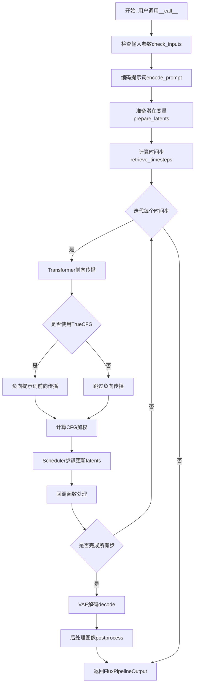

## 类结构

```
DiffusionPipeline (基类)
├── FluxLoraLoaderMixin
├── FromSingleFileMixin
├── TextualInversionLoaderMixin
└── FluxIPAdapterMixin
    └── FluxPipeline
```

## 全局变量及字段


### `XLA_AVAILABLE`
    
XLA是否可用

类型：`bool`
    


### `logger`
    
日志记录器

类型：`Logger`
    


### `EXAMPLE_DOC_STRING`
    
示例文档字符串

类型：`str`
    


### `FluxPipeline.model_cpu_offload_seq`
    
模型卸载顺序

类型：`str`
    


### `FluxPipeline._optional_components`
    
可选组件列表

类型：`list`
    


### `FluxPipeline._callback_tensor_inputs`
    
回调张量输入列表

类型：`list`
    


### `FluxPipeline.vae`
    
VAE模型

类型：`AutoencoderKL`
    


### `FluxPipeline.text_encoder`
    
CLIP文本编码器

类型：`CLIPTextModel`
    


### `FluxPipeline.text_encoder_2`
    
T5文本编码器

类型：`T5EncoderModel`
    


### `FluxPipeline.tokenizer`
    
CLIP分词器

类型：`CLIPTokenizer`
    


### `FluxPipeline.tokenizer_2`
    
T5分词器

类型：`T5TokenizerFast`
    


### `FluxPipeline.transformer`
    
Transformer去噪模型

类型：`FluxTransformer2DModel`
    


### `FluxPipeline.scheduler`
    
调度器

类型：`FlowMatchEulerDiscreteScheduler`
    


### `FluxPipeline.image_encoder`
    
图像编码器

类型：`CLIPVisionModelWithProjection`
    


### `FluxPipeline.feature_extractor`
    
特征提取器

类型：`CLIPImageProcessor`
    


### `FluxPipeline.vae_scale_factor`
    
VAE缩放因子

类型：`int`
    


### `FluxPipeline.image_processor`
    
图像处理器

类型：`VaeImageProcessor`
    


### `FluxPipeline.tokenizer_max_length`
    
分词器最大长度

类型：`int`
    


### `FluxPipeline.default_sample_size`
    
默认采样尺寸

类型：`int`
    
    

## 全局函数及方法


### `calculate_shift`

该函数通过线性插值方法，根据图像序列长度动态计算噪声调度的偏移量参数，用于适配不同分辨率图像的去噪过程。

参数：

- `image_seq_len`：`int`，输入的图像序列长度，决定了最终偏移量的输入值
- `base_seq_len`：`int = 256`，基准序列长度，默认为256，用于线性方程的起点
- `max_seq_len`：`int = 4096`，最大序列长度，用于线性方程的终点
- `base_shift`：`float = 0.5`，基准偏移量，对应基准序列长度时的偏移值
- `max_shift`：`float = 1.15`，最大偏移量，对应最大序列长度时的偏移值

返回值：`float`，计算得到的偏移量 mu，用于后续噪声调度器的参数设置

#### 流程图

```mermaid
flowchart TD
    A[开始] --> B[计算斜率 m]
    B --> C[计算截距 b]
    C --> D[计算偏移量 mu]
    D --> E[返回 mu]
    
    B --> B1[公式: m = (max_shift - base_shift) / (max_seq_len - base_seq_len)]
    C --> C1[公式: b = base_shift - m * base_seq_len]
    D --> D1[公式: mu = image_seq_len * m + b]
```

#### 带注释源码

```python
def calculate_shift(
    image_seq_len,          # 输入：图像序列长度
    base_seq_len: int = 256,    # 基准序列长度，默认256
    max_seq_len: int = 4096,    # 最大序列长度，默认4096
    base_shift: float = 0.5,   # 基准偏移量，默认0.5
    max_shift: float = 1.15,   # 最大偏移量，默认1.15
):
    """
    计算噪声调度的偏移量参数。
    
    通过线性插值方法，根据图像序列长度动态计算偏移量。
    该偏移量用于调整Flow Match调度器的噪声采样策略，
    以适配不同分辨率图像的去噪过程。
    
    参数:
        image_seq_len: 图像序列长度，通常等于latents的序列维度
        base_seq_len: 基准序列长度，对应基础分辨率
        max_seq_len: 最大序列长度，对应高分辨率
        base_shift: 基准偏移量
        max_shift: 最大偏移量
    
    返回:
        计算得到的偏移量mu
    """
    # 计算线性方程的斜率 m
    # 斜率 = (最大偏移量 - 基准偏移量) / (最大序列长度 - 基准序列长度)
    m = (max_shift - base_shift) / (max_seq_len - base_seq_len)
    
    # 计算线性方程的截距 b
    # 截距 = 基准偏移量 - 斜率 * 基准序列长度
    b = base_shift - m * base_seq_len
    
    # 计算最终的偏移量 mu
    # mu = 图像序列长度 * 斜率 + 截距
    mu = image_seq_len * m + b
    
    # 返回计算得到的偏移量
    return mu
```


### `retrieve_timesteps`

该函数是 FluxPipeline 中的辅助函数，用于调用调度器的 `set_timesteps` 方法并从中获取时间步时间表。它支持自定义时间步（timesteps）或自定义 sigmas，并处理不同调度器的兼容性检查。

参数：

- `scheduler`：`SchedulerMixin`，要获取时间步的调度器对象
- `num_inference_steps`：`int | None`，生成样本时使用的扩散步数，如果使用此参数则 `timesteps` 必须为 `None`
- `device`：`str | torch.device | None`，时间步要移动到的设备，如果为 `None` 则不移动
- `timesteps`：`list[int] | None`，用于覆盖调度器时间步间隔策略的自定义时间步，如果传递了此参数则 `num_inference_steps` 和 `sigmas` 必须为 `None`
- `sigmas`：`list[float] | None`，用于覆盖调度器时间步间隔策略的自定义 sigmas，如果传递了此参数则 `num_inference_steps` 和 `timesteps` 必须为 `None`
- `**kwargs`：任意其他关键字参数，将传递给 `scheduler.set_timesteps`

返回值：`tuple[torch.Tensor, int]`，元组中第一个元素是调度器的时间步时间表，第二个元素是推理步数

#### 流程图

```mermaid
flowchart TD
    A[开始] --> B{检查 timesteps 和 sigmas 是否同时存在}
    B -->|是| C[抛出 ValueError: 只能选择一个]
    B -->|否| D{是否提供 timesteps?}
    D -->|是| E[检查调度器是否支持 timesteps]
    E -->|不支持| F[抛出 ValueError]
    E -->|支持| G[调用 scheduler.set_timesteps<br/>参数: timesteps=timesteps, device=device]
    G --> H[获取 scheduler.timesteps]
    H --> I[计算 num_inference_steps = len(timesteps)]
    D -->|否| J{是否提供 sigmas?}
    J -->|是| K[检查调度器是否支持 sigmas]
    K -->|不支持| L[抛出 ValueError]
    K -->|支持| M[调用 scheduler.set_timesteps<br/>参数: sigmas=sigmas, device=device]
    M --> N[获取 scheduler.timesteps]
    N --> O[计算 num_inference_steps = len(timesteps)]
    J -->|否| P[调用 scheduler.set_timesteps<br/>参数: num_inference_steps, device=device]
    P --> Q[获取 scheduler.timesteps]
    Q --> R[返回 (timesteps, num_inference_steps)]
    I --> R
    O --> R
```

#### 带注释源码

```python
# Copied from diffusers.pipelines.stable_diffusion.pipeline_stable_diffusion.retrieve_timesteps
def retrieve_timesteps(
    scheduler,
    num_inference_steps: int | None = None,
    device: str | torch.device | None = None,
    timesteps: list[int] | None = None,
    sigmas: list[float] | None = None,
    **kwargs,
):
    r"""
    Calls the scheduler's `set_timesteps` method and retrieves timesteps from the scheduler after the call. Handles
    custom timesteps. Any kwargs will be supplied to `scheduler.set_timesteps`.

    Args:
        scheduler (`SchedulerMixin`):
            The scheduler to get timesteps from.
        num_inference_steps (`int`):
            The number of diffusion steps used when generating samples with a pre-trained model. If used, `timesteps`
            must be `None`.
        device (`str` or `torch.device`, *optional*):
            The device to which the timesteps should be moved to. If `None`, the timesteps are not moved.
        timesteps (`list[int]`, *optional*):
            Custom timesteps used to override the timestep spacing strategy of the scheduler. If `timesteps` is passed,
            `num_inference_steps` and `sigmas` must be `None`.
        sigmas (`list[float]`, *optional*):
            Custom sigmas used to override the timestep spacing strategy of the scheduler. If `sigmas` is passed,
            `num_inference_steps` and `timesteps` must be `None`.

    Returns:
        `tuple[torch.Tensor, int]`: A tuple where the first element is the timestep schedule from the scheduler and the
        second element is the number of inference steps.
    """
    # 校验：timesteps 和 sigmas 不能同时传递
    if timesteps is not None and sigmas is not None:
        raise ValueError("Only one of `timesteps` or `sigmas` can be passed. Please choose one to set custom values")
    
    # 处理自定义 timesteps 的情况
    if timesteps is not None:
        # 通过 inspect 检查调度器的 set_timesteps 方法是否支持 timesteps 参数
        accepts_timesteps = "timesteps" in set(inspect.signature(scheduler.set_timesteps).parameters.keys())
        if not accepts_timesteps:
            raise ValueError(
                f"The current scheduler class {scheduler.__class__}'s `set_timesteps` does not support custom"
                f" timestep schedules. Please check whether you are using the correct scheduler."
            )
        # 调用调度器的 set_timesteps 方法，传递自定义 timesteps
        scheduler.set_timesteps(timesteps=timesteps, device=device, **kwargs)
        # 从调度器获取更新后的 timesteps
        timesteps = scheduler.timesteps
        # 计算推理步数
        num_inference_steps = len(timesteps)
    # 处理自定义 sigmas 的情况
    elif sigmas is not None:
        # 通过 inspect 检查调度器的 set_timesteps 方法是否支持 sigmas 参数
        accept_sigmas = "sigmas" in set(inspect.signature(scheduler.set_timesteps).parameters.keys())
        if not accept_sigmas:
            raise ValueError(
                f"The current scheduler class {scheduler.__class__}'s `set_timesteps` does not support custom"
                f" sigmas schedules. Please check whether you are using the correct scheduler."
            )
        # 调用调度器的 set_timesteps 方法，传递自定义 sigmas
        scheduler.set_timesteps(sigmas=sigmas, device=device, **kwargs)
        # 从调度器获取更新后的 timesteps
        timesteps = scheduler.timesteps
        # 计算推理步数
        num_inference_steps = len(timesteps)
    # 默认情况：使用 num_inference_steps 设置时间步
    else:
        scheduler.set_timesteps(num_inference_steps, device=device, **kwargs)
        timesteps = scheduler.timesteps
    
    # 返回 timesteps 和 num_inference_steps 的元组
    return timesteps, num_inference_steps
```


### FluxPipeline.__init__

该方法是 FluxPipeline 类的构造函数，用于初始化 Flux 文本到图像生成管道。它接收所有必需的模型组件（调度器、VAE、文本编码器、分词器、Transformer 等）并注册它们，同时配置图像处理器和分词器参数。

参数：

- `scheduler`：`FlowMatchEulerDiscreteScheduler`，用于去噪图像潜在表示的调度器
- `vae`：`AutoencoderKL`，用于将图像编码和解码到潜在表示的变分自编码器模型
- `text_encoder`：`CLIPTextModel`，CLIP 文本编码器模型，用于生成文本嵌入
- `tokenizer`：`CLIPTokenizer`，CLIP 分词器，用于将文本转换为 token
- `text_encoder_2`：`T5EncoderModel`，T5 文本编码器模型，用于生成长文本的嵌入
- `tokenizer_2`：`T5TokenizerFast`，T5 快速分词器
- `transformer`：`FluxTransformer2DModel`，条件 Transformer (MMDiT) 架构，用于去噪编码后的图像潜在表示
- `image_encoder`：`CLIPVisionModelWithProjection`（可选），CLIP 视觉模型，用于 IP-Adapter 图像编码
- `feature_extractor`：`CLIPImageProcessor`（可选），CLIP 图像处理器，用于预处理图像

返回值：无（`None`），构造函数不返回值，仅初始化实例属性

#### 流程图

```mermaid
flowchart TD
    A[开始 __init__] --> B[调用 super().__init__]
    B --> C[register_modules: 注册所有模型组件]
    C --> D{self.vae 是否存在}
    D -->|是| E[计算 vae_scale_factor = 2^(len(vae.config.block_out_channels) - 1)]
    D -->|否| F[vae_scale_factor = 8]
    E --> G[创建 VaeImageProcessor]
    F --> G
    G --> H[设置 tokenizer_max_length]
    H --> I[设置 default_sample_size = 128]
    I --> J[结束 __init__]
```

#### 带注释源码

```python
def __init__(
    self,
    scheduler: FlowMatchEulerDiscreteScheduler,
    vae: AutoencoderKL,
    text_encoder: CLIPTextModel,
    tokenizer: CLIPTokenizer,
    text_encoder_2: T5EncoderModel,
    tokenizer_2: T5TokenizerFast,
    transformer: FluxTransformer2DModel,
    image_encoder: CLIPVisionModelWithProjection = None,
    feature_extractor: CLIPImageProcessor = None,
):
    """
    初始化 FluxPipeline 实例
    
    参数:
        scheduler: FlowMatchEulerDiscreteScheduler 调度器
        vae: AutoencoderKL VAE 模型
        text_encoder: CLIPTextModel CLIP 文本编码器
        tokenizer: CLIPTokenizer CLIP 分词器
        text_encoder_2: T5EncoderModel T5 文本编码器
        tokenizer_2: T5TokenizerFast T5 快速分词器
        transformer: FluxTransformer2DModel Flux Transformer 模型
        image_encoder: CLIPVisionModelWithProjection 可选的 CLIP 视觉模型
        feature_extractor: CLIPImageProcessor 可选的 CLIP 图像处理器
    """
    # 调用父类 DiffusionPipeline 的初始化方法
    super().__init__()

    # 注册所有模块到管道中，使其可通过管道访问
    self.register_modules(
        vae=vae,
        text_encoder=text_encoder,
        text_encoder_2=text_encoder_2,
        tokenizer=tokenizer,
        tokenizer_2=tokenizer_2,
        transformer=transformer,
        scheduler=scheduler,
        image_encoder=image_encoder,
        feature_extractor=feature_extractor,
    )
    
    # 计算 VAE 缩放因子
    # 基于 VAE 块输出通道数计算，默认为 2^(len(block_out_channels) - 1)
    # 如果 VAE 存在则计算，否则默认为 8
    self.vae_scale_factor = 2 ** (len(self.vae.config.block_out_channels) - 1) if getattr(self, "vae", None) else 8
    
    # Flux 潜在变量被转换为 2x2 补丁并打包
    # 这意味着潜在宽度和高度必须能被补丁大小整除
    # 因此 vae_scale_factor 乘以补丁大小(2)来考虑这一点
    self.image_processor = VaeImageProcessor(vae_scale_factor=self.vae_scale_factor * 2)
    
    # 设置分词器的最大长度，默认值为 77 (CLIP 的标准长度)
    self.tokenizer_max_length = (
        self.tokenizer.model_max_length if hasattr(self, "tokenizer") and self.tokenizer is not None else 77
    )
    
    # 设置默认采样大小为 128
    self.default_sample_size = 128
```


### `FluxPipeline._get_t5_prompt_embeds`

该方法用于将文本提示（prompt）转换为 T5 文本编码器的嵌入向量（embeddings），支持批量生成多张图像，并处理文本截断警告和嵌入的设备/dtype 转换。

参数：

- `prompt`：`str | list[str]`，待编码的文本提示，支持单字符串或字符串列表
- `num_images_per_prompt`：`int`，每个提示生成的图像数量，默认为 1
- `max_sequence_length`：`int`，最大序列长度，默认为 512
- `device`：`torch.device | None`，指定计算设备，默认为 `self._execution_device`
- `dtype`：`torch.dtype | None`，指定数据类型，默认为 `self.text_encoder.dtype`

返回值：`torch.Tensor`，形状为 `(batch_size * num_images_per_prompt, seq_len, hidden_size)` 的文本嵌入张量

#### 流程图

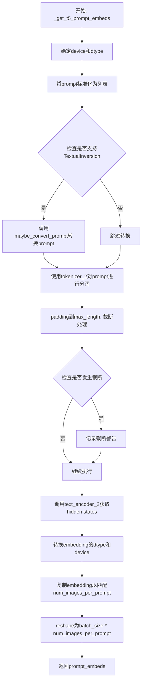

#### 带注释源码

```python
def _get_t5_prompt_embeds(
    self,
    prompt: str | list[str] = None,
    num_images_per_prompt: int = 1,
    max_sequence_length: int = 512,
    device: torch.device | None = None,
    dtype: torch.dtype | None = None,
):
    """
    将文本提示编码为T5文本编码器的嵌入向量
    
    参数:
        prompt: 要编码的文本提示，字符串或字符串列表
        num_images_per_prompt: 每个提示生成的图像数量
        max_sequence_length: T5编码器的最大序列长度
        device: 计算设备
        dtype: 数据类型
    
    返回:
        形状为 (batch_size * num_images_per_prompt, seq_len, hidden_dim) 的嵌入张量
    """
    # 确定设备和dtype，优先使用传入的值，否则使用pipeline的默认值
    device = device or self._execution_device
    dtype = dtype or self.text_encoder.dtype

    # 标准化输入：将字符串转换为列表，统一处理流程
    prompt = [prompt] if isinstance(prompt, str) else prompt
    batch_size = len(prompt)

    # 如果pipeline支持TextualInversion，尝试转换prompt中的嵌入
    if isinstance(self, TextualInversionLoaderMixin):
        prompt = self.maybe_convert_prompt(prompt, self.tokenizer_2)

    # 使用T5 tokenizer对prompt进行分词
    # padding="max_length": 填充到最大长度
    # truncation=True: 超过max_length的序列进行截断
    # return_tensors="pt": 返回PyTorch张量
    text_inputs = self.tokenizer_2(
        prompt,
        padding="max_length",
        max_length=max_sequence_length,
        truncation=True,
        return_length=False,
        return_overflowing_tokens=False,
        return_tensors="pt",
    )
    text_input_ids = text_inputs.input_ids
    
    # 获取未截断的token ids用于比较
    untruncated_ids = self.tokenizer_2(prompt, padding="longest", return_tensors="pt").input_ids

    # 检查输入是否被截断，如果是则记录警告信息
    if untruncated_ids.shape[-1] >= text_input_ids.shape[-1] and not torch.equal(text_input_ids, untruncated_ids):
        # 解码被截断的部分用于日志
        removed_text = self.tokenizer_2.batch_decode(untruncated_ids[:, self.tokenizer_max_length - 1 : -1])
        logger.warning(
            "The following part of your input was truncated because `max_sequence_length` is set to "
            f" {max_sequence_length} tokens: {removed_text}"
        )

    # 使用T5文本编码器获取文本嵌入
    # output_hidden_states=False: 只获取最后一层的输出
    prompt_embeds = self.text_encoder_2(text_input_ids.to(device), output_hidden_states=False)[0]

    # 确保embedding使用正确的dtype和device
    dtype = self.text_encoder_2.dtype
    prompt_embeds = prompt_embeds.to(dtype=dtype, device=device)

    # 获取序列维度信息
    _, seq_len, _ = prompt_embeds.shape

    # 为每个prompt复制num_images_per_prompt份embeddings
    # 使用repeat和view方法以兼容MPS设备
    prompt_embeds = prompt_embeds.repeat(1, num_images_per_prompt, 1)
    prompt_embeds = prompt_embeds.view(batch_size * num_images_per_prompt, seq_len, -1)

    return prompt_embeds
```


### `FluxPipeline._get_clip_prompt_embeds`

该方法负责将文本提示（prompt）转换为CLIP文本编码器（CLIPTextModel）的嵌入向量（embeddings），主要用于FLUX图像生成Pipeline中获取池化后的提示嵌入。

参数：

- `prompt`：`str | list[str]`，用户输入的文本提示，可以是单个字符串或字符串列表
- `num_images_per_prompt`：`int`，每个提示要生成的图像数量，默认为1
- `device`：`torch.device | None`，计算设备，默认为None（自动获取执行设备）

返回值：`torch.Tensor`，形状为 `(batch_size * num_images_per_prompt, hidden_size)` 的浮点张量，表示池化后的CLIP文本嵌入

#### 流程图

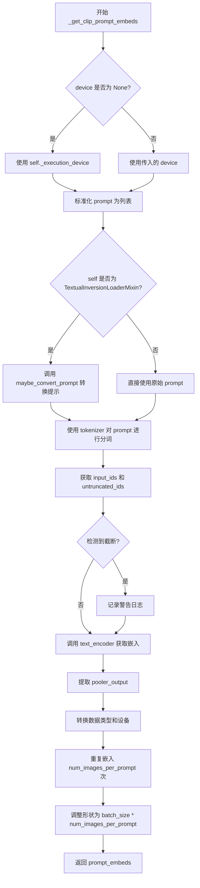

#### 带注释源码

```python
def _get_clip_prompt_embeds(
    self,
    prompt: str | list[str],
    num_images_per_prompt: int = 1,
    device: torch.device | None = None,
):
    """
    将文本提示转换为CLIP文本编码器的池化嵌入向量
    
    参数:
        prompt: 文本提示，字符串或字符串列表
        num_images_per_prompt: 每个提示生成的图像数量
        device: 目标计算设备
    返回:
        池化后的文本嵌入张量
    """
    # 如果未指定设备，则使用管道默认执行设备
    device = device or self._execution_device

    # 标准化输入：将单个字符串转换为列表，便于批量处理
    prompt = [prompt] if isinstance(prompt, str) else prompt
    batch_size = len(prompt)

    # 如果混合了TextualInversionLoaderMixin，则进行提示转换
    # 这支持文本反转（Textual Inversion）嵌入技术
    if isinstance(self, TextualInversionLoaderMixin):
        prompt = self.maybe_convert_prompt(prompt, self.tokenizer)

    # 使用CLIP Tokenizer对提示进行分词
    # padding="max_length" 确保所有序列长度统一
    # truncation=True 截断超过最大长度的序列
    text_inputs = self.tokenizer(
        prompt,
        padding="max_length",
        max_length=self.tokenizer_max_length,
        truncation=True,
        return_overflowing_tokens=False,
        return_length=False,
        return_tensors="pt",
    )

    # 获取分词后的输入ID
    text_input_ids = text_inputs.input_ids
    
    # 获取未截断的序列，用于检测是否发生了截断
    untruncated_ids = self.tokenizer(prompt, padding="longest", return_tensors="pt").input_ids
    
    # 检测截断情况并记录警告
    # CLIP模型有最大序列长度限制（通常为77 tokens）
    if untruncated_ids.shape[-1] >= text_input_ids.shape[-1] and not torch.equal(text_input_ids, untruncated_ids):
        removed_text = self.tokenizer.batch_decode(untruncated_ids[:, self.tokenizer_max_length - 1 : -1])
        logger.warning(
            "The following part of your input was truncated because CLIP can only handle sequences up to"
            f" {self.tokenizer_max_length} tokens: {removed_text}"
        )
    
    # 调用CLIP文本编码器获取文本嵌入
    # output_hidden_states=False 只返回最后的隐藏状态
    prompt_embeds = self.text_encoder(text_input_ids.to(device), output_hidden_states=False)

    # 提取池化输出（pooled output）
    # 这是CLIPTextModel的池化表示，用于表示整个序列的语义
    prompt_embeds = prompt_embeds.pooler_output
    
    # 转换数据类型和设备，确保与text_encoder一致
    prompt_embeds = prompt_embeds.to(dtype=self.text_encoder.dtype, device=device)

    # 复制文本嵌入以匹配每个提示的生成数量
    # 这种方法与MPS（Apple Silicon）兼容
    prompt_embeds = prompt_embeds.repeat(1, num_images_per_prompt)
    
    # 调整形状：[batch_size, hidden_size] -> [batch_size * num_images_per_prompt, hidden_size]
    prompt_embeds = prompt_embeds.view(batch_size * num_images_per_prompt, -1)

    return prompt_embeds
```


### `FluxPipeline.encode_prompt`

该方法负责将文本提示（prompt）编码为 transformer 模型可用的文本嵌入向量。它同时使用 CLIP 和 T5 两种文本编码器生成不同类型的嵌入：CLIP 生成池化嵌入（pooled prompt embeds），T5 生成完整的序列嵌入（prompt embeds），并创建对应的文本 ID 张量用于后续的交叉注意力计算。

参数：

- `prompt`：`str | list[str]`，要编码的提示文本，可以是单个字符串或字符串列表
- `prompt_2`：`str | list[str] | None`，要发送给 `tokenizer_2` 和 `text_encoder_2` 的提示文本，若未定义则使用 `prompt`
- `device`：`torch.device | None`，torch 设备，若未提供则使用执行设备
- `num_images_per_prompt`：`int`，每个提示要生成的图像数量，默认为 1
- `prompt_embeds`：`torch.FloatTensor | None`，预生成的文本嵌入，可用于轻松调整文本输入（如 prompt weighting）
- `pooled_prompt_embeds`：`torch.FloatTensor | None`，预生成的池化文本嵌入
- `max_sequence_length`：`int`，最大序列长度，默认为 512
- `lora_scale`：`float | None`，要应用于所有 LoRA 层的缩放因子

返回值：`tuple[torch.Tensor, torch.Tensor, torch.Tensor]`，返回包含三个元素的元组：
- `prompt_embeds`：`torch.FloatTensor`，T5 编码器生成的文本嵌入
- `pooled_prompt_embeds`：`torch.FloatTensor`，CLIP 编码器生成的池化文本嵌入
- `text_ids`：`torch.Tensor`，形状为 (seq_len, 3) 的文本 ID 张量，用于 transformer 的交叉注意力

#### 流程图

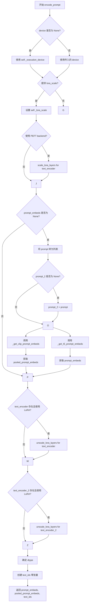

#### 带注释源码

```python
def encode_prompt(
    self,
    prompt: str | list[str],
    prompt_2: str | list[str] | None = None,
    device: torch.device | None = None,
    num_images_per_prompt: int = 1,
    prompt_embeds: torch.FloatTensor | None = None,
    pooled_prompt_embeds: torch.FloatTensor | None = None,
    max_sequence_length: int = 512,
    lora_scale: float | None = None,
):
    r"""
    Encodes the prompt into text embeddings for the Flux pipeline.

    This method uses both CLIP and T5 text encoders to generate embeddings:
    - CLIP: generates pooled prompt embeddings (pooled_prompt_embeds)
    - T5: generates full sequence embeddings (prompt_embeds)

    Args:
        prompt: The prompt to be encoded
        prompt_2: The prompt for tokenizer_2 and text_encoder_2
        device: torch device
        num_images_per_prompt: number of images to generate per prompt
        prompt_embeds: Pre-generated text embeddings
        pooled_prompt_embeds: Pre-generated pooled text embeddings
        max_sequence_length: Maximum sequence length (default 512)
        lora_scale: LoRA scale to apply to text encoder layers

    Returns:
        tuple: (prompt_embeds, pooled_prompt_embeds, text_ids)
    """
    # 确定设备，如果未提供则使用执行设备
    device = device or self._execution_device

    # 如果提供了 lora_scale，设置 LoRA 缩放因子
    # 这允许 text encoder 的 LoRA 函数正确访问该值
    if lora_scale is not None and isinstance(self, FluxLoraLoaderMixin):
        self._lora_scale = lora_scale

        # 动态调整 LoRA 缩放因子
        if self.text_encoder is not None and USE_PEFT_BACKEND:
            scale_lora_layers(self.text_encoder, lora_scale)
        if self.text_encoder_2 is not None and USE_PEFT_BACKEND:
            scale_lora_layers(self.text_encoder_2, lora_scale)

    # 将 prompt 转换为列表以便批量处理
    prompt = [prompt] if isinstance(prompt, str) else prompt

    # 如果未提供预计算的 embeddings，则从 prompt 生成
    if prompt_embeds is None:
        # 如果未提供 prompt_2，则使用 prompt
        prompt_2 = prompt_2 or prompt
        # 将 prompt_2 转换为列表
        prompt_2 = [prompt_2] if isinstance(prompt_2, str) else prompt_2

        # 只使用 CLIPTextModel 的池化输出
        pooled_prompt_embeds = self._get_clip_prompt_embeds(
            prompt=prompt,
            device=device,
            num_images_per_prompt=num_images_per_prompt,
        )
        # 使用 T5 获取完整的文本嵌入
        prompt_embeds = self._get_t5_prompt_embeds(
            prompt=prompt_2,
            num_images_per_prompt=num_images_per_prompt,
            max_sequence_length=max_sequence_length,
            device=device,
        )

    # 编码完成后，恢复 LoRA 层的原始缩放因子
    if self.text_encoder is not None:
        if isinstance(self, FluxLoraLoaderMixin) and USE_PEFT_BACKEND:
            # 通过取消缩放 LoRA 层来恢复原始缩放因子
            unscale_lora_layers(self.text_encoder, lora_scale)

    if self.text_encoder_2 is not None:
        if isinstance(self, FluxLoraLoaderMixin) and USE_PEFT_BACKEND:
            # 通过取消缩放 LoRA 层来恢复原始缩放因子
            unscale_lora_layers(self.text_encoder_2, lora_scale)

    # 确定数据类型，使用 text_encoder 的 dtype，如果不存在则使用 transformer 的 dtype
    dtype = self.text_encoder.dtype if self.text_encoder is not None else self.transformer.dtype
    
    # 创建文本 ID 张量，形状为 (seq_len, 3)，用于 transformer 的交叉注意力
    # 3 代表 x, y, z 坐标（或时间步等维度）
    text_ids = torch.zeros(prompt_embeds.shape[1], 3).to(device=device, dtype=dtype)

    # 返回：T5 文本嵌入、CLIP 池化嵌入、文本 ID
    return prompt_embeds, pooled_prompt_embeds, text_ids
```


### `FluxPipeline.encode_image`

该方法负责将输入图像编码为图像嵌入向量（image embeddings），供 IP-Adapter 使用。它首先检查图像是否为 PyTorch Tensor，如果不是则使用特征提取器进行预处理，然后通过图像编码器生成嵌入，最后根据每个 prompt 生成的图像数量对嵌入进行复制。

参数：

- `image`：`PipelineImageInput | torch.Tensor`，输入图像，可以是 PIL Image、numpy 数组或已处理的 torch.Tensor
- `device`：`torch.device`，图像数据要移到的目标设备
- `num_images_per_prompt`：`int`，每个 prompt 生成的图像数量，用于复制嵌入向量

返回值：`torch.FloatTensor`，编码后的图像嵌入向量，形状为 `(batch_size * num_images_per_prompt, embedding_dim)`

#### 流程图

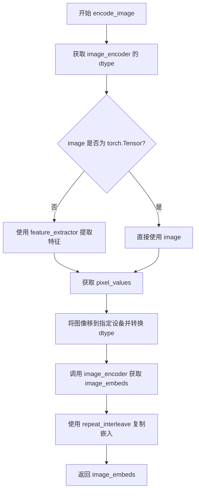

#### 带注释源码

```python
def encode_image(self, image, device, num_images_per_prompt):
    """
    将输入图像编码为图像嵌入向量，供 IP-Adapter 使用。
    
    Args:
        image: 输入图像，支持多种格式
        device: 目标设备
        num_images_per_prompt: 每个 prompt 生成的图像数量
    """
    # 获取图像编码器的参数数据类型，用于保持数据类型一致性
    dtype = next(self.image_encoder.parameters()).dtype

    # 如果输入不是 PyTorch Tensor，则使用特征提取器进行预处理
    # feature_extractor 会将 PIL Image 或 numpy 数组转换为 tensor
    if not isinstance(image, torch.Tensor):
        image = self.feature_extractor(image, return_tensors="pt").pixel_values

    # 将图像数据移至目标设备，并转换为正确的 dtype
    image = image.to(device=device, dtype=dtype)
    
    # 通过图像编码器获取图像嵌入向量
    # CLIPVisionModelWithProjection 输出包含 image_embeds 属性
    image_embeds = self.image_encoder(image).image_embeds
    
    # 根据每个 prompt 生成的图像数量复制嵌入向量
    # repeat_interleave 在指定维度上重复张量
    image_embeds = image_embeds.repeat_interleave(num_images_per_prompt, dim=0)
    
    return image_embeds
```


### `FluxPipeline.prepare_ip_adapter_image_embeds`

该方法用于准备IP-Adapter的图像嵌入向量。它支持两种输入模式：当未提供预计算的图像嵌入时，使用图像编码器将输入图像转换为嵌入向量；当已提供预计算的嵌入时，直接使用这些嵌入。最终会对每个嵌入进行复制以匹配批量生成的图像数量，并确保所有数据在同一设备上。

参数：

- `self`：`FluxPipeline` 实例本身，Pipeline对象
- `ip_adapter_image`：原始图像输入，可以是单张图像或图像列表，用于从图像生成嵌入
- `ip_adapter_image_embeds`：预计算的图像嵌入向量列表，如果为None则从ip_adapter_image生成
- `device`：目标设备（torch.device），指定计算应执行的设备
- `num_images_per_prompt`：每个提示词生成的图像数量，用于复制嵌入以匹配批量大小

返回值：`list[torch.Tensor]`，返回处理后的IP-Adapter图像嵌入列表，每个元素是一个形状为(batch_size * num_images_per_prompt, emb_dim)的张量

#### 流程图

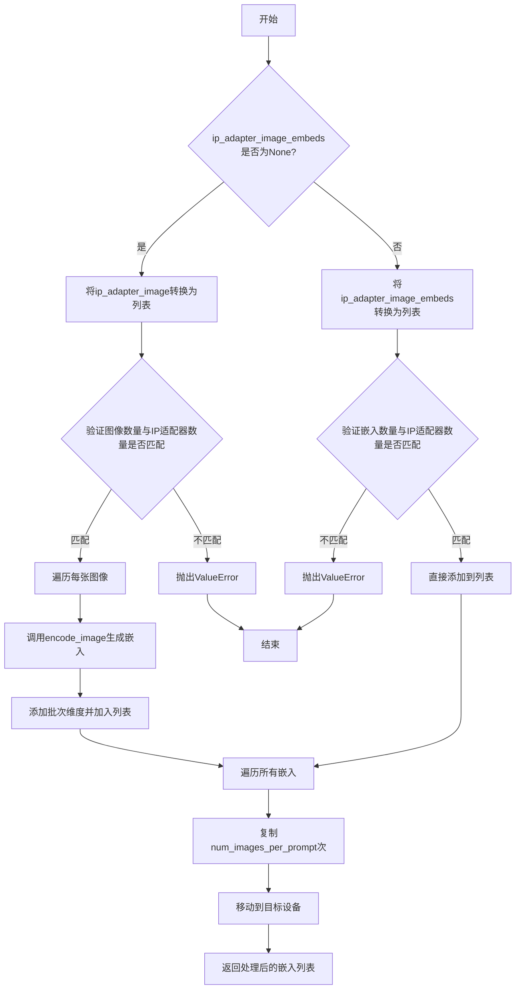

#### 带注释源码

```python
def prepare_ip_adapter_image_embeds(
    self, ip_adapter_image, ip_adapter_image_embeds, device, num_images_per_prompt
):
    """
    准备IP-Adapter的图像嵌入向量
    
    该方法处理两种情况：
    1. 提供了原始图像，需要使用image_encoder编码为嵌入向量
    2. 直接提供了预计算的嵌入向量
    
    参数:
        ip_adapter_image: 原始图像输入，支持单张或列表
        ip_adapter_image_embeds: 预计算的嵌入，可选
        device: 目标计算设备
        num_images_per_prompt: 每个prompt生成的图像数量
    
    返回:
        处理后的嵌入列表，每个元素已复制并转移到目标设备
    """
    # 初始化存储嵌入的列表
    image_embeds = []
    
    # 分支1：需要从图像编码生成嵌入
    if ip_adapter_image_embeds is None:
        # 确保输入是列表格式，便于统一处理
        if not isinstance(ip_adapter_image, list):
            ip_adapter_image = [ip_adapter_image]

        # 验证：图像数量必须等于IP适配器数量
        if len(ip_adapter_image) != self.transformer.encoder_hid_proj.num_ip_adapters:
            raise ValueError(
                f"`ip_adapter_image` must have same length as the number of IP Adapters. "
                f"Got {len(ip_adapter_image)} images and "
                f"{self.transformer.encoder_hid_proj.num_ip_adapters} IP Adapters."
            )

        # 遍历每张图像，分别编码
        for single_ip_adapter_image in ip_adapter_image:
            # 调用encode_image方法将图像转换为嵌入向量
            # 参数1表示每张图像生成1个嵌入（在复制之前）
            single_image_embeds = self.encode_image(single_ip_adapter_image, device, 1)
            # 添加批次维度 [1, emb_dim]，便于后续拼接
            image_embeds.append(single_image_embeds[None, :])
    
    # 分支2：直接使用预计算的嵌入向量
    else:
        # 确保嵌入也是列表格式
        if not isinstance(ip_adapter_image_embeds, list):
            ip_adapter_image_embeds = [ip_adapter_image_embeds]

        # 验证：嵌入数量必须等于IP适配器数量
        if len(ip_adapter_image_embeds) != self.transformer.encoder_hid_proj.num_images_per_prompt:
            raise ValueError(
                f"`ip_adapter_image_embeds` must have same length as the number of IP Adapters. "
                f"Got {len(ip_adapter_image_embeds)} image embeds and "
                f"{self.transformer.encoder_hid_proj.num_ip_adapters} IP Adapters."
            )

        # 直接将预计算的嵌入添加到列表
        for single_image_embeds in ip_adapter_image_embeds:
            image_embeds.append(single_image_embeds)

    # 处理嵌入：复制num_images_per_prompt次并转移到目标设备
    ip_adapter_image_embeds = []
    for single_image_embeds in image_embeds:
        # 在批次维度复制，以匹配批量生成的图像数量
        # 例如：如果num_images_per_prompt=2，则复制为[2, emb_dim]
        single_image_embeds = torch.cat([single_image_embeds] * num_images_per_prompt, dim=0)
        # 将嵌入移动到指定的计算设备
        single_image_embeds = single_image_embeds.to(device=device)
        # 添加到最终输出列表
        ip_adapter_image_embeds.append(single_image_embeds)

    # 返回处理完成的嵌入列表
    return ip_adapter_image_embeds
```


### `FluxPipeline.check_inputs`

该方法负责验证 FluxPipeline 在执行图像生成之前的所有输入参数是否合法有效，包括检查 prompt 与 prompt_embeds 的互斥关系、图像尺寸对齐要求、回调张量合法性以及序列长度限制等，确保输入参数的一致性和完整性，避免在后续推理过程中因参数错误导致运行时异常。

参数：

- `self`：`FluxPipeline` 实例本身
- `prompt`：`str | list[str] | None`，主提示词，用于指导图像生成
- `prompt_2`：`str | list[str] | None`，发送给第二个文本编码器（tokenizer_2 和 text_encoder_2）的提示词
- `height`：`int`，生成的图像高度（像素）
- `width`：`int`，生成的图像宽度（像素）
- `negative_prompt`：`str | list[str] | None`，负面提示词，用于指导图像生成时避免的内容
- `negative_prompt_2`：`str | list[str] | None`，发送给第二个文本编码器的负面提示词
- `prompt_embeds`：`torch.FloatTensor | None`，预生成的主提示词嵌入向量
- `negative_prompt_embeds`：`torch.FloatTensor | None`，预生成的负面提示词嵌入向量
- `pooled_prompt_embeds`：`torch.FloatTensor | None`，预生成的主提示词池化嵌入向量
- `negative_pooled_prompt_embeds`：`torch.FloatTensor | None`，预生成的负面提示词池化嵌入向量
- `callback_on_step_end_tensor_inputs`：`list[str] | None`，在推理步骤结束时回调的张量输入列表
- `max_sequence_length`：`int | None`，T5 文本编码器使用的最大序列长度

返回值：`None`，该方法不返回任何值，仅通过抛出 `ValueError` 异常来处理无效输入，或通过 `logger.warning` 发出警告。

#### 流程图

```mermaid
flowchart TD
    A[开始 check_inputs] --> B{检查 height 和 width 是否可被 vae_scale_factor * 2 整除}
    B -->|否| C[输出警告信息并继续]
    B -->|是| D{检查 callback_on_step_end_tensor_inputs 是否合法}
    C --> D
    D -->|否| E[抛出 ValueError 异常]
    D -->|是| F{prompt 和 prompt_embeds 是否同时存在}
    F -->|是| G[抛出 ValueError 异常]
    F -->|否| H{prompt_2 和 prompt_embeds 是否同时存在]
    H -->|是| I[抛出 ValueError 异常]
    H -->|否| J{prompt 和 prompt_embeds 是否都未定义}
    J -->|是| K[抛出 ValueError 异常]
    J -->|否| L{prompt 类型是否合法]
    L -->|否| M[抛出 ValueError 异常]
    L -->|是| N{prompt_2 类型是否合法}
    N -->|否| O[抛出 ValueError 异常]
    N -->|是| P{negative_prompt 和 negative_prompt_embeds 是否同时存在}
    P -->|是| Q[抛出 ValueError 异常]
    P -->|否| R{negative_prompt_2 和 negative_prompt_embeds 是否同时存在}
    R -->|是| S[抛出 ValueError 异常]
    R -->|否| T{prompt_embeds 是否存在但 pooled_prompt_embeds 为 None}
    T -->|是| U[抛出 ValueError 异常]
    T -->|否| V{negative_prompt_embeds 是否存在但 negative_pooled_prompt_embeds 为 None}
    V -->|是| W[抛出 ValueError 异常]
    V -->|否| X{max_sequence_length 是否大于 512}
    X -->|是| Y[抛出 ValueError 异常]
    X -->|否| Z[验证通过，方法结束]
    
    E --> Z
    G --> Z
    I --> Z
    K --> Z
    M --> Z
    O --> Z
    Q --> Z
    S --> Z
    U --> Z
    W --> Z
    Y --> Z
```

#### 带注释源码

```python
def check_inputs(
    self,
    prompt,                     # 主提示词 (str 或 list[str] 或 None)
    prompt_2,                   # 第二文本编码器的提示词 (str 或 list[str] 或 None)
    height,                     # 生成图像的高度 (int)
    width,                      # 生成图像的宽度 (int)
    negative_prompt=None,       # 负面提示词 (str 或 list[str] 或 None)
    negative_prompt_2=None,     # 第二文本编码器的负面提示词 (str 或 list[str] 或 None)
    prompt_embeds=None,         # 预生成的提示词嵌入 (torch.FloatTensor 或 None)
    negative_prompt_embeds=None,# 预生成的负面提示词嵌入 (torch.FloatTensor 或 None)
    pooled_prompt_embeds=None, # 预生成的池化提示词嵌入 (torch.FloatTensor 或 None)
    negative_pooled_prompt_embeds=None, # 预生成的池化负面提示词嵌入 (torch.FloatTensor 或 None)
    callback_on_step_end_tensor_inputs=None, # 回调张量输入列表 (list[str] 或 None)
    max_sequence_length=None,   # 最大序列长度 (int 或 None)
):
    # 检查 1: 验证图像高度和宽度是否符合 VAE 缩放因子要求
    # Flux 模型的潜在空间采用 2x2 分块打包，因此高度和宽度必须能被 vae_scale_factor * 2 整除
    if height % (self.vae_scale_factor * 2) != 0 or width % (self.vae_scale_factor * 2) != 0:
        logger.warning(
            f"`height` and `width` have to be divisible by {self.vae_scale_factor * 2} but are {height} and {width}. Dimensions will be resized accordingly"
        )

    # 检查 2: 验证回调张量输入是否在允许的列表中
    # 回调函数只能访问 Pipeline 允许的张量，以防止访问未初始化或敏感的张量
    if callback_on_step_end_tensor_inputs is not None and not all(
        k in self._callback_tensor_inputs for k in callback_on_step_end_tensor_inputs
    ):
        raise ValueError(
            f"`callback_on_step_end_tensor_inputs` has to be in {self._callback_tensor_inputs}, but found {[k for k in callback_on_step_end_tensor_inputs if k not in self._callback_tensor_inputs]}"
        )

    # 检查 3: 验证 prompt 和 prompt_embeds 的互斥关系
    # 不能同时提供原始提示词和预计算的提示词嵌入
    if prompt is not None and prompt_embeds is not None:
        raise ValueError(
            f"Cannot forward both `prompt`: {prompt} and `prompt_embeds`: {prompt_embeds}. Please make sure to"
            " only forward one of the two."
        )
    
    # 检查 4: 验证 prompt_2 和 prompt_embeds 的互斥关系
    elif prompt_2 is not None and prompt_embeds is not None:
        raise ValueError(
            f"Cannot forward both `prompt_2`: {prompt_2} and `prompt_embeds`: {prompt_embeds}. Please make sure to"
            " only forward one of the two."
        )
    
    # 检查 5: 确保至少提供了 prompt 或 prompt_embeds 之一
    # 必须有文本指导才能进行图像生成
    elif prompt is None and prompt_embeds is None:
        raise ValueError(
            "Provide either `prompt` or `prompt_embeds`. Cannot leave both `prompt` and `prompt_embeds` undefined."
        )
    
    # 检查 6: 验证 prompt 的类型合法性
    # prompt 必须是字符串或字符串列表
    elif prompt is not None and (not isinstance(prompt, str) and not isinstance(prompt, list)):
        raise ValueError(f"`prompt` has to be of type `str` or `list` but is {type(prompt)}")
    
    # 检查 7: 验证 prompt_2 的类型合法性
    elif prompt_2 is not None and (not isinstance(prompt_2, str) and not isinstance(prompt_2, list)):
        raise ValueError(f"`prompt_2` has to be of type `str` or `list` but is {type(prompt_2)}")

    # 检查 8: 验证 negative_prompt 和 negative_prompt_embeds 的互斥关系
    if negative_prompt is not None and negative_prompt_embeds is not None:
        raise ValueError(
            f"Cannot forward both `negative_prompt`: {negative_prompt} and `negative_prompt_embeds`:"
            f" {negative_prompt_embeds}. Please make sure to only forward one of the two."
        )
    
    # 检查 9: 验证 negative_prompt_2 和 negative_prompt_embeds 的互斥关系
    elif negative_prompt_2 is not None and negative_prompt_embeds is not None:
        raise ValueError(
            f"Cannot forward both `negative_prompt_2`: {negative_prompt_2} and `negative_prompt_embeds`:"
            f" {negative_prompt_embeds}. Please make sure to only forward one of the two."
        )

    # 检查 10: 验证 prompt_embeds 和 pooled_prompt_embeds 的配对关系
    # 如果提供了提示词嵌入，必须同时提供池化嵌入，因为它们来自同一个文本编码器
    if prompt_embeds is not None and pooled_prompt_embeds is None:
        raise ValueError(
            "If `prompt_embeds` are provided, `pooled_prompt_embeds` also have to be passed. Make sure to generate `pooled_prompt_embeds` from the same text encoder that was used to generate `prompt_embeds`."
        )
    
    # 检查 11: 验证 negative_prompt_embeds 和 negative_pooled_prompt_embeds 的配对关系
    if negative_prompt_embeds is not None and negative_pooled_prompt_embeds is None:
        raise ValueError(
            "If `negative_prompt_embeds` are provided, `negative_pooled_prompt_embeds` also have to be passed. Make sure to generate `negative_pooled_prompt_embeds` from the same text encoder that was used to generate `negative_prompt_embeds`."
        )

    # 检查 12: 验证最大序列长度限制
    # T5 文本编码器的最大支持长度为 512 个 token
    if max_sequence_length is not None and max_sequence_length > 512:
        raise ValueError(f"`max_sequence_length` cannot be greater than 512 but is {max_sequence_length}")
```


### `FluxPipeline._prepare_latent_image_ids`

该方法是一个静态方法，用于为潜在图像（latent image）生成位置编码ID。它通过创建包含行和列索引的二维坐标张量，并将其展平为一维序列，以供Flux变换器模型在图像生成过程中进行位置感知。

参数：

- `batch_size`：`int`，批量大小，虽然在此方法中未直接使用，但保留以便与调用方接口保持一致
- `height`：`int`，潜在图像的高度（以patch为单位）
- `width`：`int`，潜在图像的宽度（以patch为单位）
- `device`：`torch.device`，目标设备，用于将生成的张量移动到指定设备
- `dtype`：`torch.dtype`，目标数据类型，用于指定张量的数据类型

返回值：`torch.Tensor`，返回形状为 `(height * width, 3)` 的二维张量，其中每行包含一个位置ID，格式为 `[0, row_index, col_index]`

#### 流程图

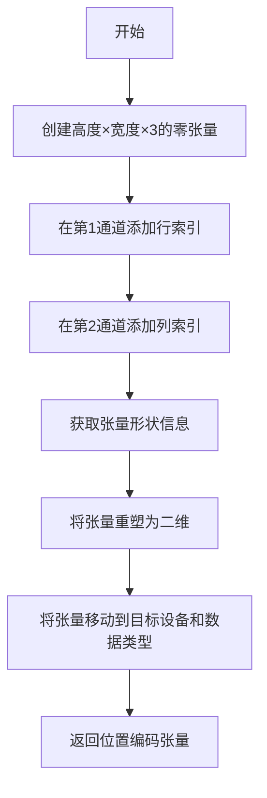

#### 带注释源码

```python
@staticmethod
def _prepare_latent_image_ids(batch_size, height, width, device, dtype):
    # 创建一个形状为 (height, width, 3) 的零张量
    # 3个通道分别用于: [批量索引, 行索引, 列索引]
    latent_image_ids = torch.zeros(height, width, 3)
    
    # 在第1通道（行索引通道）添加行索引
    # 使用 torch.arange(height)[:, None] 创建列向量，然后广播到整个宽度
    latent_image_ids[..., 1] = latent_image_ids[..., 1] + torch.arange(height)[:, None]
    
    # 在第2通道（列索引通道）添加列索引
    # 使用 torch.arange(width)[None, :] 创建行向量，然后广播到整个高度
    latent_image_ids[..., 2] = latent_image_ids[..., 2] + torch.arange(width)[None, :]
    
    # 获取重塑前的张量形状信息
    latent_image_id_height, latent_image_id_width, latent_image_id_channels = latent_image_ids.shape
    
    # 将三维张量重塑为二维张量
    # 从 (height, width, 3) 变为 (height * width, 3)
    # 每一行代表一个patch的位置编码 [0, row, col]
    latent_image_ids = latent_image_ids.reshape(
        latent_image_id_height * latent_image_id_width, latent_image_id_channels
    )
    
    # 将张量移动到目标设备并转换为目标数据类型后返回
    return latent_image_ids.to(device=device, dtype=dtype)
```


### `FluxPipeline._pack_latents`

该方法是一个静态工具函数，用于将 VAE 编码后的 latent 张量重新整形和重排，以适应 Flux transformer 模型的输入格式。具体操作是将每个 2x2 的像素块打包成一个单一的表示，从而减少序列长度并提高计算效率。

参数：

- `latents`：`torch.Tensor`，输入的 latent 张量，形状为 (batch_size, num_channels_latents, height, width)
- `batch_size`：`int`，批次大小
- `num_channels_latents`：`int`，latent 通道数
- `height`：`int`，latent 的高度
- `width`：`int`，latent 的宽度

返回值：`torch.Tensor`，打包后的 latent 张量，形状为 (batch_size, (height // 2) * (width // 2), num_channels_latents * 4)

#### 流程图

```mermaid
flowchart TD
    A[输入 latents<br/>(batch_size, num_channels_latents<br/>height, width)] --> B[view 操作<br/>(batch_size, num_channels_latents<br/>height//2, 2, width//2, 2)]
    B --> C[permute 重排<br/>(0, 2, 4, 1, 3, 5)]
    C --> D[reshape 打包<br/>(batch_size, height//2 * width//2<br/>num_channels_latents * 4)]
    D --> E[输出 packed latents]
```

#### 带注释源码

```python
@staticmethod
def _pack_latents(latents, batch_size, num_channels_latents, height, width):
    """
    将 latent 张量打包成适合 Flux transformer 输入的格式。
    
    Flux 模型使用 2x2 patch 打包策略：将每个 2x2 的像素块合并为一个表示，
    这样可以减少序列长度并提高处理效率。
    
    参数:
        latents: 输入的 VAE latent 张量，形状为 (batch_size, num_channels_latents, height, width)
        batch_size: 批次大小
        num_channels_latents: latent 通道数
        height: latent 高度
        width: latent 宽度
    
    返回:
        打包后的 latent 张量，形状为 (batch_size, (height//2)*(width//2), num_channels_latents*4)
    """
    # 第一步：将 latents 重新整形为 6 维张量
    # 将 height 和 width 各自分割成 (height//2) 和 2，以及 (width//2) 和 2
    # 这样每个 2x2 的块成为一个独立的维度
    latents = latents.view(batch_size, num_channels_latents, height // 2, 2, width // 2, 2)
    
    # 第二步：置换维度顺序，重新排列为 (batch, height//2, width//2, channels, 2, 2)
    # 这样可以将空间维度 (height//2, width//2) 放在前面，便于后续合并
    latents = latents.permute(0, 2, 4, 1, 3, 5)
    
    # 第三步：最终 reshape，将 2x2 的块展平到通道维度
    # 结果形状: (batch_size, num_patches, num_channels_latents * 4)
    # 其中 num_patches = (height // 2) * (width // 2)
    # 每个 patch 包含 4 个像素的信息 (2x2)
    latents = latents.reshape(batch_size, (height // 2) * (width // 2), num_channels_latents * 4)

    return latents
```


### `FluxPipeline._unpack_latents`

该方法是一个静态方法，负责将打包（packed）后的 latent 张量解包回原始的 4D 形状。在 Flux 管道中，latent 会被打包成 2x2 的 patch 形式以提高计算效率，此方法执行反向操作，将打包的 latents 恢复为标准格式，以便后续的 VAE 解码。

参数：

- `latents`：`torch.Tensor`，打包后的 latent 张量，形状为 (batch_size, num_patches, channels)，其中 num_patches = (height/2) * (width/2)，channels = num_channels_latents * 4
- `height`：`int`，目标图像的高度（像素单位）
- `width`：`int`，目标图像的宽度（像素单位）
- `vae_scale_factor`：`int`，VAE 的缩放因子（用于将像素空间映射到 latent 空间）

返回值：`torch.Tensor`，解包后的 latent 张量，形状为 (batch_size, channels // 4, height, width)

#### 流程图

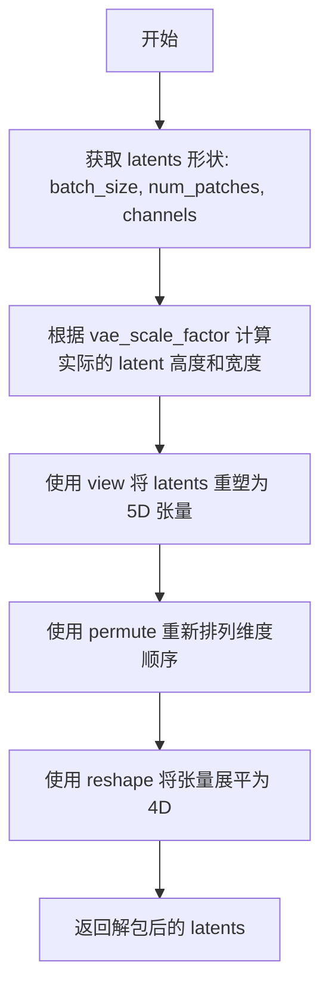

#### 带注释源码

```python
@staticmethod
def _unpack_latents(latents, height, width, vae_scale_factor):
    """
    将打包的 latents 解包回原始的 4D 形状。
    
    Flux 管道在处理 latents 时会将其打包成 2x2 的 patch 形式，
    该方法执行反向操作以恢复标准的 4D tensor 格式供 VAE 解码器使用。
    """
    # 从打包的 latents 中获取批次大小、patch 数量和通道数
    batch_size, num_patches, channels = latents.shape

    # VAE 应用 8x 压缩，但我们还必须考虑打包操作（要求 latent 高度和宽度能被 2 整除）
    # 计算实际 latent 空间的尺寸
    height = 2 * (int(height) // (vae_scale_factor * 2))
    width = 2 * (int(width) // (vae_scale_factor * 2))

    # 将打包的 latents 重塑为 5D 张量
    # 形状从 (batch_size, num_patches, channels) 
    # 变为 (batch_size, height//2, width//2, channels//4, 2, 2)
    latents = latents.view(batch_size, height // 2, width // 2, channels // 4, 2, 2)
    
    # 重新排列维度顺序，将 2x2 patch 维度移到正确位置
    # 从 (batch, h//2, w//2, c//4, 2, 2) 变为 (batch, c//4, h//2, 2, w//2, 2)
    latents = latents.permute(0, 3, 1, 4, 2, 5)

    # 最后将张量展平为标准的 4D 格式 (batch, channels//4, height, width)
    latents = latents.reshape(batch_size, channels // (2 * 2), height, width)

    return latents
```


### `FluxPipeline.enable_vae_slicing`

启用分片 VAE 解码。启用此选项后，VAE 将输入张量分割成多个切片，以分步计算解码。这有助于节省内存并允许更大的批量大小。

参数：

- 该方法无显式参数（除 `self` 隐式参数外）

返回值：`None`，无返回值（该方法直接作用于 `self.vae` 对象）

#### 流程图

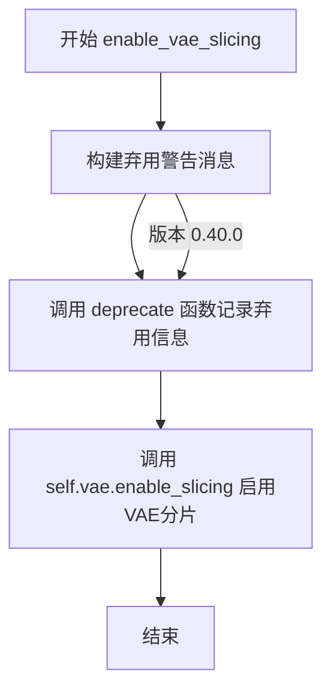

#### 带注释源码

```python
def enable_vae_slicing(self):
    r"""
    Enable sliced VAE decoding. When this option is enabled, the VAE will split the input tensor in slices to
    compute decoding in several steps. This is useful to save some memory and allow larger batch sizes.
    """
    # 构建弃用警告消息，包含当前类名，提示用户该方法将在未来版本中移除
    depr_message = f"Calling `enable_vae_slicing()` on a `{self.__class__.__name__}` is deprecated and this method will be removed in a future version. Please use `pipe.vae.enable_slicing()`."
    
    # 调用 deprecate 函数记录弃用信息：
    # - 第一个参数：被弃用的函数名
    # - 第二个参数：弃用版本号
    # - 第三个参数：弃用警告消息
    deprecate(
        "enable_vae_slicing",
        "0.40.0",
        depr_message,
    )
    
    # 实际启用 VAE 分片解码功能，将调用委托给内部 VAE 对象的 enable_slicing 方法
    self.vae.enable_slicing()
```


### `FluxPipeline.disable_vae_slicing`

该方法用于禁用 VAE 切片解码功能。如果之前启用了 `enable_vae_slicing`，调用此方法后将恢复到单步计算解码。此方法已被弃用，建议直接使用 `pipe.vae.disable_slicing()`。

参数： 无

返回值：`None`，无返回值描述

#### 流程图

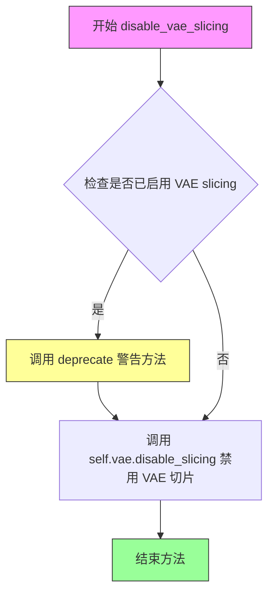

#### 带注释源码

```python
def disable_vae_slicing(self):
    r"""
    Disable sliced VAE decoding. If `enable_vae_slicing` was previously enabled, this method will go back to
    computing decoding in one step.
    
    该方法用于禁用 VAE 切片解码功能。当之前通过 enable_vae_slicing 启用切片解码后，
    调用此方法将使 VAE 恢复到单步解码模式。
    """
    # 构建弃用警告消息，提示用户该方法将在未来版本中移除
    # 并建议使用新的 API: pipe.vae.disable_slicing()
    depr_message = f"Calling `disable_vae_slicing()` on a `{self.__class__.__name__}` is deprecated and this method will be removed in a future version. Please use `pipe.vae.disable_slicing()`."
    
    # 调用 deprecate 函数记录弃用警告
    # 参数说明：
    # - "disable_vae_slicing": 被弃用的功能名称
    # - "0.40.0": 计划移除的版本号
    # - depr_message: 弃用警告消息
    deprecate(
        "disable_vae_slicing",
        "0.40.0",
        depr_message,
    )
    
    # 调用 VAE 模型的 disable_slicing 方法
    # 实际执行禁用 VAE 切片解码的底层操作
    self.vae.disable_slicing()
```


### `FluxPipeline.enable_vae_tiling`

该方法用于启用瓦片式 VAE（Variational Autoencoder）解码/编码功能。通过将输入张量分割成多个瓦片分步计算，实现节省内存并支持处理更大尺寸图像的目的。需要注意的是，此方法已被标记为弃用，未来版本将移除，建议直接使用 `pipe.vae.enable_tiling()`。

参数：无需参数

返回值：`None`，无返回值

#### 流程图

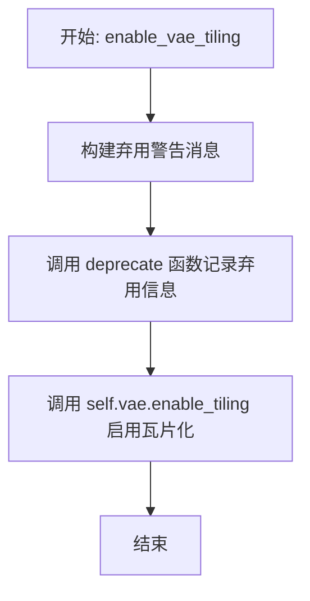

#### 带注释源码

```
def enable_vae_tiling(self):
    r"""
    Enable tiled VAE decoding. When this option is enabled, the VAE will split the input tensor into tiles to
    compute decoding and encoding in several steps. This is useful for saving a large amount of memory and to allow
    processing larger images.
    """
    # 构建弃用警告消息，提示用户该方法将在未来版本中移除
    # 并建议直接使用 pipe.vae.enable_tiling() 替代
    depr_message = f"Calling `enable_vae_tiling()` on a `{self.__class__.__name__}` is deprecated and this method will be removed in a future version. Please use `pipe.vae.enable_tiling()`."
    
    # 调用 deprecate 函数记录弃用信息
    # 参数: 方法名, 弃用版本号, 弃用消息
    deprecate(
        "enable_vae_tiling",
        "0.40.0",
        depr_message,
    )
    
    # 实际启用 VAE 的瓦片化功能
    # 该方法会将输入图像分割成多个瓦片进行分步处理
    # 以降低显存占用并支持更大分辨率的图像处理
    self.vae.enable_tiling()
```


### `FluxPipeline.disable_vae_tiling`

禁用 VAE 平铺解码。如果之前启用了 `enable_vae_tiling`，则此方法将返回到单步计算解码。该方法已被弃用，建议直接使用 `pipe.vae.disable_tiling()`。

参数： 无

返回值：`None`，无返回值

#### 流程图

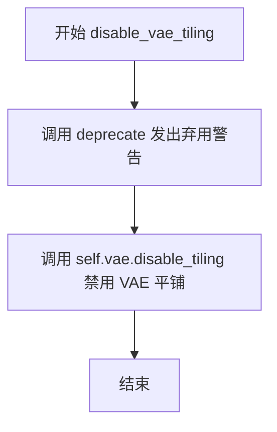

#### 带注释源码

```python
def disable_vae_tiling(self):
    r"""
    Disable tiled VAE decoding. If `enable_vae_tiling` was previously enabled, this method will go back to
    computing decoding in one step.
    """
    # 构建弃用消息，提醒用户该方法已弃用，将在未来版本中移除
    # 建议使用 pipe.vae.disable_tiling() 代替
    depr_message = f"Calling `disable_vae_tiling()` on a `{self.__class__.__name__}` is deprecated and this method will be removed in a future version. Please use `pipe.vae.disable_tiling()`."
    
    # 调用 deprecate 函数记录弃用信息，标记在 0.40.0 版本弃用
    deprecate(
        "disable_vae_tiling",
        "0.40.0",
        depr_message,
    )
    
    # 实际调用 VAE 对象的 disable_tiling 方法来禁用平铺解码
    self.vae.disable_tiling()
```


### `FluxPipeline.prepare_latents`

该方法用于在FluxPipeline管道中准备图像生成的初始潜在变量（latents）和潜在图像ID，处理VAE压缩和packing的维度调整，支持预生成latents或随机生成。

参数：

- `batch_size`：`int`，批处理大小，指定要生成的图像数量
- `num_channels_latents`：`int`，潜在变量的通道数，通常为transformer输入通道数的1/4
- `height`：`int`，目标图像的高度（像素）
- `width`：`int`，目标图像的宽度（像素）
- `dtype`：`torch.dtype`，生成latents的数据类型
- `device`：`torch.device`，生成latents的设备
- `generator`：`torch.Generator | list[torch.Generator] | None`，用于确保生成可复现性的随机数生成器
- `latents`：`torch.FloatTensor | None`，可选的预生成潜在变量，如果提供则直接使用，否则随机生成

返回值：`tuple[torch.Tensor, torch.Tensor]`，返回两个元素的元组——第一个是处理后的latents张量（已packing），第二个是潜在图像ID张量用于transformer的注意力机制

#### 流程图

```mermaid
flowchart TD
    A[开始 prepare_latents] --> B{计算调整后的高度和宽度}
    B --> C[height = 2 * (height // (vae_scale_factor * 2))]
    C --> D[构建shape元组]
    D --> E{latents是否已提供?}
    E -->|是| F[生成latent_image_ids]
    F --> G[返回转换后的latents和latent_image_ids]
    E -->|否| H{generator列表长度是否匹配batch_size?}
    H -->|否| I[抛出ValueError异常]
    H -->|是| J[使用randn_tensor生成随机latents]
    J --> K[调用_pack_latents打包latents]
    K --> L[生成latent_image_ids]
    L --> M[返回latents和latent_image_ids]
    
    style G fill:#90EE90
    style M fill:#90EE90
    style I fill:#FFB6C1
```

#### 带注释源码

```python
def prepare_latents(
    self,
    batch_size,
    num_channels_latents,
    height,
    width,
    dtype,
    device,
    generator,
    latents=None,
):
    """
    准备用于图像生成的latents和对应的image IDs。
    
    Flux模型使用特殊的packing机制，需要考虑VAE的8x压缩率和packing所需的2x divisibility。
    
    Args:
        batch_size: 批处理大小
        num_channels_latents: 潜在通道数
        height: 图像高度
        width: 图像宽度  
        dtype: 数据类型
        device: 计算设备
        generator: 随机生成器
        latents: 可选的预生成latents
        
    Returns:
        tuple: (latents, latent_image_ids)
    """
    # VAE applies 8x compression on images but we must also account for packing which requires
    # latent height and width to be divisible by 2.
    # 计算调整后的高度和宽度：VAE应用8x压缩，同时packing需要高度和宽度能被2整除
    # 最终需要乘以2来补偿packing的维度要求
    height = 2 * (int(height) // (self.vae_scale_factor * 2))
    width = 2 * (int(width) // (self.vae_scale_factor * 2))

    # 构建latents的形状：(batch_size, channels, height, width)
    shape = (batch_size, num_channels_latents, height, width)

    # 如果已经提供了latents，直接进行设备和数据类型转换，并生成对应的image IDs
    if latents is not None:
        latent_image_ids = self._prepare_latent_image_ids(batch_size, height // 2, width // 2, device, dtype)
        return latents.to(device=device, dtype=dtype), latent_image_ids

    # 验证generator列表长度与batch_size是否匹配
    if isinstance(generator, list) and len(generator) != batch_size:
        raise ValueError(
            f"You have passed a list of generators of length {len(generator)}, but requested an effective batch"
            f" size of {batch_size}. Make sure the batch size matches the length of the generators."
        )

    # 使用随机张量生成初始噪声latents
    latents = randn_tensor(shape, generator=generator, device=device, dtype=dtype)
    
    # 对latents进行packing，将2x2的patch展平为单个token
    # 这是Flux模型特有的处理方式，将空间信息编码为序列
    latents = self._pack_latents(latents, batch_size, num_channels_latents, height, width)

    # 生成潜在图像ID，用于transformer中的自注意力机制
    # 这些ID编码了2D空间位置信息
    latent_image_ids = self._prepare_latent_image_ids(batch_size, height // 2, width // 2, device, dtype)

    return latents, latent_image_ids
```


### `FluxPipeline.__call__`

该方法是 Flux 管道的主入口函数，用于根据文本提示生成图像。方法执行完整的文本到图像扩散推理流程，包括输入验证、提示词编码、潜在变量准备、去噪循环（包含可选的 CFG 引导和 IP-Adapter 支持）以及最终的 VAE 解码。

参数：

- `prompt`：`str | list[str] | None`，用于引导图像生成的提示词，如未定义则需传递 `prompt_embeds`
- `prompt_2`：`str | list[str] | None`，发送给 `tokenizer_2` 和 `text_encoder_2` 的提示词，如未定义则使用 `prompt`
- `negative_prompt`：`str | list[str] | None`，不引导图像生成的负面提示词，仅在 `true_cfg_scale > 1` 时生效
- `negative_prompt_2`：`str | list[str] | None`，发送给 `tokenizer_2` 和 `text_encoder_2` 的负面提示词
- `true_cfg_scale`：`float`，真分类器自由引导比例，当 `true_cfg_scale > 1` 且提供 `negative_prompt` 时启用
- `height`：`int | None`，生成图像的高度（像素），默认为 `self.default_sample_size * self.vae_scale_factor`
- `width`：`int | None`，生成图像的宽度（像素），默认为 `self.default_sample_size * self.vae_scale_factor`
- `num_inference_steps`：`int`，去噪步数，默认为 28
- `sigmas`：`list[float] | None`，自定义去噪过程使用的 sigma 值
- `guidance_scale`：`float`，嵌入式引导比例，默认为 3.5，用于引导 distill 模型
- `num_images_per_prompt`：`int`，每个提示词生成的图像数量，默认为 1
- `generator`：`torch.Generator | list[torch.Generator] | None`，随机生成器，用于确保生成的可确定性
- `latents`：`torch.FloatTensor | None`，预生成的有噪声潜在变量
- `prompt_embeds`：`torch.FloatTensor | None`，预生成的文本嵌入
- `pooled_prompt_embeds`：`torch.FloatTensor | None`，预生成的池化文本嵌入
- `ip_adapter_image`：`PipelineImageInput | None`，可选的 IP Adapter 图像输入
- `ip_adapter_image_embeds`：`list[torch.Tensor] | None`，IP Adapter 预生成的图像嵌入列表
- `negative_ip_adapter_image`：`PipelineImageInput | None`，负面 IP Adapter 图像输入
- `negative_ip_adapter_image_embeds`：`list[torch.Tensor] | None`，负面 IP Adapter 预生成的图像嵌入
- `negative_prompt_embeds`：`torch.FloatTensor | None`，预生成的负面文本嵌入
- `negative_pooled_prompt_embeds`：`torch.FloatTensor | None`，预生成的负面池化文本嵌入
- `output_type`：`str | None`，输出格式，默认为 `"pil"`，可选 `"latent"` 或 `"np"`
- `return_dict`：`bool`，是否返回 `FluxPipelineOutput`，默认为 `True`
- `joint_attention_kwargs`：`dict[str, Any] | None`，传递给 `AttentionProcessor` 的 kwargs 字典
- `callback_on_step_end`：`Callable[[int, int], None] | None`，每个去噪步骤结束时调用的回调函数
- `callback_on_step_end_tensor_inputs`：`list[str]`，回调函数接收的 tensor 输入列表，默认为 `["latents"]`
- `max_sequence_length`：`int`，提示词最大序列长度，默认为 512

返回值：`FluxPipelineOutput | tuple`，当 `return_dict=True` 时返回 `FluxPipelineOutput`，否则返回包含生成图像的元组

#### 流程图

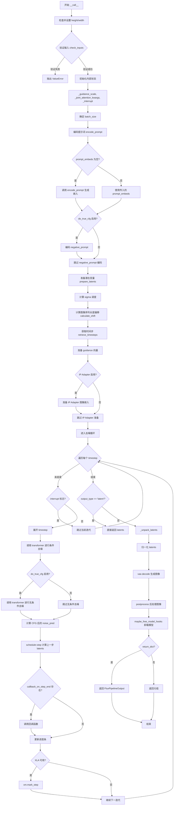

#### 带注释源码

```python
@torch.no_grad()
@replace_example_docstring(EXAMPLE_DOC_STRING)
def __call__(
    self,
    prompt: str | list[str] = None,
    prompt_2: str | list[str] | None = None,
    negative_prompt: str | list[str] = None,
    negative_prompt_2: str | list[str] | None = None,
    true_cfg_scale: float = 1.0,
    height: int | None = None,
    width: int | None = None,
    num_inference_steps: int = 28,
    sigmas: list[float] | None = None,
    guidance_scale: float = 3.5,
    num_images_per_prompt: int | None = 1,
    generator: torch.Generator | list[torch.Generator] | None = None,
    latents: torch.FloatTensor | None = None,
    prompt_embeds: torch.FloatTensor | None = None,
    pooled_prompt_embeds: torch.FloatTensor | None = None,
    ip_adapter_image: PipelineImageInput | None = None,
    ip_adapter_image_embeds: list[torch.Tensor] | None = None,
    negative_ip_adapter_image: PipelineImageInput | None = None,
    negative_ip_adapter_image_embeds: list[torch.Tensor] | None = None,
    negative_prompt_embeds: torch.FloatTensor | None = None,
    negative_pooled_prompt_embeds: torch.FloatTensor | None = None,
    output_type: str | None = "pil",
    return_dict: bool = True,
    joint_attention_kwargs: dict[str, Any] | None = None,
    callback_on_step_end: Callable[[int, int], None] | None = None,
    callback_on_step_end_tensor_inputs: list[str] = ["latents"],
    max_sequence_length: int = 512,
):
    r"""
    Function invoked when calling the pipeline for generation.

    Args:
        prompt (`str` or `list[str]`, *optional*):
            The prompt or prompts to guide the image generation. If not defined, one has to pass `prompt_embeds`.
            instead.
        prompt_2 (`str` or `list[str]`, *optional*):
            The prompt or prompts to be sent to `tokenizer_2` and `text_encoder_2`. If not defined, `prompt` is
            will be used instead.
        negative_prompt (`str` or `list[str]`, *optional*):
            The prompt or prompts not to guide the image generation. If not defined, one has to pass
            `negative_prompt_embeds` instead. Ignored when not using guidance (i.e., ignored if `true_cfg_scale` is
            not greater than `1`).
        negative_prompt_2 (`str` or `list[str]`, *optional*):
            The prompt or prompts not to guide the image generation to be sent to `tokenizer_2` and
            `text_encoder_2`. If not defined, `negative_prompt` is used in all the text-encoders.
        true_cfg_scale (`float`, *optional*, defaults to 1.0):
            True classifier-free guidance (guidance scale) is enabled when `true_cfg_scale` > 1 and
            `negative_prompt` is provided.
        height (`int`, *optional*, defaults to self.unet.config.sample_size * self.vae_scale_factor):
            The height in pixels of the generated image. This is set to 1024 by default for the best results.
        width (`int`, *optional*, defaults to self.unet.config.sample_size * self.vae_scale_factor):
            The width in pixels of the generated image. This is set to 1024 by default for the best results.
        num_inference_steps (`int`, *optional*, defaults to 50):
            The number of denoising steps. More denoising steps usually lead to a higher quality image at the
            expense of slower inference.
        sigmas (`list[float]`, *optional*):
            Custom sigmas to use for the denoising process with schedulers which support a `sigmas` argument in
            their `set_timesteps` method. If not defined, the default behavior when `num_inference_steps` is passed
            will be used.
        guidance_scale (`float`, *optional*, defaults to 3.5):
            Embedded guiddance scale is enabled by setting `guidance_scale` > 1. Higher `guidance_scale` encourages
            a model to generate images more aligned with `prompt` at the expense of lower image quality.

            Guidance-distilled models approximates true classifer-free guidance for `guidance_scale` > 1. Refer to
            the [paper](https://huggingface.co/papers/2210.03142) to learn more.
        num_images_per_prompt (`int`, *optional*, defaults to 1):
            The number of images to generate per prompt.
        generator (`torch.Generator` or `list[torch.Generator]`, *optional*):
            One or a list of [torch generator(s)](https://pytorch.org/docs/stable/generated/torch.Generator.html)
            to make generation deterministic.
        latents (`torch.FloatTensor`, *optional*):
            Pre-generated noisy latents, sampled from a Gaussian distribution, to be used as inputs for image
            generation. Can be used to tweak the same generation with different prompts. If not provided, a latents
            tensor will be generated by sampling using the supplied random `generator`.
        prompt_embeds (`torch.FloatTensor`, *optional*):
            Pre-generated text embeddings. Can be used to easily tweak text inputs, *e.g.* prompt weighting. If not
            provided, text embeddings will be generated from `prompt` input argument.
        pooled_prompt_embeds (`torch.FloatTensor`, *optional*):
            Pre-generated pooled text embeddings. Can be used to easily tweak text inputs, *e.g.* prompt weighting.
            If not provided, pooled text embeddings will be generated from `prompt` input argument.
        ip_adapter_image: (`PipelineImageInput`, *optional*): Optional image input to work with IP Adapters.
        ip_adapter_image_embeds (`list[torch.Tensor]`, *optional*):
            Pre-generated image embeddings for IP-Adapter. It should be a list of length same as number of
            IP-adapters. Each element should be a tensor of shape `(batch_size, num_images, emb_dim)`. If not
            provided, embeddings are computed from the `ip_adapter_image` input argument.
        negative_ip_adapter_image:
            (`PipelineImageInput`, *optional*): Optional image input to work with IP Adapters.
        negative_ip_adapter_image_embeds (`list[torch.Tensor]`, *optional*):
            Pre-generated image embeddings for IP-Adapter. It should be a list of length same as number of
            IP-adapters. Each element should be a tensor of shape `(batch_size, num_images, emb_dim)`. If not
            provided, embeddings are computed from the `ip_adapter_image` input argument.
        negative_prompt_embeds (`torch.FloatTensor`, *optional*):
            Pre-generated negative text embeddings. Can be used to easily tweak text inputs, *e.g.* prompt
            weighting. If not provided, negative_prompt_embeds will be generated from `negative_prompt` input
            argument.
        negative_pooled_prompt_embeds (`torch.FloatTensor`, *optional*):
            Pre-generated negative pooled text embeddings. Can be used to easily tweak text inputs, *e.g.* prompt
            weighting. If not provided, pooled negative_prompt_embeds will be generated from `negative_prompt`
            input argument.
        output_type (`str`, *optional*, defaults to `"pil"`):
            The output format of the generate image. Choose between
            [PIL](https://pillow.readthedocs.io/en/stable/): `PIL.Image.Image` or `np.array`.
        return_dict (`bool`, *optional*, defaults to `True`):
            Whether or not to return a [`~pipelines.flux.FluxPipelineOutput`] instead of a plain tuple.
        joint_attention_kwargs (`dict`, *optional*):
            A kwargs dictionary that if specified is passed along to the `AttentionProcessor` as defined under
            `self.processor` in
            [diffusers.models.attention_processor](https://github.com/huggingface/diffusers/blob/main/src/diffusers/models/attention_processor.py).
        callback_on_step_end (`Callable`, *optional*):
            A function that calls at the end of each denoising steps during the inference. The function is called
            with the following arguments: `callback_on_step_end(self: DiffusionPipeline, step: int, timestep: int,
            callback_kwargs: Dict)`. `callback_kwargs` will include a list of all tensors as specified by
            `callback_on_step_end_tensor_inputs`.
        callback_on_step_end_tensor_inputs (`list`, *optional*):
            The list of tensor inputs for the `callback_on_step_end` function. The tensors specified in the list
            will be passed as `callback_kwargs` argument. You will only be able to include variables listed in the
            `._callback_tensor_inputs` attribute of your pipeline class.
        max_sequence_length (`int` defaults to 512): Maximum sequence length to use with the `prompt`.

    Examples:

    Returns:
        [`~pipelines.flux.FluxPipelineOutput`] or `tuple`: [`~pipelines.flux.FluxPipelineOutput`] if `return_dict`
        is True, otherwise a `tuple`. When returning a tuple, the first element is a list with the generated
        images.
    """

    # 步骤1: 设置默认的 height 和 width，如果未提供则使用默认值
    height = height or self.default_sample_size * self.vae_scale_factor
    width = width or self.default_sample_size * self.vae_scale_factor

    # 步骤2: 检查输入参数的有效性，如有问题则抛出异常
    self.check_inputs(
        prompt,
        prompt_2,
        height,
        width,
        negative_prompt=negative_prompt,
        negative_prompt_2=negative_prompt_2,
        prompt_embeds=prompt_embeds,
        negative_prompt_embeds=negative_prompt_embeds,
        pooled_prompt_embeds=pooled_prompt_embeds,
        negative_pooled_prompt_embeds=negative_pooled_prompt_embeds,
        callback_on_step_end_tensor_inputs=callback_on_step_end_tensor_inputs,
        max_sequence_length=max_sequence_length,
    )

    # 步骤3: 初始化内部状态变量
    self._guidance_scale = guidance_scale
    self._joint_attention_kwargs = joint_attention_kwargs
    self._current_timestep = None
    self._interrupt = False

    # 步骤4: 确定批次大小
    if prompt is not None and isinstance(prompt, str):
        batch_size = 1
    elif prompt is not None and isinstance(prompt, list):
        batch_size = len(prompt)
    else:
        batch_size = prompt_embeds.shape[0]

    device = self._execution_device

    # 步骤5: 获取 LoRA 缩放因子
    lora_scale = (
        self.joint_attention_kwargs.get("scale", None) if self.joint_attention_kwargs is not None else None
    )
    
    # 步骤6: 判断是否使用真 CFG
    has_neg_prompt = negative_prompt is not None or (
        negative_prompt_embeds is not None and negative_pooled_prompt_embeds is not None
    )
    do_true_cfg = true_cfg_scale > 1 and has_neg_prompt
    
    # 步骤7: 编码提示词获取文本嵌入
    (
        prompt_embeds,
        pooled_prompt_embeds,
        text_ids,
    ) = self.encode_prompt(
        prompt=prompt,
        prompt_2=prompt_2,
        prompt_embeds=prompt_embeds,
        pooled_prompt_embeds=pooled_prompt_embeds,
        device=device,
        num_images_per_prompt=num_images_per_prompt,
        max_sequence_length=max_sequence_length,
        lora_scale=lora_scale,
    )
    
    # 步骤8: 如果启用真 CFG，则编码负面提示词
    if do_true_cfg:
        (
            negative_prompt_embeds,
            negative_pooled_prompt_embeds,
            negative_text_ids,
        ) = self.encode_prompt(
            prompt=negative_prompt,
            prompt_2=negative_prompt_2,
            prompt_embeds=negative_prompt_embeds,
            pooled_prompt_embeds=negative_pooled_prompt_embeds,
            device=device,
            num_images_per_prompt=num_images_per_prompt,
            max_sequence_length=max_sequence_length,
            lora_scale=lora_scale,
        )

    # 步骤9: 准备潜在变量（latents）和潜在图像 ID
    num_channels_latents = self.transformer.config.in_channels // 4
    latents, latent_image_ids = self.prepare_latents(
        batch_size * num_images_per_prompt,
        num_channels_latents,
        height,
        width,
        prompt_embeds.dtype,
        device,
        generator,
        latents,
    )

    # 步骤10: 准备时间步调度
    # 如果未提供 sigmas，则使用线性间隔的 sigmas
    sigmas = np.linspace(1.0, 1 / num_inference_steps, num_inference_steps) if sigmas is None else sigmas
    # 检查调度器是否使用 flow sigmas
    if hasattr(self.scheduler.config, "use_flow_sigmas") and self.scheduler.config.use_flow_sigmas:
        sigmas = None
    
    # 计算图像序列长度偏移（用于调整调度器参数）
    image_seq_len = latents.shape[1]
    mu = calculate_shift(
        image_seq_len,
        self.scheduler.config.get("base_image_seq_len", 256),
        self.scheduler.config.get("max_image_seq_len", 4096),
        self.scheduler.config.get("base_shift", 0.5),
        self.scheduler.config.get("max_shift", 1.15),
    )

    # 设置时间步设备（XLA 特殊情况使用 CPU）
    if XLA_AVAILABLE:
        timestep_device = "cpu"
    else:
        timestep_device = device
    timesteps, num_inference_steps = retrieve_timesteps(
        self.scheduler,
        num_inference_steps,
        timestep_device,
        sigmas=sigmas,
        mu=mu,
    )
    
    # 计算预热步数
    num_warmup_steps = max(len(timesteps) - num_inference_steps * self.scheduler.order, 0)
    self._num_timesteps = len(timesteps)

    # 步骤11: 准备引导向量（如果 transformer 支持 guidance embeds）
    if self.transformer.config.guidance_embeds:
        guidance = torch.full([1], guidance_scale, device=device, dtype=torch.float32)
        guidance = guidance.expand(latents.shape[0])
    else:
        guidance = None

    # 步骤12: 处理 IP Adapter 图像（确保正负 adapter 图像配对）
    if (ip_adapter_image is not None or ip_adapter_image_embeds is not None) and (
        negative_ip_adapter_image is None and negative_ip_adapter_image_embeds is None
    ):
        # 如果只有正向 adapter 图像，创建空的负向 adapter 图像
        negative_ip_adapter_image = np.zeros((width, height, 3), dtype=np.uint8)
        negative_ip_adapter_image = [negative_ip_adapter_image] * self.transformer.encoder_hid_proj.num_ip_adapters

    elif (ip_adapter_image is None and ip_adapter_image_embeds is None) and (
        negative_ip_adapter_image is not None or negative_ip_adapter_image_embeds is not None
    ):
        # 如果只有负向 adapter 图像，创建空的正向 adapter 图像
        ip_adapter_image = np.zeros((width, height, 3), dtype=np.uint8)
        ip_adapter_image = [ip_adapter_image] * self.transformer.encoder_hid_proj.num_ip_adapters

    # 确保 joint_attention_kwargs 存在
    if self.joint_attention_kwargs is None:
        self._joint_attention_kwargs = {}

    # 步骤13: 准备 IP Adapter 图像嵌入
    image_embeds = None
    negative_image_embeds = None
    if ip_adapter_image is not None or ip_adapter_image_embeds is not None:
        image_embeds = self.prepare_ip_adapter_image_embeds(
            ip_adapter_image,
            ip_adapter_image_embeds,
            device,
            batch_size * num_images_per_prompt,
        )
    if negative_ip_adapter_image is not None or negative_ip_adapter_image_embeds is not None:
        negative_image_embeds = self.prepare_ip_adapter_image_embeds(
            negative_ip_adapter_image,
            negative_ip_adapter_image_embeds,
            device,
            batch_size * num_images_per_prompt,
        )

    # 步骤14: 开始去噪循环
    self.scheduler.set_begin_index(0)
    with self.progress_bar(total=num_inference_steps) as progress_bar:
        for i, t in enumerate(timesteps):
            # 检查中断标志
            if self.interrupt:
                continue

            self._current_timestep = t
            
            # 更新 IP Adapter 图像嵌入到 joint_attention_kwargs
            if image_embeds is not None:
                self._joint_attention_kwargs["ip_adapter_image_embeds"] = image_embeds
            
            # 展开时间步以匹配批次维度（兼容 ONNX/Core ML）
            timestep = t.expand(latents.shape[0]).to(latents.dtype)

            # 执行条件去噪（带提示词）
            with self.transformer.cache_context("cond"):
                noise_pred = self.transformer(
                    hidden_states=latents,
                    timestep=timestep / 1000,
                    guidance=guidance,
                    pooled_projections=pooled_prompt_embeds,
                    encoder_hidden_states=prompt_embeds,
                    txt_ids=text_ids,
                    img_ids=latent_image_ids,
                    joint_attention_kwargs=self.joint_attention_kwargs,
                    return_dict=False,
                )[0]

            # 如果启用真 CFG，执行无条件去噪
            if do_true_cfg:
                if negative_image_embeds is not None:
                    self._joint_attention_kwargs["ip_adapter_image_embeds"] = negative_image_embeds

                with self.transformer.cache_context("uncond"):
                    neg_noise_pred = self.transformer(
                        hidden_states=latents,
                        timestep=timestep / 1000,
                        guidance=guidance,
                        pooled_projections=negative_pooled_prompt_embeds,
                        encoder_hidden_states=negative_prompt_embeds,
                        txt_ids=negative_text_ids,
                        img_ids=latent_image_ids,
                        joint_attention_kwargs=self.joint_attention_kwargs,
                        return_dict=False,
                    )[0]
                # 应用 CFG 公式: noise_pred = neg_noise_pred + scale * (noise_pred - neg_noise_pred)
                noise_pred = neg_noise_pred + true_cfg_scale * (noise_pred - neg_noise_pred)

            # 步骤15: 通过调度器计算上一步的 latents
            latents_dtype = latents.dtype
            latents = self.scheduler.step(noise_pred, t, latents, return_dict=False)[0]

            # 处理数据类型转换（特别是 MPS 设备上的 bug）
            if latents.dtype != latents_dtype:
                if torch.backends.mps.is_available():
                    latents = latents.to(latents_dtype)

            # 步骤16: 执行每步结束时的回调函数
            if callback_on_step_end is not None:
                callback_kwargs = {}
                for k in callback_on_step_end_tensor_inputs:
                    callback_kwargs[k] = locals()[k]
                callback_outputs = callback_on_step_end(self, i, t, callback_kwargs)

                # 允许回调修改 latents 和 prompt_embeds
                latents = callback_outputs.pop("latents", latents)
                prompt_embeds = callback_outputs.pop("prompt_embeds", prompt_embeds)

            # 步骤17: 更新进度条
            if i == len(timesteps) - 1 or ((i + 1) > num_warmup_steps and (i + 1) % self.scheduler.order == 0):
                progress_bar.update()

            # XLA 特定处理
            if XLA_AVAILABLE:
                xm.mark_step()

    self._current_timestep = None

    # 步骤18: 解码生成图像
    if output_type == "latent":
        # 如果输出类型是 latent，直接返回 latents
        image = latents
    else:
        # 解包 latents
        latents = self._unpack_latents(latents, height, width, self.vae_scale_factor)
        # 反归一化 latents
        latents = (latents / self.vae.config.scaling_factor) + self.vae.config.shift_factor
        # VAE 解码
        image = self.vae.decode(latents, return_dict=False)[0]
        # 后处理图像
        image = self.image_processor.postprocess(image, output_type=output_type)

    # 步骤19: 卸载所有模型（节省内存）
    self.maybe_free_model_hooks()

    # 步骤20: 返回结果
    if not return_dict:
        return (image,)

    return FluxPipelineOutput(images=image)
```

## 关键组件


### 张量索引与惰性加载 (Latent Image IDs & Packing)

负责生成和管理潜在空间的2D位置索引，支持后续打包操作。通过`_prepare_latent_image_ids`生成网格坐标，通过`_pack_latents`和`_unpack_latents`实现latent张量的打包与解包，以适配Transformer的输入格式要求。

### 反量化支持 (VAE Decoding)

将去噪后的latent空间表示解码为RGB图像。包含两个关键步骤：1) `_unpack_latents`将打包的latents恢复为标准形状；2) 调用VAE的`decode`方法将latents转换为像素空间图像，并使用`VaeImageProcessor`进行后处理。

### 量化策略与LoRA支持 (Quantization & LoRA)

通过`FluxLoraLoaderMixin`和PEFT backend集成实现LoRA权重的动态加载与缩放。使用`scale_lora_layers`和`unscale_lora_layers`在推理过程中调整LoRA影响权重，支持文本编码器的LoRA微调。

### IP-Adapter图像嵌入 (IP-Adapter Image Embeddings)

支持通过图像提示增强生成控制。`prepare_ip_adapter_image_embeds`方法处理图像或预计算嵌入，验证适配器数量，并将嵌入重复以匹配批量大小，支持正向和负向IP-Adapter。

### 文本嵌入双编码器 (Dual Text Encoder)

使用CLIP和T5两种文本编码器生成文本嵌入。`_get_clip_prompt_embeds`处理CLIP短文本（最大77 token），`_get_t5_prompt_embeds`处理T5长文本（最大512 token），`encode_prompt`整合两者的输出为pipeline所需格式。

### 调度器时间步计算 (Scheduler Timestep Computation)

`retrieve_timesteps`函数从调度器获取去噪时间步序列，支持自定义timesteps和sigmas。`calculate_shift`函数根据图像序列长度动态计算噪声调度偏移量，用于改善长宽高比图像的生成质量。

### 潜在变量初始化与准备 (Latent Preparation)

`prepare_latents`方法负责：1) 计算符合VAE压缩比和packing要求的latent尺寸；2) 使用随机张量或用户提供的latents初始化；3) 调用`_pack_latents`进行打包；4) 生成对应的位置索引供Transformer使用。

### 去噪循环与TrueCFG (Denoising Loop with TrueCFG)

主生成循环实现迭代去噪过程：1) 调用Transformer进行单步预测；2) 若启用TrueCFG则执行无分类器引导；3) 使用调度器计算下一步latents；4) 支持IP-Adapter嵌入注入和回调机制。TrueCFG通过`true_cfg_scale`参数控制引导强度。

### VAE切片与平铺解码 (VAE Slicing & Tiling)

提供`enable_vae_slicing`、`disable_vae_slicing`、`enable_vae_tiling`、`disable_vae_tiling`方法以降低显存占用。切片将输入分块处理，平铺将图像划分为重叠区域分别编码/解码。


## 问题及建议


### 已知问题

- **方法调用中的类型检查冗余**：在 `encode_prompt` 和 `_get_t5_prompt_embeds` 中使用 `isinstance(self, TextualInversionLoaderMixin)` 检查是不必要的，因为类已经继承自该 Mixin，导致运行时开销。
- **硬编码的默认值**：`default_sample_size = 128` 和 `max_sequence_length = 512` 作为硬编码值内嵌在多处，缺乏统一配置管理。
- **弃用方法仍未移除**：`enable_vae_slicing`、`disable_vae_slicing`、`enable_vae_tiling`、`disable_vae_tiling` 方法已标记为弃用（将在 0.40.0 版本移除），但仍保留在代码库中，增加维护负担。
- **IP Adapter 零数组回退**：当未提供 negative IP adapter 图像时，代码自动创建全零数组作为占位符，可能导致意外行为或难以调试的问题。
- **重复的张量设备转换**：在 `encode_prompt` 中多次进行 `to(device=device, dtype=dtype)` 操作，且在获取 `prompt_embeds` 后重新获取 `dtype`，存在冗余计算。
- **日志级别不一致**：部分场景使用 `logger.warning` 发出警告（如输入被截断），而其他场景则直接抛出 `ValueError`，对开发者不够友好。
- **回调函数的副作用风险**：`callback_on_step_end` 直接修改 `latents` 和 `prompt_embeds` 局部变量，可能导致难以追踪的副作用。
- **缺失的类型注解**：部分方法参数（如 `callback_on_step_end`）的返回值类型注解不完整。

### 优化建议

- **移除冗余的类型检查**：删除 `encode_prompt` 和 `_get_t5_prompt_embeds` 中的 `isinstance(self, TextualInversionLoaderMixin)` 检查，直接调用 `self.maybe_convert_prompt`。
- **提取配置常量**：将 `default_sample_size`、`max_sequence_length` 等硬编码值提取为类属性或初始化参数，提供更好的可配置性。
- **完成弃用的迁移**：尽快移除已弃用的 VAE slicing/tiling 方法，统一使用 `self.vae.enable_slicing()` 等直接调用方式。
- **改进 IP Adapter 处理**：当缺少 negative IP adapter 时，明确记录该行为或抛出明确警告，而非静默创建零数组。
- **优化张量操作**：在 `encode_prompt` 中缓存 `dtype` 值，避免重复查询；合并设备转换操作以减少内核启动开销。
- **统一错误处理策略**：将截断警告统一为日志记录而非混合使用警告和异常，提升代码可预测性。
- **增强回调安全性**：考虑为回调函数返回的张量创建副本，防止意外的内存共享问题。
- **补充类型注解**：为所有公开方法添加完整的类型注解，提升代码可维护性和 IDE 支持。

## 其它


### 设计目标与约束

本Pipeline的核心设计目标是实现高性能的文本到图像生成能力，支持多模态输入（文本提示、图像提示）和多种生成控制参数。主要设计约束包括：1）max_sequence_length限制为512个token；2）图像尺寸必须能被vae_scale_factor * 2整除；3）支持通过LoRA进行模型微调；4）支持IP-Adapter进行图像提示增强；5）支持多GPU/CPU环境部署。Pipeline遵循DiffusionPipeline的标准架构，便于与HuggingFace生态集成。

### 错误处理与异常设计

代码中的错误处理采用显式检查+异常抛出的模式，主要包括以下几类：1）输入参数校验错误，使用ValueError并在错误信息中详细说明期望值与实际值；2）调度器能力检查，在retrieve_timesteps中验证set_timesteps方法是否支持自定义timesteps或sigmas；3）IP-Adapter数量匹配检查；4）张量设备/类型转换异常处理（如MPS后端的特殊处理）；5）弃用警告，使用deprecate函数提示未来版本变更。异常设计遵循"快速失败"原则，在流程早期进行充分验证。

### 数据流与状态机

Pipeline的执行流程遵循以下状态机：初始化状态 → 输入校验状态 → Prompt编码状态 → Latent准备状态 → 时间步调度状态 → 去噪循环状态 → VAE解码状态 → 输出后处理状态。在去噪循环中，latents从噪声状态逐步去噪为潜在表示，每个时间步都涉及transformer前向推理、CFG计算（可选）、scheduler步进和回调处理。状态转换由num_inference_steps和timesteps控制，支持通过interrupt标志进行中断。

### 外部依赖与接口契约

主要依赖包括：1）transformers库提供的CLIPTextModel、CLIPTokenizer、CLIPVisionModelWithProjection、T5EncoderModel、T5TokenizerFast；2）diffusers自身提供的AutoencoderKL、FluxTransformer2DModel、FlowMatchEulerDiscreteScheduler、VaeImageProcessor；3）torch和numpy用于数值计算；4）可选的torch_xla用于XLA设备加速。接口契约方面，encode_prompt返回(prompt_embeds, pooled_prompt_embeds, text_ids)三元组；prepare_latents返回(latents, latent_image_ids)二元组；__call__返回FluxPipelineOutput或元组。

### 配置参数详解

关键配置参数包括：1）guidance_scale（默认3.5）：控制无分类器指导强度；2）true_cfg_scale（默认1.0）：真正的CFG缩放因子；3）num_inference_steps（默认28）：去噪步数；4）vae_scale_factor：基于VAE块通道数计算，用于潜在空间缩放；5）default_sample_size（默认128）：默认采样尺寸基准；6）tokenizer_max_length：文本编码器最大长度。这些参数可通过构造函数或调用时传入自定义值。

### 性能优化与资源管理

代码包含多项性能优化策略：1）模型CPU卸载序列（model_cpu_offload_seq）定义卸载顺序；2）VAE切片解码（enable_vae_slicing）降低显存占用；3）VAE平铺解码（enable_vae_tiling）支持大图像处理；4）XLA支持用于TPU/加速器；5）MPS后端特殊处理解决已知bug；6）cache_context用于transformer的推理缓存；7）randn_tensor支持确定性生成。内存峰值主要出现在transformer前向和VAE解码阶段。

### 版本兼容性与迁移指南

代码标记了多个即将弃用的方法（将在0.40.0版本移除）：enable_vae_slicing、disable_vae_slicing、enable_vae_tiling、disable_vae_tiling。这些方法的功能已迁移到VAE对象本身。建议用户直接调用pipe.vae.enable_slicing()等方法。FlowMatchEulerDiscreteScheduler的配置键（如use_flow_sigmas、base_image_seq_len等）需要与调度器版本匹配。

### 安全性与权限

代码采用Apache License 2.0开源许可。安全性方面：1）不执行用户提供的任意代码；2）模型加载时进行设备dtype检查；3）输入验证防止资源耗尽（如超长序列）；4）LoRA scale的动态调整通过PEFT后端安全处理。无敏感数据处理或网络请求操作。


    