# `diffusers\src\diffusers\pipelines\flux\pipeline_flux_control.py` 详细设计文档

FluxControlPipeline 是一个用于可控文本到图像生成的扩散管道，支持通过图像条件（如 Canny 边缘检测图）来引导生成过程。该管道集成了 CLIP 和 T5 双文本编码器、VAE 变分自编码器以及 FluxTransformer2DModel 变换器模型，实现了基于图像条件的文本到图像合成。

## 整体流程

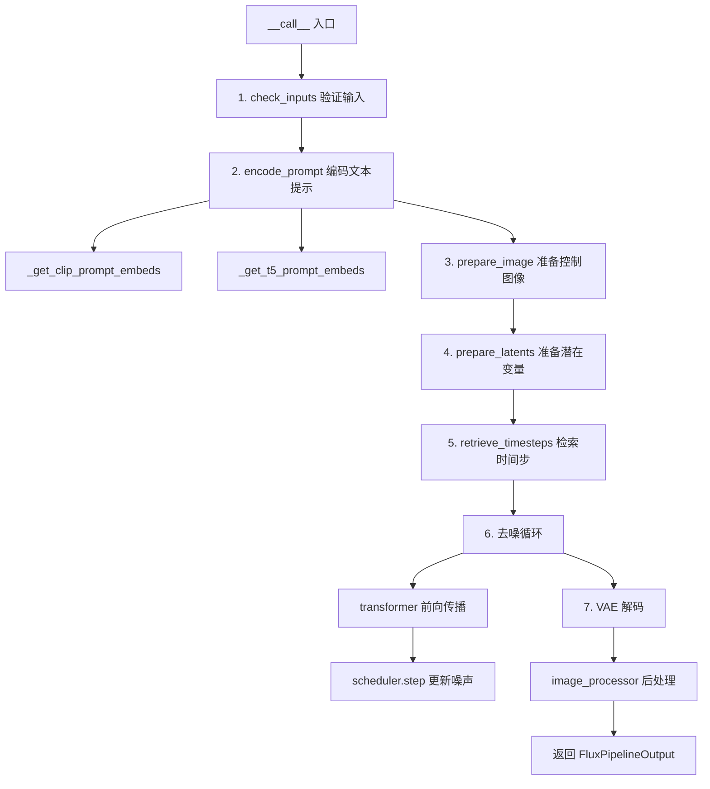

## 类结构

```
DiffusionPipeline (基类)
├── FluxLoraLoaderMixin (LoRA加载混入)
├── FromSingleFileMixin (单文件加载混入)
├── TextualInversionLoaderMixin (文本反转混入)
└── FluxControlPipeline (主类)
```

## 全局变量及字段


### `XLA_AVAILABLE`
    
XLA是否可用标志

类型：`bool`
    


### `logger`
    
日志记录器

类型：`logging.Logger`
    


### `EXAMPLE_DOC_STRING`
    
示例文档字符串

类型：`str`
    


### `calculate_shift`
    
计算移位值函数，用于计算图像序列长度的移位参数

类型：`Callable[[int, int, int, float, float], float]`
    


### `retrieve_timesteps`
    
检索时间步函数，从调度器获取或设置去噪过程的时间步

类型：`Callable`
    


### `FluxControlPipeline.model_cpu_offload_seq`
    
CPU卸载顺序

类型：`str`
    


### `FluxControlPipeline._optional_components`
    
可选组件列表

类型：`list`
    


### `FluxControlPipeline._callback_tensor_inputs`
    
回调张量输入列表

类型：`list`
    


### `FluxControlPipeline.vae_scale_factor`
    
VAE缩放因子

类型：`int`
    


### `FluxControlPipeline.vae_latent_channels`
    
VAE潜在通道数

类型：`int`
    


### `FluxControlPipeline.image_processor`
    
图像处理器

类型：`VaeImageProcessor`
    


### `FluxControlPipeline.tokenizer_max_length`
    
分词器最大长度

类型：`int`
    


### `FluxControlPipeline.default_sample_size`
    
默认采样尺寸

类型：`int`
    


### `FluxControlPipeline.vae`
    
VAE模型

类型：`AutoencoderKL`
    


### `FluxControlPipeline.text_encoder`
    
CLIP文本编码器

类型：`CLIPTextModel`
    


### `FluxControlPipeline.text_encoder_2`
    
T5文本编码器

类型：`T5EncoderModel`
    


### `FluxControlPipeline.tokenizer`
    
CLIP分词器

类型：`CLIPTokenizer`
    


### `FluxControlPipeline.tokenizer_2`
    
T5分词器

类型：`T5TokenizerFast`
    


### `FluxControlPipeline.transformer`
    
变换器模型

类型：`FluxTransformer2DModel`
    


### `FluxControlPipeline.scheduler`
    
调度器

类型：`FlowMatchEulerDiscreteScheduler`
    


### `FluxControlPipeline._guidance_scale`
    
引导尺度

类型：`float`
    


### `FluxControlPipeline._joint_attention_kwargs`
    
联合注意力参数

类型：`dict`
    


### `FluxControlPipeline._num_timesteps`
    
时间步数

类型：`int`
    


### `FluxControlPipeline._interrupt`
    
中断标志

类型：`bool`
    
    

## 全局函数及方法


### `calculate_shift`

该函数通过线性插值方法，根据输入的图像序列长度计算调度器所需的偏移量（mu），用于在不同的图像序列长度下动态调整去噪调度器的参数，确保在变长序列场景下生成质量的一致性。

参数：

- `image_seq_len`：`int`，当前图像的序列长度（即 latent 序列的长度）
- `base_seq_len`：`int`，基础序列长度，默认 256，用于线性插值的起始参考点
- `max_seq_len`：`int`，最大序列长度，默认 4096，用于线性插值的终止参考点
- `base_shift`：`float`，基础偏移量，默认 0.5，对应 base_seq_len 时的偏移值
- `max_shift`：`float`，最大偏移量，默认 1.15，对应 max_seq_len 时的偏移值

返回值：`float`，计算得到的偏移量 mu，用于调度器的时间步调整

#### 流程图

```mermaid
flowchart TD
    A[开始 calculate_shift] --> B[计算斜率 m]
    B --> C[m = (max_shift - base_shift) / (max_seq_len - base_seq_len)]
    C --> D[计算截距 b]
    D --> E[b = base_shift - m * base_seq_len]
    E --> F[计算偏移量 mu]
    F --> G[mu = image_seq_len * m + b]
    G --> H[返回 mu]
```

#### 带注释源码

```python
# Copied from diffusers.pipelines.flux.pipeline_flux.calculate_shift
def calculate_shift(
    image_seq_len,           # 当前图像的序列长度
    base_seq_len: int = 256,  # 基础序列长度，默认 256
    max_seq_len: int = 4096,  # 最大序列长度，默认 4096
    base_shift: float = 0.5,  # 基础偏移量，默认 0.5
    max_shift: float = 1.15, # 最大偏移量，默认 1.15
):
    # 计算线性插值的斜率 m
    # 斜率 = (最大偏移 - 基础偏移) / (最大序列长度 - 基础序列长度)
    m = (max_shift - base_shift) / (max_seq_len - base_seq_len)
    
    # 计算线性方程的截距 b
    # 利用点斜式：y = mx + b => b = y - mx
    # 这里使用 base_shift 作为基础偏移量
    b = base_shift - m * base_seq_len
    
    # 根据图像序列长度计算最终的偏移量 mu
    # 使用线性方程：mu = m * image_seq_len + b
    mu = image_seq_len * m + b
    
    # 返回计算得到的偏移量，用于调度器参数调整
    return mu
```


### `retrieve_timesteps`

该函数用于从调度器检索时间步，处理自定义时间步（timesteps）和 sigmas 参数，调用调度器的 `set_timesteps` 方法并返回时间步列表和推理步数。

参数：

- `scheduler`：`SchedulerMixin`，要获取时间步的调度器
- `num_inference_steps`：`int | None`，生成样本时使用的扩散步数，如果使用此参数，则 `timesteps` 必须为 `None`
- `device`：`str | torch.device | None`，时间步要移动到的设备，如果为 `None`，则不移动时间步
- `timesteps`：`list[int] | None`，用于覆盖调度器时间步间隔策略的自定义时间步，如果传递了 `timesteps`，则 `num_inference_steps` 和 `sigmas` 必须为 `None`
- `sigmas`：`list[float] | None`，用于覆盖调度器时间步间隔策略的自定义 sigmas，如果传递了 `sigmas`，则 `num_inference_steps` 和 `timesteps` 必须为 `None`
- `**kwargs`：可选关键字参数，将传递给调度器的 `set_timesteps` 方法

返回值：`tuple[torch.Tensor, int]`，元组包含调度器的时间步调度列表和推理步数

#### 流程图

```mermaid
flowchart TD
    A[开始] --> B{检查: timesteps 和 sigmas 是否同时存在?}
    B -->|是| C[抛出 ValueError: 只能设置一个]
    B -->|否| D{检查: timesteps 是否存在?}
    D -->|是| E{检查: scheduler.set_timesteps 是否接受 timesteps 参数?}
    E -->|否| F[抛出 ValueError: 当前调度器不支持自定义时间步]
    E -->|是| G[调用 scheduler.set_timesteps<br/>timesteps=timesteps, device=device]
    G --> H[获取 scheduler.timesteps]
    H --> I[计算 num_inference_steps = len(timesteps)]
    I --> L[返回 timesteps, num_inference_steps]
    D -->|否| J{检查: sigmas 是否存在?}
    J -->|是| K{检查: scheduler.set_timesteps 是否接受 sigmas 参数?}
    K -->|否| M[抛出 ValueError: 当前调度器不支持自定义 sigmas]
    K -->|是| N[调用 scheduler.set_timesteps<br/>sigmas=sigmas, device=device]
    N --> O[获取 scheduler.timesteps]
    O --> P[计算 num_inference_steps = len(timesteps)]
    P --> L
    J -->|否| Q[调用 scheduler.set_timesteps<br/>num_inference_steps=num_inference_steps, device=device]
    Q --> R[获取 scheduler.timesteps]
    R --> S[返回 timesteps, num_inference_steps]
```

#### 带注释源码

```python
def retrieve_timesteps(
    scheduler,
    num_inference_steps: int | None = None,
    device: str | torch.device | None = None,
    timesteps: list[int] | None = None,
    sigmas: list[float] | None = None,
    **kwargs,
):
    r"""
    Calls the scheduler's `set_timesteps` method and retrieves timesteps from the scheduler after the call. Handles
    custom timesteps. Any kwargs will be supplied to `scheduler.set_timesteps`.

    Args:
        scheduler (`SchedulerMixin`):
            The scheduler to get timesteps from.
        num_inference_steps (`int`):
            The number of diffusion steps used when generating samples with a pre-trained model. If used, `timesteps`
            must be `None`.
        device (`str` or `torch.device`, *optional*):
            The device to which the timesteps should be moved to. If `None`, the timesteps are not moved.
        timesteps (`list[int]`, *optional*):
            Custom timesteps used to override the timestep spacing strategy of the scheduler. If `timesteps` is passed,
            `num_inference_steps` and `sigmas` must be `None`.
        sigmas (`list[float]`, *optional*):
            Custom sigmas used to override the timestep spacing strategy of the scheduler. If `sigmas` is passed,
            `num_inference_steps` and `timesteps` must be `None`.

    Returns:
        `tuple[torch.Tensor, int]`: A tuple where the first element is the timestep schedule from the scheduler and the
        second element is the number of inference steps.
    """
    # 检查是否同时传递了 timesteps 和 sigmas，两者只能选择其一
    if timesteps is not None and sigmas is not None:
        raise ValueError("Only one of `timesteps` or `sigmas` can be passed. Please choose one to set custom values")
    
    # 处理自定义 timesteps 的情况
    if timesteps is not None:
        # 检查调度器的 set_timesteps 方法是否支持 timesteps 参数
        accepts_timesteps = "timesteps" in set(inspect.signature(scheduler.set_timesteps).parameters.keys())
        if not accepts_timesteps:
            raise ValueError(
                f"The current scheduler class {scheduler.__class__}'s `set_timesteps` does not support custom"
                f" timestep schedules. Please check whether you are using the correct scheduler."
            )
        # 调用调度器的 set_timesteps 方法
        scheduler.set_timesteps(timesteps=timesteps, device=device, **kwargs)
        # 从调度器获取设置后的时间步
        timesteps = scheduler.timesteps
        # 计算推理步数
        num_inference_steps = len(timesteps)
    
    # 处理自定义 sigmas 的情况
    elif sigmas is not None:
        # 检查调度器的 set_timesteps 方法是否支持 sigmas 参数
        accept_sigmas = "sigmas" in set(inspect.signature(scheduler.set_timesteps).parameters.keys())
        if not accept_sigmas:
            raise ValueError(
                f"The current scheduler class {scheduler.__class__}'s `set_timesteps` does not support custom"
                f" sigmas schedules. Please check whether you are using the correct scheduler."
            )
        # 调用调度器的 set_timesteps 方法
        scheduler.set_timesteps(sigmas=sigmas, device=device, **kwargs)
        # 从调度器获取设置后的时间步
        timesteps = scheduler.timesteps
        # 计算推理步数
        num_inference_steps = len(timesteps)
    
    # 默认情况：使用 num_inference_steps 设置时间步
    else:
        scheduler.set_timesteps(num_inference_steps, device=device, **kwargs)
        timesteps = scheduler.timesteps
    
    # 返回时间步列表和推理步数
    return timesteps, num_inference_steps
```


### `FluxControlPipeline.__init__`

该方法是 FluxControlPipeline 类的构造函数，负责初始化扩散管道所需的所有组件，包括调度器、VAE 模型、文本编码器、标记器和变换器，并配置图像处理和采样相关的参数。

参数：

- `scheduler`：`FlowMatchEulerDiscreteScheduler`，用于去噪过程的调度器
- `vae`：`AutoencoderKL`，用于编码和解码图像的变分自编码器模型
- `text_encoder`：`CLIPTextModel`，CLIP 文本编码器模型
- `tokenizer`：`CLIPTokenizer`，CLIP 标记器
- `text_encoder_2`：`T5EncoderModel`，T5 文本编码器模型
- `tokenizer_2`：`T5TokenizerFast`，T5 快速标记器
- `transformer`：`FluxTransformer2DModel`，用于去噪的条件变换器（MMDiT）架构

返回值：`None`，构造函数不返回值，用于初始化对象状态

#### 流程图

```mermaid
flowchart TD
    A[开始 __init__] --> B[调用父类 DiffusionPipeline 的 __init__]
    B --> C[register_modules: 注册 vae, text_encoder, text_encoder_2, tokenizer, tokenizer_2, transformer, scheduler]
    C --> D[计算 vae_scale_factor: 2 ** (len(vae.config.block_out_channels) - 1)]
    D --> E[获取 vae_latent_channels]
    E --> F[创建 VaeImageProcessor 并配置 vae_scale_factor * 2]
    F --> G[设置 tokenizer_max_length: 默认 77]
    H[设置 default_sample_size: 128]
    G --> I[结束 __init__]
    H --> I
```

#### 带注释源码

```python
def __init__(
    self,
    scheduler: FlowMatchEulerDiscreteScheduler,
    vae: AutoencoderKL,
    text_encoder: CLIPTextModel,
    tokenizer: CLIPTokenizer,
    text_encoder_2: T5EncoderModel,
    tokenizer_2: T5TokenizerFast,
    transformer: FluxTransformer2DModel,
):
    # 调用父类 DiffusionPipeline 的初始化方法，设置基础管道配置
    super().__init__()

    # 注册所有模块到管道中，使它们可以通过 self.xxx 访问
    # 这也用于模型卸载和状态管理
    self.register_modules(
        vae=vae,
        text_encoder=text_encoder,
        text_encoder_2=text_encoder_2,
        tokenizer=tokenizer,
        tokenizer_2=tokenizer_2,
        transformer=transformer,
        scheduler=scheduler,
    )
    
    # 计算 VAE 的缩放因子，基于 VAE 的块输出通道数
    # 这用于将像素空间坐标转换为潜在空间坐标
    # 默认为 2 ** (len(block_out_channels) - 1)，典型值为 8
    self.vae_scale_factor = 2 ** (len(self.vae.config.block_out_channels) - 1) if getattr(self, "vae", None) else 8
    
    # 获取 VAE 的潜在通道数，用于配置潜在空间的维度
    self.vae_latent_channels = self.vae.config.latent_channels if getattr(self, "vae", None) else 16
    
    # Flux 的潜在变量被转换为 2x2 的patch并打包。
    # 这意味着潜在宽度和高度必须能被patch大小整除。
    # 因此，vae 缩放因子乘以 patch 大小来考虑这一点。
    # 创建图像处理器，用于预处理输入图像和后处理输出图像
    self.image_processor = VaeImageProcessor(
        vae_scale_factor=self.vae_scale_factor * 2, 
        vae_latent_channels=self.vae_latent_channels
    )
    
    # 设置 tokenizer 的最大长度，用于文本编码
    # 如果 tokenizer 存在且有效，使用其 model_max_length 属性，否则默认为 77（CLIP 的标准长度）
    self.tokenizer_max_length = (
        self.tokenizer.model_max_length if hasattr(self, "tokenizer") and self.tokenizer is not None else 77
    )
    
    # 设置默认的样本大小（以潜在空间像素为单位）
    # 实际输出图像大小 = default_sample_size * vae_scale_factor
    self.default_sample_size = 128
```


### `FluxControlPipeline._get_t5_prompt_embeds`

该方法用于获取T5文本编码器（text_encoder_2）的文本嵌入向量（prompt embeddings），支持批量处理和多图生成，通过tokenizer对文本进行分词后送入T5 encoder获取高维语义表示。

参数：

- `prompt`：`str | list[str]`，要编码的文本提示词，可以是单个字符串或字符串列表
- `num_images_per_prompt`：`int`，每个提示词生成的图像数量，默认为1
- `max_sequence_length`：`int`，T5编码器的最大序列长度，默认为512
- `device`：`torch.device | None`，计算设备，若为None则使用执行设备
- `dtype`：`torch.dtype | None`，输出张量的数据类型，若为None则使用text_encoder的dtype

返回值：`torch.FloatTensor`，形状为 `(batch_size * num_images_per_prompt, seq_len, hidden_size)` 的文本嵌入向量

#### 流程图

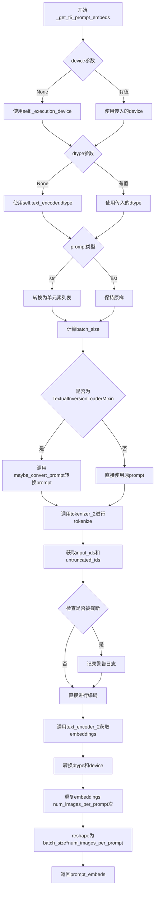

#### 带注释源码

```python
# Copied from diffusers.pipelines.flux.pipeline_flux.FluxPipeline._get_t5_prompt_embeds
def _get_t5_prompt_embeds(
    self,
    prompt: str | list[str] = None,
    num_images_per_prompt: int = 1,
    max_sequence_length: int = 512,
    device: torch.device | None = None,
    dtype: torch.dtype | None = None,
):
    # 确定设备：优先使用传入的device，否则使用执行设备
    device = device or self._execution_device
    # 确定数据类型：优先使用传入的dtype，否则使用text_encoder的dtype
    dtype = dtype or self.text_encoder.dtype

    # 如果prompt是字符串，转换为单元素列表；如果是列表则保持不变
    prompt = [prompt] if isinstance(prompt, str) else prompt
    # 计算批次大小
    batch_size = len(prompt)

    # 如果当前pipeline包含TextualInversionLoaderMixin特性，转换prompt
    if isinstance(self, TextualInversionLoaderMixin):
        prompt = self.maybe_convert_prompt(prompt, self.tokenizer_2)

    # 使用T5 tokenizer对prompt进行分词
    # padding="max_length": 填充到最大长度
    # max_length: 最大序列长度
    # truncation: 截断超长序列
    # return_tensors="pt": 返回PyTorch张量
    text_inputs = self.tokenizer_2(
        prompt,
        padding="max_length",
        max_length=max_sequence_length,
        truncation=True,
        return_length=False,
        return_overflowing_tokens=False,
        return_tensors="pt",
    )
    # 获取tokenize后的input_ids
    text_input_ids = text_inputs.input_ids
    # 使用最长填充方式获取未截断的input_ids用于比较
    untruncated_ids = self.tokenizer_2(prompt, padding="longest", return_tensors="pt").input_ids

    # 检查输入是否被截断，如果是则记录警告
    # 比较未截断和截断后的序列长度和内容
    if untruncated_ids.shape[-1] >= text_input_ids.shape[-1] and not torch.equal(text_input_ids, untruncated_ids):
        # 解码被截断的部分用于日志输出
        removed_text = self.tokenizer_2.batch_decode(untruncated_ids[:, self.tokenizer_max_length - 1 : -1])
        logger.warning(
            "The following part of your input was truncated because `max_sequence_length` is set to "
            f" {max_sequence_length} tokens: {removed_text}"
        )

    # 调用T5 encoder获取文本嵌入
    # output_hidden_states=False: 只获取最后一层的输出
    prompt_embeds = self.text_encoder_2(text_input_ids.to(device), output_hidden_states=False)[0]

    # 确保embeddings的数据类型和设备正确
    dtype = self.text_encoder_2.dtype
    prompt_embeds = prompt_embeds.to(dtype=dtype, device=device)

    # 获取序列长度
    _, seq_len, _ = prompt_embeds.shape

    # 为每个prompt复制num_images_per_prompt份embeddings
    # 这样可以实现批量生成多张图像
    # duplicate text embeddings and attention mask for each generation per prompt, using mps friendly method
    prompt_embeds = prompt_embeds.repeat(1, num_images_per_prompt, 1)
    # reshape为 (batch_size * num_images_per_prompt, seq_len, hidden_size)
    prompt_embeds = prompt_embeds.view(batch_size * num_images_per_prompt, seq_len, -1)

    # 返回处理后的prompt embeddings
    return prompt_embeds
```


### `FluxControlPipeline._get_clip_prompt_embeds`

该方法使用CLIP文本编码器将文本提示词转换为池化后的向量嵌入表示，用于图像生成管线。它处理单个或多个文本提示词，生成可被FluxTransformer2DModel使用的pooled提示词嵌入向量。

参数：

- `prompt`：`str | list[str]`，要编码的文本提示词，可以是单个字符串或字符串列表
- `num_images_per_prompt`：`int = 1`，每个提示词需要生成的图像数量，用于复制嵌入向量
- `device`：`torch.device | None = None`，执行设备，默认为当前执行设备

返回值：`torch.FloatTensor`，形状为`(batch_size * num_images_per_prompt, hidden_size)`的池化提示词嵌入向量

#### 流程图

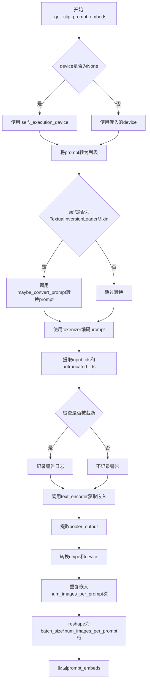

#### 带注释源码

```python
def _get_clip_prompt_embeds(
    self,
    prompt: str | list[str],
    num_images_per_prompt: int = 1,
    device: torch.device | None = None,
):
    """获取CLIP模型的提示词嵌入
    
    Args:
        prompt: 要编码的文本提示词
        num_images_per_prompt: 每个提示词生成的图像数量
        device: 执行设备
        
    Returns:
        pooler_output: CLIP模型的池化输出
    """
    # 如果未指定device，则使用pipeline的默认执行设备
    device = device or self._execution_device

    # 统一将prompt转为列表格式，方便批量处理
    prompt = [prompt] if isinstance(prompt, str) else prompt
    # 计算batch_size
    batch_size = len(prompt)

    # 如果支持TextualInversion，使用maybe_convert_prompt处理提示词
    # 这允许使用文本反转技术注入自定义嵌入
    if isinstance(self, TextualInversionLoaderMixin):
        prompt = self.maybe_convert_prompt(prompt, self.tokenizer)

    # 使用CLIP tokenizer对prompt进行编码
    # padding="max_length": 填充到最大长度
    # max_length: tokenizer的最大长度限制
    # truncation: 截断超长序列
    # return_tensors="pt": 返回PyTorch张量
    text_inputs = self.tokenizer(
        prompt,
        padding="max_length",
        max_length=self.tokenizer_max_length,
        truncation=True,
        return_overflowing_tokens=False,
        return_length=False,
        return_tensors="pt",
    )

    # 获取编码后的input_ids
    text_input_ids = text_inputs.input_ids
    # 同时获取未截断的版本，用于检测是否有内容被截断
    untruncated_ids = self.tokenizer(prompt, padding="longest", return_tensors="pt").input_ids
    
    # 检查输入是否被截断，如果是则记录警告
    # 比较截断和未截断的序列长度
    if untruncated_ids.shape[-1] >= text_input_ids.shape[-1] and not torch.equal(text_input_ids, untruncated_ids):
        # 解码被移除的部分并记录警告
        removed_text = self.tokenizer.batch_decode(untruncated_ids[:, self.tokenizer_max_length - 1 : -1])
        logger.warning(
            "The following part of your input was truncated because CLIP can only handle sequences up to"
            f" {self.tokenizer_max_length} tokens: {removed_text}"
        )
    
    # 将input_ids传入CLIP文本编码器，获取隐藏状态
    # output_hidden_states=False表示只返回最后的隐藏状态
    prompt_embeds = self.text_encoder(text_input_ids.to(device), output_hidden_states=False)

    # 从CLIPTextModel输出中提取pooled输出
    # 这是经过池化层处理的句子级别表示
    prompt_embeds = prompt_embeds.pooler_output
    # 转换到正确的dtype和device
    prompt_embeds = prompt_embeds.to(dtype=self.text_encoder.dtype, device=device)

    # 为每个prompt复制num_images_per_prompt次
    # 这样每个生成的图像都有对应的文本嵌入
    prompt_embeds = prompt_embeds.repeat(1, num_images_per_prompt)
    # 重新reshape以匹配批量大小
    # 形状从[1, hidden_size]变为[batch_size * num_images_per_prompt, hidden_size]
    prompt_embeds = prompt_embeds.view(batch_size * num_images_per_prompt, -1)

    return prompt_embeds
```


### `FluxControlPipeline.encode_prompt`

该方法用于将文本提示编码为 T5 和 CLIP 文本嵌入，并生成相应的文本标识符。它支持 LoRA 缩放、预计算的嵌入以及双文本编码器（CLIP 和 T5）的集成。

参数：

- `prompt`：`str | list[str]`，要编码的主提示词
- `prompt_2`：`str | list[str] | None`，发送给 T5 编码器的提示词，若未指定则使用 `prompt`
- `device`：`torch.device | None`，torch 设备，默认为执行设备
- `num_images_per_prompt`：`int`，每个提示词生成的图像数量，默认为 1
- `prompt_embeds`：`torch.FloatTensor | None`，预生成的文本嵌入，用于微调输入
- `pooled_prompt_embeds`：`torch.FloatTensor | None`，预生成的池化文本嵌入
- `max_sequence_length`：`int`，最大序列长度，默认为 512
- `lora_scale`：`float | None`，LoRA 层的缩放因子

返回值：`tuple[torch.FloatTensor, torch.FloatTensor, torch.Tensor]`，包含：
- `prompt_embeds`：T5 编码的文本嵌入
- `pooled_prompt_embeds`：CLIP 编码的池化文本嵌入
- `text_ids`：文本标识符张量（形状为 `[seq_len, 3]`）

#### 流程图

```mermaid
flowchart TD
    A[开始 encode_prompt] --> B{传入 lora_scale?}
    B -->|是| C[设置 self._lora_scale]
    C --> D{USE_PEFT_BACKEND?}
    D -->|是| E[缩放 text_encoder LoRA 层]
    D -->|否| F[缩放 text_encoder_2 LoRA 层]
    E --> G
    F --> G
    B -->|否| G{传入 prompt_embeds?}
    G -->|否| H[标准化 prompt_2]
    G -->|是| I
    H --> J[调用 _get_clip_prompt_embeds]
    J --> K[调用 _get_t5_prompt_embeds]
    K --> I
    I{text_encoder 存在?}
    I -->|是| L{使用 FluxLoraLoaderMixin 且 USE_PEFT_BACKEND?}
    L -->|是| M[取消缩放 text_encoder LoRA 层]
    L -->|否| N
    I -->|否| N{text_encoder_2 存在?}
    N -->|是| O{使用 FluxLoraLoaderMixin 且 USE_PEFT_BACKEND?}
    O -->|是| P[取消缩放 text_encoder_2 LoRA 层]
    O -->|否| Q
    P --> Q
    M --> Q
    N -->|否| Q
    Q --> R[确定 dtype]
    R --> S[创建 text_ids 张量 [seq_len, 3]]
    S --> T[返回 prompt_embeds, pooled_prompt_embeds, text_ids]
```

#### 带注释源码

```python
def encode_prompt(
    self,
    prompt: str | list[str],
    prompt_2: str | list[str] | None = None,
    device: torch.device | None = None,
    num_images_per_prompt: int = 1,
    prompt_embeds: torch.FloatTensor | None = None,
    pooled_prompt_embeds: torch.FloatTensor | None = None,
    max_sequence_length: int = 512,
    lora_scale: float | None = None,
):
    r"""
    编码文本提示为 T5 和 CLIP 嵌入

    Args:
        prompt: 主提示词字符串或列表
        prompt_2: 发送给 T5 编码器的提示词，若为 None 则使用 prompt
        device: torch 设备
        num_images_per_prompt: 每个提示词生成的图像数量
        prompt_embeds: 预生成的文本嵌入（可选）
        pooled_prompt_embeds: 预生成的池化文本嵌入（可选）
        max_sequence_length: T5 编码器的最大序列长度
        lora_scale: LoRA 缩放因子（可选）
    """
    # 确定设备，默认为执行设备
    device = device or self._execution_device

    # 设置 LoRA 缩放因子，以便文本编码器的 LoRA 函数可以正确访问
    if lora_scale is not None and isinstance(self, FluxLoraLoaderMixin):
        self._lora_scale = lora_scale

        # 动态调整 LoRA 缩放因子
        if self.text_encoder is not None and USE_PEFT_BACKEND:
            scale_lora_layers(self.text_encoder, lora_scale)
        if self.text_encoder_2 is not None and USE_PEFT_BACKEND:
            scale_lora_layers(self.text_encoder_2, lora_scale)

    # 标准化 prompt 为列表格式
    prompt = [prompt] if isinstance(prompt, str) else prompt

    # 如果未提供预计算的嵌入，则从提示词生成
    if prompt_embeds is None:
        # 确定 prompt_2，若未指定则使用 prompt
        prompt_2 = prompt_2 or prompt
        prompt_2 = [prompt_2] if isinstance(prompt_2, str) else prompt_2

        # 获取 CLIP 池化嵌入（用于 CLIPTextModel）
        pooled_prompt_embeds = self._get_clip_prompt_embeds(
            prompt=prompt,
            device=device,
            num_images_per_prompt=num_images_per_prompt,
        )
        # 获取 T5 文本嵌入
        prompt_embeds = self._get_t5_prompt_embeds(
            prompt=prompt_2,
            num_images_per_prompt=num_images_per_prompt,
            max_sequence_length=max_sequence_length,
            device=device,
        )

    # 恢复 LoRA 缩放因子（如果之前应用了）
    if self.text_encoder is not None:
        if isinstance(self, FluxLoraLoaderMixin) and USE_PEFT_BACKEND:
            # 通过取消缩放 LoRA 层来检索原始缩放因子
            unscale_lora_layers(self.text_encoder, lora_scale)

    if self.text_encoder_2 is not None:
        if isinstance(self, FluxLoraLoaderMixin) and USE_PEFT_BACKEND:
            # 通过取消缩放 LoRA 层来检索原始缩放因子
            unscale_lora_layers(self.text_encoder_2, lora_scale)

    # 确定数据类型，优先使用 text_encoder 的 dtype，否则使用 transformer 的 dtype
    dtype = self.text_encoder.dtype if self.text_encoder is not None else self.transformer.dtype
    
    # 创建文本标识符张量，形状为 [seq_len, 3]，用于后续的 Transformer 处理
    text_ids = torch.zeros(prompt_embeds.shape[1], 3).to(device=device, dtype=dtype)

    # 返回 T5 嵌入、CLIP 池化嵌入和文本标识符
    return prompt_embeds, pooled_prompt_embeds, text_ids
```


### `FluxControlPipeline.check_inputs`

该方法用于验证 FluxControlPipeline 的输入参数是否符合要求，包括检查高度和宽度是否能被 VAE 尺度因子整除、回调张量输入的有效性、prompt 与 prompt_embeds 的互斥性、类型检查以及序列长度限制等。

参数：

- `self`：`FluxControlPipeline` 实例，Pipeline 对象本身
- `prompt`：`str | list[str] | None`，主提示词，用于生成图像的文本描述
- `prompt_2`：`str | list[str] | None`，第二个提示词，发送给 tokenizer_2 和 text_encoder_2
- `height`：`int`，生成图像的高度（像素）
- `width`：`int`，生成图像的宽度（像素）
- `prompt_embeds`：`torch.FloatTensor | None`，预生成的文本嵌入，可用于微调文本输入
- `pooled_prompt_embeds`：`torch.FloatTensor | None`，预生成的池化文本嵌入
- `callback_on_step_end_tensor_inputs`：`list[str] | None`，每步结束时回调函数需要访问的张量名称列表
- `max_sequence_length`：`int | None`，T5 编码器的最大序列长度

返回值：`None`，该方法仅进行参数验证，若验证失败则抛出 ValueError

#### 流程图

```mermaid
flowchart TD
    A[开始 check_inputs] --> B{height % (vae_scale_factor * 2) == 0?}
    B -->|否| C[输出警告: 尺寸将被调整]
    B -->|是| D{callback_on_step_end_tensor_inputs 有效?}
    D -->|否| E[抛出 ValueError: 无效的回调张量输入]
    D -->|是| F{prompt 和 prompt_embeds 同时存在?}
    F -->|是| G[抛出 ValueError: 不能同时指定]
    F -->|否| H{prompt_2 和 prompt_embeds 同时存在?}
    H -->|是| I[抛出 ValueError: 不能同时指定]
    H -->|否| J{prompt 和 prompt_embeds 都为 None?}
    J -->|是| K[抛出 ValueError: 至少需要提供一个]
    J -->|否| L{prompt 类型正确?}
    L -->|否| M[抛出 ValueError: 类型错误]
    L -->|是| N{prompt_2 类型正确?}
    N -->|否| O[抛出 ValueError: 类型错误]
    N -->|是| P{prompt_embeds 有但 pooled_prompt_embeds 没有?}
    P -->|是| Q[抛出 ValueError: 需要同时提供]
    P -->|否| R{max_sequence_length > 512?}
    R -->|是| S[抛出 ValueError: 超过最大长度]
    R -->|否| T[验证通过]
    
    C --> D
    E --> END
    G --> END
    I --> END
    K --> END
    M --> END
    O --> END
    Q --> END
    S --> END
    T --> END
```

#### 带注释源码

```python
def check_inputs(
    self,
    prompt,
    prompt_2,
    height,
    width,
    prompt_embeds=None,
    pooled_prompt_embeds=None,
    callback_on_step_end_tensor_inputs=None,
    max_sequence_length=None,
):
    """
    检查并验证 Pipeline 输入参数的有效性
    
    该方法在 pipeline 执行前被调用，确保所有输入参数符合预期，
    避免在后续处理过程中出现难以追踪的错误。
    """
    
    # 检查图像尺寸是否能被 VAE 尺度因子整除
    # Flux 模型的 latents 需要满足特定的维度要求
    if height % (self.vae_scale_factor * 2) != 0 or width % (self.vae_scale_factor * 2) != 0:
        logger.warning(
            f"`height` and `width` have to be divisible by {self.vae_scale_factor * 2} but are {height} and {width}. Dimensions will be resized accordingly"
        )

    # 验证回调张量输入的有效性
    # callback_on_step_end_tensor_inputs 必须是 _callback_tensor_inputs 的子集
    if callback_on_step_end_tensor_inputs is not None and not all(
        k in self._callback_tensor_inputs for k in callback_on_step_end_tensor_inputs
    ):
        raise ValueError(
            f"`callback_on_step_end_tensor_inputs` has to be in {self._callback_tensor_inputs}, but found {[k for k in callback_on_step_end_tensor_inputs if k not in self._callback_tensor_inputs]}"
        )

    # prompt 和 prompt_embeds 是互斥的，不能同时提供
    if prompt is not None and prompt_embeds is not None:
        raise ValueError(
            f"Cannot forward both `prompt`: {prompt} and `prompt_embeds`: {prompt_embeds}. Please make sure to"
            " only forward one of the two."
        )
    
    # prompt_2 和 prompt_embeds 也是互斥的
    elif prompt_2 is not None and prompt_embeds is not None:
        raise ValueError(
            f"Cannot forward both `prompt_2`: {prompt_2} and `prompt_embeds`: {prompt_embeds}. Please make sure to"
            " only forward one of the two."
        )
    
    # 至少需要提供 prompt 或 prompt_embeds 之一
    elif prompt is None and prompt_embeds is None:
        raise ValueError(
            "Provide either `prompt` or `prompt_embeds`. Cannot leave both `prompt` and `prompt_embeds` undefined."
        )
    
    # 验证 prompt 的类型必须是 str 或 list
    elif prompt is not None and (not isinstance(prompt, str) and not isinstance(prompt, list)):
        raise ValueError(f"`prompt` has to be of type `str` or `list` but is {type(prompt)}")
    
    # 验证 prompt_2 的类型必须是 str 或 list
    elif prompt_2 is not None and (not isinstance(prompt_2, str) and not isinstance(prompt_2, list)):
        raise ValueError(f"`prompt_2` has to be of type `str` or `list` but is {type(prompt_2)}")

    # 如果提供了 prompt_embeds，也必须提供 pooled_prompt_embeds
    # 因为它们来自同一个文本编码器
    if prompt_embeds is not None and pooled_prompt_embeds is None:
        raise ValueError(
            "If `prompt_embeds` are provided, `pooled_prompt_embeds` also have to be passed. Make sure to generate `pooled_prompt_embeds` from the same text encoder that was used to generate `prompt_embeds`."
        )

    # T5 编码器的最大序列长度限制为 512
    if max_sequence_length is not None and max_sequence_length > 512:
        raise ValueError(f"`max_sequence_length` cannot be greater than 512 but is {max_sequence_length}")
```


### `FluxControlPipeline._prepare_latent_image_ids`

该静态方法用于生成latent图像的空间位置编码ID，为Flux transformer模型提供2D空间位置信息。它创建一个形状为`(height * width, 3)`的tensor，其中第二通道编码垂直位置（行索引），第三通道编码水平位置（列索引），第一个通道保留为0。

参数：

- `batch_size`：`int`，批次大小（虽然参数列表中有，但在函数体内未直接使用，用于调用者传递上下文信息）
- `height`：`int`，latent空间的高度（按patch计算前的像素高度）
- `width`：`int`，latent空间的宽度（按patch计算前的像素宽度）
- `device`：`torch.device | None`，计算设备
- `dtype`：`torch.dtype | None`，返回tensor的数据类型

返回值：`torch.Tensor`，形状为`(height * width, 3)`的位置编码tensor

#### 流程图

```mermaid
flowchart TD
    A[开始] --> B[创建零tensor shape: height × width × 3]
    B --> C[在通道1添加行索引<br/>latent_image_ids[..., 1] + torch.arange(height)[:, None]]
    C --> D[在通道2添加列索引<br/>latent_image_ids[..., 2] + torch.arange(width)[None, :]]
    D --> E[Reshape: height × width × 3<br/>→ height×width × 3]
    E --> F[转换到指定device和dtype]
    F --> G[返回latent_image_ids]
```

#### 带注释源码

```python
@staticmethod
# Copied from diffusers.pipelines.flux.pipeline_flux.FluxPipeline._prepare_latent_image_ids
def _prepare_latent_image_ids(batch_size, height, width, device, dtype):
    """
    准备latent图像的ID用于transformer的注意力机制。
    
    Flux模型使用位置编码来标识每个latent patch在原始图像中的2D位置。
    这有助于模型理解图像的空间结构。
    
    Args:
        batch_size: 批次大小（保留参数，未在函数内使用）
        height: latent高度（按patch划分前）
        width: latent宽度（按patch划分前）
        device: 计算设备
        dtype: 返回tensor的数据类型
    
    Returns:
        torch.Tensor: 形状为 (height * width, 3) 的位置编码tensor
                      第二通道为行位置编码，第三通道为列位置编码
    """
    # 步骤1: 创建初始零tensor，形状为 (height, width, 3)
    # 3个通道分别用于: [未知, 行索引, 列索引]
    latent_image_ids = torch.zeros(height, width, 3)
    
    # 步骤2: 在第二通道（索引1）添加垂直位置信息
    # torch.arange(height)[:, None] 创建列向量 (height, 1)
    # 广播机制使每行都具有相同的行索引值
    latent_image_ids[..., 1] = latent_image_ids[..., 1] + torch.arange(height)[:, None]
    
    # 步骤3: 在第三通道（索引2）添加水平位置信息
    # torch.arange(width)[None, :] 创建行向量 (1, width)
    # 广播机制使每列都具有相同的列索引值
    latent_image_ids[..., 2] = latent_image_ids[..., 2] + torch.arange(width)[None, :]
    
    # 步骤4: 获取shape信息用于reshape
    latent_image_id_height, latent_image_id_width, latent_image_id_channels = latent_image_ids.shape
    
    # 步骤5: Reshape从 (height, width, 3) 展平为 (height*width, 3)
    # 将2D位置信息展平为1D序列，每个位置用3维向量表示
    latent_image_ids = latent_image_ids.reshape(
        latent_image_id_height * latent_image_id_width, latent_image_id_channels
    )
    
    # 步骤6: 转换到指定设备和数据类型并返回
    return latent_image_ids.to(device=device, dtype=dtype)
```


### `FluxControlPipeline._pack_latents`

将输入的latent张量重新整形和排列，以便进行后续的transformer处理。该方法将4D latent张量转换为打包格式，将2x2的patch合并为一个维度，以适应Flux架构的处理方式。

参数：

- `latents`：`torch.Tensor`，输入的4D latent张量，形状为 (batch_size, num_channels_latents, height, width)
- `batch_size`：`int`，批次大小，用于指定样本数量
- `num_channels_latents`：`int`，latent的通道数，通常等于vae的潜在通道数
- `height`：`int`，latent张量的高度（VAE解码后的高度）
- `width`：`int`，latent张量的宽度（VAE解码后的宽度）

返回值：`torch.Tensor`，打包后的latent张量，形状为 (batch_size, (height // 2) * (width // 2), num_channels_latents * 4)

#### 流程图

```mermaid
flowchart TD
    A[输入 latents: (batch_size, num_channels, height, width)] --> B[view 操作重塑为 6D 张量]
    B --> C[将张量重塑为 (batch_size, num_channels_latents, height//2, 2, width//2, 2)]
    C --> D[permute 重新排列维度]
    D --> E[排列为 (batch_size, height//2, width//2, num_channels_latents, 2, 2)]
    E --> F[reshape 合并最后两维]
    F --> G[输出: (batch_size, height//2 * width//2, num_channels_latents * 4)]
```

#### 带注释源码

```python
@staticmethod
# Copied from diffusers.pipelines.flux.pipeline_flux.FluxPipeline._pack_latents
def _pack_latents(latents, batch_size, num_channels_latents, height, width):
    # 第一步：将4D张量 view 成6D张量
    # 将 height 和 width 各分成两部分（对应2x2的patches）
    # 原始形状: (batch_size, num_channels_latents, height, width)
    # 转换后: (batch_size, num_channels_latents, height//2, 2, width//2, 2)
    latents = latents.view(batch_size, num_channels_latents, height // 2, 2, width // 2, 2)
    
    # 第二步：permute 重新排列维度顺序
    # 将 (batch, channels, h, 2, w, 2) 转换为 (batch, h, w, channels, 2, 2)
    # 这样可以将2x2的patch数据排列在一起
    latents = latents.permute(0, 2, 4, 1, 3, 5)
    
    # 第三步：reshape 将最后两维合并
    # 将 (batch, h, w, channels, 2, 2) 转换为 (batch, h*w, channels*4)
    # 这里的 4 = 2*2，表示每个patch包含4个像素的信息
    latents = latents.reshape(batch_size, (height // 2) * (width // 2), num_channels_latents * 4)

    return latents
```


### `FluxControlPipeline._unpack_latents`

该方法是一个静态方法，用于将打包（packed）后的latent张量解包（unpack）回原始的4D形状，以便进行VAE解码。在Flux模型中，latents被打包成2x2的patch形式以提高计算效率，此方法执行相反的操作恢复原始空间维度。

参数：

- `latents`：`torch.Tensor`，打包后的latent张量，形状为 (batch_size, num_patches, channels)，其中 num_patches = (height // 2) * (width // 2)
- `height`：`int`，原始图像的高度（像素单位）
- `width`：`int`，原始图像的宽度（像素单位）
- `vae_scale_factor`：`int`，VAE的缩放因子，用于计算实际的latent空间尺寸（VAE通常有8x或16x的压缩比）

返回值：`torch.Tensor`，解包后的latent张量，形状为 (batch_size, channels // 4, height', width')，其中 height' 和 width' 是经过VAE缩放和2倍调整后的latent空间尺寸

#### 流程图

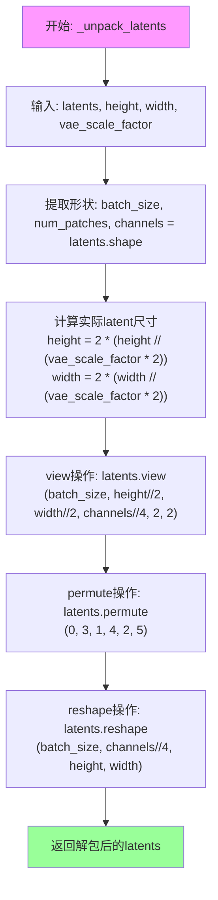

#### 带注释源码

```python
@staticmethod
def _unpack_latents(latents, height, width, vae_scale_factor):
    # 从打包的latent张量中提取维度信息
    # latents 形状: (batch_size, num_patches, channels)
    # num_patches = (latent_height) * (latent_width)
    batch_size, num_patches, channels = latents.shape

    # VAE对图像应用8倍压缩，但我们还需要考虑packing操作的要求
    # packing需要latent的高度和宽度能被2整除
    # 因此实际latent空间尺寸 = 2 * (原始尺寸 // (vae_scale_factor * 2))
    # 例如: 如果vae_scale_factor=8, height=1024, width=1024
    # 则 latent_height = 2 * (1024 // 16) = 2 * 64 = 128
    height = 2 * (int(height) // (vae_scale_factor * 2))
    width = 2 * (int(width) // (vae_scale_factor * 2))

    # 执行反向packing操作的第一步：恢复2x2 patch结构
    # 将 (batch_size, height//2, width//2, channels//4, 2, 2) 的view
    # 这会将pack后的channels//4 * 4恢复为原始的channels分布
    latents = latents.view(batch_size, height // 2, width // 2, channels // 4, 2, 2)
    
    # 第二步：调整维度顺序
    # 从 (batch, h/2, w/2, c/4, 2, 2) -> (batch, c/4, h/2, 2, w/2, 2)
    # 这样2x2的patch维度被移到正确的位置
    latents = latents.permute(0, 3, 1, 4, 2, 5)

    # 第三步：reshape回4D张量
    # 从 (batch, c/4, h/2, 2, w/2, 2) -> (batch, c/4, h, w)
    # 最终形状: (batch_size, channels // 4, height, width)
    latents = latents.reshape(batch_size, channels // (2 * 2), height, width)

    return latents
```

#### 技术说明

此方法与 `_pack_latents` 方法互为逆操作。packing过程将4D latent张量（batch, channels, h, w）转换为（batch, h*w, channels*4）的2D打包形式，用于Transformer的高效处理；unpacking则执行相反操作，将打包的latents恢复为4D形式以供VAE解码器使用。打包/解包机制是Flux架构中平衡计算效率与模型性能的关键设计。


### `FluxControlPipeline.enable_vae_slicing`

启用VAE切片解码功能。当启用此选项时，VAE会将输入张量分割成多个切片分步计算解码，以节省内存并支持更大的批量大小。该方法已被弃用，将在0.40.0版本中移除，建议直接调用`pipe.vae.enable_slicing()`。

参数：

- （无参数）

返回值：`None`，无返回值

#### 流程图

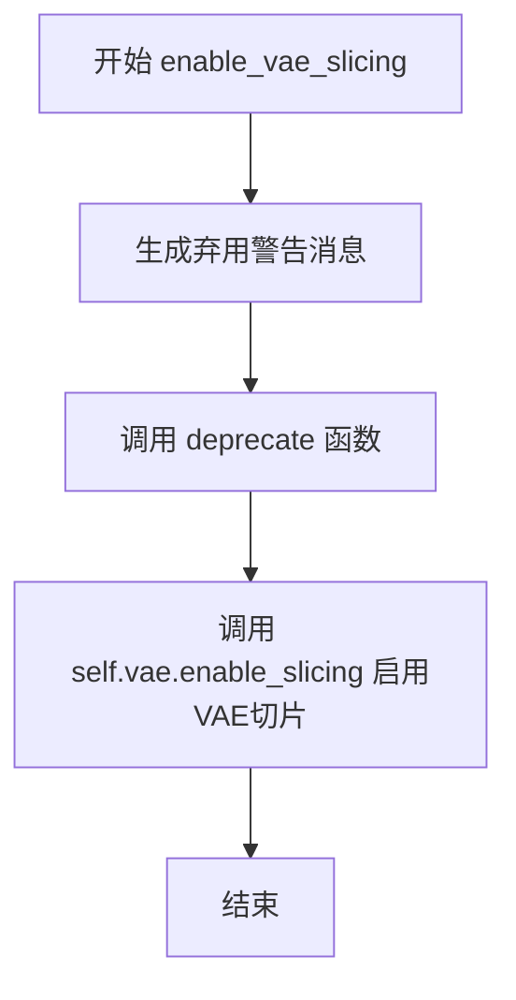

#### 带注释源码

```python
def enable_vae_slicing(self):
    r"""
    Enable sliced VAE decoding. When this option is enabled, the VAE will split the input tensor in slices to
    compute decoding in several steps. This is useful to save some memory and allow larger batch sizes.
    """
    # 构建弃用警告消息，包含当前类名
    depr_message = f"Calling `enable_vae_slicing()` on a `{self.__class__.__name__}` is deprecated and this method will be removed in a future version. Please use `pipe.vae.enable_slicing()`."
    
    # 调用deprecate函数发出弃用警告
    # 参数：方法名, 弃用版本号, 警告消息
    deprecate(
        "enable_vae_slicing",
        "0.40.0",
        depr_message,
    )
    
    # 实际启用VAE切片功能，调用VAE模型的enable_slicing方法
    self.vae.enable_slicing()
```


### `FluxControlPipeline.disable_vae_slicing`

禁用VAE切片解码。如果之前启用了`enable_vae_slicing`，此方法将恢复为单步计算解码。该方法已废弃，建议使用`pipe.vae.disable_slicing()`。

参数： 无（仅包含self参数）

返回值：`None`，无返回值

#### 流程图

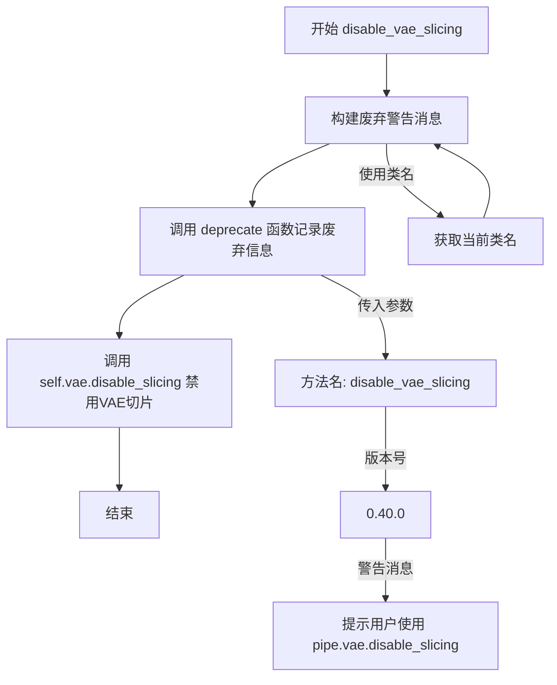

#### 带注释源码

```
def disable_vae_slicing(self):
    r"""
    Disable sliced VAE decoding. If `enable_vae_slicing` was previously enabled, this method will go back to
    computing decoding in one step.
    """
    # 构建废弃警告消息，包含当前类名并提示用户使用新方法
    depr_message = f"Calling `disable_vae_slicing()` on a `{self.__class__.__name__}` is deprecated and this method will be removed in a future version. Please use `pipe.vae.disable_slicing()`."
    
    # 调用deprecate函数记录废弃信息，指定方法名、版本号和警告消息
    deprecate(
        "disable_vae_slicing",  # 要废弃的方法名
        "0.40.0",                # 废弃版本号
        depr_message,            # 废弃警告消息
    )
    
    # 调用VAE模型的disable_slicing方法实际禁用切片功能
    self.vae.disable_slicing()
```


### `FluxControlPipeline.enable_vae_tiling`

启用瓦片式 VAE 解码。当启用此选项时，VAE 将输入张量分割成瓦片，以多个步骤计算解码和编码。这对于节省大量内存并允许处理更大的图像非常有用。

参数： 无

返回值：`None`，无返回值（该方法直接操作内部 VAE 组件）

#### 流程图

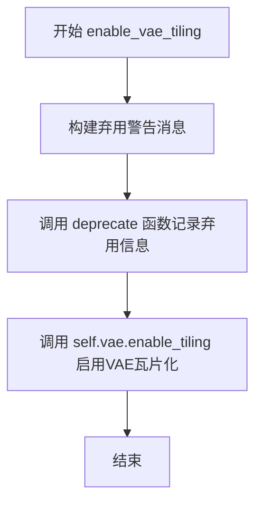

#### 带注释源码

```python
def enable_vae_tiling(self):
    r"""
    Enable tiled VAE decoding. When this option is enabled, the VAE will split the input tensor into tiles to
    compute decoding and encoding in several steps. This is useful for saving a large amount of memory and to allow
    processing larger images.
    """
    # 构建弃用警告消息，提示用户该方法将在未来版本中移除
    # 并建议直接使用 pipe.vae.enable_tiling()
    depr_message = f"Calling `enable_vae_tiling()` on a `{self.__class__.__name__}` is deprecated and this method will be removed in a future version. Please use `pipe.vae.enable_tiling()`."
    
    # 调用 deprecate 函数记录弃用信息
    # 参数: 方法名, 弃用版本号, 弃用消息
    deprecate(
        "enable_vae_tiling",
        "0.40.0",
        depr_message,
    )
    
    # 委托给内部 VAE 对象的 enable_tiling 方法
    # 这是实际执行瓦片化启用的核心逻辑
    self.vae.enable_tiling()
```


### `FluxControlPipeline.disable_vae_tiling`

禁用瓦片式 VAE 解码。如果之前启用了 `enable_vae_tiling`，此方法将恢复为单步计算解码。该方法已被弃用，推荐直接使用 `pipe.vae.disable_tiling()`。

参数：此方法无显式参数（仅包含 `self`）

返回值：无返回值（`None`）

#### 流程图

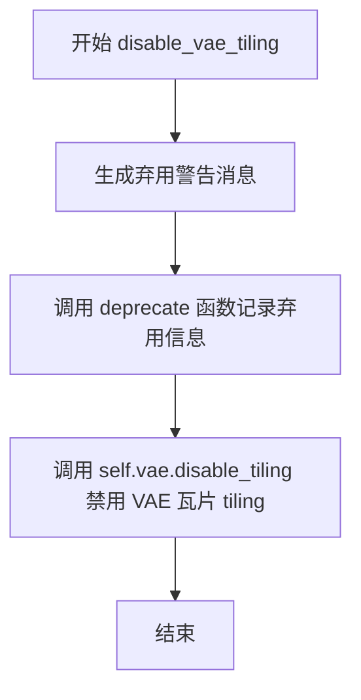

#### 带注释源码

```
def disable_vae_tiling(self):
    r"""
    Disable tiled VAE decoding. If `enable_vae_tiling` was previously enabled, this method will go back to
    computing decoding in one step.
    """
    # 构建弃用警告消息，包含当前类名以提供上下文信息
    depr_message = f"Calling `disable_vae_tiling()` on a `{self.__class__.__name__}` is deprecated and this method will be removed in a future version. Please use `pipe.vae.disable_tiling()`."
    
    # 调用 deprecate 函数记录弃用警告，指定在 0.40.0 版本移除
    deprecate(
        "disable_vae_tiling",      # 被弃用的方法名
        "0.40.0",                  # 计划移除的版本号
        depr_message,              # 弃用原因和替代方案
    )
    
    # 实际执行：调用底层 VAE 模型的 disable_tiling 方法
    # 这是实际完成禁用瓦片功能的调用
    self.vae.disable_tiling()
```


### FluxControlPipeline.prepare_latents

该方法是 FluxControlPipeline 类的核心方法之一，负责准备扩散模型的潜在向量（latents）和潜在图像ID。它根据输入的高度和宽度计算压缩后的潜在空间尺寸，如果提供了预生成的latents则直接使用，否则使用随机生成器创建新的latents，最后通过_pack_latents方法打包latents并生成相应的潜在图像ID用于注意力机制。

参数：

- `batch_size`：`int`，批次大小，决定生成图像的数量
- `num_channels_latents`：`int`，潜在向量的通道数，通常为变压器模型输入通道数除以8
- `height`：`int`，原始图像高度（像素），方法内部会将其转换为潜在空间高度
- `width`：`int`，原始图像宽度（像素），方法内部会将其转换为潜在空间宽度
- `dtype`：`torch.dtype`，生成latents使用的数据类型，通常与文本嵌入数据类型一致
- `device`：`torch.device`，生成latents的设备（CPU或CUDA）
- `generator`：`torch.Generator | list[torch.Generator] | None`，可选的随机生成器，用于确保可重复性
- `latents`：`torch.FloatTensor | None`，可选的预生成潜在向量，如果提供则直接使用而不是随机生成

返回值：`tuple[torch.Tensor, torch.Tensor]`，返回两个张量——第一个是处理后的latents张量（已打包），第二个是潜在图像ID张量，用于后续变压器模型中的位置编码

#### 流程图

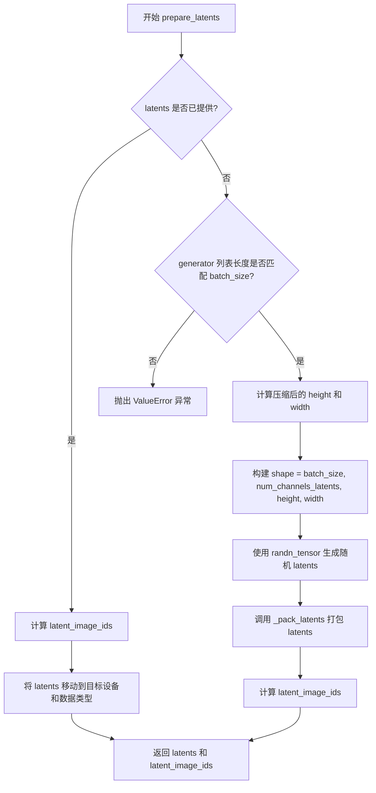

#### 带注释源码

```python
def prepare_latents(
    self,
    batch_size,
    num_channels_latents,
    height,
    width,
    dtype,
    device,
    generator,
    latents=None,
):
    """
    准备用于扩散模型推理的潜在向量（latents）。
    
    VAE 对图像应用 8 倍压缩，但还需要考虑打包操作要求潜在空间的高度和宽度能够被 2 整除。
    因此，最终的潜在空间尺寸需要乘以 2。
    """
    
    # 计算压缩后的潜在空间尺寸
    # 原始图像尺寸除以 VAE 缩放因子和打包因子（2），然后再乘以 2
    height = 2 * (int(height) // (self.vae_scale_factor * 2))
    width = 2 * (int(width) // (self.vae_scale_factor * 2))

    # 构建潜在向量的形状：(batch_size, channels, height, width)
    shape = (batch_size, num_channels_latents, height, width)

    # 如果用户已经提供了 latents，则直接使用
    if latents is not None:
        # 生成潜在图像 ID，用于变压器模型中的位置编码
        # 注意：这里使用的是压缩后的尺寸除以 2，因为后续会打包
        latent_image_ids = self._prepare_latent_image_ids(batch_size, height // 2, width // 2, device, dtype)
        
        # 将 latents 移动到指定的设备和数据类型，然后返回
        return latents.to(device=device, dtype=dtype), latent_image_ids

    # 验证 generator 列表的长度是否与 batch_size 匹配
    if isinstance(generator, list) and len(generator) != batch_size:
        raise ValueError(
            f"You have passed a list of generators of length {len(generator)}, but requested an effective batch"
            f" size of {batch_size}. Make sure the batch size matches the length of the generators."
        )

    # 使用随机张量生成初始的噪声 latents
    latents = randn_tensor(shape, generator=generator, device=device, dtype=dtype)
    
    # 打包 latents：将 2x2 的 patch 展平为单个向量，这是 Flux 架构的特殊处理
    latents = self._pack_latents(latents, batch_size, num_channels_latents, height, width)

    # 生成潜在图像 ID，用于后续的自注意力机制
    latent_image_ids = self._prepare_latent_image_ids(batch_size, height // 2, width // 2, device, dtype)

    # 返回打包后的 latents 和对应的潜在图像 ID
    return latents, latent_image_ids
```


### `FluxControlPipeline.prepare_image`

该方法用于预处理控制图像（control image），将其调整为指定的尺寸和批次，以便于在 Flux 控制管道中进行图像生成。它处理不同类型的输入图像（Tensor 或其他格式），并进行批次复制和设备转移，同时支持分类器自由引导（classifier-free guidance）模式。

参数：

- `image`：`PipelineImageInput`（可以是 `torch.Tensor`、`PIL.Image.Image`、`np.ndarray` 或列表等格式），待处理输入图像
- `width`：`int`，输出图像宽度（像素）
- `height`：`int`，输出图像高度（像素）
- `batch_size`：`int`，批次大小
- `num_images_per_prompt`：`int`，每个提示词生成的图像数量
- `device`：`torch.device`，目标设备（CPU 或 CUDA）
- `dtype`：`torch.dtype`，目标数据类型
- `do_classifier_free_guidance`：`bool`，是否启用分类器自由引导（默认 False）
- `guess_mode`：`bool`，猜测模式（默认 False）

返回值：`torch.Tensor`，处理后的图像张量，形状为 `[B, C, H, W]`

#### 流程图

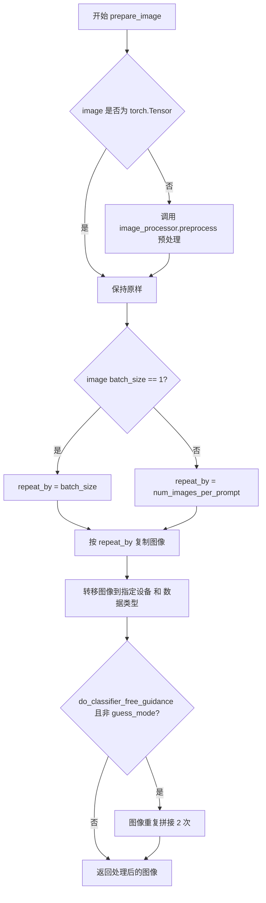

#### 带注释源码

```python
def prepare_image(
    self,
    image,
    width,
    height,
    batch_size,
    num_images_per_prompt,
    device,
    dtype,
    do_classifier_free_guidance=False,
    guess_mode=False,
):
    # 判断输入图像是否为 PyTorch Tensor
    if isinstance(image, torch.Tensor):
        pass  # 如果是 Tensor，直接使用，不做预处理
    else:
        # 如果不是 Tensor，调用图像预处理器进行预处理
        # 支持 PIL.Image、np.ndarray 等格式
        image = self.image_processor.preprocess(image, height=height, width=width)

    # 获取输入图像的批次大小
    image_batch_size = image.shape[0]

    # 根据批次大小确定复制倍数
    if image_batch_size == 1:
        # 如果图像批次为1，按照提示的批次大小复制
        repeat_by = batch_size
    else:
        # 图像批次与提示批次相同，按照每提示图像数复制
        repeat_by = num_images_per_prompt

    # 按指定维度复制图像以匹配批次
    image = image.repeat_interleave(repeat_by, dim=0)

    # 将图像转移到目标设备并转换为目标数据类型
    image = image.to(device=device, dtype=dtype)

    # 如果启用分类器自由引导且不在猜测模式
    # 需要为无条件生成准备一份图像副本
    if do_classifier_free_guidance and not guess_mode:
        # 拼接两个相同的图像副本
        # 第一个用于条件生成，第二个用于无条件生成
        image = torch.cat([image] * 2)

    return image
```


### `FluxControlPipeline.guidance_scale` (property)

该属性是FluxControlPipeline类的guidance_scale属性 getter 方法，用于获取当前管线实例的guidance_scale（引导尺度）值。guidance_scale是文本到图像生成过程中的一个重要参数，用于控制生成图像与输入提示词的对齐程度。

参数： 无

返回值：`float`，返回当前管线实例的guidance_scale值，该值在调用`__call__`方法时设置，用于控制 classifier-free guidance 的强度。

#### 流程图

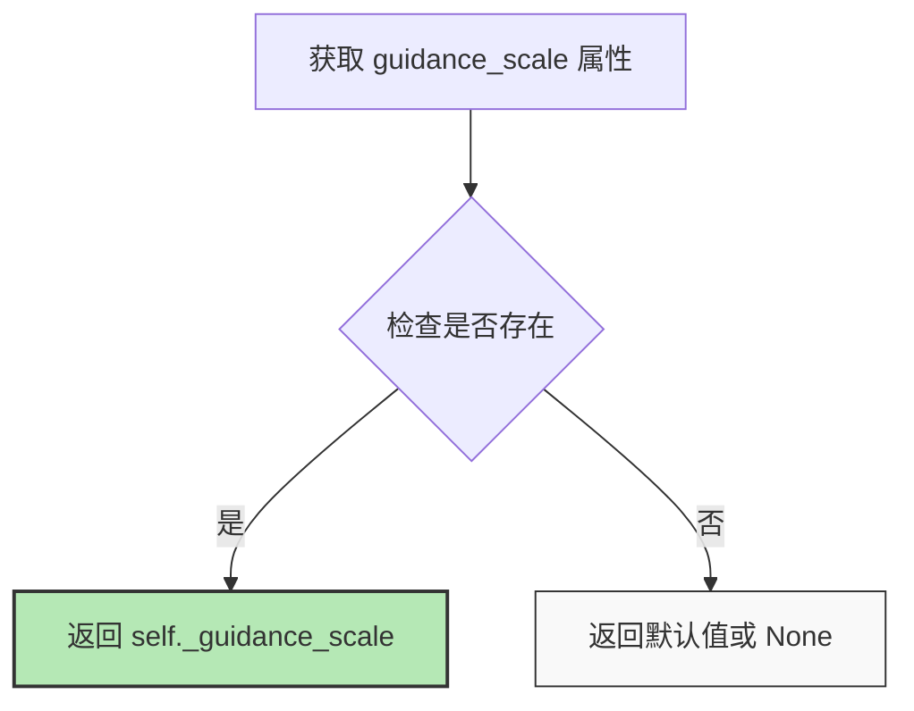

#### 带注释源码

```python
@property
def guidance_scale(self):
    """
    属性 getter 方法，用于获取当前管线的 guidance_scale 值。
    
    guidance_scale 控制文本到图像生成过程中 classifier-free guidance 的强度。
    较高的值会使生成的图像更紧密地遵循文本提示，但可能导致图像质量下降。
    该值在 __call__ 方法中被设置为 self._guidance_scale。
    
    返回:
        float: 当前的 guidance_scale 值
    """
    return self._guidance_scale
```


### `FluxControlPipeline.joint_attention_kwargs`

该属性是一个只读的属性装饰器（property），用于获取在管道调用时设置的联合注意力关键字参数（joint_attention_kwargs）。该参数会在调用 `__call__` 方法时被赋值，用于传递给注意力处理器（AttentionProcessor），以控制文本和图像之间的联合注意力机制。

参数：

- （无参数，该属性为只读访问器）

返回值：`dict[str, Any] | None`，返回联合注意力关键字参数字典。如果未在调用管道时提供，则返回 `None`。

#### 流程图

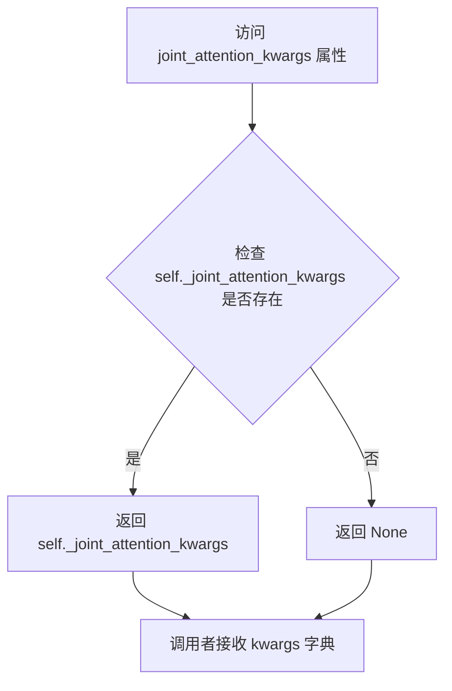

#### 带注释源码

```python
@property
def joint_attention_kwargs(self):
    """
    获取联合注意力关键字参数。
    
    该属性返回在管道调用（__call__）时设置的 joint_attention_kwargs 参数。
    该参数用于传递额外的关键字参数到注意力处理器（AttentionProcessor），
    以支持自定义的注意力控制逻辑，例如支持 ControlNet 的联合注意力机制。
    
    Returns:
        dict[str, Any] | None: 联合注意力关键字参数字典。如果未设置，则返回 None。
    """
    return self._joint_attention_kwargs
```

#### 上下文关联信息

该属性与以下代码紧密相关：

1. **在 `__call__` 方法中的赋值**：
   ```python
   self._joint_attention_kwargs = joint_attention_kwargs
   ```

2. **在去噪循环中的使用**：
   ```python
   noise_pred = self.transformer(
       hidden_states=latent_model_input,
       timestep=timestep / 1000,
       guidance=guidance,
       pooled_projections=pooled_prompt_embeds,
       encoder_hidden_states=prompt_embeds,
       txt_ids=text_ids,
       img_ids=latent_image_ids,
       joint_attention_kwargs=self.joint_attention_kwargs,  # 传递给 transformer
       return_dict=False,
   )[0]
   ```

3. **在 `encode_prompt` 中的应用**（用于 LoRA scaling）：
   ```python
   lora_scale = (
       self.joint_attention_kwargs.get("scale", None) if self.joint_attention_kwargs is not None else None
   )
   ```


### `FluxControlPipeline.num_timesteps` (property)

该属性返回推理过程中配置的 timesteps 数量，即去噪循环中的总步数。该值在 `__call__` 方法中被设置为 `len(timesteps)`。

参数：

- （无参数）

返回值：`int`，返回推理时的时间步数量，在 `__call__` 方法中通过 `len(timesteps)` 设置。

#### 流程图

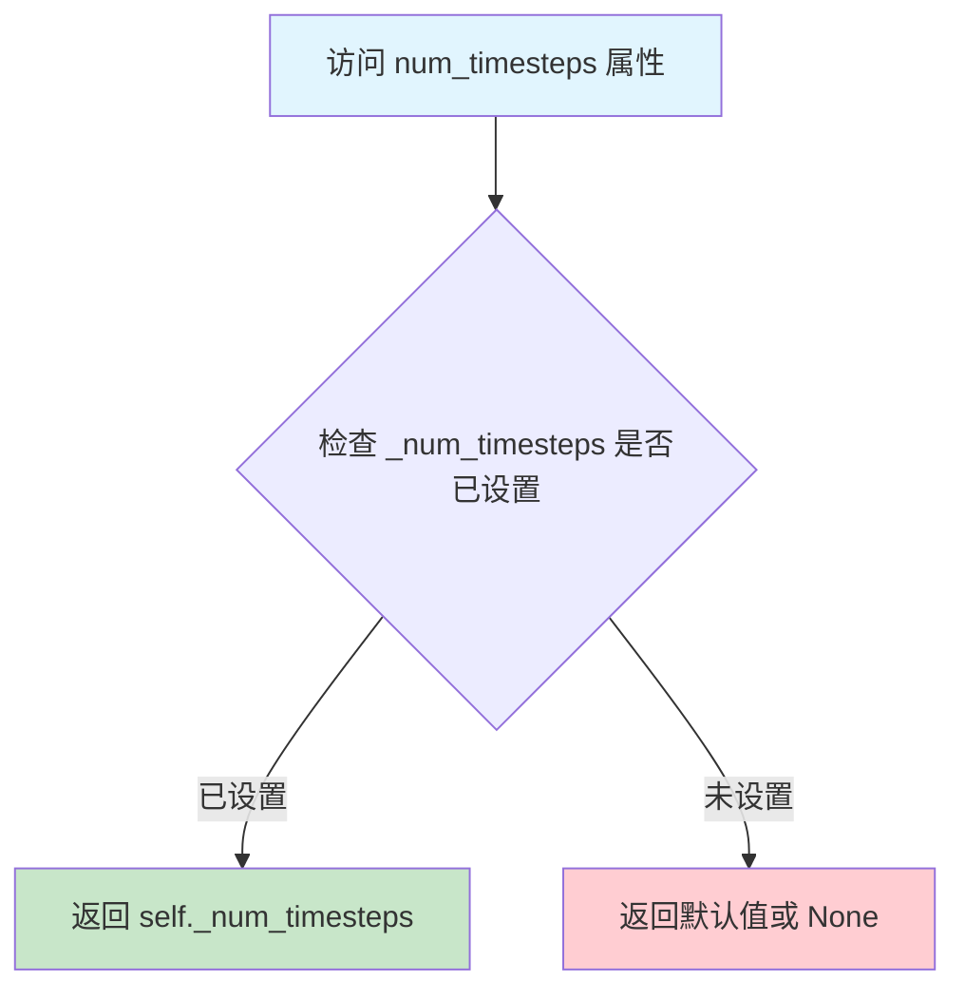

#### 带注释源码

```python
@property
def num_timesteps(self):
    """
    Property: 返回推理过程中配置的 timesteps 数量
    
    该属性是一个只读属性，返回在 __call__ 方法中通过以下代码设置的值:
    self._num_timesteps = len(timesteps)
    
    Returns:
        int: 推理过程中的总时间步数
    """
    return self._num_timesteps
```


### `FluxControlPipeline.interrupt`

该属性是一个只读的getter属性，用于获取当前管道的interrupt标志状态。该标志用于在去噪循环中控制是否中断图像生成过程，当设置为True时，循环会跳过当前迭代继续执行。

参数：无

返回值：`bool`，返回`self._interrupt`实例变量的值，用于指示管道是否被请求中断

#### 流程图

```mermaid
flowchart TD
    A[读取interrupt属性] --> B{返回self._interrupt}
    B --> C[返回False - 正常执行]
    B --> D[返回True - 中断执行]
```

#### 带注释源码

```python
@property
def interrupt(self):
    """
    属性 getter：获取管道的中断标志状态。
    
    该属性在去噪循环中被检查（参见 __call__ 方法中的 'if self.interrupt: continue'），
    允许外部调用者在推理过程中动态请求管道停止生成。
    
    Returns:
        bool: _interrupt 标志的当前值。True 表示请求中断生成过程，False 表示继续正常生成。
    """
    return self._interrupt
```


### `FluxControlPipeline.__call__`

该方法是FluxControlPipeline的主入口，用于执行带有控制图像条件的文本到图像生成任务。它接收文本提示和控制图像，经过去噪循环处理，最终生成与文本提示相符且受控制图像条件影响的图像。

参数：

- `prompt`：`str | list[str]`，要生成图像的文本提示，若未定义则需传入`prompt_embeds`
- `prompt_2`：`str | list[str] | None`，发送给tokenizer_2和text_encoder_2的提示，若未定义则使用prompt
- `control_image`：`PipelineImageInput`，ControlNet输入条件，用于指导transformer生成，可接受torch.Tensor、PIL.Image.Image、np.ndarray等格式
- `height`：`int | None`，生成图像的高度（像素），默认值为self.unet.config.sample_size * self.vae_scale_factor
- `width`：`int | None`，生成图像的宽度（像素），默认值为self.unet.config.sample_size * self.vae_scale_factor
- `num_inference_steps`：`int`，去噪步数，默认值为28
- `sigmas`：`list[float] | None`，自定义sigmas用于支持sigmas参数的调度器
- `guidance_scale`：`float`，引导比例，默认值为3.5，用于控制文本提示的影响力
- `num_images_per_prompt`：`int`，每个提示生成的图像数量，默认值为1
- `generator`：`torch.Generator | list[torch.Generator] | None`，随机数生成器，用于确保生成的可重复性
- `latents`：`torch.FloatTensor | None`，预生成的噪声潜在向量，若未提供则使用随机生成器采样
- `prompt_embeds`：`torch.FloatTensor | None`，预生成的文本嵌入，可用于微调文本输入
- `pooled_prompt_embeds`：`torch.FloatTensor | None`，预生成的池化文本嵌入
- `output_type`：`str | None`，输出格式，默认值为"pil"，可选PIL.Image.Image或np.array
- `return_dict`：`bool`，是否返回FluxPipelineOutput，默认值为True
- `joint_attention_kwargs`：`dict[str, Any] | None`，传递给AttentionProcessor的 kwargs 字典
- `callback_on_step_end`：`Callable[[int, int], None] | None`，每个去噪步骤结束时调用的函数
- `callback_on_step_end_tensor_inputs`：`list[str]`，回调函数张量输入列表，默认值为["latents"]
- `max_sequence_length`：`int`，最大序列长度，默认值为512

返回值：`FluxPipelineOutput | tuple`，当return_dict为True时返回FluxPipelineOutput，否则返回包含生成图像列表的元组

#### 流程图

```mermaid
flowchart TD
    A[__call__ 入口] --> B[检查输入参数]
    B --> C[定义批次大小和设备]
    C --> D[准备文本嵌入]
    D --> E[准备潜在变量]
    E --> F[准备控制图像]
    F --> G[准备时间步]
    H[去噪循环] --> I[检查中断标志]
    I --> J[连接潜在变量和控制图像]
    J --> K[扩展时间步]
    K --> L[调用transformer预测噪声]
    L --> M[计算上一步噪声样本]
    M --> N{是否有回调函数}
    N -->|是| O[执行回调函数]
    N -->|否| P[检查是否需要更新进度条]
    O --> P
    P --> Q{是否完成所有步骤}
    Q -->|否| H
    Q -->|是| R{output_type是否为latent}
    R -->|是| S[直接返回latents]
    R -->|否| T[解码潜在变量为图像]
    T --> U[后处理图像]
    U --> V[卸载所有模型]
    V --> W[返回结果]
```

#### 带注释源码

```python
@torch.no_grad()
@replace_example_docstring(EXAMPLE_DOC_STRING)
def __call__(
    self,
    prompt: str | list[str] = None,
    prompt_2: str | list[str] | None = None,
    control_image: PipelineImageInput = None,
    height: int | None = None,
    width: int | None = None,
    num_inference_steps: int = 28,
    sigmas: list[float] | None = None,
    guidance_scale: float = 3.5,
    num_images_per_prompt: int | None = 1,
    generator: torch.Generator | list[torch.Generator] | None = None,
    latents: torch.FloatTensor | None = None,
    prompt_embeds: torch.FloatTensor | None = None,
    pooled_prompt_embeds: torch.FloatTensor | None = None,
    output_type: str | None = "pil",
    return_dict: bool = True,
    joint_attention_kwargs: dict[str, Any] | None = None,
    callback_on_step_end: Callable[[int, int], None] | None = None,
    callback_on_step_end_tensor_inputs: list[str] = ["latents"],
    max_sequence_length: int = 512,
):
    r"""
    Function invoked when calling the pipeline for generation.

    Args:
        prompt (`str` or `list[str]`, *optional*):
            The prompt or prompts to guide the image generation. If not defined, one has to pass `prompt_embeds`.
            instead.
        prompt_2 (`str` or `list[str]`, *optional*):
            The prompt or prompts to be sent to `tokenizer_2` and `text_encoder_2`. If not defined, `prompt` is
            will be used instead
        control_image (`torch.Tensor`, `PIL.Image.Image`, `np.ndarray`, `list[torch.Tensor]`, `list[PIL.Image.Image]`, `list[np.ndarray]`,:
                `list[list[torch.Tensor]]`, `list[list[np.ndarray]]` or `list[list[PIL.Image.Image]]`):
            The ControlNet input condition to provide guidance to the `unet` for generation. If the type is
            specified as `torch.Tensor`, it is passed to ControlNet as is. `PIL.Image.Image` can also be accepted
            as an image. The dimensions of the output image defaults to `image`'s dimensions. If height and/or
            width are passed, `image` is resized accordingly. If multiple ControlNets are specified in `init`,
            images must be passed as a list such that each element of the list can be correctly batched for input
            to a single ControlNet.
        height (`int`, *optional*, defaults to self.unet.config.sample_size * self.vae_scale_factor):
            The height in pixels of the generated image. This is set to 1024 by default for the best results.
        width (`int`, *optional*, defaults to self.unet.config.sample_size * self.vae_scale_factor):
            The width in pixels of the generated image. This is set to 1024 by default for the best results.
        num_inference_steps (`int`, *optional*, defaults to 50):
            The number of denoising steps. More denoising steps usually lead to a higher quality image at the
            expense of slower inference.
        sigmas (`list[float]`, *optional*):
            Custom sigmas to use for the denoising process with schedulers which support a `sigmas` argument in
            their `set_timesteps` method. If not defined, the default behavior when `num_inference_steps` is passed
            will be used.
        guidance_scale (`float`, *optional*, defaults to 3.5):
            Embedded guidance scale is enabled by setting `guidance_scale` > 1. Higher `guidance_scale` encourages
            a model to generate images more aligned with prompt at the expense of lower image quality.

            Guidance-distilled models approximates true classifier-free guidance for `guidance_scale` > 1. Refer to
            the [paper](https://huggingface.co/papers/2210.03142) to learn more.
        num_images_per_prompt (`int`, *optional*, defaults to 1):
            The number of images to generate per prompt.
        generator (`torch.Generator` or `list[torch.Generator]`, *optional*):
            One or a list of [torch generator(s)](https://pytorch.org/docs/stable/generated/torch.Generator.html)
            to make generation deterministic.
        latents (`torch.FloatTensor`, *optional*):
            Pre-generated noisy latents, sampled from a Gaussian distribution, to be used as inputs for image
            generation. Can be used to tweak the same generation with different prompts. If not provided, a latents
            tensor will be generated by sampling using the supplied random `generator`.
        prompt_embeds (`torch.FloatTensor`, *optional*):
            Pre-generated text embeddings. Can be used to easily tweak text inputs, *e.g.* prompt weighting. If not
            provided, text embeddings will be generated from `prompt` input argument.
        pooled_prompt_embeds (`torch.FloatTensor`, *optional*):
            Pre-generated pooled text embeddings. Can be used to easily tweak text inputs, *e.g.* prompt weighting.
            If not provided, pooled text embeddings will be generated from `prompt` input argument.
        output_type (`str`, *optional*, defaults to `"pil"`):
            The output format of the generate image. Choose between
            [PIL](https://pillow.readthedocs.io/en/stable/): `PIL.Image.Image` or `np.array`.
        return_dict (`bool`, *optional*, defaults to `True`):
            Whether or not to return a [`~pipelines.flux.FluxPipelineOutput`] instead of a plain tuple.
        joint_attention_kwargs (`dict`, *optional*):
            A kwargs dictionary that if specified is passed along to the `AttentionProcessor` as defined under
            `self.processor` in
            [diffusers.models.attention_processor](https://github.com/huggingface/diffusers/blob/main/src/diffusers/models/attention_processor.py).
        callback_on_step_end (`Callable`, *optional*):
            A function that calls at the end of each denoising steps during the inference. The function is called
            with the following arguments: `callback_on_step_end(self: DiffusionPipeline, step: int, timestep: int,
            callback_kwargs: Dict)`. `callback_kwargs` will include a list of all tensors as specified by
            `callback_on_step_end_tensor_inputs`.
        callback_on_step_end_tensor_inputs (`list`, *optional*):
            The list of tensor inputs for the `callback_on_step_end` function. The tensors specified in the list
            will be passed as `callback_kwargs` argument. You will only be able to include variables listed in the
            `._callback_tensor_inputs` attribute of your pipeline class.
        max_sequence_length (`int` defaults to 512): Maximum sequence length to use with the `prompt`.

    Examples:

    Returns:
        [`~pipelines.flux.FluxPipelineOutput`] or `tuple`: [`~pipelines.flux.FluxPipelineOutput`] if `return_dict`
        is True, otherwise a `tuple`. When returning a tuple, the first element is a list with the generated
        images.
    """

    # 设置默认高度和宽度，使用vae_scale_factor进行缩放
    height = height or self.default_sample_size * self.vae_scale_factor
    width = width or self.default_sample_size * self.vae_scale_factor

    # 1. 检查输入参数，确保参数正确性
    self.check_inputs(
        prompt,
        prompt_2,
        height,
        width,
        prompt_embeds=prompt_embeds,
        pooled_prompt_embeds=pooled_prompt_embeds,
        callback_on_step_end_tensor_inputs=callback_on_step_end_tensor_inputs,
        max_sequence_length=max_sequence_length,
    )

    # 保存引导比例和联合注意力参数，设置中断标志为False
    self._guidance_scale = guidance_scale
    self._joint_attention_kwargs = joint_attention_kwargs
    self._interrupt = False

    # 2. 定义批次大小和设备
    # 根据prompt或prompt_embeds确定批次大小
    if prompt is not None and isinstance(prompt, str):
        batch_size = 1
    elif prompt is not None and isinstance(prompt, list):
        batch_size = len(prompt)
    else:
        batch_size = prompt_embeds.shape[0]

    device = self._execution_device

    # 3. 准备文本嵌入
    # 从joint_attention_kwargs中获取lora_scale
    lora_scale = (
        self.joint_attention_kwargs.get("scale", None) if self.joint_attention_kwargs is not None else None
    )
    # 编码提示文本，获取文本嵌入、池化嵌入和文本ID
    (
        prompt_embeds,
        pooled_prompt_embeds,
        text_ids,
    ) = self.encode_prompt(
        prompt=prompt,
        prompt_2=prompt_2,
        prompt_embeds=prompt_embeds,
        pooled_prompt_embeds=pooled_prompt_embeds,
        device=device,
        num_images_per_prompt=num_images_per_prompt,
        max_sequence_length=max_sequence_length,
        lora_scale=lora_scale,
    )

    # 4. 准备潜在变量
    # 计算潜在通道数，transformer的输入通道数除以8
    num_channels_latents = self.transformer.config.in_channels // 8

    # 准备控制图像
    control_image = self.prepare_image(
        image=control_image,
        width=width,
        height=height,
        batch_size=batch_size * num_images_per_prompt,
        num_images_per_prompt=num_images_per_prompt,
        device=device,
        dtype=self.vae.dtype,
    )

    # 如果控制图像是4维的，则编码并处理
    if control_image.ndim == 4:
        # 使用VAE编码控制图像，获取潜在分布样本
        control_image = self.vae.encode(control_image).latent_dist.sample(generator=generator)
        # 应用缩放因子和偏移因子
        control_image = (control_image - self.vae.config.shift_factor) * self.vae.config.scaling_factor

        height_control_image, width_control_image = control_image.shape[2:]
        # 打包潜在变量
        control_image = self._pack_latents(
            control_image,
            batch_size * num_images_per_prompt,
            num_channels_latents,
            height_control_image,
            width_control_image,
        )

    # 准备潜在变量和潜在图像ID
    latents, latent_image_ids = self.prepare_latents(
        batch_size * num_images_per_prompt,
        num_channels_latents,
        height,
        width,
        prompt_embeds.dtype,
        device,
        generator,
        latents,
    )

    # 5. 准备时间步
    # 如果sigmas为None，则生成线性间隔的sigmas
    sigmas = np.linspace(1.0, 1 / num_inference_steps, num_inference_steps) if sigmas is None else sigmas
    # 计算图像序列长度
    image_seq_len = latents.shape[1]
    # 计算shift值
    mu = calculate_shift(
        image_seq_len,
        self.scheduler.config.get("base_image_seq_len", 256),
        self.scheduler.config.get("max_image_seq_len", 4096),
        self.scheduler.config.get("base_shift", 0.5),
        self.scheduler.config.get("max_shift", 1.15),
    )
    # 根据是否可用XLA选择时间步设备
    if XLA_AVAILABLE:
        timestep_device = "cpu"
    else:
        timestep_device = device
    # 获取时间步
    timesteps, num_inference_steps = retrieve_timesteps(
        self.scheduler,
        num_inference_steps,
        timestep_device,
        sigmas=sigmas,
        mu=mu,
    )
    # 计算预热步数
    num_warmup_steps = max(len(timesteps) - num_inference_steps * self.scheduler.order, 0)
    self._num_timesteps = len(timesteps)

    # 处理引导
    # 如果transformer支持引导嵌入，则创建引导张量
    if self.transformer.config.guidance_embeds:
        guidance = torch.full([1], guidance_scale, device=device, dtype=torch.float32)
        guidance = guidance.expand(latents.shape[0])
    else:
        guidance = None

    # 6. 去噪循环
    with self.progress_bar(total=num_inference_steps) as progress_bar:
        for i, t in enumerate(timesteps):
            # 检查是否中断
            if self.interrupt:
                continue

            # 连接潜在变量和控制图像，在通道维度上拼接
            latent_model_input = torch.cat([latents, control_image], dim=2)

            # 扩展时间步以匹配批次维度，兼容ONNX/Core ML
            timestep = t.expand(latents.shape[0]).to(latents.dtype)

            # 调用transformer预测噪声
            noise_pred = self.transformer(
                hidden_states=latent_model_input,
                timestep=timestep / 1000,
                guidance=guidance,
                pooled_projections=pooled_prompt_embeds,
                encoder_hidden_states=prompt_embeds,
                txt_ids=text_ids,
                img_ids=latent_image_ids,
                joint_attention_kwargs=self.joint_attention_kwargs,
                return_dict=False,
            )[0]

            # 计算前一个噪声样本 x_t -> x_t-1
            latents_dtype = latents.dtype
            latents = self.scheduler.step(noise_pred, t, latents, return_dict=False)[0]

            # 处理MPS设备的类型转换问题
            if latents.dtype != latents_dtype:
                if torch.backends.mps.is_available():
                    # 某些平台（如苹果MPS）由于pytorch bug会出现问题
                    latents = latents.to(latents_dtype)

            # 如果有回调函数，在步骤结束时调用
            if callback_on_step_end is not None:
                callback_kwargs = {}
                for k in callback_on_step_end_tensor_inputs:
                    callback_kwargs[k] = locals()[k]
                callback_outputs = callback_on_step_end(self, i, t, callback_kwargs)

                # 更新潜在变量和提示嵌入
                latents = callback_outputs.pop("latents", latents)
                prompt_embeds = callback_outputs.pop("prompt_embeds", prompt_embeds)

            # 在最后一步或预热完成后定期更新进度条
            if i == len(timesteps) - 1 or ((i + 1) > num_warmup_steps and (i + 1) % self.scheduler.order == 0):
                progress_bar.update()

            # 如果使用XLA，标记步骤结束
            if XLA_AVAILABLE:
                xm.mark_step()

    # 7. 后处理
    # 根据输出类型处理
    if output_type == "latent":
        image = latents
    else:
        # 解包潜在变量
        latents = self._unpack_latents(latents, height, width, self.vae_scale_factor)
        # 反归一化潜在变量
        latents = (latents / self.vae.config.scaling_factor) + self.vae.config.shift_factor
        # 使用VAE解码潜在变量
        image = self.vae.decode(latents, return_dict=False)[0]
        # 后处理图像
        image = self.image_processor.postprocess(image, output_type=output_type)

    # 8. 卸载所有模型
    self.maybe_free_model_hooks()

    # 9. 返回结果
    if not return_dict:
        return (image,)

    return FluxPipelineOutput(images=image)
```

## 关键组件


### 张量索引与潜在图像ID准备

负责生成潜在空间的图像ID，用于transformer模型中的空间位置编码，通过torch.arange生成行和列索引并reshape为2D坐标

### 潜在变量打包与解包

_pack_latents将4D潜在张量重塑为2D补丁序列，_unpack_latents逆向操作恢复原始空间维度，实现2x2补丁打包机制以适配Flux架构

### 控制图像潜在编码与缩放

将控制图像编码为潜在表示，应用shift_factor和scaling_factor进行反量化预处理，支持基于图像条件的可控生成

### LoRA层动态缩放机制

通过scale_lora_layers和unscale_lora_layers在推理时动态调整LoRA权重，支持PEFT后端集成，用于文本编码器的提示词加权控制

### VAE切片与平铺解码

enable_vae_slicing和enable_vae_tiling提供内存优化的VAE解码策略，支持大规模图像生成和批处理

### 文本嵌入双编码器架构

集成CLIPTextModel和T5EncoderModel分别生成池化嵌入和完整序列嵌入，支持长序列提示（max_sequence_length=512）和多提示生成

### 调度器时间步计算与偏移

calculate_shift计算自适应时间步偏移，retrieve_timesteps支持自定义时间步和sigmas计划，用于FlowMatchEulerDiscreteScheduler


## 问题及建议


### 已知问题

- **硬编码的XLA检查**：XLA_AVAILABLE在模块导入时只检查一次，如果运行时环境变化无法动态更新
- **弃用方法未清理**：enable_vae_slicing、disable_vae_slicing、enable_vae_tiling、disable_vae_tiling已标记为deprecated（0.40.0移除），但尚未移除
- **callback中使用locals()**：在callback_on_step_end中直接使用locals()获取变量是反模式，容易引入隐藏bug
- **isinstanceMixin检查重复**：多处使用isinstance(self, FluxLoraLoaderMixin)检查，可以优化为缓存检查结果
- **dtype处理不一致**：prepare_image方法中参数dtype未被使用，始终使用self.vae.dtype
- **缺少control_image空值检查**：__call__方法中未检查control_image为None的情况，会导致后续处理失败
- **text_ids创建未考虑batch**：torch.zeros(prompt_embeds.shape[1], 3)未考虑num_images_per_prompt > 1的情况
- **假设return_dict=False**：scheduler.step调用假设返回值不是字典，缺少对return_dict=True情况的处理

### 优化建议

- **移除deprecated方法**：在0.40.0版本前移除enable_vae_slicing/disable_vae_slicing/enable_vae_tiling/disable_vae_tiling方法，统一使用vae自身的接口
- **优化Mixin检查**：在__init__中缓存Mixin类型检查结果，避免重复isinstance检查
- **修复dtype处理**：prepare_image方法应使用传入的dtype参数而非始终使用self.vae.dtype
- **添加control_image校验**：在__call__开始添加control_image为None的检查，提供明确错误信息
- **修复text_ids广播**：text_ids创建时需考虑batch_size和num_images_per_prompt维度
- **统一callback变量获取**：显式传递所需变量而非使用locals()，提高代码可读性和可维护性
- **添加scheduler返回值处理**：增加对scheduler.step返回字典情况的兼容处理
- **扩展_optional_components**：正确定义可选组件列表，支持更灵活的pipeline配置

## 其它


### 设计目标与约束

**设计目标：**
实现一个支持ControlNet条件的Flux文本到图像生成管道，能够根据文本提示和图像条件（如Canny边缘图）生成高质量的图像。

**核心约束：**
- 文本编码器：CLIPTextModel (clip-vit-large-patch14) + T5EncoderModel (google/t5-v1_1-xxl)
- 图像编码器：AutoencoderKL (VAE)
- 噪声调度器：FlowMatchEulerDiscreteScheduler
- Transformer：FluxTransformer2DModel
- 最大序列长度：512 tokens
- 输出分辨率：必须能被 vae_scale_factor * 2 整除
- 内存优化：支持VAE切片和瓦片解码

### 错误处理与异常设计

**输入验证：**
- `height` 和 `width` 必须能被 `vae_scale_factor * 2` 整除，否则自动调整并发出警告
- `prompt` 和 `prompt_embeds` 不能同时提供
- `prompt_2` 和 `prompt_embeds` 不能同时提供
- `prompt_embeds` 提供时必须同时提供 `pooled_prompt_embeds`
- `max_sequence_length` 不能超过512
- `callback_on_step_end_tensor_inputs` 必须在 `_callback_tensor_inputs` 列表中
- `timesteps` 和 `sigmas` 不能同时提供

**调度器兼容性：**
- 检查 `scheduler.set_timesteps` 是否支持自定义 `timesteps` 或 `sigmas`

**设备兼容性：**
- Apple MPS平台特殊处理：数据类型转换时保持兼容性

### 数据流与状态机

**主生成流程状态机：**
1. **CHECK_INPUTS** - 验证所有输入参数合法性
2. **ENCODE_PROMPT** - 编码文本提示为embedding
3. **PREPARE_IMAGE** - 预处理ControlNet条件图像
4. **ENCODE_CONTROL_IMAGE** - 使用VAE编码控制图像为潜在表示
5. **PREPARE_LATENTS** - 初始化噪声潜在变量
6. **RETRIEVE_TIMESTEPS** - 获取去噪步骤时间步
7. **DENOISING_LOOP** - 迭代去噪（重复）
   - 拼接latents和control_image
   - 调用transformer预测噪声
   - 调度器执行去噪步骤
   - 回调处理（可选）
8. **DECODE_OUTPUT** - 解码最终潜在表示为图像
9. **POSTPROCESS** - 后处理输出格式

### 外部依赖与接口契约

**核心依赖：**
- `transformers`: CLIPTextModel, CLIPTokenizer, T5EncoderModel, T5TokenizerFast
- `diffusers.models`: AutoencoderKL, FluxTransformer2DModel
- `diffusers.schedulers`: FlowMatchEulerDiscreteScheduler
- `diffusers.image_processor`: VaeImageProcessor, PipelineImageInput
- `diffusers.loaders`: FluxLoraLoaderMixin, FromSingleFileMixin, TextualInversionLoaderMixin
- `torch` / `numpy`: 张量运算
- `torch_xla` (可选): XLA设备支持

**公共接口方法：**
- `__call__`: 主生成方法
- `encode_prompt`: 文本编码
- `prepare_latents`: 潜在变量准备
- `check_inputs`: 输入验证
- `enable_vae_slicing` / `disable_vae_slicing`: VAE切片控制
- `enable_vae_tiling` / `disable_vae_tiling`: VAE瓦片控制

### 性能考虑与优化空间

**内存优化：**
- VAE切片解码：减少峰值内存
- VAE瓦片编码/解码：支持超大图像
- 模型CPU卸载：序列 "text_encoder->text_encoder_2->transformer->vae"

**计算优化：**
- 潜在变量打包：将2x2 patches打包以提高计算效率
- 批处理支持：多图像并行生成
- LoRA动态调整：按需加载和调整LoRA权重

**性能参数：**
- 默认采样步数：28
- 默认引导_scale：3.5
- 默认输出尺寸：128 * vae_scale_factor

### 安全性考虑

**输入安全：**
- 文本截断处理：T5编码器自动截断超长序列并警告
- CLIP编码器序列长度限制：77 tokens

**模型安全：**
- 支持LoRA权重加载和动态调整
- PEFT后端集成用于LoRA管理

### 配置与参数说明

**关键配置参数：**
- `vae_scale_factor`: 2^(len(vae.config.block_out_channels)-1)，默认8
- `vae_latent_channels`: VAE潜在通道数，默认16
- `tokenizer_max_length`: CLIP tokenizer最大长度，默认77
- `default_sample_size`: 默认采样尺寸，默认128
- `model_cpu_offload_seq`: 模型卸载顺序

**调度器配置：**
- `base_image_seq_len`: 256
- `max_image_seq_len`: 4096
- `base_shift`: 0.5
- `max_shift`: 1.15
- `guidance_embeds`: 控制是否启用引导嵌入

### 使用示例与最佳实践

**基本用法：**
```python
pipe = FluxControlPipeline.from_pretrained("black-forest-labs/FLUX.1-Canny-dev", torch_dtype=torch.bfloat16).to("cuda")
image = pipe(prompt="描述", control_image=control_image).images[0]
```

**高级用法：**
- 使用自定义采样步数和引导_scale
- 提供预计算的prompt_embeds以复用
- 使用回调函数监控去噪过程
- 启用VAE切片/瓦片处理大图像


    