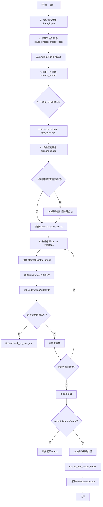
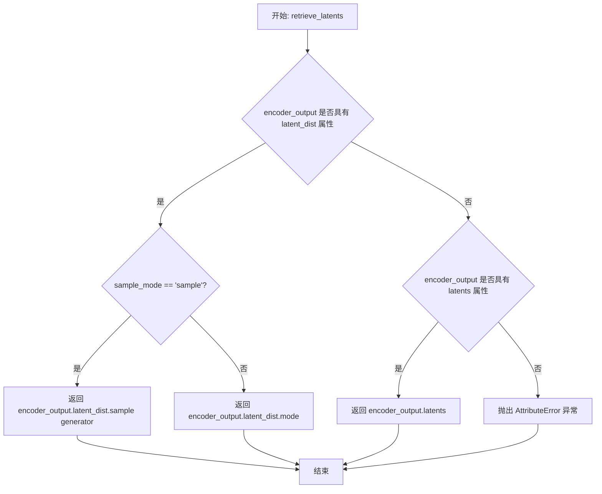
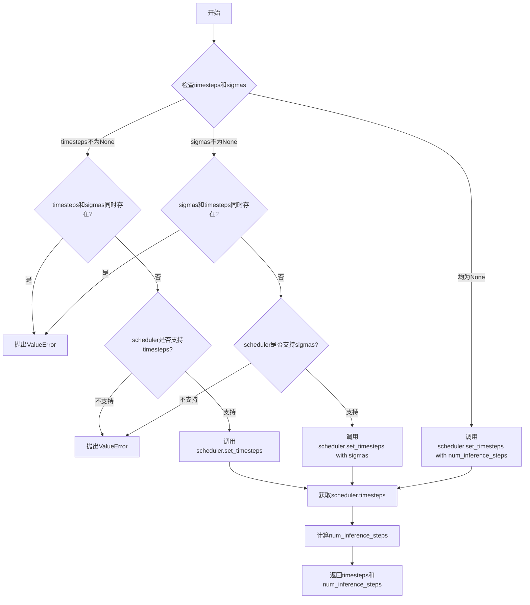
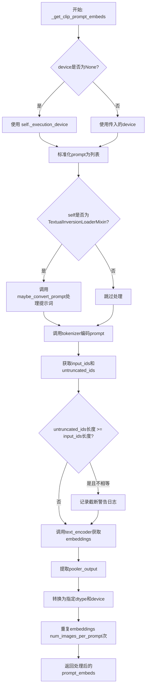
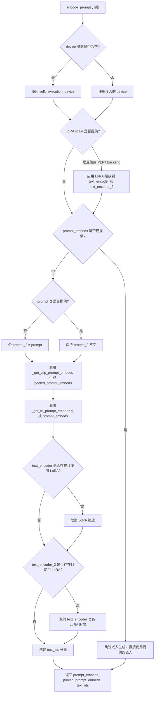
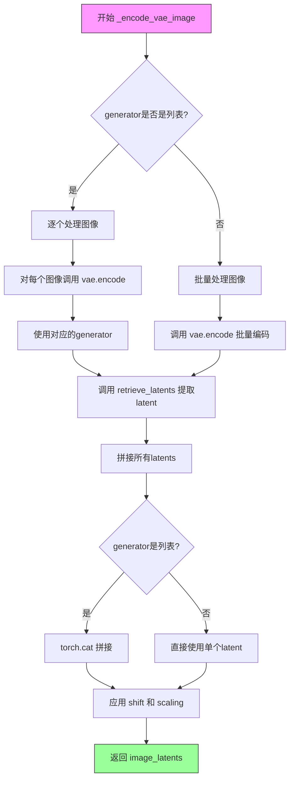
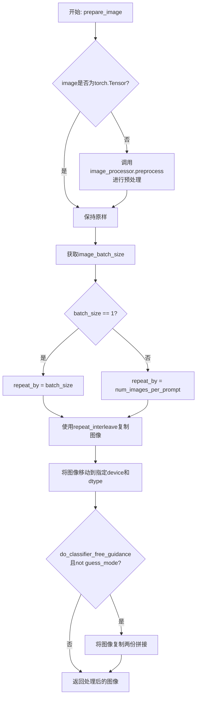
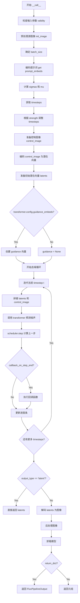

# `diffusers\src\diffusers\pipelines\flux\pipeline_flux_control_img2img.py` 详细设计文档

FluxControlImg2ImgPipeline 是一个基于 Flux 模型的图像到图像转换（img2img）流水线，支持通过控制图像（control image）进行条件生成。该流水线结合了 CLIP 和 T5 文本编码器、VAE 变分自动编码器以及 FluxTransformer2DModel 变换器模型，实现了基于文本提示和控制图像指导的高质量图像生成。

## 整体流程



## 类结构

```
DiffusionPipeline (基类)
├── FluxLoraLoaderMixin (混入类)
├── FromSingleFileMixin (混入类)
└── FluxControlImg2ImgPipeline (主类)
```

## 全局变量及字段


### `XLA_AVAILABLE`
    
标志是否支持XLA/TPU

类型：`bool`
    


### `logger`
    
日志记录器

类型：`logging.Logger`
    


### `EXAMPLE_DOC_STRING`
    
示例文档字符串

类型：`str`
    


### `FluxControlImg2ImgPipeline.FluxControlImg2ImgPipeline`
    
调度器，用于去噪过程

类型：`FlowMatchEulerDiscreteScheduler`
    


### `FluxControlImg2ImgPipeline.FluxControlImg2ImgPipeline`
    
变分自动编码器，用于编码/解码图像

类型：`AutoencoderKL`
    


### `FluxControlImg2ImgPipeline.FluxControlImg2ImgPipeline`
    
CLIP文本编码器

类型：`CLIPTextModel`
    


### `FluxControlImg2ImgPipeline.FluxControlImg2ImgPipeline`
    
CLIP分词器

类型：`CLIPTokenizer`
    


### `FluxControlImg2ImgPipeline.FluxControlImg2ImgPipeline`
    
T5文本编码器

类型：`T5EncoderModel`
    


### `FluxControlImg2ImgPipeline.FluxControlImg2ImgPipeline`
    
T5分词器

类型：`T5TokenizerFast`
    


### `FluxControlImg2ImgPipeline.FluxControlImg2ImgPipeline`
    
Flux变换器模型

类型：`FluxTransformer2DModel`
    


### `FluxControlImg2ImgPipeline.FluxControlImg2ImgPipeline`
    
VAE缩放因子

类型：`int`
    


### `FluxControlImg2ImgPipeline.FluxControlImg2ImgPipeline`
    
图像处理器

类型：`VaeImageProcessor`
    


### `FluxControlImg2ImgPipeline.FluxControlImg2ImgPipeline`
    
分词器最大长度

类型：`int`
    


### `FluxControlImg2ImgPipeline.FluxControlImg2ImgPipeline`
    
默认采样尺寸

类型：`int`
    


### `FluxControlImg2ImgPipeline.FluxControlImg2ImgPipeline`
    
引导尺度

类型：`float`
    


### `FluxControlImg2ImgPipeline.FluxControlImg2ImgPipeline`
    
联合注意力参数

类型：`dict`
    


### `FluxControlImg2ImgPipeline.FluxControlImg2ImgPipeline`
    
时间步数

类型：`int`
    


### `FluxControlImg2ImgPipeline.FluxControlImg2ImgPipeline`
    
中断标志

类型：`bool`
    


### `FluxControlImg2ImgPipeline.FluxControlImg2ImgPipeline`
    
CPU卸载顺序

类型：`str`
    


### `FluxControlImg2ImgPipeline.FluxControlImg2ImgPipeline`
    
可选组件列表

类型：`list`
    


### `FluxControlImg2ImgPipeline.FluxControlImg2ImgPipeline`
    
回调张量输入列表

类型：`list`
    
    

## 全局函数及方法


### `calculate_shift`

该函数用于计算图像序列长度的偏移量（mu），采用线性插值方法，根据输入的图像序列长度在预设的基准序列长度和最大序列长度之间计算对应的偏移值。该函数主要用于FLUX扩散模型的噪声调度器中，根据图像尺寸动态调整去噪过程中的时间步偏移。

参数：

- `image_seq_len`：`int`，输入图像的序列长度，通常由图像尺寸计算得出（高度//vae_scale_factor//2 × 宽度//vae_scale_factor//2）
- `base_seq_len`：`int`，基准序列长度，默认为256，表示线性插值的左端点
- `max_seq_len`：`int`，最大序列长度，默认为4096，表示线性插值的右端点
- `base_shift`：`float`，基准偏移量，默认为0.5，对应基准序列长度处的偏移值
- `max_shift`：`float`，最大偏移量，默认为1.15，对应最大序列长度处的偏移值

返回值：`float`，计算得到的偏移量mu，用于调整噪声调度器的时间步

#### 流程图

```mermaid
flowchart TD
    A[开始 calculate_shift] --> B[输入参数: image_seq_len, base_seq_len, max_seq_len, base_shift, max_shift]
    B --> C[计算斜率 m = (max_shift - base_shift) / (max_seq_len - base_seq_len)]
    C --> D[计算截距 b = base_shift - m * base_seq_len]
    D --> E[计算偏移量 mu = image_seq_len * m + b]
    E --> F[返回 mu]
    
    C -.-> G[斜率公式解释]
    D -.-> H[截距公式解释]
    E -.-> I[线性方程解释]
    
    G --> |在坐标系中表示| J[点(base_seq_len, base_shift)到点(max_seq_len, max_shift)的直线斜率]
    H --> |确保直线经过基准点| J
    I --> |代入任意image_seq_len得到对应偏移量| J
```

#### 带注释源码

```python
# Copied from diffusers.pipelines.flux.pipeline_flux.calculate_shift
def calculate_shift(
    image_seq_len,       # 输入：图像序列长度，由 (height // vae_scale_factor // 2) * (width // vae_scale_factor // 2) 计算得到
    base_seq_len: int = 256,    # 基准序列长度，默认256，对应256x256图像的序列长度
    max_seq_len: int = 4096,    # 最大序列长度，默认4096，对应较大图像的序列长度
    base_shift: float = 0.5,    # 基准偏移量，默认0.5，用于小尺寸图像
    max_shift: float = 1.15,    # 最大偏移量，默认1.15，用于大尺寸图像
):
    # 计算线性插值的斜率 m
    # 斜率 = (最大偏移 - 基准偏移) / (最大序列长度 - 基准序列长度)
    # 表示偏移量随序列长度变化的速率
    m = (max_shift - base_shift) / (max_seq_len - base_seq_len)
    
    # 计算线性插值的截距 b
    # 截距 = 基准偏移 - 斜率 * 基准序列长度
    # 确保直线必定经过基准点 (base_seq_len, base_shift)
    b = base_shift - m * base_seq_len
    
    # 计算最终的偏移量 mu
    # 使用线性方程 mu = image_seq_len * m + b
    # 根据输入的图像序列长度，计算对应的偏移量
    mu = image_seq_len * m + b
    
    # 返回计算得到的偏移量，用于调度器的噪声调整
    return mu
```


### `retrieve_latents`

这是一个全局函数，用于从 encoder_output 中检索 latents。该函数支持多种获取 latent 的方式，包括从 latent_dist 中采样或获取模式，以及直接返回预计算的 latents。

参数：

- `encoder_output`：`torch.Tensor`，编码器输出对象，需要包含 `latent_dist` 或 `latents` 属性
- `generator`：`torch.Generator | None`，可选的随机数生成器，用于采样过程中的随机性控制
- `sample_mode`：`str`，采样模式，默认为 "sample"，可选择 "sample"（从分布采样）或 "argmax"（取分布的模式）

返回值：`torch.Tensor`，从 encoder_output 中检索到的 latents 张量

#### 流程图



#### 带注释源码

```
# 从 encoder_output 中检索 latents 的全局函数
# Copied from diffusers.pipelines.stable_diffusion.pipeline_stable_diffusion_img2img.retrieve_latents
def retrieve_latents(
    encoder_output: torch.Tensor, generator: torch.Generator | None = None, sample_mode: str = "sample"
):
    # 如果 encoder_output 具有 latent_dist 属性，且采样模式为 "sample"
    if hasattr(encoder_output, "latent_dist") and sample_mode == "sample":
        # 从潜在分布中采样返回 latents
        return encoder_output.latent_dist.sample(generator)
    # 如果 encoder_output 具有 latent_dist 属性，且采样模式为 "argmax"
    elif hasattr(encoder_output, "latent_dist") and sample_mode == "argmax":
        # 返回潜在分布的模式（最大值对应的 latent）
        return encoder_output.latent_dist.mode()
    # 如果 encoder_output 直接具有 latents 属性
    elif hasattr(encoder_output, "latents"):
        # 直接返回预计算的 latents
        return encoder_output.latents
    # 如果无法访问任何有效的 latents，抛出异常
    else:
        raise AttributeError("Could not access latents of provided encoder_output")
```


### `retrieve_timesteps`

该函数是扩散管道中用于从调度器（scheduler）检索时间步（timesteps）的核心工具函数。它支持三种模式：通过 `num_inference_steps` 自动计算时间步、通过 `timesteps` 自定义时间步列表、或通过 `sigmas` 自定义 sigma 值。函数内部会验证调度器是否支持所请求的功能，并将时间步移动到指定设备上，最终返回时间步张量和实际的推理步数。

参数：

- `scheduler`：`SchedulerMixin`，执行去噪过程的调度器对象，用于生成时间步序列。
- `num_inference_steps`：`int | None`，生成样本时使用的扩散步数。如果使用此参数，则 `timesteps` 必须为 `None`。
- `device`：`str | torch.device | None`，时间步要移动到的设备。如果为 `None`，则不移动时间步。
- `timesteps`：`list[int] | None`，用于覆盖调度器时间步间隔策略的自定义时间步。如果传递此参数，则 `num_inference_steps` 和 `sigmas` 必须为 `None`。
- `sigmas`：`list[float] | None`，用于覆盖调度器时间步间隔策略的自定义 sigma。如果传递此参数，则 `num_inference_steps` 和 `timesteps` 必须为 `None`。
- `**kwargs`：任意关键字参数，将传递给调度器的 `set_timesteps` 方法。

返回值：`tuple[torch.Tensor, int]`，元组包含调度器的时间步调度（第一个元素）和推理步数（第二个元素）。

#### 流程图



#### 带注释源码

```python
# Copied from diffusers.pipelines.stable_diffusion.pipeline_stable_diffusion.retrieve_timesteps
def retrieve_timesteps(
    scheduler,  # 调度器对象，用于生成和管理时间步
    num_inference_steps: int | None = None,  # 推理步数，如果提供则timesteps必须为None
    device: str | torch.device | None = None,  # 目标设备，用于移动时间步
    timesteps: list[int] | None = None,  # 自定义时间步列表
    sigmas: list[float] | None = None,  # 自定义sigma值列表
    **kwargs,  # 额外参数，传递给scheduler.set_timesteps
):
    r"""
    Calls the scheduler's `set_timesteps` method and retrieves timesteps from the scheduler after the call. Handles
    custom timesteps. Any kwargs will be supplied to `scheduler.set_timesteps`.

    Args:
        scheduler (`SchedulerMixin`):
            The scheduler to get timesteps from.
        num_inference_steps (`int`):
            The number of diffusion steps used when generating samples with a pre-trained model. If used, `timesteps`
            must be `None`.
        device (`str` or `torch.device`, *optional*):
            The device to which the timesteps should be moved to. If `None`, the timesteps are not moved.
        timesteps (`list[int]`, *optional*):
            Custom timesteps used to override the timestep spacing strategy of the scheduler. If `timesteps` is passed,
            `num_inference_steps` and `sigmas` must be `None`.
        sigmas (`list[float]`, *optional*):
            Custom sigmas used to override the timestep spacing strategy of the scheduler. If `sigmas` is passed,
            `num_inference_steps` and `timesteps` must be `None`.

    Returns:
        `tuple[torch.Tensor, int]`: A tuple where the first element is the timestep schedule from the scheduler and the
        second element is the number of inference steps.
    """
    # 检查是否同时提供了timesteps和sigmas，只能选择其中一种自定义方式
    if timesteps is not None and sigmas is not None:
        raise ValueError("Only one of `timesteps` or `sigmas` can be passed. Please choose one to set custom values")
    
    # 处理自定义timesteps的情况
    if timesteps is not None:
        # 检查调度器的set_timesteps方法是否接受timesteps参数
        accepts_timesteps = "timesteps" in set(inspect.signature(scheduler.set_timesteps).parameters.keys())
        if not accepts_timesteps:
            raise ValueError(
                f"The current scheduler class {scheduler.__class__}'s `set_timesteps` does not support custom"
                f" timestep schedules. Please check whether you are using the correct scheduler."
            )
        # 调用调度器的set_timesteps方法设置自定义时间步
        scheduler.set_timesteps(timesteps=timesteps, device=device, **kwargs)
        # 从调度器获取生成的时间步
        timesteps = scheduler.timesteps
        # 计算推理步数
        num_inference_steps = len(timesteps)
    
    # 处理自定义sigmas的情况
    elif sigmas is not None:
        # 检查调度器的set_timesteps方法是否接受sigmas参数
        accept_sigmas = "sigmas" in set(inspect.signature(scheduler.set_timesteps).parameters.keys())
        if not accept_sigmas:
            raise ValueError(
                f"The current scheduler class {scheduler.__class__}'s `set_timesteps` does not support custom"
                f" sigmas schedules. Please check whether you are using the correct scheduler."
            )
        # 调用调度器的set_timesteps方法设置自定义sigmas
        scheduler.set_timesteps(sigmas=sigmas, device=device, **kwargs)
        # 从调度器获取生成的时间步
        timesteps = scheduler.timesteps
        # 计算推理步数
        num_inference_steps = len(timesteps)
    
    # 默认情况：根据num_inference_steps自动计算时间步
    else:
        scheduler.set_timesteps(num_inference_steps, device=device, **kwargs)
        timesteps = scheduler.timesteps
    
    # 返回时间步张量和推理步数
    return timesteps, num_inference_steps
```


### `FluxControlImg2ImgPipeline.__init__`

该方法是 FluxControlImg2ImgPipeline 类的构造函数，用于初始化 Flux 图像到图像控制流水线所需的各个组件，包括调度器、VAE、文本编码器、分词器和 Transformer 模型，并配置图像处理器和采样参数。

参数：

- `scheduler`：`FlowMatchEulerDiscreteScheduler`，用于在去噪过程中调度时间步的调度器
- `vae`：`AutoencoderKL`，用于编码和解码图像的变分自编码器模型
- `text_encoder`：`CLIPTextModel`，用于编码文本提示的 CLIP 文本编码器
- `tokenizer`：`CLIPTokenizer`，用于对文本进行分词的 CLIP 分词器
- `text_encoder_2`：`T5EncoderModel`，用于编码文本提示的 T5 文本编码器
- `tokenizer_2`：`T5TokenizerFast`，用于对文本进行分词的 T5 分词器
- `transformer`：`FluxTransformer2DModel`，用于去噪图像潜在表示的条件 Transformer 模型

返回值：`None`，该方法为构造函数，不返回任何值

#### 流程图

```mermaid
flowchart TD
    A[开始 __init__] --> B[调用父类构造函数 super().__init__]
    B --> C[调用 self.register_modules 注册所有模块]
    C --> D[计算 vae_scale_factor]
    D --> E[创建 VaeImageProcessor 图像处理器]
    E --> F[设置 tokenizer_max_length]
    F --> G[设置 default_sample_size = 128]
    G --> H[结束 __init__]
```

#### 带注释源码

```python
def __init__(
    self,
    scheduler: FlowMatchEulerDiscreteScheduler,  # 去噪调度的调度器
    vae: AutoencoderKL,  # VAE 模型用于图像编解码
    text_encoder: CLIPTextModel,  # CLIP 文本编码器
    tokenizer: CLIPTokenizer,  # CLIP 分词器
    text_encoder_2: T5EncoderModel,  # T5 文本编码器
    tokenizer_2: T5TokenizerFast,  # T5 分词器
    transformer: FluxTransformer2DModel,  # 主去噪 Transformer 模型
):
    # 调用父类 DiffusionPipeline 的构造函数
    super().__init__()

    # 注册所有模块到流水线中，使其可以通过 self.xxx 访问
    self.register_modules(
        vae=vae,
        text_encoder=text_encoder,
        text_encoder_2=text_encoder_2,
        tokenizer=tokenizer,
        tokenizer_2=tokenizer_2,
        transformer=transformer,
        scheduler=scheduler,
    )
    
    # 计算 VAE 缩放因子，基于 VAE 的块输出通道数
    # 用于将图像尺寸映射到潜在空间
    self.vae_scale_factor = 2 ** (len(self.vae.config.block_out_channels) - 1) if getattr(self, "vae", None) else 8
    
    # Flux 的潜在表示被转换为 2x2 的块并打包
    # 因此潜在宽度和高度必须能被块大小整除
    # 这里将 VAE 缩放因子乘以 2 来考虑打包
    self.image_processor = VaeImageProcessor(vae_scale_factor=self.vae_scale_factor * 2)
    
    # 设置分词器的最大长度，默认为 77
    self.tokenizer_max_length = (
        self.tokenizer.model_max_length if hasattr(self, "tokenizer") and self.tokenizer is not None else 77
    )
    
    # 设置默认采样大小为 128
    self.default_sample_size = 128
```


### `FluxControlImg2ImgPipeline._get_t5_prompt_embeds`

该方法用于获取T5文本编码器的prompt embeddings，将输入的文本prompt转换为高维向量表示，供后续的图像生成模型使用。

参数：

- `self`：`FluxControlImg2ImgPipeline`实例本身
- `prompt`：`str | list[str]`，要编码的文本prompt，可以是单个字符串或字符串列表
- `num_images_per_prompt`：`int = 1`，每个prompt要生成的图像数量，用于复制embeddings
- `max_sequence_length`：`int = 512`，T5编码器的最大序列长度
- `device`：`torch.device | None = None`，指定计算设备，默认为执行设备
- `dtype`：`torch.dtype | None = None`，指定数据类型，默认为text_encoder_2的数据类型

返回值：`torch.Tensor`，返回形状为`(batch_size * num_images_per_prompt, seq_len, hidden_dim)`的prompt embeddings张量

#### 流程图

```mermaid
flowchart TD
    A[开始: _get_t5_prompt_embeds] --> B{device是否为None?}
    B -->|是| C[使用self._execution_device]
    B -->|否| D[使用传入的device]
    C --> E{device已确定}
    D --> E
    E --> F{dtype是否为None?}
    F -->|是| G[使用self.text_encoder.dtype]
    F -->|否| H[使用传入的dtype]
    G --> I{dtype已确定}
    H --> I
    I --> J{prompt是否为str?}
    J -->|是| K[转换为list: [prompt]]
    J -->|否| L[保持list不变]
    K --> M
    L --> M[获取batch_size]
    M --> N{是否为TextualInversionLoaderMixin?}
    N -->|是| O[调用maybe_convert_prompt转换prompt]
    N -->|否| P[跳过转换]
    O --> Q
    P --> Q
    Q --> R[调用tokenizer_2进行tokenize]
    R --> S[获取text_input_ids和untruncated_ids]
    T{需要截断警告?}
    S --> T
    T -->|是| U[记录截断警告]
    T -->|否| V[跳过警告]
    U --> W
    V --> W
    W --> X[调用text_encoder_2获取prompt_embeds]
    X --> Y[转换为指定dtype和device]
    Y --> Z[重复embeddings num_images_per_prompt次]
    Z --> AA[reshape为batch_size * num_images_per_prompt]
    AA --> BB[返回prompt_embeds]
```

#### 带注释源码

```python
def _get_t5_prompt_embeds(
    self,
    prompt: str | list[str] = None,
    num_images_per_prompt: int = 1,
    max_sequence_length: int = 512,
    device: torch.device | None = None,
    dtype: torch.dtype | None = None,
):
    """
    获取T5模型的prompt embeddings
    
    参数:
        prompt: 输入的文本prompt
        num_images_per_prompt: 每个prompt生成的图像数量
        max_sequence_length: 最大序列长度
        device: 计算设备
        dtype: 数据类型
    """
    # 1. 确定设备：如果未指定device，则使用执行设备
    device = device or self._execution_device
    
    # 2. 确定dtype：如果未指定dtype，则使用text_encoder的dtype
    dtype = dtype or self.text_encoder.dtype

    # 3. 处理prompt格式：如果是单个字符串，转换为列表
    prompt = [prompt] if isinstance(prompt, str) else prompt
    
    # 4. 获取批次大小
    batch_size = len(prompt)

    # 5. 如果是TextualInversionLoaderMixin，转换prompt（处理文本反转嵌入）
    if isinstance(self, TextualInversionLoaderMixin):
        prompt = self.maybe_convert_prompt(prompt, self.tokenizer_2)

    # 6. 使用T5 tokenizer对prompt进行tokenize
    # padding="max_length": 填充到最大长度
    # truncation=True: 截断超过max_sequence_length的序列
    # return_tensors="pt": 返回PyTorch张量
    text_inputs = self.tokenizer_2(
        prompt,
        padding="max_length",
        max_length=max_sequence_length,
        truncation=True,
        return_length=False,
        return_overflowing_tokens=False,
        return_tensors="pt",
    )
    text_input_ids = text_inputs.input_ids  # 获取token IDs
    
    # 7. 获取未截断的token IDs用于比较
    untruncated_ids = self.tokenizer_2(prompt, padding="longest", return_tensors="pt").input_ids

    # 8. 检查是否发生了截断，如果是则发出警告
    if untruncated_ids.shape[-1] >= text_input_ids.shape[-1] and not torch.equal(text_input_ids, untruncated_ids):
        # 解码被截断的部分用于警告信息
        removed_text = self.tokenizer_2.batch_decode(untruncated_ids[:, self.tokenizer_max_length - 1 : -1])
        logger.warning(
            "The following part of your input was truncated because `max_sequence_length` is set to "
            f" {max_sequence_length} tokens: {removed_text}"
        )

    # 9. 使用T5 text_encoder获取prompt embeddings
    # output_hidden_states=False: 只获取最后一层的输出
    prompt_embeds = self.text_encoder_2(text_input_ids.to(device), output_hidden_states=False)[0]

    # 10. 再次确认dtype（使用text_encoder_2的dtype）
    dtype = self.text_encoder_2.dtype
    
    # 11. 将prompt_embeds转换为指定的dtype和device
    prompt_embeds = prompt_embeds.to(dtype=dtype, device=device)

    # 12. 获取序列长度
    _, seq_len, _ = prompt_embeds.shape

    # 13. 复制embeddings以匹配num_images_per_prompt
    # 这样每个生成的图像都可以使用相同的prompt embedding
    prompt_embeds = prompt_embeds.repeat(1, num_images_per_prompt, 1)
    
    # 14. Reshape为 (batch_size * num_images_per_prompt, seq_len, hidden_dim)
    prompt_embeds = prompt_embeds.view(batch_size * num_images_per_prompt, seq_len, -1)

    # 15. 返回处理后的prompt embeddings
    return prompt_embeds
```


### `FluxControlImg2ImgPipeline._get_clip_prompt_embeds`

该方法用于从给定的文本提示（prompt）中获取CLIP模型的文本嵌入（prompt embeddings），支持批量处理和多图生成。

参数：

- `self`：内部参数，指向 `FluxControlImg2ImgPipeline` 实例本身
- `prompt`：`str | list[str]`，待编码的文本提示，可以是单个字符串或字符串列表
- `num_images_per_prompt`：`int = 1`，每个提示要生成的图像数量，用于批量扩展embeddings
- `device`：`torch.device | None = None`，计算设备，若为None则使用 `self._execution_device`

返回值：`torch.FloatTensor`，返回形状为 `(batch_size * num_images_per_prompt, hidden_size)` 的文本嵌入张量，其中 `hidden_size` 是CLIP文本编码器的隐藏层维度（通常为768维）

#### 流程图



#### 带注释源码

```python
def _get_clip_prompt_embeds(
    self,
    prompt: str | list[str],
    num_images_per_prompt: int = 1,
    device: torch.device | None = None,
):
    """获取CLIP模型的prompt embeddings
    
    Args:
        prompt: 待编码的文本提示，支持单个字符串或字符串列表
        num_images_per_prompt: 每个提示生成的图像数量
        device: 计算设备
    
    Returns:
        torch.FloatTensor: 文本嵌入向量
    """
    # 确定设备，优先使用传入的device，否则使用执行设备
    device = device or self._execution_device

    # 标准化prompt格式：如果是单个字符串则转换为列表
    prompt = [prompt] if isinstance(prompt, str) else prompt
    batch_size = len(prompt)

    # 如果支持TextualInversionLoaderMixin，则转换prompt以处理文本倒置嵌入
    if isinstance(self, TextualInversionLoaderMixin):
        prompt = self.maybe_convert_prompt(prompt, self.tokenizer)

    # 使用CLIP tokenizer将文本转换为token IDs
    # padding="max_length" 填充到最大长度
    # truncation=True 截断超过最大长度的序列
    text_inputs = self.tokenizer(
        prompt,
        padding="max_length",
        max_length=self.tokenizer_max_length,
        truncation=True,
        return_overflowing_tokens=False,
        return_length=False,
        return_tensors="pt",
    )

    text_input_ids = text_inputs.input_ids
    # 获取未截断的token IDs用于检测截断情况
    untruncated_ids = self.tokenizer(prompt, padding="longest", return_tensors="pt").input_ids
    
    # 检测是否发生截断并记录警告
    if untruncated_ids.shape[-1] >= text_input_ids.shape[-1] and not torch.equal(text_input_ids, untruncated_ids):
        removed_text = self.tokenizer.batch_decode(untruncated_ids[:, self.tokenizer_max_length - 1 : -1])
        logger.warning(
            "The following part of your input was truncated because CLIP can only handle sequences up to"
            f" {self.tokenizer_max_length} tokens: {removed_text}"
        )
    
    # 调用CLIP文本编码器获取文本嵌入，output_hidden_states=False表示只返回最后一层输出
    prompt_embeds = self.text_encoder(text_input_ids.to(device), output_hidden_states=False)

    # 提取pooled输出（经过池化层后的句子级别表示）
    # 这是CLIP文本编码器的聚合表示，适用于分类等任务
    prompt_embeds = prompt_embeds.pooler_output
    
    # 转换数据类型和设备以匹配文本编码器的配置
    prompt_embeds = prompt_embeds.to(dtype=self.text_encoder.dtype, device=device)

    # 为每个提示生成多个图像复制embeddings
    # 使用MPS友好的repeat方法
    prompt_embeds = prompt_embeds.repeat(1, num_images_per_prompt)
    # 调整形状以匹配批量大小
    prompt_embeds = prompt_embeds.view(batch_size * num_images_per_prompt, -1)

    return prompt_embeds
```


### `FluxControlImg2ImgPipeline.encode_prompt`

将文本提示（prompt）编码为文本嵌入（embeddings），支持 CLIP 和 T5 两种文本编码器，并处理 LoRA 缩放。该方法同时生成用于交叉注意力机制的 prompt_embeds 和用于 pooled 输出的 pooled_prompt_embeds。

参数：

- `self`：`FluxControlImg2ImgPipeline` 实例本身
- `prompt`：`str | list[str]`，要编码的主文本提示，可以是单个字符串或字符串列表
- `prompt_2`：`str | list[str] | None`，发送给 `tokenizer_2` 和 `text_encoder_2` 的提示，若不指定则使用 `prompt`
- `device`：`torch.device | None`，torch 设备，若为 None 则使用 `self._execution_device`
- `num_images_per_prompt`：`int`，每个提示要生成的图像数量，默认为 1
- `prompt_embeds`：`torch.FloatTensor | None`，预生成的文本嵌入，若提供则直接使用而不从 prompt 生成
- `pooled_prompt_embeds`：`torch.FloatTensor | None`，预生成的池化文本嵌入，若提供则直接使用
- `max_sequence_length`：`int`，T5 编码器的最大序列长度，默认为 512
- `lora_scale`：`float | None`，LoRA 缩放因子，若使用 LoRA 层则应用该缩放

返回值：`tuple[torch.FloatTensor, torch.FloatTensor, torch.Tensor]`，返回一个元组，包含：
- `prompt_embeds`：文本嵌入，用于传递给 transformer 的 `encoder_hidden_states`
- `pooled_prompt_embeds`：池化后的文本嵌入，用于传递给 transformer 的 `pooled_projections`
- `text_ids`：形状为 `(seq_len, 3)` 的张量，用于文本位置编码

#### 流程图



#### 带注释源码

```python
def encode_prompt(
    self,
    prompt: str | list[str],
    prompt_2: str | list[str] | None = None,
    device: torch.device | None = None,
    num_images_per_prompt: int = 1,
    prompt_embeds: torch.FloatTensor | None = None,
    pooled_prompt_embeds: torch.FloatTensor | None = None,
    max_sequence_length: int = 512,
    lora_scale: float | None = None,
):
    r"""
    编码文本提示为 embeddings。

    Args:
        prompt: 要编码的提示文本，支持单个字符串或字符串列表
        prompt_2: 发送给 tokenizer_2 和 text_encoder_2 的提示，若不指定则使用 prompt
        device: torch 设备
        num_images_per_prompt: 每个提示生成的图像数量
        prompt_embeds: 预生成的文本嵌入，若提供则直接使用
        pooled_prompt_embeds: 预生成的池化文本嵌入
        max_sequence_length: T5 编码器的最大序列长度
        lora_scale: LoRA 缩放因子
    """
    # 确定设备，若未指定则使用执行设备
    device = device or self._execution_device

    # 设置 LoRA 缩放，以便 text encoder 的 LoRA 函数可以正确访问
    if lora_scale is not None and isinstance(self, FluxLoraLoaderMixin):
        self._lora_scale = lora_scale

        # 动态调整 LoRA 缩放
        if self.text_encoder is not None and USE_PEFT_BACKEND:
            scale_lora_layers(self.text_encoder, lora_scale)
        if self.text_encoder_2 is not None and USE_PEFT_BACKEND:
            scale_lora_layers(self.text_encoder_2, lora_scale)

    # 将 prompt 转换为列表以便批量处理
    prompt = [prompt] if isinstance(prompt, str) else prompt

    # 如果没有提供预计算的 embeddings，则从 prompt 生成
    if prompt_embeds is None:
        # prompt_2 默认为 prompt
        prompt_2 = prompt_2 or prompt
        prompt_2 = [prompt_2] if isinstance(prompt_2, str) else prompt_2

        # 只使用 CLIPTextModel 的 pooled 输出
        pooled_prompt_embeds = self._get_clip_prompt_embeds(
            prompt=prompt,
            device=device,
            num_images_per_prompt=num_images_per_prompt,
        )
        # 使用 T5 生成完整的文本嵌入
        prompt_embeds = self._get_t5_prompt_embeds(
            prompt=prompt_2,
            num_images_per_prompt=num_images_per_prompt,
            max_sequence_length=max_sequence_length,
            device=device,
        )

    # 如果存在 text_encoder 且使用了 LoRA，恢复原始缩放
    if self.text_encoder is not None:
        if isinstance(self, FluxLoraLoaderMixin) and USE_PEFT_BACKEND:
            # 通过取消 LoRA 层缩放来恢复原始缩放
            unscale_lora_layers(self.text_encoder, lora_scale)

    # 如果存在 text_encoder_2 且使用了 LoRA，恢复原始缩放
    if self.text_encoder_2 is not None:
        if isinstance(self, FluxLoraLoaderMixin) and USE_PEFT_BACKEND:
            # 通过取消 LoRA 层缩放来恢复原始缩放
            unscale_lora_layers(self.text_encoder_2, lora_scale)

    # 确定数据类型（优先使用 text_encoder，若不存在则使用 transformer）
    dtype = self.text_encoder.dtype if self.text_encoder is not None else self.transformer.dtype
    
    # 创建文本位置编码张量，形状为 (seq_len, 3)，全零
    text_ids = torch.zeros(prompt_embeds.shape[1], 3).to(device=device, dtype=dtype)

    # 返回生成的 embeddings 和 text_ids
    return prompt_embeds, pooled_prompt_embeds, text_ids
```


### `FluxControlImg2ImgPipeline._encode_vae_image`

将输入图像编码到VAE的latent空间，处理生成器兼容性并应用缩放因子和偏移量。

参数：

- `self`：`FluxControlImg2ImgPipeline` 实例本身
- `image`：`torch.Tensor`，输入图像张量，形状为 (B, C, H, W)，值域为 [0, 1]
- `generator`：`torch.Generator` 或 `list[torch.Generator]` 或 `None`，用于生成随机数的PyTorch生成器，用于确保可重现性

返回值：`torch.Tensor`，编码后的图像latent，形状为 (B, C, H//8, W//8)，已应用缩放因子和偏移量

#### 流程图



#### 带注释源码

```python
def _encode_vae_image(self, image: torch.Tensor, generator: torch.Generator):
    """
    将图像编码到VAE latent空间
    
    参数:
        image: 输入图像张量，形状 (B, C, H, W)
        generator: 用于生成随机数的生成器
    
    返回:
        编码后的图像latent
    """
    # 检查generator是否为列表（每个图像对应一个生成器）
    if isinstance(generator, list):
        # 逐个处理每个图像，使用对应的生成器
        image_latents = [
            # 对每个图像单独编码
            retrieve_latents(
                self.vae.encode(image[i : i + 1]),  # vae.encode 返回 encoder_output
                generator=generator[i]              # 使用对应的生成器
            )
            for i in range(image.shape[0])          # 遍历batch中的每个图像
        ]
        # 将所有latent沿batch维度拼接
        image_latents = torch.cat(image_latents, dim=0)
    else:
        # 批量处理：整个batch一起编码
        # vae.encode 返回包含 latent_dist 或 latents 的对象
        image_latents = retrieve_latents(
            self.vae.encode(image), 
            generator=generator
        )

    # 应用 VAE 配置中的缩放因子和偏移量
    # 这是 VAE 训练时使用的标准化参数
    # 先减去偏移，再乘以缩放因子
    image_latents = (image_latents - self.vae.config.shift_factor) * self.vae.config.scaling_factor

    return image_latents
```

#### 相关辅助函数 `retrieve_latents`

```python
def retrieve_latents(
    encoder_output: torch.Tensor, 
    generator: torch.Generator | None = None, 
    sample_mode: str = "sample"
):
    """
    从VAE编码器输出中提取latent表示
    
    参数:
        encoder_output: VAE编码器的输出，包含 latent_dist 或 latents 属性
        generator: 可选的随机生成器
        sample_mode: 采样模式，"sample" 或 "argmax"
    
    返回:
        latent张量
    """
    # 优先使用 latent_dist（VAE的分布输出）
    if hasattr(encoder_output, "latent_dist") and sample_mode == "sample":
        # 从分布中采样
        return encoder_output.latent_dist.sample(generator)
    elif hasattr(encoder_output, "latent_dist") and sample_mode == "argmax":
        # 取分布的 mode（均值）
        return encoder_output.latent_dist.mode()
    elif hasattr(encoder_output, "latents"):
        # 直接使用预计算的 latents
        return encoder_output.latents
    else:
        # 如果都不存在，抛出错误
        raise AttributeError("Could not access latents of provided encoder_output")
```


### `FluxControlImg2ImgPipeline.get_timesteps`

该方法用于根据推理步骤数量和图像变换强度（strength）计算去噪过程中的时间步。它通过计算实际需要执行的去噪步数，从调度器的时间步序列中提取相应的时间步，并调整调度器的起始索引，以确保从正确的位置开始去噪。

参数：

- `num_inference_steps`：`int`，推理步骤总数，表示去噪过程的总迭代次数
- `strength`：`float`，变换强度，范围在 0 到 1 之间，值越大表示对原始图像的变换程度越大
- `device`：`torch.device`，计算设备，用于指定张量存放的设备

返回值：`tuple[torch.Tensor, int]`，元组包含两个元素：
- 第一个元素是调整后的时间步序列（`torch.Tensor`），根据 strength 参数从原始调度器时间步中截取
- 第二个元素是实际执行的推理步骤数（`int`），即从总步数中减去跳过的步数

#### 流程图

```mermaid
flowchart TD
    A[开始 get_timesteps] --> B[计算 init_timestep = min(num_inference_steps * strength, num_inference_steps)]
    B --> C[计算 t_start = max(num_inference_steps - init_timestep, 0)]
    C --> D[从调度器时间步序列中提取 timesteps = scheduler.timesteps[t_start * scheduler.order:]]
    D --> E{检查调度器是否有 set_begin_index 方法}
    E -->|是| F[调用 scheduler.set_begin_index(t_start * scheduler.order)]
    E -->|否| G[跳过设置起始索引]
    F --> H[返回 timesteps 和 num_inference_steps - t_start]
    G --> H
```

#### 带注释源码

```python
def get_timesteps(self, num_inference_steps, strength, device):
    # 计算初始时间步：根据 strength 参数和总推理步数计算实际需要处理的步数
    # strength 越接近 1，init_timestep 越大，表示保留更多原始时间步
    init_timestep = min(num_inference_steps * strength, num_inference_steps)

    # 计算起始索引：从时间步序列的末尾开始，减去需要跳过的步数
    # 如果 strength 为 1，t_start 为 0，从头开始；如果 strength 为 0，t_start 等于 num_inference_steps，全部跳过
    t_start = int(max(num_inference_steps - init_timestep, 0))
    
    # 从调度器的时间步序列中提取从 t_start 开始的子序列
    # 乘以 scheduler.order 是因为某些调度器使用多步方法（如 LCM）
    timesteps = self.scheduler.timesteps[t_start * self.scheduler.order :]
    
    # 如果调度器支持设置起始索引方法，则调用它以确保调度器从正确的位置开始
    if hasattr(self.scheduler, "set_begin_index"):
        self.scheduler.set_begin_index(t_start * self.scheduler.order)

    # 返回调整后的时间步序列和实际执行的推理步数
    return timesteps, num_inference_steps - t_start
```


### `FluxControlImg2ImgPipeline.check_inputs`

该方法用于验证 FluxControlImg2ImgPipeline 的输入参数合法性，确保 prompt、strength、height、width、prompt_embeds 等参数符合要求，防止因参数错误导致后续推理失败。

参数：

- `prompt`：`str | list[str] | None`，用户输入的文本提示，用于指导图像生成
- `prompt_2`：`str | list[str] | None`，发送给第二个文本编码器的提示，若不指定则使用 prompt
- `strength`：`float`，图像转换强度，值在 [0.0, 1.0] 之间，控制加入的噪声量
- `height`：`int`，生成图像的高度（像素），需能被 vae_scale_factor * 2 整除
- `width`：`int`，生成图像的宽度（像素），需能被 vae_scale_factor * 2 整除
- `prompt_embeds`：`torch.FloatTensor | None`，预生成的文本嵌入，用于替代 prompt
- `pooled_prompt_embeds`：`torch.FloatTensor | None`，预生成的池化文本嵌入，需与 prompt_embeds 配套提供
- `callback_on_step_end_tensor_inputs`：`list[str] | None`，每步结束后回调函数可访问的张量输入列表
- `max_sequence_length`：`int | None`，文本编码的最大序列长度，不能超过 512

返回值：`None`，该方法仅进行参数验证，若参数非法则抛出 ValueError

#### 流程图

```mermaid
flowchart TD
    A[开始 check_inputs] --> B{strength 是否在 [0, 1] 范围}
    B -->|否| C[抛出 ValueError: strength 超出范围]
    B -->|是| D{height/width 能否被 vae_scale_factor*2 整除}
    D -->|否| E[发出警告: 尺寸将被调整]
    D -->|是| F{callback_on_step_end_tensor_inputs 是否合法}
    F -->|否| G[抛出 ValueError: 非法的 tensor inputs]
    F -->|是| H{prompt 和 prompt_embeds 是否同时提供}
    H -->|是| I[抛出 ValueError: 不能同时提供两者]
    H -->|否| J{prompt_2 和 prompt_embeds 是否同时提供}
    J -->|是| K[抛出 ValueError: 不能同时提供两者]
    J -->|否| L{prompt 和 prompt_embeds 是否都为空}
    L -->|是| M[抛出 ValueError: 必须提供至少一个]
    L -->|否| N{prompt 类型是否合法 str/list}
    N -->|否| O[抛出 ValueError: prompt 类型错误]
    N -->|是| P{prompt_2 类型是否合法 str/list}
    P -->|否| Q[抛出 ValueError: prompt_2 类型错误]
    P -->|是| R{prompt_embeds 有但 pooled_prompt_embeds 为空}
    R -->|是| S[抛出 ValueError: 缺少 pooled_prompt_embeds]
    R -->|否| T{max_sequence_length 是否超过 512}
    T -->|是| U[抛出 ValueError: max_sequence_length 超出范围]
    T -->|否| V[验证通过，返回 None]
    C --> Z
    E --> F
    I --> Z
    K --> Z
    M --> Z
    O --> Z
    Q --> Z
    S --> Z
    U --> Z
    V --> Z[结束]
```

#### 带注释源码

```python
def check_inputs(
    self,
    prompt,                 # 用户文本提示，支持字符串或字符串列表
    prompt_2,               # 第二文本编码器的提示，可选
    strength,               # 图像转换强度，范围 [0.0, 1.0]
    height,                 # 输出图像高度
    width,                  # 输出图像宽度
    prompt_embeds=None,     # 预计算的文本嵌入向量
    pooled_prompt_embeds=None,  # 预计算的池化文本嵌入
    callback_on_step_end_tensor_inputs=None,  # 回调可访问的张量列表
    max_sequence_length=None,   # 最大序列长度限制
):
    # 验证 strength 参数必须在 [0.0, 1.0] 范围内
    if strength < 0 or strength > 1:
        raise ValueError(f"The value of strength should in [0.0, 1.0] but is {strength}")

    # 验证 height 和 width 必须能被 vae_scale_factor * 2 整除
    # Flux 模型的 latent 被打包成 2x2 patch，需要考虑 patch size
    if height % (self.vae_scale_factor * 2) != 0 or width % (self.vae_scale_factor * 2) != 0:
        logger.warning(
            f"`height` and `width` have to be divisible by {self.vae_scale_factor * 2} but are {height} and {width}. Dimensions will be resized accordingly"
        )

    # 验证回调函数的张量输入必须在允许列表中
    # 允许的回调节点输入为 ['latents', 'prompt_embeds']
    if callback_on_step_end_tensor_inputs is not None and not all(
        k in self._callback_tensor_inputs for k in callback_on_step_end_tensor_inputs
    ):
        raise ValueError(
            f"`callback_on_step_end_tensor_inputs` has to be in {self._callback_tensor_inputs}, but found {[k for k in callback_on_step_end_tensor_inputs if k not in self._callback_tensor_inputs]}"
        )

    # 验证 prompt 和 prompt_embeds 不能同时提供（互斥）
    if prompt is not None and prompt_embeds is not None:
        raise ValueError(
            f"Cannot forward both `prompt`: {prompt} and `prompt_embeds`: {prompt_embeds}. Please make sure to"
            " only forward one of the two."
        )
    # 验证 prompt_2 和 prompt_embeds 不能同时提供
    elif prompt_2 is not None and prompt_embeds is not None:
        raise ValueError(
            f"Cannot forward both `prompt_2`: {prompt_2} and `prompt_embeds`: {prompt_embeds}. Please make sure to"
            " only forward one of the two."
        )
    # 验证 prompt 和 prompt_embeds 至少提供一个
    elif prompt is None and prompt_embeds is None:
        raise ValueError(
            "Provide either `prompt` or `prompt_embeds`. Cannot leave both `prompt` and `prompt_embeds` undefined."
        )

    # 验证 prompt 类型必须是 str 或 list
    elif prompt is not None and (not isinstance(prompt, str) and not isinstance(prompt, list)):
        raise ValueError(f"`prompt` has to be of type `str` or `list` but is {type(prompt)}")
    # 验证 prompt_2 类型必须是 str 或 list
    elif prompt_2 is not None and (not isinstance(prompt_2, str) and not isinstance(prompt_2, list)):
        raise ValueError(f"`prompt_2` has to be of type `str` or `list` but is {type(prompt_2)}")

    # 验证如果提供了 prompt_embeds，必须同时提供 pooled_prompt_embeds
    # 这两个嵌入必须来自同一个文本编码器
    if prompt_embeds is not None and pooled_prompt_embeds is None:
        raise ValueError(
            "If `prompt_embeds` are provided, `pooled_prompt_embeds` also have to be passed. Make sure to generate `pooled_prompt_embeds` from the same text encoder that was used to generate `prompt_embeds`."
        )

    # 验证最大序列长度不能超过 512（T5 模型限制）
    if max_sequence_length is not None and max_sequence_length > 512:
        raise ValueError(f"`max_sequence_length` cannot be greater than 512 but is {max_sequence_length}")
```


### `FluxControlImg2ImgPipeline._prepare_latent_image_ids`

准备潜在图像ID，用于在Flux图像到图像转换管道中标识图像中的空间位置。该方法创建一个坐标网格，将高度和宽度维度展平为序列维度，以便与Transformer模型的多模态注意力机制配合使用。

参数：

- `batch_size`：`int`，批次大小，用于确定生成的坐标数量
- `height`：`int`，潜在空间的高度（以补丁为单位）
- `width`：`int`，潜在空间的宽度（以补丁为单位）
- `device`：`torch.device`，张量目标设备
- `dtype`：`torch.dtype`，张量数据类型

返回值：`torch.Tensor`，形状为 `(height * width, 3)` 的张量，包含图像位置编码坐标

#### 流程图

```mermaid
flowchart TD
    A[开始] --> B[创建零张量 shape: height x width x 3]
    B --> C[填充Y坐标: latent_image_ids[..., 1] = torch.arange(height)]
    C --> D[填充X坐标: latent_image_ids[..., 2] = torch.arange(width)]
    D --> E[获取张量形状]
    E --> F[reshape: height*width x 3]
    F --> G[移动到指定device和dtype]
    G --> H[返回坐标张量]
```

#### 带注释源码

```python
@staticmethod
def _prepare_latent_image_ids(batch_size, height, width, device, dtype):
    """
    准备潜在图像ID，用于Flux模型的图像位置编码。
    
    该方法创建一个2D坐标网格，并将其展平为1D序列。
    坐标格式为 [y_coord, x_coord, 0]，用于Transformer的注意力机制。
    
    参数:
        batch_size: 批次大小（当前实现中未直接使用）
        height: 潜在图像高度（以2x2补丁为单位）
        width: 潜在图像宽度（以2x2补丁为单位）
        device: 输出张量的目标设备
        dtype: 输出张量的数据类型
    
    返回:
        形状为 (height * width, 3) 的坐标张量
    """
    # 1. 初始化零张量，每个位置有3个通道
    latent_image_ids = torch.zeros(height, width, 3)
    
    # 2. 在第1通道（Y轴）填充行索引
    # torch.arange(height)[:, None] 创建列向量 (height, 1)
    latent_image_ids[..., 1] = latent_image_ids[..., 1] + torch.arange(height)[:, None]
    
    # 3. 在第2通道（X轴）填充列索引
    # torch.arange(width)[None, :] 创建行向量 (1, width)
    latent_image_ids[..., 2] = latent_image_ids[..., 2] + torch.arange(width)[None, :]
    
    # 4. 获取变换后的形状
    latent_image_id_height, latent_image_id_width, latent_image_id_channels = latent_image_ids.shape
    
    # 5. 展平为2D张量: (height, width, 3) -> (height*width, 3)
    latent_image_ids = latent_image_ids.reshape(
        latent_image_id_height * latent_image_id_width, latent_image_id_channels
    )
    
    # 6. 移动到目标设备并转换数据类型后返回
    return latent_image_ids.to(device=device, dtype=dtype)
```


### `FluxControlImg2ImgPipeline._pack_latents`

该方法是一个静态工具函数，用于将VAE编码后的latent张量打包（pack）成变换器（transformer）所需的格式。在Flux架构中，latent空间被划分为2x2的补丁块，该方法通过维度重排和reshape操作将原始latent张量转换为变换器可处理的序列形式。

参数：

- `latents`：`torch.Tensor`，输入的latent张量，形状为 (batch_size, num_channels_latents, height, width)
- `batch_size`：`int`，批次大小
- `num_channels_latents`：`int`，latent通道数
- `height`：`int`，latent的高度
- `width`：`int`，latent的宽度

返回值：`torch.Tensor`，打包后的latent张量，形状为 (batch_size, (height // 2) * (width // 2), num_channels_latents * 4)

#### 流程图

```mermaid
flowchart TD
    A[输入 latents<br/>(batch_size, num_channels_latents<br/>height, width)] --> B[view操作: 划分2x2补丁块<br/>(batch_size, num_channels_latents<br/>height//2, 2, width//2, 2)]
    B --> C[permute操作: 重排维度<br/>(batch_size, height//2, width//2<br/>num_channels_latents, 2, 2)]
    C --> D[reshape操作: 展平为序列<br/>(batch_size, (height//2)*(width//2)<br/>num_channels_latents*4)]
    D --> E[输出打包后的latents<br/>(batch_size, num_patches<br/>packed_channels)]
```

#### 带注释源码

```python
@staticmethod
# Copied from diffusers.pipelines.flux.pipeline_flux.FluxPipeline._pack_latents
def _pack_latents(latents, batch_size, num_channels_latents, height, width):
    """
    将latent张量打包成变换器所需的格式。
    
    Flux架构使用2x2补丁打包机制：将height和width各划分为2份，
    形成2x2的补丁块，每个补丁块包含4个像素的通道信息。
    
    Args:
        latents: 输入的latent张量，形状 (batch_size, num_channels_latents, height, width)
        batch_size: 批次大小
        num_channels_latents: latent通道数
        height: latent高度
        width: latent宽度
    
    Returns:
        打包后的latent张量，形状 (batch_size, (height//2)*(width//2), num_channels_latents*4)
    """
    # 步骤1: view操作 - 将latent划分为2x2的补丁块
    # 输入: (batch_size, num_channels_latents, height, width)
    # 输出: (batch_size, num_channels_latents, height//2, 2, width//2, 2)
    # 这里将height和width各除以2，并在每个维度上添加2（表示2x2补丁）
    latents = latents.view(batch_size, num_channels_latents, height // 2, 2, width // 2, 2)
    
    # 步骤2: permute操作 - 重排维度顺序
    # 输入: (batch_size, num_channels_latents, height//2, 2, width//2, 2)
    # 输出: (batch_size, height//2, width//2, num_channels_latents, 2, 2)
    # 将补丁维度(num_channels_latents, 2, 2)移到最后，形成 (batch, h, w, c, p1, p2) 的顺序
    latents = latents.permute(0, 2, 4, 1, 3, 5)
    
    # 步骤3: reshape操作 - 将2x2补丁展平为序列
    # 输入: (batch_size, height//2, width//2, num_channels_latents, 2, 2)
    # 输出: (batch_size, (height//2)*(width//2), num_channels_latents*4)
    # 将空间维度(h//2 * w//2)合并为序列维度，通道维度乘以4(2x2补丁=4个位置)
    latents = latents.reshape(batch_size, (height // 2) * (width // 2), num_channels_latents * 4)

    return latents
```


### `FluxControlImg2ImgPipeline._unpack_latents`

该方法执行latent张量的解包操作，将打包（packed）格式的latents恢复为标准格式，以便VAE解码器能够正确处理。这是`_pack_latents`的逆操作，会考虑VAE的压缩因子和打包机制来还原原始的latent空间维度。

参数：

- `latents`：`torch.Tensor`，已打包的latent张量，形状为(batch_size, num_patches, channels)，其中num_patches = (height//2)*(width//2)
- `height`：`int`，原始图像的高度（像素空间）
- `width`：`int`，原始图像的宽度（像素空间）
- `vae_scale_factor`：`int`，VAE的缩放因子，用于计算latent空间的实际尺寸

返回值：`torch.Tensor`，解包后的latent张量，形状为(batch_size, channels//4, height//8, width//8)

#### 流程图

```mermaid
flowchart TD
    A[开始: 输入打包的latents] --> B[提取形状信息: batch_size, num_patches, channels]
    B --> C[计算实际的latent空间尺寸]
    C --> D[height = 2 * (height // (vae_scale_factor * 2))]
    D --> E[width = 2 * (width // (vae_scale_factor * 2))]
    E --> F[重塑latents: view到6D张量]
    F --> G[latents.view<br/>batch_size, height//2, width//2, channels//4, 2, 2]
    G --> H[置换维度顺序]
    H --> I[latents.permute<br/>0, 3, 1, 4, 2, 5]
    I --> J[重塑为4D: reshape到最终形状]
    J --> K[latents.reshape<br/>batch_size, channels//4, height, width]
    K --> L[返回解包后的latents]
```

#### 带注释源码

```python
@staticmethod
# 该方法从 diffusers.pipelines.flux.pipeline_flux.FluxPipeline._unpack_latents 复制而来
def _unpack_latents(latents, height, width, vae_scale_factor):
    """
    将打包的latents解包为标准格式以供VAE解码使用。
    
    Flux模型使用打包机制将2x2的patches压缩到latent表示中。
    此函数执行相反的操作，将打包的latents恢复到原始的空间维度。
    
    Args:
        latents: 打包后的latent张量，形状为 (batch_size, num_patches, channels)
        height: 原始图像高度（像素空间）
        width: 原始图像宽度（像素空间）
        vae_scale_factor: VAE的缩放因子（通常为8）
    
    Returns:
        解包后的latent张量，形状为 (batch_size, channels//4, height//8, width//8)
    """
    # 从打包的latents中提取基本信息
    # batch_size: 批处理大小
    # num_patches: patch数量 = (height//2) * (width//2) 在打包前
    # channels: 通道数（打包后，包含4个2x2 patch的通道）
    batch_size, num_patches, channels = latents.shape

    # VAE应用8x压缩，但我们还需要考虑打包操作要求
    # latent的高度和宽度必须能被2整除
    # 因此实际latent空间尺寸计算如下：
    # height // vae_scale_factor 得到基础latent高度
    # 再除以2得到打包后的patch网格高度
    # 最后乘以2得到最终的latent高度
    height = 2 * (int(height) // (vae_scale_factor * 2))
    width = 2 * (int(width) // (vae_scale_factor * 2))

    # 执行反向reshape操作，将打包格式转换回标准格式
    # 原打包过程: (B, C, H, W) -> view(B, C, H//2, 2, W//2, 2) -> permute(0,2,4,1,3,5) -> reshape(B, H//2*W//2, C*4)
    # 现在反向操作:
    # 1. 先view回6D张量: (batch_size, height//2, width//2, channels//4, 2, 2)
    latents = latents.view(batch_size, height // 2, width // 2, channels // 4, 2, 2)
    
    # 2. 调整维度顺序以还原空间结构: (batch_size, channels//4, height//2, 2, width//2, 2)
    latents = latents.permute(0, 3, 1, 4, 2, 5)

    # 3. 最终reshape为4D张量: (batch_size, channels//4, height, width)
    # 此时channels//4是原始的latent通道数，height和width是实际的latent空间维度
    latents = latents.reshape(batch_size, channels // (2 * 2), height, width)

    return latents
```


### `FluxControlImg2ImgPipeline.prepare_latents`

该方法负责为FluxControlImg2ImgPipeline准备latent变量，包括检查输入参数有效性、计算latent维度、生成或处理图像latents、以及打包latents以适配Transformer模型。

参数：

- `self`：`FluxControlImg2ImgPipeline` 实例，管道对象本身
- `image`：`torch.Tensor`，输入图像张量，用于编码为latent表示
- `timestep`：`torch.Tensor`，当前去噪步骤的时间步
- `batch_size`：`int`，批次大小
- `num_channels_latents`：`int`，latent通道数，通常为transformer输入通道数除以8
- `height`：`int`，目标图像高度
- `width`：`int`，目标图像宽度
- `dtype`：`torch.dtype`，目标数据类型
- `device`：`torch.device`，目标设备
- `generator`：`torch.Generator` 或 `list[torch.Generator]`，随机数生成器，用于生成噪声
- `latents`：`torch.FloatTensor` 或 `None`，可选的预生成latents，如果提供则直接使用

返回值：`tuple[torch.Tensor, torch.Tensor]`，返回两个张量——第一个是处理后的latents（`torch.Tensor`），第二个是latent图像IDs（`torch.Tensor`），用于Transformer的图像位置编码

#### 流程图

```mermaid
flowchart TD
    A[开始 prepare_latents] --> B{检查 generator 列表长度}
    B -->|长度不匹配| C[抛出 ValueError]
    B -->|长度匹配| D[计算调整后的 height 和 width]
    D --> E[计算 latents shape]
    E --> F[生成 latent_image_ids]
    F --> G{提供 latents?}
    G -->|是| H[转换 latents 到目标 device 和 dtype]
    H --> I[返回 latents 和 latent_image_ids]
    G -->|否| J[转换 image 到目标 device 和 dtype]
    J --> K[使用 VAE 编码 image]
    K --> L{batch_size > image_latents.shape[0]?}
    L -->|是 且 能整除| M[扩展 image_latents]
    L -->|是 且 不能整除| N[抛出 ValueError]
    L -->|否| O[连接 image_latents]
    M --> P[生成随机噪声]
    N --> P
    O --> P
    P --> Q[使用 scheduler.scale_noise 混合噪声]
    Q --> R[打包 latents]
    R --> I
```

#### 带注释源码

```python
def prepare_latents(
    self,
    image,
    timestep,
    batch_size,
    num_channels_latents,
    height,
    width,
    dtype,
    device,
    generator,
    latents=None,
):
    # 检查当generator为列表时，其长度是否与batch_size匹配
    if isinstance(generator, list) and len(generator) != batch_size:
        raise ValueError(
            f"You have passed a list of generators of length {len(generator)}, but requested an effective batch"
            f" size of {batch_size}. Make sure the batch size matches the length of the generators."
        )

    # VAE applies 8x compression on images but we must also account for packing which requires
    # latent height and width to be divisible by 2.
    # 计算调整后的height和width，考虑VAE的压缩因子和packing要求
    height = 2 * (int(height) // (self.vae_scale_factor * 2))
    width = 2 * (int(width) // (self.vae_scale_factor * 2))
    
    # 定义latent的shape: (batch_size, num_channels_latents, height, width)
    shape = (batch_size, num_channels_latents, height, width)
    
    # 生成latent图像的ID，用于Transformer中的位置编码
    # height//2 和 width//2 是因为packing后 latent 尺寸是原图尺寸的一半
    latent_image_ids = self._prepare_latent_image_ids(batch_size, height // 2, width // 2, device, dtype)

    # 如果用户提供了预计算的latents，直接转换并返回
    if latents is not None:
        return latents.to(device=device, dtype=dtype), latent_image_ids

    # 将输入图像转换到目标设备和数据类型
    image = image.to(device=device, dtype=dtype)
    
    # 使用VAE编码图像得到latent表示
    image_latents = self._encode_vae_image(image=image, generator=generator)
    
    # 处理批次大小扩展的情况
    if batch_size > image_latents.shape[0] and batch_size % image_latents.shape[0] == 0:
        # expand init_latents for batch_size
        # 当batch_size大于image_latents的批次大小时，复制image_latents以匹配批次大小
        additional_image_per_prompt = batch_size // image_latents.shape[0]
        image_latents = torch.cat([image_latents] * additional_image_per_prompt, dim=0)
    elif batch_size > image_latents.shape[0] and batch_size % image_latents.shape[0] != 0:
        # 无法整除时抛出错误
        raise ValueError(
            f"Cannot duplicate `image` of batch size {image_latents.shape[0]} to {batch_size} text prompts."
        )
    else:
        # 批次大小匹配或小于image_latents批次时，直接使用
        image_latents = torch.cat([image_latents], dim=0)

    # 生成随机噪声张量
    noise = randn_tensor(shape, generator=generator, device=device, dtype=dtype)
    
    # 使用scheduler的scale_noise方法将噪声根据timestep混合到image_latents中
    # 这实现了image-to-image转换中的噪声添加/强度控制
    latents = self.scheduler.scale_noise(image_latents, timestep, noise)
    
    # 对latents进行packing以适配Flux Transformer的输入格式
    # packing将4个相邻的latent patch打包在一起
    latents = self._pack_latents(latents, batch_size, num_channels_latents, height, width)
    
    # 返回打包后的latents和对应的图像ID
    return latents, latent_image_ids
```


### `FluxControlImg2ImgPipeline.prepare_image`

该方法用于准备处理控制图像（Control Image），将其标准化、调整尺寸并复制到指定批次大小，以适配Flux模型的输入要求。

参数：

- `image`：`PipelineImageInput`（torch.Tensor、PIL.Image.Image、np.ndarray、list[PIL.Image.Image] 等），待处理的控制图像输入
- `width`：`int`，目标输出图像宽度
- `height`：`int`，目标输出图像高度
- `batch_size`：`int`，批处理大小
- `num_images_per_prompt`：`int`，每个提示词生成的图像数量
- `device`：`torch.device`，目标设备（CPU/CUDA）
- `dtype`：`torch.dtype`，目标数据类型
- `do_classifier_free_guidance`：`bool`，是否启用无分类器自由引导（默认 False）
- `guess_mode`：`bool`，猜测模式标志（默认 False）

返回值：`torch.Tensor`，处理后的控制图像张量，形状为 (batch_size, C, H, W)

#### 流程图



#### 带注释源码

```python
def prepare_image(
    self,
    image,
    width,
    height,
    batch_size,
    num_images_per_prompt,
    device,
    dtype,
    do_classifier_free_guidance=False,
    guess_mode=False,
):
    """
    准备处理控制图像，预处理并适配到指定的批次大小和设备。
    
    Args:
        image: 输入图像，可以是torch.Tensor或其他图像格式
        width: 目标宽度
        height: 目标高度
        batch_size: 批处理大小
        num_images_per_prompt: 每个提示词生成的图像数量
        device: 目标设备
        dtype: 目标数据类型
        do_classifier_free_guidance: 是否使用无分类器引导
        guess_mode: 猜测模式
    
    Returns:
        处理后的图像张量
    """
    # 判断输入是否为Tensor，如果是则保持原样，否则使用image_processor进行预处理
    if isinstance(image, torch.Tensor):
        pass
    else:
        # 调用图像处理器进行预处理：调整大小、归一化等操作
        image = self.image_processor.preprocess(image, height=height, width=width)

    # 获取输入图像的批次大小
    image_batch_size = image.shape[0]

    # 根据批次大小决定图像复制策略
    if image_batch_size == 1:
        # 如果原图像批次为1，则按完整batch_size复制
        repeat_by = batch_size
    else:
        # 图像批次与提示词批次相同，按num_images_per_prompt复制
        repeat_by = num_images_per_prompt

    # 按指定维度复制图像到目标批次大小
    image = image.repeat_interleave(repeat_by, dim=0)

    # 将图像移动到指定设备并转换数据类型
    image = image.to(device=device, dtype=dtype)

    # 如果启用无分类器自由引导且不在猜测模式，则复制图像用于CFG
    if do_classifier_free_guidance and not guess_mode:
        # 复制图像并拼接，用于同时处理有条件和无条件输入
        image = torch.cat([image] * 2)

    return image
```


### `FluxControlImg2ImgPipeline.__call__`

主生成方法，执行 Flux 模型的图像到图像（Image-to-Image）控制流生成流程。该方法接收提示词、源图像和控制图像，通过去噪循环生成基于控制条件的目标图像。

参数：

- `prompt`：`str | list[str] | None`，用于引导图像生成的提示词，如未定义则需传入 `prompt_embeds`
- `prompt_2`：`str | list[str] | None`，发送给 `tokenizer_2` 和 `text_encoder_2` 的提示词，如未定义则使用 `prompt`
- `image`：`PipelineImageInput | None`，用作起点的图像输入，支持张量、PIL图像、numpy数组或列表形式，值域为 `[0, 1]`
- `control_image`：`PipelineImageInput | None`，ControlNet 输入条件图像，用于引导 `transformer` 生成
- `height`：`int | None`，生成图像的高度（像素），默认为 `self.default_sample_size * self.vae_scale_factor`
- `width`：`int | None`，生成图像的宽度（像素），默认为 `self.default_sample_size * self.vae_scale_factor`
- `strength`：`float`，图像变换程度，值域 [0, 1]，默认为 0.6
- `num_inference_steps`：`int`，去噪步数，默认为 28
- `sigmas`：`list[float] | None`，自定义 sigmas 数组，用于支持 sigmas 的调度器
- `guidance_scale`：`float`，无分类器自由引导（CFG）比例，默认为 7.0
- `num_images_per_prompt`：`int`，每个提示词生成的图像数量，默认为 1
- `generator`：`torch.Generator | list[torch.Generator] | None`，随机数生成器，用于确保可重复生成
- `latents`：`torch.FloatTensor | None`，预生成的噪声潜在向量，如未提供则使用随机生成
- `prompt_embeds`：`torch.FloatTensor | None`，预生成的文本嵌入，用于提示词加权等微调
- `pooled_prompt_embeds`：`torch.FloatTensor | None`，预生成的池化文本嵌入
- `output_type`：`str | None`，输出格式，默认为 "pil"（PIL.Image.Image 或 np.array）
- `return_dict`：`bool`，是否返回 `FluxPipelineOutput`，默认为 True
- `joint_attention_kwargs`：`dict[str, Any] | None`，传递给 AttentionProcessor 的参数字典
- `callback_on_step_end`：`Callable[[int, int], None] | None`，每个去噪步骤结束时调用的回调函数
- `callback_on_step_end_tensor_inputs`：`list[str]`，回调函数可访问的张量输入列表，默认为 ["latents"]
- `max_sequence_length`：`int`，提示词最大序列长度，默认为 512

返回值：`FluxPipelineOutput | tuple`，返回生成图像列表或包含图像的元组

#### 流程图



#### 带注释源码

```python
@torch.no_grad()
@replace_example_docstring(EXAMPLE_DOC_STRING)
def __call__(
    self,
    prompt: str | list[str] = None,
    prompt_2: str | list[str] | None = None,
    image: PipelineImageInput = None,
    control_image: PipelineImageInput = None,
    height: int | None = None,
    width: int | None = None,
    strength: float = 0.6,
    num_inference_steps: int = 28,
    sigmas: list[float] | None = None,
    guidance_scale: float = 7.0,
    num_images_per_prompt: int | None = 1,
    generator: torch.Generator | list[torch.Generator] | None = None,
    latents: torch.FloatTensor | None = None,
    prompt_embeds: torch.FloatTensor | None = None,
    pooled_prompt_embeds: torch.FloatTensor | None = None,
    output_type: str | None = "pil",
    return_dict: bool = True,
    joint_attention_kwargs: dict[str, Any] | None = None,
    callback_on_step_end: Callable[[int, int], None] | None = None,
    callback_on_step_end_tensor_inputs: list[str] = ["latents"],
    max_sequence_length: int = 512,
):
    r"""
    管道调用主方法，用于图像生成。
    """
    # 1. 设置默认高度和宽度
    height = height or self.default_sample_size * self.vae_scale_factor
    width = width or self.default_sample_size * self.vae_scale_factor

    # 2. 检查输入参数有效性
    self.check_inputs(
        prompt,
        prompt_2,
        strength,
        height,
        width,
        prompt_embeds=prompt_embeds,
        pooled_prompt_embeds=pooled_prompt_embeds,
        callback_on_step_end_tensor_inputs=callback_on_step_end_tensor_inputs,
        max_sequence_length=max_sequence_length,
    )

    # 3. 保存引导比例和联合注意力参数
    self._guidance_scale = guidance_scale
    self._joint_attention_kwargs = joint_attention_kwargs
    self._interrupt = False

    # 4. 预处理源图像并转换为 float32
    init_image = self.image_processor.preprocess(image, height=height, width=width)
    init_image = init_image.to(dtype=torch.float32)

    # 5. 确定批次大小
    if prompt is not None and isinstance(prompt, str):
        batch_size = 1
    elif prompt is not None and isinstance(prompt, list):
        batch_size = len(prompt)
    else:
        batch_size = prompt_embeds.shape[0]

    device = self._execution_device

    # 6. 获取 LoRA 缩放因子
    lora_scale = (
        self.joint_attention_kwargs.get("scale", None) if self.joint_attention_kwargs is not None else None
    )
    
    # 7. 编码提示词获取文本嵌入
    (
        prompt_embeds,
        pooled_prompt_embeds,
        text_ids,
    ) = self.encode_prompt(
        prompt=prompt,
        prompt_2=prompt_2,
        prompt_embeds=prompt_embeds,
        pooled_prompt_embeds=pooled_prompt_embeds,
        device=device,
        num_images_per_prompt=num_images_per_prompt,
        max_sequence_length=max_sequence_length,
        lora_scale=lora_scale,
    )

    # 8. 准备 timesteps 和 sigmas
    sigmas = np.linspace(1.0, 1 / num_inference_steps, num_inference_steps) if sigmas is None else sigmas
    image_seq_len = (int(height) // self.vae_scale_factor // 2) * (int(width) // self.vae_scale_factor // 2)
    mu = calculate_shift(
        image_seq_len,
        self.scheduler.config.get("base_image_seq_len", 256),
        self.scheduler.config.get("max_image_seq_len", 4096),
        self.scheduler.config.get("base_shift", 0.5),
        self.scheduler.config.get("max_shift", 1.15),
    )
    
    # 确定 timestep 设备（XLA 需要 CPU）
    if XLA_AVAILABLE:
        timestep_device = "cpu"
    else:
        timestep_device = device
    
    # 获取 timesteps
    timesteps, num_inference_steps = retrieve_timesteps(
        self.scheduler,
        num_inference_steps,
        timestep_device,
        sigmas=sigmas,
        mu=mu,
    )
    
    # 根据 strength 调整 timesteps
    timesteps, num_inference_steps = self.get_timesteps(num_inference_steps, strength, device)

    # 验证调整后的步数
    if num_inference_steps < 1:
        raise ValueError(
            f"After adjusting the num_inference_steps by strength parameter: {strength}, the number of pipeline"
            f"steps is {num_inference_steps} which is < 1 and not appropriate for this pipeline."
        )
    
    # 准备初始 latent timestep
    latent_timestep = timesteps[:1].repeat(batch_size * num_images_per_prompt)

    # 9. 准备潜在变量
    num_channels_latents = self.transformer.config.in_channels // 8

    # 预处理控制图像
    control_image = self.prepare_image(
        image=control_image,
        width=width,
        height=height,
        batch_size=batch_size * num_images_per_prompt,
        num_images_per_prompt=num_images_per_prompt,
        device=device,
        dtype=self.vae.dtype,
    )

    # 编码控制图像为潜在向量
    if control_image.ndim == 4:
        control_image = self.vae.encode(control_image).latent_dist.sample(generator=generator)
        control_image = (control_image - self.vae.config.shift_factor) * self.vae.config.scaling_factor

        height_control_image, width_control_image = control_image.shape[2:]
        control_image = self._pack_latents(
            control_image,
            batch_size * num_images_per_prompt,
            num_channels_latents,
            height_control_image,
            width_control_image,
        )

    # 准备初始 latents
    latents, latent_image_ids = self.prepare_latents(
        init_image,
        latent_timestep,
        batch_size * num_images_per_prompt,
        num_channels_latents,
        height,
        width,
        prompt_embeds.dtype,
        device,
        generator,
        latents,
    )

    # 10. 准备引导
    num_warmup_steps = max(len(timesteps) - num_inference_steps * self.scheduler.order, 0)
    self._num_timesteps = len(timesteps)

    if self.transformer.config.guidance_embeds:
        guidance = torch.full([1], guidance_scale, device=device, dtype=torch.float32)
        guidance = guidance.expand(latents.shape[0])
    else:
        guidance = None

    # 11. 去噪循环
    with self.progress_bar(total=num_inference_steps) as progress_bar:
        for i, t in enumerate(timesteps):
            # 检查中断标志
            if self.interrupt:
                continue

            # 将 latents 和 control_image 拼接
            latent_model_input = torch.cat([latents, control_image], dim=2)

            # 扩展 timestep 以匹配批次维度
            timestep = t.expand(latents.shape[0]).to(latents.dtype)

            # 调用 transformer 进行噪声预测
            noise_pred = self.transformer(
                hidden_states=latent_model_input,
                timestep=timestep / 1000,
                guidance=guidance,
                pooled_projections=pooled_prompt_embeds,
                encoder_hidden_states=prompt_embeds,
                txt_ids=text_ids,
                img_ids=latent_image_ids,
                joint_attention_kwargs=self.joint_attention_kwargs,
                return_dict=False,
            )[0]

            # 计算上一步的去噪结果
            latents_dtype = latents.dtype
            latents = self.scheduler.step(noise_pred, t, latents, return_dict=False)[0]

            # 处理数据类型转换（针对 MPS 设备）
            if latents.dtype != latents_dtype:
                if torch.backends.mps.is_available():
                    latents = latents.to(latents_dtype)

            # 执行回调函数
            if callback_on_step_end is not None:
                callback_kwargs = {}
                for k in callback_on_step_end_tensor_inputs:
                    callback_kwargs[k] = locals()[k]
                callback_outputs = callback_on_step_end(self, i, t, callback_kwargs)

                latents = callback_outputs.pop("latents", latents)
                prompt_embeds = callback_outputs.pop("prompt_embeds", prompt_embeds)

            # 更新进度条
            if i == len(timesteps) - 1 or ((i + 1) > num_warmup_steps and (i + 1) % self.scheduler.order == 0):
                progress_bar.update()

            # XLA 设备标记步骤
            if XLA_AVAILABLE:
                xm.mark_step()

    # 12. 处理输出
    if output_type == "latent":
        image = latents
    else:
        # 解包 latents
        latents = self._unpack_latents(latents, height, width, self.vae_scale_factor)
        # 反缩放
        latents = (latents / self.vae.config.scaling_factor) + self.vae.config.shift_factor
        # VAE 解码
        image = self.vae.decode(latents, return_dict=False)[0]
        # 后处理
        image = self.image_processor.postprocess(image, output_type=output_type)

    # 13. 卸载模型
    self.maybe_free_model_hooks()

    # 14. 返回结果
    if not return_dict:
        return (image,)

    return FluxPipelineOutput(images=image)
```

## 关键组件


### 张量索引与潜在图像ID生成

准备潜在图像ID，用于在Transformer中标识图像位置，支持批处理维度的复制和展平操作。

### 潜在变量打包与解包

_pack_latents将潜在变量从(B,C,H,W)打包为(B,(H//2)*(W//2),C*4)的patch形式；_unpack_latents执行反向操作，恢复原始形状。

### 图像潜在编码与检索

_encode_vae_image使用VAE编码图像并应用shift和scale因子；retrieve_latents支持从encoder_output中灵活获取潜在变量，支持sample和argmax模式。

### 文本嵌入编码

_get_t5_prompt_embeds处理长序列文本（最长512 tokens），_get_clip_prompt_embeds处理CLIP文本模型（最长77 tokens），支持批量生成和LoRA权重调整。

### 条件图像处理与潜在变量准备

prepare_image预处理控制图像（如Canny边缘图）；prepare_latents整合图像潜在变量、噪声和时间步，支持自定义生成器和潜在变量输入。

### 输入验证与时间步计算

check_inputs验证strength、height、width、prompt等参数合法性；get_timesteps根据strength计算实际使用的去噪步数；calculate_shift计算调度器偏移量。

### 去噪循环与模型推理

主循环执行Transformer推理，接收拼接的latents和control_image作为输入，输出噪声预测并通过scheduler.step更新潜在变量，支持回调机制和XLA设备优化。

### VAE解码与后处理

将潜在变量解包、反归一化后通过VAE解码为图像，最后使用image_processor后处理转换为PIL或numpy格式输出。


## 问题及建议


### 已知问题

- **文档字符串与实际功能不匹配**：类文档字符串描述为 "image inpainting"（图像修复），但代码实际实现的是带有 ControlNet 条件的图像到图像转换（image-to-image with controlnet）
- **参数默认值不一致**：`__call__` 方法的 `num_inference_steps` 默认值为 28，而文档字符串 EXAMPLE_DOC_STRING 中使用的是 50，可能导致用户困惑
- **硬编码值**：`self.default_sample_size = 128` 被硬编码，无法通过配置灵活调整
- **control_image 缺少输入验证**：`prepare_image` 方法没有对 `control_image` 的尺寸、类型进行充分验证，与主图像的尺寸兼容性也未检查
- **XLA 设备处理不一致**：`timestep` 被移到 CPU 设备，但 `latents` 和 `transformer` 仍在原始设备上，可能导致设备间数据传输开销
- **MPS 兼容性处理分散**：MPS（Apple Silicon）的特殊处理逻辑散布在代码中，可考虑封装为独立工具函数
- **缺失类型提示**：部分方法参数缺少类型注解，如 `callback_on_step_end` 的参数类型定义

### 优化建议

- 修正类文档字符串，将 "image inpainting" 改为 "image-to-image with ControlNet guidance"
- 统一 `num_inference_steps` 的默认值为 28（或 50），并确保文档与代码一致
- 将 `default_sample_size` 改为可通过配置文件或构造函数参数传入
- 在 `check_inputs` 或 `prepare_image` 中添加 `control_image` 与 `image` 的尺寸兼容性检查
- 考虑将设备管理逻辑统一封装，简化跨设备推理的复杂度
- 提取 MPS 兼容性处理为独立工具函数，提升代码可读性和可维护性
- 为 `callback_on_step_end` 等回调相关参数添加完整的类型注解

## 其它


### 设计目标与约束

**设计目标**：实现基于Flux架构的ControlNet控制图像到图像生成管道，支持通过Canny边缘检测等控制图像引导生成目标图像，保持图像结构一致性同时应用文本提示的风格转换。

**核心约束**：
- 图像尺寸必须能被 `vae_scale_factor * 2` 整除（默认1024x1024）
- 最大序列长度为512（max_sequence_length）
- strength参数必须在[0.0, 1.0]范围内
- 仅支持PyTorch深度学习框架
- 依赖FluxTransformer2DModel作为去噪核心

### 错误处理与异常设计

**输入验证错误**：
- `strength` 超出 [0,1] 范围时抛出 `ValueError`
- `height/width` 不满足倍数要求时记录警告并自动调整
- `callback_on_step_end_tensor_inputs` 包含非法键时抛出 `ValueError`
- `prompt` 和 `prompt_embeds` 同时提供时抛出 `ValueError`
- `max_sequence_length > 512` 时抛出 `ValueError`

**模型推理错误**：
- `encoder_output` 无latent属性时抛出 `AttributeError`
- 调度器不支持自定义timesteps/sigmas时抛出 `ValueError`
- 生成器数量与批处理大小不匹配时抛出 `ValueError`

**设备兼容性错误**：
- MPS设备特定bug导致dtype不匹配时的类型转换处理

### 数据流与状态机

**主数据流**：
```
输入验证 → 图像预处理 → 文本嵌入编码 → 时间步计算 → 
潜在变量准备 → 控制图像编码 → 去噪循环 → VAE解码 → 后处理输出
```

**状态转换**：
1. **INIT**：Pipeline初始化完成
2. **ENCODE**：编码文本提示和图像
3. **PREPARE**：准备潜在变量和时间步
4. **DENOISE**：迭代去噪（可中断）
5. **DECODE**：VAE解码生成最终图像

### 外部依赖与接口契约

**核心依赖**：
- `transformers`: CLIPTextModel, CLIPTokenizer, T5EncoderModel, T5TokenizerFast
- `diffusers`: DiffusionPipeline, AutoencoderKL, FluxTransformer2DModel
- `numpy`: 数值计算
- `torch`: 深度学习张量操作

**可选依赖**：
- `torch_xla`: XLA设备加速（XLA_AVAILABLE标志控制）
- `PEFT_BACKEND`: LoRA权重调整

**接口契约**：
- `__call__` 方法返回 `FluxPipelineOutput` 或元组
- 支持 `callback_on_step_end` 回调机制
- 支持 `latents` 和 `prompt_embeds` 预计算传递
- 输出类型支持 "pil", "latent", "np" 等格式

### 性能考虑与优化空间

**已实现优化**：
- XLA设备支持加速（`is_torch_xla_available`）
- 模型CPU卸载序列（`model_cpu_offload_seq`）
- LoRA动态权重调整（PEFT后端）
- 潜在变量打包（`_pack_latents`）减少计算量

**潜在优化空间**：
- ControlNet编码可考虑缓存机制
- 多ControlNet支持扩展
- 梯度检查点技术减少显存
- 混合精度推理进一步优化

### 配置管理与版本兼容性

**关键配置项**：
- `vae_scale_factor`: 基于VAE块通道数计算
- `tokenizer_max_length`: 默认77（CLIP）
- `default_sample_size`: 128
- 调度器配置：base_image_seq_len, max_image_seq_len, base_shift, max_shift

**版本注意事项**：
- 从 `diffusers.pipelines.flux` 复制多个方法确保API一致性
- Scheduler的 `set_timesteps` 方法签名兼容性检查
- T5和CLIP分词器API差异处理
</content]
    