# `diffusers\src\diffusers\pipelines\flux\pipeline_flux_control_inpaint.py` 详细设计文档

FluxControlInpaintPipeline 是一个基于 Flux 模型的图像修复（inpainting）管道，支持通过深度图（Depth）或边缘图（Canny）等控制信号引导图像修复过程。该管道整合了 CLIP 和 T5 文本编码器、VAE 变分自编码器以及 FluxTransformer2DModel 去噪模型，通过 FlowMatchEulerDiscreteScheduler 调度器实现迭代去噪，最终生成符合文本提示且被 mask 区域被修复的图像。

## 整体流程

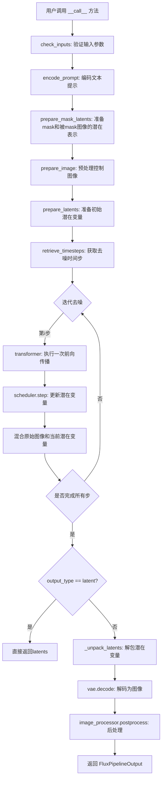

## 类结构

```
DiffusionPipeline (基类)
├── FluxLoraLoaderMixin (LoRA加载混合)
├── FromSingleFileMixin (单文件加载混合)
├── TextualInversionLoaderMixin (文本反转混合)
└── FluxControlInpaintPipeline (主类)
```

## 全局变量及字段


### `XLA_AVAILABLE`
    
标记torch_xla是否可用的布尔值，用于判断是否可以使用XLA加速

类型：`bool`
    


### `logger`
    
用于记录日志的Logger对象

类型：`logging.Logger`
    


### `EXAMPLE_DOC_STRING`
    
包含示例代码和使用说明的文档字符串

类型：`str`
    


### `FluxControlInpaintPipeline.scheduler`
    
用于去噪图像潜在表示的调度器

类型：`FlowMatchEulerDiscreteScheduler`
    


### `FluxControlInpaintPipeline.vae`
    
变分自编码器，用于将图像编码为潜在表示和解码回图像

类型：`AutoencoderKL`
    


### `FluxControlInpaintPipeline.text_encoder`
    
CLIP文本编码器，用于将文本提示编码为嵌入向量

类型：`CLIPTextModel`
    


### `FluxControlInpaintPipeline.tokenizer`
    
CLIP分词器，用于将文本分割为token

类型：`CLIPTokenizer`
    


### `FluxControlInpaintPipeline.text_encoder_2`
    
T5文本编码器，用于生成更长的文本嵌入

类型：`T5EncoderModel`
    


### `FluxControlInpaintPipeline.tokenizer_2`
    
T5快速分词器，用于处理更长的文本序列

类型：`T5TokenizerFast`
    


### `FluxControlInpaintPipeline.transformer`
    
Flux变换器模型，用于去噪图像潜在表示

类型：`FluxTransformer2DModel`
    


### `FluxControlInpaintPipeline.vae_scale_factor`
    
VAE缩放因子，用于计算潜在空间的尺寸

类型：`int`
    


### `FluxControlInpaintPipeline.image_processor`
    
图像预处理器，用于预处理输入图像

类型：`VaeImageProcessor`
    


### `FluxControlInpaintPipeline.mask_processor`
    
掩码处理器，用于处理修复掩码

类型：`VaeImageProcessor`
    


### `FluxControlInpaintPipeline.tokenizer_max_length`
    
分词器的最大序列长度

类型：`int`
    


### `FluxControlInpaintPipeline.default_sample_size`
    
默认采样大小，用于生成图像的默认尺寸

类型：`int`
    


### `FluxControlInpaintPipeline._guidance_scale`
    
无分类器引导比例，控制文本提示对生成图像的影响程度

类型：`float`
    


### `FluxControlInpaintPipeline._joint_attention_kwargs`
    
联合注意力关键字参数，用于传递额外的注意力控制选项

类型：`dict`
    


### `FluxControlInpaintPipeline._num_timesteps`
    
去噪过程的时间步总数

类型：`int`
    


### `FluxControlInpaintPipeline._interrupt`
    
中断标志，用于控制去噪循环的提前终止

类型：`bool`
    
    

## 全局函数及方法


### `calculate_shift`

该函数实现了一个线性插值计算，用于根据图像序列长度动态计算噪声调度器的时间步偏移量（shift），以适应不同分辨率图像的去噪过程。

参数：

- `image_seq_len`：`int`，输入图像的序列长度（latent空间中的token数量）
- `base_seq_len`：`int` = 256，基础序列长度，用于线性映射的起点
- `max_seq_len`：`int` = 4096，最大序列长度，用于线性映射的终点
- `base_shift`：`float` = 0.5，基础偏移量，对应base_seq_len时的偏移值
- `max_shift`：`float` = 1.15，最大偏移量，对应max_seq_len时的偏移值

返回值：`float`，根据图像序列长度计算得到的偏移量mu，用于调整Flow Match调度器的时间步

#### 流程图

```mermaid
flowchart TD
    A[开始] --> B[计算斜率 m<br/>m = (max_shift - base_shift) / (max_seq_len - base_seq_len)]
    B --> C[计算截距 b<br/>b = base_shift - m * base_seq_len]
    C --> D[计算偏移量 mu<br/>mu = image_seq_len * m + b]
    D --> E[返回 mu]
    
    B -.->|输入参数| B
    C -.->|斜率m| C
    D -.->|斜率m和截距b| D
```

#### 带注释源码

```python
# Copied from diffusers.pipelines.flux.pipeline_flux.calculate_shift
def calculate_shift(
    image_seq_len,           # 输入：图像序列长度（latent空间中的token数）
    base_seq_len: int = 256,     # 默认基础序列长度256
    max_seq_len: int = 4096,     # 默认最大序列长度4096
    base_shift: float = 0.5,     # 默认基础偏移量0.5
    max_shift: float = 1.15,     # 默认最大偏移量1.15
):
    """
    计算图像序列长度对应的偏移量（shift），用于调整噪声调度器的时间步。
    这是一个线性插值函数，将图像序列长度映射到偏移量值。
    
    公式推导：
    - 线性方程: y = mx + b
    - 斜率 m = (max_shift - base_shift) / (max_seq_len - base_seq_len)
    - 截距 b = base_shift - m * base_seq_len
    - 最终偏移量 mu = image_seq_len * m + b
    """
    # 计算线性插值的斜率（slope）
    m = (max_shift - base_shift) / (max_seq_len - base_seq_len)
    
    # 计算线性插值的截距（intercept）
    b = base_shift - m * base_seq_len
    
    # 根据图像序列长度计算最终的偏移量
    mu = image_seq_len * m + b
    
    # 返回计算得到的偏移量
    return mu
```


### `retrieve_latents`

该函数是一个全局工具函数，用于从VAE编码器输出中提取潜在向量（latents）。它支持三种模式：从潜在分布中采样、从潜在分布中取最大值，或者直接返回预存的潜在向量。这是扩散模型管道中常用的工具函数，确保能够兼容不同格式的编码器输出。

参数：

- `encoder_output`：`torch.Tensor`，编码器输出对象，可能包含`latent_dist`属性（潜在分布）或`latents`属性（直接潜在向量）
- `generator`：`torch.Generator | None`，可选的PyTorch随机数生成器，用于采样时的随机性控制
- `sample_mode`：`str`，采样模式，默认为"sample"；可选值为"sample"（从分布中采样）或"argmax"（取分布的众数）

返回值：`torch.Tensor`，提取出的潜在向量

#### 流程图

```mermaid
flowchart TD
    A[开始: retrieve_latents] --> B{encoder_output 有 latent_dist?}
    B -->|是| C{sample_mode == 'sample'?}
    C -->|是| D[返回 encoder_output.latent_dist.sample(generator)]
    C -->|否| E{sample_mode == 'argmax'?}
    E -->|是| F[返回 encoder_output.latent_dist.mode()]
    E -->|否| G[抛出 AttributeError]
    B -->|否| H{encoder_output 有 latents?}
    H -->|是| I[返回 encoder_output.latents]
    H -->|否| G
    D --> J[结束]
    F --> J
    I --> J
    G --> J
```

#### 带注释源码

```python
# Copied from diffusers.pipelines.stable_diffusion.pipeline_stable_diffusion_img2img.retrieve_latents
def retrieve_latents(
    encoder_output: torch.Tensor, generator: torch.Generator | None = None, sample_mode: str = "sample"
):
    """
    从VAE编码器输出中提取潜在向量。
    
    该函数支持三种提取模式：
    1. 从潜在分布中采样（sample_mode='sample'）
    2. 从潜在分布中取众数/最大值（sample_mode='argmax'）
    3. 直接返回预存的潜在向量（encoder_output.latents）
    
    Args:
        encoder_output: 编码器输出对象，包含潜在分布或潜在向量
        generator: 可选的随机数生成器，用于采样模式下的随机采样
        sample_mode: 采样模式，'sample'或'argmax'
    
    Returns:
        torch.Tensor: 提取出的潜在向量
    
    Raises:
        AttributeError: 当无法从encoder_output中获取潜在向量时抛出
    """
    # 检查编码器输出是否有latent_dist属性，并且采样模式为sample
    if hasattr(encoder_output, "latent_dist") and sample_mode == "sample":
        # 从潜在分布中采样，使用提供的generator确保可重复性
        return encoder_output.latent_dist.sample(generator)
    # 检查编码器输出是否有latent_dist属性，并且采样模式为argmax
    elif hasattr(encoder_output, "latent_dist") and sample_mode == "argmax":
        # 取潜在分布的众数（最大值对应的潜在向量）
        return encoder_output.latent_dist.mode()
    # 检查编码器输出是否有预存的latents属性
    elif hasattr(encoder_output, "latents"):
        # 直接返回预存的潜在向量
        return encoder_output.latents
    # 如果无法通过任何方式获取潜在向量，抛出异常
    else:
        raise AttributeError("Could not access latents of provided encoder_output")
```


### `retrieve_timesteps`

该函数是扩散管道中的时间步检索工具函数，用于调用调度器的 `set_timesteps` 方法并从调度器中获取时间步。它支持自定义时间步和自定义 sigmas，并处理不同调度器的兼容性检查。

参数：

- `scheduler`：`SchedulerMixin`，用于获取时间步的调度器对象
- `num_inference_steps`：`int | None`，生成样本时使用的扩散步数，如果使用此参数则 `timesteps` 必须为 `None`
- `device`：`str | torch.device | None`，时间步要移动到的设备，如果为 `None` 则不移动时间步
- `timesteps`：`list[int] | None`，用于覆盖调度器时间步间隔策略的自定义时间步，如果传入此参数则 `num_inference_steps` 和 `sigmas` 必须为 `None`
- `sigmas`：`list[float] | None`，用于覆盖调度器时间步间隔策略的自定义 sigmas，如果传入此参数则 `num_inference_steps` 和 `timesteps` 必须为 `None`
- `**kwargs`：其他关键字参数，将传递给调度器的 `set_timesteps` 方法

返回值：`tuple[torch.Tensor, int]`，元组中第一个元素是调度器的时间步计划，第二个元素是推理步数

#### 流程图

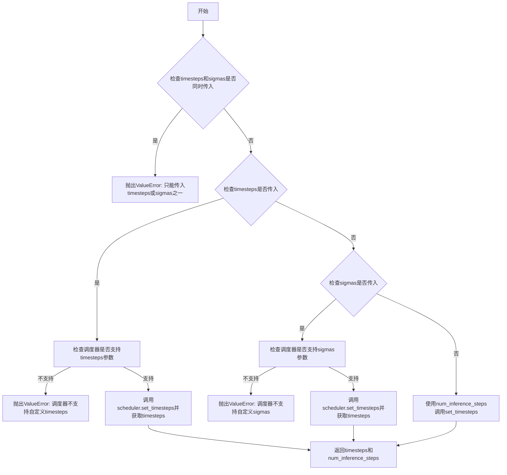

#### 带注释源码

```python
def retrieve_timesteps(
    scheduler,
    num_inference_steps: int | None = None,
    device: str | torch.device | None = None,
    timesteps: list[int] | None = None,
    sigmas: list[float] | None = None,
    **kwargs,
):
    r"""
    Calls the scheduler's `set_timesteps` method and retrieves timesteps from the scheduler after the call. Handles
    custom timesteps. Any kwargs will be supplied to `scheduler.set_timesteps`.

    Args:
        scheduler (`SchedulerMixin`):
            The scheduler to get timesteps from.
        num_inference_steps (`int`):
            The number of diffusion steps used when generating samples with a pre-trained model. If used, `timesteps`
            must be `None`.
        device (`str` or `torch.device`, *optional*):
            The device to which the timesteps should be moved to. If `None`, the timesteps are not moved.
        timesteps (`list[int]`, *optional*):
            Custom timesteps used to override the timestep spacing strategy of the scheduler. If `timesteps` is passed,
            `num_inference_steps` and `sigmas` must be `None`.
        sigmas (`list[float]`, *optional*):
            Custom sigmas used to override the timestep spacing strategy of the scheduler. If `sigmas` is passed,
            `num_inference_steps` and `timesteps` must be `None`.

    Returns:
        `tuple[torch.Tensor, int]`: A tuple where the first element is the timestep schedule from the scheduler and the
        second element is the number of inference steps.
    """
    # 检查是否同时传入了timesteps和sigmas，这是不允许的
    if timesteps is not None and sigmas is not None:
        raise ValueError("Only one of `timesteps` or `sigmas` can be passed. Please choose one to set custom values")
    
    # 处理自定义timesteps的情况
    if timesteps is not None:
        # 检查调度器的set_timesteps方法是否支持timesteps参数
        accepts_timesteps = "timesteps" in set(inspect.signature(scheduler.set_timesteps).parameters.keys())
        if not accepts_timesteps:
            raise ValueError(
                f"The current scheduler class {scheduler.__class__}'s `set_timesteps` does not support custom"
                f" timestep schedules. Please check whether you are using the correct scheduler."
            )
        # 调用调度器的set_timesteps方法
        scheduler.set_timesteps(timesteps=timesteps, device=device, **kwargs)
        # 从调度器获取设置后的timesteps
        timesteps = scheduler.timesteps
        # 计算推理步数
        num_inference_steps = len(timesteps)
    # 处理自定义sigmas的情况
    elif sigmas is not None:
        # 检查调度器的set_timesteps方法是否支持sigmas参数
        accept_sigmas = "sigmas" in set(inspect.signature(scheduler.set_timesteps).parameters.keys())
        if not accept_sigmas:
            raise ValueError(
                f"The current scheduler class {scheduler.__class__}'s `set_timesteps` does not support custom"
                f" sigmas schedules. Please check whether you are using the correct scheduler."
            )
        # 调用调度器的set_timesteps方法
        scheduler.set_timesteps(sigmas=sigmas, device=device, **kwargs)
        # 从调度器获取设置后的timesteps
        timesteps = scheduler.timesteps
        # 计算推理步数
        num_inference_steps = len(timesteps)
    # 默认情况：使用num_inference_steps设置时间步
    else:
        scheduler.set_timesteps(num_inference_steps, device=device, **kwargs)
        timesteps = scheduler.timesteps
    
    # 返回时间步和推理步数
    return timesteps, num_inference_steps
```


### `FluxControlInpaintPipeline.__init__`

该方法是 FluxControlInpaintPipeline 类的构造函数，负责初始化图像修复管道所需的所有核心组件，包括调度器、VAE 模型、文本编码器、分词器以及变换器，并配置图像处理器和掩码处理器以支持基于深度或边缘条件的图像修复任务。

参数：

- `scheduler`：`FlowMatchEulerDiscreteScheduler`，用于在去噪过程中调度时间步的调度器
- `vae`：`AutoencoderKL`，用于编码和解码图像的变分自编码器模型
- `text_encoder`：`CLIPTextModel`，用于编码文本提示的 CLIP 文本编码器
- `tokenizer`：`CLIPTokenizer`，用于分词文本输入的 CLIP 分词器
- `text_encoder_2`：`T5EncoderModel`，用于编码文本提示的 T5 文本编码器
- `tokenizer_2`：`T5TokenizerFast`，用于分词文本输入的 T5 分词器
- `transformer`：`FluxTransformer2DModel`，用于去噪图像潜在表示的条件变换器

返回值：`None`，构造函数不返回值，仅初始化对象状态

#### 流程图

```mermaid
flowchart TD
    A[开始 __init__] --> B[调用 super().__init__]
    B --> C[register_modules 注册所有模块]
    C --> D[计算 vae_scale_factor]
    D --> E[创建 VaeImageProcessor 作为 image_processor]
    E --> F[创建 VaeImageProcessor 作为 mask_processor]
    F --> G[设置 tokenizer_max_length]
    G --> H[设置 default_sample_size]
    H --> I[结束 __init__]
```

#### 带注释源码

```python
def __init__(
    self,
    scheduler: FlowMatchEulerDiscreteScheduler,  # 流匹配欧拉离散调度器
    vae: AutoencoderKL,  # 变分自编码器模型
    text_encoder: CLIPTextModel,  # CLIP文本编码器
    tokenizer: CLIPTokenizer,  # CLIP分词器
    text_encoder_2: T5EncoderModel,  # T5文本编码器
    tokenizer_2: T5TokenizerFast,  # T5分词器
    transformer: FluxTransformer2DModel,  # Flux变换器模型
):
    # 调用父类 DiffusionPipeline 的初始化方法
    super().__init__()

    # 将所有模块注册到管道中，使其可以通过 self.xxx 访问
    self.register_modules(
        vae=vae,
        text_encoder=text_encoder,
        text_encoder_2=text_encoder_2,
        tokenizer=tokenizer,
        tokenizer_2=tokenizer_2,
        transformer=transformer,
        scheduler=scheduler,
    )
    
    # 计算 VAE 缩放因子：基于 VAE 块输出通道数的2的幂次方
    # Flux潜在向量被转换为2x2 patches并打包，因此需要乘以patch size
    self.vae_scale_factor = 2 ** (len(self.vae.config.block_out_channels) - 1) if getattr(self, "vae", None) else 8
    
    # 创建图像处理器，用于预处理和后处理图像
    self.image_processor = VaeImageProcessor(vae_scale_factor=self.vae_scale_factor * 2)
    
    # 获取潜在通道数，用于掩码处理
    latent_channels = self.vae.config.latent_channels if getattr(self, "vae", None) else 16
    
    # 创建掩码处理器，专门处理二值化和灰度转换
    self.mask_processor = VaeImageProcessor(
        vae_scale_factor=self.vae_scale_factor * 2,
        vae_latent_channels=latent_channels,
        do_normalize=False,
        do_binarize=True,
        do_convert_grayscale=True,
    )
    
    # 设置分词器最大长度，默认值为77
    self.tokenizer_max_length = (
        self.tokenizer.model_max_length if hasattr(self, "tokenizer") and self.tokenizer is not None else 77
    )
    
    # 设置默认采样大小为128
    self.default_sample_size = 128
```


### `FluxControlInpaintPipeline._get_t5_prompt_embeds`

该方法负责将文本提示编码为T5文本编码器的嵌入向量，处理批量提示和每个提示生成多张图像的情况，并处理文本反转等特性。

参数：

- `self`：类的实例，包含`tokenizer_2`（T5分词器）、`text_encoder_2`（T5编码器）、`_execution_device`等属性
- `prompt`：`str | list[str]`，要编码的文本提示，可以是单个字符串或字符串列表
- `num_images_per_prompt`：`int = 1`，每个提示生成的图像数量，用于复制文本嵌入
- `max_sequence_length`：`int = 512`，文本序列的最大长度
- `device`：`torch.device | None`，计算设备，默认为`self._execution_device`
- `dtype`：`torch.dtype | None`，输出张量的数据类型，默认为`self.text_encoder.dtype`

返回值：`torch.Tensor`，形状为`(batch_size * num_images_per_prompt, seq_len, hidden_size)`的文本嵌入张量

#### 流程图

```mermaid
flowchart TD
    A[开始 _get_t5_prompt_embeds] --> B{device 为空?}
    B -- 是 --> C[device = self._execution_device]
    B -- 否 --> D{dtype 为空?}
    D -- 是 --> E[dtype = self.text_encoder.dtype]
    D -- 否 --> F[prompt 转为列表]
    C --> F
    E --> F
    F --> G[batch_size = len(prompt)]
    G --> H{是否支持 TextualInversion?}
    H -- 是 --> I[maybe_convert_prompt 处理提示]
    H -- 否 --> J[tokenizer_2 分词]
    I --> J
    J --> K[编码文本为 input_ids]
    K --> L[获取完整长度的 untruncated_ids]
    L --> M{需要截断?}
    M -- 是 --> N[记录警告日志]
    M -- 否 --> O[text_encoder_2 编码]
    N --> O
    O --> P[转换 dtype 和 device]
    P --> Q[重复嵌入 num_images_per_prompt 次]
    Q --> R[reshape 为批量大小]
    R --> S[返回 prompt_embeds]
```

#### 带注释源码

```python
def _get_t5_prompt_embeds(
    self,
    prompt: str | list[str] = None,
    num_images_per_prompt: int = 1,
    max_sequence_length: int = 512,
    device: torch.device | None = None,
    dtype: torch.dtype | None = None,
):
    """
    获取T5文本编码器的提示嵌入向量
    
    参数:
        prompt: 要编码的文本提示
        num_images_per_prompt: 每个提示生成的图像数量
        max_sequence_length: 最大序列长度
        device: 计算设备
        dtype: 数据类型
    """
    # 确定设备和数据类型，未指定则使用默认值
    device = device or self._execution_device
    dtype = dtype or self.text_encoder.dtype

    # 将单个字符串转换为列表，统一处理方式
    prompt = [prompt] if isinstance(prompt, str) else prompt
    batch_size = len(prompt)

    # 如果支持TextualInversion，转换提示格式
    if isinstance(self, TextualInversionLoaderMixin):
        prompt = self.maybe_convert_prompt(prompt, self.tokenizer_2)

    # 使用T5分词器对提示进行分词
    text_inputs = self.tokenizer_2(
        prompt,
        padding="max_length",           # 填充到最大长度
        max_length=max_sequence_length, # 最大序列长度
        truncation=True,                 # 截断超长序列
        return_length=False,             # 不返回长度
        return_overflowing_tokens=False,# 不返回溢出token
        return_tensors="pt",             # 返回PyTorch张量
    )
    text_input_ids = text_inputs.input_ids
    
    # 获取未截断的版本用于比较
    untruncated_ids = self.tokenizer_2(prompt, padding="longest", return_tensors="pt").input_ids

    # 检查是否发生了截断，若是则记录警告
    if untruncated_ids.shape[-1] >= text_input_ids.shape[-1] and not torch.equal(text_input_ids, untruncated_ids):
        removed_text = self.tokenizer_2.batch_decode(untruncated_ids[:, self.tokenizer_max_length - 1 : -1])
        logger.warning(
            "The following part of your input was truncated because `max_sequence_length` is set to "
            f" {max_sequence_length} tokens: {removed_text}"
        )

    # 使用T5编码器获取文本嵌入
    prompt_embeds = self.text_encoder_2(text_input_ids.to(device), output_hidden_states=False)[0]

    # 统一数据类型和设备
    dtype = self.text_encoder_2.dtype
    prompt_embeds = prompt_embeds.to(dtype=dtype, device=device)

    # 获取序列长度
    _, seq_len, _ = prompt_embeds.shape

    # 为每个提示生成多张图像而复制文本嵌入
    # 使用MPS友好的方法
    prompt_embeds = prompt_embeds.repeat(1, num_images_per_prompt, 1)
    prompt_embeds = prompt_embeds.view(batch_size * num_images_per_prompt, seq_len, -1)

    return prompt_embeds
```


### `FluxControlInpaintPipeline._get_clip_prompt_embeds`

该方法用于将文本提示（prompt）转换为 CLIP 文本编码器的嵌入向量（embeddings），支持批量处理和多图生成，并处理文本反转（TextualInversion）提示转换。

参数：

- `prompt`：`str | list[str]`，用户输入的文本提示，可以是单个字符串或字符串列表
- `num_images_per_prompt`：`int = 1`，每个提示生成的图像数量，用于复制嵌入向量
- `device`：`torch.device | None`，可选参数，指定计算设备，默认为执行设备

返回值：`torch.FloatTensor`，返回 CLIP 文本模型的池化输出嵌入，形状为 `(batch_size * num_images_per_prompt, hidden_dim)`

#### 流程图

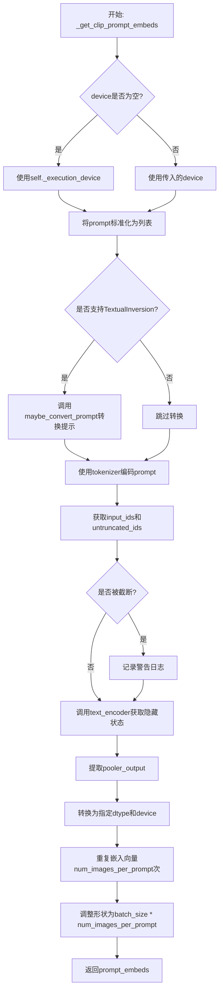

#### 带注释源码

```python
def _get_clip_prompt_embeds(
    self,
    prompt: str | list[str],
    num_images_per_prompt: int = 1,
    device: torch.device | None = None,
):
    """获取CLIP文本编码器的提示嵌入
    
    Args:
        prompt: 输入的文本提示，可以是字符串或字符串列表
        num_images_per_prompt: 每个提示生成的图像数量
        device: 可选的计算设备
    
    Returns:
        CLIP模型的池化输出嵌入向量
    """
    # 如果device未指定，则使用pipeline的默认执行设备
    device = device or self._execution_device

    # 将单个字符串转换为列表，保持batch处理的一致性
    prompt = [prompt] if isinstance(prompt, str) else prompt
    batch_size = len(prompt)

    # 如果支持TextualInversion（文本反转），则转换prompt
    # 这允许使用自定义的词嵌入
    if isinstance(self, TextualInversionLoaderMixin):
        prompt = self.maybe_convert_prompt(prompt, self.tokenizer)

    # 使用CLIP tokenizer将文本转换为token IDs
    # padding="max_length" 填充到最大长度
    # truncation=True 截断超过最大长度的序列
    text_inputs = self.tokenizer(
        prompt,
        padding="max_length",
        max_length=self.tokenizer_max_length,
        truncation=True,
        return_overflowing_tokens=False,
        return_length=False,
        return_tensors="pt",
    )

    text_input_ids = text_inputs.input_ids
    
    # 获取未截断的token IDs用于检测是否发生了截断
    untruncated_ids = self.tokenizer(prompt, padding="longest", return_tensors="pt").input_ids
    
    # 检查token序列是否被截断，如果是则记录警告
    if untruncated_ids.shape[-1] >= text_input_ids.shape[-1] and not torch.equal(text_input_ids, untruncated_ids):
        removed_text = self.tokenizer.batch_decode(untruncated_ids[:, self.tokenizer_max_length - 1 : -1])
        logger.warning(
            "The following part of your input was truncated because CLIP can only handle sequences up to"
            f" {self.tokenizer_max_length} tokens: {removed_text}"
        )
    
    # 将token IDs传入CLIP文本编码器获取嵌入
    # output_hidden_states=False 只获取最后一层的输出
    prompt_embeds = self.text_encoder(text_input_ids.to(device), output_hidden_states=False)

    # 使用CLIPTextModel的pooled输出（用于分类/对比任务的池化表示）
    # 这是模型[CLS] token对应的输出
    prompt_embeds = prompt_embeds.pooler_output
    
    # 转换数据类型和设备以匹配text_encoder的配置
    prompt_embeds = prompt_embeds.to(dtype=self.text_encoder.dtype, device=device)

    # 为每个提示复制num_images_per_prompt次
    # 这样可以在一次前向传播中生成多张图像
    # 使用repeat方法而不是view以兼容MPS设备
    prompt_embeds = prompt_embeds.repeat(1, num_images_per_prompt)
    
    # 调整形状为 (batch_size * num_images_per_prompt, hidden_dim)
    prompt_embeds = prompt_embeds.view(batch_size * num_images_per_prompt, -1)

    return prompt_embeds
```


### FluxControlInpaintPipeline.encode_prompt

该方法负责将文本提示词编码为Transformer模型所需的嵌入向量。它同时使用CLIP和T5两种文本编码器生成文本嵌入，并通过LoRA层缩放机制支持文本提示词的权重调整，最终返回文本嵌入、池化嵌入和文本ID张量供后续去噪过程使用。

参数：

- `prompt`：`str | list[str]`，要编码的主提示词，可以是单个字符串或字符串列表
- `prompt_2`：`str | list[str] | None`，发送给第二tokenizer和text_encoder的提示词，若未指定则使用prompt
- `device`：`torch.device | None`，指定计算设备，若为None则使用执行设备
- `num_images_per_prompt`：`int`，每个提示词需要生成的图像数量，默认为1
- `prompt_embeds`：`torch.FloatTensor | None`，预生成的文本嵌入，可用于微调文本输入，若为None则从prompt生成
- `pooled_prompt_embeds`：`torch.FloatTensor | None`，预生成的池化文本嵌入，若为None则从prompt生成
- `max_sequence_length`：`int`，T5编码器的最大序列长度，默认为512
- `lora_scale`：`float | None`，应用于所有LoRA层的缩放因子，若LoRA层已加载

返回值：`tuple[torch.Tensor, torch.Tensor, torch.Tensor]`，返回三元组(prompt_embeds, pooled_prompt_embeds, text_ids)，其中prompt_embeds是T5生成的文本嵌入，pooled_prompt_embeds是CLIP生成的池化嵌入，text_ids是用于文本位置编码的零张量

#### 流程图

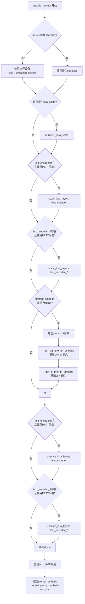

#### 带注释源码

```python
def encode_prompt(
    self,
    prompt: str | list[str],
    prompt_2: str | list[str] | None = None,
    device: torch.device | None = None,
    num_images_per_prompt: int = 1,
    prompt_embeds: torch.FloatTensor | None = None,
    pooled_prompt_embeds: torch.FloatTensor | None = None,
    max_sequence_length: int = 512,
    lora_scale: float | None = None,
):
    r"""
    编码文本提示词为嵌入向量

    Args:
        prompt (`str` or `list[str]`, *optional*):
            要编码的提示词
        prompt_2 (`str` or `list[str]`, *optional*):
            发送给 `tokenizer_2` 和 `text_encoder_2` 的提示词。若未定义，则使用 `prompt`
        device: (`torch.device`):
            torch 设备
        num_images_per_prompt (`int`):
            每个提示词生成的图像数量
        prompt_embeds (`torch.FloatTensor`, *optional*):
            预生成的文本嵌入，可用于提示词加权。若未提供，则从 `prompt` 生成
        pooled_prompt_embeds (`torch.FloatTensor`, *optional*):
            预生成的池化文本嵌入，可用于提示词加权。若未提供，则从 `prompt` 生成
        lora_scale (`float`, *optional*):
            应用于文本编码器所有LoRA层的缩放因子
    """
    # 确定设备：优先使用传入的device，否则使用执行设备
    device = device or self._execution_device

    # 设置LoRA缩放因子，使文本编码器的LoRA函数可以正确访问
    if lora_scale is not None and isinstance(self, FluxLoraLoaderMixin):
        self._lora_scale = lora_scale

        # 动态调整LoRA缩放
        if self.text_encoder is not None and USE_PEFT_BACKEND:
            scale_lora_layers(self.text_encoder, lora_scale)
        if self.text_encoder_2 is not None and USE_PEFT_BACKEND:
            scale_lora_layers(self.text_encoder_2, lora_scale)

    # 标准化prompt为列表格式
    prompt = [prompt] if isinstance(prompt, str) else prompt

    # 如果未提供预计算的嵌入，则需要生成
    if prompt_embeds is None:
        # 处理第二prompt：若未指定则使用第一prompt
        prompt_2 = prompt_2 or prompt
        prompt_2 = [prompt_2] if isinstance(prompt_2, str) else prompt_2

        # 仅使用CLIPTextModel的池化输出生成pooled_prompt_embeds
        pooled_prompt_embeds = self._get_clip_prompt_embeds(
            prompt=prompt,
            device=device,
            num_images_per_prompt=num_images_per_prompt,
        )
        # 使用T5生成完整的prompt_embeds
        prompt_embeds = self._get_t5_prompt_embeds(
            prompt=prompt_2,
            num_images_per_prompt=num_images_per_prompt,
            max_sequence_length=max_sequence_length,
            device=device,
        )

    # 处理完成后退缩LoRA层以恢复原始缩放
    if self.text_encoder is not None:
        if isinstance(self, FluxLoraLoaderMixin) and USE_PEFT_BACKEND:
            # 通过反向缩放LoRA层恢复原始缩放
            unscale_lora_layers(self.text_encoder, lora_scale)

    if self.text_encoder_2 is not None:
        if isinstance(self, FluxLoraLoaderMixin) and USE_PEFT_BACKEND:
            # 通过反向缩放LoRA层恢复原始缩放
            unscale_lora_layers(self.text_encoder_2, lora_scale)

    # 确定数据类型：优先使用text_encoder的dtype，否则使用transformer的dtype
    dtype = self.text_encoder.dtype if self.text_encoder is not None else self.transformer.dtype
    
    # 创建文本位置ID张量（用于文本嵌入的位置编码）
    # 形状为 (seq_len, 3)，全零张量
    text_ids = torch.zeros(prompt_embeds.shape[1], 3).to(device=device, dtype=dtype)

    # 返回：文本嵌入、池化嵌入、文本ID
    return prompt_embeds, pooled_prompt_embeds, text_ids
```


### `FluxControlInpaintPipeline._encode_vae_image`

该方法使用 VAE 编码器将输入图像转换为潜在空间表示（latent representation），通过 `retrieve_latents` 函数从 VAE 编码结果中提取潜在向量，并应用 `shift_factor` 和 `scaling_factor` 进行归一化处理。

参数：

- `self`：`FluxControlInpaintPipeline`，Pipeline 实例本身
- `image`：`torch.Tensor`，待编码的输入图像张量，形状通常为 `(B, C, H, W)`
- `generator`：`torch.Generator`，用于随机采样潜在向量的 PyTorch 生成器，支持单个或列表形式

返回值：`torch.Tensor`，编码后的图像潜在表示，形状为 `(B, latent_channels, H/8, W/8)`

#### 流程图

```mermaid
flowchart TD
    A[开始 _encode_vae_image] --> B{generator 是否为列表?}
    B -->|是| C[遍历图像批次]
    C --> D[对每张图像调用 vae.encode]
    D --> E[使用 retrieve_latents 提取潜在向量]
    E --> F[使用对应 generator[i] 进行采样]
    F --> G[将所有潜在向量沿 dim=0 拼接]
    B -->|否| H[直接调用 vae.encode 整个图像]
    H --> I[使用 retrieve_latents 提取潜在向量]
    I --> J[使用 generator 进行采样]
    G --> K[应用 shift_factor 和 scaling_factor 归一化]
    J --> K
    K --> L[返回 image_latents]
```

#### 带注释源码

```python
def _encode_vae_image(self, image: torch.Tensor, generator: torch.Generator):
    """
    使用 VAE 编码图像到潜在空间
    
    参数:
        image: 输入图像张量，形状为 (B, C, H, W)
        generator: 随机生成器，用于采样潜在向量
        
    返回:
        编码后的图像潜在表示
    """
    # 判断 generator 是否为列表（多生成器情况）
    if isinstance(generator, list):
        # 对批量图像逐个编码，每个图像使用对应的 generator
        image_latents = [
            # 提取 VAE 编码后的潜在向量
            retrieve_latents(self.vae.encode(image[i : i + 1]), generator=generator[i])
            for i in range(image.shape[0])  # 遍历批量大小
        ]
        # 将所有潜在向量在批次维度拼接
        image_latents = torch.cat(image_latents, dim=0)
    else:
        # 单个 generator，直接编码整个图像批次
        image_latents = retrieve_latents(self.vae.encode(image), generator=generator)

    # 应用 VAE 配置中的归一化参数：
    # 1. 减去 shift_factor（偏移因子）
    # 2. 乘以 scaling_factor（缩放因子）
    # 这两步将潜在向量转换到标准化的潜在空间
    image_latents = (image_latents - self.vae.config.shift_factor) * self.vae.config.scaling_factor

    # 返回编码后的潜在表示
    return image_latents
```


### `FluxControlInpaintPipeline.get_timesteps`

该方法用于根据推理步数和强度参数计算时间步调度，返回调整后的时间步序列和实际推理步数。

参数：

- `num_inference_steps`：`int`，推理步数，即去噪过程的迭代次数
- `strength`：`float`，强度参数，范围在0到1之间，控制图像保真度和修改程度
- `device`：`torch.device`，计算设备，用于指定张量存放的硬件设备

返回值：`tuple[torch.Tensor, int]`，返回元组包含两个元素：第一个是时间步调度序列（`torch.Tensor`），第二个是调整后的推理步数（`int`）

#### 流程图

```mermaid
flowchart TD
    A[开始 get_timesteps] --> B[计算 init_timestep = min(num_inference_steps * strength, num_inference_steps)]
    B --> C[计算 t_start = max(num_inference_steps - init_timestep, 0)]
    C --> D[从 scheduler.timesteps 中切片获取 timesteps]
    D --> E{tcheduler 是否有 set_begin_index 方法?}
    E -->|是| F[调用 scheduler.set_begin_index(t_start * scheduler.order)]
    E -->|否| G[跳过设置起始索引]
    F --> H[返回 timesteps 和 num_inference_steps - t_start]
    G --> H
```

#### 带注释源码

```python
def get_timesteps(self, num_inference_steps, strength, device):
    """
    根据推理步数和强度参数计算时间步调度。
    
    参数:
        num_inference_steps: int, 推理步数
        strength: float, 强度参数 (0-1)
        device: torch.device, 计算设备
    
    返回:
        tuple: (timesteps, adjusted_num_inference_steps)
    """
    # get the original timestep using init_timestep
    # 计算初始时间步数，取推理步数乘以强度和推理步数本身的最小值
    init_timestep = min(num_inference_steps * strength, num_inference_steps)

    # 计算起始索引，从完整时间步序列中跳过的步数
    t_start = int(max(num_inference_steps - init_timestep, 0))
    # 从调度器的时间步序列中获取从t_start开始到结尾的部分，乘以scheduler.order考虑调度器的阶数
    timesteps = self.scheduler.timesteps[t_start * self.scheduler.order :]
    # 如果调度器支持设置起始索引方法，则调用它来设置内部状态
    if hasattr(self.scheduler, "set_begin_index"):
        self.scheduler.set_begin_index(t_start * self.scheduler.order)

    # 返回调整后的时间步序列和实际将执行的推理步数
    return timesteps, num_inference_steps - t_start
```


### `FluxControlInpaintPipeline.check_inputs`

该方法用于验证 FluxControlInpaintPipeline 的输入参数是否合法，包括检查 strength 是否在 [0, 1] 范围内、height 和 width 是否能被 vae_scale_factor * 2 整除、callback_on_step_end_tensor_inputs 是否有效、prompt 和 prompt_embeds 的组合是否正确等。如果输入不合法，该方法会抛出 ValueError 或发出警告。

参数：

- `prompt`：`str | list[str] | None`，用户输入的文本提示，用于指导图像生成
- `prompt_2`：`str | list[str] | None`，发送给 tokenizer_2 和 text_encoder_2 的文本提示，如果未定义则使用 prompt
- `strength`：`float`，图像变换程度，值必须在 [0.0, 1.0] 范围内
- `height`：`int`，生成图像的高度（像素）
- `width`：`int`，生成图像的宽度（像素）
- `prompt_embeds`：`torch.FloatTensor | None`，预生成的文本嵌入，用于轻松调整文本输入
- `pooled_prompt_embeds`：`torch.FloatTensor | None`，预生成的池化文本嵌入
- `callback_on_step_end_tensor_inputs`：`list[str] | None`，回调函数在每步结束时接收的张量输入列表
- `max_sequence_length`：`int | None`，与 prompt 一起使用的最大序列长度，默认 512

返回值：`None`，该方法不返回任何值，仅进行输入验证

#### 流程图

```mermaid
flowchart TD
    A[开始 check_inputs] --> B{strength < 0 或 strength > 1?}
    B -->|是| C[抛出 ValueError: strength 必须在 [0.0, 1.0]]
    B -->|否| D{height % (vae_scale_factor * 2) != 0 或 width % (vae_scale_factor * 2) != 0?}
    D -->|是| E[发出警告: 图像尺寸将被调整]
    D -->|否| F{callback_on_step_end_tensor_inputs 是否有效?}
    F -->|否| G[抛出 ValueError: 无效的 callback_on_step_end_tensor_inputs]
    F -->|是| H{prompt 和 prompt_embeds 都非空?}
    H -->|是| I[抛出 ValueError: 不能同时提供 prompt 和 prompt_embeds]
    H -->|否| J{prompt_2 和 prompt_embeds 都非空?}
    J -->|是| K[抛出 ValueError: 不能同时提供 prompt_2 和 prompt_embeds]
    J -->|否| L{prompt 和 prompt_embeds 都为空?}
    L -->|是| M[抛出 ValueError: 必须提供 prompt 或 prompt_embeds]
    L -->|否| N{prompt 类型是否合法?}
    N -->|否| O[抛出 ValueError: prompt 类型必须是 str 或 list]
    N -->|是| P{prompt_2 类型是否合法?}
    P -->|否| Q[抛出 ValueError: prompt_2 类型必须是 str 或 list]
    P -->|是| R{prompt_embeds 非空但 pooled_prompt_embeds 为空?}
    R -->|是| S[抛出 ValueError: 必须同时提供 prompt_embeds 和 pooled_prompt_embeds]
    R -->|否| T{max_sequence_length > 512?}
    T -->|是| U[抛出 ValueError: max_sequence_length 不能大于 512]
    T -->|否| V[验证通过，方法结束]
    C --> V
    E --> F
    G --> V
    I --> V
    K --> V
    M --> V
    O --> V
    Q --> V
    S --> V
    U --> V
```

#### 带注释源码

```python
def check_inputs(
    self,
    prompt,
    prompt_2,
    strength,
    height,
    width,
    prompt_embeds=None,
    pooled_prompt_embeds=None,
    callback_on_step_end_tensor_inputs=None,
    max_sequence_length=None,
):
    # 检查 strength 参数是否在有效范围内 [0.0, 1.0]
    if strength < 0 or strength > 1:
        raise ValueError(f"The value of strength should in [0.0, 1.0] but is {strength}")

    # 检查 height 和 width 是否能被 vae_scale_factor * 2 整除
    # Flux 的潜在表示被打包成 2x2 块，因此潜在宽度和高度必须能被 patch size 整除
    if height % (self.vae_scale_factor * 2) != 0 or width % (self.vae_scale_factor * 2) != 0:
        logger.warning(
            f"`height` and `width` have to be divisible by {self.vae_scale_factor * 2} but are {height} and {width}. Dimensions will be resized accordingly"
        )

    # 检查 callback_on_step_end_tensor_inputs 是否为合法的回调张量输入
    if callback_on_step_end_tensor_inputs is not None and not all(
        k in self._callback_tensor_inputs for k in callback_on_step_end_tensor_inputs
    ):
        raise ValueError(
            f"`callback_on_step_end_tensor_inputs` has to be in {self._callback_tensor_inputs}, but found {[k for k in callback_on_step_end_tensor_inputs if k not in self._callback_tensor_inputs]}"
        )

    # 检查 prompt 和 prompt_embeds 不能同时提供
    if prompt is not None and prompt_embeds is not None:
        raise ValueError(
            f"Cannot forward both `prompt`: {prompt} and `prompt_embeds`: {prompt_embeds}. Please make sure to"
            " only forward one of the two."
        )
    # 检查 prompt_2 和 prompt_embeds 不能同时提供
    elif prompt_2 is not None and prompt_embeds is not None:
        raise ValueError(
            f"Cannot forward both `prompt_2`: {prompt_2} and `prompt_embeds`: {prompt_embeds}. Please make sure to"
            " only forward one of the two."
        )
    # 至少需要提供 prompt 或 prompt_embeds 之一
    elif prompt is None and prompt_embeds is None:
        raise ValueError(
            "Provide either `prompt` or `prompt_embeds`. Cannot leave both `prompt` and `prompt_embeds` undefined."
        )
    # 检查 prompt 类型是否合法（str 或 list）
    elif prompt is not None and (not isinstance(prompt, str) and not isinstance(prompt, list)):
        raise ValueError(f"`prompt` has to be of type `str` or `list` but is {type(prompt)}")
    # 检查 prompt_2 类型是否合法（str 或 list）
    elif prompt_2 is not None and (not isinstance(prompt_2, str) and not isinstance(prompt_2, list)):
        raise ValueError(f"`prompt_2` has to be of type `str` or `list` but is {type(prompt_2)}")

    # 如果提供了 prompt_embeds，则也必须提供 pooled_prompt_embeds
    if prompt_embeds is not None and pooled_prompt_embeds is None:
        raise ValueError(
            "If `prompt_embeds` are provided, `pooled_prompt_embeds` also have to be passed. Make sure to generate `pooled_prompt_embeds` from the same text encoder that was used to generate `prompt_embeds`."
        )

    # 检查 max_sequence_length 是否超过最大值 512
    if max_sequence_length is not None and max_sequence_length > 512:
        raise ValueError(f"`max_sequence_length` cannot be greater than 512 but is {max_sequence_length}")
```


### `FluxControlInpaintPipeline._prepare_latent_image_ids`

该方法是一个静态工具函数，用于生成潜在图像的空间位置编码ID。它创建一个包含二维坐标信息的张量，用于在Flux变换器中标识图像中每个潜在像素块的位置，支持模型理解图像的空间结构。

参数：

- `batch_size`：`int`，批次大小（虽然方法内部未直接使用，但作为调用接口保留）
- `height`：`int`，潜在图像的高度（以补丁数量计）
- `width`：`int`，潜在图像的宽度（以补丁数量计）
- `device`：`torch.device`，目标设备，用于将最终张量移动到指定设备
- `dtype`：`torch.dtype`，目标数据类型，用于指定最终张量的数据类型

返回值：`torch.Tensor`，形状为 `(height * width, 3)` 的二维张量，每行包含 `[0, row_index, col_index]` 格式的位置编码信息

#### 流程图

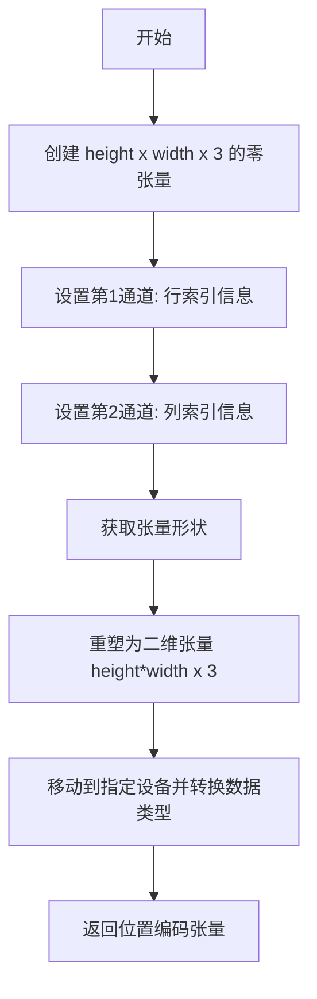

#### 带注释源码

```python
@staticmethod
# Copied from diffusers.pipelines.flux.pipeline_flux.FluxPipeline._prepare_latent_image_ids
def _prepare_latent_image_ids(batch_size, height, width, device, dtype):
    """
    准备潜在图像的位置ID编码，用于Flux变换器中标识图像空间位置。
    
    Args:
        batch_size: 批次大小（当前未使用，保留接口兼容性）
        height: 潜在图像高度（以补丁数为单位）
        width: 潜在图像宽度（以补丁数为单位）
        device: 目标设备
        dtype: 目标数据类型
    
    Returns:
        torch.Tensor: 形状为 (height*width, 3) 的位置编码张量
    """
    # 步骤1: 创建初始零张量，形状为 height x width x 3
    # 3个通道分别用于: [0, 行索引, 列索引]
    latent_image_ids = torch.zeros(height, width, 3)
    
    # 步骤2: 在第1通道（索引1）填充行索引信息
    # torch.arange(height)[:, None] 创建列向量 (height, 1)
    # 广播机制自动扩展为 (height, width) 的行索引矩阵
    latent_image_ids[..., 1] = latent_image_ids[..., 1] + torch.arange(height)[:, None]
    
    # 步骤3: 在第2通道（索引2）填充列索引信息
    # torch.arange(width)[None, :] 创建行向量 (1, width)
    # 广播机制自动扩展为 (height, width) 的列索引矩阵
    latent_image_ids[..., 2] = latent_image_ids[..., 2] + torch.arange(width)[None, :]
    
    # 步骤4: 获取重塑前的张量维度信息
    latent_image_id_height, latent_image_id_width, latent_image_id_channels = latent_image_ids.shape
    
    # 步骤5: 将三维张量重塑为二维张量
    # 从 (height, width, 3) 转换为 (height*width, 3)
    # 每一行代表一个潜在像素块的位置编码 [0, row_idx, col_idx]
    latent_image_ids = latent_image_ids.reshape(
        latent_image_id_height * latent_image_id_width, latent_image_id_channels
    )
    
    # 步骤6: 将结果张量移动到指定设备并转换数据类型后返回
    return latent_image_ids.to(device=device, dtype=dtype)
```


### `FluxControlInpaintPipeline._pack_latents`

将输入的latent张量重新打包成Flux模型所需的2x2补丁格式，以便后续在Transformer中进行处理。

参数：

- `latents`：`torch.Tensor`，输入的4D latent张量，形状为(batch_size, num_channels_latents, height, width)
- `batch_size`：`int`，批次大小
- `num_channels_latents`：`int`，latent通道数
- `height`：`int`，latent的高度
- `width`：`int`，latent的宽度

返回值：`torch.Tensor`，打包后的3D张量，形状为(batch_size, (height // 2) * (width // 2), num_channels_latents * 4)

#### 流程图

```mermaid
flowchart TD
    A[输入latents: (batch, channels, H, W)] --> B[view重塑为<br/>(batch, channels, H//2, 2, W//2, 2)]
    B --> C[permute置换维度<br/>转换为(batch, H//2, W//2, channels, 2, 2)]
    C --> D[reshape重塑为<br/>(batch, H//2 * W//2, channels * 4)]
    D --> E[返回打包后的latents]
```

#### 带注释源码

```
@staticmethod
# 静态方法：从diffusers.pipelines.flux.pipeline_flux.FluxPipeline复制
def _pack_latents(latents, batch_size, num_channels_latents, height, width):
    # 步骤1：将latents从 (batch, channels, H, W) 重塑为 (batch, channels, H//2, 2, W//2, 2)
    # 这样将空间维度分割成2x2的补丁块
    latents = latents.view(batch_size, num_channels_latents, height // 2, 2, width // 2, 2)
    
    # 步骤2：置换维度从 (0, 1, 2, 3, 4, 5) 变为 (0, 2, 4, 1, 3, 5)
    # 新的排列顺序将补丁维度移到前面，便于后续重塑
    latents = latents.permute(0, 2, 4, 1, 3, 5)
    
    # 步骤3：最终重塑为 (batch, H//2 * W//2, channels * 4)
    # 将2x2补丁展开为序列，每个位置的4个值（2x2补丁）展开为通道维度
    latents = latents.reshape(batch_size, (height // 2) * (width // 2), num_channels_latents * 4)

    return latents
```


### `FluxControlInpaintPipeline._unpack_latents`

该方法是一个静态方法，用于将已经打包（packed）的潜在表示张量解包回标准的图像潜在表示格式。打包操作将 2x2 的图像块合并以提高计算效率，该方法是其逆操作，将打包后的张量恢复为 (batch_size, channels, height, width) 的标准形状。

参数：

- `latents`：`torch.Tensor`，打包后的潜在表示张量，形状为 (batch_size, num_patches, channels)，其中 num_patches = (height // 2) * (width // 2)
- `height`：`int`，原始图像的高度（像素单位）
- `width`：`int`，原始图像的宽度（像素单位）
- `vae_scale_factor`：`int`，VAE 的缩放因子，用于计算潜在空间的尺寸

返回值：`torch.Tensor`，解包后的潜在表示张量，形状为 (batch_size, channels // 4, height, width)

#### 流程图

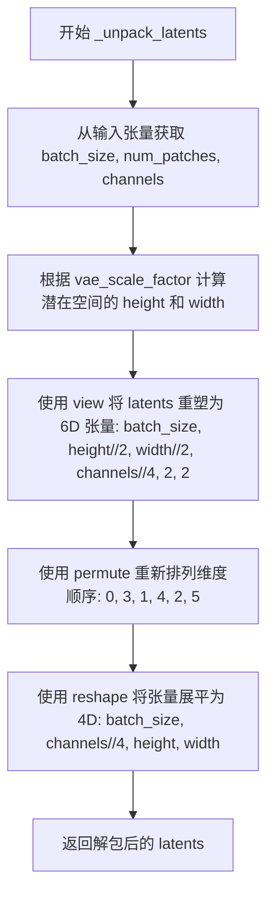

#### 带注释源码

```python
@staticmethod
# Copied from diffusers.pipelines.flux.pipeline_flux.FluxPipeline._unpack_latents
def _unpack_latents(latents, height, width, vae_scale_factor):
    # 从打包后的 latents 张量中解包出批次大小、补丁数量和通道数
    # latents 的原始形状: (batch_size, num_patches, channels)
    # 其中 num_patches = (height // 2) * (width // 2)
    batch_size, num_patches, channels = latents.shape

    # VAE 对图像应用 8x 压缩，但我们还必须考虑打包操作
    # 打包操作要求潜在高度和宽度能被 2 整除
    # 因此需要将高度和宽度乘以 2，然后除以 vae_scale_factor * 2
    # 这样得到的才是潜在空间的实际尺寸
    height = 2 * (int(height) // (vae_scale_factor * 2))
    width = 2 * (int(width) // (vae_scale_factor * 2))

    # 使用 view 将打包的 latents 重塑为 6D 张量
    # 形状从 (batch_size, num_patches, channels) 
    # 变为 (batch_size, height//2, width//2, channels//4, 2, 2)
    # 这相当于将 2x2 的补丁展开为独立的维度
    latents = latents.view(batch_size, height // 2, width // 2, channels // 4, 2, 2)
    
    # 使用 permute 重新排列维度顺序
    # 从 (0, 1, 2, 3, 4, 5) 变为 (0, 3, 1, 4, 2, 5)
    # 这样将通道维度提前，同时保持 2x2 补丁的结构
    latents = latents.permute(0, 3, 1, 4, 2, 5)

    # 最后使用 reshape 将 6D 张量展平为 4D 标准潜在表示格式
    # 形状变为 (batch_size, channels // 4, height, width)
    # channels // 4 是因为打包时 4 个通道被合并为 1 个
    latents = latents.reshape(batch_size, channels // (2 * 2), height, width)

    return latents
```


### `FluxControlInpaintPipeline.enable_vae_slicing`

该方法用于启用VAE分片解码功能，通过将输入张量分割成多个切片进行分步计算，以节省内存并支持更大的批量大小。该方法已被废弃，建议直接使用 `pipe.vae.enable_slicing()`。

参数： 无（仅包含隐式参数 `self`）

返回值：`None`，无返回值

#### 流程图

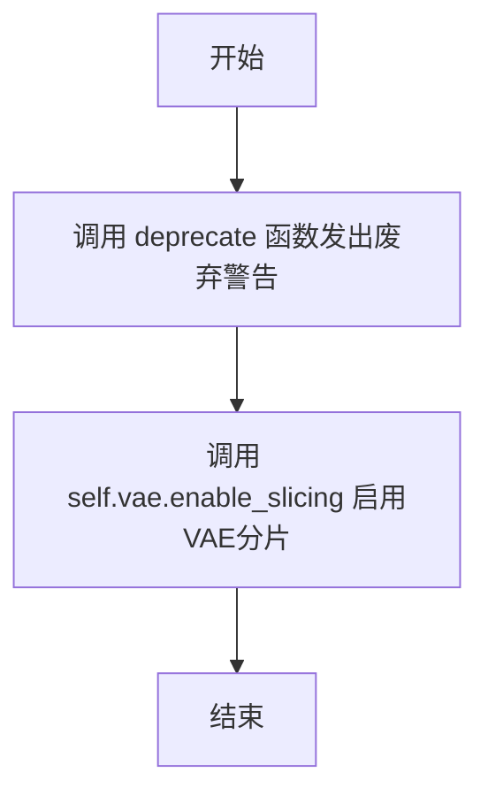

#### 带注释源码

```python
def enable_vae_slicing(self):
    r"""
    Enable sliced VAE decoding. When this option is enabled, the VAE will split the input tensor in slices to
    compute decoding in several steps. This is useful to save some memory and allow larger batch sizes.
    """
    # 构建废弃警告消息，包含类名以提供上下文
    depr_message = f"Calling `enable_vae_slicing()` on a `{self.__class__.__name__}` is deprecated and this method will be removed in a future version. Please use `pipe.vae.enable_slicing()`."
    
    # 调用 deprecate 函数记录废弃信息：
    # - 第一个参数：被废弃的功能名称
    # - 第二个参数：废弃版本号
    # - 第三个参数：废弃警告消息
    deprecate(
        "enable_vae_slicing",
        "0.40.0",
        depr_message,
    )
    
    # 委托给 VAE 模型的 enable_slicing 方法执行实际的切片启用逻辑
    # 这是真正的功能实现，之前是废弃警告
    self.vae.enable_slicing()
```


### `FluxControlInpaintPipeline.disable_vae_slicing`

该方法用于禁用 VAE 切片解码功能。如果之前通过 `enable_vae_slicing` 启用了切片解码，调用此方法后将恢复为单步解码。该方法已被废弃，建议直接使用 `pipe.vae.disable_slicing()`。

参数：

- 无（仅包含 self 参数）

返回值：`None`，无返回值

#### 流程图

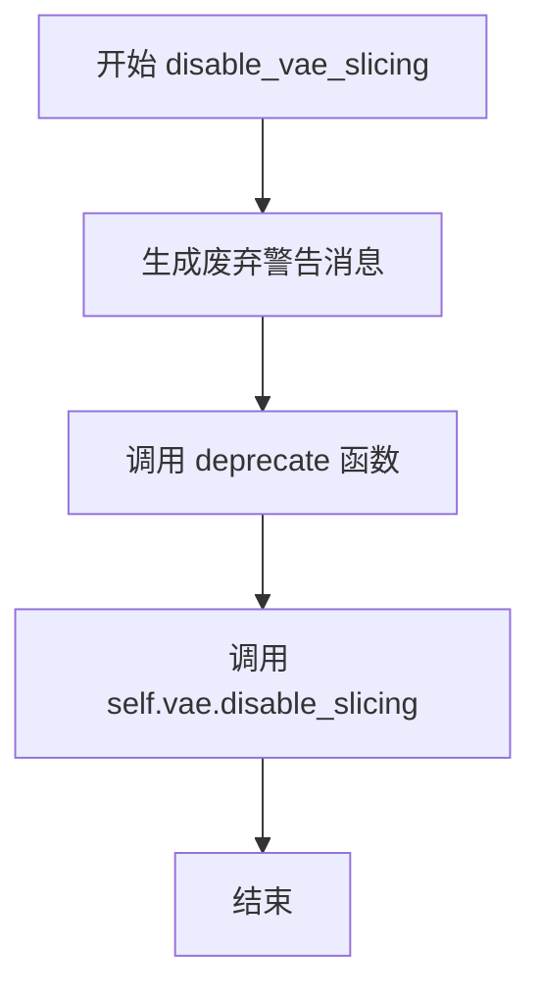

#### 带注释源码

```python
def disable_vae_slicing(self):
    r"""
    Disable sliced VAE decoding. If `enable_vae_slicing` was previously enabled, this method will go back to
    computing decoding in one step.
    """
    # 构建废弃警告消息，提示用户该方法已废弃，将在未来版本中移除
    # 建议用户直接使用 pipe.vae.disable_slicing()
    depr_message = f"Calling `disable_vae_slicing()` on a `{self.__class__.__name__}` is deprecated and this method will be removed in a future version. Please use `pipe.vae.disable_slicing()`."
    
    # 调用 deprecate 函数记录废弃信息
    # 参数：方法名 "disable_vae_slicing"，废弃版本 "0.40.0"，警告消息
    deprecate(
        "disable_vae_slicing",
        "0.40.0",
        depr_message,
    )
    
    # 调用 VAE 模型的 disable_slicing 方法，禁用切片解码功能
    # 这将恢复 VAE 为单步解码模式
    self.vae.disable_slicing()
```


### `FluxControlInpaintPipeline.enable_vae_tiling`

启用分块 VAE 解码功能。当启用此选项时，VAE 会将输入张量分割成多个分块进行分步解码和编码。这对于节省大量内存并处理更大的图像非常有用。

参数：

- 无

返回值：无（`None`），该方法直接作用于 `self.vae` 对象，启用分块解码功能

#### 流程图

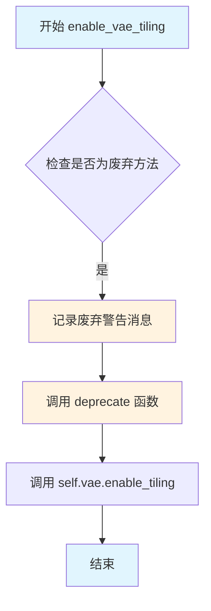

#### 带注释源码

```
def enable_vae_tiling(self):
    r"""
    启用分块 VAE 解码功能。
    
    当此选项启用时，VAE 会将输入张量分割成多个分块（tiles）来分步计算解码和编码过程。
    这种方法对于节省大量内存并允许处理更大的图像非常有用。
    
    工作原理：
    - 将大图像分割成较小的 tiles
    - 分别对每个 tile 进行编码/解码
    - 合并结果得到完整图像
    优点：
    - 降低显存占用
    - 支持更大分辨率的图像处理
    """
    # 构建废弃警告消息，提示用户该方法将在未来版本中移除
    # 使用当前类名动态构建消息，提高代码复用性
    depr_message = f"Calling `enable_vae_tiling()` on a `{self.__class__.__name__}` is deprecated and this method will be removed in a future version. Please use `pipe.vae.enable_tiling()`."
    
    # 调用 deprecate 函数记录废弃信息
    # 参数说明：
    # - "enable_vae_tiling": 被废弃的方法名
    # - "0.40.0": 废弃版本号
    # - depr_message: 详细的废弃警告消息
    deprecate(
        "enable_vae_tiling",
        "0.40.0",
        depr_message,
    )
    
    # 实际启用 VAE 分块功能的调用
    # 该方法会配置 VAE 模型内部的 tile 处理逻辑
    # 包括设置 tile 大小、重叠区域等参数
    self.vae.enable_tiling()
```


### `FluxControlInpaintPipeline.disable_vae_tiling`

该方法用于禁用瓦片式 VAE 解码。如果之前启用了瓦片式 VAE 解码，调用此方法后将恢复到单步解码模式。该方法已弃用，建议直接使用 `pipe.vae.disable_tiling()`。

参数：无（仅包含 self 参数）

返回值：`None`，无返回值

#### 流程图

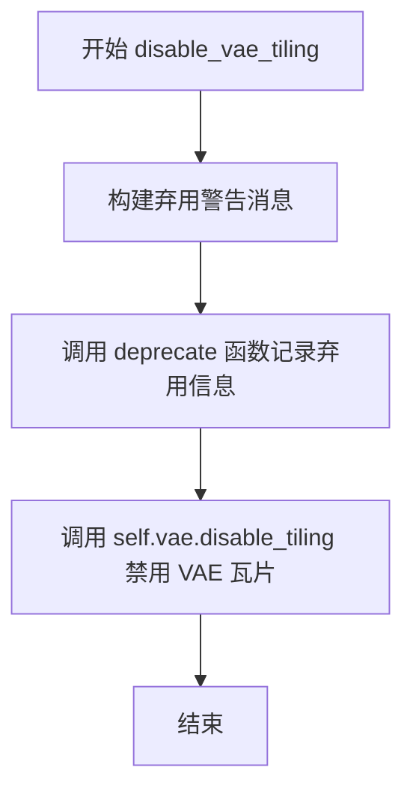

#### 带注释源码

```python
def disable_vae_tiling(self):
    r"""
    Disable tiled VAE decoding. If `enable_vae_tiling` was previously enabled, this method will go back to
    computing decoding in one step.
    """
    # 构建弃用警告消息，提示用户该方法已弃用，应使用 pipe.vae.disable_tiling() 替代
    depr_message = f"Calling `disable_vae_tiling()` on a `{self.__class__.__name__}` is deprecated and this method will be removed in a future version. Please use `pipe.vae.disable_tiling()`."
    
    # 调用 deprecate 函数记录弃用信息，将在版本 0.40.0 时完全移除
    deprecate(
        "disable_vae_tiling",      # 弃用的方法名称
        "0.40.0",                  # 弃用版本
        depr_message,              # 弃用警告消息
    )
    
    # 实际执行禁用 VAE 瓦片操作，调用底层 VAE 模型的 disable_tiling 方法
    self.vae.disable_tiling()
```


### `FluxControlInpaintPipeline.prepare_latents`

该方法负责为 Flux 图像修复管道准备潜在变量（latents）。它处理图像编码、噪声添加、批量大小调整以及潜在变量的打包，为后续的去噪过程准备必要的输入。

参数：

- `image`：`torch.Tensor`，输入图像张量，用于编码为潜在表示
- `timestep`：`torch.Tensor`，当前的时间步，用于噪声调度
- `batch_size`：`int`，批处理大小
- `num_channels_latents`：`int`，潜在变量的通道数
- `height`：`int`，目标图像高度
- `width`：`int`，目标图像宽度
- `dtype`：`torch.dtype`，张量的数据类型
- `device`：`torch.device`，计算设备
- `generator`：`torch.Generator | list[torch.Generator] | None`，随机数生成器，用于可重复的噪声生成
- `latents`：`torch.FloatTensor | None`，可选的预生成潜在变量

返回值：`tuple`，包含以下四个元素：
- `latents`：`torch.Tensor`，打包后的潜在变量
- `noise`：`torch.Tensor`，生成的噪声张量
- `image_latents`：`torch.Tensor`，从图像编码得到的潜在表示
- `latent_image_ids`：`torch.Tensor`，用于自注意力机制的位置编码

#### 流程图

```mermaid
flowchart TD
    A[开始: prepare_latents] --> B{generator是列表且长度不等于batch_size?}
    B -->|是| C[抛出ValueError]
    B -->|否| D[计算调整后的height和width]
    D --> E[创建latent_image_ids位置编码]
    E --> F{latents参数是否不为None?}
    F -->|是| G[返回latents和latent_image_ids]
    F -->|否| H[将image移到指定device和dtype]
    H --> I[_encode_vae_image编码图像]
    I --> J{batch_size > image_latents.shape[0]?}
    J -->|是且能整除| K[扩展image_latents到batch_size]
    J -->|是且不能整除| L[抛出ValueError]
    J -->|否| M[保持image_latents不变]
    K --> N[randn_tensor生成噪声]
    M --> N
    L --> N
    N --> O[scheduler.scale_noise添加噪声]
    O --> P[_pack_latents打包潜在变量]
    P --> Q[返回latents, noise, image_latents, latent_image_ids]
```

#### 带注释源码

```python
def prepare_latents(
    self,
    image,                          # 输入图像张量
    timestep,                       # 当前时间步
    batch_size,                     # 批处理大小
    num_channels_latents,          # 潜在变量通道数
    height,                        # 目标高度
    width,                         # 目标宽度
    dtype,                         # 数据类型
    device,                        # 计算设备
    generator,                     # 随机生成器
    latents=None,                  # 可选的预生成潜在变量
):
    # 检查生成器列表长度与批处理大小是否匹配
    if isinstance(generator, list) and len(generator) != batch_size:
        raise ValueError(
            f"You have passed a list of generators of length {len(generator)}, but requested an effective batch"
            f" size of {batch_size}. Make sure the batch size matches the length of the generators."
        )

    # VAE应用8x压缩，需要考虑打包要求（latent高度和宽度需能被2整除）
    # 计算调整后的高度和宽度
    height = 2 * (int(height) // (self.vae_scale_factor * 2))
    width = 2 * (int(width) // (self.vae_scale_factor * 2))
    # 定义潜在变量的形状
    shape = (batch_size, num_channels_latents, height, width)
    # 生成潜在变量的位置编码ID，用于自注意力机制
    latent_image_ids = self._prepare_latent_image_ids(batch_size, height // 2, width // 2, device, dtype)

    # 如果已提供潜在变量，直接返回（仅转换设备和数据类型）
    if latents is not None:
        return latents.to(device=device, dtype=dtype), latent_image_ids

    # 将输入图像移动到指定设备和数据类型
    image = image.to(device=device, dtype=dtype)
    # 使用VAE编码图像得到潜在表示
    image_latents = self._encode_vae_image(image=image, generator=generator)
    
    # 处理批量大小扩展的情况
    if batch_size > image_latents.shape[0] and batch_size % image_latents.shape[0] == 0:
        # 为每个prompt扩展init_latents
        additional_image_per_prompt = batch_size // image_latents.shape[0]
        image_latents = torch.cat([image_latents] * additional_image_per_prompt, dim=0)
    elif batch_size > image_latents.shape[0] and batch_size % image_latents.shape[0] != 0:
        raise ValueError(
            f"Cannot duplicate `image` of batch size {image_latents.shape[0]} to {batch_size} text prompts."
        )
    else:
        image_latents = torch.cat([image_latents], dim=0)

    # 生成随机噪声张量
    noise = randn_tensor(shape, generator=generator, device=device, dtype=dtype)
    # 使用调度器根据时间步对噪声进行缩放
    latents = self.scheduler.scale_noise(image_latents, timestep, noise)
    # 打包潜在变量以适应Transformer的输入格式
    latents = self._pack_latents(latents, batch_size, num_channels_latents, height, width)
    # 返回：潜在变量、噪声、图像潜在变量、位置编码ID
    return latents, noise, image_latents, latent_image_ids
```


### `FluxControlInpaintPipeline.prepare_image`

该方法负责对输入图像进行预处理、批次大小调整、设备转移，并支持分类器自由引导（Classifier-Free Guidance）的图像准备。

参数：

- `self`：`FluxControlInpaintPipeline`，管道实例本身
- `image`：`PipelineImageInput`（torch.Tensor、PIL.Image.Image、np.ndarray、list 或转换后的类型），待处理的输入图像
- `width`：`int`，目标输出宽度
- `height`：`int`，目标输出高度
- `batch_size`：`int`，生成的批次大小
- `num_images_per_prompt`：`int`，每个提示生成的图像数量
- `device`：`torch.device`，目标设备
- `dtype`：`torch.dtype`，目标数据类型
- `do_classifier_free_guidance`：`bool`，是否启用分类器自由引导（默认 False）
- `guess_mode`：`bool`，猜测模式标志（默认 False）

返回值：`torch.Tensor`，处理后的图像张量

#### 流程图

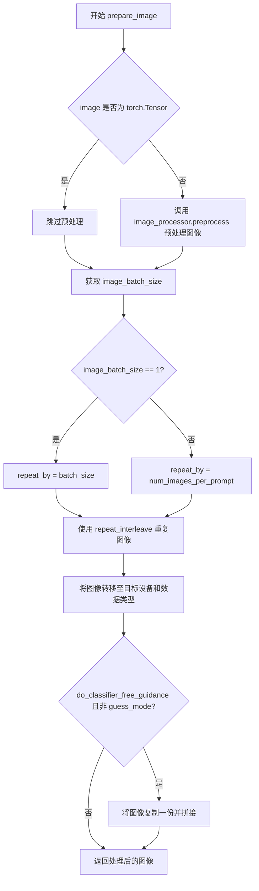

#### 带注释源码

```
def prepare_image(
    self,
    image,
    width,
    height,
    batch_size,
    num_images_per_prompt,
    device,
    dtype,
    do_classifier_free_guidance=False,
    guess_mode=False,
):
    # 检查输入是否为 PyTorch 张量
    if isinstance(image, torch.Tensor):
        pass  # 如果已经是张量，直接使用
    else:
        # 否则使用图像处理器进行预处理（缩放、归一化等）
        image = self.image_processor.preprocess(image, height=height, width=width)

    # 获取输入图像的批次大小
    image_batch_size = image.shape[0]

    # 根据批次大小确定图像重复次数
    if image_batch_size == 1:
        # 单张图像需要扩展到完整的批次大小
        repeat_by = batch_size
    else:
        # 图像批次与提示批次相同，使用每提示图像数进行扩展
        repeat_by = num_images_per_prompt

    # 按指定维度重复图像以匹配批次需求
    image = image.repeat_interleave(repeat_by, dim=0)

    # 将图像转移到目标设备并转换数据类型
    image = image.to(device=device, dtype=dtype)

    # 分类器自由引导处理：将图像复制一份用于无条件和有条件推理
    if do_classifier_free_guidance and not guess_mode:
        image = torch.cat([image] * 2)

    return image
```


### `FluxControlInpaintPipeline.prepare_mask_latents`

该方法用于准备掩码和被掩码覆盖的图像的潜在表示（latents），包括图像预处理、掩码调整大小、VAE编码、批次大小调整以及最终的打包和拼接处理。

参数：

- `self`：`FluxControlInpaintPipeline` 实例本身
- `image`：`torch.Tensor` 或 `PipelineImageInput`，待处理的原始输入图像
- `mask_image`：`torch.Tensor` 或 `PipelineImageInput`，用于遮盖图像的掩码（白色像素表示需要重绘的区域）
- `batch_size`：`int`，批处理大小
- `num_channels_latents`：`int`，潜在表示的通道数
- `num_images_per_prompt`：`int`，每个提示词生成的图像数量
- `height`：`int`，目标图像高度
- `width`：`int`，目标图像宽度
- `dtype`：`torch.dtype`，目标数据类型
- `device`：`torch.device`，目标设备
- `generator`：`torch.Generator` 或 `None`，用于随机数生成的生成器

返回值：`tuple[torch.Tensor, torch.Tensor]`，返回两个张量——`mask_image`（打包后的掩码潜在表示）和 `masked_image_latents`（拼接了掩码信息的被掩码图像潜在表示）

#### 流程图

```mermaid
flowchart TD
    A[开始] --> B[预处理image和mask_image]
    B --> C[计算被掩码覆盖的图像: masked_image = image * 1 - mask_image]
    C --> D[计算潜在空间的高度和宽度]
    D --> E[调整mask_image大小以匹配潜在空间尺寸]
    E --> F{ masked_image通道数是否等于num_channels_latents?}
    F -->|是| G[直接使用masked_image]
    F -->|否| H[使用VAE编码masked_image获取潜在表示]
    G --> I[应用shift_factor和scaling_factor进行缩放]
    H --> I
    I --> J{ mask_image批次大小是否小于batch_size?}
    J -->|是| K[重复mask_image以匹配batch_size]
    J -->|否| L{ masked_image_latents批次大小是否小于batch_size?}
    K --> L
    L -->|是| M[重复masked_image_latents以匹配batch_size]
    L -->|否| N[将masked_image_latents和mask_image打包到潜在空间]
    M --> N
    N --> O[沿最后一维拼接masked_image_latents和mask_image]
    O --> P[返回mask_image和masked_image_latents]
```

#### 带注释源码

```python
def prepare_mask_latents(
    self,
    image,
    mask_image,
    batch_size,
    num_channels_latents,
    num_images_per_prompt,
    height,
    width,
    dtype,
    device,
    generator,
):
    # VAE applies 8x compression on images but we must also account for packing which requires
    # latent height and width to be divisible by 2.
    # 预处理原始图像和掩码图像，将其调整为指定的高度和宽度
    image = self.image_processor.preprocess(image, height=height, width=width)
    mask_image = self.mask_processor.preprocess(mask_image, height=height, width=width)

    # 计算被掩码覆盖的图像：掩码区域为0，未掩码区域保留原图
    masked_image = image * (1 - mask_image)
    masked_image = masked_image.to(device=device, dtype=dtype)

    # 计算潜在空间的尺寸：VAE应用8x压缩，同时需要考虑packing要求（高度和宽度需能被2整除）
    height = 2 * (int(height) // (self.vae_scale_factor * 2))
    width = 2 * (int(width) // (self.vae_scale_factor * 2))
    
    # 调整掩码大小以匹配潜在空间的形状，因为在后续步骤中需要将掩码拼接到latents上
    # 在转换为dtype之前进行此操作，以避免在使用cpu_offload和半精度时出现问题
    mask_image = torch.nn.functional.interpolate(mask_image, size=(height, width))
    mask_image = mask_image.to(device=device, dtype=dtype)

    # 计算最终的批处理大小（考虑每个提示词生成的图像数量）
    batch_size = batch_size * num_images_per_prompt

    masked_image = masked_image.to(device=device, dtype=dtype)

    # 如果掩码图像的通道数已经等于潜在通道数，则直接使用；否则通过VAE编码获取潜在表示
    if masked_image.shape[1] == num_channels_latents:
        masked_image_latents = masked_image
    else:
        masked_image_latents = retrieve_latents(self.vae.encode(masked_image), generator=generator)

    # 应用shift_factor和scaling_factor对潜在表示进行缩放
    masked_image_latents = (masked_image_latents - self.vae.config.shift_factor) * self.vae.config.scaling_factor

    # 为每个提示词的生成重复掩码和被掩码图像的潜在表示（使用MPS友好的方法）
    if mask_image.shape[0] < batch_size:
        if not batch_size % mask_image.shape[0] == 0:
            raise ValueError(
                "The passed mask and the required batch size don't match. Masks are supposed to be duplicated to"
                f" a total batch size of {batch_size}, but {mask_image.shape[0]} mask_image were passed. Make sure the number"
                " of masks that you pass is divisible by the total requested batch size."
            )
        mask_image = mask_image.repeat(batch_size // mask_image.shape[0], 1, 1, 1)
    if masked_image_latents.shape[0] < batch_size:
        if not batch_size % masked_image_latents.shape[0] == 0:
            raise ValueError(
                "The passed images and the required batch size don't match. Images are supposed to be duplicated"
                f" to a total batch size of {batch_size}, but {masked_image_latents.shape[0]} images were passed."
                " Make sure the number of images that you pass is divisible by the total requested batch size."
            )
        masked_image_latents = masked_image_latents.repeat(batch_size // masked_image_latents.shape[0], 1, 1, 1)

    # 将潜在表示移动到目标设备以防止拼接时出现设备错误
    masked_image_latents = masked_image_latents.to(device=device, dtype=dtype)
    
    # 将被掩码图像的潜在表示打包到潜在空间格式
    masked_image_latents = self._pack_latents(
        masked_image_latents,
        batch_size,
        num_channels_latents,
        height,
        width,
    )
    
    # 将掩码打包到潜在空间格式（重复通道数以匹配潜在表示的通道数）
    mask_image = self._pack_latents(
        mask_image.repeat(1, num_channels_latents, 1, 1),
        batch_size,
        num_channels_latents,
        height,
        width,
    )
    
    # 沿最后一维拼接被掩码图像的潜在表示和掩码
    masked_image_latents = torch.cat((masked_image_latents, mask_image), dim=-1)

    return mask_image, masked_image_latents
```


### `FluxControlInpaintPipeline.__call__`

这是 Flux 图像修复管道的主入口方法，接收文本提示、图像、控制图像和掩码，通过去噪循环生成符合指导的修复后图像。

参数：

- `prompt`：`str | list[str]`，用于引导图像生成的文本提示，若未定义则需传入 `prompt_embeds`
- `prompt_2`：`str | list[str] | None`，发送给 `tokenizer_2` 和 `text_encoder_2` 的提示词，未定义时使用 `prompt`
- `image`：`PipelineImageInput`，用作起点的图像批次，支持张量、PIL 图像或 numpy 数组
- `control_image`：`PipelineImageInput`，ControlNet 条件输入，用于引导 `transformer` 生成
- `mask_image`：`PipelineImageInput`，掩码图像，白色像素被重绘，黑色像素保留
- `masked_image_latents`：`PipelineImageInput`，预生成的掩码潜在表示，若不提供则由 `mask_image` 生成
- `height`：`int | None`，生成图像的高度（像素），默认根据 `vae_scale_factor` 计算
- `width`：`int | None`，生成图像的宽度（像素），默认根据 `vae_scale_factor` 计算
- `strength`：`float`，参考图像变换程度，介于 0 和 1 之间，默认为 0.6
- `num_inference_steps`：`int`，去噪步数，默认为 28
- `sigmas`：`list[float] | None`，自定义 sigmas 数组，用于支持 sigmas 的调度器
- `guidance_scale`：`float`，分类器自由引导（CFG）比例，默认为 7.0
- `num_images_per_prompt`：`int`，每个提示词生成的图像数量，默认为 1
- `generator`：`torch.Generator | list[torch.Generator] | None`，随机数生成器，用于保证可复现性
- `latents`：`torch.FloatTensor | None`，预生成的噪声潜在表示，可用于相同生成的不同提示词
- `prompt_embeds`：`torch.FloatTensor | None`，预生成的文本嵌入，可用于提示词加权
- `pooled_prompt_embeds`：`torch.FloatTensor | None`，预生成的池化文本嵌入
- `output_type`：`str | None`，输出格式，可选 `"pil"` 或 `"latent"`，默认为 `"pil"`
- `return_dict`：`bool`，是否返回 `FluxPipelineOutput`，默认为 `True`
- `joint_attention_kwargs`：`dict[str, Any] | None`，传递给注意力处理器的 kwargs
- `callback_on_step_end`：`Callable[[int, int], None] | None`，每步去噪结束后调用的回调函数
- `callback_on_step_end_tensor_inputs`：`list[str]`，回调函数接收的张量输入列表，默认为 `["latents"]`
- `max_sequence_length`：`int`，T5 编码器最大序列长度，默认为 512

返回值：`FluxPipelineOutput | tuple`，返回生成的图像列表或包含图像的元组

#### 流程图

```mermaid
flowchart TD
    A[__call__ 开始] --> B{检查输入参数}
    B -->|通过| C[准备文本嵌入 encode_prompt]
    B -->|失败| Z[抛出异常]
    
    C --> D[预处理掩码和图像 prepare_mask_latents]
    D --> E[预处理输入图像]
    E --> F[计算时间步和sigmas]
    F --> G[获取时间步 retrieve_timesteps]
    G --> H[调整时间步 get_timesteps]
    H --> I[准备控制图像 prepare_image]
    
    I --> J{是否有control_image}
    J -->|是| K[编码control_image为潜在表示]
    J -->|否| L
    
    K --> L[准备潜在变量 prepare_latents]
    L --> M[准备指导向量 guidance]
    
    M --> N[进入去噪循环 for each timestep]
    N --> O[连接latents和control_image]
    O --> P[调用transformer预测噪声]
    P --> Q[scheduler.step更新latents]
    Q --> R{是否在最后一步之前}
    R -->|是| S[计算init_latents_proper]
    R -->|否| T
    
    S --> T[混合masked和noised latents]
    T --> U{是否有callback_on_step_end}
    U -->|是| V[执行回调函数]
    U -->|否| W
    
    V --> W{是否还有更多时间步}
    W -->|是| N
    W -->|否| X
    
    X --> Y{output_type == latent?}
    Y -->|是| AA[直接返回latents]
    Y -->|否| AB[解码latents为图像]
    AB --> AC[后处理图像]
    AC --> AD[Offload模型]
    AD --> AE[返回结果]
```

#### 带注释源码

```python
@torch.no_grad()
@replace_example_docstring(EXAMPLE_DOC_STRING)
def __call__(
    self,
    prompt: str | list[str] = None,
    prompt_2: str | list[str] | None = None,
    image: PipelineImageInput = None,
    control_image: PipelineImageInput = None,
    mask_image: PipelineImageInput = None,
    masked_image_latents: PipelineImageInput = None,
    height: int | None = None,
    width: int | None = None,
    strength: float = 0.6,
    num_inference_steps: int = 28,
    sigmas: list[float] | None = None,
    guidance_scale: float = 7.0,
    num_images_per_prompt: int | None = 1,
    generator: torch.Generator | list[torch.Generator] | None = None,
    latents: torch.FloatTensor | None = None,
    prompt_embeds: torch.FloatTensor | None = None,
    pooled_prompt_embeds: torch.FloatTensor | None = None,
    output_type: str | None = "pil",
    return_dict: bool = True,
    joint_attention_kwargs: dict[str, Any] | None = None,
    callback_on_step_end: Callable[[int, int], None] | None = None,
    callback_on_step_end_tensor_inputs: list[str] = ["latents"],
    max_sequence_length: int = 512,
):
    r"""
    Function invoked when calling the pipeline for generation.
    """
    # 1. 设置默认高度和宽度，基于 VAE 缩放因子
    height = height or self.default_sample_size * self.vae_scale_factor
    width = width or self.default_sample_size * self.vae_scale_factor

    # 1. 检查输入参数合法性
    self.check_inputs(
        prompt,
        prompt_2,
        strength,
        height,
        width,
        prompt_embeds=prompt_embeds,
        pooled_prompt_embeds=pooled_prompt_embeds,
        callback_on_step_end_tensor_inputs=callback_on_step_end_tensor_inputs,
        max_sequence_length=max_sequence_length,
    )

    # 保存引导比例和联合注意力 kwargs
    self._guidance_scale = guidance_scale
    self._joint_attention_kwargs = joint_attention_kwargs
    self._interrupt = False
    device = self._execution_device

    # 3. 确定批次大小
    if prompt is not None and isinstance(prompt, str):
        batch_size = 1
    elif prompt is not None and isinstance(prompt, list):
        batch_size = len(prompt)
    else:
        batch_size = prompt_embeds.shape[0]

    device = self._execution_device

    # 3. 准备文本嵌入（CLIP + T5）
    lora_scale = (
        self.joint_attention_kwargs.get("scale", None) if self.joint_attention_kwargs is not None else None
    )
    (
        prompt_embeds,      # T5 文本嵌入
        pooled_prompt_embeds,  # CLIP 池化嵌入
        text_ids,          # 文本位置 ID
    ) = self.encode_prompt(
        prompt=prompt,
        prompt_2=prompt_2,
        prompt_embeds=prompt_embeds,
        pooled_prompt_embeds=pooled_prompt_embeds,
        device=device,
        num_images_per_prompt=num_images_per_prompt,
        max_sequence_length=max_sequence_length,
        lora_scale=lora_scale,
    )

    # 3. 预处理掩码和被掩码的图像
    num_channels_latents = self.vae.config.latent_channels
    if masked_image_latents is not None:
        # 使用预计算的 masked_image_latents 和 mask
        masked_image_latents = masked_image_latents.to(latents.device)
        mask = mask_image.to(latents.device)
    else:
        # 调用 prepare_mask_latents 生成掩码潜在表示
        mask, masked_image_latents = self.prepare_mask_latents(
            image,
            mask_image,
            batch_size,
            num_channels_latents,
            num_images_per_prompt,
            height,
            width,
            prompt_embeds.dtype,
            device,
            generator,
        )

    # 预处理输入图像
    init_image = self.image_processor.preprocess(image, height=height, width=width)
    init_image = init_image.to(dtype=torch.float32)

    # 4. 准备时间步
    # 生成默认 sigmas 数组
    sigmas = np.linspace(1.0, 1 / num_inference_steps, num_inference_steps) if sigmas is None else sigmas
    # 计算图像序列长度用于时间步偏移
    image_seq_len = (int(height) // self.vae_scale_factor // 2) * (int(width) // self.vae_scale_factor // 2)
    mu = calculate_shift(
        image_seq_len,
        self.scheduler.config.get("base_image_seq_len", 256),
        self.scheduler.config.get("max_image_seq_len", 4096),
        self.scheduler.config.get("base_shift", 0.5),
        self.scheduler.config.get("max_shift", 1.15),
    )
    # 获取设备（支持 XLA）
    if XLA_AVAILABLE:
        timestep_device = "cpu"
    else:
        timestep_device = device
    # 从调度器获取时间步
    timesteps, num_inference_steps = retrieve_timesteps(
        self.scheduler,
        num_inference_steps,
        timestep_device,
        sigmas=sigmas,
        mu=mu,
    )
    # 根据 strength 调整时间步
    timesteps, num_inference_steps = self.get_timesteps(num_inference_steps, strength, device)

    # 验证推理步数
    if num_inference_steps < 1:
        raise ValueError(
            f"After adjusting the num_inference_steps by strength parameter: {strength}, the number of pipeline"
            f"steps is {num_inference_steps} which is < 1 and not appropriate for this pipeline."
        )
    # 重复初始时间步以匹配批次
    latent_timestep = timesteps[:1].repeat(batch_size * num_images_per_prompt)

    # 5. 准备潜在变量
    num_channels_latents = self.transformer.config.in_channels // 8

    # 准备控制图像
    control_image = self.prepare_image(
        image=control_image,
        width=width,
        height=height,
        batch_size=batch_size * num_images_per_prompt,
        num_images_per_prompt=num_images_per_prompt,
        device=device,
        dtype=self.vae.dtype,
    )

    # 如果有控制图像，编码为潜在表示
    if control_image.ndim == 4:
        control_image = self.vae.encode(control_image).latent_dist.sample(generator=generator)
        control_image = (control_image - self.vae.config.shift_factor) * self.vae.config.scaling_factor

        height_control_image, width_control_image = control_image.shape[2:]
        control_image = self._pack_latents(
            control_image,
            batch_size * num_images_per_prompt,
            num_channels_latents,
            height_control_image,
            width_control_image,
        )

    # 准备初始 latents、噪声和图像潜在表示
    latents, noise, image_latents, latent_image_ids = self.prepare_latents(
        init_image,
        latent_timestep,
        batch_size * num_images_per_prompt,
        num_channels_latents,
        height,
        width,
        prompt_embeds.dtype,
        device,
        generator,
        latents,
    )

    # 计算压缩后的高度和宽度
    height_8 = 2 * (int(height) // (self.vae_scale_factor * 2))
    width_8 = 2 * (int(width) // (self.vae_scale_factor * 2))

    num_warmup_steps = max(len(timesteps) - num_inference_steps * self.scheduler.order, 0)
    self._num_timesteps = len(timesteps)

    # 处理指导嵌入
    if self.transformer.config.guidance_embeds:
        guidance = torch.full([1], guidance_scale, device=device, dtype=torch.float32)
        guidance = guidance.expand(latents.shape[0])
    else:
        guidance = None

    # 6. 去噪循环
    with self.progress_bar(total=num_inference_steps) as progress_bar:
        for i, t in enumerate(timesteps):
            # 检查中断标志
            if self.interrupt:
                continue

            # 连接 latents 和 control_image
            latent_model_input = torch.cat([latents, control_image], dim=2)

            # 扩展时间步以匹配批次维度
            timestep = t.expand(latents.shape[0]).to(latents.dtype)

            # 调用 transformer 预测噪声
            noise_pred = self.transformer(
                hidden_states=latent_model_input,
                timestep=timestep / 1000,
                guidance=guidance,
                pooled_projections=pooled_prompt_embeds,
                encoder_hidden_states=prompt_embeds,
                txt_ids=text_ids,
                img_ids=latent_image_ids,
                joint_attention_kwargs=self.joint_attention_kwargs,
                return_dict=False,
            )[0]

            # 使用调度器步骤计算前一个噪声样本 x_t -> x_t-1
            latents_dtype = latents.dtype
            latents = self.scheduler.step(noise_pred, t, latents, return_dict=False)[0]

            # 仅用于 64 通道 transformer：混合原始图像 latents 和噪声 latents
            init_mask = mask
            if i < len(timesteps) - 1:
                noise_timestep = timesteps[i + 1]
                init_latents_proper = self.scheduler.scale_noise(
                    image_latents, torch.tensor([noise_timestep]), noise
                )
            else:
                init_latents_proper = image_latents
            init_latents_proper = self._pack_latents(
                init_latents_proper, batch_size * num_images_per_prompt, num_channels_latents, height_8, width_8
            )

            # 混合被掩码的原始图像和当前预测
            latents = (1 - init_mask) * init_latents_proper + init_mask * latents

            # 处理数据类型转换（特别是 MPS 后端）
            if latents.dtype != latents_dtype:
                if torch.backends.mps.is_available():
                    latents = latents.to(latents_dtype)

            # 执行每步结束时的回调
            if callback_on_step_end is not None:
                callback_kwargs = {}
                for k in callback_on_step_end_tensor_inputs:
                    callback_kwargs[k] = locals()[k]
                callback_outputs = callback_on_step_end(self, i, t, callback_kwargs)

                latents = callback_outputs.pop("latents", latents)
                prompt_embeds = callback_outputs.pop("prompt_embeds", prompt_embeds)

            # 更新进度条
            if i == len(timesteps) - 1 or ((i + 1) > num_warmup_steps and (i + 1) % self.scheduler.order == 0):
                progress_bar.update()

            # XLA 设备同步
            if XLA_AVAILABLE:
                xm.mark_step()

    # 7. 处理输出
    if output_type == "latent":
        image = latents
    else:
        # 解包 latents
        latents = self._unpack_latents(latents, height, width, self.vae_scale_factor)
        # 反缩放
        latents = (latents / self.vae.config.scaling_factor) + self.vae.config.shift_factor
        # VAE 解码
        image = self.vae.decode(latents, return_dict=False)[0]
        # 后处理
        image = self.image_processor.postprocess(image, output_type=output_type)

    # 释放模型内存
    self.maybe_free_model_hooks()

    if not return_dict:
        return (image,)

    return FluxPipelineOutput(images=image)
```

## 关键组件


### FluxControlInpaintPipeline 类

主类，继承自 DiffusionPipeline、FluxLoraLoaderMixin、FromSingleFileMixin 和 TextualInversionLoaderMixin。用于基于 Flux 模型的图像修复（inpainting），支持通过深度图或边缘图进行控制生成。

### Transformer 模型组件

FluxTransformer2DModel 类型的 transformer 成员，执行去噪操作的核心模型，根据文本嵌入、时间步和条件图像生成潜在表示。

### VAE 模型组件

AutoencoderKL 类型的 vae 成员，用于将图像编码到潜在空间以及从潜在空间解码恢复图像，支持 8x 压缩率。

### 文本编码器组件

CLIPTextModel (text_encoder) 和 T5EncoderModel (text_encoder_2) 分别用于生成 CLIP 和 T5 文本嵌入，为生成过程提供文本条件。

### 图像处理器组件

VaeImageProcessor 类型的 image_processor 和 mask_processor，分别用于预处理输入图像和处理修复掩码，支持归一化、二值化和灰度转换。

### 潜在变量打包/解包机制

_pack_latents 和 _unpack_latents 静态方法，将潜在变量按照 2x2 patch 方式进行打包以适应 Flux 模型的输入格式要求。

### 提示词编码模块

encode_prompt 方法协调 _get_clip_prompt_embeds 和 _get_t5_prompt_embeds 两个子方法，生成用于条件生成的双通道文本嵌入。

### 掩码处理模块

prepare_mask_latents 方法处理掩码图像和被掩码图像的潜在变量编码、缩放和打包，与主潜在变量进行拼接。

### 时间步调度模块

retrieve_timesteps 和 get_timesteps 函数负责从调度器获取时间步序列，并根据 strength 参数调整初始时间步。

### 去噪循环核心

__call__ 方法中的循环逻辑，包括潜在变量与控制图像拼接、Transformer 前向推理、调度器步骤执行、以及掩码混合操作。

### 输入验证模块

check_inputs 方法验证所有输入参数的有效性，包括 strength 范围、图像尺寸对齐和提示词嵌入的一致性。

### 调度器组件

FlowMatchEulerDiscreteScheduler 类型的 scheduler 成员，实现基于流匹配的离散欧拉调度器，用于去噪过程的时间步演进。

### LoRA 加载与缩放

继承自 FluxLoraLoaderMixin 的 LoRA 支持，通过 scale_lora_layers 和 unscale_lora_layers 函数在推理过程中动态调整 LoRA 权重。

### VAE 分片与平铺解码

enable_vae_slicing、disable_vae_slicing、enable_vae_tiling 和 disable_vae_tiling 方法（已标记废弃），用于控制 VAE 的内存优化解码策略。

### 控制图像预处理

prepare_image 方法处理控制条件图像（深度图或边缘图），包括预处理、批次重复和分类器自由引导的图像复制。

## 问题及建议


### 已知问题

-   **`prepare_latents` 返回值使用不一致**：该方法返回4个值 `(latents, noise, image_latents, latent_image_ids)`，但在 `__call__` 中调用时只使用了前两个，后两个 `noise` 和 `image_latents` 被忽略（尽管在去噪循环内部又重新计算了 `init_latents_proper`），造成重复计算和代码冗余。当 `latents` 不为 None 时，方法只返回两个值，但函数签名声明返回四个值。
-   **`masked_image_latents` 参数类型注解错误**：在 `__call__` 方法签名中，`masked_image_latents` 的类型被标注为 `PipelineImageInput`，但实际上应该是 `torch.FloatTensor` 或类似的张量类型。
-   **未使用变量 `mask` 的引用错误**：在 `__call__` 方法中处理 `masked_image_latents` 分支时，使用了 `mask = mask_image.to(latents.device)`，但变量名应该是 `mask_image` 或者是 `mask` 从 `prepare_mask_latents` 返回的值。
-   **未使用的变量 `num_warmup_steps`**：在 `__call__` 方法中计算了 `num_warmup_steps` 但从未在后续代码中使用。
-   **`get_timesteps` 潜在的索引越界风险**：当 `strength` 接近 1.0 时，`init_timestep` 可能等于 `num_inference_steps`，导致 `t_start` 为 0，这在某些调度器配置下可能产生意外的边界行为。
-   **缺失的 `control_image` 验证**：虽然有 `check_inputs` 方法验证 prompt 和 mask_image，但没有对 `control_image` 进行类型和尺寸验证。
-   **`XLA_AVAILABLE` 检查不完整**：代码中使用了 `is_torch_xla_available()` 来设置 `XLA_AVAILABLE`，但在 `__call__` 中使用 `XLA_AVAILABLE` 时没有再次检查其可用性，可能导致在某些环境下的不一致行为。
-   **类属性 `_optional_components` 和 `_callback_tensor_inputs` 定义但可能未完全利用**：这些作为类属性定义，但某些高级用途（如自定义回调）可能需要更明确的文档或验证。

### 优化建议

-   **重构 `prepare_latents` 方法**：明确其返回值的用途，如果 `noise` 和 `image_latents` 在外部确实不需要，应从返回中移除或在内部缓存以供去噪循环使用，避免重复计算。
-   **修正类型注解和变量引用**：将 `masked_image_latents` 的类型修正为 `torch.Tensor` 或 `torch.FloatTensor | None`，并修正 `masked_image_latents` 分支中的变量引用错误（确认 `mask` 的来源）。
-   **移除未使用代码**：删除 `num_warmup_steps` 的计算及相关注释，或者将其用于进度条更新逻辑中。
-   **增强输入验证**：在 `check_inputs` 中添加对 `control_image` 存在性和类型兼容性的检查，确保流水线在早期阶段就能捕获无效输入。
-   **统一设备管理**：在涉及 XLA 设备判断时，使用更一致的模式，或者确保在流水线初始化时就已经确定了执行设备。
-   **文档和 Deprecation 改进**：对于已废弃的方法（如 VAE slicing/tilting），除了警告信息外，可以考虑提供迁移指南或指向新 API 的直接链接。
-   **性能优化考虑**：当前的去噪循环中，每次迭代都进行 `init_mask` 和 `init_latents_proper` 的条件计算，可以考虑将不依赖迭代变化的计算提前到循环外部。

## 其它


### 设计目标与约束

该Pipeline的设计目标是实现基于Flux模型的图像修复（inpainting）功能，通过深度图或Canny边缘等控制图像来指导修复过程。主要约束包括：1) 输入图像尺寸必须能被vae_scale_factor*2整除；2) strength参数必须介于0-1之间；3) max_sequence_length不能超过512；4) 支持Lora加载但需要PEFT后端；5) 支持模型CPU卸载以适应显存受限场景。

### 错误处理与异常设计

代码实现了多层次错误检查：1) check_inputs方法验证strength范围、图像尺寸约束、callback_on_step_end_tensor_inputs合法性；2) prompt与prompt_embeds互斥检查；3) prompt_embeds与pooled_prompt_embeds必须成对提供；4) timesteps与sigmas互斥；5) scheduler不支持自定义timesteps/sigmas时的检查；6) batch_size与generator列表长度不匹配时抛出ValueError；7) 图像batch无法复制到指定batch_size时的错误处理。

### 数据流与状态机

Pipeline的核心流程为：1) 输入验证阶段(check_inputs)；2) 文本嵌入编码(encode_prompt)；3) 图像和mask预处理；4) 时间步计算；5) 潜在变量准备；6) 去噪循环(对每个timestep执行transformer推理和scheduler.step)；7) VAE解码；8) 后处理输出。状态转换通过scheduler的timesteps控制，支持通过interrupt标志中断去噪过程。

### 外部依赖与接口契约

主要依赖包括：1) transformers库的CLIPTextModel和T5EncoderModel；2) diffusers库的FlowMatchEulerDiscreteScheduler、AutoencoderKL、FluxTransformer2DModel；3) torch和numpy；4) 可选的torch_xla用于XLA设备加速。接口契约要求：prompt或prompt_embeds必须提供一个；image、control_image、mask_image为必需输入；支持自定义scheduler但需实现set_timesteps方法。

### 性能考虑与资源管理

代码支持多种性能优化：1) VAE slicing通过enable_vae_slicing()启用；2) VAE tiling通过enable_vae_tiling()启用；3) 模型CPU卸载通过enable_model_cpu_offload()实现；4) LoRA层的动态缩放；5) XLA设备支持。内存优化方面：latent打包(_pack_latents)减少内存占用；batch处理时支持图像复制；支持梯度检查点技术。

### 安全性考虑

代码遵循Apache 2.0许可证。安全性措施包括：1) 只使用torch.no_grad()进行推理；2) 模型设备转换时的类型检查；3) 文本截断警告防止信息丢失；4) MPS后端的特殊处理以避免PyTorch bug；5) LoRA权重加载时的安全缩放。

### 版本兼容性

代码标记为deprecated的方法(enable_vae_slicing等)将在0.40.0版本移除，建议直接使用vae对象的方法。依赖于diffusers库的最新API设计，如FluxLoraLoaderMixin、FromSingleFileMixin等mixin类。兼容PyTorch 2.0+和transformers库的最新版本。

### 回调机制与扩展性

Pipeline提供灵活的回调机制：1) callback_on_step_end在每个去噪步骤结束后调用；2) callback_on_step_end_tensor_inputs指定回调可访问的张量；3) 支持通过joint_attention_kwargs传递自定义AttentionProcessor；4) 支持通过sigmas自定义噪声调度；5) 支持预计算的masked_image_latents以避免重复计算。

### 序列化与持久化

Pipeline支持完整的模型序列化：1) 支持from_pretrained加载预训练模型；2) 支持单文件加载(FromSingleFileMixin)；3) 支持TextualInversion嵌入；4) 支持LoRA权重加载；5) 支持save_pretrained保存完整Pipeline状态。图像输出支持pil、latent、np数组等多种格式。

    