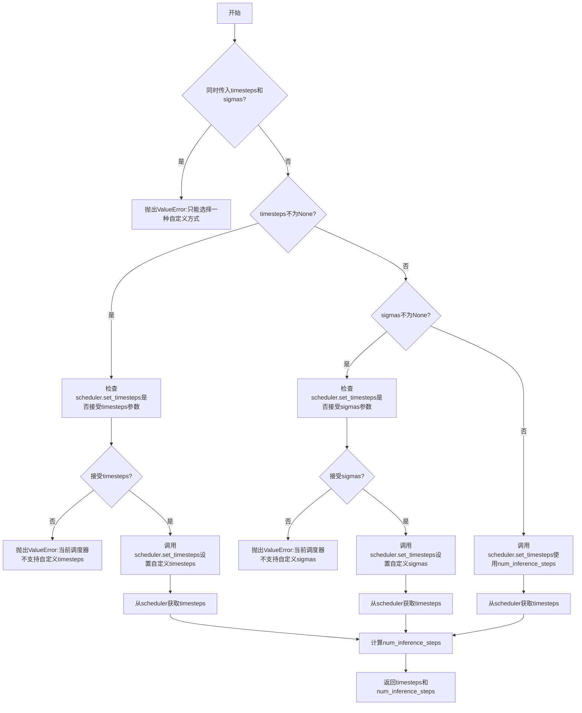
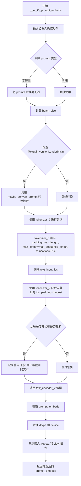
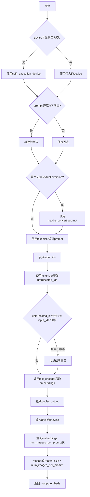
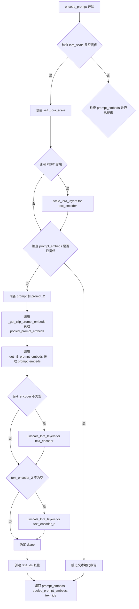
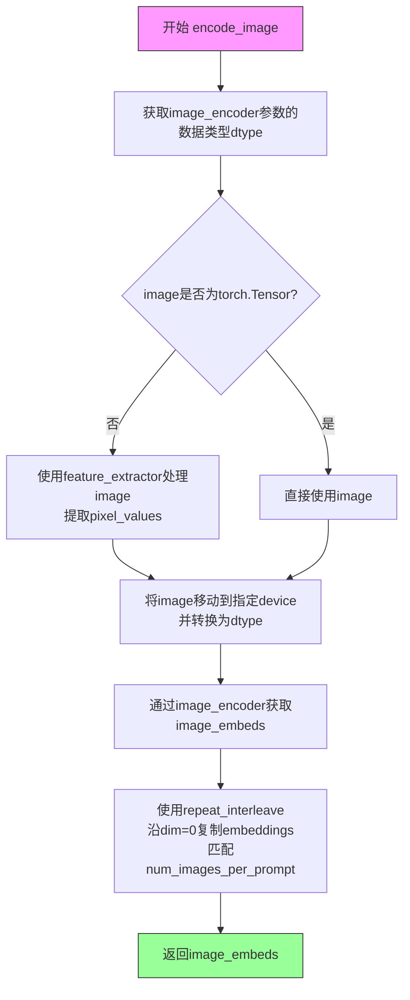
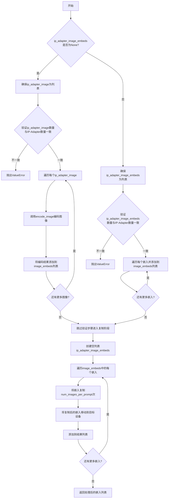
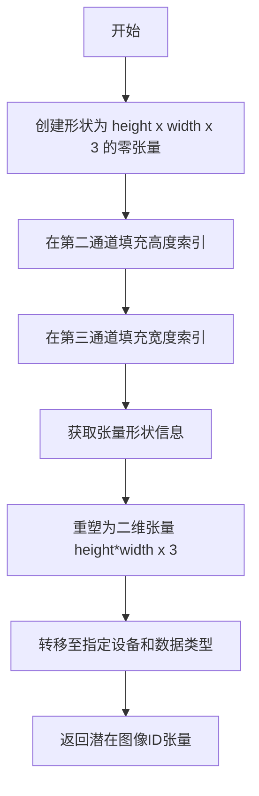
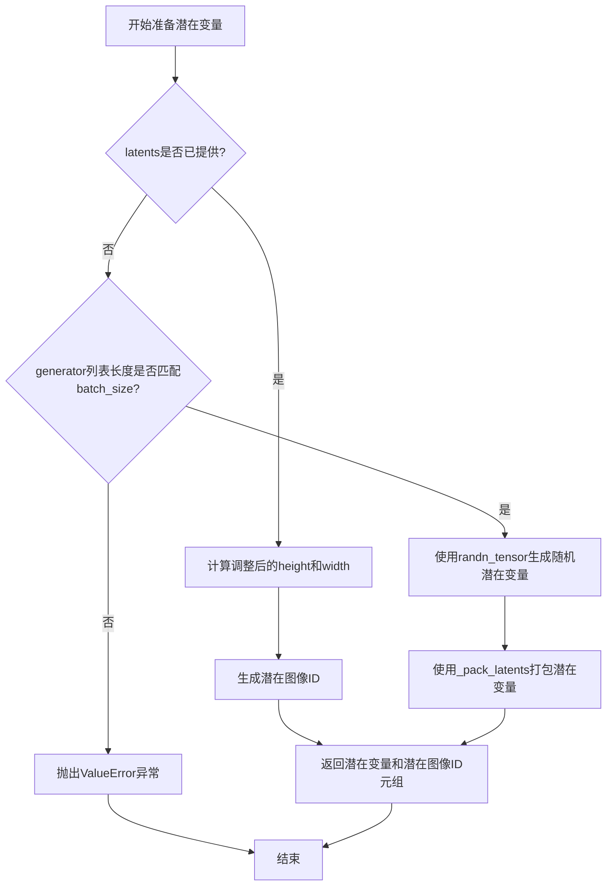
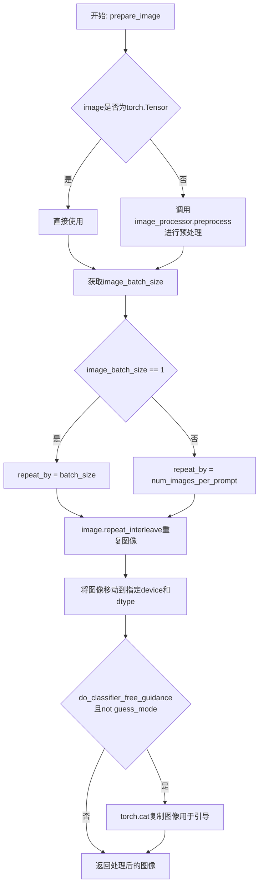
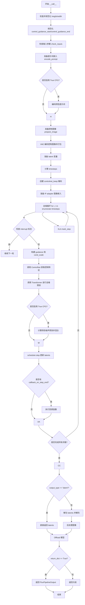

# `diffusers\src\diffusers\pipelines\flux\pipeline_flux_controlnet.py` 详细设计文档

FluxControlNetPipeline 是一个基于 Flux 架构的文本到图像生成管道，支持 ControlNet 控制功能。该管道结合了 CLIP 和 T5 文本编码器、VAE 变分自编码器、FluxTransformer2DModel 主干网络以及 FluxControlNetModel 控制网络，实现了基于文本提示和条件图像的高质量图像生成。

## 整体流程

```mermaid
graph TD
    A[开始: 用户调用 __call__] --> B[检查输入参数 check_inputs]
B --> C[准备文本嵌入 encode_prompt]
C --> D[准备控制图像 prepare_image]
D --> E[准备潜在变量 prepare_latents]
E --> F[准备时间步 retrieve_timesteps]
F --> G{循环: 对每个时间步}
G --> H[调用 ControlNet 获取控制特征]
H --> I[调用 Transformer 进行去噪]
I --> J[执行 True CFG (如果启用)]
J --> K[调度器步骤计算下一个潜在变量]
K --> L{是否完成所有步}
L -- 否 --> G
L -- 是 --> M[VAE 解码生成图像]
M --> N[后处理图像]
N --> O[返回 FluxPipelineOutput]
```

## 类结构

```
DiffusionPipeline (基类)
├── FluxLoraLoaderMixin
├── FromSingleFileMixin
└── FluxIPAdapterMixin
    └── FluxControlNetPipeline
```

## 全局变量及字段


### `XLA_AVAILABLE`
    
是否可用 XLA（用于 PyTorch XLA 设备加速）

类型：`bool`
    


### `logger`
    
日志记录器，用于输出管道运行过程中的信息

类型：`Logger`
    


### `EXAMPLE_DOC_STRING`
    
示例文档字符串，包含管道使用示例代码

类型：`str`
    


### `FluxControlNetPipeline.model_cpu_offload_seq`
    
模型卸载顺序，指定模型从 GPU 卸载到 CPU 的序列

类型：`str`
    


### `FluxControlNetPipeline._optional_components`
    
可选组件列表，包含图像编码器和特征提取器

类型：`list`
    


### `FluxControlNetPipeline._callback_tensor_inputs`
    
回调张量输入列表，指定哪些张量可用于回调函数

类型：`list`
    


### `FluxControlNetPipeline.vae_scale_factor`
    
VAE 缩放因子，用于计算潜在空间的尺寸

类型：`int`
    


### `FluxControlNetPipeline.image_processor`
    
图像处理器，用于图像的预处理和后处理

类型：`VaeImageProcessor`
    


### `FluxControlNetPipeline.tokenizer_max_length`
    
分词器最大长度，默认值为 77

类型：`int`
    


### `FluxControlNetPipeline.default_sample_size`
    
默认采样尺寸，用于生成图像的默认宽高

类型：`int`
    


### `FluxControlNetPipeline.vae`
    
VAE 模型，用于图像的编码和解码

类型：`AutoencoderKL`
    


### `FluxControlNetPipeline.text_encoder`
    
CLIP 文本编码器，用于将文本编码为嵌入向量

类型：`CLIPTextModel`
    


### `FluxControlNetPipeline.text_encoder_2`
    
T5 文本编码器，用于长文本的编码

类型：`T5EncoderModel`
    


### `FluxControlNetPipeline.tokenizer`
    
CLIP 分词器，用于文本分词

类型：`CLIPTokenizer`
    


### `FluxControlNetPipeline.tokenizer_2`
    
T5 分词器，用于长文本分词

类型：`T5TokenizerFast`
    


### `FluxControlNetPipeline.transformer`
    
主干变换器，用于去噪潜在图像表示

类型：`FluxTransformer2DModel`
    


### `FluxControlNetPipeline.scheduler`
    
调度器，用于控制去噪过程的步骤

类型：`FlowMatchEulerDiscreteScheduler`
    


### `FluxControlNetPipeline.controlnet`
    
控制网络，用于根据控制图像引导生成

类型：`FluxControlNetModel/FluxMultiControlNetModel`
    


### `FluxControlNetPipeline.image_encoder`
    
图像编码器，用于 IP-Adapter 图像嵌入

类型：`CLIPVisionModelWithProjection`
    


### `FluxControlNetPipeline.feature_extractor`
    
特征提取器，用于从图像中提取特征

类型：`CLIPImageProcessor`
    
    

## 全局函数及方法


### `calculate_shift`

这是一个用于计算噪声调度器偏移量的全局函数，基于图像序列长度和预设的序列长度范围，通过线性插值计算得到一个偏移量（mu），用于调整去噪过程中的时间步长分布。

参数：

- `image_seq_len`：`int`，图像的序列长度（latent patches的数量）
- `base_seq_len`：`int`，基础序列长度，默认值为256
- `max_seq_len`：`int`，最大序列长度，默认值为4096
- `base_shift`：`float`，基础偏移量，默认值为0.5
- `max_shift`：`float`，最大偏移量，默认值为1.15

返回值：`float`，计算得到的偏移量mu值，用于调度器的噪声采样

#### 流程图

```mermaid
flowchart TD
    A[开始 calculate_shift] --> B[输入 image_seq_len, base_seq_len, max_seq_len, base_shift, max_shift]
    B --> C[计算斜率 m = (max_shift - base_shift) / (max_seq_len - base_seq_len)]
    C --> D[计算截距 b = base_shift - m * base_seq_len]
    D --> E[计算 mu = image_seq_len * m + b]
    E --> F[返回 mu]
```

#### 带注释源码

```python
# Copied from diffusers.pipelines.flux.pipeline_flux.calculate_shift
def calculate_shift(
    image_seq_len,          # 当前图像的序列长度（latent patches数量）
    base_seq_len: int = 256,    # 基础序列长度，对应最小的shift值
    max_seq_len: int = 4096,   # 最大序列长度，对应最大的shift值
    base_shift: float = 0.5,   # 基础偏移量，当序列长度=base_seq_len时
    max_shift: float = 1.15,   # 最大偏移量，当序列长度=max_seq_len时
):
    # 计算线性插值的斜率 m
    # 斜率 = (最大值 - 最小值) / (范围上限 - 范围下限)
    m = (max_shift - base_shift) / (max_seq_len - base_seq_len)
    
    # 计算线性截距 b
    # 使用点斜式: y = mx + b => b = y - mx
    # 当 seq_len = base_seq_len 时，shift = base_shift
    b = base_shift - m * base_seq_len
    
    # 计算最终的偏移量 mu
    # 使用线性方程: mu = m * x + b，其中 x = image_seq_len
    mu = image_seq_len * m + b
    
    # 返回计算得到的偏移量，用于调度器的噪声采样
    return mu
```


### `retrieve_latents`

该函数是一个全局工具函数，用于从编码器输出中提取潜在的表示（latents）。它支持多种提取模式，包括从潜在分布中采样或获取其模式（mode），也可以直接从输出中获取预存的 latents 属性。

参数：

- `encoder_output`：`torch.Tensor`，编码器输出对象，应包含 `latent_dist` 属性或 `latents` 属性
- `generator`：`torch.Generator | None`，可选的随机数生成器，用于在采样模式下生成确定性结果
- `sample_mode`：`str`，采样模式，默认为 `"sample"`（从分布中采样），也可设置为 `"argmax"`（获取分布的模式）

返回值：`torch.Tensor`，提取出的潜在表示张量

#### 流程图

```mermaid
flowchart TD
    A[开始: retrieve_latents] --> B{encoder_output 是否有 latent_dist 属性<br/>且 sample_mode == 'sample'?}
    B -->|是| C[返回 encoder_output.latent_dist.sample<br/>(generator)]
    B -->|否| D{encoder_output 是否有 latent_dist 属性<br/>且 sample_mode == 'argmax'?}
    D -->|是| E[返回 encoder_output.latent_dist.mode<br/>()]
    D -->|否| F{encoder_output 是否有 latents 属性?}
    F -->|是| G[返回 encoder_output.latents]
    F -->|否| H[抛出 AttributeError<br/>'Could not access latents of provided encoder_output']
    C --> I[结束]
    E --> I
    G --> I
    H --> I
```

#### 带注释源码

```python
# Copied from diffusers.pipelines.stable_diffusion.pipeline_stable_diffusion_img2img.retrieve_latents
def retrieve_latents(
    encoder_output: torch.Tensor, generator: torch.Generator | None = None, sample_mode: str = "sample"
):
    """
    从编码器输出中检索潜在表示（latents）。
    
    该函数支持三种提取方式：
    1. 从 latent_dist 属性中采样（sample_mode='sample'）
    2. 从 latent_dist 属性中获取模式/平均值（sample_mode='argmax'）
    3. 直接获取 latents 属性
    
    Args:
        encoder_output: 编码器输出，通常来自 VAE 的 encode 方法
        generator: 可选的 PyTorch 随机生成器，用于确保采样结果可复现
        sample_mode: 采样模式，'sample' 或 'argmax'，默认 'sample'
    
    Returns:
        提取出的潜在表示张量
    
    Raises:
        AttributeError: 当无法从 encoder_output 中访问所需的 latents 属性时
    """
    # 情况1: 如果有 latent_dist 属性且模式为 'sample'，从分布中采样
    if hasattr(encoder_output, "latent_dist") and sample_mode == "sample":
        return encoder_output.latent_dist.sample(generator)
    # 情况2: 如果有 latent_dist 属性且模式为 'argmax'，获取分布的模式（均值或最大概率位置）
    elif hasattr(encoder_output, "latent_dist") and sample_mode == "argmax":
        return encoder_output.latent_dist.mode()
    # 情况3: 如果有直接的 latents 属性，直接返回
    elif hasattr(encoder_output, "latents"):
        return encoder_output.latents
    # 错误情况: 无法找到任何有效的 latents 访问方式
    else:
        raise AttributeError("Could not access latents of provided encoder_output")
```


### `retrieve_timesteps`

该函数是扩散管道中的通用时间步检索工具，用于调用调度器的 `set_timesteps` 方法并获取时间步序列。支持三种模式：通过 `num_inference_steps` 自动计算时间步、通过自定义 `timesteps` 列表覆盖、或通过自定义 `sigmas` 列表覆盖。

参数：

- `scheduler`：`SchedulerMixin`，调度器对象，用于获取时间步
- `num_inference_steps`：`int | None`，生成样本时使用的扩散步数，若使用此参数则 `timesteps` 必须为 `None`
- `device`：`str | torch.device | None`，时间步要移动到的设备，若为 `None` 则不移动
- `timesteps`：`list[int] | None`，自定义时间步，用于覆盖调度器的时间步间隔策略，传入此参数时 `num_inference_steps` 和 `sigmas` 必须为 `None`
- `sigmas`：`list[float] | None`，自定义 sigmas，用于覆盖调度器的时间步间隔策略，传入此参数时 `num_inference_steps` 和 `timesteps` 必须为 `None`
- `**kwargs`：任意关键字参数，将传递给调度器的 `set_timesteps` 方法

返回值：`tuple[torch.Tensor, int]`，元组包含调度器的时间步序列张量和推理步数

#### 流程图



#### 带注释源码

```python
# 从diffusers.pipelines.stable_diffusion.pipeline_stable_diffusion.retrieve_timesteps复制
def retrieve_timesteps(
    scheduler,  # SchedulerMixin: 调度器对象，用于获取时间步
    num_inference_steps: int | None = None,  # int | None: 扩散步数
    device: str | torch.device | None = None,  # str | torch.device | None: 目标设备
    timesteps: list[int] | None = None,  # list[int] | None: 自定义时间步
    sigmas: list[float] | None = None,  # list[float] | None: 自定义sigmas
    **kwargs,  # 任意关键字参数，传递给scheduler.set_timesteps
):
    r"""
    调用调度器的set_timesteps方法并在调用后从调度器检索时间步。
    处理自定义时间步。任何kwargs将提供给scheduler.set_timesteps。

    参数:
        scheduler (SchedulerMixin):
            获取时间步的调度器。
        num_inference_steps (int):
            使用预训练模型生成样本时使用的扩散步数。如果使用此参数，
            则timesteps必须为None。
        device (str或torch.device, 可选):
            时间步应移动到的设备。如果为None，则不移动时间步。
        timesteps (list[int], 可选):
            用于覆盖调度器时间步间隔策略的自定义时间步。如果传入timesteps，
            则num_inference_steps和sigmas必须为None。
        sigmas (list[float], 可选):
            用于覆盖调度器时间步间隔策略的自定义sigmas。如果传入sigmas，
            则num_inference_steps和timesteps必须为None。

    返回:
        tuple[torch.Tensor, int]: 元组，第一个元素是调度器的时间步序列，
        第二个元素是推理步数。
    """
    # 检查是否同时传入了timesteps和sigmas，只能选择一种自定义方式
    if timesteps is not None and sigmas is not None:
        raise ValueError("Only one of `timesteps` or `sigmas` can be passed. Please choose one to set custom values")
    
    # 分支1: 使用自定义timesteps
    if timesteps is not None:
        # 检查调度器的set_timesteps方法是否支持timesteps参数
        accepts_timesteps = "timesteps" in set(inspect.signature(scheduler.set_timesteps).parameters.keys())
        if not accepts_timesteps:
            raise ValueError(
                f"The current scheduler class {scheduler.__class__}'s `set_timesteps` does not support custom"
                f" timestep schedules. Please check whether you are using the correct scheduler."
            )
        # 调用调度器设置自定义时间步
        scheduler.set_timesteps(timesteps=timesteps, device=device, **kwargs)
        # 从调度器获取时间步张量
        timesteps = scheduler.timesteps
        # 计算推理步数
        num_inference_steps = len(timesteps)
    
    # 分支2: 使用自定义sigmas
    elif sigmas is not None:
        # 检查调度器的set_timesteps方法是否支持sigmas参数
        accept_sigmas = "sigmas" in set(inspect.signature(scheduler.set_timesteps).parameters.keys())
        if not accept_sigmas:
            raise ValueError(
                f"The current scheduler class {scheduler.__class__}'s `set_timesteps` does not support custom"
                f" sigmas schedules. Please check whether you are using the correct scheduler."
            )
        # 调用调度器设置自定义sigmas
        scheduler.set_timesteps(sigmas=sigmas, device=device, **kwargs)
        # 从调度器获取时间步张量
        timesteps = scheduler.timesteps
        # 计算推理步数
        num_inference_steps = len(timesteps)
    
    # 分支3: 使用num_inference_steps自动计算时间步
    else:
        # 调用调度器根据推理步数设置时间步
        scheduler.set_timesteps(num_inference_steps, device=device, **kwargs)
        # 从调度器获取时间步张量
        timesteps = scheduler.timesteps
    
    # 返回时间步张量和推理步数
    return timesteps, num_inference_steps
```


### `FluxControlNetPipeline.__init__`

FluxControlNetPipeline的构造函数，负责初始化整个ControlNet管道，包括调度器、VAE、文本编码器、分词器、Transformer模型、ControlNet模型等核心组件，并注册所有模块、计算VAE缩放因子、初始化图像处理器和默认采样尺寸。

参数：

- `scheduler`：`FlowMatchEulerDiscreteScheduler`，与`transformer`一起用于去噪编码图像潜在表示的调度器
- `vae`：`AutoencoderKL`，变分自编码器模型，用于在潜在表示之间编码和解码图像
- `text_encoder`：`CLIPTextModel`，CLIP文本编码器模型
- `tokenizer`：`CLIPTokenizer`，CLIP分词器
- `text_encoder_2`：`T5EncoderModel`，T5文本编码器模型
- `tokenizer_2`：`T5TokenizerFast`，T5快速分词器
- `transformer`：`FluxTransformer2DModel`，Flux变换器模型
- `controlnet`：`FluxControlNetModel | list[FluxControlNetModel] | tuple[FluxControlNetModel] | FluxMultiControlNetModel`，ControlNet模型或多个ControlNet模型的集合，用于控制生成过程
- `image_encoder`：`CLIPVisionModelWithProjection`（可选），CLIP视觉编码器模型
- `feature_extractor`：`CLIPImageProcessor`（可选），图像预处理特征提取器

返回值：无（`None`），构造函数不返回任何值

#### 流程图

```mermaid
flowchart TD
    A[开始 __init__] --> B[调用 super().__init__ 初始化基类]
    B --> C{controlnet 是否为 list 或 tuple}
    C -->|是| D[将 controlnet 包装为 FluxMultiControlNetModel]
    C -->|否| E[保持原 controlnet 不变]
    D --> F
    E --> F
    F[调用 self.register_modules 注册所有模块]
    F --> G[计算 vae_scale_factor<br/>2 ** (len(vae.config.block_out_channels) - 1)]
    G --> H[初始化 VaeImageProcessor<br/>vae_scale_factor * 2]
    H --> I[设置 tokenizer_max_length]
    I --> J[设置 default_sample_size = 128]
    J --> K[结束 __init__]
```

#### 带注释源码

```python
def __init__(
    self,
    scheduler: FlowMatchEulerDiscreteScheduler,
    vae: AutoencoderKL,
    text_encoder: CLIPTextModel,
    tokenizer: CLIPTokenizer,
    text_encoder_2: T5EncoderModel,
    tokenizer_2: T5TokenizerFast,
    transformer: FluxTransformer2DModel,
    controlnet: FluxControlNetModel
    | list[FluxControlNetModel]
    | tuple[FluxControlNetModel]
    | FluxMultiControlNetModel,
    image_encoder: CLIPVisionModelWithProjection = None,
    feature_extractor: CLIPImageProcessor = None,
):
    # 1. 首先调用父类 DiffusionPipeline 的初始化方法
    #    这会设置一些基础属性如 _execution_device, _class_name 等
    super().__init__()
    
    # 2. 处理 controlnet 参数
    #    如果传入的是 list 或 tuple，则包装为 FluxMultiControlNetModel
    #    FluxMultiControlNetModel 用于管理多个 ControlNet 模型
    if isinstance(controlnet, (list, tuple)):
        controlnet = FluxMultiControlNetModel(controlnet)

    # 3. 注册所有模块到管道中
    #    register_modules 是 DiffusionPipeline 继承自 PipelineMixin 的方法
    #    它会将所有传入的模型组件存储在 self 属性中，便于后续调用
    self.register_modules(
        vae=vae,
        text_encoder=text_encoder,
        text_encoder_2=text_encoder_2,
        tokenizer=tokenizer,
        tokenizer_2=tokenizer_2,
        transformer=transformer,
        scheduler=scheduler,
        controlnet=controlnet,
        image_encoder=image_encoder,
        feature_extractor=feature_extractor,
    )
    
    # 4. 计算 VAE 缩放因子
    #    VAE 使用多层空间降采样，每一层通常使特征图尺寸减半
    #    block_out_channels 包含每层的输出通道数
    #    例如 [128, 256, 512, 512] 表示4层，2^(4-1) = 8 倍降采样
    self.vae_scale_factor = 2 ** (len(self.vae.config.block_out_channels) - 1) if getattr(self, "vae", None) else 8
    
    # 5. Flux 潜在向量被打包成 2x2 的小块
    #    这意味着潜在宽度和高度必须能被 patch size 整除
    #    因此 vae scale factor 乘以 2 来补偿这个打包操作
    #    初始化图像处理器，用于预处理和后处理图像
    self.image_processor = VaeImageProcessor(vae_scale_factor=self.vae_scale_factor * 2)
    
    # 6. 设置分词器的最大长度
    #    用于处理文本提示时的最大序列长度
    self.tokenizer_max_length = (
        self.tokenizer.model_max_length if hasattr(self, "tokenizer") and self.tokenizer is not None else 77
    )
    
    # 7. 设置默认采样尺寸
    #    这是 Flux 模型的默认输出尺寸基数
    #    最终输出尺寸 = default_sample_size * vae_scale_factor
    self.default_sample_size = 128
```


### `FluxControlNetPipeline._get_t5_prompt_embeds`

该方法用于使用 T5 文本编码器（text_encoder_2）对输入的文本提示进行编码，生成用于 Flux 模型的文本嵌入（prompt embeddings）。它处理文本分词、截断警告、类型转换以及批量生成时的嵌入复制，是 FluxControlNetPipeline 文本编码流程的核心组成部分。

参数：

- `prompt`：`str | list[str]`，要编码的文本提示，可以是单个字符串或字符串列表
- `num_images_per_prompt`：`int`，每个提示要生成的图像数量，用于复制嵌入以匹配批量大小
- `max_sequence_length`：`int`，T5 编码器的最大序列长度，默认为 512 个 token
- `device`：`torch.device | None`，指定计算设备，默认为执行设备
- `dtype`：`torch.dtype | None`，指定数据类型，默认为 text_encoder 的数据类型

返回值：`torch.Tensor`，返回形状为 `(batch_size * num_images_per_prompt, seq_len, hidden_dim)` 的文本嵌入张量

#### 流程图



#### 带注释源码

```
def _get_t5_prompt_embeds(
    self,
    prompt: str | list[str] = None,          # 输入文本提示：单个字符串或字符串列表
    num_images_per_prompt: int = 1,          # 每个提示生成的图像数量
    max_sequence_length: int = 512,          # T5 最大序列长度
    device: torch.device | None = None,      # 计算设备
    dtype: torch.dtype | None = None,        # 数据类型
):
    # 1. 确定设备和数据类型
    # 如果未指定 device，则使用执行设备
    device = device or self._execution_device
    # 如果未指定 dtype，则使用 text_encoder 的数据类型
    dtype = dtype or self.text_encoder.dtype

    # 2. 标准化 prompt 格式
    # 将单个字符串转换为列表，方便批量处理
    prompt = [prompt] if isinstance(prompt, str) else prompt
    # 计算批处理大小
    batch_size = len(prompt)

    # 3. 处理 TextualInversion（可选）
    # 如果 pipeline 包含 TextualInversionLoaderMixin，则转换提示
    if isinstance(self, TextualInversionLoaderMixin):
        # 可能需要转换 prompt 以处理自定义 tokens
        prompt = self.maybe_convert_prompt(prompt, self.tokenizer)

    # 4. 使用 T5 Tokenizer 进行分词
    # 将文本转换为 token IDs，设置最大长度并进行截断
    text_inputs = self.tokenizer_2(
        prompt,
        padding="max_length",                  # 填充到最大长度
        max_length=max_sequence_length,         # 最大序列长度
        truncation=True,                        # 超过最大长度时截断
        return_length=False,                    # 不返回长度信息
        return_overflowing_tokens=False,        # 不返回溢出的 tokens
        return_tensors="pt",                    # 返回 PyTorch 张量
    )
    # 获取输入的 token IDs
    text_input_ids = text_inputs.input_ids
    
    # 5. 获取未截断的 token IDs 用于警告检测
    # 使用最长填充来获取完整序列
    untruncated_ids = self.tokenizer_2(prompt, padding="longest", return_tensors="pt").input_ids

    # 6. 检测并警告截断
    # 如果未截断的序列长度大于截断后的长度，且两者不相等，则记录警告
    if untruncated_ids.shape[-1] >= text_input_ids.shape[-1] and not torch.equal(text_input_ids, untruncated_ids):
        # 解码被截断的部分（去掉首尾特殊 tokens）
        removed_text = self.tokenizer_2.batch_decode(untruncated_ids[:, self.tokenizer_max_length - 1 : -1])
        logger.warning(
            "The following part of your input was truncated because `max_sequence_length` is set to "
            f" {max_sequence_length} tokens: {removed_text}"
        )

    # 7. 使用 T5 Encoder 编码获取 embeddings
    # 调用 text_encoder_2 获取文本嵌入，不输出隐藏状态
    prompt_embeds = self.text_encoder_2(text_input_ids.to(device), output_hidden_states=False)[0]

    # 8. 转换数据类型和设备
    # 确保 embeddings 使用指定的 dtype 和 device
    dtype = self.text_encoder_2.dtype
    prompt_embeds = prompt_embeds.to(dtype=dtype, device=device)

    # 9. 获取序列长度
    _, seq_len, _ = prompt_embeds.shape

    # 10. 复制 embeddings 以匹配批量生成
    # 为每个提示生成的多个图像复制 embeddings
    # 使用 mps 友好的方法进行复制
    # 首先在序列维度复制 num_images_per_prompt 次
    prompt_embeds = prompt_embeds.repeat(1, num_images_per_prompt, 1)
    # 然后重新整形为 (batch_size * num_images_per_prompt, seq_len, hidden_dim)
    prompt_embeds = prompt_embeds.view(batch_size * num_images_per_prompt, seq_len, -1)

    # 11. 返回处理后的 prompt embeddings
    return prompt_embeds
```


### `FluxControlNetPipeline._get_clip_prompt_embeds`

该方法用于从CLIP文本编码器获取提示词嵌入（prompt embeddings），将输入的文本提示转换为CLIP模型可处理的张量表示，并支持批量生成和文本反转功能。

参数：

- `self`：`FluxControlNetPipeline`，Pipeline实例本身
- `prompt`：`str | list[str]`，输入的文本提示，可以是单个字符串或字符串列表
- `num_images_per_prompt`：`int = 1`，每个提示词生成的图像数量，用于扩展嵌入维度
- `device`：`torch.device | None = None`，指定计算设备，默认为执行设备

返回值：`torch.Tensor`，返回形状为 `(batch_size * num_images_per_prompt, hidden_size)` 的文本嵌入张量，供后续生成流程使用

#### 流程图



#### 带注释源码

```python
def _get_clip_prompt_embeds(
    self,
    prompt: str | list[str],
    num_images_per_prompt: int = 1,
    device: torch.device | None = None,
):
    """
    从CLIP文本编码器获取提示词嵌入
    
    参数:
        prompt: 输入的文本提示，支持单字符串或字符串列表
        num_images_per_prompt: 每个提示生成的图像数量
        device: 可选的计算设备
    
    返回:
        torch.Tensor: 处理后的文本嵌入张量
    """
    # 确定设备：如果未指定则使用执行设备
    device = device or self._execution_device

    # 标准化输入为列表格式
    prompt = [prompt] if isinstance(prompt, str) else prompt
    batch_size = len(prompt)

    # 如果支持TextualInversion，进行提示词转换
    if isinstance(self, TextualInversionLoaderMixin):
        prompt = self.maybe_convert_prompt(prompt, self.tokenizer)

    # 使用CLIP tokenizer将文本编码为token序列
    text_inputs = self.tokenizer(
        prompt,
        padding="max_length",                    # 填充到最大长度
        max_length=self.tokenizer_max_length,    # 最大长度（通常为77）
        truncation=True,                          # 截断超长序列
        return_overflowing_tokens=False,         # 不返回溢出的token
        return_length=False,                     # 不返回序列长度
        return_tensors="pt",                      # 返回PyTorch张量
    )

    # 获取编码后的token IDs
    text_input_ids = text_inputs.input_ids
    
    # 获取未截断的token IDs用于比较
    untruncated_ids = self.tokenizer(prompt, padding="longest", return_tensors="pt").input_ids
    
    # 检测并警告截断情况
    if untruncated_ids.shape[-1] >= text_input_ids.shape[-1] and not torch.equal(text_input_ids, untruncated_ids):
        removed_text = self.tokenizer.batch_decode(untruncated_ids[:, self.tokenizer_max_length - 1 : -1])
        logger.warning(
            "The following part of your input was truncated because CLIP can only handle sequences up to"
            f" {self.tokenizer_max_length} tokens: {removed_text}"
        )
    
    # 调用CLIP文本编码器获取嵌入表示
    # output_hidden_states=False表示只返回最后一层的输出
    prompt_embeds = self.text_encoder(text_input_ids.to(device), output_hidden_states=False)

    # 使用CLIPTextModel的池化输出（pooled output）
    # 这是[EOS] token对应的隐藏状态，用于表示整个序列的语义
    prompt_embeds = prompt_embeds.pooler_output
    
    # 转换数据类型和设备以匹配文本编码器的配置
    prompt_embeds = prompt_embeds.to(dtype=self.text_encoder.dtype, device=device)

    # 为每个提示的每次生成复制文本嵌入
    # 使用MPS友好的方法进行复制
    prompt_embeds = prompt_embeds.repeat(1, num_images_per_prompt)
    
    # 重塑张量以适应批量生成的维度
    # 最终形状: (batch_size * num_images_per_prompt, hidden_size)
    prompt_embeds = prompt_embeds.view(batch_size * num_images_per_prompt, -1)

    return prompt_embeds
```


### `FluxControlNetPipeline.encode_prompt`

该方法负责将文本提示编码为文本嵌入向量，支持CLIP和T5两种文本编码器，并处理LoRA权重的动态调整，以实现文本提示的向量化表示，用于后续的图像生成过程。

参数：

- `self`：`FluxControlNetPipeline` 实例，当前管道对象
- `prompt`：`str | list[str]`，要编码的主要文本提示
- `prompt_2`：`str | list[str] | None`，发送给第二个文本编码器（tokenizer_2 和 text_encoder_2）的提示，如果不定义则使用 prompt
- `device`：`torch.device | None`，torch 设备，用于执行编码操作
- `num_images_per_prompt`：`int`，每个提示需要生成的图像数量，用于复制文本嵌入
- `prompt_embeds`：`torch.FloatTensor | None`，预生成的文本嵌入，如果提供则直接使用
- `pooled_prompt_embeds`：`torch.FloatTensor | None`，预生成的池化文本嵌入，用于 CLIP 模型的 pooled 输出
- `max_sequence_length`：`int`，最大序列长度，默认 512
- `lora_scale`：`float | None`，LoRA 缩放因子，用于调整 LoRA 层的权重

返回值：`tuple[torch.Tensor, torch.Tensor, torch.Tensor]`，返回一个元组，包含：
- `prompt_embeds`：T5 文本编码器生成的文本嵌入
- `pooled_prompt_embeds`：CLIP 文本编码器生成的池化嵌入
- `text_ids`：文本标识符张量，用于transformer的交叉注意力

#### 流程图



#### 带注释源码

```python
def encode_prompt(
    self,
    prompt: str | list[str],
    prompt_2: str | list[str] | None = None,
    device: torch.device | None = None,
    num_images_per_prompt: int = 1,
    prompt_embeds: torch.FloatTensor | None = None,
    pooled_prompt_embeds: torch.FloatTensor | None = None,
    max_sequence_length: int = 512,
    lora_scale: float | None = None,
):
    r"""
    将文本提示编码为文本嵌入向量

    Args:
        prompt (`str` or `list[str]`, *optional*):
            要编码的提示
        prompt_2 (`str` or `list[str]`, *optional*):
            发送给 `tokenizer_2` 和 `text_encoder_2` 的提示。如果不定义，则使用 `prompt`
        device: (`torch.device`):
            torch 设备
        num_images_per_prompt (`int`):
            每个提示生成的图像数量
        prompt_embeds (`torch.FloatTensor`, *optional*):
            预生成的文本嵌入。可用于轻松调整文本输入，例如提示加权。如果不提供，则从 `prompt` 生成。
        pooled_prompt_embeds (`torch.FloatTensor`, *optional*):
            预生成的池化文本嵌入。可用于轻松调整文本输入，例如提示加权。如果不提供，则从 `prompt` 生成。
        clip_skip (`int`, *optional*):
            计算提示嵌入时需要跳过的 CLIP 层数。值为 1 表示使用预最终层的输出。
        lora_scale (`float`, *optional*):
            如果加载了 LoRA 层，将应用于文本编码器的所有 LoRA 层的 LoRA 缩放因子。
    """
    # 确定执行设备，默认为已配置的设备
    device = device or self._execution_device

    # 设置 LoRA 缩放因子，以便文本编码器的 LoRA 函数可以正确访问
    if lora_scale is not None and isinstance(self, FluxLoraLoaderMixin):
        self._lora_scale = lora_scale

        # 动态调整 LoRA 缩放因子
        if self.text_encoder is not None and USE_PEFT_BACKEND:
            scale_lora_layers(self.text_encoder, lora_scale)
        if self.text_encoder_2 is not None and USE_PEFT_BACKEND:
            scale_lora_layers(self.text_encoder_2, lora_scale)

    # 将单个字符串提示转换为列表，以便批量处理
    prompt = [prompt] if isinstance(prompt, str) else prompt

    # 如果未提供预生成的嵌入，则从提示生成
    if prompt_embeds is None:
        # 如果未提供 prompt_2，则使用 prompt
        prompt_2 = prompt_2 or prompt
        prompt_2 = [prompt_2] if isinstance(prompt_2, str) else prompt_2

        # 仅使用 CLIPTextModel 的池化输出
        # 获取 CLIP 模型的池化嵌入
        pooled_prompt_embeds = self._get_clip_prompt_embeds(
            prompt=prompt,
            device=device,
            num_images_per_prompt=num_images_per_prompt,
        )
        # 获取 T5 模型的文本嵌入
        prompt_embeds = self._get_t5_prompt_embeds(
            prompt=prompt_2,
            num_images_per_prompt=num_images_per_prompt,
            max_sequence_length=max_sequence_length,
            device=device,
        )

    # 如果使用 PEFT 后端，则恢复 LoRA 层的原始缩放因子
    if self.text_encoder is not None:
        if isinstance(self, FluxLoraLoaderMixin) and USE_PEFT_BACKEND:
            # 通过缩放回 LoRA 层来检索原始缩放因子
            unscale_lora_layers(self.text_encoder, lora_scale)

    if self.text_encoder_2 is not None:
        if isinstance(self, FluxLoraLoaderMixin) and USE_PEFT_BACKEND:
            # 通过缩放回 LoRA 层来检索原始缩放因子
            unscale_lora_layers(self.text_encoder_2, lora_scale)

    # 确定数据类型，优先使用 text_encoder 的数据类型，否则使用 transformer 的数据类型
    dtype = self.text_encoder.dtype if self.text_encoder is not None else self.transformer.dtype
    
    # 创建文本标识符张量，用于 transformer 的交叉注意力
    # 形状为 (seq_len, 3)，第三维包含位置编码信息
    text_ids = torch.zeros(prompt_embeds.shape[1], 3).to(device=device, dtype=dtype)

    # 返回 T5 嵌入、CLIP 池化嵌入和文本标识符
    return prompt_embeds, pooled_prompt_embeds, text_ids
```


### `FluxControlNetPipeline.encode_image`

该方法负责将输入图像编码为图像嵌入向量（image embeddings），供后续的IP-Adapter处理使用。它首先确保图像数据格式正确（转换为PyTorch张量），然后通过CLIP视觉编码器提取图像特征，最后根据每prompt图像数量复制embeddings以匹配批量大小。

参数：

- `self`：类实例本身，包含 `image_encoder` 和 `feature_extractor` 等组件
- `image`：输入图像，支持 `torch.Tensor`、`PIL.Image.Image`、`np.ndarray` 等格式，若不是Tensor则通过 `feature_extractor` 预处理
- `device`：`torch.device`，指定计算设备（CPU/CUDA），用于将图像和计算结果移动到指定设备
- `num_images_per_prompt`：`int`，每个prompt生成的图像数量，用于决定是否需要复制embeddings

返回值：`torch.Tensor`，形状为 `(batch_size * num_images_per_prompt, embedding_dim)` 的图像嵌入向量

#### 流程图



#### 带注释源码

```python
# Copied from diffusers.pipelines.flux.pipeline_flux.FluxPipeline.encode_image
def encode_image(self, image, device, num_images_per_prompt):
    """
    Encode image to image embeddings for IP-Adapter processing.
    
    Args:
        image: Input image (PIL Image, numpy array, or torch.Tensor)
        device: Target device for computation
        num_images_per_prompt: Number of images to generate per prompt
    
    Returns:
        Image embeddings tensor with repeated embeddings for each image per prompt
    """
    # 获取image_encoder模型参数的数据类型（dtype），通常与模型权重类型一致
    dtype = next(self.image_encoder.parameters()).dtype

    # 如果输入不是torch.Tensor，则使用feature_extractor将其转换为tensor格式
    # feature_extractor负责将PIL Image或numpy数组转换为CLIP模型需要的pixel_values
    if not isinstance(image, torch.Tensor):
        image = self.feature_extractor(image, return_tensors="pt").pixel_values

    # 将图像数据移动到指定设备（CPU/CUDA）并转换为正确的dtype
    image = image.to(device=device, dtype=dtype)
    
    # 通过CLIP Vision Encoder获取图像嵌入向量（image_embeds）
    # image_embeds通常是CLIP ViT-L/14的pooled输出，维度为768或1024
    image_embeds = self.image_encoder(image).image_embeds
    
    # 使用repeat_interleave沿batch维度复制embeddings
    # 例如：如果num_images_per_prompt=2，原始embedding会被复制一份
    # 这样可以匹配后续pipeline中每个prompt生成多张图像的需求
    image_embeds = image_embeds.repeat_interleave(num_images_per_prompt, dim=0)
    
    return image_embeds
```


### `FluxControlNetPipeline.prepare_ip_adapter_image_embeds`

该方法用于准备IP-Adapter的图像嵌入（image embeddings）。它支持两种输入模式：当未提供预计算的图像嵌入时，通过图像编码器对输入图像进行编码；当已提供预计算的图像嵌入时，直接使用该嵌入。处理过程中会验证IP-Adapter数量的一致性，并对嵌入进行复制以匹配每个prompt生成的图像数量。

参数：

- `self`：`FluxControlNetPipeline` 实例本身，隐式参数
- `ip_adapter_image`：`PipelineImageInput | None`，要用于IP-Adapter的输入图像，可以是单个图像、图像列表或None
- `ip_adapter_image_embeds`：`list[torch.Tensor] | None`，预计算的图像嵌入，可以是嵌入列表或None
- `device`：`torch.device`，目标设备，用于将计算结果移动到指定设备
- `num_images_per_prompt`：`int`，每个prompt生成的图像数量，用于复制嵌入

返回值：`list[torch.Tensor]`，处理后的IP-Adapter图像嵌入列表，每个元素是一个张量

#### 流程图



#### 带注释源码

```python
def prepare_ip_adapter_image_embeds(
    self, ip_adapter_image, ip_adapter_image_embeds, device, num_images_per_prompt
):
    """
    准备IP-Adapter的图像嵌入。
    
    该方法支持两种输入模式：
    1. 提供原始图像（ip_adapter_image），通过encode_image编码
    2. 提供预计算的嵌入（ip_adapter_image_embeds）
    
    处理后会对每个嵌入进行复制以匹配num_images_per_prompt。
    
    参数:
        ip_adapter_image: 要编码的原始图像，支持单个图像或列表
        ip_adapter_image_embeds: 预计算的图像嵌入，支持单个嵌入或列表
        device: 目标设备
        num_images_per_prompt: 每个prompt生成的图像数量
    
    返回:
        处理后的图像嵌入列表
    """
    # 用于存储中间结果的列表
    image_embeds = []
    
    # 分支1：未提供预计算嵌入，需要从图像编码
    if ip_adapter_image_embeds is None:
        # 确保输入为列表形式，便于统一处理
        if not isinstance(ip_adapter_image, list):
            ip_adapter_image = [ip_adapter_image]

        # 验证图像数量与IP-Adapter数量是否匹配
        if len(ip_adapter_image) != self.transformer.encoder_hid_proj.num_ip_adapters:
            raise ValueError(
                f"`ip_adapter_image` must have same length as the number of IP Adapters. Got {len(ip_adapter_image)} images and {self.transformer.encoder_hid_proj.num_ip_adapters} IP Adapters."
            )

        # 遍历每个IP-Adapter的图像进行编码
        for single_ip_adapter_image in ip_adapter_image:
            # 调用encode_image方法编码单个图像
            # 参数1：单个图像
            # 参数2：设备
            # 参数3：每个图像生成的图像数量（传1因为我们会自己复制）
            single_image_embeds = self.encode_image(single_ip_adapter_image, device, 1)
            # 添加到列表，使用[None, :]增加batch维度
            image_embeds.append(single_image_embeds[None, :])
    else:
        # 分支2：已提供预计算嵌入，直接使用
        
        # 确保输入为列表形式
        if not isinstance(ip_adapter_image_embeds, list):
            ip_adapter_image_embeds = [ip_adapter_image_embeds]

        # 验证嵌入数量与IP-Adapter数量是否匹配
        if len(ip_adapter_image_embeds) != self.transformer.encoder_hid_proj.num_ip_adapters:
            raise ValueError(
                f"`ip_adapter_image_embeds` must have same length as the number of IP Adapters. Got {len(ip_adapter_image_embeds)} image embeds and {self.transformer.encoder_hid_proj.num_ip_adapters} IP Adapters."
            )

        # 遍历预计算的嵌入并添加到列表
        for single_image_embeds in ip_adapter_image_embeds:
            image_embeds.append(single_image_embeds)

    # 对嵌入进行复制以匹配每个prompt生成的图像数量
    # 创建结果列表
    ip_adapter_image_embeds = []
    for single_image_embeds in image_embeds:
        # 沿着batch维度复制num_images_per_prompt次
        # 例如：如果single_image_embeds shape是(1, 768)，num_images_per_prompt是3
        # 结果shape是(3, 768)
        single_image_embeds = torch.cat([single_image_embeds] * num_images_per_prompt, dim=0)
        # 移动到目标设备
        single_image_embeds = single_image_embeds.to(device=device)
        # 添加到结果列表
        ip_adapter_image_embeds.append(single_image_embeds)

    return ip_adapter_image_embeds
```


### `FluxControlNetPipeline.check_inputs`

该方法用于验证 FluxControlNetPipeline 的输入参数是否合法，包括检查高度/宽度是否能被 VAE 缩放因子整除、prompt 与 prompt_embeds 的互斥性、类型检查、以及确保提供的嵌入向量配对正确。

参数：

- `prompt`：`str | list[str] | None`，主提示词
- `prompt_2`：`str | list[str] | None`，第二个提示词（发送给 T5 编码器）
- `height`：`int`，生成图像的高度
- `width`：`int`，生成图像的宽度
- `negative_prompt`：`str | list[str] | None`，负向提示词
- `negative_prompt_2`：`str | list[str] | None`，第二个负向提示词
- `prompt_embeds`：`torch.FloatTensor | None`，预生成的提示词嵌入
- `negative_prompt_embeds`：`torch.FloatTensor | None`，预生成的负向提示词嵌入
- `pooled_prompt_embeds`：`torch.FloatTensor | None`，预生成的池化提示词嵌入
- `negative_pooled_prompt_embeds`：`torch.FloatTensor | None`，预生成的负向池化提示词嵌入
- `callback_on_step_end_tensor_inputs`：`list[str] | None`，回调函数可访问的张量输入列表
- `max_sequence_length`：`int | None`，最大序列长度

返回值：`None`，该方法仅进行参数验证，不返回任何值

#### 流程图

```mermaid
flowchart TD
    A[开始 check_inputs] --> B{height % (vae_scale_factor * 2) == 0<br/>width % (vae_scale_factor * 2) == 0?}
    B -->|否| C[发出警告: 尺寸将被调整]
    B -->|是| D{callback_on_step_end_tensor_inputs<br/>是否在允许列表中?}
    C --> D
    D -->|否| E[raise ValueError]
    D -->|是| F{prompt 和 prompt_embeds<br/>是否同时提供?}
    F -->|是| G[raise ValueError: 只能提供其中一个]
    F -->|否| H{prompt_2 和 prompt_embeds<br/>是否同时提供?}
    H -->|是| I[raise ValueError: 只能提供其中一个]
    H -->|否| J{prompt 和 prompt_embeds<br/>是否都未提供?}
    J -->|是| K[raise ValueError: 必须提供至少一个]
    J -->|否| L{prompt 类型是否合法<br/>str 或 list?}
    L -->|否| M[raise ValueError: prompt 类型错误]
    L -->|是| N{prompt_2 类型是否合法<br/>str 或 list?}
    N -->|否| O[raise ValueError: prompt_2 类型错误]
    N -->|是| P{negative_prompt 和<br/>negative_prompt_embeds<br/>是否同时提供?}
    P -->|是| Q[raise ValueError: 只能提供其中一个]
    P -->|否| R{negative_prompt_2 和<br/>negative_prompt_embeds<br/>是否同时提供?}
    R -->|是| S[raise ValueError: 只能提供其中一个]
    R -->|否| T{prompt_embeds 和<br/>negative_prompt_embeds<br/>形状是否匹配?}
    T -->|否| U[raise ValueError: 形状不匹配]
    T -->|是| V{prompt_embeds 提供但<br/>pooled_prompt_embeds 未提供?}
    V -->|是| W[raise ValueError: 必须同时提供]
    V -->|否| X{negative_prompt_embeds 提供但<br/>negative_pooled_prompt_embeds 未提供?}
    X -->|是| Y[raise ValueError: 必须同时提供]
    X -->|否| Z{max_sequence_length > 512?}
    Z -->|是| AA[raise ValueError: 超出最大长度]
    Z -->|否| AB[验证通过, 结束]
    E --> AB
    G --> AB
    I --> AB
    K --> AB
    M --> AB
    O --> AB
    Q --> AB
    S --> AB
    U --> AB
    W --> AB
    Y --> AB
    AA --> AB
```

#### 带注释源码

```python
def check_inputs(
    self,
    prompt,
    prompt_2,
    height,
    width,
    negative_prompt=None,
    negative_prompt_2=None,
    prompt_embeds=None,
    negative_prompt_embeds=None,
    pooled_prompt_embeds=None,
    negative_pooled_prompt_embeds=None,
    callback_on_step_end_tensor_inputs=None,
    max_sequence_length=None,
):
    """
    检查输入参数的合法性，验证管道调用所需的各种提示词和嵌入向量的有效性。
    """
    # 检查高度和宽度是否能被 VAE 缩放因子 * 2 整除
    # Flux 使用 2x2 的 patch 打包，因此需要额外的因子
    if height % (self.vae_scale_factor * 2) != 0 or width % (self.vae_scale_factor * 2) != 0:
        logger.warning(
            f"`height` and `width` have to be divisible by {self.vae_scale_factor * 2} but are {height} and {width}. Dimensions will be resized accordingly"
        )

    # 验证回调函数的张量输入是否在允许的列表中
    if callback_on_step_end_tensor_inputs is not None and not all(
        k in self._callback_tensor_inputs for k in callback_on_step_end_tensor_inputs
    ):
        raise ValueError(
            f"`callback_on_step_end_tensor_inputs` has to be in {self._callback_tensor_inputs}, but found {[k for k in callback_on_step_end_tensor_inputs if k not in self._callback_tensor_inputs]}"
        )

    # 检查 prompt 和 prompt_embeds 互斥，不能同时提供
    if prompt is not None and prompt_embeds is not None:
        raise ValueError(
            f"Cannot forward both `prompt`: {prompt} and `prompt_embeds`: {prompt_embeds}. Please make sure to"
            " only forward one of the two."
        )
    # 检查 prompt_2 和 prompt_embeds 互斥
    elif prompt_2 is not None and prompt_embeds is not None:
        raise ValueError(
            f"Cannot forward both `prompt_2`: {prompt_2} and `prompt_embeds`: {prompt_embeds}. Please make sure to"
            " only forward one of the two."
        )
    # 确保至少提供 prompt 或 prompt_embeds 之一
    elif prompt is None and prompt_embeds is None:
        raise ValueError(
            "Provide either `prompt` or `prompt_embeds`. Cannot leave both `prompt` and `prompt_embeds` undefined."
        )
    # 验证 prompt 类型
    elif prompt is not None and (not isinstance(prompt, str) and not isinstance(prompt, list)):
        raise ValueError(f"`prompt` has to be of type `str` or `list` but is {type(prompt)}")
    # 验证 prompt_2 类型
    elif prompt_2 is not None and (not isinstance(prompt_2, str) and not isinstance(prompt_2, list)):
        raise ValueError(f"`prompt_2` has to be of type `str` or `list` but is {type(prompt_2)}")

    # 检查 negative_prompt 和 negative_prompt_embeds 互斥
    if negative_prompt is not None and negative_prompt_embeds is not None:
        raise ValueError(
            f"Cannot forward both `negative_prompt`: {negative_prompt} and `negative_prompt_embeds`:"
            f" {negative_prompt_embeds}. Please make sure to only forward one of the two."
        )
    # 检查 negative_prompt_2 和 negative_prompt_embeds 互斥
    elif negative_prompt_2 is not None and negative_prompt_embeds is not None:
        raise ValueError(
            f"Cannot forward both `negative_prompt_2`: {negative_prompt_2} and `negative_prompt_embeds`:"
            f" {negative_prompt_embeds}. Please make sure to only forward one of the two."
        )

    # 检查正向和负向 prompt_embeds 形状一致性
    if prompt_embeds is not None and negative_prompt_embeds is not None:
        if prompt_embeds.shape != negative_prompt_embeds.shape:
            raise ValueError(
                "`prompt_embeds` and `negative_prompt_embeds` must have the same shape when passed directly, but"
                f" got: `prompt_embeds` {prompt_embeds.shape} != `negative_prompt_embeds`"
                f" {negative_prompt_embeds.shape}."
            )

    # 如果提供了 prompt_embeds，必须同时提供 pooled_prompt_embeds
    if prompt_embeds is not None and pooled_prompt_embeds is None:
        raise ValueError(
            "If `prompt_embeds` are provided, `pooled_prompt_embeds` also have to be passed. Make sure to generate `pooled_prompt_embeds` from the same text encoder that was used to generate `prompt_embeds`."
        )
    # 如果提供了 negative_prompt_embeds，必须同时提供 negative_pooled_prompt_embeds
    if negative_prompt_embeds is not None and negative_pooled_prompt_embeds is None:
        raise ValueError(
            "If `negative_prompt_embeds` are provided, `negative_pooled_prompt_embeds` also have to be passed. Make sure to generate `negative_pooled_prompt_embeds` from the same text encoder that was used to generate `negative_prompt_embeds`."
        )

    # 验证最大序列长度不超过 512
    if max_sequence_length is not None and max_sequence_length > 512:
        raise ValueError(f"`max_sequence_length` cannot be greater than 512 but is {max_sequence_length}")
```


### `FluxControlNetPipeline._prepare_latent_image_ids`

该方法用于为潜在图像生成位置编码ID，创建一个包含高度和宽度坐标信息的张量，用于在 Flux 模型中标识潜在图像块的位置。这是图像潜在表示的空间信息编码部分。

参数：

-  `batch_size`：`int`，批次大小，用于确定生成的潜在图像ID数量
-  `height`：`int`，潜在图像的高度（以 patch 为单位）
-  `width`：`int`，潜在图像的宽度（以 patch 为单位）
-   `device`：`torch.device`，张量目标设备
-   `dtype`：`torch.dtype`，张量数据类型

返回值：`torch.Tensor`，形状为 `(height * width, 3)` 的二维张量，每行包含 `[0, y_index, x_index]` 格式的位置编码

#### 流程图



#### 带注释源码

```
@staticmethod
# Copied from diffusers.pipelines.flux.pipeline_flux.FluxPipeline._prepare_latent_image_ids
def _prepare_latent_image_ids(batch_size, height, width, device, dtype):
    # 创建一个 height x width x 3 的零张量
    # 3个通道分别用于: [batch_idx, y_coord, x_coord]
    latent_image_ids = torch.zeros(height, width, 3)
    
    # 第二通道 (索引1) 填充高度索引 (y坐标)
    # torch.arange(height)[:, None] 创建列向量 (height, 1)
    # 广播机制自动扩展到 (height, width)
    latent_image_ids[..., 1] = latent_image_ids[..., 1] + torch.arange(height)[:, None]
    
    # 第三通道 (索引2) 填充宽度索引 (x坐标)
    # torch.arange(width)[None, :] 创建行向量 (1, width)
    # 广播机制自动扩展到 (height, width)
    latent_image_ids[..., 2] = latent_image_ids[..., 2] + torch.arange(width)[None, :]
    
    # 获取重塑前的张量形状
    latent_image_id_height, latent_image_id_width, latent_image_id_channels = latent_image_ids.shape
    
    # 重塑为二维张量: (height * width, 3)
    # 将2D空间坐标展平为1D序列，每个位置对应一个潜在图像块
    latent_image_ids = latent_image_ids.reshape(
        latent_image_id_height * latent_image_id_width, latent_image_id_channels
    )
    
    # 将张量转移到指定设备并转换为指定数据类型
    # 返回的张量形状为 (height * width, 3)
    return latent_image_ids.to(device=device, dtype=dtype)
```


### `FluxControlNetPipeline._pack_latents`

该函数用于将输入的latent张量重新整形和排列，以适配Flux模型的处理流程。它将4D latent张量（批次、通道、高度、宽度）转换为打包后的3D张量（批次、补丁数量、通道×4），这是Flux模型中用于处理latent空间的常见操作。

参数：

- `latents`：`torch.Tensor`，输入的4D latent张量，形状为（batch_size, num_channels_latents, height, width）
- `batch_size`：`int`，批次大小
- `num_channels_latents`：`int`，latent通道数
- `height`：`int`，latent高度
- `width`：`int`，latent宽度

返回值：`torch.Tensor`，打包后的3D latent张量，形状为（batch_size, (height//2)*(width//2), num_channels_latents*4）

#### 流程图

```mermaid
flowchart TD
    A[输入latents: 4D张量] --> B[view操作: 重塑为6D张量]
    B --> C[permute操作: 调整维度顺序]
    C --> D[reshape操作: 合并维度生成3D张量]
    D --> E[输出packed_latents: 3D张量]
    
    B --> B1[batch_size, num_channels_latents, height//2, 2, width//2, 2]
    C --> C1[batch_size, height//2, width//2, num_channels_latents, 2, 2]
    D --> D1[batch_size, (height//2)*(width//2), num_channels_latents*4]
```

#### 带注释源码

```python
@staticmethod
# Copied from diffusers.pipelines.flux.pipeline_flux.FluxPipeline._pack_latents
def _pack_latents(latents, batch_size, num_channels_latents, height, width):
    """
    将4D latent张量打包为3D张量以适配Flux模型的处理流程。
    
    该方法执行以下操作：
    1. 将latents从 (batch_size, num_channels_latents, height, width) 重塑为 
       (batch_size, num_channels_latents, height//2, 2, width//2, 2)
    2. 重新排列维度顺序为 (batch_size, height//2, width//2, num_channels_latents, 2, 2)
    3. 最终reshape为 (batch_size, (height//2)*(width//2), num_channels_latents*4)
    
    这种打包方式将2x2的patch展平为一个token，每个patch贡献4个通道。
    """
    # 第一步：view操作 - 将latents分割成2x2的patches
    # 输入: (B, C, H, W) -> 输出: (B, C, H//2, 2, W//2, 2)
    latents = latents.view(batch_size, num_channels_latents, height // 2, 2, width // 2, 2)
    
    # 第二步：permute操作 - 重新排列维度顺序
    # 输入: (B, C, H//2, 2, W//2, 2) -> 输出: (B, H//2, W//2, C, 2, 2)
    # 置换顺序: (0, 2, 4, 1, 3, 5) 即将原第1维变成第3维，原第2维变成第1维，等等
    latents = latents.permute(0, 2, 4, 1, 3, 5)
    
    # 第三步：reshape操作 - 合并空间维度和通道维度
    # 输入: (B, H//2, W//2, C, 2, 2) -> 输出: (B, H//2*W//2, C*4)
    # 将2x2 patch展平为单个token，每个token包含4个通道（2*2）
    latents = latents.reshape(batch_size, (height // 2) * (width // 2), num_channels_latents * 4)

    return latents
```


### `FluxControlNetPipeline._unpack_latents`

该方法是一个静态方法，用于将打包（packed）的latent张量解包（unpack）回原始的4D张量形状。在Flux pipeline中，latent张量会被打包成2x2的patch形式以提高计算效率，该方法执行相反的操作，将打包后的latent恢复为标准的(batch_size, channels, height, width)格式。

参数：

- `latents`：`torch.Tensor`，打包后的latent张量，形状为(batch_size, num_patches, channels)
- `height`：`int`，目标图像的高度（像素单位）
- `width`：`int`，目标图像的宽度（像素单位）
- `vae_scale_factor`：`int`，VAE的缩放因子，用于计算latent空间的实际尺寸

返回值：`torch.Tensor`，解包后的latent张量，形状为(batch_size, channels // 4, height, width)

#### 流程图

```mermaid
flowchart TD
    A[输入打包的latents: (batch, num_patches, channels)] --> B[计算latent空间高度和宽度]
    B --> C[height = 2 * (height // (vae_scale_factor * 2))]
    C --> D[width = 2 * (width // (vae_scale_factor * 2))]
    D --> E[reshape到6D张量]
    E --> F[latents.view(batch, height//2, width//2, channels//4, 2, 2)]
    F --> G[permute维度重新排列]
    G --> H[latents.permute(0, 3, 1, 4, 2, 5)]
    H --> I[reshape回4D张量]
    I --> J[输出: (batch, channels//4, height, width)]
```

#### 带注释源码

```python
@staticmethod
# Copied from diffusers.pipelines.flux.pipeline_flux.FluxPipeline._unpack_latents
def _unpack_latents(latents, height, width, vae_scale_factor):
    """
    解包latent张量，将打包形式转换回标准4D张量形式
    
    Args:
        latents: 打包后的latent张量，形状为 (batch_size, num_patches, channels)
        height: 原始图像高度
        width: 原始图像宽度  
        vae_scale_factor: VAE缩放因子
    
    Returns:
        解包后的latent张量，形状为 (batch_size, channels // 4, height, width)
    """
    # 获取输入张量的维度信息
    batch_size, num_patches, channels = latents.shape

    # VAE应用8x压缩，但还需要考虑打包操作要求latent高度和宽度能被2整除
    # 因此需要将像素空间的height和width转换为latent空间的维度
    # 计算公式：latent_size = 2 * (pixel_size // (vae_scale_factor * 2))
    height = 2 * (int(height) // (vae_scale_factor * 2))
    width = 2 * (int(width) // (vae_scale_factor * 2))

    # 将打包的latent张量reshape回6D中间形式
    # 这里的维度顺序对应打包时的反向操作：
    # (batch, num_patches, channels) -> (batch, height//2, width//2, channels//4, 2, 2)
    # 最后两个维度2x2代表打包的patch
    latents = latents.view(batch_size, height // 2, width // 2, channels // 4, 2, 2)
    
    # permute操作重新排列维度，将2x2的patch维度移到正确位置
    # 从 (batch, h//2, w//2, c//4, 2, 2) -> (batch, c//4, h//2, 2, w//2, 2)
    latents = latents.permute(0, 3, 1, 4, 2, 5)

    # 最终reshape为标准的4D张量形式 (batch, channels//4, height, width)
    latents = latents.reshape(batch_size, channels // (2 * 2), height, width)

    return latents
```


### `FluxControlNetPipeline.prepare_latents`

该方法用于准备图像生成的潜在变量（latents）和对应的潜在图像ID。它根据指定的批次大小、通道数、高度和宽度创建或处理潜在变量，并考虑到VAE的压缩因子和打包要求。

参数：

- `batch_size`：`int`，生成的批次大小
- `num_channels_latents`：`int`，潜在变量的通道数
- `height`：`int`，潜在变量的高度
- `width`：`int`，潜在变量的宽度
- `dtype`：`torch.dtype`，潜在变量的数据类型
- `device`：`torch.device`，潜在变量所在的设备
- `generator`：`torch.Generator | list[torch.Generator] | None`，用于生成随机潜在变量的生成器
- `latents`：`torch.FloatTensor | None`，可选的预生成潜在变量

返回值：`tuple[torch.Tensor, torch.Tensor]`，包含打包后的潜在变量和潜在图像ID元组

#### 流程图



#### 带注释源码

```python
def prepare_latents(
    self,
    batch_size,  # int: 批次大小
    num_channels_latents,  # int: 潜在变量通道数
    height,  # int: 高度
    width,  # int: 宽度
    dtype,  # torch.dtype: 数据类型
    device,  # torch.device: 设备
    generator,  # torch.Generator | list[torch.Generator] | None: 随机生成器
    latents=None,  # torch.FloatTensor | None: 可选的预生成潜在变量
):
    # VAE应用8x压缩，但我们还需要考虑打包要求（潜在高度和宽度必须能被2整除）
    # 因此vae压缩因子需要乘以2
    height = 2 * (int(height) // (self.vae_scale_factor * 2))
    width = 2 * (int(width) // (self.vae_scale_factor * 2))

    # 计算潜在变量的形状
    shape = (batch_size, num_channels_latents, height, width)

    # 如果已提供潜在变量，直接使用
    if latents is not None:
        latent_image_ids = self._prepare_latent_image_ids(batch_size, height // 2, width // 2, device, dtype)
        return latents.to(device=device, dtype=dtype), latent_image_ids

    # 验证生成器列表长度与批次大小是否匹配
    if isinstance(generator, list) and len(generator) != batch_size:
        raise ValueError(
            f"You have passed a list of generators of length {len(generator)}, but requested an effective batch"
            f" size of {batch_size}. Make sure the batch size matches the length of the generators."
        )

    # 使用随机张量生成器生成初始潜在变量
    latents = randn_tensor(shape, generator=generator, device=device, dtype=dtype)
    
    # 对潜在变量进行打包处理（Flux特定）
    latents = self._pack_latents(latents, batch_size, num_channels_latents, height, width)

    # 生成潜在图像ID（用于位置编码）
    latent_image_ids = self._prepare_latent_image_ids(batch_size, height // 2, width // 2, device, dtype)

    return latents, latent_image_ids
```


### `FluxControlNetPipeline.prepare_image`

该方法负责将输入的图像进行预处理、尺寸调整、批量复制和设备转移，以适配FluxControlNetPipeline的推理流程。当启用无分类器自由引导（classifier-free guidance）且不在猜测模式时，还会复制图像以支持引导和无引导的双向推理。

参数：

- `self`：`FluxControlNetPipeline` 类实例，方法所属的管道对象
- `image`：`torch.Tensor | PipelineImageInput`，待处理的控制网络输入图像，可以是PyTorch张量或PIL图像等多种格式
- `width`：`int`，目标输出图像的宽度（像素）
- `height`：`int`，目标输出图像的高度（像素）
- `batch_size`：`int`，批处理大小，用于确定单张图像需要重复的次数
- `num_images_per_prompt`：`int`，每个提示词生成的图像数量，用于确定图像批次的重复次数
- `device`：`torch.device`，目标设备，用于将处理后的图像移动到指定设备
- `dtype`：`torch.dtype`，目标数据类型，用于指定图像张量的数据类型
- `do_classifier_free_guidance`：`bool`，是否启用无分类器自由引导，默认为False
- `guess_mode`：`bool`，猜测模式，默认为False

返回值：`torch.Tensor`，处理完成的图像张量，形状为经过批量复制和条件复制后的张量

#### 流程图



#### 带注释源码

```python
def prepare_image(
    self,
    image,
    width,
    height,
    batch_size,
    num_images_per_prompt,
    device,
    dtype,
    do_classifier_free_guidance=False,
    guess_mode=False,
):
    # 判断输入图像是否为PyTorch张量
    if isinstance(image, torch.Tensor):
        # 如果已是张量，直接使用，无需预处理
        pass
    else:
        # 如果不是张量（如PIL图像），使用图像处理器进行预处理
        # 调整图像尺寸至指定的width和height
        image = self.image_processor.preprocess(image, height=height, width=width)

    # 获取输入图像的批次大小
    image_batch_size = image.shape[0]

    # 根据图像批次大小确定重复次数
    if image_batch_size == 1:
        # 单张图像时，按batch_size重复（与提示词批次对齐）
        repeat_by = batch_size
    else:
        # 图像批次大小与提示词批次相同时，按num_images_per_prompt重复
        # image batch size is the same as prompt batch size
        repeat_by = num_images_per_prompt

    # 沿批次维度重复图像，以匹配生成的批次需求
    image = image.repeat_interleave(repeat_by, dim=0)

    # 将处理后的图像移动到指定设备（GPU/CPU）和数据类型
    image = image.to(device=device, dtype=dtype)

    # 当启用无分类器自由引导且不在猜测模式时
    # 复制图像以同时处理带引导和不带引导的情况
    if do_classifier_free_guidance and not guess_mode:
        image = torch.cat([image] * 2)

    # 返回处理完成的图像张量
    return image
```


### `FluxControlNetPipeline.__call__`

该方法是FluxControlNetPipeline的核心推理方法，用于根据文本提示和ControlNet控制图像生成图像。它通过多步去噪过程，结合文本嵌入、控制图像条件和IP适配器等元素，逐步从噪声 latent 中恢复出目标图像。

参数：

- `prompt`：`str | list[str]`，要引导图像生成的提示词。如果未定义，则必须传递 `prompt_embeds`。
- `prompt_2`：`str | list[str] | None`，要发送给 `tokenizer_2` 和 `text_encoder_2` 的提示词。如果未定义，将使用 `prompt`。
- `negative_prompt`：`str | list[str] | None`，阴性提示词，用于指导图像生成的排除内容。
- `negative_prompt_2`：`str | list[str] | None`，要发送给 `tokenizer_2` 和 `text_encoder_2` 的阴性提示词。
- `true_cfg_scale`：`float`，True CFG缩放比例，用于处理阴性提示词。当大于1时启用。
- `height`：`int | None`，生成图像的高度（像素）。默认为 `self.default_sample_size * self.vae_scale_factor`。
- `width`：`int | None`，生成图像的宽度（像素）。默认为 `self.default_sample_size * self.vae_scale_factor`。
- `num_inference_steps`：`int`，去噪步数。默认为28。
- `sigmas`：`list[float] | None`，自定义sigmas值，用于支持sigmas的调度器。
- `guidance_scale`：`float`，分类器自由扩散引导（CFG）比例。默认为7.0。
- `control_guidance_start`：`float | list[float]`，ControlNet开始应用的总步数百分比。默认为0.0。
- `control_guidance_end`：`float | list[float]`，ControlNet停止应用的总步数百分比。默认为1.0。
- `control_image`：`PipelineImageInput`，ControlNet输入条件图像。
- `control_mode`：`int | list[int] | None`，应用ControlNet-Union时的控制模式。
- `controlnet_conditioning_scale`：`float | list[float]`，ControlNet输出乘数。默认为1.0。
- `num_images_per_prompt`：`int`，每个提示词生成的图像数量。默认为1。
- `generator`：`torch.Generator | list[torch.Generator] | None`，随机生成器，用于确定性生成。
- `latents`：`torch.FloatTensor | None`，预生成的噪声latents。
- `prompt_embeds`：`torch.FloatTensor | None`，预生成的文本嵌入。
- `pooled_prompt_embeds`：`torch.FloatTensor | None`，预生成的池化文本嵌入。
- `ip_adapter_image`：`PipelineImageInput | None`，IP适配器图像输入。
- `ip_adapter_image_embeds`：`list[torch.Tensor] | None`，IP适配器的预生成图像嵌入。
- `negative_ip_adapter_image`：`PipelineImageInput | None`，阴性IP适配器图像输入。
- `negative_ip_adapter_image_embeds`：`list[torch.Tensor] | None`，阴性IP适配器的预生成图像嵌入。
- `negative_prompt_embeds`：`torch.FloatTensor | None`，阴性提示词嵌入。
- `negative_pooled_prompt_embeds`：`torch.FloatTensor | None`，阴性池化提示词嵌入。
- `output_type`：`str | None`，输出格式，可选 "pil" 或 "latent"。默认为 "pil"。
- `return_dict`：`bool`，是否返回 `FluxPipelineOutput` 而不是元组。默认为 True。
- `joint_attention_kwargs`：`dict[str, Any] | None`，传递给注意力处理器的 kwargs 字典。
- `callback_on_step_end`：`Callable[[int, int], None] | None`，每步去噪结束后调用的回调函数。
- `callback_on_step_end_tensor_inputs`：`list[str]`，回调函数需要的张量输入列表。默认为 ["latents"]。
- `max_sequence_length`：`int`，提示词的最大序列长度。默认为512。

返回值：`FluxPipelineOutput | tuple`，返回生成的图像列表或包含图像的FluxPipelineOutput对象。

#### 流程图



#### 带注释源码

```python
@torch.no_grad()
@replace_example_docstring(EXAMPLE_DOC_STRING)
def __call__(
    self,
    prompt: str | list[str] = None,
    prompt_2: str | list[str] | None = None,
    negative_prompt: str | list[str] = None,
    negative_prompt_2: str | list[str] | None = None,
    true_cfg_scale: float = 1.0,
    height: int | None = None,
    width: int | None = None,
    num_inference_steps: int = 28,
    sigmas: list[float] | None = None,
    guidance_scale: float = 7.0,
    control_guidance_start: float | list[float] = 0.0,
    control_guidance_end: float | list[float] = 1.0,
    control_image: PipelineImageInput = None,
    control_mode: int | list[int] | None = None,
    controlnet_conditioning_scale: float | list[float] = 1.0,
    num_images_per_prompt: int | None = 1,
    generator: torch.Generator | list[torch.Generator] | None = None,
    latents: torch.FloatTensor | None = None,
    prompt_embeds: torch.FloatTensor | None = None,
    pooled_prompt_embeds: torch.FloatTensor | None = None,
    ip_adapter_image: PipelineImageInput | None = None,
    ip_adapter_image_embeds: list[torch.Tensor] | None = None,
    negative_ip_adapter_image: PipelineImageInput | None = None,
    negative_ip_adapter_image_embeds: list[torch.Tensor] | None = None,
    negative_prompt_embeds: torch.FloatTensor | None = None,
    negative_pooled_prompt_embeds: torch.FloatTensor | None = None,
    output_type: str | None = "pil",
    return_dict: bool = True,
    joint_attention_kwargs: dict[str, Any] | None = None,
    callback_on_step_end: Callable[[int, int], None] | None = None,
    callback_on_step_end_tensor_inputs: list[str] = ["latents"],
    max_sequence_length: int = 512,
):
    r"""
    Function invoked when calling the pipeline for generation.

    Args:
        prompt (`str` or `list[str]`, *optional*):
            The prompt or prompts to guide the image generation. If not defined, one has to pass `prompt_embeds`.
            instead.
        prompt_2 (`str` or `list[str]`, *optional*):
            The prompt or prompts to be sent to `tokenizer_2` and `text_encoder_2`. If not defined, `prompt` is
            will be used instead
        height (`int`, *optional*, defaults to self.unet.config.sample_size * self.vae_scale_factor):
            The height in pixels of the generated image. This is set to 1024 by default for the best results.
        width (`int`, *optional*, defaults to self.unet.config.sample_size * self.vae_scale_factor):
            The width in pixels of the generated image. This is set to 1024 by default for the best results.
        num_inference_steps (`int`, *optional*, defaults to 50):
            The number of denoising steps. More denoising steps usually lead to a higher quality image at the
            expense of slower inference.
        sigmas (`list[float]`, *optional*):
            Custom sigmas to use for the denoising process with schedulers which support a `sigmas` argument in
            their `set_timesteps` method. If not defined, the default behavior when `num_inference_steps` is passed
            will be used.
        guidance_scale (`float`, *optional*, defaults to 7.0):
            Guidance scale as defined in [Classifier-Free Diffusion
            Guidance](https://huggingface.co/papers/2207.12598). `guidance_scale` is defined as `w` of equation 2.
            of [Imagen Paper](https://huggingface.co/papers/2205.11487). Guidance scale is enabled by setting
            `guidance_scale > 1`. Higher guidance scale encourages to generate images that are closely linked to
            the text `prompt`, usually at the expense of lower image quality.
        control_guidance_start (`float` or `list[float]`, *optional*, defaults to 0.0):
            The percentage of total steps at which the ControlNet starts applying.
        control_guidance_end (`float` or `list[float]`, *optional*, defaults to 1.0):
            The percentage of total steps at which the ControlNet stops applying.
        control_image (`torch.Tensor`, `PIL.Image.Image`, `np.ndarray`, `list[torch.Tensor]`, `list[PIL.Image.Image]`, `list[np.ndarray]`,:
                `list[list[torch.Tensor]]`, `list[list[np.ndarray]]` or `list[list[PIL.Image.Image]]`):
            The ControlNet input condition to provide guidance to the `unet` for generation. If the type is
            specified as `torch.Tensor`, it is passed to ControlNet as is. `PIL.Image.Image` can also be accepted
            as an image. The dimensions of the output image defaults to `image`'s dimensions. If height and/or
            width are passed, `image` is resized accordingly. If multiple ControlNets are specified in `init`,
            images must be passed as a list such that each element of the list can be correctly batched for input
            to a single ControlNet.
        controlnet_conditioning_scale (`float` or `list[float]`, *optional*, defaults to 1.0):
            The outputs of the ControlNet are multiplied by `controlnet_conditioning_scale` before they are added
            to the residual in the original `unet`. If multiple ControlNets are specified in `init`, you can set
            the corresponding scale as a list.
        control_mode (`int` or `list[int]`,, *optional*, defaults to None):
            The control mode when applying ControlNet-Union.
        num_images_per_prompt (`int`, *optional*, defaults to 1):
            The number of images to generate per prompt.
        generator (`torch.Generator` or `list[torch.Generator]`, *optional*):
            One or a list of [torch generator(s)](https://pytorch.org/docs/stable/generated/torch.Generator.html)
            to make generation deterministic.
        latents (`torch.FloatTensor`, *optional*):
            Pre-generated noisy latents, sampled from a Gaussian distribution, to be used as inputs for image
            generation. Can be used to tweak the same generation with different prompts. If not provided, a latents
            tensor will be generated by sampling using the supplied random `generator`.
        prompt_embeds (`torch.FloatTensor`, *optional*):
            Pre-generated text embeddings. Can be used to easily tweak text inputs, *e.g.* prompt weighting. If not
            provided, text embeddings will be generated from `prompt` input argument.
        pooled_prompt_embeds (`torch.FloatTensor`, *optional*):
            Pre-generated pooled text embeddings. Can be used to easily tweak text inputs, *e.g.* prompt weighting.
            If not provided, pooled text embeddings will be generated from `prompt` input argument.
        ip_adapter_image: (`PipelineImageInput`, *optional*): Optional image input to work with IP Adapters.
        ip_adapter_image_embeds (`list[torch.Tensor]`, *optional*):
            Pre-generated image embeddings for IP-Adapter. It should be a list of length same as number of
            IP-adapters. Each element should be a tensor of shape `(batch_size, num_images, emb_dim)`. If not
            provided, embeddings are computed from the `ip_adapter_image` input argument.
        negative_ip_adapter_image:
            (`PipelineImageInput`, *optional*): Optional image input to work with IP Adapters.
        negative_ip_adapter_image_embeds (`list[torch.Tensor]`, *optional*):
            Pre-generated image embeddings for IP-Adapter. It should be a list of length same as number of
            IP-adapters. Each element should be a tensor of shape `(batch_size, num_images, emb_dim)`. If not
            provided, embeddings are computed from the `ip_adapter_image` input argument.
        output_type (`str`, *optional*, defaults to `"pil"`):
            The output format of the generate image. Choose between
            [PIL](https://pillow.readthedocs.io/en/stable/): `PIL.Image.Image` or `np.array`.
        return_dict (`bool`, *optional*, defaults to `True`):
            Whether or not to return a [`~pipelines.flux.FluxPipelineOutput`] instead of a plain tuple.
        joint_attention_kwargs (`dict`, *optional*):
            A kwargs dictionary that if specified is passed along to the `AttentionProcessor` as defined under
            `self.processor` in
            [diffusers.models.attention_processor](https://github.com/huggingface/diffusers/blob/main/src/diffusers/models/attention_processor.py).
        callback_on_step_end (`Callable`, *optional*):
            A function that calls at the end of each denoising steps during the inference. The function is called
            with the following arguments: `callback_on_step_end(self: DiffusionPipeline, step: int, timestep: int,
            callback_kwargs: Dict)`. `callback_kwargs` will include a list of all tensors as specified by
            `callback_on_step_end_tensor_inputs`.
        callback_on_step_end_tensor_inputs (`list`, *optional*):
            The list of tensor inputs for the `callback_on_step_end` function. The tensors specified in the list
            will be passed as `callback_kwargs` argument. You will only be able to include variables listed in the
            `._callback_tensor_inputs` attribute of your pipeline class.
        max_sequence_length (`int` defaults to 512): Maximum sequence length to use with the `prompt`.

    Examples:

    Returns:
        [`~pipelines.flux.FluxPipelineOutput`] or `tuple`: [`~pipelines.flux.FluxPipelineOutput`] if `return_dict`
        is True, otherwise a `tuple`. When returning a tuple, the first element is a list with the generated
        images.
    """

    # 1. 设置默认高度和宽度（如果未提供）
    height = height or self.default_sample_size * self.vae_scale_factor
    width = width or self.default_sample_size * self.vae_scale_factor

    # 规范化 control_guidance_start 和 control_guidance_end 为列表形式
    if not isinstance(control_guidance_start, list) and isinstance(control_guidance_end, list):
        control_guidance_start = len(control_guidance_end) * [control_guidance_start]
    elif not isinstance(control_guidance_end, list) and isinstance(control_guidance_start, list):
        control_guidance_end = len(control_guidance_start) * [control_guidance_end]
    elif not isinstance(control_guidance_start, list) and not isinstance(control_guidance_end, list):
        mult = len(self.controlnet.nets) if isinstance(self.controlnet, FluxMultiControlNetModel) else 1
        control_guidance_start, control_guidance_end = (
            mult * [control_guidance_start],
            mult * [control_guidance_end],
        )

    # 2. 检查输入参数合法性
    self.check_inputs(
        prompt,
        prompt_2,
        height,
        width,
        negative_prompt=negative_prompt,
        negative_prompt_2=negative_prompt_2,
        prompt_embeds=prompt_embeds,
        negative_prompt_embeds=negative_prompt_embeds,
        pooled_prompt_embeds=pooled_prompt_embeds,
        negative_pooled_prompt_embeds=negative_pooled_prompt_embeds,
        callback_on_step_end_tensor_inputs=callback_on_step_end_tensor_inputs,
        max_sequence_length=max_sequence_length,
    )

    # 保存配置参数
    self._guidance_scale = guidance_scale
    self._joint_attention_kwargs = joint_attention_kwargs
    self._interrupt = False

    # 3. 定义调用参数，确定批处理大小
    if prompt is not None and isinstance(prompt, str):
        batch_size = 1
    elif prompt is not None and isinstance(prompt, list):
        batch_size = len(prompt)
    else:
        batch_size = prompt_embeds.shape[0]

    device = self._execution_device
    dtype = self.transformer.dtype

    # 4. 准备文本嵌入
    lora_scale = (
        self.joint_attention_kwargs.get("scale", None) if self.joint_attention_kwargs is not None else None
    )
    # 判断是否启用 True CFG（需要阴性提示词且 true_cfg_scale > 1）
    do_true_cfg = true_cfg_scale > 1 and negative_prompt is not None
    # 编码提示词
    (
        prompt_embeds,
        pooled_prompt_embeds,
        text_ids,
    ) = self.encode_prompt(
        prompt=prompt,
        prompt_2=prompt_2,
        prompt_embeds=prompt_embeds,
        pooled_prompt_embeds=pooled_prompt_embeds,
        device=device,
        num_images_per_prompt=num_images_per_prompt,
        max_sequence_length=max_sequence_length,
        lora_scale=lora_scale,
    )
    # 如果启用 True CFG，则编码阴性提示词
    if do_true_cfg:
        (
            negative_prompt_embeds,
            negative_pooled_prompt_embeds,
            _,
        ) = self.encode_prompt(
            prompt=negative_prompt,
            prompt_2=negative_prompt_2,
            prompt_embeds=negative_prompt_embeds,
            pooled_prompt_embeds=negative_pooled_prompt_embeds,
            device=device,
            num_images_per_prompt=num_images_per_prompt,
            max_sequence_length=max_sequence_length,
            lora_scale=lora_scale,
        )

    # 5. 准备控制图像
    num_channels_latents = self.transformer.config.in_channels // 4
    if isinstance(self.controlnet, FluxControlNetModel):
        # 单个 ControlNet 的处理
        control_image = self.prepare_image(
            image=control_image,
            width=width,
            height=height,
            batch_size=batch_size * num_images_per_prompt,
            num_images_per_prompt=num_images_per_prompt,
            device=device,
            dtype=self.vae.dtype,
        )
        height, width = control_image.shape[-2:]

        # 判断 ControlNet 类型（xlab 或 instantx）
        controlnet_blocks_repeat = False if self.controlnet.input_hint_block is None else True
        if self.controlnet.input_hint_block is None:
            # VAE 编码控制图像
            control_image = retrieve_latents(self.vae.encode(control_image), generator=generator)
            control_image = (control_image - self.vae.config.shift_factor) * self.vae.config.scaling_factor

            # 打包 latents
            height_control_image, width_control_image = control_image.shape[2:]
            control_image = self._pack_latents(
                control_image,
                batch_size * num_images_per_prompt,
                num_channels_latents,
                height_control_image,
                width_control_image,
            )

        # 处理 control_mode
        if control_mode is not None:
            if not isinstance(control_mode, int):
                raise ValueError(" For `FluxControlNet`, `control_mode` should be an `int` or `None`")
            control_mode = torch.tensor(control_mode).to(device, dtype=torch.long)
            control_mode = control_mode.view(-1, 1).expand(control_image.shape[0], 1)

    elif isinstance(self.controlnet, FluxMultiControlNetModel):
        # 多个 ControlNet 的处理
        control_images = []
        controlnet_blocks_repeat = False if self.controlnet.nets[0].input_hint_block is None else True
        for i, control_image_ in enumerate(control_image):
            control_image_ = self.prepare_image(
                image=control_image_,
                width=width,
                height=height,
                batch_size=batch_size * num_images_per_prompt,
                num_images_per_prompt=num_images_per_prompt,
                device=device,
                dtype=self.vae.dtype,
            )
            height, width = control_image_.shape[-2:]

            if self.controlnet.nets[0].input_hint_block is None:
                # VAE 编码
                control_image_ = retrieve_latents(self.vae.encode(control_image_), generator=generator)
                control_image_ = (control_image_ - self.vae.config.shift_factor) * self.vae.config.scaling_factor

                # 打包
                height_control_image, width_control_image = control_image_.shape[2:]
                control_image_ = self._pack_latents(
                    control_image_,
                    batch_size * num_images_per_prompt,
                    num_channels_latents,
                    height_control_image,
                    width_control_image,
                )
            control_images.append(control_image_)

        control_image = control_images

        # 处理多个 control_mode
        if isinstance(control_mode, list) and len(control_mode) != len(control_image):
            raise ValueError(
                "For Multi-ControlNet, `control_mode` must be a list of the same "
                + " length as the number of controlnets (control images) specified"
            )
        if not isinstance(control_mode, list):
            control_mode = [control_mode] * len(control_image)
        # 设置 control mode
        control_modes = []
        for cmode in control_mode:
            if cmode is None:
                cmode = -1
            control_mode = torch.tensor(cmode).expand(control_images[0].shape[0]).to(device, dtype=torch.long)
            control_modes.append(control_mode)
        control_mode = control_modes

    # 6. 准备 latent 变量
    latents, latent_image_ids = self.prepare_latents(
        batch_size * num_images_per_prompt,
        num_channels_latents,
        height,
        width,
        prompt_embeds.dtype,
        device,
        generator,
        latents,
    )

    # 7. 准备 timesteps
    sigmas = np.linspace(1.0, 1 / num_inference_steps, num_inference_steps) if sigmas is None else sigmas
    image_seq_len = latents.shape[1]
    mu = calculate_shift(
        image_seq_len,
        self.scheduler.config.get("base_image_seq_len", 256),
        self.scheduler.config.get("max_image_seq_len", 4096),
        self.scheduler.config.get("base_shift", 0.5),
        self.scheduler.config.get("max_shift", 1.15),
    )
    if XLA_AVAILABLE:
        timestep_device = "cpu"
    else:
        timestep_device = device
    timesteps, num_inference_steps = retrieve_timesteps(
        self.scheduler,
        num_inference_steps,
        timestep_device,
        sigmas=sigmas,
        mu=mu,
    )

    num_warmup_steps = max(len(timesteps) - num_inference_steps * self.scheduler.order, 0)
    self._num_timesteps = len(timesteps)

    # 8. 创建控制网络保持掩码
    controlnet_keep = []
    for i in range(len(timesteps)):
        keeps = [
            1.0 - float(i / len(timesteps) < s or (i + 1) / len(timesteps) > e)
            for s, e in zip(control_guidance_start, control_guidance_end)
        ]
        controlnet_keep.append(keeps[0] if isinstance(self.controlnet, FluxControlNetModel) else keeps)

    # 9. 准备 IP adapter 图像嵌入
    if (ip_adapter_image is not None or ip_adapter_image_embeds is not None) and (
        negative_ip_adapter_image is None and negative_ip_adapter_image_embeds is None
    ):
        negative_ip_adapter_image = np.zeros((width, height, 3), dtype=np.uint8)
    elif (ip_adapter_image is None and ip_adapter_image_embeds is None) and (
        negative_ip_adapter_image is not None or negative_ip_adapter_image_embeds is not None
    ):
        ip_adapter_image = np.zeros((width, height, 3), dtype=np.uint8)

    if self.joint_attention_kwargs is None:
        self._joint_attention_kwargs = {}

    image_embeds = None
    negative_image_embeds = None
    if ip_adapter_image is not None or ip_adapter_image_embeds is not None:
        image_embeds = self.prepare_ip_adapter_image_embeds(
            ip_adapter_image,
            ip_adapter_image_embeds,
            device,
            batch_size * num_images_per_prompt,
        )
    if negative_ip_adapter_image is not None or negative_ip_adapter_image_embeds is not None:
        negative_image_embeds = self.prepare_ip_adapter_image_embeds(
            negative_ip_adapter_image,
            negative_ip_adapter_image_embeds,
            device,
            batch_size * num_images_per_prompt,
        )

    # 10. 去噪循环
    with self.progress_bar(total=num_inference_steps) as progress_bar:
        for i, t in enumerate(timesteps):
            if self.interrupt:
                continue

            # 更新 IP adapter 图像嵌入
            if image_embeds is not None:
                self._joint_attention_kwargs["ip_adapter_image_embeds"] = image_embeds
            
            # 扩展 timestep 到批处理维度
            timestep = t.expand(latents.shape[0]).to(latents.dtype)

            # 确定是否使用 guidance
            if isinstance(self.controlnet, FluxMultiControlNetModel):
                use_guidance = self.controlnet.nets[0].config.guidance_embeds
            else:
                use_guidance = self.controlnet.config.guidance_embeds

            guidance = torch.tensor([guidance_scale], device=device) if use_guidance else None
            guidance = guidance.expand(latents.shape[0]) if guidance is not None else None

            # 计算条件缩放
            if isinstance(controlnet_keep[i], list):
                cond_scale = [c * s for c, s in zip(controlnet_conditioning_scale, controlnet_keep[i])]
            else:
                controlnet_cond_scale = controlnet_conditioning_scale
                if isinstance(controlnet_cond_scale, list):
                    controlnet_cond_scale = controlnet_cond_scale[0]
                cond_scale = controlnet_cond_scale * controlnet_keep[i]

            # 调用 ControlNet 获取控制特征
            controlnet_block_samples, controlnet_single_block_samples = self.controlnet(
                hidden_states=latents,
                controlnet_cond=control_image,
                controlnet_mode=control_mode,
                conditioning_scale=cond_scale,
                timestep=timestep / 1000,
                guidance=guidance,
                pooled_projections=pooled_prompt_embeds,
                encoder_hidden_states=prompt_embeds,
                txt_ids=text_ids,
                img_ids=latent_image_ids,
                joint_attention_kwargs=self.joint_attention_kwargs,
                return_dict=False,
            )

            # Transformer guidance
            guidance = (
                torch.tensor([guidance_scale], device=device) if self.transformer.config.guidance_embeds else None
            )
            guidance = guidance.expand(latents.shape[0]) if guidance is not None else None

            # 调用 Transformer 进行去噪预测
            noise_pred = self.transformer(
                hidden_states=latents,
                timestep=timestep / 1000,
                guidance=guidance,
                pooled_projections=pooled_prompt_embeds,
                encoder_hidden_states=prompt_embeds,
                controlnet_block_samples=controlnet_block_samples,
                controlnet_single_block_samples=controlnet_single_block_samples,
                txt_ids=text_ids,
                img_ids=latent_image_ids,
                joint_attention_kwargs=self.joint_attention_kwargs,
                return_dict=False,
                controlnet_blocks_repeat=controlnet_blocks_repeat,
            )[0]

            # True CFG 处理
            if do_true_cfg:
                if negative_image_embeds is not None:
                    self._joint_attention_kwargs["ip_adapter_image_embeds"] = negative_image_embeds
                neg_noise_pred = self.transformer(
                    hidden_states=latents,
                    timestep=timestep / 1000,
                    guidance=guidance,
                    pooled_projections=negative_pooled_prompt_embeds,
                    encoder_hidden_states=negative_prompt_embeds,
                    controlnet_block_samples=controlnet_block_samples,
                    controlnet_single_block_samples=controlnet_single_block_samples,
                    txt_ids=text_ids,
                    img_ids=latent_image_ids,
                    joint_attention_kwargs=self.joint_attention_kwargs,
                    return_dict=False,
                    controlnet_blocks_repeat=controlnet_blocks_repeat,
                )[0]
                noise_pred = neg_noise_pred + true_cfg_scale * (noise_pred - neg_noise_pred)

            # 使用 scheduler 步骤更新 latents
            latents_dtype = latents.dtype
            latents = self.scheduler.step(noise_pred, t, latents, return_dict=False)[0]

            # 处理数据类型转换（MPS 兼容性问题）
            if latents.dtype != latents_dtype:
                if torch.backends.mps.is_available():
                    latents = latents.to(latents_dtype)

            # 步骤结束回调
            if callback_on_step_end is not None:
                callback_kwargs = {}
                for k in callback_on_step_end_tensor_inputs:
                    callback_kwargs[k] = locals()[k]
                callback_outputs = callback_on_step_end(self, i, t, callback_kwargs)

                latents = callback_outputs.pop("latents", latents)
                prompt_embeds = callback_outputs.pop("prompt_embeds", prompt_embeds)
                control_image = callback_outputs.pop("control_image", control_image)

            # 进度更新
            if i == len(timesteps) - 1 or ((i + 1) > num_warmup_steps and (i + 1) % self.scheduler.order == 0):
                progress_bar.update()

            if XLA_AVAILABLE:
                xm.mark_step()

    # 11. 后处理
    if output_type == "latent":
        image = latents
    else:
        # 解包 latents
        latents = self._unpack_latents(latents, height, width, self.vae_scale_factor)
        latents = (latents / self.vae.config.scaling_factor) + self.vae.config.shift_factor

        # VAE 解码
        image = self.vae.decode(latents, return_dict=False)[0]
        # 图像后处理
        image = self.image_processor.postprocess(image, output_type=output_type)

    # 12. Offload 所有模型
    self.maybe_free_model_hooks()

    # 13. 返回结果
    if not return_dict:
        return (image,)

    return FluxPipelineOutput(images=image)
```

## 关键组件


### 张量索引与潜在图像ID管理

负责生成和管理潜在空间中的图像位置标识符，用于追踪2D潜在 patches 的空间位置信息，通过 `_prepare_latent_image_ids` 静态方法实现，返回形状为 `(height*width, 3)` 的张量，包含每个位置的 y 坐标、x 坐标和通道信息。

### 潜在向量打包与解包机制

通过 `_pack_latents` 将潜在向量从 `(B, C, H, W)` 重塑为 2x2 patches 并打包成 `(B, (H//2)*(W//2), C*4)` 形状；`_unpack_latents` 执行逆操作，恢复原始潜在空间尺寸，该机制与 VAE 的 8x 压缩率和 Flux 的 patch 打包策略配合使用。

### 反量化与潜在向量检索

`retrieve_latents` 函数从 VAE encoder 输出中提取潜在向量，支持三种模式：通过 `latent_dist.sample()` 采样、通过 `latent_dist.mode()` 取模态、或直接访问 `latents` 属性；主 pipeline 中通过 `(latents / scaling_factor) + shift_factor` 公式执行实际的潜在空间反归一化。

### 控制图像预处理与 VAE 编码

`prepare_image` 方法将输入图像（Tensor 或 PIL Image）预处理为统一尺寸和格式；针对不同 ControlNet 类型（XLAB 有 `input_hint_block` / InstantX 无该模块），分别执行 VAE 编码和潜在的 shift/scale 反量化操作，支持单图和多图 ControlNet 场景。

### 多阶段去噪循环与条件控制

主 `__call__` 方法实现完整的推理流程：准备文本嵌入、ControlNet 条件图像、潜在变量和时间步，然后进入去噪循环依次调用 ControlNet 和 Transformer 模型，支持动态 guidance 调整、ControlNet 条件强度调度（`control_guidance_start/end`）以及 IP-Adapter 图像嵌入集成。

### LoRA 动态缩放与文本嵌入处理

`encode_prompt` 集成 LoRA 支持，通过 `scale_lora_layers` / `unscale_lora_layers` 动态调整 LoRA 权重；分别使用 CLIP 和 T5 模型生成池化文本嵌入和完整文本嵌入，支持长序列（最大 512 tokens）和多图生成场景。

### 数据类型与设备管理

整个 pipeline 高度依赖 dtype 和 device 管理，包括 VAE、Transformer、ControlNet 的 dtype 协商，XLA 设备特殊处理（`is_torch_xla_available`），以及 MPS 后端的潜在类型恢复逻辑，确保跨平台兼容性。


## 问题及建议


### 已知问题

-   **职责过大的 `__call__` 方法**：主生成方法超过400行，包含输入验证、文本编码、控制图像准备、潜在变量准备、时间步长计算、去噪循环等多个职责，违反单一职责原则。
-   **重复代码（DRY原则违反）**：single ControlNet 和 Multi-ControlNet 的处理逻辑在 `__call__` 方法中大量重复，包括图像准备、VAE编码、打包等操作。
-   **Magic Numbers 缺乏解释**：默认值如 `num_inference_steps=28`、`true_cfg_scale=1.0`、`guidance_scale=7.0`、`max_sequence_length=512` 缺少注释说明其设计依据。
-   **参数校验逻辑复杂**：`check_inputs` 方法包含大量嵌套的条件判断，可读性较差，且部分校验分散在 `__call__` 方法中。
-   **类型提示不完整**：部分参数如 `callback_on_step_end` 使用 `Callable[[int, int], None]` 而非完整的函数签名，部分私有方法缺少返回类型注解。
-   **变量覆盖风险**：在循环中 `control_mode` 变量被重新赋值（`control_mode = torch.tensor(cmode)...`），且在后续有 `control_modes` 列表，容易产生混淆。
-   **设备转换冗余**：在多处进行 `to(device, dtype=...)` 操作，尤其在 ControlNet 调用前后，可能存在不必要的张量复制。
-   **错误消息不够具体**：部分异常信息如 `raise AttributeError("Could not access latents...")` 缺少上下文信息，不利于调试。
-   **文档字符串不完整**：类文档中参数描述与实际 `__call__` 方法参数不完全对应，部分参数描述为 "Optional" 但实际是必填。

### 优化建议

-   **提取子方法**：将 `__call__` 方法中的图像准备、ControlNet 处理、Transformer 推理等逻辑抽取为独立的私有方法，每个方法控制在50行以内。
-   **合并 ControlNet 处理逻辑**：创建统一的方法处理 single/multi ControlNet 场景，减少代码重复。
-   **添加配置常量类**：将 magic numbers 提取为类常量或配置对象，并添加文档说明其来源和调优建议。
-   **增强输入校验**：重构 `check_inputs` 方法，使用更清晰的校验逻辑，考虑引入 Pydantic 进行参数校验。
-   **优化类型注解**：完善所有方法的类型提示，包括泛型类型的使用。
-   **添加早期返回**：在 `__call__` 方法开始阶段增加参数预处理和设备检查的早期返回，减少主流程复杂度。
-   **改进错误处理**：为关键操作添加具体的异常信息，包含上下文变量值。
-   **添加缓存机制**：对于重复使用的 `prompt_embeds`、`control_image` 等，可以考虑添加缓存避免重复计算。

## 其它


### 设计目标与约束

本Pipeline的设计目标是实现基于Flux模型的ControlNet可控文本到图像生成能力，支持多ControlNet联合控制、IP-Adapter图像提示、LoRA微调适配等高级功能。核心约束包括：1) 图像尺寸必须能被vae_scale_factor * 2整除；2) max_sequence_length不能超过512；3) 必须同时提供prompt和prompt_embeds中的一个；4) ControlNet数量与control_image数量需匹配；5) 推理设备需支持bfloat16精度以获得最佳性能。

### 错误处理与异常设计

代码采用多层次错误处理机制：1) 参数校验阶段通过check_inputs方法验证输入合法性，包括尺寸对齐、类型检查、互斥参数检测等，抛出ValueError；2) 调度器兼容性检查在retrieve_timesteps中验证timesteps和sigmas参数支持；3) 运行时异常通过try-except捕获特定场景如MPS设备的dtype转换问题；4) 日志警告处理非致命问题如文本截断、尺寸自动调整；5) 异常传播遵循Python标准惯例，允许调用方进行最终处理。

### 数据流与状态机

Pipeline执行遵循固定状态转换流程：初始化状态 -> 参数校验 -> 文本嵌入编码 -> 控制图像预处理 -> 潜在变量准备 -> 时间步调度 -> 去噪循环 -> VAE解码 -> 后处理输出。关键状态转换点包括：prompt_embeds生成、control_image的VAE编码与pack操作、latent_image_ids准备、时间步迭代中的ControlNet与Transformer前向传播、最终latents的unpack与shift/scale逆操作。状态转换由条件标志控制如do_true_cfg、use_guidance、controlnet_blocks_repeat等。

### 外部依赖与接口契约

核心依赖包括：transformers库提供CLIPTextModel、CLIPTokenizer、CLIPVisionModelWithProjection、T5EncoderModel、T5TokenizerFast；diffusers内部模块提供PipelineImageInput、VaeImageProcessor、FluxTransformer2DModel、AutoencoderKL、FlowMatchEulerDiscreteScheduler、FluxControlNetModel；numpy和torch提供基础计算能力。接口契约规定：encode_prompt返回(prompt_embeds, pooled_prompt_embeds, text_ids)三元组；prepare_latents返回(latents, latent_image_ids)二元组；__call__返回FluxPipelineOutput或(image_list,)元组；所有模型组件需注册到self.register_modules。

### 性能优化策略

代码包含多项性能优化：1) 模型CPU卸载序列定义(model_cpu_offload_seq)支持渐进式卸载；2) LoRA层动态缩放(lora_scale)避免全量加载；3) XLA设备支持通过is_torch_xla_available检测并使用xm.mark_step()；4) MPS设备特殊处理dtype转换问题；5) 批量生成优化通过num_images_per_prompt参数实现单次推理多图输出；6) 文本嵌入复用避免重复编码；7) controlnet_keep预计算减少循环内计算；8) 可选组件(optinal_components)延迟加载减少内存占用。

### 安全性考虑

代码包含以下安全措施：1) License声明遵循Apache 2.0开源协议；2) 版权归属Black Forest Labs、The HuggingFace Team和The InstantX Team；3) 输入验证防止无效参数导致模型异常行为；4) 设备类型检查防止不支持的硬件导致运行时错误；5) dtype一致性检查防止混合精度导致的数值问题；6) 潜在的空间点积操作安全处理避免数值溢出。

### 测试策略

建议测试覆盖：1) 单元测试验证各方法如_get_t5_prompt_embeds、_get_clip_prompt_embeds、prepare_latents、_pack_latents、_unpack_latents的正确性；2) 集成测试验证端到端生成流程；3) 参数边界测试包括极端尺寸、无效prompt、缺失negative_prompt等场景；4) 多ControlNet组合测试；5) IP-Adapter功能测试；6) LoRA加载与缩放测试；7) 跨平台测试(XLA、MPS、CUDA)；8) 性能基准测试。

### 配置与可扩展性

Pipeline提供丰富的配置接口：1) 可选组件机制(_optional_components)支持image_encoder和feature_extractor的动态加载；2) 回调机制(callback_on_step_end、callback_on_step_end_tensor_inputs)允许用户介入去噪过程；3) joint_attention_kwargs传递注意力处理器配置；4) 多ControlNet支持(FluxControlNetModel/FluxMultiControlNetModel)；5) 调度器可替换(_schedule属性)；6) 自定义sigmas和timesteps支持；7) output_type可配置(pil/np.array/latent)；8) 支持预计算的prompt_embeds和latents输入实现流水线并行。

### 版本兼容性

代码声明的兼容性要求：1) Python版本需支持typing.Any和Callable注解；2) PyTorch版本需支持torch.no_grad()装饰器和Generator API；3) transformers库版本需支持CLIPImageProcessor、CLIPVisionModelWithProjection；4) diffusers版本需支持FluxTransformer2DModel、FluxControlNetModel、FlowMatchEulerDiscreteScheduler；5) 调度器需实现set_timesteps方法并支持timesteps或sigmas参数；6) VAE配置需包含shift_factor和scaling_factor属性用于latent空间转换。

### 资源管理与清理

资源管理机制：1) 模型卸载通过maybe_free_model_hooks()在推理完成后释放显存；2) XLA设备使用mark_step()显式标记计算节点；3) MPS设备特殊处理避免内存泄漏；4) 生成器(Generator)可传入实现确定性生成便于资源追踪；5) 临时tensor如untruncated_ids、removed_text在局部作用域自动释放；6) callback机制允许用户自定义资源清理逻辑；7) progress_bar正确更新确保资源使用可视化。

    