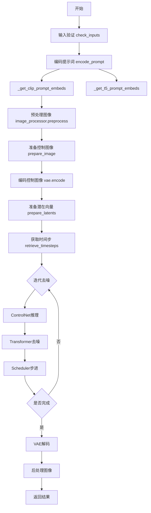
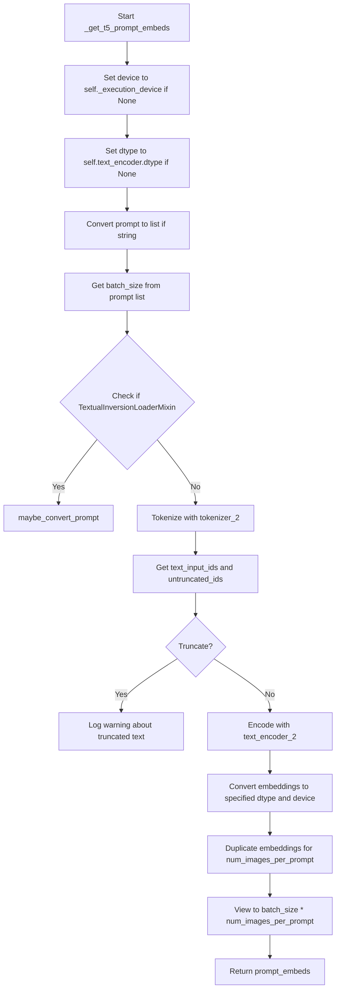
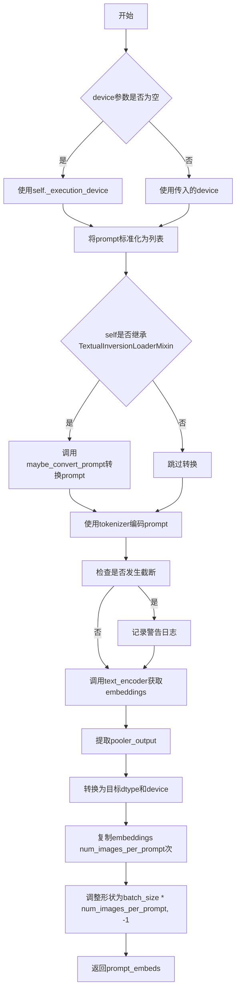
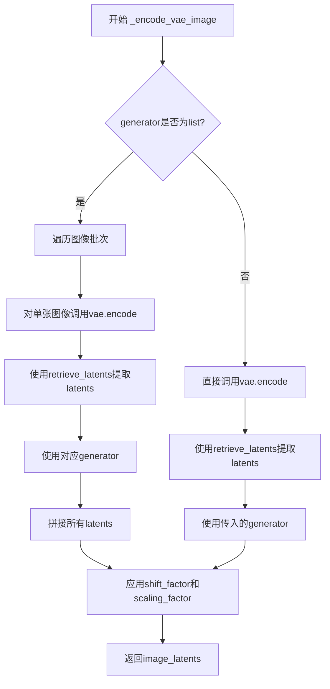
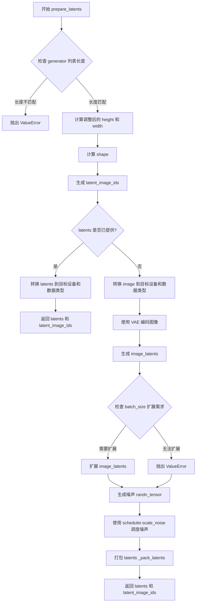
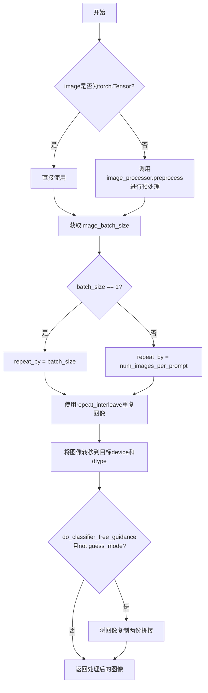

```mermaid
flowchart TD
    A[开始 encode_prompt] --> B{device参数为空?}
    B -->|是| C[使用执行设备 self._execution_device]
    B -->|否| D[使用传入的device]
    C --> E{lora_scale非空且为FluxLoraLoaderMixin?}
    D --> E
    E -->|是| F[设置self._lora_scale]
    F --> G{text_encoder非空且USE_PEFT_BACKEND?}
    G -->|是| H[scale_lora_layers text_encoder]
    G -->|否| I{text_encoder_2非空且USE_PEFT_BACKEND?}
    H --> I
    I -->|是| J[scale_lora_layers text_encoder_2]
    I -->|否| K{prompt_embeds为空?}
    J --> K
    K -->|否| L[跳到创建text_ids]
    K -->|是| M{prompt_2为空?}
    M -->|是| N[prompt_2 = prompt]
    M -->|否| O[保持prompt_2不变]
    N --> P{prompt_2是字符串?}
    O --> P
    P -->|是| Q[转为列表]
    P -->|否| R[保持列表不变]
    Q --> S[调用_get_clip_prompt_embeds]
    R --> S
    S --> T[获取pooled_prompt_embeds]
    T --> U[调用_get_t5_prompt_embeds]
    U --> V[获取prompt_embeds]
    V --> L
    L --> W{text_encoder非空且FluxLoraLoaderMixin且USE_PEFT_BACKEND?}
    W -->|是| X[unscale_lora_layers text_encoder]
    W -->|否| Y{text_encoder_2非空且FluxLoraLoaderMixin且USE_PEFT_BACKEND?}
    X --> Y
    Y -->|是| Z[unscale_lora_layers text_encoder_2]
    Y -->|否| AA[获取dtype]
    Z --> AA
    AA --> AB[创建text_ids张量 shape: seq_len x 3]
    AB --> AC[返回 prompt_embeds, pooled_prompt_embeds, text_ids]
```

```mermaid
flowchart TD
    A[开始 __call__] --> B{参数初始化与验证}
    B --> C[设置 height/width 默认值]
    B --> D[标准化 control_guidance_start/end 为列表]
    B --> E[调用 check_inputs 验证参数]
    
    E --> F[获取执行设备 device 和数据类型 dtype]
    F --> G[从 joint_attention_kwargs 获取 lora_scale]
    G --> H[调用 encode_prompt 编码提示词]
    
    H --> I[预处理 init_image]
    I --> J[计算 num_channels_latents]
    J --> K{ControlNet 类型判断}
    
    K -->|FluxControlNetModel| L[prepare_image 处理 control_image]
    K -->|FluxMultiControlNetModel| M[循环处理多个 control_image]
    
    L --> N[VAE 编码 control_image 为 latents]
    M --> N
    
    N --> O[计算 sigmas 和 mu 偏移]
    O --> P[retrieve_timesteps 获取时间步]
    P --> Q[get_timesteps 根据 strength 调整时间步]
    
    Q --> R[prepare_latents 准备初始 latents]
    R --> S[计算 controlnet_keep 权重列表]
    
    S --> T[初始化进度条]
    T --> U{迭代 timesteps}
    
    U --> V[检查 interrupt 标志]
    V -->|是| W[continue 跳过]
    V -->|否| X[展开 timestep]
    
    X --> Y[构建 guidance 张量]
    Y --> Z[计算 cond_scale 控制条件权重]
    
    Z --> AA[调用 controlnet 获取控制特征]
    AA --> AB[调用 transformer 进行去噪预测]
    
    AB --> AC[scheduler.step 更新 latents]
    AC --> AD{检查 latents 数据类型}
    
    AD -->|不匹配| AE[MPS 设备类型转换]
    AD -->|匹配| AF
    
    AE --> AF{callback_on_step_end}
    AF -->|存在| AG[执行回调函数]
    AG --> AH[更新 latents/prompt_embeds/control_image]
    AF -->|不存在| AI
    
    AH --> AI{检查是否是最后一步或满足 warmup 条件}
    AI -->|是| AJ[更新进度条]
    AJ --> AK{XLA 可用性检查}
    
    AI -->|否| AK
    
    AK -->|是| AL[xm.mark_step]
    AK -->|否| AM
    
    AL --> AM{未完成所有 timesteps}
    AM -->|是| U
    AM -->|否| AN
    
    AN --> AO{output_type == 'latent'}
    AO -->|是| AP[直接返回 latents]
    AO -->|否| AQ[unpack_latents 解包]
    
    AQ --> AR[反归一化 latents]
    AR --> AS[vae.decode 解码为图像]
    AS --> AT[postprocess 后处理图像]
    
    AT --> AU[maybe_free_model_hooks 释放模型钩子]
    AU --> AV{return_dict}
    
    AP --> AV
    AT --> AV
    
    AV -->|是| AX[返回 FluxPipelineOutput]
    AV -->|否| AY[返回元组]
    
    W --> U
```

# `diffusers\src\diffusers\pipelines\flux\pipeline_flux_controlnet_image_to_image.py` 详细设计文档

FluxControlNetImg2ImgPipeline是基于FLUX模型的ControlNet图像到图像生成管道，通过ControlNet条件控制实现对输入图像的转换和生成，支持多ControlNet模型、多模态文本编码（CLIP+T5）和可配置的扩散调度器。

## 整体流程



## 类结构

```
DiffusionPipeline (基类)
├── FluxLoraLoaderMixin (LoRA加载混入)
├── FromSingleFileMixin (单文件加载混入)
└── FluxControlNetImg2ImgPipeline (主类)
```

## 全局变量及字段


### `logger`
    
模块级别的日志记录器，用于输出警告和信息

类型：`logging.Logger`
    


### `EXAMPLE_DOC_STRING`
    
包含管道使用示例的文档字符串，展示如何调用FluxControlNetImg2ImgPipeline进行图像生成

类型：`str`
    


### `XLA_AVAILABLE`
    
标志位，指示torch_xla是否可用，用于判断是否支持XLA加速

类型：`bool`
    


### `FluxControlNetImg2ImgPipeline.model_cpu_offload_seq`
    
定义模型组件在CPU卸载时的顺序，遵循text_encoder到text_encoder_2到transformer再到vae的流程

类型：`str`
    


### `FluxControlNetImg2ImgPipeline._optional_components`
    
可选组件列表，用于标识哪些组件可以在初始化时省略

类型：`list`
    


### `FluxControlNetImg2ImgPipeline._callback_tensor_inputs`
    
定义在推理步骤结束时可以被回调函数访问的tensor输入名称列表

类型：`list[str]`
    


### `FluxControlNetImg2ImgPipeline.vae_scale_factor`
    
VAE的缩放因子，用于计算潜在空间的维度，考虑了VAE块通道数和补丁大小

类型：`int`
    


### `FluxControlNetImg2ImgPipeline.image_processor`
    
图像处理器实例，负责图像的预处理和后处理操作

类型：`VaeImageProcessor`
    


### `FluxControlNetImg2ImgPipeline.tokenizer_max_length`
    
分词器的最大序列长度，默认为77（CLIPTokenizer的标准长度）

类型：`int`
    


### `FluxControlNetImg2ImgPipeline.default_sample_size`
    
默认的样本尺寸，用于在没有指定高度和宽度时生成图像的基准尺寸

类型：`int`
    


### `FluxControlNetImg2ImgPipeline.vae`
    
变分自编码器模型，负责将图像编码到潜在空间和解码回图像空间

类型：`AutoencoderKL`
    


### `FluxControlNetImg2ImgPipeline.text_encoder`
    
CLIP文本编码器模型，用于将文本提示编码为embedding向量

类型：`CLIPTextModel`
    


### `FluxControlNetImg2ImgPipeline.text_encoder_2`
    
T5文本编码器模型，用于提供更长的文本序列编码能力

类型：`T5EncoderModel`
    


### `FluxControlNetImg2ImgPipeline.tokenizer`
    
CLIP分词器，用于将文本分割为token序列供text_encoder使用

类型：`CLIPTokenizer`
    


### `FluxControlNetImg2ImgPipeline.tokenizer_2`
    
T5快速分词器，用于将文本分割为更长的token序列供text_encoder_2使用

类型：`T5TokenizerFast`
    


### `FluxControlNetImg2ImgPipeline.transformer`
    
Flux变换器模型，负责去噪潜在表示的核心推理过程

类型：`FluxTransformer2DModel`
    


### `FluxControlNetImg2ImgPipeline.scheduler`
    
流匹配欧拉离散调度器，用于控制去噪过程中的时间步进

类型：`FlowMatchEulerDiscreteScheduler`
    


### `FluxControlNetImg2ImgPipeline.controlnet`
    
ControlNet模型或模型集合，用于根据控制图像引导生成过程，支持单个或多个ControlNet

类型：`FluxControlNetModel | list[FluxControlNetModel] | tuple[FluxControlNetModel] | FluxMultiControlNetModel`
    
    

## 全局函数及方法


### `calculate_shift`

计算给定图像序列长度对应的shift值，用于在扩散模型调度器中动态调整噪声调度参数。该函数通过线性插值在基础序列长度和最大序列长度之间计算对应的shift值，使得不同分辨率的图像可以使用不同的噪声调度策略。

参数：

- `image_seq_len`：`int`，输入图像的序列长度，通常由图像尺寸和VAE压缩比例计算得出
- `base_seq_len`：`int` = 256，基础序列长度，对应基础shift值的参考序列长度
- `max_seq_len`：`int` = 4096，最大序列长度，对应最大shift值的参考序列长度
- `base_shift`：`float` = 0.5，基础偏移量，用于低分辨率图像的噪声调度
- `max_shift`：`float` = 1.15，最大偏移量，用于高分辨率图像的噪声调度

返回值：`float`，计算得到的shift值（mu），用于扩散模型的噪声调度

#### 流程图

```mermaid
flowchart TD
    A[开始 calculate_shift] --> B[输入参数]
    B --> C[计算斜率 m = (max_shift - base_shift) / (max_seq_len - base_seq_len)]
    C --> D[计算截距 b = base_shift - m * base_seq_len]
    D --> E[计算 mu = image_seq_len * m + b]
    E --> F[返回 mu]
    
    C --> C1[线性插值]
    D --> C1
    E --> C1
    
    style A fill:#f9f,color:#333
    style F fill:#9f9,color:#333
```

#### 带注释源码

```python
# Copied from diffusers.pipelines.flux.pipeline_flux.calculate_shift
def calculate_shift(
    image_seq_len,        # 图像序列长度，由图像宽高和VAE压缩比例计算得出
    base_seq_len: int = 256,    # 基础序列长度，默认256，对应base_shift
    max_seq_len: int = 4096,    # 最大序列长度，默认4096，对应max_shift
    base_shift: float = 0.5,    # 基础偏移量，用于较低分辨率
    max_shift: float = 1.15,    # 最大偏移量，用于较高分辨率
):
    """
    计算给定图像序列长度对应的shift值。
    通过线性插值在base_seq_len和max_seq_len之间计算对应的shift值，
    使得不同分辨率的图像可以使用不同的噪声调度策略。
    
    公式推导：
    - 线性方程: y = mx + b
    - 已知两点: (base_seq_len, base_shift) 和 (max_seq_len, max_shift)
    - 斜率 m = (max_shift - base_shift) / (max_seq_len - base_seq_len)
    - 截距 b = base_shift - m * base_seq_len
    - 最终 mu = image_seq_len * m + b
    """
    # 计算线性插值的斜率
    m = (max_shift - base_shift) / (max_seq_len - base_seq_len)
    # 计算线性插值的截距
    b = base_shift - m * base_seq_len
    # 根据图像序列长度计算对应的shift值
    mu = image_seq_len * m + b
    return mu
```

#### 设计说明

该函数的设计目标是为Flux扩散模型提供动态的噪声调度参数调整能力。在扩散模型中，shift参数影响噪声添加和去除的时间调度策略：

- **低分辨率图像**（序列长度接近base_seq_len）：使用较小的base_shift（0.5），使得噪声调度更加平滑
- **高分辨率图像**（序列长度接近max_seq_len）：使用较大的max_shift（1.15），适应更复杂的图像结构

这种线性插值方法确保了不同分辨率的图像都能获得合适的噪声调度策略，是扩散模型中常见的技术优化手段。


### `retrieve_latents`

该函数用于从编码器输出（encoder_output）中检索潜在变量（latents），支持多种检索模式：采样模式（sample）、取模模式（argmax）或直接访问 latents 属性。

参数：

-  `encoder_output`：`torch.Tensor`，编码器输出对象，包含 `latent_dist` 属性或 `latents` 属性
-  `generator`：`torch.Generator | None`，可选的随机数生成器，用于采样模式下的随机采样
-  `sample_mode`：`str`，采样模式，默认为 "sample"，可选值为 "sample"、"argmax"

返回值：`torch.Tensor`，检索到的潜在变量张量

#### 流程图

```mermaid
flowchart TD
    A[开始: retrieve_latents] --> B{encoder_output 是否包含 latent_dist?}
    B -->|是| C{sample_mode == 'sample'?}
    C -->|是| D[返回 encoder_output.latent_dist.sample<br/>(generator)]
    C -->|否| E{sample_mode == 'argmax'?}
    E -->|是| F[返回 encoder_output.latent_dist.mode<br/>()]
    E -->|否| G{encoder_output 是否包含 latents?}
    B -->|否| G
    G -->|是| H[返回 encoder_output.latents]
    G -->|否| I[抛出 AttributeError<br/>'Could not access latents of<br/>provided encoder_output']
    
    style D fill:#90EE90
    style F fill:#90EE90
    style H fill:#90EE90
    style I fill:#FFB6C1
```

#### 带注释源码

```python
# Copied from diffusers.pipelines.stable_diffusion.pipeline_stable_diffusion_img2img.retrieve_latents
def retrieve_latents(
    encoder_output: torch.Tensor, generator: torch.Generator | None = None, sample_mode: str = "sample"
):
    """
    从编码器输出中检索潜在变量。
    
    该函数支持三种检索模式：
    1. 当 encoder_output 包含 latent_dist 属性且 sample_mode='sample' 时，从分布中采样
    2. 当 encoder_output 包含 latent_dist 属性且 sample_mode='argmax' 时，取分布的众数
    3. 当 encoder_output 包含 latents 属性时，直接返回 latents
    """
    # 检查是否有 latent_dist 属性且采样模式为 sample
    if hasattr(encoder_output, "latent_dist") and sample_mode == "sample":
        # 从潜在分布中采样，可选使用随机生成器
        return encoder_output.latent_dist.sample(generator)
    # 检查是否有 latent_dist 属性且采样模式为 argmax
    elif hasattr(encoder_output, "latent_dist") and sample_mode == "argmax":
        # 返回潜在分布的众数（最大值对应的潜在向量）
        return encoder_output.latent_dist.mode()
    # 检查是否有直接的 latents 属性
    elif hasattr(encoder_output, "latents"):
        # 直接返回编码器输出的 latents 属性
        return encoder_output.latents
    else:
        # 如果无法访问潜在变量，抛出属性错误
        raise AttributeError("Could not access latents of provided encoder_output")
```


### `retrieve_timesteps`

该函数是 diffusion pipeline 的工具函数，用于调用调度器（scheduler）的 `set_timesteps` 方法并获取调度器中的时间步（timesteps）。它支持自定义时间步和自定义 sigmas，并返回生成样本所需的时间步调度和推理步数。

参数：

- `scheduler`：`SchedulerMixin`，调度器对象，用于获取时间步
- `num_inference_steps`：`int | None`，扩散模型生成样本时使用的扩散步数，如果使用此参数，`timesteps` 必须为 `None`
- `device`：`str | torch.device | None`，时间步要移动到的设备，如果为 `None`，时间步不会移动
- `timesteps`：`list[int] | None`，用于覆盖调度器时间步间隔策略的自定义时间步，如果传入此参数，`num_inference_steps` 和 `sigmas` 必须为 `None`
- `sigmas`：`list[float] | None`，用于覆盖调度器时间步间隔策略的自定义 sigmas，如果传入此参数，`num_inference_steps` 和 `timesteps` 必须为 `None`
- `**kwargs`：其他关键字参数，将传递给 `scheduler.set_timesteps` 方法

返回值：`tuple[torch.Tensor, int]`，元组包含调度器的时间步调度（第一个元素）和推理步数（第二个元素）

#### 流程图

```mermaid
flowchart TD
    A[开始 retrieve_timesteps] --> B{检查 timesteps 和 sigmas 是否同时传入}
    B -->|是| C[抛出 ValueError: 只能传入一个]
    B -->|否| D{检查 timesteps 是否传入}
    D -->|是| E{检查 scheduler 是否支持 timesteps}
    E -->|否| F[抛出 ValueError: 不支持自定义 timesteps]
    E -->|是| G[调用 scheduler.set_timesteps<br/>参数: timesteps=timesteps, device=device, **kwargs]
    G --> H[获取 scheduler.timesteps]
    H --> I[计算 num_inference_steps = len(timesteps)]
    I --> J[返回 timesteps, num_inference_steps]
    
    D -->|否| K{检查 sigmas 是否传入}
    K -->|是| L{检查 scheduler 是否支持 sigmas}
    L -->|否| M[抛出 ValueError: 不支持自定义 sigmas]
    L -->|是| N[调用 scheduler.set_timesteps<br/>参数: sigmas=sigmas, device=device, **kwargs]
    N --> O[获取 scheduler.timesteps]
    O --> P[计算 num_inference_steps = len(timesteps)]
    P --> J
    
    K -->|否| Q[调用 scheduler.set_timesteps<br/>参数: num_inference_steps=num_inference_steps, device=device, **kwargs]
    Q --> R[获取 scheduler.timesteps]
    R --> S[num_inference_steps 保持原值]
    S --> J
```

#### 带注释源码

```
# 从稳定扩散 pipeline 中复制过来的 retrieve_timesteps 函数
# Copied from diffusers.pipelines.stable_diffusion.pipeline_stable_diffusion.retrieve_timesteps
def retrieve_timesteps(
    scheduler,  # 调度器对象，用于获取时间步
    num_inference_steps: int | None = None,  # 扩散步数
    device: str | torch.device | None = None,  # 目标设备
    timesteps: list[int] | None = None,  # 自定义时间步列表
    sigmas: list[float] | None = None,  # 自定义 sigmas 列表
    **kwargs,  # 传递给 scheduler.set_timesteps 的其他参数
):
    r"""
    Calls the scheduler's `set_timesteps` method and retrieves timesteps from the scheduler after the call. Handles
    custom timesteps. Any kwargs will be supplied to `scheduler.set_timesteps`.

    Args:
        scheduler (`SchedulerMixin`):
            The scheduler to get timesteps from.
        num_inference_steps (`int`):
            The number of diffusion steps used when generating samples with a pre-trained model. If used, `timesteps`
            must be `None`.
        device (`str` or `torch.device`, *optional*):
            The device to which the timesteps should be moved to. If `None`, the timesteps are not moved.
        timesteps (`list[int]`, *optional*):
            Custom timesteps used to override the timestep spacing strategy of the scheduler. If `timesteps` is passed,
            `num_inference_steps` and `sigmas` must be `None`.
        sigmas (`list[float]`, *optional*):
            Custom sigmas used to override the timestep spacing strategy of the scheduler. If `sigmas` is passed,
            `num_inference_steps` and `timesteps` must be `None`.

    Returns:
        `tuple[torch.Tensor, int]`: A tuple where the first element is the timestep schedule from the scheduler and the
        second element is the number of inference steps.
    """
    # 检查是否同时传入了 timesteps 和 sigmas，这是不允许的
    if timesteps is not None and sigmas is not None:
        raise ValueError("Only one of `timesteps` or `sigmas` can be passed. Please choose one to set custom values")
    
    # 处理自定义 timesteps 的情况
    if timesteps is not None:
        # 检查 scheduler 的 set_timesteps 方法是否支持 timesteps 参数
        accepts_timesteps = "timesteps" in set(inspect.signature(scheduler.set_timesteps).parameters.keys())
        if not accepts_timesteps:
            raise ValueError(
                f"The current scheduler class {scheduler.__class__}'s `set_timesteps` does not support custom"
                f" timestep schedules. Please check whether you are using the correct scheduler."
            )
        # 调用 scheduler 的 set_timesteps 方法设置自定义时间步
        scheduler.set_timesteps(timesteps=timesteps, device=device, **kwargs)
        # 从 scheduler 获取设置后的时间步
        timesteps = scheduler.timesteps
        # 计算推理步数
        num_inference_steps = len(timesteps)
    # 处理自定义 sigmas 的情况
    elif sigmas is not None:
        # 检查 scheduler 的 set_timesteps 方法是否支持 sigmas 参数
        accept_sigmas = "sigmas" in set(inspect.signature(scheduler.set_timesteps).parameters.keys())
        if not accept_sigmas:
            raise ValueError(
                f"The current scheduler class {scheduler.__class__}'s `set_timesteps` does not support custom"
                f" sigmas schedules. Please check whether you are using the correct scheduler."
            )
        # 调用 scheduler 的 set_timesteps 方法设置自定义 sigmas
        scheduler.set_timesteps(sigmas=sigmas, device=device, **kwargs)
        # 从 scheduler 获取设置后的时间步
        timesteps = scheduler.timesteps
        # 计算推理步数
        num_inference_steps = len(timesteps)
    # 处理默认情况，使用 num_inference_steps 设置时间步
    else:
        scheduler.set_timesteps(num_inference_steps, device=device, **kwargs)
        timesteps = scheduler.timesteps
    
    # 返回时间步调度和推理步数
    return timesteps, num_inference_steps
```


### FluxControlNetImg2ImgPipeline.__init__

这是 FluxControlNetImg2ImgPipeline 类的初始化方法，负责配置和注册所有核心组件（如 transformer、VAE、text_encoder、controlnet 等），并设置图像处理器、VAE 缩放因子和默认采样大小等关键参数，以构建完整的图像到图像控制网络生成管道。

参数：

- `scheduler`：`FlowMatchEulerDiscreteScheduler`，用于去噪过程的调度器
- `vae`：`AutoencoderKL`，用于编码和解码图像的变分自编码器
- `text_encoder`：`CLIPTextModel`，CLIP 文本编码器模型
- `tokenizer`：`CLIPTokenizer`，CLIP 文本分词器
- `text_encoder_2`：`T5EncoderModel`，T5 文本编码器模型（用于更长的序列）
- `tokenizer_2`：`T5TokenizerFast`，T5 快速文本分词器
- `transformer`：`FluxTransformer2DModel`，条件 Transformer（MMDiT）架构，用于去噪图像潜向量
- `controlnet`：`FluxControlNetModel | list[FluxControlNetModel] | tuple[FluxControlNetModel] | FluxMultiControlNetModel`，控制网络模型，可为单个或多个控制网络

返回值：`None`，初始化方法无返回值，直接在对象内部设置属性

#### 流程图

```mermaid
flowchart TD
    A[开始 __init__] --> B[调用 super().__init__ 初始化基类]
    B --> C{controlnet 是否为 list 或 tuple}
    C -->|是| D[将 controlnet 包装为 FluxMultiControlNetModel]
    C -->|否| E[保持原 controlnet 不变]
    D --> F[使用 register_modules 注册所有模块]
    E --> F
    F --> G[计算 vae_scale_factor]
    G --> H[创建 VaeImageProcessor 实例]
    H --> I[设置 tokenizer_max_length]
    I --> J[设置 default_sample_size = 128]
    J --> K[结束 __init__]
```

#### 带注释源码

```
def __init__(
    self,
    scheduler: FlowMatchEulerDiscreteScheduler,  # 调度器：控制去噪过程的时间步
    vae: AutoencoderKL,  # VAE：变分自编码器，用于图像编码/解码
    text_encoder: CLIPTextModel,  # CLIP 文本编码器
    tokenizer: CLIPTokenizer,  # CLIP 分词器
    text_encoder_2: T5EncoderModel,  # T5 文本编码器（处理更长序列）
    tokenizer_2: T5TokenizerFast,  # T5 快速分词器
    transformer: FluxTransformer2DModel,  # 主变换器：去噪核心组件
    controlnet: FluxControlNetModel  # 控制网络：条件图像引导
    | list[FluxControlNetModel]
    | tuple[FluxControlNetModel]
    | FluxMultiControlNetModel,
):
    # 1. 调用父类初始化方法，设置基础管道结构
    super().__init__()
    
    # 2. 如果 controlnet 是列表或元组，封装为 MultiControlNetModel
    if isinstance(controlnet, (list, tuple)):
        controlnet = FluxMultiControlNetModel(controlnet)

    # 3. 注册所有模块到管道，使它们可以通过 pipeline.xxx 访问
    self.register_modules(
        vae=vae,
        text_encoder=text_encoder,
        text_encoder_2=text_encoder_2,
        tokenizer=tokenizer,
        tokenizer_2=tokenizer_2,
        transformer=transformer,
        scheduler=scheduler,
        controlnet=controlnet,
    )
    
    # 4. 计算 VAE 缩放因子：基于 VAE 块输出通道数的幂次
    #    Flux 的潜向量被打包成 2x2 补丁，因此需要乘以 2
    self.vae_scale_factor = 2 ** (len(self.vae.config.block_out_channels) - 1) if getattr(self, "vae", None) else 8
    
    # 5. 创建图像预处理器，考虑补丁打包的额外缩放
    self.image_processor = VaeImageProcessor(vae_scale_factor=self.vae_scale_factor * 2)
    
    # 6. 设置分词器最大长度（默认 77 或使用实际 tokenizer 的长度）
    self.tokenizer_max_length = (
        self.tokenizer.model_max_length if hasattr(self, "tokenizer") and self.tokenizer is not None else 77
    )
    
    # 7. 设置默认采样大小
    self.default_sample_size = 128
```


### `FluxControlNetImg2ImgPipeline._get_t5_prompt_embeds`

该方法使用 T5 文本编码器将文本提示（prompt）编码为文本嵌入（prompt embeddings）。它处理提示的标记化、截断警告，并为每个提示生成多个图像时复制嵌入。

参数：

-  `self`：隐式参数，管道实例本身
-  `prompt`：`str | list[str] = None`，要编码的文本提示，可以是单个字符串或字符串列表
-  `num_images_per_prompt`：`int = 1`，每个提示生成的图像数量，用于复制嵌入
-  `max_sequence_length`：`int = 512`，T5 编码器的最大序列长度
-  `device`：`torch.device | None = None`，执行设备，默认为 `self._execution_device`
-  `dtype`：`torch.dtype | None = None`，数据类型，默认为 `self.text_encoder.dtype`

返回值：`torch.FloatTensor`，编码后的文本嵌入，形状为 `(batch_size * num_images_per_prompt, seq_len, hidden_dim)`

#### 流程图



#### 带注释源码

```python
# Copied from diffusers.pipelines.flux.pipeline_flux.FluxPipeline._get_t5_prompt_embeds
def _get_t5_prompt_embeds(
    self,
    prompt: str | list[str] = None,
    num_images_per_prompt: int = 1,
    max_sequence_length: int = 512,
    device: torch.device | None = None,
    dtype: torch.dtype | None = None,
):
    # 确定执行设备，如果未指定则使用管道的默认执行设备
    device = device or self._execution_device
    # 确定数据类型，如果未指定则使用文本编码器的数据类型
    dtype = dtype or self.text_encoder.dtype

    # 如果 prompt 是单个字符串，转换为列表；否则保持列表形式
    prompt = [prompt] if isinstance(prompt, str) else prompt
    # 获取批处理大小
    batch_size = len(prompt)

    # 如果管道包含 TextualInversionLoaderMixin，则可能需要转换提示
    if isinstance(self, TextualInversionLoaderMixin):
        prompt = self.maybe_convert_prompt(prompt, self.tokenizer_2)

    # 使用 T5 分词器对提示进行分词
    text_inputs = self.tokenizer_2(
        prompt,
        padding="max_length",           # 填充到最大长度
        max_length=max_sequence_length,  # 最大序列长度
        truncation=True,                # 截断超长序列
        return_length=False,            # 不返回长度
        return_overflowing_tokens=False, # 不返回溢出标记
        return_tensors="pt",            # 返回 PyTorch 张量
    )
    # 获取分词后的输入 ID
    text_input_ids = text_inputs.input_ids
    # 获取未截断的输入 ID（用于检测截断）
    untruncated_ids = self.tokenizer_2(prompt, padding="longest", return_tensors="pt").input_ids

    # 检查是否发生了截断，如果是则记录警告
    if untruncated_ids.shape[-1] >= text_input_ids.shape[-1] and not torch.equal(text_input_ids, untruncated_ids):
        # 解码被截断的部分
        removed_text = self.tokenizer_2.batch_decode(untruncated_ids[:, self.tokenizer_max_length - 1 : -1])
        logger.warning(
            "The following part of your input was truncated because `max_sequence_length` is set to "
            f" {max_sequence_length} tokens: {removed_text}"
        )

    # 使用 T5 文本编码器编码文本输入，获取嵌入
    prompt_embeds = self.text_encoder_2(text_input_ids.to(device), output_hidden_states=False)[0]

    # 再次确认数据类型（使用 text_encoder_2 的数据类型）
    dtype = self.text_encoder_2.dtype
    # 将嵌入转换为指定的数据类型和设备
    prompt_embeds = prompt_embeds.to(dtype=dtype, device=device)

    # 获取嵌入的序列长度
    _, seq_len, _ = prompt_embeds.shape

    # 为每个提示生成的多个图像复制文本嵌入和注意力掩码
    # 使用对 MPS 友好的方法
    prompt_embeds = prompt_embeds.repeat(1, num_images_per_prompt, 1)
    # 重新整形为 (batch_size * num_images_per_prompt, seq_len, hidden_dim)
    prompt_embeds = prompt_embeds.view(batch_size * num_images_per_prompt, seq_len, -1)

    return prompt_embeds
```


### `FluxControlNetImg2ImgPipeline._get_clip_prompt_embeds`

该方法负责将文本提示（prompt）转换为CLIP模型的嵌入向量（prompt embeddings）。它处理文本分词、CLIP文本编码器推理、嵌入的池化处理，以及为支持批量图像生成而进行的嵌入复制和形状调整。这是Flux图像生成管道中文本编码流程的核心组成部分，用于为后续的图像生成提供文本条件特征。

参数：

- `self`：隐式参数，Pipeline实例本身
- `prompt`：`str | list[str]`，要编码的文本提示，可以是单个字符串或字符串列表
- `num_images_per_prompt`：`int = 1`，每个提示要生成的图像数量，用于复制embeddings以匹配批量大小
- `device`：`torch.device | None = None`，指定计算设备，如果为None则使用pipeline的执行设备

返回值：`torch.FloatTensor`，CLIP模型处理后的文本嵌入向量，形状为`(batch_size * num_images_per_prompt, embedding_dim)`，包含池化后的文本特征

#### 流程图



#### 带注释源码

```python
def _get_clip_prompt_embeds(
    self,
    prompt: str | list[str],
    num_images_per_prompt: int = 1,
    device: torch.device | None = None,
):
    """
    获取CLIP文本模型的prompt embeddings
    
    参数:
        prompt: 文本提示，字符串或字符串列表
        num_images_per_prompt: 每个提示生成的图像数量
        device: 计算设备
    
    返回:
        处理后的CLIP文本嵌入张量
    """
    # 确定执行设备，如果未指定则使用pipeline的默认设备
    device = device or self._execution_device

    # 标准化输入：将单个字符串转换为列表，保持一致性
    prompt = [prompt] if isinstance(prompt, str) else prompt
    # 计算批处理大小
    batch_size = len(prompt)

    # 如果pipeline支持TextualInversion，加载的嵌入可能需要转换
    if isinstance(self, TextualInversionLoaderMixin):
        prompt = self.maybe_convert_prompt(prompt, self.tokenizer)

    # 使用CLIP tokenizer对prompt进行分词
    # padding="max_length": 填充到最大长度
    # max_length: 使用pipeline定义的最大长度（默认77）
    # truncation: 截断超长序列
    text_inputs = self.tokenizer(
        prompt,
        padding="max_length",
        max_length=self.tokenizer_max_length,
        truncation=True,
        return_overflowing_tokens=False,
        return_length=False,
        return_tensors="pt",
    )

    # 提取input_ids
    text_input_ids = text_inputs.input_ids
    
    # 使用最长填充获取未截断的ids，用于检测是否发生了截断
    untruncated_ids = self.tokenizer(prompt, padding="longest", return_tensors="pt").input_ids
    
    # 检查是否发生了截断，如果是则记录警告
    if untruncated_ids.shape[-1] >= text_input_ids.shape[-1] and not torch.equal(text_input_ids, untruncated_ids):
        # 解码被截断的部分用于警告信息
        removed_text = self.tokenizer.batch_decode(untruncated_ids[:, self.tokenizer_max_length - 1 : -1])
        logger.warning(
            "The following part of your input was truncated because CLIP can only handle sequences up to"
            f" {self.tokenizer_max_length} tokens: {removed_text}"
        )
    
    # 调用CLIP文本编码器获取embeddings
    # output_hidden_states=False表示只返回最后的隐藏状态
    prompt_embeds = self.text_encoder(text_input_ids.to(device), output_hidden_states=False)

    # 从CLIPTextModel输出中提取池化后的输出
    # 这是用于条件生成的全局文本表示
    prompt_embeds = prompt_embeds.pooler_output
    
    # 转换为与text_encoder相同的dtype和指定device
    prompt_embeds = prompt_embeds.to(dtype=self.text_encoder.dtype, device=device)

    # 为每个提示生成的图像数量复制embeddings
    # 使用MPS友好的方法（repeat + view）
    prompt_embeds = prompt_embeds.repeat(1, num_images_per_prompt)
    # 调整形状以适应批量生成
    # 最终形状: (batch_size * num_images_per_prompt, embedding_dim)
    prompt_embeds = prompt_embeds.view(batch_size * num_images_per_prompt, -1)

    return prompt_embeds
```


### `FluxControlNetImg2ImgPipeline.encode_prompt`

该方法负责将文本提示词编码为神经网络可用的向量表示，同时支持CLIP和T5两种文本编码器，并处理LoRA权重的动态缩放。

参数：

- `prompt`：`str | list[str]`，要编码的主提示词
- `prompt_2`：`str | list[str] | None`，发送给T5编码器的提示词，若未指定则使用prompt
- `device`：`torch.device | None`，torch计算设备
- `num_images_per_prompt`：`int`，每个提示词需生成的图像数量
- `prompt_embeds`：`torch.FloatTensor | None`，预生成的T5文本嵌入，若提供则跳过编码
- `pooled_prompt_embeds`：`torch.FloatTensor | None`，预生成的CLIP池化嵌入，若提供则跳过编码
- `max_sequence_length`：`int`，T5编码器的最大序列长度，默认为512
- `lora_scale`：`float | None`，LoRA层的权重缩放因子

返回值：`tuple[torch.FloatTensor, torch.FloatTensor, torch.Tensor]`，返回T5编码的提示词嵌入、CLIP池化后的提示词嵌入以及文本ID张量

#### 流程图



#### 带注释源码

```python
def encode_prompt(
    self,
    prompt: str | list[str],
    prompt_2: str | list[str] | None = None,
    device: torch.device | None = None,
    num_images_per_prompt: int = 1,
    prompt_embeds: torch.FloatTensor | None = None,
    pooled_prompt_embeds: torch.FloatTensor | None = None,
    max_sequence_length: int = 512,
    lora_scale: float | None = None,
):
    r"""
    编码提示词为文本嵌入向量

    Args:
        prompt: 主提示词，字符串或字符串列表
        prompt_2: T5编码器专用的提示词，若为None则使用prompt
        device: torch设备，若为None则使用self._execution_device
        num_images_per_prompt: 每个提示词生成的图像数量
        prompt_embeds: 预计算的T5嵌入，若提供则跳过T5编码
        pooled_prompt_embeds: 预计算的CLIP池化嵌入，若提供则跳过CLIP编码
        max_sequence_length: T5最大序列长度，默认512
        lora_scale: LoRA权重缩放因子，用于动态调整lora层影响
    """
    # 确定实际使用的设备，优先使用传入参数，否则使用执行设备
    device = device or self._execution_device

    # 如果提供了lora_scale，设置该属性以便text encoder的LoRA函数正确访问
    if lora_scale is not None and isinstance(self, FluxLoraLoaderMixin):
        self._lora_scale = lora_scale

        # 动态调整LoRA scale
        if self.text_encoder is not None and USE_PEFT_BACKEND:
            scale_lora_layers(self.text_encoder, lora_scale)
        if self.text_encoder_2 is not None and USE_PEFT_BACKEND:
            scale_lora_layers(self.text_encoder_2, lora_scale)

    # 标准化prompt为列表格式
    prompt = [prompt] if isinstance(prompt, str) else prompt

    # 当未提供预计算的嵌入时，需要执行编码流程
    if prompt_embeds is None:
        # prompt_2用于T5编码器，若未指定则使用主prompt
        prompt_2 = prompt_2 or prompt
        prompt_2 = [prompt_2] if isinstance(prompt_2, str) else prompt_2

        # 获取CLIP池化后的嵌入（用于注意力机制的条件注入）
        pooled_prompt_embeds = self._get_clip_prompt_embeds(
            prompt=prompt,
            device=device,
            num_images_per_prompt=num_images_per_prompt,
        )
        # 获取T5编码的完整序列嵌入（用于transformer的条件编码）
        prompt_embeds = self._get_t5_prompt_embeds(
            prompt=prompt_2,
            num_images_per_prompt=num_images_per_prompt,
            max_sequence_length=max_sequence_length,
            device=device,
        )

    # 编码完成后恢复LoRA权重到原始scale
    if self.text_encoder is not None:
        if isinstance(self, FluxLoraLoaderMixin) and USE_PEFT_BACKEND:
            # 通过反向缩放恢复原始权重
            unscale_lora_layers(self.text_encoder, lora_scale)

    if self.text_encoder_2 is not None:
        if isinstance(self, FluxLoraLoaderMixin) and USE_PEFT_BACKEND:
            # 通过反向缩放恢复原始权重
            unscale_lora_layers(self.text_encoder_2, lora_scale)

    # 确定dtype：优先使用text_encoder的dtype，否则使用transformer的dtype
    dtype = self.text_encoder.dtype if self.text_encoder is not None else self.transformer.dtype
    # 创建文本位置ID张量，用于Transformer中的位置编码
    # shape为[seq_len, 3]，其中3分别代表batch维度、序列维度和特征维度
    text_ids = torch.zeros(prompt_embeds.shape[1], 3).to(device=device, dtype=dtype)

    # 返回T5嵌入、CLIP池化嵌入和文本ID
    return prompt_embeds, pooled_prompt_embeds, text_ids
```


### `FluxControlNetImg2ImgPipeline._encode_vae_image`

该方法负责将输入图像编码为VAE latent空间表示，通过VAE编码器提取图像特征，并根据VAE配置应用缩放因子进行标准化处理。

参数：

- `self`：隐式参数，Pipeline实例本身
- `image`：`torch.Tensor`，待编码的输入图像张量，通常为预处理后的图像数据
- `generator`：`torch.Generator`，用于生成随机数的PyTorch生成器，确保编码过程的可重复性

返回值：`torch.Tensor`，编码后的图像潜在表示张量，经过shift和scale因子调整

#### 流程图



#### 带注释源码

```python
def _encode_vae_image(self, image: torch.Tensor, generator: torch.Generator):
    """
    Encode image to latent space using VAE.
    
    Args:
        image: Input image tensor to be encoded
        generator: Random generator for reproducibility
    
    Returns:
        Encoded image latents with shift and scale applied
    """
    # 判断generator是否为列表形式（用于批量处理不同图像）
    if isinstance(generator, list):
        # 批量编码：遍历每张图像，单独编码后拼接
        image_latents = [
            # 使用VAE编码器编码单张图像
            retrieve_latents(self.vae.encode(image[i : i + 1]), generator=generator[i])
            for i in range(image.shape[0])
        ]
        # 在batch维度拼接所有latents
        image_latents = torch.cat(image_latents, dim=0)
    else:
        # 单generator模式：直接编码整个图像批次
        image_latents = retrieve_latents(self.vae.encode(image), generator=generator)

    # 应用VAE配置的shift_factor和scaling_factor进行标准化
    # 这是VAE解码时需要的逆操作，确保latents在正确的数值范围内
    image_latents = (image_latents - self.vae.config.shift_factor) * self.vae.config.scaling_factor

    return image_latents
```


### `FluxControlNetImg2ImgPipeline.get_timesteps`

该方法用于根据图像到图像转换的强度（strength）参数调整去噪时间步调度表，返回调整后的时间步序列和实际使用的推理步数。

参数：

- `num_inference_steps`：`int`，总推理步数，即去噪过程的迭代次数
- `strength`：`float`，转换强度，控制在0.0到1.0之间，决定保留多少原始图像特征
- `device`：`torch.device`，计算设备，用于指定张量存放位置

返回值：`tuple[torch.Tensor, int]`，第一个元素是调整后的时间步调度表（torch.Tensor），第二个元素是实际用于推理的步数（int）

#### 流程图

```mermaid
flowchart TD
    A[开始 get_timesteps] --> B[计算 init_timestep = min(num_inference_steps * strength, num_inference_steps)]
    B --> C[计算 t_start = max(num_inference_steps - init_timestep, 0)]
    C --> D[从 scheduler.timesteps 中切片获取 timesteps]
    D --> E{scheduler 是否有 set_begin_index 方法?}
    E -->|是| F[调用 scheduler.set_begin_index(t_start * scheduler.order)]
    E -->|否| G[跳过设置]
    F --> H[返回 timesteps 和 num_inference_steps - t_start]
    G --> H
```

#### 带注释源码

```python
def get_timesteps(self, num_inference_steps, strength, device):
    """
    根据图像转换强度调整时间步调度表
    
    参数:
        num_inference_steps: 总推理步数
        strength: 转换强度 (0-1)，越高表示变化越大
        device: 计算设备
    """
    # 计算初始时间步数，受强度参数限制
    # 如果 strength=1.0，则使用全部 num_inference_steps 步
    # 如果 strength < 1.0，则只使用部分步数，保留部分原始图像特征
    init_timestep = min(num_inference_steps * strength, num_inference_steps)

    # 计算跳过的起始索引
    # 从完整的调度表中跳过前面的时间步
    t_start = int(max(num_inference_steps - init_timestep, 0))
    
    # 从调度器获取调整后的时间步序列
    # 使用 scheduler.order 进行索引，以支持多步调度器
    timesteps = self.scheduler.timesteps[t_start * self.scheduler.order :]
    
    # 如果调度器支持，设置起始索引
    # 这是为了确保调度器从正确的位置开始
    if hasattr(self.scheduler, "set_begin_index"):
        self.scheduler.set_begin_index(t_start * self.scheduler.order)

    # 返回调整后的时间步和实际推理步数
    return timesteps, num_inference_steps - t_start
```


### `FluxControlNetImg2ImgPipeline.check_inputs`

该方法用于验证 FluxControlNetImg2ImgPipeline 的输入参数是否合法，包括检查 strength 参数范围、图像尺寸对齐、回调张量输入的有效性、prompt 与 prompt_embeds 的互斥关系、类型检查以及 pooled_prompt_embeds 的依赖性和 max_sequence_length 的限制。

参数：

- `self`：`FluxControlNetImg2ImgPipeline` 实例，pipeline 自身引用
- `prompt`：`str | list[str] | None`，主提示词，用于指导图像生成
- `prompt_2`：`str | list[str] | None`，发送给第二个 tokenizer 和 text_encoder_2 的提示词
- `strength`：`float`，图像变换强度，值必须在 [0.0, 1.0] 范围内
- `height`：`int`，生成图像的高度（像素）
- `width`：`int`，生成图像的宽度（像素）
- `callback_on_step_end_tensor_inputs`：`list[str] | None`，在每个去噪步骤结束时需要传递给回调函数的张量输入名称列表
- `prompt_embeds`：`torch.FloatTensor | None`，预生成的文本嵌入向量
- `pooled_prompt_embeds`：`torch.FloatTensor | None`，预生成的池化文本嵌入向量
- `max_sequence_length`：`int | None`，序列最大长度，不能超过 512

返回值：`None`，该方法不返回任何值，仅通过抛出 ValueError 来指示参数验证失败

#### 流程图

```mermaid
flowchart TD
    A[开始 check_inputs] --> B{strength < 0 或 strength > 1?}
    B -->|是| C[抛出 ValueError: strength 超出范围]
    B -->|否| D{height 或 width 不能被 vae_scale_factor * 2 整除?}
    D -->|是| E[输出警告日志]
    D -->|否| F{callback_on_step_end_tensor_inputs 有效性检查}
    F -->|无效| G[抛出 ValueError: 无效的回调张量输入]
    F -->|有效| H{prompt 和 prompt_embeds 同时存在?}
    H -->|是| I[抛出 ValueError: 不能同时指定]
    H -->|否| J{prompt_2 和 prompt_embeds 同时存在?}
    J -->|是| K[抛出 ValueError: 不能同时指定]
    J -->|否| L{prompt 和 prompt_embeds 都为 None?}
    L -->|是| M[抛出 ValueError: 必须提供至少一个]
    L -->|否| N{prompt 类型检查]}
    N -->|类型无效| O[抛出 ValueError: 类型错误]
    N -->|类型有效| P{prompt_2 类型检查]
    P -->|类型无效| Q[抛出 ValueError: 类型错误]
    P -->|类型有效| R{prompt_embeds 存在但 pooled_prompt_embeds 为 None?}
    R -->|是| S[抛出 ValueError: 缺少 pooled_prompt_embeds]
    R -->|否| T{max_sequence_length > 512?}
    T -->|是| U[抛出 ValueError: 超出最大长度限制]
    T -->|否| V[验证通过，方法结束]
    C --> V
    E --> F
    G --> V
    I --> V
    K --> V
    M --> V
    O --> V
    Q --> V
    S --> V
    U --> V
```

#### 带注释源码

```python
def check_inputs(
    self,
    prompt,                      # 主提示词，str 或 list[str] 或 None
    prompt_2,                   # 第二提示词，用于 text_encoder_2，str 或 list[str] 或 None
    strength,                   # 图像变换强度，float，必须在 [0.0, 1.0]
    height,                     # 生成图像高度，int
    width,                      # 生成图像宽度，int
    callback_on_step_end_tensor_inputs,  # 回调函数张量输入列表，list[str] 或 None
    prompt_embeds=None,         # 预生成文本嵌入，torch.FloatTensor 或 None
    pooled_prompt_embeds=None,  # 预生成池化文本嵌入，torch.FloatTensor 或 None
    max_sequence_length=None,   # 最大序列长度，int 或 None
):
    # 检查 strength 参数是否在有效范围内 [0.0, 1.0]
    if strength < 0 or strength > 1:
        raise ValueError(f"The value of strength should in [0.0, 1.0] but is {strength}")

    # 检查图像尺寸是否满足 VAE 缩放因子要求（需要能被 vae_scale_factor * 2 整除）
    # Flux 的 latent 需要被 packing，因此高度和宽度需要被 2 整除
    if height % self.vae_scale_factor * 2 != 0 or width % self.vae_scale_factor * 2 != 0:
        logger.warning(
            f"`height` and `width` have to be divisible by {self.vae_scale_factor * 2} but are {height} and {width}. Dimensions will be resized accordingly"
        )

    # 验证回调函数张量输入是否在允许的列表中
    # _callback_tensor_inputs 定义为 ["latents", "prompt_embeds", "control_image"]
    if callback_on_step_end_tensor_inputs is not None and not all(
        k in self._callback_tensor_inputs for k in callback_on_step_end_tensor_inputs
    ):
        raise ValueError(
            f"`callback_on_step_end_tensor_inputs` has to be in {self._callback_tensor_inputs}, but found {[k for k in callback_on_step_end_tensor_inputs if k not in self._callback_tensor_inputs]}"
        )

    # 检查 prompt 和 prompt_embeds 的互斥关系：不能同时提供
    if prompt is not None and prompt_embeds is not None:
        raise ValueError(
            f"Cannot forward both `prompt`: {prompt} and `prompt_embeds`: {prompt_embeds}. Please make sure to"
            " only forward one of the two."
        )
    # 检查 prompt_2 和 prompt_embeds 的互斥关系
    elif prompt_2 is not None and prompt_embeds is not None:
        raise ValueError(
            f"Cannot forward both `prompt_2`: {prompt_2} and `prompt_embeds`: {prompt_embeds}. Please make sure to"
            " only forward one of the two."
        )
    # 检查是否至少提供了 prompt 或 prompt_embeds 之一
    elif prompt is None and prompt_embeds is None:
        raise ValueError(
            "Provide either `prompt` or `prompt_embeds`. Cannot leave both `prompt` and `prompt_embeds` undefined."
        )
    # 验证 prompt 的类型：必须是 str 或 list
    elif prompt is not None and (not isinstance(prompt, str) and not isinstance(prompt, list)):
        raise ValueError(f"`prompt` has to be of type `str` or `list` but is {type(prompt)}")
    # 验证 prompt_2 的类型：必须是 str 或 list
    elif prompt_2 is not None and (not isinstance(prompt_2, str) and not isinstance(prompt_2, list)):
        raise ValueError(f"`prompt_2` has to be of type `str` or `list` but is {type(prompt_2)}")

    # 如果提供了 prompt_embeds，则必须同时提供 pooled_prompt_embeds
    # 因为两者需要来自同一个 text encoder
    if prompt_embeds is not None and pooled_prompt_embeds is None:
        raise ValueError(
            "If `prompt_embeds` are provided, `pooled_prompt_embeds` also have to be passed. Make sure to generate `pooled_prompt_embeds` from the same text encoder that was used to generate `prompt_embeds`."
        )

    # 验证 max_sequence_length 不能超过 512（T5 模型的最大序列长度限制）
    if max_sequence_length is not None and max_sequence_length > 512:
        raise ValueError(f"`max_sequence_length` cannot be greater than 512 but is {max_sequence_length}")
```


### `FluxControlNetImg2ImgPipeline._prepare_latent_image_ids`

该方法用于为 Flux 模型生成图像位置编码（positional encoding），通过创建包含空间位置信息的张量，使 Transformer 模型能够感知图像中不同位置的关系。

参数：

- `batch_size`：`int`，批次大小（虽然函数签名中有此参数，但在函数体内未被使用，可能用于未来的扩展或保持接口一致性）
- `height`：`int`，潜在图像的高度（以 patch 为单位）
- `width`：`int`，潜在图像的宽度（以 patch 为单位）
- `device`：`torch.device`，目标设备（CPU/CUDA）
- `dtype`：`torch.dtype`，目标数据类型

返回值：`torch.Tensor`，形状为 `(height * width, 3)` 的二维张量，每行包含 `[0, row_index, col_index]` 格式的位置编码信息

#### 流程图

```mermaid
flowchart TD
    A[开始] --> B[创建形状为 height x width x 3 的零张量]
    B --> C[在第2维叠加行索引 torch.arangeheight[:, None]
    C --> D[在第3维叠加列索引 torch.arangewidth[None, :]
    D --> E[获取张量形状信息]
    E --> F[将张量重塑为 height*width x 3 的二维张量]
    F --> G[将张量移动到指定设备并转换数据类型]
    G --> H[返回位置编码张量]
```

#### 带注释源码

```python
@staticmethod
# Copied from diffusers.pipelines.flux.pipeline_flux.FluxPipeline._prepare_latent_image_ids
def _prepare_latent_image_ids(batch_size, height, width, device, dtype):
    """
    为潜在图像生成位置编码张量。
    
    参数:
        batch_size: 批次大小（当前未使用，保留以保持接口一致性）
        height: 潜在图像高度（以patch为单位）
        width: 潜在图像宽度（以patch为单位）
        device: 目标设备
        dtype: 目标数据类型
    
    返回:
        形状为 (height*width, 3) 的位置编码张量
    """
    # 步骤1: 创建初始零张量，形状为 (height, width, 3)
    # 第三维将存储 [0, row_idx, col_idx] 格式的位置信息
    latent_image_ids = torch.zeros(height, width, 3)
    
    # 步骤2: 在第2维（行索引）填充垂直位置信息
    # torch.arange(height)[:, None] 创建列向量，形状为 (height, 1)
    # 广播后每行的第2个元素代表该行的索引
    latent_image_ids[..., 1] = latent_image_ids[..., 1] + torch.arange(height)[:, None]
    
    # 步骤3: 在第3维（列索引）填充水平位置信息
    # torch.arange(width)[None, :] 创建行向量，形状为 (1, width)
    # 广播后每列的第3个元素代表该列的索引
    latent_image_ids[..., 2] = latent_image_ids[..., 2] + torch.arange(width)[None, :]
    
    # 步骤4: 获取重塑前的高、宽、通道数
    latent_image_id_height, latent_image_id_width, latent_image_id_channels = latent_image_ids.shape
    
    # 步骤5: 将3D张量重塑为2D张量
    # 从 (height, width, 3) 转换为 (height*width, 3)
    # 这样每个patch的位置信息变成单独的一行，便于Transformer处理
    latent_image_ids = latent_image_ids.reshape(
        latent_image_id_height * latent_image_id_width, latent_image_id_channels
    )
    
    # 步骤6: 将张量移动到目标设备并转换数据类型后返回
    return latent_image_ids.to(device=device, dtype=dtype)
```


### `FluxControlNetImg2ImgPipeline._pack_latents`

该函数用于将潜在表示（latents）进行打包处理，将2x2的图像块进行重新排列和展平，以便于后续的Transformer模型处理。在Flux架构中，图像潜在表示被划分为2x2的小块进行packing操作，以提高计算效率。

参数：

- `latents`：`torch.Tensor`，输入的潜在张量，形状为(batch_size, num_channels_latents, height, width)
- `batch_size`：`int`，批处理大小
- `num_channels_latents`：`int`，潜在表示的通道数
- `height`：`int`，潜在表示的高度
- `width`：`int`，潜在表示的宽度

返回值：`torch.Tensor`，打包后的潜在张量，形状为(batch_size, (height // 2) * (width // 2), num_channels_latents * 4)

#### 流程图

```mermaid
flowchart TD
    A[输入 latents: (batch_size, num_channels_latents, height, width)] --> B[view 操作重塑张量]
    B --> C[形状变为: (batch_size, num_channels_latents, height//2, 2, width//2, 2)]
    C --> D[permute 操作重新排列维度]
    D --> E[形状变为: (batch_size, height//2, width//2, num_channels_latents, 2, 2)]
    E --> F[reshape 操作展平]
    F --> G[输出 latents: (batch_size, (height//2)*(width//2), num_channels_latents*4)]
```

#### 带注释源码

```python
@staticmethod
# Copied from diffusers.pipelines.flux.pipeline_flux.FluxPipeline._pack_latents
def _pack_latents(latents, batch_size, num_channels_latents, height, width):
    """
    将潜在表示打包成适合Transformer处理的格式。
    
    Flux架构将图像潜在表示划分为2x2的小块（patches），这个函数将这些小块
    重新排列成序列形式，以便Transformer可以像处理序列一样处理图像。
    
    例如：形状为 (B, C, H, W) 的张量会被转换为 (B, (H//2)*(W//2), C*4) 的形式。
    """
    # Step 1: view操作 - 将高度和宽度各划分为2个块
    # 从 (B, C, H, W) 变为 (B, C, H//2, 2, W//2, 2)
    # 这里的2表示每个维度被划分为2个小块
    latents = latents.view(batch_size, num_channels_latents, height // 2, 2, width // 2, 2)
    
    # Step 2: permute操作 - 重新排列维度顺序
    # 从 (B, C, H//2, 2, W//2, 2) 变为 (B, H//2, W//2, C, 2, 2)
    # 将空间维度(高度和宽度)移到前面，通道维度移到后面
    latents = latents.permute(0, 2, 4, 1, 3, 5)
    
    # Step 3: reshape操作 - 展平为2D序列形式
    # 从 (B, H//2, W//2, C, 2, 2) 变为 (B, H//2*W//2, C*4)
    # 将2x2的小块展平为4个通道，序列长度为H//2 * W//2
    latents = latents.reshape(batch_size, (height // 2) * (width // 2), num_channels_latents * 4)

    return latents
```


### `FluxControlNetImg2ImgPipeline._unpack_latents`

该函数是一个静态方法，用于将打包（packed）后的潜在向量（latents）解包回原始的4D张量形状。在Flux图像生成管道中，潜在向量在处理过程中会被打包以提高效率，此方法将其恢复到适合VAE解码的格式。

参数：

- `latents`：`torch.Tensor`，打包后的潜在向量，形状为 (batch_size, num_patches, channels)
- `height`：`int`，原始图像的高度（像素）
- `width`：`int`，原始图像的宽度（像素）
- `vae_scale_factor`：`int`，VAE的缩放因子，用于计算潜在空间的尺寸

返回值：`torch.Tensor`，解包后的潜在向量，形状为 (batch_size, channels // (2 * 2), height, width)

#### 流程图

```mermaid
flowchart TD
    A[开始: _unpack_latents] --> B[获取latents形状: batch_size, num_patches, channels]
    --> C[计算潜在空间高度: height = 2 * (int(height) // (vae_scale_factor * 2))]
    --> D[计算潜在空间宽度: width = 2 * (int(width) // (vae_scale_factor * 2))]
    --> E[view操作: latents.viewbatch_size, height//2, width//2, channels//4, 2, 2]
    --> F[permute操作: 重新排列维度顺序]
    --> G[reshape操作: 恢复到4D张量]
    --> H[返回解包后的latents]
```

#### 带注释源码

```python
@staticmethod
# Copied from diffusers.pipelines.flux.pipeline_flux.FluxPipeline._unpack_latents
def _unpack_latents(latents, height, width, vae_scale_factor):
    # 从打包的latents中提取批量大小、补丁数量和通道数
    batch_size, num_patches, channels = latents.shape

    # VAE应用8x压缩，但我们还必须考虑打包操作
    # 打包要求潜在高度和宽度能被2整除
    # 因此需要将输入的像素尺寸转换为潜在空间尺寸
    height = 2 * (int(height) // (vae_scale_factor * 2))
    width = 2 * (int(width) // (vae_scale_factor * 2))

    # 执行视图重塑以恢复2x2补丁结构
    # 将 (batch, num_patches, channels) 转换为 (batch, h//2, w//2, c//4, 2, 2)
    latents = latents.view(batch_size, height // 2, width // 2, channels // 4, 2, 2)
    
    # 置换维度以正确对齐通道和空间维度
    # 从 (batch, h//2, w//2, c//4, 2, 2) 转换为 (batch, c//4, h//2, 2, w//2, 2)
    latents = latents.permute(0, 3, 1, 4, 2, 5)

    # 最终重塑为4D张量格式 (batch, channels//4, height, width)
    # channels // (2 * 2) 等价于 channels // 4
    latents = latents.reshape(batch_size, channels // (2 * 2), height, width)

    return latents
```


### `FluxControlNetImg2ImgPipeline.prepare_latents`

该方法负责为 Flux 控制网络图像到图像管道准备潜在变量。它接收输入图像、时间步、批次大小等参数，通过 VAE 编码图像生成初始潜在表示，生成噪声并使用调度器进行噪声调度，最后将潜在变量打包成适合 Transformer 模型处理的格式。

参数：

- `image`：`torch.Tensor`，输入图像张量，待编码为潜在表示的图像
- `timestep`：`torch.Tensor`，当前扩散时间步，用于噪声调度
- `batch_size`：`int`，批处理大小，控制生成图像的数量
- `num_channels_latents`：`int`，潜在变量的通道数，通常为 Transformer 输入通道数的 1/4
- `height`：`int`，生成图像的高度（像素单位）
- `width`：`int`，生成图像的宽度（像素单位）
- `dtype`：`torch.dtype`，潜在变量的数据类型
- `device`：`torch.device`，计算设备（CPU/CUDA）
- `generator`：`torch.Generator | list[torch.Generator] | None`，随机数生成器，用于确保可重复性
- `latents`：`torch.FloatTensor | None`，可选的预生成噪声潜在变量，如果提供则跳过生成步骤

返回值：`tuple[torch.Tensor, torch.Tensor]`，返回两个张量组成的元组：
- 第一个元素是处理后的潜在变量 `latents`（`torch.Tensor`）
- 第二个元素是潜在图像 IDs `latent_image_ids`（`torch.Tensor`），用于 Transformer 的位置编码

#### 流程图



#### 带注释源码

```python
def prepare_latents(
    self,
    image,
    timestep,
    batch_size,
    num_channels_latents,
    height,
    width,
    dtype,
    device,
    generator,
    latents=None,
):
    """
    准备图像潜在变量用于 Flux 控制网络图像到图像生成
    
    参数:
        image: 输入图像张量
        timestep: 当前扩散时间步
        batch_size: 批处理大小
        num_channels_latents: 潜在通道数
        height: 目标高度
        width: 目标宽度
        dtype: 目标数据类型
        device: 目标设备
        generator: 随机数生成器
        latents: 可选的预生成潜在变量
    
    返回:
        (latents, latent_image_ids) 元组
    """
    # 检查 generator 列表长度是否与 batch_size 匹配
    if isinstance(generator, list) and len(generator) != batch_size:
        raise ValueError(
            f"You have passed a list of generators of length {len(generator)}, but requested an effective batch"
            f" size of {batch_size}. Make sure the batch size matches the length of the generators."
        )

    # VAE applies 8x compression on images but we must also account for packing which requires
    # latent height and width to be divisible by 2.
    # 计算调整后的高度和宽度：考虑 VAE 8x 压缩和 packing 需要的 2x 倍数
    height = 2 * (int(height) // (self.vae_scale_factor * 2))
    width = 2 * (int(width) // (self.vae_scale_factor * 2))
    
    # 定义潜在变量的形状：(batch_size, channels, height, width)
    shape = (batch_size, num_channels_latents, height, width)
    
    # 生成潜在图像 IDs，用于 Transformer 的位置编码
    latent_image_ids = self._prepare_latent_image_ids(batch_size, height // 2, width // 2, device, dtype)

    # 如果已经提供了 latents，直接转换并返回，跳过生成步骤
    if latents is not None:
        return latents.to(device=device, dtype=dtype), latent_image_ids

    # 将输入图像转换到目标设备和数据类型
    image = image.to(device=device, dtype=dtype)
    
    # 使用 VAE 编码图像生成初始潜在表示
    image_latents = self._encode_vae_image(image=image, generator=generator)
    
    # 处理 batch_size 扩展：如果请求的 batch_size 大于图像潜在变量的数量
    if batch_size > image_latents.shape[0] and batch_size % image_latents.shape[0] == 0:
        # expand init_latents for batch_size
        # 计算每个提示词需要的图像复制次数
        additional_image_per_prompt = batch_size // image_latents.shape[0]
        # 复制图像潜在变量以匹配 batch_size
        image_latents = torch.cat([image_latents] * additional_image_per_prompt, dim=0)
    elif batch_size > image_latents.shape[0] and batch_size % image_latents.shape[0] != 0:
        raise ValueError(
            f"Cannot duplicate `image` of batch size {image_latents.shape[0]} to {batch_size} text prompts."
        )
    else:
        # batch_size 小于或等于图像潜在变量数量，直接使用
        image_latents = torch.cat([image_latents], dim=0)

    # 生成与目标形状相同的随机噪声
    noise = randn_tensor(shape, generator=generator, device=device, dtype=dtype)
    
    # 使用调度器的 scale_noise 方法将噪声添加到图像潜在变量
    # 这是 Flux 模型特有的噪声调度方式
    latents = self.scheduler.scale_noise(image_latents, timestep, noise)
    
    # 打包潜在变量：将 (batch, channels, h, w) 转换为 (batch, seq_len, packed_channels)
    # 这是 Flux 模型处理潜在变量的方式，将 2x2 的patch打包在一起
    latents = self._pack_latents(latents, batch_size, num_channels_latents, height, width)
    
    # 返回打包后的潜在变量和潜在图像 IDs
    return latents, latent_image_ids
```


### `FluxControlNetImg2ImgPipeline.prepare_image`

该方法用于预处理控制网络（ControlNet）的输入图像，将其调整为指定的尺寸和批次大小，并进行必要的设备与数据类型转换，以适配后续的推理流程。

参数：

- `self`：类实例，隐含参数
- `image`：`PipelineImageInput`，待处理的输入图像，支持 PIL Image、列表或 torch.Tensor 格式
- `width`：`int`，目标图像宽度（像素）
- `height`：`int`，目标图像高度（像素）
- `batch_size`：`int`，批处理大小，用于确定图像重复次数
- `num_images_per_prompt`：`int`，每个提示词生成的图像数量
- `device`：`torch.device`，目标计算设备（如 CPU 或 CUDA）
- `dtype`：`torch.dtype`，目标数据类型（如 float32 或 bfloat16）
- `do_classifier_free_guidance`：`bool`，是否执行无分类器自由引导（Classifier-Free Guidance），默认为 False
- `guess_mode`：`bool`，猜测模式标志，配合无分类器引导使用，默认为 False

返回值：`torch.Tensor`，处理后的图像张量，形状为 [batch_size, channels, height, width]

#### 流程图



#### 带注释源码

```python
# 复制自 diffusers.pipelines.controlnet_sd3.pipeline_stable_diffusion_3_controlnet.StableDiffusion3ControlNetPipeline.prepare_image
def prepare_image(
    self,
    image,
    width,
    height,
    batch_size,
    num_images_per_prompt,
    device,
    dtype,
    do_classifier_free_guidance=False,
    guess_mode=False,
):
    # 如果输入已经是 torch.Tensor，则直接使用
    # 否则使用图像处理器进行预处理（PIL Image 转换为 tensor）
    if isinstance(image, torch.Tensor):
        pass
    else:
        image = self.image_processor.preprocess(image, height=height, width=width)

    # 获取输入图像的批次大小
    image_batch_size = image.shape[0]

    # 根据批次大小确定图像重复次数
    # 如果原始图像批次为1，则按照总batch_size重复
    # 否则按照每个提示词生成的图像数量重复
    if image_batch_size == 1:
        repeat_by = batch_size
    else:
        # image batch size is the same as prompt batch size
        repeat_by = num_images_per_prompt

    # 按指定维度重复图像以匹配批次大小
    image = image.repeat_interleave(repeat_by, dim=0)

    # 将图像转移到指定的设备和数据类型
    image = image.to(device=device, dtype=dtype)

    # 如果启用无分类器自由引导且不是猜测模式
    # 则将图像复制两份，用于后续的引导和非引导forward
    if do_classifier_free_guidance and not guess_mode:
        image = torch.cat([image] * 2)

    return image
```


### `FluxControlNetImg2ImgPipeline.__call__`

该方法是 FluxControlNetImg2ImgPipeline 的核心调用函数，用于执行基于 ControlNet 的图像到图像（img2img）生成任务。它接收文本提示、控制图像和原始图像，通过多步去噪过程将原始图像转换为受控制条件影响的新图像，支持 Flux 模型架构中的双文本编码器（CLIP 和 T5）以及 Flow Match 调度器。

参数：

- `prompt`：`str | list[str] | None`，用于引导图像生成的文本提示
- `prompt_2`：`str | list[str] | None`，发送到 tokenizer_2 和 text_encoder_2 的提示词
- `image`：`PipelineImageInput | None`，要通过管道修改的图像
- `control_image`：`PipelineImageInput | None`，ControlNet 输入条件图像，用于控制生成
- `height`：`int | None`，生成图像的高度（像素），默认值为 default_sample_size * vae_scale_factor
- `width`：`int | None`，生成图像的宽度（像素），默认值为 default_sample_size * vae_scale_factor
- `strength`：`float`，概念上表示对参考图像的变换程度，值必须在 0 到 1 之间，默认值为 0.6
- `num_inference_steps`：`int`，去噪步骤数，默认值为 28
- `sigmas`：`list[float] | None`，自定义 sigmas 用于支持 sigmas 参数的调度器
- `guidance_scale`：`float`，分类器自由扩散引导（CFG）量表，默认值为 7.0
- `control_guidance_start`：`float | list[float]`，ControlNet 引导开始时间点，默认值为 0.0
- `control_guidance_end`：`float | list[float]`，ControlNet 引导结束时间点，默认值为 1.0
- `control_mode`：`int | list[int] | None`，ControlNet 的模式
- `controlnet_conditioning_scale`：`float | list[float]`，ControlNet 输出乘数，默认值为 1.0
- `num_images_per_prompt`：`int | None`，每个提示生成的图像数量，默认值为 1
- `generator`：`torch.Generator | list[torch.Generator] | None`，用于生成确定性结果的随机数生成器
- `latents`：`torch.FloatTensor | None`，预生成的噪声潜在向量
- `prompt_embeds`：`torch.FloatTensor | None`，预生成的文本嵌入
- `pooled_prompt_embeds`：`torch.FloatTensor | None`，预生成的池化文本嵌入
- `output_type`：`str | None`，生成图像的输出格式，可选 "pil" 或 "np.array"，默认值为 "pil"
- `return_dict`：`bool`，是否返回 FluxPipelineOutput，默认值为 True
- `joint_attention_kwargs`：`dict[str, Any] | None`，传递给联合注意力机制的其他关键字参数
- `callback_on_step_end`：`Callable[[int, int], None] | None`，在每个去噪步骤结束时调用的函数
- `callback_on_step_end_tensor_inputs`：`list[str]`，callback_on_step_end 函数的张量输入列表，默认值为 ["latents"]
- `max_sequence_length`：`int`，生成序列的最大长度，默认值为 512

返回值：`FluxPipelineOutput | tuple`，当 return_dict 为 True 时返回 FluxPipelineOutput 对象，否则返回包含生成图像的元组

#### 流程图



#### 带注释源码

```python
@torch.no_grad()
@replace_example_docstring(EXAMPLE_DOC_STRING)
def __call__(
    self,
    prompt: str | list[str] = None,
    prompt_2: str | list[str] | None = None,
    image: PipelineImageInput = None,
    control_image: PipelineImageInput = None,
    height: int | None = None,
    width: int | None = None,
    strength: float = 0.6,
    num_inference_steps: int = 28,
    sigmas: list[float] | None = None,
    guidance_scale: float = 7.0,
    control_guidance_start: float | list[float] = 0.0,
    control_guidance_end: float | list[float] = 1.0,
    control_mode: int | list[int] | None = None,
    controlnet_conditioning_scale: float | list[float] = 1.0,
    num_images_per_prompt: int | None = 1,
    generator: torch.Generator | list[torch.Generator] | None = None,
    latents: torch.FloatTensor | None = None,
    prompt_embeds: torch.FloatTensor | None = None,
    pooled_prompt_embeds: torch.FloatTensor | None = None,
    output_type: str | None = "pil",
    return_dict: bool = True,
    joint_attention_kwargs: dict[str, Any] | None = None,
    callback_on_step_end: Callable[[int, int], None] | None = None,
    callback_on_step_end_tensor_inputs: list[str] = ["latents"],
    max_sequence_length: int = 512,
):
    """
    Function invoked when calling the pipeline for generation.

    Args:
        prompt (`str` or `list[str]`, *optional*):
            The prompt or prompts to guide the image generation.
        prompt_2 (`str` or `list[str]`, *optional*):
            The prompt or prompts to be sent to the `tokenizer_2` and `text_encoder_2`.
        image (`PIL.Image.Image` or `list[PIL.Image.Image]` or `torch.FloatTensor`):
            The image(s) to modify with the pipeline.
        control_image (`PIL.Image.Image` or `list[PIL.Image.Image]` or `torch.FloatTensor`):
            The ControlNet input condition. Image to control the generation.
        height (`int`, *optional*, defaults to self.default_sample_size * self.vae_scale_factor):
            The height in pixels of the generated image.
        width (`int`, *optional*, defaults to self.default_sample_size * self.vae_scale_factor):
            The width in pixels of the generated image.
        strength (`float`, *optional*, defaults to 0.6):
            Conceptually, indicates how much to transform the reference `image`. Must be between 0 and 1.
        num_inference_steps (`int`, *optional*, defaults to 28):
            The number of denoising steps. More denoising steps usually lead to a higher quality image at the
            expense of slower inference.
        sigmas (`list[float]`, *optional*):
            Custom sigmas to use for the denoising process with schedulers which support a `sigmas` argument in
            their `set_timesteps` method. If not defined, the default behavior when `num_inference_steps` is passed
            will be used.
        guidance_scale (`float`, *optional*, defaults to 7.0):
            Guidance scale as defined in [Classifier-Free Diffusion
            Guidance](https://huggingface.co/papers/2207.12598).
        control_mode (`int` or `list[int]`, *optional*):
            The mode for the ControlNet. If multiple ControlNets are used, this should be a list.
        controlnet_conditioning_scale (`float` or `list[float]`, *optional*, defaults to 1.0):
            The outputs of the ControlNet are multiplied by `controlnet_conditioning_scale` before they are added
            to the residual in the original transformer.
        num_images_per_prompt (`int`, *optional*, defaults to 1):
            The number of images to generate per prompt.
        generator (`torch.Generator` or `list[torch.Generator]`, *optional*):
            One or more [torch generator(s)](https://pytorch.org/docs/stable/generated/torch.Generator.html) to
            make generation deterministic.
        latents (`torch.FloatTensor`, *optional*):
            Pre-generated noisy latents, sampled from a Gaussian distribution, to be used as inputs for image
            generation. Can be used to tweak the same generation with different prompts.
        prompt_embeds (`torch.FloatTensor`, *optional*):
            Pre-generated text embeddings. Can be used to easily tweak text inputs, *e.g.* prompt weighting.
        pooled_prompt_embeds (`torch.FloatTensor`, *optional*):
            Pre-generated pooled text embeddings.
        output_type (`str`, *optional*, defaults to `"pil"`):
            The output format of the generate image. Choose between `PIL.Image` or `np.array`.
        return_dict (`bool`, *optional*, defaults to `True`):
            Whether or not to return a [`~pipelines.flux.FluxPipelineOutput`] instead of a plain tuple.
        joint_attention_kwargs (`dict`, *optional*):
            Additional keyword arguments to be passed to the joint attention mechanism.
        callback_on_step_end (`Callable`, *optional*):
            A function that calls at the end of each denoising step during the inference.
        callback_on_step_end_tensor_inputs (`list[str]`, *optional*):
            The list of tensor inputs for the `callback_on_step_end` function.
        max_sequence_length (`int`, *optional*, defaults to 512):
            The maximum length of the sequence to be generated.

    Examples:

    Returns:
        [`~pipelines.flux.FluxPipelineOutput`] or `tuple`: [`~pipelines.flux.FluxPipelineOutput`] if `return_dict`
        is True, otherwise a `tuple`. When returning a tuple, the first element is a list with the generated
        images.
    """
    # 设置默认高度和宽度，基于 VAE 缩放因子
    height = height or self.default_sample_size * self.vae_scale_factor
    width = width or self.default_sample_size * self.vae_scale_factor

    # 标准化 control_guidance_start 和 control_guidance_end 为列表格式
    # 支持单个值或多个值（针对多个 ControlNet）
    if not isinstance(control_guidance_start, list) and isinstance(control_guidance_end, list):
        control_guidance_start = len(control_guidance_end) * [control_guidance_start]
    elif not isinstance(control_guidance_end, list) and isinstance(control_guidance_start, list):
        control_guidance_end = len(control_guidance_start) * [control_guidance_end]
    elif not isinstance(control_guidance_start, list) and not isinstance(control_guidance_end, list):
        # 确定 ControlNet 数量并扩展列表
        mult = len(self.controlnet.nets) if isinstance(self.controlnet, FluxMultiControlNetModel) else 1
        control_guidance_start, control_guidance_end = (
            mult * [control_guidance_start],
            mult * [control_guidance_end],
        )

    # 验证输入参数的有效性
    self.check_inputs(
        prompt,
        prompt_2,
        strength,
        height,
        width,
        callback_on_step_end_tensor_inputs,
        prompt_embeds=prompt_embeds,
        pooled_prompt_embeds=pooled_prompt_embeds,
        max_sequence_length=max_sequence_length,
    )

    # 保存引导比例和联合注意力参数到实例变量
    self._guidance_scale = guidance_scale
    self._joint_attention_kwargs = joint_attention_kwargs
    self._interrupt = False

    # 确定批处理大小
    if prompt is not None and isinstance(prompt, str):
        batch_size = 1
    elif prompt is not None and isinstance(prompt, list):
        batch_size = len(prompt)
    else:
        batch_size = prompt_embeds.shape[0]

    # 获取执行设备和数据类型
    device = self._execution_device
    dtype = self.transformer.dtype

    # 从 joint_attention_kwargs 获取 LoRA 缩放因子
    lora_scale = (
        self.joint_attention_kwargs.get("scale", None) if self.joint_attention_kwargs is not None else None
    )
    
    # 编码提示词，生成文本嵌入
    (
        prompt_embeds,
        pooled_prompt_embeds,
        text_ids,
    ) = self.encode_prompt(
        prompt=prompt,
        prompt_2=prompt_2,
        prompt_embeds=prompt_embeds,
        pooled_prompt_embeds=pooled_prompt_embeds,
        device=device,
        num_images_per_prompt=num_images_per_prompt,
        max_sequence_length=max_sequence_length,
        lora_scale=lora_scale,
    )

    # 预处理输入图像（初始图像）
    init_image = self.image_processor.preprocess(image, height=height, width=width)
    init_image = init_image.to(dtype=torch.float32)

    # 计算潜在空间的通道数（Flux 使用 1/4 通道）
    num_channels_latents = self.transformer.config.in_channels // 4

    # 处理 ControlNet 输入图像
    if isinstance(self.controlnet, FluxControlNetModel):
        # 准备 control_image：调整大小、归一化、重复等
        control_image = self.prepare_image(
            image=control_image,
            width=width,
            height=height,
            batch_size=batch_size * num_images_per_prompt,
            num_images_per_prompt=num_images_per_prompt,
            device=device,
            dtype=self.vae.dtype,
        )
        height, width = control_image.shape[-2:]

        # 检查 ControlNet 类型（xlab 或 instantx）
        controlnet_blocks_repeat = False if self.controlnet.input_hint_block is None else True
        if self.controlnet.input_hint_block is None:
            # instantx 类型：使用 VAE 编码 control_image
            control_image = retrieve_latents(self.vae.encode(control_image), generator=generator)
            control_image = (control_image - self.vae.config.shift_factor) * self.vae.config.scaling_factor

            height_control_image, width_control_image = control_image.shape[2:]
            # 打包 latents 以适应 Transformer 输入格式
            control_image = self._pack_latents(
                control_image,
                batch_size * num_images_per_prompt,
                num_channels_latents,
                height_control_image,
                width_control_image,
            )

        # 处理 control_mode
        if control_mode is not None:
            control_mode = torch.tensor(control_mode).to(device, dtype=torch.long)
            control_mode = control_mode.reshape([-1, 1])

    elif isinstance(self.controlnet, FluxMultiControlNetModel):
        # 处理多个 ControlNet
        control_images = []

        controlnet_blocks_repeat = False if self.controlnet.nets[0].input_hint_block is None else True
        for i, control_image_ in enumerate(control_image):
            control_image_ = self.prepare_image(
                image=control_image_,
                width=width,
                height=height,
                batch_size=batch_size * num_images_per_prompt,
                num_images_per_prompt=num_images_per_prompt,
                device=device,
                dtype=self.vae.dtype,
            )
            height, width = control_image_.shape[-2:]

            if self.controlnet.nets[0].input_hint_block is None:
                control_image_ = retrieve_latents(self.vae.encode(control_image_), generator=generator)
                control_image_ = (control_image_ - self.vae.config.shift_factor) * self.vae.config.scaling_factor

                height_control_image, width_control_image = control_image_.shape[2:]
                control_image_ = self._pack_latents(
                    control_image_,
                    batch_size * num_images_per_prompt,
                    num_channels_latents,
                    height_control_image,
                    width_control_image,
                )

            control_images.append(control_image_)

        control_image = control_images

        # 处理多个 control_mode
        control_mode_ = []
        if isinstance(control_mode, list):
            for cmode in control_mode:
                if cmode is None:
                    control_mode_.append(-1)
                else:
                    control_mode_.append(cmode)
        control_mode = torch.tensor(control_mode_).to(device, dtype=torch.long)
        control_mode = control_mode.reshape([-1, 1])

    # 计算 sigmas（噪声调度）
    sigmas = np.linspace(1.0, 1 / num_inference_steps, num_inference_steps) if sigmas is None else sigmas
    
    # 计算图像序列长度和 mu 偏移（用于调整噪声调度）
    image_seq_len = (int(height) // self.vae_scale_factor // 2) * (int(width) // self.vae_scale_factor // 2)
    mu = calculate_shift(
        image_seq_len,
        self.scheduler.config.get("base_image_seq_len", 256),
        self.scheduler.config.get("max_image_seq_len", 4096),
        self.scheduler.config.get("base_shift", 0.5),
        self.scheduler.config.get("max_shift", 1.15),
    )
    
    # 确定时间步设备（XLA 需要 CPU）
    if XLA_AVAILABLE:
        timestep_device = "cpu"
    else:
        timestep_device = device
    
    # 获取调度器的时间步
    timesteps, num_inference_steps = retrieve_timesteps(
        self.scheduler,
        num_inference_steps,
        timestep_device,
        sigmas=sigmas,
        mu=mu,
    )
    
    # 根据 strength 调整时间步（用于 img2img）
    timesteps, num_inference_steps = self.get_timesteps(num_inference_steps, strength, device)

    # 重复初始时间步以匹配批处理大小
    latent_timestep = timesteps[:1].repeat(batch_size * num_images_per_prompt)
    
    # 准备初始潜在向量
    latents, latent_image_ids = self.prepare_latents(
        init_image,
        latent_timestep,
        batch_size * num_images_per_prompt,
        num_channels_latents,
        height,
        width,
        prompt_embeds.dtype,
        device,
        generator,
        latents,
    )

    # 计算每个时间步的 ControlNet 保留权重
    controlnet_keep = []
    for i in range(len(timesteps)):
        keeps = [
            1.0 - float(i / len(timesteps) < s or (i + 1) / len(timesteps) > e)
            for s, e in zip(control_guidance_start, control_guidance_end)
        ]
        controlnet_keep.append(keeps[0] if isinstance(self.controlnet, FluxControlNetModel) else keeps)

    # 计算预热步数
    num_warmup_steps = max(len(timesteps) - num_inference_steps * self.scheduler.order, 0)
    self._num_timesteps = len(timesteps)

    # 主去噪循环
    with self.progress_bar(total=num_inference_steps) as progress_bar:
        for i, t in enumerate(timesteps):
            # 检查中断标志
            if self.interrupt:
                continue

            # 扩展时间步以匹配批处理大小
            timestep = t.expand(latents.shape[0]).to(latents.dtype)

            # 检查是否使用引导嵌入
            if isinstance(self.controlnet, FluxMultiControlNetModel):
                use_guidance = self.controlnet.nets[0].config.guidance_embeds
            else:
                use_guidance = self.controlnet.config.guidance_embeds

            # 构建引导张量
            guidance = torch.tensor([guidance_scale], device=device) if use_guidance else None
            guidance = guidance.expand(latents.shape[0]) if guidance is not None else None

            # 计算 ControlNet 条件缩放
            if isinstance(controlnet_keep[i], list):
                cond_scale = [c * s for c, s in zip(controlnet_conditioning_scale, controlnet_keep[i])]
            else:
                controlnet_cond_scale = controlnet_conditioning_scale
                if isinstance(controlnet_cond_scale, list):
                    controlnet_cond_scale = controlnet_cond_scale[0]
                cond_scale = controlnet_cond_scale * controlnet_keep[i]

            # 调用 ControlNet 获取控制特征
            controlnet_block_samples, controlnet_single_block_samples = self.controlnet(
                hidden_states=latents,
                controlnet_cond=control_image,
                controlnet_mode=control_mode,
                conditioning_scale=cond_scale,
                timestep=timestep / 1000,
                guidance=guidance,
                pooled_projections=pooled_prompt_embeds,
                encoder_hidden_states=prompt_embeds,
                txt_ids=text_ids,
                img_ids=latent_image_ids,
                joint_attention_kwargs=self.joint_attention_kwargs,
                return_dict=False,
            )

            # 构建 Transformer 的引导张量
            guidance = (
                torch.tensor([guidance_scale], device=device) if self.transformer.config.guidance_embeds else None
            )
            guidance = guidance.expand(latents.shape[0]) if guidance is not None else None

            # 调用 Transformer 进行去噪预测
            noise_pred = self.transformer(
                hidden_states=latents,
                timestep=timestep / 1000,
                guidance=guidance,
                pooled_projections=pooled_prompt_embeds,
                encoder_hidden_states=prompt_embeds,
                controlnet_block_samples=controlnet_block_samples,
                controlnet_single_block_samples=controlnet_single_block_samples,
                txt_ids=text_ids,
                img_ids=latent_image_ids,
                joint_attention_kwargs=self.joint_attention_kwargs,
                return_dict=False,
                controlnet_blocks_repeat=controlnet_blocks_repeat,
            )[0]

            # 使用调度器执行去噪步骤
            latents_dtype = latents.dtype
            latents = self.scheduler.step(noise_pred, t, latents, return_dict=False)[0]

            # 处理数据类型不匹配（MPS 设备特殊处理）
            if latents.dtype != latents_dtype:
                if torch.backends.mps.is_available():
                    latents = latents.to(latents_dtype)

            # 执行每步结束时的回调函数
            if callback_on_step_end is not None:
                callback_kwargs = {}
                for k in callback_on_step_end_tensor_inputs:
                    callback_kwargs[k] = locals()[k]
                callback_outputs = callback_on_step_end(self, i, t, callback_kwargs)

                latents = callback_outputs.pop("latents", latents)
                prompt_embeds = callback_outputs.pop("prompt_embeds", prompt_embeds)
                control_image = callback_outputs.pop("control_image", control_image)

            # 更新进度条
            if i == len(timesteps) - 1 or ((i + 1) > num_warmup_steps and (i + 1) % self.scheduler.order == 0):
                progress_bar.update()

            # XLA 设备标记步骤
            if XLA_AVAILABLE:
                xm.mark_step()

    # 后处理：解码潜在向量到图像
    if output_type == "latent":
        # 直接返回潜在向量
        image = latents
    else:
        # 解包潜在向量
        latents = self._unpack_latents(latents, height, width, self.vae_scale_factor)
        # 反归一化
        latents = (latents / self.vae.config.scaling_factor) + self.vae.config.shift_factor
        # VAE 解码
        image = self.vae.decode(latents, return_dict=False)[0]
        # 后处理图像
        image = self.image_processor.postprocess(image, output_type=output_type)

    # 释放模型钩子
    self.maybe_free_model_hooks()

    # 返回结果
    if not return_dict:
        return (image,)

    return FluxPipelineOutput(images=image)
```

## 关键组件


### 张量索引与惰性加载

代码使用多种技术实现张量索引和惰性加载：通过`latents.to(latents_dtype)`进行惰性类型转换以减少内存占用；使用`@torch.no_grad()`装饰器避免不必要的梯度计算；通过`XLA_AVAILABLE`检查支持XLA设备的惰性执行；模型卸载序列`model_cpu_offload_seq`实现CPU/GPU内存的惰性管理。

### VAE Latent空间处理与缩放

代码包含完整的VAE latent空间处理流程：`_encode_vae_image`方法使用`retrieve_latents`从encoder_output中提取latent，并应用`shift_factor`和`scaling_factor`进行缩放；`_unpack_latents`方法将packed latents解包回原始形状；解码时进行反向缩放操作`(latents / scaling_factor) + shift_factor`。

### ControlNet多模型支持

代码实现了单和多ControlNet模型的支持：通过`FluxControlNetModel`和`FluxMultiControlNetModel`类型检查区分处理逻辑；`prepare_image`方法支持批量图像处理和classifier-free guidance的图像复制；`controlnet_blocks_repeat`标志处理不同ControlNet架构的差异；支持`control_mode`张量控制ControlNet模式。

### 文本编码与Prompt处理

代码实现了双文本编码器架构：CLIP文本编码器生成pooled prompt embeddings用于条件注入；T5编码器生成长序列prompt embeddings支持512最大长度；`_get_clip_prompt_embeds`和`_get_t5_prompt_embeds`分别处理两种编码器的嵌入提取；`encode_prompt`方法整合两种嵌入并支持LoRA scale调整。

### 调度器与时间步管理

代码包含完整的调度器集成：`retrieve_timesteps`从调度器获取时间步；`get_timesteps`根据strength参数调整初始时间步；`calculate_shift`计算图像序列长度相关的mu值用于调度器配置；支持自定义sigmas和timesteps覆盖默认调度策略。

### 图像预处理与后处理

代码实现完整的图像处理流程：`VaeImageProcessor`用于图像预处理和后处理；`prepare_latents`方法将图像编码为latent并添加噪声；`_pack_latents`和`_unpack_latents`实现latent的打包和解包以适应Flux模型的2x2 patch packing格式；支持PIL和numpy数组输出格式。


## 问题及建议


### 已知问题

-   **类型提示兼容性**：使用了 Python 3.10+ 的 `|` 联合类型语法（如 `FluxControlNetModel | list[FluxControlNetModel]`），可能与旧版本 Python 不兼容
- **代码重复**：`prepare_image` 方法在单 ControlNet 和多 ControlNet 分支中逻辑几乎完全重复；`_get_t5_prompt_embeds` 和 `_get_clip_prompt_embeds` 中处理 tokenizer 截断警告的逻辑重复
- **魔法数字**：存在硬编码的数值如 `default_sample_size = 128`、`timestep / 1000`、`vae_scale_factor * 2`，缺乏常量定义
- **条件分支复杂**：`__call__` 方法中包含大量嵌套的 `if-elif-else` 分支（单/多 ControlNet、guess_mode 等），导致代码可读性差
- **MPS 后端特殊处理**：对 Apple MPS 后端的类型转换处理（`if torch.backends.mps.is_available()`）不够优雅，且可能在不同版本间行为不一致
- **ControlNet 兼容性假设**：通过检查 `input_hint_block` 是否为 `None` 来区分不同版本的 ControlNet，这种基于属性的检测方式脆弱且易出错
- **变量作用域问题**：`callback_on_step_end` 中使用 `locals()` 获取变量可能导致意外捕获非预期变量
- **缺少输入验证**：部分关键参数（如 `control_mode`）的类型验证不够严格，可能导致运行时错误

### 优化建议

-   **提取常量**：将硬编码的数值提取为类常量或配置文件，如 `DEFAULT_SAMPLE_SIZE`、`TIMESTEP_SCALING_FACTOR` 等
-   **重构条件分支**：将 ControlNet 相关的分支逻辑提取为独立方法，如 `_prepare_controlnet_input()`，减少 `__call__` 方法的复杂度
-   **合并重复逻辑**：将 `prepare_image` 方法中的通用逻辑提取到私有方法中，避免代码重复
-   **改进类型提示**：使用 `typing.Union` 替代 `|` 操作符以保持 Python 3.9 兼容性，或明确标注最低 Python 版本要求
-   **统一 ControlNet 检测**：使用更健壮的方式检测 ControlNet 版本（如版本号字段或配置参数），避免依赖 `input_hint_block`
-   **优化回调机制**：显式传递需要传递给回调的变量，而非使用 `locals()`，提高代码可预测性
-   **添加混合精度支持**：考虑添加 `torch.cuda.amp.autocast` 支持以提升性能和减少显存占用
-   **增强错误信息**：为关键断言添加更详细的错误上下文信息，便于调试

## 其它


### 设计目标与约束

本Pipeline的设计目标是实现基于Flux架构的ControlNet图像到图像（Img2Img）生成功能，通过ControlNet条件控制来指导图像转换过程，支持单ControlNet和多ControlNet（FluxMultiControlNetModel）模式。核心约束包括：输入图像尺寸必须能被`vae_scale_factor * 2`整除；T5文本编码器的序列长度限制为最大512个token；支持LoRA权重加载但需配合PEFT后端使用；推理过程中可通过`callback_on_step_end`回调函数进行中间结果干预。

### 错误处理与异常设计

Pipeline实现了多层次错误检查机制。**参数验证**通过`check_inputs`方法完成：检查`strength`必须在[0,1]范围内；验证图像尺寸可被`vae_scale_factor * 2`整除（否则发出警告并自动调整）；确保`callback_on_step_end_tensor_inputs`中的张量名称合法；校验`prompt`与`prompt_embeds`不能同时传递；验证`max_sequence_length`不超过512。**运行时异常**：在`retrieve_latents`中当encoder_output缺少latent_dist或latents属性时抛出AttributeError；在`retrieve_timesteps`中当scheduler不支持自定义timesteps或sigmas时抛出ValueError。**设备兼容性**：MPS后端下进行dtype转换时需特殊处理（代码中有`if torch.backends.mps.is_available()`检查）。

### 数据流与状态机

Pipeline执行遵循明确的状态转换流程：**初始化阶段**注册所有模块（vae、text_encoder、text_encoder_2、tokenizer、tokenizer_2、transformer、scheduler、controlnet）并计算vae_scale_factor；**编码阶段**调用`_get_clip_prompt_embeds`和`_get_t5_prompt_embeds`将文本prompt转换为向量表示，同时对输入图像进行VAE编码得到latents；**控制图像处理**通过`prepare_image`方法预处理control_image并根据ControlNet类型进行编码和packing；**调度器初始化**通过`retrieve_timesteps`获取推理步数的时间步序列；**去噪循环**（主状态机）：对每个timestep依次执行ControlNet前向传播→Transformer前向传播→Scheduler步骤更新latents，支持中断和回调；**解码阶段**将最终latents通过VAE解码为图像并后处理。关键状态变量包括`_guidance_scale`、`_joint_attention_kwargs`、`_num_timesteps`、`_interrupt`通过类属性管理。

### 外部依赖与接口契约

**核心依赖**：PyTorch作为张量计算后端；transformers库提供CLIPTextModel和T5EncoderModel；numpy用于sigmas数组生成；diffusers内部模块（PipelineImageInput、VaeImageProcessor、FlowMatchEulerDiscreteScheduler等）。**可选依赖**：torch_xla用于XLA设备加速（通过`is_torch_xla_available()`检测）；PEFT后端用于LoRA权重管理（通过`USE_PEFT_BACKEND`标志控制）。**模型接口契约**：transformer必须包含`in_channels`和`guidance_embeds`配置属性；vae必须包含`config.block_out_channels`、`config.shift_factor`和`config.scaling_factor`属性；controlnet必须支持`FluxControlNetModel`或`FluxMultiControlNetModel`两种形式，且包含`input_hint_block`和`guidance_embeds`配置。

### 性能优化策略

代码中已包含多项性能优化：**模型CPU卸载顺序**通过`model_cpu_offload_seq = "text_encoder->text_encoder_2->transformer->vae"`定义，支持pipeline级别的内存管理；**批处理优化**通过`num_images_per_prompt`参数支持单次生成多张图像；**Latent Packing**使用`_pack_latents`和`_unpack_latents`方法对latents进行2x2分块以适配Flux架构；**XLA支持**在TPU设备上通过`xm.mark_step()`进行图编译优化；**MPS兼容性处理**针对Apple Silicon芯片的特殊dtype转换逻辑。建议的进一步优化方向包括：启用`torch.compile`对Transformer进行图编译；实现vae的tile-based解码以处理超大分辨率图像；考虑使用FP8精度推理。

### 安全性考虑

Pipeline在以下方面体现安全设计：**输入验证**：所有用户输入（prompt、strength、图像尺寸等）均通过`check_inputs`进行校验，防止无效参数导致运行时错误；**LoRA安全**：LoRA权重加载和卸载严格配对执行（`scale_lora_layers`和`unscale_lora_layers`），确保权重不被意外遗忘；**设备安全**：所有张量操作均指定明确的device和dtype，避免隐式CPU-GPU数据传输；**输出安全**：图像后处理阶段不涉及任何外部代码执行，输出类型限制为PIL.Image或numpy array。

### 配置参数详解

Pipeline核心配置参数包括：`strength`（默认0.6）控制图像变换程度，值越大变换越显著；`num_inference_steps`（默认28）决定去噪迭代次数；`guidance_scale`（默认7.0）控制classifier-free guidance强度；`control_guidance_start`和`control_guidance_end`定义ControlNet激活的时间步范围；`controlnet_conditioning_scale`（默认1.0）控制ControlNet对生成的影响权重；`control_mode`允许设置ControlNet的操作模式；`max_sequence_length`（默认512）限制T5编码的token长度。这些参数可通过`__call__`方法灵活传入。

### 版本历史与兼容性

该Pipeline继承自DiffusionPipeline基类，借鉴了Stable Diffusion 3和Flux系列Pipeline的实现（如`_get_t5_prompt_embeds`来自FluxPipeline，`retrieve_timesteps`来自StableDiffusion，`get_timesteps`来自StableDiffusion3Img2ImgPipeline）。版本兼容性方面：要求transformers库支持CLIPTextModel和T5EncoderModel的特定接口；要求scheduler继承自FlowMatchEulerDiscreteScheduler并实现`set_timesteps`方法；VAE配置必须包含`shift_factor`和`scaling_factor`属性。代码中通过`inspect.signature`动态检查scheduler能力以保证向后兼容性。

### 测试计划与验证方法

建议的测试用例覆盖以下场景：**功能测试**：使用示例代码验证端到端图像生成流程；测试单ControlNet和多ControlNet模式切换；验证prompt_embeds预计算的复用性。**边界测试**：测试最小尺寸图像（vae_scale_factor * 2）和非标准尺寸图像处理；测试空prompt和超长prompt（512 token）的行为；测试strength=0和strength=1的极端情况。**性能测试**：测量不同分辨率下的推理时间和显存占用；对比单ControlNet与多ControlNet的性能差异。**稳定性测试**：测试中断（interrupt=True）后的恢复能力；测试callback_on_step_end回调的正常执行。

### 部署与环境要求

**Python版本**：建议Python 3.8+；**PyTorch版本**：支持PyTorch 2.0+以获得最佳性能；**CUDA版本**：建议CUDA 11.8+以支持BF16推理；**关键库**：transformers>=4.30.0，diffusers需包含Flux相关模块；**内存需求**：建议至少16GB GPU显存以支持FP16推理，更高分辨率需要更多显存；**磁盘空间**：Flux模型权重约10-15GB。部署时应确保`USE_PEFT_BACKEND`环境变量正确设置以支持LoRA功能。


    