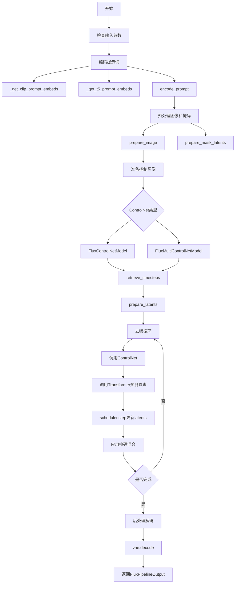
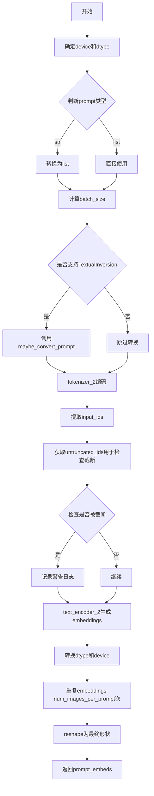
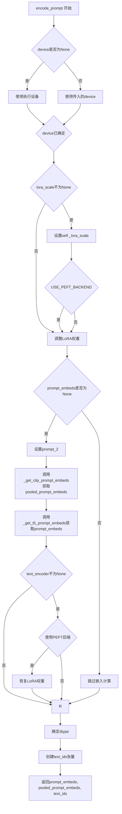
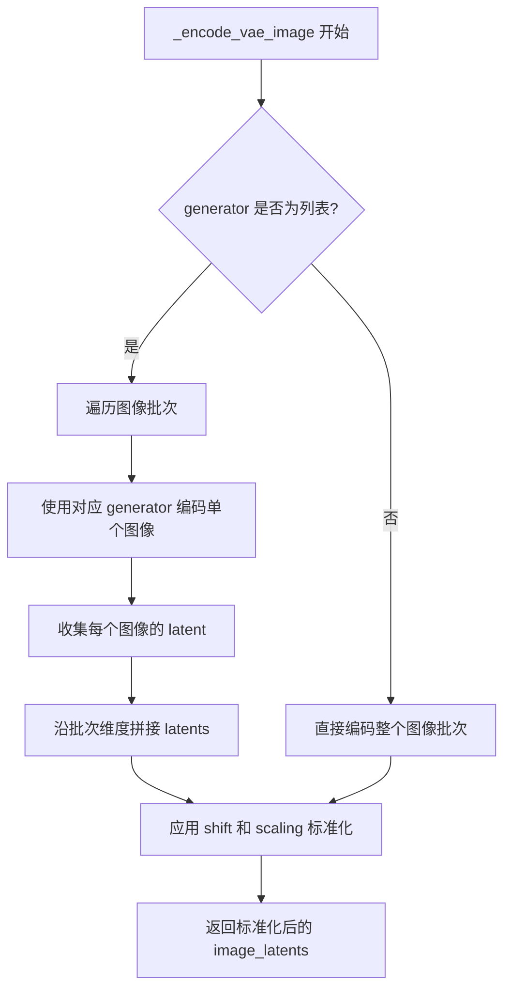
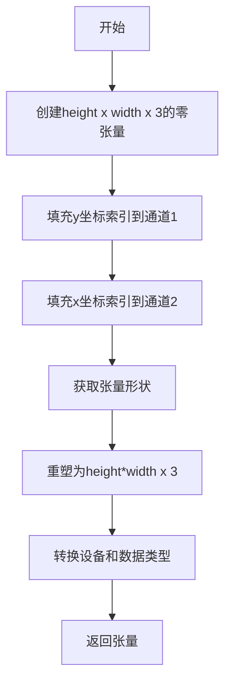
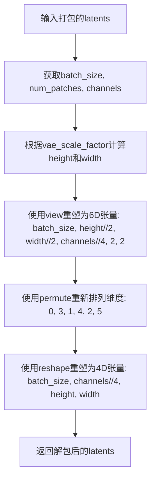
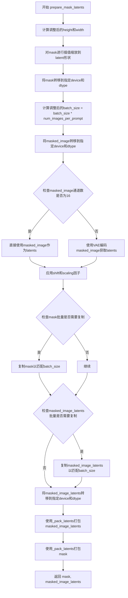
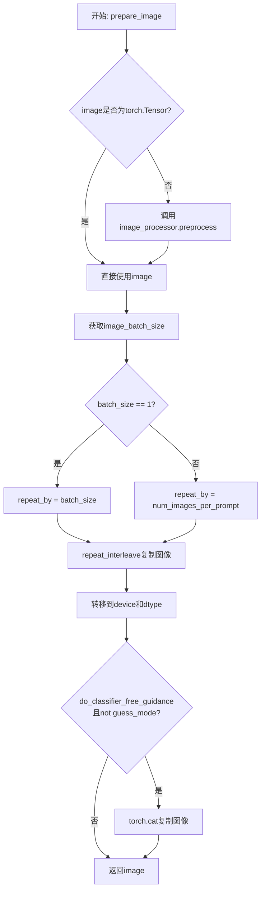
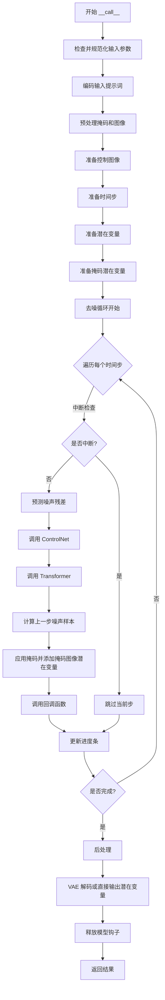

# `diffusers\src\diffusers\pipelines\flux\pipeline_flux_controlnet_inpainting.py` 详细设计文档

FluxControlNetInpaintPipeline是一个基于Flux架构的ControlNet图像修复扩散管道，用于根据文本提示、ControlNet条件控制和掩码对图像进行修复生成。该管道集成了CLIP和T5双文本编码器、VAE变分自编码器、FluxTransformer2DModel去噪模型以及FluxControlNetModel条件控制模型，通过FlowMatchEulerDiscreteScheduler调度器实现高质量的图像修复效果。

## 整体流程



## 类结构

```
DiffusionPipeline (基类)
├── FluxLoraLoaderMixin (混入类)
├── FromSingleFileMixin (混入类)
└── FluxControlNetInpaintPipeline (主类)
```

## 全局变量及字段


### `XLA_AVAILABLE`
    
XLA可用性标志，表示torch_xla是否可用

类型：`bool`
    


### `logger`
    
日志记录器，用于记录运行时的日志信息

类型：`Logger`
    


### `EXAMPLE_DOC_STRING`
    
示例文档字符串，包含该管道的使用示例代码

类型：`str`
    


### `calculate_shift`
    
计算序列长度偏移量的函数，用于调整图像序列长度

类型：`function`
    


### `retrieve_latents`
    
从编码器输出中检索潜在表示的函数

类型：`function`
    


### `retrieve_timesteps`
    
从调度器中检索时间步的函数，支持自定义时间步和sigmas

类型：`function`
    


### `FluxControlNetInpaintPipeline.scheduler`
    
噪声调度器，用于控制去噪过程的噪声调度

类型：`FlowMatchEulerDiscreteScheduler`
    


### `FluxControlNetInpaintPipeline.vae`
    
变分自编码器，用于图像的编码和解码

类型：`AutoencoderKL`
    


### `FluxControlNetInpaintPipeline.text_encoder`
    
CLIP文本编码器，用于将文本提示编码为嵌入向量

类型：`CLIPTextModel`
    


### `FluxControlNetInpaintPipeline.tokenizer`
    
CLIP分词器，用于将文本分词为token

类型：`CLIPTokenizer`
    


### `FluxControlNetInpaintPipeline.text_encoder_2`
    
T5文本编码器，用于更长的文本序列编码

类型：`T5EncoderModel`
    


### `FluxControlNetInpaintPipeline.tokenizer_2`
    
T5快速分词器，用于文本分词

类型：`T5TokenizerFast`
    


### `FluxControlNetInpaintPipeline.transformer`
    
Flux变换器模型，用于去噪图像潜在表示

类型：`FluxTransformer2DModel`
    


### `FluxControlNetInpaintPipeline.controlnet`
    
ControlNet模型，用于提供额外的控制条件

类型：`FluxControlNetModel/FluxMultiControlNetModel`
    


### `FluxControlNetInpaintPipeline.vae_scale_factor`
    
VAE缩放因子，用于计算潜在空间的尺寸

类型：`int`
    


### `FluxControlNetInpaintPipeline.image_processor`
    
图像处理器，用于图像的预处理和后处理

类型：`VaeImageProcessor`
    


### `FluxControlNetInpaintPipeline.mask_processor`
    
掩码处理器，用于掩码图像的预处理

类型：`VaeImageProcessor`
    


### `FluxControlNetInpaintPipeline.tokenizer_max_length`
    
分词器最大长度，用于限制文本token序列长度

类型：`int`
    


### `FluxControlNetInpaintPipeline.default_sample_size`
    
默认采样尺寸，用于生成图像的默认宽高

类型：`int`
    


### `FluxControlNetInpaintPipeline.model_cpu_offload_seq`
    
CPU卸载顺序，指定模型卸载到CPU的顺序

类型：`str`
    


### `FluxControlNetInpaintPipeline._optional_components`
    
可选组件列表，定义管道中的可选组件

类型：`list`
    


### `FluxControlNetInpaintPipeline._callback_tensor_inputs`
    
回调张量输入列表，指定步骤结束回调可访问的张量

类型：`list`
    


### `FluxControlNetInpaintPipeline._guidance_scale`
    
引导_scale，用于控制无分类器引导的强度

类型：`float`
    


### `FluxControlNetInpaintPipeline._joint_attention_kwargs`
    
联合注意力参数，用于传递联合注意力机制的额外参数

类型：`dict`
    


### `FluxControlNetInpaintPipeline._num_timesteps`
    
时间步数，记录推理过程中的总时间步数

类型：`int`
    


### `FluxControlNetInpaintPipeline._interrupt`
    
中断标志，用于中断推理过程

类型：`bool`
    
    

## 全局函数及方法


### `calculate_shift`

计算图像序列长度的偏移量（shift），通过线性插值基于图像序列长度计算噪声调度器的时间偏移参数。

参数：

- `image_seq_len`：`int`，图像序列长度（即图像经VAE编码和patchify后的token数量）
- `base_seq_len`：`int`，默认256，基础序列长度
- `max_seq_len`：`int`，默认4096，最大序列长度
- `base_shift`：`float`，默认0.5，基础偏移量
- `max_shift`：`float`，默认1.15，最大偏移量

返回值：`float`，计算得到的偏移量 mu，用于调整噪声调度器的时间步

#### 流程图

```mermaid
flowchart TD
    A[开始] --> B[计算斜率 m<br/>m = (max_shift - base_shift) / (max_seq_len - base_seq_len)]
    B --> C[计算截距 b<br/>b = base_shift - m * base_seq_len]
    C --> D[计算偏移量 mu<br/>mu = image_seq_len * m + b]
    D --> E[返回 mu]
```

#### 带注释源码

```python
# Copied from diffusers.pipelines.flux.pipeline_flux.calculate_shift
def calculate_shift(
    image_seq_len,
    base_seq_len: int = 256,
    max_seq_len: int = 4096,
    base_shift: float = 0.5,
    max_shift: float = 1.15,
):
    """
    计算图像序列长度的偏移量，用于调整Flow Match调度器的时间步。
    
    该函数通过线性插值在基础偏移量和最大偏移量之间计算合适的偏移值，
    使得不同分辨率的图像都能获得合适的噪声调度参数。
    
    Args:
        image_seq_len: 图像序列长度，由 (height // vae_scale_factor // 2) * (width // vae_scale_factor // 2) 计算得出
        base_seq_len: 基础序列长度，默认256
        max_seq_len: 最大序列长度，默认4096
        base_shift: 基础偏移量，默认0.5
        max_shift: 最大偏移量，默认1.15
    
    Returns:
        float: 计算得到的偏移量mu
    """
    # 计算线性插值的斜率
    m = (max_shift - base_shift) / (max_seq_len - base_seq_len)
    # 计算线性插值的截距
    b = base_shift - m * base_seq_len
    # 根据图像序列长度计算最终的偏移量
    mu = image_seq_len * m + b
    return mu
```


### `retrieve_latents`

从编码器输出中检索潜在表示，支持多种模式获取 VAE 编码后的潜在向量。

参数：

- `encoder_output`：`torch.Tensor`，编码器（通常是 VAE）的输出对象，需要包含 `latent_dist` 或 `latents` 属性
- `generator`：`torch.Generator | None`，可选的随机数生成器，用于采样过程中的随机性控制
- `sample_mode`：`str`，采样模式，默认为 "sample"，可选 "argmax"

返回值：`torch.Tensor`，检索到的潜在表示张量

#### 流程图

```mermaid
flowchart TD
    A[开始: retrieve_latents] --> B{encoder_output 是否有<br/>latent_dist 属性?}
    B -->|是| C{sample_mode == "sample"?}
    B -->|否| D{encoder_output 是否有<br/>latents 属性?}
    
    C -->|是| E[调用 latent_dist.sample<br/>使用 generator]
    C -->|否| F[调用 latent_dist.mode<br/>进行 argmax 采样]
    
    D -->|是| G[返回 encoder_output.latents]
    D -->|否| H[抛出 AttributeError]
    
    E --> I[返回潜在表示]
    F --> I
    G --> I
    H --> J[结束: 异常处理]
    
    I --> J
```

#### 带注释源码

```python
def retrieve_latents(
    encoder_output: torch.Tensor, generator: torch.Generator | None = None, sample_mode: str = "sample"
):
    """
    从编码器输出中检索潜在表示。
    
    该函数支持三种方式获取潜在向量:
    1. 当 encoder_output 包含 latent_dist 属性时，根据 sample_mode 进行采样
    2. 当 encoder_output 直接包含 latents 属性时直接返回
    3. 否则抛出 AttributeError
    
    Args:
        encoder_output: 编码器输出，需包含 latent_dist 或 latents 属性
        generator: 可选的随机生成器，用于采样控制
        sample_mode: 采样模式，"sample" 表示随机采样，"argmax" 表示取最大概率
    
    Returns:
        torch.Tensor: 潜在表示张量
    """
    # 检查是否存在 latent_dist 属性且模式为 sample
    if hasattr(encoder_output, "latent_dist") and sample_mode == "sample":
        # 从潜在分布中采样，使用可选的生成器确保可重复性
        return encoder_output.latent_dist.sample(generator)
    # 检查是否存在 latent_dist 属性且模式为 argmax
    elif hasattr(encoder_output, "latent_dist") and sample_mode == "argmax":
        # 取分布的众数（最大概率值）
        return encoder_output.latent_dist.mode()
    # 检查是否直接包含 latents 属性
    elif hasattr(encoder_output, "latents"):
        # 直接返回预计算的潜在向量
        return encoder_output.latents
    else:
        # 无法访问潜在表示，抛出异常
        raise AttributeError("Could not access latents of provided encoder_output")
```


### retrieve_timesteps

从调度器中检索时间步，调用调度器的 `set_timesteps` 方法并从调度器中获取时间步。处理自定义时间步，任何 kwargs 都将传递给 `scheduler.set_timesteps`。

参数：

- `scheduler`：`SchedulerMixin`，用于获取时间步的调度器
- `num_inference_steps`：`int | None`，使用预训练模型生成样本时使用的扩散步数。如果使用此参数，则 `timesteps` 必须为 `None`
- `device`：`str | torch.device | None`，时间步应移动到的设备。如果为 `None`，则不移动时间步
- `timesteps`：`list[int] | None`，用于覆盖调度器时间步间隔策略的自定义时间步。如果传递了 `timesteps`，则 `num_inference_steps` 和 `sigmas` 必须为 `None`
- `sigmas`：`list[float] | None`，用于覆盖调度器时间步间隔策略的自定义 sigmas。如果传递了 `sigmas`，则 `num_inference_steps` 和 `timesteps` 必须为 `None`
- `**kwargs`：其他关键字参数，将传递给调度器的 `set_timesteps` 方法

返回值：`tuple[torch.Tensor, int]`，元组包含两个元素：第一个是调度器的时间步调度，第二个是推理步数。

#### 流程图

```mermaid
flowchart TD
    A[开始] --> B{检查timesteps和sigmas是否同时传入}
    B -->|是| C[抛出ValueError: 只能选择timesteps或sigmas之一]
    B -->|否| D{是否传入了timesteps}
    D -->|是| E{检查scheduler.set_timesteps是否支持timesteps参数}
    E -->|不支持| F[抛出ValueError: 当前调度器不支持自定义timesteps]
    E -->|支持| G[调用scheduler.set_timesteps并传入timesteps和device]
    G --> H[获取scheduler.timesteps]
    H --> I[计算num_inference_steps = len(timesteps)]
    I --> J[返回timesteps和num_inference_steps]
    D -->|否| K{是否传入了sigmas}
    K -->|是| L{检查scheduler.set_timesteps是否支持sigmas参数}
    L -->|不支持| M[抛出ValueError: 当前调度器不支持自定义sigmas]
    L -->|支持| N[调用scheduler.set_timesteps并传入sigmas和device]
    N --> O[获取scheduler.timesteps]
    O --> P[计算num_inference_steps = len(timesteps)]
    P --> J
    K -->|否| Q[调用scheduler.set_timesteps并传入num_inference_steps和device]
    Q --> R[获取scheduler.timesteps]
    R --> S[计算num_inference_steps = len(timesteps)]
    S --> J
```

#### 带注释源码

```python
# Copied from diffusers.pipelines.stable_diffusion.pipeline_stable_diffusion.retrieve_timesteps
def retrieve_timesteps(
    scheduler,  # 调度器对象，用于获取时间步
    num_inference_steps: int | None = None,  # 推理步数
    device: str | torch.device | None = None,  # 目标设备
    timesteps: list[int] | None = None,  # 自定义时间步列表
    sigmas: list[float] | None = None,  # 自定义sigma列表
    **kwargs,  # 其他传递给scheduler.set_timesteps的参数
):
    r"""
    调用调度器的 `set_timesteps` 方法并在调用后从调度器检索时间步。
    处理自定义时间步。任何 kwargs 将传递给 `scheduler.set_timesteps`。

    Args:
        scheduler (`SchedulerMixin`): 获取时间步的调度器。
        num_inference_steps (`int`): 使用预训练模型生成样本时使用的扩散步数。
            如果使用，则 `timesteps` 必须为 `None`。
        device (`str` 或 `torch.device`, *optional*): 时间步应移动到的设备。
            如果为 `None`，则不移动时间步。
        timesteps (`list[int]`, *optional*): 用于覆盖调度器时间步间隔策略的自定义时间步。
            如果传入 `timesteps`，则 `num_inference_steps` 和 `sigmas` 必须为 `None`。
        sigmas (`list[float]`, *optional*): 用于覆盖调度器时间步间隔策略的自定义 sigmas。
            如果传入 `sigmas`，则 `num_inference_steps` 和 `timesteps` 必须为 `None`。

    Returns:
        `tuple[torch.Tensor, int]`: 元组，第一个元素是调度器的时间步调度，第二个是推理步数。
    """
    # 检查是否同时传入了timesteps和sigmas，这是不允许的
    if timesteps is not None and sigmas is not None:
        raise ValueError("Only one of `timesteps` or `sigmas` can be passed. Please choose one to set custom values")
    
    # 处理自定义timesteps的情况
    if timesteps is not None:
        # 检查调度器的set_timesteps方法是否支持timesteps参数
        accepts_timesteps = "timesteps" in set(inspect.signature(scheduler.set_timesteps).parameters.keys())
        if not accepts_timesteps:
            raise ValueError(
                f"The current scheduler class {scheduler.__class__}'s `set_timesteps` does not support custom"
                f" timestep schedules. Please check whether you are using the correct scheduler."
            )
        # 调用调度器的set_timesteps方法
        scheduler.set_timesteps(timesteps=timesteps, device=device, **kwargs)
        # 从调度器获取时间步
        timesteps = scheduler.timesteps
        # 计算推理步数
        num_inference_steps = len(timesteps)
    # 处理自定义sigmas的情况
    elif sigmas is not None:
        # 检查调度器的set_timesteps方法是否支持sigmas参数
        accept_sigmas = "sigmas" in set(inspect.signature(scheduler.set_timesteps).parameters.keys())
        if not accept_sigmas:
            raise ValueError(
                f"The current scheduler class {scheduler.__class__}'s `set_timesteps` does not support custom"
                f" sigmas schedules. Please check whether you are using the correct scheduler."
            )
        # 调用调度器的set_timesteps方法
        scheduler.set_timesteps(sigmas=sigmas, device=device, **kwargs)
        # 从调度器获取时间步
        timesteps = scheduler.timesteps
        # 计算推理步数
        num_inference_steps = len(timesteps)
    # 处理默认情况，使用num_inference_steps
    else:
        scheduler.set_timesteps(num_inference_steps, device=device, **kwargs)
        timesteps = scheduler.timesteps
    
    # 返回时间步和推理步数
    return timesteps, num_inference_steps
```


### FluxControlNetInpaintPipeline.__init__

该方法是FluxControlNetInpaintPipeline类的构造函数，负责初始化整个图像修复管道。它接受所有必要的模型组件（调度器、VAE、文本编码器、分词器、Transformer和ControlNet），注册这些模块，并配置图像处理器和掩码处理器以支持Flux架构的潜在空间操作。

参数：

- `scheduler`：`FlowMatchEulerDiscreteScheduler`，用于去噪图像潜在表示的调度器
- `vae`：`AutoencoderKL`，用于编码和解码图像到潜在表示的变分自编码器
- `text_encoder`：`CLIPTextModel`，CLIP文本编码器模型
- `tokenizer`：`CLIPTokenizer`，CLIP分词器
- `text_encoder_2`：`T5EncoderModel`，T5文本编码器模型
- `tokenizer_2`：`T5TokenizerFast`，T5快速分词器
- `transformer`：`FluxTransformer2DModel`，条件Transformer（MMDiT）架构，用于去噪编码后的图像潜在表示
- `controlnet`：`FluxControlNetModel | list[FluxControlNetModel] | tuple[FluxControlNetModel] | FluxMultiControlNetModel`，ControlNet模型，可为单个、列表或MultiControlNet模型

返回值：无（`None`），构造函数不返回任何值，仅初始化实例属性

#### 流程图

```mermaid
flowchart TD
    A[开始 __init__] --> B{controlnet是否为list或tuple}
    B -->|是| C[将controlnet转换为FluxMultiControlNetModel]
    B -->|否| D[保持原样]
    C --> E[调用super().__init__]
    D --> E
    E --> F[register_modules注册所有模块]
    F --> G[计算vae_scale_factor]
    G --> H[创建VaeImageProcessor作为image_processor]
    H --> I[创建VaeImageProcessor作为mask_processor]
    I --> J[设置tokenizer_max_length]
    J --> K[设置default_sample_size]
    K --> L[结束 __init__]
```

#### 带注释源码

```
def __init__(
    self,
    scheduler: FlowMatchEulerDiscreteScheduler,
    vae: AutoencoderKL,
    text_encoder: CLIPTextModel,
    tokenizer: CLIPTokenizer,
    text_encoder_2: T5EncoderModel,
    tokenizer_2: T5TokenizerFast,
    transformer: FluxTransformer2DModel,
    controlnet: FluxControlNetModel
    | list[FluxControlNetModel]
    | tuple[FluxControlNetModel]
    | FluxMultiControlNetModel,
):
    """
    初始化FluxControlNetInpaintPipeline管道。
    
    参数:
        scheduler: FlowMatchEulerDiscreteScheduler调度器
        vae: AutoencoderKL变分自编码器
        text_encoder: CLIPTextModel文本编码器
        tokenizer: CLIPTokenizer分词器
        text_encoder_2: T5EncoderModel第二文本编码器
        tokenizer_2: T5TokenizerFast第二分词器
        transformer: FluxTransformer2DModel变换器模型
        controlnet: FluxControlNetModel或FluxMultiControlNetModel
    """
    # 调用父类DiffusionPipeline的初始化方法
    super().__init__()
    
    # 如果controlnet是列表或元组，则转换为FluxMultiControlNetModel
    if isinstance(controlnet, (list, tuple)):
        controlnet = FluxMultiControlNetModel(controlnet)

    # 注册所有模块到管道中，使其可以通过管道属性访问
    self.register_modules(
        scheduler=scheduler,
        vae=vae,
        text_encoder=text_encoder,
        tokenizer=tokenizer,
        text_encoder_2=text_encoder_2,
        tokenizer_2=tokenizer_2,
        transformer=transformer,
        controlnet=controlnet,
    )

    # 计算VAE的缩放因子
    # VAE应用2^(len(block_out_channels)-1)的压缩比
    self.vae_scale_factor = 2 ** (len(self.vae.config.block_out_channels) - 1) if getattr(self, "vae", None) else 8
    
    # Flux潜在变量被转换为2x2块并打包。这意味着潜在宽度和高度必须能被块大小整除。
    # 因此，vae_scale_factor乘以块大小（2）来考虑这一点
    self.image_processor = VaeImageProcessor(vae_scale_factor=self.vae_scale_factor * 2)
    
    # 获取潜在通道数
    latent_channels = self.vae.config.latent_channels if getattr(self, "vae", None) else 16
    
    # 创建掩码处理器，用于处理修复任务的掩码
    self.mask_processor = VaeImageProcessor(
        vae_scale_factor=self.vae_scale_factor * 2,
        vae_latent_channels=latent_channels,
        do_normalize=False,
        do_binarize=True,
        do_convert_grayscale=True,
    )
    
    # 设置分词器的最大长度
    self.tokenizer_max_length = (
        self.tokenizer.model_max_length if hasattr(self, "tokenizer") and self.tokenizer is not None else 77
    )
    
    # 设置默认采样大小
    self.default_sample_size = 128
```


### `FluxControlNetInpaintPipeline._get_t5_prompt_embeds`

该方法用于将文本提示（prompt）转换为T5模型的文本嵌入向量（prompt embeddings），支持批量处理和每提示生成多张图像的场景。

参数：

- `prompt`：`str | list[str]`，待编码的文本提示，可以是单个字符串或字符串列表
- `num_images_per_prompt`：`int`，每个提示生成的图像数量，默认为1
- `max_sequence_length`：`int`，T5模型的最大序列长度，默认为512
- `device`：`torch.device | None`，计算设备，若为None则使用执行设备
- `dtype`：`torch.dtype | None`，数据类型，若为None则使用text_encoder的数据类型

返回值：`torch.FloatTensor`，形状为`(batch_size * num_images_per_prompt, seq_len, hidden_size)`的文本嵌入张量

#### 流程图



#### 带注释源码

```python
def _get_t5_prompt_embeds(
    self,
    prompt: str | list[str] = None,
    num_images_per_prompt: int = 1,
    max_sequence_length: int = 512,
    device: torch.device | None = None,
    dtype: torch.dtype | None = None,
):
    # 确定计算设备，若未指定则使用pipeline的执行设备
    device = device or self._execution_device
    # 确定数据类型，若未指定则使用text_encoder的数据类型
    dtype = dtype or self.text_encoder.dtype

    # 将单个字符串转换为list，便于批量处理
    prompt = [prompt] if isinstance(prompt, str) else prompt
    # 计算批次大小
    batch_size = len(prompt)

    # 如果支持TextualInversion，进行提示词转换（如embedding加权等）
    if isinstance(self, TextualInversionLoaderMixin):
        prompt = self.maybe_convert_prompt(prompt, self.tokenizer_2)

    # 使用T5 tokenizer将文本转换为token ids
    # padding到max_length，截断超长序列，返回pytorch张量
    text_inputs = self.tokenizer_2(
        prompt,
        padding="max_length",
        max_length=max_sequence_length,
        truncation=True,
        return_length=False,
        return_overflowing_tokens=False,
        return_tensors="pt",
    )
    # 提取input_ids用于编码
    text_input_ids = text_inputs.input_ids
    # 获取未截断的token ids用于比较
    untruncated_ids = self.tokenizer_2(prompt, padding="longest", return_tensors="pt").input_ids

    # 检查是否发生了截断，如果是则记录警告信息
    if untruncated_ids.shape[-1] >= text_input_ids.shape[-1] and not torch.equal(text_input_ids, untruncated_ids):
        removed_text = self.tokenizer_2.batch_decode(untruncated_ids[:, self.tokenizer_max_length - 1 : -1])
        logger.warning(
            "The following part of your input was truncated because `max_sequence_length` is set to "
            f" {max_sequence_length} tokens: {removed_text}"
        )

    # 使用T5 text_encoder生成文本嵌入
    # output_hidden_states=False表示只返回最后一层的输出
    prompt_embeds = self.text_encoder_2(text_input_ids.to(device), output_hidden_states=False)[0]

    # 再次确认dtype（使用text_encoder_2的dtype）
    dtype = self.text_encoder_2.dtype
    # 转换到指定的device和dtype
    prompt_embeds = prompt_embeds.to(dtype=dtype, device=device)

    # 获取序列长度
    _, seq_len, _ = prompt_embeds.shape

    # 为每个提示生成的图像数量复制embeddings
    # 使用repeat和view进行mps友好的张量操作
    prompt_embeds = prompt_embeds.repeat(1, num_images_per_prompt, 1)
    prompt_embeds = prompt_embeds.view(batch_size * num_images_per_prompt, seq_len, -1)

    # 返回最终的文本嵌入向量
    return prompt_embeds
```


### `FluxControlNetInpaintPipeline._get_clip_prompt_embeds`

该方法用于从CLIP文本编码器获取提示嵌入（prompt embeddings），通过tokenizer对文本进行分词处理，然后将token IDs输入到CLIP文本编码器中生成文本嵌入向量，并对其进行复制以支持批量生成多张图像。

参数：

- `prompt`：`str | list[str]`，要编码的文本提示，可以是单个字符串或字符串列表
- `num_images_per_prompt`：`int = 1`，每个提示生成的图像数量，用于复制文本嵌入
- `device`：`torch.device | None = None`，执行设备，默认为执行设备

返回值：`torch.Tensor`，返回CLIP文本编码器生成的提示嵌入向量，形状为`(batch_size * num_images_per_prompt, embedding_dim)`

#### 流程图

```mermaid
flowchart TD
    A[开始 _get_clip_prompt_embeds] --> B{device 参数是否为空?}
    B -->|是| C[使用 self._execution_device]
    B -->|否| D[使用传入的 device]
    C --> E
    D --> E
    E{prompt 是否为字符串?}
    E -->|是| F[将 prompt 转换为列表]
    E -->|否| G[直接使用 prompt 列表]
    F --> H[计算 batch_size]
    G --> H
    H{Iself 是否为 TextualInversionLoaderMixin?}
    H -->|是| I[调用 maybe_convert_prompt 转换提示]
    H -->|否| J
    I --> J
    J[使用 tokenizer 对 prompt 进行分词] --> K[提取 input_ids]
    K --> L[使用 tokenizer 进行无截断的编码]
    L{M{是否发生截断?}
    M -->|是| N[记录警告日志]
    M -->|否| O
    N --> O
    O[调用 text_encoder 获取隐藏状态] --> P[提取 pooler_output]
    P --> Q[转换为指定 dtype 和 device]
    Q --> R[根据 num_images_per_prompt 复制嵌入]
    R --> S[调整形状为 batch_size * num_images_per_prompt]
    S --> T[返回 prompt_embeds]
```

#### 带注释源码

```
def _get_clip_prompt_embeds(
    self,
    prompt: str | list[str],
    num_images_per_prompt: int = 1,
    device: torch.device | None = None,
):
    # 确定执行设备，如果未指定则使用管道默认设备
    device = device or self._execution_device

    # 确保 prompt 为列表形式，以便统一处理
    prompt = [prompt] if isinstance(prompt, str) else prompt
    batch_size = len(prompt)

    # 如果管道支持 TextualInversion，则对提示进行转换处理
    if isinstance(self, TextualInversionLoaderMixin):
        prompt = self.maybe_convert_prompt(prompt, self.tokenizer)

    # 使用 CLIP tokenizer 对文本进行分词处理
    text_inputs = self.tokenizer(
        prompt,
        padding="max_length",                    # 填充到最大长度
        max_length=self.tokenizer_max_length,    # 最大长度（通常为77）
        truncation=True,                          # 启用截断
        return_overflowing_tokens=False,         # 不返回溢出的 token
        return_length=False,                      # 不返回长度信息
        return_tensors="pt",                      # 返回 PyTorch 张量
    )

    # 获取分词后的 input_ids
    text_input_ids = text_inputs.input_ids
    
    # 进行一次无截断的编码，用于检测是否发生了截断
    untruncated_ids = self.tokenizer(prompt, padding="longest", return_tensors="pt").input_ids
    
    # 检查是否发生了截断，如果发生则记录警告
    if untruncated_ids.shape[-1] >= text_input_ids.shape[-1] and not torch.equal(text_input_ids, untruncated_ids):
        removed_text = self.tokenizer.batch_decode(untruncated_ids[:, self.tokenizer_max_length - 1 : -1])
        logger.warning(
            "The following part of your input was truncated because CLIP can only handle sequences up to"
            f" {self.tokenizer_max_length} tokens: {removed_text}"
        )
    
    # 将 token IDs 输入到 CLIP 文本编码器，获取隐藏状态
    # output_hidden_states=False 表示只返回最后的隐藏状态
    prompt_embeds = self.text_encoder(text_input_ids.to(device), output_hidden_states=False)

    # 从 CLIPTextModel 的输出中提取池化后的输出
    # pooler_output 是 [CLS] token 对应的隐藏状态，用于表示整个序列
    prompt_embeds = prompt_embeds.pooler_output
    
    # 将嵌入转换为文本编码器对应的 dtype 和 device
    prompt_embeds = prompt_embeds.to(dtype=self.text_encoder.dtype, device=device)

    # 为每个提示生成的图像数量复制文本嵌入
    # 例如：如果 batch_size=2, num_images_per_prompt=3，则复制3倍
    prompt_embeds = prompt_embeds.repeat(1, num_images_per_prompt)
    
    # 调整形状以适应批量生成
    # 从 (batch_size, embedding_dim) 变为 (batch_size * num_images_per_prompt, embedding_dim)
    prompt_embeds = prompt_embeds.view(batch_size * num_images_per_prompt, -1)

    return prompt_embeds
```


### `FluxControlNetInpaintPipeline.encode_prompt`

该方法负责将文本提示编码为文本嵌入向量，支持CLIP和T5两种文本编码器，并处理LoRA权重的动态调整。

参数：

- `prompt`：`str | list[str]`，要编码的文本提示
- `prompt_2`：`str | list[str] | None`，发送给tokenizer_2和text_encoder_2的提示，如果不定义则使用prompt
- `device`：`torch.device | None`，torch设备
- `num_images_per_prompt`：`int`，每个提示生成的图像数量
- `prompt_embeds`：`torch.FloatTensor | None`，预生成的文本嵌入，可用于调整文本输入
- `pooled_prompt_embeds`：`torch.FloatTensor | None`，预生成的池化文本嵌入
- `max_sequence_length`：`int`，最大序列长度，默认512
- `lora_scale`：`float | None`，应用于文本编码器LoRA层的缩放因子

返回值：`tuple[torch.Tensor, torch.Tensor, torch.Tensor]`，包含(prompt_embeds, pooled_prompt_embeds, text_ids)，分别是T5文本嵌入、CLIP池化嵌入和文本ID张量

#### 流程图



#### 带注释源码

```python
def encode_prompt(
    self,
    prompt: str | list[str],  # 要编码的文本提示，支持字符串或字符串列表
    prompt_2: str | list[str] | None = None,  # T5编码器的提示，默认使用prompt
    device: torch.device | None = None,  # 计算设备
    num_images_per_prompt: int = 1,  # 每个提示生成的图像数量
    prompt_embeds: torch.FloatTensor | None = None,  # 预计算的文本嵌入
    pooled_prompt_embeds: torch.FloatTensor | None = None,  # 预计算的池化嵌入
    max_sequence_length: int = 512,  # T5最大序列长度
    lora_scale: float | None = None,  # LoRA缩放因子
):
    """
    编码文本提示为嵌入向量
    """
    # 确定设备，优先使用传入的设备，否则使用执行设备
    device = device or self._execution_device

    # 设置LoRA缩放因子，以便文本编码器的LoRA函数正确访问
    if lora_scale is not None and isinstance(self, FluxLoraLoaderMixin):
        self._lora_scale = lora_scale

        # 动态调整LoRA缩放
        if self.text_encoder is not None and USE_PEFT_BACKEND:
            scale_lora_layers(self.text_encoder, lora_scale)
        if self.text_encoder_2 is not None and USE_PEFT_BACKEND:
            scale_lora_layers(self.text_encoder_2, lora_scale)

    # 统一prompt格式为列表
    prompt = [prompt] if isinstance(prompt, str) else prompt

    # 如果没有预提供嵌入，则计算嵌入
    if prompt_embeds is None:
        # prompt_2默认为prompt
        prompt_2 = prompt_2 or prompt
        prompt_2 = [prompt_2] if isinstance(prompt_2, str) else prompt_2

        # 使用CLIPTextModel获取池化输出
        pooled_prompt_embeds = self._get_clip_prompt_embeds(
            prompt=prompt,
            device=device,
            num_images_per_prompt=num_images_per_prompt,
        )
        # 使用T5获取完整文本嵌入
        prompt_embeds = self._get_t5_prompt_embeds(
            prompt=prompt_2,
            num_images_per_prompt=num_images_per_prompt,
            max_sequence_length=max_sequence_length,
            device=device,
        )

    # 处理文本编码器1的LoRA权重恢复
    if self.text_encoder is not None:
        if isinstance(self, FluxLoraLoaderMixin) and USE_PEFT_BACKEND:
            # 通过取消缩放LoRA层恢复原始权重
            unscale_lora_layers(self.text_encoder, lora_scale)

    # 处理文本编码器2的LoRA权重恢复
    if self.text_encoder_2 is not None:
        if isinstance(self, FluxLoraLoaderMixin) and USE_PEFT_BACKEND:
            # 通过取消缩放LoRA层恢复原始权重
            unscale_lora_layers(self.text_encoder_2, lora_scale)

    # 确定数据类型，优先使用text_encoder的dtype，否则使用transformer的dtype
    dtype = self.text_encoder.dtype if self.text_encoder is not None else self.transformer.dtype
    # 创建文本ID张量，用于transformer的交叉注意力
    text_ids = torch.zeros(prompt_embeds.shape[1], 3).to(device=device, dtype=dtype)

    return prompt_embeds, pooled_prompt_embeds, text_ids
```


### `FluxControlNetInpaintPipeline._encode_vae_image`

该方法负责将输入图像通过 VAE 编码器转换为 latent 表示，并应用 VAE 配置中的 shift_factor 和 scaling_factor 进行标准化处理。支持批量图像的单独编码或使用单一生成器进行编码。

参数：

- `self`：隐式参数，指向 `FluxControlNetInpaintPipeline` 实例
- `image`：`torch.Tensor`，待编码的输入图像张量，形状通常为 (B, C, H, W)
- `generator`：`torch.Generator`，可选的随机生成器，用于确保编码过程的可重复性。如果传入列表，则每个图像使用对应的生成器

返回值：`torch.Tensor`，编码并标准化后的图像 latent，形状为 (B, latent_channels, latent_h, latent_w)

#### 流程图



#### 带注释源码

```python
def _encode_vae_image(self, image: torch.Tensor, generator: torch.Generator):
    # 判断 generator 是否为列表（每个图像对应独立生成器）
    if isinstance(generator, list):
        # 批量处理：逐个图像编码，使用各自对应的 generator
        image_latents = [
            # 调用 retrieve_latents 从 VAE 编码结果中提取 latent
            retrieve_latents(self.vae.encode(image[i : i + 1]), generator=generator[i])
            for i in range(image.shape[0])
        ]
        # 将所有图像的 latent 沿批次维度 (dim=0) 拼接
        image_latents = torch.cat(image_latents, dim=0)
    else:
        # 单生成器模式：一次性编码整个图像批次
        image_latents = retrieve_latents(self.vae.encode(image), generator=generator)

    # 应用 VAE 配置中的标准化参数：
    # 1. 减去 shift_factor（平移因子）
    # 2. 乘以 scaling_factor（缩放因子）
    # 这两步将 latents 转换到模型期望的数值范围
    image_latents = (image_latents - self.vae.config.shift_factor) * self.vae.config.scaling_factor

    # 返回标准化后的图像 latent，供后续去噪过程使用
    return image_latents
```


### FluxControlNetInpaintPipeline.get_timesteps

该方法用于根据修复强度（strength）调整去噪过程的时间步。它计算实际需要的时间步数，并从调度器中获取相应的调度时间步，以便在图像修复过程中跳过初始的时间步，实现部分修复的效果。

参数：

- `num_inference_steps`：`int`，推理步数，即去噪过程的总数
- `strength`：`float`，修复强度，范围在 0 到 1 之间，值越大表示需要修复的区域越多
- `device`：`str` 或 `torch.device`，计算设备，用于张量操作

返回值：元组 `(timesteps, num_inference_steps - t_start)`
- `timesteps`：`torch.Tensor`，调整后的时间步序列
- `num_inference_steps - t_start`：`int`，调整后的实际推理步数

#### 流程图

```mermaid
flowchart TD
    A[开始 get_timesteps] --> B[计算 init_timestep = min(num_inference_steps * strength, num_inference_steps)]
    B --> C[计算 t_start = max(num_inference_steps - init_timestep, 0)]
    C --> D[从调度器获取 timesteps[t_start * order :]]
    D --> E{调度器是否有 set_begin_index 方法?}
    E -->|是| F[调用 scheduler.set_begin_index(t_start * order)]
    E -->|否| G[跳过设置]
    F --> H[返回 timesteps 和 num_inference_steps - t_start]
    G --> H
```

#### 带注释源码

```python
# Copied from diffusers.pipelines.stable_diffusion_3.pipeline_stable_diffusion_3_img2img.StableDiffusion3Img2ImgPipeline.get_timesteps
def get_timesteps(self, num_inference_steps, strength, device):
    # 根据强度参数计算初始时间步，用于确定需要跳过多少初始去噪步骤
    # 如果 strength 为 1.0，则使用所有时间步；如果 strength 较小，则跳过部分时间步
    init_timestep = min(num_inference_steps * strength, num_inference_steps)

    # 计算起始索引，跳过前面的时间步，保留从该位置开始的后续时间步
    t_start = int(max(num_inference_steps - init_timestep, 0))
    
    # 从调度器中获取调整后的时间步序列，使用 scheduler.order 确保正确采样
    timesteps = self.scheduler.timesteps[t_start * self.scheduler.order :]
    
    # 如果调度器支持设置起始索引，则设置它以便正确跟踪进度
    if hasattr(self.scheduler, "set_begin_index"):
        self.scheduler.set_begin_index(t_start * self.scheduler.order)

    # 返回调整后的时间步和实际使用的推理步数
    return timesteps, num_inference_steps - t_start
```


### `FluxControlNetInpaintPipeline.check_inputs`

该方法负责验证 `FluxControlNetInpaintPipeline` .pipeline 的输入参数是否合法，包括检查提示词、图像、掩码图像、强度参数、输出类型等是否符合要求，并抛出相应的错误信息以防止后续处理出现异常。

参数：

- `prompt`：`str | list[str] | None`，主要的文本提示词，用于指导图像生成
- `prompt_2`：`str | list[str] | None`，发送给第二个文本编码器（T5）的提示词，若不提供则使用 `prompt`
- `image`：`PipelineImageInput`，待修复的输入图像
- `mask_image`：`PipelineImageInput`，用于指定修复区域的掩码图像，白色像素表示需要修复的区域
- `strength`：`float`，修复强度，值在 0 到 1 之间，控制修复程度
- `height`：`int`，生成图像的高度（像素）
- `width`：`int`，生成图像的宽度（像素）
- `output_type`：`str`，输出图像的格式类型
- `prompt_embeds`：`torch.FloatTensor | None`，预生成的文本嵌入向量
- `pooled_prompt_embeds`：`torch.FloatTensor | None`，预生成的池化文本嵌入向量
- `callback_on_step_end_tensor_inputs`：`list[str] | None`，在每个去噪步骤结束时回调的张量输入列表
- `padding_mask_crop`：`int | None`，裁剪掩码时使用的填充大小
- `max_sequence_length`：`int | None`，文本序列的最大长度

返回值：`None`，该方法仅进行参数验证，不返回任何值

#### 流程图

```mermaid
flowchart TD
    A[开始 check_inputs 验证] --> B{strength 在 [0, 1] 范围内?}
    B -->|否| B1[抛出 ValueError: strength 值无效]
    B -->|是| C{height 和 width 可被 vae_scale_factor * 2 整除?}
    C -->|否| C1[发出警告: 尺寸将被调整]
    C -->|是| D{callback_on_step_end_tensor_inputs 合法?}
    D -->|否| D1[抛出 ValueError: 无效的回调张量输入]
    D -->|是| E{prompt 和 prompt_embeds 是否同时提供?}
    E -->|是| E1[抛出 ValueError: 不能同时提供两者]
    E -->|否| F{prompt_2 和 prompt_embeds 是否同时提供?}
    F -->|是| F1[抛出 ValueError: 不能同时提供两者]
    F -->|否| G{prompt 和 prompt_embeds 是否都未提供?}
    G -->|是| G1[抛出 ValueError: 至少提供一个]
    G -->|否| H{prompt 类型是否合法?}
    H -->|否| H1[抛出 ValueError: prompt 类型无效]
    H -->|是| I{prompt_2 类型是否合法?}
    I -->|否| I1[抛出 ValueError: prompt_2 类型无效]
    I -->|是| J{prompt_embeds 提供但 pooled_prompt_embeds 未提供?}
    J -->|是| J1[抛出 ValueError: 必须同时提供两个嵌入]
    J -->|否| K{padding_mask_crop 是否提供?}
    K -->|是| L{image 和 mask_image 都是 PIL Image?}
    L -->|否| L1[抛出 ValueError: 需要 PIL Image]
    L -->|是| M{output_type 是否为 'pil'?}
    M -->|否| M1[抛出 ValueError: 输出类型必须为 PIL]
    M -->|是| K -->|否| N{max_sequence_length 是否超过 512?}
    N -->|是| N1[抛出 ValueError: 序列长度超限]
    N -->|否| O[验证通过，方法结束]
    
    B1 --> Z[结束验证并抛出异常]
    C1 --> D
    D1 --> Z
    E1 --> Z
    F1 --> Z
    G1 --> Z
    H1 --> Z
    I1 --> Z
    J1 --> Z
    L1 --> Z
    M1 --> Z
    N1 --> Z
```

#### 带注释源码

```python
def check_inputs(
    self,
    prompt,                     # 主要文本提示词，支持字符串或字符串列表
    prompt_2,                   # T5 编码器的提示词，可选
    image,                      # 待修复的输入图像
    mask_image,                 # 修复区域的掩码图像
    strength,                   # 修复强度，必须在 [0.0, 1.0] 范围内
    height,                     # 输出图像高度
    width,                      # 输出图像宽度
    output_type,                # 输出格式类型
    prompt_embeds=None,         # 预计算的文本嵌入，可选
    pooled_prompt_embeds=None,  # 预计算的池化嵌入，可选
    callback_on_step_end_tensor_inputs=None,  # 回调函数接收的张量输入列表
    padding_mask_crop=None,     # 掩码裁剪填充值，可选
    max_sequence_length=None,   # 最大序列长度，默认 512
):
    # 验证强度参数是否在有效范围内 [0.0, 1.0]
    if strength < 0 or strength > 1:
        raise ValueError(f"The value of strength should in [0.0, 1.0] but is {strength}")

    # 检查输出尺寸是否能被 vae_scale_factor * 2 整除
    # 这是因为 Flux 模型需要将潜在表示打包成 2x2 的 patch
    if height % (self.vae_scale_factor * 2) != 0 or width % (self.vae_scale_factor * 2) != 0:
        logger.warning(
            f"`height` and `width` have to be divisible by {self.vae_scale_factor * 2} but are {height} and {width}. Dimensions will be resized accordingly"
        )

    # 验证回调函数张量输入是否在允许的列表中
    if callback_on_step_end_tensor_inputs is not None and not all(
        k in self._callback_tensor_inputs for k in callback_on_step_end_tensor_inputs
    ):
        raise ValueError(
            f"`callback_on_step_end_tensor_inputs` has to be in {self._callback_tensor_inputs}, but found {[k for k in callback_on_step_end_tensor_inputs if k not in self._callback_tensor_inputs]}"
        )

    # 检查 prompt 和 prompt_embeds 不能同时提供
    if prompt is not None and prompt_embeds is not None:
        raise ValueError(
            f"Cannot forward both `prompt`: {prompt} and `prompt_embeds`: {prompt_embeds}. Please make sure to"
            " only forward one of the two."
        )
    # 检查 prompt_2 和 prompt_embeds 不能同时提供
    elif prompt_2 is not None and prompt_embeds is not None:
        raise ValueError(
            f"Cannot forward both `prompt_2`: {prompt_2} and `prompt_embeds`: {prompt_embeds}. Please make sure to"
            " only forward one of the two."
        )
    # 至少需要提供 prompt 或 prompt_embeds 其中之一
    elif prompt is None and prompt_embeds is None:
        raise ValueError(
            "Provide either `prompt` or `prompt_embeds`. Cannot leave both `prompt` and `prompt_embeds` undefined."
        )
    # 验证 prompt 的类型必须是 str 或 list
    elif prompt is not None and (not isinstance(prompt, str) and not isinstance(prompt, list)):
        raise ValueError(f"`prompt` has to be of type `str` or `list` but is {type(prompt)}")
    # 验证 prompt_2 的类型必须是 str 或 list
    elif prompt_2 is not None and (not isinstance(prompt_2, str) and not isinstance(prompt_2, list)):
        raise ValueError(f"`prompt_2` has to be of type `str` or `list` but is {type(prompt_2)}")

    # 如果提供了 prompt_embeds，则 pooled_prompt_embeds 也必须提供
    if prompt_embeds is not None and pooled_prompt_embeds is None:
        raise ValueError(
            "If `prompt_embeds` are provided, `pooled_prompt_embeds` also have to be passed. Make sure to generate `pooled_prompt_embeds` from the same text encoder that was used to generate `prompt_embeds`."
        )

    # 如果使用 padding_mask_crop，需要验证相关参数
    if padding_mask_crop is not None:
        # 检查 image 是否为 PIL Image
        if not isinstance(image, PIL.Image.Image):
            raise ValueError(
                f"The image should be a PIL image when inpainting mask crop, but is of type {type(image)}."
            )
        # 检查 mask_image 是否为 PIL Image
        if not isinstance(mask_image, PIL.Image.Image):
            raise ValueError(
                f"The mask image should be a PIL image when inpainting mask crop, but is of type"
                f" {type(mask_image)}."
            )
        # 当使用掩码裁剪时，输出类型必须是 PIL
        if output_type != "pil":
            raise ValueError(f"The output type should be PIL when inpainting mask crop, but is {output_type}.")

    # 验证最大序列长度不能超过 512
    if max_sequence_length is not None and max_sequence_length > 512:
        raise ValueError(f"`max_sequence_length` cannot be greater than 512 but is {max_sequence_length}")
```


### `FluxControlNetInpaintPipeline._prepare_latent_image_ids`

该方法用于生成潜在图像的位置编码ID，为Transformer模型提供空间位置信息。它创建一个包含高度和宽度坐标信息的张量，用于在去噪过程中维持图像的空间结构感知。

参数：

- `batch_size`：`int`，批次大小（当前方法中未直接使用，仅作为接口保留）
- `height`：`int`，潜在图像的高度（以patch为单位）
- `width`：`int`，潜在图像的宽度（以patch为单位）
- `device`：`torch.device`，张量目标设备
- `dtype`：`torch.dtype`，张量数据类型

返回值：`torch.Tensor`，返回形状为`(height * width, 3)`的张量，包含每个潜在位置的(x, y, 0)坐标编码

#### 流程图



#### 带注释源码

```python
@staticmethod
# Copied from diffusers.pipelines.flux.pipeline_flux.FluxPipeline._prepare_latent_image_ids
def _prepare_latent_image_ids(batch_size, height, width, device, dtype):
    """
    准备潜在图像的位置编码ID。
    
    该方法创建一个包含空间位置信息的张量，用于Transformer模型中的位置编码。
    每个位置用(x, y, 0)表示，其中x和y分别代表宽度和高度索引。
    
    Args:
        batch_size: 批次大小（保留参数，当前实现中未使用）
        height: 潜在图像高度（patch数量）
        width: 潜在图像宽度（patch数量）
        device: 目标设备
        dtype: 数据类型
    
    Returns:
        形状为 (height * width, 3) 的位置编码张量
    """
    # 步骤1: 创建初始零张量，形状为 [height, width, 3]
    # 通道0保留为0，通道1存储y坐标，通道2存储x坐标
    latent_image_ids = torch.zeros(height, width, 3)
    
    # 步骤2: 填充高度索引到第1通道（y坐标）
    # torch.arange(height)[:, None] 创建列向量 [0, 1, 2, ..., height-1]
    # 广播机制将每个高度值复制到该行的所有列
    latent_image_ids[..., 1] = latent_image_ids[..., 1] + torch.arange(height)[:, None]
    
    # 步骤3: 填充宽度索引到第2通道（x坐标）
    # torch.arange(width)[None, :] 创建行向量 [0, 1, 2, ..., width-1]
    # 广播机制将每个宽度值复制到该列的所有行
    latent_image_ids[..., 2] = latent_image_ids[..., 2] + torch.arange(width)[None, :]
    
    # 步骤4: 获取重塑前的张量形状信息
    latent_image_id_height, latent_image_id_width, latent_image_id_channels = latent_image_ids.shape
    
    # 步骤5: 将3D张量重塑为2D张量
    # 从 [height, width, 3] 转换为 [height * width, 3]
    # 展平后每个位置对应一个(x, y, 0)编码
    latent_image_ids = latent_image_ids.reshape(
        latent_image_id_height * latent_image_id_width, latent_image_id_channels
    )
    
    # 步骤6: 将张量移动到指定设备并转换数据类型后返回
    return latent_image_ids.to(device=device, dtype=dtype)
```


### `FluxControlNetInpaintPipeline._pack_latents`

该方法负责将原始的 latent 张量转换为 Flux Transformer 模型所需的“打包（Packed）”格式。它通过将 2x2 的空间区域分组到通道维度中，将空间维度转换为序列长度，从而满足模型对输入张量形状的特殊要求。

参数：

- `latents`：`torch.Tensor`，输入的潜在变量张量，形状为 (batch_size, num_channels_latents, height, width)。
- `batch_size`：`int`，批次大小，用于重构张量视图。
- `num_channels_latents`：`int`，潜在变量的通道数。
- `height`：`int`，潜在变量的高度维度。
- `width`：`int`，潜在变量的宽度维度。

返回值：`torch.Tensor`，打包后的潜在变量，形状变为 (batch_size, (height // 2) * (width // 2), num_channels_latents * 4)。

#### 流程图

```mermaid
graph TD
    A[输入 Latents<br/>Shape: (B, C, H, W)] --> B[View 操作<br/>Shape: (B, C, H/2, 2, W/2, 2)]
    B --> C[Permute 维度重排<br/>Shape: (B, H/2, W/2, C, 2, 2)]
    C --> D[Reshape 合并<br/>Shape: (B, H/2 * W/2, C * 4)]
    D --> E[输出 Packed Latents<br/>Shape: (B, Seq, C*4)]
    
    style A fill:#f9f,stroke:#333,stroke-width:2px
    style E fill:#bbf,stroke:#333,stroke-width:2px
```

#### 带注释源码

```python
@staticmethod
# Copied from diffusers.pipelines.flux.pipeline_flux.FluxPipeline._pack_latents
def _pack_latents(latents, batch_size, num_channels_latents, height, width):
    # 1. View: 将 height 和 width 维度拆分为 (height//2, 2) 和 (width//2, 2)
    # 这对应于将 latent 划分为 2x2 的小块 (patches)
    # 原形状: (B, C, H, W) -> 新形状: (B, C, H//2, 2, W//2, 2)
    latents = latents.view(batch_size, num_channels_latents, height // 2, 2, width // 2, 2)
    
    # 2. Permute: 调整维度顺序，将 2x2 的块维度移到最后
    # 新形状: (B, H//2, W//2, C, 2, 2)
    latents = latents.permute(0, 2, 4, 1, 3, 5)
    
    # 3. Reshape: 合并块维度和通道维度
    # 将 (H//2, W//2) 合并为序列长度维度 (H//2 * W//2)
    # 将 (C, 2, 2) 合并为新的通道维度 (C * 4)
    # 最终形状: (B, (H//2)*(W//2), C*4)
    latents = latents.reshape(batch_size, (height // 2) * (width // 2), num_channels_latents * 4)

    return latents
```


### `FluxControlNetInpaintPipeline._unpack_latents`

该方法是一个静态方法，用于将打包（packed）后的潜在表示（latents）解包回原始的4D张量形状。它是 `_pack_latents` 的逆操作，主要用于在VAE解码之前将潜在表示从2D补丁形式恢复为标准的图像潜在表示形式。

参数：

-  `latents`：`torch.Tensor`，打包后的潜在表示，形状为 (batch_size, num_patches, channels)
-  `height`：`int`，原始图像的高度（像素单位）
-  `width`：`int`，原始图像的宽度（像素单位）
-  `vae_scale_factor`：`int`，VAE的缩放因子，用于计算潜在空间的尺寸

返回值：`torch.Tensor`，解包后的潜在表示，形状为 (batch_size, channels // (2 * 2), height, width)

#### 流程图



#### 带注释源码

```python
@staticmethod
# Copied from diffusers.pipelines.flux.pipeline_flux.FluxPipeline._unpack_latents
def _unpack_latents(latents, height, width, vae_scale_factor):
    # 从打包的latents中提取batch_size, patch数量和通道数
    batch_size, num_patches, channels = latents.shape

    # VAE对图像应用8x压缩，但我们还必须考虑打包操作
    # 打包要求潜在高度和宽度能被2整除
    # 计算实际潜在空间的尺寸：height = 2 * (原始高度 // (vae_scale_factor * 2))
    height = 2 * (int(height) // (vae_scale_factor * 2))
    width = 2 * (int(width) // (vae_scale_factor * 2))

    # 将打包的latents视图重塑为6D张量
    # 恢复2x2的补丁结构：(batch, h/2, w/2, c/4, 2, 2)
    latents = latents.view(batch_size, height // 2, width // 2, channels // 4, 2, 2)
    
    # 重新排列维度以恢复正确的空间顺序
    # 从 (batch, h/2, w/2, c/4, 2, 2) 变为 (batch, c/4, h/2, 2, w/2, 2)
    latents = latents.permute(0, 3, 1, 4, 2, 5)

    # 最终重塑为标准的4D潜在表示张量
    # 通道数除以4（因为2x2补丁展平为4个通道）
    latents = latents.reshape(batch_size, channels // (2 * 2), height, width)

    return latents
```


### `FluxControlNetInpaintPipeline.prepare_latents`

该方法用于在 Flux ControlNet 图像修复（Inpainting）流程中准备潜在变量（latents），包括图像编码、噪声生成、批次处理和潜在变量的打包，为后续的去噪过程提供必要的输入数据。

参数：

- `self`：`FluxControlNetInpaintPipeline`，Pipeline 实例本身
- `image`：`torch.Tensor`，待修复的输入图像，已预处理为 tensor 格式
- `timestep`：`torch.Tensor`，当前去噪步骤的时间步，用于噪声调度
- `batch_size`：`int`，批处理大小，决定生成图像的数量
- `num_channels_latents`：`int`，潜在变量的通道数，通常为 transformer 输入通道数除以 4
- `height`：`int`，目标图像高度（像素空间）
- `width`：`int`，目标图像宽度（像素空间）
- `dtype`：`torch.dtype`，潜在变量的数据类型（如 torch.float16）
- `device`：`torch.device`，计算设备（如 cuda 或 cpu）
- `generator`：`torch.Generator` 或 `list[torch.Generator]`，可选的随机数生成器，用于确保可重复性
- `latents`：`torch.FloatTensor` 或 `None`，可选的预生成潜在变量，若为 None 则自动生成噪声

返回值：`tuple[torch.Tensor, torch.Tensor, torch.Tensor, torch.Tensor]`，返回一个包含四个元素的元组：
- `latents`：打包后的潜在变量，用于 transformer 去噪
- `noise`：打包后的噪声，用于后续噪声调度
- `image_latents`：打包后的图像潜在变量
- `latent_image_ids`：潜在变量的图像 ID，用于位置编码

#### 流程图

```mermaid
flowchart TD
    A[开始 prepare_latents] --> B{generator 列表长度是否匹配 batch_size?}
    B -->|否| C[抛出 ValueError]
    B -->|是| D[计算调整后的 height 和 width]
    D --> E[创建 shape tuple]
    E --> F[生成 latent_image_ids]
    F --> G[将 image 移到指定设备]
    G --> H[调用 _encode_vae_image 编码图像]
    H --> I{ batch_size > image_latents.shape[0]?}
    I -->|是 且能被整除| J[扩展 image_latents]
    I -->|是 且不能被整除| K[抛出 ValueError]
    I -->|否| L[保持 image_latents 不变]
    J --> M[生成或使用 latents]
    K --> M
    L --> M
    M --> N{latents 是否为 None?}
    N -->|是| O[使用 randn_tensor 生成噪声]
    O --> P[使用 scheduler.scale_noise 缩放噪声]
    P --> Q[打包 noise, image_latents, latents]
    N -->|否| R[将 latents 移到设备]
    R --> Q
    Q --> S[返回 latents, noise, image_latents, latent_image_ids]
```

#### 带注释源码

```python
def prepare_latents(
    self,
    image,                      # 输入图像 tensor
    timestep,                   # 当前时间步
    batch_size,                 # 批处理大小
    num_channels_latents,      # 潜在变量通道数
    height,                     # 目标高度
    width,                      # 目标宽度
    dtype,                      # 数据类型
    device,                     # 计算设备
    generator,                  # 随机生成器
    latents=None,               # 可选的预生成潜在变量
):
    # 检查 generator 列表长度是否与 batch_size 匹配
    # 如果不匹配则抛出明确的错误信息
    if isinstance(generator, list) and len(generator) != batch_size:
        raise ValueError(
            f"You have passed a list of generators of length {len(generator)}, but requested an effective batch"
            f" size of {batch_size}. Make sure the batch size matches the length of the generators."
        )

    # VAE 应用 8x 压缩，但我们还需要考虑 packing（打包）操作
    # packing 要求潜在变量的高度和宽度能被 2 整除
    # 因此最终高度和宽度需要乘以 2
    height = 2 * (int(height) // (self.vae_scale_factor * 2))
    width = 2 * (int(width) // (self.vae_scale_factor * 2))
    
    # 构建潜在变量的形状：(batch_size, channels, height, width)
    shape = (batch_size, num_channels_latents, height, width)
    
    # 生成潜在变量的图像 ID，用于位置编码
    # 这些 ID 会被添加到潜在变量中以提供空间位置信息
    latent_image_ids = self._prepare_latent_image_ids(batch_size, height // 2, width // 2, device, dtype)

    # 将图像移到指定设备，准备编码
    image = image.to(device=device, dtype=dtype)
    
    # 使用 VAE 将图像编码为潜在变量
    image_latents = self._encode_vae_image(image=image, generator=generator)

    # 处理批次大小扩展的情况
    # 如果 batch_size 大于编码后的图像潜在变量数量
    if batch_size > image_latents.shape[0] and batch_size % image_latents.shape[0] == 0:
        # 扩展 init_latents 以匹配 batch_size
        # 例如：如果 batch_size=4, image_latents.shape[0]=1，则复制 4 次
        additional_image_per_prompt = batch_size // image_latents.shape[0]
        image_latents = torch.cat([image_latents] * additional_image_per_prompt, dim=0)
    elif batch_size > image_latents.shape[0] and batch_size % image_latents.shape[0] != 0:
        # 如果不能整除，抛出错误
        raise ValueError(
            f"Cannot duplicate `image` of batch size {image_latents.shape[0]} to {batch_size} text prompts."
        )
    else:
        # 批次大小小于等于图像潜在变量数量，保持不变
        image_latents = torch.cat([image_latents], dim=0)

    # 处理潜在变量的生成
    if latents is None:
        # 如果没有提供潜在变量，则生成随机噪声
        noise = randn_tensor(shape, generator=generator, device=device, dtype=dtype)
        
        # 使用调度器对噪声进行缩放
        # 这确保噪声与图像潜在变量的尺度匹配
        latents = self.scheduler.scale_noise(image_latents, timestep, noise)
    else:
        # 如果提供了潜在变量，直接使用
        # 将其移到指定设备
        noise = latents.to(device)
        latents = noise

    # 对所有潜在变量进行 packing（打包）
    # packing 将 2x2 的潜在变量块打包在一起，以提高计算效率
    # 这是 Flux 模型特有的处理方式
    noise = self._pack_latents(noise, batch_size, num_channels_latents, height, width)
    image_latents = self._pack_latents(image_latents, batch_size, num_channels_latents, height, width)
    latents = self._pack_latents(latents, batch_size, num_channels_latents, height, width)
    
    # 返回四个关键的潜在变量用于后续去噪
    return latents, noise, image_latents, latent_image_ids
```


### `FluxControlNetInpaintPipeline.prepare_mask_latents`

该方法用于准备修复（inpainting）任务中的mask和被mask覆盖的图像的潜在表示（latents），包括对mask进行缩放、对masked image进行VAE编码、复制以匹配批次大小、然后将两者打包成适合模型输入的格式。

参数：

- `mask`：`torch.Tensor`，输入的mask图像，用于指示需要修复的区域
- `masked_image`：`torch.Tensor`，被mask覆盖的原始图像
- `batch_size`：`int`，原始批次大小
- `num_channels_latents`：`int`，潜在变量的通道数
- `num_images_per_prompt`：`int`，每个提示生成的图像数量
- `height`：`int`，目标高度
- `width`：`int`，目标宽度
- `dtype`：`torch.dtype`，目标数据类型
- `device`：`torch.device`，目标设备
- `generator`：`torch.Generator | None`，随机数生成器，用于可重复的采样

返回值：`tuple[torch.Tensor, torch.Tensor]`，返回处理后的mask和masked_image_latents

#### 流程图



#### 带注释源码

```python
def prepare_mask_latents(
    self,
    mask,
    masked_image,
    batch_size,
    num_channels_latents,
    num_images_per_prompt,
    height,
    width,
    dtype,
    device,
    generator,
):
    # VAE applies 8x compression on images but we must also account for packing which requires
    # latent height and width to be divisible by 2.
    # 计算调整后的高度和宽度，考虑VAE的压缩因子和打包要求
    height = 2 * (int(height) // (self.vae_scale_factor * 2))
    width = 2 * (int(width) // (self.vae_scale_factor * 2))
    
    # resize the mask to latents shape as we concatenate the mask to the latents
    # we do that before converting to dtype to avoid breaking in case we're using cpu_offload
    # and half precision
    # 使用双线性插值将mask缩放到latent的形状
    mask = torch.nn.functional.interpolate(mask, size=(height, width))
    # 将mask移到指定设备并转换为指定数据类型
    mask = mask.to(device=device, dtype=dtype)

    # 计算调整后的批次大小，考虑每个提示生成的图像数量
    batch_size = batch_size * num_images_per_prompt

    # 将masked_image移到指定设备并转换为指定数据类型
    masked_image = masked_image.to(device=device, dtype=dtype)

    # 检查masked_image是否已经是latent格式（通道数为16）
    if masked_image.shape[1] == 16:
        # 如果已经是latent格式，直接使用
        masked_image_latents = masked_image
    else:
        # 否则使用VAE编码获取latent表示
        masked_image_latents = retrieve_latents(self.vae.encode(masked_image), generator=generator)

    # 应用VAE的shift和scaling因子进行归一化
    masked_image_latents = (masked_image_latents - self.vae.config.shift_factor) * self.vae.config.scaling_factor

    # duplicate mask and masked_image_latents for each generation per prompt, using mps friendly method
    # 检查mask是否需要复制以匹配批次大小
    if mask.shape[0] < batch_size:
        if not batch_size % mask.shape[0] == 0:
            raise ValueError(
                "The passed mask and the required batch size don't match. Masks are supposed to be duplicated to"
                f" a total batch size of {batch_size}, but {mask.shape[0]} masks were passed. Make sure the number"
                " of masks that you pass is divisible by the total requested batch size."
            )
        # 复制mask以匹配批次大小
        mask = mask.repeat(batch_size // mask.shape[0], 1, 1, 1)
    
    # 检查masked_image_latents是否需要复制以匹配批次大小
    if masked_image_latents.shape[0] < batch_size:
        if not batch_size % masked_image_latents.shape[0] == 0:
            raise ValueError(
                "The passed images and the required batch size don't match. Images are supposed to be duplicated"
                f" to a total batch size of {batch_size}, but {masked_image_latents.shape[0]} images were passed."
                " Make sure the number of images that you pass is divisible by the total requested batch size."
            )
        # 复制masked_image_latents以匹配批次大小
        masked_image_latents = masked_image_latents.repeat(batch_size // masked_image_latents.shape[0], 1, 1, 1)

    # aligning device to prevent device errors when concatenating it with the latent model input
    # 确保masked_image_latents在正确的设备和数据类型上
    masked_image_latents = masked_image_latents.to(device=device, dtype=dtype)
    
    # 使用_pack_latents方法将masked_image_latents打包成适合Flux模型的格式
    masked_image_latents = self._pack_latents(
        masked_image_latents,
        batch_size,
        num_channels_latents,
        height,
        width,
    )
    
    # 扩展mask的通道数并打包
    mask = self._pack_latents(
        mask.repeat(1, num_channels_latents, 1, 1),
        batch_size,
        num_channels_latents,
        height,
        width,
    )

    # 返回处理后的mask和masked_image_latents
    return mask, masked_image_latents
```


### FluxControlNetInpaintPipeline.prepare_image

该方法负责预处理控制网络（ControlNet）所需的输入图像。它将 PIL 图像转换为张量、调整大小、复制以匹配批处理维度，并转移到指定设备。当启用无分类器自由引导（classifier-free guidance）且未使用猜测模式时，还会复制图像以支持条件生成。

参数：

- `self`：隐式参数，指向 FluxControlNetInpaintPipeline 实例本身
- `image`：`PipelineImageInput`（PIL.Image.Image 或 list[PIL.Image.Image] 或 torch.FloatTensor），需要预处理的输入图像
- `width`：`int`，目标图像宽度（像素）
- `height`：`int`，目标图像高度（像素）
- `batch_size`：`int`，批处理大小，用于确定图像复制次数
- `num_images_per_prompt`：`int`，每个提示生成的图像数量
- `device`：`torch.device`，目标设备（CPU 或 CUDA）
- `dtype`：`torch.dtype`，目标数据类型（如 float16）
- `do_classifier_free_guidance`：`bool`，可选，是否启用无分类器自由引导（默认 False）
- `guess_mode`：`bool`，可选，是否处于猜测模式（默认 False）

返回值：`torch.FloatTensor`，预处理后的图像张量，形状为 [batch_size, channels, height, width]

#### 流程图



#### 带注释源码

```python
def prepare_image(
    self,
    image,
    width,
    height,
    batch_size,
    num_images_per_prompt,
    device,
    dtype,
    do_classifier_free_guidance=False,
    guess_mode=False,
):
    # 如果输入是张量，直接使用；否则调用图像预处理器进行转换和调整大小
    if isinstance(image, torch.Tensor):
        pass
    else:
        image = self.image_processor.preprocess(image, height=height, width=width)

    # 获取输入图像的批处理维度
    image_batch_size = image.shape[0]

    # 确定图像复制策略：
    # 如果原始图像批处理大小为1，则复制batch_size份（匹配提示数量）
    # 否则复制num_images_per_prompt份（匹配每提示图像数）
    if image_batch_size == 1:
        repeat_by = batch_size
    else:
        # image batch size is the same as prompt batch size
        repeat_by = num_images_per_prompt

    # 沿指定维度重复图像以匹配批处理需求
    image = image.repeat_interleave(repeat_by, dim=0)

    # 将图像转移到目标设备和数据类型
    image = image.to(device=device, dtype=dtype)

    # 无分类器自由引导处理：
    # 当启用引导且不使用猜测模式时，复制图像以支持条件/无条件双通道推理
    if do_classifier_free_guidance and not guess_mode:
        image = torch.cat([image] * 2)

    return image
```


### `FluxControlNetInpaintPipeline.__call__`

该方法是 Flux ControlNet 图像修复管道的主入口函数，负责协调文本编码、图像预处理、ControlNet 控制、Transformer 去噪和 VAE 解码等完整流程，以根据文本提示、控制图像和掩码生成修复后的图像。

参数：

- `prompt`：`str | list[str]`，要引导图像生成的文本提示
- `prompt_2`：`str | list[str] | None`，要发送到第二文本编码器的提示
- `image`：`PipelineImageInput`，要修复的输入图像
- `mask_image`：`PipelineImageInput`，用于修复的掩码图像，白色像素将被重绘，黑色像素将被保留
- `masked_image_latents`：`PipelineImageInput | None`，预生成的掩码图像潜在变量
- `control_image`：`PipelineImageInput`，ControlNet 输入条件图，用于控制生成
- `height`：`int | None`，生成图像的高度（像素）
- `width`：`int | None`，生成图像的宽度（像素）
- `strength`：`float`，概念上表示修复掩码区域的程度，必须在 0 到 1 之间
- `padding_mask_crop`：`int | None`，裁剪掩码时使用的填充大小
- `sigmas`：`list[float] | None`，用于去噪过程的自定义 sigma 值
- `num_inference_steps`：`int`，去噪步数
- `guidance_scale`：`float`，无分类器自由引导（CFG）比例
- `control_guidance_start`：`float | list[float]`，ControlNet 开始应用的步骤百分比
- `control_guidance_end`：`float | list[float]`，ControlNet 停止应用的步骤百分比
- `control_mode`：`int | list[int] | None`，ControlNet 的模式
- `controlnet_conditioning_scale`：`float | list[float]`，ControlNet 输出乘数
- `num_images_per_prompt`：`int`，每个提示生成的图像数量
- `generator`：`torch.Generator | list[torch.Generator] | None`，随机数生成器
- `latents`：`torch.FloatTensor | None`，预生成的噪声潜在变量
- `prompt_embeds`：`torch.FloatTensor | None`，预生成的文本嵌入
- `pooled_prompt_embeds`：`torch.FloatTensor | None`，预生成的池化文本嵌入
- `output_type`：`str`，生成图像的输出格式
- `return_dict`：`bool`，是否返回 FluxPipelineOutput
- `joint_attention_kwargs`：`dict | None`，联合注意力机制的额外参数
- `callback_on_step_end`：`Callable | None`，每步结束时的回调函数
- `callback_on_step_end_tensor_inputs`：`list[str]`，回调函数的张量输入列表
- `max_sequence_length`：`int`，生成序列的最大长度

返回值：`FluxPipelineOutput | tuple`，生成的图像列表或包含图像的元组

#### 流程图



#### 带注释源码

```python
@torch.no_grad()
@replace_example_docstring(EXAMPLE_DOC_STRING)
def __call__(
    self,
    prompt: str | list[str] = None,
    prompt_2: str | list[str] | None = None,
    image: PipelineImageInput = None,
    mask_image: PipelineImageInput = None,
    masked_image_latents: PipelineImageInput = None,
    control_image: PipelineImageInput = None,
    height: int | None = None,
    width: int | None = None,
    strength: float = 0.6,
    padding_mask_crop: int | None = None,
    sigmas: list[float] | None = None,
    num_inference_steps: int = 28,
    guidance_scale: float = 7.0,
    control_guidance_start: float | list[float] = 0.0,
    control_guidance_end: float | list[float] = 1.0,
    control_mode: int | list[int] | None = None,
    controlnet_conditioning_scale: float | list[float] = 1.0,
    num_images_per_prompt: int | None = 1,
    generator: torch.Generator | list[torch.Generator] | None = None,
    latents: torch.FloatTensor | None = None,
    prompt_embeds: torch.FloatTensor | None = None,
    pooled_prompt_embeds: torch.FloatTensor | None = None,
    output_type: str | None = "pil",
    return_dict: bool = True,
    joint_attention_kwargs: dict[str, Any] | None = None,
    callback_on_step_end: Callable[[int, int], None] | None = None,
    callback_on_step_end_tensor_inputs: list[str] = ["latents"],
    max_sequence_length: int = 512,
):
    """
    Function invoked when calling the pipeline for generation.

    Args:
        prompt: The prompt or prompts to guide the image generation.
        prompt_2: The prompt or prompts to be sent to the tokenizer_2 and text_encoder_2.
        image: The image(s) to inpaint.
        mask_image: The mask image(s) to use for inpainting.
        masked_image_latents: Pre-generated masked image latents.
        control_image: The ControlNet input condition.
        height: The height in pixels of the generated image.
        width: The width in pixels of the generated image.
        strength: Conceptually, indicates how much to inpaint the masked area.
        padding_mask_crop: The size of the padding to use when cropping the mask.
        num_inference_steps: The number of denoising steps.
        sigmas: Custom sigmas to use for the denoising process.
        guidance_scale: Guidance scale as defined in Classifier-Free Diffusion Guidance.
        control_guidance_start: The percentage of total steps at which the ControlNet starts applying.
        control_guidance_end: The percentage of total steps at which the ControlNet stops applying.
        control_mode: The mode for the ControlNet.
        controlnet_conditioning_scale: The outputs of the ControlNet multiplied by this scale.
        num_images_per_prompt: The number of images to generate per prompt.
        generator: One or more torch generator(s) to make generation deterministic.
        latents: Pre-generated noisy latents.
        prompt_embeds: Pre-generated text embeddings.
        pooled_prompt_embeds: Pre-generated pooled text embeddings.
        output_type: The output format of the generate image.
        return_dict: Whether or not to return a FluxPipelineOutput instead of a plain tuple.
        joint_attention_kwargs: Additional keyword arguments to be passed to the joint attention mechanism.
        callback_on_step_end: A function that calls at the end of each denoising step.
        callback_on_step_end_tensor_inputs: The list of tensor inputs for the callback function.
        max_sequence_length: The maximum length of the sequence to be generated.
    """
    # 设置默认高度和宽度，基于 VAE 缩放因子
    height = height or self.default_sample_size * self.vae_scale_factor
    width = width or self.default_sample_size * self.vae_scale_factor

    global_height = height
    global_width = width

    # 规范化 ControlNet 引导参数为列表格式
    if not isinstance(control_guidance_start, list) and isinstance(control_guidance_end, list):
        control_guidance_start = len(control_guidance_end) * [control_guidance_start]
    elif not isinstance(control_guidance_end, list) and isinstance(control_guidance_start, list):
        control_guidance_end = len(control_guidance_start) * [control_guidance_end]
    elif not isinstance(control_guidance_start, list) and not isinstance(control_guidance_end, list):
        mult = len(self.controlnet.nets) if isinstance(self.controlnet, FluxMultiControlNetModel) else 1
        control_guidance_start, control_guidance_end = (
            mult * [control_guidance_start],
            mult * [control_guidance_end],
        )

    # 1. 检查输入参数的有效性
    self.check_inputs(
        prompt, prompt_2, image, mask_image, strength, height, width,
        output_type=output_type, prompt_embeds=prompt_embeds,
        pooled_prompt_embeds=pooled_prompt_embeds,
        callback_on_step_end_tensor_inputs=callback_on_step_end_tensor_inputs,
        padding_mask_crop=padding_mask_crop, max_sequence_length=max_sequence_length,
    )

    # 设置内部状态变量
    self._guidance_scale = guidance_scale
    self._joint_attention_kwargs = joint_attention_kwargs
    self._interrupt = False

    # 2. 定义调用参数，确定批处理大小
    if prompt is not None and isinstance(prompt, str):
        batch_size = 1
    elif prompt is not None and isinstance(prompt, list):
        batch_size = len(prompt)
    else:
        batch_size = prompt_embeds.shape[0]

    device = self._execution_device
    dtype = self.transformer.dtype

    # 3. 编码输入提示词
    lora_scale = (
        self.joint_attention_kwargs.get("scale", None) if self.joint_attention_kwargs is not None else None
    )
    prompt_embeds, pooled_prompt_embeds, text_ids = self.encode_prompt(
        prompt=prompt, prompt_2=prompt_2, prompt_embeds=prompt_embeds,
        pooled_prompt_embeds=pooled_prompt_embeds, device=device,
        num_images_per_prompt=num_images_per_prompt, max_sequence_length=max_sequence_length,
        lora_scale=lora_scale,
    )

    # 4. 预处理掩码和图像
    if padding_mask_crop is not None:
        # 计算裁剪坐标
        crops_coords = self.mask_processor.get_crop_region(
            mask_image, global_width, global_height, pad=padding_mask_crop
        )
        resize_mode = "fill"
    else:
        crops_coords = None
        resize_mode = "default"

    original_image = image
    # 预处理输入图像
    init_image = self.image_processor.preprocess(
        image, height=global_height, width=global_width, crops_coords=crops_coords, resize_mode=resize_mode
    )
    init_image = init_image.to(dtype=torch.float32)

    # 5. 准备控制图像
    num_channels_latents = self.transformer.config.in_channels // 4
    if isinstance(self.controlnet, FluxControlNetModel):
        control_image = self.prepare_image(
            image=control_image, width=width, height=height,
            batch_size=batch_size * num_images_per_prompt,
            num_images_per_prompt=num_images_per_prompt, device=device, dtype=self.vae.dtype,
        )
        height, width = control_image.shape[-2:]

        # 检查 ControlNet 类型
        controlnet_blocks_repeat = False if self.controlnet.input_hint_block is None else True
        if self.controlnet.input_hint_block is None:
            # VAE 编码控制图像
            control_image = retrieve_latents(self.vae.encode(control_image), generator=generator)
            control_image = (control_image - self.vae.config.shift_factor) * self.vae.config.scaling_factor

            # 打包控制图像潜在变量
            height_control_image, width_control_image = control_image.shape[2:]
            control_image = self._pack_latents(
                control_image, batch_size * num_images_per_prompt, num_channels_latents,
                height_control_image, width_control_image,
            )

        # 设置控制模式
        if control_mode is not None:
            control_mode = torch.tensor(control_mode).to(device, dtype=torch.long)
            control_mode = control_mode.reshape([-1, 1])

    elif isinstance(self.controlnet, FluxMultiControlNetModel):
        # 处理多个 ControlNet 的情况
        control_images = []
        controlnet_blocks_repeat = False if self.controlnet.nets[0].input_hint_block is None else True
        for i, control_image_ in enumerate(control_image):
            control_image_ = self.prepare_image(
                image=control_image_, width=width, height=height,
                batch_size=batch_size * num_images_per_prompt,
                num_images_per_prompt=num_images_per_prompt, device=device, dtype=self.vae.dtype,
            )
            height, width = control_image_.shape[-2:]

            if self.controlnet.nets[0].input_hint_block is None:
                control_image_ = retrieve_latents(self.vae.encode(control_image_), generator=generator)
                control_image_ = (control_image_ - self.vae.config.shift_factor) * self.vae.config.scaling_factor

                height_control_image, width_control_image = control_image_.shape[2:]
                control_image_ = self._pack_latents(
                    control_image_, batch_size * num_images_per_prompt, num_channels_latents,
                    height_control_image, width_control_image,
                )

            control_images.append(control_image_)

        control_image = control_images

        # 设置控制模式
        control_mode_ = []
        if isinstance(control_mode, list):
            for cmode in control_mode:
                if cmode is None:
                    control_mode_.append(-1)
                else:
                    control_mode_.append(cmode)
        control_mode = torch.tensor(control_mode_).to(device, dtype=torch.long)
        control_mode = control_mode.reshape([-1, 1])

    # 6. 准备时间步
    sigmas = np.linspace(1.0, 1 / num_inference_steps, num_inference_steps) if sigmas is None else sigmas
    image_seq_len = (int(global_height) // self.vae_scale_factor // 2) * (
        int(global_width) // self.vae_scale_factor // 2
    )
    mu = calculate_shift(
        image_seq_len,
        self.scheduler.config.get("base_image_seq_len", 256),
        self.scheduler.config.get("max_image_seq_len", 4096),
        self.scheduler.config.get("base_shift", 0.5),
        self.scheduler.config.get("max_shift", 1.15),
    )
    # 设备处理
    timestep_device = "cpu" if XLA_AVAILABLE else device
    timesteps, num_inference_steps = retrieve_timesteps(
        self.scheduler, num_inference_steps, timestep_device, sigmas=sigmas, mu=mu,
    )
    timesteps, num_inference_steps = self.get_timesteps(num_inference_steps, strength, device)

    if num_inference_steps < 1:
        raise ValueError(
            f"After adjusting the num_inference_steps by strength parameter: {strength}, the number of pipeline"
            f"steps is {num_inference_steps} which is < 1 and not appropriate for this pipeline."
        )
    latent_timestep = timesteps[:1].repeat(batch_size * num_images_per_prompt)

    # 7. 准备潜在变量
    latents, noise, image_latents, latent_image_ids = self.prepare_latents(
        init_image, latent_timestep, batch_size * num_images_per_prompt, num_channels_latents,
        global_height, global_width, prompt_embeds.dtype, device, generator, latents,
    )

    # 8. 准备掩码潜在变量
    mask_condition = self.mask_processor.preprocess(
        mask_image, height=global_height, width=global_width, resize_mode=resize_mode, crops_coords=crops_coords
    )
    if masked_image_latents is None:
        masked_image = init_image * (mask_condition < 0.5)
    else:
        masked_image = masked_image_latents

    mask, masked_image_latents = self.prepare_mask_latents(
        mask_condition, masked_image, batch_size, num_channels_latents, num_images_per_prompt,
        global_height, global_width, prompt_embeds.dtype, device, generator,
    )

    # 计算 ControlNet 在每个时间步的保留权重
    controlnet_keep = []
    for i in range(len(timesteps)):
        keeps = [
            1.0 - float(i / len(timesteps) < s or (i + 1) / len(timesteps) > e)
            for s, e in zip(control_guidance_start, control_guidance_end)
        ]
        controlnet_keep.append(keeps[0] if isinstance(self.controlnet, FluxControlNetModel) else keeps)

    # 9. 去噪循环
    num_warmup_steps = max(len(timesteps) - num_inference_steps * self.scheduler.order, 0)
    self._num_timesteps = len(timesteps)

    with self.progress_bar(total=num_inference_steps) as progress_bar:
        for i, t in enumerate(timesteps):
            # 检查中断标志
            if self.interrupt:
                continue

            # 扩展时间步以匹配潜在变量形状
            timestep = t.expand(latents.shape[0]).to(latents.dtype)

            # 预测噪声残差
            if isinstance(self.controlnet, FluxMultiControlNetModel):
                use_guidance = self.controlnet.nets[0].config.guidance_embeds
            else:
                use_guidance = self.controlnet.config.guidance_embeds
            
            # 设置引导比例
            if use_guidance:
                guidance = torch.full([1], guidance_scale, device=device, dtype=torch.float32)
                guidance = guidance.expand(latents.shape[0])
            else:
                guidance = None

            # 计算条件缩放
            if isinstance(controlnet_keep[i], list):
                cond_scale = [c * s for c, s in zip(controlnet_conditioning_scale, controlnet_keep[i])]
            else:
                controlnet_cond_scale = controlnet_conditioning_scale
                if isinstance(controlnet_cond_scale, list):
                    controlnet_cond_scale = controlnet_cond_scale[0]
                cond_scale = controlnet_cond_scale * controlnet_keep[i]

            # 调用 ControlNet 获取控制特征
            controlnet_block_samples, controlnet_single_block_samples = self.controlnet(
                hidden_states=latents, controlnet_cond=control_image, controlnet_mode=control_mode,
                conditioning_scale=cond_scale, timestep=timestep / 1000, guidance=guidance,
                pooled_projections=pooled_prompt_embeds, encoder_hidden_states=prompt_embeds,
                txt_ids=text_ids, img_ids=latent_image_ids,
                joint_attention_kwargs=self.joint_attention_kwargs, return_dict=False,
            )

            # 设置 Transformer 引导
            if self.transformer.config.guidance_embeds:
                guidance = torch.full([1], guidance_scale, device=device, dtype=torch.float32)
                guidance = guidance.expand(latents.shape[0])
            else:
                guidance = None

            # 调用 Transformer 去噪
            noise_pred = self.transformer(
                hidden_states=latents, timestep=timestep / 1000, guidance=guidance,
                pooled_projections=pooled_prompt_embeds, encoder_hidden_states=prompt_embeds,
                controlnet_block_samples=controlnet_block_samples,
                controlnet_single_block_samples=controlnet_single_block_samples,
                txt_ids=text_ids, img_ids=latent_image_ids,
                joint_attention_kwargs=self.joint_attention_kwargs, return_dict=False,
                controlnet_blocks_repeat=controlnet_blocks_repeat,
            )[0]

            # 计算前一个噪声样本 x_t -> x_t-1
            latents_dtype = latents.dtype
            latents = self.scheduler.step(noise_pred, t, latents, return_dict=False)[0]

            # 对于修复任务，需要应用掩码并添加掩码图像潜在变量
            init_latents_proper = image_latents
            init_mask = mask

            if i < len(timesteps) - 1:
                noise_timestep = timesteps[i + 1]
                init_latents_proper = self.scheduler.scale_noise(
                    init_latents_proper, torch.tensor([noise_timestep]), noise
                )

            # 混合原始图像潜在变量和去噪后的潜在变量
            latents = (1 - init_mask) * init_latents_proper + init_mask * latents

            # 处理数据类型转换
            if latents.dtype != latents_dtype:
                if torch.backends.mps.is_available():
                    latents = latents.to(latents_dtype)

            # 调用回调函数
            if callback_on_step_end is not None:
                callback_kwargs = {}
                for k in callback_on_step_end_tensor_inputs:
                    callback_kwargs[k] = locals()[k]
                callback_outputs = callback_on_step_end(self, i, t, callback_kwargs)

                latents = callback_outputs.pop("latents", latents)
                prompt_embeds = callback_outputs.pop("prompt_embeds", prompt_embeds)
                control_image = callback_outputs.pop("control_image", control_image)
                mask = callback_outputs.pop("mask", mask)
                masked_image_latents = callback_outputs.pop("masked_image_latents", masked_image_latents)

            # 更新进度条
            if i == len(timesteps) - 1 or ((i + 1) > num_warmup_steps and (i + 1) % self.scheduler.order == 0):
                progress_bar.update()

            # XLA 设备同步
            if XLA_AVAILABLE:
                xm.mark_step()

    # 10. 后处理
    if output_type == "latent":
        image = latents
    else:
        # 解包潜在变量
        latents = self._unpack_latents(latents, global_height, global_width, self.vae_scale_factor)
        # 反缩放
        latents = (latents / self.vae.config.scaling_factor) + self.vae.config.shift_factor
        # VAE 解码
        image = self.vae.decode(latents, return_dict=False)[0]
        # 后处理图像
        image = self.image_processor.postprocess(image, output_type=output_type)

    # 释放所有模型
    self.maybe_free_model_hooks()

    if not return_dict:
        return (image,)

    return FluxPipelineOutput(images=image)
```

## 关键组件


### FluxControlNetInpaintPipeline

主修复管道类，继承自DiffusionPipeline、FluxLoraLoaderMixin和FromSingleFileMixin，用于基于ControlNet条件的图像修复任务，支持FLUX模型架构。

### 张量索引与惰性加载

在`prepare_latents`和`prepare_mask_latents`方法中实现，通过`_pack_latents`和`_unpack_latents`静态方法处理Latent空间的张量重塑与打包，支持批量生成时的图像复制与扩展。

### 反量化支持

`retrieve_latents`函数支持从encoder_output中提取latent，通过检查`latent_dist`属性或`latents`属性，支持"sample"和"argmax"两种采样模式。

### ControlNet支持

支持`FluxControlNetModel`单模型和`FluxMultiControlNetModel`多模型两种模式，通过`prepare_image`方法预处理控制图像，并处理不同的ControlNet架构（xlab和instantx）。

### 图像编码与解码

`_encode_vae_image`方法使用VAE编码图像，`prepare_latents`方法整合噪声和图像latent，支持`FlowMatchEulerDiscreteScheduler`的噪声缩放。

### 文本编码

`_get_clip_prompt_embeds`和`_get_t5_prompt_embeds`方法分别使用CLIP和T5模型编码文本提示，`encode_prompt`方法整合两种文本嵌入。

### 掩码处理

`prepare_mask_latents`方法处理修复掩码，包括掩码插值、图像latent编码和批量复制，通过`mask_processor`进行预处理。

### 调度器集成

`get_timesteps`和`retrieve_timesteps`方法管理去噪调度，支持自定义timesteps和sigmas，`calculate_shift`函数计算序列长度偏移。

### LoRA支持

通过`FluxLoraLoaderMixin`集成LoRA权重加载，使用`scale_lora_layers`和`unscale_lora_layers`动态调整LoRA权重。

### 回调与中断机制

支持`callback_on_step_end`回调和`interrupt`属性实现推理中断，允许在每个去噪步骤后执行自定义逻辑。


## 问题及建议


### 已知问题

- **Magic Numbers 和硬编码值**：多处使用硬编码的数值如 `num_inference_steps=28`、`guidance_scale=7.0`、`self.default_sample_size=128`、`max_sequence_length=512` 等，缺乏配置灵活性。
- **重复代码模式**：`prepare_image` 方法在单 ControlNet 和多 ControlNet 分支中逻辑高度重复；`_get_t5_prompt_embeds` 和 `_get_clip_prompt_embeds` 存在相似的 token 处理和截断警告逻辑。
- **条件判断逻辑错误**：第 598 行 `if not isinstance(control_guidance_start, list) and isinstance(control_guidance_end, list)` 应该是 `and not isinstance(control_guidance_end, list)` 才能正确处理混合类型输入。
- **设备转换冗余**：ControlNet 处理时多次进行 `tensor.to(device, dtype)` 转换（如第 651 行和第 679 行），在循环内部额外增加了设备数据传输开销。
- **MPS 兼容性问题处理位置不当**：MPS 相关的类型转换逻辑（第 756 行）放在循环内部，应该提前处理以减少每步迭代的开销。
- **LoRA 状态管理不透明**：`_lora_scale` 属性动态添加，缺乏显式声明，且在 `encode_prompt` 中对 `FluxLoraLoaderMixin` 的多重 isinstance 检查导致代码冗余。
- **缺失输入验证**：部分关键方法如 `prepare_latents`、`prepare_mask_latents` 缺少对 `image` 和 `mask` 张量形状、数值范围的验证。
- **不必要的张量复制**：第 670 行 `image_latents = torch.cat([image_latents], dim=0)` 在单张图像时创建了不必要的包装。

### 优化建议

- **提取配置常量**：将硬编码的默认值统一到类属性或配置文件中，支持通过构造函数参数覆盖。
- **重构重复逻辑**：提取 `prepare_image` 的公共逻辑为内部辅助方法；将 `_get_t5_prompt_embeds` 和 `_get_clip_prompt_embeds` 的公共 token 处理逻辑抽象。
- **修复条件判断**：更正常见的逻辑错误，确保 control_guidance_start/end 类型混合时的正确处理。
- **优化设备转换**：在循环开始前将控制相关张量一次性传输到目标设备；在 `prepare_mask_latents` 等方法中合并多次 `to()` 调用。
- **提前处理 MPS 转换**：在去噪循环开始前统一处理潜在的类型转换问题，而不是在每步迭代中检查。
- **添加输入验证**：在 `check_inputs` 或各准备方法中添加对图像张量形状、dtype、数值范围的基本验证。
- **优化张量操作**：移除不必要的 `torch.cat` 包装；在确保安全的前提下使用 inplace 操作减少内存分配。
- **增强文档**：为复杂方法（如 `prepare_latents` 的 latent packing 逻辑）添加更详细的注释说明数学原理。

## 其它


### 设计目标与约束

本管道的设计目标是实现基于Flux模型的ControlNet控制图像修复功能，支持通过条件图像（如Canny边缘图）来引导修复过程，同时保持对原始图像内容的保留。核心约束包括：1）输入图像尺寸必须能被vae_scale_factor*2整除；2）strength参数必须在[0,1]范围内；3）max_sequence_length不能超过512；4）支持单个或多个ControlNet模型（FluxMultiControlNetModel）。

### 错误处理与异常设计

管道在多个环节设计了错误检查：1）check_inputs方法验证prompt与prompt_embeds的互斥关系、strength范围、图像尺寸约束、callback_on_step_end_tensor_inputs合法性；2）prepare_latents检查generator列表长度与batch_size的一致性；3）prepare_mask_latents验证mask与batch_size的匹配；4）retrieve_timesteps检查scheduler是否支持自定义timesteps或sigmas。异常类型主要包括ValueError（参数校验失败）和AttributeError（encoder_output缺少latents属性）。

### 数据流与状态机

整体数据流分为以下阶段：1）输入预处理（图像、mask、control图像编码）；2）文本提示编码（CLIP+T5双编码器）；3）潜在变量初始化（噪声+图像latents）；4）去噪循环（Transformer预测噪声残差+ControlNet条件控制+Scheduler步骤更新）；5）后处理（VAE解码+图像后处理）。状态转换由scheduler的timesteps控制，每步执行：latents = scheduler.step(noise_pred, t, latents)，并在inpainting场景下应用mask混合：latents = (1-mask)*init_latents_proper + mask*latents。

### 外部依赖与接口契约

核心依赖包括：1）transformers库提供CLIPTextModel、CLIPTokenizer、T5EncoderModel、T5TokenizerFast；2）diffusers内部模块（PipelineImageInput、VaeImageProcessor、FlowMatchEulerDiscreteScheduler、AutoencoderKL、FluxTransformer2DModel、FluxControlNetModel）；3）torch和numpy用于张量计算；4）PIL用于图像处理。接口契约：__call__方法接受prompt、image、mask_image、control_image等参数，返回FluxPipelineOutput（包含images列表）或tuple。

### 性能考虑与优化空间

性能优化点：1）使用model_cpu_offload_seq定义模型卸载顺序（text_encoder->text_encoder_2->transformer->vae）；2）支持XLA加速（torch_xla.core.xla_model）；3）mps后端兼容处理（避免某些平台的dtype转换bug）；4）LoRA层动态缩放（scale_lora_layers/unscale_lora_layers）。潜在优化空间：1）VAE编码器在每步去噪循环中重复调用，可考虑缓存；2）controlnet_block_samples和controlnet_single_block_samples的重复计算可优化；3）缺少对ONNX导出的支持。

### 安全性考虑

管道本身不直接处理敏感数据，但涉及模型加载需注意：1）从预训练模型加载时需验证模型来源可信（如black-forest-labs/FLUX.1-schnell、InstantX/FLUX.1-dev-controlnet-canny）；2）LoRA权重加载需验证lora_scale参数合法性；3）用户提供的图像输入需进行基本的尺寸和格式校验。

### 可扩展性设计

管道设计支持多种扩展：1）通过FluxLoraLoaderMixin支持LoRA权重加载；2）通过FromSingleFileMixin支持单文件模型加载；3）通过TextualInversionLoaderMixin支持文本反转嵌入；4）支持单个或多个ControlNet（FluxMultiControlNetModel）；5）_optional_components列表允许部分组件可选；6）callback机制支持自定义后处理逻辑。

### 测试策略建议

应包含以下测试用例：1）单元测试验证各方法（encode_prompt、prepare_latents、check_inputs）的正确性；2）集成测试验证完整管道的图像生成质量；3）边界条件测试（最小/最大分辨率、极端strength值、多个ControlNet）；4）性能基准测试（推理时间、内存占用）；5）兼容性测试（不同CUDA版本、PyTorch版本、transformers版本）；6）回归测试确保模型更新后输出一致性。

### 配置管理与版本兼容性

管道配置通过register_modules方法集中管理各组件实例，关键配置参数包括：1）vae_scale_factor（基于VAE block_out_channels计算）；2）tokenizer_max_length（默认77）；3）default_sample_size（默认128）；4）image_processor和mask_processor的预处理参数。版本兼容性：代码从diffusers其他pipeline大量复制方法（如retrieve_timesteps、retrieve_latents），需确保这些复制方法与源版本保持同步更新，避免接口不兼容。

    