# `diffusers\src\diffusers\pipelines\flux\pipeline_flux_fill.py` 详细设计文档

FluxFillPipeline 是一个基于 Flux 模型的图像修复（inpainting/outpainting）扩散管道，使用 T5 和 CLIP 文本编码器进行文本嵌入，结合 VAE 进行图像编码/解码，并通过 Transformer 进行去噪处理，实现高质量的图像修复功能。

## 整体流程

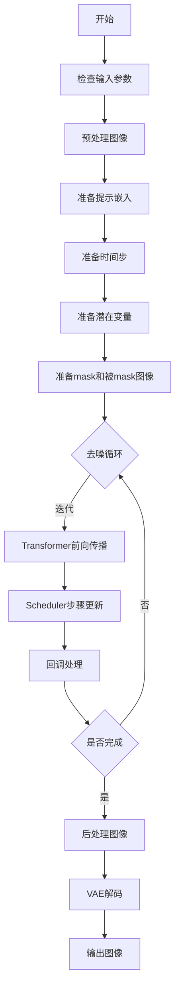

## 类结构

```
DiffusionPipeline (基类)
├── FluxLoraLoaderMixin (LoRA加载)
├── FromSingleFileMixin (单文件加载)
├── TextualInversionLoaderMixin (文本反转)
└── FluxFillPipeline (主类)
```

## 全局变量及字段


### `XLA_AVAILABLE`
    
Boolean flag indicating whether torch_xla is available for XLA acceleration

类型：`bool`
    


### `logger`
    
Logger instance for the module to track runtime information and warnings

类型：`logging.Logger`
    


### `EXAMPLE_DOC_STRING`
    
Documentation string containing example usage code for the FluxFillPipeline

类型：`str`
    


### `FluxFillPipeline.scheduler`
    
Scheduler for denoising encoded image latents in combination with the transformer model

类型：`FlowMatchEulerDiscreteScheduler`
    


### `FluxFillPipeline.vae`
    
Variational Auto-Encoder model for encoding images to and decoding latents from latent representations

类型：`AutoencoderKL`
    


### `FluxFillPipeline.text_encoder`
    
CLIP text encoder model for generating text embeddings from prompt inputs

类型：`CLIPTextModel`
    


### `FluxFillPipeline.text_encoder_2`
    
T5 text encoder model for generating longer sequence text embeddings

类型：`T5EncoderModel`
    


### `FluxFillPipeline.tokenizer`
    
CLIP tokenizer for converting text prompts to token indices

类型：`CLIPTokenizer`
    


### `FluxFillPipeline.tokenizer_2`
    
Fast T5 tokenizer for converting longer text prompts to token indices

类型：`T5TokenizerFast`
    


### `FluxFillPipeline.transformer`
    
Conditional transformer (MMDiT) architecture for denoising encoded image latents

类型：`FluxTransformer2DModel`
    


### `FluxFillPipeline.vae_scale_factor`
    
Scale factor derived from VAE block output channels for latent space computation

类型：`int`
    


### `FluxFillPipeline.latent_channels`
    
Number of latent channels from VAE configuration

类型：`int`
    


### `FluxFillPipeline.image_processor`
    
Image processor for preprocessing input images and postprocessing generated images

类型：`VaeImageProcessor`
    


### `FluxFillPipeline.mask_processor`
    
Mask processor for preprocessing mask images with binarization and normalization disabled

类型：`VaeImageProcessor`
    


### `FluxFillPipeline.tokenizer_max_length`
    
Maximum sequence length supported by the tokenizer

类型：`int`
    


### `FluxFillPipeline.default_sample_size`
    
Default sample size in pixels for height and width calculation (128)

类型：`int`
    
    

## 全局函数及方法


### calculate_shift

该函数实现基于图像序列长度的线性插值计算，用于计算 diffusion pipeline 中的 shift 参数。它根据图像序列长度在基础序列长度和最大序列长度之间的位置，通过线性插值在基础偏移量和最大偏移量之间计算当前图像序列长度对应的偏移值。

参数：

- `image_seq_len`：`int`，图像序列长度，表示图像在序列维度上的长度
- `base_seq_len`：`int`，基础序列长度，默认为 256，序列长度的基准值
- `max_seq_len`：`int`，最大序列长度，默认为 4096，序列长度的上限值
- `base_shift`：`float`，基础偏移量，默认为 0.5，对应 base_seq_len 时的偏移值
- `max_shift`：`float`，最大偏移量，默认为 1.15，对应 max_seq_len 时的偏移值

返回值：`float`，返回计算得到的偏移量 mu，用于 scheduler 的噪声调度

#### 流程图

```mermaid
flowchart TD
    A[开始 calculate_shift] --> B[计算斜率 m<br/>m = (max_shift - base_shift) / (max_seq_len - base_seq_len)]
    B --> C[计算截距 b<br/>b = base_shift - m * base_seq_len]
    C --> D[计算偏移量 mu<br/>mu = image_seq_len * m + b]
    D --> E[返回 mu]
    
    style A fill:#f9f,color:#333
    style E fill:#9f9,color:#333
```

#### 带注释源码

```python
# Copied from diffusers.pipelines.flux.pipeline_flux.calculate_shift
def calculate_shift(
    image_seq_len,          # 图像序列长度，用于计算对应的偏移量
    base_seq_len: int = 256,    # 基础序列长度，默认256
    max_seq_len: int = 4096,    # 最大序列长度，默认4096
    base_shift: float = 0.5,    # 基础偏移量，默认0.5
    max_shift: float = 1.15,    # 最大偏移量，默认1.15
):
    # 计算线性插值的斜率 m
    # 斜率表示每单位序列长度变化的偏移量变化
    m = (max_shift - base_shift) / (max_seq_len - base_seq_len)
    
    # 计算线性截距 b
    # 截距是当序列长度为0时的偏移量基值
    b = base_shift - m * base_seq_len
    
    # 根据图像序列长度计算最终的偏移量 mu
    # 使用线性方程 mu = mx + b 计算
    mu = image_seq_len * m + b
    
    # 返回计算得到的偏移量，用于调整噪声调度计划
    return mu
```


### `retrieve_timesteps`

该函数是一个全局工具函数，用于调用调度器（scheduler）的 `set_timesteps` 方法并从中获取时间步（timesteps）。它处理自定义时间步和自定义 sigmas，并返回时间步调度表和推理步数。

参数：

-  `scheduler`：`SchedulerMixin`，要获取时间步的调度器
-  `num_inference_steps`：`int | None`，使用预训练模型生成样本时的扩散步数，如果使用则 `timesteps` 必须为 `None`
-  `device`：`str | torch.device | None`，时间步要移动到的设备，如果为 `None` 则不移动
-  `timesteps`：`list[int] | None`，用于覆盖调度器时间步间隔策略的自定义时间步
-  `sigmas`：`list[float] | None`，用于覆盖调度器时间步间隔策略的自定义 sigmas
-  `**kwargs`：任意关键字参数，将传递给 `scheduler.set_timesteps`

返回值：`tuple[torch.Tensor, int]`，元组包含调度器的时间步调度表和推理步数

#### 流程图

```mermaid
flowchart TD
    A[开始: retrieve_timesteps] --> B{检查: timesteps 和 sigmas 是否同时存在?}
    B -->|是| C[抛出 ValueError: 只能指定一个]
    B -->|否| D{检查: timesteps 是否存在?}
    D -->|是| E[检查 scheduler.set_timesteps 是否接受 timesteps]
    E -->|不支持| F[抛出 ValueError: 不支持自定义 timesteps]
    E -->|支持| G[调用 scheduler.set_timesteps&#40;timesteps=timesteps, device=device, **kwargs&#41;]
    G --> H[获取 scheduler.timesteps]
    H --> I[计算 num_inference_steps = len&#40;timesteps&#41;]
    D -->|否| J{检查: sigmas 是否存在?}
    J -->|是| K[检查 scheduler.set_timesteps 是否接受 sigmas]
    K -->|不支持| L[抛出 ValueError: 不支持自定义 sigmas]
    K -->|支持| M[调用 scheduler.set_timesteps&#40;sigmas=sigmas, device=device, **kwargs&#41;]
    M --> N[获取 scheduler.timesteps]
    N --> O[计算 num_inference_steps = len&#40;timesteps&#41;]
    J -->|否| P[调用 scheduler.set_timesteps&#40;num_inference_steps, device=device, **kwargs&#41;]
    P --> Q[获取 scheduler.timesteps]
    Q --> R[返回 tuple&#40;timesteps, num_inference_steps&#41;]
    I --> R
    O --> R
```

#### 带注释源码

```python
def retrieve_timesteps(
    scheduler,
    num_inference_steps: int | None = None,
    device: str | torch.device | None = None,
    timesteps: list[int] | None = None,
    sigmas: list[float] | None = None,
    **kwargs,
):
    r"""
    Calls the scheduler's `set_timesteps` method and retrieves timesteps from the scheduler after the call. Handles
    custom timesteps. Any kwargs will be supplied to `scheduler.set_timesteps`.

    Args:
        scheduler (`SchedulerMixin`):
            The scheduler to get timesteps from.
        num_inference_steps (`int`):
            The number of diffusion steps used when generating samples with a pre-trained model. If used, `timesteps`
            must be `None`.
        device (`str` or `torch.device`, *optional*):
            The device to which the timesteps should be moved to. If `None`, the timesteps are not moved.
        timesteps (`list[int]`, *optional*):
            Custom timesteps used to override the timestep spacing strategy of the scheduler. If `timesteps` is passed,
            `num_inference_steps` and `sigmas` must be `None`.
        sigmas (`list[float]`, *optional*):
            Custom sigmas used to override the timestep spacing strategy of the scheduler. If `sigmas` is passed,
            `num_inference_steps` and `timesteps` must be `None`.

    Returns:
        `tuple[torch.Tensor, int]`: A tuple where the first element is the timestep schedule from the scheduler and the
        second element is the number of inference steps.
    """
    # 检查 timesteps 和 sigmas 不能同时指定，只能选择其中一种自定义方式
    if timesteps is not None and sigmas is not None:
        raise ValueError("Only one of `timesteps` or `sigmas` can be passed. Please choose one to set custom values")
    
    # 分支处理：优先处理自定义 timesteps
    if timesteps is not None:
        # 使用 inspect 检查 scheduler.set_timesteps 是否接受 timesteps 参数
        accepts_timesteps = "timesteps" in set(inspect.signature(scheduler.set_timesteps).parameters.keys())
        if not accepts_timesteps:
            raise ValueError(
                f"The current scheduler class {scheduler.__class__}'s `set_timesteps` does not support custom"
                f" timestep schedules. Please check whether you are using the correct scheduler."
            )
        # 调用 scheduler 的 set_timesteps 方法设置自定义 timesteps
        scheduler.set_timesteps(timesteps=timesteps, device=device, **kwargs)
        # 从 scheduler 获取更新后的 timesteps
        timesteps = scheduler.timesteps
        # 计算推理步数
        num_inference_steps = len(timesteps)
    # 分支处理：处理自定义 sigmas
    elif sigmas is not None:
        # 使用 inspect 检查 scheduler.set_timesteps 是否接受 sigmas 参数
        accept_sigmas = "sigmas" in set(inspect.signature(scheduler.set_timesteps).parameters.keys())
        if not accept_sigmas:
            raise ValueError(
                f"The current scheduler class {scheduler.__class__}'s `set_timesteps` does not support custom"
                f" sigmas schedules. Please check whether you are using the correct scheduler."
            )
        # 调用 scheduler 的 set_timesteps 方法设置自定义 sigmas
        scheduler.set_timesteps(sigmas=sigmas, device=device, **kwargs)
        # 从 scheduler 获取更新后的 timesteps
        timesteps = scheduler.timesteps
        # 计算推理步数
        num_inference_steps = len(timesteps)
    # 默认处理：使用 num_inference_steps 设置 timesteps
    else:
        scheduler.set_timesteps(num_inference_steps, device=device, **kwargs)
        timesteps = scheduler.timesteps
    
    # 返回 timesteps 列表和推理步数
    return timesteps, num_inference_steps
```


### `retrieve_latents`

该函数是一个全局工具函数，用于从编码器输出（encoder_output）中提取潜在的表示（latents）。它支持从 VAE 编码器的潜在分布中采样（sample）或取mode（argmax），也可以直接返回预计算的 latents。这是扩散模型pipeline中的常用工具函数，用于在图像编码过程中获取潜在向量。

参数：

- `encoder_output`：`torch.Tensor`，编码器输出对象，通常是 VAE 编码后的输出，包含 `latent_dist` 属性（潜在分布）或 `latents` 属性（直接编码的潜在向量）
- `generator`：`torch.Generator | None`，可选的随机数生成器，用于确保采样过程的可重复性，当使用 `sample_mode="sample"` 时生效
- `sample_mode`：`str`，采样模式，默认为 `"sample"`，可选值为 `"sample"`（从潜在分布中采样）或 `"argmax"`（取潜在分布的众数）

返回值：`torch.Tensor`，从编码器输出中提取的潜在表示向量

#### 流程图

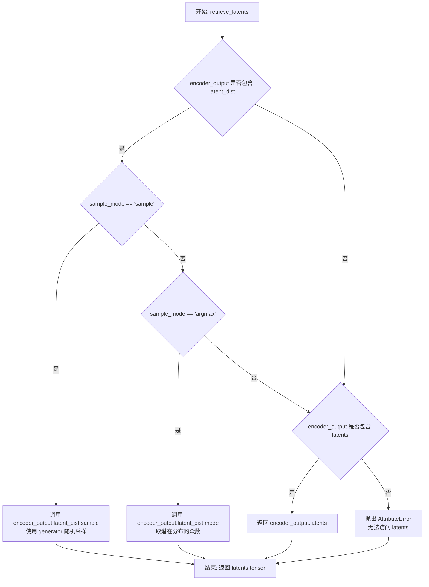

#### 带注释源码

```python
# Copied from diffusers.pipelines.stable_diffusion.pipeline_stable_diffusion_img2img.retrieve_latents
def retrieve_latents(
    encoder_output: torch.Tensor, generator: torch.Generator | None = None, sample_mode: str = "sample"
):
    """
    从编码器输出中提取潜在表示（latents）。

    该函数支持三种方式获取latents：
    1. 从潜在分布（latent_dist）中随机采样
    2. 从潜在分布（latent_dist）中取众数（argmax）
    3. 直接返回预计算的 latents 属性

    Args:
        encoder_output: 编码器输出对象，通常是 VAE 编码后的输出
        generator: 可选的随机数生成器，用于采样时的随机性控制
        sample_mode: 采样模式，"sample" 表示采样，"argmax" 表示取众数

    Returns:
        torch.Tensor: 提取的潜在表示向量
    """
    # 检查编码器输出是否包含 latent_dist 属性，并且采样模式为 sample
    if hasattr(encoder_output, "latent_dist") and sample_mode == "sample":
        # 从潜在分布中随机采样，可使用 generator 控制随机性
        return encoder_output.latent_dist.sample(generator)
    # 检查编码器输出是否包含 latent_dist 属性，并且采样模式为 argmax
    elif hasattr(encoder_output, "latent_dist") and sample_mode == "argmax":
        # 从潜在分布中取众数（最可能的值）
        return encoder_output.latent_dist.mode()
    # 检查编码器输出是否直接包含 latents 属性
    elif hasattr(encoder_output, "latents"):
        # 直接返回预计算的 latents
        return encoder_output.latents
    else:
        # 如果无法通过任何方式获取 latents，抛出属性错误
        raise AttributeError("Could not access latents of provided encoder_output")
```


### `FluxFillPipeline.__init__`

该方法是 FluxFillPipeline 类的构造函数，负责初始化图像修复管道所需的所有核心组件，包括调度器、VAE、文本编码器、分词器和 Transformer 模型，并配置图像处理器和潜在变量相关的参数。

参数：

- `scheduler`：`FlowMatchEulerDiscreteScheduler`，用于去噪过程的调度器
- `vae`：`AutoencoderKL`，变分自编码器，用于编码和解码图像与潜在表示
- `text_encoder`：`CLIPTextModel`，CLIP 文本编码器，用于生成文本嵌入
- `tokenizer`：`CLIPTokenizer`，CLIP 分词器
- `text_encoder_2`：`T5EncoderModel`，T5 文本编码器，用于生成长文本嵌入
- `tokenizer_2`：`T5TokenizerFast`，T5 分词器
- `transformer`：`FluxTransformer2DModel`，条件 Transformer (MMDiT) 架构，用于去噪编码后的图像潜在表示

返回值：`None`，构造函数不返回任何值

#### 流程图

```mermaid
flowchart TD
    A[开始 __init__] --> B[调用 super().__init__]
    B --> C[register_modules: 注册所有模块]
    C --> D[计算 vae_scale_factor]
    D --> E[获取 latent_channels]
    E --> F[创建 VaeImageProcessor 用于图像处理]
    F --> G[创建 VaeImageProcessor 用于掩码处理]
    G --> H[设置 tokenizer_max_length]
    H --> I[设置 default_sample_size]
    I --> J[结束 __init__]
```

#### 带注释源码

```python
def __init__(
    self,
    scheduler: FlowMatchEulerDiscreteScheduler,
    vae: AutoencoderKL,
    text_encoder: CLIPTextModel,
    tokenizer: CLIPTokenizer,
    text_encoder_2: T5EncoderModel,
    tokenizer_2: T5TokenizerFast,
    transformer: FluxTransformer2DModel,
):
    """
    初始化 FluxFillPipeline 管道
    
    参数:
        scheduler: 用于去噪的调度器
        vae: 变分自编码器模型
        text_encoder: CLIP文本编码器
        tokenizer: CLIP分词器
        text_encoder_2: T5文本编码器
        tokenizer_2: T5分词器
        transformer: Flux变换器模型
    """
    # 调用父类 DiffusionPipeline 的初始化方法
    super().__init__()

    # 将所有模块注册到管道中，以便统一管理和访问
    self.register_modules(
        vae=vae,
        text_encoder=text_encoder,
        text_encoder_2=text_encoder_2,
        tokenizer=tokenizer,
        tokenizer_2=tokenizer_2,
        transformer=transformer,
        scheduler=scheduler,
    )
    
    # 计算 VAE 缩放因子
    # 基于 VAE 块输出通道数的深度计算 (2^(depth-1))
    # 如果 VAE 存在则使用其配置，否则默认为 8
    self.vae_scale_factor = 2 ** (len(self.vae.config.block_out_channels) - 1) if getattr(self, "vae", None) else 8
    
    # Flux 潜在变量被转换为 2x2 补丁并打包
    # 这意味着潜在宽度和高度必须能被补丁大小整除
    # 因此 vae_scale_factor 乘以补丁大小来考虑这一点
    
    # 获取 VAE 的潜在通道数，用于后续潜在变量的处理
    self.latent_channels = self.vae.config.latent_channels if getattr(self, "vae", None) else 16
    
    # 创建图像处理器，用于预处理输入图像和后处理输出图像
    # vae_scale_factor * 2 是因为 Flux 使用了 2x2 的打包方式
    self.image_processor = VaeImageProcessor(
        vae_scale_factor=self.vae_scale_factor * 2, vae_latent_channels=self.latent_channels
    )
    
    # 创建掩码专用处理器
    # do_normalize=False: 掩码不需要归一化
    # do_binarize=True: 将掩码二值化
    # do_convert_grayscale=True: 转换为灰度图
    self.mask_processor = VaeImageProcessor(
        vae_scale_factor=self.vae_scale_factor * 2,
        vae_latent_channels=self.latent_channels,
        do_normalize=False,
        do_binarize=True,
        do_convert_grayscale=True,
    )
    
    # 设置分词器的最大长度，用于文本嵌入处理
    # 默认为 77 (CLIP 的标准最大长度)
    self.tokenizer_max_length = (
        self.tokenizer.model_max_length if hasattr(self, "tokenizer") and self.tokenizer is not None else 77
    )
    
    # 默认采样大小，用于生成图像的基准尺寸
    self.default_sample_size = 128
```


### `FluxFillPipeline._get_t5_prompt_embeds`

该方法用于获取 T5 文本编码器生成的提示词嵌入（prompt embeddings）。它接收提示词文本，通过 T5 分词器进行分词，然后使用 T5 编码器模型将文本转换为高维向量表示，最后根据 `num_images_per_prompt` 参数对嵌入进行复制以支持批量生成多个图像。

**参数：**

- `prompt`：`str | list[str]`，待编码的提示词文本，支持单个字符串或字符串列表
- `num_images_per_prompt`：`int`，每个提示词需要生成的图像数量，默认为 1
- `max_sequence_length`：`int`，提示词的最大序列长度，默认为 512
- `device`：`torch.device | None`，指定计算设备，若为 None 则使用执行设备
- `dtype`：`torch.dtype | None`，指定数据类型，若为 None 则使用文本编码器的数据类型

**返回值：** `torch.Tensor`，返回形状为 `(batch_size * num_images_per_prompt, seq_len, hidden_dim)` 的提示词嵌入张量

#### 流程图

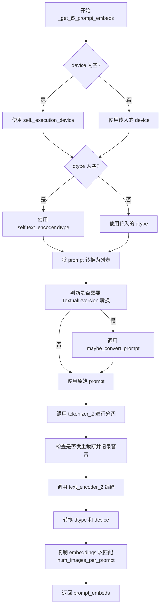

#### 带注释源码

```python
def _get_t5_prompt_embeds(
    self,
    prompt: str | list[str] = None,
    num_images_per_prompt: int = 1,
    max_sequence_length: int = 512,
    device: torch.device | None = None,
    dtype: torch.dtype | None = None,
):
    """
    获取 T5 编码器生成的提示词嵌入。

    参数:
        prompt: 待编码的提示词，支持字符串或字符串列表
        num_images_per_prompt: 每个提示词生成的图像数量
        max_sequence_length: 最大序列长度
        device: 计算设备
        dtype: 数据类型

    返回:
        编码后的提示词嵌入张量
    """
    # 确定设备：优先使用传入的 device，否则使用执行设备
    device = device or self._execution_device
    # 确定数据类型：优先使用传入的 dtype，否则使用文本编码器的 dtype
    dtype = dtype or self.text_encoder.dtype

    # 将 prompt 统一转换为列表格式，便于批量处理
    prompt = [prompt] if isinstance(prompt, str) else prompt
    # 获取批大小
    batch_size = len(prompt)

    # 如果支持 TextualInversion，进行提示词转换
    if isinstance(self, TextualInversionLoaderMixin):
        prompt = self.maybe_convert_prompt(prompt, self.tokenizer_2)

    # 使用 T5 分词器对提示词进行分词
    text_inputs = self.tokenizer_2(
        prompt,
        padding="max_length",              # 填充到最大长度
        max_length=max_sequence_length,   # 最大序列长度
        truncation=True,                  # 启用截断
        return_length=False,              # 不返回长度信息
        return_overflowing_tokens=False,  # 不返回溢出 token
        return_tensors="pt",              # 返回 PyTorch 张量
    )
    # 获取输入 IDs
    text_input_ids = text_inputs.input_ids
    # 使用更长填充方式获取未截断的 IDs，用于检测截断
    untruncated_ids = self.tokenizer_2(prompt, padding="longest", return_tensors="pt").input_ids

    # 检测是否发生了截断，如果是则记录警告
    if untruncated_ids.shape[-1] >= text_input_ids.shape[-1] and not torch.equal(text_input_ids, untruncated_ids):
        removed_text = self.tokenizer_2.batch_decode(untruncated_ids[:, self.tokenizer_max_length - 1 : -1])
        logger.warning(
            "The following part of your input was truncated because `max_sequence_length` is set to "
            f" {max_sequence_length} tokens: {removed_text}"
        )

    # 使用 T5 编码器获取文本嵌入
    prompt_embeds = self.text_encoder_2(text_input_ids.to(device), output_hidden_states=False)[0]

    # 获取编码器的数据类型并转换嵌入
    dtype = self.text_encoder_2.dtype
    prompt_embeds = prompt_embeds.to(dtype=dtype, device=device)

    # 获取序列长度
    _, seq_len, _ = prompt_embeds.shape

    # 为每个提示词生成多个图像复制对应的嵌入
    # 使用 MPS 兼容的方式复制
    prompt_embeds = prompt_embeds.repeat(1, num_images_per_prompt, 1)
    prompt_embeds = prompt_embeds.view(batch_size * num_images_per_prompt, seq_len, -1)

    return prompt_embeds
```


### `FluxFillPipeline._get_clip_prompt_embeds`

该方法用于将文本提示（prompt）编码为CLIP模型的嵌入向量（embeddings），以便在图像生成过程中为模型提供文本条件信息。该方法是FluxFillPipeline中处理文本提示的关键组成部分，通过CLIP文本编码器将文字转换为模型可理解的向量表示，并支持批量生成和文本反转（TextualInversion）功能。

参数：

- `prompt`：`str | list[str]`，要编码的文本提示，可以是单个字符串或字符串列表
- `num_images_per_prompt`：`int`，每个提示词生成的图像数量，默认为1
- `device`：`torch.device | None`，指定计算设备，默认为当前执行设备

返回值：`torch.FloatTensor`，返回CLIP文本编码器的pooled输出，形状为`(batch_size * num_images_per_prompt, hidden_size)`的二维张量

#### 流程图

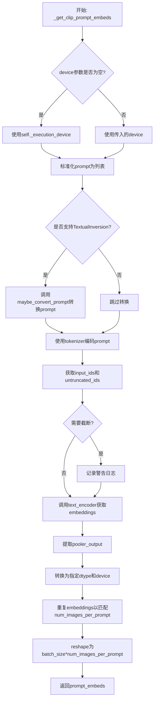

#### 带注释源码

```
def _get_clip_prompt_embeds(
    self,
    prompt: str | list[str],           # 输入的文本提示，可以是单个字符串或列表
    num_images_per_prompt: int = 1,   # 每个prompt生成的图像数量
    device: torch.device | None = None, # 计算设备，默认为None
):
    # 1. 确定设备：如果未指定，则使用pipeline的默认执行设备
    device = device or self._execution_device

    # 2. 标准化prompt格式：如果是单个字符串，转换为列表
    prompt = [prompt] if isinstance(prompt, str) else prompt
    batch_size = len(prompt)  # 获取批次大小

    # 3. TextualInversion处理：如果支持TextualInversion，转换prompt
    # 这允许使用自定义的文本反转嵌入
    if isinstance(self, TextualInversionLoaderMixin):
        prompt = self.maybe_convert_prompt(prompt, self.tokenizer)

    # 4. 使用CLIP Tokenizer进行分词
    # padding="max_length": 填充到最大长度
    # max_length: 使用pipeline定义的最大长度（默认为77）
    # truncation=True: 超过最大长度的内容将被截断
    text_inputs = self.tokenizer(
        prompt,
        padding="max_length",
        max_length=self.tokenizer_max_length,
        truncation=True,
        return_overflowing_tokens=False,
        return_length=False,
        return_tensors="pt",
    )

    # 5. 获取编码后的input_ids
    text_input_ids = text_inputs.input_ids
    
    # 6. 进行额外的检查：使用最长填充方式获取未截断的ids
    # 用于检测是否发生了截断
    untruncated_ids = self.tokenizer(prompt, padding="longest", return_tensors="pt").input_ids
    
    # 7. 检测并警告截断：如果发生了截断，记录警告信息
    if untruncated_ids.shape[-1] >= text_input_ids.shape[-1] and not torch.equal(text_input_ids, untruncated_ids):
        removed_text = self.tokenizer.batch_decode(untruncated_ids[:, self.tokenizer_max_length - 1 : -1])
        logger.warning(
            "The following part of your input was truncated because CLIP can only handle sequences up to"
            f" {self.tokenizer_max_length} tokens: {removed_text}"
        )

    # 8. 使用CLIP Text Encoder获取文本嵌入
    # output_hidden_states=False: 只获取pooled输出，不获取所有隐藏状态
    prompt_embeds = self.text_encoder(text_input_ids.to(device), output_hidden_states=False)

    # 9. 提取pooled输出
    # CLIPTextModel的pooled_output是整个序列的聚合表示
    prompt_embeds = prompt_embeds.pooler_output
    
    # 10. 转换dtype和device以匹配text_encoder的配置
    prompt_embeds = prompt_embeds.to(dtype=self.text_encoder.dtype, device=device)

    # 11. 为每个prompt复制多个embeddings以支持num_images_per_prompt
    # 这允许一次生成多张图像而不需要重复编码
    # repeat(1, num_images_per_prompt) 在序列维度复制
    prompt_embeds = prompt_embeds.repeat(1, num_images_per_prompt)
    
    # 12. Reshape为最终的批次维度
    # 从 (1, hidden_size) 变为 (batch_size * num_images_per_prompt, hidden_size)
    prompt_embeds = prompt_embeds.view(batch_size * num_images_per_prompt, -1)

    # 13. 返回编码后的embeddings
    return prompt_embeds
```


### `FluxFillPipeline.prepare_mask_latents`

该方法负责准备掩码和掩码图像的潜在表示，包括编码掩码图像、调整掩码尺寸以匹配潜在空间、以及对掩码和掩码图像潜在表示进行批次复制以适应批量生成。

参数：

- `self`：`FluxFillPipeline` 实例，方法所属的管道对象
- `mask`：`torch.Tensor`，输入的掩码图像张量，用于指示需要修复的区域
- `masked_image`：`torch.Tensor`，被掩码覆盖的图像张量，即原始图像中掩码区域被抹去后的结果
- `batch_size`：`int`，批次大小，表示一次处理多少个样本
- `num_channels_latents`：`int`，潜在空间的通道数，通常由 VAE 配置决定
- `num_images_per_prompt`：`int`，每个提示词生成的图像数量
- `height`：`int`，目标图像的高度（像素单位）
- `width`：`int`，目标图像的宽度（像素单位）
- `dtype`：`torch.dtype`，目标数据类型，用于张量转换
- `device`：`torch.device`，计算设备（CPU 或 CUDA）
- `generator`：`torch.Generator | None`，可选的随机数生成器，用于确保可重复性

返回值：`tuple[torch.Tensor, torch.Tensor]`，返回处理后的掩码张量和掩码图像潜在表示张量组成的元组

#### 流程图

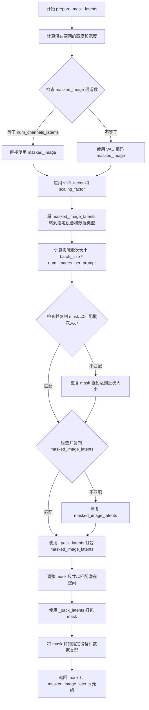

#### 带注释源码

```python
def prepare_mask_latents(
    self,
    mask,
    masked_image,
    batch_size,
    num_channels_latents,
    num_images_per_prompt,
    height,
    width,
    dtype,
    device,
    generator,
):
    # 1. 计算潜在空间的高度和宽度
    # VAE 对图像应用 8x 压缩，但我们还必须考虑打包操作，这要求潜在空间的高度和宽度可被 2 整除
    height = 2 * (int(height) // (self.vae_scale_factor * 2))
    width = 2 * (int(width) // (self.vae_scale_factor * 2))

    # 2. 编码被掩码覆盖的图像
    # 如果 masked_image 的通道数已经等于潜在通道数，直接使用；否则通过 VAE 编码
    if masked_image.shape[1] == num_channels_latents:
        masked_image_latents = masked_image
    else:
        masked_image_latents = retrieve_latents(self.vae.encode(masked_image), generator=generator)

    # 应用 VAE 的缩放因子和偏移量，将潜在表示转换到正确的数值范围
    masked_image_latents = (masked_image_latents - self.vae.config.shift_factor) * self.vae.config.scaling_factor
    masked_image_latents = masked_image_latents.to(device=device, dtype=dtype)

    # 3. 为每个提示生成的图像数量复制掩码和掩码图像潜在表示
    # 使用与 mps 兼容的方法进行复制
    batch_size = batch_size * num_images_per_prompt
    
    # 处理掩码的批次复制
    if mask.shape[0] < batch_size:
        if not batch_size % mask.shape[0] == 0:
            raise ValueError(
                "The passed mask and the required batch size don't match. Masks are supposed to be duplicated to"
                f" a total batch size of {batch_size}, but {mask.shape[0]} masks were passed. Make sure the number"
                " of masks that you pass is divisible by the total requested batch size."
            )
        mask = mask.repeat(batch_size // mask.shape[0], 1, 1, 1)
    
    # 处理掩码图像潜在表示的批次复制
    if masked_image_latents.shape[0] < batch_size:
        if not batch_size % masked_image_latents.shape[0] == 0:
            raise ValueError(
                "The passed images and the required batch size don't match. Images are supposed to be duplicated"
                f" to a total batch size of {batch_size}, but {masked_image_latents.shape[0]} images were passed."
                " Make sure the number of images that you pass is divisible by the total requested batch size."
            )
        masked_image_latents = masked_image_latents.repeat(batch_size // masked_image_latents.shape[0], 1, 1, 1)

    # 4. 打包掩码图像潜在表示
    # 将 (batch_size, num_channels_latents, height, width) 转换为 (batch_size, height//2 * width//2, num_channels_latents*4)
    masked_image_latents = self._pack_latents(
        masked_image_latents,
        batch_size,
        num_channels_latents,
        height,
        width,
    )

    # 5. 调整掩码尺寸以匹配潜在空间，以便我们可以将掩码连接到潜在表示
    # 掩码尚未经过 8x 压缩，所以 shape 为 (batch_size, 8*height, 8*width)
    mask = mask[:, 0, :, :]  # 提取单通道掩码
    # 重塑为 (batch_size, height, 8, width, 8) 以便进行空间插值
    mask = mask.view(
        batch_size, height, self.vae_scale_factor, width, self.vae_scale_factor
    )
    # 置换维度以进行后续 reshape
    mask = mask.permute(0, 2, 4, 1, 3)  # (batch_size, 8, 8, height, width)
    # 重新整形为 (batch_size, 8*8, height, width)
    mask = mask.reshape(
        batch_size, self.vae_scale_factor * self.vae_scale_factor, height, width
    )

    # 6. 打包掩码
    # 将 (batch_size, 64, height, width) 转换为 (batch_size, height//2 * width//2, 64*2*2)
    mask = self._pack_latents(
        mask,
        batch_size,
        self.vae_scale_factor * self.vae_scale_factor,
        height,
        width,
    )
    mask = mask.to(device=device, dtype=dtype)

    return mask, masked_image_latents
```


### `FluxFillPipeline.encode_prompt`

该方法用于将文本提示编码为文本嵌入（text embeddings），支持 CLIP 和 T5 两种文本编码器，用于 Flux 模型的文本条件生成。它可以处理 LoRA 缩放，并返回提示嵌入、池化提示嵌入和文本标识符。

参数：

- `prompt`：`str | list[str]`，主要文本提示，用于 CLIP 编码器
- `prompt_2`：`str | list[str] | None`，发送给 T5 编码器的文本提示，若未定义则使用 `prompt`
- `device`：`torch.device | None`，torch 设备，若未提供则使用执行设备
- `num_images_per_prompt`：`int`，每个提示生成的图像数量，默认为 1
- `prompt_embeds`：`torch.FloatTensor | None`，预生成的文本嵌入，若提供则直接使用
- `pooled_prompt_embeds`：`torch.FloatTensor | None`，预生成的池化文本嵌入
- `max_sequence_length`：`int`，最大序列长度，默认为 512
- `lora_scale`：`float | None`，LoRA 缩放因子，用于调整 LoRA 层的权重

返回值：`tuple[torch.FloatTensor, torch.FloatTensor, torch.FloatTensor]`，包含三个元素：
- `prompt_embeds`：T5 编码器生成的文本嵌入
- `pooled_prompt_embeds`：CLIP 编码器生成的池化文本嵌入
- `text_ids`：文本标识符张量，用于后续处理

#### 流程图

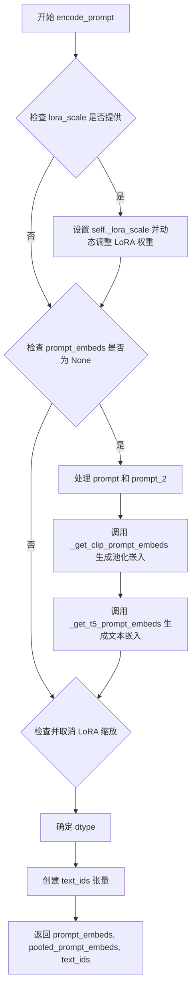

#### 带注释源码

```python
def encode_prompt(
    self,
    prompt: str | list[str],
    prompt_2: str | list[str] | None = None,
    device: torch.device | None = None,
    num_images_per_prompt: int = 1,
    prompt_embeds: torch.FloatTensor | None = None,
    pooled_prompt_embeds: torch.FloatTensor | None = None,
    max_sequence_length: int = 512,
    lora_scale: float | None = None,
):
    """
    编码文本提示为文本嵌入，支持 CLIP 和 T5 两种文本编码器。
    
    参数:
        prompt: 主要文本提示
        prompt_2: T5 编码器使用的文本提示
        device: torch 设备
        num_images_per_prompt: 每个提示生成的图像数量
        prompt_embeds: 预生成的文本嵌入
        pooled_prompt_embeds: 预生成的池化文本嵌入
        max_sequence_length: 最大序列长度
        lora_scale: LoRA 缩放因子
    """
    # 确定设备，默认为执行设备
    device = device or self._execution_device

    # 设置 LoRA 缩放因子，以便文本编码器的 LoRA 函数正确访问
    if lora_scale is not None and isinstance(self, FluxLoraLoaderMixin):
        self._lora_scale = lora_scale

        # 动态调整 LoRA 缩放
        if self.text_encoder is not None and USE_PEFT_BACKEND:
            scale_lora_layers(self.text_encoder, lora_scale)
        if self.text_encoder_2 is not None and USE_PEFT_BACKEND:
            scale_lora_layers(self.text_encoder_2, lora_scale)

    # 将 prompt 转换为列表以便批量处理
    prompt = [prompt] if isinstance(prompt, str) else prompt

    # 如果没有提供预生成的嵌入，则从输入生成
    if prompt_embeds is None:
        # prompt_2 默认为 prompt
        prompt_2 = prompt_2 or prompt
        prompt_2 = [prompt_2] if isinstance(prompt_2, str) else prompt_2

        # 使用 CLIP 文本编码器生成池化提示嵌入
        pooled_prompt_embeds = self._get_clip_prompt_embeds(
            prompt=prompt,
            device=device,
            num_images_per_prompt=num_images_per_prompt,
        )
        # 使用 T5 文本编码器生成提示嵌入
        prompt_embeds = self._get_t5_prompt_embeds(
            prompt=prompt_2,
            num_images_per_prompt=num_images_per_prompt,
            max_sequence_length=max_sequence_length,
            device=device,
        )

    # 如果文本编码器存在，恢复 LoRA 层到原始缩放
    if self.text_encoder is not None:
        if isinstance(self, FluxLoraLoaderMixin) and USE_PEFT_BACKEND:
            # 通过反向缩放 LoRA 层检索原始缩放
            unscale_lora_layers(self.text_encoder, lora_scale)

    if self.text_encoder_2 is not None:
        if isinstance(self, FluxLoraLoaderMixin) and USE_PEFT_BACKEND:
            # 通过反向缩放 LoRA 层检索原始缩放
            unscale_lora_layers(self.text_encoder_2, lora_scale)

    # 确定数据类型，优先使用 text_encoder 的 dtype
    dtype = self.text_encoder.dtype if self.text_encoder is not None else self.transformer.dtype
    
    # 创建文本标识符张量，用于后续处理
    text_ids = torch.zeros(prompt_embeds.shape[1], 3).to(device=device, dtype=dtype)

    return prompt_embeds, pooled_prompt_embeds, text_ids
```


### `FluxFillPipeline._encode_vae_image`

该方法负责将输入的图像张量通过VAE编码器转换为潜在表示（latent representation），并根据VAE配置应用缩放因子（scaling_factor）和偏移因子（shift_factor）进行归一化处理。

参数：

- `image`：`torch.Tensor`，待编码的图像张量，通常是经过预处理的图像数据
- `generator`：`torch.Generator`，PyTorch随机数生成器，用于确保VAE编码过程的可重复性。当为列表时，需与图像批次中的每个图像一一对应

返回值：`torch.Tensor`，编码并归一化后的图像潜在表示，形状为 `(batch_size, latent_channels, latent_height, latent_width)`

#### 流程图

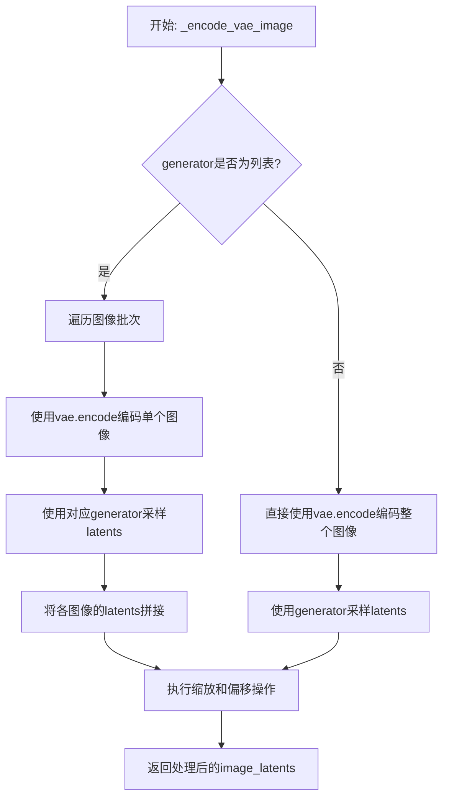

#### 带注释源码

```python
def _encode_vae_image(self, image: torch.Tensor, generator: torch.Generator):
    # 判断generator是否为列表（即是否为每个图像提供独立的随机生成器）
    if isinstance(generator, list):
        # 遍历图像批次中的每一张图像
        image_latents = [
            # 对单张图像进行VAE编码，并使用对应的generator采样潜在表示
            retrieve_latents(self.vae.encode(image[i : i + 1]), generator=generator[i])
            for i in range(image.shape[0])
        ]
        # 将列表中的所有潜在表示沿批次维度拼接
        image_latents = torch.cat(image_latents, dim=0)
    else:
        # 使用单个generator对整个图像批次进行编码和采样
        image_latents = retrieve_latents(self.vae.encode(image), generator=generator)

    # 应用VAE的缩放因子和偏移因子进行归一化处理
    # 这确保了潜在表示的分布与训练时一致
    image_latents = (image_latents - self.vae.config.shift_factor) * self.vae.config.scaling_factor

    # 返回处理后的潜在表示
    return image_latents
```


### `FluxFillPipeline.get_timesteps`

根据推理步数（num_inference_steps）和强度（strength）调整调度器（scheduler）的时间步（timesteps），用于控制图像修复（inpainting）或图像生成过程中噪声的混合程度。此方法通过跳过部分时间步来实现对原始图像信息的保留。

参数：

- `num_inference_steps`：`int`，总的推理步数，即去噪过程的迭代次数。
- `strength`：`float`，强度系数，取值范围 [0.0, 1.0]，用于控制加入噪声的比例。值为 1.0 时完全不保留原图信息（对应图像生成），值为 0.0 时完全保留原图（通常无意义，代码中会限制最小为1步）。
- `device`：`torch.device`，用于设置调度器起始索引的设备。

返回值：

- `timesteps`：`torch.Tensor`，调整后的时间步张量。
- `new_num_inference_steps`：`int`，实际执行的去噪步数。

#### 流程图

```mermaid
graph TD
    A[开始] --> B[计算 init_timestep = min(num_inference_steps * strength, num_inference_steps)]
    B --> C[计算 t_start = max(num_inference_steps - init_timestep, 0)]
    C --> D[从 Scheduler 获取 timesteps[order * t_start:]]
    D --> E{检查 Scheduler 是否有 set_begin_index}
    E -- 是 --> F[调用 scheduler.set_begin_index(order * t_start)]
    E -- 否 --> G[跳过设置]
    F --> G
    G --> H[返回 timesteps 和 new_num_inference_steps]
```

#### 带注释源码

```python
def get_timesteps(self, num_inference_steps, strength, device):
    # 1. 计算初始时间步 (init_timestep)
    # 根据 strength 计算需要添加的噪声程度对应的步数。
    # 如果 strength 为 1.0，则 init_timestep 等于 num_inference_steps，意味着完全重绘。
    # 如果 strength 小于 1.0，则保留部分原图信息，只进行部分步数的去噪。
    init_timestep = min(num_inference_steps * strength, num_inference_steps)

    # 2. 计算起始索引 (t_start)
    # 确定从时间步列表的哪个位置开始执行去噪。
    # 例如：总共 50 步，strength 为 0.5 (即保留 50% 噪声)，则 init_timestep 为 25。
    # t_start 设为 50 - 25 = 25，意味着跳过前 25 个时间步，直接从中间开始。
    t_start = int(max(num_inference_steps - init_timestep, 0))

    # 3. 切片获取调整后的时间步
    # 从 scheduler 的完整时间步列表中，提取从 t_start 开始的后半部分。
    # self.scheduler.order 通常为 1 或 2，对应调度器的阶数。
    timesteps = self.scheduler.timesteps[t_start * self.scheduler.order :]

    # 4. 设置调度器的起始索引
    # 某些调度器（如 DPMSolver）需要知道从哪一步开始，以便正确计算。
    if hasattr(self.scheduler, "set_begin_index"):
        self.scheduler.set_begin_index(t_start * self.scheduler.order)

    # 5. 返回新的时间步和步数
    # 剩余的步数即为 new_num_inference_steps。
    return timesteps, num_inference_steps - t_start
```


### `FluxFillPipeline.check_inputs`

该方法用于验证 FluxFillPipeline 调用时传入的各项参数是否合法，确保满足 pipeline 的输入约束条件。它会在实际推理之前被调用，以提前捕获潜在的输入错误并给出明确的错误提示。

参数：

- `prompt`：`str | list[str] | None`，主提示词，用于指导图像生成
- `prompt_2`：`str | list[str] | None`，发送给 T5 文本编码器的提示词，若未指定则使用 `prompt`
- `strength`：`float`，图像变换强度，值必须在 [0.0, 1.0] 范围内
- `height`：`int`，生成图像的高度（像素）
- `width`：`int`，生成图像的宽度（像素）
- `prompt_embeds`：`torch.FloatTensor | None`，预生成的文本嵌入向量
- `pooled_prompt_embeds`：`torch.FloatTensor | None`，预生成的池化文本嵌入
- `callback_on_step_end_tensor_inputs`：`list[str] | None`，在推理步骤结束时要传递的张量输入列表
- `max_sequence_length`：`int | None`，T5 编码器的最大序列长度，不能超过 512
- `image`：`torch.Tensor | PIL.Image.Image | np.ndarray | list | None`，用作起点的输入图像
- `mask_image`：`torch.Tensor | PIL.Image.Image | np.ndarray | list | None`，用于遮罩的图像，白色像素将被重绘
- `masked_image_latents`：`torch.FloatTensor | None`，由 VAE 生成的遮罩图像潜在表示

返回值：`None`，该方法不返回任何值，仅通过抛出 ValueError 来表示验证失败

#### 流程图

```mermaid
flowchart TD
    A[开始 check_inputs 验证] --> B{strength 在 [0, 1] 范围内?}
    B -- 否 --> B1[抛出 ValueError: strength 超出范围]
    B -- 是 --> C{height 和 width 可被 vae_scale_factor*2 整除?}
    C -- 否 --> C1[输出警告: 维度将被调整]
    C -- 是 --> D{callback_on_step_end_tensor_inputs 合法?}
    D -- 否 --> D1[抛出 ValueError: 包含非法张量输入]
    D -- 是 --> E{prompt 和 prompt_embeds 是否同时存在?}
    E -- 是 --> E1[抛出 ValueError: 不能同时指定]
    E -- 否 --> F{prompt_2 和 prompt_embeds 是否同时存在?}
    F -- 是 --> F1[抛出 ValueError: 不能同时指定]
    F -- 否 --> G{prompt 和 prompt_embeds 均为 None?}
    G -- 是 --> G1[抛出 ValueError: 至少需要提供一个]
    G -- 否 --> H{prompt 类型合法?}
    H -- 否 --> H1[抛出 ValueError: 类型错误]
    H -- 是 --> I{prompt_2 类型合法?}
    I -- 否 --> I1[抛出 ValueError: 类型错误]
    I -- 是 --> J{prompt_embeds 存在但 pooled_prompt_embeds 为 None?}
    J -- 是 --> J1[抛出 ValueError: 需要同时提供 pooled_prompt_embeds]
    J -- 否 --> K{max_sequence_length 超过 512?}
    K -- 是 --> K1[抛出 ValueError: 超过最大限制]
    K -- 否 --> L{image 和 masked_image_latents 同时存在?}
    L -- 是 --> L1[抛出 ValueError: 只能提供其中一个]
    L -- 否 --> M{image 存在但 mask_image 为 None?}
    M -- 是 --> M1[抛出 ValueError: 需要提供 mask_image]
    M -- 否 --> N[验证通过]
```

#### 带注释源码

```python
def check_inputs(
    self,
    prompt,                       # 主提示词
    prompt_2,                    # T5 文本编码器的提示词
    strength,                    # 图像变换强度 [0, 1]
    height,                      # 输出图像高度
    width,                       # 输出图像宽度
    prompt_embeds=None,          # 预计算的文本嵌入
    pooled_prompt_embeds=None,   # 预计算的池化嵌入
    callback_on_step_end_tensor_inputs=None,  # 回调张量输入列表
    max_sequence_length=None,   # T5 最大序列长度
    image=None,                  # 输入图像
    mask_image=None,             # 遮罩图像
    masked_image_latents=None,  # VAE 编码后的遮罩潜在表示
):
    # 1. 验证 strength 参数必须在 [0.0, 1.0] 范围内
    if strength < 0 or strength > 1:
        raise ValueError(f"The value of strength should in [0.0, 1.0] but is {strength}")

    # 2. 验证高度和宽度是否可以被 vae_scale_factor * 2 整除
    # Flux 的 VAE 应用 8x 压缩，同时需要考虑 packing 所需的 2 的倍数
    if height % (self.vae_scale_factor * 2) != 0 or width % (self.vae_scale_factor * 2) != 0:
        logger.warning(
            f"`height` and `width` have to be divisible by {self.vae_scale_factor * 2} but are {height} and {width}. Dimensions will be resized accordingly"
        )

    # 3. 验证回调函数张量输入是否在允许列表中
    if callback_on_step_end_tensor_inputs is not None and not all(
        k in self._callback_tensor_inputs for k in callback_on_step_end_tensor_inputs
    ):
        raise ValueError(
            f"`callback_on_step_end_tensor_inputs` has to be in {self._callback_tensor_inputs}, but found {[k for k in callback_on_step_end_tensor_inputs if k not in self._callback_tensor_inputs]}"
        )

    # 4. 验证 prompt 和 prompt_embeds 不能同时提供
    if prompt is not None and prompt_embeds is not None:
        raise ValueError(
            f"Cannot forward both `prompt`: {prompt} and `prompt_embeds`: {prompt_embeds}. Please make sure to"
            " only forward one of the two."
        )
    
    # 5. 验证 prompt_2 和 prompt_embeds 不能同时提供
    elif prompt_2 is not None and prompt_embeds is not None:
        raise ValueError(
            f"Cannot forward both `prompt_2`: {prompt_2} and `prompt_embeds`: {prompt_embeds}. Please make sure to"
            " only forward one of the two."
        )
    
    # 6. 验证 prompt 和 prompt_embeds 至少提供一个
    elif prompt is None and prompt_embeds is None:
        raise ValueError(
            "Provide either `prompt` or `prompt_embeds`. Cannot leave both `prompt` and `prompt_embeds` undefined."
        )
    
    # 7. 验证 prompt 类型必须是 str 或 list
    elif prompt is not None and (not isinstance(prompt, str) and not isinstance(prompt, list)):
        raise ValueError(f"`prompt` has to be of type `str` or `list` but is {type(prompt)}")
    
    # 8. 验证 prompt_2 类型必须是 str 或 list
    elif prompt_2 is not None and (not isinstance(prompt_2, str) and not isinstance(prompt_2, list)):
        raise ValueError(f"`prompt_2` has to be of type `str` or `list` but is {type(prompt_2)}")

    # 9. 验证如果提供了 prompt_embeds，则必须同时提供 pooled_prompt_embeds
    if prompt_embeds is not None and pooled_prompt_embeds is None:
        raise ValueError(
            "If `prompt_embeds` are provided, `pooled_prompt_embeds` also have to be passed. Make sure to generate `pooled_prompt_embeds` from the same text encoder that was used to generate `prompt_embeds`."
        )

    # 10. 验证 max_sequence_length 不能超过 512
    if max_sequence_length is not None and max_sequence_length > 512:
        raise ValueError(f"`max_sequence_length` cannot be greater than 512 but is {max_sequence_length}")

    # 11. 验证 image 和 masked_image_latents 不能同时提供
    if image is not None and masked_image_latents is not None:
        raise ValueError(
            "Please provide either  `image` or `masked_image_latents`, `masked_image_latents` should not be passed."
        )

    # 12. 验证如果提供了 image，则必须同时提供 mask_image
    if image is not None and mask_image is None:
        raise ValueError("Please provide `mask_image` when passing `image`.")
```


### `FluxFillPipeline._prepare_latent_image_ids`

该方法用于生成潜在图像的位置编码（positional encoding），通过创建包含行索引和列索引的张量来为Transformer模型提供空间位置信息。

参数：

- `batch_size`：`int`，未直接使用（但在调用处用于计算高度和宽度）
- `height`：`int`，潜在图像的高度（对应于打包后的空间维度）
- `width`：`int`，潜在图像的宽度（对应于打包后的空间维度）
- `device`：`torch.device | None`，目标设备，用于将结果张量移动到指定设备
- `dtype`：`torch.dtype | None`，目标数据类型，用于指定结果张量的数据类型

返回值：`torch.Tensor`，形状为 `(height * width, 3)` 的二维张量，每行包含 `[0, row_index, col_index]`，用于表示潜在图像中每个位置的空间坐标

#### 流程图

```mermaid
flowchart TD
    A[开始] --> B[创建零张量: shape (height, width, 3)]
    B --> C[填充行索引: latent_image_ids[..., 1] += torch.arange(height)[:, None]]
    C --> D[填充列索引: latent_image_ids[..., 2] += torch.arange(width)[None, :]]
    D --> E[获取张量形状: height, width, channels]
    E --> F[重塑张量: (height * width, 3)]
    F --> G[移动到目标设备并转换数据类型]
    G --> H[返回位置编码张量]
```

#### 带注释源码

```python
@staticmethod
# Copied from diffusers.pipelines.flux.pipeline_flux.FluxPipeline._prepare_latent_image_ids
def _prepare_latent_image_ids(batch_size, height, width, device, dtype):
    # 1. 创建一个形状为 (height, width, 3) 的零张量
    #    第三个维度用于存储: [0, row_index, col_index]
    latent_image_ids = torch.zeros(height, width, 3)
    
    # 2. 填充行索引到第二个通道 (index 1)
    #    torch.arange(height)[:, None] 产生形状 (height, 1)
    #    通过广播机制， latent_image_ids[..., 1] 的每一行都会被加上对应的行号
    latent_image_ids[..., 1] = latent_image_ids[..., 1] + torch.arange(height)[:, None]
    
    # 3. 填充列索引到第三个通道 (index 2)
    #    torch.arange(width)[None, :] 产生形状 (1, width)
    #    通过广播机制， latent_image_ids[..., 2] 的每一列都会被加上对应的列号
    latent_image_ids[..., 2] = latent_image_ids[..., 2] + torch.arange(width)[None, :]
    
    # 4. 获取重塑前的张量形状信息（虽然未直接使用，但保留了扩展性）
    latent_image_id_height, latent_image_id_width, latent_image_id_channels = latent_image_ids.shape
    
    # 5. 将 3D 张量重塑为 2D 张量
    #    从 (height, width, 3) 变为 (height * width, 3)
    #    每一行代表一个潜在像素位置，格式为 [0, row_index, col_index]
    latent_image_ids = latent_image_ids.reshape(
        latent_image_id_height * latent_image_id_width, latent_image_id_channels
    )
    
    # 6. 将结果张量移动到指定设备并转换数据类型后返回
    return latent_image_ids.to(device=device, dtype=dtype)
```


### `FluxFillPipeline._pack_latents`

该方法是一个静态工具函数，用于将 VAE 编码后的潜在变量张量进行"打包"（packing）操作。在 Flux 架构中，潜在变量被组织为 2x2 的块（patches），该方法将传统的 4D 张量 (batch, channels, height, width) 转换为更适合 Transformer 处理的 3D 张量 (batch, num_patches, packed_channels)，其中 num_patches = (height//2) * (width//2)，packed_channels = channels * 4。这种打包方式允许模型更高效地处理空间信息。

参数：

- `latents`：`torch.Tensor`，输入的潜在变量张量，形状为 (batch_size, num_channels_latents, height, width)
- `batch_size`：`int`，批次大小
- `num_channels_latents`：`int`，潜在变量的通道数
- `height`：`int`，潜在变量的高度
- `width`：`int`，潜在变量的宽度

返回值：`torch.Tensor`，打包后的潜在变量张量，形状为 (batch_size, (height//2) * (width//2), num_channels_latents * 4)

#### 流程图

```mermaid
flowchart TD
    A[开始: 输入 latents] --> B[使用 view 重塑张量]
    B --> C[形状: (batch_size, num_channels_latents, height//2, 2, width//2, 2)]
    C --> D[使用 permute 重新排列维度]
    D --> E[排列顺序: (0, 2, 4, 1, 3, 5)]
    E --> F[使用 reshape 合并维度]
    F --> G[形状: (batch_size, (height//2)*(width//2), num_channels_latents*4)]
    G --> H[返回打包后的张量]
```

#### 带注释源码

```python
@staticmethod
# Copied from diffusers.pipelines.flux.pipeline_flux.FluxPipeline._pack_latents
def _pack_latents(latents, batch_size, num_channels_latents, height, width):
    """
    将潜在变量张量打包成适合 Transformer 输入的格式。
    
    将 4D 张量 (batch, channels, H, W) 转换为 3D 张量 (batch, num_patches, packed_channels)
    其中 num_patches = (H//2) * (W//2), packed_channels = channels * 4
    
    这个打包过程将 2x2 的像素块合并为一个空间位置，大幅减少序列长度。
    """
    # Step 1: 使用 view 将张量重塑为 (batch, channels, height//2, 2, width//2, 2)
    # 将 height 和 width 维度各自分割为 (原大小//2) 和 2，实现 2x2 patch 划分
    latents = latents.view(batch_size, num_channels_latents, height // 2, 2, width // 2, 2)
    
    # Step 2: 使用 permute 重新排列维度，顺序从 (0,1,2,3,4,5) 变为 (0,2,4,1,3,5)
    # 新的排列: (batch, height//2, width//2, channels, 2, 2)
    # 这样可以将空间位置 (height//2, width//2) 放在前面，便于后续合并
    latents = latents.permute(0, 2, 4, 1, 3, 5)
    
    # Step 3: 使用 reshape 将张量合并为 3D
    # 形状变为 (batch, (height//2)*(width//2), channels*4)
    # 其中 (height//2)*(width//2) 是空间 patch 数量
    # channels*4 是将 2x2 patch 的 4 个像素的通道合并
    latents = latents.reshape(batch_size, (height // 2) * (width // 2), num_channels_latents * 4)

    return latents
```


### `FluxFillPipeline._unpack_latents`

该函数是一个静态方法，用于将打包（packed）格式的 latents 张量解包回标准的 4D 图像 latent 表示。在 Flux 模型的 VAE 编码/解码过程中，latents 会被打包成 2x2 的补丁格式以提高计算效率，此方法逆向这一过程恢复原始的空间维度。

参数：

-  `latents`：`torch.Tensor`，打包后的 latents 张量，形状为 (batch_size, num_patches, channels)
-  `height`：原始图像的高度（像素单位）
-  `width`：原始图像的宽度（像素单位）
-  `vae_scale_factor`：VAE 的缩放因子，用于计算 latent 空间的实际尺寸

返回值：`torch.Tensor`，解包后的 latents 张量，形状为 (batch_size, channels // (2 * 2), height, width)

#### 流程图

```mermaid
flowchart TD
    A[输入: latents (batch_size, num_patches, channels)] --> B[获取 batch_size, num_patches, channels]
    B --> C[计算实际的 latent 高度和宽度<br/>height = 2 * (height // (vae_scale_factor * 2))<br/>width = 2 * (width // (vae_scale_factor * 2))]
    C --> D[view 操作: 重塑为 batch_size, height//2, width//2, channels//4, 2, 2]
    D --> E[permute 操作: 重新排列维度顺序为 0, 3, 1, 4, 2, 5]
    E --> F[reshape 操作: 合并最后两个维度<br/>最终形状: batch_size, channels//4, height, width]
    F --> G[返回: 解包后的 latents]
```

#### 带注释源码

```python
@staticmethod
# 从 diffusers.pipelines.flux.pipeline_flux.FluxPipeline._unpack_latents 复制
def _unpack_latents(latents, height, width, vae_scale_factor):
    # 从输入张量中提取批次大小、补丁数量和通道数
    batch_size, num_patches, channels = latents.shape

    # VAE 对图像应用 8 倍压缩，但还需要考虑打包操作要求
    # latent 的高度和宽度必须能被 2 整除
    # 因此需要根据 vae_scale_factor 重新计算实际的 latent 尺寸
    height = 2 * (int(height) // (vae_scale_factor * 2))
    width = 2 * (int(width) // (vae_scale_factor * 2))

    # 执行逆向打包操作：
    # 1. view 将 latents 从 (batch, patches, channels) 重塑为 
    #    (batch, height//2, width//2, channels//4, 2, 2)
    #    这里将补丁维度展开为空间维度和 2x2 的补丁块
    latents = latents.view(batch_size, height // 2, width // 2, channels // 4, 2, 2)
    
    # 2. permute 重新排列维度顺序
    #    从 (batch, h//2, w//2, c//4, 2, 2) 变为 
    #    (batch, c//4, h//2, 2, w//2, 2)
    #    这样可以将 2x2 补丁块与空间维度分离
    latents = latents.permute(0, 3, 1, 4, 2, 5)

    # 3. reshape 最后将所有维度合并为标准的 4D 张量
    #    (batch, c//4, h//2*2, w//2*2) = (batch, c//4, height, width)
    latents = latents.reshape(batch_size, channels // (2 * 2), height, width)

    return latents
```


### `FluxFillPipeline.enable_vae_slicing`

启用分片 VAE 解码功能。当启用此选项时，VAE 将输入张量分割成多个切片进行分步解码。这有助于节省内存并支持更大的批量大小。该方法已被弃用，内部通过调用 VAE 模型的 `enable_slicing()` 方法实现。

参数：

-  `self`：`FluxFillPipeline` 实例，无需显式传递

返回值：`None`，无返回值

#### 流程图

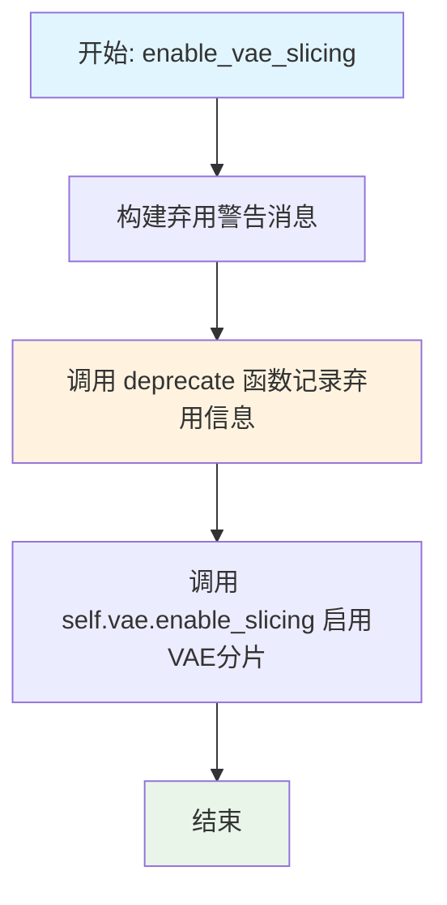

#### 带注释源码

```
def enable_vae_slicing(self):
    r"""
    Enable sliced VAE decoding. When this option is enabled, the VAE will split the input tensor in slices to
    compute decoding in several steps. This is useful to save some memory and allow larger batch sizes.
    """
    # 构建弃用警告消息，包含类名和升级建议
    depr_message = f"Calling `enable_vae_slicing()` on a `{self.__class__.__name__}` is deprecated and this method will be removed in a future version. Please use `pipe.vae.enable_slicing()`."
    
    # 调用 deprecate 函数记录弃用信息，指定弃用版本号为 0.40.0
    deprecate(
        "enable_vae_slicing",
        "0.40.0",
        depr_message,
    )
    
    # 委托给 VAE 模型自身的 enable_slicing 方法执行实际的启用操作
    self.vae.enable_slicing()
```


### `FluxFillPipeline.disable_vae_slicing`

该方法用于禁用 VAE 分片解码功能。如果之前启用了 `enable_vae_slicing`，调用此方法后将恢复到单步解码。该方法已被弃用，建议直接使用 `pipe.vae.disable_slicing()`。

参数：此方法无显式参数（`self` 为隐式参数）

返回值：`None`，无返回值

#### 流程图

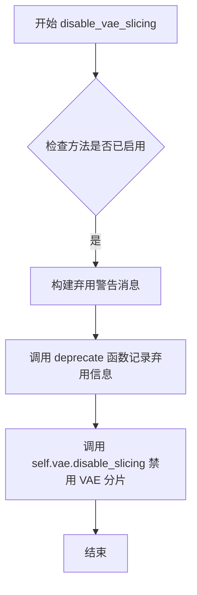

#### 带注释源码

```python
def disable_vae_slicing(self):
    r"""
    Disable sliced VAE decoding. If `enable_vae_slicing` was previously enabled, this method will go back to
    computing decoding in one step.
    """
    # 构建弃用警告消息，提示用户该方法将在未来版本中移除
    # 并建议使用新的 API: pipe.vae.disable_slicing()
    depr_message = f"Calling `disable_vae_slicing()` on a `{self.__class__.__name__}` is deprecated and this method will be removed in a future version. Please use `pipe.vae.disable_slicing()`."
    
    # 调用 deprecate 函数记录弃用信息
    # 参数依次为：函数名、弃用版本号、弃用消息
    deprecate(
        "disable_vae_slicing",
        "0.40.0",
        depr_message,
    )
    
    # 实际执行禁用 VAE 分片解码的操作
    # 委托给 VAE 模型自身的 disable_slicing 方法
    self.vae.disable_slicing()
```


### `FluxFillPipeline.enable_vae_tiling`

启用瓦片 VAE 解码功能。当启用此选项后，VAE 会将输入张量分割成瓦片，以多个步骤计算解码和编码过程。这对于节省大量内存并处理更大的图像非常有用。

参数：
- 无（仅包含 `self` 参数）

返回值：`None`，无返回值

#### 流程图

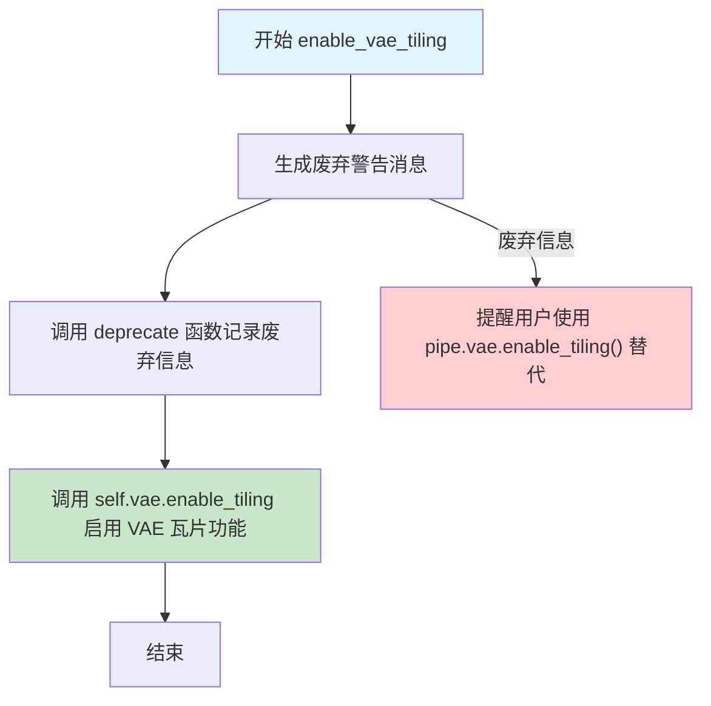

#### 带注释源码

```python
def enable_vae_tiling(self):
    r"""
    Enable tiled VAE decoding. When this option is enabled, the VAE will split the input tensor into tiles to
    compute decoding and encoding in several steps. This is useful for saving a large amount of memory and to allow
    processing larger images.
    """
    # 构建废弃警告消息，提示用户该方法将在未来版本中移除
    # 并建议使用新的 API: pipe.vae.enable_tiling()
    depr_message = f"Calling `enable_vae_tiling()` on a `{self.__class__.__name__}` is deprecated and this method will be removed in a future version. Please use `pipe.vae.enable_tiling()`."
    
    # 调用 deprecate 函数记录废弃警告
    # 参数: 方法名, 废弃版本号, 警告消息
    deprecate(
        "enable_vae_tiling",
        "0.40.0",
        depr_message,
    )
    
    # 委托给 VAE 模型本身的 enable_tiling 方法来启用瓦片解码功能
    # 这是实际执行瓦片处理的调用
    self.vae.enable_tiling()
```


### `FluxFillPipeline.disable_vae_tiling`

该方法用于禁用瓦片式 VAE 解码。如果之前启用了 `enable_vae_tiling`，此方法将恢复为单步计算解码。该方法已被弃用，建议直接调用 `pipe.vae.disable_tiling()`。

参数：
- 该方法无参数（除隐式 `self`）

返回值：`None`，无返回值

#### 流程图

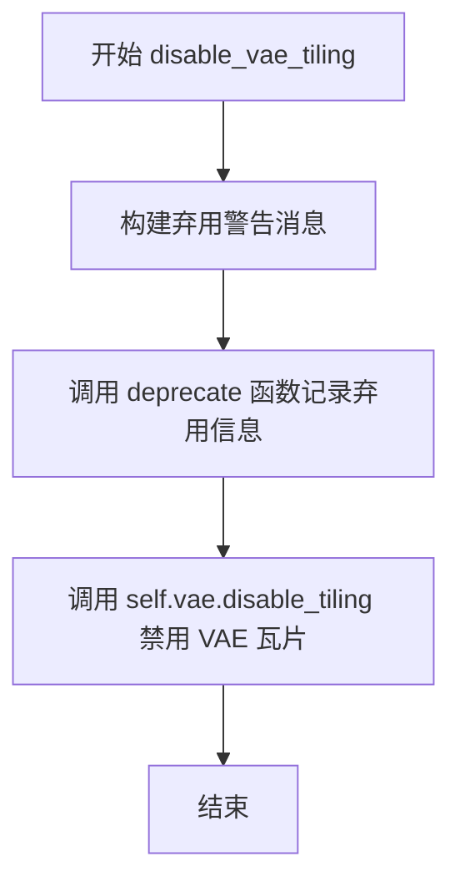

#### 带注释源码

```python
def disable_vae_tiling(self):
    r"""
    Disable tiled VAE decoding. If `enable_vae_tiling` was previously enabled, this method will go back to
    computing decoding in one step.
    """
    # 构建弃用警告消息，提示用户该方法将在未来版本中移除
    # 并建议使用新的 API: pipe.vae.disable_tiling()
    depr_message = f"Calling `disable_vae_tiling()` on a `{self.__class__.__name__}` is deprecated and this method will be removed in a future version. Please use `pipe.vae.disable_tiling()`."
    
    # 调用 deprecate 函数记录弃用信息
    # 参数: 方法名, 弃用版本号, 弃用消息
    deprecate(
        "disable_vae_tiling",
        "0.40.0",
        depr_message,
    )
    
    # 实际执行禁用 VAE 瓦片功能的操作
    # 调用 VAE 模型的 disable_tiling 方法
    self.vae.disable_tiling()
```


### `FluxFillPipeline.prepare_latents`

该方法负责为 Flux 填充管道准备潜在变量（latents），包括计算潜在变量的形状、编码输入图像为潜在表示、生成噪声并通过调度器进行缩放，最终将潜在变量打包成适合变换器处理的格式。

参数：

- `self`：`FluxFillPipeline` 类实例，管道对象本身
- `image`：`torch.Tensor`，输入图像张量，用于编码为潜在表示
- `timestep`：当前去噪步骤的时间步，用于噪声调度
- `batch_size`：`int`，批处理大小，生成的潜在变量数量
- `num_channels_latents`：`int`，潜在变量的通道数，通常来自 VAE 配置
- `height`：`int`，目标图像高度（像素单位）
- `width`：`int`，目标图像宽度（像素单位）
- `dtype`：`torch.dtype`，潜在变量的数据类型
- `device`：`torch.device`，潜在变量所在的设备
- `generator`：`torch.Generator` 或列表，用于生成确定性噪声的随机数生成器
- `latents`：`torch.FloatTensor` 或 `None`，可选的预生成潜在变量，如果提供则直接使用

返回值：`tuple[torch.Tensor, torch.Tensor]`，返回打包后的潜在变量（latents）和潜在图像 IDs（latent_image_ids）

#### 流程图

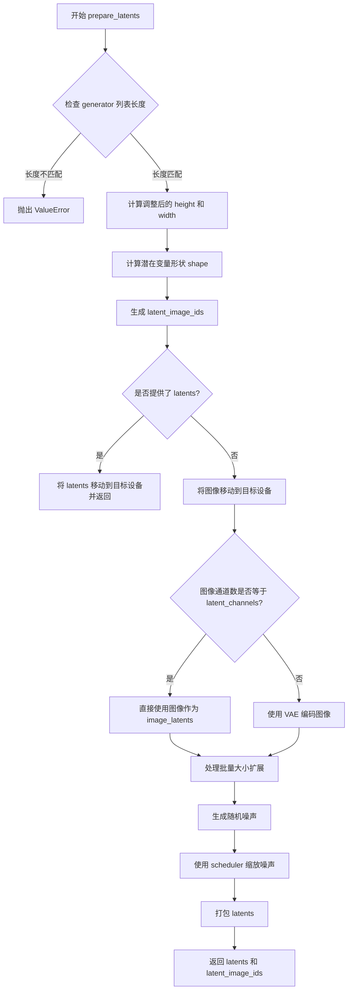

#### 带注释源码

```python
def prepare_latents(
    self,
    image,
    timestep,
    batch_size,
    num_channels_latents,
    height,
    width,
    dtype,
    device,
    generator,
    latents=None,
):
    # 检查传入的生成器列表长度是否与批处理大小匹配
    if isinstance(generator, list) and len(generator) != batch_size:
        raise ValueError(
            f"You have passed a list of generators of length {len(generator)}, but requested an effective batch"
            f" size of {batch_size}. Make sure the batch size matches the length of the generators."
        )

    # VAE applies 8x compression on images but we must also account for packing which requires
    # latent height and width to be divisible by 2.
    # 计算调整后的高度和宽度：VAE 应用 8x 压缩，但还需要考虑 packing 需要潜在高宽能被 2 整除
    height = 2 * (int(height) // (self.vae_scale_factor * 2))
    width = 2 * (int(width) // (self.vae_scale_factor * 2))
    
    # 构建潜在变量的形状：(batch_size, num_channels_latents, height, width)
    shape = (batch_size, num_channels_latents, height, width)
    
    # 生成潜在图像 IDs，用于自注意力机制中的位置编码
    # 高度和宽度除以 2 是因为后续会进行 packing 操作
    latent_image_ids = self._prepare_latent_image_ids(batch_size, height // 2, width // 2, device, dtype)

    # 如果已经提供了 latents，直接将其移动到目标设备并返回
    if latents is not None:
        return latents.to(device=device, dtype=dtype), latent_image_ids

    # 将图像移动到目标设备并转换为目标数据类型
    image = image.to(device=device, dtype=dtype)
    
    # 如果图像通道数与 latent_channels 不匹配，则使用 VAE 编码图像
    # 否则直接使用图像作为 image_latents
    if image.shape[1] != self.latent_channels:
        image_latents = self._encode_vae_image(image=image, generator=generator)
    else:
        image_latents = image
        
    # 处理批量大小扩展的情况
    # 如果 batch_size 大于 image_latents 的批次大小且能被整除，则复制 image_latents
    if batch_size > image_latents.shape[0] and batch_size % image_latents.shape[0] == 0:
        # expand init_latents for batch_size
        additional_image_per_prompt = batch_size // image_latents.shape[0]
        image_latents = torch.cat([image_latents] * additional_image_per_prompt, dim=0)
    # 如果不能整除，抛出错误
    elif batch_size > image_latents.shape[0] and batch_size % image_latents.shape[0] != 0:
        raise ValueError(
            f"Cannot duplicate `image` of batch size {image_latents.shape[0]} to {batch_size} text prompts."
        )
    else:
        # 正常情况，直接使用 image_latents
        image_latents = torch.cat([image_latents], dim=0)

    # 使用 randn_tensor 生成与目标形状相同的随机噪声
    noise = randn_tensor(shape, generator=generator, device=device, dtype=dtype)
    
    # 使用调度器的 scale_noise 方法，根据当前时间步和噪声调整潜在变量
    latents = self.scheduler.scale_noise(image_latents, timestep, noise)
    
    # 将 latents 打包成适合变换器处理的格式
    # 打包将 (batch, channels, h, w) 转换为 (batch, h*w, channels*4)
    latents = self._pack_latents(latents, batch_size, num_channels_latents, height, width)
    
    # 返回打包后的 latents 和 latent_image_ids
    return latents, latent_image_ids
```


### `FluxFillPipeline.__call__`

这是 Flux Fill Pipeline 的主推理方法，用于图像修复（inpainting/outpainting）任务。该方法接受文本提示、原始图像、掩码图像等输入，通过预训练的 Flux 模型进行去噪处理，最终生成填充后的图像。

参数：

- `prompt`：`str | list[str]`，用于指导图像生成的文本提示。如果未定义，则必须传递 `prompt_embeds`。
- `prompt_2`：`str | list[str] | None`，发送给 `tokenizer_2` 和 `text_encoder_2` 的提示词。如果未定义，将使用 `prompt`。
- `image`：`torch.FloatTensor | None`，用作起点的图像批次，可以是张量、PIL图像或numpy数组，值范围在 [0, 1]。
- `mask_image`：`torch.FloatTensor | None`，用于遮盖图像的掩码，白色像素将被重新绘制，黑色像素保留。
- `masked_image_latents`：`torch.FloatTensor | None`，由VAE生成的掩码图像潜在表示，如果未提供将根据 `mask_image` 生成。
- `height`：`int | None`，生成图像的高度（像素），默认基于 `self.vae_scale_factor` 计算。
- `width`：`int | None`，生成图像的宽度（像素），默认基于 `self.vae_scale_factor` 计算。
- `strength`：`float`，表示对参考图像的变换程度，值在0到1之间，1表示完全忽略原始图像。
- `num_inference_steps`：`int`，去噪步数，默认为50步。
- `sigmas`：`list[float] | None`，自定义去噪过程的sigma值。
- `guidance_scale`：`float`，无分类器指导（Classifier-Free Guidance）的比例，默认为30.0。
- `num_images_per_prompt`：`int`，每个提示词生成的图像数量，默认为1。
- `generator`：`torch.Generator | list[torch.Generator] | None`，用于生成确定性结果的随机数生成器。
- `latents`：`torch.FloatTensor | None`，预生成的噪声潜在向量。
- `prompt_embeds`：`torch.FloatTensor | None`，预生成的文本嵌入。
- `pooled_prompt_embeds`：`torch.FloatTensor | None`，预生成的池化文本嵌入。
- `output_type`：`str | None`，输出格式，默认为"pil"（PIL图像）。
- `return_dict`：`bool`，是否返回 `FluxPipelineOutput` 对象而非元组，默认为True。
- `joint_attention_kwargs`：`dict[str, Any] | None`，传递给注意力处理器的 kwargs 字典。
- `callback_on_step_end`：`Callable[[int, int], None] | None`，每个去噪步骤结束时调用的函数。
- `callback_on_step_end_tensor_inputs`：`list[str]`，传递给回调函数的张量输入列表，默认为 ["latents"]。
- `max_sequence_length`：`int`，提示词的最大序列长度，默认为512。

返回值：`FluxPipelineOutput`，包含生成的图像列表。如果 `return_dict` 为 False，则返回元组。

#### 流程图

```mermaid
flowchart TD
    A[__call__ 开始] --> B[检查输入参数]
    B --> C[预处理输入图像 init_image]
    D[定义批次大小 batch_size] --> E[获取执行设备 device]
    E --> F[编码提示词embeddings]
    F --> G[准备时间步 timesteps]
    G --> H[计算时间偏移 mu]
    H --> I[获取调整后的 timesteps 和 num_inference_steps]
    I --> J[准备潜在变量 latents]
    J --> K{是否有 masked_image_latents?}
    K -->|是| L[直接使用传入的 masked_image_latents]
    K -->|否| M[预处理 mask_image]
    M --> N[计算 masked_image 和 mask latents]
    L --> O[设置指导比例 guidance]
    N --> O
    O --> P[初始化进度条]
    P --> Q[去噪循环开始: for i, t in enumerate(timesteps)]
    Q --> R{是否中断 interrupt?}
    R -->|是| S[continue 跳过本次循环]
    R -->|否| T[扩展 timestep 到批次维度]
    T --> U[调用 transformer 进行预测]
    U --> V[计算上一步的去噪结果]
    V --> W{需要回调?}
    W -->|是| X[执行 callback_on_step_end]
    W -->|否| Y{是否最后一步或热身完成?}
    X --> Y
    Y -->|是| Z[更新进度条]
    Y -->|否| Q
    Z --> AA{是否 XLA 可用?}
    AA -->|是| AB[执行 xm.mark_step]
    AA -->|否| Q
    AB --> Q
    Q --> AC[去噪循环结束]
    AC --> AD{output_type == 'latent'?}
    AD -->|是| AE[直接返回 latents 作为图像]
    AD -->|否| AF[解包 latents]
    AF --> AG[反归一化 latents]
    AG --> AH[VAE 解码]
    AI[后处理图像] --> AJ[卸载模型]
    AE --> AJ
    AH --> AI
    AJ --> AK{return_dict?}
    AK -->|是| AL[返回 FluxPipelineOutput]
    AK -->|否| AM[返回元组 (images,)]
```

#### 带注释源码

```python
@torch.no_grad()
@replace_example_docstring(EXAMPLE_DOC_STRING)
def __call__(
    self,
    prompt: str | list[str] = None,
    prompt_2: str | list[str] | None = None,
    image: torch.FloatTensor | None = None,
    mask_image: torch.FloatTensor | None = None,
    masked_image_latents: torch.FloatTensor | None = None,
    height: int | None = None,
    width: int | None = None,
    strength: float = 1.0,
    num_inference_steps: int = 50,
    sigmas: list[float] | None = None,
    guidance_scale: float = 30.0,
    num_images_per_prompt: int | None = 1,
    generator: torch.Generator | list[torch.Generator] | None = None,
    latents: torch.FloatTensor | None = None,
    prompt_embeds: torch.FloatTensor | None = None,
    pooled_prompt_embeds: torch.FloatTensor | None = None,
    output_type: str | None = "pil",
    return_dict: bool = True,
    joint_attention_kwargs: dict[str, Any] | None = None,
    callback_on_step_end: Callable[[int, int], None] | None = None,
    callback_on_step_end_tensor_inputs: list[str] = ["latents"],
    max_sequence_length: int = 512,
):
    r"""
    Function invoked when calling the pipeline for generation.

    Args:
        prompt (`str` or `list[str]`, *optional*):
            The prompt or prompts to guide the image generation. If not defined, one has to pass `prompt_embeds`.
            instead.
        prompt_2 (`str` or `list[str]`, *optional*):
            The prompt or prompts to be sent to `tokenizer_2` and `text_encoder_2`. If not defined, `prompt` is
            will be used instead
        image (`torch.Tensor`, `PIL.Image.Image`, `np.ndarray`, `list[torch.Tensor]`, `list[PIL.Image.Image]`, or `list[np.ndarray]`):
            `Image`, numpy array or tensor representing an image batch to be used as the starting point. For both
            numpy array and pytorch tensor, the expected value range is between `[0, 1]` If it's a tensor or a list
            or tensors, the expected shape should be `(B, C, H, W)` or `(C, H, W)`. If it is a numpy array or a
            list of arrays, the expected shape should be `(B, H, W, C)` or `(H, W, C)`.
        mask_image (`torch.Tensor`, `PIL.Image.Image`, `np.ndarray`, `list[torch.Tensor]`, `list[PIL.Image.Image]`, or `list[np.ndarray]`):
            `Image`, numpy array or tensor representing an image batch to mask `image`. White pixels in the mask
            are repainted while black pixels are preserved. If `mask_image` is a PIL image, it is converted to a
            single channel (luminance) before use. If it's a numpy array or pytorch tensor, it should contain one
            color channel (L) instead of 3, so the expected shape for pytorch tensor would be `(B, 1, H, W)`, `(B,
            H, W)`, `(1, H, W)`, `(H, W)`. And for numpy array would be for `(B, H, W, 1)`, `(B, H, W)`, `(H, W,
            1)`, or `(H, W)`.
        mask_image_latent (`torch.Tensor`, `list[torch.Tensor]`):
            `Tensor` representing an image batch to mask `image` generated by VAE. If not provided, the mask
            latents tensor will be generated by `mask_image`.
        height (`int`, *optional*, defaults to self.unet.config.sample_size * self.vae_scale_factor):
            The height in pixels of the generated image. This is set to 1024 by default for the best results.
        width (`int`, *optional*, defaults to self.unet.config.sample_size * self.vae_scale_factor):
            The width in pixels of the generated image. This is set to 1024 by default for the best results.
        strength (`float`, *optional*, defaults to 1.0):
            Indicates extent to transform the reference `image`. Must be between 0 and 1. `image` is used as a
            starting point and more noise is added the higher the `strength`. The number of denoising steps depends
            on the amount of noise initially added. When `strength` is 1, added noise is maximum and the denoising
            process runs for the full number of iterations specified in `num_inference_steps`. A value of 1
            essentially ignores `image`.
        num_inference_steps (`int`, *optional*, defaults to 50):
            The number of denoising steps. More denoising steps usually lead to a higher quality image at the
            expense of slower inference.
        sigmas (`list[float]`, *optional*):
            Custom sigmas to use for the denoising process with schedulers which support a `sigmas` argument in
            their `set_timesteps` method. If not defined, the default behavior when `num_inference_steps` is passed
            will be used.
        guidance_scale (`float`, *optional*, defaults to 30.0):
            Guidance scale as defined in [Classifier-Free Diffusion
            Guidance](https://huggingface.co/papers/2207.12598). `guidance_scale` is defined as `w` of equation 2.
            of [Imagen Paper](https://huggingface.co/papers/2205.11487). Guidance scale is enabled by setting
            `guidance_scale > 1`. Higher guidance scale encourages to generate images that are closely linked to
            the text `prompt`, usually at the expense of lower image quality.
        num_images_per_prompt (`int`, *optional*, defaults to 1):
            The number of images to generate per prompt.
        generator (`torch.Generator` or `list[torch.Generator]`, *optional*):
            One or a list of [torch generator(s)](https://pytorch.org/docs/stable/generated/torch.Generator.html)
            to make generation deterministic.
        latents (`torch.FloatTensor`, *optional*):
            Pre-generated noisy latents, sampled from a Gaussian distribution, to be used as inputs for image
            generation. Can be used to tweak the same generation with different prompts. If not provided, a latents
            tensor will be generated by sampling using the supplied random `generator`.
        prompt_embeds (`torch.FloatTensor`, *optional*):
            Pre-generated text embeddings. Can be used to easily tweak text inputs, *e.g.* prompt weighting. If not
            provided, text embeddings will be generated from `prompt` input argument.
        pooled_prompt_embeds (`torch.FloatTensor`, *optional*):
            Pre-generated pooled text embeddings. Can be used to easily tweak text inputs, *e.g.* prompt weighting.
            If not provided, pooled text embeddings will be generated from `prompt` input argument.
        output_type (`str`, *optional*, defaults to `"pil"`):
            The output format of the generate image. Choose between
            [PIL](https://pillow.readthedocs.io/en/stable/): `PIL.Image.Image` or `np.array`.
        return_dict (`bool`, *optional*, defaults to `True`):
            Whether or not to return a [`~pipelines.flux.FluxPipelineOutput`] instead of a plain tuple.
        joint_attention_kwargs (`dict`, *optional*):
            A kwargs dictionary that if specified is passed along to the `AttentionProcessor` as defined under
            `self.processor` in
            [diffusers.models.attention_processor](https://github.com/huggingface/diffusers/blob/main/src/diffusers/models/attention_processor.py).
        callback_on_step_end (`Callable`, *optional*):
            A function that calls at the end of each denoising steps during the inference. The function is called
            with the following arguments: `callback_on_step_end(self: DiffusionPipeline, step: int, timestep: int,
            callback_kwargs: Dict)`. `callback_kwargs` will include a list of all tensors as specified by
            `callback_on_step_end_tensor_inputs`.
        callback_on_step_end_tensor_inputs (`list`, *optional*):
            The list of tensor inputs for the `callback_on_step_end` function. The tensors specified in the list
            will be passed as `callback_kwargs` argument. You will only be able to include variables listed in the
            `._callback_tensor_inputs` attribute of your pipeline class.
        max_sequence_length (`int` defaults to 512): Maximum sequence length to use with the `prompt`.

    Examples:

    Returns:
        [`~pipelines.flux.FluxPipelineOutput`] or `tuple`: [`~pipelines.flux.FluxPipelineOutput`] if `return_dict`
        is True, otherwise a `tuple`. When returning a tuple, the first element is a list with the generated
        images.
    """

    # 1. 设置默认高度和宽度（如果未提供）
    # 如果未指定 height/width，则使用默认样本大小乘以 VAE 缩放因子
    height = height or self.default_sample_size * self.vae_scale_factor
    width = width or self.default_sample_size * self.vae_scale_factor

    # 2. 检查输入参数的有效性
    # 验证所有必需参数是否符合要求
    self.check_inputs(
        prompt,
        prompt_2,
        strength,
        height,
        width,
        prompt_embeds=prompt_embeds,
        pooled_prompt_embeds=pooled_prompt_embeds,
        callback_on_step_end_tensor_inputs=callback_on_step_end_tensor_inputs,
        max_sequence_length=max_sequence_length,
        image=image,
        mask_image=mask_image,
        masked_image_latents=masked_image_latents,
    )

    # 3. 设置内部状态变量
    self._guidance_scale = guidance_scale
    self._joint_attention_kwargs = joint_attention_kwargs
    self._interrupt = False

    # 4. 预处理输入图像
    # 将输入图像转换为模型所需的张量格式
    init_image = self.image_processor.preprocess(image, height=height, width=width)
    init_image = init_image.to(dtype=torch.float32)

    # 5. 定义调用参数
    # 根据输入的 prompt 类型确定批次大小
    if prompt is not None and isinstance(prompt, str):
        batch_size = 1
    elif prompt is not None and isinstance(prompt, list):
        batch_size = len(prompt)
    else:
        batch_size = prompt_embeds.shape[0]

    # 获取执行设备（CPU/CUDA/XLA）
    device = self._execution_device

    # 6. 准备提示词嵌入
    # 从 kwargs 中提取 LoRA 比例（如果存在）
    lora_scale = (
        self.joint_attention_kwargs.get("scale", None) if self.joint_attention_kwargs is not None else None
    )
    
    # 编码提示词以生成文本嵌入
    (
        prompt_embeds,         # T5 文本嵌入
        pooled_prompt_embeds,  # CLIP 池化嵌入
        text_ids,              # 文本位置 ID
    ) = self.encode_prompt(
        prompt=prompt,
        prompt_2=prompt_2,
        prompt_embeds=prompt_embeds,
        pooled_prompt_embeds=pooled_prompt_embeds,
        device=device,
        num_images_per_prompt=num_images_per_prompt,
        max_sequence_length=max_sequence_length,
        lora_scale=lora_scale,
    )

    # 7. 准备时间步
    # 如果未提供 sigmas，则生成默认的线性空间 sigmas
    sigmas = np.linspace(1.0, 1 / num_inference_steps, num_inference_steps) if sigmas is None else sigmas
    
    # 计算图像序列长度，用于调整噪声调度器
    image_seq_len = (int(height) // self.vae_scale_factor // 2) * (int(width) // self.vae_scale_factor // 2)
    
    # 计算时间步偏移量（基于图像序列长度）
    mu = calculate_shift(
        image_seq_len,
        self.scheduler.config.get("base_image_seq_len", 256),
        self.scheduler.config.get("max_image_seq_len", 4096),
        self.scheduler.config.get("base_shift", 0.5),
        self.scheduler.config.get("max_shift", 1.15),
    )
    
    # 确定时间步设备
    if XLA_AVAILABLE:
        timestep_device = "cpu"
    else:
        timestep_device = device
        
    # 获取调度器的时间步
    timesteps, num_inference_steps = retrieve_timesteps(
        self.scheduler,
        num_inference_steps,
        timestep_device,
        sigmas=sigmas,
        mu=mu,
    )
    
    # 根据 strength 调整时间步
    timesteps, num_inference_steps = self.get_timesteps(num_inference_steps, strength, device)

    # 验证调整后的推理步数
    if num_inference_steps < 1:
        raise ValueError(
            f"After adjusting the num_inference_steps by strength parameter: {strength}, the number of pipeline"
            f"steps is {num_inference_steps} which is < 1 and not appropriate for this pipeline."
        )
        
    # 准备潜在时间步
    latent_timestep = timesteps[:1].repeat(batch_size * num_images_per_prompt)

    # 8. 准备潜在变量
    # 获取 VAE 的潜在通道数
    num_channels_latents = self.vae.config.latent_channels
    
    # 准备初始潜在变量和潜在图像 ID
    latents, latent_image_ids = self.prepare_latents(
        init_image,
        latent_timestep,
        batch_size * num_images_per_prompt,
        num_channels_latents,
        height,
        width,
        prompt_embeds.dtype,
        device,
        generator,
        latents,
    )

    # 9. 准备掩码和掩码图像潜在变量
    if masked_image_latents is not None:
        # 如果已提供掩码潜在变量，直接使用
        masked_image_latents = masked_image_latents.to(latents.device)
    else:
        # 否则，从掩码图像预处理生成
        mask_image = self.mask_processor.preprocess(mask_image, height=height, width=width)

        # 计算被掩码覆盖的图像（原始图像 * (1 - 掩码)）
        masked_image = init_image * (1 - mask_image)
        masked_image = masked_image.to(device=device, dtype=prompt_embeds.dtype)

        # 获取处理后的图像尺寸
        height, width = init_image.shape[-2:]
        
        # 准备掩码潜在变量
        mask, masked_image_latents = self.prepare_mask_latents(
            mask_image,
            masked_image,
            batch_size,
            num_channels_latents,
            num_images_per_prompt,
            height,
            width,
            prompt_embeds.dtype,
            device,
            generator,
        )
        
        # 将掩码和掩码图像潜在变量拼接
        masked_image_latents = torch.cat((masked_image_latents, mask), dim=-1)

    # 计算热身步数
    num_warmup_steps = max(len(timesteps) - num_inference_steps * self.scheduler.order, 0)
    self._num_timesteps = len(timesteps)

    # 10. 处理指导
    # 如果 transformer 支持指导嵌入，则设置指导比例
    if self.transformer.config.guidance_embeds:
        guidance = torch.full([1], guidance_scale, device=device, dtype=torch.float32)
        guidance = guidance.expand(latents.shape[0])
    else:
        guidance = None

    # 11. 去噪循环
    with self.progress_bar(total=num_inference_steps) as progress_bar:
        for i, t in enumerate(timesteps):
            # 检查是否中断
            if self.interrupt:
                continue

            # 将时间步广播到批次维度（兼容 ONNX/Core ML）
            timestep = t.expand(latents.shape[0]).to(latents.dtype)

            # 调用 Transformer 进行预测
            # 将潜在变量和掩码潜在变量在通道维度拼接
            noise_pred = self.transformer(
                hidden_states=torch.cat((latents, masked_image_latents), dim=2),
                timestep=timestep / 1000,  # 归一化时间步
                guidance=guidance,
                pooled_projections=pooled_prompt_embeds,
                encoder_hidden_states=prompt_embeds,
                txt_ids=text_ids,
                img_ids=latent_image_ids,
                joint_attention_kwargs=self.joint_attention_kwargs,
                return_dict=False,
            )[0]

            # 计算前一个噪声样本 x_t -> x_t-1
            latents_dtype = latents.dtype
            latents = self.scheduler.step(noise_pred, t, latents, return_dict=False)[0]

            # 处理数据类型不匹配（特别是 MPS 设备）
            if latents.dtype != latents_dtype:
                if torch.backends.mps.is_available():
                    # 某些平台（如苹果 MPS）由于 PyTorch bug 会出现问题
                    latents = latents.to(latents_dtype)

            # 执行回调函数（如果提供）
            if callback_on_step_end is not None:
                callback_kwargs = {}
                for k in callback_on_step_end_tensor_inputs:
                    callback_kwargs[k] = locals()[k]
                callback_outputs = callback_on_step_end(self, i, t, callback_kwargs)

                # 更新潜在变量和提示嵌入（如果回调返回了这些值）
                latents = callback_outputs.pop("latents", latents)
                prompt_embeds = callback_outputs.pop("prompt_embeds", prompt_embeds)

            # 在适当的步骤调用回调并更新进度条
            if i == len(timesteps) - 1 or ((i + 1) > num_warmup_steps and (i + 1) % self.scheduler.order == 0):
                progress_bar.update()

            # XLA 特定操作
            if XLA_AVAILABLE:
                xm.mark_step()

    # 12. 后处理图像
    if output_type == "latent":
        # 如果输出类型是 latent，直接返回潜在变量
        image = latents
    else:
        # 解包潜在变量
        latents = self._unpack_latents(latents, height, width, self.vae_scale_factor)
        
        # 反归一化潜在变量
        latents = (latents / self.vae.config.scaling_factor) + self.vae.config.shift_factor
        
        # 使用 VAE 解码潜在变量到图像
        image = self.vae.decode(latents, return_dict=False)[0]
        
        # 后处理图像（转换为 PIL 或 numpy）
        image = self.image_processor.postprocess(image, output_type=output_type)

    # 13. 卸载所有模型
    self.maybe_free_model_hooks()

    # 14. 返回结果
    if not return_dict:
        return (image,)

    return FluxPipelineOutput(images=image)
```

## 关键组件


### 张量索引与潜在变量处理

负责将图像和掩码转换为潜在表示，并处理打包/解包操作。包含`_pack_latents`、`_unpack_latents`、`prepare_latents`、`prepare_mask_latents`等方法，实现Latent空间的灵活操作和批处理。

### 反量化与VAE解码

负责将处理后的潜在变量解码为最终图像。包含`_unpack_latents`方法将打包的Latent解包回原始形状，以及VAE的`decode`方法实现从Latent到图像的反量化过程。

### 量化策略与VAE优化

提供VAE内存优化功能，包括`enable_vae_slicing`、`disable_vae_slicing`、`enable_vae_tiling`、`disable_vae_tiling`方法，支持切片和解码平铺策略以节省显存并支持更大批处理。

### 文本提示嵌入生成

负责将文本提示转换为模型可用的嵌入向量。包含`_get_clip_prompt_embeds`处理CLIP文本编码和`_get_t5_prompt_embeds`处理T5文本编码，以及`encode_prompt`方法整合两者生成联合嵌入。

### 掩码与被掩码图像处理

负责准备修复任务的掩码和被掩码图像潜在变量。`prepare_mask_latents`方法对掩码进行Resize和Pack操作，并与被掩码图像Latent拼接，为Transformer提供完整的上下文信息。

### 主干Transformer去噪

负责执行去噪预测的核心模块。`__call__`方法中的去噪循环调用`self.transformer`进行噪声预测，支持Joint Attention机制，处理文本和图像条件的联合建模。

### 图像与掩码预处理

负责输入图像和掩码的预处理。`VaeImageProcessor`用于图像的预处理和后处理，`mask_processor`专门处理二值化和灰度转换，确保输入符合VAE编码要求。

### 调度器与时间步管理

负责噪声调度和时间步生成。包含`retrieve_timesteps`、`get_timesteps`、`calculate_shift`等方法，支持自定义时间步和Sigma调度，实现灵活的去噪策略。


## 问题及建议


### 已知问题

-   **代码重复**：大量方法（如 `_get_t5_prompt_embeds`、`_get_clip_prompt_embeds`、`_prepare_latent_image_ids`、`_pack_latents`、`_unpack_latents`）通过 "Copied from" 从其他 pipeline 复制而来，导致代码重复和维护困难
-   **方法过长**：`__call__` 方法超过 300 行，包含大量逻辑分支，不利于阅读和维护
-   **硬编码数值**：多处使用硬编码数值如 `self.default_sample_size = 128`、`vae_scale_factor * 2`、mask 处理中的魔法数字，缺乏统一配置管理
-   **已废弃方法仍存在**：`enable_vae_slicing`、`disable_vae_slicing`、`enable_vae_tiling`、`disable_vae_tiling` 已标记为 deprecated (0.40.0) 但仍保留在类中
- **输入验证分散**：`check_inputs` 方法参数过多（14个参数），且部分验证逻辑散落在 `__call__` 方法中
- **空定义**：`self._optional_components = []` 定义了但未实际使用
- **条件检查重复**：`XLA_AVAILABLE` 在多处被检查（`__call__` 方法中两处），可以统一处理
- **类型提示不完整**：部分方法参数缺少类型注解，如 `generator` 参数在 `retrieve_latents` 中

### 优化建议

-   **提取公共模块**：将复制的辅助方法抽取到独立的 mixin 类或工具模块中，通过继承或组合复用
-   **重构 `__call__` 方法**：将长方法拆分为多个私有辅助方法，如 `prepare_prompt()`、`prepare_timesteps()`、`prepare_latents()`、`run_denoising_loop()`、`post_process()`
-   **配置统一管理**：创建配置类或使用 dataclass 统一管理 `vae_scale_factor`、`default_sample_size`、`latent_channels` 等参数
-   **移除废弃方法**：在下一版本中移除已标记为 deprecated 的 VAE slicing/tiling 方法
-   **简化输入验证**：重构 `check_inputs` 方法，考虑使用 Pydantic 或自定义验证器类
-   **优化 XLA 检查**：在初始化时设置 `self._use_xla` 属性，避免在 `__call__` 中重复检查
-   **补充类型注解**：为所有公开方法补充完整的类型注解和文档字符串
-   **添加缓存机制**：对重复计算的结果（如 `prompt_embeds`）添加缓存，避免重复编码

## 其它


### 设计目标与约束

FluxFillPipeline的核心设计目标是实现基于FLUX模型的图像修复（inpainting/outpainting）功能，能够根据文本提示对图像中指定区域进行填充或修复。该pipeline遵循diffusers库的标准化接口设计，支持LoRA微调、Textual Inversion、单文件加载等常见功能。设计约束包括：输入图像尺寸必须能被vae_scale_factor*2整除，最大序列长度为512，guidance_scale默认30.0，推理步数默认50步。

### 错误处理与异常设计

代码中的错误处理主要通过ValueError异常实现。在check_inputs方法中验证：strength参数范围[0,1]、图像尺寸 divisibility、callback_on_step_end_tensor_inputs合法性、prompt与prompt_embeds互斥、max_sequence_length不超过512、image与masked_image_latents互斥等。在retrieve_timesteps中处理timesteps和sigmas冲突、scheduler不支持自定义调度的情况。潜在改进：可增加更详细的错误日志记录、区分不同类型错误的恢复策略。

### 数据流与状态机

Pipeline的主要数据流：1)图像预处理(init_image) → 2)文本编码(prompt_embeds) → 3)时间步计算(timesteps) → 4)潜在变量准备(latents) → 5)掩码处理(mask/masked_image_latents) → 6)去噪循环(transformer推理) → 7)VAE解码 → 8)后处理输出。状态机体现在：初始化状态、推理中状态、完成后状态。通过interrupt属性支持中断恢复。

### 外部依赖与接口契约

核心依赖：transformers库(CLIPTextModel, T5EncoderModel)、diffusers自身模块(AutoencoderKL, FluxTransformer2DModel, FlowMatchEulerDiscreteScheduler)。可选依赖：torch_xla(用于XLA设备加速)、PEFT后端(用于LoRA加载)。接口契约：from_pretrained方法接受黑森林实验室的FLUX.1-Fill-dev预训练模型，__call__方法返回FluxPipelineOutput或tuple。

### 性能考虑与优化策略

代码包含多种性能优化：1)模型CPU卸载支持(enable_model_cpu_offload) 2)VAE切片解码(enable_vae_slicing) 3)VAE瓦片处理(enable_vae_tiling) 4)XLA设备支持。潜在优化空间：可增加ONNX导出支持、混合精度推理的更细粒度控制、梯度检查点技术以减少显存占用。

### 并发与线程安全

Pipeline实例本身设计为无状态（除了transformer等模型引用），推理过程为顺序执行，不涉及多线程竞争。Generator支持传入列表以支持多生成器并发，但实际推理仍在单线程中顺序处理。潜在改进：可增加异步推理支持以提高吞吐量。

### 配置与参数说明

关键配置参数：vae_scale_factor（默认8，基于VAE块输出通道计算）、latent_channels（默认16）、default_sample_size（128）、tokenizer_max_length（77）。Scheduler配置通过FlowMatchEulerDiscreteScheduler的config字典获取：base_image_seq_len、max_image_seq_len、base_shift、max_shift等用于计算时间步偏移。

### 版本兼容性

代码标记为Apache 2.0许可证，依赖transformers库版本需支持CLIPTextModel和T5EncoderModel。Diffusers版本需支持FlowMatchEulerDiscreteScheduler和FluxTransformer2DModel。部分方法标记为deprecated（如enable_vae_slicing等），将在0.40.0版本移除。

### 安全性考虑

代码本身不直接涉及用户数据处理，但作为图像生成Pipeline需注意：1)生成的图像内容可能涉及版权问题 2)prompt输入需进行基本过滤 3)模型权重加载来源需验证（黑森林实验室官方渠道）。潜在改进：增加prompt安全过滤器集成。

### 测试策略

代码中包含EXAMPLE_DOC_STRING演示如何调用pipeline。最佳实践测试应覆盖：1)不同尺寸输入的兼容性 2)空prompt和满prompt的处理 3)mask不同类型的处理 4)LoRA加载后的推理 5)CPU/GPU环境切换 6)中断恢复功能。建议使用pytest和CI/CD集成测试。


    