# `diffusers\src\diffusers\pipelines\flux\pipeline_flux_img2img.py` 详细设计文档

FluxImg2ImgPipeline是基于Black Forest Labs的FLUX模型实现的图像到图像（Image-to-Image）生成Pipeline，通过接收文本提示和输入图像，利用变分自编码器（VAE）、Transformer模型和T5/CLIP文本编码器对图像进行去噪处理，生成符合文本描述的目标图像。

## 整体流程

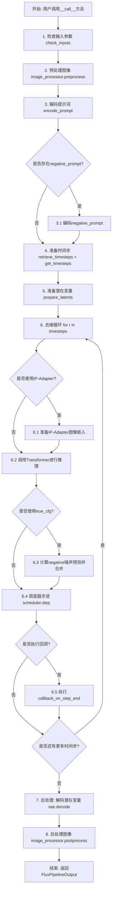

## 类结构

```
DiffusionPipeline (基类)
├── FluxLoraLoaderMixin (LoRA加载混合)
├── FromSingleFileMixin (单文件加载混合)
└── FluxIPAdapterMixin (IP-Adapter混合)
    └── FluxImg2ImgPipeline (主类)
```

## 全局变量及字段


### `XLA_AVAILABLE`
    
XLA是否可用

类型：`bool`
    


### `logger`
    
日志记录器

类型：`logging.Logger`
    


### `EXAMPLE_DOC_STRING`
    
示例文档字符串

类型：`str`
    


### `FluxImg2ImgPipeline.vae`
    
VAE模型用于图像编码/解码

类型：`AutoencoderKL`
    


### `FluxImg2ImgPipeline.text_encoder`
    
CLIP文本编码器

类型：`CLIPTextModel`
    


### `FluxImg2ImgPipeline.text_encoder_2`
    
T5文本编码器

类型：`T5EncoderModel`
    


### `FluxImg2ImgPipeline.tokenizer`
    
CLIP分词器

类型：`CLIPTokenizer`
    


### `FluxImg2ImgPipeline.tokenizer_2`
    
T5分词器

类型：`T5TokenizerFast`
    


### `FluxImg2ImgPipeline.transformer`
    
Flux变换器模型

类型：`FluxTransformer2DModel`
    


### `FluxImg2ImgPipeline.scheduler`
    
调度器

类型：`FlowMatchEulerDiscreteScheduler`
    


### `FluxImg2ImgPipeline.image_encoder`
    
图像编码器(可选)

类型：`CLIPVisionModelWithProjection`
    


### `FluxImg2ImgPipeline.feature_extractor`
    
特征提取器(可选)

类型：`CLIPImageProcessor`
    


### `FluxImg2ImgPipeline.image_processor`
    
图像处理器

类型：`VaeImageProcessor`
    


### `FluxImg2ImgPipeline.vae_scale_factor`
    
VAE缩放因子

类型：`int`
    


### `FluxImg2ImgPipeline.latent_channels`
    
潜在通道数

类型：`int`
    


### `FluxImg2ImgPipeline.tokenizer_max_length`
    
分词器最大长度

类型：`int`
    


### `FluxImg2ImgPipeline.default_sample_size`
    
默认采样尺寸

类型：`int`
    


### `FluxImg2ImgPipeline.model_cpu_offload_seq`
    
CPU卸载顺序

类型：`str`
    


### `FluxImg2ImgPipeline._optional_components`
    
可选组件列表

类型：`list`
    


### `FluxImg2ImgPipeline._callback_tensor_inputs`
    
回调张量输入列表

类型：`list`
    


### `FluxImg2ImgPipeline._guidance_scale`
    
引导尺度(属性)

类型：`float`
    


### `FluxImg2ImgPipeline._joint_attention_kwargs`
    
联合注意力参数(属性)

类型：`dict`
    


### `FluxImg2ImgPipeline._num_timesteps`
    
时间步数(属性)

类型：`int`
    


### `FluxImg2ImgPipeline._interrupt`
    
中断标志(属性)

类型：`bool`
    
    

## 全局函数及方法


### `calculate_shift`

该函数通过线性插值计算图像序列长度的偏移量（shift），用于在扩散模型推理过程中根据图像尺寸动态调整噪声调度参数。函数基于预定义的基础序列长度、最大序列长度以及对应的基础偏移量和最大偏移量，通过线性方程计算当前图像序列长度对应的偏移值。

参数：

- `image_seq_len`：`int`，图像序列长度，通常由图像高度和宽度经过 VAE 压缩和分块处理后计算得出
- `base_seq_len`：`int`，基础序列长度，默认值为 256，表示较小分辨率图像的参考序列长度
- `max_seq_len`：`int`，最大序列长度，默认值为 4096，表示较大分辨率图像的参考序列长度
- `base_shift`：`float`，基础偏移量，默认值为 0.5，对应基础序列长度的噪声偏移值
- `max_shift`：`float`，最大偏移量，默认值为 1.15，对应最大序列长度的噪声偏移值

返回值：`float`，计算得到的偏移量 mu，用于调整扩散调度器的噪声水平

#### 流程图

```mermaid
flowchart TD
    A[开始 calculate_shift] --> B[计算斜率 m<br/>m = (max_shift - base_shift) / (max_seq_len - base_seq_len)]
    B --> C[计算截距 b<br/>b = base_shift - m * base_seq_len]
    C --> D[计算偏移量 mu<br/>mu = image_seq_len * m + b]
    D --> E[返回 mu]
    
    B --> F[参数说明]
    F --> B
    
    style A fill:#f9f,stroke:#333
    style E fill:#9f9,stroke:#333
```

#### 带注释源码

```python
def calculate_shift(
    image_seq_len,            # 图像序列长度，由 height // vae_scale_factor // 2 * width // vae_scale_factor // 2 计算得出
    base_seq_len: int = 256,  # 基础序列长度，参考分辨率对应的序列长度
    max_seq_len: int = 4096,  # 最大序列长度，最大分辨率对应的序列长度
    base_shift: float = 0.5,  # 基础偏移量，用于较小分辨率
    max_shift: float = 1.15,  # 最大偏移量，用于较大分辨率
):
    """
    计算图像序列长度的偏移量（shift），用于扩散模型的噪声调度。
    
    该函数实现了线性插值逻辑，根据输入的图像序列长度在 base_shift 和 max_shift 
    之间进行线性映射。当图像尺寸较小时使用较小的偏移量，图像尺寸较大时使用较大的偏移量。
    
    数学公式：
        m = (max_shift - base_shift) / (max_seq_len - base_seq_len)
        b = base_shift - m * base_seq_len
        mu = image_seq_len * m + b
    
    Args:
        image_seq_len: 图像的序列长度，通常为 latent 空间中的 patch 数量
        base_seq_len: 基础序列长度，默认 256
        max_seq_len: 最大序列长度，默认 4096
        base_shift: 基础偏移量，默认 0.5
        max_shift: 最大偏移量，默认 1.15
    
    Returns:
        float: 计算得到的偏移量 mu，用于 scheduler 的 timestep 计算
    """
    # 计算线性插值的斜率（slope）
    # 斜率表示每单位序列长度变化时偏移量的变化率
    m = (max_shift - base_shift) / (max_seq_len - base_seq_len)
    
    # 计算线性截距（intercept）
    # 确保当序列长度等于 base_seq_len 时，偏移量恰好为 base_shift
    b = base_shift - m * base_seq_len
    
    # 计算最终的偏移量 mu
    # 使用线性方程：mu = image_seq_len * m + b
    mu = image_seq_len * m + b
    
    return mu
```


### `retrieve_latents`

从编码器输出检索潜在变量的全局函数，支持从 VAE 的 latent_dist 分布中采样或获取 mode 值，也可以直接返回预计算的 latents。

参数：

- `encoder_output`：`torch.Tensor`，编码器输出对象，通常包含 `latent_dist` 或 `latents` 属性
- `generator`：`torch.Generator | None`，可选的随机数生成器，用于控制采样过程中的随机性
- `sample_mode`：`str`，采样模式，"sample" 表示从分布中采样，"argmax" 表示获取分布的众数

返回值：`torch.Tensor`，检索到的潜在变量张量

#### 流程图

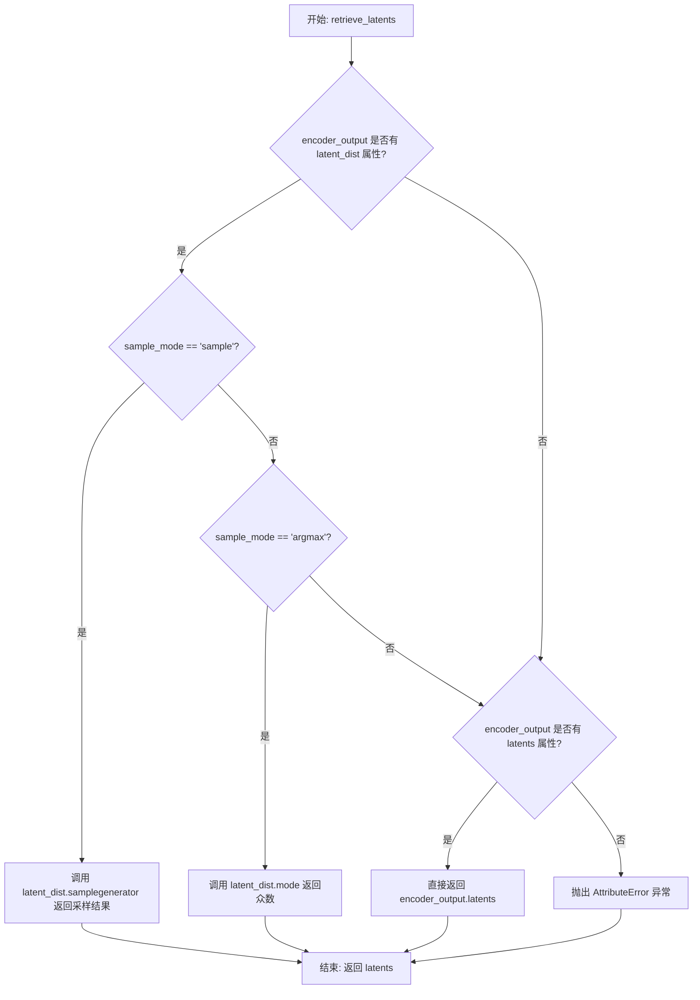

#### 带注释源码

```python
# Copied from diffusers.pipelines.stable_diffusion.pipeline_stable_diffusion_img2img.retrieve_latents
def retrieve_latents(
    encoder_output: torch.Tensor, generator: torch.Generator | None = None, sample_mode: str = "sample"
):
    """
    从编码器输出中检索潜在变量。
    
    支持三种方式获取潜在变量：
    1. 当 encoder_output 包含 latent_dist 属性且 sample_mode='sample' 时，从分布中采样
    2. 当 encoder_output 包含 latent_dist 属性且 sample_mode='argmax' 时，获取分布的众数
    3. 当 encoder_output 直接包含 latents 属性时，直接返回
    
    Args:
        encoder_output: 编码器输出对象，通常是 VAE 的输出
        generator: 可选的随机数生成器，用于控制采样随机性
        sample_mode: 采样模式，'sample' 或 'argmax'
    
    Returns:
        torch.Tensor: 检索到的潜在变量
    
    Raises:
        AttributeError: 当无法从 encoder_output 中获取潜在变量时抛出
    """
    # 检查是否有 latent_dist 属性且需要采样
    if hasattr(encoder_output, "latent_dist") and sample_mode == "sample":
        # 从潜在分布中采样，使用 generator 控制随机性
        return encoder_output.latent_dist.sample(generator)
    # 检查是否有 latent_dist 属性且需要获取众数
    elif hasattr(encoder_output, "latent_dist") and sample_mode == "argmax":
        # 获取潜在分布的模式（众数）
        return encoder_output.latent_dist.mode()
    # 检查是否直接包含 latents 属性
    elif hasattr(encoder_output, "latents"):
        # 直接返回预计算的 latents
        return encoder_output.latents
    else:
        # 无法获取潜在变量，抛出异常
        raise AttributeError("Could not access latents of provided encoder_output")
```


### `retrieve_timesteps`

该函数是扩散Pipeline的全局辅助函数，用于调用调度器的 `set_timesteps` 方法并从中检索时间步。它处理自定义时间步和自定义sigmas，任何额外的 kwargs 将传递给调度器的 `set_timesteps` 方法。

参数：

- `scheduler`：`SchedulerMixin`，要获取时间步的调度器
- `num_inference_steps`：`int | None`，使用预训练模型生成样本时的扩散步数。如果使用此参数，`timesteps` 必须为 `None`
- `device`：`str | torch.device | None`，时间步要移动到的设备。如果为 `None`，时间步不会移动
- `timesteps`：`list[int] | None`，用于覆盖调度器时间步间隔策略的自定义时间步。如果传入 `timesteps`，则 `num_inference_steps` 和 `sigmas` 必须为 `None`
- `sigmas`：`list[float] | None`，用于覆盖调度器时间步间隔策略的自定义sigmas。如果传入 `sigmas`，则 `num_inference_steps` 和 `timesteps` 必须为 `None`
- `**kwargs`：任意额外的关键字参数，将传递给 `scheduler.set_timesteps`

返回值：`tuple[torch.Tensor, int]`，元组，其中第一个元素是调度器的时间步调度，第二个元素是推理步数

#### 流程图

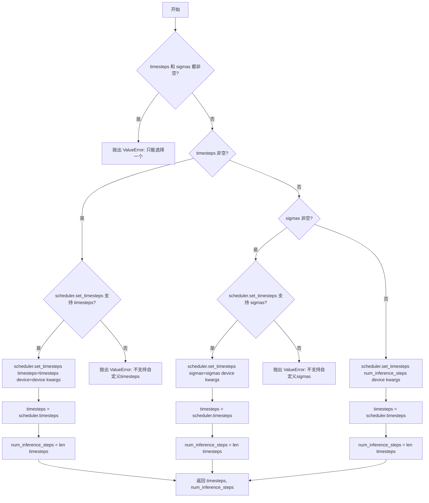

#### 带注释源码

```python
# Copied from diffusers.pipelines.stable_diffusion.pipeline_stable_diffusion.retrieve_timesteps
def retrieve_timesteps(
    scheduler,
    num_inference_steps: int | None = None,
    device: str | torch.device | None = None,
    timesteps: list[int] | None = None,
    sigmas: list[float] | None = None,
    **kwargs,
):
    r"""
    Calls the scheduler's `set_timesteps` method and retrieves timesteps from the scheduler after the call. Handles
    custom timesteps. Any kwargs will be supplied to `scheduler.set_timesteps`.

    Args:
        scheduler (`SchedulerMixin`):
            The scheduler to get timesteps from.
        num_inference_steps (`int`):
            The number of diffusion steps used when generating samples with a pre-trained model. If used, `timesteps`
            must be `None`.
        device (`str` or `torch.device`, *optional*):
            The device to which the timesteps should be moved to. If `None`, the timesteps are not moved.
        timesteps (`list[int]`, *optional*):
            Custom timesteps used to override the timestep spacing strategy of the scheduler. If `timesteps` is passed,
            `num_inference_steps` and `sigmas` must be `None`.
        sigmas (`list[float]`, *optional*):
            Custom sigmas used to override the timestep spacing strategy of the scheduler. If `sigmas` is passed,
            `num_inference_steps` and `timesteps` must be `None`.

    Returns:
        `tuple[torch.Tensor, int]`: A tuple where the first element is the timestep schedule from the scheduler and the
        second element is the number of inference steps.
    """
    # 校验：timesteps 和 sigmas 不能同时传入
    if timesteps is not None and sigmas is not None:
        raise ValueError("Only one of `timesteps` or `sigmas` can be passed. Please choose one to set custom values")
    
    # 分支1：处理自定义 timesteps
    if timesteps is not None:
        # 检查调度器是否支持自定义 timesteps 参数
        accepts_timesteps = "timesteps" in set(inspect.signature(scheduler.set_timesteps).parameters.keys())
        if not accepts_timesteps:
            raise ValueError(
                f"The current scheduler class {scheduler.__class__}'s `set_timesteps` does not support custom"
                f" timestep schedules. Please check whether you are using the correct scheduler."
            )
        # 调用调度器的 set_timesteps 方法
        scheduler.set_timesteps(timesteps=timesteps, device=device, **kwargs)
        # 从调度器获取设置后的时间步
        timesteps = scheduler.timesteps
        # 计算推理步数
        num_inference_steps = len(timesteps)
    
    # 分支2：处理自定义 sigmas
    elif sigmas is not None:
        # 检查调度器是否支持自定义 sigmas 参数
        accept_sigmas = "sigmas" in set(inspect.signature(scheduler.set_timesteps).parameters.keys())
        if not accept_sigmas:
            raise ValueError(
                f"The current scheduler class {scheduler.__class__}'s `set_timesteps` does not support custom"
                f" sigmas schedules. Please check whether you are using the correct scheduler."
            )
        # 调用调度器的 set_timesteps 方法
        scheduler.set_timesteps(sigmas=sigmas, device=device, **kwargs)
        # 从调度器获取设置后的时间步
        timesteps = scheduler.timesteps
        # 计算推理步数
        num_inference_steps = len(timesteps)
    
    # 分支3：使用默认的 num_inference_steps
    else:
        scheduler.set_timesteps(num_inference_steps, device=device, **kwargs)
        timesteps = scheduler.timesteps
    
    # 返回时间步调度和推理步数
    return timesteps, num_inference_steps
```


### `FluxImg2ImgPipeline.__init__`

该方法是FluxImg2ImgPipeline类的构造函数，负责初始化Pipeline的所有组件，包括调度器、VAE、文本编码器、Tokenizer、Transformer模型以及图像编码器等，并配置VAE缩放因子、潜在通道数、图像处理器和Tokenizer最大长度等关键参数。

参数：

- `scheduler`：`FlowMatchEulerDiscreteScheduler`，用于去噪编码图像潜在表示的调度器
- `vae`：`AutoencoderKL`，用于将图像编码和解码到潜在表示的变分自编码器模型
- `text_encoder`：`CLIPTextModel`，CLIP文本编码器模型，具体为clip-vit-large-patch14变体
- `tokenizer`：`CLIPTokenizer`，CLIPTokenizer类的分词器
- `text_encoder_2`：`T5EncoderModel`，T5文本编码器模型，具体为google/t5-v1_1-xxl变体
- `tokenizer_2`：`T5TokenizerFast`，T5TokenizerFast类的分词器
- `transformer`：`FluxTransformer2DModel`，用于去噪编码图像潜在表示的条件Transformer（MMDiT）架构
- `image_encoder`：`CLIPVisionModelWithProjection`（可选），CLIP视觉模型，用于IP-Adapter功能，默认为None
- `feature_extractor`：`CLIPImageProcessor`（可选），CLIP图像处理器，用于IP-Adapter功能，默认为None

返回值：无（`None`），构造函数不返回值，仅初始化实例属性

#### 流程图

```mermaid
flowchart TD
    A[开始 __init__] --> B[调用父类 DiffusionPipeline 的 __init__]
    B --> C[调用 self.register_modules 注册所有模块]
    C --> D[计算 vae_scale_factor: 2^(len(vae.config.block_out_channels)-1) 或默认为8]
    D --> E[设置 latent_channels: vae.config.latent_channels 或默认为16]
    E --> F[创建 VaeImageProcessor 实例<br/>vae_scale_factor * 2, latent_channels]
    F --> G[设置 tokenizer_max_length: tokenizer.model_max_length 或默认为77]
    G --> H[设置 default_sample_size: 128]
    H --> I[结束 __init__]
```

#### 带注释源码

```python
def __init__(
    self,
    scheduler: FlowMatchEulerDiscreteScheduler,  # FlowMatch欧拉离散调度器
    vae: AutoencoderKL,  # 变分自编码器模型
    text_encoder: CLIPTextModel,  # CLIP文本编码器
    tokenizer: CLIPTokenizer,  # CLIP分词器
    text_encoder_2: T5EncoderModel,  # T5文本编码器
    tokenizer_2: T5TokenizerFast,  # T5快速分词器
    transformer: FluxTransformer2DModel,  # Flux变换器模型
    image_encoder: CLIPVisionModelWithProjection = None,  # 可选：CLIP视觉编码器
    feature_extractor: CLIPImageProcessor = None,  # 可选：特征提取器
):
    # 调用父类DiffusionPipeline的初始化方法
    super().__init__()

    # 注册所有模块，使这些组件可以通过pipeline对象访问
    self.register_modules(
        vae=vae,
        text_encoder=text_encoder,
        text_encoder_2=text_encoder_2,
        tokenizer=tokenizer,
        tokenizer_2=tokenizer_2,
        transformer=transformer,
        scheduler=scheduler,
        image_encoder=image_encoder,
        feature_extractor=feature_extractor,
    )
    
    # 计算VAE缩放因子
    # VAE使用2^(len(block_out_channels)-1)的缩放因子
    # 如果VAE不存在，则默认为8
    self.vae_scale_factor = 2 ** (len(self.vae.config.block_out_channels) - 1) if getattr(self, "vae", None) else 8
    
    # Flux潜在变量被转换为2x2块并打包。
    # 这意味着潜在宽度和高度必须能被块大小整除。
    # 因此，VAE缩放因子乘以块大小以考虑这一点。
    # （这里先计算基础缩放因子，后续在image_processor中会乘以2）
    
    # 设置潜在通道数
    self.latent_channels = self.vae.config.latent_channels if getattr(self, "vae", None) else 16
    
    # 创建VAE图像处理器
    # vae_scale_factor乘以2是因为Flux使用了2x2的打包方式
    self.image_processor = VaeImageProcessor(
        vae_scale_factor=self.vae_scale_factor * 2,  # 考虑2x2打包的缩放因子
        vae_latent_channels=self.latent_channels  # 潜在通道数
    )
    
    # 设置Tokenizer的最大长度
    self.tokenizer_max_length = (
        self.tokenizer.model_max_length if hasattr(self, "tokenizer") and self.tokenizer is not None else 77
    )
    
    # 设置默认样本大小
    self.default_sample_size = 128
```


### `FluxImg2ImgPipeline._get_t5_prompt_embeds`

该方法用于获取T5模型生成的文本提示嵌入（prompt embeddings）。它接收原始文本提示，通过T5 tokenizer进行分词和编码，然后使用T5文本编码器生成高维向量表示，支持批量生成多张图像时自动复制嵌入。

参数：

- `prompt`：`str | list[str]`，要编码的提示文本，可以是单个字符串或字符串列表
- `num_images_per_prompt`：`int`，每个提示要生成的图像数量，默认为1
- `max_sequence_length`：`int`，最大序列长度，默认为512个token
- `device`：`torch.device | None`，计算设备，默认为执行设备
- `dtype`：`torch.dtype | None`，张量数据类型，默认为text_encoder_2的数据类型

返回值：`torch.FloatTensor`，T5模型生成的提示嵌入，形状为 `(batch_size * num_images_per_prompt, seq_len, hidden_dim)`

#### 流程图

```mermaid
flowchart TD
    A[开始 _get_t5_prompt_embeds] --> B{device是否为None}
    B -->|是| C[device = self._execution_device]
    B -->|否| D[device 保持原值]
    C --> E{dtype是否为None}
    D --> E
    E -->|是| F[dtype = self.text_encoder.dtype]
    E -->|否| G[dtype 保持原值]
    F --> H[prompt是否为字符串]
    G --> H
    H -->|是| I[prompt = [prompt]]
    H -->|否| J[prompt 保持为列表]
    I --> K{self是否为TextualInversionLoaderMixin}
    J --> K
    K -->|是| L[prompt = self.maybe_convert_prompt]
    K -->|否| M[跳过转换]
    L --> N[tokenizer_2编码prompt]
    M --> N
    N --> O[获取input_ids和untruncated_ids]
    O --> P{untruncated_ids长度 >= input_ids长度 且 不相等}
    P -->|是| Q[记录截断警告]
    P -->|否| R[继续]
    Q --> S[text_encoder_2生成嵌入]
    R --> S
    S --> T[转换为指定dtype和device]
    T --> U[获取seq_len]
    U --> V[repeat复制embeddings]
    V --> W[reshape为批量大小]
    W --> X[返回 prompt_embeds]
```

#### 带注释源码

```python
def _get_t5_prompt_embeds(
    self,
    prompt: str | list[str] = None,
    num_images_per_prompt: int = 1,
    max_sequence_length: int = 512,
    device: torch.device | None = None,
    dtype: torch.dtype | None = None,
):
    # 确定设备：如果未提供则使用管道的执行设备
    device = device or self._execution_device
    # 确定数据类型：如果未提供则使用text_encoder的dtype
    dtype = dtype or self.text_encoder.dtype

    # 标准化prompt格式：如果是单个字符串则转换为列表
    prompt = [prompt] if isinstance(prompt, str) else prompt
    # 计算批处理大小
    batch_size = len(prompt)

    # 如果管道支持TextualInversion，则转换prompt
    if isinstance(self, TextualInversionLoaderMixin):
        prompt = self.maybe_convert_prompt(prompt, self.tokenizer_2)

    # 使用T5 tokenizer对prompt进行编码
    # 填充到最大长度，截断过长序列，返回PyTorch张量
    text_inputs = self.tokenizer_2(
        prompt,
        padding="max_length",
        max_length=max_sequence_length,
        truncation=True,
        return_length=False,
        return_overflowing_tokens=False,
        return_tensors="pt",
    )
    text_input_ids = text_inputs.input_ids
    
    # 同时获取未截断的编码结果，用于检测截断
    untruncated_ids = self.tokenizer_2(prompt, padding="longest", return_tensors="pt").input_ids

    # 检测并警告截断情况
    if untruncated_ids.shape[-1] >= text_input_ids.shape[-1] and not torch.equal(text_input_ids, untruncated_ids):
        # 解码被截断的部分并记录警告
        removed_text = self.tokenizer_2.batch_decode(untruncated_ids[:, self.tokenizer_max_length - 1 : -1])
        logger.warning(
            "The following part of your input was truncated because `max_sequence_length` is set to "
            f" {max_sequence_length} tokens: {removed_text}"
        )

    # 使用T5编码器生成prompt embeddings
    # output_hidden_states=False只返回最后一层的输出
    prompt_embeds = self.text_encoder_2(text_input_ids.to(device), output_hidden_states=False)[0]

    # 重新获取dtype（确保使用编码器实际的dtype）
    dtype = self.text_encoder_2.dtype
    # 将embeddings转换为指定的dtype和device
    prompt_embeds = prompt_embeds.to(dtype=dtype, device=device)

    # 获取序列长度
    _, seq_len, _ = prompt_embeds.shape

    # 复制embeddings以支持每个prompt生成多个图像
    # 使用mps友好的方法：先repeat再view
    prompt_embeds = prompt_embeds.repeat(1, num_images_per_prompt, 1)
    prompt_embeds = prompt_embeds.view(batch_size * num_images_per_prompt, seq_len, -1)

    return prompt_embeds
```


### `FluxImg2ImgPipeline._get_clip_prompt_embeds`

获取 CLIP 模型的提示嵌入向量，将文本提示转换为 CLIP 文本编码器可以处理的数值表示。

参数：

- `prompt`：`str | list[str]`，输入的文本提示，可以是单个字符串或字符串列表
- `num_images_per_prompt`：`int = 1`，每个提示生成的图像数量，用于复制嵌入向量
- `device`：`torch.device | None = None`，执行设备，默认为当前执行设备

返回值：`torch.Tensor`，形状为 `(batch_size * num_images_per_prompt, hidden_size)` 的提示嵌入张量

#### 流程图

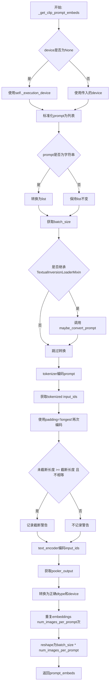

#### 带注释源码

```python
def _get_clip_prompt_embeds(
    self,
    prompt: str | list[str],
    num_images_per_prompt: int = 1,
    device: torch.device | None = None,
):
    """
    获取CLIP模型的提示嵌入向量
    
    参数:
        prompt: 文本提示，字符串或字符串列表
        num_images_per_prompt: 每个提示生成的图像数量
        device: 可选的设备参数
    返回:
        处理后的CLIP提示嵌入张量
    """
    # 确定设备，优先使用传入的device，否则使用执行设备
    device = device or self._execution_device

    # 标准化prompt为列表格式，便于批量处理
    prompt = [prompt] if isinstance(prompt, str) else prompt
    batch_size = len(prompt)

    # 如果pipeline支持TextualInversionLoaderMixin，转换prompt
    # 用于处理textual inversion embeddings
    if isinstance(self, TextualInversionLoaderMixin):
        prompt = self.maybe_convert_prompt(prompt, self.tokenizer)

    # 使用CLIP tokenizer将文本转换为token ids
    # padding="max_length"确保所有序列长度一致
    # truncation=True截断超过max_length的序列
    text_inputs = self.tokenizer(
        prompt,
        padding="max_length",
        max_length=self.tokenizer_max_length,
        truncation=True,
        return_overflowing_tokens=False,
        return_length=False,
        return_tensors="pt",
    )

    # 获取tokenized后的input_ids
    text_input_ids = text_inputs.input_ids
    
    # 使用padding='longest'进行完整编码，用于检测截断
    untruncated_ids = self.tokenizer(prompt, padding="longest", return_tensors="pt").input_ids
    
    # 检测是否发生了截断，如果是则记录警告
    if untruncated_ids.shape[-1] >= text_input_ids.shape[-1] and not torch.equal(text_input_ids, untruncated_ids):
        removed_text = self.tokenizer.batch_decode(untruncated_ids[:, self.tokenizer_max_length - 1 : -1])
        logger.warning(
            "The following part of your input was truncated because CLIP can only handle sequences up to"
            f" {self.tokenizer_max_length} tokens: {removed_text}"
        )
    
    # 使用CLIPTextModel编码文本，获取嵌入表示
    # output_hidden_states=False表示只返回last_hidden_state
    prompt_embeds = self.text_encoder(text_input_ids.to(device), output_hidden_states=False)

    # 从CLIPTextModel输出中提取pooled output
    # 这是经过池化层处理的句子级别表示
    prompt_embeds = prompt_embeds.pooler_output
    
    # 转换到正确的dtype和device
    prompt_embeds = prompt_embeds.to(dtype=self.text_encoder.dtype, device=device)

    # 为每个prompt生成多个图像时复制embeddings
    # repeat方法对MPS设备友好
    prompt_embeds = prompt_embeds.repeat(1, num_images_per_prompt)
    
    # 重塑张量形状以匹配批量大小
    prompt_embeds = prompt_embeds.view(batch_size * num_images_per_prompt, -1)

    return prompt_embeds
```


### `FluxImg2ImgPipeline.encode_prompt`

该方法负责将文本提示（prompt）编码为文本嵌入向量（text embeddings），供 Flux 图像到图像（img2img）扩散管道使用。该方法同时调用 CLIP 和 T5 两种文本编码器生成两种不同类型的文本嵌入：T5 生成完整的序列嵌入（prompt_embeds），CLIP 生成池化后的嵌入（pooled_prompt_embeds），同时还会生成用于-transformer 的 text_ids。

参数：

- `self`：隐式参数，FluxImg2ImgPipeline 实例本身
- `prompt`：`str | list[str]`，要编码的文本提示，可以是单个字符串或字符串列表
- `prompt_2`：`str | list[str] | None`，发送给 tokenizer_2 和 text_encoder_2 的提示。若未定义，则使用 prompt
- `device`：`torch.device | None`，torch 设备，若未提供则使用执行设备
- `num_images_per_prompt`：`int`，每个提示要生成的图像数量，默认为 1
- `prompt_embeds`：`torch.FloatTensor | None`，预生成的文本嵌入。可用于轻松调整文本输入，例如提示加权。若未提供，则从 prompt 输入参数生成
- `pooled_prompt_embeds`：`torch.FloatTensor | None`，预生成的池化文本嵌入。可用于轻松调整文本输入，例如提示加权。若未提供，则从 prompt 生成
- `max_sequence_length`：`int`，最大序列长度，默认为 512
- `lora_scale`：`float | None`，如果加载了 LoRA 层，将应用于文本编码器所有 LoRA 层的 LoRA 缩放因子

返回值：`tuple[torch.FloatTensor, torch.FloatTensor, torch.Tensor]`，返回一个包含三个元素的元组：
- 第一个元素：`prompt_embeds`（torch.FloatTensor），T5 编码器生成的文本嵌入
- 第二个元素：`pooled_prompt_embeds`（torch.FloatTensor），CLIP 编码器生成的池化文本嵌入
- 第三个元素：`text_ids`（torch.Tensor），形状为 (seq_len, 3) 的零张量，用于-transformer

#### 流程图

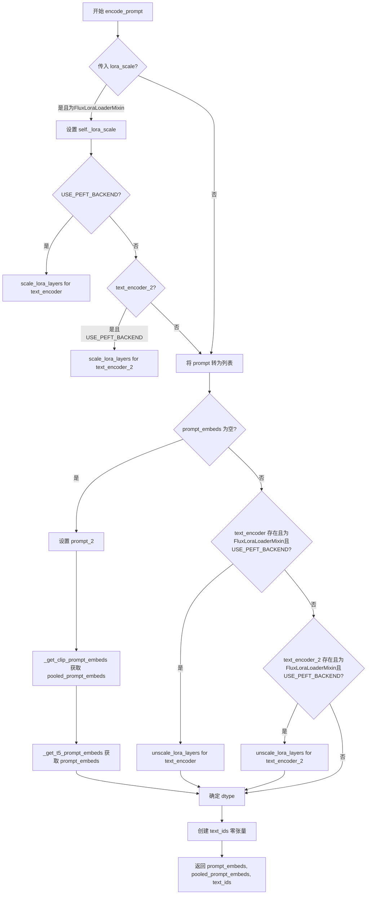

#### 带注释源码

```python
def encode_prompt(
    self,
    prompt: str | list[str],
    prompt_2: str | list[str] | None = None,
    device: torch.device | None = None,
    num_images_per_prompt: int = 1,
    prompt_embeds: torch.FloatTensor | None = None,
    pooled_prompt_embeds: torch.FloatTensor | None = None,
    max_sequence_length: int = 512,
    lora_scale: float | None = None,
):
    r"""
    Encodes the prompt into text embeddings for the Flux pipeline.

    Args:
        prompt (`str` or `list[str]`, *optional*):
            prompt to be encoded
        prompt_2 (`str` or `list[str]`, *optional*):
            The prompt or prompts to be sent to the `tokenizer_2` and `text_encoder_2`. If not defined, `prompt` is
            used in all text-encoders
        device: (`torch.device`):
            torch device
        num_images_per_prompt (`int`):
            number of images that should be generated per prompt
        prompt_embeds (`torch.FloatTensor`, *optional*):
            Pre-generated text embeddings. Can be used to easily tweak text inputs, *e.g.* prompt weighting. If not
            provided, text embeddings will be generated from `prompt` input argument.
        pooled_prompt_embeds (`torch.FloatTensor`, *optional*):
            Pre-generated pooled text embeddings. Can be used to easily tweak text inputs, *e.g.* prompt weighting.
            If not provided, pooled text embeddings will be generated from `prompt` input argument.
        lora_scale (`float`, *optional*):
            A lora scale that will be applied to all LoRA layers of the text encoder if LoRA layers are loaded.
    """
    # 确定设备，若未提供则使用执行设备
    device = device or self._execution_device

    # 设置 lora scale，以便文本编码器的 monkey patched LoRA 函数可以正确访问
    if lora_scale is not None and isinstance(self, FluxLoraLoaderMixin):
        self._lora_scale = lora_scale

        # 动态调整 LoRA scale
        if self.text_encoder is not None and USE_PEFT_BACKEND:
            scale_lora_layers(self.text_encoder, lora_scale)
        if self.text_encoder_2 is not None and USE_PEFT_BACKEND:
            scale_lora_layers(self.text_encoder_2, lora_scale)

    # 将 prompt 转换为列表
    prompt = [prompt] if isinstance(prompt, str) else prompt

    # 如果没有预生成的嵌入，则需要生成
    if prompt_embeds is None:
        # prompt_2 用于 T5 编码器，若未提供则使用 prompt
        prompt_2 = prompt_2 or prompt
        prompt_2 = [prompt_2] if isinstance(prompt_2, str) else prompt_2

        # 只使用 CLIPTextModel 的池化输出
        pooled_prompt_embeds = self._get_clip_prompt_embeds(
            prompt=prompt,
            device=device,
            num_images_per_prompt=num_images_per_prompt,
        )
        # 获取 T5 文本嵌入
        prompt_embeds = self._get_t5_prompt_embeds(
            prompt=prompt_2,
            num_images_per_prompt=num_images_per_prompt,
            max_sequence_length=max_sequence_length,
            device=device,
        )

    # 如果存在文本编码器且使用了 LoRA，则恢复原始 scale
    if self.text_encoder is not None:
        if isinstance(self, FluxLoraLoaderMixin) and USE_PEFT_BACKEND:
            # 通过 unscale LoRA 层恢复原始 scale
            unscale_lora_layers(self.text_encoder, lora_scale)

    if self.text_encoder_2 is not None:
        if isinstance(self, FluxLoraLoaderMixin) and USE_PEFT_BACKEND:
            # 通过 unscale LoRA 层恢复原始 scale
            unscale_lora_layers(self.text_encoder_2, lora_scale)

    # 确定数据类型，优先使用 text_encoder 的 dtype，否则使用 transformer 的 dtype
    dtype = self.text_encoder.dtype if self.text_encoder is not None else self.transformer.dtype
    
    # 创建用于-transformer 的 text_ids（形状为 seq_len x 3 的零张量）
    text_ids = torch.zeros(prompt_embeds.shape[1], 3).to(device=device, dtype=dtype)

    # 返回：T5 文本嵌入、CLIP 池化嵌入、text_ids
    return prompt_embeds, pooled_prompt_embeds, text_ids
```


### `FluxImg2ImgPipeline.encode_image`

该方法用于将输入图像编码为图像嵌入向量（image embeddings），供 FluxImg2ImgPipeline 中的 IP-Adapter 功能使用。它首先检查图像是否为 PyTorch 张量，如果不是则使用特征提取器进行转换，然后将图像通过 CLIPVisionModelWithProjection 编码器获取图像嵌入，最后根据 num_images_per_prompt 参数对嵌入进行复制以支持批量生成。

参数：

- `image`：`torch.Tensor | PipelineImageInput`，输入的图像数据，可以是 PyTorch 张量或 PIPELINE 图像输入类型（如 PIL.Image、numpy 数组等）
- `device`：`torch.device`，用于将图像张量移动到指定设备（如 CUDA 或 CPU）
- `num_images_per_prompt`：`int`，每个 prompt 生成的图像数量，用于决定是否需要复制图像嵌入

返回值：`torch.FloatTensor`，编码后的图像嵌入向量，形状为 `(batch_size * num_images_per_prompt, embedding_dim)`

#### 流程图

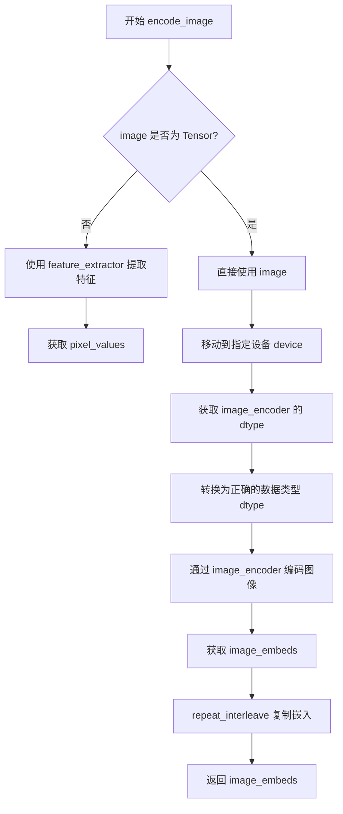

#### 带注释源码

```python
def encode_image(self, image, device, num_images_per_prompt):
    """
    Encode image into image embeddings for IP-Adapter support.
    
    Args:
        image: Input image tensor or PipelineImageInput
        device: Target device for the image tensor
        num_images_per_prompt: Number of images to generate per prompt
    
    Returns:
        Encoded image embeddings tensor
    """
    # 获取图像编码器的参数数据类型，用于保持数据类型一致性
    dtype = next(self.image_encoder.parameters()).dtype

    # 如果输入不是 PyTorch 张量，则使用特征提取器进行转换
    if not isinstance(image, torch.Tensor):
        # 使用 feature_extractor 将图像转换为张量格式
        image = self.feature_extractor(image, return_tensors="pt").pixel_values

    # 将图像张量移动到指定设备并转换为正确的数据类型
    image = image.to(device=device, dtype=dtype)
    
    # 通过 CLIP Vision Encoder 获取图像嵌入
    image_embeds = self.image_encoder(image).image_embeds
    
    # 根据每个 prompt 生成的图像数量复制图像嵌入
    # repeat_interleave 在 dim=0 上重复嵌入，与 text_embeds 的处理方式保持一致
    image_embeds = image_embeds.repeat_interleave(num_images_per_prompt, dim=0)
    
    return image_embeds
```


### `FluxImg2ImgPipeline.prepare_ip_adapter_image_embeds`

该方法用于准备IP-Adapter的图像嵌入（image embeds），支持两种输入模式：直接输入图像或已编码的图像嵌入。如果输入为图像，则通过内部的 `encode_image` 方法进行编码；如果输入为预计算的嵌入，则直接使用。最后将嵌入复制到指定的设备上，并根据 `num_images_per_prompt` 参数进行批量扩展，以支持每条提示生成多张图像。

参数：

- `self`：`FluxImg2ImgPipeline` 实例本身
- `ip_adapter_image`：`PipelineImageInput | None`，要用于 IP-Adapter 的原始图像输入，可以是单张图像或图像列表
- `ip_adapter_image_embeds`：`list[torch.Tensor] | None`，预计算的图像嵌入列表，如果为 None，则从 `ip_adapter_image` 编码生成
- `device`：`torch.device`，目标设备，用于将图像嵌入移动到该设备上
- `num_images_per_prompt`：`int`，每个提示词生成的图像数量，用于对嵌入进行相应数量的复制

返回值：`list[torch.Tensor]`，处理后的 IP-Adapter 图像嵌入列表，每个元素是一个张量，形状为 `(batch_size * num_images_per_prompt, emb_dim)`

#### 流程图

```mermaid
flowchart TD
    A[开始: prepare_ip_adapter_image_embeds] --> B{ip_adapter_image_embeds<br/>是否为 None?}
    B -->|是| C[将 ip_adapter_image 转为列表]
    C --> D{检查图像数量是否等于<br/>num_ip_adapters}
    D -->|否| E[抛出 ValueError]
    D -->|是| F[遍历每张图像]
    F --> G[调用 encode_image 编码单张图像]
    G --> H[添加 [None, :] 维度到列表]
    H --> I[遍历完所有图像?]
    I -->|否| F
    I -->|是| J[跳转到 N]
    B -->|否| K[将 ip_adapter_image_embeds 转为列表]
    K --> L{检查嵌入数量是否等于<br/>num_ip_adapters}
    L -->|否| M[抛出 ValueError]
    L -->|是| N[遍历每个嵌入]
    N --> O[复制 num_images_per_prompt 次]
    O --> P[移动到目标 device]
    P --> Q[添加到结果列表]
    Q --> R[遍历完所有嵌入?]
    R -->|否| N
    R -->|是| S[返回嵌入列表]
```

#### 带注释源码

```python
def prepare_ip_adapter_image_embeds(
    self, ip_adapter_image, ip_adapter_image_embeds, device, num_images_per_prompt
):
    """
    准备 IP-Adapter 的图像嵌入。
    
    处理两种输入模式：
    1. 如果 ip_adapter_image_embeds 为 None，则从 ip_adapter_image 编码生成嵌入
    2. 如果提供了 ip_adapter_image_embeds，则直接使用
    
    参数:
        ip_adapter_image: 原始图像输入，可以是单张图像或图像列表
        ip_adapter_image_embeds: 预计算的图像嵌入列表
        device: 目标设备
        num_images_per_prompt: 每个提示生成的图像数量
    
    返回:
        处理后的图像嵌入列表
    """
    image_embeds = []  # 存储中间结果的列表
    
    # 模式1: 需要从图像编码生成嵌入
    if ip_adapter_image_embeds is None:
        # 确保输入是列表格式
        if not isinstance(ip_adapter_image, list):
            ip_adapter_image = [ip_adapter_image]
        
        # 验证图像数量与 IP-Adapter 数量是否匹配
        if len(ip_adapter_image) != self.transformer.encoder_hid_proj.num_ip_adapters:
            raise ValueError(
                f"`ip_adapter_image` must have same length as the number of IP Adapters. "
                f"Got {len(ip_adapter_image)} images and {self.transformer.encoder_hid_proj.num_ip_adapters} IP Adapters."
            )
        
        # 遍历每张图像，分别编码
        for single_ip_adapter_image in ip_adapter_image:
            # 调用内部方法编码图像
            single_image_embeds = self.encode_image(single_ip_adapter_image, device, 1)
            # 添加批次维度 [None, :]，从 (batch, emb_dim) 变为 (1, batch, emb_dim)
            image_embeds.append(single_image_embeds[None, :])
    else:
        # 模式2: 使用预计算的嵌入
        if not isinstance(ip_adapter_image_embeds, list):
            ip_adapter_image_embeds = [ip_adapter_image_embeds]
        
        # 验证嵌入数量与 IP-Adapter 数量是否匹配
        if len(ip_adapter_image_embeds) != self.transformer.encoder_hid_proj.num_ip_adapters:
            raise ValueError(
                f"`ip_adapter_image_embeds` must have same length as the number of IP Adapters. "
                f"Got {len(ip_adapter_image_embeds)} image embeds and {self.transformer.encoder_hid_proj.num_ip_adapters} IP Adapters."
            )
        
        # 直接使用预计算的嵌入
        for single_image_embeds in ip_adapter_image_embeds:
            image_embeds.append(single_image_embeds)
    
    # 对每个嵌入进行批量扩展以支持每提示生成多张图像
    ip_adapter_image_embeds = []
    for single_image_embeds in image_embeds:
        # 在批次维度复制 num_images_per_prompt 次
        # 例如从 (1, emb_dim) 复制为 (num_images_per_prompt, emb_dim)
        single_image_embeds = torch.cat([single_image_embeds] * num_images_per_prompt, dim=0)
        # 移动到目标设备
        single_image_embeds = single_image_embeds.to(device=device)
        # 添加到结果列表
        ip_adapter_image_embeds.append(single_image_embeds)
    
    return ip_adapter_image_embeds
```


### `FluxImg2ImgPipeline._encode_vae_image`

使用 VAE（变分自编码器）对输入图像进行编码，将图像转换为潜在空间表示，并应用缩放和偏移因子进行调整。

参数：

- `image`：`torch.Tensor`，待编码的输入图像张量
- `generator`：`torch.Generator`，用于生成随机数的 PyTorch 生成器（可单个或列表）

返回值：`torch.Tensor`，编码后的图像潜在表示张量

#### 流程图

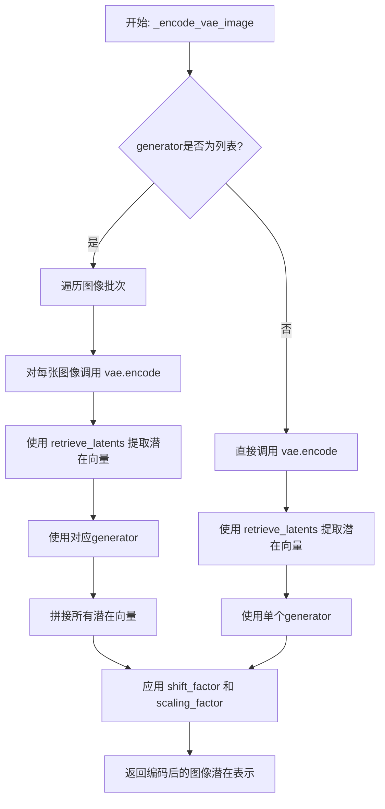

#### 带注释源码

```python
def _encode_vae_image(self, image: torch.Tensor, generator: torch.Generator):
    """
    使用 VAE 对图像进行编码，生成潜在表示
    
    参数:
        image: 输入图像张量，形状为 (B, C, H, W)
        generator: PyTorch 随机生成器，用于确保可重复性
    
    返回:
        编码后的图像潜在表示张量
    """
    # 检查 generator 是否为列表（对应批量处理）
    if isinstance(generator, list):
        # 逐个处理图像批次中的每张图像
        image_latents = [
            # 对单张图像进行 VAE 编码
            retrieve_latents(self.vae.encode(image[i : i + 1]), generator=generator[i])
            for i in range(image.shape[0])  # 遍历批次中的每个样本
        ]
        # 将所有潜在向量沿批次维度拼接
        image_latents = torch.cat(image_latents, dim=0)
    else:
        # 单一 generator，对整个批次一次性编码
        image_latents = retrieve_latents(self.vae.encode(image), generator=generator)

    # 应用 VAE 的缩放因子和偏移因子进行归一化调整
    # 这确保潜在表示符合模型训练时的统计特性
    image_latents = (image_latents - self.vae.config.shift_factor) * self.vae.config.scaling_factor

    return image_latents
```


### `FluxImg2ImgPipeline.get_timesteps`

该方法根据 `strength` 参数调整扩散模型的时间步（timesteps），用于图像到图像（Img2Img）任务中控制保留原始图像特征的程度。通过计算实际需要执行的推理步数，并从调度器中获取对应的子集时间步，实现对去噪过程的精确控制。

参数：

- `num_inference_steps`：`int`，总推理步数，即希望模型执行的完整去噪迭代次数
- `strength`：`float`，转换强度，范围 [0, 1]，值越大表示对原始图像的改变越多
- `device`：`torch.device`，计算设备，用于将时间步移动到指定设备

返回值：`tuple[torch.Tensor, int]`，第一个元素是调整后的时间步序列（torch.Tensor），第二个元素是实际执行的推理步数（int）

#### 流程图

```mermaid
flowchart TD
    A[开始 get_timesteps] --> B[计算 init_timestep = min(num_inference_steps × strength, num_inference_steps)]
    B --> C[计算 t_start = max(num_inference_steps - init_timestep, 0)]
    C --> D[从 scheduler.timesteps 切片获取调整后的时间步序列]
    D --> E{scheduler 是否有 set_begin_index 方法?}
    E -->|是| F[调用 scheduler.set_begin_index 设置起始索引]
    E -->|否| G[跳过设置]
    F --> H[返回 timesteps 和实际推理步数]
    G --> H
```

#### 带注释源码

```python
def get_timesteps(self, num_inference_steps, strength, device):
    # 计算初始时间步数：根据 strength 和总步数计算实际需要使用的步数
    # strength 越高，init_timestep 越大，意味着从更接近原始噪声的状态开始
    init_timestep = min(num_inference_steps * strength, num_inference_steps)

    # 计算起始索引：从完整时间步序列的哪个位置开始使用
    # 如果 strength=1.0，则 t_start=0，使用全部时间步
    # 如果 strength=0.5，则跳过前半部分时间步，从中间开始
    t_start = int(max(num_inference_steps - init_timestep, 0))

    # 从调度器获取完整的时间步序列，并切片获取调整后的子集
    # scheduler.order 用于处理多步调度器（如 DPMSolverMultistepScheduler）
    timesteps = self.scheduler.timesteps[t_start * self.scheduler.order :]

    # 部分调度器支持设置起始索引，用于从特定位置开始执行
    if hasattr(self.scheduler, "set_begin_index"):
        self.scheduler.set_begin_index(t_start * self.scheduler.order)

    # 返回调整后的时间步和实际执行的推理步数
    return timesteps, num_inference_steps - t_start
```


### `FluxImg2ImgPipeline.check_inputs`

该方法用于验证 FluxImg2ImgPipeline 的输入参数是否合法，包括检查提示词、强度值、图像尺寸、嵌入向量等参数的有效性和一致性。如果参数不符合要求，会抛出相应的 ValueError 异常。

参数：

- `self`：`FluxImg2ImgPipeline`，Pipeline 实例本身
- `prompt`：`str | list[str] | None`，主提示词，用于引导图像生成
- `prompt_2`：`str | list[str] | None`，发送给 T5 编码器的提示词
- `strength`：`float`，图像变换强度，范围 [0.0, 1.0]
- `height`：`int`，生成图像的高度（像素）
- `width`：`int`，生成图像的宽度（像素）
- `negative_prompt`：`str | list[str] | None`，负面提示词
- `negative_prompt_2`：`str | list[str] | None`，T5 编码器的负面提示词
- `prompt_embeds`：`torch.FloatTensor | None`，预生成的主提示词嵌入
- `negative_prompt_embeds`：`torch.FloatTensor | None`，预生成的负面提示词嵌入
- `pooled_prompt_embeds`：`torch.FloatTensor | None`，池化的提示词嵌入
- `negative_pooled_prompt_embeds`：`torch.FloatTensor | None`，池化的负面提示词嵌入
- `callback_on_step_end_tensor_inputs`：`list[str] | None`，每步结束时的回调张量输入列表
- `max_sequence_length`：`int | None`，最大序列长度

返回值：`None`，仅通过抛出异常表示验证失败

#### 流程图

```mermaid
flowchart TD
    A[开始 check_inputs] --> B{strength in [0, 1]?}
    B -->|否| C[抛出 ValueError: strength 超出范围]
    B -->|是| D{height/width 可被 vae_scale_factor*2 整除?}
    D -->|否| E[发出 logger.warning 警告并调整尺寸]
    D -->|是| F{callback_on_step_end_tensor_inputs 合法?}
    F -->|否| G[抛出 ValueError: 非法的 tensor_inputs]
    F -->|是| H{prompt 和 prompt_embeds 不能同时提供?}
    H -->|是| I[抛出 ValueError: 参数冲突]
    H -->|否| J{prompt_2 和 prompt_embeds 不能同时提供?}
    J -->|是| K[抛出 ValueError: 参数冲突]
    J -->|否| L{prompt 或 prompt_embeds 必须提供?}
    L -->|否| M[抛出 ValueError: 缺少必要参数]
    L -->|是| N{prompt 类型合法 str/list?}
    N -->|否| O[抛出 ValueError: 非法类型]
    N -->|是| P{prompt_2 类型合法 str/list/None?]
    P -->|否| Q[抛出 ValueError: 非法类型]
    P -->|是| R{negative_prompt 和 negative_prompt_embeds 不能同时提供?}
    R -->|是| S[抛出 ValueError: 参数冲突]
    R -->|否| T{negative_prompt_2 和 negative_prompt_embeds 不能同时提供?}
    T -->|是| U[抛出 ValueError: 参数冲突]
    T -->|否| V{prompt_embeds 与 negative_prompt_embeds 形状一致?}
    V -->|否| W[抛出 ValueError: 形状不匹配]
    V -->|是| X{prompt_embeds 提供时 pooled_prompt_embeds 必须提供?}
    X -->|是| Y[抛出 ValueError: 缺少 pooled_prompt_embeds]
    X -->|否| Z{negative_prompt_embeds 提供时 negative_pooled_prompt_embeds 必须提供?}
    Z -->|是| AA[抛出 ValueError: 缺少 negative_pooled_prompt_embeds]
    Z -->|否| AB{max_sequence_length <= 512?}
    AB -->|否| AC[抛出 ValueError: max_sequence_length 超出范围]
    AB -->|是| AD[验证通过，返回 None]
    C --> AD
    E --> F
    G --> AD
    I --> AD
    K --> AD
    M --> AD
    O --> AD
    Q --> AD
    S --> AD
    U --> AD
    W --> AD
    Y --> AD
    AA --> AD
    AC --> AD
```

#### 带注释源码

```python
def check_inputs(
    self,
    prompt,                          # 主提示词 (str 或 list[str])
    prompt_2,                        # T5 编码器的提示词 (str 或 list[str])
    strength,                        # 图像变换强度 (float, 0.0-1.0)
    height,                          # 生成图像高度 (int)
    width,                           # 生成图像宽度 (int)
    negative_prompt=None,            # 负面提示词 (可选)
    negative_prompt_2=None,          # T5 编码器的负面提示词 (可选)
    prompt_embeds=None,              # 预生成的提示词嵌入 (可选)
    negative_prompt_embeds=None,    # 预生成的负面提示词嵌入 (可选)
    pooled_prompt_embeds=None,      # 池化的提示词嵌入 (可选)
    negative_pooled_prompt_embeds=None,  # 池化的负面提示词嵌入 (可选)
    callback_on_step_end_tensor_inputs=None,  # 回调张量输入列表 (可选)
    max_sequence_length=None,        # 最大序列长度 (可选)
):
    # 1. 验证强度值必须在 [0.0, 1.0] 范围内
    if strength < 0 or strength > 1:
        raise ValueError(f"The value of strength should in [0.0, 1.0] but is {strength}")

    # 2. 检查高度和宽度是否能被 vae_scale_factor*2 整除
    # Flux 的潜在空间使用 2x2 补丁打包，需要高度和宽度可被补丁大小整除
    if height % (self.vae_scale_factor * 2) != 0 or width % (self.vae_scale_factor * 2) != 0:
        logger.warning(
            f"`height` and `width` have to be divisible by {self.vae_scale_factor * 2} but are {height} and {width}. Dimensions will be resized accordingly"
        )

    # 3. 验证回调张量输入是否在允许列表中
    if callback_on_step_end_tensor_inputs is not None and not all(
        k in self._callback_tensor_inputs for k in callback_on_step_end_tensor_inputs
    ):
        raise ValueError(
            f"`callback_on_step_end_tensor_inputs` has to be in {self._callback_tensor_inputs}, but found {[k for k in callback_on_step_end_tensor_inputs if k not in self._callback_tensor_inputs]}"
        )

    # 4. 验证 prompt 和 prompt_embeds 不能同时提供
    if prompt is not None and prompt_embeds is not None:
        raise ValueError(
            f"Cannot forward both `prompt`: {prompt} and `prompt_embeds`: {prompt_embeds}. Please make sure to"
            " only forward one of the two."
        )
    # 5. 验证 prompt_2 和 prompt_embeds 不能同时提供
    elif prompt_2 is not None and prompt_embeds is not None:
        raise ValueError(
            f"Cannot forward both `prompt_2`: {prompt_2} and `prompt_embeds`: {prompt_embeds}. Please make sure to"
            " only forward one of the two."
        )
    # 6. 验证至少提供 prompt 或 prompt_embeds 之一
    elif prompt is None and prompt_embeds is None:
        raise ValueError(
            "Provide either `prompt` or `prompt_embeds`. Cannot leave both `prompt` and `prompt_embeds` undefined."
        )
    # 7. 验证 prompt 类型必须是 str 或 list
    elif prompt is not None and (not isinstance(prompt, str) and not isinstance(prompt, list)):
        raise ValueError(f"`prompt` has to be of type `str` or `list` but is {type(prompt)}")
    # 8. 验证 prompt_2 类型必须是 str 或 list
    elif prompt_2 is not None and (not isinstance(prompt_2, str) and not isinstance(prompt_2, list)):
        raise ValueError(f"`prompt_2` has to be of type `str` or `list` but is {type(prompt_2)}")

    # 9. 验证 negative_prompt 和 negative_prompt_embeds 不能同时提供
    if negative_prompt is not None and negative_prompt_embeds is not None:
        raise ValueError(
            f"Cannot forward both `negative_prompt`: {negative_prompt} and `negative_prompt_embeds`:"
            f" {negative_prompt_embeds}. Please make sure to only forward one of the two."
        )
    # 10. 验证 negative_prompt_2 和 negative_prompt_embeds 不能同时提供
    elif negative_prompt_2 is not None and negative_prompt_embeds is not None:
        raise ValueError(
            f"Cannot forward both `negative_prompt_2`: {negative_prompt_2} and `negative_prompt_embeds`:"
            f" {negative_prompt_embeds}. Please make sure to only forward one of the two."
        )

    # 11. 验证 prompt_embeds 和 negative_prompt_embeds 形状一致
    if prompt_embeds is not None and negative_prompt_embeds is not None:
        if prompt_embeds.shape != negative_prompt_embeds.shape:
            raise ValueError(
                "`prompt_embeds` and `negative_prompt_embeds` must have the same shape when passed directly, but"
                f" got: `prompt_embeds` {prompt_embeds.shape} != `negative_prompt_embeds`"
                f" {negative_prompt_embeds.shape}."
            )

    # 12. 如果提供 prompt_embeds，必须也提供 pooled_prompt_embeds
    if prompt_embeds is not None and pooled_prompt_embeds is None:
        raise ValueError(
            "If `prompt_embeds` are provided, `pooled_prompt_embeds` also have to be passed. Make sure to generate `pooled_prompt_embeds` from the same text encoder that was used to generate `prompt_embeds`."
        )
    # 13. 如果提供 negative_prompt_embeds，必须也提供 negative_pooled_prompt_embeds
    if negative_prompt_embeds is not None and negative_pooled_prompt_embeds is None:
        raise ValueError(
            "If `negative_prompt_embeds` are provided, `negative_pooled_prompt_embeds` also have to be passed. Make sure to generate `negative_pooled_prompt_embeds` from the same text encoder that was used to generate `negative_prompt_embeds`."
        )

    # 14. 验证 max_sequence_length 不能超过 512
    if max_sequence_length is not None and max_sequence_length > 512:
        raise ValueError(f"`max_sequence_length` cannot be greater than 512 but is {max_sequence_length}")
```


### `FluxImg2ImgPipeline._prepare_latent_image_ids`

该方法用于为潜在图像生成位置编码ID（坐标），以支持Flux变换器模型中的空间注意力机制。它创建一个包含图像空间位置信息的张量，通过在Y轴和X轴上填充相应的索引值来编码二维位置信息，最后将2D位置矩阵展平为1D序列返回。

参数：

- `batch_size`：`int`，批次大小，虽然在此方法中未直接使用，但传递给调用者用于确定生成的潜在图像ID数量
- `height`：`int`，潜在图像的高度（以patch为单位）
- `width`：`int`，潜在图像的宽度（以patch为单位）
- `device`：`torch.device`，目标设备，用于将生成的张量移动到指定设备
- `dtype`：`torch.dtype`，目标数据类型，用于指定返回张量的数据类型

返回值：`torch.Tensor`，形状为 `(height * width, 3)` 的二维张量，每行包含 `[0, y_index, x_index]` 格式的位置编码信息

#### 流程图

```mermaid
flowchart TD
    A[开始] --> B[创建零张量 shape: height x width x 3]
    B --> C[填充Y轴坐标: latent_image_ids[..., 1] += torch.arange(height)[:, None]]
    C --> D[填充X轴坐标: latent_image_ids[..., 2] += torch.arange(width)[None, :]]
    D --> E[获取张量形状 height x width x 3]
    E --> F[重塑张量: 2D -> 1D序列 shape: height*width x 3]
    F --> G[移动到目标设备并转换数据类型]
    G --> H[返回位置编码张量]
```

#### 带注释源码

```python
@staticmethod
# Copied from diffusers.pipelines.flux.pipeline_flux.FluxPipeline._prepare_latent_image_ids
def _prepare_latent_image_ids(batch_size, height, width, device, dtype):
    """
    准备潜在图像的位置编码ID，用于Flux变换器中的空间注意力机制。
    
    参数:
        batch_size: 批次大小（当前方法未直接使用）
        height: 潜在图像高度（patch数量）
        width: 潜在图像宽度（patch数量）
        device: 目标设备
        dtype: 目标数据类型
    
    返回:
        形状为 (height * width, 3) 的位置编码张量
    """
    # 步骤1: 创建一个height x width x 3的零张量
    # 通道维度(3)分别用于: [时间/批次维度, Y坐标, X坐标]
    latent_image_ids = torch.zeros(height, width, 3)
    
    # 步骤2: 填充Y轴位置坐标到第二个通道 [..., 1]
    # torch.arange(height)[:, None] 创建列向量 (height, 1)
    # 广播机制将Y坐标添加到每一列
    latent_image_ids[..., 1] = latent_image_ids[..., 1] + torch.arange(height)[:, None]
    
    # 步骤3: 填充X轴位置坐标到第三个通道 [..., 2]
    # torch.arange(width)[None, :] 创建行向量 (1, width)
    # 广播机制将X坐标添加到每一行
    latent_image_ids[..., 2] = latent_image_ids[..., 2] + torch.arange(width)[None, :]
    
    # 步骤4: 获取重塑后的张量形状
    latent_image_id_height, latent_image_id_width, latent_image_id_channels = latent_image_ids.shape
    
    # 步骤5: 将2D位置矩阵重塑为1D序列
    # 从 (height, width, 3) 变为 (height*width, 3)
    latent_image_ids = latent_image_ids.reshape(
        latent_image_id_height * latent_image_id_width, latent_image_id_channels
    )
    
    # 步骤6: 移动到目标设备并转换数据类型后返回
    return latent_image_ids.to(device=device, dtype=dtype)
```


### `FluxImg2ImgPipeline._pack_latents`

该函数将输入的潜在变量张量进行维度重塑和排列，将其从标准4D张量（批量大小×通道数×高×宽）转换为打包格式的3D张量（批量大小×补丁数×打包通道数），以适应Flux模型中2×2补丁的打包处理需求。

参数：

- `latents`：`torch.Tensor`，输入的潜在变量张量，形状为（batch_size, num_channels_latents, height, width）
- `batch_size`：`int`，批次大小
- `num_channels_latents`：`int`，潜在变量的通道数
- `height`：`int`，潜在变量的高度
- `width`：`int`，潜在变量的宽度

返回值：`torch.Tensor`，打包后的潜在变量张量，形状为（batch_size, (height // 2) * (width // 2), num_channels_latents * 4）

#### 流程图

```mermaid
flowchart TD
    A[开始: 输入 latents] --> B[使用 view 重塑张量]
    B --> C[将 latents 转换为 (batch_size, num_channels_latents, height//2, 2, width//2, 2)]
    C --> D[使用 permute 重新排列维度]
    D --> E[转换为 (batch_size, height//2, width//2, num_channels_latents, 2, 2)]
    E --> F[使用 reshape 展平为 3D 张量]
    F --> G[输出: (batch_size, (height//2)\*(width//2), num_channels_latents\*4)]
```

#### 带注释源码

```python
@staticmethod
def _pack_latents(latents, batch_size, num_channels_latents, height, width):
    """
    将潜在变量打包成Flux模型所需的格式
    
    参数:
        latents: 输入张量，形状为 (batch_size, num_channels_latents, height, width)
        batch_size: 批次大小
        num_channels_latents: 潜在变量的通道数
        height: 潜在变量的高度
        width: 潜在变量的宽度
    
    返回:
        打包后的张量，形状为 (batch_size, (height//2)*(width//2), num_channels_latents*4)
    """
    # Step 1: 将4D张量重塑为6D张量，将height和width各分割成两部分（2x2补丁）
    # 例如: (B, C, H, W) -> (B, C, H//2, 2, W//2, 2)
    latents = latents.view(batch_size, num_channels_latents, height // 2, 2, width // 2, 2)
    
    # Step 2: 重新排列维度，将空间维度提前，通道维度移到最后
    # 从 (B, C, H//2, 2, W//2, 2) -> (B, H//2, W//2, C, 2, 2)
    latents = latents.permute(0, 2, 4, 1, 3, 5)
    
    # Step 3: 将张量展平为3D，每个2x2补丁的4个值被展平到通道维度
    # 最终形状: (B, H//2*W//2, C*4)
    latents = latents.reshape(batch_size, (height // 2) * (width // 2), num_channels_latents * 4)

    return latents
```


### `FluxImg2ImgPipeline._unpack_latents`

该方法是一个静态方法，用于将打包（packed）后的潜在变量张量解包回原始的4D张量形状。它是 `_pack_latents` 方法的逆操作，通过视图重塑和维度置换来恢复潜在变量的空间结构，同时根据 VAE 缩放因子调整高度和宽度。

参数：

-  `latents`：`torch.Tensor`，打包后的潜在变量张量，形状为 (batch_size, num_patches, channels)，其中 num_patches = (height // 2) * (width // 2)
-  `height`：`int`，原始图像的高度（像素空间）
-  `width`：`int`，原始图像的宽度（像素空间）
-  `vae_scale_factor`：`int`，VAE 的缩放因子，用于计算潜在空间的实际尺寸

返回值：`torch.Tensor`，解包后的4D潜在变量张量，形状为 (batch_size, channels // 4, height, width)

#### 流程图

```mermaid
flowchart TD
    A[开始: _unpack_latents] --> B[输入: latents, height, width, vae_scale_factor]
    B --> C[从latents shape获取: batch_size, num_patches, channels]
    C --> D[计算潜在空间高度: height = 2 * int(height // (vae_scale_factor * 2))]
    D --> E[计算潜在空间宽度: width = 2 * int(width // (vae_scale_factor * 2))]
    E --> F[重塑latents: view(batch_size, height//2, width//2, channels//4, 2, 2)]
    F --> G[置换维度: permute(0, 3, 1, 4, 2, 5)]
    G --> H[展平为4D张量: reshape(batch_size, channels//4, height, width)]
    H --> I[返回: 解包后的latents张量]
```

#### 带注释源码

```python
@staticmethod
# Copied from diffusers.pipelines.flux.pipeline_flux.FluxPipeline._unpack_latents
def _unpack_latents(latents, height, width, vae_scale_factor):
    """
    将打包的潜在变量解包回原始的4D张量形状。
    
    这是 _pack_latents 方法的逆操作。打包过程中，latents 被重塑为 2x2 的小块并展平为序列；
    解包过程将这些操作逆向执行，恢复空间结构。
    
    Args:
        latents: 打包后的潜在变量张量，形状为 (batch_size, num_patches, channels)
        height: 原始图像高度
        width: 原始图像宽度
        vae_scale_factor: VAE 缩放因子
    
    Returns:
        解包后的4D潜在变量张量，形状为 (batch_size, channels // 4, height, width)
    """
    # 从输入张量形状中提取批次大小、patch数量和通道数
    batch_size, num_patches, channels = latents.shape

    # VAE 对图像应用 8x 压缩，但我们还需要考虑打包操作（要求潜在空间高度和宽度能被2整除）
    # 因此需要将像素空间的尺寸转换为潜在空间的尺寸，再乘以2（打包前的高度/宽度）
    height = 2 * (int(height) // (vae_scale_factor * 2))
    width = 2 * (int(width) // (vae_scale_factor * 2))

    # 第一步重塑：将打包的 latents 恢复为 6D 张量
    # 形状从 (batch_size, num_patches, channels) 变为
    # (batch_size, height//2, width//2, channels//4, 2, 2)
    # 其中 height//2 和 width//2 是潜在空间的网格尺寸
    # channels//4 是每个位置的通道数（打包时4个通道被合并为1）
    # 最后的 2,2 表示每个位置的 2x2 块结构
    latents = latents.view(batch_size, height // 2, width // 2, channels // 4, 2, 2)
    
    # 第二步置换维度：将 2x2 块结构转换为空间维度
    # 从 (batch_size, h//2, w//2, c//4, 2, 2) 变为
    # (batch_size, c//4, h//2, 2, w//2, 2) = (batch_size, c//4, h, w)
    latents = latents.permute(0, 3, 1, 4, 2, 5)

    # 第三步重塑：将 6D 张量展平为 4D 张量
    # 最终形状为 (batch_size, channels // 4, height, width)
    latents = latents.reshape(batch_size, channels // (2 * 2), height, width)

    return latents
```


### `FluxImg2ImgPipeline.enable_vae_slicing`

启用VAE切片解码功能，允许VAE将输入张量分片计算解码，以节省内存并支持更大的批处理大小（已弃用）。

参数：
- 该方法无参数

返回值：`None`，无返回值

#### 流程图

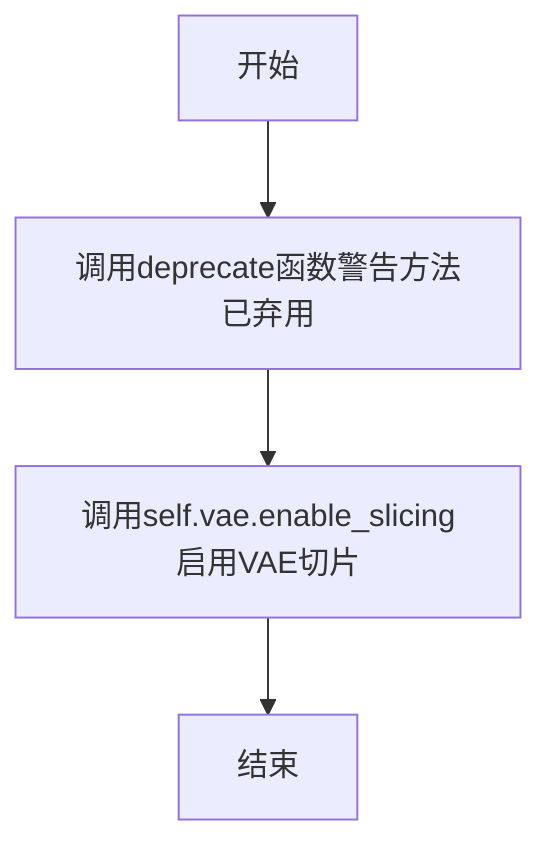

#### 带注释源码

```python
# Copied from diffusers.pipelines.flux.pipeline_flux.FluxPipeline.enable_vae_slicing
def enable_vae_slicing(self):
    r"""
    Enable sliced VAE decoding. When this option is enabled, the VAE will split the input tensor in slices to
    compute decoding in several steps. This is useful to save some memory and allow larger batch sizes.
    """
    # 构建弃用警告消息，包含类名和未来替代方案
    depr_message = f"Calling `enable_vae_slicing()` on a `{self.__class__.__name__}` is deprecated and this method will be removed in a future version. Please use `pipe.vae.enable_slicing()`."
    # 调用deprecate函数记录弃用信息，在版本0.40.0时完全移除
    deprecate(
        "enable_vae_slicing",
        "0.40.0",
        depr_message,
    )
    # 实际启用VAE切片功能，委托给VAE模型本身的enable_slicing方法
    self.vae.enable_slicing()
```


### `FluxImg2ImgPipeline.disable_vae_slicing`

该方法用于禁用VAE切片解码功能。如果之前启用了`enable_vae_slicing`，调用此方法后将恢复为单步解码。此方法已弃用，建议直接使用`pipe.vae.disable_slicing()`。

参数：此方法无参数。

返回值：`None`，无返回值。

#### 流程图

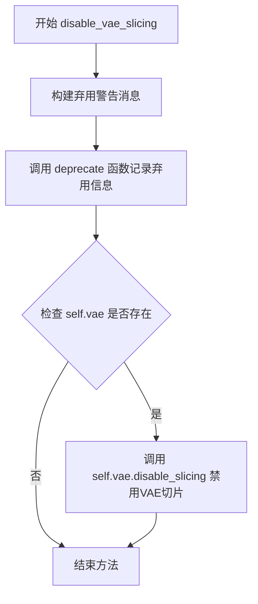

#### 带注释源码

```python
def disable_vae_slicing(self):
    r"""
    Disable sliced VAE decoding. If `enable_vae_slicing` was previously enabled, this method will go back to
    computing decoding in one step.
    """
    # 构建弃用警告消息，包含类名和未来替代方案
    depr_message = f"Calling `disable_vae_slicing()` on a `{self.__class__.__name__}` is deprecated and this method will be removed in a future version. Please use `pipe.vae.disable_slicing()`."
    
    # 调用 deprecate 函数记录弃用信息
    # 参数: 方法名, 弃用版本号, 弃用消息
    deprecate(
        "disable_vae_slicing",
        "0.40.0",
        depr_message,
    )
    
    # 调用底层VAE对象的disable_slicing方法来禁用切片功能
    self.vae.disable_slicing()
```


### `FluxImg2ImgPipeline.enable_vae_tiling`

启用VAE平铺功能，通过将输入张量分割成多个图块来分步计算编码和解码，从而节省大量内存并允许处理更大的图像。该方法已弃用，建议直接使用 `pipe.vae.enable_tiling()`。

参数：
- 该方法无显式参数（隐含 `self` 参数）

返回值：`None`，无返回值（直接修改对象状态）

#### 流程图

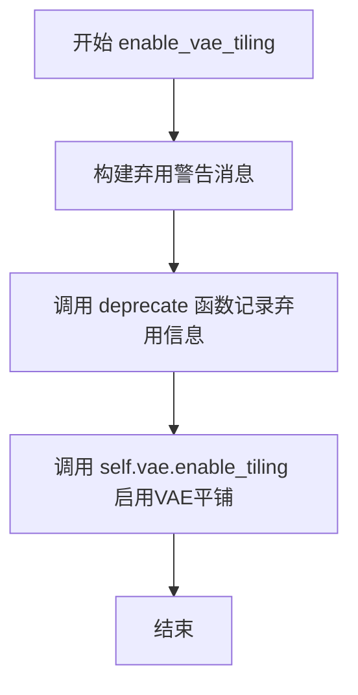

#### 带注释源码

```python
# Copied from diffusers.pipelines.flux.pipeline_flux.FluxPipeline.enable_vae_tiling
def enable_vae_tiling(self):
    r"""
    Enable tiled VAE decoding. When this option is enabled, the VAE will split the input tensor into tiles to
    compute decoding and encoding in several steps. This is useful for saving a large amount of memory and to allow
    processing larger images.
    """
    # 构建弃用警告消息，告知用户该方法已弃用
    depr_message = f"Calling `enable_vae_tiling()` on a `{self.__class__.__name__}` is deprecated and this method will be removed in a future version. Please use `pipe.vae.enable_tiling()`."
    # 调用 deprecate 函数记录弃用信息
    deprecate(
        "enable_vae_tiling",
        "0.40.0",
        depr_message,
    )
    # 委托给 VAE 模型的 enable_tiling 方法
    self.vae.enable_tiling()
```


### `FluxImg2ImgPipeline.disable_vae_tiling`

该方法用于禁用VAE平铺（Tiling）功能，使VAE恢复为单步解码模式。由于该方法已被弃用，实际调用的是底层VAE模型的`disable_tiling()`方法。

参数：此方法没有参数。

返回值：`None`，无返回值。

#### 流程图

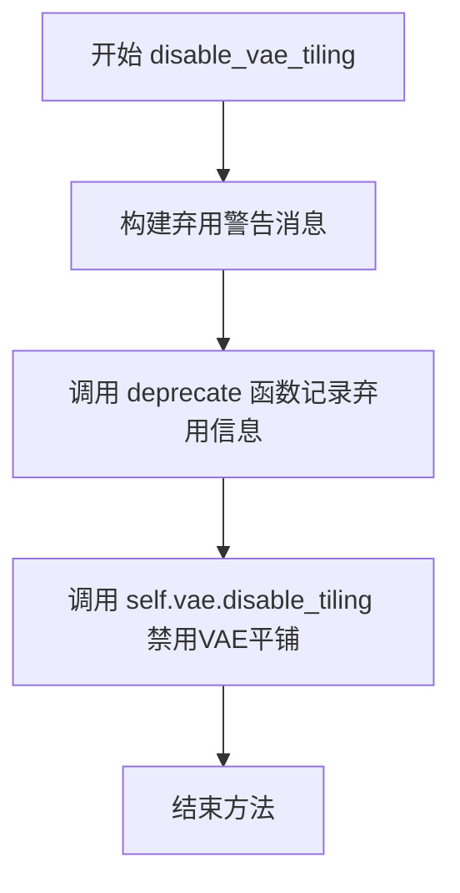

#### 带注释源码

```python
# Copied from diffusers.pipelines.flux.pipeline_flux.FluxPipeline.disable_vae_tiling
def disable_vae_tiling(self):
    r"""
    Disable tiled VAE decoding. If `enable_vae_tiling` was previously enabled, this method will go back to
    computing decoding in one step.
    """
    # 构建弃用警告消息，告知用户该方法已弃用，应使用 pipe.vae.disable_tiling() 替代
    depr_message = f"Calling `disable_vae_tiling()` on a `{self.__class__.__name__}` is deprecated and this method will be removed in a future version. Please use `pipe.vae.disable_tiling()`."
    # 调用 deprecate 函数记录弃用信息，在未来版本中将移除此方法
    deprecate(
        "disable_vae_tiling",  # 要弃用的功能名称
        "0.40.0",              # 弃用版本号
        depr_message,          # 弃用警告消息
    )
    # 实际调用底层VAE模型的disable_tiling方法来禁用平铺功能
    self.vae.disable_tiling()
```


### `FluxImg2ImgPipeline.prepare_latents`

该方法负责为 Flux 图像到图像（Img2Img）管道准备潜在变量（latents）。它接收输入图像，验证批次大小，计算潜在变量的形状，对图像进行 VAE 编码（如有必要），生成噪声，并根据调度器进行噪声缩放，最后将潜在变量打包成适合 Transformer 处理的格式。

参数：

- `self`：`FluxImg2ImgPipeline` 实例本身
- `image`：`torch.Tensor` 或 `PipelineImageInput`，输入图像，用于编码为潜在变量
- `timestep`：`torch.Tensor`，当前去噪步骤的时间步
- `batch_size`：`int`，批次大小
- `num_channels_latents`：`int`，潜在变量的通道数
- `height`：`int`，目标图像高度
- `width`：`int`，目标图像宽度
- `dtype`：`torch.dtype`，潜在变量的数据类型
- `device`：`torch.device`，计算设备
- `generator`：`torch.Generator` 或 `list[torch.Generator]` 或 `None`，用于生成随机数的随机数生成器
- `latents`：`torch.FloatTensor` 或 `None`，可选的预生成潜在变量

返回值：`tuple[torch.Tensor, torch.Tensor]`，返回两个元素的元组——第一个是打包后的潜在变量（latents），第二个是潜在图像 ID（latent_image_ids）

#### 流程图

```mermaid
flowchart TD
    A[开始 prepare_latents] --> B{检查 generator 列表长度是否匹配 batch_size}
    B -->|不匹配| C[抛出 ValueError]
    B -->|匹配| D[计算 height 和 width]
    D --> E[计算 shape: (batch_size, num_channels_latents, height, width)]
    E --> F[调用 _prepare_latent_image_ids 生成 latent_image_ids]
    F --> G{latents 参数是否不为 None?}
    G -->|是| H[直接返回 latents 转换到指定 device 和 dtype]
    G -->|否| I[将 image 转换到指定 device 和 dtype]
    I --> J{image 的通道数是否等于 latent_channels?}
    J -->|是| K[直接使用 image 作为 image_latents]
    J -->|否| L[调用 _encode_vae_image 编码图像]
    L --> M[获取 image_latents]
    K --> M
    M --> N{检查 batch_size 与 image_latents 形状的关系}
    N -->|batch_size > image_latents.shape[0] 且能整除| O[扩展 image_latents 到 batch_size]
    N -->|batch_size > image_latents.shape[0] 且不能整除| P[抛出 ValueError]
    N -->|其他情况| Q[保持 image_latents 不变]
    O --> R[使用 randn_tensor 生成噪声]
    Q --> R
    R --> S[调用 scheduler.scale_noise 缩放噪声]
    S --> T[调用 _pack_latents 打包潜在变量]
    T --> U[返回 latents 和 latent_image_ids]
    H --> U
```

#### 带注释源码

```python
def prepare_latents(
    self,
    image,                          # 输入图像 (torch.Tensor 或 PipelineImageInput)
    timestep,                       # 当前时间步 (torch.Tensor)
    batch_size,                     # 批次大小 (int)
    num_channels_latents,           # 潜在变量通道数 (int)
    height,                         # 图像高度 (int)
    width,                          # 图像宽度 (int)
    dtype,                          # 数据类型 (torch.dtype)
    device,                         # 计算设备 (torch.device)
    generator,                      # 随机数生成器 (torch.Generator | list[torch.Generator] | None)
    latents=None,                  # 可选的预生成潜在变量 (torch.FloatTensor | None)
):
    # 检查传入的 generator 列表长度是否与请求的 batch_size 匹配
    # 如果不匹配，抛出 ValueError，因为无法为每个样本分配对应的 generator
    if isinstance(generator, list) and len(generator) != batch_size:
        raise ValueError(
            f"You have passed a list of generators of length {len(generator)}, but requested an effective batch"
            f" size of {batch_size}. Make sure the batch size matches the length of the generators."
        )

    # VAE 应用 8x 压缩，但我们还需要考虑打包（packing）操作
    # 打包要求 latent height 和 width 能被 2 整除
    # 因此最终高度和宽度需要再乘以 2
    height = 2 * (int(height) // (self.vae_scale_factor * 2))
    width = 2 * (int(width) // (self.vae_scale_factor * 2))
    
    # 计算潜在变量的形状：(batch_size, num_channels_latents, height, width)
    shape = (batch_size, num_channels_latents, height, width)
    
    # 生成潜在图像 ID，用于 Transformer 中的位置编码
    # 这些 ID 帮助模型理解图像中像素的空间位置
    latent_image_ids = self._prepare_latent_image_ids(batch_size, height // 2, width // 2, device, dtype)

    # 如果已经提供了 latents，直接返回转换后的 latents 和 latent_image_ids
    # 不需要进行后续的编码和噪声添加操作
    if latents is not None:
        return latents.to(device=device, dtype=dtype), latent_image_ids

    # 将输入图像转换到指定的设备和数据类型
    image = image.to(device=device, dtype=dtype)
    
    # 检查图像通道数是否与 VAE 的 latent_channels 匹配
    # 如果不匹配，需要通过 VAE 编码图像获取 latents
    # 如果匹配，说明传入的已经是 latent 格式，直接使用
    if image.shape[1] != self.latent_channels:
        # 调用 VAE 编码器将图像编码为潜在变量
        image_latents = self._encode_vae_image(image=image, generator=generator)
    else:
        # 图像已经是 latent 格式，直接使用
        image_latents = image

    # 处理批次大小扩展的情况
    # 如果 batch_size 大于 image_latents 的批次大小，且能整除
    # 则复制 image_latents 以匹配 batch_size
    if batch_size > image_latents.shape[0] and batch_size % image_latents.shape[0] == 0:
        # expand init_latents for batch_size
        additional_image_per_prompt = batch_size // image_latents.shape[0]
        image_latents = torch.cat([image_latents] * additional_image_per_prompt, dim=0)
    # 如果 batch_size 大于 image_latents 的批次大小，但不能整除
    # 这种情况无法处理，抛出错误
    elif batch_size > image_latents.shape[0] and batch_size % image_latents.shape[0] != 0:
        raise ValueError(
            f"Cannot duplicate `image` of batch size {image_latents.shape[0]} to {batch_size} text prompts."
        )
    # 其他情况（batch_size <= image_latents.shape[0]），直接使用
    else:
        image_latents = torch.cat([image_latents], dim=0)

    # 使用 randn_tensor 生成随机噪声，形状为 shape
    # 可以选择传入 generator 以控制随机性
    noise = randn_tensor(shape, generator=generator, device=device, dtype=dtype)
    
    # 根据调度器（scheduler）使用噪声对 image_latents 进行缩放
    # 这是在 img2img 流程中混合原始图像和噪声的关键步骤
    latents = self.scheduler.scale_noise(image_latents, timestep, noise)
    
    # 将 latents 打包成适合 Flux Transformer 处理的格式
    # 打包将 2x2 的 patch 展平并重新排列
    latents = self._pack_latents(latents, batch_size, num_channels_latents, height, width)
    
    # 返回打包后的 latents 和 latent_image_ids
    return latents, latent_image_ids
```


### `FluxImg2ImgPipeline.__call__`

主推理方法，是Flux图像到图像（Image-to-Image）生成管道的核心入口。接收文本提示、输入图像及各类生成参数，通过编码提示、准备潜在变量、执行去噪循环，最终解码潜在表示生成目标图像。

参数：

- `prompt`：`str | list[str] | None`，用于指导图像生成的文本提示，若未定义需传入`prompt_embeds`
- `prompt_2`：`str | list[str] | None`，发送给`tokenizer_2`和`text_encoder_2`的提示，未定义时使用`prompt`
- `negative_prompt`：`str | list[str] | None`，用于引导图像生成的负面提示
- `negative_prompt_2`：`str | list[str] | None`，负面提示的第二个版本
- `true_cfg_scale`：`float`，TrueCFG缩放因子，默认为1.0
- `image`：`PipelineImageInput`，用作起点的输入图像，支持torch.Tensor、PIL.Image、np.ndarray等格式，也可接受图像潜在向量
- `height`：`int | None`，生成图像的高度（像素），默认根据vae_scale_factor计算
- `width`：`int | None`，生成图像的宽度（像素），默认根据vae_scale_factor计算
- `strength`：`float`，图像变换程度，需在0-1之间，值越大变换越多，默认为0.6
- `num_inference_steps`：`int`，去噪步数，默认为28
- `sigmas`：`list[float] | None`，自定义去噪过程的sigmas值
- `guidance_scale`：`float`，无分类器引导比例，默认为7.0
- `num_images_per_prompt`：`int`，每个提示生成的图像数量，默认为1
- `generator`：`torch.Generator | list[torch.Generator] | None`，随机生成器用于确定性生成
- `latents`：`torch.FloatTensor | None`，预生成的噪声潜在变量
- `prompt_embeds`：`torch.FloatTensor | None`，预生成的文本嵌入
- `pooled_prompt_embeds`：`torch.FloatTensor | None`，预生成的池化文本嵌入
- `ip_adapter_image`：`PipelineImageInput | None`，IP适配器的图像输入
- `ip_adapter_image_embeds`：`list[torch.Tensor] | None`，IP适配器的预生成图像嵌入列表
- `negative_ip_adapter_image`：`PipelineImageInput | None`，负面IP适配器图像输入
- `negative_ip_adapter_image_embeds`：`list[torch.Tensor] | None`，负面IP适配器的预生成图像嵌入
- `negative_prompt_embeds`：`torch.FloatTensor | None`，负面提示的文本嵌入
- `negative_pooled_prompt_embeds`：`torch.FloatTensor | None`，负面提示的池化文本嵌入
- `output_type`：`str | None`，输出格式，可选"pil"或"latent"，默认为"pil"
- `return_dict`：`bool`，是否返回`FluxPipelineOutput`，默认为True
- `joint_attention_kwargs`：`dict[str, Any] | None`，传给注意力处理器的额外参数字典
- `callback_on_step_end`：`Callable[[int, int], None] | None`，每步去噪结束后调用的回调函数
- `callback_on_step_end_tensor_inputs`：`list[str]`，回调函数需要的张量输入列表，默认为["latents"]
- `max_sequence_length`：`int`，提示的最大序列长度，默认为512

返回值：`FluxPipelineOutput | tuple`，若`return_dict`为True返回`FluxPipelineOutput`对象，否则返回包含生成图像的元组

#### 流程图

```mermaid
flowchart TD
    A[开始 __call__] --> B[检查输入参数 validate check_inputs]
    B --> C[预处理输入图像 preprocess init_image]
    C --> D[定义批次大小和设备 batch_size, device]
    D --> E{是否有LoRA权重}
    E -->|是| F[应用LoRA缩放 scale_lora_layers]
    E -->|否| G[跳过LoRA]
    F --> G
    G --> H[编码提示词 encode_prompt]
    H --> I{是否启用TrueCFG}
    I -->|是| J[编码负面提示词 encode_negative_prompt]
    I -->|否| K[跳过负面提示词]
    J --> K
    K --> L[计算sigmas和timesteps]
    L --> M[获取调整后的timesteps get_timesteps]
    M --> N[准备潜在变量 prepare_latents]
    N --> O{transformer是否支持guidance_embeds}
    O -->|是| P[创建guidance张量]
    O -->|否| Q[guidance设为None]
    P --> Q
    Q --> R{是否使用IP-Adapter}
    R -->|是| S[准备IP-Adapter图像嵌入 prepare_ip_adapter_image_embeds]
    R -->|否| T[跳过IP-Adapter]
    S --> T
    T --> U[进入去噪循环 for each timestep]
    U --> V{是否中断}
    V -->|是| W[continue继续下一个timestep]
    V -->|否| X[调用transformer进行推理]
    X --> Y{是否启用TrueCFG}
    Y -->|是| Z[计算负面噪声预测并融合]
    Y -->|否| AA[直接使用噪声预测]
    Z --> AB[scheduler.step更新latents]
    AA --> AB
    AB --> AC{是否启用callback_on_step_end}
    AC -->|是| AD[执行回调函数]
    AC -->|否| AE[跳过回调]
    AD --> AE
    AE --> AF{是否还有更多timesteps}
    AF -->|是| U
    AF -->|否| AG[检查output_type]
    AG -->|latent| AH[直接返回latents]
    AG -->|pil| AI[解码latents为图像 vae.decode]
    AI --> AJ[后处理图像 postprocess]
    AH --> AK[返回结果]
    AJ --> AK
    W --> U
```

#### 带注释源码

```python
@torch.no_grad()
@replace_example_docstring(EXAMPLE_DOC_STRING)
def __call__(
    self,
    prompt: str | list[str] = None,
    prompt_2: str | list[str] | None = None,
    negative_prompt: str | list[str] = None,
    negative_prompt_2: str | list[str] | None = None,
    true_cfg_scale: float = 1.0,
    image: PipelineImageInput = None,
    height: int | None = None,
    width: int | None = None,
    strength: float = 0.6,
    num_inference_steps: int = 28,
    sigmas: list[float] | None = None,
    guidance_scale: float = 7.0,
    num_images_per_prompt: int | None = 1,
    generator: torch.Generator | list[torch.Generator] | None = None,
    latents: torch.FloatTensor | None = None,
    prompt_embeds: torch.FloatTensor | None = None,
    pooled_prompt_embeds: torch.FloatTensor | None = None,
    ip_adapter_image: PipelineImageInput | None = None,
    ip_adapter_image_embeds: list[torch.Tensor] | None = None,
    negative_ip_adapter_image: PipelineImageInput | None = None,
    negative_ip_adapter_image_embeds: list[torch.Tensor] | None = None,
    negative_prompt_embeds: torch.FloatTensor | None = None,
    negative_pooled_prompt_embeds: torch.FloatTensor | None = None,
    output_type: str | None = "pil",
    return_dict: bool = True,
    joint_attention_kwargs: dict[str, Any] | None = None,
    callback_on_step_end: Callable[[int, int], None] | None = None,
    callback_on_step_end_tensor_inputs: list[str] = ["latents"],
    max_sequence_length: int = 512,
):
    r"""
    Function invoked when calling the pipeline for generation.
    ...
    """
    # 1. 设置默认高度和宽度（如果未提供）
    # 根据vae_scale_factor计算默认分辨率
    height = height or self.default_sample_size * self.vae_scale_factor
    width = width or self.default_sample_size * self.vae_scale_factor

    # 2. 检查输入参数，验证所有参数的有效性
    self.check_inputs(
        prompt,
        prompt_2,
        strength,
        height,
        width,
        negative_prompt=negative_prompt,
        negative_prompt_2=negative_prompt_2,
        prompt_embeds=prompt_embeds,
        negative_prompt_embeds=negative_prompt_embeds,
        pooled_prompt_embeds=pooled_prompt_embeds,
        negative_pooled_prompt_embeds=negative_pooled_prompt_embeds,
        callback_on_step_end_tensor_inputs=callback_on_step_end_tensor_inputs,
        max_sequence_length=max_sequence_length,
    )

    # 3. 保存引导比例和联合注意力参数，设置中断标志
    self._guidance_scale = guidance_scale
    self._joint_attention_kwargs = joint_attention_kwargs
    self._interrupt = False

    # 4. 预处理输入图像，将其转换为统一格式
    init_image = self.image_processor.preprocess(image, height=height, width=width)
    init_image = init_image.to(dtype=torch.float32)

    # 5. 确定批次大小（根据prompt或prompt_embeds）
    if prompt is not None and isinstance(prompt, str):
        batch_size = 1
    elif prompt is not None and isinstance(prompt, list):
        batch_size = len(prompt)
    else:
        batch_size = prompt_embeds.shape[0]

    # 获取执行设备
    device = self._execution_device

    # 6. 提取LoRA缩放因子（如果存在）
    lora_scale = (
        self.joint_attention_kwargs.get("scale", None) if self.joint_attention_kwargs is not None else None
    )
    
    # 7. 判断是否启用TrueCFG（真正的分类器自由引导）
    do_true_cfg = true_cfg_scale > 1 and negative_prompt is not None
    
    # 8. 编码正向提示词，生成文本嵌入
    (
        prompt_embeds,
        pooled_prompt_embeds,
        text_ids,
    ) = self.encode_prompt(
        prompt=prompt,
        prompt_2=prompt_2,
        prompt_embeds=prompt_embeds,
        pooled_prompt_embeds=pooled_prompt_embeds,
        device=device,
        num_images_per_prompt=num_images_per_prompt,
        max_sequence_length=max_sequence_length,
        lora_scale=lora_scale,
    )
    
    # 9. 如果启用TrueCFG，编码负面提示词
    if do_true_cfg:
        (
            negative_prompt_embeds,
            negative_pooled_prompt_embeds,
            _,
        ) = self.encode_prompt(
            prompt=negative_prompt,
            prompt_2=negative_prompt_2,
            prompt_embeds=negative_prompt_embeds,
            pooled_prompt_embeds=negative_pooled_prompt_embeds,
            device=device,
            num_images_per_prompt=num_images_per_prompt,
            max_sequence_length=max_sequence_length,
            lora_scale=lora_scale,
        )

    # 10. 准备时间步
    # 如果未提供sigmas，则使用线性间隔
    sigmas = np.linspace(1.0, 1 / num_inference_steps, num_inference_steps) if sigmas is None else sigmas
    
    # 计算图像序列长度用于shift计算
    image_seq_len = (int(height) // self.vae_scale_factor // 2) * (int(width) // self.vae_scale_factor // 2)
    
    # 计算时间步shift（用于更好的采样调度）
    mu = calculate_shift(
        image_seq_len,
        self.scheduler.config.get("base_image_seq_len", 256),
        self.scheduler.config.get("max_image_seq_len", 4096),
        self.scheduler.config.get("base_shift", 0.5),
        self.scheduler.config.get("max_shift", 1.15),
    )
    
    # 根据平台选择timestep设备
    if XLA_AVAILABLE:
        timestep_device = "cpu"
    else:
        timestep_device = device
        
    # 获取scheduler的时间步
    timesteps, num_inference_steps = retrieve_timesteps(
        self.scheduler,
        num_inference_steps,
        timestep_device,
        sigmas=sigmas,
        mu=mu,
    )
    
    # 根据strength调整timesteps（用于img2img）
    timesteps, num_inference_steps = self.get_timesteps(num_inference_steps, strength, device)

    # 验证推理步数
    if num_inference_steps < 1:
        raise ValueError(
            f"After adjusting the num_inference_steps by strength parameter: {strength}, the number of pipeline"
            f"steps is {num_inference_steps} which is < 1 and not appropriate for this pipeline."
        )
    
    # 创建初始 latent timestep（用于 VAE 编码）
    latent_timestep = timesteps[:1].repeat(batch_size * num_images_per_prompt)

    # 11. 准备潜在变量
    num_channels_latents = self.transformer.config.in_channels // 4

    latents, latent_image_ids = self.prepare_latents(
        init_image,
        latent_timestep,
        batch_size * num_images_per_prompt,
        num_channels_latents,
        height,
        width,
        prompt_embeds.dtype,
        device,
        generator,
        latents,
    )

    # 计算预热步数
    num_warmup_steps = max(len(timesteps) - num_inference_steps * self.scheduler.order, 0)
    self._num_timesteps = len(timesteps)

    # 12. 处理guidance（引导嵌入）
    if self.transformer.config.guidance_embeds:
        guidance = torch.full([1], guidance_scale, device=device, dtype=torch.float32)
        guidance = guidance.expand(latents.shape[0])
    else:
        guidance = None

    # 13. 处理IP-Adapter
    # 如果只提供了正向或负向IP-Adapter图片，为缺失的一方创建零图
    if (ip_adapter_image is not None or ip_adapter_image_embeds is not None) and (
        negative_ip_adapter_image is None and negative_ip_adapter_image_embeds is None
    ):
        negative_ip_adapter_image = np.zeros((width, height, 3), dtype=np.uint8)
    elif (ip_adapter_image is None and ip_adapter_image_embeds is None) and (
        negative_ip_adapter_image is not None or negative_ip_adapter_image_embeds is not None
    ):
        ip_adapter_image = np.zeros((width, height, 3), dtype=np.uint8)

    # 初始化 joint_attention_kwargs
    if self.joint_attention_kwargs is None:
        self._joint_attention_kwargs = {}

    # 准备IP-Adapter图像嵌入
    image_embeds = None
    negative_image_embeds = None
    if ip_adapter_image is not None or ip_adapter_image_embeds is not None:
        image_embeds = self.prepare_ip_adapter_image_embeds(
            ip_adapter_image,
            ip_adapter_image_embeds,
            device,
            batch_size * num_images_per_prompt,
        )
    if negative_ip_adapter_image is not None or negative_ip_adapter_image_embeds is not None:
        negative_image_embeds = self.prepare_ip_adapter_image_embeds(
            negative_ip_adapter_image,
            negative_ip_adapter_image_embeds,
            device,
            batch_size * num_images_per_prompt,
        )

    # 14. 去噪主循环
    with self.progress_bar(total=num_inference_steps) as progress_bar:
        for i, t in enumerate(timesteps):
            # 检查是否中断
            if self.interrupt:
                continue

            # 更新IP-Adapter嵌入（如果是每个时间步变化的）
            if image_embeds is not None:
                self._joint_attention_kwargs["ip_adapter_image_embeds"] = image_embeds
                
            # 扩展timestep到批次维度以兼容ONNX/Core ML
            timestep = t.expand(latents.shape[0]).to(latents.dtype)
            
            # 15. 调用Transformer进行噪声预测
            noise_pred = self.transformer(
                hidden_states=latents,
                timestep=timestep / 1000,
                guidance=guidance,
                pooled_projections=pooled_prompt_embeds,
                encoder_hidden_states=prompt_embeds,
                txt_ids=text_ids,
                img_ids=latent_image_ids,
                joint_attention_kwargs=self.joint_attention_kwargs,
                return_dict=False,
            )[0]

            # 16. 如果启用TrueCFG，执行负面提示的噪声预测并融合
            if do_true_cfg:
                if negative_image_embeds is not None:
                    self._joint_attention_kwargs["ip_adapter_image_embeds"] = negative_image_embeds
                neg_noise_pred = self.transformer(
                    hidden_states=latents,
                    timestep=timestep / 1000,
                    guidance=guidance,
                    pooled_projections=negative_pooled_prompt_embeds,
                    encoder_hidden_states=negative_prompt_embeds,
                    txt_ids=text_ids,
                    img_ids=latent_image_ids,
                    joint_attention_kwargs=self.joint_attention_kwargs,
                    return_dict=False,
                )[0]
                # 使用true_cfg_scale融合正负噪声预测
                noise_pred = neg_noise_pred + true_cfg_scale * (noise_pred - neg_noise_pred)

            # 17. 使用scheduler计算上一步的latents
            latents_dtype = latents.dtype
            latents = self.scheduler.step(noise_pred, t, latents, return_dict=False)[0]

            # 处理MPS平台的dtype转换bug
            if latents.dtype != latents_dtype:
                if torch.backends.mps.is_available():
                    latents = latents.to(latents_dtype)

            # 18. 执行每步结束时的回调
            if callback_on_step_end is not None:
                callback_kwargs = {}
                for k in callback_on_step_end_tensor_inputs:
                    callback_kwargs[k] = locals()[k]
                callback_outputs = callback_on_step_end(self, i, t, callback_kwargs)

                # 更新latents和prompt_embeds（如果回调返回了这些值）
                latents = callback_outputs.pop("latents", latents)
                prompt_embeds = callback_outputs.pop("prompt_embeds", prompt_embeds)

            # 19. 更新进度条
            if i == len(timesteps) - 1 or ((i + 1) > num_warmup_steps and (i + 1) % self.scheduler.order == 0):
                progress_bar.update()

            # XLA设备同步
            if XLA_AVAILABLE:
                xm.mark_step()

    # 20. 后处理：根据output_type处理结果
    if output_type == "latent":
        # 直接返回latents（用于后续处理）
        image = latents

    else:
        # 解包latents并解码为图像
        latents = self._unpack_latents(latents, height, width, self.vae_scale_factor)
        latents = (latents / self.vae.config.scaling_factor) + self.vae.config.shift_factor
        image = self.vae.decode(latents, return_dict=False)[0]
        image = self.image_processor.postprocess(image, output_type=output_type)

    # 21. 释放模型内存
    self.maybe_free_model_hooks()

    # 22. 返回结果
    if not return_dict:
        return (image,)

    return FluxPipelineOutput(images=image)
```

## 关键组件


### 张量索引与形状操作

代码中通过`_pack_latents`和`_unpack_latents`方法对潜在表示进行打包和解包操作，实现2x2patch的重组和形状变换，用于适配FluxTransformer的输入输出格式。`_prepare_latent_image_ids`方法生成用于位置编码的张量索引。

### 惰性加载与条件执行

`encode_prompt`方法支持预计算的`prompt_embeds`和`pooled_prompt_embeds`直接传入，避免重复编码。`prepare_latents`方法支持直接传入预生成的`latents`，实现按需计算。`prepare_ip_adapter_image_embeds`支持直接传入预计算的图像嵌入或动态编码。

### VAE图像编码与潜在表示检索

`_encode_vae_image`方法调用VAE编码器获取图像潜在表示，使用`retrieve_latents`函数从encoder_output中提取潜在分布样本，支持sample和argmax两种模式，处理生成器兼容性。

### 图像预处理与后处理

`VaeImageProcessor`负责图像的预处理（resize、normalize）和后处理（decode to PIL/numpy），支持多种输入格式（PIL、numpy、tensor）的自动转换。

### 时间步调度与噪声调度

`retrieve_timesteps`支持自定义timesteps和sigmas，调用scheduler的`set_timesteps`方法。`get_timesteps`根据strength参数调整初始时间步，实现图像变换强度的控制。`calculate_shift`计算序列长度相关的移位参数。

### 提示词编码与双文本编码器

支持CLIP（短文本）和T5（长文本）双文本编码器分别生成`prompt_embeds`和`pooled_prompt_embeds`，`_get_clip_prompt_embeds`和`_get_t5_prompt_embeds`分别处理两种编码器的嵌入提取，并支持Lora权重的动态缩放。

### IP-Adapter图像嵌入准备

`prepare_ip_adapter_image_embeds`方法处理IP-Adapter的图像嵌入准备，支持直接传入预计算嵌入或动态编码输入图像，复制到每个prompt并处理多个IP-Adapter的场景。

### VAE切片与平铺优化

`enable_vae_slicing`、`disable_vae_slicing`、`enable_vae_tiling`、`disable_vae_tiling`方法提供VAE的内存优化选项，通过切片或平铺方式减少大图像处理时的显存占用。

### 潜在表示准备与噪声注入

`prepare_latents`方法处理潜在表示的初始化，包括图像编码、噪声添加、潜在表示打包，支持生成器列表和批量处理。

### 主生成管道调用

`__call__`方法是完整的图像生成入口，整合了输入验证、提示词编码、潜在表示准备、去噪循环、VAE解码和后处理的全流程，支持CFG、IP-Adapter、LoRA等多种高级特性。


## 问题及建议


### 已知问题

-   **代码重复问题**：大量使用 `# Copied from` 注释从其他管道复制方法（如 `_get_t5_prompt_embeds`、`_get_clip_prompt_embeds`、`encode_prompt` 等），导致代码库中存在大量重复代码，维护成本高
-   **属性初始化不一致**：`_guidance_scale`、`_joint_attention_kwargs`、`_interrupt`、`_num_timesteps` 等属性在 `__init__` 中未初始化，仅在 `__call__` 方法中动态赋值，可能导致意外行为
-   **已弃用方法仍保留**：`enable_vae_slicing`、`disable_vae_slicing`、`enable_vae_tiling`、`disable_vae_tiling` 等方法已标记为 deprecated（将在 0.40.0 版本移除），但仍保留在代码中，增加代码复杂度
-   **scheduler 状态修改**：`get_timesteps` 方法直接调用 `self.scheduler.set_begin_index()` 修改 scheduler 内部状态，这种副作用可能导致不可预测的行为
-   **XLA 设备处理不一致**：timestep 设备单独处理（`timestep_device`），但其他张量使用执行设备，逻辑不够统一
-   **IP Adapter 处理冗余**：正负 IP Adapter 的处理逻辑高度相似，存在代码重复，可提取为通用方法
-   **硬编码的张量输入列表**：`_callback_tensor_inputs = ["latents", "prompt_embeds"]` 硬编码在类中，扩展性差

### 优化建议

-   **提取公共基类**：将复制的方法提取到 FluxPipeline 基类中，避免代码重复，或者使用组合/委托模式复用现有实现
-   **统一属性初始化**：在 `__init__` 方法中初始化所有实例属性，使用默认值或 None，提高代码可预测性
-   **移除已弃用方法**：按照 deprecation 计划，在适当的版本中移除已标记的方法，简化代码
-   **重构 scheduler 交互**：避免直接修改 scheduler 状态，考虑使用 scheduler 的公共接口或传入参数
-   **统一设备管理**：统一 XLA 和 CUDA 设备的处理逻辑，可以考虑添加设备抽象层
-   **提取 IP Adapter 逻辑**：将 IP Adapter 的编码和处理逻辑提取为独立方法，减少重复代码
-   **动态配置化**：将 `_callback_tensor_inputs` 改为可配置或从父类继承，提高灵活性
-   **添加类型提示完整性**：部分方法的参数缺少详细的类型提示（如 `image` 参数），建议完善类型注解
-   **日志和错误处理统一**：统一使用 logger 进行警告和错误提示，避免直接使用 logger.warning 和 raise 混用的情况

## 其它


### 设计目标与约束

FluxImg2ImgPipeline的设计目标是实现基于Flux架构的图像到图像转换（Image-to-Image）功能，允许用户通过文本提示对输入图像进行风格迁移、内容修改或增强，同时保持图像的基本结构。核心约束包括：1) 高度和宽度必须能被vae_scale_factor * 2整除，否则会自动调整；2) strength参数必须介于0到1之间，控制图像变换程度；3) max_sequence_length限制为512；4) 管道采用MMDiT（Multimodal Diffusion Transformer）架构，需要同时支持CLIP和T5双文本编码器；5) 必须与Diffusers库的其他组件（如调度器、VAE、LoRA加载器等）保持兼容性。

### 错误处理与异常设计

管道实现了多层次的输入验证和错误处理机制。在check_inputs方法中进行全面的参数校验，包括：strength超出范围时抛出ValueError；height/width不满足要求时记录警告并自动调整；callback_on_step_end_tensor_inputs包含非法键时抛出ValueError；prompt和prompt_embeds同时提供时冲突处理；max_sequence_length超过512时抛出ValueError。在retrieve_timesteps中处理timesteps和sigmas的互斥关系，验证调度器是否支持自定义时间步。在prepare_latents中检查generator列表长度与batch_size的匹配，以及图像批次复制时的兼容性。此外，encode_prompt中对文本截断、untruncated_ids比较等边缘情况均有日志警告。管道还通过deprecate方法为enable_vae_slicing等已弃用功能提供版本迁移提示。

### 数据流与状态机

管道的数据流遵循以下状态机流程：1) 初始状态（INIT）：接收prompt、image、strength等输入参数；2) 预处理状态（PREPROCESS）：调用image_processor.preprocess将输入图像标准化为float32张量；3) 编码状态（ENCODE）：通过encode_prompt生成prompt_embeds、pooled_prompt_embeds和text_ids，同时可选地对IP-Adapter图像进行编码；4) 调度器初始化状态（SCHEDULE）：调用retrieve_timesteps和get_timesteps计算实际推理时间步；5) 潜在变量准备状态（LATENTS_PREPARE）：调用prepare_latents将图像编码为潜在表示并打包；6) 去噪循环状态（DENOISE）：迭代执行transformer前向传播和scheduler.step，每步可触发callback_on_step_end回调；7) 解码状态（DECODE）：根据output_type调用vae.decode将潜在变量转换回图像；8) 最终状态（FINAL）：返回FluxPipelineOutput或元组形式的图像列表。

### 外部依赖与接口契约

管道依赖以下核心外部组件：1) transformers库：CLIPTextModel、CLIPTokenizer、CLIPImageProcessor、CLIPVisionModelWithProjection用于文本和图像编码；T5EncoderModel、T5TokenizerFast用于长文本序列处理；2) diffusers库内部组件：AutoencoderKL（VAE）、FluxTransformer2DModel（去噪Transformer）、FlowMatchEulerDiscreteScheduler（调度器）、VaeImageProcessor（图像处理）；3) 加载器mixin：FluxLoraLoaderMixin、FromSingleFileMixin、FluxIPAdapterMixin、TextualInversionLoaderMixin提供权重加载和LoRA/IP-Adapter支持；4) 工具函数：randn_tensor用于潜在噪声生成，scale_lora_layers/unscale_lora_layers用于LoRA权重调整。接口契约要求：transformer必须包含config.guidance_embeds属性；vae必须包含config.block_out_channels、config.latent_channels、config.scaling_factor、config.shift_factor属性；scheduler必须实现set_timesteps方法且支持timesteps或sigmas参数；tokenizer_2的model_max_length必须可访问。

### 性能考虑与优化空间

管道支持多种性能优化模式：1) VAE切片（VAE Slicing）：通过enable_vae_slicing()将VAE解码分片执行，降低内存占用；2) VAE平铺（VAE Tiling）：通过enable_vae_tiling()处理超大图像，避免内存溢出；3) CPU卸载：利用model_cpu_offload_seq实现模型顺序卸载；4) XLA支持：检测torch_xla_available以支持XLA设备加速。优化空间包括：1) 管道目前使用固定顺序的model_cpu_offload_seq，可根据实际硬件动态调整；2) true_cfg_scale逻辑可以与guidance_scale合并简化；3) IP-Adapter的negative处理逻辑存在冗余（当只提供negative时自动创建空白positive），可优化；4) 图像预处理中多次调用to(dtype=torch.float32)可能导致不必要的数据复制。
</think>
    