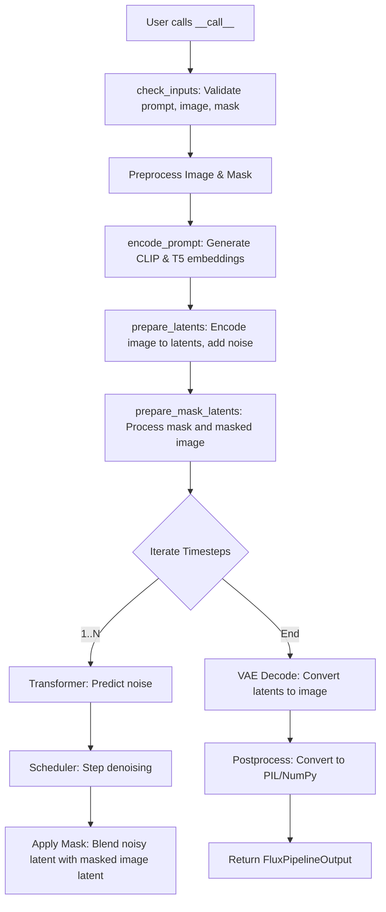
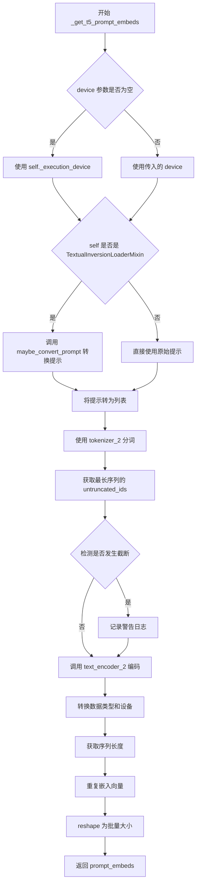
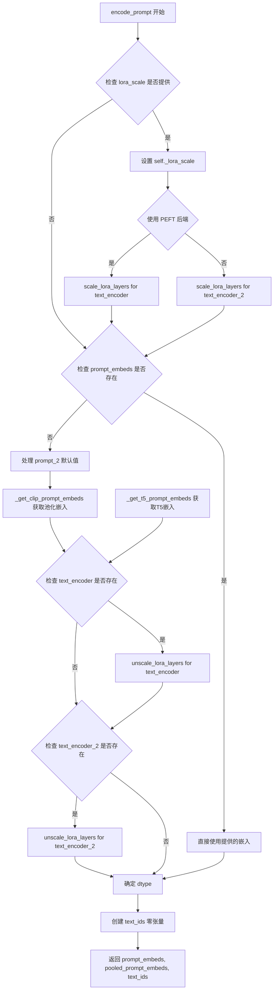
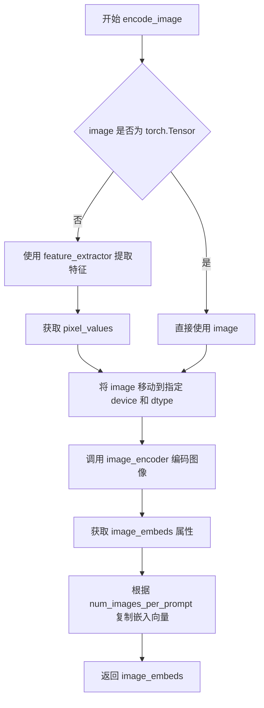
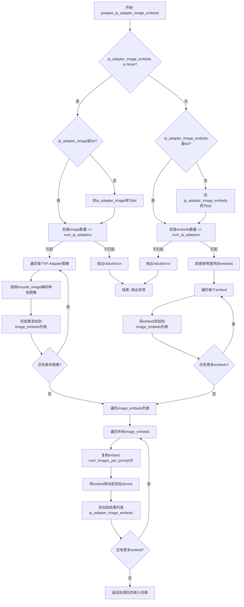
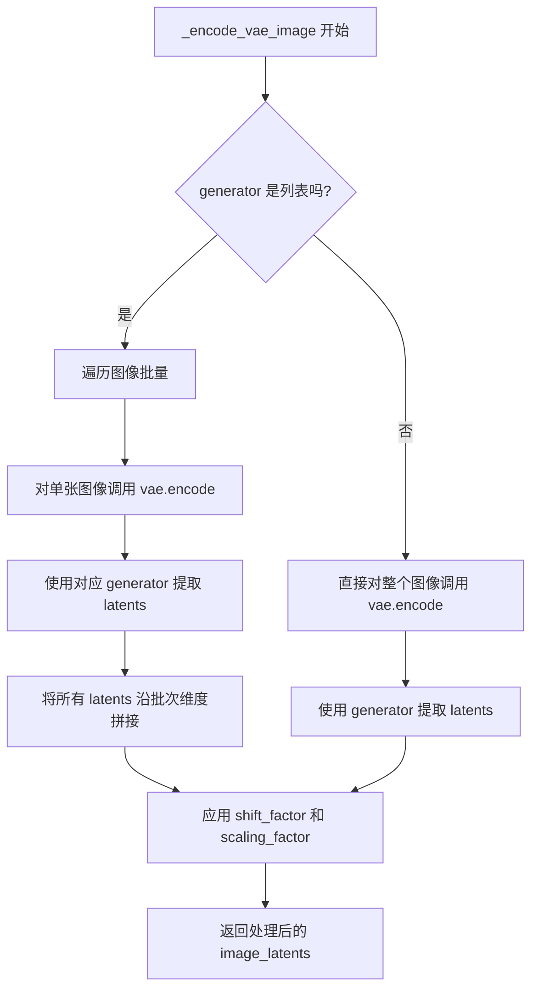
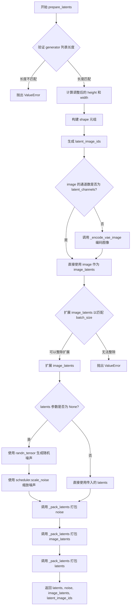
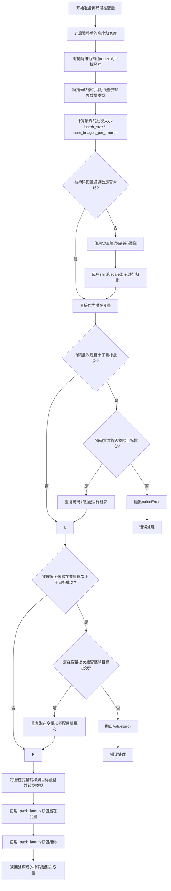
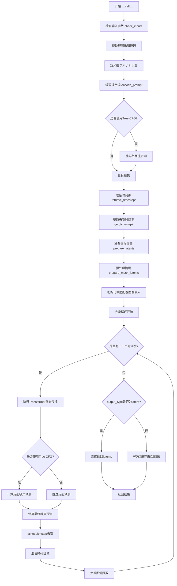

# `diffusers\src\diffusers\pipelines\flux\pipeline_flux_inpaint.py` 详细设计文档

This file implements the FluxInpaintPipeline, a diffusion model pipeline for image inpainting. It utilizes a Variational Autoencoder (VAE), a FluxTransformer2DModel, and dual text encoders (CLIP and T5) to generate images where specific regions (masked by the user) are filled or replaced based on a text prompt.

## 整体流程



## 类结构

```
DiffusionPipeline (Base Class)
├── FluxLoraLoaderMixin (Mixin)
├── FluxIPAdapterMixin (Mixin)
└── FluxInpaintPipeline (Main Class)
```

## 全局变量及字段


### `logger`
    
Logger instance for recording runtime information and warnings

类型：`logging.Logger`
    


### `EXAMPLE_DOC_STRING`
    
Documentation string containing example usage of the inpainting pipeline

类型：`str`
    


### `XLA_AVAILABLE`
    
Flag indicating whether PyTorch XLA is available for accelerated computation

类型：`bool`
    


### `FluxInpaintPipeline.vae`
    
Variational Auto-Encoder for encoding and decoding images to/from latent space

类型：`AutoencoderKL`
    


### `FluxInpaintPipeline.text_encoder`
    
CLIP text encoder for generating text embeddings from prompts

类型：`CLIPTextModel`
    


### `FluxInpaintPipeline.text_encoder_2`
    
T5 text encoder for generating longer sequence text embeddings

类型：`T5EncoderModel`
    


### `FluxInpaintPipeline.tokenizer`
    
Tokenizer for converting text to token IDs for CLIP encoder

类型：`CLIPTokenizer`
    


### `FluxInpaintPipeline.tokenizer_2`
    
Fast tokenizer for converting text to token IDs for T5 encoder

类型：`T5TokenizerFast`
    


### `FluxInpaintPipeline.transformer`
    
Main denoising transformer model for latent space generation

类型：`FluxTransformer2DModel`
    


### `FluxInpaintPipeline.scheduler`
    
Scheduler for controlling the denoising process timesteps

类型：`FlowMatchEulerDiscreteScheduler`
    


### `FluxInpaintPipeline.image_encoder`
    
Optional CLIP vision encoder for IP-Adapter image embeddings

类型：`CLIPVisionModelWithProjection`
    


### `FluxInpaintPipeline.feature_extractor`
    
Optional feature extractor for preprocessing images for CLIP vision encoder

类型：`CLIPImageProcessor`
    


### `FluxInpaintPipeline.vae_scale_factor`
    
Scaling factor for VAE latent space (typically 2^(num_layers-1))

类型：`int`
    


### `FluxInpaintPipeline.latent_channels`
    
Number of channels in the VAE latent representation

类型：`int`
    


### `FluxInpaintPipeline.image_processor`
    
Processor for preprocessing and postprocessing images

类型：`VaeImageProcessor`
    


### `FluxInpaintPipeline.mask_processor`
    
Specialized processor for handling inpainting masks with binarization

类型：`VaeImageProcessor`
    


### `FluxInpaintPipeline.tokenizer_max_length`
    
Maximum sequence length supported by the tokenizers

类型：`int`
    


### `FluxInpaintPipeline.default_sample_size`
    
Default sample size in pixels for generating images (base value before scaling)

类型：`int`
    


### `FluxInpaintPipeline.model_cpu_offload_seq`
    
Sequence string defining the order for CPU offloading of models

类型：`str`
    


### `FluxInpaintPipeline._optional_components`
    
List of optional components that may not be required for pipeline initialization

类型：`list`
    


### `FluxInpaintPipeline._callback_tensor_inputs`
    
List of tensor input names that can be passed to callback functions during inference

类型：`list`
    


### `FluxInpaintPipeline._guidance_scale`
    
Classifier-free guidance scale for controlling prompt adherence during generation

类型：`float`
    


### `FluxInpaintPipeline._joint_attention_kwargs`
    
Dictionary of keyword arguments for joint attention processing including IP-Adapter embeddings

类型：`dict`
    


### `FluxInpaintPipeline._num_timesteps`
    
Total number of denoising timesteps used in the current inference run

类型：`int`
    


### `FluxInpaintPipeline._interrupt`
    
Flag to signal interruption of the denoising loop during generation

类型：`bool`
    
    

## 全局函数及方法


### `calculate_shift`

这是一个线性插值函数，用于根据图像序列长度计算偏移量（shift）值。该函数通过建立基准序列长度与最大序列长度之间的线性映射关系，计算出与给定图像序列长度对应的偏移量，常用于 Flux 流水线中调整去噪调度器的参数。

参数：

- `image_seq_len`：`int`，图像序列长度，即输入图像经 VAE 编码后的序列 token 数量
- `base_seq_len`：`int`，基准序列长度，默认为 256
- `max_seq_len`：`int`，最大序列长度，默认为 4096
- `base_shift`：`float`，基准偏移量，默认为 0.5
- `max_shift`：`float`，最大偏移量，默认为 1.15

返回值：`float`，返回计算得到的偏移量 mu

#### 流程图

```mermaid
flowchart TD
    A[开始] --> B[计算斜率 m = (max_shift - base_shift) / (max_seq_len - base_seq_len)]
    B --> C[计算截距 b = base_shift - m * base_seq_len]
    C --> D[计算偏移量 mu = image_seq_len * m + b]
    D --> E[返回 mu]
    E --> F[结束]
```

#### 带注释源码

```python
# Copied from diffusers.pipelines.flux.pipeline_flux.calculate_shift
def calculate_shift(
    image_seq_len,           # 输入：图像序列长度
    base_seq_len: int = 256,       # 默认基准序列长度
    max_seq_len: int = 4096,       # 默认最大序列长度
    base_shift: float = 0.5,       # 默认基准偏移量
    max_shift: float = 1.15,       # 默认最大偏移量
):
    """
    通过线性插值计算图像序列长度对应的偏移量
    
    参数:
        image_seq_len: 图像序列长度
        base_seq_len: 基准序列长度
        max_seq_len: 最大序列长度
        base_shift: 基准偏移量
        max_shift: 最大偏移量
    
    返回:
        计算得到的偏移量 mu
    """
    # 计算线性方程的斜率 m
    # 斜率 = (最大偏移量 - 基准偏移量) / (最大序列长度 - 基准序列长度)
    m = (max_shift - base_shift) / (max_seq_len - base_seq_len)
    
    # 计算线性方程的截距 b
    # 截距 = 基准偏移量 - 斜率 * 基准序列长度
    b = base_shift - m * base_seq_len
    
    # 计算最终的偏移量 mu
    # mu = 图像序列长度 * 斜率 + 截距
    mu = image_seq_len * m + b
    
    # 返回计算得到的偏移量
    return mu
```


### `retrieve_latents`

该函数是一个全局工具函数，用于从 VAE（变分自编码器）的编码器输出中提取潜在向量（latents）。它支持多种采样模式（随机采样或 argmax），并能处理不同的编码器输出格式（latent_dist 或直接的 latents 属性），是 Stable Diffusion 系列管道中常用的辅助函数。

参数：

- `encoder_output`：`torch.Tensor`，编码器输出对象，通常来自 VAE 的 encode 方法返回的 output 对象，该对象包含 `latent_dist` 属性（潜在分布）或 `latents` 属性（已存在的潜在向量）
- `generator`：`torch.Generator | None`，可选的随机数生成器，用于确保采样过程的可重复性
- `sample_mode`：`str`，采样模式，默认为 "sample"，可选值包括 "sample"（从潜在分布中随机采样）和 "argmax"（取潜在分布的模式/均值）

返回值：`torch.Tensor`，提取出的潜在向量张量，形状为 (batch_size, latent_channels, height, width)

#### 流程图

```mermaid
flowchart TD
    A[开始: retrieve_latents] --> B{encoder_output 是否有 latent_dist 属性?}
    B -->|是| C{sample_mode == 'sample'?}
    B -->|否| D{encoder_output 是否有 latents 属性?}
    C -->|是| E[返回 encoder_output.latent_dist.sample<br/>(使用 generator)]
    C -->|否| F[返回 encoder_output.latent_dist.mode<br/>(取分布的均值/最大值)]
    D -->|是| G[返回 encoder_output.latents]
    D -->|否| H[抛出 AttributeError<br/>'Could not access latents...']
    
    E --> I[结束]
    F --> I
    G --> I
    H --> I
```

#### 带注释源码

```python
# Copied from diffusers.pipelines.stable_diffusion.pipeline_stable_diffusion_img2img.retrieve_latents
def retrieve_latents(
    encoder_output: torch.Tensor, generator: torch.Generator | None = None, sample_mode: str = "sample"
):
    """
    从 VAE 编码器输出中检索潜在向量。
    
    该函数支持从编码器输出中以不同方式提取潜在表示：
    1. 从 latent_dist 分布中采样（sample 模式）
    2. 从 latent_dist 分布中取模式/均值（argmax 模式）
    3. 直接返回预存的 latents 属性
    
    Args:
        encoder_output: VAE 编码器的输出对象，包含 latent_dist 或 latents 属性
        generator: 可选的随机生成器，用于采样时的随机性控制
        sample_mode: 采样模式，'sample' 表示随机采样，'argmax' 表示取分布模式
    
    Returns:
        torch.Tensor: 潜在向量张量
        
    Raises:
        AttributeError: 当 encoder_output 既没有 latent_dist 也没有 latents 属性时抛出
    """
    # 检查编码器输出是否有 latent_dist 属性且使用 sample 模式
    if hasattr(encoder_output, "latent_dist") and sample_mode == "sample":
        # 从潜在分布中随机采样，可选使用生成器确保可重复性
        return encoder_output.latent_dist.sample(generator)
    # 检查编码器输出是否有 latent_dist 属性且使用 argmax 模式
    elif hasattr(encoder_output, "latent_dist") and sample_mode == "argmax":
        # 取潜在分布的模式（即均值或最大概率位置）
        return encoder_output.latent_dist.mode()
    # 检查编码器输出是否直接有 latents 属性
    elif hasattr(encoder_output, "latents"):
        # 直接返回预存的潜在向量
        return encoder_output.latents
    # 如果无法识别潜在向量，抛出错误
    else:
        raise AttributeError("Could not access latents of provided encoder_output")
```


### retrieve_timesteps

该函数用于从调度器中获取时间步（timesteps），支持自定义时间步或sigmas，并返回时间步调度和推理步数。它通过调用调度器的 `set_timesteps` 方法来设置时间步，然后从调度器中检索更新后的时间步。

参数：

- `scheduler`：`SchedulerMixin`，要获取时间步的调度器
- `num_inference_steps`：`int | None`，生成样本时使用的扩散步数，如果使用此参数，则 `timesteps` 必须为 `None`
- `device`：`str | torch.device | None`，时间步要移动到的设备，如果为 `None`，则不移动时间步
- `timesteps`：`list[int] | None`，用于覆盖调度器时间步间隔策略的自定义时间步，如果传递了 `timesteps`，则 `num_inference_steps` 和 `sigmas` 必须为 `None`
- `sigmas`：`list[float] | None`，用于覆盖调度器时间步间隔策略的自定义sigmas，如果传递了 `sigmas`，则 `num_inference_steps` 和 `timesteps` 必须为 `None`
- `**kwargs`：任意关键字参数，将传递给 `scheduler.set_timesteps`

返回值：`tuple[torch.Tensor, int]`，元组包含调度器的时间步调度和推理步数

#### 流程图

```mermaid
flowchart TD
    A[开始] --> B{同时传入timesteps和sigmas?}
    B -->|是| C[抛出ValueError]
    B -->|否| D{传入timesteps?}
    D -->|是| E{scheduler.set_timesteps支持timesteps参数?}
    D -->|否| F{传入sigmas?}
    E -->|是| G[调用scheduler.set_timesteps<br/>timesteps=timesteps, device=device]
    E -->|否| H[抛出ValueError]
    F -->|是| I{scheduler.set_timesteps支持sigmas参数?}
    F -->|否| J[调用scheduler.set_timesteps<br/>num_inference_steps, device=device]
    I -->|是| K[调用scheduler.set_timesteps<br/>sigmas=sigmas, device=device]
    I -->|否| L[抛出ValueError]
    G --> M[从scheduler获取timesteps<br/>timesteps = scheduler.timesteps]
    K --> M
    J --> M
    M --> N[计算num_inference_steps<br/>num_inference_steps = len(timesteps)]
    N --> O[返回timesteps和num_inference_steps]
    C --> P[结束]
    H --> P
    L --> P
    O --> P
```

#### 带注释源码

```python
def retrieve_timesteps(
    scheduler,  # 调度器对象（SchedulerMixin）
    num_inference_steps: int | None = None,  # 推理步数
    device: str | torch.device | None = None,  # 目标设备
    timesteps: list[int] | None = None,  # 自定义时间步列表
    sigmas: list[float] | None = None,  # 自定义sigma列表
    **kwargs,  # 传递给scheduler.set_timesteps的额外参数
):
    r"""
    Calls the scheduler's `set_timesteps` method and retrieves timesteps from the scheduler after the call. Handles
    custom timesteps. Any kwargs will be supplied to `scheduler.set_timesteps`.

    Args:
        scheduler (`SchedulerMixin`): The scheduler to get timesteps from.
        num_inference_steps (`int`): The number of diffusion steps used when generating samples with a pre-trained model.
            If used, `timesteps` must be `None`.
        device (`str` or `torch.device`, *optional*): The device to which the timesteps should be moved to.
            If `None`, the timesteps are not moved.
        timesteps (`list[int]`, *optional*): Custom timesteps used to override the timestep spacing strategy of the scheduler.
            If `timesteps` is passed, `num_inference_steps` and `sigmas` must be `None`.
        sigmas (`list[float]`, *optional*): Custom sigmas used to override the timestep spacing strategy of the scheduler.
            If `sigmas` is passed, `num_inference_steps` and `timesteps` must be `None`.

    Returns:
        `tuple[torch.Tensor, int]`: A tuple where the first element is the timestep schedule from the scheduler and the
        second element is the number of inference steps.
    """
    # 检查不能同时传入timesteps和sigmas
    if timesteps is not None and sigmas is not None:
        raise ValueError("Only one of `timesteps` or `sigmas` can be passed. Please choose one to set custom values")
    
    # 处理自定义timesteps的情况
    if timesteps is not None:
        # 检查scheduler.set_timesteps是否支持timesteps参数
        accepts_timesteps = "timesteps" in set(inspect.signature(scheduler.set_timesteps).parameters.keys())
        if not accepts_timesteps:
            raise ValueError(
                f"The current scheduler class {scheduler.__class__}'s `set_timesteps` does not support custom"
                f" timestep schedules. Please check whether you are using the correct scheduler."
            )
        # 调用scheduler的set_timesteps方法设置自定义timesteps
        scheduler.set_timesteps(timesteps=timesteps, device=device, **kwargs)
        # 从scheduler获取更新后的timesteps
        timesteps = scheduler.timesteps
        # 计算推理步数
        num_inference_steps = len(timesteps)
    
    # 处理自定义sigmas的情况
    elif sigmas is not None:
        # 检查scheduler.set_timesteps是否支持sigmas参数
        accept_sigmas = "sigmas" in set(inspect.signature(scheduler.set_timesteps).parameters.keys())
        if not accept_sigmas:
            raise ValueError(
                f"The current scheduler class {scheduler.__class__}'s `set_timesteps` does not support custom"
                f" sigmas schedules. Please check whether you are using the correct scheduler."
            )
        # 调用scheduler的set_timesteps方法设置自定义sigmas
        scheduler.set_timesteps(sigmas=sigmas, device=device, **kwargs)
        # 从scheduler获取更新后的timesteps
        timesteps = scheduler.timesteps
        # 计算推理步数
        num_inference_steps = len(timesteps)
    
    # 默认情况：使用num_inference_steps
    else:
        scheduler.set_timesteps(num_inference_steps, device=device, **kwargs)
        timesteps = scheduler.timesteps
    
    # 返回timesteps和num_inference_steps
    return timesteps, num_inference_steps
```


### `FluxInpaintPipeline.__init__`

该方法是 FluxInpaintPipeline 类的构造函数，负责初始化图像修复管道所需的所有核心组件，包括调度器、VAE模型、文本编码器、tokenizer、Transformer模型以及图像编码器等，并完成各组件的注册和关键参数的计算设置。

参数：

- `scheduler`：`FlowMatchEulerDiscreteScheduler`，用于去噪的调度器
- `vae`：`AutoencoderKL`，用于图像编码和解码的变分自编码器模型
- `text_encoder`：`CLIPTextModel`，CLIP文本编码器模型
- `tokenizer`：`CLIPTokenizer`，CLIP分词器
- `text_encoder_2`：`T5EncoderModel`，T5文本编码器模型
- `tokenizer_2`：`T5TokenizerFast`，T5快速分词器
- `transformer`：`FluxTransformer2DModel`，用于去噪的条件Transformer (MMDiT)架构
- `image_encoder`：`CLIPVisionModelWithProjection`，可选，CLIP视觉编码器，用于IP-Adapter
- `feature_extractor`：`CLIPImageProcessor`，可选，CLIP图像预处理提取器

返回值：无（`None`），构造函数不返回值，仅初始化实例属性

#### 流程图

```mermaid
flowchart TD
    A[__init__ 开始] --> B[调用 super().__init__]
    B --> C[register_modules 注册所有模块]
    C --> D[计算 vae_scale_factor]
    D --> E[计算 latent_channels]
    E --> F[创建 VaeImageProcessor 实例]
    F --> G[创建 mask_processor 实例]
    G --> H[设置 tokenizer_max_length]
    H --> I[设置 default_sample_size]
    I --> J[__init__ 结束]
```

#### 带注释源码

```python
def __init__(
    self,
    scheduler: FlowMatchEulerDiscreteScheduler,  # FlowMatch欧拉离散调度器，用于去噪过程
    vae: AutoencoderKL,  # 变分自编码器，用于图像与潜在表示的相互转换
    text_encoder: CLIPTextModel,  # CLIP文本编码器，生成文本嵌入
    tokenizer: CLIPTokenizer,  # CLIP分词器，对文本进行分词
    text_encoder_2: T5EncoderModel,  # T5文本编码器，生成更长的文本嵌入
    tokenizer_2: T5TokenizerFast,  # T5快速分词器
    transformer: FluxTransformer2DModel,  # Flux Transformer模型，执行潜在去噪
    image_encoder: CLIPVisionModelWithProjection = None,  # 可选：CLIP视觉编码器，用于IP-Adapter
    feature_extractor: CLIPImageProcessor = None,  # 可选：CLIP图像特征提取器
):
    # 调用父类DiffusionPipeline的初始化方法
    super().__init__()

    # 将所有模块注册到pipeline中，便于后续管理和访问
    self.register_modules(
        vae=vae,
        text_encoder=text_encoder,
        text_encoder_2=text_encoder_2,
        tokenizer=tokenizer,
        tokenizer_2=tokenizer_2,
        transformer=transformer,
        scheduler=scheduler,
        image_encoder=image_encoder,
        feature_extractor=feature_extractor,
    )
    
    # 计算VAE的缩放因子，基于VAE块输出通道数的深度
    # Flux潜在变量被转换为2x2块并打包，因此潜在宽度和高度必须能被块大小整除
    self.vae_scale_factor = 2 ** (len(self.vae.config.block_out_channels) - 1) if getattr(self, "vae", None) else 8
    
    # 获取VAE的潜在通道数，用于后续潜在变量的处理
    self.latent_channels = self.vae.config.latent_channels if getattr(self, "vae", None) else 16
    
    # 创建图像处理器，用于预处理和后处理图像
    self.image_processor = VaeImageProcessor(
        vae_scale_factor=self.vae_scale_factor * 2,  # 乘以2以考虑打包操作
        vae_latent_channels=self.latent_channels
    )
    
    # 创建掩码专用处理器，支持二值化和灰度转换
    self.mask_processor = VaeImageProcessor(
        vae_scale_factor=self.vae_scale_factor * 2,
        vae_latent_channels=self.latent_channels,
        do_normalize=False,  # 不进行归一化
        do_binarize=True,    # 进行二值化处理
        do_convert_grayscale=True,  # 转换为灰度图
    )
    
    # 设置tokenizer的最大长度，用于文本嵌入处理
    self.tokenizer_max_length = (
        self.tokenizer.model_max_length if hasattr(self, "tokenizer") and self.tokenizer is not None else 77
    )
    
    # 设置默认采样尺寸，用于生成图像的默认高度和宽度计算
    self.default_sample_size = 128
```


### `FluxInpaintPipeline._get_t5_prompt_embeds`

该方法使用 T5 文本编码器将文本提示转换为高维嵌入向量，支持批量处理和多图像生成，同时处理文本截断警告并确保嵌入向量与目标设备和数据类型匹配。

参数：

- `prompt`：`str | list[str]`，要编码的文本提示，可以是单个字符串或字符串列表
- `num_images_per_prompt`：`int = 1`，每个提示生成的图像数量，用于复制嵌入向量
- `max_sequence_length`：`int = 512`，T5 编码器的最大序列长度，超过此长度将被截断
- `device`：`torch.device | None`，可选参数，指定计算设备，默认为执行设备
- `dtype`：`torch.dtype | None`，可选参数，指定嵌入向量的数据类型，默认为文本编码器的数据类型

返回值：`torch.Tensor`，形状为 `(batch_size * num_images_per_prompt, seq_len, hidden_dim)` 的三维张量，表示编码后的文本提示嵌入

#### 流程图



#### 带注释源码

```python
def _get_t5_prompt_embeds(
    self,
    prompt: str | list[str] = None,
    num_images_per_prompt: int = 1,
    max_sequence_length: int = 512,
    device: torch.device | None = None,
    dtype: torch.dtype | None = None,
):
    """
    使用 T5 文本编码器获取提示嵌入向量
    
    参数:
        prompt: 输入文本提示，字符串或字符串列表
        num_images_per_prompt: 每个提示生成的图像数量
        max_sequence_length: 最大序列长度
        device: 计算设备
        dtype: 数据类型
    
    返回:
        编码后的提示嵌入张量
    """
    # 确定设备：优先使用传入的设备，否则使用执行设备
    device = device or self._execution_device
    # 确定数据类型：优先使用传入的数据类型，否则使用文本编码器的数据类型
    dtype = dtype or self.text_encoder.dtype

    # 标准化输入：将字符串转换为列表，便于批量处理
    prompt = [prompt] if isinstance(prompt, str) else prompt
    # 获取批次大小
    batch_size = len(prompt)

    # 如果实现了 TextualInversionLoaderMixin，可能需要转换提示
    if isinstance(self, TextualInversionLoaderMixin):
        prompt = self.maybe_convert_prompt(prompt, self.tokenizer_2)

    # 使用 T5 Tokenizer 进行分词
    # padding="max_length" 填充到最大长度
    # truncation=True 截断超过最大长度的序列
    # return_tensors="pt" 返回 PyTorch 张量
    text_inputs = self.tokenizer_2(
        prompt,
        padding="max_length",
        max_length=max_sequence_length,
        truncation=True,
        return_length=False,
        return_overflowing_tokens=False,
        return_tensors="pt",
    )
    # 获取输入 IDs
    text_input_ids = text_inputs.input_ids
    
    # 获取未截断的序列（用于检测截断）
    untruncated_ids = self.tokenizer_2(prompt, padding="longest", return_tensors="pt").input_ids

    # 检测是否发生了截断
    if untruncated_ids.shape[-1] >= text_input_ids.shape[-1] and not torch.equal(text_input_ids, untruncated_ids):
        # 解码被截断的部分并记录警告
        removed_text = self.tokenizer_2.batch_decode(untruncated_ids[:, self.tokenizer_max_length - 1 : -1])
        logger.warning(
            "The following part of your input was truncated because `max_sequence_length` is set to "
            f" {max_sequence_length} tokens: {removed_text}"
        )

    # 使用 T5 文本编码器获取嵌入
    # output_hidden_states=False 只获取最后一层的输出
    prompt_embeds = self.text_encoder_2(text_input_ids.to(device), output_hidden_states=False)[0]

    # 再次确认数据类型，使用文本编码器的 dtype
    dtype = self.text_encoder_2.dtype
    # 将嵌入转换到目标设备和数据类型
    prompt_embeds = prompt_embeds.to(dtype=dtype, device=device)

    # 获取序列维度
    _, seq_len, _ = prompt_embeds.shape

    # 复制文本嵌入以支持每个提示生成多个图像
    # 使用 MPS 友好的方法（与 torch.repeat 兼容）
    # 首先在序列维度重复，然后在批次维度重复
    prompt_embeds = prompt_embeds.repeat(1, num_images_per_prompt, 1)
    # 重塑为最终的批次大小
    prompt_embeds = prompt_embeds.view(batch_size * num_images_per_prompt, seq_len, -1)

    return prompt_embeds
```


### `FluxInpaintPipeline._get_clip_prompt_embeds`

该方法使用CLIP文本编码器对文本提示进行编码，生成用于Flux pipeline的文本嵌入。它处理提示处理、标记化、截断警告，并为每个提示生成多个图像复制嵌入。

参数：

- `prompt`：`str | list[str]`，要编码的文本提示，可以是单个字符串或字符串列表
- `num_images_per_prompt`：`int = 1`，每个提示生成的图像数量
- `device`：`torch.device | None = None`，用于计算的设备，如果为None则使用执行设备

返回值：`torch.FloatTensor`，CLIP文本编码器生成的提示嵌入向量

#### 流程图

```mermaid
flowchart TD
    A[Start _get_clip_prompt_embeds] --> B[确定设备: device or self._execution_device]
    B --> C[确定dtype: self.text_encoder.dtype]
    C --> D{prompt是字符串?}
    D -->|Yes| E[将prompt包装为列表: [prompt]]
    D -->|No| F[直接使用prompt列表]
    E --> G[获取batch_size: len(prompt)]
    F --> G
    G --> H{self是TextualInversionLoaderMixin?}
    H -->|Yes| I[调用maybe_convert_prompt处理提示]
    H -->|No| J[使用tokenizer编码提示]
    I --> J
    J --> K[获取text_input_ids]
    K --> L[获取untruncated_ids用于截断检查]
    L --> M{untruncated_ids长度 >= text_input_ids长度?}
    M -->|Yes| N[记录截断警告日志]
    M -->|No| O[调用text_encoder获取嵌入]
    N --> O
    O --> P[提取pooled_output]
    P --> Q[转换dtype和device]
    Q --> R[复制嵌入: repeat 1, num_images_per_prompt, 1]
    R --> S[reshape: view batch_size * num_images_per_prompt, -1]
    S --> T[Return prompt_embeds]
```

#### 带注释源码

```python
def _get_clip_prompt_embeds(
    self,
    prompt: str | list[str],
    num_images_per_prompt: int = 1,
    device: torch.device | None = None,
):
    """使用CLIP文本编码器编码文本提示以生成提示嵌入
    
    Args:
        prompt: 要编码的文本提示，可以是单个字符串或字符串列表
        num_images_per_prompt: 每个提示生成的图像数量
        device: 计算设备，如果为None则使用执行设备
    
    Returns:
        编码后的文本嵌入张量，形状为 (batch_size * num_images_per_prompt, embedding_dim)
    """
    # 确定设备：优先使用传入的device，否则使用执行设备
    device = device or self._execution_device

    # 确保prompt是列表格式，便于批量处理
    prompt = [prompt] if isinstance(prompt, str) else prompt
    # 获取批处理大小
    batch_size = len(prompt)

    # 如果混合了TextualInversionLoaderMixin，可能需要转换提示
    if isinstance(self, TextualInversionLoaderMixin):
        prompt = self.maybe_convert_prompt(prompt, self.tokenizer)

    # 使用CLIP tokenizer对提示进行标记化
    # padding="max_length": 填充到最大长度
    # max_length=self.tokenizer_max_length: 使用tokenizer的最大长度
    # truncation=True: 超过最大长度的token被截断
    # return_overflowing_tokens=False: 不返回溢出的token
    # return_length=False: 不返回长度信息
    # return_tensors="pt": 返回PyTorch张量
    text_inputs = self.tokenizer(
        prompt,
        padding="max_length",
        max_length=self.tokenizer_max_length,
        truncation=True,
        return_overflowing_tokens=False,
        return_length=False,
        return_tensors="pt",
    )

    # 获取标记化后的输入IDs
    text_input_ids = text_inputs.input_ids
    # 获取未截断的版本用于比较
    untruncated_ids = self.tokenizer(prompt, padding="longest", return_tensors="pt").input_ids
    
    # 检查是否发生了截断，如果是则记录警告
    if untruncated_ids.shape[-1] >= text_input_ids.shape[-1] and not torch.equal(text_input_ids, untruncated_ids):
        # 解码被截断的部分用于日志
        removed_text = self.tokenizer.batch_decode(untruncated_ids[:, self.tokenizer_max_length - 1 : -1])
        logger.warning(
            "The following part of your input was truncated because CLIP can only handle sequences up to"
            f" {self.tokenizer_max_length} tokens: {removed_text}"
        )
    
    # 使用CLIP文本编码器获取文本嵌入
    # output_hidden_states=False: 不返回所有隐藏状态，只返回最后输出
    prompt_embeds = self.text_encoder(text_input_ids.to(device), output_hidden_states=False)

    # 使用CLIPTextModel的池化输出
    # CLIPTextModel输出包含last_hidden_state和pooled_output
    # pooled_output用于表示整个序列的语义信息
    prompt_embeds = prompt_embeds.pooler_output
    # 转换到正确的dtype和device
    prompt_embeds = prompt_embeds.to(dtype=self.text_encoder.dtype, device=device)

    # 为每个提示的每个图像复制文本嵌入
    # 使用MPS友好的方法：先repeat再view
    prompt_embeds = prompt_embeds.repeat(1, num_images_per_prompt)
    # 调整形状为 (batch_size * num_images_per_prompt, embedding_dim)
    prompt_embeds = prompt_embeds.view(batch_size * num_images_per_prompt, -1)

    return prompt_embeds
```


### `FluxInpaintPipeline.encode_prompt`

该方法负责将文本提示（prompt）编码为模型可用的文本嵌入向量（text embeddings），包括通过CLIP文本编码器生成池化嵌入（pooled prompt embeds）和通过T5文本编码器生成完整序列嵌入（prompt embeds），同时支持LoRA权重的动态缩放和预先计算的嵌入向量。

参数：

- `prompt`：`str | list[str]`，要编码的主提示文本，支持单个字符串或字符串列表
- `prompt_2`：`str | list[str] | None`，发送给T5分词器和T5文本编码器的提示，若不指定则使用prompt
- `device`：`torch.device | None`，指定计算设备，默认为执行设备
- `num_images_per_prompt`：`int`，每个提示生成的图像数量，用于复制文本嵌入
- `prompt_embeds`：`torch.FloatTensor | None`，预先生成的T5文本嵌入，可用于微调文本输入
- `pooled_prompt_embeds`：`torch.FloatTensor | None`，预先生成的CLIP池化文本嵌入
- `max_sequence_length`：`int`，最大序列长度，默认512，用于T5编码器
- `lora_scale`：`float | None`，LoRA层的缩放因子，若提供则动态调整LoRA权重

返回值：`tuple[torch.FloatTensor, torch.FloatTensor, torch.FloatTensor]`，返回三元组依次为T5编码的提示嵌入（prompt_embeds）、CLIP编码的池化提示嵌入（pooled_prompt_embeds）、以及用于注意力机制的位置ID张量（text_ids）

#### 流程图



#### 带注释源码

```python
def encode_prompt(
    self,
    prompt: str | list[str],
    prompt_2: str | list[str] | None = None,
    device: torch.device | None = None,
    num_images_per_prompt: int = 1,
    prompt_embeds: torch.FloatTensor | None = None,
    pooled_prompt_embeds: torch.FloatTensor | None = None,
    max_sequence_length: int = 512,
    lora_scale: float | None = None,
):
    r"""
    Encodes the prompt into text embeddings for the Flux pipeline.

    Args:
        prompt: The prompt or prompts to be encoded
        prompt_2: The prompt or prompts to be sent to tokenizer_2 and text_encoder_2. 
                  If not defined, prompt is used in all text-encoders.
        device: torch device for computation
        num_images_per_prompt: number of images that should be generated per prompt
        prompt_embeds: Pre-generated text embeddings. Can be used to easily tweak text inputs.
        pooled_prompt_embeds: Pre-generated pooled text embeddings.
        max_sequence_length: Maximum sequence length for T5 encoder.
        lora_scale: A lora scale that will be applied to all LoRA layers.
    """
    # 确定设备，默认为执行设备
    device = device or self._execution_device

    # 如果提供了 lora_scale，则设置并动态调整 LoRA 权重
    if lora_scale is not None and isinstance(self, FluxLoraLoaderMixin):
        self._lora_scale = lora_scale

        # 动态调整 LoRA 缩放因子
        if self.text_encoder is not None and USE_PEFT_BACKEND:
            scale_lora_layers(self.text_encoder, lora_scale)
        if self.text_encoder_2 is not None and USE_PEFT_BACKEND:
            scale_lora_layers(self.text_encoder_2, lora_scale)

    # 将 prompt 转换为列表格式以便批量处理
    prompt = [prompt] if isinstance(prompt, str) else prompt

    # 如果没有提供预计算的嵌入，则从原始 prompt 生成
    if prompt_embeds is None:
        # prompt_2 默认为 prompt，用于 T5 编码器
        prompt_2 = prompt_2 or prompt
        prompt_2 = [prompt_2] if isinstance(prompt_2, str) else prompt_2

        # 仅使用 CLIPTextModel 的池化输出
        pooled_prompt_embeds = self._get_clip_prompt_embeds(
            prompt=prompt,
            device=device,
            num_images_per_prompt=num_images_per_prompt,
        )
        # 使用 T5 编码器获取完整序列嵌入
        prompt_embeds = self._get_t5_prompt_embeds(
            prompt=prompt_2,
            num_images_per_prompt=num_images_per_prompt,
            max_sequence_length=max_sequence_length,
            device=device,
        )

    # 完成后恢复 LoRA 权重到原始缩放因子
    if self.text_encoder is not None:
        if isinstance(self, FluxLoraLoaderMixin) and USE_PEFT_BACKEND:
            # 通过取消缩放 LoRA 层来检索原始缩放因子
            unscale_lora_layers(self.text_encoder, lora_scale)

    if self.text_encoder_2 is not None:
        if isinstance(self, FluxLoraLoaderMixin) and USE_PEFT_BACKEND:
            # 通过取消缩放 LoRA 层来检索原始缩放因子
            unscale_lora_layers(self.text_encoder_2, lora_scale)

    # 确定数据类型：优先使用 text_encoder 的数据类型，否则使用 transformer 的数据类型
    dtype = self.text_encoder.dtype if self.text_encoder is not None else self.transformer.dtype
    
    # 创建用于文本注意力的位置ID张量，形状为 (seq_len, 3)
    text_ids = torch.zeros(prompt_embeds.shape[1], 3).to(device=device, dtype=dtype)

    return prompt_embeds, pooled_prompt_embeds, text_ids
```


### `FluxInpaintPipeline.encode_image`

该方法用于将输入图像编码为图像嵌入向量（image embeddings），供 IP-Adapter 使用。它首先检查图像是否为 PyTorch 张量格式，如果不是则使用特征提取器进行转换，然后通过 image_encoder 编码图像，并根据 num_images_per_prompt 参数复制嵌入向量以支持批量生成。

参数：

- `self`：类的实例方法，代表 FluxInpaintPipeline 对象本身
- `image`：输入图像，支持 `torch.Tensor`、`PIL.Image.Image`、`np.ndarray` 或列表格式，需要被编码成图像嵌入
- `device`：`torch.device`，指定计算设备（如 CPU 或 CUDA 设备）
- `num_images_per_prompt`：`int`，每个 prompt 生成的图像数量，用于决定图像嵌入的复制次数

返回值：`torch.Tensor`，编码后的图像嵌入向量，形状为 `(batch_size * num_images_per_prompt, embed_dim)`

#### 流程图



#### 带注释源码

```python
# Copied from diffusers.pipelines.flux.pipeline_flux.FluxPipeline.encode_image
def encode_image(self, image, device, num_images_per_prompt):
    # 获取图像编码器的参数数据类型，用于后续保持数据类型一致
    dtype = next(self.image_encoder.parameters()).dtype

    # 如果输入的图像不是 PyTorch 张量，则使用特征提取器将其转换为张量
    # feature_extractor 会将 PIL.Image 或 numpy array 转换为包含 pixel_values 的字典
    if not isinstance(image, torch.Tensor):
        image = self.feature_extractor(image, return_tensors="pt").pixel_values

    # 将图像移动到指定的计算设备，并转换为正确的数值类型
    image = image.to(device=device, dtype=dtype)
    
    # 通过图像编码器获取图像的嵌入表示
    # image_encoder 输出包含 image_embeds 属性的对象
    image_embeds = self.image_encoder(image).image_embeds
    
    # 根据每个 prompt 生成的图像数量复制图像嵌入
    # repeat_interleave 在指定维度上重复张量，实现批量生成的嵌入对齐
    # 例如：如果有 2 个 prompt，每个生成 3 张图，则嵌入会被复制 3 次
    image_embeds = image_embeds.repeat_interleave(num_images_per_prompt, dim=0)
    
    # 返回编码后的图像嵌入向量
    return image_embeds
```


### `FluxInpaintPipeline.prepare_ip_adapter_image_embeds`

该方法用于准备IP-Adapter的图像嵌入（image embeddings），支持两种输入模式：直接输入图像或预计算的图像嵌入。方法会验证输入的有效性，对图像进行编码（如果需要），并根据`num_images_per_prompt`参数复制嵌入以匹配批量生成需求。

参数：

- `self`：隐式参数，FluxInpaintPipeline类的实例
- `ip_adapter_image`：`PipelineImageInput | None`，可选的图像输入，用于IP-Adapter。如果提供了`ip_adapter_image_embeds`，则此参数可为空
- `ip_adapter_image_embeds`：`list[torch.Tensor] | None`，预计算的图像嵌入列表。如果为None，则需要对`ip_adapter_image`进行编码
- `device`：`torch.device | None`，目标设备，用于将张量移动到指定设备
- `num_images_per_prompt`：`int`，每个prompt生成的图像数量，用于复制图像嵌入

返回值：`list[torch.Tensor]`，处理后的IP-Adapter图像嵌入列表，每个元素对应一个IP-Adapter，形状为`(batch_size * num_images_per_prompt, emb_dim)`

#### 流程图



#### 带注释源码

```python
def prepare_ip_adapter_image_embeds(
    self, ip_adapter_image, ip_adapter_image_embeds, device, num_images_per_prompt
):
    # 初始化空列表用于存储处理后的图像嵌入
    image_embeds = []
    
    # 情况1: 未提供预计算的图像嵌入，需要从图像编码
    if ip_adapter_image_embeds is None:
        # 确保ip_adapter_image是列表（支持单张或多张图像）
        if not isinstance(ip_adapter_image, list):
            ip_adapter_image = [ip_adapter_image]

        # 验证输入图像数量与IP-Adapter数量是否匹配
        # transformer.encoder_hid_proj.num_ip_adapters 表示配置的IP-Adapter数量
        if len(ip_adapter_image) != self.transformer.encoder_hid_proj.num_ip_adapters:
            raise ValueError(
                f"`ip_adapter_image` must have same length as the number of IP Adapters. "
                f"Got {len(ip_adapter_image)} images and "
                f"{self.transformer.encoder_hid_proj.num_ip_adapters} IP Adapters."
            )

        # 遍历每个IP-Adapter的图像进行编码
        for single_ip_adapter_image in ip_adapter_image:
            # 调用encode_image方法将图像编码为嵌入向量
            # 参数: 图像, 设备, num_images_per_prompt=1(编码时固定为1)
            single_image_embeds = self.encode_image(single_ip_adapter_image, device, 1)
            # 添加批次维度 [1, emb_dim] -> 便于后续拼接
            image_embeds.append(single_image_embeds[None, :])
    
    # 情况2: 已提供预计算的图像嵌入，直接使用
    else:
        # 确保嵌入是列表格式
        if not isinstance(ip_adapter_image_embeds, list):
            ip_adapter_image_embeds = [ip_adapter_image_embeds]

        # 验证提供的嵌入数量与IP-Adapter数量是否匹配
        if len(ip_adapter_image_embeds) != self.transformer.encoder_hid_proj.num_ip_adapters:
            raise ValueError(
                f"`ip_adapter_image_embeds` must have same length as the number of IP Adapters. "
                f"Got {len(ip_adapter_image_embeds)} image embeds and "
                f"{self.transformer.encoder_hid_proj.num_ip_adapters} IP Adapters."
            )

        # 直接使用提供的嵌入
        for single_image_embeds in ip_adapter_image_embeds:
            image_embeds.append(single_image_embeds)

    # 处理每个嵌入：根据num_images_per_prompt进行复制并移动到目标设备
    ip_adapter_image_embeds = []
    for single_image_embeds in image_embeds:
        # 复制嵌入向量以匹配每prompt生成的图像数量
        # [batch_size, emb_dim] -> [batch_size * num_images_per_prompt, emb_dim]
        single_image_embeds = torch.cat([single_image_embeds] * num_images_per_prompt, dim=0)
        
        # 将张量移动到指定设备
        single_image_embeds = single_image_embeds.to(device=device)
        
        # 添加到结果列表
        ip_adapter_image_embeds.append(single_image_embeds)

    # 返回处理后的IP-Adapter图像嵌入列表
    return ip_adapter_image_embeds
```


### `FluxInpaintPipeline._encode_vae_image`

该方法负责将输入的图像张量编码为VAE（变分自编码器）的潜在空间表示，是Flux图像修复管道中的关键预处理步骤，通过处理随机生成器支持批量和单独图像的编码，并应用VAE配置的缩放因子进行数据标准化。

参数：

- `self`：`FluxInpaintPipeline` 实例，隐式参数，方法的调用者
- `image`：`torch.Tensor`，待编码的输入图像张量，通常是经过预处理的图像数据
- `generator`：`torch.Generator`，用于控制编码过程中随机采样（可选），支持列表形式以匹配批量处理

返回值：`torch.Tensor`，编码后的图像潜在表示，已应用 `shift_factor` 和 `scaling_factor` 进行标准化

#### 流程图



#### 带注释源码

```python
def _encode_vae_image(self, image: torch.Tensor, generator: torch.Generator):
    """
    将输入图像编码为VAE潜在空间表示
    
    Args:
        image: 输入图像张量，形状为 (B, C, H, W)
        generator: 随机生成器，用于latent采样，可为None
    
    Returns:
        编码后的图像latents，已应用shift和scale标准化
    """
    # 判断是否为批量generator（多个生成器）
    if isinstance(generator, list):
        # 逐个处理图像批次中的每张图像
        image_latents = [
            # 使用vae编码单张图像[i:i+1]，并用对应generator提取latents
            retrieve_latents(self.vae.encode(image[i : i + 1]), generator=generator[i])
            for i in range(image.shape[0])
        ]
        # 将处理后的所有latents沿批次维度(dim=0)拼接
        image_latents = torch.cat(image_latents, dim=0)
    else:
        # 非批量模式：直接对整个图像批次进行编码和latent提取
        image_latents = retrieve_latents(self.vae.encode(image), generator=generator)

    # 应用VAE配置的标准化参数：
    # 1. 减去shift_factor进行去中心化
    # 2. 乘以scaling_factor进行缩放
    # 这是VAE将图像映射到latent空间的标准预处理
    image_latents = (image_latents - self.vae.config.shift_factor) * self.vae.config.scaling_factor

    # 返回标准化后的图像latents表示
    return image_latents
```


### `FluxInpaintPipeline.get_timesteps`

该方法用于根据推理步数和强度（strength）参数计算图像修复Pipeline的时间步调度。它通过计算实际需要执行的初始时间步数，然后从调度器中提取对应的时间步序列，并返回调整后的时间步和推理步数。

参数：

- `num_inference_steps`：`int`，总推理步数，表示去噪过程的迭代次数
- `strength`：`float`，强度参数，取值范围 [0, 1]，用于控制原始图像对生成结果的影响程度，值越大表示保留的原图像信息越少
- `device`：`torch.device`，计算设备（CPU 或 CUDA）

返回值：`tuple[torch.Tensor, int]`，元组包含两个元素：第一个是 `torch.Tensor` 类型的时间步序列，第二个是 `int` 类型的实际推理步数（可能因强度参数而减少）

#### 流程图

```mermaid
flowchart TD
    A[开始 get_timesteps] --> B[计算 init_timestep = min(num_inference_steps * strength, num_inference_steps)]
    B --> C[计算 t_start = max(num_inference_steps - init_timestep, 0)]
    C --> D[从 scheduler.timesteps 切片获取 timesteps = scheduler.timesteps[t_start * scheduler.order:]]
    D --> E{scheduler 是否有 set_begin_index 方法?}
    E -->|是| F[调用 scheduler.set_begin_index(t_start * scheduler.order)]
    E -->|否| G[跳过设置起始索引]
    F --> H[返回 timesteps 和 num_inference_steps - t_start]
    G --> H
    H --> I[结束]
```

#### 带注释源码

```python
# Copied from diffusers.pipelines.stable_diffusion_3.pipeline_stable_diffusion_3_img2img.StableDiffusion3Img2ImgPipeline.get_timesteps
def get_timesteps(self, num_inference_steps, strength, device):
    """
    根据推理步数和强度参数获取时间步调度。

    参数:
        num_inference_steps: 总推理步数
        strength: 强度参数，控制原始时间步的使用比例
        device: 计算设备
    """
    # 计算初始时间步数，使用 strength 参数调整
    # strength * num_inference_steps 表示需要保留的原始步数
    # 取其与总步数的最小值，确保不超过总步数
    init_timestep = min(num_inference_steps * strength, num_inference_steps)

    # 计算起始索引，从调度器的完整时间步序列中跳过的步数
    # 跳过 (num_inference_steps - init_timestep) 个时间步
    t_start = int(max(num_inference_steps - init_timestep, 0))

    # 从调度器的时间步序列中提取从 t_start 开始的时间步
    # 乘以 scheduler.order 是因为某些调度器使用多步方法
    timesteps = self.scheduler.timesteps[t_start * self.scheduler.order :]

    # 如果调度器支持设置起始索引，则进行设置
    # 这对于某些需要知道当前所处位置的调度器是必要的
    if hasattr(self.scheduler, "set_begin_index"):
        self.scheduler.set_begin_index(t_start * self.scheduler.order)

    # 返回调整后的时间步序列和实际推理步数
    # 实际推理步数 = 总步数 - 跳过的步数
    return timesteps, num_inference_steps - t_start
```


### `FluxInpaintPipeline.check_inputs`

该方法用于验证图像修复管道的输入参数合法性，检查提示词、图像、掩码、强度值、输出类型等参数是否符合要求，并在参数不符合规范时抛出相应的 ValueError 异常。

参数：

- `self`：`FluxInpaintPipeline`，Pipeline 实例本身
- `prompt`：`str | list[str] | None`，主提示词，用于指导图像生成
- `prompt_2`：`str | list[str] | None`，发送给第二个文本编码器的提示词
- `image`：`PipelineImageInput`，作为起点的输入图像
- `mask_image`：`PipelineImageInput`，用于遮罩的掩码图像，白色像素被重绘，黑色像素保留
- `strength`：`float`，指示对参考图像的变换程度，范围 0 到 1
- `height`：`int`，生成图像的高度（像素）
- `width`：`int`，生成图像的宽度（像素）
- `output_type`：`str`，生成图像的输出格式
- `negative_prompt`：`str | list[str] | None`，负面提示词，用于指导不生成的内容
- `negative_prompt_2`：`str | list[str] | None`，发送给第二个文本编码器的负面提示词
- `prompt_embeds`：`torch.FloatTensor | None`，预生成的主提示词嵌入向量
- `negative_prompt_embeds`：`torch.FloatTensor | None`，预生成的负面提示词嵌入向量
- `pooled_prompt_embeds`：`torch.FloatTensor | None`，预生成的池化提示词嵌入向量
- `negative_pooled_prompt_embeds`：`torch.FloatTensor | None`，预生成的负面池化提示词嵌入向量
- `callback_on_step_end_tensor_inputs`：`list[str] | None`，在推理步骤结束时回调的 tensor 输入列表
- `padding_mask_crop`：`int | None`，应用于图像和遮罩的裁剪边距大小
- `max_sequence_length`：`int | None`，使用的最大序列长度

返回值：`None`，该方法不返回任何值，仅进行参数验证和日志输出

#### 流程图

```mermaid
flowchart TD
    A[开始 check_inputs] --> B{strength 是否在 [0, 1] 范围}
    B -->|否| B1[抛出 ValueError]
    B -->|是| C{height/width 是否可被 vae_scale_factor*2 整除}
    C -->|否| C1[输出警告日志并调整尺寸]
    C -->|是| D{callback_on_step_end_tensor_inputs 是否合法}
    D -->|否| D1[抛出 ValueError]
    D -->|是| E{prompt 和 prompt_embeds 同时存在?}
    E -->|是| E1[抛出 ValueError]
    E -->|否| F{prompt_2 和 prompt_embeds 同时存在?}
    F -->|是| F1[抛出 ValueError]
    F -->|否| G{prompt 和 prompt_embeds 都为空?}
    G -->|是| G1[抛出 ValueError]
    G -->|否| H{prompt 类型是否合法}
    H -->|否| H1[抛出 ValueError]
    H -->|是| I{prompt_2 类型是否合法}
    I -->|否| I1[抛出 ValueError]
    I -->|是| J{negative_prompt 和 negative_prompt_embeds 同时存在?}
    J -->|是| J1[抛出 ValueError]
    J -->|否| K{negative_prompt_2 和 negative_prompt_embeds 同时存在?}
    K -->|是| K1[抛出 ValueError]
    K -->|否| L{prompt_embeds 和 negative_prompt_embeds 形状是否匹配}
    L -->|否| L1[抛出 ValueError]
    L -->|是| M{prompt_embeds 存在但 pooled_prompt_embeds 为空?}
    M -->|是| M1[抛出 ValueError]
    M -->|否| N{negative_prompt_embeds 存在但 negative_pooled_prompt_embeds 为空?}
    N -->|是| N1[抛出 ValueError]
    N -->|否| O{padding_mask_crop 不为空?}
    O -->|是| P{image 是 PIL.Image?}
    P -->|否| P1[抛出 ValueError]
    P -->|是| Q{mask_image 是 PIL.Image?}
    Q -->|否| Q1[抛出 ValueError]
    Q -->|是| R{output_type 是 'pil'?]
    R -->|否| R1[抛出 ValueError]
    R -->|是| S{max_sequence_length 是否大于 512}
    S -->|是| S1[抛出 ValueError]
    S -->|否| T[结束验证，通过]
    
    B1 --> T
    C1 --> D
    D1 --> T
    E1 --> T
    F1 --> T
    G1 --> T
    H1 --> T
    I1 --> T
    J1 --> T
    K1 --> T
    L1 --> T
    M1 --> T
    N1 --> T
    P1 --> T
    Q1 --> T
    R1 --> T
    S1 --> T
```

#### 带注释源码

```python
def check_inputs(
    self,
    prompt,                      # 主提示词，str 或 list[str] 类型
    prompt_2,                    # 第二提示词，用于 tokenizer_2 和 text_encoder_2
    image,                       # 输入图像，用于修复的原始图像
    mask_image,                  # 掩码图像，白色区域将被重绘
    strength,                    # 强度参数，控制在 [0,1] 范围内
    height,                      # 输出图像高度
    width,                       # 输出图像宽度
    output_type,                 # 输出类型，如 "pil", "latent" 等
    negative_prompt=None,        # 负面提示词
    negative_prompt_2=None,      # 第二负面提示词
    prompt_embeds=None,          # 预计算的提示词嵌入
    negative_prompt_embeds=None, # 预计算的负面提示词嵌入
    pooled_prompt_embeds=None,  # 预计算的池化提示词嵌入
    negative_pooled_prompt_embeds=None,  # 预计算的负面池化提示词嵌入
    callback_on_step_end_tensor_inputs=None,  # 回调函数的 tensor 输入
    padding_mask_crop=None,     # 裁剪边距参数
    max_sequence_length=None,  # T5 编码器的最大序列长度
):
    """
    验证图像修复管道的所有输入参数是否符合要求。
    
    检查项目包括：
    1. strength 值范围
    2. 图像尺寸可被 vae_scale_factor*2 整除
    3. callback 回调输入的合法性
    4. prompt 和 prompt_embeds 的互斥性
    5. 提示词类型检查
    6. 提示词嵌入的形状匹配
    7. pooled 嵌入的配对检查
    8. padding_mask_crop 的类型检查
    9. max_sequence_length 上限检查
    """
    
    # 检查 strength 参数是否在有效范围内 [0.0, 1.0]
    if strength < 0 or strength > 1:
        raise ValueError(f"The value of strength should in [0.0, 1.0] but is {strength}")

    # 检查输出图像尺寸是否能被 vae_scale_factor*2 整除
    # Flux latents 被打包成 2x2 patch，需要确保 latent 宽高可被 patch size 整除
    if height % (self.vae_scale_factor * 2) != 0 or width % (self.vae_scale_factor * 2) != 0:
        logger.warning(
            f"`height` and `width` have to be divisible by {self.vae_scale_factor * 2} but are {height} and {width}. Dimensions will be resized accordingly"
        )

    # 检查 callback_on_step_end_tensor_inputs 是否在允许的列表中
    if callback_on_step_end_tensor_inputs is not None and not all(
        k in self._callback_tensor_inputs for k in callback_on_step_end_tensor_inputs
    ):
        raise ValueError(
            f"`callback_on_step_end_tensor_inputs` has to be in {self._callback_tensor_inputs}, but found {[k for k in callback_on_step_end_tensor_inputs if k not in self._callback_tensor_inputs]}"
        )

    # 检查 prompt 和 prompt_embeds 不能同时提供（互斥）
    if prompt is not None and prompt_embeds is not None:
        raise ValueError(
            f"Cannot forward both `prompt`: {prompt} and `prompt_embeds`: {prompt_embeds}. Please make sure to"
            " only forward one of the two."
        )
    # 检查 prompt_2 和 prompt_embeds 不能同时提供
    elif prompt_2 is not None and prompt_embeds is not None:
        raise ValueError(
            f"Cannot forward both `prompt_2`: {prompt_2} and `prompt_embeds`: {prompt_embeds}. Please make sure to"
            " only forward one of the two."
        )
    # 至少需要提供 prompt 或 prompt_embeds 之一
    elif prompt is None and prompt_embeds is None:
        raise ValueError(
            "Provide either `prompt` or `prompt_embeds`. Cannot leave both `prompt` and `prompt_embeds` undefined."
        )
    # 检查 prompt 的类型是否合法（str 或 list）
    elif prompt is not None and (not isinstance(prompt, str) and not isinstance(prompt, list)):
        raise ValueError(f"`prompt` has to be of type `str` or `list` but is {type(prompt)}")
    # 检查 prompt_2 的类型是否合法
    elif prompt_2 is not None and (not isinstance(prompt_2, str) and not isinstance(prompt_2, list)):
        raise ValueError(f"`prompt_2` has to be of type `str` or `list` but is {type(prompt_2)}")

    # 检查 negative_prompt 和 negative_prompt_embeds 的互斥性
    if negative_prompt is not None and negative_prompt_embeds is not None:
        raise ValueError(
            f"Cannot forward both `negative_prompt`: {negative_prompt} and `negative_prompt_embeds`:"
            f" {negative_prompt_embeds}. Please make sure to only forward one of the two."
        )
    # 检查 negative_prompt_2 和 negative_prompt_embeds 的互斥性
    elif negative_prompt_2 is not None and negative_prompt_embeds is not None:
        raise ValueError(
            f"Cannot forward both `negative_prompt_2`: {negative_prompt_2} and `negative_prompt_embeds`:"
            f" {negative_prompt_embeds}. Please make sure to only forward one of the two."
        )

    # 如果同时提供了 prompt_embeds 和 negative_prompt_embeds，检查形状是否一致
    if prompt_embeds is not None and negative_prompt_embeds is not None:
        if prompt_embeds.shape != negative_prompt_embeds.shape:
            raise ValueError(
                "`prompt_embeds` and `negative_prompt_embeds` must have the same shape when passed directly, but"
                f" got: `prompt_embeds` {prompt_embeds.shape} != `negative_prompt_embeds`"
                f" {negative_prompt_embeds.shape}."
            )

    # 如果提供了 prompt_embeds，必须同时提供 pooled_prompt_embeds
    if prompt_embeds is not None and pooled_prompt_embeds is None:
        raise ValueError(
            "If `prompt_embeds` are provided, `pooled_prompt_embeds` also have to be passed. Make sure to generate `pooled_prompt_embeds` from the same text encoder that was used to generate `prompt_embeds`."
        )
    # 如果提供了 negative_prompt_embeds，必须同时提供 negative_pooled_prompt_embeds
    if negative_prompt_embeds is not None and negative_pooled_prompt_embeds is None:
        raise ValueError(
            "If `negative_prompt_embeds` are provided, `negative_pooled_prompt_embeds` also have to be passed. Make sure to generate `negative_pooled_prompt_embeds` from the same text encoder that was used to generate `negative_prompt_embeds`."
        )

    # 如果使用了 padding_mask_crop，需要额外检查相关参数
    if padding_mask_crop is not None:
        # image 必须是 PIL Image 类型
        if not isinstance(image, PIL.Image.Image):
            raise ValueError(
                f"The image should be a PIL image when inpainting mask crop, but is of type {type(image)}."
            )
        # mask_image 必须是 PIL Image 类型
        if not isinstance(mask_image, PIL.Image.Image):
            raise ValueError(
                f"The mask image should be a PIL image when inpainting mask crop, but is of type"
                f" {type(mask_image)}."
            )
        # 使用 padding_mask_crop 时，output_type 必须为 "pil"
        if output_type != "pil":
            raise ValueError(f"The output type should be PIL when inpainting mask crop, but is {output_type}.")

    # max_sequence_length 不能超过 512
    if max_sequence_length is not None and max_sequence_length > 512:
        raise ValueError(f"`max_sequence_length` cannot be greater than 512 but is {max_sequence_length}")
```


### `FluxInpaintPipeline._prepare_latent_image_ids`

该函数用于生成潜在图像的2D坐标ID张量，这些ID将作为位置编码传递给FluxTransformer2DModel，帮助模型理解token在图像空间中的位置关系。

参数：

- `batch_size`：`int`，批次大小（注意：该参数在函数体内未被使用，可能是历史遗留参数）
- `height`：`int`，潜在图像的高度（以patch为单位）
- `width`：`int`，潜在图像的宽度（以patch为单位）
- `device`：`torch.device`，目标设备
- `dtype`：`torch.dtype`，目标数据类型

返回值：`torch.Tensor`，形状为 `(height * width, 3)` 的坐标张量，每行包含 `[0, y, x]` 格式的位置编码

#### 流程图

```mermaid
flowchart TD
    A[开始] --> B[创建零张量 shape=(height, width, 3)]
    B --> C[填充Y坐标: latent_image_ids[1] = torch.arange(height)]
    C --> D[填充X坐标: latent_image_ids[2] = torch.arange(width)]
    D --> E[获取张量形状]
    E --> F[reshape为2D: (height*width, 3)]
    F --> G[转换到指定device和dtype]
    G --> H[返回张量]
```

#### 带注释源码

```python
@staticmethod
def _prepare_latent_image_ids(batch_size, height, width, device, dtype):
    """
    准备潜在图像的ID坐标，用于Transformer的位置编码。
    
    注意：batch_size 参数在函数体内未被使用。
    
    参数:
        batch_size: 批次大小（当前未使用）
        height: 潜在图像高度（patch数量）
        width: 潜在图像宽度（patch数量）
        device: 目标设备
        dtype: 目标数据类型
    
    返回:
        形状为 (height * width, 3) 的张量，每行为 [0, y, x]
    """
    # 步骤1: 创建初始零张量，形状为 (height, width, 3)
    # 3个通道分别用于: [常量0, Y坐标, X坐标]
    latent_image_ids = torch.zeros(height, width, 3)
    
    # 步骤2: 填充Y坐标 (第1通道)
    # 使用 torch.arange 生成 [0, 1, 2, ..., height-1] 并广播到每列
    latent_image_ids[..., 1] = latent_image_ids[..., 1] + torch.arange(height)[:, None]
    
    # 步骤3: 填充X坐标 (第2通道)
    # 使用 torch.arange 生成 [0, 1, 2, ..., width-1] 并广播到每行
    latent_image_ids[..., 2] = latent_image_ids[..., 2] + torch.arange(width)[None, :]
    
    # 步骤4: 获取张量形状信息
    latent_image_id_height, latent_image_id_width, latent_image_id_channels = latent_image_ids.shape
    
    # 步骤5: reshape 为 2D 张量
    # 从 (height, width, 3) 转换为 (height * width, 3)
    # 每行代表一个patch的位置: [0, y, x]
    latent_image_ids = latent_image_ids.reshape(
        latent_image_id_height * latent_image_id_width, latent_image_id_channels
    )
    
    # 步骤6: 转换到目标设备和数据类型并返回
    return latent_image_ids.to(device=device, dtype=dtype)
```


### `FluxInpaintPipeline._pack_latents`

该函数是FluxInpaintPipeline类中的一个静态方法，用于将VAE编码后的潜在表示进行打包处理。它将4D潜在张量转换为transformer所需的3D张量格式，通过将2x2的空间patch和通道进行重新排列和展平，以适应Flux架构的处理需求。

参数：

- `latents`：`torch.Tensor`，输入的4D潜在表示张量，形状为(batch_size, num_channels_latents, height, width)
- `batch_size`：`int`，批处理大小
- `num_channels_latents`：`int`，潜在表示的通道数
- `height`：`int`，潜在表示的高度
- `width`：`int`，潜在表示的宽度

返回值：`torch.Tensor`，打包后的3D潜在表示，形状为(batch_size, (height//2)*(width//2), num_channels_latents*4)

#### 流程图

```mermaid
flowchart TD
    A[输入4D张量: (batch, channels, H, W)] --> B[view操作重新整形]
    B --> C[形状变为: (batch, channels, H//2, 2, W//2, 2)]
    C --> D[permute维度置换]
    D --> E[形状变为: (batch, H//2, W//2, channels, 2, 2)]
    E --> F[reshape展平操作]
    F --> G[输出3D张量: (batch, H//2*W//2, channels*4)]
```

#### 带注释源码

```python
@staticmethod
# Copied from diffusers.pipelines.flux.pipeline_flux.FluxPipeline._pack_latents
def _pack_latents(latents, batch_size, num_channels_latents, height, width):
    """
    将4D潜在张量打包成3D张量以适应Flux transformer的输入格式
    
    处理步骤：
    1. 将(batch, channels, H, W) -> (batch, channels, H//2, 2, W//2, 2)
       创建一个6D张量，将空间维度分割成2x2的patches
    2. 置换维度: (batch, H//2, W//2, channels, 2, 2)
       重新排列维度顺序以便后续展平
    3. 展平为3D: (batch, H//2*W//2, channels*4)
       将2x2 patch和通道维度合并
    """
    # 第一步：重新整形，将高度和宽度各分成两半，并在每个维度上添加大小为2的新维度
    # 例如: (1, 16, 64, 64) -> (1, 16, 32, 2, 32, 2)
    latents = latents.view(batch_size, num_channels_latents, height // 2, 2, width // 2, 2)
    
    # 第二步：置换维度，重新排列维度顺序
    # 从 (batch, channels, h, 2, w, 2) -> (batch, h, w, channels, 2, 2)
    # 其中 h = height//2, w = width//2
    latents = latents.permute(0, 2, 4, 1, 3, 5)
    
    # 第三步：展平，将2x2的patch和通道维度合并成单一维度
    # 从 (batch, h, w, channels, 2, 2) -> (batch, h*w, channels*4)
    latents = latents.reshape(batch_size, (height // 2) * (width // 2), num_channels_latents * 4)

    return latents
```


### `FluxInpaintPipeline._unpack_latents`

该函数是一个静态方法，用于将打包（packed）后的latent张量解包回原始的4D张量形状。在Flux管道中，latent被打包成2x2的patch形式以提高计算效率，此函数执行反向操作恢复标准latent格式以便后续VAE解码。

参数：

- `latents`：`torch.Tensor`，打包后的latent张量，形状为(batch_size, num_patches, channels)
- `height`：`int`，原始图像的高度（像素单位）
- `width`：`int`，原始图像的宽度（像素单位）
- `vae_scale_factor`：`int`，VAE的缩放因子，用于计算latent空间的实际尺寸

返回值：`torch.Tensor`，解包后的4D latent张量，形状为(batch_size, channels // 4, latent_height, latent_width)

#### 流程图

```mermaid
flowchart TD
    A[开始: 接收打包的latents] --> B[提取batch_size, num_patches, channels]
    B --> C[根据vae_scale_factor计算调整后的height和width]
    C --> D[latents.view重塑为6D张量]
    D --> E[permute重新排列维度顺序]
    E --> F[reshape重塑为4D张量]
    F --> G[返回解包后的latents]
    
    subgraph "维度变换详情"
        B1[num_patches = height//2 * width//2]
        B2[channels = latent_channels * 4]
        C1[latent_h = 2 * (height // (vae_scale_factor * 2))]
        C2[latent_w = 2 * (width // (vae_scale_factor * 2))]
    end
    
    B --> B1
    B1 --> B2
    C --> C1
    C1 --> C2
```

#### 带注释源码

```python
@staticmethod
# Copied from diffusers.pipelines.flux.pipeline_flux.FluxPipeline._unpack_latents
def _unpack_latents(latents, height, width, vae_scale_factor):
    """
    将打包的latent张量解包回原始的4D形状。
    
    在Flux管道中，latent被打包成2x2的patch形式（类似ViT的patchify）以提高计算效率。
    此函数执行反向操作：将 (batch, num_patches, channels) -> (batch, channels//4, h, w)
    """
    # 1. 获取输入张量的维度信息
    batch_size, num_patches, channels = latents.shape

    # 2. 计算调整后的latent空间尺寸
    # VAE应用8x压缩，但我们还需要考虑packing要求（latent尺寸需能被2整除）
    # 公式：latent_size = 2 * (image_size // (vae_scale_factor * 2))
    # 例如：1024x1024图像，vae_scale_factor=8，则latent_size = 2 * (1024//16) = 128
    height = 2 * (int(height) // (vae_scale_factor * 2))
    width = 2 * (int(width) // (vae_scale_factor * 2))

    # 3. 执行解包操作 - 核心是view和permute的组合
    # 原始形状: (batch, num_patches, channels) = (batch, h//2*w//2, c*4)
    # 目标形状: (batch, c//4, h, w)
    
    # Step 3a: view重塑为6D张量
    # 从 (batch, h//2*w//2, c*4) -> (batch, h//2, w//2, c//4, 2, 2)
    # 这里将2x2 patch展开为独立的维度
    latents = latents.view(batch_size, height // 2, width // 2, channels // 4, 2, 2)
    
    # Step 3b: permute重新排列维度
    # 从 (batch, h//2, w//2, c//4, 2, 2) -> (batch, c//4, h//2, 2, w//2, 2)
    # 目的是将patch维度与空间维度正确对齐
    latents = latents.permute(0, 3, 1, 4, 2, 5)
    
    # Step 3c: reshape最终重塑为4D张量
    # 从 (batch, c//4, h//2, 2, w//2, 2) -> (batch, c//4, h, w)
    # 合并最后两个patch维度到空间维度
    latents = latents.reshape(batch_size, channels // (2 * 2), height, width)

    return latents
```


### `FluxInpaintPipeline.prepare_latents`

该函数是 Flux 图像修复管道的核心方法之一，负责准备去噪过程所需的潜在向量（latents）。它将输入图像编码为潜在表示，生成或处理噪声潜在向量，并生成潜在图像 ID 以供后续处理使用。

参数：

- `self`：隐式参数，FluxInpaintPipeline 实例本身
- `image`：`torch.Tensor`，输入图像张量，需要被编码为潜在表示的原始图像
- `timestep`：`torch.Tensor`，当前去噪步骤的时间步，用于噪声调度
- `batch_size`：`int`，批处理大小，决定生成图像的数量
- `num_channels_latents`：`int`，潜在通道数，通常为 transformer 输入通道数的四分之一
- `height`：`int`，生成图像的高度（像素单位）
- `width`：`int`，生成图像的宽度（像素单位）
- `dtype`：`torch.dtype`，张量的数据类型（如 torch.float32）
- `device`：`torch.device`，计算设备（CPU 或 CUDA）
- `generator`：`torch.Generator | None`，可选的随机数生成器，用于确保可重现性
- `latents`：`torch.FloatTensor | None`，可选的预生成潜在向量，如果为 None 则随机生成

返回值：`tuple[torch.Tensor, torch.Tensor, torch.Tensor, torch.Tensor]`，返回四个元素的元组：
- `latents`：打包后的潜在向量，用于去噪过程
- `noise`：打包后的噪声向量，用于后续时间步处理
- `image_latents`：编码后的图像潜在表示
- `latent_image_ids`：潜在图像的空间位置 ID，用于注意力机制

#### 流程图



#### 带注释源码

```python
def prepare_latents(
    self,
    image,
    timestep,
    batch_size,
    num_channels_latents,
    height,
    width,
    dtype,
    device,
    generator,
    latents=None,
):
    # 检查传入的 generator 列表长度是否与批处理大小匹配
    # 如果不匹配则抛出 ValueError，确保随机数生成器数量正确
    if isinstance(generator, list) and len(generator) != batch_size:
        raise ValueError(
            f"You have passed a list of generators of length {len(generator)}, but requested an effective batch"
            f" size of {batch_size}. Make sure the batch size matches the length of the generators."
        )

    # VAE applies 8x compression on images but we must also account for packing which requires
    # latent height and width to be divisible by 2.
    # 计算调整后的高度和宽度，考虑 VAE 的 8x 压缩和打包所需的 2 的倍数
    height = 2 * (int(height) // (self.vae_scale_factor * 2))
    width = 2 * (int(width) // (self.vae_scale_factor * 2))
    # 构建潜在向量的形状：(batch_size, num_channels_latents, height, width)
    shape = (batch_size, num_channels_latents, height, width)
    # 生成潜在图像的二维位置 ID，用于后续注意力机制中的空间位置编码
    latent_image_ids = self._prepare_latent_image_ids(batch_size, height // 2, width // 2, device, dtype)

    # 将图像移动到指定设备并转换为指定数据类型
    image = image.to(device=device, dtype=dtype)
    # 判断图像是否已经是潜在表示（通道数等于 latent_channels）
    if image.shape[1] != self.latent_channels:
        # 如果不是潜在表示，则使用 VAE 编码器将图像编码为潜在空间
        image_latents = self._encode_vae_image(image=image, generator=generator)
    else:
        # 直接使用输入的潜在表示
        image_latents = image

    # 处理批量大小扩展：如果请求的批处理大小大于图像潜在表示的批处理大小
    if batch_size > image_latents.shape[0] and batch_size % image_latents.shape[0] == 0:
        # expand init_latents for batch_size
        # 计算需要扩展的倍数
        additional_image_per_prompt = batch_size // image_latents.shape[0]
        # 沿第零维拼接复制图像潜在表示
        image_latents = torch.cat([image_latents] * additional_image_per_prompt, dim=0)
    elif batch_size > image_latents.shape[0] and batch_size % image_latents.shape[0] != 0:
        # 如果不能整除扩展，抛出错误
        raise ValueError(
            f"Cannot duplicate `image` of batch size {image_latents.shape[0]} to {batch_size} text prompts."
        )
    else:
        # 保持原样
        image_latents = torch.cat([image_latents], dim=0)

    # 处理潜在向量：如果未提供，则随机生成
    if latents is None:
        # 使用 randn_tensor 生成符合标准正态分布的随机噪声
        noise = randn_tensor(shape, generator=generator, device=device, dtype=dtype)
        # 使用调度器的 scale_noise 方法将噪声缩放到与图像潜在表示相同的分布
        latents = self.scheduler.scale_noise(image_latents, timestep, noise)
    else:
        # 如果提供了潜在向量，则直接使用
        noise = latents.to(device)
        latents = noise

    # 对所有潜在向量进行打包处理，以适应 Flux 模型的打包格式
    # 打包将 2x2 的潜在块展平为连续的向量
    noise = self._pack_latents(noise, batch_size, num_channels_latents, height, width)
    image_latents = self._pack_latents(image_latents, batch_size, num_channels_latents, height, width)
    latents = self._pack_latents(latents, batch_size, num_channels_latents, height, width)
    # 返回打包后的潜在向量、噪声、图像潜在表示和位置 ID
    return latents, noise, image_latents, latent_image_ids
```


### `FluxInpaintPipeline.prepare_mask_latents`

该方法负责准备掩码（mask）和被掩码覆盖的图像（masked image）的潜在表示（latents），将输入的掩码和被掩码图像调整为与潜在空间相匹配的尺寸，进行批次复制以匹配批量大小，然后使用 `_pack_latents` 方法将它们打包成特定的格式，以便后续与 Transformer 模型一起使用。

参数：

-   `mask`：`torch.Tensor`，输入的掩码张量，表示图像中需要修复的区域
-   `masked_image`：`torch.Tensor`，被掩码覆盖的图像张量，即原始图像被掩码遮挡后的结果
-   `batch_size`：`int`，原始的批次大小
-   `num_channels_latents`：`int`，潜在变量的通道数，通常为 Transformer 输入通道数的四分之一
-   `num_images_per_prompt`：`int`，每个提示词生成的图像数量
-   `height`：`int`，目标图像的高度（像素单位）
-   `width`：`int`，目标图像的宽度（像素单位）
-   `dtype`：`torch.dtype`，目标数据类型（如 bfloat16、float32 等）
-   `device`：`torch.device`，目标设备（如 CUDA、CPU）
-   `generator`：`torch.Generator | None`，用于生成随机数的生成器，以确保可复现性

返回值：`tuple[torch.Tensor, torch.Tensor]`，返回一个包含两个张量的元组，分别是处理后的掩码和被掩码图像的潜在表示。

#### 流程图



#### 带注释源码

```python
def prepare_mask_latents(
    self,
    mask: torch.Tensor,                          # 输入掩码张量
    masked_image: torch.Tensor,                  # 被掩码遮挡的图像
    batch_size: int,                              # 原始批次大小
    num_channels_latents: int,                    # 潜在变量通道数
    num_images_per_prompt: int,                   # 每提示词图像数
    height: int,                                  # 目标高度
    width: int,                                   # 目标宽度
    dtype: torch.dtype,                           # 目标数据类型
    device: torch.device,                        # 目标设备
    generator: torch.Generator | None = None,    # 随机生成器
):
    # 计算调整后的高度和宽度
    # VAE应用8x压缩，但我们还需要考虑packing（打包）要求
    # packing要求潜在高度和宽度能被2整除
    height = 2 * (int(height) // (self.vae_scale_factor * 2))
    width = 2 * (int(width) // (self.vae_scale_factor * 2))
    
    # 将掩码调整到与潜在变量相同的形状，因为我们会将掩码与潜在变量拼接
    # 我们在转换为dtype之前执行此操作，以避免在使用cpu_offload和半精度时出现问题
    mask = torch.nn.functional.interpolate(mask, size=(height, width))
    mask = mask.to(device=device, dtype=dtype)

    # 计算最终的批次大小，考虑每提示词生成的图像数量
    batch_size = batch_size * num_images_per_prompt

    # 将被掩码图像转移到目标设备并转换类型
    masked_image = masked_image.to(device=device, dtype=dtype)

    # 检查被掩码图像是否已经是潜在变量格式（通道数为16）
    if masked_image.shape[1] == 16:
        # 如果已经是潜在变量格式，直接使用
        masked_image_latents = masked_image
    else:
        # 否则使用VAE编码图像生成潜在变量
        masked_image_latents = retrieve_latents(self.vae.encode(masked_image), generator=generator)

        # 应用shift和scale因子进行归一化
        masked_image_latents = (
            masked_image_latents - self.vae.config.shift_factor
        ) * self.vae.config.scaling_factor

    # 为每个提示词的生成复制掩码和被掩码图像潜在变量
    # 使用MPS友好的方法进行复制
    if mask.shape[0] < batch_size:
        # 检查掩码数量是否能整除目标批次大小
        if not batch_size % mask.shape[0] == 0:
            raise ValueError(
                "The passed mask and the required batch size don't match. Masks are supposed to be duplicated to"
                f" a total batch size of {batch_size}, but {mask.shape[0]} masks were passed. Make sure the number"
                " of masks that you pass is divisible by the total requested batch size."
            )
        # 复制掩码以匹配目标批次大小
        mask = mask.repeat(batch_size // mask.shape[0], 1, 1, 1)
    
    if masked_image_latents.shape[0] < batch_size:
        # 检查图像数量是否能整除目标批次大小
        if not batch_size % masked_image_latents.shape[0] == 0:
            raise ValueError(
                "The passed images and the required batch size don't match. Images are supposed to be duplicated"
                f" to a total batch size of {batch_size}, but {masked_image_latents.shape[0]} images were passed."
                " Make sure the number of images that you pass is divisible by the total requested batch size."
            )
        # 复制被掩码图像潜在变量以匹配目标批次大小
        masked_image_latents = masked_image_latents.repeat(batch_size // masked_image_latents.shape[0], 1, 1, 1)

    # 对齐设备以防止连接时出现设备错误
    masked_image_latents = masked_image_latents.to(device=device, dtype=dtype)
    
    # 打包潜在变量
    masked_image_latents = self._pack_latents(
        masked_image_latents,
        batch_size,
        num_channels_latents,
        height,
        width,
    )
    
    # 打包掩码，需要将单通道掩码扩展到与潜在变量相同的通道数
    mask = self._pack_latents(
        mask.repeat(1, num_channels_latents, 1, 1),  # 重复通道数以匹配潜在变量通道数
        batch_size,
        num_channels_latents,
        height,
        width,
    )

    return mask, masked_image_latents
```


### FluxInpaintPipeline.__call__

该方法是FluxInpaintPipeline管道的主入口函数，负责执行图像修复（inpainting）任务。它接收文本提示词、待修复的图像和掩码，通过多步去噪过程生成符合提示词描述的修复后图像。

参数：

- `prompt`：`str | list[str] | None`，用于引导图像生成的文本提示词，若不定义则需传入`prompt_embeds`
- `prompt_2`：`str | list[str] | None`，发送给`tokenizer_2`和`text_encoder_2`的提示词，未定义时使用`prompt`
- `negative_prompt`：`str | list[str] | None`，负面提示词，用于指定不希望出现的特征
- `negative_prompt_2`：`str | list[str] | None`，第二负面提示词
- `true_cfg_scale`：`float`，True CFG缩放因子，值为1时禁用
- `image`：`PipelineImageInput`，用作起点的输入图像，支持张量、PIL图像、numpy数组或列表
- `mask_image`：`PipelineImageInput`，掩码图像，白色像素将被重新绘制，黑色像素保留
- `masked_image_latents`：`PipelineImageInput | None`，VAE生成的掩码图像潜在向量，若不提供则从`mask_image`生成
- `height`：`int | None`，生成图像的高度像素，默认为`default_sample_size * vae_scale_factor`
- `width`：`int | None`，生成图像的宽度像素，默认为`default_sample_size * vae_scale_factor`
- `padding_mask_crop`：`int | None`，裁剪边距大小，用于小面积掩码的大图像场景
- `strength`：`float`，变换程度参数，范围0到1，决定对参考图像的变换强度
- `num_inference_steps`：`int`，去噪步数，值越大图像质量越高但推理越慢
- `sigmas`：`list[float] | None`，自定义噪声调度参数
- `guidance_scale`：`float`，分类器自由扩散引导比例，值越大越符合文本提示
- `num_images_per_prompt`：`int | None`，每个提示词生成的图像数量
- `generator`：`torch.Generator | list[torch.Generator] | None`，随机数生成器，用于确保可重复性
- `latents`：`torch.FloatTensor | None`，预生成的噪声潜在向量
- `prompt_embeds`：`torch.FloatTensor | None`，预生成的文本嵌入
- `pooled_prompt_embeds`：`torch.FloatTensor | None`，预生成的池化文本嵌入
- `ip_adapter_image`：`PipelineImageInput | None`，IP适配器图像输入
- `ip_adapter_image_embeds`：`list[torch.Tensor] | None`，IP适配器预生成图像嵌入列表
- `negative_ip_adapter_image`：`PipelineImageInput | None`，负面IP适配器图像
- `negative_ip_adapter_image_embeds`：`list[torch.Tensor] | None`，负面IP适配器图像嵌入
- `negative_prompt_embeds`：`torch.FloatTensor | None`，负面提示词嵌入
- `negative_pooled_prompt_embeds`：`torch.FloatTensor | None`，负面池化提示词嵌入
- `output_type`：`str | None`，输出格式，可选"pil"或"latent"
- `return_dict`：`bool`，是否返回字典格式结果
- `joint_attention_kwargs`：`dict[str, Any] | None`，传递给注意力处理器的 kwargs
- `callback_on_step_end`：`Callable[[int, int], None] | None`，每步结束时的回调函数
- `callback_on_step_end_tensor_inputs`：`list[str]`，回调函数使用的张量输入列表
- `max_sequence_length`：`int`，提示词最大序列长度，默认512

返回值：`FluxPipelineOutput | tuple`，返回`FluxPipelineOutput`对象（包含生成的图像列表）或元组

#### 流程图



#### 带注释源码

```python
@torch.no_grad()
@replace_example_docstring(EXAMPLE_DOC_STRING)
def __call__(
    self,
    prompt: str | list[str] = None,
    prompt_2: str | list[str] | None = None,
    negative_prompt: str | list[str] = None,
    negative_prompt_2: str | list[str] | None = None,
    true_cfg_scale: float = 1.0,
    image: PipelineImageInput = None,
    mask_image: PipelineImageInput = None,
    masked_image_latents: PipelineImageInput = None,
    height: int | None = None,
    width: int | None = None,
    padding_mask_crop: int | None = None,
    strength: float = 0.6,
    num_inference_steps: int = 28,
    sigmas: list[float] | None = None,
    guidance_scale: float = 7.0,
    num_images_per_prompt: int | None = 1,
    generator: torch.Generator | list[torch.Generator] | None = None,
    latents: torch.FloatTensor | None = None,
    prompt_embeds: torch.FloatTensor | None = None,
    pooled_prompt_embeds: torch.FloatTensor | None = None,
    ip_adapter_image: PipelineImageInput | None = None,
    ip_adapter_image_embeds: list[torch.Tensor] | None = None,
    negative_ip_adapter_image: PipelineImageInput | None = None,
    negative_ip_adapter_image_embeds: list[torch.Tensor] | None = None,
    negative_prompt_embeds: torch.FloatTensor | None = None,
    negative_pooled_prompt_embeds: torch.FloatTensor | None = None,
    output_type: str | None = "pil",
    return_dict: bool = True,
    joint_attention_kwargs: dict[str, Any] | None = None,
    callback_on_step_end: Callable[[int, int], None] | None = None,
    callback_on_step_end_tensor_inputs: list[str] = ["latents"],
    max_sequence_length: int = 512,
):
    r"""
    管道生成时调用的主函数。
    
    参数详细说明见上文...
    """
    # 1. 设置默认高度和宽度（如果未提供）
    height = height or self.default_sample_size * self.vae_scale_factor
    width = width or self.default_sample_size * self.vae_scale_factor

    # 2. 检查输入参数合法性，必要时抛出异常
    self.check_inputs(
        prompt, prompt_2, image, mask_image, strength, height, width,
        output_type, negative_prompt, negative_prompt_2, prompt_embeds,
        negative_prompt_embeds, pooled_prompt_embeds, negative_pooled_prompt_embeds,
        callback_on_step_end_tensor_inputs, padding_mask_crop, max_sequence_length,
    )

    # 保存引导比例和联合注意力参数，用于后续访问
    self._guidance_scale = guidance_scale
    self._joint_attention_kwargs = joint_attention_kwargs
    self._interrupt = False  # 初始化中断标志

    # 3. 预处理掩码和图像
    if padding_mask_crop is not None:
        # 计算裁剪区域坐标
        crops_coords = self.mask_processor.get_crop_region(mask_image, width, height, pad=padding_mask_crop)
        resize_mode = "fill"
    else:
        crops_coords = None
        resize_mode = "default"

    original_image = image  # 保存原始图像用于后续overlay
    # 预处理输入图像到模型所需格式
    init_image = self.image_processor.preprocess(
        image, height=height, width=width, crops_coords=crops_coords, resize_mode=resize_mode
    )
    init_image = init_image.to(dtype=torch.float32)  # 转换为float32

    # 4. 定义调用参数
    # 根据prompt类型确定批次大小
    if prompt is not None and isinstance(prompt, str):
        batch_size = 1
    elif prompt is not None and isinstance(prompt, list):
        batch_size = len(prompt)
    else:
        batch_size = prompt_embeds.shape[0]

    device = self._execution_device  # 获取执行设备

    # 获取LoRA缩放因子
    lora_scale = (
        self.joint_attention_kwargs.get("scale", None) if self.joint_attention_kwargs is not None else None
    )
    
    # 判断是否使用True CFG（当true_cfg_scale>1且有负面提示词时启用）
    do_true_cfg = true_cfg_scale > 1 and negative_prompt is not None
    
    # 5. 编码提示词（包含CLIP和T5两种编码器）
    (
        prompt_embeds,
        pooled_prompt_embeds,
        text_ids,
    ) = self.encode_prompt(
        prompt=prompt,
        prompt_2=prompt_2,
        prompt_embeds=prompt_embeds,
        pooled_prompt_embeds=pooled_prompt_embeds,
        device=device,
        num_images_per_prompt=num_images_per_prompt,
        max_sequence_length=max_sequence_length,
        lora_scale=lora_scale,
    )
    
    # 如果启用True CFG，则编码负面提示词
    if do_true_cfg:
        (
            negative_prompt_embeds,
            negative_pooled_prompt_embeds,
            _,
        ) = self.encode_prompt(
            prompt=negative_prompt,
            prompt_2=negative_prompt_2,
            prompt_embeds=negative_prompt_embeds,
            pooled_prompt_embeds=negative_pooled_prompt_embeds,
            device=device,
            num_images_per_prompt=num_images_per_prompt,
            max_sequence_length=max_sequence_length,
            lora_scale=lora_scale,
        )

    # 6. 准备时间步
    # 默认使用线性sigma调度
    sigmas = np.linspace(1.0, 1 / num_inference_steps, num_inference_steps) if sigmas is None else sigmas
    # 计算图像序列长度（用于时间步偏移）
    image_seq_len = (int(height) // self.vae_scale_factor // 2) * (int(width) // self.vae_scale_factor // 2)
    # 计算时间步偏移
    mu = calculate_shift(
        image_seq_len,
        self.scheduler.config.get("base_image_seq_len", 256),
        self.scheduler.config.get("max_image_seq_len", 4096),
        self.scheduler.config.get("base_shift", 0.5),
        self.scheduler.config.get("max_shift", 1.15),
    )
    # XLA设备特殊处理
    if XLA_AVAILABLE:
        timestep_device = "cpu"
    else:
        timestep_device = device
    # 从调度器获取时间步
    timesteps, num_inference_steps = retrieve_timesteps(
        self.scheduler,
        num_inference_steps,
        timestep_device,
        sigmas=sigmas,
        mu=mu,
    )
    # 根据strength调整时间步
    timesteps, num_inference_steps = self.get_timesteps(num_inference_steps, strength, device)

    if num_inference_steps < 1:
        raise ValueError(
            f"After adjusting the num_inference_steps by strength parameter: {strength}, the number of pipeline"
            f"steps is {num_inference_steps} which is < 1 and not appropriate for this pipeline."
        )
    latent_timestep = timesteps[:1].repeat(batch_size * num_images_per_prompt)

    # 7. 准备潜在变量
    num_channels_latents = self.transformer.config.in_channels // 4
    num_channels_transformer = self.transformer.config.in_channels

    # 准备图像潜在向量、噪声、图像潜在ID
    latents, noise, image_latents, latent_image_ids = self.prepare_latents(
        init_image,
        latent_timestep,
        batch_size * num_images_per_prompt,
        num_channels_latents,
        height,
        width,
        prompt_embeds.dtype,
        device,
        generator,
        latents,
    )

    # 预处理掩码
    mask_condition = self.mask_processor.preprocess(
        mask_image, height=height, width=width, resize_mode=resize_mode, crops_coords=crops_coords
    )

    # 根据是否有预计算的masked_image_latents构建掩码图像
    if masked_image_latents is None:
        masked_image = init_image * (mask_condition < 0.5)
    else:
        masked_image = masked_image_latents

    # 准备掩码潜在向量
    mask, masked_image_latents = self.prepare_mask_latents(
        mask_condition,
        masked_image,
        batch_size,
        num_channels_latents,
        num_images_per_prompt,
        height,
        width,
        prompt_embeds.dtype,
        device,
        generator,
    )

    # 计算预热步数
    num_warmup_steps = max(len(timesteps) - num_inference_steps * self.scheduler.order, 0)
    self._num_timesteps = len(timesteps)

    # 8. 处理引导
    if self.transformer.config.guidance_embeds:
        guidance = torch.full([1], guidance_scale, device=device, dtype=torch.float32)
        guidance = guidance.expand(latents.shape[0])
    else:
        guidance = None

    # IP适配器图像处理（确保正负适配器成对出现）
    if (ip_adapter_image is not None or ip_adapter_image_embeds is not None) and (
        negative_ip_adapter_image is None and negative_ip_adapter_image_embeds is None
    ):
        negative_ip_adapter_image = np.zeros((width, height, 3), dtype=np.uint8)
    elif (ip_adapter_image is None and ip_adapter_image_embeds is None) and (
        negative_ip_adapter_image is not None or negative_ip_adapter_image_embeds is not None
    ):
        ip_adapter_image = np.zeros((width, height, 3), dtype=np.uint8)

    if self.joint_attention_kwargs is None:
        self._joint_attention_kwargs = {}

    # 准备IP适配器图像嵌入
    image_embeds = None
    negative_image_embeds = None
    if ip_adapter_image is not None or ip_adapter_image_embeds is not None:
        image_embeds = self.prepare_ip_adapter_image_embeds(
            ip_adapter_image,
            ip_adapter_image_embeds,
            device,
            batch_size * num_images_per_prompt,
        )
    if negative_ip_adapter_image is not None or negative_ip_adapter_image_embeds is not None:
        negative_image_embeds = self.prepare_ip_adapter_image_embeds(
            negative_ip_adapter_image,
            negative_ip_adapter_image_embeds,
            device,
            batch_size * num_images_per_prompt,
        )

    # 9. 去噪循环
    with self.progress_bar(total=num_inference_steps) as progress_bar:
        for i, t in enumerate(timesteps):
            # 检查中断标志
            if self.interrupt:
                continue

            # 更新IP适配器嵌入
            if image_embeds is not None:
                self._joint_attention_kwargs["ip_adapter_image_embeds"] = image_embeds
            
            # 扩展时间步到批次维度
            timestep = t.expand(latents.shape[0]).to(latents.dtype)
            
            # 执行Transformer前向传播（主要去噪步骤）
            noise_pred = self.transformer(
                hidden_states=latents,
                timestep=timestep / 1000,
                guidance=guidance,
                pooled_projections=pooled_prompt_embeds,
                encoder_hidden_states=prompt_embeds,
                txt_ids=text_ids,
                img_ids=latent_image_ids,
                joint_attention_kwargs=self.joint_attention_kwargs,
                return_dict=False,
            )[0]

            # True CFG处理
            if do_true_cfg:
                if negative_image_embeds is not None:
                    self._joint_attention_kwargs["ip_adapter_image_embeds"] = negative_image_embeds
                # 计算负面噪声预测
                neg_noise_pred = self.transformer(
                    hidden_states=latents,
                    timestep=timestep / 1000,
                    guidance=guidance,
                    pooled_projections=negative_pooled_prompt_embeds,
                    encoder_hidden_states=negative_prompt_embeds,
                    txt_ids=text_ids,
                    img_ids=latent_image_ids,
                    joint_attention_kwargs=self.joint_attention_kwargs,
                    return_dict=False,
                )[0]
                # 应用True CFG公式
                noise_pred = neg_noise_pred + true_cfg_scale * (noise_pred - neg_noise_pred)

            # 保存原始数据类型
            latents_dtype = latents.dtype
            # 执行调度器单步去噪
            latents = self.scheduler.step(noise_pred, t, latents, return_dict=False)[0]

            # 保存初始潜在向量用于掩码混合
            init_latents_proper = image_latents
            init_mask = mask

            # 在非最后一步，对初始潜在向量添加噪声
            if i < len(timesteps) - 1:
                noise_timestep = timesteps[i + 1]
                init_latents_proper = self.scheduler.scale_noise(
                    init_latents_proper, torch.tensor([noise_timestep]), noise
                )

            # 混合掩码区域：保留原图区域 + 生成区域
            latents = (1 - init_mask) * init_latents_proper + init_mask * latents

            # 修复MPS后端数据类型不匹配问题
            if latents.dtype != latents_dtype:
                if torch.backends.mps.is_available():
                    latents = latents.to(latents_dtype)

            # 执行步骤结束回调
            if callback_on_step_end is not None:
                callback_kwargs = {}
                for k in callback_on_step_end_tensor_inputs:
                    callback_kwargs[k] = locals()[k]
                callback_outputs = callback_on_step_end(self, i, t, callback_kwargs)

                # 更新回调返回的潜在向量和提示词嵌入
                latents = callback_outputs.pop("latents", latents)
                prompt_embeds = callback_outputs.pop("prompt_embeds", prompt_embeds)

            # 更新进度条
            if i == len(timesteps) - 1 or ((i + 1) > num_warmup_steps and (i + 1) % self.scheduler.order == 0):
                progress_bar.update()

            # XLA设备标记步骤
            if XLA_AVAILABLE:
                xm.mark_step()

    # 10. 处理输出
    if output_type == "latent":
        # 直接返回潜在向量
        image = latents
    else:
        # 解码潜在向量到图像
        latents = self._unpack_latents(latents, height, width, self.vae_scale_factor)
        latents = (latents / self.vae.config.scaling_factor) + self.vae.config.shift_factor
        image = self.vae.decode(latents, return_dict=False)[0]
        image = self.image_processor.postprocess(image, output_type=output_type)

        # 应用overlay（如果有裁剪）
        if padding_mask_crop is not None:
            image = [
                self.image_processor.apply_overlay(mask_image, original_image, i, crops_coords) for i in image
            ]

    # 释放模型钩子
    self.maybe_free_model_hooks()

    # 11. 返回结果
    if not return_dict:
        return (image,)

    return FluxPipelineOutput(images=image)
```

## 关键组件


### FluxTransformer2DModel

条件变换器(MMDiT)架构，用于对编码后的图像潜在表示进行去噪处理，是Flux管道的核心去噪模型。

### FlowMatchEulerDiscreteScheduler

用于在去噪过程中调度时间步的调度器，结合transformer对编码图像潜在表示进行去噪。

### AutoencoderKL

变分自编码器(VAE)模型，用于将图像编码和解码到潜在表示空间，实现图像与潜在表示之间的转换。

### VaeImageProcessor

VAE图像处理器，负责图像的预处理和后处理，包括归一化、重缩放和格式转换。

### encode_prompt

编码文本提示词为嵌入向量，支持CLIP和T5双文本编码器系统，生成prompt_embeds和pooled_prompt_embeds用于后续生成。

### prepare_latents

准备去噪所需的潜在变量，包括图像潜在变量编码、噪声添加、潜在变量打包等操作，支持批量生成和多种精度。

### prepare_mask_latents

准备修复任务的掩码潜在变量，对掩码进行resize和packing处理，生成与潜在空间对齐的掩码表示。

### retrieve_latents

从VAE编码器输出中提取潜在变量，支持多种模式(sample/argmax)和多种输入形式(latent_dist或latents)。

### _pack_latents / _unpack_latents

潜在变量打包和解包操作，将2x2 patch展开并打包为一维序列，以及逆向操作，是Flux潜在空间处理的核心。

### prepare_ip_adapter_image_embeds

准备IP-Adapter的图像嵌入，支持图像或预计算嵌入输入，处理批量生成和多适配器场景。

### encode_image

使用CLIP Vision编码器编码图像为图像嵌入，用于IP-Adapter条件控制。

### calculate_shift

计算图像序列长度相关的shift参数，用于调整噪声调度计划，优化不同分辨率下的生成质量。

### retrieve_timesteps

从调度器获取时间步序列，支持自定义timesteps和sigmas，处理调度器的时间步设置。

### check_inputs

验证输入参数的合法性，包括提示词、图像尺寸、掩码、强度值等，确保管道执行的正确性。

### PipelineImageInput

图像输入类型定义，支持PIL.Image、numpy数组、torch.Tensor等多种图像格式输入。


## 问题及建议


### 已知问题

-   **代码重复严重**：大量方法（`_get_t5_prompt_embeds`、`_get_clip_prompt_embeds`、`encode_prompt`、`encode_image`、`prepare_ip_adapter_image_embeds`、`retrieve_timesteps`、`calculate_shift` 等）从其他管道复制而来，违反 DRY 原则，增加维护成本
-   **`check_inputs` 方法过于臃肿**：包含超过 60 行参数验证逻辑，包含多个嵌套的条件判断，违反单一职责原则，难以测试和维护
-   **`__call__` 方法过长**：整个推理流程（超过 300 行）集中在一个方法中，包含多个职责：输入验证、预处理、编码、调度、循环去噪、后处理，应拆分
-   **文档字符串参数名错误**：在 `__call__` 方法文档中，`mask_image_latent` 参数名与实际方法签名 `masked_image_latents` 不一致
- **类型注解兼容性**：使用 Python 3.10+ 的联合类型语法（如 `str | list[str]`），可能与旧版本 Python 不兼容
- **条件判断重复**：`do_true_cfg` 的计算涉及多个变量检查，可以简化
- **变量命名不一致**：`image_latents` 和 `init_image` 在某些上下文中混用，可能造成混淆

### 优化建议

-   **提取公共管道基类**：将复制的辅助方法移至 `FluxPipeline` 基类，避免在每个 Flux 变体管道中重复定义
-   **拆分 `check_inputs` 方法**：按验证类型拆分为 `validate_prompt_inputs`、`validate_image_inputs`、`validate_mask_inputs` 等小方法
-   **重构 `__call__` 方法**：将主流程拆分为 `_prepare_inputs`、`_encode_prompts`、`_denoise`、`_decode_outputs` 等私有方法
-   **修复文档字符串**：将 `mask_image_latent` 修正为 `masked_image_latents`
-   **添加类型注解兼容性**：使用 `from __future__ import annotations` 或改用 `Union` 类型以支持旧版 Python
-   **简化条件逻辑**：提取 `do_true_cfg` 的判断逻辑为独立方法 `should_apply_true_cfg()`
-   **统一变量命名**：确保 `image_latents` 和 `init_image` 在各自作用域内语义清晰

## 其它


### 设计目标与约束

本pipeline的设计目标是实现基于Flux架构的高质量图像修复（inpainting）功能，支持通过文本提示指导图像修复区域的内容生成。核心约束包括：1）输入图像尺寸必须能被vae_scale_factor * 2整除；2）mask图像必须为单通道灰度图；3）支持的最大序列长度为512_tokens；4）支持LoRA和IP-Adapter扩展但存在内存限制；5）true_cfg_scale必须大于1才能启用负面提示引导。

### 错误处理与异常设计

代码实现了多层次错误处理机制。在check_inputs方法中进行了全面的输入验证，包括：strength参数范围检查（0-1）、图像尺寸对齐验证、callback_on_step_end_tensor_inputs合法性检查、prompt和prompt_embeds互斥检查、negative_prompt相关检查、以及padding_mask_crop使用时的额外验证。generate过程中的异常通过try-except捕获并转换为有意义的错误消息，例如ValueError用于参数不合法情况，AttributeError用于encoder_output缺少latents属性的情况。

### 数据流与状态机

Pipeline的核心数据流如下：1）预处理阶段：原始图像和mask通过image_processor和mask_processor进行resize、crop和normalize；2）编码阶段：prompt通过CLIP和T5编码器生成文本embeddings，图像通过VAE编码为latents；3）潜在空间准备阶段：latents进行packing操作以适应transformer的输入格式；4）去噪循环阶段：多次迭代调用transformer进行噪声预测并通过scheduler更新latents；5）后处理阶段：latents通过VAE解码为图像并进行postprocess。状态机包括：初始化状态→输入验证状态→编码状态→潜在空间准备状态→去噪循环状态→解码状态→完成状态。

### 外部依赖与接口契约

主要外部依赖包括：transformers库提供的CLIPTextModel、CLIPTokenizer、T5EncoderModel、T5TokenizerFast、CLIPVisionModelWithProjection、CLIPImageProcessor；diffusers库的AutoencoderKL、FluxTransformer2DModel、FlowMatchEulerDiscreteScheduler、VaeImageProcessor；以及torch、numpy、PIL。接口契约方面：encode_prompt返回(prompt_embeds, pooled_prompt_embeds, text_ids)三元组；prepare_ip_adapter_image_embeds返回list[torch.Tensor]；__call__方法接受多种输入格式并返回FluxPipelineOutput或tuple。

### 性能优化考虑

代码包含多项性能优化：1）模型CPU卸载支持（model_cpu_offload_seq定义了卸载顺序）；2）XLA加速支持（is_torch_xla_available检查）；3）MPS兼容性处理（针对apple mps的特殊dtype转换）；4）latents packing优化（将2x2 patches打包以提高效率）；5）批量生成优化（num_images_per_prompt参数）；6）LoRA动态缩放（scale_lora_layers/unscale_lora_layers）。潜在优化空间：可加入xformers注意力优化、gradient checkpointing支持、混合精度推理选项。

### 安全性考虑

代码存在以下安全考量：1）输入验证防止恶意参数；2）模型加载需要遵守Apache 2.0许可证；3）IP-Adapter图像处理需注意隐私保护；4）生成的图像内容安全由底层模型决定；5）建议在生产环境中对生成的图像内容进行审核。敏感操作：encode_prompt中可能包含用户隐私信息，模型输出可能涉及版权内容。

### 版本兼容性

本代码基于以下版本假设：Python 3.8+；PyTorch 2.0+；transformers 4.30+；diffusers 0.30+。兼容性考虑：1）使用了typing的Union语法（Python 3.10+的|语法在3.9中不可用，代码使用了|语法如str | list[str]）；2）torch.Generator类型检查使用isinstance；3）scheduler接口通过inspect.signature动态检查以适应不同版本。已知限制：部分方法从其他pipeline复制过来（如StableDiffusion3），版本差异可能导致行为不一致。

### 测试策略

建议的测试覆盖包括：1）单元测试：每个独立方法（如encode_prompt、prepare_latents、check_inputs）的功能验证；2）集成测试：完整pipeline的端到端测试，验证输入输出格式；3）参数敏感性测试：测试不同参数组合（如不同strength、guidance_scale值）的影响；4）边界条件测试：测试极端尺寸、batch_size=1和最大值情况；5）回归测试：验证模型更新后输出质量不退化。Mock策略：使用mock替代大型模型（如transformer、VAE）以加速测试。

### 配置参数详解

关键配置参数包括：vae_scale_factor（VAE压缩比，默认16）、latent_channels（潜在空间通道数，默认16）、default_sample_size（默认采样尺寸128）、tokenizer_max_length（tokenizer最大长度，默认77）、num_inference_steps（去噪步数，默认28）、guidance_scale（引导尺度，默认7.0）、true_cfg_scale（真实CFG尺度，默认1.0即禁用）、strength（图像变换强度，默认0.6）、max_sequence_length（T5最大序列长度，默认512）、padding_mask_crop（裁剪边距，默认None）。

### 使用示例与最佳实践

基础用法：加载black-forest-labs/FLUX.1-schnell模型，传入prompt、原始图像和mask图像即可生成修复结果。高级用法：1）使用IP-Adapter实现图像参考生成；2）使用LoRA实现风格迁移；3）使用negative_prompt改善生成质量；4）使用callback_on_step_end实现中间结果监控；5）使用latents参数实现图像到图像的转换。最佳实践：1）确保输入图像和mask尺寸匹配且对齐；2）合理设置strength参数（0.6-0.8适合大多数场景）；3）使用bfloat16加速推理；4）长时间生成时使用return_dict=False手动管理内存。


    