# `diffusers\src\diffusers\pipelines\flux\pipeline_flux_kontext.py` 详细设计文档

Flux Kontext Pipeline是一个用于图像到图像和文本到图像生成的扩散管道，支持IP-Adapter、LoRA加载、文本反转等高级功能，利用FluxTransformer2DModel进行去噪，配合VAE和CLIP/T5文本编码器实现高质量图像生成。

## 整体流程

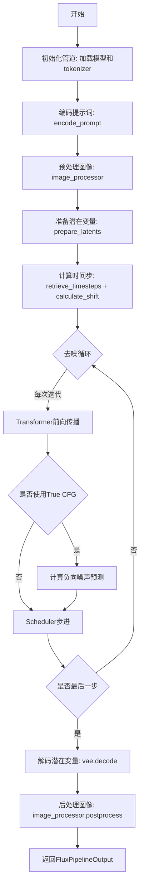

## 类结构

```
DiffusionPipeline (基类)
├── FluxLoraLoaderMixin
├── FromSingleFileMixin
├── TextualInversionLoaderMixin
└── FluxIPAdapterMixin
└── FluxKontextPipeline (主类)
```

## 全局变量及字段


### `logger`
    
模块级日志记录器，用于输出调试和信息日志

类型：`logging.Logger`
    


### `EXAMPLE_DOC_STRING`
    
包含管道使用示例的文档字符串，展示如何调用FluxKontextPipeline进行图像生成

类型：`str`
    


### `PREFERRED_KONTEXT_RESOLUTIONS`
    
Flux Kontext模型训练时使用的首选分辨率列表，用于保持最佳生成质量

类型：`list[tuple[int, int]]`
    


### `XLA_AVAILABLE`
    
标志位，表示PyTorch XLA是否可用，用于支持TPU等硬件加速

类型：`bool`
    


### `FluxKontextPipeline.scheduler`
    
流匹配欧拉离散调度器，用于控制去噪过程的噪声调度

类型：`FlowMatchEulerDiscreteScheduler`
    


### `FluxKontextPipeline.vae`
    
变分自编码器模型，负责图像与潜在表示之间的编码和解码

类型：`AutoencoderKL`
    


### `FluxKontextPipeline.text_encoder`
    
CLIP文本编码器模型，用于将文本提示编码为嵌入向量

类型：`CLIPTextModel`
    


### `FluxKontextPipeline.tokenizer`
    
CLIP分词器，用于将文本分割为token序列

类型：`CLIPTokenizer`
    


### `FluxKontextPipeline.text_encoder_2`
    
T5文本编码器模型，提供更长的文本编码支持

类型：`T5EncoderModel`
    


### `FluxKontextPipeline.tokenizer_2`
    
T5快速分词器，用于文本到token的转换

类型：`T5TokenizerFast`
    


### `FluxKontextPipeline.transformer`
    
Flux变换器模型，是去噪过程的核心神经网络

类型：`FluxTransformer2DModel`
    


### `FluxKontextPipeline.image_encoder`
    
CLIP图像编码器模型，用于IP-Adapter图像特征提取

类型：`CLIPVisionModelWithProjection`
    


### `FluxKontextPipeline.feature_extractor`
    
CLIP图像预处理器，用于图像预处理和特征提取

类型：`CLIPImageProcessor`
    


### `FluxKontextPipeline.vae_scale_factor`
    
VAE缩放因子，用于计算潜在空间的尺寸

类型：`int`
    


### `FluxKontextPipeline.latent_channels`
    
潜在空间的通道数，通常为16

类型：`int`
    


### `FluxKontextPipeline.image_processor`
    
VAE图像处理器，负责图像的预处理和后处理

类型：`VaeImageProcessor`
    


### `FluxKontextPipeline.tokenizer_max_length`
    
分词器的最大序列长度，通常为77

类型：`int`
    


### `FluxKontextPipeline.default_sample_size`
    
默认采样尺寸，用于生成图像的默认高度和宽度计算

类型：`int`
    
    

## 全局函数及方法


### `calculate_shift`

该函数通过线性插值算法，根据输入的图像序列长度计算对应的偏移值（mu），主要用于FLUX调度器中根据图像尺寸动态调整去噪过程中的偏移参数，以优化不同分辨率图像的生成质量。

参数：

- `image_seq_len`：`int`，输入图像经过patchify后的序列长度，决定了需要计算的偏移量
- `base_seq_len`：`int`，默认值为256，基础序列长度，用于线性插值的基准下限
- `max_seq_len`：`int`，默认值为4096，最大序列长度，用于线性插值的基准上限
- `base_shift`：`float`，默认值为0.5，基础偏移量，对应base_seq_len时的偏移值
- `max_shift`：`float`，默认值为1.15，最大偏移量，对应max_seq_len时的偏移值

返回值：`float`，根据图像序列长度线性插值计算得到的偏移值mu

#### 流程图

```mermaid
flowchart TD
    A[开始 calculate_shift] --> B[计算斜率 m = (max_shift - base_shift) / (max_seq_len - base_seq_len)]
    B --> C[计算截距 b = base_shift - m * base_seq_len]
    C --> D[计算偏移值 mu = image_seq_len * m + b]
    D --> E[返回 mu]
```

#### 带注释源码

```python
def calculate_shift(
    image_seq_len,           # 输入：图像序列长度（patchify后的序列维度）
    base_seq_len: int = 256,   # 参数：基础序列长度，默认256
    max_seq_len: int = 4096,   # 参数：最大序列长度，默认4096
    base_shift: float = 0.5,  # 参数：基础偏移量，默认0.5
    max_shift: float = 1.15,  # 参数：最大偏移量，默认1.15
):
    """
    通过线性插值计算图像序列长度对应的偏移值
    
    该函数实现了一个线性映射：根据输入的图像序列长度，
    在[base_seq_len, max_seq_len]范围内线性插值获取对应的偏移值[base_shift, max_shift]
    
    数学公式：
    m = (max_shift - base_shift) / (max_seq_len - base_seq_len)  # 斜率
    b = base_shift - m * base_seq_len                             # 截距
    mu = image_seq_len * m + b                                    # 最终偏移值
    """
    # 计算线性插值的斜率
    m = (max_shift - base_shift) / (max_seq_len - base_seq_len)
    # 计算截距（当序列长度为base_seq_len时，偏移量应为base_shift）
    b = base_shift - m * base_seq_len
    # 根据输入的图像序列长度计算最终的偏移值
    mu = image_seq_len * m + b
    # 返回计算得到的偏移值
    return mu
```


### `retrieve_timesteps`

该函数是 Flux Kontext Pipeline 中的一个全局工具函数，用于调用调度器的 `set_timesteps` 方法并从中检索时间步。它支持自定义时间步（timesteps）或自定义 sigmas，并能根据不同的参数组合正确配置调度器，返回时间步张量和推理步数。

参数：

- `scheduler`：`SchedulerMixin`，要获取时间步的调度器
- `num_inference_steps`：`int | None`，生成样本时使用的扩散步数，如果使用此参数，则 `timesteps` 必须为 `None`
- `device`：`str | torch.device | None`，时间步要移动到的设备，如果为 `None`，则不移动时间步
- `timesteps`：`list[int] | None`，自定义时间步，用于覆盖调度器的时间步间隔策略
- `sigmas`：`list[float] | None`，自定义 sigmas，用于覆盖调度器的 sigma 间隔策略
- `**kwargs`：任意关键字参数，将传递给 `scheduler.set_timesteps`

返回值：`tuple[torch.Tensor, int]`，第一个元素是调度器的时间步调度（张量），第二个元素是推理步数（整数）

#### 流程图

```mermaid
flowchart TD
    A[开始: retrieve_timesteps] --> B{检查 timesteps 和 sigmas}
    B -->|timesteps 和 sigmas 都不为 None| C[抛出 ValueError: 只能选择一个]
    B -->|timesteps 不为 None| D{检查调度器是否支持 timesteps}
    D -->|不支持| E[抛出 ValueError: 不支持自定义 timesteps]
    D -->|支持| F[调用 scheduler.set_timesteps<br/>timesteps=timesteps, device=device]
    F --> G[获取 scheduler.timesteps]
    G --> H[计算 num_inference_steps = len(timesteps)]
    H --> K[返回 timesteps, num_inference_steps]
    
    B -->|sigmas 不为 None| I{检查调度器是否支持 sigmas}
    I -->|不支持| J[抛出 ValueError: 不支持自定义 sigmas]
    I -->|支持| L[调用 scheduler.set_timesteps<br/>sigmas=sigmas, device=device]
    L --> M[获取 scheduler.timesteps]
    M --> N[计算 num_inference_steps = len(timesteps)]
    N --> K
    
    B -->|都为空| O[调用 scheduler.set_timesteps<br/>num_inference_steps, device=device]
    O --> P[获取 scheduler.timesteps]
    P --> Q[返回 timesteps, num_inference_steps]
```

#### 带注释源码

```python
# Copied from diffusers.pipelines.stable_diffusion.pipeline_stable_diffusion.retrieve_timesteps
def retrieve_timesteps(
    scheduler,
    num_inference_steps: int | None = None,
    device: str | torch.device | None = None,
    timesteps: list[int] | None = None,
    sigmas: list[float] | None = None,
    **kwargs,
):
    r"""
    Calls the scheduler's `set_timesteps` method and retrieves timesteps from the scheduler after the call. Handles
    custom timesteps. Any kwargs will be supplied to `scheduler.set_timesteps`.

    Args:
        scheduler (`SchedulerMixin`):
            The scheduler to get timesteps from.
        num_inference_steps (`int`):
            The number of diffusion steps used when generating samples with a pre-trained model. If used, `timesteps`
            must be `None`.
        device (`str` or `torch.device`, *optional*):
            The device to which the timesteps should be moved to. If `None`, the timesteps are not moved.
        timesteps (`list[int]`, *optional*):
            Custom timesteps used to override the timestep spacing strategy of the scheduler. If `timesteps` is passed,
            `num_inference_steps` and `sigmas` must be `None`.
        sigmas (`list[float]`, *optional*):
            Custom sigmas used to override the timestep spacing strategy of the scheduler. If `sigmas` is passed,
            `num_inference_steps` and `timesteps` must be `None`.

    Returns:
        `tuple[torch.Tensor, int]`: A tuple where the first element is the timestep schedule from the scheduler and the
        second element is the number of inference steps.
    """
    # 检查是否同时传入了 timesteps 和 sigmas，这是不允许的
    if timesteps is not None and sigmas is not None:
        raise ValueError("Only one of `timesteps` or `sigmas` can be passed. Please choose one to set custom values")
    
    # 处理自定义 timesteps 的情况
    if timesteps is not None:
        # 检查调度器的 set_timesteps 方法是否支持 timesteps 参数
        accepts_timesteps = "timesteps" in set(inspect.signature(scheduler.set_timesteps).parameters.keys())
        if not accepts_timesteps:
            raise ValueError(
                f"The current scheduler class {scheduler.__class__}'s `set_timesteps` does not support custom"
                f" timestep schedules. Please check whether you are using the correct scheduler."
            )
        # 调用调度器的 set_timesteps 方法设置自定义时间步
        scheduler.set_timesteps(timesteps=timesteps, device=device, **kwargs)
        # 从调度器获取更新后的时间步
        timesteps = scheduler.timesteps
        # 计算推理步数
        num_inference_steps = len(timesteps)
    
    # 处理自定义 sigmas 的情况
    elif sigmas is not None:
        # 检查调度器的 set_timesteps 方法是否支持 sigmas 参数
        accept_sigmas = "sigmas" in set(inspect.signature(scheduler.set_timesteps).parameters.keys())
        if not accept_sigmas:
            raise ValueError(
                f"The current scheduler class {scheduler.__class__}'s `set_timesteps` does not support custom"
                f" sigmas schedules. Please check whether you are using the correct scheduler."
            )
        # 调用调度器的 set_timesteps 方法设置自定义 sigmas
        scheduler.set_timesteps(sigmas=sigmas, device=device, **kwargs)
        # 从调度器获取更新后的时间步
        timesteps = scheduler.timesteps
        # 计算推理步数
        num_inference_steps = len(timesteps)
    
    # 处理默认情况：使用 num_inference_steps
    else:
        scheduler.set_timesteps(num_inference_steps, device=device, **kwargs)
        timesteps = scheduler.timesteps
    
    # 返回时间步调度和推理步数
    return timesteps, num_inference_steps
```


### `retrieve_latents`

从编码器输出中提取潜在向量（latents）。该函数是 Flux Kontext Pipeline 的工具函数，用于从 VAE 编码器的输出中获取潜在表示，支持多种采样模式（随机采样或 Argmax 确定性采样）。

参数：

- `encoder_output`：`torch.Tensor`，编码器输出对象，包含 `latent_dist` 属性（潜在分布）或 `latents` 属性（直接潜在张量）
- `generator`：`torch.Generator | None`，可选的随机生成器，用于随机采样时的随机性控制
- `sample_mode`：`str`，采样模式，默认为 `"sample"`（随机采样），可设置为 `"argmax"`（取分布的众数/均值）

返回值：`torch.Tensor`，提取出的潜在张量

#### 流程图

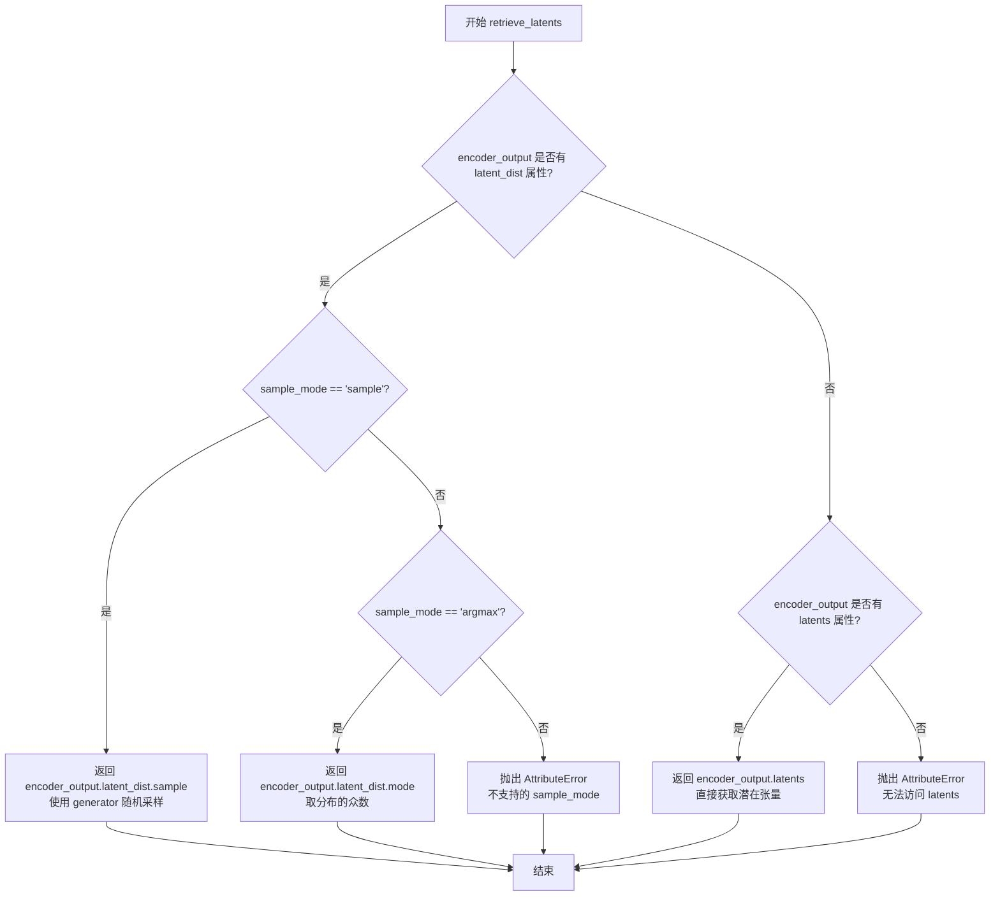

#### 带注释源码

```python
# 从稳定扩散pipeline复制而来的工具函数
# Copied from diffusers.pipelines.stable_diffusion.pipeline_stable_diffusion_img2img.retrieve_latents
def retrieve_latents(
    encoder_output: torch.Tensor,  # VAE编码器的输出对象
    generator: torch.Generator | None = None,  # 可选的随机生成器，用于可控随机性
    sample_mode: str = "sample"  # 采样模式：'sample'随机采样 或 'argmax'确定性采样
):
    """
    从编码器输出中提取潜在向量。
    
    支持三种提取方式：
    1. 从潜在分布中随机采样 (sample_mode='sample')
    2. 从潜在分布中取众数/均值 (sample_mode='argmax')
    3. 直接获取预计算的潜在向量 (latents属性)
    """
    # 情况1：如果有潜在分布且模式为采样
    if hasattr(encoder_output, "latent_dist") and sample_mode == "sample":
        # 从变分分布中随机采样一个潜在向量
        return encoder_output.latent_dist.sample(generator)
    # 情况2：如果有潜在分布且模式为argmax（取众数）
    elif hasattr(encoder_output, "latent_dist") and sample_mode == "argmax":
        # 返回潜在分布的众数（即最可能的潜在向量）
        return encoder_output.latent_dist.mode()
    # 情况3：直接存在latents属性
    elif hasattr(encoder_output, "latents"):
        # 直接返回预计算的潜在张量
        return encoder_output.latents
    # 错误情况：无法识别编码器输出的格式
    else:
        raise AttributeError("Could not access latents of provided encoder_output")
```


### FluxKontextPipeline.__init__

这是 FluxKontextPipeline 类的初始化方法，负责注册所有模块（VAE、文本编码器、Transformer、调度器等）并初始化与图像生成相关的关键配置参数，如 VAE 缩放因子、潜在通道数、图像处理器和分词器最大长度等。

参数：

- `scheduler`：`FlowMatchEulerDiscreteScheduler`，用于去噪图像潜在表示的调度器
- `vae`：`AutoencoderKL`，用于将图像编码和解码为潜在表示的变分自编码器模型
- `text_encoder`：`CLIPTextModel`，CLIP 文本编码器模型，用于生成文本嵌入
- `tokenizer`：`CLIPTokenizer`，CLIP 分词器，用于将文本转换为令牌
- `text_encoder_2`：`T5EncoderModel`，T5 文本编码器模型，用于生成额外的文本嵌入
- `tokenizer_2`：`T5TokenizerFast`，T5 快速分词器，用于将文本转换为令牌
- `transformer`：`FluxTransformer2DModel`，条件 Transformer（MMDiT）架构，用于去噪图像潜在表示
- `image_encoder`：`CLIPVisionModelWithProjection`（可选），CLIP 视觉编码器模型，用于处理 IP Adapter 图像
- `feature_extractor`：`CLIPImageProcessor`（可选），CLIP 图像处理器，用于预处理图像

返回值：`None`，该方法为构造函数，不返回任何值

#### 流程图

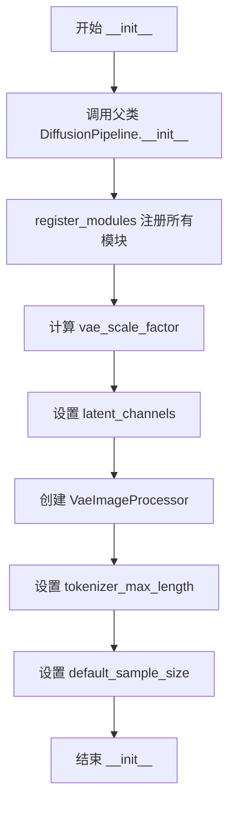

#### 带注释源码

```python
def __init__(
    self,
    scheduler: FlowMatchEulerDiscreteScheduler,
    vae: AutoencoderKL,
    text_encoder: CLIPTextModel,
    tokenizer: CLIPTokenizer,
    text_encoder_2: T5EncoderModel,
    tokenizer_2: T5TokenizerFast,
    transformer: FluxTransformer2DModel,
    image_encoder: CLIPVisionModelWithProjection = None,
    feature_extractor: CLIPImageProcessor = None,
):
    """
    初始化 FluxKontextPipeline 管道实例。
    
    参数:
        scheduler: FlowMatchEulerDiscreteScheduler 调度器实例
        vae: AutoencoderKL VAE 模型实例
        text_encoder: CLIPTextModel 文本编码器实例
        tokenizer: CLIPTokenizer 分词器实例
        text_encoder_2: T5EncoderModel T5 文本编码器实例
        tokenizer_2: T5TokenizerFast T5 分词器实例
        transformer: FluxTransformer2DModel Transformer 模型实例
        image_encoder: CLIPVisionModelWithProjection 可选的图像编码器
        feature_extractor: CLIPImageProcessor 可选的图像特征提取器
    """
    # 调用父类 DiffusionPipeline 的初始化方法
    super().__init__()

    # 注册所有模块到管道中，使其可通过 self.module_name 访问
    self.register_modules(
        vae=vae,
        text_encoder=text_encoder,
        text_encoder_2=text_encoder_2,
        tokenizer=tokenizer,
        tokenizer_2=tokenizer_2,
        transformer=transformer,
        scheduler=scheduler,
        image_encoder=image_encoder,
        feature_extractor=feature_extractor,
    )
    
    # 计算 VAE 缩放因子，基于 VAE 块输出通道数的深度
    # Flux 潜在变量被转换为 2x2 块并打包，因此潜在宽度和高度必须能被块大小整除
    # VAE 缩放因子乘以块大小来考虑这一点
    self.vae_scale_factor = 2 ** (len(self.vae.config.block_out_channels) - 1) if getattr(self, "vae", None) else 8
    
    # 设置潜在通道数，从 VAE 配置中获取
    self.latent_channels = self.vae.config.latent_channels if getattr(self, "vae", None) else 16
    
    # 创建 VAE 图像处理器，缩放因子乘以 2 以考虑打包
    self.image_processor = VaeImageProcessor(vae_scale_factor=self.vae_scale_factor * 2)
    
    # 设置分词器最大长度，默认值为 77
    self.tokenizer_max_length = (
        self.tokenizer.model_max_length if hasattr(self, "tokenizer") and self.tokenizer is not None else 77
    )
    
    # 设置默认采样大小
    self.default_sample_size = 128
```


### `FluxKontextPipeline._get_t5_prompt_embeds`

该方法用于使用 T5 文本编码器（text_encoder_2）将文本提示（prompt）转换为文本嵌入（text embeddings）。它处理文本分词、截断警告、嵌入生成以及批量生成时的嵌入复制，是 FluxKontextPipeline 文本编码流程的核心组成部分。

参数：

- `prompt`：`str | list[str]`，待编码的文本提示，可以是单个字符串或字符串列表
- `num_images_per_prompt`：`int`，每个提示生成的图像数量，用于复制文本嵌入以匹配批量生成，默认为 1
- `max_sequence_length`：`int`，T5 编码器的最大序列长度，默认为 512
- `device`：`torch.device | None`，指定计算设备，默认为 None（自动使用执行设备）
- `dtype`：`torch.dtype | None`，指定数据类型，默认为 None（自动使用 text_encoder 的数据类型）

返回值：`torch.Tensor`，返回形状为 `(batch_size * num_images_per_prompt, seq_len, hidden_size)` 的文本嵌入张量

#### 流程图

```mermaid
flowchart TD
    A[开始: _get_t5_prompt_embeds] --> B{device是否为None}
    B -->|是| C[device = self._execution_device]
    B -->|否| D{device已指定}
    C --> E{dtype是否为None}
    D --> E
    E -->|是| F[dtype = self.text_encoder.dtype]
    E -->|否| G{dtype已指定}
    F --> H[prompt类型检查]
    G --> H
    H --> I{prompt是否为str}
    I -->|是| J[prompt = [prompt]]
    I -->|否| K[保持原样]
    J --> L[batch_size = len(prompt)]
    K --> L
    L --> M{是否TextualInversionLoaderMixin}
    M -->|是| N[maybe_convert_prompt处理]
    M -->|否| O[tokenizer_2分词]
    N --> O
    O --> P[text_inputs = tokenizer_2编码]
    P --> Q[提取input_ids]
    R[额外分词检查截断] --> S{untruncated_ids长度 >= input_ids长度?}
    S -->|是且不等| T[记录截断警告]
    S -->|否| U[text_encoder_2生成嵌入]
    T --> U
    U --> V[转换dtype和device]
    V --> W[重复嵌入: repeat]
    W --> X[重塑视图: view]
    X --> Y[返回prompt_embeds]
```

#### 带注释源码

```python
def _get_t5_prompt_embeds(
    self,
    prompt: str | list[str] = None,
    num_images_per_prompt: int = 1,
    max_sequence_length: int = 512,
    device: torch.device | None = None,
    dtype: torch.dtype | None = None,
):
    """
    使用 T5 文本编码器将文本提示转换为文本嵌入。
    
    该方法完成以下步骤：
    1. 确定设备和数据类型
    2. 处理提示输入格式（字符串或列表）
    3. 可选地应用 TextualInversion 提示转换
    4. 使用 T5 Tokenizer 进行分词
    5. 检查并警告可能的截断
    6. 使用 T5 Encoder 生成文本嵌入
    7. 根据 num_images_per_prompt 复制嵌入
    """
    # 步骤1: 确定设备（优先使用传入的device，否则使用执行设备）
    device = device or self._execution_device
    # 步骤1: 确定数据类型（优先使用传入的dtype，否则使用text_encoder的数据类型）
    dtype = dtype or self.text_encoder.dtype

    # 步骤2: 处理提示输入格式 - 统一转为列表以便批量处理
    prompt = [prompt] if isinstance(prompt, str) else prompt
    batch_size = len(prompt)

    # 步骤3: 如果支持 TextualInversion，应用提示转换（如 embedding 权重调整）
    if isinstance(self, TextualInversionLoaderMixin):
        prompt = self.maybe_convert_prompt(prompt, self.tokenizer_2)

    # 步骤4: 使用 T5 Tokenizer 进行分词
    # 参数说明:
    # - padding="max_length": 填充到最大长度
    # - max_length=max_sequence_length: 最大序列长度限制
    # - truncation=True: 超过最大长度的序列进行截断
    # - return_tensors="pt": 返回 PyTorch 张量
    text_inputs = self.tokenizer_2(
        prompt,
        padding="max_length",
        max_length=max_sequence_length,
        truncation=True,
        return_length=False,
        return_overflowing_tokens=False,
        return_tensors="pt",
    )
    text_input_ids = text_inputs.input_ids
    
    # 步骤5: 检查是否发生截断并记录警告
    # 使用最长填充方式获取未截断的 token ID 进行对比
    untruncated_ids = self.tokenizer_2(prompt, padding="longest", return_tensors="pt").input_ids

    # 判断条件：未截断序列长度 >= 截断后序列长度 且 两者不相等
    if untruncated_ids.shape[-1] >= text_input_ids.shape[-1] and not torch.equal(text_input_ids, untruncated_ids):
        # 解码被截断的部分（取 tokenizer_max_length-1 到末尾之间的内容）
        removed_text = self.tokenizer_2.batch_decode(untruncated_ids[:, self.tokenizer_max_length - 1 : -1])
        logger.warning(
            "The following part of your input was truncated because `max_sequence_length` is set to "
            f" {max_sequence_length} tokens: {removed_text}"
        )

    # 步骤6: 使用 T5 Encoder 生成文本嵌入
    # output_hidden_states=False 只获取最后一层的隐藏状态
    # 返回的 [0] 表示获取第一个元素（hidden_states）
    prompt_embeds = self.text_encoder_2(text_input_ids.to(device), output_hidden_states=False)[0]

    # 确保 dtype 和 device 一致（使用 text_encoder_2 的实际 dtype）
    dtype = self.text_encoder_2.dtype
    prompt_embeds = prompt_embeds.to(dtype=dtype, device=device)

    # 获取嵌入的序列长度
    _, seq_len, _ = prompt_embeds.shape

    # 步骤7: 根据 num_images_per_prompt 复制文本嵌入
    # 使用 repeat 和 view 进行内存友好的复制（MPS 友好方式）
    # repeat(1, num_images_per_prompt, 1) 在序列维度复制
    prompt_embeds = prompt_embeds.repeat(1, num_images_per_prompt, 1)
    # view 重新整形为 (batch_size * num_images_per_prompt, seq_len, hidden_size)
    prompt_embeds = prompt_embeds.view(batch_size * num_images_per_prompt, seq_len, -1)

    return prompt_embeds
```


### `FluxKontextPipeline._get_clip_prompt_embeds`

该方法用于将文本提示（prompt）转换为 CLIP 文本编码器的嵌入向量（embeddings），支持批量处理和每提示生成多张图像的功能。它通过 CLIPTokenizer 对文本进行分词，然后使用 CLIPTextModel 编码，并返回池化后的提示嵌入。

参数：

- `prompt`：`str | list[str]`，要编码的文本提示，可以是单个字符串或字符串列表
- `num_images_per_prompt`：`int = 1`，每个提示要生成的图像数量，用于复制嵌入向量
- `device`：`torch.device | None = None`，指定计算设备，若为 None 则使用执行设备

返回值：`torch.Tensor`，返回形状为 `(batch_size * num_images_per_prompt, hidden_size)` 的文本嵌入张量

#### 流程图

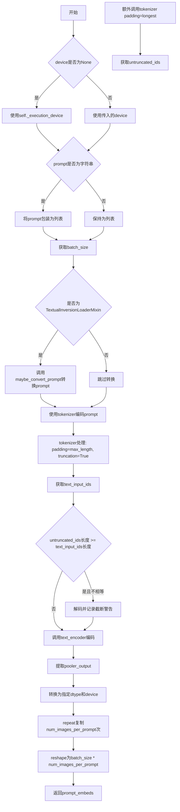

#### 带注释源码

```python
# Copied from diffusers.pipelines.flux.pipeline_flux.FluxPipeline._get_clip_prompt_embeds
def _get_clip_prompt_embeds(
    self,
    prompt: str | list[str],
    num_images_per_prompt: int = 1,
    device: torch.device | None = None,
):
    """
    将文本提示编码为CLIP文本嵌入向量
    
    参数:
        prompt: 要编码的文本提示，字符串或字符串列表
        num_images_per_prompt: 每个提示生成的图像数量
        device: 计算设备，若为None则使用执行设备
    
    返回:
        编码后的文本嵌入向量
    """
    # 确定设备，优先使用传入的device，否则使用执行设备
    device = device or self._execution_device

    # 统一将prompt转为列表，便于批量处理
    prompt = [prompt] if isinstance(prompt, str) else prompt
    batch_size = len(prompt)

    # 如果支持TextualInversion，加载自定义提示词转换
    if isinstance(self, TextualInversionLoaderMixin):
        prompt = self.maybe_convert_prompt(prompt, self.tokenizer)

    # 使用CLIP tokenizer对提示进行分词和编码
    text_inputs = self.tokenizer(
        prompt,
        padding="max_length",  # 填充到最大长度
        max_length=self.tokenizer_max_length,  # 最大长度限制
        truncation=True,  # 截断超长序列
        return_overflowing_tokens=False,  # 不返回溢出token
        return_length=False,  # 不返回长度信息
        return_tensors="pt",  # 返回PyTorch张量
    )

    text_input_ids = text_inputs.input_ids
    
    # 获取未截断的编码结果，用于检测是否有内容被截断
    untruncated_ids = self.tokenizer(prompt, padding="longest", return_tensors="pt").input_ids
    
    # 检查是否发生截断，并记录警告信息
    if untruncated_ids.shape[-1] >= text_input_ids.shape[-1] and not torch.equal(text_input_ids, untruncated_ids):
        removed_text = self.tokenizer.batch_decode(untruncated_ids[:, self.tokenizer_max_length - 1 : -1])
        logger.warning(
            "The following part of your input was truncated because CLIP can only handle sequences up to"
            f" {self.tokenizer_max_length} tokens: {removed_text}"
        )
    
    # 使用CLIPTextModel编码文本输入，获取隐藏状态
    prompt_embeds = self.text_encoder(text_input_ids.to(device), output_hidden_states=False)

    # 提取池化输出（pooled output）
    # CLIPTextModel的pooler_output是[batch_size, hidden_size]的向量
    prompt_embeds = prompt_embeds.pooler_output
    
    # 转换为适当的dtype和device
    prompt_embeds = prompt_embeds.to(dtype=self.text_encoder.dtype, device=device)

    # 为每个提示生成的图像数量复制文本嵌入
    # 使用mps友好的方法：先repeat再view
    prompt_embeds = prompt_embeds.repeat(1, num_images_per_prompt)
    prompt_embeds = prompt_embeds.view(batch_size * num_images_per_prompt, -1)

    return prompt_embeds
```


### `FluxKontextPipeline.encode_prompt`

该方法负责将文本提示词编码为模型所需的嵌入向量，支持 CLIP 和 T5 两种文本编码器，并根据 `num_images_per_prompt` 参数复制嵌入以支持批量图像生成，同时处理 LoRA 权重的动态缩放。

参数：

- `prompt`：`str | list[str]`，要编码的主提示词
- `prompt_2`：`str | list[str] | None`，发送给 T5 编码器的提示词，若未指定则使用 `prompt`
- `device`：`torch.device | None`，计算设备，默认为执行设备
- `num_images_per_prompt`：`int`，每个提示词生成的图像数量，默认为 1
- `prompt_embeds`：`torch.FloatTensor | None`，预生成的文本嵌入，若提供则跳过嵌入计算
- `pooled_prompt_embeds`：`torch.FloatTensor | None`，预生成的池化文本嵌入
- `max_sequence_length`：`int`，T5 编码器的最大序列长度，默认为 512
- `lora_scale`：`float | None`，LoRA 层的缩放因子

返回值：`tuple[torch.Tensor, torch.Tensor, torch.Tensor]`，包含文本嵌入（prompt_embeds）、池化嵌入（pooled_prompt_embeds）和文本标识符（text_ids）

#### 流程图

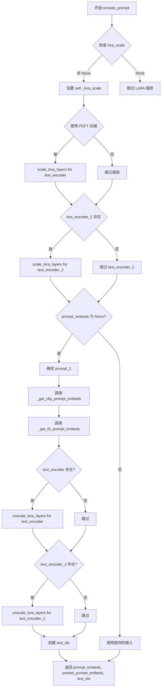

#### 带注释源码

```python
def encode_prompt(
    self,
    prompt: str | list[str],
    prompt_2: str | list[str] | None = None,
    device: torch.device | None = None,
    num_images_per_prompt: int = 1,
    prompt_embeds: torch.FloatTensor | None = None,
    pooled_prompt_embeds: torch.FloatTensor | None = None,
    max_sequence_length: int = 512,
    lora_scale: float | None = None,
):
    r"""
    将文本提示词编码为文本嵌入向量，支持 CLIP 和 T5 两种文本编码器。

    Args:
        prompt: 要编码的主提示词，支持字符串或字符串列表
        prompt_2: 发送给 T5 编码器的提示词，若未指定则使用 prompt
        device: torch 计算设备
        num_images_per_prompt: 每个提示词生成的图像数量
        prompt_embeds: 预生成的文本嵌入，若提供则直接使用
        pooled_prompt_embeds: 预生成的池化文本嵌入
        max_sequence_length: T5 编码器的最大序列长度
        lora_scale: LoRA 层的缩放因子，用于文本编码器
    """
    # 确定计算设备，优先使用传入的 device，否则使用执行设备
    device = device or self._execution_device

    # 设置 LoRA 缩放因子，以便文本编码器的 LoRA 函数可以正确访问
    # 只有当存在 lora_scale 参数且当前类继承了 FluxLoraLoaderMixin 时才设置
    if lora_scale is not None and isinstance(self, FluxLoraLoaderMixin):
        self._lora_scale = lora_scale

        # 动态调整 LoRA 缩放因子
        if self.text_encoder is not None and USE_PEFT_BACKEND:
            scale_lora_layers(self.text_encoder, lora_scale)
        if self.text_encoder_2 is not None and USE_PEFT_BACKEND:
            scale_lora_layers(self.text_encoder_2, lora_scale)

    # 将单个字符串提示词转换为列表，统一处理方式
    prompt = [prompt] if isinstance(prompt, str) else prompt

    # 如果未提供预生成的嵌入，则根据提示词生成
    if prompt_embeds is None:
        # 确定 T5 编码器使用的提示词，若未指定 prompt_2 则使用 prompt
        prompt_2 = prompt_2 or prompt
        prompt_2 = [prompt_2] if isinstance(prompt_2, str) else prompt_2

        # 使用 CLIP 文本编码器生成池化嵌入（仅使用池化输出）
        pooled_prompt_embeds = self._get_clip_prompt_embeds(
            prompt=prompt,
            device=device,
            num_images_per_prompt=num_images_per_prompt,
        )
        # 使用 T5 文本编码器生成长序列文本嵌入
        prompt_embeds = self._get_t5_prompt_embeds(
            prompt=prompt_2,
            num_images_per_prompt=num_images_per_prompt,
            max_sequence_length=max_sequence_length,
            device=device,
        )

    # 如果存在文本编码器，恢复 LoRA 层到原始缩放因子
    if self.text_encoder is not None:
        if isinstance(self, FluxLoraLoaderMixin) and USE_PEFT_BACKEND:
            # 通过取消缩放 LoRA 层来恢复原始缩放因子
            unscale_lora_layers(self.text_encoder, lora_scale)

    # 如果存在 T5 文本编码器，恢复 LoRA 层到原始缩放因子
    if self.text_encoder_2 is not None:
        if isinstance(self, FluxLoraLoaderMixin) and USE_PEFT_BACKEND:
            # 通过取消缩放 LoRA 层来恢复原始缩放因子
            unscale_lora_layers(self.text_encoder_2, lora_scale)

    # 确定数据类型：优先使用 text_encoder 的数据类型，否则使用 transformer 的数据类型
    dtype = self.text_encoder.dtype if self.text_encoder is not None else self.transformer.dtype
    
    # 创建文本标识符张量，形状为 (seq_len, 3)，用于表示文本序列的位置信息
    # 第一列通常用于区分不同类型的 token（文本/图像）
    text_ids = torch.zeros(prompt_embeds.shape[1], 3).to(device=device, dtype=dtype)

    # 返回文本嵌入、池化嵌入和文本标识符
    return prompt_embeds, pooled_prompt_embeds, text_ids
```


### `FluxKontextPipeline.encode_image`

该方法负责将输入图像编码为图像嵌入向量（image embeddings），供后续的IP-Adapter图像提示使用。它首先检查输入是否为PyTorch张量，若不是则使用特征提取器进行转换，然后调用图像编码器生成嵌入，最后根据每prompt图像数量进行重复处理。

参数：

- `image`：图像输入，可以是 `torch.Tensor` 或其他图像格式（如PIL.Image、numpy数组等），需要被编码为嵌入向量的原始图像
- `device`：`torch.device`，执行编码操作的设备（如cuda或cpu）
- `num_images_per_prompt`：`int`，每个提示词生成的图像数量，用于决定嵌入向量的重复次数

返回值：`torch.Tensor`，编码后的图像嵌入向量，形状为 `(batch_size * num_images_per_prompt, embedding_dim)`

#### 流程图

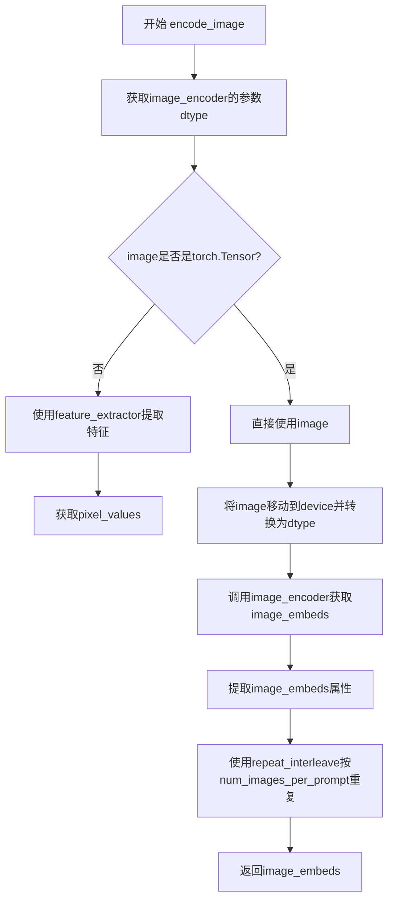

#### 带注释源码

```python
def encode_image(self, image, device, num_images_per_prompt):
    """
    Encode image to image embeddings for IP-Adapter.
    
    Args:
        image: Input image (torch.Tensor or other image formats)
        device: torch.device to run encoding on
        num_images_per_prompt: Number of images to generate per prompt
    
    Returns:
        torch.Tensor: Encoded image embeddings
    """
    # 获取image_encoder模型参数的数据类型，用于后续计算
    dtype = next(self.image_encoder.parameters()).dtype

    # 如果输入不是PyTorch张量，则使用特征提取器将其转换为张量
    # feature_extractor负责将PIL图像/ numpy数组等转换为模型需要的像素值张量
    if not isinstance(image, torch.Tensor):
        image = self.feature_extractor(image, return_tensors="pt").pixel_values

    # 将图像张量移动到指定设备，并转换为正确的dtype
    image = image.to(device=device, dtype=dtype)
    
    # 通过image_encoder获取图像的嵌入表示
    # image_embeds包含了图像的视觉特征向量
    image_embeds = self.image_encoder(image).image_embeds
    
    # 根据num_images_per_prompt复制图像嵌入，以匹配批量生成的需求
    # repeat_interleave在维度0上重复嵌入向量
    image_embeds = image_embeds.repeat_interleave(num_images_per_prompt, dim=0)
    
    return image_embeds
```


### FluxKontextPipeline.prepare_ip_adapter_image_embeds

该方法用于准备IP-Adapter的图像嵌入（image embeds），处理两种输入情况：当未提供预计算的图像嵌入时，使用图像编码器对输入图像进行编码；已提供嵌入时直接使用，并将嵌入复制以匹配每个prompt生成的图像数量。

参数：

- `ip_adapter_image`：`PipelineImageInput | None`，要用于IP-Adapter的输入图像，可为torch.Tensor、PIL.Image、np.ndarray或它们的列表。若提供则用于生成图像嵌入。
- `ip_adapter_image_embeds`：`list[torch.Tensor] | None`，预生成的图像嵌入列表，长度应与IP-Adapter数量相同。若提供则直接使用。
- `device`：`torch.device`，将图像嵌入移动到的目标设备。
- `num_images_per_prompt`：`int`，每个prompt生成的图像数量，用于复制嵌入。

返回值：`list[torch.Tensor]`，处理后的IP-Adapter图像嵌入列表，每个元素为已复制到设备上的张量。

#### 流程图

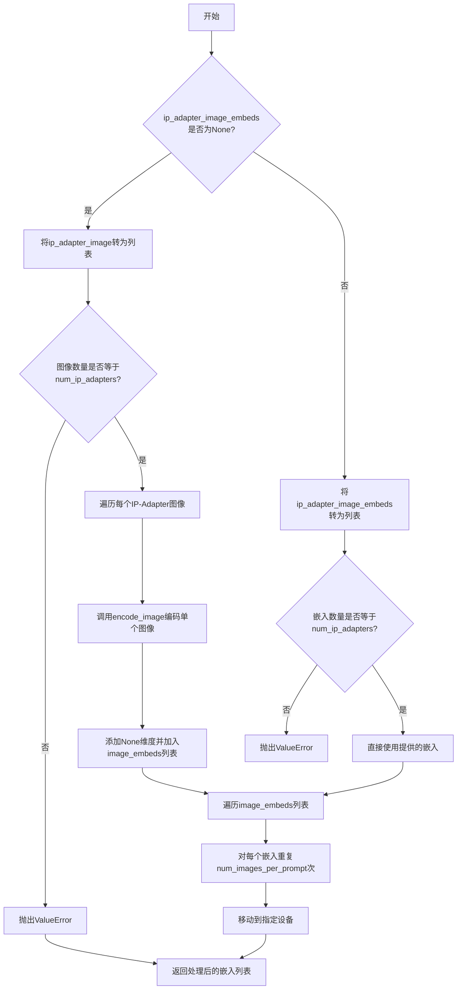

#### 带注释源码

```python
def prepare_ip_adapter_image_embeds(
    self, ip_adapter_image, ip_adapter_image_embeds, device, num_images_per_prompt
):
    """
    准备IP-Adapter的图像嵌入。
    
    处理两种输入情况：
    1. 仅提供ip_adapter_image：使用encode_image编码生成嵌入
    2. 直接提供ip_adapter_image_embeds：验证后直接使用
    
    所有嵌入会被复制num_images_per_prompt次以支持批量生成。
    """
    image_embeds = []
    
    # 情况1：未提供预计算的嵌入，需要从图像编码
    if ip_adapter_image_embeds is None:
        # 确保输入是列表格式
        if not isinstance(ip_adapter_image, list):
            ip_adapter_image = [ip_adapter_image]

        # 验证图像数量与IP-Adapter数量是否匹配
        if len(ip_adapter_image) != self.transformer.encoder_hid_proj.num_ip_adapters:
            raise ValueError(
                f"`ip_adapter_image` must have same length as the number of IP Adapters. Got {len(ip_adapter_image)} images and {self.transformer.encoder_hid_proj.num_ip_adapters} IP Adapters."
            )

        # 遍历每个IP-Adapter的图像进行编码
        for single_ip_adapter_image in ip_adapter_image:
            # 调用encode_image方法获取图像嵌入
            # 返回形状为(batch_size, emb_dim)的张量
            single_image_embeds = self.encode_image(single_ip_adapter_image, device, 1)
            # 添加batch维度: (batch_size, emb_dim) -> (1, batch_size, emb_dim)
            image_embeds.append(single_image_embeds[None, :])
    # 情况2：直接提供了预计算的嵌入
    else:
        # 确保输入是列表格式
        if not isinstance(ip_adapter_image_embeds, list):
            ip_adapter_image_embeds = [ip_adapter_image_embeds]

        # 验证嵌入数量与IP-Adapter数量是否匹配
        if len(ip_adapter_image_embeds) != self.transformer.encoder_hid_proj.num_ip_adapters:
            raise ValueError(
                f"`ip_adapter_image_embeds` must have same length as the number of IP Adapters. Got {len(ip_adapter_image_embeds)} image embeds and {self.transformer.encoder_hid_proj.num_ip_adapters} IP Adapters."
            )

        # 直接使用提供的嵌入
        for single_image_embeds in ip_adapter_image_embeds:
            image_embeds.append(single_image_embeds)

    # 对每个嵌入进行复制以匹配num_images_per_prompt
    ip_adapter_image_embeds = []
    for single_image_embeds in image_embeds:
        # 在batch维度复制: (1, emb_dim) -> (num_images_per_prompt, emb_dim)
        single_image_embeds = torch.cat([single_image_embeds] * num_images_per_prompt, dim=0)
        # 移动到指定设备
        single_image_embeds = single_image_embeds.to(device=device)
        ip_adapter_image_embeds.append(single_image_embeds)

    return ip_adapter_image_embeds
```


### `FluxKontextPipeline.check_inputs`

该方法用于验证图像生成管道的输入参数合法性，检查输入的提示词、嵌入向量、图像尺寸等是否符合要求，若不符合则抛出相应的 `ValueError` 异常。

参数：

- `prompt`：`str | list[str] | None`，用户提供的文本提示词，用于指导图像生成
- `prompt_2`：`str | list[str] | None`，发送给第二个分词器和文本编码器的提示词，若未指定则使用 `prompt`
- `height`：`int`，生成图像的高度（像素）
- `width`：`int`，生成图像的宽度（像素）
- `negative_prompt`：`str | list[str] | None`，不引导图像生成的负面提示词
- `negative_prompt_2`：`str | list[str] | None`，发送给第二个分词器和文本编码器的负面提示词
- `prompt_embeds`：`torch.FloatTensor | None`，预先生成的文本嵌入向量
- `negative_prompt_embeds`：`torch.FloatTensor | None`，预先生成的负面文本嵌入向量
- `pooled_prompt_embeds`：`torch.FloatTensor | None`，预先生成的池化文本嵌入向量
- `negative_pooled_prompt_embeds`：`torch.FloatTensor | None`，预先生成的负面池化文本嵌入向量
- `callback_on_step_end_tensor_inputs`：`list[str] | None`，回调函数需要的张量输入列表
- `max_sequence_length`：`int | None`，提示词的最大序列长度

返回值：`None`，该方法不返回任何值，仅进行参数验证

#### 流程图

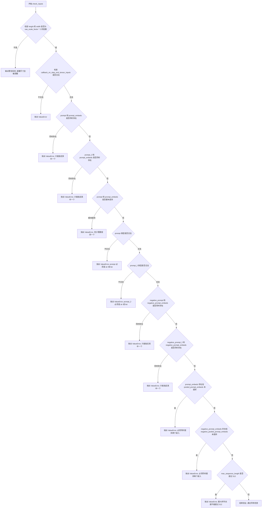

#### 带注释源码

```python
def check_inputs(
    self,
    prompt,
    prompt_2,
    height,
    width,
    negative_prompt=None,
    negative_prompt_2=None,
    prompt_embeds=None,
    negative_prompt_embeds=None,
    pooled_prompt_embeds=None,
    negative_pooled_prompt_embeds=None,
    callback_on_step_end_tensor_inputs=None,
    max_sequence_length=None,
):
    # 检查生成图像的高度和宽度是否符合 VAE 的缩放因子要求
    # 如果不符合，会输出警告信息并由调用方进行调整
    if height % (self.vae_scale_factor * 2) != 0 or width % (self.vae_scale_factor * 2) != 0:
        logger.warning(
            f"`height` and `width` have to be divisible by {self.vae_scale_factor * 2} but are {height} and {width}. Dimensions will be resized accordingly"
        )

    # 验证回调函数所请求的张量输入是否在允许的列表中
    # _callback_tensor_inputs 定义了哪些张量可以传递给回调函数
    if callback_on_step_end_tensor_inputs is not None and not all(
        k in self._callback_tensor_inputs for k in callback_on_step_end_tensor_inputs
    ):
        raise ValueError(
            f"`callback_on_step_end_tensor_inputs` has to be in {self._callback_tensor_inputs}, but found {[k for k in callback_on_step_end_tensor_inputs if k not in self._callback_tensor_inputs]}"
        )

    # 检查 prompt 和 prompt_embeds 不能同时提供，避免歧义
    if prompt is not None and prompt_embeds is not None:
        raise ValueError(
            f"Cannot forward both `prompt`: {prompt} and `prompt_embeds`: {prompt_embeds}. Please make sure to"
            " only forward one of the two."
        )
    # 检查 prompt_2 和 prompt_embeds 不能同时提供
    elif prompt_2 is not None and prompt_embeds is not None:
        raise ValueError(
            f"Cannot forward both `prompt_2`: {prompt_2} and `prompt_embeds`: {prompt_embeds}. Please make sure to"
            " only forward one of the two."
        )
    # 至少需要提供 prompt 或 prompt_embeds 之一
    elif prompt is None and prompt_embeds is None:
        raise ValueError(
            "Provide either `prompt` or `prompt_embeds`. Cannot leave both `prompt` and `prompt_embeds` undefined."
        )
    # 验证 prompt 的类型必须是字符串或字符串列表
    elif prompt is not None and (not isinstance(prompt, str) and not isinstance(prompt, list)):
        raise ValueError(f"`prompt` has to be of type `str` or `list` but is {type(prompt)}")
    # 验证 prompt_2 的类型必须是字符串或字符串列表
    elif prompt_2 is not None and (not isinstance(prompt_2, str) and not isinstance(prompt_2, list)):
        raise ValueError(f"`prompt_2` has to be of type `str` or `list` but is {type(prompt_2)}")

    # 检查 negative_prompt 和 negative_prompt_embeds 不能同时提供
    if negative_prompt is not None and negative_prompt_embeds is not None:
        raise ValueError(
            f"Cannot forward both `negative_prompt`: {negative_prompt} and `negative_prompt_embeds`:"
            f" {negative_prompt_embeds}. Please make sure to only forward one of the two."
        )
    # 检查 negative_prompt_2 和 negative_prompt_embeds 不能同时提供
    elif negative_prompt_2 is not None and negative_prompt_embeds is not None:
        raise ValueError(
            f"Cannot forward both `negative_prompt_2`: {negative_prompt_2} and `negative_prompt_embeds`:"
            f" {negative_prompt_embeds}. Please make sure to only forward one of the two."
        )

    # 如果提供了 prompt_embeds，则必须同时提供 pooled_prompt_embeds
    # 因为它们需要来自同一个文本编码器
    if prompt_embeds is not None and pooled_prompt_embeds is None:
        raise ValueError(
            "If `prompt_embeds` are provided, `pooled_prompt_embeds` also have to be passed. Make sure to generate `pooled_prompt_embeds` from the same text encoder that was used to generate `prompt_embeds`."
        )
    # 如果提供了 negative_prompt_embeds，则必须同时提供 negative_pooled_prompt_embeds
    if negative_prompt_embeds is not None and negative_pooled_prompt_embeds is None:
        raise ValueError(
            "If `negative_prompt_embeds` are provided, `negative_pooled_prompt_embeds` also have to be passed. Make sure to generate `negative_pooled_prompt_embeds` from the same text encoder that was used to generate `negative_prompt_embeds`."
        )

    # 验证最大序列长度不能超过 512
    if max_sequence_length is not None and max_sequence_length > 512:
        raise ValueError(f"`max_sequence_length` cannot be greater than 512 but is {max_sequence_length}")
```


### `FluxKontextPipeline._prepare_latent_image_ids`

该方法用于为 Flux 模型的潜在空间生成二维位置编码（坐标网格），为 Transformer 提供每个潜在像素的空间位置信息，以便于模型理解图像的空间结构。

参数：

- `batch_size`：`int`，批次大小（虽然在此静态方法中未直接使用，但保留以保持接口一致性）
- `height`：`int`，潜在空间的高度（以 patches 为单位）
- `width`：`int`，潜在空间的宽度（以 patches 为单位）
- `device`：`torch.device`，目标设备，用于将生成的张量移动到指定设备
- `dtype`：`torch.dtype`，目标数据类型，用于指定张量的数据类型

返回值：`torch.Tensor`，形状为 `(height * width, 3)` 的二维张量，每行包含 `[0, y, x]` 格式的位置编码，其中 y 和 x 分别是行和列的坐标

#### 流程图

```mermaid
flowchart TD
    A[开始] --> B[创建初始零张量 shape: height x width x 3]
    B --> C[填充 Y 坐标: latent_image_ids[..., 1] += torch.arange(height)[:, None]]
    C --> D[填充 X 坐标: latent_image_ids[..., 2] += torch.arange(width)[None, :]]
    D --> E[获取张量形状: height, width, channels]
    E --> F[reshape: 展平为二维 (height * width) x 3]
    F --> G[移动到指定设备并转换数据类型]
    G --> H[返回结果张量]
```

#### 带注释源码

```python
@staticmethod
# Copied from diffusers.pipelines.flux.pipeline_flux.FluxPipeline._prepare_latent_image_ids
def _prepare_latent_image_ids(batch_size, height, width, device, dtype):
    # 创建一个高度x宽度x3的零张量
    # 第三维用于存储 [batch_indicator, y_coord, x_coord]
    latent_image_ids = torch.zeros(height, width, 3)
    
    # 填充 Y 坐标（行索引）
    # torch.arange(height)[:, None] 创建列向量 (height, 1)
    # 广播机制将其扩展到 (height, width)
    latent_image_ids[..., 1] = latent_image_ids[..., 1] + torch.arange(height)[:, None]
    
    # 填充 X 坐标（列索引）
    # torch.arange(width)[None, :] 创建行向量 (1, width)
    # 广播机制将其扩展到 (height, width)
    latent_image_ids[..., 2] = latent_image_ids[..., 2] + torch.arange(width)[None, :]

    # 获取调整后的张量形状
    latent_image_id_height, latent_image_id_width, latent_image_id_channels = latent_image_ids.shape

    # 将三维张量 reshape 为二维张量
    # 从 (height, width, 3) 转换为 (height * width, 3)
    # 每行代表一个潜在像素位置 [0, y, x]
    latent_image_ids = latent_image_ids.reshape(
        latent_image_id_height * latent_image_id_width, latent_image_id_channels
    )

    # 将结果张量移动到指定设备并转换数据类型后返回
    return latent_image_ids.to(device=device, dtype=dtype)
```


### `FluxKontextPipeline._pack_latents`

该函数是一个静态方法，用于将VAE编码后的潜在变量张量进行"打包"（packing）操作。这是Flux模型特有的处理方式，将2x2的图像块展平为序列，以便Transformer能够处理。

参数：

-  `latents`：`torch.Tensor`，输入的潜在变量张量，形状为 `(batch_size, num_channels_latents, height, width)`
-  `batch_size`：`int`，批次大小
-  `num_channels_latents`：`int`，潜在变量的通道数
-  `height`：`int`，潜在变量的高度
-  `width`：`int`，潜在变量的宽度

返回值：`torch.Tensor`，打包后的潜在变量张量，形状为 `(batch_size, (height // 2) * (width // 2), num_channels_latents * 4)`

#### 流程图

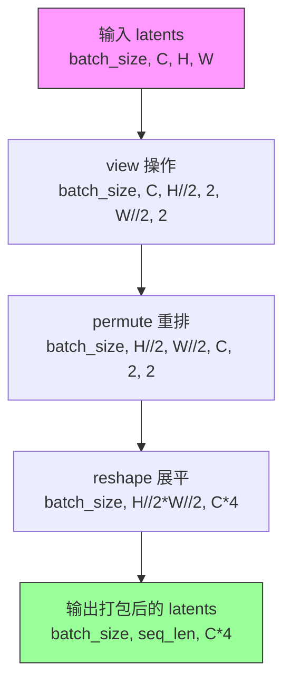

#### 带注释源码

```python
@staticmethod
# Copied from diffusers.pipelines.flux.pipeline_flux.FluxPipeline._pack_latents
def _pack_latents(latents, batch_size, num_channels_latents, height, width):
    """
    将潜在变量张量打包成适合Transformer处理的序列格式。
    
    Flux模型使用2x2的图像块（patches）进行打包，每个2x2块被展平为一个token。
    这允许Transformer像处理文本序列一样处理图像潜在变量。
    
    处理步骤：
    1. view: 将 (B, C, H, W) -> (B, C, H//2, 2, W//2, 2) - 按2x2分块
    2. permute: 重排维度顺序，将空间维度放到前面
    3. reshape: 展平为 (B, H//2*W//2, C*4) - 序列格式
    """
    # 第一步：重塑张量以揭示2x2块结构
    # 从 (batch_size, num_channels, height, width)
    # 变为 (batch_size, num_channels, height//2, 2, width//2, 2)
    latents = latents.view(batch_size, num_channels_latents, height // 2, 2, width // 2, 2)
    
    # 第二步：置换维度以重新排列数据
    # 从 (batch_size, channels, h_blocks, 2, w_blocks, 2)
    # 变为 (batch_size, h_blocks, w_blocks, channels, 2, 2)
    latents = latents.permute(0, 2, 4, 1, 3, 5)
    
    # 第三步：展平为序列格式
    # 从 (batch_size, h_blocks, w_blocks, channels, 2, 2)
    # 变为 (batch_size, h_blocks * w_blocks, channels * 4)
    # 其中 h_blocks * w_blocks 是序列长度（token数量）
    # channels * 4 是每个token的维度（2x2块内的所有通道展平）
    latents = latents.reshape(batch_size, (height // 2) * (width // 2), num_channels_latents * 4)

    return latents
```


### `FluxKontextPipeline._unpack_latents`

该方法是一个静态方法，用于将打包（packed）状态的latent张量解包（unpack）回原始的4D张量形状。在Flux pipeline中，为了提高计算效率，latents会被打包成2D张量（将空间维度压缩），该方法是 `_pack_latents` 的逆操作，将打包后的序列数据重新reshape为标准的 (batch, channels, height, width) 格式，以便后续进行VAE解码。

参数：

- `latents`：`torch.Tensor`，打包后的latent张量，形状为 (batch_size, num_patches, channels)，其中 num_patches = (height // 2) * (width // 2)
- `height`：`int`，原始图像的高度（像素单位），用于计算解包后的latent空间高度
- `width`：`int`，原始图像的宽度（像素单位），用于计算解包后的latent空间宽度
- `vae_scale_factor`：`int`，VAE的缩放因子（通常为8），用于将像素坐标转换为latent坐标

返回值：`torch.Tensor`，解包后的latent张量，形状为 (batch_size, channels // 4, latent_height, latent_width)，其中 latent_height = height // vae_scale_factor，latent_width = width // vae_scale_factor

#### 流程图

```mermaid
flowchart TD
    A[输入打包的latents<br/>shape: (batch, num_patches, channels)] --> B[获取输入形状<br/>batch_size, num_patches, channels]
    B --> C[计算latent空间尺寸<br/>height = 2 * (height // (vae_scale_factor * 2))<br/>width = 2 * (width // (vae_scale_factor * 2))]
    C --> D[view操作: (batch, h//2, w//2, c//4, 2, 2)<br/>将序列维度展开为2D空间+通道+patch]
    D --> E[permute重排: (batch, c//4, h//2, 2, w//2, 2)<br/>重新排列维度顺序]
    E --> F[reshape: (batch, c//4, h, w)<br/>合并patch维度到空间维度]
    F --> G[输出解包的latents<br/>shape: (batch, c//4, h, w)]
    
    style A fill:#e1f5fe
    style G fill:#e8f5e8
```

#### 带注释源码

```python
@staticmethod
# Copied from diffusers.pipelines.flux.pipeline_flux.FluxPipeline._unpack_latents
def _unpack_latents(latents, height, width, vae_scale_factor):
    """
    解包latent张量，将打包的2D序列恢复为4D空间张量
    
    参数:
        latents: 打包后的latent张量，形状为 (batch_size, num_patches, channels)
        height: 原始图像高度（像素）
        width: 原始图像宽度（像素）
        vae_scale_factor: VAE缩放因子，用于计算latent空间尺寸
    """
    # 1. 获取输入张量的形状信息
    batch_size, num_patches, channels = latents.shape

    # 2. 计算latent空间的实际高度和宽度
    # VAE对图像应用8倍压缩，但我们还需要考虑packing操作要求
    # latent高度和宽度必须能被2整除，因此需要额外乘以2
    # 计算公式: latent_size = 2 * (pixel_size // (vae_scale_factor * 2))
    height = 2 * (int(height) // (vae_scale_factor * 2))
    width = 2 * (int(width) // (vae_scale_factor * 2))

    # 3. view操作：将 (batch, num_patches, channels) 展开为6D张量
    # num_patches = (height // 2) * (width // 2)
    # 新的形状: (batch_size, height//2, width//2, channels//4, 2, 2)
    # - height//2, width//2: latent空间维度
    # - channels//4: 通道维度（因packing时4个通道打包在一起）
    # - 2, 2: packing的patch维度
    latents = latents.view(batch_size, height // 2, width // 2, channels // 4, 2, 2)
    
    # 4. permute操作：重新排列维度顺序
    # 从 (batch, h//2, w//2, c//4, 2, 2) 转换为 (batch, c//4, h//2, 2, w//2, 2)
    # 这样可以将两个patch维度(2,2)分离出来，准备与空间维度合并
    latents = latents.permute(0, 3, 1, 4, 2, 5)

    # 5. reshape操作：合并维度得到最终4D张量
    # 将 (batch, c//4, h//2, 2, w//2, 2) 转换为 (batch, c//4, h, w)
    # 其中 h = (h//2) * 2, w = (w//2) * 2
    latents = latents.reshape(batch_size, channels // (2 * 2), height, width)

    # 6. 返回解包后的latent张量，形状为 (batch_size, channels//4, height, width)
    return latents
```


### `FluxKontextPipeline._encode_vae_image`

该方法使用 Variational Autoencoder (VAE) 模型对输入图像进行编码，将其转换为潜在空间表示（latents），并根据 VAE 配置的缩放因子和偏移量进行归一化处理。

参数：

- `image`：`torch.Tensor`，待编码的输入图像张量，通常为 (B, C, H, W) 格式
- `generator`：`torch.Generator`，PyTorch 随机数生成器，用于确保 VAE 编码的确定性，可为单个生成器或生成器列表

返回值：`torch.Tensor`，编码后的图像潜在表示，形状为 (B, latent_channels, H', W')

#### 流程图

```mermaid
flowchart TD
    A[开始 _encode_vae_image] --> B{generator 是否为列表?}
    B -->|是| C[遍历图像批次]
    B -->|否| D[直接编码整个图像]
    
    C --> E[对单张图像调用 self.vae.encode]
    E --> F[使用 retrieve_latents 提取 latents<br/>sample_mode='argmax']
    F --> G[收集所有 latents]
    G --> H[沿维度0拼接 latents]
    D --> F2[使用 retrieve_latents 提取 latents<br/>sample_mode='argmax']
    
    H --> I[应用缩放: (latents - shift_factor) * scaling_factor]
    F2 --> I
    
    I --> J[返回处理后的 image_latents]
```

#### 带注释源码

```python
def _encode_vae_image(self, image: torch.Tensor, generator: torch.Generator):
    # 判断 generator 是否为列表类型，用于处理批量生成场景
    if isinstance(generator, list):
        # 当存在多个生成器时，需要逐个处理每张图像以确保每个图像的生成确定性
        image_latents = [
            # 对批量图像中的每张图像单独编码
            retrieve_latents(
                self.vae.encode(image[i : i + 1]),  # VAE 编码单张图像 [1, C, H, W]
                generator=generator[i],            # 使用对应索引的生成器
                sample_mode="argmax"               # 使用 argmax 模式而非采样模式
            )
            for i in range(image.shape[0])  # 遍历批量大小
        ]
        # 将列表中的所有 latents 张量沿批次维度拼接
        image_latents = torch.cat(image_latents, dim=0)
    else:
        # 单一生成器情况下，直接对整个图像批次进行编码
        image_latents = retrieve_latents(
            self.vae.encode(image),           # VAE 编码整个图像批次
            generator=generator,              # 使用单个生成器
            sample_mode="argmax"              # 使用 argmax 模式获取确定性输出
        )

    # 对编码后的 latents 应用缩放和偏移
    # 这是一个常见的 VAE 后处理步骤，用于将 latents 标准化到特定范围
    # 公式: scaled_latents = (latents - shift_factor) * scaling_factor
    image_latents = (image_latents - self.vae.config.shift_factor) * self.vae.config.scaling_factor

    return image_latents  # 返回处理后的图像潜在表示
```


### `FluxKontextPipeline.enable_vae_slicing`

启用分片 VAE 解码功能。当启用此选项时，VAE 会将输入张量分割成多个切片进行分步计算解码，从而节省内存并允许更大的批处理大小。该方法已被弃用，未来版本将移除，建议直接使用 `pipe.vae.enable_slicing()`。

参数：

- `self`：隐式参数，类型为 `FluxKontextPipeline` 实例，表示管道对象本身。

返回值：`None`，无返回值。该方法直接作用于 VAE 模型的内部状态。

#### 流程图

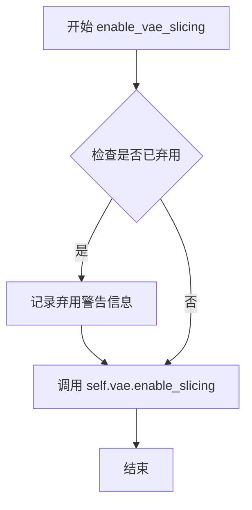

#### 带注释源码

```python
def enable_vae_slicing(self):
    r"""
    Enable sliced VAE decoding. When this option is enabled, the VAE will split the input tensor in slices to
    compute decoding in several steps. This is useful to save some memory and allow larger batch sizes.
    """
    # 构建弃用警告消息，提示用户该方法已被弃用，应使用 pipe.vae.enable_slicing() 代替
    # self.__class__.__name__ 用于获取当前类的名称
    depr_message = f"Calling `enable_vae_slicing()` on a `{self.__class__.__name__}` is deprecated and this method will be removed in a future version. Please use `pipe.vae.enable_slicing()`."
    
    # 调用 deprecate 函数记录弃用警告，指定弃用功能名、版本号（0.40.0）和警告消息
    deprecate(
        "enable_vae_slicing",
        "0.40.0",
        depr_message,
    )
    
    # 启用 VAE 模型自身的切片解码功能
    # 这是实际执行启用分片功能的调用，将分片逻辑委托给 VAE 模型
    self.vae.enable_slicing()
```


### `FluxKontextPipeline.disable_vae_slicing`

该方法用于禁用 VAE 切片解码功能。如果之前启用了 `enable_vae_slicing`，调用此方法后将恢复到单步计算解码。此方法已被弃用，建议直接使用 `pipe.vae.disable_slicing()`。

参数：

- 无（仅包含 `self` 参数）

返回值：`None`，无返回值描述

#### 流程图

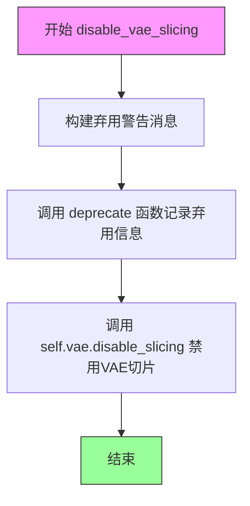

#### 带注释源码

```python
def disable_vae_slicing(self):
    r"""
    Disable sliced VAE decoding. If `enable_vae_slicing` was previously enabled, this method will go back to
    computing decoding in one step.
    """
    # 构建弃用警告消息，提示用户该方法将在未来版本中移除
    # 并建议使用新的 API: pipe.vae.disable_slicing()
    depr_message = f"Calling `disable_vae_slicing()` on a `{self.__class__.__name__}` is deprecated and this method will be removed in a future version. Please use `pipe.vae.disable_slicing()`."
    
    # 调用 deprecate 函数记录弃用信息
    # 参数: 函数名, 弃用版本号, 弃用消息
    deprecate(
        "disable_vae_slicing",
        "0.40.0",
        depr_message,
    )
    
    # 实际执行禁用 VAE 切片解码的操作
    # 委托给 VAE 模型本身的 disable_slicing 方法
    self.vae.disable_slicing()
```


### `FluxKontextPipeline.enable_vae_tiling`

启用瓦片式 VAE 解码。当启用此选项时，VAE 会将输入张量分割成多个瓦片来逐步计算解码和编码过程，从而节省大量内存并支持处理更大的图像。

参数：该方法无显式参数（除隐式 `self`）

- 无

返回值：`None`，无返回值（该方法通过副作用生效）

#### 流程图

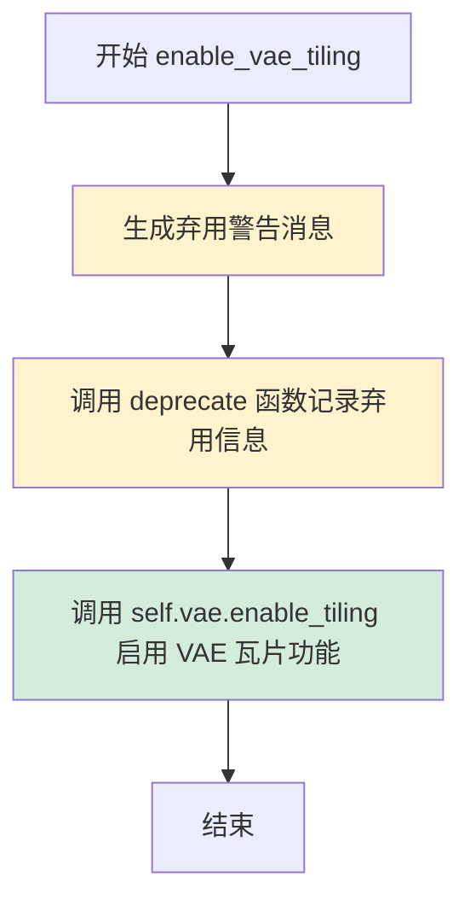

#### 带注释源码

```
# Copied from diffusers.pipelines.flux.pipeline_flux.FluxPipeline.enable_vae_tiling
def enable_vae_tiling(self):
    r"""
    Enable tiled VAE decoding. When this option is enabled, the VAE will split the input tensor into tiles to
    compute decoding and encoding in several steps. This is useful for saving a large amount of memory and to allow
    processing larger images.
    """
    # 生成弃用警告消息，提示用户该方法将在 0.40.0 版本被移除
    # 建议直接使用 pipe.vae.enable_tiling() 代替
    depr_message = f"Calling `enable_vae_tiling()` on a `{self.__class__.__name__}` is deprecated and this method will be removed in a future version. Please use `pipe.vae.enable_tiling()`."
    
    # 调用 deprecate 函数记录弃用信息，用于追踪和提醒用户
    deprecate(
        "enable_vae_tiling",    # 被弃用的功能名称
        "0.40.0",               # 计划移除的版本号
        depr_message,           # 弃用说明消息
    )
    
    # 委托给 VAE 模型的 enable_tiling 方法实际启用瓦片功能
    self.vae.enable_tiling()
```


### `FluxKontextPipeline.disable_vae_tiling`

该方法用于禁用VAE的平铺解码功能。如果之前启用了平铺解码，调用此方法后将恢复为单步解码模式。

参数： 无（仅包含 `self` 参数）

返回值：`None`，无返回值

#### 流程图

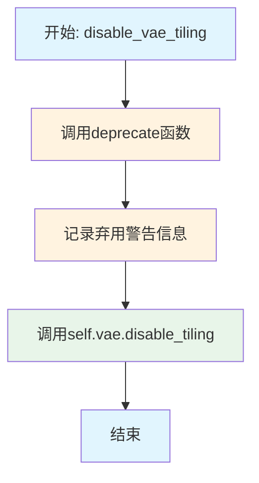

#### 带注释源码

```python
# Copied from diffusers.pipelines.flux.pipeline_flux.FluxPipeline.disable_vae_tiling
def disable_vae_tiling(self):
    r"""
    Disable tiled VAE decoding. If `enable_vae_tiling` was previously enabled, this method will go back to
    computing decoding in one step.
    """
    # 构建弃用警告消息，告知用户该方法已被弃用，将在0.40.0版本移除
    # 建议用户直接使用 pipe.vae.disable_tiling() 代替
    depr_message = f"Calling `disable_vae_tiling()` on a `{self.__class__.__name__}` is deprecated and this method will be removed in a future version. Please use `pipe.vae.disable_tiling()`."
    
    # 调用deprecate函数记录弃用警告
    # 参数1: 被弃用的方法名
    # 参数2: 弃用版本号
    # 参数3: 弃用警告消息
    deprecate(
        "disable_vae_tiling",
        "0.40.0",
        depr_message,
    )
    
    # 调用VAE模型的disable_tiling方法实际禁用平铺解码
    # 这将恢复VAE为单步解码模式
    self.vae.disable_tiling()
```


### `FluxKontextPipeline.prepare_latents`

该方法负责为FluxKontextPipeline准备潜在变量（latents），包括处理输入图像、生成或处理噪声潜在变量、计算潜在图像ID等操作，是扩散模型推理流程中的关键初始化步骤。

参数：

- `self`：`FluxKontextPipeline` 类实例，管道对象本身
- `image`：`torch.Tensor | None`，输入图像张量，如果提供且通道数与latent_channels不同时会被VAE编码，否则直接用作image_latents
- `batch_size`：`int`，批处理大小，用于确定生成的潜在变量数量
- `num_channels_latents`：`int`，潜在变量的通道数，通常为transformer输入通道数的1/4
- `height`：`int`，生成图像的高度（像素单位）
- `width`：`int`，生成图像的宽度（像素单位）
- `dtype`：`torch.dtype`，潜在变量的数据类型
- `device`：`torch.device`，计算设备（CPU/CUDA）
- `generator`：`torch.Generator | list[torch.Generator] | None`，随机数生成器，用于生成可复现的噪声
- `latents`：`torch.Tensor | None`，可选的预生成潜在变量，如果为None则随机生成

返回值：`tuple[torch.Tensor, torch.Tensor, torch.Tensor, torch.Tensor]`，返回包含四个元素的元组：pack后的噪声潜在变量、pack后的图像潜在变量（可为None）、潜在图像ID、图像ID（可为None）

#### 流程图

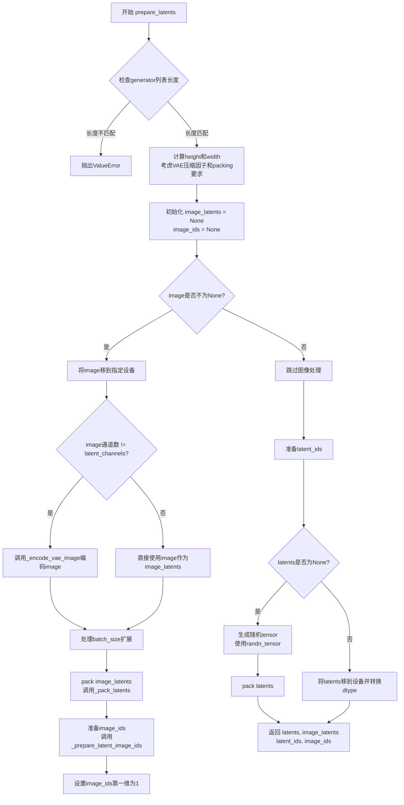

#### 带注释源码

```python
def prepare_latents(
    self,
    image: torch.Tensor | None,
    batch_size: int,
    num_channels_latents: int,
    height: int,
    width: int,
    dtype: torch.dtype,
    device: torch.device,
    generator: torch.Generator | list[torch.Generator] | None = None,
    latents: torch.Tensor | None = None,
):
    # 检查generator列表长度是否与batch_size匹配
    if isinstance(generator, list) and len(generator) != batch_size:
        raise ValueError(
            f"You have passed a list of generators of length {len(generator)}, but requested an effective batch"
            f" size of {batch_size}. Make sure the batch size matches the length of the generators."
        )

    # VAE applies 8x compression on images but we must also account for packing which requires
    # latent height and width to be divisible by 2.
    # 计算经过VAE压缩和packing后的latent空间尺寸
    # VAE应用8x压缩，但需要考虑packing要求高宽能被2整除
    height = 2 * (int(height) // (self.vae_scale_factor * 2))
    width = 2 * (int(width) // (self.vae_scale_factor * 2))
    shape = (batch_size, num_channels_latents, height, width)

    # 初始化图像潜在变量和图像ID为None
    image_latents = image_ids = None
    
    # 处理输入图像
    if image is not None:
        # 将图像移到指定设备
        image = image.to(device=device, dtype=dtype)
        
        # 如果图像通道数与latent_channels不同，则使用VAE编码
        if image.shape[1] != self.latent_channels:
            image_latents = self._encode_vae_image(image=image, generator=generator)
        else:
            # 图像已经是latent形式，直接使用
            image_latents = image
            
        # 处理batch_size扩展情况
        if batch_size > image_latents.shape[0] and batch_size % image_latents.shape[0] == 0:
            # expand init_latents for batch_size
            # 当batch_size大于图像latents数量时，复制扩展
            additional_image_per_prompt = batch_size // image_latents.shape[0]
            image_latents = torch.cat([image_latents] * additional_image_per_prompt, dim=0)
        elif batch_size > image_latents.shape[0] and batch_size % image_latents.shape[0] != 0:
            # 不能完整复制的错误情况
            raise ValueError(
                f"Cannot duplicate `image` of batch size {image_latents.shape[0]} to {batch_size} text prompts."
            )
        else:
            # 正常情况，直接使用
            image_latents = torch.cat([image_latents], dim=0)

        # 获取图像latents的尺寸
        image_latent_height, image_latent_width = image_latents.shape[2:]
        
        # 对图像latents进行packing（将2x2块打包）
        image_latents = self._pack_latents(
            image_latents, batch_size, num_channels_latents, image_latent_height, image_latent_width
        )
        
        # 准备图像latent的ID用于attention计算
        image_ids = self._prepare_latent_image_ids(
            batch_size, image_latent_height // 2, image_latent_width // 2, device, dtype
        )
        # image ids are the same as latent ids with the first dimension set to 1 instead of 0
        # 图像ID第一维设为1，表示这是图像条件而非噪声
        image_ids[..., 0] = 1

    # 准备噪声latent的ID
    latent_ids = self._prepare_latent_image_ids(batch_size, height // 2, width // 2, device, dtype)

    # 处理噪声latents
    if latents is None:
        # 未提供latents时，使用随机噪声生成
        latents = randn_tensor(shape, generator=generator, device=device, dtype=dtype)
        # 对随机噪声进行packing
        latents = self._pack_latents(latents, batch_size, num_channels_latents, height, width)
    else:
        # 使用提供的latents，只做设备转换
        latents = latents.to(device=device, dtype=dtype)

    # 返回：pack后的latents、图像latents（可为None）、latent_ids、image_ids（可为None）
    return latents, image_latents, latent_ids, image_ids
```


### `FluxKontextPipeline.__call__`

该方法是Flux Kontext Pipeline的核心调用函数，用于根据文本提示词和可选的输入图像生成新图像。该方法整合了文本编码、图像预处理、潜在向量准备、去噪循环（包括IP适配器支持和真实分类器自由引导）等完整流程，最终返回生成的图像或潜在向量。

参数：

- `image`：`PipelineImageInput | None`，输入图像或图像批次，用作图像到图像生成的起点，也接受图像潜在向量
- `prompt`：`str | list[str] | None`，指导图像生成的文本提示词，若不定义则需传入`prompt_embeds`
- `prompt_2`：`str | list[str] | None`，发送给tokenizer_2和text_encoder_2的提示词，若不定义则使用`prompt`
- `negative_prompt`：`str | list[str] | None`，不引导图像生成的负面提示词，在不使用引导时忽略
- `negative_prompt_2`：`str | list[str] | None`，发送给tokenizer_2和text_encoder_2的负面提示词，若不定义则使用`negative_prompt`
- `true_cfg_scale`：`float`，当大于1.0且提供`negative_prompt`时启用真实分类器自由引导，默认值为1.0
- `height`：`int | None`，生成图像的高度（像素），默认根据模型配置自动设置
- `width`：`int | None`，生成图像的宽度（像素），默认根据模型配置自动设置
- `num_inference_steps`：`int`，去噪步数，默认值为28，步数越多通常图像质量越高但推理速度越慢
- `sigmas`：`list[float] | None`，自定义sigma值，用于支持sigmas参数的去噪调度器
- `guidance_scale`：`float`，嵌入式引导比例，大于1时启用引导，默认值为3.5
- `num_images_per_prompt`：`int | None`，每个提示词生成的图像数量，默认值为1
- `generator`：`torch.Generator | list[torch.Generator] | None`，用于生成确定性结果的随机数生成器
- `latents`：`torch.FloatTensor | None`，预生成的噪声潜在向量，若不提供则使用随机生成
- `prompt_embeds`：`torch.FloatTensor | None`，预生成的文本嵌入，可用于调整文本输入
- `pooled_prompt_embeds`：`torch.FloatTensor | None`，预生成的池化文本嵌入
- `ip_adapter_image`：`PipelineImageInput | None`，IP适配器的可选图像输入
- `ip_adapter_image_embeds`：`list[torch.Tensor] | None`，IP适配器的预生成图像嵌入列表
- `negative_ip_adapter_image`：`PipelineImageInput | None`，负面IP适配器的可选图像输入
- `negative_ip_adapter_image_embeds`：`list[torch.Tensor] | None`，负面IP适配器的预生成图像嵌入列表
- `negative_prompt_embeds`：`torch.FloatTensor | None`，预生成的负面文本嵌入
- `negative_pooled_prompt_embeds`：`torch.FloatTensor | None`，预生成的负面池化文本嵌入
- `output_type`：`str | None`，输出格式，可选"pil"或"latent"，默认值为"pil"
- `return_dict`：`bool`，是否返回FluxPipelineOutput对象，默认值为True
- `joint_attention_kwargs`：`dict[str, Any] | None`，传递给AttentionProcessor的参数字典
- `callback_on_step_end`：`Callable[[int, int], None] | None`，每个去噪步骤结束时调用的回调函数
- `callback_on_step_end_tensor_inputs`：`list[str]`，回调函数需要的张量输入列表，默认包含"latents"
- `max_sequence_length`：`int`，提示词最大序列长度，默认值为512
- `max_area`：`int`，生成图像的最大面积（像素），默认值为1024**2
- `_auto_resize`：`bool`，是否自动调整图像大小，默认值为True

返回值：`FluxPipelineOutput`或`tuple`，返回生成的图像列表或包含图像的元组

#### 流程图

```mermaid
flowchart TD
    A[开始 __call__] --> B[设置高度和宽度<br/>根据max_area调整宽高比]
    B --> C[检查输入参数<br/>调用check_inputs]
    C --> D[编码提示词<br/>调用encode_prompt获取prompt_embeds和pooled_prompt_embeds]
    D --> E{是否启用真实CFG?}
    E -->|是| F[编码负面提示词<br/>获取negative_prompt_embeds]
    E -->|否| G[跳过负面提示词编码]
    F --> G
    G --> H[预处理输入图像<br/>调整大小并预处理]
    H --> I[准备潜在变量<br/>调用prepare_latents]
    I --> J[准备时间步<br/>调用retrieve_timesteps计算sigmas]
    J --> K[准备引导嵌入<br/>根据guidance_scale设置guidance张量]
    K --> L[准备IP适配器图像嵌入<br/>调用prepare_ip_adapter_image_embeds]
    L --> M[设置调度器起始索引]
    M --> N[进入去噪循环<br/>for each timestep t]
    N --> O{是否有image_latents?}
    O -->|是| P[拼接latents和image_latents]
    O -->|否| Q[仅使用latents]
    P --> R
    Q --> R
    R --> S[调用transformer进行去噪预测<br/>获取noise_pred]
    S --> T{是否启用真实CFG?}
    T -->|是| U[计算负面noise_pred并组合]
    T -->|否| V[跳过负面预测]
    U --> W
    V --> W
    W --> X[调用scheduler.step更新latents]
    X --> Y{是否有callback_on_step_end?}
    Y -->|是| Z[执行回调函数]
    Y -->|否| AA[继续]
    Z --> AA
    AA --> AB{是否是最后一个时间步?}
    AB -->|否| N
    AB -->|是| AC[去噪循环结束]
    AC --> AD{output_type == 'latent'?}
    AD -->|是| AE[直接返回latents]
    AD -->|否| AF[解包latents<br/>解码为图像]
    AE --> AG[Offload模型]
    AF --> AG
    AG --> AH{return_dict == True?}
    AH -->|是| AI[返回FluxPipelineOutput]
    AH -->|否| AJ[返回tuple]
    AI --> AK[结束]
    AJ --> AK
```

#### 带注释源码

```python
@torch.no_grad()
@replace_example_docstring(EXAMPLE_DOC_STRING)
def __call__(
    self,
    image: PipelineImageInput | None = None,
    prompt: str | list[str] = None,
    prompt_2: str | list[str] | None = None,
    negative_prompt: str | list[str] = None,
    negative_prompt_2: str | list[str] | None = None,
    true_cfg_scale: float = 1.0,
    height: int | None = None,
    width: int | None = None,
    num_inference_steps: int = 28,
    sigmas: list[float] | None = None,
    guidance_scale: float = 3.5,
    num_images_per_prompt: int | None = 1,
    generator: torch.Generator | list[torch.Generator] | None = None,
    latents: torch.FloatTensor | None = None,
    prompt_embeds: torch.FloatTensor | None = None,
    pooled_prompt_embeds: torch.FloatTensor | None = None,
    ip_adapter_image: PipelineImageInput | None = None,
    ip_adapter_image_embeds: list[torch.Tensor] | None = None,
    negative_ip_adapter_image: PipelineImageInput | None = None,
    negative_ip_adapter_image_embeds: list[torch.Tensor] | None = None,
    negative_prompt_embeds: torch.FloatTensor | None = None,
    negative_pooled_prompt_embeds: torch.FloatTensor | None = None,
    output_type: str | None = "pil",
    return_dict: bool = True,
    joint_attention_kwargs: dict[str, Any] | None = None,
    callback_on_step_end: Callable[[int, int], None] | None = None,
    callback_on_step_end_tensor_inputs: list[str] = ["latents"],
    max_sequence_length: int = 512,
    max_area: int = 1024**2,
    _auto_resize: bool = True,
):
    # 步骤1: 设置默认高度和宽度
    # 使用VAE缩放因子计算默认尺寸
    height = height or self.default_sample_size * self.vae_scale_factor
    width = width or self.default_sample_size * self.vae_scale_factor

    # 保存原始尺寸用于日志记录
    original_height, original_width = height, width
    # 计算宽高比
    aspect_ratio = width / height
    # 根据最大面积限制调整尺寸
    width = round((max_area * aspect_ratio) ** 0.5)
    height = round((max_area / aspect_ratio) ** 0.5)

    # 确保尺寸是VAE缩放因子*2的倍数，满足模型要求
    multiple_of = self.vae_scale_factor * 2
    width = width // multiple_of * multiple_of
    height = height // multiple_of * multiple_of

    # 如果尺寸被调整，记录警告日志
    if height != original_height or width != original_width:
        logger.warning(
            f"Generation `height` and `width` have been adjusted to {height} and {width} to fit the model requirements."
        )

    # 步骤2: 验证输入参数
    # 检查提示词、嵌入、尺寸等是否符合要求
    self.check_inputs(
        prompt,
        prompt_2,
        height,
        width,
        negative_prompt=negative_prompt,
        negative_prompt_2=negative_prompt_2,
        prompt_embeds=prompt_embeds,
        negative_prompt_embeds=negative_prompt_embeds,
        pooled_prompt_embeds=pooled_prompt_embeds,
        negative_pooled_prompt_embeds=negative_pooled_prompt_embeds,
        callback_on_step_end_tensor_inputs=callback_on_step_end_tensor_inputs,
        max_sequence_length=max_sequence_length,
    )

    # 设置内部状态变量
    self._guidance_scale = guidance_scale
    self._joint_attention_kwargs = joint_attention_kwargs
    self._current_timestep = None
    self._interrupt = False

    # 步骤3: 确定批次大小
    # 根据提示词类型确定批次大小
    if prompt is not None and isinstance(prompt, str):
        batch_size = 1
    elif prompt is not None and isinstance(prompt, list):
        batch_size = len(prompt)
    else:
        batch_size = prompt_embeds.shape[0]

    # 获取执行设备
    device = self._execution_device

    # 提取LoRA缩放因子
    lora_scale = (
        self.joint_attention_kwargs.get("scale", None) if self.joint_attention_kwargs is not None else None
    )
    
    # 检查是否存在负面提示词
    has_neg_prompt = negative_prompt is not None or (
        negative_prompt_embeds is not None and negative_pooled_prompt_embeds is not None
    )
    # 确定是否启用真实分类器自由引导
    do_true_cfg = true_cfg_scale > 1 and has_neg_prompt
    
    # 步骤4: 编码提示词
    # 调用encode_prompt获取文本嵌入和池化嵌入
    (
        prompt_embeds,
        pooled_prompt_embeds,
        text_ids,
    ) = self.encode_prompt(
        prompt=prompt,
        prompt_2=prompt_2,
        prompt_embeds=prompt_embeds,
        pooled_prompt_embeds=pooled_prompt_embeds,
        device=device,
        num_images_per_prompt=num_images_per_prompt,
        max_sequence_length=max_sequence_length,
        lora_scale=lora_scale,
    )
    
    # 如果启用真实CFG，则编码负面提示词
    if do_true_cfg:
        (
            negative_prompt_embeds,
            negative_pooled_prompt_embeds,
            negative_text_ids,
        ) = self.encode_prompt(
            prompt=negative_prompt,
            prompt_2=negative_prompt_2,
            prompt_embeds=negative_prompt_embeds,
            pooled_prompt_embeds=negative_pooled_prompt_embeds,
            device=device,
            num_images_per_prompt=num_images_per_prompt,
            max_sequence_length=max_sequence_length,
            lora_scale=lora_scale,
        )

    # 步骤5: 预处理输入图像
    # 如果提供了图像且不是潜在向量格式，则进行预处理
    if image is not None and not (isinstance(image, torch.Tensor) and image.size(1) == self.latent_channels):
        img = image[0] if isinstance(image, list) else image
        # 获取默认高度和宽度
        image_height, image_width = self.image_processor.get_default_height_width(img)
        aspect_ratio = image_width / image_height
        if _auto_resize:
            # 选择最接近的推荐分辨率
            _, image_width, image_height = min(
                (abs(aspect_ratio - w / h), w, h) for w, h in PREFERRED_KONTEXT_RESOLUTIONS
            )
        # 确保尺寸是multiple_of的倍数
        image_width = image_width // multiple_of * multiple_of
        image_height = image_height // multiple_of * multiple_of
        # 调整图像大小并进行预处理
        image = self.image_processor.resize(image, image_height, image_width)
        image = self.image_processor.preprocess(image, image_height, image_width)

    # 步骤6: 准备潜在变量
    # 计算潜在通道数（transformer输入通道数的1/4）
    num_channels_latents = self.transformer.config.in_channels // 4
    # 调用prepare_latents准备初始潜在向量
    latents, image_latents, latent_ids, image_ids = self.prepare_latents(
        image,
        batch_size * num_images_per_prompt,
        num_channels_latents,
        height,
        width,
        prompt_embeds.dtype,
        device,
        generator,
        latents,
    )
    # 如果存在图像潜在向量，则与噪声潜在向量拼接
    if image_ids is not None:
        latent_ids = torch.cat([latent_ids, image_ids], dim=0)  # dim 0 is sequence dimension

    # 步骤7: 准备时间步
    # 生成默认sigma序列或使用提供的sigma
    sigmas = np.linspace(1.0, 1 / num_inference_steps, num_inference_steps) if sigmas is None else sigmas
    # 计算图像序列长度
    image_seq_len = latents.shape[1]
    # 计算调度器的时间步偏移
    mu = calculate_shift(
        image_seq_len,
        self.scheduler.config.get("base_image_seq_len", 256),
        self.scheduler.config.get("max_image_seq_len", 4096),
        self.scheduler.config.get("base_shift", 0.5),
        self.scheduler.config.get("max_shift", 1.15),
    )
    # 获取时间步序列
    timesteps, num_inference_steps = retrieve_timesteps(
        self.scheduler,
        num_inference_steps,
        device,
        sigmas=sigmas,
        mu=mu,
    )
    # 计算预热步数
    num_warmup_steps = max(len(timesteps) - num_inference_steps * self.scheduler.order, 0)
    self._num_timesteps = len(timesteps)

    # 步骤8: 准备引导嵌入
    # 根据transformer配置设置引导
    if self.transformer.config.guidance_embeds:
        guidance = torch.full([1], guidance_scale, device=device, dtype=torch.float32)
        guidance = guidance.expand(latents.shape[0])
    else:
        guidance = None

    # 步骤9: 处理IP适配器图像
    # 如果只提供了正向或负向IP适配器，为另一方创建零图像
    if (ip_adapter_image is not None or ip_adapter_image_embeds is not None) and (
        negative_ip_adapter_image is None and negative_ip_adapter_image_embeds is None
    ):
        negative_ip_adapter_image = np.zeros((width, height, 3), dtype=np.uint8)
        negative_ip_adapter_image = [negative_ip_adapter_image] * self.transformer.encoder_hid_proj.num_ip_adapters

    elif (ip_adapter_image is None and ip_adapter_image_embeds is None) and (
        negative_ip_adapter_image is not None or negative_ip_adapter_image_embeds is not None
    ):
        ip_adapter_image = np.zeros((width, height, 3), dtype=np.uint8)
        ip_adapter_image = [ip_adapter_image] * self.transformer.encoder_hid_proj.num_ip_adapters

    # 初始化联合注意力参数字典
    if self.joint_attention_kwargs is None:
        self._joint_attention_kwargs = {}

    # 准备IP适配器图像嵌入
    image_embeds = None
    negative_image_embeds = None
    if ip_adapter_image is not None or ip_adapter_image_embeds is not None:
        image_embeds = self.prepare_ip_adapter_image_embeds(
            ip_adapter_image,
            ip_adapter_image_embeds,
            device,
            batch_size * num_images_per_prompt,
        )
    if negative_ip_adapter_image is not None or negative_ip_adapter_image_embeds is not None:
        negative_image_embeds = self.prepare_ip_adapter_image_embeds(
            negative_ip_adapter_image,
            negative_ip_adapter_image_embeds,
            device,
            batch_size * num_images_per_prompt,
        )

    # 步骤10: 去噪循环
    # 设置调度器起始索引以减少D到H同步
    self.scheduler.set_begin_index(0)
    with self.progress_bar(total=num_inference_steps) as progress_bar:
        # 遍历每个时间步
        for i, t in enumerate(timesteps):
            # 检查是否被中断
            if self.interrupt:
                continue

            # 更新当前时间步
            self._current_timestep = t
            # 设置IP适配器图像嵌入到联合注意力参数
            if image_embeds is not None:
                self._joint_attention_kwargs["ip_adapter_image_embeds"] = image_embeds

            # 准备潜在模型输入
            latent_model_input = latents
            # 如果有图像潜在向量，则拼接
            if image_latents is not None:
                latent_model_input = torch.cat([latents, image_latents], dim=1)
            # 扩展时间步以匹配批次大小
            timestep = t.expand(latents.shape[0]).to(latents.dtype)

            # 调用transformer进行去噪预测
            noise_pred = self.transformer(
                hidden_states=latent_model_input,
                timestep=timestep / 1000,
                guidance=guidance,
                pooled_projections=pooled_prompt_embeds,
                encoder_hidden_states=prompt_embeds,
                txt_ids=text_ids,
                img_ids=latent_ids,
                joint_attention_kwargs=self.joint_attention_kwargs,
                return_dict=False,
            )[0]
            # 裁剪预测结果到原始潜在向量长度
            noise_pred = noise_pred[:, : latents.size(1)]

            # 如果启用真实CFG，则计算负面预测并组合
            if do_true_cfg:
                if negative_image_embeds is not None:
                    self._joint_attention_kwargs["ip_adapter_image_embeds"] = negative_image_embeds
                neg_noise_pred = self.transformer(
                    hidden_states=latent_model_input,
                    timestep=timestep / 1000,
                    guidance=guidance,
                    pooled_projections=negative_pooled_prompt_embeds,
                    encoder_hidden_states=negative_prompt_embeds,
                    txt_ids=negative_text_ids,
                    img_ids=latent_ids,
                    joint_attention_kwargs=self.joint_attention_kwargs,
                    return_dict=False,
                )[0]
                neg_noise_pred = neg_noise_pred[:, : latents.size(1)]
                # 应用真实CFG缩放
                noise_pred = neg_noise_pred + true_cfg_scale * (noise_pred - neg_noise_pred)

            # 计算前一个时间步的潜在向量 (x_t -> x_t-1)
            latents_dtype = latents.dtype
            latents = self.scheduler.step(noise_pred, t, latents, return_dict=False)[0]

            # 处理数据类型转换，特别是对于MPS后端
            if latents.dtype != latents_dtype:
                if torch.backends.mps.is_available():
                    latents = latents.to(latents_dtype)

            # 如果提供了步骤结束回调，则执行
            if callback_on_step_end is not None:
                callback_kwargs = {}
                for k in callback_on_step_end_tensor_inputs:
                    callback_kwargs[k] = locals()[k]
                callback_outputs = callback_on_step_end(self, i, t, callback_kwargs)

                # 更新回调返回的潜在向量和提示词嵌入
                latents = callback_outputs.pop("latents", latents)
                prompt_embeds = callback_outputs.pop("prompt_embeds", prompt_embeds)

            # 更新进度条
            if i == len(timesteps) - 1 or ((i + 1) > num_warmup_steps and (i + 1) % self.scheduler.order == 0):
                progress_bar.update()

            # 对于XLA后端，标记执行步骤
            if XLA_AVAILABLE:
                xm.mark_step()

    # 清除当前时间步
    self._current_timestep = None

    # 步骤11: 后处理
    # 根据输出类型处理结果
    if output_type == "latent":
        # 直接返回潜在向量
        image = latents
    else:
        # 解包潜在向量
        latents = self._unpack_latents(latents, height, width, self.vae_scale_factor)
        # 反缩放和解码
        latents = (latents / self.vae.config.scaling_factor) + self.vae.config.shift_factor
        image = self.vae.decode(latents, return_dict=False)[0]
        # 后处理图像
        image = self.image_processor.postprocess(image, output_type=output_type)

    # 卸载所有模型
    self.maybe_free_model_hooks()

    # 返回结果
    if not return_dict:
        return (image,)

    return FluxPipelineOutput(images=image)
```

## 关键组件


### 张量索引与惰性加载

在`prepare_latents`方法中实现，负责初始化和准备去噪过程中的潜在变量。该方法处理图像latent的打包、latent ID的生成，并根据条件决定是否编码输入图像。关键在于使用`_pack_latents`和`_prepare_latent_image_ids`进行张量重塑，以及支持可选的预生成latents输入实现惰性加载。

### 反量化支持

在VAE解码阶段实现，包含两个关键步骤：首先通过`_unpack_latents`将打包的latents解压回原始空间，然后应用`shift_factor`和`scaling_factor`进行反量化操作，最后调用`vae.decode`完成图像重建。这一过程确保了latent空间到像素空间的正确转换。

### 量化策略

虽然没有显式的量化节点，但代码支持多种精度类型（bfloat16、float32等），通过`dtype`参数控制模型和张量的数据类型。`encode_prompt`方法中动态获取text_encoder的dtype，确保跨组件的数据类型一致性。

### 文本编码模块

由`_get_clip_prompt_embeds`和`_get_t5_prompt_embeds`组成，分别使用CLIP和T5文本编码器生成文本嵌入。支持LoRA权重的动态缩放和反缩放，以及prompt的批量处理和多提示生成。

### 图像编码与IP-Adapter

`encode_image`方法使用CLIPVisionModelWithProjection编码图像，`prepare_ip_adapter_image_embeds`方法处理IP-Adapter的图像嵌入。支持预计算的图像嵌入输入和动态编码两种模式。

### VAE图像编码

`_encode_vae_image`方法将输入图像编码为latent表示，支持批量处理和随机采样模式。使用`retrieve_latents`函数从VAE输出中提取latents，并应用shift和scale因子进行归一化。

### 调度器与时间步管理

`retrieve_timesteps`函数封装了调度器的时间步设置逻辑，支持自定义timesteps和sigmas。`calculate_shift`函数根据图像序列长度动态计算噪声调度参数，优化去噪过程。

### Pipeline主类

FluxKontextPipeline整合了所有组件，继承自DiffusionPipeline和多个Mixin类。提供完整的`__call__`方法实现端到端的图像生成流程，支持文本到图像和图像到图像两种模式。


## 问题及建议


### 已知问题

-   **大量代码重复**：`_get_t5_prompt_embeds`、`_get_clip_prompt_embeds`、`encode_prompt`、`encode_image`、`prepare_ip_adapter_image_embeds`、`check_inputs`、`_prepare_latent_image_ids`、`_pack_latents`、`_unpack_latents` 等方法几乎完全复制自 `diffusers.pipelines.flux.pipeline_flux.FluxPipeline`，导致维护成本高，一旦父类方法有bug修复，需要手动同步修改。
-   **弃用方法未完全清理**：`enable_vae_slicing`、`disable_vae_slicing`、`enable_vae_tiling`、`disable_vae_tiling` 这四个方法已被标记为弃用（deprecated），将在0.40.0版本移除，但它们只是简单调用 `self.vae.enable_slicing()` 等方法，这些调用在pipeline层面已经没有实际意义。
-   **类型提示不够精确**：部分参数如 `PipelineImageInput` 的使用可以更精确，`callback_on_step_end_tensor_inputs` 默认值为 `["latents"]` 字符串列表，但实际应该使用类属性中定义的 `_callback_tensor_inputs`。
-   **硬编码配置值**：`default_sample_size = 128` 和 `self.latent_channels` 的计算逻辑中包含硬编码假设，如果 VAE 配置发生变化可能导致问题。
-   **日志消息错误**：第504行的警告消息只提到 "CLIP can only handle sequences"，但实际使用的是 T5TokenizerFast，会误导开发者。
- **XLA支持条件编译**：代码中使用了 `if XLA_AVAILABLE:` 的条件编译，但 XLA 相关的处理仅在循环结束后调用了一次 `xm.mark_step()`，在循环内部没有充分利用 XLA 的性能优势。

### 优化建议

-   **使用继承或Mixin重构代码**：将公共方法提取到基类 `FluxPipeline` 中，通过继承复用代码，而不是直接复制粘贴。
-   **移除弃用方法**：如果 `vae.enable_slicing()` 等方法可以直接在 VAE 上调用，pipeline 层面的封装方法可以完全移除，减少代码复杂度。
-   **统一类型注解**：使用 `typing.TypeAlias` 或 `typing.TypeGuard` 等高级类型提示提高代码可读性，确保类型检查器能正确识别参数类型。
-   **配置外部化**：将硬编码的 `default_sample_size` 和分辨率相关逻辑提取到配置文件或构造函数参数中，提高灵活性。
-   **修复日志消息**：更正第504行的警告消息，准确描述 T5TokenizerFast 的序列长度限制。
-   **优化XLA集成**：如果目标平台是XLA，应该在去噪循环内部更早地使用 `xm.mark_step()`，或者提供更完善的 XLA 性能优化选项。
-   **添加缓存机制**：对于 `prompt_embeds` 和 `pooled_prompt_embeds` 等在单次推理中不会变化的值，可以考虑添加缓存机制避免重复编码。
-   **增强错误处理**：在 `prepare_latents` 方法中，当 `image` 参数类型为 list 但元素类型不一致时，缺少明确的错误提示。

## 其它


### 设计目标与约束

本代码实现Flux Kontext管道，支持基于文本提示和可选图像输入的图像生成任务。核心设计目标包括：(1) 支持图像到图像和文本到图像的生成模式；(2) 集成IP Adapter实现图像提示功能；(3) 支持LoRA微调、文本反转和单文件加载；(4) 遵循特定分辨率约束以获得最佳生成质量。主要约束包括：图像高度和宽度必须能被vae_scale_factor * 2整除；最大序列长度为512 tokens；最大生成面积为1024*1024像素；建议使用PREFERRED_KONTEXT_RESOLUTIONS中的分辨率以获得最佳效果。

### 错误处理与异常设计

代码采用多层错误处理机制。在check_inputs方法中进行全面的输入验证，包括：高度和宽度 divisibility 检查；callback_on_step_end_tensor_inputs合法性验证；prompt和prompt_embeds互斥检查；类型检查（str或list）；pooled_prompt_embeds和negative_pooled_prompt_embeds的必要性检查；max_sequence_length不超过512的限制。使用ValueError抛出明确的错误信息，logger.warning用于非致命性警告（如尺寸调整提示）。retrieve_timesteps函数中检查scheduler是否支持自定义timesteps或sigmas。retrieve_latents函数中使用AttributeError处理encoder_output属性访问异常。enable_vae_slicing等方法已标记为deprecated，使用deprecate函数提示未来移除。

### 数据流与状态机

整体数据流分为以下几个阶段：
1. **输入预处理阶段**：验证并调整图像尺寸，验证提示词输入
2. **编码阶段**：将文本提示编码为prompt_embeds和pooled_prompt_embeds；将图像编码为image_embeds（如果提供）
3. **潜在变量准备阶段**：初始化随机潜在变量或复用提供的潜在变量；处理图像潜在变量并打包
4. **去噪循环阶段**：对每个timestep执行Transformer推理；支持true_cfg_scale进行分类器自由引导；支持IP Adapter特征注入
5. **解码阶段**：将潜在变量解包并通过VAE解码为图像
6. **后处理阶段**：将图像转换为指定输出格式（PIL/numpy/latent）

状态机主要体现在：
- _guidance_scale属性存储引导比例
- _joint_attention_kwargs存储联合注意力参数
- _num_timesteps记录总步数
- _current_timestep记录当前 timestep
- _interrupt标志用于中断生成

### 外部依赖与接口契约

主要外部依赖包括：
- **transformers库**：CLIPTextModel、CLIPTokenizer、CLIPVisionModelWithProjection、T5EncoderModel、T5TokenizerFast
- **diffusers库**：AutoencoderKL、FluxTransformer2DModel、FlowMatchEulerDiscreteScheduler、VaeImageProcessor、PipelineImageInput
- **torch与numpy**：张量计算和数值操作
- **torch_xla**（可选）：用于XLA设备加速

接口契约：
- encode_prompt方法接受prompt/prompt_2、device、num_images_per_prompt、prompt_embeds、pooled_prompt_embeds、max_sequence_length、lora_scale参数，返回prompt_embeds、pooled_prompt_embeds、text_ids
- encode_image方法接受image、device、num_images_per_prompt参数，返回image_embeds
- prepare_latents方法处理潜在变量初始化和打包
- __call__方法是主生成入口，遵循DiffusionPipeline标准接口
- FluxPipelineOutput包含images属性作为输出

### 性能优化与资源管理

代码包含多种性能优化机制：
- **模型卸载序列**（model_cpu_offload_seq）：按序卸载text_encoder->text_encoder_2->image_encoder->transformer->vae
- **VAE切片**（enable_vae_slicing）：分片解码以节省显存
- **VAE平铺**（enable_vae_tiling）：分块编码/解码大图像
- **XLA支持**：检测并使用torch_xla进行加速
- **潜在变量打包**：使用_pack_latents将2x2 patch打包以提高效率
- **批处理友好**：使用repeat和repeat_interleave进行批量嵌入复制

### 版本兼容性与弃用管理

代码使用deprecate函数管理API演进：
- enable_vae_slicing、disable_vae_slicing、enable_vae_tiling、disable_vae_tiling方法标记为0.40.0版本弃用
- 推荐使用vae自身的enable_slicing()、disable_slicing()、enable_tiling()、disable_tiling()方法
- 使用is_torch_xla_available()条件导入处理可选依赖
- 使用USE_PEFT_BACKEND标志处理PEFT后端兼容性

### 安全性与权限管理

代码遵循Apache License 2.0许可。使用torch.no_grad()装饰器确保推理时不计算梯度。设备选择通过_execution_device属性管理。LoRA scale通过scale_lora_layers和unscale_lora_layers动态调整。潜在变量使用randn_tensor生成，确保随机性控制。

    