# `diffusers\src\diffusers\pipelines\flux\pipeline_flux_kontext_inpaint.py` 详细设计文档

Flux Kontext Inpainting Pipeline是一个基于FLUX模型的图像修复（inpainting）管道，支持文本引导的图像修复、图像参考、条件掩码处理、IP-Adapter、LoRA和文本反转等高级功能，能够根据文字提示填充或替换图像中的指定区域。

## 整体流程

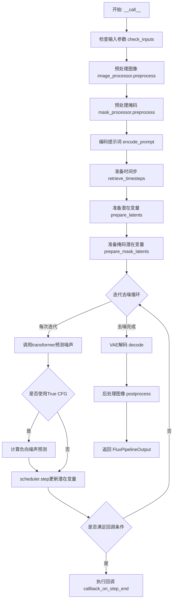

## 类结构

```
DiffusionPipeline (基类)
├── FluxLoraLoaderMixin
├── FromSingleFileMixin
├── TextualInversionLoaderMixin
└── FluxIPAdapterMixin
    └── FluxKontextInpaintPipeline (主类)
```

## 全局变量及字段


### `XLA_AVAILABLE`
    
XLA是否可用标志，用于检测PyTorch XLA环境

类型：`bool`
    


### `logger`
    
日志记录器，用于输出pipeline运行时的日志信息

类型：`logging.Logger`
    


### `EXAMPLE_DOC_STRING`
    
示例文档字符串，包含pipeline的使用示例代码

类型：`str`
    


### `PREFERRED_KONTEXT_RESOLUTIONS`
    
首选Kontext分辨率列表，定义了训练时使用的推荐图像宽高对

类型：`list[tuple[int, int]]`
    


### `FluxKontextInpaintPipeline.vae_scale_factor`
    
VAE缩放因子，用于计算潜在空间尺寸

类型：`int`
    


### `FluxKontextInpaintPipeline.latent_channels`
    
潜在通道数，表示VAE潜在表示的通道维度

类型：`int`
    


### `FluxKontextInpaintPipeline.image_processor`
    
图像预处理器，用于处理输入图像的标准化和转换

类型：`VaeImageProcessor`
    


### `FluxKontextInpaintPipeline.mask_processor`
    
掩码预处理器，用于处理修复任务的掩码图像

类型：`VaeImageProcessor`
    


### `FluxKontextInpaintPipeline.tokenizer_max_length`
    
分词器最大长度，定义文本输入的最大token数

类型：`int`
    


### `FluxKontextInpaintPipeline.default_sample_size`
    
默认采样尺寸，用于生成图像的基础尺寸

类型：`int`
    


### `FluxKontextInpaintPipeline.model_cpu_offload_seq`
    
CPU卸载顺序，定义模型各组件从GPU卸载到CPU的序列

类型：`str`
    


### `FluxKontextInpaintPipeline._optional_components`
    
可选组件列表，包含pipeline中可选的模型组件名称

类型：`list[str]`
    


### `FluxKontextInpaintPipeline._callback_tensor_inputs`
    
回调张量输入列表，指定在推理过程中可被回调函数访问的张量名称

类型：`list[str]`
    
    

## 全局函数及方法


### `calculate_shift`

该函数用于根据图像序列长度计算对应的偏移量（shift），通过线性插值在基础序列长度和最大序列长度之间计算偏移值，主要用于 Flux 扩散模型的噪声调度器中调整噪声添加策略。

参数：

- `image_seq_len`：图像序列长度（需要计算偏移量的图像序列长度）
- `base_seq_len`：`int`，基础序列长度，默认为 256
- `max_seq_len`：`int`，最大序列长度，默认为 4096
- `base_shift`：`float`，基础偏移量，默认为 0.5
- `max_shift`：`float`，最大偏移量，默认为 1.15

返回值：`float`，计算得到的偏移量 mu 值，用于噪声调度

#### 流程图

```mermaid
graph TD
    A[开始 calculate_shift] --> B[计算斜率 m]
    B --> C[m = (max_shift - base_shift) / (max_seq_len - base_seq_len)]
    C --> D[计算截距 b]
    D --> E[b = base_shift - m * base_seq_len]
    E --> F[计算偏移量 mu]
    F --> G[mu = image_seq_len * m + b]
    G --> H[返回 mu]
```

#### 带注释源码

```python
def calculate_shift(
    image_seq_len,           # 图像序列长度
    base_seq_len: int = 256,      # 基础序列长度，默认256
    max_seq_len: int = 4096,      # 最大序列长度，默认4096
    base_shift: float = 0.5,      # 基础偏移量，默认0.5
    max_shift: float = 1.15,      # 最大偏移量，默认1.15
):
    """
    计算图像序列长度对应的偏移量
    
    使用线性插值方法，根据image_seq_len在[base_seq_len, max_seq_len]区间内的位置，
    计算对应的偏移量值。该偏移量用于扩散模型的噪声调度过程。
    
    Args:
        image_seq_len: 图像序列长度
        base_seq_len: 基础序列长度，默认256
        max_seq_len: 最大序列长度，默认4096
        base_shift: 基础偏移量，默认0.5
        max_shift: 最大偏移量，默认1.15
    
    Returns:
        float: 计算得到的偏移量mu值
    """
    # 计算线性插值的斜率 m
    # 斜率 = (最大偏移量 - 基础偏移量) / (最大序列长度 - 基础序列长度)
    m = (max_shift - base_shift) / (max_seq_len - base_seq_len)
    
    # 计算线性方程的截距 b
    # 根据点斜式: y = mx + b => b = y - mx
    # 这里使用基础序列长度和基础偏移量作为参考点
    b = base_shift - m * base_seq_len
    
    # 计算最终的偏移量 mu
    # 使用线性方程: mu = image_seq_len * m + b
    mu = image_seq_len * m + b
    
    # 返回计算得到的偏移量
    return mu
```


### `retrieve_timesteps`

该函数是扩散管道中的时间步获取工具函数，负责调用调度器的 `set_timesteps` 方法并从调度器中检索时间步。它支持自定义时间步（timesteps）或自定义 sigmas，也能处理标准的推理步数（num_inference_steps），同时提供了参数校验以确保调度器支持所需的功能。

参数：

-  `scheduler`：`SchedulerMixin`，调度器对象，用于获取时间步的调度器实例。
-  `num_inference_steps`：`int | None`，扩散模型生成样本时使用的扩散步数。如果使用此参数，则 `timesteps` 必须为 `None`。
-  `device`：`str | torch.device | None`，时间步应移动到的设备。如果为 `None`，则时间步不会移动。
-  `timesteps`：`list[int] | None`，用于覆盖调度器时间步间隔策略的自定义时间步。如果传递 `timesteps`，则 `num_inference_steps` 和 `sigmas` 必须为 `None`。
-  `sigmas`：`list[float] | None`，用于覆盖调度器 sigma 间隔策略的自定义 sigmas。如果传递 `sigmas`，则 `num_inference_steps` 和 `timesteps` 必须为 `None`。
-  `**kwargs`：任意关键字参数，将传递给 `scheduler.set_timesteps` 方法。

返回值：`tuple[torch.Tensor, int]`，元组包含两个元素：第一个是调度器的时间步调度张量，第二个是推理步数。

#### 流程图

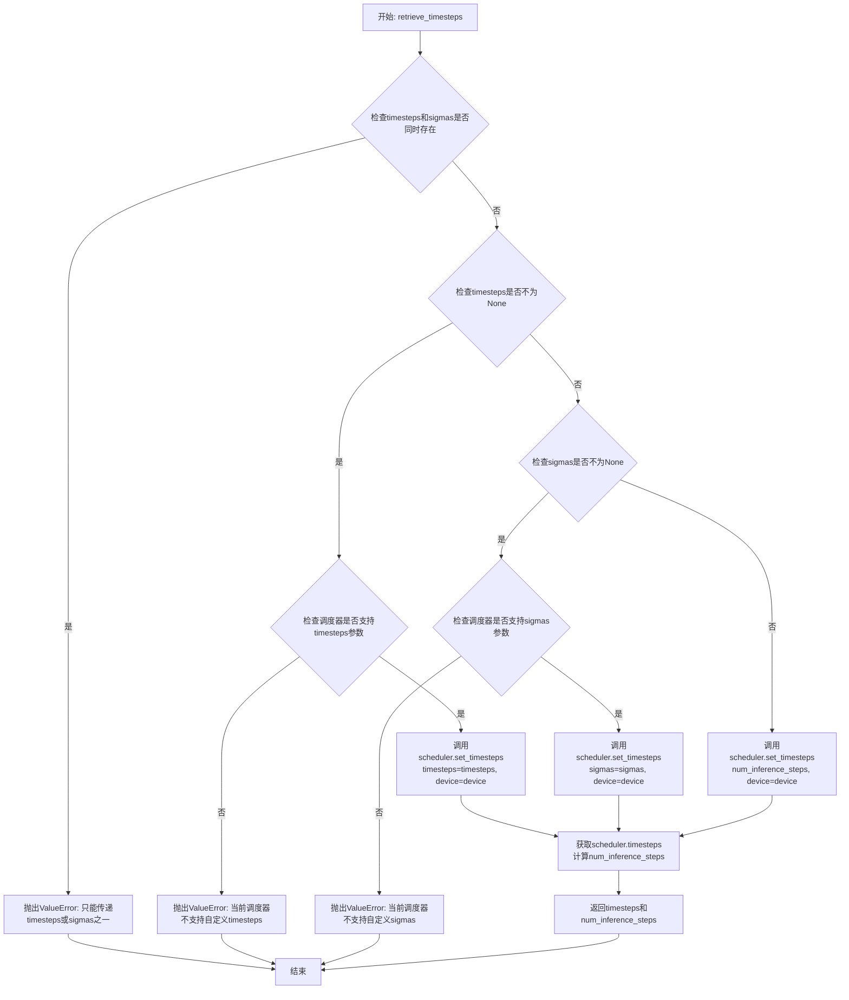

#### 带注释源码

```python
def retrieve_timesteps(
    scheduler,  # 调度器对象，用于获取时间步
    num_inference_steps: int | None = None,  # 推理步数
    device: str | torch.device | None = None,  # 目标设备
    timesteps: list[int] | None = None,  # 自定义时间步列表
    sigmas: list[float] | None = None,  # 自定义sigma列表
    **kwargs,  # 额外参数，传递给调度器的set_timesteps
):
    r"""
    调用调度器的 `set_timesteps` 方法并在调用后从调度器检索时间步。
    处理自定义时间步。任何 kwargs 都将提供给 `scheduler.set_timesteps`。

    参数:
        scheduler (SchedulerMixin): 要获取时间步的调度器。
        num_inference_steps (int): 使用预训练模型生成样本时使用的扩散步数。
            如果使用此参数，`timesteps` 必须为 `None`。
        device (str 或 torch.device, 可选): 时间步应移动到的设备。如果为 `None`，
            时间步不会移动。
        timesteps (list[int], 可选): 用于覆盖调度器时间步间隔策略的自定义时间步。
            如果传递了 `timesteps`，则 `num_inference_steps` 和 `sigmas` 必须为 `None`。
        sigmas (list[float], 可选): 用于覆盖调度器sigma间隔策略的自定义sigmas。
            如果传递了 `sigmas`，则 `num_inference_steps` 和 `timesteps` 必须为 `None`。

    返回:
        tuple[torch.Tensor, int]: 元组，第一个元素是调度器的时间步调度，第二个元素是推理步数。
    """
    # 检查是否同时传递了timesteps和sigmas，这是不允许的
    if timesteps is not None and sigmas is not None:
        raise ValueError("Only one of `timesteps` or `sigmas` can be passed. Please choose one to set custom values")
    
    # 处理自定义timesteps的情况
    if timesteps is not None:
        # 检查调度器的set_timesteps方法是否接受timesteps参数
        accepts_timesteps = "timesteps" in set(inspect.signature(scheduler.set_timesteps).parameters.keys())
        if not accepts_timesteps:
            raise ValueError(
                f"The current scheduler class {scheduler.__class__}'s `set_timesteps` does not support custom"
                f" timestep schedules. Please check whether you are using the correct scheduler."
            )
        # 调用调度器的set_timesteps方法设置自定义时间步
        scheduler.set_timesteps(timesteps=timesteps, device=device, **kwargs)
        # 从调度器获取时间步
        timesteps = scheduler.timesteps
        # 计算推理步数
        num_inference_steps = len(timesteps)
    
    # 处理自定义sigmas的情况
    elif sigmas is not None:
        # 检查调度器的set_timesteps方法是否接受sigmas参数
        accept_sigmas = "sigmas" in set(inspect.signature(scheduler.set_timesteps).parameters.keys())
        if not accept_sigmas:
            raise ValueError(
                f"The current scheduler class {scheduler.__class__}'s `set_timesteps` does not support custom"
                f" sigmas schedules. Please check whether you are using the correct scheduler."
            )
        # 调用调度器的set_timesteps方法设置自定义sigmas
        scheduler.set_timesteps(sigmas=sigmas, device=device, **kwargs)
        # 从调度器获取时间步
        timesteps = scheduler.timesteps
        # 计算推理步数
        num_inference_steps = len(timesteps)
    
    # 处理标准情况：使用num_inference_steps
    else:
        scheduler.set_timesteps(num_inference_steps, device=device, **kwargs)
        timesteps = scheduler.timesteps
    
    # 返回时间步张量和推理步数
    return timesteps, num_inference_steps
```


### `retrieve_latents`

从编码器输出中检索潜在变量（latents），支持多种采样模式。

参数：

- `encoder_output`：`torch.Tensor`，编码器输出对象，通常包含 `latent_dist` 或 `latents` 属性
- `generator`：`torch.Generator | None`，可选的随机数生成器，用于采样模式下的随机采样
- `sample_mode`：`str`，采样模式，"sample" 表示随机采样，"argmax" 表示取概率最大的潜在变量

返回值：`torch.Tensor`，检索到的潜在变量张量

#### 流程图

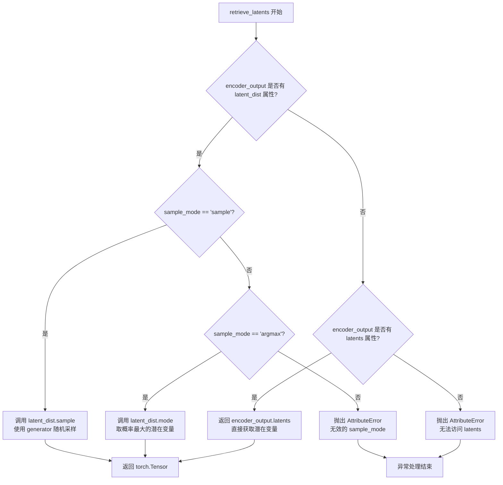

#### 带注释源码

```
# 从编码器输出中检索潜在变量
# Copied from diffusers.pipelines.stable_diffusion.pipeline_stable_diffusion_img2img.retrieve_latents
def retrieve_latents(
    encoder_output: torch.Tensor,  # 编码器输出对象，包含 latent_dist 或 latents 属性
    generator: torch.Generator | None = None,  # 可选的随机数生成器，用于采样
    sample_mode: str = "sample"  # 采样模式：'sample' 随机采样，'argmax' 取模
):
    # 情况1：如果有 latent_dist 属性且模式为 'sample'
    # 从潜在分布中随机采样一个潜在变量
    if hasattr(encoder_output, "latent_dist") and sample_mode == "sample":
        return encoder_output.latent_dist.sample(generator)
    
    # 情况2：如果有 latent_dist 属性且模式为 'argmax'
    # 从潜在分布中取概率最大的潜在变量（众数）
    elif hasattr(encoder_output, "latent_dist") and sample_mode == "argmax":
        return encoder_output.latent_dist.mode()
    
    # 情况3：如果有直接的 latents 属性
    # 直接返回预计算的潜在变量
    elif hasattr(encoder_output, "latents"):
        return encoder_output.latents
    
    # 错误处理：无法从 encoder_output 中获取潜在变量
    else:
        raise AttributeError("Could not access latents of provided encoder_output")
```


### FluxKontextInpaintPipeline.__init__

FluxKontextInpaintPipeline类的初始化方法，负责构建Flux Kontext图像修复管道的所有核心组件，包括VAE、文本编码器、Transformer模型、调度器等，并配置图像处理器和掩码处理器等辅助组件。

参数：

- `scheduler`：`FlowMatchEulerDiscreteScheduler`，用于去噪过程的调度器，控制噪声去除的步骤和策略
- `vae`：`AutoencoderKL`，变分自编码器模型，用于编码和解码图像与潜在表示之间的转换
- `text_encoder`：`CLIPTextModel`，CLIP文本编码器，负责将文本提示转换为文本嵌入向量
- `tokenizer`：`CLIPTokenizer`，CLIP分词器，用于将文本分割成token序列
- `text_encoder_2`：`T5EncoderModel`，T5文本编码器，用于生成更长的文本嵌入
- `tokenizer_2`：`T5TokenizerFast`，T5快速分词器，处理长序列文本
- `transformer`：`FluxTransformer2DModel`，Flux变换器模型，执行去噪操作的核心组件
- `image_encoder`：`CLIPVisionModelWithProjection`（可选），CLIP视觉编码器，用于IP-Adapter图像条件
- `feature_extractor`：`CLIPImageProcessor`（可选），CLIP图像特征提取器

返回值：无（`None`），构造函数不返回值，仅初始化对象状态

#### 流程图

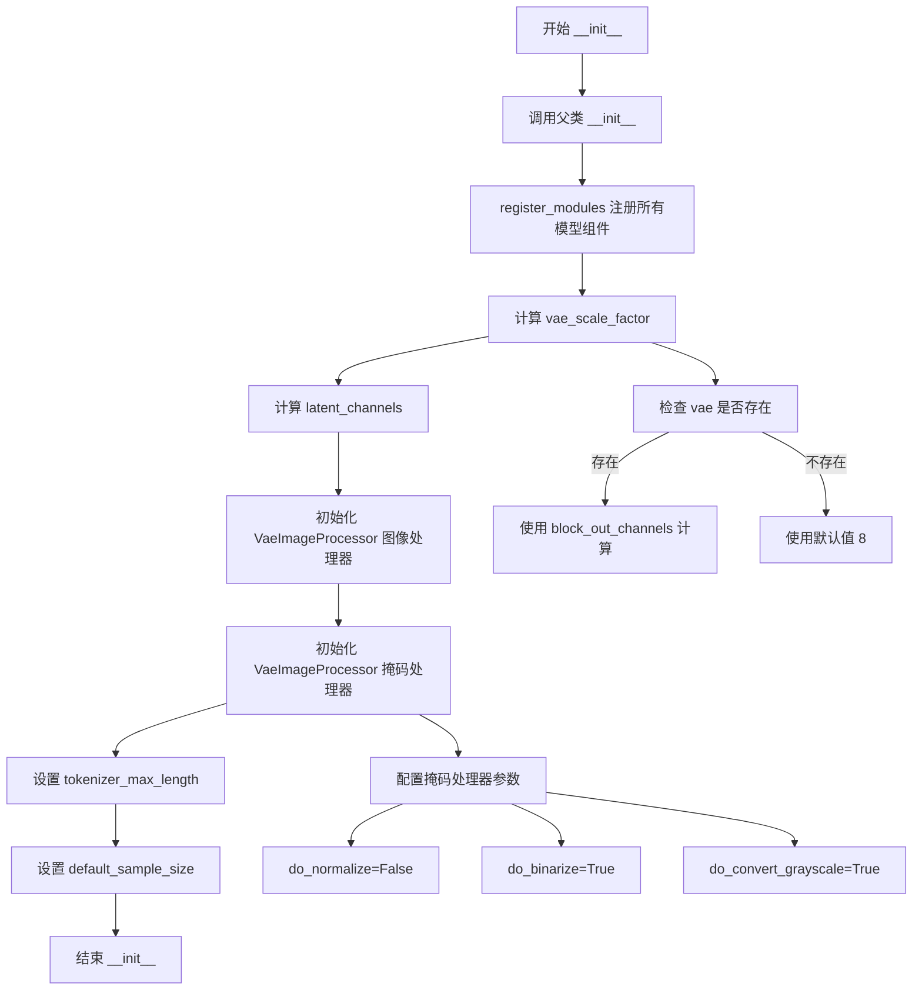

#### 带注释源码

```python
def __init__(
    self,
    scheduler: FlowMatchEulerDiscreteScheduler,  # FlowMatch调度器，用于去噪过程
    vae: AutoencoderKL,  # VAE模型，用于图像编码/解码
    text_encoder: CLIPTextModel,  # CLIP文本编码器
    tokenizer: CLIPTokenizer,  # CLIP分词器
    text_encoder_2: T5EncoderModel,  # T5文本编码器，处理更长文本
    tokenizer_2: T5TokenizerFast,  # T5快速分词器
    transformer: FluxTransformer2DModel,  # 核心去噪Transformer模型
    image_encoder: CLIPVisionModelWithProjection = None,  # 可选：CLIP视觉编码器，用于IP-Adapter
    feature_extractor: CLIPImageProcessor = None,  # 可选：CLIP特征提取器
):
    # 调用父类DiffusionPipeline的初始化方法
    super().__init__()

    # 注册所有模块到pipeline，使得pipeline可以统一管理这些组件
    self.register_modules(
        vae=vae,
        text_encoder=text_encoder,
        text_encoder_2=text_encoder_2,
        tokenizer=tokenizer,
        tokenizer_2=tokenizer_2,
        transformer=transformer,
        scheduler=scheduler,
        image_encoder=image_encoder,
        feature_extractor=feature_extractor,
    )
    
    # 计算VAE缩放因子：基于VAE的block_out_channels数量
    # Flux的latent被打包成2x2的patches，所以需要乘以2来考虑packing
    self.vae_scale_factor = 2 ** (len(self.vae.config.block_out_channels) - 1) if getattr(self, "vae", None) else 8
    
    # 获取VAE的潜在通道数，用于后续处理
    # Flux latents被pack后需要除以4
    self.latent_channels = self.vae.config.latent_channels if getattr(self, "vae", None) else 16
    
    # 初始化图像处理器，用于处理输入输出图像
    # vae_scale_factor * 2 是因为Flux使用2x2的patch packing
    self.image_processor = VaeImageProcessor(vae_scale_factor=self.vae_scale_factor * 2)

    # 初始化掩码处理器，专门用于处理修复任务的掩码
    # do_normalize=False: 不对掩码进行归一化
    # do_binarize=True: 将掩码二值化
    # do_convert_grayscale=True: 转换为灰度图
    self.mask_processor = VaeImageProcessor(
        vae_scale_factor=self.vae_scale_factor * 2,
        vae_latent_channels=self.latent_channels,
        do_normalize=False,
        do_binarize=True,
        do_convert_grayscale=True,
    )

    # 设置tokenizer的最大长度，用于文本编码
    self.tokenizer_max_length = (
        self.tokenizer.model_max_length if hasattr(self, "tokenizer") and self.tokenizer is not None else 77
    )
    
    # 默认样本大小，用于生成图像的基准尺寸
    self.default_sample_size = 128
```


### `FluxKontextInpaintPipeline._get_t5_prompt_embeds`

该方法用于将文本提示编码为 T5 文本编码器的嵌入向量（prompt embeddings），支持批量处理和多图生成，并处理文本反转（Textual Inversion）功能。

参数：

- `prompt`：`str | list[str]`，要编码的文本提示，可以是单个字符串或字符串列表
- `num_images_per_prompt`：`int = 1`，每个提示生成的图像数量，用于复制 embeddings
- `max_sequence_length`：`int = 512`，文本序列的最大长度，超过此长度会被截断
- `device`：`torch.device | None`，计算设备，若为 None 则使用执行设备
- `dtype`：`torch.dtype | None`，返回 embeddings 的数据类型，若为 None 则使用 text_encoder 的数据类型

返回值：`torch.Tensor`，形状为 `(batch_size * num_images_per_prompt, seq_len, hidden_size)` 的文本嵌入张量

#### 流程图

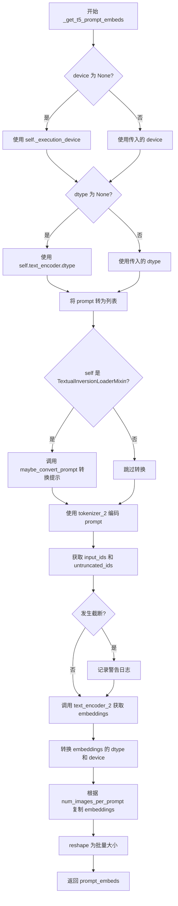

#### 带注释源码

```python
def _get_t5_prompt_embeds(
    self,
    prompt: str | list[str] = None,
    num_images_per_prompt: int = 1,
    max_sequence_length: int = 512,
    device: torch.device | None = None,
    dtype: torch.dtype | None = None,
):
    """
    获取 T5 文本编码器的 prompt embeddings。
    
    参数:
        prompt: 要编码的文本提示，字符串或字符串列表
        num_images_per_prompt: 每个提示生成的图像数量
        max_sequence_length: 最大序列长度
        device: 计算设备
        dtype: 返回数据类型
    """
    # 确定使用的设备和数据类型，若未指定则使用默认值
    device = device or self._execution_device
    dtype = dtype or self.text_encoder.dtype

    # 将单个字符串转换为列表，统一处理方式
    prompt = [prompt] if isinstance(prompt, str) else prompt
    # 计算批次大小
    batch_size = len(prompt)

    # 如果支持 Textual Inversion，转换 prompt 格式
    if isinstance(self, TextualInversionLoaderMixin):
        prompt = self.maybe_convert_prompt(prompt, self.tokenizer_2)

    # 使用 T5 tokenizer 将文本转换为模型输入
    text_inputs = self.tokenizer_2(
        prompt,
        padding="max_length",           # 填充到最大长度
        max_length=max_sequence_length, # 最大序列长度
        truncation=True,                 # 启用截断
        return_length=False,             # 不返回长度
        return_overflowing_tokens=False, # 不返回溢出 token
        return_tensors="pt",             # 返回 PyTorch 张量
    )
    text_input_ids = text_inputs.input_ids
    
    # 获取未截断的 token ids 用于比较
    untruncated_ids = self.tokenizer_2(prompt, padding="longest", return_tensors="pt").input_ids

    # 检查是否发生了截断，若是则记录警告信息
    if untruncated_ids.shape[-1] >= text_input_ids.shape[-1] and not torch.equal(text_input_ids, untruncated_ids):
        removed_text = self.tokenizer_2.batch_decode(untruncated_ids[:, self.tokenizer_max_length - 1 : -1])
        logger.warning(
            "The following part of your input was truncated because `max_sequence_length` is set to "
            f" {max_sequence_length} tokens: {removed_text}"
        )

    # 使用 T5 文本编码器获取文本 embeddings
    # [0] 表示获取隐藏状态而非元组
    prompt_embeds = self.text_encoder_2(text_input_ids.to(device), output_hidden_states=False)[0]

    # 重新获取编码器的数据类型，确保一致性
    dtype = self.text_encoder_2.dtype
    # 将 embeddings 转换到指定的设备和数据类型
    prompt_embeds = prompt_embeds.to(dtype=dtype, device=device)

    # 获取序列长度信息
    _, seq_len, _ = prompt_embeds.shape

    # 复制 text embeddings 以匹配每个提示生成的图像数量
    # 使用 MPS 友好的方法进行复制
    prompt_embeds = prompt_embeds.repeat(1, num_images_per_prompt, 1)
    # 调整形状为 (batch_size * num_images_per_prompt, seq_len, hidden_size)
    prompt_embeds = prompt_embeds.view(batch_size * num_images_per_prompt, seq_len, -1)

    return prompt_embeds
```


### `FluxKontextInpaintPipeline._get_clip_prompt_embeds`

该方法用于使用 CLIP 文本编码器将文本提示词转换为池化的文本嵌入向量，以便后续在 Flux 图像生成 pipeline 中使用。

参数：

- `prompt`：`str | list[str]`，要编码的文本提示词，可以是单个字符串或字符串列表
- `num_images_per_prompt`：`int = 1`，每个提示词需要生成的图像数量，用于复制嵌入向量
- `device`：`torch.device | None = None`，执行设备，如果为 None 则使用内部默认执行设备

返回值：`torch.FloatTensor`，形状为 `(batch_size * num_images_per_prompt, hidden_size)` 的池化文本嵌入向量

#### 流程图

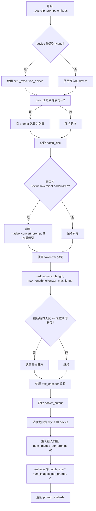

#### 带注释源码

```python
def _get_clip_prompt_embeds(
    self,
    prompt: str | list[str],
    num_images_per_prompt: int = 1,
    device: torch.device | None = None,
):
    # 确定执行设备：如果未指定，则使用 pipeline 的默认执行设备
    device = device or self._execution_device

    # 标准化输入：将单个字符串转换为列表，方便批处理
    prompt = [prompt] if isinstance(prompt, str) else prompt
    # 计算批处理大小
    batch_size = len(prompt)

    # 如果混合了 TextualInversion，使用 maybe_convert_prompt 处理提示词
    # 这支持文本反转（Textual Inversion）技术，允许自定义概念嵌入
    if isinstance(self, TextualInversionLoaderMixin):
        prompt = self.maybe_convert_prompt(prompt, self.tokenizer)

    # 使用 CLIP tokenizer 对提示词进行分词
    # 参数说明：
    # - padding="max_length": 填充到最大长度
    # - max_length=tokenizer_max_length: 最大长度（通常为 77 for CLIP）
    # - truncation=True: 截断超长序列
    # - return_overflowing_tokens=False: 不返回溢出的 token
    # - return_length=False: 不返回长度信息
    # - return_tensors="pt": 返回 PyTorch 张量
    text_inputs = self.tokenizer(
        prompt,
        padding="max_length",
        max_length=self.tokenizer_max_length,
        truncation=True,
        return_overflowing_tokens=False,
        return_length=False,
        return_tensors="pt",
    )

    # 获取输入的 token IDs
    text_input_ids = text_inputs.input_ids
    # 获取未截断的 token IDs（使用最长填充）
    untruncated_ids = self.tokenizer(prompt, padding="longest", return_tensors="pt").input_ids

    # 检查是否发生了截断，如果是则记录警告
    if untruncated_ids.shape[-1] >= text_input_ids.shape[-1] and not torch.equal(text_input_ids, untruncated_ids):
        # 解码被截断的部分用于警告信息
        removed_text = self.tokenizer.batch_decode(untruncated_ids[:, self.tokenizer_max_length - 1 : -1])
        logger.warning(
            "The following part of your input was truncated because CLIP can only handle sequences up to"
            f" {self.tokenizer_max_length} tokens: {removed_text}"
        )

    # 使用 CLIP 文本编码器获取文本嵌入
    # output_hidden_states=False 表示只返回最后的隐藏状态
    prompt_embeds = self.text_encoder(text_input_ids.to(device), output_hidden_states=False)

    # 从编码器输出中提取池化输出（pooler_output）
    # 这是 [CLS] token 对应的隐藏状态，常用于表示整个序列的语义
    prompt_embeds = prompt_embeds.pooler_output

    # 将嵌入转换到指定的 dtype 和 device
    prompt_embeds = prompt_embeds.to(dtype=self.text_encoder.dtype, device=device)

    # 复制文本嵌入以匹配每个提示词生成的图像数量
    # 例如：如果 batch_size=2, num_images_per_prompt=3，则最终嵌入对应 6 张图像
    prompt_embeds = prompt_embeds.repeat(1, num_images_per_prompt)
    # reshape 为 (batch_size * num_images_per_prompt, hidden_dim)
    prompt_embeds = prompt_embeds.view(batch_size * num_images_per_prompt, -1)

    # 返回池化的提示词嵌入，用于后续的扩散模型生成
    return prompt_embeds
```


### FluxKontextInpaintPipeline.encode_prompt

该方法用于将文本提示词编码为模型可用的文本嵌入向量，支持 CLIP 和 T5 两种文本编码器，并处理 LoRA 缩放、批量生成等功能。

参数：

- `prompt`：`str | list[str]`，要编码的主提示词
- `prompt_2`：`str | list[str] | None`，发送给 T5 编码器的提示词，默认使用 prompt
- `device`：`torch.device | None`，计算设备，默认为执行设备
- `num_images_per_prompt`：`int`，每个提示词生成的图像数量，默认为 1
- `prompt_embeds`：`torch.FloatTensor | None`，预生成的文本嵌入，用于提示词加权等调优
- `pooled_prompt_embeds`：`torch.FloatTensor | None`，预生成的池化文本嵌入
- `max_sequence_length`：`int`，最大序列长度，默认为 512
- `lora_scale`：`float | None`，LoRA 层的缩放因子

返回值：`tuple[torch.FloatTensor, torch.FloatTensor, torch.Tensor]`，包含提示词嵌入、池化提示词嵌入和文本标识符

#### 流程图

```mermaid
flowchart TD
    A[开始 encode_prompt] --> B{device 是否为 None?}
    B -->|是| C[使用执行设备]
    B -->|否| D[使用传入 device]
    C --> E{device 赋值]
    D --> E
    
    E --> F{lora_scale 是否非空?}
    F -->|是| G[设置 _lora_scale]
    F -->|否| H
    
    G --> I{USE_PEFT_BACKEND?}
    I -->|是| J[scale_lora_layers text_encoder]
    I -->|否| K
    J --> K
    
    H --> L{prompt_embeds 是否为 None?}
    L -->|是| M[设置 prompt_2]
    M --> N[调用 _get_clip_prompt_embeds 获取 pooled_prompt_embeds]
    N --> O[调用 _get_t5_prompt_embeds 获取 prompt_embeds]
    L -->|否| P
    
    O --> Q
    
    P --> Q{text_encoder 是否非空?}
    Q -->|是| R{USE_PEFT_BACKEND?}
    R -->|是| S[unscale_lora_layers text_encoder]
    Q -->|否| T
    
    S --> T{text_encoder_2 是否非空?}
    T -->|是| U{USE_PEFT_BACKEND?}
    U -->|是| V[unscale_lora_layers text_encoder_2]
    T -->|否| W
    V --> W
    
    W --> X[确定 dtype]
    X --> Y[创建 text_ids]
    Y --> Z[返回 prompt_embeds, pooled_prompt_embeds, text_ids]
```

#### 带注释源码

```python
# Copied from diffusers.pipelines.flux.pipeline_flux.FluxPipeline.encode_prompt
def encode_prompt(
    self,
    prompt: str | list[str],
    prompt_2: str | list[str] | None = None,
    device: torch.device | None = None,
    num_images_per_prompt: int = 1,
    prompt_embeds: torch.FloatTensor | None = None,
    pooled_prompt_embeds: torch.FloatTensor | None = None,
    max_sequence_length: int = 512,
    lora_scale: float | None = None,
):
    r"""
    编码文本提示词为嵌入向量

    Args:
        prompt: 要编码的主提示词，支持字符串或字符串列表
        prompt_2: 发送给 T5 编码器的提示词，若未定义则使用 prompt
        device: torch 设备，若为 None 则使用执行设备
        num_images_per_prompt: 每个提示词生成的图像数量
        prompt_embeds: 预生成的文本嵌入，可用于提示词加权
        pooled_prompt_embeds: 预生成的池化文本嵌入
        max_sequence_length: 最大序列长度，默认 512
        lora_scale: LoRA 缩放因子，用于调整 LoRA 层权重
    """
    # 确定设备，默认为执行设备
    device = device or self._execution_device

    # 设置 LoRA 缩放因子，使 text encoder 的 LoRA 函数可正确访问
    if lora_scale is not None and isinstance(self, FluxLoraLoaderMixin):
        self._lora_scale = lora_scale

        # 动态调整 LoRA 缩放
        if self.text_encoder is not None and USE_PEFT_BACKEND:
            scale_lora_layers(self.text_encoder, lora_scale)
        if self.text_encoder_2 is not None and USE_PEFT_BACKEND:
            scale_lora_layers(self.text_encoder_2, lora_scale)

    # 标准化 prompt 为列表格式
    prompt = [prompt] if isinstance(prompt, str) else prompt

    # 如果未提供 prompt_embeds，则从 prompt 生成
    if prompt_embeds is None:
        # 设置 prompt_2，若未定义则使用 prompt
        prompt_2 = prompt_2 or prompt
        prompt_2 = [prompt_2] if isinstance(prompt_2, str) else prompt_2

        # 使用 CLIPTextModel 的池化输出生成 pooled_prompt_embeds
        pooled_prompt_embeds = self._get_clip_prompt_embeds(
            prompt=prompt,
            device=device,
            num_images_per_prompt=num_images_per_prompt,
        )
        # 使用 T5EncoderModel 生成完整的 prompt_embeds
        prompt_embeds = self._get_t5_prompt_embeds(
            prompt=prompt_2,
            num_images_per_prompt=num_images_per_prompt,
            max_sequence_length=max_sequence_length,
            device=device,
        )

    # 恢复 LoRA 层的原始缩放因子
    if self.text_encoder is not None:
        if isinstance(self, FluxLoraLoaderMixin) and USE_PEFT_BACKEND:
            # 通过反向缩放 LoRA 层恢复原始权重
            unscale_lora_layers(self.text_encoder, lora_scale)

    if self.text_encoder_2 is not None:
        if isinstance(self, FluxLoraLoaderMixin) and USE_PEFT_BACKEND:
            # 通过反向缩放 LoRA 层恢复原始权重
            unscale_lora_layers(self.text_encoder_2, lora_scale)

    # 确定数据类型，优先使用 text_encoder 的 dtype，否则使用 transformer 的 dtype
    dtype = self.text_encoder.dtype if self.text_encoder is not None else self.transformer.dtype
    
    # 创建文本标识符张量，用于交叉注意力，形状为 (seq_len, 3)
    text_ids = torch.zeros(prompt_embeds.shape[1], 3).to(device=device, dtype=dtype)

    # 返回提示词嵌入、池化嵌入和文本标识符
    return prompt_embeds, pooled_prompt_embeds, text_ids
```


### `FluxKontextInpaintPipeline.encode_image`

该方法用于将输入图像编码为图像嵌入向量（image embeddings），供IP-Adapter等模块使用。它首先检查图像类型，若非PyTorch张量则使用特征提取器转换为张量，然后通过image_encoder模型生成图像嵌入，最后根据num_images_per_prompt对嵌入进行重复以支持批量生成。

**参数：**

- `image`：`torch.Tensor | PIL.Image.Image | np.ndarray | list`，需要编码的输入图像
- `device`：`torch.device`，用于计算的目标设备
- `num_images_per_prompt`：`int`，每个提示词需要生成的图像数量

**返回值：** `torch.Tensor`，编码后的图像嵌入向量，形状为 `(batch_size * num_images_per_prompt, embed_dim)`

#### 流程图

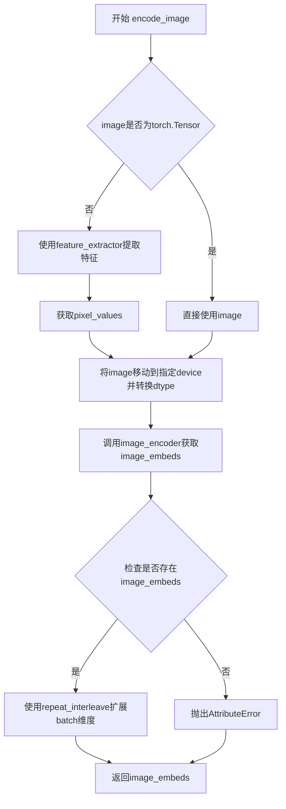

#### 带注释源码

```python
def encode_image(self, image, device, num_images_per_prompt):
    """
    Encode image to image embeddings using the image encoder.
    
    Args:
        image: Input image (can be PIL Image, numpy array, or torch.Tensor)
        device: Target device for computation
        num_images_per_prompt: Number of images to generate per prompt
    
    Returns:
        torch.Tensor: Encoded image embeddings
    """
    # 获取image_encoder的参数dtype，确保计算时使用相同的精度
    dtype = next(self.image_encoder.parameters()).dtype

    # 如果输入不是torch.Tensor，则使用特征提取器将其转换为张量
    # feature_extractor 会将PIL Image或numpy数组转换为包含pixel_values的字典
    if not isinstance(image, torch.Tensor):
        image = self.feature_extractor(image, return_tensors="pt").pixel_values

    # 将图像移动到目标设备并转换为正确的dtype
    image = image.to(device=device, dtype=dtype)
    
    # 通过image_encoder获取图像嵌入
    # image_encoder 通常是 CLIPVisionModelWithProjection
    image_embeds = self.image_encoder(image).image_embeds
    
    # 根据num_images_per_prompt扩展图像嵌入的batch维度
    # repeat_interleave 在指定维度上重复张量，与 repeat 不同的是它按元素重复
    # 例如: (1, 512) -> (n, 512) 当 num_images_per_prompt=n
    image_embeds = image_embeds.repeat_interleave(num_images_per_prompt, dim=0)
    
    return image_embeds
```


### `FluxKontextInpaintPipeline.prepare_ip_adapter_image_embeds`

该方法用于准备IP-Adapter的图像嵌入(embeddings)。它接收原始图像或预计算的图像嵌入，处理并返回符合pipeline要求的图像嵌入列表，以便在后续的去噪过程中使用。

参数：

- `self`：`FluxKontextInpaintPipeline`实例本身
- `ip_adapter_image`：原始输入图像，可以是单个图像或图像列表，用于从中提取图像嵌入
- `ip_adapter_image_embeds`：预计算的图像嵌入列表，如果为None则从ip_adapter_image提取
- `device`：`torch.device`，目标设备，用于将处理后的张量移动到指定设备
- `num_images_per_prompt`：`int`，每个prompt生成的图像数量，用于复制图像嵌入

返回值：`list[torch.Tensor]`，返回处理后的图像嵌入列表，列表长度等于IP-Adapter的数量，每个元素是形状为(num_images_per_prompt, emb_dim)的张量

#### 流程图

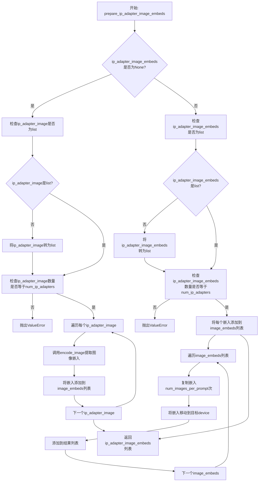

#### 带注释源码

```python
# Copied from diffusers.pipelines.flux.pipeline_flux.FluxPipeline.prepare_ip_adapter_image_embeds
def prepare_ip_adapter_image_embeds(
    self, ip_adapter_image, ip_adapter_image_embeds, device, num_images_per_prompt
):
    """
    准备IP-Adapter的图像嵌入。
    
    如果未提供预计算的嵌入，则从原始图像中提取。
    然后根据num_images_per_prompt复制嵌入，并将所有嵌入移动到指定设备。
    
    参数:
        ip_adapter_image: 原始IP-Adapter图像输入
        ip_adapter_image_embeds: 预计算的图像嵌入（可选）
        device: 目标torch设备
        num_images_per_prompt: 每个prompt生成的图像数量
    
    返回:
        处理后的图像嵌入列表
    """
    # 初始化存储图像嵌入的列表
    image_embeds = []
    
    # 情况1: 未提供预计算的嵌入，需要从原始图像提取
    if ip_adapter_image_embeds is None:
        # 确保输入图像是列表格式
        if not isinstance(ip_adapter_image, list):
            ip_adapter_image = [ip_adapter_image]

        # 验证图像数量与IP-Adapter数量是否匹配
        if len(ip_adapter_image) != self.transformer.encoder_hid_proj.num_ip_adapters:
            raise ValueError(
                f"`ip_adapter_image` must have same length as the number of IP Adapters. Got {len(ip_adapter_image)} images and {self.transformer.encoder_hid_proj.num_ip_adapters} IP Adapters."
            )

        # 遍历每个IP-Adapter图像并提取嵌入
        for single_ip_adapter_image in ip_adapter_image:
            # 调用encode_image方法将图像编码为嵌入向量
            single_image_embeds = self.encode_image(single_ip_adapter_image, device, 1)
            # 将嵌入添加到列表（添加batch维度）
            image_embeds.append(single_image_embeds[None, :])
    # 情况2: 已提供预计算的嵌入，直接使用
    else:
        # 确保预计算的嵌入是列表格式
        if not isinstance(ip_adapter_image_embeds, list):
            ip_adapter_image_embeds = [ip_adapter_image_embeds]

        # 验证预计算嵌入数量与IP-Adapter数量是否匹配
        if len(ip_adapter_image_embeds) != self.transformer.encoder_hid_proj.num_ip_adapters:
            raise ValueError(
                f"`ip_adapter_image_embeds` must have same length as the number of IP Adapters. Got {len(ip_adapter_image_embeds)} image embeds and {self.transformer.encoder_hid_proj.num_ip_adapters} IP Adapters."
            )

        # 直接将预计算的嵌入添加到列表
        for single_image_embeds in ip_adapter_image_embeds:
            image_embeds.append(single_image_embeds)

    # 处理每个嵌入：复制num_images_per_prompt次并移动到目标设备
    ip_adapter_image_embeds = []
    for single_image_embeds in image_embeds:
        # 复制嵌入以匹配每个prompt生成的图像数量
        single_image_embeds = torch.cat([single_image_embeds] * num_images_per_prompt, dim=0)
        # 将嵌入移动到指定设备
        single_image_embeds = single_image_embeds.to(device=device)
        # 添加到结果列表
        ip_adapter_image_embeds.append(single_image_embeds)

    return ip_adapter_image_embeds
```


### `FluxKontextInpaintPipeline.get_timesteps`

该方法用于根据推断步数和强度参数计算并调整去噪的时间步调度，使得在图像修复任务中可以根据strength参数控制从原始图像到目标图像的转换程度。

参数：

- `num_inference_steps`：`int`，推理过程中所需的去噪步数
- `strength`：`float`，图像转换的强度，值在0到1之间，值越大表示对原始图像的改变越多
- `device`：`torch.device`，用于张量计算的设备（如cuda或cpu）

返回值：`tuple[torch.Tensor, int]`，返回一个元组，第一个元素是调整后的时间步调度（torch.Tensor），第二个元素是调整后的推断步数（int）

#### 流程图

```mermaid
flowchart TD
    A[开始 get_timesteps] --> B[计算 init_timestep = min(num_inference_steps * strength, num_inference_steps)]
    B --> C[计算 t_start = max(num_inference_steps - init_timestep, 0)]
    C --> D[从 scheduler.timesteps 中切片获取 timesteps]
    D --> E{scheduler 是否有 set_begin_index 方法?}
    E -->|是| F[调用 scheduler.set_begin_index(t_start * scheduler.order)]
    E -->|否| G[跳过设置起始索引]
    F --> H[返回 timesteps 和 num_inference_steps - t_start]
    G --> H
```

#### 带注释源码

```python
def get_timesteps(self, num_inference_steps, strength, device):
    """
    根据推理步数和强度参数计算调整后的时间步调度
    
    该方法用于图像修复pipeline中，根据strength参数决定从哪个时间步开始去噪。
    较低的strength值会保留更多原始图像信息，较高的strength值则会进行更多的重绘。
    
    参数:
        num_inference_steps: 推理过程中所需的去噪步数
        strength: 图像转换强度，值在0到1之间
        device: 计算设备
    
    返回:
        timesteps: 调整后的时间步调度张量
        num_inference_steps - t_start: 实际使用的推理步数
    """
    # 计算初始时间步数，基于强度参数
    # strength 越大，init_timestep 越大，意味着从更早的时间步开始（即保留更多原始图像信息）
    init_timestep = min(num_inference_steps * strength, num_inference_steps)

    # 计算起始索引，决定跳过多少个初始时间步
    # 如果 strength=1.0，则 t_start=0，使用所有时间步
    # 如果 strength=0.5，则 t_start=num_inference_steps/2，跳过前半部分时间步
    t_start = int(max(num_inference_steps - init_timestep, 0))
    
    # 从调度器中获取时间步，并按起始索引切片
    # scheduler.order 用于多步调度器（如Heun方法），需要乘以阶数来正确索引
    timesteps = self.scheduler.timesteps[t_start * self.scheduler.order :]
    
    # 如果调度器支持设置起始索引（用于某些高级调度器），则设置它
    # 这确保调度器从正确的位置开始
    if hasattr(self.scheduler, "set_begin_index"):
        self.scheduler.set_begin_index(t_start * self.scheduler.order)

    # 返回调整后的时间步和实际的推理步数
    return timesteps, num_inference_steps - t_start
```


### FluxKontextInpaintPipeline.check_inputs

该方法用于验证 FluxKontextInpaintPipeline 管道在执行图像修复（inpainting）任务时的输入参数是否合法。它会检查提示词、图像尺寸、mask、strength 参数、embeddings 以及回调张量等多个维度，确保用户提供的参数符合管道要求。如果参数不符合要求，该方法会抛出详细的 ValueError 异常，帮助用户快速定位问题。

参数：

- `self`：实例本身，包含管道配置（如 vae_scale_factor、_callback_tensor_inputs 等）
- `prompt`：`str | list[str] | None`，用户提供的文本提示词，用于指导图像生成
- `prompt_2`：`str | list[str] | None`，发送给第二个文本编码器（tokenizer_2 和 text_encoder_2）的提示词，若未指定则使用 prompt
- `image`：`PipelineImageInput`，待修复的输入图像
- `mask_image`：`PipelineImageInput`，修复掩码图像，白色像素表示需要重新绘制，黑色像素表示保留
- `strength`：`float`，图像变换程度，取值范围 [0.0, 1.0]，值越大表示添加越多噪声
- `height`：`int`，生成图像的高度（像素）
- `width`：`int`，生成图像的宽度（像素）
- `output_type`：`str`，输出格式，可选 "pil" 等类型
- `negative_prompt`：`str | list[str] | None`，负面提示词，用于引导图像向相反方向发展
- `negative_prompt_2`：`str | list[str] | None`，发送给第二个文本编码器的负面提示词
- `prompt_embeds`：`torch.FloatTensor | None`，预生成的文本嵌入，可用于微调文本输入
- `negative_prompt_embeds`：`torch.FloatTensor | None`，预生成的负面文本嵌入
- `pooled_prompt_embeds`：`torch.FloatTensor | None`，预生成的池化文本嵌入
- `negative_pooled_prompt_embeds`：`torch.FloatTensor | None`，预生成的负面池化文本嵌入
- `callback_on_step_end_tensor_inputs`：`list[str] | None`，在推理步骤结束时回调的 tensor 输入列表
- `padding_mask_crop`：`int | None`，应用于图像和掩码的裁剪边距大小
- `max_sequence_length`：`int | None`，提示词的最大序列长度，默认 512

返回值：`None`，该方法不返回任何值，仅通过抛出异常来处理无效输入

#### 流程图

```mermaid
flowchart TD
    A[开始 check_inputs] --> B{strength 在 [0, 1] 范围内?}
    B -->|否| B1[抛出 ValueError]
    B -->|是| C{height 和 width 可被 vae_scale_factor * 2 整除?}
    C -->|否| C1[发出警告日志]
    C -->|是| D{callback_on_step_end_tensor_inputs 合法?}
    D -->|否| D1[抛出 ValueError]
    D -->|是| E{prompt 和 prompt_embeds 是否同时提供?}
    E -->|是| E1[抛出 ValueError]
    E -->|否| F{prompt_2 和 prompt_embeds 是否同时提供?}
    F -->|是| F1[抛出 ValueError]
    F -->|否| G{prompt 和 prompt_embeds 都未提供?}
    G -->|是| G1[抛出 ValueError]
    G -->|否| H{prompt 类型合法?}
    H -->|否| H1[抛出 ValueError]
    H -->|是| I{prompt_2 类型合法?}
    I -->|否| I1[抛出 ValueError]
    I -->|是| J{negative_prompt 和 negative_prompt_embeds 同时提供?}
    J -->|是| J1[抛出 ValueError]
    J -->|否| K{negative_prompt_2 和 negative_prompt_embeds 同时提供?}
    K -->|是| K1[抛出 ValueError]
    K -->|否| L{prompt_embeds 和 negative_prompt_embeds 形状一致?}
    L -->|否| L1[抛出 ValueError]
    L -->|是| M{prompt_embeds 提供但 pooled_prompt_embeds 未提供?}
    M -->|是| M1[抛出 ValueError]
    M -->|否| N{negative_prompt_embeds 提供但 negative_pooled_prompt_embeds 未提供?}
    N -->|是| N1[抛出 ValueError]
    N -->|否| O{padding_mask_crop 不为 None?}
    O -->|是| P{image 是 PIL.Image?}
    P -->|否| P1[抛出 ValueError]
    P -->|是| Q{mask_image 是 PIL.Image?}
    Q -->|否| Q1[抛出 ValueError]
    Q -->|是| R{output_type 为 'pil'?}
    R -->|否| R1[抛出 ValueError]
    O -->|否| S{max_sequence_length > 512?}
    S -->|是| S1[抛出 ValueError]
    S -->|否| T[验证通过，方法结束]
    C1 --> D
    B1 --> T
    D1 --> T
    E1 --> T
    F1 --> T
    G1 --> T
    H1 --> T
    I1 --> T
    J1 --> T
    K1 --> T
    L1 --> T
    M1 --> T
    N1 --> T
    R1 --> T
    S1 --> T
```

#### 带注释源码

```python
# Copied from diffusers.pipelines.flux.pipeline_flux_inpaint.FluxInpaintPipeline.check_inputs
def check_inputs(
    self,
    prompt,  # str | list[str] | None: 主提示词
    prompt_2,  # str | list[str] | None: 第二个文本编码器的提示词
    image,  # PipelineImageInput: 输入图像
    mask_image,  # PipelineImageInput: 修复掩码
    strength,  # float: 变换强度 [0, 1]
    height,  # int: 输出高度
    width,  # int: 输出宽度
    output_type,  # str: 输出类型
    negative_prompt=None,  # str | list[str] | None: 负面提示词
    negative_prompt_2=None,  # str | list[str] | None: 第二个负面提示词
    prompt_embeds=None,  # torch.FloatTensor | None: 预生成提示词嵌入
    negative_prompt_embeds=None,  # torch.FloatTensor | None: 预生成负面嵌入
    pooled_prompt_embeds=None,  # torch.FloatTensor | None: 池化提示词嵌入
    negative_pooled_prompt_embeds=None,  # torch.FloatTensor | None: 负面池化嵌入
    callback_on_step_end_tensor_inputs=None,  # list[str] | None: 回调张量输入
    padding_mask_crop=None,  # int | None: 裁剪边距
    max_sequence_length=None,  # int | None: 最大序列长度
):
    # 验证 strength 参数必须在 [0.0, 1.0] 范围内
    if strength < 0 or strength > 1:
        raise ValueError(f"The value of strength should in [0.0, 1.0] but is {strength}")

    # 验证高度和宽度必须能被 vae_scale_factor * 2 整除
    # 这是因为 Flux 潜在向量被打包成 2x2 块
    if height % (self.vae_scale_factor * 2) != 0 or width % (self.vae_scale_factor * 2) != 0:
        logger.warning(
            f"`height` and `width` have to be divisible by {self.vae_scale_factor * 2} but are {height} and {width}. Dimensions will be resized accordingly"
        )

    # 验证回调张量输入必须在允许列表中
    if callback_on_step_end_tensor_inputs is not None and not all(
        k in self._callback_tensor_inputs for k in callback_on_step_end_tensor_inputs
    ):
        raise ValueError(
            f"`callback_on_step_end_tensor_inputs` has to be in {self._callback_tensor_inputs}, but found {[k for k in callback_on_step_end_tensor_inputs if k not in self._callback_tensor_inputs]}"
        )

    # 验证 prompt 和 prompt_embeds 不能同时提供
    if prompt is not None and prompt_embeds is not None:
        raise ValueError(
            f"Cannot forward both `prompt`: {prompt} and `prompt_embeds`: {prompt_embeds}. Please make sure to"
            " only forward one of the two."
        )
    # 验证 prompt_2 和 prompt_embeds 不能同时提供
    elif prompt_2 is not None and prompt_embeds is not None:
        raise ValueError(
            f"Cannot forward both `prompt_2`: {prompt_2} and `prompt_embeds`: {prompt_embeds}. Please make sure to"
            " only forward one of the two."
        )
    # 验证必须提供至少一个提示词输入
    elif prompt is None and prompt_embeds is None:
        raise ValueError(
            "Provide either `prompt` or `prompt_embeds`. Cannot leave both `prompt` and `prompt_embeds` undefined."
        )
    # 验证 prompt 类型必须是 str 或 list
    elif prompt is not None and (not isinstance(prompt, str) and not isinstance(prompt, list)):
        raise ValueError(f"`prompt` has to be of type `str` or `list` but is {type(prompt)}")
    # 验证 prompt_2 类型必须是 str 或 list
    elif prompt_2 is not None and (not isinstance(prompt_2, str) and not isinstance(prompt_2, list)):
        raise ValueError(f"`prompt_2` has to be of type `str` or `list` but is {type(prompt_2)}")

    # 验证 negative_prompt 和 negative_prompt_embeds 不能同时提供
    if negative_prompt is not None and negative_prompt_embeds is not None:
        raise ValueError(
            f"Cannot forward both `negative_prompt`: {negative_prompt} and `negative_prompt_embeds`:"
            f" {negative_prompt_embeds}. Please make sure to only forward one of the two."
        )
    # 验证 negative_prompt_2 和 negative_prompt_embeds 不能同时提供
    elif negative_prompt_2 is not None and negative_prompt_embeds is not None:
        raise ValueError(
            f"Cannot forward both `negative_prompt_2`: {negative_prompt_2} and `negative_prompt_embeds`:"
            f" {negative_prompt_embeds}. Please make sure to only forward one of the two."
        )

    # 验证 prompt_embeds 和 negative_prompt_embeds 形状必须一致
    if prompt_embeds is not None and negative_prompt_embeds is not None:
        if prompt_embeds.shape != negative_prompt_embeds.shape:
            raise ValueError(
                "`prompt_embeds` and `negative_prompt_embeds` must have the same shape when passed directly, but"
                f" got: `prompt_embeds` {prompt_embeds.shape} != `negative_prompt_embeds`"
                f" {negative_prompt_embeds.shape}."
            )

    # 验证如果提供了 prompt_embeds，也必须提供 pooled_prompt_embeds
    if prompt_embeds is not None and pooled_prompt_embeds is None:
        raise ValueError(
            "If `prompt_embeds` are provided, `pooled_prompt_embeds` also have to be passed. Make sure to generate `pooled_prompt_embeds` from the same text encoder that was used to generate `prompt_embeds`."
        )
    # 验证如果提供了 negative_prompt_embeds，也必须提供 negative_pooled_prompt_embeds
    if negative_prompt_embeds is not None and negative_pooled_prompt_embeds is None:
        raise ValueError(
            "If `negative_prompt_embeds` are provided, `negative_pooled_prompt_embeds` also have to be passed. Make sure to generate `negative_pooled_prompt_embeds` from the same text encoder that was used to generate `negative_prompt_embeds`."
        )

    # 验证 padding_mask_crop 相关的图像类型要求
    if padding_mask_crop is not None:
        if not isinstance(image, PIL.Image.Image):
            raise ValueError(
                f"The image should be a PIL image when inpainting mask crop, but is of type {type(image)}."
            )
        if not isinstance(mask_image, PIL.Image.Image):
            raise ValueError(
                f"The mask image should be a PIL image when inpainting mask crop, but is of type"
                f" {type(mask_image)}."
            )
        if output_type != "pil":
            raise ValueError(f"The output type should be PIL when inpainting mask crop, but is {output_type}.")

    # 验证最大序列长度不能超过 512
    if max_sequence_length is not None and max_sequence_length > 512:
        raise ValueError(f"`max_sequence_length` cannot be greater than 512 but is {max_sequence_length}")
```


### `FluxKontextInpaintPipeline._prepare_latent_image_ids`

该方法是一个静态工具函数，用于生成潜在空间中的图像位置编码ID。它创建一个形状为 (height * width, 3) 的二维张量，其中每个位置编码包含三个通道：第一通道固定为0（表示图像tokens），第二通道编码行索引，第三通道编码列索引。这种编码方式让Transformer模型能够区分不同空间位置的图像tokens。

参数：

- `batch_size`：`int`，批处理大小，用于确定生成的潜在图像ID数量
- `height`：`int`，潜在图像的高度（以patch为单位）
- `width`：`int`，潜在图像的宽度（以patch为单位）
- `device`：`torch.device`，张量目标设备（CPU或GPU）
- `dtype`：`torch.dtype`，张量的数据类型（如.float32, .bfloat16等）

返回值：`torch.Tensor`，形状为 (height * width, 3) 的二维张量，包含图像位置编码，其中第一列全为0，第二列和第三列分别包含行和列的位置索引

#### 流程图

```mermaid
flowchart TD
    A[开始: _prepare_latent_image_ids] --> B[创建零张量: torch.zerosheight, width, 3]
    B --> C[设置行索引: latent_image_ids[..., 1] += torch.arangeheight[:, None]]
    C --> D[设置列索引: latent_image_ids[..., 2] += torch.arangewidth[None, :]]
    D --> E[获取张量形状: height, width, channels]
    E --> F[重塑张量: reshapeheight * width, channels]
    F --> G[移动到指定设备并转换数据类型]
    G --> H[返回结果张量]
```

#### 带注释源码

```python
@staticmethod
# Copied from diffusers.pipelines.flux.pipeline_flux.FluxPipeline._prepare_latent_image_ids
def _prepare_latent_image_ids(batch_size, height, width, device, dtype):
    """
    准备潜在图像的空间位置编码ID。
    
    该方法生成一种特殊的位置编码，用于Transformer模型识别图像token在潜在空间中的
    二维位置。编码格式为 [0, row_idx, col_idx]，其中:
    - 第一维固定为0，表示这是图像token而非文本token
    - 第二维表示行索引（高度方向）
    - 第三维表示列索引（宽度方向）
    
    Args:
        batch_size: 批处理大小（当前实现中未直接使用，但保留以保持接口一致性）
        height: 潜在图像的高度（patch数量）
        width: 潜在图像的宽度（patch数量）
        device: 计算设备
        dtype: 数据类型
    
    Returns:
        形状为 (height * width, 3) 的位置编码张量
    """
    # 步骤1: 创建初始零张量，形状为 [height, width, 3]
    # 3个通道分别用于: [image_token_flag, row_position, col_position]
    latent_image_ids = torch.zeros(height, width, 3)
    
    # 步骤2: 填充行位置信息到第二通道 (索引1)
    # torch.arange(height)[:, None] 创建列向量 [0,1,2,...,height-1]
    # 广播机制将每一行的行号赋值给该行所有列
    latent_image_ids[..., 1] = latent_image_ids[..., 1] + torch.arange(height)[:, None]
    
    # 步骤3: 填充列位置信息到第三通道 (索引2)
    # torch.arange(width)[None, :] 创建行向量 [0,1,2,...,width-1]
    # 广播机制将每一列的列号赋值给该列所有行
    latent_image_ids[..., 2] = latent_image_ids[..., 2] + torch.arange(width)[None, :]
    
    # 步骤4: 获取重塑前的张量维度信息
    latent_image_id_height, latent_image_id_width, latent_image_id_channels = latent_image_ids.shape
    
    # 步骤5: 将3D张量重塑为2D张量
    # 从 [height, width, 3] 转换为 [height * width, 3]
    # 这样每个空间位置对应一行位置编码
    latent_image_ids = latent_image_ids.reshape(
        latent_image_id_height * latent_image_id_width, latent_image_id_channels
    )
    
    # 步骤6: 将张量移动到指定设备并转换数据类型后返回
    return latent_image_ids.to(device=device, dtype=dtype)
```


### `FluxKontextInpaintPipeline._pack_latents`

该方法是一个静态方法，用于将输入的潜在变量（latents）进行打包处理。这是Flux模型特有的数据处理方式，将2x2的图像块打包成一个序列，以便于Transformer模型进行处理。

参数：

- `latents`：`torch.Tensor`，输入的潜在变量张量，形状为 `(batch_size, num_channels_latents, height, width)`
- `batch_size`：`int`，批次大小
- `num_channels_latents`：`int`，潜在变量的通道数
- `height`：`int`，潜在变量的高度
- `width`：`int`，潜在变量的宽度

返回值：`torch.Tensor`，打包后的潜在变量，形状为 `(batch_size, (height // 2) * (width // 2), num_channels_latents * 4)`

#### 流程图

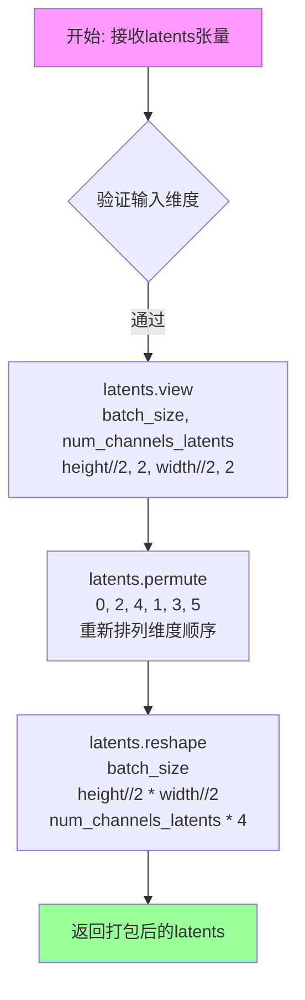

#### 带注释源码

```python
@staticmethod
# Copied from diffusers.pipelines.flux.pipeline_flux.FluxPipeline._pack_latents
def _pack_latents(latents, batch_size, num_channels_latents, height, width):
    """
    将潜在变量进行打包处理，将2x2的图像块展平为序列
    
    处理流程：
    1. 将latents从 (B, C, H, W) reshape 为 (B, C, H//2, 2, W//2, 2)
       - 将高度和宽度各划分为2个块
    2. 置换维度从 (B, C, H//2, 2, W//2, 2) 变为 (B, H//2, W//2, C, 2, 2)
    3. 最后reshape为 (B, H//2*W//2, C*4)
       - 将每个2x2块展平为4个通道
    
    这种打包方式是为了适应FluxTransformer2DModel的输入要求，
    模型会将打包后的序列视为一系列patch进行处理
    """
    # 第一步：重新reshape，将height和width各分成2份
    # 输入: (batch_size, num_channels_latents, height, width)
    # 输出: (batch_size, num_channels_latents, height//2, 2, width//2, 2)
    latents = latents.view(batch_size, num_channels_latents, height // 2, 2, width // 2, 2)
    
    # 第二步：置换维度，将空间维度和通道维度重新排列
    # 输入: (batch_size, num_channels_latents, height//2, 2, width//2, 2)
    # 输出: (batch_size, height//2, width//2, num_channels_latents, 2, 2)
    latents = latents.permute(0, 2, 4, 1, 3, 5)
    
    # 第三步：reshape为最终的打包形式
    # 将2x2的块展平为4个通道
    # 输入: (batch_size, height//2, width//2, num_channels_latents, 2, 2)
    # 输出: (batch_size, (height//2)*(width//2), num_channels_latents*4)
    latents = latents.reshape(batch_size, (height // 2) * (width // 2), num_channels_latents * 4)

    return latents
```


### `FluxKontextInpaintPipeline._unpack_latents`

该方法是一个静态工具函数，用于将打包后的latent张量（packed latents）解包回标准的4D张量格式（batch_size, channels, height, width），以便后续进行VAE解码。在Flux模型中，latent通常以2x2patch的方式进行打包以提高计算效率，该方法执行反向操作恢复原始的空间维度结构。

参数：

- `latents`：`torch.Tensor`，打包后的latent张量，形状为(batch_size, num_patches, channels)，其中num_patches = (height // 2) * (width // 2)，channels = num_latent_channels * 4
- `height`：`int`，原始图像的像素高度（未压缩前）
- `width`：`int`，原始图像的像素宽度（未压缩前）
- `vae_scale_factor`：`int`，VAE的缩放因子，用于计算latent空间的实际尺寸

返回值：`torch.Tensor`，解包后的latent张量，形状为(batch_size, channels // 4, height_latent, width_latent)，其中height_latent和width_latent是VAE压缩和packing后的空间维度

#### 流程图

```mermaid
flowchart TD
    A[开始: 输入packed latents] --> B[获取batch_size, num_patches, channels]
    B --> C{计算latent空间尺寸}
    C --> D[height = 2 * (height // (vae_scale_factor * 2))]
    C --> E[width = 2 * (width // (vae_scale_factor * 2))]
    D --> F[View: 变形为<br/>batch, h//2, w//2, c//4, 2, 2]
    E --> F
    F --> G[Permute: 调整维度顺序<br/>0, 3, 1, 4, 2, 5]
    G --> H[Reshape: 合并最后两个维度<br/>batch, c//4, h, w]
    H --> I[返回解包后的latent张量]
```

#### 带注释源码

```python
@staticmethod
# Copied from diffusers.pipelines.flux.pipeline_flux.FluxPipeline._unpack_latents
def _unpack_latents(latents, height, width, vae_scale_factor):
    """
    将打包的latent张量解包回标准4D格式
    
    参数:
        latents: 打包后的latent张量，形状为 (batch_size, num_patches, channels)
        height: 原始图像高度
        width: 原始图像宽度  
        vae_scale_factor: VAE缩放因子 (通常为8)
    
    返回:
        解包后的latent张量，形状为 (batch_size, channels//4, height_latent, width_latent)
    """
    # 1. 获取输入张量的形状信息
    batch_size, num_patches, channels = latents.shape

    # 2. 计算latent空间的实际高度和宽度
    # VAE对图像进行8倍压缩 (vae_scale_factor=8)，同时需要考虑packing要求
    # packing将2x2的区域打包成一个token，所以需要额外除以2
    # 公式: latent_dim = 2 * (pixel_dim // (vae_scale_factor * 2))
    height = 2 * (int(height) // (vae_scale_factor * 2))
    width = 2 * (int(width) // (vae_scale_factor * 2))

    # 3. 执行解包操作 - 逆向的packing过程
    # 原packing过程: view -> permute -> reshape
    # 现在需要逆向: reshape -> permute -> view (在view前进行permute)
    
    # Step 1: 将packed tensor恢复为6D张量
    # 从 (batch, num_patches, c) -> (batch, h//2, w//2, c//4, 2, 2)
    # 其中 h = height, w = width
    latents = latents.view(batch_size, height // 2, width // 2, channels // 4, 2, 2)
    
    # Step 2: 调整维度顺序，将2x2 patch维度移到最后
    # 从 (batch, h//2, w//2, c//4, 2, 2) -> (batch, c//4, h//2, 2, w//2, 2)
    # permute参数: 0,3,1,4,2,5 表示新维度顺序
    latents = latents.permute(0, 3, 1, 4, 2, 5)

    # Step 3: 合并最后两个维度，得到最终形状
    # 从 (batch, c//4, h//2, 2, w//2, 2) -> (batch, c//4, h, w)
    latents = latents.reshape(batch_size, channels // (2 * 2), height, width)

    return latents
```


### `FluxKontextInpaintPipeline._encode_vae_image`

该方法负责将输入图像编码为 VAE 潜在空间表示，处理单个或批量图像，并应用 VAE 配置中的缩放因子和偏移因子进行标准化。

参数：

- `image`：`torch.Tensor`，输入的图像张量，通常为预处理后的图像数据
- `generator`：`torch.Generator`，用于控制随机性的 PyTorch 生成器，支持单个或生成器列表

返回值：`torch.Tensor`，编码后的图像潜在表示张量

#### 流程图

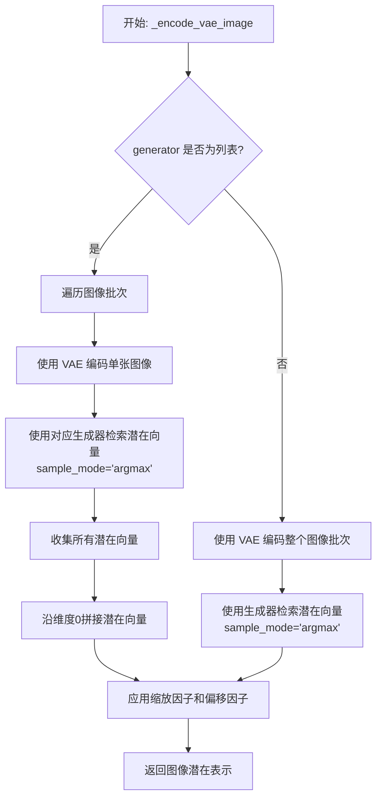

#### 带注释源码

```
def _encode_vae_image(self, image: torch.Tensor, generator: torch.Generator):
    """
    将输入图像编码为 VAE 潜在空间表示
    
    参数:
        image: torch.Tensor - 输入图像张量
        generator: torch.Generator - 随机生成器，用于控制编码的随机性
    
    返回:
        torch.Tensor - 编码后的图像潜在表示
    """
    # 判断 generator 是否为列表（即是否为每个图像提供独立的生成器）
    if isinstance(generator, list):
        # 批量处理：遍历每个图像，使用对应的生成器分别编码
        image_latents = [
            # 提取第 i 张图像的潜在表示，使用 argmax 模式（确定性采样）
            retrieve_latents(
                self.vae.encode(image[i : i + 1]),  # VAE 编码单张图像
                generator=generator[i],             # 对应索引的生成器
                sample_mode="argmax"                # 使用确定性采样而非随机采样
            )
            for i in range(image.shape[0])  # 遍历批次中的所有图像
        ]
        # 将所有潜在向量沿批次维度拼接
        image_latents = torch.cat(image_latents, dim=0)
    else:
        # 单生成器模式：直接编码整个图像批次
        image_latents = retrieve_latents(
            self.vae.encode(image),     # VAE 编码图像
            generator=generator,        # 共享生成器
            sample_mode="argmax"         # 确定性采样
        )

    # 应用 VAE 配置中的缩放因子和偏移因子进行标准化
    # 这是 Flux 模型特有的处理方式，用于将潜在向量调整到合适的数值范围
    image_latents = (image_latents - self.vae.config.shift_factor) * self.vae.config.scaling_factor

    return image_latents
```


### `FluxKontextInpaintPipeline.enable_vae_slicing`

启用 VAE 切片解码功能。当启用此选项时，VAE 会将输入张量分割成多个切片进行分步计算解码，从而节省内存并支持更大的批量大小。

参数： 无

返回值：`None`，无返回值

#### 流程图

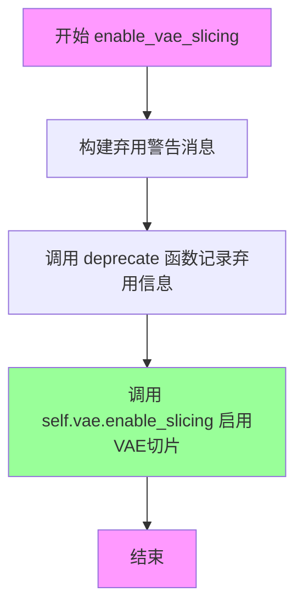

#### 带注释源码

```python
# Copied from diffusers.pipelines.flux.pipeline_flux.FluxPipeline.enable_vae_slicing
def enable_vae_slicing(self):
    r"""
    Enable sliced VAE decoding. When this option is enabled, the VAE will split the input tensor in slices to
    compute decoding in several steps. This is useful to save some memory and allow larger batch sizes.
    """
    # 构建弃用警告消息，提示用户该方法将在未来版本中移除
    # 并建议直接使用 pipe.vae.enable_slicing() 替代
    depr_message = f"Calling `enable_vae_slicing()` on a `{self.__class__.__name__}` is deprecated and this method will be removed in a future version. Please use `pipe.vae.enable_slicing()`."
    
    # 调用 deprecate 函数记录弃用信息
    # 参数: 方法名, 弃用版本号, 弃用消息
    deprecate(
        "enable_vae_slicing",
        "0.40.0",
        depr_message,
    )
    
    # 实际启用 VAE 的切片解码功能
    # 该方法会将 VAE 解码过程分割成多个步骤执行
    self.vae.enable_slicing()
```


### `FluxKontextInpaintPipeline.disable_vae_slicing`

该方法用于禁用 VAE（变分自编码器）的分片解码功能。如果之前启用了 `enable_vae_slicing`，调用此方法后将恢复到单步解码模式。此方法已被标记为弃用，推荐直接使用 `pipe.vae.disable_slicing()`。

参数： 无

返回值：无返回值（`None`）

#### 流程图

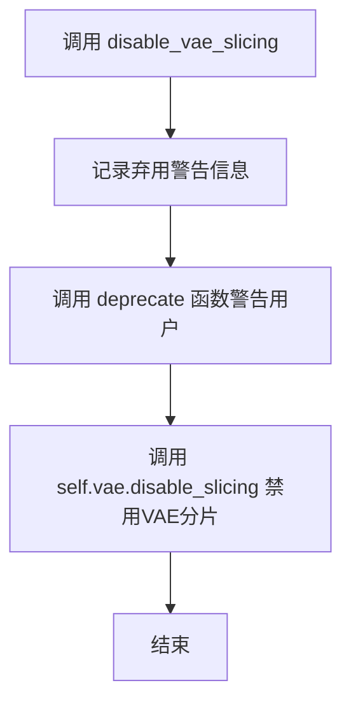

#### 带注释源码

```python
# Copied from diffusers.pipelines.flux.pipeline_flux.FluxPipeline.disable_vae_slicing
def disable_vae_slicing(self):
    r"""
    Disable sliced VAE decoding. If `enable_vae_slicing` was previously enabled, this method will go back to
    computing decoding in one step.
    """
    # 构建弃用警告消息，包含当前类的名称
    depr_message = f"Calling `disable_vae_slicing()` on a `{self.__class__.__name__}` is deprecated and this method will be removed in a future version. Please use `pipe.vae.disable_slicing()`."
    # 调用 deprecate 函数记录弃用警告，指定在 0.40.0 版本移除
    deprecate(
        "disable_vae_slicing",
        "0.40.0",
        depr_message,
    )
    # 调用 VAE 模型的 disable_slicing 方法实际禁用分片解码
    self.vae.disable_slicing()
```


### `FluxKontextInpaintPipeline.enable_vae_tiling`

该方法是一个便捷方法，用于启用 VAE（变分自编码器）的分块（tiling）处理功能。当启用分块处理时，VAE 会将输入张量分割成多个小块进行分步解码和编码，从而显著节省内存并允许处理更大的图像。该方法已被标记为废弃，未来版本将直接调用 `pipe.vae.enable_tiling()`。

参数：

- 无（仅包含 `self` 参数）

返回值：`None`，无返回值

#### 流程图

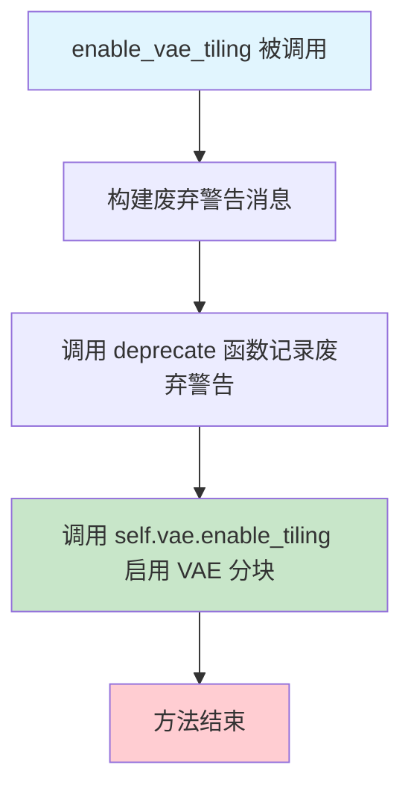

#### 带注释源码

```python
# Copied from diffusers.pipelines.flux.pipeline_flux.FluxPipeline.enable_vae_tiling
def enable_vae_tiling(self):
    r"""
    Enable tiled VAE decoding. When this option is enabled, the VAE will split the input tensor into tiles to
    compute decoding and encoding in several steps. This is useful for saving a large amount of memory and to allow
    processing larger images.
    """
    # 构建废弃警告消息，提示用户该方法将在未来版本中移除
    # 建议直接使用 pipe.vae.enable_tiling() 替代
    depr_message = f"Calling `enable_vae_tiling()` on a `{self.__class__.__name__}` is deprecated and this method will be removed in a future version. Please use `pipe.vae.enable_tiling()`."
    
    # 调用 deprecate 函数记录废弃警告
    # 参数: 方法名, 废弃版本号, 废弃消息
    deprecate(
        "enable_vae_tiling",
        "0.40.0",
        depr_message,
    )
    
    # 实际启用 VAE 的分块功能
    # 该方法会修改 VAE 内部状态，使其在编解码时使用分块策略
    self.vae.enable_tiling()
```


### `FluxKontextInpaintPipeline.disable_vae_tiling`

禁用瓦片 VAE 解码。如果之前启用了 `enable_vae_tiling`，此方法将返回到单步计算解码。该方法已被弃用，建议使用 `pipe.vae.disable_tiling()` 代替。

参数： 无（仅包含 `self`）

返回值： `None`，无返回值

#### 流程图

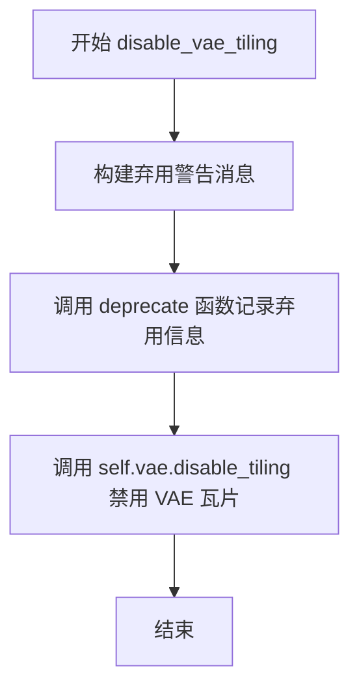

#### 带注释源码

```python
# Copied from diffusers.pipelines.flux.pipeline_flux.FluxPipeline.disable_vae_tiling
def disable_vae_tiling(self):
    r"""
    Disable tiled VAE decoding. If `enable_vae_tiling` was previously enabled, this method will go back to
    computing decoding in one step.
    """
    # 构建弃用警告消息，包含类名和建议使用的新方法
    depr_message = f"Calling `disable_vae_tiling()` on a `{self.__class__.__name__}` is deprecated and this method will be removed in a future version. Please use `pipe.vae.disable_tiling()`."
    
    # 调用 deprecate 函数记录弃用信息，版本号为 0.40.0
    deprecate(
        "disable_vae_tiling",
        "0.40.0",
        depr_message,
    )
    
    # 调用 VAE 模型的 disable_tiling 方法实际禁用瓦片解码
    self.vae.disable_tiling()
```


### `FluxKontextInpaintPipeline.prepare_latents`

该方法用于准备图像修复（inpainting）所需的潜在变量，包括编码输入图像为潜在表示、生成噪声潜在向量、处理参考图像，以及打包所有潜在变量以适配Flux模型的输入格式。

#### 参数

- `image`：`torch.Tensor | None`，输入图像的潜在表示，若不是潜在向量则通过VAE编码
- `timestep`：`int`，当前扩散时间步，用于噪声调度
- `batch_size`：`int`，批处理大小
- `num_channels_latents`：`int`，潜在通道数（通常为transformer输入通道数的1/4）
- `height`：`int`，目标图像高度
- `width`：`int`，目标图像宽度
- `dtype`：`torch.dtype`，张量数据类型
- `device`：`torch.device`，计算设备
- `generator`：`torch.Generator | list[torch.Generator] | None`，随机数生成器，用于确定性采样
- `latents`：`torch.Tensor | None`，预提供的潜在向量，若为None则生成随机噪声
- `image_reference`：`torch.Tensor | None`，参考图像的潜在表示，用于图像条件修复

#### 返回值

`tuple[torch.Tensor, torch.Tensor, torch.Tensor | None, torch.Tensor, torch.Tensor, torch.Tensor | None, torch.Tensor]`，返回元组包含：
- `latents`：处理后的主潜在向量
- `image_latents`：编码后的图像潜在向量
- `image_reference_latents`：编码后的参考图像潜在向量（可能为None）
- `latent_ids`：主潜在向量的位置ID
- `image_ids`：图像潜在向量的位置ID
- `image_reference_ids`：参考图像潜在向量的位置ID（可能为None）
- `noise`：生成的噪声张量

#### 流程图

```mermaid
flowchart TD
    A[开始 prepare_latents] --> B{检查 generator 列表长度}
    B -->|长度不匹配| C[抛出 ValueError]
    B -->|长度匹配| D[计算 height 和 width]
    D --> E[计算 shape = (batch_size, num_channels_latents, height, width)]
    F{image 不为 None} --> G[将 image 移到 device]
    G --> H{image.shape[1] == latent_channels}
    H -->|是| I[直接使用 image 作为 image_latents]
    H -->|否| J[调用 _encode_vae_image 编码]
    I --> K
    J --> K
    K{处理 batch 复制} --> L{batch_size % image_latents.shape[0] == 0}
    L -->|是| M[复制 image_latents]
    L -->|否| N[抛出 ValueError]
    M --> O[连接 image_latents]
    K --> P
    P{image_reference 不为 None} --> Q[类似处理 image_reference]
    Q --> R[生成 latent_ids]
    S{latents 为 None} --> T[生成随机噪声]
    T --> U[使用 scheduler scale_noise]
    S --> V[直接使用 latents]
    U --> W
    V --> W[将 noise 移到 device]
    W --> X[打包 image_latents]
    X --> Y[生成 image_ids]
    Y --> Z{image_reference_latents 不为 None}
    Z --> AA[打包 image_reference_latents]
    AA --> AB[生成 image_reference_ids]
    Z --> AC
    AC --> AD[打包 noise 和 latents]
    AD --> AE[返回 7 元组]
```

#### 带注释源码

```python
def prepare_latents(
    self,
    image: torch.Tensor | None,                    # 输入图像张量或潜在向量
    timestep: int,                                  # 当前扩散时间步
    batch_size: int,                                # 批处理大小
    num_channels_latents: int,                      # 潜在通道数
    height: int,                                    # 目标高度
    width: int,                                     # 目标宽度
    dtype: torch.dtype,                             # 数据类型
    device: torch.device,                           # 计算设备
    generator: torch.Generator | list[torch.Generator] | None = None,  # 随机生成器
    latents: torch.Tensor | None = None,           # 可选的预提供潜在向量
    image_reference: torch.Tensor | None = None,   # 可选的参考图像
):
    # 验证生成器列表长度与批处理大小是否匹配
    if isinstance(generator, list) and len(generator) != batch_size:
        raise ValueError(
            f"You have passed a list of generators of length {len(generator)}, but requested an effective batch"
            f" size of {batch_size}. Make sure the batch size matches the length of the generators."
        )

    # VAE 应用 8x 压缩，但还需考虑打包要求（潜在高度和宽度需能被 2 整除）
    height = 2 * (int(height) // (self.vae_scale_factor * 2))
    width = 2 * (int(width) // (self.vae_scale_factor * 2))
    shape = (batch_size, num_channels_latents, height, width)  # 潜在张量形状

    # ===== 准备图像潜在向量 =====
    image_latents = image_ids = None
    if image is not None:
        # 将图像移至目标设备
        image = image.to(device=device, dtype=dtype)
        
        # 判断是否为已编码的潜在向量
        if image.shape[1] != self.latent_channels:
            # 需要通过 VAE 编码
            image_latents = self._encode_vae_image(image=image, generator=generator)
        else:
            # 已经是潜在向量，直接使用
            image_latents = image
            
        # 处理批处理大小扩展（支持每提示多图生成）
        if batch_size > image_latents.shape[0] and batch_size % image_latents.shape[0] == 0:
            # 扩展 image_latents 以匹配 batch_size
            additional_image_per_prompt = batch_size // image_latents.shape[0]
            image_latents = torch.cat([image_latents] * additional_image_per_prompt, dim=0)
        elif batch_size > image_latents.shape[0] and batch_size % image_latents.shape[0] != 0:
            raise ValueError(
                f"Cannot duplicate `image` of batch size {image_latents.shape[0]} to {batch_size} text prompts."
            )
        else:
            image_latents = torch.cat([image_latents], dim=0)

    # ===== 准备参考图像潜在向量 =====
    image_reference_latents = image_reference_ids = None
    if image_reference is not None:
        # 处理参考图像（与主图像相同逻辑）
        image_reference = image_reference.to(device=device, dtype=dtype)
        if image_reference.shape[1] != self.latent_channels:
            image_reference_latents = self._encode_vae_image(image=image_reference, generator=generator)
        else:
            image_reference_latents = image_reference
            
        # 批处理扩展逻辑
        if batch_size > image_reference_latents.shape[0] and batch_size % image_reference_latents.shape[0] == 0:
            additional_image_per_prompt = batch_size // image_reference_latents.shape[0]
            image_reference_latents = torch.cat([image_reference_latents] * additional_image_per_prompt, dim=0)
        elif batch_size > image_reference_latents.shape[0] and batch_size % image_reference_latents.shape[0] != 0:
            raise ValueError(
                f"Cannot duplicate `image_reference` of batch size {image_reference_latents.shape[0]} to {batch_size} text prompts."
            )
        else:
            image_reference_latents = torch.cat([image_reference_latents], dim=0)

    # ===== 生成潜在向量位置 ID =====
    # 用于自注意力机制中的位置编码
    latent_ids = self._prepare_latent_image_ids(batch_size, height // 2, width // 2, device, dtype)

    # ===== 准备主潜在向量（噪声） =====
    if latents is None:
        # 未提供潜在向量，生成随机噪声
        noise = randn_tensor(shape, generator=generator, device=device, dtype=dtype)
        # 根据时间步调度噪声
        latents = self.scheduler.scale_noise(image_latents, timestep, noise)
    else:
        # 使用提供的潜在向量
        noise = latents.to(device=device, dtype=dtype)
        latents = noise

    # ===== 打包图像潜在向量并生成对应的位置 ID =====
    image_latent_height, image_latent_width = image_latents.shape[2:]
    # 将 2x2 patch 打包成单个向量（Flux 特有格式）
    image_latents = self._pack_latents(
        image_latents, batch_size, num_channels_latents, image_latent_height, image_latent_width
    )
    # 生成图像位置 ID（第一维设为 1，与潜在 ID 区分）
    image_ids = self._prepare_latent_image_ids(
        batch_size, image_latent_height // 2, image_latent_width // 2, device, dtype
    )
    image_ids[..., 0] = 1  # 第一维设为 1 标识为图像

    # ===== 打包参考图像潜在向量 =====
    if image_reference_latents is not None:
        image_reference_latent_height, image_reference_latent_width = image_reference_latents.shape[2:]
        image_reference_latents = self._pack_latents(
            image_reference_latents,
            batch_size,
            num_channels_latents,
            image_reference_latent_height,
            image_reference_latent_width,
        )
        image_reference_ids = self._prepare_latent_image_ids(
            batch_size, image_reference_latent_height // 2, image_reference_latent_width // 2, device, dtype
        )
        image_reference_ids[..., 0] = 1  # 第一维设为 1 标识为参考图像

    # ===== 打包主潜在向量和噪声 =====
    noise = self._pack_latents(noise, batch_size, num_channels_latents, height, width)
    latents = self._pack_latents(latents, batch_size, num_channels_latents, height, width)

    # 返回所有准备好的潜在变量
    return latents, image_latents, image_reference_latents, latent_ids, image_ids, image_reference_ids, noise
```


### `FluxKontextInpaintPipeline.prepare_mask_latents`

该方法负责准备图像修复（inpainting）任务中的mask和被mask覆盖的图像（masked image）对应的latent表示。它会对mask进行尺寸调整和类型转换，将masked_image编码为latent（如果需要），并根据批次大小进行复制以匹配每个prompt生成的图像数量，最后将mask和masked_image_latents打包成适合模型输入的格式。

参数：

- `mask`：`torch.Tensor`，输入的mask图像张量，用于指示需要修复的区域
- `masked_image`：`torch.Tensor`，被mask覆盖的原始图像，即mask区域为白色的图像
- `batch_size`：`int`，批次大小，表示有多少个prompt
- `num_channels_latents`：`int`，latent空间的通道数，通常为16
- `num_images_per_prompt`：`int`，每个prompt生成的图像数量
- `height`：`int`，目标高度（像素）
- `width`：`int`，目标宽度（像素）
- `dtype`：`torch.dtype`，目标数据类型（如torch.float32）
- `device`：`torch.device`，目标设备（如cuda:0）
- `generator`：`torch.Generator | None`，随机数生成器，用于确保可重复性

返回值：`tuple[torch.Tensor, torch.Tensor]`，返回一个元组，包含处理后的mask张量和masked_image_latents张量

#### 流程图

```mermaid
flowchart TD
    A[开始准备mask latents] --> B{计算目标尺寸}
    B --> C[height = 2 * (height // (vae_scale_factor * 2))]
    C --> D[width = 2 * (width // (vae_scale_factor * 2))]
    D --> E[对mask进行插值缩放]
    E --> F[将mask转移到目标设备并转换类型]
    F --> G[计算实际batch_size = batch_size * num_images_per_prompt]
    G --> H[将masked_image转移到目标设备并转换类型]
    H --> I{检查masked_image通道数是否为16?}
    I -->|是| J[直接作为masked_image_latents]
    I -->|否| K[使用VAE编码获取latents]
    K --> L[应用shift_factor和scaling_factor]
    J --> M{检查mask批量是否需要复制?}
    M -->|是| N[复制mask以匹配batch_size]
    M -->|否| O[保持原mask]
    N --> P{检查masked_image_latents批量是否需要复制?}
    P -->|是| Q[复制masked_image_latents以匹配batch_size]
    P -->|否| R[保持原masked_image_latents]
    Q --> S[将masked_image_latents转移到目标设备]
    O --> S
    R --> S
    S --> T[打包masked_image_latents]
    T --> U[打包mask并重复通道]
    U --> V[返回mask和masked_image_latents]
```

#### 带注释源码

```python
def prepare_mask_latents(
    self,
    mask,  # 输入的mask张量，指示需要修复的区域
    masked_image,  # 被mask覆盖的图像，mask区域为白色
    batch_size,  # 批次大小
    num_channels_latents,  # latent通道数，通常为16
    num_images_per_prompt,  # 每个prompt生成的图像数
    height,  # 目标高度
    width,  # 目标宽度
    dtype,  # 目标数据类型
    device,  # 目标设备
    generator,  # 随机生成器
):
    # VAE应用8x压缩，但还需要考虑打包需要latent的高宽能被2整除
    # 计算调整后的latent空间尺寸
    height = 2 * (int(height) // (self.vae_scale_factor * 2))
    width = 2 * (int(width) // (self.vae_scale_factor * 2))
    
    # 调整mask尺寸以匹配latent形状，在转换为dtype之前进行以避免精度问题
    mask = torch.nn.functional.interpolate(mask, size=(height, width))
    mask = mask.to(device=device, dtype=dtype)

    # 计算实际需要的批次大小（考虑每个prompt生成的图像数）
    batch_size = batch_size * num_images_per_prompt

    # 将masked_image转移到目标设备并转换类型
    masked_image = masked_image.to(device=device, dtype=dtype)

    # 如果masked_image已经是latent格式（通道数为16），直接使用
    # 否则需要通过VAE编码获取latent表示
    if masked_image.shape[1] == 16:
        masked_image_latents = masked_image
    else:
        # 使用VAE编码图像获取latent分布
        masked_image_latents = retrieve_latents(self.vae.encode(masked_image), generator=generator)
        
        # 应用VAE的shift和scaling因子进行归一化
        masked_image_latents = (
            masked_image_latents - self.vae.config.shift_factor
        ) * self.vae.config.scaling_factor

    # 复制mask以匹配batch_size（每个prompt生成多张图像）
    if mask.shape[0] < batch_size:
        # 检查是否能整除，确保可以均匀复制
        if not batch_size % mask.shape[0] == 0:
            raise ValueError(
                "The passed mask and the required batch size don't match. Masks are supposed to be duplicated to"
                f" a total batch size of {batch_size}, but {mask.shape[0]} masks were passed. Make sure the number"
                " of masks that you pass is divisible by the total requested batch size."
            )
        mask = mask.repeat(batch_size // mask.shape[0], 1, 1, 1)
    
    # 复制masked_image_latents以匹配batch_size
    if masked_image_latents.shape[0] < batch_size:
        if not batch_size % masked_image_latents.shape[0] == 0:
            raise ValueError(
                "The passed images and the required batch size don't match. Images are supposed to be duplicated"
                f" to a total batch size of {batch_size}, but {masked_image_latents.shape[0]} images were passed."
                " Make sure the number of images that you pass is divisible by the total requested batch size."
            )
        masked_image_latents = masked_image_latents.repeat(batch_size // masked_image_latents.shape[0], 1, 1, 1)

    # 对齐设备以防止连接时出现设备错误
    masked_image_latents = masked_image_latents.to(device=device, dtype=dtype)
    
    # 打包masked_image_latents以适应Flux模型的输入格式
    masked_image_latents = self._pack_latents(
        masked_image_latents,
        batch_size,
        num_channels_latents,
        height,
        width,
    )
    
    # 打包mask，重复通道数以匹配latent的通道数
    mask = self._pack_latents(
        mask.repeat(1, num_channels_latents, 1, 1),
        batch_size,
        num_channels_latents,
        height,
        width,
    )

    # 返回处理后的mask和masked_image_latents
    return mask, masked_image_latents
```


### `FluxKontextInpaintPipeline.__call__`

该方法是 Flux Kontext 图像修复管道的主入口，接收图像、掩码、文本提示和可选的参考图像，通过去噪扩散过程生成修复后的图像。支持文本条件引导、IP-Adapter 图像适配器、LoRA 权重加载和多种输出格式。

参数：

- `image`：`PipelineImageInput | None`，待修复的输入图像，用于指定需要被掩码覆盖并重新绘制的区域
- `image_reference`：`PipelineImageInput | None`，可选的参考图像，作为修复区域的起点（用于基于图像条件的修复）
- `mask_image`：`PipelineImageInput`，掩码图像，白色像素区域将被重新绘制，黑色像素区域保留
- `prompt`：`str | list[str]`，引导图像生成的文本提示
- `prompt_2`：`str | list[str] | None`，发送给 T5 文本编码器的提示，若不指定则使用 prompt
- `negative_prompt`：`str | list[str] | None`，不引导图像生成的负面提示
- `negative_prompt_2`：`str | list[str] | None`，发送给 T5 的负面提示
- `true_cfg_scale`：`float`，真实无分类器引导比例，当大于 1 且提供负面提示时启用
- `height`：`int | None`，生成图像的高度（像素），默认为 1024
- `width`：`int | None`，生成图像的宽度（像素），默认为 1024
- `strength`：`float`，图像转换强度，范围 0-1，值越大对原图的保留越少
- `padding_mask_crop`：`int | None`，掩码裁剪的边距大小，用于优化小掩码大图像场景
- `num_inference_steps`：`int`，去噪步数，默认 28
- `sigmas`：`list[float] | None`，自定义噪声调度 sigmas 参数
- `guidance_scale`：`float`，嵌入引导比例，默认 3.5
- `num_images_per_prompt`：`int | None`，每个提示生成的图像数量
- `generator`：`torch.Generator | list[torch.Generator] | None`，随机数生成器，用于可重复生成
- `latents`：`torch.FloatTensor | None`，预生成的噪声潜在向量
- `prompt_embeds`：`torch.FloatTensor | None`，预生成的文本嵌入
- `pooled_prompt_embeds`：`torch.FloatTensor | None`，预生成的池化文本嵌入
- `ip_adapter_image`：`PipelineImageInput | None`，IP-Adapter 图像输入
- `ip_adapter_image_embeds`：`list[torch.Tensor] | None`，IP-Adapter 预生成图像嵌入
- `negative_ip_adapter_image`：`PipelineImageInput | None`，负面 IP-Adapter 图像
- `negative_ip_adapter_image_embeds`：`list[torch.Tensor] | None`，负面 IP-Adapter 嵌入
- `negative_prompt_embeds`：`torch.FloatTensor | None`，预生成的负面文本嵌入
- `negative_pooled_prompt_embeds`：`torch.FloatTensor | None`，预生成的负面池化嵌入
- `output_type`：`str | None`，输出格式，默认 "pil"
- `return_dict`：`bool`，是否返回 FluxPipelineOutput，默认 True
- `joint_attention_kwargs`：`dict[str, Any] | None`，联合注意力处理器参数字典
- `callback_on_step_end`：`Callable | None`，每步结束时的回调函数
- `callback_on_step_end_tensor_inputs`：`list[str]`，回调函数接收的张量输入列表
- `max_sequence_length`：`int`，最大序列长度，默认 512
- `max_area`：`int`，生成图像的最大面积（像素），默认 1024²
- `_auto_resize`：`bool`，是否自动调整分辨率，默认 True

返回值：`FluxPipelineOutput | tuple`，返回 FluxPipelineOutput 对象（若 return_dict 为 True），否则返回包含生成图像的元组

#### 流程图

```mermaid
flowchart TD
    A[__call__ 入口] --> B[1. 检查输入参数 check_inputs]
    B --> C[2. 预处理图像 preprocess image]
    C --> D[2.1 预处理参考图像 preprocess image_reference]
    D --> E[3. 定义批次大小和设备]
    E --> F[4. 编码提示词 encode_prompt]
    F --> G{是否使用 true_cfg}
    G -->|Yes| H[编码负面提示词 encode_prompt negative]
    G -->|No| I[跳过负面编码]
    H --> I
    I --> J[5. 准备时间步 retrieve_timesteps]
    J --> K[获取 latent_timestep]
    K --> L[6. 准备潜在变量 prepare_latents]
    L --> M[准备掩码 prepare_mask_latents]
    M --> N{是否有 IP-Adapter}
    N -->|Yes| O[准备 IP-Adapter 图像嵌入]
    N -->|No| P[跳过 IP-Adapter]
    O --> P
    P --> Q[7. 去噪循环 for each timestep]
    Q --> R{处理当前时间步}
    R --> S[拼接 latent_model_input]
    S --> T[调用 transformer 进行预测]
    T --> U{是否使用 true_cfg}
    U -->|Yes| V[计算负面噪声预测并组合]
    U -->|No| W[跳过负面预测]
    V --> W
    W --> X[scheduler.step 更新 latents]
    X --> Y[应用掩码混合 init_latents_proper]
    Y --> Z{是否有 callback}
    Z -->|Yes| AA[执行回调函数]
    Z -->|No| AB[跳过回调]
    AA --> AB
    AB --> AC[更新进度条]
    AC --> AD{是否还有时间步}
    AD -->|Yes| R
    AD -->|No| AE[8. 解码潜在向量到图像]
    AE --> AF[后处理图像 postprocess]
    AF --> AG[释放模型钩子]
    AG --> AH[返回结果]
```

#### 带注释源码

```python
@torch.no_grad()
@replace_example_docstring(EXAMPLE_DOC_STRING)
def __call__(
    self,
    image: PipelineImageInput | None = None,
    image_reference: PipelineImageInput | None = None,
    mask_image: PipelineImageInput = None,
    prompt: str | list[str] = None,
    prompt_2: str | list[str] | None = None,
    negative_prompt: str | list[str] = None,
    negative_prompt_2: str | list[str] | None = None,
    true_cfg_scale: float = 1.0,
    height: int | None = None,
    width: int | None = None,
    strength: float = 1.0,
    padding_mask_crop: int | None = None,
    num_inference_steps: int = 28,
    sigmas: list[float] | None = None,
    guidance_scale: float = 3.5,
    num_images_per_prompt: int | None = 1,
    generator: torch.Generator | list[torch.Generator] | None = None,
    latents: torch.FloatTensor | None = None,
    prompt_embeds: torch.FloatTensor | None = None,
    pooled_prompt_embeds: torch.FloatTensor | None = None,
    ip_adapter_image: PipelineImageInput | None = None,
    ip_adapter_image_embeds: list[torch.Tensor] | None = None,
    negative_ip_adapter_image: PipelineImageInput | None = None,
    negative_ip_adapter_image_embeds: list[torch.Tensor] | None = None,
    negative_prompt_embeds: torch.FloatTensor | None = None,
    negative_pooled_prompt_embeds: torch.FloatTensor | None = None,
    output_type: str | None = "pil",
    return_dict: bool = True,
    joint_attention_kwargs: dict[str, Any] | None = None,
    callback_on_step_end: Callable[[int, int], None] | None = None,
    callback_on_step_end_tensor_inputs: list[str] = ["latents"],
    max_sequence_length: int = 512,
    max_area: int = 1024**2,
    _auto_resize: bool = True,
):
    # === 1. 参数预处理和默认值设置 ===
    # 根据 max_area 和宽高比调整图像尺寸，确保符合 VAE 缩放因子要求
    height = height or self.default_sample_size * self.vae_scale_factor
    width = width or self.default_sample_size * self.vae_scale_factor

    original_height, original_width = height, width
    aspect_ratio = width / height
    width = round((max_area * aspect_ratio) ** 0.5)
    height = round((max_area / aspect_ratio) ** 0.5)

    multiple_of = self.vae_scale_factor * 2
    width = width // multiple_of * multiple_of
    height = height // multiple_of * multiple_of

    # === 2. 输入验证 ===
    self.check_inputs(...)  # 验证所有输入参数的合法性

    # === 3. 图像预处理 ===
    # 将输入图像转换为模型所需格式，包括大小调整和归一化
    if image is not None and not (isinstance(image, torch.Tensor) and image.size(1) == self.latent_channels):
        # 自动选择最接近的 Kontext 训练分辨率
        _, image_width, image_height = min(
            (abs(aspect_ratio - w / h), w, h) for w, h in PREFERRED_KONTEXT_RESOLUTIONS
        )
        # 预处理图像
        image = self.image_processor.preprocess(...)
    else:
        raise ValueError("image must be provided correctly for inpainting")

    init_image = image.to(dtype=torch.float32)

    # 同样预处理参考图像（可选）
    if image_reference is not None and not (...):
        image_reference = self.image_processor.preprocess(...)

    # === 4. 编码提示词 ===
    # 使用 CLIP 和 T5 编码器将文本提示转换为嵌入向量
    prompt_embeds, pooled_prompt_embeds, text_ids = self.encode_prompt(...)

    # 如果启用 true_cfg，还需编码负面提示
    if do_true_cfg:
        negative_prompt_embeds, negative_pooled_prompt_embeds, negative_text_ids = self.encode_prompt(...)

    # === 5. 准备时间步 ===
    # 计算图像序列长度相关的偏移量 mu，用于调度器
    sigmas = np.linspace(1.0, 1 / num_inference_steps, num_inference_steps) if sigmas is None else sigmas
    image_seq_len = (int(height) // self.vae_scale_factor // 2) * (int(width) // self.vae_scale_factor // 2)
    mu = calculate_shift(image_seq_len, ...)
    timesteps, num_inference_steps = retrieve_timesteps(self.scheduler, ...)

    # 根据 strength 调整时间步
    timesteps, num_inference_steps = self.get_timesteps(num_inference_steps, strength, device)
    latent_timestep = timesteps[:1].repeat(batch_size * num_images_per_prompt)

    # === 6. 准备潜在变量 ===
    # 准备去噪过程所需的所有潜在向量：图像潜在、掩码潜在、噪声等
    latents, image_latents, image_reference_latents, latent_ids, image_ids, image_reference_ids, noise = (
        self.prepare_latents(...)
    )

    # 准备掩码潜在向量
    mask_condition = self.mask_processor.preprocess(mask_image, ...)
    masked_image = init_image * (mask_condition < 0.5)
    mask, _ = self.prepare_mask_latents(...)

    # 准备 IP-Adapter 图像嵌入（可选）
    if ip_adapter_image is not None or ip_adapter_image_embeds is not None:
        image_embeds = self.prepare_ip_adapter_image_embeds(...)

    # === 7. 去噪循环 ===
    for i, t in enumerate(timesteps):
        # 拼接潜在输入（包含图像潜在和参考图像潜在）
        if image_reference_latents is not None:
            latent_model_input = torch.cat([latents, image_reference_latents], dim=1)
        elif image_latents is not None:
            latent_model_input = torch.cat([latents, image_latents], dim=1)

        # 调用 Transformer 进行噪声预测
        noise_pred = self.transformer(
            hidden_states=latent_model_input,
            timestep=timestep / 1000,
            guidance=guidance,
            pooled_projections=pooled_prompt_embeds,
            encoder_hidden_states=prompt_embeds,
            txt_ids=text_ids,
            img_ids=latent_ids,
            joint_attention_kwargs=self.joint_attention_kwargs,
        )[0]

        # 如果启用 true_cfg，计算负面噪声预测并进行引导
        if do_true_cfg:
            neg_noise_pred = self.transformer(...)[0]
            noise_pred = neg_noise_pred + true_cfg_scale * (noise_pred - neg_noise_pred)

        # 使用调度器执行去噪步骤
        latents = self.scheduler.step(noise_pred, t, latents, return_dict=False)[0]

        # 应用掩码：将原始图像潜在与去噪潜在混合
        latents = (1 - init_mask) * init_latents_proper + init_mask * latents

        # 执行回调函数（可选）
        if callback_on_step_end is not None:
            callback_kwargs = {k: locals()[k] for k in callback_on_step_end_tensor_inputs}
            callback_outputs = callback_on_step_end(self, i, t, callback_kwargs)

        # 更新进度条
        progress_bar.update()

    # === 8. 解码生成图像 ===
    if output_type == "latent":
        image = latents
    else:
        # 将潜在向量解码为图像
        latents = self._unpack_latents(latents, height, width, self.vae_scale_factor)
        latents = (latents / self.vae.config.scaling_factor) + self.vae.config.shift_factor
        image = self.vae.decode(latents, return_dict=False)[0]
        image = self.image_processor.postprocess(image, output_type=output_type)

    # 释放模型钩子，清理资源
    self.maybe_free_model_hooks()

    # 返回结果
    if not return_dict:
        return (image,)

    return FluxPipelineOutput(images=image)
```

## 关键组件


### FluxKontextInpaintPipeline

Flux Kontext图像修复管道的主类，继承自DiffusionPipeline、FluxLoraLoaderMixin、FromSingleFileMixin、TextualInversionLoaderMixin和FluxIPAdapterMixin，用于基于文本提示和参考图像进行图像修复生成。

### PREFERRED_KONTEXT_RESOLUTIONS

预定义的训练分辨率列表，用于自动调整输入图像尺寸以匹配模型训练配置，包含17种不同的宽高比组合，从(672, 1568)到(1568, 672)。

### calculate_shift

用于计算图像序列长度偏移量的函数，基于基础序列长度、最大序列长度、基础偏移量和最大偏移量计算线性插值，用于调整去噪调度器的参数。

### retrieve_timesteps

检索调度器时间步的辅助函数，支持自定义时间步和sigmas参数，调用调度器的set_timesteps方法并返回时间步列表和推理步数。

### retrieve_latents

从编码器输出中提取潜在向量的函数，支持sample和argmax两种模式，处理latent_dist属性或直接访问latents属性。

### encode_prompt

编码文本提示词的主方法，整合CLIP和T5文本编码器，支持LoRA缩放、提示词嵌入预生成和多提示词并行处理，返回提示词嵌入、池化嵌入和文本ID。

### encode_image

将输入图像编码为图像嵌入的函数，使用CLIP视觉模型和feature_extractor，支持批量处理和每提示词多图像生成。

### prepare_ip_adapter_image_embeds

准备IP-Adapter图像嵌入的函数，处理图像或预计算的嵌入，支持多个IP适配器，为每个适配器生成重复的嵌入张量。

### prepare_latents

准备去噪循环所需潜在变量的核心函数，处理图像潜在向量、参考图像潜在向量、噪声和潜在ID，支持批量扩展和packing操作。

### prepare_mask_latents

准备修复掩码潜在向量的函数，对掩码进行插值和packing处理，处理被掩码覆盖的图像潜在表示。

### _encode_vae_image

使用VAE编码图像为潜在空间的内部方法，处理shift_factor和scaling_factor，支持argmax采样模式。

### _prepare_latent_image_ids

生成潜在空间位置编码ID的静态方法，为每个潜在位置分配二维坐标，用于transformer的位置嵌入。

### _pack_latents

将潜在张量打包成2x2块格式的静态方法，将4通道潜在向量重塑为单个扁平序列，用于Flux模型的输入格式。

### _unpack_latents

将打包的潜在张量解包回标准图像格式的静态方法，执行pack的逆操作，恢复批量大小、通道数和高度宽度。

### check_inputs

验证输入参数合法性的函数，检查提示词、掩码、强度、尺寸、输出类型等参数的有效性，抛出相应的错误或警告。

### get_timesteps

根据强度参数调整推理时间步的函数，计算初始时间步并返回调整后的时间步序列。

### __call__

管道的主调用方法，执行完整的图像修复流程，包括输入预处理、提示词编码、时间步准备、去噪循环、潜在向量解码和后处理。


## 问题及建议


### 已知问题

-   **`__call__` 方法过长**：主生成方法超过300行，包含了图像预处理、prompt编码、潜在变量准备、去噪循环等多个逻辑块，导致代码难以阅读和维护。
-   **重复代码过多**：多个方法标记为"Copied from diffusers.pipelines.flux.pipeline_flux"，包括`_get_t5_prompt_embeds`、`_get_clip_prompt_embeds`、`encode_prompt`、`encode_image`等，未进行适当的抽象和复用。
-   **`check_inputs` 方法参数过多**：该方法接收超过20个参数，导致函数签名臃肿，应考虑使用参数对象或配置类进行封装。
-   **潜在空值处理问题**：`prepare_latents`方法中`image_latents`和`image_reference_latents`可能为None，但后续在去噪循环中的处理逻辑存在冗余判断（如`if image_reference_latents is not None`），增加了代码复杂度。
-   **IP Adapter处理逻辑冗余**：在`__call__`方法中，对`ip_adapter_image`和`negative_ip_adapter_image`的处理存在重复的默认值填充逻辑，可以简化。
-   **废弃方法仍保留**：`enable_vae_slicing`、`disable_vae_slicing`、`enable_vae_tiling`、`disable_vae_tiling`等方法标记为废弃但仍保留在代码中，增加了维护负担。
-   **缺少类型提示的完整覆盖**：部分内部变量和返回值缺乏明确的类型注解，影响代码可读性和IDE支持。

### 优化建议

-   **拆分`__call__`方法**：将主方法拆分为多个私有方法，如`_preprocess_image`、`_encode_prompts`、`_prepare_latents`、`_denoise`、`_decode_outputs`等，每个方法负责单一职责。
-   **抽象配置类**：创建`PipelineConfig`或`InpaintConfig`类，将`check_inputs`中的大量参数封装为配置对象。
-   **提取通用工具类**：将复制过来的方法统一放置在基类或工具模块中，避免代码重复。
-   **优化潜在变量处理**：在`prepare_latents`方法中预先处理空值情况，简化后续去噪循环中的条件判断。
-   **精简IP Adapter逻辑**：合并正向和负向IP Adapter的处理逻辑，使用工厂方法或统一的预处理函数。
-   **移除废弃方法**：根据版本计划，及时移除标记为废弃的方法，保持代码整洁。
-   **增加日志和错误信息**：在关键步骤增加详细的日志记录，特别是图像尺寸调整、潜在变量准备等可能影响输出质量的地方。
-   **添加性能监控**：在去噪循环中记录每步耗时，便于后续性能优化。
-   **完善类型注解**：为所有公开方法添加完整的类型注解，包括泛型支持。


## 其它


### 设计目标与约束

本Pipeline旨在实现基于Flux模型的图像修复（Inpainting）功能，支持文本引导的图像编辑和图像条件修复。核心设计目标包括：1）支持文本提示和图像参考两种条件输入；2）支持IP-Adapter图像适配器；3）支持LoRA权重加载和文本反转；4）遵循diffusers库的标准化接口设计。约束条件包括：输入图像尺寸需为vae_scale_factor * 2的倍数；支持预定义的Kontest分辨率列表；最大序列长度为512；最大图像面积为1024*1024像素。

### 错误处理与异常设计

管道在多个关键位置实现了完善的错误处理机制。在`check_inputs`方法中进行了全面的参数校验：strength参数必须在[0,1]范围内；height和width必须能被vae_scale_factor*2整除；prompt和prompt_embeds不能同时提供；padding_mask_crop参数仅支持PIL图像输入；max_sequence_length不能超过512。在`prepare_latents`方法中验证generator列表长度与batch_size的匹配。在`prepare_ip_adapter_image_embeds`方法中验证IP-Adapter图像数量与配置的适配器数量一致。异常处理采用ValueError抛出错误信息，配合deprecate函数处理废弃API，遵循diffusers库的异常设计规范。

### 数据流与状态机

数据流主要经历以下阶段：1）图像预处理阶段：将PIL图像或numpy数组转换为torch.Tensor，进行resize和normalize；2）VAE编码阶段：将输入图像编码为latent表示；3）文本编码阶段：分别通过CLIP和T5编码器生成prompt_embeds和pooled_prompt_embeds；4）潜在变量准备阶段：生成噪声并与图像latents混合；5）去噪循环阶段：Transformer模型执行28步去噪迭代；6）VAE解码阶段：将最终latents解码为图像；7）后处理阶段：将图像转换为PIL或numpy格式输出。状态机由scheduler管理timesteps，通过strength参数控制噪声添加程度。

### 外部依赖与接口契约

本Pipeline依赖以下核心组件：1）transformer（FluxTransformer2DModel）：负责去噪过程的主干网络；2）vae（AutoencoderKL）：图像编码解码器；3）text_encoder和text_encoder_2：CLIP和T5文本编码器；4）tokenizer和tokenizer_2：对应的分词器；5）scheduler（FlowMatchEulerDiscreteScheduler）：时间步调度器；6）image_encoder（CLIPVisionModelWithProjection）：IP-Adapter图像编码器；7）feature_extractor：CLIP图像预处理。接口契约遵循DiffusionPipeline标准，支持from_pretrained加载预训练权重，支持pipeline级别的save_pretrained和from_single_file方法。

### 配置参数说明

关键配置参数包括：vae_scale_factor（VAE缩放因子，通常为8或16）、latent_channels（潜在空间通道数，通常为16）、default_sample_size（默认采样尺寸128）、tokenizer_max_length（分词器最大长度77）、PREFERRED_KONTEXT_RESOLUTIONS（17种推荐分辨率对）。Pipeline通过register_modules方法注册所有依赖模块，支持CPU offload和模型钩子管理。

### 性能优化策略

代码中包含多项性能优化：1）VAE slicing和tiling支持：通过enable_vae_slicing、enable_vae_tiling方法启用，可显著降低大图像处理的显存占用；2）模型CPU offload：支持model_cpu_offload_seq序列的自动模型卸载；3）梯度禁用：使用@torch.no_grad()装饰器确保推理过程不计算梯度；4）批量处理：支持num_images_per_prompt参数实现单次推理生成多张图像；5）XLA支持：检测并支持PyTorch XLA加速。潜在优化空间包括：混合精度推理的进一步优化、KV cache加速、ONNX导出支持等。

### 版本兼容性说明

本代码依赖以下版本的依赖库：torch（支持XLA加速）、transformers（CLIP、T5模型）、diffusers核心库（Pipeline基类、调度器、工具函数）、PIL（Pillow图像处理）、numpy。代码中使用了Python 3.9+的类型注解（int|None、str|list[str]等联合类型），建议使用Python 3.9及以上版本。deprecate调用表明部分方法将在0.40.0版本移除，建议关注版本迁移指南。部分方法从其他Pipeline复制过来（如Stable Diffusion、Flux Inpaint），保持接口一致性以便于跨版本兼容。

### 并发与异步支持

当前实现为同步Pipeline，未提供原生异步支持。callback_on_step_end和callback_on_step_end_tensor_inputs参数支持在每个去噪步骤结束后执行自定义回调，可用于实现进度监控、提前终止等高级功能。XLA_AVAILABLE标志表明支持PyTorch XLA的并发执行，通过xm.mark_step()标记计算步骤。未来可考虑添加异步生成器支持以提高并发性能。

    