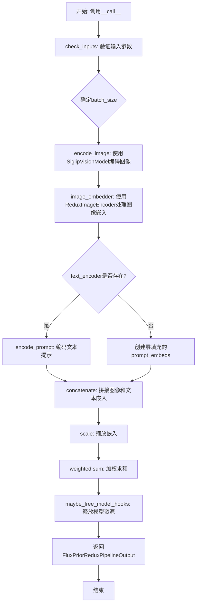
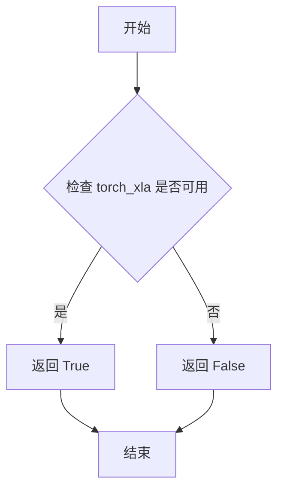
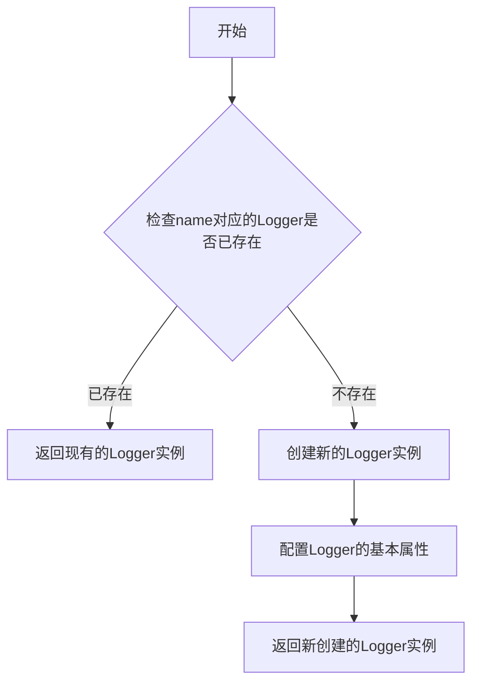
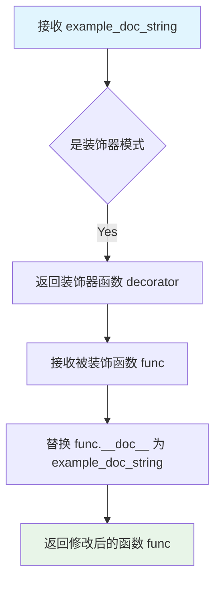
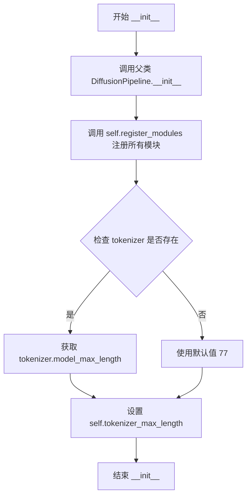
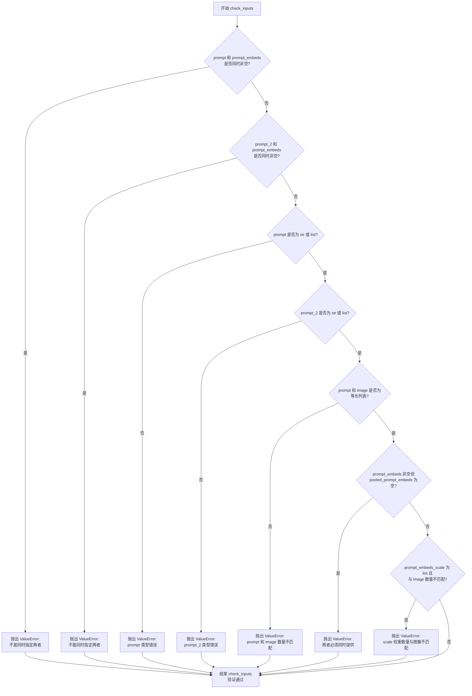
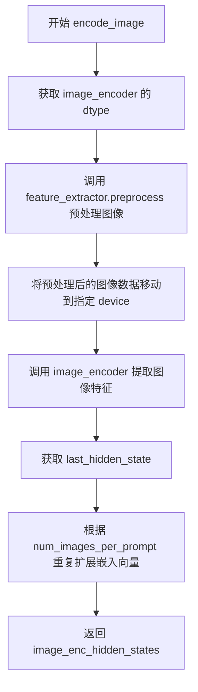
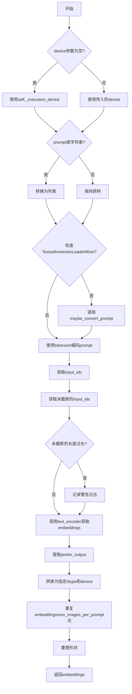
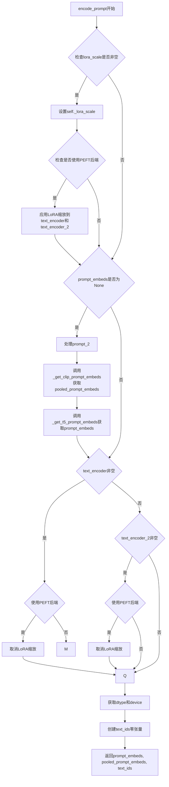

# `diffusers\src\diffusers\pipelines\flux\pipeline_flux_prior_redux.py` 详细设计文档

FluxPriorReduxPipeline是一个用于图像到图像生成的Diffusers管道，通过SiglipVisionModel编码输入图像，结合ReduxImageEncoder处理嵌入，并使用CLIPTextModel和T5EncoderModel编码文本提示，最终输出用于后续FluxPipeline的prompt embeddings和pooled prompt embeddings。

## 整体流程



## 类结构

```
DiffusionPipeline (基类)
└── FluxPriorReduxPipeline (主类)
```

## 全局变量及字段


### `XLA_AVAILABLE`
    
Boolean flag indicating whether PyTorch XLA is available for the pipeline

类型：`bool`
    


### `logger`
    
Logger instance for the module to track runtime information and warnings

类型：`logging.Logger`
    


### `EXAMPLE_DOC_STRING`
    
Documentation string containing usage examples for the pipeline

类型：`str`
    


### `FluxPriorReduxPipeline.model_cpu_offload_seq`
    
Defines the sequence for CPU offload ordering of models

类型：`str`
    


### `FluxPriorReduxPipeline._optional_components`
    
List of optional pipeline components that can be loaded conditionally

类型：`list[str]`
    


### `FluxPriorReduxPipeline._callback_tensor_inputs`
    
Empty list storing tensor inputs for pipeline callbacks

类型：`list`
    


### `FluxPriorReduxPipeline.image_encoder`
    
SIGLIP vision model to encode input images into visual features

类型：`SiglipVisionModel`
    


### `FluxPriorReduxPipeline.feature_extractor`
    
Image processor for preprocessing images before encoding

类型：`SiglipImageProcessor`
    


### `FluxPriorReduxPipeline.image_embedder`
    
Redux image encoder to process SIGLIP embeddings into final image representations

类型：`ReduxImageEncoder`
    


### `FluxPriorReduxPipeline.text_encoder`
    
Optional CLIP text encoder for generating text embeddings

类型：`CLIPTextModel | None`
    


### `FluxPriorReduxPipeline.tokenizer`
    
Optional CLIP tokenizer for text preprocessing

类型：`CLIPTokenizer | None`
    


### `FluxPriorReduxPipeline.text_encoder_2`
    
Optional T5 text encoder for generating additional text embeddings

类型：`T5EncoderModel | None`
    


### `FluxPriorReduxPipeline.tokenizer_2`
    
Optional T5 tokenizer for text preprocessing

类型：`T5TokenizerFast | None`
    


### `FluxPriorReduxPipeline.tokenizer_max_length`
    
Maximum sequence length supported by the tokenizer

类型：`int`
    
    

## 全局函数及方法


### `is_torch_xla_available`

该函数用于检测当前环境中 PyTorch XLA（用于 TPU 加速）是否可用，以便在代码中条件性地启用 XLA 相关功能。

参数：此函数无参数。

返回值：`bool`，如果 PyTorch XLA 库可用且已正确安装则返回 `True`，否则返回 `False`。

#### 流程图



#### 带注释源码

```python
# 注意：这是 is_torch_xla_available 函数的典型实现方式
# 源代码位于 diffusers.utils 模块中，此处为示意

def is_torch_xla_available():
    """
    检查 PyTorch XLA 是否可用。
    
    PyTorch XLA 是 PyTorch 的 TPU (Tensor Processing Unit) 加速后端，
    由 Google 开发。该函数用于在运行时检测 XLA 库是否已安装，
    以便代码可以条件性地启用 TPU 支持。
    
    Returns:
        bool: 如果 torch_xla 库可用返回 True，否则返回 False。
    """
    try:
        # 尝试导入 torch_xla 模块
        import torch_xla
        # 尝试检查 _XLAC 是否存在（XLA 核心模块）
        import torch_xla.core.xla_model as xm
        return True
    except ImportError:
        # 如果导入失败，说明 XLA 不可用
        return False
```

#### 在当前代码中的使用

```python
# 导入 is_torch_xla_available 函数
from ...utils import (
    USE_PEFT_BACKEND,
    is_torch_xla_available,  # <-- 从 utils 模块导入
    logging,
    replace_example_docstring,
    scale_lora_layers,
    unscale_lora_layers,
)

# 使用该函数设置全局标志
if is_torch_xla_available():
    XLA_AVAILABLE = True
else:
    XLA_AVAILABLE = False

# XLA_AVAILABLE 后续可用于:
# - 条件性地将模型移动到 TPU 设备
# - 使用 XLA 特定的优化
# - 启用 TPU 加速的推理
```

#### 技术债务与优化空间

1. **硬编码的 XLA 检查**：当前在模块加载时进行一次检查并将结果存储在 `XLA_AVAILABLE` 全局变量中，这种静态检查方式可能导致在运行时环境变化时无法动态适应。
2. **缺少错误处理**：如果 `torch_xla` 存在但版本不兼容，可能导致运行时错误，建议增加版本兼容性检查。
3. **未充分使用 XLA**：代码中定义了 `XLA_AVAILABLE` 标志，但在实际的 pipeline 执行路径中并未看到使用该标志进行 TPU 设备分配或 XLA 特定优化的代码，可能意味着 TPU 支持尚未完全实现。


### `logging.get_logger`

获取或创建一个指定名称的日志记录器（Logger），用于在模块中记录日志信息。该函数是 `diffusers` 库对 Python 标准库 `logging.getLogger` 的封装，提供统一的日志管理接口。

参数：

- `name`：`str`，日志记录器的名称，通常使用 `__name__` 变量来获取当前模块的完整路径，以便于追踪日志来源。

返回值：`logging.Logger`，返回对应名称的日志记录器实例，可用于输出不同级别的日志信息（如 debug、info、warning、error、critical）。

#### 流程图



#### 带注释源码

```python
# 从diffusers库的utils模块导入logging对象
# logging对象封装了Python标准库的logging模块，并提供了get_logger方法
from ...utils import logging

# 使用logging.get_logger获取当前模块的logger
# __name__是Python内置变量，表示当前模块的全限定名（例如：diffusers.pipelines.flux.pipeline_flux）
# 这样配置可以让日志显示调用者的模块路径，便于定位日志来源
logger = logging.get_logger(__name__)  # pylint: disable=invalid-name

# 后续可以使用logger进行日志输出：
# logger.info("This is an info message")
# logger.warning("This is a warning message")
# logger.error("This is an error message")
```


### `replace_example_docstring`

这是一个装饰器函数，用于自动替换被装饰函数的文档字符串（docstring）。它通常与示例代码结合使用，将函数的文档字符串替换为预定义的示例文档，方便在文档中展示函数的使用方法。

参数：

-  `example_doc_string`：`str`，用于替换被装饰函数原始文档字符串的示例文档内容

返回值：`Callable`，返回一个装饰器函数，该装饰器接受要装饰的函数作为参数，并返回替换了文档字符串的函数

#### 流程图



#### 带注释源码

```python
# 这是一个从 diffusers.utils 导入的装饰器函数
# 源码位于 diffusers/src/diffusers/utils/doc_utils.py
# 以下是基于使用方式的推断实现

def replace_example_docstring(example_doc_string: str):
    """
    创建一个装饰器，用于替换被装饰函数的文档字符串。
    
    Args:
        example_doc_string: 用于替换的示例文档字符串
        
    Returns:
        一个装饰器函数
    """
    def decorator(func):
        """
        装饰器内部函数，用于替换目标函数的文档字符串。
        
        Args:
            func: 被装饰的目标函数
            
        Returns:
            替换了文档字符串的函数
        """
        # 将 example_doc_string 赋值给函数的 __doc__ 属性
        func.__doc__ = example_doc_string
        return func
    
    return decorator


# 使用示例：
# @replace_example_docstring(EXAMPLE_DOC_STRING)
# def __call__(self, ...):
#     # 函数的原始文档字符串会被替换为 EXAMPLE_DOC_STRING 的内容
#     pass
```

#### 在代码中的使用示例

```python
# 定义示例文档字符串
EXAMPLE_DOC_STRING = """
    Examples:
        ```py
        >>> import torch
        >>> from diffusers import FluxPriorReduxPipeline, FluxPipeline
        >>> from diffusers.utils import load_image

        >>> device = "cuda"
        >>> dtype = torch.bfloat16

        >>> repo_redux = "black-forest-labs/FLUX.1-Redux-dev"
        >>> repo_base = "black-forest-labs/FLUX.1-dev"
        >>> pipe_prior_redux = FluxPriorReduxPipeline.from_pretrained(repo_redux, torch_dtype=dtype).to(device)
        >>> pipe = FluxPipeline.from_pretrained(
        ...     repo_base, text_encoder=None, text_encoder_2=None, torch_dtype=torch.bfloat16
        ... ).to(device)

        >>> image = load_image(
        ...     "https://huggingface.co/datasets/YiYiXu/testing-images/resolve/main/style_ziggy/img5.png"
        ... )
        >>> pipe_prior_output = pipe_prior_redux(image)
        >>> images = pipe(
        ...     guidance_scale=2.5,
        ...     num_inference_steps=50,
        ...     generator=torch.Generator("cpu").manual_seed(0),
        ...     **pipe_prior_output,
        ... ).images
        >>> images[0].save("flux-redux.png")
        ```
"""

# 使用装饰器替换 __call__ 方法的文档字符串
@replace_example_docstring(EXAMPLE_DOC_STRING)
def __call__(
    self,
    image: PipelineImageInput,
    prompt: str | list[str] = None,
    # ... 其他参数
):
    r"""
    Function invoked when calling the pipeline for generation.
    # 这个原始文档字符串会被上面的 EXAMPLE_DOC_STRING 替换
    """
    # 函数实现...
```


### `FluxPriorReduxPipeline.__init__`

这是`FluxPriorReduxPipeline`类的构造函数，用于初始化图像到图像生成管道。它接收多个模型组件（图像编码器、特征提取器、图像嵌入器、文本编码器等）作为参数，并将它们注册到管道中，同时设置tokenizer的最大长度。

参数：

- `image_encoder`：`SiglipVisionModel`，SIGLIP视觉模型，用于编码输入图像
- `feature_extractor`：`SiglipImageProcessor`，用于预处理图像的图像处理器
- `image_embedder`：`ReduxImageEncoder`，Redux图像编码器，用于处理SIGLIP嵌入
- `text_encoder`：`CLIPTextModel`，可选的CLIP文本编码器
- `tokenizer`：`CLIPTokenizer`，可选的CLIP分词器
- `text_encoder_2`：`T5EncoderModel`，可选的T5文本编码器
- `tokenizer_2`：`T5TokenizerFast`，可选的T5分词器

返回值：`None`，构造函数不返回任何值

#### 流程图



#### 带注释源码

```python
def __init__(
    self,
    image_encoder: SiglipVisionModel,          # SIGLIP视觉模型,用于编码输入图像
    feature_extractor: SiglipImageProcessor,   # 图像预处理器
    image_embedder: ReduxImageEncoder,         # Redux图像编码器
    text_encoder: CLIPTextModel = None,        # 可选的CLIP文本编码器
    tokenizer: CLIPTokenizer = None,          # 可选的CLIP分词器
    text_encoder_2: T5EncoderModel = None,     # 可选的T5文本编码器
    tokenizer_2: T5TokenizerFast = None,        # 可选的T5分词器
):
    """
    初始化 FluxPriorReduxPipeline 管道。
    
    参数:
        image_encoder: SIGLIP视觉模型用于编码输入图像
        feature_extractor: 图像预处理器
        image_embedder: Redux图像编码器处理SIGLIP嵌入
        text_encoder: 可选的CLIP文本编码器
        tokenizer: 可选的CLIP分词器
        text_encoder_2: 可选的T5文本编码器
        tokenizer_2: 可选的T5分词器
    """
    # 调用父类 DiffusionPipeline 的初始化方法
    super().__init__()

    # 将所有模块注册到管道中,以便后续可以使用 self.module_name 访问
    self.register_modules(
        image_encoder=image_encoder,
        feature_extractor=feature_extractor,
        image_embedder=image_embedder,
        text_encoder=text_encoder,
        tokenizer=tokenizer,
        text_encoder_2=text_encoder_2,
        tokenizer_2=tokenizer_2,
    )
    
    # 设置tokenizer的最大长度,如果tokenizer存在则使用其model_max_length属性,否则使用默认值77
    self.tokenizer_max_length = (
        self.tokenizer.model_max_length if hasattr(self, "tokenizer") and self.tokenizer is not None else 77
    )
```


### `FluxPriorReduxPipeline.check_inputs`

该方法用于验证 FluxPriorReduxPipeline 的输入参数合法性，确保用户不会同时传递冲突的参数（如 prompt 和 prompt_embeds），也不会传递类型错误或不匹配的输入（如 prompt 和 image 列表长度不一致）。

参数：

- `self`：`FluxPriorReduxPipeline` 实例本身
- `image`：任意类型，输入的图像数据，用于后续编码
- `prompt`：str 或 list[str]，可选，第一文本提示
- `prompt_2`：str 或 list[str]，可选，第二文本提示（发送给 T5 encoder）
- `prompt_embeds`：torch.FloatTensor，可选，预生成的文本嵌入向量
- `pooled_prompt_embeds`：torch.FloatTensor，可选，预生成的池化文本嵌入
- `prompt_embeds_scale`：float 或 list[float]，默认值 1.0，文本嵌入的缩放因子
- `pooled_prompt_embeds_scale`：float 或 list[float]，默认值 1.0，池化文本嵌入的缩放因子

返回值：`None`，该方法不返回任何值，仅通过抛出 ValueError 来指示输入错误

#### 流程图



#### 带注释源码

```python
def check_inputs(
    self,
    image,
    prompt,
    prompt_2,
    prompt_embeds=None,
    pooled_prompt_embeds=None,
    prompt_embeds_scale=1.0,
    pooled_prompt_embeds_scale=1.0,
):
    # 检查1: prompt 和 prompt_embeds 不能同时指定
    if prompt is not None and prompt_embeds is not None:
        raise ValueError(
            f"Cannot forward both `prompt`: {prompt} and `prompt_embeds`: {prompt_embeds}. Please make sure to"
            " only forward one of the two."
        )
    # 检查2: prompt_2 和 prompt_embeds 不能同时指定
    elif prompt_2 is not None and prompt_embeds is not None:
        raise ValueError(
            f"Cannot forward both `prompt_2`: {prompt_2} and `prompt_embeds`: {prompt_embeds}. Please make sure to"
            " only forward one of the two."
        )
    # 检查3: prompt 必须是 str 或 list 类型
    elif prompt is not None and (not isinstance(prompt, str) and not isinstance(prompt, list)):
        raise ValueError(f"`prompt` has to be of type `str` or `list` but is {type(prompt)}")
    # 检查4: prompt_2 必须是 str 或 list 类型
    elif prompt_2 is not None and (not isinstance(prompt_2, str) and not isinstance(prompt_2, list)):
        raise ValueError(f"`prompt_2` has to be of type `str` or `list` but is {type(prompt_2)}")
    # 检查5: 如果 prompt 和 image 都是列表，数量必须一致
    if prompt is not None and (isinstance(prompt, list) and isinstance(image, list) and len(prompt) != len(image)):
        raise ValueError(
            f"number of prompts must be equal to number of images, but {len(prompt)} prompts were provided and {len(image)} images"
        )
    # 检查6: 如果提供了 prompt_embeds，则必须同时提供 pooled_prompt_embeds
    if prompt_embeds is not None and pooled_prompt_embeds is None:
        raise ValueError(
            "If `prompt_embeds` are provided, `pooled_prompt_embeds` also have to be passed. Make sure to generate `pooled_prompt_embeds` from the same text encoder that was used to generate `prompt_embeds`."
        )
    # 检查7: 如果 prompt_embeds_scale 是列表，其长度必须与 image 数量一致
    if isinstance(prompt_embeds_scale, list) and (
        isinstance(image, list) and len(prompt_embeds_scale) != len(image)
    ):
        raise ValueError(
            f"number of weights must be equal to number of images, but {len(prompt_embeds_scale)} weights were provided and {len(image)} images"
        )
```


### FluxPriorReduxPipeline.encode_image

该方法负责将输入图像转换为高维特征向量表示。它首先获取图像编码器的参数数据类型，然后使用特征提取器对输入图像进行预处理（resize、convert_rgb、转为tensor），接着将处理后的图像数据传输到指定设备，最后通过SIGLIP视觉编码器提取图像的最后一层隐藏状态，并根据`num_images_per_prompt`参数对嵌入向量进行重复扩展以支持批量图像生成。

参数：

- `image`：`PipelineImageInput`，待编码的输入图像，支持 torch.Tensor、PIL.Image.Image、np.ndarray 或它们的列表形式
- `device`：`torch.device`，指定的计算设备（如 cuda 或 cpu）
- `num_images_per_prompt`：`int`，每个提示词需要生成的图像数量，用于决定嵌入向量的重复次数

返回值：`torch.FloatTensor`，图像编码后的隐藏状态向量，形状为 (batch_size * num_images_per_prompt, seq_len, hidden_size)

#### 流程图



#### 带注释源码

```python
def encode_image(self, image, device, num_images_per_prompt):
    # 获取图像编码器模型参数的数据类型（如 bfloat16、float16 等）
    dtype = next(self.image_encoder.parameters()).dtype
    
    # 使用特征提取器对输入图像进行预处理：
    # - do_resize=True: 调整图像尺寸
    # - do_convert_rgb=True: 转换为RGB格式
    # - return_tensors="pt": 返回PyTorch张量
    image = self.feature_extractor.preprocess(
        images=image, do_resize=True, return_tensors="pt", do_convert_rgb=True
    )
    
    # 将预处理后的图像张量移动到指定设备，并转换为正确的dtype
    image = image.to(device=device, dtype=dtype)
    
    # 将图像通过SIGLIP视觉编码器，获取最后一层隐藏状态
    image_enc_hidden_states = self.image_encoder(**image).last_hidden_state
    
    # 根据每个提示词生成的图像数量，重复扩展图像嵌入向量
    # repeat_interleave 在 batch 维度上进行复制
    image_enc_hidden_states = image_enc_hidden_states.repeat_interleave(num_images_per_prompt, dim=0)
    
    # 返回编码后的图像隐藏状态
    return image_enc_hidden_states
```


### `FluxPriorReduxPipeline._get_t5_prompt_embeds`

该方法用于使用T5文本编码器对输入提示词进行编码，生成文本嵌入向量（prompt embeddings）。它支持单个字符串或字符串列表输入，并能够根据`num_images_per_prompt`参数复制嵌入向量以适配批量生成需求。

参数：

- `prompt`：`str | list[str] = None`，要编码的文本提示词，可以是单个字符串或字符串列表
- `num_images_per_prompt`：`int = 1`，每个提示词需要生成的图像数量，用于复制embeddings
- `max_sequence_length`：`int = 512`，T5编码器的最大序列长度限制
- `device`：`torch.device | None = None`，计算设备，若为None则使用执行设备
- `dtype`：`torch.dtype | None = None`，输出的数据类型，若为None则使用text_encoder的dtype

返回值：`torch.FloatTensor`，返回编码后的文本嵌入向量，形状为`(batch_size * num_images_per_prompt, seq_len, hidden_size)`

#### 流程图

```mermaid
flowchart TD
    A[开始 _get_t5_prompt_embeds] --> B{device是否为None}
    B -->|是| C[device = self._execution_device]
    B -->|否| D{device已指定}
    C --> D
    D --> E{dtype是否为None}
    E -->|是| F[dtype = self.text_encoder.dtype]
    E -->|否| G{dtype已指定}
    F --> G
    G --> H{prompt是否为字符串}
    H -->|是| I[prompt = [prompt]]
    H -->|否| J[保持prompt不变]
    I --> K
    J --> K
    K --> L{bool isinstance self, TextualInversionLoaderMixin}
    L -->|是| M[prompt = self.maybe_convert_prompt prompt, self.tokenizer_2]
    L -->|否| N
    M --> N
    N --> O[调用tokenizer_2进行tokenize]
    O --> P[获取text_input_ids]
    Q[调用tokenizer_2 padding=longest] --> R[获取untruncated_ids]
    P --> S{untruncated_ids长度 >= text_input_ids长度 且 不相等}
    S -->|是| T[logger.warning 提示被截断的内容]
    S -->|否| U
    T --> U
    U --> V[调用text_encoder_2获取prompt_embeds]
    V --> W[dtype = self.text_encoder_2.dtype]
    W --> X[prompt_embeds = prompt_embeds.to dtype=dtype, device=device]
    X --> Y[获取seq_len从prompt_embeds.shape]
    Y --> Z[prompt_embeds = repeat 1, num_images_per_prompt, 1]
    Z --> AA[prompt_embeds = view batch_size*num_images_per_prompt, seq_len, -1]
    AA --> AB[返回 prompt_embeds]
```

#### 带注释源码

```python
def _get_t5_prompt_embeds(
    self,
    prompt: str | list[str] = None,
    num_images_per_prompt: int = 1,
    max_sequence_length: int = 512,
    device: torch.device | None = None,
    dtype: torch.dtype | None = None,
):
    # 确定计算设备，若未指定则使用pipeline的默认执行设备
    device = device or self._execution_device
    # 确定输出数据类型，若未指定则使用text_encoder的数据类型
    dtype = dtype or self.text_encoder.dtype

    # 将单个字符串转换为列表，统一处理方式
    prompt = [prompt] if isinstance(prompt, str) else prompt
    # 计算批处理大小
    batch_size = len(prompt)

    # 检查是否应用了TextualInversion，若是则转换prompt格式
    if isinstance(self, TextualInversionLoaderMixin):
        prompt = self.maybe_convert_prompt(prompt, self.tokenizer_2)

    # 使用T5 tokenizer对prompt进行tokenize处理
    # padding="max_length"确保输出长度一致
    # truncation=True在超过max_sequence_length时截断
    text_inputs = self.tokenizer_2(
        prompt,
        padding="max_length",
        max_length=max_sequence_length,
        truncation=True,
        return_length=False,
        return_overflowing_tokens=False,
        return_tensors="pt",
    )
    text_input_ids = text_inputs.input_ids
    
    # 使用最长padding获取未截断的token ids，用于检测是否发生了截断
    untruncated_ids = self.tokenizer_2(prompt, padding="longest", return_tensors="pt").input_ids

    # 检测输入是否被截断，若是则记录警告日志
    if untruncated_ids.shape[-1] >= text_input_ids.shape[-1] and not torch.equal(text_input_ids, untruncated_ids):
        # 解码被截断的部分用于日志显示
        removed_text = self.tokenizer_2.batch_decode(untruncated_ids[:, self.tokenizer_max_length - 1 : -1])
        logger.warning(
            "The following part of your input was truncated because `max_sequence_length` is set to "
            f" {max_sequence_length} tokens: {removed_text}"
        )

    # 调用T5编码器获取文本嵌入，output_hidden_states=False只返回最后一层
    prompt_embeds = self.text_encoder_2(text_input_ids.to(device), output_hidden_states=False)[0]

    # 获取T5编码器的实际数据类型并转换embeddings
    dtype = self.text_encoder_2.dtype
    prompt_embeds = prompt_embeds.to(dtype=dtype, device=device)

    # 获取序列长度
    _, seq_len, _ = prompt_embeds.shape

    # 复制text embeddings和attention mask以适配每个prompt的多个图像生成
    # 使用mps友好的方法进行复制
    prompt_embeds = prompt_embeds.repeat(1, num_images_per_prompt, 1)
    # 调整形状为 [batch_size * num_images_per_prompt, seq_len, hidden_size]
    prompt_embeds = prompt_embeds.view(batch_size * num_images_per_prompt, seq_len, -1)

    return prompt_embeds
```


### `FluxPriorReduxPipeline._get_clip_prompt_embeds`

该方法用于从CLIP文本编码器获取提示嵌入（prompt embeddings），将输入的文本提示转换为模型可处理的向量表示，支持批量处理和每个提示生成多张图像的场景。

参数：

- `prompt`：`str | list[str]`，要编码的文本提示，可以是单个字符串或字符串列表
- `num_images_per_prompt`：`int = 1`，每个提示生成的图像数量，用于复制文本嵌入
- `device`：`torch.device | None = None`，指定执行设备，默认为当前执行设备

返回值：`torch.FloatTensor`，返回CLIP文本编码器的池化输出（pooled output），形状为 `(batch_size * num_images_per_prompt, hidden_size)`

#### 流程图



#### 带注释源码

```python
def _get_clip_prompt_embeds(
    self,
    prompt: str | list[str],
    num_images_per_prompt: int = 1,
    device: torch.device | None = None,
):
    # 如果未指定device，则使用当前的执行设备
    device = device or self._execution_device

    # 将单个字符串转换为列表，统一处理方式
    prompt = [prompt] if isinstance(prompt, str) else prompt
    # 获取批次大小
    batch_size = len(prompt)

    # 如果当前对象支持TextualInversionLoaderMixin，则对prompt进行转换处理
    # 这允许使用文本反演技术来修改提示词
    if isinstance(self, TextualInversionLoaderMixin):
        prompt = self.maybe_convert_prompt(prompt, self.tokenizer)

    # 使用CLIP tokenizer对prompt进行编码
    # padding="max_length": 将所有序列填充到最大长度
    # truncation=True: 截断超过最大长度的序列
    # return_tensors="pt": 返回PyTorch张量
    text_inputs = self.tokenizer(
        prompt,
        padding="max_length",
        max_length=self.tokenizer_max_length,
        truncation=True,
        return_overflowing_tokens=False,
        return_length=False,
        return_tensors="pt",
    )

    # 获取编码后的输入ID
    text_input_ids = text_inputs.input_ids
    
    # 使用最长padding获取未截断的输入ID，用于检测是否发生了截断
    untruncated_ids = self.tokenizer(prompt, padding="longest", return_tensors="pt").input_ids
    
    # 检查是否发生了截断，如果是则记录警告
    if untruncated_ids.shape[-1] >= text_input_ids.shape[-1] and not torch.equal(text_input_ids, untruncated_ids):
        # 解码被截断的部分用于日志记录
        removed_text = self.tokenizer.batch_decode(untruncated_ids[:, self.tokenizer_max_length - 1 : -1])
        logger.warning(
            "The following part of your input was truncated because CLIP can only handle sequences up to"
            f" {self.tokenizer_max_length} tokens: {removed_text}"
        )
    
    # 调用CLIP文本编码器获取文本嵌入
    # output_hidden_states=False表示只获取最后一层的输出
    prompt_embeds = self.text_encoder(text_input_ids.to(device), output_hidden_states=False)

    # 使用CLIPTextModel的池化输出（pooler_output）
    # 这是[CLS]标记的输出，通常用于表示整个序列
    prompt_embeds = prompt_embeds.pooler_output
    
    # 将嵌入转换到指定的dtype和device
    prompt_embeds = prompt_embeds.to(dtype=self.text_encoder.dtype, device=device)

    # 为每个提示复制num_images_per_prompt次文本嵌入
    # 使用MPS友好的方法
    prompt_embeds = prompt_embeds.repeat(1, num_images_per_prompt)
    
    # 重塑嵌入形状以适应批量生成
    # 从(batch_size, hidden_size)变为(batch_size * num_images_per_prompt, hidden_size)
    prompt_embeds = prompt_embeds.view(batch_size * num_images_per_prompt, -1)

    return prompt_embeds
```


### `FluxPriorReduxPipeline.encode_prompt`

该方法用于将文本提示编码为文本嵌入向量，支持CLIP和T5两种文本编码器，并处理LoRA缩放逻辑，最终返回文本嵌入、池化嵌入和文本ID。

参数：

- `prompt`：`str | list[str]`，要编码的主提示词
- `prompt_2`：`str | list[str] | None`，发送给T5编码器的提示词，若未定义则使用prompt
- `device`：`torch.device | None`，torch设备，默认为执行设备
- `num_images_per_prompt`：`int`，每个提示词生成的图像数量，默认为1
- `prompt_embeds`：`torch.FloatTensor | None`，预生成的文本嵌入，若未提供则从prompt生成
- `pooled_prompt_embeds`：`torch.FloatTensor | None`，预生成的池化文本嵌入，若未提供则从prompt生成
- `max_sequence_length`：`int`，最大序列长度，默认为512
- `lora_scale`：`float | None`，LoRA缩放因子，用于调整LoRA层权重

返回值：`tuple[torch.FloatTensor, torch.FloatTensor, torch.Tensor]`，返回(prompt_embeds, pooled_prompt_embeds, text_ids)元组，分别表示文本嵌入、池化嵌入和文本ID

#### 流程图



#### 带注释源码

```python
def encode_prompt(
    self,
    prompt: str | list[str],
    prompt_2: str | list[str] | None = None,
    device: torch.device | None = None,
    num_images_per_prompt: int = 1,
    prompt_embeds: torch.FloatTensor | None = None,
    pooled_prompt_embeds: torch.FloatTensor | None = None,
    max_sequence_length: int = 512,
    lora_scale: float | None = None,
):
    r"""
    编码文本提示词为嵌入向量

    Args:
        prompt: 主提示词，字符串或字符串列表
        prompt_2: 发送给T5编码器的提示词，若为None则使用prompt
        device: torch设备对象
        num_images_per_prompt: 每个提示词生成的图像数量
        prompt_embeds: 预生成的文本嵌入，可选
        pooled_prompt_embeds: 预生成的池化文本嵌入，可选
        max_sequence_length: 最大序列长度，默认为512
        lora_scale: LoRA缩放因子，若提供则应用LoRA调整
    """
    # 获取设备，若未指定则使用执行设备
    device = device or self._execution_device

    # 设置LoRA缩放值，以便文本编码器的LoRA函数可以正确访问
    if lora_scale is not None and isinstance(self, FluxLoraLoaderMixin):
        self._lora_scale = lora_scale

        # 动态调整LoRA缩放
        if self.text_encoder is not None and USE_PEFT_BACKEND:
            scale_lora_layers(self.text_encoder, lora_scale)
        if self.text_encoder_2 is not None and USE_PEFT_BACKEND:
            scale_lora_layers(self.text_encoder_2, lora_scale)

    # 将prompt转换为列表以便批量处理
    prompt = [prompt] if isinstance(prompt, str) else prompt

    # 如果未提供预生成的嵌入，则从prompt生成
    if prompt_embeds is None:
        # 处理prompt_2，若未提供则使用prompt
        prompt_2 = prompt_2 or prompt
        prompt_2 = [prompt_2] if isinstance(prompt_2, str) else prompt_2

        # 使用CLIPTextModel的池化输出生成pooled_prompt_embeds
        pooled_prompt_embeds = self._get_clip_prompt_embeds(
            prompt=prompt,
            device=device,
            num_images_per_prompt=num_images_per_prompt,
        )
        # 使用T5编码器生成prompt_embeds
        prompt_embeds = self._get_t5_prompt_embeds(
            prompt=prompt_2,
            num_images_per_prompt=num_images_per_prompt,
            max_sequence_length=max_sequence_length,
            device=device,
        )

    # 如果text_encoder存在且使用PEFT后端，恢复LoRA层原始缩放
    if self.text_encoder is not None:
        if isinstance(self, FluxLoraLoaderMixin) and USE_PEFT_BACKEND:
            # 通过取消LoRA层缩放来恢复原始权重
            unscale_lora_layers(self.text_encoder, lora_scale)

    # 如果text_encoder_2存在且使用PEFT后端，恢复LoRA层原始缩放
    if self.text_encoder_2 is not None:
        if isinstance(self, FluxLoraLoaderMixin) and USE_PEFT_BACKEND:
            # 通过取消LoRA层缩放来恢复原始权重
            unscale_lora_layers(self.text_encoder_2, lora_scale)

    # 确定数据类型，使用text_encoder的dtype，若text_encoder为None则使用transformer的dtype
    dtype = self.text_encoder.dtype if self.text_encoder is not None else self.transformer.dtype
    
    # 创建文本ID张量，用于文本条件，形状为(seq_len, 3)，填充为零
    text_ids = torch.zeros(prompt_embeds.shape[1], 3).to(device=device, dtype=dtype)

    # 返回文本嵌入、池化嵌入和文本ID
    return prompt_embeds, pooled_prompt_embeds, text_ids
```


### `FluxPriorReduxPipeline.__call__`

该方法是 FluxPriorReduxPipeline 的核心调用方法，负责接收输入图像和可选的文本提示，通过图像编码器生成图像嵌入，并通过文本编码器（如果可用）生成文本嵌入，最后将两者进行加权融合并返回融合后的文本嵌入和池化文本嵌入，用于后续的 Flux 图像生成 pipeline。

参数：

- `self`：`FluxPriorReduxPipeline` 实例本身
- `image`：`PipelineImageInput`，输入图像，支持 torch.Tensor、PIL.Image.Image、np.ndarray 或它们的列表形式，作为图像到图像生成的起点
- `prompt`：`str | list[str] | None`，引导图像生成的文本提示，若未加载文本编码器则该参数将被忽略
- `prompt_2`：`str | list[str] | None`，发送给 tokenizer_2 和 text_encoder_2 的文本提示，若未定义则使用 prompt
- `prompt_embeds`：`torch.FloatTensor | None`，预生成的文本嵌入，可用于轻松调整文本输入
- `pooled_prompt_embeds`：`torch.FloatTensor | None`，预生成的池化文本嵌入
- `prompt_embeds_scale`：`float | list[float] | None`，文本嵌入的缩放权重，默认为 1.0
- `pooled_prompt_embeds_scale`：`float | list[float] | None`，池化文本嵌入的缩放权重，默认为 1.0
- `return_dict`：`bool`，是否返回 FluxPriorReduxPipelineOutput，默认为 True

返回值：`FluxPriorReduxPipelineOutput | tuple`，当 return_dict 为 True 时返回包含 prompt_embeds 和 pooled_prompt_embeds 的 FluxPriorReduxPipelineOutput 对象，否则返回元组

#### 流程图

```mermaid
flowchart TD
    A[开始 __call__] --> B[检查输入参数 check_inputs]
    B --> C[确定 batch_size]
    C --> D{image 是否为 PIL.Image}
    D -->|是| E[batch_size = 1]
    D -->|否| F{image 是否为 list}
    F -->|是| G[batch_size = len(image)]
    F -->|否| H[batch_size = image.shape[0]]
    E --> I[获取执行设备 device]
    G --> I
    H --> I
    I --> J[调用 encode_image 编码图像]
    J --> K[获取 image_embeds]
    K --> L{text_encoder 是否存在}
    L -->|是| M[调用 encode_prompt 生成文本嵌入]
    L -->|否| N[生成零填充的文本嵌入]
    M --> O[合并 prompt_embeds 和 image_embeds]
    N --> O
    O --> P[应用 prompt_embeds_scale 缩放]
    P --> Q[应用 pooled_prompt_embeds_scale 缩放]
    Q --> R[对嵌入进行加权求和]
    R --> S[释放模型钩子 maybe_free_model_hooks]
    S --> T{return_dict 为 True]
    T -->|是| U[返回 FluxPriorReduxPipelineOutput]
    T -->|否| V[返回 tuple]
    U --> W[结束]
    V --> W
```

#### 带注释源码

```python
@torch.no_grad()
@replace_example_docstring(EXAMPLE_DOC_STRING)
def __call__(
    self,
    image: PipelineImageInput,
    prompt: str | list[str] = None,
    prompt_2: str | list[str] | None = None,
    prompt_embeds: torch.FloatTensor | None = None,
    pooled_prompt_embeds: torch.FloatTensor | None = None,
    prompt_embeds_scale: float | list[float] | None = 1.0,
    pooled_prompt_embeds_scale: float | list[float] | None = 1.0,
    return_dict: bool = True,
):
    r"""
    Function invoked when calling the pipeline for generation.

    Args:
        image (`torch.Tensor`, `PIL.Image.Image`, `np.ndarray`, `list[torch.Tensor]`, `list[PIL.Image.Image]`, or `list[np.ndarray]`):
            `Image`, numpy array or tensor representing an image batch to be used as the starting point. For both
            numpy array and pytorch tensor, the expected value range is between `[0, 1]` If it's a tensor or a list
            or tensors, the expected shape should be `(B, C, H, W)` or `(C, H, W)`. If it is a numpy array or a
            list of arrays, the expected shape should be `(B, H, W, C)` or `(H, W, C)`
        prompt (`str` or `list[str]`, *optional*):
            The prompt or prompts to guide the image generation. **experimental feature**: to use this feature,
            make sure to explicitly load text encoders to the pipeline. Prompts will be ignored if text encoders
            are not loaded.
        prompt_2 (`str` or `list[str]`, *optional*):
            The prompt or prompts to be sent to the `tokenizer_2` and `text_encoder_2`.
        prompt_embeds (`torch.FloatTensor`, *optional*):
            Pre-generated text embeddings. Can be used to easily tweak text inputs, *e.g.* prompt weighting.
        pooled_prompt_embeds (`torch.FloatTensor`, *optional*):
            Pre-generated pooled text embeddings.
        return_dict (`bool`, *optional*, defaults to `True`):
            Whether or not to return a [`~pipelines.flux.FluxPriorReduxPipelineOutput`] instead of a plain tuple.

    Examples:

    Returns:
        [`~pipelines.flux.FluxPriorReduxPipelineOutput`] or `tuple`:
        [`~pipelines.flux.FluxPriorReduxPipelineOutput`] if `return_dict` is True, otherwise a `tuple`. When
        returning a tuple, the first element is a list with the generated images.
    """

    # 1. 检查输入参数，如果不正确则抛出错误
    self.check_inputs(
        image,
        prompt,
        prompt_2,
        prompt_embeds=prompt_embeds,
        pooled_prompt_embeds=pooled_prompt_embeds,
        prompt_embeds_scale=prompt_embeds_scale,
        pooled_prompt_embeds_scale=pooled_prompt_embeds_scale,
    )

    # 2. 定义调用参数，确定批次大小
    # 如果输入是单张 PIL 图像，批次大小为 1
    if image is not None and isinstance(image, Image.Image):
        batch_size = 1
    # 如果输入是图像列表，批次大小为列表长度
    elif image is not None and isinstance(image, list):
        batch_size = len(image)
    # 否则从张量形状获取批次大小
    else:
        batch_size = image.shape[0]
    
    # 如果 prompt 是字符串，扩展为批次大小的列表
    if prompt is not None and isinstance(prompt, str):
        prompt = batch_size * [prompt]
    
    # 如果缩放因子是浮点数，扩展为列表
    if isinstance(prompt_embeds_scale, float):
        prompt_embeds_scale = batch_size * [prompt_embeds_scale]
    if isinstance(pooled_prompt_embeds_scale, float):
        pooled_prompt_embeds_scale = batch_size * [pooled_prompt_embeds_scale]

    # 获取执行设备
    device = self._execution_device

    # 3. 准备图像嵌入
    # 使用图像编码器编码图像
    image_latents = self.encode_image(image, device, 1)

    # 使用 image_embedder 处理图像潜在表示
    image_embeds = self.image_embedder(image_latents).image_embeds
    image_embeds = image_embeds.to(device=device)

    # 3. 准备（虚拟）文本嵌入
    # 如果存在 text_encoder，则编码文本提示
    if hasattr(self, "text_encoder") and self.text_encoder is not None:
        (
            prompt_embeds,
            pooled_prompt_embeds,
            _,
        ) = self.encode_prompt(
            prompt=prompt,
            prompt_2=prompt_2,
            prompt_embeds=prompt_embeds,
            pooled_prompt_embeds=pooled_prompt_embeds,
            device=device,
            num_images_per_prompt=1,
            max_sequence_length=512,
            lora_scale=None,
        )
    else:
        # 如果没有加载文本编码器，发出警告并使用零填充
        if prompt is not None:
            logger.warning(
                "prompt input is ignored when text encoders are not loaded to the pipeline. "
                "Make sure to explicitly load the text encoders to enable prompt input. "
            )
        # max_sequence_length is 512, t5 encoder hidden size is 4096
        # 创建零填充的文本嵌入
        prompt_embeds = torch.zeros((batch_size, 512, 4096), device=device, dtype=image_embeds.dtype)
        # pooled_prompt_embeds is 768, clip text encoder hidden size
        pooled_prompt_embeds = torch.zeros((batch_size, 768), device=device, dtype=image_embeds.dtype)

    # 4. 缩放并连接图像和文本嵌入
    # 在维度 1 上连接图像嵌入和文本嵌入
    prompt_embeds = torch.cat([prompt_embeds, image_embeds], dim=1)

    # 应用文本嵌入缩放权重
    prompt_embeds *= torch.tensor(prompt_embeds_scale, device=device, dtype=image_embeds.dtype)[:, None, None]
    # 应用池化文本嵌入缩放权重
    pooled_prompt_embeds *= torch.tensor(pooled_prompt_embeds_scale, device=device, dtype=image_embeds.dtype)[
        :, None
    ]

    # 5. 加权求和
    # 对嵌入进行加权求和，将批次维度压缩
    prompt_embeds = torch.sum(prompt_embeds, dim=0, keepdim=True)
    pooled_prompt_embeds = torch.sum(pooled_prompt_embeds, dim=0, keepdim=True)

    # 6. 释放所有模型的内存
    self.maybe_free_model_hooks()

    # 7. 根据 return_dict 返回结果
    if not return_dict:
        return (prompt_embeds, pooled_prompt_embeds)

    # 返回包含融合嵌入的输出对象
    return FluxPriorReduxPipelineOutput(prompt_embeds=prompt_embeds, pooled_prompt_embeds=pooled_prompt_embeds)
```

## 关键组件


### 张量索引与批处理

处理图像和文本嵌入的批处理扩展，使用 `repeat_interleave` 扩展图像隐藏状态，使用 `repeat` 和 `view` 方法扩展文本嵌入以支持多图像生成。

### 惰性加载与可选组件

通过 `_optional_components` 定义可选组件（text_encoder, tokenizer, text_encoder_2, tokenizer_2），并在运行时动态检查和加载，支持文本编码器未加载时的降级处理。

### 反量化与数据类型处理

在编码过程中使用 `.dtype` 获取模型参数的数据类型（bfloat16 等），确保输入张量与模型数据类型一致，并在 T5 和 CLIP 编码器中使用 dtype 转换。

### 量化策略与 LoRA 缩放

支持 PEFT 后端的 LoRA 层动态缩放（`scale_lora_layers`/`unscale_lora_layers`），通过 `lora_scale` 参数在文本编码前调整 LoRA 权重，并在编码后恢复原始权重。

### SiglipVisionModel 图像编码

使用 SIGLIP 视觉模型对输入图像进行编码，通过 `feature_extractor.preprocess` 进行图像预处理（resize、convert_rgb），返回 `last_hidden_state` 作为图像特征。

### ReduxImageEncoder 图像嵌入

使用自定义的 `ReduxImageEncoder` 将 SIGLIP 图像嵌入进一步处理为最终图像嵌入，包含图像条件信息的提取和投影。

### CLIP + T5 双文本编码

支持双文本编码路径：CLIP text_encoder 生成池化嵌入（pooled_prompt_embeds），T5 text_encoder_2 生成长序列嵌入（prompt_embeds），支持文本反转和 LoRA 自定义。

### 嵌入加权与融合

通过 `prompt_embeds_scale` 和 `pooled_prompt_embeds_scale` 对文本和图像嵌入进行加权，然后使用 `torch.cat` 拼接图像嵌入与文本嵌入，最后通过 `torch.sum` 进行加权求和生成最终条件嵌入。

### FluxPriorReduxPipelineOutput 输出

返回包含 `prompt_embeds` 和 `pooled_prompt_embeds` 的管道输出对象，用于后续 FLUX 主干网络的图像生成。

## 问题及建议


### 已知问题

- **代码重复**：`_get_t5_prompt_embeds` 和 `_get_clip_prompt_embeds` 方法中存在重复的 prompt 类型转换逻辑（`prompt = [prompt] if isinstance(prompt, str) else prompt`），可提取为公共方法。
- **硬编码值**：多处硬编码值缺乏灵活性，如 `tokenizer_max_length` 默认值 77、`max_sequence_length=512`、`num_images_per_prompt=1` 固定为 1。
- **不完整的输入验证**：`check_inputs` 方法未检查 `prompt_embeds_scale` 和 `pooled_prompt_embeds_scale` 与 `prompt_embeds` 的类型一致性，且未对 `image` 的形状进行充分验证。
- **未使用的变量**：`XLA_AVAILABLE` 变量被定义但从未使用，`_callback_tensor_inputs` 为空列表占位符但未实现功能。
- **条件逻辑复杂**：`encode_prompt` 和 `__call__` 方法中处理可选文本编码器的逻辑嵌套较深，可读性较差。
- **LoRA 缩放不一致**：`encode_prompt` 中对 `text_encoder` 和 `text_encoder_2` 应用了 LoRA 缩放，但在 `__call__` 方法中调用时传入 `lora_scale=None`，可能导致某些场景下 LoRA 权重未正确应用。
- **缺失数值安全检查**：未对生成的 `prompt_embeds` 和 `pooled_prompt_embeds` 进行 NaN/Inf 检查，可能传播数值异常。

### 优化建议

- **提取公共逻辑**：将 prompt 类型转换、batch_size 计算等重复逻辑提取为私有辅助方法。
- **配置化参数**：将硬编码值（如 `max_sequence_length`、默认 `dtype`）迁移至类属性或构造函数参数，提升可配置性。
- **增强输入验证**：在 `check_inputs` 中增加对 `image` 形状的验证、对 `prompt_embeds_scale` 类型的检查，以及数值安全预检查。
- **清理未使用代码**：移除未使用的 `XLA_AVAILABLE` 变量和空的 `_callback_tensor_inputs`，或实现其预期功能。
- **简化条件分支**：将文本编码器的可选处理逻辑提取为独立方法，如 `_prepare_text_embeddings`，降低主流程复杂度。
- **统一 LoRA 处理**：确保 LoRA 缩放逻辑在所有代码路径中一致应用，或在文档中明确说明 `lora_scale=None` 的行为。
- **添加数值检查**：在返回嵌入前添加 `torch.isfinite` 检查，防止异常数值传播。

## 其它


### 设计目标与约束

该管道旨在为FLUX图像生成模型提供图像到图像的嵌入（embedding）转换功能。核心目标是将输入图像通过SiglipVisionModel编码为视觉特征，再经由ReduxImageEncoder处理生成可用于后续扩散模型的图像embeddings。设计约束包括：支持多种输入格式（torch.Tensor、PIL.Image、np.ndarray及它们的列表）、支持批量处理、支持文本提示的额外条件编码（可选）、支持LoRA和TextualInversion技术。

### 错误处理与异常设计

代码中的错误处理主要通过`check_inputs`方法实现。该方法验证以下约束条件：1）prompt和prompt_embeds不能同时提供；2）prompt_2和prompt_embeds不能同时提供；3）prompt和prompt_2必须是str或list类型；4）当prompt和image都是list时，数量必须一致；5）如果提供了prompt_embeds，则必须同时提供pooled_prompt_embeds；6）prompt_embeds_scale如果是list，其长度必须与image数量一致。当输入不满足上述条件时，抛出ValueError并附带详细的错误信息。管道还使用logger.warning提示潜在问题，如文本被截断或文本编码器未加载时prompt被忽略。

### 数据流与状态机

管道的数据流如下：1）输入阶段：接收image和可选的prompt/prompt_2或预计算的prompt_embeds；2）验证阶段：通过check_inputs验证输入合法性；3）图像编码阶段：使用feature_extractor预处理图像，然后通过image_encoder生成视觉特征，再通过image_embedder生成最终的image_embeds；4）文本编码阶段（可选）：如果text_encoder加载，则通过encode_prompt生成prompt_embeds和pooled_prompt_embeds，否则生成零填充的占位embeddings；5）融合阶段：将图像embeddings和文本embeddings按维度1拼接，然后根据scale参数进行缩放，最后进行加权求和；6）输出阶段：返回FluxPriorReduxPipelineOutput对象，包含最终的prompt_embeds和pooled_prompt_embeds。整个过程是无状态的，每次调用独立处理。

### 外部依赖与接口契约

该管道依赖以下外部组件：1）transformers库：提供CLIPTextModel、CLIPTokenizer、SiglipImageProcessor、SiglipVisionModel、T5EncoderModel、T5TokenizerFast；2）PIL库：提供Image处理；3）torch：提供张量操作；4）diffusers内部模块：PipelineImageInput类型定义、FluxLoraLoaderMixin和TextualInversionLoaderMixin混合类、PipelineImageInput类型、PipelineOutput类。管道实现了DiffusionPipeline接口，遵循标准的__call__方法签名，返回FluxPriorReduxPipelineOutput对象。

### 性能考虑与优化空间

性能优化点包括：1）模型CPU卸载：使用model_cpu_offload_seq指定了image_encoder->image_embedder的卸载顺序；2）LoRA支持：通过FluxLoraLoaderMixin支持LoRA层的动态加载和卸载；3）可能的优化空间：a）当前encode_image中重复embeddings使用repeat_interleave，可以考虑优化内存使用；b）check_inputs在每次调用时执行，可以考虑缓存部分验证结果；c）未使用的text_encoder和text_encoder_2应确保及时卸载以释放显存；d）可以考虑添加混合精度推理支持以提升性能。

### 配置参数与可扩展性

管道的配置参数包括：1）image_encoder：必需的SiglipVisionModel实例；2）feature_extractor：必需的SiglipImageProcessor实例；3）image_embedder：必需的ReduxImageEncoder实例；4）text_encoder和tokenizer：可选的CLIPTextModel和CLIPTokenizer；5）text_encoder_2和tokenizer_2：可选的T5EncoderModel和T5TokenizerFast。可扩展性设计：1）_optional_components列表定义了可选组件，便于动态加载；2）支持通过from_pretrained方法加载预训练权重；3）支持LoRA和TextualInversion的动态加载；4）可以通过继承DiffusionPipeline并重写相关方法实现定制化。

### 版本兼容性与迁移指南

该代码基于PyTorch和transformers库设计，需确保以下版本兼容性：1）Python 3.8+；2）PyTorch 1.9+；3）transformers 4.30+；4）diffusers库需支持DiffusionPipeline基类。迁移注意事项：1）如果新版本transformers API发生变化，可能需要更新tokenizer和text_encoder的调用方式；2）如果使用PEFT后端，LoRA的处理方式可能随版本变化；3）建议使用torch.bfloat16或torch.float16进行推理以提升性能并减少显存占用。

### 测试策略与质量保障

代码质量保障措施：1）check_inputs方法覆盖了主要输入验证场景；2）使用logger.warning提示潜在问题而非直接抛出异常；3）通过try-except块处理可能的异常情况。测试建议：1）添加单元测试验证check_inputs方法的各种输入组合；2）添加集成测试验证完整流程的输出维度正确性；3）添加性能测试验证大批量处理时的内存使用；4）添加边界条件测试：空输入、单图像、单文本、多图像多文本等场景。

    