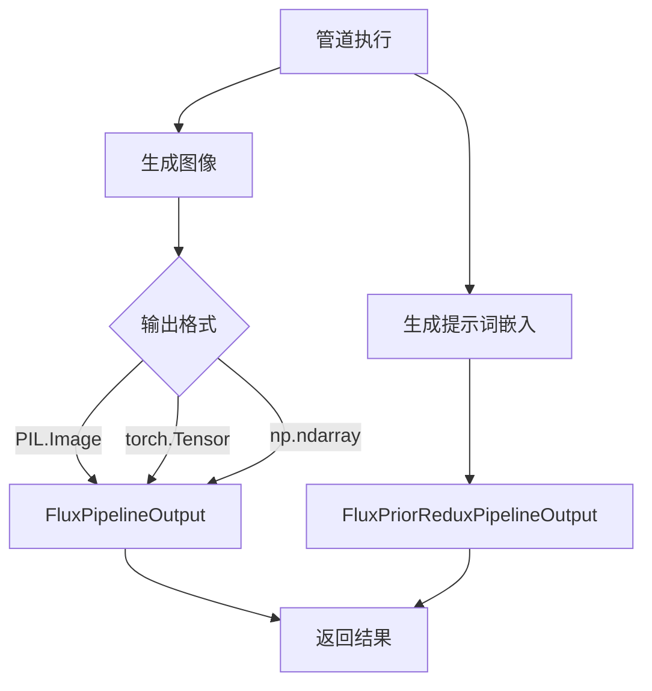
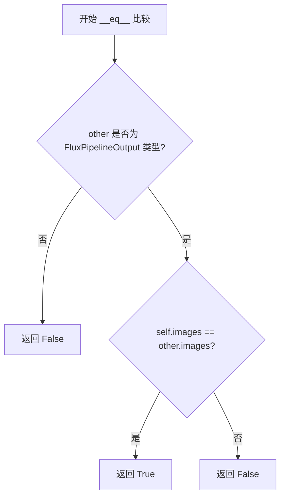
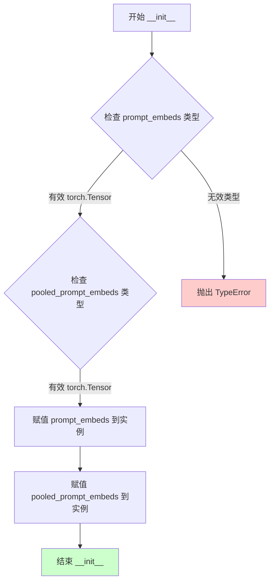
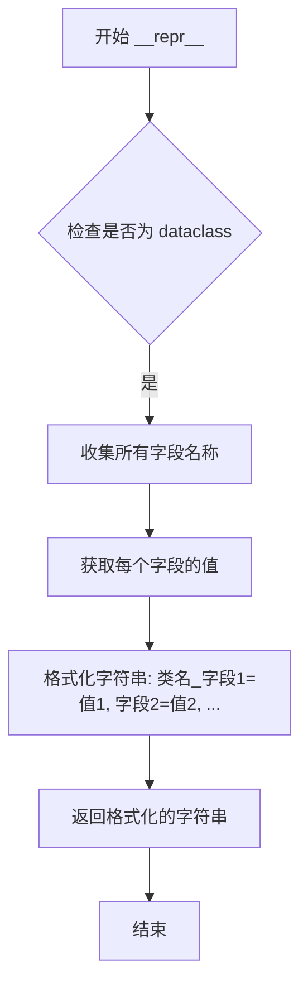
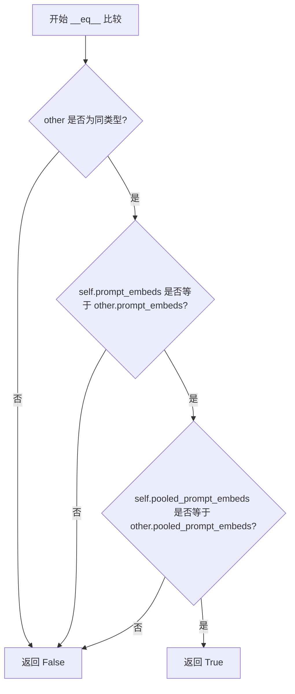

# `diffusers\src\diffusers\pipelines\flux\pipeline_output.py` 详细设计文档

该文件定义了Flux图像生成管道的输出类，用于封装去噪后的图像、提示词嵌入和池化提示词嵌入等结果数据，支持PIL图像、NumPy数组和PyTorch张量多种格式。

## 整体流程



## 类结构

```
BaseOutput (抽象基类)
└── FluxPipelineOutput (数据类)
└── FluxPriorReduxPipelineOutput (数据类)
```

## 全局变量及字段


### `FluxPipelineOutput.images`
    
去噪后的图像列表，可以是PIL图像或NumPy数组

类型：`list[PIL.Image.Image] | np.ndarray`
    


### `FluxPriorReduxPipelineOutput.prompt_embeds`
    
提示词的嵌入向量

类型：`torch.Tensor`
    


### `FluxPriorReduxPipelineOutput.pooled_prompt_embeds`
    
池化后的提示词嵌入向量

类型：`torch.Tensor`
    
    

## 全局函数及方法


### FluxPipelineOutput.__init__

这是一个数据类，用于存储 Flux 图像生成管道的输出结果，包含生成的图像列表。

参数：

- `self`：实例对象
- `images`：`list[PIL.Image.Image] | np.ndarray`，去噪后的 PIL 图像列表或 numpy 数组，长度为 batch_size，形状为 (batch_size, height, width, num_channels)。PIL 图像或 numpy 数组表示扩散管道的去噪图像。

返回值：`None`，`__init__` 方法不返回值。

#### 流程图

```mermaid
flowchart TD
    A[创建 FluxPipelineOutput 对象] --> B[接收 images 参数]
    B --> C{验证 images 类型}
    C -->|list[PIL.Image.Image]| D[存储为 PIL 图像列表]
    C -->|np.ndarray| E[存储为 numpy 数组]
    D --> F[完成初始化]
    E --> F
```

#### 带注释源码

```python
@dataclass
class FluxPipelineOutput(BaseOutput):
    """
    Output class for Flux image generation pipelines.

    Args:
        images (`list[PIL.Image.Image]` or `torch.Tensor` or `np.ndarray`)
            list of denoised PIL images of length `batch_size` or numpy array or torch tensor of shape `(batch_size,
            height, width, num_channels)`. PIL images or numpy array present the denoised images of the diffusion
            pipeline. Torch tensors can represent either the denoised images or the intermediate latents ready to be
            passed to the decoder.
    """

    images: list[PIL.Image.Image] | np.ndarray
    # 图像输出字段，可以是 PIL 图像列表或 numpy 数组
    # 注意：文档中提到了 torch.Tensor，但类型注解中未包含
```


### FluxPipelineOutput.__repr__

该方法是 `FluxPipelineOutput` 类的字符串表示方法，由 Python 的 `@dataclass` 装饰器自动生成（除非显式设置 `repr=False`），用于返回包含类名及所有非特殊字段名称和值的字符串，便于调试和日志输出。

参数：

- `self`：`FluxPipelineOutput` 实例，隐式参数，表示调用该方法的对象本身

返回值：`str`，返回该数据类实例的字符串表示，格式为 `FluxPipelineOutput(images=[...])`

#### 流程图

```mermaid
flowchart TD
    A[开始 __repr__ 调用] --> B{dataclass 自动生成}
    B --> C[收集所有字段名称]
    C --> D[收集所有字段值]
    D --> E[格式化为字符串: 类名字段1=值1, 字段2=值2...]
    E --> F[返回格式: FluxPipelineOutput(images=[...])]
    F --> G[结束]
```

#### 带注释源码

```python
# 注意：此方法由 @dataclass 装饰器自动生成，未在代码中显式定义
# 默认行为：返回一个类似 "FluxPipelineOutput(images=[...])" 的字符串

# 假设使用 dataclass 的默认 __repr__ 行为，其内部实现大致如下：
def __repr__(self):
    """
    返回数据类的字符串表示形式。
    
    格式: "FluxPipelineOutput(images=<images的值>)"
    其中 <images的值> 会根据 PIL.Image.Image 的 __repr__ 格式显示
    """
    return (
        f"{self.__class__.__name__}("
        f"images={self.images!r})"
    )

# 实际调用示例：
# >>> output = FluxPipelineOutput(images=[<PIL Image>])
# >>> print(repr(output))
# FluxPipelineOutput(images=[<PIL Image>])
```

---

### 补充说明

由于代码中未显式定义 `__repr__` 方法，以上内容基于 Python `@dataclass` 装饰器的默认行为进行说明。若需要自定义表示形式，可在类中显式定义 `__repr__` 方法。


### `FluxPipelineOutput.__eq__`

该方法是 Python `dataclass` 装饰器自动生成的相等性比较方法，用于比较两个 `FluxPipelineOutput` 对象是否相等。由于 `FluxPipelineOutput` 类使用 `@dataclass` 装饰器且未指定 `eq=False`，Python 会自动为其生成 `__eq__` 方法，该方法会比较两个对象的类型以及所有字段（`images` 字段）的值是否相等。

参数：

- `self`：`FluxPipelineOutput` 类型，当前对象实例
- `other`：`Any` 类型，用于与当前对象进行比较的另一个对象

返回值：`bool`，如果两个对象相等则返回 `True`，否则返回 `False`

#### 流程图



#### 带注释源码

```python
def __eq__(self, other: object) -> bool:
    """
    比较两个 FluxPipelineOutput 对象是否相等。
    
    由 @dataclass 装饰器自动生成。
    比较逻辑：
    1. 首先检查 other 是否为 FluxPipelineOutput 类型
    2. 如果类型相同，则比较 images 字段的值
    3. 返回比较结果
    
    Args:
        self: 当前 FluxPipelineOutput 实例
        other: 要比较的另一个对象
        
    Returns:
        bool: 如果两个对象类型相同且 images 字段相等返回 True，否则返回 False
    """
    # dataclass 自动生成的 __eq__ 方法
    # 如果 other 不是 FluxPipelineOutput 类型，直接返回 False
    if not isinstance(other, FluxPipelineOutput):
        return NotImplemented
    
    # 比较 self 和 other 的 images 字段
    # images 字段类型为 list[PIL.Image.Image] | np.ndarray
    return self.images == other.images
```

#### 说明

由于代码中使用的是 `@dataclass` 装饰器且未指定 `eq=False`，Python 解释器会自动生成 `__eq__` 方法。上述源码是根据 `dataclass` 的默认行为重构的逻辑。实际的比较会按照字段在类定义中的顺序进行，只有当两个对象的类型完全相同且所有字段值相等时，才返回 `True`。


### `FluxPriorReduxPipelineOutput.__init__`

这是 Flux Prior Redux 管道输出类的初始化方法，用于创建包含提示嵌入向量和池化提示嵌入向量的数据对象。

参数：

- `self`：实例本身，FluxPriorReduxPipelineOutput，自动传入的实例参数
- `prompt_embeds`：`torch.Tensor`，经过编码的提示词嵌入向量，用于后续图像生成
- `pooled_prompt_embeds`：`torch.Tensor`，经过池化处理的提示词嵌入向量，通常用于条件控制

返回值：`None`，该方法为构造函数，不返回任何值，仅初始化对象状态

#### 流程图



#### 带注释源码

```python
@dataclass
class FluxPriorReduxPipelineOutput(BaseOutput):
    """
    Output class for Flux Prior Redux pipelines.

    Args:
        images (`list[PIL.Image.Image]` or `np.ndarray`)
            list of denoised PIL images of length `batch_size` or numpy array of shape `(batch_size, height, width,
            num_channels)`. PIL images or numpy array present the denoised images of the diffusion pipeline.
    """

    # 提示词的嵌入向量表示，经过文本编码器处理后的张量
    prompt_embeds: torch.Tensor
    
    # 池化后的提示词嵌入向量，通常用于交叉注意力机制的条件注入
    pooled_prompt_embeds: torch.Tensor
```


### `FluxPriorReduxPipelineOutput.__repr__`

该方法是 `FluxPriorReduxPipelineOutput` 数据类的字符串表示形式，由 Python 的 `@dataclass` 装饰器自动生成，用于返回包含类名及所有字段名称和值的可读字符串。

参数：

- `self`：`FluxPriorReduxPipelineOutput`，类的实例本身，隐式参数

返回值：`str`，返回该数据类的字符串表示，包含类名和所有字段（prompt_embeds、pooled_prompt_embeds）的名称与值

#### 流程图



#### 带注释源码

```python
def __repr__(self):
    """
    自动生成的 __repr__ 方法，由 @dataclass 装饰器创建。
    返回类的字符串表示，包含类名和所有字段的名称与值。
    
    对于 FluxPriorReduxPipelineOutput，返回格式如下：
    'FluxPriorReduxPipelineOutput(prompt_embeds=tensor([...], dtype=torch.float32), 
    pooled_prompt_embeds=tensor([...], dtype=torch.float32))'
    """
    # dataclass 自动生成的 repr 逻辑
    # 返回格式: ClassName(field1=value1, field2=value2, ...)
    return (
        f"{self.__class__.__name__}("
        f"prompt_embeds={self.prompt_embeds!r}, "
        f"pooled_prompt_embeds={self.pooled_prompt_embeds!r})"
    )
```


### `FluxPriorReduxPipelineOutput.__eq__`

比较两个 `FluxPriorReduxPipelineOutput` 对象是否相等（使用 dataclass 自动生成的默认 `__eq__` 方法）

参数：

- `self`：隐含的当前对象引用
- `other`：`object`，进行比较的目标对象

返回值：`bool`，如果两个对象的 `prompt_embeds` 和 `pooled_prompt_embeds` 字段全部相等则返回 `True`，否则返回 `False`

#### 流程图



#### 带注释源码

```
def __eq__(self, other: object) -> bool:
    """
    比较两个 FluxPriorReduxPipelineOutput 对象是否相等。
    
    此方法由 Python dataclass 自动生成，会比较所有字段的值。
    当 other 不是相同类型时直接返回 False。
    当所有字段（prompt_embeds, pooled_prompt_embeds）都相等时返回 True。
    
    Args:
        other: 要进行比较的目标对象
        
    Returns:
        bool: 对象相等返回 True，否则返回 False
    """
    if not isinstance(other, FluxPriorReduxPipelineOutput):
        return NotImplemented
    return (self.prompt_embeds == other.prompt_embeds and 
            self.pooled_prompt_embeds == other.pooled_prompt_embeds)
```

## 关键组件


### 一段话描述

该代码定义了Flux图像生成管道的两个输出数据类，分别用于FluxPipeline和FluxPriorReduxPipeline，封装了生成的图像、文本嵌入向量和池化后的文本嵌入向量，支持PIL图像、NumPy数组和PyTorch张量三种输出格式。

### 文件的整体运行流程

该文件为数据类定义模块，不包含执行逻辑，仅作为类型容器使用。在实际管道执行流程中：
1. 扩散模型生成中间潜在表示（latents）
2. 解码器将latents转换为最终图像
3. 管道将结果封装到FluxPipelineOutput或FluxPriorReduxPipelineOutput对象中返回

### 类的详细信息

#### FluxPipelineOutput类

**类字段：**
- `images`: `list[PIL.Image.Image] | np.ndarray` - 去噪后的图像列表，支持PIL图像或NumPy数组格式

**类方法：**
无自定义方法，继承自dataclass自动生成

#### FluxPriorReduxPipelineOutput类

**类字段：**
- `prompt_embeds`: `torch.Tensor` - 文本提示的嵌入向量
- `pooled_prompt_embeds`: `torch.Tensor` - 池化后的文本提示嵌入向量

**类方法：**
无自定义方法，继承自dataclass自动生成

### 关键组件信息

### FluxPipelineOutput - 图像输出容器

支持多种图像格式输出（PIL/NumPy数组），为Flux主pipeline的输出类

### FluxPriorReduxPipelineOutput - 文本嵌入输出容器

封装prompt_embeds和pooled_prompt_embeds，用于Flux Prior Redux pipeline的输出

### BaseOutput - 基类

作为所有pipeline output的基类，提供统一的接口规范

### 潜在的技术债务或优化空间

1. **文档与实现不一致**：FluxPriorReduxPipelineOutput类的注释说明包含`images`字段，但实际实现只有`prompt_embeds`和`pooled_prompt_embeds`，存在文档错误
2. **类型支持不完整**：FluxPipelineOutput支持`torch.Tensor`类型，但FluxPriorReduxPipelineOutput未支持
3. **缺乏运行时验证**：dataclass未配置field_validator或__post_init__验证输入类型合法性

### 其它项目

**设计目标与约束：**
- 统一Diffusion pipeline输出格式
- 支持多种后端格式（PIL/NumPy/Tensor）
- 与Hugging Face Diffusers库架构兼容

**错误处理与异常设计：**
- 当前无显式错误处理，依赖调用方确保数据类型正确
- 建议添加类型检查防止运行时错误

**数据流与状态机：**
- FluxPipelineOutput：latents → decoder → images
- FluxPriorReduxPipelineOutput：text → encoder → prompt_embeds/pooled_prompt_embeds

**外部依赖与接口契约：**
- 依赖`...utils.BaseOutput`基类
- 依赖`PIL.Image`, `numpy`, `torch`进行类型标注


## 问题及建议


### 已知问题

-   **文档与代码不一致**：`FluxPriorReduxPipelineOutput` 类的文档字符串描述的是 `images` 字段，但实际定义的字段是 `prompt_embeds` 和 `pooled_prompt_embeds`，存在明显的文档错误。
-   **类型提示不完整**：`FluxPipelineOutput` 的文档注释中提到 `torch.Tensor`，但类型注解只包含 `list[PIL.Image.Image] | np.ndarray`，类型覆盖不全面。
-   **字段缺少文档**：`FluxPriorReduxPipelineOutput` 的 `prompt_embeds` 和 `pooled_prompt_embeds` 字段没有提供 Args 说明，字段用途不明确。
-   **设计一致性不足**：两个输出类的字段设计不一致，`FluxPipelineOutput` 包含 `images`，而 `FluxPriorReduxPipelineOutput` 返回嵌入向量而非图像，可能导致调用方处理逻辑复杂化。
-   **缺少验证逻辑**：作为输出数据类，没有对字段值的合法性进行校验（如 batch_size 一致性、维度约束等）。

### 优化建议

-   修正 `FluxPriorReduxPipelineOutput` 的文档字符串，使其与实际字段匹配，或确认是否应该包含 `images` 字段。
-   统一并完善类型注解，确保文档注释中的类型与类型提示完全一致，可考虑添加 `torch.Tensor` 作为 `FluxPipelineOutput.images` 的联合类型。
-   为 `FluxPriorReduxPipelineOutput` 的字段添加文档注释，说明 `prompt_embeds` 和 `pooled_prompt_embeds` 的维度、用途及生成方式。
-   考虑添加 `__post_init__` 方法进行字段验证，确保数据类型和维度符合预期。
-   可考虑添加 `to_tuple()` 或类似方法以保持与 BaseOutput 其他子类的一致性。


## 其它


### 设计目标与约束

FluxPipelineOutput 和 FluxPriorReduxPipelineOutput 是 Flux 图像生成管道的输出数据结构，用于封装图像生成结果。设计目标包括：1）提供统一的输出格式，支持 PIL.Image、numpy 数组和 torch.Tensor 三种图像表示形式；2）遵循 BaseOutput 基类规范，确保与其他扩散管道输出的一致性；3）利用 Python dataclass 提供简洁的数据模型定义。约束条件包括：依赖 PIL、numpy、torch 库；images 字段必须为列表或数组形式；FluxPriorReduxPipelineOutput 必须同时返回 prompt_embeds 和 pooled_prompt_embeds 用于后续处理。

### 错误处理与异常设计

由于输出类仅作为数据容器，不涉及复杂的业务逻辑，因此错误处理主要体现在数据验证层面：1）images 字段类型检查应在管道内部完成，确保传入类型符合预期（PIL.Image list 或 np.ndarray）；2）若传入无效类型，应在调用处抛出 TypeError；3）空批次情况需由调用方处理，输出类本身不限制空列表；4）BaseOutput 基类可能定义了序列化方法，子类应遵循其异常抛出规范。

### 数据流与状态机

数据流路径：管道推理完成后 → 生成原始图像数据 → 转换为目标格式（PIL/numpy/torch）→ 封装为 FluxPipelineOutput 对象 → 返回给调用方。FluxPriorReduxPipelineOutput 的数据流略有不同：管道输出 prompt_embeds 和 pooled_prompt_embeds → 直接封装为输出对象 → 作为 Flux 主管道的输入特征。无复杂状态机设计，输出对象为不可变数据容器。

### 外部依赖与接口契约

外部依赖包括：PIL.Image（PIL 库）用于图像处理；numpy 用于数值数组；torch 用于张量操作；BaseOutput（...utils 模块）作为基类。接口契约：FluxPipelineOutput 需提供 images 属性，类型为 list[PIL.Image.Image] | np.ndarray；FluxPriorReduxPipelineOutput 需提供 prompt_embeds（torch.Tensor）和 pooled_prompt_embeds（torch.Tensor）属性。调用方应确保输入数据类型符合规范。

### 版本兼容性考虑

代码使用了 Python 3.10+ 的联合类型注解语法（list[PIL.Image.Image] | np.ndarray），需确保运行时 Python 版本≥3.10。torch.Tensor 类型注解需与项目使用的 torch 版本兼容。PIL.Image.Image 为 PIL 库标准类型，各版本兼容。BaseOutput 基类定义在 ...utils 模块中，需确保该模块存在且版本兼容。

### 性能指标与基准

作为纯数据结构类，不涉及计算逻辑，性能开销可忽略。主要关注点在于：1）大型批次图像传递时的内存拷贝开销；2）与 BaseOutput 序列化方法的兼容性；3）numpy array 与 torch tensor 相互转换的性能损耗。建议在管道层面优化图像格式转换逻辑，避免在输出类中进行格式处理。

### 安全性与隐私保护

输出类本身不涉及敏感数据处理。安全考虑点：1）images 属性可能包含用户生成的图像内容，需确保管道调用链路中的数据安全；2）prompt_embeds 可能间接包含提示词信息，若提示词涉及敏感内容，需在管道层面进行过滤；3）BaseOutput 基类若实现了 __getstate__ 或序列化方法，需确保不泄露敏感属性。

    