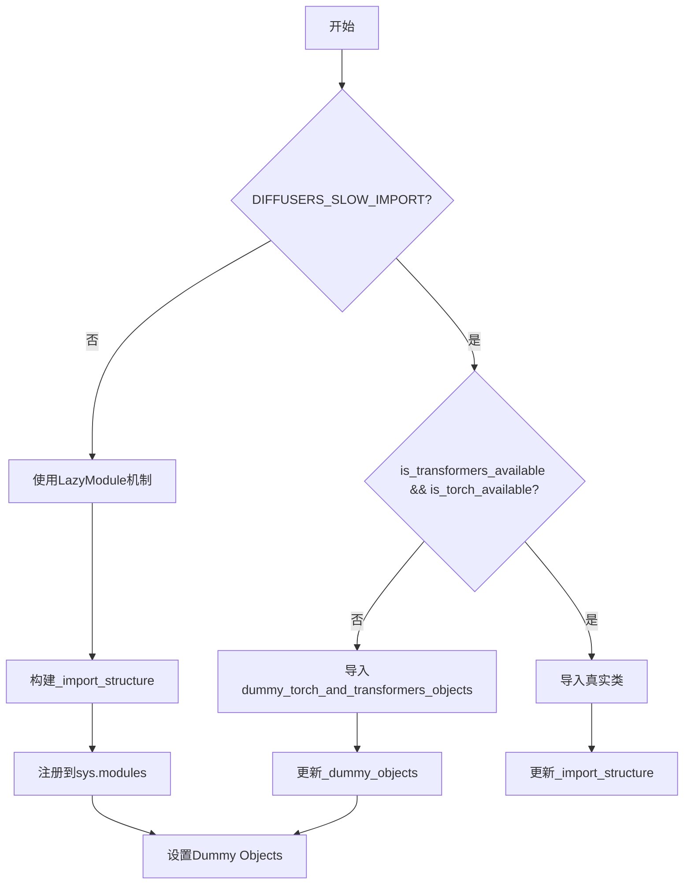
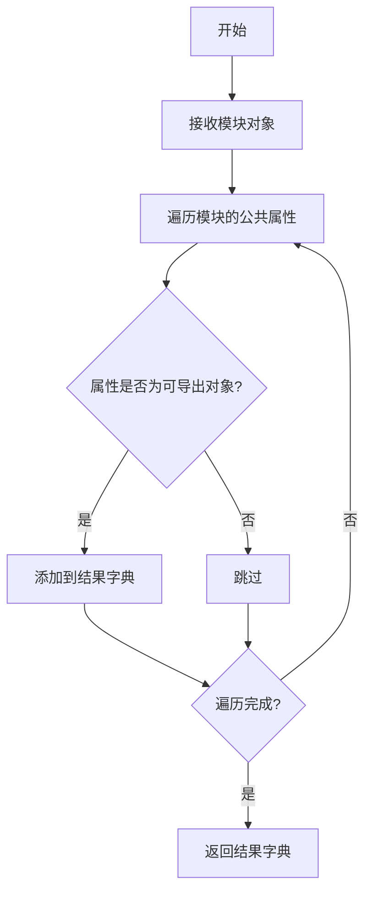
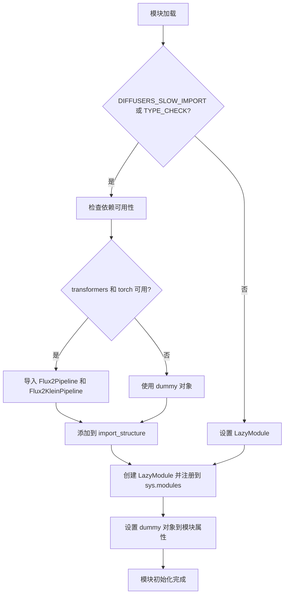
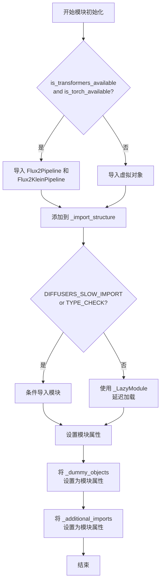
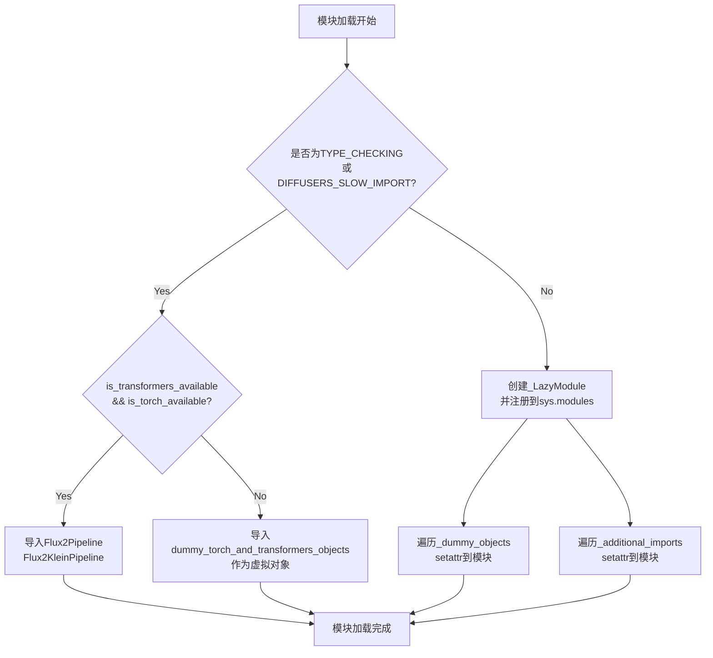

# `diffusers\src\diffusers\pipelines\flux2\__init__.py` 详细设计文档

这是diffusers库中Flux管道的模块初始化文件，使用LazyModule机制实现延迟加载，根据torch和transformers可选依赖的可用性动态导入Flux2Pipeline、Flux2KleinPipeline和Flux2PipelineOutput类，确保在缺少可选依赖时模块仍能正常导入。

## 整体流程



## 类结构

```
Module Initialization (无类层次结构)
└── Lazy Loading Mechanism
    ├── Dummy Objects (当依赖不可用时)
    │   └── _dummy_objects
    ├── Import Structure
    │   ├── pipeline_output: [Flux2PipelineOutput]
    │   ├── pipeline_flux2: [Flux2Pipeline]
    │   └── pipeline_flux2_klein: [Flux2KleinPipeline]
    └── LazyModule Wrapper
```

## 全局变量及字段


### `_dummy_objects`
    
存储虚拟对象的字典，当可选依赖不可用时使用

类型：`dict`
    


### `_additional_imports`
    
存储额外导入的字典，用于延迟加载时添加额外对象

类型：`dict`
    


### `_import_structure`
    
定义模块导入结构的字典，映射模块路径到其导出的对象列表

类型：`dict`
    


### `DIFFUSERS_SLOW_IMPORT`
    
标志位，控制是否使用慢速导入模式（完整导入而非延迟导入）

类型：`bool`
    


### `OptionalDependencyNotAvailable`
    
自定义异常类，用于表示可选依赖项不可用的情况

类型：`Exception class`
    


### `_LazyModule`
    
延迟加载模块的类实现，支持按需导入模块内容

类型：`class`
    


### `get_objects_from_module`
    
从指定模块中提取所有可导出对象的函数

类型：`function`
    


### `is_torch_available`
    
检查PyTorch库是否可用的函数，返回布尔值

类型：`function`
    


### `is_transformers_available`
    
检查Transformers库是否可用的函数，返回布尔值

类型：`function`
    


    

## 全局函数及方法


### `get_objects_from_module`

该函数是一个工具函数，用于从指定模块中动态提取所有公共对象（如类、函数），并以字典形式返回，以便后续进行虚拟对象替换或延迟导入。

参数：
-  `module`：模块对象（module），要从中获取对象的模块，通常为虚拟对象模块（如 `dummy_torch_and_transformers_objects`）。

返回值：字典（dict），键为对象名称（str），值为对象本身（任意类型），包含模块中所有公共对象的映射。

#### 流程图



#### 带注释源码

由于提供的代码中未包含 `get_objects_from_module` 的具体实现，该函数是从 `diffusers` 库的 `utils` 模块导入的。以下为基于其使用方式推断的典型实现：

```python
def get_objects_from_module(module):
    """
    从给定模块中获取所有公共对象并返回字典。
    
    参数：
        module: 模块对象，要获取其公共对象。
    
    返回：
        dict: 包含模块中所有公共对象的字典，键为对象名称，值为对象本身。
    """
    objects = {}
    for name in dir(module):
        if not name.startswith('_'):
            obj = getattr(module, name)
            # 可以根据需要过滤对象类型，例如只保留类或函数
            objects[name] = obj
    return objects
```

#### 实际使用示例

在提供的代码中，该函数用于从虚拟对象模块中获取对象，以支持可选依赖的延迟导入：

```python
from ...utils import get_objects_from_module
# 从 dummy_torch_and_transformers_objects 模块获取虚拟对象
_dummy_objects.update(get_objects_from_module(dummy_torch_and_transformers_objects))
```


### setattr

该函数是Python内置的全局函数，用于动态设置对象的属性值。在此代码中，用于将延迟加载的虚拟对象（来自 `_dummy_objects` 和 `_additional_imports`）注入到当前模块的命名空间中，使得在可选依赖不可用时仍能保持API的一致性。

参数：

- `obj`：`module`，目标对象，即 `sys.modules[__name__]` 获取到的当前模块对象
- `name`：`str`，要设置的属性名称，来自字典的键（`name` 或 `_additional_imports` 中的键）
- `value`：任意类型，要设置的属性值，来自字典的值（虚拟对象或导入对象）

返回值：`None`，无返回值（Python内置 setattr 函数的返回值为 None）

#### 流程图

```mermaid
flowchart TD
    A[开始] --> B{遍历 _dummy_objects}
    B -->|遍历每个 name, value| C[setattr sys.modules[__name__], name, value]
    C --> D{遍历 _additional_imports}
    D -->|遍历每个 name, value| E[setattr sys.modules[__name__], name, value]
    E --> F[结束]
    
    style C fill:#f9f,stroke:#333
    style E fill:#f9f,stroke:#333
```

#### 带注释源码

```python
# 遍历 _dummy_objects 字典中的所有虚拟对象
for name, value in _dummy_objects.items():
    # 使用 setattr 将虚拟对象设置为模块的属性
    # 参数说明：
    #   obj: sys.modules[__name__] - 当前模块对象
    #   name: str - 虚拟对象的名称（如类名）
    #   value: object - 虚拟对象本身（通常是抛出 ImportError 的延迟对象）
    setattr(sys.modules[__name__], name, value)

# 遍历 _additional_imports 字典中的额外导入对象
for name, value in _additional_imports.items():
    # 同样使用 setattr 将额外导入的对象设置为模块的属性
    # 这使得这些对象可以直接通过模块访问，如 from xxx import SomeClass
    setattr(sys.modules[__name__], name, value)
```

#### 设计目标与约束

- **延迟加载设计**：通过 `_LazyModule` 实现模块的延迟加载，提升导入速度
- **可选依赖处理**：当 PyTorch 或 Transformers 不可用时，使用虚拟对象填充命名空间，避免导入错误
- **API 一致性**：无论依赖是否可用，模块导出的接口保持一致

#### 潜在的技术债务或优化空间

1. **魔法字符串**：使用了 `__name__` 魔法变量，建议添加明确的模块路径常量
2. **重复代码**：两个 `for` 循环结构相同，可考虑合并
3. **硬编码的导入结构**：`_import_structure` 字典硬编码，缺乏灵活性


### `sys.modules[__name__]`

该代码段是模块初始化逻辑的一部分，在非 TYPE_CHECKING 且非 DIFFUSERS_SLOW_IMPORT 模式下运行时，将当前模块动态替换为 `_LazyModule` 实现延迟加载（Lazy Loading），同时将虚拟对象（dummy objects）和额外的导入项绑定到模块属性上。

参数：

- 无

返回值：`None`，该语句为赋值表达式，不返回值

#### 流程图

```mermaid
flowchart TD
    A[模块初始化开始] --> B{是否 TYPE_CHECKING<br/>或 DIFFUSERS_SLOW_IMPORT?}
    B -->|是| C[不执行 sys.modules 赋值]
    B -->|否| D[执行 sys.modules[__name__] 赋值]
    D --> E[创建 _LazyModule 实例]
    E --> F[替换当前模块]
    F --> G[遍历 _dummy_objects]
    G --> H{还有更多 dummy objects?}
    H -->|是| I[setattr 到模块]
    I --> H
    H -->|否| J[遍历 _additional_imports]
    J --> K{还有更多 imports?}
    K -->|是| L[setattr 到模块]
    K -->|否| M[初始化完成]
    C --> M
```

#### 带注释源码

```python
# 如果不是类型检查模式且不是慢速导入模式
else:
    import sys

    # 将当前模块名（__name__）映射到 _LazyModule 实例
    # 实现延迟加载：实际导入时才加载模块内容
    sys.modules[__name__] = _LazyModule(
        __name__,                          # 模块名称
        globals()["__file__"],              # 模块文件路径
        _import_structure,                 # 导入结构字典
        module_spec=__spec__,              # 模块规格
    )

    # 遍历所有虚拟对象（当可选依赖不可用时的替代对象）
    for name, value in _dummy_objects.items():
        # 将虚拟对象设置为模块属性，使其可被访问
        setattr(sys.modules[__name__], name, value)
    
    # 遍历额外的导入项
    for name, value in _additional_imports.items():
        # 将额外的导入项设置为模块属性
        setattr(sys.modules[__name__], name, value)
```


### `diffusers.pipelines Flux2 模块初始化`

本模块是 Flux2 扩散流水线的入口模块，采用懒加载模式动态导入流水线类，处理 torch 和 transformers 可选依赖，当依赖不可用时自动回退到虚拟对象，确保模块在任何环境下都能安全导入。

参数：无（模块级初始化，无函数参数）

返回值：无（模块级代码执行，无返回值）

#### 流程图



#### 带注释源码

```python
from typing import TYPE_CHECKING  # 类型检查时导入，避免循环依赖

# 从 utils 导入懒加载和依赖检查工具
from ...utils import (
    DIFFUSERS_SLOW_IMPORT,          # 标志：是否启用慢速导入（完整导入）
    OptionalDependencyNotAvailable, # 可选依赖不可用异常
    _LazyModule,                    # 懒加载模块类
    get_objects_from_module,        # 从模块获取对象的工具函数
    is_torch_available,             # 检查 torch 是否可用
    is_transformers_available,      # 检查 transformers 是否可用
)

# 初始化空字典用于存储虚拟对象和额外导入
_dummy_objects = {}
_additional_imports = {}
# 定义基础导入结构，包含输出类
_import_structure = {"pipeline_output": ["Flux2PipelineOutput"]}

# 运行时依赖检查（非 TYPE_CHECK 模式）
try:
    # 检查 transformers 和 torch 是否都可用
    if not (is_transformers_available() and is_torch_available()):
        raise OptionalDependencyNotAvailable()  # 抛出异常进入 except
except OptionalDependencyNotAvailable:
    # 依赖不可用时，导入虚拟对象模块
    from ...utils import dummy_torch_and_transformers_objects  # noqa F403
    # 更新虚拟对象字典
    _dummy_objects.update(get_objects_from_module(dummy_torch_and_transformers_objects))
else:
    # 依赖可用时，添加流水线类到导入结构
    _import_structure["pipeline_flux2"] = ["Flux2Pipeline"]
    _import_structure["pipeline_flux2_klein"] = ["Flux2KleinPipeline"]

# TYPE_CHECK 或 DIFFUSERS_SLOW_IMPORT 模式下的导入
if TYPE_CHECKING or DIFFUSERS_SLOW_IMPORT:
    try:
        if not (is_transformers_available() and is_torch_available()):
            raise OptionalDependencyNotAvailable()
    except OptionalDependencyNotAvailable:
        # 类型检查时使用虚拟对象
        from ...utils.dummy_torch_and_transformers_objects import *  # noqa F403
    else:
        # 类型检查时真实导入
        from .pipeline_flux2 import Flux2Pipeline
        from .pipeline_flux2_klein import Flux2KleinPipeline
else:
    # 懒加载模式：创建 LazyModule 并替换当前模块
    import sys
    # 将当前模块替换为懒加载模块
    sys.modules[__name__] = _LazyModule(
        __name__,                       # 模块名称
        globals()["__file__"],          # 模块文件路径
        _import_structure,              # 导入结构字典
        module_spec=__spec__,           # 模块规格
    )
    
    # 将虚拟对象设置为模块属性，使其可以访问
    for name, value in _dummy_objects.items():
        setattr(sys.modules[__name__], name, value)
    # 将额外导入设置为模块属性
    for name, value in _additional_imports.items():
        setattr(sys.modules[__name__], name, value)
```


### `__init__` (模块初始化)

该代码是一个 Python 包的 `__init__.py` 文件，负责延迟加载和条件导入 `Flux2Pipeline` 和 `Flux2KleinPipeline` 类。它通过检查可选依赖项（torch 和 transformers）的可用性，动态决定导入真实的管道类还是虚拟对象，并使用 `_LazyModule` 实现懒加载机制。

参数： 无

返回值： 无（模块级别代码，执行模块初始化）

#### 流程图



#### 带注释源码

```
from typing import TYPE_CHECKING  # 类型检查时导入,避免循环依赖

# 从工具模块导入必要的函数和类
from ...utils import (
    DIFFUSERS_SLOW_IMPORT,         # 慢导入标志
    OptionalDependencyNotAvailable, # 可选依赖不可用异常
    _LazyModule,                    # 延迟加载模块类
    get_objects_from_module,        # 从模块获取对象
    is_torch_available,             # 检查torch是否可用
    is_transformers_available,      # 检查transformers是否可用
)

# 初始化空的虚拟对象字典和附加导入字典
_dummy_objects = {}
_additional_imports = {}

# 定义导入结构,包含管道输出类
_import_structure = {"pipeline_output": ["Flux2PipelineOutput"]}

# 第一次条件检查:运行时检查依赖可用性
try:
    if not (is_transformers_available() and is_torch_available()):
        raise OptionalDependencyNotAvailable()
except OptionalDependencyNotAvailable:
    # 如果依赖不可用,从虚拟对象模块导入
    from ...utils import dummy_torch_and_transformers_objects  # noqa F403
    
    # 更新虚拟对象字典
    _dummy_objects.update(get_objects_from_module(dummy_torch_and_transformers_objects))
else:
    # 如果依赖可用,添加管道类到导入结构
    _import_structure["pipeline_flux2"] = ["Flux2Pipeline"]
    _import_structure["pipeline_flux2_klein"] = ["Flux2KleinPipeline"]

# 第二次条件检查:类型检查或慢导入模式
if TYPE_CHECKING or DIFFUSERS_SLOW_IMPORT:
    try:
        # 再次检查依赖可用性
        if not (is_transformers_available() and is_torch_available()):
            raise OptionalDependencyNotAvailable()
    except OptionalDependencyNotAvailable:
        # 类型检查时,导入虚拟对象
        from ...utils.dummy_torch_and_transformers_objects import *  # noqa F403
    else:
        # 类型检查时,导入真实管道类
        from .pipeline_flux2 import Flux2Pipeline
        from .pipeline_flux2_klein import Flux2KleinPipeline
else:
    # 非类型检查模式:使用延迟加载模块
    import sys
    
    # 将当前模块替换为延迟加载模块
    sys.modules[__name__] = _LazyModule(
        __name__,                      # 模块名称
        globals()["__file__"],         # 模块文件路径
        _import_structure,             # 导入结构字典
        module_spec=__spec__,          # 模块规格
    )
    
    # 将虚拟对象设置为模块属性
    for name, value in _dummy_objects.items():
        setattr(sys.modules[__name__], name, value)
    
    # 将附加导入设置为模块属性
    for name, value in _additional_imports.items():
        setattr(sys.modules[__name__], name, value)
```


### `__init__` 模块（Lazy Loading机制）

该模块实现了Diffusers库的延迟加载（Lazy Loading）机制，通过`_LazyModule`动态导入`Flux2Pipeline`和`Flux2KleinPipeline`，并在torch和transformers可选依赖不可用时自动回退到虚拟对象（dummy objects）。

参数：
- 无（模块级代码，无函数参数）

返回值：
- 无（模块初始化，不返回值）

#### 流程图



#### 带注释源码

```python
# 导入类型检查所需的类型提示
from typing import TYPE_CHECKING

# 从工具模块导入必要的辅助函数和检查函数
from ...utils import (
    DIFFUSERS_SLOW_IMPORT,          # 慢速导入标志
    OptionalDependencyNotAvailable, # 可选依赖不可用异常
    _LazyModule,                    # 延迟加载模块类
    get_objects_from_module,        # 从模块获取对象的函数
    is_torch_available,             # 检查torch是否可用
    is_transformers_available,      # 检查transformers是否可用
)

# 初始化空字典用于存储虚拟对象和额外导入
_dummy_objects = {}
_additional_imports = {}
# 定义导入结构，基础导出为pipeline_output
_import_structure = {"pipeline_output": ["Flux2PipelineOutput"]}

# 尝试导入pipeline模块
try:
    # 检查torch和transformers是否都可用
    if not (is_transformers_available() and is_torch_available()):
        raise OptionalDependencyNotAvailable()  # 抛出异常进入except
except OptionalDependencyNotAvailable:
    # 如果依赖不可用，从dummy模块获取虚拟对象
    from ...utils import dummy_torch_and_transformers_objects  # noqa F403
    # 将虚拟对象更新到_dummy_objects字典
    _dummy_objects.update(get_objects_from_module(dummy_torch_and_transformers_objects))
else:
    # 如果依赖可用，添加pipeline导出到_import_structure
    _import_structure["pipeline_flux2"] = ["Flux2Pipeline"]
    _import_structure["pipeline_flux2_klein"] = ["Flux2KleinPipeline"]

# 类型检查或慢速导入时的处理分支
if TYPE_CHECKING or DIFFUSERS_SLOW_IMPORT:
    try:
        # 再次检查依赖可用性
        if not (is_transformers_available() and is_torch_available()):
            raise OptionalDependencyNotAvailable()
    except OptionalDependencyNotAvailable:
        # 导入dummy对象用于类型检查
        from ...utils.dummy_torch_and_transformers_objects import *  # noqa F403
    else:
        # 实际导入真实pipeline类
        from .pipeline_flux2 import Flux2Pipeline
        from .pipeline_flux2_klein import Flux2KleinPipeline
else:
    # 非类型检查模式下，创建延迟加载模块
    import sys
    # 将当前模块替换为_LazyModule实例，实现延迟加载
    sys.modules[__name__] = _LazyModule(
        __name__,                      # 模块名称
        globals()["__file__"],         # 模块文件路径
        _import_structure,             # 导入结构定义
        module_spec=__spec__,          # 模块规格（保留原始spec属性）
    )

    # 将虚拟对象注入到模块命名空间
    for name, value in _dummy_objects.items():
        setattr(sys.modules[__name__], name, value)
    # 将额外导入注入到模块命名空间
    for name, value in _additional_imports.items():
        setattr(sys.modules[__name__], name, value)
```


## 关键组件


## 代码概述

这是一个Diffusers库的模块初始化文件，通过懒加载机制处理可选依赖（PyTorch和Transformers），根据环境可用性动态导入Flux2Pipeline和Flux2KleinPipeline，或在依赖不可用时提供虚拟对象以保证模块导入不报错。

## 文件运行流程

1. **模块加载阶段**：定义导入结构字典`_import_structure`，包含pipeline_output中的Flux2PipelineOutput
2. **依赖检查阶段**：检查PyTorch和Transformers是否同时可用
3. **条件导入阶段**：
   - 若依赖可用：将Flux2Pipeline和Flux2KleinPipeline加入导入结构
   - 若依赖不可用：从dummy模块获取虚拟对象并更新到_dummy_objects
4. **类型检查阶段**：若处于TYPE_CHECKING或DIFFUSERS_SLOW_IMPORT模式，直接导入真实类
5. **懒加载注册阶段**：否则创建_LazyModule实例替换当前模块，注册虚拟对象和额外导入

## 全局变量详情

### _dummy_objects
- **类型**: dict
- **描述**: 存储可选依赖不可用时的虚拟对象，用于保证模块API一致性

### _additional_imports
- **类型**: dict
- **描述**: 存储额外的导入项，可在运行时动态添加

### _import_structure
- **类型**: dict
- **描述**: 定义模块的导入结构，键为子模块路径，值为待导出的类/函数名列表

## 全局函数详情

### get_objects_from_module
- **参数**: module (module类型) - 源模块对象
- **返回值**: dict - 模块中所有对象的字典映射
- **描述**: 从指定模块获取所有对象，用于虚拟对象的迁移

### _LazyModule
- **参数**: 
  - name: str - 模块名称
  - globals: dict - 全局命名空间字典
  - import_structure: dict - 导入结构定义
  - module_spec: ModuleSpec - 模块规格信息
- **返回值**: LazyModule实例
- **描述**: 创建懒加载模块代理，延迟导入实际模块直到真正访问时

### is_torch_available
- **参数**: 无
- **返回值**: bool
- **描述**: 检查PyTorch库是否可用

### is_transformers_available
- **参数**: 无
- **返回值**: bool
- **描述**: 检查Transformers库是否可用

## 关键组件信息

### 可选依赖检查机制

通过try-except捕获OptionalDependencyNotAvailable异常，实现优雅的依赖降级处理

### 懒加载模块代理

使用LazyModule实现真正的延迟导入，优化大型库的初始化性能

### 虚拟对象替换

在依赖不可用时注入dummy对象，防止下游代码因ImportError崩溃

## 潜在技术债务

1. **魔法字符串依赖**：模块路径使用字符串硬编码，缺乏集中管理
2. **重复代码**：依赖检查逻辑在两处（普通导入和TYPE_CHECKING分支）重复出现
3. **静默失败风险**：虚拟对象机制可能导致运行时错误延迟到实际使用时
4. **类型检查覆盖不全**：TYPE_CHECKING分支的异常处理逻辑与主逻辑不完全一致

## 其它项目

### 设计目标
- 实现可选依赖的平滑处理
- 保证模块API在有无依赖时的一致性
- 优化大型项目的首次导入速度

### 约束条件
- 必须同时满足PyTorch和Transformers可用才导入真实Pipeline
- 虚拟对象的接口必须与真实类完全一致

### 错误处理
- 依赖不可用时静默加载虚拟对象，不抛出异常
- 通过get_objects_from_module确保虚拟对象的完整迁移

### 数据流
- 模块初始化 → 检查依赖 → 构建导入结构 → 注册懒加载模块 → 完成


## 问题及建议


### 已知问题

-   **重复的条件检查**：代码在第13-15行和第21-24行两次检查 `is_transformers_available() and is_torch_available()`，违反了DRY原则，增加了维护成本
-   **未使用的全局变量**：`_additional_imports` 字典被初始化为空字典但在代码中从未被填充或使用，是无用的代码
-   **通配符导入**：`from ...utils.dummy_torch_and_transformers_objects import *` 使用了通配符导入，降低了代码的可读性和静态分析能力，无法明确知道导入了哪些对象
-   **裸except子句**：虽然这里使用的是自定义异常 `OptionalDependencyNotAvailable`，但异常处理逻辑分散在多处，增加了复杂性
-   **冗余的导入结构**：`pipeline_output` 在 `_import_structure` 中定义，但在 `else` 分支中并未被添加到导入结构中，导致定义与实际使用不一致

### 优化建议

-   **提取条件检查逻辑**：将 `is_transformers_available() and is_torch_available()` 的检查封装为独立的函数或常量，避免重复代码
-   **移除未使用代码**：删除 `_additional_imports = {}` 及其相关的循环逻辑，或者添加注释说明其设计意图（如预留用于未来扩展）
-   **替换通配符导入**：使用显式的导入语句，明确列出需要导入的类或函数，提高代码可维护性
-   **统一异常处理**：将 try-except 块抽象为辅助函数或使用装饰器模式来处理可选依赖的导入逻辑
-   **清理导入结构**：确保 `_import_structure` 字典中定义的所有模块在实际代码中都被正确处理，或者移除未使用的键


## 其它


### 设计目标与约束

实现Flux2Pipeline模块的懒加载，支持可选依赖（torch和transformers）的动态导入，确保在依赖不可用时使用虚拟对象，保证模块的可移植性和解耦。

### 错误处理与异常设计

使用OptionalDependencyNotAvailable异常处理可选依赖缺失的情况。当torch或transformers不可用时，捕获异常并导入虚拟对象模块，避免导入错误。

### 数据流与状态机

模块导入流程：首先检查TYPE_CHECKING或DIFFUSERS_SLOW_IMPORT标志，若为真则在类型检查时导入真实模块；否则设置LazyModule代理。运行时分两种情况：依赖可用时导入真实类，不可用时使用虚拟对象。

### 外部依赖与接口契约

依赖torch和transformers库，提供Flux2Pipeline和Flux2KleinPipeline类。接口约定通过_import_structure字典定义，支持通过from ... import Flux2Pipeline方式导入。

### 性能考虑

采用懒加载机制，仅在需要时加载模块，减少初始化时间和内存占用。虚拟对象避免导入不存在的类时崩溃。

### 可维护性与扩展性

_import_structure统一管理导入结构，便于扩展新pipeline。虚拟对象机制允许在依赖缺失时提供最小化接口，便于调试和维护。

### 测试策略

测试依赖可用性判断逻辑，确保在缺失torch或transformers时正确加载虚拟对象。验证LazyModule正确代理模块属性。

### 版本兼容性

代码兼容Python 3.7+和Diffusers库当前版本。使用TYPE_CHECKING确保类型检查时不执行运行时逻辑。

### 配置管理

通过DIFFUSERS_SLOW_IMPORT标志控制是否使用懒加载模式。_import_structure和_dummy_objects字典管理模块映射。

### 安全与权限

模块仅依赖开源库，无安全敏感操作。虚拟对象为空实现，不会执行危险代码。

    