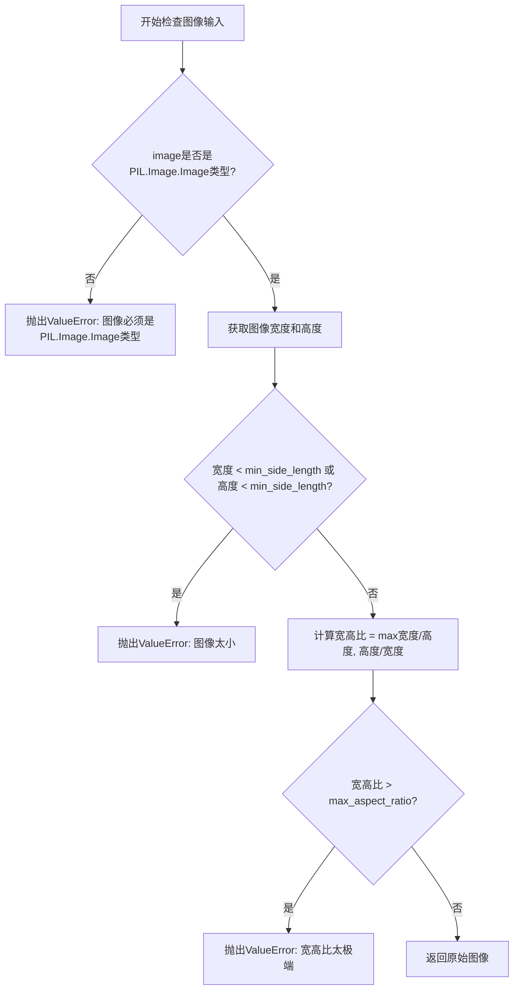
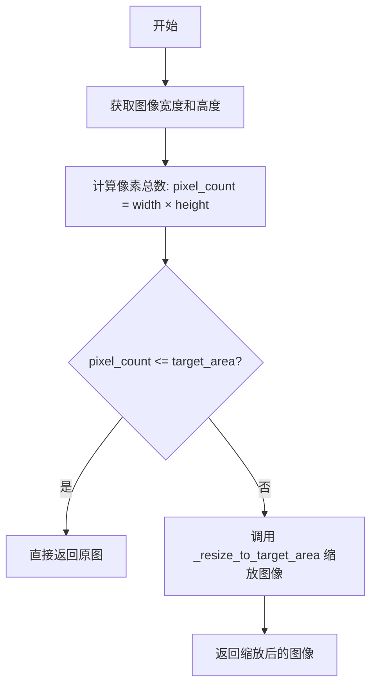
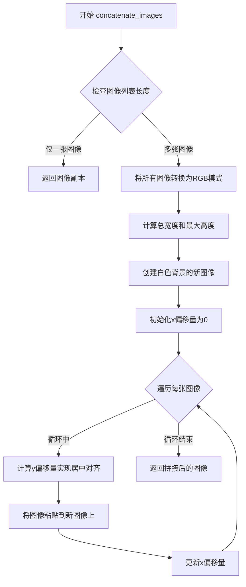
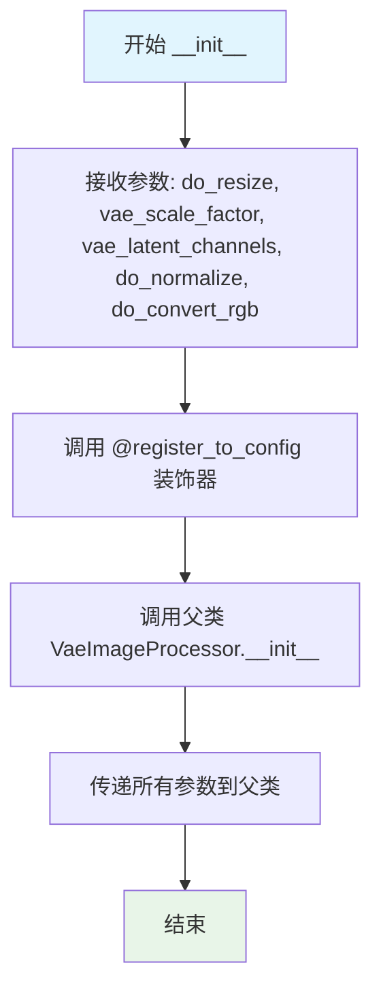
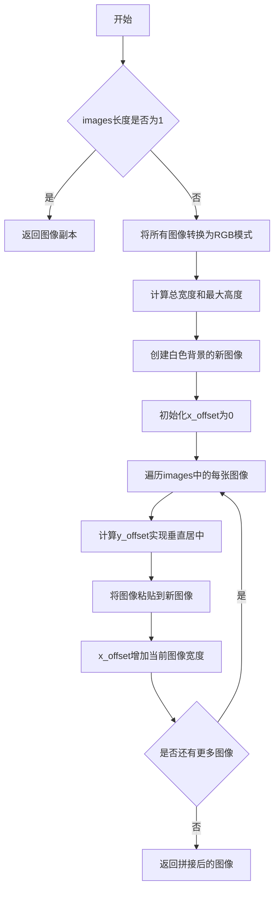

# `diffusers\src\diffusers\pipelines\flux2\image_processor.py` 详细设计文档

Flux2ImageProcessor是一个图像预处理类，继承自VaeImageProcessor，用于对Flux2模型的参考（角色）图像进行预处理，包括图像尺寸验证、调整大小、中心裁剪、归一化和多图像拼接等功能。

## 整体流程

```mermaid
graph TD
    A[开始] --> B{输入图像}
    B --> C[check_image_input 验证图像]
    C --> D{验证通过?}
    D -- 否 --> E[抛出 ValueError]
    D -- 是 --> F[do_resize 判断]
    F -- 是 --> G[_resize_if_exceeds_area 调整面积]
    F -- 否 --> H[do_convert_rgb 判断]
    G --> H
    H -- 是 --> I[转换为RGB]
    H -- 否 --> J[do_normalize 判断]
    I --> J
    J -- 是 --> K[归一化到[-1,1]]
    J -- 否 --> L[返回处理后的图像]
    K --> L
```

## 类结构

```
VaeImageProcessor (基类)
└── Flux2ImageProcessor (继承类)
```

## 全局变量及字段


### `Flux2ImageProcessor.do_resize`
    
是否调整图像尺寸

类型：`bool`
    


### `Flux2ImageProcessor.vae_scale_factor`
    
VAE空间缩放因子

类型：`int`
    


### `Flux2ImageProcessor.vae_latent_channels`
    
VAE潜在通道数

类型：`int`
    


### `Flux2ImageProcessor.do_normalize`
    
是否归一化到[-1,1]

类型：`bool`
    


### `Flux2ImageProcessor.do_convert_rgb`
    
是否转换为RGB格式

类型：`bool`
    
    

## 全局函数及方法


### `Flux2ImageProcessor.check_image_input`

检查图像是否满足最小尺寸和宽高比要求的静态方法，用于验证输入的 PIL 图像是否符合 Flux2 模型的预处理条件。

参数：

- `image`：`PIL.Image.Image`，要验证的 PIL 图像
- `max_aspect_ratio`：`int`，最大允许的宽高比（宽度/高度或高度/宽度的最大值），默认为 8
- `min_side_length`：`int`，宽度和高度所需的最小像素数，默认为 64
- `max_area`：`int`，最大允许的像素面积（但在此方法中未使用），默认为 1024 * 1024

返回值：`PIL.Image.Image`，如果验证通过则返回原始输入图像

#### 流程图



#### 带注释源码

```python
@staticmethod
def check_image_input(
    image: PIL.Image.Image, max_aspect_ratio: int = 8, min_side_length: int = 64, max_area: int = 1024 * 1024
) -> PIL.Image.Image:
    """
    Check if image meets minimum size and aspect ratio requirements.

    Args:
        image: PIL Image to validate
        max_aspect_ratio: Maximum allowed aspect ratio (width/height or height/width)
        min_side_length: Minimum pixels required for width and height
        max_area: Maximum allowed area in pixels²

    Returns:
        The input image if valid

    Raises:
        ValueError: If image is too small or aspect ratio is too extreme
    """
    # 类型检查：确保输入是PIL图像对象
    if not isinstance(image, PIL.Image.Image):
        raise ValueError(f"Image must be a PIL.Image.Image, got {type(image)}")

    # 获取图像尺寸
    width, height = image.size

    # 检查最小尺寸：验证宽度和高度都满足最小边长要求
    if width < min_side_length or height < min_side_length:
        raise ValueError(
            f"Image too small: {width}×{height}. Both dimensions must be at least {min_side_length}px"
        )

    # 计算宽高比：取宽/高和高/宽中的较大值
    aspect_ratio = max(width / height, height / width)
    
    # 检查宽高比：确保图像不会过于极端（过宽或过高）
    if aspect_ratio > max_aspect_ratio:
        raise ValueError(
            f"Aspect ratio too extreme: {width}×{height} (ratio: {aspect_ratio:.1f}:1). "
            f"Maximum allowed ratio is {max_aspect_ratio}:1"
        )

    # 验证通过，返回原始图像
    return image
```


### `Flux2ImageProcessor._resize_to_target_area`

该静态方法接收一个 PIL 图像和目标面积参数，通过计算缩放比例将图像调整到目标面积大小，使用 LANCZOS 重采样进行高质量图像缩放。

参数：

- `image`：`PIL.Image.Image`，需要调整大小的输入图像
- `target_area`：`int`，目标像素面积，默认为 1024×1024=1048576

返回值：`PIL.Image.Image`，调整大小后的图像

#### 流程图

```mermaid
flowchart TD
    A[开始] --> B[获取图像宽度和高度]
    B --> C[计算缩放比例: scale = √(target_area / (width × height))]
    C --> D[计算目标宽度: width = int(image_width × scale)]
    D --> E[计算目标高度: height = int(image_height × scale)]
    E --> F[使用LANCZOS重采样调整图像大小]
    F --> G[返回调整后的图像]
```

#### 带注释源码

```python
@staticmethod
def _resize_to_target_area(image: PIL.Image.Image, target_area: int = 1024 * 1024) -> PIL.Image.Image:
    """
    将图像调整到目标面积大小，保持原始宽高比。

    Args:
        image: PIL Image to resize
        target_area: Target area in pixels², defaults to 1024*1024

    Returns:
        Resized PIL Image
    """
    # 获取原始图像的宽度和高度
    image_width, image_height = image.size

    # 计算缩放比例：使调整后的图像面积等于目标面积
    # 使用平方根保持宽高比，确保面积与目标面积成正比
    scale = math.sqrt(target_area / (image_width * image_height))
    
    # 计算目标宽度和高度，并转换为整数（像素必须为整数）
    width = int(image_width * scale)
    height = int(image_height * scale)

    # 使用LANCZOS重采样方法调整图像大小（高质量重采样）
    return image.resize((width, height), PIL.Image.Resampling.LANCZOS)
```


### `Flux2ImageProcessor._resize_if_exceeds_area`

如果输入图像的像素面积超过指定的目标区域面积，则对图像进行缩放以使其面积不超过目标值；否则保持原图不变。

参数：

- `image`：`PIL.Image.Image`，需要检查和可能需要调整大小的输入图像
- `target_area`：`int`，目标区域面积（像素数），默认为 1024×1024=1048576

返回值：`PIL.Image.Image`，如果图像面积超过目标区域则返回调整大小后的图像，否则返回原始图像

#### 流程图



#### 带注释源码

```python
@staticmethod
def _resize_if_exceeds_area(image, target_area=1024 * 1024) -> PIL.Image.Image:
    """
    如果图像像素面积超过目标区域，则调整图像大小使其面积不超过目标值。
    
    Args:
        image: PIL Image to resize if too large
        target_area: Maximum allowed area in pixels² (default: 1024*1024)
    
    Returns:
        The original image if within area limit, otherwise a resized image
    """
    # 获取图像的宽度和高度
    image_width, image_height = image.size
    
    # 计算当前图像的总像素数
    pixel_count = image_width * image_height
    
    # 如果像素数小于等于目标区域面积，直接返回原图
    if pixel_count <= target_area:
        return image
    
    # 否则调用内部方法将图像缩放到目标面积
    return Flux2ImageProcessor._resize_to_target_area(image, target_area)
```


### `Flux2ImageProcessor._resize_and_crop`

该方法对输入的图像进行中心裁剪（center crop），将图像裁剪到指定的宽度和高度。它通过计算图像中心点，然后向左和向上偏移来确定裁剪区域的左上角坐标，最后使用 PIL 的 `crop` 方法提取中心区域。

参数：

- `self`：类实例本身，包含配置信息（如 `vae_scale_factor` 等）
- `image`：`PIL.Image.Image`，需要调整大小和裁剪的图像
- `width`：`int`，目标裁剪宽度（像素）
- `height`：`int`，目标裁剪高度（像素）

返回值：`PIL.Image.Image`，裁剪后的图像

#### 流程图

```mermaid
flowchart TD
    A[开始] --> B[获取图像尺寸<br/>image_width, image_height]
    B --> C[计算裁剪区域坐标]
    C --> D[left = (image_width - width) // 2]
    D --> E[top = (image_height - height) // 2]
    E --> F[right = left + width]
    F --> G[bottom = top + height]
    G --> H[执行中心裁剪<br/>image.crop((left, top, right, bottom))]
    H --> I[返回裁剪后的图像]
```

#### 带注释源码

```python
def _resize_and_crop(
    self,
    image: PIL.Image.Image,
    width: int,
    height: int,
) -> PIL.Image.Image:
    r"""
    center crop the image to the specified width and height.

    Args:
        image (`PIL.Image.Image`):
            The image to resize and crop.
        width (`int`):
            The width to resize the image to.
        height (`int`):
            The height to resize the image to.

    Returns:
        `PIL.Image.Image`:
            The resized and cropped image.
    """
    # 获取原始图像的宽度和高度
    image_width, image_height = image.size

    # 计算裁剪区域的左上角坐标（居中裁剪）
    # 使用整数除法 // 确保坐标为整数
    left = (image_width - width) // 2      # 左边距：从图像左侧到裁剪区域左边缘的距离
    top = (image_height - height) // 2     # 顶边距：从图像顶部到裁剪区域顶边缘的距离

    # 计算裁剪区域的右下角坐标
    right = left + width                   # 右边距 = 左边距 + 目标宽度
    bottom = top + height                  # 底边距 = 顶边距 + 目标高度

    # 使用 PIL 的 crop 方法进行中心裁剪
    # crop 方法接收一个四元组 (left, top, right, bottom)
    return image.crop((left, top, right, bottom))
```


### `Flux2ImageProcessor.concatenate_images`

该方法是一个静态方法，用于将多个 PIL 图像水平拼接在一起，使用白色作为背景色，并采用居中对齐方式。适用于将多张参考图像（如角色图像）拼接为单张输入图像的场景。

参数：

- `images`：`list[PIL.Image.Image]`，需要拼接的 PIL 图像列表

返回值：`PIL.Image.Image`，拼接后的单个 PIL 图像

#### 流程图



#### 带注释源码

```python
@staticmethod
def concatenate_images(images: list[PIL.Image.Image]) -> PIL.Image.Image:
    """
    Concatenate a list of PIL images horizontally with center alignment and white background.
    """

    # 如果只有一张图像，直接返回该图像的副本（避免后续操作修改原图）
    if len(images) == 1:
        return images[0].copy()

    # 将所有图像转换为RGB模式，确保模式一致以便拼接
    images = [img.convert("RGB") if img.mode != "RGB" else img for img in images]

    # 计算水平拼接后的总宽度（所有图像宽度之和）
    total_width = sum(img.width for img in images)
    # 计算最大高度（取所有图像中最高的高度）
    max_height = max(img.height for img in images)

    # 创建新图像，背景色为白色 (255, 255, 255)
    background_color = (255, 255, 255)
    new_img = PIL.Image.new("RGB", (total_width, max_height), background_color)

    # 初始化x偏移量，从0开始（从左侧开始粘贴）
    x_offset = 0
    # 遍历每张图像
    for img in images:
        # 计算y偏移量，使图像垂直居中
        y_offset = (max_height - img.height) // 2
        # 将图像粘贴到新图像的指定位置
        new_img.paste(img, (x_offset, y_offset))
        # 更新x偏移量，为下一张图像做准备
        x_offset += img.width

    # 返回拼接后的图像
    return new_img
```


### Flux2ImageProcessor.__init__

初始化 Flux2 图像处理器配置，设置图像预处理的相关参数（包括调整大小、VAE 缩放因子、潜在通道数、归一化和 RGB 转换等），并通过装饰器将配置注册到配置系统中。

参数：

- `do_resize`：`bool`，可选，默认值为 `True`。是否对图像进行降采样，将图像的（高度、宽度）调整为 `vae_scale_factor` 的倍数。
- `vae_scale_factor`：`int`，可选，默认值为 `16`。VAE（空间）缩放因子，如果 `do_resize` 为 `True`，图像会自动调整大小到此因子的倍数。
- `vae_latent_channels`：`int`，可选，默认值为 `32`。VAE 潜在通道数。
- `do_normalize`：`bool`，可选，默认值为 `True`。是否将图像归一化到 [-1, 1] 范围。
- `do_convert_rgb`：`bool`，可选，默认值为 `True`。是否将图像转换为 RGB 格式。

返回值：`None`，无返回值，该方法用于初始化对象状态。

#### 流程图



#### 带注释源码

```python
@register_to_config
def __init__(
    self,
    do_resize: bool = True,              # 是否调整图像大小，默认为 True
    vae_scale_factor: int = 16,          # VAE 缩放因子，默认为 16
    vae_latent_channels: int = 32,       # VAE 潜在通道数，默认为 32
    do_normalize: bool = True,           # 是否归一化到 [-1,1]，默认为 True
    do_convert_rgb: bool = True,         # 是否转换为 RGB，默认为 True
):
    """
    初始化 Flux2 图像处理器配置。
    
    该方法继承自 VaeImageProcessor，用于预处理 Flux2 模型的参考（角色）图像。
    通过 @register_to_config 装饰器将所有配置参数注册到配置系统中。
    
    Args:
        do_resize: 是否调整图像大小
        vae_scale_factor: VAE 空间缩放因子
        vae_latent_channels: VAE 潜在通道数
        do_normalize: 是否归一化图像到 [-1,1]
        do_convert_rgb: 是否转换图像为 RGB 格式
    """
    # 调用父类 VaeImageProcessor 的初始化方法，传递所有配置参数
    super().__init__(
        do_resize=do_resize,
        vae_scale_factor=vae_scale_factor,
        vae_latent_channels=vae_latent_channels,
        do_normalize=do_normalize,
        do_convert_rgb=do_convert_rgb,
    )
```


### `Flux2ImageProcessor.check_image_input`

该静态方法用于验证输入的 PIL 图像是否满足最小尺寸和宽高比要求，确保图像符合 Flux2 模型的输入规范，防止因图像尺寸过小或宽高比过大导致后续处理出错。

参数：

- `image`：`PIL.Image.Image`，要验证的 PIL 图像对象
- `max_aspect_ratio`：`int`，默认值为 8，允许的最大宽高比（宽度/高度或高度/宽度的最大值）
- `min_side_length`：`int`，默认值为 64，宽度和高度所需的最小像素数
- `max_area`：`int`，默认值为 1024 * 1024，允许的最大面积（像素²）

返回值：`PIL.Image.Image`，验证通过后返回输入的图像对象

#### 流程图

```mermaid
flowchart TD
    A[开始验证] --> B{image 是否为 PIL.Image.Image 类型}
    B -->|否| C[抛出 ValueError: 图像类型错误]
    B -->|是| D[获取图像宽度和高度]
    D --> E{宽度 < min_side_length 或 高度 < min_side_length}
    E -->|是| F[抛出 ValueError: 图像尺寸过小]
    E -->|否| G[计算宽高比 aspect_ratio = max(width/height, height/width)]
    G --> H{aspect_ratio > max_aspect_ratio}
    H -->|是| I[抛出 ValueError: 宽高比过大]
    H -->|否| J[返回原始 image 对象]
```

#### 带注释源码

```python
@staticmethod
def check_image_input(
    image: PIL.Image.Image, max_aspect_ratio: int = 8, min_side_length: int = 64, max_area: int = 1024 * 1024
) -> PIL.Image.Image:
    """
    Check if image meets minimum size and aspect ratio requirements.

    Args:
        image: PIL Image to validate
        max_aspect_ratio: Maximum allowed aspect ratio (width/height or height/width)
        min_side_length: Minimum pixels required for width and height
        max_area: Maximum allowed area in pixels²

    Returns:
        The input image if valid

    Raises:
        ValueError: If image is too small or aspect ratio is too extreme
    """
    # 类型检查：确保输入是 PIL.Image.Image 类型
    if not isinstance(image, PIL.Image.Image):
        raise ValueError(f"Image must be a PIL.Image.Image, got {type(image)}")

    # 获取图像的宽度和高度
    width, height = image.size

    # 检查最小尺寸：验证宽度和高度都满足最小边长要求
    if width < min_side_length or height < min_side_length:
        raise ValueError(
            f"Image too small: {width}×{height}. Both dimensions must be at least {min_side_length}px"
        )

    # 计算宽高比：取宽高比中的较大值（归一化为 > 1 的值）
    aspect_ratio = max(width / height, height / width)
    
    # 检查宽高比：确保图像不会过于极端（太长或太宽）
    if aspect_ratio > max_aspect_ratio:
        raise ValueError(
            f"Aspect ratio too extreme: {width}×{height} (ratio: {aspect_ratio:.1f}:1). "
            f"Maximum allowed ratio is {max_aspect_ratio}:1"
        )

    # 验证通过，返回原始图像对象（注意：参数 max_area 在此方法中未使用）
    return image
```


### `Flux2ImageProcessor._resize_to_target_area`

该静态方法通过计算缩放因子，将输入图像的像素面积调整到指定的目标面积范围内，使用平方根计算保持宽高比的缩放比例，并采用LANCZOS重采样算法进行高质量图像缩放。

参数：

- `image`：`PIL.Image.Image`，待调整大小的输入图像
- `target_area`：`int`，目标像素面积，默认为 1024×1024=1048576 像素

返回值：`PIL.Image.Image`，调整大小后的图像

#### 流程图

```mermaid
flowchart TD
    A[开始] --> B[获取图像宽度和高度]
    B --> C[计算缩放因子 scale = √(target_area / (width × height))]
    C --> D[计算目标宽度: width = int(original_width × scale)]
    D --> E[计算目标高度: height = int(original_height × scale)]
    E --> F[使用LANCZOS重采样调整图像大小]
    F --> G[返回调整后的图像]
```

#### 带注释源码

```python
@staticmethod
def _resize_to_target_area(image: PIL.Image.Image, target_area: int = 1024 * 1024) -> PIL.Image.Image:
    """
    将图像调整到目标像素面积，保持宽高比不变。
    
    Args:
        image: PIL Image to resize
        target_area: Target area in pixels² (default: 1024 * 1024 = 1,048,576)
    
    Returns:
        Resized PIL Image
    """
    # 获取输入图像的原始宽高尺寸
    image_width, image_height = image.size

    # 计算缩放因子：使用平方根确保面积与目标面积成比例
    # 例如：若目标面积是原面积的1/4，则缩放因子为0.5
    scale = math.sqrt(target_area / (image_width * image_height))
    
    # 根据缩放因子计算目标宽高，并转为整数像素值
    width = int(image_width * scale)
    height = int(image_height * scale)

    # 使用LANCZOS重采样方法进行高质量图像缩放
    # LANCZOS是一种基于sinc函数的高质量插值算法，适合图像缩小
    return image.resize((width, height), PIL.Image.Resampling.LANCZOS)
```


### `Flux2ImageProcessor._resize_if_exceeds_area`

该静态方法用于检查图像像素面积是否超过指定的目标面积阈值，若超过则按比例缩放图像使其面积等于目标面积，否则保持原图不变。

参数：

- `image`：`PIL.Image.Image`，待处理的输入图像
- `target_area`：`int`，目标面积阈值（单位为像素数），默认为 1024 * 1024 = 1,048,576

返回值：`PIL.Image.Image`，处理后的图像（若未超过阈值则返回原图，否则返回缩放后的图像）

#### 流程图

```mermaid
flowchart TD
    A[开始 _resize_if_exceeds_area] --> B[获取图像宽度和高度<br/>image_width, image_height = image.size]
    B --> C[计算像素总数<br/>pixel_count = image_width * image_height]
    C --> D{像素总数是否小于等于目标面积?<br/>pixel_count <= target_area}
    D -->|是 返回原图| E[return image]
    D -->|否 调用缩放方法| F[调用 _resize_to_target_area<br/>_resize_to_target_area(image, target_area)]
    F --> G[返回缩放后的图像]
    
    style A fill:#e1f5fe
    style E fill:#c8e6c9
    style G fill:#c8e6c9
```

#### 带注释源码

```python
@staticmethod
def _resize_if_exceeds_area(image, target_area=1024 * 1024) -> PIL.Image.Image:
    """
    如果图像像素面积超过目标面积，则按比例缩放图像使其面积等于目标面积。
    
    Args:
        image: PIL Image to resize if it exceeds the target area
        target_area: Maximum allowed area in pixels² (default: 1024 * 1024 = 1,048,576)
    
    Returns:
        PIL.Image.Image: The original image if area <= target_area, 
                        otherwise the resized image with area approximately equal to target_area
    """
    # 获取图像的宽度和高度
    image_width, image_height = image.size
    
    # 计算当前图像的总像素数（面积）
    pixel_count = image_width * image_height
    
    # 如果像素数未超过目标面积，直接返回原图（无需处理）
    if pixel_count <= target_area:
        return image
    
    # 像素数超过目标面积，调用内部方法进行等比例缩放
    return Flux2ImageProcessor._resize_to_target_area(image, target_area)
```


### `Flux2ImageProcessor._resize_and_crop`

中心裁剪图像到指定的宽度和高度。该方法通过计算图像中心点，确定裁剪区域的左上角和右下角坐标，然后使用 PIL 的 crop 方法提取图像的中心部分。

参数：

- `image`：`PIL.Image.Image`，要进行裁剪的原始图像
- `width`：`int`，裁剪后的目标宽度
- `height`：`int`，裁剪后的目标高度

返回值：`PIL.Image.Image`，裁剪后的图像

#### 流程图

```mermaid
flowchart TD
    A[Start _resize_and_crop] --> B[获取图像原始尺寸<br/>image_width, image_height = image.size]
    B --> C[计算裁剪区域左上角横坐标<br/>left = (image_width - width) // 2]
    C --> D[计算裁剪区域左上角纵坐标<br/>top = (image_height - height) // 2]
    D --> E[计算裁剪区域右下角横坐标<br/>right = left + width]
    E --> F[计算裁剪区域右下角纵坐标<br/>bottom = top + height]
    F --> G[调用 image.crop 裁剪图像<br/>crop_box = (left, top, right, bottom)]
    G --> H[Return cropped image]
```

#### 带注释源码

```python
def _resize_and_crop(
    self,
    image: PIL.Image.Image,
    width: int,
    height: int,
) -> PIL.Image.Image:
    r"""
    center crop the image to the specified width and height.

    Args:
        image (`PIL.Image.Image`):
            The image to resize and crop.
        width (`int`):
            The width to resize the image to.
        height (`int`):
            The height to resize the image to.

    Returns:
        `PIL.Image.Image`:
            The resized and cropped image.
    """
    # 获取输入图像的原始宽高尺寸
    image_width, image_height = image.size

    # 计算裁剪框左上角的横坐标：以图像中心为基准，向左偏移 (原始宽度 - 目标宽度) 的一半
    left = (image_width - width) // 2
    
    # 计算裁剪框左上角的纵坐标：以图像中心为基准，向上偏移 (原始高度 - 目标高度) 的一半
    top = (image_height - height) // 2
    
    # 计算裁剪框右下角的横坐标：左上角横坐标 + 目标宽度
    right = left + width
    
    # 计算裁剪框右下角的纵坐标：左上角纵坐标 + 目标高度
    bottom = top + height

    # 使用 PIL.Image.crop 方法进行中心裁剪，传入裁剪框坐标 (left, top, right, bottom)
    # 注意：crop 方法接收的坐标顺序为 (左, 上, 右, 下)
    return image.crop((left, top, right, bottom))
```


### `Flux2ImageProcessor.concatenate_images`

该静态方法接收一个PIL图像列表，将多张图像水平拼接成一张图像，使用白色背景填充垂直方向的高度差异，并保持图像在垂直方向居中对齐。

参数：

- `images`：`list[PIL.Image.Image]`，要水平拼接的PIL图像列表

返回值：`PIL.Image.Image`，拼接后的图像

#### 流程图



#### 带注释源码

```python
@staticmethod
def concatenate_images(images: list[PIL.Image.Image]) -> PIL.Image.Image:
    """
    Concatenate a list of PIL images horizontally with center alignment and white background.
    """
    # 如果只有一张图像，直接返回该图像的副本
    # 避免创建空白背景的额外处理
    if len(images) == 1:
        return images[0].copy()

    # 将所有图像转换为RGB模式，确保模式一致
    # 如果图像不是RGB模式（如RGBA、灰度等），则进行转换
    images = [img.convert("RGB") if img.mode != "RGB" else img for img in images]

    # 计算水平拼接后的总宽度：所有图像宽度之和
    total_width = sum(img.width for img in images)
    # 计算垂直方向的最大高度：取所有图像中最高的那一个
    max_height = max(img.height for img in images)

    # 创建新图像，使用白色(255,255,255)作为背景色
    # 这确保了当图像高度不一致时，空白区域为白色而非黑色
    background_color = (255, 255, 255)
    new_img = PIL.Image.new("RGB", (total_width, max_height), background_color)

    # 初始化水平偏移量为0，从最左侧开始粘贴图像
    x_offset = 0
    # 遍历每一张图像
    for img in images:
        # 计算垂直偏移量，使当前图像在垂直方向居中
        # (max_height - img.height) // 2 得到居中所需的偏移量
        y_offset = (max_height - img.height) // 2
        # 将图像粘贴到新图像的指定位置
        new_img.paste(img, (x_offset, y_offset))
        # 增加水平偏移量，为下一张图像的粘贴位置做准备
        x_offset += img.width

    # 返回拼接完成的图像
    return new_img
```

## 关键组件


### Flux2ImageProcessor 类

继承自 VaeImageProcessor 的图像处理器类，用于预处理 Flux2 模型的参考（角色）图像，支持图像验证、缩放、裁剪和拼接等功能。

### 图像验证组件

check_image_input 静态方法，验证图像尺寸是否满足最小要求、宽高比是否在允许范围内，不满足则抛出 ValueError 异常。

### 图像缩放组件

_resize_to_target_area 和 _resize_if_exceeds_area 静态方法，根据目标面积计算缩放比例并将图像调整到目标面积范围内，使用 LANCZOS 重采样算法。

### 图像裁剪组件

_resize_and_crop 实例方法，对图像进行中心裁剪到指定宽高，计算左右上下的裁剪坐标并返回裁剪后的图像。

### 图像拼接组件

concatenate_images 静态方法，将多张 PIL 图像水平拼接，以白色背景填充，对齐所有图像的垂直中心，支持单张图像直接返回副本。

### 配置管理组件

使用 @register_to_config 装饰器装饰 __init__ 方法，实现配置参数的注册和管理，支持 do_resize、vae_scale_factor、vae_latent_channels、do_normalize、do_convert_rgb 等参数。

## 问题及建议


### 已知问题

-   **类型注解不一致**：`check_image_input`、`_resize_to_target_area`、`_resize_if_exceeds_area` 等静态方法的参数缺少类型注解，而 `concatenate_images` 方法的参数 `images` 也缺少类型注解。
-   **魔法数字硬编码**：`target_area=1024 * 1024`、`max_aspect_ratio=8`、`min_side_length=64` 等常量在多个方法中硬编码，未提取为类常量或配置参数，降低了可维护性。
-   **缺少空列表检查**：`concatenate_images` 方法未检查空列表输入，会在计算 `max_height` 时抛出 `ValueError`。
-   **文档字符串不完整**：`_resize_if_exceeds_area` 方法缺少文档字符串，而 `concatenate_images` 方法的文档字符串也较为简略，缺少参数和返回值说明。
-   **代码重复**：`_resize_to_target_area` 和 `_resize_if_exceeds_area` 中都包含获取图像尺寸的逻辑，存在一定的代码重复。
-   **配置参数冗余**：虽然使用 `@register_to_config` 装饰器，但传递给父类 `VaeImageProcessor` 的参数与配置参数重复，可能导致配置不一致。
-   **错误信息可优化**：`check_image_input` 的错误信息中 `{aspect_ratio:.1f}` 格式化可以更精确，避免浮点数精度问题。

### 优化建议

-   **提取常量**：将 `1024 * 1024`、`8`、`64` 等值提取为类级常量（如 `DEFAULT_TARGET_AREA`、`DEFAULT_MAX_ASPECT_RATIO` 等），提高可读性和可维护性。
-   **添加类型注解**：为所有方法参数添加完整的类型注解，包括 `check_image_input`、`_resize_if_exceeds_area`、`concatenate_images` 等方法。
-   **增强输入验证**：在 `concatenate_images` 开头添加 `if not images: raise ValueError("Images list cannot be empty")` 检查。
-   **完善文档字符串**：为所有公共方法添加完整的文档字符串，包括参数类型、返回值类型和描述。
-   **消除重复代码**：将获取图像尺寸的逻辑抽取为私有辅助方法，减少代码重复。
-   **优化错误信息**：使用 `round(aspect_ratio, 2)` 或 `f"{aspect_ratio:.2f}"` 提高错误信息的可读性。

## 其它


### 设计目标与约束

本模块的设计目标是提供一个高效、健壮的图像预处理流程，用于 Flux2 模型的参考图像（角色图像）处理。核心约束包括：1）图像尺寸必须满足最小边长（64像素）和最大面积（1024×1024像素）限制；2）宽高比不得超过8:1，以确保图像不会过度拉伸或压缩；3）所有图像在处理过程中需统一转换为RGB格式；4）处理流程需遵循 VAE 的 scale_factor（默认16）进行尺寸对齐，以兼容潜在的下采样需求。

### 错误处理与异常设计

本类采用明确的异常抛出机制进行错误处理。`check_image_input` 方法会在以下情况抛出 `ValueError`：1）输入类型不是 `PIL.Image.Image`；2）图像尺寸小于最小边长要求；3）宽高比超过最大允许值。方法通过前置检查确保问题在早期被捕获，避免后续处理阶段出现难以追踪的错误。建议调用方在捕获异常时提供友好的错误提示信息，帮助用户理解图像不符合要求的具体原因。

### 数据流与状态机

图像处理流程遵循以下状态转换：初始状态（接收原始 PIL Image）→ 验证状态（`check_image_input` 检查尺寸和比例）→ 可选缩放状态（`_resize_if_exceeds_area` 处理过大图像）→ 尺寸调整状态（`_resize_and_crop` 裁剪到目标尺寸）→ 最终状态（返回处理后的图像）。对于批量图像处理，`concatenate_images` 方法会将多张图像转换为单张水平拼接图像，状态转换为：多图像列表 → 格式统一（RGB转换）→ 尺寸计算 → 背景创建 → 图像粘贴 → 单图像输出。

### 外部依赖与接口契约

本类依赖以下外部组件：1）`PIL.Image` - 图像操作的基础库；2）`math` - 用于计算缩放比例的平方根函数；3）`VaeImageProcessor` - 父类，提供基础图像处理能力；4）`register_to_config` 装饰器 - 用于配置注册。接口契约方面：所有公共方法（除 `__init__` 外）均为静态方法或接受显式图像参数，不维护内部状态；图像输入必须是 `PIL.Image.Image` 类型；输出图像统一为 RGB 模式的 PIL Image。

### 配置管理

配置通过 `__init__` 方法的构造参数进行管理，使用 `@register_to_config` 装饰器将参数注册到全局配置系统。配置项包括：`do_resize`（是否执行缩放）、`vae_scale_factor`（VAE空间缩放因子，默认16）、`vae_latent_channels`（VAE潜在通道数，默认32）、`do_normalize`（是否归一化到[-1,1]）、`do_convert_rgb`（是否转换为RGB格式）。这些配置继承自父类 `VaeImageProcessor`，本类在调用 `super().__init__` 时传递这些参数。

### 性能考虑

当前实现存在以下性能优化空间：1）`_resize_if_exceeds_area` 方法在每次调用时都重新计算像素面积，对于批量处理相同尺寸图像可考虑缓存；2）`concatenate_images` 中的图像转换和尺寸计算可以并行化处理；3）对于大规模批量图像处理，建议预先验证所有图像再进行统一处理，避免中途失败导致资源浪费。当前实现对于单张图像处理场景性能是足够的。

### 扩展性设计

本类采用继承架构，扩展性设计体现在：1）通过继承 `VaeImageProcessor` 获得基础图像处理能力；2）所有图像处理方法均为静态方法或可被重写的实例方法，便于子类定制；3）`_resize_to_target_area` 和 `_resize_and_crop` 等核心方法独立封装，易于替换实现。未来的扩展方向可能包括：添加更多图像质量检查（如模糊度检测、噪声评估）、支持不同的裁剪策略（而非仅中心裁剪）、添加图像增强功能。

### 版本兼容性

本代码基于以下版本假设：1）Python 3.8+（支持类型注解的完整语法）；2）PIL/Pillow 库需支持 `PIL.Image.Resampling.LANCZOS`（Pillow 9.1.0+）；3）依赖的 `configuration_utils` 和 `image_processor` 模块来自 HuggingFace Diffusers 库。建议在项目依赖管理中明确指定 Pillow>=9.1.0 和对应版本的 diffusers 库，以确保兼容性。

### 使用示例与调用模式

典型使用场景包括：1）初始化处理器并预处理单张图像；2）批量处理多张参考图像并拼接；3）在扩散模型 Pipeline 中集成作为预处理步骤。调用模式建议：始终首先调用 `check_image_input` 进行输入验证，然后在需要时调用缩放和裁剪方法，最后根据业务需求决定是否调用 `concatenate_images` 进行图像拼接。


    