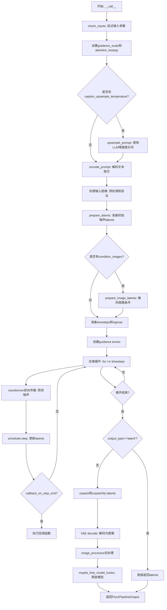
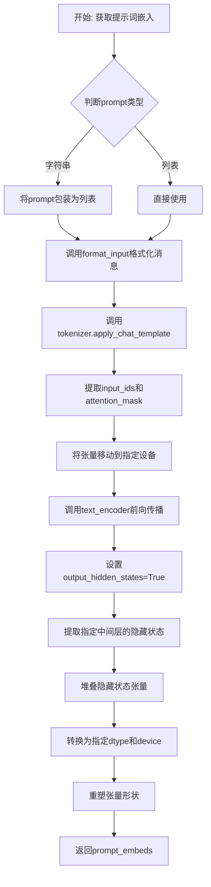
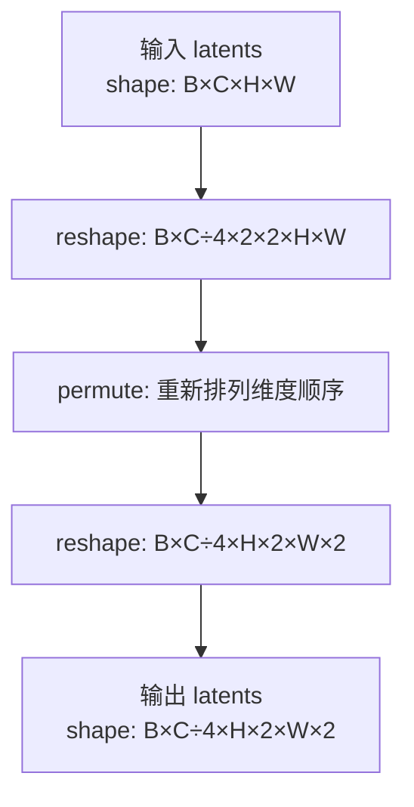
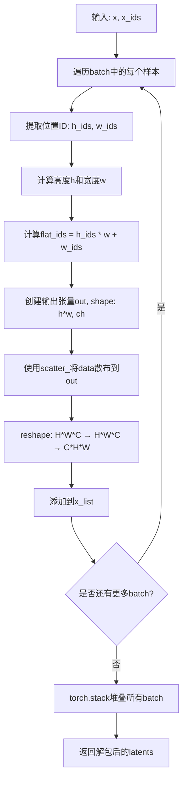
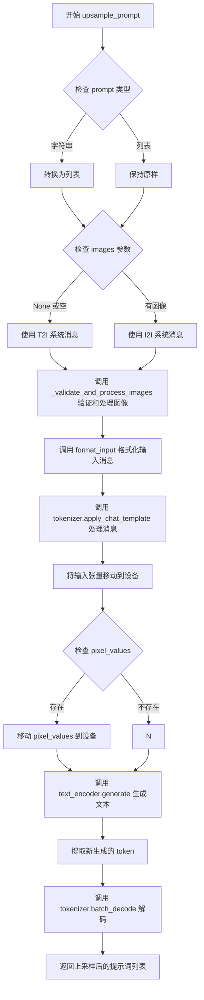
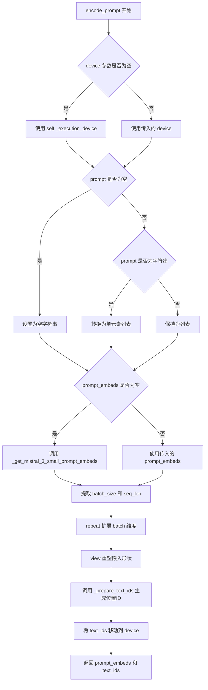
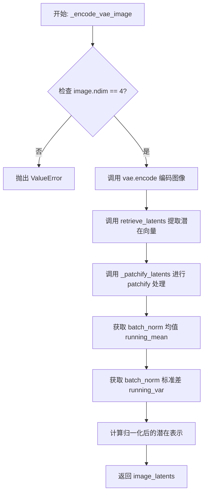
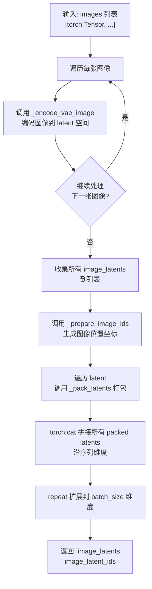

# `diffusers\src\diffusers\pipelines\flux2\pipeline_flux2.py` 详细设计文档

FLUX.2文本到图像生成管道，支持文本到图像和图像到图像（upsampling）生成，使用Mistral3文本编码器、Flux2Transformer2DModel变换器和AutoencoderKLFlux2 VAE进行图像编解码，通过FlowMatchEulerDiscreteScheduler进行去噪采样。

## 整体流程



## 类结构

```
DiffusionPipeline (基类)
└── Flux2Pipeline (主类)
    └── Flux2LoraLoaderMixin (混合特性)

相关组件:
├── Flux2ImageProcessor (图像处理)
├── Flux2PipelineOutput (输出封装)
├── SYSTEM_MESSAGE* (系统消息常量)
```

## 全局变量及字段


### `EXAMPLE_DOC_STRING`
    
示例文档字符串，提供代码使用示例

类型：`str`
    


### `UPSAMPLING_MAX_IMAGE_SIZE`
    
上采样最大图像尺寸，常量值768的平方

类型：`int`
    


### `logger`
    
日志记录器，用于记录运行时信息

类型：`logging.Logger`
    


### `XLA_AVAILABLE`
    
标识是否支持XLA加速

类型：`bool`
    


### `SYSTEM_MESSAGE`
    
系统消息常量，定义模型使用的系统提示

类型：`str`
    


### `SYSTEM_MESSAGE_UPSAMPLING_I2I`
    
图像到图像上采样系统消息

类型：`str`
    


### `SYSTEM_MESSAGE_UPSAMPLING_T2I`
    
文本到图像上采样系统消息

类型：`str`
    


### `Flux2Pipeline.vae`
    
VAE编解码器，用于图像与latent空间的相互转换

类型：`AutoencoderKLFlux2`
    


### `Flux2Pipeline.text_encoder`
    
文本编码器，将文本提示转换为嵌入向量

类型：`Mistral3ForConditionalGeneration`
    


### `Flux2Pipeline.tokenizer`
    
文本处理器，用于文本分词和模板应用

类型：`AutoProcessor`
    


### `Flux2Pipeline.scheduler`
    
去噪调度器，控制扩散模型的采样过程

类型：`FlowMatchEulerDiscreteScheduler`
    


### `Flux2Pipeline.transformer`
    
去噪变换器，主干神经网络模型执行图像生成

类型：`Flux2Transformer2DModel`
    


### `Flux2Pipeline.image_processor`
    
图像处理器，负责图像预处理和后处理

类型：`Flux2ImageProcessor`
    


### `Flux2Pipeline.vae_scale_factor`
    
VAE缩放因子，决定latent空间的压缩比

类型：`int`
    


### `Flux2Pipeline.tokenizer_max_length`
    
tokenizer最大长度，限制输入文本的token数量

类型：`int`
    


### `Flux2Pipeline.default_sample_size`
    
默认采样尺寸，用于生成图像的默认分辨率基准

类型：`int`
    


### `Flux2Pipeline.system_message`
    
系统消息，包含模型角色和行为的指令

类型：`str`
    


### `Flux2Pipeline.system_message_upsampling_t2i`
    
T2I上采样系统消息，用于文本到图像的提示增强

类型：`str`
    


### `Flux2Pipeline.system_message_upsampling_i2i`
    
I2I上采样系统消息，用于图像到图像的提示增强

类型：`str`
    


### `Flux2Pipeline.upsampling_max_image_size`
    
上采样最大图像尺寸，限制条件图像的大小

类型：`int`
    


### `Flux2Pipeline.model_cpu_offload_seq`
    
CPU卸载顺序，定义模型各组件的CPU-GPU迁移序列

类型：`str`
    


### `Flux2Pipeline._callback_tensor_inputs`
    
回调张量输入列表，指定哪些张量可用于步骤回调

类型：`list`
    
    

## 全局函数及方法


### `format_input`

该函数用于将一批文本提示格式化为对话格式，以符合 `apply_chat_template` 的要求。支持可选地添加图片到输入中，并自动处理图片与提示的配对以及 `[IMG]` 标记的清理。

参数：

- `prompts`：`list[str]`，要处理的文本提示列表
- `system_message`：`str = SYSTEM_MESSAGE`，使用的系统消息（默认为 CREATIVE_SYSTEM_MESSAGE）
- `images`：`list[PIL.Image.Image, list[list[PIL.Image.Image]]] | None = None`，可选的要添加到输入中的图片列表

返回值：`list[list[dict]]`，对话列表，其中每个对话是一个包含消息字典的列表

#### 流程图

```mermaid
flowchart TD
    A[开始 format_input] --> B{images 是否为 None<br/>或长度为 0?}
    B -->|是| C[清理提示文本<br/>移除 [IMG] 标记]
    C --> D[为每个提示构建<br/>system + user 对话]
    D --> J[返回对话列表]
    B -->|否| E[断言 images 与 prompts<br/>长度必须一致]
    E --> F[清理提示文本<br/>移除 [IMG] 标记]
    F --> G[为每个提示构建<br/>包含 system 消息的列表]
    G --> H{遍历每个元素<br/>添加图片和文本}
    H -->|有图片| I[添加 user 消息<br/>包含 image 类型内容]
    H -->|无图片| K[跳过图片添加]
    I --> L[添加 user 消息<br/>包含 text 类型内容]
    K --> L
    L --> J
```

#### 带注释源码

```python
# Adapted from
# https://github.com/black-forest-labs/flux2/blob/5a5d316b1b42f6b59a8c9194b77c8256be848432/src/flux2/text_encoder.py#L68
def format_input(
    prompts: list[str],
    system_message: str = SYSTEM_MESSAGE,
    images: list[PIL.Image.Image, list[list[PIL.Image.Image]]] | None = None,
):
    """
    Format a batch of text prompts into the conversation format expected by apply_chat_template. Optionally, add images
    to the input.

    Args:
        prompts: List of text prompts
        system_message: System message to use (default: CREATIVE_SYSTEM_MESSAGE)
        images (optional): List of images to add to the input.

    Returns:
        List of conversations, where each conversation is a list of message dicts
    """
    # Remove [IMG] tokens from prompts to avoid Pixtral validation issues
    # when truncation is enabled. The processor counts [IMG] tokens and fails
    # if the count changes after truncation.
    cleaned_txt = [prompt.replace("[IMG]", "") for prompt in prompts]

    # 场景1：无图片输入时，直接构建 system + user 消息对
    if images is None or len(images) == 0:
        return [
            [
                {
                    "role": "system",
                    "content": [{"type": "text", "text": system_message}],
                },
                {"role": "user", "content": [{"type": "text", "text": prompt}]},
            ]
            for prompt in cleaned_txt
        ]
    else:
        # 场景2：有图片输入时，验证图片数量与提示数量一致
        assert len(images) == len(prompts), "Number of images must match number of prompts"
        
        # 初始化每个对话的消息列表，以 system 消息开始
        messages = [
            [
                {
                    "role": "system",
                    "content": [{"type": "text", "text": system_message}],
                },
            ]
            for _ in cleaned_txt
        ]

        # 遍历每个批次元素，有选择性地添加图片和文本内容
        for i, (el, images) in enumerate(zip(messages, images)):
            # optionally add the images per batch element.
            # 如果当前元素有图片，添加包含图片的用户消息
            if images is not None:
                el.append(
                    {
                        "role": "user",
                        "content": [{"type": "image", "image": image_obj} for image_obj in images],
                    }
                )
            # add the text.
            # 添加文本用户消息（使用清理后的文本）
            el.append(
                {
                    "role": "user",
                    "content": [{"type": "text", "text": cleaned_txt[i]}],
                }
            )

        return messages
```


### `_validate_and_process_images`

该函数负责验证和处理输入图像数据，将其转换为适合模型输入的标准化格式。函数执行三项核心操作：首先检查输入是单个图像列表还是嵌套列表，并将单层列表转换为嵌套格式；其次调用图像处理器的拼接方法合并多个连续图像以减少token数量；最后根据指定的最大像素面积限制对超尺寸图像进行缩放处理。

参数：

-  `images`：`list[list[PIL.Image.Image]] | list[PIL.Image.Image]`，输入的图像数据，可以是 PIL 图像列表或嵌套列表形式
-  `image_processor`：`Flux2ImageProcessor`，图像处理器实例，提供图像拼接和尺寸调整的方法
-  `upsampling_max_image_size`：`int`，上采样阶段允许的最大图像像素面积阈值

返回值：`list[list[PIL.Image.Image]]`，返回处理后的嵌套图像列表，确保每张图像都被适当处理

#### 流程图

```mermaid
flowchart TD
    A[开始: images输入] --> B{images是否为空?}
    B -->|是| C[返回空列表 []]
    B -->|否| D{images[0]是否为PIL.Image?}
    D -->|是| E[将单层列表转换为嵌套列表<br/>images = [[im] for im in images]]
    D -->|否| F[保持嵌套格式]
    E --> G{每个子列表是否有多张图像?}
    F --> G
    G -->|是| H[调用concatenate_images合并图像<br/>减少token数量]
    G -->|否| I[保持原样]
    H --> J[遍历所有图像]
    I --> J
    J --> K{图像像素面积是否超过限制?}
    K -->|是| L[调用_resize_if_exceeds_area<br/>调整图像尺寸]
    K -->|否| M[保持原尺寸]
    L --> N[返回处理后的嵌套图像列表]
    M --> N
```

#### 带注释源码

```python
def _validate_and_process_images(
    images: list[list[PIL.Image.Image]] | list[PIL.Image.Image],
    image_processor: Flux2ImageProcessor,
    upsampling_max_image_size: int,
) -> list[list[PIL.Image.Image]]:
    """
    验证和处理输入图像，输出适合模型输入的标准化格式
    
    Args:
        images: 输入图像，支持两种格式：
                - list[PIL.Image.Image]: 单层列表，如 [img1, img2, img3]
                - list[list[PIL.Image.Image]]: 嵌套列表，如 [[img1, img2], [img3]]
        image_processor: Flux2ImageProcessor实例，提供图像处理方法
        upsampling_max_image_size: 最大像素面积限制，超过此面积的图像将被缩放
    
    Returns:
        处理后的嵌套图像列表，格式统一为 list[list[PIL.Image.Image]]
    """
    
    # 简单验证：确保输入是PIL图像列表或嵌套列表，空输入直接返回空列表
    if not images:
        return []

    # 检查输入是单层列表还是嵌套列表
    # 如果是第一种子列表（单层列表），需要转换为嵌套列表格式以统一处理
    if isinstance(images[0], PIL.Image.Image):
        # 将 [img1, img2, img3] 转换为 [[img1], [img2], [img3]]
        images = [[im] for im in images]

    # 可选步骤：如果某个批次有多张图像，尝试拼接它们以减少序列长度
    # 例如将 [img1, img2] 合并为一张拼接后的图像，减少后续处理的token数量
    images = [[image_processor.concatenate_images(img_i)] if len(img_i) > 1 else img_i for img_i in images]

    # 像素面积限制：对每张图像检查是否超过最大面积限制
    # 如果超过，调用图像处理器的_resize_if_exceeds_area方法进行等比例缩放
    images = [
        [image_processor._resize_if_exceeds_area(img_i, upsampling_max_image_size) for img_i in img_i]
        for img_i in images
    ]
    
    # 返回处理后的标准化嵌套列表格式
    return images
```


### `compute_empirical_mu`

该函数用于计算经验 mu 值（empirical mu），主要应用于 Flux2 扩散模型的采样调度中，根据图像序列长度和推理步数动态计算调度器所需的 mu 参数，以优化不同分辨率图像的去噪过程。

参数：

- `image_seq_len`：`int`，图像序列长度，表示潜在空间中图像标记的数量（即 latents 的序列长度）
- `num_steps`：`int`，推理步数，表示扩散模型去噪的步数

返回值：`float`，计算得到的经验 mu 值，用于调度器的参数配置

#### 流程图

```mermaid
flowchart TD
    A[开始 compute_empirical_mu] --> B{image_seq_len > 4300?}
    B -- 是 --> C[使用公式: mu = a2 * image_seq_len + b2]
    C --> D[返回 float(mu)]
    B -- 否 --> E[计算 m_200 = a2 * image_seq_len + b2]
    E --> F[计算 m_10 = a1 * image_seq_len + b1]
    F --> G[计算斜率 a = (m_200 - m_10) / 190.0]
    G --> H[计算截距 b = m_200 - 200.0 * a]
    H --> I[计算 mu = a * num_steps + b]
    I --> D
```

#### 带注释源码

```
def compute_empirical_mu(image_seq_len: int, num_steps: int) -> float:
    """
    计算经验 mu 值用于调度器参数配置。
    
    该函数根据图像序列长度和推理步数计算一个经验性的 mu 值。
    mu 值在 Flux2 的流匹配调度器中用于调整去噪过程的参数。
    
    Args:
        image_seq_len: 图像序列长度，对应潜在空间中图像的标记数量
        num_steps: 推理时的去噪步数
    
    Returns:
        float: 计算得到的经验 mu 值
    """
    # 定义两组线性系数，用于不同范围的图像序列长度计算
    # a1, b1: 用于较小图像序列长度的系数
    # a2, b2: 用于较大图像序列长度的系数
    a1, b1 = 8.73809524e-05, 1.89833333
    a2, b2 = 0.00016927, 0.45666666

    # 如果图像序列长度大于 4300，使用简单的线性公式
    # 这种情况下使用 a2, b2 系数直接计算
    if image_seq_len > 4300:
        mu = a2 * image_seq_len + b2
        return float(mu)

    # 对于较小的图像序列长度（<= 4300），使用分段线性插值
    # 计算在 num_steps=200 和 num_steps=10 时的两个参考点
    m_200 = a2 * image_seq_len + b2  # 对应 200 步的值
    m_10 = a1 * image_seq_len + b1   # 对应 10 步的值

    # 通过这两点计算线性插值的斜率和截距
    # 斜率 a 表示 mu 随步数变化的速率
    a = (m_200 - m_10) / 190.0
    # 截距 b 表示在 200 步时的基础值
    b = m_200 - 200.0 * a
    
    # 根据目标步数 num_steps 计算最终的 mu 值
    mu = a * num_steps + b

    return float(mu)
```


### `retrieve_timesteps`

该函数是diffusers库中用于从调度器获取timesteps的通用工具函数。它首先验证用户传入的自定义timesteps或sigmas是否被调度器支持，然后调用调度器的`set_timesteps`方法配置推理步数，最后返回调度器生成的timestep张量序列和实际的推理步数。

参数：

- `scheduler`：`SchedulerMixin`，调度器对象，用于生成timesteps序列
- `num_inference_steps`：`int | None`，推理过程中的去噪步数，若传入则`timesteps`必须为`None`
- `device`：`str | torch.device | None`，timesteps要移动到的目标设备，若为`None`则不移动
- `timesteps`：`list[int] | None`，自定义timesteps列表，用于覆盖调度器的默认时间间隔策略
- `sigmas`：`list[float] | None`，自定义sigmas列表，用于覆盖调度器的默认sigma间隔策略
- `**kwargs`：其他关键字参数，会传递给调度器的`set_timesteps`方法

返回值：`tuple[torch.Tensor, int]`，元组第一个元素是调度器生成的timestep张量，第二个元素是实际的推理步数

#### 流程图

```mermaid
flowchart TD
    A[开始 retrieve_timesteps] --> B{检查 timesteps 和 sigmas 是否同时传入}
    B -->|是| C[抛出 ValueError: 只能选择 timesteps 或 sigmas 之一]
    B -->|否| D{检查是否传入 timesteps}
    
    D -->|是| E{调度器是否支持 timesteps}
    E -->|否| F[抛出 ValueError: 当前调度器不支持自定义 timesteps]
    E -->|是| G[调用 scheduler.set_timesteps]
    G --> H[获取 scheduler.timesteps]
    H --> I[计算 num_inference_steps = len(timesteps)]
    
    D -->|否| J{检查是否传入 sigmas}
    
    J -->|是| K{调度器是否支持 sigmas}
    K -->|否| L[抛出 ValueError: 当前调度器不支持自定义 sigmas]
    K -->|是| M[调用 scheduler.set_timesteps]
    M --> N[获取 scheduler.timesteps]
    N --> O[计算 num_inference_steps = len(timesteps)]
    
    J -->|否| P[调用 scheduler.set_timesteps]
    P --> Q[获取 scheduler.timesteps]
    
    I --> R[返回 timesteps, num_inference_steps]
    O --> R
    Q --> R
```

#### 带注释源码

```python
# 从稳定扩散Pipeline复制而来的通用timesteps获取函数
def retrieve_timesteps(
    scheduler,  # 调度器对象（SchedulerMixin类型）
    num_inference_steps: int | None = None,  # 推理步数，如果使用timesteps则必须为None
    device: str | torch.device | None = None,  # 目标设备，None表示不移动timesteps
    timesteps: list[int] | None = None,  # 自定义timesteps列表
    sigmas: list[float] | None = None,  # 自定义sigmas列表
    **kwargs,  # 其他传递给scheduler.set_timesteps的关键字参数
):
    r"""
    Calls the scheduler's `set_timesteps` method and retrieves timesteps from the scheduler after the call. Handles
    custom timesteps. Any kwargs will be supplied to `scheduler.set_timesteps`.

    Args:
        scheduler (`SchedulerMixin`):
            The scheduler to get timesteps from.
        num_inference_steps (`int`):
            The number of diffusion steps used when generating samples with a pre-trained model. If used, `timesteps`
            must be `None`.
        device (`str` or `torch.device`, *optional*):
            The device to which the timesteps should be moved to. If `None`, the timesteps are not moved.
        timesteps (`list[int]`, *optional*):
            Custom timesteps used to override the timestep spacing strategy of the scheduler. If `timesteps` is passed,
            `num_inference_steps` and `sigmas` must be `None`.
        sigmas (`list[float]`, *optional*):
            Custom sigmas used to override the timestep spacing strategy of the scheduler. If `sigmas` is passed,
            `num_inference_steps` and `timesteps` must be `None`.

    Returns:
        `tuple[torch.Tensor, int]`: A tuple where the first element is the timestep schedule from the scheduler and the
        second element is the number of inference steps.
    """
    # 校验：timesteps和sigmas不能同时传入，只能选择其一
    if timesteps is not None and sigmas is not None:
        raise ValueError("Only one of `timesteps` or `sigmas` can be passed. Please choose one to set custom values")
    
    # 分支1：处理自定义timesteps
    if timesteps is not None:
        # 检查调度器是否支持自定义timesteps参数
        accepts_timesteps = "timesteps" in set(inspect.signature(scheduler.set_timesteps).parameters.keys())
        if not accepts_timesteps:
            raise ValueError(
                f"The current scheduler class {scheduler.__class__}'s `set_timesteps` does not support custom"
                f" timestep schedules. Please check whether you are using the correct scheduler."
            )
        # 调用调度器的set_timesteps方法设置自定义timesteps
        scheduler.set_timesteps(timesteps=timesteps, device=device, **kwargs)
        # 从调度器获取更新后的timesteps
        timesteps = scheduler.timesteps
        # 计算实际的推理步数
        num_inference_steps = len(timesteps)
    
    # 分支2：处理自定义sigmas
    elif sigmas is not None:
        # 检查调度器是否支持自定义sigmas参数
        accept_sigmas = "sigmas" in set(inspect.signature(scheduler.set_timesteps).parameters.keys())
        if not accept_sigmas:
            raise ValueError(
                f"The current scheduler class {scheduler.__class__}'s `set_timesteps` does not support custom"
                f" sigmas schedules. Please check whether you are using the correct scheduler."
            )
        # 调用调度器的set_timesteps方法设置自定义sigmas
        scheduler.set_timesteps(sigmas=sigmas, device=device, **kwargs)
        # 从调度器获取更新后的timesteps
        timesteps = scheduler.timesteps
        # 计算实际的推理步数
        num_inference_steps = len(timesteps)
    
    # 分支3：默认行为，使用num_inference_steps设置timesteps
    else:
        scheduler.set_timesteps(num_inference_steps, device=device, **kwargs)
        timesteps = scheduler.timesteps
    
    # 返回timesteps序列和实际推理步数
    return timesteps, num_inference_steps
```


### `retrieve_latents`

该函数是一个全局工具函数，用于从编码器（Encoder）的输出对象中提取 latent 表示。它通过检查输出对象的属性，灵活地处理不同的 VAE（变分自编码器）输出格式，例如从潜在分布中采样或直接获取已计算的 latents。

参数：

-  `encoder_output`：`torch.Tensor`，编码器模型的输出对象，通常包含 `latent_dist`（潜在空间分布对象）或 `latents`（直接 latent 张量）。
-  `generator`：`torch.Generator | None`，可选的 PyTorch 随机数生成器，用于在从分布采样时控制随机性。
-  `sample_mode`：`str`，字符串类型，指定提取模式。`"sample"` 表示从潜在分布中随机采样；`"argmax"` 表示取分布的众数（Mode）。

返回值：`torch.Tensor`，提取出的 latent 张量。

#### 流程图

```mermaid
flowchart TD
    A([Start retrieve_latents]) --> B{encoder_output has 'latent_dist'?}
    B -- Yes --> C{sample_mode == 'sample'?}
    C -- Yes --> D[Return encoder_output.latent_dist.sample<br/>(using generator)]
    C -- No --> E[Return encoder_output.latent_dist.mode]
    B -- No --> F{encoder_output has 'latents'?}
    F -- Yes --> G[Return encoder_output.latents]
    F -- No --> H[Raise AttributeError]
```

#### 带注释源码

```python
# Copied from diffusers.pipelines.stable_diffusion.pipeline_stable_diffusion_img2img.retrieve_latents
def retrieve_latents(
    encoder_output: torch.Tensor, generator: torch.Generator | None = None, sample_mode: str = "sample"
):
    # 检查 encoder_output 对象是否具有 latent_dist 属性（即包含一个分布对象）
    if hasattr(encoder_output, "latent_dist") and sample_mode == "sample":
        # 如果 sample_mode 设置为 'sample'，则从潜在分布中采样
        # generator 参数用于确保采样的可重复性（如果提供）
        return encoder_output.latent_dist.sample(generator)
    # 如果存在 latent_dist 但模式为 'argmax'，则返回分布的众数（最可能的值）
    elif hasattr(encoder_output, "latent_dist") and sample_mode == "argmax":
        return encoder_output.latent_dist.mode()
    # 如果不存在 latent_dist，则检查是否直接包含 latents 属性
    elif hasattr(encoder_output, "latents"):
        # 直接返回预先生成的 latents 张量
        return encoder_output.latents
    else:
        # 如果无法识别输出格式，抛出属性错误
        raise AttributeError("Could not access latents of provided encoder_output")
```


### `Flux2Pipeline.__init__`

Flux2Pipeline 构造函数，初始化 Flux2 文本到图像生成管道所需的所有模块组件，包括调度器、VAE、文本编码器、tokenizer 和 Transformer，并配置图像处理器、采样参数和系统消息等关键属性。

参数：

- `scheduler`：`FlowMatchEulerDiscreteScheduler`，用于去噪过程的调度器
- `vae`：`AutoencoderKLFlux2`，用于编码和解码图像的变分自编码器模型
- `text_encoder`：`Mistral3ForConditionalGeneration`，用于将文本提示编码为嵌入的文本编码器模型
- `tokenizer`：`AutoProcessor`，用于将文本转换为 token 的处理器
- `transformer`：`Flux2Transformer2DModel`，用于去噪图像潜在表示的条件 Transformer (MMDiT) 架构

返回值：`None`，构造函数不返回值，仅初始化实例属性

#### 流程图

```mermaid
flowchart TD
    A[开始 __init__] --> B[调用父类构造函数 super().__init__]
    B --> C[register_modules 注册所有模块]
    C --> D[计算 vae_scale_factor]
    D --> E[创建 Flux2ImageProcessor]
    E --> F[设置 tokenizer_max_length = 512]
    F --> G[设置 default_sample_size = 128]
    G --> H[设置系统消息相关属性]
    H --> I[设置 upsampling_max_image_size]
    I --> J[结束 __init__]
```

#### 带注释源码

```python
def __init__(
    self,
    scheduler: FlowMatchEulerDiscreteScheduler,
    vae: AutoencoderKLFlux2,
    text_encoder: Mistral3ForConditionalGeneration,
    tokenizer: AutoProcessor,
    transformer: Flux2Transformer2DModel,
):
    """
    初始化 Flux2Pipeline 管道
    
    参数:
        scheduler: FlowMatchEulerDiscreteScheduler 调度器
        vae: AutoencoderKLFlux2 VAE 模型
        text_encoder: Mistral3ForConditionalGeneration 文本编码器
        tokenizer: AutoProcessor token 处理器
        transformer: Flux2Transformer2DModel Transformer 模型
    """
    # 调用父类 DiffusionPipeline 的初始化方法
    super().__init__()

    # 注册所有模块到管道中，便于统一管理和保存/加载
    self.register_modules(
        vae=vae,
        text_encoder=text_encoder,
        tokenizer=tokenizer,
        scheduler=scheduler,
        transformer=transformer,
    )
    
    # 计算 VAE 缩放因子，基于 VAE 的 block_out_channels 数量
    # 如果 VAE 存在则计算，否则默认值为 8
    self.vae_scale_factor = 2 ** (len(self.vae.config.block_out_channels) - 1) if getattr(self, "vae", None) else 8
    
    # Flux latent 被转换为 2x2 patches 并打包
    # 这意味着 latent 宽度和高度必须能被 patch size 整除
    # 因此 vae scale factor 乘以 patch size 来考虑这一点
    self.image_processor = Flux2ImageProcessor(vae_scale_factor=self.vae_scale_factor * 2)
    
    # 设置 tokenizer 最大长度为 512
    self.tokenizer_max_length = 512
    
    # 设置默认采样大小为 128
    self.default_sample_size = 128

    # 设置系统消息相关属性
    self.system_message = SYSTEM_MESSAGE
    self.system_message_upsampling_t2i = SYSTEM_MESSAGE_UPSAMPLING_T2I
    self.system_message_upsampling_i2i = SYSTEM_MESSAGE_UPSAMPLING_I2I
    
    # 设置上采样的最大图像大小
    self.upsampling_max_image_size = UPSAMPLING_MAX_IMAGE_SIZE
```


### `Flux2Pipeline._get_mistral_3_small_prompt_embeds`

获取Mistral3文本嵌入的静态方法。该方法将输入的文本提示通过聊天模板格式化后，传入Mistral3文本编码器模型，提取指定中间层的隐藏状态并拼接成最终的文本嵌入向量。

参数：

- `text_encoder`：`Mistral3ForConditionalGeneration`，Mistral3文本编码器模型实例
- `tokenizer`：`AutoProcessor`，用于处理文本的处理器（包含分词器和聊天模板）
- `prompt`：`str | list[str]`，输入的文本提示，可以是单个字符串或字符串列表
- `dtype`：`torch.dtype | None`，输出张量的数据类型，默认为None则使用text_encoder的dtype
- `device`：`torch.device | None`，输出张量存放的设备，默认为None则使用text_encoder的device
- `max_sequence_length`：`int`，最大序列长度，默认为512
- `system_message`：`str`，系统消息内容，用于构建聊天模板，默认为`SYSTEM_MESSAGE`
- `hidden_states_layers`：`list[int]`，要提取的隐藏层索引列表，默认为(10, 20, 30)

返回值：`torch.Tensor`，形状为(batch_size, seq_len, num_channels * hidden_dim)的提示词嵌入张量

#### 流程图



#### 带注释源码

```python
@staticmethod
def _get_mistral_3_small_prompt_embeds(
    text_encoder: Mistral3ForConditionalGeneration,
    tokenizer: AutoProcessor,
    prompt: str | list[str],
    dtype: torch.dtype | None = None,
    device: torch.device | None = None,
    max_sequence_length: int = 512,
    system_message: str = SYSTEM_MESSAGE,
    hidden_states_layers: list[int] = (10, 20, 30),
):
    # 确定输出数据类型：优先使用传入的dtype，否则使用text_encoder的dtype
    dtype = text_encoder.dtype if dtype is None else dtype
    # 确定输出设备：优先使用传入的device，否则使用text_encoder的device
    device = text_encoder.device if device is None else device

    # 标准化输入：将单个字符串转换为列表，保持处理一致性
    prompt = [prompt] if isinstance(prompt, str) else prompt

    # 格式化输入消息：构建符合Mistral3聊天模板格式的消息结构
    messages_batch = format_input(prompts=prompt, system_message=system_message)

    # 处理所有消息：使用tokenizer的聊天模板将消息转换为模型输入
    # add_generation_prompt=False表示不添加生成提示
    # return_dict=True返回字典格式结果
    # padding="max_length"填充到最大长度
    # truncation=True启用截断
    inputs = tokenizer.apply_chat_template(
        messages_batch,
        add_generation_prompt=False,
        tokenize=True,
        return_dict=True,
        return_tensors="pt",
        padding="max_length",
        truncation=True,
        max_length=max_sequence_length,
    )

    # 将输入张量移动到指定设备（GPU/CPU）
    input_ids = inputs["input_ids"].to(device)
    attention_mask = inputs["attention_mask"].to(device)

    # 执行前向传播：通过文本编码器获取隐藏状态
    # output_hidden_states=True要求返回所有隐藏状态
    # use_cache=False禁用KV缓存（因为是推理模式）
    output = text_encoder(
        input_ids=input_ids,
        attention_mask=attention_mask,
        output_hidden_states=True,
        use_cache=False,
    )

    # 提取指定中间层的隐藏状态并堆叠
    # hidden_states_layers指定要使用的层索引，如(10, 20, 30)
    # 结果形状: (batch_size, num_layers, seq_len, hidden_dim)
    out = torch.stack([output.hidden_states[k] for k in hidden_states_layers], dim=1)
    # 转换数据类型和设备
    out = out.to(dtype=dtype, device=device)

    # 重塑张量以合并层维度到特征维度
    # 从 (batch_size, num_channels, seq_len, hidden_dim) 
    # 转换为 (batch_size, seq_len, num_channels * hidden_dim)
    batch_size, num_channels, seq_len, hidden_dim = out.shape
    prompt_embeds = out.permute(0, 2, 1, 3).reshape(batch_size, seq_len, num_channels * hidden_dim)

    return prompt_embeds
```


### Flux2Pipeline._prepare_text_ids

该静态方法用于为文本嵌入（prompt embeddings）生成4D位置坐标标识符（ID），以便在Flux2Transformer模型中进行位置感知处理。它通过笛卡尔积运算创建时间（T）、高度（H）、宽度（W）和序列长度（L）四个维度的坐标组合，支持批次处理和可选的时间坐标输入。

参数：

- `x`：`torch.Tensor`，形状为 (B, L, D) 或 (L, D)，输入的文本嵌入张量，其中 B 为批次大小，L 为序列长度，D 为隐藏维度
- `t_coord`：`torch.Tensor | None`，可选的时间坐标张量，用于指定每个样本的时间步，如果为 None 则默认使用时间步 0

返回值：`torch.Tensor`，位置ID张量，形状为 (B, H*W*L, 4)，其中包含 T、H、W、L 四个坐标维度

#### 流程图

```mermaid
flowchart TD
    A[开始] --> B[获取输入张量形状: B, L, D]
    B --> C[初始化空列表 out_ids]
    C --> D{遍历批次: i from 0 to B-1}
    D --> E{判断 t_coord 是否为 None}
    E -->|是| F[设置 t = torch.arange(1)]
    E -->|否| G[设置 t = t_coord[i]]
    F --> H[设置 h = torch.arange(1)]
    G --> H
    H --> I[设置 w = torch.arange(1)]
    I --> J[设置 l = torch.arange(L)]
    J --> K[计算笛卡尔积 coords = torch.cartesian_prod(t, h, w, l)]
    K --> L[将 coords 添加到 out_ids]
    L --> D
    D --> M{批次遍历完成?}
    M -->|否| D
    M -->|是| N[堆叠输出: torch.stack(out_ids)]
    N --> O[返回位置ID张量]
    O --> P[结束]
```

#### 带注释源码

```python
@staticmethod
def _prepare_text_ids(
    x: torch.Tensor,  # (B, L, D) or (L, D)
    t_coord: torch.Tensor | None = None,
):
    """
    准备文本位置ID，用于Flux2Transformer模型的位置编码。
    
    该方法生成4D坐标（T, H, W, L），其中：
    - T (Time): 时间维度，默认或自定义
    - H (Height): 高度维度，固定为1
    - W (Width): 宽度维度，固定为1
    - L (Seq. Length): 序列长度维度，对应文本序列长度
    
    Args:
        x: 输入文本嵌入，形状为 (B, L, D) 或 (L, D)
        t_coord: 可选的时间坐标，用于控制时间维度
        
    Returns:
        位置ID张量，形状为 (B, H*W*L, 4)
    """
    # 获取输入张量的形状信息
    # B: batch size, L: sequence length, D: hidden dimension
    B, L, _ = x.shape
    
    # 用于存储每个批次的坐标ID
    out_ids = []

    # 遍历每个批次样本
    for i in range(B):
        # 确定时间坐标：如果提供了 t_coord 则使用，否则默认使用时间步0
        # torch.arange(1) 创建 tensor([0])，表示单个时间步
        t = torch.arange(1) if t_coord is None else t_coord[i]
        
        # 高度维度固定为1（文本没有空间维度）
        h = torch.arange(1)
        
        # 宽度维度固定为1（文本没有空间维度）
        w = torch.arange(1)
        
        # 序列长度维度，覆盖整个文本序列长度
        l = torch.arange(L)

        # 使用笛卡尔积生成所有坐标组合
        # 结果形状: (H*W*L, 4) = (1*1*L, 4) = (L, 4)
        coords = torch.cartesian_prod(t, h, w, l)
        
        # 将当前批次的坐标添加到结果列表
        out_ids.append(coords)

    # 将所有批次的坐标堆叠在一起
    # 结果形状: (B, L, 4)
    return torch.stack(out_ids)
```


### `Flux2Pipeline._prepare_latent_ids`

该静态方法用于生成潜在张量的4D位置坐标(T, H, W, L)，为Transformer模型提供空间位置信息。

参数：

- `latents`：`torch.Tensor`，形状为(B, C, H, W)的潜在张量，包含批次大小、通道数、高度和宽度信息

返回值：`torch.Tensor`，位置ID张量，形状为(B, H*W, 4)。所有批次共享相同的坐标结构：T=0, H=[0..H-1], W=[0..W-1], L=0

#### 流程图

```mermaid
flowchart TD
    A[开始: 输入 latents] --> B[提取 batch_size, height, width]
    B --> C[创建时间维度坐标 t = torch.arange(1)]
    B --> D[创建高度维度坐标 h = torch.arange(height)]
    B --> E[创建宽度维度坐标 w = torch.arange(width)]
    B --> F[创建层级维度坐标 l = torch.arange(1)]
    C --> G[计算笛卡尔积 latent_ids = torch.cartesian_prod(t, h, w, l)]
    D --> G
    E --> G
    F --> G
    G --> H[latent_ids 形状: H*W, 4]
    H --> I[扩展到批次: latent_ids.unsqueeze(0).expand]
    I --> J[返回: (B, H*W, 4) 位置ID]
```

#### 带注释源码

```python
@staticmethod
def _prepare_latent_ids(
    latents: torch.Tensor,  # (B, C, H, W)
):
    r"""
    Generates 4D position coordinates (T, H, W, L) for latent tensors.

    Args:
        latents (torch.Tensor):
            Latent tensor of shape (B, C, H, W)

    Returns:
        torch.Tensor:
            Position IDs tensor of shape (B, H*W, 4) All batches share the same coordinate structure: T=0,
            H=[0..H-1], W=[0..W-1], L=0
    """

    # 从输入张量中提取批次大小、通道数、高度和宽度
    # 注意：通道数在解包时使用下划线 _ 忽略，因为后续不需要
    batch_size, _, height, width = latents.shape

    # 创建各维度的坐标索引
    t = torch.arange(1)  # [0] - 时间维度，固定为0（表示单帧）
    h = torch.arange(height)  # 高度维度索引 [0, 1, ..., height-1]
    w = torch.arange(width)  # 宽度维度索引 [0, 1, ..., width-1]
    l = torch.arange(1)  # [0] - 层维度，固定为0（表示单层）

    # 使用笛卡尔积生成所有位置组合
    # 结果形状: (H*W, 4)，包含所有H和W组合的4D坐标
    latent_ids = torch.cartesian_prod(t, h, w, l)

    # 扩展到批次维度:
    # 1. unsqueeze(0): (H*W, 4) -> (1, H*W, 4)
    # 2. expand(batch_size, -1, -1): 复制到批次维度 -> (B, H*W, 4)
    # expand 是内存高效的，不会实际复制数据
    latent_ids = latent_ids.unsqueeze(0).expand(batch_size, -1, -1)

    # 返回的位置ID格式: [T, H, W, L]
    # 所有批次共享相同的坐标结构，便于后续 Transformer 处理
    return latent_ids
```


### `Flux2Pipeline._prepare_image_ids`

该静态方法用于为一系列图像latent张量生成4D时空坐标（T, H, W, L）。它为每个输入的图像latent中的每个像素/块创建唯一坐标，支持处理不同尺寸的多个图像latent，并通过scale参数控制不同latent之间的时间间隔（T坐标）。

参数：

- `image_latents`：`list[torch.Tensor]`（形状为 `[(1, C, H, W), (1, C, H, W), ...]`），图像latent特征张量列表，通常为(1, C, H, W)形状
- `scale`：`int`（可选，默认为10），用于定义latent之间时间分离（T坐标）的因子，第i个latent的T坐标为 `scale + scale * i`

返回值：`torch.Tensor`，组合的坐标张量，形状为 `(1, N_total, 4)`，其中 N_total 是所有输入latent的 (H * W) 之和。第四维包含四个坐标分量：T（时间维度，标识属于哪个图像latent）、H（行索引）、W（列索引）、L（序列长度维度，固定为0）

#### 流程图

```mermaid
flowchart TD
    A[开始 _prepare_image_ids] --> B{验证 image_latents 是否为列表}
    B -->|否| C[抛出 ValueError 异常]
    B -->|是| D[为每个参考图像创建时间偏移 t_coords]
    D --> E[遍历 image_latents 和 t_coords]
    E --> F[对每个 latent squeeze 去掉批次维度]
    F --> G[获取 height, width]
    G --> H[使用 cartesian_prod 生成坐标: (t, h, w, l)]
    H --> I[将坐标添加到 image_latent_ids 列表]
    I --> J{是否还有更多 latent}
    J -->|是| E
    J -->|否| K[使用 torch.cat 合并所有坐标]
    K --> L[unsqueeze 添加批次维度]
    L --> M[返回 image_latent_ids]
```

#### 带注释源码

```python
@staticmethod
def _prepare_image_ids(
    image_latents: list[torch.Tensor],  # [(1, C, H, W), (1, C, H, W), ...]
    scale: int = 10,
):
    r"""
    Generates 4D time-space coordinates (T, H, W, L) for a sequence of image latents.

    This function creates a unique coordinate for every pixel/patch across all input latent with different
    dimensions.

    Args:
        image_latents (list[torch.Tensor]):
            A list of image latent feature tensors, typically of shape (C, H, W).
        scale (int, optional):
            A factor used to define the time separation (T-coordinate) between latents. T-coordinate for the i-th
            latent is: 'scale + scale * i'. Defaults to 10.

    Returns:
        torch.Tensor:
            The combined coordinate tensor. Shape: (1, N_total, 4) Where N_total is the sum of (H * W) for all
            input latents.

    Coordinate Components (Dimension 4):
        - T (Time): The unique index indicating which latent image the coordinate belongs to.
        - H (Height): The row index within that latent image.
        - W (Width): The column index within that latent image.
        - L (Seq. Length): A sequence length dimension, which is always fixed at 0 (size 1)
    """

    # 验证输入参数类型，确保 image_latents 是列表
    if not isinstance(image_latents, list):
        raise ValueError(f"Expected `image_latents` to be a list, got {type(image_latents)}.")

    # 为每个参考图像创建时间偏移坐标
    # t_coords[i] = scale + scale * i，用于区分不同图像latent的时间步
    t_coords = [scale + scale * t for t in torch.arange(0, len(image_latents))]
    # 将张量展平为一维
    t_coords = [t.view(-1) for t in t_coords]

    # 存储每个图像latent对应的坐标
    image_latent_ids = []
    # 遍历每个图像latent及其对应的时间坐标
    for x, t in zip(image_latents, t_coords):
        # 去掉批次维度，从 (1, C, H, W) 变为 (C, H, W)
        x = x.squeeze(0)
        # 获取高度和宽度
        _, height, width = x.shape

        # 使用笛卡尔积生成4D坐标: (T, H, W, L)
        # t: 时间坐标, torch.arange(height): 高度索引
        # torch.arange(width): 宽度索引, torch.arange(1): 序列长度维度(固定为0)
        x_ids = torch.cartesian_prod(t, torch.arange(height), torch.arange(width), torch.arange(1))
        image_latent_ids.append(x_ids)

    # 沿着第一维（序列维度）拼接所有坐标
    image_latent_ids = torch.cat(image_latent_ids, dim=0)
    # 添加批次维度，从 (N_total, 4) 变为 (1, N_total, 4)
    image_latent_ids = image_latent_ids.unsqueeze(0)

    return image_latent_ids
```


### `Flux2Pipeline._patchify_latents`

该静态方法将 4D latent 张量按照 2x2 的patch大小进行分块重塑，将空间维度缩小为原来的一半，同时将通道数扩大为原来的4倍。这是Flux2模型中处理latent的标准操作，用于将连续的latent表示转换为适合Transformer处理的patch形式。

参数：

-  `latents`：`torch.Tensor`，输入的4D latent张量，形状为 (batch_size, num_channels_latents, height, width)

返回值：`torch.Tensor`，分块后的4D张量，形状为 (batch_size, num_channels_latents * 4, height // 2, width // 2)

#### 流程图

```mermaid
flowchart TD
    A[输入 latents<br/>(B, C, H, W)] --> B[view 重塑<br/>(B, C, H//2, 2, W//2, 2)]
    B --> C[permute 维度重排<br/>(B, C, 2, 2, H//2, W//2)]
    C --> D[reshape 合并通道<br/>(B, C*4, H//2, W//2)]
    D --> E[输出分块后的 latents]
```

#### 带注释源码

```python
@staticmethod
def _patchify_latents(latents):
    """
    将 4D latent 张量按照 2x2 的 patch 大小进行分块
    
    处理流程示意（单通道示例）:
    输入: (H, W) -> 分块后: (H//2, W//2, 4) -> 展开为: (H//2, W//2*4)
    对于多通道: 通道数 C -> C*4
    """
    # 解包输入张量的维度信息
    batch_size, num_channels_latents, height, width = latents.shape
    
    # Step 1: view 重塑
    # 将 height 和 width 各划分为 2 个一组
    # 从 (B, C, H, W) 变为 (B, C, H//2, 2, W//2, 2)
    # 这里的 2 表示每个 patch 的大小为 2x2
    latents = latents.view(batch_size, num_channels_latents, height // 2, 2, width // 2, 2)
    
    # Step 2: permute 维度重排
    # 从 (B, C, H//2, 2, W//2, 2) 变为 (B, C, 2, 2, H//2, W//2)
    # 将 patch 维度 (2, 2) 移到通道维度附近，为后续合并做准备
    latents = latents.permute(0, 1, 3, 5, 2, 4)
    
    # Step 3: reshape 合并通道
    # 将两个 patch 维度 (2, 2) 合并到通道维度
    # 从 (B, C, 2, 2, H//2, W//2) 变为 (B, C*4, H//2, W//2)
    # 每个位置的 2x2 patch 被展平为 4 个通道
    latents = latents.reshape(batch_size, num_channels_latents * 4, height // 2, width // 2)
    
    return latents
```


### `Flux2Pipeline._unpatchify_latents`

该静态方法用于将经分块（patchify）处理的 latents 张量恢复为原始的空间尺寸。通过重构（reshape）和维度置换（permute）操作，将 2x2 分块的结构还原为完整图像 latent 表示。

参数：

-  `latents`：`torch.Tensor`，分块后的 latent 张量，形状为 `(batch_size, num_channels_latents, height, width)`

返回值：`torch.Tensor`，恢复分块前的 latent 张量，形状为 `(batch_size, num_channels_latents // 4, height * 2, width * 2)`

#### 流程图



#### 带注释源码

```python
@staticmethod
def _unpatchify_latents(latents):
    """
    将分块后的 latents 恢复为原始尺寸
    逆操作: (B, C, H, W) -> (B, C*4, H//2, W//2) 变为 (B, C, H*2, W*2)
    """
    # 获取输入张量的形状信息
    # latents 形状: (batch_size, num_channels_latents, height, width)
    # 其中 num_channels_latents = 原始通道数 * 4 (因为 patchify 阶段将 2x2 区域的通道数合并)
    batch_size, num_channels_latents, height, width = latents.shape
    
    # 步骤1: 恢复 2x2 patch 结构
    # 将通道维度分解为 (原始通道数, 2, 2) - 对应 2x2 的空间分块
    # 结果形状: (batch_size, num_channels_latents // 4, 2, 2, height, width)
    latents = latents.reshape(batch_size, num_channels_latents // (2 * 2), 2, 2, height, width)
    
    # 步骤2: 置换维度顺序
    # 从 (B, C', 2, 2, H, W) 转换为 (B, C', H, 2, W, 2)
    # 这样可以将 2x2 patch 与空间维度正确对齐
    latents = latents.permute(0, 1, 4, 2, 5, 3)
    
    # 步骤3: 恢复原始空间尺寸
    # 将 2x2 patch 展开为原来的 2 倍大小
    # 结果形状: (batch_size, num_channels_latents // 4, height * 2, width * 2)
    latents = latents.reshape(batch_size, num_channels_latents // (2 * 2), height * 2, width * 2)
    return latents
```


### `Flux2Pipeline._pack_latents`

该静态方法用于将图像潜在表示（latents）从 4D 张量（批次大小、通道数、高度、宽度）重新打包为 3D 张量（批次大小、高度×宽度、通道数），以便后续的变换器（Transformer）模型进行处理。

参数：

- `latents`：`torch.Tensor`，输入的潜在表示张量，形状为 (batch_size, num_channels, height, width)

返回值：`torch.Tensor`，打包后的潜在表示张量，形状为 (batch_size, height * width, num_channels)

#### 流程图

```mermaid
flowchart TD
    A[输入 latents<br/>shape: (B, C, H, W)] --> B[解包维度<br/>B=batch_size, C=num_channels<br/>H=height, W=width]
    B --> C[reshape 操作<br/>将 latents 变形为<br/>(B, C, H*W)]
    C --> D[permute 置换<br/>将维度顺序从<br/>(B, C, H*W) 转换为<br/>(B, H*W, C)]
    D --> E[输出 latents<br/>shape: (B, H*W, C)]
    
    style A fill:#e1f5fe
    style E fill:#e8f5e8
```

#### 带注释源码

```
@staticmethod
def _pack_latents(latents):
    """
    pack latents: (batch_size, num_channels, height, width) -> (batch_size, height * width, num_channels)
    """
    
    # 步骤1: 解包输入张量的维度
    # batch_size: 批次大小
    # num_channels: 潜在表示的通道数
    # height: 潜在表示的高度
    # width: 潜在表示的宽度
    batch_size, num_channels, height, width = latents.shape
    
    # 步骤2: reshape - 将 (B, C, H, W) 重塑为 (B, C, H*W)
    # 将高度和宽度维度合并为一个维度
    latents = latents.reshape(batch_size, num_channels, height * width)
    
    # 步骤3: permute - 置换维度顺序从 (B, C, H*W) 到 (B, H*W, C)
    # 将通道维度移到最后，以便与变换器的序列格式兼容
    latents = latents.permute(0, 2, 1)
    
    # 返回打包后的 latents，形状为 (batch_size, height * width, num_channels)
    return latents
```


### `Flux2Pipeline._unpack_latents_with_ids`

使用位置ID将打包的latent tokens重新散布到其原始的2D空间位置。

参数：

-   `x`：`torch.Tensor`，形状为 (batch_size, seq_len, channels) 的打包后的latent张量
-   `x_ids`：`torch.Tensor`，形状为 (batch_size, seq_len, 4) 的位置ID张量，包含 (T, H, W, L) 坐标

返回值：`list[torch.Tensor]` 或 `torch.Tensor`，解包后的latent张量列表，形状为 (batch_size, channels, height, width)

#### 流程图



#### 带注释源码

```python
@staticmethod
def _unpack_latents_with_ids(x: torch.Tensor, x_ids: torch.Tensor) -> list[torch.Tensor]:
    """
    使用位置ID将打包的latent tokens重新散布到其原始的2D空间位置。
    
    Args:
        x: 打包后的latent张量，形状为 (batch_size, seq_len, channels)
        x_ids: 位置ID张量，形状为 (batch_size, seq_len, 4)，包含 (T, H, W, L) 坐标
    
    Returns:
        解包后的latent张量，形状为 (batch_size, channels, height, width)
    """
    x_list = []
    # 遍历batch中的每个样本
    for data, pos in zip(x, x_ids):
        _, ch = data.shape  # 获取通道数
        # 从位置ID中提取H和W坐标（索引1和2）
        h_ids = pos[:, 1].to(torch.int64)
        w_ids = pos[:, 2].to(torch.int64)

        # 计算高度和宽度（取最大值+1）
        h = torch.max(h_ids) + 1
        w = torch.max(w_ids) + 1

        # 将2D坐标展平为1D索引: flat_id = h_id * w + w_id
        flat_ids = h_ids * w + w_ids

        # 创建输出张量，初始化为零
        out = torch.zeros((h * w, ch), device=data.device, dtype=data.dtype)
        # 使用scatter_操作将数据散布到正确位置
        out.scatter_(0, flat_ids.unsqueeze(1).expand(-1, ch), data)

        # 重塑: 从 (H*W, C) 到 (H, W, C) 再置换到 (C, H, W)
        out = out.view(h, w, ch).permute(2, 0, 1)
        x_list.append(out)

    # 堆叠所有batch的输出
    return torch.stack(x_list, dim=0)
```


### `Flux2Pipeline.upsample_prompt`

该方法使用LLM（文本编码器）增强输入的提示词（prompt），通过few-shot生成方式扩展或改写原始提示词，以提高图像生成的质量。可选地接收图像输入以支持图像到图像的上采样任务。

参数：

- `prompt`：`str | list[str]`，原始提示词，可以是单个字符串或字符串列表
- `images`：`list[PIL.Image.Image, list[list[PIL.Image.Image]]]`，可选的参考图像列表，用于图像到图像的上采样任务
- `temperature`：`float`，生成文本的采样温度，默认值为0.15，控制输出的随机性
- `device`：`torch.device`，可选参数，指定运行设备，默认为None（自动使用text_encoder的设备）

返回值：`list[str]`，增强后的提示词列表

#### 流程图



#### 带注释源码

```python
def upsample_prompt(
    self,
    prompt: str | list[str],
    images: list[PIL.Image.Image, list[list[PIL.Image.Image]]] = None,
    temperature: float = 0.15,
    device: torch.device = None,
) -> list[str]:
    """
    使用 LLM 增强提示词
    
    通过文本编码器的生成能力对原始提示词进行扩展或改写，
    以获得更详细的描述，提升图像生成质量。
    
    Args:
        prompt: 原始提示词
        images: 可选的参考图像（用于图像到图像任务）
        temperature: 生成温度参数
        device: 运行设备
    
    Returns:
        增强后的提示词列表
    """
    # 标准化 prompt 为列表格式
    prompt = [prompt] if isinstance(prompt, str) else prompt
    
    # 确定运行设备（默认为 text_encoder 的设备）
    device = self.text_encoder.device if device is None else device

    # 根据是否有图像输入选择对应的系统消息
    # T2I: Text-to-Image 模式
    # I2I: Image-to-Image 模式
    if images is None or len(images) == 0 or images[0] is None:
        system_message = SYSTEM_MESSAGE_UPSAMPLING_T2I
    else:
        system_message = SYSTEM_MESSAGE_UPSAMPLING_I2I

    # 验证并处理输入图像（调整大小、拼接等）
    if images:
        images = _validate_and_process_images(images, self.image_processor, self.upsampling_max_image_size)

    # 将提示词和图像格式化为聊天模板格式的消息
    messages_batch = format_input(prompts=prompt, system_message=system_message, images=images)

    # 使用 tokenizer 的聊天模板处理消息
    # max_length=2048 允许更长的上下文（相比标准 512）
    inputs = self.tokenizer.apply_chat_template(
        messages_batch,
        add_generation_prompt=True,      # 添加生成提示符
        tokenize=True,
        return_dict=True,
        return_tensors="pt",
        padding="max_length",
        truncation=True,
        max_length=2048,
    )

    # 将输入张量移动到指定设备
    inputs["input_ids"] = inputs["input_ids"].to(device)
    inputs["attention_mask"] = inputs["attention_mask"].to(device)

    # 如果有图像输入，处理 pixel_values
    if "pixel_values" in inputs:
        inputs["pixel_values"] = inputs["pixel_values"].to(device, self.text_encoder.dtype)

    # 调用文本编码器的生成方法
    # max_new_tokens=512 限制生成的最大 token 数
    generated_ids = self.text_encoder.generate(
        **inputs,
        max_new_tokens=512,
        do_sample=True,           # 启用采样（非贪婪解码）
        temperature=temperature,  # 温度控制
        use_cache=True,           # 使用 KV cache 加速
    )

    # 提取新生成的 token（跳过输入部分的 prompt）
    input_length = inputs["input_ids"].shape[1]
    generated_tokens = generated_ids[:, input_length:]

    # 解码生成的 token 为文本字符串
    upsampled_prompt = self.tokenizer.tokenizer.batch_decode(
        generated_tokens, skip_special_tokens=True, clean_up_tokenization_spaces=True
    )
    return upsampled_prompt
```


### `Flux2Pipeline.encode_prompt`

该方法负责将文本提示（prompt）编码为文本嵌入向量（prompt embeddings）和对应的文本位置ID（text_ids），供Flux2变换器模型在去噪过程中使用。

参数：

- `prompt`：`str | list[str]`，要编码的文本提示，可以是单个字符串或字符串列表
- `device`：`torch.device | None`，执行设备，默认为 `self._execution_device`
- `num_images_per_prompt`：每个提示生成的图像数量，用于扩展嵌入维度
- `prompt_embeds`：预计算的文本嵌入向量，若为 None 则根据 prompt 自动生成
- `max_sequence_length`：最大序列长度，默认为 512
- `text_encoder_out_layers`：从文本编码器中提取隐藏状态的层索引元组，默认为 (10, 20, 30)

返回值：`tuple[torch.Tensor, torch.Tensor]`，返回包含两个元素的元组：
- `prompt_embeds`：编码后的文本嵌入，形状为 `(batch_size * num_images_per_prompt, seq_len, hidden_dim)`
- `text_ids`：文本位置ID，用于标识文本序列中的位置信息

#### 流程图



#### 带注释源码

```python
def encode_prompt(
    self,
    prompt: str | list[str],
    device: torch.device | None = None,
    num_images_per_prompt: int = 1,
    prompt_embeds: torch.Tensor | None = None,
    max_sequence_length: int = 512,
    text_encoder_out_layers: tuple[int] = (10, 20, 30),
):
    # 1. 确定执行设备：如果未指定device，则使用pipeline的默认执行设备
    device = device or self._execution_device

    # 2. 处理空prompt情况：如果prompt为None，则设为空字符串
    if prompt is None:
        prompt = ""

    # 3. 标准化prompt格式：确保prompt为列表形式，便于批量处理
    # 如果是单个字符串，包装为列表；如果是列表则保持不变
    prompt = [prompt] if isinstance(prompt, str) else prompt

    # 4. 编码prompt（如果未提供预计算的嵌入）
    # 当 prompt_embeds 为 None 时，调用内部方法使用 Mistral 3 文本编码器生成嵌入
    if prompt_embeds is None:
        prompt_embeds = self._get_mistral_3_small_prompt_embeds(
            text_encoder=self.text_encoder,
            tokenizer=self.tokenizer,
            prompt=prompt,
            device=device,
            max_sequence_length=max_sequence_length,
            system_message=self.system_message,
            hidden_states_layers=text_encoder_out_layers,
        )

    # 5. 获取嵌入的形状信息
    batch_size, seq_len, _ = prompt_embeds.shape

    # 6. 扩展嵌入以匹配 num_images_per_prompt
    # 对 batch 维度进行重复，以支持每个 prompt 生成多个图像
    prompt_embeds = prompt_embeds.repeat(1, num_images_per_prompt, 1)
    
    # 7. 重塑嵌入张量：将 batch_size 维度调整为 batch_size * num_images_per_prompt
    # 原始形状: (batch_size, seq_len, hidden_dim)
    # 重复后形状: (batch_size, seq_len * num_images_per_prompt, hidden_dim)
    # 重塑后形状: (batch_size * num_images_per_prompt, seq_len, hidden_dim)
    prompt_embeds = prompt_embeds.view(batch_size * num_images_per_prompt, seq_len, -1)

    # 8. 生成文本位置ID：用于标识文本序列中的位置信息
    # 调用静态方法 _prepare_text_ids 生成与嵌入形状匹配的位置编码
    text_ids = self._prepare_text_ids(prompt_embeds)
    
    # 9. 确保 text_ids 在正确的设备上
    text_ids = text_ids.to(device)
    
    # 10. 返回编码后的嵌入和对应的位置ID
    return prompt_embeds, text_ids
```


### `Flux2Pipeline._encode_vae_image`

使用 VAE（变分自编码器）对输入图像进行编码，将其转换为潜在表示，并进行归一化处理。该方法是 Flux2 图像生成管道中处理条件图像的关键步骤。

参数：

- `self`：隐式参数，Flux2Pipeline 实例本身
- `image`：`torch.Tensor`，输入图像张量，预期为 4 维张量（Batch, Channel, Height, Width），值范围通常在 [0, 1]
- `generator`：`torch.Generator`，用于生成随机数的 PyTorch 生成器，用于 VAE 编码的随机采样（如需要）

返回值：`torch.Tensor`，编码并归一化后的图像潜在表示，形状为 (1, 128, H/4, W/4)，其中 H 和 W 是输入图像的高和宽（经过 VAE 8x 压缩后再进行 2x2 的 patchify 操作）

#### 流程图



#### 带注释源码

```python
def _encode_vae_image(self, image: torch.Tensor, generator: torch.Generator):
    """
    使用 VAE 编码图像并返回归一化后的潜在表示
    
    参数:
        image: 输入图像张量，形状为 (B, C, H, W)
        generator: 可选的随机数生成器
    
    返回:
        编码并归一化后的图像潜在表示
    """
    # 步骤1: 验证输入维度，确保是 4 维张量 (B, C, H, W)
    if image.ndim != 4:
        raise ValueError(f"Expected image dims 4, got {image.ndim}.")

    # 步骤2: 使用 VAE 编码器将图像编码为潜在表示
    # self.vae.encode(image) 返回包含 latent_dist 的编码器输出
    # retrieve_latents 使用 argmax 模式从分布中提取确定性的潜在向量
    image_latents = retrieve_latents(self.vae.encode(image), generator=generator, sample_mode="argmax")
    
    # 步骤3: 对潜在表示进行 patchify 处理
    # 将 (1, 128, H/4, W/4) -> (1, 512, H/8, W/8)
    # 2x2 的 patch 合并，每个像素变成 2x2=4 个通道
    image_latents = self._patchify_latents(image_latents)

    # 步骤4: 获取 BatchNorm 的运行均值和方差
    # 这些统计量是在 VAE 训练过程中累积的，用于推理时的归一化
    latents_bn_mean = self.vae.bn.running_mean.view(1, -1, 1, 1).to(image_latents.device, image_latents.dtype)
    
    # 步骤5: 计算标准差，加上 eps 防止数值不稳定
    latents_bn_std = torch.sqrt(self.vae.bn.running_var.view(1, -1, 1, 1) + self.vae.config.batch_norm_eps)
    
    # 步骤6: 对潜在表示进行 Z-score 标准化
    # (x - mean) / std，使其符合标准正态分布
    image_latents = (image_latents - latents_bn_mean) / latents_bn_std

    # 返回处理后的潜在表示，用于后续的图像生成过程
    return image_latents
```


### `Flux2Pipeline.prepare_latents`

准备初始化的 latents（潜在表示），为扩散模型的去噪过程准备初始输入。该方法根据指定的批次大小、图像尺寸和数据类型生成或转换 latents，并生成对应的位置 ID 以便后续处理。

参数：

- `batch_size`：`int`，生成的图像批次大小
- `num_latents_channels`：`int`，latent 通道数，通常为 transformer 输入通道数除以 4
- `height`：`int`，目标图像高度（像素单位）
- `width`：`int`，目标图像宽度（像素单位）
- `dtype`：`torch.dtype`，latents 的数据类型
- `device`：`torch.device`，latents 所在的设备（CPU/CUDA）
- `generator`：`torch.Generator | None`，用于生成随机数的可选随机数生成器
- `latents`：`torch.Tensor | None`，可选的预定义 latents，如果提供则直接使用，否则随机生成

返回值：`tuple[torch.Tensor, torch.Tensor]`，返回两个元素的元组：
- 第一个元素为 `torch.Tensor`，打包后的 latents，形状为 `(batch_size, height * width, num_channels)`
- 第二个元素为 `torch.Tensor`，latent 位置 ID，形状为 `(batch_size, height * width, 4)`，包含 (T, H, W, L) 坐标信息

#### 流程图

```mermaid
flowchart TD
    A[开始 prepare_latents] --> B{检查 height 和 width 是否为 2 的倍数}
    B --> C[计算调整后的 height 和 width<br/>height = 2 * (height // (vae_scale_factor * 2))<br/>width = 2 * (width // (vae_scale_factor * 2))]
    C --> D[计算 latent shape<br/>shape = (batch_size, num_latents_channels * 4, height//2, width//2)]
    E{latents 为 None?}
    E -->|是| F[使用 randn_tensor<br/>生成随机 latents]
    E -->|否| G[将 latents 移动到<br/>指定 device 和 dtype]
    F --> H[调用 _prepare_latent_ids<br/>生成位置 ID]
    G --> H
    H --> I[调用 _pack_latents<br/>打包 latents: [B,C,H,W] -> [B,H*W,C]]
    I --> J[返回 latents 和 latent_ids]
```

#### 带注释源码

```python
def prepare_latents(
    self,
    batch_size,                  # int: 批次大小
    num_latents_channels,        # int: latent 通道数
    height,                      # int: 图像高度
    width,                       # int: 图像宽度
    dtype,                       # torch.dtype: 数据类型
    device,                      # torch.device: 设备
    generator: torch.Generator,  # torch.Generator: 随机数生成器
    latents: torch.Tensor | None = None,  # torch.Tensor | None: 可选的预定义 latents
):
    # VAE applies 8x compression on images but we must also account for packing which requires
    # latent height and width to be divisible by 2.
    # 根据 VAE 压缩因子和打包要求调整高度和宽度
    # 公式: height = 2 * (height // (vae_scale_factor * 2))
    height = 2 * (int(height) // (self.vae_scale_factor * 2))
    width = 2 * (int(width) // (self.vae_scale_factor * 2))

    # 计算最终的 latent 形状
    # 形状 = (batch_size, num_latents_channels * 4, height // 2, width // 2)
    # 乘以 4 是因为 Flux2 使用 4 个通道表示一个 token
    shape = (batch_size, num_latents_channels * 4, height // 2, width // 2)

    # 验证 generator 列表长度与批次大小是否匹配
    if isinstance(generator, list) and len(generator) != batch_size:
        raise ValueError(
            f"You have passed a list of generators of length {len(generator)}, but requested an effective batch"
            f" size of {batch_size}. Make sure the batch size matches the length of the generators."
        )

    # 如果没有提供 latents，则随机生成
    if latents is None:
        latents = randn_tensor(shape, generator=generator, device=device, dtype=dtype)
    else:
        # 如果提供了 latents，则将其移动到指定设备并转换数据类型
        latents = latents.to(device=device, dtype=dtype)

    # 生成 latent 位置 ID，用于标识每个 token 的 4D 坐标 (T, H, W, L)
    latent_ids = self._prepare_latent_ids(latents)
    latent_ids = latent_ids.to(device)

    # 打包 latents: 从 [B, C, H, W] 转换为 [B, H*W, C]
    # 这是 Flux2 模型要求的输入格式
    latents = self._pack_latents(latents)  # [B, C, H, W] -> [B, H*W, C]
    return latents, latent_ids
```


### `Flux2Pipeline.prepare_image_latents`

准备图像条件的latents，将输入图像列表编码为latent表示，生成对应的位置ID，并打包以供Transformer模型使用。

参数：

- `self`：`Flux2Pipeline` 实例，Pipeline对象本身
- `images`：`list[torch.Tensor]`，
- `batch_size`：`int`，
- `generator`：`torch.Generator`，
- `device`：`torch.device`，
- `dtype`：`torch.dtype`，

返回值：`tuple[torch.Tensor, torch.Tensor]`，

#### 流程图



#### 带注释源码

```
def prepare_image_latents(
    self,
    images: list[torch.Tensor],
    batch_size,
    generator: torch.Generator,
    device,
    dtype,
):
    # 1. 初始化空列表存储每张图像的latent表示
    image_latents = []
    
    # 2. 遍历输入的图像列表，对每张图像进行VAE编码
    for image in images:
        # 将图像移动到指定设备并转换数据类型
        image = image.to(device=device, dtype=dtype)
        
        # 调用内部方法_encode_vae_image将图像编码为latent
        # 返回形状: (1, 128, 32, 32) - 1为batch维度, 128为通道数
        imagge_latent = self._encode_vae_image(image=image, generator=generator)
        image_latents.append(imagge_latent)
    
    # 3. 生成图像latent的位置ID，用于Transformer中的位置编码
    # 生成4D时空调度坐标 (T, H, W, L)
    image_latent_ids = self._prepare_image_ids(image_latents)
    
    # 4. 打包每个latent: (1, C, H, W) -> (1, H*W, C)
    packed_latents = []
    for latent in image_latents:
        # latent: (1, 128, 32, 32)
        packed = self._pack_latents(latent)  # 打包后: (1, 1024, 128)
        packed = packed.squeeze(0)  # 移除batch维度: (1024, 128)
        packed_latents.append(packed)
    
    # 5. 沿序列维度拼接所有参考图像的token
    # 从 (N*1024, 128) 转换为 (1, N*1024, 128)
    image_latents = torch.cat(packed_latents, dim=0)  # (N*1024, 128)
    image_latents = image_latents.unsqueeze(0)  # (1, N*1024, 128)
    
    # 6. 扩展到完整batch_size维度
    # 复制image_latents和image_latent_ids以匹配batch大小
    image_latents = image_latents.repeat(batch_size, 1, 1)
    image_latent_ids = image_latent_ids.repeat(batch_size, 1, 1)
    image_latent_ids = image_latent_ids.to(device)
    
    # 7. 返回处理后的图像latents和对应的位置ID
    return image_latents, image_latent_ids
```


### Flux2Pipeline.check_inputs

验证输入参数的有效性，确保传入的提示词、高度、宽度、提示词嵌入和回调张量输入符合要求。如果参数无效，该方法会抛出相应的 ValueError 或发出警告。

参数：

- `prompt`：`str | list[str] | None`，用户提供的文本提示词
- `height`：`int | None`，生成图像的高度（像素）
- `width`：`int | None`，生成图像的宽度（像素）
- `prompt_embeds`：`torch.Tensor | None`，预生成的文本嵌入向量
- `callback_on_step_end_tensor_inputs`：`list[str] | None`，在每个去噪步骤结束时调用的回调函数所接受的张量输入列表

返回值：`None`，该方法不返回任何值，仅进行参数验证和可能的警告/异常抛出

#### 流程图

```mermaid
flowchart TD
    A[开始 check_inputs] --> B{检查 height 和 width}
    B -->|height 或 width 不为 None| C{height % vae_scale_factor * 2 != 0<br/>或 width % vae_scale_factor * 2 != 0}
    C -->|是| D[发出警告: 调整尺寸]
    C -->|否| E[继续检查]
    D --> E
    E --> F{callback_on_step_end_tensor_inputs 不为 None}
    F -->|是| G{所有 k 都在 _callback_tensor_inputs 中}
    G -->|否| H[ValueError: 无效的 tensor inputs]
    G -->|是| I[继续检查]
    H --> I
    F -->|否| J{prompt 和 prompt_embeds 都为 None}
    J -->|是| K[ValueError: 必须提供 prompt 或 prompt_embeds]
    J -->|否| L{prompt 和 prompt_embeds 都提供了}
    L -->|是| M[ValueError: 不能同时提供两者]
    L -->|否| N{prompt 不为 None 且类型不是 str 或 list}
    N -->|是| O[ValueError: prompt 类型无效]
    N -->|否| P[结束验证]
    K --> P
    M --> P
    O --> P
    I --> J
```

#### 带注释源码

```python
def check_inputs(
    self,
    prompt,
    height,
    width,
    prompt_embeds=None,
    callback_on_step_end_tensor_inputs=None,
):
    """
    验证输入参数的有效性，确保传入的参数符合 pipeline 的要求。
    
    该方法执行以下检查：
    1. 验证 height 和 width 是否能被 vae_scale_factor * 2 整除
    2. 验证 callback_on_step_end_tensor_inputs 中的所有键都是有效的
    3. 验证 prompt 和 prompt_embeds 不能同时提供或同时为空
    4. 验证 prompt 的类型必须是 str 或 list
    """
    
    # 检查高度和宽度是否为 vae_scale_factor * 2 的倍数
    # Flux 的 VAE 对图像尺寸有特定要求，必须能被压缩因子整除
    if (
        height is not None
        and height % (self.vae_scale_factor * 2) != 0
        or width is not None
        and width % (self.vae_scale_factor * 2) != 0
    ):
        # 如果尺寸不符合要求，发出警告并说明会自动调整
        logger.warning(
            f"`height` and `width` have to be divisible by {self.vae_scale_factor * 2} but are {height} and {width}. Dimensions will be resized accordingly"
        )

    # 验证回调函数张量输入的有效性
    # 确保所有提供的 tensor 键都在允许的列表中
    if callback_on_step_end_tensor_inputs is not None and not all(
        k in self._callback_tensor_inputs for k in callback_on_step_end_tensor_inputs
    ):
        # 如果有无效的键，抛出详细的错误信息
        raise ValueError(
            f"`callback_on_step_end_tensor_inputs` has to be in {self._callback_tensor_inputs}, but found {[k for k in callback_on_step_end_tensor_inputs if k not in self._callback_tensor_inputs]}"
        )

    # 验证 prompt 和 prompt_embeds 的互斥关系
    # 不能同时提供两者，只能选择其中之一
    if prompt is not None and prompt_embeds is not None:
        raise ValueError(
            f"Cannot forward both `prompt`: {prompt} and `prompt_embeds`: {prompt_embeds}. Please make sure to"
            " only forward one of the two."
        )
    # 至少需要提供其中一个参数
    elif prompt is None and prompt_embeds is None:
        raise ValueError(
            "Provide either `prompt` or `prompt_embeds`. Cannot leave both `prompt` and `prompt_embeds` undefined."
        )
    # 验证 prompt 的类型必须是字符串或字符串列表
    elif prompt is not None and (not isinstance(prompt, str) and not isinstance(prompt, list)):
        raise ValueError(f"`prompt` has to be of type `str` or `list` but is {type(prompt)}")
```


### `Flux2Pipeline.__call__`

该方法是 Flux2 文本到图像生成管道的主生成方法，负责协调整个图像生成流程，包括输入验证、提示编码、潜在变量准备、去噪循环和图像解码。

参数：

- `image`：`list[PIL.Image.Image, PIL.Image.Image] | None`，用作起点的图像批次，可为图像潜在变量或 PIL 图像
- `prompt`：`str | list[str] | None`，引导图像生成的文本提示，若不定义则需传递 prompt_embeds
- `height`：`int | None`，生成图像的高度（像素），默认根据配置设置
- `width`：`int | None`，生成图像的宽度（像素），默认根据配置设置
- `num_inference_steps`：`int`，去噪步骤数，默认为 50
- `sigmas`：`list[float] | None`，用于去噪过程的自定义 sigmas
- `guidance_scale`：`float | None`，引导比例，默认为 4.0，用于控制文本引导强度
- `num_images_per_prompt`：`int`，每个提示生成的图像数量，默认为 1
- `generator`：`torch.Generator | list[torch.Generator] | None`，随机生成器，用于确保可重复生成
- `latents`：`torch.Tensor | None`，预生成的噪声潜在变量
- `prompt_embeds`：`torch.Tensor | None`，预生成的文本嵌入
- `output_type`：`str | None`，输出格式，默认为 "pil"
- `return_dict`：`bool`，是否返回字典格式结果，默认为 True
- `attention_kwargs`：`dict[str, Any] | None`，传递给注意力处理器的 kwargs
- `callback_on_step_end`：`Callable[[int, int], None] | None`，每步去噪结束后调用的回调函数
- `callback_on_step_end_tensor_inputs`：`list[str]`，回调函数要使用的张量输入列表
- `max_sequence_length`：`int`，最大序列长度，默认为 512
- `text_encoder_out_layers`：`tuple[int]`，文本编码器用于生成提示嵌入的层索引
- `caption_upsample_temperature`：`float`，用于标题上采样的温度参数

返回值：`Flux2PipelineOutput` 或 tuple，返回生成的图像或包含图像的元组

#### 流程图

```mermaid
flowchart TD
    A[开始 __call__] --> B[检查输入参数]
    B --> C[设置内部状态<br/>_guidance_scale, _attention_kwargs]
    D[定义批次大小] --> E{是否需要 caption 上采样?}
    E -->|是| F[调用 upsample_prompt]
    E -->|否| G[跳过上采样]
    F --> G
    G --> H[编码提示词<br/>encode_prompt]
    H --> I[处理输入图像]
    I --> J[准备潜在变量<br/>prepare_latents]
    J --> K{是否有条件图像?}
    K -->|是| L[准备图像潜在变量<br/>prepare_image_latents]
    K -->|否| M[跳过图像潜在变量]
    L --> N
    M --> N[准备时间步<br/>retrieve_timesteps]
    N --> O[计算引导值]
    O --> P[去噪循环开始]
    P --> Q{遍历时间步}
    Q -->|未完成| R[扩展时间步到批次维度]
    R --> S[构建模型输入]
    S --> T{是否有图像潜在变量?}
    T -->|是| U[连接潜在变量和图像潜在变量]
    T -->|否| V[仅使用潜在变量]
    U --> W
    V --> W[调用 transformer 进行去噪预测]
    W --> X[计算前一噪声样本 x_t -> x_t-1]
    X --> Y[执行回调函数]
    Y --> Z{是否满足结束条件?}
    Z -->|否| Q
    Z -->|是| AA[更新进度条]
    AA --> BB{output_type == 'latent'?}
    BB -->|是| CC[直接返回潜在变量]
    BB -->|否| DD[解包潜在变量]
    DD --> EE[应用批量归一化统计]
    EE --> FF[解patchify潜在变量]
    FF --> GG[VAE解码]
    GG --> HH[后处理图像]
    CC --> II[释放模型钩子]
    HH --> II
    II --> JJ{return_dict == True?}
    JJ -->|是| KK[返回 Flux2PipelineOutput]
    JJ -->|否| LL[返回元组]
    KK --> MM[结束]
    LL --> MM
```

#### 带注释源码

```python
@torch.no_grad()
@replace_example_docstring(EXAMPLE_DOC_STRING)
def __call__(
    self,
    image: list[PIL.Image.Image, PIL.Image.Image] | None = None,
    prompt: str | list[str] = None,
    height: int | None = None,
    width: int | None = None,
    num_inference_steps: int = 50,
    sigmas: list[float] | None = None,
    guidance_scale: float | None = 4.0,
    num_images_per_prompt: int = 1,
    generator: torch.Generator | list[torch.Generator] | None = None,
    latents: torch.Tensor | None = None,
    prompt_embeds: torch.Tensor | None = None,
    output_type: str | None = "pil",
    return_dict: bool = True,
    attention_kwargs: dict[str, Any] | None = None,
    callback_on_step_end: Callable[[int, int], None] | None = None,
    callback_on_step_end_tensor_inputs: list[str] = ["latents"],
    max_sequence_length: int = 512,
    text_encoder_out_layers: tuple[int] = (10, 20, 30),
    caption_upsample_temperature: float = None,
):
    # 1. 检查输入参数，若不正确则抛出错误
    self.check_inputs(
        prompt=prompt,
        height=height,
        width=width,
        prompt_embeds=prompt_embeds,
        callback_on_step_end_tensor_inputs=callback_on_step_end_tensor_inputs,
    )

    # 设置内部状态变量
    self._guidance_scale = guidance_scale
    self._attention_kwargs = attention_kwargs
    self._current_timestep = None
    self._interrupt = False

    # 2. 定义调用参数
    if prompt is not None and isinstance(prompt, str):
        batch_size = 1
    elif prompt is not None and isinstance(prompt, list):
        batch_size = len(prompt)
    else:
        batch_size = prompt_embeds.shape[0]

    device = self._execution_device

    # 3. 准备文本嵌入
    if caption_upsample_temperature:
        # 如果指定了温度参数，执行标题上采样以获得更好的提示词
        prompt = self.upsample_prompt(
            prompt, images=image, temperature=caption_upsample_temperature, device=device
        )
    
    # 编码提示词获取文本嵌入和文本ID
    prompt_embeds, text_ids = self.encode_prompt(
        prompt=prompt,
        prompt_embeds=prompt_embeds,
        device=device,
        num_images_per_prompt=num_images_per_prompt,
        max_sequence_length=max_sequence_length,
        text_encoder_out_layers=text_encoder_out_layers,
    )

    # 4. 处理图像输入
    if image is not None and not isinstance(image, list):
        image = [image]

    condition_images = None
    if image is not None:
        for img in image:
            self.image_processor.check_image_input(img)

        condition_images = []
        for img in image:
            image_width, image_height = img.size
            # 如果图像太大，调整到目标区域
            if image_width * image_height > 1024 * 1024:
                img = self.image_processor._resize_to_target_area(img, 1024 * 1024)
                image_width, image_height = img.size

            # 确保图像尺寸是vae_scale_factor * 2的倍数
            multiple_of = self.vae_scale_factor * 2
            image_width = (image_width // multiple_of) * multiple_of
            image_height = (image_height // multiple_of) * multiple_of
            img = self.image_processor.preprocess(img, height=image_height, width=image_width, resize_mode="crop")
            condition_images.append(img)
            height = height or image_height
            width = width or image_width

    # 设置默认的输出尺寸
    height = height or self.default_sample_size * self.vae_scale_factor
    width = width or self.default_sample_size * self.vae_scale_factor

    # 5. 准备潜在变量
    num_channels_latents = self.transformer.config.in_channels // 4
    latents, latent_ids = self.prepare_latents(
        batch_size=batch_size * num_images_per_prompt,
        num_latents_channels=num_channels_latents,
        height=height,
        width=width,
        dtype=prompt_embeds.dtype,
        device=device,
        generator=generator,
        latents=latents,
    )

    # 准备条件图像潜在变量
    image_latents = None
    image_latent_ids = None
    if condition_images is not None:
        image_latents, image_latent_ids = self.prepare_image_latents(
            images=condition_images,
            batch_size=batch_size * num_images_per_prompt,
            generator=generator,
            device=device,
            dtype=self.vae.dtype,
        )

    # 6. 准备时间步
    # 使用线性间隔的sigmas或使用调度器的use_flow_sigmas配置
    sigmas = np.linspace(1.0, 1 / num_inference_steps, num_inference_steps) if sigmas is None else sigmas
    if hasattr(self.scheduler.config, "use_flow_sigmas") and self.scheduler.config.use_flow_sigmas:
        sigmas = None
    
    # 计算经验mu值用于时间步调度
    image_seq_len = latents.shape[1]
    mu = compute_empirical_mu(image_seq_len=image_seq_len, num_steps=num_inference_steps)
    timesteps, num_inference_steps = retrieve_timesteps(
        self.scheduler,
        num_inference_steps,
        device,
        sigmas=sigmas,
        mu=mu,
    )
    
    # 计算预热步数
    num_warmup_steps = max(len(timesteps) - num_inference_steps * self.scheduler.order, 0)
    self._num_timesteps = len(timesteps)

    # 处理引导值
    guidance = torch.full([1], guidance_scale, device=device, dtype=torch.float32)
    guidance = guidance.expand(latents.shape[0])

    # 7. 去噪循环
    self.scheduler.set_begin_index(0)
    with self.progress_bar(total=num_inference_steps) as progress_bar:
        for i, t in enumerate(timesteps):
            # 检查是否中断
            if self.interrupt:
                continue

            self._current_timestep = t
            # 广播时间步到批次维度
            timestep = t.expand(latents.shape[0]).to(latents.dtype)

            # 准备模型输入
            latent_model_input = latents.to(self.transformer.dtype)
            latent_image_ids = latent_ids

            # 如果有条件图像潜在变量，则连接
            if image_latents is not None:
                latent_model_input = torch.cat([latents, image_latents], dim=1).to(self.transformer.dtype)
                latent_image_ids = torch.cat([latent_ids, image_latent_ids], dim=1)

            # 调用transformer进行去噪预测
            noise_pred = self.transformer(
                hidden_states=latent_model_input,
                timestep=timestep / 1000,
                guidance=guidance,
                encoder_hidden_states=prompt_embeds,
                txt_ids=text_ids,
                img_ids=latent_image_ids,
                joint_attention_kwargs=self.attention_kwargs,
                return_dict=False,
            )[0]

            # 只保留与原始latents对应部分的预测
            noise_pred = noise_pred[:, : latents.size(1) :]

            # 计算前一个噪声样本 x_t -> x_t-1
            latents_dtype = latents.dtype
            latents = self.scheduler.step(noise_pred, t, latents, return_dict=False)[0]

            # 处理数据类型转换，特别是MPS设备上的bug
            if latents.dtype != latents_dtype:
                if torch.backends.mps.is_available():
                    latents = latents.to(latents_dtype)

            # 执行每步结束时的回调函数
            if callback_on_step_end is not None:
                callback_kwargs = {}
                for k in callback_on_step_end_tensor_inputs:
                    callback_kwargs[k] = locals()[k]
                callback_outputs = callback_on_step_end(self, i, t, callback_kwargs)

                latents = callback_outputs.pop("latents", latents)
                prompt_embeds = callback_outputs.pop("prompt_embeds", prompt_embeds)

            # 更新进度条
            if i == len(timesteps) - 1 or ((i + 1) > num_warmup_steps and (i + 1) % self.scheduler.order == 0):
                progress_bar.update()

            # XLA设备特殊处理
            if XLA_AVAILABLE:
                xm.mark_step()

    self._current_timestep = None

    # 8. 后处理生成图像
    if output_type == "latent":
        # 如果输出类型是latent，直接返回潜在变量
        image = latents
    else:
        # 解包潜在变量到原始形状
        latents = self._unpack_latents_with_ids(latents, latent_ids)

        # 应用批量归一化统计量
        latents_bn_mean = self.vae.bn.running_mean.view(1, -1, 1, 1).to(latents.device, latents.dtype)
        latents_bn_std = torch.sqrt(self.vae.bn.running_var.view(1, -1, 1, 1) + self.vae.config.batch_norm_eps).to(
            latents.device, latents.dtype
        )
        latents = latents * latents_bn_std + latents_bn_mean
        
        # 解patchify潜在变量
        latents = self._unpatchify_latents(latents)

        # 使用VAE解码潜在变量到图像
        image = self.vae.decode(latents, return_dict=False)[0]
        # 后处理图像
        image = self.image_processor.postprocess(image, output_type=output_type)

    # 释放所有模型
    self.maybe_free_model_hooks()

    # 返回结果
    if not return_dict:
        return (image,)

    return Flux2PipelineOutput(images=image)
```

## 关键组件


### 张量索引系统

负责为不同模态（文本、潜在变量、图像潜在变量）生成4D位置坐标，用于在联合注意力机制中识别位置。

### _prepare_text_ids

生成文本提示的坐标ID，用于文本嵌入的位置编码。

### _prepare_latent_ids

为潜在变量张量生成4D坐标(T,H,W,L)，其中T=0，H和W为潜在变量的空间维度，L=0。

### _prepare_image_ids

为参考图像潜在变量序列生成时间-空间坐标，每个潜在变量有不同的T坐标（通过scale参数控制时间间隔）。

### _unpack_latents_with_ids

使用位置ID将打包的token散射回原始位置，实现从1D序列到2D潜在变量张量的解包。

### _patchify_latents

将潜在变量从(B,C,H,W)重塑为2x2块结构，用于后续的打包操作。

### _unpatchify_latents

将patchify后的潜在变量恢复为原始分辨率。

### _pack_latents

将潜在变量从(B,C,H,W)打包为(B,H*W,C)格式。

### 反量化支持

通过VAE的BatchNorm统计量（running_mean和running_var）对潜在变量进行反归一化处理，恢复原始分布。

### _encode_vae_image

对输入图像进行VAE编码，应用patchify并使用running_mean/var进行标准化。

### prepare_latents

准备初始噪声潜在变量，包含高度和宽度的调整（考虑VAE压缩因子和打包要求）。

### 解码器反量化

在去噪循环结束后，使用vae.bn.running_mean和running_var对潜在变量进行反标准化，然后unpatchify并解码。

### 量化策略与数据类型管理

通过torch_dtype参数（如bfloat16）控制模型精度，管道在设备间传递时保持指定的数据类型。

### encode_prompt

编码文本提示为嵌入向量，支持自定义输出层索引。

### prepare_image_latents

编码条件图像为潜在变量表示，用于图像到图像的生成任务。

### __call__

主生成函数，整合文本编码、潜在变量准备、去噪循环和最终解码。


## 问题及建议


### 已知问题

-   **硬编码的配置值**：多个关键参数被硬编码在类中（如 `UPSAMPLING_MAX_IMAGE_SIZE = 768**2`、`self.tokenizer_max_length = 512`、`self.default_sample_size = 128`），这些值应该通过构造函数参数或配置文件传入，提高灵活性。
-   **使用 assert 进行验证**：代码中使用 `assert len(images) == len(prompts)` 进行参数验证，在生产环境中 assert 会被跳过，应使用 `raise ValueError` 替代。
-   **变量名拼写错误**：在 `prepare_image_latents` 方法中存在 `imagge_latent`（应为 `image_latent`）的拼写错误，容易造成混淆。
-   **魔法数字缺乏解释**：多处使用魔法数字（如 `num_latents_channels = self.transformer.config.in_channels // 4`、`scale = 10`、`max_length=2048` 等），缺乏常量定义或注释说明其来源和用途。
-   **冗余的参数传递**：在 `__call__` 方法中，`text_encoder_out_layers` 作为参数传递，但在 `encode_prompt` 中又被硬编码为默认值 `(10, 20, 30)`，导致参数不一致。
-   **重复代码模式**：在 `encode_prompt` 和 `_get_mistral_3_small_prompt_embeds` 中有重复的消息格式化逻辑，可以提取为共享方法。
-   **XLA 优化不完整**：虽然检测了 XLA 可用性并在循环末尾调用 `xm.mark_step()`，但未在关键计算路径上做更积极的优化。
-   **缺失的错误处理**：在 `retrieve_latents` 函数中，如果 `encoder_output` 没有预期的属性，仅抛出 `AttributeError`，缺乏更友好的错误提示。

### 优化建议

-   **提取配置类**：创建配置类或使用 dataclass 来管理所有可配置参数，将硬编码值迁移到默认参数中。
-   **统一验证方式**：将所有参数验证替换为显式的 `ValueError` 或 `TypeError` 异常，添加详细的错误信息。
-   **修复拼写错误**：更正 `imagge_latent` 为 `image_latent`。
-   **添加常量定义**：为所有魔法数字创建有意义的常量或枚举，如定义 `DEFAULT_TEXT_ENCODER_LAYERS = (10, 20, 30)` 等。
-   **重构为通用方法**：将重复的消息格式化逻辑提取为私有方法，减少代码冗余。
-   **优化 XLA 集成**：考虑在更多关键位置使用 `xm.mark_step()` 或探索使用 `xm.optimizer_step()` 进行更深入的 XLA 优化。
-   **增强错误信息**：在 `retrieve_latents` 等函数中添加更详细的错误提示，说明期望的属性和实际获取失败的原因。
-   **性能剖析点**：在 `__call__` 方法中添加更多性能剖析代码（如 torch profiler），特别是在去噪循环中，以便识别瓶颈。
-   **文档完善**：为所有公共方法和复杂逻辑添加更详细的文档字符串，特别是涉及坐标系统和维度变换的部分。

## 其它


### 设计目标与约束

本Pipeline旨在实现高效的FLUX.2文本到图像生成，支持图像到图像的转换和提示词优化。核心设计约束包括：1) 支持768x768到1024x1024分辨率的图像生成；2) 批处理大小受GPU内存限制；3) 默认使用bfloat16精度以平衡质量和性能；4) 序列长度最大支持512个token；5) VAE压缩因子为8，latent空间patch大小为2。

### 错误处理与异常设计

Pipeline采用分层错误处理策略：1) 输入验证阶段在`check_inputs`方法中检查prompt/height/width/prompt_embeds的有效性，参数不匹配时抛出ValueError；2) 图像处理阶段验证图像维度，检查分辨率是否超过VAE支持范围；3) 调度器参数验证在`retrieve_timesteps`中进行，确保timesteps和sigmas不同时使用；4) 编码器输出验证通过`retrieve_latents`检查latent_dist或latents属性是否存在；5) 梯度计算禁用区域使用`@torch.no_grad()`装饰器防止内存泄漏；6) XLA设备使用`xm.mark_step()`进行显式同步。

### 数据流与状态机

Pipeline执行遵循严格的状态转换流程：初始化状态(构建模型组件) → 输入预处理状态(编码prompt/处理图像) → 潜在变量准备状态(生成/填充latents) → 时间步调度状态(计算timesteps) → 去噪循环状态(迭代执行transformer推理与调度器步进) → 解码输出状态(VAE解码生成图像)。状态转换由类属性`_guidance_scale`、`_attention_kwargs`、`_current_timestep`、`_interrupt`、`_num_timesteps`追踪。循环内部支持中断机制，通过检查`self.interrupt`标志实现早停。

### 外部依赖与接口契约

核心依赖包括：1) `transformers`库提供Mistral3ForConditionalGeneration文本编码器和AutoProcessor分词器；2) `diffusers`库提供DiffusionPipeline基类、FlowMatchEulerDiscreteScheduler调度器和各类工具函数；3) 自定义模块包括Flux2LoraLoaderMixin(LoRA加载)、AutoencoderKLFlux2(VAE模型)、Flux2Transformer2DModel(变换器)；4) 图像处理依赖PIL和numpy；5) XLA支持通过torch_xla实现可选的设备优化。接口契约要求：文本编码器必须支持hidden_states输出、分词器必须实现apply_chat_template方法、调度器必须实现set_timesteps和step方法。

### 性能考虑与优化点

Pipeline包含多项性能优化：1) 模型CPU卸载序列"text_encoder->transformer->vae"通过`model_cpu_offload_seq`指定；2) 潜在变量打包`_pack_latents`将4D张量转为2D以提高计算效率；3) 位置ID预计算`_prepare_latent_ids`、`_prepare_text_ids`、`_prepare_image_ids`避免重复计算；4) 中间结果复用通过`prompt_embeds.repeat`实现批量生成；5) XLA设备使用`mark_step()`减少同步开销；6) 回调机制支持在特定步骤执行自定义操作；7) 梯度禁用确保推理阶段无梯度存储。潜在优化方向：1) 启用torch.compile加速transformer推理；2) 使用flash attention替代标准注意力；3) 量化推理进一步降低显存占用。

### 安全性与隐私考虑

Pipeline处理用户输入的文本prompt和可选的参考图像。安全考量包括：1) prompt中的[IMG]令牌会被自动清除以避免Pixtral验证问题；2) 图像输入经过区域大小检查和调整以防止资源耗尽；3) LoRA权重加载支持安全加载避免恶意权重注入；4) 模型输出不包含敏感元数据。隐私方面：1) 所有推理在本地执行，不上传用户数据；2) 生成过程无日志记录用户prompt内容。

### 版本兼容性

兼容性要求：1) Python版本建议3.8+；2) PyTorch版本需支持torch.float16/bfloat16张量类型；3) transformers库版本需支持Mistral3ForConditionalGeneration和PixtralProcessor；4) diffusers库版本需支持DiffusionPipeline和FlowMatchEulerDiscreteScheduler；5) 设备支持包括CUDA、CPU、Apple MPS(通过后端检查)、XLA(可选)；6) 图像处理支持PIL格式。

### 配置与参数说明

关键配置参数：1) `vae_scale_factor`由VAE block_out_channels计算，默认为8；2) `tokenizer_max_length`固定为512；3) `default_sample_size`默认为128；4) `upsampling_max_image_size`为768²=589824；5) `caption_upsample_temperature`默认None(不启用提示词优化)；6) `guidance_scale`默认为4.0；7) `num_inference_steps`默认为50。系统消息定义在system_messages.py模块中，包含基础消息和上采样变体。

### 使用示例与最佳实践

最佳实践包括：1) 首次使用调用`from_pretrained`加载模型，建议指定torch_dtype=torch.bfloat16；2) 图像到图像模式需提供与输出尺寸匹配的输入图像；3) 高分辨率生成建议使用LoRA或提示词优化；4) 批量生成时注意GPU显存限制；5) 长时间生成可通过callback_on_step_end实现进度监控；6) 资源清理使用`maybe_free_model_hooks()`释放模型权重。

### 测试策略

建议测试覆盖：1) 单元测试验证各个静态方法(_patchify_latents/_unpatchify_latents/_pack_latents等)；2) 集成测试验证完整pipeline从输入到输出的正确性；3) 参数组合测试覆盖不同resolution/inference_steps/guidance_scale；4) 异常输入测试验证错误处理逻辑；5) 内存泄漏测试验证长时间运行的资源释放。

### 资源管理与清理

资源管理机制：1) 模型卸载通过`DiffusionPipeline.maybe_free_model_hooks()`实现；2) XLA设备使用mark_step减少设备同步开销；3) 中间张量在不需要时及时释放；4) 回调函数返回的latents和prompt_embeds可覆盖当前值实现动态内存管理；5) Apple MPS后端特殊处理避免类型转换bug。清理时机：pipeline调用结束后自动执行maybe_free_model_hooks，用户也可手动调用释放中间结果。

### 扩展性与插件机制

扩展性设计：1) LoRA支持通过Flux2LoraLoaderMixin混入实现；2) Attention处理通过attention_kwargs传递AttentionProcessor；3) 调度器可替换为其他FlowMatch兼容的调度器；4) 图像后处理可通过image_processor自定义；5) 回调机制支持在每步执行自定义逻辑。插件化方向：可实现自定义ImageProcessor替代默认Flux2ImageProcessor，或通过继承DiffusionPipeline创建支持其他模型架构的pipeline变体。


    