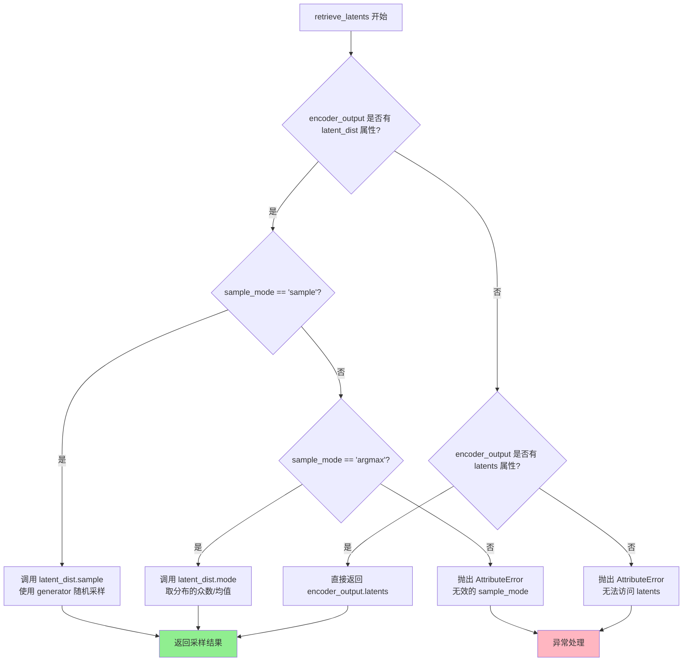
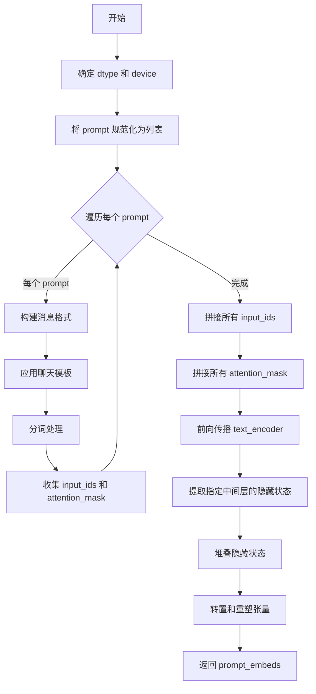
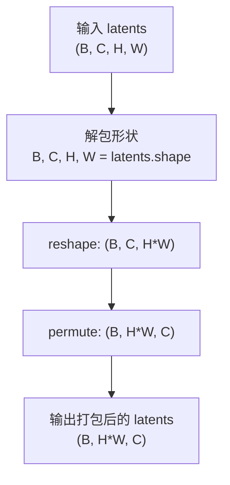
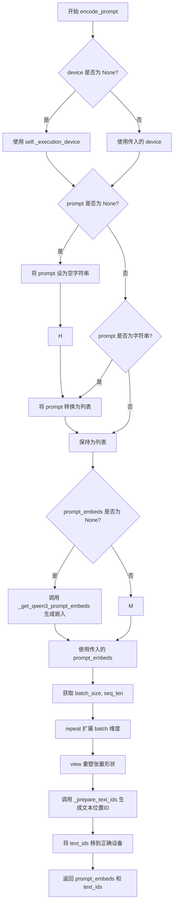
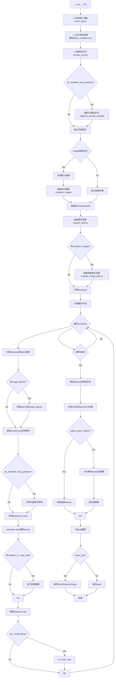

```mermaid
flowchart TD
    A[输入: x, x_ids] --> B[遍历batch]
    B --> C[提取当前位置ID: h_ids, w_ids]
    C --> D[计算height和width: h = max&#40;h_ids&#41; + 1, w = max&#40;w_ids&#41; + 1]
    D --> E[计算flat_ids = h_ids * w + w_ids]
    E --> F[创建输出张量: zeros&#40;h*w, ch&#41;]
    F --> G[使用scatter_将data散布到flat_ids位置]
    G --> H[reshape: &#40;h*w, ch&#41; -> &#40;h, w, ch&#41;]
    H --> I[permute: &#40;h, w, ch&#41; -> &#40;ch, h, w&#41;]
    I --> J[添加到x_list]
    J --> K{是否还有batch?}
    K -->|Yes| B
    K -->|No| L[stack: list -> tensor]
    L --> M[输出: &#40;batch_size, channels, height, width&#41;]
```

# `diffusers\src\diffusers\pipelines\flux2\pipeline_flux2_klein.py` 详细设计文档

Flux2KleinPipeline 是一个基于 Flux2 架构的文本到图像生成管道，使用 Qwen3ForCausalLM 作为文本编码器，FlowMatchEulerDiscreteScheduler 作为扩散调度器，支持图像条件生成、Classifier-Free Guidance、LoRA 加载和 VAE 潜在空间处理，实现从文本提示或文本+图像条件生成高质量图像的功能。

## 整体流程

```mermaid
graph TD
    A[开始: __call__] --> B[1. check_inputs: 验证输入参数]
B --> C[2. 设置内部状态: _guidance_scale, _attention_kwargs, _interrupt]
C --> D[3. 确定批次大小 batch_size]
D --> E[4. encode_prompt: 编码文本提示]
E --> F{do_classifier_free_guidance?}
F -- 是 --> G[编码 negative_prompt_embeds]
F -- 否 --> H[跳过 negative prompt]
G --> H
H --> I[5. 处理输入图像: 验证和预处理]
I --> J[6. prepare_latents: 准备初始噪声 latent]
J --> K{condition_images?}
K -- 是 --> L[prepare_image_latents: 编码条件图像]
K -- 否 --> M[跳过图像 latent 准备]
L --> M
M --> N[7. compute_mu + retrieve_timesteps: 计算时间步]
N --> O[8. 去噪循环: for t in timesteps]
O --> P[扩展 timestep 到批次维度]
P --> Q[准备 latent_model_input 和 latent_image_ids]
Q --> R{condition_images?}
R -- 是 --> S[拼接图像 latent]
R -- 否 --> T[仅使用文本 latent]
S --> T
T --> U[9. transformer 前向传播: 条件推理]
U --> V{do_classifier_free_guidance?}
V -- 是 --> W[transformer 前向传播: 无条件推理]
V -- 否 --> X[跳过 CFG]
W --> Y[计算 cfg: noise_pred = neg + guidance_scale * (noise_pred - neg)]
Y --> X
X --> Z[scheduler.step: 更新 latents]
Z --> AA{callback_on_step_end?}
AA -- 是 --> AB[执行回调函数]
AA -- 否 --> AC[更新进度条]
AB --> AC
AC --> AD{XLA_AVAILABLE?}
AD -- 是 --> AE[xm.mark_step: 标记 XLA 步骤]
AD -- 否 --> AF[继续下一轮]
AE --> AF
AF --> O
O -- 循环结束 --> AG[10. 后处理 latents: unpack, denorm, unpatchify]
AG --> AH{output_type == 'latent'?}
AH -- 是 --> AI[直接返回 latents]
AH -- 否 --> AJ[vae.decode: 解码为图像]
AJ --> AK[image_processor.postprocess: 后处理图像]
AK --> AL[maybe_free_model_hooks: 释放模型]
AL --> AM[返回 Flux2PipelineOutput]
AI --> AM
```

## 类结构

```
DiffusionPipeline (抽象基类)
├── Flux2LoraLoaderMixin (Mixin 类)
└── Flux2KleinPipeline (主类)
```

## 全局变量及字段


### `XLA_AVAILABLE`
    
Flag indicating whether PyTorch XLA is available for TPU acceleration

类型：`bool`
    


### `logger`
    
Logger instance for tracking pipeline execution and warnings

类型：`logging.Logger`
    


### `EXAMPLE_DOC_STRING`
    
Documentation string containing example usage code for the pipeline

类型：`str`
    


### `Flux2KleinPipeline.Flux2KleinPipeline.scheduler`
    
Scheduler for controlling the diffusion denoising process with flow matching

类型：`FlowMatchEulerDiscreteScheduler`
    


### `Flux2KleinPipeline.Flux2KleinPipeline.vae`
    
Variational Auto-Encoder for encoding images to latents and decoding latents back to images

类型：`AutoencoderKLFlux2`
    


### `Flux2KleinPipeline.Flux2KleinPipeline.text_encoder`
    
Qwen3 causal language model for generating text embeddings from prompt inputs

类型：`Qwen3ForCausalLM`
    


### `Flux2KleinPipeline.Flux2KleinPipeline.tokenizer`
    
Fast Qwen2 tokenizer for converting text prompts to token IDs

类型：`Qwen2TokenizerFast`
    


### `Flux2KleinPipeline.Flux2KleinPipeline.transformer`
    
Main transformer model for denoising latents based on text and image conditions

类型：`Flux2Transformer2DModel`
    


### `Flux2KleinPipeline.Flux2KleinPipeline.image_processor`
    
Image processor for handling input image preprocessing and output postprocessing

类型：`Flux2ImageProcessor`
    


### `Flux2KleinPipeline.Flux2KleinPipeline.vae_scale_factor`
    
Scaling factor for VAE latent space compression (typically 8 for 2x2 patching)

类型：`int`
    


### `Flux2KleinPipeline.Flux2KleinPipeline.tokenizer_max_length`
    
Maximum sequence length for tokenization (default 512 tokens)

类型：`int`
    


### `Flux2KleinPipeline.Flux2KleinPipeline.default_sample_size`
    
Default sample size in pixels for generating images when dimensions not specified

类型：`int`
    
    

## 全局函数及方法


### `compute_empirical_mu`

该函数用于计算扩散模型调度器中的经验 mu 值（mean parameter），根据图像序列长度和推理步数动态调整噪声调度策略。当图像序列长度超过 4300 时使用线性插值，否则基于两个预定义模型（200 步和 10 步）在不同序列长度下的表现进行分段线性计算。

参数：

- `image_seq_len`：`int`，图像序列长度，表示潜在空间中的token数量
- `num_steps`：`int`，推理步数，指扩散模型去噪的总迭代次数

返回值：`float`，计算得到的经验 mu 值，用于调度器的噪声调度

#### 流程图

```mermaid
flowchart TD
    A[开始 compute_empirical_mu] --> B{image_seq_len > 4300?}
    B -->|是| C[使用模型2计算: mu = a2 * image_seq_len + b2]
    C --> D[返回 float(mu)]
    B -->|否| E[计算 m_200 = a2 * image_seq_len + b2]
    E --> F[计算 m_10 = a1 * image_seq_len + b1]
    F --> G[计算斜率 a = (m_200 - m_10) / 190.0]
    G --> H[计算截距 b = m_200 - 200.0 * a]
    H --> I[计算 mu = a * num_steps + b]
    I --> D
    D --> J[结束]
```

#### 带注释源码

```python
# Copied from diffusers.pipelines.flux2.pipeline_flux2.compute_empirical_mu
def compute_empirical_mu(image_seq_len: int, num_steps: int) -> float:
    """
    计算经验 mu 值，用于扩散模型调度器的噪声调度。
    
    该函数基于预定义的线性模型，根据图像序列长度和推理步数
    计算一个经验性的 mu 参数，用于控制噪声的添加和去除过程。
    
    Args:
        image_seq_len: 图像序列长度，即潜在空间中的token数量
        num_steps: 推理步数，扩散模型的去噪迭代次数
    
    Returns:
        计算得到的经验 mu 值
    """
    # 模型1参数：用于较短序列 (10步基准)
    a1, b1 = 8.73809524e-05, 1.89833333
    # 模型2参数：用于较长序列 (200步基准)  
    a2, b2 = 0.00016927, 0.45666666

    # 当序列长度超过4300时，直接使用线性模型2
    if image_seq_len > 4300:
        mu = a2 * image_seq_len + b2
        return float(mu)

    # 计算模型2在当前序列长度下的基准值 (200步)
    m_200 = a2 * image_seq_len + b2
    # 计算模型1在当前序列长度下的基准值 (10步)
    m_10 = a1 * image_seq_len + b1

    # 通过两点线性插值计算斜率
    # 使用200步和10步的基准值进行线性插值
    a = (m_200 - m_10) / 190.0
    # 计算截距，确保在200步时通过m_200
    b = m_200 - 200.0 * a
    # 根据实际推理步数计算最终的mu值
    mu = a * num_steps + b

    return float(mu)
```


### `retrieve_timesteps`

该函数是扩散管道中用于获取时间步（timesteps）的工具函数。它负责调用调度器的 `set_timesteps` 方法，验证调度器是否支持自定义时间步或 sigmas，并返回调度后的时间步序列和推理步数。该函数支持三种模式：使用 `num_inference_steps` 自动计算时间步、使用自定义 `timesteps` 列表、或使用自定义 `sigmas` 列表。

参数：

- `scheduler`：`SchedulerMixin`，要获取时间步的调度器对象
- `num_inference_steps`：`int | None`，生成样本时使用的扩散步数，如果使用此参数则 `timesteps` 必须为 `None`
- `device`：`str | torch.device | None`，时间步要移动到的设备，如果为 `None` 则不移动
- `timesteps`：`list[int] | None`，用于覆盖调度器时间步间隔策略的自定义时间步，如果传入此参数则 `num_inference_steps` 和 `sigmas` 必须为 `None`
- `sigmas`：`list[float] | None`，用于覆盖调度器 sigma 间隔策略的自定义 sigmas，如果传入此参数则 `num_inference_steps` 和 `timesteps` 必须为 `None`
- `**kwargs`：任意关键字参数，将传递给调度器的 `set_timesteps` 方法

返回值：`tuple[torch.Tensor, int]`，元组第一个元素是调度器的时间步序列，第二个元素是推理步数

#### 流程图

```mermaid
flowchart TD
    A[开始 retrieve_timesteps] --> B{检查 timesteps 和 sigmas 是否同时存在}
    B -->|是| C[抛出 ValueError: 只能选择其中一个]
    B -->|否| D{检查 timesteps 是否存在}
    D -->|是| E[检查调度器是否支持自定义 timesteps]
    E -->|不支持| F[抛出 ValueError: 调度器不支持自定义时间步]
    E -->|支持| G[调用 scheduler.set_timesteps]
    G --> H[获取 scheduler.timesteps]
    H --> I[计算 num_inference_steps = len(timesteps)]
    D -->|否| J{检查 sigmas 是否存在}
    J -->|是| K[检查调度器是否支持自定义 sigmas]
    K -->|不支持| L[抛出 ValueError: 调度器不支持自定义 sigmas]
    K -->|支持| M[调用 scheduler.set_timesteps]
    M --> N[获取 scheduler.timesteps]
    N --> O[计算 num_inference_steps = len(timesteps)]
    J -->|否| P[调用 scheduler.set_timesteps]
    P --> Q[获取 scheduler.timesteps]
    Q --> R[返回 timesteps 和 num_inference_steps]
    I --> R
    O --> R
```

#### 带注释源码

```python
# Copied from diffusers.pipelines.stable_diffusion.pipeline_stable_diffusion.retrieve_timesteps
def retrieve_timesteps(
    scheduler,
    num_inference_steps: int | None = None,
    device: str | torch.device | None = None,
    timesteps: list[int] | None = None,
    sigmas: list[float] | None = None,
    **kwargs,
):
    r"""
    Calls the scheduler's `set_timesteps` method and retrieves timesteps from the scheduler after the call. Handles
    custom timesteps. Any kwargs will be supplied to `scheduler.set_timesteps`.

    Args:
        scheduler (`SchedulerMixin`):
            The scheduler to get timesteps from.
        num_inference_steps (`int`):
            The number of diffusion steps used when generating samples with a pre-trained model. If used, `timesteps`
            must be `None`.
        device (`str` or `torch.device`, *optional*):
            The device to which the timesteps should be moved to. If `None`, the timesteps are not moved.
        timesteps (`list[int]`, *optional*):
            Custom timesteps used to override the timestep spacing strategy of the scheduler. If `timesteps` is passed,
            `num_inference_steps` and `sigmas` must be `None`.
        sigmas (`list[float]`, *optional*):
            Custom sigmas used to override the timestep spacing strategy of the scheduler. If `sigmas` is passed,
            `num_inference_steps` and `timesteps` must be `None`.

    Returns:
        `tuple[torch.Tensor, int]`: A tuple where the first element is the timestep schedule from the scheduler and the
        second element is the number of inference steps.
    """
    # 检查用户是否同时传入了 timesteps 和 sigmas，这是不允许的
    if timesteps is not None and sigmas is not None:
        raise ValueError("Only one of `timesteps` or `sigmas` can be passed. Please choose one to set custom values")
    
    # 分支1: 处理自定义 timesteps
    if timesteps is not None:
        # 使用 inspect 模块检查调度器的 set_timesteps 方法是否接受 timesteps 参数
        accepts_timesteps = "timesteps" in set(inspect.signature(scheduler.set_timesteps).parameters.keys())
        if not accepts_timesteps:
            raise ValueError(
                f"The current scheduler class {scheduler.__class__}'s `set_timesteps` does not support custom"
                f" timestep schedules. Please check whether you are using the correct scheduler."
            )
        # 调用调度器的 set_timesteps 方法设置自定义时间步
        scheduler.set_timesteps(timesteps=timesteps, device=device, **kwargs)
        # 从调度器获取更新后的时间步
        timesteps = scheduler.timesteps
        # 计算实际的推理步数
        num_inference_steps = len(timesteps)
    
    # 分支2: 处理自定义 sigmas
    elif sigmas is not None:
        # 使用 inspect 模块检查调度器的 set_timesteps 方法是否接受 sigmas 参数
        accept_sigmas = "sigmas" in set(inspect.signature(scheduler.set_timesteps).parameters.keys())
        if not accept_sigmas:
            raise ValueError(
                f"The current scheduler class {scheduler.__class__}'s `set_timesteps` does not support custom"
                f" sigmas schedules. Please check whether you are using the correct scheduler."
            )
        # 调用调度器的 set_timesteps 方法设置自定义 sigmas
        scheduler.set_timesteps(sigmas=sigmas, device=device, **kwargs)
        # 从调度器获取更新后的时间步
        timesteps = scheduler.timesteps
        # 计算实际的推理步数
        num_inference_steps = len(timesteps)
    
    # 分支3: 使用默认的 num_inference_steps
    else:
        # 调用调度器的 set_timesteps 方法，使用步数自动计算时间步
        scheduler.set_timesteps(num_inference_steps, device=device, **kwargs)
        # 从调度器获取更新后的时间步
        timesteps = scheduler.timesteps
    
    # 返回时间步序列和推理步数
    return timesteps, num_inference_steps
```


### `retrieve_latents`

从编码器输出中提取潜在向量的通用函数，支持多种采样模式（sample/argmax）或直接返回预存的latents。

参数：

- `encoder_output`：`torch.Tensor`，编码器输出对象，可能包含 `latent_dist` 或 `latents` 属性
- `generator`：`torch.Generator | None`，用于随机采样的生成器，如果为 None 则使用随机种子
- `sample_mode`：`str`，采样模式，"sample" 表示从分布中采样，"argmax" 表示取分布的众数

返回值：`torch.Tensor`，提取出的潜在向量张量

#### 流程图



#### 带注释源码

```python
def retrieve_latents(
    encoder_output: torch.Tensor, generator: torch.Generator | None = None, sample_mode: str = "sample"
):
    """
    从编码器输出中检索潜在向量。
    
    该函数支持三种获取latents的方式：
    1. 从 latent_dist 分布中采样（sample_mode="sample"）
    2. 从 latent_dist 分布中取众数/模式（sample_mode="argmax"）
    3. 直接返回预存的 latents 属性
    
    Args:
        encoder_output: 编码器输出对象，通常是 VAE 的输出
        generator: 可选的随机生成器，用于确保采样可复现
        sample_mode: 采样模式，"sample" 或 "argmax"
    
    Returns:
        检索到的潜在向量张量
    
    Raises:
        AttributeError: 当无法从 encoder_output 中获取 latents 时
    """
    # 检查 encoder_output 是否有 latent_dist 属性（表示输出是分布形式）
    if hasattr(encoder_output, "latent_dist") and sample_mode == "sample":
        # 从潜在分布中随机采样
        # sample() 方法接受 generator 参数用于控制随机性
        return encoder_output.latent_dist.sample(generator)
    
    # 检查是否是 argmax 模式（取分布的众数/最可能值）
    elif hasattr(encoder_output, "latent_dist") and sample_mode == "argmax":
        # mode() 方法返回分布的众数（即概率最大的值）
        return encoder_output.latent_dist.mode()
    
    # 检查是否有直接存储的 latents 属性
    elif hasattr(encoder_output, "latents"):
        # 直接返回预计算的 latents
        return encoder_output.latents
    
    # 如果无法通过任何方式获取 latents，抛出错误
    else:
        raise AttributeError("Could not access latents of provided encoder_output")
```


### `Flux2KleinPipeline.__init__`

初始化 Flux2 Klein 文本到图像生成管道的核心方法，负责注册所有模块（VAE、文本编码器、tokenizer、调度器和变换器），配置 VAE 缩放因子，初始化图像处理器，并设置默认的采样参数。

参数：

-  `scheduler`：`FlowMatchEulerDiscreteScheduler`，用于去噪图像潜变量的调度器
-  `vae`：`AutoencoderKLFlux2`，用于将图像编码和解码到潜态表示的变分自编码器模型
-  `text_encoder`：`Qwen3ForCausalLM`，用于编码文本提示的 Qwen3 因果语言模型
-  `tokenizer`：`Qwen2TokenizerFast`，用于文本的 Qwen2 分词器
-  `transformer`：`Flux2Transformer2DModel`，用于去噪图像潜变量的条件 Transformer (MMDiT) 架构
-  `is_distilled`：`bool`，可选，默认值为 `False`，表示是否为蒸馏模型

返回值：`None`，构造函数不返回值，仅初始化对象状态

#### 流程图

```mermaid
flowchart TD
    A[开始 __init__] --> B[调用父类 DiffusionPipeline.__init__]
    B --> C{register_modules 注册模块}
    C --> D[vae: AutoencoderKLFlux2]
    C --> E[text_encoder: Qwen3ForCausalLM]
    C --> F[tokenizer: Qwen2TokenizerFast]
    C --> G[scheduler: FlowMatchEulerDiscreteScheduler]
    C --> H[transformer: Flux2Transformer2DModel]
    D --> I[register_to_config 注册 is_distilled 配置]
    E --> I
    F --> I
    G --> I
    H --> I
    I --> J{检查 vae 是否存在}
    J -->|是| K[计算 vae_scale_factor: 2^(len(vae.config.block_out_channels) - 1)]
    J -->|否| L[设置 vae_scale_factor = 8]
    K --> M[初始化 Flux2ImageProcessor<br/>vae_scale_factor * 2]
    L --> M
    M --> N[设置 tokenizer_max_length = 512]
    N --> O[设置 default_sample_size = 128]
    O --> P[结束 __init__]
```

#### 带注释源码

```python
def __init__(
    self,
    scheduler: FlowMatchEulerDiscreteScheduler,
    vae: AutoencoderKLFlux2,
    text_encoder: Qwen3ForCausalLM,
    tokenizer: Qwen2TokenizerFast,
    transformer: Flux2Transformer2DModel,
    is_distilled: bool = False,
):
    """
    初始化 Flux2KleinPipeline 管道实例。
    
    参数:
        scheduler: FlowMatchEulerDiscreteScheduler，用于去噪的调度器
        vae: AutoencoderKLFlux2，VAE 模型
        text_encoder: Qwen3ForCausalLM，文本编码器
        tokenizer: Qwen2TokenizerFast，分词器
        transformer: Flux2Transformer2DModel，去噪变换器
        is_distilled: bool，是否为蒸馏模型
    """
    # 调用父类 DiffusionPipeline 的初始化方法，设置基础管道结构
    # 同时也继承 Flux2LoraLoaderMixin 的初始化逻辑
    super().__init__()

    # 注册所有模块，使它们可以通过管道属性访问
    # 这些模块会在管道调用时被用到
    self.register_modules(
        vae=vae,
        text_encoder=text_encoder,
        tokenizer=tokenizer,
        scheduler=scheduler,
        transformer=transformer,
    )

    # 将 is_distilled 参数注册到管道配置中
    # 用于后续判断是否忽略 guidance_scale 等参数
    self.register_to_config(is_distilled=is_distilled)

    # 计算 VAE 缩放因子
    # VAE 通常对图像进行 8x 压缩 (2^(3-1) = 4, 但这里考虑了 block_out_channels)
    # 如果 vae 存在，根据其配置的 block_out_channels 计算
    # 否则使用默认的 8
    self.vae_scale_factor = 2 ** (len(self.vae.config.block_out_channels) - 1) if getattr(self, "vae", None) else 8
    
    # Flux 潜变量被转换为 2x2 的 patch 并打包
    # 这意味着潜变量的宽度和高度必须能被 patch size 整除
    # 因此 vae_scale_factor 需要乘以 patch size (2) 来考虑这一点
    # 初始化 Flux2ImageProcessor，用于图像预处理和后处理
    self.image_processor = Flux2ImageProcessor(vae_scale_factor=self.vae_scale_factor * 2)
    
    # 设置 tokenizer 的最大序列长度
    # Qwen2TokenizerFast 默认支持的长度
    self.tokenizer_max_length = 512
    
    # 设置默认的样本大小
    # 用于当用户未指定 height 和 width 时
    self.default_sample_size = 128
```


### `Flux2KleinPipeline._get_qwen3_prompt_embeds`

该函数是 Flux2KleinPipeline 类中的静态方法，负责使用 Qwen3 文本编码器将文本提示转换为高维嵌入向量。通过应用聊天模板、分词、编码器前向传播，并从指定的中间隐藏层提取特征，最终返回融合了多层语义信息的文本嵌入张量，供后续扩散模型生成图像使用。

参数：

- `text_encoder`：`Qwen3ForCausalLM`，Qwen3 因果语言模型，用于生成文本嵌入
- `tokenizer`：`Qwen2TokenizerFast`，Qwen2 快速分词器，用于对文本进行分词处理
- `prompt`：`str | list[str]`，输入的文本提示，可以是单个字符串或字符串列表
- `dtype`：`torch.dtype | None`，输出张量的数据类型，若为 None 则使用 text_encoder 的数据类型
- `device`：`torch.device | None`，输出张量的设备，若为 None 则使用 text_encoder 的设备
- `max_sequence_length`：`int`，最大序列长度，默认为 512
- `hidden_states_layers`：`list[int]`，用于提取嵌入的中间隐藏层索引列表，默认为 (9, 18, 27)

返回值：`torch.Tensor`，形状为 `(batch_size, seq_len, num_channels * hidden_dim)` 的文本嵌入张量，其中 batch_size 为提示数量，seq_len 为序列长度

#### 流程图



#### 带注释源码

```python
@staticmethod
def _get_qwen3_prompt_embeds(
    text_encoder: Qwen3ForCausalLM,
    tokenizer: Qwen2TokenizerFast,
    prompt: str | list[str],
    dtype: torch.dtype | None = None,
    device: torch.device | None = None,
    max_sequence_length: int = 512,
    hidden_states_layers: list[int] = (9, 18, 27),
):
    # 如果未指定 dtype，则使用 text_encoder 的数据类型
    dtype = text_encoder.dtype if dtype is None else dtype
    # 如果未指定 device，则使用 text_encoder 的设备
    device = text_encoder.device if device is None else device

    # 将单个字符串转换为列表，统一处理方式
    prompt = [prompt] if isinstance(prompt, str) else prompt

    # 用于收集所有批次的 input_ids 和 attention_mask
    all_input_ids = []
    all_attention_masks = []

    # 遍历每个提示文本
    for single_prompt in prompt:
        # 构建消息格式，角色为 user
        messages = [{"role": "user", "content": single_prompt}]
        # 应用聊天模板，将消息转换为模型输入格式
        text = tokenizer.apply_chat_template(
            messages,
            tokenize=False,  # 不进行分词，只返回文本
            add_generation_prompt=True,  # 添加生成提示
            enable_thinking=False,  # 禁用思考模式
        )
        # 使用分词器将文本转换为张量
        inputs = tokenizer(
            text,
            return_tensors="pt",  # 返回 PyTorch 张量
            padding="max_length",  # 填充到最大长度
            truncation=True,  # 允许截断
            max_length=max_sequence_length,  # 最大序列长度
        )

        # 收集当前批次的 input_ids 和 attention_mask
        all_input_ids.append(inputs["input_ids"])
        all_attention_masks.append(inputs["attention_mask"])

    # 沿批次维度拼接所有 input_ids，并移动到指定设备
    input_ids = torch.cat(all_input_ids, dim=0).to(device)
    # 沿批次维度拼接所有 attention_mask，并移动到指定设备
    attention_mask = torch.cat(all_attention_masks, dim=0).to(device)

    # 执行模型前向传播，获取所有隐藏状态
    output = text_encoder(
        input_ids=input_ids,
        attention_mask=attention_mask,
        output_hidden_states=True,  # 输出所有隐藏状态
        use_cache=False,  # 禁用 KV 缓存
    )

    # 从指定的中间层提取隐藏状态并沿新维度堆叠
    # 输出形状: (batch_size, num_layers, seq_len, hidden_dim)
    out = torch.stack([output.hidden_states[k] for k in hidden_states_layers], dim=1)
    # 将张量转换到指定的 dtype 和 device
    out = out.to(dtype=dtype, device=device)

    # 获取输出张量的形状
    batch_size, num_channels, seq_len, hidden_dim = out.shape
    # 转置并重塑张量: (batch_size, seq_len, num_channels * hidden_dim)
    # 将多个中间层的特征在通道维度上拼接
    prompt_embeds = out.permute(0, 2, 1, 3).reshape(batch_size, seq_len, num_channels * hidden_dim)

    # 返回最终的文本嵌入张量
    return prompt_embeds
```


### `Flux2KleinPipeline._prepare_text_ids`

该方法是一个静态方法，用于为文本嵌入（prompt embeddings）生成4D位置坐标（T, H, W, L）。它接收文本嵌入张量作为输入，为每个批处理元素生成唯一的坐标标识符，以便在Transformer模型中进行位置感知处理。

参数：

- `x`：`torch.Tensor`，输入的文本嵌入张量，形状为(B, L, D)或(L, D)，其中B为批次大小，L为序列长度，D为隐藏维度
- `t_coord`：`torch.Tensor | None`，可选的时间坐标张量，用于指定时间维度坐标，默认为None

返回值：`torch.Tensor`，返回堆叠后的坐标张量，形状为(B, L, 4)，其中4维分别代表T（时间）、H（高度）、W（宽度）、L（序列长度）

#### 流程图

```mermaid
flowchart TD
    A[开始] --> B[获取输入张量x的形状: B, L, D]
    B --> C[初始化空列表 out_ids]
    C --> D{遍历批次 i from 0 to B-1}
    D -->|t_coord is None| E[t = torch.arange&#40;1&#41;]
    D -->|t_coord is not None| F[t = t_coord[i]]
    E --> G[h = torch.arange&#40;1&#41;]
    F --> G
    G --> H[w = torch.arange&#40;1&#41;]
    H --> I[l = torch.arange&#40;L&#41;]
    I --> J[coords = torch.cartesian_prod&#40;t, h, w, l&#41;]
    J --> K[out_ids.append&#40;coords&#41;]
    K --> D
    D --> L{批次遍历完成?}
    L -->|否| D
    L -->|是| M[return torch.stack&#40;out_ids&#41;]
    M --> N[结束]
```

#### 带注释源码

```python
@staticmethod
# Copied from diffusers.pipelines.flux2.pipeline_flux2.Flux2Pipeline._prepare_text_ids
def _prepare_text_ids(
    x: torch.Tensor,  # (B, L, D) or (L, D)
    t_coord: torch.Tensor | None = None,
):
    """
    为文本嵌入生成4D位置坐标 (T, H, W, L)。
    
    参数:
        x: 文本嵌入张量，形状为 (B, L, D) 或 (L, D)
        t_coord: 可选的时间坐标，用于指定时间维度
    
    返回:
        坐标张量，形状为 (B, L, 4)
    """
    # 获取输入张量的形状信息
    # B: 批次大小, L: 序列长度, D: 隐藏维度
    B, L, _ = x.shape
    
    # 用于存储每个批处理元素的坐标
    out_ids = []

    # 遍历每个批次元素
    for i in range(B):
        # 确定时间坐标 t
        # 如果提供了 t_coord，则使用指定的坐标；否则默认为 [0]
        t = torch.arange(1) if t_coord is None else t_coord[i]
        
        # 高度和宽度维度默认为 [0]
        # 因为文本是一维序列，没有空间结构
        h = torch.arange(1)
        w = torch.arange(1)
        
        # 序列长度维度覆盖整个文本长度 L
        l = torch.arange(L)

        # 使用笛卡尔积生成所有坐标组合
        # 结果形状: (L, 4) - 包含 T, H, W, L 四个维度
        coords = torch.cartesian_prod(t, h, w, l)
        
        # 将当前批次的坐标添加到列表中
        out_ids.append(coords)

    # 堆叠所有批次的坐标，形成最终的张量
    # 输出形状: (B, L, 4)
    return torch.stack(out_ids)
```


### `Flux2KleinPipeline._prepare_latent_ids`

该方法是一个静态方法，用于为潜在张量（latent tensors）生成4D位置坐标（T, H, W, L），以便在Transformer模型中进行位置编码。这些坐标用于标识每个潜在像素在空间中的位置，使得模型能够理解图像的空间结构。

参数：

- `latents`：`torch.Tensor`，形状为 (B, C, H, W)，其中 B 是批次大小，C 是通道数，H 和 W 分别是潜在张量的高度和宽度

返回值：`torch.Tensor`，形状为 (B, H\*W, 4)，返回的位置ID张量包含四个坐标维度（T, H, W, L），所有批次共享相同的坐标结构：T=0, H=[0..H-1], W=[0..W-1], L=0

#### 流程图

```mermaid
flowchart TD
    A[开始: 接收latents张量] --> B[提取batch_size, height, width]
    B --> C[创建坐标范围: t, h, w, l]
    C --> D[使用torch.cartesian_prod生成坐标组合]
    D --> E[形状: (H*W, 4)]
    E --> F[扩展到批次维度]
    F --> G[形状: (B, H*W, 4)]
    G --> H[返回latent_ids]
```

#### 带注释源码

```python
@staticmethod
# Copied from diffusers.pipelines.flux2.pipeline_flux2.Flux2Pipeline._prepare_latent_ids
def _prepare_latent_ids(
    latents: torch.Tensor,  # (B, C, H, W)
):
    r"""
    Generates 4D position coordinates (T, H, W, L) for latent tensors.

    Args:
        latents (torch.Tensor):
            Latent tensor of shape (B, C, H, W)

    Returns:
        torch.Tensor:
            Position IDs tensor of shape (B, H*W, 4) All batches share the same coordinate structure: T=0,
            H=[0..H-1], W=[0..W-1], L=0
    """

    # 从输入张量中解包出批次大小、通道数、高度和宽度
    # 通道数在此方法中不使用，仅需高度和宽度
    batch_size, _, height, width = latents.shape

    # 创建各维度的坐标范围
    t = torch.arange(1)  # [0] - 时间维度，始终为0
    h = torch.arange(height)  # 高度维度: [0, 1, ..., H-1]
    w = torch.arange(width)  # 宽度维度: [0, 1, ..., W-1]
    l = torch.arange(1)  # [0] - 层维度，始终为0（用于序列长度维度）

    # 使用笛卡尔积生成所有坐标组合 (H*W, 4)
    # 每个组合的格式为 [t, h, w, l]
    latent_ids = torch.cartesian_prod(t, h, w, l)

    # 扩展到批次维度: 从 (H*W, 4) 扩展到 (B, H*W, 4)
    # 使得每个批次共享相同的坐标结构
    latent_ids = latent_ids.unsqueeze(0).expand(batch_size, -1, -1)

    return latent_ids
```


### `Flux2KleinPipeline._prepare_image_ids`

该函数用于为一系列图像潜在表示（image latents）生成4D时间-空间坐标（T, H, W, L），为每个潜在图像中的每个像素/_patch分配唯一的坐标标识符，以便在Flux2模型中进行位置编码和注意力计算。

参数：

- `image_latents`：`list[torch.Tensor]`，输入的图像潜在表示列表，每个元素通常为形状 (1, C, H, W) 的张量
- `scale`：`int`，用于定义潜在图像之间时间分离程度的因子，默认值为10

返回值：`torch.Tensor`，组合后的坐标张量，形状为 (1, N_total, 4)，其中 N_total 是所有输入潜在图像的 H × W 之和

#### 流程图

```mermaid
flowchart TD
    A[开始 _prepare_image_ids] --> B{验证 image_latents 是否为列表}
    B -->|否| C[抛出 ValueError]
    B -->|是| D[为每个潜在图像生成时间坐标 T]
    D --> E[遍历 image_latents 和对应的时间坐标]
    E --> F[提取潜在图像的 H 和 W]
    E --> G[使用笛卡尔积生成 4D 坐标]
    G --> H[将坐标添加到列表]
    H --> I{是否还有更多潜在图像}
    I -->|是| E
    I -->|否| J[沿 dim=0 拼接所有坐标]
    J --> K[添加批次维度 unsqueeze(0)]
    L[返回最终坐标张量]
    K --> L
```

#### 带注释源码

```python
@staticmethod
# Copied from diffusers.pipelines.flux2.pipeline_flux2.Flux2Pipeline._prepare_image_ids
def _prepare_image_ids(
    image_latents: list[torch.Tensor],  # [(1, C, H, W), (1, C, H, W), ...]
    scale: int = 10,
):
    r"""
    Generates 4D time-space coordinates (T, H, W, L) for a sequence of image latents.

    This function creates a unique coordinate for every pixel/patch across all input latent with different
    dimensions.

    Args:
        image_latents (list[torch.Tensor]):
            A list of image latent feature tensors, typically of shape (C, H, W).
        scale (int, optional):
            A factor used to define the time separation (T-coordinate) between latents. T-coordinate for the i-th
            latent is: 'scale + scale * i'. Defaults to 10.

    Returns:
        torch.Tensor:
            The combined coordinate tensor. Shape: (1, N_total, 4) Where N_total is the sum of (H * W) for all
            input latents.

    Coordinate Components (Dimension 4):
        - T (Time): The unique index indicating which latent image the coordinate belongs to.
        - H (Height): The row index within that latent image.
        - W (Width): The column index within that latent image.
        - L (Seq. Length): A sequence length dimension, which is always fixed at 0 (size 1)
    """

    # 参数校验：确保输入是列表类型
    if not isinstance(image_latents, list):
        raise ValueError(f"Expected `image_latents` to be a list, got {type(image_latents)}.")

    # 创建每个参考图像的时间偏移量
    # 第 i 个潜在图像的 T 坐标为: scale + scale * i
    # 例如 scale=10 时: [10, 20, 30, ...]
    t_coords = [scale + scale * t for t in torch.arange(0, len(image_latents))]
    # 调整形状以便于后续处理
    t_coords = [t.view(-1) for t in t_coords]

    # 存储每个潜在图像的坐标标识符
    image_latent_ids = []
    # 遍历每个潜在图像及其对应的时间坐标
    for x, t in zip(image_latents, t_coords):
        # 移除批次维度: (1, C, H, W) -> (C, H, W)
        x = x.squeeze(0)
        # 获取潜在图像的高度和宽度
        _, height, width = x.shape

        # 使用笛卡尔积生成4D坐标 (T, H, W, L)
        # T: 时间维度（哪个潜在图像）
        # H: 高度维度（行索引）
        # W: 宽度维度（列索引）
        # L: 序列长度维度，固定为0
        x_ids = torch.cartesian_prod(t, torch.arange(height), torch.arange(width), torch.arange(1))
        # 将当前潜在图像的坐标添加到列表
        image_latent_ids.append(x_ids)

    # 沿序列维度拼接所有潜在图像的坐标
    image_latent_ids = torch.cat(image_latent_ids, dim=0)
    # 添加批次维度: (N_total, 4) -> (1, N_total, 4)
    image_latent_ids = image_latent_ids.unsqueeze(0)

    return image_latent_ids
```


### `Flux2KleinPipeline._patchify_latents`

该函数将输入的latent张量从原始形式 (batch_size, num_channels, height, width) 转换为patchified形式 (batch_size, num_channels * 4, height // 2, width // 2)。这是Flux2模型中的关键操作，将每个2x2的空间区域flatten为额外的通道维度，以便于后续的Transformer处理。

参数：

-  `latents`：`torch.Tensor`，输入的latent张量，形状为 (batch_size, num_channels_latents, height, width)

返回值：`torch.Tensor`，patchify后的latent张量，形状为 (batch_size, num_channels_latents * 4, height // 2, width // 2)

#### 流程图

```mermaid
flowchart TD
    A[输入 latents<br/>shape: (B, C, H, W)] --> B[提取shape信息<br/>batch_size, num_channels, height, width]
    
    B --> C[view 操作<br/>变形为 (B, C, H//2, 2, W//2, 2)]
    C --> D[permute 维度重排<br/>变为 (B, C, 2, 2, H//2, W//2)]
    D --> E[reshape 重新塑形<br/>合并patch维度<br/>变为 (B, C*4, H//2, W//2)]
    
    E --> F[输出 patchified latents<br/>shape: (B, C*4, H//2, W//2)]
    
    style A fill:#e1f5fe
    style F fill:#e8f5e8
```

#### 带注释源码

```python
@staticmethod
# Copied from diffusers.pipelines.flux2.pipeline_flux2.Flux2Pipeline._patchify_latents
def _patchify_latents(latents):
    """
    将latent张量转换为patchified形式。
    
    这个操作将每个2x2的空间区域flatten为一个通道，实现空间到通道的转换。
    例如：4x4的空间会被转换为2x2的空间但通道数增加4倍。
    
    Args:
        latents: 输入张量，形状为 (batch_size, num_channels_latents, height, width)
    
    Returns:
        torch.Tensor: patchified张量，形状为 (batch_size, num_channels_latents * 4, height // 2, width // 2)
    """
    # 1. 从输入张量中提取维度信息
    batch_size, num_channels_latents, height, width = latents.shape
    
    # 2. 第一次view变形：将height和width各分成两半，并在新维度上展开为2
    # 从 (B, C, H, W) -> (B, C, H//2, 2, W//2, 2)
    # 相当于将每个2x2的块提取出来
    latents = latents.view(batch_size, num_channels_latents, height // 2, 2, width // 2, 2)
    
    # 3. permute维度重排：将2x2的patch维度移到通道维度之前
    # 从 (B, C, H//2, 2, W//2, 2) -> (B, C, 2, 2, H//2, W//2)
    # 这样可以方便地将2x2的4个值flatten到一个通道中
    latents = latents.permute(0, 1, 3, 5, 2, 4)
    
    # 4. reshape最终变形：合并所有patch维度到通道维度
    # 从 (B, C, 2, 2, H//2, W//2) -> (B, C*4, H//2, W//2)
    # 每个位置的2x2块被展平为单个通道值
    latents = latents.reshape(batch_size, num_channels_latents * 4, height // 2, width // 2)
    
    return latents
```


### `Flux2KleinPipeline._unpatchify_latents`

该方法用于将已 patchify 的 latents 张量还原为原始的空间维度。它是 `_patchify_latents` 的逆操作，将 2x2 patch 展开回原始的 latent 表示。

参数：

- `latents`：`torch.Tensor`，输入的 patchified latents 张量，形状为 `(batch_size, num_channels_latents, height, width)`，其中 `num_channels_latents` 已被 `4`（2×2）放大

返回值：`torch.Tensor`，还原后的 latents 张量，形状为 `(batch_size, num_channels_latents // 4, height * 2, width * 2)`

#### 流程图

```mermaid
flowchart TD
    A[输入 latents: (B, C, H, W)] --> B[提取 shape: batch_size, num_channels_latents, height, width]
    B --> C[reshape to: (B, C//4, 2, 2, H, W)]
    C --> D[permute: (B, C//4, H, 2, W, 2)]
    D --> E[reshape to: (B, C//4, H*2, W*2)]
    E --> F[输出 latents: (B, C//4, H*2, W*2)]
```

#### 带注释源码

```python
@staticmethod
# Copied from diffusers.pipelines.flux2.pipeline_flux2.Flux2Pipeline._unpatchify_latents
def _unpatchify_latents(latents):
    """
    将 patchified latents 还原为原始空间维度（2x2 patch 展开）
    
    这是 _patchify_latents 的逆操作
    """
    # 1. 获取输入张量的维度信息
    batch_size, num_channels_latents, height, width = latents.shape
    # batch_size: 批次大小
    # num_channels_latents: patchified 后的通道数（原通道数 * 4）
    # height, width: patchified 后的空间维度
    
    # 2. 将通道数还原为原始通道数（除以 2*2=4），并在通道维度后插入 2x2 的 patch 维度
    # (B, C, H, W) -> (B, C//4, 2, 2, H, W)
    latents = latents.reshape(batch_size, num_channels_latents // (2 * 2), 2, 2, height, width)
    
    # 3. 调整维度顺序：将 patch 维度与空间维度对齐
    # (B, C//4, 2, 2, H, W) -> (B, C//4, H, 2, W, 2)
    # 也就是将 (C', p_h, p_w, H, W) -> (C', H, p_h, W, p_w)
    latents = latents.permute(0, 1, 4, 2, 5, 3)
    
    # 4. 合并 patch 维度和空间维度，还原原始的空间大小
    # (B, C//4, H, 2, W, 2) -> (B, C//4, H*2, W*2)
    latents = latents.reshape(batch_size, num_channels_latents // (2 * 2), height * 2, width * 2)
    
    return latents
```


### `Flux2KleinPipeline._pack_latents`

将 latents 从 4D 张量 (batch_size, num_channels, height, width) 重塑为 3D 张量 (batch_size, height * width, num_channels)，以适应后续 Transformer 处理的序列格式。

参数：

- `latents`：`torch.Tensor`，输入的 latents 张量，形状为 (batch_size, num_channels, height, width)

返回值：`torch.Tensor`，打包后的 latents 张量，形状为 (batch_size, height * width, num_channels)

#### 流程图



#### 带注释源码

```python
@staticmethod
# Copied from diffusers.pipelines.flux2.pipeline_flux2.Flux2Pipeline._pack_latents
def _pack_latents(latents):
    """
    pack latents: (batch_size, num_channels, height, width) -> (batch_size, height * width, num_channels)
    """
    # 从输入张量中提取批次大小、通道数、高度和宽度
    batch_size, num_channels, height, width = latents.shape
    
    # 第一步重塑：将 (B, C, H, W) 转换为 (B, C, H*W)
    # 将 2D 空间维度 (H, W) 展平为 1D 序列维度 (H*W)
    latents = latents.reshape(batch_size, num_channels, height * width)
    
    # 第二步置换：将 (B, C, H*W) 转换为 (B, H*W, C)
    # 将通道维度移到最后，使其符合 Transformer 期望的 (batch, seq_len, features) 格式
    latents = latents.permute(0, 2, 1)
    
    # 返回打包后的 latents，形状为 (batch_size, height * width, num_channels)
    return latents
```


### `Flux2KleinPipeline._unpack_latents_with_ids`

使用位置标识符（position IDs）将压缩的latent token散布（scatter）回原始的2D图像空间位置，实现从packed形式还原为2D grid结构。

参数：

- `x`：`torch.Tensor`，输入的压缩latent张量，形状为 (batch_size, seq_len, channels)，其中seq_len = height * width
- `x_ids`：`torch.Tensor`，位置标识符张量，形状为 (batch_size, seq_len, 4)，包含4D坐标 (T, H, W, L)

返回值：`torch.Tensor`，还原后的latent张量，形状为 (batch_size, channels, height, width)

#### 流程图



#### 带注释源码

```python
@staticmethod
# Copied from diffusers.pipelines.flux2.pipeline_flux2.Flux2Pipeline._unpack_latents_with_ids
def _unpack_latents_with_ids(x: torch.Tensor, x_ids: torch.Tensor) -> list[torch.Tensor]:
    """
    使用位置标识符将压缩的latent token散布回原始的2D空间位置
    
    参数:
        x: 压缩后的latent张量，形状为 (batch_size, height*width, channels)
        x_ids: 位置标识符，形状为 (batch_size, height*width, 4)，包含 (T, H, W, L) 坐标
    
    返回:
        还原后的latent张量，形状为 (batch_size, channels, height, width)
    """
    x_list = []
    
    # 遍历batch中的每个样本
    for data, pos in zip(x, x_ids):
        # 提取通道数
        _, ch = data.shape  # noqa: F841
        
        # 从位置ID中提取高度和宽度索引 (T, H, W, L)
        h_ids = pos[:, 1].to(torch.int64)  # 高度索引
        w_ids = pos[:, 2].to(torch.int64)  # 宽度索引
        
        # 计算图像的高度和宽度 (找到最大值并+1)
        h = torch.max(h_ids) + 1
        w = torch.max(w_ids) + 1
        
        # 将2D坐标展平为1D索引: flat_id = h * width + w
        flat_ids = h_ids * w + w_ids
        
        # 创建输出张量，初始化为零
        out = torch.zeros((h * w, ch), device=data.device, dtype=data.dtype)
        
        # 使用scatter操作将数据散布到正确的位置
        # 将data中的每个token放置到out中flat_ids对应的位置
        out.scatter_(0, flat_ids.unsqueeze(1).expand(-1, ch), data)
        
        # reshape: 从 (H*W, C) 重塑为 (H, W, C)
        out = out.view(h, w, ch)
        
        # permute: 从 (H, W, C) 转换为 (C, H, W)
        out = out.permute(2, 0, 1)
        
        # 添加到列表中
        x_list.append(out)
    
    # 将列表中的tensor堆叠成batch
    return torch.stack(x_list, dim=0)
```


### `Flux2KleinPipeline.encode_prompt`

该方法负责将文本提示（prompt）编码为文本嵌入（prompt embeddings）并生成相应的文本位置ID，用于后续的图像生成流程。

参数：

- `self`：`Flux2KleinPipeline` 实例本身
- `prompt`：`str | list[str]`，要编码的文本提示，可以是单个字符串或字符串列表
- `device`：`torch.device | None`，指定计算设备，默认为 None（会自动获取执行设备）
- `num_images_per_prompt`：`int`，每个提示生成的图像数量，默认为 1
- `prompt_embeds`：`torch.Tensor | None`，预计算的文本嵌入，如果为 None 则根据 prompt 自动生成
- `max_sequence_length`：`int`，文本序列的最大长度，默认为 512
- `text_encoder_out_layers`：`tuple[int]`，用于提取文本嵌入的文本编码器中间层索引，默认为 (9, 18, 27)

返回值：`tuple[torch.Tensor, torch.Tensor]`，返回一个元组，包含：
- `prompt_embeds`：`torch.Tensor`，编码后的文本嵌入，形状为 (batch_size * num_images_per_prompt, seq_len, hidden_dim)
- `text_ids`：`torch.Tensor`，文本的位置ID，用于 transformer 的位置编码

#### 流程图



#### 带注释源码

```python
def encode_prompt(
    self,
    prompt: str | list[str],                    # 输入的文本提示
    device: torch.device | None = None,         # 计算设备
    num_images_per_prompt: int = 1,             # 每个提示生成的图像数量
    prompt_embeds: torch.Tensor | None = None,  # 预计算的文本嵌入（可选）
    max_sequence_length: int = 512,             # 文本序列最大长度
    text_encoder_out_layers: tuple[int] = (9, 18, 27),  # 文本编码器中间层索引
):
    # 确定执行设备：如果未指定，则使用pipeline的默认执行设备
    device = device or self._execution_device

    # 处理空提示的情况
    if prompt is None:
        prompt = ""

    # 标准化提示格式：确保 prompt 是列表
    # 如果是单个字符串，转换为单元素列表
    prompt = [prompt] if isinstance(prompt, str) else prompt

    # 如果没有提供预计算的嵌入，则使用 Qwen3 文本编码器生成
    if prompt_embeds is None:
        prompt_embeds = self._get_qwen3_prompt_embeds(
            text_encoder=self.text_encoder,           # Qwen3 文本编码器
            tokenizer=self.tokenizer,                 # Qwen2 分词器
            prompt=prompt,                             # 文本提示列表
            device=device,                             # 计算设备
            max_sequence_length=max_sequence_length,   # 最大序列长度
            hidden_states_layers=text_encoder_out_layers,  # 中间层索引
        )

    # 获取当前嵌入的形状信息
    batch_size, seq_len, _ = prompt_embeds.shape
    
    # 扩展嵌入以匹配生成的图像数量
    # repeat(1, num_images_per_prompt, 1) 沿 batch 维度复制
    prompt_embeds = prompt_embeds.repeat(1, num_images_per_prompt, 1)
    
    # 重塑张量以获得最终的嵌入形状
    # 从 (batch_size, num_images_per_prompt * seq_len, hidden_dim)
    # 变为 (batch_size * num_images_per_prompt, seq_len, hidden_dim)
    prompt_embeds = prompt_embeds.view(batch_size * num_images_per_prompt, seq_len, -1)

    # 生成文本位置ID，用于 transformer 的位置编码
    # _prepare_text_ids 创建 4D 坐标 (T, H, W, L) 用于文本标记
    text_ids = self._prepare_text_ids(prompt_embeds)
    
    # 将文本位置ID移到正确的计算设备
    text_ids = text_ids.to(device)
    
    # 返回编码后的文本嵌入和文本位置ID
    return prompt_embeds, text_ids
```


### `Flux2KleinPipeline._encode_vae_image`

该方法负责将输入图像编码为 VAE 潜在表示，并进行分块处理和批归一化规范化。它首先验证输入维度，然后通过 VAE 编码器获取潜在表示，接着应用分块操作，最后使用 VAE 的批归一化统计量（均值和标准差）对潜在表示进行标准化处理。

参数：

- `self`：类实例，包含 VAE 模型及其配置
- `image`：`torch.Tensor`，输入图像张量，形状为 (B, C, H, W)，需为 4 维
- `generator`：`torch.Generator`，随机数生成器，用于潜在采样

返回值：`torch.Tensor`，编码并规范化后的图像潜在表示，形状为 (B, C', H', W')，其中 C' = num_channels_latents * 4

#### 流程图

```mermaid
flowchart TD
    A[开始: 输入image和generator] --> B{检查image维度}
    B -->|维度=4| C[调用vae.encode编码图像]
    B -->|维度≠4| D[抛出ValueError]
    C --> E[调用retrieve_latents获取潜在分布]
    E --> F[调用_patchify_latents分块潜在表示]
    F --> G[获取VAE批归一化均值 running_mean]
    G --> H[获取VAE批归一化标准差 running_var]
    H --> I[计算标准化: (latents - mean) / std]
    I --> J[返回处理后的image_latents]
    D --> K[结束: 抛出异常]
```

#### 带注释源码

```python
def _encode_vae_image(self, image: torch.Tensor, generator: torch.Generator):
    """
    编码图像为VAE潜在表示并应用批归一化规范化
    
    处理流程：
    1. 验证输入维度
    2. 使用VAE编码器编码图像
    3. 从编码器输出中检索潜在表示
    4. 对潜在表示进行分块(patchify)处理
    5. 应用批归一化统计量进行标准化
    """
    
    # 步骤1: 验证输入图像维度
    # 确保输入为4D张量 (B, C, H, W)
    if image.ndim != 4:
        raise ValueError(f"Expected image dims 4, got {image.ndim}.")

    # 步骤2 & 3: VAE编码并检索潜在表示
    # 使用argmax模式从潜在分布中获取确定性输出
    image_latents = retrieve_latents(
        self.vae.encode(image), 
        generator=generator, 
        sample_mode="argmax"
    )
    
    # 步骤4: 分块处理
    # 将2x2的patch展平为单个通道，扩展维度: (B, C, H, W) -> (B, C*4, H/2, W/2)
    image_latents = self._patchify_latents(image_latents)

    # 步骤5: 批归一化规范化
    # 获取VAE批归一化层的运行均值，形状: (C,) -> (1, C, 1, 1)
    latents_bn_mean = self.vae.bn.running_mean.view(1, -1, 1, 1).to(
        image_latents.device, 
        image_latents.dtype
    )
    
    # 计算标准差：sqrt(var + eps) 防止数值不稳定
    latents_bn_std = torch.sqrt(
        self.vae.bn.running_var.view(1, -1, 1, 1) + self.vae.config.batch_norm_eps
    )
    
    # 应用标准化: (x - mean) / std
    image_latents = (image_latents - latents_bn_mean) / latents_bn_std

    return image_latents
```


### `Flux2KleinPipeline.prepare_latents`

该方法用于为 Flux2 图像生成管道准备潜在向量（latents），包括调整图像尺寸以适应 VAE 压缩和打包需求，生成或处理输入的潜在向量，并生成相应的位置 ID 以便后续的变换器模型使用。

参数：

- `batch_size`：`int`，批量大小，指定要生成的图像数量
- `num_latents_channels`：`int`，潜在向量的通道数，通常为变换器输入通道数除以 4
- `height`：`int`，原始图像高度（像素）
- `width`：`int`，原始图像宽度（像素）
- `dtype`：`torch.dtype`，潜在向量的数据类型
- `device`：`torch.device`，潜在向量所在的设备
- `generator`：`torch.Generator`，用于生成随机潜在向量的随机数生成器
- `latents`：`torch.Tensor | None`，可选的预生成潜在向量，如果为 None 则随机生成

返回值：`tuple[torch.Tensor, torch.Tensor]`，返回打包后的潜在向量和对应的位置 ID

#### 流程图

```mermaid
flowchart TD
    A[开始 prepare_latents] --> B{检查 height 和 width}
    B --> C[根据 VAE 缩放因子调整 height 和 width]
    D[计算潜在向量形状: (batch_size, num_latents_channels * 4, height//2, width//2)]
    C --> D
    E{latents 为 None?}
    D --> E
    E -->|是| F[使用 randn_tensor 生成随机潜在向量]
    E -->|否| G[将输入 latents 移动到指定设备和数据类型]
    F --> H[调用 _prepare_latent_ids 生成位置 ID]
    G --> H
    H --> I[将位置 ID 移动到指定设备]
    I --> J[调用 _pack_latents 打包潜在向量]
    J --> K[返回 latents 和 latent_ids]
```

#### 带注释源码

```python
def prepare_latents(
    self,
    batch_size,                  # 批量大小
    num_latents_channels,        # 潜在通道数
    height,                      # 图像高度
    width,                       # 图像宽度
    dtype,                       # 数据类型
    device,                      # 设备
    generator: torch.Generator,  # 随机数生成器
    latents: torch.Tensor | None = None,  # 可选的预生成潜在向量
):
    # VAE applies 8x compression on images but we must also account for packing which requires
    # latent height and width to be divisible by 2.
    # VAE 对图像应用 8x 压缩，还需要考虑打包要求（潜在高度和宽度需能被 2 整除）
    height = 2 * (int(height) // (self.vae_scale_factor * 2))
    width = 2 * (int(width) // (self.vae_scale_factor * 2))

    # 计算潜在向量形状：批量大小 × 潜在通道数 × 高度 × 宽度
    # 注意：需要乘以 4 是因为 Flux 架构中使用了 patch 打包
    shape = (batch_size, num_latents_channels * 4, height // 2, width // 2)
    
    # 验证生成器列表长度与批量大小是否匹配
    if isinstance(generator, list) and len(generator) != batch_size:
        raise ValueError(
            f"You have passed a list of generators of length {len(generator)}, but requested an effective batch"
            f" size of {batch_size}. Make sure the batch size matches the length of the generators."
        )
    
    # 如果没有提供潜在向量，则使用随机张量生成
    if latents is None:
        latents = randn_tensor(shape, generator=generator, device=device, dtype=dtype)
    else:
        # 否则将提供的潜在向量移动到指定设备和数据类型
        latents = latents.to(device=device, dtype=dtype)

    # 生成潜在向量的 4D 位置坐标 (T, H, W, L)
    latent_ids = self._prepare_latent_ids(latents)
    # 将位置 ID 移动到指定设备
    latent_ids = latent_ids.to(device)

    # 打包潜在向量：从 [B, C, H, W] 变换为 [B, H*W, C]
    # 这种格式更适合变换器模型处理
    latents = self._pack_latents(latents)  # [B, C, H, W] -> [B, H*W, C]
    
    # 返回打包后的潜在向量和位置 ID
    return latents, latent_ids
```


### `Flux2KleinPipeline.prepare_image_latents`

该方法负责将输入的图像列表编码为潜在的向量表示，并生成相应的位置ID，以便在后续的扩散模型中使用。它首先使用VAE编码每张图像，然后对编码后的潜在表示进行打包和拼接，最后根据批次大小复制潜在表示和位置ID以匹配批量推理的需求。

参数：

- `self`：`Flux2KleinPipeline` 实例本身，隐式参数
- `images`：`list[torch.Tensor]]`，待处理的图像张量列表，每个元素为形状 (C, H, W) 或 (B, C, H, W) 的图像张量
- `batch_size`：`int`，推理时的批次大小，用于复制潜在表示以匹配批量推理
- `generator`：`torch.Generator | None`，用于随机数生成的生成器，确保可重复性
- `device`：`torch.device`，目标设备（CPU 或 CUDA 设备）
- `dtype`：`torch.dtype`，目标数据类型（如 bfloat16、float32 等）

返回值：`tuple[torch.Tensor, torch.Tensor]`，返回一个元组：
- `image_latents`：`torch.Tensor`，形状为 (batch_size, N*1024, 128) 的打包后图像潜在表示
- `image_latent_ids`：`torch.Tensor`，形状为 (batch_size, N*1024, 4) 的图像位置ID，用于标识潜在表示的空间位置

#### 流程图

```mermaid
flowchart TD
    A[开始: prepare_image_latents] --> B[遍历 images 列表]
    B --> C[将每张图像移动到指定设备和数据类型]
    C --> D[调用 _encode_vae_image 编码图像]
    D --> E{images 中还有更多图像?}
    E -->|是| B
    E -->|否| F[调用 _prepare_image_ids 生成图像位置ID]
    F --> G[遍历编码后的 image_latents]
    G --> H[调用 _pack_latents 打包潜在表示]
    H --> I[移除批次维度]
    I --> J{还有更多 latent?}
    J -->|是| G
    J -->|否| K[沿序列维度拼接所有 packed latents]
    K --> L[添加回批次维度: shape (1, N*1024, 128)]
    L --> M[根据 batch_size 复制 image_latents]
    M --> N[根据 batch_size 复制 image_latent_ids]
    N --> O[将 image_latent_ids 移动到目标设备]
    O --> P[返回 (image_latents, image_latent_ids)]
```

#### 带注释源码

```python
# Copied from diffusers.pipelines.flux2.pipeline_flux2.Flux2Pipeline.prepare_image_latents
def prepare_image_latents(
    self,
    images: list[torch.Tensor],
    batch_size,
    generator: torch.Generator,
    device,
    dtype,
):
    # 初始化空列表存储编码后的图像潜在表示
    image_latents = []
    
    # 遍历每张输入图像
    for image in images:
        # 将图像移动到指定设备和转换数据类型
        image = image.to(device=device, dtype=dtype)
        # 使用 VAE 编码图像为潜在表示（包含 patchify 和批次归一化）
        # 注意：原代码中此处有拼写错误 imagge_latent（两个 g）
        imagge_latent = self._encode_vae_image(image=image, generator=generator)
        # 将编码后的潜在表示添加到列表，形状通常为 (1, 128, 32, 32)
        image_latents.append(imagge_latent)

    # 生成图像潜在表示的 4D 位置坐标 (T, H, W, L)
    # 返回形状为 (1, N_total, 4) 的坐标张量
    image_latent_ids = self._prepare_image_ids(image_latents)

    # 打包每个潜在表示并拼接
    packed_latents = []
    for latent in image_latents:
        # latent: (1, 128, 32, 32)
        # 打包: (batch_size, num_channels, height, width) -> (batch_size, height*width, num_channels)
        packed = self._pack_latents(latent)  # (1, 1024, 128)
        # 移除批次维度: (1, 1024, 128) -> (1024, 128)
        packed = packed.squeeze(0)
        packed_latents.append(packed)

    # 沿序列维度拼接所有参考图像的 token
    # 结果形状: (N*1024, 128)，其中 N 为图像数量
    image_latents = torch.cat(packed_latents, dim=0)
    # 添加回批次维度: (N*1024, 128) -> (1, N*1024, 128)
    image_latents = image_latents.unsqueeze(0)

    # 复制潜在表示以匹配批量推理的批次大小
    # 从 (1, N*1024, 128) 扩展到 (batch_size, N*1024, 128)
    image_latents = image_latents.repeat(batch_size, 1, 1)
    # 同样复制位置ID以匹配批量大小
    # 从 (1, N*1024, 4) 扩展到 (batch_size, N*1024, 4)
    image_latent_ids = image_latent_ids.repeat(batch_size, 1, 1)
    # 确保位置ID在正确的设备上
    image_latent_ids = image_latent_ids.to(device)

    # 返回打包后的图像潜在表示及其位置ID
    return image_latents, image_latent_ids
```


### `Flux2KleinPipeline.check_inputs`

该方法用于验证文本到图像生成管道的输入参数有效性，包括检查图像尺寸是否满足 VAE 缩放因子的要求、回调张量输入是否合法、以及 prompt 和 prompt_embeds 的互斥关系，防止用户同时传递冲突的参数。

参数：

- `prompt`：`str | list[str] | None`，用户提供的文本提示，用于指导图像生成
- `height`：`int | None`，生成图像的高度（像素），必须能被 `vae_scale_factor * 2` 整除
- `width`：`int | None`，生成图像的宽度（像素），必须能被 `vae_scale_factor * 2` 整除
- `prompt_embeds`：`torch.Tensor | None`，预先计算好的文本嵌入向量，与 prompt 互斥
- `callback_on_step_end_tensor_inputs`：`list[str] | None`，每步结束后回调函数可访问的 tensor 变量名列表
- `guidance_scale`：`float | None`，用于分类器自由引导的权重值

返回值：`None`，该方法仅执行参数验证，不返回任何值

#### 流程图

```mermaid
flowchart TD
    A[开始 check_inputs] --> B{height 或 width 不为 None}
    B -->|是| C{height % (vae_scale_factor * 2) == 0<br/>width % (vae_scale_factor * 2) == 0}
    C -->|否| D[输出警告日志: 尺寸将被调整]
    C -->|是| E{callback_on_step_end_tensor_inputs 不为 None}
    D --> E
    B -->|否| E
    E -->|是| F{所有输入的 k 都在<br/>_callback_tensor_inputs 中}
    E -->|否| G{prompt 和 prompt_embeds 同时不为 None}
    F -->|否| H[抛出 ValueError: 无效的 callback tensor inputs]
    F -->|是| G
    G -->|是| I[抛出 ValueError: 不能同时提供 prompt 和 prompt_embeds]
    G -->|否| J{prompt 和 prompt_embeds 同时为 None}
    J -->|是| K[抛出 ValueError: 必须提供 prompt 或 prompt_embeds 之一]
    J -->|否| L{prompt 不为 None 且类型不是 str 或 list}
    L -->|是| M[抛出 ValueError: prompt 类型错误]
    L -->|否| N{guidance_scale > 1.0 且模型是蒸馏模型}
    N -->|是| O[输出警告日志: guidance_scale 对蒸馏模型无效]
    N -->|否| P[结束]
    I --> P
    K --> P
    M --> P
    O --> P
    D --> P
```

#### 带注释源码

```python
def check_inputs(
    self,
    prompt,
    height,
    width,
    prompt_embeds=None,
    callback_on_step_end_tensor_inputs=None,
    guidance_scale=None,
):
    """
    验证管道输入参数的有效性，确保用户提供的参数符合管道预期。
    该方法会在 __call__ 方法开始时被调用，任何验证失败都会抛出异常。
    """
    # 检查图像尺寸是否满足 VAE 缩放因子要求
    # Flux 模型的 VAE 对图像进行 8x 压缩，同时需要满足 patch 维度要求（2 的倍数）
    # 因此实际要求尺寸能被 vae_scale_factor * 2 整除
    if (
        height is not None
        and height % (self.vae_scale_factor * 2) != 0
        or width is not None
        and width % (self.vae_scale_factor * 2) != 0
    ):
        logger.warning(
            f"`height` and `width` have to be divisible by {self.vae_scale_factor * 2} but are {height} and {width}. Dimensions will be resized accordingly"
        )

    # 验证回调函数可访问的 tensor 变量是否在允许列表中
    # 这是安全措施，防止回调函数访问不应该暴露的内部状态
    if callback_on_step_end_tensor_inputs is not None and not all(
        k in self._callback_tensor_inputs for k in callback_on_step_end_tensor_inputs
    ):
        raise ValueError(
            f"`callback_on_step_end_tensor_inputs` has to be in {self._callback_tensor_inputs}, but found {[k for k in callback_on_step_end_tensor_inputs if k not in self._callback_tensor_inputs]}"
        )

    # prompt 和 prompt_embeds 是互斥的，不能同时提供
    # prompt_embeds 允许用户预计算文本嵌入以优化性能
    if prompt is not None and prompt_embeds is not None:
        raise ValueError(
            f"Cannot forward both `prompt`: {prompt} and `prompt_embeds`: {prompt_embeds}. Please make sure to"
            " only forward one of the two."
        )
    # 必须至少提供其中一个输入
    elif prompt is None and prompt_embeds is None:
        raise ValueError(
            "Provide either `prompt` or `prompt_embeds`. Cannot leave both `prompt` and `prompt_embeds` undefined."
        )
    # prompt 类型必须是字符串或字符串列表
    elif prompt is not None and (not isinstance(prompt, str) and not isinstance(prompt, list)):
        raise ValueError(f"`prompt` has to be of type `str` or `list` but is {type(prompt)}")

    # 蒸馏模型忽略 guidance_scale 参数，输出警告提示用户
    # 蒸馏技术允许模型跳过 CFG 步骤以提升推理速度
    if guidance_scale > 1.0 and self.config.is_distilled:
        logger.warning(f"Guidance scale {guidance_scale} is ignored for step-wise distilled models.")
```


### Flux2KleinPipeline.__call__

文本到图像生成管道的主调用方法，负责接收文本提示和可选的输入图像，经过编码、去噪和解码处理后生成目标图像。

参数：

- `image`：`list[PIL.Image.Image] | PIL.Image.Image | None`，作为图像到图像生成或控制网的起始点图像，支持张量、numpy数组或PIL图像
- `prompt`：`str | list[str] | None`，引导图像生成的文本提示，如果不定义则必须传递prompt_embeds
- `height`：`int | None`，生成图像的高度像素值，默认为transformer配置中的sample_size乘以vae_scale_factor
- `width`：`int | None`，生成图像的宽度像素值，默认为transformer配置中的sample_size乘以vae_scale_factor
- `num_inference_steps`：`int`，去噪步数，步数越多通常图像质量越高但推理速度越慢，默认为50
- `sigmas`：`list[float] | None`，用于支持sigmas参数的调度器的自定义sigma值，如果不定义则使用默认行为
- `guidance_scale`：`float`，分类器自由扩散引导中的w参数，用于控制文本提示与图像的相关性，默认为4.0
- `num_images_per_prompt`：`int`，每个提示生成的图像数量，默认为1
- `generator`：`torch.Generator | list[torch.Generator] | None`，用于生成确定性结果的随机数生成器
- `latents`：`torch.Tensor | None`，预生成的噪声潜在变量，可用于通过不同提示微调相同生成
- `prompt_embeds`：`torch.Tensor | None`，预生成的文本嵌入，可用于轻松调整文本输入
- `negative_prompt_embeds`：`str | list[str] | None`，预生成的负面文本嵌入，该管道使用""作为负面提示
- `output_type`：`str`，生成图像的输出格式，可选"pil"或"latent"，默认为"pil"
- `return_dict`：`bool`，是否返回Flux2PipelineOutput对象而非普通元组，默认为True
- `attention_kwargs`：`dict[str, Any] | None`，传递给AttentionProcessor的 kwargs 字典
- `callback_on_step_end`：`Callable[[int, int, dict], None] | None`，每个去噪步骤结束时调用的回调函数
- `callback_on_step_end_tensor_inputs`：`list[str]`，传递给回调函数的张量输入列表，默认为["latents"]
- `max_sequence_length`：`int`，与prompt一起使用的最大序列长度，默认为512
- `text_encoder_out_layers`：`tuple[int]`，用于从text_encoder派生最终提示嵌入的层索引，默认为(9, 18, 27)

返回值：`Flux2PipelineOutput | tuple`，当return_dict为True时返回Flux2PipelineOutput对象，否则返回元组，第一个元素是生成的图像列表

#### 流程图



#### 带注释源码

```python
@torch.no_grad()
@replace_example_docstring(EXAMPLE_DOC_STRING)
def __call__(
    self,
    image: list[PIL.Image.Image] | PIL.Image.Image | None = None,
    prompt: str | list[str] = None,
    height: int | None = None,
    width: int | None = None,
    num_inference_steps: int = 50,
    sigmas: list[float] | None = None,
    guidance_scale: float = 4.0,
    num_images_per_prompt: int = 1,
    generator: torch.Generator | list[torch.Generator] | None = None,
    latents: torch.Tensor | None = None,
    prompt_embeds: torch.Tensor | None = None,
    negative_prompt_embeds: str | list[str] | None = None,
    output_type: str = "pil",
    return_dict: bool = True,
    attention_kwargs: dict[str, Any] | None = None,
    callback_on_step_end: Callable[[int, int, dict], None] | None = None,
    callback_on_step_end_tensor_inputs: list[str] = ["latents"],
    max_sequence_length: int = 512,
    text_encoder_out_layers: tuple[int] = (9, 18, 27),
):
    # 1. 检查输入参数的有效性，如果不正确则抛出错误
    self.check_inputs(
        prompt=prompt,
        height=height,
        width=width,
        prompt_embeds=prompt_embeds,
        callback_on_step_end_tensor_inputs=callback_on_step_end_tensor_inputs,
        guidance_scale=guidance_scale,
    )

    # 初始化内部状态变量
    self._guidance_scale = guidance_scale
    self._attention_kwargs = attention_kwargs
    self._current_timestep = None
    self._interrupt = False

    # 2. 根据prompt或prompt_embeds确定batch_size
    if prompt is not None and isinstance(prompt, str):
        batch_size = 1
    elif prompt is not None and isinstance(prompt, list):
        batch_size = len(prompt)
    else:
        batch_size = prompt_embeds.shape[0]

    device = self._execution_device  # 获取执行设备

    # 3. 编码文本提示为embeddings，并生成对应的text_ids位置编码
    prompt_embeds, text_ids = self.encode_prompt(
        prompt=prompt,
        prompt_embeds=prompt_embeds,
        device=device,
        num_images_per_prompt=num_images_per_prompt,
        max_sequence_length=max_sequence_length,
        text_encoder_out_layers=text_encoder_out_layers,
    )

    # 如果启用分类器自由引导，则同时编码负面提示
    if self.do_classifier_free_guidance:
        negative_prompt = ""
        if prompt is not None and isinstance(prompt, list):
            negative_prompt = [negative_prompt] * len(prompt)
        negative_prompt_embeds, negative_text_ids = self.encode_prompt(
            prompt=negative_prompt,
            prompt_embeds=negative_prompt_embeds,
            device=device,
            num_images_per_prompt=num_images_per_prompt,
            max_sequence_length=max_sequence_length,
            text_encoder_out_layers=text_encoder_out_layers,
        )

    # 4. 处理输入图像（如果有）
    if image is not None and not isinstance(image, list):
        image = [image]  # 转换为列表以便统一处理

    condition_images = None
    if image is not None:
        # 验证每张输入图像的有效性
        for img in image:
            self.image_processor.check_image_input(img)

        condition_images = []
        for img in image:
            # 获取图像尺寸并进行预处理
            image_width, image_height = img.size
            # 如果图像面积超过1024*1024，调整到目标区域大小
            if image_width * image_height > 1024 * 1024:
                img = self.image_processor._resize_to_target_area(img, 1024 * 1024)
                image_width, image_height = img.size

            # 确保图像尺寸是vae_scale_factor * 2的倍数
            multiple_of = self.vae_scale_factor * 2
            image_width = (image_width // multiple_of) * multiple_of
            image_height = (image_height // multiple_of) * multiple_of
            # 预处理图像并进行resize
            img = self.image_processor.preprocess(img, height=image_height, width=image_width, resize_mode="crop")
            condition_images.append(img)
            # 使用第一张图像的尺寸作为默认尺寸
            height = height or image_height
            width = width or image_width

    # 如果未指定高度宽度，使用默认值
    height = height or self.default_sample_size * self.vae_scale_factor
    width = width or self.default_sample_size * self.vae_scale_factor

    # 5. 准备潜在变量（latents）
    # 计算潜在变量的通道数（transformer输入通道数的1/4）
    num_channels_latents = self.transformer.config.in_channels // 4
    # 准备初始噪声潜在变量和对应的位置编码
    latents, latent_ids = self.prepare_latents(
        batch_size=batch_size * num_images_per_prompt,
        num_latents_channels=num_channels_latents,
        height=height,
        width=width,
        dtype=prompt_embeds.dtype,
        device=device,
        generator=generator,
        latents=latents,
    )

    # 准备条件图像的潜在变量（如果有）
    image_latents = None
    image_latent_ids = None
    if condition_images is not None:
        image_latents, image_latent_ids = self.prepare_image_latents(
            images=condition_images,
            batch_size=batch_size * num_images_per_prompt,
            generator=generator,
            device=device,
            dtype=self.vae.dtype,
        )

    # 6. 准备时间步（timesteps）
    # 如果未提供sigmas，则使用线性间隔的sigmas
    sigmas = np.linspace(1.0, 1 / num_inference_steps, num_inference_steps) if sigmas is None else sigmas
    # 如果调度器使用flow_sigmas，则忽略sigmas参数
    if hasattr(self.scheduler.config, "use_flow_sigmas") and self.scheduler.config.use_flow_sigmas:
        sigmas = None
    # 计算图像序列长度和经验mu值
    image_seq_len = latents.shape[1]
    mu = compute_empirical_mu(image_seq_len=image_seq_len, num_steps=num_inference_steps)
    # 从调度器获取timesteps
    timesteps, num_inference_steps = retrieve_timesteps(
        self.scheduler,
        num_inference_steps,
        device,
        sigmas=sigmas,
        mu=mu,
    )
    # 计算预热步数
    num_warmup_steps = max(len(timesteps) - num_inference_steps * self.scheduler.order, 0)
    self._num_timesteps = len(timesteps)

    # 7. 去噪循环
    # 设置调度器起始索引以避免D2H同步
    self.scheduler.set_begin_index(0)
    with self.progress_bar(total=num_inference_steps) as progress_bar:
        for i, t in enumerate(timesteps):
            # 检查是否中断
            if self.interrupt:
                continue

            self._current_timestep = t
            # 将timestep广播到batch维度
            timestep = t.expand(latents.shape[0]).to(latents.dtype)

            # 准备transformer输入
            latent_model_input = latents.to(self.transformer.dtype)
            latent_image_ids = latent_ids

            # 如果有参考图像latents，将其与主latents拼接
            if image_latents is not None:
                latent_model_input = torch.cat([latents, image_latents], dim=1).to(self.transformer.dtype)
                latent_image_ids = torch.cat([latent_ids, image_latent_ids], dim=1)

            # 条件推理：使用prompt_embeds生成噪声预测
            with self.transformer.cache_context("cond"):
                noise_pred = self.transformer(
                    hidden_states=latent_model_input,  # (B, image_seq_len, C)
                    timestep=timestep / 1000,  # 归一化timestep
                    guidance=None,
                    encoder_hidden_states=prompt_embeds,
                    txt_ids=text_ids,  # B, text_seq_len, 4
                    img_ids=latent_image_ids,  # B, image_seq_len, 4
                    joint_attention_kwargs=self.attention_kwargs,
                    return_dict=False,
                )[0]

            # 只保留主latents部分的预测（排除参考图像部分）
            noise_pred = noise_pred[:, : latents.size(1) :]

            # 如果启用分类器自由引导
            if self.do_classifier_free_guidance:
                with self.transformer.cache_context("uncond"):
                    neg_noise_pred = self.transformer(
                        hidden_states=latent_model_input,
                        timestep=timestep / 1000,
                        guidance=None,
                        encoder_hidden_states=negative_prompt_embeds,
                        txt_ids=negative_text_ids,
                        img_ids=latent_image_ids,
                        joint_attention_kwargs=self._attention_kwargs,
                        return_dict=False,
                    )[0]
                neg_noise_pred = neg_noise_pred[:, : latents.size(1) :]
                # 应用guidance scale：neg_noise_pred + guidance_scale * (noise_pred - neg_noise_pred)
                noise_pred = neg_noise_pred + guidance_scale * (noise_pred - neg_noise_pred)

            # 使用调度器步骤更新latents：x_t -> x_t-1
            latents_dtype = latents.dtype
            latents = self.scheduler.step(noise_pred, t, latents, return_dict=False)[0]

            # 处理MPS设备的类型转换问题
            if latents.dtype != latents_dtype:
                if torch.backends.mps.is_available():
                    latents = latents.to(latents_dtype)

            # 如果提供了每步结束时的回调函数
            if callback_on_step_end is not None:
                callback_kwargs = {}
                for k in callback_on_step_end_tensor_inputs:
                    callback_kwargs[k] = locals()[k]
                callback_outputs = callback_on_step_end(self, i, t, callback_kwargs)

                # 允许回调修改latents和prompt_embeds
                latents = callback_outputs.pop("latents", latents)
                prompt_embeds = callback_outputs.pop("prompt_embeds", prompt_embeds)

            # 在特定条件下更新进度条
            if i == len(timesteps) - 1 or ((i + 1) > num_warmup_steps and (i + 1) % self.scheduler.order == 0):
                progress_bar.update()

            # 如果使用XLA，标记步骤
            if XLA_AVAILABLE:
                xm.mark_step()

    # 重置当前时间步
    self._current_timestep = None

    # 使用位置编码解包latents到原始形状
    latents = self._unpack_latents_with_ids(latents, latent_ids)

    # 应用VAE的BatchNorm参数（均值和标准差）
    latents_bn_mean = self.vae.bn.running_mean.view(1, -1, 1, 1).to(latents.device, latents.dtype)
    latents_bn_std = torch.sqrt(self.vae.bn.running_var.view(1, -1, 1, 1) + self.vae.config.batch_norm_eps).to(
        latents.device, latents.dtype
    )
    latents = latents * latents_bn_std + latents_bn_mean
    # 取消patchify操作
    latents = self._unpatchify_latents(latents)

    # 根据输出类型处理结果
    if output_type == "latent":
        image = latents  # 直接返回latents
    else:
        # 使用VAE解码latents生成图像
        image = self.vae.decode(latents, return_dict=False)[0]
        # 后处理图像（转换为PIL或numpy）
        image = self.image_processor.postprocess(image, output_type=output_type)

    # 卸载所有模型以释放内存
    self.maybe_free_model_hooks()

    # 返回结果
    if not return_dict:
        return (image,)

    return Flux2PipelineOutput(images=image)
```

## 关键组件


### Flux2KleinPipeline

主类，文本到图像生成管道，集成Qwen3文本编码器和Flux2Transformer进行去噪

### compute_empirical_mu

计算经验均值mu，用于调整推理过程中的噪声水平

### retrieve_timesteps

从调度器检索时间步，处理自定义时间步和sigmas

### retrieve_latents

从编码器输出中检索潜在向量，支持sample和argmax模式

### _get_qwen3_prompt_embeds

静态方法，使用Qwen3ForCausalLM生成提示嵌入，提取中间层隐藏状态

### _prepare_text_ids

生成文本的4D位置坐标(T,H,W,L)

### _prepare_latent_ids

生成潜在张量的4D位置坐标，用于Transformer的图像位置编码

### _prepare_image_ids

生成参考图像 latent 的4D时间-空间坐标，支持多图像输入

### _patchify_latents

将latent划分为2x2 patches并进行打包，用于Flux模型

### _unpatchify_latents

将patchified latent还原为原始形状

### _pack_latents

将(B,C,H,W)形状的latent打包为(B,H*W,C)形状

### _unpack_latents_with_ids

使用位置IDs将打包的latent散射回原始位置

### encode_prompt

编码文本提示为embeddings，并生成对应的text_ids

### _encode_vae_image

使用VAE编码图像为latent，并进行标准化处理

### prepare_latents

准备初始噪声latents和位置IDs

### prepare_image_latents

处理参考图像，编码为latents并打包

### check_inputs

验证输入参数的有效性

### __call__

主推理方法，执行完整的文本到图像生成流程

### Flux2ImageProcessor

图像预处理和后处理器

### FlowMatchEulerDiscreteScheduler

基于Flow Matching的离散欧拉调度器

### AutoencoderKLFlux2

VAE模型，用于图像编码和解码

### Qwen3ForCausalLM

Qwen3文本编码器模型

## 问题及建议


### 已知问题

-   **拼写错误**: `prepare_image_latents` 方法中存在变量名拼写错误 `imagge_latent`（应为 `image_latent`），可能导致后续维护时的困惑
-   **硬编码的配置值**: 多处硬编码了文本编码器输出层索引 `(9, 18, 27)`，分别出现在 `_get_qwen3_prompt_embeds` 的默认参数和 `encode_prompt` 方法签名中，缺乏统一的配置管理
-   **magic numbers**: `tokenizer_max_length = 512`、`default_sample_size = 128`、图像ID生成中的 `scale = 10` 等多处使用魔数，可读性较差
-   **重复计算**: 在 `__call__` 方法的去噪循环中，每次迭代都调用 `latents.size(1)` 获取序列长度，可提前计算以减少开销
- **属性访问限制**: `guidance_scale`、`attention_kwargs` 等属性只有 getter 没有 setter，导致用户无法通过属性方式动态修改这些参数
- **条件判断中的副作用**: 在 `check_inputs` 中对 `guidance_scale > 1.0 and self.config.is_distilled` 仅发出警告但不阻止执行，可能导致用户忽略配置错误
- **设备转换冗余**: 代码中多次调用 `.to(device)` 和 `.to(dtype)`，在某些路径下可能是冗余的（张量已在目标设备上）
- **缺失的输入验证**: `prepare_latents` 方法未验证 `height` 和 `width` 是否为正数，以及 `batch_size` 是否大于 0
- **VAE 统计量重复获取**: `latents_bn_mean` 和 `latents_bn_std` 在 `__call__` 方法末尾被重复计算，与编码图像 latent 时的计算逻辑重复

### 优化建议

-   **修复拼写错误**: 将 `imagge_latent` 重命名为 `image_latent`
-   **统一配置管理**: 将文本编码器层索引、tokenizer 最大长度等配置统一到 `__init__` 参数或配置类中管理，避免散落在多处
-   **添加属性 setter**: 为 `guidance_scale`、`attention_kwargs` 等属性添加 setter 方法，提升 API 灵活性
-   **提取常量**: 将 magic numbers 提取为类级别常量或配置属性，如 `DEFAULT_TOKENIZER_MAX_LENGTH`、`DEFAULT_SAMPLE_SIZE` 等
-   **优化设备转换**: 在张量转换前添加设备检查 `if tensor.device != device: tensor = tensor.to(device)`，避免不必要的复制操作
-   **增强输入验证**: 在 `prepare_latents` 和其他公开方法中添加更严格的输入验证，如高度/宽度必须为正整数、批次大小必须大于 0 等
-   **缓存 VAE 统计量**: 考虑在 pipeline 初始化时或首次运行后缓存 VAE 的 batch norm 统计量，避免每次推理时重复计算
-   **提前计算序列长度**: 在去噪循环前计算 `latents_seq_len = latents.size(1)`，循环中直接使用该变量而非每次调用方法

## 其它


### 设计目标与约束

**设计目标**：实现一个基于Flux2架构的文本到图像生成管道，支持通过文本提示和可选图像条件生成高质量图像。该管道旨在提供与Black Forest Labs FLUX.2-klein模型交互的统一接口。

**设计约束**：
- 图像尺寸必须能被`vae_scale_factor * 2`（默认16）整除
- 文本编码器最大序列长度为512
- 高度和宽度默认值为128 * vae_scale_factor（1024像素）
- 仅支持PyTorch深度学习框架
- 推理步骤数默认50步
- 对于step-wise蒸馏模型，guidance_scale参数被忽略

### 错误处理与异常设计

**输入验证错误**：
- 高度或宽度不能被16整除时，发出警告并自动调整尺寸
- callback_on_step_end_tensor_inputs必须为允许的回调张量输入列表的子集
- prompt和prompt_embeds不能同时提供
- prompt和prompt_embeds不能同时为空
- prompt必须为str或list类型
- guidance_scale > 1.0时对蒸馏模型发出警告

**运行时异常**：
- 编码器输出缺少latent_dist或latents属性时抛出AttributeError
- 图像维度不为4时抛出ValueError
- 生成器列表长度与批次大小不匹配时抛出ValueError
- timesteps和sigmas不能同时传递

**错误恢复机制**：
- 使用torch.backends.mps.is_available()检测Apple MPS设备并处理dtype不匹配问题
- XLA可用时使用xm.mark_step()进行步骤标记以优化设备同步

### 数据流与状态机

**主数据流**：
1. 输入处理阶段：验证并规范化prompt和图像输入
2. 文本编码阶段：通过Qwen3文本编码器生成prompt_embeds和text_ids
3. 图像编码阶段：使用VAE编码条件图像（如果提供）
4. 潜在变量准备阶段：初始化随机潜在变量或使用提供的潜在变量
5. 时间步检索阶段：从调度器获取去噪时间步
6. 去噪循环阶段：迭代执行Transformer推理和噪声预测
7. 解码阶段：将潜在变量解码为最终图像

**状态管理**：
- _guidance_scale：存储当前guidance_scale值
- _attention_kwargs：存储注意力机制额外参数
- _current_timestep：跟踪当前推理时间步
- _interrupt：控制去噪循环中断标志
- _num_timesteps：记录总时间步数

### 外部依赖与接口契约

**核心依赖**：
- torch：深度学习张量操作
- numpy：数值计算和数组操作
- PIL：图像处理
- transformers：Qwen3ForCausalLM和Qwen2TokenizerFast
- diffusers内部模块：DiffusionPipeline、Flux2LoraLoaderMixin、AutoencoderKLFlux2、Flux2Transformer2DModel、FlowMatchEulerDiscreteScheduler
- torch_xla（可选）：XLA设备加速

**模型组件接口**：
- transformer：输入(hidden_states, timestep, guidance, encoder_hidden_states, txt_ids, img_ids, joint_attention_kwargs)，输出噪声预测张量
- vae：encode方法输入图像张量，输出encoder_output；decode方法输入潜在张量，输出图像张量
- text_encoder：输出hidden_states元组
- scheduler：step方法执行单步去噪，set_timesteps设置推理调度

**管道调用契约**：
- __call__方法接受多种可选参数并返回Flux2PipelineOutput或tuple
- 支持图像或图像列表作为条件输入
- 支持预计算的prompt_embeds输入以避免重复编码
- 输出格式支持"pil"、"latent"和"np"类型

### 版本兼容性考虑

- 依赖Python类型提示语法（int | None表示Union）
- 使用torch.no_grad()装饰器禁用梯度计算
- 兼容PyTorch 2.0+的SDPA和scaled_dot_product_attention
- 支持XLA设备加速（Apple Core ML或TPU）
- 调度器需支持set_timesteps方法并接受timesteps或sigmas参数

    