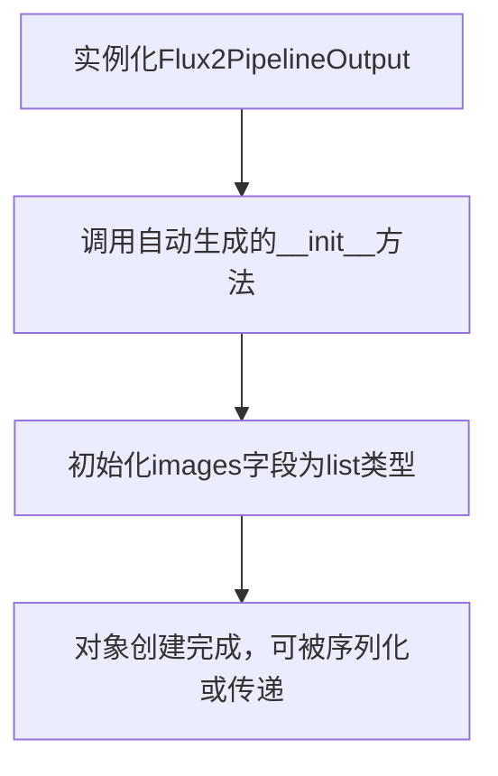
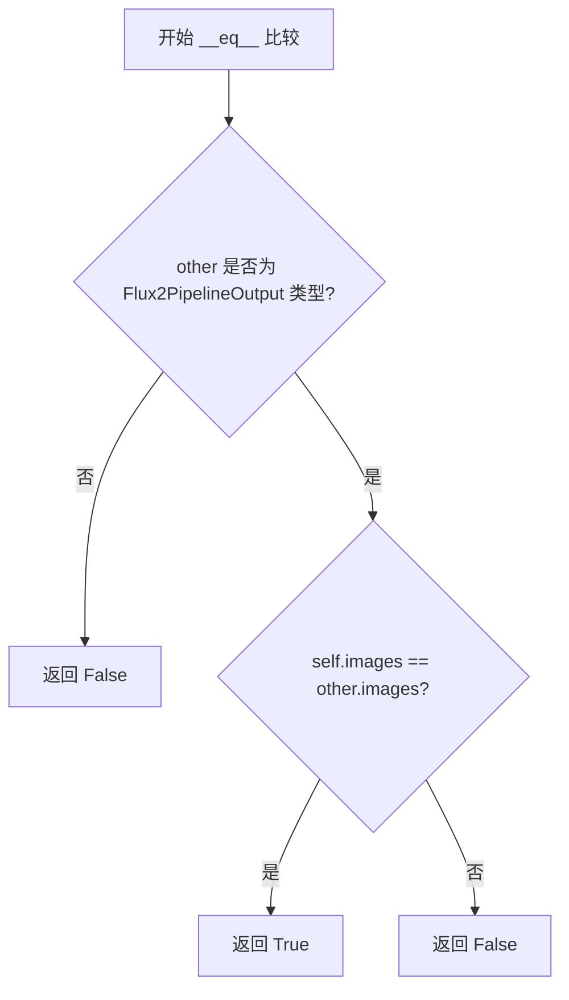
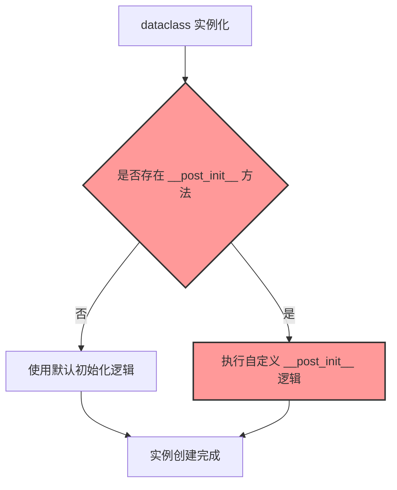

# `diffusers\src\diffusers\pipelines\flux2\pipeline_output.py` 详细设计文档

Flux2图像生成管道的输出数据类，封装了生成的图像列表，支持PIL.Image图像和NumPy数组两种格式，用于在扩散管道中传递去噪后的图像结果或中间潜在变量

## 整体流程



## 类结构

```
BaseOutput (抽象基类)
└── Flux2PipelineOutput (数据类)
```

## 全局变量及字段


### `Flux2PipelineOutput.images`
    
去噪后的 PIL 图像列表或 numpy 数组，长度为 batch_size，或形状为 (batch_size, height, width, num_channels) 的 torch tensor

类型：`list[PIL.Image.Image, np.ndarray]`
    
    

## 全局函数及方法


### Flux2PipelineOutput.__init__

这是一个用于Flux2图像生成管道的输出类，通过Python的dataclass装饰器自动生成构造函数，用于封装图像生成结果。

参数：

- `self`：隐式参数，Flux2PipelineOutput实例本身
- `images`：`list[PIL.Image.Image, np.ndarray]`，批量去噪后的PIL图像列表或numpy数组，长度为batch_size，也可以是torch.Tensor类型

返回值：无（构造函数返回实例本身）

#### 流程图

```mermaid
flowchart TD
    A[开始初始化] --> B{检查images参数类型}
    B -->|PIL.Image类型| C[转换为list[PIL.Image.Image]]
    B -->|np.ndarray类型| D[转换为list[np.ndarray]]
    B -->|其他类型| E[抛出TypeError异常]
    C --> F[创建Flux2PipelineOutput实例]
    D --> F
    F --> G[返回实例对象]
    
    style B fill:#f9f,stroke:#333
    style F fill:#9f9,stroke:#333
```

#### 带注释源码

```python
# Python dataclass 自动生成的 __init__ 方法
# 源码为概念性展示，实际由dataclasses模块在运行时动态生成

def __init__(self, images: list[PIL.Image.Image, np.ndarray]) -> None:
    """
    Flux2PipelineOutput 构造函数（自动生成）
    
    由于使用了 @dataclass 装饰器，Python 自动为此类生成 __init__ 方法。
    该方法接受一个 images 参数并将其赋值给实例属性。
    
    Args:
        images: 图像生成管道的输出结果，可以是PIL.Image列表或numpy数组
        
    Returns:
        None (返回实例对象)
    """
    # 自动类型检查和赋值
    self.images = images
    
    # dataclass 还会自动生成 __repr__, __eq__ 等方法
    # 并根据 field 装饰器的配置处理默认值、初始化顺序等
```


### Flux2PipelineOutput.__repr__

该方法是 Python `dataclass` 装饰器自动生成的 magic method，用于返回该数据类实例的字符串表示形式，输出类名及所有非继承字段的名称和值。

参数：

- `self`：`Flux2PipelineOutput`，隐式参数，表示当前实例对象本身

返回值：`str`，返回该对象的官方字符串表示形式，通常格式为 `Flux2PipelineOutput(images=[...])`

#### 流程图

```mermaid
graph TD
    A[调用 __repr__ 方法] --> B{是否为 dataclass}
    B -->|是| C[自动生成 __repr__]
    B -->|否| D[使用默认 object.__repr__]
    C --> E[返回格式: ClassName(field1=value1, field2=value2, ...)]
    E --> F[返回字符串]
    
    style C fill:#e1f5fe
    style E fill:#e1f5fe
    style F fill:#e1f5fe
```

#### 带注释源码

```
# 由于 @dataclass 装饰器的存在，Python 会自动生成如下 __repr__ 方法
# 用户代码中并未显式定义此方法

def __repr__(self):
    """
    自动生成的 repr 方法。
    返回格式: Flux2PipelineOutput(images=[...])
    其中 ... 是 images 字段的实际值
    """
    return (
        f"{self.__class__.__qualname__}"
        f"(images={self.images!r})"
    )

# 实际输出示例:
# Flux2PipelineOutput(images=[<PIL.Image.Image image mode=RGB size=512x512>, ...])
```

> **注意**：该 `__repr__` 方法并非在代码中显式定义，而是由 Python 的 `dataclass` 装饰器在类定义时自动生成。由于 `Flux2PipelineOutput` 继承自 `BaseOutput`（通过 `...utils` 导入），如果 `BaseOutput` 中定义了 `__repr__`，则可能会使用继承的实现。但根据代码片段，未看到显式的 `__repr__` 定义，因此采用 dataclass 的默认行为。


### Flux2PipelineOutput.__eq__

由于 Flux2PipelineOutput 是一个 dataclass（数据类），Python 会自动为其生成 `__eq__` 方法。该方法用于比较两个 Flux2PipelineOutput 实例是否相等，基于所有字段的值进行比较。

参数：

- `other`：`object`，要与之比较的另一个对象

返回值：`bool`，如果两个对象的所有字段值相等则返回 True，否则返回 False

#### 流程图



#### 带注释源码

```python
# 由于 Flux2PipelineOutput 是 @dataclass 装饰器装饰的类
# Python 会自动生成 __eq__ 方法，源码如下（等价实现）：

def __eq__(self, other: object) -> bool:
    """
    比较两个 Flux2PipelineOutput 实例是否相等。
    
    Args:
        other: 要比较的其他对象
        
    Returns:
        bool: 如果两者相等返回 True，否则返回 False
    """
    # 首先检查比较对象是否为本类类型
    if not isinstance(other, Flux2PipelineOutput):
        return NotImplemented
    
    # 比较 images 字段是否相等
    # 由于 images 是 list[PIL.Image.Image, np.ndarray] 类型
    # Python 会递归比较列表中的每个元素
    return self.images == other.images
```

> **注意**：该方法是自动生成的隐式方法，未在源代码中显式定义。dataclass 装饰器会根据类字段自动生成 `__eq__` 方法，比较所有字段（此处仅为 `images` 字段）的值。


### `Flux2PipelineOutput.__post_init__`

该方法是 Flux2 图像生成管道的输出类的初始化后处理方法，用于验证和规范化生成的图像数据。

参数：

- `self`：隐式参数，类型为 `Flux2PipelineOutput` 实例，表示当前对象本身

返回值：无（`None`），该方法不返回任何值，仅对对象状态进行验证和规范化

#### 流程图



#### 带注释源码

```python
from dataclasses import dataclass

import numpy as np
import PIL.Image

from ...utils import BaseOutput


@dataclass
class Flux2PipelineOutput(BaseOutput):
    """
    Output class for Flux2 image generation pipelines.
    
    该类用于封装 Flux2 图像生成管道的输出结果，
    支持 PIL 图像和 NumPy 数组两种格式。
    
    Args:
        images (`list[PIL.Image.Image]` or `torch.Tensor` or `np.ndarray`)
            List of denoised PIL images of length `batch_size` or numpy array 
            or torch tensor of shape `(batch_size, height, width, num_channels)`. 
            PIL images or numpy array present the denoised images of the diffusion
            pipeline. Torch tensors can represent either the denoised images or 
            the intermediate latents ready to be passed to the decoder.
    """

    # 图像字段，类型为 PIL 图像和 NumPy 数组的列表
    # 注意：文档中提到了 torch.Tensor，但类型注解中未包含
    images: list[PIL.Image.Image, np.ndarray]
    
    # 注意：当前代码中未显式定义 __post_init__ 方法
    # dataclass 会自动生成默认的初始化逻辑
    # 如果需要自定义验证逻辑，可以在类中添加该方法
    
    # 示例：如果需要添加 __post_init__ 方法，可能的实现如下：
    # def __post_init__(self):
    #     """验证 images 字段的有效性"""
    #     if not isinstance(self.images, list):
    #         raise TypeError("images must be a list")
    #     if len(self.images) == 0:
    #         raise ValueError("images list cannot be empty")
```

---

> **注意**：在提供的代码中，`Flux2PipelineOutput` 类**没有显式定义 `__post_init__` 方法**。由于使用了 `@dataclass` 装饰器，Python 会自动生成默认的 `__init__` 方法，但不会自动生成 `__post_init__` 方法，除非开发者显式定义它。

如果需要在实例化后进行数据验证或转换，需要自行添加 `__post_init__` 方法实现。

## 关键组件


### Flux2PipelineOutput

继承自BaseOutput的数据类，用于封装Flux2图像生成管道的输出结果，包含生成的图像列表。

### images 字段

类型为 `list[PIL.Image.Image, np.ndarray]`，用于存储去噪后的PIL图像列表或numpy数组，兼容批处理结果输出。


## 问题及建议


### 已知问题

-   **类型注解语法错误**：`list[PIL.Image.Image, np.ndarray]` 是无效的类型注解。`list` 类型参数只接受单一类型，当前写法会被解释为带两个类型参数的 list，这不符合 PEP 484 规范。正确写法应为 `list[PIL.Image.Image | np.ndarray]`（Python 3.10+）或 `List[Union[PIL.Image.Image, np.ndarray]]`（Python 3.9）。
-   **文档与类型注解不一致**：文档字符串（docstring）明确提到 `images` 可以是 `list[PIL.Image.Image]`、`torch.Tensor` 或 `np.ndarray` 三种类型，但实际类型注解仅包含两种，且未包含 `torch.Tensor` 类型。
-   **缺少必要导入**：代码使用了 `np.ndarray` 作为类型注解，但未在文件顶部显式导入 `typing` 模块的 `Union` 或 `List`，也未导入 `torch.Tensor`（尽管文档提到了它）。

### 优化建议

-   **修正类型注解**：将 `images: list[PIL.Image.Image, np.ndarray]` 修改为 `images: list[PIL.Image.Image | np.ndarray]`，或在文件头部添加 `from typing import Union, List` 后使用 `images: List[Union[PIL.Image.Image, np.ndarray]]`，以确保类型注解的准确性和兼容性。
-   **统一文档与类型**：根据实际需求选择类型注解的完整范围。如果确实需要支持 `torch.Tensor`，应添加 `torch` 导入并更新类型注解为 `images: list[PIL.Image.Image | np.ndarray | torch.Tensor]`；如果不需要，则应更新文档字符串移除 `torch.Tensor` 的描述，避免误导使用者。
-   **增强类型安全性**：考虑使用 `from __future__ import annotations`（Python 3.7+）或显式添加必要的类型别名定义，提高代码的可维护性和静态分析工具的检测能力。


## 其它


### 设计目标与约束

设计目标是为Flux2图像生成管道提供标准化的输出数据结构，封装生成的图像结果。约束包括：支持PIL.Image、numpy数组和torch.Tensor三种图像格式；必须继承自BaseOutput以保持管道输出的一致性；images字段类型为list，可包含PIL.Image或np.ndarray。

### 错误处理与异常设计

由于该类为数据容器（dataclass），不涉及业务逻辑处理，错误处理主要由上游管道层负责。当前未定义特定的异常类型。建议在调用处对images字段进行类型检查，确保列表中的元素符合预期类型（PIL.Image.Image或np.ndarray）。

### 数据流与状态机

该类作为管道输出的末端数据结构，被动接收管道各阶段（编码器→去噪器→解码器）处理后的图像数据。数据流方向：管道内部生成图像→封装为Flux2PipelineOutput实例→返回给调用者。无状态机设计。

### 外部依赖与接口契约

外部依赖包括：PIL.Image（PIL库）、numpy（numpy库）、BaseOutput（来自...utils模块）。接口契约：images字段必须为list类型，元素可为PIL.Image.Image或np.ndarray。该类作为管道输出基类，被其他管道组件继承或引用。

### 性能考虑

作为纯数据容器，无运行时性能开销。images字段存储大量图像数据时需考虑内存占用，建议在管道层面实现按需加载或分批处理机制。

### 安全性考虑

该类本身不涉及敏感数据处理，但images可能包含用户生成的图像内容。需确保在多进程/多线程环境下对images列表的访问线程安全。

### 测试策略

建议编写单元测试验证：dataclass属性正确性、类型注解准确性、与BaseOutput的继承关系、images字段的读写操作。

### 使用示例

```python
from pipeline.output import Flux2PipelineOutput
from PIL import Image
import numpy as np

# 创建输出对象
output = Flux2PipelineOutput(images=[Image.new('RGB', (256, 256))])
output = Flux2PipelineOutput(images=[np.zeros((256, 256, 3), dtype=np.uint8)])
```

### 版本兼容性

当前使用Python 3.10+的泛型列表语法（list[PIL.Image.Image, np.ndarray]），需确保运行环境中Python版本不低于3.10。BaseOutput来自相对导入...utils，需确保项目目录结构正确。

### 扩展性考虑

当前仅支持images字段。若需扩展输出内容（如元数据、噪声 latent），可直接在该dataclass中添加新字段。建议保持与BaseOutput的兼容性以便管道统一处理。


    