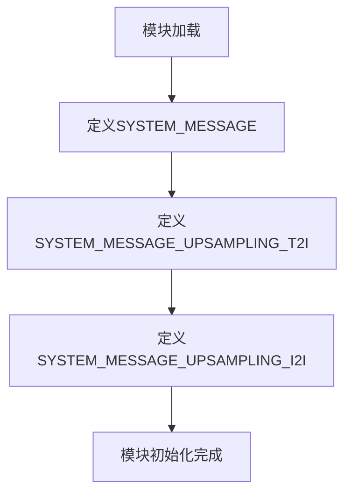

# `diffusers\src\diffusers\pipelines\flux2\system_messages.py` 详细设计文档

该模块定义了FLUX.2图像生成模型的系统提示词，包含通用的图像描述推理提示、文生图提示词优化规则以及图生图编辑指令三种不同用途的系统消息。

## 整体流程



## 类结构

```
无类层次结构（纯配置模块）
```

## 全局变量及字段


### `SYSTEM_MESSAGE`
    
AI图像描述推理的系统提示词，要求模型专注于物体关系、属性和动作，避免推测

类型：`str`
    


### `SYSTEM_MESSAGE_UPSAMPLING_T2I`
    
FLUX.2文本到图像的提示词优化系统消息，指导模型将用户提示改写为更详细的描述，同时严格保留核心主题和意图

类型：`str`
    


### `SYSTEM_MESSAGE_UPSAMPLING_I2I`
    
FLUX.2图像到图像编辑的系统消息，将编辑请求转换为简洁明确的单条指令，保留PG-13内容级别

类型：`str`
    


    

## 全局函数及方法


## 关键组件


### SYSTEM_MESSAGE

全局变量，类型为str。一段系统提示词，指导AI模型对图像描述进行结构化推理，专注于物体关系、属性和动作，不进行推测。

### SYSTEM_MESSAGE_UPSAMPLING_T2I

全局变量，类型为str。FLUX.2文生图（T2I）的提示词优化系统消息，包含结构化输入处理、细节增强、图像中文本处理等指导原则。

### SYSTEM_MESSAGE_UPSAMPLING_I2I

全局变量，类型为str。FLUX.2图像编辑（I2I）的系统消息，将编辑请求转换为简洁指令，包含单指令规则、内容保持、具体化抽象概念等指导。

### 关键组件信息

1. **系统消息模块**：定义AI模型行为的配置常量
2. **T2I优化策略**：文本到图像的提示词增强方法
3. **I2I编辑策略**：图像到图像的指令转换规则

### 潜在技术债务与优化空间

1. **硬编码耦合**：系统消息直接绑定在代码中，不利于运行时动态配置
2. **重复文档字符串**：`# docstyle-ignore`重复出现，可考虑统一处理
3. **缺乏验证机制**：字符串内容无格式校验，可能包含不一致的指令规则

### 其它项目

**设计目标**：为FLUX.2模型提供清晰的任务指导，确保输出符合预期格式

**约束条件**：
- SYSTEM_MESSAGE_UPSAMPLING_T2I要求保持结构化输入结构
- SYSTEM_MESSAGE_UPSAMPLING_I2I要求输出50-80词（简短请求约30词）
- 所有输出必须为纯文本，无额外注释

**错误处理**：无错误处理机制，依赖调用方正确使用常量

**外部依赖**：无外部依赖，仅为纯字符串常量定义


## 问题及建议


### 已知问题

- **硬编码配置问题**：所有系统消息直接硬编码在Python文件中，缺乏灵活性，无法在不修改代码的情况下调整提示词
- **文档字符串引用外部URL**：模块顶部的docstring包含GitHub链接，可能导致链接失效且引入不必要的外部依赖
- **缺乏类型注解**：未使用类型提示（Type Hints），降低代码可维护性和IDE支持
- **重复模式未抽象**：三个系统消息具有相似功能（提示词优化），但未通过统一的结构或类进行组织
- **magic string问题**：消息内容中包含重复的模式（如"Output only..."），未提取为可复用的常量
- **缺少使用说明**：没有文档说明这些消息的适用场景、版本兼容性和使用注意事项

### 优化建议

- **配置外置化**：将系统消息迁移至JSON/YAML配置文件或环境变量，支持运行时动态配置
- **结构化定义**：创建`SystemMessage`类或`Enum`类型，封装消息内容并提供类型安全的访问接口
- **添加类型注解**：为常量添加`typing.Final`注解，明确消息类型（如`str`）
- **提取重复文本**：将通用的输出格式要求（如"Output only..."）提取为共享常量
- **文档完善**：添加模块级docstring说明各消息的用途、适用模型版本和使用场景
- **版本管理**：为系统消息添加版本号，便于追踪变更和兼容性问题
- **单元测试**：添加测试用例验证消息内容的完整性和格式正确性

## 其它


### 设计目标与约束

**设计目标：**
为FLUX.2图像生成模型提供结构化的系统提示词，使模型能够准确地重写用户提示词（提示词优化/T2I）和将编辑请求转换为简洁的图像编辑指令（图像编辑/I2I）。

**设计约束：**
- SYSTEM_MESSAGE：专注于对象关系、属性和动作描述，避免推测性内容
- SYSTEM_MESSAGE_UPSAMPLING_T2I：严格保留核心主题和意图，仅增强细节
- SYSTEM_MESSAGE_UPSAMPLING_I2I：输出单一指令（50-80词），保持PG-13级别内容

### 错误处理与异常设计

**当前状态：** 本模块为纯数据定义模块，不包含运行时错误处理逻辑。

**建议改进：**
- 添加字符串验证函数，确保SYSTEM_MESSAGE不为空
- 对T2I和I2I消息的长度进行校验
- 在文档中说明各消息的使用场景和约束条件

### 数据流与状态机

**数据流：**
```
用户输入 → 选择合适的SYSTEM_MESSAGE → 
[SYSTEM_MESSAGE] → 模型推理 → 输出结构化响应
[SYSTEM_MESSAGE_UPSAMPLING_T2I] → 模型推理 → 增强后的提示词
[SYSTEM_MESSAGE_UPSAMPLING_I2I] → 模型推理 → 简洁编辑指令
```

**状态机：** 不适用，本模块为静态配置模块，无状态变化。

### 外部依赖与接口契约

**外部依赖：**
- 无Python运行时依赖
- 依赖于使用这些常量的上游系统（如LLM API调用层）

**接口契约：**
- `SYSTEM_MESSAGE`：全局字符串常量，类型为str，供LLM推理使用
- `SYSTEM_MESSAGE_UPSAMPLING_T2I`：全局字符串常量，用于文本到图像提示词优化
- `SYSTEM_MESSAGE_UPSAMPLING_I2I`：全局字符串常量，用于图像到图像编辑指令生成

### 性能要求与基准

- 字符串加载时间：即时加载，无性能影响
- 内存占用：三个字符串常量，预计占用 <10KB
- 建议：可考虑将大型提示词文本移至独立配置文件，按需加载

### 安全性考虑

- 输入验证：调用方需对用户输入进行内容过滤
- 敏感信息：模块本身不包含敏感信息
- 合规性：I2I消息明确限制为PG-13内容

### 可扩展性设计

**当前限制：**
- 硬编码的提示词内容不易动态修改
- 缺少版本管理和变更日志

**扩展建议：**
- 可重构为配置驱动架构，支持JSON/YAML配置文件
- 添加版本号常量，便于追踪提示词迭代
- 可考虑支持多语言提示词变体

### 测试策略

- 单元测试：验证常量非空、类型正确
- 集成测试：在LLM调用链路中验证输出质量
- 回归测试：确保提示词修改后模型输出符合预期

### 版本历史与变更记录

| 版本 | 日期 | 变更说明 |
|------|------|----------|
| 1.0.0 | 初始 | 初始定义三个SYSTEM_MESSAGE常量 |

    