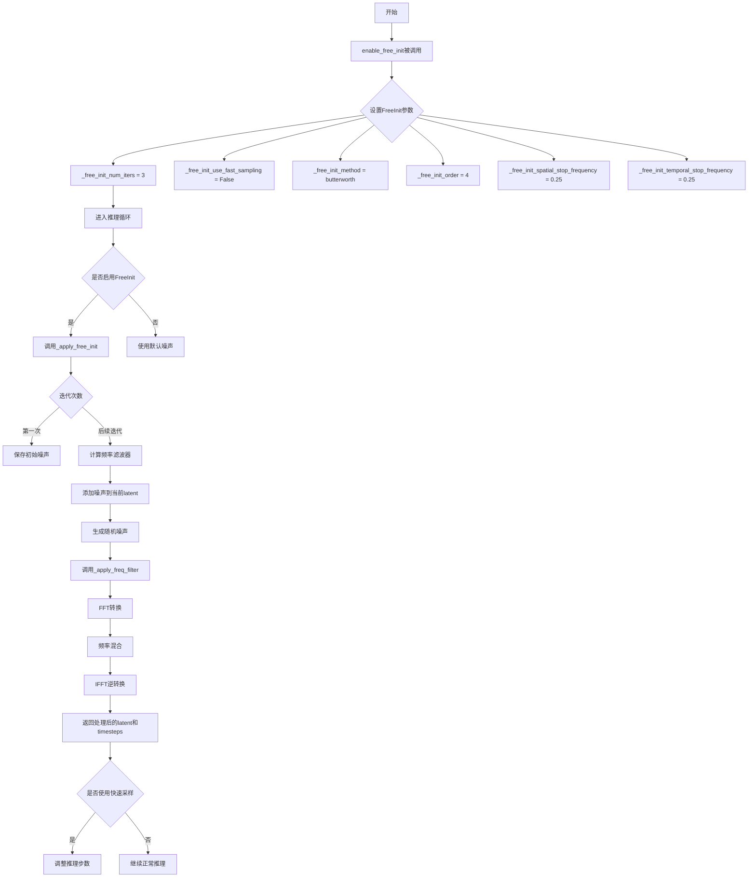
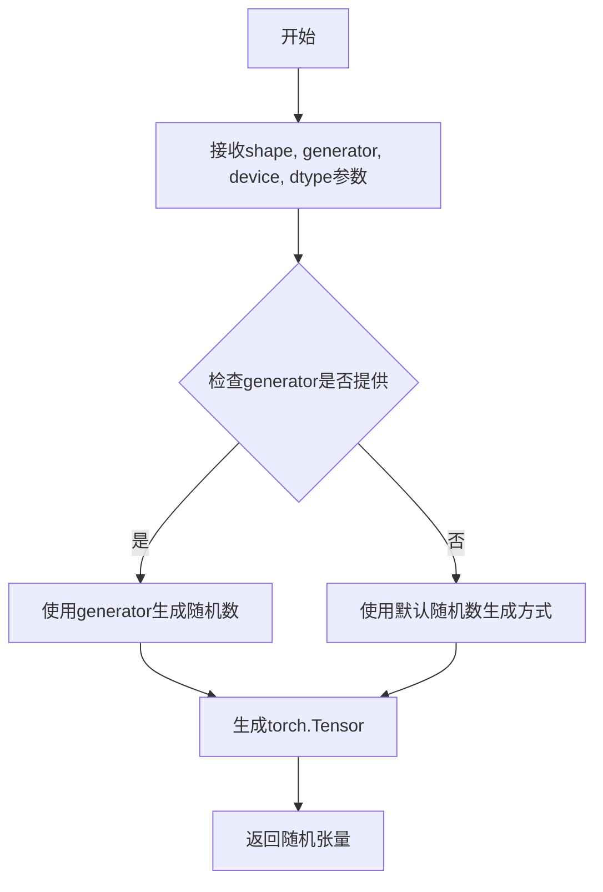
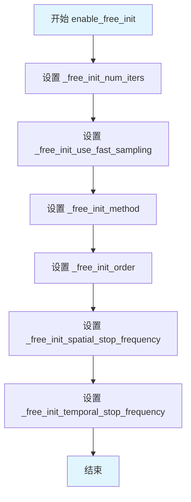
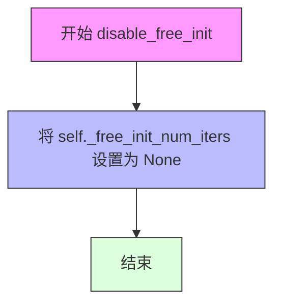
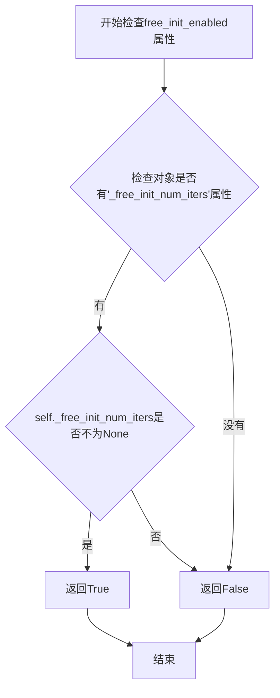
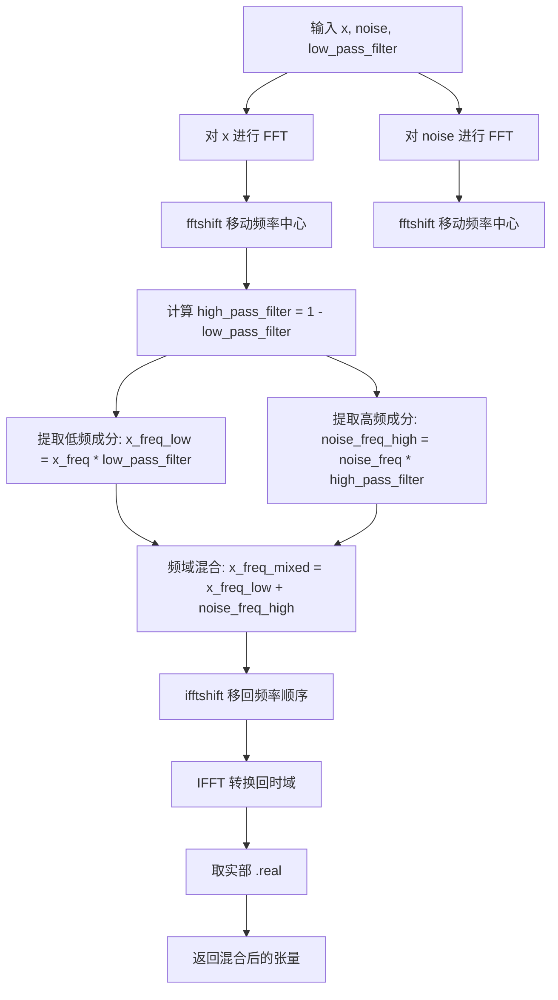

# `diffusers\src\diffusers\pipelines\free_init_utils.py` 详细设计文档

FreeInitMixin是一个用于扩散模型的Mixin类，通过频率滤波技术实现噪声重新初始化（FreeInit），能够在推理过程中迭代优化初始噪声，从而提高生成质量。该实现支持butterworth、gaussian和ideal三种滤波器类型，并提供快速采样选项以加速推理过程。

## 整体流程



## 类结构

```
FreeInitMixin (Mix-in类)
├── enable_free_init (启用方法)
├── disable_free_init (禁用方法)
├── free_init_enabled (属性)
├── _get_free_init_freq_filter (私有方法-滤波器生成)
├── _apply_freq_filter (私有方法-频率滤波应用)
└── _apply_free_init (私有方法-FreeInit主逻辑)
```

## 全局变量及字段


### `FreeInitMixin._free_init_num_iters`
    
Number of FreeInit noise re-initialization iterations, defaults to 3 when enabled

类型：`int | None`
    


### `FreeInitMixin._free_init_use_fast_sampling`
    
Whether to enable Coarse-to-Fine Sampling strategy for faster inference at the cost of quality

类型：`bool`
    


### `FreeInitMixin._free_init_method`
    
Filtering method used for FreeInit low pass filter, must be butterworth, ideal or gaussian

类型：`str`
    


### `FreeInitMixin._free_init_order`
    
Order of the filter used in butterworth method, affects filter shape between ideal and gaussian

类型：`int`
    


### `FreeInitMixin._free_init_spatial_stop_frequency`
    
Normalized stop frequency for spatial dimensions, must be between 0 to 1

类型：`float`
    


### `FreeInitMixin._free_init_temporal_stop_frequency`
    
Normalized stop frequency for temporal dimensions, must be between 0 to 1

类型：`float`
    


### `FreeInitMixin._free_init_initial_noise`
    
Stores the cloned initial latents for noise re-initialization during FreeInit iterations

类型：`torch.Tensor | None`
    
    

## 全局函数及方法


### randn_tensor

从`..utils.torch_utils`模块导入的全局函数，用于生成指定形状的随机正态分布张量。该函数在FreeInitMixin的`_apply_free_init`方法中被调用，用于生成噪声张量以进行噪声重初始化。

参数：

- `shape`：`tuple[int, ...]` 或 `torch.Size`，要生成张量的形状
- `generator`：`torch.Generator`（可选），随机数生成器，用于控制随机性
- `device`：`torch.device` 或 `str`，生成张量所在的设备
- `dtype`：`torch.dtype`，生成张量的数据类型

返回值：`torch.Tensor`，符合指定形状、设备和数据类型的随机正态分布张量

#### 流程图



#### 带注释源码

```
# 注意：此函数定义不在当前代码文件中
# 而是从 ..utils.torch_utils 模块导入
# 以下是基于使用方式的推测实现

def randn_tensor(
    shape: tuple[int, ...],
    generator: Optional[torch.Generator] = None,
    device: Optional[torch.device] = None,
    dtype: Optional[torch.dtype] = None,
) -> torch.Tensor:
    r"""生成符合正态分布的随机张量。
    
    此函数在FreeInitMixin._apply_free_init方法中被调用，
    用于生成噪声张量以进行频率域的噪声重初始化。
    
    参数:
        shape: 张量的目标形状，如(latent_shape[0], latent_shape[1], ...)
        generator: 可选的PyTorch随机数生成器，用于复现结果
        device: 张量应该放置的设备（CPU/CUDA）
        dtype: 张量的数据类型
        
    返回:
        符合正态分布的随机张量
    """
    # 使用torch.randn生成随机张量
    # 如果提供了generator，则使用它来控制随机性
    if generator is not None:
        tensor = torch.randn(shape, generator=generator, device=device, dtype=dtype)
    else:
        tensor = torch.randn(shape, device=device, dtype=dtype)
    
    return tensor
```

#### 补充说明

**使用场景**：
在`FreeInitMixin._apply_free_init`方法中，`randn_tensor`被用于生成随机噪声，以便在频率域中进行噪声重初始化。具体调用方式如下：

```python
z_rand = randn_tensor(
    shape=latent_shape,
    generator=generator,
    device=device,
    dtype=torch.float32,
)
```

**注意事项**：
1. 当前提供的代码文件中仅包含`randn_tensor`的导入语句，未包含其完整实现
2. 实际的函数定义位于`..utils.torch_utils`模块中
3. 从使用方式推断，该函数应该是对`torch.randn`的封装，支持通过`generator`参数控制随机性以确保可复现性


### `FreeInitMixin.enable_free_init`

该方法用于启用FreeInit机制，该机制通过噪声重新初始化（noise re-initialization）技术来改进扩散模型的采样质量，减少低频伪影。方法允许配置迭代次数、采样加速策略、滤波方法和频率参数。

参数：

- `num_iters`：`int`，可选，默认值为 `3`，FreeInit噪声重新初始化迭代次数
- `use_fast_sampling`：`bool`，可选，默认值为 `False`，是否加速采样过程（以可能降低质量为代价换取速度），启用"粗到细采样"策略
- `method`：`str`，可选，默认值为 `"butterworth"`，低通滤波器类型，必须是 `butterworth`、`ideal` 或 `gaussian` 之一
- `order`：`int`，可选，默认值为 `4`，Butterworth滤波器的阶数，较大值趋向于ideal方法的行为，较小值趋向于gaussian方法的行为
- `spatial_stop_frequency`：`float`，可选，默认值为 `0.25`，空间维度的归一化停止频率，范围0到1，原始实现中称为 `d_s`
- `temporal_stop_frequency`：`float`，可选，默认值为 `0.25`，时间维度的归一化停止频率，范围0到1，原始实现中称为 `d_t`

返回值：`None`，无返回值，该方法仅设置实例属性以配置FreeInit机制

#### 流程图



#### 带注释源码

```python
def enable_free_init(
    self,
    num_iters: int = 3,
    use_fast_sampling: bool = False,
    method: str = "butterworth",
    order: int = 4,
    spatial_stop_frequency: float = 0.25,
    temporal_stop_frequency: float = 0.25,
):
    """Enables the FreeInit mechanism as in https://huggingface.co/papers/2312.07537.

    This implementation has been adapted from the [official repository](https://github.com/TianxingWu/FreeInit).

    Args:
        num_iters (`int`, *optional*, defaults to `3`):
            Number of FreeInit noise re-initialization iterations.
        use_fast_sampling (`bool`, *optional*, defaults to `False`):
            Whether or not to speedup sampling procedure at the cost of probably lower quality results. Enables the
            "Coarse-to-Fine Sampling" strategy, as mentioned in the paper, if set to `True`.
        method (`str`, *optional*, defaults to `butterworth`):
            Must be one of `butterworth`, `ideal` or `gaussian` to use as the filtering method for the FreeInit low
            pass filter.
        order (`int`, *optional*, defaults to `4`):
            Order of the filter used in `butterworth` method. Larger values lead to `ideal` method behaviour
            whereas lower values lead to `gaussian` method behaviour.
        spatial_stop_frequency (`float`, *optional*, defaults to `0.25`):
            Normalized stop frequency for spatial dimensions. Must be between 0 to 1. Referred to as `d_s` in the
            original implementation.
        temporal_stop_frequency (`float`, *optional*, defaults to `0.25`):
            Normalized stop frequency for temporal dimensions. Must be between 0 to 1. Referred to as `d_t` in the
            original implementation.
    """
    # 设置FreeInit迭代次数
    self._free_init_num_iters = num_iters
    # 设置是否使用快速采样模式
    self._free_init_use_fast_sampling = use_fast_sampling
    # 设置滤波器类型
    self._free_init_method = method
    # 设置滤波器阶数
    self._free_init_order = order
    # 设置空间停止频率
    self._free_init_spatial_stop_frequency = spatial_stop_frequency
    # 设置时间停止频率
    self._free_init_temporal_stop_frequency = temporal_stop_frequency
```


### `FreeInitMixin.disable_free_init`

该方法用于禁用 FreeInit 机制，通过将内部配置标志 `_free_init_num_iters` 设置为 `None` 来关闭噪声重初始化功能。

参数：

- `self`：实例对象，隐式参数，无需显式传递

返回值：`None`，无返回值（void）

#### 流程图



#### 带注释源码

```python
def disable_free_init(self):
    """Disables the FreeInit mechanism if enabled."""
    # 将 _free_init_num_iters 设置为 None，以禁用 FreeInit 功能
    # 由于 free_init_enabled 属性检查该值是否为 None，
    # 设置为 None 后，free_init_enabled 将返回 False
    self._free_init_num_iters = None
```


### `FreeInitMixin.free_init_enabled`

该属性方法用于检查FreeInit机制是否已启用。通过检查对象是否拥有`_free_init_num_iters`属性且该属性值不为`None`来判断FreeInit是否处于激活状态。

参数：无需显式参数（`self`为隐式参数，表示类实例本身）

返回值：`bool`，返回`True`表示FreeInit机制已启用，返回`False`表示未启用

#### 流程图



#### 带注释源码

```python
@property
def free_init_enabled(self):
    """检查FreeInit机制是否已启用。
    
    通过检查实例是否拥有`_free_init_num_iters`属性且该属性值不为None来判断。
    当调用enable_free_init方法时，该属性会被设置为具体的迭代次数值；
    当调用disable_free_init方法时，该属性会被设置为None。
    
    Returns:
        bool: 如果FreeInit已启用返回True，否则返回False
    """
    # 使用hasattr检查对象是否具有_free_init_num_iters属性
    # 并且检查该属性的值是否不为None
    # 只有当两个条件都满足时才返回True
    return hasattr(self, "_free_init_num_iters") and self._free_init_num_iters is not None
```


### `FreeInitMixin._get_free_init_freq_filter`

该方法根据指定的滤波器类型（butterworth、gaussian 或 ideal）和空间/时间截止频率参数，生成一个用于 FreeInit 噪声重新初始化的低通频率滤波器掩码。该滤波器在频域中对噪声进行过滤，以实现高质量的采样结果。

参数：

- `shape`：`tuple[int, ...]`，表示滤波器的目标形状，通常为 (1, channels, time, height, width)
- `device`：`str | torch.dtype`，指定返回张量应放置的设备（CPU 或 CUDA）
- `filter_type`：`str`，滤波器类型，可选值为 "butterworth"、"gaussian" 或 "ideal"
- `order`：`float`，Butterworth 滤波器的阶数，控制滤波器从通带到阻带的过渡 sharpness
- `spatial_stop_frequency`：`float`，空间维度的归一化截止频率，范围 0 到 1
- `temporal_stop_frequency`：`float`，时间维度的归一化截止频率，范围 0 到 1

返回值：`torch.Tensor`，返回形状为 `shape` 的频率滤波器掩码张量

#### 流程图

```mermaid
flowchart TD
    A[开始 _get_free_init_freq_filter] --> B[从 shape 提取 time, height, width]
    B --> C[初始化全零 mask 张量]
    C --> D{spatial_stop_frequency == 0<br/>或 temporal_stop_frequency == 0?}
    D -->|是| E[返回全零 mask]
    D -->|否| F{filter_type == 'butterworth'?}
    F -->|是| G[定义 retrieve_mask 函数<br/>1 / (1 + (x / s²)ᵒʳᴅᴇʳ)]
    F -->|否| H{filter_type == 'gaussian'?}
    H -->|是| I[定义 retrieve_mask 函数<br/>exp(-1 / (2 * s²) * x)]
    H -->|否| J{filter_type == 'ideal'?}
    J -->|是| K[定义 retrieve_mask 函数<br/>1 if x <= s*2 else 0]
    J -->|否| L[抛出 NotImplementedError]
    K --> M[循环遍历 time, height, width]
    G --> M
    I --> M
    M --> N[计算 d_square 距离平方]
    N --> O[mask[..., t,h,w] = retrieve_mask(d_square)]
    O --> P{是否还有未处理元素?}
    P -->|是| M
    P -->|否| Q[返回 mask.to(device)]
    E --> Q
    L --> R[结束]
    Q --> R
```

#### 带注释源码

```python
def _get_free_init_freq_filter(
    self,
    shape: tuple[int, ...],
    device: str | torch.dtype,
    filter_type: str,
    order: float,
    spatial_stop_frequency: float,
    temporal_stop_frequency: float,
) -> torch.Tensor:
    r"""Returns the FreeInit filter based on filter type and other input conditions."""

    # 从形状参数中提取时间步数、高度和宽度
    # shape 通常为 (batch, channels, time, height, width)
    time, height, width = shape[-3], shape[-2], shape[-1]
    
    # 初始化一个与目标形状相同的全零张量作为掩码
    mask = torch.zeros(shape)

    # 如果空间或时间截止频率为0，直接返回全零掩码
    # 此时意味着不需要任何滤波，所有频率成分都被过滤掉
    if spatial_stop_frequency == 0 or temporal_stop_frequency == 0:
        return mask

    # 根据 filter_type 定义不同的掩码计算函数
    if filter_type == "butterworth":
        # Butterworth 滤波器：通带平滑，阶数越高越接近理想滤波器
        # 公式: 1 / (1 + (x / spatial_stop_frequency^2)^order)
        def retrieve_mask(x):
            return 1 / (1 + (x / spatial_stop_frequency**2) ** order)
            
    elif filter_type == "gaussian":
        # Gaussian 滤波器：基于高斯函数的平滑低通滤波器
        # 公式: exp(-1 / (2 * spatial_stop_frequency^2) * x)
        def retrieve_mask(x):
            return math.exp(-1 / (2 * spatial_stop_frequency**2) * x)
            
    elif filter_type == "ideal":
        # 理想滤波器：完全锐截止，小于阈值为1，否则为0
        # 阈值乘以2是为了与空间频率的归一化方式保持一致
        def retrieve_mask(x):
            return 1 if x <= spatial_stop_frequency * 2 else 0
            
    else:
        # 不支持的滤波器类型，抛出异常
        raise NotImplementedError("`filter_type` must be one of gaussian, butterworth or ideal")

    # 三重循环遍历时间、空间维度，构建完整的频率掩码
    for t in range(time):
        for h in range(height):
            for w in range(width):
                # 计算归一化距离平方
                # 包含时间维度 (d_t) 和空间维度 (d_s) 的贡献
                # 公式: ((spatial_stop_frequency / temporal_stop_frequency) * (2*t/time - 1))^2 
                #       + (2*h/height - 1)^2 + (2*w/width - 1)^2
                d_square = (
                    ((spatial_stop_frequency / temporal_stop_frequency) * (2 * t / time - 1)) ** 2
                    + (2 * h / height - 1) ** 2
                    + (2 * w / width - 1) ** 2
                )
                # 为每个时空位置计算滤波器值
                mask[..., t, h, w] = retrieve_mask(d_square)

    # 将掩码移动到指定设备并返回
    return mask.to(device)
```


### `FreeInitMixin._apply_freq_filter`

该函数通过快速傅里叶变换（FFT）在频域中对输入张量和噪声进行低通和高通滤波，然后混合频域成分并通过逆FFT（IFFT）重建时域信号，实现噪声重新初始化。

参数：

- `x`：`torch.Tensor`，原始输入张量（通常是潜在变量）
- `noise`：`torch.Tensor`，用于高频替换的随机噪声张量
- `low_pass_filter`：`torch.Tensor`，低通滤波器张量，用于保留输入的低频成分

返回值：`torch.Tensor`，混合后的时域张量

#### 流程图



#### 带注释源码

```python
def _apply_freq_filter(self, x: torch.Tensor, noise: torch.Tensor, low_pass_filter: torch.Tensor) -> torch.Tensor:
    r"""Noise reinitialization."""
    # Step 1: 对输入张量 x 进行快速傅里叶变换 (FFT)
    # 使用 fft.fftn 对最后三个维度进行 n 维 FFT
    x_freq = fft.fftn(x, dim=(-3, -2, -1))
    
    # Step 2: 使用 fftshift 将零频率分量移动到张量中心
    # 这样可以更方便地处理频率滤波器（尤其是低通/高通滤波器）
    x_freq = fft.fftshift(x_freq, dim=(-3, -2, -1))
    
    # Step 3: 对噪声张量进行相同的 FFT 处理
    noise_freq = fft.fftn(noise, dim=(-3, -2, -1))
    noise_freq = fft.fftshift(noise_freq, dim=(-3, -2, -1))

    # Step 4: 计算高通滤波器
    # 高通滤波器 = 1 - 低通滤波器，用于提取高频成分
    high_pass_filter = 1 - low_pass_filter
    
    # Step 5: 在频域中混合低频和高频成分
    # 保留输入 x 的低频成分（结构信息）
    x_freq_low = x_freq * low_pass_filter
    # 替换为噪声的高频成分（细节/纹理信息）
    noise_freq_high = noise_freq * high_pass_filter
    # 在频域中将两部分相加，实现频率混合
    x_freq_mixed = x_freq_low + noise_freq_high  # mix in freq domain

    # Step 6: 逆变换回时域
    # 使用 ifftshift 将频率顺序移回标准顺序
    x_freq_mixed = fft.ifftshift(x_freq_mixed, dim=(-3, -2, -1))
    
    # Step 7: 进行逆 FFT (IFFT) 转换回时域
    # 使用 .real 取实部，因为 IFFT 结果可能包含微小的虚部（数值误差）
    x_mixed = fft.ifftn(x_freq_mixed, dim=(-3, -2, -1)).real

    return x_mixed
```


### `FreeInitMixin._apply_free_init`

这是 FreeInit 机制的核心实现方法，用于在扩散模型推理过程中对潜在变量进行噪声重新初始化。该方法通过频域滤波技术，将原始初始噪声与当前潜在变量进行混合，以改善生成质量。在首次迭代时保存初始噪声，后续迭代中通过低通滤波器保留低频成分，高频部分使用新随机噪声替换，实现噪声的重新初始化。

参数：

- `latents`：`torch.Tensor`，当前推理迭代的潜在变量张量
- `free_init_iteration`：`int`，当前 FreeInit 噪声重初始化的迭代次数
- `num_inference_steps`：`int`，推理总步数，用于计算快速采样的步数
- `device`：`torch.device`，计算设备（CPU/CUDA）
- `dtype`：`torch.dtype`，潜在变量的数据类型
- `generator`：`torch.Generator`，用于生成确定性随机数的生成器

返回值：`tuple[torch.Tensor, torch.Tensor]`，返回一个元组，包含处理后的潜在变量张量和调度器的时间步序列

#### 流程图

```mermaid
flowchart TD
    A[开始 _apply_free_init] --> B{free_init_iteration == 0?}
    B -->|是| C[保存初始噪声: latents.detach().clone]
    C --> D[设置推理步数]
    D --> G[返回 latents 和 timesteps]
    B -->|否| E[计算频域滤波器]
    E --> F[添加噪声到初始噪声]
    F --> H[生成随机噪声 z_rand]
    H --> I[应用频域滤波混合]
    I --> J{使用快速采样?}
    J -->|是| K[计算新的推理步数]
    J -->|否| L[保持原步数]
    K --> M[设置调度器时间步]
    L --> M
    M --> G
```

#### 带注释源码

```python
def _apply_free_init(
    self,
    latents: torch.Tensor,           # 当前推理迭代的潜在变量
    free_init_iteration: int,        # FreeInit 当前迭代次数（从0开始）
    num_inference_steps: int,        # 总推理步数
    device: torch.device,            # 计算设备
    dtype: torch.dtype,              # 数据类型
    generator: torch.Generator,      # 随机数生成器
):
    # 首次迭代时，保存原始初始噪声的副本
    # 用于后续迭代中的噪声重新初始化
    if free_init_iteration == 0:
        self._free_init_initial_noise = latents.detach().clone()
    else:
        # 获取潜在变量的形状信息
        latent_shape = latents.shape

        # 构建频域滤波器的形状（批量大小为1）
        free_init_filter_shape = (1, *latent_shape[1:])

        # 获取 FreeInit 频率滤波器
        # 根据配置的方法（butterworth/ideal/gaussian）和频率参数生成滤波器
        free_init_freq_filter = self._get_free_init_freq_filter(
            shape=free_init_filter_shape,           # 滤波器形状
            device=device,                          # 设备
            filter_type=self._free_init_method,     # 滤波方法
            order=self._free_init_order,            # 滤波器阶数
            spatial_stop_frequency=self._free_init_spatial_stop_frequency,   # 空间截止频率
            temporal_stop_frequency=self._free_init_temporal_stop_frequency, # 时间截止频率
        )

        # 计算当前扩散时间步
        # 使用训练时的最大时间步作为当前扩散时间步
        current_diffuse_timestep = self.scheduler.config.num_train_timesteps - 1

        # 创建与批量大小相同的扩散时间步张量
        diffuse_timesteps = torch.full((latent_shape[0],), current_diffuse_timestep).long()

        # 使用调度器的 add_noise 方法将初始噪声添加到当前潜在变量
        # 这模拟了在给定时间步下的正向扩散过程
        z_t = self.scheduler.add_noise(
            original_samples=latents,               # 原始潜在变量
            noise=self._free_init_initial_noise,    # 初始噪声
            timesteps=diffuse_timesteps.to(device)  # 扩散时间步
        ).to(dtype=torch.float32)

        # 生成新的随机噪声张量
        # 使用传入的生成器确保可重复性
        z_rand = randn_tensor(
            shape=latent_shape,                     # 与潜在变量相同形状
            generator=generator,                    # 随机生成器
            device=device,                          # 设备
            dtype=torch.float32,                    # 转换为 float32
        )

        # 应用频率滤波进行噪声重新初始化
        # 低通滤波器保留 z_t 的低频成分
        # 高通部分使用新随机噪声 z_rand 替换
        latents = self._apply_freq_filter(
            z_t,                                    # 加噪后的潜在变量
            z_rand,                                 # 随机噪声
            low_pass_filter=free_init_freq_filter   # 低通滤波器
        )

        # 转换回原始数据类型
        latents = latents.to(dtype)

    # 快速采样模式（Coarse-to-Fine Sampling）
    # 用于加速推理，但可能导致质量下降
    if self._free_init_use_fast_sampling:
        # 根据当前迭代动态调整推理步数
        # 迭代次数越多，步数越多，逐步细化
        num_inference_steps = max(
            1, int(num_inference_steps / self._free_init_num_iters * (free_init_iteration + 1))
        )

    # 如果有推理步数，设置调度器的时间步
    if num_inference_steps > 0:
        self.scheduler.set_timesteps(num_inference_steps, device=device)

    # 返回处理后的潜在变量和调度器的时间步
    return latents, self.scheduler.timesteps
```

## 关键组件


### FreeInitMixin 类

提供 FreeInit 噪声重新初始化功能的 Mixin 类，用于扩散模型的迭代式噪声优化，通过频域滤波实现噪声重新初始化。

### enable_free_init 方法

启用 FreeInit 机制，配置迭代次数、快速采样模式、滤波器类型（butterworth/ideal/gaussian）、滤波器阶数和空间/时间截止频率等参数。

### disable_free_init 方法

禁用 FreeInit 机制，将迭代次数设为 None。

### free_init_enabled 属性

检查 FreeInit 是否已启用的只读属性，通过检查 `_free_init_num_iters` 属性是否存在且不为 None。

### _get_free_init_freq_filter 方法

根据指定的滤波器类型和参数生成 3D 频率掩码，支持 butterworth、gaussian 和 ideal 三种滤波器实现，通过嵌套循环计算每个时空位置的频率响应。

### _apply_freq_filter 方法

在频域执行噪声混合操作，使用 FFT 将输入转换到频域，通过低通滤波器保留原始信号的低频部分，通过高通滤波器提取噪声的高频部分，然后混合并 IFFT 还原。

### _apply_free_init 方法

执行 FreeInit 的单次迭代，保存初始噪声用于后续迭代，在非首次迭代中通过 scheduler 添加噪声并应用频率滤波器进行噪声重新初始化，支持 Coarse-to-Fine 策略加速推理。

### 频率滤波器实现

包含 butterworth（巴特沃斯）、gaussian（高斯）和 ideal（理想）三种滤波器数学模型，分别通过不同公式计算频率响应，用于控制噪声重新初始化的频谱特性。

### 张量索引与形状处理

使用负索引（shape[-3], shape[-2], shape[-1]）获取时间、高度和宽度维度，确保对任意批次大小的张量正确处理。


## 问题及建议


### 已知问题

-   **三层嵌套循环性能瓶颈**：`_get_free_init_freq_filter` 方法使用三层嵌套 `for` 循环遍历 `time`、`height`、`width` 维度，在高分辨率或长序列场景下计算复杂度为 O(T×H×W)，严重拖累性能，未利用 PyTorch 的向量化操作和 GPU 并行计算能力。
-   **函数重复定义开销**：`retrieve_mask` 函数在循环内部定义，每次迭代都重新创建，造成不必要的内存开销和函数对象创建开销。
-   **参数验证缺失**：`enable_free_init` 方法未对 `method` 参数进行验证，非法值会在后续 `_get_free_init_freq_filter` 调用时才抛出 `NotImplementedError`，且 `order`、`spatial_stop_frequency`、`temporal_stop_frequency` 等参数缺乏范围校验（如频率应在 0-1 之间）。
-   **FFT/IFFT 重复计算**：`latents` 的 FFT 结果在每次 `_apply_free_init` 调用时都会重新计算，未缓存中间结果，且 `_apply_freq_filter` 未使用 `inplace` 操作优化内存。
-   **资源清理不完整**：`disable_free_init` 方法仅设置 `_free_init_num_iters = None`，未清理 `_free_init_method`、`_free_init_order` 等其他内部属性，可能导致状态残留。
-   **类型注解不一致**：`device: str | torch.dtype` 参数接受字符串或 `torch.dtype`，但在后续 `.to(device)` 调用时字符串会被正确处理，而 `randn_tensor` 等依赖可能对类型有特定期望。
-   **外部依赖隐式耦合**：该 Mixin 类隐式依赖 `self.scheduler` 属性（需包含 `config.num_train_timesteps`、`add_noise`、`set_timesteps`、`timesteps` 等），但无接口约束或类型注解，运行时才能发现不兼容。
-   **魔法数字**：代码中多处使用硬编码数值（如 `current_diffuse_timestep = self.scheduler.config.num_train_timesteps - 1`），缺乏常量定义降低可读性。

### 优化建议

-   **向量化频率掩码计算**：使用 PyTorch 的网格生成（`torch.meshgrid`）和广播机制替代三层循环，将 `_get_free_init_freq_filter` 改为纯张量操作，可大幅提升计算速度并支持 GPU 加速。
-   **提取函数定义**：将 `retrieve_mask` 函数定义移至循环外部，根据 `filter_type` 条件选择对应的 lambda 或函数引用，避免重复创建。
-   **增强参数校验**：在 `enable_free_init` 开头添加 `method` 的可选值校验（`["butterworth", "ideal", "gaussian"]`），以及对 `spatial_stop_frequency` 和 `temporal_stop_frequency` 范围（0~1）的校验，提供更有意义的错误信息。
-   **缓存中间结果**：考虑缓存频率域的滤波器或 FFT/IFFT 的计划对象（FFT Plan），减少重复计算开销；使用 `torch.no_grad()` 上下文管理器确保推理时不计算梯度。
-   **完善资源清理**：在 `disable_free_init` 中清理所有 `_free_init_*` 前缀的实例变量，或引入 `__init_free_init__` 方法统一管理状态初始化和清理。
-   **明确接口约束**：通过抽象基类或协议（Protocol）定义 `scheduler` 的必需接口，添加类型注解或在文档中明确依赖的 `scheduler` 属性结构，提升代码的自文档化能力。
-   **提取魔法数字**：将 `num_train_timesteps - 1` 等逻辑提取为常量或配置项，定义在类或模块级别，提高可读性和可维护性。
-   **考虑快速路径**：当 `spatial_stop_frequency` 或 `temporal_stop_frequency` 为 0 时直接返回全零掩码（已有），可进一步优化当滤波器为恒等变换时的短路逻辑。


## 其它


### 设计目标与约束

该模块的设计目标是实现FreeInit噪声重新初始化机制，用于改善扩散模型的采样质量。核心约束包括：1) 仅支持3D张量（时间、高度、宽度）的频域滤波；2) filter_type仅支持butterworth、gaussian和ideal三种；3) spatial_stop_frequency和temporal_stop_frequency必须在0到1之间；4) 该Mixin类需要配合scheduler属性才能正常工作。

### 错误处理与异常设计

代码中的错误处理包括：1) filter_type参数验证，当传入非法值时抛出NotImplementedError，提示必须是gaussian、butterworth或ideal；2) spatial_stop_frequency和temporal_stop_frequency为0时返回全零mask；3) 在_apply_free_init中依赖self.scheduler属性，若未正确初始化scheduler可能导致AttributeError；4) 频域滤波操作中若张量维度不足3D会导致fft.fftn失败。

### 数据流与状态机

数据流处理流程如下：enable_free_init设置配置参数（_free_init_num_iters等）→ 在扩散模型推理循环中调用_apply_free_init → 首次迭代保存初始噪声副本 → 后续迭代执行：计算当前扩散时间步→通过scheduler.add_noise添加噪声→使用_get_free_init_freq_filter生成低通滤波器→调用_apply_freq_filter在频域混合噪声→返回处理后的latents和timesteps。状态转换通过free_init_enabled属性判断是否启用FreeInit机制。

### 外部依赖与接口契约

外部依赖包括：1) torch和torch.fft模块用于FFT/IFFT频域变换；2) ..utils.torch_utils.randn_tensor用于生成随机张量；3) self.scheduler对象需具备config、add_noise、set_timesteps和timesteps属性。接口契约要求：使用该Mixin的类必须实现scheduler属性；enable_free_init和disable_free_init方法可被外部调用；_apply_free_init方法在推理循环中被调用，传入latents、当前迭代索引、总推理步数、设备、数据类型和随机数生成器。

### 性能考虑

性能优化点包括：1) use_fast_sampling参数启用"粗到细采样"策略，减少总推理步数；2) _get_free_init_freq_filter方法中三重循环（time×height×width）可考虑向量化优化；3) 频域滤波使用FFT/IFFT操作，计算复杂度为O(n log n)；4) 首次迭代保存的_initial_noise用于后续迭代的噪声重新注入，需占用额外内存。

### 使用示例与调用场景

典型调用流程：1) 在扩散模型类中继承FreeInitMixin；2) 模型初始化后调用enable_free_init配置参数；3) 在denoising循环中判断free_init_enabled属性；4) 对每个FreeInit迭代调用_apply_free_init方法获取处理后的latents和timesteps；5) 推理完成后可调用disable_free_init禁用该机制。

### 配置参数参考

推荐配置：1) 质量优先：num_iters=3, use_fast_sampling=False, method="butterworth", order=4；2) 速度优先：num_iters=2, use_fast_sampling=True, method="gaussian", order=2；3) 平衡模式：num_iters=2, use_fast_sampling=True, method="butterworth", order=3, spatial_stop_frequency=0.25, temporal_stop_frequency=0.25。

### 参考文献

主要参考论文：FreeInit: Improving Diffusion Models by Reinitializing the Randomness of the Initial Latent Code，arXiv:2312.07537；官方实现仓库：https://github.com/TianxingWu/FreeInit。该方法通过在频域替换噪声的低频成分来改善采样质量。

    