# `diffusers\src\diffusers\pipelines\free_noise_utils.py` 详细设计文档

这是一个用于AnimateDiff模型的FreeNoise长视频生成工具模块，提供了内存优化的分片推理功能。通过SplitInferenceModule将大张量分片处理以节省显存，并支持FreeNoise的各种噪声策略和提示词插值技术。

## 整体流程

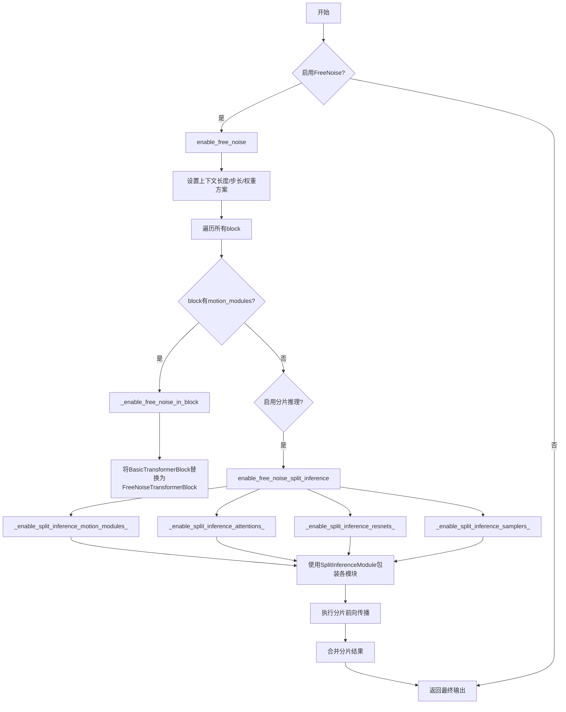

## 类结构

```
SplitInferenceModule (nn.Module)
    └── 分片推理包装器，用于内存优化

AnimateDiffFreeNoiseMixin
    ├── FreeNoise启用/禁用方法
    │   ├── enable_free_noise
    │   ├── disable_free_noise
    │   ├── _enable_free_noise_in_block
    │   └── _disable_free_noise_in_block
    ├── 输入检查与处理
    │   ├── _check_inputs_free_noise
    │   ├── _encode_prompt_free_noise
    │   └── _prepare_latents_free_noise
    ├── 分片推理启用
    │   ├── _enable_split_inference_motion_modules_
    │   ├── _enable_split_inference_attentions_
    │   ├── _enable_split_inference_resnets_
    │   ├── _enable_split_inference_samplers_
    │   └── enable_free_noise_split_inference
    └── 辅助方法
        ├── _lerp
        └── free_noise_enabled (property)
```

## 全局变量及字段


### `logger`
    
模块级别的日志记录器，用于输出调试和信息日志

类型：`logging.Logger`
    


### `allowed_weighting_scheme`
    
支持的权重方案列表，包含flat、pyramid和delayed_reverse_sawtooth三种

类型：`list[str]`
    


### `allowed_noise_type`
    
支持的噪声类型列表，包含shuffle_context、repeat_context和random三种

类型：`list[str]`
    


### `SplitInferenceModule.module`
    
底层PyTorch模块，用于对每个分片输入执行前向传播

类型：`nn.Module`
    


### `SplitInferenceModule.split_size`
    
分片大小，指定沿分片维度分割输入张量的块大小

类型：`int`
    


### `SplitInferenceModule.split_dim`
    
分片维度，指定沿哪个维度分割输入张量

类型：`int`
    


### `SplitInferenceModule.input_kwargs_to_split`
    
需要分片的输入参数名集合，只对集合中的张量参数进行分片处理

类型：`set[str]`
    


### `AnimateDiffFreeNoiseMixin._free_noise_context_length`
    
FreeNoise上下文长度，定义每次处理的视频帧数量，None表示未启用

类型：`int | None`
    


### `AnimateDiffFreeNoiseMixin._free_noise_context_stride`
    
上下文步长，控制滑动窗口之间跳过的帧数，用于长视频生成分段处理

类型：`int`
    


### `AnimateDiffFreeNoiseMixin._free_noise_weighting_scheme`
    
权重方案，指定FreeNoise块中潜在帧的加权平均方式

类型：`str`
    


### `AnimateDiffFreeNoiseMixin._free_noise_noise_type`
    
噪声类型，指定生成潜在噪声的方式（随机、打乱或重复上下文）

类型：`str`
    


### `AnimateDiffFreeNoiseMixin._free_noise_prompt_interpolation_callback`
    
提示词插值回调函数，用于在关键帧之间插值生成提示词嵌入

类型：`Callable[[int, int, torch.Tensor, torch.Tensor], torch.Tensor]`
    
    

## 全局函数及方法


### `SplitInferenceModule.__init__`

该方法是 `SplitInferenceModule` 类的构造函数，用于初始化分块推理模块的各个属性参数，包括底层模块、分块大小、分块维度以及需要分割的输入关键字参数列表。

参数：

- `module`：`nn.Module`，底层 PyTorch 模块，将应用于每个分割后的输入块
- `split_size`：`int`，默认为 1，分割后每个块的大小
- `split_dim`：`int`，默认为 0，输入张量分割的维度
- `input_kwargs_to_split`：`list[str]`，默认为 `["hidden_states"]`，表示要分割的输入张量的关键字参数名称列表

返回值：`None`，构造函数不返回任何值，仅初始化对象属性

#### 流程图

```mermaid
flowchart TD
    A[开始 __init__] --> B[调用 super().__init__]
    B --> C[设置 self.module = module]
    C --> D[设置 self.split_size = split_size]
    D --> E[设置 self.split_dim = split_dim]
    E --> F[设置 self.input_kwargs_to_split = set(input_kwargs_to_split)]
    F --> G[结束 __init__]
```

#### 带注释源码

```python
def __init__(
    self,
    module: nn.Module,
    split_size: int = 1,
    split_dim: int = 0,
    input_kwargs_to_split: list[str] = ["hidden_states"],
) -> None:
    """
    初始化 SplitInferenceModule 分块推理模块
    
    参数:
        module: 底层 PyTorch 模块，将应用于每个分割后的输入块
        split_size: 分割后每个块的大小，默认为 1
        split_dim: 输入张量分割的维度，默认为 0
        input_kwargs_to_split: 要分割的输入张量的关键字参数名称列表，默认为 ["hidden_states"]
    """
    # 调用父类 nn.Module 的初始化方法
    super().__init__()

    # 保存底层模块的引用
    self.module = module
    
    # 保存分块大小参数
    self.split_size = split_size
    
    # 保存分块维度参数
    self.split_dim = split_dim
    
    # 将输入关键字参数列表转换为集合，以便高效查找
    self.input_kwargs_to_split = set(input_kwargs_to_split)
```


### SplitInferenceModule.forward

该方法是 `SplitInferenceModule` 类的核心成员，用于对输入进行分片推理处理。它接收位置参数和关键字参数，将指定的关键字参数（由 `input_kwargs_to_split` 指定）沿指定维度切分为多个小批次，分别传递给底层模块处理，最后将各批次的输出结果重新拼接返回，实现对大张量的内存高效处理。

参数：

- `*args`：`Any`，位置参数列表，直接传递给底层模块，不做任何修改
- `**kwargs`：`dict[str, torch.Tensor]`：关键字参数字典，传递给底层模块。只有名称匹配 `input_kwargs_to_split` 且类型为 `torch.Tensor` 的参数会被切分，其余参数保持不变

返回值：`torch.Tensor | tuple[torch.Tensor]`，返回拼接后的输出。如果底层模块返回单个张量，则返回沿 `split_dim` 拼接后的张量；如果底层模块返回张量元组，则返回各元素分别拼接后的元组

#### 流程图

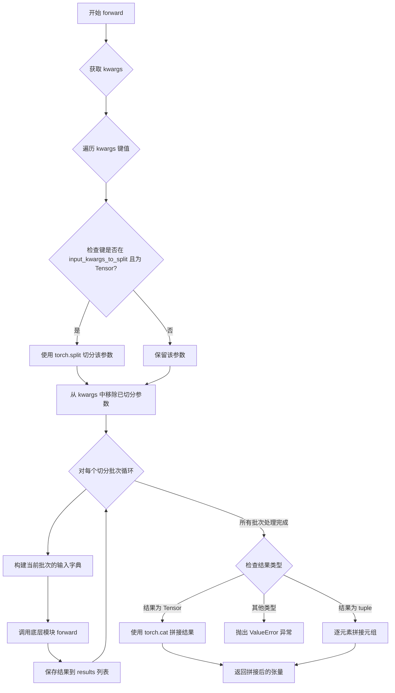

#### 带注释源码

```python
def forward(self, *args, **kwargs) -> torch.Tensor | tuple[torch.Tensor]:
    r"""Forward method for the `SplitInferenceModule`.

    This method processes the input by splitting specified keyword arguments along a given dimension, running the
    underlying module on each split, and then concatenating the results. The splitting is controlled by the
    `split_size` and `split_dim` parameters specified during initialization.

    Args:
        *args (`Any`):
            Positional arguments that are passed directly to the `module` without modification.
        **kwargs (`dict[str, torch.Tensor]`):
            Keyword arguments passed to the underlying `module`. Only keyword arguments whose names match the
            entries in `input_kwargs_to_split` and are of type `torch.Tensor` will be split. The remaining keyword
            arguments are passed unchanged.

    Returns:
        `torch.Tensor | tuple[torch.Tensor]`:
            The outputs obtained from `SplitInferenceModule` are the same as if the underlying module was inferred
            without it.
            - If the underlying module returns a single tensor, the result will be a single concatenated tensor
            along the same `split_dim` after processing all splits.
            - If the underlying module returns a tuple of tensors, each element of the tuple will be concatenated
            along the `split_dim` across all splits, and the final result will be a tuple of concatenated tensors.
    """
    # 初始化字典，用于存储需要切分的输入
    split_inputs = {}

    # 1. 遍历传入的关键字参数，找出需要切分的参数
    # 只有同时满足以下条件的参数才会被切分：
    # - 参数名称在 input_kwargs_to_split 中
    # - 参数类型是 torch.Tensor
    for key in list(kwargs.keys()):
        # 跳过不需要切分的参数
        if key not in self.input_kwargs_to_split or not torch.is_tensor(kwargs[key]):
            continue
        # 使用 torch.split 按 split_size 和 split_dim 切分张量
        split_inputs[key] = torch.split(kwargs[key], self.split_size, self.split_dim)
        # 从 kwargs 中移除已切分的参数，避免重复传递
        kwargs.pop(key)

    # 2. 遍历每个切分批次，分别调用底层模块
    results = []
    # zip(*split_inputs.values()) 会将所有切分列表按位置配对
    for split_input in zip(*split_inputs.values()):
        # 构建当前批次的输入字典，键为参数名，值为对应批次的张量
        inputs = dict(zip(split_inputs.keys(), split_input))
        # 更新输入字典，添加不需要切分的参数
        inputs.update(kwargs)

        # 调用底层模块的 forward 方法，获取中间结果
        intermediate_tensor_or_tensor_tuple = self.module(*args, **inputs)
        # 将结果添加到结果列表
        results.append(intermediate_tensor_or_tensor_tuple)

    # 3. 拼接各批次的输出结果
    if isinstance(results[0], torch.Tensor):
        # 如果底层模块返回单个张量，直接沿 split_dim 拼接
        return torch.cat(results, dim=self.split_dim)
    elif isinstance(results[0], tuple):
        # 如果底层模块返回张量元组，需要逐元素拼接
        # zip(*results) 将结果列表转置，按输出位置分组
        return tuple([torch.cat(x, dim=self.split_dim) for x in zip(*results)])
    else:
        # 底层模块必须返回 torch.Tensor 或 tuple[torch.Tensor]
        raise ValueError(
            "In order to use the SplitInferenceModule, it is necessary for the underlying `module` to either return a torch.Tensor or a tuple of torch.Tensor's."
        )
```


### `AnimateDiffFreeNoiseMixin._enable_free_noise_in_block`

该方法是一个辅助函数，用于在运动模块的transformer块中启用FreeNoise功能。它遍历指定块中的所有运动模块，检查每个transformer块是否为FreeNoiseTransformerBlock类型。如果是，则直接设置FreeNoise属性；如果不是（是BasicTransformerBlock），则将其替换为FreeNoiseTransformerBlock，并迁移原始块的参数和状态。

参数：

-  `block`：`CrossAttnDownBlockMotion | DownBlockMotion | UpBlockMotion`，需要启用FreeNoise的块对象，该块应包含motion_modules属性

返回值：`None`，该方法无返回值，直接修改传入的block对象

#### 流程图

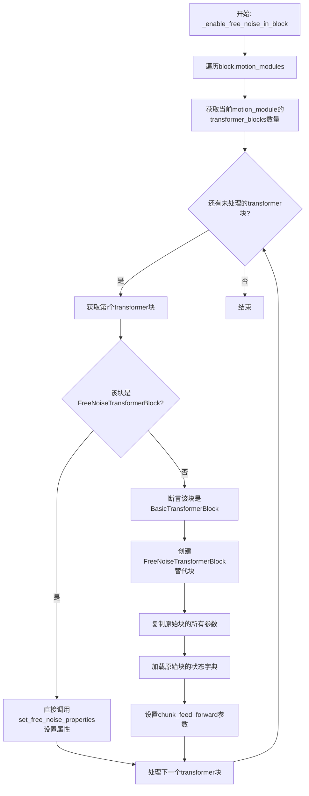

#### 带注释源码

```python
def _enable_free_noise_in_block(self, block: CrossAttnDownBlockMotion | DownBlockMotion | UpBlockMotion):
    r"""Helper function to enable FreeNoise in transformer blocks."""
    # 遍历块中的所有运动模块（如CrossAttnDownBlockMotion, DownBlockMotion, UpBlockMotion）
    for motion_module in block.motion_modules:
        # 获取该运动模块中transformer块的数量
        num_transformer_blocks = len(motion_module.transformer_blocks)

        # 遍历每个transformer块
        for i in range(num_transformer_blocks):
            # 检查当前块是否已经是FreeNoiseTransformerBlock
            if isinstance(motion_module.transformer_blocks[i], FreeNoiseTransformerBlock):
                # 如果已启用FreeNoise，直接设置FreeNoise相关属性
                motion_module.transformer_blocks[i].set_free_noise_properties(
                    self._free_noise_context_length,    # FreeNoise上下文长度
                    self._free_noise_context_stride,    # FreeNoise上下文步长
                    self._free_noise_weighting_scheme, # FreeNoise加权方案
                )
            else:
                # 断言确保是BasicTransformerBlock类型
                assert isinstance(motion_module.transformer_blocks[i], BasicTransformerBlock)
                basic_transfomer_block = motion_module.transformer_blocks[i]

                # 创建新的FreeNoiseTransformerBlock来替换BasicTransformerBlock
                motion_module.transformer_blocks[i] = FreeNoiseTransformerBlock(
                    dim=basic_transfomer_block.dim,                          # 隐藏层维度
                    num_attention_heads=basic_transfomer_block.num_attention_heads,    # 注意力头数
                    attention_head_dim=basic_transfomer_block.attention_head_dim,     # 注意力头维度
                    dropout=basic_transfomer_block.dropout,                  # Dropout率
                    cross_attention_dim=basic_transfomer_block.cross_attention_dim,   # 交叉注意力维度
                    activation_fn=basic_transfomer_block.activation_fn,      # 激活函数
                    attention_bias=basic_transfomer_block.attention_bias,     # 注意力偏置
                    only_cross_attention=basic_transfomer_block.only_cross_attention,  # 仅交叉注意力
                    double_self_attention=basic_transfomer_block.double_self_attention,  # 双自注意力
                    positional_embeddings=basic_transfomer_block.positional_embeddings,  # 位置嵌入
                    num_positional_embeddings=basic_transfomer_block.num_positional_embeddings,  # 位置嵌入数量
                    context_length=self._free_noise_context_length,          # 上下文长度（新增参数）
                    context_stride=self._free_noise_context_stride,          # 上下文步长（新增参数）
                    weighting_scheme=self._free_noise_weighting_scheme,     # 加权方案（新增参数）
                ).to(device=self.device, dtype=self.dtype)

                # 从原始BasicTransformerBlock加载权重和状态
                motion_module.transformer_blocks[i].load_state_dict(
                    basic_transfomer_block.state_dict(), strict=True
                )
                
                # 迁移chunk_feed_forward配置以保持推理行为一致
                motion_module.transformer_blocks[i].set_chunk_feed_forward(
                    basic_transfomer_block._chunk_size, basic_transfomer_block._chunk_dim
                )
```


### `AnimateDiffFreeNoiseMixin._disable_free_noise_in_block`

该方法是一个辅助函数，用于在指定的运动模块块（Motion Module Block）中禁用FreeNoise功能。它遍历块中的所有运动模块和变换器块，将之前通过`_enable_free_noise_in_block`替换的`FreeNoiseTransformerBlock`恢复为原始的`BasicTransformerBlock`，同时保留模型权重和配置信息。

参数：

-  `block`：`CrossAttnDownBlockMotion | DownBlockMotion | UpBlockMotion`，要禁用FreeNoise的运动模块块，支持下采样块、上采样块或带交叉注意力的下采样块

返回值：`None`，无返回值，该方法直接修改传入的block对象

#### 流程图

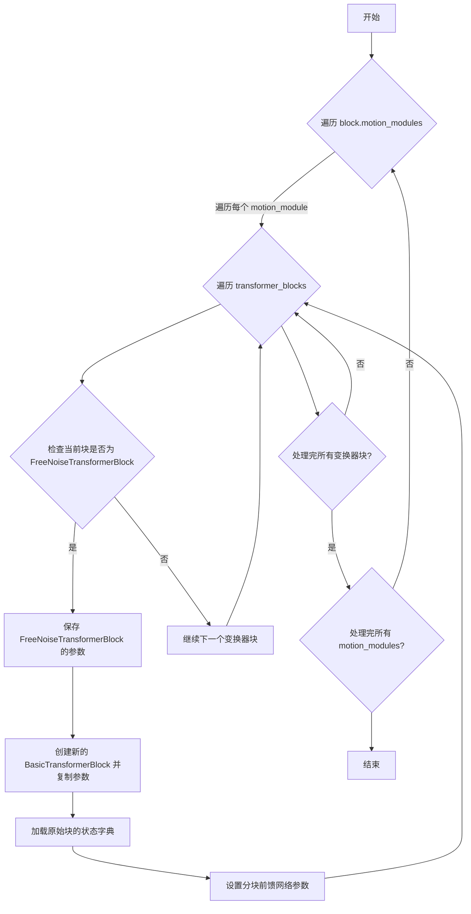

#### 带注释源码

```python
def _disable_free_noise_in_block(self, block: CrossAttnDownBlockMotion | DownBlockMotion | UpBlockMotion):
    r"""Helper function to disable FreeNoise in transformer blocks."""

    # 遍历传入块中的所有运动模块（motion_modules）
    for motion_module in block.motion_modules:
        # 获取该运动模块中变换器块的数量
        num_transformer_blocks = len(motion_module.transformer_blocks)

        # 遍历每个变换器块
        for i in range(num_transformer_blocks):
            # 检查当前变换器块是否是FreeNoiseTransformerBlock实例
            if isinstance(motion_module.transformer_blocks[i], FreeNoiseTransformerBlock):
                # 保存FreeNoiseTransformerBlock的引用，用于获取其参数
                free_noise_transfomer_block = motion_module.transformer_blocks[i]

                # 创建新的BasicTransformerBlock，传入从FreeNoise版本获取的参数
                # 注意：这里不包含FreeNoise特有的参数（context_length, context_stride, weighting_scheme）
                motion_module.transformer_blocks[i] = BasicTransformerBlock(
                    dim=free_noise_transfomer_block.dim,  # 输入维度
                    num_attention_heads=free_noise_transfomer_block.num_attention_heads,  # 注意力头数量
                    attention_head_dim=free_noise_transfomer_block.attention_head_dim,  # 注意力头维度
                    dropout=free_noise_transfomer_block.dropout,  # Dropout概率
                    cross_attention_dim=free_noise_transfomer_block.cross_attention_dim,  # 交叉注意力维度
                    activation_fn=free_noise_transfomer_block.activation_fn,  # 激活函数
                    attention_bias=free_noise_transfomer_block.attention_bias,  # 注意力偏置
                    only_cross_attention=free_noise_transfomer_block.only_cross_attention,  # 是否仅使用交叉注意力
                    double_self_attention=free_noise_transfomer_block.double_self_attention,  # 是否使用双自注意力
                    positional_embeddings=free_noise_transfomer_block.positional_embeddings,  # 位置嵌入
                    num_positional_embeddings=free_noise_transfomer_block.num_positional_embeddings,  # 位置嵌入数量
                ).to(device=self.device, dtype=self.dtype)  # 将新块移动到正确的设备和数据类型

                # 加载原始FreeNoiseTransformerBlock的状态字典到新的BasicTransformerBlock
                # strict=True确保所有参数完全匹配
                motion_module.transformer_blocks[i].load_state_dict(
                    free_noise_transfomer_block.state_dict(), strict=True
                )

                # 设置分块前馈网络的参数（chunk_size和chunk_dim）
                # 这些参数在BasicTransformerBlock的原始实例中可能已设置
                motion_module.transformer_blocks[i].set_chunk_feed_forward(
                    free_noise_transfomer_block._chunk_size, free_noise_transfomer_block._chunk_dim
                )
            else:
                # 如果当前块不是FreeNoiseTransformerBlock（已经是BasicTransformerBlock）
                # 则不需要做任何操作，直接跳过
                pass
```


### `AnimateDiffFreeNoiseMixin._check_inputs_free_noise`

该方法用于验证 FreeNoise 功能的输入参数是否符合要求，包括检查 `prompt` 和 `negative_prompt` 的类型、键值对格式、以及帧索引的有效性。

参数：

- `self`：`AnimateDiffFreeNoiseMixin` 类实例，隐式参数
- `prompt`：提示词，输入可以是 `str` 或 `dict[int, str]` 类型，表示帧级别的提示词映射
- `negative_prompt`：负提示词，输入可以是 `str` 或 `dict[int, str]` 类型，默认为 `None`
- `prompt_embeds`：提示词的嵌入向量，当前版本 FreeNoise 不支持此参数
- `negative_prompt_embeds`：负提示词的嵌入向量，当前版本 FreeNoise 不支持此参数
- `num_frames`：生成的视频总帧数，用于验证帧索引范围

返回值：`None`，该方法仅进行参数验证，不返回任何值

#### 流程图

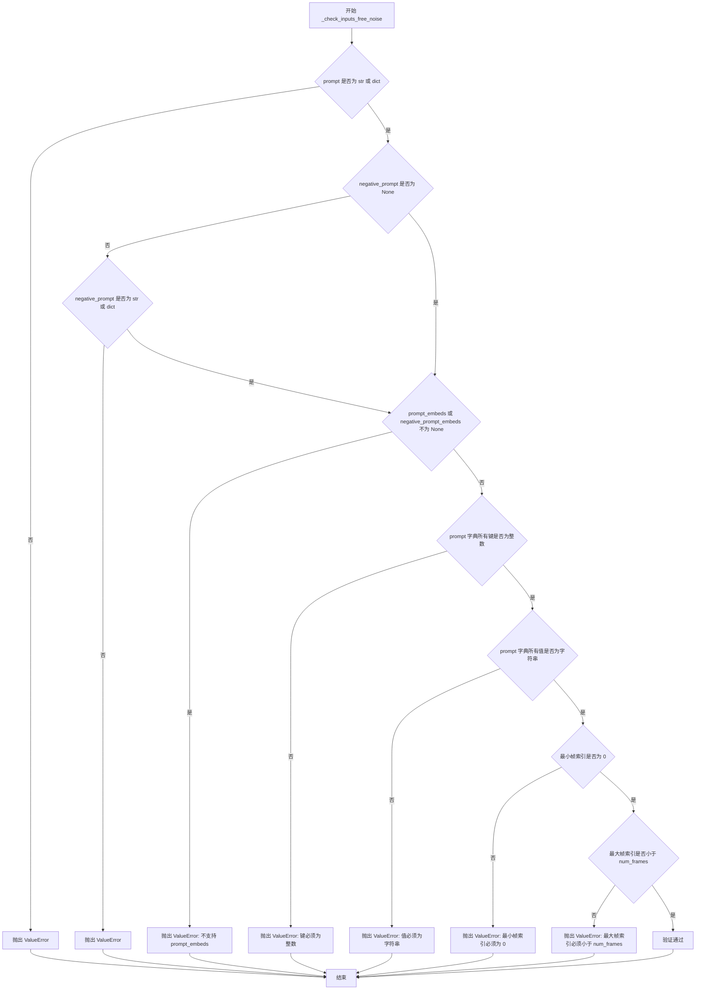

#### 带注释源码

```python
def _check_inputs_free_noise(
    self,
    prompt,
    negative_prompt,
    prompt_embeds,
    negative_prompt_embeds,
    num_frames,
) -> None:
    """
    检查 FreeNoise 功能的输入参数是否符合要求。
    
    该方法会验证以下内容：
    1. prompt 和 negative_prompt 的类型（str 或 dict）
    2. prompt_embeds 和 negative_prompt_embeds 必须同时为 None
    3. prompt 字典的键必须为整数类型
    4. prompt 字典的值必须为字符串类型
    5. prompt 字典的最小键（帧索引）必须为 0
    6. prompt 字典的最大键（帧索引）必须小于总帧数
    """
    
    # 检查 prompt 参数类型是否为 str 或 dict
    # FreeNoise 支持帧级别的提示词字典映射
    if not isinstance(prompt, (str, dict)):
        raise ValueError(f"Expected `prompt` to have type `str` or `dict` but found {type(prompt)=}")

    # 检查 negative_prompt 参数类型（如果提供了该参数）
    # 同样支持 str 或 dict 类型
    if negative_prompt is not None:
        if not isinstance(negative_prompt, (str, dict)):
            raise ValueError(
                f"Expected `negative_prompt` to have type `str` or `dict` but found {type(negative_prompt)=}"
            )

    # FreeNoise 当前版本不支持自定义提示词嵌入
    # 如果用户提供了 prompt_embeds 或 negative_prompt_embeds，则抛出错误
    if prompt_embeds is not None or negative_prompt_embeds is not None:
        raise ValueError("`prompt_embeds` and `negative_prompt_embeds` is not supported in FreeNoise yet.")

    # 检查 prompt 字典中的键是否为整数类型（帧索引）
    frame_indices = [isinstance(x, int) for x in prompt.keys()]
    
    # 检查 prompt 字典中的值是否为字符串类型（提示词文本）
    frame_prompts = [isinstance(x, str) for x in prompt.values()]
    
    # 获取帧索引的最小值和最大值
    min_frame = min(list(prompt.keys()))
    max_frame = max(list(prompt.keys()))

    # 验证所有键都是整数类型
    if not all(frame_indices):
        raise ValueError("Expected integer keys in `prompt` dict for FreeNoise.")
    
    # 验证所有值都是字符串类型
    if not all(frame_prompts):
        raise ValueError("Expected str values in `prompt` dict for FreeNoise.")
    
    # 验证最小帧索引为 0（FreeNoise 需要起始帧的提示词）
    if min_frame != 0:
        raise ValueError("The minimum frame index in `prompt` dict must be 0 as a starting prompt is necessary.")
    
    # 验证最大帧索引小于总帧数（0-based 索引）
    if max_frame >= num_frames:
        raise ValueError(
            f"The maximum frame index in `prompt` dict must be lesser than {num_frames=} and follow 0-based indexing."
        )
```


### `AnimateDiffFreeNoiseMixin._encode_prompt_free_noise`

该方法用于在FreeNoise模式下对提示词进行编码和插值处理。它接收字符串或字典形式的提示词（字典键为帧索引），对多个关键帧的提示词进行编码，然后通过插值回调函数在帧之间生成平滑过渡的提示词嵌入，最后返回用于生成视频的正负提示词嵌入张量。

参数：

- `self`：隐式参数，Mix-in类实例本身
- `prompt`：`str | dict[int, str]`，输入提示词，可以是字符串或字典（键为帧索引，值为该帧对应的提示词文本）
- `num_frames`：`int`，要生成的视频总帧数
- `device`：`torch.device`，计算设备（CPU/CUDA）
- `num_videos_per_prompt`：`int`，每个提示词要生成的视频数量
- `do_classifier_free_guidance`：`bool`，是否启用无分类器引导（CFG）
- `negative_prompt`：`str | dict[int, str] | None`，负面提示词，用于引导模型避免生成不希望的内容
- `prompt_embeds`：`torch.Tensor | None`，可选的预计算提示词嵌入（FreeNoise模式暂不支持）
- `negative_prompt_embeds`：`torch.Tensor | None`，可选的预计算负面提示词嵌入（FreeNoise模式暂不支持）
- `lora_scale`：`float | None`，LoRA权重缩放因子
- `clip_skip`：`int | None`，CLIP模型跳过的层数

返回值：`torch.Tensor`，返回包含提示词嵌入和负面提示词嵌入的元组（当启用CFG时为拼接后的张量，否则只返回提示词嵌入）

#### 流程图

```mermaid
flowchart TD
    A[开始 _encode_prompt_free_noise] --> B{negative_prompt是否为None}
    B -->|是| C[设置 negative_prompt = ""]
    B -->|否| D[保持原 negative_prompt]
    C --> E{prompt是否为字符串}
    D --> E
    E -->|是| F[将 prompt 转换为 {0: prompt}]
    E -->|否| G[保持原 prompt 字典]
    F --> H[调用 _check_inputs_free_noise 验证输入]
    G --> H
    H --> I[对 prompt 和 negative_prompt 按键排序]
    I --> J[确保最后帧有对应提示词]
    J --> K[调用 encode_prompt 编码正向提示词]
    K --> L[初始化 prompt_interpolation_embeds 零张量]
    L --> M{遍历帧索引对进行插值}
    M -->|循环内| N[调用 _free_noise_prompt_interpolation_callback 进行插值]
    N --> O[填充 prompt_interpolation_embeds]
    O --> M
    M -->|结束| P{do_classifier_free_guidance?}
    P -->|是| Q[调用 encode_prompt 编码负面提示词]
    P -->|否| R[设置 negative_prompt_embeds = None]
    Q --> S[初始化 negative_prompt_interpolation_embeds]
    S --> T{遍历负面帧索引对进行插值}
    T -->|循环内| U[调用 _free_noise_prompt_interpolation_callback]
    U --> V[填充 negative_prompt_interpolation_embeds]
    V --> T
    T -->|结束| W{do_classifier_free_guidance?}
    R --> W
    W -->|是| X[拼接 negative_prompt_embeds 和 prompt_embeds]
    W -->|否| Y[只保留 prompt_embeds]
    X --> Z[返回 prompt_embeds, negative_prompt_embeds]
    Y --> Z
```

#### 带注释源码

```python
def _encode_prompt_free_noise(
    self,
    prompt: str | dict[int, str],
    num_frames: int,
    device: torch.device,
    num_videos_per_prompt: int,
    do_classifier_free_guidance: bool,
    negative_prompt: str | dict[int, str] | None = None,
    prompt_embeds: torch.Tensor | None = None,
    negative_prompt_embeds: torch.Tensor | None = None,
    lora_scale: float | None = None,
    clip_skip: int | None = None,
) -> torch.Tensor:
    # 如果未提供负面提示词，则使用空字符串作为默认值
    if negative_prompt is None:
        negative_prompt = ""

    # 确保提示词为字典格式（键为帧索引，值为提示词文本）
    # 如果是字符串，则转换为 {0: prompt} 格式，使其与FreeNoise的帧索引机制兼容
    if isinstance(prompt, str):
        prompt = {0: prompt}
    if isinstance(negative_prompt, str):
        negative_prompt = {0: negative_prompt}

    # 验证输入参数的合法性：
    # - prompt和negative_prompt必须为str或dict类型
    # - prompt_embeds和negative_prompt_embeds在FreeNoise模式下暂不支持
    # - prompt字典的键必须是整数（帧索引），值必须是字符串
    # - 最小帧索引必须为0，最大帧索引必须小于总帧数
    self._check_inputs_free_noise(prompt, negative_prompt, prompt_embeds, negative_prompt_embeds, num_frames)

    # 按帧索引排序字典，确保提示词按时间顺序排列
    # 这是进行插值计算的前提条件
    prompt = dict(sorted(prompt.items()))
    negative_prompt = dict(sorted(negative_prompt.items()))

    # 确保最后帧有对应的提示词文本
    # 如果用户只提供了部分关键帧的提示词，最后一帧使用最后一个已提供的提示词
    prompt[num_frames - 1] = prompt[list(prompt.keys())[-1]]
    negative_prompt[num_frames - 1] = negative_prompt[list(negative_prompt.keys())[-1]]

    # 提取帧索引和对应的提示词文本列表
    frame_indices = list(prompt.keys())
    frame_prompts = list(prompt.values())
    frame_negative_indices = list(negative_prompt.keys())
    frame_negative_prompts = list(negative_prompt.values())

    # 使用基类的encode_prompt方法对正向提示词进行编码
    # 注意：此处不启用CFG（do_classifier_free_guidance=False），因为需要分别处理正负提示词
    # 编码结果shape为 [num_keyframes, batch_size, seq_len, hidden_dim]
    prompt_embeds, _ = self.encode_prompt(
        prompt=frame_prompts,
        device=device,
        num_images_per_prompt=num_videos_per_prompt,
        do_classifier_free_guidance=False,
        negative_prompt=None,
        prompt_embeds=None,
        negative_prompt_embeds=None,
        lora_scale=lora_scale,
        clip_skip=clip_skip,
    )

    # 初始化用于存储插值后提示词嵌入的零张量
    # shape: [num_frames, batch_size, seq_len, hidden_dim]
    shape = (num_frames, *prompt_embeds.shape[1:])
    prompt_interpolation_embeds = prompt_embeds.new_zeros(shape)

    # 对相邻关键帧之间的帧进行提示词嵌入插值
    # 遍历每一对相邻的帧索引（start_frame, end_frame）
    # 使用_free_noise_prompt_interpolation_callback（默认使用_lerp线性插值）填充中间帧
    for i in range(len(frame_indices) - 1):
        start_frame = frame_indices[i]
        end_frame = frame_indices[i + 1]
        start_tensor = prompt_embeds[i].unsqueeze(0)  # [1, batch, seq_len, hidden_dim]
        end_tensor = prompt_embeds[i + 1].unsqueeze(0)

        # 调用插值回调函数生成start_frame到end_frame之间的所有提示词嵌入
        prompt_interpolation_embeds[start_frame : end_frame + 1] = self._free_noise_prompt_interpolation_callback(
            start_frame, end_frame, start_tensor, end_tensor
        )

    # 初始化负面提示词嵌入变量
    negative_prompt_embeds = None
    negative_prompt_interpolation_embeds = None

    # 如果启用无分类器引导，则需要对负面提示词进行类似的编码和插值处理
    if do_classifier_free_guidance:
        # 对负面提示词进行编码
        # 这里使用空字符串作为正向提示词，frame_negative_prompts作为负面提示词
        _, negative_prompt_embeds = self.encode_prompt(
            prompt=[""] * len(frame_negative_prompts),
            device=device,
            num_images_per_prompt=num_videos_per_prompt,
            do_classifier_free_guidance=True,
            negative_prompt=frame_negative_prompts,
            prompt_embeds=None,
            negative_prompt_embeds=None,
            lora_scale=lora_scale,
            clip_skip=clip_skip,
        )

        # 初始化负面提示词插值嵌入的零张量
        negative_prompt_interpolation_embeds = negative_prompt_embeds.new_zeros(shape)

        # 对负面提示词进行帧间插值
        for i in range(len(frame_negative_indices) - 1):
            start_frame = frame_negative_indices[i]
            end_frame = frame_negative_indices[i + 1]
            start_tensor = negative_prompt_embeds[i].unsqueeze(0)
            end_tensor = negative_prompt_embeds[i + 1].unsqueeze(0)

            negative_prompt_interpolation_embeds[start_frame : end_frame + 1] = (
                self._free_noise_prompt_interpolation_callback(start_frame, end_frame, start_tensor, end_tensor)
            )

    # 将插值后的提示词嵌入赋值给最终变量
    prompt_embeds = prompt_interpolation_embeds
    negative_prompt_embeds = negative_prompt_interpolation_embeds

    # 如果启用CFG，将负面提示词嵌入和正向提示词嵌入拼接在一起
    # 拼接后的shape: [2*num_frames, batch_size, seq_len, hidden_dim]
    # 前面是负面提示词，后面是正向提示词
    if do_classifier_free_guidance:
        prompt_embeds = torch.cat([negative_prompt_embeds, prompt_embeds])

    # 返回提示词嵌入元组
    # 如果启用CFG：返回拼接后的prompt_embeds和negative_prompt_interpolation_embeds
    # 如果未启用CFG：返回prompt_embeds和None
    return prompt_embeds, negative_prompt_embeds
```


### `AnimateDiffFreeNoiseMixin._prepare_latents_free_noise`

该函数是 FreeNoise 技术的核心组成部分，负责为长视频生成准备潜在向量（latents）。它根据不同的噪声类型（random、shuffle_context、repeat_context）处理和生成潜在向量，支持滑动窗口式的上下文处理和帧混排策略，以实现高质量的长视频生成。

参数：

- `self`：`AnimateDiffFreeNoiseMixin`，mixin 类实例，提供了 FreeNoise 功能的方法
- `batch_size`：`int`，批量大小，指定要生成的视频数量
- `num_channels_latents`：`int`，潜在变量的通道数，决定潜在表示的维度
- `num_frames`：`int`，目标视频的帧数
- `height`：`int`，潜在变量的空间高度（像素空间）
- `width`：`int`，潜在变量的空间宽度（像素空间）
- `dtype`：`torch.dtype`，潜在张量的数据类型（如 torch.float32）
- `device`：`torch.device`，潜在张量所在的设备（CPU 或 CUDA）
- `generator`：`torch.Generator | None`，可选的随机数生成器，用于确保可复现性
- `latents`：`torch.Tensor | None`，可选的预提供潜在向量，如果为 None 则随机生成

返回值：`torch.Tensor`，处理后的潜在向量张量，形状为 (batch_size, num_channels_latents, num_frames, height // vae_scale_factor, width // vae_scale_factor)

#### 流程图

```mermaid
flowchart TD
    A[开始 _prepare_latents_free_noise] --> B{检查 generator 列表长度}
    B -->|长度不匹配| C[抛出 ValueError]
    B -->|长度匹配| D[计算 context_num_frames]
    D --> E[计算 shape 元组]
    E --> F{latents 是否为 None?}
    F -->|是| G[使用 randn_tensor 生成随机潜在向量]
    G --> H{noise_type == 'random'?}
    H -->|是| I[直接返回 latents]
    H -->|否| J[继续处理]
    F -->|否| K{latents.size(2) == num_frames?]
    K -->|是| L[直接返回 latents]
    K -->|否| M{latents.size(2) == context_length?}
    M -->|否| N[抛出 ValueError]
    M -->|是| O[将 latents 移到 device]
    O --> J
    J --> P{noise_type == 'shuffle_context'?}
    P -->|是| Q[遍历上下文窗口进行帧混排]
    Q --> R[返回处理后的 latents]
    P -->|否| S{noise_type == 'repeat_context'?}
    S -->|是| T[重复 latents 以填满 num_frames]
    T --> R
    S -->|否| U[截取前 num_frames 帧]
    U --> R
    I --> R
    L --> R
    N --> R
```

#### 带注释源码

```python
def _prepare_latents_free_noise(
    self,
    batch_size: int,
    num_channels_latents: int,
    num_frames: int,
    height: int,
    width: int,
    dtype: torch.dtype,
    device: torch.device,
    generator: torch.Generator | None = None,
    latents: torch.Tensor | None = None,
):
    # 验证 generator 列表长度是否与 batch_size 匹配
    # 如果不匹配，抛出明确的错误信息帮助用户定位问题
    if isinstance(generator, list) and len(generator) != batch_size:
        raise ValueError(
            f"You have passed a list of generators of length {len(generator)}, but requested an effective batch"
            f" size of {batch_size}. Make sure the batch size matches the length of the generators."
        )

    # 确定上下文帧数：如果设置了 'repeat_context'，使用指定的 context_length；
    # 否则使用完整的 num_frames（适用于 shuffle_context 和 random）
    context_num_frames = (
        self._free_noise_context_length if self._free_noise_context_length == "repeat_context" else num_frames
    )

    # 构建潜在向量的目标形状：[batch_size, channels, frames, height/vae_scale, width/vae_scale]
    shape = (
        batch_size,
        num_channels_latents,
        context_num_frames,
        height // self.vae_scale_factor,
        width // self.vae_scale_factor,
    )

    # 如果没有提供预计算的潜在向量，则随机生成
    if latents is None:
        # 使用 randn_tensor 生成符合标准正态分布的随机潜在向量
        latents = randn_tensor(shape, generator=generator, device=device, dtype=dtype)
        
        # 如果噪声类型是 'random'，直接返回原始随机潜在向量，无需进一步处理
        if self._free_noise_noise_type == "random":
            return latents
    else:
        # 如果提供了潜在向量，验证其帧数是否符合预期
        if latents.size(2) == num_frames:
            # 帧数完全匹配，直接返回，无需处理
            return latents
        elif latents.size(2) != self._free_noise_context_length:
            # 帧数不匹配且不是 context_length，抛出错误
            raise ValueError(
                f"You have passed `latents` as a parameter to FreeNoise. The expected number of frames is either {num_frames} or {self._free_noise_context_length}, but found {latents.size(2)}"
            )
        # 将提供的潜在向量移到指定设备
        latents = latents.to(device)

    # 处理 'shuffle_context' 噪声类型：使用滑动窗口进行帧混排
    if self._free_noise_noise_type == "shuffle_context":
        # 遍历从 context_length 开始，步长为 context_stride 的所有窗口
        for i in range(self._free_noise_context_length, num_frames, self._free_noise_context_stride):
            # 确保窗口边界在有效范围内
            window_start = max(0, i - self._free_noise_context_length)
            window_end = min(num_frames, window_start + self._free_noise_context_stride)
            window_length = window_end - window_start

            # 如果窗口长度为0，提前退出循环
            if window_length == 0:
                break

            # 生成当前窗口的索引和打乱后的索引
            indices = torch.LongTensor(list(range(window_start, window_end)))
            shuffled_indices = indices[torch.randperm(window_length, generator=generator)]

            # 计算当前处理帧的起始和结束位置
            current_start = i
            current_end = min(num_frames, current_start + window_length)
            
            # 检查是否能完整填充窗口
            if current_end == current_start + window_length:
                # 完整填充：将打乱后的帧复制到对应位置
                latents[:, :, current_start:current_end] = latents[:, :, shuffled_indices]
            else:
                # 处理最后一批帧不能完整填充窗口的情况
                prefix_length = current_end - current_start
                shuffled_indices = shuffled_indices[:prefix_length]
                latents[:, :, current_start:current_end] = latents[:, :, shuffled_indices]

    # 处理 'repeat_context' 噪声类型：重复上下文帧以填满目标帧数
    elif self._free_noise_noise_type == "repeat_context":
        # 计算需要重复的次数（向上取整）
        num_repeats = (num_frames + self._free_noise_context_length - 1) // self._free_noise_context_length
        # 在帧维度（dim=2）上重复潜在向量
        latents = torch.cat([latents] * num_repeats, dim=2)

    # 最终截取确保只返回目标帧数的潜在向量
    latents = latents[:, :, :num_frames]
    return latents
```


### `AnimateDiffFreeNoiseMixin._lerp`

该方法是一个线性插值（Linear Interpolation）函数，用于在给定的起始索引和结束索引之间对两个张量进行线性插值生成中间帧。在 FreeNoise 的 prompt 插值功能中，它接收起始帧和结束帧的嵌入表示，然后根据索引范围生成平滑过渡的插值嵌入序列。

参数：

- `self`：`AnimateDiffFreeNoiseMixin`，隐式参数，类的实例本身
- `start_index`：`int`，起始帧的索引，用于计算插值的起始位置
- `end_index`：`int`，结束帧的索引，用于计算插值的结束位置
- `start_tensor`：`torch.Tensor`，起始帧的张量表示，通常是 prompt 编码后的嵌入向量
- `end_tensor`：`torch.Tensor`，结束帧的张量表示，通常是 prompt 编码后的嵌入向量

返回值：`torch.Tensor`，返回所有插值张量沿新增维度拼接后的结果，形状为 `[num_indices, ...]`，其中 `num_indices = end_index - start_index + 1`

#### 流程图

```mermaid
flowchart TD
    A[开始] --> B[计算插值数量<br/>num_indices = end_index - start_index + 1]
    B --> C[初始化空列表<br/>interpolated_tensors = []]
    C --> D{i < num_indices}
    D -->|是| E[计算权重 alpha = i / (num_indices - 1)]
    E --> F[线性插值计算<br/>interpolated = (1 - alpha) × start_tensor + alpha × end_tensor]
    F --> G[将结果添加到列表<br/>interpolated_tensors.append]
    G --> H[i = i + 1]
    H --> D
    D -->|否| I[拼接所有插值张量<br/>torch.cat(interpolated_tensors)]
    I --> J[返回结果]
```

#### 带注释源码

```python
def _lerp(
    self, start_index: int, end_index: int, start_tensor: torch.Tensor, end_tensor: torch.Tensor
) -> torch.Tensor:
    """
    线性插值方法，用于在两个张量之间生成插值序列。

    参数:
        start_index: 起始索引
        end_index: 结束索引
        start_tensor: 起始张量
        end_tensor: 结束张量

    返回:
        插值后的张量序列
    """
    # 计算需要生成的插值帧数量（包括起始和结束帧）
    num_indices = end_index - start_index + 1
    # 用于存储所有插值张量的列表
    interpolated_tensors = []

    # 遍历每个索引位置进行插值
    for i in range(num_indices):
        # 计算线性插值的权重 alpha，从 0 到 1 线性变化
        # 当 i=0 时 alpha=0（完全使用 start_tensor）
        # 当 i=num_indices-1 时 alpha=1（完全使用 end_tensor）
        alpha = i / (num_indices - 1)
        # 执行线性插值：result = (1 - α) * start + α * end
        interpolated_tensor = (1 - alpha) * start_tensor + alpha * end_tensor
        # 将当前插值结果添加到列表中
        interpolated_tensors.append(interpolated_tensor)

    # 将所有插值张量在新增的维度（dim=0）上拼接起来
    interpolated_tensors = torch.cat(interpolated_tensors)
    return interpolated_tensors
```


### `enable_free_noise`

启用 FreeNoise 长视频生成功能，该方法通过配置上下文长度、上下文步长、权重方案和噪声类型来激活 FreeNoise 机制，并将标准的 `BasicTransformerBlock` 替换为 `FreeNoiseTransformerBlock` 以支持长视频生成。

参数：

- `context_length`：`int | None`，可选参数，默认为 16。要同时处理的视频帧数量，建议设置为 Motion Adapter 训练时的最大帧数（通常为 16/24/32），如果为 `None`，则使用 motion adapter 配置中的默认值。
- `context_stride`：`int`，可选参数，默认为 4。处理长视频时，FreeNoise 以 `context_length` 大小的滑动窗口处理帧，context_stride 指定每个窗口跳过的帧数。
- `weighting_scheme`：`str`，可选参数，默认为 "pyramid"。FreeNoise 块中累积后平均 latents 的权重方案，支持 "flat"、"pyramid" 和 "delayed_reverse_sawtooth"。
- `noise_type`：`str`，可选参数，默认为 "shuffle_context"。噪声类型，必须是 "shuffle_context"、"repeat_context" 或 "random" 之一。
- `prompt_interpolation_callback`：`Callable[[DiffusionPipeline, int, int, torch.Tensor, torch.Tensor], torch.Tensor] | None`，可选参数，用于 prompt 插值的回调函数，默认为线性插值 `_lerp`。

返回值：`None`，无返回值，该方法直接修改对象状态。

#### 流程图

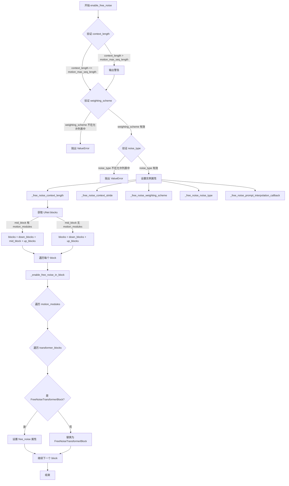

#### 带注释源码

```python
def enable_free_noise(
    self,
    context_length: int | None = 16,
    context_stride: int = 4,
    weighting_scheme: str = "pyramid",
    noise_type: str = "shuffle_context",
    prompt_interpolation_callback: Callable[
        [DiffusionPipeline, int, int, torch.Tensor, torch.Tensor], torch.Tensor
    ]
    | None = None,
) -> None:
    r"""
    Enable long video generation using FreeNoise.

    Args:
        context_length (`int`, defaults to `16`, *optional*):
            The number of video frames to process at once. It's recommended to set this to the maximum frames the
            Motion Adapter was trained with (usually 16/24/32). If `None`, the default value from the motion
            adapter config is used.
        context_stride (`int`, *optional*):
            Long videos are generated by processing many frames. FreeNoise processes these frames in sliding
            windows of size `context_length`. Context stride allows you to specify how many frames to skip between
            each window. For example, a context length of 16 and context stride of 4 would process 24 frames as:
                [0, 15], [4, 19], [8, 23] (0-based indexing)
        weighting_scheme (`str`, defaults to `pyramid`):
            Weighting scheme for averaging latents after accumulation in FreeNoise blocks. The following weighting
            schemes are supported currently:
                - "flat"
                   Performs weighting averaging with a flat weight pattern: [1, 1, 1, 1, 1].
                - "pyramid"
                    Performs weighted averaging with a pyramid like weight pattern: [1, 2, 3, 2, 1].
                - "delayed_reverse_sawtooth"
                    Performs weighted averaging with low weights for earlier frames and high-to-low weights for
                    later frames: [0.01, 0.01, 3, 2, 1].
        noise_type (`str`, defaults to "shuffle_context"):
            Must be one of ["shuffle_context", "repeat_context", "random"].
                - "shuffle_context"
                    Shuffles a fixed batch of `context_length` latents to create a final latent of size
                    `num_frames`. This is usually the best setting for most generation scenarios. However, there
                    might be visible repetition noticeable in the kinds of motion/animation generated.
                - "repeated_context"
                    Repeats a fixed batch of `context_length` latents to create a final latent of size
                    `num_frames`.
                - "random"
                    The final latents are random without any repetition.
    """

    # 定义允许的权重方案和噪声类型
    allowed_weighting_scheme = ["flat", "pyramid", "delayed_reverse_sawtooth"]
    allowed_noise_type = ["shuffle_context", "repeat_context", "random"]

    # 检查 context_length 是否超过 Motion Adapter 训练的最大序列长度
    if context_length > self.motion_adapter.config.motion_max_seq_length:
        logger.warning(
            f"You have set {context_length=} which is greater than {self.motion_adapter.config.motion_max_seq_length=}. This can lead to bad generation results."
        )
    
    # 验证 weighting_scheme 是否在允许的列表中
    if weighting_scheme not in allowed_weighting_scheme:
        raise ValueError(
            f"The parameter `weighting_scheme` must be one of {allowed_weighting_scheme}, but got {weighting_scheme=}"
        )
    
    # 验证 noise_type 是否在允许的列表中
    if noise_type not in allowed_noise_type:
        raise ValueError(f"The parameter `noise_type` must be one of {allowed_noise_type}, but got {noise_type=}")

    # 设置 FreeNoise 相关的实例属性
    # 如果 context_length 为 None，则使用 motion adapter 配置中的默认值
    self._free_noise_context_length = context_length or self.motion_adapter.config.motion_max_seq_length
    self._free_noise_context_stride = context_stride
    self._free_noise_weighting_scheme = weighting_scheme
    self._free_noise_noise_type = noise_type
    # 使用提供的回调函数或默认的线性插值方法
    self._free_noise_prompt_interpolation_callback = prompt_interpolation_callback or self._lerp

    # 获取 UNet 的所有 blocks
    # 检查 mid_block 是否有 motion_modules 属性
    if hasattr(self.unet.mid_block, "motion_modules"):
        blocks = [*self.unet.down_blocks, self.unet.mid_block, *self.unet.up_blocks]
    else:
        blocks = [*self.unet.down_blocks, *self.unet.up_blocks]

    # 遍历所有 blocks 并启用 FreeNoise
    for block in blocks:
        self._enable_free_noise_in_block(block)
```


### `AnimateDiffFreeNoiseMixin.disable_free_noise`

该方法用于禁用 FreeNoise 采样机制，通过将 `_free_noise_context_length` 设置为 `None`，并遍历 UNet 的所有块（down_blocks、mid_block、up_blocks），调用 `_disable_free_noise_in_block` 方法将 FreeNoiseTransformerBlock 恢复为 BasicTransformerBlock，从而关闭 FreeNoise 功能。

参数： 无

返回值：`None`，无返回值描述

#### 流程图

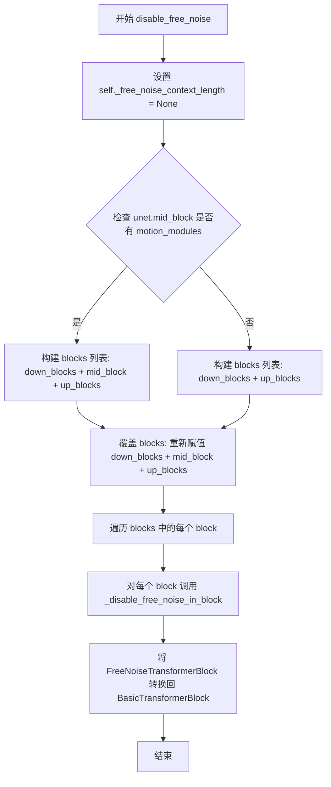

#### 带注释源码

```python
def disable_free_noise(self) -> None:
    r"""Disable the FreeNoise sampling mechanism."""
    # 1. 将 _free_noise_context_length 设置为 None，标记 FreeNoise 已禁用
    self._free_noise_context_length = None

    # 2. 检查 UNet 的 mid_block 是否包含 motion_modules
    if hasattr(self.unet.mid_block, "motion_modules"):
        # 如果包含 motion_modules，则包含 mid_block 在块列表中
        blocks = [*self.unet.down_blocks, self.unet.mid_block, *self.unet.up_blocks]
    else:
        # 如果不包含，则只使用 down_blocks 和 up_blocks
        blocks = [*self.unet.down_blocks, *self.unet.up_blocks]

    # 注意：此处存在冗余代码，无论条件如何都会重新赋值为相同的列表
    blocks = [*self.unet.down_blocks, self.unet.mid_block, *self.unet.up_blocks]
    
    # 3. 遍历所有块，调用 _disable_free_noise_in_block 禁用每个块中的 FreeNoise
    for block in blocks:
        self._disable_free_noise_in_block(block)
```


### `AnimateDiffFreeNoiseMixin._enable_split_inference_motion_modules_`

该方法用于在运动模块（motion modules）中启用分块推理（split inference）。它通过将每个运动模块的 `proj_in`、`transformer_blocks` 和 `proj_out` 层包装在 `SplitInferenceModule` 中，使得大尺寸张量可以沿空间维度分割成更小的块进行处理，从而降低内存占用。

参数：

- `motion_modules`：`list[AnimateDiffTransformer3D]`，待包装的运动模块列表
- `spatial_split_size`：`int`，沿空间维度（维度 0）分割输入的块大小

返回值：`None`，该方法直接修改传入的运动模块，不返回任何内容。

#### 流程图

```mermaid
flowchart TD
    A[Start: _enable_split_inference_motion_modules_] --> B{For each motion_module in motion_modules}
    B --> C[Wrap motion_module.proj_in with SplitInferenceModule]
    C --> D[For i in range len motion_module.transformer_blocks]
    D --> E[Wrap transformer_blocks[i] with SplitInferenceModule]
    E --> F[Wrap motion_module.proj_out with SplitInferenceModule]
    F --> G[Next motion_module]
    G --> B
    B --> H[End]
```

#### 带注释源码

```python
def _enable_split_inference_motion_modules_(
    self, motion_modules: list[AnimateDiffTransformer3D], spatial_split_size: int
) -> None:
    """
    为运动模块启用分块推理功能。
    
    该方法遍历所有运动模块，将每个模块的输入投影、变换器块和输出投影
    包装在 SplitInferenceModule 中，以支持沿空间维度的分块处理。
    
    Args:
        motion_modules: 包含 AnimateDiffTransformer3D 实例的列表
        spatial_split_size: 沿维度0（空间维度）进行分割的块大小
    """
    # 遍历每个运动模块
    for motion_module in motion_modules:
        # 1. 将输入投影层 proj_in 包装成分块推理模块
        # 参数: 模块本身、分割大小、分割维度(0)、需要分割的输入参数名(["input"])
        motion_module.proj_in = SplitInferenceModule(
            motion_module.proj_in, 
            spatial_split_size, 
            0, 
            ["input"]
        )

        # 2. 遍历该运动模块中的所有变换器块
        for i in range(len(motion_module.transformer_blocks)):
            # 将每个变换器块包装成分块推理模块
            # 需要分割 hidden_states 和 encoder_hidden_states 两个参数
            motion_module.transformer_blocks[i] = SplitInferenceModule(
                motion_module.transformer_blocks[i],
                spatial_split_size,
                0,
                ["hidden_states", "encoder_hidden_states"],
            )

        # 3. 将输出投影层 proj_out 包装成分块推理模块
        motion_module.proj_out = SplitInferenceModule(
            motion_module.proj_out, 
            spatial_split_size, 
            0, 
            ["input"]
        )
```


### `AnimateDiffFreeNoiseMixin._enable_split_inference_attentions_`

为传入的注意力模块列表启用时间维度上的分片推理（Split Inference），通过将每个注意力模块包装到 `SplitInferenceModule` 中实现。

参数：

- `self`：`AnimateDiffFreeNoiseMixin`，mixin 类实例，隐含参数
- `attentions`：`list[Transformer2DModel]`，需要启用分片推理的注意力模块列表
- `temporal_split_size`：`int`，时间维度（维度 0）上的分片大小，用于控制每个分片的帧数

返回值：`None`，无返回值。该方法直接修改传入的 `attentions` 列表，将每个注意力模块替换为对应的 `SplitInferenceModule` 包装器。

#### 流程图

```mermaid
flowchart TD
    A[开始] --> B[遍历 attentions 列表]
    B --> C{还有更多模块?}
    C -->|是| D[获取当前注意力模块]
    D --> E[创建 SplitInferenceModule 包装器]
    E --> F[传入参数: 模块本身, temporal_split_size, split_dim=0, input_kwargs_to_split=['hidden_states', 'encoder_hidden_states']]
    F --> G[将原模块替换为 SplitInferenceModule 包装器]
    G --> C
    C -->|否| H[结束]
```

#### 带注释源码

```python
def _enable_split_inference_attentions_(
    self, attentions: list[Transformer2DModel], temporal_split_size: int
) -> None:
    """为注意力模块启用时间维度上的分片推理功能。
    
    该方法将传入的注意力模块列表中的每个 Transformer2DModel 包装到 SplitInferenceModule 中，
    使得模型能够沿着时间维度（即维度 0）进行分片处理，从而减少显存占用。
    
    Args:
        attentions (list[Transformer2DModel]): 需要启用分片推理的注意力模块列表，
            这些模块通常是 UNet 下采样/上采样块中的注意力层。
        temporal_split_size (int): 时间维度上的分片大小，控制每次处理多少帧。
            较小的值可以降低显存使用，但可能增加计算时间。
    """
    # 遍历注意力模块列表
    for i in range(len(attentions)):
        # 使用 SplitInferenceModule 包装原始注意力模块
        # 参数说明:
        #   - attentions[i]: 原始的 Transformer2DModel 模块
        #   - temporal_split_size: 沿维度 0（即时间/帧维度）的分片大小
        #   - 0: split_dim，表示沿时间维度进行分割
        #   - ["hidden_states", "encoder_hidden_states"]: 需要分割的输入参数名列表
        attentions[i] = SplitInferenceModule(
            attentions[i], temporal_split_size, 0, ["hidden_states", "encoder_hidden_states"]
        )
```


### `AnimateDiffFreeNoiseMixin._enable_split_inference_resnets_`

该方法用于在 FreeNoise 视频生成中启用 ResNet 块的时间分割推理功能，通过将每个 ResNet 块包装在 `SplitInferenceModule` 中，实现对时间维度的高效分块处理，从而降低显存占用。

参数：

- `self`：`AnimateDiffFreeNoiseMixin`，mixin 类实例，隐式参数
- `resnets`：`list[ResnetBlock2D]`，需要启用分割推理的 ResNet 块列表
- `temporal_split_size`：`int`，时间维度上的分割大小，用于控制每次处理的帧数块大小

返回值：`None`，该方法就地修改 `resnets` 列表中的元素，无返回值

#### 流程图

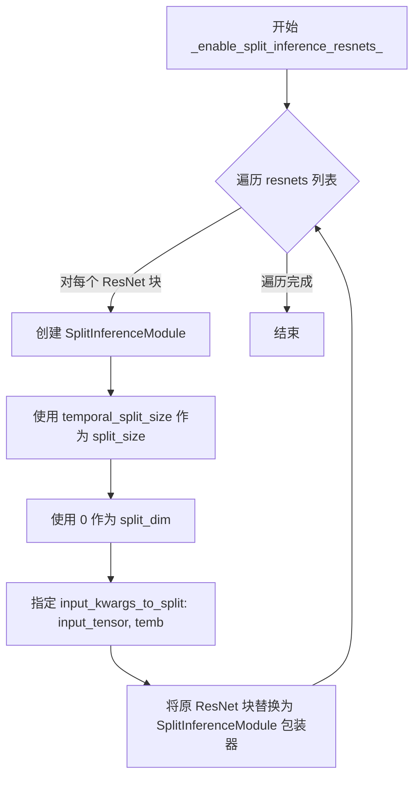

#### 带注释源码

```python
def _enable_split_inference_resnets_(self, resnets: list[ResnetBlock2D], temporal_split_size: int) -> None:
    """
    为 ResNet 块启用分割推理功能。

    该方法将列表中的每个 ResNet 块替换为 SplitInferenceModule 包装器，
    使得前向传播可以沿着时间维度（dim=0）分块进行，从而减少显存占用。

    Args:
        resnets (list[ResnetBlock2D]): 需要包装的 ResNet 块列表
        temporal_split_size (int): 时间维度上的分割大小
    """
    # 遍历所有 ResNet 块
    for i in range(len(resnets)):
        # 将每个 ResNet 块包装在 SplitInferenceModule 中
        # 参数说明：
        #   - resnets[i]: 原始的 ResNet 块
        #   - temporal_split_size: 分割大小，控制每次处理多少帧
        #   - 0: 分割维度，沿时间维度分割
        #   - ["input_tensor", "temb"]: 需要分割的输入参数名称
        resnets[i] = SplitInferenceModule(
            resnets[i],           # 原始 ResNet 模块
            temporal_split_size,  # 分割大小
            0,                    # 沿 dim=0（时间维度）分割
            ["input_tensor", "temb"]  # 需要分割的输入参数
        )
```


### AnimateDiffFreeNoiseMixin._enable_split_inference_samplers_

该方法用于将采样器模块（下采样或上采样模块）包装为SplitInferenceModule，以实现沿时间维度的内存高效分割推理。

参数：

- `samplers`：`list[Downsample2D] | list[Upsample2D]`，需要启用分割推理的采样器模块列表
- `temporal_split_size`：`int`，沿时间维度分割的块大小

返回值：`None`，该方法直接修改传入的samplers列表

#### 流程图

```mermaid
flowchart TD
    A[开始] --> B[遍历 samplers 列表中的每个采样器]
    B --> C{还有更多采样器?}
    C -->|是| D[将当前采样器包装为 SplitInferenceModule]
    D --> E[设置分割大小为 temporal_split_size]
    E --> F[设置分割维度为 0]
    F --> G[设置要分割的输入参数为 ['hidden_states']]
    G --> C
    C -->|否| H[结束]
```

#### 带注释源码

```python
def _enable_split_inference_samplers_(
    self, samplers: list[Downsample2D] | list[Upsample2D], temporal_split_size: int
) -> None:
    """
    为采样器模块启用分割推理功能。
    
    该方法将传入的 Downsample2D 或 Upsample2D 采样器模块包装为 SplitInferenceModule，
    以支持沿时间维度（dim=0）对 hidden_states 进行分割处理，从而减少显存占用。
    
    Args:
        samplers: 需要包装的采样器模块列表，可以是 Downsample2D 或 Upsample2D 类型
        temporal_split_size: 分割块大小，控制每次处理的时间步数
    
    Returns:
        None: 直接修改传入的 samplers 列表
    """
    # 遍历所有采样器模块
    for i in range(len(samplers)):
        # 将每个采样器包装为 SplitInferenceModule
        # 参数说明：
        #   - samplers[i]: 原始的采样器模块
        #   - temporal_split_size: 沿时间维度的分割大小
        #   - 0: 分割维度（0 表示时间维度）
        #   - ["hidden_states"]: 需要分割的输入参数名
        samplers[i] = SplitInferenceModule(samplers[i], temporal_split_size, 0, ["hidden_states"])
```


### `AnimateDiffFreeNoiseMixin.enable_free_noise_split_inference`

启用 FreeNoise 内存优化功能，通过在不同的中间建模块中使用 SplitInferenceModule 进行分割推理，从而减少长视频生成时的显存占用。

参数：

- `self`：`AnimateDiffFreeNoiseMixin`，mixin 类实例本身
- `spatial_split_size`：`int`，默认为 `256`，内部块的空间维度分割大小，用于在运动建模块中对中间张量的有效批次维度（`[B x H x W, F, C]`）进行分割推理
- `temporal_split_size`：`int`，默认为 `16`，内部块的时间维度分割大小，用于在空间注意力、resnets、下采样和上采样块中对中间张量的有效批次维度（`[B x F, H x W, C]`）进行分割推理

返回值：`None`，无返回值，仅修改对象内部状态

#### 流程图

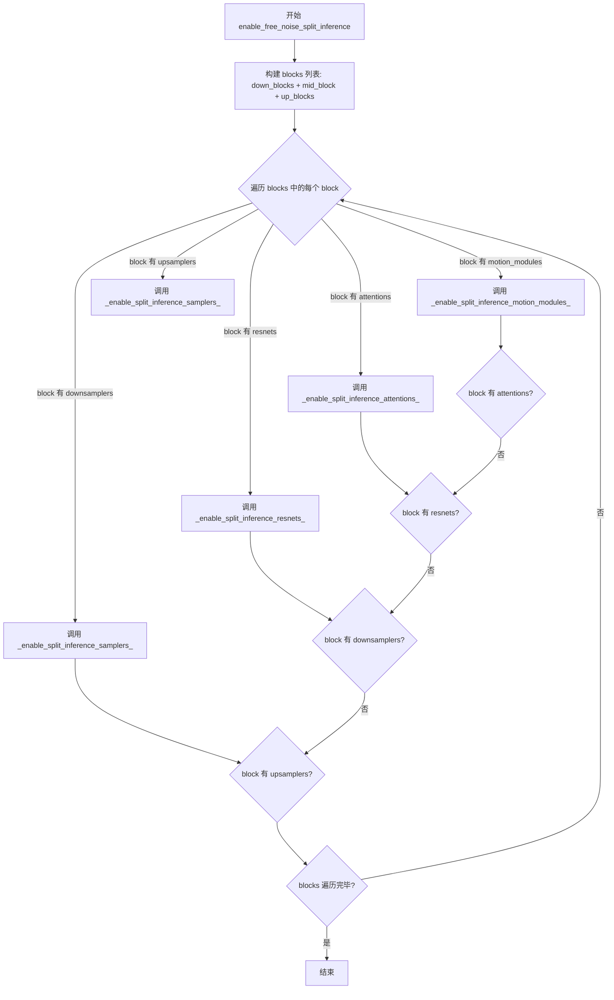

#### 带注释源码

```python
def enable_free_noise_split_inference(
    self,
    spatial_split_size: int = 256,
    temporal_split_size: int = 16
) -> None:
    r"""
    Enable FreeNoise memory optimizations by utilizing
    [`~diffusers.pipelines.free_noise_utils.SplitInferenceModule`] across different intermediate modeling blocks.

    Args:
        spatial_split_size (`int`, defaults to `256`):
            The split size across spatial dimensions for internal blocks. This is used in facilitating split
            inference across the effective batch dimension (`[B x H x W, F, C]`) of intermediate tensors in motion
            modeling blocks.
        temporal_split_size (`int`, defaults to `16`):
            The split size across temporal dimensions for internal blocks. This is used in facilitating split
            inference across the effective batch dimension (`[B x F, H x W, C]`) of intermediate tensors in spatial
            attention, resnets, downsampling and upsampling blocks.
    """
    # TODO(aryan): Discuss on what's the best way to provide more control to users
    # 构建 UNet 的所有块：下采样块、中间块、上采样块
    blocks = [*self.unet.down_blocks, self.unet.mid_block, *self.unet.up_blocks]
    
    # 遍历每个块，为其中存在的模块启用分割推理
    for block in blocks:
        # 检查块是否有 motion_modules，如有则启用空间分割推理
        if getattr(block, "motion_modules", None) is not None:
            self._enable_split_inference_motion_modules_(block.motion_modules, spatial_split_size)
        
        # 检查块是否有 attentions，如有则启用时间分割推理
        if getattr(block, "attentions", None) is not None:
            self._enable_split_inference_attentions_(block.attentions, temporal_split_size)
        
        # 检查块是否有 resnets，如有则启用时间分割推理
        if getattr(block, "resnets", None) is not None:
            self._enable_split_inference_resnets_(block.resnets, temporal_split_size)
        
        # 检查块是否有 downsamplers，如有则启用时间分割推理
        if getattr(block, "downsamplers", None) is not None:
            self._enable_split_inference_samplers_(block.downsamplers, temporal_split_size)
        
        # 检查块是否有 upsamplers，如有则启用时间分割推理
        if getattr(block, "upsamplers", None) is not None:
            self._enable_split_inference_samplers_(block.upsamplers, temporal_split_size)
```


### `AnimateDiffFreeNoiseMixin.free_noise_enabled`

该属性用于检查当前 pipeline 是否已启用 FreeNoise 功能。它通过检查对象是否具有 `_free_noise_context_length` 属性且其值不为 None 来判断 FreeNoise 是否已激活。

参数： 无

返回值：`bool`，返回 True 表示 FreeNoise 功能已启用，返回 False 表示未启用。

#### 流程图

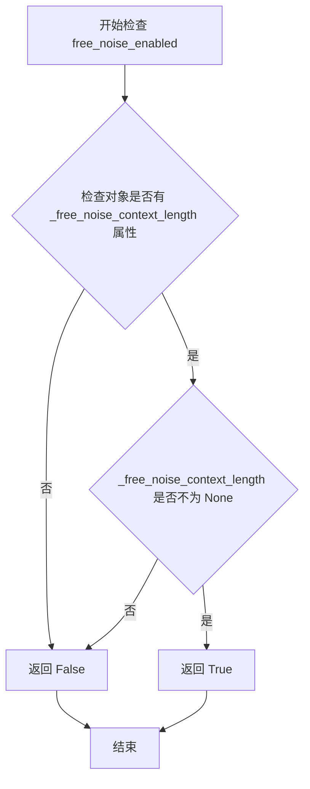

#### 带注释源码

```python
@property
def free_noise_enabled(self):
    r"""
    属性：检查 FreeNoise 功能是否已启用。
    
    该属性通过检查对象是否具有 `_free_noise_context_length` 属性且该属性的值不为 None
    来判断 FreeNoise 功能是否已被激活。当调用 `enable_free_noise()` 方法时，该属性会被
    设置为非 None 值；当调用 `disable_free_noise()` 方法时，该属性会被设置为 None。
    
    返回:
        bool: 如果已启用 FreeNoise 功能则返回 True，否则返回 False。
    """
    # 步骤1：检查对象是否具有 _free_noise_context_length 属性
    # 步骤2：检查该属性的值是否不为 None
    return hasattr(self, "_free_noise_context_length") and self._free_noise_context_length is not None
```


### `SplitInferenceModule.__init__`

该方法是 `SplitInferenceModule` 类的构造函数，用于初始化分片推理模块。它接收一个底层 PyTorch 模块、分割大小、分割维度以及需要分割的输入关键字参数列表，并将这些配置存储为实例属性，以便在后续的前向传播中对输入进行分片处理。

参数：

- `module`：`nn.Module`，底层 PyTorch 模块，将对每个分割后的输入块应用前向传播
- `split_size`：`int`，默认为 `1`，分割后每个块的大小
- `split_dim`：`int`，默认为 `0`，沿该维度分割输入张量
- `input_kwargs_to_split`：`list[str]`，默认为 `["hidden_states"]`，表示需要分割的输入关键字参数名称列表

返回值：`None`，该方法为构造函数，不返回任何值，仅初始化实例属性

#### 流程图

```mermaid
flowchart TD
    A[开始 __init__] --> B[调用 super().__init__ 初始化 nn.Module 基类]
    B --> C[将 module 参数赋值给 self.module]
    C --> D[将 split_size 参数赋值给 self.split_size]
    D --> E[将 split_dim 参数赋值给 self.split_dim]
    E --> F[将 input_kwargs_to_split 转换为 set 并赋值给 self.input_kwargs_to_split]
    F --> G[结束 __init__，返回 None]
```

#### 带注释源码

```python
def __init__(
    self,
    module: nn.Module,
    split_size: int = 1,
    split_dim: int = 0,
    input_kwargs_to_split: list[str] = ["hidden_states"],
) -> None:
    """初始化 SplitInferenceModule 实例。

    Args:
        module: 底层 PyTorch 模块，将对每个分割后的输入块应用前向传播
        split_size: 分割后每个块的大小，默认为 1
        split_dim: 沿该维度分割输入张量，默认为 0
        input_kwargs_to_split: 需要分割的输入关键字参数名称列表，默认为 ["hidden_states"]
    """
    # 调用父类 nn.Module 的初始化方法
    super().__init__()

    # 存储底层模块引用，用于后续的分片推理调用
    self.module = module

    # 存储分割大小，控制每个输入块的大小
    self.split_size = split_size

    # 存储分割维度，指定沿张量的哪个维度进行分割
    self.split_dim = split_dim

    # 将输入关键字参数列表转换为集合，以提高后续查找效率
    # 集合用于快速判断哪些 kwargs 需要被分割
    self.input_kwargs_to_split = set(input_kwargs_to_split)
```


### `SplitInferenceModule.forward`

该方法实现了分块推理的核心逻辑，通过将输入张量按指定维度分割为多个 chunk，分别对每个 chunk 执行底层模块的前向传播，最后将各 chunk 的输出结果重新拼接，形成完整的输出张量，以实现内存高效的大张量处理。

#### 参数

- `*args`：`任意类型`，直接传递给底层模块的位置参数，不做任何分割处理
- `**kwargs`：`dict[str, torch.Tensor]`，传递给底层模块的关键字参数，其中名称匹配 `input_kwargs_to_split` 且类型为 `torch.Tensor` 的参数会被分割，其余参数保持不变

#### 返回值

- `torch.Tensor | tuple[torch.Tensor]`：如果底层模块返回单个张量，则返回沿 `split_dim` 拼接后的张量；如果底层模块返回张量元组，则返回各元素分别沿 `split_dim` 拼接后的元组

#### 流程图

```mermaid
flowchart TD
    A[开始 forward] --> B{遍历 kwargs.keys}
    B --> C{key 在 input_kwargs_to_split<br>且是 Tensor?}
    C -->|否| D[跳过该 key]
    C -->|是| E[使用 torch.split 分割张量<br>按 split_size 和 split_dim]
    D --> B
    E --> F[从 kwargs 中移除已分割的 key]
    F --> G[初始化 results 列表]
    G --> H[遍历每个 split 组合]
    H --> I[构建当前 split 的输入 dict]
    I --> J[调用 self.module 执行业务前向]
    J --> K[将结果添加到 results]
    K --> H
    H --> L{results[0] 类型?}
    L -->|torch.Tensor| M[使用 torch.cat 拼接<br>沿 split_dim]
    L -->|tuple| N[对每个 tuple 元素<br>分别 torch.cat 拼接]
    L -->|其他| O[抛出 ValueError]
    M --> P[返回拼接后的张量]
    N --> P
    O --> Q[结束]
```

#### 带注释源码

```python
def forward(self, *args, **kwargs) -> torch.Tensor | tuple[torch.Tensor]:
    r"""Forward method for the `SplitInferenceModule`.

    This method processes the input by splitting specified keyword arguments along a given dimension, running the
    underlying module on each split, and then concatenating the results. The splitting is controlled by the
    `split_size` and `split_dim` parameters specified during initialization.

    Args:
        *args (`Any`):
            Positional arguments that are passed directly to the `module` without modification.
        **kwargs (`dict[str, torch.Tensor]`):
            Keyword arguments passed to the underlying `module`. Only keyword arguments whose names match the
            entries in `input_kwargs_to_split` and are of type `torch.Tensor` will be split. The remaining keyword
            arguments are passed unchanged.

    Returns:
        `torch.Tensor | tuple[torch.Tensor]`:
            The outputs obtained from `SplitInferenceModule` are the same as if the underlying module was inferred
            without it.
            - If the underlying module returns a single tensor, the result will be a single concatenated tensor
            along the same `split_dim` after processing all splits.
            - If the underlying module returns a tuple of tensors, each element of the tuple will be concatenated
            along the `split_dim` across all splits, and the final result will be a tuple of concatenated tensors.
    """
    split_inputs = {}

    # 步骤1: 分割输入
    # 遍历所有关键字参数，识别需要分割的输入（必须在 input_kwargs_to_split 中且为 Tensor）
    for key in list(kwargs.keys()):
        # 跳过不在分割列表中的参数或非张量参数
        if key not in self.input_kwargs_to_split or not torch.is_tensor(kwargs[key]):
            continue
        # 使用 torch.split 将张量沿 split_dim 按 split_size 分割成多个 chunk
        split_inputs[key] = torch.split(kwargs[key], self.split_size, self.split_dim)
        # 从 kwargs 中移除已分割的参数，避免重复处理
        kwargs.pop(key)

    # 步骤2: 遍历每个分割后的输入块，分别调用底层模块
    results = []
    for split_input in zip(*split_inputs.values()):
        # 将分割后的输入重新组织为字典格式
        # 例如: split_inputs = {"hidden_states": [chunk1, chunk2, ...]}
        #      split_input = (chunk1_for_hidden_states, ...)
        #      inputs = {"hidden_states": chunk1_for_hidden_states, ...}
        inputs = dict(zip(split_inputs.keys(), split_input))
        # 合并未分割的关键字参数（已在步骤1中保留在 kwargs 中）
        inputs.update(kwargs)

        # 调用底层模块的 forward 方法，处理当前分割块
        # 结果可能是 torch.Tensor 或 tuple[torch.Tensor]
        intermediate_tensor_or_tensor_tuple = self.module(*args, **inputs)
        # 将当前分割块的结果追加到结果列表
        results.append(intermediate_tensor_or_tensor_tuple)

    # 步骤3: 拼接分割结果
    # 根据底层模块返回的类型，选择合适的拼接方式
    if isinstance(results[0], torch.Tensor):
        # 单张量情况：直接使用 torch.cat 沿 split_dim 拼接
        # 例如: [tensor1, tensor2, tensor3] -> torch.cat([tensor1, tensor2, tensor3], dim=split_dim)
        return torch.cat(results, dim=self.split_dim)
    elif isinstance(results[0], tuple):
        # 元组情况：需要分别对元组的每个位置进行拼接
        # 例如: [(a1, b1), (a2, b2), (a3, b3)] -> (torch.cat([a1, a2, a3]), torch.cat([b1, b2, b3]))
        return tuple([torch.cat(x, dim=self.split_dim) for x in zip(*results)])
    else:
        # 错误处理：底层模块必须返回 Tensor 或 Tensor 元组
        raise ValueError(
            "In order to use the SplitInferenceModule, it is necessary for the underlying `module` to either return a torch.Tensor or a tuple of torch.Tensor's."
        )
```


### `AnimateDiffFreeNoiseMixin._enable_free_noise_in_block`

该方法是一个辅助函数，用于在指定的 `motion_modules` 块中启用 FreeNoise 机制。它会遍历块内的所有 Transformer 模块，将基础模块替换为支持 FreeNoise 的专用模块（如果尚未替换），并配置相关的上下文属性。

参数：

- `block`：`CrossAttnDownBlockMotion | DownBlockMotion | UpBlockMotion`，需要启用 FreeNoise 的模块块（例如 DownBlock, UpBlock），该块应包含 `motion_modules` 属性。

返回值：`None`，无返回值。该方法直接修改传入的 `block` 对象内部的 Transformer 块。

#### 流程图

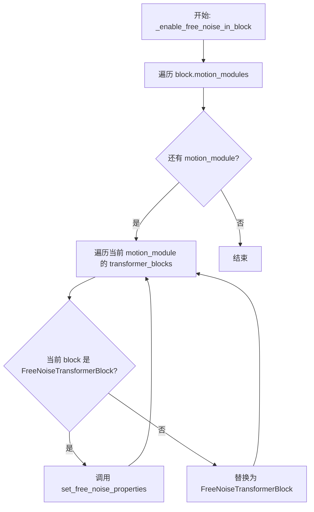

#### 带注释源码

```python
def _enable_free_noise_in_block(self, block: CrossAttnDownBlockMotion | DownBlockMotion | UpBlockMotion):
    r"""Helper function to enable FreeNoise in transformer blocks."""

    # 1. 遍历传入 block 内的所有运动模块 (motion_modules)
    for motion_module in block.motion_modules:
        # 获取该 motion_module 中 Transformer 块的数量
        num_transformer_blocks = len(motion_module.transformer_blocks)

        # 2. 遍历每个 Transformer 块
        for i in range(num_transformer_blocks):
            # 3. 检查当前块是否已经是 FreeNoiseTransformerBlock
            if isinstance(motion_module.transformer_blocks[i], FreeNoiseTransformerBlock):
                # 如果是，则直接设置 FreeNoise 属性（上下文长度、步长、加权方案）
                motion_module.transformer_blocks[i].set_free_noise_properties(
                    self._free_noise_context_length,
                    self._free_noise_context_stride,
                    self._free_noise_weighting_scheme,
                )
            else:
                # 4. 如果是普通的 BasicTransformerBlock，则需要替换为 FreeNoiseTransformerBlock
                # 断言确保替换前的类型符合预期
                assert isinstance(motion_module.transformer_blocks[i], BasicTransformerBlock)
                basic_transfomer_block = motion_module.transformer_blocks[i]

                # 5. 创建新的 FreeNoiseTransformerBlock，复制基础块的参数
                motion_module.transformer_blocks[i] = FreeNoiseTransformerBlock(
                    dim=basic_transfomer_block.dim,
                    num_attention_heads=basic_transfomer_block.num_attention_heads,
                    attention_head_dim=basic_transfomer_block.attention_head_dim,
                    dropout=basic_transfomer_block.dropout,
                    cross_attention_dim=basic_transfomer_block.cross_attention_dim,
                    activation_fn=basic_transfomer_block.activation_fn,
                    attention_bias=basic_transfomer_block.attention_bias,
                    only_cross_attention=basic_transfomer_block.only_cross_attention,
                    double_self_attention=basic_transfomer_block.double_self_attention,
                    positional_embeddings=basic_transfomer_block.positional_embeddings,
                    num_positional_embeddings=basic_transfomer_block.num_positional_embeddings,
                    # 额外的 FreeNoise 参数
                    context_length=self._free_noise_context_length,
                    context_stride=self._free_noise_context_stride,
                    weighting_scheme=self._free_noise_weighting_scheme,
                ).to(device=self.device, dtype=self.dtype)

                # 6. 加载旧块的权重到新块
                motion_module.transformer_blocks[i].load_state_dict(
                    basic_transfomer_block.state_dict(), strict=True
                )
                # 7. 复制分块前馈网络的配置
                motion_module.transformer_blocks[i].set_chunk_feed_forward(
                    basic_transfomer_block._chunk_size, basic_transfomer_block._chunk_dim
                )
```


### `AnimateDiffFreeNoiseMixin._disable_free_noise_in_block`

该方法是一个辅助函数，用于在 transformer 块中禁用 FreeNoise 功能。它遍历指定块中的所有运动模块，将已启用的 FreeNoiseTransformerBlock 替换回标准的 BasicTransformerBlock，同时保留原始块的配置参数和状态。

参数：

- `block`：`CrossAttnDownBlockMotion | DownBlockMotion | UpBlockMotion`，需要禁用 FreeNoise 的运动模块块，可以是下采样块、上采样块或交叉注意力下采样块

返回值：`None`，该方法直接修改传入的块对象，不返回任何值

#### 流程图

```mermaid
flowchart TD
    A[开始 _disable_free_noise_in_block] --> B[遍历 block.motion_modules]
    B --> C{还有更多 motion_module}
    C -->|是| D[获取 transformer_blocks 数量]
    D --> E[遍历每个 transformer_block]
    E --> F{当前 block 是 FreeNoiseTransformerBlock?}
    F -->|是| G[创建新的 BasicTransformerBlock]
    G --> H[复制原始块的参数: dim, num_attention_heads, attention_head_dim 等]
    H --> I[移动到当前设备和数据类型]
    I --> J[加载原始块的状态字典]
    J --> K[设置 chunk_feed_forward 参数]
    F -->|否| L[继续下一个 transformer_block]
    C -->|否| M[结束]
    L --> E
```

#### 带注释源码

```python
def _disable_free_noise_in_block(self, block: CrossAttnDownBlockMotion | DownBlockMotion | UpBlockMotion):
    r"""Helper function to disable FreeNoise in transformer blocks."""

    # 遍历块中的所有运动模块（如时间注意力模块）
    for motion_module in block.motion_modules:
        # 获取该运动模块中 transformer 块的数量
        num_transformer_blocks = len(motion_module.transformer_blocks)

        # 遍历每个 transformer 块
        for i in range(num_transformer_blocks):
            # 检查当前块是否是 FreeNoiseTransformerBlock
            if isinstance(motion_module.transformer_blocks[i], FreeNoiseTransformerBlock):
                # 保存原始 FreeNoise 块的引用
                free_noise_transfomer_block = motion_module.transformer_blocks[i]

                # 创建新的 BasicTransformerBlock，传入原始块的参数
                motion_module.transformer_blocks[i] = BasicTransformerBlock(
                    dim=free_noise_transfomer_block.dim,  # 隐藏层维度
                    num_attention_heads=free_noise_transfomer_block.num_attention_heads,  # 注意力头数量
                    attention_head_dim=free_noise_transfomer_block.attention_head_dim,  # 每个头的维度
                    dropout=free_noise_transfomer_block.dropout,  # Dropout 概率
                    cross_attention_dim=free_noise_transfomer_block.cross_attention_dim,  # 交叉注意力维度
                    activation_fn=free_noise_transfomer_block.activation_fn,  # 激活函数
                    attention_bias=free_noise_transfomer_block.attention_bias,  # 注意力偏置
                    only_cross_attention=free_noise_transfomer_block.only_cross_attention,  # 是否仅交叉注意力
                    double_self_attention=free_noise_transfomer_block.double_self_attention,  # 是否双自注意力
                    positional_embeddings=free_noise_transfomer_block.positional_embeddings,  # 位置嵌入
                    num_positional_embeddings=free_noise_transfomer_block.num_positional_embeddings,  # 位置嵌入数量
                ).to(device=self.device, dtype=self.dtype)  # 移动到当前设备并转换数据类型

                # 从原始 FreeNoise 块加载状态字典（权重），保持模型权重一致
                motion_module.transformer_blocks[i].load_state_dict(
                    free_noise_transfomer_block.state_dict(), strict=True
                )
                # 设置前馈网络的分块参数
                motion_module.transformer_blocks[i].set_chunk_feed_forward(
                    free_noise_transfomer_block._chunk_size, free_noise_transfomer_block._chunk_dim
                )
```


### `AnimateDiffFreeNoiseMixin._check_inputs_free_noise`

该方法是一个输入验证函数，用于在启用FreeNoise功能前检查用户提供的提示词（prompt）、负提示词（negative_prompt）、提示词嵌入以及帧数等参数是否符合FreeNoise的要求。它确保prompt字典的键为整数、值为字符串，且帧索引从0开始并小于总帧数，同时禁止直接传入预计算的prompt_embeds。

参数：

- `self`：`AnimateDiffFreeNoiseMixin`，mixin类实例本身，隐式参数
- `prompt`：`str | dict[int, str]`，正向提示词，可以是字符串或以帧索引（整数）为键、提示词（字符串）为值的字典
- `negative_prompt`：`str | dict[int, str] | None`，负向提示词，类型同prompt，可为None
- `prompt_embeds`：`torch.Tensor | None`，预计算的正向提示词嵌入，FreeNoise模式不支持此参数
- `negative_prompt_embeds`：`torch.Tensor | None`，预计算的负向提示词嵌入，FreeNoise模式不支持此参数
- `num_frames`：`int`，生成的总帧数，用于验证prompt字典中的最大帧索引是否合法

返回值：`None`，该方法不返回任何值，仅通过抛出ValueError异常来处理验证失败的情况

#### 流程图

```mermaid
flowchart TD
    A[开始 _check_inputs_free_noise] --> B{prompt 类型是否为 str 或 dict}
    B -->|否| C[抛出 ValueError: prompt 类型错误]
    B -->|是| D{negative_prompt 是否为 None}
    D -->|否| E{negative_prompt 类型是否为 str 或 dict}
    E -->|否| F[抛出 ValueError: negative_prompt 类型错误]
    E -->|是| G{prompt_embeds 或 negative_prompt_embeds 不为 None}
    D -->|是| G
    G -->|是| H[抛出 ValueError: 不支持 prompt_embeds]
    G -->|否| I{检查 prompt.keys() 是否为整数类型}
    I -->|否| J[抛出 ValueError: 键必须为整数]
    I -->|是| K{检查 prompt.values() 是否为字符串类型}
    K -->|否| L[抛出 ValueError: 值必须为字符串]
    K -->|是| M{最小帧索引是否为 0}
    M -->|否| N[抛出 ValueError: 最小帧索引必须为 0]
    M -->|是| O{最大帧索引是否小于 num_frames}
    O -->|否| P[抛出 ValueError: 最大帧索引必须小于 num_frames]
    O -->|是| Q[验证通过]
    C --> R[结束]
    F --> R
    H --> R
    J --> R
    L --> R
    N --> R
    P --> R
    Q --> R
```

#### 带注释源码

```python
def _check_inputs_free_noise(
    self,
    prompt,
    negative_prompt,
    prompt_embeds,
    negative_prompt_embeds,
    num_frames,
) -> None:
    # 验证 prompt 参数类型：必须是字符串或字典类型
    # 字符串格式适用于所有帧使用相同提示词
    # 字典格式允许为不同帧指定不同的提示词，键为帧索引(整数)，值为提示词(字符串)
    if not isinstance(prompt, (str, dict)):
        raise ValueError(f"Expected `prompt` to have type `str` or `dict` but found {type(prompt)=}")

    # 验证 negative_prompt 参数类型（如果提供了该参数）
    # 同样支持字符串或字典格式，与 prompt 保持一致
    if negative_prompt is not None:
        if not isinstance(negative_prompt, (str, dict)):
            raise ValueError(
                f"Expected `negative_prompt` to have type `str` or `dict` but found {type(negative_prompt)=}"
            )

    # FreeNoise 模式不支持预计算的提示词嵌入
    # 因为该模式需要对提示词进行插值处理，必须在 pipeline 内部编码提示词
    if prompt_embeds is not None or negative_prompt_embeds is not None:
        raise ValueError("`prompt_embeds` and `negative_prompt_embeds` is not supported in FreeNoise yet.")

    # 如果 prompt 是字典格式，进一步验证其结构和内容
    # 获取所有键（帧索引）并检查是否为整数类型
    frame_indices = [isinstance(x, int) for x in prompt.keys()]
    # 获取所有值（提示词文本）并检查是否为字符串类型
    frame_prompts = [isinstance(x, str) for x in prompt.values()]
    # 找出字典中最小和最大的帧索引
    min_frame = min(list(prompt.keys()))
    max_frame = max(list(prompt.keys()))

    # 验证所有键都是整数类型（帧索引必须是整数）
    if not all(frame_indices):
        raise ValueError("Expected integer keys in `prompt` dict for FreeNoise.")
    # 验证所有值都是字符串类型（提示词必须是字符串）
    if not all(frame_prompts):
        raise ValueError("Expected str values in `prompt` dict for FreeNoise.")
    # 验证最小帧索引为0：FreeNoise需要一个起始提示词作为生成起点
    if min_frame != 0:
        raise ValueError("The minimum frame index in `prompt` dict must be 0 as a starting prompt is necessary.")
    # 验证最大帧索引小于总帧数：遵循0-based索引且不能超出范围
    # 例如：总共有16帧，则最大合法索引为15
    if max_frame >= num_frames:
        raise ValueError(
            f"The maximum frame index in `prompt` dict must be lesser than {num_frames=} and follow 0-based indexing."
        )
```


### `AnimateDiffFreeNoiseMixin._encode_prompt_free_noise`

该方法是 FreeNoise 视频生成框架的核心提示编码组件，负责处理可变长度的视频帧提示（支持字符串或帧索引到提示的字典映射），通过插值技术生成视频每一帧的提示嵌入，并在启用无分类器引导时同时处理负面提示嵌入。

参数：

- `prompt`：`str | dict[int, str]`，输入的文本提示，可以是单个字符串或从帧索引到提示词的字典（如 `{0: "a cat", 5: "a dog"}`）
- `num_frames`：`int`，目标视频的总帧数，用于确定提示插值的范围
- `device`：`torch.device`，用于计算的目标设备（CPU/CUDA）
- `num_videos_per_prompt`：`int`，每个提示词生成的视频数量
- `do_classifier_free_guidance`：`bool`，是否执行无分类器引导（CFG），影响负面提示的处理方式
- `negative_prompt`：`str | dict[int, str] | None`，负面提示词，用于引导生成时避免相关内容，默认为空字符串
- `prompt_embeds`：`torch.Tensor | None`，预先计算好的提示嵌入，若提供则直接使用（当前版本不支持）
- `negative_prompt_embeds`：`torch.Tensor | None`，预先计算好的负面提示嵌入，若提供则直接使用（当前版本不支持）
- `lora_scale`：`float | None`，LoRA 权重缩放因子，用于调节 LoRA 模型的影响程度
- `clip_skip`：`int | None`，CLIP 模型跳过的层数，用于调整文本编码器的深度

返回值：`tuple[torch.Tensor, torch.Tensor]`，返回两个张量组成的元组——第一个是正面提示嵌入，第二个是负面提示嵌入；当启用 CFG 时两个张量会被拼接在一起（负面在前、正面在后），否则负面提示嵌入为 None

#### 流程图

```mermaid
flowchart TD
    A[开始 _encode_prompt_free_noise] --> B{negative_prompt是否为None}
    B -->|是| C[设 negative_prompt = ""]
    B -->|否| D[保持原值]
    C --> E{判断 prompt 类型}
    D --> E
    E -->|str| F[转换为 {0: prompt}]
    E -->|dict| G[保持原字典]
    F --> H[调用 _check_inputs_free_noise 验证输入]
    G --> H
    H --> I[对 prompt 和 negative_prompt 按键排序]
    I --> J[确保最后帧有对应提示: prompt[num_frames-1]]
    J --> K[提取帧索引列表和提示列表]
    K --> L[调用 encode_prompt 生成初始提示嵌入]
    L --> M[创建空张量 prompt_interpolation_embeds]
    M --> N{遍历帧索引对}
    N -->|有下一帧| O[获取起始帧和结束帧的嵌入]
    O --> P[调用 _free_noise_prompt_interpolation_callback 插值]
    P --> Q[填充中间帧的嵌入]
    Q --> N
    N -->|遍历完成| R{do_classifier_free_guidance?}
    R -->|否| S[设置 negative_prompt_embeds = None]
    R -->|是| T[调用 encode_prompt 生成负面提示嵌入]
    T --> U[对负面提示进行相同插值]
    U --> V[合并 prompt_embeds 和 negative_prompt_embeds]
    S --> W[返回结果元组]
    V --> W
```

#### 带注释源码

```python
def _encode_prompt_free_noise(
    self,
    prompt: str | dict[int, str],
    num_frames: int,
    device: torch.device,
    num_videos_per_prompt: int,
    do_classifier_free_guidance: bool,
    negative_prompt: str | dict[int, str] | None = None,
    prompt_embeds: torch.Tensor | None = None,
    negative_prompt_embeds: torch.Tensor | None = None,
    lora_scale: float | None = None,
    clip_skip: int | None = None,
) -> torch.Tensor:
    # 1. 处理空的负面提示，默认为空字符串
    if negative_prompt is None:
        negative_prompt = ""

    # 2. 将字符串提示转换为字典格式（键为帧索引，值为提示词）
    #    确保统一使用字典结构便于后续处理
    if isinstance(prompt, str):
        prompt = {0: prompt}
    if isinstance(negative_prompt, str):
        negative_prompt = {0: negative_prompt}

    # 3. 验证输入参数的合法性（检查类型、索引范围等）
    self._check_inputs_free_noise(prompt, negative_prompt, prompt_embeds, negative_prompt_embeds, num_frames)

    # 4. 根据帧索引对提示字典进行排序，确保按时间顺序处理
    prompt = dict(sorted(prompt.items()))
    negative_prompt = dict(sorted(negative_prompt.items()))

    # 5. 确保首尾帧都有对应的提示词
    #    复制最后一个已知提示到最后一帧，确保完整覆盖
    prompt[num_frames - 1] = prompt[list(prompt.keys())[-1]]
    negative_prompt[num_frames - 1] = negative_prompt[list(negative_prompt.keys())[-1]]

    # 6. 提取帧索引序列和对应的提示词序列
    frame_indices = list(prompt.keys())
    frame_prompts = list(prompt.values())
    frame_negative_indices = list(negative_prompt.keys())
    frame_negative_prompts = list(negative_prompt.values())

    # 7. 调用基类的 encode_prompt 方法生成初始提示嵌入
    #    注意：这里关闭了 CFG，只获取正面提示嵌入
    prompt_embeds, _ = self.encode_prompt(
        prompt=frame_prompts,
        device=device,
        num_images_per_prompt=num_videos_per_prompt,
        do_classifier_free_guidance=False,
        negative_prompt=None,
        prompt_embeds=None,
        negative_prompt_embeds=None,
        lora_scale=lora_scale,
        clip_skip=clip_skip,
    )

    # 8. 创建用于存储插值后嵌入的张量，形状为 [num_frames, batch, dim]
    shape = (num_frames, *prompt_embeds.shape[1:])
    prompt_interpolation_embeds = prompt_embeds.new_zeros(shape)

    # 9. 遍历相邻关键帧，对提示嵌入进行线性插值
    #    这一步是 FreeNoise 的核心：通过插值生成中间帧的提示
    for i in range(len(frame_indices) - 1):
        start_frame = frame_indices[i]       # 起始帧索引
        end_frame = frame_indices[i + 1]     # 结束帧索引
        start_tensor = prompt_embeds[i].unsqueeze(0)  # 起始帧嵌入
        end_tensor = prompt_embeds[i + 1].unsqueeze(0)  # 结束帧嵌入

        # 调用插值回调函数（如 _lerp）填充 start_frame 到 end_frame 之间的所有帧
        prompt_interpolation_embeds[start_frame : end_frame + 1] = self._free_noise_prompt_interpolation_callback(
            start_frame, end_frame, start_tensor, end_tensor
        )

    # 10. 初始化负面提示嵌入变量
    negative_prompt_embeds = None
    negative_prompt_interpolation_embeds = None

    # 11. 如果启用 CFG，则处理负面提示嵌入
    if do_classifier_free_guidance:
        # 生成空的正面提示和实际的负面提示（CFG 模式下）
        _, negative_prompt_embeds = self.encode_prompt(
            prompt=[""] * len(frame_negative_prompts),  # 空字符串作为正面提示
            device=device,
            num_images_per_prompt=num_videos_per_prompt,
            do_classifier_free_guidance=True,  # 启用 CFG
            negative_prompt=frame_negative_prompts,  # 实际负面提示
            prompt_embeds=None,
            negative_prompt_embeds=None,
            lora_scale=lora_scale,
            clip_skip=clip_skip,
        )

        # 对负面提示进行相同的插值处理
        negative_prompt_interpolation_embeds = negative_prompt_embeds.new_zeros(shape)

        for i in range(len(frame_negative_indices) - 1):
            start_frame = frame_negative_indices[i]
            end_frame = frame_negative_indices[i + 1]
            start_tensor = negative_prompt_embeds[i].unsqueeze(0)
            end_tensor = negative_prompt_embeds[i + 1].unsqueeze(0)

            negative_prompt_interpolation_embeds[start_frame : end_frame + 1] = (
                self._free_noise_prompt_interpolation_callback(start_frame, end_frame, start_tensor, end_tensor)
            )

    # 12. 更新嵌入变量为插值后的版本
    prompt_embeds = prompt_interpolation_embeds
    negative_prompt_embeds = negative_prompt_interpolation_embeds

    # 13. 如果启用 CFG，将负面和正面提示沿批次维度拼接
    #     格式：[negative_prompt_embeds, prompt_embeds]
    if do_classifier_free_guidance:
        prompt_embeds = torch.cat([negative_prompt_embeds, prompt_embeds])

    # 14. 返回最终的提示嵌入元组
    return prompt_embeds, negative_prompt_embeds
```


### `AnimateDiffFreeNoiseMixin._prepare_latents_free_noise`

该方法用于为 FreeNoise 采样准备初始潜在表示（latents）。它根据指定的上下文长度、噪声类型和滑动窗口策略，生成或处理 latents tensor，以支持长视频生成任务。

参数：

- `self`：`AnimateDiffFreeNoiseMixin`，mixin 类实例，提供了 FreeNoise 功能所需的上下文属性
- `batch_size`：`int`，批量大小，指定要生成的视频数量
- `num_channels_latents`：`int`，潜在表示的通道数，决定了 latents 的特征维度
- `num_frames`：`int`，目标视频的帧数，表示最终生成的视频包含的帧数
- `height`：`int`，潜在表示的空间高度，经过 VAE 缩放因子处理
- `width`：`int`，潜在表示的空间宽度，经过 VAE 缩放因子处理
- `dtype`：`torch.dtype`，生成的 latents 的数据类型（如 torch.float32）
- `device`：`torch.device`，生成 latents 的设备（如 CUDA 或 CPU）
- `generator`：`torch.Generator | None`，可选的随机数生成器，用于确保可重复性
- `latents`：`torch.Tensor | None`，可选的预提供 latents tensor，如果为 None 则随机生成

返回值：`torch.Tensor`，处理后的 latents tensor，形状为 (batch_size, num_channels_latents, num_frames, height // vae_scale_factor, width // vae_scale_factor)

#### 流程图

```mermaid
flowchart TD
    A[开始 _prepare_latents_free_noise] --> B{检查 generator 列表长度}
    B -->|长度不匹配| C[抛出 ValueError]
    B -->|长度匹配| D[计算 context_num_frames]
    D --> E[构建 latents 形状 shape]
    E --> F{latents is None?}
    F -->|是| G[randn_tensor 生成随机 latents]
    G --> H{noise_type == 'random'?}
    H -->|是| I[直接返回 latents]
    H -->|否| J[继续处理]
    F -->|否| K{latents.size(2) == num_frames?}
    K -->|是| I
    K -->|否| L{latents.size(2) != context_length?}
    L -->|是| M[抛出 ValueError]
    L -->|否| N[latents.to(device)]
    J --> O{noise_type == 'shuffle_context'?}
    O -->|是| P[执行滑动窗口 shuffle]
    O -->|否| Q{noise_type == 'repeat_context'?}
    Q -->|是| R[重复 latents]
    Q -->|否| S[其他情况]
    P --> T[裁剪 latents 到 num_frames]
    R --> T
    S --> T
    N --> O
    I --> U[结束]
    T --> U
    C --> U
    M --> U
```

#### 带注释源码

```python
def _prepare_latents_free_noise(
    self,
    batch_size: int,
    num_channels_latents: int,
    num_frames: int,
    height: int,
    width: int,
    dtype: torch.dtype,
    device: torch.device,
    generator: torch.Generator | None = None,
    latents: torch.Tensor | None = None,
):
    # 检查传入的 generator 列表长度是否与 batch_size 匹配
    # 如果不匹配，说明用户提供的随机数生成器数量不正确
    if isinstance(generator, list) and len(generator) != batch_size:
        raise ValueError(
            f"You have passed a list of generators of length {len(generator)}, but requested an effective batch"
            f" size of {batch_size}. Make sure the batch size matches the length of the generators."
        )

    # 确定上下文处理的帧数
    # 如果 context_length 设置为 "repeat_context"，则使用完整的 num_frames
    # 否则使用配置的 context_length 作为滑动窗口大小
    context_num_frames = (
        self._free_noise_context_length if self._free_noise_context_length == "repeat_context" else num_frames
    )

    # 构建期望的 latents 形状：[batch, channels, frames, height/scale, width/scale]
    shape = (
        batch_size,
        num_channels_latents,
        context_num_frames,
        height // self.vae_scale_factor,
        width // self.vae_scale_factor,
    )

    # 如果没有提供 latents，则随机生成
    if latents None:
        # 使用 randn_tensor 生成标准正态分布的随机 latents
        latents = randn_tensor(shape, generator=generator, device=device, dtype=dtype)
        
        # 如果噪声类型是 "random"，不需要进一步处理，直接返回
        if self._free_noise_noise_type == "random":
            return latents
    else:
        # 如果提供了 latents，检查其帧数是否符合要求
        if latents.size(2) == num_frames:
            # 帧数已匹配，直接返回
            return latents
        elif latents.size(2) != self._free_noise_context_length:
            # 帧数不匹配且不是 context_length，抛出错误
            raise ValueError(
                f"You have passed `latents` as a parameter to FreeNoise. The expected number of frames is either {num_frames} or {self._free_noise_context_length}, but found {latents.size(2)}"
            )
        # 将 latents 移动到指定设备
        latents = latents.to(device)

    # 根据噪声类型处理 latents
    if self._free_noise_noise_type == "shuffle_context":
        # 使用滑动窗口 shuffle 策略
        # 从 context_length 位置开始，以 context_stride 为步长遍历
        for i in range(self._free_noise_context_length, num_frames, self._free_noise_context_stride):
            # 确保窗口在边界内
            window_start = max(0, i - self._free_noise_context_length)
            window_end = min(num_frames, window_start + self._free_noise_context_stride)
            window_length = window_end - window_start

            # 如果窗口长度为 0，跳过
            if window_length == 0:
                break

            # 生成当前窗口的索引和打乱后的索引
            indices = torch.LongTensor(list(range(window_start, window_end)))
            shuffled_indices = indices[torch.randperm(window_length, generator=generator)]

            # 计算当前处理的帧范围
            current_start = i
            current_end = min(num_frames, current_start + window_length)
            
            # 如果完美匹配窗口大小，直接赋值
            if current_end == current_start + window_length:
                latents[:, :, current_start:current_end] = latents[:, :, shuffled_indices]
            else:
                # 处理最后一批帧不能完美匹配窗口的情况
                prefix_length = current_end - current_start
                shuffled_indices = shuffled_indices[:prefix_length]
                latents[:, :, current_start:current_end] = latents[:, :, shuffled_indices]

    elif self._free_noise_noise_type == "repeat_context":
        # 使用重复策略：将初始 latents 重复拼接以达到目标帧数
        num_repeats = (num_frames + self._free_noise_context_length - 1) // self._free_noise_context_length
        latents = torch.cat([latents] * num_repeats, dim=2)

    # 最终裁剪 latents 到目标帧数 num_frames
    latents = latents[:, :, :num_frames]
    return latents
```


### `AnimateDiffFreeNoiseMixin._lerp`

该函数实现了线性插值（Linear Interpolation）功能，用于在两个张量之间生成一系列平滑过渡的中间张量。这在 FreeNoise 方法中用于对提示词嵌入（prompt embeddings）进行时间维度的插值，以确保视频生成过程中帧与帧之间的提示词变化平滑自然。

参数：

- `self`：隐式参数，`AnimateDiffFreeNoiseMixin` 类的实例，用于访问类属性和方法
- `start_index`：`int`，起始帧索引，表示插值的起始位置
- `end_index`：`int`，结束帧索引，表示插值的结束位置
- `start_tensor`：`torch.Tensor`，起始张量，通常是起始帧的提示词嵌入，形状为 `[batch_size, seq_len, hidden_dim]`
- `end_tensor`：`torch.Tensor`，结束张量，通常是结束帧的提示词嵌入，形状与 `start_tensor` 相同

返回值：`torch.Tensor`，插值后的张量，通过沿第一维（帧维度）拼接所有中间插值张量得到，形状为 `[num_indices, batch_size, seq_len, hidden_dim]`，其中 `num_indices = end_index - start_index + 1`

#### 流程图

```mermaid
flowchart TD
    A[开始 _lerp] --> B[计算插值数量<br/>num_indices = end_index - start_index + 1]
    B --> C[初始化空列表<br/>interpolated_tensors = []]
    C --> D{i < num_indices}
    D -->|是| E[计算权重 alpha = i / (num_indices - 1)]
    E --> F[计算插值张量<br/>interpolated_tensor = (1 - alpha) × start_tensor + alpha × end_tensor]
    F --> G[将插值张量添加到列表<br/>interpolated_tensors.append(interpolated_tensor)]
    G --> H[i = i + 1]
    H --> D
    D -->|否| I[拼接所有插值张量<br/>torch.cat(interpolated_tensors)]
    I --> J[返回结果张量]
    J --> K[结束 _lerp]
```

#### 带注释源码

```python
def _lerp(
    self, start_index: int, end_index: int, start_tensor: torch.Tensor, end_tensor: torch.Tensor
) -> torch.Tensor:
    """
    线性插值函数，用于在两个张量之间生成平滑过渡的中间张量。
    
    参数:
        start_index: 起始帧索引
        end_index: 结束帧索引
        start_tensor: 起始张量
        end_tensor: 结束张量
    
    返回:
        插值后的张量
    """
    # 计算需要生成的中间张量数量（包含起始和结束帧）
    num_indices = end_index - start_index + 1
    
    # 用于存储所有插值张量的列表
    interpolated_tensors = []

    # 遍历每个索引位置，计算对应的插值张量
    for i in range(num_indices):
        # 计算线性插值的权重 alpha
        # 当 i=0 时，alpha=0（完全使用 start_tensor）
        # 当 i=num_indices-1 时，alpha=1（完全使用 end_tensor）
        alpha = i / (num_indices - 1)
        
        # 根据权重计算线性插值
        # 使用公式: result = (1 - alpha) * start + alpha * end
        interpolated_tensor = (1 - alpha) * start_tensor + alpha * end_tensor
        
        # 将当前插值张量添加到列表中
        interpolated_tensors.append(interpolated_tensor)

    # 将所有插值张量沿第一维（帧维度）拼接成最终结果
    interpolated_tensors = torch.cat(interpolated_tensors)
    
    return interpolated_tensors
```


### `AnimateDiffFreeNoiseMixin.enable_free_noise`

该方法是一个核心配置函数，用于在集成了 `AnimateDiffFreeNoiseMixin` 的扩散管道中激活 **FreeNoise** 算法。FreeNoise 是一种通过特殊处理潜空间噪声和上下文窗口来实现长视频生成的技术。该方法首先验证并设置内部状态变量（如上下文长度、步长、加权方案），随后遍历 UNet 的所有运动模块（DownBlocks, MidBlock, UpBlocks），调用内部辅助函数将标准Transformer块替换或配置为支持 FreeNoise 功能的 `FreeNoiseTransformerBlock`。

参数：

- `context_length`：`int | None`，默认值为 `16`。指定一次处理的视频帧数量（上下文长度）。如果为 `None`，则默认使用 Motion Adapter 配置中的最大序列长度。
- `context_stride`：`int`，默认值为 `4`。长视频生成时滑动窗口的步长，决定了窗口之间重叠或跳跃的帧数。
- `weighting_scheme`：`str`，默认值为 `"pyramid"`。指定 FreeNoise 块中潜在变量（Latents）累积后的加权平均方案。支持 "flat"（扁平）、"pyramid"（金字塔）和 "delayed_reverse_sawtooth"（延迟反向锯齿）。
- `noise_type`：`str`，默认值为 `"shuffle_context"`。噪声类型，决定如何生成最终的长噪声序列。选项包括 "shuffle_context"（打乱上下文）、"repeat_context"（重复上下文）和 "random"（随机）。
- `prompt_interpolation_callback`：`Callable | None`，默认值为 `None`。一个可选的回调函数，用于自定义文本提示词（Prompt）在帧与帧之间的插值逻辑。默认为 `_lerp` 线性插值。

返回值：`None`，无返回值。该方法主要通过修改对象内部状态（`self._free_noise_*` 属性）和替换模型子模块来实现功能。

#### 流程图

```mermaid
graph TD
    A([开始 enable_free_noise]) --> B{校验参数}
    B -->|weighting_scheme 不合法| C[抛出 ValueError]
    B -->|noise_type 不合法| D[抛出 ValueError]
    B --> E[设置内部状态变量]
    E --> F[_free_noise_context_length]
    E --> G[_free_noise_weighting_scheme]
    E --> H[_free_noise_noise_type]
    E --> I[_free_noise_prompt_interpolation_callback]
    F --> J{检查 Mid Block 是否有 Motion Modules}
    J -->|是| K[构建块列表: Down + Mid + Up]
    J -->|否| L[构建块列表: Down + Up]
    K --> M{遍历每个 Block}
    L --> M
    M --> N[调用 _enable_free_noise_in_block]
    N --> O[替换/配置 Transformer Blocks]
    M --> P([结束])
```

#### 带注释源码

```python
def enable_free_noise(
    self,
    context_length: int | None = 16,
    context_stride: int = 4,
    weighting_scheme: str = "pyramid",
    noise_type: str = "shuffle_context",
    prompt_interpolation_callback: Callable[
        [DiffusionPipeline, int, int, torch.Tensor, torch.Tensor], torch.Tensor
    ]
    | None = None,
) -> None:
    r"""
    Enable long video generation using FreeNoise.

    Args:
        context_length (`int`, defaults to `16`, *optional*):
            The number of video frames to process at once. It's recommended to set this to the maximum frames the
            Motion Adapter was trained with (usually 16/24/32). If `None`, the default value from the motion
            adapter config is used.
        context_stride (`int`, *optional*):
            Long videos are generated by processing many frames. FreeNoise processes these frames in sliding
            windows of size `context_length`. Context stride allows you to specify how many frames to skip between
            each window. For example, a context length of 16 and context stride of 4 would process 24 frames as:
                [0, 15], [4, 19], [8, 23] (0-based indexing)
        weighting_scheme (`str`, defaults to `pyramid`):
            Weighting scheme for averaging latents after accumulation in FreeNoise blocks. The following weighting
            schemes are supported currently:
                - "flat"
                   Performs weighting averaging with a flat weight pattern: [1, 1, 1, 1, 1].
                - "pyramid"
                    Performs weighted averaging with a pyramid like weight pattern: [1, 2, 3, 2, 1].
                - "delayed_reverse_sawtooth"
                    Performs weighted averaging with low weights for earlier frames and high-to-low weights for
                    later frames: [0.01, 0.01, 3, 2, 1].
        noise_type (`str`, defaults to "shuffle_context"):
            Must be one of ["shuffle_context", "repeat_context", "random"].
                - "shuffle_context"
                    Shuffles a fixed batch of `context_length` latents to create a final latent of size
                    `num_frames`. This is usually the best setting for most generation scenarios. However, there
                    might be visible repetition noticeable in the kinds of motion/animation generated.
                - "repeated_context"
                    Repeats a fixed batch of `context_length` latents to create a final latent of size
                    `num_frames`.
                - "random"
                    The final latents are random without any repetition.
    """

    # 1. 定义允许的参数值
    allowed_weighting_scheme = ["flat", "pyramid", "delayed_reverse_sawtooth"]
    allowed_noise_type = ["shuffle_context", "repeat_context", "random"]

    # 2. 警告：如果输入的 context_length 大于模型训练的最大序列长度
    if context_length > self.motion_adapter.config.motion_max_seq_length:
        logger.warning(
            f"You have set {context_length=} which is greater than {self.motion_adapter.config.motion_max_seq_length=}. This can lead to bad generation results."
        )
    
    # 3. 校验 weighting_scheme 参数
    if weighting_scheme not in allowed_weighting_scheme:
        raise ValueError(
            f"The parameter `weighting_scheme` must be one of {allowed_weighting_scheme}, but got {weighting_scheme=}"
        )
    
    # 4. 校验 noise_type 参数
    if noise_type not in allowed_noise_type:
        raise ValueError(f"The parameter `noise_type` must be one of {allowed_noise_type}, but got {noise_type=}")

    # 5. 设置实例的内部状态变量，供 pipeline 其他阶段（如 encode, prepare latents）使用
    self._free_noise_context_length = context_length or self.motion_adapter.config.motion_max_seq_length
    self._free_noise_context_stride = context_stride
    self._free_noise_weighting_scheme = weighting_scheme
    self._free_noise_noise_type = noise_type
    # 如果没有提供自定义回调，则使用默认的线性插值方法 _lerp
    self._free_noise_prompt_interpolation_callback = prompt_interpolation_callback or self._lerp

    # 6. 获取需要处理的 UNet 块
    # 检查 mid_block 是否有 motion_modules 属性，如果有，则需要处理中间块
    if hasattr(self.unet.mid_block, "motion_modules"):
        blocks = [*self.unet.down_blocks, self.unet.mid_block, *self.unet.up_blocks]
    else:
        blocks = [*self.unet.down_blocks, *self.unet.up_blocks]

    # 7. 遍历所有块，激活每个块内的 FreeNoise 逻辑
    for block in blocks:
        self._enable_free_noise_in_block(block)
```


### `AnimateDiffFreeNoiseMixin.disable_free_noise`

禁用 FreeNoise 采样机制，将上下文长度重置为 None，并遍历所有 UNet 块（down_blocks、mid_block、up_blocks）以调用 `_disable_free_noise_in_block` 方法来禁用每个块中的 FreeNoise 功能。

参数：

- `self`：`AnimateDiffFreeNoiseMixin` 实例，隐式参数，不需要调用方传递

返回值：`None`，无返回值描述

#### 流程图

```mermaid
flowchart TD
    A[开始 disable_free_noise] --> B[设置 self._free_noise_context_length = None]
    B --> C{检查 unet.mid_block 是否有 motion_modules}
    C -->|是| D[blocks = down_blocks + mid_block + up_blocks]
    C -->|否| E[blocks = down_blocks + up_blocks]
    D --> F[遍历 blocks 中的每个 block]
    E --> F
    F --> G[对每个 block 调用 _disable_free_noise_in_block]
    G --> H[结束]
```

#### 带注释源码

```python
def disable_free_noise(self) -> None:
    r"""Disable the FreeNoise sampling mechanism."""
    # 步骤1: 将 FreeNoise 上下文长度重置为 None，表示已禁用 FreeNoise
    self._free_noise_context_length = None

    # 步骤2: 检查 mid_block 是否包含 motion_modules，据此确定需要处理的块列表
    if hasattr(self.unet.mid_block, "motion_modules"):
        blocks = [*self.unet.down_blocks, self.unet.mid_block, *self.unet.up_blocks]
    else:
        blocks = [*self.unet.down_blocks, *self.unet.up_blocks]

    # 注意: 此处存在重复代码块，可能是技术债务
    blocks = [*self.unet.down_blocks, self.unet.mid_block, *self.unet.up_blocks]
    
    # 步骤3: 遍历所有块，对每个块调用 _disable_free_noise_in_block 方法
    for block in blocks:
        self._disable_free_noise_in_block(block)
```


### `AnimateDiffFreeNoiseMixin._enable_split_inference_motion_modules_`

该方法用于在AnimateDiff运动模块中启用分块推理（split inference）功能。它通过将运动模块的输入投影（proj_in）、Transformer块（transformer_blocks）和输出投影（proj_out）包装在`SplitInferenceModule`中，实现对空间维度上的张量进行分块处理，从而降低显存占用，使其能够处理更大的视频帧分辨率或批量大小。

参数：

- `motion_modules`：`list[AnimateDiffTransformer3D]`，需要启用分块推理的运动模块列表
- `spatial_split_size`：`int`，空间维度上的分块大小，用于控制每次处理的切片尺寸

返回值：`None`，该方法直接修改传入的运动模块列表，不返回任何值

#### 流程图

```mermaid
graph TD
    A[开始] --> B[遍历 motion_modules 列表]
    B --> C[将 motion_module.proj_in 包装为 SplitInferenceModule]
    C --> D[设置分块参数: split_size=spatial_split_size, split_dim=0, input_kwargs_to_split=input]
    D --> E[遍历 motion_module.transformer_blocks 列表]
    E --> F[将当前 transformer_block 包装为 SplitInferenceModule]
    F --> G[设置分块参数: split_size=spatial_split_size, split_dim=0, input_kwargs_to_split=hidden_states, encoder_hidden_states]
    G --> H{检查是否还有更多 transformer_blocks}
    H -->|是| E
    H -->|否| I[将 motion_module.proj_out 包装为 SplitInferenceModule]
    I --> J[设置分块参数: split_size=spatial_split_size, split_dim=0, input_kwargs_to_split=input]
    J --> K{检查是否还有更多 motion_modules}
    K -->|是| B
    K -->|否| L[结束]
```

#### 带注释源码

```python
def _enable_split_inference_motion_modules_(
    self, motion_modules: list[AnimateDiffTransformer3D], spatial_split_size: int
) -> None:
    """
    在AnimateDiff运动模块中启用分块推理功能。

    该方法通过将运动模块的各个组件包装在SplitInferenceModule中，
    实现对空间维度（dim=0）上的张量进行分块处理，以降低显存占用。

    Args:
        motion_modules: 需要启用分块推理的运动模块列表
        spatial_split_size: 空间维度上的分块大小

    Returns:
        None: 直接修改传入的运动模块列表，不返回任何值
    """
    # 遍历所有运动模块
    for motion_module in motion_modules:
        # 1. 将输入投影层(proj_in)包装为SplitInferenceModule
        # input_kwargs_to_split=["input"]表示只对input参数进行分割
        motion_module.proj_in = SplitInferenceModule(
            motion_module.proj_in,      # 原始的proj_in模块
            spatial_split_size,          # 分块大小
            0,                           # 沿维度0进行分割（空间维度）
            ["input"]                    # 需要分割的输入参数名
        )

        # 2. 遍历该运动模块中的所有Transformer块
        for i in range(len(motion_module.transformer_blocks)):
            # 将每个Transformer块包装为SplitInferenceModule
            # 需要分割hidden_states和encoder_hidden_states两个参数
            motion_module.transformer_blocks[i] = SplitInferenceModule(
                motion_module.transformer_blocks[i],  # 原始的Transformer块
                spatial_split_size,                    # 分块大小
                0,                                     # 沿维度0进行分割
                ["hidden_states", "encoder_hidden_states"]  # 需要分割的参数
            )

        # 3. 将输出投影层(proj_out)包装为SplitInferenceModule
        # 只对input参数进行分割
        motion_module.proj_out = SplitInferenceModule(
            motion_module.proj_out,     # 原始的proj_out模块
            spatial_split_size,          # 分块大小
            0,                           # 沿维度0进行分割
            ["input"]                    # 需要分割的输入参数名
        )
```


### `AnimateDiffFreeNoiseMixin._enable_split_inference_attentions_`

用于在时间维度上启用分片推理（Split Inference）的核心方法。该方法通过将标准的 `Transformer2DModel` 替换为 `SplitInferenceModule`，使得注意力机制能够沿时间维度（dimension 0）分块处理 `hidden_states` 和 `encoder_hidden_states`，从而有效降低长视频生成时的显存占用。

#### 参数

- `self`：隐式参数，属于 `AnimateDiffFreeNoiseMixin` 类的实例本身。
- `attentions`：`list[Transformer2DModel]`，待优化的注意力模块列表，通常来自 UNet 的下采样块、上采样块或中间块。
- `temporal_split_size`：`int`，时序维度上的分片大小，定义了每次处理多少帧。

#### 返回值

`None`。该方法直接在传入的列表上进行了原地（in-place）修改，将原始的注意力模块替换为封装后的分片推理模块。

#### 流程图

```mermaid
flowchart TD
    A[Start _enable_split_inference_attentions_] --> B{遍历 attentions 列表}
    B -->|遍历每个注意力模块| C[创建 SplitInferenceModule 实例]
    C --> D[包装原始 Transformer2DModel]
    C --> E[配置 split_size = temporal_split_size]
    C --> F[配置 split_dim = 0]
    C --> G[配置 input_kwargs_to_split = ['hidden_states', 'encoder_hidden_states']]
    D --> H[原地替换列表中的元素]
    H --> B
    B -->|遍历结束| I[End]
```

#### 带注释源码

```python
def _enable_split_inference_attentions_(
    self, attentions: list[Transformer2DModel], temporal_split_size: int
) -> None:
    """
    启用注意力模块的时序分片推理。

    该方法遍历传入的注意力模块列表，并将每个 Transformer2DModel 替换为 SplitInferenceModule。
    通过这种包装，注意力计算将沿着维度 0 (通常代表帧/时间维度) 分割成更小的块执行，
    最后再拼接结果。这是一种内存优化技术，允许处理更长的视频序列而不会因中间激活值过大导致 OOM。

    Args:
        attentions (list[Transformer2DModel]): 需要被分片包装的注意力层列表。
        temporal_split_size (int): 时序分片的大小，决定了每次处理多少帧。
    """
    # 遍历所有的注意力模块
    for i in range(len(attentions)):
        # 使用 SplitInferenceModule 替换原始的注意力模块
        # 传入原始模块 (attentions[i]) 作为核心计算单元
        # 传入 temporal_split_size 决定分块大小
        # 传入 split_dim=0 表明沿着第一维（通常为 Batch 或 Frames）进行切分
        # 传入 input_kwargs_to_split 明确告知需要切分的张量名称
        attentions[i] = SplitInferenceModule(
            attentions[i], 
            temporal_split_size, 
            0, 
            ["hidden_states", "encoder_hidden_states"]
        )
```


### `AnimateDiffFreeNoiseMixin._enable_split_inference_resnets_`

该方法是一个辅助函数，用于在FreeNoise中启用ResNet块的分块推理（split inference）。它将传入的ResNet块列表中的每个ResNetBlock2D包装在SplitInferenceModule中，以便沿着时间维度（维度0）对输入进行分割处理，从而减少内存占用。

参数：

- `self`：`AnimateDiffFreeNoiseMixin`，mixin类实例本身
- `resnets`：`list[ResnetBlock2D]`，需要启用分块推理的ResNet块列表
- `temporal_split_size`：`int`，沿时间维度分割每个输入张量的分块大小

返回值：`None`，该方法直接修改传入的resnets列表，不返回任何值

#### 流程图

```mermaid
flowchart TD
    A[开始] --> B[遍历resnets列表]
    B --> C{遍历是否结束}
    C -->|否| D[获取当前索引i的ResNet块]
    D --> E[创建SplitInferenceModule包装器]
    E --> F[配置分割参数: temporal_split_size, 分割维度0, 输入键input_tensor和temb]
    F --> G[将原始ResNet块替换为SplitInferenceModule包装器]
    G --> B
    C -->|是| H[结束]
```

#### 带注释源码

```python
def _enable_split_inference_resnets_(self, resnets: list[ResnetBlock2D], temporal_split_size: int) -> None:
    """
    启用ResNet块的分块推理功能。
    
    该方法将每个ResNet块包装在SplitInferenceModule中，以实现内存高效的时间维度分割推理。
    
    参数:
        resnets (list[ResnetBlock2D]): 需要包装的ResNet块列表
        temporal_split_size (int): 时间维度上的分割大小
    
    返回:
        None: 直接修改传入的列表，不返回新值
    """
    # 遍历resnets列表中的每个ResNet块
    for i in range(len(resnets)):
        # 将原始ResNet块替换为SplitInferenceModule包装器
        # 参数说明：
        # - resnets[i]: 要包装的原始ResNet块
        # - temporal_split_size: 每次处理的时间步数
        # - 0: 分割维度（0表示时间维度）
        # - ["input_tensor", "temb"]: 需要分割的输入参数名
        resnets[i] = SplitInferenceModule(resnets[i], temporal_split_size, 0, ["input_tensor", "temb"])
```


### `AnimateDiffFreeNoiseMixin._enable_split_inference_samplers_`

该方法用于启用分割推理（Split Inference）功能的采样器（Downsample2D/Upsample2D）。它遍历传入的采样器列表，将每个采样器包装在 `SplitInferenceModule` 中，以实现对时间维度的分割处理，从而优化内存使用。

参数：

- `self`：隐式参数，类实例本身
- `samplers`：`list[Downsample2D] | list[Upsample2D]`，需要启用分割推理的采样器列表
- `temporal_split_size`：`int`，时间维度上的分割大小

返回值：`None`，无返回值

#### 流程图

```mermaid
flowchart TD
    A[开始 _enable_split_inference_samplers_] --> B[遍历 samplers 列表]
    B --> C{还有更多采样器未处理?}
    C -->|是| D[获取当前索引 i 处的采样器]
    D --> E[创建 SplitInferenceModule 包装器]
    E --> F[传入参数: 模块=samplers[i], split_size=temporal_split_size, split_dim=0, input_kwargs_to_split=['hidden_states']]
    F --> G[将原采样器替换为 SplitInferenceModule 包装器]
    G --> B
    C -->|否| H[结束]
```

#### 带注释源码

```python
def _enable_split_inference_samplers_(
    self, samplers: list[Downsample2D] | list[Upsample2D], temporal_split_size: int
) -> None:
    """启用分割推理功能的采样器模块。
    
    该方法将 SplitInferenceModule 包装器应用到每个采样器（Downsample2D 或 Upsample2D）上，
    以支持在时间维度上进行分割推理，从而减少显存占用。
    
    参数:
        samplers: 需要启用分割推理的采样器列表，可以是 Downsample2D 或 Upsample2D 类型。
        temporal_split_size: 时间维度上的分割大小，控制每次处理的时间步数。
    
    返回:
        无返回值，直接修改传入的 samplers 列表。
    """
    # 遍历采样器列表中的每个采样器
    for i in range(len(samplers)):
        # 为每个采样器创建 SplitInferenceModule 包装器
        # 参数说明：
        #   - samplers[i]: 原始的采样器模块
        #   - temporal_split_size: 分割大小，控制每次处理的帧数
        #   - 0: 分割维度（0 表示在批次维度进行分割）
        #   - ["hidden_states"]: 需要分割的输入参数名列表
        samplers[i] = SplitInferenceModule(samplers[i], temporal_split_size, 0, ["hidden_states"])
```


### `AnimateDiffFreeNoiseMixin.enable_free_noise_split_inference`

该方法用于启用 FreeNoise 的内存优化功能，通过在不同的中间建模块中使用 `SplitInferenceModule` 进行分块推理，以降低长视频生成时的显存占用。

参数：

- `spatial_split_size`：`int`，默认值 `256`，空间维度上的分块大小，用于在运动建模块的有效批次维度（`[B x H x W, F, C]`）上进行分块推理。
- `temporal_split_size`：`int`，默认值 `16`，时间维度上的分块大小，用于在空间注意力、resnets、下采样和上采样块的有效批次维度（`[B x F, H x W, C]`）上进行分块推理。

返回值：`None`，无返回值，该方法直接修改对象状态。

#### 流程图

```mermaid
flowchart TD
    A[开始 enable_free_noise_split_inference] --> B[构建 blocks 列表: down_blocks + mid_block + up_blocks]
    B --> C{遍历每个 block}
    C -->|block 包含 motion_modules| D[调用 _enable_split_inference_motion_modules_]
    C -->|block 包含 attentions| E[调用 _enable_split_inference_attentions_]
    C -->|block 包含 resnets| F[调用 _enable_split_inference_resnets_]
    C -->|block 包含 downsamplers| G[调用 _enable_split_inference_samplers_]
    C -->|block 包含 upsamplers| H[调用 _enable_split_inference_samplers_]
    D --> I{下一个 block}
    E --> I
    F --> I
    G --> I
    H --> I
    I -->|还有 block| C
    I -->|遍历完成| J[结束]
    
    D --> D1[将 motion_module.proj_in 包装为 SplitInferenceModule]
    D --> D2[将每个 transformer_block 包装为 SplitInferenceModule]
    D --> D3[将 motion_module.proj_out 包装为 SplitInferenceModule]
    
    E --> E1[将每个 attention 包装为 SplitInferenceModule]
    F --> F1[将每个 resnet 包装为 SplitInferenceModule]
    G --> G1[将每个 downsampler 包装为 SplitInferenceModule]
    H --> H1[将每个 upsampler 包装为 SplitInferenceModule]
```

#### 带注释源码

```python
def enable_free_noise_split_inference(self, spatial_split_size: int = 256, temporal_split_size: int = 16) -> None:
    r"""
    Enable FreeNoise memory optimizations by utilizing
    [`~diffusers.pipelines.free_noise_utils.SplitInferenceModule`] across different intermediate modeling blocks.

    Args:
        spatial_split_size (`int`, defaults to `256`):
            The split size across spatial dimensions for internal blocks. This is used in facilitating split
            inference across the effective batch dimension (`[B x H x W, F, C]`) of intermediate tensors in motion
            modeling blocks.
        temporal_split_size (`int`, defaults to `16`):
            The split size across temporal dimensions for internal blocks. This is used in facilitating split
            inference across the effective batch dimension (`[B x F, H x W, C]`) of intermediate tensors in spatial
            attention, resnets, downsampling and upsampling blocks.
    """
    # 收集所有需要处理的 UNet 块：下采样块、中间块、上采样块
    blocks = [*self.unet.down_blocks, self.unet.mid_block, *self.unet.up_blocks]
    
    # 遍历每个 UNet 块，检查并应用相应的分块推理优化
    for block in blocks:
        # 检查是否存在运动模块，如果存在则包装为分块推理模块
        # 运动模块使用空间分块大小（spatial_split_size）
        if getattr(block, "motion_modules", None) is not None:
            self._enable_split_inference_motion_modules_(block.motion_modules, spatial_split_size)
        
        # 检查是否存在注意力模块，如果存在则包装为分块推理模块
        # 注意力模块使用时间分块大小（temporal_split_size）
        if getattr(block, "attentions", None) is not None:
            self._enable_split_inference_attentions_(block.attentions, temporal_split_size)
        
        # 检查是否存在残差网络模块，如果存在则包装为分块推理模块
        # 残差网络使用时间分块大小
        if getattr(block, "resnets", None) is not None:
            self._enable_split_inference_resnets_(block.resnets, temporal_split_size)
        
        # 检查是否存在下采样器，如果存在则包装为分块推理模块
        # 下采样器使用时间分块大小
        if getattr(block, "downsamplers", None) is not None:
            self._enable_split_inference_samplers_(block.downsamplers, temporal_split_size)
        
        # 检查是否存在上采样器，如果存在则包装为分块推理模块
        # 上采样器使用时间分块大小
        if getattr(block, "upsamplers", None) is not None:
            self._enable_split_inference_samplers_(block.upsamplers, temporal_split_size)
```


### `AnimateDiffFreeNoiseMixin.free_noise_enabled`

这是一个属性访问器（property），用于检查当前实例是否已启用FreeNoise功能。它通过检查对象是否具有`_free_noise_context_length`属性且该属性值不为`None`来判断FreeNoise功能是否处于激活状态。

参数：
- 该方法为属性（property），无需显式参数

返回值：`bool`，返回`True`表示FreeNoise功能已启用，返回`False`表示未启用

#### 流程图

```mermaid
flowchart TD
    A[开始检查free_noise_enabled属性] --> B{hasattr self, '_free_noise_context_length'?}
    B -->|否| C[返回 False]
    B -->|是| D{self._free_noise_context_length is not None?}
    D -->|否| C
    D -->|是| E[返回 True]
    
    style A fill:#e1f5fe
    style E fill:#c8e6c9
    style C fill:#ffcdd2
```

#### 带注释源码

```python
@property
def free_noise_enabled(self):
    r"""检查FreeNoise功能是否已启用。
    
    该属性通过两个条件判断FreeNoise是否已激活：
    1. 对象必须具有`_free_noise_context_length`属性
    2. 该属性的值不能为`None`
    
    只有在调用`enable_free_noise()`方法后，该属性才会被设置为非None值；
    调用`disable_free_noise()`方法后，该属性会被重置为`None`。
    
    Returns:
        `bool`: 
            - `True`: FreeNoise功能已启用，可以用于长视频生成
            - `False`: FreeNoise功能未启用，使用标准扩散采样
    """
    # 复合条件检查：同时满足属性存在且值不为None
    return hasattr(self, "_free_noise_context_length") and self._free_noise_context_length is not None
```

## 关键组件


### SplitInferenceModule

张量分块推理模块，封装PyTorch模块以沿指定维度分割输入张量，处理每个分割块后重新拼接结果，实现内存高效的大型张量推理。

### FreeNoiseTransformerBlock

FreeNoise变换器块，继承自BasicTransformerBlock，支持设置自由噪声属性（上下文长度、步幅、加权方案），用于长视频生成中的时间维度和噪声处理。

### AnimateDiffFreeNoiseMixin

FreeNoise方法 mixin类，提供长视频生成能力，支持上下文滑动窗口处理、噪声类型配置（shuffle_context/repeat_context/random）、提示插值和加权 latent 累积。

### 张量索引与分割策略

通过`torch.split()`沿空间或时间维度分割张量，分块处理后使用`torch.cat()`重组，支持空间维度分割（spatial_split_size）和时间维度分割（temporal_split_size）。

### 上下文滑动窗口机制

FreeNoise使用context_length和context_stride参数定义滑动窗口，支持pyramid/flat/delayed_reverse_sawtooth三种加权方案对多窗口latent进行加权平均。

### 分块推理优化

enable_free_noise_split_inference方法为motion_modules、attentions、resnets、downsamplers、upsamplers分别启用SplitInferenceModule，实现运动模块空间分割和其他模块时间分割的混合策略。

### 潜在变量准备与噪声处理

_prepare_latents_free_noise支持三种噪声类型：shuffle_context（打乱窗口内帧）、repeat_context（重复上下文帧）、random（随机噪声），并处理边界窗口不完美匹配情况。


## 问题及建议


### 已知问题

- **重复代码块问题**：`disable_free_noise` 方法中 `blocks` 变量被定义了两次，第二次定义会覆盖第一次的条件判断逻辑，导致 `hasattr` 检查结果被忽略。
- **张量类型检查不够健壮**：`SplitInferenceModule.forward` 中使用 `torch.is_tensor()` 检查可能遗漏 `torch.nn.Parameter` 等张量子类；返回值的类型检查仅支持 `torch.Tensor` 和 tuple，未考虑其他可能的返回类型。
- **输入验证不够全面**：`_check_inputs_free_noise` 中 `min()` 和 `max()` 调用未处理空字典情况；负提示与正提示字典的键一致性未验证。
- **错误处理缺失**：`enable_free_noise` 方法未检查 `prompt_interpolation_callback` 参数是否为可调用对象（当不为None时）。
- **硬编码的输入参数名称**：`SplitInferenceModule` 只处理 `input_kwargs_to_split` 中指定的参数，对其他张量参数不支持分割。
- **潜在内存问题**：循环中频繁创建字典 `inputs = dict(zip(split_inputs.keys(), split_input))` 可能导致内存碎片；对于大规模分割，累积所有中间结果可能造成内存峰值。

### 优化建议

- 修复 `disable_free_noise` 中重复的 `blocks` 定义，删除冗余的第三次赋值。
- 改进类型检查逻辑，使用 `isinstance(x, torch.Tensor)` 替代 `torch.is_tensor(x)`，并扩展返回值类型支持。
- 在 `_check_inputs_free_noise` 中增加空字典检查和正负提示键一致性验证。
- 在 `enable_free_noise` 中添加回调函数的可调用性检查。
- 考虑将重复的块替换逻辑抽象为通用方法，减少代码冗余。
- 使用列表推导式优化循环结构，并在 `torch.cat` 前考虑预先分配内存或使用就地操作。
- 增加更详细的文档字符串，特别是对于内部辅助方法的说明。

## 其它


### 设计目标与约束

本代码的核心设计目标包括：(1) 实现FreeNoise长视频生成技术，通过滑动窗口机制处理超出训练长度的视频帧；(2) 提供内存优化的分片推理能力，将大张量分割为小块进行处理以降低显存占用；(3) 支持多种噪声类型(shuffle_context/repeat_context/random)和加权方案(flat/pyramid/delayed_reverse_sawtooth)。主要约束包括：仅支持PyTorch后端，要求输入的prompt_embeds和negative_prompt_embeds为None（尚未支持自定义嵌入），最小帧索引必须为0，最大帧索引必须小于总帧数。

### 错误处理与异常设计

代码采用显式验证和早返回模式。主要错误处理场景包括：(1) `_check_inputs_free_noise`方法验证prompt类型(str/dict)、negative_prompt类型、prompt_embeds/negative_prompt_embeds必须为None、字典键必须为整数、字典值必须为字符串、最小帧索引为0、最大帧索引小于总帧数，不满足条件时抛出ValueError；(2) `enable_free_noise`方法验证weighting_scheme和noise_type是否在允许列表中，不符合时抛出ValueError；(3) `_prepare_latents_free_noise`方法验证generator列表长度与batch_size是否匹配、latents帧数是否符合预期，不符合时抛出ValueError；(4) `forward`方法在module返回值既不是Tensor也不是tuple时抛出ValueError。

### 数据流与状态机

数据流主要分为两条路径：(1) FreeNoise启用时的噪声和prompt处理流程：输入的prompt字典按帧索引排序，经过encode_prompt生成embedding，通过_lerp或自定义callback进行帧间插值，latents根据noise_type进行shuffle/repeat/random处理；(2) 分片推理流程：输入张量按split_dim和split_size分割为多个chunk，分别通过module处理，结果再拼接回去。状态机包含三种状态：默认状态(未启用FreeNoise)、FreeNoise启用状态、FreeNoise+分片推理启用状态。通过enable_free_noise/disable_free_noise和enable_free_noise_split_inference方法进行状态转换。

### 外部依赖与接口契约

代码依赖以下外部模块：(1) `torch`和`torch.nn`：核心深度学习框架；(2) `..models.attention`中的BasicTransformerBlock和FreeNoiseTransformerBlock：注意力模块；(3) `..models.resnet`中的Downsample2D、ResnetBlock2D、Upsample2D：残差网络模块；(4) `..models.transformers.transformer_2d`中的Transformer2DModel：2DTransformer模型；(5) `..models.unets.unet_motion_model`中的AnimateDiffTransformer3D及各种Block：运动适配器相关；(6) `..pipelines.pipeline_utils.DiffusionPipeline`：扩散管道基类；(7) `..utils.logging`和`..utils.torch_utils`：工具函数。接口契约要求：传入的module必须实现forward方法且返回torch.Tensor或tuple[torch.Tensor]；motion_modules必须具有proj_in、transformer_blocks、proj_out属性；prompt参数支持str或dict[int, str]类型。

### 配置参数与常量

关键配置参数包括：context_length（默认16或从motion_adapter配置获取）、context_stride（默认4）、weighting_scheme（默认pyramid）、noise_type（默认shuffle_context）、spatial_split_size（默认256）、temporal_split_size（默认16）。允许的weighting_scheme列表为["flat", "pyramid", "delayed_reverse_sawtooth"]，允许的noise_type列表为["shuffle_context", "repeat_context", "random"]。默认input_kwargs_to_split为["hidden_states"]。

### 性能考虑与优化策略

主要性能优化策略包括：(1) 分片推理：通过SplitInferenceModule将大张量分块处理，可显著降低显存峰值，尤其在生成高分辨率长视频时效果明显；(2) 滑动窗口：context_stride参数允许帧间重叠，在保持内存可控的同时提高生成质量；(3) pyramid加权：对窗口边缘帧使用较低权重，中心帧使用较高权重，实现更平滑的帧间融合；(4) 状态复用：disable_free_noise通过load_state_dict恢复原始模块而非创建新实例，避免重新加载权重。潜在性能问题：split_dim和split_size设置不当可能导致过度碎片化；多次shuffle操作可能引入额外计算开销。

### 线程安全与并发考量

当前代码未实现显式的线程安全机制。并发使用注意事项：(1) enable_free_noise和disable_free_noise方法会修改unet的内部结构，多线程同时调用可能导致不一致状态；(2) _free_noise_context_length等属性存储在实例级别，非线程共享；(3) 建议在单线程或使用锁保护的情况下进行状态切换操作。

### 日志与监控

代码使用`logger = logging.get_logger(__name__)`进行日志记录。日志级别使用情况：warning级别用于提醒用户context_length设置超过motion_max_seq_length配置，可能导致不良生成结果。未使用info/debug级别日志。

### 资源管理与生命周期

资源管理要点：(1) SplitInferenceModule本身不管理额外资源，仅是wrapper；(2) 启用FreeNoise时通过set_free_noise_properties和load_state_dict修改模块参数，禁用时通过load_state_dict恢复；(3) enable_free_noise_split_inference直接替换原始模块为SplitInferenceModule实例，禁用需要保存原始模块引用或重新实例化管道；(4) 未实现显式的__del__方法或上下文管理器协议。

    