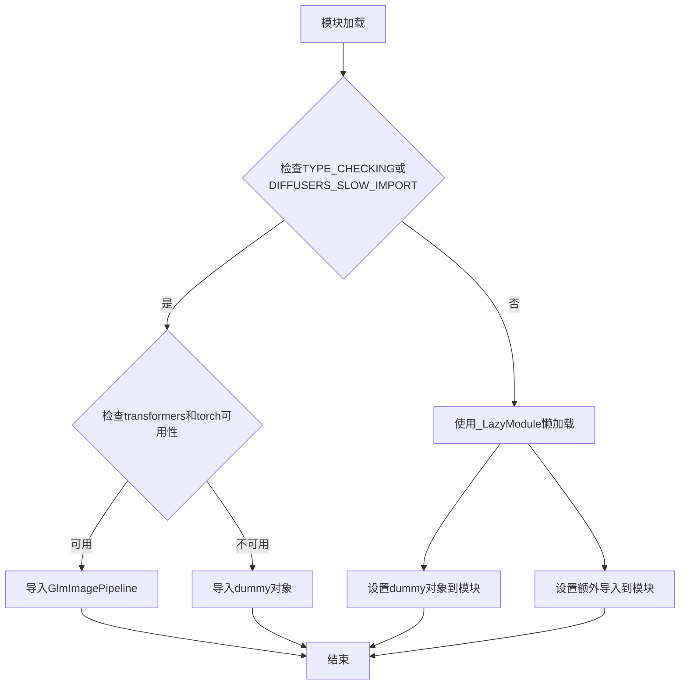
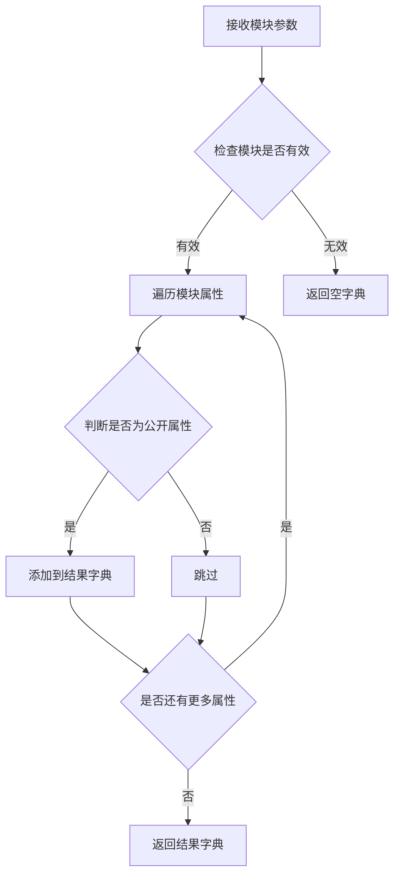
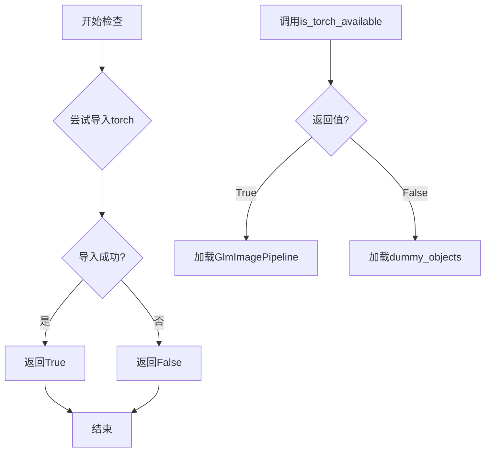
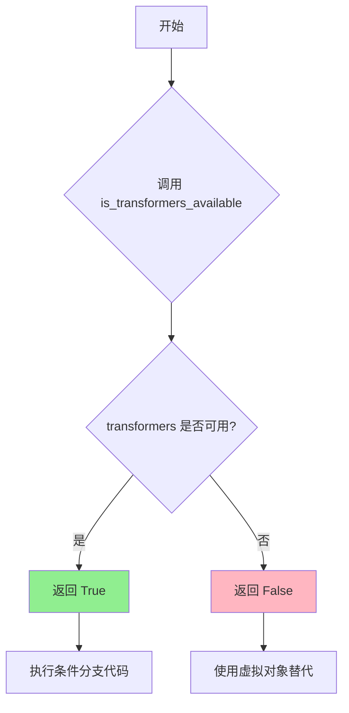
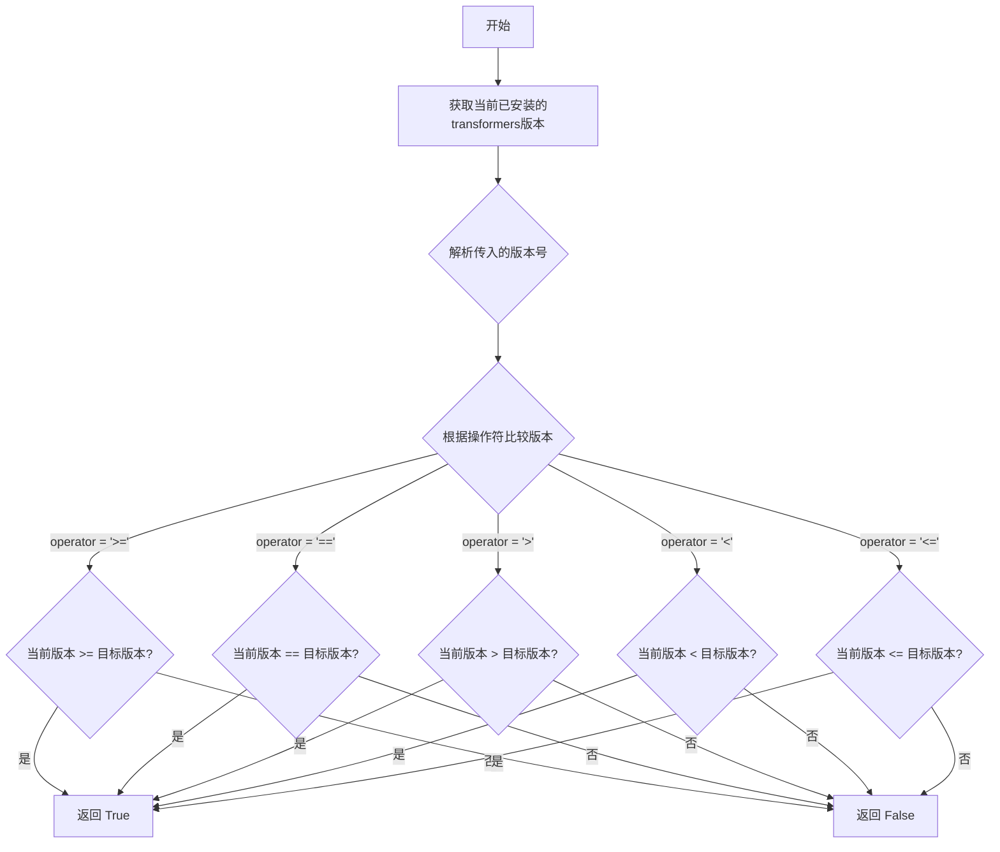
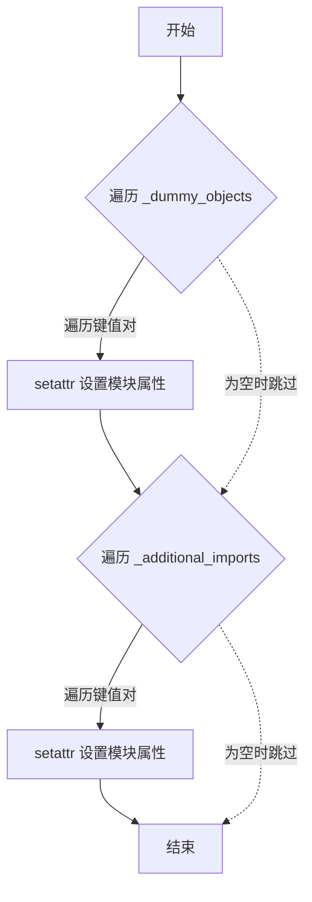

# `diffusers\src\diffusers\pipelines\glm_image\__init__.py` 详细设计文档

这是Diffusers库中GLM图像流水线的模块初始化文件，负责懒加载GLM图像模型（GlmImageForConditionalGeneration）和处理器（GlmImageProcessor），处理可选依赖（transformers>=4.57.4和torch），并导出GlmImagePipeline和GlmImagePipelineOutput类。

## 整体流程



## 类结构

```
Module Initialization (模块初始化)
├── _import_structure (导入结构字典)
├── _dummy_objects (虚拟对象集合)
├── _additional_imports (额外导入字典)
└── Lazy Loading (懒加载机制)
    └── _LazyModule
```

## 全局变量及字段


### `_dummy_objects`
    
用于存储虚拟对象的字典，当可选依赖（torch和transformers）不可用时使用

类型：`dict`
    


### `_additional_imports`
    
存储额外导入的transformers组件（GlmImageForConditionalGeneration和GlmImageProcessor）的字典

类型：`dict`
    


### `_import_structure`
    
定义模块导入结构的字典，包含pipeline_output和pipeline_glm_image的导入映射

类型：`dict`
    


### `DIFFUSERS_SLOW_IMPORT`
    
标志变量，控制是否使用延迟导入模式（slow import）

类型：`bool`
    


### `OptionalDependencyNotAvailable`
    
自定义异常类，用于表示可选依赖不可用的情况

类型：`Exception`
    


    

## 全局函数及方法


### `get_objects_from_module`

从模块中获取所有可导出对象，并将其存储到字典中供后续使用。

参数：

- `module`：`module`，需要获取对象的模块，通常是 dummy 模块

返回值：`dict`，键为对象名称（str），值为实际的对象

#### 流程图



#### 带注释源码

```
# 这是一个从 utils 模块导入的函数，源码不在当前文件中
# 以下是根据代码使用方式推断的实现逻辑

def get_objects_from_module(module):
    """
    从给定模块中获取所有非下划线开头的公共对象
    
    参数:
        module: Python 模块对象
        
    返回:
        dict: 包含对象名称到对象本身的映射
    """
    _objects = {}
    
    # 遍历模块的所有属性
    for attr_name in dir(module):
        # 跳过私有属性（以下划线开头的）
        if not attr_name.startswith('_'):
            try:
                # 获取属性值
                attr_value = getattr(module, attr_name)
                # 添加到结果字典
                _objects[attr_name] = attr_value
            except AttributeError:
                pass
    
    return _objects

# 在当前代码中的实际使用方式：
_dummy_objects = {}
_dummy_objects.update(get_objects_from_module(dummy_torch_and_transformers_objects))
```

> **注意**：该函数的实际实现位于 `...utils` 模块中，当前代码文件仅导入了该函数并使用它。从代码中的使用模式可以推断，它用于从 dummy 模块中获取所有可用的虚拟对象，以便在可选依赖不可用时提供替代实现。


### `is_torch_available`

用于检查当前环境中 PyTorch 库是否可用的工具函数。该函数通过尝试导入 PyTorch 来判断其是否已安装，并在模块延迟加载机制中作为可选依赖的判断条件。

参数：
- 无

返回值：`bool`，返回 `True` 表示 PyTorch 可用，返回 `False` 表示 PyTorch 不可用。

#### 流程图



#### 带注释源码

```python
# 从上级目录的 utils 模块导入 is_torch_available 函数
# 该函数用于检测 PyTorch 是否可用
from ...utils import (
    DIFFUSERS_SLOW_IMPORT,
    OptionalDependencyNotAvailable,
    _LazyModule,
    get_objects_from_module,
    is_torch_available,  # <--- 从 utils 导入的函数
    is_transformers_available,
    is_transformers_version,
)

# ... 其他代码 ...

try:
    # 检查 transformers 和 torch 是否都可用
    # 如果任一不可用，则抛出 OptionalDependencyNotAvailable 异常
    if not (is_transformers_available() and is_torch_available()):
        raise OptionalDependencyNotAvailable()
except OptionalDependencyNotAvailable:
    # 如果 torch 或 transformers 不可用，加载虚拟对象
    from ...utils import dummy_torch_and_transformers_objects  # noqa F403
    _dummy_objects.update(get_objects_from_module(dummy_torch_and_transformers_objects))
else:
    # 如果两者都可用，导入实际的 GlmImagePipeline
    _import_structure["pipeline_glm_image"] = ["GlmImagePipeline"]

# 在 TYPE_CHECKING 模式下也进行相同的检查
if TYPE_CHECKING or DIFFUSERS_SLOW_IMPORT:
    try:
        if not (is_transformers_available() and is_torch_available()):
            raise OptionalDependencyNotAvailable()
    except OptionalDependencyNotAvailable:
        from ...utils.dummy_torch_and_transformers_objects import *  # noqa F403
    else:
        from .pipeline_glm_image import GlmImagePipeline
```

**注意**：由于 `is_torch_available` 函数的具体实现不在当前代码文件中（它来自 `...utils` 模块），上述源码展示了该函数在当前文件中的使用方式。实际的函数实现通常位于 `diffusers/src/diffusers/utils` 目录下的相应文件中，其核心逻辑通常是尝试 `import torch` 并捕获 `ImportError` 异常。


### `is_transformers_available`

描述：`is_transformers_available` 是从 `...utils` 模块导入的用于检查 transformers 库是否可用的工具函数。该函数无参数，返回布尔值表示 transformers 库是否已安装可用。在当前文件中主要用于条件导入和依赖可用性检查。

参数：
- 无

返回值：`bool`，返回 `True` 表示 transformers 库可用，返回 `False` 表示不可用

#### 流程图



#### 带注释源码

```python
# 从 utils 模块导入的外部函数
# 以下为当前文件中使用 is_transformers_available 的示例

# 第一次使用：检查 transformers 是否可用且版本 >= 4.57.4
if is_transformers_available() and is_transformers_version(">=", "4.57.4"):
    try:
        from transformers import GlmImageForConditionalGeneration, GlmImageProcessor

        _additional_imports["GlmImageForConditionalGeneration"] = GlmImageForConditionalGeneration
        _additional_imports["GlmImageProcessor"] = GlmImageProcessor
    except ImportError:
        pass

# 第二次使用：检查 transformers 和 torch 是否都可用
try:
    if not (is_transformers_available() and is_torch_available()):
        raise OptionalDependencyNotAvailable()
except OptionalDependencyNotAvailable:
    from ...utils import dummy_torch_and_transformers_objects  # noqa F403

    _dummy_objects.update(get_objects_from_module(dummy_torch_and_transformers_objects))
else:
    _import_structure["pipeline_glm_image"] = ["GlmImagePipeline"]

# 第三次使用：TYPE_CHECKING 模式下的检查
if TYPE_CHECKING or DIFFUSERS_SLOW_IMPORT:
    try:
        if not (is_transformers_available() and is_torch_available()):
            raise OptionalDependencyNotAvailable()
    except OptionalDependencyNotAvailable:
        from ...utils.dummy_torch_and_transformers_objects import *  # noqa F403
    else:
        from .pipeline_glm_image import GlmImagePipeline
```


### `is_transformers_version`

该函数用于检查已安装的 transformers 库版本是否满足指定的条件要求，通常在 `diffusers` 库中用于版本兼容性检查。

参数：

- `operator`：`str`，比较操作符（如 `">="`, `"=="`, `"<"` 等）
- `version`：`str`，要比较的版本号字符串

返回值：`bool`，如果已安装的 transformers 版本满足指定条件则返回 `True`，否则返回 `False`

#### 流程图



#### 带注释源码

```
# 注意：由于 is_transformers_version 函数定义在 ...utils 模块中，
# 下方代码是基于代码调用方式的推断实现

def is_transformers_version(operator: str, version: str) -> bool:
    """
    检查已安装的 transformers 库版本是否满足指定条件。
    
    参数:
        operator: str, 版本比较操作符 (例如 '>=', '==', '>', '<', '<=')
        version: str, 要比较的版本号字符串 (例如 '4.57.4')
    
    返回:
        bool: 如果版本满足条件返回 True，否则返回 False
    """
    # 从已安装的包中获取 transformers 版本
    import transformers
    from packaging import version as pkg_version
    
    # 获取当前安装的版本
    current_version = transformers.__version__
    
    # 使用 packaging.version 进行版本比较
    current = pkg_version.parse(current_version)
    target = pkg_version.parse(version)
    
    # 根据操作符返回比较结果
    if operator == ">=":
        return current >= target
    elif operator == "==":
        return current == target
    elif operator == ">":
        return current > target
    elif operator == "<":
        return current < target
    elif operator == "<=":
        return current <= target
    else:
        raise ValueError(f"Unsupported operator: {operator}")
```

#### 在给定代码中的使用示例

```python
# 从 ...utils 导入 is_transformers_version 函数
from ...utils import is_transformers_version

# 在代码中使用该函数进行版本检查
if is_transformers_available() and is_transformers_version(">=", "4.57.4"):
    try:
        from transformers import GlmImageForConditionalGeneration, GlmImageProcessor

        _additional_imports["GlmImageForConditionalGeneration"] = GlmImageForConditionalGeneration
        _additional_imports["GlmImageProcessor"] = GlmImageProcessor
    except ImportError:
        pass
```


### `setattr`

`setattr` 是 Python 的内置函数，用于动态设置对象的属性值。在该代码中，用于将懒加载模块中的虚拟对象和额外导入的 transformers 组件动态绑定到当前模块。

参数：

- `obj`：`object`，目标对象，这里是 `sys.modules[__name__]`（当前模块）
- `name`：`str`，要设置的属性名称，这里来自 `_dummy_objects` 或 `_additional_imports` 的键
- `value`：任意类型，要设置的属性值，这里来自 `_dummy_objects` 或 `_additional_imports` 的值

返回值：`None`，无返回值（Python 内置函数特性）

#### 流程图



#### 带注释源码

```python
# 遍历虚拟对象字典（当可选依赖不可用时使用）
for name, value in _dummy_objects.items():
    # 使用 setattr 将虚拟对象动态绑定到模块
    # 参数1: obj = sys.modules[__name__] 当前模块对象
    # 参数2: name = name 虚拟对象名称
    # 参数3: value = value 虚拟对象实例
    setattr(sys.modules[__name__], name, value)

# 遍历额外导入的 transformers 组件
for name, value in _additional_imports.items():
    # 使用 setattr 将 transformers 组件动态绑定到模块
    # 参数1: obj = sys.modules[__name__] 当前模块对象
    # 参数2: name = name 组件名称
    # 参数3: value = value 组件类
    setattr(sys.modules[__name__], name, value)
```


## 关键组件


### _LazyModule 懒加载模块

用于实现延迟导入的机制，允许模块在首次访问时才加载实际内容，从而优化大型库的启动性能。

### OptionalDependencyNotAvailable 异常

当torch或transformers等可选依赖不可用时抛出的异常，用于优雅处理缺失依赖的情况。

### _import_structure 导入结构

定义了模块的公共API接口，包括pipeline_output中的GlmImagePipelineOutput类，确保模块间的解耦。

### _dummy_objects 虚拟对象集合

当可选依赖不可用时，用于填充模块命名空间的虚拟对象集合，避免导入错误。

### _additional_imports 动态导入映射

根据transformers版本条件，动态导入GlmImageForConditionalGeneration和GlmImageProcessor组件。

### TYPE_CHECKING 类型检查模式

用于类型检查阶段的导入路径，允许类型检查器在不使用运行时依赖的情况下进行类型验证。

### DIFFUSERS_SLOW_IMPORT 慢导入标志

控制是否使用懒加载模式的标志，启用时会在导入时立即加载所有模块内容。

### is_transformers_available/is_torch_available 依赖检查

检查transformers和torch库是否可用的函数，用于条件性导入和功能降级。

### is_transformers_version 版本检查

检查transformers版本是否满足要求的函数，确保兼容的API版本。

### get_objects_from_module 对象获取

从模块中提取所有对象的工具函数，用于批量获取虚拟对象。

### GlmImagePipelineOutput 流水线输出类

GLM图像流水线的输出数据结构，包含生成的图像结果。

### GlmImageForConditionalGeneration 条件生成模型

从transformers导入的条件生成模型类，用于图像生成任务。

### GlmImageProcessor 图像处理器

从transformers导入的图像预处理/后处理器类，负责图像数据的标准化。

### 懒加载机制 (Lazy Loading)

整个模块采用了惰性加载模式，通过_LazyModule和条件导入实现按需加载，优化了大规模深度学习库的内存占用和启动时间。

### 可选依赖处理机制

完整的可选依赖处理框架，包括检测、异常抛出、虚拟对象填充和多层回退策略，确保库在各种依赖环境下都能正常运行。


## 问题及建议


### 已知问题

- **重复的条件检查逻辑**：在try-except块（第21-22行）和后续的if-else分支（第29-38行）中重复检查`is_transformers_available() and is_torch_available()`，导致相同的逻辑执行两次，增加运行开销
- **异常捕获过于宽泛**：第18行使用`except ImportError: pass`，会静默吞掉所有导入错误（包括拼写错误、配置问题等），难以定位真正的可选依赖不可用问题
- **版本号硬编码**：transformers版本要求"4.57.4"硬编码在代码中（第14行），未来升级时需要修改多处，缺乏集中管理
- **类型检查导入风险**：在TYPE_CHECKING分支中导入（第31-37行），如果运行时依赖缺失但Dummy对象未正确提供，可能导致运行时错误
- **模块命名不一致**：使用了`_dummy_objects`和`_additional_imports`两种命名风格（下划线前缀 vs 混合风格），降低代码可读性

### 优化建议

- **提取版本号为常量**：将"4.57.4"定义为模块顶部的常量，如`MIN_TRANSFORMERS_VERSION = "4.57.4"`，便于维护和配置
- **合并重复检查逻辑**：将依赖检查封装为函数或使用单一的条件分支，减少代码重复
- **改进异常处理**：将`except ImportError: pass`改为记录警告日志或使用更具体的异常类型，确保真正的依赖问题能被识别
- **统一命名规范**：将`_additional_imports`改为`_additional_imports_dict`或`_extra_imports`，保持命名风格一致
- **添加版本不兼容提示**：当transformers版本不满足要求时，提供明确的警告信息而不是静默跳过

## 其它


### 设计目标与约束

本模块采用延迟加载(Lazy Loading)机制，通过`_LazyModule`实现模块的懒加载，旨在优化大规模依赖库的导入性能。设计约束包括：仅在transformers>=4.57.4且torch可用时加载GLM图像模型相关类，否则使用虚拟对象(dummy objects)替代。支持TYPE_CHECKING模式下的类型检查，以及DIFFUSERS_SLOW_IMPORT模式下的完整导入。

### 错误处理与异常设计

代码采用三层异常处理机制：第一层使用try-except捕获可选依赖不可用的情况，抛出`OptionalDependencyNotAvailable`异常；第二层在导入失败时从dummy模块加载虚拟对象，防止程序崩溃；第三层通过条件判断确保torch和transformers同时可用，否则触发异常。主要依赖`...utils`中的`OptionalDependencyNotAvailable`和`_LazyModule`处理模块级异常。

### 数据流与状态机

模块加载状态机包含三种状态：初始状态(导入失败)、部分加载状态(仅部分依赖可用)、完全加载状态(所有依赖满足)。数据流为：检查is_transformers_available()和is_torch_available() → 判断版本is_transformers_version(">=", "4.57.4") → 尝试导入GlmImageForConditionalGeneration和GlmImageProcessor → 成功则添加到_additional_imports，失败则继续 → 最终通过_LazyModule注册到sys.modules。

### 外部依赖与接口契约

外部依赖包括：transformers库(需>=4.57.4版本)、torch库、diffusers.utils模块(dummy_torch_and_transformers_objects、OptionalDependencyNotAvailable、_LazyModule等)。接口契约：GlmImagePipeline提供图像生成管道、GlmImageProcessor提供图像预处理、GlmImageForConditionalGeneration提供条件生成模型。_import_structure定义公共API接口，_additional_imports存储动态导入的类。

### 模块加载机制

采用Lazy Loading模式：通过`_LazyModule`将模块注册到sys.modules，实现按需加载。_dummy_objects用于存储依赖不可用时的替代对象，防止AttributeError。_additional_imports存储运行时成功导入的额外类。setattr动态绑定使得模块在首次访问时才真正加载相关内容。

### 性能考虑

延迟导入显著减少启动时的内存占用和导入时间。仅在TYPE_CHECKING或DIFFUSERS_SLOW_IMPORT为True时才会触发完整导入，否则保持轻量级状态。动态setattr避免了在模块初始化时一次性加载所有类。

### 版本兼容性

代码明确要求transformers>=4.57.4版本，通过is_transformers_version(">=", "4.57.4")进行版本检查。不满足版本要求时不会导入相关类，保证代码的向前兼容性。

### 测试考量

测试时可通过设置DIFFUSERS_SLOW_IMPORT=True强制完整导入所有模块。mock is_transformers_available和is_torch_available可测试不同依赖场景下的行为。dummy对象的存在确保了在缺少可选依赖时测试仍能运行。

### 配置管理

_import_structure作为模块的公共接口配置，定义了可导出的类列表。_additional_imports记录运行时实际导入的类，用于动态扩展模块接口。_dummy_objects作为后备配置，在依赖缺失时提供替代对象。

### 安全考虑

代码从受信任的transformers库导入类，不存在用户输入处理或网络请求。使用get_objects_from_module从受信任的dummy模块获取对象。动态setattr仅作用于当前模块命名空间，不会影响sys.modules中的其他模块。

    