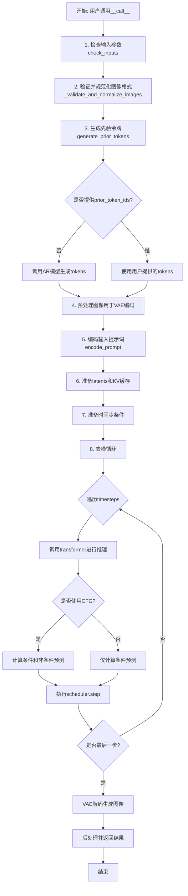
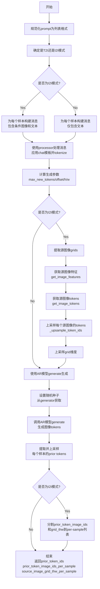
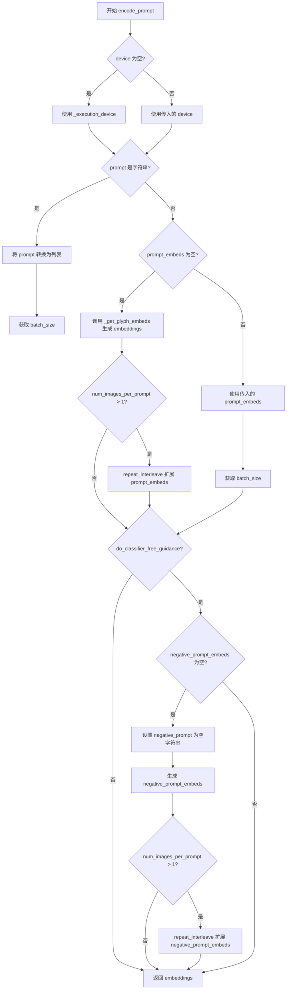
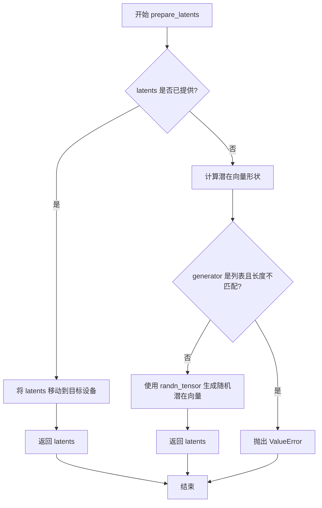
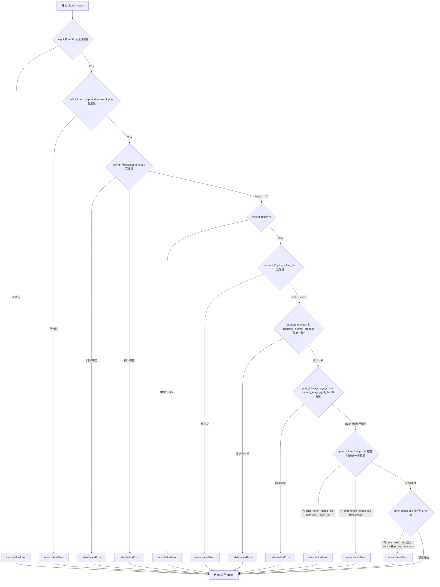
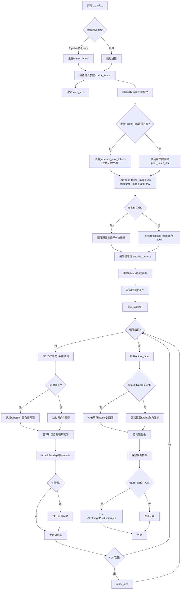

# `diffusers\src\diffusers\pipelines\glm_image\pipeline_glm_image.py` 详细设计文档

GlmImagePipeline是一个文本到图像/图像到图像的生成管道，集成了自回归(AR)模型用于图像token生成和扩散Transformer(DiT)模型用于图像解码，实现了基于GLM-Image模型的高质量图像合成功能。

## 整体流程



## 类结构

```
DiffusionPipeline (基类)
└── GlmImagePipeline
```

## 全局变量及字段


### `GlmImageProcessor`
    
图像处理器混合类，用于处理图像输入的预处理和后处理

类型：`ProcessorMixin`
    


### `GlmImageForConditionalGeneration`
    
用于条件生成的GLM图像预训练模型基类

类型：`PreTrainedModel`
    


### `XLA_AVAILABLE`
    
标志位，表示PyTorch XLA是否可用以加速设备上的张量操作

类型：`bool`
    


### `logger`
    
模块级日志记录器，用于输出调试和信息日志

类型：`logging.Logger`
    


### `EXAMPLE_DOC_STRING`
    
示例文档字符串，包含代码使用示例的说明文档

类型：`str`
    


### `GlmImagePipeline.tokenizer`
    
文本分词器，用于将文本输入编码为token序列

类型：`ByT5Tokenizer`
    


### `GlmImagePipeline.processor`
    
图像处理器，处理聊天模板和tokenization的AR模型处理器

类型：`GlmImageProcessor`
    


### `GlmImagePipeline.text_encoder`
    
冻结的文本编码器，用于生成字形嵌入的T5模型

类型：`T5EncoderModel`
    


### `GlmImagePipeline.vision_language_encoder`
    
视觉语言编码器AR模型，从文本提示生成图像token

类型：`GlmImageForConditionalGeneration`
    


### `GlmImagePipeline.vae`
    
变分自编码器模型，用于编码和解码图像到潜在表示

类型：`AutoencoderKL`
    


### `GlmImagePipeline.transformer`
    
DiT转换器模型，对编码的图像潜在表示进行去噪

类型：`GlmImageTransformer2DModel`
    


### `GlmImagePipeline.scheduler`
    
调度器，用于在去噪过程中逐步减少噪声的时间步调度

类型：`FlowMatchEulerDiscreteScheduler`
    


### `GlmImagePipeline.vae_scale_factor`
    
VAE缩放因子，用于计算潜在空间的降采样比例

类型：`int`
    


### `GlmImagePipeline.image_processor`
    
VAE图像处理器，用于图像的预处理和后处理操作

类型：`VaeImageProcessor`
    


### `GlmImagePipeline.default_sample_size`
    
默认采样尺寸，用于生成图像的默认高度和宽度基数

类型：`int`
    


### `GlmImagePipeline._optional_components`
    
可选组件列表，定义pipeline中可选的模块

类型：`list`
    


### `GlmImagePipeline.model_cpu_offload_seq`
    
模型CPU卸载顺序，指定模型卸载到CPU的顺序序列

类型：`str`
    


### `GlmImagePipeline._callback_tensor_inputs`
    
回调张量输入列表，定义在每步回调中可用的张量

类型：`list`
    
    

## 全局函数及方法


### `calculate_shift`

该函数用于根据图像序列长度计算 Flow Match Euler 离散调度器的动态 shift 参数（mu），以适应不同分辨率图像的去噪过程。

参数：

- `image_seq_len`：`int`，图像序列长度，通常为 `(height // vae_scale_factor) * (width // vae_scale_factor) // patch_size^2`
- `base_seq_len`：`int`，基础序列长度，默认值为 256，用于归一化计算
- `base_shift`：`float`，基础 shift 值，默认值为 0.25，作为计算的基准偏移
- `max_shift`：`float`，最大 shift 值，默认值为 0.75，用于控制 shift 的上限

返回值：`float`，计算得到的动态 shift 参数 mu 值，用于调度器的时间步调整

#### 流程图

```mermaid
flowchart TD
    A[开始] --> B[计算 m = (image_seq_len / base_seq_len) ^ 0.5]
    B --> C[计算 mu = m * max_shift + base_shift]
    C --> D[返回 mu]
```

#### 带注释源码

```python
def calculate_shift(
    image_seq_len,
    base_seq_len: int = 256,
    base_shift: float = 0.25,
    max_shift: float = 0.75,
) -> float:
    """
    计算 Flow Match 调度器的动态 shift 参数。
    
    该函数通过图像序列长度与基础序列长度的比例来确定 shift 值，
    使得调度器能够自适应不同分辨率的图像生成任务。
    
    参数:
        image_seq_len: 目标图像的序列长度
        base_seq_len: 基础序列长度，默认 256
        base_shift: 基础偏移量，默认 0.25
        max_shift: 最大偏移量，默认 0.75
    
    返回:
        动态计算的 mu 值，用于调度器
    """
    # 计算图像序列长度与基础序列长度的比例的平方根
    # 这反映了图像尺寸相对于默认尺寸的缩放因子
    m = (image_seq_len / base_seq_len) ** 0.5
    
    # 将缩放因子与最大偏移结合，并加上基础偏移
    # 当图像较大时，mu 值接近 max_shift；较小时接近 base_shift
    mu = m * max_shift + base_shift
    
    return mu
```


### `retrieve_timesteps`

该函数是扩散模型管道中的时间步检索工具，用于调用调度器的 `set_timesteps` 方法并从中获取时间步序列。支持自定义时间步或 sigmas，并处理不同调度器的兼容性检查。

参数：

- `scheduler`：`SchedulerMixin`，扩散调度器对象，用于获取时间步
- `num_inference_steps`：`int | None`，生成样本时使用的扩散步数，若使用则 `timesteps` 必须为 `None`
- `device`：`str | torch.device | None`，时间步要移动到的设备，若为 `None` 则不移动
- `timesteps`：`list[int] | None`，自定义时间步，用于覆盖调度器的时间步间隔策略
- `sigmas`：`list[float] | None`，自定义 sigmas，用于覆盖调度器的 sigma 间隔策略
- `**kwargs`：任意关键字参数，将传递给调度器的 `set_timesteps` 方法

返回值：`tuple[torch.Tensor, int]`，元组包含调度器的时间步序列（第一个元素）和推理步数（第二个元素）

#### 流程图

```mermaid
flowchart TD
    A[开始 retrieve_timesteps] --> B{检查 scheduler.set_timesteps 是否支持 timesteps}
    B -->|支持| C{检查 scheduler.set_timesteps 是否支持 sigmas}
    B -->|不支持| D[抛出 ValueError: 不支持自定义时间步或 sigma]
    C -->|支持| E{timesteps 和 sigmas 都不为 None?}
    E -->|是| F[调用 scheduler.set_timesteps timesteps=timesteps sigmas=sigmas device=device]
    E -->|否| G{timesteps 不为 None, sigmas 为 None?}
    G -->|是| H[调用 scheduler.set_timesteps timesteps=timesteps device=device]
    G -->|否| I{sigmas 不为 None, timesteps 为 None?}
    I -->|是| J[调用 scheduler.set_timesteps sigmas=sigmas device=device]
    I -->|否| K[调用 scheduler.set_timesteps num_inference_steps=num_inference_steps device=device]
    F --> L[获取 scheduler.timesteps]
    H --> L
    J --> L
    K --> L
    L --> M[计算 num_inference_steps = len(timesteps)]
    M --> N[返回 timesteps, num_inference_steps]
```

#### 带注释源码

```python
def retrieve_timesteps(
    scheduler,
    num_inference_steps: int | None = None,
    device: str | torch.device | None = None,
    timesteps: list[int] | None = None,
    sigmas: list[float] | None = None,
    **kwargs,
):
    r"""
    Calls the scheduler's `set_timesteps` method and retrieves timesteps from the scheduler after the call. Handles
    custom timesteps. Any kwargs will be supplied to `scheduler.set_timesteps`.

    Args:
        scheduler (`SchedulerMixin`):
            The scheduler to get timesteps from.
        num_inference_steps (`int`):
            The number of diffusion steps used when generating samples with a pre-trained model. If used, `timesteps`
            must be `None`.
        device (`str` or `torch.device`, *optional*):
            The device to which the timesteps should be moved to. If `None`, the timesteps are not moved.
        timesteps (`list[int]`, *optional*):
            Custom timesteps used to override the timestep spacing strategy of the scheduler. If `timesteps` is passed,
            `num_inference_steps` and `sigmas` must be `None`.
        sigmas (`list[float]`, *optional*):
            Custom sigmas used to override the timestep spacing strategy of the scheduler. If `sigmas` is passed,
            `num_inference_steps` and `timesteps` must be `None`.

    Returns:
        `tuple[torch.Tensor, int]`: A tuple where the first element is the timestep schedule from the scheduler and the
        second element is the number of inference steps.
    """
    # 检查调度器的 set_timesteps 方法是否支持 timesteps 参数
    accepts_timesteps = "timesteps" in set(inspect.signature(scheduler.set_timesteps).parameters.keys())
    # 检查调度器的 set_timesteps 方法是否支持 sigmas 参数
    accepts_sigmas = "sigmas" in set(inspect.signature(scheduler.set_timesteps).parameters.keys())

    # 情况1: 同时指定了 timesteps 和 sigmas
    if timesteps is not None and sigmas is not None:
        # 验证调度器是否至少支持其中一个参数
        if not accepts_timesteps and not accepts_sigmas:
            raise ValueError(
                f"The current scheduler class {scheduler.__class__}'s `set_timesteps` does not support custom"
                f" timestep or sigma schedules. Please check whether you are using the correct scheduler."
            )
        # 调用调度器设置时间步，同时传递 timesteps 和 sigmas
        scheduler.set_timesteps(timesteps=timesteps, sigmas=sigmas, device=device, **kwargs)
        # 从调度器获取设置后的时间步
        timesteps = scheduler.timesteps
        # 计算推理步数
        num_inference_steps = len(timesteps)
    # 情况2: 只指定了 timesteps
    elif timesteps is not None and sigmas is None:
        if not accepts_timesteps:
            raise ValueError(
                f"The current scheduler class {scheduler.__class__}'s `set_timesteps` does not support custom"
                f" timestep schedules. Please check whether you are using the correct scheduler."
            )
        scheduler.set_timesteps(timesteps=timesteps, device=device, **kwargs)
        timesteps = scheduler.timesteps
        num_inference_steps = len(timesteps)
    # 情况3: 只指定了 sigmas
    elif timesteps is None and sigmas is not None:
        if not accepts_sigmas:
            raise ValueError(
                f"The current scheduler class {scheduler.__class__}'s `set_timesteps` does not support custom"
                f" sigmas schedules. Please check whether you are using the correct scheduler."
            )
        scheduler.set_timesteps(sigmas=sigmas, device=device, **kwargs)
        timesteps = scheduler.timesteps
        num_inference_steps = len(timesteps)
    # 情况4: 两者都未指定，使用默认的 num_inference_steps
    else:
        scheduler.set_timesteps(num_inference_steps, device=device, **kwargs)
        timesteps = scheduler.timesteps
    
    # 返回时间步序列和推理步数
    return timesteps, num_inference_steps
```


### `retrieve_latents`

从编码器输出中提取潜在表示（latents），支持从 `latent_dist` 分布中采样或获取模式值，也可以直接返回预计算的 `latents` 属性。

参数：

-  `encoder_output`：`torch.Tensor`，编码器输出对象，通常包含 `latent_dist` 或 `latents` 属性
-  `generator`：`torch.Generator | None`，可选的随机数生成器，用于从分布中采样时控制随机性
-  `sample_mode`：`str`，采样模式，"sample" 表示从分布中采样，"argmax" 表示获取分布的模式值

返回值：`torch.Tensor`，从编码器输出中提取的潜在表示张量

#### 流程图

```mermaid
flowchart TD
    A[开始: retrieve_latents] --> B{encoder_output 是否有 latent_dist 属性?}
    B -- 是 --> C{sample_mode == 'sample'?}
    C -- 是 --> D[返回 encoder_output.latent_dist.sample<br/>(generator)]
    C -- 否 --> E{sample_mode == 'argmax'?}
    E -- 是 --> F[返回 encoder_output.latent_dist.mode]
    E -- 否 --> G[继续检查]
    B -- 否 --> G
    G --> H{encoder_output 是否有 latents 属性?}
    H -- 是 --> I[返回 encoder_output.latents]
    H -- 否 --> J[抛出 AttributeError]
    J --> K[结束: 错误处理]
    D --> L[结束: 返回 latent 张量]
    F --> L
    I --> L
```

#### 带注释源码

```python
# Copied from diffusers.pipelines.stable_diffusion.pipeline_stable_diffusion_img2img.retrieve_latents
def retrieve_latents(
    encoder_output: torch.Tensor, generator: torch.Generator | None = None, sample_mode: str = "sample"
):
    # 检查编码器输出是否有 latent_dist 属性（VAE 编码器的常见输出格式）
    if hasattr(encoder_output, "latent_dist") and sample_mode == "sample":
        # 从潜在分布中采样，返回采样得到的潜在向量
        return encoder_output.latent_dist.sample(generator)
    # 如果 latent_dist 存在但采样模式为 argmax，返回分布的众数（即最可能的值）
    elif hasattr(encoder_output, "latent_dist") and sample_mode == "argmax":
        return encoder_output.latent_dist.mode()
    # 检查是否有预计算的 latents 属性（某些模型的直接输出格式）
    elif hasattr(encoder_output, "latents"):
        return encoder_output.latents
    # 如果无法从编码器输出中提取潜在表示，抛出异常
    else:
        raise AttributeError("Could not access latents of provided encoder_output")
```


### `GlmImagePipeline.__init__`

初始化 GlmImagePipeline 文本到图像生成管道。该方法接收多个预训练模型组件（分词器、处理器、文本编码器、视觉语言编码器、VAE、Transformer 和调度器），通过 `register_modules` 注册所有模块，计算 VAE 缩放因子，初始化图像处理器，并设置默认采样大小。

参数：

-  `self`：实例本身，无需显式传递
-  `tokenizer`：`ByT5Tokenizer`，用于文本编码的分词器
-  `processor`：`GlmImageProcessor`，用于处理 AR 模型的聊天模板和分词
-  `text_encoder`：`T5EncoderModel`，用于字形嵌入的冻结文本编码器
-  `vision_language_encoder`：`GlmImageForConditionalGeneration`，从文本提示生成图像 token 的 AR 模型
-  `vae`：`AutoencoderKL`，变分自编码器模型，用于将图像编码和解码为潜在表示
-  `transformer`：`GlmImageTransformer2DModel`，文本条件变换器，用于对编码的图像潜在变量进行去噪（DiT）
-  `scheduler`：`FlowMatchEulerDiscreteScheduler`，与 `transformer` 配合使用对编码图像潜在变量进行去噪的调度器

返回值：`None`，构造函数无返回值，仅初始化实例属性

#### 流程图

```mermaid
flowchart TD
    A[开始 __init__] --> B[调用 super().__init__]
    B --> C[register_modules: 注册 tokenizer, processor, text_encoder, vision_language_encoder, vae, transformer, scheduler]
    C --> D{检查 vae 是否存在}
    D -->|是| E[计算 vae_scale_factor = 2 \*\* (len(vae.config.block_out_channels) - 1)]
    D -->|否| F[vae_scale_factor = 8]
    E --> G[创建 VaeImageProcessor: VaeImageProcessor(vae_scale_factor=self.vae_scale_factor)]
    F --> G
    G --> H{检查 transformer 是否存在且有 sample_size}
    H -->|是| I[default_sample_size = transformer.config.sample_size]
    H -->|否| J[default_sample_size = 128]
    I --> K[结束 __init__]
    J --> K
```

#### 带注释源码

```
def __init__(
    self,
    tokenizer: ByT5Tokenizer,                                          # 文本分词器
    processor: GlmImageProcessor,                                      # AR模型处理器
    text_encoder: T5EncoderModel,                                       # 文本编码器（T5）
    vision_language_encoder: GlmImageForConditionalGeneration,          # 视觉语言编码器（AR模型）
    vae: AutoencoderKL,                                                 # VAE模型
    transformer: GlmImageTransformer2DModel,                            # DiT变换器模型
    scheduler: FlowMatchEulerDiscreteScheduler,                         # 去噪调度器
):
    # 调用父类 DiffusionPipeline 的初始化方法
    super().__init__()

    # 注册所有模块，使管道能够识别并管理这些组件
    self.register_modules(
        tokenizer=tokenizer,
        processor=processor,
        text_encoder=text_encoder,
        vision_language_encoder=vision_language_encoder,
        vae=vae,
        transformer=transformer,
        scheduler=scheduler,
    )
    
    # 计算 VAE 缩放因子，用于后续图像尺寸的缩放处理
    # 基于 VAE 块输出通道数的深度计算：2^(层数-1)
    self.vae_scale_factor = 2 ** (len(self.vae.config.block_out_channels) - 1) if getattr(self, "vae", None) else 8
    
    # 初始化 VAE 图像处理器，用于图像的预处理和后处理
    self.image_processor = VaeImageProcessor(vae_scale_factor=self.vae_scale_factor)

    # 设置默认采样大小，用于确定生成图像的尺寸
    # 如果 transformer 存在且配置中有 sample_size 则使用，否则使用默认值 128
    self.default_sample_size = (
        self.transformer.config.sample_size
        if hasattr(self, "transformer")
        and self.transformer is not None
        and hasattr(self.transformer.config, "sample_size")
        else 128
    )
```


### `GlmImagePipeline._compute_generation_params`

该方法是一个静态工具方法，用于根据图像网格维度信息（`image_grid_thw`）计算AR（自回归）模型生成过程中的关键参数，包括最大新令牌数、大图像的起始偏移量以及目标网格的高度和宽度。这些参数决定了AR模型生成多少令牌以及如何定位生成结果。

参数：

- `image_grid_thw`：`torch.Tensor`，图像网格维度张量，形状为 (N, 3)，每行包含 (t, h, w) 表示令牌维度信息
- `is_text_to_image`：`bool`，标志位，True 表示文本到图像生成模式，False 表示图像到图像生成模式

返回值：`tuple[int, int, int, int]`，包含以下四个元素：
- `max_new_tokens`：`int`，AR模型生成的最大新令牌数
- `large_image_start_offset`：`int`，大图像令牌在生成序列中的起始偏移量
- `target_grid_h`：`int`，目标网格的高度（令牌数）
- `target_grid_w`：`int`，目标网格的宽度（令牌数）

#### 流程图

```mermaid
flowchart TD
    A[开始 _compute_generation_params] --> B[初始化空列表 grid_sizes 和 grid_hw]
    B --> C[遍历 image_grid_thw 的每一行]
    C --> D[提取 t, h, w 值]
    D --> E[计算 grid_sizes.append h*w 和 grid_hw.append h,w]
    E --> F{判断 is_text_to_image}
    F -->|False (i2i模式)| G[max_new_tokens = grid_sizes[-1] + 1]
    G --> H[large_image_start_offset = 0]
    G --> I[target_grid_h, target_grid_w = grid_hw[-1]]
    F -->|True (t2i模式)| J[total_tokens = sum grid_sizes]
    J --> K[max_new_tokens = total_tokens + 1]
    K --> L[large_image_start_offset = sum grid_sizes[1:]]
    L --> M[target_grid_h, target_grid_w = grid_hw[0]]
    I --> N[返回 max_new_tokens, large_image_start_offset, target_grid_h, target_grid_w]
    M --> N
```

#### 带注释源码

```python
@staticmethod
def _compute_generation_params(
    image_grid_thw,
    is_text_to_image: bool,
):
    """
    根据图像网格维度计算AR模型生成参数。

    Args:
        image_grid_thw: 图像网格维度张量，形状为 (num_grids, 3)，每行包含 (t, h, w)
        is_text_to_image: 是否为文本到图像模式

    Returns:
        max_new_tokens: 最大新令牌数
        large_image_start_offset: 大图像的起始偏移量
        target_grid_h: 目标网格高度
        target_grid_w: 目标网格宽度
    """
    grid_sizes = []  # 存储每个网格的令牌数量 (h*w)
    grid_hw = []     # 存储每个网格的 (h, w) 元组

    # 遍历所有网格维度，提取高度和宽度信息
    for i in range(image_grid_thw.shape[0]):
        t, h, w = image_grid_thw[i].tolist()  # t=token维度, h=高度, w=宽度
        grid_sizes.append(int(h * w))          # 计算该网格的令牌总数
        grid_hw.append((int(h), int(w)))       # 保存 h, w 供后续使用

    # 图像到图像模式 (i2i): 目标为最后一张图（最大图）
    if not is_text_to_image:
        max_new_tokens = grid_sizes[-1] + 1           # 生成最后一张图的令牌 + 1
        large_image_start_offset = 0                  # i2i模式偏移从0开始
        target_grid_h, target_grid_w = grid_hw[-1]    # 取最后一张图的尺寸
    # 文本到图像模式 (t2i): 目标为第一张图
    else:
        total_tokens = sum(grid_sizes)                 # 所有网格的令牌总数
        max_new_tokens = total_tokens + 1             # 生成所有令牌 + 1
        large_image_start_offset = sum(grid_sizes[1:]) # 跳过第一张图（目标图）
        target_grid_h, target_grid_w = grid_hw[0]     # 取第一张图的尺寸

    return max_new_tokens, large_image_start_offset, target_grid_h, target_grid_w
```


### `GlmImagePipeline._extract_large_image_tokens`

该方法是一个静态方法，用于从自回归（AR）模型的输出张量中提取大图像（目标图像）的 tokens。它通过跳过输入序列长度来确定生成 tokens 的起始位置，然后根据大图像的起始偏移量和 tokens 数量来切片提取目标图像对应的 token 序列。

参数：

- `outputs`：`torch.Tensor`，AR 模型的完整输出张量，通常包含输入序列和生成的序列
- `input_length`：`int`，输入序列的长度，用于确定生成 tokens 的起始位置
- `large_image_start_offset`：`int`，大图像 tokens 在生成序列中的起始偏移量
- `large_image_tokens`：`int`，大图像 tokens 的数量，即需要提取的 token 数目

返回值：`torch.Tensor`，提取出的大图像 tokens 子张量

#### 流程图

```mermaid
flowchart TD
    A[开始] --> B[获取生成tokens: outputs[0][input_length:]]
    B --> C[计算大图像结束位置: large_image_end = large_image_start_offset + large_image_tokens]
    C --> D[切片提取: generated_tokens[large_image_start_offset:large_image_end]]
    D --> E[返回大图像tokens张量]
```

#### 带注释源码

```python
@staticmethod
def _extract_large_image_tokens(
    outputs: torch.Tensor, input_length: int, large_image_start_offset: int, large_image_tokens: int
) -> torch.Tensor:
    """
    从AR模型的输出中提取大图像（目标图像）的tokens。

    Args:
        outputs: AR模型的输出张量，形状为 [batch_size, seq_len]
        input_length: 输入序列的长度（包含padding）
        large_image_start_offset: 大图像tokens在生成序列中的起始偏移量
        large_image_tokens: 需要提取的大图像tokens数量

    Returns:
        提取出的大图像tokens张量
    """
    # 1. 跳过输入序列长度，获取模型生成的tokens
    # outputs[0] 取第一个batch，input_length: 表示从输入长度之后开始（即生成的tokens）
    generated_tokens = outputs[0][input_length:]
    
    # 2. 计算大图像tokens的起始和结束位置
    large_image_start = large_image_start_offset  # 大图像在生成序列中的起始索引
    large_image_end = large_image_start + large_image_tokens  # 结束索引 = 起始 + 长度
    
    # 3. 切片提取指定范围的大图像tokens并返回
    return generated_tokens[large_image_start:large_image_end]
```


### `GlmImagePipeline._upsample_token_ids`

该方法是一个静态工具函数，用于将图像token ID张量进行2倍上采样（分辨率扩大）。它先将1D展平的token IDs重塑为2D网格形式，然后使用最近邻插值（nearest neighbor）方法将宽高各扩大2倍，最后再展平回1D形式返回。这种上采样方式确保了token ID的离散性质得以保持，不会产生插值带来的非整数ID值。

参数：

- `token_ids`：`torch.Tensor`，输入的token ID张量，形状为 (1, token_h × token_w)，表示展平的2D token网格
- `token_h`：`int`，token网格的高度（行数）
- `token_w`：`int`，token网格的宽度（列数）

返回值：`torch.Tensor`，上采样后的token ID张量，形状为 (1, token_h × 2 × token_w × 2)，即token宽高各扩大2倍后展平的2D网格

#### 流程图

```mermaid
flowchart TD
    A[开始: 输入 token_ids] --> B[view 变形: (1, token_h×token_w) → (1, 1, token_h, token_w)]
    B --> C[插值上采样: torch.nn.functional.interpolate with scale_factor=2, mode='nearest']
    C --> D[类型转换: 转换为 torch.long]
    D --> E[view 变形: (1, 1, token_h×2, token_w×2) → (1, -1)]
    E --> F[返回上采样后的 token_ids]
```

#### 带注释源码

```python
@staticmethod
def _upsample_token_ids(token_ids: torch.Tensor, token_h: int, token_w: int) -> torch.Tensor:
    """
    将图像token ID张量进行2倍上采样。

    Args:
        token_ids: 输入的token ID张量，形状为 (batch=1, token_h * token_w)
        token_h: token网格的高度
        token_w: token网格的宽度

    Returns:
        上采样后的token ID张量，形状为 (batch=1, token_h * 2 * token_w * 2)
    """
    # Step 1: 将1D展平的token IDs重塑为2D图像形式 (batch=1, channels=1, H, W)
    token_ids = token_ids.view(1, 1, token_h, token_w)
    
    # Step 2: 使用最近邻插值进行2倍上采样，将H和W各扩大2倍
    # 使用float类型进行插值计算，然后转回long类型保持离散ID性质
    token_ids = torch.nn.functional.interpolate(token_ids.float(), scale_factor=2, mode="nearest").to(
        dtype=torch.long
    )
    
    # Step 3: 重新展平为1D张量 (batch=1, total_tokens)
    token_ids = token_ids.view(1, -1)
    
    return token_ids
```


### GlmImagePipeline._validate_and_normalize_images

该方法是一个静态方法，用于验证和标准化图像输入格式，确保图像数据符合pipeline的要求。它根据batch_size的大小处理不同的输入格式，将各种输入规范化为统一的List[List[PIL.Image.Image]]格式。

参数：

- `image`：`list[PIL.Image.Image] | list[list[PIL.Image.Image]]`，输入的图像数据，支持多种格式：单个图像列表或嵌套图像列表
- `batch_size`：`int`，批次大小，即提示词的数量

返回值：`list[list[PIL.Image.Image]] | None`，规范化后的图像列表，如果输入为空则返回None

#### 流程图

```mermaid
flowchart TD
    A[开始 _validate_and_normalize_images] --> B{image is None or len == 0?}
    B -->|Yes| C[return None]
    B -->|No| D[获取第一个元素 first_element]
    E{batch_size == 1?}
    D --> E
    E -->|Yes| F{first_element 是 list/tuple?}
    E -->|No| G{first_element 是 list/tuple?}
    F -->|No| H[return [list(image)]]
    F -->|Yes| I{len(image) == 1?}
    I -->|No| J[raise ValueError: 期望1个图像列表]
    I -->|Yes| K[return [list(image[0])]]
    G -->|No| L[raise ValueError: 需要List[List格式]
    G -->|Yes| M{len(image) == batch_size?}
    M -->|No| N[raise ValueError: 列表数不匹配batch_size]
    M -->|Yes| O[检查所有子列表长度是否一致]
    O --> P{长度一致?}
    P -->|No| Q[raise ValueError: 各提示图像数不一致]
    P -->|Yes| R[return [list(imgs) for imgs in image]]
```

#### 带注释源码

```python
@staticmethod
def _validate_and_normalize_images(
    image: list[PIL.Image.Image] | list[list[PIL.Image.Image]],
    batch_size: int,
) -> list[list[PIL.Image.Image]]:
    """
    Validate and normalize image inputs to List[List[PIL.Image]].

    Rules:
    - batch_size > 1: Only accepts List[List[PIL.Image]], each sublist must have equal length
    - batch_size == 1: Accepts List[PIL.Image] for legacy compatibility (converted to [[img1, img2, ...]])
    - Other formats raise ValueError

    Args:
        image: Input images in various formats
        batch_size: Number of prompts in the batch

    Returns:
        Normalized images as List[List[PIL.Image]], or None if no images provided
    """
    # 步骤1：检查输入是否为空
    if image is None or len(image) == 0:
        return None

    # 步骤2：获取第一个元素用于类型判断
    first_element = image[0]

    # 步骤3：处理 batch_size == 1 的情况（支持legacy格式）
    if batch_size == 1:
        # Legacy format: List[PIL.Image] -> [[img1, img2, ...]]
        # 如果第一个元素不是list/tuple，说明是扁平列表格式
        if not isinstance(first_element, (list, tuple)):
            # 将单层列表包装成双层列表返回
            return [list(image)]
        # 已经是 List[List[PIL.Image]] 格式
        # 检查是否只有一个图像列表
        if len(image) != 1:
            raise ValueError(
                f"For batch_size=1 with List[List[PIL.Image]] format, expected 1 image list, got {len(image)}."
            )
        # 返回第一层的第一个元素（确保是list而非tuple）
        return [list(image[0])]

    # 步骤4：处理 batch_size > 1 的情况
    # batch_size > 1: must be List[List[PIL.Image]]
    # 必须是嵌套列表格式
    if not isinstance(first_element, (list, tuple)):
        raise ValueError(
            f"For batch_size > 1, images must be List[List[PIL.Image]] format. "
            f"Got List[{type(first_element).__name__}] instead. "
            f"Each prompt requires its own list of condition images."
        )

    # 步骤5：验证图像列表数量是否与batch_size匹配
    if len(image) != batch_size:
        raise ValueError(f"Number of image lists ({len(image)}) must match batch size ({batch_size}).")

    # 步骤6：验证同质性 - 所有子列表必须有相同长度
    num_input_images_per_prompt = len(image[0])
    for idx, imgs in enumerate(image):
        if len(imgs) != num_input_images_per_prompt:
            raise ValueError(
                f"All prompts must have the same number of condition images. "
                f"Prompt 0 has {num_input_images_per_prompt} images, but prompt {idx} has {len(imgs)} images."
            )

    # 步骤7：返回规范化后的嵌套列表
    return [list(imgs) for imgs in image]
```


### `GlmImagePipeline.generate_prior_tokens`

该方法利用自回归（AR）模型生成用于DiT（Diffusion Transformer）模型的先验tokens。在文本到图像（T2I）模式下，直接使用AR模型生成图像tokens；在图像到图像（I2I）模式下，还需先提取条件图像的tokens。然后将这些tokens上采样至与VAE/DiT兼容的分辨率，并返回处理后的先验tokens及相关辅助信息供后续去噪过程使用。

参数：

- `prompt`：`str | list[str]`，单个提示词或提示词列表
- `height`：`int`，目标图像高度
- `width`：`int`，目标图像宽度
- `image`：`list[list[PIL.Image.Image]] | None`，规范化后的图像输入，作为List[List[PIL.Image]]格式，应在使用前通过`_validate_and_normalize_images()`验证
- `device`：`torch.device | None`，目标设备，默认为执行设备
- `generator`：`torch.Generator | None`，随机生成器，用于 reproducibility

返回值：`tuple[torch.Tensor, list[torch.Tensor] | None, list[torch.Tensor] | None]`，返回一个三元组：
- `prior_token_ids`：`torch.Tensor`，形状为(batch_size, num_tokens)的上采样先验tokens
- `prior_token_image_ids_per_sample`：`list[torch.Tensor] | None`，每个样本的条件图像先验token ids列表，I2I模式有值，T2I模式为None
- `source_image_grid_thw_per_sample`：`list[torch.Tensor] | None`，每个样本的上采样网格信息张量列表，形状为(num_condition_images, 3)，I2I模式有值，T2I模式为None

#### 流程图



#### 带注释源码

```python
def generate_prior_tokens(
    self,
    prompt: str | list[str],
    height: int,
    width: int,
    image: list[list[PIL.Image.Image]] | None = None,
    device: torch.device | None = None,
    generator: torch.Generator | None = None,
):
    """
    Generate prior tokens for the DiT model using the AR model.

    Args:
        prompt: Single prompt or list of prompts
        height: Target image height
        width: Target image width
        image: Normalized image input as List[List[PIL.Image]]. Should be pre-validated
               using _validate_and_normalize_images() before calling this method.
        device: Target device
        generator: Random generator for reproducibility

    Returns:
        Tuple of:
            - prior_token_ids: Tensor of shape (batch_size, num_tokens) with upsampled prior tokens
            - prior_token_image_ids_per_sample: List of tensors, one per sample. Each tensor contains
                the upsampled prior token ids for all condition images in that sample. None for t2i.
            - source_image_grid_thw_per_sample: List of tensors, one per sample. Each tensor has shape
                (num_condition_images, 3) with upsampled grid info. None for t2i.
    """
    # 确定执行设备，默认为pipeline的默认设备
    device = device or self._execution_device

    # ==== 步骤1: 规范化prompt为列表格式 ====
    # 将单个字符串转换为列表，保持列表形式不变
    prompt_list = [prompt] if isinstance(prompt, str) else prompt
    batch_size = len(prompt_list)

    # ==== 步骤2: 判断生成模式 ====
    # image为None时是T2I模式，否则为I2I模式
    # 注意：image应该已经被_validate_and_normalize_images()规范化
    is_text_to_image = image is None

    # ==== 步骤3: 构建消息列表 ====
    # 为batch中的每个样本构建消息格式（符合chat template格式）
    all_messages = []
    for idx, p in enumerate(prompt_list):
        content = []
        if not is_text_to_image:
            # I2I模式：添加条件图像到消息内容
            for img in image[idx]:
                content.append({"type": "image", "image": img})
        # 添加文本内容
        content.append({"type": "text", "text": p})
        all_messages.append([{"role": "user", "content": content}])

    # ==== 步骤4: 使用processor处理消息 ====
    # 应用chat模板，支持batch和left padding
    inputs = self.processor.apply_chat_template(
        all_messages,
        tokenize=True,
        padding=True if batch_size > 1 else False,
        target_h=height,
        target_w=width,
        return_dict=True,
        return_tensors="pt",
    ).to(device)

    # 获取图像网格信息和每样本图像数量
    image_grid_thw = inputs.get("image_grid_thw")
    images_per_sample = inputs.get("images_per_sample")

    # ==== 步骤5: 计算条件图像数量和每样本grid数 ====
    num_condition_images = 0 if is_text_to_image else len(image[0])
    if images_per_sample is not None:
        # 每个样本的grid数量
        num_grids_per_sample = images_per_sample[0].item()
    else:
        # batch_size=1时的fallback
        num_grids_per_sample = image_grid_thw.shape[0]

    # ==== 步骤6: 计算生成参数 ====
    # 根据grid信息计算AR模型需要生成的token数量和偏移量
    first_sample_grids = image_grid_thw[:num_grids_per_sample]
    max_new_tokens, large_image_offset, token_h, token_w = self._compute_generation_params(
        image_grid_thw=first_sample_grids, is_text_to_image=is_text_to_image
    )

    # ==== 步骤7: I2I模式 - 生成条件图像的prior tokens ====
    prior_token_image_ids = None
    source_image_grid_thw = None
    if not is_text_to_image:
        # 提取源图像的grid索引（跳过目标图像的grid）
        # processor输出的grid顺序: [s0_cond1, s0_cond2, ..., s0_target, s1_cond1, ...]
        source_indices = []
        for sample_idx in range(batch_size):
            base = sample_idx * num_grids_per_sample
            source_indices.extend(range(base, base + num_condition_images))
        source_grids = image_grid_thw[source_indices]

        if len(source_grids) > 0:
            # 获取源图像的特征表示
            prior_token_image_embed = self.vision_language_encoder.get_image_features(
                inputs["pixel_values"], source_grids
            ).pooler_output
            prior_token_image_embed = torch.cat(prior_token_image_embed, dim=0)
            
            # 获取源图像的tokens (d32分辨率)
            prior_token_image_ids_d32 = self.vision_language_encoder.get_image_tokens(
                prior_token_image_embed, source_grids
            )
            
            # 上采样每个源图像的tokens到VAE/DiT兼容分辨率
            split_sizes = source_grids.prod(dim=-1).tolist()
            prior_ids_per_source = torch.split(prior_token_image_ids_d32, split_sizes)
            upsampled_prior_ids = []
            for i, prior_ids in enumerate(prior_ids_per_source):
                t, h, w = source_grids[i].tolist()
                upsampled = self._upsample_token_ids(prior_ids, int(h), int(w))
                upsampled_prior_ids.append(upsampled.squeeze(0))
            prior_token_image_ids = torch.cat(upsampled_prior_ids, dim=0)
            
            # 上采样grid维度信息（h和w乘2）
            upsampled_grids = source_grids.clone()
            upsampled_grids[:, 1] = upsampled_grids[:, 1] * 2
            upsampled_grids[:, 2] = upsampled_grids[:, 2] * 2
            source_image_grid_thw = upsampled_grids

    # ==== 步骤8: 使用AR模型生成图像tokens ====
    # 设置随机种子以确保可重复性
    # 注意：transformers的generate()不接受generator参数
    if generator is not None:
        seed = generator.initial_seed()
        torch.manual_seed(seed)
        if device is not None and device.type == "cuda":
            torch.cuda.manual_seed(seed)
    
    # 调用AR模型生成tokens
    outputs = self.vision_language_encoder.generate(
        **inputs,
        max_new_tokens=max_new_tokens,
        do_sample=True,
    )

    # ==== 步骤9: 提取并上采样每个样本的prior tokens ====
    all_prior_token_ids = []
    max_input_length = inputs["input_ids"].shape[-1]
    
    for idx in range(batch_size):
        # 对于left-padded序列，生成的tokens从max_input_length位置开始
        prior_token_ids_d32 = self._extract_large_image_tokens(
            outputs[idx : idx + 1], max_input_length, large_image_offset, token_h * token_w
        )
        # 上采样到更高分辨率
        prior_token_ids = self._upsample_token_ids(prior_token_ids_d32, token_h, token_w)
        all_prior_token_ids.append(prior_token_ids)
    
    # 合并所有样本的prior tokens
    prior_token_ids = torch.cat(all_prior_token_ids, dim=0)

    # ==== 步骤10: 分割I2I相关数据到per-sample列表 ====
    prior_token_image_ids_per_sample = None
    source_image_grid_thw_per_sample = None
    if prior_token_image_ids is not None and source_image_grid_thw is not None:
        # 分割grid信息：每个样本有num_condition_images个grid
        source_image_grid_thw_per_sample = list(torch.split(source_image_grid_thw, num_condition_images))
        
        # 分割prior_token_image_ids：每个样本的tokens数量可能不同
        tokens_per_image = source_image_grid_thw.prod(dim=-1).tolist()
        tokens_per_sample = []
        for i in range(batch_size):
            start_idx = i * num_condition_images
            end_idx = start_idx + num_condition_images
            tokens_per_sample.append(sum(tokens_per_image[start_idx:end_idx]))
        prior_token_image_ids_per_sample = list(torch.split(prior_token_image_ids, tokens_per_sample))

    # ==== 返回结果 ====
    return prior_token_ids, prior_token_image_ids_per_sample, source_image_grid_thw_per_sample
```


### `GlmImagePipeline.get_glyph_texts`

从提示词中提取字形文本（glyph texts），支持多种引号格式的文本提取，返回嵌套列表结构以支持批处理。

参数：

- `prompt`：`str | list[str]`，输入的提示词，可以是单个字符串或字符串列表

返回值：`list[list[str]]`，返回嵌套列表，外层列表对应每个提示词，内层列表包含从该提示词中提取的所有字形文本

#### 流程图

```mermaid
flowchart TD
    A[开始: get_glyph_texts] --> B{prompt 是否为字符串?}
    B -->|是| C[将 prompt 转换为列表: prompt = [prompt]]
    B -->|否| D[保持原样]
    C --> E[初始化空列表 all_ocr_texts]
    D --> E
    E --> F[遍历 prompt 中的每个元素 p]
    F --> G[使用正则表达式提取文本]
    G --> H[匹配单引号: '[^']*']
    G --> I[匹配中文左双引号: \u201c[^\u201c\u201d]*\u201d]
    G --> J[匹配双引号: "[^"]*"]
    G --> K[匹配中文书名号: 「[^「」]*」]
    H --> L[合并所有匹配结果]
    I --> L
    J --> L
    K --> L
    L --> M[将提取的文本列表添加到 all_ocr_texts]
    M --> F
    F --> N{遍历结束?}
    N -->|否| F
    N -->|是| O[返回 all_ocr_texts]
    O --> P[结束]
```

#### 带注释源码

```python
def get_glyph_texts(self, prompt):
    """
    Extract glyph texts from prompt(s). Returns a list of lists for batch processing.
    
    从提示词中提取字形文本（glyph texts），返回嵌套列表结构支持批处理。
    该方法用于从文本提示中提取被引号包裹的文本内容，这些内容通常代表
    需要特别处理的OCR文本或字形信息。
    
    Args:
        prompt: 输入的提示词，可以是单个字符串或字符串列表
        
    Returns:
        list[list[str]]: 嵌套列表，外层列表对应每个提示词，
                        内层列表包含从该提示词中提取的所有字形文本
    """
    # 如果 prompt 是单个字符串，转换为列表以统一处理
    if isinstance(prompt, str):
        prompt = [prompt]
    
    # 初始化结果列表，用于存储所有提示词的提取结果
    all_ocr_texts = []
    
    # 遍历每个提示词
    for p in prompt:
        # 使用多种正则表达式匹配不同引号格式的文本
        # re.findall 返回匹配到的所有子串列表
        ocr_texts = (
            # 匹配单引号包裹的文本: 'text'
            re.findall(r"'([^']*)'", p)
            # 匹配中文左双引号包裹的文本: "text" (左引号 \u201c, 右引号 \u201d)
            + re.findall(r"\u201c([^\u201c\u201d]*)\u201d", p)
            # 匹配双引号包裹的文本: "text"
            + re.findall(r'"([^"]*)"', p)
            # 匹配中文书名号包裹的文本: 「text」
            + re.findall(r"「([^「」]*)」", p)
        )
        # 将当前提示词的提取结果添加到总结果中
        all_ocr_texts.append(ocr_texts)
    
    # 返回嵌套列表结果
    return all_ocr_texts
```


### `GlmImagePipeline._get_glyph_embeds`

该方法负责从文本提示中提取字形文本（glyph texts），并使用 T5 文本编码器生成对应的嵌入向量。它支持批量处理多个提示，通过 tokenizer 进行序列填充和注意力掩码生成，最终返回对齐后的字形嵌入张量。

参数：

- `prompt`：`str | list[str]`，需要生成字形嵌入的提示文本，可以是单个字符串或字符串列表
- `max_sequence_length`：`int = 2048`，tokenizer 的最大序列长度，超过该长度将进行截断
- `device`：`torch.device | None`，指定计算设备，默认为执行设备
- `dtype`：`torch.dtype | None`，指定返回张量的数据类型，默认为 text_encoder 的数据类型

返回值：`torch.Tensor`，形状为 `(batch_size, max_seq_len, hidden_dim)` 的字形嵌入张量

#### 流程图

```mermaid
flowchart TD
    A[开始 _get_glyph_embeds] --> B[确定 device 和 dtype]
    B --> C[调用 get_glyph_texts 提取字形文本]
    C --> D[遍历每个提示的字形文本列表]
    D --> E{字形文本列表为空?}
    E -->|是| F[设置为空字符串列表 [""]]
    E -->|否| G[保持原样]
    F --> H
    G --> H[调用 tokenizer 进行分词]
    H --> I[计算填充后序列长度 max_length]
    I --> J[构建 attention_mask 张量]
    J --> K[对 input_ids 进行填充]
    K --> L[调用 text_encoder 获取隐藏状态]
    L --> M[根据 attention_mask 提取有效嵌入]
    M --> N[添加批次维度并添加到列表]
    N --> O{是否还有更多提示?}
    O -->|是| D
    O -->|否| P[计算批次中最大序列长度]
    P --> Q{当前嵌入序列长度 < 最大长度?}
    Q -->|是| R[左侧填充零张量]
    R --> S
    Q -->|否| S[保持原样]
    S --> T{是否还有更多嵌入?}
    T -->|是| Q
    T -->|否| U[沿批次维度拼接所有嵌入]
    U --> V[转换 device 和 dtype]
    V --> W[返回字形嵌入张量]
```

#### 带注释源码

```
def _get_glyph_embeds(
    self,
    prompt: str | list[str] = None,
    max_sequence_length: int = 2048,
    device: torch.device | None = None,
    dtype: torch.dtype | None = None,
):
    """Get glyph embeddings for each prompt in the batch."""
    # 确定计算设备，优先使用传入的 device，否则使用 pipeline 的执行设备
    device = device or self._execution_device
    # 确定数据类型，优先使用传入的 dtype，否则使用 text_encoder 的数据类型
    dtype = dtype or self.text_encoder.dtype

    # 调用 get_glyph_texts 方法从 prompt 中提取字形文本
    # 该方法返回一个列表的列表，每个内部列表对应一个 prompt 的字形文本
    all_glyph_texts = self.get_glyph_texts(prompt)

    # 用于存储所有 prompt 对应的字形嵌入
    all_glyph_embeds = []
    
    # 遍历每个 prompt 的字形文本列表
    for glyph_texts in all_glyph_texts:
        # 如果某个 prompt 没有提取到任何字形文本，则使用空字符串
        if len(glyph_texts) == 0:
            glyph_texts = [""]
        
        # 使用 tokenizer 对字形文本进行分词
        # 返回 input_ids 列表，每个元素对应一个文本的 token 序列
        input_ids = self.tokenizer(
            glyph_texts,
            max_length=max_sequence_length,
            truncation=True,
        ).input_ids
        
        # 对 input_ids 进行填充处理，确保每个序列长度为偶数（可能与模型架构相关）
        # 左侧填充 pad_token_id，填充数量根据 (len + 1) % 2 计算
        input_ids = [
            [self.tokenizer.pad_token_id] * ((len(input_ids) + 1) % 2) + input_ids_ 
            for input_ids_ in input_ids
        ]
        
        # 计算当前批次中的最大序列长度
        max_length = max(len(input_ids_) for input_ids_ in input_ids)
        
        # 构建注意力掩码张量：有效 token 位置为 1，填充位置为 0
        attention_mask = torch.tensor(
            [[1] * len(input_ids_) + [0] * (max_length - len(input_ids_)) for input_ids_ in input_ids],
            device=device,
        )
        
        # 对 input_ids 进行填充到统一长度
        input_ids = torch.tensor(
            [
                input_ids_ + [self.tokenizer.pad_token_id] * (max_length - len(input_ids_))
                for input_ids_ in input_ids
            ],
            device=device,
        )
        
        # 调用 text_encoder 获取隐藏状态输出
        outputs = self.text_encoder(input_ids, attention_mask=attention_mask)
        
        # 根据 attention_mask 提取有效位置的隐藏状态
        # 使用 bool() 将掩码转换为布尔张量进行索引
        glyph_embeds = outputs.last_hidden_state[attention_mask.bool()].unsqueeze(0)
        
        # 添加到列表中，unsqueeze(0) 增加批次维度
        all_glyph_embeds.append(glyph_embeds)

    # 找到所有嵌入中最大的序列长度，用于对齐
    max_seq_len = max(emb.size(1) for emb in all_glyph_embeds)
    
    # 对每个嵌入进行左侧填充，使其序列长度统一
    padded_embeds = []
    for emb in all_glyph_embeds:
        if emb.size(1) < max_seq_len:
            # 计算需要填充的长度
            pad_length = max_seq_len - emb.size(1)
            # 创建左侧零填充张量
            pad = torch.zeros(emb.size(0), pad_length, emb.size(2), device=device, dtype=emb.dtype)
            # 在序列维度左侧拼接填充张量
            emb = torch.cat([pad, emb], dim=1)
        padded_embeds.append(emb)

    # 沿批次维度（dim=0）拼接所有嵌入
    glyph_embeds = torch.cat(padded_embeds, dim=0)
    
    # 转换为指定的 device 和 dtype 并返回
    return glyph_embeds.to(device=device, dtype=dtype)
```


### `GlmImagePipeline.encode_prompt`

该方法负责将文本提示词编码为文本编码器的隐藏状态（embeddings），支持分类器自由引导（Classifier-Free Guidance），并根据 `num_images_per_prompt` 参数重复embeddings以支持批量生成。

参数：

- `self`：`GlmImagePipeline` 实例本身
- `prompt`：`str | list[str]`，要编码的文本提示词，可以是单个字符串或字符串列表
- `do_classifier_free_guidance`：`bool`，是否使用分类器自由引导，默认为 True
- `num_images_per_prompt`：`int`，每个提示词需要生成的图像数量，默认为 1
- `prompt_embeds`：`torch.Tensor | None`，预生成的文本嵌入，如果提供则直接使用，跳过从 prompt 生成
- `negative_prompt_embeds`：`torch.Tensor | None`，预生成的负向文本嵌入
- `device`：`torch.device | None`，指定的 torch 设备，默认为执行设备
- `dtype`：`torch.dtype | None`，指定的 torch 数据类型，默认为文本编码器的 dtype
- `max_sequence_length`：`int`，编码提示词的最大序列长度，默认为 2048

返回值：`tuple[torch.Tensor, torch.Tensor]`，返回包含提示词嵌入和负向提示词嵌入的元组

#### 流程图



#### 带注释源码

```python
def encode_prompt(
    self,
    prompt: str | list[str],
    do_classifier_free_guidance: bool = True,
    num_images_per_prompt: int = 1,
    prompt_embeds: torch.Tensor | None = None,
    negative_prompt_embeds: torch.Tensor | None = None,
    device: torch.device | None = None,
    dtype: torch.dtype | None = None,
    max_sequence_length: int = 2048,
):
    r"""
    Encodes the prompt into text encoder hidden states.

    Args:
        prompt (`str` or `list[str]`, *optional*):
            prompt to be encoded
        do_classifier_free_guidance (`bool`, *optional*, defaults to `True`):
            Whether to use classifier free guidance or not.
        num_images_per_prompt (`int`, *optional*, defaults to 1):
            Number of images that should be generated per prompt. torch device to place the resulting embeddings on
        prompt_embeds (`torch.Tensor`, *optional*):
            Pre-generated text embeddings. Can be used to easily tweak text inputs, *e.g.* prompt weighting. If not
            provided, text embeddings will be generated from `prompt` input argument.
        device: (`torch.device`, *optional*):
            torch device
        dtype: (`torch.dtype`, *optional*):
            torch dtype
        max_sequence_length (`int`, defaults to `2048`):
            Maximum sequence length in encoded prompt. Can be set to other values but may lead to poorer results.
    """
    # 确定设备，优先使用传入的 device，否则使用执行设备
    device = device or self._execution_device

    # 标准化 prompt 格式：统一转为列表
    prompt = [prompt] if isinstance(prompt, str) else prompt
    # 根据 prompt 或 prompt_embeds 确定批次大小
    if prompt is not None:
        batch_size = len(prompt)
    else:
        batch_size = prompt_embeds.shape[0]

    # 如果未提供 prompt_embeds，则调用内部方法从 prompt 生成 glyph embeddings
    if prompt_embeds is None:
        prompt_embeds = self._get_glyph_embeds(prompt, max_sequence_length, device, dtype)

    # 根据 num_images_per_prompt 重复 embeddings 以支持批量生成
    if num_images_per_prompt > 1:
        prompt_embeds = prompt_embeds.repeat_interleave(num_images_per_prompt, dim=0)

    # 对于 GLM-Image 模型，负向提示词必须为空字符串而非 None
    if do_classifier_free_guidance and negative_prompt_embeds is None:
        negative_prompt = ""
        # 扩展负向提示词以匹配批次大小
        negative_prompt = batch_size * [negative_prompt] if isinstance(negative_prompt, str) else negative_prompt
        # 生成负向提示词的 embeddings
        negative_prompt_embeds = self._get_glyph_embeds(negative_prompt, max_sequence_length, device, dtype)

        # 如果需要生成多张图像，同样重复负向 embeddings
        if num_images_per_prompt > 1:
            negative_prompt_embeds = negative_prompt_embeds.repeat_interleave(num_images_per_prompt, dim=0)

    # 返回提示词 embeddings 和负向提示词 embeddings
    return prompt_embeds, negative_prompt_embeds
```


### `GlmImagePipeline.prepare_latents`

该方法用于为扩散管道准备初始潜在向量（latents）。如果用户已提供 latents，则将其移动到指定设备；否则，根据批次大小、图像尺寸和通道数生成随机潜在向量。

参数：

- `batch_size`：`int`，批次大小，指定要生成的图像数量
- `num_channels_latents`：`int`，潜在空间的通道数，通常对应于 VAE 的潜在维度
- `height`：`int`，目标图像的高度（像素），用于计算潜在空间的高度
- `width`：`int`，目标图像的宽度（像素），用于计算潜在空间的宽度
- `dtype`：`torch.dtype`，生成潜在向量的数据类型
- `device`：`torch.device`，生成潜在向量所放置的设备（CPU/CUDA）
- `generator`：`torch.Generator | list[torch.Generator] | None`，随机数生成器，用于确保可重复性
- `latents`：`torch.Tensor | None`，可选的预定义潜在向量，如果为 None 则生成随机向量

返回值：`torch.Tensor`，准备好的潜在向量，形状为 (batch_size, num_channels_latents, height // vae_scale_factor, width // vae_scale_factor)

#### 流程图



#### 带注释源码

```python
def prepare_latents(
    self,
    batch_size: int,
    num_channels_latents: int,
    height: int,
    width: int,
    dtype: torch.dtype,
    device: torch.device,
    generator: torch.Generator | list[torch.Generator] | None,
    latents: torch.Tensor | None = None,
) -> torch.Tensor:
    """
    准备用于扩散过程的初始潜在向量。

    如果用户已提供了 latents，则直接将其移动到目标设备；
    否则，根据图像尺寸和 VAE 缩放因子计算潜在空间的形状，
    并使用随机张量初始化。

    Args:
        batch_size: 批次大小
        num_channels_latents: 潜在通道数
        height: 图像高度
        width: 图像宽度
        dtype: 张量数据类型
        device: 目标设备
        generator: 随机生成器
        latents: 可选的预定义潜在向量

    Returns:
        准备好的潜在向量张量
    """
    # 如果提供了 latents，直接移动到设备并返回
    if latents is not None:
        return latents.to(device)

    # 计算潜在向量的形状，考虑 VAE 缩放因子
    # VAE 会将图像下采样 vae_scale_factor 倍，因此潜在空间尺寸需要相应减小
    shape = (
        batch_size,
        num_channels_latents,
        int(height) // self.vae_scale_factor,
        int(width) // self.vae_scale_factor,
    )

    # 验证生成器列表长度是否与批次大小匹配
    if isinstance(generator, list) and len(generator) != batch_size:
        raise ValueError(
            f"You have passed a list of generators of length {len(generator)}, but requested an effective batch"
            f" size of {batch_size}. Make sure the batch size matches the length of the generators."
        )

    # 使用 randn_tensor 生成随机潜在向量，形状为 (B, C, H, W)
    # 遵循标准正态分布，用于作为扩散过程的起点
    latents = randn_tensor(shape, generator=generator, device=device, dtype=dtype)
    return latents
```


### `GlmImagePipeline.check_inputs`

该方法用于验证 GlmImagePipeline 的输入参数合法性，包括图像尺寸对齐检查、prompt 与 prompt_embeds 互斥性检查、先验令牌 (prior_token_ids) 与条件图像相关参数的耦合校验等，确保 pipeline 能够正确执行。

参数：

- `prompt`：`str | list[str] | None`，用户输入的文本提示，用于引导图像生成
- `height`：`int | None`，目标图像高度，需满足 VAE 和 Transformer 的尺寸对齐要求
- `width`：`int | None`，目标图像宽度，需满足 VAE 和 Transformer 的尺寸对齐要求
- `callback_on_step_end_tensor_inputs`：`list[str] | None`，回调函数在每个推理步骤结束时需要接收的 tensor 输入列表
- `prompt_embeds`：`torch.Tensor | None`，预计算的文本嵌入，与 prompt 互斥
- `negative_prompt_embeds`：`torch.Tensor | None`，预计算的负向文本嵌入，需与 prompt_embeds 形状一致
- `prior_token_ids`：`torch.Tensor | None`，AR 模型生成的先验令牌，用于条件生成
- `prior_token_image_ids`：`list[torch.Tensor] | None`，条件图像的先验令牌 (i2i 模式必需)
- `source_image_grid_thw`：`list[torch.Tensor] | None`，条件图像的网格形状信息 (i2i 模式必需)
- `image`：`PIL.Image | list | np.ndarray | torch.Tensor | None`，条件图像输入 (i2i 模式用于 VAE 编码构建 KV Cache)

返回值：`None`，该方法仅执行参数校验，校验通过则隐式返回 None，校验失败则抛出 ValueError。

#### 流程图



#### 带注释源码

```python
def check_inputs(
    self,
    prompt,
    height,
    width,
    callback_on_step_end_tensor_inputs,
    prompt_embeds=None,
    negative_prompt_embeds=None,
    prior_token_ids=None,
    prior_token_image_ids=None,
    source_image_grid_thw=None,
    image=None,
):
    """
    验证 pipeline 输入参数的合法性。

    检查项目：
    1. height/width 需能被 vae_scale_factor * patch_size * 2 整除
    2. callback_on_step_end_tensor_inputs 必须在允许列表中
    3. prompt 和 prompt_embeds 互斥，不能同时提供
    4. prompt 和 prompt_embeds 至少提供一个
    5. prompt 类型必须是 str 或 list
    6. prompt 和 prior_token_ids 至少提供一个
    7. prompt_embeds 和 negative_prompt_embeds 形状必须一致
    8. prior_token_image_ids 和 source_image_grid_thw 必须成对提供 (i2i 模式)
    9. prior_token_image_ids 存在时，prior_token_ids 和 image 必须同时提供
    10. prior_token_ids 存在时，prompt 或 prompt_embeds 必须提供一个
    """
    # 检查 1: height 和 width 尺寸对齐
    # GLM-Image 使用 32x 下采样，图像尺寸必须是 32 的倍数
    if (
        height is not None
        and height % (self.vae_scale_factor * self.transformer.config.patch_size * 2) != 0
        or width is not None
        and width % (self.transformer.config.patch_size * 2) != 0
    ):
        raise ValueError(
            f"`height` and `width` have to be divisible by {self.vae_scale_factor * 4} but are {height} and {width}."
        )

    # 检查 2: callback_on_step_end_tensor_inputs 必须在允许列表中
    if callback_on_step_end_tensor_inputs is not None and not all(
        k in self._callback_tensor_inputs for k in callback_on_step_end_tensor_inputs
    ):
        raise ValueError(
            f"`callback_on_step_end_tensor_inputs` has to be in {self._callback_tensor_inputs}, but found {[k for k in callback_on_step_end_tensor_inputs if k not in self._callback_tensor_inputs]}"
        )

    # 检查 3 & 4: prompt 和 prompt_embeds 互斥性及存在性
    if prompt is not None and prompt_embeds is not None:
        raise ValueError(
            f"Cannot forward both `prompt`: {prompt} and `prompt_embeds`: {prompt_embeds}. Please make sure to"
            " only forward one of the two."
        )
    elif prompt is None and prompt_embeds is None:
        raise ValueError(
            "Provide either `prompt` or `prompt_embeds`. Cannot leave both `prompt` and `prompt_embeds` undefined."
        )

    # 检查 5: prompt 类型必须是 str 或 list
    elif prompt is not None and (not isinstance(prompt, str) and not isinstance(prompt, list)):
        raise ValueError(f"`prompt` has to be of type `str` or `list` but is {type(prompt)}")

    # 检查 6: prompt 和 prior_token_ids 至少提供一个
    if prompt is None and prior_token_ids is None:
        raise ValueError(
            "Provide either `prompt` or `prior_token_ids`. Cannot leave both `prompt` and `prior_token_ids` undefined."
        )

    # 检查 7: prompt_embeds 和 negative_prompt_embeds 形状一致性
    if prompt_embeds is not None and negative_prompt_embeds is not None:
        if prompt_embeds.shape != negative_prompt_embeds.shape:
            raise ValueError(
                "`prompt_embeds` and `negative_prompt_embeds` must have the same shape when passed directly, but"
                f" got: `prompt_embeds` {prompt_embeds.shape} != `negative_prompt_embeds`"
                f" {negative_prompt_embeds.shape}."
            )

    # 检查 8: prior_token_image_ids 和 source_image_grid_thw 必须成对提供 (i2i 模式)
    # 对于 t2i 模式，两者都应为 None；对于 i2i 模式，两者都应提供
    prior_image_inputs = [prior_token_image_ids, source_image_grid_thw]
    num_prior_image_inputs = sum(x is not None for x in prior_image_inputs)
    if num_prior_image_inputs > 0 and num_prior_image_inputs < len(prior_image_inputs):
        raise ValueError(
            "`prior_token_image_ids` and `source_image_grid_thw` must be provided together for i2i mode. "
            f"Got prior_token_image_ids={prior_token_image_ids is not None}, "
            f"source_image_grid_thw={source_image_grid_thw is not None}."
        )

    # 检查 9: i2i 模式下 prior_token_ids 和 image 必须同时提供
    if num_prior_image_inputs > 0 and prior_token_ids is None:
        raise ValueError(
            "`prior_token_ids` must be provided when `prior_token_image_ids` and `source_image_grid_thw` are provided."
        )
    if num_prior_image_inputs > 0 and image is None:
        raise ValueError(
            "`image` must be provided when `prior_token_image_ids` and `source_image_grid_thw` are provided "
            "for i2i mode, as the images are needed for VAE encoding to build the KV cache."
        )

    # 检查 10: prior_token_ids 存在时，prompt 或 prompt_embeds 必须提供一个
    if prior_token_ids is not None and prompt_embeds is None and prompt is None:
        raise ValueError("`prompt_embeds` or `prompt` must also be provided with `prior_token_ids`.")
```


### `GlmImagePipeline.__call__`

这是GLM-Image Pipeline的核心调用方法，负责执行文本到图像（或图像到图像）的生成任务。该Pipeline集成了自回归（AR）模型用于生成图像令牌，以及扩散Transformer（DiT）模型用于图像解码，通过KV缓存机制实现了高效的图像条件生成。

参数：

- `prompt`：`str | list[str] | None`，指导图像生成的提示词，需包含形状信息格式如`<sop>H W<eop>`，例如`"A beautiful sunset<sop>36 24<eop>"`生成1152x768图像
- `image`：`torch.Tensor | PIL.Image.Image | np.ndarray | list[torch.Tensor] | list[PIL.Image.Image] | list[np.ndarray] | None`，图像到图像生成的条件图像
- `height`：`int | None`，图像高度（像素），未提供时从提示词形状信息推导
- `width`：`int | None`，图像宽度（像素），未提供时从提示词形状信息推导
- `num_inference_steps`：`int`，DiT模型的去噪步数，默认50
- `timesteps`：`list[int] | None`，自定义时间步列表
- `sigmas`：`list[float] | None`，自定义sigma值列表
- `guidance_scale`：`float`，无分类器自由引导的引导比例，默认1.5
- `num_images_per_prompt`：`int`，每个提示词生成的图像数量，默认1
- `generator`：`torch.Generator | list[torch.Generator] | None`，随机生成器用于可重复性
- `latents`：`torch.Tensor | None`，预定义的潜在变量
- `prompt_embeds`：`torch.Tensor | None`，预生成的文本嵌入
- `negative_prompt_embeds`：`torch.Tensor | None`，负向提示嵌入
- `prior_token_ids`：`torch.Tensor | None`，AR模型生成的先验令牌ID
- `prior_token_image_ids`：`list[torch.Tensor] | None`，图像到图像模式的条件图像令牌
- `source_image_grid_thw`：`list[torch.Tensor] | None`，源图像网格信息
- `crops_coords_top_left`：`tuple[int, int]`，裁剪坐标偏移，默认(0, 0)
- `output_type`：`str`，输出格式，可选"pil"、"np"或"latent"，默认"pil"
- `return_dict`：`bool`，是否返回字典格式结果，默认True
- `attention_kwargs`：`dict[str, Any] | None`，注意力机制额外参数
- `callback_on_step_end`：`Callable | PipelineCallback | MultiPipelineCallbacks | None`，每步结束时的回调函数
- `callback_on_step_end_tensor_inputs`：`list[str]`，回调函数需要访问的张量输入，默认["latents"]
- `max_sequence_length`：`int`，最大序列长度，默认2048

返回值：`GlmImagePipelineOutput | tuple`，生成的图像或包含图像的元组

#### 流程图



#### 带注释源码

```python
@torch.no_grad()
@replace_example_docstring(EXAMPLE_DOC_STRING)
def __call__(
    self,
    prompt: str | list[str] | None = None,
    image: torch.Tensor
    | PIL.Image.Image
    | np.ndarray
    | list[torch.Tensor]
    | list[PIL.Image.Image]
    | list[np.ndarray]
    | None = None,
    height: int | None = None,
    width: int | None = None,
    num_inference_steps: int = 50,
    timesteps: list[int] | None = None,
    sigmas: list[float] | None = None,
    guidance_scale: float = 1.5,
    num_images_per_prompt: int = 1,
    generator: torch.Generator | list[torch.Generator] | None = None,
    latents: torch.Tensor | None = None,
    prompt_embeds: torch.Tensor | None = None,
    negative_prompt_embeds: torch.Tensor | None = None,
    prior_token_ids: torch.Tensor | None = None,
    prior_token_image_ids: list[torch.Tensor] | None = None,
    source_image_grid_thw: list[torch.Tensor] | None = None,
    crops_coords_top_left: tuple[int, int] = (0, 0),
    output_type: str = "pil",
    return_dict: bool = True,
    attention_kwargs: dict[str, Any] | None = None,
    callback_on_step_end: Callable[[int, int, dict], None]
    | PipelineCallback
    | MultiPipelineCallbacks
    | None = None,
    callback_on_step_end_tensor_inputs: list[str] = ["latents"],
    max_sequence_length: int = 2048,
) -> GlmImagePipelineOutput | tuple:
    """
    Function invoked when calling the pipeline for generation.

    Args:
        prompt (`str` or `list[str]`, *optional*):
            The prompt or prompts to guide the image generation. Must contain shape info in the format '<sop>H
            W<eop>' where H and W are token dimensions (d32). Example: "A beautiful sunset<sop>36 24<eop>"
            generates a 1152x768 image.
        image: Optional condition images for image-to-image generation.
        height (`int`, *optional*):
            The height in pixels. If not provided, derived from prompt shape info.
        width (`int`, *optional*):
            The width in pixels. If not provided, derived from prompt shape info.
        num_inference_steps (`int`, *optional*, defaults to `50`):
            The number of denoising steps for DiT.
        guidance_scale (`float`, *optional*, defaults to `1.5`):
            Guidance scale for classifier-free guidance.
        num_images_per_prompt (`int`, *optional*, defaults to `1`):
            The number of images to generate per prompt.
        generator (`torch.Generator`, *optional*):
            Random generator for reproducibility.
        output_type (`str`, *optional*, defaults to `"pil"`):
            Output format: "pil", "np", or "latent".

    Examples:

    Returns:
        [`GlmImagePipelineOutput`] or `tuple`: Generated images.
    """

    # 1. 处理回调函数 - 如果是PipelineCallback或MultiPipelineCallbacks类型，获取其tensor_inputs
    if isinstance(callback_on_step_end, (PipelineCallback, MultiPipelineCallbacks)):
        callback_on_step_end_tensor_inputs = callback_on_step_end.tensor_inputs

    # 2. 检查输入参数的有效性
    self.check_inputs(
        prompt,
        height,
        width,
        callback_on_step_end_tensor_inputs,
        prompt_embeds,
        negative_prompt_embeds,
        prior_token_ids,
        prior_token_image_ids,
        source_image_grid_thw,
        image,
    )
    # 设置内部状态变量
    self._guidance_scale = guidance_scale
    self._attention_kwargs = attention_kwargs
    self._current_timestep = None
    self._interrupt = False

    # 3. 确定批次大小 - 根据prompt或prompt_embeds的类型
    if prompt is not None and isinstance(prompt, str):
        batch_size = 1
    elif prompt is not None and isinstance(prompt, list):
        batch_size = len(prompt)
    else:
        batch_size = prompt_embeds.shape[0]

    device = self._execution_device

    # 4. 验证和规范化图像格式 - 转换为List[List[PIL.Image]]格式
    normalized_image = self._validate_and_normalize_images(image, batch_size)

    # 5. 生成先验令牌 (使用AR模型)
    # 获取单个生成器用于AR模型（如果是列表则取第一个）
    ar_generator = generator[0] if isinstance(generator, list) else generator
    
    if prior_token_ids is None:
        # 调用AR模型生成图像令牌
        prior_token_ids, prior_token_image_ids_per_sample, source_image_grid_thw_per_sample = (
            self.generate_prior_tokens(
                prompt=prompt,
                image=normalized_image,
                height=height,
                width=width,
                device=device,
                generator=ar_generator,
            )
        )
    else:
        # 用户直接提供了prior_token_ids（从generate_prior_tokens获取）
        prior_token_image_ids_per_sample = prior_token_image_ids
        source_image_grid_thw_per_sample = source_image_grid_thw

    # 6. 预处理图像用于VAE编码 (仅i2i模式)
    preprocessed_images = None
    if normalized_image is not None:
        preprocessed_images = []
        for prompt_images in normalized_image:
            prompt_preprocessed = []
            for img in prompt_images:
                # 获取图像尺寸并调整为patch_size的倍数
                image_height, image_width = img.size[::-1] if isinstance(img, PIL.Image.Image) else img.shape[:2]
                multiple_of = self.vae_scale_factor * self.transformer.config.patch_size
                image_height = (image_height // multiple_of) * multiple_of
                image_width = (image_width // multiple_of) * multiple_of
                # 预处理图像
                img = self.image_processor.preprocess(img, height=image_height, width=image_width)
                prompt_preprocessed.append(img)
                # 更新height和width（如果未提供）
                height = height or image_height
                width = width or image_width
            preprocessed_images.append(prompt_preprocessed)

    # 7. 编码输入提示词 - 获取文本嵌入
    prompt_embeds, negative_prompt_embeds = self.encode_prompt(
        prompt,
        self.do_classifier_free_guidance,
        num_images_per_prompt=num_images_per_prompt,
        prompt_embeds=prompt_embeds,
        negative_prompt_embeds=negative_prompt_embeds,
        max_sequence_length=max_sequence_length,
        device=device,
        dtype=self.dtype,
    )

    # 8. 准备latents和KV缓存
    latent_channels = self.transformer.config.in_channels
    latents = self.prepare_latents(
        batch_size=batch_size * num_images_per_prompt,
        num_channels_latents=latent_channels,
        height=height,
        width=width,
        dtype=prompt_embeds.dtype,
        device=device,
        generator=generator,
        latents=latents,
    )
    # 初始化KV缓存用于DiT模型
    kv_caches = GlmImageKVCache(num_layers=self.transformer.config.num_layers)

    # 9. 构建KV缓存 (仅i2i模式) - 使用条件图像
    if normalized_image is not None:
        kv_caches.set_mode("write")
        # 获取VAE的latents统计参数用于归一化
        latents_mean = torch.tensor(self.vae.config.latents_mean).view(1, self.vae.config.latent_channels, 1, 1)
        latents_std = torch.tensor(self.vae.config.latents_std).view(1, self.vae.config.latent_channels, 1, 1)

        latents_mean = latents_mean.to(device=device, dtype=prompt_embeds.dtype)
        latents_std = latents_std.to(device=device, dtype=prompt_embeds.dtype)

        # 处理每个样本的条件图像
        for prompt_idx in range(batch_size):
            prompt_images = preprocessed_images[prompt_idx]
            prompt_prior_ids = prior_token_image_ids_per_sample[prompt_idx]
            prompt_grid_thw = source_image_grid_thw_per_sample[prompt_idx]

            # 按每个图像的令牌数量分割prior_token_image_ids
            split_sizes = prompt_grid_thw.prod(dim=-1).tolist()
            prior_ids_per_image = torch.split(prompt_prior_ids, split_sizes)
            
            # 处理该样本的每个条件图像
            for condition_image, condition_image_prior_token_id in zip(prompt_images, prior_ids_per_image):
                condition_image = condition_image.to(device=device, dtype=prompt_embeds.dtype)
                # 使用VAE编码条件图像并获取latents
                condition_latent = retrieve_latents(
                    self.vae.encode(condition_image), generator=generator, sample_mode="argmax"
                )
                # 归一化latents
                condition_latent = (condition_latent - latents_mean) / latents_std

                # 运行transformer构建KV缓存
                _ = self.transformer(
                    hidden_states=condition_latent,
                    encoder_hidden_states=torch.zeros_like(prompt_embeds)[:1, :0, ...],
                    prior_token_id=condition_image_prior_token_id,
                    prior_token_drop=torch.full_like(condition_image_prior_token_id, False, dtype=torch.bool),
                    timestep=torch.zeros((1,), device=device),
                    target_size=torch.tensor([condition_image.shape[-2:]], device=device),
                    crop_coords=torch.zeros((1, 2), device=device),
                    attention_kwargs=attention_kwargs,
                    kv_caches=kv_caches,
                )
            # 移动到下一个样本的缓存槽
            kv_caches.next_sample()

    # 10. 准备额外的时间步条件
    target_size = (height, width)
    target_size = torch.tensor([target_size], dtype=prompt_embeds.dtype, device=device)
    crops_coords_top_left = torch.tensor([crops_coords_top_left], dtype=prompt_embeds.dtype, device=device)

    target_size = target_size.repeat(batch_size * num_images_per_prompt, 1)
    crops_coords_top_left = crops_coords_top_left.repeat(batch_size * num_images_per_prompt, 1)

    # 计算图像序列长度用于时间步调度
    image_seq_len = ((height // self.vae_scale_factor) * (width // self.vae_scale_factor)) // (
        self.transformer.config.patch_size**2
    )
    
    # 处理时间步 - 使用默认值或用户提供的值
    timesteps = (
        np.linspace(self.scheduler.config.num_train_timesteps, 1.0, num_inference_steps + 1)[:-1]
        if timesteps is None
        else np.array(timesteps)
    )
    timesteps = timesteps.astype(np.int64).astype(np.float32)
    sigmas = timesteps / self.scheduler.config.num_train_timesteps if sigmas is None else sigmas
    
    # 计算时间步偏移以适应不同的图像分辨率
    mu = calculate_shift(
        image_seq_len,
        self.scheduler.config.get("base_image_seq_len", 256),
        self.scheduler.config.get("base_shift", 0.25),
        self.scheduler.config.get("max_shift", 0.75),
    )
    timesteps, num_inference_steps = retrieve_timesteps(
        self.scheduler, num_inference_steps, device, timesteps, sigmas, mu=mu
    )
    self._num_timesteps = len(timesteps)

    # 11. 去噪循环 - DiT模型迭代去噪
    transformer_dtype = self.transformer.dtype
    num_warmup_steps = max(len(timesteps) - num_inference_steps * self.scheduler.order, 0)

    # 为num_images_per_prompt重复prior_token_ids
    if num_images_per_prompt > 1:
        prior_token_ids = prior_token_ids.repeat_interleave(num_images_per_prompt, dim=0)
    
    # 创建条件/无条件drop mask
    prior_token_drop_cond = torch.full_like(prior_token_ids, False, dtype=torch.bool)
    prior_token_drop_uncond = torch.full_like(prior_token_ids, True, dtype=torch.bool)
    
    with self.progress_bar(total=num_inference_steps) as progress_bar:
        for i, t in enumerate(timesteps):
            # 检查是否中断
            if self._interrupt:
                continue

            self._current_timestep = t
            latent_model_input = latents.to(transformer_dtype)

            timestep = t.expand(latents.shape[0]) - 1

            # 设置KV缓存模式为读取（i2i模式）
            if prior_token_image_ids_per_sample is not None:
                kv_caches.set_mode("read")

            # 条件预测 - 使用prompt_embeds
            noise_pred_cond = self.transformer(
                hidden_states=latent_model_input,
                encoder_hidden_states=prompt_embeds,
                prior_token_ids=prior_token_ids,
                prior_token_drop=prior_token_drop_cond,
                timestep=timestep,
                target_size=target_size,
                crop_coords=crops_coords_top_left,
                attention_kwargs=attention_kwargs,
                return_dict=False,
                kv_caches=kv_caches,
            )[0].float()

            # 执行无分类器自由引导(CFG)
            if self.do_classifier_free_guidance:
                # i2i模式下跳过条件图像的KV缓存读取
                if prior_token_image_ids_per_sample is not None:
                    kv_caches.set_mode("skip")
                # 无条件预测 - 使用negative_prompt_embeds
                noise_pred_uncond = self.transformer(
                    hidden_states=latent_model_input,
                    encoder_hidden_states=negative_prompt_embeds,
                    prior_token_ids=prior_token_ids,
                    prior_token_drop=prior_token_drop_uncond,
                    timestep=timestep,
                    target_size=target_size,
                    crop_coords=crops_coords_top_left,
                    attention_kwargs=attention_kwargs,
                    return_dict=False,
                    kv_caches=kv_caches,
                )[0].float()

                # 组合条件和无条件预测
                noise_pred = noise_pred_uncond + self.guidance_scale * (noise_pred_cond - noise_pred_uncond)
            else:
                noise_pred = noise_pred_cond

            # 使用调度器更新latents
            latents = self.scheduler.step(noise_pred, t, latents, return_dict=False)[0]

            # 执行每步结束时的回调
            if callback_on_step_end is not None:
                callback_kwargs = {}
                for k in callback_on_step_end_tensor_inputs:
                    callback_kwargs[k] = locals()[k]
                callback_outputs = callback_on_step_end(self, i, self.scheduler.sigmas[i], callback_kwargs)
                latents = callback_outputs.pop("latents", latents)
                prompt_embeds = callback_outputs.pop("prompt_embeds", prompt_embeds)

            # 更新进度条
            if i == len(timesteps) - 1 or ((i + 1) > num_warmup_steps and (i + 1) % self.scheduler.order == 0):
                progress_bar.update()

            # XLA设备同步（如果可用）
            if XLA_AVAILABLE:
                xm.mark_step()

    # 清理状态
    self._current_timestep = None
    kv_caches.clear()

    # 12. 解码latents到图像
    if not output_type == "latent":
        # 反归一化latents
        latents = latents.to(self.vae.dtype)
        latents_mean = (
            torch.tensor(self.vae.config.latents_mean)
            .view(1, self.vae.config.latent_channels, 1, 1)
            .to(latents.device, latents.dtype)
        )
        latents_std = (
            torch.tensor(self.vae.config.latents_std)
            .view(1, self.vae.config.latent_channels, 1, 1)
            .to(latents.device, latents.dtype)
        )
        latents = latents * latents_std + latents_mean
        # 使用VAE解码
        image = self.vae.decode(latents, return_dict=False, generator=generator)[0]
        # 后处理图像到指定格式
        image = self.image_processor.postprocess(image, output_type=output_type)
    else:
        # 直接返回latents作为图像
        image = latents

    # 释放模型内存
    self.maybe_free_model_hooks()

    # 返回结果
    if not return_dict:
        return (image,)

    return GlmImagePipelineOutput(images=image)
```

## 关键组件


### 张量索引与惰性加载

在 `__call__` 方法中通过 `prior_token_image_ids_per_sample` 和 `source_image_grid_thw_per_sample` 实现条件图像token的张量索引，支持批量处理时按样本分割token。KV缓存机制（GlmImageKVCache）采用惰性加载模式，仅在图像到图像（i2i）模式下才构建并写入缓存。

### 反量化支持

`prepare_latents` 方法中通过 `latents_mean` 和 `latents_std` 对潜在表示进行标准化（去量化），并在解码阶段通过乘以标准差加上均值恢复原始 latent 分布，支持 VAE 的潜在空间反量化。

### 量化策略

代码使用 `torch.bfloat16` 作为示例 dtype，并在多处支持动态 dtype 转换（`to(dtype=...)`），通过 `self.transformer.dtype` 和 `self.vae.dtype` 分别控制 DiT 和 VAE 的计算精度。

### GlmImageKVCache 缓存机制

用于 DiT 模型的 KV 缓存，支持三种模式：write（写入条件图像的 KV）、read（读取缓存进行去噪）、skip（跳过条件图像），通过 `next_sample()` 切换样本槽位，实现批量 i2i 生成时的条件注入。

### Prior Token 生成与上采样

`generate_prior_tokens` 方法调用 vision_language_encoder（AR 模型）生成图像 token，通过 `_upsample_token_ids` 将 32×32 分辨率的 token 上采样至 64×64 以匹配 VAE/DiT 分辨率。

### Glyph Embeddings 文本编码

`_get_glyph_embeds` 方法通过 T5EncoderModel 将提示词中的字形文本编码为嵌入向量，支持多种引号格式的 OCR 文本提取，使用左填充对齐以兼容 transformers 库。

### 图像验证与规范化

`_validate_and_normalize_images` 方法规范化输入图像格式，batch_size>1 时要求 List[List[PIL.Image]]，batch_size==1 时兼容 List[PIL.Image]，确保每个提示词的图像数量一致。

### 动态参数计算

`_compute_generation_params` 根据图像网格尺寸（image_grid_thw）动态计算 AR 模型的最大生成长度、目标图像偏移和分辨率，支持不同尺寸图像的批量生成。

### 多阶段流水线调度

`__call__` 方法实现完整的三阶段流水线：① 生成 prior tokens（AR），② 编码条件图像并构建 KV 缓存，③ DiT 去噪循环并通过 VAE 解码，每个阶段通过 timestep 调度器和回调机制协调。


## 问题及建议


### 已知问题

- **硬编码配置值**：多处使用硬编码的默认参数（如 `max_sequence_length=2048`、`num_inference_steps=50`、`guidance_scale=1.5`），缺乏从配置对象或环境变量读取的灵活性，导致调参不便。
- **glyph embeddings 重复计算**：`encode_prompt` 方法中，对于 `do_classifier_free_guidance=True` 的情况，会对负向提示（negative prompt）再次调用 `_get_glyph_embeds`，如果负向提示与正向提示相同或相似，会造成重复计算，缺乏缓存机制。
- **generator 参数处理不一致**：`generate_prior_tokens` 方法接受 `generator` 参数并尝试设置随机种子，但 `transformers` 的 `generate()` 方法并不支持 `generator` 参数，导致该逻辑无效；同时 `prepare_latents` 中对 generator 列表的长度验证在某些分支未执行。
- **KV cache 管理复杂性**：`GlmImageKVCache` 的使用涉及 `set_mode("write")`、`set_mode("read")`、`set_mode("skip")`、`next_sample()` 和 `clear()` 等操作，逻辑复杂且容易出错，特别是当 `num_images_per_prompt > 1` 时的处理未经充分测试。
- **数值类型转换潜在精度损失**：在时间步处理中使用 `np.int64` 再转换为 `np.float32`，以及 VAE 的 `latents_mean` 和 `latents_std` 多次进行 tensor 构造和设备转移，可能引入数值精度问题。
- **图像预处理串行效率低**：在 `__call__` 方法中对每个 prompt 的每个 condition image 串行调用 VAE encode，缺乏并行化处理，大批量时性能受限。
- **条件判断分支冗余**：在 denoising 循环中，`if prior_token_image_ids_per_sample is not None` 的检查在每个时间步重复执行，且条件和非条件推理的 transformer 调用有大量重复代码。
- **版本兼容代码的临时性**：`GlmImageProcessor` 和 `GlmImageForConditionalGeneration` 通过 `is_transformers_version` 条件导入，使用 "5.0.0.dev0" 作为版本判断，这是临时解决方案，随着 transformers 版本更新可能失效。

### 优化建议

- **引入配置类**：将硬编码的默认值提取到配置类或 `PipelineConfig` 对象中，允许用户在实例化管道时传入自定义配置，同时保持向后兼容的默认值。
- **添加 embeddings 缓存**：在 `encode_prompt` 或 `_get_glyph_embeds` 中实现简单的基于 prompt 哈希的缓存机制，避免相同 prompt 的重复编码计算。
- **统一 generator 处理逻辑**：修复 `generate_prior_tokens` 中的 generator 使用方式，确保随机种子的设置生效；同时完善 `prepare_latents` 中对 generator 列表的完整验证。
- **简化 KV cache 流程**：将 KV cache 的模式切换逻辑封装成更清晰的接口或上下文管理器，降低出错概率；或者考虑在不支持 i2i 模式时跳过相关逻辑分支。
- **优化数值计算**：在类初始化时预先构造并缓存 `latents_mean` 和 `latents_std` 的 tensor，避免在推理循环中重复创建；对于时间步处理，使用统一的 dtype 进行计算。
- **并行化图像预处理**：使用 `torch.utils.checkpoint` 或多线程/多进程方式并行处理多个 condition image 的 VAE 编码，特别是在 batch_size > 1 时。
- **提取公共逻辑**：将 denoising 循环中条件和非条件推理的公共部分提取为独立方法，减少代码重复，提高可维护性。
- **版本兼容抽象层**：为临时性的版本兼容代码添加明确的注释说明和弃用计划，或者通过抽象层封装，待 transformers 正式发布后统一迁移。

## 其它


### 设计目标与约束

本pipeline的设计目标是实现高质量的文本到图像生成能力，支持图像到图像的转换任务。主要约束包括：1) 图像尺寸必须能被32整除（vae_scale_factor × patch_size × 2）；2) 支持batch处理但需保证同批次图像数量一致；3) 模型加载需遵循CPU offload顺序（vision_language_encoder->text_encoder->transformer->vae）；4) 支持PyTorch和PyTorch XLA两种执行后端。

### 错误处理与异常设计

代码采用分层错误处理策略：1) 输入验证阶段（check_inputs）使用ValueError明确指出参数错误；2) 调度器兼容性检查在retrieve_timesteps中通过inspect模块动态验证；3) 编码器输出属性访问使用hasattr和条件分支防止属性缺失；4) XLA设备操作使用try-except包裹实现优雅降级；5) 回调函数执行结果通过.pop()方法安全提取，允许返回值为None的情况。

### 数据流与状态机

整体数据流分为五个阶段：第一阶段调用validate_and_normalize_images规范化输入图像格式；第二阶段通过generate_prior_tokens利用AR模型生成先验token；第三阶段使用_get_glyph_embeds提取字形文本嵌入；第四阶段在去噪循环中通过transformer执行DiT推理，支持KV Cache模式；最后阶段由vae.decode将潜空间向量解码为图像。状态转换受guidance_scale、interrupt标志和num_timesteps控制。

### 外部依赖与接口契约

核心依赖包括：transformers库（ByT5Tokenizer、T5EncoderModel、GlmImageForConditionalGeneration）、diffusers库（DiffusionPipeline、AutoencoderKL、FlowMatchEulerDiscreteScheduler）、PIL用于图像处理、numpy用于数值计算。外部模型加载通过from_pretrained方法，接收本地路径或HuggingFace hub模型ID。Pipeline输出遵循GlmImagePipelineOutput数据类约定，包含images属性。

### 配置参数说明

关键配置参数包括：guidance_scale（默认1.5，控制分类器自由引导强度）、num_inference_steps（默认50，去噪步数）、max_sequence_length（默认2048，文本编码最大长度）、vae_scale_factor（动态计算，基于VAE块输出通道数）、default_sample_size（默认128，transformer采样尺寸）、output_type（支持"pil"/"np"/"latent"三种模式）。

### 版本兼容性要求

代码通过is_transformers_version条件判断支持transformers 5.0.0.dev0及以上版本的GlmImageForConditionalGeneration和GlmImageProcessor。XLA支持通过is_torch_xla_available动态检测，未安装时优雅降级到标准PyTorch。Scheduler的set_timesteps方法签名通过inspect模块动态检查，支持不同版本接口差异。

### 性能优化策略

代码包含多项性能优化：1) 使用torch.no_grad()装饰器禁用推理阶段梯度计算；2) 通过model_cpu_offload_seq定义模型卸载顺序优化显存；3) KV Cache机制避免重复计算条件图像特征；4) left padding策略适配transformers库的批处理；5) 使用randn_tensor的generator参数确保可复现性；6) XLA环境下使用xm.mark_step()触发即时编译。

### 安全性考虑

输入验证涵盖：图像尺寸必须符合VAE和transformer的patch尺寸要求；callback_on_step_end_tensor_inputs必须为允许的键集合；prompt和prompt_embeds互斥检查；i2i模式下image参数与prior_token_ids的联合验证。字形文本提取使用正则表达式匹配多语言引号字符，防止注入攻击。

### 潜在优化空间

1) generate_prior_tokens中AR模型生成未使用batch并行，可考虑分页生成大图像；2) prior_token_ids和prior_token_image_ids在循环中逐样本处理，可向量化优化；3) vae.encode在i2i模式下逐图像串行执行，可合并batch；4) 缺少对极端batch_size的内存压力测试；5) 调度器step结果直接使用，未进行预测噪声验证；6) 日志输出较少，不利于生产环境调试。

### 关键算法说明

本pipeline采用混合架构：AR模型（GlmImageForConditionalGeneration）负责将文本和可选条件图像转换为离散token序列，DiT模型（GlmImageTransformer2DModel）在此token条件下执行扩散去噪。FlowMatchEulerDiscreteScheduler使用欧拉离散方法进行噪声调度，通过calculate_shift函数根据图像序列长度动态调整sigma曲线。字形嵌入通过T5Encoder编码，配合正则提取的特殊文本标记实现细粒度控制。


    