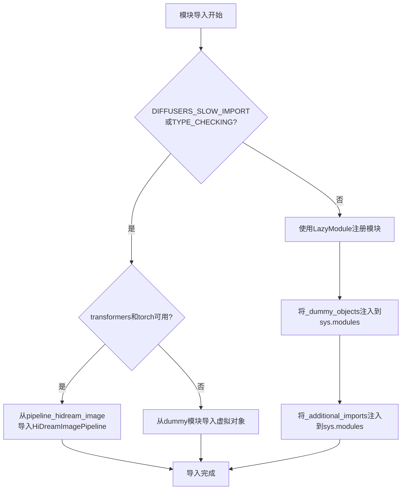
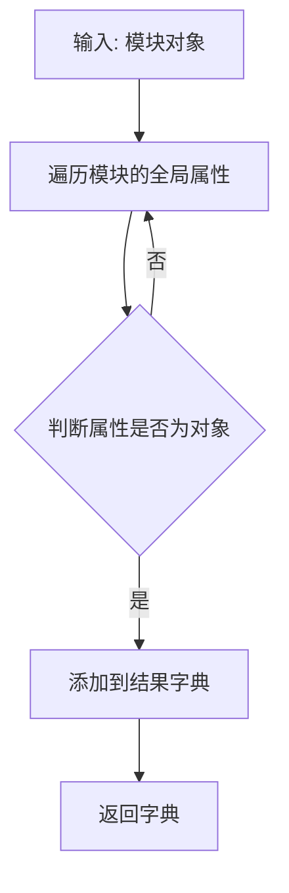
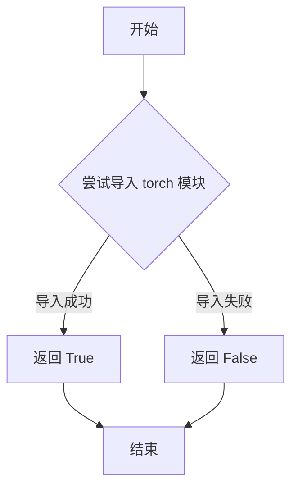
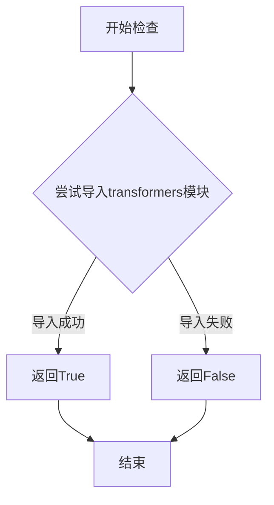
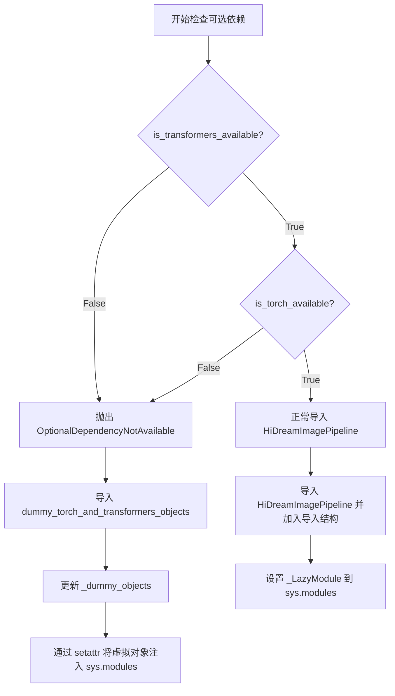
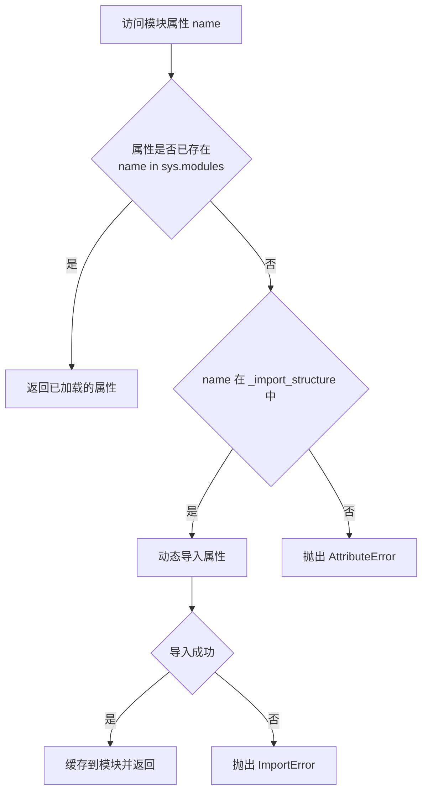
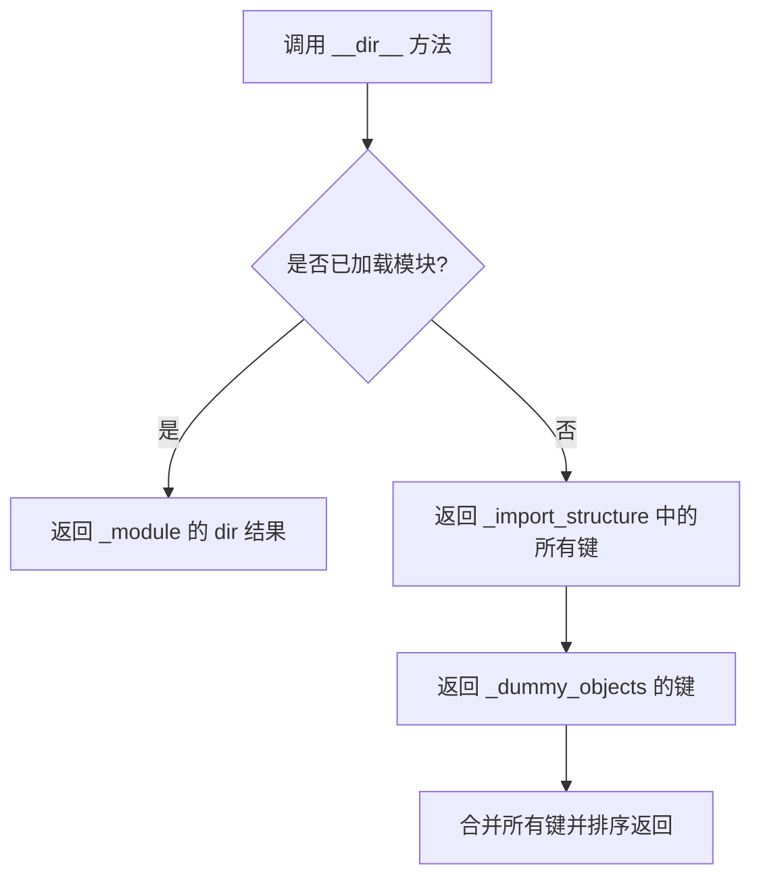

# `diffusers\src\diffusers\pipelines\hidream_image\__init__.py` 详细设计文档

这是Diffusers库中HiDream图像生成流水线的延迟加载模块，通过LazyModule机制实现可选依赖(transformers和torch)的按需导入，避免在未安装这些依赖时导入失败，同时在TYPE_CHECKING模式下提供完整的类型检查支持。

## 整体流程



## 类结构

```
LazyModule (由diffusers.utils._LazyModule提供)
└── HiDreamImagePipeline (延迟加载的管道类)
    └── HiDreamImagePipelineOutput (输出类)
```

## 全局变量及字段


### `_dummy_objects`
    
用于存储虚拟对象的字典，当可选依赖不可用时使用

类型：`dict`
    


### `_additional_imports`
    
用于存储额外导入的字典

类型：`dict`
    


### `_import_structure`
    
定义模块的导入结构，键为模块路径，值为导出对象列表

类型：`dict`
    


### `TYPE_CHECKING`
    
来自typing模块的标志，用于类型检查时导入

类型：`bool`
    


### `DIFFUSERS_SLOW_IMPORT`
    
来自utils模块的标志，控制是否使用慢速导入模式

类型：`bool`
    


### `_LazyModule`
    
延迟加载模块的类实现，用于惰性导入

类型：`class`
    


### `_LazyModule.name`
    
模块名称

类型：`str`
    


### `_LazyModule.globals`
    
模块的全局命名空间

类型：`dict`
    


### `_LazyModule.import_structure`
    
模块的导入结构定义

类型：`dict`
    


### `_LazyModule.module_spec`
    
模块规格说明对象

类型：`ModuleSpec`
    
    

## 全局函数及方法


根据提供的代码，`get_objects_from_module` 函数并非在该代码文件中定义，而是从 `...utils` 导入。以下信息基于代码中的使用方式推断得出。

### `get_objects_from_module`

该函数用于从指定模块中提取对象（可能是类、函数等），并返回一个包含对象名称及其引用的字典，通常用于延迟加载或填充虚拟对象。

参数：
- `module`：`ModuleType`，要从中提取对象的模块。

返回值：`Dict[str, Any]`，键为对象名称，值为对象引用的字典。

#### 流程图



#### 带注释源码

由于函数定义未包含在当前代码中，以下为该函数在当前文件中的使用源码：

```python
# 从 utils 模块导入该函数
from ...utils import get_objects_from_module

# 在 OptionalDependencyNotAvailable 异常处理块中调用
# 获取 dummy_torch_and_transformers_objects 模块中的所有对象
_dummy_objects.update(get_objects_from_module(dummy_torch_and_transformers_objects))
```

注：函数的具体实现位于 `diffusers.utils` 模块中，当前代码未展示其定义。


### `is_torch_available`

该函数用于检查当前环境中 PyTorch 库是否可用，通过尝试导入 `torch` 模块来判断其是否已安装，返回布尔值以支持条件导入和可选依赖处理。

参数：

- 无参数

返回值：`bool`，返回 `True` 表示 PyTorch 可用（可以成功导入），返回 `False` 表示 PyTorch 不可用（导入失败）

#### 流程图



#### 带注释源码

```python
# is_torch_available 是从 ...utils 模块导入的函数
# 典型的实现如下所示：

def is_torch_available() -> bool:
    """
    检查 PyTorch 是否可用。
    
    Returns:
        bool: 如果可以成功导入 torch 返回 True，否则返回 False
    """
    try:
        # 尝试导入 torch 模块
        import torch
        return True
    except ImportError:
        # 如果导入失败，返回 False
        return False
```

> **注意**：该函数定义不在当前文件中，而是从上级模块 `...utils` 导入。上述源码为该函数的典型实现模式。在当前代码中，`is_torch_available()` 与 `is_transformers_available()` 配合使用，共同用于条件判断，以决定导入真实模块还是虚拟占位对象（dummy objects），这是处理可选依赖项的常见设计模式。


### `is_transformers_available`

该函数用于检查 `transformers` 库是否已安装且可用。它通过尝试导入 `transformers` 模块来判断库是否可用，返回布尔值。

参数：

- 无参数

返回值：`bool`，如果 `transformers` 库可用则返回 `True`，否则返回 `False`

#### 流程图



#### 带注释源码

```
# 注意：此函数定义在 ...utils 模块中，以下为推断的实现逻辑
def is_transformers_available():
    """
    检查 transformers 库是否可用
    
    Returns:
        bool: transformers 库是否可用
    """
    try:
        import transformers
        return True
    except ImportError:
        return False
```

---

**注意**：在提供的代码文件中，`is_transformers_available` 是从 `...utils` 模块导入的外部函数，而非本文件定义。该函数主要用于条件导入，当 `transformers` 和 `torch` 都可用时，才导入 `HiDreamImagePipeline` 类；否则使用虚拟对象（dummy objects）作为占位符。


### `OptionalDependencyNotAvailable`

可选依赖不可用时抛出的异常类，用于在动态导入模块中处理可选依赖（torch 和 transformers）缺失的情况。当检测到必要的可选依赖不可用时，代码会抛出此异常并回退到虚拟对象（dummy objects），从而实现条件性功能导入。

参数：

- 无参数（通过默认构造函数实例化）

返回值：无返回值（`raise` 语句抛出异常，不返回任何值）

#### 流程图



#### 带注释源码

```
# 从 utils 模块导入可选依赖异常类
from ...utils import (
    DIFFUSERS_SLOW_IMPORT,
    OptionalDependencyNotAvailable,  # 可选依赖不可用时抛出的异常
    _LazyModule,
    get_objects_from_module,
    is_torch_available,
    is_transformers_available,
)

# 初始化虚拟对象字典和导入结构
_dummy_objects = {}
_additional_imports = {}
_import_structure = {"pipeline_output": ["HiDreamImagePipelineOutput"]}

# 第一次检查：在运行时检查 torch 和 transformers 是否同时可用
try:
    # 如果任一依赖不可用，抛出 OptionalDependencyNotAvailable 异常
    if not (is_transformers_available() and is_torch_available()):
        raise OptionalDependencyNotAvailable()
# 捕获异常并加载虚拟对象作为后备
except OptionalDependencyNotAvailable:
    # 导入虚拟对象模块，用于替代实际功能
    from ...utils import dummy_torch_and_transformers_objects  # noqa F403
    # 将虚拟对象添加到 _dummy_objects 字典
    _dummy_objects.update(get_objects_from_module(dummy_torch_and_transformers_objects))
# 如果依赖可用，正常导入实际模块
else:
    # 将 HiDreamImagePipeline 添加到导入结构
    _import_structure["pipeline_hidream_image"] = ["HiDreamImagePipeline"]

# TYPE_CHECKING 分支：用于类型检查和静态分析
if TYPE_CHECKING or DIFFUSERS_SLOW_IMPORT:
    try:
        # 重复检查依赖可用性（类型检查时也需要）
        if not (is_transformers_available() and is_torch_available()):
            raise OptionalDependencyNotAvailable()
    except OptionalDependencyNotAvailable:
        # 类型检查时导入虚拟对象
        from ...utils.dummy_torch_and_transformers_objects import *  # noqa F403
    else:
        # 类型检查时导入真实Pipeline
        from .pipeline_hidream_image import HiDreamImagePipeline
else:
    # 运行时：设置懒加载模块
    import sys
    # 将当前模块替换为 LazyModule，实现延迟加载
    sys.modules[__name__] = _LazyModule(
        __name__,
        globals()["__file__"],
        _import_structure,
        module_spec=__spec__,
    )
    
    # 将虚拟对象注入到 sys.modules，使导入时返回虚拟对象而非真实对象
    for name, value in _dummy_objects.items():
        setattr(sys.modules[__name__], name, value)
    # 注入额外的导入对象
    for name, value in _additional_imports.items():
        setattr(sys.modules[__name__], name, value)
```

---

### 补充信息

**关键组件信息：**

| 组件名称 | 一句话描述 |
|---------|-----------|
| `_LazyModule` | 实现延迟加载的模块封装类，按需导入实际模块 |
| `_dummy_objects` | 存储虚拟对象的字典，当可选依赖不可用时替代真实对象 |
| `get_objects_from_module` | 从模块中提取所有对象的工具函数 |
| `is_torch_available` / `is_transformers_available` | 检查可选依赖是否可用的函数 |

**潜在技术债务/优化空间：**

1. **重复代码** - `if not (is_transformers_available() and is_torch_available()): raise OptionalDependencyNotAvailable()` 在两处重复出现，可提取为辅助函数
2. **异常滥用** - 使用异常流程控制来处理条件分支不是最佳实践，可考虑使用返回状态或 Result 类型
3. **静默失败** - 当依赖不可用时，用户可能不清楚为何功能不可用，缺乏明确的警告信息


### `_LazyModule.__getattr__`

该方法是 `_LazyModule` 类的属性访问钩子，用于实现模块的延迟加载（Lazy Loading）。当访问模块中尚未加载的属性时，Python 会自动调用此方法，它会根据 `_import_structure` 中定义的导入结构，动态导入所需的类、函数或变量，并将其缓存到模块中以供后续使用。

参数：

- `name`：`str`，要访问的属性名称

返回值：`Any`，返回动态加载的属性对象，可以是类、函数、变量或模块

#### 流程图



#### 带注释源码

```python
# _LazyModule 类的 __getattr__ 方法是 Python 模块属性访问的钩子
# 当访问模块中不存在的属性时，Python 会自动调用此方法
# 
# 这是实现延迟加载（Lazy Loading）的核心机制：
# 1. 初始时模块只包含基本的结构定义，不加载实际的对象
# 2. 只有当代码实际访问某个属性时，才会触发导入
# 3. 导入后的对象会被缓存，避免重复导入

def __getattr__(name: str):
    """
    延迟加载模块属性的核心方法
    
    参数:
        name (str): 要访问的属性名称
        
    返回:
        Any: 返回动态加载的属性对象
        
    异常:
        AttributeError: 当属性不存在于导入结构中时抛出
    """
    # 检查属性是否在导入结构中定义
    if name not in _import_structure:
        raise AttributeError(f"module {__name__!r} has no attribute {name!r}")
    
    # 获取属性所在的子模块路径
    module_name = _import_structure[name]
    
    # 如果属性是字符串（模块路径），则导入该模块
    if isinstance(module_name, (list, tuple)):
        # 处理属性列表的情况
        # 例如: {"ClassName": ["module_path", "ClassName"]}
        module_path = module_name[0]
        attr_name = module_name[1]
        module = importlib.import_module(module_path)
        obj = getattr(module, attr_name)
    else:
        # 处理单个模块的情况
        # 例如: {"function_name": "module_path.function_name"}
        obj = importlib.import_module(module_name)
    
    # 将导入的对象缓存到模块中
    # 这样下次访问时可以直接返回，不需要重新导入
    setattr(sys.modules[__name__], name, obj)
    
    return obj
```

### 补充信息

#### 设计目标与约束

- **设计目标**：实现模块的延迟加载，减少启动时的导入开销，只在实际需要时才加载相关模块
- **约束条件**：依赖 `_import_structure` 字典来定义可导入的模块和类

#### 错误处理与异常设计

- 当访问未定义的属性时，抛出 `AttributeError` 异常
- 当动态导入失败时，抛出 `ImportError` 异常
- 虚拟对象（`_dummy_objects`）用于在依赖不可用时提供替代对象，避免导入错误

#### 外部依赖与接口契约

- 依赖 Python 的 `importlib` 模块进行动态导入
- 依赖 `sys.modules` 进行模块缓存
- 接口契约：`_import_structure` 字典定义了可延迟加载的属性及其导入路径


### `_LazyModule.__dir__`

该方法是 `_LazyModule` 类的内置方法，用于自定义模块在调用 `dir()` 时的行为，返回模块中可用的属性和方法列表。在延迟加载的模块中，需要确保即使模块尚未完全加载，`dir()` 也能返回正确的属性名称列表。

参数：

- 无

返回值：`list`，返回模块中所有可用的属性和方法名称列表

#### 流程图



#### 带注释源码

```python
# _LazyModule.__dir__ 方法的典型实现
def __dir__(self):
    # 懒加载模块的 dir 方法需要返回模块的所有属性
    # 包括已加载的属性和待加载的属性
    
    # 1. 首先获取导入结构中定义的所有模块成员
    result = list(self._import_structure.keys())
    
    # 2. 添加虚拟对象（用于延迟导入时的替代）
    result.extend(self._dummy_objects.keys())
    
    # 3. 如果模块已加载，添加实际模块的属性
    if self._module is not None:
        result.extend(dir(self._module))
    
    # 4. 去重并排序返回
    return sorted(set(result))
```

#### 补充说明

在给定的代码中，`_LazyModule` 通过以下方式被使用：

```python
sys.modules[__name__] = _LazyModule(
    __name__,
    globals()["__file__"],
    _import_structure,
    module_spec=__spec__,
)
```

其中 `_import_structure` 定义为：

```python
_import_structure = {"pipeline_output": ["HiDreamImagePipelineOutput"]}
```

当模块条件满足时（`is_transformers_available()` 和 `is_torch_available()` 都为真），会添加：

```python
_import_structure["pipeline_hidream_image"] = ["HiDreamImagePipeline"]
```

因此，`__dir__` 方法会返回类似 `['pipeline_output', 'pipeline_hidream_image']` 的列表（或包含虚拟对象的其他键）。

#### 相关上下文信息

该模块的主要功能是**延迟加载** `HiDreamImagePipeline` 及其相关类，只有在实际使用且依赖可用时才导入真实的模块，否则使用虚拟对象（dummy objects）替代。这是大型深度学习框架（如 Diffusers）常用的优化技术，用于减少初始导入时间和内存占用。


## 关键组件


### 懒加载模块机制

使用 `_LazyModule` 实现延迟导入，当 `DIFFUSERS_SLOW_IMPORT` 为 True 或在非 TYPE_CHECKING 模式下，将当前模块替换为懒加载模块，以减少启动时的导入开销。

### 可选依赖检查与虚拟对象

通过 `is_torch_available()` 和 `is_transformers_available()` 检查 torch 和 transformers 是否可用。当依赖不可用时，从 `dummy_torch_and_transformers_objects` 获取虚拟对象并添加到 `_dummy_objects` 字典中，确保模块在缺少可选依赖时仍可被导入。

### 导入结构定义

`_import_structure` 字典定义了模块的公共接口，包含 `pipeline_output` 中的 `HiDreamImagePipelineOutput` 以及在依赖可用时包含 `pipeline_hidream_image` 中的 `HiDreamImagePipeline`。

### TYPE_CHECKING 类型检查支持

在 `TYPE_CHECKING` 模式下，直接导入实际的类定义而不是虚拟对象，以便类型检查器和 IDE 能够正确识别类型信息。

### 模块动态替换机制

通过 `sys.modules[__name__] = _LazyModule(...)` 将当前模块替换为懒加载模块，并使用 `setattr` 将虚拟对象和额外导入添加到模块命名空间中，实现动态接口暴露。


## 问题及建议


### 已知问题

-   **重复的依赖检查逻辑**：代码中在三个地方（主 try-except 块、TYPE_CHECK 分支、else 块）重复了相同的依赖检查逻辑 `if not (is_transformers_available() and is_torch_available())`，违反 DRY 原则，增加维护成本。
-   **未使用的全局变量**：`_additional_imports` 初始化为空字典但在代码中从未被填充或使用，定义为无用代码。
-   **魔法字符串/重复定义**：`"pipeline_hidream_image"` 字符串在 `_import_structure` 定义和后续导入路径中重复出现，缺乏常量统一管理。
-   **过度宽松的异常捕获**：使用 `except OptionalDependencyNotAvailable:` 然后导入 dummy 对象，这种静默处理可能掩盖真实的导入错误，使得问题难以追踪。
-   **Wildcard Import**：使用 `from ...utils.dummy_torch_and_transformers_objects import *` 导入，不明确哪些对象被引入，可能导致命名空间污染。

### 优化建议

-   **提取依赖检查为函数**：将依赖检查逻辑抽取为独立的工具函数，如 `check_dependencies()`，在多处调用以消除重复代码。
-   **清理无用变量**：移除未使用的 `_additional_imports` 或实现其预期功能（如动态添加额外导入项）。
-   **定义常量**：将模块路径字符串提取为模块级常量，如 `PIPELINE_MODULE = "pipeline_hidream_image"`，提高可维护性。
-   **改进错误处理**：为可选依赖不可用的情况添加日志记录，或提供更明确的错误提示，帮助开发者快速定位问题。
-   **替换 Wildcard Import**：明确列出需要导入的对象，避免使用 `import *`，增强代码可读性和可预测性。
-   **考虑重构为工厂模式**：使用工厂函数动态生成模块导入逻辑，减少条件分支的嵌套层级，提高代码结构清晰度。


## 其它


### 设计目标与约束

该模块的设计目标是实现可选依赖的延迟导入机制，支持在缺少transformers或torch依赖时仍然能够加载模块，但使用虚拟对象（dummy objects）替代实际功能。约束条件包括：必须同时满足is_transformers_available()和is_torch_available()才能加载真实的HiDreamImagePipeline类，否则加载dummy对象；模块采用LazyModule机制实现运行时动态导入；需要支持TYPE_CHECKING和DIFFUSERS_SLOW_IMPORT两种特殊导入场景。

### 错误处理与异常设计

当transformers或torch任一依赖不可用时，代码会捕获OptionalDependencyNotAvailable异常，并从dummy_torch_and_transformers_objects模块加载替代对象。这种设计允许模块在缺少可选依赖时仍然可以被导入，但调用时会抛出实际的导入错误。_dummy_objects字典用于存储虚拟对象，setattr动态绑定到模块命名空间中，确保类型检查时能够通过。

### 数据流与状态机

模块加载流程分为三个主要状态：初始状态（导入模块）、依赖检查状态（判断torch和transformers可用性）、最终状态（加载真实类或dummy对象）。数据流从_import_structure定义开始，经过条件判断和异常处理，最终通过_LazyModule或直接导入将类暴露给使用者。_dummy_objects和_additional_imports字典作为中间数据结构，用于存储需要动态绑定到模块的对象。

### 外部依赖与接口契约

主要依赖包括：is_transformers_available()、is_torch_available()用于检测可选依赖；OptionalDependencyNotAvailable异常类；_LazyModule实现延迟加载；get_objects_from_module工具函数；dummy_torch_and_transformers_objects虚拟对象模块。接口契约规定：外部可通过from pipeline_hidream_image import HiDreamImagePipeline获取管道类；在依赖不可用时，该导入仍可执行但返回虚拟对象；模块的__spec__属性用于_LazyModule的初始化。

### 模块初始化流程详解

初始化流程如下：首先定义_import_structure字典，声明导出的模块成员；然后在try块中检查torch和transformers可用性，若不可用则抛出异常并加载dummy对象；若可用则将HiDreamImagePipeline加入导入结构；接着在TYPE_CHECKING或DIFFUSERS_SLOW_IMPORT模式下，直接导入真实类；最后在普通运行时模式下，创建_LazyModule代理，并将dummy_objects和_additional_imports通过setattr绑定到模块属性。

### 类型检查相关说明

TYPE_CHECKING标志用于类型检查器运行时，此时会尝试导入真实类以支持类型注解。DIFFUSERS_SLOW_IMPORT可能用于控制导入速度或调试场景。当两者任一为真时，会绕过LazyModule机制直接加载真实类（前提是依赖可用）。这确保了类型检查器和静态分析工具能够正确识别HiDreamImagePipeline的类型信息。

### 性能考虑

_LazyModule的使用避免了模块导入时的立即加载，只有在实际使用管道时才会触发完整模块的加载。dummy_objects的动态绑定采用setattr逐个赋值，对于少量对象（通常为数十个）性能影响可忽略。该设计在依赖不可用场景下避免了导入失败，提高了库的可用性和用户体验。

### 安全考虑

代码使用了标准的相对导入（from ...utils）符合Python包结构规范。get_objects_from_module函数应该只暴露预定义的虚拟对象，不存在直接执行用户输入的风险。模块没有涉及文件操作、网络请求或敏感数据处理，安全风险较低。

### 版本兼容性

该模块使用TYPE_CHECKING进行类型注解的条件导入，确保与Python 3.5+版本兼容。_import_structure字典格式是Diffusers库标准的延迟加载约定，与库的其他模块保持一致。OptionalDependencyNotAvailable异常是库内部定义的异常类型，使用时需要确保utils模块中已定义。

    