# `diffusers\src\diffusers\pipelines\hidream_image\pipeline_hidream_image.py` 详细设计文档

HiDreamImagePipeline 是一个基于扩散模型的图像生成管道，通过结合多个文本编码器（CLIP、T5、Llama）将文本提示转换为高质量图像。管道支持多提示输入、条件引导（classifier-free guidance）、LoRA权重加载等功能，并通过变换器和VAE模型完成去噪和图像解码过程。

## 整体流程

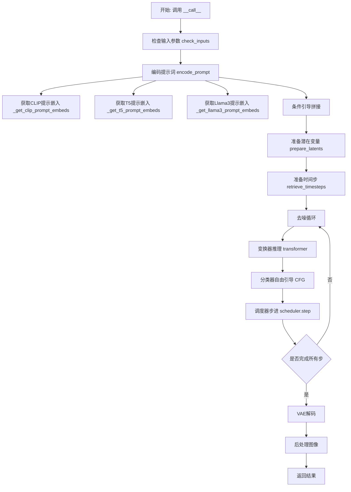

## 类结构

```
DiffusionPipeline (基类)
HiDreamImageLoraLoaderMixin (Mixin类)
└── HiDreamImagePipeline (主类)
```

## 全局变量及字段


### `XLA_AVAILABLE`
    
标记是否支持TPU/XLA加速

类型：`bool`
    


### `logger`
    
模块级日志记录器，用于输出警告和信息

类型：`logging.Logger`
    


### `EXAMPLE_DOC_STRING`
    
包含pipeline使用示例的文档字符串

类型：`str`
    


### `HiDreamImagePipeline.scheduler`
    
控制扩散模型去噪过程的调度器

类型：`FlowMatchEulerDiscreteScheduler`
    


### `HiDreamImagePipeline.vae`
    
变分自编码器，用于潜在空间与图像空间的相互转换

类型：`AutoencoderKL`
    


### `HiDreamImagePipeline.text_encoder`
    
第一个CLIP文本编码器，将文本转换为嵌入向量

类型：`CLIPTextModelWithProjection`
    


### `HiDreamImagePipeline.tokenizer`
    
第一个CLIP分词器，用于对文本进行分词

类型：`CLIPTokenizer`
    


### `HiDreamImagePipeline.text_encoder_2`
    
第二个CLIP文本编码器，用于额外的文本编码

类型：`CLIPTextModelWithProjection`
    


### `HiDreamImagePipeline.tokenizer_2`
    
第二个CLIP分词器，用于额外的文本分词

类型：`CLIPTokenizer`
    


### `HiDreamImagePipeline.text_encoder_3`
    
T5文本编码器，用于长文本序列编码

类型：`T5EncoderModel`
    


### `HiDreamImagePipeline.tokenizer_3`
    
T5分词器，用于T5编码器的文本处理

类型：`T5Tokenizer`
    


### `HiDreamImagePipeline.text_encoder_4`
    
Llama因果语言模型，用于高级文本嵌入生成

类型：`LlamaForCausalLM`
    


### `HiDreamImagePipeline.tokenizer_4`
    
Llama的快速预训练分词器

类型：`PreTrainedTokenizerFast`
    


### `HiDreamImagePipeline.transformer`
    
核心图像变换模型，执行潜在空间的去噪预测

类型：`HiDreamImageTransformer2DModel`
    


### `HiDreamImagePipeline.vae_scale_factor`
    
VAE缩放因子，用于计算潜在空间尺寸

类型：`int`
    


### `HiDreamImagePipeline.image_processor`
    
VAE图像后处理器，用于解码后的图像处理

类型：`VaeImageProcessor`
    


### `HiDreamImagePipeline.default_sample_size`
    
默认采样尺寸，用于生成图像的默认分辨率

类型：`int`
    


### `HiDreamImagePipeline.model_cpu_offload_seq`
    
模型CPU卸载顺序，定义模型加载到CPU的序列

类型：`str`
    


### `HiDreamImagePipeline._callback_tensor_inputs`
    
回调函数可访问的张量输入列表

类型：`list`
    


### `HiDreamImagePipeline._guidance_scale`
    
分类器自由引导比例，控制文本引导强度

类型：`float`
    


### `HiDreamImagePipeline._attention_kwargs`
    
注意力机制参数字典，传递给注意力处理器

类型：`dict`
    


### `HiDreamImagePipeline._num_timesteps`
    
推理步骤数，记录去噪过程的总步数

类型：`int`
    


### `HiDreamImagePipeline._interrupt`
    
中断标志，用于控制生成过程的中断

类型：`bool`
    
    

## 全局函数及方法


### `calculate_shift`

该函数是一个全局工具函数，通过线性插值算法根据输入的图像序列长度计算对应的偏移量（mu值），用于调整扩散模型调度器的时间步计划。这种自适应调整可以在不同分辨率或序列长度下优化采样质量。

参数：

- `image_seq_len`：`int`，图像序列长度，即输入图像经过分块处理后的序列token数量
- `base_seq_len`：`int`（默认值 256），基础序列长度，作为线性插值的左端点参考
- `max_seq_len`：`int`（默认值 4096），最大序列长度，作为线性插值的右端点参考
- `base_shift`：`float`（默认值 0.5），基础偏移量，对应基础序列长度位置的偏移值
- `max_shift`：`float`（默认值 1.15），最大偏移量，对应最大序列长度位置的偏移值

返回值：`float`，计算得到的偏移量 mu 值，用于传递给调度器的 shift 参数

#### 流程图

```mermaid
flowchart TD
    A[开始 calculate_shift] --> B[计算斜率 m]
    B --> C[计算截距 b]
    C --> D[计算 mu = image_seq_len * m + b]
    D --> E[返回 mu]
    
    B1[公式: m = (max_shift - base_shift) / (max_seq_len - base_seq_len)] -.-> B
    C1[公式: b = base_shift - m * base_seq_len] -.-> C
```

#### 带注释源码

```python
# Copied from diffusers.pipelines.flux.pipeline_flux.calculate_shift
def calculate_shift(
    image_seq_len,          # 图像序列长度，输入参数
    base_seq_len: int = 256,   # 基础序列长度，默认256
    max_seq_len: int = 4096,   # 最大序列长度，默认4096
    base_shift: float = 0.5,   # 基础偏移量，默认0.5
    max_shift: float = 1.15,   # 最大偏移量，默认1.15
):
    """
    通过线性插值计算图像序列长度对应的偏移量。
    
    该函数实现了一个线性映射：将图像序列长度 [base_seq_len, max_seq_len] 
    映射到偏移量范围 [base_shift, max_shift]。这用于调整扩散调度器的
    时间步分布，以适应不同分辨率图像的处理需求。
    
    Args:
        image_seq_len: 目标图像的序列长度
        base_seq_len: 参考基础序列长度（默认256）
        max_seq_len: 参考最大序列长度（默认4096）
        base_shift: 基础序列长度对应的偏移量（默认0.5）
        max_shift: 最大序列长度对应的偏移量（默认1.15）
    
    Returns:
        float: 计算得到的偏移量 mu 值
    """
    # 计算线性函数的斜率 m
    # m = (max_shift - base_shift) / (max_seq_len - base_seq_len)
    m = (max_shift - base_shift) / (max_seq_len - base_seq_len)
    
    # 计算线性函数的截距 b，使得函数经过点 (base_seq_len, base_shift)
    # b = base_shift - m * base_seq_len
    b = base_shift - m * base_seq_len
    
    # 根据图像序列长度计算最终的偏移量 mu
    # mu = image_seq_len * m + b
    mu = image_seq_len * m + b
    
    return mu
```


### `retrieve_timesteps`

该函数是 DiffusionPipeline 的辅助函数，用于调用调度器的 `set_timesteps` 方法并从调度器中检索时间步。它支持自定义时间步和自定义 sigma 值，并处理不同调度器的兼容性检查。

参数：

- `scheduler`：`SchedulerMixin`，要获取时间步的调度器
- `num_inference_steps`：`int | None`，生成样本时使用的扩散步数，如果使用此参数，`timesteps` 必须为 `None`
- `device`：`str | torch.device | None`，时间步要移动到的设备，如果为 `None`，时间步不会移动
- `timesteps`：`list[int] | None`，用于覆盖调度器时间步间隔策略的自定义时间步，如果传入此参数，`num_inference_steps` 和 `sigmas` 必须为 `None`
- `sigmas`：`list[float] | None`，用于覆盖调度器时间步间隔策略的自定义 sigmas，如果传入此参数，`num_inference_steps` 和 `timesteps` 必须为 `None`
- `**kwargs`：任意关键字参数，将传递给 `scheduler.set_timesteps`

返回值：`tuple[torch.Tensor, int]`，元组第一个元素是调度器的时间步调度，第二个元素是推理步数

#### 流程图

```mermaid
flowchart TD
    A[开始 retrieve_timesteps] --> B{检查 timesteps 和 sigmas 是否同时存在}
    B -->|是| C[抛出 ValueError: 只能选择 timesteps 或 sigmas 之一]
    B -->|否| D{检查 timesteps 是否存在}
    
    D -->|是| E[检查 scheduler.set_timesteps 是否支持 timesteps 参数]
    E -->|不支持| F[抛出 ValueError: 当前调度器不支持自定义 timesteps]
    E -->|支持| G[调用 scheduler.set_timesteps&#40;timesteps=timesteps, device=device, **kwargs&#41;]
    G --> H[获取 scheduler.timesteps]
    H --> I[计算 num_inference_steps = len&#40;timesteps&#41;]
    
    D -->|否| J{检查 sigmas 是否存在}
    
    J -->|是| K[检查 scheduler.set_timesteps 是否支持 sigmas 参数]
    K -->|不支持| L[抛出 ValueError: 当前调度器不支持自定义 sigmas]
    K -->|支持| M[调用 scheduler.set_timesteps&#40;sigmas=sigmas, device=device, **kwargs&#41;]
    M --> N[获取 scheduler.timesteps]
    N --> O[计算 num_inference_steps = len&#40;timesteps&#41;]
    
    J -->|否| P[调用 scheduler.set_timesteps&#40;num_inference_steps, device=device, **kwargs&#41;]
    P --> Q[获取 scheduler.timesteps]
    
    I --> R[返回 timesteps, num_inference_steps]
    O --> R
    Q --> R
    R --> S[结束]
```

#### 带注释源码

```python
# Copied from diffusers.pipelines.stable_diffusion.pipeline_stable_diffusion.retrieve_timesteps
def retrieve_timesteps(
    scheduler,
    num_inference_steps: int | None = None,
    device: str | torch.device | None = None,
    timesteps: list[int] | None = None,
    sigmas: list[float] | None = None,
    **kwargs,
):
    r"""
    Calls the scheduler's `set_timesteps` method and retrieves timesteps from the scheduler after the call. Handles
    custom timesteps. Any kwargs will be supplied to `scheduler.set_timesteps`.

    Args:
        scheduler (`SchedulerMixin`):
            The scheduler to get timesteps from.
        num_inference_steps (`int`):
            The number of diffusion steps used when generating samples with a pre-trained model. If used, `timesteps`
            must be `None`.
        device (`str` or `torch.device`, *optional*):
            The device to which the timesteps should be moved to. If `None`, the timesteps are not moved.
        timesteps (`list[int]`, *optional*):
            Custom timesteps used to override the timestep spacing strategy of the scheduler. If `timesteps` is passed,
            `num_inference_steps` and `sigmas` must be `None`.
        sigmas (`list[float]`, *optional*):
            Custom sigmas used to override the timestep spacing strategy of the scheduler. If `sigmas` is passed,
            `num_inference_steps` and `timesteps` must be `None`.

    Returns:
        `tuple[torch.Tensor, int]`: A tuple where the first element is the timestep schedule from the scheduler and the
        second element is the number of inference steps.
    """
    # 检查是否同时传入了 timesteps 和 sigmas，两者只能选其一
    if timesteps is not None and sigmas is not None:
        raise ValueError("Only one of `timesteps` or `sigmas` can be passed. Please choose one to set custom values")
    
    # 处理自定义 timesteps 的情况
    if timesteps is not None:
        # 通过 inspect 检查调度器的 set_timesteps 方法是否支持 timesteps 参数
        accepts_timesteps = "timesteps" in set(inspect.signature(scheduler.set_timesteps).parameters.keys())
        if not accepts_timesteps:
            raise ValueError(
                f"The current scheduler class {scheduler.__class__}'s `set_timesteps` does not support custom"
                f" timestep schedules. Please check whether you are using the correct scheduler."
            )
        # 调用调度器的 set_timesteps 方法设置自定义时间步
        scheduler.set_timesteps(timesteps=timesteps, device=device, **kwargs)
        # 从调度器获取设置后的时间步
        timesteps = scheduler.timesteps
        # 计算推理步数
        num_inference_steps = len(timesteps)
    # 处理自定义 sigmas 的情况
    elif sigmas is not None:
        # 通过 inspect 检查调度器的 set_timesteps 方法是否支持 sigmas 参数
        accept_sigmas = "sigmas" in set(inspect.signature(scheduler.set_timesteps).parameters.keys())
        if not accept_sigmas:
            raise ValueError(
                f"The current scheduler class {scheduler.__class__}'s `set_timesteps` does not support custom"
                f" sigmas schedules. Please check whether you are using the correct scheduler."
            )
        # 调用调度器的 set_timesteps 方法设置自定义 sigmas
        scheduler.set_timesteps(sigmas=sigmas, device=device, **kwargs)
        # 从调度器获取设置后的时间步
        timesteps = scheduler.timesteps
        # 计算推理步数
        num_inference_steps = len(timesteps)
    # 处理默认情况：使用 num_inference_steps 设置时间步
    else:
        scheduler.set_timesteps(num_inference_steps, device=device, **kwargs)
        timesteps = scheduler.timesteps
    
    # 返回时间步张量和推理步数
    return timesteps, num_inference_steps
```


### HiDreamImagePipeline.__init__

该方法是 `HiDreamImagePipeline` 类的构造函数，用于初始化一个完整的图像生成管道。它接收多个预训练的模型组件（包括 VAE、多个文本编码器/分词器、调度器和 Transformer），并将它们注册到管道中，同时配置图像处理器的缩放因子和默认采样尺寸。

参数：

- `scheduler`：`FlowMatchEulerDiscreteScheduler`，调度器，用于控制扩散模型的采样过程
- `vae`：`AutoencoderKL`，变分自编码器，用于将潜在空间表示解码为图像
- `text_encoder`：`CLIPTextModelWithProjection`，第一个 CLIP 文本编码器
- `tokenizer`：`CLIPTokenizer`，第一个 CLIP 分词器
- `text_encoder_2`：`CLIPTextModelWithProjection`，第二个 CLIP 文本编码器
- `tokenizer_2`：`CLIPTokenizer`，第二个 CLIP 分词器
- `text_encoder_3`：`T5EncoderModel`，T5 文本编码器
- `tokenizer_3`：`T5Tokenizer`，T5 分词器
- `text_encoder_4`：`LlamaForCausalLM`，Llama 文本编码器
- `tokenizer_4`：`PreTrainedTokenizerFast`，Llama 分词器
- `transformer`：`HiDreamImageTransformer2DModel`，图像变换器模型

返回值：无（`None`），构造函数不返回任何值

#### 流程图

```mermaid
flowchart TD
    A[开始 __init__] --> B[调用 super().__init__]
    B --> C[调用 self.register_modules 注册所有模型组件]
    C --> D[计算 vae_scale_factor]
    D --> E[创建 VaeImageProcessor]
    E --> F[设置 default_sample_size = 128]
    F --> G{检查 tokenizer_4 是否存在}
    G -->|是| H[设置 tokenizer_4 的 pad_token 为 eos_token]
    G -->|否| I[结束]
    H --> I
```

#### 带注释源码

```python
def __init__(
    self,
    scheduler: FlowMatchEulerDiscreteScheduler,
    vae: AutoencoderKL,
    text_encoder: CLIPTextModelWithProjection,
    tokenizer: CLIPTokenizer,
    text_encoder_2: CLIPTextModelWithProjection,
    tokenizer_2: CLIPTokenizer,
    text_encoder_3: T5EncoderModel,
    tokenizer_3: T5Tokenizer,
    text_encoder_4: LlamaForCausalLM,
    tokenizer_4: PreTrainedTokenizerFast,
    transformer: HiDreamImageTransformer2DModel,
):
    """
    初始化 HiDreamImagePipeline 的构造函数
    
    参数:
        scheduler: 扩散模型的调度器
        vae: 变分自编码器模型
        text_encoder: 第一个 CLIP 文本编码器
        tokenizer: 第一个 CLIP 分词器
        text_encoder_2: 第二个 CLIP 文本编码器
        tokenizer_2: 第二个 CLIP 分词器
        text_encoder_3: T5 文本编码器
        tokenizer_3: T5 分词器
        text_encoder_4: Llama 文本编码器
        tokenizer_4: Llama 分词器
        transformer: 图像变换器模型
    """
    # 调用父类 DiffusionPipeline 的初始化方法
    super().__init__()

    # 将所有模型组件注册到管道中，使其可以通过 self.xxx 访问
    self.register_modules(
        vae=vae,
        text_encoder=text_encoder,
        text_encoder_2=text_encoder_2,
        text_encoder_3=text_encoder_3,
        text_encoder_4=text_encoder_4,
        tokenizer=tokenizer,
        tokenizer_2=tokenizer_2,
        tokenizer_3=tokenizer_3,
        tokenizer_4=tokenizer_4,
        scheduler=scheduler,
        transformer=transformer,
    )
    
    # 计算 VAE 缩放因子，用于调整潜在空间的尺寸
    # 基于 VAE 块输出通道数的深度计算 2 的幂次
    self.vae_scale_factor = (
        2 ** (len(self.vae.config.block_out_channels) - 1) if hasattr(self, "vae") and self.vae is not None else 8
    )
    
    # HiDreamImage 的潜在变量被转换为 2x2 的 patch 并打包
    # 这意味着潜在宽度和高度必须能被 patch 大小整除
    # 因此 vae_scale_factor 乘以 2 来考虑这一点
    self.image_processor = VaeImageProcessor(vae_scale_factor=self.vae_scale_factor * 2)
    
    # 设置默认采样尺寸
    self.default_sample_size = 128
    
    # 如果存在 tokenizer_4，将 pad_token 设置为 eos_token
    if getattr(self, "tokenizer_4", None) is not None:
        self.tokenizer_4.pad_token = self.tokenizer_4.eos_token
```


### `HiDreamImagePipeline._get_t5_prompt_embeds`

该方法使用 T5 文本编码器将文本提示转换为嵌入向量（prompt embeddings）。它首先对输入的提示进行 tokenize 处理（使用 T5 tokenizer），然后通过 T5 编码器获取文本的嵌入表示，处理截断警告，最后将结果转换为指定的 dtype 和 device 格式返回。

参数：

- `prompt`：`str | list[str] = None`，输入的文本提示，可以是单个字符串或字符串列表
- `max_sequence_length`：`int = 128`，最大序列长度，默认128个token
- `device`：`torch.device | None = None`，计算设备，如果为 None 则使用执行设备
- `dtype`：`torch.dtype | None = None`，数据类型，如果为 None 则使用 text_encoder_3 的数据类型

返回值：`torch.FloatTensor`，T5 模型生成的 prompt embeddings 张量

#### 流程图

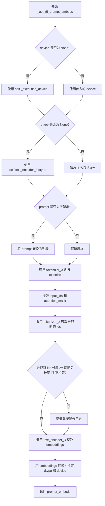

#### 带注释源码

```python
def _get_t5_prompt_embeds(
    self,
    prompt: str | list[str] = None,
    max_sequence_length: int = 128,
    device: torch.device | None = None,
    dtype: torch.dtype | None = None,
):
    # 确定设备：如果未指定，则使用执行设备
    device = device or self._execution_device
    # 确定数据类型：如果未指定，则使用 text_encoder_3 的数据类型
    dtype = dtype or self.text_encoder_3.dtype

    # 统一输入格式：将字符串转换为单元素列表
    prompt = [prompt] if isinstance(prompt, str) else prompt

    # 使用 T5 tokenizer 对 prompt 进行编码
    # padding="max_length": 填充到最大长度
    # max_length: 取用户指定长度和 tokenizer 支持的最大长度中的较小值
    # truncation=True: 截断超过最大长度的序列
    # add_special_tokens=True: 添加特殊 tokens（如 <pad>, </s> 等）
    # return_tensors="pt": 返回 PyTorch 张量
    text_inputs = self.tokenizer_3(
        prompt,
        padding="max_length",
        max_length=min(max_sequence_length, self.tokenizer_3.model_max_length),
        truncation=True,
        add_special_tokens=True,
        return_tensors="pt",
    )
    # 提取 tokenized 后的 input IDs 和 attention mask
    text_input_ids = text_inputs.input_ids
    attention_mask = text_inputs.attention_mask
    
    # 获取未截断的 token IDs（使用最长 padding）用于检测是否发生了截断
    untruncated_ids = self.tokenizer_3(prompt, padding="longest", return_tensors="pt").input_ids

    # 检查是否发生了截断，如果是则记录警告信息
    if untruncated_ids.shape[-1] >= text_input_ids.shape[-1] and not torch.equal(text_input_ids, untruncated_ids):
        # 解码被截断的部分用于日志显示
        removed_text = self.tokenizer_3.batch_decode(
            untruncated_ids[:, min(max_sequence_length, self.tokenizer_3.model_max_length) - 1 : -1]
        )
        logger.warning(
            "The following part of your input was truncated because `max_sequence_length` is set to "
            f" {min(max_sequence_length, self.tokenizer_3.model_max_length)} tokens: {removed_text}"
        )

    # 使用 T5 编码器获取文本的嵌入表示
    # 传入 token IDs 和 attention mask
    prompt_embeds = self.text_encoder_3(text_input_ids.to(device), attention_mask=attention_mask.to(device))[0]
    # 将 embeddings 转换为指定的 dtype 和 device
    prompt_embeds = prompt_embeds.to(dtype=dtype, device=device)
    # 返回生成的 prompt embeddings
    return prompt_embeds
```


### `HiDreamImagePipeline._get_clip_prompt_embeds`

该方法用于将文本提示（prompt）通过CLIP文本编码器编码为文本嵌入向量（prompt embeddings），支持处理单个字符串或字符串列表，并返回池化后的文本嵌入张量。

参数：

- `self`：隐式参数，HiDreamImagePipeline类的实例
- `tokenizer`：`CLIPTokenizer`，用于将文本提示 token 化
- `text_encoder`：`CLIPTextModelWithProjection`，用于将 token IDs 编码为文本嵌入
- `prompt`：`str | list[str]`，要编码的文本提示，可以是单个字符串或字符串列表
- `max_sequence_length`：`int = 128`，最大序列长度，默认为128，但实际受CLIP模型限制（218 tokens）
- `device`：`torch.device | None = None`，计算设备，若为None则使用执行设备
- `dtype`：`torch.dtype | None = None`，返回张量的数据类型，若为None则使用text_encoder的数据类型

返回值：`torch.FloatTensor`，编码后的文本嵌入向量，形状为 `[batch_size, seq_len, hidden_dim]`

#### 流程图

```mermaid
flowchart TD
    A[开始 _get_clip_prompt_embeds] --> B{device是否为None}
    B -- 是 --> C[使用 self._execution_device]
    B -- 否 --> D[使用传入的device]
    C --> E{dtype是否为None}
    D --> E
    E -- 是 --> F[使用 text_encoder.dtype]
    E -- 否 --> G[使用传入的dtype]
    F --> H
    G --> H
    H{prompt是否为字符串}
    H -- 是 --> I[将prompt包装为列表]
    H -- 否 --> J[保持原样]
    I --> K
    J --> K
    K[使用tokenizer对prompt进行token化] --> L[设置padding=max_length, max_length=min{max_sequence_length, 218}, truncation=True]
    L --> M[获取text_input_ids]
    N[使用tokenizer获取未截断的IDs] --> O{未截断IDs长度>=截断IDs长度 且 不相等}
    O -- 是 --> P[解码被截断的部分并记录警告日志]
    O -- 否 --> Q
    P --> Q
    Q[调用text_encoder获取文本嵌入] --> R[设置output_hidden_states=True]
    R --> S[提取pooled output: prompt_embeds0]
    S --> T[转换为指定dtype和device]
    U[返回 prompt_embeds]
```

#### 带注释源码

```python
def _get_clip_prompt_embeds(
    self,
    tokenizer,
    text_encoder,
    prompt: str | list[str],
    max_sequence_length: int = 128,
    device: torch.device | None = None,
    dtype: torch.dtype | None = None,
):
    """
    将文本提示编码为CLIP文本嵌入向量。
    
    参数:
        tokenizer: CLIP分词器，用于将文本转换为token IDs
        text_encoder: CLIP文本编码器模型
        prompt: 输入的文本提示，支持单个字符串或字符串列表
        max_sequence_length: 最大序列长度限制
        device: 指定计算设备，默认为None则使用执行设备
        dtype: 指定返回张量的数据类型，默认为None则使用text_encoder的数据类型
    
    返回:
        编码后的文本嵌入张量
    """
    # 确定设备：如果未指定，则使用pipeline的默认执行设备
    device = device or self._execution_device
    # 确定数据类型：如果未指定，则使用text_encoder的数据类型
    dtype = dtype or text_encoder.dtype

    # 如果prompt是单个字符串，则转换为列表以统一处理
    prompt = [prompt] if isinstance(prompt, str) else prompt

    # 使用tokenizer对prompt进行token化
    # padding="max_length": 将所有序列填充到相同长度
    # max_length: 取用户指定值和218的较小值（CLIP模型最大支持218个tokens）
    # truncation=True: 超过最大长度的序列将被截断
    # return_tensors="pt": 返回PyTorch张量
    text_inputs = tokenizer(
        prompt,
        padding="max_length",
        max_length=min(max_sequence_length, 218),
        truncation=True,
        return_tensors="pt",
    )

    # 获取token化后的input IDs
    text_input_ids = text_inputs.input_ids
    
    # 使用padding="longest"获取未截断的token IDs，用于检测是否发生了截断
    untruncated_ids = tokenizer(prompt, padding="longest", return_tensors="pt").input_ids
    
    # 检查是否发生了截断：如果未截断的IDs长度大于截断后的长度，且两者不相等
    if untruncated_ids.shape[-1] >= text_input_ids.shape[-1] and not torch.equal(text_input_ids, untruncated_ids):
        # 解码被截断的部分以便记录警告信息
        removed_text = tokenizer.batch_decode(untruncated_ids[:, 218 - 1 : -1])
        logger.warning(
            "The following part of your input was truncated because CLIP can only handle sequences up to"
            f" {218} tokens: {removed_text}"
        )
    
    # 调用text_encoder获取文本嵌入
    # output_hidden_states=True: 返回所有隐藏状态（用于获取pooled output）
    prompt_embeds = text_encoder(text_input_ids.to(device), output_hidden_states=True)

    # 从text_encoder的输出中提取pooled output
    # CLIPTextModelWithProjection的输出是一个元组，索引[0]是pooled output
    # pooled output是[batch_size, hidden_dim]的张量
    prompt_embeds = prompt_embeds[0]
    
    # 将嵌入转换为指定的数据类型和设备
    prompt_embeds = prompt_embeds.to(dtype=dtype, device=device)
    
    return prompt_embeds
```


### `HiDreamImagePipeline._get_llama3_prompt_embeds`

该方法用于使用 Llama3 (Meta-Llama-3.1-8B-Instruct) 文本编码器将文本提示转换为嵌入向量。它接收原始文本输入，通过分词器处理后传入语言模型，提取所有隐藏状态层并堆叠返回多层次的语言表示。

参数：

- `prompt`：`str | list[str]`，待编码的文本提示，可以是单个字符串或字符串列表
- `max_sequence_length`：`int = 128`，最大序列长度，默认为128
- `device`：`torch.device | None`，计算设备，若为None则使用执行设备
- `dtype`：`torch.dtype | None`，输出张量的数据类型，若为None则使用text_encoder_4的数据类型

返回值：`list[torch.FloatTensor]`，返回一个包含所有隐藏状态的列表，形状为 `(num_layers, batch_size, seq_len, hidden_dim)`，其中num_layers为模型层数

#### 流程图

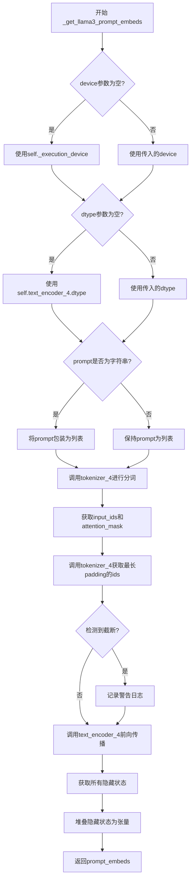

#### 带注释源码

```python
def _get_llama3_prompt_embeds(
    self,
    prompt: str | list[str] = None,
    max_sequence_length: int = 128,
    device: torch.device | None = None,
    dtype: torch.dtype | None = None,
):
    """
    使用 Llama3 文本编码器将文本提示转换为嵌入向量
    
    参数:
        prompt: 输入的文本提示，字符串或字符串列表
        max_sequence_length: 最大序列长度，默认为128
        device: 计算设备
        dtype: 输出数据类型
    
    返回:
        包含所有隐藏状态的列表，堆叠后的形状为 (num_layers, batch_size, seq_len, hidden_dim)
    """
    # 确定设备：优先使用传入的device，否则使用执行设备
    device = device or self._execution_device
    # 确定数据类型：优先使用传入的dtype，否则使用text_encoder_4的数据类型
    dtype = dtype or self.text_encoder_4.dtype

    # 统一将prompt转为列表格式，便于批量处理
    prompt = [prompt] if isinstance(prompt, str) else prompt

    # 使用tokenizer_4对prompt进行分词处理
    # padding="max_length": 填充到最大长度
    # max_length: 限制最大长度，取max_sequence_length和tokenizer_4.model_max_length的较小值
    # truncation=True: 超过最大长度时截断
    # add_special_tokens=True: 添加特殊 tokens (如BOS/EOS)
    # return_tensors="pt": 返回PyTorch张量
    text_inputs = self.tokenizer_4(
        prompt,
        padding="max_length",
        max_length=min(max_sequence_length, self.tokenizer_4.model_max_length),
        truncation=True,
        add_special_tokens=True,
        return_tensors="pt",
    )
    text_input_ids = text_inputs.input_ids      # 分词后的token ids
    attention_mask = text_inputs.attention_mask # 注意力掩码，标识有效token位置
    
    # 获取最长padding的ids，用于检测是否发生了截断
    untruncated_ids = self.tokenizer_4(prompt, padding="longest", return_tensors="pt").input_ids

    # 检测输入是否被截断，如果是则记录警告信息
    if untruncated_ids.shape[-1] >= text_input_ids.shape[-1] and not torch.equal(text_input_ids, untruncated_ids):
        # 解码被截断的部分用于日志输出
        removed_text = self.tokenizer_4.batch_decode(
            untruncated_ids[:, min(max_sequence_length, self.tokenizer_4.model_max_length) - 1 : -1]
        )
        logger.warning(
            "The following part of your input was truncated because `max_sequence_length` is set to "
            f" {min(max_sequence_length, self.tokenizer_4.model_max_length)} tokens: {removed_text}"
        )

    # 调用Llama3文本编码器进行前向传播
    # output_hidden_states=True: 返回所有隐藏状态
    # output_attentions=True: 返回注意力权重（虽然本函数未使用）
    outputs = self.text_encoder_4(
        text_input_ids.to(device),
        attention_mask=attention_mask.to(device),
        output_hidden_states=True,
        output_attentions=True,
    )

    # 提取所有隐藏状态（从第1层开始，跳过embedding层）
    prompt_embeds = outputs.hidden_states[1:]
    # 将各层隐藏状态堆叠为4D张量
    # 形状: (num_layers, batch_size, seq_len, hidden_dim)
    prompt_embeds = torch.stack(prompt_embeds, dim=0)
    return prompt_embeds
```


### HiDreamImagePipeline.encode_prompt

该方法是 HiDreamImagePipeline 类的核心方法之一，负责将文本提示（prompt）编码为多种文本嵌入向量（embeddings），供后续的图像生成模型使用。该方法支持多文本编码器架构（包括 CLIP、T5 和 Llama3），并处理分类器自由引导（Classifier-Free Guidance）所需的正向和负向提示嵌入。

参数：

- `self`：HiDreamImagePipeline 实例本身
- `prompt`：`str | list[str] | None`，主提示词，用于第一个 CLIP 文本编码器
- `prompt_2`：`str | list[str] | None`，第二个提示词，用于第二个 CLIP 文本编码器（默认为 prompt）
- `prompt_3`：`str | list[str] | None`，第三个提示词，用于 T5 文本编码器（默认为 prompt）
- `prompt_4`：`str | list[str] | None`，第四个提示词，用于 Llama3 文本编码器（默认为 prompt）
- `device`：`torch.device | None`，计算设备，默认为执行设备
- `dtype`：`torch.dtype | None`，数据类型，默认为文本编码器的数据类型
- `num_images_per_prompt`：`int = 1`，每个提示词生成的图像数量
- `do_classifier_free_guidance`：`bool = True`，是否启用分类器自由引导
- `negative_prompt`：`str | list[str] | None`，负向提示词，用于第一个 CLIP 编码器
- `negative_prompt_2`：`str | list[str] | None`，负向提示词，用于第二个 CLIP 编码器
- `negative_prompt_3`：`str | list[str] | None`，负向提示词，用于 T5 编码器
- `negative_prompt_4`：`str | list[str] | None`，负向提示词，用于 Llama3 编码器
- `prompt_embeds_t5`：`list[torch.FloatTensor] | None`，预计算的 T5 提示嵌入
- `prompt_embeds_llama3`：`list[torch.FloatTensor] | None`，预计算的 Llama3 提示嵌入
- `negative_prompt_embeds_t5`：`list[torch.FloatTensor] | None`，预计算的 T5 负向提示嵌入
- `negative_prompt_embeds_llama3`：`list[torch.FloatTensor] | None`，预计算的 Llama3 负向提示嵌入
- `pooled_prompt_embeds`：`torch.FloatTensor | None`，预计算的池化提示嵌入
- `negative_pooled_prompt_embeds`：`torch.FloatTensor | None`，预计算的池化负向提示嵌入
- `max_sequence_length`：`int = 128`，最大序列长度
- `lora_scale`：`float | None`，LoRA 权重缩放因子

返回值：`tuple`，包含以下六个元素的元组：

- `prompt_embeds_t5`：`torch.FloatTensor`，T5 编码后的提示嵌入
- `negative_prompt_embeds_t5`：`torch.FloatTensor`，T5 编码后的负向提示嵌入
- `prompt_embeds_llama3`：`list[torch.FloatTensor]`，Llama3 编码后的多层提示嵌入
- `negative_prompt_embeds_llama3`：`list[torch.FloatTensor]`，Llama3 编码后的多层负向提示嵌入
- `pooled_prompt_embeds`：`torch.FloatTensor`，CLIP 池化后的提示嵌入
- `negative_pooled_prompt_embeds`：`torch.FloatTensor`，CLIP 池化后的负向提示嵌入

#### 流程图

```mermaid
flowchart TD
    A[开始 encode_prompt] --> B{检查 prompt 是否为字符串}
    B -->|是| C[将 prompt 转换为列表]
    B -->|否| D{prompt 是否为 None}
    C --> E[获取 batch_size]
    D -->|否| E
    D -->|是| F[从 pooled_prompt_embeds 获取 batch_size]
    E --> G[确定 device 和 dtype]
    G --> H{pooled_prompt_embeds 为空?}
    H -->|是| I[调用 _get_clip_prompt_embeds 获取 pooled_prompt_embeds_1]
    H -->|否| J
    I --> K{do_classifier_free_guidance 为真且 negative_pooled_prompt_embeds 为空?}
    K -->|是| L[处理负向提示]
    K -->|否| M
    L --> N[调用 _get_clip_prompt_embeds 获取 negative_pooled_prompt_embeds_1]
    N --> O{pooled_prompt_embeds_1 批量为1且batch_size大于1?}
    O -->|是| P[重复 negative_pooled_prompt_embeds_1]
    O -->|否| M
    P --> M
    M --> Q{pooled_prompt_embeds 为空?}
    Q -->|是| R[处理 prompt_2]
    Q -->|否| S
    R --> T[调用 _get_clip_prompt_embeds 获取 pooled_prompt_embeds_2]
    T --> U[重复 pooled_prompt_embeds_2]
    U --> V{do_classifier_free_guidance 为真且 negative_pooled_prompt_embeds 为空?}
    V -->|是| W[处理 negative_prompt_2]
    W --> X[调用 _get_clip_prompt_embeds 获取 negative_pooled_prompt_embeds_2]
    X --> Y[重复 negative_pooled_prompt_embeds_2]
    Y --> S
    V -->|否| S
    S --> Z[拼接 pooled_prompt_embeds_1 和 pooled_prompt_embeds_2]
    Z --> AA{do_classifier_free_guidance 为真且 negative_pooled_prompt_embeds 为空?}
    AA -->|是| AB[拼接负向池化嵌入]
    AA -->|否| AC
    AB --> AC
    AC --> AD{prompt_embeds_t5 为空?}
    AD -->|是| AE[处理 prompt_3]
    AD -->|否| AF
    AE --> AG[调用 _get_t5_prompt_embeds 获取 prompt_embeds_t5]
    AG --> AH[重复 prompt_embeds_t5]
    AH --> AI{do_classifier_free_guidance 为真且 negative_prompt_embeds_t5 为空?}
    AI -->|是| AJ[处理 negative_prompt_3]
    AJ --> AK[调用 _get_t5_prompt_embeds 获取 negative_prompt_embeds_t5]
    AK --> AL[重复 negative_prompt_embeds_t5]
    AL --> AF
    AI -->|否| AF
    AF --> AM{prompt_embeds_llama3 为空?}
    AM -->|是| AN[处理 prompt_4]
    AM -->|否| AO
    AN --> AO
    AO --> AP[调用 _get_llama3_prompt_embeds 获取 prompt_embeds_llama3]
    AP --> AQ[重复 prompt_embeds_llama3]
    AQ --> AR{do_classifier_free_guidance 为真且 negative_prompt_embeds_llama3 为空?}
    AR -->|是| AS[处理 negative_prompt_4]
    AS --> AT[调用 _get_llama3_prompt_embeds 获取 negative_prompt_embeds_llama3]
    AT --> AU[重复 negative_prompt_embeds_llama3]
    AU --> AO
    AR -->|否| AO
    AO --> AV[重复 pooled_prompt_embeds]
    AV --> AW[重复 t5 prompt embeds]
    AW --> AX[重复 llama3 prompt embeds]
    AX --> AY{do_classifier_free_guidance 为真?}
    AY -->|是| AZ[重复负向嵌入]
    AY -->|否| BA
    AZ --> BA
    BA --> BB[返回六个嵌入元组]
```

#### 带注释源码

```
def encode_prompt(
    self,
    prompt: str | list[str] | None = None,          # 主提示词（CLIP 编码器 1）
    prompt_2: str | list[str] | None = None,         # 第二提示词（CLIP 编码器 2）
    prompt_3: str | list[str] | None = None,         # 第三提示词（T5 编码器）
    prompt_4: str | list[str] | None = None,         # 第四提示词（Llama3 编码器）
    device: torch.device | None = None,              # 计算设备
    dtype: torch.dtype | None = None,                # 数据类型
    num_images_per_prompt: int = 1,                  # 每提示生成的图像数
    do_classifier_free_guidance: bool = True,       # 是否启用 CFG
    negative_prompt: str | list[str] | None = None,  # 负向提示（CLIP 1）
    negative_prompt_2: str | list[str] | None = None,# 负向提示（CLIP 2）
    negative_prompt_3: str | list[str] | None = None,# 负向提示（T5）
    negative_prompt_4: str | list[str] | None = None,# 负向提示（Llama3）
    prompt_embeds_t5: list[torch.FloatTensor] | None = None,       # 预计算 T5 嵌入
    prompt_embeds_llama3: list[torch.FloatTensor] | None = None,   # 预计算 Llama3 嵌入
    negative_prompt_embeds_t5: list[torch.FloatTensor] | None = None,    # 预计算 T5 负向嵌入
    negative_prompt_embeds_llama3: list[torch.FloatTensor] | None = None,# 预计算 Llama3 负向嵌入
    pooled_prompt_embeds: torch.FloatTensor | None = None,    # 预计算池化嵌入
    negative_pooled_prompt_embeds: torch.FloatTensor | None = None,# 预计算负向池化嵌入
    max_sequence_length: int = 128,                 # 最大序列长度
    lora_scale: float | None = None,                 # LoRA 缩放因子
):
    # 步骤 1: 标准化输入
    # 将字符串 prompt 转换为列表，便于批量处理
    prompt = [prompt] if isinstance(prompt, str) else prompt
    
    # 步骤 2: 确定批次大小
    # 如果提供了 prompt，则从 prompt 列表长度获取 batch_size
    # 否则从预计算的 pooled_prompt_embeds 的第一维获取
    if prompt is not None:
        batch_size = len(prompt)
    else:
        batch_size = pooled_prompt_embeds.shape[0]

    # 步骤 3: 确定设备
    # 如果未指定 device，则使用当前执行设备
    device = device or self._execution_device

    # 步骤 4: 获取第一个 CLIP 编码器的池化嵌入（pooled_prompt_embeds_1）
    # 如果未提供预计算的 pooled_prompt_embeds，则需要计算
    if pooled_prompt_embeds is None:
        pooled_prompt_embeds_1 = self._get_clip_prompt_embeds(
            self.tokenizer, self.text_encoder, prompt, max_sequence_length, device, dtype
        )

    # 步骤 5: 处理分类器自由引导的负向提示（CLIP 1）
    # 当启用 CFG 且未提供负向池化嵌入时进行处理
    if do_classifier_free_guidance and negative_pooled_prompt_embeds is None:
        # 确保 negative_prompt 有值（空字符串）
        negative_prompt = negative_prompt or ""
        # 标准化为列表
        negative_prompt = [negative_prompt] if isinstance(negative_prompt, str) else negative_prompt

        # 验证长度一致性
        if len(negative_prompt) > 1 and len(negative_prompt) != batch_size:
            raise ValueError(f"negative_prompt must be of length 1 or {batch_size}")

        # 获取负向池化嵌入
        negative_pooled_prompt_embeds_1 = self._get_clip_prompt_embeds(
            self.tokenizer, self.text_encoder, negative_prompt, max_sequence_length, device, dtype
        )

        # 如果 batch_size 大于 1但嵌入只有 1个，则重复以匹配 batch_size
        if negative_pooled_prompt_embeds_1.shape[0] == 1 and batch_size > 1:
            negative_pooled_prompt_embeds_1 = negative_pooled_prompt_embeds_1.repeat(batch_size, 1)

    # 步骤 6: 获取第二个 CLIP 编码器的池化嵌入（pooled_prompt_embeds_2）
    # prompt_2 默认为 prompt
    if pooled_prompt_embeds is None:
        prompt_2 = prompt_2 or prompt
        prompt_2 = [prompt_2] if isinstance(prompt_2, str) else prompt_2

        if len(prompt_2) > 1 and len(prompt_2) != batch_size:
            raise ValueError(f"prompt_2 must be of length 1 or {batch_size}")

        pooled_prompt_embeds_2 = self._get_clip_prompt_embeds(
            self.tokenizer_2, self.text_encoder_2, prompt_2, max_sequence_length, device, dtype
        )

        if pooled_prompt_embeds_2.shape[0] == 1 and batch_size > 1:
            pooled_prompt_embeds_2 = pooled_prompt_embeds_2.repeat(batch_size, 1)

    # 步骤 7: 处理第二个 CLIP 编码器的负向提示
    if do_classifier_free_guidance and negative_pooled_prompt_embeds is None:
        negative_prompt_2 = negative_prompt_2 or negative_prompt
        negative_prompt_2 = [negative_prompt_2] if isinstance(negative_prompt_2, str) else negative_prompt_2

        if len(negative_prompt_2) > 1 and len(negative_prompt_2) != batch_size:
            raise ValueError(f"negative_prompt_2 must be of length 1 or {batch_size}")

        negative_pooled_prompt_embeds_2 = self._get_clip_prompt_embeds(
            self.tokenizer_2, self.text_encoder_2, negative_prompt_2, max_sequence_length, device, dtype
        )

        if negative_pooled_prompt_embeds_2.shape[0] == 1 and batch_size > 1:
            negative_pooled_prompt_embeds_2 = negative_pooled_prompt_embeds_2.repeat(batch_size, 1)

    # 步骤 8: 拼接两个 CLIP 编码器的池化嵌入
    if pooled_prompt_embeds is None:
        pooled_prompt_embeds = torch.cat([pooled_prompt_embeds_1, pooled_prompt_embeds_2], dim=-1)

    # 步骤 9: 拼接两个 CLIP 编码器的负向池化嵌入
    if do_classifier_free_guidance and negative_pooled_prompt_embeds is None:
        negative_pooled_prompt_embeds = torch.cat(
            [negative_pooled_prompt_embeds_1, negative_pooled_prompt_embeds_2], dim=-1
        )

    # 步骤 10: 获取 T5 编码器的提示嵌入
    if prompt_embeds_t5 is None:
        prompt_3 = prompt_3 or prompt
        prompt_3 = [prompt_3] if isinstance(prompt_3, str) else prompt_3

        if len(prompt_3) > 1 and len(prompt_3) != batch_size:
            raise ValueError(f"prompt_3 must be of length 1 or {batch_size}")

        prompt_embeds_t5 = self._get_t5_prompt_embeds(prompt_3, max_sequence_length, device, dtype)

        if prompt_embeds_t5.shape[0] == 1 and batch_size > 1:
            prompt_embeds_t5 = prompt_embeds_t5.repeat(batch_size, 1, 1)

    # 步骤 11: 获取 T5 编码器的负向提示嵌入
    if do_classifier_free_guidance and negative_prompt_embeds_t5 is None:
        negative_prompt_3 = negative_prompt_3 or negative_prompt
        negative_prompt_3 = [negative_prompt_3] if isinstance(negative_prompt_3, str) else negative_prompt_3

        if len(negative_prompt_3) > 1 and len(negative_prompt_3) != batch_size:
            raise ValueError(f"negative_prompt_3 must be of length 1 or {batch_size}")

        negative_prompt_embeds_t5 = self._get_t5_prompt_embeds(
            negative_prompt_3, max_sequence_length, device, dtype
        )

        if negative_prompt_embeds_t5.shape[0] == 1 and batch_size > 1:
            negative_prompt_embeds_t5 = negative_prompt_embeds_t5.repeat(batch_size, 1, 1)

    # 步骤 12: 获取 Llama3 编码器的提示嵌入
    if prompt_embeds_llama3 is None:
        prompt_4 = prompt_4 or prompt
        prompt_4 = [prompt_4] if isinstance(prompt_4, str) else prompt_4

        if len(prompt_4) > 1 and len(prompt_4) != batch_size:
            raise ValueError(f"prompt_4 must be of length 1 or {batch_size}")

        prompt_embeds_llama3 = self._get_llama3_prompt_embeds(prompt_4, max_sequence_length, device, dtype)

        if prompt_embeds_llama3.shape[0] == 1 and batch_size > 1:
            # Llama3 嵌入形状特殊：(num_layers, batch, seq_len, dim)，需要相应重复
            prompt_embeds_llama3 = prompt_embeds_llama3.repeat(1, batch_size, 1, 1)

    # 步骤 13: 获取 Llama3 编码器的负向提示嵌入
    if do_classifier_free_guidance and negative_prompt_embeds_llama3 is None:
        negative_prompt_4 = negative_prompt_4 or negative_prompt
        negative_prompt_4 = [negative_prompt_4] if isinstance(negative_prompt_4, str) else negative_prompt_4

        if len(negative_prompt_4) > 1 and len(negative_prompt_4) != batch_size:
            raise ValueError(f"negative_prompt_4 must be of length 1 or {batch_size}")

        negative_prompt_embeds_llama3 = self._get_llama3_prompt_embeds(
            negative_prompt_4, max_sequence_length, device, dtype
        )

        if negative_prompt_embeds_llama3.shape[0] == 1 and batch_size > 1:
            negative_prompt_embeds_llama3 = negative_prompt_embeds_llama3.repeat(1, batch_size, 1, 1)

    # 步骤 14: 根据 num_images_per_prompt 复制所有嵌入
    # 复制 pooled_prompt_embeds
    pooled_prompt_embeds = pooled_prompt_embeds.repeat(1, num_images_per_prompt)
    pooled_prompt_embeds = pooled_prompt_embeds.view(batch_size * num_images_per_prompt, -1)

    # 复制 T5 prompt embeds
    bs_embed, seq_len, _ = prompt_embeds_t5.shape
    if bs_embed == 1 and batch_size > 1:
        prompt_embeds_t5 = prompt_embeds_t5.repeat(batch_size, 1, 1)
    elif bs_embed > 1 and bs_embed != batch_size:
        raise ValueError(f"cannot duplicate prompt_embeds_t5 of batch size {bs_embed}")
    prompt_embeds_t5 = prompt_embeds_t5.repeat(1, num_images_per_prompt, 1)
    prompt_embeds_t5 = prompt_embeds_t5.view(batch_size * num_images_per_prompt, seq_len, -1)

    # 复制 Llama3 prompt embeds
    _, bs_embed, seq_len, dim = prompt_embeds_llama3.shape
    if bs_embed == 1 and batch_size > 1:
        prompt_embeds_llama3 = prompt_embeds_llama3.repeat(1, batch_size, 1, 1)
    elif bs_embed > 1 and bs_embed != batch_size:
        raise ValueError(f"cannot duplicate prompt_embeds_llama3 of batch size {bs_embed}")
    prompt_embeds_llama3 = prompt_embeds_llama3.repeat(1, 1, num_images_per_prompt, 1)
    prompt_embeds_llama3 = prompt_embeds_llama3.view(-1, batch_size * num_images_per_prompt, seq_len, dim)

    # 步骤 15: 如果启用 CFG，复制所有负向嵌入
    if do_classifier_free_guidance:
        # 复制 negative_pooled_prompt_embeds
        bs_embed, seq_len = negative_pooled_prompt_embeds.shape
        if bs_embed == 1 and batch_size > 1:
            negative_pooled_prompt_embeds = negative_pooled_prompt_embeds.repeat(batch_size, 1)
        elif bs_embed > 1 and bs_embed != batch_size:
            raise ValueError(f"cannot duplicate negative_pooled_prompt_embeds of batch size {bs_embed}")
        negative_pooled_prompt_embeds = negative_pooled_prompt_embeds.repeat(1, num_images_per_prompt)
        negative_pooled_prompt_embeds = negative_pooled_prompt_embeds.view(batch_size * num_images_per_prompt, -1)

        # 复制 negative_prompt_embeds_t5
        bs_embed, seq_len, _ = negative_prompt_embeds_t5.shape
        if bs_embed == 1 and batch_size > 1:
            negative_prompt_embeds_t5 = negative_prompt_embeds_t5.repeat(batch_size, 1, 1)
        elif bs_embed > 1 and bs_embed != batch_size:
            raise ValueError(f"cannot duplicate negative_prompt_embeds_t5 of batch size {bs_embed}")
        negative_prompt_embeds_t5 = negative_prompt_embeds_t5.repeat(1, num_images_per_prompt, 1)
        negative_prompt_embeds_t5 = negative_prompt_embeds_t5.view(batch_size * num_images_per_prompt, seq_len, -1)

        # 复制 negative_prompt_embeds_llama3
        _, bs_embed, seq_len, dim = negative_prompt_embeds_llama3.shape
        if bs_embed == 1 and batch_size > 1:
            negative_prompt_embeds_llama3 = negative_prompt_embeds_llama3.repeat(1, batch_size, 1, 1)
        elif bs_embed > 1 and bs_embed != batch_size:
            raise ValueError(f"cannot duplicate negative_prompt_embeds_llama3 of batch size {bs_embed}")
        negative_prompt_embeds_llama3 = negative_prompt_embeds_llama3.repeat(1, 1, num_images_per_prompt, 1)
        negative_prompt_embeds_llama3 = negative_prompt_embeds_llama3.view(
            -1, batch_size * num_images_per_prompt, seq_len, dim
        )

    # 步骤 16: 返回所有嵌入元组
    return (
        prompt_embeds_t5,
        negative_prompt_embeds_t5,
        prompt_embeds_llama3,
        negative_prompt_embeds_llama3,
        pooled_prompt_embeds,
        negative_pooled_prompt_embeds,
    )
```


### `HiDreamImagePipeline.enable_vae_slicing`

启用 VAE 分片解码功能。当启用此选项时，VAE 会将输入张量分割成多个切片逐步进行解码计算，以节省内存并支持更大的批量大小。

参数：该方法无显式参数（除隐式 `self`）

返回值：`None`，无返回值

#### 流程图

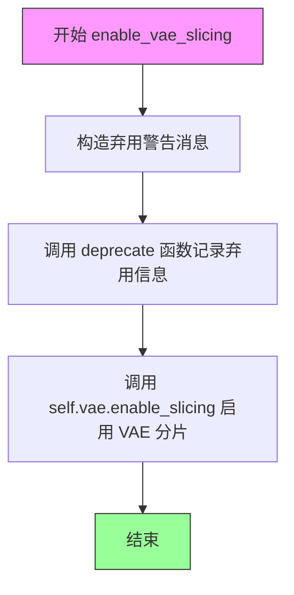

#### 带注释源码

```python
def enable_vae_slicing(self):
    r"""
    Enable sliced VAE decoding. When this option is enabled, the VAE will split the input tensor in slices to
    compute decoding in several steps. This is useful to save some memory and allow larger batch sizes.
    """
    # 构造弃用警告消息，提示用户该方法已废弃
    depr_message = f"Calling `enable_vae_slicing()` on a `{self.__class__.__name__}` is deprecated and this method will be removed in a future version. Please use `pipe.vae.enable_slicing()`."
    
    # 调用 deprecate 函数记录弃用信息，在未来版本中会移除此方法
    deprecate(
        "enable_vae_slicing",     # 废弃的功能名称
        "0.40.0",                  # 将被移除的版本号
        depr_message,             # 弃用警告消息
    )
    
    # 委托给 VAE 模型本身的 enable_slicing 方法执行实际的启用操作
    self.vae.enable_slicing()
```


### `HiDreamImagePipeline.disable_vae_slicing`

禁用 VAE 切片解码功能。如果之前启用了 `enable_vae_slicing`，则此方法将使解码回到单步计算模式。该方法已被弃用，建议直接使用 `pipe.vae.disable_slicing()`。

参数：

- 该方法无显式参数（隐式参数 `self` 为类的实例）

返回值：`None`，无返回值描述

#### 流程图

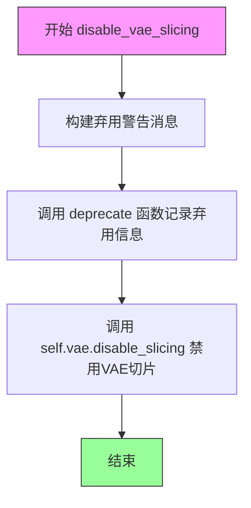

#### 带注释源码

```
def disable_vae_slicing(self):
    r"""
    Disable sliced VAE decoding. If `enable_vae_slicing` was previously enabled, this method will go back to
    computing decoding in one step.
    """
    # 构建弃用警告消息，提示用户该方法将在未来版本中移除
    # 建议用户直接使用 pipe.vae.disable_slicing() 代替
    depr_message = f"Calling `disable_vae_slicing()` on a `{self.__class__.__name__}` is deprecated and this method will be removed in a future version. Please use `pipe.vae.disable_slicing()`."
    
    # 调用 deprecate 函数记录弃用信息，版本号为 0.40.0
    deprecate(
        "disable_vae_slicing",
        "0.40.0",
        depr_message,
    )
    
    # 委托给 VAE 模型的 disable_slicing 方法来实际禁用切片功能
    self.vae.disable_slicing()
```


### `HiDreamImagePipeline.enable_vae_tiling`

启用瓦片 VAE 解码功能。当启用此选项时，VAE 会将输入张量分割成瓦片，以多个步骤计算解码和编码。这对于节省大量内存和处理更大的图像非常有用。

参数： 无

返回值：`None`，无返回值（该方法直接操作 VAE 组件的内部状态）

#### 流程图

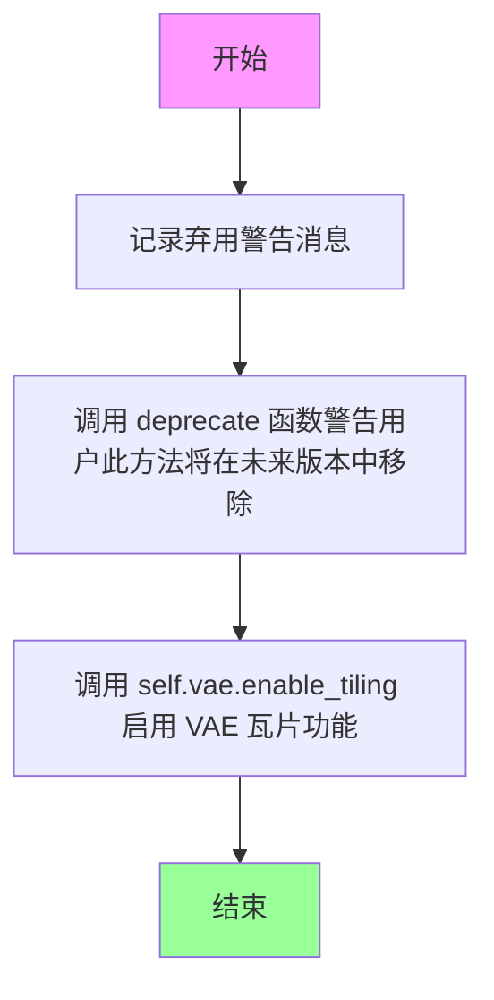

#### 带注释源码

```python
def enable_vae_tiling(self):
    r"""
    Enable tiled VAE decoding. When this option is enabled, the VAE will split the input tensor into tiles to
    compute decoding and encoding in several steps. This is useful for saving a large amount of memory and to allow
    processing larger images.
    """
    # 构建弃用消息，提醒用户此方法已弃用，应使用 pipe.vae.enable_tiling() 代替
    depr_message = f"Calling `enable_vae_tiling()` on a `{self.__class__.__name__}` is deprecated and this method will be removed in a future version. Please use `pipe.vae.enable_tiling()`."
    
    # 调用 deprecate 函数记录弃用警告，版本号为 0.40.0
    deprecate(
        "enable_vae_tiling",
        "0.40.0",
        depr_message,
    )
    
    # 委托给 VAE 对象的 enable_tiling 方法来实际启用瓦片功能
    self.vae.enable_tiling()
```


### `HiDreamImagePipeline.disable_vae_tiling`

禁用 VAE 平铺解码功能。如果之前启用了 `enable_vae_tiling`，此方法将恢复为单步计算解码。此方法已被弃用，将在未来版本中移除，建议直接使用 `pipe.vae.disable_tiling()`。

参数： 无（仅包含隐式参数 `self`）

返回值：`None`，无返回值

#### 流程图

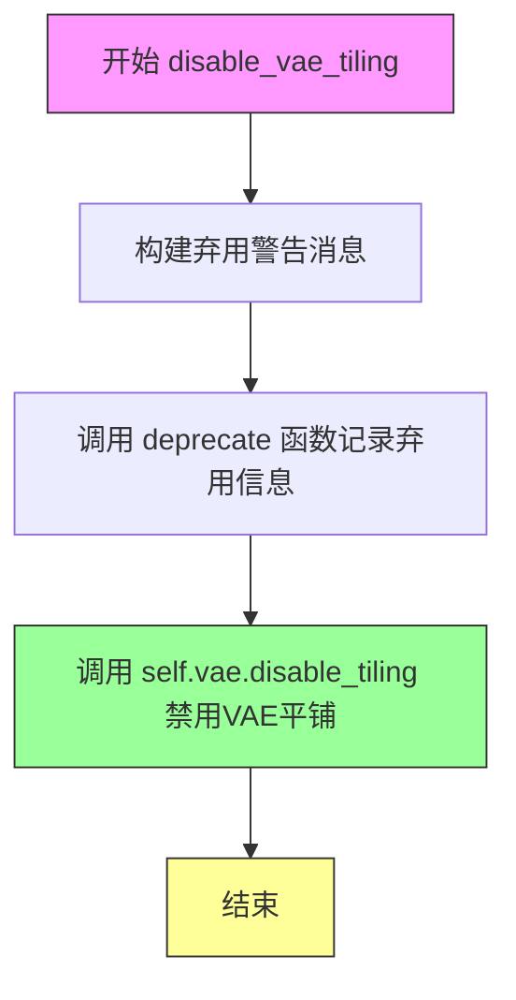

#### 带注释源码

```python
def disable_vae_tiling(self):
    r"""
    Disable tiled VAE decoding. If `enable_vae_tiling` was previously enabled, this method will go back to
    computing decoding in one step.
    """
    # 构建弃用警告消息，告知用户该方法已被弃用，应使用 pipe.vae.disable_tiling() 代替
    depr_message = f"Calling `disable_vae_tiling()` on a `{self.__class__.__name__}` is deprecated and this method will be removed in a future version. Please use `pipe.vae.disable_tiling()`."
    
    # 调用 deprecate 函数记录弃用信息，包括方法名、弃用版本和警告消息
    deprecate(
        "disable_vae_tiling",
        "0.40.0",
        depr_message,
    )
    
    # 调用 VAE 模型的 disable_tiling 方法实际禁用平铺解码功能
    self.vae.disable_tiling()
```


### `HiDreamImagePipeline.check_inputs`

该方法用于验证图像生成管道的输入参数合法性，检查提示词与预计算的嵌入向量之间的互斥关系，确保数据类型正确，以及配对的正向与负面提示词嵌入形状一致，防止因输入错误导致后续处理失败。

参数：

- `prompt`：`str | list[str] | None`，主要提示词，用于第一组CLIP文本编码器
- `prompt_2`：`str | list[str] | None`，第二提示词，用于第二组CLIP文本编码器
- `prompt_3`：`str | list[str] | None`，第三提示词，用于T5文本编码器
- `prompt_4`：`str | list[str] | None`，第四提示词，用于Llama3文本编码器
- `negative_prompt`：`str | list[str] | None`，负面提示词，用于第一组CLIP文本编码器
- `negative_prompt_2`：`str | list[str] | None`，第二负面提示词
- `negative_prompt_3`：`str | list[str] | None`，第三负面提示词，用于T5文本编码器
- `negative_prompt_4`：`str | list[str] | None`，第四负面提示词，用于Llama3文本编码器
- `prompt_embeds_t5`：`list[torch.FloatTensor] | None`，预计算的T5提示词嵌入
- `prompt_embeds_llama3`：`list[torch.FloatTensor] | None`，预计算的Llama3提示词嵌入
- `negative_prompt_embeds_t5`：`list[torch.FloatTensor] | None`，预计算的T5负面提示词嵌入
- `negative_prompt_embeds_llama3`：`list[torch.FloatTensor] | None`，预计算的Llama3负面提示词嵌入
- `pooled_prompt_embeds`：`torch.FloatTensor | None`，池化后的提示词嵌入
- `negative_pooled_prompt_embeds`：`torch.FloatTensor | None`，池化后的负面提示词嵌入
- `callback_on_step_end_tensor_inputs`：`list[str] | None`，步骤结束时回调的张量输入列表

返回值：`None`，该方法不返回任何值，仅通过抛出`ValueError`异常来处理无效输入

#### 流程图

```mermaid
flowchart TD
    A[开始 check_inputs] --> B{检查 callback_on_step_end_tensor_inputs}
    B -->|不合法| C[抛出 ValueError]
    B -->|合法| D{prompt 与 pooled_prompt_embeds 互斥检查}
    D -->|两者都提供| E[抛出 ValueError]
    D -->|合法| F{prompt_2 与 pooled_prompt_embeds 互斥检查}
    F -->|两者都提供| G[抛出 ValueError]
    F -->|合法| H{prompt_3 与 prompt_embeds_t5 互斥检查}
    H -->|两者都提供| I[抛出 ValueError]
    H -->|合法| J{prompt_4 与 prompt_embeds_llama3 互斥检查}
    J -->|两者都提供| K[抛出 ValueError]
    J -->|合法| L{prompt 和 pooled_prompt_embeds 至少提供一个}
    L -->|都未提供| M[抛出 ValueError]
    L -->|已提供| N{prompt_embeds_t5 至少提供一个}
    N -->|都未提供| O[抛出 ValueError]
    N -->|已提供| P{prompt_embeds_llama3 至少提供一个]
    P -->|都未提供| Q[抛出 ValueError]
    P -->|已提供| R{检查各提示词类型合法性}
    R -->|类型不合法| S[抛出 ValueError]
    R -->|类型合法| T{检查负面提示词与嵌入的互斥关系}
    T --> U{检查负面提示词类型合法性}
    U --> V{检查正向与负面嵌入形状一致性}
    V --> W[结束 - 验证通过]
    
    C --> W
    E --> W
    G --> W
    I --> W
    K --> W
    M --> W
    O --> W
    Q --> W
    S --> W
```

#### 带注释源码

```python
def check_inputs(
    self,
    prompt,
    prompt_2,
    prompt_3,
    prompt_4,
    negative_prompt=None,
    negative_prompt_2=None,
    negative_prompt_3=None,
    negative_prompt_4=None,
    prompt_embeds_t5=None,
    prompt_embeds_llama3=None,
    negative_prompt_embeds_t5=None,
    negative_prompt_embeds_llama3=None,
    pooled_prompt_embeds=None,
    negative_pooled_prompt_embeds=None,
    callback_on_step_end_tensor_inputs=None,
):
    """
    验证管道输入参数的合法性。
    
    该方法执行以下检查：
    1. callback_on_step_end_tensor_inputs 是否在允许的列表中
    2. 提示词文本与预计算嵌入不能同时提供（互斥）
    3. 至少需要提供一种提示词输入方式
    4. 提示词类型必须是 str 或 list
    5. 正向与负面提示词嵌入的形状必须一致
    """
    # 检查回调张量输入是否合法
    if callback_on_step_end_tensor_inputs is not None and not all(
        k in self._callback_tensor_inputs for k in callback_on_step_end_tensor_inputs
    ):
        raise ValueError(
            f"`callback_on_step_end_tensor_inputs` has to be in {self._callback_tensor_inputs}, but found {[k for k in callback_on_step_end_tensor_inputs if k not in self._callback_tensor_inputs]}"
        )

    # 检查 prompt 与 pooled_prompt_embeds 互斥
    if prompt is not None and pooled_prompt_embeds is not None:
        raise ValueError(
            f"Cannot forward both `prompt`: {prompt} and `pooled_prompt_embeds`: {pooled_prompt_embeds}. Please make sure to"
            " only forward one of the two."
        )
    # 检查 prompt_2 与 pooled_prompt_embeds 互斥
    elif prompt_2 is not None and pooled_prompt_embeds is not None:
        raise ValueError(
            f"Cannot forward both `prompt_2`: {prompt_2} and `pooled_prompt_embeds`: {pooled_prompt_embeds}. Please make sure to"
            " only forward one of the two."
        )
    # 检查 prompt_3 与 prompt_embeds_t5 互斥
    elif prompt_3 is not None and prompt_embeds_t5 is not None:
        raise ValueError(
            f"Cannot forward both `prompt_3`: {prompt_3} and `prompt_embeds_t5`: {prompt_embeds_t5}. Please make sure to"
            " only forward one of the two."
        )
    # 检查 prompt_4 与 prompt_embeds_llama3 互斥
    elif prompt_4 is not None and prompt_embeds_llama3 is not None:
        raise ValueError(
            f"Cannot forward both `prompt_4`: {prompt_4} and `prompt_embeds_llama3`: {prompt_embeds_llama3}. Please make sure to"
            " only forward one of the two."
        )
    # 检查至少提供 prompt 或 pooled_prompt_embeds 之一
    elif prompt is None and pooled_prompt_embeds is None:
        raise ValueError(
            "Provide either `prompt` or `pooled_prompt_embeds`. Cannot leave both `prompt` and `pooled_prompt_embeds` undefined."
        )
    # 检查至少提供 prompt 或 prompt_embeds_t5 之一
    elif prompt is None and prompt_embeds_t5 is None:
        raise ValueError(
            "Provide either `prompt` or `prompt_embeds_t5`. Cannot leave both `prompt` and `prompt_embeds_t5` undefined."
        )
    # 检查至少提供 prompt 或 prompt_embeds_llama3 之一
    elif prompt is None and prompt_embeds_llama3 is None:
        raise ValueError(
            "Provide either `prompt` or `prompt_embeds_llama3`. Cannot leave both `prompt` and `prompt_embeds_llama3` undefined."
        )
    # 检查 prompt 类型是否为 str 或 list
    elif prompt is not None and (not isinstance(prompt, str) and not isinstance(prompt, list)):
        raise ValueError(f"`prompt` has to be of type `str` or `list` but is {type(prompt)}")
    # 检查 prompt_2 类型
    elif prompt_2 is not None and (not isinstance(prompt_2, str) and not isinstance(prompt_2, list)):
        raise ValueError(f"`prompt_2` has to be of type `str` or `list` but is {type(prompt_2)}")
    # 检查 prompt_3 类型
    elif prompt_3 is not None and (not isinstance(prompt_3, str) and not isinstance(prompt_3, list)):
        raise ValueError(f"`prompt_3` has to be of type `str` or `list` but is {type(prompt_3)}")
    # 检查 prompt_4 类型
    elif prompt_4 is not None and (not isinstance(prompt_4, str) and not isinstance(prompt_4, list)):
        raise ValueError(f"`prompt_4` has to be of type `str` or `list` but is {type(prompt_4)}")

    # 检查负面提示词与负面嵌入的互斥关系
    if negative_prompt is not None and negative_pooled_prompt_embeds is not None:
        raise ValueError(
            f"Cannot forward both `negative_prompt`: {negative_prompt} and `negative_pooled_prompt_embeds`:"
            f" {negative_pooled_prompt_embeds}. Please make sure to only forward one of the two."
        )
    elif negative_prompt_2 is not None and negative_pooled_prompt_embeds is not None:
        raise ValueError(
            f"Cannot forward both `negative_prompt_2`: {negative_prompt_2} and `negative_pooled_prompt_embeds`:"
            f" {negative_pooled_prompt_embeds}. Please make sure to only forward one of the two."
        )
    elif negative_prompt_3 is not None and negative_prompt_embeds_t5 is not None:
        raise ValueError(
            f"Cannot forward both `negative_prompt_3`: {negative_prompt_3} and `negative_prompt_embeds_t5`:"
            f" {negative_prompt_embeds_t5}. Please make sure to only forward one of the two."
        )
    elif negative_prompt_4 is not None and negative_prompt_embeds_llama3 is not None:
        raise ValueError(
            f"Cannot forward both `negative_prompt_4`: {negative_prompt_4} and `negative_prompt_embeds_llama3`:"
            f" {negative_prompt_embeds_llama3}. Please make sure to only forward one of the two."
        )

    # 检查正向和负面池化嵌入形状一致性
    if pooled_prompt_embeds is not None and negative_pooled_prompt_embeds is not None:
        if pooled_prompt_embeds.shape != negative_pooled_prompt_embeds.shape:
            raise ValueError(
                "`pooled_prompt_embeds` and `negative_pooled_prompt_embeds` must have the same shape when passed directly, but"
                f" got: `pooled_prompt_embeds` {pooled_prompt_embeds.shape} != `negative_pooled_prompt_embeds`"
                f" {negative_pooled_prompt_embeds.shape}."
            )
    # 检查 T5 正向和负面嵌入形状一致性
    if prompt_embeds_t5 is not None and negative_prompt_embeds_t5 is not None:
        if prompt_embeds_t5.shape != negative_prompt_embeds_t5.shape:
            raise ValueError(
                "`prompt_embeds_t5` and `negative_prompt_embeds_t5` must have the same shape when passed directly, but"
                f" got: `prompt_embeds_t5` {prompt_embeds_t5.shape} != `negative_prompt_embeds_t5`"
                f" {negative_prompt_embeds_t5.shape}."
            )
    # 检查 Llama3 正向和负面嵌入形状一致性
    if prompt_embeds_llama3 is not None and negative_prompt_embeds_llama3 is not None:
        if prompt_embeds_llama3.shape != negative_prompt_embeds_llama3.shape:
            raise ValueError(
                "`prompt_embeds_llama3` and `negative_prompt_embeds_llama3` must have the same shape when passed directly, but"
                f" got: `prompt_embeds_llama3` {prompt_embeds_llama3.shape} != `negative_prompt_embeds_llama3`"
                f" {negative_prompt_embeds_llama3.shape}."
            )
```


### HiDreamImagePipeline.prepare_latents

该方法负责为图像生成流程准备潜在向量（latents），包括计算合适的潜在空间尺寸、生成随机潜在向量或验证并转移用户提供的潜在向量到目标设备。

参数：

- `batch_size`：`int`，批量大小，决定生成的潜在向量数量
- `num_channels_latents`：`int`，潜在向量的通道数，对应于Transformer模型的输入通道数
- `height`：`int`，目标潜在图像高度（像素单位），方法内部会将其转换为潜在空间维度
- `width`：`int`，目标潜在图像宽度（像素单位），方法内部会将其转换为潜在空间维度
- `dtype`：`torch.dtype`，生成潜在向量的数据类型（如 torch.float32）
- `device`：`torch.device`，生成潜在向量所放置的目标设备（如 cuda 或 cpu）
- `generator`：`torch.Generator`，可选的随机数生成器，用于确保生成的可重复性
- `latents`：`torch.FloatTensor | None`，可选的预生成潜在向量，若为 None 则随机生成

返回值：`torch.FloatTensor`，处理后的潜在向量张量，形状为 (batch_size, num_channels_latents, height, width)

#### 流程图

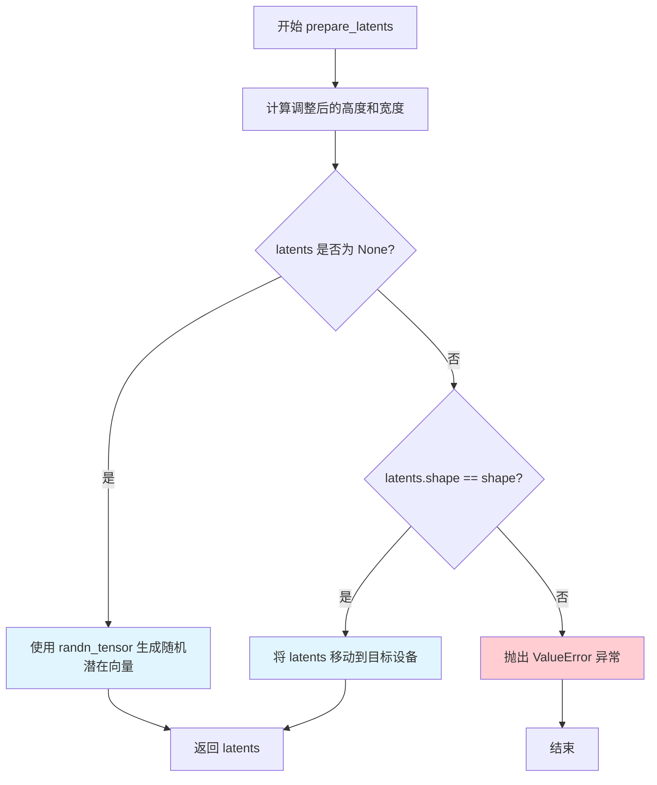

#### 带注释源码

```python
def prepare_latents(
    self,
    batch_size,
    num_channels_latents,
    height,
    width,
    dtype,
    device,
    generator,
    latents=None,
):
    # VAE applies 8x compression on images but we must also account for packing which requires
    # latent height and width to be divisible by 2.
    # VAE 对图像进行 8x 压缩，还需要考虑 packing 机制（要求潜在高度和宽度能被 2 整除）
    height = 2 * (int(height) // (self.vae_scale_factor * 2))
    width = 2 * (int(width) // (self.vae_scale_factor * 2))

    # 构建潜在向量的目标形状：(batch_size, 通道数, 高度, 宽度)
    shape = (batch_size, num_channels_latents, height, width)

    if latents is None:
        # 如果未提供潜在向量，使用 randn_tensor 生成随机潜在向量
        # generator 参数确保可重复性，device 和 dtype 指定输出设备和张量类型
        latents = randn_tensor(shape, generator=generator, device=device, dtype=dtype)
    else:
        # 如果提供了潜在向量，验证其形状是否与预期匹配
        if latents.shape != shape:
            raise ValueError(f"Unexpected latents shape, got {latents.shape}, expected {shape}")
        # 将已有潜在向量移动到目标设备
        latents = latents.to(device)
    return latents
```


### HiDreamImagePipeline.guidance_scale

该属性是HiDreamImagePipeline类的guidance_scale getter属性，用于获取当前pipeline的guidance_scale值，该值控制分类器-free guidance的强度，影响生成图像与提示词的对齐程度。

参数：此属性无显式参数（隐式参数为self）

返回值：`float`，返回当前pipeline的guidance_scale值，用于控制图像生成过程中无分类器引导的强度

#### 流程图

```mermaid
flowchart TD
    A[获取guidance_scale属性] --> B{检查_guidance_scale是否存在}
    B -->|是| C[返回self._guidance_scale的值]
    B -->|否| D[返回默认值或抛出错误]
    
    C --> E[在去噪循环中用于计算:<br/>noise_pred = noise_pred_uncond +<br/>guidance_scale × (noise_pred_text - noise_pred_uncond)]
    
    style C fill:#e1f5fe
    style E fill:#fff3e0
```

#### 带注释源码

```python
@property
def guidance_scale(self):
    """
    HiDreamImagePipeline的guidance_scale属性 getter方法。
    该属性返回当前pipeline的guidance_scale值，用于控制
    分类器-free guidance (CFG) 的强度。
    
    CFG通过以下公式影响去噪过程:
    noise_pred = noise_pred_uncond + guidance_scale * (noise_pred_text - noise_pred_uncond)
    
    较高的guidance_scale值会使生成的图像更紧密地跟随文本提示，
    但可能导致图像质量下降或过度饱和。
    
    Returns:
        float: 分类器-free guidance的缩放因子，通常值大于1时启用CFG，
              值越大表示对提示词的遵循程度越高。
    """
    return self._guidance_scale
```


### `HiDreamImagePipeline.do_classifier_free_guidance`

这是一个只读属性（property），用于判断当前管道是否启用了无分类器引导（Classifier-Free Guidance，CFG）功能。当 `guidance_scale` 参数大于 1 时，该属性返回 `True`，表示在图像生成过程中会执行无分类器引导以提高生成质量；否则返回 `False`。

#### 流程图

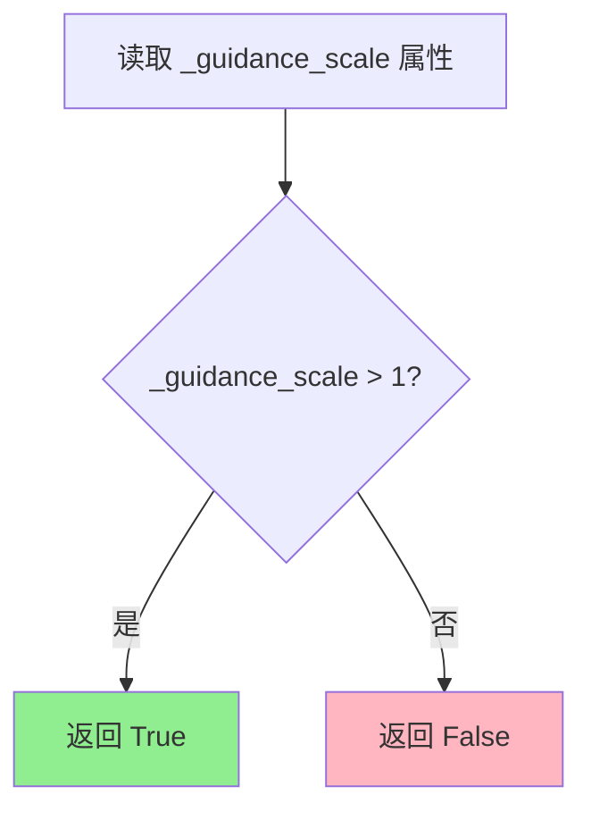

#### 带注释源码

```python
@property
def do_classifier_free_guidance(self):
    """
    属性：判断是否启用无分类器引导（Classifier-Free Guidance）
    
    该属性是一个只读属性，用于判断当前管道是否启用了无分类器引导功能。
    无分类器引导是一种在扩散模型中提高生成质量的技术，通过在推理时
    同时考虑条件输入和无条件输入来引导生成过程。
    
    实现原理：
    - 当 guidance_scale > 1 时，表示用户启用了引导功能
    - guidance_scale 控制无条件预测和条件预测之间的插值权重
    - 典型的 guidance_scale 值在 3.0 到 7.0 之间
    
    返回值：
        bool: 如果启用了无分类器引导返回 True，否则返回 False
        
    调用场景：
        - 在 encode_prompt 方法中判断是否需要生成负向提示词嵌入
        - 在 __call__ 方法中判断是否需要对 latents 进行扩展（复制）
        - 在去噪循环中判断是否需要将噪声预测分割为无条件预测和条件预测
    """
    return self._guidance_scale > 1
```

---

#### 相关上下文信息

**所属类**: `HiDreamImagePipeline`

**依赖的内部属性**:
- `_guidance_scale`: 引导比例因子，通过 `__call__` 方法的 `guidance_scale` 参数设置

**在 `__call__` 方法中的使用示例**:

```python
# 在 encode_prompt 调用时传入
do_classifier_free_guidance=self.do_classifier_free_guidance,

# 在去噪循环中判断是否需要扩展 latents
latent_model_input = torch.cat([latents] * 2) if self.do_classifier_free_guidance else latents

# 在预测后处理时判断是否需要分割预测结果
if self.do_classifier_free_guidance:
    noise_pred_uncond, noise_pred_text = noise_pred.chunk(2)
    noise_pred = noise_pred_uncond + self.guidance_scale * (noise_pred_text - noise_pred_uncond)
```

**技术说明**: 
无分类器引导（CFG）是扩散模型推理时的一种关键技术，通过在每一步同时评估条件和无条件噪声预测，然后用引导公式 `noise_pred = noise_pred_uncond + guidance_scale * (noise_pred_text - noise_pred_uncond)` 来调整预测方向，从而生成更符合文本提示的图像。


### `HiDreamImagePipeline.attention_kwargs`

该属性用于获取在图像生成过程中传递给 AttentionProcessor 的额外关键字参数（kwargs）。它作为只读属性返回在调用 `__call__` 方法时传入的 `attention_kwargs` 字典。

参数：无参数（该属性不需要额外参数）

返回值：`dict[str, Any] | None`，返回传递给 `AttentionProcessor` 的关键字参数字典，如果未设置则返回 `None`

#### 流程图

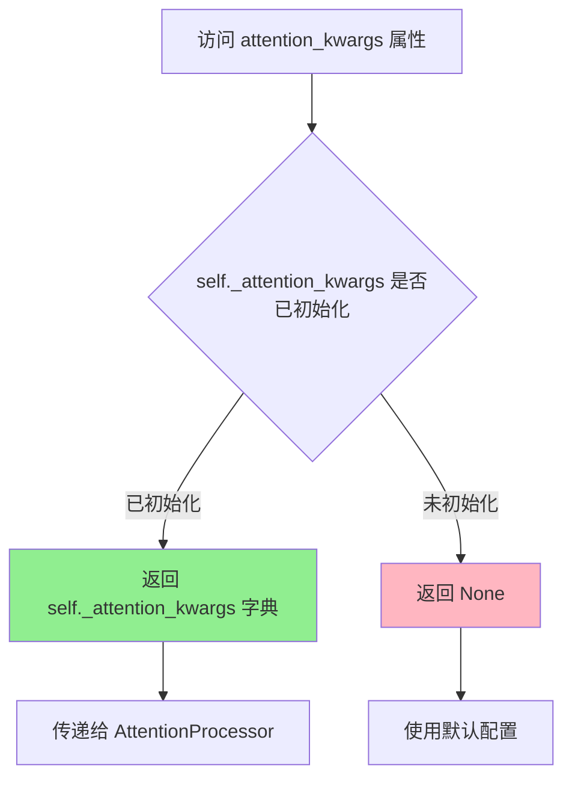

#### 带注释源码

```python
@property
def attention_kwargs(self):
    """
    获取传递给 AttentionProcessor 的额外关键字参数。
    
    该属性是一个只读属性，用于在图像生成过程中访问
    传递给注意力处理器的高级配置参数。这些参数可以包括：
    - 注意力缩放因子 (scale)
    - 注意力掩码 (attention_mask)
    - 跨注意力参数 (cross_attention_kwargs)
    - 其它自定义注意力配置
    
    Returns:
        dict[str, Any] | None: 包含注意力机制额外参数字典，
                              如果未设置则返回 None
    """
    return self._attention_kwargs
```

#### 上下文关联

该属性与以下代码紧密相关：

1. **设置来源** - 在 `__call__` 方法中设置：
```python
self._attention_scale = attention_kwargs
```

2. **使用场景** - 在去噪循环中传递给 transformer：
```python
lora_scale = self.attention_kwargs.get("scale", None) if self.attention_kwargs is not None else None
```

3. **相关属性** - 同类其他属性：
   - `guidance_scale`: 引导尺度
   - `do_classifier_free_guidance`: 是否启用无分类器引导
   - `num_timesteps`: 时间步数
   - `interrupt`: 中断标志


### `HiDreamImagePipeline.num_timesteps`

该属性是 `HiDreamImagePipeline` 类的只读属性，用于返回扩散模型推理过程中的时间步数量。在 `__call__` 方法中，时间步由调度器（scheduler）生成并计算其长度后赋值给 `_num_timesteps` 变量，该属性直接返回该值以供外部访问推理步骤数。

参数：
- 该属性无显式参数（隐式参数 `self` 为实例本身）

返回值：`int`，返回推理过程中使用的时间步总数

#### 流程图

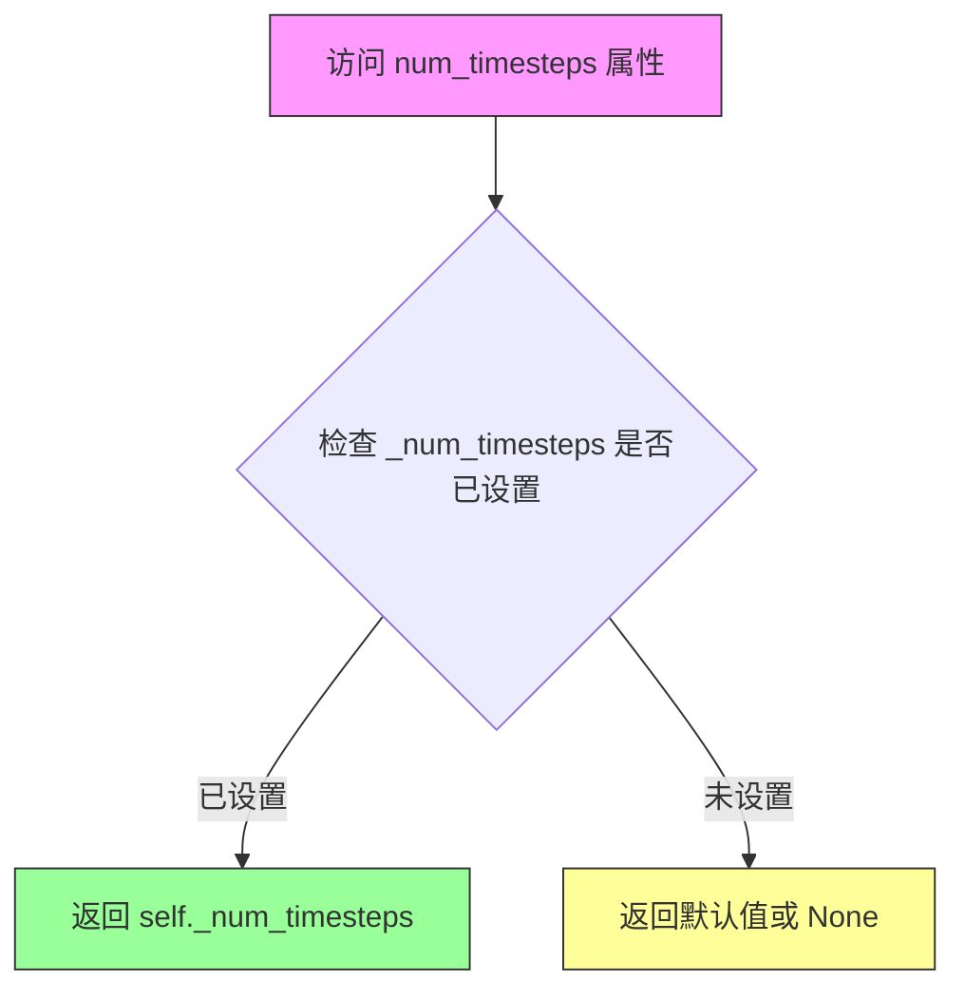

#### 带注释源码

```python
@property
def num_timesteps(self):
    """
    只读属性，返回扩散推理过程中的时间步数量。
    
    该属性在 __call__ 方法中被设置：
    self._num_timesteps = len(timesteps)
    
    其中 timesteps 由 retrieve_timesteps 函数从调度器获取。
    """
    return self._num_timesteps
```


### `HiDreamImagePipeline.interrupt`

该属性是一个只读的属性，用于获取当前pipeline的中断状态。当在去噪循环（denoising loop）中检查到`interrupt`为`True`时，会跳过当前迭代，从而实现对生成过程的外部中断控制。

参数： 无

返回值：`bool`，表示pipeline是否被请求中断。`True`表示已请求中断生成过程，`False`表示正常运行。

#### 流程图

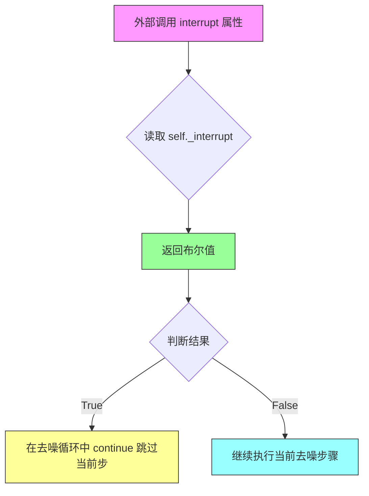

#### 带注释源码

```python
@property
def interrupt(self):
    """
    属性用于获取pipeline的中断状态。
    
    该属性返回一个布尔值，表示生成过程是否被请求中断。
    在__call__方法的主循环中，会检查此属性以决定是否跳过当前去噪步骤。
    
    返回:
        bool: 如果为True，表示外部已请求中断生成过程；
              如果为False，表示生成过程正常运行。
    """
    return self._interrupt
```


### HiDreamImagePipeline.__call__

该方法是HiDream图像生成Pipeline的主入口函数，接收文本提示词和其他生成参数，通过多阶段文本编码（CLIP、T5、Llama3）将提示词转换为嵌入向量，然后使用DiT（Diffusion Transformer）模型进行去噪生成，最后通过VAE解码器将潜在向量解码为最终图像。

参数：

- `prompt`：`str | list[str] | None`，主提示词，用于引导图像生成。若未定义，则需传递`prompt_embeds`。
- `prompt_2`：`str | list[str] | None`，发送给`tokenizer_2`和`text_encoder_2`的提示词，默认为`prompt`。
- `prompt_3`：`str | list[str] | None`，发送给`tokenizer_3`和`text_encoder_3`（T5编码器）的提示词。
- `prompt_4`：`str | list[str] | None`，发送给`tokenizer_4`和`text_encoder_4`（Llama3编码器）的提示词。
- `height`：`int | None`，生成图像的高度（像素），默认根据`self.default_sample_size * self.vae_scale_factor`计算。
- `width`：`int | None`，生成图像的宽度（像素），默认根据`self.default_sample_size * self.vae_scale_factor`计算。
- `num_inference_steps`：`int`，去噪步数，默认为50，步数越多图像质量越高但推理速度越慢。
- `sigmas`：`list[float] | None`，自定义sigmas值，用于支持自定义噪声调度的去噪过程。
- `guidance_scale`：`float`，引导比例，默认为5.0，用于控制生成图像与提示词的对齐程度。
- `negative_prompt`：`str | list[str] | None`，负面提示词，用于引导图像生成排除的内容。
- `negative_prompt_2`：`str | list[str] | None`，发送给`text_encoder_2`的负面提示词。
- `negative_prompt_3`：`str | list[str] | None`，发送给T5编码器的负面提示词。
- `negative_prompt_4`：`str | list[str] | None`，发送给Llama3编码器的负面提示词。
- `num_images_per_prompt`：`int | None`，每个提示词生成的图像数量，默认为1。
- `generator`：`torch.Generator | list[torch.Generator] | None`，用于生成确定性结果的随机数生成器。
- `latents`：`torch.FloatTensor | None`，预生成的噪声潜在向量，可用于相同提示词的不同生成变体。
- `prompt_embeds_t5`：`torch.FloatTensor | None`，预生成的T5文本嵌入，可用于微调文本输入。
- `prompt_embeds_llama3`：`torch.FloatTensor | None`，预生成的Llama3文本嵌入。
- `negative_prompt_embeds_t5`：`torch.FloatTensor | None`，预生成的负面T5嵌入。
- `negative_prompt_embeds_llama3`：`torch.FloatTensor | None`，预生成的负面Llama3嵌入。
- `pooled_prompt_embeds`：`torch.FloatTensor | None`，预生成的池化文本嵌入。
- `negative_pooled_prompt_embeds`：`torch.FloatTensor | None`，预生成的负面池化嵌入。
- `output_type`：`str | None`，输出格式，默认为"pil"，可选PIL.Image.Image或numpy数组。
- `return_dict`：`bool`，是否返回`HiDreamImagePipelineOutput`，默认为True。
- `attention_kwargs`：`dict[str, Any] | None`，传递给注意力处理器的额外参数字典。
- `callback_on_step_end`：`Callable[[int, int], None] | None`，每个去噪步骤结束时调用的回调函数。
- `callback_on_step_end_tensor_inputs`：`list[str]`，回调函数需要使用的tensor输入列表，默认为["latents"]。
- `max_sequence_length`：`int`，提示词的最大序列长度，默认为128。
- `**kwargs`：其他关键字参数，用于向后兼容的`prompt_embeds`和`negative_prompt_embeds`。

返回值：`HiDreamImagePipelineOutput | tuple`，当`return_dict=True`时返回`HiDreamImagePipelineOutput`对象（包含生成的图像列表），否则返回元组。

#### 流程图

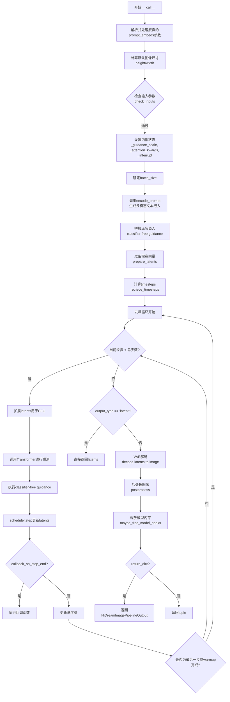

#### 带注释源码

```python
@torch.no_grad()
@replace_example_docstring(EXAMPLE_DOC_STRING)
def __call__(
    self,
    prompt: str | list[str] = None,
    prompt_2: str | list[str] | None = None,
    prompt_3: str | list[str] | None = None,
    prompt_4: str | list[str] | None = None,
    height: int | None = None,
    width: int | None = None,
    num_inference_steps: int = 50,
    sigmas: list[float] | None = None,
    guidance_scale: float = 5.0,
    negative_prompt: str | list[str] | None = None,
    negative_prompt_2: str | list[str] | None = None,
    negative_prompt_3: str | list[str] | None = None,
    negative_prompt_4: str | list[str] | None = None,
    num_images_per_prompt: int | None = 1,
    generator: torch.Generator | list[torch.Generator] | None = None,
    latents: torch.FloatTensor | None = None,
    prompt_embeds_t5: torch.FloatTensor | None = None,
    prompt_embeds_llama3: torch.FloatTensor | None = None,
    negative_prompt_embeds_t5: torch.FloatTensor | None = None,
    negative_prompt_embeds_llama3: torch.FloatTensor | None = None,
    pooled_prompt_embeds: torch.FloatTensor | None = None,
    negative_pooled_prompt_embeds: torch.FloatTensor | None = None,
    output_type: str | None = "pil",
    return_dict: bool = True,
    attention_kwargs: dict[str, Any] | None = None,
    callback_on_step_end: Callable[[int, int], None] | None = None,
    callback_on_step_end_tensor_inputs: list[str] = ["latents"],
    max_sequence_length: int = 128,
    **kwargs,
):
    # 处理废弃的prompt_embeds参数，转换为新的参数格式
    prompt_embeds = kwargs.get("prompt_embeds", None)
    negative_prompt_embeds = kwargs.get("negative_prompt_embeds", None)

    if prompt_embeds is not None:
        # 废弃警告：将旧版prompt_embeds拆分为T5和Llama3嵌入
        deprecation_message = "The `prompt_embeds` argument is deprecated. Please use `prompt_embeds_t5` and `prompt_embeds_llama3` instead."
        deprecate("prompt_embeds", "0.35.0", deprecation_message)
        prompt_embeds_t5 = prompt_embeds[0]
        prompt_embeds_llama3 = prompt_embeds[1]

    if negative_prompt_embeds is not None:
        # 废弃警告：将旧版negative_prompt_embeds拆分为T5和Llama3嵌入
        deprecation_message = "The `negative_prompt_embeds` argument is deprecated. Please use `negative_prompt_embeds_t5` and `negative_prompt_embeds_llama3` instead."
        deprecate("negative_prompt_embeds", "0.35.0", deprecation_message)
        negative_prompt_embeds_t5 = negative_prompt_embeds[0]
        negative_prompt_embeds_llama3 = negative_prompt_embeds[1]

    # 设置默认图像尺寸：根据VAE缩放因子计算默认高度和宽度
    height = height or self.default_sample_size * self.vae_scale_factor
    width = width or self.default_sample_size * self.vae_scale_factor

    # 图像尺寸缩放调整：确保潜在向量尺寸符合Transformer的序列长度要求
    division = self.vae_scale_factor * 2
    S_max = (self.default_sample_size * self.vae_scale_factor) ** 2
    scale = S_max / (width * height)
    scale = math.sqrt(scale)
    width, height = int(width * scale // division * division), int(height * scale // division * division)

    # 1. 检查输入参数：验证提示词和嵌入向量的一致性和有效性
    self.check_inputs(
        prompt,
        prompt_2,
        prompt_3,
        prompt_4,
        negative_prompt=negative_prompt,
        negative_prompt_2=negative_prompt_2,
        negative_prompt_3=negative_prompt_3,
        negative_prompt_4=negative_prompt_4,
        prompt_embeds_t5=prompt_embeds_t5,
        prompt_embeds_llama3=prompt_embeds_llama3,
        negative_prompt_embeds_t5=negative_prompt_embeds_t5,
        negative_prompt_embeds_llama3=negative_prompt_embeds_llama3,
        pooled_prompt_embeds=pooled_prompt_embeds,
        negative_pooled_prompt_embeds=negative_pooled_prompt_embeds,
        callback_on_step_end_tensor_inputs=callback_on_step_end_tensor_inputs,
    )

    # 设置内部状态：用于指导生成过程和传递额外参数
    self._guidance_scale = guidance_scale
    self._attention_kwargs = attention_kwargs
    self._interrupt = False

    # 2. 定义调用参数：确定批次大小
    if prompt is not None and isinstance(prompt, str):
        batch_size = 1
    elif prompt is not None and isinstance(prompt, list):
        batch_size = len(prompt)
    elif pooled_prompt_embeds is not None:
        batch_size = pooled_prompt_embeds.shape[0]

    device = self._execution_device

    # 3. 编码提示词：使用多个文本编码器生成文本嵌入
    lora_scale = self.attention_kwargs.get("scale", None) if self.attention_kwargs is not None else None
    (
        prompt_embeds_t5,
        negative_prompt_embeds_t5,
        prompt_embeds_llama3,
        negative_prompt_embeds_llama3,
        pooled_prompt_embeds,
        negative_pooled_prompt_embeds,
    ) = self.encode_prompt(
        prompt=prompt,
        prompt_2=prompt_2,
        prompt_3=prompt_3,
        prompt_4=prompt_4,
        negative_prompt=negative_prompt,
        negative_prompt_2=negative_prompt_2,
        negative_prompt_3=negative_prompt_3,
        negative_prompt_4=negative_prompt_4,
        do_classifier_free_guidance=self.do_classifier_free_guidance,
        prompt_embeds_t5=prompt_embeds_t5,
        prompt_embeds_llama3=prompt_embeds_llama3,
        negative_prompt_embeds_t5=negative_prompt_embeds_t5,
        negative_prompt_embeds_llama3=negative_prompt_embeds_llama3,
        pooled_prompt_embeds=pooled_prompt_embeds,
        negative_pooled_prompt_embeds=negative_pooled_prompt_embeds,
        device=device,
        num_images_per_prompt=num_images_per_prompt,
        max_sequence_length=max_sequence_length,
        lora_scale=lora_scale,
    )

    # 应用Classifier-Free Guidance：将负面和正面嵌入拼接
    if self.do_classifier_free_guidance:
        prompt_embeds_t5 = torch.cat([negative_prompt_embeds_t5, prompt_embeds_t5], dim=0)
        prompt_embeds_llama3 = torch.cat([negative_prompt_embeds_llama3, prompt_embeds_llama3], dim=1)
        pooled_prompt_embeds = torch.cat([negative_pooled_prompt_embeds, pooled_prompt_embeds], dim=0)

    # 4. 准备潜在变量：初始化或使用提供的噪声潜在向量
    num_channels_latents = self.transformer.config.in_channels
    latents = self.prepare_latents(
        batch_size * num_images_per_prompt,
        num_channels_latents,
        height,
        width,
        pooled_prompt_embeds.dtype,
        device,
        generator,
        latents,
    )

    # 5. 准备时间步：计算噪声调度器的时间步
    mu = calculate_shift(self.transformer.max_seq)  # 计算序列长度偏移
    scheduler_kwargs = {"mu": mu}
    if XLA_AVAILABLE:
        timestep_device = "cpu"
    else:
        timestep_device = device
    # 根据调度器类型设置时间步
    if isinstance(self.scheduler, UniPCMultistepScheduler):
        self.scheduler.set_timesteps(num_inference_steps, device=timestep_device)
        timesteps = self.scheduler.timesteps
    else:
        timesteps, num_inference_steps = retrieve_timesteps(
            self.scheduler,
            num_inference_steps,
            timestep_device,
            sigmas=sigmas,
            **scheduler_kwargs,
        )
    num_warmup_steps = max(len(timesteps) - num_inference_steps * self.scheduler.order, 0)
    self._num_timesteps = len(timesteps)

    # 6. 去噪循环：逐步去除噪声生成图像
    with self.progress_bar(total=num_inference_steps) as progress_bar:
        for i, t in enumerate(timesteps):
            # 检查中断标志
            if self.interrupt:
                continue

            # 扩展潜在向量以支持classifier-free guidance
            latent_model_input = torch.cat([latents] * 2) if self.do_classifier_free_guidance else latents
            # 扩展时间步以匹配批次维度
            timestep = t.expand(latent_model_input.shape[0])

            # 调用Transformer模型预测噪声
            noise_pred = self.transformer(
                hidden_states=latent_model_input,
                timesteps=timestep,
                encoder_hidden_states_t5=prompt_embeds_t5,
                encoder_hidden_states_llama3=prompt_embeds_llama3,
                pooled_embeds=pooled_prompt_embeds,
                return_dict=False,
            )[0]
            noise_pred = -noise_pred  # 取反以适配流匹配

            # 执行guidance：组合无条件预测和条件预测
            if self.do_classifier_free_guidance:
                noise_pred_uncond, noise_pred_text = noise_pred.chunk(2)
                noise_pred = noise_pred_uncond + self.guidance_scale * (noise_pred_text - noise_pred_uncond)

            # 计算上一步的潜在向量：x_t -> x_t-1
            latents_dtype = latents.dtype
            latents = self.scheduler.step(noise_pred, t, latents, return_dict=False)[0]

            # 处理数据类型转换（针对MPS后端的bug）
            if latents.dtype != latents_dtype:
                if torch.backends.mps.is_available():
                    latents = latents.to(latents_dtype)

            # 执行步骤结束回调函数
            if callback_on_step_end is not None:
                callback_kwargs = {}
                for k in callback_on_step_end_tensor_inputs:
                    callback_kwargs[k] = locals()[k]
                callback_outputs = callback_on_step_end(self, i, t, callback_kwargs)

                # 更新回调返回的潜在向量和嵌入
                latents = callback_outputs.pop("latents", latents)
                prompt_embeds_t5 = callback_outputs.pop("prompt_embeds_t5", prompt_embeds_t5)
                prompt_embeds_llama3 = callback_outputs.pop("prompt_embeds_llama3", prompt_embeds_llama3)
                pooled_prompt_embeds = callback_outputs.pop("pooled_prompt_embeds", pooled_prompt_embeds)

            # 更新进度条（仅在最后一步或warmup完成后）
            if i == len(timesteps) - 1 or ((i + 1) > num_warmup_steps and (i + 1) % self.scheduler.order == 0):
                progress_bar.update()

            # XLA设备同步
            if XLA_AVAILABLE:
                xm.mark_step()

    # 输出处理：根据output_type返回结果
    if output_type == "latent":
        # 直接返回潜在向量（用于后续处理）
        image = latents
    else:
        # 解码潜在向量为图像
        latents = (latents / self.vae.config.scaling_factor) + self.vae.config.shift_factor
        image = self.vae.decode(latents, return_dict=False)[0]
        # 后处理：将VAE输出转换为指定格式
        image = self.image_processor.postprocess(image, output_type=output_type)

    # 释放模型内存
    self.maybe_free_model_hooks()

    # 返回结果
    if not return_dict:
        return (image,)

    return HiDreamImagePipelineOutput(images=image)
```

## 关键组件


### 张量索引与惰性加载

用于在扩散推理过程中按需加载和处理张量，避免一次性加载所有数据，减少内存占用。通过 `callback_on_step_end_tensor_inputs` 参数指定需要回调的張量，並在 `callback_on_step_end` 中惰性获取。

### 反量化支持

提供 VAE 切片（slicing）和平铺（tiling）解码策略，将大张量分割为小块进行处理，降低显存峰值。`enable_vae_slicing` 和 `enable_vae_tiling` 方法分别启用切片和平铺模式。

### 量化策略

通过 `dtype` 参数支持多种精度（如 `torch.bfloat16`），并在模型加载时指定。代码示例中展示了使用 `torch_dtype=torch.bfloat16` 加载文本编码器，实现推理阶段的量化部署。

### 多文本编码器融合

集成四个不同的文本编码器（CLIP、T5、LLaMA）进行prompt编码，通过 `_get_clip_prompt_embeds`、`_get_t5_prompt_embeds`、`_get_llama3_prompt_embeds` 方法分别提取不同类型的文本嵌入，并在 `encode_prompt` 中合并。

### 调度器适配器

通过 `retrieve_timesteps` 函数适配不同的调度器（FlowMatchEulerDiscreteScheduler、UniPCMultistepScheduler），统一时间步获取接口，并支持自定义 sigmas 和 timesteps。

### 图像分辨率自适应

在 `__call__` 方法中根据目标宽高比动态调整潜在空间分辨率，通过 `calculate_shift` 计算缩放因子，确保生成的图像符合目标尺寸要求。

### 分类器自由引导

实现 CFG（Classifier-Free Guidance）机制，通过 `do_classifier_free_guidance` 属性判断是否启用引导，并在去噪循环中执行 `noise_pred_uncond + guidance_scale * (noise_pred_text - noise_pred_uncond)` 公式。

### LoRA 加载器Mixin

继承 `HiDreamImageLoraLoaderMixin` 支持 LoRA 权重动态加载，通过 `attention_kwargs` 中的 `scale` 参数控制 LoRA 影响的强度。


## 问题及建议


### 已知问题

- **代码重复**：`_get_t5_prompt_embeds`、`_get_clip_prompt_embeds`、`_get_llama3_prompt_embeds` 三个方法存在大量重复的 prompt 处理逻辑（字符串转列表、padding、truncation 检查等），可提取公共方法复用。
- **硬编码值**：CLIP tokenizer 的 `max_length` 硬编码为 218，未使用 `tokenizer.model_max_length`；`default_sample_size` 硬编码为 128，缺少配置灵活性。
- **弃用方法残留**：`enable_vae_slicing`、`disable_vae_slicing`、`enable_vae_tiling`、`disable_vae_tiling` 已标记为 0.40.0 弃用但仍保留，增加维护负担。
- **性能冗余操作**：`encode_prompt` 中多次执行 `.repeat()` 和 `.view()` 张量操作，在 batch_size > 1 时存在不必要的内存复制和维度调整。
- **不推荐的编程模式**：`callback_on_step_end` 中使用 `locals()[k]` 获取变量，依赖隐式作用域，易产生 bug 且难以调试。
- **docstring 与实现不一致**：`__call__` 方法文档声称 `guidance_scale` 默认为 3.5，但实际代码使用默认值 5.0。
- **类型注解不完整**：部分参数如 `prompt_embeds_t5`、`prompt_embeds_llama3` 在 `__call__` 中的类型为 `torch.FloatTensor | None`，但实际传入 `encode_prompt` 时可能被处理为 `list[torch.FloatTensor]`。
- **缺少输入验证**：未对空字符串列表或空 negative_prompt 列表进行显式检查，可能导致意外行为。

### 优化建议

- **提取公共方法**：将 prompt 列表处理、truncation 警告、untruncated 检查等逻辑抽取为私有辅助方法（如 `_prepare_prompt_inputs`），减少重复代码。
- **消除硬编码**：从 `tokenizer.model_max_length` 获取 CLIP 最大长度，使用配置对象或构造函数参数替代 `default_sample_size`。
- **清理弃用代码**：在下一个主版本中移除已弃用的 VAE slicing/tiling 方法，直接调用 `self.vae.enable_slicing()` 等。
- **优化张量操作**：合并重复的 repeat/view 逻辑，考虑使用 `torch.repeat_interleave` 替代部分场景，或在 `encode_prompt` 入口处统一处理 batch 维度。
- **重构回调机制**：显式传递需要回调的变量列表，而非使用 `locals()` 隐式捕获，提高代码可读性和可维护性。
- **修正文档**：将 `guidance_scale` 的默认值文档更新为 5.0，或将代码默认值调整为 3.5 以保持一致。
- **完善类型注解**：确保 `encode_prompt` 和 `__call__` 方法的参数类型注解与实际使用场景匹配，使用 Union 类型或泛型增强类型安全。
- **增强输入校验**：在 `check_inputs` 或 `encode_prompt` 开头添加对空列表的检查，提供明确的错误信息。

## 其它


### 设计目标与约束

本Pipeline的设计目标是实现一个高效、高质量的多模态图像生成系统，能够根据文本提示生成符合描述的图像。核心约束包括：支持4个不同的文本编码器（CLIP×2、T5、LLaMA）进行联合嵌入；支持512x512至1024x1024分辨率的图像生成；推理步骤控制在50步以内以平衡质量与速度；必须启用classifier-free guidance（guidance_scale > 1）以提升生成质量；模型推理需在GPU上进行，CPU仅用于调度和后处理。

### 错误处理与异常设计

Pipeline在多个关键节点实现了完善的错误处理机制。在`check_inputs`方法中进行了全面的参数校验，包括：互斥参数检测（如prompt与pooled_prompt_embeds不能同时传递）、参数类型验证（str或list）、维度一致性检查（pooled_prompt_embeds与negative_pooled_prompt_embeds形状匹配）、以及callback_on_step_end_tensor_inputs的合法性校验。在`retrieve_timesteps`中检测调度器是否支持自定义timesteps或sigmas，不支持时抛出明确的ValueError。`prepare_latents`方法验证latents形状是否符合预期。encode_prompt方法对负向提示长度进行了校验。调度器相关的异常通过try-except捕获并转换为用户友好的错误信息。

### 数据流与状态机

Pipeline的推理流程遵循严格的状态转换顺序：初始化状态 → 输入校验状态 → 提示编码状态 → 潜在向量准备状态 → 时间步生成状态 → 去噪循环状态 → VAE解码状态 → 输出状态。进入去噪循环前，prompt_embeds_t5和prompt_embeds_llama3会与negative_prompt_embeds进行拼接以实现classifier-free guidance。在去噪循环内部，每个时间步执行一次transformer前向传播、noise prediction计算、guidance应用、scheduler.step更新潜在向量。循环结束后根据output_type决定直接返回latents或经过VAE解码得到最终图像。

### 外部依赖与接口契约

本Pipeline依赖以下核心组件：transformers库提供的CLIPTextModelWithProjection、CLIPTokenizer、T5EncoderModel、T5Tokenizer、LlamaForCausalLM、PreTrainedTokenizerFast；diffusers库提供的AutoencoderKL、HiDreamImageTransformer2DModel、FlowMatchEulerDiscreteScheduler、UniPCMultistepScheduler、VaeImageProcessor、DiffusionPipeline；PyTorch库提供张量运算支持；torch_xla用于XLA设备支持。调用方需确保传入的模型已正确加载到目标设备，且tokenizer与对应text_encoder的模型架构相匹配。Pipeline内部通过register_modules方法统一管理所有子模块引用。

### 性能优化策略

Pipeline实现了多项性能优化策略：Model CPU Offload通过model_cpu_offload_seq指定模块卸载顺序以降低显存峰值；VAE Slicing将解码过程分片执行以节省内存；VAE Tiling通过分块处理支持更大分辨率图像生成；XLA Mark Step在TPU上进行梯度计算优化；batch_size和num_images_per_prompt的重复逻辑经过优化以减少不必要的张量复制；使用torch.no_grad()装饰器禁用梯度计算；gradient checkpointing可通过attention_kwargs传递以减少显存占用。潜在向量在scheduler.step后进行dtype转换以避免MPS设备的兼容性问题。

### 安全性考虑

Pipeline在安全性方面做了以下设计：负向提示（negative_prompt）机制允许用户指定不希望出现的元素；所有文本输入均通过tokenizer处理，支持 truncation 防止超长输入；LoRA scale参数通过attention_kwargs传递，需验证其值在合理范围内；模型输出不包含任何水印或元数据标记；CPU offload机制可防止模型权重意外保留在GPU内存中。代码中未包含任何网络请求或外部资源加载，所有模型权重需由调用方预先下载并验证。

### 配置与参数说明

关键配置参数包括：vae_scale_factor由VAE的block_out_channels计算得出，用于潜在空间到像素空间的转换；default_sample_size设为128作为默认采样基准；image_processor的scale_factor乘以2以适应HiDreamImage的2x2 patch packing机制；max_sequence_length默认128限制了文本嵌入的最大长度；guidance_scale默认5.0提供了生成质量与多样性的平衡；num_inference_steps默认50提供了充分的多步去噪。调度器支持通过sigmas参数传入自定义噪声调度曲线，calculate_shift函数用于计算基于序列长度的自适应shift参数。

### 版本兼容性与迁移指南

本Pipeline遵循diffusers库的Pipeline设计模式，与diffusers 0.40.0及以上版本兼容。已废弃的方法包括enable_vae_slicing、disable_vae_slicing、enable_vae_tiling、disable_vae_tiling，这些方法将在未来版本中移除，建议直接调用vae.enable_slicing()等等价操作。prompt_embeds参数已被废弃，应改用prompt_embeds_t5和prompt_embeds_llama3分别传递。negative_prompt_embeds同样被废弃，需拆分为negative_prompt_embeds_t5和negative_prompt_embeds_llama3。tokenizer_4的pad_token已自动设置为eos_token以确保LLaMA模型正确处理。

### 测试策略建议

建议为Pipeline编写以下测试用例：输入验证测试（check_inputs的各种错误场景）、提示编码测试（encode_prompt的输出形状和类型）、潜在向量准备测试（prepare_latents的形状计算）、去噪循环测试（单步执行的输出维度）、VAE解码测试（图像生成完整性）、多提示批处理测试（batch_size > 1的场景）、classifier-free guidance开关测试、负向提示生效验证、LoRA加载后的生成质量测试、以及不同输出类型（pil、latent、np.array）的测试。

### 已知限制与使用注意事项

本Pipeline存在以下使用限制：必须同时提供prompt_embeds_t5和prompt_embeds_llama3或对应的原始prompt，二者不能同时为空；不支持纯CPU推理（transformer必须在GPU/CUDA上运行）；不支持脉冲噪声（impulse noise）相关的调度器；生成的图像分辨率必须能被vae_scale_factor * 2整除；使用LLaMA作为text_encoder_4时需要预先配置好tokenizer_4的eos_token作为pad_token；当batch_size大于1时，所有提示必须具有相同长度或预先padding到相同长度。


    