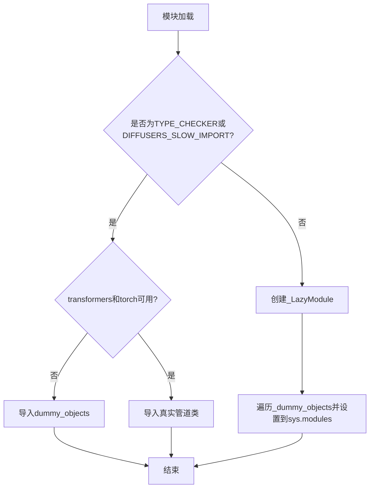
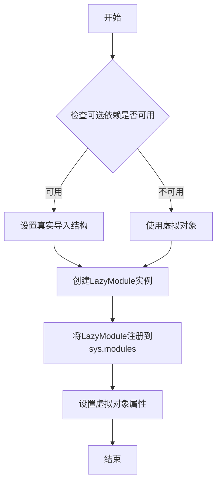
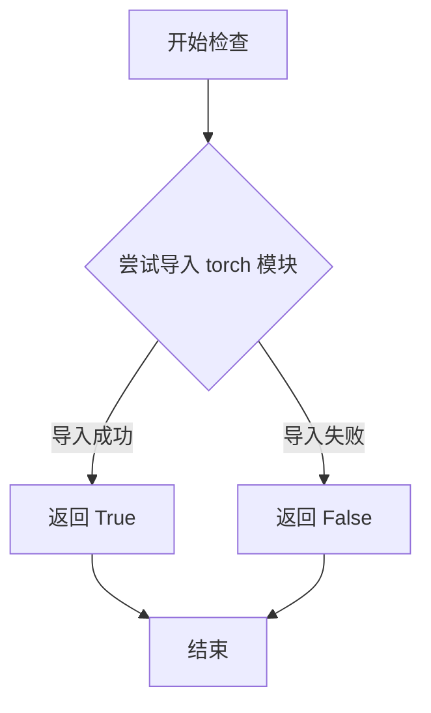
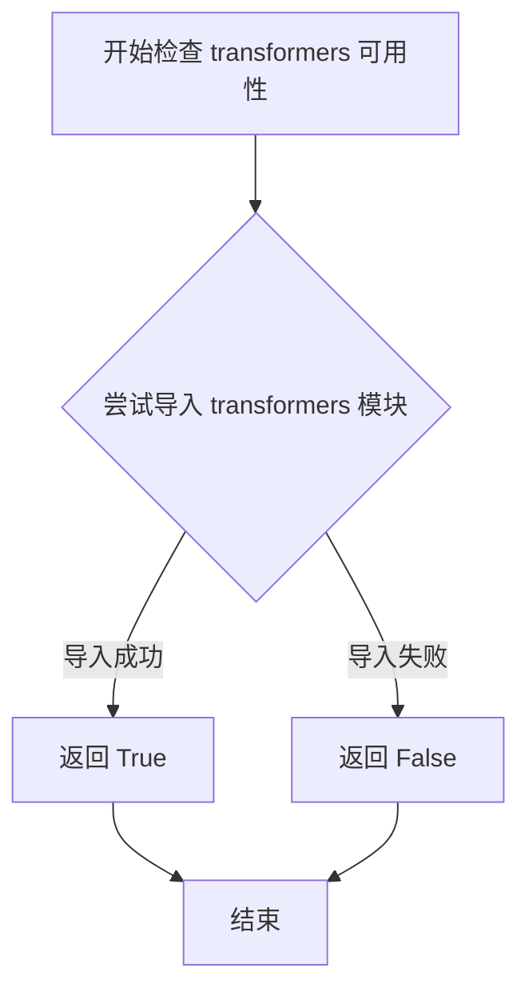

# `diffusers\src\diffusers\pipelines\hunyuan_image\__init__.py` 详细设计文档

这是一个diffusers库的Hunyuan图像生成管道模块的初始化文件，通过懒加载机制动态导入HunyuanImagePipeline和HunyuanImageRefinerPipeline两个图像生成管道类，并优雅处理torch和transformers可选依赖项的逻辑。

## 整体流程



## 类结构

```
hunyuan (包)
├── __init__.py (入口模块)
├── pipeline_hunyuanimage.py (图像管道实现)
└── pipeline_hunyuanimage_refiner.py (图像精炼管道实现)
```

## 全局变量及字段


### `_dummy_objects`
    
存储虚拟对象的字典，用于可选依赖不可用时的占位

类型：`dict`
    


### `_import_structure`
    
定义模块导入结构的字典，映射管道名称到类名

类型：`dict`
    


    

## 全局函数及方法


### `get_objects_from_module`

该函数是一个工具函数，用于从指定的模块对象中动态提取所有公共（非私有）属性（如类、函数、变量），并返回一个以属性名为键、属性对象为值的字典。在 `diffusers` 库中，它主要用于支持可选依赖的懒加载机制，通过获取虚拟对象（Dummy Objects）模块的内容来填充模块命名空间。

参数：

-  `module`：模块对象（`ModuleType`），需要提取对象列表的 Python 模块。

返回值：`Dict[str, Any]`，返回一个字典，键为对象名称（字符串），值为模块中对应的实际对象（类或函数）。

#### 流程图

```mermaid
graph TD
    A[接收 module 参数] --> B[初始化空字典 _objects]
    B --> C[获取模块所有属性名列表 dir(module)]
    C --> D[遍历属性名列表]
    D --> E{检查属性名是否以 '_' 开头}
    E -- 是 --> F[跳过该属性，继续下一个]
    E -- 否 --> G[使用 getattr 获取该属性值]
    G --> H[将 属性名 和 属性值 存入 _objects 字典]
    H --> D
    D --> I[遍历结束，返回 _objects 字典]
```

#### 带注释源码

```python
def get_objects_from_module(module):
    """
    从给定模块中提取所有公共对象（类、函数等）。

    该函数通常用于动态导入系统。它遍历模块的属性列表，
    过滤掉 Python 内部的私有属性（以双下划线 '__' 或单下划线 '_' 开头），
    并将剩余的公共对象收集到一个字典中返回。

    参数:
        module: 一个 Python 模块对象 (types.ModuleType)。

    返回值:
        一个字典，键是对象名称 (str)，值是对应的对象本身。
    """
    _objects = {}
    # 遍历模块的所有属性
    for _name in dir(module):
        # 过滤掉私有属性（通常以 _ 开头）
        if _name.startswith("_"):
            continue
        
        # 获取属性值
        _obj = getattr(module, _name)
        
        # 将名称和对象存入字典
        _objects[_name] = _obj
        
    return _objects
```


### `_LazyModule`

`_LazyModule` 是用于实现模块延迟加载的核心类，允许在真正需要时才导入模块，从而优化导入时间和内存占用。

参数：

- `name`：`str`，要创建的懒加载模块的名称，通常为当前模块的 `__name__`
- `filename`：`str`，模块对应的文件路径，通常为 `globals()["__file__"]`
- `import_structure`：`dict`，定义了模块的导入结构，键为子模块名，值为导出的对象列表
- `module_spec`：`ModuleSpec`，模块的规范对象，包含模块的元数据信息

返回值：`LazyModule`，返回创建的懒加载模块对象

#### 流程图



#### 带注释源码

```python
# 从 utils 模块导入 _LazyModule 类，用于实现延迟加载
from ...utils import (
    DIFFUSERS_SLOW_IMPORT,
    OptionalDependencyNotAvailable,
    _LazyModule,  # <-- 核心：懒加载模块类
    get_objects_from_module,
    is_torch_available,
    is_transformers_available,
)

# 初始化虚拟对象字典和导入结构
_dummy_objects = {}
_import_structure = {}

# 尝试检查可选依赖（transformers 和 torch）是否可用
try:
    if not (is_transformers_available() and is_torch_available()):
        raise OptionalDependencyNotAvailable()
except OptionalDependencyNotAvailable:
    # 如果依赖不可用，导入虚拟对象用于类型检查
    from ...utils import dummy_torch_and_transformers_objects  # noqa F403
    # 更新虚拟对象字典
    _dummy_objects.update(get_objects_from_module(dummy_torch_and_transformers_objects))
else:
    # 依赖可用时，定义真实的导入结构
    _import_structure["pipeline_hunyuanimage"] = ["HunyuanImagePipeline"]
    _import_structure["pipeline_hunyuanimage_refiner"] = ["HunyuanImageRefinerPipeline"]

# 如果是类型检查模式或慢导入模式，则真实导入模块
if TYPE_CHECKING or DIFFUSERS_SLOW_IMPORT:
    try:
        if not (is_transformers_available() and is_torch_available()):
            raise OptionalDependencyNotAvailable()
    except OptionalDependencyNotAvailable:
        # 导入虚拟对象用于类型检查
        from ...utils.dummy_torch_and_transformers_objects import *
    else:
        # 真实导入模块
        from .pipeline_hunyuanimage import HunyuanImagePipeline
        from .pipeline_hunyuanimage_refiner import HunyuanImageRefinerPipeline
else:
    # 常规运行时：使用 _LazyModule 实现延迟加载
    import sys
    # 将当前模块替换为 LazyModule 实例
    sys.modules[__name__] = _LazyModule(
        __name__,                      # 模块名称
        globals()["__file__"],         # 模块文件路径
        _import_structure,             # 导入结构定义
        module_spec=__spec__,          # 模块规范
    )
    # 将虚拟对象添加到模块中，使其可以被访问
    for name, value in _dummy_objects.items():
        setattr(sys.modules[__name__], name, value)
```


### `is_torch_available`

检查当前环境中 PyTorch 库是否可用的函数。该函数通过尝试导入 `torch` 模块来判断其是否已安装，若导入成功则返回 `True`，否则返回 `False`。

参数： 无

返回值：`bool`，返回 `True` 表示 PyTorch 可用，返回 `False` 表示不可用。

#### 流程图



#### 带注释源码

```python
def is_torch_available():
    """
    检查 PyTorch 是否在当前环境中可用。
    
    实现方式：
    - 尝试导入 torch 模块
    - 如果导入成功，返回 True
    - 如果导入失败（ModuleNotFoundError），返回 False
    """
    try:
        import torch  # noqa F401
        return True
    except ImportError:
        return False
```

---

### 关联使用说明

在提供的代码中，`is_torch_available` 被用于条件导入：

```python
# 检查 transformers 和 torch 是否同时可用
if not (is_transformers_available() and is_torch_available()):
    raise OptionalDependencyNotAvailable()
```

这确保了只有在 `torch` 和 `transformers` 都可用的情况下，才会导入相关的 HunyuanImage 管道类；否则会使用虚拟的 dummy 对象。


### `is_transformers_available`

检查当前 Python 环境中是否已安装 transformers 库。该函数通过尝试导入 transformers 模块来判断库是否可用，用于条件性地导入或初始化需要 transformers 依赖的功能模块。

参数：此函数无参数

返回值：`bool`，返回 True 表示 transformers 库可用，返回 False 表示不可用

#### 流程图



#### 带注释源码

```python
# 该函数定义在 ...utils 模块中，以下为推断的典型实现

def is_transformers_available() -> bool:
    """
    检查 transformers 库是否可用
    
    Returns:
        bool: 如果 transformers 库已安装且可导入返回 True，否则返回 False
    """
    try:
        # 尝试导入 transformers 模块
        import transformers
        # 如果导入成功，说明库可用
        return True
    except ImportError:
        # 如果导入失败，说明库不可用
        return False
```

**注意**：在提供的代码文件中，`is_transformers_available` 是从 `...utils` 模块导入的外部函数，而非在该文件中定义。该函数在代码中用于条件判断：

```python
# 用于检查 transformers 和 torch 是否同时可用
if not (is_transformers_available() and is_torch_available()):
    raise OptionalDependencyNotAvailable()
```

当两个依赖库都不可用时，抛出 `OptionalDependencyNotAvailable` 异常，从而回退到使用虚拟对象（`_dummy_objects`）。


## 关键组件


### 可选依赖检查机制

检查torch和transformers库是否可用，如果不可用则抛出OptionalDependencyNotAvailable异常，用于条件性地导入模块。

### 惰性加载模块 (_LazyModule)

使用LazyModule实现延迟导入，只有在实际使用时才加载模块内容，提高导入速度并避免不必要的依赖加载。

### 导入结构字典 (_import_structure)

定义模块的导入结构字典，映射字符串键到对象列表，用于LazyModule的初始化和模块成员管理。

### 虚拟对象占位符 (_dummy_objects)

当可选依赖不可用时，使用虚拟对象占位符填充模块，防止ImportError，允许代码在缺少依赖时仍能部分导入。

### HunyuanImagePipeline 类

Hunyuan Image生成的主流水线类，负责图像生成的核心逻辑。

### HunyuanImageRefinerPipeline 类

Hunyuan Image的精修流水线类，用于对生成的图像进行进一步优化和细化。


## 问题及建议


### 已知问题

-   **重复的条件检查逻辑**: `is_transformers_available() and is_torch_available()` 在 `try-except` 块和 `TYPE_CHECKING` 块中重复出现，导致相同的依赖检查代码冗余，增加维护成本
-   **魔法字符串硬编码**: pipeline 名称（如 `"pipeline_hunyuanimage"`、`"pipeline_hunyuanimage_refiner"`）以硬编码字符串形式直接写入 `_import_structure` 字典中，缺乏统一的配置管理机制，新增 pipeline 时容易遗漏
-   **空初始化的数据结构**: `_import_structure` 和 `_dummy_objects` 初始化为空字典，但逻辑上它们在特定条件下才会被填充，这种设计不够直观
-   **重复的 try-except 块**: `TYPE_CHECKING` 分支和 `else` 分支中都包含几乎相同的 `OptionalDependencyNotAvailable` 异常处理逻辑，违反了 DRY 原则
-   **未使用的导入**: `DIFFUSERS_SLOW_IMPORT` 被导入但在当前代码中未被使用，可能是遗留代码或设计不完整
-   **缺乏模块文档**: 整个模块没有模块级文档字符串（docstring），难以理解该模块的设计意图和使用场景
-   **命名规范不统一**: 类名采用 PascalCase（如 `HunyuanImagePipeline`），而模块文件名采用 snake_case（如 `pipeline_hunyuanimage`），虽然这是 Python 常见做法，但缺乏明确的命名规范说明

### 优化建议

-   **提取依赖检查函数**: 创建一个辅助函数（如 `_check_dependencies()`）来集中处理依赖检查逻辑，消除重复代码
-   **使用配置驱动**: 将 pipeline 名称列表提取为配置常量或从子模块自动发现，避免手动维护字符串键
-   **重构条件分支**: 考虑使用工厂模式或配置对象来统一管理 `TYPE_CHECKING` 和运行时两种加载逻辑，减少分支重复
-   **添加模块文档**: 为模块添加详细的 docstring，说明其用途、依赖要求和延迟加载机制
-   **清理未使用导入**: 如果 `DIFFUSERS_SLOW_IMPORT` 确实不需要，应从导入语句中移除，保持代码整洁
-   **增强错误处理**: 在捕获 `OptionalDependencyNotAvailable` 时添加适当的日志记录或警告信息，便于调试和排查问题
-   **添加类型注解**: 为全局变量 `_import_structure` 和 `_dummy_objects` 添加类型注解，提高代码的可读性和静态检查能力


## 其它


### 设计目标与约束

本模块采用延迟加载（Lazy Loading）模式，实现HunyuanImagePipeline和HunyuanImageRefinerPipeline两个图像生成管道的按需导入。设计约束包括：必须同时依赖transformers和torch库，否则抛出OptionalDependencyNotAvailable异常；使用LazyModule机制避免循环导入；保持与diffusers框架原有模块结构的一致性。

### 错误处理与异常设计

本模块的错误处理主要围绕可选依赖展开。当transformers或torch任一不可用时，抛出OptionalDependencyNotAvailable异常，并从dummy_torch_and_transformers_objects模块加载空对象（dummy objects）作为占位符，确保模块可导入但功能不可用。TYPE_CHECKING模式下同样执行相同的依赖检查逻辑，保证类型提示环境下的代码兼容性。

### 外部依赖与接口契约

本模块依赖以下外部包：transformers（用于模型加载）、torch（用于深度学习计算）、diffusers框架基础模块（_LazyModule、OptionalDependencyNotAvailable等工具类）。接口契约规定：外部模块需导出HunyuanImagePipeline和HunyuanImageRefinerPipeline两个类；dummy对象模块需包含与真实导出对象相同的接口定义以保持API一致性。

### 模块结构与组织

本模块采用分层结构组织：顶层为__init__.py，负责聚合导出和延迟加载配置；_import_structure字典定义模块导出结构；_dummy_objects字典存储不可用时的占位对象；实际管道实现位于pipeline_hunyuanimage和pipeline_hunyuanimage_refiner子模块中。

### 性能考虑

延迟加载机制显著减少了模块初始化时的计算开销和内存占用，仅在实际使用时才加载重型依赖（transformers和torch）。dummy_objects机制避免了在依赖不可用时触发导入错误，减少了异常处理开销。

### 版本兼容性

本模块假设diffusers版本支持LazyModule和get_objects_from_module工具函数，需与diffusers 0.21.0及以上版本配合使用。pipeline_hunyuanimage和pipeline_hunyuanimage_refiner的API稳定性由子模块版本控制。

    