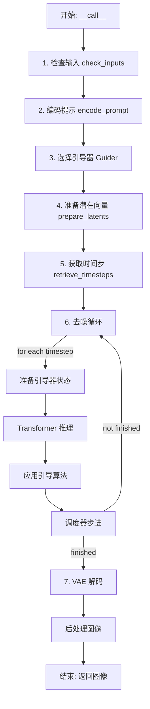
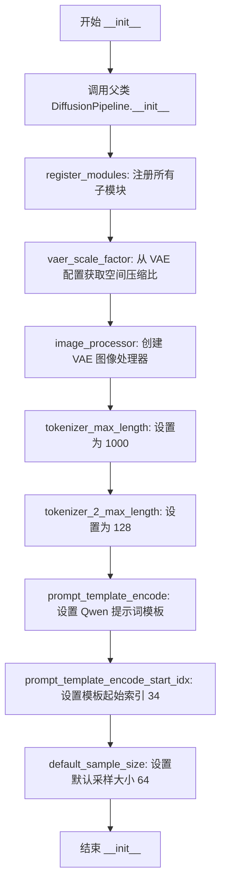
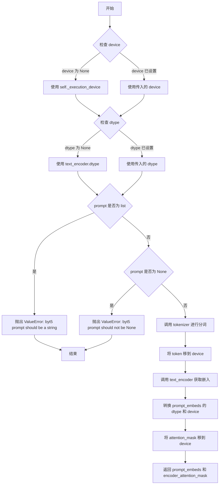
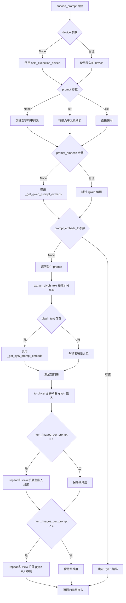
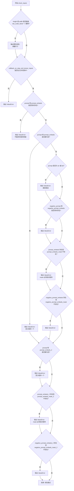
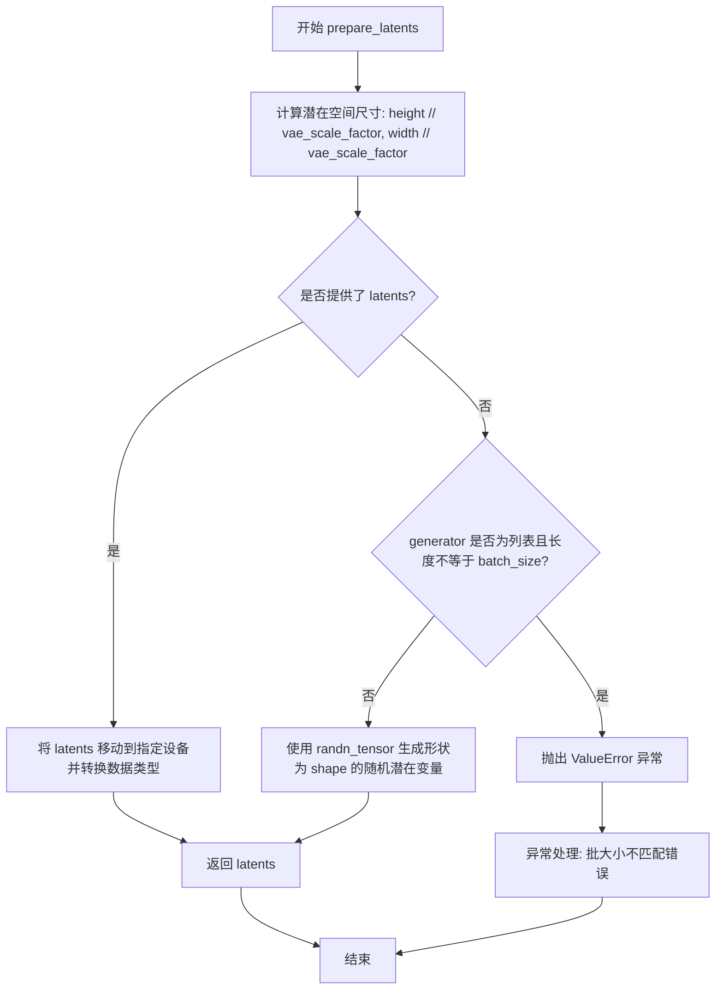

# `diffusers\src\diffusers\pipelines\hunyuan_image\pipeline_hunyuanimage.py` 详细设计文档

HunyuanImagePipeline 是一个基于扩散模型的文本到图像生成管线。它整合了双文本编码器（Qwen2.5-VL 用于视觉理解，T5/ByT5 用于字形/OCR 渲染）、HunyuanImageTransformer2DModel 去噪模型、AutoencoderKL VAE 模型以及 FlowMatchEulerDiscreteScheduler 调度器，实现从文本提示生成高质量图像。

## 整体流程



## 类结构

```
DiffusionPipeline (基类)
└── HunyuanImagePipeline
```

## 全局变量及字段


### `logger`
    
模块级日志记录器，用于输出调试和信息日志

类型：`logging.Logger`
    


### `EXAMPLE_DOC_STRING`
    
示例文档字符串，包含 HunyuanImagePipeline 的使用示例代码

类型：`str`
    


### `XLA_AVAILABLE`
    
XLA 可用性标志，指示是否安装了 PyTorch XLA 以支持跨设备加速

类型：`bool`
    


### `HunyuanImagePipeline.model_cpu_offload_seq`
    
模型 CPU 卸载顺序，指定模型组件卸载到 CPU 的序列

类型：`str`
    


### `HunyuanImagePipeline._callback_tensor_inputs`
    
回调张量输入列表，定义在推理步骤结束时可用于回调的张量名称

类型：`list[str]`
    


### `HunyuanImagePipeline._optional_components`
    
可选组件列表，包含非必需的模型组件名称

类型：`list[str]`
    


### `HunyuanImagePipeline.vae`
    
VAE 变分自编码器模型，用于图像与潜在表示之间的编码和解码

类型：`AutoencoderKLHunyuanImage`
    


### `HunyuanImagePipeline.text_encoder`
    
Qwen2.5-VL 文本编码器，用于将文本提示转换为文本嵌入向量

类型：`Qwen2_5_VLForConditionalGeneration`
    


### `HunyuanImagePipeline.tokenizer`
    
Qwen2 分词器，用于将文本分割为 token 序列

类型：`Qwen2Tokenizer`
    


### `HunyuanImagePipeline.text_encoder_2`
    
T5 文本编码器，用于处理字面量文本（OCR/字形）嵌入

类型：`T5EncoderModel`
    


### `HunyuanImagePipeline.tokenizer_2`
    
ByT5 分词器，用于对字面量文本进行字符级分词

类型：`ByT5Tokenizer`
    


### `HunyuanImagePipeline.transformer`
    
HunyuanImage 变换器模型，执行去噪扩散过程生成图像潜在表示

类型：`HunyuanImageTransformer2DModel`
    


### `HunyuanImagePipeline.scheduler`
    
Flow Match 欧拉离散调度器，控制去噪推理的时间步长

类型：`FlowMatchEulerDiscreteScheduler`
    


### `HunyuanImagePipeline.guider`
    
主引导器，用于图像生成的条件引导（支持 CFG、PAG、APG 等方法）

类型：`AdaptiveProjectedMixGuidance | None`
    


### `HunyuanImagePipeline.ocr_guider`
    
OCR 专用引导器，用于包含文本渲染的提示词的条件引导

类型：`AdaptiveProjectedMixGuidance | None`
    


### `HunyuanImagePipeline.vae_scale_factor`
    
VAE 缩放因子，用于将像素空间转换为潜在空间的缩放比例

类型：`int`
    


### `HunyuanImagePipeline.image_processor`
    
图像处理器，用于 VAE 解码后图像的后处理和格式转换

类型：`VaeImageProcessor`
    


### `HunyuanImagePipeline.tokenizer_max_length`
    
主分词器（Qwen2）的最大长度，限制提示词 token 序列长度

类型：`int`
    


### `HunyuanImagePipeline.tokenizer_2_max_length`
    
副分词器（ByT5）的最大长度，限制字形文本 token 序列长度

类型：`int`
    


### `HunyuanImagePipeline.prompt_template_encode`
    
提示词编码模板，用于包装用户提示以适配 Qwen2.5-VL 的输入格式

类型：`str`
    


### `HunyuanImagePipeline.default_sample_size`
    
默认样本尺寸，用于计算生成图像的默认高度和宽度

类型：`int`
    
    

## 全局函数及方法


### `extract_glyph_text`

该函数用于从输入提示词中提取引号内的文本（支持单引号、双引号、中文单引号和中文双引号），并将其格式化为适合 ByT5 模型处理的字符串，主要用于图像渲染中的字形（glyph）文本处理。

参数：

- `prompt`：`str`，输入的文本提示词

返回值：`str | None`，格式化后的字形文本字符串，如果未找到引号内的文本则返回 `None`

#### 流程图

```mermaid
flowchart TD
    A[开始: extract_glyph_text] --> B[定义正则表达式模式]
    B --> C[匹配单引号文本]
    B --> D[匹配双引号文本]
    B --> E[匹配中文单引号文本]
    B --> E1[匹配中文双引号文本]
    C --> F[收集所有匹配结果到列表]
    D --> F
    E --> F
    E1 --> F
    F --> G{列表是否为空?}
    G -->|否| H[格式化文本: 'Text "内容". ']
    H --> I[返回格式化字符串]
    G -->|是| J[返回None]
    I --> K[结束]
    J --> K
```

#### 带注释源码

```python
def extract_glyph_text(prompt: str):
    """
    Extract text enclosed in quotes for glyph rendering.

    Finds text in single quotes, double quotes, and Chinese quotes, then formats it for byT5 processing.

    Args:
        prompt: Input text prompt

    Returns:
        Formatted glyph text string or None if no quoted text found
    """
    # 存储提取出的所有引号内文本
    text_prompt_texts = []
    
    # 定义四种引号的正则表达式模式
    # 匹配单引号: 'text'
    pattern_quote_single = r"\'(.*?)\'"
    # 匹配双引号: "text"
    pattern_quote_double = r"\"(.*?)\""
    # 匹配中文单引号: ‘text’
    pattern_quote_chinese_single = r"‘(.*?)’"
    # 匹配中文双引号: “text”
    pattern_quote_chinese_double = r"“(.*?)”"

    # 使用正则表达式查找所有匹配项
    matches_quote_single = re.findall(pattern_quote_single, prompt)
    matches_quote_double = re.findall(pattern_quote_double, prompt)
    matches_quote_chinese_single = re.findall(pattern_quote_chinese_single, prompt)
    matches_quote_chinese_double = re.findall(pattern_quote_chinese_double, prompt)

    # 将所有匹配结果添加到列表中
    text_prompt_texts.extend(matches_quote_single)
    text_prompt_texts.extend(matches_quote_double)
    text_prompt_texts.extend(matches_quote_chinese_single)
    text_prompt_texts.extend(matches_quote_chinese_double)

    # 如果找到引号内的文本，则格式化输出
    if text_prompt_texts:
        # 格式化为: Text "内容1". Text "内容2". 
        # 便于ByT5模型理解这是一个需要渲染的字形文本
        glyph_text_formatted = ". ".join([f'Text "{text}"' for text in text_prompt_texts]) + ". "
    else:
        # 未找到任何引号文本时返回None
        glyph_text_formatted = None

    return glyph_text_formatted
```


### `retrieve_timesteps`

从调度器获取时间步（timesteps）并返回时间步调度计划及推理步数的函数。该函数是扩散模型pipeline中的核心工具函数，负责初始化和配置调度器的时间步参数，支持自定义时间步和sigmas，提供了灵活的时间步调度策略。

参数：

- `scheduler`：`SchedulerMixin`，调度器对象，用于获取时间步
- `num_inference_steps`：`int | None`，扩散模型生成样本时使用的去噪步数。如果使用此参数，`timesteps`必须为`None`
- `device`：`str | torch.device | None`，时间步要移动到的设备。如果为`None`，时间步不会被移动
- `timesteps`：`list[int] | None`，自定义时间步，用于覆盖调度器的时间步间隔策略。如果传入`timesteps`，则`num_inference_steps`和`sigmas`必须为`None`
- `sigmas`：`list[float] | None`，自定义sigmas，用于覆盖调度器的时间步间隔策略。如果传入`sigmas`，则`num_inference_steps`和`timesteps`必须为`None`
- `**kwargs`：任意关键字参数，将被传递给调度器的`set_timesteps`方法

返回值：`tuple[torch.Tensor, int]`，包含调度器的时间步调度计划和推理步数，其中第一个元素是时间步张量，第二个元素是推理步数

#### 流程图

```mermaid
flowchart TD
    A[开始] --> B{检查timesteps和sigmas是否同时存在}
    B -->|是| C[抛出ValueError: 只能选择timesteps或sigmas之一]
    B -->|否| D{检查是否提供了timesteps}
    D -->|是| E[检查调度器是否支持timesteps参数]
    E -->|不支持| F[抛出ValueError: 当前调度器不支持自定义timesteps]
    E -->|支持| G[调用scheduler.set_timesteps并传入timesteps]
    D -->|否| H{检查是否提供了sigmas}
    H -->|是| I[检查调度器是否支持sigmas参数]
    I -->|不支持| J[抛出ValueError: 当前调度器不支持自定义sigmas]
    I -->|支持| K[调用scheduler.set_timesteps并传入sigmas]
    H -->|否| L[调用scheduler.set_timesteps并传入num_inference_steps]
    G --> M[获取scheduler.timesteps]
    K --> M
    L --> M
    M --> N[计算num_inference_steps为len(timesteps)]
    N --> O[返回timesteps和num_inference_steps]
    O --> P[结束]
```

#### 带注释源码

```
# 从调度器获取时间步的函数
# 复制自 diffusers.pipelines.stable_diffusion.pipeline_stable_diffusion.retrieve_timesteps
def retrieve_timesteps(
    scheduler,  # 调度器对象
    num_inference_steps: int | None = None,  # 推理步数
    device: str | torch.device | None = None,  # 目标设备
    timesteps: list[int] | None = None,  # 自定义时间步
    sigmas: list[float] | None = None,  # 自定义sigmas
    **kwargs,  # 额外参数传递给set_timesteps
):
    r"""
    调用调度器的`set_timesteps`方法并从中获取时间步。处理自定义时间步。
    任何kwargs都将被提供给`scheduler.set_timesteps`。

    参数:
        scheduler (`SchedulerMixin`):
            要获取时间步的调度器。
        num_inference_steps (`int`):
            使用预训练模型生成样本时使用的扩散步数。如果使用此参数，`timesteps`
            必须为`None`。
        device (`str`或`torch.device`, *可选*):
            时间步应移动到的设备。如果为`None`，时间步不会被移动。
        timesteps (`list[int]`, *可选*):
            用于覆盖调度器时间步间隔策略的自定义时间步。如果传入`timesteps`，
            `num_inference_steps`和`sigmas`必须为`None`。
        sigmas (`list[float]`, *可选*):
            用于覆盖调度器时间步间隔策略的自定义sigmas。如果传入`sigmas`，
            `num_inference_steps`和`timesteps`必须为`None`。

    返回:
        `tuple[torch.Tensor, int]`: 元组，第一个元素是调度器的时间步计划，
        第二个元素是推理步数。
    """
    # 检查timesteps和sigmas不能同时提供
    if timesteps is not None and sigmas is not None:
        raise ValueError("Only one of `timesteps` or `sigmas` can be passed. Please choose one to set custom values")
    
    # 处理timesteps参数
    if timesteps is not None:
        # 检查调度器是否支持timesteps参数
        accepts_timesteps = "timesteps" in set(inspect.signature(scheduler.set_timesteps).parameters.keys())
        if not accepts_timesteps:
            raise ValueError(
                f"The current scheduler class {scheduler.__class__}'s `set_timesteps` does not support custom"
                f" timestep schedules. Please check whether you are using the correct scheduler."
            )
        # 调用调度器的set_timesteps方法
        scheduler.set_timesteps(timesteps=timesteps, device=device, **kwargs)
        # 获取调度器的时间步
        timesteps = scheduler.timesteps
        # 计算推理步数
        num_inference_steps = len(timesteps)
    # 处理sigmas参数
    elif sigmas is not None:
        # 检查调度器是否支持sigmas参数
        accept_sigmas = "sigmas" in set(inspect.signature(scheduler.set_timesteps).parameters.keys())
        if not accept_sigmas:
            raise ValueError(
                f"The current scheduler class {scheduler.__class__}'s `set_timesteps` does not support custom"
                f" sigmas schedules. Please check whether you are using the correct scheduler."
            )
        # 调用调度器的set_timesteps方法
        scheduler.set_timesteps(sigmas=sigmas, device=device, **kwargs)
        # 获取调度器的时间步
        timesteps = scheduler.timesteps
        # 计算推理步数
        num_inference_steps = len(timesteps)
    # 既没有timesteps也没有sigmas，使用默认的num_inference_steps
    else:
        scheduler.set_timesteps(num_inference_steps, device=device, **kwargs)
        timesteps = scheduler.timesteps
    
    # 返回时间步和推理步数
    return timesteps, num_inference_steps
```


### HunyuanImagePipeline.__init__

该方法是 HunyuanImagePipeline 类的构造函数，负责初始化整个文生图管线，包括注册所有子模块（VAE、文本编码器、分词器、Transformer、调度器、引导器等），配置图像处理器和相关参数，为后续的图像生成流程准备好所需的所有组件。

参数：

- `scheduler`：`FlowMatchEulerDiscreteScheduler`，用于去噪的调度器，与 transformer 结合使用对编码后的图像潜向量进行去噪
- `vae`：`AutoencoderKLHunyuanImage`，变分自编码器模型，用于将图像编码和解码到潜向量表示
- `text_encoder`：`Qwen2_5_VLForConditionalGeneration`，Qwen2.5-VL-7B-Instruct 文本编码器，用于将文本提示转换为文本嵌入
- `tokenizer`：`Qwen2Tokenizer`，Qwen2 分词器，用于对文本提示进行分词
- `text_encoder_2`：`T5EncoderModel`，T5 编码器模型，用于处理字形文本（glyph text）
- `tokenizer_2`：`ByT5Tokenizer`，ByT5 分词器，用于对字形文本进行分词
- `transformer`：`HunyuanImageTransformer2DModel`，条件 Transformer（MMDiT）架构，用于对编码后的图像潜向量进行去噪
- `guider`：`AdaptiveProjectedMixGuidance | None`，可选的引导器，用于引导图像生成
- `ocr_guider`：`AdaptiveProjectedMixGuidance | None`，可选的 OCR 引导器，用于文本渲染时的图像生成引导

返回值：无（`None`），构造函数不返回任何值，仅初始化对象状态

#### 流程图



#### 带注释源码

```python
def __init__(
    self,
    scheduler: FlowMatchEulerDiscreteScheduler,
    vae: AutoencoderKLHunyuanImage,
    text_encoder: Qwen2_5_VLForConditionalGeneration,
    tokenizer: Qwen2Tokenizer,
    text_encoder_2: T5EncoderModel,
    tokenizer_2: ByT5Tokenizer,
    transformer: HunyuanImageTransformer2DModel,
    guider: AdaptiveProjectedMixGuidance | None = None,
    ocr_guider: AdaptiveProjectedMixGuidance | None = None,
):
    """
    初始化 HunyuanImage 管线
    
    参数:
        scheduler: FlowMatchEulerDiscreteScheduler 调度器
        vae: AutoencoderKLHunyuanImage VAE 模型
        text_encoder: Qwen2_5_VLForConditionalGeneration Qwen 文本编码器
        tokenizer: Qwen2Tokenizer Qwen 分词器
        text_encoder_2: T5EncoderModel T5 文本编码器
        tokenizer_2: ByT5Tokenizer ByT5 分词器
        transformer: HunyuanImageTransformer2DModel 图像 Transformer
        guider: AdaptiveProjectedMixGuidance | None 图像生成引导器
        ocr_guider: AdaptiveProjectedMixGuidance | None OCR 文本渲染引导器
    """
    # 调用父类 DiffusionPipeline 的初始化方法
    # 父类会设置 _execution_device 等基础属性
    super().__init__()

    # 注册所有子模块到管线中，使其可以通过 self.xxx 访问
    # 这些模块将在管线执行过程中被使用
    self.register_modules(
        vae=vae,
        text_encoder=text_encoder,
        tokenizer=tokenizer,
        text_encoder_2=text_encoder_2,
        tokenizer_2=tokenizer_2,
        transformer=transformer,
        scheduler=scheduler,
        guider=guider,
        ocr_guider=ocr_guider,
    )

    # 计算 VAE 的缩放因子，用于后续潜向量和图像尺寸的转换
    # 从 VAE 配置中获取空间压缩比，如果 VAE 不存在则默认为 32
    self.vae_scale_factor = self.vae.config.spatial_compression_ratio if getattr(self, "vae", None) else 32
    
    # 创建图像后处理器，用于将 VAE 解码后的潜向量转换为图像
    self.image_processor = VaeImageProcessor(vae_scale_factor=self.vae_scale_factor)
    
    # 设置 Qwen 分词器的最大长度（用于主文本嵌入）
    self.tokenizer_max_length = 1000
    
    # 设置 ByT5 分词器的最大长度（用于字形文本嵌入）
    self.tokenizer_2_max_length = 128
    
    # Qwen 编码器的提示词模板，用于格式化用户输入
    # 模板包含系统消息和用户消息的格式
    self.prompt_template_encode = "<|im_start|>system\nDescribe the image by detailing the color, shape, size, texture, quantity, text, spatial relationships of the objects and background:<|im_end|>\n<|im_start|>user\n{}<|im_end|>"
    
    # 提示词模板中需要跳过的起始索引位置
    # 用于从编码器隐藏状态中提取有效的提示嵌入
    self.prompt_template_encode_start_idx = 34
    
    # 默认的采样大小（潜空间中的尺寸）
    # 最终图像尺寸 = default_sample_size * vae_scale_factor
    # 例如: 64 * 32 = 2048 像素
    self.default_sample_size = 64
```


### `HunyuanImagePipeline._get_qwen_prompt_embeds`

该方法用于获取Qwen文本编码器生成的提示词嵌入（prompt embeddings），将输入的文本提示词通过Qwen2.5-VL模型编码为高维向量表示，供后续图像生成模块使用。

参数：

- `tokenizer`：`Qwen2Tokenizer`，Qwen分词器，用于将文本转换为token ID序列
- `text_encoder`：`Qwen2_5_VLForConditionalGeneration`，Qwen文本编码器模型，用于生成文本嵌入
- `prompt`：`str | list[str] | None`，输入的文本提示词，可以是单个字符串或字符串列表
- `device`：`torch.device | None`，计算设备，默认为执行设备
- `dtype`：`torch.dtype | None`，输出张量的数据类型，默认为文本编码器的数据类型
- `tokenizer_max_length`：`int`，分词器最大长度，默认为1000
- `template`：`str`，提示词模板，默认为包含系统指令和用户提示的格式化字符串
- `drop_idx`：`int`，丢弃的token索引位置，默认为34（对应模板中前缀部分的长度）
- `hidden_state_skip_layer`：`int`，隐藏状态跳过层数，默认为2（用于选择合适的中间层）

返回值：`(torch.Tensor, torch.Tensor)`，返回元组包含：
- `prompt_embeds`：`torch.Tensor`，形状为 `(batch_size, seq_len, hidden_dim)` 的文本嵌入张量
- `encoder_attention_mask`：`torch.Tensor`，形状为 `(batch_size, seq_len)` 的注意力掩码张量

#### 流程图

```mermaid
flowchart TD
    A[开始] --> B{device参数}
    B -->|None| C[使用self._execution_device]
    B -->|有值| D[使用传入的device]
    C --> E{device和dtype赋值}
    D --> E
    E --> F{dtype参数}
    F -->|None| G[使用text_encoder.dtype]
    F -->|有值| H[使用传入的dtype]
    G --> I
    H --> I
    I{prompt类型} -->|str| J[转换为单元素列表]
    I -->|list| K[直接使用]
    J --> L
    K --> L
    L[使用template格式化每个prompt] --> M[tokenizer分词]
    M --> N[text_encoder编码<br/>output_hidden_states=True]
    N --> O[获取倒数第3层隐藏状态<br/>hidden_states[-(hidden_state_skip_layer + 1)]]
    O --> P[根据drop_idx裁剪embeddings和attention_mask]
    P --> Q[转换dtype和device] --> R[返回prompt_embeds和encoder_attention_mask]
```

#### 带注释源码

```python
def _get_qwen_prompt_embeds(
    self,
    tokenizer: Qwen2Tokenizer,
    text_encoder: Qwen2_5_VLForConditionalGeneration,
    prompt: str | list[str] = None,
    device: torch.device | None = None,
    dtype: torch.dtype | None = None,
    tokenizer_max_length: int = 1000,
    template: str = "<|im_start|>system\nDescribe the image by detailing the color, shape, size, texture, quantity, text, spatial relationships of the objects and background:<|im_end|>\n<|im_start|>user\n{}<|im_end|>",
    drop_idx: int = 34,
    hidden_state_skip_layer: int = 2,
):
    """
    获取Qwen文本编码器生成的提示词嵌入
    
    参数:
        tokenizer: Qwen分词器
        text_encoder: Qwen文本编码器
        prompt: 输入提示词
        device: 计算设备
        dtype: 输出数据类型
        tokenizer_max_length: 分词器最大长度
        template: 提示词模板
        drop_idx: 丢弃的前缀token数量
        hidden_state_skip_layer: 隐藏状态跳过层数
    """
    # 1. 确定设备：优先使用传入的device，否则使用pipeline的执行设备
    device = device or self._execution_device
    
    # 2. 确定数据类型：优先使用传入的dtype，否则使用文本编码器的数据类型
    dtype = dtype or text_encoder.dtype
    
    # 3. 标准化prompt格式：如果是字符串则转换为单元素列表
    prompt = [prompt] if isinstance(prompt, str) else prompt
    
    # 4. 使用模板格式化prompt：将每个prompt插入到预定义的模板中
    # 模板格式: "<|im_start|>system\n系统指令<im_end/>\n<|im_start|>user\n用户输入<im_end|>"
    txt = [template.format(e) for e in prompt]
    
    # 5. 分词处理：将格式化后的文本转换为token id序列
    # max_length + drop_idx: 预留drop_idx个位置用于后续丢弃
    txt_tokens = tokenizer(
        txt, 
        max_length=tokenizer_max_length + drop_idx, 
        padding="max_length", 
        truncation=True, 
        return_tensors="pt"
    ).to(device)
    
    # 6. 文本编码：使用Qwen模型编码文本，获取隐藏状态序列
    # output_hidden_states=True: 返回所有层的隐藏状态
    encoder_hidden_states = text_encoder(
        input_ids=txt_tokens.input_ids,
        attention_mask=txt_tokens.attention_mask,
        output_hidden_states=True,
    )
    
    # 7. 选择隐藏状态层：选择倒数第(hidden_state_skip_layer + 1)层
    # 跳过最后两层，选择更富含语义信息的中间层
    # 例如hidden_state_skip_layer=2时，选择倒数第3层
    prompt_embeds = encoder_hidden_states.hidden_states[-(hidden_state_skip_layer + 1)]
    
    # 8. 裁剪前缀：丢弃模板前缀部分（system指令等），保留用户输入部分
    # drop_idx=34 对应模板中"<|im_start|>system...<im_end/>\n<|im_start|>user\n"的长度
    prompt_embeds = prompt_embeds[:, drop_idx:]
    encoder_attention_mask = txt_tokens.attention_mask[:, drop_idx:]
    
    # 9. 类型和设备转换：确保输出张量符合要求的dtype和device
    prompt_embeds = prompt_embeds.to(dtype=dtype, device=device)
    encoder_attention_mask = encoder_attention_mask.to(device=device)
    
    # 10. 返回：文本嵌入和对应的注意力掩码
    return prompt_embeds, encoder_attention_mask
```


### `HunyuanImagePipeline._get_byt5_prompt_embeds`

该方法用于通过ByT5文本编码器将包含排版文本（glyph）的提示转换为文本嵌入向量。它首先验证输入的prompt参数，然后使用ByT5分词器对prompt进行分词处理，最后通过T5编码器模型生成文本嵌入和对应的注意力掩码，用于后续的图像生成过程。

参数：

- `self`：`HunyuanImagePipeline` 实例，Pipeline对象本身
- `tokenizer`：`ByT5Tokenizer`，ByT5分词器实例，用于将文本转换为token序列
- `text_encoder`：`T5EncoderModel`，T5编码器模型，用于将token序列转换为嵌入向量
- `prompt`：`str`，输入的文本提示（包含提取的排版文本glyph text）
- `device`：`torch.device | None`，计算设备，默认为`self._execution_device`
- `dtype`：`torch.dtype | None`，输出张量的数据类型，默认为`text_encoder.dtype`
- `tokenizer_max_length`：`int`，分词器最大长度，默认为128

返回值：`tuple[torch.Tensor, torch.Tensor]`，包含两个元素的元组：
- `prompt_embeds`：文本嵌入张量，形状为`(batch_size, seq_len, hidden_dim)`
- `encoder_attention_mask`：注意力掩码张量，形状为`(batch_size, seq_len)`

#### 流程图



#### 带注释源码

```python
def _get_byt5_prompt_embeds(
    self,
    tokenizer: ByT5Tokenizer,
    text_encoder: T5EncoderModel,
    prompt: str,
    device: torch.device | None = None,
    dtype: torch.dtype | None = None,
    tokenizer_max_length: int = 128,
):
    """
    获取ByT5文本嵌入用于排版文本渲染

    参数:
        tokenizer: ByT5分词器
        text_encoder: T5编码器模型
        prompt: 文本提示
        device: 计算设备
        dtype: 数据类型
        tokenizer_max_length: 最大分词长度

    返回:
        文本嵌入和注意力掩码
    """
    # 如果未指定device，使用Pipeline的执行设备
    device = device or self._execution_device
    # 如果未指定dtype，使用text_encoder的默认数据类型
    dtype = dtype or text_encoder.dtype

    # 验证prompt参数：byT5只接受单个字符串，不接受列表
    if isinstance(prompt, list):
        raise ValueError("byt5 prompt should be a string")
    # prompt不能为None
    elif prompt is None:
        raise ValueError("byt5 prompt should not be None")

    # 使用ByT5分词器对prompt进行分词
    # padding="max_length": 填充到最大长度
    # max_length=tokenizer_max_length: 最大长度限制
    # truncation=True: 超过最大长度进行截断
    # add_special_tokens=True: 添加特殊token（如CLS、SEP等）
    # return_tensors="pt": 返回PyTorch张量
    txt_tokens = tokenizer(
        prompt,
        padding="max_length",
        max_length=tokenizer_max_length,
        truncation=True,
        add_special_tokens=True,
        return_tensors="pt",
    ).to(device)

    # 使用T5编码器生成文本嵌入
    # input_ids: 分词后的token ID
    # attention_mask: 注意力掩码（需要转换为float类型）
    # [0]: 返回第一个元素（隐藏状态）
    prompt_embeds = text_encoder(
        input_ids=txt_tokens.input_ids,
        attention_mask=txt_tokens.attention_mask.float(),
    )[0]

    # 将嵌入转换为指定的dtype和device
    prompt_embeds = prompt_embeds.to(dtype=dtype, device=device)
    # 将注意力掩码移到指定device
    encoder_attention_mask = txt_tokens.attention_mask.to(device=device)

    # 返回文本嵌入和注意力掩码
    return prompt_embeds, encoder_attention_mask
```


### HunyuanImagePipeline.encode_prompt

该函数是 HunyuanImage 文本到图像生成流水线的核心提示词编码方法，负责将用户输入的文本提示转换为模型可理解的向量表示。它使用双文本编码器架构：Qwen2.5-VL-7B-Instruct 作为主文本编码器生成语义嵌入，ByT5 作为辅助编码器处理文字渲染（glyph）任务，最终返回两组嵌入向量及其注意力掩码供后续扩散模型使用。

参数：

- `prompt`：`str | list[str]`，要编码的文本提示，支持单字符串或字符串列表
- `device`：`torch.device | None`，执行编码的 torch 设备，默认为当前执行设备
- `batch_size`：`int`，提示批次大小，默认为 1
- `num_images_per_prompt`：`int`，每个提示需要生成的图像数量，默认为 1
- `prompt_embeds`：`torch.Tensor | None`，预生成的 Qwen2.5-VL 文本嵌入向量，若未提供则从 prompt 实时生成
- `prompt_embeds_mask`：`torch.Tensor | None`，预生成的 Qwen2.5-VL 注意力掩码，与 prompt_embeds 配合使用
- `prompt_embeds_2`：`torch.Tensor | None`，预生成的 ByT5 glyph 文本嵌入，若未提供则从 prompt 中的引号文本提取生成
- `prompt_embeds_mask_2`：`torch.Tensor | None`，预生成的 ByT5 注意力掩码，与 prompt_embeds_2 配合使用

返回值：`tuple[torch.Tensor, torch.Tensor, torch.Tensor, torch.Tensor]`，返回四个张量组成的元组：(1) 主文本嵌入 prompt_embeds，(2) 主文本注意力掩码 prompt_embeds_mask，(3) glyph 文本嵌入 prompt_embeds_2，(4) glyph 文本注意力掩码 prompt_embeds_mask_2。所有返回张量的批次维度已扩展为 batch_size * num_images_per_prompt

#### 流程图



#### 带注释源码

```python
def encode_prompt(
    self,
    prompt: str | list[str],
    device: torch.device | None = None,
    batch_size: int = 1,
    num_images_per_prompt: int = 1,
    prompt_embeds: torch.Tensor | None = None,
    prompt_embeds_mask: torch.Tensor | None = None,
    prompt_embeds_2: torch.Tensor | None = None,
    prompt_embeds_mask_2: torch.Tensor | None = None,
):
    """
    编码文本提示词为向量表示
    
    使用双文本编码器架构：
    - Qwen2.5-VL-7B-Instruct: 编码主文本语义
    - ByT5: 编码 glyph/文字渲染文本（从引号中提取）
    
    Args:
        prompt: 输入文本提示
        device: torch 设备
        batch_size: 批次大小
        num_images_per_prompt: 每个提示生成的图像数
        prompt_embeds: 预计算的 Qwen 嵌入
        prompt_embeds_mask: 预计算的 Qwen 掩码
        prompt_embeds_2: 预计算的 ByT5 嵌入
        prompt_embeds_mask_2: 预计算的 ByT5 掩码
    """
    # 确定执行设备，优先使用传入参数，否则使用管道默认设备
    device = device or self._execution_device

    # 处理空提示情况，创建一个空字符串列表填充批次
    if prompt is None:
        prompt = [""] * batch_size

    # 统一提示格式：确保是列表类型
    prompt = [prompt] if isinstance(prompt, str) else prompt

    # ====== 步骤 1: 处理 Qwen2.5-VL 主文本嵌入 ======
    # 如果未提供预计算嵌入，则实时生成
    if prompt_embeds is None:
        # 调用内部方法使用 Qwen2.5-VL 编码器生成语义嵌入
        # 使用预定义的提示模板包装输入
        prompt_embeds, prompt_embeds_mask = self._get_qwen_prompt_embeds(
            tokenizer=self.tokenizer,
            text_encoder=self.text_encoder,
            prompt=prompt,
            device=device,
            tokenizer_max_length=self.tokenizer_max_length,
            template=self.prompt_template_encode,
            drop_idx=self.prompt_template_encode_start_idx,
        )

    # ====== 步骤 2: 处理 ByT5 glyph 文本嵌入 ======
    # glyph 文本从原始提示中用引号提取，用于文字渲染任务
    if prompt_embeds_2 is None:
        prompt_embeds_2_list = []
        prompt_embeds_mask_2_list = []

        # 提取每个提示中的引号文本（支持单引号、双引号、中文引号）
        glyph_texts = [extract_glyph_text(p) for p in prompt]
        
        # 为每个提示单独处理 glyph 嵌入
        for glyph_text in glyph_texts:
            if glyph_text is None:
                # 无 glyph 文本时创建零张量占位，保持序列长度一致
                glyph_text_embeds = torch.zeros(
                    (1, self.tokenizer_2_max_length, self.text_encoder_2.config.d_model), 
                    device=device
                )
                glyph_text_embeds_mask = torch.zeros(
                    (1, self.tokenizer_2_max_length), 
                    device=device, 
                    dtype=torch.int64
                )
            else:
                # 有 glyph 文本时调用 ByT5 编码器生成嵌入
                glyph_text_embeds, glyph_text_embeds_mask = self._get_byt5_prompt_embeds(
                    tokenizer=self.tokenizer_2,
                    text_encoder=self.text_encoder_2,
                    prompt=glyph_text,
                    device=device,
                    tokenizer_max_length=self.tokenizer_2_max_length,
                )

            # 收集所有 glyph 嵌入
            prompt_embeds_2_list.append(glyph_text_embeds)
            prompt_embeds_mask_2_list.append(glyph_text_embeds_mask)

        # 沿批次维度拼接所有 glyph 嵌入
        prompt_embeds_2 = torch.cat(prompt_embeds_2_list, dim=0)
        prompt_embeds_mask_2 = torch.cat(prompt_embeds_mask_2_list, dim=0)

    # ====== 步骤 3: 扩展维度以支持多图生成 ======
    # 当 num_images_per_prompt > 1 时，需要复制嵌入向量
    
    # 处理 Qwen 嵌入：扩展到 batch_size * num_images_per_prompt
    _, seq_len, _ = prompt_embeds.shape
    prompt_embeds = prompt_embeds.repeat(1, num_images_per_prompt, 1)
    prompt_embeds = prompt_embeds.view(batch_size * num_images_per_prompt, seq_len, -1)
    prompt_embeds_mask = prompt_embeds_mask.repeat(1, num_images_per_prompt, 1)
    prompt_embeds_mask = prompt_embeds_mask.view(batch_size * num_images_per_prompt, seq_len)

    # 处理 ByT5 嵌入：同样扩展维度
    _, seq_len_2, _ = prompt_embeds_2.shape
    prompt_embeds_2 = prompt_embeds_2.repeat(1, num_images_per_prompt, 1)
    prompt_embeds_2 = prompt_embeds_2.view(batch_size * num_images_per_prompt, seq_len_2, -1)
    prompt_embeds_mask_2 = prompt_embeds_mask_2.repeat(1, num_images_per_prompt, 1)
    prompt_embeds_mask_2 = prompt_embeds_mask_2.view(batch_size * num_images_per_prompt, seq_len_2)

    # 返回四元组：主嵌入 + 主掩码 + glyph 嵌入 + glyph 掩码
    return prompt_embeds, prompt_embeds_mask, prompt_embeds_2, prompt_embeds_mask_2
```


### HunyuanImagePipeline.check_inputs

该方法用于校验 HunyuanImagePipeline 推理调用的输入参数合法性，确保 prompt/height/width/negative_prompt 及各种 embed 相关参数符合模型要求，若不合规则抛出明确的 ValueError 异常。

参数：

- `prompt`：`str | list[str] | None`，正向提示词，用于指导图像生成
- `height`：`int`，生成图像的高度（像素）
- `width`：`int`，生成图像的宽度（像素）
- `negative_prompt`：`str | list[str] | None`，负向提示词，用于避免生成某些内容
- `prompt_embeds`：`torch.Tensor | None`，预生成的文本嵌入向量（来自 Qwen2.5-VL）
- `negative_prompt_embeds`：`torch.Tensor | None`，预生成的负向文本嵌入向量
- `prompt_embeds_mask`：`torch.Tensor | None`，预生成的文本嵌入掩码
- `negative_prompt_embeds_mask`：`torch.Tensor | None`，预生成的负向文本嵌入掩码
- `prompt_embeds_2`：`torch.Tensor | None`，预生成的文本嵌入向量（来自 ByT5，用于 OCR/字形渲染）
- `prompt_embeds_mask_2`：`torch.Tensor | None`，预生成的文本嵌入掩码（ByT5）
- `negative_prompt_embeds_2`：`torch.Tensor | None`，预生成的负向文本嵌入向量（ByT5）
- `negative_prompt_embeds_mask_2`：`torch.Tensor | None`，预生成的负向文本嵌入掩码（ByT5）
- `callback_on_step_end_tensor_inputs`：`list[str] | None`，回调函数在每步结束时可访问的张量输入列表

返回值：`None`，该方法仅进行参数校验，不返回任何值；若参数非法则抛出 ValueError 异常

#### 流程图



#### 带注释源码

```python
def check_inputs(
    self,
    prompt,
    height,
    width,
    negative_prompt=None,
    prompt_embeds=None,
    negative_prompt_embeds=None,
    prompt_embeds_mask=None,
    negative_prompt_embeds_mask=None,
    prompt_embeds_2=None,
    prompt_embeds_mask_2=None,
    negative_prompt_embeds_2=None,
    negative_prompt_embeds_mask_2=None,
    callback_on_step_end_tensor_inputs=None,
):
    # 检查图像尺寸是否满足 VAE 压缩后的对齐要求
    # VAE 压缩后需要乘以 2 倍才能还原到像素空间
    if height % (self.vae_scale_factor * 2) != 0 or width % (self.vae_scale_factor * 2) != 0:
        logger.warning(
            f"`height` and `width` have to be divisible by {self.vae_scale_factor * 2} but are {height} and {width}. Dimensions will be resized accordingly"
        )

    # 检查回调函数张量输入是否在允许的列表中
    # 只能传递 pipeline 明确支持的张量，防止越界访问
    if callback_on_step_end_tensor_inputs is not None and not all(
        k in self._callback_tensor_inputs for k in callback_on_step_end_tensor_inputs
    ):
        raise ValueError(
            f"`callback_on_step_end_tensor_inputs` has to be in {self._callback_tensor_inputs}, but found {[k for k in callback_on_step_end_tensor_inputs if k not in self._callback_tensor_inputs]}"
        )

    # 检查 prompt 和 prompt_embeds 不能同时提供，避免冲突
    if prompt is not None and prompt_embeds is not None:
        raise ValueError(
            f"Cannot forward both `prompt`: {prompt} and `prompt_embeds`: {prompt_embeds}. Please make sure to"
            " only forward one of the two."
        )
    # 检查至少提供一个正向输入源
    elif prompt is None and prompt_embeds is None:
        raise ValueError(
            "Provide either `prompt` or `prompt_embeds`. Cannot leave both `prompt` and `prompt_embeds` undefined."
        )
    # 检查 prompt 类型必须是字符串或列表
    elif prompt is not None and (not isinstance(prompt, str) and not isinstance(prompt, list)):
        raise ValueError(f"`prompt` has to be of type `str` or `list` but is {type(prompt)}")

    # 检查 negative_prompt 和 negative_prompt_embeds 不能同时提供
    if negative_prompt is not None and negative_prompt_embeds is not None:
        raise ValueError(
            f"Cannot forward both `negative_prompt`: {negative_prompt} and `negative_prompt_embeds`:"
            f" {negative_prompt_embeds}. Please make sure to only forward one of the two."
        )

    # 检查 prompt_embeds 和对应的 mask 必须成对提供
    # 因为 mask 用于标识有效 token 位置，单独提供 embed 无意义
    if prompt_embeds is not None and prompt_embeds_mask is None:
        raise ValueError(
            "If `prompt_embeds` are provided, `prompt_embeds_mask` also have to be passed. Make sure to generate `prompt_embeds_mask` from the same text encoder that was used to generate `prompt_embeds`."
        )
    # 检查 negative_prompt_embeds 和 mask 成对提供
    if negative_prompt_embeds is not None and negative_prompt_embeds_mask is None:
        raise ValueError(
            "If `negative_prompt_embeds` are provided, `negative_prompt_embeds_mask` also have to be passed. Make sure to generate `negative_prompt_embeds_mask` from the same text encoder that was used to generate `negative_prompt_embeds`."
        )

    # 检查 prompt 和 ByT5 生成的 embed 至少提供一个
    if prompt is None and prompt_embeds_2 is None:
        raise ValueError(
            "Provide either `prompt` or `prompt_embeds_2`. Cannot leave both `prompt` and `prompt_embeds_2` undefined."
        )

    # 检查 ByT5 生成的 embed 和 mask 成对提供
    if prompt_embeds_2 is not None and prompt_embeds_mask_2 is None:
        raise ValueError(
            "If `prompt_embeds_2` are provided, `prompt_embeds_mask_2` also have to be passed. Make sure to generate `prompt_embeds_mask_2` from the same text encoder that was used to generate `prompt_embeds_2`."
        )
    # 检查 negative 的 ByT5 embed 和 mask 成对提供
    if negative_prompt_embeds_2 is not None and negative_prompt_embeds_mask_2 is None:
        raise ValueError(
            "If `negative_prompt_embeds_2` are provided, `negative_prompt_embeds_mask_2` also have to be passed. Make sure to generate `negative_prompt_embeds_mask_2` from the same text encoder that was used to generate `negative_prompt_embeds_2`."
        )
```


### HunyuanImagePipeline.prepare_latents

该方法用于准备扩散模型的初始潜在噪声张量。它接收图像尺寸、批次大小等参数，根据 VAE 缩放因子计算潜在空间的尺寸，如果提供了现有的 latents 则直接返回，否则使用随机张量生成器生成新的噪声潜在变量。

参数：

- `batch_size`：`int`，批次大小，决定生成潜在变量的数量
- `num_channels_latents`：`int`，潜在变量的通道数，对应 transformer 模型配置中的输入通道数
- `height`：`int`，目标图像的高度（像素单位），方法内部会除以 VAE 缩放因子转换为潜在空间高度
- `width`：`int`，目标图像的宽度（像素单位），方法内部会除以 VAE 缩放因子转换为潜在空间宽度
- `dtype`：`torch.dtype`，生成潜在变量的数据类型，通常与文本嵌入数据类型一致
- `device`：`torch.device`，生成潜在变量所在的设备（CPU/CUDA）
- `generator`：`torch.Generator | list[torch.Generator] | None`，可选的随机数生成器，用于确保生成的可重复性
- `latents`：`torch.Tensor | None`，可选的预生成潜在变量，如果提供则直接返回转换后的张量

返回值：`torch.Tensor`，返回处理或生成后的潜在变量张量，形状为 (batch_size, num_channels_latents, height//vae_scale_factor, width//vae_scale_factor)

#### 流程图



#### 带注释源码

```python
def prepare_latents(
    self,
    batch_size,                  # int: 批次大小
    num_channels_latents,        # int: 潜在变量通道数
    height,                      # int: 图像高度
    width,                       # int: 图像宽度
    dtype,                       # torch.dtype: 数据类型
    device,                      # torch.device: 设备
    generator,                   # torch.Generator | list[torch.Generator] | None: 随机生成器
    latents=None,                # torch.Tensor | None: 预提供的潜在变量
):
    # 根据 VAE 缩放因子将像素尺寸转换为潜在空间尺寸
    # VAE 通常将图像压缩 8x、16x 或 32x，这里使用配置的 spatial_compression_ratio
    height = int(height) // self.vae_scale_factor
    width = int(width) // self.vae_scale_factor

    # 构建潜在变量的形状: (batch_size, num_channels, latent_height, latent_width)
    shape = (batch_size, num_channels_latents, height, width)

    # 如果外部提供了 latents，直接进行设备和数据类型转换后返回
    # 这允许用户自定义初始噪声或继续之前的生成
    if latents is not None:
        return latents.to(device=device, dtype=dtype)

    # 验证生成器列表长度与批次大小是否匹配
    # 当使用多个生成器时，每个生成器应对应一个样本
    if isinstance(generator, list) and len(generator) != batch_size:
        raise ValueError(
            f"You have passed a list of generators of length {len(generator)}, but requested an effective batch"
            f" size of {batch_size}. Make sure the batch size matches the length of the generators."
        )

    # 使用随机张量生成器创建高斯噪声潜在变量
    # 这是扩散模型的标准初始化方式，从标准正态分布采样
    latents = randn_tensor(shape, generator=generator, device=device, dtype=dtype)

    return latents
```


### HunyuanImagePipeline.__call__

这是 HunyuanImage 文本到图像生成管道的主方法，负责执行完整的图像生成流程。该方法通过多阶段处理将文本提示转换为图像：首先对提示词进行编码，然后通过去噪循环逐步从噪声潜在变量中恢复出图像潜在表示，最后使用 VAE 解码器将潜在变量解码为最终图像。

参数：

- `prompt`：`str | list[str]`，用于指导图像生成的文本提示，如未定义则需传递 `prompt_embeds`
- `negative_prompt`：`str | list[str]`，不参与图像生成的负面提示，如未定义且未提供 negative_prompt_embeds，将使用空的负面提示
- `height`：`int | None`，生成图像的高度（像素），默认根据 VAE 缩放因子计算
- `width`：`int | None`，生成图像的宽度（像素），默认根据 VAE 缩放因子计算
- `num_inference_steps`：`int`，去噪步数，默认为 50，步数越多通常图像质量越高但推理速度越慢
- `distilled_guidance_scale`：`float | None`，蒸馏引导模型的引导比例，对于非蒸馏模型此参数将被忽略
- `sigmas`：`list[float] | None`，自定义 sigma 值，用于支持 sigmas 的调度器
- `num_images_per_prompt`：`int`，每个提示生成的图像数量，默认为 1
- `generator`：`torch.Generator | list[torch.Generator] | None`，用于生成确定性结果的随机数生成器
- `latents`：`torch.Tensor | None`，预生成的噪声潜在变量，用于图像生成，如未提供将使用随机生成器采样
- `prompt_embeds`：`torch.Tensor | None`，预生成的文本嵌入，用于轻松调整文本输入
- `prompt_embeds_mask`：`torch.Tensor | None`，预生成的文本嵌入掩码
- `negative_prompt_embeds`：`torch.Tensor | None`，预生成的负面文本嵌入
- `negative_prompt_embeds_mask`：`torch.Tensor | None`，预生成的负面文本嵌入掩码
- `prompt_embeds_2`：`torch.Tensor | None`，用于 OCR 的预生成文本嵌入
- `prompt_embeds_mask_2`：`torch.Tensor | None`，用于 OCR 的预生成文本嵌入掩码
- `negative_prompt_embeds_2`：`torch.Tensor | None`，用于 OCR 的负面预生成文本嵌入
- `negative_prompt_embeds_mask_2`：`torch.Tensor | None`，用于 OCR 的负面预生成文本嵌入掩码
- `output_type`：`str | None`，生成图像的输出格式，可选 "pil" 或 "latent"，默认为 "pil"
- `return_dict`：`bool`，是否返回管道输出对象，默认为 True
- `attention_kwargs`：`dict[str, Any] | None`，传递给注意力处理器的关键字参数字典
- `callback_on_step_end`：`Callable[[int, int], None] | None`，每个去噪步骤结束时调用的回调函数
- `callback_on_step_end_tensor_inputs`：`list[str]`，回调函数接收的张量输入列表，默认为 ["latents"]

返回值：`HunyuanImagePipelineOutput` 或 `tuple`，返回包含生成图像的管道输出对象，或当 `return_dict` 为 False 时返回元组

#### 流程图

```mermaid
flowchart TD
    A[开始 __call__] --> B[检查并规范化输入参数 height/width]
    B --> C[调用 check_inputs 验证输入合法性]
    C --> D{确定 batch_size}
    D -->|prompt 是 str| E[batch_size = 1]
    D -->|prompt 是 list| F[batch_size = len(prompt)]
    D -->|使用 prompt_embeds| G[batch_size = prompt_embeds.shape[0]]
    E --> H
    F --> H
    G --> H
    H[调用 encode_prompt 编码提示词] --> I[将 prompt_embeds 转换为 transformer 数据类型]
    I --> J{选择 Guider}
    J -->|prompt_embeds_2 非零且存在 ocr_guider| K[使用 ocr_guider]
    J -->|存在 guider| L[使用 guider]
    J -->|其他情况| M[使用默认 GuidedProjectedMixGuidance enabled=False]
    K --> N
    L --> N
    M --> N
    N{guider 启用且条件数>1?} -->|是| O[编码 negative_prompt]
    N -->|否| P
    O --> P
    P[调用 prepare_latents 准备潜在变量] --> Q[计算/获取 timesteps 和 sigmas]
    Q --> R{transformer 配置包含 guidance_embeds?}
    R -->|是| S[计算 guidance 张量 = distilled_guidance_scale * 1000]
    R -->|否| T[guidance = None]
    S --> U
    T --> U
    U[进入去噪循环 for i, t in enumerate timesteps] --> V[展开 timestep 并处理 timestep_r]
    V --> W[构建 guider_inputs 字典]
    W --> X[guider.set_state 更新内部状态]
    X --> Y[guider.prepare_inputs 准备批处理输入]
    Y --> Z[遍历 guider_state 中的每个批次]
    Z --> AA[guider.prepare_models 准备模型]
    AA --> AB[提取条件关键字参数]
    AB --> AC[调用 transformer 执行去噪]
    AC --> AD[guider.cleanup_models 清理模型]
    AD --> AE[检查是否还有更多批次]
    AE -->|是| Z
    AE -->|否| AF[guider 合并所有预测结果]
    AF --> AG[调用 scheduler.step 计算上一步的潜在变量]
    AG --> AH{提供 callback_on_step_end?}
    AH -->|是| AI[执行回调函数并更新 latents]
    AH -->|否| AJ
    AI --> AJ
    AJ[更新进度条] --> AK{循环结束?}
    AK -->|否| U
    AK -->|是| AL{output_type == 'latent'?}
    AL -->|是| AM[直接返回 latents]
    AL -->|否| AN[VAE 解码 latents 为图像]
    AN --> AO[postprocess 处理图像格式]
    AO --> AP[maybe_free_model_hooks 释放模型]
    AP --> AQ{return_dict?}
    AQ -->|是| AR[返回 HunyuanImagePipelineOutput]
    AQ -->|否| AS[返回 tuple]
```

#### 带注释源码

```python
@torch.no_grad()
@replace_example_docstring(EXAMPLE_DOC_STRING)
def __call__(
    self,
    prompt: str | list[str] = None,
    negative_prompt: str | list[str] = None,
    height: int | None = None,
    width: int | None = None,
    num_inference_steps: int = 50,
    distilled_guidance_scale: float | None = 3.25,
    sigmas: list[float] | None = None,
    num_images_per_prompt: int = 1,
    generator: torch.Generator | list[torch.Generator] | None = None,
    latents: torch.Tensor | None = None,
    prompt_embeds: torch.Tensor | None = None,
    prompt_embeds_mask: torch.Tensor | None = None,
    negative_prompt_embeds: torch.Tensor | None = None,
    negative_prompt_embeds_mask: torch.Tensor | None = None,
    prompt_embeds_2: torch.Tensor | None = None,
    prompt_embeds_mask_2: torch.Tensor | None = None,
    negative_prompt_embeds_2: torch.Tensor | None = None,
    negative_prompt_embeds_mask_2: torch.Tensor | None = None,
    output_type: str | None = "pil",
    return_dict: bool = True,
    attention_kwargs: dict[str, Any] | None = None,
    callback_on_step_end: Callable[[int, int], None] | None = None,
    callback_on_step_end_tensor_inputs: list[str] = ["latents"],
):
    # 1. 设置默认高度和宽度（如果未提供）
    # 使用 VAE 缩放因子乘以默认样本大小 (64) 计算默认分辨率
    height = height or self.default_sample_size * self.vae_scale_factor
    width = width or self.default_sample_size * self.vae_scale_factor

    # 2. 检查输入参数合法性，验证所有必需参数和互斥参数
    self.check_inputs(
        prompt,
        height,
        width,
        negative_prompt=negative_prompt,
        prompt_embeds=prompt_embeds,
        negative_prompt_embeds=negative_prompt_embeds,
        prompt_embeds_mask=prompt_embeds_mask,
        negative_prompt_embeds_mask=negative_prompt_embeds_mask,
        callback_on_step_end_tensor_inputs=callback_on_step_end_tensor_inputs,
        prompt_embeds_2=prompt_embeds_2,
        prompt_embeds_mask_2=prompt_embeds_mask_2,
        negative_prompt_embeds_2=negative_prompt_embeds_2,
        negative_prompt_embeds_mask_2=negative_prompt_embeds_mask_2,
    )

    # 3. 初始化注意力控制参数和状态标志
    self._attention_kwargs = attention_kwargs
    self._current_timestep = None
    self._interrupt = False

    # 4. 根据输入确定批处理大小
    # 如果提供 prompt，则根据其类型确定 batch_size
    # 否则使用 prompt_embeds 的第一维大小
    if prompt is not None and isinstance(prompt, str):
        batch_size = 1
    elif prompt is not None and isinstance(prompt, list):
        batch_size = len(prompt)
    else:
        batch_size = prompt_embeds.shape[0]

    # 获取执行设备
    device = self._execution_device

    # 5. 编码提示词，生成文本嵌入向量
    # 同时支持正向提示和 OCR 专用提示的编码
    prompt_embeds, prompt_embeds_mask, prompt_embeds_2, prompt_embeds_mask_2 = self.encode_prompt(
        prompt=prompt,
        prompt_embeds=prompt_embeds,
        prompt_embeds_mask=prompt_embeds_mask,
        device=device,
        batch_size=batch_size,
        num_images_per_prompt=num_images_per_prompt,
        prompt_embeds_2=prompt_embeds_2,
        prompt_embeds_mask_2=prompt_embeds_mask_2,
    )

    # 6. 将提示嵌入转换为主变压器模型所需的数据类型
    prompt_embeds = prompt_embeds.to(self.transformer.dtype)
    prompt_embeds_2 = prompt_embeds_2.to(self.transformer.dtype)

    # 7. 选择合适的引导器（Guider）
    # 根据是否存在 OCR 内容和配置的引导器类型进行选择
    if not torch.all(prompt_embeds_2 == 0) and self.ocr_guider is not None:
        # 如果提示包含 OCR 内容且管道配置了 OCR 专用引导器
        guider = self.ocr_guider
    elif self.guider is not None:
        # 使用默认配置的主引导器
        guider = self.guider
    else:
        # 蒸馏模型不使用引导方法，使用禁用状态的默认引导器
        guider = AdaptiveProjectedMixGuidance(enabled=False)

    # 8. 如果引导器启用且有多个条件，则编码负面提示
    if guider._enabled and guider.num_conditions > 1:
        (
            negative_prompt_embeds,
            negative_prompt_embeds_mask,
            negative_prompt_embeds_2,
            negative_prompt_embeds_mask_2,
        ) = self.encode_prompt(
            prompt=negative_prompt,
            prompt_embeds=negative_prompt_embeds,
            prompt_embeds_mask=negative_prompt_embeds_mask,
            device=device,
            batch_size=batch_size,
            num_images_per_prompt=num_images_per_prompt,
            prompt_embeds_2=negative_prompt_embeds_2,
            prompt_embeds_mask_2=negative_prompt_embeds_mask_2,
        )

        # 同样转换数据类型
        negative_prompt_embeds = negative_prompt_embeds.to(self.transformer.dtype)
        negative_prompt_embeds_2 = negative_prompt_embeds_2.to(self.transformer.dtype)

    # 9. 准备潜在变量（初始化或使用提供的噪声）
    num_channels_latents = self.transformer.config.in_channels
    latents = self.prepare_latents(
        batch_size=batch_size * num_images_per_prompt,
        num_channels_latents=num_channels_latents,
        height=height,
        width=width,
        dtype=prompt_embeds.dtype,
        device=device,
        generator=generator,
        latents=latents,
    )

    # 10. 准备时间步调度
    # 如果未提供 sigmas，则使用线性衰减的默认调度
    sigmas = np.linspace(1.0, 0.0, num_inference_steps + 1)[:-1] if sigmas is None else sigmas
    timesteps, num_inference_steps = retrieve_timesteps(self.scheduler, num_inference_steps, device, sigmas=sigmas)

    # 计算预热步数，用于进度条显示
    num_warmup_steps = max(len(timesteps) - num_inference_steps * self.scheduler.order, 0)
    self._num_timesteps = len(timesteps)

    # 11. 处理引导（针对蒸馏引导模型）
    # 检查是否需要蒸馏引导比例
    if self.transformer.config.guidance_embeds and distilled_guidance_scale is None:
        raise ValueError("`distilled_guidance_scale` is required for guidance-distilled model.")

    # 如果配置需要引导嵌入，计算引导张量
    if self.transformer.config.guidance_embeds:
        guidance = (
            torch.tensor(
                [distilled_guidance_scale] * latents.shape[0], dtype=self.transformer.dtype, device=device
            )
            * 1000.0  # 缩放因子
        )
    else:
        guidance = None

    # 初始化注意力关键字参数
    if self.attention_kwargs is None:
        self._attention_kwargs = {}

    # 12. 去噪主循环
    self.scheduler.set_begin_index(0)
    with self.progress_bar(total=num_inference_steps) as progress_bar:
        for i, t in enumerate(timesteps):
            # 检查是否中断（允许外部中断去噪过程）
            if self.interrupt:
                continue

            self._current_timestep = t
            # 扩展时间步以匹配批处理维度
            timestep = t.expand(latents.shape[0]).to(latents.dtype)

            # 处理 MeanFlow 特殊情况
            if self.transformer.config.use_meanflow:
                if i == len(timesteps) - 1:
                    # 最后一步使用零作为参考时间步
                    timestep_r = torch.tensor([0.0], device=device)
                else:
                    # 使用下一个时间步作为参考
                    timestep_r = timesteps[i + 1]
                timestep_r = timestep_r.expand(latents.shape[0]).to(latents.dtype)
            else:
                timestep_r = None

            # 步骤1：收集引导方法所需的模型输入
            # 条件输入应该是元组中的第一个元素
            guider_inputs = {
                "encoder_hidden_states": (prompt_embeds, negative_prompt_embeds),
                "encoder_attention_mask": (prompt_embeds_mask, negative_prompt_embeds_mask),
                "encoder_hidden_states_2": (prompt_embeds_2, negative_prompt_embeds_2),
                "encoder_attention_mask_2": (prompt_embeds_mask_2, negative_prompt_embeds_mask_2),
            }

            # 步骤2：更新引导器内部状态
            guider.set_state(step=i, num_inference_steps=num_inference_steps, timestep=t)

            # 步骤3：准备基于引导方法的批处理模型输入
            # 引导器将模型输入拆分为条件/无条件预测的独立批次
            guider_state = guider.prepare_inputs(guider_inputs)

            # 步骤4：对每个批次运行去噪器
            for guider_state_batch in guider_state:
                # 准备模型
                guider.prepare_models(self.transformer)

                # 提取此批次的条件关键字参数
                cond_kwargs = {
                    input_name: getattr(guider_state_batch, input_name) for input_name in guider_inputs.keys()
                }

                # 获取上下文标识符（例如 "pred_cond"/"pred_uncond"）
                context_name = getattr(guider_state_batch, guider._identifier_key)
                with self.transformer.cache_context(context_name):
                    # 运行去噪器并将噪声预测存储在此批次中
                    guider_state_batch.noise_pred = self.transformer(
                        hidden_states=latents,
                        timestep=timestep,
                        timestep_r=timestep_r,
                        guidance=guidance,
                        attention_kwargs=self.attention_kwargs,
                        return_dict=False,
                        **cond_kwargs,
                    )[0]

                # 清理模型（例如移除钩子）
                guider.cleanup_models(self.transformer)

            # 步骤5：使用引导方法合并预测结果
            noise_pred = guider(guider_state)[0]

            # 计算上一步的噪声样本 x_t -> x_t-1
            latents_dtype = latents.dtype
            latents = self.scheduler.step(noise_pred, t, latents, return_dict=False)[0]

            # 处理数据类型转换（特别是 MPS 后端的情况）
            if latents.dtype != latents_dtype:
                if torch.backends.mps.is_available():
                    latents = latents.to(latents_dtype)

            # 执行步骤结束回调（如有提供）
            if callback_on_step_end is not None:
                callback_kwargs = {}
                for k in callback_on_step_end_tensor_inputs:
                    callback_kwargs[k] = locals()[k]
                callback_outputs = callback_on_step_end(self, i, t, callback_kwargs)

                # 允许回调修改潜在变量和提示嵌入
                latents = callback_outputs.pop("latents", latents)
                prompt_embeds = callback_outputs.pop("prompt_embeds", prompt_embeds)

            # 更新进度条（在最后一步或预热后每 scheduler.order 步）
            if i == len(timesteps) - 1 or ((i + 1) > num_warmup_steps and (i + 1) % self.scheduler.order == 0):
                progress_bar.update()

            # XLA 加速支持（如果可用）
            if XLA_AVAILABLE:
                xm.mark_step()

    # 13. 后处理：清理状态
    self._current_timestep = None

    # 14. 解码或直接返回潜在变量
    if output_type == "latent":
        image = latents
    else:
        # VAE 解码：缩放潜在变量然后解码
        latents = latents.to(self.vae.dtype) / self.vae.config.scaling_factor
        image = self.vae.decode(latents, return_dict=False)[0]
        # 后处理图像格式
        image = self.image_processor.postprocess(image, output_type=output_type)

    # 15. 释放所有模型内存
    self.maybe_free_model_hooks()

    # 16. 返回结果
    if not return_dict:
        return (image,)

    return HunyuanImagePipelineOutput(images=image)
```

## 关键组件


### 张量索引与批处理

在`encode_prompt`方法中，通过`repeat()`和`view()`实现批量提示词的张量扩展和重塑，支持`num_images_per_prompt`参数生成多张图像。在`__call__`方法的去噪循环中，使用`timestep.expand(latents.shape[0])`将时间步广播到批量维度以兼容ONNX/Core ML。

### 反量化支持

在`encode_prompt`中将`prompt_embeds`转换为transformer的dtype：`prompt_embeds.to(self.transformer.dtype)`。在去噪循环结束后，将latents从transformer dtype转换为vae dtype进行解码：`latents = latents.to(self.vae.dtype) / self.vae.config.scaling_factor`。

### 量化策略

该管道支持蒸馏指导模型（guidance-distilled models），通过`distilled_guidance_scale`参数直接作为输入传递指导比例，而非使用传统的分类器自由指导（CFG）重缩放方法。

### 情性加载与模型卸载

使用`model_cpu_offload_seq = "text_encoder->text_encoder_2->transformer->vae"`定义模型卸载顺序，在管道结束时调用`self.maybe_free_model_hooks()`卸载所有模型。

### 双文本编码器架构

集成了Qwen2.5-VL-7B-Instruct作为主文本编码器（用于语义理解）和T5EncoderModel配合ByT5Tokenizer作为Glyph文本编码器（用于文字渲染），通过`extract_glyph_text`函数从提示词中提取引号内的文字。

### 自适应指导混合

使用`AdaptiveProjectedMixGuidance`类实现自适应投影混合指导，支持条件/无条件预测分离、条件处理关键字传递、时间步状态更新，以及根据提示词是否包含OCR内容动态选择`ocr_guider`或普通`guider`。

### 时间步检索与调度

`retrieve_timesteps`函数支持自定义时间步和sigma值，通过检查调度器的签名兼容性来处理不同调度器的参数差异。使用FlowMatchEulerDiscreteScheduler实现基于流匹配的离散欧拉调度器。


## 问题及建议


### 已知问题

-   **`extract_glyph_text` 函数正则表达式不完善**：使用简单的正则匹配，无法处理嵌套引号的情况，且四个独立的正则匹配效率较低
-   **`check_inputs` 方法参数过多且无类型提示**：该方法接收 15+ 个参数，全部缺乏类型提示，可读性和可维护性差
-   **大量硬编码值**：如 `tokenizer_max_length=1000`、`tokenizer_2_max_length=128`、`prompt_template_encode_start_idx=34`、`default_sample_size=64` 等散布在代码中，缺少配置类统一管理
-   **`encode_prompt` 方法中循环创建 Tensor**：在处理 glyph text 时，每次循环都创建新的零 tensor (`torch.zeros`)，可以预先分配批量 tensor 优化
-   **`prepare_latents` 方法参数缺乏类型提示**：该方法接收多个参数但没有类型声明，影响代码健壮性
-   **`__call__` 方法过长**：包含大量逻辑（超过 300 行），违反单一职责原则，建议拆分为私有方法
-   **`glyph_texts` 重复计算**：先计算 `[extract_glyph_text(p) for p in prompt]` 列表，然后在循环中再次遍历，效率不高
-   **配置依赖缺乏验证**：代码直接访问 `transformer.config.guidance_embeds`、`transformer.config.use_meanflow`、`vae.config.scaling_factor` 等配置属性，但没有验证这些属性是否存在
-   **负向提示处理不完整**：当 `guider` 启用但 `negative_prompt` 为 `None` 时，可能导致编码后的 negative_prompt_embeds 为 None，引发后续错误
-   **`num_warmup_steps` 计算逻辑可疑**：`max(len(timesteps) - num_inference_steps * self.scheduler.order, 0)` 的计算可能在某些 scheduler 配置下不准确
-   **XLA 标记步骤不够优化**：`xm.mark_step()` 仅在循环末尾调用，可能不足以最大化 XLA 性能

### 优化建议

-   将 `check_inputs` 方法的参数封装为 dataclass 或使用 **kwargs 模式，并添加完整的类型注解
-   提取硬编码值为类常量或配置文件，添加配置验证逻辑
-   将 `__call__` 方法拆分为多个私有方法，如 `_encode_negative_prompt`、`_prepare_guidance`、`_run_denoising_loop` 等
-   重构 `encode_prompt` 中的 glyph text 处理逻辑，使用批量 tensor 创建替代循环创建零 tensor
-   改进 `extract_glyph_text` 函数，使用更 robust 的引号匹配逻辑或第三方库
-   为 `prepare_latents` 和 `check_inputs` 方法添加完整的类型提示
-   在使用 transformer 和 vae 配置属性前添加 `getattr` 或 `hasattr` 检查，提高容错性
-   优化 XLA 标记策略，考虑在更细粒度的位置调用 `xm.mark_step()`
-   将 `attention_kwargs`、`num_timesteps`、`current_timestep`、`interrupt` 等属性改为在 `__init__` 中初始化，避免使用 `@property` 动态创建
-   考虑将 `retrieve_timesteps` 函数中的验证逻辑提前，减少运行时开销

## 其它


### 设计目标与约束

本代码实现了腾讯混元文生图pipeline (HunyuanImagePipeline)，核心设计目标包括：(1) 基于HunyuanImageTransformer2DModel实现文本到图像的生成；(2) 支持双文本编码器架构（Qwen2.5-VL-7B-Instruct用于主文本理解，T5EncoderModel用于OCR/字形渲染）；(3) 支持引导蒸馏模型(guidance-distilled models)；(4) 支持OCR字形文本提取与渲染。约束条件包括：输入分辨率必须能被vae_scale_factor*2(默认64)整除；tokenizer最大长度限制为1000(Qwen)和128(ByT5)；batch_size受限于generator列表长度；模型CPU卸载顺序为text_encoder→text_encoder_2→transformer→vae。

### 错误处理与异常设计

代码采用分层异常处理策略。在check_inputs方法中进行输入参数校验，抛出ValueError包括：height/width维度不合规、callback_on_step_end_tensor_inputs包含非法键、prompt与prompt_embeds同时提供、prompt_embeds与prompt_embeds_mask不匹配、prompt_embeds_2与prompt_embeds_mask_2不匹配等。调度器兼容性校验在retrieve_timesteps中进行，确保scheduler支持自定义timesteps或sigmas。运行时warning通过logger.warning发出维度自动调整提示。特殊平台(MPS)兼容性处理通过torch.backends.mps.is_available()检测并执行dtype转换。XLA加速支持通过is_torch_xla_available()条件导入实现。

### 数据流与状态机

Pipeline执行分为六个主要阶段：(1) 输入校验阶段：调用check_inputs验证所有输入参数合法性；(2) 提示编码阶段：encode_prompt生成prompt_embeds和prompt_embeds_2，对应Qwen和ByT5编码器输出；(3) 潜在变量准备阶段：prepare_latents生成或复用噪声潜在变量；(4) 时间步准备阶段：retrieve_timesteps获取调度器时间步序列；(5) 去噪循环阶段：遍历timesteps执行transformer推理、guider预测合并、scheduler.step更新潜在变量；(6) 解码输出阶段：vae.decode将潜在变量解码为图像。Guider状态机管理conditional/unconditional预测的分割与合并，支持CFG、PAG、APG等多种引导策略。

### 外部依赖与接口契约

核心依赖包括：transformers库提供Qwen2_5_VLForConditionalGeneration、Qwen2Tokenizer、ByT5Tokenizer、T5EncoderModel；diffusers提供DiffusionPipeline基类、FlowMatchEulerDiscreteScheduler调度器、VaeImageProcessor图像处理器、AutoencoderKLHunyuanImage VAE模型；本地模块提供HunyuanImageTransformer2DModel、AdaptiveProjectedMixGuidance。接口契约方面：__call__方法接收prompt/negative_prompt字符串或列表、height/width分辨率、num_inference_steps推理步数、distilled_guidance_scale引导强度等参数；输出返回HunyuanImagePipelineOutput包含images属性，支持pil/pt/np latent四种output_type。

### 并发与异步设计

代码未显式实现异步机制，采用同步阻塞式执行。XLA加速通过torch_xla在每步结束后调用xm.mark_step()实现图编译优化。模型卸载支持通过maybe_free_model_hooks()在推理完成后释放显存。Guider模块支持enabled开关控制是否启用引导计算，OCR场景下自动切换ocr_guider。进度条通过self.progress_bar(total=num_inference_steps)提供迭代反馈。

### 配置与可扩展性

Pipeline通过register_modules注册所有子模块，支持热插拔替换。_optional_components定义可选组件列表["ocr_guider", "guider"]。提示模板通过prompt_template_encode可自定义，drop_idx参数控制编码偏移。注意力参数通过attention_kwargs字典传递至AttentionProcessor。缓存机制通过transformer.cache_context和context_name实现推理结果缓存。子类可继承重写_get_qwen_prompt_embeds、_get_byt5_prompt_embeds、prepare_latents等方法实现定制化。

### 性能优化策略

代码包含多项性能优化：(1) 模型CPU卸载序列定义实现显存分阶段释放；(2) torch.no_grad()装饰器避免梯度计算；(3) MPS设备特殊dtype处理避免平台兼容性问题；(4) 引导蒸馏模型使用guidance张量直接输入而非CFG公式；(5) guider.prepare_inputs实现批量预测分割减少模型调用次数；(6) 通过XLA标记实现图编译；(7) VAE解码前执行latents.to(self.vae.dtype)类型转换优化计算效率。


    