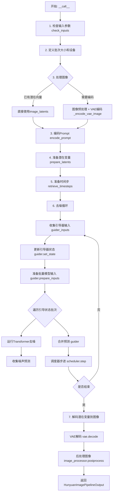
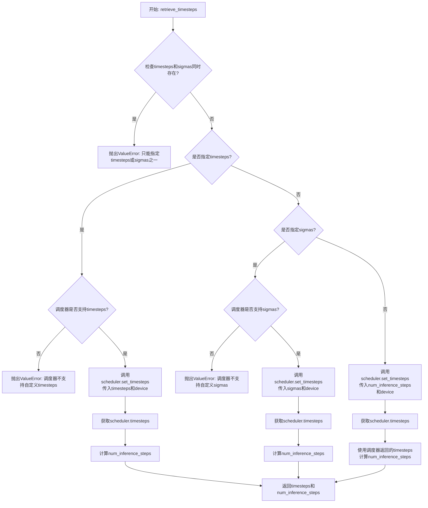
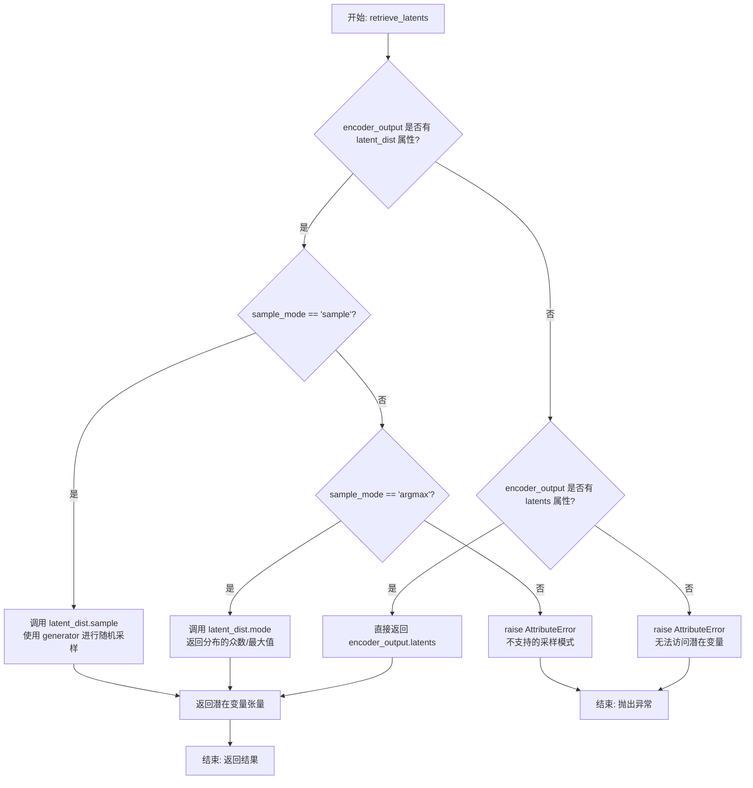
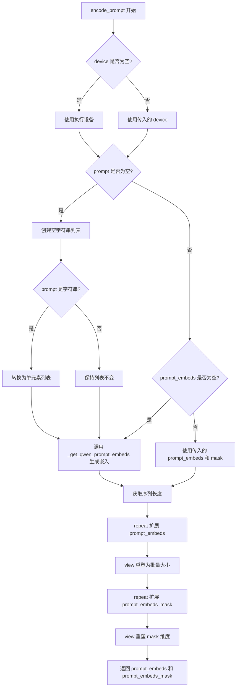
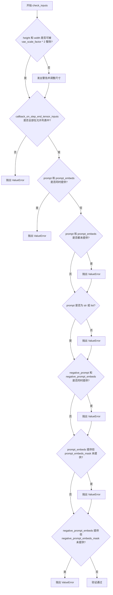
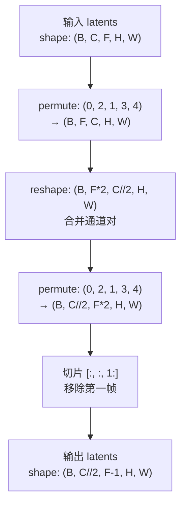
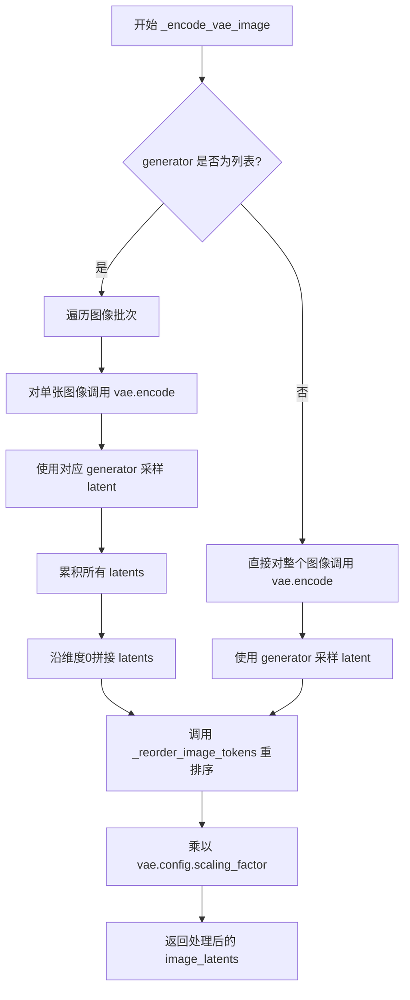
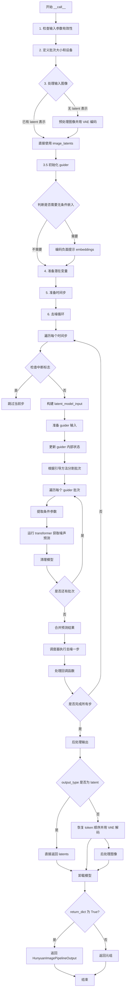

# `diffusers\src\diffusers\pipelines\hunyuan_image\pipeline_hunyuanimage_refiner.py` 详细设计文档

HunyuanImageRefinerPipeline是腾讯混元图像细化管道，用于基于文本提示和输入图像进行图像到图像的生成（图像细化）。该管道集成了Qwen2.5-VL文本编码器、VAE图像编解码器、Transformer去噪模型和Flow Match调度器，支持引导蒸馏模型的条件图像生成。

## 整体流程



## 类结构

```
DiffusionPipeline (基类)
└── HunyuanImageRefinerPipeline
    ├── _get_qwen_prompt_embeds (内部方法)
    ├── encode_prompt
    ├── check_inputs
    ├── prepare_latents
    ├── _reorder_image_tokens (静态)
    ├── _restore_image_tokens_order (静态)
    ├── _encode_vae_image
    └── __call__
```

## 全局变量及字段


### `XLA_AVAILABLE`
    
是否支持PyTorch XLA，用于TPU加速

类型：`bool`
    


### `logger`
    
模块级日志记录器，用于输出运行时信息

类型：`logging.Logger`
    


### `EXAMPLE_DOC_STRING`
    
示例文档字符串，包含pipeline使用示例代码

类型：`str`
    


### `HunyuanImageRefinerPipeline.vae`
    
VAE模型，用于图像编解码，将图像转换为潜在表示并从潜在表示重建图像

类型：`AutoencoderKLHunyuanImageRefiner`
    


### `HunyuanImageRefinerPipeline.text_encoder`
    
Qwen2.5-VL文本编码器，将文本prompt转换为文本嵌入向量

类型：`Qwen2_5_VLForConditionalGeneration`
    


### `HunyuanImageRefinerPipeline.tokenizer`
    
Qwen2分词器，用于将文本分割为token序列

类型：`Qwen2Tokenizer`
    


### `HunyuanImageRefinerPipeline.transformer`
    
图像去噪Transformer模型，执行潜在空间的去噪过程

类型：`HunyuanImageTransformer2DModel`
    


### `HunyuanImageRefinerPipeline.scheduler`
    
Flow Match欧拉离散调度器，控制去噪过程中的时间步进

类型：`FlowMatchEulerDiscreteScheduler`
    


### `HunyuanImageRefinerPipeline.guider`
    
引导方法，用于条件生成时的classifier-free guidance控制

类型：`AdaptiveProjectedMixGuidance | None`
    


### `HunyuanImageRefinerPipeline.vae_scale_factor`
    
VAE缩放因子，用于计算潜在空间与像素空间的尺寸转换

类型：`int`
    


### `HunyuanImageRefinerPipeline.image_processor`
    
VAE图像处理器，负责图像的预处理和后处理

类型：`VaeImageProcessor`
    


### `HunyuanImageRefinerPipeline.tokenizer_max_length`
    
分词器最大长度，限制输入文本的最大token数量

类型：`int`
    


### `HunyuanImageRefinerPipeline.prompt_template_encode`
    
Prompt编码模板，用于格式化输入prompt以适配模型

类型：`str`
    


### `HunyuanImageRefinerPipeline.prompt_template_encode_start_idx`
    
Prompt模板起始索引，指定从嵌入的哪个位置开始截取

类型：`int`
    


### `HunyuanImageRefinerPipeline.default_sample_size`
    
默认采样尺寸，用于计算生成图像的默认高度和宽度

类型：`int`
    


### `HunyuanImageRefinerPipeline.latent_channels`
    
潜在通道数，定义潜在表示的通道维度

类型：`int`
    


### `HunyuanImageRefinerPipeline._attention_kwargs`
    
注意力参数字典，传递给注意力处理器的额外参数

类型：`dict | None`
    


### `HunyuanImageRefinerPipeline._num_timesteps`
    
时间步数，记录去噪过程的总步数

类型：`int`
    


### `HunyuanImageRefinerPipeline._current_timestep`
    
当前时间步，记录当前正在执行的去噪步骤

类型：`int | None`
    


### `HunyuanImageRefinerPipeline._interrupt`
    
中断标志，用于控制pipeline执行过程中的中断操作

类型：`bool`
    
    

## 全局函数及方法


### `retrieve_timesteps`

该函数是扩散模型推理流程中的关键时间步管理工具，通过调用调度器的 `set_timesteps` 方法来获取推理过程中所需的时间步序列，支持自定义时间步（timesteps）或噪声强度（sigmas），并返回完整的时间步张量及推理步数，确保调度器与推理管道的无缝衔接。

参数：

- `scheduler`：`SchedulerMixin`，调度器对象，用于生成和管理时间步
- `num_inference_steps`：`int | None`，推理步数，当不使用自定义时间步或sigmas时必须指定
- `device`：`str | torch.device | None`，时间步要移动到的设备，None表示不移动
- `timesteps`：`list[int] | None`，自定义时间步列表，用于覆盖调度器的默认时间步策略
- `sigmas`：`list[float] | None`，自定义噪声强度列表，用于覆盖调度器的默认sigma策略
- `**kwargs`：可变关键字参数，会传递给调度器的 `set_timesteps` 方法

返回值：`tuple[torch.Tensor, int]`，元组第一个元素是调度器的时间步张量，第二个元素是推理步数

#### 流程图



#### 带注释源码

```python
# Copied from diffusers.pipelines.stable_diffusion.pipeline_stable_diffusion.retrieve_timesteps
def retrieve_timesteps(
    scheduler,  # SchedulerMixin: 调度器对象，提供时间步生成能力
    num_inference_steps: int | None = None,  # int | None: 推理步数，若提供timesteps或sigmas则可为None
    device: str | torch.device | None = None,  # str | torch.device | None: 时间步要移动到的目标设备
    timesteps: list[int] | None = None,  # list[int] | None: 自定义时间步列表
    sigmas: list[float] | None = None,  # list[float] | None: 自定义噪声强度列表
    **kwargs,  # **kwargs: 额外参数，透传给scheduler.set_timesteps
):
    r"""
    Calls the scheduler's `set_timesteps` method and retrieves timesteps from the scheduler after the call. Handles
    custom timesteps. Any kwargs will be supplied to `scheduler.set_timesteps`.

    Args:
        scheduler (`SchedulerMixin`):
            The scheduler to get timesteps from.
        num_inference_steps (`int`):
            The number of diffusion steps used when generating samples with a pre-trained model. If used, `timesteps`
            must be `None`.
        device (`str` or `torch.device`, *optional*):
            The device to which the timesteps should be moved to. If `None`, the timesteps are not moved.
        timesteps (`list[int]`, *optional*):
            Custom timesteps used to override the timestep spacing strategy of the scheduler. If `timesteps` is passed,
            `num_inference_steps` and `sigmas` must be `None`.
        sigmas (`list[float]`, *optional*):
            Custom sigmas used to override the timestep spacing strategy of the scheduler. If `sigmas` is passed,
            `num_inference_steps` and `timesteps` must be `None`.

    Returns:
        `tuple[torch.Tensor, int]`: A tuple where the first element is the timestep schedule from the scheduler and the
        second element is the number of inference steps.
    """
    # 校验：timesteps和sigmas不能同时指定
    if timesteps is not None and sigmas is not None:
        raise ValueError("Only one of `timesteps` or `sigmas` can be passed. Please choose one to set custom values")
    
    # 分支处理：根据用户提供的参数类型选择不同的处理逻辑
    if timesteps is not None:
        # 使用自定义时间步
        # 检查调度器的set_timesteps方法是否支持timesteps参数
        accepts_timesteps = "timesteps" in set(inspect.signature(scheduler.set_timesteps).parameters.keys())
        if not accepts_timesteps:
            raise ValueError(
                f"The current scheduler class {scheduler.__class__}'s `set_timesteps` does not support custom"
                f" timestep schedules. Please check whether you are using the correct scheduler."
            )
        # 调用调度器的set_timesteps方法设置自定义时间步
        scheduler.set_timesteps(timesteps=timesteps, device=device, **kwargs)
        # 从调度器获取生成的时间步
        timesteps = scheduler.timesteps
        # 计算推理步数（时间步列表的长度）
        num_inference_steps = len(timesteps)
    elif sigmas is not None:
        # 使用自定义sigmas
        # 检查调度器的set_timesteps方法是否支持sigmas参数
        accept_sigmas = "sigmas" in set(inspect.signature(scheduler.set_timesteps).parameters.keys())
        if not accept_sigmas:
            raise ValueError(
                f"The current scheduler class {scheduler.__class__}'s `set_timesteps` does not support custom"
                f" sigmas schedules. Please check whether you are using the correct scheduler."
            )
        # 调用调度器的set_timesteps方法设置自定义sigmas
        scheduler.set_timesteps(sigmas=sigmas, device=device, **kwargs)
        # 从调度器获取生成的时间步
        timesteps = scheduler.timesteps
        # 计算推理步数
        num_inference_steps = len(timesteps)
    else:
        # 未指定自定义参数，使用num_inference_steps生成标准时间步
        scheduler.set_timesteps(num_inference_steps, device=device, **kwargs)
        timesteps = scheduler.timesteps
    
    # 返回时间步张量和推理步数
    return timesteps, num_inference_steps
```

---

### 关键组件信息

| 组件名称 | 描述 |
|---------|------|
| `SchedulerMixin` | diffusers库中的调度器基类，提供了`set_timesteps`方法和`timesteps`属性 |
| `inspect.signature` | Python标准库函数，用于动态检查调度器方法支持的参数 |
| `timesteps` | 扩散推理过程中的时间步序列，通常为从大到小的整数序列 |
| `sigmas` | 噪声强度参数，用于某些支持sigma调度的调度器 |

---

### 潜在的技术债务或优化空间

1. **参数校验冗余**：使用`inspect.signature`动态检查参数支持的方式较为繁琐，可考虑在调度器接口中显式声明支持的能力标志
2. **错误信息可改进**：当前错误信息仅提示"请检查是否使用正确的调度器"，可提供更具体的调度器选择建议
3. **类型注解一致性**：函数参数使用Python 3.10+的联合类型注解（`|`），但需确保运行环境支持该语法版本

---

### 其它项目

#### 设计目标与约束

- **核心目标**：提供统一的时间步获取接口，屏蔽不同调度器的时间步生成差异
- **约束条件**：用户必须在`timesteps`、`sigmas`、`num_inference_steps`中选择一种提供

#### 错误处理与异常设计

- **互斥参数校验**：当`timesteps`和`sigmas`同时传入时抛出`ValueError`
- **调度器能力检查**：通过运行时检查调度器的`set_timesteps`方法签名，确保调度器支持自定义参数，否则抛出`ValueError`

#### 数据流与状态机

- 输入：用户指定的时间步/sigma配置或推理步数
- 处理：通过调度器的`set_timesteps`方法转换为标准时间步序列
- 输出：时间步张量（`torch.Tensor`）和推理步数（`int`）

#### 外部依赖与接口契约

- 依赖：`inspect`模块（标准库）、`torch`（用于类型标注）
- 上游接口：`scheduler.set_timesteps()`方法需支持`timesteps`、`sigmas`或`num_inference_steps`参数之一
- 下游接口：返回的`timesteps`直接用于扩散模型的推理循环


### `retrieve_latents`

从编码器输出中检索潜在变量，支持 `sample` 和 `argmax` 两种采样模式，返回潜在变量张量。

参数：

- `encoder_output`：`torch.Tensor`，编码器输出对象，可能包含 `latent_dist` 属性（潜在分布）或 `latents` 属性（直接潜在变量）
- `generator`：`torch.Generator | None`，可选的随机数生成器，用于采样模式下的随机采样
- `sample_mode`：`str`，采样模式，默认为 `"sample"`，可选 `"argmax"` 返回分布的众数

返回值：`torch.Tensor`，从编码器输出中提取的潜在变量张量

#### 流程图



#### 带注释源码

```python
# 从 diffusers 库复制而来的函数，用于从编码器输出中检索潜在变量
def retrieve_latents(
    encoder_output: torch.Tensor,  # 编码器输出，包含潜在分布或潜在变量
    generator: torch.Generator | None = None,  # 可选的随机生成器，用于采样
    sample_mode: str = "sample"  # 采样模式：'sample' 随机采样 或 'argmax' 取众数
):
    """
    从编码器输出中检索潜在变量。
    
    支持三种获取方式：
    1. 从 latent_dist 分布中采样（sample_mode='sample'）
    2. 从 latent_dist 分布中取众数（sample_mode='argmax'）
    3. 直接获取预计算的 latents 属性
    """
    
    # 检查编码器输出是否具有 latent_dist 属性（潜在分布对象）
    if hasattr(encoder_output, "latent_dist") and sample_mode == "sample":
        # 模式1：采样模式 - 从潜在分布中随机采样
        # 使用 generator 确保可重复性（如果提供）
        return encoder_output.latent_dist.sample(generator)
    
    # 检查编码器输出是否具有 latent_dist 属性且模式为 argmax
    elif hasattr(encoder_output, "latent_dist") and sample_mode == "argmax":
        # 模式2：Argmax 模式 - 返回潜在分布的众数（最大概率值）
        # 常用于确定性解码
        return encoder_output.latent_dist.mode()
    
    # 检查编码器输出是否直接具有 latents 属性
    elif hasattr(encoder_output, "latents"):
        # 模式3：直接返回预计算的潜在变量
        # 适用于编码器已直接输出潜在变量的场景
        return encoder_output.latents
    
    # 无法识别有效的潜在变量访问方式
    else:
        raise AttributeError("Could not access latents of provided encoder_output")
```


### HunyuanImageRefinerPipeline.__init__

初始化 HunyuanImageRefinerPipeline 管道，接收调度器、VAE、文本编码器、分词器、Transformer 模型和可选的引导器，并注册所有模块、设置图像处理器、令牌化参数和潜在通道数等配置。

参数：

- `scheduler`：`FlowMatchEulerDiscreteScheduler`，用于去噪的调度器
- `vae`：`AutoencoderKLHunyuanImageRefiner`，用于编码和解码图像的变分自编码器模型
- `text_encoder`：`Qwen2_5_VLForConditionalGeneration`，用于将文本提示编码为嵌入的 Qwen2.5-VL-7B-Instruct 模型
- `tokenizer`：`Qwen2Tokenizer`，用于将文本分词的 Qwen2 分词器
- `transformer`：`HunyuanImageTransformer2DModel`，用于对编码的图像潜在向量进行去噪的条件 Transformer (MMDiT) 架构
- `guider`：`AdaptiveProjectedMixGuidance | None`，可选的引导方法，用于控制图像生成过程

返回值：无（构造函数）

#### 流程图

```mermaid
flowchart TD
    A[开始 __init__] --> B[调用 super().__init__]
    B --> C[register_modules: 注册 vae, text_encoder, tokenizer, transformer, scheduler, guider]
    C --> D[计算 vae_scale_factor]
    D --> E[创建 VaeImageProcessor]
    E --> F[设置 tokenizer_max_length = 256]
    F --> G[设置 prompt_template_encode]
    G --> H[设置 prompt_template_encode_start_idx = 36]
    H --> I[设置 default_sample_size = 64]
    I --> J[计算 latent_channels]
    J --> K[结束 __init__]
```

#### 带注释源码

```python
def __init__(
    self,
    scheduler: FlowMatchEulerDiscreteScheduler,  # 去噪调度器
    vae: AutoencoderKLHunyuanImageRefiner,        # VAE 模型
    text_encoder: Qwen2_5_VLForConditionalGeneration,  # 文本编码器
    tokenizer: Qwen2Tokenizer,                    # 分词器
    transformer: HunyuanImageTransformer2DModel, # Transformer 去噪模型
    guider: AdaptiveProjectedMixGuidance | None = None,  # 可选的引导器
):
    # 1. 调用父类 DiffusionPipeline 的初始化方法
    super().__init__()

    # 2. 注册所有模块到管道中
    self.register_modules(
        vae=vae,
        text_encoder=text_encoder,
        tokenizer=tokenizer,
        transformer=transformer,
        scheduler=scheduler,
        guider=guider,
    )

    # 3. 计算 VAE 缩放因子，用于图像尺寸调整
    # 从 VAE 配置中获取空间压缩比，如果 VAE 不存在则默认为 16
    self.vae_scale_factor = self.vae.config.spatial_compression_ratio if getattr(self, "vae", None) else 16

    # 4. 创建图像处理器，用于预处理和后处理图像
    self.image_processor = VaeImageProcessor(vae_scale_factor=self.vae_scale_factor)

    # 5. 设置分词器的最大长度
    self.tokenizer_max_length = 256

    # 6. 定义用于编码提示的模板
    # 该模板用于引导模型描述图像的颜色、形状、大小、纹理、数量、文本和空间关系
    self.prompt_template_encode = "<|start_header_id|>system<|end_header_id|>\n\nDescribe the image by detailing the color, shape, size, texture, quantity, text, spatial relationships of the objects and background:<|eot_id|><|start_header_id|>user<|end_header_id|>\n\n{}<|eot_id|>"

    # 7. 设置提示模板编码的起始索引，用于跳过模板前缀
    self.prompt_template_encode_start_idx = 36

    # 8. 设置默认采样尺寸
    self.default_sample_size = 64

    # 9. 计算潜在通道数
    # Transformer 输入通道数除以 2，如果 Transformer 不存在则默认为 64
    self.latent_channels = self.transformer.config.in_channels // 2 if getattr(self, "transformer", None) else 64
```


### `HunyuanImageRefinerPipeline._get_qwen_prompt_embeds`

该方法用于使用 Qwen2.5-VL 文本编码器将文本提示转换为高维向量表示（embeddings），支持自定义模板、token 丢弃和隐藏层选择，以适配多模态图像生成模型的文本条件输入。

参数：

- `self`：`HunyuanImageRefinerPipeline`，类的实例本身
- `tokenizer`：`Qwen2Tokenizer`，用于将文本转换为 token ID 的分词器
- `text_encoder`：`Qwen2_5_VLForConditionalGeneration`，将 token 序列编码为隐藏状态的文本编码器模型
- `prompt`：`str | list[str]`，要编码的文本提示，可以是单个字符串或字符串列表，默认为 None
- `device`：`torch.device | None`，指定计算设备，默认为 None（自动获取执行设备）
- `dtype`：`torch.dtype | None`，指定张量数据类型，默认为 None（使用文本编码器的数据类型）
- `tokenizer_max_length`：`int`，分词器的最大序列长度，默认为 1000
- `template`：`str`，用于格式化提示的模板字符串，包含系统消息和用户消息的结构，默认为 Qwen2.5-VL 的聊天模板格式
- `drop_idx`：`int`，要丢弃的 token 索引位置，用于去除模板中的固定前缀部分，默认为 34
- `hidden_state_skip_layer`：`int`，从文本编码器最后隐藏层向前跳过的层数，用于选择合适的特征层，默认为 2

返回值：`tuple[torch.Tensor, torch.Tensor]`，返回两个张量——第一个是文本提示的嵌入向量（prompt_embeds），形状为 (batch_size, seq_len, hidden_dim)；第二个是对应的注意力掩码（encoder_attention_mask），形状为 (batch_size, seq_len)，用于标识有效 token 位置。

#### 流程图

```mermaid
flowchart TD
    A[开始 _get_qwen_prompt_embeds] --> B{device 是否为 None?}
    B -->|是| C[device = self._execution_device]
    B -->|否| D{device 不为 None}
    C --> E{dtype 是否为 None?}
    D --> E
    E -->|是| F[dtype = text_encoder.dtype]
    E -->|否| G{dtype 不为 None}
    F --> H{prompt 是否为字符串?}
    G --> H
    H -->|是| I[prompt = [prompt]]
    H -->|否| J{prompt 是列表}
    I --> K[使用 template 格式化每个 prompt]
    J --> K
    K --> L[调用 tokenizer 编码文本]
    L --> M[调用 text_encoder 获取隐藏状态]
    M --> N[从隐藏状态列表中提取指定层]
    N --> O[根据 drop_idx 截取张量]
    O --> P[转换 dtype 和 device]
    P --> Q[返回 prompt_embeds 和 encoder_attention_mask]
```

#### 带注释源码

```python
def _get_qwen_prompt_embeds(
    self,
    tokenizer: Qwen2Tokenizer,
    text_encoder: Qwen2_5_VLForConditionalGeneration,
    prompt: str | list[str] = None,
    device: torch.device | None = None,
    dtype: torch.dtype | None = None,
    tokenizer_max_length: int = 1000,
    template: str = "<|im_start|>system\nDescribe the image by detailing the color, shape, size, texture, quantity, text, spatial relationships of the objects and background:<|im_end|>\n<|im_start|>user\n{}<|im_end|>",
    drop_idx: int = 34,
    hidden_state_skip_layer: int = 2,
):
    """
    使用 Qwen2.5-VL 文本编码器将文本提示编码为嵌入向量。

    参数:
        tokenizer: Qwen2Tokenizer 分词器
        text_encoder: Qwen2.5-VL 文本编码器模型
        prompt: 要编码的文本提示
        device: 计算设备
        dtype: 输出张量的数据类型
        tokenizer_max_length: 分词器最大长度
        template: 提示模板字符串
        drop_idx: 丢弃的 token 索引
        hidden_state_skip_layer: 隐藏层跳过层数
    """
    # 确定计算设备，未指定时使用管道的执行设备
    device = device or self._execution_device
    # 确定数据类型，未指定时使用文本编码器的数据类型
    dtype = dtype or text_encoder.dtype

    # 标准化输入：将单个字符串转换为列表
    prompt = [prompt] if isinstance(prompt, str) else prompt

    # 使用模板格式化每个提示文本
    txt = [template.format(e) for e in prompt]
    
    # 调用分词器将文本转换为 token ID 序列
    # 注意：max_length 加上 drop_idx 是为了保留足够的位置给特殊 token
    txt_tokens = tokenizer(
        txt, max_length=tokenizer_max_length + drop_idx, padding="max_length", truncation=True, return_tensors="pt"
    ).to(device)

    # 调用文本编码器进行前向传播，获取所有隐藏状态
    # output_hidden_states=True 要求返回完整的隐藏状态列表
    encoder_hidden_states = text_encoder(
        input_ids=txt_tokens.input_ids,
        attention_mask=txt_tokens.attention_mask,
        output_hidden_states=True,
    )
    
    # 从隐藏状态列表中提取指定层
    # 使用负索引从后向前计数，hidden_state_skip_layer=2 表示取倒数第3层
    prompt_embeds = encoder_hidden_states.hidden_states[-(hidden_state_skip_layer + 1)]

    # 根据 drop_idx 丢弃模板引入的特殊 token
    # 保留从 drop_idx 开始的实际内容部分
    prompt_embeds = prompt_embeds[:, drop_idx:]
    encoder_attention_mask = txt_tokens.attention_mask[:, drop_idx:]

    # 将输出张量转换为指定的 dtype 和 device
    prompt_embeds = prompt_embeds.to(dtype=dtype, device=device)
    encoder_attention_mask = encoder_attention_mask.to(device=device)

    # 返回文本嵌入和对应的注意力掩码
    return prompt_embeds, encoder_attention_mask
```


### `HunyuanImageRefinerPipeline.encode_prompt`

该方法负责将文本提示（prompt）编码为模型可用的文本嵌入向量（prompt_embeds）和对应的注意力掩码（prompt_embeds_mask）。如果未提供预计算的嵌入，则调用内部方法 `_get_qwen_prompt_embeds` 进行生成；同时根据 `num_images_per_prompt` 参数对嵌入进行扩展以支持批量图像生成。

参数：

- `prompt`：`str | list[str] | None`，要编码的文本提示，可以是单个字符串或字符串列表，默认为 None
- `device`：`torch.device | None`，指定计算设备，默认为 None（自动获取执行设备）
- `batch_size`：`int`，提示词批次大小，默认为 1
- `num_images_per_prompt`：`int`，每个提示词需要生成的图像数量，用于扩展嵌入维度，默认为 1
- `prompt_embeds`：`torch.Tensor | None`，预生成的文本嵌入向量，如果提供则直接使用，默认为 None
- `prompt_embeds_mask`：`torch.Tensor | None`，预生成的文本注意力掩码，与 prompt_embeds 配合使用，默认为 None

返回值：`tuple[torch.Tensor, torch.Tensor]`，返回包含两个元素的元组——第一个是处理后的文本嵌入向量（prompt_embeds），第二个是对应的注意力掩码（prompt_embeds_mask）

#### 流程图



#### 带注释源码

```python
def encode_prompt(
    self,
    prompt: str | list[str] | None = None,
    device: torch.device | None = None,
    batch_size: int = 1,
    num_images_per_prompt: int = 1,
    prompt_embeds: torch.Tensor | None = None,
    prompt_embeds_mask: torch.Tensor | None = None,
):
    """
    编码文本提示为模型可用的嵌入向量和注意力掩码

    参数:
        prompt: 要编码的文本提示，支持字符串或字符串列表
        device: 计算设备
        batch_size: 批次大小
        num_images_per_prompt: 每个提示生成的图像数量
        prompt_embeds: 预计算的文本嵌入（可选）
        prompt_embeds_mask: 预计算的文本掩码（可选）

    返回:
        (prompt_embeds, prompt_embeds_mask): 文本嵌入和对应的注意力掩码
    """
    # 确定设备，优先使用传入的 device，否则使用执行设备
    device = device or self._execution_device

    # 如果没有提供 prompt，则创建空字符串列表以匹配批次大小
    if prompt is None:
        prompt = [""] * batch_size

    # 统一将 prompt 转换为列表格式（支持单字符串输入）
    prompt = [prompt] if isinstance(prompt, str) else prompt

    # 如果没有提供预计算的嵌入，则调用内部方法生成
    if prompt_embeds is None:
        # 使用 Qwen2.5-VL 模型生成文本嵌入
        prompt_embeds, prompt_embeds_mask = self._get_qwen_prompt_embeds(
            tokenizer=self.tokenizer,
            text_encoder=self.text_encoder,
            prompt=prompt,
            device=device,
            tokenizer_max_length=self.tokenizer_max_length,
            template=self.prompt_template_encode,
            drop_idx=self.prompt_template_encode_start_idx,
        )

    # 获取嵌入的序列长度
    _, seq_len, _ = prompt_embeds.shape
    
    # 根据 num_images_per_prompt 扩展嵌入维度
    # 例如：如果 num_images_per_prompt=2，则在序列维度重复2次
    prompt_embeds = prompt_embeds.repeat(1, num_images_per_prompt, 1)
    # 重塑为 (batch_size * num_images_per_prompt, seq_len, hidden_dim)
    prompt_embeds = prompt_embeds.view(batch_size * num_images_per_prompt, seq_len, -1)
    
    # 同样扩展注意力掩码
    prompt_embeds_mask = prompt_embeds_mask.repeat(1, num_images_per_prompt, 1)
    prompt_embeds_mask = prompt_embeds_mask.view(batch_size * num_images_per_prompt, seq_len)

    # 返回处理后的嵌入和掩码
    return prompt_embeds, prompt_embeds_mask
```


### `HunyuanImageRefinerPipeline.check_inputs`

该方法负责验证图像生成管道的输入参数是否合法，包括检查高度/宽度是否能被 VAE 缩放因子整除、prompt 与 prompt_embeds 的互斥关系、callback 回调张量是否在允许列表中，以及 prompt_embeds 与对应 mask 的配对关系等。若输入不符合规范，则抛出 ValueError 异常。

参数：

- `prompt`：`str | list[str] | None`，用户输入的文本提示，用于指导图像生成
- `height`：`int`，生成图像的高度（像素）
- `width`：`int`，生成图像的宽度（像素）
- `negative_prompt`：`str | list[str] | None`，反向提示词，用于指导不希望出现的图像特征
- `prompt_embeds`：`torch.Tensor | None`，预生成的文本嵌入向量，若提供则跳过文本编码步骤
- `negative_prompt_embeds`：`torch.Tensor | None`，预生成的反向文本嵌入向量
- `prompt_embeds_mask`：`torch.Tensor | None`，预生成的文本注意力掩码，用于标识有效文本位置
- `negative_prompt_embeds_mask`：`torch.Tensor | None`，预生成的反向文本注意力掩码
- `callback_on_step_end_tensor_inputs`：`list[str] | None`，回调函数在每个推理步骤结束时需要访问的张量输入列表

返回值：`None`，该方法不返回任何值，仅进行输入验证

#### 流程图



#### 带注释源码

```python
def check_inputs(
    self,
    prompt,                      # 文本提示词，str 或 list[str] 类型
    height,                      # 生成图像高度
    width,                       # 生成图像宽度
    negative_prompt=None,        # 可选的反向提示词
    prompt_embeds=None,         # 可选的预生成文本嵌入
    negative_prompt_embeds=None, # 可选的预生成反向文本嵌入
    prompt_embeds_mask=None,    # 可选的文本注意力掩码
    negative_prompt_embeds_mask=None, # 可选的反向文本注意力掩码
    callback_on_step_end_tensor_inputs=None, # 可选的回调张量列表
):
    """
    验证管道输入参数的有效性，确保用户提供的参数符合预期且相互兼容。
    若参数无效则抛出详细的 ValueError 异常说明问题所在。
    """
    
    # 检查图像尺寸是否满足 VAE 缩放要求
    # VAE 的空间压缩比决定了 latent 空间的尺寸必须能被此因子整除
    if height % (self.vae_scale_factor * 2) != 0 or width % (self.vae_scale_factor * 2) != 0:
        logger.warning(
            f"`height` and `width` have to be divisible by {self.vae_scale_factor * 2} but are {height} and {width}. Dimensions will be resized accordingly"
        )

    # 验证回调张量输入是否在允许的列表中
    # 回调函数只能访问管道明确允许的张量，防止访问内部状态导致错误
    if callback_on_step_end_tensor_inputs is not None and not all(
        k in self._callback_tensor_inputs for k in callback_on_step_end_tensor_inputs
    ):
        raise ValueError(
            f"`callback_on_step_end_tensor_inputs` has to be in {self._callback_tensor_inputs}, but found {[k for k in callback_on_step_end_tensor_inputs if k not in self._callback_tensor_inputs]}"
        )

    # 验证 prompt 和 prompt_embeds 互斥，不能同时提供
    # 这避免了对同一输入的重复处理和潜在的混淆
    if prompt is not None and prompt_embeds is not None:
        raise ValueError(
            f"Cannot forward both `prompt`: {prompt} and `prompt_embeds`: {prompt_embeds}. Please make sure to"
            " only forward one of the two."
        )
    # 验证至少提供 prompt 或 prompt_embeds 之一
    elif prompt is None and prompt_embeds is None:
        raise ValueError(
            "Provide either `prompt` or `prompt_embeds`. Cannot leave both `prompt` and `prompt_embeds` undefined."
        )
    # 验证 prompt 的类型必须是 str 或 list
    elif prompt is not None and (not isinstance(prompt, str) and not isinstance(prompt, list)):
        raise ValueError(f"`prompt` has to be of type `str` or `list` but is {type(prompt)}")

    # 验证 negative_prompt 和 negative_prompt_embeds 互斥
    if negative_prompt is not None and negative_prompt_embeds is not None:
        raise ValueError(
            f"Cannot forward both `negative_prompt`: {negative_prompt} and `negative_prompt_embeds`:"
            f" {negative_prompt_embeds}. Please make sure to only forward one of the two."
        )

    # 验证 prompt_embeds 和对应的 mask 必须成对提供
    # 确保嵌入向量和注意力掩码来自同一个文本编码器，保证语义一致性
    if prompt_embeds is not None and prompt_embeds_mask is None:
        raise ValueError(
            "If `prompt_embeds` are provided, `prompt_embeds_mask` also have to be passed. Make sure to generate `prompt_embeds_mask` from the same text encoder that was used to generate `prompt_embeds`."
        )
    
    # 验证 negative_prompt_embeds 和对应的 mask 必须成对提供
    if negative_prompt_embeds is not None and negative_prompt_embeds_mask is None:
        raise ValueError(
            "If `negative_prompt_embeds` are provided, `negative_prompt_embeds_mask` also have to be passed. Make sure to generate `negative_prompt_embeds_mask` from the same text encoder that was used to generate `negative_prompt_embeds`."
        )
```


### HunyuanImageRefinerPipeline.prepare_latents

该方法负责为图像修复（refiner）管道准备潜在变量（latents）。它根据输入的图像潜在变量、批次大小和强度参数，生成用于去噪过程的初始噪声潜在变量和条件潜在变量，并处理批次大小不匹配的情况。

参数：

- `self`：HunyuanImageRefinerPipeline 实例本身
- `image_latents`：`torch.Tensor`，从输入图像编码得到的潜在表示
- `batch_size`：`int`，批处理大小
- `num_channels_latents`：`int`，潜在变量的通道数
- `height`：`int`，目标图像高度（像素空间）
- `width`：`int`，目标图像宽度（像素空间）
- `dtype`：`torch.dtype`，潜在变量的数据类型
- `device`：`torch.device`，潜在变量存放的设备
- `generator`：`torch.Generator | list[torch.Generator] | None`，随机数生成器，用于确保可重复性
- `latents`：`torch.Tensor | None`，可选的预生成潜在变量，如果为 None 则随机生成
- `strength`：`float`，噪声混合强度，默认值为 0.25

返回值：`tuple[torch.Tensor, torch.Tensor]`，返回一个元组，包含初始潜在变量（latents）和条件潜在变量（cond_latents）

#### 流程图

```mermaid
flowchart TD
    A[开始 prepare_latents] --> B[计算潜在空间高度和宽度]
    B --> C[构建形状元组]
    C --> D{latents 是否为 None?}
    D -->|是| E[使用 randn_tensor 生成随机潜在变量]
    D -->|否| F[将已有 latents 移动到指定设备和数据类型]
    E --> G{批次大小 > image_latents 批次大小?}
    F --> G
    G -->|是 且 可整除| H[复制 image_latents 以匹配批次大小]
    G -->|是 且 不可整除| I[抛出 ValueError]
    G -->|否| J{generator 是列表且长度不匹配?}
    H --> J
    I --> K[结束]
    J -->|是| L[抛出 ValueError]
    J -->|否| M[生成噪声]
    L --> K
    M --> N[计算条件潜在变量: cond_latents = strength * noise + (1 - strength) * image_latents]
    N --> O[返回 latents 和 cond_latents]
```

#### 带注释源码

```python
def prepare_latents(
    self,
    image_latents,               # torch.Tensor: 输入图像的潜在表示
    batch_size,                  # int: 批处理大小
    num_channels_latents,        # int: 潜在变量的通道数
    height,                      # int: 目标高度
    width,                       # int: 目标宽度
    dtype,                       # torch.dtype: 数据类型
    device,                      # torch.device: 设备
    generator,                   # torch.Generator | list[torch.Generator] | None: 随机生成器
    latents=None,                # torch.Tensor | None: 可选的预生成潜在变量
    strength=0.25,               # float: 噪声混合强度
):
    # 步骤1: 将像素空间的高度和宽度转换为潜在空间
    # VAE 的缩放因子用于将像素空间映射到潜在空间
    height = int(height) // self.vae_scale_factor
    width = int(width) // self.vae_scale_factor

    # 步骤2: 构建潜在变量的形状
    # 形状为 (batch_size, num_channels, 1, latent_height, latent_width)
    # 注意其中的 1 表示潜在变量的帧维度
    shape = (batch_size, num_channels_latents, 1, height, width)

    # 步骤3: 初始化 latents
    if latents is None:
        # 如果没有提供 latents，则使用随机噪声生成
        latents = randn_tensor(shape, generator=generator, device=device, dtype=dtype)
    else:
        # 如果提供了 latents，则将其移动到指定设备和转换数据类型
        latents = latents.to(device=device, dtype=dtype)

    # 步骤4: 处理批次大小不匹配的情况
    # 如果 batch_size 大于 image_latents 的批次大小，需要扩展 image_latents
    if batch_size > image_latents.shape[0] and batch_size % image_latents.shape[0] == 0:
        # expand init_latents for batch_size
        # 计算每个图像需要复制的次数
        additional_image_per_prompt = batch_size // image_latents.shape[0]
        # 沿第0维（批次维）复制 image_latents
        image_latents = torch.cat([image_latents] * additional_image_per_prompt, dim=0)
    elif batch_size > image_latents.shape[0] and batch_size % image_latents.shape[0] != 0:
        # 无法整除时抛出错误
        raise ValueError(
            f"Cannot duplicate `image` of batch size {image_latents.shape[0]} to {batch_size} text prompts."
        )

    # 步骤5: 验证 generator 列表长度与批次大小是否匹配
    if isinstance(generator, list) and len(generator) != batch_size:
        raise ValueError(
            f"You have passed a list of generators of length {len(generator)}, but requested an effective batch"
            f" size of {batch_size}. Make sure the batch size matches the length of the generators."
        )

    # 步骤6: 生成噪声，用于与 image_latents 混合
    noise = randn_tensor(shape, generator=generator, device=device, dtype=dtype)
    
    # 步骤7: 计算条件潜在变量
    # 使用 strength 参数控制混合比例:
    # - strength=0: 完全使用 image_latents
    # - strength=1: 完全使用噪声
    # - 0<strength<1: 两者混合
    cond_latents = strength * noise + (1 - strength) * image_latents

    # 步骤8: 返回初始 latents 和条件 latents
    # - latents: 用于去噪过程的初始噪声潜在变量
    # - cond_latents: 包含图像信息的条件潜在变量
    return latents, cond_latents
```


### HunyuanImageRefinerPipeline._reorder_image_tokens

该方法用于对图像潜在表示（latents）进行重排序和重组，将原始的图像token张量进行维度变换和reshape操作，以便与Transformer模型的处理方式对齐。其核心逻辑是将帧维度翻倍并重新排列通道顺序，以适应模型对条件/非条件latents的输入格式需求。

参数：

- `image_latents`：`torch.Tensor`，输入的图像潜在表示张量，形状为 (batch_size, num_latent_channels, num_latent_frames, latent_height, latent_width)

返回值：`torch.Tensor`，重排序后的图像潜在表示张量，形状为 (batch_size, num_latent_channels, num_latent_frames * 2, latent_height, latent_width)

#### 流程图

```mermaid
flowchart TD
    A[输入 image_latents] --> B[在帧维度前拼接第一个帧切片]
    B --> C[获取张量形状: B, C, F+1, H, W]
    C --> D[permute: B, F+1, C, H, W]
    D --> E[reshape: B, (F+1)//2, C*2, H, W]
    E --> F[permute: B, C*2, (F+1)//2, H, W]
    F --> G[contiguous 返回]
    G --> H[输出: B, C, F*2, H, W]
```

#### 带注释源码

```python
@staticmethod
def _reorder_image_tokens(image_latents):
    """
    对图像 token 进行重排序
    
    该方法用于重组图像 latent 张量，以便与 transformer 的处理方式对齐。
    原始 latent 格式为 (B, C, F, H, W)，输出格式为 (B, C, F*2, H, W)
    
    Args:
        image_latents: 输入的图像 latent 张量，形状为 (batch_size, num_latent_channels, num_latent_frames, latent_height, latent_width)
    
    Returns:
        重排序后的图像 latent 张量，形状为 (batch_size, num_latent_channels, num_latent_frames * 2, latent_height, latent_width)
    """
    # 步骤1: 在帧维度（dim=2）前面拼接第一个帧切片
    # 这会将帧数从 F 增加到 F+1
    # 输入: (B, C, F, H, W) -> 输出: (B, C, F+1, H, W)
    image_latents = torch.cat((image_latents[:, :, :1], image_latents), dim=2)
    
    # 步骤2: 获取重排后的张量形状信息
    batch_size, num_latent_channels, num_latent_frames, latent_height, latent_width = image_latents.shape
    # 此时 num_latent_frames = F + 1
    
    # 步骤3: 第一次 permute，将维度从 (B, C, F+1, H, W) 变为 (B, F+1, C, H, W)
    # 将帧维度提前，以便后续进行 reshape 操作
    image_latents = image_latents.permute(0, 2, 1, 3, 4)
    
    # 步骤4: reshape，将 (B, F+1, C, H, W) 变为 (B, (F+1)//2, C*2, H, W)
    # 这里将相邻的两个帧切片在通道维度上拼接
    # 例如：帧0和帧1拼接在通道维度，帧2和帧3拼接在通道维度，以此类推
    # 注意：由于前面添加了一个帧，所以现在有 F+1 个帧，可以被2整除
    image_latents = image_latents.reshape(
        batch_size, num_latent_frames // 2, num_latent_channels * 2, latent_height, latent_width
    )
    
    # 步骤5: 第二次 permute，将维度从 (B, (F+1)//2, C*2, H, W) 变为 (B, C*2, (F+1)//2, H, W)
    # 然后调用 contiguous() 确保张量在内存中是连续的
    image_latents = image_latents.permute(0, 2, 1, 3, 4).contiguous()
    
    # 最终输出形状: (B, C, (F+1)//2 * 2, H, W) = (B, C, F+1 - 1, H, W) = (B, C, F*2, H, W)
    # 实际上由于添加了一个帧然后除以2再乘以2，结果等价于 F*2
    return image_latents
```


### `HunyuanImageRefinerPipeline._restore_image_tokens_order`

该方法是一个静态方法，用于恢复图像token的原始顺序。它通过以下步骤处理潜在表示：首先对张量进行维度置换以重新排列通道和帧的顺序，然后reshape以合并通道对，最后移除第一帧切片，从而将处理后的latent恢复到适合VAE解码的格式。

参数：

- `latents`：`torch.Tensor`，输入的图像latent张量，形状为 (batch_size, num_latent_channels, num_latent_frames, latent_height, latent_width)

返回值：`torch.Tensor`，恢复顺序后的图像latent张量，形状为 (batch_size, num_latent_channels // 2, num_latent_frames - 1, latent_height, latent_width)

#### 流程图



#### 带注释源码

```python
@staticmethod
def _restore_image_tokens_order(latents):
    """Restore image tokens order by splitting channels and removing first frame slice."""
    # 解包输入张量的形状信息
    # B: batch_size, C: latent通道数, F: latent帧数, H: height, W: width
    batch_size, num_latent_channels, num_latent_frames, latent_height, latent_width = latents.shape

    # 步骤1: 置换维度顺序，从 (B, C, F, H, W) 变为 (B, F, C, H, W)
    # 这样可以将帧维度移到通道维度之前，便于后续reshape操作
    latents = latents.permute(0, 2, 1, 3, 4)  # B, F, C, H, W

    # 步骤2: Reshape操作，将帧数翻倍，通道数减半
    # 从 (B, F, C, H, W) 变为 (B, F*2, C//2, H, W)
    # 这里将原本的通道分为两半，每一半对应一个时间帧
    latents = latents.reshape(
        batch_size, num_latent_frames * 2, num_latent_channels // 2, latent_height, latent_width
    )  # B, F*2, C//2, H, W

    # 步骤3: 再次置换维度，从 (B, F*2, C//2, H, W) 变为 (B, C//2, F*2, H, W)
    # 恢复为通道在前的标准格式
    latents = latents.permute(0, 2, 1, 3, 4)  # B, C//2, F*2, H, W

    # 步骤4: 移除第一帧切片
    # 使用切片 [:, :, 1:] 去除第一帧，保留剩余帧
    # 结果形状变为 (B, C//2, F*2-1, H, W) 即 (B, C//2, F-1, H, W)
    latents = latents[:, :, 1:]

    # 返回恢复顺序后的latent张量
    return latents
```


### HunyuanImageRefinerPipeline._encode_vae_image

该方法负责将输入的图像张量编码为 VAE 潜在空间中的表示，通过 VAE encoder 获取 latents，并根据 generator 类型（单个或列表）处理批量图像，最后对 latents 进行重排序和尺度缩放。

参数：

- `self`：隐式参数，HunyuanImageRefinerPipeline 实例本身
- `image`：`torch.Tensor`，输入的要编码的图像张量，通常是经过预处理的图像数据
- `generator`：`torch.Generator`，用于生成随机数的 PyTorch 生成器，用于确保 VAE 编码的可重复性，支持单个生成器或生成器列表

返回值：`torch.Tensor`，编码后的图像潜在表示，形状经过重排序处理，并乘以 VAE 的缩放因子

#### 流程图



#### 带注释源码

```python
def _encode_vae_image(self, image: torch.Tensor, generator: torch.Generator):
    """
    将输入图像编码为 VAE 潜在表示。
    
    Args:
        image: 输入图像张量
        generator: 随机生成器，用于确保编码的可重复性
    
    Returns:
        编码后的图像潜在表示
    """
    # 判断 generator 是否为列表（即是否为批量生成器）
    if isinstance(generator, list):
        # 批量处理：遍历每一张图像
        image_latents = [
            # 对单张图像进行 VAE 编码，并使用对应的 generator 采样 latent
            retrieve_latents(self.vae.encode(image[i : i + 1]), generator=generator[i], sample_mode="sample")
            for i in range(image.shape[0])
        ]
        # 将所有 latent 沿批次维度拼接
        image_latents = torch.cat(image_latents, dim=0)
    else:
        # 单个 generator：直接对整个图像批次进行编码和采样
        image_latents = retrieve_latents(self.vae.encode(image), generator=generator, sample_mode="sample")
    
    # 对图像 token 进行重排序（可能是为了适配后续 transformer 的输入格式）
    image_latents = self._reorder_image_tokens(image_latents)
    
    # 应用 VAE 的缩放因子，将 latents 转换到正确的数值范围
    image_latents = image_latents * self.vae.config.scaling_factor
    
    return image_latents
```


### HunyuanImageRefinerPipeline.__call__

这是 HunyuanImage 图像细化流水线的核心调用方法，通过接收文本提示和输入图像，使用扩散模型架构（包括 Transformer、VAE、文本编码器）进行图像去噪和细化，最终生成符合文本描述的改进图像。

参数：

- `prompt`：`str | list[str] | None`，引导图像生成的文本提示，若未定义则需传递 prompt_embeds
- `negative_prompt`：`str | list[str] | None`，不引导图像生成的负面提示
- `distilled_guidance_scale`：`float | None`，默认 3.25，用于指导蒸馏模型的引导比例
- `image`：`PipelineImageInput | None`，输入的要细化的图像
- `height`：`int | None`，生成图像的高度像素，默认基于 default_sample_size * vae_scale_factor
- `width`：`int | None`，生成图像的宽度像素，默认基于 default_sample_size * vae_scale_factor
- `num_inference_steps`：`int`，默认 4，去噪迭代步数
- `sigmas`：`list[float] | None`，自定义 sigmas 值用于去噪调度
- `num_images_per_prompt`：`int`，默认 1，每个提示生成的图像数量
- `generator`：`torch.Generator | list[torch.Generator] | None`，随机生成器用于确定性生成
- `latents`：`torch.Tensor | None`，预生成的噪声潜在向量
- `prompt_embeds`：`torch.Tensor | None`，预生成的文本嵌入
- `prompt_embeds_mask`：`torch.Tensor | None`，文本嵌入的注意力掩码
- `negative_prompt_embeds`：`torch.Tensor | None`，负面文本嵌入
- `negative_prompt_embeds_mask`：`torch.Tensor | None`，负面文本嵌入的注意力掩码
- `output_type`：`str | None`，默认 "pil"，输出格式可为 PIL.Image 或 np.array
- `return_dict`：`bool`，默认 True，是否返回管道输出对象而非元组
- `attention_kwargs`：`dict[str, Any] | None`，传递给注意力处理器的额外参数
- `callback_on_step_end`：`Callable[[int, int], None] | None`，每步结束时调用的回调函数
- `callback_on_step_end_tensor_inputs`：`list[str]`，默认 ["latents"]，回调函数可访问的张量输入列表

返回值：`HunyuanImagePipelineOutput` 或 `tuple`，返回包含生成图像的管道输出对象，若 return_dict 为 False 则返回元组

#### 流程图



#### 带注释源码

```python
@torch.no_grad()
@replace_example_docstring(EXAMPLE_DOC_STRING)
def __call__(
    self,
    prompt: str | list[str] = None,
    negative_prompt: str | list[str] = None,
    distilled_guidance_scale: float | None = 3.25,
    image: PipelineImageInput | None = None,
    height: int | None = None,
    width: int | None = None,
    num_inference_steps: int = 4,
    sigmas: list[float] | None = None,
    num_images_per_prompt: int = 1,
    generator: torch.Generator | list[torch.Generator] | None = None,
    latents: torch.Tensor | None = None,
    prompt_embeds: torch.Tensor | None = None,
    prompt_embeds_mask: torch.Tensor | None = None,
    negative_prompt_embeds: torch.Tensor | None = None,
    negative_prompt_embeds_mask: torch.Tensor | None = None,
    output_type: str | None = "pil",
    return_dict: bool = True,
    attention_kwargs: dict[str, Any] | None = None,
    callback_on_step_end: Callable[[int, int], None] | None = None,
    callback_on_step_end_tensor_inputs: list[str] = ["latents"],
):
    r"""
    Function invoked when calling the pipeline for generation.
    """
    # 设置默认高度和宽度，基于 VAE 缩放因子
    height = height or self.default_sample_size * self.vae_scale_factor
    width = width or self.default_sample_size * self.vae_scale_factor

    # 1. 检查输入参数有效性
    self.check_inputs(
        prompt,
        height,
        width,
        negative_prompt=negative_prompt,
        prompt_embeds=prompt_embeds,
        negative_prompt_embeds=negative_prompt_embeds,
        prompt_embeds_mask=prompt_embeds_mask,
        negative_prompt_embeds_mask=negative_prompt_embeds_mask,
        callback_on_step_end_tensor_inputs=callback_on_step_end_tensor_inputs,
    )

    # 初始化内部状态
    self._attention_kwargs = attention_kwargs
    self._current_timestep = None
    self._interrupt = False

    # 2. 确定批次大小
    if prompt is not None and isinstance(prompt, str):
        batch_size = 1
    elif prompt is not None and isinstance(prompt, list):
        batch_size = len(prompt)
    else:
        batch_size = prompt_embeds.shape[0]

    # 获取执行设备
    device = self._execution_device

    # 3. 处理输入图像
    # 如果图像已经是 latent 形式且通道数匹配，直接使用
    if image is not None and isinstance(image, torch.Tensor) and image.shape[1] == self.latent_channels:
        image_latents = image
    else:
        # 预处理图像并用 VAE 编码为 latent
        image = self.image_processor.preprocess(image, height, width)
        image = image.unsqueeze(2).to(device, dtype=self.vae.dtype)
        image_latents = self._encode_vae_image(image=image, generator=generator)

    # 3.5 初始化或获取 guider（引导器）
    if self.guider is not None:
        guider = self.guider
    else:
        # 蒸馏模型不使用引导方法，使用默认引导器并禁用
        guider = AdaptiveProjectedMixGuidance(enabled=False)

    # 判断是否需要无条件嵌入（用于 Classifier-Free Guidance）
    requires_unconditional_embeds = guider._enabled and guider.num_conditions > 1

    # 编码提示文本为 embeddings
    prompt_embeds, prompt_embeds_mask = self.encode_prompt(
        prompt=prompt,
        prompt_embeds=prompt_embeds,
        prompt_embeds_mask=prompt_embeds_mask,
        device=device,
        batch_size=batch_size,
        num_images_per_prompt=num_images_per_prompt,
    )

    # 转换 embeddings 数据类型以匹配 transformer
    prompt_embeds = prompt_embeds.to(self.transformer.dtype)

    # 如果需要引导且有多个条件，编码负面提示
    if requires_unconditional_embeds:
        (
            negative_prompt_embeds,
            negative_prompt_embeds_mask,
        ) = self.encode_prompt(
            prompt=negative_prompt,
            prompt_embeds=negative_prompt_embeds,
            prompt_embeds_mask=negative_prompt_embeds_mask,
            device=device,
            batch_size=batch_size,
            num_images_per_prompt=num_images_per_prompt,
        )
        negative_prompt_embeds = negative_prompt_embeds.to(self.transformer.dtype)

    # 4. 准备潜在变量（latents）
    latents, cond_latents = self.prepare_latents(
        image_latents=image_latents,
        batch_size=batch_size * num_images_per_prompt,
        num_channels_latents=self.latent_channels,
        height=height,
        width=width,
        dtype=prompt_embeds.dtype,
        device=device,
        generator=generator,
        latents=latents,
    )

    # 5. 准备时间步调度
    # 生成默认的 sigmas 调度（从 1.0 线性递减到 0.0）
    sigmas = np.linspace(1.0, 0.0, num_inference_steps + 1)[:-1] if sigmas is None else sigmas
    timesteps, num_inference_steps = retrieve_timesteps(self.scheduler, num_inference_steps, device, sigmas=sigmas)

    # 计算预热步数
    num_warmup_steps = max(len(timesteps) - num_inference_steps * self.scheduler.order, 0)
    self._num_timesteps = len(timesteps)

    # 处理引导（此管道仅支持引导蒸馏模型）
    if distilled_guidance_scale is None:
        raise ValueError("`distilled_guidance_scale` is required for guidance-distilled model.")
    
    # 创建引导张量（乘以 1000.0 是因为蒸馏模型使用更大的引导值）
    guidance = (
        torch.tensor([distilled_guidance_scale] * latents.shape[0], dtype=self.transformer.dtype, device=device)
        * 1000.0
    )

    # 初始化注意力参数
    if self.attention_kwargs is None:
        self._attention_kwargs = {}

    # 6. 去噪循环
    self.scheduler.set_begin_index(0)
    with self.progress_bar(total=num_inference_steps) as progress_bar:
        for i, t in enumerate(timesteps):
            # 检查中断标志，支持外部中断生成
            if self._interrupt:
                continue

            self._current_timestep = t
            
            # 拼接 latents 和条件 latents 用于批量处理
            latent_model_input = torch.cat([latents, cond_latents], dim=1).to(self.transformer.dtype)
            timestep = t.expand(latents.shape[0]).to(latents.dtype)

            # Step 1: 准备 guider 所需的输入
            guider_inputs = {
                "encoder_hidden_states": (prompt_embeds, negative_prompt_embeds),
                "encoder_attention_mask": (prompt_embeds_mask, negative_prompt_embeds_mask),
            }

            # Step 2: 更新 guider 内部状态
            guider.set_state(step=i, num_inference_steps=num_inference_steps, timestep=t)

            # Step 3: 根据引导方法分割模型输入为多个批次
            # 例如 CFG 会分成条件批次和非条件批次
            guider_state = guider.prepare_inputs(guider_inputs)

            # Step 4: 对每个批次运行去噪器
            for guider_state_batch in guider_state:
                # 准备模型
                guider.prepare_models(self.transformer)

                # 提取当前批次的条件参数
                cond_kwargs = {
                    input_name: getattr(guider_state_batch, input_name) for input_name in guider_inputs.keys()
                }

                # 获取批次标识符（如 "pred_cond" 或 "pred_uncond"）
                context_name = getattr(guider_state_batch, guider._identifier_key)
                
                # 使用缓存上下文运行 transformer
                with self.transformer.cache_context(context_name):
                    guider_state_batch.noise_pred = self.transformer(
                        hidden_states=latent_model_input,
                        timestep=timestep,
                        guidance=guidance,
                        attention_kwargs=self._attention_kwargs,
                        return_dict=False,
                        **cond_kwargs,
                    )[0]

                # 清理模型（如移除 hooks）
                guider.cleanup_models(self.transformer)

            # Step 5: 使用 guider 合并所有预测结果
            # 应用 CFG 公式: noise_pred = pred_uncond + scale * (pred_cond - pred_uncond)
            noise_pred = guider(guider_state)[0]

            # 使用调度器执行去噪步骤：x_t -> x_t-1
            latents_dtype = latents.dtype
            latents = self.scheduler.step(noise_pred, t, latents, return_dict=False)[0]

            # 处理数据类型转换（针对 MPS 平台的兼容性）
            if latents.dtype != latents_dtype:
                if torch.backends.mps.is_available():
                    latents = latents.to(latents_dtype)

            # 处理每步结束时的回调
            if callback_on_step_end is not None:
                callback_kwargs = {}
                for k in callback_on_step_end_tensor_inputs:
                    callback_kwargs[k] = locals()[k]
                callback_outputs = callback_on_step_end(self, i, t, callback_kwargs)

                # 允许回调修改 latents 和 prompt_embeds
                latents = callback_outputs.pop("latents", latents)
                prompt_embeds = callback_outputs.pop("prompt_embeds", prompt_embeds)

            # 更新进度条
            if i == len(timesteps) - 1 or ((i + 1) > num_warmup_steps and (i + 1) % self.scheduler.order == 0):
                progress_bar.update()

            # 处理 TPU/XLA 设备
            if XLA_AVAILABLE:
                xm.mark_step()

    # 重置当前时间步
    self._current_timestep = None
    
    # 后处理输出
    if output_type == "latent":
        # 直接返回 latent 表示
        image = latents
    else:
        # 解码 latent 为图像
        latents = latents.to(self.vae.dtype) / self.vae.config.scaling_factor
        latents = self._restore_image_tokens_order(latents)
        image = self.vae.decode(latents, return_dict=False)[0]
        image = self.image_processor.postprocess(image.squeeze(2), output_type=output_type)

    # 卸载所有模型
    self.maybe_free_model_hooks()

    # 返回结果
    if not return_dict:
        return (image,)

    return HunyuanImagePipelineOutput(images=image)
```

## 关键组件


### HunyuanImageRefinerPipeline

核心图像精炼管道类，整合文本编码器、VAE解码器和Transformer模型，实现基于文本提示和输入图像的图像到图像生成，支持引导蒸馏模型的推理。

### retrieve_timesteps

从调度器获取时间步序列，支持自定义时间步和sigmas参数，用于控制扩散模型的去噪过程。

### retrieve_latents

从编码器输出中提取潜在变量，支持sample和argmax两种模式，处理不同的编码器输出格式。

### _get_qwen_prompt_embeds

使用Qwen2.5-VL模型生成文本提示嵌入，通过模板格式化提示词并从文本编码器的隐藏状态中提取特征，支持跳过指定层数的隐藏状态。

### encode_prompt

将文本提示编码为嵌入向量，支持批量生成和单提示词生成多个图像，处理提示词嵌入的重复和形状调整。

### check_inputs

验证管道输入参数的合法性，检查高度/宽度 divisibility、回调张量输入、提示词和嵌入的互斥性等约束条件。

### prepare_latents

准备去噪过程的潜在变量，处理图像潜在变量的批量扩展，根据strength参数混合噪声和图像潜在变量。

### _reorder_image_tokens

对图像token进行重排序和通道拼接，通过维度置换和reshape操作实现token的重组织，用于适配Transformer的输入格式。

### _restore_image_tokens_order

恢复图像token的原始顺序，通过逆向操作还原token排列，并在通道维度移除第一帧切片。

### _encode_vae_image

使用VAE编码器将图像转换为潜在表示，对编码结果进行token重排序并应用缩放因子。

### AdaptiveProjectedMixGuidance

自适应投影混合引导策略，支持条件/无条件预测的分离和组合，实现CFG等引导算法的动态配置。

### FlowMatchEulerDiscreteScheduler

基于Flow Matching的欧拉离散调度器，用于扩散模型的逐步去噪过程。

### AutoencoderKLHunyuanImageRefiner

Hunyuan图像精炼变分自编码器，负责图像与潜在表示之间的相互转换。

### HunyuanImageTransformer2DModel

条件Transformer（MMDiT）架构，负责对编码的图像潜在表示进行去噪处理。

### VaeImageProcessor

VAE图像处理器，负责图像的预处理和后处理，包括归一化、resize等操作。

### 张量索引与token重排序

通过_reorder_image_tokens和_restore_image_tokens_order静态方法实现潜在变量的维度变换和通道重组，是处理时空潜在表示的关键逻辑。

### 引导蒸馏支持

通过distilled_guidance_scale参数和AdaptiveProjectedMixGuidance引导器实现引导蒸馏模型的特殊推理流程，将引导尺度乘以1000后作为guidance参数传入。

## 问题及建议


### 已知问题

-   **方法过长**：`__call__` 方法超过200行，包含大量逻辑嵌套，导致代码可读性和可维护性差
-   **硬编码值过多**：多处使用硬编码值如 `tokenizer_max_length=256`、`default_sample_size=64`、`distilled_guidance_scale=3.25`、`strength=0.25`、`prompt_template_encode_start_idx=36` 等，缺乏配置灵活性
-   **缺少输入验证**：未对 `num_inference_steps`、`height`、`width` 进行正数验证；未对 `image_latents` 为 None 的情况进行处理
-   **不一致的错误处理**：不同地方使用 `ValueError`、`AttributeError` 等不同异常类型，缺乏统一的错误处理模式
-   **文档与实现不一致**：docstring 中提到 `prompt_embeds_2` 和 `prompt_embeds_mask_2` 参数但实际未使用
-   **XLA同步问题**：在 denoising 循环末尾调用 `xm.mark_step()` 但没有适当的同步机制，可能导致不确定行为
-   **性能优化空间**：在每个 guider_state_batch 循环中都调用 `prepare_models` 和 `cleanup_models`，存在重复调用开销
-   **魔法数使用**：多处使用未命名的数字如 `36`、`3.25`、`1000.0`，缺乏语义化命名

### 优化建议

-   **拆分方法**：将 `__call__` 方法拆分为多个私有方法，如 `_prepare_images`、`_encode_prompts`、`_run_denoising_loop` 等
-   **配置化**：将硬编码值提取为构造函数参数或配置文件，提供默认值的同时增加灵活性
-   **增强验证**：在 `check_inputs` 中增加对 `num_inference_steps > 0`、`height > 0`、`width > 0` 的验证
-   **统一异常处理**：建立统一的异常类型和错误消息格式
-   **移除未使用参数**：清理 docstring 中未使用的参数定义
-   **优化循环逻辑**：将 `prepare_models` 和 `cleanup_models` 移到 guider_state 循环外部，减少调用次数
-   **常量提取**：将魔法数提取为模块级常量或类属性，如 `GUIDANCE_SCALE_FACTOR = 1000.0`

## 其它


### 设计目标与约束

本Pipeline的设计目标是实现基于HunyuanImage-2.1模型的图像细化（Refiner）功能，用于将低质量图像或噪声图像通过扩散模型细化处理，生成高质量图像。核心约束包括：1）仅支持 guidance-distilled 模型，必须提供 distilled_guidance_scale 参数；2）输入图像尺寸必须能被 vae_scale_factor * 2 整除；3）文本编码器固定使用 Qwen2.5-VL-7B-Instruct 模型；4）采用 FlowMatchEulerDiscreteScheduler 调度器；5）支持 PIL 和 latent 两种输出类型。

### 错误处理与异常设计

代码中的错误处理机制主要体现在以下几个方面：1）check_inputs 方法进行全面的输入验证，包括图像尺寸检查、prompt 与 prompt_embeds 互斥检查、callback_on_step_end_tensor_inputs 合法性检查等；2）retrieve_timesteps 函数对 timesteps 和 sigmas 的互斥性进行检查，并对不支持自定义 schedule 的 scheduler 抛出 ValueError；3）prepare_latents 方法对 batch_size 与 image_latents、generator 长度的匹配进行检查；4）retrieve_latents 函数对 encoder_output 的属性可用性进行检查，不满足条件时抛出 AttributeError；5）XLA 可用性检查通过 is_torch_xla_available 条件导入实现优雅降级。

### 数据流与状态机

Pipeline 的数据流遵循以下状态机：1）初始化状态（__init__）：加载模型组件并注册模块；2）输入验证状态（check_inputs）：验证 prompt、height、width、prompt_embeds 等输入参数；3）图像编码状态（_encode_vae_image）：将输入图像编码为 latent 表示；4）Prompt 编码状态（encode_prompt）：将文本 prompt 编码为 embedding；5）Latent 准备状态（prepare_latents）：初始化噪声 latent 并与图像 latent 按 strength 混合；6）去噪循环状态（__call__ 主循环）：迭代执行降噪过程，包括 guider 准备输入、transformer 前向传播、guider 组合预测、scheduler 步进；7）解码状态：将最终 latents 解码为图像；8）资源释放状态（maybe_free_model_hooks）：释放模型权重。

### 外部依赖与接口契约

本 Pipeline 依赖以下外部组件：1）transformers 库：提供 Qwen2_5_VLForConditionalGeneration 和 Qwen2Tokenizer；2）diffusers 内部模块：DiffusionPipeline 基类、PipelineImageInput、VaeImageProcessor、AutoencoderKLHunyuanImageRefiner、HunyuanImageTransformer2DModel、FlowMatchEulerDiscreteScheduler、AdaptiveProjectedMixGuidance；3）torch 和 numpy：数值计算；4）torch_xla（可选）：支持 TPU 加速。接口契约方面：输入支持 str/list[str] 类型的 prompt、torch.Tensor/PIL.Image 类型的 image、torch.Generator 类型的随机种子；输出返回 HunyuanImagePipelineOutput 对象或 tuple。

### 性能考虑与优化空间

性能优化点包括：1）模型 CPU 卸载顺序已定义（model_cpu_offload_seq = "text_encoder->transformer->vae"）；2）支持 XLA 加速（xm.mark_step()）；3）transformer 使用 cache_context 减少重复计算；4）使用 @torch.no_grad() 装饰器避免梯度计算。优化空间：1）当前去噪循环中 guider_state 的迭代执行可以进一步并行化；2）VAE 解码可以采用半精度（fp16）加速；3）可以考虑使用 compile 优化 transformer 推理；4）图像预处理（preprocess）和后处理（postprocess）可以批量处理。

### 安全性考虑

代码中的安全考量包括：1）许可证声明（Apache License 2.0）；2）模型卸载机制（maybe_free_model_hooks）防止内存泄漏；3）输入验证防止非法参数导致的运行时错误；4）device 和 dtype 管理确保张量在正确设备上运行；5）MPS 后端特殊处理（torch.backends.mps.is_available()）防止特定平台兼容性问题。

### 版本兼容性要求

版本兼容性要求包括：1）Python 版本：需支持 Python 3.8+（from __future__ import annotations）；2）PyTorch 版本：需支持 PyTorch 2.0+；3）transformers 版本：需支持 Qwen2.5-VL 模型；4）diffusers 版本：需支持 DiffusionPipeline 及相关组件；5）torch_xla 版本（可选）：需与 PyTorch 版本匹配。建议在 requirements.txt 中明确声明 transformers>=4.40.0, diffusers>=0.30.0, torch>=2.0.0, numpy>=1.24.0。

### 配置参数详解

关键配置参数包括：1）vae_scale_factor：VAE 空间压缩比，默认 16；2）tokenizer_max_length：tokenizer 最大长度，默认 256；3）prompt_template_encode：Prompt 模板字符串，用于格式化输入；4）prompt_template_encode_start_idx：模板中 drop 索引位置，默认 36；5）default_sample_size：默认采样尺寸，默认 64；6）latent_channels：潜在空间通道数，默认为 transformer.in_channels // 2；7）distilled_guidance_scale：指导蒸馏比例，默认为 3.25；8）num_inference_steps：去噪步数，默认为 4；9）strength：噪声与图像 latent 混合比例，默认为 0.25。

    