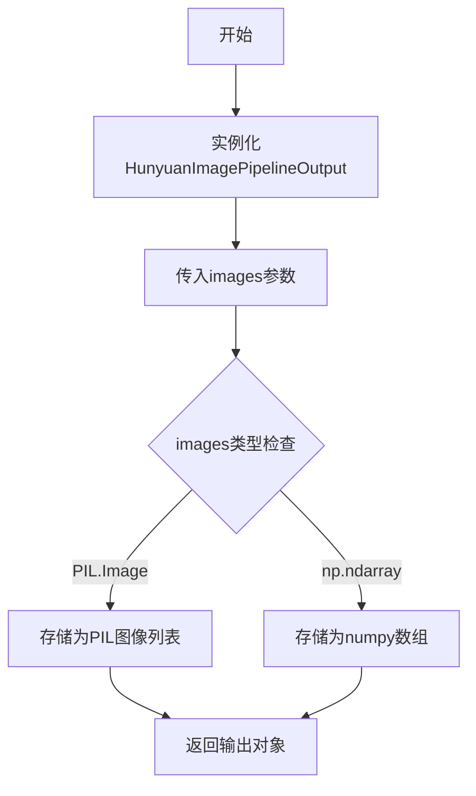
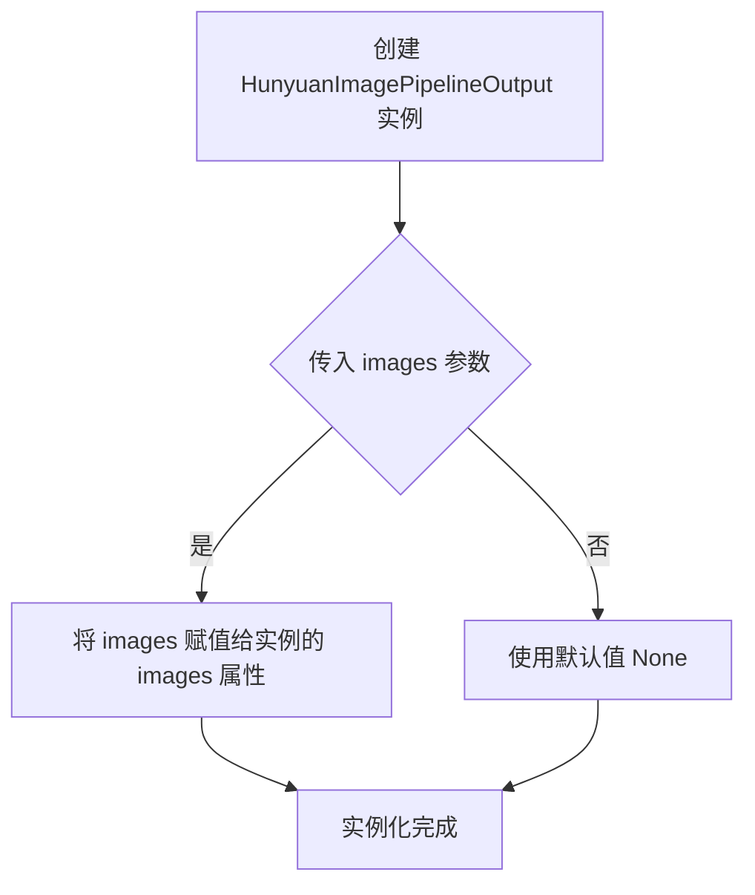
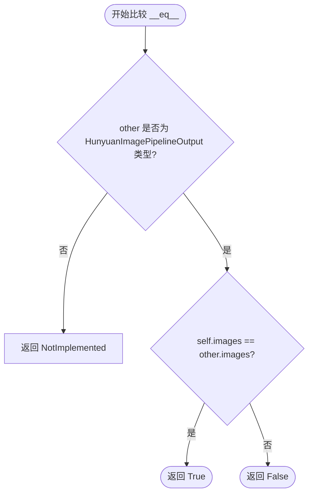

# `diffusers\src\diffusers\pipelines\hunyuan_image\pipeline_output.py` 详细设计文档

这是一个图像管道输出类，用于存储Hunyuan图像扩散管道的去噪结果，支持PIL图像和numpy数组两种格式的输出。

## 整体流程



## 类结构

```
BaseOutput (基类)
└── HunyuanImagePipelineOutput (数据类)
```

## 全局变量及字段


### `HunyuanImagePipelineOutput.images`
    
去噪后的PIL图像列表或numpy数组，长度为batch_size，形状为(batch_size, height, width, num_channels)

类型：`list[PIL.Image.Image | np.ndarray]`
    
    

## 全局函数及方法


### HunyuanImagePipelineOutput.__init__

这是 HunyuanImagePipeline 的输出数据类，通过 Python 的 dataclass 装饰器自动生成构造函数，用于存储扩散管道生成的图像结果。

参数：

- `self`：自动参数，HunyuanImagePipelineOutput 实例本身
- `images`：`list[PIL.Image.Image | np.ndarray]`，管道输出的去噪图像列表，可以是 PIL Image 对象列表或 NumPy 数组

返回值：无（`None`），构造函数仅初始化实例属性

#### 流程图



#### 带注释源码

```python
@dataclass
class HunyuanImagePipelineOutput(BaseOutput):
    """
    Output class for HunyuanImage pipelines.

    Args:
        images (`list[PIL.Image.Image]` or `np.ndarray`)
            List of denoised PIL images of length `batch_size` or numpy array of shape `(batch_size, height, width,
            num_channels)`. PIL images or numpy array present the denoised images of the diffusion pipeline.
    """

    # 类字段：存储管道生成的图像结果
    # 类型：list[PIL.Image.Image, np.ndarray] - 可以是 PIL 图像列表或 NumPy 数组
    images: list[PIL.Image.Image, np.ndarray]

    # 注意：__init__ 方法由 @dataclass 装饰器自动生成
    # 相当于：
    # def __init__(self, images: list[PIL.Image.Image, np.ndarray]):
    #     self.images = images
```

#### 类字段详情

| 字段名称 | 类型 | 描述 |
|---------|------|------|
| images | list[PIL.Image.Image, np.ndarray] | 扩散管道输出的去噪图像列表，可以是 PIL Image 对象列表或 NumPy 数组 |

#### 关键组件信息

- **BaseOutput**：父类，提供基础输出类的通用接口
- **images**：核心数据字段，存储管道生成的图像结果

#### 潜在技术债务或优化空间

1. **类型注解不够精确**：当前使用 `list[PIL.Image.Image, np.ndarray]` 这种混合类型注解不够规范，应使用 `Union` 明确表示或分成两个独立字段
2. **缺少验证逻辑**：没有对 images 参数进行类型和格式验证，可能导致运行时错误
3. **文档可以更详细**：可以添加更多关于图像尺寸、通道数等约束的说明

#### 其它项目

**设计目标与约束：**
- 作为数据容器类，遵循数据类模式
- 支持批量图像输出

**错误处理与异常设计：**
- 当前实现无内置错误处理，依赖调用方传入有效参数

**数据流与状态机：**
- 作为管道输出的终端数据结构，不涉及状态管理

**外部依赖与接口契约：**
- 依赖 PIL.Image 和 numpy.ndarray
- 继承自 BaseOutput，需遵循其接口约定


### HunyuanImagePipelineOutput.__repr__

这是一个自动生成的方法，由 Python 的 `@dataclass` 装饰器为数据类自动创建，用于返回对象的字符串表示形式，包含类名和所有字段的名称及值。

参数：
- 无显式参数（继承自 object 的实例方法，self 为隐式参数）

返回值：`str`，返回该数据类对象的字符串表示，包含类名和所有字段的名称及值。

#### 流程图

```mermaid
flowchart TD
    A[调用 __repr__] --> B{是否为 dataclass}
    B -->|是| C[自动生成 repr]
    B -->|否| D[使用 object 默认 repr]
    C --> E[返回格式: ClassName(field1=value1, field2=value2, ...)]
    E --> F[示例: HunyuanImagePipelineOutput(images=[...])]
```

#### 带注释源码

```python
# 由于 HunyuanImagePipelineOutput 使用了 @dataclass 装饰器
# Python 会自动为该类生成 __repr__ 方法
# 自动生成的 __repr__ 方法包含所有实例字段（在本例中只有 images 字段）

# 自动生成的 repr 格式类似于：
def __repr__(self):
    return (
        f"HunyuanImagePipelineOutput("
        f"images={self.images!r})"
    )

# 实际调用示例：
# >>> output = HunyuanImagePipelineOutput(images=[img1, img2])
# >>> print(repr(output))
# HunyuanImagePipelineOutput(images=[<PIL.Image.Image image mode=RGB size=512x512>, <PIL.Image.Image image mode=RGB size=512x512>])

# 注意：dataclass 的 repr 默认包含所有字段
# 如果想排除某些字段，可以在 @dataclass(repr=False) 中设置
```


### HunyuanImagePipelineOutput.__eq__

自动生成的相等性比较方法，用于比较两个 HunyuanImagePipelineOutput 实例是否完全相同。它基于 dataclass 的定义，逐个比较所有字段（当前仅包含 `images` 字段）。

参数：

-  `self`：`HunyuanImagePipelineOutput`，当前正在比较的对象实例
-  `other`：`object`，要与当前实例进行比较的另一个对象

返回值：`bool`，如果两个实例的所有字段都相等则返回 `True`，否则返回 `False`；如果 `other` 不是 `HunyuanImagePipelineOutput` 类型，则返回 `NotImplemented` 以交给对方处理。

#### 流程图



#### 带注释源码

```python
def __eq__(self, other: object) -> bool:
    """
    自动生成的 __eq__ 方法。
    比较当前实例 (self) 与另一个实例 (other) 是否相等。
    """
    # 如果比较的对象不是 HunyuanImagePipelineOutput 的实例，
    # 返回 NotImplemented，让 Python 尝试调用对方的 __eq__ 方法
    if not isinstance(other, HunyuanImagePipelineOutput):
        return NotImplemented
    
    # 比较两个实例的 images 字段是否相等
    # 这里的相等性取决于 images 本身的 __eq__ 实现（list 或 np.ndarray）
    return self.images == other.images
```


## 关键组件


### HunyuanImagePipelineOutput

HunyuanImagePipelineOutput 是一个数据类，继承自 BaseOutput，用于封装图像生成管道的输出结果，支持 PIL 图像列表或 NumPy 数组两种格式。

### images

images 是图像输出字段，类型为 list[PIL.Image.Image, np.ndarray]，用于存储去噪后的图像数据，可以是 PIL 图像列表或 NumPy 数组格式。

### BaseOutput

BaseOutput 是基础输出类，提供统一的输出接口规范，所有管道输出类都应继承此类以保持一致性。

### 类型提示支持

代码使用了 Python 3.10+ 的 Union 类型写法 `list[PIL.Image.Image, np.ndarray]`，在同一字段中支持两种不同的图像格式返回。


## 问题及建议


### 已知问题

-   **类型提示错误**：`list[PIL.Image.Image, np.ndarray]` 语法不正确，这种写法表示的是包含两个类型参数的列表，而非"列表或numpy数组"的联合类型，应使用 `Union[list[PIL.Image.Image], np.ndarray]` 或 Python 3.10+ 的 `list[PIL.Image.Image] | np.ndarray`
-   **字段缺少类型描述文档**：虽然类有文档说明，但 `images` 字段本身缺少单独的文档注释来描述其具体用途和约束
-   **无输入验证**：未对 `images` 参数进行运行时类型校验，无法确保传入的值确实是 `list` 或 `np.ndarray` 类型
-   **类型语义不清晰**：允许同时接收 `list[PIL.Image.Image]` 和 `np.ndarray` 两种类型，但未明确在何种场景下应使用哪一种，增加了调用方的心智负担
-   **列表元素类型缺失**：当 `images` 为列表时，未指定列表中元素的类型应为 `PIL.Image.Image`，当前类型提示无法被静态类型检查器正确验证

### 优化建议

-   修正类型提示为 `Union[list[PIL.Image.Image], np.ndarray]` 或 `list[PIL.Image.Image] | np.ndarray`，并在 Python 版本支持的情况下使用 `from __future__ import annotations` 或明确标注版本要求
-   为 `images` 字段添加字段级别的文档字符串，例如 `images: list[PIL.Image.Image] | np.ndarray = field(default=None, documentation="...")`
-   考虑添加 `__post_init__` 方法进行类型验证，或使用 Pydantic 替代 dataclass 以获得更强大的验证能力
-   考虑拆分为两个独立字段或使用泛型来明确不同输出场景，例如使用 `Optional[list[PIL.Image.Image]]` 和 `Optional[np.ndarray]` 分别存储
-   添加类型默认值或使用 `field(default_factory=list)` 以支持可选实例化，提升 API 的灵活性

## 其它


### 设计目标与约束

定义HunyuanImagePipelineOutput类的核心目标是作为Hunyuan图像生成管道的标准化输出容器，统一封装denoise后的图像结果。该类需支持PIL.Image和numpy.ndarray两种图像格式的输出，以满足不同下游任务的需求。设计约束包括：必须继承自BaseOutput以保持与框架其他管道的一致性；images字段类型声明需兼容PIL图像和numpy数组；遵循dataclass的简洁性原则不包含业务逻辑方法。

### 错误处理与异常设计

该类作为纯数据容器不涉及复杂业务逻辑，错误处理主要依赖类型检查。调用方在使用输出结果时应进行图像格式验证，当images字段为None或不符合预期类型时应抛出TypeError。PIL.Image和numpy数组之间的转换应由管道其他组件负责，转换失败时应传播原始异常。BaseOutput基类可能定义了基础的序列化/反序列化方法，异常处理遵循框架统一规范。

### 数据流与状态机

数据流向如下：扩散模型推理完成 → 后处理组件生成图像列表 → 构建HunyuanImagePipelineOutput实例 → 返回给调用方。该类本身为无状态数据结构，仅负责图像结果的封装与传递。状态转换由外部管道控制，该类不维护任何内部状态机。输入为图像列表，输出为包含图像的dataclass对象。

### 外部依赖与接口契约

该类依赖以下外部组件：1) dataclasses模块提供数据类装饰器；2) PIL.Image库定义PIL图像类型；3) numpy库定义ndarray多维数组类型；4) BaseOutput基类定义管道输出的基础接口。调用方契约要求传入images参数必须为list类型，列表元素应为PIL.Image.Image或np.ndarray的实例或两者混合。返回类型承诺为HunyuanImagePipelineOutput的dataclass实例。

### 性能考虑

作为轻量级数据容器，该类本身不存在显著性能瓶颈。内存占用主要取决于images字段中图像数据的尺寸和数量。在批量处理场景下，建议调用方复用输出对象或按需释放引用以协助垃圾回收。dataclass的__repr__等自动生成方法在大量图像输出时可能带来轻微开销，可通过__slots__优化但当前版本无需此优化。

### 版本兼容性说明

当前版本仅声明了images字段类型为list[PIL.Image.Image, np.ndarray]，该类型注解语法适用于Python 3.9+。对于Python 3.8及以下版本需使用typing.List和Union类型标注。BaseOutput基类的接口变更可能影响该类的行为，升级时需同步检查基类兼容性。该类遵循语义化版本控制，重大变更将在CHANGELOG中记录。

### 测试策略

建议包含以下测试用例：1) 实例化测试 - 验证可正常创建包含PIL图像的输出对象；2) 实例化测试 - 验证可正常创建包含numpy数组的输出对象；3) 类型注解测试 - 使用typing模块验证类型声明正确性；4) 序列化测试 - 验证从BaseOutput继承的序列化方法正常工作；5) 边界测试 - 验证空列表和None值的行为符合预期。测试应覆盖Python 3.9至3.12版本。

### 常见使用模式

管道调用方通常按以下模式使用该类：1) 调用HunyuanImagePipeline的__call__方法；2) 接收返回的HunyuanImagePipelineOutput实例；3) 通过output.images访问图像列表；4) 对图像进行后续处理（如保存、显示或进一步变换）。批量推理场景下images列表长度等于batch_size参数值。

### 扩展性建议

未来可考虑：1) 添加图像元数据字段如生成参数、种子值、推理时间等；2) 支持图像质量评分字段；3) 添加安全过滤器标志位；4) 实现自定义序列化方法以支持分布式场景。当前设计保持简洁性，仅包含核心图像数据，符合单一职责原则。

    