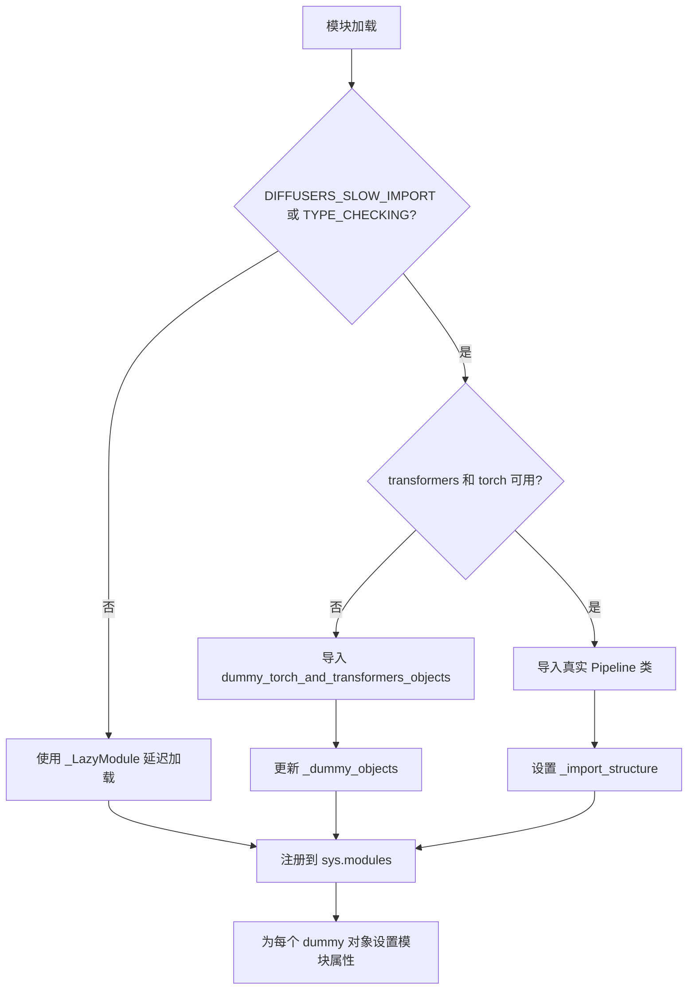
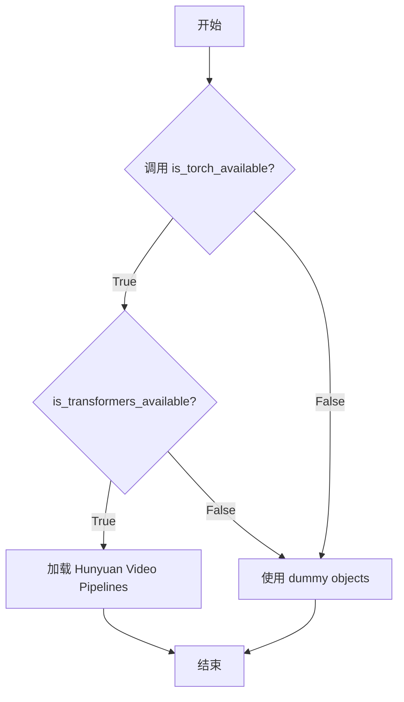
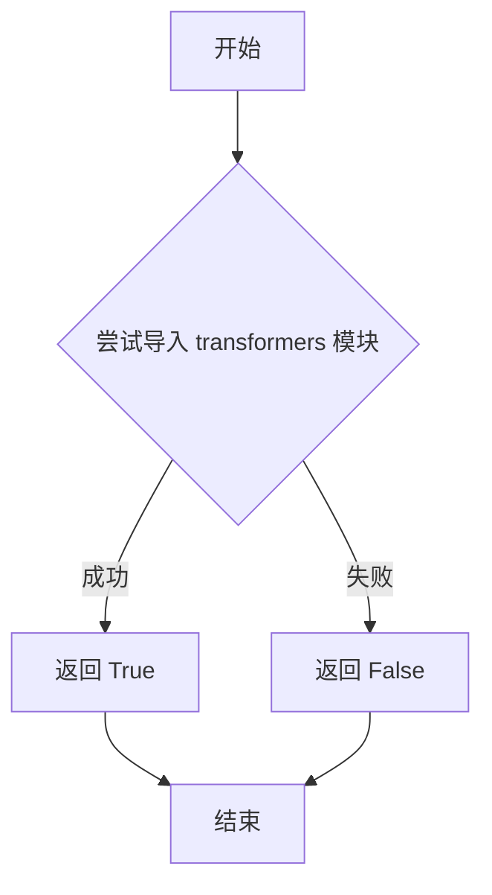
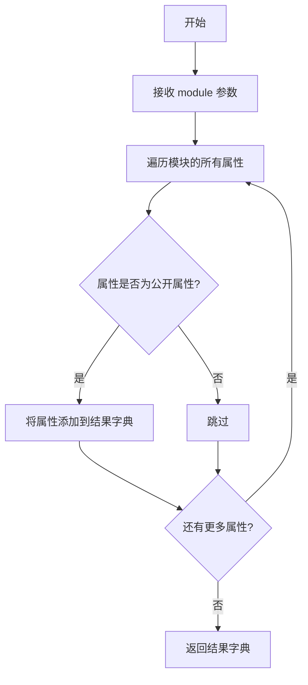
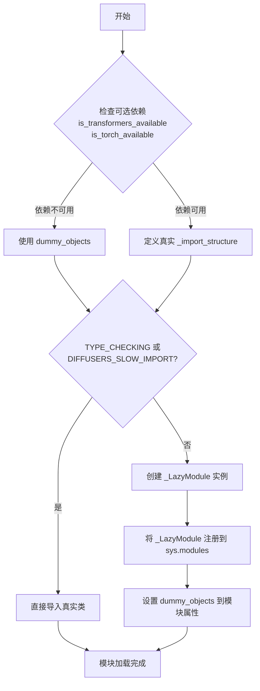

# `diffusers\src\diffusers\pipelines\hunyuan_video\__init__.py` 详细设计文档

这是一个延迟加载模块，用于条件性地导入Hunyuan视频生成相关的4个Pipeline类（Image2Video、Video、VideoFramepack、ImageToVideo），在torch和transformers依赖可用时加载真实实现，否则加载空壳对象以保持API兼容性。

## 整体流程



## 类结构

```
HunyuanVideoPipeline (模块)
├── HunyuanSkyreelsImageToVideoPipeline
├── HunyuanVideoPipeline
├── HunyuanVideoFramepackPipeline
└── HunyuanVideoImageToVideoPipeline
```

## 全局变量及字段


### `_dummy_objects`
    
存储可选依赖不可用时的虚拟对象，用于实现懒加载和优雅降级

类型：`dict`
    


### `_import_structure`
    
定义模块的导入结构，键为模块路径，值为对应的类名列表

类型：`dict`
    


    

## 全局函数及方法


# 分析结果

### `is_torch_available`

该函数 `is_torch_available` 是从 `...utils` 模块导入的工具函数，用于检查当前环境中 PyTorch 库是否可用。在本文件中，它作为条件判断的核心依据，用于决定是否加载与 PyTorch 相关的 Hunyuan 系列视频Pipeline模块。

参数： 无

返回值： `bool`，返回 `True` 表示 PyTorch 可用，返回 `False` 表示 PyTorch 不可用

#### 流程图



#### 带注释源码

```
# is_torch_available 是从外部模块导入的，未在此文件中定义
# 其实现位于 ...utils 模块中
from ...utils import (
    DIFFUSERS_SLOW_IMPORT,
    OptionalDependencyNotAvailable,
    _LazyModule,
    get_objects_from_module,
    is_torch_available,        # <-- 从 utils 导入的检查函数
    is_transformers_available,
)

# 使用 is_torch_available() 进行条件检查
try:
    if not (is_transformers_available() and is_torch_available()):
        # 两个条件都必须满足，否则抛出异常
        raise OptionalDependencyNotAvailable()
except OptionalDependencyNotAvailable:
    # 如果任一依赖不可用，加载 dummy objects
    from ...utils import dummy_torch_and_transformers_objects
    _dummy_objects.update(get_objects_from_module(dummy_torch_and_transformers_objects))
else:
    # 如果两个依赖都可用，加载实际的 Pipeline 类
    _import_structure["pipeline_hunyuan_skyreels_image2video"] = ["HunyuanSkyreelsImageToVideoPipeline"]
    _import_structure["pipeline_hunyuan_video"] = ["HunyuanVideoPipeline"]
    _import_structure["pipeline_hunyuan_video_framepack"] = ["HunyuanVideoFramepackPipeline"]
    _import_structure["pipeline_hunyuan_video_image2video"] = ["HunyuanVideoImageToVideoPipeline"]
```

---

## 说明

⚠️ **注意**：`is_torch_available` 函数的实际实现源码不在当前文件中，而是从 `...utils` 模块导入。该函数的典型实现模式是在 utils 模块中检查 `torch` 是否在 `sys.modules` 中或通过 `import torch` 尝试导入来返回布尔值。


### `is_transformers_available`

该函数用于检查 `transformers` 库是否在当前 Python 环境中可用，通过尝试导入 `transformers` 模块来判断，返回布尔值表示库是否可用。

**参数：** 无参数

**返回值：** `bool`，返回 `True` 表示 `transformers` 库可用，返回 `False` 表示不可用。

#### 流程图



#### 带注释源码

```
# 从 ...utils 模块导入 is_transformers_available 函数
# 该函数定义在 diffusers 库的 utils 包中
from ...utils import (
    DIFFUSERS_SLOW_IMPORT,
    OptionalDependencyNotAvailable,
    _LazyModule,
    get_objects_from_module,
    is_torch_available,
    is_transformers_available,  # <-- 从上级目录的 utils 导入的检查函数
)

# 使用 is_transformers_available 检查 transformers 是否可用
# 只有同时满足 is_transformers_available() 和 is_torch_available() 为 True 时
# 才会导入相关的 pipeline 类，否则抛出 OptionalDependencyNotAvailable 异常
try:
    if not (is_transformers_available() and is_torch_available()):
        raise OptionalDependencyNotAvailable()
except OptionalDependencyNotAvailable:
    # 导入虚拟对象（dummy objects）作为占位符
    from ...utils import dummy_torch_and_transformers_objects
    _dummy_objects.update(get_objects_from_module(dummy_torch_and_transformers_objects))
else:
    # 当 transformers 和 torch 都可用时，导入实际的 pipeline 类
    _import_structure["pipeline_hunyuan_skyreels_image2video"] = ["HunyuanSkyreelsImageToVideoPipeline"]
    _import_structure["pipeline_hunyuan_video"] = ["HunyuanVideoPipeline"]
    _import_structure["pipeline_hunyuan_video_framepack"] = ["HunyuanVideoFramepackPipeline"]
    _import_structure["pipeline_hunyuan_video_image2video"] = ["HunyuanVideoImageToVideoPipeline"]

# 在 TYPE_CHECKING 模式下也执行相同的检查逻辑
if TYPE_CHECKING or DIFFUSERS_SLOW_IMPORT:
    try:
        if not (is_transformers_available() and is_torch_available()):
            raise OptionalDependencyNotAvailable()
    except OptionalDependencyNotAvailable:
        from ...utils.dummy_torch_and_transformers_objects import *
    else:
        from .pipeline_hunyuan_skyreels_image2video import HunyuanSkyreelsImageToVideoPipeline
        from .pipeline_hunyuan_video import HunyuanVideoPipeline
        from .pipeline_hunyuan_video_framepack import HunyuanVideoFramepackPipeline
        from .pipeline_hunyuan_video_image2video import HunyuanVideoImageToVideoPipeline
```

---

> **注意**：由于 `is_transformers_available` 是从 `...utils` 外部模块导入的函数，上述源码展示了该函数在当前文件中的**使用方式**，而非该函数本身的实现源码。该函数的具体实现通常位于 `diffusers` 库的 `src/diffusers/utils/__init__.py` 或类似的 utils 模块中，其核心逻辑通常是尝试 `import transformers` 并捕获 `ImportError` 异常来返回布尔值。


### `get_objects_from_module`

该函数是一个工具函数，用于从指定模块中提取所有对象（通常是虚拟对象/dummy objects），并将其转换为字典格式返回。在 Diffusers 库中，当可选依赖（如 torch 和 transformers）不可用时，用于加载虚拟对象以保持模块接口完整性。

参数：

- `module`：`module`，要从中提取对象的模块，通常是 `dummy_torch_and_transformers_objects` 等虚拟对象模块

返回值：`Dict[str, Any]`，返回模块中所有对象的字典，键为对象名称，值为对象本身

#### 流程图



#### 带注释源码

```python
# 该函数定义在 ...utils 模块中
# 此处展示在本文件中的调用方式

from ...utils import get_objects_from_module

# 当 torch 和 transformers 不可用时
try:
    if not (is_transformers_available() and is_torch_available()):
        raise OptionalDependencyNotAvailable()
except OptionalDependencyNotAvailable:
    # 导入虚拟对象模块
    from ...utils import dummy_torch_and_transformers_objects
    
    # 调用 get_objects_from_module 获取该模块中的所有虚拟对象
    # 并将它们更新到 _dummy_objects 字典中
    _dummy_objects.update(get_objects_from_module(dummy_torch_and_transformers_objects))

# 后续这些虚拟对象会被设置到 sys.modules 中
# 以确保模块的公共接口在依赖不可用时仍然完整
for name, value in _dummy_objects.items():
    setattr(sys.modules[__name__], name, value)
```


### `_LazyModule`

这是一个用于实现模块延迟加载的类，通过将模块替换为 `_LazyModule` 实例来实现按需导入，从而优化大型库的导入时间和内存占用。

参数：

- `__name__`：`str`，当前模块的名称（通常为 `__name__`）
- `__file__`：`str`，当前模块的文件路径（通过 `globals()["__file__"]` 获取）
- `_import_structure`：`dict`，模块的导入结构字典，定义了可导出的对象名称列表
- `module_spec`：`ModuleSpec`，模块的规格对象（通过 `__spec__` 获取）

返回值：无直接返回值（构造函数），但将 `sys.modules[__name__]` 替换为延迟加载模块实例

#### 流程图



#### 带注释源码

```python
# 导入类型检查标志
from typing import TYPE_CHECKING

# 从 utils 模块导入延迟加载所需的类和函数
from ...utils import (
    DIFFUSERS_SLOW_IMPORT,          # 标志：是否进行慢速导入
    OptionalDependencyNotAvailable, # 可选依赖不可用异常
    _LazyModule,                     # 核心：延迟加载模块类
    get_objects_from_module,         # 从模块获取对象的工具函数
    is_torch_available,              # 检查 torch 是否可用
    is_transformers_available,       # 检查 transformers 是否可用
)

# 初始化虚拟对象字典和导入结构字典
_dummy_objects = {}
_import_structure = {}

# 尝试检查依赖可用性
try:
    # 必须同时满足 transformers 和 torch 可用
    if not (is_transformers_available() and is_torch_available()):
        raise OptionalDependencyNotAvailable()
except OptionalDependencyNotAvailable:
    # 依赖不可用时，导入虚拟对象（空实现）
    from ...utils import dummy_torch_and_transformers_objects  # noqa F403
    # 更新虚拟对象字典
    _dummy_objects.update(get_objects_from_module(dummy_torch_and_transformers_objects))
else:
    # 依赖可用时，定义真实的导入结构
    _import_structure["pipeline_hunyuan_skyreels_image2video"] = ["HunyuanSkyreelsImageToVideoPipeline"]
    _import_structure["pipeline_hunyuan_video"] = ["HunyuanVideoPipeline"]
    _import_structure["pipeline_hunyuan_video_framepack"] = ["HunyuanVideoFramepackPipeline"]
    _import_structure["pipeline_hunyuan_video_image2video"] = ["HunyuanVideoImageToVideoPipeline"]

# 类型检查或慢速导入模式：直接导入真实类
if TYPE_CHECKING or DIFFUSERS_SLOW_IMPORT:
    try:
        if not (is_transformers_available() and is_torch_available()):
            raise OptionalDependencyNotAvailable()
    except OptionalDependencyNotAvailable:
        # 类型检查时导入虚拟对象
        from ...utils.dummy_torch_and_transformers_objects import *
    else:
        # 直接导入真实管道类
        from .pipeline_hunyuan_skyreels_image2video import HunyuanSkyreelsImageToVideoPipeline
        from .pipeline_hunyuan_video import HunyuanVideoPipeline
        from .pipeline_hunyuan_video_framepack import HunyuanVideoFramepackPipeline
        from .pipeline_hunyuan_video_image2video import HunyuanVideoImageToVideoPipeline

else:
    # 运行时延迟加载模式
    import sys
    
    # 核心：创建 _LazyModule 实例替换当前模块
    # 参数1: 模块名称
    # 参数2: 模块文件路径
    # 参数3: 导入结构字典（定义哪些类可以被延迟导入）
    # 参数4: 模块规格对象（包含模块的元信息）
    sys.modules[__name__] = _LazyModule(
        __name__,
        globals()["__file__"],
        _import_structure,
        module_spec=__spec__,
    )
    
    # 将虚拟对象设置为模块属性，使其可以被访问
    for name, value in _dummy_objects.items():
        setattr(sys.modules[__name__], name, value)
```

---

### 补充说明

**关键点**：
- `_LazyModule` 是扩散器库中实现延迟加载的核心机制
- 通过将 `sys.modules[__name__]` 替换为 `_LazyModule` 实例，模块在被首次访问（如 `from xxx import HunyuanVideoPipeline`）时才真正加载对应的类
- 这大大减少了库初始化时的内存占用和导入时间

## 关键组件


### 可选依赖检查与条件导入机制

通过 try-except 捕获 `OptionalDependencyNotAvailable` 异常，判断 `is_transformers_available()` 和 `is_torch_available()` 是否同时可用，从而决定导入真实的 pipeline 类还是虚拟对象。

### 延迟加载模块（_LazyModule）

使用 `diffusers.utils` 中的 `_LazyModule` 实现惰性加载，将模块名称、文件路径、导入结构字典和模块规格传递给延迟模块构造器，实现按需导入以优化启动性能。

### 虚拟对象集合（_dummy_objects）

当 torch 或 transformers 不可用时，从 `dummy_torch_and_transformers_objects` 模块获取虚拟对象集合，并在模块级别设置这些虚拟对象，确保代码在没有可选依赖时不会崩溃。

### 导入结构字典（_import_structure）

定义了模块的公开 API 结构，包含四个 pipeline 类的字符串键值对映射，用于延迟模块的导入结构声明。

### TYPE_CHECKING 分支

在类型检查或慢速导入模式下，直接导入四个具体的 pipeline 类：`HunyuanSkyreelsImageToVideoPipeline`、`HunyuanVideoPipeline`、`HunyuanVideoFramepackPipeline` 和 `HunyuanVideoImageToVideoPipeline`。

### HunyuanSkyreelsImageToVideoPipeline

腾讯混元图像转视频 pipeline，支持基于图像生成视频内容。

### HunyuanVideoPipeline

腾讯混元视频生成 pipeline，支持从头生成视频内容。

### HununyVideoFramepackPipeline

腾讯混元帧打包视频 pipeline，支持帧序列的视频生成与处理。

### HunyuanVideoImageToVideoPipeline

腾讯混元图像转视频 pipeline，支持基于现有视频或图像进行视频到视频的转换生成。


## 问题及建议


### 已知问题

- **重复的条件检查逻辑**：第15行和第29行存在完全相同的可选依赖检查代码 `if not (is_transformers_available() and is_torch_available())`，违反DRY原则，增加维护成本
- **硬编码的Pipeline名称**：四个Pipeline类名直接以字符串形式写入`_import_structure`字典，扩展性差，新增pipeline时需要手动添加
- **模块级私有变量管理混乱**：`_dummy_objects`和`_import_structure`作为模块级全局变量被直接修改和遍历，缺乏封装性
- **缺少模块级文档字符串**：整个模块没有docstring来说明模块用途和功能
- **导入路径冗余**：在`TYPE_CHECKING`分支和正常分支中都导入了相同的四个Pipeline类，代码重复
- **对`__spec__`的隐式依赖**：代码假设`__spec__`属性始终可用，但在某些动态导入场景下可能不存在
- **get_objects_from_module的隐式依赖**：该函数返回的对象直接被添加到模块，但函数的具体行为和返回值不够透明

### 优化建议

- **提取公共逻辑**：将可选依赖检查封装为单独的工具函数或使用装饰器模式，避免代码重复
- **使用配置文件或注册机制**：将Pipeline类名存储在配置列表或通过装饰器自动注册，减少硬编码
- **添加模块文档**：在文件开头添加模块级别的docstring，说明该模块用于Hunyuan视频相关的Pipeline
- **统一导入路径**：考虑使用相对导入的统一入口点，或通过`__all__`显式导出
- **增加错误处理**：对`__spec__`可能为None的情况增加fallback处理
- **考虑类型注解**：为全局变量添加类型注解，提高代码可读性和类型检查覆盖率

## 其它


### 设计目标与约束

本模块的设计目标是提供一个统一的入口点，用于延迟加载Hunyuan系列视频生成Pipeline，包括Image-to-Video、Video-to-Video、Framepack等多种Pipeline。约束条件是必须同时依赖torch和transformers库，当任一依赖不可用时使用虚拟对象（dummy objects）进行占位，确保模块在缺少可选依赖时仍可被导入但不完整可用。

### 错误处理与异常设计

本模块主要通过OptionalDependencyNotAvailable异常处理可选依赖缺失的情况。当torch或transformers不可用时，抛出该异常并导入dummy_torch_and_transformers_objects模块中的虚拟对象填充_import_structure，确保程序不会因导入错误而中断。_LazyModule会捕获导入错误并返回虚拟对象，提供优雅的降级机制。

### 外部依赖与接口契约

本模块依赖以下外部包：torch（PyTorch深度学习框架）、transformers（Hugging Facetransformers库）、diffusers.utils中的_dummy_objects、_LazyModule、get_objects_from_module等工具函数。提供的公共接口包括四个Pipeline类：HunyuanSkyreelsImageToVideoPipeline、HunyuanVideoPipeline、HunyuanVideoFramepackPipeline、HunyuanVideoImageToVideoPipeline，这些类在完整依赖环境下从对应子模块导出。

### 配置与参数说明

主要配置通过_import_structure字典完成，该字典映射模块路径到导出的类名列表。DIFFUSERS_SLOW_IMPORT标志控制是否启用完整类型检查导入路径。TYPE_CHECKING用于支持IDE的类型检查和代码补全，不会触发实际导入。

### 性能考虑

采用LazyModule机制实现延迟加载，只有在实际访问模块属性时才触发子模块的导入，有效减少启动时间和内存占用。_dummy_objects在依赖不可用时被批量设置到sys.modules中，避免重复的导入检查开销。

### 版本兼容性

模块设计兼容diffusers库的LazyModule导入机制，需要配合diffusers>=0.19.0版本使用。Pipeline类本身可能依赖特定版本的torch和transformers，具体版本要求需参照各Pipeline子模块的实现。

### 安全性考虑

本模块主要处理模块导入逻辑，安全性主要体现在依赖检查的异常处理上。dummy对象的使用确保了模块在部分依赖缺失时的安全性，避免因导入失败导致的程序崩溃。

### 使用示例

```python
# 完整依赖下的导入方式
from diffusers import HunyuanVideoPipeline

# 通过本模块统一入口导入
from diffusers.hunyuan import (
    HunyuanSkyreelsImageToVideoPipeline,
    HunyuanVideoPipeline,
    HunyuanVideoFramepackPipeline,
    HunyuanVideoImageToVideoPipeline
)
```

### 测试策略

测试应覆盖以下场景：1）完整依赖环境下的正常导入；2）缺少torch或transformers时的降级导入；3）LazyModule的延迟加载行为验证；4）TYPE_CHECKING模式下的类型检查支持；5）各Pipeline类的实例化验证。

### 部署注意事项

部署时需确保diffusers包已正确安装，且根据实际使用的Pipeline类型安装对应版本的torch和transformers。建议使用虚拟环境管理依赖冲突，避免因可选依赖版本不匹配导致的潜在问题。


    