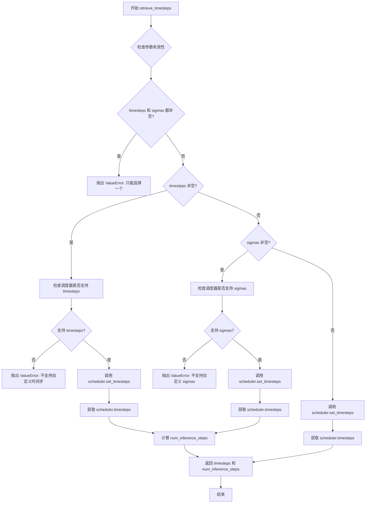
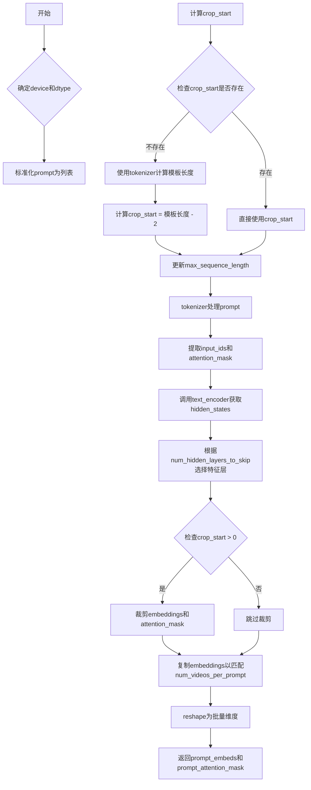
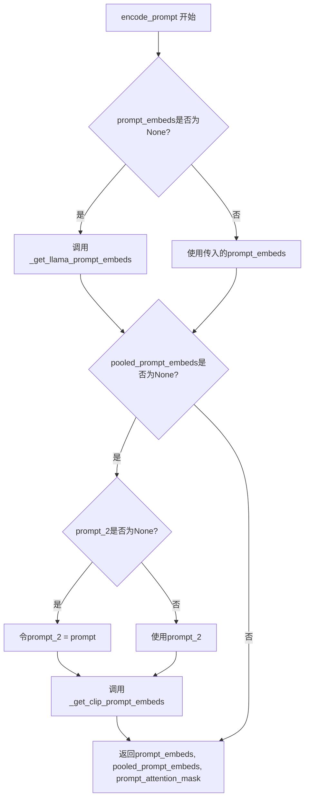
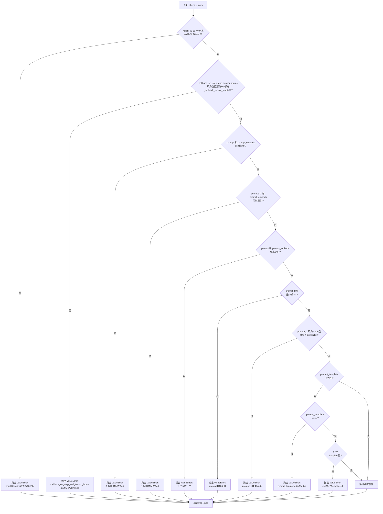
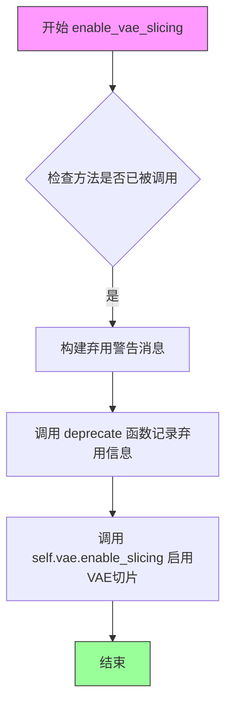
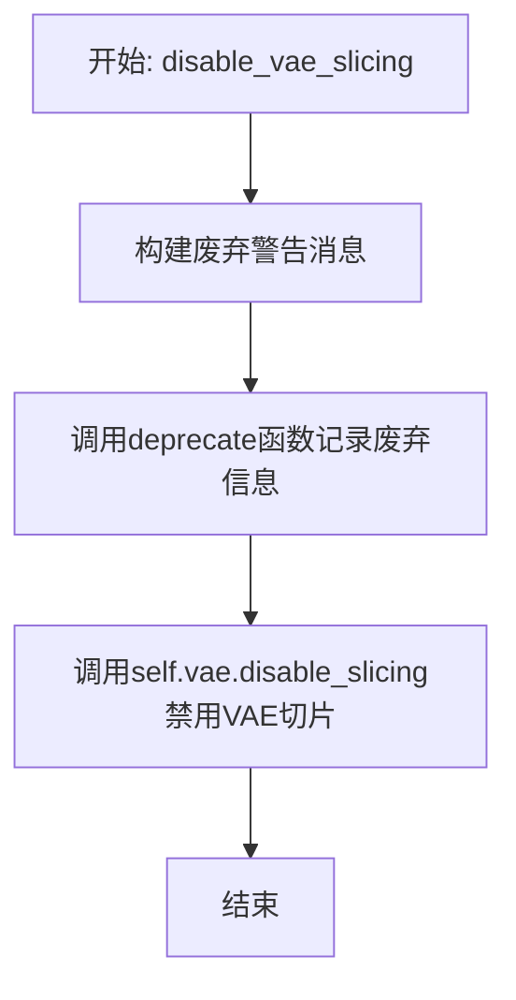
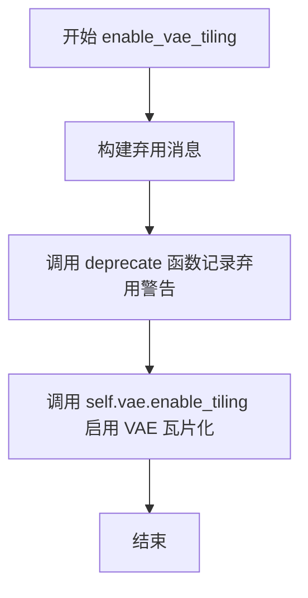
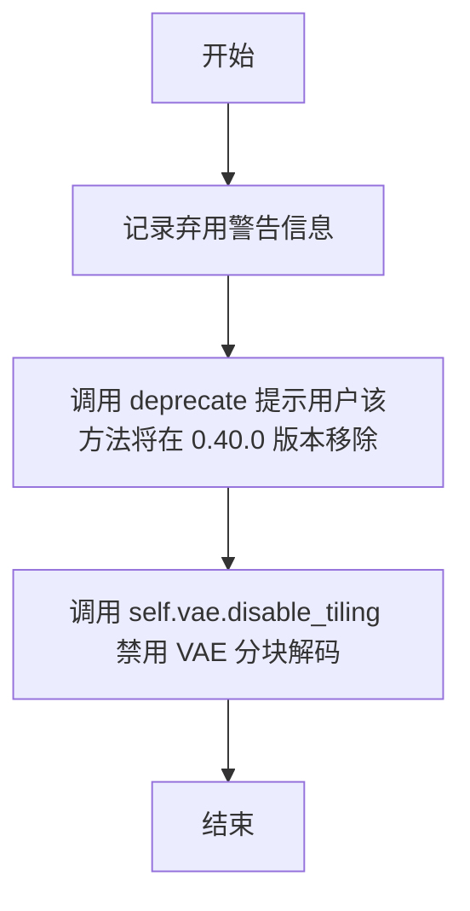

# `diffusers\src\diffusers\pipelines\hunyuan_video\pipeline_hunyuan_skyreels_image2video.py` 详细设计文档

HunyuanSkyreelsImageToVideoPipeline是一个基于HunyuanVideo模型的图像到视频生成Pipeline。该Pipeline通过接收图像输入和文本提示，利用Llama和CLIP双文本编码器、3D Transformer模型、VAE和Flow Match调度器，在去噪循环中逐步生成视频帧，最终输出符合文本描述的动态视频内容。

## 整体流程

```mermaid
graph TD
A[开始: 调用 __call__] --> B[1. 检查输入参数 check_inputs]
B --> C[2. 编码输入提示词 encode_prompt]
C --> D[3. 准备时间步 retrieve_timesteps]
D --> E[4. 准备潜在变量 prepare_latents]
E --> F[5. 准备引导条件]
F --> G{6. 去噪循环}
G -->|第i步| H[调用Transformer进行预测]
H --> I{是否使用True CFG?}
I -- 是 --> J[计算负向噪声预测]
I -- 否 --> K[跳过CFG计算]
J --> L[应用CFG: noise_pred = neg_noise_pred + true_cfg_scale * (noise_pred - neg_noise_pred)]
K --> L
L --> M[scheduler.step更新latents]
M --> N{是否执行callback}
N -- 是 --> O[执行callback_on_step_end]
N -- 否 --> P[更新进度条]
O --> P
P --> Q{是否还有时间步?}
Q -- 是 --> G
Q -- 否 --> R[7. VAE解码或直接返回latents]
R --> S[后处理视频 video_processor.postprocess_video]
S --> T[结束: 返回HunyuanVideoPipelineOutput]
```

## 类结构

```
DiffusionPipeline (基类)
└── HunyuanSkyreelsImageToVideoPipeline
    └── HunyuanVideoLoraLoaderMixin (混入类)
```

## 全局变量及字段


### `EXAMPLE_DOC_STRING`
    
包含管道使用示例的文档字符串

类型：`str`
    


### `DEFAULT_PROMPT_TEMPLATE`
    
默认的提示词模板字典，包含模板字符串和裁剪起始位置

类型：`dict[str, Any]`
    


### `logger`
    
用于记录日志的日志记录器对象

类型：`logging.Logger`
    


### `XLA_AVAILABLE`
    
标志PyTorch XLA是否可用

类型：`bool`
    


### `HunyuanSkyreelsImageToVideoPipeline.model_cpu_offload_seq`
    
模型CPU卸载顺序，指定各模型组件的卸载优先级

类型：`str`
    


### `HunyuanSkyreelsImageToVideoPipeline._callback_tensor_inputs`
    
回调函数可用的张量输入列表

类型：`list`
    


### `HunyuanSkyreelsImageToVideoPipeline.vae`
    
用于视频编码和解码的变分自编码器模型

类型：`AutoencoderKLHunyuanVideo`
    


### `HunyuanSkyreelsImageToVideoPipeline.text_encoder`
    
基于Llama的文本编码器，用于生成文本嵌入

类型：`LlamaModel`
    


### `HunyuanSkyreelsImageToVideoPipeline.tokenizer`
    
Llama快速分词器，用于文本预处理

类型：`LlamaTokenizerFast`
    


### `HunyuanSkyreelsImageToVideoPipeline.transformer`
    
3D变换器模型，用于去噪潜在表示

类型：`HunyuanVideoTransformer3DModel`
    


### `HunyuanSkyreelsImageToVideoPipeline.scheduler`
    
基于Flow Match的欧拉离散调度器，用于去噪过程

类型：`FlowMatchEulerDiscreteScheduler`
    


### `HunyuanSkyreelsImageToVideoPipeline.text_encoder_2`
    
CLIP文本编码器，用于生成池化的文本嵌入

类型：`CLIPTextModel`
    


### `HunyuanSkyreelsImageToVideoPipeline.tokenizer_2`
    
CLIP分词器，用于CLIP文本编码器的文本预处理

类型：`CLIPTokenizer`
    


### `HunyuanSkyreelsImageToVideoPipeline.vae_scale_factor_temporal`
    
VAE时间压缩比，用于计算潜在帧数

类型：`int`
    


### `HunyuanSkyreelsImageToVideoPipeline.vae_scale_factor_spatial`
    
VAE空间压缩比，用于计算潜在空间维度

类型：`int`
    


### `HunyuanSkyreelsImageToVideoPipeline.vae_scaling_factor`
    
VAE缩放因子，用于潜在表示的缩放

类型：`float`
    


### `HunyuanSkyreelsImageToVideoPipeline.video_processor`
    
视频处理器，用于视频的预处理和后处理

类型：`VideoProcessor`
    


### `HunyuanSkyreelsImageToVideoPipeline._guidance_scale`
    
引导比例，用于控制分类器自由引导的强度

类型：`float`
    


### `HunyuanSkyreelsImageToVideoPipeline._num_timesteps`
    
去噪过程的时间步总数

类型：`int`
    


### `HunyuanSkyreelsImageToVideoPipeline._attention_kwargs`
    
注意力机制的关键字参数字典

类型：`dict[str, Any]`
    


### `HunyuanSkyreelsImageToVideoPipeline._current_timestep`
    
当前去噪时间步

类型：`int`
    


### `HunyuanSkyreelsImageToVideoPipeline._interrupt`
    
中断标志，用于中断去噪循环

类型：`bool`
    
    

## 全局函数及方法


### `retrieve_timesteps`

该函数是全局调度器辅助函数，用于调用调度器的 `set_timesteps` 方法并从中获取时间步。它支持自定义时间步（timesteps）或自定义 sigmas，任何额外的关键字参数都会传递给调度器的 `set_timesteps` 方法。

参数：

-  `scheduler`：`SchedulerMixin`，获取时间步的调度器对象
-  `num_inference_steps`：`int | None`，使用预训练模型生成样本时的扩散步数，如果使用此参数，则 `timesteps` 必须为 `None`
-  `device`：`str | torch.device | None`，时间步要移动到的设备，如果为 `None`，则不移动时间步
-  `timesteps`：`list[int] | None`，用于覆盖调度器时间步间隔策略的自定义时间步，如果传入 `timesteps`，则 `num_inference_steps` 和 `sigmas` 必须为 `None`
-  `sigmas`：`list[float] | None`，用于覆盖调度器时间步间隔策略的自定义 sigmas，如果传入 `sigmas`，则 `num_inference_steps` 和 `timesteps` 必须为 `None`
-  `**kwargs`：任意其他关键字参数，将传递给调度器的 `set_timesteps` 方法

返回值：`tuple[torch.Tensor, int]`，元组中第一个元素是调度器的时间步调度，第二个元素是推理步数

#### 流程图



#### 带注释源码

```python
# Copied from diffusers.pipelines.stable_diffusion.pipeline_stable_diffusion.retrieve_timesteps
def retrieve_timesteps(
    scheduler,
    num_inference_steps: int | None = None,
    device: str | torch.device | None = None,
    timesteps: list[int] | None = None,
    sigmas: list[float] | None = None,
    **kwargs,
):
    r"""
    Calls the scheduler's `set_timesteps` method and retrieves timesteps from the scheduler after the call. Handles
    custom timesteps. Any kwargs will be supplied to `scheduler.set_timesteps`.

    Args:
        scheduler (`SchedulerMixin`):
            The scheduler to get timesteps from.
        num_inference_steps (`int`):
            The number of diffusion steps used when generating samples with a pre-trained model. If used, `timesteps`
            must be `None`.
        device (`str` or `torch.device`, *optional*):
            The device to which the timesteps should be moved to. If `None`, the timesteps are not moved.
        timesteps (`list[int]`, *optional*):
            Custom timesteps used to override the timestep spacing strategy of the scheduler. If `timesteps` is passed,
            `num_inference_steps` and `sigmas` must be `None`.
        sigmas (`list[float]`, *optional*):
            Custom sigmas used to override the timestep spacing strategy of the scheduler. If `sigmas` is passed,
            `num_inference_steps` and `timesteps` must be `None`.

    Returns:
        `tuple[torch.Tensor, int]`: A tuple where the first element is the timestep schedule from the scheduler and the
        second element is the number of inference steps.
    """
    # 检查不能同时传入 timesteps 和 sigmas
    if timesteps is not None and sigmas is not None:
        raise ValueError("Only one of `timesteps` or `sigmas` can be passed. Please choose one to set custom values")
    
    # 处理自定义 timesteps 的情况
    if timesteps is not None:
        # 检查调度器的 set_timesteps 方法是否支持 timesteps 参数
        accepts_timesteps = "timesteps" in set(inspect.signature(scheduler.set_timesteps).parameters.keys())
        if not accepts_timesteps:
            raise ValueError(
                f"The current scheduler class {scheduler.__class__}'s `set_timesteps` does not support custom"
                f" timestep schedules. Please check whether you are using the correct scheduler."
            )
        # 调用调度器的 set_timesteps 方法，传入自定义 timesteps
        scheduler.set_timesteps(timesteps=timesteps, device=device, **kwargs)
        # 从调度器获取设置后的 timesteps
        timesteps = scheduler.timesteps
        # 计算推理步数
        num_inference_steps = len(timesteps)
    
    # 处理自定义 sigmas 的情况
    elif sigmas is not None:
        # 检查调度器的 set_timesteps 方法是否支持 sigmas 参数
        accept_sigmas = "sigmas" in set(inspect.signature(scheduler.set_timesteps).parameters.keys())
        if not accept_sigmas:
            raise ValueError(
                f"The current scheduler class {scheduler.__class__}'s `set_timesteps` does not support custom"
                f" sigmas schedules. Please check whether you are using the correct scheduler."
            )
        # 调用调度器的 set_timesteps 方法，传入自定义 sigmas
        scheduler.set_timesteps(sigmas=sigmas, device=device, **kwargs)
        # 从调度器获取设置后的 timesteps
        timesteps = scheduler.timesteps
        # 计算推理步数
        num_inference_steps = len(timesteps)
    
    # 默认情况：使用 num_inference_steps 设置时间步
    else:
        scheduler.set_timesteps(num_inference_steps, device=device, **kwargs)
        timesteps = scheduler.timesteps
    
    # 返回时间步调度和推理步数
    return timesteps, num_inference_steps
```


### `retrieve_latents`

从编码器输出中检索潜在变量，支持从潜在分布中采样或取模，也可以直接返回预存的潜在变量张量。

参数：

- `encoder_output`：`torch.Tensor`，编码器输出对象，需要包含 `latent_dist` 属性或 `latents` 属性
- `generator`：`torch.Generator | None`，可选的随机数生成器，用于从潜在分布中采样时保证可重复性
- `sample_mode`：`str`，采样模式，"sample" 表示从分布中采样，"argmax" 表示取分布的众数

返回值：`torch.Tensor`，检索到的潜在变量张量

#### 流程图

```mermaid
flowchart TD
    A[开始: retrieve_latents] --> B{encoder_output 是否有 latent_dist 属性?}
    B -->|是| C{sample_mode == 'sample'?}
    B -->|否| D{encoder_output 是否有 latents 属性?}
    
    C -->|是| E[调用 latent_dist.sample(generator)]
    C -->|否| F{sample_mode == 'argmax'?}
    F -->|是| G[调用 latent_dist.mode()]
    F -->|否| H[抛出 AttributeError]
    
    D -->|是| I[返回 encoder_output.latents]
    D -->|否| J[抛出 AttributeError: Could not access latents]
    
    E --> K[返回潜在变量张量]
    G --> K
    I --> K
    H --> L[结束: 异常]
    J --> L
```

#### 带注释源码

```python
def retrieve_latents(
    encoder_output: torch.Tensor, generator: torch.Generator | None = None, sample_mode: str = "sample"
):
    """
    从编码器输出中检索潜在变量。
    
    该函数支持三种获取潜在变量的方式：
    1. 从潜在分布(latent_dist)中采样 - 当 sample_mode="sample" 时
    2. 从潜在分布中获取众数 - 当 sample_mode="argmax" 时
    3. 直接返回预存的 latents 属性
    
    Args:
        encoder_output: 编码器输出对象，需包含 latent_dist 或 latents 属性
        generator: 可选的随机数生成器，用于采样时控制随机性
        sample_mode: 采样模式，"sample" 或 "argmax"
    
    Returns:
        潜在变量张量
    
    Raises:
        AttributeError: 当无法从 encoder_output 中访问潜在变量时
    """
    # 检查编码器输出是否具有 latent_dist 属性（VAE 编码器常见输出格式）
    if hasattr(encoder_output, "latent_dist") and sample_mode == "sample":
        # 从潜在分布中采样，可使用 generator 控制随机性
        return encoder_output.latent_dist.sample(generator)
    elif hasattr(encoder_output, "latent_dist") and sample_mode == "argmax":
        # 获取潜在分布的众数（最大概率值对应的潜在向量）
        return encoder_output.latent_dist.mode()
    elif hasattr(encoder_output, "latents"):
        # 直接返回预存的潜在变量张量
        return encoder_output.latents
    else:
        # 无法获取潜在变量时抛出异常
        raise AttributeError("Could not access latents of provided encoder_output")
```


### HunyuanSkyreelsImageToVideoPipeline.__init__

该方法是 HunyuanSkyreelsImageToVideoPipeline 类的构造函数，用于初始化图像转视频管道实例。它接收多个预训练模型组件（如文本编码器、分词器、Transformer、VAE、调度器和 CLIP 文本编码器），注册这些模块，并配置视频处理所需的缩放因子和视频处理器。

参数：

- `text_encoder`：`LlamaModel`，用于将文本提示编码为隐藏状态的 Llama 模型（Llava Llama3-8B）
- `tokenizer`：`LlamaTokenizerFast`，与 text_encoder 配合使用的 Llama 分词器
- `transformer`：`HunyuanVideoTransformer3DModel`，条件 Transformer 模型，用于对编码的图像潜在表示进行去噪
- `vae`：`AutoencoderKLHunyuanVideo`，变分自编码器模型，用于将视频编码和解码到潜在表示
- `scheduler`：`FlowMatchEulerDiscreteScheduler`，与 transformer 结合使用以对编码图像潜在表示进行去噪的调度器
- `text_encoder_2`：`CLIPTextModel`，CLIP 文本编码器（clip-vit-large-patch14 变体）
- `tokenizer_2`：`CLIPTokenizer`，CLIP 分词器

返回值：`None`，构造函数不返回值，仅初始化实例状态

#### 流程图

```mermaid
flowchart TD
    A[开始 __init__] --> B[调用 super().__init__]
    B --> C[调用 self.register_modules 注册所有模块]
    C --> D[设置 vae_scale_factor_temporal]
    D --> E[设置 vae_scale_factor_spatial]
    E --> F[设置 vae_scaling_factor]
    F --> G[创建 VideoProcessor 实例]
    G --> H[结束 __init__]
    
    C --> C1[vae: AutoencoderKLHunyuanVideo]
    C --> C2[text_encoder: LlamaModel]
    C --> C3[tokenizer: LlamaTokenizerFast]
    C --> C4[transformer: HunyuanVideoTransformer3DModel]
    C --> C5[scheduler: FlowMatchEulerDiscreteScheduler]
    C --> C6[text_encoder_2: CLIPTextModel]
    C --> C7[tokenizer_2: CLIPTokenizer]
```

#### 带注释源码

```python
def __init__(
    self,
    text_encoder: LlamaModel,                    # Llama 文本编码器模型
    tokenizer: LlamaTokenizerFast,              # Llama 分词器
    transformer: HunyuanVideoTransformer3DModel, # Hunyuan 3D Transformer 模型
    vae: AutoencoderKLHunyuanVideo,              # VAE 变分自编码器
    scheduler: FlowMatchEulerDiscreteScheduler,  # 调度器
    text_encoder_2: CLIPTextModel,               # CLIP 文本编码器
    tokenizer_2: CLIPTokenizer,                  # CLIP 分词器
):
    # 调用父类 DiffusionPipeline 的初始化方法
    # 设置管道的通用基础设施和配置
    super().__init__()

    # 将所有模型组件注册到管道中
    # 这使得管道可以统一管理这些模块的设备移动、保存和加载等操作
    self.register_modules(
        vae=vae,
        text_encoder=text_encoder,
        tokenizer=tokenizer,
        transformer=transformer,
        scheduler=scheduler,
        text_encoder_2=text_encoder_2,
        tokenizer_2=tokenizer_2,
    )

    # 计算 VAE 的时间压缩比，用于将帧数转换为潜在帧数
    # 如果 VAE 不存在，默认值为 4
    self.vae_scale_factor_temporal = self.vae.temporal_compression_ratio if getattr(self, "vae", None) else 4
    
    # 计算 VAE 的空间压缩比，用于将图像尺寸转换为潜在尺寸
    # 如果 VAE 不存在，默认值为 8
    self.vae_scale_factor_spatial = self.vae.spatial_compression_ratio if getattr(self, "vae", None) else 8
    
    # 获取 VAE 的缩放因子，用于潜在空间的归一化
    # 如果 VAE 不存在，默认值为 0.476986
    self.vae_scaling_factor = self.vae.config.scaling_factor if getattr(self, "vae", None) else 0.476986
    
    # 创建视频处理器，用于预处理输入图像和后处理输出视频
    # 使用空间缩放因子作为参数
    self.video_processor = VideoProcessor(vae_scale_factor=self.vae_scale_factor_spatial)
```


### `HunyuanSkyreelsImageToVideoPipeline._get_llama_prompt_embeds`

该方法用于将输入的文本提示词（prompt）通过Llama文本编码器编码为高维向量表示（embeddings），并生成相应的注意力掩码（attention mask），以供后续的视频生成扩散模型使用。

参数：

-  `prompt`：`str | list[str]`，输入的文本提示词，可以是单个字符串或字符串列表
-  `prompt_template`：`dict[str, Any]`，提示词模板字典，包含格式化模板（template）和可选的裁剪起始位置（crop_start）
-  `num_videos_per_prompt`：`int = 1`，每个提示词生成的视频数量，用于批量生成时的嵌入复制
-  `device`：`torch.device | None = None`，计算设备，默认为执行设备
-  `dtype`：`torch.dtype | None = None`，数据类型，默认为文本编码器的数据类型
-  `max_sequence_length`：`int = 256`，最大序列长度
-  `num_hidden_layers_to_skip`：`int = 2`，从Llama模型隐藏层输出中跳过的层数，用于获取更合适的特征层

返回值：`tuple[torch.Tensor, torch.Tensor]`，返回一个元组，包含提示词嵌入张量（shape: [batch_size * num_videos_per_prompt, seq_len, hidden_dim]）和对应的注意力掩码张量（shape: [batch_size * num_videos_per_prompt, seq_len]）

#### 流程图



#### 带注释源码

```python
def _get_llama_prompt_embeds(
    self,
    prompt: str | list[str],
    prompt_template: dict[str, Any],
    num_videos_per_prompt: int = 1,
    device: torch.device | None = None,
    dtype: torch.dtype | None = None,
    max_sequence_length: int = 256,
    num_hidden_layers_to_skip: int = 2,
) -> tuple[torch.Tensor, torch.Tensor]:
    # 确定执行设备，若未指定则使用当前执行设备
    device = device or self._execution_device
    # 确定数据类型，若未指定则使用文本编码器的数据类型
    dtype = dtype or self.text_encoder.dtype

    # 将prompt标准化为列表形式，便于批量处理
    prompt = [prompt] if isinstance(prompt, str) else prompt
    # 获取批量大小
    batch_size = len(prompt)

    # 使用prompt_template格式化所有prompt
    # 在模板中嵌入用户输入的prompt内容
    prompt = [prompt_template["template"].format(p) for p in prompt]

    # 获取crop_start参数，用于裁剪模板前缀
    crop_start = prompt_template.get("crop_start", None)
    if crop_start is None:
        # 如果未指定crop_start，则通过tokenizer计算模板长度
        prompt_template_input = self.tokenizer(
            prompt_template["template"],
            padding="max_length",
            return_tensors="pt",
            return_length=False,
            return_overflowing_tokens=False,
            return_attention_mask=False,
        )
        # 获取模板的token长度
        crop_start = prompt_template_input["input_ids"].shape[-1]
        # 移除<|eot_id|>标记和占位符{}，预留2个token
        crop_start -= 2

    # 根据crop_start调整最大序列长度
    max_sequence_length += crop_start
    
    # 使用tokenizer将文本转换为模型输入
    text_inputs = self.tokenizer(
        prompt,
        max_length=max_sequence_length,
        padding="max_length",
        truncation=True,
        return_tensors="pt",
        return_length=False,
        return_overflowing_tokens=False,
        return_attention_mask=True,
    )
    # 将输入ID和注意力掩码移至指定设备
    text_input_ids = text_inputs.input_ids.to(device=device)
    prompt_attention_mask = text_inputs.attention_mask.to(device=device)

    # 调用Llama文本编码器获取隐藏状态
    # output_hidden_states=True要求返回所有隐藏层
    prompt_embeds = self.text_encoder(
        input_ids=text_input_ids,
        attention_mask=prompt_attention_mask,
        output_hidden_states=True,
    ).hidden_states[-(num_hidden_layers_to_skip + 1)]
    # 转换数据类型
    prompt_embeds = prompt_embeds.to(dtype=dtype)

    # 如果存在crop_start，则裁剪掉模板前缀部分
    if crop_start is not None and crop_start > 0:
        prompt_embeds = prompt_embeds[:, crop_start:]
        prompt_attention_mask = prompt_attention_mask[:, crop_start:]

    # 复制text embeddings以匹配每个prompt生成的视频数量
    # 使用MPS友好的重复方法
    _, seq_len, _ = prompt_embeds.shape
    # 先在序列维度重复，再reshape为批量维度
    prompt_embeds = prompt_embeds.repeat(1, num_videos_per_prompt, 1)
    prompt_embeds = prompt_embeds.view(batch_size * num_videos_per_prompt, seq_len, -1)
    # 同样处理attention mask
    prompt_attention_mask = prompt_attention_mask.repeat(1, num_videos_per_prompt)
    prompt_attention_mask = prompt_attention_mask.view(batch_size * num_videos_per_prompt, seq_len)

    # 返回处理后的prompt embeddings和attention mask
    return prompt_embeds, prompt_attention_mask
```


### `HunyuanSkyreelsImageToVideoPipeline._get_clip_prompt_embeds`

该方法用于生成 CLIP 文本编码器的提示嵌入（prompt embeddings），主要处理文本提示的tokenization、编码以及为批量生成复制embeddings，是图像到视频生成管道中文本编码流程的关键组成部分。

参数：

- `self`：`HunyuanSkyreelsImageToVideoPipeline` 实例本身，包含 `tokenizer_2`（CLIP tokenizer）和 `text_encoder_2`（CLIP text encoder）等模块。
- `prompt`：`str | list[str]`，输入的文本提示，可以是单个字符串或字符串列表，用于指导视频生成内容。
- `num_videos_per_prompt`：`int = 1`，每个提示要生成的视频数量，用于复制embeddings以匹配批量大小。
- `device`：`torch.device | None = None`，指定计算设备，如果为 `None` 则使用 `self._execution_device`。
- `dtype`：`torch.dtype | None = None`，指定数据类型，如果为 `None` 则使用 `self.text_encoder_2.dtype`。
- `max_sequence_length`：`int = 77`，CLIP 模型支持的最大序列长度，默认77个token。

返回值：`torch.Tensor`，返回形状为 `(batch_size * num_videos_per_prompt, hidden_size)` 的文本嵌入张量，其中 `hidden_size` 是 CLIP 编码器的隐藏层维度（通常为768）。

#### 流程图

```mermaid
flowchart TD
    A[开始 _get_clip_prompt_embeds] --> B{device 为 None?}
    B -- 是 --> C[device = self._execution_device]
    B -- 否 --> D{device 已设定}
    D --> E{dtype 为 None?}
    E -- 是 --> F[dtype = self.text_encoder_2.dtype]
    E -- 否 --> G{dtype 已设定}
    G --> H{prompt 是字符串?}
    C --> H
    F --> H
    H -- 是 --> I[prompt = [prompt]]
    H -- 否 --> J[保持原样]
    I --> K[batch_size = len(prompt)]
    J --> K
    K --> L[tokenizer_2 编码提示]
    L --> M[提取 input_ids]
    M --> N[获取未截断的 input_ids]
    N --> O{需要截断警告?}
    O -- 是 --> P[记录截断警告]
    O -- 否 --> Q[跳过警告]
    P --> R[text_encoder_2 编码]
    Q --> R
    R --> S[提取 pooler_output]
    S --> T[repeat embeddings]
    T --> U[View 调整形状]
    U --> V[返回 prompt_embeds]
```

#### 带注释源码

```python
def _get_clip_prompt_embeds(
    self,
    prompt: str | list[str],
    num_videos_per_prompt: int = 1,
    device: torch.device | None = None,
    dtype: torch.dtype | None = None,
    max_sequence_length: int = 77,
) -> torch.Tensor:
    # 确定设备：如果未指定，则使用执行设备
    device = device or self._execution_device
    # 确定数据类型：如果未指定，则使用 text_encoder_2 的数据类型
    dtype = dtype or self.text_encoder_2.dtype

    # 标准化输入：将单个字符串转换为列表，以便统一处理
    prompt = [prompt] if isinstance(prompt, str) else prompt
    # 计算批次大小
    batch_size = len(prompt)

    # 使用 CLIP tokenizer_2 对提示进行 tokenization
    # 填充到最大长度，截断超长序列，返回 PyTorch 张量
    text_inputs = self.tokenizer_2(
        prompt,
        padding="max_length",
        max_length=max_sequence_length,
        truncation=True,
        return_tensors="pt",
    )

    # 获取 tokenized 后的 input_ids
    text_input_ids = text_inputs.input_ids
    
    # 获取未截断的 input_ids（使用最长填充），用于检测是否发生了截断
    untruncated_ids = self.tokenizer_2(prompt, padding="longest", return_tensors="pt").input_ids
    
    # 检查是否发生了截断：如果未截断序列长度 >= 截断后长度，且两者不相等
    if untruncated_ids.shape[-1] >= text_input_ids.shape[-1] and not torch.equal(text_input_ids, untruncated_ids):
        # 解码被截断的部分用于警告信息
        removed_text = self.tokenizer_2.batch_decode(untruncated_ids[:, max_sequence_length - 1 : -1])
        # 记录警告日志
        logger.warning(
            "The following part of your input was truncated because CLIP can only handle sequences up to"
            f" {max_sequence_length} tokens: {removed_text}"
        )

    # 使用 CLIP text_encoder_2 编码 input_ids，获取 pooler_output（池化后的嵌入）
    prompt_embeds = self.text_encoder_2(text_input_ids.to(device), output_hidden_states=False).pooler_output

    # 复制 text embeddings 以匹配每个提示生成的视频数量
    # 使用 mps 友好的方法（先 repeat 再 view）
    prompt_embeds = prompt_embeds.repeat(1, num_videos_per_prompt)
    # 调整形状为 (batch_size * num_videos_per_prompt, hidden_size)
    prompt_embeds = prompt_embeds.view(batch_size * num_videos_per_prompt, -1)

    # 返回最终的 prompt embeddings
    return prompt_embeds
```


### HunyuanSkyreelsImageToVideoPipeline.encode_prompt

该方法负责将文本提示（prompt）编码为transformer模型所需的文本嵌入向量。它使用两个不同的文本编码器（Llama和CLIP）分别生成序列级的prompt_embeds和池化的pooled_prompt_embeds，以供后续的视频生成去噪过程使用。

参数：

- `prompt`：`str | list[str]`，主提示词，用于指导视频生成的内容
- `prompt_2`：`str | list[str]`，发送给第二个文本编码器（CLIP）的提示词，默认为None时使用prompt
- `prompt_template`：`dict[str, Any]`，提示词模板，默认为DEFAULT_PROMPT_TEMPLATE，包含LLM格式化的模板和裁剪起始位置
- `num_videos_per_prompt`：`int`，每个提示词生成的视频数量，默认为1
- `prompt_embeds`：`torch.Tensor | None`，预生成的提示词嵌入，如果为None则从prompt生成
- `pooled_prompt_embeds`：`torch.Tensor | None`，预生成的池化提示词嵌入，如果为None则从prompt生成
- `prompt_attention_mask`：`torch.Tensor | None`，提示词的注意力掩码，用于指示哪些token是有效的
- `device`：`torch.device | None`，计算设备，默认为执行设备
- `dtype`：`torch.dtype | None`，张量数据类型，默认为文本编码器的dtype
- `max_sequence_length`：`int`，最大序列长度，默认为256

返回值：`tuple[torch.Tensor, torch.Tensor, torch.Tensor]`，返回三个元素的元组：(1)prompt_embeds - Llama编码的序列级文本嵌入 (2)pooled_prompt_embeds - CLIP编码的池化文本嵌入 (3)prompt_attention_mask - 注意力掩码

#### 流程图



#### 带注释源码

```python
def encode_prompt(
    self,
    prompt: str | list[str],                    # 主提示词字符串或列表
    prompt_2: str | list[str] = None,            # 第二个文本编码器的提示词
    prompt_template: dict[str, Any] = DEFAULT_PROMPT_TEMPLATE,  # 提示词模板
    num_videos_per_prompt: int = 1,              # 每个提示词生成视频数
    prompt_embeds: torch.Tensor | None = None,  # 预计算的prompt嵌入
    pooled_prompt_embeds: torch.Tensor | None = None,  # 预计算的池化嵌入
    prompt_attention_mask: torch.Tensor | None = None,    # 注意力掩码
    device: torch.device | None = None,          # 计算设备
    dtype: torch.dtype | None = None,            # 数据类型
    max_sequence_length: int = 256,              # 最大序列长度
):
    """
    编码提示词为文本嵌入向量
    
    该方法使用Llama和CLIP两个文本编码器将文本提示转换为嵌入向量，
    以供transformer在去噪过程中使用。
    """
    # 如果未提供prompt_embeds，则使用Llama编码器生成
    if prompt_embeds is None:
        prompt_embeds, prompt_attention_mask = self._get_llama_prompt_embeds(
            prompt,                               # 输入的提示词
            prompt_template,                     # 提示词模板
            num_videos_per_prompt,               # 每个提示词生成数量
            device=device,                       # 计算设备
            dtype=dtype,                         # 数据类型
            max_sequence_length=max_sequence_length,  # 最大序列长度
        )

    # 如果未提供pooled_prompt_embeds，则使用CLIP编码器生成
    if pooled_prompt_embeds is None:
        # 如果prompt_2为None，则使用prompt
        if prompt_2 is None:
            prompt_2 = prompt
        # 调用CLIP编码器获取池化嵌入，固定max_sequence_length=77
        pooled_prompt_embeds = self._get_clip_prompt_embeds(
            prompt_2,                            # 使用prompt_2或prompt
            num_videos_per_prompt,               # 每个提示词生成数量
            device=device,                       # 计算设备
            dtype=dtype,                         # 数据类型
            max_sequence_length=77,              # CLIP固定最大长度
        )

    # 返回：序列级嵌入、池化嵌入、注意力掩码
    return prompt_embeds, pooled_prompt_embeds, prompt_attention_mask
```


### `HunyuanSkyreelsImageToVideoPipeline.check_inputs`

该方法用于验证图像转视频管道的输入参数合法性，确保高度和宽度符合16的倍数要求，检查prompt和prompt_embeds不能同时提供且至少提供一个，验证callback_on_step_end_tensor_inputs中的张量名称必须在允许列表中，以及prompt_template的格式是否正确。

参数：

- `self`：`HunyuanSkyreelsImageToVideoPipeline` 类的实例，隐式参数
- `prompt`：`str | list[str] | None`，用户输入的文本提示，用于指导视频生成
- `prompt_2`：`str | list[str] | None`，发送给第二个文本编码器（CLIP）的文本提示
- `height`：`int`，生成视频的高度（像素），必须能被16整除
- `width`：`int`，生成视频的宽度（像素），必须能被16整除
- `prompt_embeds`：`torch.Tensor | None`，预生成的文本嵌入向量，与prompt互斥
- `callback_on_step_end_tensor_inputs`：`list[str] | None`，每步结束时回调函数需要接收的张量输入列表
- `prompt_template`：`dict[str, Any] | None`，用于格式化prompt的模板字典，必须包含"template"键

返回值：`None`，该方法不返回任何值，仅通过抛出ValueError来处理无效输入

#### 流程图



#### 带注释源码

```python
def check_inputs(
    self,
    prompt,
    prompt_2,
    height,
    width,
    prompt_embeds=None,
    callback_on_step_end_tensor_inputs=None,
    prompt_template=None,
):
    # 检查高度和宽度是否被16整除，这是该模型对输入尺寸的要求
    if height % 16 != 0 or width % 16 != 0:
        raise ValueError(f"`height` and `width` have to be divisible by 16 but are {height} and {width}.")

    # 验证回调函数的张量输入是否在允许的列表中
    # _callback_tensor_inputs 包含了 "latents" 和 "prompt_embeds"
    if callback_on_step_end_tensor_inputs is not None and not all(
        k in self._callback_tensor_inputs for k in callback_on_step_end_tensor_inputs
    ):
        raise ValueError(
            f"`callback_on_step_end_tensor_inputs` has to be in {self._callback_tensor_inputs}, but found {[k for k in callback_on_step_end_tensor_inputs if k not in self._callback_tensor_inputs]}"
        )

    # 检查prompt和prompt_embeds不能同时提供，这是互斥的输入方式
    if prompt is not None and prompt_embeds is not None:
        raise ValueError(
            f"Cannot forward both `prompt`: {prompt} and `prompt_embeds`: {prompt_embeds}. Please make sure to"
            " only forward one of the two."
        )
    # 检查prompt_2和prompt_embeds也不能同时提供
    elif prompt_2 is not None and prompt_embeds is not None:
        raise ValueError(
            f"Cannot forward both `prompt_2`: {prompt_2} and `prompt_embeds`: {prompt_embeds}. Please make sure to"
            " only forward one of the two."
        )
    # 至少需要提供prompt或prompt_embeds之一
    elif prompt is None and prompt_embeds is None:
        raise ValueError(
            "Provide either `prompt` or `prompt_embeds`. Cannot leave both `prompt` and `prompt_embeds` undefined."
        )
    # 验证prompt的类型必须是str或list
    elif prompt is not None and (not isinstance(prompt, str) and not isinstance(prompt, list)):
        raise ValueError(f"`prompt` has to be of type `str` or `list` but is {type(prompt)}")
    # 验证prompt_2的类型必须是str或list
    elif prompt_2 is not None and (not isinstance(prompt_2, str) and not isinstance(prompt_2, list)):
        raise ValueError(f"`prompt_2` has to be of type `str` or `list` but is {type(prompt_2)}")

    # 如果提供了prompt_template，验证其格式
    if prompt_template is not None:
        # 必须是字典类型
        if not isinstance(prompt_template, dict):
            raise ValueError(f"`prompt_template` has to be of type `dict` but is {type(prompt_template)}")
        # 必须包含"template"键
        if "template" not in prompt_template:
            raise ValueError(
                f"`prompt_template` has to contain a key `template` but only found {prompt_template.keys()}"
            )
```


### `HunyuanSkyreelsImageToVideoPipeline.prepare_latents`

该函数负责为图像到视频生成流程准备潜变量（latents）和图像潜变量。它首先将输入图像编码为潜变量表示，然后根据指定的帧数、分辨率和通道数创建初始噪声潜变量，最后将这些潜变量组织成适合扩散模型处理的张量格式。

参数：

- `image`：`torch.Tensor`，输入图像张量，形状为 [B, C, H, W]，用于编码为图像潜变量
- `batch_size`：`int`，批次大小，决定同时处理的样本数量
- `num_channels_latents`：`int = 32`，潜变量的通道数，默认为32
- `height`：`int = 544`，输出视频的高度（像素）
- `width`：`int = 960`，输出视频的宽度（像素）
- `num_frames`：`int = 97`，生成视频的总帧数
- `dtype`：`torch.dtype | None`，指定张量的数据类型，如 torch.float32
- `device`：`torch.device | None`，指定计算设备，如 "cuda" 或 "cpu"
- `generator`：`torch.Generator | list[torch.Generator] | None`，随机数生成器，用于确保可重复性
- `latents`：`torch.Tensor | None`，可选的预生成噪声潜变量，若为 None 则随机生成

返回值：`tuple[torch.Tensor, torch.Tensor]`，返回两个张量——第一个是用于去噪过程的噪声潜变量，第二个是编码后的图像潜变量（已扩展到多帧）

#### 流程图

```mermaid
flowchart TD
    A[开始 prepare_latents] --> B{检查 generator 是否为列表且长度与 batch_size 不匹配}
    B -->|是| C[抛出 ValueError 异常]
    B -->|否| D[对 image 添加维度: image.unsqueeze(2)]
    
    D --> E{generator 是否为列表}
    E -->|是| F[遍历每个样本，使用对应 generator 编码图像]
    E -->|否| G[使用单个 generator 编码所有图像]
    
    F --> H[收集所有 image_latents 并拼接]
    G --> H
    
    H --> I[将 image_latents 乘以 vae_scaling_factor]
    J[计算 latent 帧数: (num_frames - 1) // vae_temporal_scale + 1]
    K[计算 latent 高度和宽度]
    
    J --> L[构建 latents 形状: (B, C, T, H, W)]
    K --> L
    L --> M[构建 padding 形状用于填充图像潜变量]
    M --> N[创建零张量作为 padding]
    
    O[拼接 image_latents 和 padding: torch.cat([image_latents, latents_padding], dim=2)]
    L --> P{latents 参数是否为 None}
    P -->|是| Q[使用 randn_tensor 生成随机噪声]
    P -->|否| R[将传入的 latents 转换到指定 dtype 和 device]
    
    Q --> S[返回 (latents, image_latents) 元组]
    R --> S
    O --> S
```

#### 带注释源码

```python
def prepare_latents(
    self,
    image: torch.Tensor,
    batch_size: int,
    num_channels_latents: int = 32,
    height: int = 544,
    width: int = 960,
    num_frames: int = 97,
    dtype: torch.dtype | None = None,
    device: torch.device | None = None,
    generator: torch.Generator | list[torch.Generator] | None = None,
    latents: torch.Tensor | None = None,
) -> torch.Tensor:
    # 检查传入的 generator 列表长度是否与批次大小匹配
    if isinstance(generator, list) and len(generator) != batch_size:
        raise ValueError(
            f"You have passed a list of generators of length {len(generator)}, but requested an effective batch"
            f" size of {batch_size}. Make sure the batch size matches the length of the generators."
        )

    # 为图像添加时间维度，从 [B, C, H, W] 变为 [B, C, 1, H, W]
    # 以便 VAE 编码器能够正确处理单帧图像
    image = image.unsqueeze(2)  # [B, C, 1, H, W]
    
    # 使用 VAE 编码图像，根据 generator 类型选择不同的处理方式
    if isinstance(generator, list):
        # 列表形式：每个样本使用独立的 generator
        image_latents = [
            retrieve_latents(self.vae.encode(image[i].unsqueeze(0)), generator[i]) 
            for i in range(batch_size)
        ]
    else:
        # 非列表形式：所有样本共享同一个 generator
        image_latents = [
            retrieve_latents(self.vae.encode(img.unsqueeze(0)), generator) 
            for img in image
        ]

    # 拼接所有图像潜变量并应用 VAE 缩放因子
    # 缩放因子用于将潜变量调整到合适的数值范围
    image_latents = torch.cat(image_latents, dim=0).to(dtype) * self.vae_scaling_factor

    # 计算潜在空间中的帧数、高度和宽度
    # VAE 的时序压缩比用于将像素帧数转换为潜变量帧数
    num_latent_frames = (num_frames - 1) // self.vae_scale_factor_temporal + 1
    latent_height, latent_width = height // self.vae_scale_factor_spatial, width // self.vae_scale_factor_spatial
    
    # 定义完整潜变量的形状：[批次, 通道数, 帧数, 高度, 宽度]
    shape = (batch_size, num_channels_latents, num_latent_frames, latent_height, latent_width)
    # 定义填充形状：除了第一帧外的所有帧（第一帧由图像潜变量提供）
    padding_shape = (batch_size, num_channels_latents, num_latent_frames - 1, latent_height, latent_width)

    # 创建零张量用于填充后续帧（这些帧将通过网络预测）
    latents_padding = torch.zeros(padding_shape, dtype=dtype, device=device)
    # 将图像潜变量和填充张量在时间维度上拼接
    # 第一帧是编码后的图像，后续帧是零（待预测）
    image_latents = torch.cat([image_latents, latents_padding], dim=2)

    # 如果未提供 latents，则随机生成噪声潜变量
    if latents is None:
        latents = randn_tensor(shape, generator=generator, dtype=dtype, device=device)
    else:
        # 否则使用提供的 latents 并转换到指定设备
        latents = latents.to(dtype=dtype, device=device)

    # 返回噪声潜变量和图像潜变量，供扩散模型使用
    return latents, image_latents
```


### `HunyuanSkyreelsImageToVideoPipeline.enable_vae_slicing`

该方法用于启用 VAE 切片解码功能，通过将输入张量切分为多个切片分步计算解码，从而节省显存并支持更大的批处理尺寸。该方法目前已被弃用，将在 0.40.0 版本移除，建议直接使用 `pipe.vae.enable_slicing()`。

参数：
- 该方法无参数（仅包含 `self`）

返回值：`None`，无返回值

#### 流程图



#### 带注释源码

```python
def enable_vae_slicing(self):
    r"""
    Enable sliced VAE decoding. When this option is enabled, the VAE will split the input tensor in slices to
    compute decoding in several steps. This is useful to save some memory and allow larger batch sizes.
    
    启用切片 VAE 解码。当启用此选项时，VAE 会将输入张量切分为多个切片，
    分步计算解码。这有助于节省显存并允许更大的批处理大小。
    """
    # 构建弃用警告消息，包含当前类名
    depr_message = f"Calling `enable_vae_slicing()` on a `{self.__class__.__name__}` is deprecated and this method will be removed in a future version. Please use `pipe.vae.enable_slicing()`."
    
    # 调用 deprecate 函数记录弃用信息，指定在 0.40.0 版本移除
    deprecate(
        "enable_vae_slicing",      # 被弃用的方法名
        "0.40.0",                  # 计划移除的版本
        depr_message,              # 弃用原因说明
    )
    
    # 实际调用 VAE 对象的 enable_slicing 方法来启用切片功能
    self.vae.enable_slicing()
```


### `HunyuanSkyreelsImageToVideoPipeline.disable_vae_slicing`

该方法用于禁用VAE切片解码功能。如果之前启用了`enable_vae_slicing`，调用此方法后将恢复为单步解码。此方法已被废弃，推荐直接使用`pipe.vae.disable_slicing()`。

参数：

- 该方法没有显式参数（除隐式的`self`参数）

返回值：`None`，该方法无返回值

#### 流程图



#### 带注释源码

```python
def disable_vae_slicing(self):
    r"""
    Disable sliced VAE decoding. If `enable_vae_slicing` was previously enabled, this method will go back to
    computing decoding in one step.
    """
    # 构建废弃警告消息，提示用户使用新的API
    depr_message = f"Calling `disable_vae_slicing()` on a `{self.__class__.__name__}` is deprecated and this method will be removed in a future version. Please use `pipe.vae.disable_slicing()`."
    
    # 调用deprecate函数记录废弃信息，版本号为0.40.0
    deprecate(
        "disable_vae_slicing",
        "0.40.0",
        depr_message,
    )
    
    # 调用VAE模型的disable_slicing方法实际禁用切片功能
    self.vae.disable_slicing()
```


### `HunyuanSkyreelsImageToVideoPipeline.enable_vae_tiling`

启用瓦片式 VAE 解码。当启用此选项时，VAE 会将输入张量分割成多个瓦片，分多步计算解码和编码。这对于节省大量内存并处理更大的图像非常有用。

参数：

- `self`：`HunyuanSkyreelsImageToVideoPipeline` 实例，管道对象本身

返回值：`None`，无返回值（该方法直接调用 `self.vae.enable_tiling()`，主要通过副作用生效）

#### 流程图



#### 带注释源码

```python
def enable_vae_tiling(self):
    r"""
    Enable tiled VAE decoding. When this option is enabled, the VAE will split the input tensor into tiles to
    compute decoding and encoding in several steps. This is useful for saving a large amount of memory and to allow
    processing larger images.
    """
    # 构建弃用消息，提示用户该方法将在未来版本中移除，应使用 pipe.vae.enable_tiling() 代替
    depr_message = f"Calling `enable_vae_tiling()` on a `{self.__class__.__name__}` is deprecated and this method will be removed in a future version. Please use `pipe.vae.enable_tiling()`."
    # 调用 deprecate 函数记录弃用警告，包含方法名、版本号和具体消息
    deprecate(
        "enable_vae_tiling",
        "0.40.0",
        depr_message,
    )
    # 实际启用 VAE 的瓦片化功能，委托给 VAE 模型的 enable_tiling 方法
    self.vae.enable_tiling()
```


### `HunyuanSkyreelsImageToVideoPipeline.disable_vae_tiling`

禁用 VAE 分块解码功能。如果之前启用了 `enable_vae_tiling`，该方法将恢复为单步计算解码。此方法已被弃用，建议直接使用 `pipe.vae.disable_tiling()`。

参数： 无

返回值：`None`，无返回值

#### 流程图



#### 带注释源码

```python
def disable_vae_tiling(self):
    r"""
    Disable tiled VAE decoding. If `enable_vae_tiling` was previously enabled, this method will go back to
    computing decoding in one step.
    """
    # 构建弃用警告消息，提示用户该方法已被弃用，将在 0.40.0 版本移除
    # 建议用户直接使用 pipe.vae.disable_tiling()
    depr_message = f"Calling `disable_vae_tiling()` on a `{self.__class__.__name__}` is deprecated and this method will be removed in a future version. Please use `pipe.vae.disable_tiling()`."
    
    # 调用 deprecate 函数记录弃用信息，触发警告日志
    deprecate(
        "disable_vae_tiling",       # 被弃用的方法名称
        "0.40.0",                   # 弃用版本号
        depr_message,               # 弃用警告消息
    )
    
    # 实际调用 VAE 模型的 disable_tiling 方法，禁用分块解码功能
    # 这会使 VAE 恢复到单步完整解码模式
    self.vae.disable_tiling()
```


### `HunyuanSkyreelsImageToVideoPipeline.__call__`

这是 HunyuanVideo 图像到视频生成管道的主调用方法，负责将输入图像根据文本提示转换为视频。该方法执行完整的图像到视频生成流程，包括输入验证、提示编码、潜在变量准备、去噪循环和最终的视频解码。

参数：

- `image`：`PipelineImageInput`，输入的源图像，用于作为视频生成的起点
- `prompt`：`str | list[str]`，引导图像生成的文本提示，如果未定义则需传递 prompt_embeds
- `prompt_2`：`str | list[str]`，发送给 tokenizer_2 和 text_encoder_2 的提示，未定义时使用 prompt
- `negative_prompt`：`str | list[str]`，不引导图像生成的负面提示，在使用 true_cfg_scale 时生效
- `negative_prompt_2`：`str | list[str]`，发送给 tokenizer_2 和 text_encoder_2 的负面提示
- `height`：`int`，生成图像的高度（默认 544 像素）
- `width`：`int`，生成图像的宽度（默认 960 像素）
- `num_frames`：`int`，生成视频的帧数（默认 97 帧）
- `num_inference_steps`：`int`，去噪步数，更多步骤通常质量更高但推理更慢（默认 50）
- `sigmas`：`list[float]`，可选，自定义 sigmas 用于支持该参数的调度器
- `true_cfg_scale`：`float`，启用真实无分类器引导的比例，大于 1.0 时生效（默认 6.0）
- `guidance_scale`：`float`，引导比例，控制文本提示与生成图像的相关性（默认 1.0）
- `num_videos_per_prompt`：`int`，每个提示生成的视频数量（默认 1）
- `generator`：`torch.Generator | list[torch.Generator]`，可选，用于生成确定性结果的随机生成器
- `latents`：`torch.Tensor`，可选，预生成的噪声潜在变量，可用于通过不同提示微调生成
- `prompt_embeds`：`torch.Tensor`，可选，预生成的文本嵌入，用于轻松调整文本输入
- `pooled_prompt_embeds`：`torch.FloatTensor`，可选，预生成的池化文本嵌入
- `prompt_attention_mask`：`torch.Tensor`，可选，提示的注意力掩码
- `negative_prompt_embeds`：`torch.FloatTensor`，可选，预生成的负面文本嵌入
- `negative_pooled_prompt_embeds`：`torch.FloatTensor`，可选，预生成的负面池化嵌入
- `negative_prompt_attention_mask`：`torch.Tensor`，可选，负面提示的注意力掩码
- `output_type`：`str`，输出格式，可选 "pil" 或 "np.array"（默认 "pil"）
- `return_dict`：`bool`，是否返回 HunyuanVideoPipelineOutput 对象（默认 True）
- `attention_kwargs`：`dict`，可选，传递给 AttentionProcessor 的参数字典
- `callback_on_step_end`：可选，每个去噪步骤结束时调用的回调函数
- `callback_on_step_end_tensor_inputs`：`list`，回调函数需要接收的张量输入列表（默认 ["latents"]）
- `prompt_template`：`dict`，提示模板（默认 DEFAULT_PROMPT_TEMPLATE）
- `max_sequence_length`：`int`，最大序列长度（默认 256）

返回值：`HunyuanVideoPipelineOutput` 或 `tuple`，返回生成的视频帧列表，或包含视频和 NSFW 标志的元组

#### 流程图

```mermaid
flowchart TD
    A[开始 __call__] --> B{检查回调类型}
    B -->|PipelineCallback/MultiPipelineCallbacks| C[设置 callback_on_step_end_tensor_inputs]
    B -->|其他| D[跳过]
    
    C --> E[调用 check_inputs 验证输入]
    D --> E
    
    E --> F{计算是否使用 true_cfg}
    F -->|是| G[设置 do_true_cfg = true_cfg_scale > 1 and has_neg_prompt]
    F -->|否| H[设置 do_true_cfg = False]
    
    G --> I[初始化 _guidance_scale, _attention_kwargs, _current_timestep, _interrupt]
    H --> I
    
    I --> J[确定 batch_size]
    J --> K[调用 encode_prompt 编码提示词]
    
    K --> L{do_true_cfg?}
    L -->|是| M[编码 negative_prompt]
    L -->|否| N[跳过]
    
    M --> O[准备 timesteps]
    N --> O
    
    O --> P[预处理图像]
    P --> Q[调用 prepare_latents 准备潜在变量]
    
    Q --> R[准备 guidance 条件]
    R --> S[初始化进度条]
    
    S --> T{for each timestep t}
    T --> U{interrupt?}
    U -->|是| V[继续下一轮]
    U -->|否| W[设置当前 timestep]
    
    W --> X[连接 latent_model_input 和 latent_image_input]
    X --> Y[扩展 timestep 到 batch 维度]
    
    Y --> Z[调用 transformer 预测噪声]
    Z --> AA{do_true_cfg?}
    
    AA -->|是| AB[调用 transformer 预测负面噪声]
    AA -->|否| AC[跳过]
    
    AB --> AD[应用 true_cfg: noise_pred = neg_noise_pred + true_cfg_scale * (noise_pred - neg_noise_pred)]
    AC --> AE[调用 scheduler.step 更新 latents]
    
    AD --> AE
    
    AE --> AF{callback_on_step_end?}
    AF -->|是| AG[执行回调并更新 latents 和 prompt_embeds]
    AF -->|否| AH[跳过]
    
    AG --> AI[更新进度条]
    AH --> AI
    
    AI --> AJ{XLA available?}
    AJ -->|是| AK[mark_step]
    AJ -->|否| AL[继续]
    
    AK --> AM{还有更多 timesteps?}
    AL --> AM
    
    AM -->|是| T
    AM -->|否| AN[设置 _current_timestep = None]
    
    AN --> AO{output_type != latent?}
    AO -->|是| AP[缩放 latents 并调用 vae.decode 解码视频]
    AO -->|否| AQ[video = latents]
    
    AP --> AR[后处理视频]
    AQ --> AR
    
    AR --> AS[maybe_free_model_hooks]
    AS --> AT{return_dict?}
    AT -->|是| AU[返回 HunyuanVideoPipelineOutput]
    AT -->|否| AV[返回 tuple]
    
    AU --> AW[结束]
    AV --> AW
```

#### 带注释源码

```python
@torch.no_grad()
@replace_example_docstring(EXAMPLE_DOC_STRING)
def __call__(
    self,
    image: PipelineImageInput,
    prompt: str | list[str] = None,
    prompt_2: str | list[str] = None,
    negative_prompt: str | list[str] = None,
    negative_prompt_2: str | list[str] = None,
    height: int = 544,
    width: int = 960,
    num_frames: int = 97,
    num_inference_steps: int = 50,
    sigmas: list[float] = None,
    true_cfg_scale: float = 6.0,
    guidance_scale: float = 1.0,
    num_videos_per_prompt: int | None = 1,
    generator: torch.Generator | list[torch.Generator] | None = None,
    latents: torch.Tensor | None = None,
    prompt_embeds: torch.Tensor | None = None,
    pooled_prompt_embeds: torch.Tensor | None = None,
    prompt_attention_mask: torch.Tensor | None = None,
    negative_prompt_embeds: torch.Tensor | None = None,
    negative_pooled_prompt_embeds: torch.Tensor | None = None,
    negative_prompt_attention_mask: torch.Tensor | None = None,
    output_type: str | None = "pil",
    return_dict: bool = True,
    attention_kwargs: dict[str, Any] | None = None,
    callback_on_step_end: Callable[[int, int], None] | PipelineCallback | MultiPipelineCallbacks | None = None,
    callback_on_step_end_tensor_inputs: list[str] = ["latents"],
    prompt_template: dict[str, Any] = DEFAULT_PROMPT_TEMPLATE,
    max_sequence_length: int = 256,
):
    # 如果传入回调对象，提取其 tensor_inputs 属性
    if isinstance(callback_on_step_end, (PipelineCallback, MultiPipelineCallbacks)):
        callback_on_step_end_tensor_inputs = callback_on_step_end.tensor_inputs

    # 1. 检查输入参数有效性，不正确则抛出异常
    self.check_inputs(
        prompt,
        prompt_2,
        height,
        width,
        prompt_embeds,
        callback_on_step_end_tensor_inputs,
        prompt_template,
    )

    # 判断是否使用 true_cfg（真实无分类器引导）
    has_neg_prompt = negative_prompt is not None or (
        negative_prompt_embeds is not None and negative_pooled_prompt_embeds is not None
    )
    do_true_cfg = true_cfg_scale > 1 and has_neg_prompt

    # 初始化内部状态变量
    self._guidance_scale = guidance_scale
    self._attention_kwargs = attention_kwargs
    self._current_timestep = None
    self._interrupt = False

    device = self._execution_device

    # 2. 确定批处理大小
    if prompt is not None and isinstance(prompt, str):
        batch_size = 1
    elif prompt is not None and isinstance(prompt, list):
        batch_size = len(prompt)
    else:
        batch_size = prompt_embeds.shape[0]

    # 3. 编码输入提示词
    transformer_dtype = self.transformer.dtype
    prompt_embeds, pooled_prompt_embeds, prompt_attention_mask = self.encode_prompt(
        prompt=prompt,
        prompt_2=prompt_2,
        prompt_template=prompt_template,
        num_videos_per_prompt=num_videos_per_prompt,
        prompt_embeds=prompt_embeds,
        pooled_prompt_embeds=pooled_prompt_embeds,
        prompt_attention_mask=prompt_attention_mask,
        device=device,
        max_sequence_length=max_sequence_length,
    )
    # 转换到 transformer 支持的数据类型
    prompt_embeds = prompt_embeds.to(transformer_dtype)
    prompt_attention_mask = prompt_attention_mask.to(transformer_dtype)
    pooled_prompt_embeds = pooled_prompt_embeds.to(transformer_dtype)

    # 如果启用 true_cfg，编码负面提示
    if do_true_cfg:
        negative_prompt_embeds, negative_pooled_prompt_embeds, negative_prompt_attention_mask = self.encode_prompt(
            prompt=negative_prompt,
            prompt_2=negative_prompt_2,
            prompt_template=prompt_template,
            num_videos_per_prompt=num_videos_per_prompt,
            prompt_embeds=negative_prompt_embeds,
            pooled_prompt_embeds=negative_pooled_prompt_embeds,
            prompt_attention_mask=negative_prompt_attention_mask,
            device=device,
            max_sequence_length=max_sequence_length,
        )
        negative_prompt_embeds = negative_prompt_embeds.to(transformer_dtype)
        negative_prompt_attention_mask = negative_prompt_attention_mask.to(transformer_dtype)
        negative_pooled_prompt_embeds = negative_pooled_prompt_embeds.to(transformer_dtype)

    # 4. 准备时间步
    # 如果未提供 sigmas，则使用线性间隔的 sigmas
    sigmas = np.linspace(1.0, 0.0, num_inference_steps + 1)[:-1] if sigmas is None else sigmas
    # XLA 设备使用 CPU 作为时间步设备
    if XLA_AVAILABLE:
        timestep_device = "cpu"
    else:
        timestep_device = device
    timesteps, num_inference_steps = retrieve_timesteps(
        self.scheduler, num_inference_steps, timestep_device, sigmas=sigmas
    )

    # 5. 准备潜在变量
    vae_dtype = self.vae.dtype
    # 预处理输入图像到指定高度和宽度
    image = self.video_processor.preprocess(image, height=height, width=width).to(device, vae_dtype)
    # 获取 transformer 输入通道数的一半作为潜在通道数
    num_channels_latents = self.transformer.config.in_channels // 2
    # 准备初始潜在变量和图像潜在变量
    latents, image_latents = self.prepare_latents(
        image,
        batch_size * num_videos_per_prompt,
        num_channels_latents,
        height,
        width,
        num_frames,
        torch.float32,
        device,
        generator,
        latents,
    )
    # 将图像潜在变量转换为 transformer 数据类型
    latent_image_input = image_latents.to(transformer_dtype)

    # 6. 准备引导条件
    # 创建引导张量，扩展到与 latents 批次大小相同
    guidance = torch.tensor([guidance_scale] * latents.shape[0], dtype=transformer_dtype, device=device) * 1000.0

    # 7. 去噪循环
    num_warmup_steps = len(timesteps) - num_inference_steps * self.scheduler.order
    self._num_timesteps = len(timesteps)

    # 创建进度条
    with self.progress_bar(total=num_inference_steps) as progress_bar:
        # 遍历每个时间步
        for i, t in enumerate(timesteps):
            # 检查是否中断，如果是则跳过当前迭代
            if self._interrupt:
                continue

            # 设置当前时间步
            self._current_timestep = t
            # 将 latents 转换为 transformer 数据类型
            latent_model_input = latents.to(transformer_dtype)
            # 在通道维度连接潜在变量和图像潜在变量
            latent_model_input = torch.cat([latent_model_input, latent_image_input], dim=1)

            # 扩展时间步以兼容 ONNX/Core ML
            timestep = t.expand(latents.shape[0]).to(latents.dtype)

            # 调用 transformer 模型预测噪声
            noise_pred = self.transformer(
                hidden_states=latent_model_input,
                timestep=timestep,
                encoder_hidden_states=prompt_embeds,
                encoder_attention_mask=prompt_attention_mask,
                pooled_projections=pooled_prompt_embeds,
                guidance=guidance,
                attention_kwargs=attention_kwargs,
                return_dict=False,
            )[0]

            # 如果启用 true_cfg，使用负面提示进行引导
            if do_true_cfg:
                neg_noise_pred = self.transformer(
                    hidden_states=latent_model_input,
                    timestep=timestep,
                    encoder_hidden_states=negative_prompt_embeds,
                    encoder_attention_mask=negative_prompt_attention_mask,
                    pooled_projections=negative_pooled_prompt_embeds,
                    guidance=guidance,
                    attention_kwargs=attention_kwargs,
                    return_dict=False,
                )[0]
                # 应用真实无分类器引导
                noise_pred = neg_noise_pred + true_cfg_scale * (noise_pred - neg_noise_pred)

            # 使用调度器计算上一步的潜在变量 x_t -> x_t-1
            latents = self.scheduler.step(noise_pred, t, latents, return_dict=False)[0]

            # 如果提供了步骤结束回调，执行回调
            if callback_on_step_end is not None:
                callback_kwargs = {}
                for k in callback_on_step_end_tensor_inputs:
                    callback_kwargs[k] = locals()[k]
                callback_outputs = callback_on_step_end(self, i, t, callback_kwargs)

                # 从回调输出中获取更新后的 latents 和 prompt_embeds
                latents = callback_outputs.pop("latents", latents)
                prompt_embeds = callback_outputs.pop("prompt_embeds", prompt_embeds)

            # 在最后一步或预热步完成后且调度器顺序步时更新进度条
            if i == len(timesteps) - 1 or ((i + 1) > num_warmup_steps and (i + 1) % self.scheduler.order == 0):
                progress_bar.update()

            # 如果使用 XLA，执行标记步骤
            if XLA_AVAILABLE:
                xm.mark_step()

    # 重置当前时间步
    self._current_timestep = None

    # 如果不是输出潜在变量格式，则解码为视频
    if not output_type == "latent":
        # 缩放潜在变量并解码
        latents = latents.to(self.vae.dtype) / self.vae.config.scaling_factor
        video = self.vae.decode(latents, return_dict=False)[0]
        # 后处理视频
        video = self.video_processor.postprocess_video(video, output_type=output_type)
    else:
        video = latents

    # 释放所有模型钩子
    self.maybe_free_model_hooks()

    # 根据 return_dict 返回结果
    if not return_dict:
        return (video,)

    # 返回管道输出对象
    return HunyuanVideoPipelineOutput(frames=video)
```

## 关键组件


# HunyuanSkyreelsImageToVideoPipeline 关键组件识别

### 张量索引与数据准备

在 `prepare_latents` 方法中，通过 `unsqueeze(2)` 扩展图像维度以适应视频latent的5D张量结构，并使用 `torch.cat` 沿时间维度拼接图像latents和padding，实现张量的维度对齐与批处理。

### 多种精度管理

代码支持多种精度切换，包括 `torch.bfloat16`、`torch.float16` 和 `torch.float32`，在 `__call__` 方法中通过 `.to(dtype)` 进行动态精度转换，实现不同组件（transformer/vae）使用不同精度的混合精度推理。

### 双编码器提示 embedding

使用 Llama（长序列）和 CLIP（短序列）双文本编码器架构，通过 `_get_llama_prompt_embeds` 处理256长度序列，通过 `_get_clip_prompt_embeds` 处理77长度序列，并在 `encode_prompt` 中合并，为生成提供多粒度文本条件。

### VAE 切片与平铺解码

通过 `enable_vae_slicing`/`disable_vae_slicing` 和 `enable_vae_tiling`/`disable_vae_tiling` 方法控制 VAE 的解码策略，支持将大张量分片处理以节省显存，允许生成更高分辨率或更长帧数的视频。

### Flow Match 调度器与时间步检索

采用 `FlowMatchEulerDiscreteScheduler`，通过 `retrieve_timesteps` 函数动态获取自定义时间步或sigma序列，支持灵活的去噪调度策略配置，实现扩散过程的精确控制。

### True CFG（真分类器自由引导）

实现了 `true_cfg_scale` 参数的真分类器自由引导机制，在 `__call__` 中通过分别计算正负prompt的噪声预测，再按比例合并，实现更精确的文本条件控制。

### 多模态条件输入

`__call__` 方法接收图像、prompt、negative_prompt、guidance_scale等多模态输入，并通过 `prepare_latents` 将输入图像编码为初始latent，为图像到视频的转换提供条件信号。

## 问题及建议


### 已知问题

- **废弃方法仍存在**：`enable_vae_slicing`、`disable_vae_slicing`、`enable_vae_tiling`、`disable_vae_tiling` 方法标记为废弃（deprecated），将在0.40.0版本移除，但代码中仍保留这些方法，增加了维护负担。
- **硬编码参数**：默认值如 `height=544`、`width=960`、`num_frames=97`、`num_channels_latents = self.transformer.config.in_channels // 2` 硬编码在多处，缺乏灵活性。
- **重复代码**：`_get_llama_prompt_embeds`、`_get_clip_prompt_embeds`、`encode_prompt`、`check_inputs` 等方法从其他管道复制（代码注释显示"Copied from..."），未进行抽象复用。
- **设备转换开销**：在 `__call__` 方法中多次调用 `.to(device, dtype)` 或 `.to(transformer_dtype)`，可能导致不必要的数据传输和性能损失。
- **类型检查效率**：`check_inputs` 中大量使用 `isinstance` 检查类型，对于高频调用的管道可能影响性能。
- **错误处理不足**：部分方法如 `prepare_latents` 中的 `generator` 列表验证逻辑与 `DiffusionPipeline` 基类可能重复，且缺乏对 `vae` 为 `None` 的边界情况处理。
- **XLA 支持的设备处理**：timestep 设备单独使用 `cpu`，与主计算设备分离，可能导致设备间数据同步开销。
- **回调机制潜在问题**：`callback_on_step_end_tensor_inputs` 使用 `locals()` 获取变量，这种动态方式可能引入隐藏 bug 且难以调试。

### 优化建议

- **移除废弃方法**：按照废弃时间表清理 `enable_vae_slicing` 等方法，直接使用 `pipe.vae.enable_slicing()`。
- **参数配置化**：将硬编码的默认值提取到配置文件或构造函数参数中，提高管道的通用性。
- **抽象公共基类**：将复制的文本编码逻辑提取到 mixin 或基类中，避免代码重复。
- **优化设备转换**：合并连续的 `.to()` 调用，或在必要时缓存张量以减少设备间传输。
- **类型检查优化**：考虑使用 Python 3.10+ 的联合类型注解和模式匹配，提高类型检查效率。
- **统一错误处理**：在基类中定义统一的验证逻辑，子类通过继承或组合复用。
- **XLA 设备同步**：评估将 timestep 保留在原设备上的可行性，或使用异步操作减少同步开销。
- **回调机制改进**：显式传递需要的变量而非使用 `locals()`，提高代码可读性和可维护性。

## 其它


### 设计目标与约束

本管道旨在实现高效的图像到视频生成，采用HunyuanVideo架构，支持基于文本提示的条件生成。主要设计约束包括：输入图像高度和宽度必须能被16整除；CLIP文本编码器最大序列长度为77 tokens；Llama文本编码器支持最长256 tokens的序列长度；视频帧数受VAE时间压缩比影响，默认为97帧；生成过程支持分类器自由引导（CFG），但模型本身已为CFG蒸馏版本，传统无条件/条件latent引导不适用。

### 错误处理与异常设计

管道实现了多层次错误检查机制：输入验证阶段检查图像尺寸是否符合16的倍数要求；回调张量输入验证确保callback_on_step_end_tensor_inputs中指定的张量在_callback_tensor_inputs列表中；提示词与embeddings互斥检查防止同时传递prompt和prompt_embeds导致歧义；参数类型验证确保prompt和prompt_2为str或list类型。对于不支持的功能如自定义timesteps或sigmas，调度器会抛出详细的ValueError并提示检查调度器类型兼容性。已弃用的方法（如enable_vae_slicing、enable_vae_tiling等）使用deprecate函数标记，并将在0.40.0版本移除。

### 数据流与状态机

管道执行遵循严格的顺序状态机：首先进行输入验证（check_inputs），然后编码提示词生成prompt_embeds和pooled_prompt_embeds，接着准备latent变量（包括图像编码和噪声初始化），之后进入去噪循环（denoising loop），最后进行VAE解码生成视频。在去噪循环内部，每个迭代步骤包括：模型前向传播计算噪声预测、条件引导应用（true_cfg）、调度器步进更新latents、以及可选的回调处理。管道使用FlowMatchEulerDiscreteScheduler实现基于流匹配的离散时间步去噪过程，支持sigmas自定义时间步调度。

### 外部依赖与接口契约

管道依赖以下核心外部组件：transformers库提供的CLIPTextModel、CLIPTokenizer、LlamaModel、LlamaTokenizerFast用于文本编码；PyTorch作为深度学习后端；numpy用于数值处理；可选的torch_xla用于Google TPU加速。管道继承自DiffusionPipeline基类，实现了标准化的流水线接口，包括from_pretrained、save_pretrained、to等方法。视频处理由VideoProcessor类封装，支持preprocess和postprocess_video操作。VAE支持tiling和slicing优化以处理高分辨率视频。管道输出为HunyuanVideoPipelineOutput对象，包含frames属性存储生成的视频帧。

### 版本兼容性信息

管道标记为继承自DiffusionPipeline，依赖diffusers库的公共API。部分方法已被弃用并计划在0.40.0版本移除，包括enable_vae_slicing、disable_vae_slicing、enable_vae_tiling、disable_vae_tiling。建议使用vae对象自身的enable_slicing、disable_slicing、enable_tiling、disable_tiling方法替代。XLA支持通过is_torch_xla_available函数检测，当可用时在去噪循环中调用xm.mark_step()进行TPU同步。

### 配置参数与默认值

管道使用以下默认配置：输出视频高度544像素、宽度960像素、帧数97帧、推理步数50步、true_cfg_scale为6.0、guidance_scale为1.0、默认输出类型为"pil"图像、每提示词生成1个视频。VAE时间压缩比默认为4、空间压缩比默认为8、scaling_factor默认为0.476986。文本编码默认跳过2个隐藏层以获取更深层的特征表示。

    