# `diffusers\src\diffusers\pipelines\hunyuan_video\pipeline_hunyuan_video.py` 详细设计文档

HunyuanVideoPipeline 是一个用于文本到视频生成的扩散管道（Diffusion Pipeline），通过结合 Llama 文本编码器、CLIP 文本编码器、HunyuanVideoTransformer3DModel 变压器模型和 VAE 变分自编码器，将文本提示（prompt）转换为高质量视频。该管道支持 LoRA 加载、Classifier-Free Guidance、VAE 分片/平铺解码等高级功能。

## 整体流程

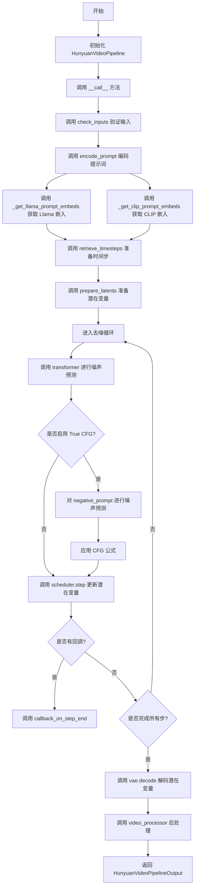

## 类结构

```
DiffusionPipeline (基类)
└── HunyuanVideoPipeline
    └── HunyuanVideoLoraLoaderMixin (混入)
```

## 全局变量及字段


### `XLA_AVAILABLE`
    
是否可用 XLA 加速

类型：`bool`
    


### `logger`
    
日志记录器

类型：`logging.Logger`
    


### `EXAMPLE_DOC_STRING`
    
示例文档字符串

类型：`str`
    


### `DEFAULT_PROMPT_TEMPLATE`
    
默认提示词模板

类型：`dict`
    


### `HunyuanVideoPipeline.model_cpu_offload_seq`
    
模型 CPU 卸载顺序

类型：`str`
    


### `HunyuanVideoPipeline._callback_tensor_inputs`
    
回调张量输入列表

类型：`list`
    


### `HunyuanVideoPipeline.vae`
    
VAE 模型

类型：`AutoencoderKLHunyuanVideo`
    


### `HunyuanVideoPipeline.text_encoder`
    
Llama 文本编码器

类型：`LlamaModel`
    


### `HunyuanVideoPipeline.tokenizer`
    
Llama 分词器

类型：`LlamaTokenizerFast`
    


### `HunyuanVideoPipeline.transformer`
    
条件变压器

类型：`HunyuanVideoTransformer3DModel`
    


### `HunyuanVideoPipeline.scheduler`
    
扩散调度器

类型：`FlowMatchEulerDiscreteScheduler`
    


### `HunyuanVideoPipeline.text_encoder_2`
    
CLIP 文本编码器

类型：`CLIPTextModel`
    


### `HunyuanVideoPipeline.tokenizer_2`
    
CLIP 分词器

类型：`CLIPTokenizer`
    


### `HunyuanVideoPipeline.vae_scale_factor_temporal`
    
VAE 时间压缩比

类型：`int`
    


### `HunyuanVideoPipeline.vae_scale_factor_spatial`
    
VAE 空间压缩比

类型：`int`
    


### `HunyuanVideoPipeline.video_processor`
    
视频处理器

类型：`VideoProcessor`
    


### `HunyuanVideoPipeline._guidance_scale`
    
引导 scale (运行时)

类型：`float`
    


### `HunyuanVideoPipeline._attention_kwargs`
    
注意力参数 (运行时)

类型：`dict`
    


### `HunyuanVideoPipeline._num_timesteps`
    
时间步数 (运行时)

类型：`int`
    


### `HunyuanVideoPipeline._current_timestep`
    
当前时间步 (运行时)

类型：`int`
    


### `HunyuanVideoPipeline._interrupt`
    
中断标志 (运行时)

类型：`bool`
    
    

## 全局函数及方法


### `retrieve_timesteps`

该函数是扩散模型管道中的时间步检索工具，用于调用调度器的 `set_timesteps` 方法并获取调度器的时间步序列。支持自定义时间步和自定义 sigmas，同时提供了对调度器接口的兼容性检查。

参数：

-  `scheduler`：`SchedulerMixin`，调度器对象，用于获取时间步
-  `num_inference_steps`：`int | None`，生成样本时使用的扩散步数，如果使用则 `timesteps` 必须为 `None`
-  `device`：`str | torch.device | None`，时间步要移动到的设备，如果为 `None` 则不移动
-  `timesteps`：`list[int] | None`，用于覆盖调度器时间步间隔策略的自定义时间步，如果传入则 `num_inference_steps` 和 `sigmas` 必须为 `None`
-  `sigmas`：`list[float] | None`，用于覆盖调度器时间步间隔策略的自定义 sigmas，如果传入则 `num_inference_steps` 和 `timesteps` 必须为 `None`
-  `**kwargs`：其他关键字参数，将传递给调度器的 `set_timesteps` 方法

返回值：`tuple[torch.Tensor, int]`，第一个元素是调度器的时间步序列，第二个元素是推理步数

#### 流程图

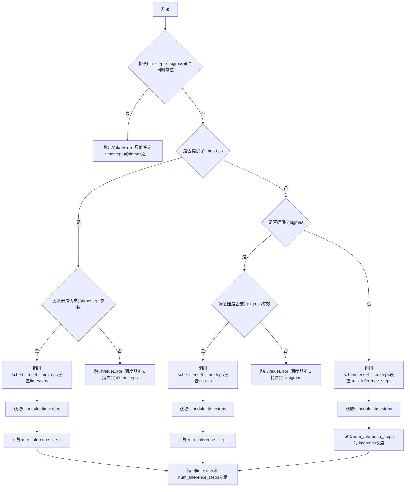

#### 带注释源码

```python
# Copied from diffusers.pipelines.stable_diffusion.pipeline_stable_diffusion.retrieve_timesteps
def retrieve_timesteps(
    scheduler,
    num_inference_steps: int | None = None,
    device: str | torch.device | None = None,
    timesteps: list[int] | None = None,
    sigmas: list[float] | None = None,
    **kwargs,
):
    r"""
    Calls the scheduler's `set_timesteps` method and retrieves timesteps from the scheduler after the call. Handles
    custom timesteps. Any kwargs will be supplied to `scheduler.set_timesteps`.

    Args:
        scheduler (`SchedulerMixin`):
            The scheduler to get timesteps from.
        num_inference_steps (`int`):
            The number of diffusion steps used when generating samples with a pre-trained model. If used, `timesteps`
            must be `None`.
        device (`str` or `torch.device`, *optional*):
            The device to which the timesteps should be moved to. If `None`, the timesteps are not moved.
        timesteps (`list[int]`, *optional*):
            Custom timesteps used to override the timestep spacing strategy of the scheduler. If `timesteps` is passed,
            `num_inference_steps` and `sigmas` must be `None`.
        sigmas (`list[float]`, *optional*):
            Custom sigmas used to override the timestep spacing strategy of the scheduler. If `sigmas` is passed,
            `num_inference_steps` and `timesteps` must be `None`.

    Returns:
        `tuple[torch.Tensor, int]`: A tuple where the first element is the timestep schedule from the scheduler and the
        second element is the number of inference steps.
    """
    # 检查是否同时提供了timesteps和sigmas，只能二选一
    if timesteps is not None and sigmas is not None:
        raise ValueError("Only one of `timesteps` or `sigmas` can be passed. Please choose one to set custom values")
    
    # 处理自定义timesteps的情况
    if timesteps is not None:
        # 检查调度器的set_timesteps方法是否支持timesteps参数
        accepts_timesteps = "timesteps" in set(inspect.signature(scheduler.set_timesteps).parameters.keys())
        if not accepts_timesteps:
            raise ValueError(
                f"The current scheduler class {scheduler.__class__}'s `set_timesteps` does not support custom"
                f" timestep schedules. Please check whether you are using the correct scheduler."
            )
        # 调用调度器的set_timesteps方法设置自定义时间步
        scheduler.set_timesteps(timesteps=timesteps, device=device, **kwargs)
        # 从调度器获取时间步序列
        timesteps = scheduler.timesteps
        # 计算推理步数
        num_inference_steps = len(timesteps)
    # 处理自定义sigmas的情况
    elif sigmas is not None:
        # 检查调度器的set_timesteps方法是否支持sigmas参数
        accept_sigmas = "sigmas" in set(inspect.signature(scheduler.set_timesteps).parameters.keys())
        if not accept_sigmas:
            raise ValueError(
                f"The current scheduler class {scheduler.__class__}'s `set_timesteps` does not support custom"
                f" sigmas schedules. Please check whether you are using the correct scheduler."
            )
        # 调用调度器的set_timesteps方法设置自定义sigmas
        scheduler.set_timesteps(sigmas=sigmas, device=device, **kwargs)
        # 从调度器获取时间步序列
        timesteps = scheduler.timesteps
        # 计算推理步数
        num_inference_steps = len(timesteps)
    # 默认情况：使用num_inference_steps设置时间步
    else:
        scheduler.set_timesteps(num_inference_steps, device=device, **kwargs)
        timesteps = scheduler.timesteps
    
    # 返回时间步序列和推理步数
    return timesteps, num_inference_steps
```


### HunyuanVideoPipeline.__init__

该方法是 `HunyuanVideoPipeline` 类的构造函数，负责初始化文本到视频生成管道所需的所有核心组件，包括文本编码器、分词器、Transformer模型、VAE模型、调度器等，并注册这些模块以及设置视频处理的缩放因子。

参数：

- `text_encoder`：`LlamaModel`，Llama文本编码器模型，用于将文本提示编码为嵌入向量
- `tokenizer`：`LlamaTokenizerFast`，Llama分词器，用于将文本转换为token
- `transformer`：`HunyuanVideoTransformer3DModel`，条件Transformer模型，用于对编码后的图像潜在表示进行去噪
- `vae`：`AutoencoderKLHunyuanVideo`，变分自编码器模型，用于将视频编码和解码到潜在表示
- `scheduler`：`FlowMatchEulerDiscreteScheduler`，流匹配欧拉离散调度器，用于去噪过程
- `text_encoder_2`：`CLIPTextModel`，CLIP文本编码器（clip-vit-large-patch14变体），用于生成池化的文本嵌入
- `tokenizer_2`：`CLIPTokenizer`，CLIP分词器，用于CLIP文本编码

返回值：`None`，构造函数不返回任何值，仅初始化实例属性

#### 流程图

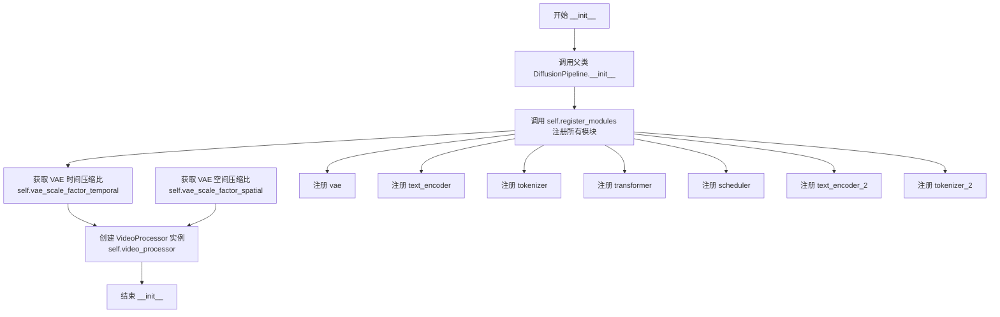

#### 带注释源码

```python
def __init__(
    self,
    text_encoder: LlamaModel,
    tokenizer: LlamaTokenizerFast,
    transformer: HunyuanVideoTransformer3DModel,
    vae: AutoencoderKLHunyuanVideo,
    scheduler: FlowMatchEulerDiscreteScheduler,
    text_encoder_2: CLIPTextModel,
    tokenizer_2: CLIPTokenizer,
):
    """
    初始化 HunyuanVideoPipeline 管道实例。
    
    参数:
        text_encoder: LlamaModel，用于文本编码的主模型
        tokenizer: LlamaTokenizerFast，用于文本分词
        transformer: HunyuanVideoTransformer3DModel，条件Transformer去噪模型
        vae: AutoencoderKLHunyuanVideo，视频VAE编解码器
        scheduler: FlowMatchEulerDiscreteScheduler，扩散调度器
        text_encoder_2: CLIPTextModel，辅助CLIP文本编码器
        tokenizer_2: CLIPTokenizer，CLIP分词器
    """
    # 调用父类 DiffusionPipeline 的初始化方法
    # 设置管道的基本配置和执行设备
    super().__init__()

    # 使用 register_modules 方法注册所有子模块
    # 这些模块可以通过管道的 save_pretrained 和 from_pretrained 方法进行保存和加载
    self.register_modules(
        vae=vae,
        text_encoder=text_encoder,
        tokenizer=tokenizer,
        transformer=transformer,
        scheduler=scheduler,
        text_encoder_2=text_encoder_2,
        tokenizer_2=tokenizer_2,
    )

    # 获取VAE的时间压缩比，用于计算潜在变量的帧数
    # 如果vae不存在则使用默认值4
    self.vae_scale_factor_temporal = self.vae.temporal_compression_ratio if getattr(self, "vae", None) else 4
    
    # 获取VAE的空间压缩比，用于计算潜在变量的高度和宽度
    # 如果vae不存在则使用默认值8
    self.vae_scale_factor_spatial = self.vae.spatial_compression_ratio if getattr(self, "vae", None) else 8
    
    # 创建视频后处理器实例，用于将VAE输出的潜在变量转换为最终视频格式
    # 使用空间缩放因子作为参数
    self.video_processor = VideoProcessor(vae_scale_factor=self.vae_scale_factor_spatial)
```


### `HunyuanVideoPipeline._get_llama_prompt_embeds`

该方法用于将文本提示（prompt）通过Llama文本编码器转换为高维嵌入向量（embeddings），专用于HunyuanVideo视频生成Pipeline。方法内部处理了提示模板格式化、标记化、嵌入提取、隐藏层选择和批处理复制等关键步骤。

参数：

- `prompt`：`str | list[str]`，输入的文本提示，可以是单个字符串或字符串列表
- `prompt_template`：`dict[str, Any]`，提示模板字典，包含模板格式字符串和裁剪起始位置信息
- `num_videos_per_prompt`：`int = 1`，每个提示需要生成的视频数量，用于复制嵌入向量
- `device`：`torch.device | None`，计算设备，若为None则使用执行设备
- `dtype`：`torch.dtype | None`，输出张量的数据类型，若为None则使用文本编码器的dtype
- `max_sequence_length`：`int = 256`，最大序列长度限制
- `num_hidden_layers_to_skip`：`int = 2`，从顶层开始跳过的隐藏层数量，用于获取适当的特征层

返回值：`tuple[torch.Tensor, torch.Tensor]`，返回两个张量——第一个是文本提示嵌入（shape: [batch_size * num_videos_per_prompt, seq_len, hidden_dim]），第二个是注意力掩码（shape: [batch_size * num_videos_per_prompt, seq_len]）

#### 流程图

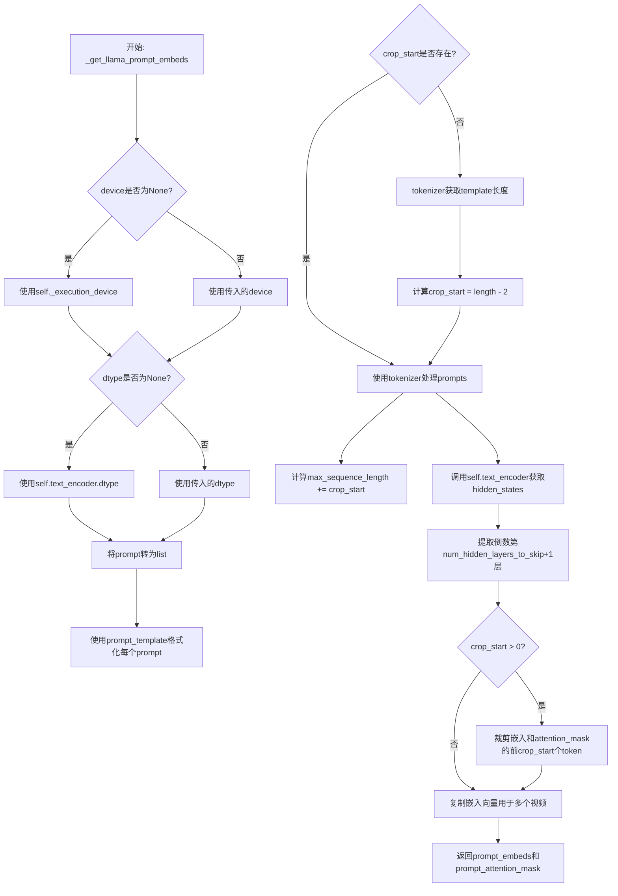

#### 带注释源码

```python
def _get_llama_prompt_embeds(
    self,
    prompt: str | list[str],
    prompt_template: dict[str, Any],
    num_videos_per_prompt: int = 1,
    device: torch.device | None = None,
    dtype: torch.dtype | None = None,
    max_sequence_length: int = 256,
    num_hidden_layers_to_skip: int = 2,
) -> tuple[torch.Tensor, torch.Tensor]:
    """
    将文本提示转换为Llama模型的嵌入向量
    
    参数:
        prompt: 输入文本提示，单个字符串或字符串列表
        prompt_template: 提示模板，包含格式化字符串和crop_start
        num_videos_per_prompt: 每个提示生成的视频数量
        device: 计算设备
        dtype: 输出数据类型
        max_sequence_length: 最大序列长度
        num_hidden_layers_to_skip: 从顶层跳过的隐藏层数
    
    返回:
        prompt_embeds: 文本嵌入向量
        prompt_attention_mask: 注意力掩码
    """
    # 确定计算设备，默认为执行设备
    device = device or self._execution_device
    # 确定数据类型，默认为文本编码器的数据类型
    dtype = dtype or self.text_encoder.dtype

    # 统一将prompt转为列表处理
    prompt = [prompt] if isinstance(prompt, str) else prompt
    # 获取批处理大小
    batch_size = len(prompt)

    # 使用提示模板格式化每个prompt
    # 模板格式: "<|start_header_id|>system...<|start_header_id|>\n\n{}<|eot_id|>"
    prompt = [prompt_template["template"].format(p) for p in prompt]

    # 获取裁剪起始位置，用于去除模板前缀部分
    crop_start = prompt_template.get("crop_start", None)
    if crop_start is None:
        # 如果未指定，则通过tokenizer计算模板长度
        prompt_template_input = self.tokenizer(
            prompt_template["template"],
            padding="max_length",
            return_tensors="pt",
            return_length=False,
            return_overflowing_tokens=False,
            return_attention_mask=False,
        )
        crop_start = prompt_template_input["input_ids"].shape[-1]
        # 移除<|eot_id|>标记和占位符{}
        crop_start -= 2

    # 根据crop_start调整最大序列长度
    max_sequence_length += crop_start
    
    # 使用tokenizer将文本转为token IDs
    text_inputs = self.tokenizer(
        prompt,
        max_length=max_sequence_length,
        padding="max_length",
        truncation=True,
        return_tensors="pt",
        return_length=False,
        return_overflowing_tokens=False,
        return_attention_mask=True,
    )
    # 将token IDs和attention mask移至指定设备
    text_input_ids = text_inputs.input_ids.to(device=device)
    prompt_attention_mask = text_inputs.attention_mask.to(device=device)

    # 调用Llama文本编码器获取隐藏状态
    # output_hidden_states=True要求返回所有隐藏层
    prompt_embeds = self.text_encoder(
        input_ids=text_input_ids,
        attention_mask=prompt_attention_mask,
        output_hidden_states=True,
    ).hidden_states[-(num_hidden_layers_to_skip + 1)]  # 提取指定层的隐藏状态
    # 转换数据类型
    prompt_embeds = prompt_embeds.to(dtype=dtype)

    # 如果指定了crop_start，则裁剪掉模板前缀部分
    if crop_start is not None and crop_start > 0:
        prompt_embeds = prompt_embeds[:, crop_start:]
        prompt_attention_mask = prompt_attention_mask[:, crop_start:]

    # 为每个提示复制多个视频的嵌入向量
    # duplicate text embeddings for each generation per prompt, using mps friendly method
    _, seq_len, _ = prompt_embeds.shape
    prompt_embeds = prompt_embeds.repeat(1, num_videos_per_prompt, 1)  # [1, num_videos_per_prompt, hidden]
    # 重塑为 [batch_size * num_videos_per_prompt, seq_len, hidden_dim]
    prompt_embeds = prompt_embeds.view(batch_size * num_videos_per_prompt, seq_len, -1)
    # 同样处理attention mask
    prompt_attention_mask = prompt_attention_mask.repeat(1, num_videos_per_prompt)
    prompt_attention_mask = prompt_attention_mask.view(batch_size * num_videos_per_prompt, seq_len)

    return prompt_embeds, prompt_attention_mask
```


### `HunyuanVideoPipeline._get_clip_prompt_embeds`

该方法用于使用 CLIP 文本编码器（text_encoder_2）将文本提示（prompt）转换为池化的文本嵌入向量（pooled text embeddings），供视频生成管道使用。该方法处理提示的批处理、截断警告以及为每个提示生成多个视频时的嵌入复制。

参数：

- `self`：`HunyuanVideoPipeline` 实例本身
- `prompt`：`str | list[str]`，要编码的文本提示，可以是单个字符串或字符串列表
- `num_videos_per_prompt`：`int = 1`，每个提示要生成的视频数量，用于复制嵌入向量
- `device`：`torch.device | None = None`，执行设备，默认为执行设备
- `dtype`：`torch.dtype | None = None`，输出张量的数据类型，默认为 text_encoder_2 的数据类型
- `max_sequence_length`：`int = 77`，CLIP 模型支持的最大序列长度

返回值：`torch.Tensor`，形状为 `(batch_size * num_videos_per_prompt, hidden_size)` 的池化文本嵌入张量

#### 流程图

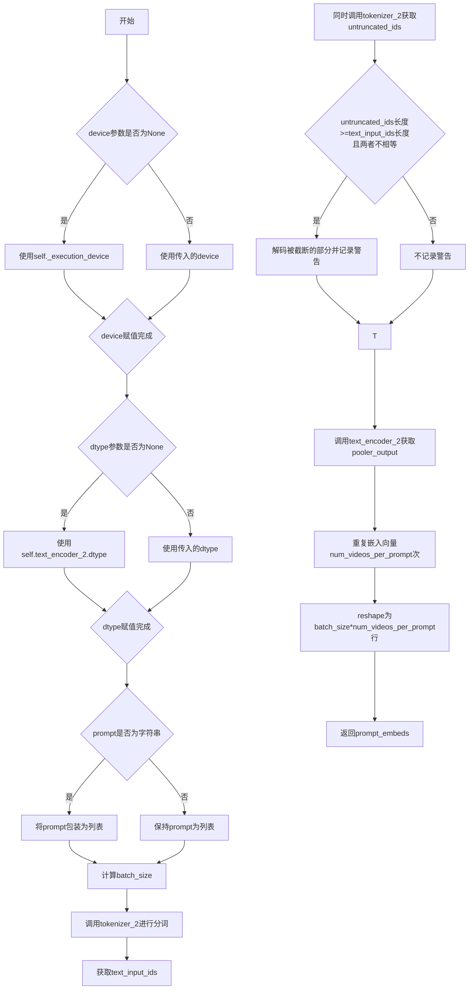

#### 带注释源码

```python
def _get_clip_prompt_embeds(
    self,
    prompt: str | list[str],
    num_videos_per_prompt: int = 1,
    device: torch.device | None = None,
    dtype: torch.dtype | None = None,
    max_sequence_length: int = 77,
) -> torch.Tensor:
    """
    使用CLIP文本编码器将文本提示编码为池化的文本嵌入向量。

    参数:
        prompt: 要编码的文本提示，可以是单个字符串或字符串列表
        num_videos_per_prompt: 每个提示要生成的视频数量
        device: 执行设备，默认为当前执行设备
        dtype: 输出数据类型，默认为text_encoder_2的数据类型
        max_sequence_length: CLIP模型支持的最大序列长度，默认为77

    返回:
        形状为(batch_size * num_videos_per_prompt, hidden_size)的池化文本嵌入张量
    """
    # 确定执行设备：如果未提供device参数，则使用pipeline的默认执行设备
    device = device or self._execution_device
    # 确定数据类型：如果未提供dtype参数，则使用text_encoder_2的数据类型
    dtype = dtype or self.text_encoder_2.dtype

    # 处理输入提示：如果是单个字符串则转换为列表，便于批量处理
    prompt = [prompt] if isinstance(prompt, str) else prompt
    # 计算批处理大小
    batch_size = len(prompt)

    # 使用CLIP tokenizer_2对提示进行分词
    # padding="max_length": 将所有序列填充到max_length长度
    # truncation=True: 超过max_length的序列进行截断
    # return_tensors="pt": 返回PyTorch张量
    text_inputs = self.tokenizer_2(
        prompt,
        padding="max_length",
        max_length=max_sequence_length,
        truncation=True,
        return_tensors="pt",
    )

    # 获取分词后的输入IDs
    text_input_ids = text_inputs.input_ids
    
    # 额外获取未截断的IDs，用于检测是否有内容被截断
    # padding="longest": 不进行填充，只取最长序列的长度
    untruncated_ids = self.tokenizer_2(prompt, padding="longest", return_tensors="pt").input_ids
    
    # 检查是否发生了截断：如果未截断的IDs长度>=截断后的长度，但两者不相等
    # 说明有内容被截断（因为padding="max_length"会在末尾添加padding token）
    if untruncated_ids.shape[-1] >= text_input_ids.shape[-1] and not torch.equal(text_input_ids, untruncated_ids):
        # 解码被截断的部分（排除首尾token）
        removed_text = self.tokenizer_2.batch_decode(untruncated_ids[:, max_sequence_length - 1 : -1])
        # 记录警告信息，告知用户哪些内容被截断
        logger.warning(
            "The following part of your input was truncated because CLIP can only handle sequences up to"
            f" {max_sequence_length} tokens: {removed_text}"
        )

    # 使用CLIP文本编码器将输入IDs编码为文本嵌入
    # output_hidden_states=False: 只获取pooler_output而不是所有隐藏状态
    # pooler_output是[CLS]token的输出经过线性层变换后的结果
    prompt_embeds = self.text_encoder_2(text_input_ids.to(device), output_hidden_states=False).pooler_output

    # 复制文本嵌入以支持每个提示生成多个视频
    # 使用mps友好的方法：先在seq维度重复，再reshape
    prompt_embeds = prompt_embeds.repeat(1, num_videos_per_prompt)
    # 将嵌入向量reshape为(batch_size * num_videos_per_prompt, hidden_size)
    prompt_embeds = prompt_embeds.view(batch_size * num_videos_per_prompt, -1)

    # 返回编码后的文本嵌入向量
    return prompt_embeds
```


### HunyuanVideoPipeline.encode_prompt

该方法负责将文本提示编码为Transformer模型所需的嵌入向量。通过调用Llama文本编码器获取提示的隐藏状态表示，同时使用CLIP文本编码器获取池化后的提示嵌入，用于后续的视频生成过程。

参数：

- `self`：`HunyuanVideoPipeline` 实例，pipeline 对象本身
- `prompt`：`str | list[str]`，主提示文本，用于生成视频的文本描述，支持单个字符串或字符串列表
- `prompt_2`：`str | list[str]`，发送给 CLIP 文本编码器的提示文本，默认为 None，此时使用 `prompt` 的值
- `prompt_template`：`dict[str, Any]`，提示模板字典，包含格式化模板和裁剪起始位置，默认为 `DEFAULT_PROMPT_TEMPLATE`
- `num_videos_per_prompt`：`int`，每个提示生成的视频数量，用于批量生成时复制嵌入向量，默认为 1
- `prompt_embeds`：`torch.Tensor | None`，预生成的提示嵌入向量，如果为 None 则自动生成
- `pooled_prompt_embeds`：`torch.Tensor | None`，预生成的池化提示嵌入，如果为 None 则自动生成
- `prompt_attention_mask`：`torch.Tensor | None`，提示的注意力掩码，用于标识有效 token 位置
- `device`：`torch.device | None`，计算设备，默认为执行设备
- `dtype`：`torch.dtype | None`，数据类型，默认为文本编码器的数据类型
- `max_sequence_length`：`int`，最大序列长度，用于控制提示的最大 token 数，默认为 256

返回值：`tuple[torch.Tensor, torch.Tensor, torch.Tensor]`，返回一个元组，包含：
- `prompt_embeds`：Llama 模型输出的提示隐藏状态，类型为 `torch.Tensor`
- `pooled_prompt_embeds`：CLIP 模型输出的池化提示嵌入，类型为 `torch.Tensor`
- `prompt_attention_mask`：提示的注意力掩码，类型为 `torch.Tensor`

#### 流程图

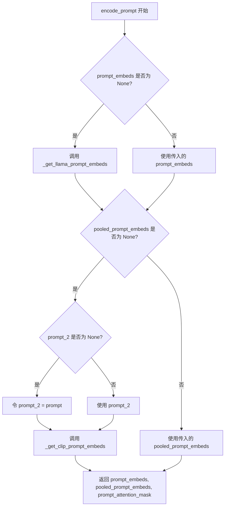

#### 带注释源码

```python
def encode_prompt(
    self,
    prompt: str | list[str],
    prompt_2: str | list[str] = None,
    prompt_template: dict[str, Any] = DEFAULT_PROMPT_TEMPLATE,
    num_videos_per_prompt: int = 1,
    prompt_embeds: torch.Tensor | None = None,
    pooled_prompt_embeds: torch.Tensor | None = None,
    prompt_attention_mask: torch.Tensor | None = None,
    device: torch.device | None = None,
    dtype: torch.dtype | None = None,
    max_sequence_length: int = 256,
):
    """
    Encode text prompts into embeddings for the transformer model.
    
    This method handles two types of text encoders:
    1. Llama model (via _get_llama_prompt_embeds) - provides detailed hidden states
    2. CLIP model (via _get_clip_prompt_embeds) - provides pooled embeddings
    
    Args:
        prompt: The main text prompt(s) for video generation
        prompt_2: Optional separate prompt for CLIP encoder
        prompt_template: Template for formatting prompts with system instructions
        num_videos_per_prompt: Number of videos to generate per prompt
        prompt_embeds: Pre-computed prompt embeddings (optional)
        pooled_prompt_embeds: Pre-computed pooled embeddings (optional)
        prompt_attention_mask: Pre-computed attention mask (optional)
        device: Device to run encoding on
        dtype: Data type for embeddings
        max_sequence_length: Maximum sequence length for tokenization
    
    Returns:
        Tuple of (prompt_embeds, pooled_prompt_embeds, prompt_attention_mask)
    """
    # 如果未提供 prompt_embeds，则使用 Llama 编码器生成
    if prompt_embeds is None:
        prompt_embeds, prompt_attention_mask = self._get_llama_prompt_embeds(
            prompt,                      # 输入的文本提示
            prompt_template,            # 提示模板，包含系统指令格式化
            num_videos_per_prompt,      # 每个提示生成的视频数量
            device=device,              # 计算设备
            dtype=dtype,                # 数据类型
            max_sequence_length=max_sequence_length,  # 最大序列长度
        )

    # 如果未提供 pooled_prompt_embeds，则使用 CLIP 编码器生成
    if pooled_prompt_embeds is None:
        # 如果未指定 prompt_2，则使用与 Llama 相同的提示
        if prompt_2 is None:
            prompt_2 = prompt
        # 调用 CLIP 编码器获取池化嵌入
        pooled_prompt_embeds = self._get_clip_prompt_embeds(
            prompt_2,                    # 用于 CLIP 的提示文本
            num_videos_per_prompt,      # 每个提示生成的视频数量
            device=device,              # 计算设备
            dtype=dtype,                # 数据类型
            max_sequence_length=77,    # CLIP 的最大序列长度固定为 77
        )

    # 返回编码后的嵌入向量和注意力掩码
    return prompt_embeds, pooled_prompt_embeds, prompt_attention_mask
```


### `HunyuanVideoPipeline.check_inputs`

该方法用于验证 HunyuanVideoPipeline 管道输入参数的有效性，确保高度、宽度、提示词、嵌入向量等参数符合模型要求，若参数不合规则抛出相应的 ValueError 异常。

参数：

- `self`：`HunyuanVideoPipeline` 实例，管道对象本身
- `prompt`：`str | list[str] | None`，主要的文本提示，用于指导视频生成
- `prompt_2`：`str | list[str] | None`，发送给第二个文本编码器（CLIP）的文本提示
- `height`：`int`，生成的视频高度（像素），必须是 16 的倍数
- `width`：`int`，生成的视频宽度（像素），必须是 16 的倍数
- `prompt_embeds`：`torch.Tensor | None`，预生成的文本嵌入向量，若提供则无需再提供 prompt
- `callback_on_step_end_tensor_inputs`：`list[str] | None`，在每个去噪步骤结束时需要传递给回调的张量输入列表
- `prompt_template`：`dict[str, Any] | None`，用于格式化提示词的模板字典

返回值：`None`，该方法不返回任何值，仅进行参数验证

#### 流程图

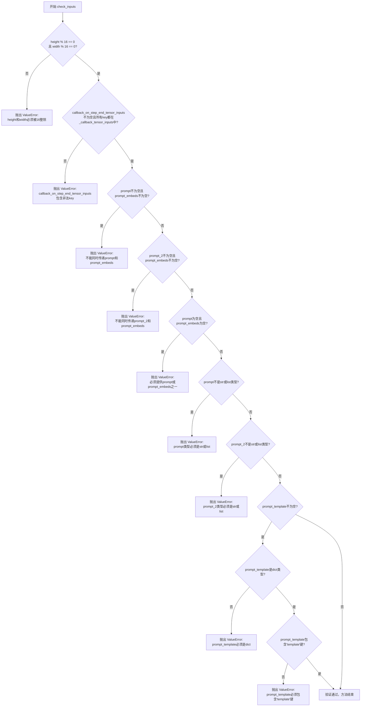

#### 带注释源码

```python
def check_inputs(
    self,
    prompt,                      # 主要文本提示，str或list[str]类型
    prompt_2,                   # 第二个文本编码器的提示，str或list[str]类型
    height,                     # 视频高度，必须是16的倍数
    width,                      # 视频宽度，必须是16的倍数
    prompt_embeds=None,         # 预计算的文本嵌入，可选
    callback_on_step_end_tensor_inputs=None,  # 回调张量输入列表
    prompt_template=None,      # 提示词模板字典
):
    # 验证1：检查height和width是否被16整除
    # 视频生成模型通常要求尺寸是某个压缩因子的倍数
    if height % 16 != 0 or width % 16 != 0:
        raise ValueError(f"`height` and `width` have to be divisible by 16 but are {height} and {width}.")

    # 验证2：检查callback_on_step_end_tensor_inputs中的所有key
    # 是否都在允许的_callback_tensor_inputs列表中
    if callback_on_step_end_tensor_inputs is not None and not all(
        k in self._callback_tensor_inputs for k in callback_on_step_end_tensor_inputs
    ):
        raise ValueError(
            f"`callback_on_step_end_tensor_inputs` has to be in {self._callback_tensor_inputs}, but found {[k for k in callback_on_step_end_tensor_inputs if k not in self._callback_tensor_inputs]}"
        )

    # 验证3：检查prompt和prompt_embeds的互斥性
    # 不能同时提供原始文本和预计算的嵌入
    if prompt is not None and prompt_embeds is not None:
        raise ValueError(
            f"Cannot forward both `prompt`: {prompt} and `prompt_embeds`: {prompt_embeds}. Please make sure to"
            " only forward one of the two."
        )
    # 验证4：检查prompt_2和prompt_embeds的互斥性
    elif prompt_2 is not None and prompt_embeds is not None:
        raise ValueError(
            f"Cannot forward both `prompt_2`: {prompt_2} and `prompt_embeds`: {prompt_embeds}. Please make sure to"
            " only forward one of the two."
        )
    # 验证5：至少需要提供prompt或prompt_embeds之一
    elif prompt is None and prompt_embeds is None:
        raise ValueError(
            "Provide either `prompt` or `prompt_embeds`. Cannot leave both `prompt` and `prompt_embeds` undefined."
        )
    # 验证6：检查prompt的类型是否合法
    elif prompt is not None and (not isinstance(prompt, str) and not isinstance(prompt, list)):
        raise ValueError(f"`prompt` has to be of type `str` or `list` but is {type(prompt)}")
    # 验证7：检查prompt_2的类型是否合法
    elif prompt_2 is not None and (not isinstance(prompt_2, str) and not isinstance(prompt_2, list)):
        raise ValueError(f"`prompt_2` has to be of type `str` or `list` but is {type(prompt_2)}")

    # 验证8：如果提供了prompt_template，检查其格式
    if prompt_template is not None:
        # 必须是dict类型
        if not isinstance(prompt_template, dict):
            raise ValueError(f"`prompt_template` has to be of type `dict` but is {type(prompt_template)}")
        # 必须包含'template'键
        if "template" not in prompt_template:
            raise ValueError(
                f"`prompt_template` has to contain a key `template` but only found {prompt_template.keys()}"
            )
```


### `HunyuanVideoPipeline.prepare_latents`

该方法用于为视频生成准备潜在变量（latents）。如果传入了预生成的潜在变量，则将其移动到指定设备；否则，根据批大小、通道数、视频帧数、高度和宽度等参数计算潜在变量的形状，并使用随机张量初始化。

参数：

- `self`：`HunyuanVideoPipeline` 实例本身
- `batch_size`：`int`，生成视频的批大小
- `num_channels_latents`：`int`，潜在变量的通道数，默认为 32
- `height`：`int`，生成视频的高度，默认为 720
- `width`：`int`，生成视频的宽度，默认为 1280
- `num_frames`：`int`，生成视频的帧数，默认为 129
- `dtype`：`torch.dtype | None`，潜在变量的数据类型，默认为 None
- `device`：`torch.device | None`，潜在变量存放的设备，默认为 None
- `generator`：`torch.Generator | list[torch.Generator] | None`，用于生成随机数的生成器，默认为 None
- `latents`：`torch.Tensor | None`，预生成的潜在变量，默认为 None

返回值：`torch.Tensor`，处理或生成后的潜在变量张量

#### 流程图

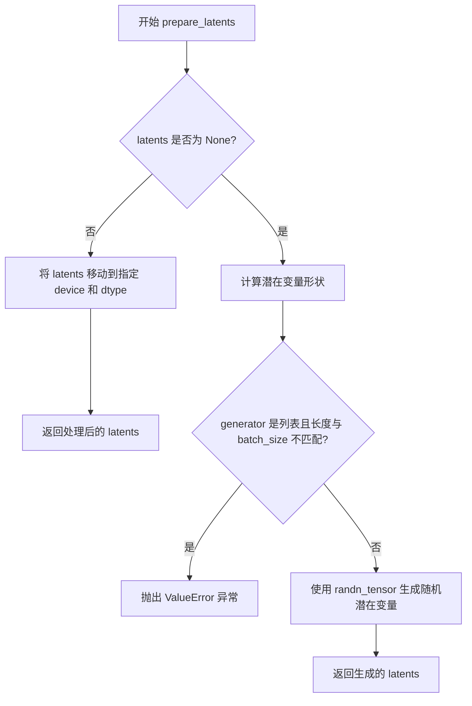

#### 带注释源码

```python
def prepare_latents(
    self,
    batch_size: int,
    num_channels_latents: int = 32,
    height: int = 720,
    width: int = 1280,
    num_frames: int = 129,
    dtype: torch.dtype | None = None,
    device: torch.device | None = None,
    generator: torch.Generator | list[torch.Generator] | None = None,
    latents: torch.Tensor | None = None,
) -> torch.Tensor:
    """
    准备用于视频生成的潜在变量。
    
    如果传入了预生成的潜在变量，则将其移动到指定设备；否则根据
    批大小、视频尺寸等参数计算形状并生成随机潜在变量。
    
    参数:
        batch_size: 批大小
        num_channels_latents: 潜在变量通道数，默认32
        height: 视频高度，默认720
        width: 视频宽度，默认1280
        num_frames: 视频帧数，默认129
        dtype: 数据类型
        device: 设备
        generator: 随机生成器
        latents: 预生成的潜在变量
    
    返回:
        处理或生成后的潜在变量张量
    """
    # 如果已提供潜在变量，直接移动到目标设备并返回
    if latents is not None:
        return latents.to(device=device, dtype=dtype)

    # 根据VAE的时序和空间压缩比计算潜在变量的形状
    # 潜在变量形状: [batch_size, channels, temporal_frames, height/spatial_scale, width/spatial_scale]
    shape = (
        batch_size,
        num_channels_latents,
        (num_frames - 1) // self.vae_scale_factor_temporal + 1,
        int(height) // self.vae_scale_factor_spatial,
        int(width) // self.vae_scale_factor_spatial,
    )
    
    # 验证生成器列表长度与批大小是否匹配
    if isinstance(generator, list) and len(generator) != batch_size:
        raise ValueError(
            f"You have passed a list of generators of length {len(generator)}, but requested an effective batch"
            f" size of {batch_size}. Make sure the batch size matches the length of the generators."
        )

    # 使用随机张量生成初始潜在变量（噪声）
    latents = randn_tensor(shape, generator=generator, device=device, dtype=dtype)
    return latents
```


### `HunyuanVideoPipeline.enable_vae_slicing`

启用VAE切片解码功能。当启用此选项时，VAE会将输入张量分割成多个切片进行分步计算解码，以节省内存并支持更大的批处理大小。该方法已被弃用，建议直接使用 `pipe.vae.enable_slicing()`。

参数：
- 该方法无参数

返回值：`None`，无返回值

#### 流程图

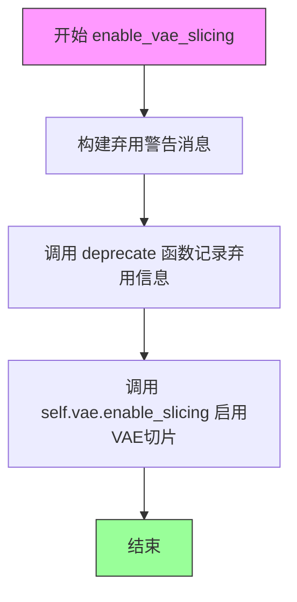

#### 带注释源码

```python
def enable_vae_slicing(self):
    r"""
    Enable sliced VAE decoding. When this option is enabled, the VAE will split the input tensor in slices to
    compute decoding in several steps. This is useful to save some memory and allow larger batch sizes.
    """
    # 构建弃用警告消息，告知用户该方法将在未来版本中移除
    depr_message = f"Calling `enable_vae_slicing()` on a `{self.__class__.__name__}` is deprecated and this method will be removed in a future version. Please use `pipe.vae.enable_slicing()`."
    
    # 调用 deprecate 函数记录弃用信息，包括方法名、版本号和警告消息
    deprecate(
        "enable_vae_slicing",      # 被弃用的方法名
        "0.40.0",                   # 弃用版本号
        depr_message,              # 弃用警告消息
    )
    
    # 委托给 VAE 模型的 enable_slicing 方法来启用切片解码功能
    self.vae.enable_slicing()
```


### HunyuanVideoPipeline.disable_vae_slicing

该方法用于禁用 VAE 切片解码功能。如果之前启用了 `enable_vae_slicing`，调用此方法后将恢复为单步解码。该方法已被弃用，建议直接使用 `pipe.vae.disable_slicing()`。

参数：无

返回值：`None`，无返回值

#### 流程图

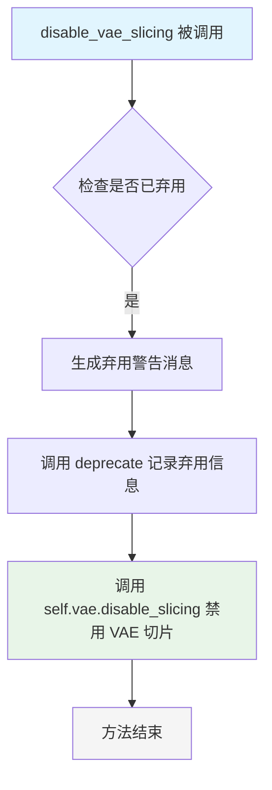

#### 带注释源码

```python
def disable_vae_slicing(self):
    r"""
    Disable sliced VAE decoding. If `enable_vae_slicing` was previously enabled, this method will go back to
    computing decoding in one step.
    """
    # 构建弃用警告消息，包含当前类名，提示用户使用新的 API
    depr_message = f"Calling `disable_vae_slicing()` on a `{self.__class__.__name__}` is deprecated and this method will be removed in a future version. Please use `pipe.vae.disable_slicing()`."
    # 调用 deprecate 函数记录弃用信息，指定弃用的功能名称、版本号和警告消息
    deprecate(
        "disable_vae_slicing",    # 弃用的功能名称
        "0.40.0",                 # 将被移除的版本号
        depr_message,             # 警告消息内容
    )
    # 实际调用底层 VAE 模型的 disable_slicing 方法来禁用切片功能
    self.vae.disable_slicing()
```


### `HunyuanVideoPipeline.enable_vae_tiling`

启用瓦片式 VAE 解码。当启用此选项时，VAE 会将输入张量分割成瓦片，以多个步骤计算解码和编码。这对于节省大量内存并处理更大的图像非常有用。

参数：

- 该方法无显式参数（除 `self` 隐式参数外）

返回值：`None`，无返回值（方法直接操作 VAE 内部状态）

#### 流程图

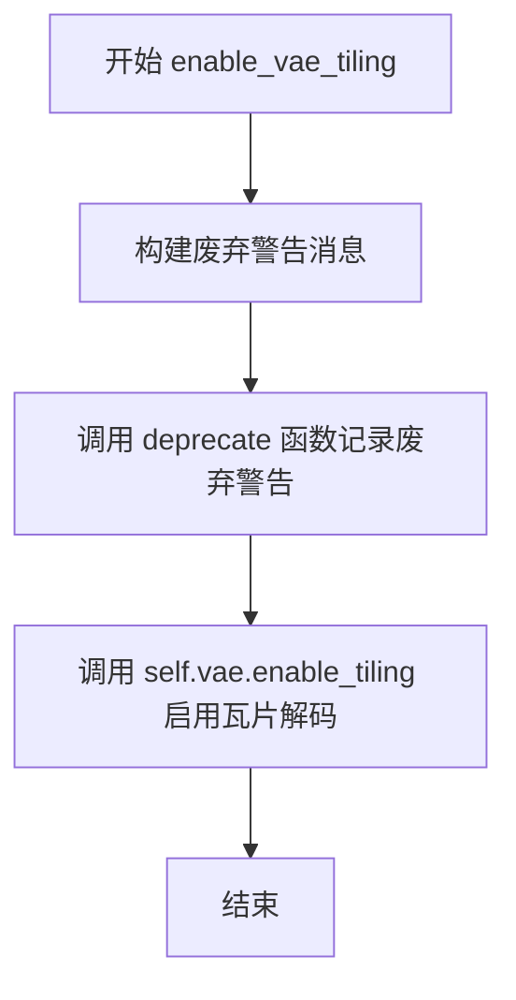

#### 带注释源码

```python
def enable_vae_tiling(self):
    r"""
    Enable tiled VAE decoding. When this option is enabled, the VAE will split the input tensor into tiles to
    compute decoding and encoding in several steps. This is useful for saving a large amount of memory and to allow
    processing larger images.
    """
    # 构建废弃警告消息，提示用户该方法将在未来版本中移除
    # 建议直接使用 pipe.vae.enable_tiling() 替代
    depr_message = f"Calling `enable_vae_tiling()` on a `{self.__class__.__name__}` is deprecated and this method will be removed in a future version. Please use `pipe.vae.enable_tiling()`."
    
    # 调用 deprecate 函数记录废弃警告
    # 参数: 方法名, 废弃版本号, 警告消息
    deprecate(
        "enable_vae_tiling",
        "0.40.0",
        depr_message,
    )
    
    # 调用 VAE 模型的 enable_tiling 方法，启用瓦片式解码/编码
    # 这会将大输入张量分割成多个小块处理，以节省显存
    self.vae.enable_tiling()
```


### `HunyuanVideoPipeline.disable_vae_tiling`

该方法用于禁用VAE的瓦片（Tiling）解码模式。如果之前启用了`enable_vae_tiling`，调用此方法后将恢复为单步计算解码。此方法已废弃，建议直接使用`pipe.vae.disable_tiling()`。

参数：
- 无（仅包含`self`隐式参数）

返回值：`None`，无返回值

#### 流程图

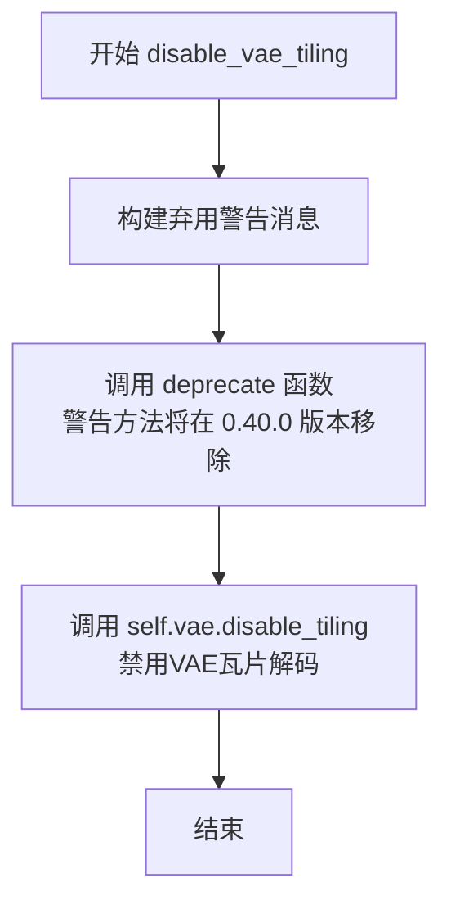

#### 带注释源码

```python
def disable_vae_tiling(self):
    r"""
    Disable tiled VAE decoding. If `enable_vae_tiling` was previously enabled, this method will go back to
    computing decoding in one step.
    """
    # 构建弃用警告消息，提示用户该方法已被废弃，将在0.40.0版本移除
    # 建议用户使用 pipe.vae.disable_tiling() 代替
    depr_message = f"Calling `disable_vae_tiling()` on a `{self.__class__.__name__}` is deprecated and this method will be removed in a future version. Please use `pipe.vae.disable_tiling()`."
    
    # 调用deprecate函数记录弃用信息
    # 参数: 方法名, 弃用版本号, 警告消息
    deprecate(
        "disable_vae_tiling",
        "0.40.0",
        depr_message,
    )
    
    # 实际调用VAE模型的disable_tiling方法
    # 这是真正执行禁用瓦片解码逻辑的地方
    self.vae.disable_tiling()
```


### `HunyuanVideoPipeline.guidance_scale`

该属性是HunyuanVideoPipeline类的guidance_scale（引导尺度）属性的getter方法，用于获取当前pipeline的引导尺度配置值。引导尺度用于控制文本提示对生成视频的影响程度，值越大生成的视频与提示越相关但质量可能降低。

参数： 无

返回值：`float`，返回当前pipeline的引导尺度（guidance_scale）值，用于控制文本提示对视频生成的影响程度。

#### 流程图

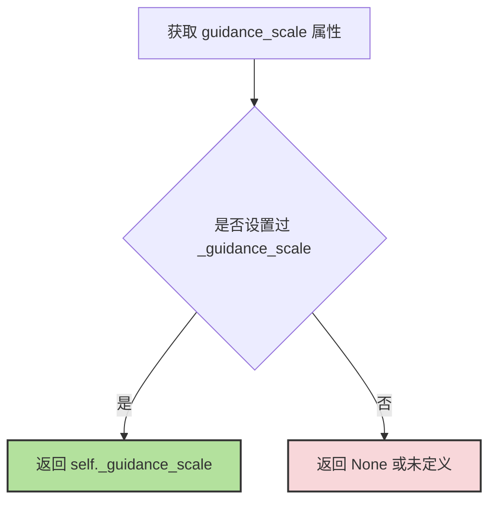

#### 带注释源码

```python
@property
def guidance_scale(self):
    """
    Property getter for guidance_scale.
    
    Guidance scale is used to control the influence of the text prompt on the 
    generation process. Higher values encourage the model to generate images more 
    aligned with the prompt at the expense of lower image quality.
    
    Returns:
        float: The current guidance scale value stored in self._guidance_scale.
    """
    return self._guidance_scale
```

#### 备注

- **属性类型**：这是一个只读的计算属性（read-only property），没有setter方法
- **存储方式**：通过`self._guidance_scale`在实例变量中存储，在`__call__`方法中通过`self._guidance_scale = guidance_scale`进行赋值
- **默认值**：在`__call__`方法中，默认值为`6.0`
- **使用场景**：该属性在pipeline执行过程中被设置，用于在去噪循环中控制分类器-free引导的强度


### HunyuanVideoPipeline.num_timesteps

获取 HunyuanVideo 视频生成管道在推理过程中设置的总时间步数（Total Timesteps）。该属性是一个只读属性，其值在管道调用（`__call__`）期间根据调度器生成的时间步列表长度进行设置。

参数：

-  `self`：`HunyuanVideoPipeline`，当前的管道实例对象。

返回值：`int`，返回管道执行一次推理所需的总步数。

#### 流程图

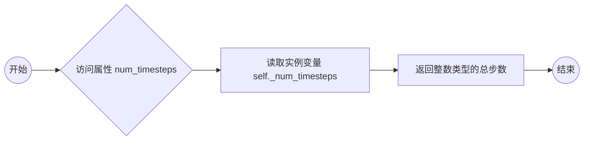

#### 带注释源码

```python
@property
def num_timesteps(self):
    """
    获取当前管道运行时的总时间步数。

    说明：
        此属性返回在调用 pipeline __call__ 方法时由调度器（Scheduler）设置的时间步长总数。
        它通常用于进度条显示或循环控制，确保推理过程完成指定的步数。

    返回值：
        int: 推理过程中的总步数（例如 50）。
    """
    return self._num_timesteps
```


### `HunyuanVideoPipeline.attention_kwargs`

这是一个属性方法（property），用于获取在管道调用时传递的注意力机制配置参数（attention_kwargs）。该属性返回 `__call__` 方法中设置的 `_attention_kwargs` 字典，该字典包含了传递给 `AttentionProcessor` 的额外参数。

参数：无（这是属性访问器，不需要参数）

返回值：`dict[str, Any] | None`，返回传递给 AttentionProcessor 的 kwargs 字典，如果没有传递则为 None

#### 流程图

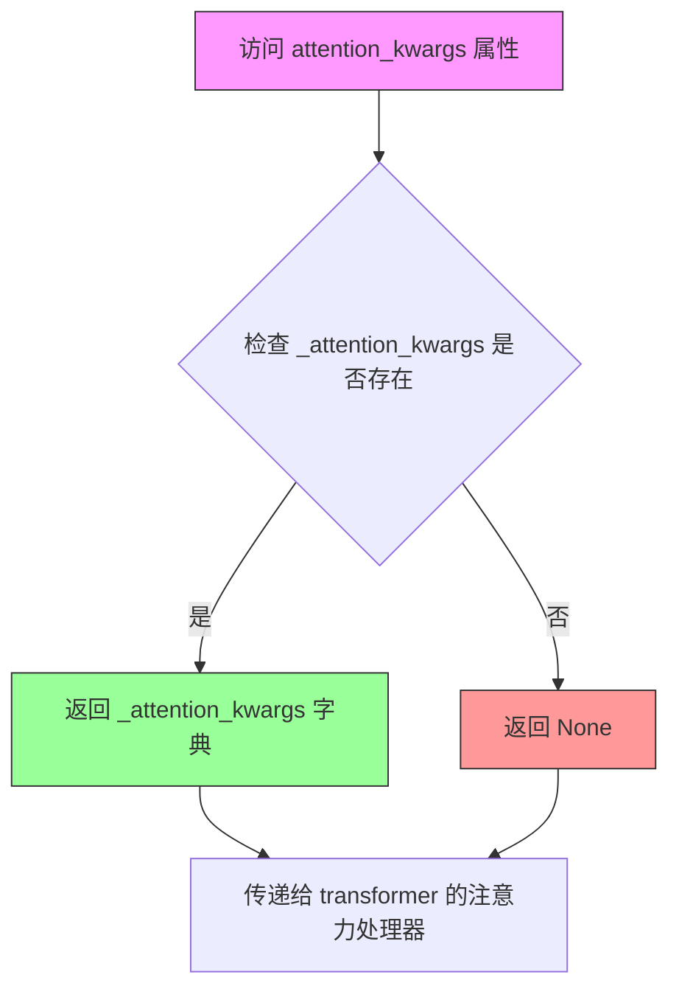

#### 带注释源码

```python
@property
def attention_kwargs(self):
    """
    属性 getter: 获取注意力机制的关键字参数
    
    该属性返回在 __call__ 方法执行过程中设置的 _attention_kwargs 字典。
    这个字典包含了传递给 transformer 模型中 AttentionProcessor 的额外配置参数，
    例如 dropout、attention mode 等。
    
    Returns:
        dict[str, Any] | None: 注意力机制的关键字参数字典，如果没有传递则为 None
    """
    return self._attention_kwargs
```


### `HunyuanVideoPipeline.current_timestep`

该属性用于获取 HunyuanVideoPipeline 在视频生成过程中当前所处的时间步（timestep）。在去噪循环的每次迭代开始时，该属性会被更新为当前的时间步 `t`，循环结束后重置为 `None`。此属性对于外部回调函数或监控工具获取实时推理进度非常有用。

参数：该属性无参数（为 property getter）

返回值：`Any`，返回当前推理步骤的时间步，通常为 `torch.Tensor` 类型，循环结束后返回 `None`

#### 流程图

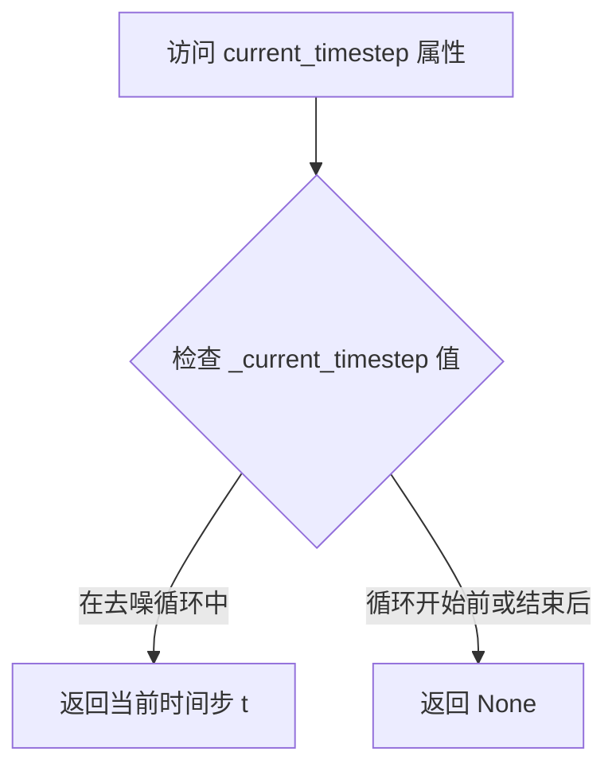

#### 带注释源码

```python
@property
def current_timestep(self):
    """
    属性 getter：返回当前推理过程中的时间步。
    
    该属性在 __call__ 方法的去噪循环中被更新：
    - 循环开始前：_current_timestep = None
    - 每次迭代：_current_timestep = t (当前时间步)
    - 循环结束后：_current_timestep = None
    
    Returns:
        Any: 当前时间步（torch.Tensor 或 None）
    """
    return self._current_timestep
```


### HunyuanVideoPipeline.interrupt

该属性用于获取当前管道的中断状态，指示生成过程是否被外部请求中断。

参数：无（这是一个属性 getter，不接受参数）

返回值：`bool`，返回 `self._interrupt` 的值，用于表示生成过程是否被中断。`True` 表示请求中断，`False` 表示继续正常生成。

#### 流程图

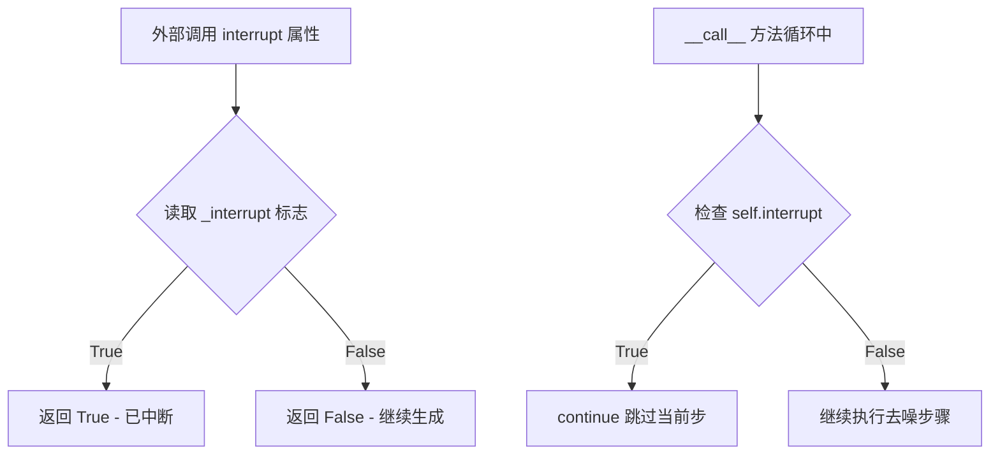

#### 带注释源码

```python
@property
def interrupt(self):
    """
    属性 getter: 获取当前的中断状态标志
    
    该属性返回内部变量 _interrupt 的值，用于控制生成循环是否继续执行。
    在 __call__ 方法的去噪循环中会检查此属性：
    
        for i, t in enumerate(timesteps):
            if self.interrupt:  # 检查中断状态
                continue        # 如果被中断，跳过当前步骤
    
    外部可以通过设置 pipeline._interrupt = True 来请求中断生成过程。
    
    Returns:
        bool: 中断标志。True 表示请求中断，False 表示正常运行。
    """
    return self._interrupt
```

#### 上下文使用示例

在 `__call__` 方法中的使用方式：

```python
# __call__ 方法开始时初始化
self._interrupt = False

# 在去噪循环中检查中断状态
with self.progress_bar(total=num_inference_steps) as progress_bar:
    for i, t in enumerate(timesteps):
        if self.interrupt:  # 检查是否被中断
            continue        # 跳过当前迭代，继续检查下一步
        
        # ... 正常执行去噪步骤 ...
```

#### 关键点说明

1. **中断机制**：通过设置 `_interrupt` 标志为 `True`，外部调用者可以在生成过程中请求中断
2. **被动检查**：属性本身不执行任何操作，只是简单返回内部标志值
3. **循环中的使用**：中断检查发生在去噪循环的每次迭代开始处，允许逐步检查而非立即停止
4. **设计目的**：提供一种安全的方式来终止可能耗时较长的视频生成过程


### HunyuanVideoPipeline.__call__

这是 HunyuanVideo 视频生成管道的主入口方法，通过接收文本提示和其他参数，执行完整的文本到视频生成流程。该方法整合了双文本编码器（Llama 和 CLIP）、Transformer 降噪模型和 VAE 解码器，在调度器的控制下进行迭代去噪，最终生成与文本描述匹配的视频内容。

参数：

- `prompt`：`str | list[str] | None`，用于指导视频生成的文本提示，支持单文本或文本列表
- `prompt_2`：`str | list[str] | None`，发送给第二文本编码器（tokenizer_2 和 text_encoder_2）的提示，若不定义则使用 prompt
- `negative_prompt`：`str | list[str] | None`，不希望出现的负向提示，用于引导模型避免生成相关内容，仅在启用 guidance 时有效
- `negative_prompt_2`：`str | list[str] | None`，发送给第二文本编码器的负向提示，若不定义则使用 negative_prompt
- `height`：`int`，生成视频的高度（像素），默认 720，需能被 16 整除
- `width`：`int`，生成视频的宽度（像素），默认 1280，需能被 16 整除
- `num_frames`：`int`，生成视频的帧数，默认 129
- `num_inference_steps`：`int`，去噪迭代步数，默认 50，步数越多通常质量越高但推理越慢
- `sigmas`：`list[float] | None`，自定义噪声调度参数，用于支持 sigmas 的调度器，若不定义则使用默认线性调度
- `true_cfg_scale`：`float`，真实无分类器引导比例，默认 1.0，当大于 1 且提供 negative_prompt 时启用
- `guidance_scale`：`float`，嵌入引导比例，默认 6.0，用于控制文本提示的影响权重
- `num_videos_per_prompt`：`int | None`，每个提示生成的视频数量，默认 1
- `generator`：`torch.Generator | list[torch.Generator] | None`，随机数生成器，用于确保生成的可重复性
- `latents`：`torch.Tensor | None`，预生成的噪声潜在向量，若不提供则使用随机生成
- `prompt_embeds`：`torch.Tensor | None`，预生成的文本嵌入，可用于快速调整文本输入
- `pooled_prompt_embeds`：`torch.Tensor | None`，预生成的池化文本嵌入
- `prompt_attention_mask`：`torch.Tensor | None`，文本嵌入的注意力掩码
- `negative_prompt_embeds`：`torch.Tensor | None`，预生成的负向文本嵌入
- `negative_pooled_prompt_embeds`：`torch.Tensor | None`，预生成的负向池化文本嵌入
- `negative_prompt_attention_mask`：`torch.Tensor | None`，负向文本嵌入的注意力掩码
- `output_type`：`str | None`，输出格式，默认 "pil"，可选 "np.array" 或 "latent"
- `return_dict`：`bool`，是否返回字典格式，默认 True
- `attention_kwargs`：`dict[str, Any] | None`，传递给注意力处理器的额外参数
- `callback_on_step_end`：`Callable | PipelineCallback | MultiPipelineCallbacks | None`，每个去噪步骤结束时的回调函数
- `callback_on_step_end_tensor_inputs`：`list[str]`，回调函数需要接收的张量输入列表，默认 ["latents"]
- `prompt_template`：`dict[str, Any]`，文本提示模板，默认使用 DEFAULT_PROMPT_TEMPLATE
- `max_sequence_length`：`int`，最大序列长度，默认 256

返回值：`HunyuanVideoPipelineOutput` 或 `tuple`，返回生成的视频结果，若 return_dict 为 True 返回 HunyuanVideoPipelineOutput 对象，否则返回包含视频列表和 NSFW 标志的元组

#### 流程图

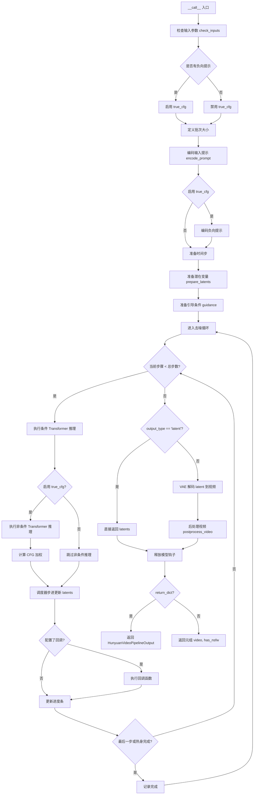

#### 带注释源码

```python
@torch.no_grad()
@replace_example_docstring(EXAMPLE_DOC_STRING)
def __call__(
    self,
    prompt: str | list[str] = None,
    prompt_2: str | list[str] = None,
    negative_prompt: str | list[str] = None,
    negative_prompt_2: str | list[str] = None,
    height: int = 720,
    width: int = 1280,
    num_frames: int = 129,
    num_inference_steps: int = 50,
    sigmas: list[float] = None,
    true_cfg_scale: float = 1.0,
    guidance_scale: float = 6.0,
    num_videos_per_prompt: int | None = 1,
    generator: torch.Generator | list[torch.Generator] | None = None,
    latents: torch.Tensor | None = None,
    prompt_embeds: torch.Tensor | None = None,
    pooled_prompt_embeds: torch.Tensor | None = None,
    prompt_attention_mask: torch.Tensor | None = None,
    negative_prompt_embeds: torch.Tensor | None = None,
    negative_pooled_prompt_embeds: torch.Tensor | None = None,
    negative_prompt_attention_mask: torch.Tensor | None = None,
    output_type: str | None = "pil",
    return_dict: bool = True,
    attention_kwargs: dict[str, Any] | None = None,
    callback_on_step_end: Callable[[int, int], None] | PipelineCallback | MultiPipelineCallbacks | None = None,
    callback_on_step_end_tensor_inputs: list[str] = ["latents"],
    prompt_template: dict[str, Any] = DEFAULT_PROMPT_TEMPLATE,
    max_sequence_length: int = 256,
):
    """
    管道生成方法，执行完整的文本到视频生成流程。
    
    处理流程：
    1. 验证输入参数有效性
    2. 编码文本提示为嵌入向量
    3. 准备噪声潜在变量
    4. 在调度器控制下迭代去噪
    5. 使用 VAE 解码潜在变量为视频
    6. 后处理并返回结果
    """
    
    # 如果使用 PipelineCallback 或 MultiPipelineCallbacks，自动获取其 tensor_inputs
    if isinstance(callback_on_step_end, (PipelineCallback, MultiPipelineCallbacks)):
        callback_on_step_end_tensor_inputs = callback_on_step_end.tensor_inputs

    # ============ 步骤 1: 检查输入参数 ============
    # 验证 height/width 能被 16 整除、callback_on_step_end_tensor_inputs 合法、
    # prompt 和 prompt_embeds 不同时提供、prompt 类型正确等
    self.check_inputs(
        prompt,
        prompt_2,
        height,
        width,
        prompt_embeds,
        callback_on_step_end_tensor_inputs,
        prompt_template,
    )

    # 判断是否启用真正的 classifier-free guidance
    has_neg_prompt = negative_prompt is not None or (
        negative_prompt_embeds is not None and negative_pooled_prompt_embeds is not None
    )
    do_true_cfg = true_cfg_scale > 1 and has_neg_prompt

    # 存储引导比例和注意力参数供属性访问
    self._guidance_scale = guidance_scale
    self._attention_kwargs = attention_kwargs
    self._current_timestep = None
    self._interrupt = False

    device = self._execution_device

    # ============ 步骤 2: 定义批次大小 ============
    # 根据 prompt 或 prompt_embeds 确定批次大小
    if prompt is not None and isinstance(prompt, str):
        batch_size = 1
    elif prompt is not None and isinstance(prompt, list):
        batch_size = len(prompt)
    else:
        batch_size = prompt_embeds.shape[0]

    # ============ 步骤 3: 编码输入提示 ============
    # 获取 transformer 的数据类型（通常为 bf16 或 fp16）
    transformer_dtype = self.transformer.dtype
    
    # 编码正向提示：同时生成 Llama 和 CLIP 文本嵌入
    prompt_embeds, pooled_prompt_embeds, prompt_attention_mask = self.encode_prompt(
        prompt=prompt,
        prompt_2=prompt_2,
        prompt_template=prompt_template,
        num_videos_per_prompt=num_videos_per_prompt,
        prompt_embeds=prompt_embeds,
        pooled_prompt_embeds=pooled_prompt_embeds,
        prompt_attention_mask=prompt_attention_mask,
        device=device,
        max_sequence_length=max_sequence_length,
    )
    
    # 将嵌入转换到 transformer 的数据类型
    prompt_embeds = prompt_embeds.to(transformer_dtype)
    prompt_attention_mask = prompt_attention_mask.to(transformer_dtype)
    pooled_prompt_embeds = pooled_prompt_embeds.to(transformer_dtype)

    # 如果启用 true_cfg，编码负向提示
    if do_true_cfg:
        negative_prompt_embeds, negative_pooled_prompt_embeds, negative_prompt_attention_mask = self.encode_prompt(
            prompt=negative_prompt,
            prompt_2=negative_prompt_2,
            prompt_template=prompt_template,
            num_videos_per_prompt=num_videos_per_prompt,
            prompt_embeds=negative_prompt_embeds,
            pooled_prompt_embeds=negative_pooled_prompt_embeds,
            prompt_attention_mask=negative_prompt_attention_mask,
            device=device,
            max_sequence_length=max_sequence_length,
        )
        negative_prompt_embeds = negative_prompt_embeds.to(transformer_dtype)
        negative_prompt_attention_mask = negative_prompt_attention_mask.to(transformer_dtype)
        negative_pooled_prompt_embeds = negative_pooled_prompt_embeds.to(transformer_dtype)

    # ============ 步骤 4: 准备时间步 ============
    # 默认使用线性 SIGMA 调度：从 1.0 线性递减到 0.0
    sigmas = np.linspace(1.0, 0.0, num_inference_steps + 1)[:-1] if sigmas is None else sigmas
    
    # XLA 设备特殊处理：时间步放在 CPU 上
    if XLA_AVAILABLE:
        timestep_device = "cpu"
    else:
        timestep_device = device
    
    # 从调度器获取时间步序列
    timesteps, num_inference_steps = retrieve_timesteps(
        self.scheduler, num_inference_steps, timestep_device, sigmas=sigmas
    )

    # ============ 步骤 5: 准备潜在变量 ============
    # 获取 Transformer 的输入通道数
    num_channels_latents = self.transformer.config.in_channels
    
    # 生成或使用提供的噪声潜在变量
    latents = self.prepare_latents(
        batch_size * num_videos_per_prompt,
        num_channels_latents,
        height,
        width,
        num_frames,
        torch.float32,  # 潜在变量使用 FP32 精度
        device,
        generator,
        latents,
    )

    # ============ 步骤 6: 准备引导条件 ============
    # 创建引导张量：guidance_scale * 1000（调度器内部使用）
    guidance = torch.tensor([guidance_scale] * latents.shape[0], dtype=transformer_dtype, device=device) * 1000.0

    # ============ 步骤 7: 去噪循环 ============
    # 计算热身步数（用于进度条显示）
    num_warmup_steps = len(timesteps) - num_inference_steps * self.scheduler.order
    self._num_timesteps = len(timesteps)

    # 进度条上下文管理器
    with self.progress_bar(total=num_inference_steps) as progress_bar:
        # 遍历每个时间步
        for i, t in enumerate(timesteps):
            # 检查是否被中断（外部可以设置 self._interrupt = True）
            if self._interrupt:
                continue

            self._current_timestep = t
            
            # 准备 Transformer 输入：将潜在变量转换为目标数据类型
            latent_model_input = latents.to(transformer_dtype)
            
            # 广播时间步以匹配批次维度（兼容 ONNX/Core ML）
            timestep = t.expand(latents.shape[0]).to(latents.dtype)

            # ===== 条件推理 =====
            # 使用缓存上下文优化 Transformer 内部缓存
            with self.transformer.cache_context("cond"):
                # 调用 Transformer 进行条件去噪预测
                noise_pred = self.transformer(
                    hidden_states=latent_model_input,
                    timestep=timestep,
                    encoder_hidden_states=prompt_embeds,
                    encoder_attention_mask=prompt_attention_mask,
                    pooled_projections=pooled_prompt_embeds,
                    guidance=guidance,
                    attention_kwargs=attention_kwargs,
                    return_dict=False,
                )[0]

            # ===== 非条件推理（如果启用 true CFG）=====
            if do_true_cfg:
                with self.transformer.cache_context("uncond"):
                    # 执行非条件推理（使用负向提示）
                    neg_noise_pred = self.transformer(
                        hidden_states=latent_model_input,
                        timestep=timestep,
                        encoder_hidden_states=negative_prompt_embeds,
                        encoder_attention_mask=negative_prompt_attention_mask,
                        pooled_projections=negative_pooled_prompt_embeds,
                        guidance=guidance,
                        attention_kwargs=attention_kwargs,
                        return_dict=False,
                    )[0]
                
                # 应用 classifier-free guidance：neg + scale * (cond - neg)
                noise_pred = neg_noise_pred + true_cfg_scale * (noise_pred - neg_noise_pred)

            # ===== 调度器步进 =====
            # 根据噪声预测计算前一时间步的潜在变量
            latents = self.scheduler.step(noise_pred, t, latents, return_dict=False)[0]

            # ===== 步骤结束回调 =====
            if callback_on_step_end is not None:
                # 收集回调需要的张量
                callback_kwargs = {}
                for k in callback_on_step_end_tensor_inputs:
                    callback_kwargs[k] = locals()[k]
                
                # 执行回调，允许修改 latents 和 prompt_embeds
                callback_outputs = callback_on_step_end(self, i, t, callback_kwargs)
                latents = callback_outputs.pop("latents", latents)
                prompt_embeds = callback_outputs.pop("prompt_embeds", prompt_embeds)

            # ===== 进度条更新 =====
            # 在最后一步或热身完成后且满足调度器阶数时更新
            if i == len(timesteps) - 1 or ((i + 1) > num_warmup_steps and (i + 1) % self.scheduler.order == 0):
                progress_bar.update()

            # XLA 设备特殊处理：标记执行步骤
            if XLA_AVAILABLE:
                xm.mark_step()

    # 重置当前时间步
    self._current_timestep = None

    # ============ 步骤 8: VAE 解码 ============
    # 如果不需要潜在输出格式，则解码潜在变量为视频
    if not output_type == "latent":
        # 反缩放潜在变量
        latents = latents.to(self.vae.dtype) / self.vae.config.scaling_factor
        
        # VAE 解码：潜在变量 -> 视频
        video = self.vae.decode(latents, return_dict=False)[0]
        
        # 后处理：根据 output_type 转换视频格式
        video = self.video_processor.postprocess_video(video, output_type=output_type)
    else:
        # 直接返回潜在变量
        video = latents

    # ============ 步骤 9: 资源释放 ============
    # 释放所有模型的 CPU/GPU 钩子
    self.maybe_free_model_hooks()

    # ============ 步骤 10: 返回结果 ============
    if not return_dict:
        return (video,)

    # 返回结构化输出对象
    return HunyuanVideoPipelineOutput(frames=video)
```

## 关键组件


### 张量索引与惰性加载

在去噪循环中，通过 `cache_context` 实现Transformer的惰性加载，避免一次性加载所有模型权重。代码使用 `self.transformer.cache_context("cond")` 和 `self.transformer.cache_context("uncond")` 来按需加载条件和无条件推理所需的模型上下文，减少显存占用。

### 反量化支持

VAE解码前执行反量化操作：`latents = latents.to(self.vae.dtype) / self.vae.config.scaling_factor`。通过除以缩放因子将潜在空间的值反量化回原始范围，然后传递给VAE的decode方法进行视频生成。

### 量化策略

在 `__call__` 方法中，通过 `transformer_dtype = self.transformer.dtype` 获取Transformer的数据类型，并在编码提示后执行 `prompt_embeds = prompt_embeds.to(transformer_dtype)` 实现数据类型转换与量化适配。

### 文本编码（Llama + CLIP双编码器）

使用 `_get_llama_prompt_embeds` 和 `_get_clip_prompt_embeds` 分别处理长序列（Llama）和短序列（CLIP）的文本嵌入。Llama编码器支持最长256个token的序列，通过 `prompt_template` 模板进行格式化；CLIP编码器处理最长77个token的序列，提供池化后的嵌入用于指导生成。

### VAE切片与分块解码

提供 `enable_vae_slicing`、`disable_vae_slicing`、`enable_vae_tiling`、`disable_vae_tiling` 四个方法控制VAE的解码策略。Slicing将输入张量切分为多个片段分步解码以节省显存；Tiling将输入划分为Tiles处理以支持更大分辨率的图像/视频。

### 调度器与时间步检索

使用 `retrieve_timesteps` 辅助函数获取调度器的时间步，支持自定义timesteps和sigmas。若未提供则默认生成从1.0线性递减到0.0的sigma序列。调度器使用FlowMatchEulerDiscreteScheduler实现去噪过程。

### 真分类器自由引导（True CFG）

当 `true_cfg_scale > 1` 且存在负提示时执行真CFG：`noise_pred = neg_noise_pred + true_cfg_scale * (noise_pred - neg_noise_pred)`。通过分离条件噪声预测和无条件噪声预测，再按比例组合，实现更精确的引导效果。

### 回调与进度监控

通过 `callback_on_step_end` 和 `callback_on_step_end_tensor_inputs` 支持在每个去噪步骤结束后执行自定义回调。使用 `progress_bar` 追踪推理进度，支持XLA设备加速（`xm.mark_step()`）。

### 潜在变量准备与批处理

`prepare_latents` 方法根据视频参数（高度、宽度、帧数）和VAE缩放因子计算潜在张量形状，支持预提供的latents或通过随机噪声生成。批处理通过 `num_videos_per_prompt` 参数实现多视频生成。

### 视频后处理

使用 `VideoProcessor` 的 `postprocess_video` 方法将VAE输出的张量转换为指定输出类型（PIL图像或NumPy数组），支持灵活的输出格式选择。


## 问题及建议


### 已知问题

-   **废弃方法未清理**：`enable_vae_slicing`、`disable_vae_slicing`、`enable_vae_tiling`、`disable_vae_tiling` 方法已标记为在 0.40.0 版本废弃，但代码中仍保留这些方法，增加维护负担且易造成混淆。
-   **编码逻辑不一致**：在 `encode_prompt` 方法中，当 `prompt_2` 为 `None` 时，CLIP 编码器仍然使用原始 `prompt` 而非 `prompt_2`，这与注释描述的逻辑不一致（注释说" If not defined, `prompt` is will be used instead"）。
-   **硬编码值**：多处存在硬编码值，如 `guidance * 1000.0`、`max_sequence_length=77`（在 `_get_clip_prompt_embeds` 中），缺乏可配置性。
-   **重复代码**：positive prompt 和 negative prompt 的编码逻辑在 `__call__` 方法中几乎完全重复，未提取为独立函数，导致代码冗余。
-   **XLA 设备检查重复**：`XLA_AVAILABLE` 的检查在多处重复出现（`retrieve_timesteps` 调用和主循环中），可提取为类属性或工具函数。
-   **缺失输入验证**：`check_inputs` 方法未验证 `num_frames` 参数的有效性，且未验证 `negative_prompt` 与 `negative_prompt_embeds` 的互斥关系。
-   **类型注解不完整**：部分方法参数缺少类型注解（如 `check_inputs` 的 `prompt` 参数、`callback_on_step_end_tensor_inputs` 参数），影响代码可读性和 IDE 支持。
-   **数据类型转换冗余**：prompt embeddings 在 `encode_prompt` 后转换为 `transformer_dtype`，但在 VAE 解码前又需要转换回 `vae.dtype`，中间存在不必要的类型转换开销。
-   **crop_start 计算逻辑复杂**：`DEFAULT_PROMPT_TEMPLATE` 已包含 `crop_start: 95`，但代码中仍动态计算并覆盖该值，逻辑不够清晰。

### 优化建议

-   **移除废弃方法**：根据废弃计划（0.40.0），在相应版本中完全移除 `enable_vae_slicing`、`disable_vae_slicing`、`enable_vae_tiling`、`disable_vae_tiling` 方法。
-   **统一编码逻辑**：重构 `encode_prompt` 方法，提取公共编码逻辑为私有方法，避免 positive 和 negative prompt 编码的代码重复。
-   **消除硬编码**：将 `max_sequence_length=77`、`guidance * 1000.0` 等硬编码值提取为类属性或配置参数。
-   **增强输入验证**：在 `check_inputs` 中添加 `num_frames` 验证（确保为正整数），并完善 negative prompt 相关的验证逻辑。
-   **完善类型注解**：为所有公开方法参数添加完整的类型注解，提升代码可维护性。
-   **优化数据类型管理**：考虑在 pipeline 初始化时确定各组件的数据类型，避免在推理循环中进行频繁的类型转换。
-   **简化 crop_start 逻辑**：如果 `DEFAULT_PROMPT_TEMPLATE` 已包含固定的 `crop_start` 值，可考虑移除动态计算逻辑，直接使用配置值。


## 其它


### 设计目标与约束

该管道旨在通过文本提示生成视频。设计目标包括：支持中英文双语提示（通过Llama和CLIP双文本编码器）、支持条件引导生成（guidance_scale）、支持真实无分类器引导（true_cfg_scale）、支持自定义时间步调度（sigmas）。约束条件包括：height和width必须被16整除、num_frames必须满足VAE时间压缩比要求、提示长度受tokenizer最大长度限制（Llama默认256，CLIP默认77）、XLA设备支持可选。

### 错误处理与异常设计

代码包含多层次错误检查：1) check_inputs方法验证height/width divisibility、callback_on_step_end_tensor_inputs合法性、prompt与prompt_embeds互斥、prompt类型检查、prompt_template字典格式；2) retrieve_timesteps验证timesteps和sigmas互斥、检查scheduler是否支持自定义参数；3) prepare_latents验证generator列表长度与batch_size匹配；4) encode_prompt处理truncation警告。异常抛出使用ValueError，弃用警告使用deprecate函数。

### 数据流与状态机

数据流如下：1) 提示文本 → tokenize → Llama文本编码器 + CLIP文本编码器 → prompt_embeds + pooled_prompt_embeds；2) 随机噪声 → prepare_latents生成初始latents；3) timesteps经过retrieve_timesteps从scheduler获取；4) 去噪循环：latents → transformer(条件生成) → noise_pred → scheduler.step → 新latents；5) latents → VAE decode → 视频帧。状态机包含：guidance_scale、attention_kwargs、current_timestep、interrupt标志位，用于控制去噪过程中的行为。

### 外部依赖与接口契约

核心依赖：LlamaModel/LlamaTokenizerFast（Llava Llama3-8B）、CLIPTextModel/CLIPTokenizer（clip-vit-large-patch14）、HunyuanVideoTransformer3DModel（3D Transformer）、AutoencoderKLHunyuanVideo（VAE）、FlowMatchEulerDiscreteScheduler（调度器）、VideoProcessor（视频后处理）。管道继承DiffusionPipeline和HunyuanVideoLoraLoaderMixin，支持LoRA加载。model_cpu_offload_seq定义模型卸载顺序：text_encoder→text_encoder_2→transformer→vae。

### 配置与参数说明

关键配置参数：vae_scale_factor_temporal（VAE时间压缩比，默认4）、vae_scale_factor_spatial（VAE空间压缩比，默认8）、DEFAULT_PROMPT_TEMPLATE（包含Llama提示模板和crop_start=95）、model_cpu_offload_seq（CPU卸载顺序）、_callback_tensor_inputs（支持回调的tensor输入列表）。运行参数：height默认720、width默认1280、num_frames默认129、num_inference_steps默认50、guidance_scale默认6.0、true_cfg_scale默认1.0、output_type默认"pil"。

### 性能优化策略

包含多种性能优化：1) VAE切片解码（enable_vae_slicing/vae.enable_slicing）用于节省内存；2) VAE平铺解码（enable_vae_tiling/vae.enable_tiling）用于处理大分辨率；3) XLA支持（torch_xla）用于加速；4) 模型CPU卸载（model_cpu_offload_seq）；5) Transformer缓存上下文（cache_context）用于条件/非条件推理优化；6) maybe_free_model_hooks用于去噪完成后释放模型。已弃用方法：enable_vae_slicing、disable_vae_slicing、enable_vae_tiling、disable_vae_tiling（建议直接调用vae对应方法）。

### 安全性考虑

代码中negative_prompt_embeds和negative_pooled_prompt_embeds用于排除不希望的内容，但实际的NSFW检测逻辑在HunyuanVideoPipelineOutput中处理（通过返回的布尔列表标识）。建议在生产环境中集成额外的安全过滤器。

### 版本兼容性

deprecate函数标记以下方法将在0.40.0版本移除：enable_vae_slicing、disable_vae_slicing、enable_vae_tiling、disable_vae_tiling。代码检查timesteps和sigmas参数兼容性，使用inspect.signature验证scheduler.set_timesteps支持情况。

### 内存管理

内存管理策略包括：1) dtype转换在不同组件间进行（transformer使用transformer_dtype，VAE使用vae.dtype）；2) latents在去噪循环中保持在GPU；3) callback_on_step_end支持在每步后修改latents和prompt_embeds；4) XLA环境下使用cpu作为timestep设备；5) 通过num_videos_per_prompt控制批量大小影响显存占用。

### 多模态融合机制

双文本编码器融合：1) Llama编码器生成sequence_length×dim的prompt_embeds（支持长序列max_sequence_length=256）；2) CLIP编码器生成pooled_prompt_embeds（短序列max_sequence_length=77）；3) transformer同时接收两种embeds：encoder_hidden_states和pooled_projections；4) crop_start机制去除Llama模板前缀，保留实际提示信息。Negative prompt支持双编码器独立处理（negative_prompt_2对应tokenizer_2/text_encoder_2）。

### 调度器与时间步

retrieve_timesteps函数处理三种模式：1) 自定义timesteps列表；2) 自定义sigmas列表；3) 默认使用num_inference_steps。默认sigmas从1.0线性递减到0.0（不含0）。scheduler使用FlowMatchEulerDiscreteScheduler，支持order属性控制多步调度。warmup步数计算：num_warmup_steps = len(timesteps) - num_inference_steps * scheduler.order。

### 回调机制

callback_on_step_end支持三种形式：Callable、PipelineCallback、MultiPipelineCallbacks。回调输入：self、step索引、timestep、callback_kwargs（包含callback_on_step_end_tensor_inputs指定的tensor）。回调输出可覆盖latents和prompt_embeds。支持的tensor输入：latents、prompt_embeds（在_callback_tensor_inputs中定义）。

### 生成策略

Guidance实现：1) embedded guidance通过guidance_scale > 1启用，乘以1000.0传给transformer；2) true classifier-free guidance通过true_cfg_scale > 1启用，执行两次transformer推理（条件/非条件）后线性插值。Generator支持确定性生成：可传入单个或列表形式的torch.Generator。Latents支持外部传入用于调试或混合生成。

    