# `diffusers\src\diffusers\pipelines\hunyuan_video\pipeline_hunyuan_video_framepack.py` 详细设计文档

HunyuanVideoFramepackPipeline是一个用于文本到视频和图像到视频生成的Diffusion Pipeline，集成了Llama文本编码器、CLIP文本编码器、Siglip图像编码器、HunyuanVideoTransformer3DModel变换器和VAE，支持vanilla和inverted_anti_drifting两种采样策略，能够根据文本提示和可选的首尾图像生成高质量视频。

## 整体流程

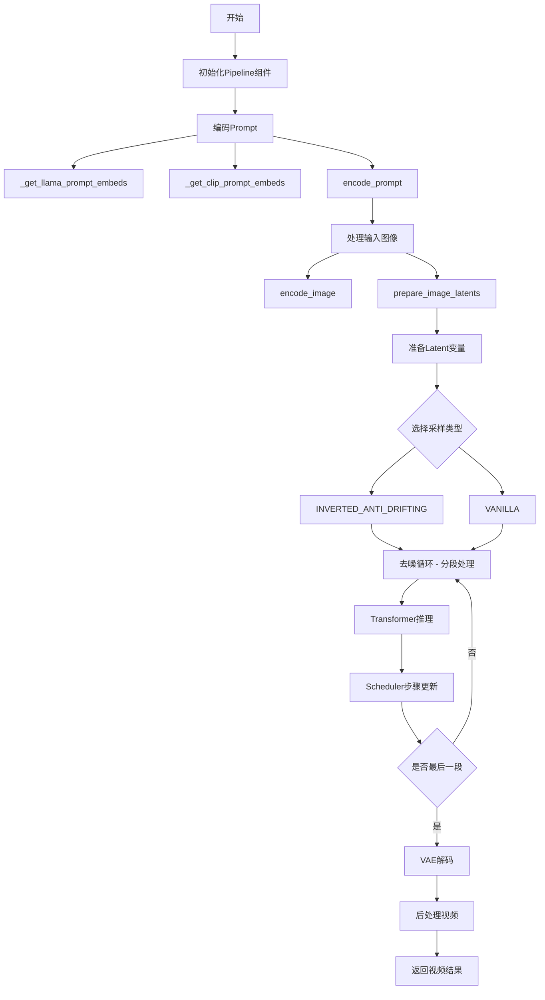

## 类结构

```
DiffusionPipeline (基类)
├── HunyuanVideoLoraLoaderMixin (Mixins)
└── HunyuanVideoFramepackPipeline

FramepackSamplingType (Enum)
├── VANILLA
└── INVERTED_ANTI_DRIFTING
```

## 全局变量及字段


### `logger`
    
模块级日志记录器，用于输出调试和信息日志

类型：`logging.Logger`
    


### `XLA_AVAILABLE`
    
标志位，指示是否安装了PyTorch XLA库以支持TPU加速

类型：`bool`
    


### `EXAMPLE_DOC_STRING`
    
包含图像到视频和首尾帧到视频示例的文档字符串

类型：`str`
    


### `DEFAULT_PROMPT_TEMPLATE`
    
默认的提示词模板，包含系统消息模板和裁剪起始位置

类型：`dict`
    


### `FramepackSamplingType.VANILLA`
    
标准的香草采样类型枚举值

类型：`str, Enum`
    


### `FramepackSamplingType.INVERTED_ANTI_DRIFTING`
    
反漂移倒置采样类型枚举值，用于更平滑的视频生成

类型：`str, Enum`
    


### `HunyuanVideoFramepackPipeline.vae`
    
变分自编码器，用于视频的潜空间编码和解码

类型：`AutoencoderKLHunyuanVideo`
    


### `HunyuanVideoFramepackPipeline.text_encoder`
    
Llama文本编码器，用于将提示词编码为文本嵌入

类型：`LlamaModel`
    


### `HunyuanVideoFramepackPipeline.tokenizer`
    
Llama分词器，用于将文本分割为token序列

类型：`LlamaTokenizerFast`
    


### `HunyuanVideoFramepackPipeline.transformer`
    
3D变换器模型，用于去噪潜在视频表示

类型：`HunyuanVideoFramepackTransformer3DModel`
    


### `HunyuanVideoFramepackPipeline.scheduler`
    
流匹配欧拉离散调度器，用于控制去噪过程

类型：`FlowMatchEulerDiscreteScheduler`
    


### `HunyuanVideoFramepackPipeline.text_encoder_2`
    
CLIP文本编码器，用于生成池化的文本嵌入

类型：`CLIPTextModel`
    


### `HunyuanVideoFramepackPipeline.tokenizer_2`
    
CLIP分词器，用于CLIP文本编码器的文本处理

类型：`CLIPTokenizer`
    


### `HunyuanVideoFramepackPipeline.image_encoder`
    
Siglip视觉编码器，用于编码输入图像为图像嵌入

类型：`SiglipVisionModel`
    


### `HunyuanVideoFramepackPipeline.feature_extractor`
    
Siglip图像预处理器，用于预处理输入图像

类型：`SiglipImageProcessor`
    


### `HunyuanVideoFramepackPipeline.video_processor`
    
视频处理器，用于视频帧的预处理和后处理

类型：`VideoProcessor`
    


### `HunyuanVideoFramepackPipeline.vae_scale_factor_temporal`
    
VAE时间压缩比，用于计算潜在帧数

类型：`int`
    


### `HunyuanVideoFramepackPipeline.vae_scale_factor_spatial`
    
VAE空间压缩比，用于计算潜在高度和宽度

类型：`int`
    


### `HunyuanVideoFramepackPipeline.model_cpu_offload_seq`
    
模型CPU卸载顺序字符串，定义模型加载到GPU的序列

类型：`str`
    


### `HunyuanVideoFramepackPipeline._callback_tensor_inputs`
    
回调函数可访问的张量输入名称列表

类型：`list`
    


### `HunyuanVideoFramepackPipeline._guidance_scale`
    
内部引导缩放因子，用于控制分类器自由引导强度

类型：`float (internal)`
    


### `HunyuanVideoFramepackPipeline._num_timesteps`
    
内部推理步骤数，存储去噪过程的步数

类型：`int (internal)`
    


### `HunyuanVideoFramepackPipeline._attention_kwargs`
    
内部注意力参数字典，传递给注意力处理器

类型：`dict (internal)`
    


### `HunyuanVideoFramepackPipeline._current_timestep`
    
内部当前时间步，追踪去噪循环中的当前步骤

类型：`int (internal)`
    


### `HunyuanVideoFramepackPipeline._interrupt`
    
内部中断标志，用于中断去噪过程

类型：`bool (internal)`
    
    

## 全局函数及方法


### `calculate_shift`

该函数是一个全局数学辅助函数，用于在扩散模型的推理过程中根据图像序列长度动态计算时间步偏移量（shift）。它通过线性插值的方式，在预定义的基础序列长度（base_seq_len）和最大序列长度（max_seq_len）之间建立映射关 系，从而实现对不同分辨率图像的自适应采样策略调整。

参数：

- `image_seq_len`：`int`，图像序列长度，即输入图像经过分块（patchify）后的序列长度
- `base_seq_len`：`int = 256`，基础序列长度，默认为256，对应基础偏移量base_shift
- `max_seq_len`：`int = 4096`，最大序列长度，默认为4096，对应最大偏移量max_shift
- `base_shift`：`float = 0.5`，基础偏移量，用于低分辨率图像的采样调整
- `max_shift`：`float = 1.15`，最大偏移量，用于高分辨率图像的采样调整

返回值：`float`，计算得到的偏移量mu，用于调整扩散模型的时间步采样计划

#### 流程图

```mermaid
flowchart TD
    A[开始 calculate_shift] --> B[输入参数]
    B --> C{计算斜率 m}
    C --> D[m = (max_shift - base_shift) / (max_seq_len - base_seq_len)]
    D --> E[计算截距 b]
    E --> F[b = base_shift - m * base_seq_len]
    F --> G[计算偏移量 mu]
    G --> H[mu = image_seq_len * m + b]
    H --> I[返回 mu]
    I --> J[结束]
```

#### 带注释源码

```python
# Copied from diffusers.pipelines.flux.pipeline_flux.calculate_shift
def calculate_shift(
    image_seq_len,           # 图像序列长度，输入参数
    base_seq_len: int = 256,  # 基础序列长度，默认256
    max_seq_len: int = 4096,  # 最大序列长度，默认4096
    base_shift: float = 0.5,  # 基础偏移量，默认0.5
    max_shift: float = 1.15, # 最大偏移量，默认1.15
):
    # 计算线性插值的斜率 m
    # 斜率 = (最大偏移 - 基础偏移) / (最大序列长度 - 基础序列长度)
    m = (max_shift - base_shift) / (max_seq_len - base_seq_len)
    
    # 计算线性方程的截距 b
    # 使方程在 base_seq_len 处等于 base_shift
    b = base_shift - m * base_seq_len
    
    # 根据图像序列长度计算最终的偏移量 mu
    # 使用线性方程: mu = image_seq_len * m + b
    mu = image_seq_len * m + b
    
    # 返回计算得到的偏移量，用于调整采样计划
    return mu
```


### `retrieve_timesteps`

该函数是全局工具函数，用于从调度器（Scheduler）获取推理过程中的时间步（timesteps）。它通过调用调度器的 `set_timesteps` 方法来设置时间步计划，支持自定义时间步或自定义 sigmas，并返回最终的时间步张量和实际的推理步数。

参数：

- `scheduler`：`SchedulerMixin`，要获取时间步的调度器对象
- `num_inference_steps`：`int | None`，生成样本时使用的扩散步数。如果提供此参数，则 `timesteps` 必须为 `None`
- `device`：`str | torch.device | None`，时间步要移动到的目标设备。如果为 `None`，则不移动时间步
- `timesteps`：`list[int] | None`，自定义时间步列表，用于覆盖调度器默认的时间步间隔策略
- `sigmas`：`list[float] | None`，自定义 sigmas 列表，用于覆盖调度器的 sigma 策略
- `**kwargs`：任意关键字参数，将传递给调度器的 `set_timesteps` 方法

返回值：`tuple[torch.Tensor, int]`，返回一个元组，第一个元素是调度器的时间步张量，第二个元素是实际的推理步数

#### 流程图

```mermaid
flowchart TD
    A[开始] --> B{检查: timesteps 和 sigmas 是否同时存在?}
    B -->|是| C[抛出 ValueError: 只能选择 timesteps 或 sigmas 其中一个]
    B -->|否| D{检查: timesteps 是否存在?}
    D -->|是| E[检查 scheduler.set_timesteps 是否支持 timesteps 参数]
    E -->|不支持| F[抛出 ValueError: 当前调度器不支持自定义 timesteps]
    E -->|支持| G[调用 scheduler.set_timesteps 设置自定义 timesteps]
    G --> H[获取 scheduler.timesteps]
    H --> I[计算 num_inference_steps = len(timesteps)]
    D -->|否| J{检查: sigmas 是否存在?}
    J -->|是| K[检查 scheduler.set_timesteps 是否支持 sigmas 参数]
    K -->|不支持| L[抛出 ValueError: 当前调度器不支持自定义 sigmas]
    K -->|支持| M[调用 scheduler.set_timesteps 设置自定义 sigmas]
    M --> N[获取 scheduler.timesteps]
    N --> O[计算 num_inference_steps = len(timesteps)]
    J -->|否| P[调用 scheduler.set_timesteps 使用 num_inference_steps]
    P --> Q[获取 scheduler.timesteps]
    Q --> R[返回 timesteps 和 num_inference_steps]
    I --> R
    O --> R
```

#### 带注释源码

```python
# Copied from diffusers.pipelines.stable_diffusion.pipeline_stable_diffusion.retrieve_timesteps
def retrieve_timesteps(
    scheduler,
    num_inference_steps: int | None = None,
    device: str | torch.device | None = None,
    timesteps: list[int] | None = None,
    sigmas: list[float] | None = None,
    **kwargs,
):
    r"""
    Calls the scheduler's `set_timesteps` method and retrieves timesteps from the scheduler after the call. Handles
    custom timesteps. Any kwargs will be supplied to `scheduler.set_timesteps`.

    Args:
        scheduler (`SchedulerMixin`):
            The scheduler to get timesteps from.
        num_inference_steps (`int`):
            The number of diffusion steps used when generating samples with a pre-trained model. If used, `timesteps`
            must be `None`.
        device (`str` or `torch.device`, *optional*):
            The device to which the timesteps should be moved to. If `None`, the timesteps are not moved.
        timesteps (`list[int]`, *optional*):
            Custom timesteps used to override the timestep spacing strategy of the scheduler. If `timesteps` is passed,
            `num_inference_steps` and `sigmas` must be `None`.
        sigmas (`list[float]`, *optional*):
            Custom sigmas used to override the timestep spacing strategy of the scheduler. If `sigmas` is passed,
            `num_inference_steps` and `timesteps` must be `None`.

    Returns:
        `tuple[torch.Tensor, int]`: A tuple where the first element is the timestep schedule from the scheduler and the
        second element is the number of inference steps.
    """
    # 检查是否同时传入了 timesteps 和 sigmas，这是不允许的
    if timesteps is not None and sigmas is not None:
        raise ValueError("Only one of `timesteps` or `sigmas` can be passed. Please choose one to set custom values")
    
    # 处理自定义 timesteps 的情况
    if timesteps is not None:
        # 检查调度器的 set_timesteps 方法是否支持 timesteps 参数
        accepts_timesteps = "timesteps" in set(inspect.signature(scheduler.set_timesteps).parameters.keys())
        if not accepts_timesteps:
            raise ValueError(
                f"The current scheduler class {scheduler.__class__}'s `set_timesteps` does not support custom"
                f" timestep schedules. Please check whether you are using the correct scheduler."
            )
        # 调用调度器的 set_timesteps 方法设置自定义时间步
        scheduler.set_timesteps(timesteps=timesteps, device=device, **kwargs)
        # 从调度器获取更新后的时间步
        timesteps = scheduler.timesteps
        # 计算实际的推理步数
        num_inference_steps = len(timesteps)
    
    # 处理自定义 sigmas 的情况
    elif sigmas is not None:
        # 检查调度器的 set_timesteps 方法是否支持 sigmas 参数
        accept_sigmas = "sigmas" in set(inspect.signature(scheduler.set_timesteps).parameters.keys())
        if not accept_sigmas:
            raise ValueError(
                f"The current scheduler class {scheduler.__class__}'s `set_timesteps` does not support custom"
                f" sigmas schedules. Please check whether you are using the correct scheduler."
            )
        # 调用调度器的 set_timesteps 方法设置自定义 sigmas
        scheduler.set_timesteps(sigmas=sigmas, device=device, **kwargs)
        # 从调度器获取更新后的时间步
        timesteps = scheduler.timesteps
        # 计算实际的推理步数
        num_inference_steps = len(timesteps)
    
    # 默认情况：使用 num_inference_steps 设置时间步
    else:
        scheduler.set_timesteps(num_inference_steps, device=device, **kwargs)
        timesteps = scheduler.timesteps
    
    # 返回时间步张量和推理步数
    return timesteps, num_inference_steps
```


### HunyuanVideoFramepackPipeline.__init__

该方法是 `HunyuanVideoFramepackPipeline` 类的构造函数，负责初始化视频生成管道所需的所有组件，包括文本编码器、分词器、Transformer模型、VAE、调度器、图像编码器和特征提取器等，并通过模块注册和参数设置完成管道的构建。

参数：

- `text_encoder`：`LlamaModel`，Llava Llama3-8B 文本编码器，用于将文本提示编码为嵌入向量
- `tokenizer`：`LlamaTokenizerFast`，Llava Llama3-8B 的分词器，用于将文本分词为 token
- `transformer`：`HunyuanVideoFramepackTransformer3DModel`，条件 Transformer 模型，用于对编码的图像潜在表示进行去噪
- `vae`：`AutoencoderKLHunyuanVideo`，变分自编码器模型，用于将视频编码和解码到潜在表示
- `scheduler`：`FlowMatchEulerDiscreteScheduler`，与 transformer 结合使用的调度器，用于对编码的图像潜在表示进行去噪
- `text_encoder_2`：`CLIPTextModel`，CLIP 文本编码器（clip-vit-large-patch14 变体），用于额外的文本编码
- `tokenizer_2`：`CLIPTokenizer`，CLIP 分词器
- `image_encoder`：`SiglipVisionModel`，Siglip 视觉模型，用于编码图像特征
- `feature_extractor`：`SiglipImageProcessor`，Siglip 图像处理器，用于预处理图像

返回值：`None`，构造函数无返回值，通过副作用初始化实例属性

#### 流程图

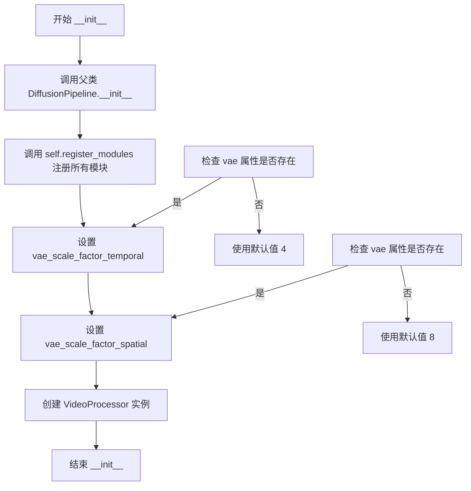

#### 带注释源码

```python
def __init__(
    self,
    text_encoder: LlamaModel,                      # Llava Llama3-8B 文本编码器
    tokenizer: LlamaTokenizerFast,                # Llava Llama3-8B 分词器
    transformer: HunyuanVideoFramepackTransformer3DModel,  # 条件 Transformer 去噪模型
    vae: AutoencoderKLHunyuanVideo,                # VAE 编解码模型
    scheduler: FlowMatchEulerDiscreteScheduler,     # 去噪调度器
    text_encoder_2: CLIPTextModel,                 # CLIP 文本编码器
    tokenizer_2: CLIPTokenizer,                    # CLIP 分词器
    image_encoder: SiglipVisionModel,              # Siglip 视觉编码器
    feature_extractor: SiglipImageProcessor,       # Siglip 图像特征提取器
):
    # 调用父类 DiffusionPipeline 的初始化方法
    # 继承基础管道的通用功能（下载、保存、设备运行等）
    super().__init__()

    # 使用 register_modules 方法注册所有组件
    # 该方法会将各个模块分配到 self.xxx 属性
    # 并设置默认的模型设备管理和数据类型
    self.register_modules(
        vae=vae,
        text_encoder=text_encoder,
        tokenizer=tokenizer,
        transformer=transformer,
        scheduler=scheduler,
        text_encoder_2=text_encoder_2,
        tokenizer_2=tokenizer_2,
        image_encoder=image_encoder,
        feature_extractor=feature_extractor,
    )

    # 设置 VAE 时序压缩比
    # 用于将视频帧数转换为潜在表示的帧数
    # temporal_compression_ratio 表示时间维度的压缩比例
    self.vae_scale_factor_temporal = self.vae.temporal_compression_ratio if getattr(self, "vae", None) else 4

    # 设置 VAE 空间压缩比
    # 用于将图像高度和宽度转换为潜在表示的尺寸
    # spatial_compression_ratio 表示空间维度的压缩比例（高和宽）
    self.vae_scale_factor_spatial = self.vae.spatial_compression_ratio if getattr(self, "vae", None) else 8

    # 创建视频处理器实例
    # VideoProcessor 负责视频的预处理和后处理
    # 使用空间压缩比作为缩放因子
    self.video_processor = VideoProcessor(vae_scale_factor=self.vae_scale_factor_spatial)
```


### `HunyuanVideoFramepackPipeline._get_llama_prompt_embeds`

该方法用于将文本提示编码为LLAMA文本嵌入向量。它接收原始文本和提示模板，经过分词、模板格式化、嵌入生成和去裁剪等步骤，最终返回可用于Transformer模型的文本嵌入和注意力掩码。

参数：

- `prompt`：`str | list[str]`，要编码的文本提示，可以是单个字符串或字符串列表
- `prompt_template`：`dict[str, Any]`，用于格式化提示的模板字典，包含template和crop_start字段
- `num_videos_per_prompt`：`int = 1`，每个提示生成的视频数量，用于复制嵌入向量
- `device`：`torch.device | None = None`，计算设备，若为None则使用执行设备
- `dtype`：`torch.dtype | None = None`，嵌入向量的数据类型，若为None则使用text_encoder的数据类型
- `max_sequence_length`：`int = 256`，分词的最大序列长度
- `num_hidden_layers_to_skip`：`int = 2`，从文本编码器隐藏状态中跳过的层数，用于获取更深的特征

返回值：`tuple[torch.Tensor, torch.Tensor]`，返回两个张量——第一个是提示嵌入（形状为batch_size * num_videos_per_prompt × seq_len × hidden_dim），第二个是提示注意力掩码（形状为batch_size * num_videos_per_prompt × seq_len）

#### 流程图

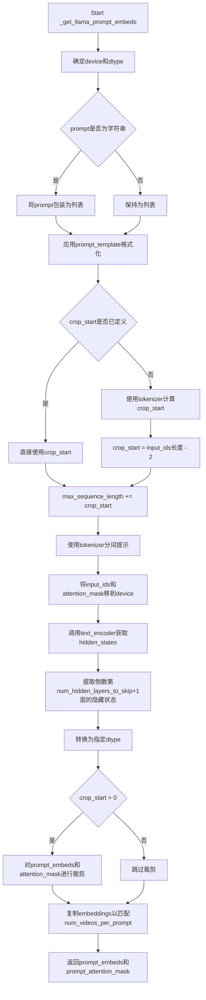

#### 带注释源码

```python
def _get_llama_prompt_embeds(
    self,
    prompt: str | list[str],                      # 输入的文本提示
    prompt_template: dict[str, Any],              # 提示模板字典
    num_videos_per_prompt: int = 1,               # 每个提示生成的视频数量
    device: torch.device | None = None,           # 计算设备
    dtype: torch.dtype | None = None,             # 数据类型
    max_sequence_length: int = 256,               # 最大序列长度
    num_hidden_layers_to_skip: int = 2,           # 跳过的隐藏层数
) -> tuple[torch.Tensor, torch.Tensor]:
    # 确定设备：如果未指定则使用执行设备
    device = device or self._execution_device
    # 确定数据类型：如果未指定则使用text_encoder的数据类型
    dtype = dtype or self.text_encoder.dtype

    # 标准化prompt为列表格式
    prompt = [prompt] if isinstance(prompt, str) else prompt
    batch_size = len(prompt)  # 获取批次大小

    # 使用模板格式化每个prompt
    # 例如：在模板中插入用户输入的描述
    prompt = [prompt_template["template"].format(p) for p in prompt]

    # 获取crop_start值，用于裁剪模板前缀
    crop_start = prompt_template.get("crop_start", None)
    if crop_start is None:
        # 如果模板中未指定，则通过分词模板来计算crop_start
        prompt_template_input = self.tokenizer(
            prompt_template["template"],
            padding="max_length",
            return_tensors="pt",
            return_length=False,
            return_overflowing_tokens=False,
            return_attention_mask=False,
        )
        crop_start = prompt_template_input["input_ids"].shape[-1]
        # 移除<|eot_id|>标记和占位符{}的影响
        crop_start -= 2

    # 根据crop_start调整最大序列长度
    max_sequence_length += crop_start
    
    # 对格式化后的prompt进行分词
    text_inputs = self.tokenizer(
        prompt,
        max_length=max_sequence_length,
        padding="max_length",
        truncation=True,
        return_tensors="pt",
        return_length=False,
        return_overflowing_tokens=False,
        return_attention_mask=True,
    )
    
    # 将分词结果移到指定设备
    text_input_ids = text_inputs.input_ids.to(device=device)
    prompt_attention_mask = text_inputs.attention_mask.to(device=device)

    # 调用Llama文本编码器获取隐藏状态
    # output_hidden_states=True要求返回所有隐藏状态
    prompt_embeds = self.text_encoder(
        input_ids=text_input_ids,
        attention_mask=prompt_attention_mask,
        output_hidden_states=True,
    ).hidden_states[-(num_hidden_layers_to_skip + 1)]  # 获取指定层的隐藏状态
    
    # 转换数据类型
    prompt_embeds = prompt_embeds.to(dtype=dtype)

    # 如果crop_start > 0，则裁剪掉模板前缀部分
    # 这样可以去掉系统提示的影响，只保留用户输入的嵌入
    if crop_start is not None and crop_start > 0:
        prompt_embeds = prompt_embeds[:, crop_start:]
        prompt_attention_mask = prompt_attention_mask[:, crop_start:]

    # 复制文本嵌入以匹配每个提示生成的视频数量
    # 这种方法对MPS设备友好
    _, seq_len, _ = prompt_embeds.shape
    # 重复嵌入
    prompt_embeds = prompt_embeds.repeat(1, num_videos_per_prompt, 1)
    # 调整形状：(batch_size, num_videos_per_prompt, seq_len, hidden_dim) -> (batch_size * num_videos_per_prompt, seq_len, hidden_dim)
    prompt_embeds = prompt_embeds.view(batch_size * num_videos_per_prompt, seq_len, -1)
    # 同样处理attention mask
    prompt_attention_mask = prompt_attention_mask.repeat(1, num_videos_per_prompt)
    prompt_attention_mask = prompt_attention_mask.view(batch_size * num_videos_per_prompt, seq_len)

    # 返回处理后的嵌入和注意力掩码
    return prompt_embeds, prompt_attention_mask
```


### `HunyuanVideoFramepackPipeline._get_clip_prompt_embeds`

该方法用于使用CLIP文本编码器（text_encoder_2）对输入的文本提示进行编码，生成用于视频生成的条件嵌入向量。它是`encode_prompt`方法的一部分，负责处理CLIP模型的文本编码路径，支持批量生成和多种输入格式。

参数：

- `self`：`HunyuanVideoFramepackPipeline` 实例本身
- `prompt`：`str | list[str]`，输入的文本提示，可以是单个字符串或字符串列表
- `num_videos_per_prompt`：`int = 1`，每个提示生成的视频数量，用于复制embeddings
- `device`：`torch.device | None = None`，计算设备，默认为执行设备
- `dtype`：`torch.dtype | None = None`，数据类型，默认为 text_encoder_2 的数据类型
- `max_sequence_length`：`int = 77`，CLIP模型的最大序列长度

返回值：`torch.Tensor`，编码后的CLIP文本嵌入向量，形状为 `(batch_size * num_videos_per_prompt, hidden_size)`

#### 流程图

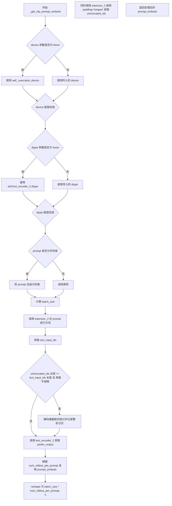

#### 带注释源码

```python
def _get_clip_prompt_embeds(
    self,
    prompt: str | list[str],
    num_videos_per_prompt: int = 1,
    device: torch.device | None = None,
    dtype: torch.dtype | None = None,
    max_sequence_length: int = 77,
) -> torch.Tensor:
    """使用 CLIP 文本编码器对 prompt 进行编码
    
    参数:
        prompt: 输入的文本提示，支持字符串或字符串列表
        num_videos_per_prompt: 每个提示生成的视频数量
        device: 计算设备
        dtype: 数据类型
        max_sequence_length: 最大序列长度，默认77
    
    返回:
        编码后的文本嵌入向量
    """
    # 确定设备：如果未指定则使用执行设备
    device = device or self._execution_device
    # 确定数据类型：如果未指定则使用 text_encoder_2 的数据类型
    dtype = dtype or self.text_encoder_2.dtype

    # 统一处理输入：将字符串转换为列表
    prompt = [prompt] if isinstance(prompt, str) else prompt
    # 获取批次大小
    batch_size = len(prompt)

    # 使用 tokenizer_2 对 prompt 进行分词
    # padding="max_length" 填充到最大长度
    # truncation=True 截断超过最大长度的序列
    text_inputs = self.tokenizer_2(
        prompt,
        padding="max_length",
        max_length=max_sequence_length,
        truncation=True,
        return_tensors="pt",
    )

    # 获取分词后的输入 IDs
    text_input_ids = text_inputs.input_ids
    # 同时使用 padding="longest" 获取未截断的版本，用于检测是否发生了截断
    untruncated_ids = self.tokenizer_2(prompt, padding="longest", return_tensors="pt").input_ids
    
    # 检查是否发生了截断：如果未截断的序列更长且与截断后的版本不一致
    if untruncated_ids.shape[-1] >= text_input_ids.shape[-1] and not torch.equal(text_input_ids, untruncated_ids):
        # 解码被截断的部分以便记录警告信息
        removed_text = self.tokenizer_2.batch_decode(untruncated_ids[:, max_sequence_length - 1 : -1])
        logger.warning(
            "The following part of your input was truncated because CLIP can only handle sequences up to"
            f" {max_sequence_length} tokens: {removed_text}"
        )

    # 使用 CLIP 文本编码器对输入进行编码，获取 pooler_output（用于分类/条件生成的 pooled 嵌入）
    # output_hidden_states=False 表示不返回所有隐藏状态，只返回最后的输出
    prompt_embeds = self.text_encoder_2(text_input_ids.to(device), output_hidden_states=False).pooler_output

    # 为每个 prompt 生成的视频数量复制 embeddings
    # 使用 repeat 方法实现 mps 友好的复制方式
    prompt_embeds = prompt_embeds.repeat(1, num_videos_per_prompt)
    # reshape 为 (batch_size * num_videos_per_prompt, hidden_size)
    prompt_embeds = prompt_embeds.view(batch_size * num_videos_per_prompt, -1)

    return prompt_embeds
```


### `HunyuanVideoFramepackPipeline.encode_prompt`

该方法用于将文本提示（prompt）编码为嵌入向量（embeddings），供后续的视频生成扩散模型使用。它同时支持 Llama（长序列）和 CLIP（短序列）两种文本编码器，以获取不同粒度的文本特征。

参数：

- `self`：`HunyuanVideoFramepackPipeline` 实例本身
- `prompt`：`str | list[str]`，主提示词，可以是单个字符串或字符串列表
- `prompt_2`：`str | list[str]`，发送给 CLIP 编码器的提示词，默认为 None（等同于 prompt）
- `prompt_template`：`dict[str, Any]`，提示词模板，默认使用 DEFAULT_PROMPT_TEMPLATE，包含 llama 的 chat template
- `num_videos_per_prompt`：`int`，每个提示词生成的视频数量，用于复制 embeddings
- `prompt_embeds`：`torch.Tensor | None`，预先生成的 prompt embeddings，如果提供则直接返回
- `pooled_prompt_embeds`：`torch.Tensor | None`，预先生成的池化 embeddings，如果提供则直接返回
- `prompt_attention_mask`：`torch.Tensor | None`，预先生成的 attention mask
- `device`：`torch.device | None`，计算设备，默认为执行设备
- `dtype`：`torch.dtype | None`，计算数据类型，默认为编码器原始 dtype
- `max_sequence_length`：`int`，最大序列长度，默认 256

返回值：`tuple[torch.Tensor, torch.Tensor, torch.Tensor]`，返回三元组 `(prompt_embeds, pooled_prompt_embeds, prompt_attention_mask)`，分别为 Llama 编码的文本嵌入、CLIP 编码的池化文本嵌入、以及对应的注意力掩码

#### 流程图

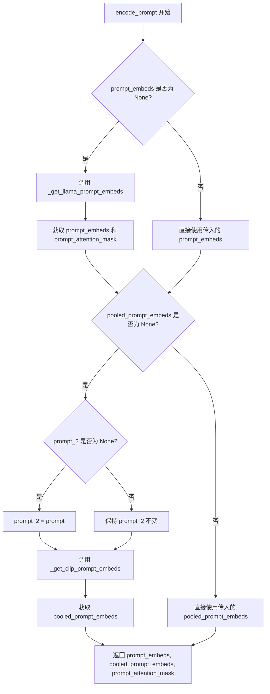

#### 带注释源码

```python
def encode_prompt(
    self,
    prompt: str | list[str],  # 主提示词（给 Llama 编码器）
    prompt_2: str | list[str] = None,  # 第二提示词（给 CLIP 编码器），默认同 prompt
    prompt_template: dict[str, Any] = DEFAULT_PROMPT_TEMPLATE,  # Llama 专用的 chat template
    num_videos_per_prompt: int = 1,  # 每个 prompt 生成多少个视频（用于复制 embeddings）
    prompt_embeds: torch.Tensor | None = None,  # 预计算的 Llama embeddings
    pooled_prompt_embeds: torch.Tensor | None = None,  # 预计算的 CLIP pooler 输出
    prompt_attention_mask: torch.Tensor | None = None,  # 预计算的 attention mask
    device: torch.device | None = None,  # 目标设备
    dtype: torch.dtype | None = None,  # 目标数据类型
    max_sequence_length: int = 256,  # Llama 最大序列长度（CLIP 固定 77）
):
    """
    编码文本提示为 embeddings，供扩散模型使用。
    同时使用 Llama（长序列）和 CLIP（短序列）两种编码器。
    """
    # 如果没有预提供 prompt_embeds，则调用 Llama 编码器生成
    if prompt_embeds is None:
        prompt_embeds, prompt_attention_mask = self._get_llama_prompt_embeds(
            prompt,
            prompt_template,
            num_videos_per_prompt,
            device=device,
            dtype=dtype,
            max_sequence_length=max_sequence_length,
        )

    # 如果没有预提供 pooled_prompt_embeds，则调用 CLIP 编码器生成
    if pooled_prompt_embeds is None:
        # 如果没有单独指定 prompt_2，则默认使用 prompt
        if prompt_2 is None:
            prompt_2 = prompt
        # CLIP 编码器使用固定最大长度 77
        pooled_prompt_embeds = self._get_clip_prompt_embeds(
            prompt,
            num_videos_per_prompt,
            device=device,
            dtype=dtype,
            max_sequence_length=77,
        )

    # 返回三个元素：Llama embeddings、CLIP pooler outputs、attention mask
    return prompt_embeds, pooled_prompt_embeds, prompt_attention_mask
```


### `HunyuanVideoFramepackPipeline.encode_image`

该方法负责将输入图像编码为图像嵌入向量（image embeddings），供后续的视频生成过程使用。它通过特征提取器（feature_extractor）处理图像，然后使用图像编码器（image_encoder）生成最终的嵌入表示。

参数：

- `self`：隐式参数，指向 `HunyuanVideoFramepackPipeline` 类实例本身
- `image`：`torch.Tensor`，输入的图像张量，值域为 [-1, 1]
- `device`：`torch.device | None`，指定计算设备，如果为 `None` 则自动使用执行设备
- `dtype`：`torch.dtype | None`，指定返回张量的数据类型

返回值：`torch.Tensor`，图像编码器输出的最后一层隐藏状态，形状为 `[batch_size, seq_len, hidden_dim]`

#### 流程图

```mermaid
flowchart TD
    A[开始 encode_image] --> B{device 参数是否为空?}
    B -- 是 --> C[使用 self._execution_device]
    B -- 否 --> D[使用传入的 device]
    C --> E[图像归一化: [-1,1] → [0,1]]
    D --> E
    E --> F[调用 feature_extractor 处理图像]
    F --> G[将图像数据移动到 device 和 dtype]
    G --> H[调用 image_encoder 编码图像]
    H --> I[提取 last_hidden_state]
    I --> J[将输出转换为指定的 dtype]
    J --> K[返回 image_embeds]
```

#### 带注释源码

```python
def encode_image(self, image: torch.Tensor, device: torch.device | None = None, dtype: torch.dtype | None = None):
    """
    将输入图像编码为图像嵌入向量
    
    参数:
        image: 输入图像张量, 值域应为 [-1, 1]
        device: 计算设备, 默认为 None 则使用 pipeline 的执行设备
        dtype: 输出数据类型, 默认为 None
    
    返回:
        图像的嵌入表示, 形状为 [batch_size, seq_len, hidden_dim]
    """
    
    # 1. 确定执行设备：如果未指定 device，则使用 pipeline 的默认执行设备
    device = device or self._execution_device
    
    # 2. 图像值域转换：将图像从 [-1, 1] 范围归一化到 [0, 1] 范围
    # 这是因为后续的图像处理器（feature_extractor）期望输入在 [0, 1] 范围
    image = (image + 1) / 2.0  # [-1, 1] -> [0, 1]
    
    # 3. 使用特征提取器处理图像：
    # - images: 输入图像
    # - return_tensors: 返回 PyTorch 张量
    # - do_rescale: False，因为我们已经手动进行了归一化
    # 然后将结果移动到指定的 device 和 image_encoder 的 dtype
    image = self.feature_extractor(images=image, return_tensors="pt", do_rescale=False).to(
        device=device, dtype=self.image_encoder.dtype
    )
    
    # 4. 通过图像编码器（SiglipVisionModel）获取图像嵌入
    # 使用解包操作将 feature_extractor 的输出作为输入
    image_embeds = self.image_encoder(**image).last_hidden_state
    
    # 5. 将输出嵌入转换为目标 dtype 并返回
    return image_embeds.to(dtype=dtype)
```


### HunyuanVideoFramepackPipeline.check_inputs

该方法用于验证图像生成管道的输入参数合法性，确保用户提供的prompt、图像、尺寸等参数符合模型要求，并在参数不符合要求时抛出明确的错误信息。

参数：

- `prompt`：`str | list[str] | None`，主提示词，用于指导视频生成内容
- `prompt_2`：`str | list[str] | None`，发送给第二个文本编码器的提示词
- `height`：`int`，生成图像的高度（像素）
- `width`：`int`，生成图像的宽度（像素）
- `prompt_embeds`：`torch.Tensor | None`，预生成的文本嵌入向量
- `callback_on_step_end_tensor_inputs`：`list[str] | None`，回调函数在每步结束时需要接收的张量输入列表
- `prompt_template`：`dict[str, Any] | None`，提示词模板字典
- `image`：`PipelineImageInput | None`，用于视频生成的起始图像
- `image_latents`：`torch.Tensor | None`，预编码的图像潜在向量
- `last_image`：`PipelineImageInput | None`，用于视频生成的结束图像（可选）
- `last_image_latents`：`torch.Tensor | None`，预编码的结束图像潜在向量
- `sampling_type`：`FramepackSamplingType | None`，采样类型（vanilla 或 inverted_anti_drifting）

返回值：`None`，该方法仅进行参数验证，不返回任何值

#### 流程图

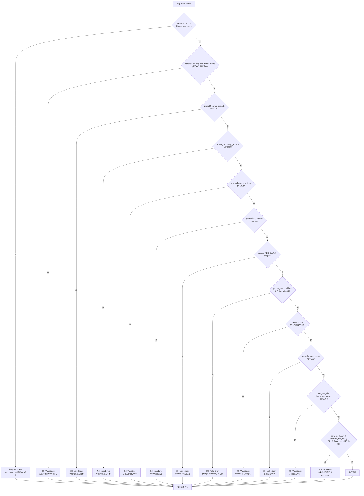

#### 带注释源码

```python
def check_inputs(
    self,
    prompt,                      # 主提示词：str | list[str] | None
    prompt_2,                    # 第二个文本编码器的提示词：str | list[str] | None
    height,                     # 生成图像高度：int（像素）
    width,                      # 生成图像宽度：int（像素）
    prompt_embeds=None,         # 预生成的文本嵌入：torch.Tensor | None
    callback_on_step_end_tensor_inputs=None,  # 回调张量输入列表：list[str] | None
    prompt_template=None,       # 提示词模板：dict[str, Any] | None
    image=None,                 # 起始图像：PipelineImageInput | None
    image_latents=None,         # 图像潜在向量：torch.Tensor | None
    last_image=None,            # 结束图像：PipelineImageInput | None
    last_image_latents=None,   # 结束图像潜在向量：torch.Tensor | None
    sampling_type=None,         # 采样类型：FramepackSamplingType | None
):
    # 检查1：验证图像尺寸必须能被16整除（VAE编码器要求）
    if height % 16 != 0 or width % 16 != 0:
        raise ValueError(f"`height` and `width` have to be divisible by 16 but are {height} and {width}.")

    # 检查2：验证回调张量输入必须在允许的列表中
    # 允许的回调输入定义在 self._callback_tensor_inputs = ["latents", "prompt_embeds"]
    if callback_on_step_end_tensor_inputs is not None and not all(
        k in self._callback_tensor_inputs for k in callback_on_step_end_tensor_inputs
    ):
        raise ValueError(
            f"`callback_on_step_end_tensor_inputs` has to be in {self._callback_tensor_inputs}, but found {[k for k in callback_on_step_end_tensor_inputs if k not in self._callback_tensor_inputs]}"
        )

    # 检查3：prompt和prompt_embeds不能同时提供（互斥）
    if prompt is not None and prompt_embeds is not None:
        raise ValueError(
            f"Cannot forward both `prompt`: {prompt} and `prompt_embeds`: {prompt_embeds}. Please make sure to"
            " only forward one of the two."
        )
    # 检查4：prompt_2和prompt_embeds不能同时提供
    elif prompt_2 is not None and prompt_embeds is not None:
        raise ValueError(
            f"Cannot forward both `prompt_2`: {prompt_2} and `prompt_embeds`: {prompt_embeds}. Please make sure to"
            " only forward one of the two."
        )
    # 检查5：至少需要提供prompt或prompt_embeds之一
    elif prompt is None and prompt_embeds is None:
        raise ValueError(
            "Provide either `prompt` or `prompt_embeds`. Cannot leave both `prompt` and `prompt_embeds` undefined."
        )
    # 检查6：prompt类型必须是str或list
    elif prompt is not None and (not isinstance(prompt, str) and not isinstance(prompt, list)):
        raise ValueError(f"`prompt` has to be of type `str` or `list` but is {type(prompt)}")
    # 检查7：prompt_2类型必须是str或list
    elif prompt_2 is not None and (not isinstance(prompt_2, str) and not isinstance(prompt_2, list)):
        raise ValueError(f"`prompt_2` has to be of type `str` or `list` but is {type(prompt_2)}")

    # 检查8：prompt_template必须是dict类型
    if prompt_template is not None:
        if not isinstance(prompt_template, dict):
            raise ValueError(f"`prompt_template` has to be of type `dict` but is {type(prompt_template)}")
        # 检查9：dict中必须包含"template"键
        if "template" not in prompt_template:
            raise ValueError(
                f"`prompt_template` has to contain a key `template` but only found {prompt_template.keys()}"
            )

    # 检查10：sampling_type必须是有效的枚举值
    sampling_types = [x.value for x in FramepackSamplingType.__members__.values()]
    if sampling_type not in sampling_types:
        raise ValueError(f"`sampling_type` has to be one of '{sampling_types}' but is '{sampling_type}'")

    # 检查11：image和image_latents只能提供一个（互斥）
    if image is not None and image_latents is not None:
        raise ValueError("Only one of `image` or `image_latents` can be passed.")
    # 检查12：last_image和last_image_latents只能提供一个（互斥）
    if last_image is not None and last_image_latents is not None:
        raise ValueError("Only one of `last_image` or `last_image_latents` can be passed.")
    # 检查13：只有inverted_anti_drifting采样类型支持last_image参数
    if sampling_type != FramepackSamplingType.INVERTED_ANTI_DRIFTING and (
        last_image is not None or last_image_latents is not None
    ):
        raise ValueError(
            'Only `"inverted_anti_drifting"` inference type supports `last_image` or `last_image_latents`.'
        )
```


### HunyuanVideoFramepackPipeline.prepare_latents

该方法负责为视频生成流程准备初始潜在变量（latents）。如果传入了预计算的 latents，则直接将其移动到指定设备；否则，根据批处理大小、视频尺寸和 VAE 压缩比例计算潜在空间的形状，并使用随机张量生成器初始化 latents。

参数：

- `batch_size`：`int`，默认值为 1，批处理大小，控制同时生成的视频数量
- `num_channels_latents`：`int`，默认值为 16，潜在变量的通道数，对应于 Transformer 模型的输入通道数
- `height`：`int`，默认值为 720，目标视频的高度（像素）
- `width`：`int`，默认值为 1280，目标视频的宽度（像素）
- `num_frames`：`int`，默认值为 129，生成视频的总帧数
- `dtype`：`torch.dtype | None`，潜在变量的数据类型，若为 None 则使用随机张量的默认类型
- `device`：`torch.device | None`，潜在变量存放的设备，若为 None 则使用执行设备
- `generator`：`torch.Generator | list[torch.Generator] | None`，用于确保生成可复现的随机数生成器
- `latents`：`torch.Tensor | None`，可选的预计算潜在变量，若提供则直接返回，否则创建新的

返回值：`torch.Tensor`，准备好的潜在变量张量，形状为 (batch_size, num_channels_latents, temporal_frames, height/vae_scale_factor_spatial, width/vae_scale_factor_spatial)

#### 流程图

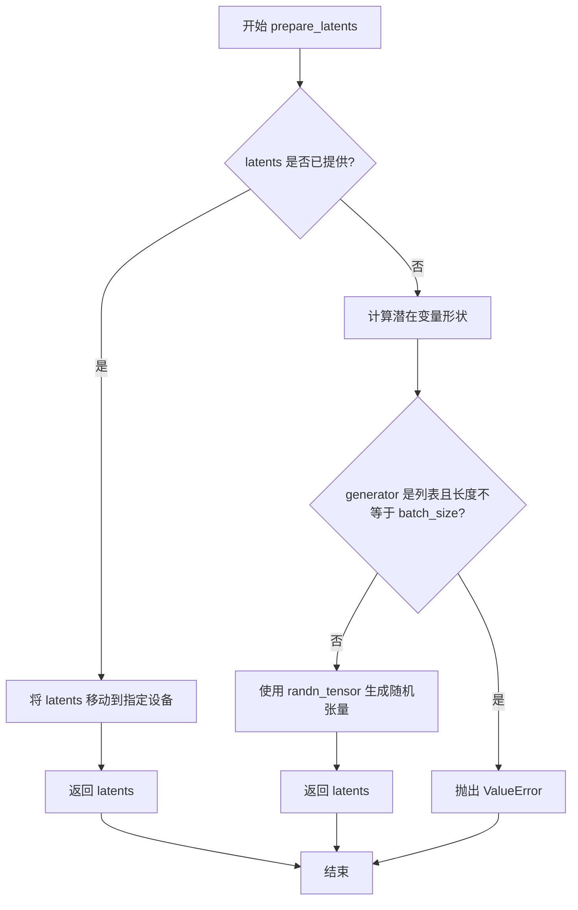

#### 带注释源码

```python
def prepare_latents(
    self,
    batch_size: int = 1,
    num_channels_latents: int = 16,
    height: int = 720,
    width: int = 1280,
    num_frames: int = 129,
    dtype: torch.dtype | None = None,
    device: torch.device | None = None,
    generator: torch.Generator | list[torch.Generator] | None = None,
    latents: torch.Tensor | None = None,
) -> torch.Tensor:
    # 如果已提供 latents，直接将其移动到目标设备并返回
    if latents is not None:
        return latents.to(device=device, dtype=dtype)
    
    # 计算潜在变量的形状
    # temporal 维度：根据 VAE 的时间压缩比计算压缩后的帧数
    # spatial 维度：根据 VAE 的空间压缩比计算压缩后的高宽
    shape = (
        batch_size,
        num_channels_latents,
        (num_frames - 1) // self.vae_scale_factor_temporal + 1,
        int(height) // self.vae_scale_factor_spatial,
        int(width) // self.vae_scale_factor_spatial,
    )
    
    # 验证 generator 列表长度与批处理大小是否匹配
    if isinstance(generator, list) and len(generator) != batch_size:
        raise ValueError(
            f"You have passed a list of generators of length {len(generator)}, but requested an effective batch"
            f" size of {batch_size}. Make sure the batch size matches the length of the generators."
        )
    
    # 使用 randn_tensor 生成随机初始潜在变量（符合正态分布）
    # 该随机噪声将是去噪过程的起点
    latents = randn_tensor(shape, generator=generator, device=device, dtype=dtype)
    return latents
```


### `HunyuanVideoFramepackPipeline.prepare_image_latents`

该方法用于将输入图像编码为潜在向量（latents），供视频生成管道使用。如果提供了预计算的 latents，则直接返回；否则使用 VAE 对图像进行编码并添加缩放因子。

参数：

- `self`：隐式参数，类的实例本身
- `image`：`torch.Tensor`，输入的图像张量
- `dtype`：`torch.dtype | None`，输出 latents 的数据类型，默认为 None
- `device`：`torch.device | None`，计算设备，默认为 None（使用执行设备）
- `generator`：`torch.Generator | list[torch.Generator] | None`，用于采样的随机数生成器，默认为 None
- `latents`：`torch.Tensor | None`，可选的预计算 latents，默认为 None

返回值：`torch.Tensor`，处理后的图像 latents 张量

#### 流程图

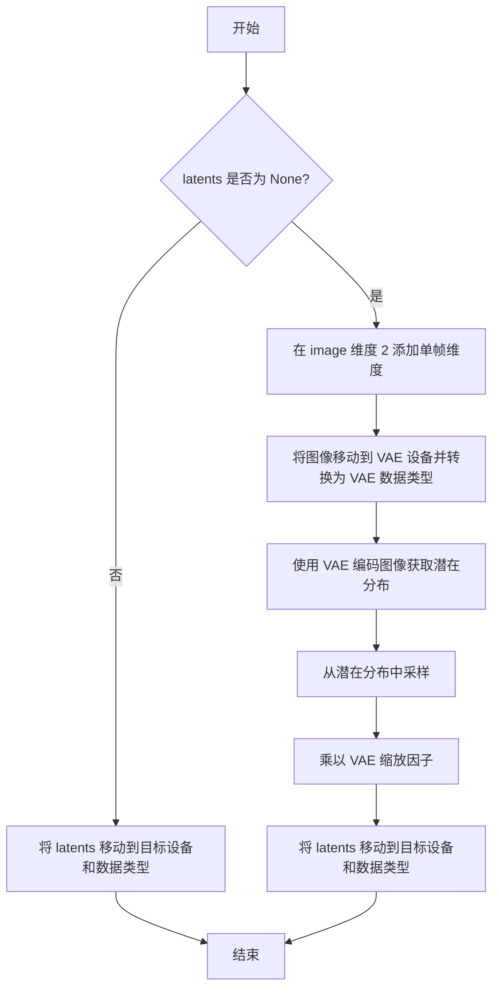

#### 带注释源码

```python
def prepare_image_latents(
    self,
    image: torch.Tensor,
    dtype: torch.dtype | None = None,
    device: torch.device | None = None,
    generator: torch.Generator | list[torch.Generator] | None = None,
    latents: torch.Tensor | None = None,
) -> torch.Tensor:
    """
    准备图像 latents 用于视频生成管道。

    参数:
        image: 输入图像张量
        dtype: 目标数据类型
        device: 目标设备
        generator: 随机数生成器
        latents: 可选的预计算 latents

    返回:
        处理后的图像 latents 张量
    """
    # 如果未指定设备，使用执行设备
    device = device or self._execution_device
    
    # 如果没有提供预计算的 latents，则需要从图像编码
    if latents is None:
        # 在时间维度（dim=2）添加单帧，使图像变为 5D 张量 [B, C, 1, H, W]
        # 以符合 VAE 的视频编码预期输入格式
        image = image.unsqueeze(2).to(device=device, dtype=self.vae.dtype)
        
        # 使用 VAE 编码图像，获取潜在分布
        # encode 返回包含 latent_dist 的编码结果
        latents = self.vae.encode(image).latent_dist.sample(generator=generator)
        
        # 应用 VAE 缩放因子，通常用于将潜在空间缩放到合适的范围
        latents = latents * self.vae.config.scaling_factor
    
    # 确保输出的 latents 在指定的设备和数据类型上
    return latents.to(device=device, dtype=dtype)
```


### HunyuanVideoFramepackPipeline.enable_vae_slicing

启用分片VAE解码功能。通过将输入张量分片为多个步骤来计算解码，以节省内存并允许更大的批处理大小。该方法已被弃用，将在未来版本中移除，推荐使用 `pipe.vae.enable_slicing()`。

参数：
- 无显式参数（仅包含 `self`，表示Pipeline实例本身）

返回值：`None`，无返回值（该方法仅执行副作用操作）

#### 流程图

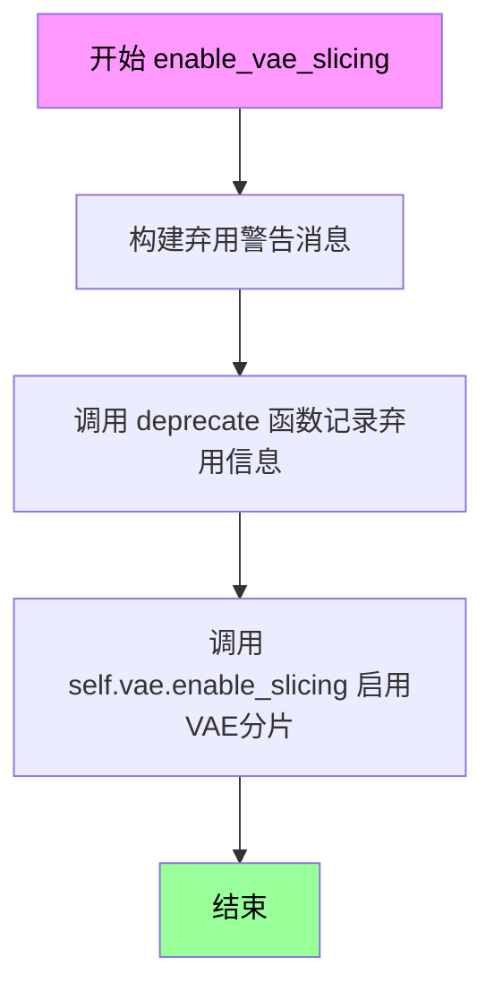

#### 带注释源码

```python
def enable_vae_slicing(self):
    r"""
    Enable sliced VAE decoding. When this option is enabled, the VAE will split the input tensor in slices to
    compute decoding in several steps. This is useful to save some memory and allow larger batch sizes.
    """
    # 构建弃用警告消息，告知用户该方法已被弃用
    # 消息中包含当前类名以提供上下文
    depr_message = f"Calling `enable_vae_slicing()` on a `{self.__class__.__name__}` is deprecated and this method will be removed in a future version. Please use `pipe.vae.enable_slicing()`."
    
    # 调用 deprecate 函数记录弃用信息
    # 参数: 方法名, 弃用版本号, 弃用警告消息
    deprecate(
        "enable_vae_slicing",
        "0.40.0",
        depr_message,
    )
    
    # 实际执行：调用 VAE 模型的 enable_slicing 方法启用分片解码
    # 这是该方法的核心功能：将 VAE 的解码过程分片处理以节省显存
    self.vae.enable_slicing()
```


### `HunyuanVideoFramepackPipeline.disable_vae_slicing`

该方法用于禁用 VAE（变分自编码器）的切片解码功能。如果之前启用了 `enable_vae_slicing`，调用此方法后将恢复为单步解码。此方法已被弃用，推荐直接调用 `pipe.vae.disable_slicing()`。

参数：無（仅包含隐式参数 `self`）

返回值：`None`，无返回值，仅执行禁用 VAE 切片操作的副作用

#### 流程图

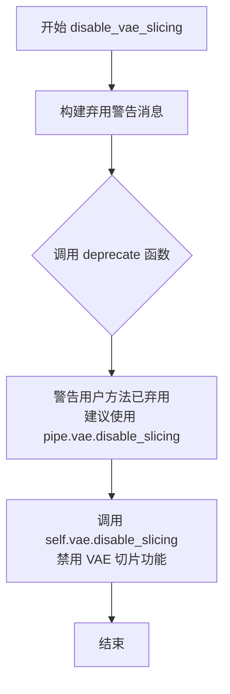

#### 带注释源码

```python
def disable_vae_slicing(self):
    r"""
    Disable sliced VAE decoding. If `enable_vae_slicing` was previously enabled, this method will go back to
    computing decoding in one step.
    """
    # 构建弃用警告消息，包含类名以提供上下文
    depr_message = f"Calling `disable_vae_slicing()` on a `{self.__class__.__name__}` is deprecated and this method will be removed in a future version. Please use `pipe.vae.disable_slicing()`."
    
    # 调用 deprecate 函数记录弃用信息
    # 参数: 方法名, 弃用版本号, 警告消息
    deprecate(
        "disable_vae_slicing",
        "0.40.0",
        depr_message,
    )
    
    # 实际执行禁用 VAE 切片操作
    # 委托给底层 VAE 对象的 disable_slicing 方法
    self.vae.disable_slicing()
```


### `HunyuanVideoFramepackPipeline.enable_vae_tiling`

启用瓦片式VAE解码。当启用此选项时，VAE会将输入张量分割成瓦片分步进行解码和编码计算。这种方法可以节省大量内存，并允许处理更大的图像。

参数：
- 无参数

返回值：`None`，无返回值（该方法直接修改对象状态）

#### 流程图

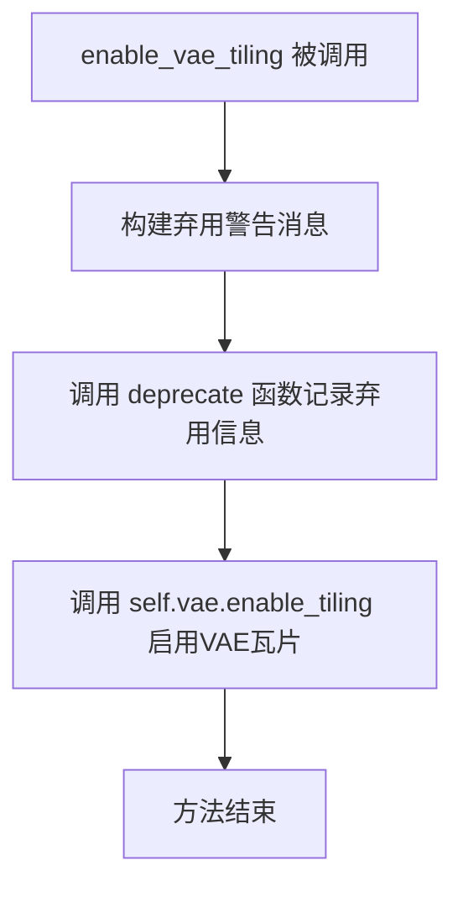

#### 带注释源码

```python
def enable_vae_tiling(self):
    r"""
    Enable tiled VAE decoding. When this option is enabled, the VAE will split the input tensor into tiles to
    compute decoding and encoding in several steps. This is useful for saving a large amount of memory and to allow
    processing larger images.
    """
    # 构建弃用警告消息，提示用户该方法将在未来版本中移除
    # 应使用 pipe.vae.enable_tiling() 代替
    depr_message = f"Calling `enable_vae_tiling()` on a `{self.__class__.__name__}` is deprecated and this method will be removed in a future version. Please use `pipe.vae.enable_tiling()`."
    
    # 调用 deprecate 函数记录弃用信息，在未来版本会抛出警告
    deprecate(
        "enable_vae_tiling",      # 被弃用的方法名
        "0.40.0",                  # 弃用版本号
        depr_message,              # 弃用说明消息
    )
    
    # 实际启用VAE瓦片功能的调用
    # 委托给底层 VAE 对象的 enable_tiling 方法
    self.vae.enable_tiling()
```


### `HunyuanVideoFramepackPipeline.disable_vae_tiling`

该方法用于禁用VAE分块解码功能。如果之前启用了分块解码，该方法将恢复为单步解码。同时，该方法已被标记为弃用，推荐直接使用 `pipe.vae.disable_tiling()`。

参数：
- 无参数（仅包含 `self`）

返回值：`None`，无返回值

#### 流程图

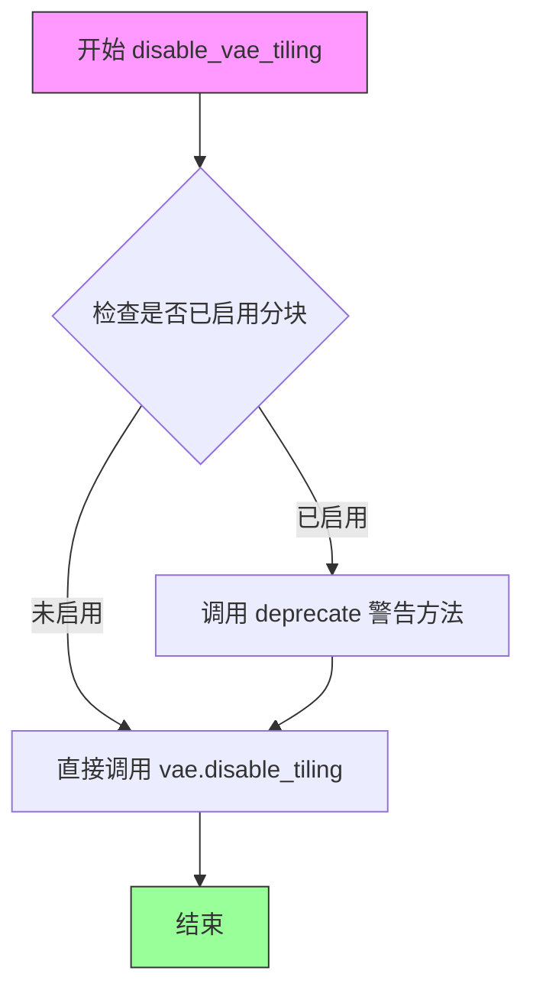

#### 带注释源码

```python
def disable_vae_tiling(self):
    r"""
    Disable tiled VAE decoding. If `enable_vae_tiling` was previously enabled, this method will go back to
    computing decoding in one step.
    """
    # 构建弃用警告消息，提示用户使用新的API
    depr_message = f"Calling `disable_vae_tiling()` on a `{self.__class__.__name__}` is deprecated and this method will be removed in a future version. Please use `pipe.vae.disable_tiling()`."
    
    # 调用deprecate函数记录弃用信息，在未来版本中将移除此方法
    deprecate(
        "disable_vae_tiling",      # 弃用的方法名
        "0.40.0",                  # 计划移除的版本号
        depr_message,              # 弃用说明信息
    )
    
    # 实际执行禁用VAE分块解码的底层操作
    # 这是真正完成功能的方法，前面的deprecate只是记录警告
    self.vae.disable_tiling()
```


### `HunyuanVideoFramepackPipeline.guidance_scale`

该属性是一个只读的 getter 方法，用于获取在管道执行期间设置的指导比例（guidance scale）值。guidance_scale 用于控制生成过程中文本提示对图像生成的引导强度，值越大生成的图像与文本提示的相关性越高，但可能会牺牲一些图像质量。

参数： 无

返回值：`float`，返回当前管道使用的指导比例值。该值在 `__call__` 方法中被设置为传入的 `guidance_scale` 参数（默认为 6.0），并乘以 1000.0 后传递给 transformer 模型用于条件引导。

#### 流程图

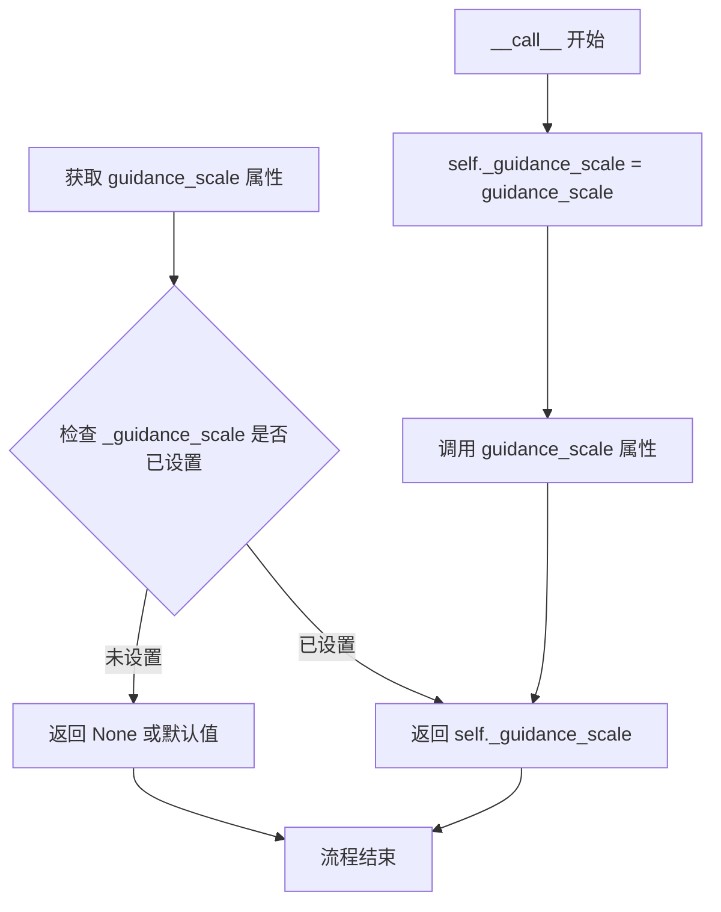

#### 带注释源码

```python
@property
def guidance_scale(self):
    """
    获取当前管道的指导比例（guidance scale）值。
    
    该属性是一个只读属性，返回在管道调用期间通过 __call__ 方法
    设置的 _guidance_scale 值。guidance_scale 用于控制 classifier-free
    guidance 的强度，在文本到视频生成中影响生成内容与输入提示的相关性。
    
    返回值:
        float: 原始的 guidance_scale 值（未经放大处理）
    """
    return self._guidance_scale
```

#### 上下文信息

该属性在类中与以下属性一起定义：

```python
@property
def guidance_scale(self):
    return self._guidance_scale

@property
def num_timesteps(self):
    return self._num_timesteps

@property
def attention_kwargs(self):
    return self._attention_kwargs

@property
def current_timestep(self):
    return self._current_timestep

@property
def interrupt(self):
    return self._interrupt
```

在 `__call__` 方法中，该属性被设置：

```python
# 在 __call__ 方法的初始化部分
self._guidance_scale = guidance_scale  # 默认值为 6.0
# ...
guidance = torch.tensor([guidance_scale] * batch_size, dtype=transformer_dtype, device=device) * 1000.0
# 传递给 transformer 进行条件生成
```

**使用场景**：用户可以通过 `pipe.guidance_scale` 在管道执行过程中或执行后查询当前使用的指导比例值，用于调试或日志记录目的。


### `HunyuanVideoFramepackPipeline.num_timesteps`

该属性是一个只读属性，用于获取扩散模型在推理过程中使用的时间步数量。在 `__call__` 方法的去噪循环开始前由调度器设置。

参数：

- （无参数，仅有隐式参数 `self`）

返回值：`int`，返回扩散推理过程中使用的时间步总数。

#### 流程图

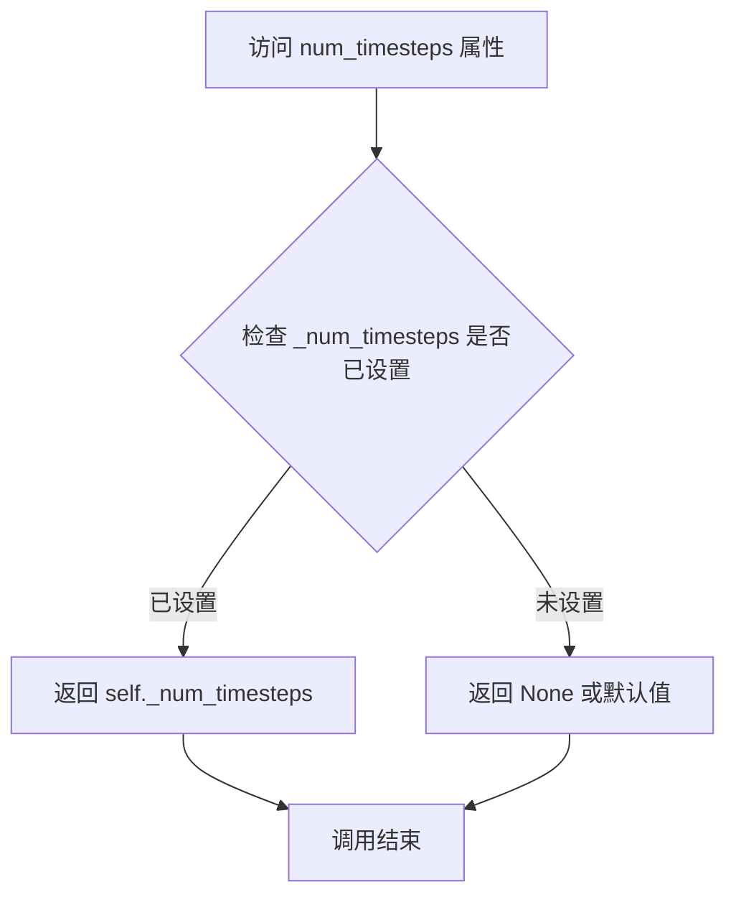

#### 带注释源码

```python
@property
def num_timesteps(self):
    """
    属性 getter: 获取扩散模型推理过程中的时间步数量。
    
    该属性在 __call__ 方法的去噪循环开始时被设置:
    self._num_timesteps = len(timesteps)
    
    Returns:
        int: 推理过程中使用的时间步总数，通常等于 num_inference_steps
    """
    return self._num_timesteps
```


### `HunyuanVideoFramepackPipeline.attention_kwargs`

该属性是一个只读属性，用于获取在管道调用时传递的注意力机制关键字参数（attention kwargs）。这些参数会被传递给 `AttentionProcessor`，以便在去噪过程中自定义注意力机制的行为。

参数：

- 无显式参数（属性方法，仅接收隐式 `self` 参数）

返回值：`dict[str, Any] | None`，返回注意力关键字参数字典。如果未在调用管道时指定，则返回 `None`。

#### 流程图

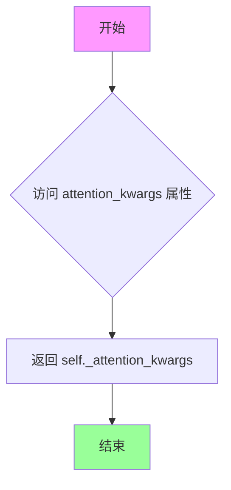

#### 带注释源码

```python
@property
def attention_kwargs(self):
    r"""
    属性 getter: 获取注意力机制关键字参数
    
    该属性返回一个字典，包含在管道调用时传递给 AttentionProcessor 的额外参数。
    这些参数用于自定义注意力机制的行为，例如调整注意力权重、启用特殊的注意力模式等。
    
    Returns:
        dict[str, Any] | None: 注意力关键字参数字典，如果未设置则返回 None
    """
    return self._attention_kwargs
```


### `HunyuanVideoFramepackPipeline.current_timestep`

这是一个属性（property） getter方法，用于获取当前推理过程中的时间步（timestep）。在 HunyuanVideo 视频生成管道的去噪循环中，该属性会被动态更新为当前正在处理的时间步值，使得外部可以实时查询推理进度。

参数： 无

返回值：`Any`（具体为 `torch.Tensor` 或 `None`），返回当前推理循环中设置的时间步值。在去噪循环开始前和结束后为 `None`，在去噪循环中会被设置为当前的 `t` 值（torch.Tensor 类型）。

#### 流程图

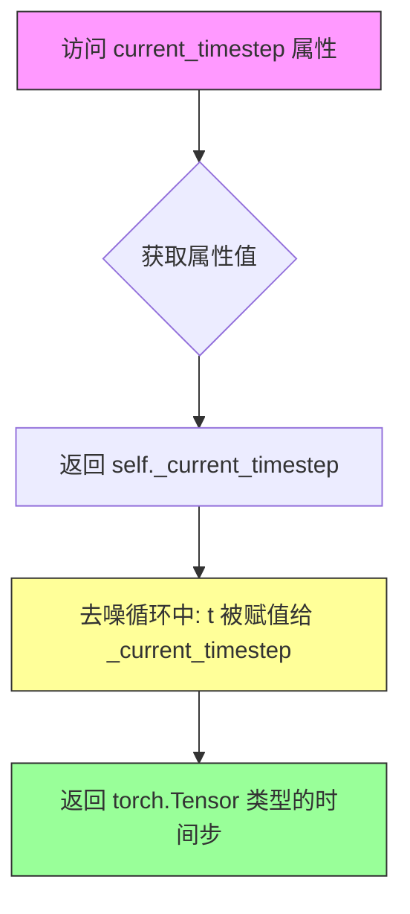

#### 带注释源码

```python
@property
def current_timestep(self):
    """
    属性 getter: 获取当前推理过程中的时间步 (timestep)
    
    该属性在 __call__ 方法的去噪循环中被动态更新:
    - 循环开始前: self._current_timestep = None
    - 循环进行中: self._current_timestep = t (当前时间步)
    - 循环结束后: self._current_timestep = None
    
    返回:
        Any: 当前时间步值 (torch.Tensor) 或 None
    """
    return self._current_timestep
```

#### 上下文使用示例

在 `__call__` 方法中去噪循环里的实际使用方式：

```python
# 初始化时设置为 None
self._current_timestep = None

# ... 省略编码和准备逻辑 ...

# 去噪循环
for k in range(num_latent_sections):
    for i, t in enumerate(timesteps):
        if self.interrupt:
            continue
        
        # 在每个去噪步骤开始时更新当前时间步
        self._current_timestep = t
        
        # 执行 transformer 进行噪声预测
        noise_pred = self.transformer(...)
        # ... 后续处理 ...

# 循环结束后重置为 None
self._current_timestep = None
```


# HunyuanVideoFramepackPipeline.interrupt 属性详细设计文档

### HunyuanVideoFramepackPipeline.interrupt

该属性是 `HunyuanVideoFramepackPipeline` 管道类的中断控制属性，用于在推理过程中控制管道执行的中断行为。通过返回内部 `_interrupt` 标志位，外部调用者可以在运行时动态设置该标志来中断正在进行的视频生成任务。

参数：

- （无参数）

返回值：`bool`，返回当前的中断状态标志。当值为 `False` 时表示管道正常运行，为 `True` 时表示请求中断管道执行。

#### 流程图

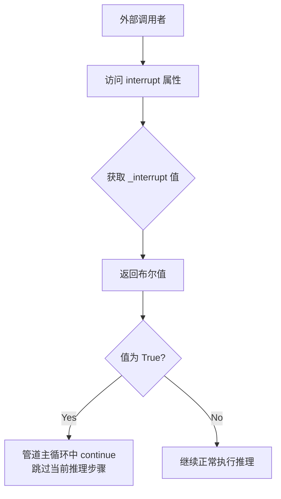

#### 带注释源码

```python
@property
def interrupt(self):
    """
    中断属性 getter。
    
    该属性提供对内部 _interrupt 标志的只读访问。
    外部代码可以通过设置 pipeline._interrupt = True 来请求中断管道执行。
    
    在 __call__ 方法的推理循环中，会检查此标志：
        if self.interrupt:
            continue
    
    Returns:
        bool: 当前的中断状态标志。False 表示正常运行，True 表示请求中断。
    """
    return self._interrupt
```

#### 上下文使用示例

在 `__call__` 方法中的使用：

```python
# 初始化时设置
self._interrupt = False

# 在推理循环中检查中断标志
with self.progress_bar(total=num_inference_steps) as progress_bar:
    for i, t in enumerate(timesteps):
        if self.interrupt:  # 检查中断标志
            continue        # 如果请求中断，则跳过当前步骤
        
        # ... 正常的推理逻辑 ...
```

#### 设计说明

| 项目 | 说明 |
|------|------|
| **设计目标** | 提供一种在管道执行过程中动态中断推理的能力 |
| **约束** | 只能设置为 `True` 来请求中断，设置为 `False` 可恢复执行 |
| **错误处理** | 无显式错误处理，依赖布尔值的隐式转换 |
| **线程安全性** | 在多线程环境下使用时需注意竞态条件 |
| **优化空间** | 可考虑添加中断回调函数，支持更精细的中断控制 |


### HunyuanVideoFramepackPipeline.__call__

该方法是 HunyuanVideoFramepackPipeline 的核心调用函数，用于根据输入图像和文本提示词生成视频。该管道采用 FramePack 架构，结合图像编码器和多种Transformer模型，通过潜在扩散模型逐步去噪生成高质量视频。支持图像到视频（I2V）和首尾图像到视频（First-Last Frame to Video）两种生成模式。

参数：

- `image`：`PipelineImageInput`，用于视频生成的起始图像
- `last_image`：`PipelineImageInput | None`，可选的结束图像，用于生成两图像之间的过渡视频
- `prompt`：`str | list[str] | None`，指导图像生成的提示词，若未定义则需传递 prompt_embeds
- `prompt_2`：`str | list[str] | None`，发送到 tokenizer_2 和 text_encoder_2 的提示词
- `negative_prompt`：`str | list[str] | None`，不参与图像生成的负面提示词
- `negative_prompt_2`：`str | list[str] | None`，发送到 tokenizer_2 和 text_encoder_2 的负面提示词
- `height`：`int`，默认 720，生成图像的高度（像素）
- `width`：`int`，默认 1280，生成图像的宽度（像素）
- `num_frames`：`int`，默认 129，生成视频的帧数
- `latent_window_size`：`int`，默认 9，潜在窗口大小
- `num_inference_steps`：`int`，默认 50，去噪步数
- `sigmas`：`list[float] | None`，自定义去噪过程的 sigmas 值
- `true_cfg_scale`：`float`，默认 1.0，当 > 1.0 时启用无分类器引导
- `guidance_scale`：`float`，默认 6.0，引导_scale
- `num_videos_per_prompt`：`int | None`，默认 1，每个提示词生成的视频数量
- `generator`：`torch.Generator | list[torch.Generator] | None`，用于生成确定性结果的随机数生成器
- `image_latents`：`torch.Tensor | None`，预编码的图像潜在变量
- `last_image_latents`：`torch.Tensor | None`，预编码的结束图像潜在变量
- `prompt_embeds`：`torch.Tensor | None`，预生成的文本嵌入
- `pooled_prompt_embeds`：`torch.Tensor | None`，预生成的池化文本嵌入
- `prompt_attention_mask`：`torch.Tensor | None`，提示词的注意力掩码
- `negative_prompt_embeds`：`torch.Tensor | None`，预生成的负面文本嵌入
- `negative_pooled_prompt_embeds`：`torch.Tensor | None`，预生成的负面池化文本嵌入
- `negative_prompt_attention_mask`：`torch.Tensor | None`，负面提示词的注意力掩码
- `output_type`：`str | None`，默认 "pil"，输出格式
- `return_dict`：`bool`，默认 True，是否返回 PipelineOutput
- `attention_kwargs`：`dict[str, Any] | None`，传递给 AttentionProcessor 的 kwargs
- `callback_on_step_end`：`Callable | PipelineCallback | MultiPipelineCallbacks | None`，每步结束时调用的回调函数
- `callback_on_step_end_tensor_inputs`：`list[str]`，默认 ["latents"]，回调函数需要接收的张量输入列表
- `prompt_template`：`dict[str, Any]`，默认 DEFAULT_PROMPT_TEMPLATE，提示词模板
- `max_sequence_length`：`int`，默认 256，最大序列长度
- `sampling_type`：`FramepackSamplingType`，默认 INVERTED_ANTI_DRIFTING，采样类型

返回值：`HunyuanVideoFramepackPipelineOutput | tuple`，若 return_dict 为 True 返回 HunyuanVideoFramepackPipelineOutput，否则返回元组

#### 流程图

```mermaid
flowchart TD
    A[开始 __call__] --> B{检查 callback_on_step_end 类型}
    B -->|PipelineCallback| C[设置 callback_on_step_end_tensor_inputs]
    B -->|其他| D[跳过设置]
    
    C --> E[调用 check_inputs 验证输入参数]
    D --> E
    
    E --> F{计算 do_true_cfg}
    F -->|true_cfg_scale > 1 且 has_neg_prompt| G[do_true_cfg = True]
    F -->|其他| H[do_true_cfg = False]
    
    G --> I[设置内部状态 _guidance_scale, _attention_kwargs, _current_timestep, _interrupt]
    H --> I
    
    I --> J[确定 batch_size]
    J --> K[编码输入提示词 encode_prompt]
    
    K --> L{do_true_cfg?}
    L -->|是| M[编码负面提示词]
    L -->|否| N[跳过]
    
    M --> O[预处理图像 video_processor.preprocess]
    N --> O
    
    O --> P[编码图像 encode_image]
    P --> Q{last_image 存在?}
    Q -->|是| R[预处理并编码 last_image]
    Q -->|否| S[跳过]
    
    R --> T[计算平均图像嵌入]
    S --> T
    
    T --> U[准备潜在变量 prepare_image_latents]
    U --> V[初始化历史潜在变量 history_latents]
    
    V --> W{根据 sampling_type 分支}
    W -->|INVERTED_ANTI_DRIFTING| X[设置 history_sizes = 1,2,16]
    W -->|VANILLA| Y[设置 history_sizes = 16,2,1]
    
    X --> Z[准备引导条件 guidance tensor]
    Y --> Z
    
    Z --> AA[进入去噪循环 for k in range(num_latent_sections)]
    
    AA --> AB{当前采样类型}
    AB -->|INVERTED_ANTI_DRIFTING| AC[计算 latent_paddings 和 indices]
    AB -->|VANILLA| AD[计算不同的 indices 布局]
    
    AC --> AE[准备潜在变量 prepare_latents]
    AD --> AE
    
    AE --> AF[计算 sigmas 和 mu]
    AF --> AG[获取 timesteps]
    
    AG --> AH[进入时间步循环 for i, t in enumerate(timesteps)]
    AH --> AI{interrupt?}
    AI -->|是| AJ[continue]
    AI -->|否| AK[执行 transformer 前向传播]
    
    AK --> AL{do_true_cfg?}
    AL -->|是| AM[执行负面 prompt 的 transformer]
    AL -->|否| AN[跳过]
    
    AM --> AO[计算 noise_pred = neg_noise_pred + true_cfg_scale * (noise_pred - neg_noise_pred)]
    AN --> AP[scheduler.step 计算上一步]
    
    AO --> AP
    AP --> AQ{callback_on_step_end 存在?}
    AQ -->|是| AR[执行回调函数]
    AQ -->|否| AS[更新 progress_bar]
    
    AR --> AS
    AS --> AT{是否最后一步或 warmup 后?}
    AT -->|是| AU[progress_bar.update]
    AT -->|否| AV[继续下一步]
    
    AU --> AW{XLA_AVAILABLE?}
    AV --> AW
    
    AW -->|是| AX[xm.mark_step]
    AW -->|否| AY[更新 history_latents]
    
    AX --> AY
    
    AY --> AZ[是否为最后一个 section?]
    AZ -->|是| BA[连接 image_latents 和 latents]
    AZ -->|否| BB[跳过]
    
    BA --> BC[解码潜在变量为视频]
    BB --> BC
    
    BC --> BD{是否为首次生成?}
    BD -->|是| BE[vae.decode 整个视频]
    BD -->|否| BF[vae.decode 当前片段并软合并]
    
    BE --> BG[进入下一轮 section 循环或结束]
    BF --> BG
    
    BG --> BH{是否还有更多 sections?}
    BH -->|是| AA
    BH -->|否| BI[后处理视频]
    
    BI --> BJ[maybe_free_model_hooks 释放模型]
    BJ --> BK{return_dict?}
    BK -->|是| BL[返回 HunyuanVideoFramepackPipelineOutput]
    BK -->|否| BM[返回元组 video, ...]
    
    BL --> BN[结束]
    BM --> BN
```

#### 带注释源码

```python
@torch.no_grad()
@replace_example_docstring(EXAMPLE_DOC_STRING)
def __call__(
    self,
    image: PipelineImageInput,
    last_image: PipelineImageInput | None = None,
    prompt: str | list[str] = None,
    prompt_2: str | list[str] = None,
    negative_prompt: str | list[str] = None,
    negative_prompt_2: str | list[str] = None,
    height: int = 720,
    width: int = 1280,
    num_frames: int = 129,
    latent_window_size: int = 9,
    num_inference_steps: int = 50,
    sigmas: list[float] = None,
    true_cfg_scale: float = 1.0,
    guidance_scale: float = 6.0,
    num_videos_per_prompt: int | None = 1,
    generator: torch.Generator | list[torch.Generator] | None = None,
    image_latents: torch.Tensor | None = None,
    last_image_latents: torch.Tensor | None = None,
    prompt_embeds: torch.Tensor | None = None,
    pooled_prompt_embeds: torch.Tensor | None = None,
    prompt_attention_mask: torch.Tensor | None = None,
    negative_prompt_embeds: torch.Tensor | None = None,
    negative_pooled_prompt_embeds: torch.Tensor | None = None,
    negative_prompt_attention_mask: torch.Tensor | None = None,
    output_type: str | None = "pil",
    return_dict: bool = True,
    attention_kwargs: dict[str, Any] | None = None,
    callback_on_step_end: Callable[[int, int], None] | PipelineCallback | MultiPipelineCallbacks | None = None,
    callback_on_step_end_tensor_inputs: list[str] = ["latents"],
    prompt_template: dict[str, Any] = DEFAULT_PROMPT_TEMPLATE,
    max_sequence_length: int = 256,
    sampling_type: FramepackSamplingType = FramepackSamplingType.INVERTED_ANTI_DRIFTING,
):
    # 如果传入了 PipelineCallback 或 MultiPipelineCallbacks，则从回调中获取需要传递的张量输入列表
    if isinstance(callback_on_step_end, (PipelineCallback, MultiPipelineCallbacks)):
        callback_on_step_end_tensor_inputs = callback_on_step_end.tensor_inputs

    # 1. 检查输入参数合法性，验证必填参数、类型、尺寸等
    self.check_inputs(
        prompt,
        prompt_2,
        height,
        width,
        prompt_embeds,
        callback_on_step_end_tensor_inputs,
        prompt_template,
        image,
        image_latents,
        last_image,
        last_image_latents,
        sampling_type,
    )

    # 判断是否需要进行真正的无分类器引导（true CFG）
    has_neg_prompt = negative_prompt is not None or (
        negative_prompt_embeds is not None and negative_pooled_prompt_embeds is not None
    )
    do_true_cfg = true_cfg_scale > 1 and has_neg_prompt

    # 设置内部状态变量
    self._guidance_scale = guidance_scale
    self._attention_kwargs = attention_kwargs
    self._current_timestep = None
    self._interrupt = False

    device = self._execution_device
    transformer_dtype = self.transformer.dtype
    vae_dtype = self.vae.dtype

    # 2. 确定批处理大小
    if prompt is not None and isinstance(prompt, str):
        batch_size = 1
    elif prompt is not None and isinstance(prompt, list):
        batch_size = len(prompt)
    else:
        batch_size = prompt_embeds.shape[0]

    # 3. 编码输入的提示词，生成文本嵌入向量
    transformer_dtype = self.transformer.dtype
    prompt_embeds, pooled_prompt_embeds, prompt_attention_mask = self.encode_prompt(
        prompt=prompt,
        prompt_2=prompt_2,
        prompt_template=prompt_template,
        num_videos_per_prompt=num_videos_per_prompt,
        prompt_embeds=prompt_embeds,
        pooled_prompt_embeds=pooled_prompt_embeds,
        prompt_attention_mask=prompt_attention_mask,
        device=device,
        max_sequence_length=max_sequence_length,
    )
    # 转换嵌入向量到 transformer 所需的数据类型
    prompt_embeds = prompt_embeds.to(transformer_dtype)
    prompt_attention_mask = prompt_attention_mask.to(transformer_dtype)
    pooled_prompt_embeds = pooled_prompt_embeds.to(transformer_dtype)

    # 如果需要进行 true CFG，则同时编码负面提示词
    if do_true_cfg:
        negative_prompt_embeds, negative_pooled_prompt_embeds, negative_prompt_attention_mask = self.encode_prompt(
            prompt=negative_prompt,
            prompt_2=negative_prompt_2,
            prompt_template=prompt_template,
            num_videos_per_prompt=num_videos_per_prompt,
            prompt_embeds=negative_prompt_embeds,
            pooled_prompt_embeds=negative_pooled_prompt_embeds,
            prompt_attention_mask=negative_prompt_attention_mask,
            device=device,
            max_sequence_length=max_sequence_length,
        )
        negative_prompt_embeds = negative_prompt_embeds.to(transformer_dtype)
        negative_prompt_attention_mask = negative_prompt_attention_mask.to(transformer_dtype)
        negative_pooled_prompt_embeds = negative_pooled_prompt_embeds.to(transformer_dtype)

    # 4. 预处理输入图像并进行编码
    image = self.video_processor.preprocess(image, height, width)
    image_embeds = self.encode_image(image, device=device).to(transformer_dtype)
    
    # 如果提供了 last_image，也进行预处理和编码，然后与 image_embeds 取平均
    if last_image is not None:
        last_image = self.video_processor.preprocess(last_image, height, width)
        last_image_embeds = self.encode_image(last_image, device=device).to(transformer_dtype)
        last_image_embeds = (image_embeds + last_image_embeds) / 2

    # 5. 准备潜在变量
    num_channels_latents = self.transformer.config.in_channels
    window_num_frames = (latent_window_size - 1) * self.vae_scale_factor_temporal + 1
    num_latent_sections = max(1, (num_frames + window_num_frames - 1) // window_num_frames)
    history_video = None
    total_generated_latent_frames = 0

    # 准备图像潜在变量
    image_latents = self.prepare_image_latents(
        image, dtype=torch.float32, device=device, generator=generator, latents=image_latents
    )
    # 如果有 last_image，也准备其潜在变量
    if last_image is not None:
        last_image_latents = self.prepare_image_latents(
            last_image, dtype=torch.float32, device=device, generator=generator
        )

    # 根据采样类型初始化历史潜在变量
    # INVERTED_ANTI_DRIFTING 模式：历史帧分布为 [1, 2, 16]
    if sampling_type == FramepackSamplingType.INVERTED_ANTI_DRIFTING:
        history_sizes = [1, 2, 16]
        history_latents = torch.zeros(
            batch_size,
            num_channels_latents,
            sum(history_sizes),
            height // self.vae_scale_factor_spatial,
            width // self.vae_scale_factor_spatial,
            device=device,
            dtype=torch.float32,
        )

    # VANILLA 模式：历史帧分布为 [16, 2, 1]
    elif sampling_type == FramepackSamplingType.VANILLA:
        history_sizes = [16, 2, 1]
        history_latents = torch.zeros(
            batch_size,
            num_channels_latents,
            sum(history_sizes),
            height // self.vae_scale_factor_spatial,
            width // self.vae_scale_factor_spatial,
            device=device,
            dtype=torch.float32,
        )
        # 将初始图像潜在变量连接到历史潜在变量
        history_latents = torch.cat([history_latents, image_latents], dim=2)
        total_generated_latent_frames += 1

    else:
        assert False

    # 6. 准备引导条件
    guidance = torch.tensor([guidance_scale] * batch_size, dtype=transformer_dtype, device=device) * 1000.0

    # 7. 去噪循环：遍历每个潜在段落
    for k in range(num_latent_sections):
        # INVERTED_ANTI_DRIFTING 模式：计算潜在填充策略
        if sampling_type == FramepackSamplingType.INVERTED_ANTI_DRIFTING:
            latent_paddings = list(reversed(range(num_latent_sections)))
            if num_latent_sections > 4:
                latent_paddings = [3] + [2] * (num_latent_sections - 3) + [1, 0]

            is_first_section = k == 0
            is_last_section = k == num_latent_sections - 1
            latent_padding_size = latent_paddings[k] * latent_window_size

            # 构建索引，用于定位潜在变量各部分
            indices = torch.arange(0, sum([1, latent_padding_size, latent_window_size, *history_sizes]))
            (
                indices_prefix,
                indices_padding,
                indices_latents,
                indices_latents_history_1x,
                indices_latents_history_2x,
                indices_latents_history_4x,
            ) = indices.split([1, latent_padding_size, latent_window_size, *history_sizes], dim=0)
            # 逆反Anti-drifting采样：清洁潜在变量由前缀和1x历史组成
            indices_clean_latents = torch.cat([indices_prefix, indices_latents_history_1x], dim=0)

            latents_prefix = image_latents
            latents_history_1x, latents_history_2x, latents_history_4x = history_latents[
                :, :, : sum(history_sizes)
            ].split(history_sizes, dim=2)
            # 如果是第一个段落且有最后图像，则使用最后图像作为1x历史
            if last_image is not None and is_first_section:
                latents_history_1x = last_image_latents
            latents_clean = torch.cat([latents_prefix, latents_history_1x], dim=2)

        # VANILLA 模式：使用不同的索引布局
        elif sampling_type == FramepackSamplingType.VANILLA:
            indices = torch.arange(0, sum([1, *history_sizes, latent_window_size]))
            (
                indices_prefix,
                indices_latents_history_4x,
                indices_latents_history_2x,
                indices_latents_history_1x,
                indices_latents,
            ) = indices.split([1, *history_sizes, latent_window_size], dim=0)
            indices_clean_latents = torch.cat([indices_prefix, indices_latents_history_1x], dim=0)

            latents_prefix = image_latents
            latents_history_4x, latents_history_2x, latents_history_1x = history_latents[
                :, :, -sum(history_sizes) :
            ].split(history_sizes, dim=2)
            latents_clean = torch.cat([latents_prefix, latents_history_1x], dim=2)

        else:
            assert False

        # 为当前段落准备潜在变量
        latents = self.prepare_latents(
            batch_size,
            num_channels_latents,
            height,
            width,
            window_num_frames,
            dtype=torch.float32,
            device=device,
            generator=generator,
            latents=None,
        )

        # 计算 sigma 调度和 shift 参数
        sigmas = np.linspace(1.0, 0.0, num_inference_steps + 1)[:-1] if sigmas is None else sigmas
        image_seq_len = (
            latents.shape[2] * latents.shape[3] * latents.shape[4] / self.transformer.config.patch_size**2
        )
        exp_max = 7.0
        mu = calculate_shift(
            image_seq_len,
            self.scheduler.config.get("base_image_seq_len", 256),
            self.scheduler.config.get("max_image_seq_len", 4096),
            self.scheduler.config.get("base_shift", 0.5),
            self.scheduler.config.get("max_shift", 1.15),
        )
        mu = min(mu, math.log(exp_max))
        # 获取去噪调度器的时间步
        timesteps, num_inference_steps = retrieve_timesteps(
            self.scheduler, num_inference_steps, device, sigmas=sigmas, mu=mu
        )
        num_warmup_steps = len(timesteps) - num_inference_steps * self.scheduler.order
        self._num_timesteps = len(timesteps)

        # 遍历每个时间步进行去噪
        with self.progress_bar(total=num_inference_steps) as progress_bar:
            for i, t in enumerate(timesteps):
                # 检查是否中断
                if self._interrupt:
                    continue

                self._current_timestep = t
                timestep = t.expand(latents.shape[0])

                # Transformer 前向传播：预测噪声
                noise_pred = self.transformer(
                    hidden_states=latents.to(transformer_dtype),
                    timestep=timestep,
                    encoder_hidden_states=prompt_embeds,
                    encoder_attention_mask=prompt_attention_mask,
                    pooled_projections=pooled_prompt_embeds,
                    image_embeds=image_embeds,
                    indices_latents=indices_latents,
                    guidance=guidance,
                    latents_clean=latents_clean.to(transformer_dtype),
                    indices_latents_clean=indices_clean_latents,
                    latents_history_2x=latents_history_2x.to(transformer_dtype),
                    indices_latents_history_2x=indices_latents_history_2x,
                    latents_history_4x=latents_history_4x.to(transformer_dtype),
                    indices_latents_history_4x=indices_latents_history_4x,
                    attention_kwargs=attention_kwargs,
                    return_dict=False,
                )[0]

                # 如果需要进行 true CFG，则使用负面提示词进行预测并引导
                if do_true_cfg:
                    neg_noise_pred = self.transformer(
                        hidden_states=latents.to(transformer_dtype),
                        timestep=timestep,
                        encoder_hidden_states=negative_prompt_embeds,
                        encoder_attention_mask=negative_prompt_attention_mask,
                        pooled_projections=negative_pooled_prompt_embeds,
                        image_embeds=image_embeds,
                        indices_latents=indices_latents,
                        guidance=guidance,
                        latents_clean=latents_clean.to(transformer_dtype),
                        indices_latents_clean=indices_clean_latents,
                        latents_history_2x=latents_history_2x.to(transformer_dtype),
                        indices_latents_history_2x=indices_latents_history_2x,
                        latents_history_4x=latents_history_4x.to(transformer_dtype),
                        indices_latents_history_4x=indices_latents_history_4x,
                        attention_kwargs=attention_kwargs,
                        return_dict=False,
                    )[0]
                    # 应用 true CFG 公式
                    noise_pred = neg_noise_pred + true_cfg_scale * (noise_pred - neg_noise_pred)

                # 使用调度器步骤从 x_t 计算 x_{t-1}
                latents = self.scheduler.step(noise_pred.float(), t, latents, return_dict=False)[0]

                # 执行每步结束时的回调函数
                if callback_on_step_end is not None:
                    callback_kwargs = {}
                    for k in callback_on_step_end_tensor_inputs:
                        callback_kwargs[k] = locals()[k]
                    callback_outputs = callback_on_step_end(self, i, t, callback_kwargs)

                    # 从回调输出中获取更新后的潜在变量和提示词嵌入
                    latents = callback_outputs.pop("latents", latents)
                    prompt_embeds = callback_outputs.pop("prompt_embeds", prompt_embeds)

                # 进度条更新
                if i == len(timesteps) - 1 or ((i + 1) > num_warmup_steps and (i + 1) % self.scheduler.order == 0):
                    progress_bar.update()

                # XLA 设备同步
                if XLA_AVAILABLE:
                    xm.mark_step()

            # 当前段落处理完成后更新历史潜在变量
            if sampling_type == FramepackSamplingType.INVERTED_ANTI_DRIFTING:
                if is_last_section:
                    # 最后段落：将图像潜在变量连接到生成结果
                    latents = torch.cat([image_latents, latents], dim=2)
                total_generated_latent_frames += latents.shape[2]
                # 将新生成的潜在变量追加到历史
                history_latents = torch.cat([latents, history_latents], dim=2)
                real_history_latents = history_latents[:, :, :total_generated_latent_frames]
                section_latent_frames = (
                    (latent_window_size * 2 + 1) if is_last_section else (latent_window_size * 2)
                )
                index_slice = (slice(None), slice(None), slice(0, section_latent_frames))

            elif sampling_type == FramepackSamplingType.VANILLA:
                total_generated_latent_frames += latents.shape[2]
                history_latents = torch.cat([history_latents, latents], dim=2)
                real_history_latents = history_latents[:, :, -total_generated_latent_frames:]
                section_latent_frames = latent_window_size * 2
                index_slice = (slice(None), slice(None), slice(-section_latent_frames, None))

            else:
                assert False

            # 解码潜在变量为视频帧
            if history_video is None:
                if not output_type == "latent":
                    current_latents = real_history_latents.to(vae_dtype) / self.vae.config.scaling_factor
                    history_video = self.vae.decode(current_latents, return_dict=False)[0]
                else:
                    history_video = [real_history_latents]
            else:
                if not output_type == "latent":
                    # 计算重叠帧数用于软合并
                    overlapped_frames = (latent_window_size - 1) * self.vae_scale_factor_temporal + 1
                    current_latents = (
                        real_history_latents[index_slice].to(vae_dtype) / self.vae.config.scaling_factor
                    )
                    current_video = self.vae.decode(current_latents, return_dict=False)[0]

                    if sampling_type == FramepackSamplingType.INVERTED_ANTI_DRIFTING:
                        history_video = self._soft_append(current_video, history_video, overlapped_frames)
                    elif sampling_type == FramepackSamplingType.VANILLA:
                        history_video = self._soft_append(history_video, current_video, overlapped_frames)
                    else:
                        assert False
                else:
                    history_video.append(real_history_latents)

    self._current_timestep = None

    # 后处理生成视频
    if not output_type == "latent":
        generated_frames = history_video.size(2)
        generated_frames = (
            generated_frames - 1
        ) // self.vae_scale_factor_temporal * self.vae_scale_factor_temporal + 1
        history_video = history_video[:, :, :generated_frames]
        video = self.video_processor.postprocess_video(history_video, output_type=output_type)
    else:
        video = history_video

    # 释放所有模型的钩子
    self.maybe_free_model_hooks()

    if not return_dict:
        return (video,)

    return HunyuanVideoFramepackPipelineOutput(frames=video)
```


### `HunyuanVideoFramepackPipeline._soft_append`

该方法用于在视频生成过程中将当前生成的视频帧与历史视频帧进行平滑过渡混合。它通过在重叠区域应用线性衰减权重，对两段视频进行混合处理，以避免帧之间的突兀跳变，使视频生成更加流畅自然。

参数：

- `history`：`torch.Tensor`，历史视频帧张量，包含之前生成的视频帧
- `current`：`torch.Tensor`，当前生成的视频帧张量，包含新生成的视频帧
- `overlap`：`int`，重叠帧数，指定需要进行混合的帧数量

返回值：`torch.Tensor`，合并后的视频张量，混合了历史帧和当前帧

#### 流程图

```mermaid
flowchart TD
    A[开始 _soft_append] --> B{overlap <= 0?}
    B -->|Yes| C[直接拼接 history 和 current]
    B -->|No| D{验证历史帧长度 >= overlap?}
    D -->|No| E[抛出断言错误]
    D -->|Yes| F{验证当前帧长度 >= overlap?}
    F -->|No| G[抛出断言错误]
    F -->|Yes| H[创建线性衰减权重]
    H --> I[计算混合区域: weights * history重叠部分 + (1-weights) * current重叠部分]
    J[拼接: history非重叠部分 + 混合部分 + current非重叠部分]
    C --> K[返回结果]
    J --> K
    K[结束]
```

#### 带注释源码

```python
def _soft_append(self, history: torch.Tensor, current: torch.Tensor, overlap: int = 0):
    """
    在视频生成中进行软合并操作
    
    参数:
        history: 历史视频帧张量
        current: 当前生成的视频帧张量
        overlap: 重叠帧数，用于混合
    
    返回:
        合并后的视频张量
    """
    # 如果没有重叠区域，直接拼接两个张量
    if overlap <= 0:
        return torch.cat([history, current], dim=2)
    
    # 验证历史帧长度是否足够进行重叠
    assert history.shape[2] >= overlap, f"Current length ({history.shape[2]}) must be >= overlap ({overlap})"
    # 验证当前帧长度是否足够进行重叠
    assert current.shape[2] >= overlap, f"History length ({current.shape[2]}) must be >= overlap ({overlap})"
    
    # 创建线性衰减权重: 从1到0，用于混合
    # shape: (1, 1, overlap, 1, 1) 适配5D视频张量 [B, C, T, H, W]
    weights = torch.linspace(1, 0, overlap, dtype=history.dtype, device=history.device).view(1, 1, -1, 1, 1)
    
    # 计算混合区域:
    # weights * history末尾overlap帧 + (1-weights) * current开头overlap帧
    # 实现线性淡入淡出效果
    blended = weights * history[:, :, -overlap:] + (1 - weights) * current[:, :, :overlap]
    
    # 拼接三个部分:
    # 1. history非重叠部分（去掉末尾overlap帧）
    # 2. 混合后的重叠区域
    # 3. current非重叠部分（去掉开头overlap帧）
    output = torch.cat([history[:, :, :-overlap], blended, current[:, :, overlap:]], dim=2)
    
    # 保持输出与history相同的数据类型
    return output.to(history)
```

## 关键组件


### HunyuanVideoFramepackPipeline

核心扩散管道类，继承自DiffusionPipeline和HunyuanVideoLoraLoaderMixin，负责文本到视频的生成流程。

### FramepackSamplingType

采样类型枚举，包含VANILLA和INVERTED_ANTI_DRIFTING两种模式，用于控制视频生成的时间步采样策略。

### 张量索引与历史latent管理

在__call__方法中通过复杂的索引操作管理历史latent，包括indices_prefix、indices_padding、indices_latents、indices_latents_history_1x/2x/4x的split和cat操作，实现对不同分辨率历史帧的惰性加载和索引映射。

### encode_prompt

编码文本提示词的核心方法，整合Llama和CLIP两个文本编码器的嵌入，支持prompt_template自定义模板，返回prompt_embeds、pooled_prompt_embeds和prompt_attention_mask。

### encode_image

将输入图像编码为image_embeds，使用feature_extractor和image_encoder，图像先从[-1,1]归一化到[0,1]再处理。

### prepare_image_latents

准备图像latent变量，使用VAE编码图像并乘以scaling_factor，支持预计算的image_latents输入。

### prepare_latents

初始化随机latent张量，shape根据batch_size、num_channels_latents、height、width、num_frames和VAE的temporal/spatial压缩比计算。

### Inverted Anti-Drifting采样

通过history_sizes = [1, 2, 16]和反向padding策略实现反漂移采样，在每个section中构建indices_clean_latents和latents_clean用于控制生成。

### VAE切片与平铺

enable_vae_slicing和enable_vae_tiling方法支持VAE的切片解码和平铺处理，用于节省显存和处理更大分辨率的图像。

### _soft_append

软合并方法，使用线性权重torch.linspace(1, 0, overlap)在历史帧和当前帧的重叠区域进行混合，实现视频片段的无缝拼接。

### 多模态编码器

集成LlamaModel、CLIPTextModel、SiglipVisionModel三个文本/图像编码器，支持双文本提示(prompt和prompt_2)编码。

### True CFG支持

通过do_true_cfg标志和true_cfg_scale参数实现真正的无分类器指导，允许使用negative_prompt_embeds进行条件生成。

### 回调机制

支持callback_on_step_end和callback_on_step_end_tensor_inputs，允许在每个去噪步骤后执行自定义回调函数。

## 问题及建议


### 已知问题

- **硬编码的 Magic Numbers**：多处使用硬编码的数值如 `history_sizes = [1, 2, 16]`、`latent_window_size: int = 9`、`exp_max = 7.0` 等，缺乏配置灵活性，难以适应不同模型变体。
- **重复代码**：`_get_llama_prompt_embeds` 和 `_get_clip_prompt_embeds` 存在重复逻辑；`__call__` 方法中 positive 和 negative prompt 的编码流程几乎完全相同，可抽象复用。
- **已废弃的 API 仍保留**：`enable_vae_slicing`、`disable_vae_slicing`、`enable_vae_tiling`、`disable_vae_tiling` 等方法标记为 deprecated 并将在 0.40.0 版本移除，但仍在管道中保留，造成代码冗余。
- **类型注解兼容性**：大量使用 `int | None`、`str | list[str]` 等 Python 3.10+ 语法（如 `Union` 在旧版本），可能影响与较低版本 Python 的兼容性。
- **边界条件断言风险**：在 `__call__` 方法的采样类型处理分支中使用 `assert False`，当传入未知采样类型时会直接崩溃而非抛出友好错误信息。
- **未充分使用的变量**：`num_hidden_layers_to_skip` 参数在 `_get_llama_prompt_embeds` 中默认为 2，但缺乏文档说明为何选择此值，且用户无法自定义。
- **TODO 标记未完成**：代码中存在 `# TODO(yiyi): We can pack the checkpoints nicely with modular loader` 和 `# TODO: find a more generic way in future if there are more checkpoints` 等待办事项，表明通用化工作尚未完成。

### 优化建议

- **提取配置类**：将 `history_sizes`、`latent_window_size`、`exp_max` 等硬编码值提取为管道配置类或默认参数，提升可维护性和可配置性。
- **重构编码逻辑**：将 positive/negative prompt 编码的公共逻辑抽取为私有方法（如 `_encode_prompt_impl`），减少代码重复。
- **移除废弃方法**：在准备升级到 0.40.0 版本时，移除已标记 deprecated 的 VAE slicing/tilting 方法，直接依赖底层 VAE 接口。
- **改进类型注解**：考虑使用 `typing.Union` 或 `typing.Optional` 以兼容 Python 3.9，或明确声明支持的 Python 版本。
- **使用异常替代断言**：将 `assert False` 替换为 `raise ValueError(f"Unknown sampling_type: {sampling_type}")`，提供更明确的错误信息。
- **完善参数文档**：为 `num_hidden_layers_to_skip` 等关键参数添加更详细的文档说明，或暴露给用户作为可配置选项。
- **完成 TODO 项**：优先处理 checkpointer 打包和通用化相关的 TODO，提升代码的通用性和可扩展性。

## 其它


### 设计目标与约束

**设计目标**：
实现基于HunyuanVideo的Image-to-Video（I2V）生成管道，支持两种采样策略：Vanilla和Inverted Anti-Drifting，能够从单张图像或首尾两张图像生成视频内容。

**功能约束**：
- 输入图像的高度和宽度必须能被16整除
- 支持的采样类型仅为`vanilla`和`inverted_anti_drifting`
- `image`和`image_latents`不能同时提供，`last_image`和`last_image_latents`不能同时提供
- 只有`inverted_anti_drifting`模式支持`last_image`或`last_image_latents`
- `prompt`和`prompt_embeds`不能同时提供，`prompt_2`和`prompt_embeds`不能同时提供

**性能约束**：
- 大量视频帧生成需要较大的GPU内存，支持VAE切片和瓦片解码以优化内存使用
- 使用XLA加速时支持`mark_step`进行设备同步

### 错误处理与异常设计

**输入验证（check_inputs方法）**：
- 高度/宽度必须被16整除，否则抛出`ValueError`
- `callback_on_step_end_tensor_inputs`必须包含在`_callback_tensor_inputs`中
- `prompt`和`prompt_embeds`互斥检查，`prompt_2`和`prompt_embeds`互斥检查
- `prompt`和`prompt_2`类型必须为`str`或`list`
- `prompt_template`必须为`dict`且包含`template`键
- `sampling_type`必须为有效的枚举值
- `image`与`image_latents`互斥，`last_image`与`last_image_latents`互斥
- 采样类型与最后图像的兼容性检查

**调度器兼容性检查（retrieve_timesteps函数）**：
- 检查调度器是否支持自定义`timesteps`或`sigmas`参数
- 不支持时抛出`ValueError`并提示使用正确的调度器

**截断警告**：
- 当CLIP tokenizer截断输入时，记录警告信息告知用户被截断的内容

### 数据流与状态机

**主状态机流程**：

```
┌─────────────────────────────────────────────────────────────────┐
│                        __call__ 入口                            │
└─────────────────────────────────────────────────────────────────┘
                              │
                              ▼
┌─────────────────────────────────────────────────────────────────┐
│                    1. 输入检查 (check_inputs)                    │
└─────────────────────────────────────────────────────────────────┘
                              │
                              ▼
┌─────────────────────────────────────────────────────────────────┐
│              2. 提示编码 (encode_prompt)                         │
│    - _get_llama_prompt_embeds: Llama文本编码                    │
│    - _get_clip_prompt_embeds: CLIP文本编码                      │
└─────────────────────────────────────────────────────────────────┘
                              │
                              ▼
┌─────────────────────────────────────────────────────────────────┐
│              3. 图像处理 (prepare_image_latents)                │
│    - 图像预处理 (video_processor.preprocess)                     │
│    - 图像编码 (encode_image)                                     │
│    - VAE编码得到latents                                         │
└─────────────────────────────────────────────────────────────────┘
                              │
                              ▼
┌─────────────────────────────────────────────────────────────────┐
│              4. 潜在变量准备 (prepare_latents)                   │
│    - 初始化history_latents                                      │
│    - 根据采样类型设置不同的history_sizes                         │
└─────────────────────────────────────────────────────────────────┘
                              │
                              ▼
┌─────────────────────────────────────────────────────────────────┐
│              5. 去噪循环 (Denoising Loop)                       │
│    For each latent_section:                                     │
│      - 构建indices和latents_clean                               │
│      - For each timestep:                                       │
│        - Transformer前向推理                                    │
│        - TrueCFG处理（如启用）                                   │
│        - Scheduler步进                                          │
│        - 回调处理                                                │
│      - VAE解码历史帧                                             │
│      - 软合并重叠帧 (_soft_append)                               │
└─────────────────────────────────────────────────────────────────┘
                              │
                              ▼
┌─────────────────────────────────────────────────────────────────┐
│              6. 后处理 (postprocess_video)                      │
│    - 帧数对齐                                                    │
│    - 输出格式转换                                               │
└─────────────────────────────────────────────────────────────────┘
                              │
                              ▼
┌─────────────────────────────────────────────────────────────────┐
│              7. 模型卸载 (maybe_free_model_hooks)               │
└─────────────────────────────────────────────────────────────────┘
```

**采样类型状态差异**：

| 阶段 | Vanilla模式 | Inverted Anti-Drifting模式 |
|------|------------|---------------------------|
| history_sizes | [16, 2, 1] | [1, 2, 16] |
| 初始latents | 包含image_latents | 全零初始化 |
| indices构建 | 正序 | 逆序 |
| 最终合并 | 追加到末尾 | 插入到开头 |

### 外部依赖与接口契约

**核心依赖模块**：

| 依赖模块 | 用途 | 来源 |
|---------|------|------|
| LlamaModel | 主文本编码器（Llava架构） | transformers |
| LlamaTokenizerFast | Llama分词器 | transformers |
| CLIPTextModel | 辅助文本编码器（CLIP） | transformers |
| CLIPTokenizer | CLIP分词器 | transformers |
| SiglipVisionModel | 图像编码器 | transformers |
| SiglipImageProcessor | 图像特征提取 | transformers |
| HunyuanVideoFramepackTransformer3DModel | 3D变换器去噪模型 | diffusers.models |
| AutoencoderKLHunyuanVideo | VAE编解码器 | diffusers.models |
| FlowMatchEulerDiscreteScheduler | 流量匹配调度器 | diffusers.schedulers |
| VideoProcessor | 视频处理工具 | diffusers.video_processor |

**公共接口契约（__call__方法）**：

必需参数：
- `image`: PipelineImageInput - 起始图像

可选参数：
- `last_image`: PipelineImageInput - 结束图像（仅inverted_anti_drifting模式支持）
- `prompt`: str|list[str] - 文本提示
- `prompt_2`: str|list[str] - CLIP文本提示
- `negative_prompt`: str|list[str] - 负面提示
- `negative_prompt_2`: str|list[str] - CLIP负面提示
- `height`: int (默认720) - 输出高度
- `width`: int (默认1280) - 输出宽度
- `num_frames`: int (默认129) - 视频帧数
- `latent_window_size`: int (默认9) - 潜在窗口大小
- `num_inference_steps`: int (默认50) - 推理步数
- `guidance_scale`: float (默认6.0) - 引导 scale
- `true_cfg_scale`: float (默认1.0) - TrueCFG scale
- `generator`: torch.Generator - 随机生成器
- `image_latents`: torch.Tensor - 预编码图像潜在变量
- `last_image_latents`: torch.Tensor - 预编码最后图像潜在变量
- `prompt_embeds`: torch.Tensor - 预计算提示嵌入
- `pooled_prompt_embeds`: torch.Tensor - 池化提示嵌入
- `output_type`: str (默认"pil") - 输出类型
- `sampling_type`: FramepackSamplingType - 采样类型
- `attention_kwargs`: dict - 注意力处理器参数
- `callback_on_step_end`: Callable - 步骤结束回调

返回：
- HunyuanVideoFramepackPipelineOutput: 包含生成视频frames的属性

**LoRA加载接口**：
- 通过HunyuanVideoLoraLoaderMixin混入类提供LoRA加载能力

**模型卸载接口**：
- `maybe_free_model_hooks()`: 自动释放模型钩子

**VAE优化接口**：
- `enable_vae_slicing()` / `disable_vae_slicing()`: VAE切片解码
- `enable_vae_tiling()` / `disable_vae_tiling()`: VAE瓦片解码

### 并发与异步设计

**XLA支持**：
- 检测`torch_xla`是否可用
- 在去噪循环每步结束时调用`xm.mark_step()`进行设备同步
- `XLA_AVAILABLE`标志控制是否执行同步操作

**模型CPU卸载序列**：
- `model_cpu_offload_seq = "text_encoder->text_encoder_2->image_encoder->transformer->vae"`
- 定义了模型卸载的顺序依赖关系

### 安全性与内容策略

**NSFW检测预留**：
- 返回值包含NSFW检测的占位符（通过HunyuanVideoFramepackPipelineOutput返回）
- 实际NSFW检测逻辑由下游处理

**敏感信息处理**：
- 日志记录仅输出必要警告（如token截断）
- 不在日志中输出完整的用户prompt内容

### 版本兼容与迁移

**废弃警告**：
- `enable_vae_slicing`/`disable_vae_slicing`方法标记为deprecated
- `enable_vae_tiling`/`disable_vae_tiling`方法标记为deprecated
- 推荐使用`pipe.vae.enable_slicing()`等直接调用方式

**TODO注释**：
- 存在TODO标记关于checkpoint打包方式和通用化改进的建议


    