# `diffusers\src\diffusers\pipelines\hunyuan_video\pipeline_hunyuan_video_image2video.py` 详细设计文档

HunyuanVideoImageToVideoPipeline是一个基于扩散模型的图像到视频生成管道,接收图像和文本提示,利用Llava文本编码器、CLIP文本编码器、VAE变分自编码器和Transformer 3D模型,通过多步去噪过程将静态图像转换为动态视频序列。

## 整体流程

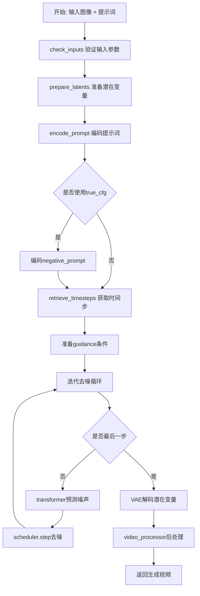

## 类结构

```
DiffusionPipeline (基类)
│
HunyuanVideoLoraLoaderMixin (Mixin)
│
└── HunyuanVideoImageToVideoPipeline
    ├── 模型组件
    │   ├── text_encoder (LlavaForConditionalGeneration)
    │   ├── tokenizer (LlamaTokenizerFast)
    │   ├── text_encoder_2 (CLIPTextModel)
    │   ├── tokenizer_2 (CLIPTokenizer)
    │   ├── transformer (HunyuanVideoTransformer3DModel)
    │   ├── vae (AutoencoderKLHunyuanVideo)
    │   └── image_processor (CLIPImageProcessor)
    └── 调度器
        └── scheduler (FlowMatchEulerDiscreteScheduler)
```

## 全局变量及字段


### `EXAMPLE_DOC_STRING`
    
示例文档字符串，包含管道使用示例和代码演示

类型：`str`
    


### `DEFAULT_PROMPT_TEMPLATE`
    
默认提示词模板，包含LLM提示格式、图像token位置和特殊token ID

类型：`dict[str, Any]`
    


### `logger`
    
日志记录器，用于输出管道运行时的警告和信息

类型：`logging.Logger`
    


### `XLA_AVAILABLE`
    
XLA是否可用标志，指示PyTorch XLA是否已安装可用

类型：`bool`
    


### `HunyuanVideoImageToVideoPipeline.model_cpu_offload_seq`
    
模型卸载顺序配置，指定模型从CPU到GPU的加载顺序

类型：`str`
    


### `HunyuanVideoImageToVideoPipeline._callback_tensor_inputs`
    
回调张量输入列表，定义哪些张量可以在回调中访问

类型：`list[str]`
    


### `HunyuanVideoImageToVideoPipeline.vae`
    
VAE变分自编码器，用于视频的编码和解码

类型：`AutoencoderKLHunyuanVideo`
    


### `HunyuanVideoImageToVideoPipeline.text_encoder`
    
Llava文本编码器，用于将文本和图像编码为嵌入向量

类型：`LlavaForConditionalGeneration`
    


### `HunyuanVideoImageToVideoPipeline.tokenizer`
    
Llava分词器，用于文本分词

类型：`LlamaTokenizerFast`
    


### `HunyuanVideoImageToVideoPipeline.transformer`
    
3D变换器模型，用于去噪潜在变量的条件生成

类型：`HunyuanVideoTransformer3DModel`
    


### `HunyuanVideoImageToVideoPipeline.scheduler`
    
流动匹配调度器，用于扩散过程的噪声调度

类型：`FlowMatchEulerDiscreteScheduler`
    


### `HunyuanVideoImageToVideoPipeline.text_encoder_2`
    
CLIP文本编码器，用于生成 pooled 文本嵌入

类型：`CLIPTextModel`
    


### `HunyuanVideoImageToVideoPipeline.tokenizer_2`
    
CLIP分词器，用于CLIP文本编码器的分词

类型：`CLIPTokenizer`
    


### `HunyuanVideoImageToVideoPipeline.image_processor`
    
图像处理器，用于预处理输入图像

类型：`CLIPImageProcessor`
    


### `HunyuanVideoImageToVideoPipeline.vae_scaling_factor`
    
VAE缩放因子，用于VAE潜在空间的缩放

类型：`float`
    


### `HunyuanVideoImageToVideoPipeline.vae_scale_factor_temporal`
    
VAE时间压缩比，用于时间维度的压缩

类型：`int`
    


### `HunyuanVideoImageToVideoPipeline.vae_scale_factor_spatial`
    
VAE空间压缩比，用于空间维度的压缩

类型：`int`
    


### `HunyuanVideoImageToVideoPipeline.video_processor`
    
视频处理器，用于视频的前处理和后处理

类型：`VideoProcessor`
    
    

## 全局函数及方法


### `_expand_input_ids_with_image_tokens`

该函数用于在文本输入的token序列中插入图像嵌入token，将原始文本序列扩展为包含图像嵌入的更长序列，同时生成对应的注意力掩码和位置ID，以便后续的Transformer模型能够正确处理文本和图像嵌入的混合输入。

参数：

-  `text_input_ids`：`torch.Tensor`，原始文本输入的token ID序列
-  `prompt_attention_mask`：`torch.Tensor`，原始文本的注意力掩码
-  `max_sequence_length`：`int`，文本序列的最大长度
-  `image_token_index`：`int`，用于表示图像token的特殊token索引
-  `image_emb_len`：`int`，每个图像嵌入序列的长度
-  `image_emb_start`：`int`，图像嵌入在扩展后序列中的起始位置
-  `image_emb_end`：`int`，图像嵌入在扩展后序列中的结束位置
-  `pad_token_id`：`int`，用于填充的pad token ID

返回值：`dict`，包含扩展后的输入ID序列、注意力掩码和位置ID的字典

#### 流程图

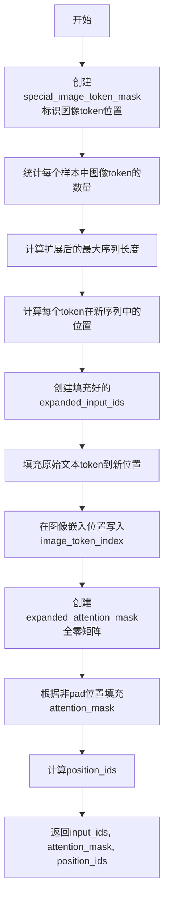

#### 带注释源码

```python
def _expand_input_ids_with_image_tokens(
    text_input_ids,            # 原始文本token IDs [batch_size, seq_len]
    prompt_attention_mask,     # 原始注意力掩码 [batch_size, seq_len]
    max_sequence_length,       # 最大序列长度
    image_token_index,         # 图像token的特殊索引
    image_emb_len,             # 图像嵌入的长度（576）
    image_emb_start,           # 图像嵌入起始位置（5）
    image_emb_end,             # 图像嵌入结束位置（581）
    pad_token_id,              # pad token的ID
):
    # 创建一个布尔掩码，标记原始序列中所有图像token的位置
    special_image_token_mask = text_input_ids == image_token_index
    
    # 统计每个样本中有多少个图像token
    num_special_image_tokens = torch.sum(special_image_token_mask, dim=-1)
    
    # 获取非图像token的batch索引和序列索引，用于后续填充文本token
    batch_indices, non_image_indices = torch.where(text_input_ids != image_token_index)

    # 计算扩展后的最大长度：原始长度 + (图像token数量 * (每个图像嵌入长度 - 1))
    # 因为每个图像token会被替换为image_emb_len个token
    max_expanded_length = max_sequence_length + (num_special_image_tokens.max() * (image_emb_len - 1))
    
    # 计算每个token在扩展后序列中的新位置
    # cumsum计算累积和，然后减1得到0索引的位置
    new_token_positions = torch.cumsum((special_image_token_mask * (image_emb_len - 1) + 1), -1) - 1
    
    # 从新位置中提取非图像token的位置，用于填充原始文本token
    text_to_overwrite = new_token_positions[batch_indices, non_image_indices]

    # 创建扩展后的input_ids tensor，用pad_token_id填充
    expanded_input_ids = torch.full(
        (text_input_ids.shape[0], max_expanded_length),  # [batch_size, max_expanded_length]
        pad_token_id,
        dtype=text_input_ids.dtype,
        device=text_input_ids.device,
    )
    
    # 将原始非图像token填充到计算出的新位置
    expanded_input_ids[batch_indices, text_to_overwrite] = text_input_ids[batch_indices, non_image_indices]
    
    # 在图像嵌入的指定位置写入image_token_index
    expanded_input_ids[batch_indices, image_emb_start:image_emb_end] = image_token_index

    # 创建扩展后的attention_mask，初始为全零
    expanded_attention_mask = torch.zeros(
        (text_input_ids.shape[0], max_expanded_length),
        dtype=prompt_attention_mask.dtype,
        device=prompt_attention_mask.device,
    )
    
    # 找出非pad位置（有效token位置）
    attn_batch_indices, attention_indices = torch.where(expanded_input_ids != pad_token_id)
    
    # 在有效位置填入1.0
    expanded_attention_mask[attn_batch_indices, attention_indices] = 1.0
    
    # 转换为原始attention_mask的数据类型
    expanded_attention_mask = expanded_attention_mask.to(prompt_attention_mask.dtype)
    
    # 计算position_ids：累积求和后减1，然后用masked_fill将0位置填充为1
    # 这样确保pad位置的position_id为1而非0
    position_ids = (expanded_attention_mask.cumsum(-1) - 1).masked_fill_((expanded_attention_mask == 0), 1)

    # 返回包含三个元素的字典
    return {
        "input_ids": expanded_input_ids,        # 扩展后的token序列
        "attention_mask": expanded_attention_mask,  # 扩展后的注意力掩码
        "position_ids": position_ids,          # 扩展后的位置ID
    }
```


### `retrieve_timesteps`

从调度器获取时间步，调用调度器的 `set_timesteps` 方法并从调度器检索时间步。处理自定义时间步，任何 kwargs 将被传递给 `scheduler.set_timesteps`。

参数：

-  `scheduler`：`SchedulerMixin`，要获取时间步的调度器
-  `num_inference_steps`：`int | None`，生成样本时使用的扩散步骤数。如果使用此参数，则 `timesteps` 必须为 `None`
-  `device`：`str | torch.device | None`，时间步应移动到的设备。如果为 `None`，则不移动时间步
-  `timesteps`：`list[int] | None`，用于覆盖调度器时间步间隔策略的自定义时间步。如果传入此参数，`num_inference_steps` 和 `sigmas` 必须为 `None`
-  `sigmas`：`list[float] | None`，用于覆盖调度器时间步间隔策略的自定义 sigmas。如果传入此参数，`num_inference_steps` 和 `timesteps` 必须为 `None`
-  `**kwargs`：任意关键字参数，将传递给调度器的 `set_timesteps` 方法

返回值：`tuple[torch.Tensor, int]`，元组包含调度器的时间步调度（第一个元素）和推理步骤数量（第二个元素）

#### 流程图

```mermaid
flowchart TD
    A[开始 retrieve_timesteps] --> B{检查 timesteps 和 sigmas 是否同时存在}
    B -- 是 --> C[抛出 ValueError: 只能传递 timesteps 或 sigmas 之一]
    B -- 否 --> D{检查 timesteps 是否存在}
    D -- 是 --> E[检查调度器是否支持自定义 timesteps]
    E -- 不支持 --> F[抛出 ValueError: 当前调度器不支持自定义时间步]
    E -- 支持 --> G[调用 scheduler.set_timesteps<br/>timesteps=timesteps, device=device, **kwargs]
    D -- 否 --> H{检查 sigmas 是否存在}
    H -- 是 --> I[检查调度器是否支持自定义 sigmas]
    I -- 不支持 --> J[抛出 ValueError: 当前调度器不支持自定义 sigmas]
    I -- 支持 --> K[调用 scheduler.set_timesteps<br/>sigmas=sigmas, device=device, **kwargs]
    H -- 否 --> L[调用 scheduler.set_timesteps<br/>num_inference_steps, device=device, **kwargs]
    G --> M[获取 scheduler.timesteps]
    K --> M
    L --> M
    M --> N[计算 num_inference_steps = len(timesteps)]
    N --> O[返回 timesteps, num_inference_steps]
```

#### 带注释源码

```python
# Copied from diffusers.pipelines.stable_diffusion.pipeline_stable_diffusion.retrieve_timesteps
def retrieve_timesteps(
    scheduler,
    num_inference_steps: int | None = None,
    device: str | torch.device | None = None,
    timesteps: list[int] | None = None,
    sigmas: list[float] | None = None,
    **kwargs,
):
    r"""
    Calls the scheduler's `set_timesteps` method and retrieves timesteps from the scheduler after the call. Handles
    custom timesteps. Any kwargs will be supplied to `scheduler.set_timesteps`.

    Args:
        scheduler (`SchedulerMixin`):
            The scheduler to get timesteps from.
        num_inference_steps (`int`):
            The number of diffusion steps used when generating samples with a pre-trained model. If used, `timesteps`
            must be `None`.
        device (`str` or `torch.device`, *optional*):
            The device to which the timesteps should be moved to. If `None`, the timesteps are not moved.
        timesteps (`list[int]`, *optional*):
            Custom timesteps used to override the timestep spacing strategy of the scheduler. If `timesteps` is passed,
            `num_inference_steps` and `sigmas` must be `None`.
        sigmas (`list[float]`, *optional*):
            Custom sigmas used to override the timestep spacing strategy of the scheduler. If `sigmas` is passed,
            `num_inference_steps` and `timesteps` must be `None`.

    Returns:
        `tuple[torch.Tensor, int]`: A tuple where the first element is the timestep schedule from the scheduler and the
        second element is the number of inference steps.
    """
    # 检查是否同时传递了 timesteps 和 sigmas，只能选择其中一个
    if timesteps is not None and sigmas is not None:
        raise ValueError("Only one of `timesteps` or `sigmas` can be passed. Please choose one to set custom values")
    
    # 处理自定义 timesteps 的情况
    if timesteps is not None:
        # 检查调度器的 set_timesteps 方法是否支持 timesteps 参数
        accepts_timesteps = "timesteps" in set(inspect.signature(scheduler.set_timesteps).parameters.keys())
        if not accepts_timesteps:
            raise ValueError(
                f"The current scheduler class {scheduler.__class__}'s `set_timesteps` does not support custom"
                f" timestep schedules. Please check whether you are using the correct scheduler."
            )
        # 调用调度器的 set_timesteps 方法设置自定义时间步
        scheduler.set_timesteps(timesteps=timesteps, device=device, **kwargs)
        # 从调度器获取设置后的时间步
        timesteps = scheduler.timesteps
        # 计算推理步骤数量
        num_inference_steps = len(timesteps)
    # 处理自定义 sigmas 的情况
    elif sigmas is not None:
        # 检查调度器的 set_timesteps 方法是否支持 sigmas 参数
        accept_sigmas = "sigmas" in set(inspect.signature(scheduler.set_timesteps).parameters.keys())
        if not accept_sigmas:
            raise ValueError(
                f"The current scheduler class {scheduler.__class__}'s `set_timesteps` does not support custom"
                f" sigmas schedules. Please check whether you are using the correct scheduler."
            )
        # 调用调度器的 set_timesteps 方法设置自定义 sigmas
        scheduler.set_timesteps(sigmas=sigmas, device=device, **kwargs)
        # 从调度器获取设置后的时间步
        timesteps = scheduler.timesteps
        # 计算推理步骤数量
        num_inference_steps = len(timesteps)
    # 默认情况：使用 num_inference_steps 设置时间步
    else:
        scheduler.set_timesteps(num_inference_steps, device=device, **kwargs)
        timesteps = scheduler.timesteps
    
    # 返回时间步调度和推理步骤数量
    return timesteps, num_inference_steps
```


### `retrieve_latents`

该函数是一个全局工具函数，用于从编码器输出（VAE 编码后的结果）中提取潜在变量。它支持三种模式：从潜在分布中采样、从潜在分布中取最大值模式（argmax）、或直接返回预存的潜在变量。这是图像到视频生成流程中的关键组件，负责将输入图像编码为潜在空间表示。

参数：

- `encoder_output`：`torch.Tensor`，编码器输出对象，通常是 VAE 编码后的结果，可能包含 `latent_dist` 或 `latents` 属性
- `generator`：`torch.Generator | None`，可选的随机数生成器，用于潜在分布采样时的随机性控制
- `sample_mode`：`str`，采样模式，默认为 "sample"，可選值包括 "sample"（从分布采样）和 "argmax"（取分布模式）

返回值：`torch.Tensor`，从编码器输出中提取的潜在变量张量

#### 流程图

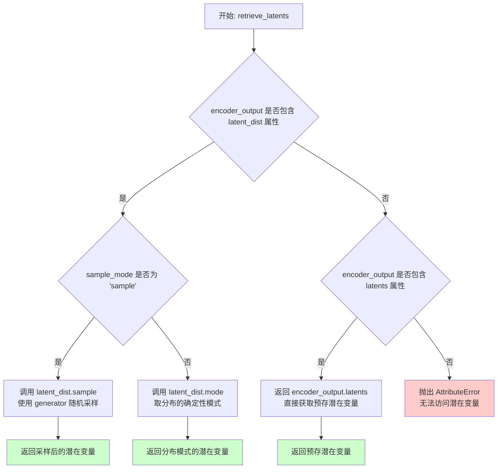

#### 带注释源码

```
# 从 diffusers 库复制而来的工具函数
# Copied from diffusers.pipelines.stable_diffusion.pipeline_stable_diffusion_img2img.retrieve_latents
def retrieve_latents(
    encoder_output: torch.Tensor, 
    generator: torch.Generator | None = None, 
    sample_mode: str = "sample"
):
    """
    从编码器输出中获取潜在变量。
    
    该函数处理三种可能的潜在变量获取方式：
    1. 从潜在分布中随机采样
    2. 从潜在分布中取确定性模式（argmax）
    3. 直接返回预存的潜在变量
    
    Args:
        encoder_output: VAE编码器的输出对象，可能包含 latent_dist 或 latents 属性
        generator: 可选的随机数生成器，用于控制采样随机性
        sample_mode: 采样模式，"sample"表示随机采样，"argmax"表示取模式
    
    Returns:
        潜在变量张量
    
    Raises:
        AttributeError: 当无法从 encoder_output 中访问潜在变量时抛出
    """
    # 情况1：编码器输出包含 latent_dist 属性，且模式为 sample
    # 从潜在分布中进行随机采样，使用 generator 控制随机性
    if hasattr(encoder_output, "latent_dist") and sample_mode == "sample":
        return encoder_output.latent_dist.sample(generator)
    
    # 情况2：编码器输出包含 latent_dist 属性，且模式为 argmax
    # 从潜在分布中取确定性模式（概率最大的值）
    elif hasattr(encoder_output, "latent_dist") and sample_mode == "argmax":
        return encoder_output.latent_dist.mode()
    
    # 情况3：编码器输出直接包含 latents 属性
    # 直接返回预计算的潜在变量
    elif hasattr(encoder_output, "latents"):
        return encoder_output.latents
    
    # 错误情况：无法识别潜在变量格式
    else:
        raise AttributeError("Could not access latents of provided encoder_output")
```


### HunyuanVideoImageToVideoPipeline.__init__

该方法是 `HunyuanVideoImageToVideoPipeline` 类的构造函数，负责初始化管道所需的所有组件，包括文本编码器、图像处理器、VAE模型、调度器和视频处理器等，并配置相关的缩放因子。

参数：

- `text_encoder`：`LlavaForConditionalGeneration`，Llava Llama3-8B 文本编码器，用于生成图像嵌入
- `tokenizer`：`LlamaTokenizerFast`，Llava 使用的快速分词器
- `transformer`：`HunyuanVideoTransformer3DModel`，条件 Transformer 模型，用于对编码的图像潜在表示进行去噪
- `vae`：`AutoencoderKLHunyuanVideo`，变分自编码器模型，用于编码和解码视频到潜在表示
- `scheduler`：`FlowMatchEulerDiscreteScheduler`，与 transformer 配合使用的调度器，用于对编码的图像潜在表示进行去噪
- `text_encoder_2`：`CLIPTextModel`，CLIP 文本编码器（clip-vit-large-patch14 变体）
- `tokenizer_2`：`CLIPTokenizer`，CLIP 分词器
- `image_processor`：`CLIPImageProcessor`，CLIP 图像处理器，用于预处理图像

返回值：`None`，该方法为构造函数，不返回任何值

#### 流程图

```mermaid
flowchart TD
    A[开始 __init__] --> B[调用 super().__init__]
    B --> C[register_modules: 注册所有模块]
    C --> D[获取 VAE scaling_factor]
    C --> E[获取 VAE temporal_compression_ratio]
    C --> F[获取 VAE spatial_compression_ratio]
    D --> G[初始化 VideoProcessor]
    E --> G
    F --> G
    G --> H[结束 __init__]
```

#### 带注释源码

```python
def __init__(
    self,
    text_encoder: LlavaForConditionalGeneration,
    tokenizer: LlamaTokenizerFast,
    transformer: HunyuanVideoTransformer3DModel,
    vae: AutoencoderKLHunyuanVideo,
    scheduler: FlowMatchEulerDiscreteScheduler,
    text_encoder_2: CLIPTextModel,
    tokenizer_2: CLIPTokenizer,
    image_processor: CLIPImageProcessor,
):
    """
    初始化 HunyuanVideoImageToVideoPipeline 管道
    
    参数:
        text_encoder: Llava 条件生成模型，用于编码图像和文本
        tokenizer: Llava 使用的快速分词器
        transformer: HunyuanVideo 3D 变换器模型
        vae: 自动编码器模型，用于视频潜在表示
        scheduler: 流匹配欧拉离散调度器
        text_encoder_2: CLIP 文本编码器
        tokenizer_2: CLIP 分词器
        image_processor: CLIP 图像处理器
    """
    # 调用父类 DiffusionPipeline 的初始化方法
    super().__init__()

    # 注册所有模块到管道中，使其可被管道管理
    self.register_modules(
        vae=vae,
        text_encoder=text_encoder,
        tokenizer=tokenizer,
        transformer=transformer,
        scheduler=scheduler,
        text_encoder_2=text_encoder_2,
        tokenizer_2=tokenizer_2,
        image_processor=image_processor,
    )

    # 设置 VAE 缩放因子，用于潜在空间的缩放
    self.vae_scaling_factor = self.vae.config.scaling_factor if getattr(self, "vae", None) else 0.476986
    
    # 设置 VAE 时间压缩比，用于计算潜在帧数
    self.vae_scale_factor_temporal = self.vae.temporal_compression_ratio if getattr(self, "vae", None) else 4
    
    # 设置 VAE 空间压缩比，用于计算潜在高度和宽度
    self.vae_scale_factor_spatial = self.vae.spatial_compression_ratio if getattr(self, "vae", None) else 8
    
    # 初始化视频处理器，用于视频预处理和后处理
    self.video_processor = VideoProcessor(vae_scale_factor=self.vae_scale_factor_spatial)
```


### HunyuanVideoImageToVideoPipeline._get_llama_prompt_embeds

该方法用于获取Llava（Llama）模型的提示嵌入（Prompt Embeddings），将输入图像和文本提示转换为模型可处理的嵌入向量，同时处理图像令牌的特殊展开和注意力掩码生成。

参数：

- `self`：HunyuanVideoImageToVideoPipeline 实例本身
- `image`：`torch.Tensor`，输入图像张量，用于生成图像嵌入
- `prompt`：`str | list[str]`，文本提示，可以是单个字符串或字符串列表
- `prompt_template`：`dict[str, Any]`，提示模板字典，包含模板格式和图像嵌入位置信息
- `num_videos_per_prompt`：`int = 1`，每个提示生成的视频数量
- `device`：`torch.device | None = None`，计算设备，默认为执行设备
- `dtype`：`torch.dtype | None = None`，数据类型，默认为文本编码器的数据类型
- `max_sequence_length`：`int = 256`，最大序列长度
- `num_hidden_layers_to_skip`：`int = 2`，从末尾跳过的隐藏层数量，用于获取特定层的嵌入
- `image_embed_interleave`：`int = 2`，图像嵌入的交织间隔，用于控制图像嵌入的采样密度

返回值：`tuple[torch.Tensor, torch.Tensor]`，返回包含提示嵌入（prompt_embeds）和注意力掩码（prompt_attention_mask）的元组

#### 流程图

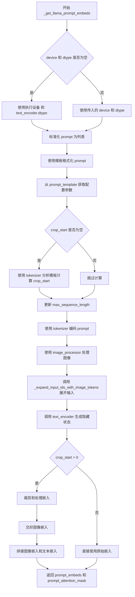

#### 带注释源码

```python
def _get_llama_prompt_embeds(
    self,
    image: torch.Tensor,
    prompt: str | list[str],
    prompt_template: dict[str, Any],
    num_videos_per_prompt: int = 1,
    device: torch.device | None = None,
    dtype: torch.dtype | None = None,
    max_sequence_length: int = 256,
    num_hidden_layers_to_skip: int = 2,
    image_embed_interleave: int = 2,
) -> tuple[torch.Tensor, torch.Tensor]:
    """
    获取Llava模型的提示嵌入
    
    参数:
        image: 输入图像张量
        prompt: 文本提示
        prompt_template: 提示模板配置
        num_videos_per_prompt: 每个提示生成的视频数
        device: 计算设备
        dtype: 数据类型
        max_sequence_length: 最大序列长度
        num_hidden_layers_to_skip: 跳过层数
        image_embed_interleave: 图像嵌入交织间隔
    
    返回:
        (prompt_embeds, prompt_attention_mask): 提示嵌入和注意力掩码
    """
    # 确定设备：如果未指定则使用执行设备
    device = device or self._execution_device
    # 确定数据类型：如果未指定则使用文本编码器的数据类型
    dtype = dtype or self.text_encoder.dtype

    # 标准化 prompt 为列表格式
    prompt = [prompt] if isinstance(prompt, str) else prompt
    # 使用模板格式化每个 prompt
    prompt = [prompt_template["template"].format(p) for p in prompt]

    # 从模板获取裁剪起始位置
    crop_start = prompt_template.get("crop_start", None)

    # 获取图像嵌入相关配置参数
    image_emb_len = prompt_template.get("image_emb_len", 576)       # 图像嵌入长度
    image_emb_start = prompt_template.get("image_emb_start", 5)    # 图像嵌入起始位置
    image_emb_end = prompt_template.get("image_emb_end", 581)      # 图像嵌入结束位置
    double_return_token_id = prompt_template.get("double_return_token_id", 271)  # 双返回令牌ID

    # 如果未提供 crop_start，则通过 tokenizer 计算
    if crop_start is None:
        prompt_template_input = self.tokenizer(
            prompt_template["template"],
            padding="max_length",
            return_tensors="pt",
            return_length=False,
            return_overflowing_tokens=False,
            return_attention_mask=False,
        )
        crop_start = prompt_template_input["input_ids"].shape[-1]
        # 移除特殊令牌占位符
        crop_start -= 5

    # 更新最大序列长度
    max_sequence_length += crop_start
    
    # 使用 tokenizer 编码 prompt
    text_inputs = self.tokenizer(
        prompt,
        max_length=max_sequence_length,
        padding="max_length",
        truncation=True,
        return_tensors="pt",
        return_length=False,
        return_overflowing_tokens=False,
        return_attention_mask=True,
    )
    text_input_ids = text_inputs.input_ids.to(device=device)
    prompt_attention_mask = text_inputs.attention_mask.to(device=device)

    # 使用 image_processor 处理输入图像
    image_embeds = self.image_processor(image, return_tensors="pt").pixel_values.to(device)

    # 获取图像令牌索引和填充令牌ID
    image_token_index = self.text_encoder.config.image_token_index
    pad_token_id = self.text_encoder.config.pad_token_id
    
    # 展开输入以包含图像令牌
    expanded_inputs = _expand_input_ids_with_image_tokens(
        text_input_ids,
        prompt_attention_mask,
        max_sequence_length,
        image_token_index,
        image_emb_len,
        image_emb_start,
        image_emb_end,
        pad_token_id,
    )
    
    # 调用 text_encoder 生成隐藏状态
    prompt_embeds = self.text_encoder(
        **expanded_inputs,
        pixel_values=image_embeds,
        output_hidden_states=True,
    ).hidden_states[-(num_hidden_layers_to_skip + 1)]  # 获取指定层的隐藏状态
    prompt_embeds = prompt_embeds.to(dtype=dtype)

    # 如果需要裁剪，处理嵌入
    if crop_start is not None and crop_start > 0:
        # 计算裁剪范围
        text_crop_start = crop_start - 1 + image_emb_len
        batch_indices, last_double_return_token_indices = torch.where(text_input_ids == double_return_token_id)

        # 处理 prompt 过长的情况
        if last_double_return_token_indices.shape[0] == 3:
            last_double_return_token_indices = torch.cat(
                (last_double_return_token_indices, torch.tensor([text_input_ids.shape[-1]]))
            )
            batch_indices = torch.cat((batch_indices, torch.tensor([0])))

        # 重塑索引
        last_double_return_token_indices = last_double_return_token_indices.reshape(text_input_ids.shape[0], -1)[
            :, -1
        ]
        batch_indices = batch_indices.reshape(text_input_ids.shape[0], -1)[:, -1]
        
        # 计算助手部分的裁剪范围
        assistant_crop_start = last_double_return_token_indices - 1 + image_emb_len - 4
        assistant_crop_end = last_double_return_token_indices - 1 + image_emb_len
        attention_mask_assistant_crop_start = last_double_return_token_indices - 4
        attention_mask_assistant_crop_end = last_double_return_token_indices

        # 初始化列表
        prompt_embed_list = []
        prompt_attention_mask_list = []
        image_embed_list = []
        image_attention_mask_list = []

        # 对每个批次进行处理
        for i in range(text_input_ids.shape[0]):
            # 拼接文本嵌入（去除助手部分）
            prompt_embed_list.append(
                torch.cat(
                    [
                        prompt_embeds[i, text_crop_start : assistant_crop_start[i].item()],
                        prompt_embeds[i, assistant_crop_end[i].item() :],
                    ]
                )
            )
            # 拼接注意力掩码
            prompt_attention_mask_list.append(
                torch.cat(
                    [
                        prompt_attention_mask[i, crop_start : attention_mask_assistant_crop_start[i].item()],
                        prompt_attention_mask[i, attention_mask_assistant_crop_end[i].item() :],
                    ]
                )
            )
            # 提取图像嵌入
            image_embed_list.append(prompt_embeds[i, image_emb_start:image_emb_end])
            # 创建图像注意力掩码
            image_attention_mask_list.append(
                torch.ones(image_embed_list[-1].shape[0]).to(prompt_embeds.device).to(prompt_attention_mask.dtype)
            )

        # 堆叠所有批次结果
        prompt_embed_list = torch.stack(prompt_embed_list)
        prompt_attention_mask_list = torch.stack(prompt_attention_mask_list)
        image_embed_list = torch.stack(image_embed_list)
        image_attention_mask_list = torch.stack(image_attention_mask_list)

        # 根据交织间隔采样图像嵌入
        if 0 < image_embed_interleave < 6:
            image_embed_list = image_embed_list[:, ::image_embed_interleave, :]
            image_attention_mask_list = image_attention_mask_list[:, ::image_embed_interleave]

        # 验证形状一致性
        assert (
            prompt_embed_list.shape[0] == prompt_attention_mask_list.shape[0]
            and image_embed_list.shape[0] == image_attention_mask_list.shape[0]
        )

        # 拼接图像嵌入和文本嵌入（图像嵌入在前）
        prompt_embeds = torch.cat([image_embed_list, prompt_embed_list], dim=1)
        prompt_attention_mask = torch.cat([image_attention_mask_list, prompt_attention_mask_list], dim=1)

    return prompt_embeds, prompt_attention_mask
```


### `HunyuanVideoImageToVideoPipeline._get_clip_prompt_embeds`

该方法用于获取CLIP文本编码器的提示嵌入（prompt embeddings），将输入的文本提示转换为CLIP模型可处理的向量表示，以便在图像到视频生成过程中提供文本指导。

参数：

- `self`：`HunyuanVideoImageToVideoPipeline`，Pipeline实例本身，隐含参数
- `prompt`：`str | list[str]`，输入的文本提示，可以是单个字符串或字符串列表，用于描述生成视频的内容
- `num_videos_per_prompt`：`int`，默认为1，每个提示生成的视频数量，当前实现中未直接使用
- `device`：`torch.device | None`，默认为None，计算设备，若为None则使用Pipeline的执行设备
- `dtype`：`torch.dtype | None`，默认为None，张量数据类型，若为None则使用text_encoder_2的数据类型
- `max_sequence_length`：`int`，默认为77，CLIP模型支持的最大序列长度

返回值：`torch.Tensor`，CLIP文本编码器的pooler输出，表示文本提示的嵌入向量，形状为`(batch_size, hidden_size)`

#### 流程图

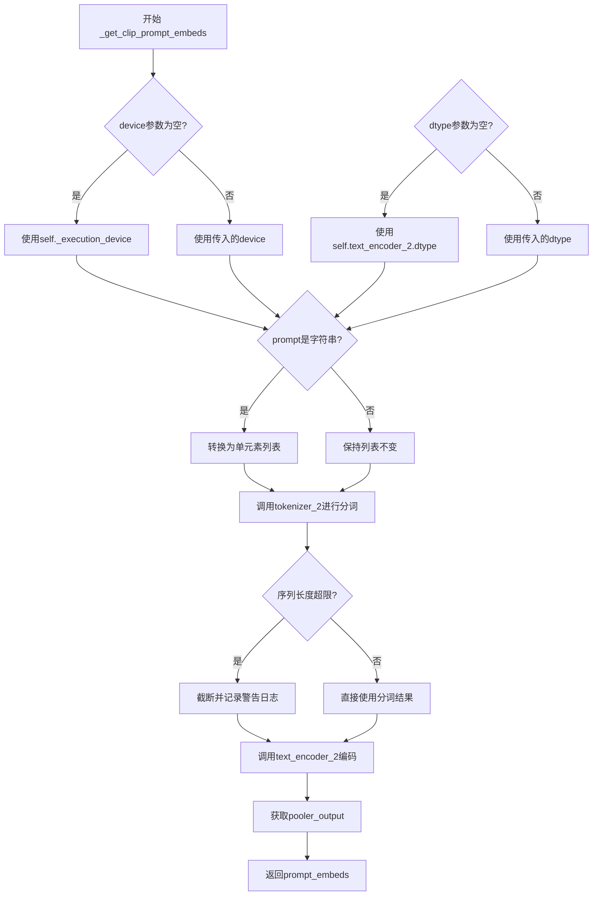

#### 带注释源码

```python
def _get_clip_prompt_embeds(
    self,
    prompt: str | list[str],
    num_videos_per_prompt: int = 1,
    device: torch.device | None = None,
    dtype: torch.dtype | None = None,
    max_sequence_length: int = 77,
) -> torch.Tensor:
    """
    获取CLIP文本编码器的提示嵌入向量
    
    参数:
        prompt: 输入的文本提示，支持单字符串或字符串列表
        num_videos_per_prompt: 每个提示生成的视频数量（当前未使用）
        device: 计算设备，默认为Pipeline执行设备
        dtype: 数据类型，默认为text_encoder_2的数据类型
        max_sequence_length: CLIP支持的最大序列长度，默认77
    
    返回:
        CLIP模型的pooler输出张量
    """
    # 确定最终使用的设备：如果未指定则使用Pipeline的执行设备
    device = device or self._execution_device
    
    # 确定最终使用的数据类型：如果未指定则使用text_encoder_2的数据类型
    dtype = dtype or self.text_encoder_2.dtype

    # 标准化输入：将单个字符串转换为单元素列表，保持一致性
    prompt = [prompt] if isinstance(prompt, str) else prompt

    # 使用CLIP分词器对提示进行分词处理
    # padding="max_length" 确保所有序列长度统一为max_sequence_length
    # truncation=True 允许截断超过最大长度的序列
    text_inputs = self.tokenizer_2(
        prompt,
        padding="max_length",
        max_length=max_sequence_length,
        truncation=True,
        return_tensors="pt",
    )

    # 获取分词后的input_ids
    text_input_ids = text_inputs.input_ids
    
    # 进行额外的检查：使用最长padding模式分词，比较是否与截断后的结果一致
    # 这是为了检测是否有内容因超过max_sequence_length而被截断
    untruncated_ids = self.tokenizer_2(prompt, padding="longest", return_tensors="pt").input_ids
    
    # 如果未截断的序列长度大于等于截断后的长度，且两者不相等，说明有内容被截断
    if untruncated_ids.shape[-1] >= text_input_ids.shape[-1] and not torch.equal(text_input_ids, untruncated_ids):
        # 解码被截断的部分用于警告日志
        removed_text = self.tokenizer_2.batch_decode(untruncated_ids[:, max_sequence_length - 1 : -1])
        logger.warning(
            "The following part of your input was truncated because CLIP can only handle sequences up to"
            f" {max_sequence_length} tokens: {removed_text}"
        )

    # 调用CLIP文本编码器获取嵌入向量
    # output_hidden_states=False 表示只输出pooler结果而非所有隐藏状态
    # pooler_output是[CLS]token的隐藏状态经过线性层和Tanh激活后的输出
    prompt_embeds = self.text_encoder_2(text_input_ids.to(device), output_hidden_states=False).pooler_output
    
    # 返回生成的提示嵌入向量
    return prompt_embeds
```


### `HunyuanVideoImageToVideoPipeline.encode_prompt`

该方法将输入的文本提示词和图像编码为嵌入向量，供后续的视频生成扩散模型使用。它通过调用内部方法 `_get_llama_prompt_embeds` 生成包含图像信息的文本嵌入，以及调用 `_get_clip_prompt_embeds` 生成 CLIP 池化嵌入，最终返回提示词嵌入、池化嵌入和注意力掩码。

参数：

- `image`：`torch.Tensor`，输入的图像张量
- `prompt`：`str | list[str]`，主要提示词，描述视频内容
- `prompt_2`：`str | list[str]`，可选的第二个提示词，用于 CLIP 编码器，默认与 `prompt` 相同
- `prompt_template`：`dict[str, Any]`，提示词模板，包含特殊 token 的位置信息，默认为 `DEFAULT_PROMPT_TEMPLATE`
- `num_videos_per_prompt`：`int`，每个提示词生成的视频数量，默认为 1
- `prompt_embeds`：`torch.Tensor | None`，可选的预计算提示词嵌入，若提供则直接返回
- `pooled_prompt_embeds`：`torch.Tensor | None`，可选的预计算池化提示词嵌入
- `prompt_attention_mask`：`torch.Tensor | None`，可选的提示词注意力掩码
- `device`：`torch.device | None`，计算设备，默认为执行设备
- `dtype`：`torch.dtype | None`，数据类型，默认为文本编码器的 dtype
- `max_sequence_length`：`int`，最大序列长度，默认为 256
- `image_embed_interleave`：`int`，图像嵌入的交织间隔，默认为 2

返回值：`tuple[torch.Tensor, torch.Tensor, torch.Tensor]`，包含三个元素的元组：
- 第一个元素为提示词嵌入（`torch.Tensor`），形状为 `(batch_size, seq_len, hidden_dim)`
- 第二个元素为池化提示词嵌入（`torch.Tensor`），形状为 `(batch_size, hidden_dim)`
- 第三个元素为提示词注意力掩码（`torch.Tensor`），形状为 `(batch_size, seq_len)`

#### 流程图

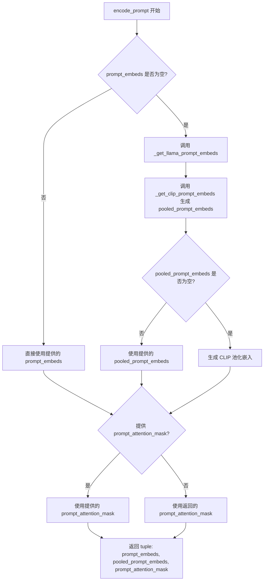

#### 带注释源码

```python
def encode_prompt(
    self,
    image: torch.Tensor,
    prompt: str | list[str],
    prompt_2: str | list[str] = None,
    prompt_template: dict[str, Any] = DEFAULT_PROMPT_TEMPLATE,
    num_videos_per_prompt: int = 1,
    prompt_embeds: torch.Tensor | None = None,
    pooled_prompt_embeds: torch.Tensor | None = None,
    prompt_attention_mask: torch.Tensor | None = None,
    device: torch.device | None = None,
    dtype: torch.dtype | None = None,
    max_sequence_length: int = 256,
    image_embed_interleave: int = 2,
) -> tuple[torch.Tensor, torch.Tensor, torch.Tensor]:
    """
    编码提示词为嵌入向量。

    Args:
        image: 输入图像张量
        prompt: 主要提示词
        prompt_2: 可选的第二个提示词，用于 CLIP 编码
        prompt_template: 提示词模板
        num_videos_per_prompt: 每个提示词生成的视频数量
        prompt_embeds: 预计算的提示词嵌入
        pooled_prompt_embeds: 预计算的池化提示词嵌入
        prompt_attention_mask: 提示词注意力掩码
        device: 计算设备
        dtype: 数据类型
        max_sequence_length: 最大序列长度
        image_embed_interleave: 图像嵌入交织间隔

    Returns:
        tuple: (prompt_embeds, pooled_prompt_embeds, prompt_attention_mask)
    """
    # 如果未提供 prompt_embeds，则使用 _get_llama_prompt_embeds 方法生成
    # 该方法使用 LLaVA 文本编码器将提示词和图像编码为嵌入向量
    if prompt_embeds is None:
        prompt_embeds, prompt_attention_mask = self._get_llama_prompt_embeds(
            image,
            prompt,
            prompt_template,
            num_videos_per_prompt,
            device=device,
            dtype=dtype,
            max_sequence_length=max_sequence_length,
            image_embed_interleave=image_embed_interleave,
        )

    # 如果未提供 pooled_prompt_embeds，则使用 CLIP 编码器生成池化嵌入
    if pooled_prompt_embeds is None:
        # 如果未提供 prompt_2，则使用与 prompt 相同的值
        if prompt_2 is None:
            prompt_2 = prompt
        # 调用 _get_clip_prompt_embeds 生成 CLIP 池化嵌入
        pooled_prompt_embeds = self._get_clip_prompt_embeds(
            prompt,
            num_videos_per_prompt,
            device=device,
            dtype=dtype,
            max_sequence_length=77,
        )

    # 返回提示词嵌入、池化嵌入和注意力掩码
    return prompt_embeds, pooled_prompt_embeds, prompt_attention_mask
```


### `HunyuanVideoImageToVideoPipeline.check_inputs`

验证输入参数的合法性，确保高度、宽度、提示词、提示词嵌入和回调参数符合管道要求。

参数：

- `self`：方法隐式参数，指向 HunyuanVideoImageToVideoPipeline 实例本身
- `prompt`：`str | list[str]`，用于引导图像生成的提示词，如果未定义则必须传递 `prompt_embeds`
- `prompt_2`：`str | list[str]`，发送到 `tokenizer_2` 和 `text_encoder_2` 的提示词，如果未定义则使用 `prompt`
- `height`：`int`，生成图像的高度（像素），必须能被16整除
- `width`：`int`，生成图像的宽度（像素），必须能被16整除
- `prompt_embeds`：`torch.Tensor | None`，预生成的文本嵌入，用于轻松调整文本输入（如提示词加权）
- `callback_on_step_end_tensor_inputs`：`list[str] | None`，回调函数在每个去噪步骤结束时需要的张量输入列表
- `prompt_template`：`dict[str, Any] | None`，提示词模板字典，必须包含 `template` 键
- `true_cfg_scale`：`float`，当 > 1.0 且提供 `negative_prompt` 时启用真正的无分类器引导，默认为 1.0
- `guidance_scale`：`float`，引导比例，定义在 Classifier-Free Diffusion Guidance 中，默认为 1.0

返回值：`None`，该方法不返回任何值，通过抛出 `ValueError` 来指示验证失败，或通过 `logger.warning` 发出警告

#### 流程图

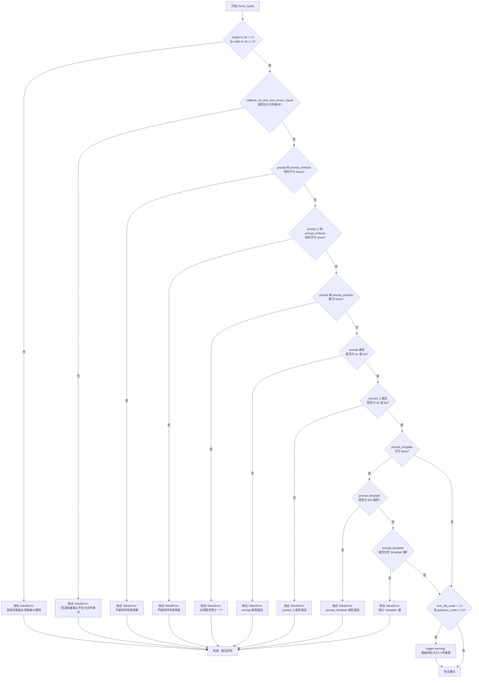

#### 带注释源码

```python
def check_inputs(
    self,
    prompt,
    prompt_2,
    height,
    width,
    prompt_embeds=None,
    callback_on_step_end_tensor_inputs=None,
    prompt_template=None,
    true_cfg_scale=1.0,
    guidance_scale=1.0,
):
    """
    验证输入参数的合法性
    
    该方法执行以下检查:
    1. 高度和宽度必须能被16整除
    2. 回调张量输入必须在允许的列表中
    3. prompt 和 prompt_embeds 不能同时传递
    4. prompt_2 和 prompt_embeds 不能同时传递
    5. prompt 和 prompt_embeds 至少要提供一个
    6. prompt 类型必须是 str 或 list
    7. prompt_2 类型必须是 str 或 list
    8. prompt_template 如果提供必须是 dict 且包含 'template' 键
    9. 如果 true_cfg_scale 和 guidance_scale 都大于1.0则发出警告
    """
    
    # 检查1: 验证高度和宽度能被16整除
    # 这是因为模型内部使用的 latent 空间需要进行16倍的下采样
    if height % 16 != 0 or width % 16 != 0:
        raise ValueError(f"`height` and `width` have to be divisible by 16 but are {height} and {width}.")

    # 检查2: 验证回调张量输入是否在允许的列表中
    # 允许的回调张量输入定义在 _callback_tensor_inputs 类属性中
    if callback_on_step_end_tensor_inputs is not None and not all(
        k in self._callback_tensor_inputs for k in callback_on_step_end_tensor_inputs
    ):
        raise ValueError(
            f"`callback_on_step_end_tensor_inputs` has to be in {self._callback_tensor_inputs}, but found {[k for k in callback_on_step_end_tensor_inputs if k not in self._callback_tensor_inputs]}"
        )

    # 检查3-5: 验证 prompt 和 prompt_embeds 的互斥关系
    # 不能同时传递两者，也必须至少提供其中一个
    if prompt is not None and prompt_embeds is not None:
        raise ValueError(
            f"Cannot forward both `prompt`: {prompt} and `prompt_embeds`: {prompt_embeds}. Please make sure to"
            " only forward one of the two."
        )
    elif prompt_2 is not None and prompt_embeds is not None:
        raise ValueError(
            f"Cannot forward both `prompt_2`: {prompt_2} and `prompt_embeds`: {prompt_embeds}. Please make sure to"
            " only forward one of the two."
        )
    elif prompt is None and prompt_embeds is None:
        raise ValueError(
            "Provide either `prompt` or `prompt_embeds`. Cannot leave both `prompt` and `prompt_embeds` undefined."
        )
    
    # 检查6-7: 验证 prompt 和 prompt_2 的类型
    elif prompt is not None and (not isinstance(prompt, str) and not isinstance(prompt, list)):
        raise ValueError(f"`prompt` has to be of type `str` or `list` but is {type(prompt)}")
    elif prompt_2 is not None and (not isinstance(prompt_2, str) and not isinstance(prompt_2, list)):
        raise ValueError(f"`prompt_2` has to be of type `str` or `list` but is {type(prompt_2)}")

    # 检查8: 验证 prompt_template 的类型和内容
    # prompt_template 用于格式化提示词，必须是包含 'template' 键的字典
    if prompt_template is not None:
        if not isinstance(prompt_template, dict):
            raise ValueError(f"`prompt_template` has to be of type `dict` but is {type(prompt_template)}")
        if "template" not in prompt_template:
            raise ValueError(
                f"`prompt_template` has to contain a key `template` but only found {prompt_template.keys()}"
            )

    # 检查9: 警告当同时使用 true_cfg_scale 和 guidance_scale 大于1.0时
    # 这会导致同时应用无分类器引导和嵌入引导，可能导致更高的内存消耗和更慢的推理
    if true_cfg_scale > 1.0 and guidance_scale > 1.0:
        logger.warning(
            "Both `true_cfg_scale` and `guidance_scale` are greater than 1.0. This will result in both "
            "classifier-free guidance and embedded-guidance to be applied. This is not recommended "
            "as it may lead to higher memory usage, slower inference and potentially worse results."
        )
```


### HunyuanVideoImageToVideoPipeline.prepare_latents

该方法负责准备视频生成的初始潜在变量（latents），包括通过VAE编码输入图像获取图像潜在表示，初始化随机潜在变量，并根据指定条件类型混合两者，最终返回用于去噪过程的初始潜在变量和图像条件潜在变量。

参数：

- `self`：`HunyuanVideoImageToVideoPipeline` 实例本身
- `image`：`torch.Tensor`，输入的图像张量，形状为 [B, C, H, W]，用于编码为图像潜在表示
- `batch_size`：`int`，批处理大小，决定生成的数量
- `num_channels_latents`：`int`，潜在变量的通道数，默认为32
- `height`：`int`，目标视频的高度，默认为720像素
- `width`：`int`，目标视频的宽度，默认为1280像素
- `num_frames`：`int`，目标视频的帧数，默认为129帧
- `dtype`：`torch.dtype | None`，潜在变量的数据类型，默认为None
- `device`：`torch.device | None`，计算设备，默认为None
- `generator`：`torch.Generator | list[torch.Generator] | None`，随机数生成器，用于确定性生成
- `latents`：`torch.Tensor | None`，预生成的潜在变量，如果为None则随机生成
- `image_condition_type`：`str`，图像条件类型，默认为"latent_concat"，支持"latent_concat"和"token_replace"

返回值：`tuple[torch.Tensor, torch.Tensor]`，返回两个张量——第一个是混合后的初始潜在变量（latents），第二个是图像潜在表示（image_latents）

#### 流程图

```mermaid
flowchart TD
    A[开始 prepare_latents] --> B{验证 generator 列表长度}
    B -->|长度不匹配| C[抛出 ValueError]
    B -->|长度匹配| D[计算潜在帧数 num_latent_frames]
    D --> E[计算潜在空间尺寸 latent_height, latent_width]
    E --> F[构建潜在变量形状 shape]
    F --> G[扩展图像维度: image.unsqueeze(2)]
    G --> H{generator 是列表?}
    H -->|是| I[为每个图像独立编码]
    H -->|否| J[统一编码所有图像]
    I --> K[retrieve_latents 使用 argmax 采样]
    J --> K
    K --> L[拼接并缩放图像潜在变量]
    L --> M[重复图像潜在变量到多帧]
    M --> N{latents 为 None?}
    N -->|是| O[randn_tensor 生成随机潜在]
    N -->|否| P[移动 latents 到指定设备]
    O --> Q
    P --> Q
    Q[设置混合权重 t=0.999] --> R[混合初始潜在与图像潜在]
    R --> S{image_condition_type == token_replace?}
    S -->|是| T[截取第一帧图像潜在]
    S -->|否| U
    T --> V[返回 latents, image_latents]
    U --> V
```

#### 带注释源码

```python
def prepare_latents(
    self,
    image: torch.Tensor,
    batch_size: int,
    num_channels_latents: int = 32,
    height: int = 720,
    width: int = 1280,
    num_frames: int = 129,
    dtype: torch.dtype | None = None,
    device: torch.device | None = None,
    generator: torch.Generator | list[torch.Generator] | None = None,
    latents: torch.Tensor | None = None,
    image_condition_type: str = "latent_concat",
) -> torch.Tensor:
    # 验证：如果传入生成器列表，其长度必须与批处理大小匹配
    if isinstance(generator, list) and len(generator) != batch_size:
        raise ValueError(
            f"You have passed a list of generators of length {len(generator)}, but requested an effective batch"
            f" size of {batch_size}. Make sure the batch size matches the length of the generators."
        )

    # 计算潜在空间中的帧数：VAE时间压缩比的逆向计算
    # 例如：num_frames=129, vae_scale_factor_temporal=4 -> num_latent_frames=33
    num_latent_frames = (num_frames - 1) // self.vae_scale_factor_temporal + 1
    
    # 计算潜在空间中的空间维度：VAE空间压缩比的逆向计算
    # 例如：height=720, vae_scale_factor_spatial=8 -> latent_height=90
    latent_height, latent_width = height // self.vae_scale_factor_spatial, width // self.vae_scale_factor_spatial
    
    # 构建潜在变量的目标形状：[batch_size, channels, temporal_frames, height, width]
    shape = (batch_size, num_channels_latents, num_latent_frames, latent_height, latent_width)

    # 扩展图像维度以适配VAE编码器：增加一个帧维度用于5D张量处理
    # 输入: [B, C, H, W] -> 输出: [B, C, 1, H, W]
    image = image.unsqueeze(2)

    # 使用VAE编码图像为潜在表示
    if isinstance(generator, list):
        # 批处理模式：每个样本使用独立的随机生成器
        image_latents = [
            retrieve_latents(self.vae.encode(image[i].unsqueeze(0)), generator[i], "argmax")
            for i in range(batch_size)
        ]
    else:
        # 单生成器模式：所有样本使用同一个生成器
        image_latents = [retrieve_latents(self.vae.encode(img.unsqueeze(0)), generator, "argmax") for img in image]

    # 拼接所有图像潜在变量并应用VAE缩放因子
    # 潜在分布的方差调整，确保与训练时的一致性
    image_latents = torch.cat(image_latents, dim=0).to(dtype) * self.vae_scaling_factor
    
    # 复制图像潜在变量到所有潜在帧时间步
    # 将单帧图像条件扩展为多帧视频条件
    image_latents = image_latents.repeat(1, 1, num_latent_frames, 1, 1)

    # 初始化潜在变量：如果未提供，则随机采样
    if latents is None:
        latents = randn_tensor(shape, generator=generator, device=device, dtype=dtype)
    else:
        # 使用提供的潜在变量，确保设备和数据类型正确
        latents = latents.to(device=device, dtype=dtype)

    # 设置时间步混合权重：t接近1.0表示主要使用初始随机潜在
    # 这种混合策略在推理初期保留更多随机噪声，通过后续去噪逐渐融合图像信息
    t = torch.tensor([0.999]).to(device=device)
    # 混合初始潜在变量和图像潜在变量
    latents = latents * t + image_latents * (1 - t)

    # token_replace模式特殊处理：仅保留第一帧作为条件
    # 这种模式下图像潜在主要用于替换token，而非concat
    if image_condition_type == "token_replace":
        image_latents = image_latents[:, :, :1]

    # 返回混合后的潜在变量和图像潜在表示
    # latents: 用于去噪过程的初始潜在
    # image_latents: 图像条件潜在，用于后续处理（如concat或token替换）
    return latents, image_latents
```


### `HunyuanVideoImageToVideoPipeline.enable_vae_slicing`

启用VAE切片解码功能，允许VAE将输入张量分割为多个切片逐步计算解码，以节省内存并支持更大的批处理大小。该方法目前已废弃，推荐直接调用 `pipe.vae.enable_slicing()`。

参数：

- 该方法无参数（仅包含 `self`）

返回值：`None`，无返回值

#### 流程图

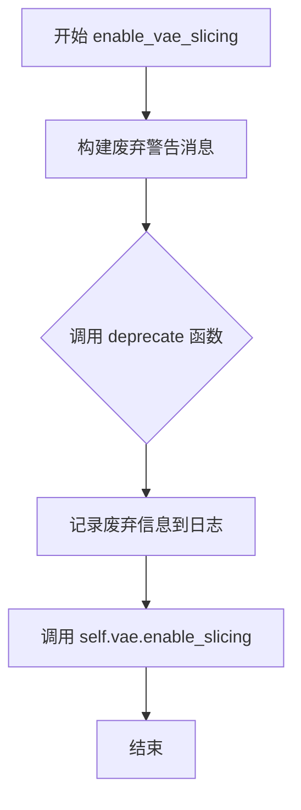

#### 带注释源码

```python
def enable_vae_slicing(self):
    r"""
    Enable sliced VAE decoding. When this option is enabled, the VAE will split the input tensor in slices to
    compute decoding in several steps. This is useful to save some memory and allow larger batch sizes.
    """
    # 构建废弃警告消息，提示用户该方法将在未来版本中移除
    depr_message = f"Calling `enable_vae_slicing()` on a `{self.__class__.__name__}` is deprecated and this method will be removed in a future version. Please use `pipe.vae.enable_slicing()`."
    
    # 调用 deprecate 函数记录废弃信息，版本号为 0.40.0
    deprecate(
        "enable_vae_slicing",
        "0.40.0",
        depr_message,
    )
    
    # 实际调用 VAE 模型的 enable_slicing 方法启用切片解码功能
    self.vae.enable_slicing()
```


### `HunyuanVideoImageToVideoPipeline.disable_vae_slicing`

该方法用于禁用VAE切片解码功能，使VAE恢复到一次性完成整个解码过程的模式。如果之前通过`enable_vae_slicing`启用了切片解码，调用此方法后将回到单步解码。此方法已废弃，推荐直接使用`pipe.vae.disable_slicing()`。

参数：无（仅包含隐式参数 `self`）

返回值：无（`None`），该方法直接作用于VAE模型，不返回任何值

#### 流程图

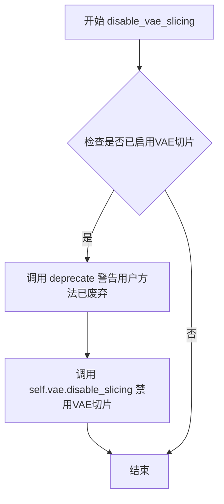

#### 带注释源码

```python
def disable_vae_slicing(self):
    r"""
    Disable sliced VAE decoding. If `enable_vae_slicing` was previously enabled, this method will go back to
    computing decoding in one step.
    """
    # 构建废弃警告消息，提示用户使用新的API
    depr_message = f"Calling `disable_vae_slicing()` on a `{self.__class__.__name__}` is deprecated and this method will be removed in a future version. Please use `pipe.vae.disable_slicing()`."
    # 调用deprecate函数记录废弃警告，包含方法名、版本号和详细消息
    deprecate(
        "disable_vae_slicing",
        "0.40.0",
        depr_message,
    )
    # 实际执行禁用VAE切片操作，调用VAE模型的disable_slicing方法
    self.vae.disable_slicing()
```

#### 关键技术说明

| 项目 | 说明 |
|------|------|
| **功能描述** | 禁用VAE切片解码模式 |
| **调用链** | `disable_vae_slicing` → `self.vae.disable_slicing()` |
| **废弃信息** | 将在版本0.40.0中移除，建议使用`pipe.vae.disable_slicing()` |
| **状态影响** | 禁用后VAE解码将一次性处理整个输入，可能占用更多显存 |


### `HunyuanVideoImageToVideoPipeline.enable_vae_tiling`

启用VAE平铺解码功能。当启用此选项时，VAE会将输入张量分割成多个块（tiles）来分步计算编码和解码，从而节省大量内存并允许处理更大的图像。

参数：
- 无（仅包含 `self`）

返回值：`None`，无返回值（该方法直接操作 VAE 内部状态）

#### 流程图

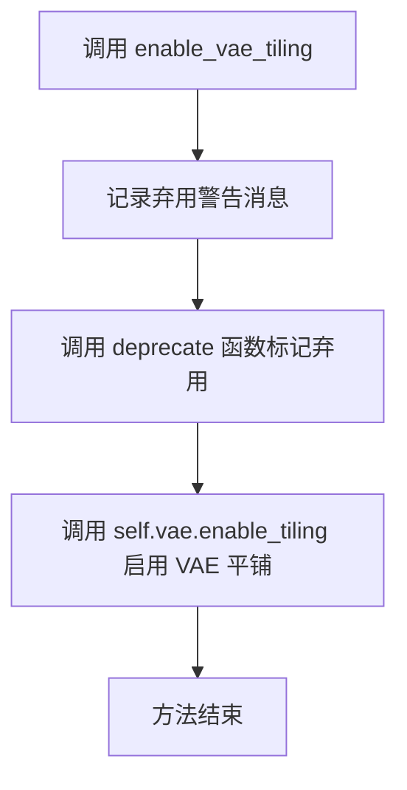

#### 带注释源码

```python
def enable_vae_tiling(self):
    r"""
    Enable tiled VAE decoding. When this option is enabled, the VAE will split the input tensor into tiles to
    compute decoding and encoding in several steps. This is useful for saving a large amount of memory and to allow
    processing larger images.
    """
    # 构建弃用警告消息，提醒用户该方法将在未来版本中移除
    # 建议直接使用 pipe.vae.enable_tiling() 替代
    depr_message = f"Calling `enable_vae_tiling()` on a `{self.__class__.__name__}` is deprecated and this method will be removed in a future version. Please use `pipe.vae.enable_tiling()`."
    
    # 调用 deprecate 函数记录弃用信息
    # 参数: 方法名, 弃用版本号, 警告消息
    deprecate(
        "enable_vae_tiling",
        "0.40.0",
        depr_message,
    )
    
    # 委托给 VAE 模型本身的 enable_tiling 方法
    # 这是实际执行平铺启用操作的核心逻辑
    self.vae.enable_tiling()
```


### HunyuanVideoImageToVideoPipeline.disable_vae_tiling

该方法用于禁用VAE平铺解码功能。如果之前启用了平铺解码（enable_vae_tiling），调用此方法后将恢复为单步解码模式。此方法已被标记为废弃，建议直接使用 `pipe.vae.disable_tiling()`。

参数： 无（仅包含 self 参数）

返回值：`None`，无返回值

#### 流程图

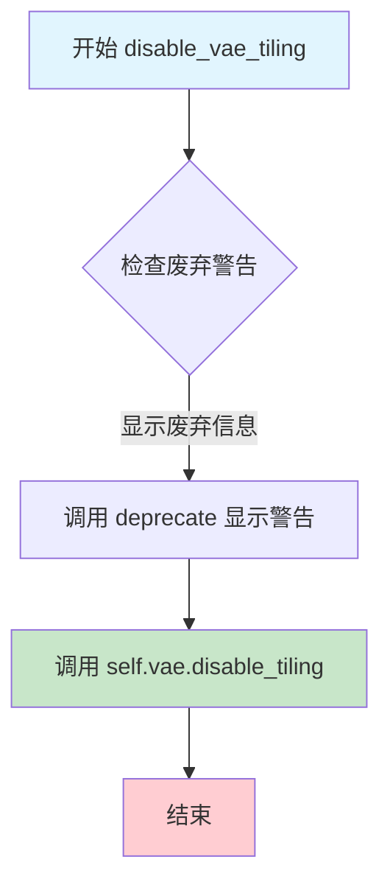

#### 带注释源码

```python
def disable_vae_tiling(self):
    r"""
    Disable tiled VAE decoding. If `enable_vae_tiling` was previously enabled, this method will go back to
    computing decoding in one step.
    """
    # 构建废弃警告消息，提示用户在新版本中应使用 pipe.vae.disable_tiling()
    depr_message = f"Calling `disable_vae_tiling()` on a `{self.__class__.__name__}` is deprecated and this method will be removed in a future version. Please use `pipe.vae.disable_tiling()`."
    
    # 调用 deprecate 函数显示废弃警告
    # 参数：方法名、废弃版本号、警告消息
    deprecate(
        "disable_vae_tiling",
        "0.40.0",
        depr_message,
    )
    
    # 实际调用底层 VAE 模型的 disable_tiling 方法
    # 这将禁用 VAE 的平铺解码模式
    self.vae.disable_tiling()
```


### `HunyuanVideoImageToVideoPipeline.__call__`

执行图像到视频的生成任务，将输入图像转换为动态视频序列。该方法通过文本提示词引导图像内容的时序演变，使用Flow Match离散调度器进行去噪推理，并可选地应用CFG（Classifier-Free Guidance）和TrueCFG进行条件生成控制。

参数：

- `image`：`PIL.Image.Image`，输入的参考图像，用于生成视频的初始条件
- `prompt`：`str | list[str]`，指导视频生成的文本提示词，若未定义则需传递`prompt_embeds`
- `prompt_2`：`str | list[str]`，发送到`tokenizer_2`和`text_encoder_2`的提示词，若未定义则使用`prompt`
- `negative_prompt`：`str | list[str]`，不希望出现的提示词，用于负面引导生成
- `negative_prompt_2`：`str | list[str]`，发送到第二个tokenizer和text_encoder的负面提示词
- `height`：`int`，生成视频的高度像素值，默认为720
- `width`：`int`，生成视频的宽度像素值，默认为1280
- `num_frames`：`int`，生成视频的帧数，默认为129
- `num_inference_steps`：`int`，去噪步数，步数越多通常质量越高但推理越慢，默认为50
- `sigmas`：`list[float]`，自定义sigma值，用于支持sigmas的调度器
- `true_cfg_scale`：`float`，True CFG比例，当大于1.0时启用无分类器真引导，默认为1.0
- `guidance_scale`：`float`，引导比例，控制文本提示与生成内容的相关性，默认为1.0
- `num_videos_per_prompt`：`int`，每个提示词生成的视频数量，默认为1
- `generator`：`torch.Generator | list[torch.Generator]`，随机生成器，用于确保可重复的生成结果
- `latents`：`torch.Tensor`，预生成的高斯噪声latent，用于微调相同生成条件下的不同提示词效果
- `prompt_embeds`：`torch.Tensor`，预生成的文本embedding，便于轻松调整文本输入
- `pooled_prompt_embeds`：`torch.Tensor`，预生成的pooled文本embedding，用于提示词加权
- `prompt_attention_mask`：`torch.Tensor`，文本注意力掩码
- `negative_prompt_embeds`：`torch.Tensor`，预生成的负面文本embedding
- `negative_pooled_prompt_embeds`：`torch.Tensor`，预生成的负面pooled文本embedding
- `negative_prompt_attention_mask`：`torch.Tensor`，负面文本注意力掩码
- `output_type`：`str`，输出格式，可选"PIL.Image"或"np.array"，默认为"pil"
- `return_dict`：`bool`，是否返回`HunyuanVideoPipelineOutput`对象而非元组，默认为True
- `attention_kwargs`：`dict[str, Any]`，传递给AttentionProcessor的额外参数
- `callback_on_step_end`：`Callable | PipelineCallback | MultiPipelineCallbacks`，每个去噪步骤结束时调用的回调函数
- `callback_on_step_end_tensor_inputs`：`list[str]`，回调函数需要接收的tensor输入列表，默认为["latents"]
- `prompt_template`：`dict[str, Any]`，提示词模板，默认为DEFAULT_PROMPT_TEMPLATE
- `max_sequence_length`：`int`，最大序列长度，默认为256
- `image_embed_interleave`：`int`，图像embedding交织间隔，若为None则根据image_condition_type自动设置

返回值：`HunyuanVideoPipelineOutput | tuple`，当`return_dict`为True时返回包含生成视频帧的`HunyuanVideoPipelineOutput`对象，否则返回元组

#### 流程图

```mermaid
flowchart TD
    A[开始 __call__] --> B[检查输入参数]
    B --> C{callback类型检查}
    C --> D[设置图像条件类型和CFG标志]
    D --> E[获取执行设备]
    E --> F[确定batch_size]
    F --> G[预处理图像为tensor]
    G --> H{image_condition_type}
    H -->|latent_concat| I[设置num_channels_latents = (in_channels - 1) // 2]
    H -->|token_replace| J[设置num_channels_latents = in_channels]
    I --> K[准备latent变量]
    J --> K
    K --> L[编码输入提示词]
    L --> M{是否启用TrueCFG}
    M -->|Yes| N[编码负面提示词]
    M -->|No| O[准备timesteps]
    N --> O
    O --> P[准备guidance条件]
    P --> Q[进入去噪循环]
    Q --> R{是否有中断]
    R -->|Yes| S[跳过本次循环]
    R -->|No| T[广播timestep到batch维度]
    T --> U[构建latent_model_input]
    U --> V[调用transformer进行预测]
    V --> W{是否启用TrueCFG}
    W -->|Yes| X[计算负面预测并进行CFG]
    W -->|No| Y[调度器步骤更新latent]
    X --> Y
    Y --> Z{是否设置callback]
    Z -->|Yes| AA[执行callback]
    Z -->|No| AB[更新进度条]
    AA --> AB
    AB --> AC{是否需要XLA标记]
    AC -->|Yes| AD[xm.mark_step]
    AC -->|No| AE{是否完成所有步骤}
    AD --> AE
    AE -->|No| R
    AE -->|Yes| AF{output_type是否为latent]
    AF -->|No| AG[解码latent为视频]
    AG --> AH[后处理视频]
    AF -->|Yes| AI[直接返回latent]
    AH --> AJ[释放模型钩子]
    AI --> AJ
    AJ --> AK{return_dict]
    AK -->|Yes| AL[返回HunyuanVideoPipelineOutput]
    AK -->|No| AM[返回tuple]
    AL --> AN[结束]
    AM --> AN
    S --> AE
```

#### 带注释源码

```python
@torch.no_grad()
@replace_example_docstring(EXAMPLE_DOC_STRING)
def __call__(
    self,
    image: PIL.Image.Image,
    prompt: str | list[str] = None,
    prompt_2: str | list[str] = None,
    negative_prompt: str | list[str] = None,
    negative_prompt_2: str | list[str] = None,
    height: int = 720,
    width: int = 1280,
    num_frames: int = 129,
    num_inference_steps: int = 50,
    sigmas: list[float] = None,
    true_cfg_scale: float = 1.0,
    guidance_scale: float = 1.0,
    num_videos_per_prompt: int | None = 1,
    generator: torch.Generator | list[torch.Generator] | None = None,
    latents: torch.Tensor | None = None,
    prompt_embeds: torch.Tensor | None = None,
    pooled_prompt_embeds: torch.Tensor | None = None,
    prompt_attention_mask: torch.Tensor | None = None,
    negative_prompt_embeds: torch.Tensor | None = None,
    negative_pooled_prompt_embeds: torch.Tensor | None = None,
    negative_prompt_attention_mask: torch.Tensor | None = None,
    output_type: str | None = "pil",
    return_dict: bool = True,
    attention_kwargs: dict[str, Any] | None = None,
    callback_on_step_end: Callable[[int, int], None] | PipelineCallback | MultiPipelineCallbacks | None = None,
    callback_on_step_end_tensor_inputs: list[str] = ["latents"],
    prompt_template: dict[str, Any] = DEFAULT_PROMPT_TEMPLATE,
    max_sequence_length: int = 256,
    image_embed_interleave: int | None = None,
):
    # 1. 检查callback类型并设置tensor_inputs
    if isinstance(callback_on_step_end, (PipelineCallback, MultiPipelineCallbacks)):
        callback_on_step_end_tensor_inputs = callback_on_step_end.tensor_inputs

    # 2. 检查输入参数合法性
    self.check_inputs(
        prompt,
        prompt_2,
        height,
        width,
        prompt_embeds,
        callback_on_step_end_tensor_inputs,
        prompt_template,
        true_cfg_scale,
        guidance_scale,
    )

    # 3. 确定图像条件类型和是否启用TrueCFG
    image_condition_type = self.transformer.config.image_condition_type
    has_neg_prompt = negative_prompt is not None or (
        negative_prompt_embeds is not None and negative_pooled_prompt_embeds is not None
    )
    do_true_cfg = true_cfg_scale > 1 and has_neg_prompt
    
    # 根据条件类型设置图像embedding交织间隔
    image_embed_interleave = (
        image_embed_interleave
        if image_embed_interleave is not None
        else (
            2 if image_condition_type == "latent_concat" else 4 if image_condition_type == "token_replace" else 1
        )
    )

    # 设置内部状态
    self._guidance_scale = guidance_scale
    self._attention_kwargs = attention_kwargs
    self._current_timestep = None
    self._interrupt = False

    device = self._execution_device

    # 4. 确定batch_size
    if prompt is not None and isinstance(prompt, str):
        batch_size = 1
    elif prompt is not None and isinstance(prompt, list):
        batch_size = len(prompt)
    else:
        batch_size = prompt_embeds.shape[0]

    # 5. 准备latent变量
    vae_dtype = self.vae.dtype
    image_tensor = self.video_processor.preprocess(image, height, width).to(device, vae_dtype)

    # 根据条件类型确定latent通道数
    if image_condition_type == "latent_concat":
        num_channels_latents = (self.transformer.config.in_channels - 1) // 2
    elif image_condition_type == "token_replace":
        num_channels_latents = self.transformer.config.in_channels

    # 准备初始latent和图像latent
    latents, image_latents = self.prepare_latents(
        image_tensor,
        batch_size * num_videos_per_prompt,
        num_channels_latents,
        height,
        width,
        num_frames,
        torch.float32,
        device,
        generator,
        latents,
        image_condition_type,
    )
    
    # 对于latent_concat类型，将后续帧的图像latent置零
    if image_condition_type == "latent_concat":
        image_latents[:, :, 1:] = 0
        mask = image_latents.new_ones(image_latents.shape[0], 1, *image_latents.shape[2:])
        mask[:, :, 1:] = 0

    # 6. 编码输入提示词
    transformer_dtype = self.transformer.dtype
    prompt_embeds, pooled_prompt_embeds, prompt_attention_mask = self.encode_prompt(
        image=image,
        prompt=prompt,
        prompt_2=prompt_2,
        prompt_template=prompt_template,
        num_videos_per_prompt=num_videos_per_prompt,
        prompt_embeds=prompt_embeds,
        pooled_prompt_embeds=pooled_prompt_embeds,
        prompt_attention_mask=prompt_attention_mask,
        device=device,
        max_sequence_length=max_sequence_length,
        image_embed_interleave=image_embed_interleave,
    )
    # 转换为transformer数据类型
    prompt_embeds = prompt_embeds.to(transformer_dtype)
    prompt_attention_mask = prompt_attention_mask.to(transformer_dtype)
    pooled_prompt_embeds = pooled_prompt_embeds.to(transformer_dtype)

    # 如果启用TrueCFG，编码负面提示词
    if do_true_cfg:
        black_image = PIL.Image.new("RGB", (width, height), 0)
        negative_prompt_embeds, negative_pooled_prompt_embeds, negative_prompt_attention_mask = self.encode_prompt(
            image=black_image,
            prompt=negative_prompt,
            prompt_2=negative_prompt_2,
            prompt_template=prompt_template,
            num_videos_per_prompt=num_videos_per_prompt,
            prompt_embeds=negative_prompt_embeds,
            pooled_prompt_embeds=negative_pooled_prompt_embeds,
            prompt_attention_mask=negative_prompt_attention_mask,
            device=device,
            max_sequence_length=max_sequence_length,
        )
        negative_prompt_embeds = negative_prompt_embeds.to(transformer_dtype)
        negative_prompt_attention_mask = negative_prompt_attention_mask.to(transformer_dtype)
        negative_pooled_prompt_embeds = negative_pooled_prompt_embeds.to(transformer_dtype)

    # 7. 准备timesteps
    sigmas = np.linspace(1.0, 0.0, num_inference_steps + 1)[:-1] if sigmas is None else sigmas
    timesteps, num_inference_steps = retrieve_timesteps(self.scheduler, num_inference_steps, device, sigmas=sigmas)

    # 8. 准备guidance条件
    guidance = None
    if self.transformer.config.guidance_embeds:
        guidance = (
            torch.tensor([guidance_scale] * latents.shape[0], dtype=transformer_dtype, device=device) * 1000.0
        )

    # 9. 去噪循环
    num_warmup_steps = len(timesteps) - num_inference_steps * self.scheduler.order
    self._num_timesteps = len(timesteps)

    with self.progress_bar(total=num_inference_steps) as progress_bar:
        for i, t in enumerate(timesteps):
            # 检查中断标志
            if self._interrupt:
                continue

            self._current_timestep = t
            # 广播timestep到batch维度
            timestep = t.expand(latents.shape[0]).to(latents.dtype)

            # 构建latent_model_input
            if image_condition_type == "latent_concat":
                latent_model_input = torch.cat([latents, image_latents, mask], dim=1).to(transformer_dtype)
            elif image_condition_type == "token_replace":
                latent_model_input = torch.cat([image_latents, latents[:, :, 1:]], dim=2).to(transformer_dtype)

            # 调用transformer进行预测
            noise_pred = self.transformer(
                hidden_states=latent_model_input,
                timestep=timestep,
                encoder_hidden_states=prompt_embeds,
                encoder_attention_mask=prompt_attention_mask,
                pooled_projections=pooled_prompt_embeds,
                guidance=guidance,
                attention_kwargs=attention_kwargs,
                return_dict=False,
            )[0]

            # TrueCFG处理
            if do_true_cfg:
                neg_noise_pred = self.transformer(
                    hidden_states=latent_model_input,
                    timestep=timestep,
                    encoder_hidden_states=negative_prompt_embeds,
                    encoder_attention_mask=negative_prompt_attention_mask,
                    pooled_projections=negative_pooled_prompt_embeds,
                    guidance=guidance,
                    attention_kwargs=attention_kwargs,
                    return_dict=False,
                )[0]
                noise_pred = neg_noise_pred + true_cfg_scale * (noise_pred - neg_noise_pred)

            # 调度器步骤更新latent
            if image_condition_type == "latent_concat":
                latents = self.scheduler.step(noise_pred, t, latents, return_dict=False)[0]
            elif image_condition_type == "token_replace":
                latents = latents = self.scheduler.step(
                    noise_pred[:, :, 1:], t, latents[:, :, 1:], return_dict=False
                )[0]
                latents = torch.cat([image_latents, latents], dim=2)

            # 步骤结束回调
            if callback_on_step_end is not None:
                callback_kwargs = {}
                for k in callback_on_step_end_tensor_inputs:
                    callback_kwargs[k] = locals()[k]
                callback_outputs = callback_on_step_end(self, i, t, callback_kwargs)

                latents = callback_outputs.pop("latents", latents)
                prompt_embeds = callback_outputs.pop("prompt_embeds", prompt_embeds)

            # 更新进度条
            if i == len(timesteps) - 1 or ((i + 1) > num_warmup_steps and (i + 1) % self.scheduler.order == 0):
                progress_bar.update()

            # XLA设备处理
            if XLA_AVAILABLE:
                xm.mark_step()

    self._current_timestep = None

    # 10. 后处理
    if not output_type == "latent":
        latents = latents.to(self.vae.dtype) / self.vae_scaling_factor
        video = self.vae.decode(latents, return_dict=False)[0]
        if image_condition_type == "latent_concat":
            video = video[:, :, 4:, :, :]
        video = self.video_processor.postprocess_video(video, output_type=output_type)
    else:
        if image_condition_type == "latent_concat":
            video = latents[:, :, 1:, :, :]
        else:
            video = latents

    # 释放模型钩子
    self.maybe_free_model_hooks()

    if not return_dict:
        return (video,)

    return HunyuanVideoPipelineOutput(frames=video)
```

## 关键组件


### HunyuanVideoImageToVideoPipeline

核心的图像到视频生成管道类，继承自DiffusionPipeline，负责协调整个图像到视频的生成流程，包括文本编码、潜在变量准备、去噪循环和视频解码。

### 张量索引与惰性加载

负责处理图像token的扩展和潜在变量的延迟加载，通过_expand_input_ids_with_image_tokens函数动态扩展输入ID以容纳图像嵌入，并在retrieve_latents中实现潜在的惰性采样。

### 反量化支持

虽然没有显式的反量化模块，但代码通过dtype管理实现多精度支持，包括float32、float16和bfloat16之间的转换，确保不同组件间的数据类型兼容。

### 图像条件类型支持

支持两种图像条件机制：latent_concat通过潜在空间拼接传递图像信息，token_replace通过token替换方式注入图像条件，通过image_condition_type配置切换。

### 文本编码系统

双文本编码器架构包括_get_llama_prompt_embeds使用LlavaForConditionalGeneration编码详细描述，以及_get_clip_prompt_embeds使用CLIPTextModel编码 pooled embeddings，提供互补的文本理解能力。

### VAE编码与潜在准备

prepare_latents方法将输入图像编码为潜在变量，处理图像条件，并根据图像条件类型构建初始噪声潜在变量，支持批量生成和随机潜在变量初始化。

### 去噪推理循环

__call__方法实现主推理流程，包括时间步检索、条件准备、噪声预测、CFG应用和潜在变量更新，支持true_cfg_scale和guidance_scale双引导机制。

### VAE优化技术

提供enable_vae_slicing、disable_vae_slicing、enable_vae_tiling和disable_vae_tiling方法，支持VAE的切片解码和瓦片解码以节省显存，支持更大分辨率和批量的视频生成。

### 回调与中断机制

通过callback_on_step_end支持推理过程中的自定义回调，interrupt属性允许外部中断去噪循环，XLA集成支持加速设备上的高效执行。

### 视频后处理

VideoProcessor负责视频预处理和后处理，将潜在变量解码为最终视频帧，支持pil和numpy输出格式，处理时间和空间维度的缩放。

## 问题及建议


### 已知问题

- **硬编码的默认值和魔法数字**：多处使用硬编码的数值如 `vae_scaling_factor=0.476986`、`num_frames=129`、`height=720`、`width=1280`、`image_emb_len=576`、`image_emb_start=5`、`image_emb_end=581`、`double_return_token_id=271` 等，缺乏统一配置管理。
- **已废弃但保留的方法**：`enable_vae_slicing`、`disable_vae_slicing`、`enable_vae_tiling`、`disable_vae_tiling` 方法已标记为 deprecated（将在 0.40.0 版本移除），但仍保留在代码中，造成冗余。
- **重复代码逻辑**：`encode_prompt` 方法中存在冗余逻辑，`prompt_2` 未被实际使用但进行了条件判断；`prepare_latents` 中对 `generator` 为 list 和非 list 的处理有重复模式。
- **条件分支复杂**：`image_condition_type` 为 `"latent_concat"` 或 `"token_replace"` 的分支逻辑分散在多处，导致代码维护困难，容易出现不一致。
- **参数数量过多**：`__call__` 方法参数超过 30 个，接口过于复杂，可考虑使用配置对象或分步 API。
- **内存管理不够精细**：`latent_model_input` 在每个推理步骤中重复创建 tensor，未进行内存复用；部分中间变量（如 `prompt_embed_list`）未及时释放。
- **类型检查不完整**：部分参数（如 `prompt_template`）仅检查是否为 dict，未验证内部键值的有效性。
- **XLA 支持的边缘处理**：`XLA_AVAILABLE` 检查仅在循环结束后调用 `xm.mark_step()`，未在循环内部每个步骤同步，可能导致设备同步问题。

### 优化建议

- **提取配置类**：创建 `HunyuanVideoPipelineConfig` 或使用 dataclass 统一管理所有默认参数和魔法数字，提高可维护性。
- **移除废弃方法**：根据版本计划及时移除已 deprecated 的 VAE 相关方法，简化代码。
- **重构条件分支**：将 `image_condition_type` 的处理逻辑封装为独立策略类或方法，消除重复的 if-elif 分支。
- **简化接口**：使用 Builder 模式或配置对象重构 `__call__` 方法，将低频参数封装为可选配置类。
- **优化内存使用**：引入 tensor 池化或原地操作（in-place operations），减少每步推理的内存分配；及时清理不再使用的中间变量。
- **增强输入验证**：在 `check_inputs` 和其他关键方法中增加更严格的类型和值验证，特别是 `prompt_template` 的内部结构验证。
- **统一设备管理**：在 XLA 环境下，确保 `xm.mark_step()` 的调用位置与设备同步逻辑一致，避免潜在的运行时问题。

## 其它


### 设计目标与约束

**设计目标**：
1. **图像到视频生成**：利用 HunyuanVideo Transformer 3D 模型，将输入图像作为条件，生成对应的视频序列
2. **多模态条件编码**：支持通过 Llava (LLaMA 3-8B) 和 CLIP 双文本编码器处理文本提示和图像嵌入
3. **流匹配扩散**：采用 FlowMatchEulerDiscreteScheduler 实现高质量的视频去噪生成
4. **灵活的图像条件**：支持 "latent_concat" 和 "token_replace" 两种图像条件类型
5. **Classifer-Free Guidance 支持**：实现 true_cfg 和 guidance_scale 两种引导策略

**约束条件**：
- 输入图像尺寸必须能被 16 整除（height % 16 == 0, width % 16 == 0）
- 输出视频帧数受 VAE temporal compression ratio 影响
- 文本提示长度受 max_sequence_length（默认 256）限制
- CLIP 文本编码器最大支持 77 tokens
- 内存占用与 num_frames、height、width 呈正相关

### 错误处理与异常设计

**输入验证错误**：
- 当 height 或 width 不能被 16 整除时，抛出 ValueError
- 当 prompt 和 prompt_embeds 同时提供时，抛出 ValueError
- 当 prompt 类型不是 str 或 list 时，抛出 ValueError
- 当 prompt_template 不是 dict 或缺少 "template" 键时，抛出 ValueError
- 当 callback_on_step_end_tensor_inputs 包含不在 _callback_tensor_inputs 中的键时，抛出 ValueError

**调度器兼容性错误**：
- 当同时传入 timesteps 和 sigmas 时，抛出 ValueError
- 当 scheduler.set_timesteps 不支持自定义 timesteps 或 sigmas 时，抛出 ValueError

**运行时警告**：
- 当 true_cfg_scale > 1.0 且 guidance_scale > 1.0 时，输出警告（两者同时使用可能导致更高内存占用和更慢推理）
- 当 CLIP 输入被截断时，输出警告并显示被截断的内容

**弃用处理**：
- enable_vae_slicing、disable_vae_slicing、enable_vae_tiling、disable_vae_tiling 方法已弃用，使用 VAE 自身的对应方法替代

### 数据流与状态机

**主生成流程状态机**：
1. **INIT**：Pipeline 初始化完成
2. **CHECK_INPUTS**：验证输入参数合法性
3. **PREPARE_LATENTS**：准备初始潜在变量和图像潜在表示
4. **ENCODE_PROMPT**：编码文本提示和图像嵌入
5. **PREPARE_TIMESTEPS**：设置扩散调度器的时间步
6. **DENOISING_LOOP**：迭代去噪（多个时间步）
   - FORWARD_PASS：Transformer 前向传播
   - GUIDANCE_APPLY：应用 classifier-free guidance
   - SCHEDULER_STEP：调度器计算下一步潜在变量
   - CALLBACK：执行每步回调（可选）
7. **VAE_DECODE**：将潜在变量解码为视频
8. **POSTPROCESS**：后处理视频并返回结果

**关键数据流转**：
- 输入图像 → VideoProcessor.preprocess() → image_tensor
- image_tensor → VAE.encode() → image_latents
- prompt + image → encode_prompt() → (prompt_embeds, pooled_prompt_embeds, prompt_attention_mask)
- latents + image_latents → Transformer → noise_pred
- noise_pred + scheduler → scheduler.step() → next latents
- latents → VAE.decode() → video
- video → VideoProcessor.postprocess_video() → output

### 外部依赖与接口契约

**核心依赖库**：
- torch：深度学习框架
- numpy：数值计算
- PIL.Image：图像处理
- transformers：CLIPTextModel、CLIPTokenizer、LlamaTokenizerFast、LlavaForConditionalGeneration、CLIPImageProcessor
- diffusers：DiffusionPipeline 基类、调度器、VAE 模型、工具函数

**内部模块依赖**：
- ...callbacks：MultiPipelineCallbacks、PipelineCallback
- ...loaders：HunyuanVideoLoraLoaderMixin
- ...models：AutoencoderKLHunyuanVideo、HunyuanVideoTransformer3DModel
- ...schedulers：FlowMatchEulerDiscreteScheduler
- ...utils：deprecate、is_torch_xla_available、logging、replace_example_docstring、randn_tensor
- ...video_processor：VideoProcessor
- ..pipeline_utils：DiffusionPipeline
- .pipeline_output：HunyuanVideoPipelineOutput

**公共接口契约**：
- HunyuanVideoImageToVideoPipeline.__call__()：主生成方法
- encode_prompt()：编码提示词和图像
- check_inputs()：验证输入参数
- prepare_latents()：准备潜在变量
- retrieve_timesteps()：获取调度器时间步
- retrieve_latents()：从 VAE 输出获取潜在表示

### 性能优化与资源管理

**模型卸载**：
- 使用 model_cpu_offload_seq = "text_encoder->text_encoder_2->transformer->vae" 定义卸载顺序
- 可能通过 maybe_free_model_hooks() 释放模型内存

**VAE 优化**：
- enable_vae_slicing()：启用 VAE 切片解码
- enable_vae_tiling()：启用 VAE 分块解码
- 支持更大的批处理大小和图像分辨率

**设备支持**：
- 支持 CUDA 设备
- 支持 XLA 设备（torch_xla）
- 自动设备检测和执行设备选择

### 配置与常量

**默认提示模板 (DEFAULT_PROMPT_TEMPLATE)**：
- template：包含系统消息、图像占位符和用户消息的格式化模板
- crop_start：文本裁剪起始位置
- image_emb_start：图像嵌入起始位置
- image_emb_end：图像嵌入结束位置
- image_emb_len：图像嵌入长度（576）
- double_return_token_id：双返回标记 ID

**推理参数默认值**：
- height: 720
- width: 1280
- num_frames: 129
- num_inference_steps: 50
- guidance_scale: 1.0
- true_cfg_scale: 1.0
- num_videos_per_prompt: 1
- output_type: "pil"
- return_dict: True
- max_sequence_length: 256
- image_embed_interleave: 2 (latent_concat) / 4 (token_replace)

### 版本与兼容性信息

**依赖版本要求**：
- Python：需支持类型注解语法 (Python 3.9+)
- torch：需支持 bfloat16、float16、torch.no_grad 等
- diffusers：0.40.0+（部分方法已弃用）

**模型配置依赖**：
- transformer.config.in_channels：输入通道数（决定 num_channels_latents）
- transformer.config.image_condition_type：图像条件类型（"latent_concat" 或 "token_replace"）
- transformer.config.guidance_embeds：是否使用 guidance 嵌入
- vae.config.scaling_factor：VAE 缩放因子
- vae.temporal_compression_ratio：时间压缩比
- vae.spatial_compression_ratio：空间压缩比

### 安全与伦理考量

**NSFW 检测**：
- 返回 HunyuanVideoPipelineOutput 时包含隐式 NSFW 检测机制（通过 negative_prompt_embeds 实现）

**输入安全**：
- 支持 negative_prompt 和 negative_prompt_2 用于过滤不适当内容
- 支持通过 prompt_embeds 直接提供预计算的嵌入以避免重复处理


    