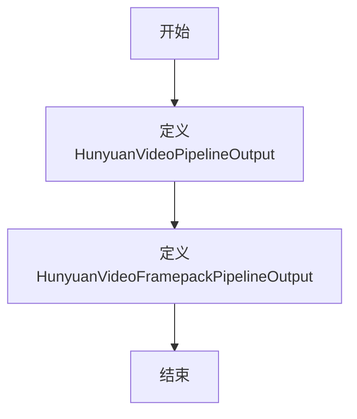

# `diffusers\src\diffusers\pipelines\hunyuan_video\pipeline_output.py` 详细设计文档

定义了HunyuanVideo视频生成管道的输出类，包含两种输出格式：HunyuanVideoPipelineOutput用于输出torch.Tensor格式的视频帧，HunyuanVideoFramepackPipelineOutput支持多种格式（torch.Tensor、numpy数组、PIL图像列表或torch张量列表）的视频帧输出。

## 整体流程



## 类结构

```
BaseOutput (diffusers.utils基类)
├── HunyuanVideoPipelineOutput (数据类)
└── HunyuanVideoFramepackPipelineOutput (数据类)
```

## 全局变量及字段


### `HunyuanVideoPipelineOutput.frames`
    
视频输出帧，类型为torch张量

类型：`torch.Tensor`
    


### `HunyuanVideoFramepackPipelineOutput.frames`
    
支持多种格式的视频输出帧，包括torch张量、numpy数组、PIL图像列表或torch张量列表

类型：`torch.Tensor | np.ndarray | list[list[PIL.Image.Image]] | list[torch.Tensor]`
    
    

## 全局函数及方法


## 关键组件


### HunyuanVideoPipelineOutput

用于HunyuanVideo管道的输出类，封装了生成的视频帧数据，仅支持torch.Tensor格式的frames字段继承自BaseOutput。

### HunyuanVideoFramepackPipelineOutput

用于HunyuanVideo Framepack管道的输出类，封装了生成的视频帧数据，支持多种格式（torch.Tensor、np.ndarray、PIL.Image列表、torch.Tensor列表），提供更灵活的数据类型支持。

### BaseOutput

来自diffusers.utils的基类，为所有管道输出类提供基础结构定义。

### frames 字段（torch.Tensor）

视频输出数据，包含批量生成的帧序列，形状为(batch_size, num_frames, channels, height, width)。

### frames 字段（多类型）

视频输出数据，支持四种类型：torch.Tensor（推荐）、np.ndarray、PIL.Image的嵌套列表、torch.Tensor列表，可适应不同的后处理需求。


## 问题及建议


### 已知问题

- **类型注解不一致**：两个输出类都表示HunyuanVideo管道输出，但`HunyuanVideoPipelineOutput.frames`仅接受`torch.Tensor`，而`HunyuanVideoFramepackPipelineOutput.frames`支持多种类型（`torch.Tensor | np.ndarray | list[list[PIL.Image.Image]] | list[torch.Tensor]`），这种设计差异会导致使用上的困惑
- **功能重复定义**：两个类名不同但都服务于HunyuanVideo管道，文档字符串完全相同（除了framepack的额外说明），缺乏清晰的职责划分
- **类型联合语法兼容性**：使用Python 3.10+的`|`联合类型语法（如`torch.Tensor | np.ndarray`），若项目需支持更低版本Python会造成兼容性问题
- **文档不完整**：缺少对`frames`字段更详细的说明，如数值范围、通道顺序（CHW vs HWC）、帧的排列方式等关键信息
- **framepack类过于宽松**：`HunyuanVideoFramepackPipelineOutput`的frames类型过于灵活（4种不同形式），可能导致调用方需要编写复杂的类型分支处理逻辑

### 优化建议

- **统一输出接口**：考虑创建一个基类或统一定义两种输出类，确保API一致性，或明确区分两个类的使用场景
- **限制frames类型**：评估是否确实需要4种frames类型，若不需要可简化设计，或使用泛型类型提供更严格的类型约束
- **添加类型守卫说明**：在文档中明确说明何时使用哪种输出类，以及frames字段的预期格式
- **添加更多元数据字段**：如num_frames、sample_rate等，帮助调用方更好地处理输出
- **考虑添加验证逻辑**：在__post_init__中添加类型检查，确保frames符合预期格式

## 其它


### 设计目标与约束

本代码定义了两个视频管道输出类，用于封装HunyuanVideo视频生成模型的输出结果。核心目标是为扩散模型视频生成管道提供标准化的输出格式，支持多种帧数据表示形式（PyTorch张量、NumPy数组或PIL图像列表），确保不同管道变体之间的接口一致性和互操作性。设计约束包括必须继承BaseOutput以遵循diffusers库的输出类规范，frames字段类型需支持动态类型推断以适应不同的后处理需求。

### 错误处理与异常设计

当前代码未包含显式的错误处理逻辑，属于纯数据容器类。建议在实际使用场景中添加以下异常处理机制：类型验证确保传入的frames参数符合预期的数据类型和形状约束；维度检查验证batch_size和num_frames的有效性；空值保护防止None值导致的下游处理异常。该类本身不抛出异常，但调用方应进行参数校验。

### 外部依赖与接口契约

该代码依赖以下外部包：dataclasses模块（Python标准库）、numpy（数值计算）、PIL.Image（图像处理）、torch（深度学习张量）、diffusers.utils.BaseOutput（diffusers库基类）。接口契约要求：frames字段为必需参数，不允许为None；输出类必须可序列化以支持pipeline状态保存和恢复；类型注解应与实际运行时类型保持一致以确保类型安全。

### 性能考虑

该类为纯数据结构，不涉及计算逻辑，性能影响主要体现在内存占用方面。建议在批量处理视频帧时注意内存管理，避免不必要的数据复制；对于大规模batch_size场景，可考虑使用torch.Tensor作为首选类型以利用GPU内存优势；避免在循环中频繁创建输出对象。

### 版本兼容性

该代码使用了Python 3.10+的联合类型注解语法（`|`操作符），要求运行环境Python版本不低于3.10。torch类型注解可能因torch版本差异存在兼容性问题，建议添加类型检查和运行时验证。diffusers.utils.BaseOutput的具体接口可能随版本更新变化，应明确声明兼容的diffusers版本范围。

### 使用示例

```python
# 创建标准管道输出
output = HunyuanVideoPipelineOutput(frames=torch.randn(1, 16, 3, 512, 512))

# 创建framepack管道输出（支持多种类型）
output2 = HunyuanVideoFramepackPipelineOutput(frames=torch.randn(2, 8, 3, 256, 256))
output3 = HunyuanVideoFramepackPipelineOutput(frames=[list[PIL.Image.Image]])
output4 = HunyuanVideoFramepackPipelineOutput(frames=np.random.rand(1, 16, 3, 512, 512))
```

### 配置参数说明

该类无自定义配置参数，frames字段的生成和预处理由上游pipeline控制。关键参数由调用方决定：batch_size控制生成视频数量；num_frames控制每个视频的帧数；channels、height、width决定帧的分辨率和通道数。


    