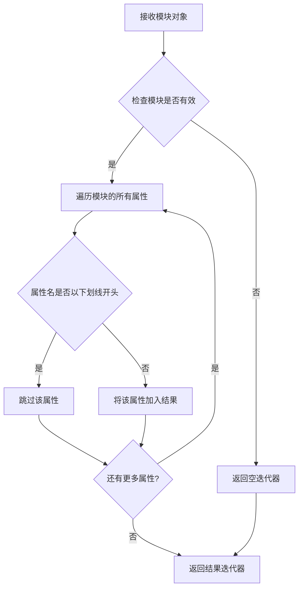
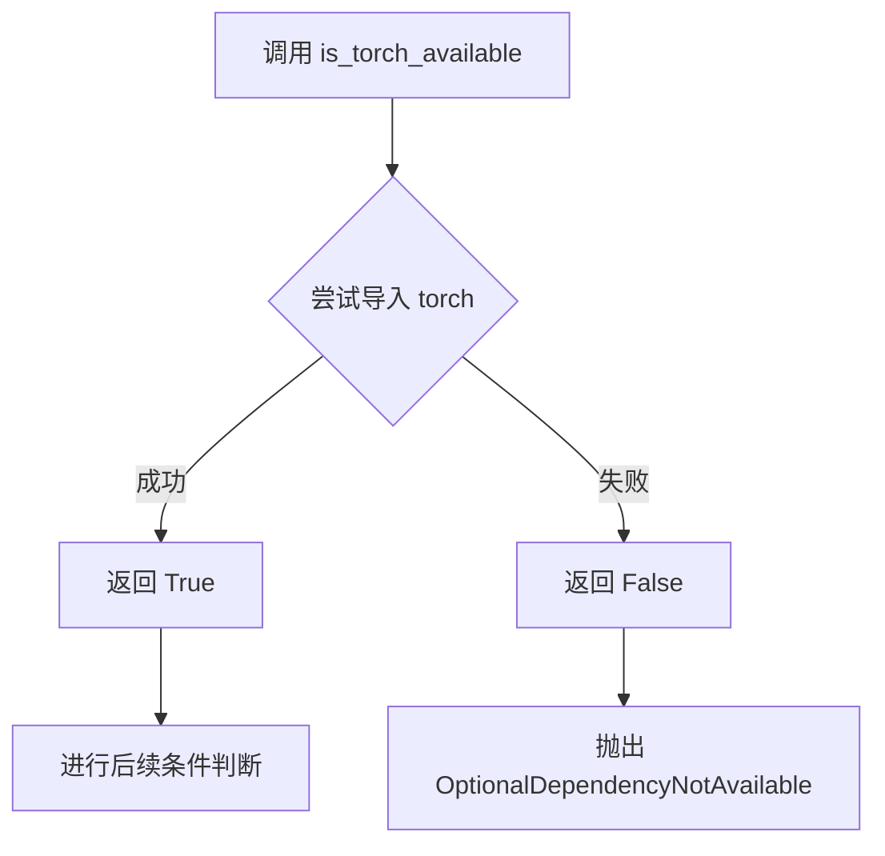
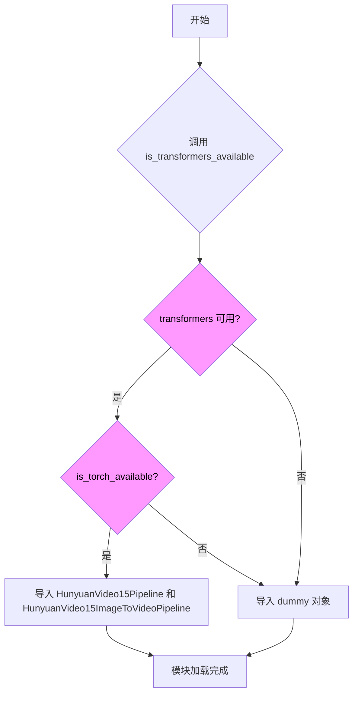

# `diffusers\src\diffusers\pipelines\hunyuan_video1_5\__init__.py` 详细设计文档

这是一个Diffusers库的延迟加载模块初始化文件，用于条件性地导入HunyuanVideo15Pipeline和HunyuanVideo15ImageToVideoPipeline类，在torch和transformers可选依赖不可用时使用dummy对象进行占位，实现惰性导入以优化启动性能。

## 整体流程

```mermaid
graph TD
A[模块加载] --> B{DIFFUSERS_SLOW_IMPORT 或 TYPE_CHECKING?}
B -- 是 --> C{is_transformers_available() && is_torch_available()?}
C -- 否 --> D[抛出 OptionalDependencyNotAvailable]
C -- 是 --> E[从pipeline_hunyuan_video1_5导入HunyuanVideo15Pipeline]
E --> F[从pipeline_hunyuan_video1_5_image2video导入HunyuanVideo15ImageToVideoPipeline]
B -- 否 --> G[创建_LazyModule实例]
G --> H[将模块注册到sys.modules]
H --> I[遍历_dummy_objects并设置属性]
D --> J[从dummy_torch_and_transformers_objects导入dummy对象]
J --> K[更新_dummy_objects字典]
```

## 类结构

```
Module: diffusers.pipelines.hunyuan_video (延迟加载模块)
└── 导入的Pipeline类
    ├── HunyuanVideo15Pipeline
    └── HunyuanVideo15ImageToVideoPipeline
```

## 全局变量及字段


### `_dummy_objects`
    
用于存储虚拟对象的字典，当torch和transformers可选依赖不可用时使用，作为懒加载模块的替代对象

类型：`dict`
    


### `_import_structure`
    
定义模块导入结构的字典，键为模块路径字符串，值为对应的类名列表，用于_LazyModule的懒加载机制

类型：`dict`
    


    

## 全局函数及方法


### `get_objects_from_module`

该函数是一个工具函数，用于从指定模块中动态获取所有公共对象（如类、函数等），并返回一个可迭代的键值对序列，通常用于延迟加载（lazy loading）机制中，将模块的对象快速转换为字典格式以便后续设置属性。

参数：

-  `module`：`ModuleType`，要从中提取对象的模块对象

返回值：`Iterable[Tuple[str, Any]]`，返回模块中非下划线开头的所有属性的名称和值对的可迭代对象

#### 流程图



#### 带注释源码

```
# 此函数定义于 ...utils 模块中
# 以下为推断的函数实现逻辑

def get_objects_from_module(module):
    """
    从给定模块中获取所有非私有对象
    
    参数:
        module: 要从中提取对象的模块
        
    返回:
        包含模块中所有公共属性的迭代器
    """
    # 遍历模块的所有属性
    for attr_name in dir(module):
        # 过滤掉以双下划线开头的私有属性
        if attr_name.startswith('_'):
            continue
        # 获取属性值
        attr_value = getattr(module, attr_name)
        # 返回属性名和属性值的元组
        yield attr_name, attr_value
```

#### 使用示例源码

```python
# 在给定代码中的实际使用方式
from ...utils import get_objects_from_module

# 从 dummy_torch_and_transformers_objects 模块获取所有对象
_dummy_objects = {}
_dummy_objects.update(get_objects_from_module(dummy_torch_and_transformers_objects))

# 之后在 LazyModule 中设置这些对象
for name, value in _dummy_objects.items():
    setattr(sys.modules[__name__], name, value)
```


### `is_torch_available`

该函数是用于检查 PyTorch 库是否可用的工具函数，通过尝试导入 torch 模块来判断环境是否安装了 PyTorch。在本文件中用于条件导入，当 PyTorch 和 Transformers 都可用时才加载 HunyuanVideo 相关的管道类。

参数： 无

返回值：`bool`，返回 `True` 表示 PyTorch 可用，`False` 表示不可用

#### 流程图



#### 带注释源码

```python
# 该函数在 ...utils 模块中定义，这里是从该模块导入
# 以下展示代码中如何使用该函数：

# 1. 从 utils 模块导入 is_torch_available
from ...utils import (
    DIFFUSERS_SLOW_IMPORT,
    OptionalDependencyNotAvailable,
    _LazyModule,
    get_objects_from_module,
    is_torch_available,        # <-- 导入的检查函数
    is_transformers_available,
)

# 2. 使用 is_torch_available() 进行条件检查
try:
    # 检查 Transformers 和 PyTorch 是否都可用
    if not (is_transformers_available() and is_torch_available()):
        # 如果任一依赖不可用，抛出可选依赖不可用异常
        raise OptionalDependencyNotAvailable()
except OptionalDependencyNotAvailable:
    # 异常处理：导入虚拟对象作为占位符
    from ...utils import dummy_torch_and_transformers_objects
    _dummy_objects.update(get_objects_from_module(dummy_torch_and_transformers_objects))
else:
    # 如果两个依赖都可用，则定义实际的导入结构
    _import_structure["pipeline_hunyuan_video1_5"] = ["HunyuanVideo15Pipeline"]
    _import_structure["pipeline_hunyuan_video1_5_image2video"] = ["HunyuanVideo15ImageToVideoPipeline"]

# 3. 在 TYPE_CHECKING 块中再次使用同样的检查逻辑
if TYPE_CHECKING or DIFFUSERS_SLOW_IMPORT:
    try:
        # 再次验证依赖可用性
        if not (is_transformers_available() and is_torch_available()):
            raise OptionalDependencyNotAvailable()
    except OptionalDependencyNotAvailable:
        # 导入类型检查用的虚拟对象
        from ...utils.dummy_torch_and_transformers_objects import *
    else:
        # 导入实际的管道类
        from .pipeline_hunyuan_video1_5 import HunyuanVideo15Pipeline
        from .pipeline_hunyuan_video1_5_image2video import HunyuanVideo15ImageToVideoPipeline
```

> **注意**：`is_torch_available` 函数的实际定义位于 `...utils` 模块中，当前文件只是导入并使用该函数进行条件判断。该函数通常的实现方式是在内部尝试 `import torch`，如果成功则返回 `True`，捕获到 `ImportError` 则返回 `False`。


### `is_transformers_available`

该函数用于检查 `transformers` 库是否已安装并可用。在本模块中，它与 `is_torch_available()` 联合使用，用于条件性地导入 Hunyuan Video 1.5 相关的 pipeline 类。

参数：

- 该函数无参数

返回值：`bool`，返回 `True` 表示 `transformers` 库可用，返回 `False` 表示不可用

#### 流程图



#### 带注释源码

```python
# 从 typing 模块导入 TYPE_CHECKING，用于类型检查时的导入
from typing import TYPE_CHECKING

# 从上层包的 utils 模块导入多个工具函数和类
from ...utils import (
    DIFFUSERS_SLOW_IMPORT,            # 控制慢速导入的标志
    OptionalDependencyNotAvailable,   # 可选依赖不可用时的异常类
    _LazyModule,                      # 延迟加载模块类
    get_objects_from_module,          # 从模块获取对象的函数
    is_torch_available,               # 检查 torch 是否可用的函数
    is_transformers_available,       # 检查 transformers 是否可用的函数（目标函数）
)

# 初始化空字典用于存储虚拟对象和导入结构
_dummy_objects = {}
_import_structure = {}

# 尝试检查可选依赖
try:
    # 调用 is_transformers_available 检查 transformers 是否可用
    # 同时检查 is_torch_available 检查 torch 是否可用
    # 如果任一不可用，则抛出 OptionalDependencyNotAvailable 异常
    if not (is_transformers_available() and is_torch_available()):
        raise OptionalDependencyNotAvailable()
except OptionalDependencyNotAvailable:
    # 捕获异常，从 dummy_torch_and_transformers_objects 导入虚拟对象
    from ...utils import dummy_torch_and_transformers_objects  # noqa F403

    # 更新 _dummy_objects 字典，添加虚拟对象
    _dummy_objects.update(get_objects_from_module(dummy_torch_and_transformers_objects))
else:
    # 如果两个依赖都可用，则添加真实的 pipeline 类到导入结构
    _import_structure["pipeline_hunyuan_video1_5"] = ["HunyuanVideo15Pipeline"]
    _import_structure["pipeline_hunyuan_video1_5_image2video"] = ["HunyuanVideo15ImageToVideoPipeline"]

# TYPE_CHECKING 块：仅在类型检查或慢速导入模式下执行
if TYPE_CHECKING or DIFFUSERS_SLOW_IMPORT:
    try:
        # 再次检查依赖可用性
        if not (is_transformers_available() and is_torch_available()):
            raise OptionalDependencyNotAvailable()

    except OptionalDependencyNotAvailable:
        # 虚拟对象的导入（用于类型检查）
        from ...utils.dummy_torch_and_transformers_objects import *
    else:
        # 真实类的导入（用于类型检查）
        from .pipeline_hunyuan_video1_5 import HunyuanVideo15Pipeline
        from .pipeline_hunyuan_video1_5_image2video import HunyuanVideo15ImageToVideoPipeline

else:
    # 运行时：设置延迟加载模块
    import sys

    # 将当前模块替换为 LazyModule 实例，实现延迟加载
    sys.modules[__name__] = _LazyModule(
        __name__,
        globals()["__file__"],
        _import_structure,
        module_spec=__spec__,
    )

    # 将虚拟对象设置到模块属性中
    for name, value in _dummy_objects.items():
        setattr(sys.modules[__name__], name, value)
```

## 关键组件


### 懒加载模块机制

使用`_LazyModule`实现延迟导入，当`DIFFUSERS_SLOW_IMPORT`为True或在类型检查时，才会真正导入实际的管道类，否则仅注册模块结构以加速启动。

### 可选依赖检查

通过`is_transformers_available()`和`is_torch_available()`检查torch和transformers库是否可用，若不可用则抛出`OptionalDependencyNotAvailable`异常并加载虚拟对象。

### 虚拟对象模式

当可选依赖不可用时，从`dummy_torch_and_transformers_objects`模块导入虚拟对象到`_dummy_objects`，确保模块在缺少依赖时仍可被导入，避免运行时错误。

### 导入结构字典

`_import_structure`字典定义了模块的公共接口，包含`pipeline_hunyuan_video1_5`和`pipeline_hunyuan_video1_5_image2video`两个管道类，供懒加载机制使用。

### HunyuanVideo15Pipeline 管道

文生视频管道类，用于根据文本提示生成视频内容。

### HunyuanVideo15ImageToVideoPipeline 管道

图生视频管道类，用于根据输入图像和文本提示生成视频内容。


## 问题及建议


### 已知问题

- **重复的依赖检查逻辑**：在try-except块和后续的if条件中重复检查`is_transformers_available()`和`is_torch_available()`，违反了DRY原则
- **硬编码的导入结构**：`pipeline_hunyuan_video1_5`和`pipeline_hunyuan_video1_5_image2video`作为字符串硬编码在_import_structure中，缺乏灵活性，新增pipeline时需要手动添加
- **空字典先声明后更新**：`_dummy_objects = {}`和`_import_structure = {}`先初始化为空，再通过update方法填充，这种模式显得冗余且容易出错
- **异常捕获后静默失败**：使用`OptionalDependencyNotAvailable`异常来处理可选依赖，但在实际不可用时仅导入dummy对象，可能导致后续使用时才报错，调试困难
- **缺乏注释和文档**：对于为什么需要dummy对象、LazyModule的工作机制等关键设计点没有任何注释
- **魔法字符串和魔法数字**：依赖检查条件和模块名称使用字符串硬编码，缺乏统一的常量定义

### 优化建议

- **提取依赖检查函数**：创建一个统一的函数来检查依赖并返回结果，避免重复代码
- **使用配置文件或自动发现机制**：可以通过扫描模块目录自动发现pipeline类，而非手动硬编码
- **简化字典初始化**：直接在使用时构建字典，而非先空声明再update
- **增加错误处理和日志**：在导入失败时记录详细的警告信息，帮助开发者定位问题
- **添加类型注解和文档字符串**：为关键函数和变量添加类型注解和文档，提高代码可维护性
- **考虑使用枚举或常量类**：将模块名、检查条件等魔法字符串定义为常量


## 其它


### 设计目标与约束

本模块的设计目标是实现HunyuanVideo 1.5视频生成管道的延迟加载（Lazy Loading），通过条件性导入减少包的初始化时间并优雅地处理可选依赖。核心约束包括：必须同时满足torch和transformers两个依赖才可导入实际管道类，否则使用虚拟对象填充；需要兼容TYPE_CHECKING模式以支持类型检查工具的静态分析；必须遵循diffusers库的统一模块结构和导入规范。

### 错误处理与异常设计

错误处理采用"提前检测、延迟报告"的策略。在模块加载时通过try-except捕获OptionalDependencyNotAvailable异常，当torch或transformers任一不可用时，触发异常并进入except分支从dummy模块导入虚拟对象。设计原则是静默失败——不向用户抛出导入错误，而是提供功能受限的虚拟对象，确保程序可继续运行（尽管实际调用时会失败）。TYPE_CHECKING模式下采用相同逻辑，但直接抛出异常以便类型检查器识别缺失依赖。

### 数据流与状态机

模块存在三种运行状态：正常加载态（依赖满足，导入真实类）、虚拟对象态（依赖缺失，导入dummy类）、类型检查态（TYPE_CHECKING或DIFFUSERS_SLOW_IMPORT标志为真）。状态转换由is_transformers_available()和is_torch_available()的返回值决定，数据流为：环境检测 → 条件分支 → 模块字典构建 → LazyModule注册 → 全局属性绑定。_import_structure字典作为数据传递载体，在LazyModule实例化时作为导入结构蓝图使用。

### 外部依赖与接口契约

本模块依赖以下外部组件：is_transformers_available和is_torch_available函数用于运行时环境检测；get_objects_from_module函数用于从dummy模块批量获取虚拟对象；_LazyModule类提供延迟加载机制；OptionalDependencyNotAvailable异常作为依赖缺失的信号。导出接口契约明确：模块需向外提供HunyuanVideo15Pipeline和HunyuanVideo15ImageToVideoPipeline两个类（真实或虚拟），且必须可通过sys.modules[__name__].ClassName方式访问。

### 模块初始化与副作用

模块加载时执行的关键副作用包括：向sys.modules注册当前模块的LazyModule代理实例；将_dummy_objects中的所有虚拟对象设置为模块属性；修改globals()["__file__"]引用指向_LazyModule。重要约束：任何直接访问管道类的代码应进行try-except保护，或通过diffusers的统一入口点调用以确保依赖检查逻辑被执行。

### 版本兼容性考量

当前实现假设diffusers库的dummy对象机制保持稳定，若dummy_torch_and_transformers_objects模块结构变化可能导致导入失败。_LazyModule的使用需要与diffusers库的版本匹配，不同版本可能存在module_spec参数支持度差异。建议在文档中标注最低支持的diffusers版本要求。

### 安全与限制性说明

由于使用dummy对象作为降级方案，当用户在缺少依赖的环境中import该模块后调用管道方法，将得到AttributeError而非有意义的错误提示。建议在调用前通过diffusers库提供的环境检查工具验证依赖完整性。此模块不执行任何网络请求或模型下载，所有模型加载逻辑由下游管道类独立处理。


    