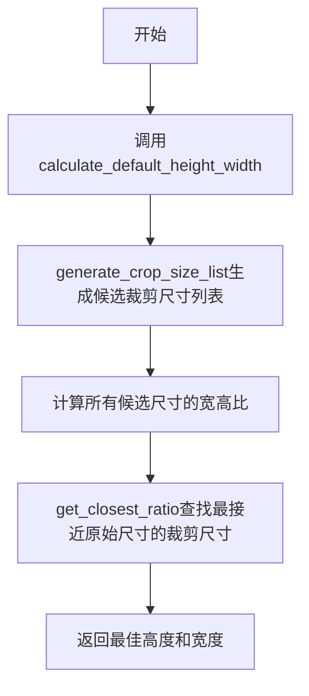
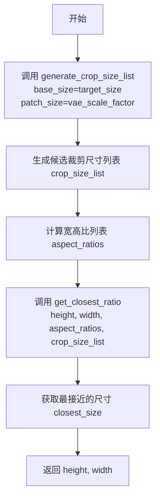

# `diffusers\src\diffusers\pipelines\hunyuan_video1_5\image_processor.py` 详细设计文档

HunyuanVideo1.5模型的图像/视频处理器，用于预处理和后处理参考图像和生成的视频，支持自动调整图像尺寸到VAE尺度因子的倍数，并提供基于宽高比的裁剪尺寸优化功能。

## 整体流程



## 类结构

```
VideoProcessor (基类)
└── HunyuanVideo15ImageProcessor (图像/视频处理器)
```

## 全局变量及字段


### `num_patches`
    
根据基础尺寸和patch尺寸计算得到的patch数量

类型：`int`
    


### `crop_size_list`
    
生成的候选裁剪尺寸列表，每项为(宽度, 高度)元组

类型：`list[tuple[int, int]]`
    


### `wp`
    
宽度方向的patch数量，初始化为num_patches

类型：`int`
    


### `hp`
    
高度方向的patch数量，初始化为1

类型：`int`
    


### `aspect_ratio`
    
输入视频的宽高比（高度除以宽度）

类型：`float`
    


### `diff_ratios`
    
候选比例与实际宽高比的差值数组

类型：`np.ndarray`
    


### `indices`
    
满足条件的候选比例索引及其差值列表

类型：`list[tuple[int, float]]`
    


### `closest_ratio_id`
    
最接近实际宽高比的候选比例索引

类型：`int`
    


### `closest_size`
    
最接近的裁剪尺寸（宽度，高度）

类型：`tuple[int, int]`
    


### `closest_ratio`
    
最接近实际宽高比的候选比例值

类型：`float`
    


### `HunyuanVideo15ImageProcessor.do_resize`
    
是否调整图像尺寸到vae_scale_factor的倍数

类型：`bool`
    


### `HunyuanVideo15ImageProcessor.vae_scale_factor`
    
VAE空间尺度因子，用于确定图像Resize的倍数

类型：`int`
    


### `HunyuanVideo15ImageProcessor.vae_latent_channels`
    
VAE潜在空间通道数

类型：`int`
    


### `HunyuanVideo15ImageProcessor.do_convert_rgb`
    
是否将图像转换为RGB格式

类型：`bool`
    
    

## 全局函数及方法


### `generate_crop_size_list`

该函数用于根据基础尺寸、patch尺寸和最大宽高比限制，生成所有可能的裁剪尺寸列表。主要用于视频/图像处理中的分辨率适配，生成符合VAE模型要求的候选裁剪尺寸。

参数：

- `base_size`：`int`，基础尺寸（默认256），表示基准分辨率
- `patch_size`：`int`，patch尺寸（默认16），VAE的patch大小
- `max_ratio`：`float`，最大宽高比（默认4.0），限制裁剪尺寸的宽高比上限

返回值：`list[tuple[int, int]]`，返回符合条件的裁剪尺寸列表，每个元素为(width, height)元组

#### 流程图

```mermaid
flowchart TD
    A[开始] --> B[计算num_patches = round((base_size / patch_size)²)]
    B --> C{验证 max_ratio >= 1.0}
    C -->|否| D[断言失败]
    C -->|是| E[初始化 crop_size_list = [], wp = num_patches, hp = 1]
    E --> F{wp > 0?}
    F -->|否| G[返回 crop_size_list]
    F -->|是| H{max(wp, hp) / min(wp, hp) <= max_ratio?}
    H -->|是| I[添加 (wp*patch_size, hp*patch_size) 到列表]
    H -->|否| J[跳过]
    I --> K{(hp+1) * wp <= num_patches?}
    J --> K
    K -->|是| L[hp += 1]
    K -->|否| M[wp -= 1]
    L --> F
    M --> F
```

#### 带注释源码

```python
def generate_crop_size_list(base_size=256, patch_size=16, max_ratio=4.0):
    """
    生成符合宽高比限制的裁剪尺寸列表。
    
    Args:
        base_size: 基础尺寸，用于计算总patch数
        patch_size: 每个patch的像素大小
        max_ratio: 最大允许的宽高比（宽/高或高/宽）
    
    Returns:
        符合比例约束的所有可能裁剪尺寸列表
    """
    # 计算基础尺寸下的总patch数量（面积）
    num_patches = round((base_size / patch_size) ** 2)
    
    # 确保最大宽高比至少为1.0
    assert max_ratio >= 1.0
    
    # 初始化结果列表和遍历指针
    # wp: 当前宽度方向的patch数
    # hp: 当前高度方向的patch数
    crop_size_list = []
    wp, hp = num_patches, 1
    
    # 遍历所有可能的wp/hp组合
    while wp > 0:
        # 检查当前宽高比是否在限制范围内
        if max(wp, hp) / min(wp, hp) <= max_ratio:
            # 转换为实际像素尺寸并添加到列表
            crop_size_list.append((wp * patch_size, hp * patch_size))
        
        # 策略选择：优先增加高度，还是减少宽度
        # 如果增加高度后仍不超过总patch数，则增加高度
        # 否则减少宽度
        if (hp + 1) * wp <= num_patches:
            hp += 1
        else:
            wp -= 1
    
    return crop_size_list
```


### `get_closest_ratio`

该函数用于根据输入视频的高度和宽度，从预定义的候选尺寸桶（buckets）中找到最接近目标宽高比的尺寸，并返回该尺寸及其对应的宽高比值。

参数：

-  `height`：`float`，输入视频的高度值
-  `width`：`float`，输入视频的宽度值
-  `ratios`：`list`，预定义的宽高比列表，通常由 `generate_crop_size_list` 生成的候选尺寸计算得出
-  `buckets`：`list`，由 `generate_crop_size_list` 函数生成的候选尺寸列表，每个元素为 (宽度, 高度) 元组

返回值：`tuple`，返回最接近的尺寸和对应的宽高比，格式为 `(closest_size, closest_ratio)`，其中 `closest_size` 为 (宽度, 高度) 元组，`closest_ratio` 为浮点数宽高比

#### 流程图

```mermaid
flowchart TD
    A[开始] --> B[计算 aspect_ratio = height / width]
    B --> C[计算 diff_ratios = ratios - aspect_ratio]
    C --> D{aspect_ratio >= 1?}
    D -->|是| E[筛选 diff_ratios 中 x <= 0 的索引]
    D -->|否| F[筛选 diff_ratios 中 x >= 0 的索引]
    E --> G[获取候选索引列表 indices]
    F --> G
    G --> H[找到绝对值最小的元素, 获取其索引 closest_ratio_id]
    H --> I[从 buckets 获取对应尺寸 closest_size]
    I --> J[从 ratios 获取对应宽高比 closest_ratio]
    J --> K[返回 (closest_size, closest_ratio)]
```

#### 带注释源码

```python
def get_closest_ratio(height: float, width: float, ratios: list, buckets: list):
    """
    Get the closest ratio in the buckets.

    Args:
        height (float): video height
        width (float): video width
        ratios (list): video aspect ratio
        buckets (list): buckets generated by `generate_crop_size_list`

    Returns:
        the closest size in the buckets and the corresponding ratio
    """
    # 计算输入视频的实际宽高比
    aspect_ratio = float(height) / float(width)
    
    # 计算预定义宽高比与实际宽高比的差值数组
    # 正值表示预定义比实际大，负值表示预定义比实际小
    diff_ratios = ratios - aspect_ratio

    # 根据宽高比是否大于等于1，采用不同的筛选策略
    # 当宽高比 >= 1（宽屏或正方形）时，筛选差值 <= 0 的候选（偏宽或相等）
    # 当宽高比 < 1（竖屏）时，筛选差值 >= 0 的候选（偏高或相等）
    if aspect_ratio >= 1:
        indices = [(index, x) for index, x in enumerate(diff_ratios) if x <= 0]
    else:
        indices = [(index, x) for index, x in enumerate(diff_ratios) if x >= 0]

    # 从候选索引中找出差值绝对值最小的索引
    # 即找到最接近实际宽高比的预定义宽高比
    closest_ratio_id = min(indices, key=lambda pair: abs(pair[1]))[0]
    
    # 根据索引获取对应的尺寸和宽高比
    closest_size = buckets[closest_ratio_id]
    closest_ratio = ratios[closest_ratio_id]

    # 返回最接近的尺寸和对应的宽高比
    return closest_size, closest_ratio
```


### `HunyuanVideo15ImageProcessor.__init__`

这是 HunyuanVideo1.5 模型的图像/视频处理器类的初始化方法，负责配置图像预处理的相关参数，包括是否调整大小、VAE 缩放因子、潜在通道数以及 RGB 转换等选项，并将这些配置注册到全局配置中。

参数：

- `self`：隐式参数，当前类的实例对象
- `do_resize`：`bool`，可选，默认值为 `True`，是否将图像的（高度，宽度）尺寸下采样到 `vae_scale_factor` 的倍数，可接受来自 `image_processor.VaeImageProcessor.preprocess` 方法的 `height` 和 `width` 参数
- `vae_scale_factor`：`int`，可选，默认值为 `16`，VAE（空间）缩放因子，如果 `do_resize` 为 `True`，图像会自动调整到此因子的倍数
- `vae_latent_channels`：`int`，可选，默认值为 `32`，VAE 潜在通道数
- `do_convert_rgb`：`bool`，可选，默认值为 `True`，是否将图像转换为 RGB 格式

返回值：`None`，构造函数不返回任何值

#### 流程图

```mermaid
flowchart TD
    A[开始 __init__] --> B[接收参数: do_resize, vae_scale_factor, vae_latent_channels, do_convert_rgb]
    B --> C{@register_to_config 装饰器}
    C --> D[调用父类 VideoProcessor.__init__]
    D --> E[传递 do_resize, vae_scale_factor, vae_latent_channels, do_convert_rgb 参数]
    E --> F[将配置注册到全局配置对象]
    G[结束初始化]
    F --> G
```

#### 带注释源码

```python
@register_to_config
def __init__(
    self,
    do_resize: bool = True,
    vae_scale_factor: int = 16,
    vae_latent_channels: int = 32,
    do_convert_rgb: bool = True,
):
    """
    初始化 HunyuanVideo15ImageProcessor 实例。
    
    该方法使用 @register_to_config 装饰器，会自动将所有参数注册到
    self.config 对象中，供类内部其他方法使用。
    
    Args:
        do_resize: 是否调整图像大小到 vae_scale_factor 的倍数
        vae_scale_factor: VAE 空间缩放因子
        vae_latent_channels: VAE 潜在通道数
        do_convert_rgb: 是否将图像转换为 RGB 格式
    """
    # 调用父类 VideoProcessor 的初始化方法
    # 传递所有配置参数到父类
    super().__init__(
        do_resize=do_resize,
        vae_scale_factor=vae_scale_factor,
        vae_latent_channels=vae_latent_channels,
        do_convert_rgb=do_convert_rgb,
    )
```


### `HunyuanVideo15ImageProcessor.calculate_default_height_width`

该方法用于根据输入的图像高度和宽度，计算最接近目标尺寸的默认高度和宽度。它通过生成一系列候选裁剪尺寸（crop size），然后找到与输入图像宽高比最接近的尺寸，从而实现图像尺寸的适配。

参数：

- `height`：`int`，输入图像的高度
- `width`：`int`，输入图像的宽度
- `target_size`：`int`，生成候选裁剪尺寸列表的基准尺寸

返回值：`Tuple[int, int]`，返回最接近的裁剪尺寸的高度和宽度

#### 流程图



#### 带注释源码

```python
def calculate_default_height_width(self, height: int, width: int, target_size: int):
    """
    计算默认的高度和宽度，使其最接近目标尺寸的宽高比。
    
    Args:
        height: 输入图像的高度
        width: 输入图像的宽度
        target_size: 目标基准尺寸，用于生成候选裁剪尺寸列表
    
    Returns:
        最接近的裁剪尺寸的高度和宽度元组
    """
    # Step 1: 根据目标尺寸和VAE缩放因子生成候选裁剪尺寸列表
    # generate_crop_size_list 函数会产生一系列 (width, height) 组合
    crop_size_list = generate_crop_size_list(
        base_size=target_size, 
        patch_size=self.config.vae_scale_factor
    )
    
    # Step 2: 计算每个候选尺寸的宽高比
    # 使用 numpy 数组进行向量化计算，提高效率
    aspect_ratios = np.array([round(float(h) / float(w), 5) for h, w in crop_size_list])
    
    # Step 3: 调用 get_closest_ratio 找到与输入图像最接近的尺寸
    # 该函数会比较输入图像的宽高比与候选列表中的宽高比
    # 返回最匹配的尺寸 (height, width)
    height, width = get_closest_ratio(height, width, aspect_ratios, crop_size_list)[0]
    
    # Step 4: 返回调整后的高度和宽度
    return height, width
```


## 关键组件


### 裁剪尺寸生成器 (generate_crop_size_list)

根据基础尺寸、分块大小和最大宽高比生成所有可能的裁剪尺寸组合列表，用于视频帧的适配

### 宽高比匹配器 (get_closest_ratio)

根据输入视频的实际宽高比，在预定义的尺寸桶中找到最接近的匹配尺寸和对应宽高比

### HunyuanVideo15ImageProcessor 类

HunyuanVideo 1.5 模型的图像/视频处理器，负责将参考图像或生成视频进行预处理/后处理，支持 resize、convert_rgb 等操作

### 配置参数体系

通过 @register_to_config 装饰器管理的处理器配置，包括 do_resize、vae_scale_factor、vae_latent_channels、do_convert_rgb 等关键参数

### 默认宽高计算器 (calculate_default_height_width)

根据目标尺寸和 VAE 缩放因子，自动计算适配模型的最优视频帧高度和宽度


## 问题及建议


### 已知问题

-   **参数验证不足**：`generate_crop_size_list` 中使用 `assert max_ratio >= 1.0` 进行参数验证，在生产环境中断言可能被优化器忽略，应使用显式的 `if` 条件检查并抛出 `ValueError`
-   **除零风险**：`get_closest_ratio` 函数中 `float(height) / float(width)` 当 `width` 为 0 时会导致除零错误
-   **空列表处理缺失**：当 `ratios` 为空或 `diff_ratios` 为空列表时，`min(indices, ...)` 会抛出 `ValueError` 异常
-   **数组长度一致性未验证**：`ratios` 和 `buckets` 长度不一致时可能导致索引越界，但代码中未做校验
-   **硬编码配置值**：`generate_crop_size_list` 函数中的 `base_size=256`、`patch_size=16`、`max_ratio=4.0` 硬编码在函数内部，降低了通用性
-   **缺少返回类型注解**：全局函数 `generate_crop_size_list` 和 `get_closest_ratio` 缺少类型提示，影响代码可读性和静态分析
-   **Magic Numbers 缺乏解释**：代码中存在多个魔数（如 256、16、4.0、32），缺乏常量定义和注释说明其含义
-   **函数文档不完整**：`generate_crop_size_list` 函数没有 docstring，其他函数的文档可以更详细

### 优化建议

-   为全局函数添加完整的类型注解和 docstring，说明参数、返回值和可能抛出的异常
-   在函数入口处添加显式的参数验证，替换断言为条件判断加异常抛出
-   添加对空列表和除零情况的边界检查和错误处理
-   将硬编码的配置值提取为函数参数或类属性，提供默认值而非全局硬编码
-   定义常量类或枚举来管理魔数，提高代码可维护性
-   考虑将 `generate_crop_size_list` 和 `get_closest_ratio` 移入类中作为静态方法或工具函数，提高代码组织性


## 其它


### 设计目标与约束

该模块旨在为HunyuanVideo1.5模型提供统一的图像/视频预处理和后处理能力。设计目标包括：1) 支持多种分辨率的视频帧处理；2) 与VAE（变分自编码器）无缝集成；3) 提供灵活的宽高比调整功能；4) 遵循HuggingFace的VideoProcessor接口规范。约束条件包括：输入图像尺寸必须能被vae_scale_factor整除，且宽高比必须在合理范围内（max_ratio=4.0）。

### 错误处理与异常设计

代码中主要涉及以下异常场景：1) generate_crop_size_list函数中，当wp减至0时循环自动结束；2) get_closest_ratio函数中，当aspect_ratio恰好为1时，indices可能为空列表，此时min函数会抛出ValueError；3) 数组操作中可能出现的索引越界问题。建议在get_closest_ratio中添加对空indices列表的检查处理，返回默认值或抛出更明确的异常信息。

### 数据流与状态机

数据流如下：输入原始视频帧 → 判断是否需要resize → 判断是否需要convert_rgb → 生成候选crop_size_list → 计算目标宽高比 → 找到最接近的bucket → 输出处理后的视频帧。状态机转换：INIT → RESIZE_CHECK → CROP_CALCULATE → RATIO_MATCH → OUTPUT。

### 外部依赖与接口契约

主要依赖包括：1) numpy库用于数值计算；2) ...configuration_utils.register_to_config装饰器用于配置注册；3) ...video_processor.VideoProcessor基类。接口契约：HunyuanVideo15ImageProcessor继承VideoProcessor，必须实现父类定义的所有接口方法（如preprocess、postprocess等），且配置参数必须通过register_to_config装饰器注册。

### 性能考虑与优化空间

当前实现中，generate_crop_size_list在每次调用时都会重新计算候选列表，建议缓存结果以提高性能。get_closest_ratio中使用了两次列表推导式遍历，可以优化为单次遍历。此外，aspect_ratios数组的创建可以移到类初始化阶段进行缓存，避免重复计算。

### 安全性考虑

代码主要处理图像数据，安全性风险较低。但需要注意：1) 输入的height和width参数应进行有效性验证，防止负值或零值；2) target_size参数应设置合理上限，防止内存溢出；3) 外部输入的ratios和buckets列表应进行长度一致性检查。

### 测试策略建议

建议添加以下测试用例：1) 单元测试：测试generate_crop_size_list的输出数量和正确性；2) 边界测试：测试get_closest_ratio在极端宽高比（如1:100或100:1）下的表现；3) 集成测试：测试与VideoProcessor基类的集成；4) 性能测试：验证大数据批量处理时的性能表现。

### 版本兼容性说明

该代码基于HunyuanVideo-1.5版本，依赖于特定的数据处理逻辑（从原项目复制）。与HunyuanVideo-1.0版本可能存在接口差异。后续版本升级时需注意配置参数和接口的兼容性。

    