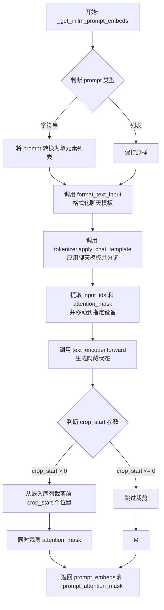
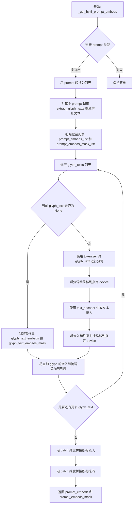
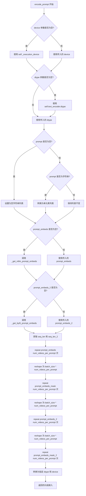
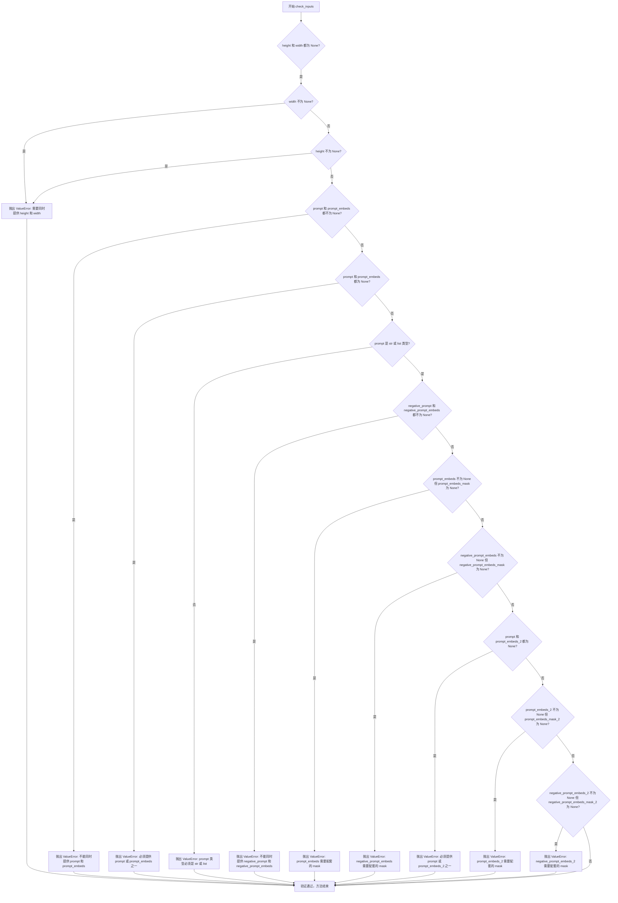
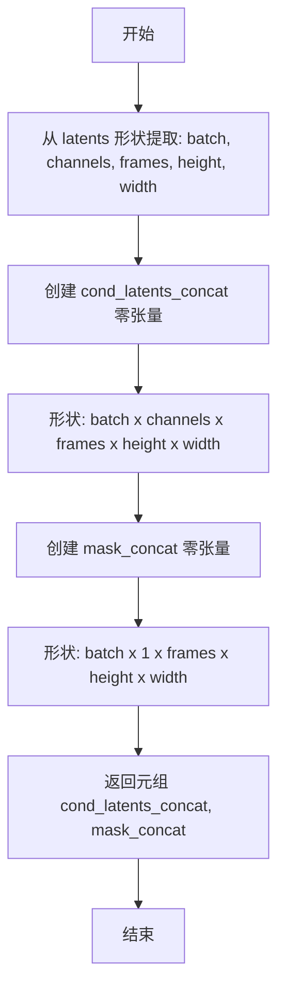
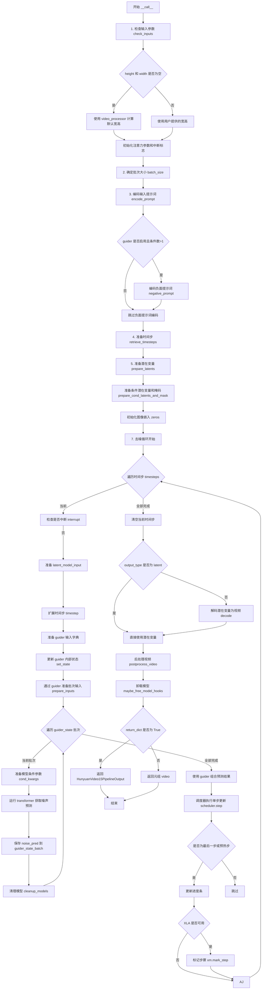

# `diffusers\src\diffusers\pipelines\hunyuan_video1_5\pipeline_hunyuan_video1_5.py` 详细设计文档

HunyuanVideo15Pipeline 是一个基于扩散模型的文本到视频生成管道 (Text-to-Video Generation Pipeline)。它整合了双文本编码器 (Qwen2.5-VL 用于多模态理解，T5 用于细节描述)、3D 变换器 (Transformer) 进行噪声预测，以及 VAE (Variational Autoencoder) 进行潜在空间的编解码，从而根据文本提示生成高质量视频。

## 整体流程

```mermaid
graph TD
    Start([开始]) --> CheckInputs{检查输入参数}
    CheckInputs -- 无效 --> Error[抛出 ValueError]
    CheckInputs -- 有效 --> CalcSize[计算默认宽高]
    CalcSize --> EncodePrompt[编码提示词]
    EncodePrompt --> PrepareTimesteps[准备时间步]
    PrepareTimesteps --> PrepareLatents[准备潜空间向量 (噪声)]
    PrepareLatents --> DenoiseLoop[去噪循环 (Denoising Loop)]
    DenoiseLoop --> ExpandTimestep[扩展时间步]
    ExpandTimestep --> PrepareGuider[准备引导器输入]
    PrepareGuider --> SplitBatches[分裂条件/非条件批次]
    SplitBatches --> RunTransformer[运行 3D Transformer]
    RunTransformer --> CombinePreds[组合预测 (CFG/Guider)]
    CombinePreds --> SchedulerStep[调度器更新潜向量]
    SchedulerStep -- 未完成 --> DenoiseLoop
    SchedulerStep -- 完成 --> DecodeVAE[VAE 解码]
    DecodeVAE --> PostProcess[后处理视频]
    PostProcess --> End([返回结果])
```

## 类结构

```
DiffusionPipeline (基类)
└── HunyuanVideo15Pipeline (主类)
```

## 全局变量及字段


### `EXAMPLE_DOC_STRING`
    
示例文档字符串，包含代码使用示例

类型：`str`
    


### `logger`
    
模块级日志记录器

类型：`logging.Logger`
    


### `XLA_AVAILABLE`
    
标识PyTorch XLA是否可用

类型：`bool`
    


### `HunyuanVideo15Pipeline.vae`
    
视频编解码器，用于视频潜在表示的编码和解码

类型：`AutoencoderKLHunyuanVideo15`
    


### `HunyuanVideo15Pipeline.text_encoder`
    
主文本编码器（视觉语言模型），用于将文本提示转换为嵌入

类型：`Qwen2_5_VLTextModel`
    


### `HunyuanVideo15Pipeline.tokenizer`
    
主分词器，用于对文本进行分词处理

类型：`Qwen2Tokenizer`
    


### `HunyuanVideo15Pipeline.transformer`
    
核心去噪变换器，用于去噪视频潜在表示

类型：`HunyuanVideo15Transformer3DModel`
    


### `HunyuanVideo15Pipeline.scheduler`
    
扩散调度器，控制去噪过程的时间步长

类型：`FlowMatchEulerDiscreteScheduler`
    


### `HunyuanVideo15Pipeline.text_encoder_2`
    
辅助文本编码器（T5），用于提取字形文本嵌入

类型：`T5EncoderModel`
    


### `HunyuanVideo15Pipeline.tokenizer_2`
    
辅助分词器，用于对字形文本进行分词

类型：`ByT5Tokenizer`
    


### `HunyuanVideo15Pipeline.guider`
    
引导器，用于实现无分类器引导生成

类型：`ClassifierFreeGuidance`
    


### `HunyuanVideo15Pipeline.video_processor`
    
视频后处理器，用于视频后处理和格式转换

类型：`HunyuanVideo15ImageProcessor`
    


### `HunyuanVideo15Pipeline.system_message`
    
系统提示词模板，用于指导视频描述生成

类型：`str`
    


### `HunyuanVideo15Pipeline.vae_scale_factor_temporal`
    
VAE时间压缩比，用于计算潜在帧数

类型：`int`
    


### `HunyuanVideo15Pipeline.vae_scale_factor_spatial`
    
VAE空间压缩比，用于计算潜在高度和宽度

类型：`int`
    


### `HunyuanVideo15Pipeline.target_size`
    
目标尺寸，用于计算默认宽高

类型：`int`
    


### `HunyuanVideo15Pipeline.vision_states_dim`
    
视觉状态维度，对应图像嵌入维度

类型：`int`
    


### `HunyuanVideo15Pipeline.num_channels_latents`
    
潜在通道数，用于初始化潜在变量

类型：`int`
    


### `HunyuanVideo15Pipeline.prompt_template_encode_start_idx`
    
提示模板编码起始索引，用于裁剪嵌入

类型：`int`
    


### `HunyuanVideo15Pipeline.tokenizer_max_length`
    
主分词器最大长度限制

类型：`int`
    


### `HunyuanVideo15Pipeline.tokenizer_2_max_length`
    
辅助分词器最大长度限制

类型：`int`
    


### `HunyuanVideo15Pipeline.vision_num_semantic_tokens`
    
视觉语义标记数量，用于初始化图像嵌入

类型：`int`
    


### `HunyuanVideo15Pipeline.default_aspect_ratio`
    
默认宽高比（宽:高）

类型：`tuple[int, int]`
    
    

## 全局函数及方法


### `format_text_input`

该函数将输入的文本提示列表和系统消息转换为聊天模板格式，为多模态语言模型（如 Qwen2.5-VL）准备对话输入。每个提示都被包装成一个包含 system 角色（系统消息）和 user 角色（用户输入）的对话结构。

参数：

- `prompt`：`list[str]`，输入的文本提示列表
- `system_message`：`str`，系统消息，用于设置对话上下文

返回值：`list[dict[str, Any]]`，返回聊天对话列表，每个元素是一个包含 system 和 user 角色的对话历史

#### 流程图

```mermaid
flowchart TD
    A[开始] --> B[输入: prompt: list[str], system_message: str]
    B --> C{遍历 prompt 列表}
    C -->|对于每个 prompt p| D[创建 system 消息字典]
    D --> E[创建 user 消息字典<br/>content = p 如果 p 存在<br/>否则为 " "]
    E --> F[将两个字典组成列表<br/>[{role: system}, {role: user}]]
    F --> G[添加到模板列表]
    C -->|遍历完成| H[返回模板列表]
    H --> I[结束]
    
    style A fill:#f9f,color:#333
    style I fill:#9f9,color:#333
    style B fill:#bbf,color:#333
    style H fill:#bbf,color:#333
```

#### 带注释源码

```python
def format_text_input(prompt: list[str], system_message: str) -> list[dict[str, Any]]:
    """
    Apply text to template.

    将输入的文本提示列表和系统消息转换为聊天模板格式。
    此函数主要用于为多模态语言模型（如 Qwen2.5-VL）准备符合聊天模板规范的输入。

    Args:
        prompt (list[str]): 输入的文本提示列表，每个元素代表一个用户输入。
        system_message (str): 系统消息，用于设置对话的上下文和行为。

    Returns:
        list[dict[str, Any]]: 返回聊天对话列表，格式为:
            [
                [{"role": "system", "content": system_message}, {"role": "user", "content": prompt[0]}],
                [{"role": "system", "content": system_message}, {"role": "user", "content": prompt[1]}],
                ...
            ]
    """

    # 使用列表推导式构建聊天模板
    # 对于每个 prompt p，创建一个包含 system 和 user 角色的对话历史
    # 如果 p 为空字符串，则使用 " " 代替，避免空内容导致的潜在问题
    template = [
        [
            {"role": "system", "content": system_message},  # system 角色消息，包含系统提示
            {"role": "user", "content": p if p else " "}    # user 角色消息，包含用户输入
        ] 
        for p in prompt  # 遍历每个 prompt
    ]

    return template  # 返回构建好的聊天模板列表
```


### `extract_glyph_texts`

该函数用于从输入提示字符串中使用正则表达式提取被引号包裹的文字（glyph texts），并将其格式化为特定的字符串供后续文本编码器使用。

参数：

- `prompt`：`str`，输入的提示字符串

返回值：`str | None`，格式化后的glyph文本字符串，如果未提取到任何glyph文本则返回 `None`

#### 流程图

```mermaid
flowchart TD
    A[开始: 输入 prompt] --> B[定义正则表达式 pattern]
    B --> C[使用 re.findall 查找所有匹配项]
    C --> D[遍历匹配结果, 提取捕获组中的文本]
    D --> E{结果列表长度 > 1?}
    E -->|是| F[使用 dict.fromkeys 去重]
    E -->|否| G[保持原结果]
    F --> H[格式化结果]
    G --> H
    H --> I{结果列表是否为空?}
    I -->|否| J[拼接格式化字符串: 'Text "xxx". Text "yyy". ']
    I -->|是| K[返回 None]
    J --> L[返回格式化后的字符串]
    K --> L
```

#### 带注释源码

```python
def extract_glyph_texts(prompt: str) -> list[str]:
    """
    Extract glyph texts from prompt using regex pattern.

    Args:
        prompt: Input prompt string

    Returns:
        List of extracted glyph texts
    """
    # 定义正则表达式: 匹配双引号 "" 或中文引号 “” 包裹的内容
    # r"\"(.*?)\"|"(.*?)"" 会匹配:
    #   - \(.*?\) : 双引号包裹的文本 (非贪婪)
    #   - (.*?) : 中文引号 "  " 包裹的文本 (非贪婪)
    pattern = r"\"(.*?)\"|"(.*?)""

    # findall 返回所有匹配的元组列表，每个元组包含两个捕获组
    # 如果用双引号匹配，则 match[0] 有值，match[1] 为空
    # 如果用中文引号匹配，则 match[0] 为空，match[1] 有值
    matches = re.findall(pattern, prompt)

    # 提取有效文本: 使用 or 操作符选择非空的捕获组
    result = [match[0] or match[1] for match in matches]

    # 去重处理: 如果有多个结果，使用 dict.fromkeys 保持顺序去重
    # 注意: 只有结果长度 > 1 时才去重，单独一个元素不需要
    result = list(dict.fromkeys(result)) if len(result) > 1 else result

    # 格式化结果为特定字符串格式
    if result:
        # 格式: 'Text "xxx". Text "yyy". '
        formatted_result = ". ".join([f'Text "{text}"' for text in result]) + ". "
    else:
        # 如果没有提取到任何 glyph 文本，返回 None
        formatted_result = None

    return formatted_result
```


### `retrieve_timesteps`

该函数用于调用调度器的 `set_timesteps` 方法并从中获取时间步。它支持自定义时间步和自定义 sigmas，任何额外的关键字参数都会传递给调度器的 `set_timesteps` 方法。

参数：

- `scheduler`：`SchedulerMixin`，要获取时间步的调度器
- `num_inference_steps`：`int | None`，生成样本时使用的扩散步数。如果使用此参数，`timesteps` 必须为 `None`
- `device`：`str | torch.device | None`，时间步要移动到的设备。如果为 `None`，时间步不会移动
- `timesteps`：`list[int] | None`，用于覆盖调度器时间步间隔策略的自定义时间步。如果传入 `timesteps`，则 `num_inference_steps` 和 `sigmas` 必须为 `None`
- `sigmas`：`list[float] | None`，用于覆盖调度器时间步间隔策略的自定义 sigmas。如果传入 `sigmas`，则 `num_inference_steps` 和 `timesteps` 必须为 `None`
- `**kwargs`：任意关键字参数，将传递给 `scheduler.set_timesteps`

返回值：`tuple[torch.Tensor, int]`，第一个元素是调度器的时间步计划，第二个元素是推理步数。

#### 流程图

```mermaid
flowchart TD
    A[开始] --> B{检查timesteps和sigmas是否同时存在}
    B -->|是| C[抛出ValueError: 只能选择一个]
    B -->|否| D{检查timesteps是否不为None}
    D -->|是| E[检查调度器是否支持timesteps参数]
    E -->|不支持| F[抛出ValueError: 调度器不支持timesteps]
    E -->|支持| G[调用scheduler.set_timesteps<br/>传入timesteps和device]
    G --> H[获取scheduler.timesteps]
    H --> I[计算num_inference_steps = len(timesteps)]
    D -->|否| J{检查sigmas是否不为None}
    J -->|是| K[检查调度器是否支持sigmas参数]
    K -->|不支持| L[抛出ValueError: 调度器不支持sigmas]
    K -->|支持| M[调用scheduler.set_timesteps<br/>传入sigmas和device]
    M --> N[获取scheduler.timesteps]
    N --> O[计算num_inference_steps = len(timesteps)]
    J -->|否| P[调用scheduler.set_timesteps<br/>传入num_inference_steps和device]
    P --> Q[获取scheduler.timesteps]
    Q --> R[返回timesteps和num_inference_steps]
    I --> R
    O --> R
```

#### 带注释源码

```python
def retrieve_timesteps(
    scheduler,
    num_inference_steps: int | None = None,
    device: str | torch.device | None = None,
    timesteps: list[int] | None = None,
    sigmas: list[float] | None = None,
    **kwargs,
):
    r"""
    Calls the scheduler's `set_timesteps` method and retrieves timesteps from the scheduler after the call. Handles
    custom timesteps. Any kwargs will be supplied to `scheduler.set_timesteps`.

    Args:
        scheduler (`SchedulerMixin`):
            The scheduler to get timesteps from.
        num_inference_steps (`int`):
            The number of diffusion steps used when generating samples with a pre-trained model. If used, `timesteps`
            must be `None`.
        device (`str` or `torch.device`, *optional*):
            The device to which the timesteps should be moved to. If `None`, the timesteps are not moved.
        timesteps (`list[int]`, *optional*):
            Custom timesteps used to override the timestep spacing strategy of the scheduler. If `timesteps` is passed,
            `num_inference_steps` and `sigmas` must be `None`.
        sigmas (`list[float]`, *optional*):
            Custom sigmas used to override the timestep spacing strategy of the scheduler. If `sigmas` is passed,
            `num_inference_steps` and `timesteps` must be `None`.

    Returns:
        `tuple[torch.Tensor, int]`: A tuple where the first element is the timestep schedule from the scheduler and the
        second element is the number of inference steps.
    """
    # 检查是否同时传入了timesteps和sigmas，两者只能选其一
    if timesteps is not None and sigmas is not None:
        raise ValueError("Only one of `timesteps` or `sigmas` can be passed. Please choose one to set custom values")
    
    # 处理自定义timesteps的情况
    if timesteps is not None:
        # 检查调度器的set_timesteps方法是否支持timesteps参数
        accepts_timesteps = "timesteps" in set(inspect.signature(scheduler.set_timesteps).parameters.keys())
        if not accepts_timesteps:
            raise ValueError(
                f"The current scheduler class {scheduler.__class__}'s `set_timesteps` does not support custom"
                f" timestep schedules. Please check whether you are using the correct scheduler."
            )
        # 调用调度器的set_timesteps方法
        scheduler.set_timesteps(timesteps=timesteps, device=device, **kwargs)
        # 从调度器获取时间步
        timesteps = scheduler.timesteps
        # 计算推理步数
        num_inference_steps = len(timesteps)
    
    # 处理自定义sigmas的情况
    elif sigmas is not None:
        # 检查调度器的set_timesteps方法是否支持sigmas参数
        accept_sigmas = "sigmas" in set(inspect.signature(scheduler.set_timesteps).parameters.keys())
        if not accept_sigmas:
            raise ValueError(
                f"The current scheduler class {scheduler.__class__}'s `set_timesteps` does not support custom"
                f" sigmas schedules. Please check whether you are using the correct scheduler."
            )
        # 调用调度器的set_timesteps方法
        scheduler.set_timesteps(sigmas=sigmas, device=device, **kwargs)
        # 从调度器获取时间步
        timesteps = scheduler.timesteps
        # 计算推理步数
        num_inference_steps = len(timesteps)
    
    # 默认情况：使用num_inference_steps设置时间步
    else:
        scheduler.set_timesteps(num_inference_steps, device=device, **kwargs)
        # 从调度器获取时间步
        timesteps = scheduler.timesteps
    
    # 返回时间步和推理步数
    return timesteps, num_inference_steps
```


### HunyuanVideo15Pipeline.__init__

这是HunyuanVideo15Pipeline类的初始化方法，负责配置和初始化文本到视频生成管道所需的所有组件，包括文本编码器、分词器、变换器模型、VAE、调度器和引导器等。

参数：

- `text_encoder`：`Qwen2_5_VLTextModel`，用于处理主要文本输入的Qwen2.5-VL-7B-Instruct文本编码器
- `tokenizer`：`Qwen2Tokenizer`，与text_encoder配套的分词器
- `transformer`：`HunyuanVideo15Transformer3DModel`，条件变换器（MMDiT）架构，用于对编码的视频潜在表示进行去噪
- `vae`：`AutoencoderKLHunyuanVideo15`，变分自编码器模型，用于编码和解码视频到潜在表示
- `scheduler`：`FlowMatchEulerDiscreteScheduler`，与transformer配合使用的调度器
- `text_encoder_2`：`T5EncoderModel`，T5编码器模型，用于额外的文本嵌入
- `tokenizer_2`：`ByT5Tokenizer`，与text_encoder_2配套的分词器
- `guider`：`ClassifierFreeGuidance`，用于分类器自由引导的引导器

返回值：无（`None`），构造函数不返回任何值

#### 流程图

```mermaid
flowchart TD
    A[开始 __init__] --> B[调用 super().__init__]
    B --> C[register_modules 注册所有模块]
    C --> D[设置 VAE 时间压缩比]
    D --> E[设置 VAE 空间压缩比]
    E --> F[创建 VideoProcessor]
    F --> G[设置目标尺寸]
    G --> H[设置视觉状态维度]
    H --> I[设置潜在通道数]
    I --> J[设置系统消息]
    J --> K[设置提示模板编码起始索引]
    K --> L[设置分词器最大长度]
    L --> M[设置第二个分词器最大长度]
    M --> N[设置视觉语义标记数量]
    N --> O[设置默认宽高比]
    O --> P[结束 __init__]
```

#### 带注释源码

```python
def __init__(
    self,
    text_encoder: Qwen2_5_VLTextModel,
    tokenizer: Qwen2Tokenizer,
    transformer: HunyuanVideo15Transformer3DModel,
    vae: AutoencoderKLHunyuanVideo15,
    scheduler: FlowMatchEulerDiscreteScheduler,
    text_encoder_2: T5EncoderModel,
    tokenizer_2: ByT5Tokenizer,
    guider: ClassifierFreeGuidance,
):
    """
    初始化HunyuanVideo15Pipeline管道
    
    参数:
        text_encoder: Qwen2.5-VL-7B-Instruct文本编码器
        tokenizer: Qwen2分词器
        transformer: 3D变换器模型
        vae: 变分自编码器
        scheduler: 流匹配欧拉离散调度器
        text_encoder_2: T5编码器模型
        tokenizer_2: ByT5分词器
        guider: 分类器自由引导器
    """
    # 调用父类DiffusionPipeline的初始化方法
    super().__init__()

    # 将所有模块注册到pipeline中，便于管理和访问
    self.register_modules(
        vae=vae,
        text_encoder=text_encoder,
        tokenizer=tokenizer,
        transformer=transformer,
        scheduler=scheduler,
        text_encoder_2=text_encoder_2,
        tokenizer_2=tokenizer_2,
        guider=guider,
    )

    # 设置VAE的时间压缩比，用于计算潜在帧数
    self.vae_scale_factor_temporal = self.vae.temporal_compression_ratio if getattr(self, "vae", None) else 4
    # 设置VAE的空间压缩比，用于计算潜在高度和宽度
    self.vae_scale_factor_spatial = self.vae.spatial_compression_ratio if getattr(self, "vae", None) else 16
    
    # 创建视频处理器，用于视频后处理
    self.video_processor = HunyuanVideo15ImageProcessor(vae_scale_factor=self.vae_scale_factor_spatial)
    
    # 从transformer配置中获取目标尺寸，或使用默认值640
    self.target_size = self.transformer.config.target_size if getattr(self, "transformer", None) else 640
    
    # 获取视觉状态维度，用于图像嵌入
    self.vision_states_dim = (
        self.transformer.config.image_embed_dim if getattr(self, "transformer", None) else 1152
    )
    
    # 获取潜在通道数
    self.num_channels_latents = self.vae.config.latent_channels if hasattr(self, "vae") else 32
    
    # 系统消息：指导AI助手如何描述视频内容
    # 包含5个方面：主要内容、物体特征、动作行为、背景环境和摄像机运动
    self.system_message = "You are a helpful assistant. Describe the video by detailing the following aspects: \
    1. The main content and theme of the video. \
    2. The color, shape, size, texture, quantity, text, and spatial relationships of the objects. \
    3. Actions, events, behaviors temporal relationships, physical movement changes of the objects. \
    4. background environment, light, style and atmosphere. \
    5. camera angles, movements, and transitions used in the video."
    
    # 提示模板编码的起始索引，用于跳过模板前缀
    self.prompt_template_encode_start_idx = 108
    
    # 第一个分词器的最大长度
    self.tokenizer_max_length = 1000
    
    # 第二个分词器（ByT5）的最大长度
    self.tokenizer_2_max_length = 256
    
    # 视觉语义标记数量
    self.vision_num_semantic_tokens = 729
    
    # 默认宽高比（宽度:高度）
    self.default_aspect_ratio = (16, 9)  # (width: height)
```


### `HunyuanVideo15Pipeline._get_mllm_prompt_embeds`

该方法是一个静态方法，用于将文本提示（prompt）转换为多模态大语言模型（MLLM）的嵌入向量表示。它使用 Qwen2.5-VL 文本编码器对格式化后的聊天模板进行编码，并返回文本嵌入和注意力掩码，可用于后续的视频生成流程。

参数：

- `text_encoder`：`Qwen2_5_VLTextModel`，Qwen2.5-VL 文本编码器模型，用于生成文本嵌入
- `tokenizer`：`Qwen2Tokenizer`，Qwen2 分词器，用于对文本进行分词和转换为 token ID
- `prompt`：`str | list[str]`，输入的文本提示，可以是单个字符串或字符串列表
- `device`：`torch.device`，计算设备（如 CPU 或 CUDA 设备）
- `tokenizer_max_length`：`int = 1000`，分词器的最大长度，默认为 1000
- `num_hidden_layers_to_skip`：`int = 2`，从模型隐藏状态中跳过最后 N 层，默认为 2（实际取倒数第 3 层）
- `system_message`：`str`，系统消息，用于指导模型描述视频的各个方面，默认为一段详细的视频描述指导语
- `crop_start`：`int = 108`，从嵌入序列开始处裁剪的起始位置，默认为 108（用于跳过聊天模板的前缀部分）

返回值：`tuple[torch.Tensor, torch.Tensor]`，返回一个元组，包含 `prompt_embeds`（文本嵌入张量，形状为 [batch_size, seq_len, hidden_dim]）和 `prompt_attention_mask`（注意力掩码张量，形状为 [batch_size, seq_len]）

#### 流程图



#### 带注释源码

```python
@staticmethod
def _get_mllm_prompt_embeds(
    text_encoder: Qwen2_5_VLTextModel,
    tokenizer: Qwen2Tokenizer,
    prompt: str | list[str],
    device: torch.device,
    tokenizer_max_length: int = 1000,
    num_hidden_layers_to_skip: int = 2,
    # fmt: off
    system_message: str = "You are a helpful assistant. Describe the video by detailing the following aspects: \
    1. The main content and theme of the video. \
    2. The color, shape, size, texture, quantity, text, and spatial relationships of the objects. \
    3. Actions, events, behaviors temporal relationships, physical movement changes of the objects. \
    4. background environment, light, style and atmosphere. \
    5. camera angles, movements, and transitions used in the video.",
    # fmt: on
    crop_start: int = 108,
) -> tuple[torch.Tensor, torch.Tensor]:
    # 步骤 1: 标准化输入 prompt，确保为列表类型
    prompt = [prompt] if isinstance(prompt, str) else prompt

    # 步骤 2: 将文本和应用系统消息格式化为聊天模板格式
    # 例如: [{"role": "system", "content": system_message}, {"role": "user", "content": prompt}]
    prompt = format_text_input(prompt, system_message)

    # 步骤 3: 使用聊天模板分词器将聊天模板转换为模型输入
    # add_generation_prompt=True 添加生成提示符 (如 "Assistant:")
    # padding="max_length" 填充到最大长度
    # return_tensors="pt" 返回 PyTorch 张量
    text_inputs = tokenizer.apply_chat_template(
        prompt,
        add_generation_prompt=True,
        tokenize=True,
        return_dict=True,
        padding="max_length",
        max_length=tokenizer_max_length + crop_start,  # 预留空间给模板前缀
        truncation=True,
        return_tensors="pt",
    )

    # 步骤 4: 将分词后的 input_ids 和 attention_mask 移动到指定设备
    text_input_ids = text_inputs.input_ids.to(device=device)
    prompt_attention_mask = text_inputs.attention_mask.to(device=device)

    # 步骤 5: 调用文本编码器获取隐藏状态
    # output_hidden_states=True 要求返回所有隐藏状态
    # hidden_states 是一个元组，包含每层的输出，取倒数第 (num_hidden_layers_to_skip + 1) 层
    # 例如 num_hidden_layers_to_skip=2 时，取倒数第 3 层的隐藏状态
    prompt_embeds = text_encoder(
        input_ids=text_input_ids,
        attention_mask=prompt_attention_mask,
        output_hidden_states=True,
    ).hidden_states[-(num_hidden_layers_to_skip + 1)]

    # 步骤 6: 可选裁剪 - 移除聊天模板前缀部分
    # crop_start=108 对应 prompt_template_encode_start_idx
    # 用于移除系统消息和用户消息模板带来的固定前缀嵌入
    if crop_start is not None and crop_start > 0:
        prompt_embeds = prompt_embeds[:, crop_start:]  # 裁剪嵌入序列
        prompt_attention_mask = prompt_attention_mask[:, crop_start:]  # 同步裁剪注意力掩码

    # 步骤 7: 返回最终的文本嵌入和注意力掩码
    return prompt_embeds, prompt_attention_mask
```


### `HunyuanVideo15Pipeline._get_byt5_prompt_embeds`

该方法是一个静态方法，用于从给定的提示文本中提取字形文本（glyph texts），并使用 ByT5 分词器和 T5 文本编码器生成对应的文本嵌入（prompt embeddings）和注意力掩码（attention mask），专用于处理文本中的字面文字（如引号内的文字），为视频生成管道提供辅助文本特征。

参数：

- `tokenizer`：`ByT5Tokenizer`，ByT5 分词器，用于对字形文本进行分词
- `text_encoder`：`T5EncoderModel`，T5 编码器模型，用于生成文本嵌入向量
- `prompt`：`str | list[str]`，输入的提示文本，可以是单个字符串或字符串列表
- `device`：`torch.device`，计算设备（如 CUDA 或 CPU）
- `tokenizer_max_length`：`int`，分词器的最大长度，默认为 256

返回值：`tuple[torch.Tensor, torch.Tensor]`，返回两个张量——第一个是文本嵌入（prompt_embeds），形状为 `(batch_size, seq_len, d_model)`；第二个是注意力掩码（prompt_embeds_mask），形状为 `(batch_size, seq_len)`

#### 流程图



#### 带注释源码

```python
@staticmethod
def _get_byt5_prompt_embeds(
    tokenizer: ByT5Tokenizer,
    text_encoder: T5EncoderModel,
    prompt: str | list[str],
    device: torch.device,
    tokenizer_max_length: int = 256,
):
    # 将输入的 prompt 规范化为列表形式
    # 如果是单个字符串，则包装为列表；如果是列表则保持不变
    prompt = [prompt] if isinstance(prompt, str) else prompt

    # 从每个 prompt 中提取字形文本（用双引号或中文引号括起来的文本）
    # 例如: prompt = 'A cat "walks" on the grass' -> glyph_text = 'Text "walks"'
    glyph_texts = [extract_glyph_texts(p) for p in prompt]

    # 初始化用于存储所有 prompt 嵌入和掩码的列表
    prompt_embeds_list = []
    prompt_embeds_mask_list = []

    # 遍历每个提取出的字形文本
    for glyph_text in glyph_texts:
        # 如果没有字形文本（glyph_text 为 None），创建零张量作为占位符
        if glyph_text is None:
            glyph_text_embeds = torch.zeros(
                (1, tokenizer_max_length, text_encoder.config.d_model),  # 形状: (1, max_len, d_model)
                device=device,
                dtype=text_encoder.dtype
            )
            glyph_text_embeds_mask = torch.zeros((1, tokenizer_max_length), device=device, dtype=torch.int64)
        else:
            # 使用 ByT5 tokenizer 对字形文本进行分词
            txt_tokens = tokenizer(
                glyph_text,
                padding="max_length",           # 填充到最大长度
                max_length=tokenizer_max_length,
                truncation=True,                # 截断过长文本
                add_special_tokens=True,        # 添加特殊 token（如 [CLS], [SEP]）
                return_tensors="pt",           # 返回 PyTorch 张量
            ).to(device)

            # 使用 T5 编码器生成文本嵌入
            # 返回的 hidden_states 形状: (batch_size, seq_len, d_model)
            glyph_text_embeds = text_encoder(
                input_ids=txt_tokens.input_ids,
                attention_mask=txt_tokens.attention_mask.float(),
            )[0]
            glyph_text_embeds = glyph_text_embeds.to(device=device)
            glyph_text_embeds_mask = txt_tokens.attention_mask.to(device=device)

        # 将当前 glyph 的嵌入和掩码添加到列表中
        prompt_embeds_list.append(glyph_text_embeds)
        prompt_embeds_mask_list.append(glyph_text_embeds_mask)

    # 将所有批次的嵌入沿 batch 维度（dim=0）拼接
    prompt_embeds = torch.cat(prompt_embeds_list, dim=0)
    # 将所有批次的掩码沿 batch 维度（dim=0）拼接
    prompt_embeds_mask = torch.cat(prompt_embeds_mask_list, dim=0)

    # 返回拼接后的嵌入和掩码
    return prompt_embeds, prompt_embeds_mask
```


### HunyuanVideo15Pipeline.encode_prompt

该方法负责将文本提示编码为两种不同格式的文本嵌入（Qwen2.5-VL 和 ByT5），支持批量处理和每提示生成多个视频，并可接受预计算的嵌入以提高效率。

参数：

- `prompt`：`str | list[str]`，可选，要编码的提示文本
- `device`：`torch.device | None`，可选，执行设备，默认为执行设备
- `dtype`：`torch.dtype | None`，可选，数据类型，默认为 text_encoder 的数据类型
- `batch_size`：`int`，默认值 1，提示的批处理大小
- `num_videos_per_prompt`：`int`，默认值 1，每个提示要生成的视频数量
- `prompt_embeds`：`torch.Tensor | None`，可选，预生成的 Qwen2.5-VL 文本嵌入，如果未提供则从 prompt 生成
- `prompt_embeds_mask`：`torch.Tensor | None`，可选，预生成的 Qwen2.5-VL 文本注意力掩码
- `prompt_embeds_2`：`torch.Tensor | None`，可选，预生成的 ByT5 Glyph 文本嵌入，如果未提供则从 prompt 生成
- `prompt_embeds_mask_2`：`torch.Tensor | None`，可选，预生成的 ByT5 文本注意力掩码

返回值：`tuple[torch.Tensor, torch.Tensor, torch.Tensor, torch.Tensor]`，返回四个元素的元组：(prompt_embeds, prompt_embeds_mask, prompt_embeds_2, prompt_embeds_mask_2)，分别表示 Qwen2.5-VL 编码的提示嵌入、注意力掩码、ByT5 编码的提示嵌入和对应的注意力掩码。

#### 流程图



#### 带注释源码

```python
def encode_prompt(
    self,
    prompt: str | list[str],
    device: torch.device | None = None,
    dtype: torch.dtype | None = None,
    batch_size: int = 1,
    num_videos_per_prompt: int = 1,
    prompt_embeds: torch.Tensor | None = None,
    prompt_embeds_mask: torch.Tensor | None = None,
    prompt_embeds_2: torch.Tensor | None = None,
    prompt_embeds_mask_2: torch.Tensor | None = None,
):
    """
    Encode prompt into text embeddings using two different text encoders.

    This method handles encoding of text prompts using both Qwen2.5-VL (for main text)
    and ByT5 (for glyph/text extraction). It supports batch processing and can accept
    pre-computed embeddings for efficiency.

    Args:
        prompt: Input text prompt(s) to encode
        device: Target device for embeddings (defaults to execution device)
        dtype: Target dtype for embeddings (defaults to text_encoder dtype)
        batch_size: Number of prompts in batch
        num_videos_per_prompt: Number of videos to generate per prompt
        prompt_embeds: Pre-computed Qwen2.5-VL embeddings
        prompt_embeds_mask: Pre-computed attention mask for Qwen2.5-VL embeddings
        prompt_embeds_2: Pre-computed ByT5 embeddings for glyph text
        prompt_embeds_mask_2: Pre-computed attention mask for ByT5 embeddings
    """
    # 设置设备：如果未指定，则使用执行设备
    device = device or self._execution_device
    # 设置数据类型：如果未指定，则使用文本编码器的数据类型
    dtype = dtype or self.text_encoder.dtype

    # 处理空提示：如果提示为空，创建空字符串列表
    if prompt is None:
        prompt = [""] * batch_size

    # 标准化提示格式：确保是列表类型
    prompt = [prompt] if isinstance(prompt, str) else prompt

    # 如果未提供预计算的 Qwen2.5-VL 嵌入，则从提示生成
    if prompt_embeds is None:
        prompt_embeds, prompt_embeds_mask = self._get_mllm_prompt_embeds(
            tokenizer=self.tokenizer,
            text_encoder=self.text_encoder,
            prompt=prompt,
            device=device,
            tokenizer_max_length=self.tokenizer_max_length,
            system_message=self.system_message,
            crop_start=self.prompt_template_encode_start_idx,
        )

    # 如果未提供预计算的 ByT5 嵌入，则从提示生成
    if prompt_embeds_2 is None:
        prompt_embeds_2, prompt_embeds_mask_2 = self._get_byt5_prompt_embeds(
            tokenizer=self.tokenizer_2,
            text_encoder=self.text_encoder_2,
            prompt=prompt,
            device=device,
            tokenizer_max_length=self.tokenizer_2_max_length,
        )

    # 获取序列长度用于后续的重复操作
    _, seq_len, _ = prompt_embeds.shape
    
    # 扩展 Qwen2.5-VL 嵌入以匹配 num_videos_per_prompt
    prompt_embeds = prompt_embeds.repeat(1, num_videos_per_prompt, 1)
    prompt_embeds = prompt_embeds.view(batch_size * num_videos_per_prompt, seq_len, -1)
    
    # 扩展对应的注意力掩码
    prompt_embeds_mask = prompt_embeds_mask.repeat(1, num_videos_per_prompt, 1)
    prompt_embeds_mask = prompt_embeds_mask.view(batch_size * num_videos_per_prompt, seq_len)

    # 获取 ByT5 嵌入的序列长度
    _, seq_len_2, _ = prompt_embeds_2.shape
    
    # 扩展 ByT5 嵌入以匹配 num_videos_per_prompt
    prompt_embeds_2 = prompt_embeds_2.repeat(1, num_videos_per_prompt, 1)
    prompt_embeds_2 = prompt_embeds_2.view(batch_size * num_videos_per_prompt, seq_len_2, -1)
    
    # 扩展对应的注意力掩码
    prompt_embeds_mask_2 = prompt_embeds_mask_2.repeat(1, num_videos_per_prompt, 1)
    prompt_embeds_mask_2 = prompt_embeds_mask_2.view(batch_size * num_videos_per_prompt, seq_len_2)

    # 将所有嵌入转换为目标设备和数据类型
    prompt_embeds = prompt_embeds.to(dtype=dtype, device=device)
    prompt_embeds_mask = prompt_embeds_mask.to(dtype=dtype, device=device)
    prompt_embeds_2 = prompt_embeds_2.to(dtype=dtype, device=device)
    prompt_embeds_mask_2 = prompt_embeds_mask_2.to(dtype=dtype, device=device)

    # 返回四个嵌入元组：(Qwen嵌入, Qwen掩码, ByT5嵌入, ByT5掩码)
    return prompt_embeds, prompt_embeds_mask, prompt_embeds_2, prompt_embeds_mask_2
```


### `HunyuanVideo15Pipeline.check_inputs`

该方法用于验证文本到视频生成管道的输入参数是否合法，包括检查高度/宽度的完整性、prompt 与 prompt_embeds 的互斥关系、embeddings 与 mask 的配对要求等，确保用户提供正确的输入组合。

参数：

- `self`：隐式参数，Pipeline 实例本身
- `prompt`：`str | list[str] | None`，用户输入的文本提示
- `height`：`int | None`，生成视频的高度（像素）
- `width`：`int | None`，生成视频的宽度（像素）
- `negative_prompt`：`str | list[str] | None`，负面提示词，用于引导模型避免生成某些内容
- `prompt_embeds`：`torch.Tensor | None`，预生成的文本嵌入向量
- `negative_prompt_embeds`：`torch.Tensor | None`，预生成的负面文本嵌入向量
- `prompt_embeds_mask`：`torch.Tensor | None`，prompt_embeds 对应的注意力掩码
- `negative_prompt_embeds_mask`：`torch.Tensor | None`，negative_prompt_embeds 对应的注意力掩码
- `prompt_embeds_2`：`torch.Tensor | None`，来自第二个文本编码器（T5）的预生成文本嵌入
- `prompt_embeds_mask_2`：`torch.Tensor | None`，prompt_embeds_2 对应的注意力掩码
- `negative_prompt_embeds_2`：`torch.Tensor | None`，来自 T5 的负面文本嵌入
- `negative_prompt_embeds_mask_2`：`torch.Tensor | None`，negative_prompt_embeds_2 对应的注意力掩码

返回值：`None`，该方法不返回任何值，仅通过抛出 `ValueError` 来表示验证失败

#### 流程图



#### 带注释源码

```python
def check_inputs(
    self,
    prompt,                          # 用户输入的文本提示，str 或 list[str] 类型
    height,                         # 生成视频的高度像素值
    width,                          # 生成视频的宽度像素值
    negative_prompt=None,          # 负面提示词，可选
    prompt_embeds=None,            # 预生成的文本嵌入，可选
    negative_prompt_embeds=None,   # 预生成的负面文本嵌入，可选
    prompt_embeds_mask=None,       # prompt_embeds 的注意力掩码，可选
    negative_prompt_embeds_mask=None, # negative_prompt_embeds 的注意力掩码，可选
    prompt_embeds_2=None,         # T5 文本编码器的嵌入，可选
    prompt_embeds_mask_2=None,    # prompt_embeds_2 的注意力掩码，可选
    negative_prompt_embeds_2=None, # T5 的负面文本嵌入，可选
    negative_prompt_embeds_mask_2=None, # negative_prompt_embeds_2 的注意力掩码，可选
):
    # 检查高度和宽度的完整性：必须同时提供或同时不提供
    if height is None and width is not None:
        raise ValueError("If `width` is provided, `height` also have to be provided.")
    elif width is None and height is not None:
        raise ValueError("If `height` is provided, `width` also have to be provided.")

    # 检查 prompt 和 prompt_embeds 的互斥关系：不能同时提供
    if prompt is not None and prompt_embeds is not None:
        raise ValueError(
            f"Cannot forward both `prompt`: {prompt} and `prompt_embeds`: {prompt_embeds}. Please make sure to"
            " only forward one of the two."
        )
    # 检查两者不能同时为空：至少需要提供一种
    elif prompt is None and prompt_embeds is None:
        raise ValueError(
            "Provide either `prompt` or `prompt_embeds`. Cannot leave both `prompt` and `prompt_embeds` undefined."
        )
    # 检查 prompt 的类型是否合法：必须是 str 或 list
    elif prompt is not None and (not isinstance(prompt, str) and not isinstance(prompt, list)):
        raise ValueError(f"`prompt` has to be of type `str` or `list` but is {type(prompt)}")

    # 检查 negative_prompt 和 negative_prompt_embeds 的互斥关系
    if negative_prompt is not None and negative_prompt_embeds is not None:
        raise ValueError(
            f"Cannot forward both `negative_prompt`: {negative_prompt} and `negative_prompt_embeds`:"
            f" {negative_prompt_embeds}. Please make sure to only forward one of the two."
        )

    # 检查第一个文本编码器的 embeddings 必须配套提供 mask
    if prompt_embeds is not None and prompt_embeds_mask is None:
        raise ValueError(
            "If `prompt_embeds` are provided, `prompt_embeds_mask` also have to be passed. Make sure to generate `prompt_embeds_mask` from the same text encoder that was used to generate `prompt_embeds`."
        )
    if negative_prompt_embeds is not None and negative_prompt_embeds_mask is None:
        raise ValueError(
            "If `negative_prompt_embeds` are provided, `negative_prompt_embeds_mask` also have to be passed. Make sure to generate `negative_prompt_embeds_mask` from the same text encoder that was used to generate `negative_prompt_embeds`."
        )

    # 检查 prompt 和 T5 embeddings 的必要关系：至少需要提供一种
    if prompt is None and prompt_embeds_2 is None:
        raise ValueError(
            "Provide either `prompt` or `prompt_embeds_2`. Cannot leave both `prompt` and `prompt_embeds_2` undefined."
        )

    # 检查第二个文本编码器（T5）的 embeddings 必须配套提供 mask
    if prompt_embeds_2 is not None and prompt_embeds_mask_2 is None:
        raise ValueError(
            "If `prompt_embeds_2` are provided, `prompt_embeds_mask_2` also have to be passed. Make sure to generate `prompt_embeds_mask_2` from the same text encoder that was used to generate `prompt_embeds_2`."
        )
    if negative_prompt_embeds_2 is not None and negative_prompt_embeds_mask_2 is None:
        raise ValueError(
            "If `negative_prompt_embeds_2` are provided, `negative_prompt_embeds_mask_2` also have to be passed. Make sure to generate `negative_prompt_embeds_mask_2` from the same text encoder that was used to generate `negative_prompt_embeds_2`."
        )
```


### `HunyuanVideo15Pipeline.prepare_latents`

该方法用于准备视频生成的潜在向量（latents）。如果传入了预计算的 latents，则直接返回；否则根据批大小、视频尺寸和 VAE 压缩比例计算潜在向量的形状，并使用随机噪声初始化。

参数：

- `batch_size`：`int`，批大小，即同时生成的视频数量
- `num_channels_latents`：`int`，潜在通道数，默认为 32
- `height`：`int`，视频高度，默认为 720 像素
- `width`：`int`，视频宽度，默认为 1280 像素
- `num_frames`：`int`，视频帧数，默认为 129 帧
- `dtype`：`torch.dtype | None`，潜在张量的数据类型
- `device`：`torch.device | None`，潜在张量存放的设备
- `generator`：`torch.Generator | list[torch.Generator] | None`，用于生成随机噪声的随机数生成器，支持单个或与批大小匹配的列表
- `latents`：`torch.Tensor | None`，可选的预计算潜在向量，如果提供则直接返回

返回值：`torch.Tensor`，准备好的潜在向量张量，形状为 (batch_size, num_channels_latents, temporal_frames, spatial_height, spatial_width)

#### 流程图

```mermaid
flowchart TD
    A[开始 prepare_latents] --> B{latents 是否已提供?}
    B -->|是| C[将 latents 转换到指定 device 和 dtype]
    C --> D[返回 latents]
    B -->|否| E[计算潜在向量形状]
    E --> F{generator 是列表且长度与 batch_size 不匹配?}
    F -->|是| G[抛出 ValueError 异常]
    F -->|否| H[使用 randn_tensor 生成随机噪声张量]
    H --> I[返回生成的 latents]
    G --> J[结束]
    D --> J
    I --> J
    
    E --> E1[计算 temporal_frames = (num_frames - 1) // vae_scale_factor_temporal + 1]
    E --> E2[计算 spatial_height = height // vae_scale_factor_spatial]
    E --> E3[计算 spatial_width = width // vae_scale_factor_spatial]
```

#### 带注释源码

```python
def prepare_latents(
    self,
    batch_size: int,
    num_channels_latents: int = 32,
    height: int = 720,
    width: int = 1280,
    num_frames: int = 129,
    dtype: torch.dtype | None = None,
    device: torch.device | None = None,
    generator: torch.Generator | list[torch.Generator] | None = None,
    latents: torch.Tensor | None = None,
) -> torch.Tensor:
    """
    准备用于视频生成的潜在向量（latents）。
    
    如果传入了预计算的 latents，则直接返回转换后的张量。
    否则，根据视频尺寸和 VAE 压缩比例计算潜在向量形状，
    并使用随机噪声初始化潜在向量。
    
    Args:
        batch_size: 批大小，即同时生成的视频数量
        num_channels_latents: 潜在通道数，默认为 32
        height: 视频高度，默认为 720 像素
        width: 视频宽度，默认为 1280 像素
        num_frames: 视频帧数，默认为 129 帧
        dtype: 潜在张量的数据类型
        device: 潜在张量存放的设备
        generator: 用于生成随机噪声的随机数生成器
        latents: 可选的预计算潜在向量
    
    Returns:
        准备好的潜在向量张量
    """
    # 如果已经提供了 latents，直接转换并返回
    if latents is not None:
        return latents.to(device=device, dtype=dtype)

    # 计算潜在向量的形状
    # temporal_frames: 经过时间维度压缩后的帧数
    # spatial_height/width: 经过空间维度压缩后的高宽
    shape = (
        batch_size,  # 批大小
        num_channels_latents,  # 潜在通道数
        (num_frames - 1) // self.vae_scale_factor_temporal + 1,  # 压缩后的帧数
        int(height) // self.vae_scale_factor_spatial,  # 压缩后的高度
        int(width) // self.vae_scale_factor_spatial,  # 压缩后的宽度
    )
    
    # 验证 generator 列表长度是否与 batch_size 匹配
    if isinstance(generator, list) and len(generator) != batch_size:
        raise ValueError(
            f"You have passed a list of generators of length {len(generator)}, but requested an effective batch"
            f" size of {batch_size}. Make sure the batch size matches the length of the generators."
        )

    # 使用 randn_tensor 生成符合标准正态分布的随机噪声作为初始潜在向量
    latents = randn_tensor(shape, generator=generator, device=device, dtype=dtype)
    return latents
```


### `HunyuanVideo15Pipeline.prepare_cond_latents_and_mask`

该方法为 HunyuanVideo 文本到视频（t2v）生成准备条件潜在变量（conditional latents）和掩码（mask）。由于文本到视频任务不涉及图像条件输入，该方法从主潜在变量（latents）的形状信息中提取批量大小、通道数、帧数、高度和宽度，然后创建两个全零张量分别作为条件潜在变量和掩码，供后续去噪循环中的模型输入使用。

参数：

- `self`：`HunyuanVideo15Pipeline` 实例，Pipeline 对象本身
- `latents`：`torch.Tensor`，主潜在变量张量，形状为 (B, C, F, H, W)，其中 B=批量大小，C=通道数，F=帧数，H=高度，W=宽度
- `dtype`：`torch.dtype | None`，输出张量的数据类型，若为 None 则使用默认值
- `device`：`torch.device | None`，输出张量所在的设备（CPU/CUDA）

返回值：`tuple[torch.Tensor, torch.Tensor]`，返回一个元组，包含两个元素：
  - `cond_latents_concat`：`torch.Tensor`，形状为 (B, C, F, H, W) 的零张量，用于条件潜在变量
  - `mask_concat`：`torch.Tensor`，形状为 (B, 1, F, H, W) 的零张量，用于掩码

#### 流程图



#### 带注释源码

```python
def prepare_cond_latents_and_mask(self, latents, dtype: torch.dtype | None, device: torch.device | None):
    """
    Prepare conditional latents and mask for t2v generation.

    Args:
        latents: Main latents tensor (B, C, F, H, W)

    Returns:
        tuple: (cond_latents_concat, mask_concat) - both are zero tensors for t2v
    """
    # 从输入的主潜在变量张量中提取各个维度的尺寸信息
    # B: 批量大小 (batch size)
    # C: 通道数 (number of channels)
    # F: 帧数 (number of frames)
    # H: 潜在空间的高度 (height in latent space)
    # W: 潜在空间的宽度 (width in latent space)
    batch, channels, frames, height, width = latents.shape

    # 为文本到视频生成创建条件潜在变量张量
    # 形状与主潜在变量相同，用于在去噪循环中与主潜在变量拼接
    # 使用零张量是因为 t2v 任务没有额外的图像条件输入
    cond_latents_concat = torch.zeros(batch, channels, frames, height, width, dtype=dtype, device=device)

    # 创建掩码张量，用于指示条件输入的有效性
    # 形状第一维为 1（单通道掩码），与主潜在变量拼接后形成 (B, C+1, F, H, W) 的输入
    # 使用零张量表示全部有效（或全部无效，视具体实现而定）
    mask_concat = torch.zeros(batch, 1, frames, height, width, dtype=dtype, device=device)

    # 返回条件潜在变量和掩码，供后续去噪步骤使用
    return cond_latents_concat, mask_concat
```


### `HunyuanVideo15Pipeline.__call__`

该方法是 HunyuanVideo15Pipeline 的核心调用函数，负责执行完整的文生视频（Text-to-Video）推理流程。方法首先验证输入参数并计算默认分辨率，然后对提示词进行编码以生成文本嵌入向量。接着初始化潜在变量，并在去噪循环中迭代执行反向扩散过程：对于每个时间步，准备模型输入并通过引导器（guider）处理条件输入，运行 transformer 模型预测噪声，最后使用调度器更新潜在变量。完成去噪后，将潜在变量解码为最终的视频帧，并进行后处理后返回结果。

参数：

- `prompt`：`str | list[str]`，待生成的视频文本描述提示词，支持单字符串或字符串列表，若未提供则需指定 `prompt_embeds`
- `negative_prompt`：`str | list[str]`，用于反向引导的负面提示词，定义不希望出现的内容，若未提供则需指定 `negative_prompt_embeds`
- `height`：`int | None`，生成视频的高度（像素），与 width 需同时指定或同时为空
- `width`：`int | None`，生成视频的宽度（像素），与 height 需同时指定或同时为空
- `num_frames`：`int`，生成视频的帧数，默认为 121 帧
- `num_inference_steps`：`int`，去噪步数，默认 50 步，步数越多视频质量越高但推理速度越慢
- `sigmas`：`list[float]`，自定义调度器 sigma 值，若指定则覆盖 num_inference_steps 的默认行为
- `num_videos_per_prompt`：`int | None`，每个提示词生成的视频数量，默认为 1
- `generator`：`torch.Generator | list[torch.Generator]`，用于生成确定性随机潜在变量的生成器
- `latents`：`torch.Tensor | None`，预生成的噪声潜在变量，可用于复现相同结果的视频生成
- `prompt_embeds`：`torch.Tensor | None`，预生成的文本嵌入向量，若未提供则从 prompt 生成
- `prompt_embeds_mask`：`torch.Tensor | None`，预生成的 prompt 嵌入注意力掩码
- `negative_prompt_embeds`：`torch.Tensor | None`，预生成的负面文本嵌入向量
- `negative_prompt_embeds_mask`：`torch.Tensor | None`，预生成的负面 prompt 嵌入注意力掩码
- `prompt_embeds_2`：`torch.Tensor | None`，来自第二个文本编码器（T5）的预生成嵌入向量
- `prompt_embeds_mask_2`：`torch.Tensor | None`，第二个文本编码器的嵌入掩码
- `negative_prompt_embeds_2`：`torch.Tensor | None`，第二个文本编码器的负面嵌入向量
- `negative_prompt_embeds_mask_2`：`torch.Tensor | None`，第二个文本编码器的负面嵌入掩码
- `output_type`：`str | None`，输出格式，可选 "np"（numpy）、"pt"（PyTorch tensor）或 "latent"，默认为 numpy
- `return_dict`：`bool`，是否返回 HunyuanVideo15PipelineOutput 对象而非元组，默认为 True
- `attention_kwargs`：`dict[str, Any] | None`，传递给注意力处理器的额外关键字参数

返回值：`HunyuanVideo15PipelineOutput | tuple`，若 return_dict 为 True 则返回 HunyuanVideo15PipelineOutput 对象（包含生成的视频 frames），否则返回元组，第一个元素为生成的视频列表

#### 流程图



#### 带注释源码

```python
@torch.no_grad()
@replace_example_docstring(EXAMPLE_DOC_STRING)
def __call__(
    self,
    prompt: str | list[str] = None,
    negative_prompt: str | list[str] = None,
    height: int | None = None,
    width: int | None = None,
    num_frames: int = 121,
    num_inference_steps: int = 50,
    sigmas: list[float] = None,
    num_videos_per_prompt: int | None = 1,
    generator: torch.Generator | list[torch.Generator] | None = None,
    latents: torch.Tensor | None = None,
    prompt_embeds: torch.Tensor | None = None,
    prompt_embeds_mask: torch.Tensor | None = None,
    negative_prompt_embeds: torch.Tensor | None = None,
    negative_prompt_embeds_mask: torch.Tensor | None = None,
    prompt_embeds_2: torch.Tensor | None = None,
    prompt_embeds_mask_2: torch.Tensor | None = None,
    negative_prompt_embeds_2: torch.Tensor | None = None,
    negative_prompt_embeds_mask_2: torch.Tensor | None = None,
    output_type: str | None = "np",
    return_dict: bool = True,
    attention_kwargs: dict[str, Any] | None = None,
):
    r"""
    The call function to the pipeline for generation.

    Args:
        prompt (`str` or `list[str]`, *optional*):
            The prompt or prompts to guide the image generation. If not defined, one has to pass `prompt_embeds`
            instead.
        negative_prompt (`str` or `list[str]`, *optional*):
            The prompt or prompts not to guide the image generation. If not defined, one has to pass
            `negative_prompt_embeds` instead.
        height (`int`, *optional*):
            The height in pixels of the generated video.
        width (`int`, *optional*):
            The width in pixels of the generated video.
        num_frames (`int`, defaults to `121`):
            The number of frames in the generated video.
        num_inference_steps (`int`, defaults to `50`):
            The number of denoising steps. More denoising steps usually lead to a higher quality video at the
            expense of slower inference.
        sigmas (`list[float]`, *optional*):
            Custom sigmas to use for the denoising process with schedulers which support a `sigmas` argument in
            their `set_timesteps` method. If not defined, the default behavior when `num_inference_steps` is passed
            will be used.
        num_videos_per_prompt (`int`, *optional*, defaults to 1):
            The number of videos to generate per prompt.
        generator (`torch.Generator` or `list[torch.Generator]`, *optional*):
            A [`torch.Generator`](https://pytorch.org/docs/stable/generated/torch.Generator.html) to make
            generation deterministic.
        latents (`torch.Tensor`, *optional*):
            Pre-generated noisy latents sampled from a Gaussian distribution, to be used as inputs for video
            generation. Can be used to tweak the same generation with different prompts. If not provided, a latents
            tensor is generated by sampling using the supplied random `generator`.
        prompt_embeds (`torch.Tensor`, *optional*):
            Pre-generated text embeddings. Can be used to easily tweak text inputs (prompt weighting). If not
            provided, text embeddings are generated from the `prompt` input argument.
        prompt_embeds_mask (`torch.Tensor`, *optional*):
            Pre-generated mask for prompt embeddings.
        negative_prompt_embeds (`torch.Tensor`, *optional*):
            Pre-generated negative text embeddings. Can be used to easily tweak text inputs, *e.g.* prompt
            weighting. If not provided, negative_prompt_embeds will be generated from `negative_prompt` input
            argument.
        negative_prompt_embeds_mask (`torch.Tensor`, *optional*):
            Pre-generated mask for negative prompt embeddings.
        prompt_embeds_2 (`torch.Tensor`, *optional*):
            Pre-generated text embeddings from the second text encoder. Can be used to easily tweak text inputs.
        prompt_embeds_mask_2 (`torch.Tensor`, *optional*):
            Pre-generated mask for prompt embeddings from the second text encoder.
        negative_prompt_embeds_2 (`torch.Tensor`, *optional*):
            Pre-generated negative text embeddings from the second text encoder.
        negative_prompt_embeds_mask_2 (`torch.Tensor`, *optional*):
            Pre-generated mask for negative prompt embeddings from the second text encoder.
        output_type (`str`, *optional*, defaults to `"np"`):
            The output format of the generated video. Choose between "np", "pt", or "latent".
        return_dict (`bool`, *optional*, defaults to `True`):
            Whether or not to return a [`HunyuanVideo15PipelineOutput`] instead of a plain tuple.
        attention_kwargs (`dict`, *optional*):
            A kwargs dictionary that if specified is passed along to the `AttentionProcessor` as defined under
            `self.processor` in
            [diffusers.models.attention_processor](https://github.com/huggingface/diffusers/blob/main/src/diffusers/models/attention_processor.py).

    Examples:

    Returns:
        [`~HunyuanVideo15PipelineOutput`] or `tuple`:
            If `return_dict` is `True`, [`HunyuanVideo15PipelineOutput`] is returned, otherwise a `tuple` is
            returned where the first element is a list with the generated videos.
    """

    # 1. Check inputs. Raise error if not correct
    # 验证所有输入参数的有效性，确保 prompt/height/width 等参数合法
    self.check_inputs(
        prompt=prompt,
        height=height,
        width=width,
        negative_prompt=negative_prompt,
        prompt_embeds=prompt_embeds,
        negative_prompt_embeds=negative_prompt_embeds,
        prompt_embeds_mask=prompt_embeds_mask,
        negative_prompt_embeds_mask=negative_prompt_embeds_mask,
        prompt_embeds_2=prompt_embeds_2,
        prompt_embeds_mask_2=prompt_embeds_mask_2,
        negative_prompt_embeds_2=negative_prompt_embeds_2,
        negative_prompt_embeds_mask_2=negative_prompt_embeds_mask_2,
    )

    # 如果未提供高度和宽度，则使用默认宽高比计算
    if height is None and width is None:
        height, width = self.video_processor.calculate_default_height_width(
            self.default_aspect_ratio[1], self.default_aspect_ratio[0], self.target_size
        )

    # 初始化内部状态变量，用于跟踪注意力参数、当前时间步和中断标志
    self._attention_kwargs = attention_kwargs
    self._current_timestep = None
    self._interrupt = False

    # 获取执行设备
    device = self._execution_device

    # 2. Define call parameters
    # 根据 prompt 类型确定批次大小
    if prompt is not None and isinstance(prompt, str):
        batch_size = 1
    elif prompt is not None and isinstance(prompt, list):
        batch_size = len(prompt)
    else:
        batch_size = prompt_embeds.shape[0]

    # 3. Encode input prompt
    # 编码输入提示词，生成文本嵌入向量（包括 MLLM 和 T5 两个编码器）
    prompt_embeds, prompt_embeds_mask, prompt_embeds_2, prompt_embeds_mask_2 = self.encode_prompt(
        prompt=prompt,
        device=device,
        dtype=self.transformer.dtype,
        batch_size=batch_size,
        num_videos_per_prompt=num_videos_per_prompt,
        prompt_embeds=prompt_embeds,
        prompt_embeds_mask=prompt_embeds_mask,
        prompt_embeds_2=prompt_embeds_2,
        prompt_embeds_mask_2=prompt_embeds_mask_2,
    )

    # 如果 guider 启用且有多个条件，则同时编码负面提示词
    if self.guider._enabled and self.guider.num_conditions > 1:
        (
            negative_prompt_embeds,
            negative_prompt_embeds_mask,
            negative_prompt_embeds_2,
            negative_prompt_embeds_mask_2,
        ) = self.encode_prompt(
            prompt=negative_prompt,
            device=device,
            dtype=self.transformer.dtype,
            batch_size=batch_size,
            num_videos_per_prompt=num_videos_per_prompt,
            prompt_embeds=negative_prompt_embeds,
            prompt_embeds_mask=negative_prompt_embeds_mask,
            prompt_embeds_2=negative_prompt_embeds_2,
            prompt_embeds_mask_2=negative_prompt_embeds_mask_2,
        )

    # 4. Prepare timesteps
    # 生成默认 sigma 调度或使用用户提供的 sigmas，然后获取时间步
    sigmas = np.linspace(1.0, 0.0, num_inference_steps + 1)[:-1] if sigmas is None else sigmas
    timesteps, num_inference_steps = retrieve_timesteps(self.scheduler, num_inference_steps, device, sigmas=sigmas)

    # 5. Prepare latent variables
    # 准备初始潜在变量（噪声）
    latents = self.prepare_latents(
        batch_size * num_videos_per_prompt,
        self.num_channels_latents,
        height,
        width,
        num_frames,
        self.transformer.dtype,
        device,
        generator,
        latents,
    )
    # 准备条件潜在变量和掩码（文生视频场景下为零）
    cond_latents_concat, mask_concat = self.prepare_cond_latents_and_mask(latents, self.transformer.dtype, device)
    # 初始化图像嵌入为零向量
    image_embeds = torch.zeros(
        batch_size,
        self.vision_num_semantic_tokens,
        self.vision_states_dim,
        dtype=self.transformer.dtype,
        device=device,
    )

    # 7. Denoising loop
    # 计算预热步数，用于进度条显示
    num_warmup_steps = len(timesteps) - num_inference_steps * self.scheduler.order
    self._num_timesteps = len(timesteps)

    # 创建进度条
    with self.progress_bar(total=num_inference_steps) as progress_bar:
        # 遍历每个时间步进行去噪
        for i, t in enumerate(timesteps):
            # 检查是否被中断
            if self.interrupt:
                continue

            # 设置当前时间步
            self._current_timestep = t
            # 拼接潜在变量、条件变量和掩码作为模型输入
            latent_model_input = torch.cat([latents, cond_latents_concat, mask_concat], dim=1)
            # 将时间步扩展到与批次维度兼容
            timestep = t.expand(latent_model_input.shape[0]).to(latent_model_input.dtype)

            # Step 1: Collect model inputs needed for the guidance method
            # 构建引导器所需的输入字典，包含编码器隐藏状态和注意力掩码
            guider_inputs = {
                "encoder_hidden_states": (prompt_embeds, negative_prompt_embeds),
                "encoder_attention_mask": (prompt_embeds_mask, negative_prompt_embeds_mask),
                "encoder_hidden_states_2": (prompt_embeds_2, negative_prompt_embeds_2),
                "encoder_attention_mask_2": (prompt_embeds_mask_2, negative_prompt_embeds_mask_2),
            }

            # Step 2: Update guider's internal state for this denoising step
            # 更新引导器的内部状态
            self.guider.set_state(step=i, num_inference_steps=num_inference_steps, timestep=t)

            # Step 3: Prepare batched model inputs based on the guidance method
            # 根据引导方法将模型输入分成多个批次（例如 CFG 需要条件批次和非条件批次）
            guider_state = self.guider.prepare_inputs(guider_inputs)
            
            # Step 4: Run the denoiser for each batch
            # 对每个批次运行去噪器
            for guider_state_batch in guider_state:
                # 准备模型
                self.guider.prepare_models(self.transformer)

                # 提取该批次的条件关键字参数
                cond_kwargs = {
                    input_name: getattr(guider_state_batch, input_name) for input_name in guider_inputs.keys()
                }

                # 获取上下文名称（如 "pred_cond" 或 "pred_uncond"）
                context_name = getattr(guider_state_batch, self.guider._identifier_key)
                # 使用缓存上下文运行 transformer
                with self.transformer.cache_context(context_name):
                    # 运行去噪器并存储噪声预测
                    guider_state_batch.noise_pred = self.transformer(
                        hidden_states=latent_model_input,
                        image_embeds=image_embeds,
                        timestep=timestep,
                        attention_kwargs=self.attention_kwargs,
                        return_dict=False,
                        **cond_kwargs,
                    )[0]

                # 清理模型（如移除钩子）
                self.guider.cleanup_models(self.transformer)

            # Step 5: Combine predictions using the guidance method
            # 使用引导器组合所有噪声预测（例如 CFG 公式）
            noise_pred = self.guider(guider_state)[0]

            # compute the previous noisy sample x_t -> x_t-1
            # 保存潜在变量的原始数据类型
            latents_dtype = latents.dtype
            # 使用调度器执行单步去噪
            latents = self.scheduler.step(noise_pred, t, latents, return_dict=False)[0]

            # 确保数据类型一致，处理 MPS 后端兼容性问题
            if latents.dtype != latents_dtype:
                if torch.backends.mps.is_available():
                    # some platforms (eg. apple mps) misbehave due to a pytorch bug: https://github.com/pytorch/pytorch/pull/99272
                    latents = latents.to(latents_dtype)

            # call the callback, if provided
            # 在最后一步或预热步完成时更新进度条
            if i == len(timesteps) - 1 or ((i + 1) > num_warmup_steps and (i + 1) % self.scheduler.order == 0):
                progress_bar.update()

            # 如果使用 XLA（PyTorch XLA），标记执行步骤
            if XLA_AVAILABLE:
                xm.mark_step()

    # 完成去噪后清空当前时间步
    self._current_timestep = None

    # 8. decode the latents to video and postprocess
    # 如果不是潜在向量输出模式，则解码潜在变量为视频
    if not output_type == "latent":
        # 缩放潜在变量
        latents = latents.to(self.vae.dtype) / self.vae.config.scaling_factor
        # 使用 VAE 解码
        video = self.vae.decode(latents, return_dict=False)[0]
        # 后处理视频并转换输出格式
        video = self.video_processor.postprocess_video(video, output_type=output_type)
    else:
        video = latents

    # Offload all models
    # 卸载所有模型以释放显存
    self.maybe_free_model_hooks()

    # 根据 return_dict 返回结果
    if not return_dict:
        return (video,)

    return HunyuanVideo15PipelineOutput(frames=video)
```

## 关键组件


### 张量索引与裁剪

在 `_get_mllm_prompt_embeds` 方法中，通过 `crop_start` 参数（默认值为108）对提示词嵌入进行切片操作，去除模板前缀部分，仅保留实际内容嵌入，实现精确的张量索引控制。

### 反量化支持

在 `__call__` 方法的去码阶段，使用 `latents = latents.to(self.vae.dtype) / self.vae.config.scaling_factor` 对潜在表示进行缩放反量化，将去码前的 latents 从量化空间转换回原始 VAE  latent 空间，然后进行 VAE 解码。

### 量化策略与混合精度

在 `encode_prompt` 方法中，通过 `dtype` 参数统一管理文本嵌入的数据类型（默认使用 `self.text_encoder.dtype`），并在多处使用 `.to(dtype=dtype, device=device)` 进行潜在的张量类型转换，支持 fp16 等混合精度推理。

### 双文本编码器架构

代码采用双文本编码器策略：Qwen2.5-VL 用于主要语义理解（通过 `_get_mllm_prompt_embeds`），ByT5 用于 glyph 文本嵌入提取（通过 `_get_byt5_prompt_embeds`），两者在 `encode_prompt` 中融合为最终的条件输入。

### Glyph 文本提取

`extract_glyph_texts` 函数使用正则表达式 `r"\"(.*?)\"|"(.*?)""` 从用户提示词中提取被双引号或中文引号包裹的文本，用于专门的文本渲染条件生成。

### 条件潜在表示准备

`prepare_cond_latents_and_mask` 方法为零填充的条件潜在表示和掩码张量准备显存空间，与主 latents 在通道维度拼接后送入 Transformer，实现图像到视频（I2V）生成的条件控制。

### Classifier-Free Guidance 引导器

通过 `guider` 模块（`ClassifierFreeGuidance`）实现条件与无条件预测的分离与组合，在去噪循环中通过 `prepare_inputs` 和 `__call__` 方法管理多批次预测并执行 CFG 公式计算。

### Flow Match 调度器

使用 `FlowMatchEulerDiscreteScheduler` 作为去噪调度器，配合 `retrieve_timesteps` 函数处理自定义 timesteps 或 sigmas，支持灵活的去噪步数配置和时间步采样策略。

### 视频后处理

`HunyuanVideo15ImageProcessor` 负责 VAE 解码后的视频后处理，包括归一化、格式转换（np/pt/latent）等操作，将原始解码输出转换为最终用户可见的视频格式。

### 潜在变量准备与形状计算

`prepare_latents` 方法根据 VAE 的时序压缩比和空间压缩比计算潜在张量的正确形状，确保去码过程中维度对齐：`(batch, channels, (num_frames-1)//temporal_ratio + 1, height//spatial_ratio, width//spatial_ratio)`。


## 问题及建议


### 已知问题

-   **魔法数值缺乏文档**：`prompt_template_encode_start_idx = 108`、`vision_num_semantic_tokens = 729` 等硬编码数值未提供解释来源或配置方式
-   **属性初始化不一致**：类属性 `_attention_kwargs`、`_current_timestep`、`_interrupt` 在构造函数中未初始化，仅在 `__call__` 中设置，可能导致属性访问异常
-   **system_message 重复定义**：系统消息在 `__init__` 和 `_get_mllm_prompt_embeds` 默认参数中重复定义，维护时容易遗漏同步
- **类型转换不一致**：在 `_get_byt5_prompt_embeds` 中，`glyph_text_embeds` 仅调用 `.to(device=device)` 而未显式转换 `dtype`，与主分支 `encode_prompt` 中的统一处理方式不一致
- **模型卸载序列未生效**：`model_cpu_offload_seq = "text_encoder->transformer->vae"` 已定义但代码中未实际调用 CPU offload 逻辑
- **输入验证不完整**：`check_inputs` 缺少对 `num_frames`、`num_inference_steps`、`batch_size` 为正数的校验，以及对负向提示词与预计算 embedding 组合使用的校验
- **潜在空指针风险**：`prepare_latents` 中当提供 `latents` 参数时，仅进行设备/类型转换，未校验 shape 与请求参数兼容性

### 优化建议

-   将硬编码配置值（compression_ratio、target_size 等）提取为配置类或常量，并增加类型注解和文档说明
-   在 `__init__` 中统一初始化 `_attention_kwargs`、`_current_timestep`、`_interrupt`、`_num_timesteps` 等运行时属性，避免属性未定义错误
-   抽取 `system_message` 为类常量或配置参数，消除重复定义
-   统一 `encode_prompt` 各分支的类型转换逻辑，确保 `dtype` 一致处理
-   补充输入参数校验：负数检查、维度兼容性验证、sigmas 与 num_inference_steps 长度一致性检查
-   考虑实现模型 offload 逻辑以支持 `model_cpu_offload_seq` 声明的卸载序列，或移除未使用的属性定义
-   对 `prepare_cond_latents_and_mask` 和 `image_embeds` 的零张量创建逻辑进行懒加载或缓存，减少重复内存分配

## 其它


### 设计目标与约束

本管道的设计目标是实现高效的文本到视频生成能力，采用HunyuanVideo1.5架构，支持480p分辨率的视频输出。核心约束包括：1) 单次推理默认生成121帧、720x1280分辨率视频；2) 必须使用FP16精度在CUDA设备上运行；3) 文本编码采用双编码器架构（Qwen2.5-VL-7B-Instruct + T5EncoderModel）；4) VAE启用tiling模式以降低显存占用；5) 推理步骤默认为50步，支持自定义sigmas调度。

### 错误处理与异常设计

代码实现了多层次错误检查机制：1) **输入验证**：check_inputs方法全面检查prompt与prompt_embeds的互斥关系、height/width必须成对出现、mask与embeds必须配套提供；2) **调度器兼容性检查**：retrieve_timesteps函数验证调度器是否支持自定义timesteps或sigmas；3) **生成器长度验证**：prepare_latents检查generator列表长度与batch_size是否匹配；4) **设备兼容性**：自动处理MPS后端的dtype转换问题；5) **XLA支持**：条件导入torch_xla，在TPU环境下使用mark_step同步。

### 数据流与状态机

管道数据流遵循以下状态转换：**初始状态** → **输入验证** → **提示编码** → **时间步准备** → **潜在变量初始化** → **去噪循环** → **VAE解码** → **后处理输出**。去噪循环内部存在内部状态机：每个时间步依次执行引导器状态更新(Step 2) → 模型输入准备(Step 3) → 并行去噪执行(Step 4) → 预测聚合(Step 5) → 潜在变量更新(Step 6)。管道通过_interrupt标志支持外部中断，通过_current_timestep属性暴露当前推理进度。

### 外部依赖与接口契约

本管道依赖以下核心外部组件：1) **transformers库**：提供ByT5Tokenizer、Qwen2_5_VLTextModel、T5EncoderModel；2) **diffusers库**：提供DiffusionPipeline基类、FlowMatchEulerDiscreteScheduler、AutoencoderKLHunyuanVideo15；3) **guiders模块**：提供ClassifierFreeGuidance实现分类器自由引导；4) **torch/torch_xla**：支持CPU/GPU/TPU多后端。接口契约包括：输入prompt支持字符串或字符串列表；输出通过HunyuanVideo15PipelineOutput封装frames属性；支持latent模式直接输出潜在变量；attention_kwargs字典可传递给注意力处理器。

### 配置参数说明

关键配置参数包括：1) **vae_scale_factor_temporal/temporal_compression_ratio**：VAE时间维度压缩比，默认为4；2) **vae_scale_factor_spatial/spatial_compression_ratio**：VAE空间维度压缩比，默认为16；3) **target_size**：默认目标尺寸640像素；4) **vision_num_semantic_tokens**：视觉语义token数729；5) **vision_states_dim**：视觉状态维度1152；6) **num_channels_latents**：潜在通道数32；7) **tokenizer_max_length**：Qwen2 tokenizer最大长度1000；8) **tokenizer_2_max_length**：ByT5 tokenizer最大长度256；9) **prompt_template_encode_start_idx**：提示模板编码起始位置108。

### 性能考虑与优化空间

当前实现已包含多项性能优化：1) **模型CPU卸载顺序**：model_cpu_offload_seq定义"text_encoder->transformer->vae"卸载顺序；2) **梯度禁用**：@torch.no_grad()装饰器确保推理不计算梯度；3) **VAE tiling**：支持启用tiling模式处理高分辨率视频；4) **XLA支持**：可选的TPU加速。然而存在以下优化空间：1) **批处理效率**：当前逐帧处理，可考虑动态批处理；2) **缓存机制**：文本嵌入可缓存避免重复编码；3) **内存碎片**：多次tensor.repeat和view操作可优化；4) **异步执行**：部分操作可流水线化。

### 安全性考虑

代码安全性体现在：1) **输入清理**：通过正则提取glyph_texts时防止注入；2) **设备隔离**：各模型明确指定device和dtype；3) **资源释放**：maybe_free_model_hooks()确保模型钩子清理；4) **类型检查**：全面的类型注解和运行时检查；5) **许可证合规**：Apache 2.0许可证声明。

### 版本兼容性

依赖版本要求：1) **Python**：建议3.8+；2) **PyTorch**：2.0+支持torch.float16；3) **transformers**：需支持Qwen2_5_VLTextModel；4) **diffusers**：需支持FlowMatchEulerDiscreteScheduler和自定义VAE；5) **numpy**：1.x版本。建议使用HuggingFace官方发布的具体版本以确保兼容性。

### 测试策略建议

应建立以下测试体系：1) **单元测试**：format_text_input、extract_glyph_texts、retrieve_timesteps等工具函数；2) **集成测试**：完整管道推理，验证输出视频维度、格式、帧数；3) **参数敏感性测试**：不同num_inference_steps、height、width组合；4) **边界条件测试**：空prompt、单帧输出、极大分辨率；5) **回归测试**：确保模型更新后输出质量不退化。

### 部署注意事项

生产环境部署需注意：1) **模型下载**：HunyuanVideo-1.5-480p_t2v模型约需数十GB存储；2) **显存需求**：FP16模式下建议至少24GB显存；3) **批处理限制**：根据显存情况设置max_batch_size；4) **推理优化**：可结合DeepSpeed或TensorRT优化；5) **监控指标**：跟踪推理时延、显存占用、帧生成速率；6) **错误恢复**：实现健康检查和自动重试机制。

    