# `diffusers\src\diffusers\pipelines\hunyuan_video1_5\pipeline_hunyuan_video1_5_image2video.py` 详细设计文档

这是一个用于图像到视频生成的扩散管道（HunyuanVideo15ImageToVideoPipeline），利用HunyuanVideo1.5模型。它接收图像和文本提示，通过双文本编码器（Qwen2-VL和T5）和视觉编码器（SigLIP）提取特征，然后在噪声调度器下使用3DTransformer对潜在空间进行去噪，最终生成视频帧。

## 整体流程

```mermaid
graph TD
    Start([开始]) --> CheckInputs{检查输入有效性}
    CheckInputs -- 无效 --> Error[抛出 ValueError]
    CheckInputs -- 有效 --> EncodeImg[编码图像 (SigLIP + VAE)]
    EncodeImg --> EncodePrompt[编码提示词 (Qwen2-VL + T5)]
    EncodePrompt --> PrepTimesteps[准备时间步 (Scheduler)]
    PrepTimesteps --> PrepLatents[准备潜变量 (随机噪声)]
    PrepLatents --> PrepareCond[准备条件潜变量与掩码]
    PrepareCond --> DenoiseLoop{去噪循环}
    DenoiseLoop -->|迭代| Guider[运行 Guider (CFG/PAG)]
    Guider --> Transformer[运行 Transformer (去噪)]
    Transformer --> SchedulerStep[更新潜变量 (Scheduler Step)]
    DenoiseLoop -->|完成| Decode[解码潜变量 (VAE)]
    Decode --> PostProcess[后处理视频]
    PostProcess --> End([结束])
```

## 类结构

```
DiffusionPipeline (基类)
└── HunyuanVideo15ImageToVideoPipeline (主类)
```

## 全局变量及字段


### `logger`
    
日志记录器

类型：`logging.Logger`
    


### `EXAMPLE_DOC_STRING`
    
使用示例文档字符串

类型：`str`
    


### `XLA_AVAILABLE`
    
PyTorch XLA 是否可用标志

类型：`bool`
    


### `HunyuanVideo15ImageToVideoPipeline.vae`
    
VAE模型，用于视频编解码

类型：`AutoencoderKLHunyuanVideo15`
    


### `HunyuanVideo15ImageToVideoPipeline.text_encoder`
    
主文本编码器 (Qwen2-VL)

类型：`Qwen2_5_VLTextModel`
    


### `HunyuanVideo15ImageToVideoPipeline.tokenizer`
    
Qwen2分词器

类型：`Qwen2Tokenizer`
    


### `HunyuanVideo15ImageToVideoPipeline.transformer`
    
核心去噪Transformer

类型：`HunyuanVideo15Transformer3DModel`
    


### `HunyuanVideo15ImageToVideoPipeline.scheduler`
    
扩散调度器

类型：`FlowMatchEulerDiscreteScheduler`
    


### `HunyuanVideo15ImageToVideoPipeline.text_encoder_2`
    
辅助文本编码器 (T5)

类型：`T5EncoderModel`
    


### `HunyuanVideo15ImageToVideoPipeline.tokenizer_2`
    
T5分词器

类型：`ByT5Tokenizer`
    


### `HunyuanVideo15ImageToVideoPipeline.guider`
    
引导器，处理CFG/PAG逻辑

类型：`ClassifierFreeGuidance`
    


### `HunyuanVideo15ImageToVideoPipeline.image_encoder`
    
图像视觉编码器

类型：`SiglipVisionModel`
    


### `HunyuanVideo15ImageToVideoPipeline.feature_extractor`
    
图像特征提取器

类型：`SiglipImageProcessor`
    


### `HunyuanVideo15ImageToVideoPipeline.video_processor`
    
视频处理工具

类型：`HunyuanVideo15ImageProcessor`
    


### `HunyuanVideo15ImageToVideoPipeline.vae_scale_factor_temporal`
    
时间压缩比

类型：`int`
    


### `HunyuanVideo15ImageToVideoPipeline.vae_scale_factor_spatial`
    
空间压缩比

类型：`int`
    


### `HunyuanVideo15ImageToVideoPipeline.target_size`
    
目标尺寸

类型：`int`
    


### `HunyuanVideo15ImageToVideoPipeline.vision_states_dim`
    
视觉嵌入维度

类型：`int`
    


### `HunyuanVideo15ImageToVideoPipeline.num_channels_latents`
    
潜变量通道数

类型：`int`
    


### `HunyuanVideo15ImageToVideoPipeline.system_message`
    
系统提示词

类型：`str`
    


### `HunyuanVideo15ImageToVideoPipeline.prompt_template_encode_start_idx`
    
提示词模板裁剪起始位置

类型：`int`
    


### `HunyuanVideo15ImageToVideoPipeline.tokenizer_max_length`
    
分词器最大长度

类型：`int`
    


### `HunyuanVideo15ImageToVideoPipeline.tokenizer_2_max_length`
    
分词器2最大长度

类型：`int`
    


### `HunyuanVideo15ImageToVideoPipeline.model_cpu_offload_seq`
    
CPU卸载顺序

类型：`str`
    
    

## 全局函数及方法


### `format_text_input`

将提示词列表格式化为聊天模板，通过将系统消息和用户输入组合成标准化的对话格式。

参数：

- `prompt`：`list[str]`，输入的文本提示列表，每个元素代表一条用户消息
- `system_message`：`str`，系统消息内容，用于设定对话上下文

返回值：`list[dict[str, Any]]`，返回格式化后的聊天对话列表，每个元素包含系统消息和对应的用户消息

#### 流程图

```mermaid
flowchart TD
    A[开始] --> B[遍历 prompt 列表中的每个元素 p]
    B --> C{检查 p 是否存在}
    C -->|是| D[使用原始 p 作为用户内容]
    C -->|否| E[使用空格 " " 作为用户内容]
    D --> F[构建单条对话: system + user]
    E --> F
    F --> G[将对话添加到模板列表]
    G --> H{是否还有更多 p?}
    H -->|是| B
    H -->|否| I[返回完整模板列表]
    I --> J[结束]
```

#### 带注释源码

```python
def format_text_input(prompt: list[str], system_message: str) -> list[dict[str, Any]]:
    """
    Apply text to template.

    Args:
        prompt (list[str]): Input text.
        system_message (str): System message.

    Returns:
        list[dict[str, Any]]: List of chat conversation.
    """

    # 使用列表推导式构建聊天模板
    # 对每个用户输入(p)，创建一个包含系统消息和用户消息的对话列表
    # 如果用户输入为空字符串，则用空格替代以确保内容有效
    template = [
        [
            {"role": "system", "content": system_message},  # 系统角色消息
            {"role": "user", "content": p if p else " "}   # 用户角色消息，空值时用空格填充
        ] 
        for p in prompt  # 遍历每个提示词
    ]

    return template  # 返回格式化后的聊天模板列表
```


### `extract_glyph_texts`

该函数使用正则表达式从提示词中提取双引号或中文引号内的文本，并对提取结果进行去重和格式化处理，最终返回格式化后的字符串或 None。

参数：

- `prompt`：`str`，输入的提示词字符串

返回值：`str | None`，格式化后的文本字符串（包含所有提取的文本片段），如果没有提取到任何文本则返回 None

#### 流程图

```mermaid
flowchart TD
    A[开始: 输入 prompt] --> B[定义正则表达式 pattern]
    B --> C[re.findall 查找所有匹配]
    C --> D[提取捕获组文本 match[0] or match[1]]
    E{result 长度 > 1?}
    D --> E
    E -->|Yes| F[dict.fromkeys 去重]
    E -->|No| G[直接使用 result]
    F --> H[格式化结果字符串]
    G --> H
    H --> I{result 非空?}
    I -->|Yes| J[拼接为 'Text "xxx". ' 格式]
    I -->|No| K[返回 None]
    J --> L[返回 formatted_result]
    K --> L
```

#### 带注释源码

```python
def extract_glyph_texts(prompt: str) -> list[str]:
    """
    Extract glyph texts from prompt using regex pattern.

    Args:
        prompt: Input prompt string

    Returns:
        List of extracted glyph texts
    """
    # 定义正则表达式：匹配双引号 "xxx" 或中文引号 ""xxx""
    # 两个捕获组分别对应两种引号格式
    pattern = r"\"(.*?)\"|"(.*?)""
    
    # 使用 re.findall 查找所有匹配，返回所有捕获组的列表
    matches = re.findall(pattern, prompt)
    
    # 遍历匹配结果，由于 findall 返回元组列表，取第一个非空捕获组
    # match[0] 对应双引号捕获组，match[1] 对应中文引号捕获组
    result = [match[0] or match[1] for match in matches]
    
    # 如果结果列表长度大于1，使用 dict.fromkeys 进行去重并保持顺序
    # 否则直接使用原始结果列表
    result = list(dict.fromkeys(result)) if len(result) > 1 else result

    # 检查是否有提取到的文本
    if result:
        # 格式化结果：将每个文本包装成 'Text "xxx"' 格式
        # 并用 ". " 进行连接，最后加 ". " 后缀
        formatted_result = ". ".join([f'Text "{text}"' for text in result]) + ". "
    else:
        # 没有提取到文本时返回 None
        formatted_result = None

    # 注意：函数签名声明返回 list[str]，但实际返回 str | None
    # 这是一个潜在的类型标注不一致问题
    return formatted_result
```


### `retrieve_latents`

从 VAE 编码器输出中提取潜在变量张量，根据 `sample_mode` 参数选择不同的采样方式（采样、argmax 或直接返回预计算的 latents），支持多种 VAE 输出格式的兼容性处理。

参数：

- `encoder_output`：`torch.Tensor`，VAE 编码器的输出对象，可能包含 `latent_dist` 属性（具有 `sample` 和 `mode` 方法）或 `latents` 属性
- `generator`：`torch.Generator | None`，可选的随机数生成器，用于采样时的随机性控制
- `sample_mode`：`str`，采样模式，可选值为 `"sample"`（从分布中采样）或 `"argmax"`（取分布的众数），默认为 `"sample"`

返回值：`torch.Tensor`，提取出的潜在变量张量

#### 流程图

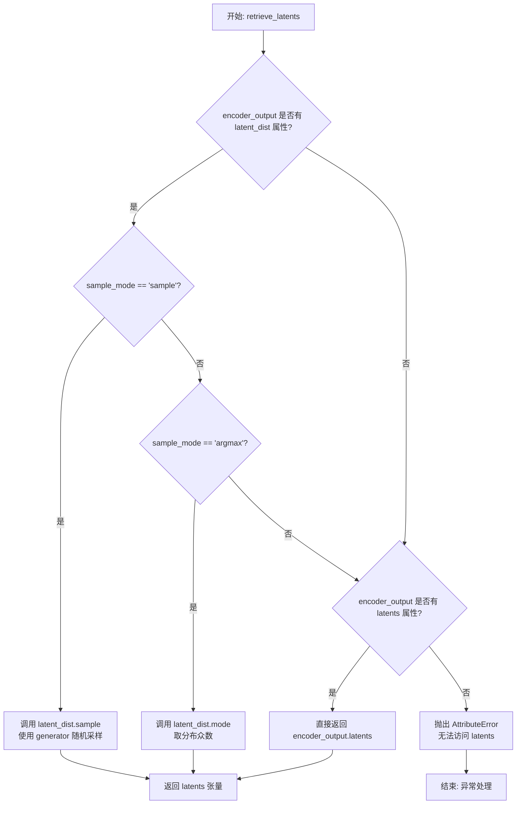

#### 带注释源码

```python
# Copied from diffusers.pipelines.stable_diffusion.pipeline_stable_diffusion_img2img.retrieve_latents
def retrieve_latents(
    encoder_output: torch.Tensor, generator: torch.Generator | None = None, sample_mode: str = "sample"
):
    """
    从 VAE 编码器输出中提取潜在变量张量。
    
    该函数支持三种提取方式：
    1. 当 encoder_output 有 latent_dist 属性且 sample_mode='sample' 时，从分布中采样
    2. 当 encoder_output 有 latent_dist 属性且 sample_mode='argmax' 时，取分布的众数
    3. 当 encoder_output 有 latents 属性时，直接返回预计算的 latents
    
    Args:
        encoder_output: VAE 编码器的输出对象
        generator: 可选的随机数生成器，用于采样时的随机性控制
        sample_mode: 采样模式，'sample' 或 'argmax'
    
    Returns:
        提取出的潜在变量张量
    
    Raises:
        AttributeError: 当无法从 encoder_output 中提取 latents 时抛出
    """
    # 优先检查 latent_dist 属性（VAE 的标准输出格式）
    if hasattr(encoder_output, "latent_dist") and sample_mode == "sample":
        # 从潜在分布中采样，支持随机生成
        return encoder_output.latent_dist.sample(generator)
    elif hasattr(encoder_output, "latent_dist") and sample_mode == "argmax":
        # 取潜在分布的众数，确定性输出
        return encoder_output.latent_dist.mode()
    # 备选方案：直接访问预计算的 latents 属性
    elif hasattr(encoder_output, "latents"):
        return encoder_output.latents
    # 错误处理：无法识别 encoder_output 的格式
    else:
        raise AttributeError("Could not access latents of provided encoder_output")
```


### `retrieve_timesteps`

配置调度器并获取时间步。该函数调用调度器的 `set_timesteps` 方法并从中检索时间步，支持自定义时间步或 sigmas，任何额外的关键字参数都会传递给调度器。

参数：

-  `scheduler`：`SchedulerMixin`，要获取时间步的调度器
-  `num_inference_steps`：`int | None`，使用预训练模型生成样本时的扩散步数，如果使用此参数，则 `timesteps` 必须为 `None`
-  `device`：`str | torch.device | None`，时间步要移动到的设备，如果为 `None`，则不移动时间步
-  `timesteps`：`list[int] | None`，用于覆盖调度器时间步间隔策略的自定义时间步，如果传递 `timesteps`，则 `num_inference_steps` 和 `sigmas` 必须为 `None`
-  `sigmas`：`list[float] | None`，用于覆盖调度器时间步间隔策略的自定义 sigmas，如果传递 `sigmas`，则 `num_inference_steps` 和 `timesteps` 必须为 `None`
-  `**kwargs`：任意关键字参数，将传递给 `scheduler.set_timesteps`

返回值：`tuple[torch.Tensor, int]`，元组第一个元素是调度器的时间步计划，第二个元素是推理步数

#### 流程图

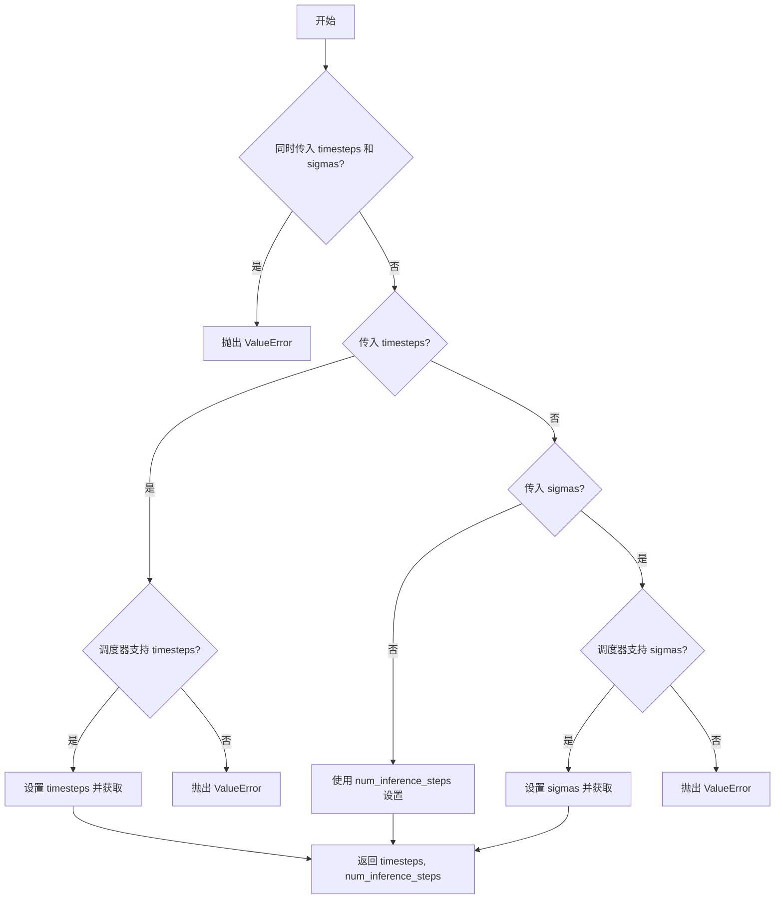

#### 带注释源码

```python
# Copied from diffusers.pipelines.stable_diffusion.pipeline_stable_diffusion.retrieve_timesteps
def retrieve_timesteps(
    scheduler,
    num_inference_steps: int | None = None,
    device: str | torch.device | None = None,
    timesteps: list[int] | None = None,
    sigmas: list[float] | None = None,
    **kwargs,
):
    r"""
    Calls the scheduler's `set_timesteps` method and retrieves timesteps from the scheduler after the call. Handles
    custom timesteps. Any kwargs will be supplied to `scheduler.set_timesteps`.

    Args:
        scheduler (`SchedulerMixin`):
            The scheduler to get timesteps from.
        num_inference_steps (`int`):
            The number of diffusion steps used when generating samples with a pre-trained model. If used, `timesteps`
            must be `None`.
        device (`str` or `torch.device`, *optional*):
            The device to which the timesteps should be moved to. If `None`, the timesteps are not moved.
        timesteps (`list[int]`, *optional*):
            Custom timesteps used to override the timestep spacing strategy of the scheduler. If `timesteps` is passed,
            `num_inference_steps` and `sigmas` must be `None`.
        sigmas (`list[float]`, *optional*):
            Custom sigmas used to override the timestep spacing strategy of the scheduler. If `sigmas` is passed,
            `num_inference_steps` and `timesteps` must be `None`.

    Returns:
        `tuple[torch.Tensor, int]`: A tuple where the first element is the timestep schedule from the scheduler and the
        second element is the number of inference steps.
    """
    # 检查是否同时传入了 timesteps 和 sigmas，只能二选一
    if timesteps is not None and sigmas is not None:
        raise ValueError("Only one of `timesteps` or `sigmas` can be passed. Please choose one to set custom values")
    
    # 处理自定义 timesteps 的情况
    if timesteps is not None:
        # 检查调度器是否支持自定义 timesteps 参数
        accepts_timesteps = "timesteps" in set(inspect.signature(scheduler.set_timesteps).parameters.keys())
        if not accepts_timesteps:
            raise ValueError(
                f"The current scheduler class {scheduler.__class__}'s `set_timesteps` does not support custom"
                f" timestep schedules. Please check whether you are using the correct scheduler."
            )
        # 调用调度器的 set_timesteps 方法设置自定义时间步
        scheduler.set_timesteps(timesteps=timesteps, device=device, **kwargs)
        # 从调度器获取设置后的时间步
        timesteps = scheduler.timesteps
        # 计算推理步数
        num_inference_steps = len(timesteps)
    
    # 处理自定义 sigmas 的情况
    elif sigmas is not None:
        # 检查调度器是否支持自定义 sigmas 参数
        accept_sigmas = "sigmas" in set(inspect.signature(scheduler.set_timesteps).parameters.keys())
        if not accept_sigmas:
            raise ValueError(
                f"The current scheduler class {scheduler.__class__}'s `set_timesteps` does not support custom"
                f" sigmas schedules. Please check whether you are using the correct scheduler."
            )
        # 调用调度器的 set_timesteps 方法设置自定义 sigmas
        scheduler.set_timesteps(sigmas=sigmas, device=device, **kwargs)
        # 从调度器获取设置后的时间步
        timesteps = scheduler.timesteps
        # 计算推理步数
        num_inference_steps = len(timesteps)
    
    # 默认情况：使用 num_inference_steps 设置时间步
    else:
        scheduler.set_timesteps(num_inference_steps, device=device, **kwargs)
        timesteps = scheduler.timesteps
    
    # 返回时间步和推理步数
    return timesteps, num_inference_steps
```


### HunyuanVideo15ImageToVideoPipeline.__init__

初始化 HunyuanVideo 1.5 图像到视频管道，设置并注册所有核心模型组件（文本编码器、VAE、Transformer、调度器、图像编码器等），同时配置视频处理的缩放因子、目标尺寸、潜在空间维度等关键参数，为后续的视频生成推理做好准备。

参数：

- `text_encoder`：`Qwen2_5_VLTextModel`，Qwen2.5-VL-7B-Instruct 文本编码器，用于将文本提示编码为语义嵌入
- `tokenizer`：`Qwen2Tokenizer`，Qwen2 分词器，用于对文本提示进行分词处理
- `transformer`：`HunyuanVideo15Transformer3DModel`，条件 Transformer（MMDiT）架构，用于对编码后的视频潜在表示进行去噪
- `vae`：`AutoencoderKLHunyuanVideo15`，变分自编码器模型，用于将视频编码和解码为潜在表示
- `scheduler`：`FlowMatchEulerDiscreteScheduler`，流匹配欧拉离散调度器，用于去噪过程中的时间步调度
- `text_encoder_2`：`T5EncoderModel`，T5 编码器模型，用于处理字形文本嵌入
- `tokenizer_2`：`ByT5Tokenizer`，ByT5 分词器，用于对字形文本进行分词
- `guider`：`ClassifierFreeGuidance`，无分类器引导模块，用于控制生成过程中的引导策略
- `image_encoder`：`SiglipVisionModel`，Siglip 视觉编码器，用于从输入图像提取视觉特征
- `feature_extractor`：`SiglipImageProcessor`，Siglip 图像预处理器，用于图像的预处理操作

返回值：无（`None`），该方法为构造函数，不返回任何值，仅初始化实例属性

#### 流程图

```mermaid
flowchart TD
    A[开始 __init__] --> B[调用 super().__init__]
    B --> C[调用 self.register_modules 注册所有模型组件]
    C --> D[获取并设置 VAE 缩放因子]
    D --> E[创建 HunyuanVideo15ImageProcessor 视频处理器]
    E --> F[设置 Transformer 目标尺寸]
    F --> G[设置视觉嵌入维度]
    G --> H[设置潜在通道数]
    H --> I[配置系统消息模板]
    I --> J[设置分词器最大长度参数]
    J --> K[设置视觉语义标记数量]
    K --> L[结束 __init__]
```

#### 带注释源码

```python
def __init__(
    self,
    text_encoder: Qwen2_5_VLTextModel,
    tokenizer: Qwen2Tokenizer,
    transformer: HunyuanVideo15Transformer3DModel,
    vae: AutoencoderKLHunyuanVideo15,
    scheduler: FlowMatchEulerDiscreteScheduler,
    text_encoder_2: T5EncoderModel,
    tokenizer_2: ByT5Tokenizer,
    guider: ClassifierFreeGuidance,
    image_encoder: SiglipVisionModel,
    feature_extractor: SiglipImageProcessor,
):
    """
    初始化图像到视频管道，配置所有核心模型组件和处理参数。
    
    Args:
        text_encoder: Qwen2.5-VL 文本编码器
        tokenizer: Qwen2 分词器
        transformer: HunyuanVideo 3D Transformer 模型
        vae: 变分自编码器
        scheduler: 流匹配调度器
        text_encoder_2: T5 文本编码器（用于字形文本）
        tokenizer_2: ByT5 分词器
        guider: 无分类器引导模块
        image_encoder: Siglip 视觉编码器
        feature_extractor: Siglip 图像特征提取器
    """
    # 调用父类 DiffusionPipeline 的初始化方法
    # 继承基础管道的通用功能（设备管理、模型卸载等）
    super().__init__()

    # 注册所有模型组件到管道中，便于后续的保存、加载和内存管理
    self.register_modules(
        vae=vae,
        text_encoder=text_encoder,
        tokenizer=tokenizer,
        transformer=transformer,
        scheduler=scheduler,
        text_encoder_2=text_encoder_2,
        tokenizer_2=tokenizer_2,
        guider=guider,
        image_encoder=image_encoder,
        feature_extractor=feature_extractor,
    )

    # 获取 VAE 的时间压缩比，用于计算潜在帧数
    # 如果 VAE 存在则使用其配置，否则默认为 4
    self.vae_scale_factor_temporal = self.vae.temporal_compression_ratio if getattr(self, "vae", None) else 4
    
    # 获取 VAE 的空间压缩比，用于计算潜在高度和宽度
    # 如果 VAE 存在则使用其配置，否则默认为 16
    self.vae_scale_factor_spatial = self.vae.spatial_compression_ratio if getattr(self, "vae", None) else 16
    
    # 创建视频处理器，处理图像和视频的预处理与后处理
    # do_resize=False 表示不调整大小（由后续逻辑处理）
    # do_convert_rgb=True 转换为 RGB 格式
    self.video_processor = HunyuanVideo15ImageProcessor(
        vae_scale_factor=self.vae_scale_factor_spatial, do_resize=False, do_convert_rgb=True
    )
    
    # 从 Transformer 配置中获取目标尺寸，用于确定输出视频的分辨率
    # 默认值为 640
    self.target_size = self.transformer.config.target_size if getattr(self, "transformer", None) else 640
    
    # 获取视觉嵌入维度，用于图像特征的维度映射
    # 默认值为 1152
    self.vision_states_dim = (
        self.transformer.config.image_embed_dim if getattr(self, "transformer", None) else 1152
    )
    
    # 获取潜在空间的通道数，用于确定潜在表示的维度
    self.num_channels_latents = self.vae.config.latent_channels if hasattr(self, "vae") else 32
    
    # 配置系统消息模板，用于指导模型生成更详细的视频描述
    # 包含对视频内容、对象属性、动作行为、背景环境、镜头运动等方面的描述要求
    # fmt: off
    self.system_message = "You are a helpful assistant. Describe the video by detailing the following aspects: \
        1. The main content and theme of the video. \
        2. The color, shape, size, texture, quantity, text, and spatial relationships of the objects. \
        3. Actions, events, behaviors temporal relationships, physical movement changes of the objects. \
        4. background environment, light, style and atmosphere. \
        5. camera angles, movements, and transitions used in the video."
    # fmt: on
    
    # 设置提示模板编码的起始位置，用于跳过系统消息部分
    self.prompt_template_encode_start_idx = 108
    
    # 设置 Qwen2Tokenizer 的最大长度限制
    self.tokenizer_max_length = 1000
    
    # 设置 ByT5Tokenizer 的最大长度限制（较短，因为主要用于字形文本）
    self.tokenizer_2_max_length = 256
    
    # 设置视觉语义标记的数量，用于图像嵌入的序列长度
    self.vision_num_semantic_tokens = 729
```


### HunyuanVideo15ImageToVideoPipeline._get_mllm_prompt_embeds

该静态方法用于使用Qwen2-VL（Qwen2.5-VL）文本编码器将用户输入的提示词（prompt）转换为高质量的文本嵌入向量（prompt embeddings）和对应的注意力掩码（attention mask），支持单个字符串或字符串列表输入，并应用聊天模板（chat template）和系统消息进行格式化处理。

参数：

- `text_encoder`：`Qwen2_5_VLTextModel`，Qwen2.5-VL文本编码器模型实例，用于将tokenized的文本转换为嵌入向量
- `tokenizer`：`Qwen2Tokenizer`，Qwen2分词器，用于对文本进行tokenize并应用聊天模板
- `prompt`：`str | list[str]`，输入的提示词，可以是单个字符串或字符串列表
- `device`：`torch.device`，计算设备（CPU/CUDA），用于将张量移动到指定设备
- `tokenizer_max_length`：`int = 1000`，分词器的最大长度，默认为1000
- `num_hidden_layers_to_skip`：`int = 2`，从文本编码器输出中跳过的最后隐藏层数量，默认为2（即取倒数第3层的输出）
- `system_message`：`str`，系统消息，描述模型如何详细描述视频内容，包含5个方面的指导要求
- `crop_start`：`int = 108`，从嵌入向量开头裁剪的起始位置，用于移除聊天模板的前缀部分，默认为108

返回值：`tuple[torch.Tensor, torch.Tensor]`，返回一个元组，包含：
- 第一个元素为`torch.Tensor`，形状为`(batch_size, seq_len, hidden_dim)`的提示词嵌入向量
- 第二个元素为`torch.Tensor`，形状为`(batch_size, seq_len)`的注意力掩码，用于指示有效token位置

#### 流程图

```mermaid
flowchart TD
    A[开始] --> B{判断prompt类型}
    B -->|str| C[将单个字符串转换为list]
    B -->|list[str]| D[直接使用]
    C --> E[调用format_text_input格式化聊天模板]
    D --> E
    E --> F[tokenizer.apply_chat_template应用聊天模板]
    F --> G[tokenize并返回dict格式]
    G --> H[将input_ids和attention_mask移至device]
    H --> I[调用text_encoder获取hidden_states]
    I --> J[取倒数第num_hidden_layers_to_skip+1层的hidden states]
    J --> K{crop_start是否大于0}
    K -->|是| L[裁剪embeddings和attention_mask]
    K -->|否| M[直接返回]
    L --> M
    M --> N[返回prompt_embeds和prompt_attention_mask]
```

#### 带注释源码

```python
@staticmethod
# Copied from diffusers.pipelines.hunyuan_video1_5.pipeline_hunyuan_video1_5.HunyuanVideo15Pipeline._get_mllm_prompt_embeds
def _get_mllm_prompt_embeds(
    text_encoder: Qwen2_5_VLTextModel,
    tokenizer: Qwen2Tokenizer,
    prompt: str | list[str],
    device: torch.device,
    tokenizer_max_length: int = 1000,
    num_hidden_layers_to_skip: int = 2,
    # fmt: off
    system_message: str = "You are a helpful assistant. Describe the video by detailing the following aspects: \
    1. The main content and theme of the video. \
    2. The color, shape, size, texture, quantity, text, and spatial relationships of the objects. \
    3. Actions, events, behaviors temporal relationships, physical movement changes of the objects. \
    4. background environment, light, style and atmosphere. \
    5. camera angles, movements, and transitions used in the video.",
    # fmt: on
    crop_start: int = 108,
) -> tuple[torch.Tensor, torch.Tensor]:
    """
    使用Qwen2-VL文本编码器生成提示词嵌入向量。
    
    参数:
        text_encoder: Qwen2.5-VL文本编码器模型
        tokenizer: Qwen2分词器
        prompt: 输入提示词，字符串或字符串列表
        device: 计算设备
        tokenizer_max_length: 分词器最大长度，默认1000
        num_hidden_layers_to_skip: 跳过的隐藏层数，默认2
        system_message: 系统消息，指导模型如何描述视频
        crop_start: 嵌入裁剪起始位置，默认108
    
    返回:
        (prompt_embeds, prompt_attention_mask): 提示词嵌入和注意力掩码
    """
    
    # 1. 标准化输入：将单个字符串转换为列表，统一处理流程
    prompt = [prompt] if isinstance(prompt, str) else prompt

    # 2. 应用聊天模板：将prompt和system_message格式化为聊天格式
    #    format_text_input将prompt转换为包含system和user消息的列表
    prompt = format_text_input(prompt, system_message)

    # 3. 应用聊天模板并tokenize：
    #    - add_generation_prompt=True: 添加生成提示（如"Assistant:"）以引导模型生成
    #    - padding="max_length": 填充到最大长度
    #    - max_length=tokenizer_max_length + crop_start: 预留crop_start长度的前缀用于后续裁剪
    #    - truncation=True: 超过最大长度时截断
    #    - return_tensors="pt": 返回PyTorch张量
    text_inputs = tokenizer.apply_chat_template(
        prompt,
        add_generation_prompt=True,
        tokenize=True,
        return_dict=True,
        padding="max_length",
        max_length=tokenizer_max_length + crop_start,
        truncation=True,
        return_tensors="pt",
    )

    # 4. 将tokenized输入移至指定device
    text_input_ids = text_inputs.input_ids.to(device=device)
    prompt_attention_mask = text_inputs.attention_mask.to(device=device)

    # 5. 调用文本编码器前向传播，获取所有隐藏状态
    #    output_hidden_states=True: 返回所有层的hidden states
    #    我们需要倒数第(num_hidden_layers_to_skip+1)层的输出
    prompt_embeds = text_encoder(
        input_ids=text_input_ids,
        attention_mask=prompt_attention_mask,
        output_hidden_states=True,
    ).hidden_states[-(num_hidden_layers_to_skip + 1)]

    # 6. 裁剪嵌入向量和注意力掩码的前缀部分
    #    crop_start用于移除聊天模板（如system消息、user前缀等）引入的前缀token
    if crop_start is not None and crop_start > 0:
        prompt_embeds = prompt_embeds[:, crop_start:]       # 裁剪嵌入向量
        prompt_attention_mask = prompt_attention_mask[:, crop_start:]  # 裁剪注意力掩码

    # 7. 返回处理后的嵌入向量和注意力掩码
    return prompt_embeds, prompt_attention_mask
```


### `HunyuanVideo15ImageToVideoPipeline._get_byt5_prompt_embeds`

该静态方法使用T5编码器模型（ByT5）从提示词中生成文本嵌入，主要用于处理和提取提示词中的字形文本（glyph texts），以便于后续的视频生成过程。

参数：

- `tokenizer`：`ByT5Tokenizer`，ByT5分词器，用于将文本转换为token
- `text_encoder`：`T5EncoderModel`，T5编码器模型，用于生成文本嵌入
- `prompt`：`str | list[str]`，输入的提示词，可以是单个字符串或字符串列表
- `device`：`torch.device`，计算设备（CPU/CUDA）
- `tokenizer_max_length`：`int = 256`，分词器的最大长度，默认为256

返回值：`tuple[torch.Tensor, torch.Tensor]`，返回两个张量——第一个是提示词嵌入（prompt_embeds），第二个是注意力掩码（prompt_embeds_mask）

#### 流程图

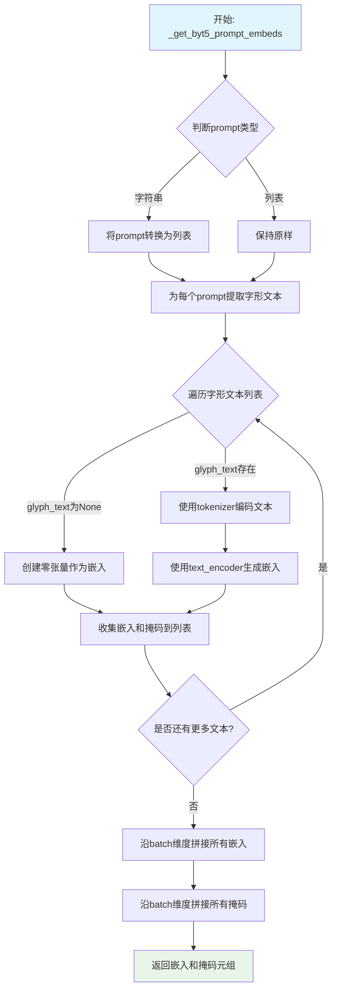

#### 带注释源码

```python
@staticmethod
# Copied from diffusers.pipelines.hunyuan_video1_5.pipeline_hunyuan_video1_5.HunyuanVideo15Pipeline._get_byt5_prompt_embeds
def _get_byt5_prompt_embeds(
    tokenizer: ByT5Tokenizer,
    text_encoder: T5EncoderModel,
    prompt: str | list[str],
    device: torch.device,
    tokenizer_max_length: int = 256,
):
    """
    使用ByT5 tokenizer和T5 encoder生成提示词嵌入。
    
    Args:
        tokenizer: ByT5分词器
        text_encoder: T5编码器模型
        prompt: 输入提示词
        device: 计算设备
        tokenizer_max_length: 分词器最大长度
    
    Returns:
        tuple: (prompt_embeds, prompt_embeds_mask)
    """
    # 如果prompt是字符串，转换为单元素列表
    prompt = [prompt] if isinstance(prompt, str) else prompt

    # 从每个prompt中提取字形文本（用引号包裹的文本）
    glyph_texts = [extract_glyph_texts(p) for p in prompt]

    # 初始化嵌入和掩码列表
    prompt_embeds_list = []
    prompt_embeds_mask_list = []

    # 遍历每个字形文本
    for glyph_text in glyph_texts:
        # 如果没有字形文本，创建零张量
        if glyph_text is None:
            glyph_text_embeds = torch.zeros(
                (1, tokenizer_max_length, text_encoder.config.d_model), 
                device=device, 
                dtype=text_encoder.dtype
            )
            glyph_text_embeds_mask = torch.zeros((1, tokenizer_max_length), device=device, dtype=torch.int64)
        else:
            # 使用tokenizer编码字形文本
            txt_tokens = tokenizer(
                glyph_text,
                padding="max_length",
                max_length=tokenizer_max_length,
                truncation=True,
                add_special_tokens=True,
                return_tensors="pt",
            ).to(device)

            # 使用T5 encoder生成文本嵌入
            glyph_text_embeds = text_encoder(
                input_ids=txt_tokens.input_ids,
                attention_mask=txt_tokens.attention_mask.float(),
            )[0]
            # 移动嵌入到指定设备
            glyph_text_embeds = glyph_text_embeds.to(device=device)
            # 获取注意力掩码
            glyph_text_embeds_mask = txt_tokens.attention_mask.to(device=device)

        # 将当前嵌入和掩码添加到列表
        prompt_embeds_list.append(glyph_text_embeds)
        prompt_embeds_mask_list.append(glyph_text_embeds_mask)

    # 在batch维度拼接所有嵌入
    prompt_embeds = torch.cat(prompt_embeds_list, dim=0)
    # 在batch维度拼接所有掩码
    prompt_embeds_mask = torch.cat(prompt_embeds_mask_list, dim=0)

    # 返回嵌入和掩码
    return prompt_embeds, prompt_embeds_mask
```


### `HunyuanVideo15ImageToVideoPipeline._get_image_latents`

该静态方法接收VAE模型、图像处理器、输入图像及目标尺寸，利用图像处理器对图像进行预处理后，通过VAE编码器将图像转换为潜空间表示，最后返回图像的潜向量。

参数：

- `vae`：`AutoencoderKLHunyuanVideo15`，用于将图像编码到潜空间的VAE模型
- `image_processor`：`HunyuanVideo15ImageProcessor`，负责图像的预处理操作
- `image`：`PIL.Image.Image`，待编码的输入图像
- `height`：`int`，目标高度，用于图像缩放
- `width`：`int`，目标宽度，用于图像缩放
- `device`：`torch.device`，执行计算的设备

返回值：`torch.Tensor`，编码后的图像潜向量张量

#### 流程图

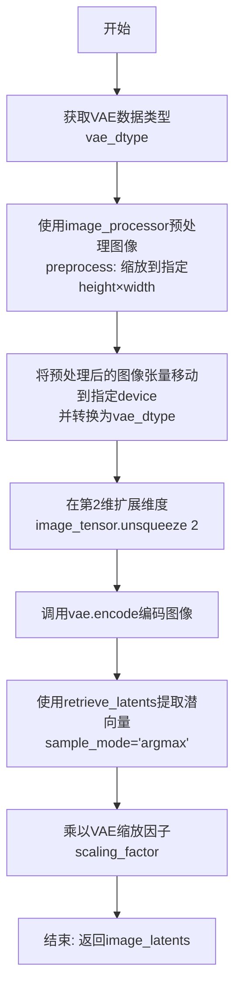

#### 带注释源码

```python
@staticmethod
def _get_image_latents(
    vae: AutoencoderKLHunyuanVideo15,      # VAE模型实例，用于图像编码
    image_processor: HunyuanVideo15ImageProcessor,  # 图像预处理器
    image: PIL.Image.Image,                # 输入的PIL图像
    height: int,                            # 目标输出高度
    width: int,                             # 目标输出宽度
    device: torch.device,                  # 计算设备（CPU/CUDA）
) -> torch.Tensor:                         # 返回编码后的潜向量张量
    # 1. 获取VAE模型的数据类型（通常为float16或float32）
    vae_dtype = vae.dtype
    
    # 2. 预处理图像：缩放到指定尺寸并转换为张量
    #    返回形状为 (B, C, H, W) 的张量
    image_tensor = image_processor.preprocess(image, height=height, width=width).to(device, dtype=vae_dtype)
    
    # 3. 为视频帧维度扩展一个维度
    #    从 (B, C, H, W) -> (B, C, 1, H, W)
    #    因为VAE编码器需要3D输入（包含帧维度）
    image_tensor = image_tensor.unsqueeze(2)
    
    # 4. 使用VAE编码器将图像编码到潜空间
    #    retrieve_latents函数从encoder_output中提取潜向量
    #    sample_mode="argmax" 表示使用分布的模式（而非采样）
    image_latents = retrieve_latents(vae.encode(image_tensor), sample_mode="argmax")
    
    # 5. 应用VAE的缩放因子，将潜向量调整到正确的数值范围
    #    这是VAE解码时需要逆操作的标准做法
    image_latents = image_latents * vae.config.scaling_factor
    
    # 6. 返回编码后的图像潜向量
    return image_latents
```


### `HunyuanVideo15ImageToVideoPipeline._get_image_embeds`

该静态方法使用SigLIP视觉编码器（SiglipVisionModel）从输入图像中提取视觉特征嵌入。首先获取编码器的数据类型作为参考，然后通过图像预处理器（SiglipImageProcessor）对输入图像进行预处理（调整大小、转换为张量、RGB转换），最后将预处理后的图像传入视觉编码器获取最后一层隐藏状态作为图像特征嵌入返回。

参数：

- `image_encoder`：`SiglipVisionModel`，用于编码图像的SigLIP视觉模型实例
- `feature_extractor`：`SiglipImageProcessor`，用于预处理输入图像的SigLIP图像处理器
- `image`：`PIL.Image.Image`，输入的原始PIL格式图像
- `device`：`torch.device`，指定计算设备（CPU或GPU）

返回值：`torch.Tensor`，图像编码器输出的最后一层隐藏状态张量，形状为(batch_size, seq_len, hidden_dim)

#### 流程图

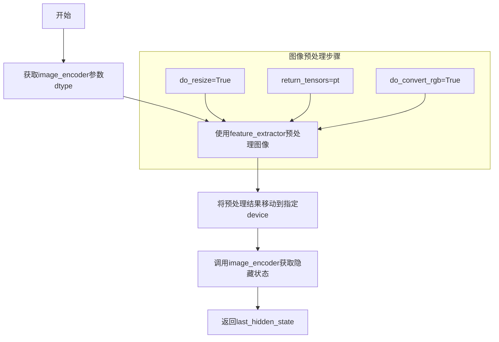

#### 带注释源码

```python
@staticmethod
def _get_image_embeds(
    image_encoder: SiglipVisionModel,
    feature_extractor: SiglipImageProcessor,
    image: PIL.Image.Image,
    device: torch.device,
) -> torch.Tensor:
    """
    使用SigLIP视觉编码器从图像中提取特征嵌入
    
    Args:
        image_encoder: SigLIP视觉编码器模型
        feature_extractor: 图像预处理器
        image: 输入的PIL图像
        device: 计算设备
    
    Returns:
        图像的隐藏状态特征张量
    """
    # 1. 获取图像编码器的参数数据类型，用于后续计算保持一致
    image_encoder_dtype = next(image_encoder.parameters()).dtype
    
    # 2. 使用特征提取器预处理图像：
    #    - do_resize=True: 调整图像尺寸
    #    - return_tensors="pt": 转换为PyTorch张量
    #    - do_convert_rgb=True: 转换为RGB格式
    image = feature_extractor.preprocess(
        images=image, 
        do_resize=True, 
        return_tensors="pt", 
        do_convert_rgb=True
    )
    
    # 3. 将预处理后的图像数据移动到指定设备，并使用编码器的数据类型
    image = image.to(device=device, dtype=image_encoder_dtype)
    
    # 4. 将图像传入视觉编码器，获取编码后的隐藏状态
    #    使用**image解包字典（包含pixel_values等）作为输入
    image_enc_hidden_states = image_encoder(**image).last_hidden_state

    # 5. 返回最后一层隐藏状态作为图像特征嵌入
    return image_enc_hidden_states
```


### `HunyuanVideo15ImageToVideoPipeline.encode_image`

公开的图像编码接口，用于将输入图像编码为图像嵌入向量，供后续视频生成流程使用。

参数：

- `image`：`PIL.Image.Image`，输入的图像，用于生成视频条件
- `batch_size`：`int`，批次大小，用于决定输出嵌入的重复次数
- `device`：`torch.device`，计算设备（CPU/CUDA），用于指定张量存放位置
- `dtype`：`torch.dtype`，数据类型，用于指定输出张量的精度（如float16）

返回值：`torch.Tensor`，编码后的图像嵌入向量，形状为 (batch_size, seq_len, hidden_dim)

#### 流程图

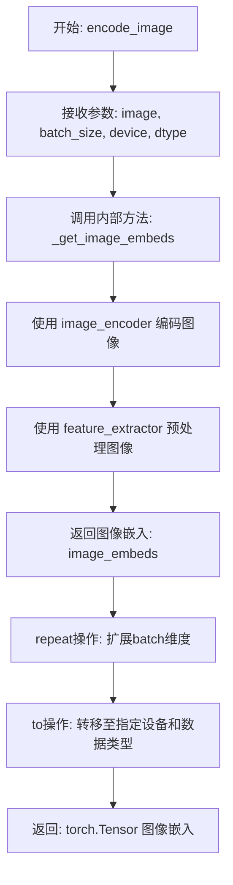

#### 带注释源码

```python
def encode_image(
    self,
    image: PIL.Image.Image,
    batch_size: int,
    device: torch.device,
    dtype: torch.dtype,
) -> torch.Tensor:
    """
    公开的图像编码接口，将输入图像编码为图像嵌入向量。
    
    该方法是HunyuanVideo1.5图像到视频流水线的核心组件之一，
    负责将PIL图像转换为transformer模型可用的条件嵌入表示。
    
    Args:
        image: 输入的PIL格式图像，作为视频生成的条件参考
        batch_size: 批次大小，用于将单一图像嵌入扩展为多个样本
        device: 目标计算设备，决定张量存放位置
        dtype: 目标数据类型，控制输出精度
    
    Returns:
        torch.Tensor: 形状为 (batch_size, seq_len, hidden_dim) 的图像嵌入向量
    """
    # 步骤1: 调用内部方法_get_image_embeds进行图像编码
    # 该方法内部使用SiglipVisionModel对图像进行编码
    image_embeds = self._get_image_embeds(
        image_encoder=self.image_encoder,      # 图像编码器模型 (SiglipVisionModel)
        feature_extractor=self.feature_extractor,  # 图像特征提取器 (SiglipImageProcessor)
        image=image,                           # 输入图像
        device=device,                         # 计算设备
    )
    
    # 步骤2: 扩展批次维度
    # 将图像嵌入从 (1, seq_len, hidden_dim) 扩展为 (batch_size, seq_len, hidden_dim)
    # 这是为了与后续的文本嵌入和潜在向量保持一致的批次维度
    image_embeds = image_embeds.repeat(batch_size, 1, 1)
    
    # 步骤3: 转换设备和数据类型
    # 将嵌入张量转移到指定的设备和精度
    # 这确保了与transformer模型输入的一致性
    image_embeds = image_embeds.to(device=device, dtype=dtype)
    
    # 返回编码后的图像嵌入向量
    return image_embeds
```


### `HunyuanVideo15ImageToVideoPipeline.encode_prompt`

该方法是 HunyuanVideo15ImageToVideoPipeline 类的公开提示词编码接口，用于将文本提示词转换为模型所需的文本嵌入向量。该方法支持双文本编码器（Qwen2.5-VL 和 ByT5）生成的嵌入，并处理批量生成和每提示词多个视频的场景。

参数：

- `prompt`：`str | list[str]`，要编码的提示词，支持单字符串或字符串列表
- `device`：`torch.device | None`，指定计算设备，默认为执行设备
- `dtype`：`torch.dtype | None`，指定数据类型，默认为文本编码器的数据类型
- `batch_size`：`int = 1`，提示词批次大小，默认为1
- `num_videos_per_prompt`：`int = 1`，每个提示词生成的视频数量
- `prompt_embeds`：`torch.Tensor | None`，预生成的文本嵌入（来自Qwen2.5-VL），如未提供则从prompt生成
- `prompt_embeds_mask`：`torch.Tensor | None`，预生成的文本掩码，如未提供则从prompt生成
- `prompt_embeds_2`：`torch.Tensor | None`，预生成的字形文本嵌入（来自ByT5），如未提供则从prompt生成
- `prompt_embeds_mask_2`：`torch.Tensor | None`，预生成的字形文本掩码，如未提供则从prompt生成

返回值：`tuple[torch.Tensor, torch.Tensor, torch.Tensor, torch.Tensor]`，返回四个张量——主文本嵌入、主文本掩码、字形文本嵌入、字形文本掩码

#### 流程图

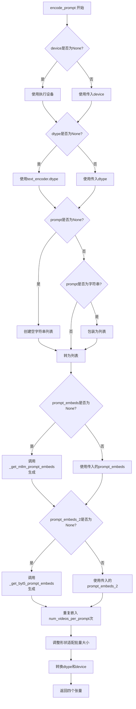

#### 带注释源码

```python
def encode_prompt(
    self,
    prompt: str | list[str],
    device: torch.device | None = None,
    dtype: torch.dtype | None = None,
    batch_size: int = 1,
    num_videos_per_prompt: int = 1,
    prompt_embeds: torch.Tensor | None = None,
    prompt_embeds_mask: torch.Tensor | None = None,
    prompt_embeds_2: torch.Tensor | None = None,
    prompt_embeds_mask_2: torch.Tensor | None = None,
):
    """
    编码提示词为文本嵌入向量。

    Args:
        prompt: 要编码的提示词，支持字符串或字符串列表
        device: torch设备，如未指定则使用执行设备
        batch_size: 提示词批次大小，默认为1
        num_videos_per_prompt: 每个提示词生成的视频数量
        prompt_embeds: 预生成的文本嵌入（Qwen2.5-VL）
        prompt_embeds_mask: 预生成的文本掩码
        prompt_embeds_2: 预生成的字形文本嵌入（ByT5）
        prompt_embeds_mask_2: 预生成的字形文本掩码
    """
    # 确定设备和数据类型
    device = device or self._execution_device  # 使用传入设备或默认执行设备
    dtype = dtype or self.text_encoder.dtype   # 使用传入dtype或文本编码器dtype

    # 处理空提示词情况
    if prompt is None:
        prompt = [""] * batch_size  # 创建空字符串列表填充批次

    # 标准化提示词格式：确保是列表
    prompt = [prompt] if isinstance(prompt, str) else prompt

    # 如果未提供预生成的主文本嵌入，则从提示词生成
    if prompt_embeds is None:
        prompt_embeds, prompt_embeds_mask = self._get_mllm_prompt_embeds(
            tokenizer=self.tokenizer,
            text_encoder=self.text_encoder,
            prompt=prompt,
            device=device,
            tokenizer_max_length=self.tokenizer_max_length,
            system_message=self.system_message,
            crop_start=self.prompt_template_encode_start_idx,
        )

    # 如果未提供预生成的字形文本嵌入，则从提示词生成
    if prompt_embeds_2 is None:
        prompt_embeds_2, prompt_embeds_mask_2 = self._get_byt5_prompt_embeds(
            tokenizer=self.tokenizer_2,
            text_encoder=self.text_encoder_2,
            prompt=prompt,
            device=device,
            tokenizer_max_length=self.tokenizer_2_max_length,
        )

    # 扩展主文本嵌入以支持多个视频生成
    _, seq_len, _ = prompt_embeds.shape  # 获取序列长度
    prompt_embeds = prompt_embeds.repeat(1, num_videos_per_prompt, 1)  # 重复嵌入
    prompt_embeds = prompt_embeds.view(batch_size * num_videos_per_prompt, seq_len, -1)  # 调整形状
    prompt_embeds_mask = prompt_embeds_mask.repeat(1, num_videos_per_prompt, 1)  # 重复掩码
    prompt_embeds_mask = prompt_embeds_mask.view(batch_size * num_videos_per_prompt, seq_len)  # 调整掩码形状

    # 扩展字形文本嵌入以支持多个视频生成
    _, seq_len_2, _ = prompt_embeds_2.shape
    prompt_embeds_2 = prompt_embeds_2.repeat(1, num_videos_per_prompt, 1)
    prompt_embeds_2 = prompt_embeds_2.view(batch_size * num_videos_per_prompt, seq_len_2, -1)
    prompt_embeds_mask_2 = prompt_embeds_mask_2.repeat(1, num_videos_per_prompt, 1)
    prompt_embeds_mask_2 = prompt_embeds_mask_2.view(batch_size * num_videos_per_prompt, seq_len_2)

    # 转换数据类型和设备
    prompt_embeds = prompt_embeds.to(dtype=dtype, device=device)
    prompt_embeds_mask = prompt_embeds_mask.to(dtype=dtype, device=device)
    prompt_embeds_2 = prompt_embeds_2.to(dtype=dtype, device=device)
    prompt_embeds_mask_2 = prompt_embeds_mask_2.to(dtype=dtype, device=device)

    # 返回四个张量：主嵌入、主掩码、字形嵌入、字形掩码
    return prompt_embeds, prompt_embeds_mask, prompt_embeds_2, prompt_embeds_mask_2
```


### `HunyuanVideo15ImageToVideoPipeline.check_inputs`

验证图像转视频管道的输入参数合法性，包括检查 prompt 和 image 的类型、互斥参数不能同时提供、必填参数必须提供等。

参数：

- `self`：`HunyuanVideo15ImageToVideoPipeline` 实例，管道对象自身
- `prompt`：可选的 `str` 或 `list[str]`，文本提示，用于引导视频生成
- `image`：`PIL.Image.Image`，输入图像，作为视频生成的条件
- `negative_prompt`：可选的 `str` 或 `list[str]`，负向文本提示，用于引导视频生成
- `prompt_embeds`：可选的 `torch.Tensor`，预生成的文本嵌入向量
- `negative_prompt_embeds`：可选的 `torch.Tensor`，预生成的负向文本嵌入向量
- `prompt_embeds_mask`：可选的 `torch.Tensor`，文本嵌入的注意力掩码
- `negative_prompt_embeds_mask`：可选的 `torch.Tensor`，负向文本嵌入的注意力掩码
- `prompt_embeds_2`：可选的 `torch.Tensor`，来自第二个文本编码器的文本嵌入
- `prompt_embeds_mask_2`：可选的 `torch.Tensor`，第二个文本编码器的注意力掩码
- `negative_prompt_embeds_2`：可选的 `torch.Tensor`，第二个文本编码器的负向文本嵌入
- `negative_prompt_embeds_mask_2`：可选的 `torch.Tensor`，第二个文本编码器的负向注意力掩码

返回值：`None`，验证通过返回 None，验证失败则抛出 `ValueError` 异常

#### 流程图

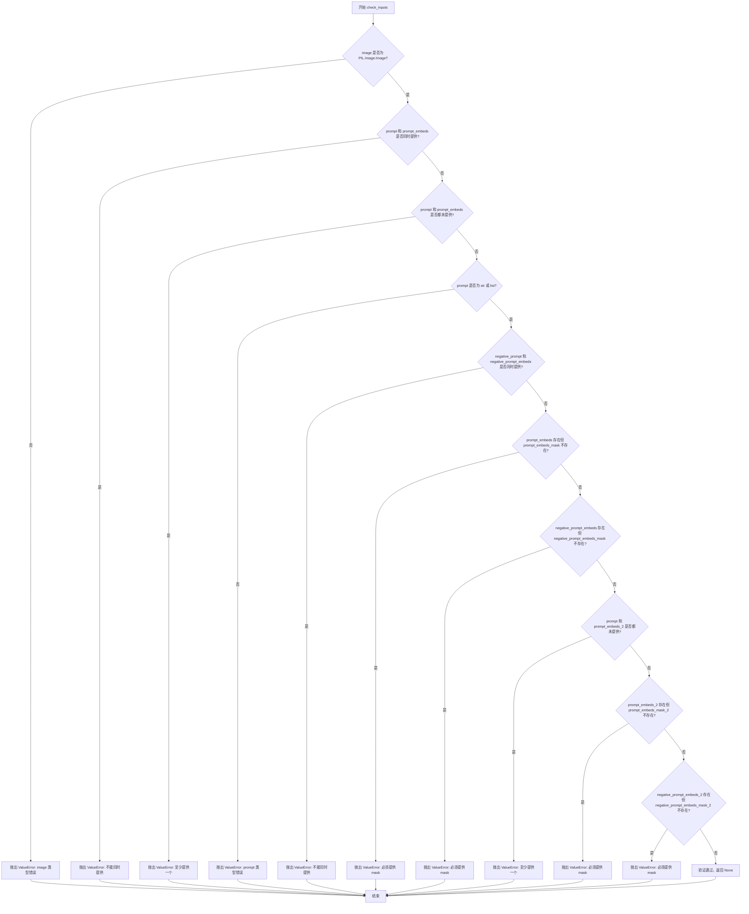

#### 带注释源码

```python
def check_inputs(
    self,
    prompt,
    image: PIL.Image.Image,
    negative_prompt=None,
    prompt_embeds=None,
    negative_prompt_embeds=None,
    prompt_embeds_mask=None,
    negative_prompt_embeds_mask=None,
    prompt_embeds_2=None,
    prompt_embeds_mask_2=None,
    negative_prompt_embeds_2=None,
    negative_prompt_embeds_mask_2=None,
):
    """
    检查输入参数的合法性，验证图像类型、prompt 与 prompt_embeds 的互斥关系、
    以及必填的 mask 参数是否完整。
    
    参数:
        prompt: 文本提示，可选 str 或 list[str] 类型
        image: PIL 图像对象，必填
        negative_prompt: 负向提示，可选
        prompt_embeds: 预计算的文本嵌入，可选
        negative_prompt_embeds: 预计算的负向嵌入，可选
        prompt_embeds_mask: 文本嵌入的注意力掩码
        negative_prompt_embeds_mask: 负向嵌入的注意力掩码
        prompt_embeds_2: 第二文本编码器的嵌入
        prompt_embeds_mask_2: 第二编码器的注意力掩码
        negative_prompt_embeds_2: 第二编码器的负向嵌入
        negative_prompt_embeds_mask_2: 第二编码器的负向掩码
    """
    # 1. 检查 image 类型是否为 PIL.Image.Image
    if not isinstance(image, PIL.Image.Image):
        raise ValueError(f"`image` has to be of type `PIL.Image.Image` but is {type(image)}")

    # 2. 检查 prompt 和 prompt_embeds 互斥，不能同时提供
    if prompt is not None and prompt_embeds is not None:
        raise ValueError(
            f"Cannot forward both `prompt`: {prompt} and `prompt_embeds`: {prompt_embeds}. Please make sure to"
            " only forward one of the two."
        )
    # 3. 检查至少提供一个 prompt 或 prompt_embeds
    elif prompt is None and prompt_embeds is None:
        raise ValueError(
            "Provide either `prompt` or `prompt_embeds`. Cannot leave both `prompt` and `prompt_embeds` undefined."
        )
    # 4. 检查 prompt 类型是否为 str 或 list
    elif prompt is not None and (not isinstance(prompt, str) and not isinstance(prompt, list)):
        raise ValueError(f"`prompt` has to be of type `str` or `list` but is {type(prompt)}")

    # 5. 检查 negative_prompt 和 negative_prompt_embeds 互斥
    if negative_prompt is not None and negative_prompt_embeds is not None:
        raise ValueError(
            f"Cannot forward both `negative_prompt`: {negative_prompt} and `negative_prompt_embeds`:"
            f" {negative_prompt_embeds}. Please make sure to only forward one of the two."
        )

    # 6. 如果提供了 prompt_embeds，必须同时提供 prompt_embeds_mask
    if prompt_embeds is not None and prompt_embeds_mask is None:
        raise ValueError(
            "If `prompt_embeds` are provided, `prompt_embeds_mask` also have to be passed. Make sure to generate `prompt_embeds_mask` from the same text encoder that was used to generate `prompt_embeds`."
        )
    # 7. 如果提供了 negative_prompt_embeds，必须同时提供 negative_prompt_embeds_mask
    if negative_prompt_embeds is not None and negative_prompt_embeds_mask is None:
        raise ValueError(
            "If `negative_prompt_embeds` are provided, `negative_prompt_embeds_mask` also have to be passed. Make sure to generate `negative_prompt_embeds_mask` from the same text encoder that was used to generate `negative_prompt_embeds`."
        )

    # 8. 检查至少提供 prompt 或 prompt_embeds_2 之一
    if prompt is None and prompt_embeds_2 is None:
        raise ValueError(
            "Provide either `prompt` or `prompt_embeds_2`. Cannot leave both `prompt` and `prompt_embeds_2` undefined."
        )

    # 9. 如果提供了 prompt_embeds_2，必须同时提供 prompt_embeds_mask_2
    if prompt_embeds_2 is not None and prompt_embeds_mask_2 is None:
        raise ValueError(
            "If `prompt_embeds_2` are provided, `prompt_embeds_mask_2` also have to be passed. Make sure to generate `prompt_embeds_mask_2` from the same text encoder that was used to generate `prompt_embeds_2`."
        )
    # 10. 如果提供了 negative_prompt_embeds_2，必须同时提供 negative_prompt_embeds_mask_2
    if negative_prompt_embeds_2 is not None and negative_prompt_embeds_mask_2 is None:
        raise ValueError(
            "If `negative_prompt_embeds_2` are provided, `negative_prompt_embeds_mask_2` also have to be passed. Make sure to generate `negative_prompt_embeds_mask_2` from the same text encoder that was used to generate `negative_prompt_embeds_2`."
        )
```


### `HunyuanVideo15ImageToVideoPipeline.prepare_latents`

该方法用于准备视频生成所需的初始潜在变量（latents），即高斯噪声张量。如果调用者已提供了 latents，则直接进行设备和数据类型转换；否则，根据批处理大小、视频帧数、分辨率以及 VAE 的时空调缩因子计算潜在变量的形状，并使用随机张量生成器生成符合要求的高斯噪声。

参数：

- `batch_size`：`int`，批处理大小，即一次生成的视频数量
- `num_channels_latents`：`int`，潜在变量的通道数，默认为 32
- `height`：`int`，输入图像的高度，默认为 720
- `width`：`int`，输入图像的宽度，默认为 1280
- `num_frames`：`int`，生成的视频帧数，默认为 129
- `dtype`：`torch.dtype | None`，潜在变量的数据类型，若为 None 则使用默认类型
- `device`：`torch.device | None`，潜在变量所在的设备，若为 None 则使用默认设备
- `generator`：`torch.Generator | list[torch.Generator] | None`，随机数生成器，用于确保生成的可重复性，支持单个生成器或与批处理大小匹配的生成器列表
- `latents`：`torch.Tensor | None`，用户预提供的潜在变量张量，若为 None 则自动生成

返回值：`torch.Tensor`，生成的潜在变量张量，形状为 (batch_size, num_channels_latents, temporal_frames, spatial_height, spatial_width)

#### 流程图

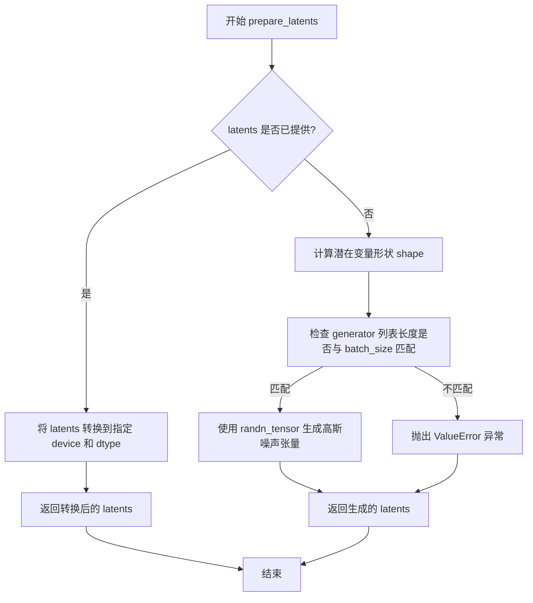

#### 带注释源码

```python
def prepare_latents(
    self,
    batch_size: int,
    num_channels_latents: int = 32,
    height: int = 720,
    width: int = 1280,
    num_frames: int = 129,
    dtype: torch.dtype | None = None,
    device: torch.device | None = None,
    generator: torch.Generator | list[torch.Generator] | None = None,
    latents: torch.Tensor | None = None,
) -> torch.Tensor:
    """
    准备用于视频生成的初始潜在变量（噪声）。

    如果调用者已经提供了 latents，则直接对其进行设备和数据类型转换；
    否则，根据批处理大小、帧数、分辨率以及 VAE 的压缩比计算潜在变量的
    形状，并生成符合标准正态分布的高斯噪声张量。

    Args:
        batch_size: 批处理大小
        num_channels_latents: 潜在变量通道数，默认 32
        height: 图像高度，默认 720
        width: 图像宽度，默认 1280
        num_frames: 视频帧数，默认 129
        dtype: 目标数据类型
        device: 目标设备
        generator: 随机数生成器
        latents: 可选的预提供潜在变量

    Returns:
        torch.Tensor: 潜在变量张量
    """
    # 如果已经提供了 latents，直接转换并返回
    if latents is not None:
        return latents.to(device=device, dtype=dtype)

    # 计算潜在变量的形状，考虑 VAE 的时空调缩因子
    # temporal_frames = (num_frames - 1) // temporal_compression_ratio + 1
    # spatial_height = height // spatial_compression_ratio
    # spatial_width = width // spatial_compression_ratio
    shape = (
        batch_size,
        num_channels_latents,
        (num_frames - 1) // self.vae_scale_factor_temporal + 1,
        int(height) // self.vae_scale_factor_spatial,
        int(width) // self.vae_scale_factor_spatial,
    )

    # 验证生成器列表长度与批处理大小是否匹配
    if isinstance(generator, list) and len(generator) != batch_size:
        raise ValueError(
            f"You have passed a list of generators of length {len(generator)}, but requested an effective batch"
            f" size of {batch_size}. Make sure the batch size matches the length of the generators."
        )

    # 使用 randn_tensor 生成标准正态分布的随机潜在变量
    latents = randn_tensor(shape, generator=generator, device=device, dtype=dtype)
    return latents
```


### `HunyuanVideo15ImageToVideoPipeline.prepare_cond_latents_and_mask`

该方法用于图像到视频（I2V）生成任务，准备条件潜变量和掩码。它接收输入图像并将其编码为图像潜变量，然后构建条件潜变量（仅保留第一帧信息）和掩码，供后续去噪过程使用。

参数：

-  `self`：`HunyuanVideo15ImageToVideoPipeline` 实例本身
-  `latents`：`torch.Tensor`，主潜变量张量，形状为 (B, C, F, H, W)，其中 B 为批量大小，C 为通道数，F 为帧数，H 为高度，W 为宽度
-  `image`：`PIL.Image.Image`，输入图像，用于提取图像潜变量作为条件
-  `batch_size`：`int`，批量大小，用于复制图像潜变量
-  `height`：`int`，目标高度，用于图像预处理
-  `width`：`int`，目标宽度，用于图像预处理
-  `dtype`：`torch.dtype`，目标数据类型，用于转换潜变量
-  `device`：`torch.device`，目标设备，用于张量运算

返回值：`tuple[torch.Tensor, torch.Tensor]`，返回元组包含两个张量：
-  `cond_latents_concat`：`torch.Tensor`，条件潜变量，形状为 (B, C, F, H, W)，仅第一帧包含图像信息，后续帧为零
-  `mask_concat`：`torch.Tensor`，掩码张量，形状为 (B, 1, F, H, W)，第一帧位置为 1.0，其余位置为 0.0

#### 流程图

```mermaid
flowchart TD
    A[开始] --> B[从 latents 获取 shape: batch, channels, frames, height, width]
    B --> C{调用 _get_image_latents 编码图像}
    C --> D[获取图像潜变量 image_latents]
    D --> E[使用 repeat 将 image_latents 复制 batch_size 份]
    E --> F[将第 1 帧之后的所有帧置零]
    F --> G[转换 latent_condition 到指定 device 和 dtype]
    H[创建零张量 latent_mask shape: (batch, 1, frames, height, width)]
    H --> I[将 mask 第一帧位置设为 1.0]
    G --> J[返回 tuple: (latent_condition, latent_mask)]
    I --> J
    J --> K[结束]
```

#### 带注释源码

```python
def prepare_cond_latents_and_mask(
    self,
    latents: torch.Tensor,
    image: PIL.Image.Image,
    batch_size: int,
    height: int,
    width: int,
    dtype: torch.dtype,
    device: torch.device,
):
    """
    Prepare conditional latents and mask for t2v generation.

    Args:
        latents: Main latents tensor (B, C, F, H, W)

    Returns:
        tuple: (cond_latents_concat, mask_concat) - both are zero tensors for t2v
    """
    
    # 从输入的噪声潜变量中提取维度信息
    # batch: 批量大小, channels: 通道数, frames: 帧数, height/width: 空间维度
    batch, channels, frames, height, width = latents.shape

    # 调用静态方法 _get_image_latents 将输入图像编码为潜变量表示
    # 该方法使用 VAE 编码器将 PIL 图像转换为 latent space 中的表示
    image_latents = self._get_image_latents(
        vae=self.vae,
        image_processor=self.video_processor,
        image=image,
        height=height,
        width=width,
        device=device,
    )

    # 对图像潜变量进行复制和reshape，扩展到与批量大小和帧数匹配
    # repeat(batch_size, 1, frames, 1, 1) 将 (1, C, 1, H, W) -> (B, C, F, H, W)
    latent_condition = image_latents.repeat(batch_size, 1, frames, 1, 1)
    
    # 关键操作：将第一帧之后的所有帧置零
    # 这确保了条件信息仅作用于第一帧（起始帧），后续帧由模型自主生成
    # 这是图像到视频任务的核心：给定初始图像作为条件，生成后续帧序列
    latent_condition[:, :, 1:, :, :] = 0
    
    # 将条件潜变量转换到指定的设备和数据类型
    latent_condition = latent_condition.to(device=device, dtype=dtype)

    # 创建掩码张量，用于指示哪些帧需要受条件约束
    # 形状: (B, 1, F, H, W)，单通道掩码
    latent_mask = torch.zeros(batch, 1, frames, height, width, dtype=dtype, device=device)
    
    # 设置第一帧的掩码值为 1.0，表示该帧由输入图像完全决定
    # 后续帧的掩码为 0.0，表示由模型自由生成
    latent_mask[:, :, 0, :, :] = 1.0

    # 返回条件潜变量和掩码，供去噪循环使用
    # latent_condition: 提供图像内容作为条件信号
    # latent_mask: 指示条件信号在哪些时间位置生效
    return latent_condition, latent_mask
```


### `HunyuanVideo15ImageToVideoPipeline.__call__`

该函数是 HunyuanVideo 图像到视频生成管道的核心执行方法，接收输入图像和文本提示词，通过编码图像和提示词、准备潜在变量、执行多步去噪循环（包括条件/无条件预测和 CFG 引导），最后将潜在变量解码为视频帧，是整个 I2V 生成流程的入口点。

参数：

- `image`：`PIL.Image.Image`，条件视频生成的基础输入图像
- `prompt`：`str | list[str]`，引导视频生成的文本提示词，若未定义则需传递 prompt_embeds
- `negative_prompt`：`str | list[str]`，不引导视频生成的负面提示词，若未定义则需传递 negative_prompt_embeds
- `num_frames`：`int`，生成视频的帧数，默认为 121
- `num_inference_steps`：`int`，去噪步数，更多步数通常带来更高质量的视频但推理速度更慢，默认为 50
- `sigmas`：`list[float]`，可选，自定义 sigmas 用于支持该参数的调度器的去噪过程
- `num_videos_per_prompt`：`int`，每个提示词生成的视频数量，默认为 1
- `generator`：`torch.Generator | list[torch.Generator]`，可选，用于使生成具有确定性的 torch 生成器
- `latents`：`torch.Tensor`，可选，预生成的噪声潜在变量，若未提供则使用随机生成器采样生成
- `prompt_embeds`：`torch.Tensor`，可选，预生成的文本嵌入，用于轻松调整文本输入
- `prompt_embeds_mask`：`torch.Tensor`，可选，预生成的提示词嵌入掩码
- `negative_prompt_embeds`：`torch.Tensor`，可选，预生成的负面文本嵌入
- `negative_prompt_embeds_mask`：`torch.Tensor`，可选，预生成的负面提示词嵌入掩码
- `prompt_embeds_2`：`torch.Tensor`，可选，来自第二个文本编码器的预生成文本嵌入
- `prompt_embeds_mask_2`：`torch.Tensor`，可选，来自第二个文本编码器的提示词嵌入掩码
- `negative_prompt_embeds_2`：`torch.Tensor`，可选，来自第二个文本编码器的负面文本嵌入
- `negative_prompt_embeds_mask_2`：`torch.Tensor`，可选，来自第二个文本编码器的负面提示词嵌入掩码
- `output_type`：`str`，可选，生成视频的输出格式，可选 "np"、"pt" 或 "latent"，默认为 "np"
- `return_dict`：`bool`，可选，是否返回 HunyuanVideo15PipelineOutput，默认为 True
- `attention_kwargs`：`dict[str, Any]`，可选，传递给 AttentionProcessor 的 kwargs 字典

返回值：`HunyuanVideo15PipelineOutput | tuple`，若 return_dict 为 True 返回 HunyuanVideo15PipelineOutput，否则返回包含生成视频列表的元组

#### 流程图

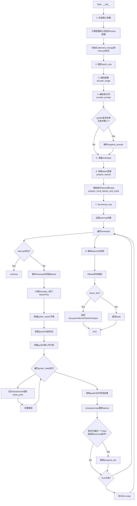

#### 带注释源码

```python
@torch.no_grad()
@replace_example_docstring(EXAMPLE_DOC_STRING)
def __call__(
    self,
    image: PIL.Image.Image,
    prompt: str | list[str] = None,
    negative_prompt: str | list[str] = None,
    num_frames: int = 121,
    num_inference_steps: int = 50,
    sigmas: list[float] = None,
    num_videos_per_prompt: int | None = 1,
    generator: torch.Generator | list[torch.Generator] | None = None,
    latents: torch.Tensor | None = None,
    prompt_embeds: torch.Tensor | None = None,
    prompt_embeds_mask: torch.Tensor | None = None,
    negative_prompt_embeds: torch.Tensor | None = None,
    negative_prompt_embeds_mask: torch.Tensor | None = None,
    prompt_embeds_2: torch.Tensor | None = None,
    prompt_embeds_mask_2: torch.Tensor | None = None,
    negative_prompt_embeds_2: torch.Tensor | None = None,
    negative_prompt_embeds_mask_2: torch.Tensor | None = None,
    output_type: str | None = "np",
    return_dict: bool = True,
    attention_kwargs: dict[str, Any] | None = None,
):
    """
    The call function to the pipeline for generation.

    Args:
        image (`PIL.Image.Image`):
            The input image to condition video generation on.
        prompt (`str` or `list[str]`, *optional*):
            The prompt or prompts to guide the video generation. If not defined, one has to pass `prompt_embeds`
            instead.
        negative_prompt (`str` or `list[str]`, *optional*):
            The prompt or prompts not to guide the video generation. If not defined, one has to pass
            `negative_prompt_embeds` instead.
        num_frames (`int`, defaults to `121`):
            The number of frames in the generated video.
        num_inference_steps (`int`, defaults to `50`):
            The number of denoising steps. More denoising steps usually lead to a higher quality video at the
            expense of slower inference.
        sigmas (`list[float]`, *optional*):
            Custom sigmas to use for the denoising process with schedulers which support a `sigmas` argument in
            their `set_timesteps` method. If not defined, the default behavior when `num_inference_steps` is passed
            will be used.
        num_videos_per_prompt (`int`, *optional*, defaults to 1):
            The number of videos to generate per prompt.
        generator (`torch.Generator` or `list[torch.Generator]`, *optional*):
            A [`torch.Generator`](https://pytorch.org/docs/stable/generated/torch.Generator.html) to make
            generation deterministic.
        latents (`torch.Tensor`, *optional*):
            Pre-generated noisy latents sampled from a Gaussian distribution, to be used as inputs for video
            generation. Can be used to tweak the same generation with different prompts. If not provided, a latents
            tensor is generated by sampling using the supplied random `generator`.
        prompt_embeds (`torch.Tensor`, *optional*):
            Pre-generated text embeddings. Can be used to easily tweak text inputs (prompt weighting). If not
            provided, text embeddings are generated from the `prompt` input argument.
        prompt_embeds_mask (`torch.Tensor`, *optional*):
            Pre-generated mask for prompt embeddings.
        negative_prompt_embeds (`torch.Tensor`, *optional*):
            Pre-generated negative text embeddings. Can be used to easily tweak text inputs, *e.g.* prompt
            weighting. If not provided, negative_prompt_embeds will be generated from `negative_prompt` input
            argument.
        negative_prompt_embeds_mask (`torch.Tensor`, *optional*):
            Pre-generated mask for negative prompt embeddings.
        prompt_embeds_2 (`torch.Tensor`, *optional*):
            Pre-generated text embeddings from the second text encoder. Can be used to easily tweak text inputs.
        prompt_embeds_mask_2 (`torch.Tensor`, *optional*):
            Pre-generated mask for prompt embeddings from the second text encoder.
        negative_prompt_embeds_2 (`torch.Tensor`, *optional*):
            Pre-generated negative text embeddings from the second text encoder.
        negative_prompt_embeds_mask_2 (`torch.Tensor`, *optional*):
            Pre-generated mask for negative prompt embeddings from the second text encoder.
        output_type (`str`, *optional*, defaults to `"np"`):
            The output format of the generated video. Choose between "np", "pt", or "latent".
        return_dict (`bool`, *optional*, defaults to `True`):
            Whether or not to return a [`HunyuanVideo15PipelineOutput`] instead of a plain tuple.
        attention_kwargs (`dict`, *optional*):
            A kwargs dictionary that if specified is passed along to the `AttentionProcessor` as defined under
            `self.processor` in
            [diffusers.models.attention_processor](https://github.com/huggingface/diffusers/blob/main/src/diffusers/models/attention_processor.py).

    Examples:

    Returns:
        [`~HunyuanVideo15PipelineOutput`] or `tuple`:
            If `return_dict` is `True`, [`HunyuanVideo15PipelineOutput`] is returned, otherwise a `tuple` is
            returned where the first element is a list with the generated videos.
    """

    # 1. 检查输入参数，确保参数正确性，错误则抛出异常
    self.check_inputs(
        prompt=prompt,
        image=image,
        negative_prompt=negative_prompt,
        prompt_embeds=prompt_embeds,
        negative_prompt_embeds=negative_prompt_embeds,
        prompt_embeds_mask=prompt_embeds_mask,
        negative_prompt_embeds_mask=negative_prompt_embeds_mask,
        prompt_embeds_2=prompt_embeds_2,
        prompt_embeds_mask_2=prompt_embeds_mask_2,
        negative_prompt_embeds_2=negative_prompt_embeds_2,
        negative_prompt_embeds_mask_2=negative_prompt_embeds_mask_2,
    )

    # 计算默认宽高并对图像进行resize以匹配目标尺寸
    height, width = self.video_processor.calculate_default_height_width(
        height=image.size[1], width=image.size[0], target_size=self.target_size
    )
    image = self.video_processor.resize(image, height=height, width=width, resize_mode="crop")

    # 初始化注意力kwargs、当前timestep和中断标志
    self._attention_kwargs = attention_kwargs
    self._current_timestep = None
    self._interrupt = False

    # 获取执行设备
    device = self._execution_device

    # 2. 根据prompt或prompt_embeds确定batch_size
    if prompt is not None and isinstance(prompt, str):
        batch_size = 1
    elif prompt is not None and isinstance(prompt, list):
        batch_size = len(prompt)
    else:
        batch_size = prompt_embeds.shape[0]

    # 3. 编码输入图像为embedding，供后续transformer使用
    image_embeds = self.encode_image(
        image=image,
        batch_size=batch_size * num_videos_per_prompt,
        device=device,
        dtype=self.transformer.dtype,
    )

    # 4. 编码输入prompt（支持双文本编码器：Qwen2.5-VL和ByT5）
    prompt_embeds, prompt_embeds_mask, prompt_embeds_2, prompt_embeds_mask_2 = self.encode_prompt(
        prompt=prompt,
        device=device,
        dtype=self.transformer.dtype,
        batch_size=batch_size,
        num_videos_per_prompt=num_videos_per_prompt,
        prompt_embeds=prompt_embeds,
        prompt_embeds_mask=prompt_embeds_mask,
        prompt_embeds_2=prompt_embeds_2,
        prompt_embeds_mask_2=prompt_embeds_mask_2,
    )

    # 如果guider启用且条件数>1，则编码negative_prompt
    if self.guider._enabled and self.guider.num_conditions > 1:
        (
            negative_prompt_embeds,
            negative_prompt_embeds_mask,
            negative_prompt_embeds_2,
            negative_prompt_embeds_mask_2,
        ) = self.encode_prompt(
            prompt=negative_prompt,
            device=device,
            dtype=self.transformer.dtype,
            batch_size=batch_size,
            num_videos_per_prompt=num_videos_per_prompt,
            prompt_embeds=negative_prompt_embeds,
            prompt_embeds_mask=negative_prompt_embeds_mask,
            prompt_embeds_2=negative_prompt_embeds_2,
            prompt_embeds_mask_2=negative_prompt_embeds_mask_2,
        )

    # 5. 准备timesteps（支持自定义sigmas或timesteps）
    sigmas = np.linspace(1.0, 0.0, num_inference_steps + 1)[:-1] if sigmas is None else sigmas
    timesteps, num_inference_steps = retrieve_timesteps(self.scheduler, num_inference_steps, device, sigmas=sigmas)

    # 6. 准备latent变量（随机初始化或使用提供的latents）
    latents = self.prepare_latents(
        batch_size=batch_size * num_videos_per_prompt,
        num_channels_latents=self.num_channels_latents,
        height=height,
        width=width,
        num_frames=num_frames,
        dtype=self.transformer.dtype,
        device=device,
        generator=generator,
        latents=latents,
    )

    # 准备条件latents和mask（用于I2V：将图像latents作为第一帧条件）
    cond_latents_concat, mask_concat = self.prepare_cond_latents_and_mask(
        latents=latents,
        image=image,
        batch_size=batch_size * num_videos_per_prompt,
        height=height,
        width=width,
        dtype=self.transformer.dtype,
        device=device,
    )

    # 7. Denoising loop（去噪主循环）
    num_warmup_steps = len(timesteps) - num_inference_steps * self.scheduler.order
    self._num_timesteps = len(timesteps)

    # 进度条
    with self.progress_bar(total=num_inference_steps) as progress_bar:
        # 遍历每个timestep进行去噪
        for i, t in enumerate(timesteps):
            # 检查中断标志，支持外部中断生成
            if self._interrupt:
                continue

            # 记录当前timestep
            self._current_timestep = t
            
            # 拼接latents、条件latents和mask作为模型输入
            latent_model_input = torch.cat([latents, cond_latents_concat, mask_concat], dim=1)
            
            # 扩展timestep以匹配batch维度（兼容ONNX/Core ML）
            timestep = t.expand(latent_model_input.shape[0]).to(latent_model_input.dtype)

            # 如果使用MeanFlow，根据当前step计算下一个timestep
            if self.transformer.config.use_meanflow:
                if i == len(timesteps) - 1:
                    # 最后一步设为0（对应t=1->0的最终状态）
                    timestep_r = torch.tensor([0.0], device=device)
                else:
                    timestep_r = timesteps[i + 1]
                timestep_r = timestep_r.expand(latents.shape[0]).to(latents.dtype)
            else:
                timestep_r = None

            # Step 1: 构建guider输入字典
            # 条件输入应该在元组的第一个位置
            guider_inputs = {
                "encoder_hidden_states": (prompt_embeds, negative_prompt_embeds),
                "encoder_attention_mask": (prompt_embeds_mask, negative_prompt_embeds_mask),
                "encoder_hidden_states_2": (prompt_embeds_2, negative_prompt_embeds_2),
                "encoder_attention_mask_2": (prompt_embeds_mask_2, negative_prompt_embeds_mask_2),
            }

            # Step 2: 更新guider的内部状态
            self.guider.set_state(step=i, num_inference_steps=num_inference_steps, timestep=t)

            # Step 3: 准备批处理输入
            # guider将模型输入分割为条件/无条件预测的独立批次
            # 对于CFG，guider_state包含两个批次：条件预测和无条件预测
            guider_state = self.guider.prepare_inputs(guider_inputs)
            
            # Step 4: 对每个批次运行denoiser
            for guider_state_batch in guider_state:
                self.guider.prepare_models(self.transformer)

                # 提取该批次的条件kwargs
                cond_kwargs = {
                    input_name: getattr(guider_state_batch, input_name) for input_name in guider_inputs.keys()
                }

                # 获取标识符（如"pred_cond"/"pred_uncond"）
                context_name = getattr(guider_state_batch, self.guider._identifier_key)
                
                # 使用cache上下文运行denoiser
                with self.transformer.cache_context(context_name):
                    # 运行transformer得到噪声预测
                    guider_state_batch.noise_pred = self.transformer(
                        hidden_states=latent_model_input,
                        image_embeds=image_embeds,
                        timestep=timestep,
                        timestep_r=timestep_r,
                        attention_kwargs=self.attention_kwargs,
                        return_dict=False,
                        **cond_kwargs,
                    )[0]

                # 清理模型（如移除hooks）
                self.guider.cleanup_models(self.transformer)

            # Step 5: 使用guider方法合并预测结果
            # 应用CFG公式: noise_pred = pred_uncond + guidance_scale * (pred_cond - pred_uncond)
            noise_pred = self.guider(guider_state)[0]

            # 使用scheduler进行单步去噪：x_t -> x_t-1
            latents_dtype = latents.dtype
            latents = self.scheduler.step(noise_pred, t, latents, return_dict=False)[0]

            # 兼容MPS设备：确保dtype一致
            if latents.dtype != latents_dtype:
                if torch.backends.mps.is_available():
                    latents = latents.to(latents_dtype)

            # 调用callback（如果提供）
            if i == len(timesteps) - 1 or ((i + 1) > num_warmup_steps and (i + 1) % self.scheduler.order == 0):
                progress_bar.update()

            # XLA支持：标记step
            if XLA_AVAILABLE:
                xm.mark_step()

    # 清除当前timestep
    self._current_timestep = None

    # 8. 如果不是latent输出模式，则解码latents为视频
    if not output_type == "latent":
        # 反缩放latents
        latents = latents.to(self.vae.dtype) / self.vae.config.scaling_factor
        # VAE解码
        video = self.vae.decode(latents, return_dict=False)[0]
        # 后处理视频
        video = self.video_processor.postprocess_video(video, output_type=output_type)
    else:
        video = latents

    # Offload所有模型以释放显存
    self.maybe_free_model_hooks()

    # 根据return_dict返回结果
    if not return_dict:
        return (video,)

    return HunyuanVideo15PipelineOutput(frames=video)
```


### HunyuanVideo15ImageToVideoPipeline.num_timesteps

该属性是一个只读属性，用于获取当前图像到视频生成管道（pipeline）的总时间步数。它在去噪循环开始时被设置，返回调度器产生的时间步列表的长度，反映了扩散模型的推理步数。

参数：该属性无需参数（为属性访问器）。

返回值：`int`，返回当前时间步数，即去噪过程中使用的时间步总数。该值在 `__call__` 方法的去噪循环开始前被设置，等于调度器生成的 timesteps 列表的长度。

#### 流程图

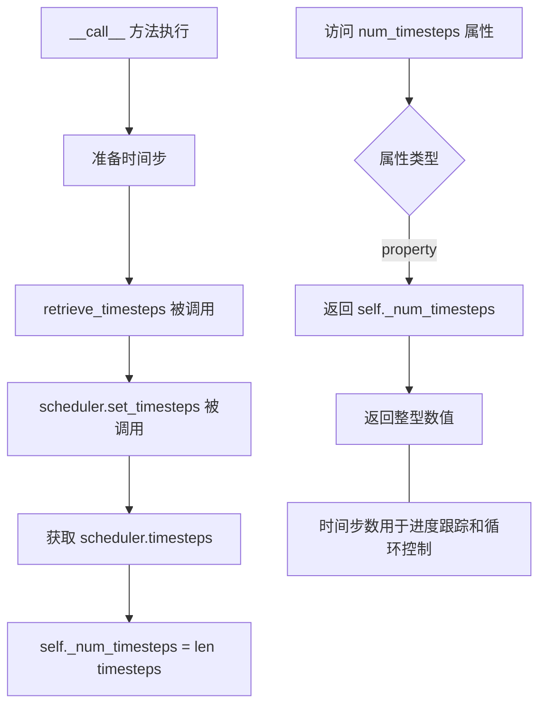

#### 带注释源码

```python
@property
def num_timesteps(self):
    """
    属性：获取当前时间步数
    
    这是一个只读属性，用于返回图像到视频生成过程中的总时间步数。
    该值在 __call__ 方法中被设置，等于调度器生成的 timesteps 列表的长度。
    用于跟踪去噪循环的进度和状态。
    
    返回值:
        int: 当前时间步数，即扩散模型推理过程中使用的时间步总数
    """
    return self._num_timesteps
```

#### 相关上下文源码

```python
# 在 __call__ 方法中去噪循环开始前设置该属性
# 位置：__call__ 方法约第 470 行附近

# 5. Prepare timesteps
sigmas = np.linspace(1.0, 0.0, num_inference_steps + 1)[:-1] if sigmas is None else sigmas
timesteps, num_inference_steps = retrieve_timesteps(self.scheduler, num_inference_steps, device, sigmas=sigmas)

# ... 省略部分代码 ...

# 7. Denoising loop
num_warmup_steps = len(timesteps) - num_inference_steps * self.scheduler.order
self._num_timesteps = len(timesteps)  # <-- 在此处设置 num_timesteps 属性
```

#### 设计说明

| 特性 | 说明 |
|------|------|
| 属性类型 | 只读 `@property` |
| 依赖状态 | `self._num_timesteps` 在 `__call__` 方法中设置 |
| 使用场景 | 进度条更新、状态跟踪、外部查询管道状态 |
| 线程安全 | 非线程安全，依赖实例状态 |


### `HunyuanVideoImageToVideoPipeline.attention_kwargs`

该属性是一个只读属性，用于获取在推理过程中传递给注意力处理器（AttentionProcessor）的额外关键字参数。该参数在调用 `__call__` 方法时设置，并通过管道传递给 transformer 模型，以支持自定义的注意力控制行为。

参数：

- （无 - 这是一个属性而不是方法）

返回值：`dict[str, Any] | None`，返回存储的注意力参数字典。如果未设置，则返回 `None`。

#### 流程图

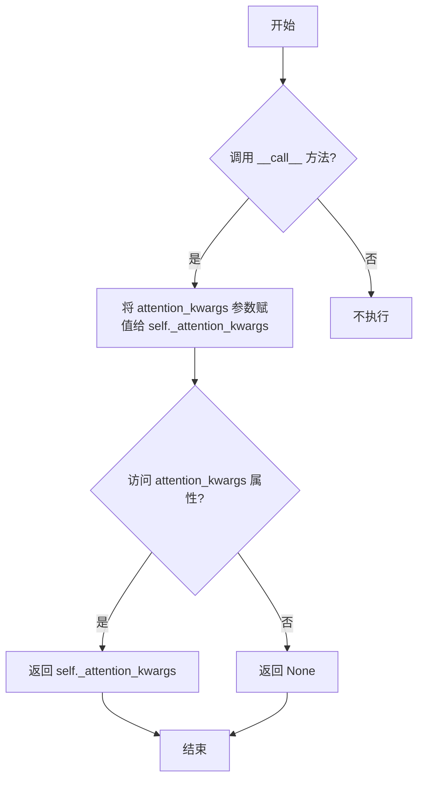

#### 带注释源码

```python
@property
def attention_kwargs(self):
    """
    属性：attention_kwargs
    
    获取在推理过程中传递给 AttentionProcessor 的额外关键字参数。
    该属性返回在 __call__ 方法中设置的 self._attention_kwargs，
    用于支持自定义的注意力控制行为。
    
    返回:
        dict[str, Any] | None: 注意力参数字典，如果未设置则返回 None
    """
    return self._attention_kwargs
```

#### 使用场景说明

在 `__call__` 方法中，该属性被用于以下场景：

```python
# 在 __call__ 方法中设置
self._attention_kwargs = attention_kwargs

# 在去噪循环中传递给 transformer
guider_state_batch.noise_pred = self.transformer(
    hidden_states=latent_model_input,
    image_embeds=image_embeds,
    timestep=timestep,
    timestep_r=timestep_r,
    attention_kwargs=self.attention_kwargs,  # 使用该属性
    return_dict=False,
    **cond_kwargs,
)[0]
```

该属性允许用户在调用管道时传入自定义的注意力参数，这些参数会被传递到 transformer 模型的注意力处理器中，从而实现对注意力机制的细粒度控制。


### `HunyuanVideo15ImageToVideoPipeline.current_timestep`

该属性是 `HunyuanVideo15ImageToVideoPipeline` 类的只读属性，用于获取当前去噪循环中的时间步（timestep），在视频生成的去噪过程中实时反映模型正处于哪一个推理步骤。

参数：无（仅包含 `self`）

返回值：`torch.Tensor` 或 `None`，返回当前时间步，如果未在去噪循环中则为 `None`

#### 流程图

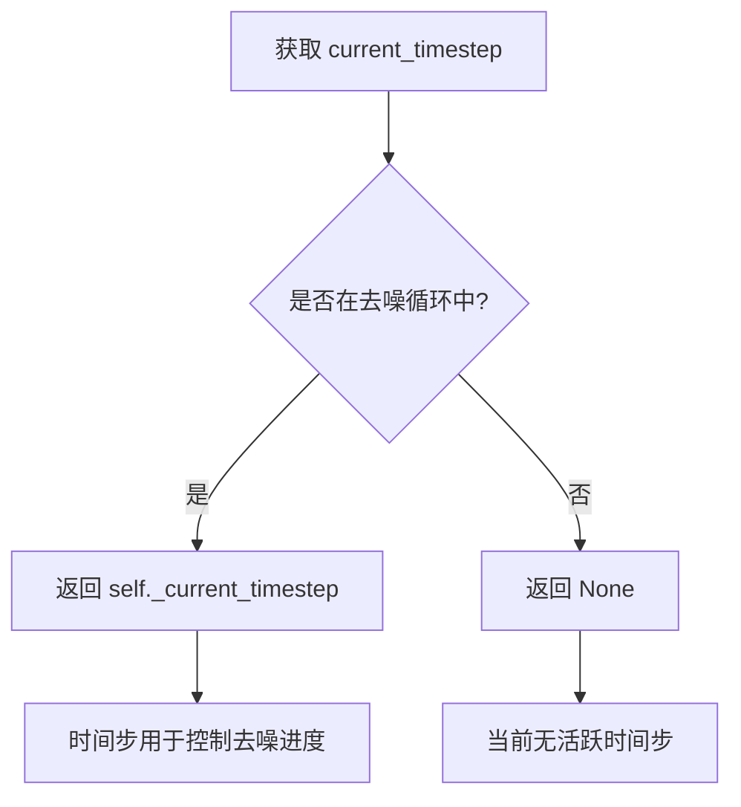

#### 带注释源码

```python
@property
def current_timestep(self):
    """
    属性装饰器：返回当前的去噪时间步
    
    该属性在去噪循环（denoising loop）中被动态更新，
    用于追踪视频生成过程中的当前推理步骤。
    
    返回值:
        torch.Tensor: 当前时间步，值为 scheduler 生成的单个时间步张量
        None: 当不在去噪循环中时返回 None（如初始化时或循环结束后）
    
    使用场景:
        - 在 __call__ 方法的去噪循环中：self._current_timestep = t
        - 循环结束后重置：self._current_timestep = None
    """
    return self._current_timestep
```

#### 关键上下文信息

| 项目 | 描述 |
|------|------|
| 所属类 | `HunyuanVideo15ImageToVideoPipeline` |
| 属性类型 | 只读属性（@property） |
| 内部变量 | `self._current_timestep` |
| 初始化位置 | `__call__` 方法开始时初始化为 `None` |
| 更新位置 | 去噪循环内部：`self._current_timestep = t` |
| 重置位置 | 去噪循环结束后：`self._current_timestep = None` |
| 典型用途 | 外部调用者可以通过此属性监控生成进度 |


### `HunyuanVideo15ImageToVideoPipeline.interrupt`

该属性是 HunyuanVideo15ImageToVideoPipeline 流水线类的中断标志访问器，用于在去噪循环中检查和控制流水线是否被中断。当设置为 True 时，去噪循环会跳过当前迭代，实现安全的流水线中断功能。

参数： 无（属性访问器无需参数）

返回值：`bool`，返回当前的中断状态标志。如果为 True，表示流水线已被中断，去噪循环将跳过当前迭代。

#### 流程图

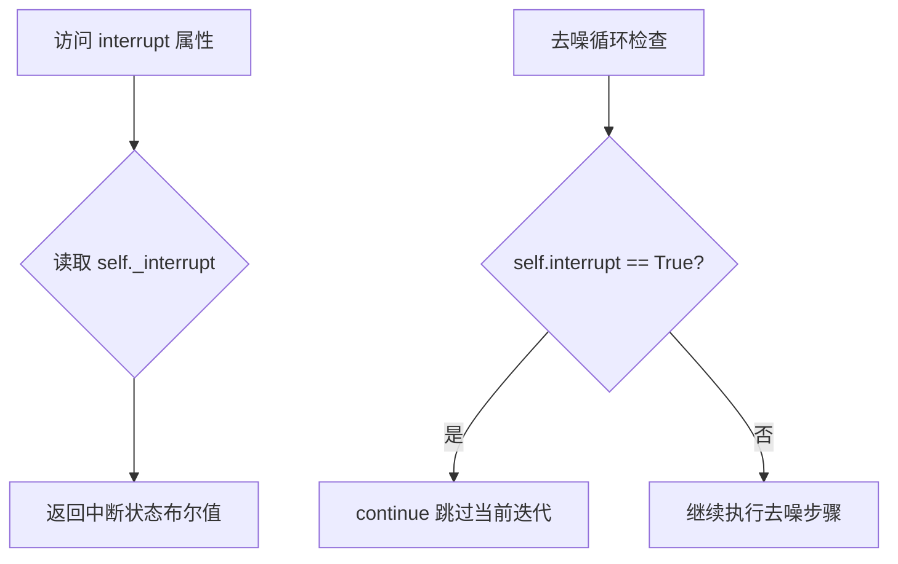

#### 带注释源码

```python
@property
def interrupt(self):
    """
    中断标志属性访问器。
    
    该属性提供了对内部中断标志 _interrupt 的只读访问。
    在去噪循环中通过检查此属性来决定是否跳过当前迭代，
    从而实现安全的流水线中断功能。
    
    实际使用示例（位于 __call__ 方法的去噪循环中）:
        for i, t in enumerate(timesteps):
            if self.interrupt:  # 检查中断标志
                continue       # 跳过当前迭代
        
    Returns:
        bool: 当前的中断状态。True 表示流水线已被请求中断。
    """
    return self._interrupt
```

#### 上下文使用说明

该属性在 `__call__` 方法的去噪循环中被使用：

```python
# 初始化中断标志（位于 __call__ 方法中）
self._interrupt = False

# 在去噪循环中检查中断标志
with self.progress_bar(total=num_inference_steps) as progress_bar:
    for i, t in enumerate(timesteps):
        if self.interrupt:  # <-- 使用 interrupt 属性检查中断状态
            continue        # 跳过当前迭代，继续下一次循环
        # ... 继续执行去噪步骤
```

当外部调用者设置 `pipeline._interrupt = True` 时，去噪循环会在下一次迭代开始时检测到该变化并跳过剩余的处理，实现优雅的流水线中断。

## 关键组件


### HunyuanVideo15ImageToVideoPipeline

HunyuanVideo1.5图像到视频生成管道，接收输入图像和文本提示，通过多阶段编码（Qwen2.5-VL文本编码器、T5编码器、Siglip图像编码器）和去噪过程生成视频。

### 张量索引与惰性加载

代码使用张量切片进行索引操作（如`prompt_embeds[:, crop_start:]`），并通过`retrieve_latents`函数实现惰性加载潜在向量，支持从encoder_output中按需提取latent_dist或直接获取latents。

### 反量化支持

通过`vae.config.scaling_factor`对潜在向量进行缩放（`latents = latents.to(self.vae.dtype) / self.vae.config.scaling_factor`），实现从潜在空间到像素空间的反量化转换。

### 量化策略

代码使用多种精度管理策略：`vae_dtype = vae.dtype`、`image_encoder_dtype = next(image_encoder.parameters()).dtype`，支持fp32/fp16等不同量化精度，并通过`self.vae_scale_factor_temporal`和`self.vae_scale_factor_spatial`管理潜在空间的压缩比。

### 多模态文本编码

集成了Qwen2.5-VL和T5双文本编码器系统，`_get_mllm_prompt_embeds`处理对话模板文本，`_get_byt5_prompt_embeds`处理字形文本提取，实现多模态语义理解。

### 图像条件编码

`_get_image_embeds`使用SiglipVisionModel提取图像视觉特征，`_get_image_latents`使用VAE编码器将图像转换为潜在表示，为视频生成提供条件信息。

### 引导器系统

集成ClassifierFreeGuidance引导器，通过`guider.prepare_inputs`、`guider.prepare_models`和`guider(guider_state)`方法实现分类器自由引导，支持条件/无条件预测的动态组合。

### 时间步调度

使用FlowMatchEulerDiscreteScheduler结合`retrieve_timesteps`函数，支持自定义timesteps和sigmas调度，实现扩散模型的去噪过程控制。

### 潜在向量准备

`prepare_latents`生成初始噪声潜在向量，`prepare_cond_latents_and_mask`构建图像条件潜在向量和掩码，将第一帧设为条件帧，后续帧设为0实现时序传播。

### 模型卸载管理

通过`model_cpu_offload_seq = "image_encoder->text_encoder->transformer->vae"`定义模型卸载序列，优化GPU内存使用。

### 视频后处理

`video_processor`负责视频的预处理和后处理，包括图像resize、RGB转换和潜在向量解码后的视频格式转换。


## 问题及建议


### 已知问题

1.  **硬编码的魔法数字与配置脆弱性**：代码中存在大量硬编码的数值（如 `prompt_template_encode_start_idx = 108`, `tokenizer_max_length = 1000`, `vision_num_semantic_tokens = 729`, `target_size = 640`）。这些数值散落在类属性定义中，难以维护和配置。特别是 `target_size` 依赖于 `transformer.config.target_size`，若配置项不存在而回退到 640，可能导致默认分辨率不符合模型预期最佳实践。
2.  **静态方法与实例状态的耦合**：`_get_mllm_prompt_embeds` 是静态方法，但其默认参数中包含与 `self.system_message` 相同的字符串。这种重复定义容易在后续维护中产生不一致，虽然运行时通过参数传递进行了覆盖，但接口设计不够清晰。
3.  **重复的 Prompt 处理逻辑**：在 `encode_prompt` 方法中，对 `prompt_embeds` (Qwen2.5-VL) 和 `prompt_embeds_2` (ByT5) 的处理逻辑（`repeat`, `view`, `to(device/dtype)`）几乎完全相同，违反了 DRY (Don't Repeat Yourself) 原则，导致代码冗长且容易出错。
4.  **类型提示不完善**：`check_inputs` 方法的参数完全缺少类型标注，降低了代码的可读性和静态分析工具的效能。此外，`encode_prompt` 中参数 `device` 和 `dtype` 允许 `None` 作为默认值，但类型声明为非空类型，后续需要手动进行类型转换和默认值处理。
5.  **资源管理中的潜在性能问题**：在 `encode_image` 和 `prepare_cond_latents_and_mask` 方法中，使用了 `tensor.repeat(...)` 来处理批量大小。当 `batch_size` 较大时，这会显著增加显存占用。此外，`__call__` 方法中每次迭代都进行 `latent_model_input = torch.cat(...)`，这在视频生成的高维度 tensor 操作中可能带来不必要的内存复制开销。
6.  **错误处理粒度**：`retrieve_latents` 函数在无法获取 latents 时仅抛出通用的 `AttributeError`，且 `check_inputs` 中的错误信息在打印 `type(image)` 时缺乏对图像内容的具体描述，不利于用户快速定位问题。

### 优化建议

1.  **配置抽象**：创建一个 `PipelineConfig` 数据类或配置字典，将 `tokenizer_max_length`, `prompt_template_encode_start_idx`, `vision_num_semantic_tokens` 等超参数集中管理。对于 `target_size`，建议明确其来源或移除对不明确配置项的依赖。
2.  **重构 Prompt 编码逻辑**：提取 `encode_prompt` 中重复的张量操作（repeat, view, device/dtype 转换）为私有辅助方法（例如 `_prepare_prompt_embeds`），以减少代码重复并提高可读性。考虑将 `_get_mllm_prompt_embeds` 的默认系统消息移除，强制调用者通过参数传入或使用实例属性。
3.  **完善类型提示**：为 `check_inputs` 的所有参数添加 `Optional` 或具体的类型声明（如 `Union[str, List[str]]`）。修正 `encode_prompt` 的参数类型以反映其实际接受的 `Optional` 值。
4.  **性能优化**：
    *   评估 `torch.cat` 在去噪循环中的频繁调用，考虑是否可以预先分配内存或使用视图（view）而非复制。
    *   对于 `encode_image` 中的 `repeat` 操作，如果内存允许，可以考虑在后续计算中动态扩展维度而非一次性扩展到位。
5.  **增强错误处理**：在 `check_inputs` 中提供更具体的错误信息（例如检查图像尺寸是否为正数、图像模式是否合法等）。在 `retrieve_latents` 中捕获异常并转换为更具体的 `ValueError`，告知用户具体的采样模式错误。
6.  **模块化与解耦**：将 XLA 相关的特殊处理逻辑（`if XLA_AVAILABLE`）封装到 `utils` 工具类或特定的硬件加速钩子中，保持主管道逻辑的清晰。


## 其它


### 设计目标与约束

本pipeline用于实现基于HunyuanVideo 1.5模型的图像到视频(Image-to-Video)生成任务。核心设计目标是将静态输入图像作为条件，生成对应的高质量视频内容。约束条件包括：1) 输入图像必须为PIL.Image.Image格式；2) 支持的输出视频帧数范围受VAE temporal compression ratio限制；3) 需要同时使用两个文本编码器(Qwen2.5-VL和T5)进行文本嵌入；4) 支持Classifier Free Guidance(CFG)引导生成；5) 推理设备需支持CUDA或Apple MPS。

### 错误处理与异常设计

pipeline在多个关键节点进行了输入验证：check_inputs方法检查图像类型、prompt与prompt_embeds的互斥关系、negative_prompt处理、embeddings与mask的配对完整性。对于缺失属性访问，使用getattr配合默认值处理(如vae、transformer的config属性)。scheduler相关错误在retrieve_timesteps中进行捕获，包括timesteps和sigmas的互斥检查、scheduler兼容性验证。模型输出解码阶段处理了MPS后端的dtype转换兼容性问题的workaround。

### 数据流与状态机

pipeline执行流程遵循以下状态转换：1) Initial(初始化) -> 2) InputValidation(输入验证) -> 3) ImageEncoding(图像编码) -> 4) PromptEncoding(文本编码) -> 5) LatentPreparation(潜在向量准备) -> 6) DenoisingLoop(去噪循环) -> 7) VideoDecoding(视频解码) -> 8) OutputPostprocessing(输出后处理)。在DenoisingLoop内部，每个timestep执行：GuiderStatePreparation -> ModelForward -> NoisePrediction -> SchedulerStep。关键状态变量包括_current_timestep、_interrupt、_attention_kwargs、_num_timesteps。

### 外部依赖与接口契约

核心依赖包括：transformers库提供Qwen2_5_VLTextModel、Qwen2Tokenizer、ByT5Tokenizer、T5EncoderModel、SiglipImageProcessor、SiglipVisionModel；diffusers库提供DiffusionPipeline基类、FlowMatchEulerDiscreteScheduler、ClassifierFreeGuidance引导器、AutoencoderKLHunyuanVideo15 VAE模型；本地模块包括HunyuanVideo15Transformer3DModel变换器模型、HunyuanVideo15ImageProcessor图像处理器、HunyuanVideo15PipelineOutput输出类。接口契约要求：输入image为PIL.Image.Image、prompt支持str或list[str]、输出通过HunyuanVideo15PipelineOutput或tuple返回。

### 配置参数与超参数

关键配置参数包括：vae_scale_factor_temporal(时间压缩比，默认4)、vae_scale_factor_spatial(空间压缩比，默认16)、target_size(目标尺寸，默认640)、vision_states_dim(视觉状态维度，默认1152)、num_channels_latents(潜在通道数，默认32)、tokenizer_max_length(主分词器最大长度，1000)、tokenizer_2_max_length(ByT5分词器最大长度，256)、vision_num_semantic_tokens(视觉语义token数，729)、prompt_template_encode_start_idx(提示模板编码起始位置，108)。推理超参数：num_frames(默认121帧)、num_inference_steps(默认50步)、sigmas(可选自定义)。

### 性能优化策略

pipeline实现了多项性能优化：1) 模型CPU卸载序列(model_cpu_offload_seq)定义卸载顺序为image_encoder->text_encoder->transformer->vae；2) 支持XLA加速(当torch_xla可用时)；3) 提供模型上下文缓存(cache_context)用于注意力计算；4) 支持梯度检查点(通过transformer.cache_context)；5) MPS后端特殊处理以避免dtype转换bug；6) 支持latents预生成以实现确定性生成；7) 支持batch内多个视频并行生成(num_videos_per_prompt)。

### 内存管理与资源释放

内存管理策略包括：1) 使用model_cpu_offload_seq定义模型卸载顺序；2) maybe_free_model_hooks()在pipeline执行完毕后释放所有模型钩子；3) guider.prepare_models和guider.cleanup_models配对使用管理临时模型状态；4) 图像编码和文本编码在需要时重复(repeat)到目标batch尺寸；5) 中间张量在不需要时及时释放(如latents_dtype保留原始dtype用于最终转换)。

### 局限性说明

当前pipeline存在以下局限性：1) 仅支持图像到视频生成，不支持纯文本到视频；2) 输出视频帧数受num_frames参数限制，最大值取决于VAE temporal compression；3) 图像条件仅使用第一帧，后续帧通过去噪过程生成；4) 需要较大的GPU显存(典型配置需要16GB+)；5) 不支持negative_prompt_embeds和prompt_embeds同时传入；6) Apple MPS后端存在已知的dtype转换问题需要workaround；7) 引导器仅在enabled且num_conditions>1时才处理negative_prompt。

    