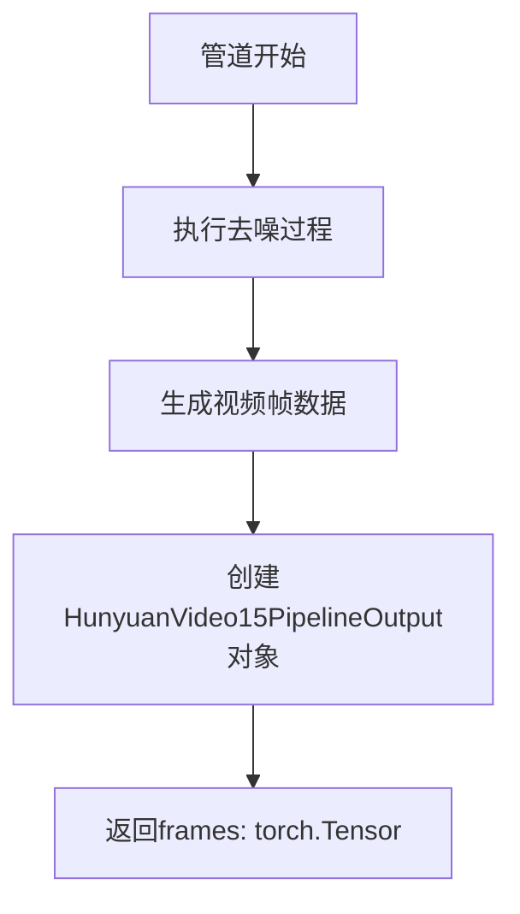
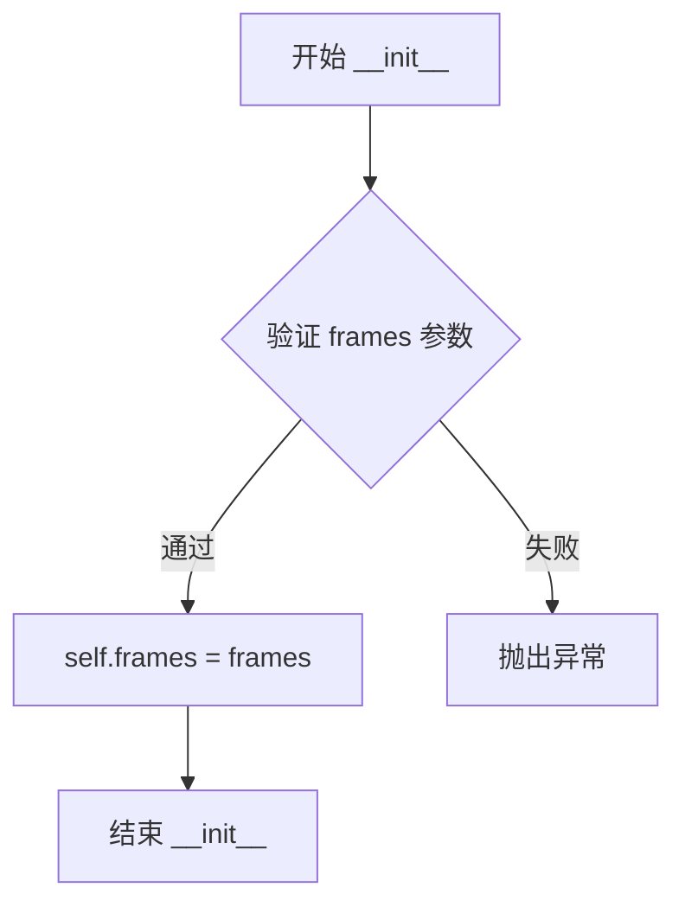
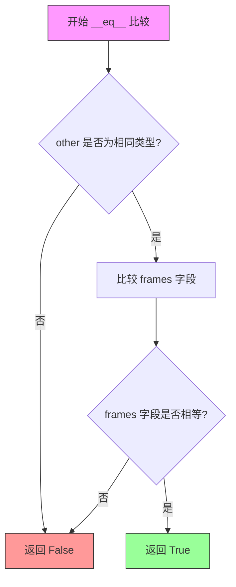

# `diffusers\src\diffusers\pipelines\hunyuan_video1_5\pipeline_output.py` 详细设计文档

这是一个用于HunyuanVideo1.5视频生成管道的输出数据类，封装了生成的视频帧数据（frames），继承自diffusers库的BaseOutput基类，支持torch.Tensor、np.ndarray或PIL.Image列表等多种格式的视频输出。

## 整体流程



## 类结构

```
BaseOutput (diffusers基类)
└── HunyuanVideo15PipelineOutput (数据输出类)
```

## 全局变量及字段


### `HunyuanVideo15PipelineOutput.frames`
    
存储去噪后的视频帧输出，支持torch.Tensor、np.ndarray或list[list[PIL.Image.Image]]格式，形状为(batch_size, num_frames, channels, height, width)

类型：`torch.Tensor`
    
    

## 全局函数及方法


### HunyuanVideo15PipelineOutput.__init__

这是一个继承自 BaseOutput 的数据类，用于存储 HunyuanVideo1.5 视频生成管道的输出结果。该类的 `__init__` 方法由 Python 的 `@dataclass` 装饰器自动生成，用于初始化视频帧数据。

参数：

- `self`：HunyuanVideo15PipelineOutput，类的实例本身
- `frames`：`torch.Tensor`，视频输出帧数据，可以是形状为 `(batch_size, num_frames, channels, height, width)` 的张量

返回值：`None`，无返回值（构造函数）

#### 流程图



#### 带注释源码

```python
@dataclass  # Python 数据类装饰器，自动生成 __init__ 等方法
class HunyuanVideo15PipelineOutput(BaseOutput):
    r"""
    Output class for HunyuanVideo1.5 pipelines.
    HunyuanVideo1.5 管道的输出类

    Args:
        frames (`torch.Tensor`, `np.ndarray`, or list[list[PIL.Image.Image]]):
            List of video outputs - It can be a nested list of length `batch_size,` with each sub-list containing
            denoised PIL image sequences of length `num_frames.` It can also be a NumPy array or Torch tensor of shape
            `(batch_size, num_frames, channels, height, width)`.
            视频输出列表 - 可以是长度为 batch_size 的嵌套列表，每个子列表包含长度为 num_frames 的去噪 PIL 图像序列。
            也可以是形状为 (batch_size, num_frames, channels, height, width) 的 NumPy 数组或 Torch 张量。
    """

    # 类字段：存储视频帧数据
    frames: torch.Tensor  # torch.Tensor 类型，存储去噪后的视频帧
```


### HunyuanVideo15PipelineOutput.__repr__

这是一个 dataclass 自动生成的特殊方法，用于返回对象的字符串表示形式。

参数：

- `self`：`HunyuanVideo15PipelineOutput` 实例，Python 自动传递的实例本身

返回值：`str`，返回该对象的可读字符串表示，通常包含类名和所有字段的名称与值

#### 流程图

```mermaid
flowchart TD
    A[调用 obj.__repr__] --> B{是否显式定义__repr__?}
    B -->|否-dataclass自动生成| C[收集所有字段名和值]
    C --> D[格式化为字符串: ClassName(field1=value1, field2=value2)]
    D --> E[返回字符串]
```

#### 带注释源码

```python
# 由于 HunyuanVideo15PipelineOutput 是一个 @dataclass
# Python 会自动为其生成 __repr__ 方法
# 源码大致如下（Python 内部实现）:

def __repr__(self):
    """
    自动生成的 __repr__ 方法
    返回格式: HunyuanVideo15PipelineOutput(frames=Tensor(shape=...))"
    """
    return (
        f"HunyuanVideo15PipelineOutput("
        f"frames={self.frames!r})"
    )

# 调用示例:
# output = HunyuanVideo15PipelineOutput(frames=torch.zeros(1, 16, 3, 512, 512))
# print(repr(output))
# 输出类似: HunyuanVideo15PipelineOutput(frames=tensor(...))
```

---

### HunyuanVideo15PipelineOutput

由于提供的代码是 dataclass，建议同时参考该类的完整信息：

参数：

- `frames`：`torch.Tensor`，视频输出帧的张量，形状为 `(batch_size, num_frames, channels, height, width)`

返回值：`HunyuanVideo15PipelineOutput` 实例，包含生成的视频帧数据

#### 带注释源码

```python
@dataclass  # Python dataclass 装饰器，自动生成 __init__, __repr__, __eq__ 等方法
class HunyuanVideo15PipelineOutput(BaseOutput):
    r"""
    Output class for HunyuanVideo1.5 pipelines.
    用于 HunyuanVideo1.5 流水线的输出类

    Args:
        frames (`torch.Tensor`, `np.ndarray`, or list[list[PIL.Image.Image]]):
            List of video outputs - It can be a nested list of length `batch_size,` with each sub-list containing
            denoised PIL image sequences of length `num_frames.` It can also be a NumPy array or Torch tensor of shape
            `(batch_size, num_frames, channels, height, width)`.
    """

    frames: torch.Tensor  # 必需字段，存储视频帧数据
```

#### 关键说明

- `__repr__` 方法是 **自动生成** 的，由 Python 的 `@dataclass` 装饰器在运行时动态创建
- 生成的字符串格式为：`HunyuanVideo15PipelineOutput(frames=...)`
- 如果需要自定义表示，可以显式定义 `__repr__` 方法覆盖自动生成的版本


### `HunyuanVideo15PipelineOutput.__eq__`

该方法为 Python dataclass 自动生成的比较方法，用于比较两个 `HunyuanVideo15PipelineOutput` 对象是否相等。自动生成的 `__eq__` 方法会逐个比较所有字段（在本例中为 `frames` 字段），只有当两个对象的类型相同且所有字段值相等时，才返回 `True`。

参数：

- `self`：隐式参数，当前对象
- `other`：`object`，要比较的另一个对象

返回值：`bool`，如果两个对象相等返回 `True`，否则返回 `False`

#### 流程图



#### 带注释源码

```python
def __eq__(self, other: object) -> bool:
    """
    比较两个 HunyuanVideo15PipelineOutput 对象是否相等。
    
    自动生成的 __eq__ 方法会比较：
    1. 对象类型是否相同
    2. 所有字段值是否相等 (frames)
    
    Args:
        other: 要比较的其他对象
        
    Returns:
        bool: 如果相等返回 True，否则返回 False
    """
    if not isinstance(other, HunyuanVideo15PipelineOutput):
        # 类型不同，直接返回 False
        return False
    
    # 比较所有字段 (仅 frames 字段)
    return (
        self.frames == other.frames
    )
```

## 关键组件


### HunyuanVideo15PipelineOutput

数据类，继承自BaseOutput，用于存储HunyuanVideo1.5视频生成管道的输出结果。该类包含一个frames字段，用于保存生成的视频帧数据。

### frames

类型：torch.Tensor

存储视频输出帧的张量数据，可以是嵌套列表（batch_size个子列表，每个包含num_frames个PIL图像序列）、NumPy数组或Torch张量，形状为(batch_size, num_frames, channels, height, width)。

### BaseOutput

diffusers库中的基类，提供了管道输出的基础结构，所有管道输出类都应继承此类以保持一致性。


## 问题及建议


### 已知问题

-   **类型声明与文档不一致**：文档字符串中说明 `frames` 可以是 `torch.Tensor`、`np.ndarray` 或 `list[list[PIL.Image.Image]]`，但实际类型声明仅为 `torch.Tensor`，存在误导性
-   **缺少视频元数据字段**：缺少 `num_frames`（帧数）、`fps`（帧率）、`video_length` 等视频生成相关的元数据信息，无法满足下游应用对视频参数的访问需求
-   **缺少输出格式验证**：没有对 `frames` 数据的合法性进行校验（如维度检查、值域检查等），可能导致隐藏的错误在后续流程中才暴露

### 优化建议

-   **修正类型声明或扩展类型支持**：将类型声明修改为 `Union[torch.Tensor, np.ndarray, list[list[PIL.Image.Image]]]` 以匹配文档，或仅保留 `torch.Tensor` 并更新文档说明
-   **添加视频元数据字段**：建议扩展 dataclass 添加 `num_frames: Optional[int] = None` 和 `fps: Optional[float] = None` 等字段，便于调用方获取视频参数
-   **实现数据验证逻辑**：在 `__post_init__` 方法中添加对 `frames` 形状和类型的校验，确保数据完整性（例如验证 batch 维度、通道数等）


## 其它


### 设计目标与约束

本代码的设计目标是定义HunyuanVideo1.5管道的输出数据结构，提供标准化的视频帧输出格式。约束条件包括：frames字段必须为torch.Tensor类型，以确保与diffusers框架的兼容性；继承BaseOutput以保持与社区标准的统一性；使用dataclass以简化对象创建和属性访问。

### 错误处理与异常设计

本代码为纯数据结构，不涉及复杂的业务逻辑，错误处理主要依赖于类型检查。由于frames字段类型已声明为torch.Tensor，若传入其他类型（如NumPy数组或PIL图像），Python不会在运行时强制报错，但在后续管道处理中可能引发类型错误。建议在管道调用方进行前置类型验证，或在文档中明确标注输入类型要求。

### 外部依赖与接口契约

本代码依赖两个外部包：1）torch，提供Tensor数据结构支持；2）diffusers.utils.BaseOutput，继承自diffusers库定义的输出基类。接口契约要求：frames字段必须为torch.Tensor类型，建议形状为(batch_size, num_frames, channels, height, width)，数值范围和类型应与管道输出保持一致。

### 性能考虑

作为纯数据结构，本代码不涉及计算逻辑，性能开销主要来自对象实例化。dataclass自动生成的__init__方法已具备良好的性能表现。如需优化，可考虑使用__slots__减少内存开销，但需权衡与dataclass特性的兼容性。

### 安全性考虑

本代码不涉及用户输入处理、网络请求或文件操作，安全性风险较低。但需注意：frames字段可能包含从模型推理中生成的敏感内容，在日志输出或调试场景中应避免直接打印完整的Tensor内容。

### 使用示例

```python
# 创建输出对象
output = HunyuanVideo15PipelineOutput(frames=torch.randn(1, 16, 3, 256, 256))

# 访问输出
frames = output.frames
print(f"Output shape: {frames.shape}")  # torch.Size([1, 16, 3, 256, 256])
```

    