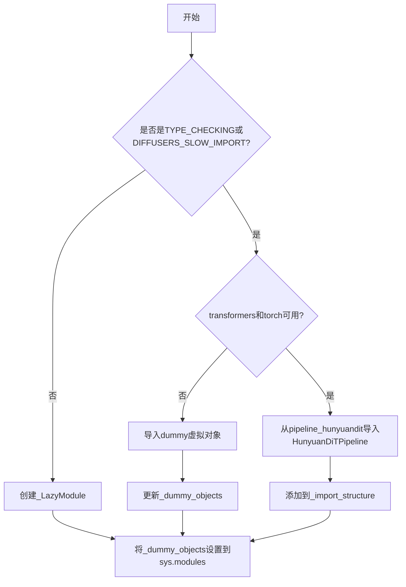
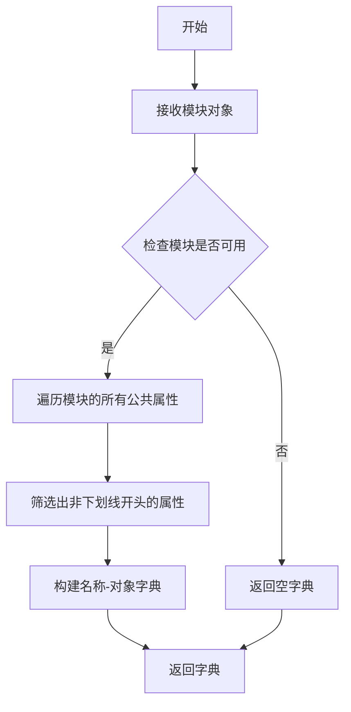
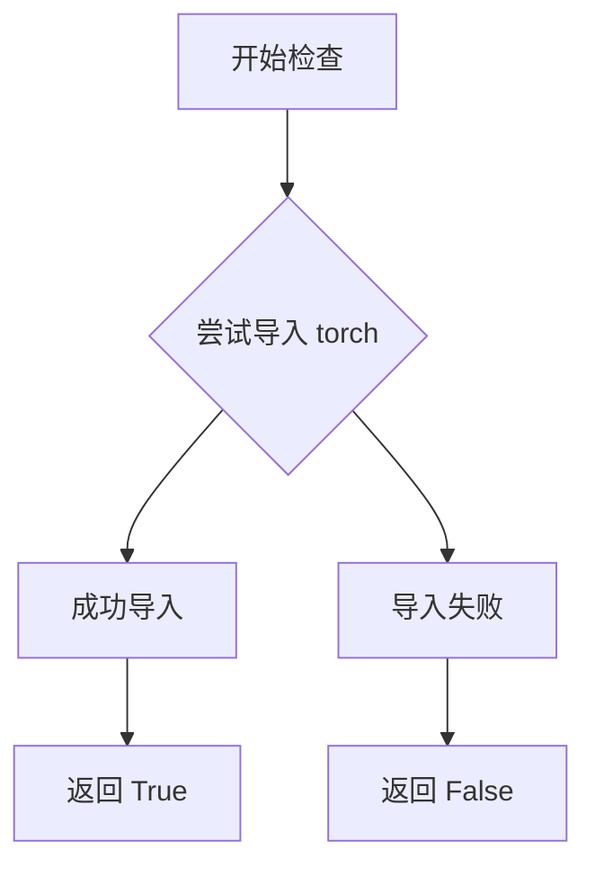
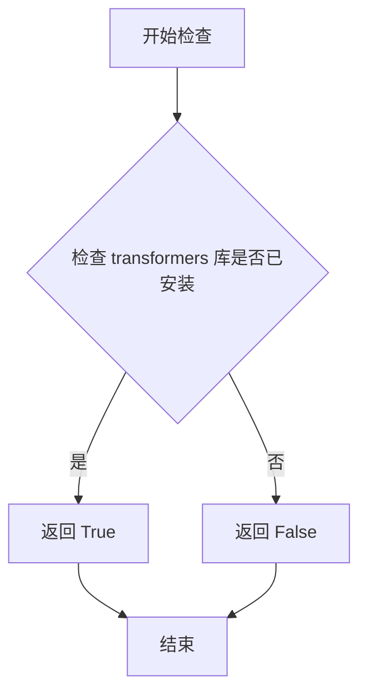
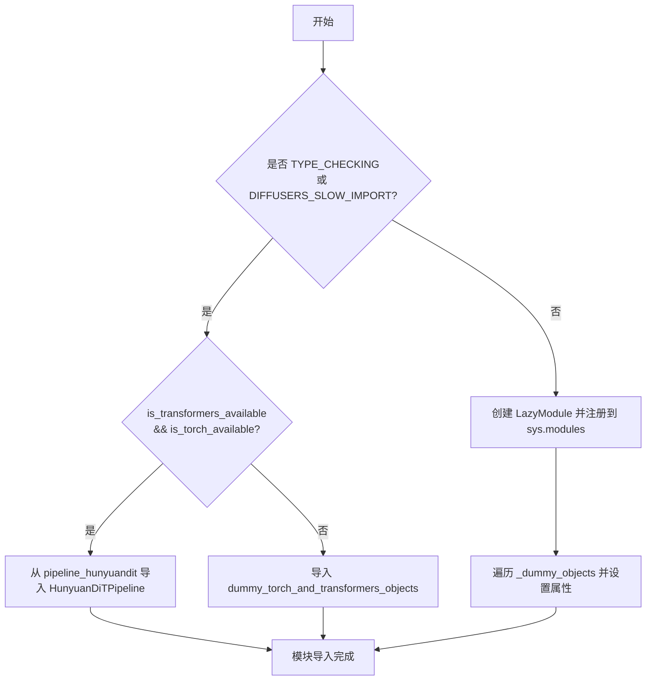

# `diffusers\src\diffusers\pipelines\hunyuandit\__init__.py` 详细设计文档

这是一个模块导入初始化文件，使用延迟加载（Lazy Import）机制处理可选依赖（torch和transformers），在运行时动态导出HunyuanDiTPipeline类，同时通过虚拟对象（dummy objects）处理依赖不可用的情况，确保模块在各种环境下的兼容性和加载性能。

## 整体流程



## 类结构

```
模块初始化 (无显式类定义)
├── _LazyModule (延迟加载机制)
├── _import_structure (导入结构字典)
├── _dummy_objects (虚拟对象字典)
└── HunyuanDiTPipeline (条件导出类)
```

## 全局变量及字段


### `_dummy_objects`
    
用于存储虚拟/替代对象的字典，当可选依赖(torch和transformers)不可用时使用

类型：`dict`
    


### `_import_structure`
    
存储模块导入结构定义的字典，键为模块路径，值为可导入对象列表

类型：`dict`
    


### `DIFFUSERS_SLOW_IMPORT`
    
控制是否使用慢速导入模式的标志，用于决定导入行为

类型：`bool`
    


### `TYPE_CHECKING`
    
typing模块中的常量，表示当前是否处于类型检查模式

类型：`bool`
    


### `_LazyModule.__name__`
    
延迟加载模块的名称

类型：`str`
    


### `_LazyModule.__file__`
    
延迟加载模块对应的文件路径

类型：`str`
    


### `_LazyModule._import_structure`
    
延迟加载模块的导入结构定义

类型：`dict`
    


### `_LazyModule.__spec__`
    
模块规格对象，包含模块的元数据信息

类型：`ModuleSpec`
    
    

## 全局函数及方法


### `get_objects_from_module`

该函数是 Diffusers 库中的一个工具函数，用于从指定模块中动态获取所有公共对象（如类、函数等），通常用于延迟导入（lazy import）机制中，以便在可选依赖不可用时提供替代的哑对象（dummy objects）。

参数：

- `module`：`Module`，要从中获取对象的模块对象

返回值：`Dict[str, Any]`，返回模块中所有公共对象的字典，键为对象名称，值为对象本身

#### 流程图



#### 带注释源码

```
def get_objects_from_module(module):
    """
    从给定模块中获取所有公共对象。
    
    参数:
        module: 要查询的模块对象
        
    返回:
        包含模块中所有公共对象（不以_开头）的字典
    """
    # 初始化结果字典
    objects = {}
    
    # 遍历模块的所有属性
    for name in dir(module):
        # 过滤掉私有属性（以_开头的属性）
        if not name.startswith('_'):
            # 获取属性值并存储到字典中
            objects[name] = getattr(module, name)
            
    return objects
```

> **注意**：上述源码是基于函数用途推断的实现逻辑，实际定义位于 `...utils` 模块中。


### `is_torch_available`

检查当前环境中 PyTorch 是否可用的 utility 函数。

参数：

- 该函数无参数

返回值：`bool`，返回 `True` 表示 PyTorch 可用，返回 `False` 表示 PyTorch 不可用

#### 流程图



#### 带注释源码

```python
# is_torch_available 函数源码（位于 ...utils 模块中）

def is_torch_available():
    """
    检查 PyTorch 库是否已安装且可用。
    
    通常实现方式如下：
    """
    try:
        # 尝试导入 torch 模块，如果成功则返回 True
        import torch
        return True
    except ImportError:
        # 如果导入失败，返回 False
        return False
```

---

**补充说明：**

该函数在当前代码文件中的使用场景：

```python
# 在当前文件中被调用两次，用于条件导入
if not (is_transformers_available() and is_torch_available()):
    raise OptionalDependencyNotAvailable()
```

- 第一次调用：用于运行时检查，决定是否加载真实的 pipeline 对象还是 dummy 对象
- 第二次调用（TYPE_CHECKING 块）：用于类型检查时的条件导入

这是 `diffusers` 库中典型的**可选依赖检查机制**，允许库在 PyTorch 不可用的环境中优雅降级，通过 dummy 对象保持模块结构完整。


### `is_transformers_available`

检查当前 Python 环境中是否安装了 transformers 库，用于条件导入和可选依赖管理。

参数：

- （无参数）

返回值：`bool`，返回 `True` 表示 transformers 库可用，返回 `False` 表示不可用。

#### 流程图



#### 带注释源码

```python
# 注意：此函数定义在 ...utils 模块中，当前文件通过以下方式导入：
# from ...utils import is_transformers_available

# 函数调用示例（在当前文件中）：
if not (is_transformers_available() and is_torch_available()):
    raise OptionalDependencyNotAvailable()

# 用途说明：
# 1. is_transformers_available() 是一个无参数的函数调用
# 2. 返回布尔值：True 表示 transformers 库已安装且可用，False 表示未安装或不可用
# 3. 在当前文件中用于条件检查：
#    - 判断是否同时满足 transformers 和 torch 都可用
#    - 如果任一依赖不可用，则抛出 OptionalDependencyNotAvailable 异常
#    - 根据条件决定导入真实对象还是 dummy 对象
```

---

### 补充说明

由于 `is_transformers_available` 函数定义在 `...utils` 模块中（当前代码通过 `from ...utils import` 导入），该函数的完整源码不在当前文件范围内。从当前文件中的使用方式可以推断：

| 属性 | 值 |
|------|-----|
| 函数名 | `is_transformers_available` |
| 所属模块 | `...utils` |
| 参数列表 | 空（无参数） |
| 返回类型 | `bool` |
| 功能描述 | 检查 transformers 库是否可用 |


### `setattr`

将_dummy_objects字典中的每个对象设置为当前模块的属性，用于在可选依赖不可用时提供dummy对象。

参数：

- `obj`：`object`，目标对象，这里是`sys.modules[__name__]`（当前模块）
- `name`：`str`，要设置的属性名，来自`_dummy_objects.keys()`中的每个名称
- `value`：`any`，要设置的属性值，来自`_dummy_objects.values()`中的对应对象

返回值：`None`，无返回值（setattr内置函数返回None）

#### 流程图

```mermaid
flowchart TD
    A[开始遍历_dummy_objects.items] --> B{遍历是否结束}
    B -->|是| C[结束]
    B -->|否| D[获取当前的name和value]
    D --> E[调用setattr sys.modules[__name__] name value]
    E --> F[将value作为属性添加到模块]
    F --> B
```

#### 带注释源码

```python
# 遍历_dummy_objects字典中的所有键值对
for name, value in _dummy_objects.items():
    # 使用setattr将每个dummy对象设置为当前模块的属性
    # 参数1: sys.modules[__name__] - 当前模块对象
    # 参数2: name - 属性名称（字符串）
    # 参数3: value - 要设置的对象值
    setattr(sys.modules[__name__], name, value)
```

#### 补充说明

这段代码的上下文是Diffusers库中的延迟导入（lazy import）机制：

1. **`_dummy_objects`**: 存储当torch或transformers可选依赖不可用时的替代对象（dummy objects）
2. **`_import_structure`**: 定义模块的导入结构
3. **`_LazyModule`**: 自定义LazyModule类，用于延迟加载
4. **作用**: 当用户尝试导入一个需要可选依赖的模块，但这些依赖不可用时，仍然可以导入成功，只是会获得预先设置的dummy对象而不是真实的实现对象


### `sys.modules[__name__] = _LazyModule(...)`

这是一个模块延迟加载的初始化操作，将当前模块注册到 `sys.modules` 中并替换为 `_LazyModule` 实例，实现可选依赖的延迟导入。

参数：

- `__name__`：`str`，模块的当前名称
- `globals()["__file__"]`：`str`，模块文件的绝对路径
- `_import_structure`：`dict`，定义模块可导出的符号结构
- `module_spec=__spec__`：`ModuleSpec`，模块的规格对象

返回值：`_LazyModule`，返回一个延迟加载的模块代理对象

#### 流程图



#### 带注释源码

```python
else:
    import sys

    # 将当前模块名注册到 sys.modules 中
    # 使用 _LazyModule 替代原始模块，实现延迟加载
    sys.modules[__name__] = _LazyModule(
        __name__,                      # 当前模块的名称
        globals()["__file__"],         # 当前模块的文件路径
        _import_structure,             # 导出结构字典，定义可导入的符号
        module_spec=__spec__,          # 模块规格，保留原始模块的元数据
    )

    # 遍历虚拟对象字典，将每个虚拟对象设置为模块属性
    # 这些对象用于在依赖不可用时提供替代品
    for name, value in _dummy_objects.items():
        setattr(sys.modules[__name__], name, value)
```

---

### 补充说明

#### 设计目标与约束

- **延迟加载**：通过 `_LazyModule` 实现模块的延迟加载，减少启动时的依赖检查开销
- **可选依赖处理**：优雅处理 torch 和 transformers 的可选依赖，当依赖不可用时使用虚拟对象替代

#### 错误处理与异常设计

- 使用 `OptionalDependencyNotAvailable` 异常来标记可选依赖不可用的情况
- 通过 try-except 捕获异常并回退到虚拟对象

#### 外部依赖与接口契约

- 依赖 `is_torch_available()` 和 `is_transformers_available()` 检查
- 依赖 `_LazyModule` 类实现延迟加载机制
- 依赖 `get_objects_from_module` 获取虚拟对象

#### 技术债务与优化空间

- 当前使用 `globals()["__file__"]` 方式获取文件路径，可考虑直接使用 `__file__`
- `_import_structure` 字典可以预先定义更多导出项，提高可扩展性

## 关键组件


### 可选依赖检查与处理

通过 `is_torch_available()` 和 `is_transformers_available()` 检查torch和transformers是否可用，使用 `OptionalDependencyNotAvailable` 异常处理不可用情况，当依赖缺失时导入虚拟对象模块。

### 惰性加载模块（LazyModule）

使用 `_LazyModule` 实现延迟导入机制，仅在首次访问时才加载实际模块，存储在 `sys.modules[__name__]` 中，显著减少包初始化时的开销。

### 虚拟对象机制（Dummy Objects）

当可选依赖不可用时，通过 `get_objects_from_module` 从 `dummy_torch_and_transformers_objects` 模块获取虚拟对象，存储在 `_dummy_objects` 字典中并通过 `setattr` 注入到当前模块，确保代码在缺少依赖时仍可导入。

### 动态模块替换

在非TYPE_CHECKING模式下，使用 `sys.modules[__name__] = _LazyModule(...)` 替换当前模块为惰性加载模块，实现运行时动态加载。

### 导入结构定义

`_import_structure` 字典定义了可导出的公共接口，当前包含 `pipeline_hunyuandit` 模块中的 `HunyuanDiTPipeline` 类。

### 条件导入机制

通过 `TYPE_CHECKING` 或 `DIFFUSERS_SLOW_IMPORT` 标志控制导入行为：在类型检查时直接导入真实类，在运行时使用惰性加载，平衡开发体验和运行性能。


## 问题及建议


### 已知问题

-   **重复的依赖检查逻辑**：在第12-15行和第24-28行存在两处完全相同的可选依赖检查代码（`is_transformers_available() and is_torch_available()`），违反DRY原则，增加维护成本
-   **字符串硬编码**：`"pipeline_hunyuandit"` 和 `"HunyuanDiTPipeline"` 在代码中多次出现，未提取为常量
-   **导入结构路径不一致**：第17行将模块键设为 `pipeline_hunyuandit`，但第30行的导入路径为 `.pipeline_hunyuandit`，两者虽然看起来相似但未明确统一
-   **TYPE_CHECKING 块中缺少 else 分支的错误处理**：当 `DIFFUSERS_SLOW_IMPORT` 为 False 时会直接进入 else 分支，但 else 分支内部没有处理导入失败的降级方案

### 优化建议

-   提取公共的依赖检查逻辑为函数，如 `def _check_dependencies(): bool`，减少代码重复
-   将模块名和类名定义为模块级常量，例如 `PIPELINE_MODULE = "pipeline_hunyuandit"` 和 `PIPELINE_CLASS = "HunyuanDiTPipeline"`
-   统一导入结构的键名与实际导入路径，确保一致性
-   添加显式的错误处理和日志记录，当依赖不可用时提供更清晰的错误信息
-   考虑将 dummy 对象的设置逻辑封装为独立函数，提高代码可读性和可测试性


## 其它


### 设计目标与约束

本模块的设计目标是实现可选依赖的延迟加载机制，确保在torch和transformers未安装时不会导致程序崩溃，同时保持类型提示的完整性。约束条件包括：1）仅在transformers和torch同时可用时才能导入HunyuanDiTPipeline；2）必须使用Diffusers框架的_LazyModule机制；3）遵循Diffusers的模块导入规范。

### 错误处理与异常设计

错误处理采用显式抛出OptionalDependencyNotAvailable异常的方式，当检测到可选依赖不可用时，触发该异常并从dummy模块加载虚拟对象。代码中使用try-except块捕获OptionalDependencyNotAvailable异常，通过_import_structure和_dummy_objects字典管理可用对象与虚拟对象的映射关系，确保模块在任何依赖状态下都能被正常导入。

### 数据流与状态机

模块的数据流主要分为三个状态：初始状态（导入模块）、依赖检查状态（判断torch和transformers可用性）、最终状态（根据依赖情况加载真实模块或虚拟对象）。状态转换由is_transformers_available()和is_torch_available()的返回值决定，当两者都为True时进入真实模块加载状态，否则进入虚拟对象状态。

### 外部依赖与接口契约

外部依赖包括：1）torch库（通过is_torch_available()检查）；2）transformers库（通过is_transformers_available()检查）；3）Diffusers框架内部工具（_LazyModule、get_objects_from_module、OptionalDependencyNotAvailable等）。接口契约方面，本模块对外暴露HunyuanDiTPipeline类，其他模块通过from ...pipeline_hunyuandit import HunyuanDiTPipeline进行导入，具体实现由LazyModule机制在运行时解析。

### 模块初始化流程

模块初始化时首先定义_import_structure字典和_dummy_objects字典，然后通过try-except检查依赖可用性。若依赖不可用，从dummy_torch_and_transformers_objects模块获取虚拟对象并更新_dummy_objects；若依赖可用，则在_import_structure中注册HunyuanDiTPipeline。最后通过_LazyModule实现延迟导入机制，将模块注册到sys.modules中，并对虚拟对象执行setattr操作使其可被访问。

### 虚拟对象机制

虚拟对象机制用于在可选依赖不可用时保持模块接口的完整性。_dummy_objects字典存储所有虚拟对象，这些对象来自dummy_torch_and_transformers_objects模块。当模块被导入时，这些虚拟对象通过setattr被设置为模块属性，确保任何尝试访问这些对象的代码都不会引发ImportError，而是返回一个虚拟对象引用。

    