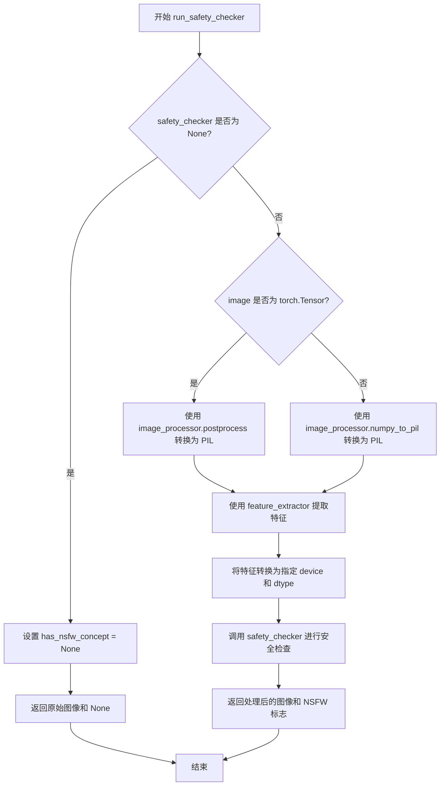
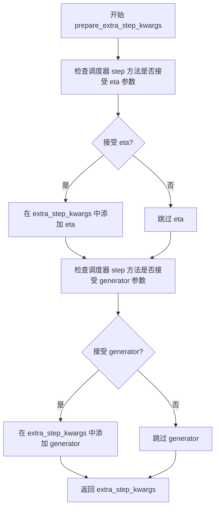
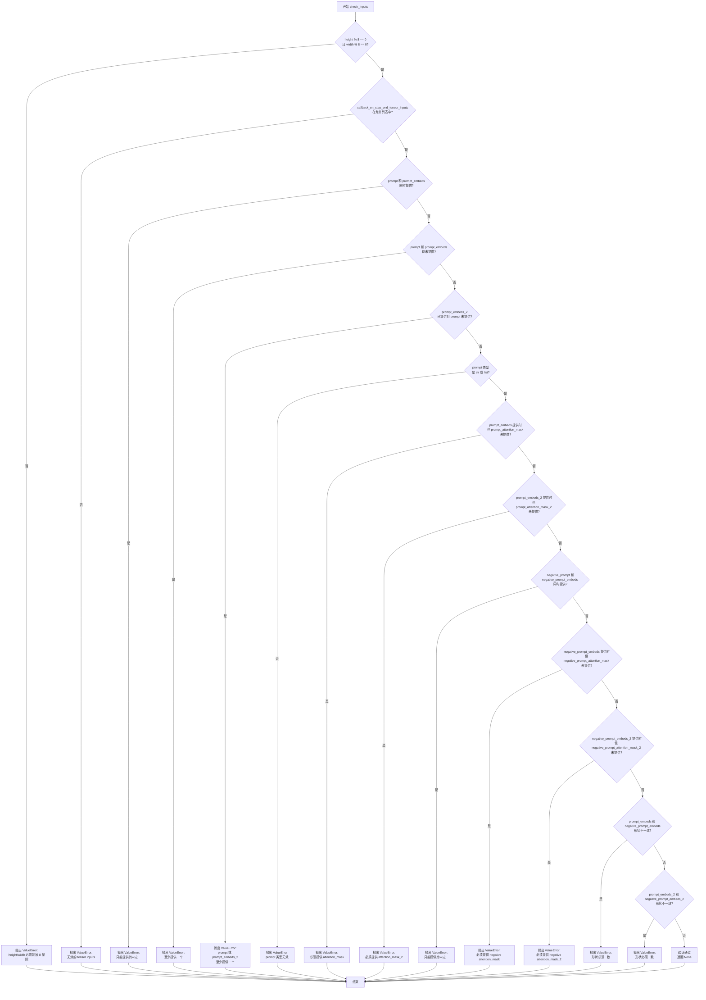
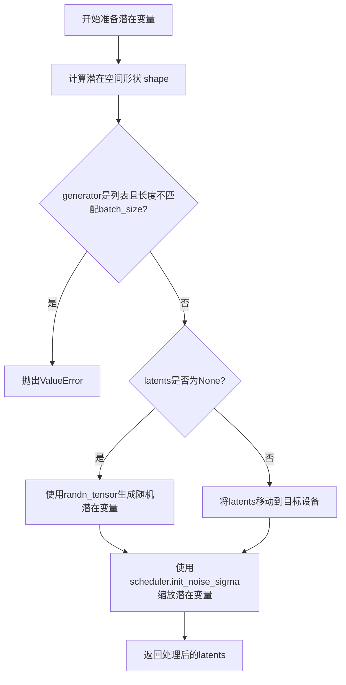

```mermaid
flowchart TD
    A[开始] --> B[设置 th = tw = tgt_size]
    B --> C[从 src 解码出 h, w]
    C --> D[计算宽高比 r = h / w]
    D --> E{r > 1?}
    E -->|是| F[resize_height = th<br/>resize_width = round&#40;th / h * w&#41;]
    E -->|否| G[resize_width = tw<br/>resize_height = round&#40;tw / w * h&#41;]
    F --> H[计算裁剪偏移量]
    G --> H
    H --> I[crop_top = round&#40;&#40;th - resize_height&#41; / 2.0&#41;<br/>crop_left = round&#40;&#40;tw - resize_width&#41; / 2.0&#41;]
    I --> J[返回裁剪坐标<br/>&#40;crop_top, crop_left&#41; 和<br/>&#40;crop_top+resize_height, crop_left+resize_width&#41;]
    J --> K[结束]
```

# `diffusers\src\diffusers\pipelines\hunyuandit\pipeline_hunyuandit.py` 详细设计文档

HunyuanDiTPipeline是一个基于腾讯HunyuanDiT模型的文生图（Text-to-Image）扩散pipeline，支持中英文双语提示词生成图像。该pipeline集成了双文本编码器（CLIP和T5），支持条件引导生成、分辨率自动匹配、噪声调度和安全性检查等功能。

## 整体流程

```mermaid
graph TD
A[开始] --> B[初始化Pipeline参数]
B --> C{检查输入是否有效}
C -- 无效 --> D[抛出ValueError]
C -- 有效 --> E[编码输入提示词]
E --> E1[使用CLIP编码器encode_prompt(text_encoder_index=0)]
E --> E2[使用T5编码器encode_prompt(text_encoder_index=1)]
E1 --> F[准备时间步和潜在向量]
E2 --> F
F --> G[创建旋转位置嵌入和时间ID]
G --> H{进入去噪循环}
H -- i:0 to num_inference_steps --> I[预测噪声残差]
I --> J{是否使用分类器-free引导?}
J -- 是 --> K[计算引导噪声预测]
J -- 否 --> L[直接使用预测噪声]
K --> M[调度器步进更新潜在向量]
L --> M
M --> N{是否完成所有步数?}
N -- 否 --> H
N -- 是 --> O{output_type是否为latent?}
O -- 否 --> P[VAE解码生成图像]
O -- 是 --> Q[直接返回潜在向量]
P --> R[运行安全性检查]
Q --> S[后处理图像]
R --> S
S --> T[返回生成结果]
```

## 类结构

```
DiffusionPipeline (基类)
└── HunyuanDiTPipeline
```

## 全局变量及字段


### `STANDARD_RATIO`
    
标准宽高比数组，包含1:1、4:3、3:4、16:9、9:16五种比例

类型：`numpy.ndarray`
    


### `STANDARD_SHAPE`
    
标准分辨率形状列表，按不同宽高比分组存储

类型：`list[list[tuple[int, int]]]`
    


### `STANDARD_AREA`
    
标准面积数组，对应各宽高比的标准分辨率面积

类型：`list[numpy.ndarray]`
    


### `SUPPORTED_SHAPE`
    
支持的分辨率列表，包含所有允许生成图像的尺寸组合

类型：`list[tuple[int, int]]`
    


### `XLA_AVAILABLE`
    
标记是否支持PyTorch XLA加速

类型：`bool`
    


### `logger`
    
模块级日志记录器，用于输出运行时信息

类型：`logging.Logger`
    


### `EXAMPLE_DOC_STRING`
    
使用示例文档字符串，包含pipeline调用示例代码

类型：`str`
    


### `HunyuanDiTPipeline.vae`
    
VAE模型，用于编码和解码图像与潜在表示

类型：`AutoencoderKL`
    


### `HunyuanDiTPipeline.text_encoder`
    
CLIP双语文本编码器，用于将文本转换为嵌入向量

类型：`BertModel`
    


### `HunyuanDiTPipeline.tokenizer`
    
CLIP分词器，用于对文本进行tokenize处理

类型：`BertTokenizer`
    


### `HunyuanDiTPipeline.transformer`
    
HunyuanDiT主变换器模型，执行去噪扩散过程

类型：`HunyuanDiT2DModel`
    


### `HunyuanDiTPipeline.scheduler`
    
噪声调度器，控制去噪过程中的噪声调度

类型：`DDPMScheduler`
    


### `HunyuanDiTPipeline.safety_checker`
    
NSFW内容安全检查器，过滤不安全内容

类型：`StableDiffusionSafetyChecker`
    


### `HunyuanDiTPipeline.feature_extractor`
    
CLIP图像特征提取器，用于安全检查的图像预处理

类型：`CLIPImageProcessor`
    


### `HunyuanDiTPipeline.text_encoder_2`
    
T5文本编码器，提供额外的文本编码能力（可选）

类型：`T5EncoderModel | None`
    


### `HunyuanDiTPipeline.tokenizer_2`
    
T5分词器，用于T5编码器的文本处理（可选）

类型：`T5Tokenizer | None`
    


### `HunyuanDiTPipeline.vae_scale_factor`
    
VAE缩放因子，用于调整潜在空间的分辨率

类型：`int`
    


### `HunyuanDiTPipeline.image_processor`
    
图像后处理器，处理VAE解码后的图像输出

类型：`VaeImageProcessor`
    


### `HunyuanDiTPipeline.default_sample_size`
    
默认采样尺寸，用于未指定尺寸时的默认生成大小

类型：`int`
    
    

## 全局函数及方法


### `map_to_standard_shapes`

该函数是 HunyuanDiT 图像生成管道中的一个关键尺寸规范化工具。它接收用户请求的目标图像宽度和高度，计算其宽高比和面积，然后在预定义的 `STANDARD_RATIO`（标准宽高比）和 `STANDARD_SHAPE`（标准分辨率）集合中，通过两步筛选（先匹配最接近的宽高比，再匹配最接近的面积）找到最匹配的标准尺寸并返回。这确保了输入模型的尺寸始终是经过优化和支持的标准分辨率，避免因尺寸过大或比例异常导致推理失败或性能下降。

参数：

- `target_width`：`int`，目标图像的宽度（像素）。
- `target_height`：`int`，目标图像的高度（像素）。

返回值：`tuple[int, int]`，返回一个包含标准宽度和标准高度的元组 `(width, height)`。

#### 流程图

```mermaid
flowchart TD
    A[开始] --> B[计算目标宽高比 target_ratio = target_width / target_height]
    B --> C{寻找最接近的宽高比}
    C --> D[在 STANDARD_RATIO 数组中查找绝对差最小的索引 closest_ratio_idx]
    D --> E[计算目标面积 target_area = target_width * target_height]
    E --> F{寻找最接近的面积}
    F --> G[在 STANDARD_AREA[closest_ratio_idx] 中查找面积绝对差最小的索引 closest_area_idx]
    G --> H[获取标准分辨率]
    H --> I[从 STANDARD_SHAPE[closest_ratio_idx][closest_area_idx] 取出 width, height]
    I --> J[返回 width, height]
```

#### 带注释源码

```python
def map_to_standard_shapes(target_width, target_height):
    """
    将目标尺寸映射到最近的标准形状。
    
    该函数首先计算目标宽高比，然后在预定义的标准宽高比列表 
    (STANDARD_RATIO) 中找到最接近的选项。随后，计算目标面积，
    并在该宽高比对应的标准面积列表 (STANDARD_AREA) 中找到最接近的面积，
    从而确定最终的标准分辨率 (STANDARD_SHAPE)。
    """
    # 1. 计算目标宽高比
    target_ratio = target_width / target_height
    
    # 2. 在标准宽高比列表中找到与目标宽高比最接近的索引
    # np.abs(STANDARD_RATIO - target_ratio) 计算所有标准比例与目标的差值绝对值
    # np.argmin 返回最小值对应的索引
    closest_ratio_idx = np.argmin(np.abs(STANDARD_RATIO - target_ratio))
    
    # 3. 计算目标面积
    target_area = target_width * target_height
    
    # 4. 在对应宽高比的标准面积列表中找到面积最接近的索引
    # 逻辑同上，先选定比例(closest_ratio_idx)，再在该比例下选面积
    closest_area_idx = np.argmin(np.abs(STANDARD_AREA[closest_ratio_idx] - target_area))
    
    # 5. 根据索引取出对应的标准宽高
    width, height = STANDARD_SHAPE[closest_ratio_idx][closest_area_idx]
    
    # 6. 返回标准化的宽和高
    return width, height
```


### `get_resize_crop_region_for_grid`

计算调整大小和裁剪区域，用于在保持宽高比的同时将图像调整为目标尺寸（正方形），并返回裁剪区域的坐标。

参数：

- `src`：Tuple[int, int]，源图像的高度和宽度 (h, w)
- `tgt_size`：int，目标尺寸（正方形的边长）

返回值：`Tuple[Tuple[int, int], Tuple[int, int]]`，返回两个元组 - 第一个是裁剪区域左上角坐标 (crop_top, crop_left)，第二个是裁剪区域右下角坐标 (crop_top + resize_height, crop_left + resize_width)

#### 流程图



#### 带注释源码

```python
def get_resize_crop_region_for_grid(src, tgt_size):
    """
    计算调整大小和裁剪区域，用于在保持宽高比的同时将图像调整为目标尺寸。
    
    参数:
        src: 源图像尺寸，格式为 (height, width)
        tgt_size: 目标尺寸（正方形边长）
    
    返回:
        裁剪区域的左上角和右下角坐标
    """
    # 目标尺寸，假设为正方形
    th = tw = tgt_size
    
    # 解码源图像的高度和宽度
    h, w = src

    # 计算宽高比
    r = h / w

    # 根据宽高比调整图像尺寸
    # 如果图像高度大于宽度，按高度缩放
    if r > 1:
        resize_height = th
        resize_width = int(round(th / h * w))
    else:
        # 否则按宽度缩放
        resize_width = tw
        resize_height = int(round(tw / w * h))

    # 计算居中裁剪的偏移量
    # 使裁剪区域居中于目标区域
    crop_top = int(round((th - resize_height) / 2.0))
    crop_left = int(round((tw - resize_width) / 2.0))

    # 返回裁剪区域的坐标
    # 格式: (左上角坐标), (右下角坐标)
    return (crop_top, crop_left), (crop_top + resize_height, crop_left + resize_width)
```


### `rescale_noise_cfg`

该函数根据 guidance_rescale 参数重新缩放噪声预测张量，基于 Section 3.4 中的方法（Common Diffusion Noise Schedules and Sample Steps are Flawed），用于改善图像质量并修复过度曝光问题。

参数：

- `noise_cfg`：`torch.Tensor`，引导扩散过程中预测的噪声张量
- `noise_pred_text`：`torch.Tensor`，文本引导扩散过程中预测的噪声张量
- `guidance_rescale`：`float`，可选，默认为 0.0，应用到噪声预测的重缩放因子

返回值：`torch.Tensor`，重缩放后的噪声预测张量

#### 流程图

```mermaid
flowchart TD
    A[开始] --> B[计算 noise_pred_text 的标准差 std_text]
    B --> C[计算 noise_cfg 的标准差 std_cfg]
    C --> D[计算重缩放噪声: noise_pred_rescaled = noise_cfg * std_text / std_cfg]
    D --> E[混合原始和重缩放结果: noise_cfg = guidance_rescale * noise_pred_rescaled + (1 - guidance_rescale) * noise_cfg]
    E --> F[返回重缩放后的 noise_cfg]
```

#### 带注释源码

```
def rescale_noise_cfg(noise_cfg, noise_pred_text, guidance_rescale=0.0):
    r"""
    Rescales `noise_cfg` tensor based on `guidance_rescale` to improve image quality and fix overexposure. Based on
    Section 3.4 from [Common Diffusion Noise Schedules and Sample Steps are
    Flawed](https://huggingface.co/papers/2305.08891).

    Args:
        noise_cfg (`torch.Tensor`):
            The predicted noise tensor for the guided diffusion process.
        noise_pred_text (`torch.Tensor`):
            The predicted noise tensor for the text-guided diffusion process.
        guidance_rescale (`float`, *optional*, defaults to 0.0):
            A rescale factor applied to the noise predictions.

    Returns:
        noise_cfg (`torch.Tensor`): The rescaled noise prediction tensor.
    """
    # 计算文本引导噪声预测的标准差（保持维度以便广播）
    std_text = noise_pred_text.std(dim=list(range(1, noise_pred_text.ndim)), keepdim=True)
    # 计算CFG噪声预测的标准差（保持维度以便广播）
    std_cfg = noise_cfg.std(dim=list(range(1, noise_cfg.ndim)), keepdim=True)
    # 根据Section 3.4的方法重缩放噪声预测（修复过度曝光）
    noise_pred_rescaled = noise_cfg * (std_text / std_cfg)
    # 通过guidance_rescale因子混合原始结果，避免图像看起来"平淡"
    noise_cfg = guidance_rescale * noise_pred_rescaled + (1 - guidance_rescale) * noise_cfg
    return noise_cfg
```


### `HunyuanDiTPipeline.__init__`

该方法是 `HunyuanDiTPipeline` 类的构造函数，负责初始化扩散管道的所有核心组件，包括 VAE、文本编码器、Transformer 模型、调度器以及安全检查器等，并完成配置检查与默认属性的设置。

参数：

- `vae`：`AutoencoderKL`，用于将图像编码到潜在空间并从潜在空间解码的变分自编码器模型。
- `text_encoder`：`BertModel`，冻结的文本编码器（双语 CLIP），用于将文本提示转换为嵌入向量。
- `tokenizer`：`BertTokenizer`，用于对文本进行分词。
- `transformer`：`HunyuanDiT2DModel`，腾讯 Hunyuan 设计的核心扩散 Transformer 模型。
- `scheduler`：`DDPMScheduler`，用于去噪的调度器。
- `safety_checker`：`StableDiffusionSafetyChecker`，用于检测和过滤不安全内容的检查器。
- `feature_extractor`：`CLIPImageProcessor`，用于处理图像以进行安全检查的特征提取器。
- `requires_safety_checker`：`bool`，是否需要安全检查器的标志，默认为 True。
- `text_encoder_2`：`T5EncoderModel | None`，额外的 T5 文本编码器（mT5），默认为 None。
- `tokenizer_2`：`T5Tokenizer | None`，T5 编码器的分词器，默认为 None。

返回值：`None`，构造函数没有返回值。

#### 流程图

```mermaid
flowchart TD
    A[Start __init__] --> B[Call super().__init__]
    B --> C[Register Modules: vae, text_encoder, tokenizer, transformer, etc.]
    C --> D{Safety Checker is None<br>and requires_safety_checker is True?}
    D -- Yes --> E[Log Warning: Safety checker disabled]
    D -- No --> F{Safety Checker not None<br>and Feature Extractor is None?}
    E --> G[Continue]
    F -- Yes --> H[Raise ValueError: Missing feature extractor]
    F -- No --> G
    G --> I[Calculate vae_scale_factor]
    I --> J[Initialize VaeImageProcessor]
    J --> K[Register requires_safety_checker to config]
    K --> L[Set default_sample_size]
    L --> M[End __init__]
```

#### 带注释源码

```python
def __init__(
    self,
    vae: AutoencoderKL,
    text_encoder: BertModel,
    tokenizer: BertTokenizer,
    transformer: HunyuanDiT2DModel,
    scheduler: DDPMScheduler,
    safety_checker: StableDiffusionSafetyChecker,
    feature_extractor: CLIPImageProcessor,
    requires_safety_checker: bool = True,
    text_encoder_2: T5EncoderModel | None = None,
    tokenizer_2: T5Tokenizer | None = None,
):
    # 1. 调用父类 DiffusionPipeline 的初始化方法
    super().__init__()

    # 2. 注册所有必要的模块到管道中，以便统一管理
    self.register_modules(
        vae=vae,
        text_encoder=text_encoder,
        tokenizer=tokenizer,
        tokenizer_2=tokenizer_2,
        transformer=transformer,
        scheduler=scheduler,
        safety_checker=safety_checker,
        feature_extractor=feature_extractor,
        text_encoder_2=text_encoder_2,
    )

    # 3. 检查安全检查器配置：如果未提供但要求开启，发出警告
    if safety_checker is None and requires_safety_checker:
        logger.warning(
            f"You have disabled the safety checker for {self.__class__} by passing `safety_checker=None`. Ensure"
            " that you abide to the conditions of the Stable Diffusion license and do not expose unfiltered"
            " results in services or applications open to the public. Both the diffusers team and Hugging Face"
            " strongly recommend to keep the safety filter enabled in all public facing circumstances, disabling"
            " it only for use-cases that involve analyzing network behavior or auditing its results. For more"
            " information, please have a look at https://github.com/huggingface/diffusers/pull/254 ."
        )

    # 4. 检查特征提取器：如果提供了安全检查器但未提供特征提取器，抛出错误
    if safety_checker is not None and feature_extractor is None:
        raise ValueError(
            "Make sure to define a feature extractor when loading {self.__class__} if you want to use the safety"
            " checker. If you do not want to use the safety checker, you can pass `'safety_checker=None'` instead."
        )

    # 5. 计算 VAE 缩放因子，用于后续图像处理
    self.vae_scale_factor = 2 ** (len(self.vae.config.block_out_channels) - 1) if getattr(self, "vae", None) else 8
    
    # 6. 初始化图像后处理器
    self.image_processor = VaeImageProcessor(vae_scale_factor=self.vae_scale_factor)
    
    # 7. 将安全检查器需求注册到配置中
    self.register_to_config(requires_safety_checker=requires_safety_checker)
    
    # 8. 设置默认采样尺寸
    self.default_sample_size = (
        self.transformer.config.sample_size
        if hasattr(self, "transformer") and self.transformer is not None
        else 128
    )
```


### `HunyuanDiTPipeline.encode_prompt`

该方法是 HunyuanDiT 管道中的核心编码函数，负责将文本提示（prompt）转换为模型所需的嵌入向量（embeddings）。它支持双文本编码器（CLIP 和 T5），并处理Classifier-Free Guidance（CFG）所需的负面提示嵌入。根据 `text_encoder_index` 选择对应的分词器和编码器，并返回包含正向和负向提示的嵌入及注意力掩码的元组。

参数：

- `prompt`：`str | list[str]`，要编码的文本提示，支持单字符串或字符串列表。
- `device`：`torch.device | None`，执行计算的目标设备，默认为管道执行设备。
- `dtype`：`torch.dtype | None`，计算使用的数据类型，默认为编码器或 Transformer 的数据类型。
- `num_images_per_prompt`：`int`，每个提示生成的图像数量，用于批量重复嵌入。
- `do_classifier_free_guidance`：`bool`，是否启用无分类器指导（CFG）。
- `negative_prompt`：`str | list[str] | None`，负面提示，用于引导图像生成避开相关内容。
- `prompt_embeds`：`torch.Tensor | None`，可选的预计算正向提示嵌入。若提供，则直接使用；否则根据 `prompt` 生成。
- `negative_prompt_embeds`：`torch.Tensor | None`，可选的预计算负向提示嵌入。
- `prompt_attention_mask`：`torch.Tensor | None`，正向提示的注意力掩码。
- `negative_prompt_attention_mask`：`torch.Tensor | None`，负向提示的注意力掩码。
- `max_sequence_length`：`int | None`，提示的最大序列长度。
- `text_encoder_index`：`int`，文本编码器索引，`0` 代表 CLIP（最大长度77），`1` 代表 T5（最大长度256）。

返回值：`tuple[torch.Tensor, torch.Tensor, torch.Tensor, torch.Tensor]`，返回一个包含四个元素的元组：
1. `prompt_embeds`：编码后的正向提示嵌入。
2. `negative_prompt_embeds`：编码后的负向提示嵌入。
3. `prompt_attention_mask`：正向提示的注意力掩码。
4. `negative_prompt_attention_mask`：负向提示的注意力掩码。

#### 流程图

```mermaid
graph TD
    A[开始 encode_prompt] --> B{检查 dtype 和 device}
    B --> C[根据 text_encoder_index 选择 Tokenizer 和 Encoder]
    C --> D[确定 max_length 和 batch_size]
    D --> E{prompt_embeds 是否为空?}
    E -- 是 --> F[Tokenize prompt]
    F --> G[检查截断并编码为 Embeddings]
    G --> H[重复 embeddings 和 mask 以匹配 num_images_per_prompt]
    E -- 否 --> I[跳过编码步骤]
    H --> J[移动 Embeddings 到指定 Device 和 Dtype]
    I --> J
    J --> K{启用 CFG 且 negative_prompt_embeds 为空?}
    K -- 是 --> L[处理 uncond_tokens]
    L --> M[Tokenize 和编码 uncond_tokens]
    M --> N[重复 negative embeddings 和 mask]
    K -- 否 --> O[跳过负向编码]
    N --> O
    O --> P{启用 CFG?}
    P -- 是 --> Q[重复 negative_embeds 以匹配批量大小]
    P -- 否 --> R
    Q --> R[返回 tuple(prompt_embeds, negative_prompt_embeds, prompt_mask, negative_mask)]
    O --> R
```

#### 带注释源码

```python
def encode_prompt(
    self,
    prompt: str,
    device: torch.device = None,
    dtype: torch.dtype = None,
    num_images_per_prompt: int = 1,
    do_classifier_free_guidance: bool = True,
    negative_prompt: str | None = None,
    prompt_embeds: torch.Tensor | None = None,
    negative_prompt_embeds: torch.Tensor | None = None,
    prompt_attention_mask: torch.Tensor | None = None,
    negative_prompt_attention_mask: torch.Tensor | None = None,
    max_sequence_length: int | None = None,
    text_encoder_index: int = 0,
):
    r"""
    Encodes the prompt into text encoder hidden states.
    ...
    """
    # 1. 确定 dtype：如果未指定，优先使用 text_encoder_2，其次是 transformer
    if dtype is None:
        if self.text_encoder_2 is not None:
            dtype = self.text_encoder_2.dtype
        elif self.transformer is not None:
            dtype = self.transformer.dtype
        else:
            dtype = None

    # 2. 确定 device：如果未指定，使用执行设备
    if device is None:
        device = self._execution_device

    # 3. 根据索引选择对应的 Tokenizer 和 Text Encoder
    #    text_encoder_index=0: CLIP (BertTokenizer, BertModel/CLIPTextModel)
    #    text_encoder_index=1: T5 (T5Tokenizer, T5EncoderModel)
    tokenizers = [self.tokenizer, self.tokenizer_2]
    text_encoders = [self.text_encoder, self.text_encoder_2]

    tokenizer = tokenizers[text_encoder_index]
    text_encoder = text_encoders[text_encoder_index]

    # 4. 确定最大序列长度
    if max_sequence_length is None:
        if text_encoder_index == 0:
            max_length = 77  # CLIP 默认最大长度
        if text_encoder_index == 1:
            max_length = 256 # T5 默认最大长度
    else:
        max_length = max_sequence_length

    # 5. 确定批处理大小
    if prompt is not None and isinstance(prompt, str):
        batch_size = 1
    elif prompt is not None and isinstance(prompt, list):
        batch_size = len(prompt)
    else:
        batch_size = prompt_embeds.shape[0]

    # 6. 如果未提供 prompt_embeds，则进行编码
    if prompt_embeds is None:
        # 使用 tokenizer 将文本转为 token ids
        text_inputs = tokenizer(
            prompt,
            padding="max_length",
            max_length=max_length,
            truncation=True,
            return_attention_mask=True,
            return_tensors="pt",
        )
        text_input_ids = text_inputs.input_ids
        # 检查是否发生了截断（仅 CLIP 需要检查，因为有固定最大长度）
        untruncated_ids = tokenizer(prompt, padding="longest", return_tensors="pt").input_ids

        if untruncated_ids.shape[-1] >= text_input_ids.shape[-1] and not torch.equal(
            text_input_ids, untruncated_ids
        ):
            removed_text = tokenizer.batch_decode(untruncated_ids[:, tokenizer.model_max_length - 1 : -1])
            logger.warning(
                "The following part of your input was truncated because CLIP can only handle sequences up to"
                f" {tokenizer.model_max_length} tokens: {removed_text}"
            )

        # 获取注意力掩码并移动到设备
        prompt_attention_mask = text_inputs.attention_mask.to(device)
        # 使用文本编码器生成隐藏状态
        prompt_embeds = text_encoder(
            text_input_ids.to(device),
            attention_mask=prompt_attention_mask,
        )
        # 通常 text_encoder 返回的是 BaseModelOutput，取第一个元素 (hidden_states)
        prompt_embeds = prompt_embeds[0]
        # 为每个生成的图像重复掩码维度
        prompt_attention_mask = prompt_attention_mask.repeat(num_images_per_prompt, 1)

    # 7. 移动 prompt_embeds 到指定设备并转换类型
    prompt_embeds = prompt_embeds.to(dtype=dtype, device=device)

    bs_embed, seq_len, _ = prompt_embeds.shape
    # 8. 为每个提示生成的图像数量复制嵌入向量 (bs * num_images, seq, dim)
    prompt_embeds = prompt_embeds.repeat(1, num_images_per_prompt, 1)
    prompt_embeds = prompt_embeds.view(bs_embed * num_images_per_prompt, seq_len, -1)

    # 9. 处理无分类器引导 (CFG) 的负向嵌入
    if do_classifier_free_guidance and negative_prompt_embeds is None:
        uncond_tokens: list[str]
        # 确定负向提示的 uncond_tokens
        if negative_prompt is None:
            uncond_tokens = [""] * batch_size
        elif prompt is not None and type(prompt) is not type(negative_prompt):
            raise TypeError(...)
        elif isinstance(negative_prompt, str):
            uncond_tokens = [negative_prompt]
        elif batch_size != len(negative_prompt):
            raise ValueError(...)
        else:
            uncond_tokens = negative_prompt

        # 获取序列长度用于负向嵌入
        max_length = prompt_embeds.shape[1]
        # Tokenize 负向提示
        uncond_input = tokenizer(
            uncond_tokens,
            padding="max_length",
            max_length=max_length,
            truncation=True,
            return_tensors="pt",
        )

        # 编码负向提示
        negative_prompt_attention_mask = uncond_input.attention_mask.to(device)
        negative_prompt_embeds = text_encoder(
            uncond_input.input_ids.to(device),
            attention_mask=negative_prompt_attention_mask,
        )
        negative_prompt_embeds = negative_prompt_embeds[0]
        negative_prompt_attention_mask = negative_prompt_attention_mask.repeat(num_images_per_prompt, 1)

    # 10. 如果启用 CFG，进一步处理负向嵌入以匹配批量大小
    if do_classifier_free_guidance:
        seq_len = negative_prompt_embeds.shape[1]
        negative_prompt_embeds = negative_prompt_embeds.to(dtype=dtype, device=device)
        # 复制以匹配每个提示生成的图像数量
        negative_prompt_embeds = negative_prompt_embeds.repeat(1, num_images_per_prompt, 1)
        negative_prompt_embeds = negative_prompt_embeds.view(batch_size * num_images_per_prompt, seq_len, -1)

    # 返回：(prompt_embeds, negative_prompt_embeds, prompt_attention_mask, negative_prompt_attention_mask)
    return prompt_embeds, negative_prompt_embeds, prompt_attention_mask, negative_prompt_attention_mask
```


### `HunyuanDiTPipeline.run_safety_checker`

该方法用于对生成的图像进行安全检查，判断图像是否包含不适合公开显示的内容（NSFW）。如果启用了安全检查器，它会将图像转换为特征提取器所需的格式，然后调用安全检查器进行推理；如果未启用安全检查器，则直接返回原始图像和 None。

参数：

- `self`：`HunyuanDiTPipeline` 实例本身
- `image`：`torch.Tensor | np.ndarray`，待检查的图像张量或数组
- `device`：`torch.device`，用于指定计算设备（如 CPU 或 CUDA 设备）
- `dtype`：`torch.dtype`，用于指定张量的数据类型（如 float16）

返回值：`(tuple[torch.Tensor | np.ndarray, list[bool] | None])`，返回元组包含两个元素：
- 第一个元素是处理后的图像（可能被安全检查器修改）
- 第二个元素是布尔列表，表示每张图像是否包含 NSFW 内容；如果未启用安全检查器则为 `None`

#### 流程图



#### 带注释源码

```python
def run_safety_checker(self, image, device, dtype):
    """
    运行安全检查器，对生成的图像进行 NSFW 内容检测。
    
    该方法是 StableDiffusionPipeline 的安全检查逻辑的副本，用于检测
    图像中是否包含不适合公开的内容。如果未启用安全检查器，则跳过检查。
    
    参数:
        image: 输入的图像，可以是 torch.Tensor 或 numpy 数组形式
        device: 计算设备，用于将特征提取器输入移动到指定设备
        dtype: 数据类型，用于将特征提取器输入转换为指定精度
    
    返回:
        元组 (image, has_nsfw_concept):
            - image: 经过安全检查器处理后的图像
            - has_nsfw_concept: 布尔列表，表示每张图像是否包含 NSFW 内容；
                               如果 safety_checker 为 None，则为 None
    """
    # 如果没有配置安全检查器，直接返回原始图像和 None
    if self.safety_checker is None:
        has_nsfw_concept = None
    else:
        # 根据图像类型选择合适的预处理方式
        if torch.is_tensor(image):
            # 将 torch 张量转换为 PIL 图像列表
            feature_extractor_input = self.image_processor.postprocess(image, output_type="pil")
        else:
            # 将 numpy 数组转换为 PIL 图像列表
            feature_extractor_input = self.image_processor.numpy_to_pil(image)
        
        # 使用特征提取器提取图像特征，并移动到指定设备
        safety_checker_input = self.feature_extractor(feature_extractor_input, return_tensors="pt").to(device)
        
        # 调用安全检查器，检测图像是否包含 NSFW 内容
        # clip_input 参数需要与模型精度匹配（dtype）
        image, has_nsfw_concept = self.safety_checker(
            images=image, 
            clip_input=safety_checker_input.pixel_values.to(dtype)
        )
    
    # 返回处理后的图像和 NSFW 检测结果
    return image, has_nsfw_concept
```


### `HunyuanDiTPipeline.prepare_extra_step_kwargs`

该方法用于为调度器（scheduler）的 `step` 函数准备额外参数。由于不同的调度器可能有不同的签名，该方法通过检查调度器的 `step` 函数是否接受特定参数（如 `eta` 和 `generator`），动态构建需要传递给调度器的额外关键字参数字典。

参数：

- `generator`：`torch.Generator | list[torch.Generator] | None`，用于控制生成过程的随机性，确保输出可复现
- `eta`：`float | None`，DDIM 调度器专用参数 η，对应 DDIM 论文中的 η 值，范围应为 [0, 1]

返回值：`dict`，包含需要传递给调度器 `step` 方法的关键字参数字典，可能包含 `eta` 和/或 `generator` 键

#### 流程图



#### 带注释源码

```python
def prepare_extra_step_kwargs(self, generator, eta):
    # 准备调度器步骤所需的额外参数，因为并非所有调度器都有相同的签名
    # eta (η) 仅在 DDIMScheduler 中使用，其他调度器会忽略它
    # eta 对应 DDIM 论文 (https://huggingface.co/papers/2010.02502) 中的 η
    # 取值范围应为 [0, 1]

    # 使用 inspect 模块检查调度器的 step 方法签名，判断是否接受 eta 参数
    accepts_eta = "eta" in set(inspect.signature(self.scheduler.step).parameters.keys())
    
    # 初始化空字典用于存储额外参数
    extra_step_kwargs = {}
    
    # 如果调度器接受 eta 参数，则将其添加到 extra_step_kwargs 中
    if accepts_eta:
        extra_step_kwargs["eta"] = eta

    # 检查调度器是否接受 generator 参数
    accepts_generator = "generator" in set(inspect.signature(self.scheduler.step).parameters.keys())
    
    # 如果调度器接受 generator 参数，则将其添加到 extra_step_kwargs 中
    if accepts_generator:
        extra_step_kwargs["generator"] = generator
    
    # 返回构建好的额外参数字典
    return extra_step_kwargs
```


### HunyuanDiTPipeline.check_inputs

该方法用于验证 HunyuanDiT 图像生成管道的输入参数有效性，确保 prompt、prompt_embeds、attention_mask 等参数的正确性和一致性，防止因参数不匹配导致的运行时错误。

参数：

- `self`：`HunyuanDiTPipeline` 实例，Pipeline 对象本身
- `prompt`：`str | list[str] | None`，用户输入的文本提示，用于指导图像生成
- `height`：`int`，生成图像的高度（像素），必须能被 8 整除
- `width`：`int`，生成图像的宽度（像素），必须能被 8 整除
- `negative_prompt`：`str | list[str] | None`，负面提示，用于指导不包含在图像中的内容
- `prompt_embeds`：`torch.Tensor | None`，预生成的文本嵌入向量（第一个文本编码器）
- `negative_prompt_embeds`：`torch.Tensor | None`，预生成的负面文本嵌入向量（第一个文本编码器）
- `prompt_attention_mask`：`torch.Tensor | None`，第一个文本编码器的 attention mask
- `negative_prompt_attention_mask`：`torch.Tensor | None`，第一个文本编码器的负面 attention mask
- `prompt_embeds_2`：`torch.Tensor | None`，预生成的文本嵌入向量（第二个文本编码器 T5）
- `negative_prompt_embeds_2`：`torch.Tensor | None`，预生成的负面文本嵌入向量（第二个文本编码器 T5）
- `prompt_attention_mask_2`：`torch.Tensor | None`，第二个文本编码器（T5）的 attention mask
- `negative_prompt_attention_mask_2`：`torch.Tensor | None`，第二个文本编码器（T5）的负面 attention mask
- `callback_on_step_end_tensor_inputs`：`list[str] | None`，在每步结束后需要传递给回调函数的 tensor 输入列表

返回值：`None`，该方法不返回任何值，若参数验证失败则抛出 `ValueError` 异常

#### 流程图



#### 带注释源码

```python
def check_inputs(
    self,
    prompt,                          # str | list[str] | None: 用户文本提示
    height,                          # int: 生成图像高度
    width,                           # int: 生成图像宽度
    negative_prompt=None,            # str | list[str] | None: 负面提示
    prompt_embeds=None,              # torch.Tensor | None: 预生成文本嵌入(CLIP)
    negative_prompt_embeds=None,     # torch.Tensor | None: 预生成负面文本嵌入(CLIP)
    prompt_attention_mask=None,      # torch.Tensor | None: CLIP 文本 attention mask
    negative_prompt_attention_mask=None,  # torch.Tensor | None: CLIP 负面 attention mask
    prompt_embeds_2=None,            # torch.Tensor | None: 预生成文本嵌入(T5)
    negative_prompt_embeds_2=None,   # torch.Tensor | None: 预生成负面文本嵌入(T5)
    prompt_attention_mask_2=None,    # torch.Tensor | None: T5 文本 attention mask
    negative_prompt_attention_mask_2=None,  # torch.Tensor | None: T5 负面 attention mask
    callback_on_step_end_tensor_inputs=None,  # list[str] | None: 回调 tensor 输入
):
    # 检查 1: 图像尺寸必须能被 8 整除（VAE 解码器要求）
    if height % 8 != 0 or width % 8 != 0:
        raise ValueError(f"`height` and `width` have to be divisible by 8 but are {height} and {width}.")

    # 检查 2: callback_on_step_end_tensor_inputs 必须是允许的 tensor 输入列表
    if callback_on_step_end_tensor_inputs is not None and not all(
        k in self._callback_tensor_inputs for k in callback_on_step_end_tensor_inputs
    ):
        raise ValueError(
            f"`callback_on_step_end_tensor_inputs` has to be in {self._callback_tensor_inputs}, but found {[k for k in callback_on_step_end_tensor_inputs if k not in self._callback_tensor_inputs]}"
        )

    # 检查 3: prompt 和 prompt_embeds 不能同时提供（互斥）
    if prompt is not None and prompt_embeds is not None:
        raise ValueError(
            f"Cannot forward both `prompt`: {prompt} and `prompt_embeds`: {prompt_embeds}. Please make sure to"
            " only forward one of the two."
        )
    # 检查 4: prompt 和 prompt_embeds 至少提供一个
    elif prompt is None and prompt_embeds is None:
        raise ValueError(
            "Provide either `prompt` or `prompt_embeds`. Cannot leave both `prompt` and `prompt_embeds` undefined."
        )
    # 检查 5: prompt_embeds_2 必须与 prompt 或 prompt_embeds 配合使用
    elif prompt is None and prompt_embeds_2 is None:
        raise ValueError(
            "Provide either `prompt` or `prompt_embeds_2`. Cannot leave both `prompt` and `prompt_embeds_2` undefined."
        )
    # 检查 6: prompt 类型必须是 str 或 list
    elif prompt is not None and (not isinstance(prompt, str) and not isinstance(prompt, list)):
        raise ValueError(f"`prompt` has to be of type `str` or `list` but is {type(prompt)}")

    # 检查 7: 如果提供 prompt_embeds，必须同时提供 prompt_attention_mask
    if prompt_embeds is not None and prompt_attention_mask is None:
        raise ValueError("Must provide `prompt_attention_mask` when specifying `prompt_embeds`.")

    # 检查 8: 如果提供 prompt_embeds_2，必须同时提供 prompt_attention_mask_2
    if prompt_embeds_2 is not None and prompt_attention_mask_2 is None:
        raise ValueError("Must provide `prompt_attention_mask_2` when specifying `prompt_embeds_2`.")

    # 检查 9: negative_prompt 和 negative_prompt_embeds 不能同时提供
    if negative_prompt is not None and negative_prompt_embeds is not None:
        raise ValueError(
            f"Cannot forward both `negative_prompt`: {negative_prompt} and `negative_prompt_embeds`:"
            f" {negative_prompt_embeds}. Please make sure to only forward one of the two."
        )

    # 检查 10: 如果提供 negative_prompt_embeds，必须同时提供 negative_prompt_attention_mask
    if negative_prompt_embeds is not None and negative_prompt_attention_mask is None:
        raise ValueError("Must provide `negative_prompt_attention_mask` when specifying `negative_prompt_embeds`.")

    # 检查 11: 如果提供 negative_prompt_embeds_2，必须同时提供 negative_prompt_attention_mask_2
    if negative_prompt_embeds_2 is not None and negative_prompt_attention_mask_2 is None:
        raise ValueError(
            "Must provide `negative_prompt_attention_mask_2` when specifying `negative_prompt_embeds_2`."
        )
    
    # 检查 12: prompt_embeds 和 negative_prompt_embeds 形状必须一致
    if prompt_embeds is not None and negative_prompt_embeds is not None:
        if prompt_embeds.shape != negative_prompt_embeds.shape:
            raise ValueError(
                "`prompt_embeds` and `negative_prompt_embeds` must have the same shape when passed directly, but"
                f" got: `prompt_embeds` {prompt_embeds.shape} != `negative_prompt_embeds`"
                f" {negative_prompt_embeds.shape}."
            )
    
    # 检查 13: prompt_embeds_2 和 negative_prompt_embeds_2 形状必须一致
    if prompt_embeds_2 is not None and negative_prompt_embeds_2 is not None:
        if prompt_embeds_2.shape != negative_prompt_embeds_2.shape:
            raise ValueError(
                "`prompt_embeds_2` and `negative_prompt_embeds_2` must have the same shape when passed directly, but"
                f" got: `prompt_embeds_2` {prompt_embeds_2.shape} != `negative_prompt_embeds_2`"
                f" {negative_prompt_embeds_2.shape}."
            )
```


### HunyuanDiTPipeline.prepare_latents

该方法用于为扩散模型生成准备初始潜在变量（latents），即随机噪声或预提供的潜在表示。它根据指定的批次大小、图像尺寸和VAE缩放因子计算潜在空间的形状，并使用调度器的初始噪声标准差对潜在变量进行缩放。

参数：

- `batch_size`：`int`，生成的图像批次大小
- `num_channels_latents`：`int`，潜在空间的通道数，通常对应于模型的输入通道配置
- `height`：`int`，目标生成图像的高度（像素）
- `width`：`int`，目标生成图像的宽度（像素）
- `dtype`：`torch.dtype`，潜在变量的数据类型（如torch.float32）
- `device`：`torch.device`，潜在变量存放的设备（CPU或GPU）
- `generator`：`torch.Generator | list[torch.Generator] | None`，用于生成确定性随机噪声的生成器对象
- `latents`：`torch.Tensor | None`，可选的预生成潜在变量，若为None则随机生成

返回值：`torch.Tensor`，处理后的潜在变量张量，已按调度器的初始噪声标准差进行缩放

#### 流程图



#### 带注释源码

```python
def prepare_latents(
    self,
    batch_size: int,
    num_channels_latents: int,
    height: int,
    width: int,
    dtype: torch.dtype,
    device: torch.device,
    generator: torch.Generator | list[torch.Generator] | None,
    latents: torch.Tensor | None = None,
) -> torch.Tensor:
    """
    为扩散过程准备初始潜在变量。
    
    根据批次大小、通道数、图像尺寸计算潜在空间的shape，
    并根据VAE缩放因子调整潜在变量的空间分辨率。
    
    参数:
        batch_size: 批次大小
        num_channels_latents: 潜在空间的通道数
        height: 目标图像高度
        width: 目标图像宽度
        dtype: 数据类型
        device: 计算设备
        generator: 随机数生成器
        latents: 预提供的潜在变量，若为None则随机生成
    
    返回:
        处理后的潜在变量张量
    """
    # 计算潜在变量的shape，考虑VAE的缩放因子
    # 潜在空间尺寸 = 图像尺寸 / vae_scale_factor
    shape = (
        batch_size,
        num_channels_latents,
        int(height) // self.vae_scale_factor,
        int(width) // self.vae_scale_factor,
    )
    
    # 验证generator列表长度与batch_size是否匹配
    if isinstance(generator, list) and len(generator) != batch_size:
        raise ValueError(
            f"You have passed a list of generators of length {len(generator)}, but requested an effective batch"
            f" size of {batch_size}. Make sure the batch size matches the length of the generators."
        )

    # 根据是否有预提供的latents决定生成方式
    if latents is None:
        # 使用randn_tensor生成随机噪声潜在变量
        latents = randn_tensor(shape, generator=generator, device=device, dtype=dtype)
    else:
        # 将提供的latents移动到目标设备
        latents = latents.to(device)

    # 使用调度器的初始噪声标准差缩放初始噪声
    # 这确保了潜在变量与调度器的噪声计划相匹配
    latents = latents * self.scheduler.init_noise_sigma
    
    return latents
```


### HunyuanDiTPipeline.__call__

文生图扩散管道的主入口方法，接收文本提示词，通过双文本编码器（CLIP+T5）编码提示词，初始化噪声潜在向量，然后在去噪循环中利用HunyuanDiTTransformer预测噪声并结合分类器自由引导（CFG）逐步去噪，最后将去噪后的潜在向量通过VAE解码器解码为图像并返回。

参数：

- `prompt`：`str | list[str] | None`，要引导图像生成的文本提示词，若不定义需传递`prompt_embeds`
- `height`：`int | None`，生成图像的高度（像素），默认根据模型配置和VAE缩放因子计算
- `width`：`int | None`，生成图像的宽度（像素），默认根据模型配置和VAE缩放因子计算
- `num_inference_steps`：`int | None`，去噪步数，默认50，步数越多图像质量越高但推理越慢
- `guidance_scale`：`float | None`，引导比例，默认5.0，值越大与文本提示词关联越紧密但可能降低图像质量
- `negative_prompt`：`str | list[str] | None`，负面提示词，用于指导图像中不应包含的内容
- `num_images_per_prompt`：`int | None`，每个提示词生成的图像数量，默认1
- `eta`：`float | None`，DDIM论文中的eta参数，仅DDIM调度器生效
- `generator`：`torch.Generator | list[torch.Generator] | None`，PyTorch随机数生成器，用于确保可重复生成
- `latents`：`torch.Tensor | None`，用户提供的初始噪声潜在向量，若为None则随机生成
- `prompt_embeds`：`torch.Tensor | None`，预生成的CLIP文本嵌入，可用于提示词加权等微调
- `prompt_embeds_2`：`torch.Tensor | None`，预生成的T5文本嵌入（mT5-xxl）
- `negative_prompt_embeds`：`torch.Tensor | None`，预生成的负面CLIP文本嵌入
- `negative_prompt_embeds_2`：`torch.Tensor | None`，预生成的负面T5文本嵌入
- `prompt_attention_mask`：`torch.Tensor | None`，CLIP文本嵌入的注意力掩码
- `prompt_attention_mask_2`：`torch.Tensor | None`，T5文本嵌入的注意力掩码
- `negative_prompt_attention_mask`：`torch.Tensor | None`，负面CLIP文本嵌入的注意力掩码
- `negative_prompt_attention_mask_2`：`torch.Tensor | None`，负面T5文本嵌入的注意力掩码
- `output_type`：`str | None`，输出格式，默认"pil"，可选"pil"或"np.array"
- `return_dict`：`bool | None`，是否返回StableDiffusionPipelineOutput，默认True
- `callback_on_step_end`：`Callable | PipelineCallback | MultiPipelineCallbacks | None`，每个去噪步骤结束时调用的回调函数
- `callback_on_step_end_tensor_inputs`：`list[str]`，传递给回调函数的张量输入列表，默认["latents"]
- `guidance_rescale`：`float`，噪声预测重缩放因子，基于Common Diffusion Noise Schedules论文
- `original_size`：`tuple[int, int] | None`，原始图像尺寸，用于计算时间ID，默认(1024, 1024)
- `target_size`：`tuple[int, int] | None`，目标图像尺寸，用于计算时间ID，默认为(height, width)
- `crops_coords_top_left`：`tuple[int, int] | None`，裁剪左上角坐标，用于计算时间ID，默认(0, 0)
- `use_resolution_binning`：`bool | None`，是否启用分辨率分箱，将输入分辨率映射到标准分辨率，默认True

返回值：`StableDiffusionPipelineOutput | tuple`，当return_dict为True时返回包含生成图像列表和NSFW检测布尔列表的管道输出对象，否则返回元组

#### 流程图

```mermaid
flowchart TD
    A[开始 __call__] --> B{callback_on_step_end类型检查}
    B -->|PipelineCallback/MultiPipelineCallbacks| C[提取tensor_inputs]
    B -->|其他| D[跳过]
    
    C --> E[设置默认height/width]
    D --> E
    
    E --> F{use_resolution_binning且分辨率不在SUPPORTED_SHAPE中?}
    F -->|是| G[映射到标准分辨率]
    F -->|否| H[保持原分辨率]
    G --> H
    
    H --> I[check_inputs验证输入参数]
    I --> J[设置_guidance_scale/_guidance_rescale/_interrupt]
    
    J --> K[确定batch_size]
    K --> L[获取执行设备device]
    
    L --> M[encode_prompt - CLIP编码器 text_encoder_index=0]
    M --> N[encode_prompt - T5编码器 text_encoder_index=1]
    
    N --> O[scheduler.set_timesteps设置去噪时间步]
    O --> P[prepare_latents准备初始噪声潜在向量]
    
    P --> Q[prepare_extra_step_kwargs准备调度器额外参数]
    Q --> R[计算grid尺寸和创建image_rotary_emb旋转位置嵌入]
    
    R --> S[创建style嵌入和add_time_ids时间ID]
    S --> T{CFG是否启用?}
    T -->|是| U[拼接negative和prompt嵌入并复制style]
    T -->|否| V[保持原样]
    
    U --> W[将所有张量移到设备上]
    V --> W
    
    W --> X[初始化进度条和num_warmup_steps]
    X --> Y[进入去噪循环 for i, t in enumerate(timesteps)]
    
    Y --> Z{interrupt标志为True?}
    Z -->|是| AA[continue跳过当前迭代]
    Z -->|否| AB[扩展latents进行CFG]
    
    AB --> AC[scale_model_input缩放输入]
    AC --> AD[扩展t为1-D张量]
    
    AD --> AE[transformer预测噪声]
    AE --> AF[chunk分离uncond和text预测]
    
    AF --> AG{CFG启用?}
    AG -->|是| AH[计算带引导的noise_pred]
    AG -->|否| AI[保持原noise_pred]
    
    AH --> AJ{guidance_rescale>0?}
    AI --> AJ
    
    AJ -->|是| AK[rescale_noise_cfg重缩放噪声预测]
    AJ -->|否| AL[跳过]
    
    AK --> AM[scheduler.step计算上一步的latents]
    AL --> AM
    
    AM --> AN{callback_on_step_end不为None?}
    AN -->|是| AO[执行回调函数更新latents和embeds]
    AN -->|否| AP[跳过]
    
    AO --> AQ{是否为最后一个步骤或warmup完成?}
    AP --> AQ
    
    AQ -->|是| AR[更新进度条]
    AQ -->|否| AS[不更新]
    
    AR --> AT{XLA_AVAILABLE?}
    AS --> AT
    
    AT -->|是| AU[xm.mark_step]
    AT -->|否| AV[继续]
    
    AU --> AW[循环是否结束?]
    AV --> AW
    AW -->|否| Y
    AW -->|是| AX{output_type=='latent'?}
    
    AX -->|否| AY[vae.decode解码latents为图像]
    AY --> AZ[run_safety_checker安全检查NSFW]
    AX -->|是| BA[直接使用latents作为图像]
    
    AZ --> BB[postprocess后处理图像]
    BA --> BB
    
    BB --> BC[maybe_free_model_hooks释放模型]
    BC --> BD{return_dict为True?}
    
    BD -->|是| BE[返回StableDiffusionPipelineOutput]
    BD -->|否| BF[返回tuple图像和nsfw检测结果]
    
    BE --> BG[结束]
    BF --> BG
```

#### 带注释源码

```python
@torch.no_grad()
@replace_example_docstring(EXAMPLE_DOC_STRING)
def __call__(
    self,
    prompt: str | list[str] = None,
    height: int | None = None,
    width: int | None = None,
    num_inference_steps: int | None = 50,
    guidance_scale: float | None = 5.0,
    negative_prompt: str | list[str] | None = None,
    num_images_per_prompt: int | None = 1,
    eta: float | None = 0.0,
    generator: torch.Generator | list[torch.Generator] | None = None,
    latents: torch.Tensor | None = None,
    prompt_embeds: torch.Tensor | None = None,
    prompt_embeds_2: torch.Tensor | None = None,
    negative_prompt_embeds: torch.Tensor | None = None,
    negative_prompt_embeds_2: torch.Tensor | None = None,
    prompt_attention_mask: torch.Tensor | None = None,
    prompt_attention_mask_2: torch.Tensor | None = None,
    negative_prompt_attention_mask: torch.Tensor | None = None,
    negative_prompt_attention_mask_2: torch.Tensor | None = None,
    output_type: str | None = "pil",
    return_dict: bool = True,
    callback_on_step_end: Callable[[int, int], None] | PipelineCallback | MultiPipelineCallbacks | None = None,
    callback_on_step_end_tensor_inputs: list[str] = ["latents"],
    guidance_rescale: float = 0.0,
    original_size: tuple[int, int] | None = (1024, 1024),
    target_size: tuple[int, int] | None = None,
    crops_coords_top_left: tuple[int, int] = (0, 0),
    use_resolution_binning: bool = True,
):
    # 如果传入回调函数，提取其需要的tensor输入列表
    if isinstance(callback_on_step_end, (PipelineCallback, MultiPipelineCallbacks)):
        callback_on_step_end_tensor_inputs = callback_on_step_end.tensor_inputs

    # 0. 设置默认高度和宽度（基于默认样本大小和VAE缩放因子）
    height = height or self.default_sample_size * self.vae_scale_factor
    width = width or self.default_sample_size * self.vae_scale_factor
    # 确保高度和宽度是16的倍数（VAE下采样需要）
    height = int((height // 16) * 16)
    width = int((width // 16) * 16)

    # 如果启用分辨率分箱且当前分辨率不在支持列表中，映射到最接近的标准分辨率
    if use_resolution_binning and (height, width) not in SUPPORTED_SHAPE:
        width, height = map_to_standard_shapes(width, height)
        height = int(height)
        width = int(width)
        logger.warning(f"Reshaped to (height, width)=({height}, {width}), Supported shapes are {SUPPORTED_SHAPE}")

    # 1. 验证输入参数合法性，参数不合法则抛出异常
    self.check_inputs(
        prompt, height, width, negative_prompt,
        prompt_embeds, negative_prompt_embeds,
        prompt_attention_mask, negative_prompt_attention_mask,
        prompt_embeds_2, negative_prompt_embeds_2,
        prompt_attention_mask_2, negative_prompt_attention_mask_2,
        callback_on_step_end_tensor_inputs,
    )
    # 设置引导比例、重缩放因子和中断标志
    self._guidance_scale = guidance_scale
    self._guidance_rescale = guidance_rescale
    self._interrupt = False

    # 2. 根据prompt类型确定批次大小
    if prompt is not None and isinstance(prompt, str):
        batch_size = 1
    elif prompt is not None and isinstance(prompt, list):
        batch_size = len(prompt)
    else:
        batch_size = prompt_embeds.shape[0]

    # 获取执行设备
    device = self._execution_device

    # 3. 编码输入提示词 - 使用CLIP编码器（index=0，最大序列长度77）
    (
        prompt_embeds,
        negative_prompt_embeds,
        prompt_attention_mask,
        negative_prompt_attention_mask,
    ) = self.encode_prompt(
        prompt=prompt,
        device=device,
        dtype=self.transformer.dtype,
        num_images_per_prompt=num_images_per_prompt,
        do_classifier_free_guidance=self.do_classifier_free_guidance,
        negative_prompt=negative_prompt,
        prompt_embeds=prompt_embeds,
        negative_prompt_embeds=negative_prompt_embeds,
        prompt_attention_mask=prompt_attention_mask,
        negative_prompt_attention_mask=negative_prompt_attention_mask,
        max_sequence_length=77,
        text_encoder_index=0,
    )
    # 使用T5编码器（index=1，最大序列长度256）
    (
        prompt_embeds_2,
        negative_prompt_embeds_2,
        prompt_attention_mask_2,
        negative_prompt_attention_mask_2,
    ) = self.encode_prompt(
        prompt=prompt,
        device=device,
        dtype=self.transformer.dtype,
        num_images_per_prompt=num_images_per_prompt,
        do_classifier_free_guidance=self.do_classifier_free_guidance,
        negative_prompt=negative_prompt,
        prompt_embeds=prompt_embeds_2,
        negative_prompt_embeds=negative_prompt_embeds_2,
        prompt_attention_mask=prompt_attention_mask_2,
        negative_prompt_attention_mask=negative_prompt_attention_mask_2,
        max_sequence_length=256,
        text_encoder_index=1,
    )

    # 4. 准备时间步 - 设置调度器的去噪步骤
    self.scheduler.set_timesteps(num_inference_steps, device=device)
    timesteps = self.scheduler.timesteps

    # 5. 准备潜在变量 - 初始化或使用用户提供的噪声
    num_channels_latents = self.transformer.config.in_channels
    latents = self.prepare_latents(
        batch_size * num_images_per_prompt,
        num_channels_latents,
        height,
        width,
        prompt_embeds.dtype,
        device,
        generator,
        latents,
    )

    # 6. 准备调度器额外参数（eta和generator）
    extra_step_kwargs = self.prepare_extra_step_kwargs(generator, eta)

    # 7. 创建旋转位置嵌入、风格嵌入和时间ID
    # 计算网格尺寸（考虑patch大小）
    grid_height = height // 8 // self.transformer.config.patch_size
    grid_width = width // 8 // self.transformer.config.patch_size
    base_size = 512 // 8 // self.transformer.config.patch_size
    # 获取调整大小和裁剪区域
    grid_crops_coords = get_resize_crop_region_for_grid((grid_height, grid_width), base_size)
    # 生成2D旋转位置嵌入
    image_rotary_emb = get_2d_rotary_pos_embed(
        self.transformer.inner_dim // self.transformer.num_heads,
        grid_crops_coords,
        (grid_height, grid_width),
        device=device,
        output_type="pt",
    )

    # 风格嵌入（全0向量表示默认风格）
    style = torch.tensor([0], device=device)

    # 目标尺寸默认为(height, width)
    target_size = target_size or (height, width)
    # 构建时间ID：original_size + target_size + crops_coords_top_left
    add_time_ids = list(original_size + target_size + crops_coords_top_left)
    add_time_ids = torch.tensor([add_time_ids], dtype=prompt_embeds.dtype)

    # 如果启用CFG，将negative和prompt embeddings拼接
    if self.do_classifier_free_guidance:
        prompt_embeds = torch.cat([negative_prompt_embeds, prompt_embeds])
        prompt_attention_mask = torch.cat([negative_prompt_attention_mask, prompt_attention_mask])
        prompt_embeds_2 = torch.cat([negative_prompt_embeds_2, prompt_embeds_2])
        prompt_attention_mask_2 = torch.cat([negative_prompt_attention_mask_2, prompt_attention_mask_2])
        add_time_ids = torch.cat([add_time_ids] * 2, dim=0)
        style = torch.cat([style] * 2, dim=0)

    # 将所有张量移到设备上并重复batch_size * num_images_per_prompt次
    prompt_embeds = prompt_embeds.to(device=device)
    prompt_attention_mask = prompt_attention_mask.to(device=device)
    prompt_embeds_2 = prompt_embeds_2.to(device=device)
    prompt_attention_mask_2 = prompt_attention_mask_2.to(device=device)
    add_time_ids = add_time_ids.to(dtype=prompt_embeds.dtype, device=device).repeat(
        batch_size * num_images_per_prompt, 1
    )
    style = style.to(device=device).repeat(batch_size * num_images_per_prompt)

    # 8. 去噪循环
    num_warmup_steps = len(timesteps) - num_inference_steps * self.scheduler.order
    self._num_timesteps = len(timesteps)
    with self.progress_bar(total=num_inference_steps) as progress_bar:
        for i, t in enumerate(timesteps):
            # 检查中断标志，允许外部停止去噪过程
            if self.interrupt:
                continue

            # 扩展latents以进行分类器自由引导（拼接unconditional和conditional）
            latent_model_input = torch.cat([latents] * 2) if self.do_classifier_free_guidance else latents
            # 调度器缩放输入（根据噪声调度）
            latent_model_input = self.scheduler.scale_model_input(latent_model_input, t)

            # 将标量t扩展为1-D张量以匹配latent_model_input的维度
            t_expand = torch.tensor([t] * latent_model_input.shape[0], device=device).to(
                dtype=latent_model_input.dtype
            )

            # 使用transformer预测噪声残差
            noise_pred = self.transformer(
                latent_model_input,
                t_expand,
                encoder_hidden_states=prompt_embeds,
                text_embedding_mask=prompt_attention_mask,
                encoder_hidden_states_t5=prompt_embeds_2,
                text_embedding_mask_t5=prompt_attention_mask_2,
                image_meta_size=add_time_ids,
                style=style,
                image_rotary_emb=image_rotary_emb,
                return_dict=False,
            )[0]

            # 分离unconditional和text预测（chunk为两部分）
            noise_pred, _ = noise_pred.chunk(2, dim=1)

            # 执行分类器自由引导
            if self.do_classifier_free_guidance:
                noise_pred_uncond, noise_pred_text = noise_pred.chunk(2)
                noise_pred = noise_pred_uncond + guidance_scale * (noise_pred_text - noise_pred_uncond)

            # 如果设置了guidance_rescale，根据论文重缩放噪声预测
            if self.do_classifier_free_guidance and guidance_rescale > 0.0:
                # 基于 https://huggingface.co/papers/2305.08891 第3.4节
                noise_pred = rescale_noise_cfg(noise_pred, noise_pred_text, guidance_rescale=guidance_rescale)

            # 计算上一步的噪声样本 x_t -> x_t-1
            latents = self.scheduler.step(noise_pred, t, latents, **extra_step_kwargs, return_dict=False)[0]

            # 如果有回调函数，在每步结束时调用
            if callback_on_step_end is not None:
                callback_kwargs = {}
                for k in callback_on_step_end_tensor_inputs:
                    callback_kwargs[k] = locals()[k]
                callback_outputs = callback_on_step_end(self, i, t, callback_kwargs)

                # 允许回调函数修改latents和embeddings
                latents = callback_outputs.pop("latents", latents)
                prompt_embeds = callback_outputs.pop("prompt_embeds", prompt_embeds)
                negative_prompt_embeds = callback_outputs.pop("negative_prompt_embeds", negative_prompt_embeds)
                prompt_embeds_2 = callback_outputs.pop("prompt_embeds_2", prompt_embeds_2)
                negative_prompt_embeds_2 = callback_outputs.pop(
                    "negative_prompt_embeds_2", negative_prompt_embeds_2
                )

            # 更新进度条（仅在最后一步或warmup完成后）
            if i == len(timesteps) - 1 or ((i + 1) > num_warmup_steps and (i + 1) % self.scheduler.order == 0):
                progress_bar.update()

            # 如果使用PyTorch XLA，打标记
            if XLA_AVAILABLE:
                xm.mark_step()

    # 9. 解码或直接返回latents
    if not output_type == "latent":
        # 使用VAE解码latents到图像空间（需要除以scaling_factor）
        image = self.vae.decode(latents / self.vae.config.scaling_factor, return_dict=False)[0]
        # 运行安全检查器检测NSFW内容
        image, has_nsfw_concept = self.run_safety_checker(image, device, prompt_embeds.dtype)
    else:
        image = latents
        has_nsfw_concept = None

    # 10. 后处理图像
    if has_nsfw_concept is None:
        do_denormalize = [True] * image.shape[0]
    else:
        do_denormalize = [not has_nsfw for has_nsfw in has_nsfw_concept]

    # 图像后处理：反归一化并转换为目标格式
    image = self.image_processor.postprocess(image, output_type=output_type, do_denormalize=do_denormalize)

    # 释放所有模型钩子（CPU offload）
    self.maybe_free_model_hooks()

    # 11. 返回结果
    if not return_dict:
        return (image, has_nsfw_concept)

    return StableDiffusionPipelineOutput(images=image, nsfw_content_detected=has_nsfw_concept)
```

## 关键组件


### HunyuanDiTPipeline

主类，继承自DiffusionPipeline，负责通过HunyuanDiT模型实现中英文本到图像的生成。支持双文本编码器(CLIP和T5)，集成VAE解码器、调度器和安全检查器。

### 双文本编码器支持

代码支持两个文本编码器：CLIP（通过text_encoder和tokenizer）和T5（通过text_encoder_2和tokenizer_2）。encode_prompt方法根据text_encoder_index参数选择使用哪个编码器，支持同时生成两种文本嵌入。

### 分辨率二元化 (Resolution Binning)

通过map_to_standard_shapes函数和SUPPORTED_SHAPE列表实现。该机制将输入分辨率映射到最近的标准分辨率（1024x1024、1280x1280、1024x768等），确保生成质量。

### 潜在变量准备 (Latent Preparation)

prepare_latents方法负责初始化随机噪声或使用用户提供的潜在变量，并根据调度器的init_noise_sigma进行缩放。

### 时间ID与旋转嵌入

get_2d_rotary_pos_embed用于生成2D旋转位置嵌入，add_time_ids包含原始尺寸、目标尺寸和裁剪坐标。这些用于控制生成图像的尺寸属性。

### 分类器自由引导 (Classifier-Free Guidance)

do_classifier_free_guidance属性控制是否启用引导。在去噪循环中，通过连接无条件和有条件的噪声预测来实现：noise_pred = noise_pred_uncond + guidance_scale * (noise_pred_text - noise_pred_uncond)。

### 噪声预测重缩放

rescale_noise_cfg函数根据guidance_rescale参数重缩放噪声预测，以改善图像质量并修复过度曝光问题，基于Common Diffusion Noise Schedules论文的研究发现。

### VAE图像处理

VaeImageProcessor用于图像的后处理和解码，支持归一化和反归一化操作。vae_scale_factor根据VAE的block_out_channels计算。

### 安全检查器集成

run_safety_checker方法集成StableDiffusionSafetyChecker，用于检测和过滤NSFW内容，确保生成内容的安全性。

### 调度器集成

支持DDPMScheduler及其他调度器，通过prepare_extra_step_kwargs方法处理不同调度器的参数差异（如eta和generator参数）。

### XLA设备支持

通过is_torch_xla_available检查并集成PyTorch XLA，用于加速TPU设备上的计算。

### 回调机制

支持MultiPipelineCallbacks和PipelineCallback，允许用户在每个去噪步骤结束时执行自定义操作，如修改潜在变量或嵌入。


## 问题及建议


### 已知问题

- **类型检查不当**：使用 `type(prompt) is not type(negative_prompt)` 进行类型比较，应使用 `isinstance()` 进行更稳健的类型检查
- **条件判断逻辑缺陷**：在 `encode_prompt` 方法中，`max_sequence_length` 的条件判断存在逻辑问题，当 `text_encoder_index` 为0时设置 `max_length = 77`，但后续分支没有完整处理所有情况
- **硬编码值过多**：`max_length` (77/256)、`default_sample_size` (128)、`base_size` (512)等值硬编码在代码中，降低了灵活性
- **重复的设备数据传输**：在去噪循环中多次调用 `.to(device)` 和 `.to(dtype=...)`，造成不必要的设备间数据传输和性能开销
- **内存碎片风险**：在denoising循环中频繁创建tensor（如 `t_expand`、`latent_model_input`），可能导致内存碎片
- **API参数过多**：`check_inputs` 和 `encode_prompt` 方法参数过多（超过15个参数），违反良好的API设计原则
- **可选组件处理不完善**：`text_encoder_2` 和 `tokenizer_2` 可为 `None`，但在 `encode_prompt` 中没有充分处理这种边界情况
- **代码重复**：多处逻辑与 `diffusers.pipelines.stable_diffusion` 中的实现高度重复（代码注释表明是 "Copied from"），维护成本较高

### 优化建议

- 将 `type(prompt) is not type(negative_prompt)` 改为 `isinstance(prompt, type(negative_prompt))` 或 `type(prompt) != type(negative_prompt)`
- 修复 `encode_prompt` 中的条件分支逻辑，确保 `max_length` 在所有分支都被正确赋值
- 将硬编码的配置值（如 `max_length`、`default_sample_size`）提取为类属性或配置常量
- 合并重复的设备数据传输操作，使用原地操作或缓存tensor避免频繁设备切换
- 考虑使用 `torch.inference_mode()` 或 `torch.no_grad()` 包装去噪循环外的代码
- 重构 `encode_prompt` 方法，拆分为两个独立方法分别处理两个文本编码器，减少参数复杂度
- 为 `text_encoder_2` 和 `tokenizer_2` 的 `None` 情况添加明确的错误处理或降级逻辑
- 使用 `dataclass` 或 `TypedDict` 封装相关参数，减少方法签名中的参数数量

## 其它


### 设计目标与约束

本pipeline的设计目标是实现一个支持中英文双语文本到图像生成的高质量扩散模型系统。核心约束包括：1) 必须支持多种标准分辨率（1024x1024、1280x1280、1024x768等10种）以满足不同场景需求；2) 依赖两个文本编码器（CLIP和T5）实现双语支持；3) 遵循diffusers库的Pipeline基类架构，便于集成和扩展；4) 支持分类器自由引导（CFG）以提升生成质量；5) 默认启用安全检查器防止生成不当内容。

### 错误处理与异常设计

本pipeline在多个关键节点进行了输入验证和异常处理：1) `check_inputs`方法全面检查height/width必须被8整除、prompt与prompt_embeds不能同时传递、attention_mask与embededs必须配对、embededs形状匹配等约束；2) `encode_prompt`方法对tokenizer截断行为发出警告，并检查negative_prompt类型一致性；3) `prepare_latents`方法验证generator列表长度与batch_size匹配；4) 调度器参数检查通过`inspect.signature`动态判断是否支持eta和generator参数；5) 图像后处理阶段处理NSFW检测结果为空的情况，使用do_denormalize列表适配。

### 数据流与状态机

Pipeline的数据流遵循标准的扩散模型推理流程：1) 输入阶段：接收prompt、height、width、guidance_scale等参数；2) 预处理阶段：将输入分辨率映射到标准分辨率（如需要）、检查输入合法性；3) 编码阶段：分别通过CLIP（max_length=77）和T5（max_length=256）编码文本提示词，生成embeds和attention_mask；4) 潜在空间准备：初始化随机噪声latents；5) 去噪循环：执行多步迭代，每步调用transformer预测噪声、执行CFG、调度器更新latents；6) 解码阶段：通过VAE将latents解码为图像；7) 后处理阶段：运行安全检查器、转换为PIL或numpy格式。整个过程通过`__call__`方法驱动，状态通过类属性（_guidance_scale、_guidance_rescale、_interrupt、_num_timesteps）管理。

### 外部依赖与接口契约

本pipeline依赖以下核心外部组件：1) `transformers`库：提供BertModel、BertTokenizer、CLIPImageProcessor、T5EncoderModel、T5Tokenizer；2) `diffusers`库：提供DiffusionPipeline基类、AutoencoderKL、DDPMScheduler、VaeImageProcessor、StableDiffusionSafetyChecker等；3) `numpy`和`torch`：用于数值计算和张量操作；4) 可选的`torch_xla`：用于XLA设备加速。接口契约包括：1) `from_pretrained`方法接受HunyuanDiT模型路径；2) `__call__`方法接受标准扩散模型参数并返回StableDiffusionPipelineOutput；3) 支持可选组件（safety_checker、feature_extractor、text_encoder_2等）的动态加载；4) 调度器必须实现step方法并支持eta和generator参数。

### 性能优化考虑

本pipeline包含多项性能优化设计：1) CPU卸载序列定义：`model_cpu_offload_seq = "text_encoder->text_encoder_2->transformer->vae"`指导模型在不同阶段卸载到CPU以节省显存；2) XLA支持：检测并使用torch_xla进行加速；3) 批处理友好：重复embeddings时使用view方法避免内存碎片；4) 可选组件懒加载：text_encoder_2和tokenizer_2为可选组件，无必要时不加载；5) 潜在空间操作：在VAE编码前保持低维度表示，减少中间张量内存占用；6) 分辨率绑定：将输入映射到预定义标准分辨率，避免动态尺寸带来的性能开销。

### 安全性考虑

本pipeline集成了多重安全机制：1) 默认启用StableDiffusionSafetyChecker检测NSFW内容；2) `requires_safety_checker`配置项允许在合规场景下禁用；3) 安全检查器输入经过feature_extractor处理，确保格式一致；4) NSFW检测结果影响图像去归一化处理；5) 文档中明确警告建议在公开场景保持安全过滤器启用；6) 当safety_checker为None但requires_safety_checker为True时发出警告。

### 配置与参数说明

关键配置参数包括：1) `vae_scale_factor`：基于VAE block_out_channels计算，默认8；2) `default_sample_size`：transformer的sample_size配置，默认128；3) `guidance_scale`：默认5.0，控制文本引导强度；4) `guidance_rescale`：默认0.0，用于噪声配置重缩放；5) `num_inference_steps`：默认50步去噪；6) `use_resolution_binning`：默认True启用分辨率映射；7) 支持的分辨率定义在STANDARD_SHAPE和SUPPORTED_SHAPE常量中；8) 时间ID计算基于original_size、target_size和crops_coords_top_left生成。

### 版本兼容性说明

本pipeline继承自DiffusionPipeline基类，遵循以下兼容性约定：1) 使用`register_modules`方法注册所有子模块；2) 使用`register_to_config`保存配置；3) 通过`_optional_components`声明可选模块名称；4) 通过`_exclude_from_cpu_offload`指定不参与CPU卸载的模块；5) 通过`_callback_tensor_inputs`定义回调支持的张量输入；6) 使用`replace_example_docstring`装饰器注入示例文档；7) 支持`is_torch_xla_available`检测XLA运行时环境。

    