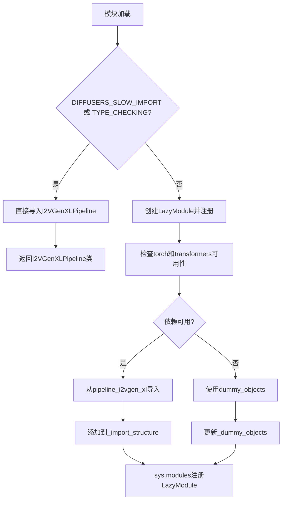

# `diffusers\src\diffusers\pipelines\i2vgen_xl\__init__.py` 详细设计文档

这是一个Diffusers库的延迟加载模块初始化文件，通过LazyModule机制动态导入I2VGenXLPipeline，同时处理torch和transformers的可选依赖，在依赖不可用时提供虚拟对象以保证模块结构完整性。

## 整体流程



## 类结构

```
Diffusers Pipeline Module
└── pipeline_i2vgen_xl
    ├── I2VGenXLPipeline (条件导出)
    ├── _LazyModule (延迟加载机制)
    └── _import_structure (导入映射)
```

## 全局变量及字段


### `_dummy_objects`
    
用于存储虚拟对象的字典，当可选依赖不可用时使用

类型：`dict`
    


### `_import_structure`
    
存储模块导入结构的字典，映射模块名到可导出对象列表

类型：`dict`
    


### `DIFFUSERS_SLOW_IMPORT`
    
控制是否启用慢速导入模式的标志

类型：`bool`
    


### `OptionalDependencyNotAvailable`
    
可选依赖不可用时抛出的异常类

类型：`type`
    


### `_LazyModule`
    
用于实现模块懒加载的类

类型：`type`
    


### `get_objects_from_module`
    
从指定模块中提取所有可导出对象的函数

类型：`function`
    


### `is_torch_available`
    
检查PyTorch库是否可用的函数

类型：`function`
    


### `is_transformers_available`
    
检查Transformers库是否可用的函数

类型：`function`
    


    

## 全局函数及方法


## 关键组件


### 延迟加载模块（Lazy Loading Module）

使用 `_LazyModule` 实现模块的延迟导入，允许在未安装所有依赖的情况下导入模块，仅在实际使用时触发完整导入。

### 可选依赖检查机制（Optional Dependency Check）

通过 `is_transformers_available()` 和 `is_torch_available()` 检查 torch 和 transformers 是否可用，不可用时抛出 `OptionalDependencyNotAvailable` 异常。

### 虚拟对象系统（Dummy Objects System）

当可选依赖不可用时，从 `dummy_torch_and_transformers_objects` 导入虚拟对象并添加到 `_dummy_objects` 字典，防止导入错误。

### 动态属性设置（Dynamic Attribute Setting）

通过 `setattr(sys.modules[__name__], name, value)` 将虚拟对象动态绑定到当前模块，使模块在依赖缺失时仍可正常导入。

### 导入结构字典（Import Structure Dictionary）

`_import_structure` 字典存储有效的导入结构，键为模块路径，值为可导入的类名列表（如 `I2VGenXLPipeline`）。


## 问题及建议


### 已知问题

-   **重复的依赖检查逻辑**：在 `try-except` 块和 `TYPE_CHECKING` 分支中完全相同地重复了 `is_transformers_available() and is_torch_available()` 的检查代码，导致维护成本增加
-   **硬编码的模块名**：字符串 `"pipeline_i2vgen_xl"` 和类名 `"I2VGenXLPipeline"` 被硬编码在多处，如果类名变更需要同步修改多处代码
-   **通配符导入的使用**：在类型检查分支中使用 `from ...utils.dummy_torch_and_transformers_objects import * # noqa F403`，降低了代码的可读性和静态分析能力
-   **异常处理掩盖真实错误**：通过捕获 `OptionalDependencyNotAvailable` 来判断依赖是否可用，这种方式可能掩盖真正的导入错误
-   **动态属性设置的副作用**：使用 `setattr(sys.modules[__name__], name, value)` 动态设置虚拟对象，绕过了模块的正常导入机制，可能影响调试和 IDE 提示
-   **缺少模块文档**：整个模块没有模块级文档字符串（docstring），降低了代码的可维护性
-   **全局状态管理**：`_dummy_objects` 和 `_import_structure` 作为模块级可变状态，容易产生意外的副作用

### 优化建议

-   将依赖检查逻辑提取为独立的辅助函数，例如 `_check_dependencies()`，避免代码重复
-   考虑使用配置常量或反射机制来获取模块名和类名，减少硬编码
-   将通配符导入改为显式导入，提高代码可读性和静态分析能力
-   使用更明确的依赖检查方式，例如在导入时直接进行断言而非捕获异常
-   考虑使用 `__getattr__` 实现延迟导入，而非直接操作 `sys.modules`
-   为模块添加文档字符串，说明其用途和依赖要求
-   将 `_import_structure` 和 `_dummy_objects` 的构建逻辑封装到函数中，减少模块级别的副作用


## 其它


### 设计目标与约束

本模块的设计目标是实现Diffusers库中I2VGenXL流水线的延迟加载机制，通过可选依赖检查机制确保在缺少torch或transformers时不会导致导入失败，同时保持模块的懒加载特性以优化启动性能。约束方面，本模块仅支持Python 3.8+环境，必须依赖Diffusers核心utils模块提供的延迟加载框架，且仅在torch和transformers同时可用时才能导入实际的I2VGenXLPipeline类。

### 错误处理与异常设计

本模块主要处理OptionalDependencyNotAvailable异常，当torch或transformers任一不可用时抛出该异常，触发_dummy_objects的填充机制。异常处理流程为：首先尝试检查is_transformers_available()和is_torch_available()，若任一返回False则抛出OptionalDependencyNotAvailable，随后从dummy_torch_and_transformers_objects模块导入虚拟对象填充到_dummy_objects中，确保模块可以被安全导入而不引发运行时错误。

### 数据流与状态机

模块初始化状态机包含三个状态：初始状态（模块加载）、依赖检查状态（判断torch和transformers可用性）、最终状态（根据依赖可用性加载真实对象或虚拟对象）。数据流为：导入请求 → TYPE_CHECKING/DIFFUSERS_SLOW_IMPORT条件判断 → 依赖可用性检查 → 真实模块导入或虚拟对象填充 → sys.modules注册。

### 外部依赖与接口契约

本模块依赖以下外部包和模块：typing.TYPE_CHECKING用于类型检查时的导入、...utils中的_dummy_objects、_LazyModule、get_objects_from_module、is_torch_available、is_transformers_available、OptionalDependencyNotAvailable。模块导出的公共接口为I2VGenXLPipeline类（在_import_structure中声明），调用方可通过from diffusers import I2VGenXLPipeline方式导入使用。

### 模块化与扩展性考虑

本模块采用模块化设计，通过_import_structure字典结构化组织导出内容，便于后续扩展其他流水线。若要添加新的流水线类，只需在else分支中按格式添加新的导入结构条目，如_import_structure["pipeline_xxx"] = ["XXXPipeline"]，即可自动纳入延迟加载体系。_dummy_objects的更新机制也支持扩展虚拟对象集合。

### 版本兼容性

本模块依赖于Diffusers utils模块中定义的可选依赖检查函数is_torch_available和is_transformers_available，这些函数的实现需要与torch和transformers库的版本变化保持同步。建议在项目依赖管理中明确torch和transformers的最低版本要求，以确保is_*_available函数的准确性。

### 性能考虑

采用LazyModule机制实现延迟加载，避免在模块导入时立即加载torch和transformers等重型依赖，显著缩短首次导入时间。_dummy_objects的设置通过setattr在运行时动态绑定，对于实际不使用流水线类的场景，可避免完整的模块初始化开销。

### 安全考虑

本模块主要涉及运行时动态模块注入（setattr到sys.modules），需确保get_objects_from_module返回的对象来源可信。导入dummy模块时使用了# noqa F403抑制警告，表明对通配符导入可能带来的命名空间污染有所认知，建议在文档中明确说明预期导出的公共API。

### 测试策略

建议包含以下测试用例：1）模拟torch和transformers均不可用场景，验证_dummy_objects正确填充；2）模拟两者均可用场景，验证I2VGenXLPipeline可正常导入；3）验证TYPE_CHECKING模式下不触发LazyModule初始化；4）验证模块注册到sys.modules后的属性访问行为。

### 配置管理

本模块通过DIFFUSERS_SLOW_IMPORT环境变量控制导入行为，当设置为True时绕过延迟加载机制进入TYPE_CHECKING分支。模块内部无其他配置参数，所有配置依赖外部utils模块的集中管理。

    