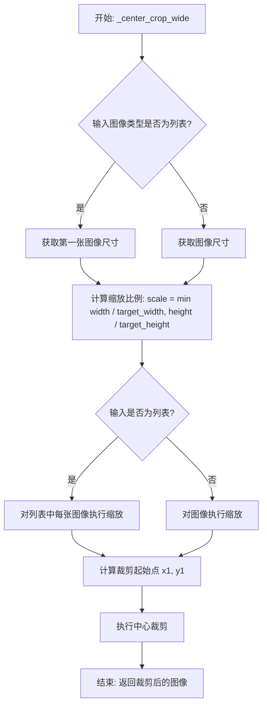
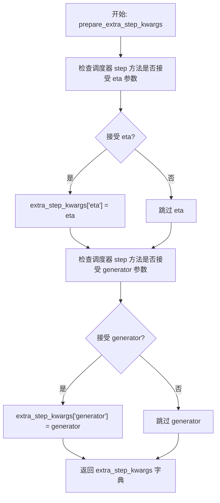
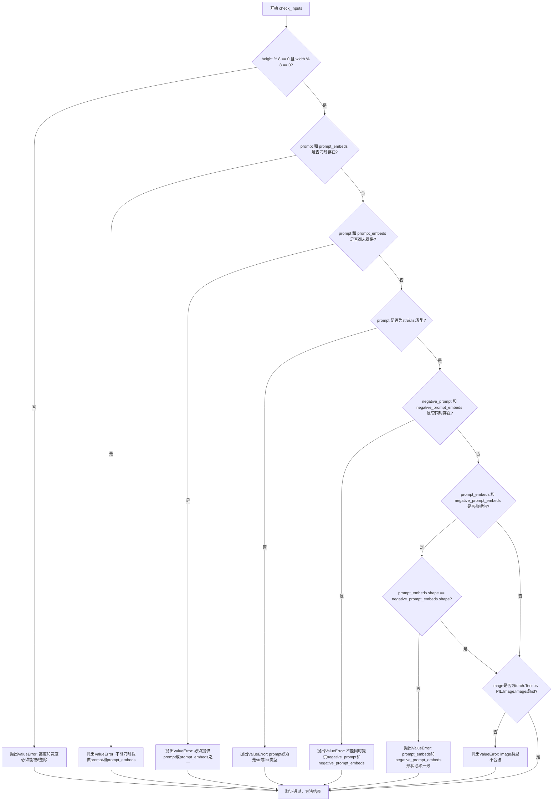
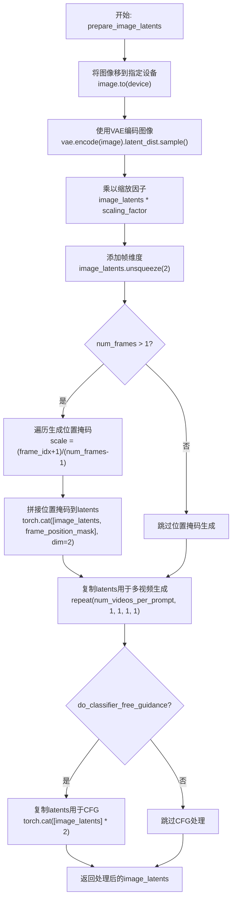
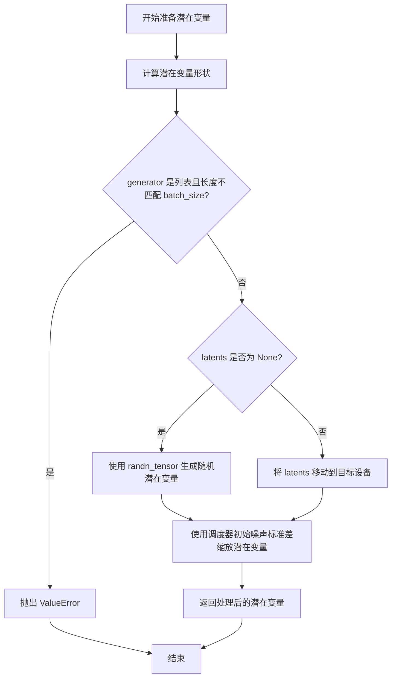
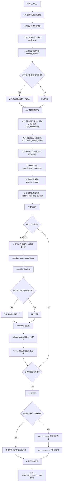

# `diffusers\src\diffusers\pipelines\i2vgen_xl\pipeline_i2vgen_xl.py` 详细设计文档

I2VGenXL Pipeline 实现，用于根据静态图像和文本提示生成视频序列。该管道集成了 CLIP 文本/图像编码器、VAE 解码器以及专门针对图像到视频任务优化的 UNet 模型，通过 DDIM 调度器进行去噪处理。

## 整体流程

```mermaid
graph TD
    Start([开始]) --> CheckInputs{检查输入参数}
    CheckInputs -- 失败 --> Error[抛出异常]
    CheckInputs -- 成功 --> EncodeText[编码文本提示 & 负向提示]
    EncodeText --> EncodeImage[裁剪/编码输入图像]
    EncodeImage --> PrepareImageLatents[准备图像潜在向量]
    PrepareImageLatents --> PrepareNoise[准备初始噪声 Latents]
    PrepareNoise --> DenoiseLoop{去噪循环 (DDIM)}
    DenoiseLoop --> UNetPred[UNet 预测噪声]
    UNetPred --> SchedulerStep[调度器步进更新]
    SchedulerStep -- 未完成 --> DenoiseLoop
    DenoiseLoop -- 完成 --> DecodeLatents[解码 Latents 为视频帧]
    DecodeLatents --> PostProcess[后处理 (转换为 PIL/NumPy)]
    PostProcess --> End([结束])
```

## 类结构

```
Diffusers Base Classes
├── DiffusionPipeline
├── StableDiffusionMixin
├── DeprecatedPipelineMixin
└── I2VGenXLPipeline (核心逻辑)
    ├── I2VGenXLPipelineOutput (输出数据类)
    └── Utility Functions (_center_crop_wide, _resize_bilinear, ...)
```

## 全局变量及字段


### `logger`
    
Logging utility for the module

类型：`logging.Logger`
    


### `EXAMPLE_DOC_STRING`
    
Example usage documentation string for the pipeline

类型：`str`
    


### `XLA_AVAILABLE`
    
Boolean flag indicating if PyTorch XLA is available

类型：`bool`
    


### `I2VGenXLPipelineOutput.frames`
    
Generated video frames

类型：`torch.Tensor | np.ndarray | list[list[PIL.Image.Image]]`
    


### `I2VGenXLPipeline.vae`
    
Variational Auto-Encoder for encoding/decoding latents

类型：`AutoencoderKL`
    


### `I2VGenXLPipeline.text_encoder`
    
Frozen text-encoder for generating text embeddings

类型：`CLIPTextModel`
    


### `I2VGenXLPipeline.tokenizer`
    
Tokenizer for text input

类型：`CLIPTokenizer`
    


### `I2VGenXLPipeline.image_encoder`
    
Encoder for input image features

类型：`CLIPVisionModelWithProjection`
    


### `I2VGenXLPipeline.feature_extractor`
    
Image preprocessor for feature extraction

类型：`CLIPImageProcessor`
    


### `I2VGenXLPipeline.unet`
    
Noise prediction model for denoising

类型：`I2VGenXLUNet`
    


### `I2VGenXLPipeline.scheduler`
    
Denoising scheduler for diffusion process

类型：`DDIMScheduler`
    


### `I2VGenXLPipeline.vae_scale_factor`
    
Scaling factor for VAE latent space

类型：`int`
    


### `I2VGenXLPipeline.video_processor`
    
Tool for video/image conversion

类型：`VideoProcessor`
    
    

## 全局函数及方法


### `_convert_pt_to_pil`

该函数是一个工具函数，用于将 PyTorch 张量（Tensor）或张量列表转换为 PIL 图像格式。它是图像预处理流水线中的关键组件，确保输入图像格式的一致性，以便后续的图像处理操作。

参数：

- `image`：`torch.Tensor | list[torch.Tensor]`，要转换的输入图像，可以是单个 PyTorch 张量或张量列表

返回值：`list[PIL.Image.Image]`，转换后的 PIL 图像列表

#### 流程图

```mermaid
flowchart TD
    A[开始: 输入 image] --> B{image 是否为 list}
    B -->|Yes| C{list[0] 是否为 Tensor}
    B -->|No| D{image 是否为 Tensor}
    C -->|Yes| E[torch.cat 合并张量]
    C -->|No| D
    E --> D
    D -->|Yes| F{ndim 是否为 3}
    D -->|No| I[直接返回 image]
    F -->|Yes| G[unsqueeze 添加批次维度]
    F -->|No| H
    G --> H[VaeImageProcessor.pt_to_numpy 转为numpy]
    H --> J[VaeImageProcessor.numpy_to_pil 转为PIL]
    J --> K[返回 PIL 图像]
    I --> K
```

#### 带注释源码

```
def _convert_pt_to_pil(image: torch.Tensor | list[torch.Tensor]):
    # 如果输入是张量列表，且列表元素都是Tensor，则将它们在第0维（批次维）上拼接
    if isinstance(image, list) and isinstance(image[0], torch.Tensor):
        image = torch.cat(image, 0)

    # 检查输入是否为单个Tensor
    if isinstance(image, torch.Tensor):
        # 如果是3D张量（通常是C×H×W），添加批次维度变成1×C×H×W
        if image.ndim == 3:
            image = image.unsqueeze(0)

        # 使用 VaeImageProcessor 将 PyTorch Tensor 转换为 NumPy 数组
        image_numpy = VaeImageProcessor.pt_to_numpy(image)
        # 使用 VaeImageProcessor 将 NumPy 数组转换为 PIL Image
        image_pil = VaeImageProcessor.numpy_to_pil(image_numpy)
        image = image_pil

    # 返回转换后的 PIL 图像（可能是单个图像或图像列表）
    return image
```


### `_resize_bilinear`

该函数用于将输入图像调整到指定的分辨率，采用双线性插值（Bilinear interpolation）方法进行图像缩放。

参数：

- `image`：`torch.Tensor | list[torch.Tensor] | PIL.Image.Image | list[PIL.Image.Image]`，输入的图像或图像列表，支持 PyTorch 张量或 PIL 图像
- `resolution`：`tuple[int, int]`，目标分辨率，格式为 (width, height)

返回值：`torch.Tensor | list[torch.Tensor] | PIL.Image.Image | list[PIL.Image.Image]`，返回调整大小后的图像或图像列表，类型与输入保持一致

#### 流程图

```mermaid
flowchart TD
    A[开始: 输入 image 和 resolution] --> B{判断 image 类型}
    B -->|torch.Tensor 或 list[torch.Tensor]| C[调用 _convert_pt_to_pil 转换为 PIL]
    B -->|PIL.Image| D[直接使用]
    C --> E{判断是否为列表}
    D --> E
    E -->|是列表| F[遍历列表每个图像]
    E -->|单个图像| H
    F --> G[对每个图像调用 resize<br/>PIL.Image.BILINEAR]
    H --> I[调用 resize<br/>PIL.Image.BILINEAR]
    G --> J[返回 resize 后的列表]
    I --> K[返回 resize 后的图像]
    J --> L[结束]
    K --> L
```

#### 带注释源码

```python
def _resize_bilinear(
    image: torch.Tensor | list[torch.Tensor] | PIL.Image.Image | list[PIL.Image.Image], 
    resolution: tuple[int, int]
):
    """
    使用双线性插值调整图像分辨率
    
    参数:
        image: 输入图像，支持张量或PIL图像，单张或列表形式
        resolution: 目标分辨率，格式为 (width, height)
    
    返回:
        调整大小后的图像，类型与输入保持一致
    """
    # 首先将图像转换为PIL格式，以防输入是浮点型张量（目前主要用于测试）
    image = _convert_pt_to_pil(image)

    # 判断是否为图像列表
    if isinstance(image, list):
        # 遍历列表，对每个图像进行双线性插值缩放
        image = [u.resize(resolution, PIL.Image.BILINEAR) for u in image]
    else:
        # 对单个图像进行双线性插值缩放
        image = image.resize(resolution, PIL.Image.BILINEAR)
    
    return image
```


### `_center_crop_wide`

该函数是一个图像预处理工具函数，用于将输入图像进行中心裁剪，使其适应指定的分辨率目标。它首先将图像转换为PIL格式，计算缩放比例以保持图像完整性，然后执行居中裁剪操作，确保输出图像符合目标宽高比。

参数：

- `image`：`torch.Tensor | list[torch.Tensor] | PIL.Image.Image | list[PIL.Image.Image]`，输入图像，支持单个或批量图像，可以是PyTorch张量或PIL图像
- `resolution`：`tuple[int, int]`，目标分辨率，格式为(宽度, 高度)

返回值：`torch.Tensor | list[torch.Tensor] | PIL.Image.Image | list[PIL.Image.Image]`，返回裁剪后的图像，类型与输入类型保持一致

#### 流程图



#### 带注释源码

```python
def _center_crop_wide(
    image: torch.Tensor | list[torch.Tensor] | PIL.Image.Image | list[PIL.Image.Image], 
    resolution: tuple[int, int]
):
    """
    对输入图像进行中心裁剪以适应目标分辨率
    
    参数:
        image: 输入图像，支持张量或PIL图像的单个或列表形式
        resolution: 目标分辨率 (宽度, 高度)
    
    返回:
        裁剪后的图像，类型与输入保持一致
    """
    # 首先将图像转换为PIL格式，以防输入是浮点型张量（主要用于测试）
    image = _convert_pt_to_pil(image)

    if isinstance(image, list):
        # 批量图像处理
        # 计算缩放比例：选择能够容纳目标分辨率的最小缩放因子
        scale = min(image[0].size[0] / resolution[0], image[0].size[1] / resolution[1])
        
        # 使用BOX采样方法对所有图像进行缩放
        image = [u.resize((round(u.width // scale), round(u.height // scale)), resample=PIL.Image.BOX) for u in image]

        # 计算中心裁剪的起始坐标
        x1 = (image[0].width - resolution[0]) // 2
        y1 = (image[0].height - resolution[1]) // 2
        
        # 对所有图像执行中心裁剪
        image = [u.crop((x1, y1, x1 + resolution[0], y1 + resolution[1])) for u in image]
        return image
    else:
        # 单张图像处理
        # 计算缩放比例
        scale = min(image.size[0] / resolution[0], image.size[1] / resolution[1])
        
        # 缩放图像
        image = image.resize((round(image.width // scale), round(image.height // scale)), resample=PIL.Image.BOX)
        
        # 计算中心裁剪坐标
        x1 = (image.width - resolution[0]) // 2
        y1 = (image.height - resolution[1]) // 2
        
        # 执行裁剪并返回
        image = image.crop((x1, y1, x1 + resolution[0], y1 + resolution[1]))
        return image
```


### `I2VGenXLPipeline.__init__`

该方法是 `I2VGenXLPipeline` 类的构造函数，用于初始化图像到视频（I2V）生成管道。它接收多个预训练的模型组件（VAE、文本编码器、图像编码器、UNet、调度器等），通过 `register_modules` 方法注册这些模块，并计算 VAE 缩放因子并初始化视频处理器。

参数：

- `vae`：`AutoencoderKL`，Variational Auto-Encoder 模型，用于编码和解码图像到潜在表示
- `text_encoder`：`CLIPTextModel`，冻结的文本编码器 (clip-vit-large-patch14)
- `tokenizer`：`CLIPTokenizer`，用于对文本进行分词的 CLIP 分词器
- `image_encoder`：`CLIPVisionModelWithProjection`，用于编码图像的 CLIP 视觉模型
- `feature_extractor`：`CLIPImageProcessor`，用于预处理图像的特征提取器
- `unet`：`I2VGenXLUNet`，用于对编码的视频潜在表示进行去噪的 UNet 模型
- `scheduler`：`DDIMScheduler`，与 UNet 结合使用以对编码的图像潜在表示进行去噪的调度器

返回值：无（`None`），`__init__` 方法用于初始化对象状态，不返回任何值

#### 流程图

```mermaid
flowchart TD
    A[开始 __init__] --> B[调用 super().__init__]
    B --> C[调用 self.register_modules 注册所有模型组件]
    C --> D[计算 vae_scale_factor: 2^(len(vae.config.block_out_channels) - 1)]
    D --> E[初始化 VideoProcessor with vae_scale_factor and do_resize=False]
    F[结束 __init__, 返回 None]
    
    C --> C1[注册 vae]
    C --> C2[注册 text_encoder]
    C --> C3[注册 tokenizer]
    C --> C4[注册 image_encoder]
    C --> C5[注册 feature_extractor]
    C --> C6[注册 unet]
    C --> C7[注册 scheduler]
```

#### 带注释源码

```python
def __init__(
    self,
    vae: AutoencoderKL,
    text_encoder: CLIPTextModel,
    tokenizer: CLIPTokenizer,
    image_encoder: CLIPVisionModelWithProjection,
    feature_extractor: CLIPImageProcessor,
    unet: I2VGenXLUNet,
    scheduler: DDIMScheduler,
):
    """
    初始化 I2VGenXLPipeline 管道
    
    参数:
        vae: Variational Auto-Encoder (VAE) 模型，用于编码和解码图像到潜在表示
        text_encoder: 冻结的文本编码器 (clip-vit-large-patch14)
        tokenizer: 用于文本分词的 CLIPTokenizer
        image_encoder: CLIP 视觉模型，用于编码图像
        feature_extractor: CLIP 图像处理器，用于图像预处理
        unet: I2VGenXLUNet 模型，用于去噪视频潜在表示
        scheduler: DDIMScheduler，用于去噪过程的调度
    
    返回:
        None
    """
    # 调用父类 DiffusionPipeline 的初始化方法
    # 设置基本的管道配置和设备管理
    super().__init__()

    # 使用 register_modules 方法注册所有模型组件
    # 这个方法来自 DeprecatedPipelineMixin，会将所有模块注册到 self 属性中
    # 使得管道可以统一管理这些模型的设备和内存
    self.register_modules(
        vae=vae,
        text_encoder=text_encoder,
        tokenizer=tokenizer,
        image_encoder=image_encoder,
        feature_extractor=feature_extractor,
        unet=unet,
        scheduler=scheduler,
    )
    
    # 计算 VAE 缩放因子，用于调整潜在空间的尺度
    # 基于 VAE 的块输出通道数计算：2^(num_blocks - 1)
    # 例如：如果有 [128, 256, 512, 512] 四个块，则缩放因子为 2^3 = 8
    # getattr(self, "vae", None) 检查用于安全访问，避免属性不存在时报错
    self.vae_scale_factor = 2 ** (len(self.vae.config.block_out_channels) - 1) if getattr(self, "vae", None) else 8
    
    # 初始化视频处理器
    # do_resize=False 表示不进行默认的 resize 操作，因为后续会使用自定义的图像处理方法
    # VideoProcessor 用于处理视频帧的预处理和后处理
    self.video_processor = VideoProcessor(vae_scale_factor=self.vae_scale_factor, do_resize=False)
```


### I2VGenXLPipeline.encode_prompt

该方法负责将文本提示（prompt）编码为文本编码器的隐藏状态（text encoder hidden states），支持 classifier-free guidance（无分类器引导），并处理负面提示（negative prompt）的嵌入生成。

参数：

- `prompt`：`str` 或 `list[str]`，可选，要编码的提示文本
- `device`：`torch.device`，torch 设备
- `num_videos_per_prompt`：`int`，每个提示要生成的视频数量
- `negative_prompt`：`str` 或 `list[str]`，可选，用于引导图像生成的负面提示
- `prompt_embeds`：`torch.Tensor | None`，可选，预生成的文本嵌入
- `negative_prompt_embeds`：`torch.Tensor | None`，可选，预生成的负面文本嵌入
- `clip_skip`：`int | None`，可选，从 CLIP 计算提示嵌入时要跳过的层数

返回值：`tuple[torch.Tensor, torch.Tensor]`，返回 (prompt_embeds, negative_prompt_embeds)，分别是编码后的提示嵌入和负面提示嵌入

#### 流程图

```mermaid
flowchart TD
    A[开始 encode_prompt] --> B{判断 batch_size}
    B -->|prompt 是 str| C[batch_size = 1]
    B -->|prompt 是 list| D[batch_size = len(prompt)]
    B -->|否则| E[batch_size = prompt_embeds.shape[0]]
    
    C --> F{prompt_embeds is None?}
    D --> F
    E --> F
    
    F -->|Yes| G[使用 tokenizer 对 prompt 分词]
    G --> H{检查是否被截断}
    H -->|是| I[记录警告日志]
    H -->|否| J{clip_skip is None?}
    
    I --> J
    
    J -->|Yes| K[直接调用 text_encoder 获取嵌入]
    J -->|No| L[获取所有隐藏状态并索引到指定层]
    L --> M[应用 final_layer_norm]
    
    K --> N[转换为正确 dtype 和 device]
    M --> N
    
    F -->|No| N
    
    N --> O[复制 prompt_embeds num_videos_per_prompt 次]
    O --> P{do_classifier_free_guidance 且 negative_prompt_embeds is None?}
    
    P -->|Yes| Q{negative_prompt is None?}
    Q -->|Yes| R[uncond_tokens = [''] * batch_size]
    Q -->|No| S{negative_prompt 类型检查}
    S -->|是 str| T[uncond_tokens = [negative_prompt]]
    S -->|batch_size 不匹配| U[抛出 ValueError]
    S -->|list| V[uncond_tokens = negative_prompt]
    
    R --> W[tokenizer 处理 uncond_tokens]
    T --> W
    V --> W
    
    P -->|No| X{negative_prompt_embeds is not None?}
    X -->|Yes| Y[仅转换 dtype 和 device]
    X -->|No| Z[返回 prompt_embeds, None]
    
    W --> AA{clip_skip is None?}
    AA -->|Yes| AB[调用 text_encoder 获取 uncond 嵌入]
    AA -->|No| AC[获取隐藏状态并应用 final_layer_norm]
    
    AB --> AD[转换 dtype 和 device]
    AC --> AD
    
    AD --> AE{do_classifier_free_guidance?}
    AE -->|Yes| AF[复制 negative_prompt_embeds num_videos_per_prompt 次]
    AF --> AG[返回 prompt_embeds, negative_prompt_embeds]
    
    Y --> AG
    Z --> AG
    AE -->|No| AG
    
    O --> AG
```

#### 带注释源码

```python
def encode_prompt(
    self,
    prompt,                           # str 或 list[str]: 要编码的提示文本
    device,                           # torch.device: torch 设备
    num_videos_per_prompt,            # int: 每个提示要生成的视频数量
    negative_prompt=None,             # str 或 list[str], optional: 负面提示
    prompt_embeds: torch.Tensor | None = None,    # 预生成的文本嵌入
    negative_prompt_embeds: torch.Tensor | None = None,  # 预生成的负面文本嵌入
    clip_skip: int | None = None,     # int, optional: CLIP 跳过层数
):
    r"""
    Encodes the prompt into text encoder hidden states.

    Args:
        prompt (`str` or `list[str]`, *optional*):
            prompt to be encoded
        device: (`torch.device`):
            torch device
        num_videos_per_prompt (`int`):
            number of images that should be generated per prompt
        do_classifier_free_guidance (`bool`):
            whether to use classifier free guidance or not
        negative_prompt (`str` or `list[str]`, *optional*):
            The prompt or prompts not to guide the image generation. If not defined, one has to pass
            `negative_prompt_embeds` instead. Ignored when not using guidance (i.e., ignored if `guidance_scale` is
            less than `1`).
        prompt_embeds (`torch.Tensor`, *optional*):
            Pre-generated text embeddings. Can be used to easily tweak text inputs, *e.g.* prompt weighting. If not
            provided, text embeddings will be generated from `prompt` input argument.
        negative_prompt_embeds (`torch.Tensor`, *optional*):
            Pre-generated negative text embeddings. Can be used to easily tweak text inputs, *e.g.* prompt
            weighting. If not provided, negative_prompt_embeds will be generated from `negative_prompt` input
            argument.
        clip_skip (`int`, *optional*):
            Number of layers to be skipped from CLIP while computing the prompt embeddings. A value of 1 means that
            the output of the pre-final layer will be used for computing the prompt embeddings.
    """
    # 确定批量大小
    # 如果 prompt 是字符串，batch_size 为 1
    # 如果 prompt 是列表，batch_size 为列表长度
    # 否则使用 prompt_embeds 的 batch size
    if prompt is not None and isinstance(prompt, str):
        batch_size = 1
    elif prompt is not None and isinstance(prompt, list):
        batch_size = len(prompt)
    else:
        batch_size = prompt_embeds.shape[0]

    # 如果未提供 prompt_embeds，则从 prompt 生成
    if prompt_embeds is None:
        # 使用 tokenizer 对 prompt 进行分词
        text_inputs = self.tokenizer(
            prompt,
            padding="max_length",
            max_length=self.tokenizer.model_max_length,
            truncation=True,
            return_tensors="pt",
        )
        text_input_ids = text_inputs.input_ids
        
        # 获取未截断的输入，用于检测是否发生了截断
        untruncated_ids = self.tokenizer(prompt, padding="longest", return_tensors="pt").input_ids

        # 检查是否发生了截断，如果是则记录警告
        if untruncated_ids.shape[-1] >= text_input_ids.shape[-1] and not torch.equal(
            text_input_ids, untruncated_ids
        ):
            removed_text = self.tokenizer.batch_decode(
                untruncated_ids[:, self.tokenizer.model_max_length - 1 : -1]
            )
            logger.warning(
                "The following part of your input was truncated because CLIP can only handle sequences up to"
                f" {self.tokenizer.model_max_length} tokens: {removed_text}"
            )

        # 检查 text_encoder 是否使用 attention_mask
        if hasattr(self.text_encoder.config, "use_attention_mask") and self.text_encoder.config.use_attention_mask:
            attention_mask = text_inputs.attention_mask.to(device)
        else:
            attention_mask = None

        # 根据是否设置 clip_skip 来决定如何获取 prompt embeddings
        if clip_skip is None:
            # 直接获取最后一层的隐藏状态
            prompt_embeds = self.text_encoder(text_input_ids.to(device), attention_mask=attention_mask)
            prompt_embeds = prompt_embeds[0]
        else:
            # 获取所有隐藏状态
            prompt_embeds = self.text_encoder(
                text_input_ids.to(device), attention_mask=attention_mask, output_hidden_states=True
            )
            # 访问 hidden_states 元组，索引到目标层
            # -1 表示最后一层，-(clip_skip + 1) 表示倒数第 clip_skip + 1 层
            prompt_embeds = prompt_embeds[-1][-(clip_skip + 1)]
            # 应用最终的 LayerNorm 以确保表示正确
            prompt_embeds = self.text_encoder.text_model.final_layer_norm(prompt_embeds)

    # 确定 prompt_embeds 的数据类型
    # 优先使用 text_encoder 的 dtype，其次使用 unet 的 dtype
    if self.text_encoder is not None:
        prompt_embeds_dtype = self.text_encoder.dtype
    elif self.unet is not None:
        prompt_embeds_dtype = self.unet.dtype
    else:
        prompt_embeds_dtype = prompt_embeds.dtype

    # 将 prompt_embeds 转换为正确的 dtype 和 device
    prompt_embeds = prompt_embeds.to(dtype=prompt_embeds_dtype, device=device)

    # 获取嵌入的形状信息
    bs_embed, seq_len, _ = prompt_embeds.shape
    # 为每个 prompt 复制 num_videos_per_prompt 次（mps 友好的方法）
    prompt_embeds = prompt_embeds.repeat(1, num_videos_per_prompt, 1)
    prompt_embeds = prompt_embeds.view(bs_embed * num_videos_per_prompt, seq_len, -1)

    # 获取无条件嵌入用于 classifier free guidance
    if self.do_classifier_free_guidance and negative_prompt_embeds is None:
        uncond_tokens: list[str]
        
        # 处理 negative_prompt
        if negative_prompt is None:
            # 如果没有提供 negative_prompt，使用空字符串
            uncond_tokens = [""] * batch_size
        elif prompt is not None and type(prompt) is not type(negative_prompt):
            # 类型检查
            raise TypeError(
                f"`negative_prompt` should be the same type to `prompt`, but got {type(negative_prompt)} !="
                f" {type(prompt)}."
            )
        elif isinstance(negative_prompt, str):
            # 如果是字符串，转换为单元素列表
            uncond_tokens = [negative_prompt]
        elif batch_size != len(negative_prompt):
            # batch_size 不匹配
            raise ValueError(
                f"`negative_prompt`: {negative_prompt} has batch size {len(negative_prompt)}, but `prompt`:"
                f" {prompt} has batch size {batch_size}. Please make sure that passed `negative_prompt` matches"
                " the batch size of `prompt`."
            )
        else:
            uncond_tokens = negative_prompt

        # 使用与 prompt_embeds 相同的长度
        max_length = prompt_embeds.shape[1]
        uncond_input = self.tokenizer(
            uncond_tokens,
            padding="max_length",
            max_length=max_length,
            truncation=True,
            return_tensors="pt",
        )

        # 处理 attention_mask
        if hasattr(self.text_encoder.config, "use_attention_mask") and self.text_encoder.config.use_attention_mask:
            attention_mask = uncond_input.attention_mask.to(device)
        else:
            attention_mask = None

        # 对 negative prompt 应用 clip_skip
        if clip_skip is None:
            negative_prompt_embeds = self.text_encoder(
                uncond_input.input_ids.to(device),
                attention_mask=attention_mask,
            )
            negative_prompt_embeds = negative_prompt_embeds[0]
        else:
            negative_prompt_embeds = self.text_encoder(
                uncond_input.input_ids.to(device), attention_mask=attention_mask, output_hidden_states=True
            )
            # 访问隐藏状态并索引到目标层
            negative_prompt_embeds = negative_prompt_embeds[-1][-(clip_skip + 1)]
            # 应用最终的 LayerNorm
            negative_prompt_embeds = self.text_encoder.text_model.final_layer_norm(negative_prompt_embeds)

    # 如果使用 classifier free guidance，处理 negative_prompt_embeds
    if self.do_classifier_free_guidance:
        # 获取序列长度
        seq_len = negative_prompt_embeds.shape[1]

        # 转换 dtype 和 device
        negative_prompt_embeds = negative_prompt_embeds.to(dtype=prompt_embeds_dtype, device=device)

        # 复制 num_videos_per_prompt 次
        negative_prompt_embeds = negative_prompt_embeds.repeat(1, num_videos_per_prompt, 1)
        negative_prompt_embeds = negative_prompt_embeds.view(batch_size * num_videos_per_prompt, seq_len, -1)

    return prompt_embeds, negative_prompt_embeds
```


### I2VGenXLPipeline._encode_image

该方法负责将输入图像编码为图像嵌入向量（image embeddings），用于图像到视频（I2V）生成管道。它首先将 PIL 图像转换为 PyTorch 张量并进行 CLIP 标准化，然后通过图像编码器生成嵌入表示，最后根据分类器-free guidance 需求对嵌入进行复制和拼接处理。

参数：

- `image`：`torch.Tensor | PIL.Image.Image | list[PIL.Image.Image]`，输入图像，可以是 PyTorch 张量、PIL 图像或图像列表
- `device`：`torch.device`，计算设备，用于将图像和张量移动到指定设备（如 CPU 或 GPU）
- `num_videos_per_prompt`：`int`，每个提示词生成的视频数量，用于复制图像嵌入以匹配生成数量

返回值：`torch.Tensor`，图像嵌入向量，形状为 `(batch_size * num_videos_per_prompt * (1 + do_classifier_free_guidance), seq_len, hidden_dim)`。如果启用分类器-free guidance，batch 维度会翻倍（前半部分为零向量）

#### 流程图

```mermaid
flowchart TD
    A[开始 _encode_image] --> B[获取 image_encoder 的 dtype]
    B --> C{image 是否为 torch.Tensor?}
    C -->|否| D[使用 video_processor 将 PIL 转为 numpy]
    D --> E[将 numpy 转为 PyTorch 张量]
    E --> F[使用 feature_extractor 进行 CLIP 标准化]
    F --> G[将图像移动到指定设备并转换 dtype]
    C -->|是| G
    G --> H[通过 image_encoder 编码图像获取 image_embeds]
    H --> I[在 seq_len 维度添加单位维度 unsqueeze(1)]
    I --> J[获取嵌入的 batch_size, seq_len, hidden_dim]
    J --> K[复制嵌入 num_videos_per_prompt 次]
    K --> L[重塑嵌入为 batch_size * num_videos_per_prompt, seq_len, hidden_dim]
    L --> M{是否启用 classifier_free_guidance?}
    M -->|是| N[创建与 image_embeddings 形状相同的零张量]
    N --> O[将负向嵌入与正向嵌入拼接]
    O --> P[返回 image_embeddings]
    M -->|否| P
```

#### 带注释源码

```python
def _encode_image(self, image, device, num_videos_per_prompt):
    """
    将输入图像编码为图像嵌入向量，用于后续的图像到视频生成过程。
    
    参数:
        image: 输入图像，支持 torch.Tensor、PIL.Image.Image 或列表形式
        device: 计算设备（cpu/cuda）
        num_videos_per_prompt: 每个提示词生成的视频数量
    返回:
        图像嵌入张量
    """
    # 1. 获取图像编码器的参数数据类型，确保后续计算使用相同精度
    dtype = next(self.image_encoder.parameters()).dtype

    # 2. 如果输入不是 PyTorch 张量，则进行预处理转换
    if not isinstance(image, torch.Tensor):
        # 2.1 将 PIL 图像转换为 numpy 数组
        image = self.video_processor.pil_to_numpy(image)
        # 2.2 将 numpy 数组转换为 PyTorch 张量
        image = self.video_processor.numpy_to_pt(image)

        # 2.3 使用 CLIP 特征提取器进行标准化处理
        # 这里使用 CLIP 的训练统计量进行归一化（均值0, 方差1）
        # do_normalize=True: 启用归一化
        # do_center_crop=False: 不进行中心裁剪
        # do_resize=False: 不进行缩放（因为外部已处理）
        # do_rescale=False: 不进行数值重缩放
        image = self.feature_extractor(
            images=image,
            do_normalize=True,
            do_center_crop=False,
            do_resize=False,
            do_rescale=False,
            return_tensors="pt",
        ).pixel_values

    # 3. 将图像张量移动到指定设备并转换为正确的 dtype
    image = image.to(device=device, dtype=dtype)
    
    # 4. 通过图像编码器生成图像嵌入向量
    # image_embeds 是编码器输出的图像表示
    image_embeddings = self.image_encoder(image).image_embeds
    
    # 5. 在序列长度维度添加单位维度，便于后续与文本嵌入拼接
    # 形状从 (batch_size, hidden_dim) -> (batch_size, 1, hidden_dim)
    image_embeddings = image_embeddings.unsqueeze(1)

    # 6. 复制图像嵌入以匹配每个提示词生成多个视频的需求
    # 这是 MPS（Apple Silicon）友好的复制方式
    bs_embed, seq_len, _ = image_embeddings.shape
    # 重复嵌入 num_videos_per_prompt 次
    image_embeddings = image_embeddings.repeat(1, num_videos_per_prompt, 1)
    # 重塑为 (batch_size * num_videos_per_prompt, seq_len, hidden_dim)
    image_embeddings = image_embeddings.view(bs_embed * num_videos_per_prompt, seq_len, -1)

    # 7. 如果启用分类器-free guidance，需要生成负向（无条件）图像嵌入
    # 这允许模型在有条件和无条件输入之间进行插值
    if self.do_classifier_free_guidance:
        # 创建与正向嵌入形状相同的零张量作为负向嵌入
        negative_image_embeddings = torch.zeros_like(image_embeddings)
        # 拼接负向和正向嵌入
        # 最终形状: (2 * batch_size * num_videos_per_prompt, seq_len, hidden_dim)
        image_embeddings = torch.cat([negative_image_embeddings, image_embeddings])

    # 8. 返回处理后的图像嵌入向量
    return image_embeddings
```


### I2VGenXLPipeline.decode_latents

将去噪后的潜在表示（latents）解码为视频帧。该方法首先对潜在表示进行缩放和形状变换，然后使用VAE解码器将潜在表示转换为实际的视频数据，支持分块解码以控制内存使用。

参数：

- `latents`：`torch.Tensor`，经过去噪处理后的潜在表示，形状为 (batch_size, channels, num_frames, height, width)
- `decode_chunk_size`：`int | None`，可选参数，指定每次解码的帧数块大小。如果为 None，则一次性解码所有帧

返回值：`torch.Tensor`，解码后的视频张量，形状为 (batch_size, channels, num_frames, height, width)

#### 流程图

```mermaid
flowchart TD
    A[开始 decode_latents] --> B[对 latents 进行缩放: latents = 1/scaling_factor * latents]
    B --> C[获取 latents 形状: batch_size, channels, num_frames, height, width]
    C --> D[变换形状: permute 和 reshape 合并 batch 和 num_frames 维度]
    D --> E{decode_chunk_size 是否为 None?}
    E -->|是| F[一次性解码所有帧: vae.decode(latents).sample]
    E -->|否| G[分块解码: 遍历 latents，按 decode_chunk_size 大小块解码并拼接]
    F --> H[还原视频形状: reshape 和 permute 恢复原始维度顺序]
    G --> H
    H --> I[转换为 float32 类型]
    I --> J[返回解码后的 video 张量]
```

#### 带注释源码

```python
def decode_latents(self, latents, decode_chunk_size=None):
    """
    解码潜在表示为视频帧

    参数:
        latents: 潜在表示张量，形状为 (batch_size, channels, num_frames, height, width)
        decode_chunk_size: 可选的块大小，用于分块解码以节省显存

    返回:
        video: 解码后的视频张量，形状为 (batch_size, channels, num_frames, height, width)
    """
    # 1. 根据 VAE 的缩放因子对 latents 进行反缩放
    # 这是因为在编码时 latents 被缩放了，解码时需要还原
    latents = 1 / self.vae.config.scaling_factor * latents

    # 2. 获取批量大小、通道数、帧数、高度和宽度
    batch_size, channels, num_frames, height, width = latents.shape

    # 3. 变换维度顺序并重塑形状
    # 从 (batch_size, channels, num_frames, height, width) 
    # 转换为 (batch_size * num_frames, channels, height, width)
    # 这样可以将所有帧平铺在一起进行解码
    latents = latents.permute(0, 2, 1, 3, 4).reshape(batch_size * num_frames, channels, height, width)

    # 4. 根据 decode_chunk_size 决定解码方式
    if decode_chunk_size is not None:
        # 分块解码：逐块解码 latents，最后拼接结果
        # 这样可以减少显存占用，但可能会影响帧间一致性
        frames = []
        for i in range(0, latents.shape[0], decode_chunk_size):
            # 解码当前块的 latents
            frame = self.vae.decode(latents[i : i + decode_chunk_size]).sample
            frames.append(frame)
        # 沿第一维度（帧维度）拼接所有解码后的帧
        image = torch.cat(frames, dim=0)
    else:
        # 一次性解码所有帧
        # 这种方式可以保证最高的帧间一致性，但需要更多显存
        image = self.vae.decode(latents).sample

    # 5. 还原视频的原始形状
    # 从 (batch_size * num_frames, channels, height, width)
    # 还原为 (batch_size, channels, num_frames, height, width)
    decode_shape = (batch_size, num_frames, -1) + image.shape[2:]
    video = image[None, :].reshape(decode_shape).permute(0, 2, 1, 3, 4)

    # 6. 转换为 float32 类型
    # 这样做不会造成显著的性能开销，并且与 bfloat16 兼容
    video = video.float()
    
    return video
```


### `I2VGenXLPipeline.prepare_extra_step_kwargs`

该方法用于为调度器（scheduler）的步骤函数准备额外的关键字参数。由于不同的调度器具有不同的签名，该方法通过检查调度器的 `step` 方法是否接受特定参数（如 `eta` 和 `generator`）来动态构建参数字典，确保与各种调度器兼容。

参数：

- `self`：`I2VGenXLPipeline` 实例，隐含参数
- `generator`：`torch.Generator | list[torch.Generator] | None`，用于控制生成过程的随机性，确保可重复生成
- `eta`：`float`，DDIM 调度器参数，对应 DDIM 论文中的 η，取值范围为 [0, 1]

返回值：`dict`，包含调度器 `step` 方法所需的关键字参数字典

#### 流程图



#### 带注释源码

```python
def prepare_extra_step_kwargs(self, generator, eta):
    # 准备调度器步骤的额外参数，因为并非所有调度器都具有相同的签名
    # eta (η) 仅与 DDIMScheduler 一起使用，对于其他调度器将被忽略
    # eta 对应 DDIM 论文中的 η: https://huggingface.co/papers/2010.02502
    # 取值应在 [0, 1] 范围内

    # 使用 inspect 模块检查调度器的 step 方法签名，判断是否接受 eta 参数
    accepts_eta = "eta" in set(inspect.signature(self.scheduler.step).parameters.keys())
    
    # 初始化空字典用于存储额外参数
    extra_step_kwargs = {}
    
    # 如果调度器接受 eta 参数，则将其添加到参数字典中
    if accepts_eta:
        extra_step_kwargs["eta"] = eta

    # 检查调度器是否接受 generator 参数
    accepts_generator = "generator" in set(inspect.signature(self.scheduler.step).parameters.keys())
    
    # 如果调度器接受 generator 参数，则将其添加到参数字典中
    if accepts_generator:
        extra_step_kwargs["generator"] = generator
    
    # 返回构建好的参数字典，供调度器 step 方法使用
    return extra_step_kwargs
```


### `I2VGenXLPipeline.check_inputs`

该方法用于验证图像到视频生成管道的输入参数合法性，包括检查高度和宽度是否能被8整除、prompt和prompt_embeds的互斥关系、negative_prompt和negative_prompt_embeds的互斥关系、embeddings的形状一致性，以及image参数的类型合法性。

参数：

- `self`：调用该方法的I2VGenXLPipeline实例本身
- `prompt`：`str | list[str] | None`，用户输入的文本提示，用于指导视频生成
- `image`：`PipelineImageInput`（torch.Tensor | PIL.Image.Image | list[PIL.Image.Image] | None），输入的引导图像
- `height`：`int`，生成视频的高度（像素），必须能被8整除
- `width`：`int`，生成视频的宽度（像素），必须能被8整除
- `negative_prompt`：`str | list[str] | None`，反向提示词，用于指导不希望出现的内容
- `prompt_embeds`：`torch.Tensor | None`，预生成的文本嵌入向量，与prompt互斥
- `negative_prompt_embeds`：`torch.Tensor | None`，预生成的反向文本嵌入向量，与negative_prompt互斥

返回值：`None`，该方法不返回任何值，仅通过抛出ValueError来指示输入错误

#### 流程图



#### 带注释源码

```python
def check_inputs(
    self,
    prompt,
    image,
    height,
    width,
    negative_prompt=None,
    prompt_embeds=None,
    negative_prompt_embeds=None,
):
    """
    验证图像到视频生成管道的输入参数合法性
    
    该方法执行以下检查：
    1. height和width必须能被8整除（VAE的缩放因子要求）
    2. prompt和prompt_embeds不能同时提供（互斥参数）
    3. 必须提供prompt或prompt_embeds之一（不能都为空）
    4. prompt必须是str或list类型
    5. negative_prompt和negative_prompt_embeds不能同时提供
    6. prompt_embeds和negative_prompt_embeds形状必须一致
    7. image必须是torch.Tensor、PIL.Image.Image或list类型
    """
    
    # 检查1：验证高度和宽度能被8整除
    # VAE的scale_factor通常为8或16，因此latent空间的尺寸必须是8的倍数
    if height % 8 != 0 or width % 8 != 0:
        raise ValueError(f"`height` and `width` have to be divisible by 8 but are {height} and {width}.")

    # 检查2和3：验证prompt和prompt_embeds的互斥关系及必填性
    if prompt is not None and prompt_embeds is not None:
        # 不能同时提供prompt字符串和预计算的prompt_embeds
        raise ValueError(
            f"Cannot forward both `prompt`: {prompt} and `prompt_embeds`: {prompt_embeds}. Please make sure to"
            " only forward one of the two."
        )
    elif prompt is None and prompt_embeds is None:
        # 至少需要提供其中一个
        raise ValueError(
            "Provide either `prompt` or `prompt_embeds`. Cannot leave both `prompt` and `prompt_embeds` undefined."
        )
    # 检查4：验证prompt的类型合法性
    elif prompt is not None and (not isinstance(prompt, str) and not isinstance(prompt, list)):
        raise ValueError(f"`prompt` has to be of type `str` or `list` but is {type(prompt)}")

    # 检查5：验证negative_prompt和negative_prompt_embeds的互斥关系
    if negative_prompt is not None and negative_prompt_embeds is not None:
        raise ValueError(
            f"Cannot forward both `negative_prompt`: {negative_prompt} and `negative_prompt_embeds`:"
            f" {negative_prompt_embeds}. Please make sure to only forward one of the two."
        )

    # 检查6：验证prompt_embeds和negative_prompt_embeds的形状一致性
    # 当两者都直接提供时，必须形状相同以确保能正确执行classifier-free guidance
    if prompt_embeds is not None and negative_prompt_embeds is not None:
        if prompt_embeds.shape != negative_prompt_embeds.shape:
            raise ValueError(
                "`prompt_embeds` and `negative_prompt_embeds` must have the same shape when passed directly, but"
                f" got: `prompt_embeds` {prompt_embeds.shape} != `negative_prompt_embeds`"
                f" {negative_prompt_embeds.shape}."
            )

    # 检查7：验证image的类型合法性
    # 支持PyTorch张量、PIL图像或PIL图像列表
    if (
        not isinstance(image, torch.Tensor)
        and not isinstance(image, PIL.Image.Image)
        and not isinstance(image, list)
    ):
        raise ValueError(
            "`image` has to be of type `torch.Tensor` or `PIL.Image.Image` or `list[PIL.Image.Image]` but is"
            f" {type(image)}"
        )
```


### `I2VGenXLPipeline.prepare_image_latents`

该方法用于将输入图像编码为潜在表示（latents），并为视频生成任务准备图像潜在变量。具体来说，它通过VAE编码图像，添加帧维度以适应视频时序，生成位置掩码以区分不同帧，并处理分类器自由引导（Classifier-Free Guidance）所需的复制操作。

参数：

- `self`：`I2VGenXLPipeline`实例本身，隐式传递
- `image`：`torch.Tensor`，输入图像张量，需预先经过预处理（如调整大小、归一化等）
- `device`：`torch.device`，目标计算设备（CPU或GPU）
- `num_frames`：`int`，要生成的视频帧总数
- `num_videos_per_prompt`：`int`，每个文本提示生成的视频数量

返回值：`torch.Tensor`，处理后的图像潜在变量，形状为 `(batch_size * num_videos_per_prompt * (1 + do_cfg), channels, num_frames, height, width)`（其中 `do_cfg` 在启用分类器自由引导时为1，否则为0）

#### 流程图



#### 带注释源码

```python
def prepare_image_latents(
    self,
    image,
    device,
    num_frames,
    num_videos_per_prompt,
):
    # 将输入图像张量移动到指定的计算设备（CPU/GPU）
    image = image.to(device=device)
    
    # 使用VAE的编码器将图像编码为潜在空间表示，并从潜在分布中采样一个潜在向量
    image_latents = self.vae.encode(image).latent_dist.sample()
    
    # 根据VAE配置中的缩放因子对潜在表示进行缩放
    # 这是为了将潜在空间的值域与去噪过程所需的数值范围对齐
    image_latents = image_latents * self.vae.config.scaling_factor

    # 为图像潜在表示添加帧维度，使其从 (B, C, H, W) 变为 (B, C, 1, H, W)
    # 这样可以与后续视频生成的时序维度保持一致
    image_latents = image_latents.unsqueeze(2)

    # 为每个后续帧生成位置掩码，用于在去噪过程中区分不同帧的时间位置
    # 位置掩码的取值范围从 0 到 1，表示帧在视频中的相对位置
    frame_position_mask = []
    for frame_idx in range(num_frames - 1):
        # 计算当前帧的相对位置（归一化到 [0, 1] 区间）
        scale = (frame_idx + 1) / (num_frames - 1)
        # 创建一个与单帧潜在表示形状相同的掩码，并乘以位置缩放值
        frame_position_mask.append(torch.ones_like(image_latents[:, :, :1]) * scale)
    
    # 如果生成了位置掩码（num_frames > 1），则将其拼接到潜在表示中
    if frame_position_mask:
        # 将所有帧的位置掩码在帧维度上拼接
        frame_position_mask = torch.cat(frame_position_mask, dim=2)
        # 将位置掩码拼接到图像潜在表示的帧维度后面
        # 结果形状: (B, C, 1 + num_frames - 1, H, W) = (B, C, num_frames, H, W)
        image_latents = torch.cat([image_latents, frame_position_mask], dim=2)

    # 为每个文本提示复制多份潜在表示，以实现批量生成多个视频
    # 使用 repeat 而不是复制操作，以适配 MPS 设备
    image_latents = image_latents.repeat(num_videos_per_prompt, 1, 1, 1, 1)

    # 如果启用分类器自由引导（CFG），需要将潜在表示复制两份：
    # 一份用于无条件（unconditional）生成，一份用于有条件（conditional）生成
    # 这两份在去噪过程中会分别用于预测噪声，然后通过引导权重组合
    if self.do_classifier_free_guidance:
        image_latents = torch.cat([image_latents] * 2)

    # 返回处理完成的图像潜在表示，可直接用于UNet去噪
    return image_latents
```


### `I2VGenXLPipeline.prepare_latents`

该方法用于准备图像转视频（I2V）生成流程中的初始潜在变量（latents）。它根据指定的批次大小、帧数、图像尺寸创建高斯噪声潜在变量，或使用提供的潜在变量，并使用调度器的初始噪声标准差进行缩放，为后续的去噪过程做好准备。

参数：

- `self`：`I2VGenXLPipeline` 实例本身
- `batch_size`：`int`，生成的视频批次大小
- `num_channels_latents`：`int`，潜在变量的通道数，通常对应于 UNet 的输入通道数
- `num_frames`：`int`，要生成的视频帧数
- `height`：`int`，目标图像的高度（像素）
- `width`：`int`，目标图像的宽度（像素）
- `dtype`：`torch.dtype`，潜在变量的数据类型
- `device`：`torch.device`，潜在变量存放的设备
- `generator`：`torch.Generator | list[torch.Generator] | None`，用于确保生成可重复性的随机数生成器
- `latents`：`torch.Tensor | None`，可选的预生成潜在变量，如果为 None 则随机生成

返回值：`torch.Tensor`，经过调度器初始噪声标准差缩放后的潜在变量张量，形状为 `(batch_size, num_channels_latents, num_frames, height // vae_scale_factor, width // vae_scale_factor)`

#### 流程图



#### 带注释源码

```python
def prepare_latents(
    self, batch_size, num_channels_latents, num_frames, height, width, dtype, device, generator, latents=None
):
    """
    准备用于图像转视频生成的潜在变量。

    参数:
        batch_size: 批次大小
        num_channels_latents: 潜在变量的通道数
        num_frames: 视频帧数
        height: 图像高度
        width: 图像宽度
        dtype: 张量数据类型
        device: 计算设备
        generator: 随机数生成器
        latents: 可选的预生成潜在变量

    返回:
        处理后的潜在变量张量
    """
    # 计算潜在变量的形状，包含批次、通道、帧数和空间维度
    # 空间维度需要根据 VAE 缩放因子进行调整
    shape = (
        batch_size,
        num_channels_latents,
        num_frames,
        height // self.vae_scale_factor,
        width // self.vae_scale_factor,
    )
    
    # 验证生成器列表长度是否与批次大小匹配
    if isinstance(generator, list) and len(generator) != batch_size:
        raise ValueError(
            f"You have passed a list of generators of length {len(generator)}, but requested an effective batch"
            f" size of {batch_size}. Make sure the batch size matches the length of the generators."
        )

    # 如果未提供潜在变量，则从高斯分布随机采样生成
    if latents is None:
        latents = randn_tensor(shape, generator=generator, device=device, dtype=dtype)
    else:
        # 如果提供了潜在变量，则将其移动到目标设备
        latents = latents.to(device)

    # 使用调度器的初始噪声标准差对潜在变量进行缩放
    # 这是扩散模型去噪过程的重要准备步骤
    latents = latents * self.scheduler.init_noise_sigma
    return latents
```


### I2VGenXLPipeline.__call__

这是I2VGenXL图像转视频（Image-to-Video）生成管道的主调用方法，通过接收文本提示词和输入图像，利用预训练的VAE、文本编码器、图像编码器和UNet模型进行去噪处理，最终生成指定帧数的视频序列。

参数：

- `prompt`：`str | list[str] | None`，用于引导图像生成的提示词，若未定义则需传递 `prompt_embeds`
- `image`：`PipelineImageInput`，用于引导图像生成的输入图像，支持PIL.Image、列表或torch.Tensor格式
- `height`：`int | None`，生成图像的高度（像素），默认为 `self.unet.config.sample_size * self.vae_scale_factor`
- `width`：`int | None`，生成图像的宽度（像素），默认为 `self.unet.config.sample_size * self.vae_scale_factor`
- `target_fps`：`int | None`，生成视频的帧率，同时作为生成过程中的"微条件"
- `num_frames`：`int`，要生成的视频帧数，默认为16
- `num_inference_steps`：`int`，去噪步数，默认为50
- `guidance_scale`：`float`，引导尺度值，用于控制生成图像与文本提示词的相关性，默认为9.0
- `negative_prompt`：`str | list[str] | None`，用于引导不包含内容的负面提示词
- `eta`：`float`，DDIM调度器参数，对应DDIM论文中的η参数，默认为0.0
- `num_videos_per_prompt`：`int | None`，每个提示词生成的视频数量，默认为1
- `decode_chunk_size`：`int | None`，每次解码的帧数，影响帧间时间一致性和内存消耗，默认为1
- `generator`：`torch.Generator | list[torch.Generator] | None`，用于确保生成确定性的随机生成器
- `latents`：`torch.Tensor | None`，预生成的噪声潜在向量，可用于使用不同提示词调整相同生成
- `prompt_embeds`：`torch.Tensor | None`，预生成的文本嵌入，可用于轻松调整文本输入
- `negative_prompt_embeds`：`torch.Tensor | None`，预生成的负面文本嵌入
- `output_type`：`str | None`，生成图像的输出格式，可选"PIL"或"np.array"，默认为"pil"
- `return_dict`：`bool`，是否返回管道输出而不是普通元组，默认为True
- `cross_attention_kwargs`：`dict[str, Any] | None`，传递给注意力处理器的关键字参数
- `clip_skip`：`int | None`，计算提示词嵌入时从CLIP跳过的层数，默认为1

返回值：`I2VGenXLPipelineOutput | tuple`，当 `return_dict` 为True时返回 `I2VGenXLPipelineOutput`，否则返回包含生成帧列表的元组

#### 流程图



#### 带注释源码

```python
@torch.no_grad()
@replace_example_docstring(EXAMPLE_DOC_STRING)
def __call__(
    self,
    prompt: str | list[str] = None,
    image: PipelineImageInput = None,
    height: int | None = 704,
    width: int | None = 1280,
    target_fps: int | None = 16,
    num_frames: int = 16,
    num_inference_steps: int = 50,
    guidance_scale: float = 9.0,
    negative_prompt: str | list[str] | None = None,
    eta: float = 0.0,
    num_videos_per_prompt: int | None = 1,
    decode_chunk_size: int | None = 1,
    generator: torch.Generator | list[torch.Generator] | None = None,
    latents: torch.Tensor | None = None,
    prompt_embeds: torch.Tensor | None = None,
    negative_prompt_embeds: torch.Tensor | None = None,
    output_type: str | None = "pil",
    return_dict: bool = True,
    cross_attention_kwargs: dict[str, Any] | None = None,
    clip_skip: int | None = 1,
):
    r"""
    The call function to the pipeline for image-to-video generation with [`I2VGenXLPipeline`].

    Args:
        prompt (`str` or `list[str]`, *optional*):
            The prompt or prompts to guide image generation. If not defined, you need to pass `prompt_embeds`.
        image (`PIL.Image.Image` or `list[PIL.Image.Image]` or `torch.Tensor`):
            Image or images to guide image generation. If you provide a tensor, it needs to be compatible with
            [`CLIPImageProcessor`](https://huggingface.co/lambdalabs/sd-image-variations-diffusers/blob/main/feature_extractor/preprocessor_config.json).
        height (`int`, *optional*, defaults to `self.unet.config.sample_size * self.vae_scale_factor`):
            The height in pixels of the generated image.
        width (`int`, *optional*, defaults to `self.unet.config.sample_size * self.vae_scale_factor`):
            The width in pixels of the generated image.
        target_fps (`int`, *optional*):
            Frames per second. The rate at which the generated images shall be exported to a video after
            generation. This is also used as a "micro-condition" while generation.
        num_frames (`int`, *optional*):
            The number of video frames to generate.
        num_inference_steps (`int`, *optional*):
            The number of denoising steps.
        guidance_scale (`float`, *optional*, defaults to 7.5):
            A higher guidance scale value encourages the model to generate images closely linked to the text
            `prompt` at the expense of lower image quality. Guidance scale is enabled when `guidance_scale > 1`.
        negative_prompt (`str` or `list[str]`, *optional*):
            The prompt or prompts to guide what to not include in image generation. If not defined, you need to
            pass `negative_prompt_embeds` instead. Ignored when not using guidance (`guidance_scale < 1`).
        eta (`float`, *optional*):
            Corresponds to parameter eta (η) from the [DDIM](https://huggingface.co/papers/2010.02502) paper. Only
            applies to the [`~schedulers.DDIMScheduler`], and is ignored in other schedulers.
        num_videos_per_prompt (`int`, *optional*):
            The number of images to generate per prompt.
        decode_chunk_size (`int`, *optional*):
            The number of frames to decode at a time. The higher the chunk size, the higher the temporal
            consistency between frames, but also the higher the memory consumption. By default, the decoder will
            decode all frames at once for maximal quality. Reduce `decode_chunk_size` to reduce memory usage.
        generator (`torch.Generator` or `list[torch.Generator]`, *optional*):
            A [`torch.Generator`](https://pytorch.org/docs/stable/generated/torch.Generator.html) to make
            generation deterministic.
        latents (`torch.Tensor`, *optional*):
            Pre-generated noisy latents sampled from a Gaussian distribution, to be used as inputs for image
            generation. Can be used to tweak the same generation with different prompts. If not provided, a latents
            tensor is generated by sampling using the supplied random `generator`.
        prompt_embeds (`torch.Tensor`, *optional*):
            Pre-generated text embeddings. Can be used to easily tweak text inputs (prompt weighting). If not
            provided, text embeddings are generated from the `prompt` input argument.
        negative_prompt_embeds (`torch.Tensor`, *optional*):
            Pre-generated negative text embeddings. Can be used to easily tweak text inputs (prompt weighting). If
            not provided, `negative_prompt_embeds` are generated from the `negative_prompt` input argument.
        output_type (`str`, *optional*, defaults to `"pil"`):
            The output format of the generated image. Choose between `PIL.Image` or `np.array`.
        return_dict (`bool`, *optional*, defaults to `True`):
            Whether or not to return a [`~pipelines.stable_diffusion.StableDiffusionPipelineOutput`] instead of a
            plain tuple.
        cross_attention_kwargs (`dict`, *optional*):
            A kwargs dictionary that if specified is passed along to the [`AttentionProcessor`] as defined in
            [`self.processor`](https://github.com/huggingface/diffusers/blob/main/src/diffusers/models/attention_processor.py).
        clip_skip (`int`, *optional*):
            Number of layers to be skipped from CLIP while computing the prompt embeddings. A value of 1 means that
            the output of the pre-final layer will be used for computing the prompt embeddings.

    Examples:

    Returns:
        [`pipelines.i2vgen_xl.pipeline_i2vgen_xl.I2VGenXLPipelineOutput`] or `tuple`:
            If `return_dict` is `True`, [`pipelines.i2vgen_xl.pipeline_i2vgen_xl.I2VGenXLPipelineOutput`] is
            returned, otherwise a `tuple` is returned where the first element is a list with the generated frames.
    """
    # 0. Default height and width to unet
    # 如果未提供height和width，则使用UNet配置中的sample_size乘以VAE缩放因子作为默认值
    height = height or self.unet.config.sample_size * self.vae_scale_factor
    width = width or self.unet.config.sample_size * self.vae_scale_factor

    # 1. Check inputs. Raise error if not correct
    # 验证输入参数的有效性，如果不正确则抛出错误
    self.check_inputs(prompt, image, height, width, negative_prompt, prompt_embeds, negative_prompt_embeds)

    # 2. Define call parameters
    # 根据prompt或prompt_embeds的类型确定batch_size
    if prompt is not None and isinstance(prompt, str):
        batch_size = 1
    elif prompt is not None and isinstance(prompt, list):
        batch_size = len(prompt)
    else:
        batch_size = prompt_embeds.shape[0]

    # 获取执行设备
    device = self._execution_device
    # here `guidance_scale` is defined analog to the guidance weight `w` of equation (2)
    # of the Imagen paper: https://huggingface.co/papers/2205.11487 . `guidance_scale = 1`
    # corresponds to doing no classifier free guidance.
    # 设置引导尺度，用于后续分类器自由引导
    self._guidance_scale = guidance_scale

    # 3.1 Encode input text prompt
    # 编码输入的文本提示词，生成prompt_embeds和negative_prompt_embeds
    prompt_embeds, negative_prompt_embeds = self.encode_prompt(
        prompt,
        device,
        num_videos_per_prompt,
        negative_prompt,
        prompt_embeds=prompt_embeds,
        negative_prompt_embeds=negative_prompt_embeds,
        clip_skip=clip_skip,
    )
    # For classifier free guidance, we need to do two forward passes.
    # Here we concatenate the unconditional and text embeddings into a single batch
    # to avoid doing two forward passes
    # 如果使用分类器自由引导，将无条件嵌入和文本嵌入连接起来，避免两次前向传播
    if self.do_classifier_free_guidance:
        prompt_embeds = torch.cat([negative_prompt_embeds, prompt_embeds])

    # 3.2 Encode image prompt
    # 3.2.1 Image encodings.
    # 对输入图像进行中心裁剪和双线性调整大小，然后进行图像编码
    cropped_image = _center_crop_wide(image, (width, width))
    cropped_image = _resize_bilinear(
        cropped_image, (self.feature_extractor.crop_size["width"], self.feature_extractor.crop_size["height"])
    )
    # 编码图像获取图像嵌入
    image_embeddings = self._encode_image(cropped_image, device, num_videos_per_prompt)

    # 3.2.2 Image latents.
    # 对图像进行预处理并准备图像潜在变量
    resized_image = _center_crop_wide(image, (width, height))
    image = self.video_processor.preprocess(resized_image).to(device=device, dtype=image_embeddings.dtype)
    # 准备图像潜在变量
    image_latents = self.prepare_image_latents(
        image,
        device=device,
        num_frames=num_frames,
        num_videos_per_prompt=num_videos_per_prompt,
    )

    # 3.3 Prepare additional conditions for the UNet.
    # 为UNet准备额外的条件（fps张量）
    if self.do_classifier_free_guidance:
        fps_tensor = torch.tensor([target_fps, target_fps]).to(device)
    else:
        fps_tensor = torch.tensor([target_fps]).to(device)
    # 重复fps_tensor以匹配batch_size和num_videos_per_prompt
    fps_tensor = fps_tensor.repeat(batch_size * num_videos_per_prompt, 1).ravel()

    # 4. Prepare timesteps
    # 设置去噪调度器的时间步
    self.scheduler.set_timesteps(num_inference_steps, device=device)
    timesteps = self.scheduler.timesteps

    # 5. Prepare latent variables
    # 准备初始潜在变量（噪声）
    num_channels_latents = self.unet.config.in_channels
    latents = self.prepare_latents(
        batch_size * num_videos_per_prompt,
        num_channels_latents,
        num_frames,
        height,
        width,
        prompt_embeds.dtype,
        device,
        generator,
        latents,
    )

    # 6. Prepare extra step kwargs. TODO: Logic should ideally just be moved out of the pipeline
    # 准备调度器步骤的额外参数
    extra_step_kwargs = self.prepare_extra_step_kwargs(generator, eta)

    # 7. Denoising loop
    # 去噪循环的主过程
    num_warmup_steps = len(timesteps) - num_inference_steps * self.scheduler.order
    with self.progress_bar(total=num_inference_steps) as progress_bar:
        for i, t in enumerate(timesteps):
            # expand the latents if we are doing classifier free guidance
            # 如果使用分类器自由引导，扩展潜在变量
            latent_model_input = torch.cat([latents] * 2) if self.do_classifier_free_guidance else latents
            latent_model_input = self.scheduler.scale_model_input(latent_model_input, t)

            # predict the noise residual
            # 使用UNet预测噪声残差
            noise_pred = self.unet(
                latent_model_input,
                t,
                encoder_hidden_states=prompt_embeds,
                fps=fps_tensor,
                image_latents=image_latents,
                image_embeddings=image_embeddings,
                cross_attention_kwargs=cross_attention_kwargs,
                return_dict=False,
            )[0]

            # perform guidance
            # 如果使用分类器自由引导，执行引导计算
            if self.do_classifier_free_guidance:
                noise_pred_uncond, noise_pred_text = noise_pred.chunk(2)
                noise_pred = noise_pred_uncond + guidance_scale * (noise_pred_text - noise_pred_uncond)

            # reshape latents
            # 对潜在变量进行reshape以适应调度器step
            batch_size, channel, frames, width, height = latents.shape
            latents = latents.permute(0, 2, 1, 3, 4).reshape(batch_size * frames, channel, width, height)
            noise_pred = noise_pred.permute(0, 2, 1, 3, 4).reshape(batch_size * frames, channel, width, height)

            # compute the previous noisy sample x_t -> x_t-1
            # 计算前一个噪声样本 x_t -> x_t-1
            latents = self.scheduler.step(noise_pred, t, latents, **extra_step_kwargs).prev_sample

            # reshape latents back
            # 将潜在变量reshape回原始形状
            latents = latents[None, :].reshape(batch_size, frames, channel, width, height).permute(0, 2, 1, 3, 4)
            # call the callback, if provided
            # 如果到达最后一步或热身步骤完成，更新进度条
            if i == len(timesteps) - 1 or ((i + 1) > num_warmup_steps and (i + 1) % self.scheduler.order == 0):
                progress_bar.update()

            # 如果使用PyTorch XLA，进行标记步骤
            if XLA_AVAILABLE:
                xm.mark_step()

    # 8. Post processing
    # 后处理阶段
    if output_type == "latent":
        video = latents
    else:
        # 解码潜在变量得到视频张量
        video_tensor = self.decode_latents(latents, decode_chunk_size=decode_chunk_size)
        # 对视频进行后处理
        video = self.video_processor.postprocess_video(video=video_tensor, output_type=output_type)

    # 9. Offload all models
    # 卸载所有模型以释放内存
    self.maybe_free_model_hooks()

    if not return_dict:
        return (video,)

    # 返回I2VGenXLPipelineOutput对象
    return I2VGenXLPipelineOutput(frames=video)
```

## 关键组件


### 张量索引与惰性加载

代码通过`@torch.no_grad()`装饰器实现惰性加载，避免在推理阶段计算梯度，减少内存占用。在`decode_latents`方法中支持`decode_chunk_size`参数实现分块解码，降低峰值内存使用。`__call__`方法中使用`XLA_AVAILABLE`条件检查实现跨设备惰性执行优化。

### 反量化支持

在`decode_latents`方法中，`video = video.float()`强制将输出转换为float32以兼容bfloat16设备。`encode_prompt`方法中实现了dtype自动推断与对齐，确保prompt_embeds与模型dtype兼容。`_encode_image`方法使用`next(self.image_encoder.parameters()).dtype`获取目标设备dtype。

### 量化策略

`prepare_latents`方法接受dtype参数实现潜在变量的量化控制。`prepare_image_latents`中通过`* self.vae.config.scaling_factor`实现潜在空间的缩放。推理调用支持`torch_dtype`和`variant`参数以支持fp16等量化变体。

### 图像条件编码

`_encode_image`方法使用CLIP图像编码器提取图像embedding，并支持classifier-free guidance下的negative图像embedding。`prepare_image_latents`方法实现图像潜在变量的帧维度扩展和位置掩码生成，用于视频帧间的时间步条件。

### 文本条件编码

`encode_prompt`方法支持clip_skip参数实现CLIP深层表示的跳过层获取，支持prompt_embeds预计算和negative_prompt_embeds，支持批量文本生成。

### 视频潜在解码

`decode_latents`方法实现VAE解码，支持分块解码以节省显存，将4D潜在张量reshape为5D视频张量。

### 调度器集成

`prepare_extra_step_kwargs`方法通过inspect动态获取调度器支持参数，实现与DDIMScheduler等不同调度器的兼容性。

### 输入预处理

`_center_crop_wide`和`_resize_bilinear`函数实现图像的宽幅中心裁剪和双线性插值resize，确保输入图像符合模型要求的分辨率和比例。

### 输出后处理

`VideoProcessor.postprocess_video`方法将解码后的视频张量转换为PIL图像或numpy数组，支持多种输出格式。


## 问题及建议


### 已知问题

-   **clip_skip 默认值不一致**：在 `encode_prompt` 方法中 `clip_skip` 默认值为 `None`，而在 `__call__` 方法中默认值为 `1`，这种不一致可能导致意外的行为和难以调试的问题
-   **图像预处理重复执行**：在 `__call__` 方法中对输入图像执行了两次预处理操作（`_center_crop_wide` 和 `_resize_bilinear`），分别用于图像编码和潜在变量生成，造成计算资源浪费
-   **硬编码的分辨率参数**：默认 `height=704`、`width=1280`、`num_frames=16`、`target_fps=16` 等参数被硬编码，降低了管道的灵活性和可配置性
-   **张量复制操作过多**：在多个位置（如 `encode_prompt`、`_encode_image`、`prepare_image_latents`）使用了 `repeat` 和 `view` 进行张量复制，这在大批量生成时可能导致内存压力
-   **decode_chunk_size 默认为 1**：`decode_chunk_size` 默认为 1 意味着逐帧解码，这会严重影响解码性能，应该设置更合理的默认值或进行优化
-   **类型注解不完整**：部分方法参数缺少类型注解，如 `encode_prompt` 中的 `prompt` 参数类型定义不够精确
-   **日志警告信息不够友好**：截断文本时的警告信息只显示了被截断的部分，没有提供足够的上下文信息供用户理解和修复

### 优化建议

-   **统一 clip_skip 默认值**：建议在 `encode_prompt` 方法中也设置 `clip_skip` 的默认值为 1，与 `__call__` 保持一致，或者在类级别定义常量来管理这些默认值
-   **提取图像预处理逻辑**：将图像预处理逻辑提取为独立的方法，避免在 `__call__` 中重复执行相同的预处理操作，可以考虑添加缓存机制
-   **配置化默认参数**：将硬编码的默认值移到类的初始化参数或配置文件中，使用户能够更灵活地配置管道参数
-   **优化张量复制策略**：考虑使用视图（view）而非复制（repeat）来减少内存占用，或者在必要时使用 inplace 操作
-   **调整 decode_chunk_size 默认值**：将 `decode_chunk_size` 的默认值调整为更合理的值（如 8 或 16），平衡内存使用和性能
-   **增强错误处理**：在 `check_inputs` 方法中添加更多验证逻辑，如检查 `num_frames` 是否为正整数、`target_fps` 是否在合理范围内等
-   **改进日志输出**：在截断文本警告中添加更多上下文信息，包括原始 prompt 的前几个字符或完整长度等
-   **添加类型注解**：为所有公共方法参数添加完整的类型注解，提高代码的可读性和可维护性
-   **提取辅助函数**：将 `__call__` 方法中较长的逻辑拆分为更小的私有方法，每个方法负责单一职责，提高代码的可读性和可测试性


## 其它


### 设计目标与约束

本管道的设计目标是实现高质量的图像到视频生成任务(I2VGenXL)，基于给定静态图像和文本提示生成动态视频内容。核心约束包括：1)输入图像尺寸必须能被8整除以确保VAE和UNet处理正确；2)默认输出分辨率为704x1280，默认生成16帧@16fps视频；3)仅支持DDIMScheduler调度器；4)通过classifier-free guidance实现文本引导，guidance_scale默认9.0；5)支持CPU offload以降低显存占用；6)模型序列遵循text_encoder->image_encoder->unet->vae的offload顺序。

### 错误处理与异常设计

本管道采用分层错误处理策略。在输入验证阶段，check_inputs方法对所有输入参数进行严格校验：高度和宽度必须能被8整除、prompt和prompt_embeds不能同时提供、负向提示与负向嵌入不能同时提供、图像类型必须是torch.Tensor/PIL.Image或列表、prompt_embeds与negative_prompt_embeds维度必须一致。对于 tokenizer 截断文本的场景，通过logger.warning发出警告而非中断执行。在scheduler.step调用前，使用inspect模块动态检查其签名以适配不同scheduler的参数差异。设备迁移错误通过.to(device)调用时由PyTorch自行抛出。Batch size不匹配时显式抛出ValueError并附带详细信息。

### 数据流与状态机

管道执行遵循9步状态机：1)初始化阶段设置默认宽高度、检查输入有效性；2)编码阶段将文本prompt转换为embeddings，图像通过image_encoder生成image_embeddings，同时通过VAE编码生成image_latents；3)准备阶段生成初始噪声latents和FPS条件张量；4)去噪循环阶段执行多次denoising迭代，每步包含latent扩展、noise prediction、guidance应用、scheduler步进；5)后处理阶段将latents解码为视频帧；6)最终通过video_processor转换为目标输出格式。状态转换由progress_bar监控，XLA环境下使用mark_step()同步状态。

### 外部依赖与接口契约

本管道依赖以下核心外部组件：1)transformers库提供CLIPTextModel、CLIPTokenizer、CLIPVisionModelWithProjection、CLIPImageProcessor用于文本和图像编码；2)diffusers库提供AutoencoderKL、I2VGenXLUNet、DDIMScheduler、PipelineImageInput、VaeImageProcessor、VideoProcessor、BaseOutput、randn_tensor等基础组件；3)PIL库用于图像预处理；4)numpy用于数值计算。接口契约方面：encode_prompt返回(prompt_embeds, negative_prompt_embeds)元组；decode_latents接收latents张量返回解码后视频张量；prepare_latents返回噪声初始化的latents张量；__call__返回I2VGenXLPipelineOutput或(video,)元组。所有模型组件通过register_modules注册，支持from_pretrained动态加载。

### 关键配置参数

管道包含多个可配置属性：vae_scale_factor根据VAE block_out_channels计算默认值为8；video_processor处理视频帧与图像的相互转换；model_cpu_offload_seq定义CPU offload顺序；guidance_scale通过@property动态管理；do_classifier_free_guidance根据guidance_scale值自动推断是否启用无分类器引导；clip_skip参数控制CLIP层跳过数量以调整文本嵌入质量。

### 版本兼容性

管道通过_last_supported_version = "0.33.1"声明支持的diffusers版本。代码从DeprecatedPipelineMixin、DiffusionPipeline、StableDiffusionMixin多重继承，支持父类提供的标准保存/加载流程。example docstring展示完整使用流程，包含模型加载、CPU offload启用、图像加载、参数配置、推理调用和GIF导出的标准范式。


    