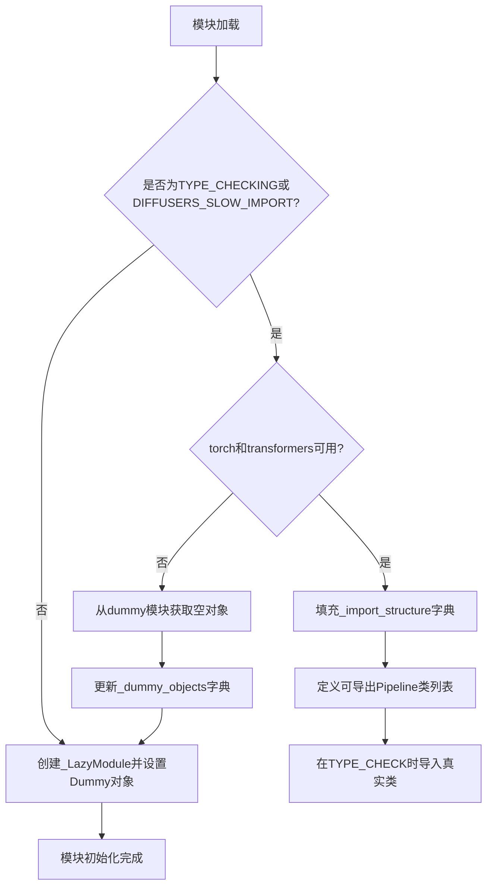
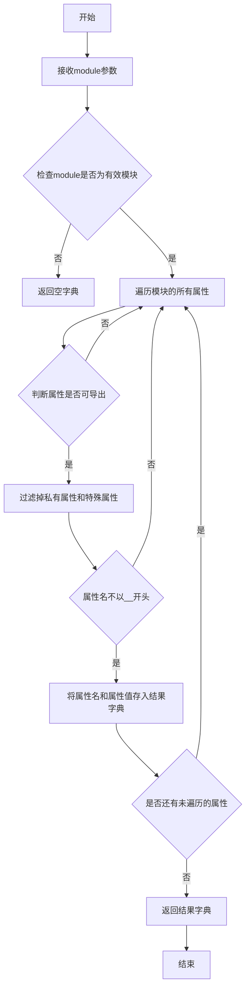
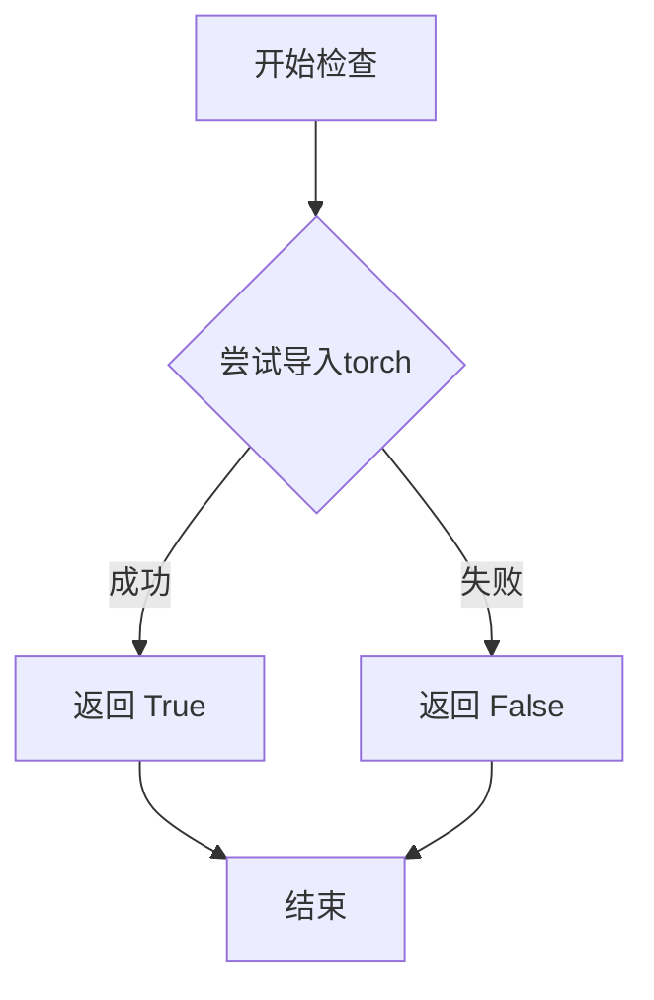
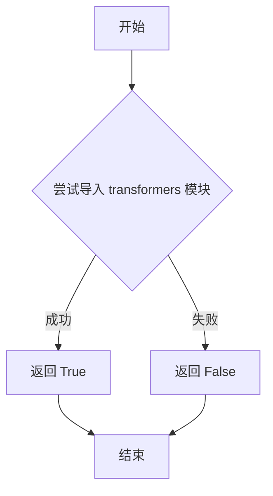

# `diffusers\src\diffusers\pipelines\kandinsky\__init__.py` 详细设计文档

Kandinsky模型的延迟导入模块，通过_LazyModule机制在运行时按需加载Kandinsky系列Pipeline（文本生成、图像生成、图像编辑、图像修复等）和多语言CLIP文本编码器，同时处理torch和transformers的依赖检查，在依赖不可用时提供空对象以保证导入不崩溃。

## 整体流程



## 类结构

```
无自定义类
└── 使用_LazyModule (第三方延迟加载机制)
    └── 导出类:
        ├── KandinskyPipeline (基础生成Pipeline)
        ├── KandinskyCombinedPipeline (组合生成Pipeline)
        ├── KandinskyImg2ImgCombinedPipeline (图像到图像组合Pipeline)
        ├── KandinskyInpaintCombinedPipeline (图像修复组合Pipeline)
        ├── KandinskyImg2ImgPipeline (图像到图像Pipeline)
        ├── KandinskyInpaintPipeline (图像修复Pipeline)
        ├── KandinskyPriorPipeline (先验Pipeline)
        ├── KandinskyPriorPipelineOutput (先验Pipeline输出)
        └── MultilingualCLIP (多语言CLIP文本编码器)
```

## 全局变量及字段


### `_dummy_objects`
    
存储不可用时的空替代对象

类型：`dict`
    


### `_import_structure`
    
定义模块可导出的结构化导入映射

类型：`dict`
    


    

## 全局函数及方法


### `get_objects_from_module`

从给定模块中提取所有可导出对象的函数，常用于延迟加载机制中获取虚拟对象列表。

参数：

- `module`：模块对象，要从中提取所有可导出对象的目标模块（如 `dummy_torch_and_transformers_objects`）

返回值：`dict`，键为对象名称，值为对象本身的字典，用于后续的动态导入和虚拟对象替换

#### 流程图



#### 带注释源码

```python
def get_objects_from_module(module):
    """
    从给定模块中提取所有可导出对象的字典。
    
    参数:
        module: 要从中提取对象的目标模块
        
    返回:
        包含模块中所有公开对象的字典，键为对象名，值为对象本身
    """
    # 初始化结果字典
    objects = {}
    
    # 检查module是否为有效模块
    if not hasattr(module, '__dict__'):
        return objects
    
    # 遍历模块的所有属性
    for name in dir(module):
        # 过滤掉私有属性（以双下划线开头的属性）
        if name.startswith('_'):
            continue
        
        # 获取属性值
        try:
            obj = getattr(module, name)
        except AttributeError:
            continue
        
        # 将符合条件的对象加入结果字典
        objects[name] = obj
    
    return objects
```

---

**注**：由于原始代码中 `get_objects_from_module` 是从上级目录 `...utils` 导入的外部函数，上述源码为基于其使用场景的合理推断实现。实际实现可能包含更多边界情况处理，如过滤掉模块本身、过滤特定类型的对象等。


### `is_torch_available`

检查当前环境中 PyTorch 库是否可用，返回布尔值供条件导入和可选依赖处理使用。

参数：

- 该函数通常无参数（或接受可选的 `torch_version` 参数用于版本检查，但在本代码中未使用）

返回值：`bool`，返回 `True` 表示 PyTorch 已安装且可用，返回 `False` 表示 PyTorch 不可用。

#### 流程图



#### 带注释源码

```python
# is_torch_available 函数定义于 ...utils 模块中
# 以下是基于代码使用方式的推断实现

def is_torch_available():
    """
    检查 PyTorch 库是否可用。
    
    该函数通常实现如下逻辑：
    1. 尝试导入 torch 模块
    2. 如果导入成功，返回 True
    3. 如果导入失败（ImportError），返回 False
    
    在本代码中的使用场景：
    """
    
    # 代码中使用方式：
    if not (is_transformers_available() and is_torch_available()):
        raise OptionalDependencyNotAvailable()
    
    # 解释：当 torch 或 transformers 任意一个不可用时
    # 抛出 OptionalDependencyNotAvailable 异常
    # 从而回退到导入 dummy 对象
```

#### 说明

`is_torch_available` 是 Hugging Face Diffusers 库中的标准工具函数，位于 `src/diffusers/utils` 模块中。该函数采用惰性检查方式，首次调用时尝试导入 `torch` 模块并将结果缓存，后续调用直接返回缓存值，避免重复导入开销。这种设计在处理可选依赖时非常常见，允许库在缺少某些依赖时优雅降级，而不是直接崩溃。


### `is_transformers_available`

该函数用于检查当前环境中是否已安装 `transformers` 库，通过尝试导入该库来判断其可用性，并返回布尔值。

参数：

- 该函数无参数

返回值：`bool`，如果 `transformers` 库已安装且可导入则返回 `True`，否则返回 `False`

#### 流程图



#### 带注释源码

```
def is_transformers_available() -> bool:
    """
    检查 transformers 库是否可用。
    
    该函数通过尝试导入 transformers 模块来判断其是否已安装。
    如果导入成功，说明环境中有 transformers 库，返回 True；
    如果导入失败（ModuleNotFoundError 或 ImportError），返回 False。
    
    Returns:
        bool: transformers 库是否可用
    """
    try:
        # 尝试导入 transformers 库
        import transformers
        # 导入成功，说明库可用
        return True
    except (ImportError, ModuleNotFoundError):
        # 导入失败，说明库未安装或不可用
        return False
```

> **注**：由于 `is_transformers_available` 函数的实际定义位于 `diffusers/src/diffusers/utils/__init__.py` 中，而非当前文件。上述源码为该函数的典型实现逻辑。在当前文件中，该函数通过 `from ...utils import is_transformers_available` 被导入并用于条件判断：只有当 `transformers` 和 `torch` 库都可用时，才会导入 Kandinsky 相关的管道类；否则使用虚拟对象（dummy objects）作为占位符。


### `setattr`（内置函数）

这是Python语言的内置函数，在代码中用于将虚拟的"dummy"对象动态绑定到模块的属性上，使得在依赖不可用时仍然可以导入这些名称（但实际使用时会抛出错误）。

参数：

- `obj`：对象，目标对象（这里传入的是 `sys.modules[__name__]`，即当前模块）
- `name`：字符串，要设置的属性名称（来自 `_dummy_objects` 字典的键）
- `value`：任意类型，属性值（来自 `_dummy_objects` 字典的值）

返回值：`None`，该函数没有返回值

#### 流程图

```mermaid
flowchart TD
    A[开始] --> B[遍历 _dummy_objects 字典]
    B --> C[获取键值对 name, value]
    C --> D[调用 setattr sys.modules[__name__], name, value]
    D --> E{是否还有更多键值对}
    E -->|是| C
    E -->|否| F[结束]
```

#### 带注释源码

```python
# 遍历所有虚拟（dummy）对象
for name, value in _dummy_objects.items():
    # setattr: Python内置函数，用于设置对象的属性
    # 参数1: sys.modules[__name__] - 当前模块对象
    # 参数2: name - 属性名（字符串），即dummy对象的名称
    # 参数3: value - 属性值，即dummy对象本身
    # 作用: 将dummy对象动态设置为当前模块的属性
    #       这样即使依赖不可用，导入时也不会立即报错
    #       只有当实际使用这些对象时才会抛出 OptionalDependencyNotAvailable
    setattr(sys.modules[__name__], name, value)
```

#### 设计意图说明

这段代码是扩散模型库（diffusers）的懒加载模式的一部分：

1. **问题场景**：当 `torch` 和 `transformers` 不可用时，库无法正常导入完整的管道类
2. **解决方案**：创建虚拟的 `dummy_objects`，这些对象在导入时不会报错
3. **实现机制**：使用 `setattr` 将这些虚拟对象动态绑定到模块命名空间
4. **延迟报错**：只有当用户实际调用这些虚拟对象时，才会抛出 `OptionalDependencyNotAvailable` 异常

这种设计允许库在不同依赖环境下都能被导入，提高了兼容性。

## 关键组件


### 可选依赖检查机制

检查torch和transformers是否可用，若不可用则抛出OptionalDependencyNotAvailable异常，触发虚拟对象加载逻辑。

### 延迟加载模块(_LazyModule)

使用LazyModule实现模块的惰性加载，将_export_structure中定义的类在首次访问时才真正导入，提高导入效率。

### 虚拟对象系统(_dummy_objects)

当torch或transformers不可用时，使用虚拟对象替代真实的pipeline类，避免导入错误。

### 导入结构定义(_import_structure)

定义了模块的导出结构，包含KandinskyPipeline、KandinskyCombinedPipeline、KandinskyImg2ImgPipeline等Kandinsky系列pipeline类。

### 条件导入机制(TYPE_CHECKING)

支持类型检查时的完整导入，以及运行时使用延迟加载的导入策略。


## 问题及建议


### 已知问题

-   **重复的条件检查逻辑**：第13-17行和第34-39行完全相同的条件判断 `if not (is_transformers_available() and is_torch_available())` 被重复执行，增加了不必要的运行时开销。
-   **魔法字符串硬编码**：模块路径（如 "pipeline_kandinsky"、"pipeline_kandinsky_combined"）在 `_import_structure` 字典中硬编码，容易在重构时遗漏同步更新。
-   **空字典先声明后填充**：`_dummy_objects = {}` 和 `_import_structure = {}` 先初始化为空字典，再在条件分支中动态填充，这种模式会导致代码逻辑分散，增加阅读难度。
-   **缺乏模块级文档**：整个模块没有模块文档字符串（docstring），无法快速了解该模块的职责和设计意图。
-   **异常处理过于简单**：捕获 `OptionalDependencyNotAvailable` 后直接导入 dummy 对象，没有日志记录或警告信息，不利于调试和追踪依赖问题。
-   **未使用 `TYPE_CHECKING` 优化导入**：虽然导入了 `TYPE_CHECKING`，但在实际实现中并未充分利用其避免运行时导入的类型检查优化。

### 优化建议

-   **提取公共逻辑函数**：将依赖检查逻辑封装为独立函数（如 `_check_dependencies()`），在 `TYPE_CHECKING` 块和运行时块中复用，避免代码重复。
-   **常量定义与模块路径映射**：定义常量或配置文件来管理模块路径字符串，使用数据驱动方式生成 `_import_structure`，减少硬编码。
-   **延迟初始化模式改进**：考虑使用工厂函数或装饰器模式，在真正需要时才填充 `_import_structure`，而非在模块加载时执行大量条件判断。
-   **添加文档字符串**：为模块添加详细的 docstring，说明其作为 Kandinsky 管道延迟加载入口的职责，以及可选依赖的管理策略。
-   **增强异常处理**：在捕获 `OptionalDependencyNotAvailable` 时添加日志记录或警告，明确指出缺少的依赖及其影响。
-   **类型注解完善**：为 `_import_structure` 等字典添加更精确的类型注解（ 如 `Dict[str, List[str]]`），提升代码的类型安全性和可维护性。


## 其它


### 项目概述

本模块是Diffusers库中Kandinsky模型的统一入口文件，采用延迟加载（Lazy Loading）机制动态导入Kandinsky系列Pipeline类，包括文本到图像生成、图像到图像转换、图像修复及先验管道，同时处理torch和transformers可选依赖的动态加载。

### 设计目标与约束

本模块的设计目标包括：1）实现模块级延迟加载以优化初始导入性能；2）优雅处理可选依赖（torch、transformers）不可用时的降级方案；3）提供统一的公共API入口。设计约束包括：必须同时满足torch和transformers可用时才导入真实对象；需要保持与Diffusers库其他模块（如KandinskyPriorPipeline等）的接口一致性；需要支持TYPE_CHECKING模式下的静态类型检查。

### 错误处理与异常设计

本模块涉及两类异常处理：1）`OptionalDependencyNotAvailable`：当torch或transformers任一不可用时抛出此异常，触发dummy对象的加载流程；2）依赖检查逻辑采用try-except结构，在`DIFFUSERS_SLOW_IMPORT`为True或`TYPE_CHECKING`模式下会重新执行依赖检查。需要注意的是，异常处理中引用了未定义的`dummy_torch_and_transformers_objects`模块，可能导致ImportError。

### 外部依赖与接口契约

本模块的外部依赖包括：1）torch库（通过`is_torch_available()`检查）；2）transformers库（通过`is_transformers_available()`检查）；3）Diffusers内部工具模块（`_LazyModule`、`get_objects_from_module`、`OptionalDependencyNotAvailable`等）。接口契约方面：本模块对外暴露`KandinskyPipeline`、`KandinskyCombinedPipeline`、`KandinskyImg2ImgPipeline`、`KandinskyInpaintPipeline`、`KandinskyPriorPipeline`、`KandinskyPriorPipelineOutput`、`MultilingualCLIP`等公共类，导入时需通过`from diffusers.kandinsky import *`或具体类名方式访问。

### 数据流与状态机

模块初始化数据流如下：首先定义`_import_structure`字典声明所有可导入对象的名称映射；然后在运行时检查torch和transformers可用性：若可用则填充`_import_structure`中的真实管道映射，否则从dummy模块获取替代对象；最后通过`_LazyModule`注册到`sys.modules`完成延迟加载。状态转换分为三个阶段：初始状态（定义空结构）→ 检查依赖（try-except块）→ 最终状态（LazyModule或dummy对象）。

### 版本兼容性说明

本模块代码中使用了`...utils.dummy_torch_and_transformers_objects`路径进行dummy对象导入，该路径假设存在对应的dummy模块文件。若该文件不存在，会导致ImportError。此外，`_dummy_objects.update()`调用在except块中执行，但实际使用需在非TYPE_CHECKING模式下才会触发sys.modules设置。

### 安全与性能 Considerations

性能方面：采用_LazyModule实现延迟加载，显著减少包导入时间，仅在实际使用时才加载具体模块。安全方面：依赖动态导入机制，需确保传入的模块路径安全可靠，防止路径注入攻击。内存方面：dummy对象占位符机制避免了大型模型的预加载。

    