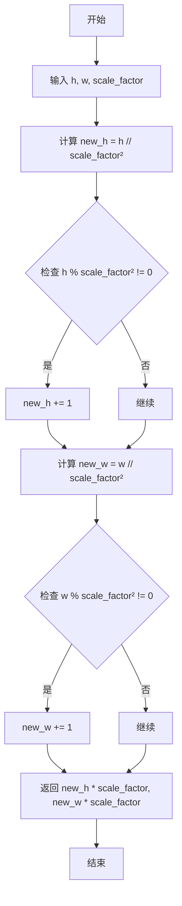
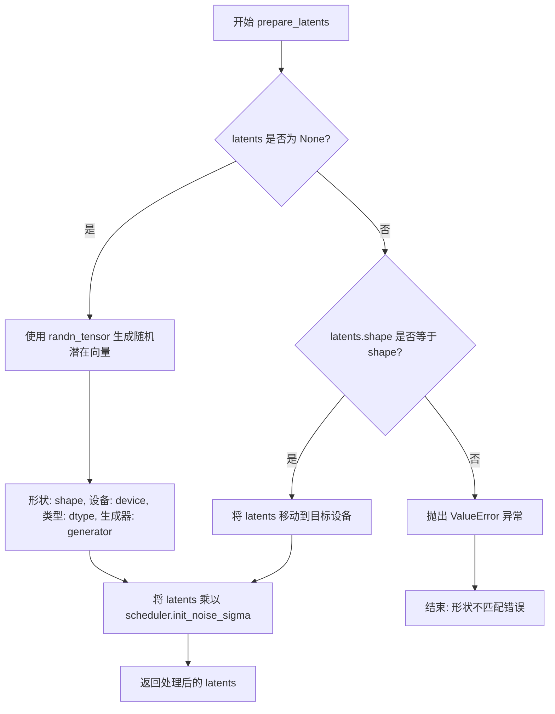
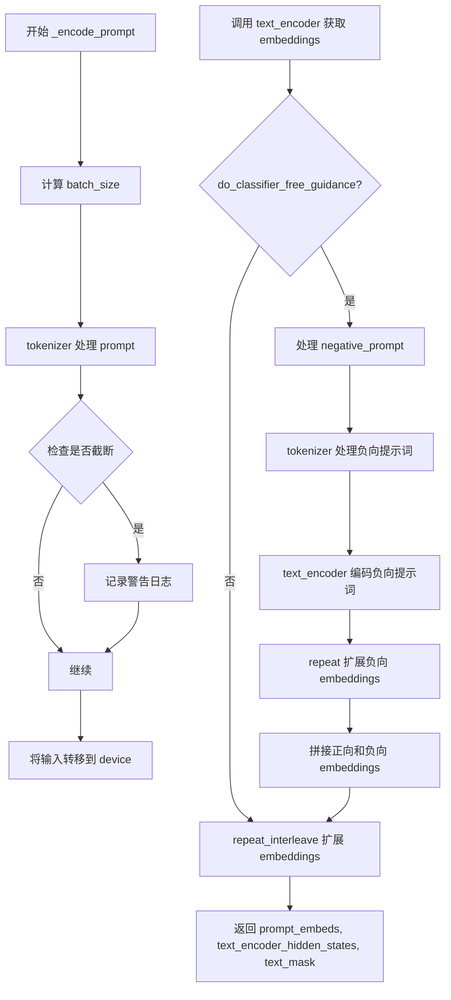

# `diffusers\src\diffusers\pipelines\kandinsky\pipeline_kandinsky.py` 详细设计文档

Kandinsky Pipeline 是一个基于扩散模型的文本到图像生成pipeline，它结合了CLIP多语言文本编码器、条件U-Net去噪网络和MoVQ解码器，通过DDIM或DDPM调度器实现高质量图像合成，支持分类器自由引导（CFG）来增强生成效果。

## 整体流程

```mermaid
graph TD
A[开始: 调用__call__] --> B{检查prompt类型}
B -->|str| C[batch_size=1]
B -->|list| D[batch_size=len(prompt)]
B -->|其他| E[抛出ValueError]
C --> F[计算device和batch_size]
D --> F
F --> G[_encode_prompt: 编码文本prompt]
G --> H[处理image_embeds和negative_image_embeds]
H --> I[设置调度器时间步]
I --> J[prepare_latents: 准备初始噪声]
J --> K{迭代每个时间步}
K -->|是| L[扩展latents用于CFG]
L --> M[UNet去噪预测]
M --> N[执行CFG计算]
N --> O[scheduler.step: 计算上一时刻latent]
O --> K
K -->|否| P[movq.decode: 解码latents为图像]
P --> Q[后处理: 转换为np/pil格式]
Q --> R[返回ImagePipelineOutput或tuple]
```

## 类结构

```
DiffusionPipeline (抽象基类)
└── KandinskyPipeline (文本到图像生成pipeline)
```

## 全局变量及字段


### `logger`
    
模块级日志记录器，用于输出警告和信息

类型：`logging.Logger`
    


### `EXAMPLE_DOC_STRING`
    
示例文档字符串，包含KandinskyPipeline的使用示例代码

类型：`str`
    


### `XLA_AVAILABLE`
    
标志位，表示PyTorch XLA是否可用

类型：`bool`
    


### `get_new_h_w`
    
根据尺度因子计算调整后的图像高度和宽度

类型：`Callable[[int, int, int], tuple[int, int]]`
    


### `KandinskyPipeline.model_cpu_offload_seq`
    
模型CPU卸载顺序配置，指定text_encoder->unet->movq的卸载序列

类型：`str`
    


### `KandinskyPipeline.text_encoder`
    
多语言CLIP文本编码器，用于将文本提示编码为向量表示

类型：`MultilingualCLIP`
    


### `KandinskyPipeline.tokenizer`
    
XLM-RoBERTa分词器，用于对文本提示进行分词和编码

类型：`XLMRobertaTokenizer`
    


### `KandinskyPipeline.unet`
    
条件U-Net去噪模型，用于根据文本和图像嵌入逐步去噪生成图像潜在表示

类型：`UNet2DConditionModel`
    


### `KandinskyPipeline.scheduler`
    
扩散调度器，用于控制去噪过程中的噪声调度和时间步

类型：`DDIMScheduler | DDPMScheduler`
    


### `KandinskyPipeline.movq`
    
MoVQ解码器，用于将潜在表示解码为最终图像

类型：`VQModel`
    


### `KandinskyPipeline.movq_scale_factor`
    
MoVQ尺度因子，用于计算潜在空间的尺寸

类型：`int`
    
    

## 全局函数及方法


### `get_new_h_w`

该函数用于根据缩放因子（scale_factor）计算新的高度和宽度。它通过先将输入尺寸除以 scale_factor 的平方来实现上采样前的尺寸计算，如果不能整除则向上取整，最后再乘以 scale_factor 得到最终的潜在空间尺寸。这个函数通常在扩散模型的pipeline中用于将输入图像尺寸转换为潜在空间的尺寸。

参数：

- `h`：`int`，输入图像的高度（像素单位）
- `w`：`int`，输入图像的宽度（像素单位）
- `scale_factor`：`int`（默认值为8），缩放因子，用于计算潜在空间的尺寸

返回值：`tuple[int, int]`，返回计算后的新高度和新宽度（元组形式：(new_h, new_w)）

#### 流程图



#### 带注释源码

```python
def get_new_h_w(h, w, scale_factor=8):
    """
    根据缩放因子计算新的高度和宽度
    
    该函数用于将像素空间的图像尺寸转换为潜在空间（latent space）的尺寸。
    核心逻辑是先除以 scale_factor 的平方（因为潜在空间通常有 8x8 的下采样率），
    向上取整后再乘以 scale_factor，确保尺寸对齐。
    
    Args:
        h: 输入的高度（像素）
        w: 输入的宽度（像素）
        scale_factor: 缩放因子，默认为8（对应 VAE 的 8x 下采样）
    
    Returns:
        tuple: (new_h, new_w) 转换后的潜在空间尺寸
    """
    # 计算高度：先除以 scale_factor 的平方
    new_h = h // scale_factor**2
    # 如果高度不能被 scale_factor 的平方整除，向上取整
    if h % scale_factor**2 != 0:
        new_h += 1
    
    # 计算宽度：先除以 scale_factor 的平方
    new_w = w // scale_factor**2
    # 如果宽度不能被 scale_factor 的平方整除，向上取整
    if w % scale_factor**2 != 0:
        new_w += 1
    
    # 返回乘以 scale_factor 后的最终尺寸
    return new_h * scale_factor, new_w * scale_factor
```


### `KandinskyPipeline.__init__`

该方法是 `KandinskyPipeline` 类的构造函数，用于初始化文本到图像生成管道。它接收预训练的语言编码器、分词器、UNet 模型、调度器和 VQ 解码器，并通过调用父类的 `__init__` 和 `register_modules` 方法将这些组件注册到管道中，同时计算 MoVQ 的缩放因子以用于后续的潜在空间处理。

参数：

- `text_encoder`：`MultilingualCLIP`，多语言 CLIP 文本编码器，用于将文本提示转换为文本嵌入向量
- `tokenizer`：`XLMRobertaTokenizer`，XLM-RoBERTa 分词器，用于将文本字符串分词为 token ID
- `unet`：`UNet2DConditionModel`，条件 UNet 模型，用于对图像潜在表示进行去噪处理
- `scheduler`：`DDIMScheduler | DDPMScheduler`，调度器，用于控制去噪过程中的噪声调度策略
- `movq`：`VQModel`，MoVQ 解码器，用于将去噪后的潜在表示解码为最终图像

返回值：无（`None`），构造函数不返回值，仅初始化对象状态

#### 流程图

```mermaid
flowchart TD
    A[开始 __init__] --> B[调用 super().__init__ 初始化父类]
    B --> C[调用 register_modules 注册五个模块]
    C --> D[计算 movq_scale_factor]
    D --> E[结束]
    
    C --> C1[注册 text_encoder]
    C --> C2[注册 tokenizer]
    C --> C3[注册 unet]
    C --> C4[注册 scheduler]
    C --> C5[注册 movq]
```

#### 带注释源码

```python
def __init__(
    self,
    text_encoder: MultilingualCLIP,
    tokenizer: XLMRobertaTokenizer,
    unet: UNet2DConditionModel,
    scheduler: DDIMScheduler | DDPMScheduler,
    movq: VQModel,
):
    """
    初始化 KandinskyPipeline 管道
    
    参数:
        text_encoder: 多语言 CLIP 文本编码器模型
        tokenizer: XLM-RoBERTa 分词器
        unet: 条件 UNet 去噪模型
        scheduler: DDIM 或 DDPM 调度器
        movq: MoVQ 解码器模型
    """
    # 调用父类 DiffusionPipeline 的构造函数
    # 初始化基础管道功能（如设备管理、模型钩子等）
    super().__init__()

    # 将传入的各个模块注册到当前管道对象中
    # 这使得可以通过 self.text_encoder, self.tokenizer 等方式访问
    # 同时注册操作会设置模型的设备和数据类型
    self.register_modules(
        text_encoder=text_encoder,
        tokenizer=tokenizer,
        unet=unet,
        scheduler=scheduler,
        movq=movq,
    )
    
    # 计算 MoVQ 的缩放因子
    # 基于 VQModel 的 block_out_channels 配置计算下采样比例
    # 这用于后续将输入图像尺寸转换为潜在空间的尺寸
    # 例如：如果 block_out_channels 为 [128, 256, 512, 512]，则 len=4
    # 缩放因子为 2^(4-1) = 8
    self.movq_scale_factor = 2 ** (len(self.movq.config.block_out_channels) - 1)
```


### `KandinskyPipeline.prepare_latents`

该方法负责为扩散模型生成或验证初始潜在向量（latents），确保潜在向量具有正确的形状、数据类型和设备，并使用调度器的初始噪声 sigma 进行缩放。

参数：

- `shape`：`tuple`，期望生成的潜在向量的形状，通常为 `(batch_size, num_channels_latents, height, width)`
- `dtype`：`torch.dtype`，潜在向量的目标数据类型，通常与文本编码器隐藏状态的数据类型一致
- `device`：`torch.device`，潜在向量应放置的目标设备（如 CUDA 或 CPU）
- `generator`：`torch.Generator | None`，用于生成确定性随机数的 PyTorch 生成器，如果为 `None` 则使用随机种子
- `latents`：`torch.Tensor | None`，用户提供的潜在向量，如果为 `None` 则自动生成随机潜在向量
- `scheduler`：`DDIMScheduler | DDPMScheduler`，扩散模型调度器，用于获取初始噪声 sigma 值

返回值：`torch.Tensor`，处理后的潜在向量，已根据调度器的初始噪声 sigma 进行缩放

#### 流程图



#### 带注释源码

```python
def prepare_latents(self, shape, dtype, device, generator, latents, scheduler):
    """
    准备扩散模型的初始潜在向量
    
    参数:
        shape: 期望的潜在向量形状 (batch_size, channels, height, width)
        dtype: 潜在向量的数据类型
        device: 目标设备
        generator: 随机数生成器，用于 reproducibility
        latents: 用户提供的潜在向量，如果为 None 则自动生成
        scheduler: 扩散调度器，用于获取初始噪声 sigma
    
    返回:
        处理后的潜在向量
    """
    # 如果没有提供 latents，则使用 randn_tensor 生成随机潜在向量
    if latents is None:
        latents = randn_tensor(shape, generator=generator, device=device, dtype=dtype)
    else:
        # 验证用户提供的 latents 形状是否匹配预期
        if latents.shape != shape:
            raise ValueError(f"Unexpected latents shape, got {latents.shape}, expected {shape}")
        # 将已有的 latents 移动到目标设备
        latents = latents.to(device)

    # 使用调度器的初始噪声 sigma 缩放潜在向量
    # 这确保了潜在向量与调度器的噪声计划一致
    latents = latents * scheduler.init_noise_sigma
    return latents
```


### `KandinskyPipeline._encode_prompt`

该方法负责将文本提示词（prompt）编码为模型可用的嵌入向量（embeddings），包括处理正向提示词和负向提示词（用于 classifier-free guidance），并根据 num_images_per_prompt 复制嵌入向量以支持批量生成图像。

参数：

- `prompt`：`str | list[str]`，要编码的文本提示词，可以是单个字符串或字符串列表
- `device`：`torch.device`，用于计算的设备（如 CUDA 或 CPU）
- `num_images_per_prompt`：`int`，每个提示词需要生成的图像数量，用于扩展嵌入维度
- `do_classifier_free_guidance`：`bool`，是否启用无分类器引导（CFG），为 True 时会处理负向提示词
- `negative_prompt`：`str | list[str] | None`，可选的负向提示词，用于引导模型避免生成不希望的内容

返回值：`tuple[torch.Tensor, torch.Tensor, torch.Tensor]`，返回一个包含三个元素的元组：

- `prompt_embeds`：`torch.Tensor`，编码后的提示词嵌入向量
- `text_encoder_hidden_states`：`torch.Tensor`，文本编码器的隐藏状态
- `text_mask`：`torch.Tensor`，用于指示有效 token 的注意力掩码

#### 流程图



#### 带注释源码

```python
def _encode_prompt(
    self,
    prompt,                          # 输入的文本提示词，str 或 list[str]
    device,                         # 计算设备 torch.device
    num_images_per_prompt,          # 每个提示词生成的图像数量 int
    do_classifier_free_guidance,    # 是否使用无分类器引导 bool
    negative_prompt=None,           # 可选的负向提示词 str|list[str]|None
):
    # 根据 prompt 类型确定批次大小，如果是列表则取其长度，否则默认为 1
    batch_size = len(prompt) if isinstance(prompt, list) else 1
    
    # 使用 tokenizer 将 prompt 转换为模型输入格式
    # padding="max_length": 填充到最大长度 77
    # truncation=True: 截断超长序列
    # max_length=77: CLIP 模型的最大序列长度
    # return_attention_mask=True: 返回注意力掩码
    # add_special_tokens=True: 添加特殊 tokens（如 [CLS], [SEP]）
    # return_tensors="pt": 返回 PyTorch 张量
    text_inputs = self.tokenizer(
        prompt,
        padding="max_length",
        truncation=True,
        max_length=77,
        return_attention_mask=True,
        add_special_tokens=True,
        return_tensors="pt",
    )

    # 获取输入 IDs 和注意力掩码
    text_input_ids = text_inputs.input_ids
    # 使用 longest padding 方式获取未截断的序列，用于检测是否发生了截断
    untruncated_ids = self.tokenizer(prompt, padding="longest", return_tensors="pt").input_ids

    # 检查是否发生了截断（CLIP 只能处理 max_length 以内的 token）
    # 如果未截断的序列长度 >= 截断后的长度，且两者不相等，说明有内容被截断
    if untruncated_ids.shape[-1] >= text_input_ids.shape[-1] and not torch.equal(text_input_ids, untruncated_ids):
        # 解码被截断的部分并记录警告
        removed_text = self.tokenizer.batch_decode(untruncated_ids[:, self.tokenizer.model_max_length - 1 : -1])
        logger.warning(
            "The following part of your input was truncated because CLIP can only handle sequences up to"
            f" {self.tokenizer.model_max_length} tokens: {removed_text}"
        )

    # 将输入转移到指定设备
    text_input_ids = text_input_ids.to(device)
    text_mask = text_inputs.attention_mask.to(device)

    # 调用多语言 CLIP 文本编码器获取文本嵌入
    # 返回: prompt_embeds (文本嵌入) 和 text_encoder_hidden_states (隐藏状态)
    prompt_embeds, text_encoder_hidden_states = self.text_encoder(
        input_ids=text_input_ids, attention_mask=text_mask
    )

    # 根据 num_images_per_prompt 复制嵌入向量，dim=0 表示在批次维度复制
    # 这允许一次生成多张图像
    prompt_embeds = prompt_embeds.repeat_interleave(num_images_per_prompt, dim=0)
    text_encoder_hidden_states = text_encoder_hidden_states.repeat_interleave(num_images_per_prompt, dim=0)
    text_mask = text_mask.repeat_interleave(num_images_per_prompt, dim=0)

    # 如果启用无分类器引导（CFG），需要处理负向提示词
    if do_classifier_free_guidance:
        # 定义 uncond_tokens 列表用于存储负向提示词
        uncond_tokens: list[str]
        
        # 处理不同的 negative_prompt 输入类型
        if negative_prompt is None:
            # 如果没有提供负向提示词，使用空字符串
            uncond_tokens = [""] * batch_size
        elif type(prompt) is not type(negative_prompt):
            # 类型不匹配时抛出异常
            raise TypeError(
                f"`negative_prompt` should be the same type to `prompt`, but got {type(negative_prompt)} !="
                f" {type(prompt)}."
            )
        elif isinstance(negative_prompt, str):
            # 单个字符串转为列表
            uncond_tokens = [negative_prompt]
        elif batch_size != len(negative_prompt):
            # 批次大小不匹配时抛出异常
            raise ValueError(
                f"`negative_prompt`: {negative_prompt} has batch size {len(negative_prompt)}, but `prompt`:"
                f" {prompt} has batch size {batch_size}. Please make sure that passed `negative_prompt` matches"
                " the batch size of `prompt`."
            )
        else:
            # negative_prompt 已经是列表
            uncond_tokens = negative_prompt

        # 对负向提示词进行 tokenizer 处理
        uncond_input = self.tokenizer(
            uncond_tokens,
            padding="max_length",
            max_length=77,
            truncation=True,
            return_attention_mask=True,
            add_special_tokens=True,
            return_tensors="pt",
        )
        # 转移到设备
        uncond_text_input_ids = uncond_input.input_ids.to(device)
        uncond_text_mask = uncond_input.attention_mask.to(device)

        # 编码负向提示词
        negative_prompt_embeds, uncond_text_encoder_hidden_states = self.text_encoder(
            input_ids=uncond_text_input_ids, attention_mask=uncond_text_mask
        )

        # 复制无条件嵌入以匹配生成数量
        # 使用 repeat 而不是 repeat_interleave，因为需要在序列维度复制
        seq_len = negative_prompt_embeds.shape[1]
        negative_prompt_embeds = negative_prompt_embeds.repeat(1, num_images_per_prompt)
        negative_prompt_embeds = negative_prompt_embeds.view(batch_size * num_images_per_prompt, seq_len)

        # 同样处理 text_encoder_hidden_states
        seq_len = uncond_text_encoder_hidden_states.shape[1]
        uncond_text_encoder_hidden_states = uncond_text_encoder_hidden_states.repeat(1, num_images_per_prompt, 1)
        uncond_text_encoder_hidden_states = uncond_text_encoder_hidden_states.view(
            batch_size * num_images_per_prompt, seq_len, -1
        )
        uncond_text_mask = uncond_text_mask.repeat_interleave(num_images_per_prompt, dim=0)

        # 拼接正向和无条件嵌入（用于 CFG 的双次前向传播）
        # 顺序很重要：先负向后正向，推理时用负向嵌入计算 noise_pred_uncond
        prompt_embeds = torch.cat([negative_prompt_embeds, prompt_embeds])
        text_encoder_hidden_states = torch.cat([uncond_text_encoder_hidden_states, text_encoder_hidden_states])

        # 拼接注意力掩码
        text_mask = torch.cat([uncond_text_mask, text_mask])

    # 返回编码后的嵌入和掩码
    return prompt_embeds, text_encoder_hidden_states, text_mask
```


### KandinskyPipeline.__call__

该方法是 Kandinsky 文本到图像生成管道的核心调用函数，接收提示词和预计算的 CLIP 图像嵌入作为条件输入，通过 DDIM 或 DDPM 调度器进行去噪迭代，最终使用 MoVQ 解码器将潜在向量解码为图像。

参数：

- `prompt`：`str | list[str]`，引导图像生成的提示词或提示词列表
- `image_embeds`：`torch.Tensor | list[torch.Tensor]`，用于条件图像生成的 CLIP 图像嵌入
- `negative_image_embeds`：`torch.Tensor | list[torch.Tensor]`，用于条件图像生成的负向 CLIP 图像嵌入
- `negative_prompt`：`str | list[str] | None`，可选的不引导图像生成的提示词
- `height`：`int`，生成图像的高度，默认为 512
- `width`：`int`，生成图像的宽度，默认为 512
- `num_inference_steps`：`int`，去噪步数，默认为 100
- `guidance_scale`：`float`，分类器自由引导比例，默认为 4.0
- `num_images_per_prompt`：`int`，每个提示词生成的图像数量，默认为 1
- `generator`：`torch.Generator | list[torch.Generator] | None`，用于生成确定性结果的随机生成器
- `latents`：`torch.Tensor | None`，预生成的噪声潜在向量
- `output_type`：`str | None`，输出格式，可选 "pil"、"np" 或 "pt"，默认为 "pil"
- `callback`：`Callable[[int, int, torch.Tensor], None] | None`，推理过程中的回调函数
- `callback_steps`：`int`，回调函数调用频率，默认为 1
- `return_dict`：`bool`，是否返回字典格式，默认为 True

返回值：`ImagePipelineOutput | tuple`，生成的图像管道输出或包含图像的元组

#### 流程图

```mermaid
flowchart TD
    A[开始 __call__] --> B{验证 prompt 类型}
    B -->|str| C[batch_size = 1]
    B -->|list| D[batch_size = len(prompt)]
    B -->|其他| E[抛出 ValueError]
    C --> F[获取执行设备 device]
    D --> F
    F --> G[batch_size = batch_size * num_images_per_prompt]
    G --> H{guidance_scale > 1.0?}
    H -->|是| I[do_classifier_free_guidance = True]
    H -->|否| J[do_classifier_free_guidance = False]
    I --> K[_encode_prompt 编码提示词]
    J --> K
    K --> L[处理 image_embeds 和 negative_image_embeds]
    L --> M{do_classifier_free_guidance?}
    M -->|是| N[重复并拼接负向和正向嵌入]
    M -->|否| O[仅处理正向嵌入]
    N --> P[scheduler.set_timesteps 设置去噪步骤]
    O --> P
    P --> Q[计算新的 height 和 width]
    Q --> R[prepare_latents 准备初始潜在向量]
    R --> S[进入去噪循环: for t in timesteps]
    S --> T{do_classifier_free_guidance?}
    T -->|是| U[latent_model_input = torch.cat([latents] * 2)]
    T -->|否| V[latent_model_input = latents]
    U --> W[unet 预测噪声]
    V --> W
    W --> X{do_classifier_free_guidance?}
    X -->|是| Y[分割并应用引导公式]
    X -->|否| Z[直接使用噪声预测]
    Y --> AA[scheduler.step 计算上一步潜在向量]
    Z --> AA
    AA --> BB{callback 且 i % callback_steps == 0?}
    BB -->|是| CC[调用 callback 回调]
    BB -->|否| DD{XLA 可用?}
    CC --> DD
    DD -->|是| EE[xm.mark_step]
    DD -->|否| FF{循环结束?}
    EE --> FF
    FF -->|否| S
    FF -->|是| GG[movq.decode 解码潜在向量]
    GG --> HH{output_type 验证}
    HH -->|有效| II[根据 output_type 后处理图像]
    HH -->|无效| JJ[抛出 ValueError]
    II --> KK{return_dict?}
    JJ --> KK
    KK -->|是| LL[返回 ImagePipelineOutput]
    KK -->|否| MM[返回元组]
    LL --> NN[结束]
    MM --> NN
```

#### 带注释源码

```python
@torch.no_grad()
@replace_example_docstring(EXAMPLE_DOC_STRING)
def __call__(
    self,
    prompt: str | list[str],  # 引导图像生成的提示词
    image_embeds: torch.Tensor | list[torch.Tensor],  # CLIP图像嵌入用于条件生成
    negative_image_embeds: torch.Tensor | list[torch.Tensor],  # 负向CLIP图像嵌入
    negative_prompt: str | list[str] | None = None,  # 可选的负向提示词
    height: int = 512,  # 生成图像高度
    width: int = 512,  # 生成图像宽度
    num_inference_steps: int = 100,  # 去噪推理步数
    guidance_scale: float = 4.0,  # 分类器自由引导比例
    num_images_per_prompt: int = 1,  # 每个提示词生成图像数
    generator: torch.Generator | list[torch.Generator] | None = None,  # 随机生成器
    latents: torch.Tensor | None = None,  # 预生成噪声潜在向量
    output_type: str | None = "pil",  # 输出格式: pil/np/pt
    callback: Callable[[int, int, torch.Tensor], None] | None = None,  # 推理回调函数
    callback_steps: int = 1,  # 回调调用频率
    return_dict: bool = True,  # 是否返回字典格式
):
    """
    Function invoked when calling the pipeline for generation.
    """

    # 验证 prompt 类型并确定批次大小
    if isinstance(prompt, str):
        batch_size = 1
    elif isinstance(prompt, list):
        batch_size = len(prompt)
    else:
        raise ValueError(f"`prompt` has to be of type `str` or `list` but is {type(prompt)}")

    # 获取执行设备
    device = self._execution_device

    # 根据每个提示词生成图像数量调整批次大小
    batch_size = batch_size * num_images_per_prompt
    
    # 判断是否使用分类器自由引导
    do_classifier_free_guidance = guidance_scale > 1.0

    # 编码提示词获取文本嵌入和隐藏状态
    prompt_embeds, text_encoder_hidden_states, _ = self._encode_prompt(
        prompt, device, num_images_per_prompt, do_classifier_free_guidance, negative_prompt
    )

    # 将图像嵌入列表拼接为单个张量
    if isinstance(image_embeds, list):
        image_embeds = torch.cat(image_embeds, dim=0)
    if isinstance(negative_image_embeds, list):
        negative_image_embeds = torch.cat(negative_image_embeds, dim=0)

    # 如果使用分类器自由引导，重复并拼接负向和正向嵌入
    if do_classifier_free_guidance:
        image_embeds = image_embeds.repeat_interleave(num_images_per_prompt, dim=0)
        negative_image_embeds = negative_image_embeds.repeat_interleave(num_images_per_prompt, dim=0)

        image_embeds = torch.cat([negative_image_embeds, image_embeds], dim=0).to(
            dtype=prompt_embeds.dtype, device=device
        )

    # 设置调度器的推理步骤
    self.scheduler.set_timesteps(num_inference_steps, device=device)
    timesteps_tensor = self.scheduler.timesteps

    # 获取 UNet 的输入通道数
    num_channels_latents = self.unet.config.in_channels

    # 根据 MoVQ 缩放因子计算新的高度和宽度
    height, width = get_new_h_w(height, width, self.movq_scale_factor)

    # 准备初始潜在向量
    latents = self.prepare_latents(
        (batch_size, num_channels_latents, height, width),
        text_encoder_hidden_states.dtype,
        device,
        generator,
        latents,
        self.scheduler,
    )

    # 开始去噪循环
    for i, t in enumerate(self.progress_bar(timesteps_tensor)):
        # 如果使用分类器自由引导，扩展潜在向量
        latent_model_input = torch.cat([latents] * 2) if do_classifier_free_guidance else latents

        # 准备额外条件参数
        added_cond_kwargs = {"text_embeds": prompt_embeds, "image_embeds": image_embeds}
        
        # UNet 预测噪声
        noise_pred = self.unet(
            sample=latent_model_input,
            timestep=t,
            encoder_hidden_states=text_encoder_hidden_states,
            added_cond_kwargs=added_cond_kwargs,
            return_dict=False,
        )[0]

        # 如果使用分类器自由引导，执行引导处理
        if do_classifier_free_guidance:
            noise_pred, variance_pred = noise_pred.split(latents.shape[1], dim=1)
            noise_pred_uncond, noise_pred_text = noise_pred.chunk(2)
            _, variance_pred_text = variance_pred.chunk(2)
            # 应用引导公式: noise_pred = noise_pred_uncond + guidance_scale * (noise_pred_text - noise_pred_uncond)
            noise_pred = noise_pred_uncond + guidance_scale * (noise_pred_text - noise_pred_uncond)
            noise_pred = torch.cat([noise_pred, variance_pred_text], dim=1)

        # 如果调度器不是学习的方差类型，分割预测
        if not (
            hasattr(self.scheduler.config, "variance_type")
            and self.scheduler.config.variance_type in ["learned", "learned_range"]
        ):
            noise_pred, _ = noise_pred.split(latents.shape[1], dim=1)

        # 使用调度器计算上一步的潜在向量
        latents = self.scheduler.step(
            noise_pred,
            t,
            latents,
            generator=generator,
        ).prev_sample

        # 如果设置了回调且达到调用步数，调用回调函数
        if callback is not None and i % callback_steps == 0:
            step_idx = i // getattr(self.scheduler, "order", 1)
            callback(step_idx, t, latents)

        # 如果使用 XLA，进行标记步骤
        if XLA_AVAILABLE:
            xm.mark_step()

    # 解码潜在向量生成最终图像
    image = self.movq.decode(latents, force_not_quantize=True)["sample"]

    # 释放模型钩子
    self.maybe_free_model_hooks()

    # 验证输出类型
    if output_type not in ["pt", "np", "pil"]:
        raise ValueError(f"Only the output types `pt`, `pil` and `np` are supported not output_type={output_type}")

    # 后处理图像
    if output_type in ["np", "pil"]:
        # 将图像值从 [-1,1] 转换到 [0,1]
        image = image * 0.5 + 0.5
        image = image.clamp(0, 1)
        image = image.cpu().permute(0, 2, 3, 1).float().numpy()

    # 转换为 PIL 图像
    if output_type == "pil":
        image = self.numpy_to_pil(image)

    # 返回结果
    if not return_dict:
        return (image,)

    return ImagePipelineOutput(images=image)
```

## 关键组件


### 张量索引与重复操作

代码中大量使用张量索引与重复操作来支持批量生成和分类器自由引导，包括`repeat_interleave`、`repeat`、`view`、`chunk`、`split`等操作，用于扩展prompt嵌入和图像嵌入以匹配批量大小和每提示图像数量。

### 反量化支持

在movq.decode调用中使用`force_not_quantize=True`参数，强制不对量化后的潜在表示进行反量化处理，确保输出图像质量。

### 分类器自由引导实现

通过`do_classifier_free_guidance`标志控制，将负面提示与正面提示的嵌入进行拼接，在推理时同时处理条件和非条件预测，通过`guidance_scale`参数调整引导强度。

### 潜在变量准备与调度器集成

`prepare_latents`方法负责初始化或验证潜在变量张量，并与调度器（如DDIMScheduler或DDPMScheduler）集成，使用`scheduler.init_noise_sigma`进行噪声初始化。

### 提示编码与多语言支持

`_encode_prompt`方法使用MultilingualCLIP和XLMRobertaTokenizer对文本提示进行编码，处理填充、截断和注意力掩码，支持负面提示的嵌入生成。

### 图像分辨率动态调整

`get_new_h_w`函数根据缩放因子（默认8）动态计算新的高度和宽度，确保潜在空间的尺寸与输出图像尺寸匹配。

### 推理进度与回调机制

通过`progress_bar`包装调度器的时间步，并支持`callback`函数在每个`callback_steps`步骤被调用，用于监控推理进度。

### XLA设备支持

通过`is_torch_xla_available`检测TPU/XLA环境，使用`xm.mark_step()`优化TPU上的执行效率。


## 问题及建议


### 已知问题

- 硬编码的tokenizer最大长度：在`_encode_prompt`方法中，`max_length=77`被硬编码，应该使用`self.tokenizer.model_max_length`保持一致性（虽然后面警告信息中使用了该属性）
- 重复的tokenization逻辑：`_encode_prompt`中对prompt和negative_prompt的tokenization有大量重复代码，可以提取为私有辅助方法
- 设备转移逻辑问题：`prepare_latents`方法中当`latents`不为None时直接调用`latents.to(device)`，这可能覆盖generator设置的设备
- 浮点数直接比较：`do_classifier_free_guidance = guidance_scale > 1.0`使用浮点数直接比较，建议使用`guidance_scale > 1.0 + epsilon`
- 魔法数字：代码中存在多个未命名的常量（如`0.5`、`1`等），缺乏可读性
- 条件分支重复：在处理classifier-free guidance时，对`variance_pred`的chunk操作在多个条件分支中重复
- 缺乏类型提示：部分方法的局部变量缺少类型注解，影响代码可维护性
- 进度条依赖：使用`self.progress_bar()`但未在基类中确认该方法的存在

### 优化建议

- 提取`_encode_prompt`中的重复tokenization代码为私有方法`_tokenize_text`，提高代码复用性
- 将硬编码的数值（如`77`、`0.5`等）提取为类常量或配置参数
- 在`prepare_latents`中添加设备类型检查，确保generator和latents设备一致性
- 使用`torch.no_grad()`装饰器时考虑上下文管理器以更好地管理显存
- 考虑使用inplace操作减少内存占用，如`latents *= scheduler.init_noise_sigma`
- 添加更详细的异常信息和输入验证，提升调试体验
- 将浮点数比较改为带epsilon的比较方式：`guidance_scale > 1.0 + 1e-6`

## 其它


### 设计目标与约束

**设计目标**：实现基于Kandinsky 2.1模型的文本到图像生成pipeline，通过多语言CLIP文本编码器提取文本特征，结合图像嵌入（image_embeds）进行条件图像生成，支持classifier-free guidance以提升生成质量。

**核心约束**：
- 输入prompt需为str或list[str]类型
- 图像尺寸默认512x512，最小为8的倍数
- num_inference_steps默认100，支持自定义
- guidance_scale默认4.0，需大于1.0才启用classifier-free guidance
- 输出格式仅支持"pt"、"np"、"pil"三种
- 依赖transformers库的XLMRobertaTokenizer，模型最大长度77
- XLA设备支持需通过is_torch_xla_available()检测

### 错误处理与异常设计

**类型检查**：
- prompt类型必须为str或list，超出类型抛出ValueError
- negative_prompt类型必须与prompt类型一致，否则抛出TypeError
- output_type仅支持"pt"、"np"、"pil"，否则抛出ValueError

**形状验证**：
- latents形状必须与预期shape匹配，否则抛出ValueError
- negative_prompt的batch_size必须与prompt的batch_size一致，否则抛出ValueError

**长度截断警告**：
- 当输入文本超过tokenizer最大长度时，记录warning并截断

### 数据流与状态机

**主流程状态机**：
1. **INIT状态**：pipeline初始化，注册所有模块（text_encoder, tokenizer, unet, scheduler, movq）
2. **ENCODE状态**：调用_encode_prompt处理文本输入，生成prompt_embeds和text_encoder_hidden_states
3. **PREPARE_LATENTS状态**：根据输入尺寸生成初始噪声latents
4. **DENOISE状态**（循环）：遍历timesteps_tensor执行去噪步骤，包括：
   - latent_model_input扩展（classifier-free guidance时×2）
   - UNet前向传播预测噪声
   - classifier-free guidance计算
   - scheduler.step()更新latents
5. **DECODE状态**：调用movq.decode将latents解码为图像
6. **OUTPUT状态**：根据output_type转换图像格式并返回

### 外部依赖与接口契约

**核心依赖模块**：
- `transformers.XLMRobertaTokenizer`：文本tokenization
- `...models.UNet2DConditionModel`：条件U-Net去噪网络
- `...models.VQModel`：MoVQ解码器
- `...schedulers.DDIMScheduler/DDPMScheduler`：噪声调度器
- `...pipelines.pipeline_utils.DiffusionPipeline`：pipeline基类
- `...utils.torch_utils.randn_tensor`：随机张量生成
- `torch_xla`（可选）：XLA加速

**模块间接口契约**：
- text_encoder输入：input_ids(int64 tensor), attention_mask(int64 tensor)
- text_encoder输出：prompt_embeds(float32), text_encoder_hidden_states(float32)
- unet输入：sample, timestep, encoder_hidden_states, added_cond_kwargs
- unet输出：noise_pred (包含variance_pred)
- scheduler.step()输入：noise_pred, timestep, latents, generator
- scheduler.step()输出：prev_sample
- movq.decode输入：latents, force_not_quantize=True
- movq.decode输出：{"sample": image_tensor}

### 性能优化与资源管理

**内存优化**：
- 使用model_cpu_offload_seq定义模型卸载顺序："text_encoder->unet->movq"
- 通过maybe_free_model_hooks()在推理结束后释放模型钩子
- XLA环境下使用xm.mark_step()进行计算标记

**计算优化**：
- 使用torch.no_grad()装饰器禁用梯度计算
- 对classifier-free guidance使用单次前向传播而非两次
- 重复使用randn_tensor生成的随机数通过generator保证可复现性

### 并发与异步考虑

**XLA支持**：
- 通过XLA_AVAILABLE标志检测是否可用
- 在去噪循环中每步调用xm.mark_step()标记计算边界
- 与PyTorch原生设备（cuda/cpu）兼容

**Generator支持**：
- 支持传入单个或多个torch.Generator确保可复现生成
- latents可预生成并传入，实现相同prompt下的确定性输出

### 安全性与鲁棒性

**输入验证**：
- 严格的类型检查防止无效输入
- batch_size动态计算并传播到所有相关张量
- negative_prompt默认为空字符串列表

**设备迁移**：
- 通过self._execution_device自动获取执行设备
- 所有张量显式转移至目标设备（.to(device)）
- dtype根据prompt_embeds统一确定

### 配置与可扩展性

**Pipeline配置**：
- movq_scale_factor根据block_out_channels动态计算
- 支持DDIMScheduler和DDPMScheduler两种调度器
- 通过register_modules注册可替换模块

**回调机制**：
- 支持自定义callback函数进行进度监控
- callback_steps控制回调频率
- 回调参数包含step_idx, timestep, latents


    