# `diffusers\src\diffusers\pipelines\kandinsky\pipeline_kandinsky_combined.py` 详细设计文档

Kandinsky组合管道是一个多功能的扩散模型推理框架，整合了文本到图像、图像到图像和图像修复三种生成能力。该管道通过先验网络（Prior）生成图像嵌入，再通过解码器网络（Decoder）将嵌入解码为最终图像，实现了基于多语言CLIP文本编码器和VQVAE解码器的高质量图像生成。

## 整体流程

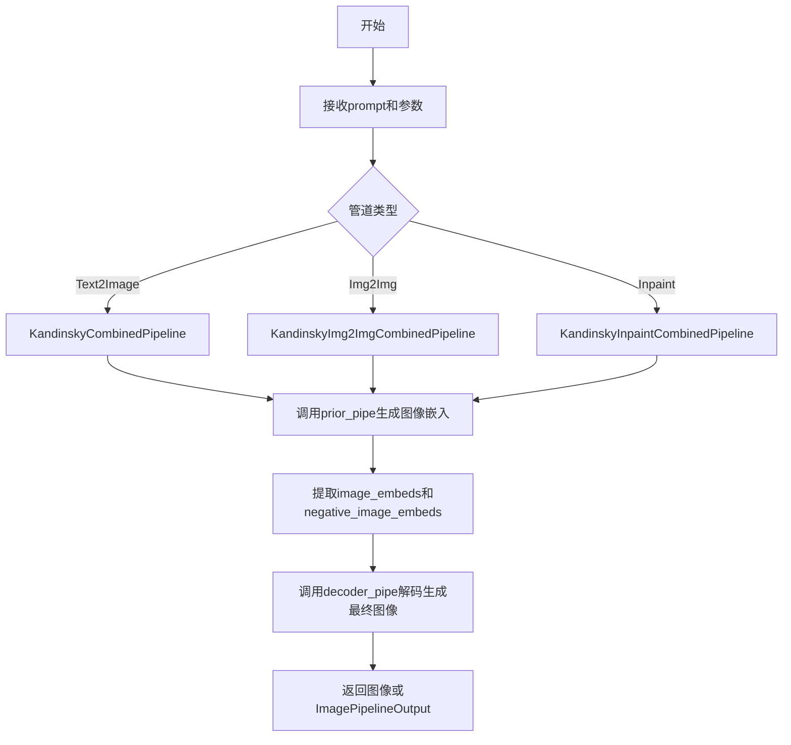

## 类结构

```
DiffusionPipeline (基类)
├── KandinskyCombinedPipeline (文本到图像)
├── KandinskyImg2ImgCombinedPipeline (图像到图像)
└── KandinskyInpaintCombinedPipeline (图像修复)
```

## 全局变量及字段


### `TEXT2IMAGE_EXAMPLE_DOC_STRING`
    
文本到图像生成的示例文档字符串，包含使用AutoPipelineForText2Image的代码示例

类型：`str`
    


### `IMAGE2IMAGE_EXAMPLE_DOC_STRING`
    
图像到图像生成的示例文档字符串，包含使用AutoPipelineForImage2Image的代码示例

类型：`str`
    


### `INPAINT_EXAMPLE_DOC_STRING`
    
图像修复生成的示例文档字符串，包含使用AutoPipelineForInpainting的代码示例

类型：`str`
    


### `KandinskyCombinedPipeline.text_encoder`
    
多语言CLIP文本编码器，用于将文本提示转换为嵌入向量

类型：`MultilingualCLIP`
    


### `KandinskyCombinedPipeline.tokenizer`
    
XLM-RoBERTa分词器，用于对文本进行分词和编码

类型：`XLMRobertaTokenizer`
    


### `KandinskyCombinedPipeline.unet`
    
条件UNet2D模型，用于去噪图像潜在表示

类型：`UNet2DConditionModel`
    


### `KandinskyCombinedPipeline.scheduler`
    
扩散调度器，用于控制去噪过程的噪声调度

类型：`DDIMScheduler | DDPMScheduler`
    


### `KandinskyCombinedPipeline.movq`
    
MoVQ解码器，用于从潜在表示生成最终图像

类型：`VQModel`
    


### `KandinskyCombinedPipeline.prior_prior`
    
UnCLIP先验模型，用于从文本嵌入近似图像嵌入

类型：`PriorTransformer`
    


### `KandinskyCombinedPipeline.prior_image_encoder`
    
CLIP图像编码器，用于编码图像为向量表示

类型：`CLIPVisionModelWithProjection`
    


### `KandinskyCombinedPipeline.prior_text_encoder`
    
CLIP文本编码器，用于编码文本为向量表示

类型：`CLIPTextModelWithProjection`
    


### `KandinskyCombinedPipeline.prior_tokenizer`
    
CLIP分词器，用于对文本进行分词

类型：`CLIPTokenizer`
    


### `KandinskyCombinedPipeline.prior_scheduler`
    
UnCLIP扩散调度器，用于先验模型的噪声调度

类型：`UnCLIPScheduler`
    


### `KandinskyCombinedPipeline.prior_image_processor`
    
CLIP图像处理器，用于预处理图像输入

类型：`CLIPImageProcessor`
    


### `KandinskyCombinedPipeline.prior_pipe`
    
先验管道，负责生成图像嵌入

类型：`KandinskyPriorPipeline`
    


### `KandinskyCombinedPipeline.decoder_pipe`
    
解码器管道，负责从图像嵌入生成最终图像

类型：`KandinskyPipeline`
    


### `KandinskyImg2ImgCombinedPipeline.text_encoder`
    
多语言CLIP文本编码器，用于将文本提示转换为嵌入向量

类型：`MultilingualCLIP`
    


### `KandinskyImg2ImgCombinedPipeline.tokenizer`
    
XLM-RoBERTa分词器，用于对文本进行分词和编码

类型：`XLMRobertaTokenizer`
    


### `KandinskyImg2ImgCombinedPipeline.unet`
    
条件UNet2D模型，用于去噪图像潜在表示

类型：`UNet2DConditionModel`
    


### `KandinskyImg2ImgCombinedPipeline.scheduler`
    
扩散调度器，用于控制去噪过程的噪声调度

类型：`DDIMScheduler | DDPMScheduler`
    


### `KandinskyImg2ImgCombinedPipeline.movq`
    
MoVQ解码器，用于从潜在表示生成最终图像

类型：`VQModel`
    


### `KandinskyImg2ImgCombinedPipeline.prior_prior`
    
UnCLIP先验模型，用于从文本嵌入近似图像嵌入

类型：`PriorTransformer`
    


### `KandinskyImg2ImgCombinedPipeline.prior_image_encoder`
    
CLIP图像编码器，用于编码图像为向量表示

类型：`CLIPVisionModelWithProjection`
    


### `KandinskyImg2ImgCombinedPipeline.prior_text_encoder`
    
CLIP文本编码器，用于编码文本为向量表示

类型：`CLIPTextModelWithProjection`
    


### `KandinskyImg2ImgCombinedPipeline.prior_tokenizer`
    
CLIP分词器，用于对文本进行分词

类型：`CLIPTokenizer`
    


### `KandinskyImg2ImgCombinedPipeline.prior_scheduler`
    
UnCLIP扩散调度器，用于先验模型的噪声调度

类型：`UnCLIPScheduler`
    


### `KandinskyImg2ImgCombinedPipeline.prior_image_processor`
    
CLIP图像处理器，用于预处理图像输入

类型：`CLIPImageProcessor`
    


### `KandinskyImg2ImgCombinedPipeline.prior_pipe`
    
先验管道，负责生成图像嵌入

类型：`KandinskyPriorPipeline`
    


### `KandinskyImg2ImgCombinedPipeline.decoder_pipe`
    
图像到图像解码器管道，负责根据输入图像和嵌入生成新图像

类型：`KandinskyImg2ImgPipeline`
    


### `KandinskyInpaintCombinedPipeline.text_encoder`
    
多语言CLIP文本编码器，用于将文本提示转换为嵌入向量

类型：`MultilingualCLIP`
    


### `KandinskyInpaintCombinedPipeline.tokenizer`
    
XLM-RoBERTa分词器，用于对文本进行分词和编码

类型：`XLMRobertaTokenizer`
    


### `KandinskyInpaintCombinedPipeline.unet`
    
条件UNet2D模型，用于去噪图像潜在表示

类型：`UNet2DConditionModel`
    


### `KandinskyInpaintCombinedPipeline.scheduler`
    
扩散调度器，用于控制去噪过程的噪声调度

类型：`DDIMScheduler | DDPMScheduler`
    


### `KandinskyInpaintCombinedPipeline.movq`
    
MoVQ解码器，用于从潜在表示生成最终图像

类型：`VQModel`
    


### `KandinskyInpaintCombinedPipeline.prior_prior`
    
UnCLIP先验模型，用于从文本嵌入近似图像嵌入

类型：`PriorTransformer`
    


### `KandinskyInpaintCombinedPipeline.prior_image_encoder`
    
CLIP图像编码器，用于编码图像为向量表示

类型：`CLIPVisionModelWithProjection`
    


### `KandinskyInpaintCombinedPipeline.prior_text_encoder`
    
CLIP文本编码器，用于编码文本为向量表示

类型：`CLIPTextModelWithProjection`
    


### `KandinskyInpaintCombinedPipeline.prior_tokenizer`
    
CLIP分词器，用于对文本进行分词

类型：`CLIPTokenizer`
    


### `KandinskyInpaintCombinedPipeline.prior_scheduler`
    
UnCLIP扩散调度器，用于先验模型的噪声调度

类型：`UnCLIPScheduler`
    


### `KandinskyInpaintCombinedPipeline.prior_image_processor`
    
CLIP图像处理器，用于预处理图像输入

类型：`CLIPImageProcessor`
    


### `KandinskyInpaintCombinedPipeline.prior_pipe`
    
先验管道，负责生成图像嵌入

类型：`KandinskyPriorPipeline`
    


### `KandinskyInpaintCombinedPipeline.decoder_pipe`
    
图像修复解码器管道，负责根据掩码和嵌入重建图像区域

类型：`KandinskyInpaintPipeline`
    
    

## 全局函数及方法


### `replace_example_docstring`

一个装饰器函数，用于为管道生成方法（`__call__`）自动填充示例文档字符串。该装饰器接收一个预定义的示例文档字符串（包含代码示例），并将其整合到被装饰方法的 docstring 中，以便在生成 API 文档时展示正确用法。

**注意**：此函数为外部导入（`from ...utils import replace_example_docstring`），具体实现未在此文件中定义。

参数：

- `example_doc_string`：`str`，包含代码示例的文档字符串模板，用于展示管道的使用方法

返回值：无（装饰器直接修改被装饰函数的 `__doc__` 属性）

#### 流程图

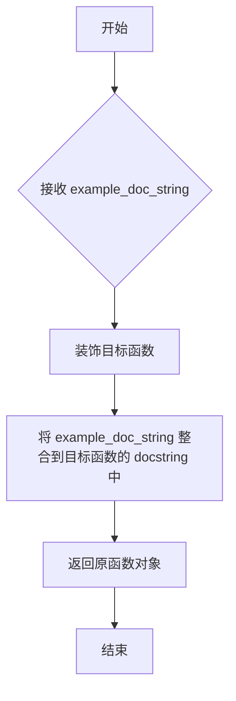

#### 带注释源码

```python
# replace_example_docstring 是一个装饰器，从 ...utils 导入
# 具体实现未在当前文件中显示，这里展示其使用方式：

# 使用示例 1: 为文本转图像管道添加示例文档
@replace_example_docstring(TEXT2IMAGE_EXAMPLE_DOC_STRING)
def __call__(
    self,
    prompt: str | list[str],
    negative_prompt: str | list[str] | None = None,
    num_inference_steps: int = 100,
    guidance_scale: float = 4.0,
    num_images_per_prompt: int = 1,
    height: int = 512,
    width: int = 512,
    prior_guidance_scale: float = 4.0,
    prior_num_inference_steps: int = 25,
    generator: torch.Generator | list[torch.Generator] | None = None,
    latents: torch.Tensor | None = None,
    output_type: str | None = "pil",
    callback: Callable[[int, int, torch.Tensor], None] | None = None,
    callback_steps: int = 1,
    return_dict: bool = True,
):
    """
    Function invoked when calling the pipeline for generation.
    ...（详细参数说明）
    """
    # 函数实现...

# 使用示例 2: 为图像转图像管道添加示例文档
@replace_example_docstring(IMAGE2IMAGE_EXAMPLE_DOC_STRING)
def __call__(...):
    # 图像转图像生成逻辑...

# 使用示例 3: 为修复管道添加示例文档
@replace_example_docstring(INPAINT_EXAMPLE_DOC_STRING)
def __call__(...):
    # 修复生成逻辑...
```

---

### 补充说明

**设计目标**：
- 统一管理多个管道（text2image、image2img、inpaint）的示例代码
- 避免在每个 `__call__` 方法的 docstring 中重复编写大型代码示例
- 使 API 文档更加规范和易于维护

**相关常量**：
- `TEXT2IMAGE_EXAMPLE_DOC_STRING`：文本转图像的示例代码字符串
- `IMAGE2IMAGE_EXAMPLE_DOC_STRING`：图像转图像的示例代码字符串  
- `INPAINT_EXAMPLE_DOC_STRING`：修复（inpainting）的示例代码字符串


### `KandinskyCombinedPipeline.__init__`

该方法是KandinskyCombinedPipeline类的构造函数，用于初始化组合管道，包含文本编码器、分词器、UNet模型、调度器、MoVQ解码器、先验变换器以及相关的图像和文本编码器等组件，并创建先验管道和解码器管道实例。

参数：

- `text_encoder`：`MultilingualCLIP`，多语言文本编码器，用于将文本提示转换为嵌入向量
- `tokenizer`：`XLMRobertaTokenizer`，XLM-RoBERTa分词器，用于对文本进行分词
- `unet`：`UNet2DConditionModel`，条件U-Net模型，用于去噪图像潜向量
- `scheduler`：`DDIMScheduler | DDPMScheduler`，调度器，用于与unet配合生成图像潜向量
- `movq`：`VQModel`，MoVQ解码器，用于从潜向量生成图像
- `prior_prior`：`PriorTransformer`，先验变换器，用于从文本嵌入近似图像嵌入
- `prior_image_encoder`：`CLIPVisionModelWithProjection`，图像编码器，用于编码图像
- `prior_text_encoder`：`CLIPTextModelWithProjection`，先验文本编码器，用于编码文本
- `prior_tokenizer`：`CLIPTokenizer`，CLIP分词器，用于对先验文本进行分词
- `prior_scheduler`：`UnCLIPScheduler`，先验调度器，用于与先验配合生成图像嵌入
- `prior_image_processor`：`CLIPImageProcessor`，CLIP图像处理器，用于预处理图像

返回值：`None`，该方法为构造函数，不返回任何值

#### 流程图

```mermaid
flowchart TD
    A[开始初始化] --> B[调用super().__init__]
    B --> C[注册所有模块到self]
    C --> D[创建KandinskyPriorPipeline实例 prior_pipe]
    D --> E[创建KandinskyPipeline实例 decoder_pipe]
    E --> F[结束初始化]
    
    C -->|register_modules| C1[text_encoder]
    C --> C2[tokenizer]
    C --> C3[unet]
    C --> C4[scheduler]
    C --> C5[movq]
    C --> C6[prior_prior]
    C --> C7[prior_image_encoder]
    C --> C8[prior_text_encoder]
    C --> C9[prior_tokenizer]
    C --> C10[prior_scheduler]
    C --> C11[prior_image_processor]
```

#### 带注释源码

```python
def __init__(
    self,
    text_encoder: MultilingualCLIP,
    tokenizer: XLMRobertaTokenizer,
    unet: UNet2DConditionModel,
    scheduler: DDIMScheduler | DDPMScheduler,
    movq: VQModel,
    prior_prior: PriorTransformer,
    prior_image_encoder: CLIPVisionModelWithProjection,
    prior_text_encoder: CLIPTextModelWithProjection,
    prior_tokenizer: CLIPTokenizer,
    prior_scheduler: UnCLIPScheduler,
    prior_image_processor: CLIPImageProcessor,
):
    """
    初始化Kandinsky组合管道
    
    参数:
        text_encoder: 多语言文本编码器
        tokenizer: XLM-RoBERTa分词器
        unet: 条件U-Net模型
        scheduler: 图像去噪调度器
        movq: MoVQ解码器
        prior_prior: 先验变换器
        prior_image_encoder: 先验图像编码器
        prior_text_encoder: 先验文本编码器
        prior_tokenizer: CLIP分词器
        prior_scheduler: 先验调度器
        prior_image_processor: CLIP图像处理器
    """
    # 调用父类DiffusionPipeline的初始化方法
    super().__init__()

    # 注册所有模块，使它们可以通过pipeline对象访问
    self.register_modules(
        text_encoder=text_encoder,
        tokenizer=tokenizer,
        unet=unet,
        scheduler=scheduler,
        movq=movq,
        prior_prior=prior_prior,
        prior_image_encoder=prior_image_encoder,
        prior_text_encoder=prior_text_encoder,
        prior_tokenizer=prior_tokenizer,
        prior_scheduler=prior_scheduler,
        prior_image_processor=prior_image_processor,
    )
    
    # 创建先验管道，用于从文本生成图像嵌入
    self.prior_pipe = KandinskyPriorPipeline(
        prior=prior_prior,
        image_encoder=prior_image_encoder,
        text_encoder=prior_text_encoder,
        tokenizer=prior_tokenizer,
        scheduler=prior_scheduler,
        image_processor=prior_image_processor,
    )
    
    # 创建解码器管道，用于从图像嵌入生成最终图像
    self.decoder_pipe = KandinskyPipeline(
        text_encoder=text_encoder,
        tokenizer=tokenizer,
        unet=unet,
        scheduler=scheduler,
        movq=movq,
    )
```


### `KandinskyCombinedPipeline.enable_xformers_memory_efficient_attention`

该方法是一个委托方法，用于在Kandinsky组合管道中启用xFormers内存高效注意力机制。它将调用请求转发给内部持有的`decoder_pipe`（解码器管道），使解码器能够利用xFormers库提供的内存优化注意力实现，从而在图像生成过程中减少显存占用。

参数：

- `attention_op`：`Callable | None`，可选参数，指定xFormers内存高效注意力使用的具体注意力操作实现。如果为`None`，则使用默认的注意力操作。

返回值：`None`，该方法无返回值，仅执行副作用（修改内部管道的注意力机制配置）。

#### 流程图

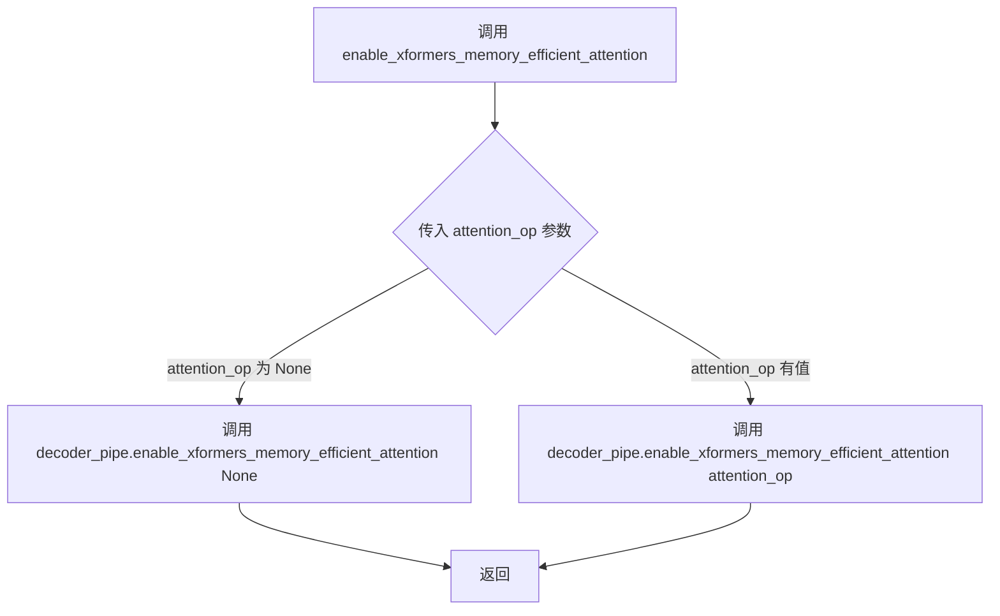

#### 带注释源码

```python
def enable_xformers_memory_efficient_attention(self, attention_op: Callable | None = None):
    """
    启用xFormers内存高效注意力机制
    
    该方法是一个委托方法，将启用xFormers内存高效注意力的请求转发给
    内部的decoder_pipe（KandinskyPipeline）。xFormers是一个库，提供了
    内存优化的注意力实现，可以显著减少图像生成过程中的显存占用。
    
    参数:
        attention_op: 可选的注意力操作符。如果为None，则使用xFormers
                     的默认注意力实现。该参数允许用户指定自定义的
                     注意力操作以满足特定需求。
    
    返回:
        None: 此方法不返回值，仅修改内部管道配置
    """
    # 将调用委托给decoder_pipe（解码器管道）
    # decoder_pipe是KandinskyPipeline实例，负责最终的图像解码生成
    self.decoder_pipe.enable_xformers_memory_efficient_attention(attention_op)
```


### `KandinskyCombinedPipeline.enable_sequential_cpu_offload`

该方法用于将所有模型（unet、text_encoder、vae 和 safety checker 的 state dicts）卸载到 CPU，显著减少内存使用。模型被移动到 `torch.device('meta')`，仅在调用其特定子模块的 `forward` 方法时才加载到 GPU。卸载是基于子模块进行的。内存节省比使用 `enable_model_cpu_offload` 更高，但性能较低。

参数：

- `gpu_id`：`int | None`，GPU ID，用于指定 offload 到的 GPU 设备
- `device`：`torch.device | str`，目标设备，用于指定具体的设备字符串

返回值：`None`，无返回值

#### 流程图

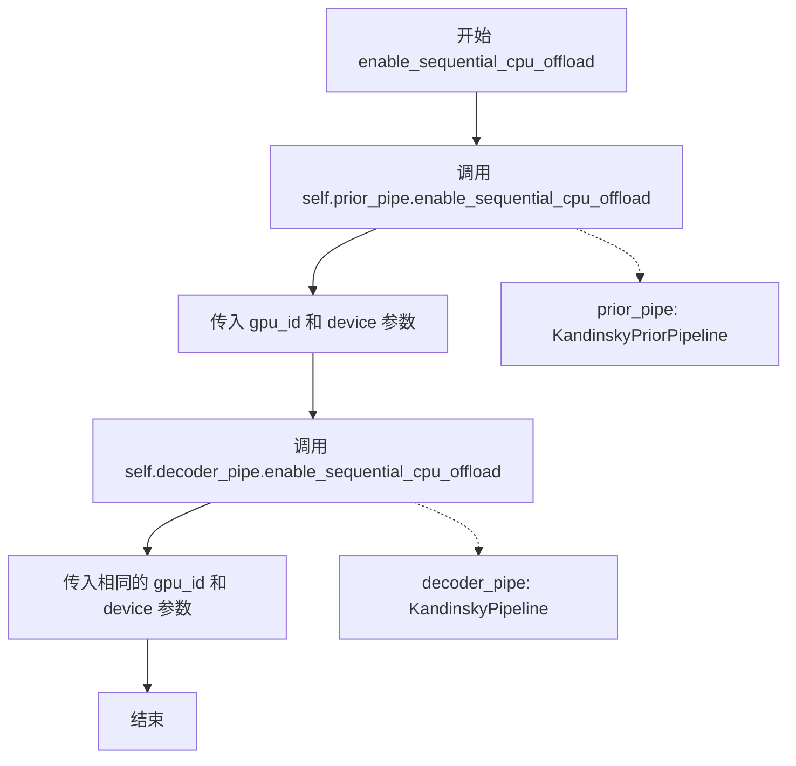

#### 带注释源码

```python
def enable_sequential_cpu_offload(self, gpu_id: int | None = None, device: torch.device | str = None):
    r"""
    Offloads all models (`unet`, `text_encoder`, `vae`, and `safety checker` state dicts) to CPU using 🤗
    Accelerate, significantly reducing memory usage. Models are moved to a `torch.device('meta')` and loaded on a
    GPU only when their specific submodule's `forward` method is called. Offloading happens on a submodule basis.
    Memory savings are higher than using `enable_model_cpu_offload`, but performance is lower.
    """
    # 将 prior_pipe（KandinskyPriorPipeline）的所有模型按子模块顺序卸载到 CPU
    self.prior_pipe.enable_sequential_cpu_offload(gpu_id=gpu_id, device=device)
    
    # 将 decoder_pipe（KandinskyPipeline）的所有模型按子模块顺序卸载到 CPU
    # 使用相同的 gpu_id 和 device 参数确保一致的设备分配
    self.decoder_pipe.enable_sequential_cpu_offload(gpu_id=gpu_id, device=device)
```


### `KandinskyCombinedPipeline.progress_bar`

该方法用于设置组合流水线中先验管道和解码器管道的进度条，并启用解码器模型的CPU卸载功能。

参数：

- `iterable`：`Iterable | None`，可选，要迭代的对象，用于显示进度
- `total`：`int | None`，可选，进度条的总迭代次数

返回值：`None`，该方法无返回值，主要通过副作用生效

#### 流程图

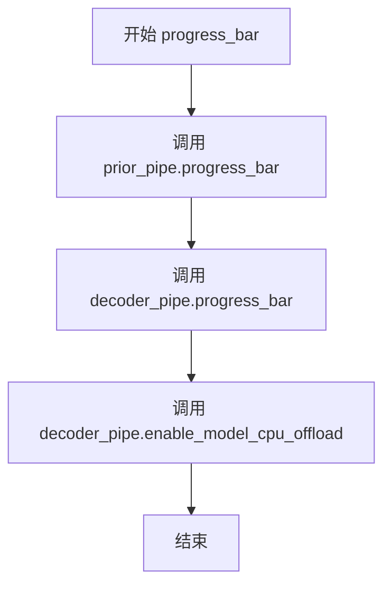

#### 带注释源码

```python
def progress_bar(self, iterable=None, total=None):
    """
    设置进度条并启用CPU卸载
    
    参数:
        iterable: 可迭代对象，用于进度显示
        total: 总迭代次数
    """
    # 1. 先调用先验管道的进度条设置，传入相同的iterable和total参数
    self.prior_pipe.progress_bar(iterable=iterable, total=total)
    
    # 2. 再调用解码器管道的进度条设置，确保两者同步显示进度
    self.decoder_pipe.progress_bar(iterable=iterable, total=total)
    
    # 3. 启用解码器模型的CPU卸载以节省显存
    # 注意: 这里只对decoder_pipe启用了CPU offload，prior_pipe未启用
    self.decoder_pipe.enable_model_cpu_offload()
```


### `KandinskyCombinedPipeline.set_progress_bar_config`

该方法用于配置组合管道中先验管道（prior_pipe）和解码器管道（decoder_pipe）的进度条相关配置，通过将参数传递给两个子管道来统一管理进度条的显示和行为。

参数：

- `**kwargs`：可变关键字参数，用于传递进度条配置选项（如 `disable`、`desc`、`total` 等），这些参数会被直接传递给先验管道和解码器管道的 `set_progress_bar_config` 方法。

返回值：`None`，该方法不返回任何值，仅执行配置操作。

#### 流程图

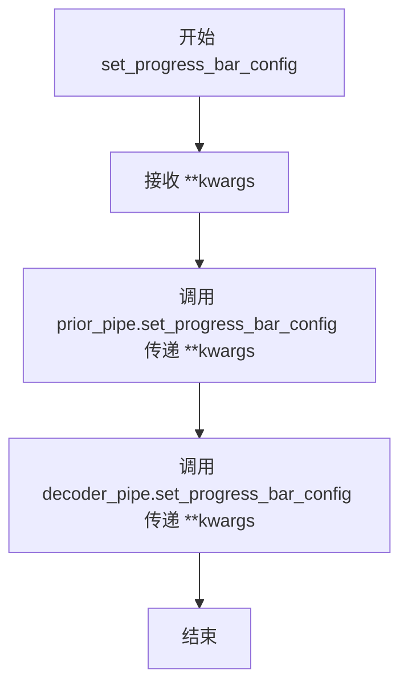

#### 带注释源码

```python
def set_progress_bar_config(self, **kwargs):
    """
    设置进度条配置，统一配置先验管道和解码器管道的进度条行为。
    
    Args:
        **kwargs: 可变关键字参数，用于配置进度条的各种选项，如：
            - disable (bool): 是否禁用进度条
            - desc (str): 进度条描述文本
            - total (int): 进度条总步数
            - leave (bool): 完成后是否保留进度条
            - unit (str): 进度条单位名称
            - unit_scale (bool): 是否自动缩放单位
            - dynamic_ncols (bool): 是否动态调整列数
            - ncols (int): 进度条列数
            - colour (str): 进度条颜色
    """
    # 将配置参数传递给先验管道（负责生成图像嵌入）
    self.prior_pipe.set_progress_bar_config(**kwargs)
    
    # 将配置参数传递给解码器管道（负责从嵌入生成最终图像）
    self.decoder_pipe.set_progress_bar_config(**kwargs)
```


### `KandinskyCombinedPipeline.__call__`

该方法是 Kandinsky 组合管道的核心调用函数，通过两阶段流程实现文本到图像生成：首先利用先验（Prior）模型将文本提示转换为图像嵌入向量，然后使用解码器（Decoder）模型根据图像嵌入生成最终图像。

参数：

- `prompt`：`str | list[str]`，指导图像生成的文本提示，支持单个字符串或字符串列表
- `negative_prompt`：`str | list[str] | None`，不引导图像生成的负面提示，当 guidance_scale < 1 时忽略
- `num_inference_steps`：`int`，去噪迭代次数，默认为 100，步数越多图像质量越高但推理越慢
- `guidance_scale`：`float`，分类器自由扩散引导（CFG）尺度，默认为 4.0，值越大生成的图像与提示越相关
- `num_images_per_prompt`：`int`，每个提示生成的图像数量，默认为 1
- `height`：`int`，生成图像的高度像素值，默认为 512
- `width`：`int`，生成图像的宽度像素值，默认为 512
- `prior_guidance_scale`：`float`，先验模型的 CFG 引导尺度，默认为 4.0
- `prior_num_inference_steps`：`int`，先验模型的去噪步骤数，默认为 25
- `generator`：`torch.Generator | list[torch.Generator] | None`，用于确保生成确定性的随机数生成器
- `latents`：`torch.Tensor | None`，预生成的噪声潜在向量，可用于通过不同提示微调相同生成
- `output_type`：`str`，输出格式，可选 "pil"（PIL.Image.Image）、"np"（numpy 数组）或 "pt"（PyTorch 张量），默认为 "pil"
- `callback`：`Callable[[int, int, torch.Tensor], None] | None`，每 callback_steps 步调用的回调函数，参数为 (step, timestep, latents)
- `callback_steps`：`int`，回调函数调用频率，默认为每步调用
- `return_dict`：`bool`，是否返回 ImagePipelineOutput 而非普通元组，默认为 True

返回值：`ImagePipelineOutput | tuple`，包含生成的图像（`images: list[PIL.Image.Image]`）和可选的 nsfw 内容检测结果

#### 流程图

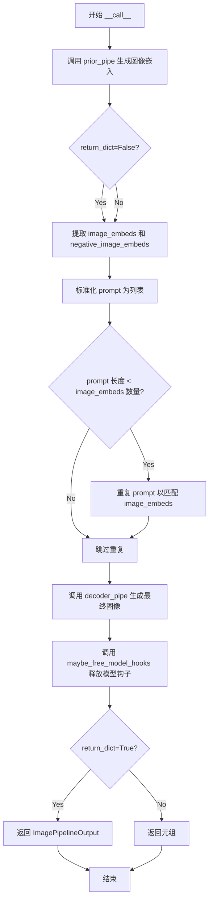

#### 带注释源码

```python
@torch.no_grad()
@replace_example_docstring(TEXT2IMAGE_EXAMPLE_DOC_STRING)
def __call__(
    self,
    prompt: str | list[str],
    negative_prompt: str | list[str] | None = None,
    num_inference_steps: int = 100,
    guidance_scale: float = 4.0,
    num_images_per_prompt: int = 1,
    height: int = 512,
    width: int = 512,
    prior_guidance_scale: float = 4.0,
    prior_num_inference_steps: int = 25,
    generator: torch.Generator | list[torch.Generator] | None = None,
    latents: torch.Tensor | None = None,
    output_type: str | None = "pil",
    callback: Callable[[int, int, torch.Tensor], None] | None = None,
    callback_steps: int = 1,
    return_dict: bool = True,
):
    """
    Function invoked when calling the pipeline for generation.

    Args:
        prompt (`str` or `list[str]`):
            The prompt or prompts to guide the image generation.
        negative_prompt (`str` or `list[str]`, *optional*):
            The prompt or prompts not to guide the image generation. Ignored when not using guidance (i.e., ignored
            if `guidance_scale` is less than `1`).
        num_images_per_prompt (`int`, *optional*, defaults to 1):
            The number of images to generate per prompt.
        num_inference_steps (`int`, *optional*, defaults to 100):
            The number of denoising steps. More denoising steps usually lead to a higher quality image at the
            expense of slower inference.
        height (`int`, *optional*, defaults to 512):
            The height in pixels of the generated image.
        width (`int`, *optional*, defaults to 512):
            The width in pixels of the generated image.
        prior_guidance_scale (`float`, *optional*, defaults to 4.0):
            Guidance scale as defined in [Classifier-Free Diffusion
            Guidance](https://huggingface.co/papers/2207.12598). `guidance_scale` is defined as `w` of equation 2.
            of [Imagen Paper](https://huggingface.co/papers/2205.11487). Guidance scale is enabled by setting
            `guidance_scale > 1`. Higher guidance scale encourages to generate images that are closely linked to
            the text `prompt`, usually at the expense of lower image quality.
        prior_num_inference_steps (`int`, *optional*, defaults to 100):
            The number of denoising steps. More denoising steps usually lead to a higher quality image at the
            expense of slower inference.
        guidance_scale (`float`, *optional*, defaults to 4.0):
            Guidance scale as defined in [Classifier-Free Diffusion
            Guidance](https://huggingface.co/papers/2207.12598). `guidance_scale` is defined as `w` of equation 2.
            of [Imagen Paper](https://huggingface.co/papers/2205.11487). Guidance scale is enabled by setting
            `guidance_scale > 1`. Higher guidance scale encourages to generate images that are closely linked to
            the text `prompt`, usually at the expense of lower image quality.
        generator (`torch.Generator` or `list[torch.Generator]`, *optional*):
            One or a list of [torch generator(s)](https://pytorch.org/docs/stable/generated/torch.Generator.html)
            to make generation deterministic.
        latents (`torch.Tensor`, *optional*):
            Pre-generated noisy latents, sampled from a Gaussian distribution, to be used as inputs for image
            generation. Can be used to tweak the same generation with different prompts. If not provided, a latents
            tensor will be generated by sampling using the supplied random `generator`.
        output_type (`str`, *optional*, defaults to `"pil"`):
            The output format of the generate image. Choose between: `"pil"` (`PIL.Image.Image`), `"np"`
            (`np.array`) or `"pt"` (`torch.Tensor`).
        callback (`Callable`, *optional*):
            A function that calls every `callback_steps` steps during inference. The function is called with the
            following arguments: `callback(step: int, timestep: int, latents: torch.Tensor)`.
        callback_steps (`int`, *optional*, defaults to 1):
            The frequency at which the `callback` function is called. If not specified, the callback is called at
            every step.
        return_dict (`bool`, *optional*, defaults to `True`):
            Whether or not to return a [`~pipelines.ImagePipelineOutput`] instead of a plain tuple.

    Examples:

    Returns:
        [`~pipelines.ImagePipelineOutput`] or `tuple`
    """
    # 阶段1: 调用先验管道生成图像嵌入向量
    # prior_pipe 将文本提示转换为 CLIP 图像嵌入表示
    prior_outputs = self.prior_pipe(
        prompt=prompt,
        negative_prompt=negative_prompt,
        num_images_per_prompt=num_images_per_prompt,
        num_inference_steps=prior_num_inference_steps,
        generator=generator,
        latents=latents,
        guidance_scale=prior_guidance_scale,
        output_type="pt",  # 强制输出 PyTorch 张量格式供后续使用
        return_dict=False,  # 使用元组索引方式获取结果
    )
    # 从先验输出中解包图像嵌入和负面图像嵌入
    image_embeds = prior_outputs[0]
    negative_image_embeds = prior_outputs[1]

    # 确保 prompt 转换为列表格式以便后续处理
    prompt = [prompt] if not isinstance(prompt, (list, tuple)) else prompt

    # 处理 prompt 数量与生成图像数量不匹配的情况
    # 当先验生成的图像数量超过 prompt 数量时，重复 prompt 以匹配
    if len(prompt) < image_embeds.shape[0] and image_embeds.shape[0] % len(prompt) == 0:
        prompt = (image_embeds.shape[0] // len(prompt)) * prompt

    # 阶段2: 调用解码器管道生成最终图像
    # decoder_pipe 使用图像嵌入作为条件生成最终图像
    outputs = self.decoder_pipe(
        prompt=prompt,
        image_embeds=image_embeds,
        negative_image_embeds=negative_image_embeds,
        width=width,
        height=height,
        num_inference_steps=num_inference_steps,
        generator=generator,
        guidance_scale=guidance_scale,
        output_type=output_type,
        callback=callback,
        callback_steps=callback_steps,
        return_dict=return_dict,
    )

    # 释放模型钩子以节省内存
    self.maybe_free_model_hooks()

    # 返回最终输出（可能是 ImagePipelineOutput 或元组）
    return outputs
```


### `KandinskyImg2ImgCombinedPipeline.__init__`

该方法是 `KandinskyImg2ImgCombinedPipeline` 类的构造函数，用于初始化组合管道，将多个预训练模型（如文本编码器、分词器、U-Net、VQModel、PriorTransformer等）注册到管道中，并创建先验管道（`prior_pipe`）和图像到图像解码管道（`decoder_pipe`）的实例。

参数：

- `text_encoder`：`MultilingualCLIP`，多语言文本编码器，用于将文本提示转换为嵌入向量
- `tokenizer`：`XLMRobertaTokenizer`，用于对文本进行分词
- `unet`：`UNet2DConditionModel`，条件U-Net模型，用于对图像潜在表示进行去噪
- `scheduler`：`DDIMScheduler | DDPMScheduler`，与U-Net结合使用生成图像潜在表示的调度器
- `movq`：`VQModel`，MoVQ解码器，用于从潜在表示生成图像
- `prior_prior`：`PriorTransformer`，规范unCLIP先验模型，用于从文本嵌入近似图像嵌入
- `prior_image_encoder`：`CLIPVisionModelWithProjection`，冻结的图像编码器
- `prior_text_encoder`：`CLIPTextModelWithProjection`，冻结的文本编码器
- `prior_tokenizer`：`CLIPTokenizer`，用于对文本进行分词
- `prior_scheduler`：`UnCLIPScheduler`，与先验模型结合使用生成图像嵌入的调度器
- `prior_image_processor`：`CLIPImageProcessor`，用于处理图像的处理器

返回值：`None`，构造函数不返回值，仅初始化对象状态

#### 流程图

```mermaid
flowchart TD
    A[开始 __init__] --> B[调用 super().__init__]
    B --> C[register_modules 注册所有模型模块]
    C --> D[创建 prior_pipe: KandinskyPriorPipeline]
    D --> E[创建 decoder_pipe: KandinskyImg2ImgPipeline]
    E --> F[结束 __init__]
    
    C --> C1[text_encoder]
    C --> C2[tokenizer]
    C --> C3[unet]
    C --> C4[scheduler]
    C --> C5[movq]
    C --> C6[prior_prior]
    C --> C7[prior_image_encoder]
    C --> C8[prior_text_encoder]
    C --> C9[prior_tokenizer]
    C --> C10[prior_scheduler]
    C --> C11[prior_image_processor]
```

#### 带注释源码

```python
def __init__(
    self,
    text_encoder: MultilingualCLIP,                    # 多语言文本编码器
    tokenizer: XLMRobertaTokenizer,                    # XLM-RoBERTa分词器
    unet: UNet2DConditionModel,                        # 条件U-Net去噪模型
    scheduler: DDIMScheduler | DDPMScheduler,          # 去噪调度器
    movq: VQModel,                                      # MoVQ解码器
    prior_prior: PriorTransformer,                     # unCLIP先验模型
    prior_image_encoder: CLIPVisionModelWithProjection, # CLIP图像编码器
    prior_text_encoder: CLIPTextModelWithProjection,    # CLIP文本编码器
    prior_tokenizer: CLIPTokenizer,                     # CLIP分词器
    prior_scheduler: UnCLIPScheduler,                   # 先验调度器
    prior_image_processor: CLIPImageProcessor,          # 图像处理器
):
    # 调用父类DiffusionPipeline的初始化方法
    super().__init__()

    # 将所有模型模块注册到管道中，便于保存/加载和内存管理
    self.register_modules(
        text_encoder=text_encoder,
        tokenizer=tokenizer,
        unet=unet,
        scheduler=scheduler,
        movq=movq,
        prior_prior=prior_prior,
        prior_image_encoder=prior_image_encoder,
        prior_text_encoder=prior_text_encoder,
        prior_tokenizer=prior_tokenizer,
        prior_scheduler=prior_scheduler,
        prior_image_processor=prior_image_processor,
    )
    
    # 创建先验管道，负责从文本生成图像嵌入
    self.prior_pipe = KandinskyPriorPipeline(
        prior=prior_prior,
        image_encoder=prior_image_encoder,
        text_encoder=prior_text_encoder,
        tokenizer=prior_tokenizer,
        scheduler=prior_scheduler,
        image_processor=prior_image_processor,
    )
    
    # 创建图像到图像解码管道，负责从图像嵌入生成最终图像
    self.decoder_pipe = KandinskyImg2ImgPipeline(
        text_encoder=text_encoder,
        tokenizer=tokenizer,
        unet=unet,
        scheduler=scheduler,
        movq=movq,
    )
```


### `KandinskyImg2ImgCombinedPipeline.enable_xformers_memory_efficient_attention`

该方法用于启用 xFormers 高效注意力机制，通过委托给内部的解码器管道来减少注意力计算的内存占用。

参数：

- `attention_op`：`Callable | None`，可选参数，指定要使用的注意力操作。如果为 None，则使用默认的注意力实现。

返回值：`None`，该方法不返回任何值，仅执行副作用（修改内部状态）。

#### 流程图

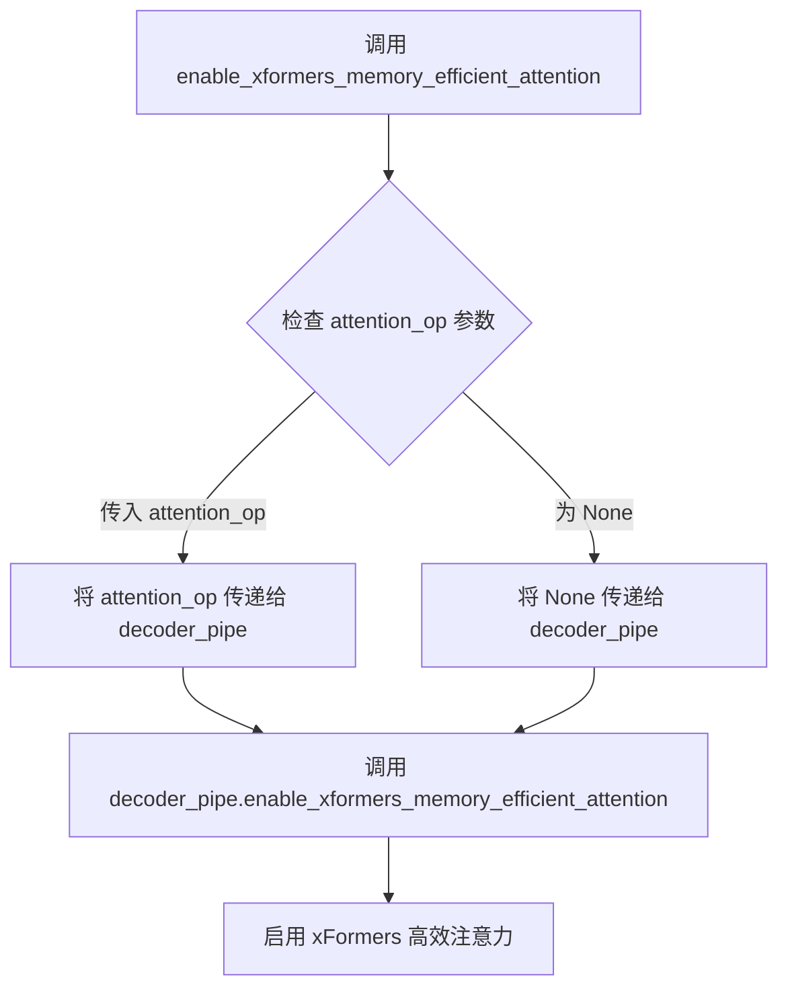

#### 带注释源码

```python
def enable_xformers_memory_efficient_attention(self, attention_op: Callable | None = None):
    """
    启用 xFormers 高效注意力机制。
    
    该方法将调用委托给内部的 decoder_pipe (KandinskyImg2ImgPipeline)，
    以在图像生成过程中使用更节省内存的注意力实现。
    
    参数:
        attention_op: 可选的注意力操作。如果为 None，则使用默认实现。
    """
    # 将调用委托给解码器管道
    self.decoder_pipe.enable_xformers_memory_efficient_attention(attention_op)
```


### `KandinskyImg2ImgCombinedPipeline.enable_sequential_cpu_offload`

该方法用于将所有模型（unet、text_encoder、vae等）卸载到CPU，以显著降低内存使用。调用时，模型的状态字典会被保存到CPU，然后移动到`torch.device('meta')`，仅在特定子模块的`forward`方法被调用时才加载到GPU。内存节省比`enable_model_cpu_offload`更高，但性能较低。

参数：

- `gpu_id`：`int | None`，GPU ID，用于指定要卸载到的GPU设备（可选）
- `device`：`torch.device | str`，设备，用于指定目标设备（可选）

返回值：`None`，无返回值，仅执行模型卸载的副作用操作

#### 流程图

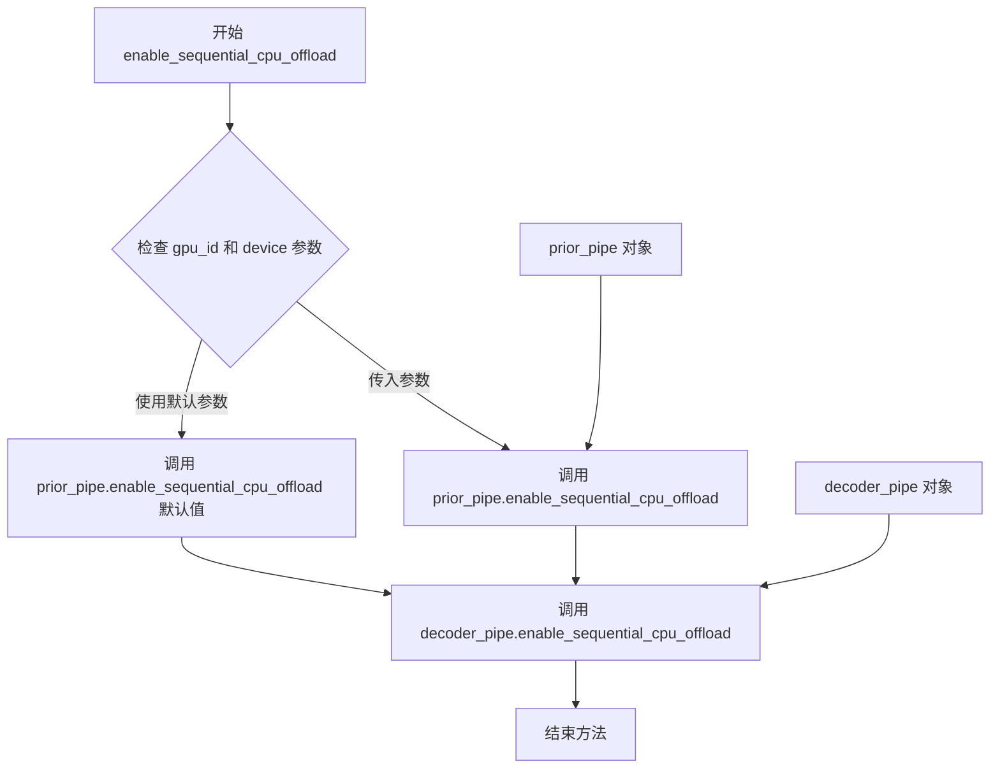

#### 带注释源码

```python
def enable_sequential_cpu_offload(self, gpu_id: int | None = None, device: torch.device | str = None):
    r"""
    Offloads all models to CPU using accelerate, significantly reducing memory usage. When called, unet,
    text_encoder, vae and safety checker have their state dicts saved to CPU and then are moved to a
    `torch.device('meta') and loaded to GPU only when their specific submodule has its `forward` method called.
    Note that offloading happens on a submodule basis. Memory savings are higher than with
    `enable_model_cpu_offload`, but performance is lower.
    """
    # 调用 prior_pipe (KandinskyPriorPipeline) 的顺序 CPU 卸载功能
    # prior_pipe 包含 prior_prior, prior_image_encoder, prior_text_encoder 等模型
    self.prior_pipe.enable_sequential_cpu_offload(gpu_id=gpu_id, device=device)
    
    # 调用 decoder_pipe (KandinskyImg2ImgPipeline) 的顺序 CPU 卸载功能
    # decoder_pipe 包含 text_encoder, unet, movq 等模型
    self.decoder_pipe.enable_sequential_cpu_offload(gpu_id=gpu_id, device=device)
```


### `KandinskyImg2ImgCombinedPipeline.progress_bar`

该方法用于设置组合管道中先验管道和解码器管道的进度条，并启用解码器模型的CPU卸载功能。它通过委托调用子管道（prior_pipe 和 decoder_pipe）的进度条方法来实现统一的进度显示。

参数：

- `iterable`：可选参数，类型待推断（通常为 `Iterable` 或 `None`），用于迭代的进度条对象
- `total`：可选参数，类型为 `int | None`，表示进度条的总步数

返回值：`None`，该方法不返回任何值，仅执行副作用操作

#### 流程图

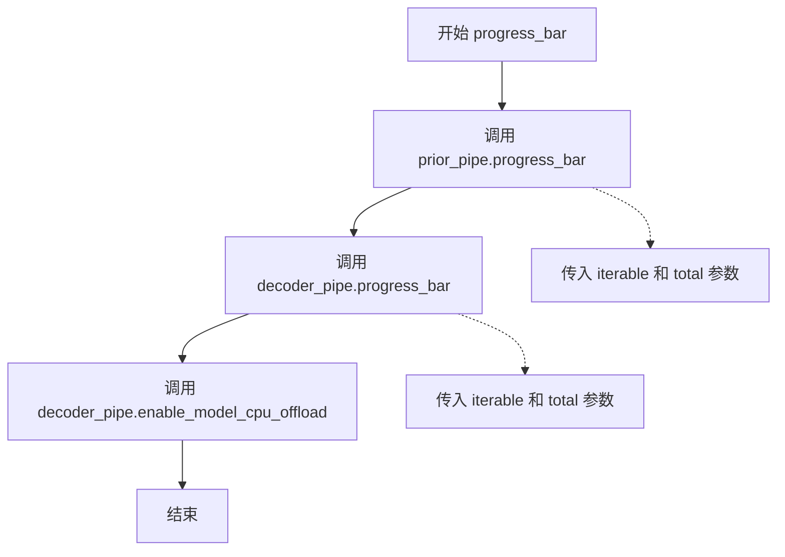

#### 带注释源码

```python
def progress_bar(self, iterable=None, total=None):
    """
    设置组合管道的进度条
    
    该方法同时为 prior_pipe（先验管道）和 decoder_pipe（解码器管道）
    设置进度条，并在最后启用解码器模型的 CPU 卸载以节省显存。
    
    参数:
        iterable: 可选的迭代器对象，用于包装进度条
        total: 可选的整数，指定总步数
    
    返回:
        None
    """
    # 1. 调用先验管道的进度条方法，传入相同的 iterable 和 total 参数
    self.prior_pipe.progress_bar(iterable=iterable, total=total)
    
    # 2. 调用解码器管道的进度条方法，传入相同的 iterable 和 total 参数
    self.decoder_pipe.progress_bar(iterable=iterable, total=total)
    
    # 3. 启用解码器模型的 CPU 卸载，将模型从 GPU 移至 CPU 以释放显存
    self.decoder_pipe.enable_model_cpu_offload()
```


### `KandinskyImg2ImgCombinedPipeline.set_progress_bar_config`

该方法用于配置组合管线中先验管道（prior_pipe）和解码器管道（decoder_pipe）的进度条相关配置，通过接收任意关键字参数（**kwargs）并将其同时传递给两个子管道，以实现统一的进度条设置。

参数：

- `**kwargs`：任意关键字参数，进度条配置选项，具体参数取决于底层管道的实现，常见的包括 `desc`（进度条描述）、`total`（总迭代次数）、`disable`（是否禁用进度条）等。

返回值：`None`，该方法直接修改内部管道状态，不返回任何值。

#### 流程图

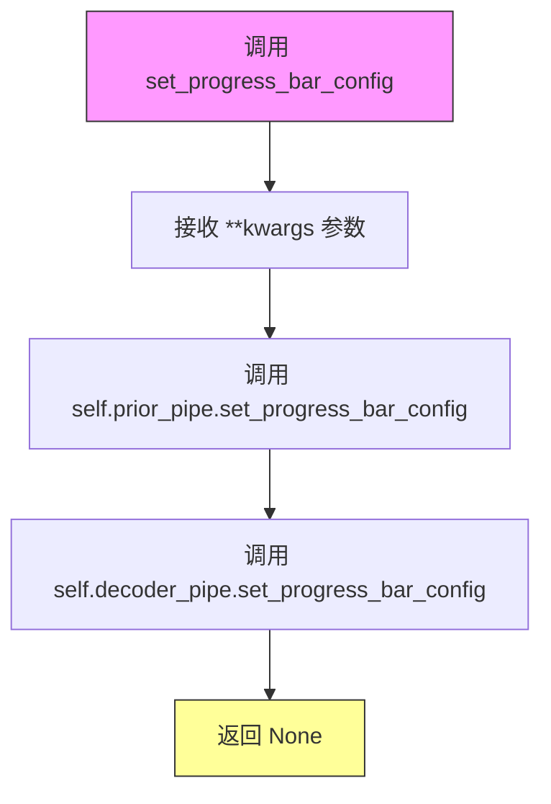

#### 带注释源码

```python
def set_progress_bar_config(self, **kwargs):
    """
    设置进度条配置。
    
    该方法将接收到的任意关键字参数同时传递给先验管道和解码器管道，
    以统一配置两个管道的进度条行为。
    
    Args:
        **kwargs: 任意关键字参数，传递给底层管道的进度条配置选项。
                  常见参数包括:
                  - desc: str, 进度条描述文本
                  - total: int, 总迭代次数
                  - disable: bool, 是否禁用进度条显示
                  - leave: bool, 完成后是否保留进度条
                  - position: int, 多进度条时的位置
                  - ncols: int, 进度条列数
    """
    # 将配置参数传递给先验管道（负责生成图像嵌入）
    self.prior_pipe.set_progress_bar_config(**kwargs)
    
    # 将配置参数传递给解码器管道（负责从嵌入生成最终图像）
    self.decoder_pipe.set_progress_bar_config(**kwargs)
```


### `KandinskyImg2ImgCombinedPipeline.__call__`

该方法是 KandinskyImg2ImgCombinedPipeline 类的核心调用函数，用于执行图像到图像（image-to-image）的生成任务。它首先通过_prior_pipe（KandinskyPriorPipeline）基于文本提示生成图像嵌入（image embeddings）和负向图像嵌入（negative image embeddings），然后将这些嵌入与原始图像一起传递给decoder_pipe（KandinskyImg2ImgPipeline）进行去噪处理，最终生成符合提示描述的转换后图像。

参数：

- `prompt`：`str | list[str]`，引导图像生成的文本提示
- `image`：`torch.Tensor | PIL.Image.Image | list[torch.Tensor] | list[PIL.Image.Image]`，作为起点的输入图像
- `negative_prompt`：`str | list[str] | None`，不引导图像生成的负向提示
- `num_inference_steps`：`int`，去噪步数，默认100
- `guidance_scale`：`float`，分类器自由扩散引导比例，默认4.0
- `num_images_per_prompt`：`int`，每个提示生成的图像数量，默认1
- `strength`：`float`，图像转换强度，介于0和1之间，默认0.3
- `height`：`int`，生成图像的高度（像素），默认512
- `width`：`int`，生成图像的宽度（像素），默认512
- `prior_guidance_scale`：`float`，先验网络的引导比例，默认4.0
- `prior_num_inference_steps`：`int`，先验网络去噪步数，默认25
- `generator`：`torch.Generator | list[torch.Generator] | None`，用于生成确定性结果的随机数生成器
- `latents`：`torch.Tensor | None`，预生成的噪声潜在向量
- `output_type`：`str | None`，输出格式，可选"pil"、"np"或"pt"，默认"pil"
- `callback`：`Callable[[int, int, torch.Tensor], None] | None`，推理过程中每 callback_steps 步调用的回调函数
- `callback_steps`：`int`，回调函数调用频率，默认1
- `return_dict`：`bool`，是否返回 ImagePipelineOutput，默认True

返回值：`ImagePipelineOutput | tuple`，生成的图像结果或包含图像的元组

#### 流程图

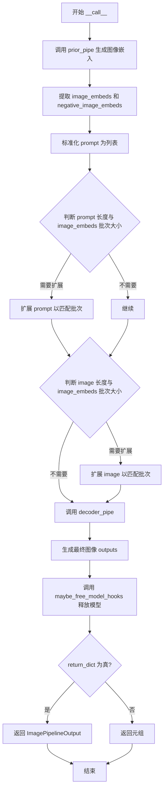

#### 带注释源码

```python
@torch.no_grad()
@replace_example_docstring(IMAGE2IMAGE_EXAMPLE_DOC_STRING)
def __call__(
    self,
    prompt: str | list[str],
    image: torch.Tensor | PIL.Image.Image | list[torch.Tensor] | list[PIL.Image.Image],
    negative_prompt: str | list[str] | None = None,
    num_inference_steps: int = 100,
    guidance_scale: float = 4.0,
    num_images_per_prompt: int = 1,
    strength: float = 0.3,
    height: int = 512,
    width: int = 512,
    prior_guidance_scale: float = 4.0,
    prior_num_inference_steps: int = 25,
    generator: torch.Generator | list[torch.Generator] | None = None,
    latents: torch.Tensor | None = None,
    output_type: str | None = "pil",
    callback: Callable[[int, int, torch.Tensor], None] | None = None,
    callback_steps: int = 1,
    return_dict: bool = True,
):
    """
    Function invoked when calling the pipeline for generation.

    Args:
        prompt (`str` or `list[str]`):
            The prompt or prompts to guide the image generation.
        image (`torch.Tensor`, `PIL.Image.Image`, `np.ndarray`, `list[torch.Tensor]`, `list[PIL.Image.Image]`, or `list[np.ndarray]`):
            `Image`, or tensor representing an image batch, that will be used as the starting point for the
            process. Can also accept image latents as `image`, if passing latents directly, it will not be encoded
            again.
        ... (其他参数文档见上文)
    """
    # 步骤1: 调用 prior_pipe 生成图像嵌入 (image embeddings)
    # prior_pipe 负责将文本提示转换为图像嵌入表示
    prior_outputs = self.prior_pipe(
        prompt=prompt,
        negative_prompt=negative_prompt,
        num_images_per_prompt=num_images_per_prompt,
        num_inference_steps=prior_num_inference_steps,
        generator=generator,
        latents=latents,
        guidance_scale=prior_guidance_scale,
        output_type="pt",  # 输出 PyTorch 张量格式
        return_dict=False,  # 返回元组格式以便快速索引
    )
    
    # 步骤2: 从 prior 输出中提取图像嵌入和负向图像嵌入
    # prior_outputs[0] 是 image_embeds, prior_outputs[1] 是 negative_image_embeds
    image_embeds = prior_outputs[0]
    negative_image_embeds = prior_outputs[1]

    # 步骤3: 标准化输入格式 - 确保 prompt 和 image 是列表格式
    prompt = [prompt] if not isinstance(prompt, (list, tuple)) else prompt
    # 注意: 此处代码有潜在 bug，应该是检查 image 而不是 prompt
    image = [image] if isinstance(prompt, PIL.Image.Image) else image

    # 步骤4: 处理批次大小不匹配的情况
    # 如果 prompt 数量小于生成的嵌入数量，且可以整除，则扩展 prompt
    if len(prompt) < image_embeds.shape[0] and image_embeds.shape[0] % len(prompt) == 0:
        prompt = (image_embeds.shape[0] // len(prompt)) * prompt

    # 同样处理 image 列表的扩展
    if (
        isinstance(image, (list, tuple))
        and len(image) < image_embeds.shape[0]
        and image_embeds.shape[0] % len(image) == 0
    ):
        image = (image_embeds.shape[0] // len(image)) * image

    # 步骤5: 调用 decoder_pipe 进行图像到图像的转换生成
    # decoder_pipe 接收图像嵌入和原始图像，进行去噪处理
    outputs = self.decoder_pipe(
        prompt=prompt,
        image=image,
        image_embeds=image_embeds,
        negative_image_embeds=negative_image_embeds,
        strength=strength,  # 控制转换强度的参数
        width=width,
        height=height,
        num_inference_steps=num_inference_steps,
        generator=generator,
        guidance_scale=guidance_scale,
        output_type=output_type,
        callback=callback,
        callback_steps=callback_steps,
        return_dict=return_dict,
    )

    # 步骤6: 释放不再需要的模型钩子，回收内存
    self.maybe_free_model_hooks()

    # 步骤7: 返回生成结果
    return outputs
```


### `KandinskyInpaintCombinedPipeline.__init__`

该方法是 `KandinskyInpaintCombinedPipeline` 类的构造函数，用于初始化一个结合了 Prior Pipeline（负责从文本生成图像嵌入）和 Decoder Pipeline（负责从图像嵌入生成最终修复后图像）的组合流程。

参数：

- `text_encoder`：`MultilingualCLIP`，多语言文本编码器，用于将文本提示转换为嵌入向量
- `tokenizer`：`XLMRobertaTokenizer`，用于对文本进行分词
- `unet`：`UNet2DConditionModel`，条件 U-Net 模型，用于去噪图像潜在表示
- `scheduler`：`DDIMScheduler | DDPMScheduler`，用于在去噪过程中调度噪声
- `movq`：`VQModel`，MoVQ 解码器，用于从潜在表示生成图像
- `prior_prior`：`PriorTransformer`，unCLIP Prior 模型，用于从文本嵌入近似图像嵌入
- `prior_image_encoder`：`CLIPVisionModelWithProjection`，冻结的图像编码器
- `prior_text_encoder`：`CLIPTextModelWithProjection`，冻结的文本编码器（Prior 部分）
- `prior_tokenizer`：`CLIPTokenizer`，Prior 部分使用的分词器
- `prior_scheduler`：`UnCLIPScheduler`，用于 Prior 模型的调度器
- `prior_image_processor`：`CLIPImageProcessor`，用于处理图像的处理器

返回值：`None`，构造函数不返回任何值

#### 流程图

```mermaid
flowchart TD
    A[开始 __init__] --> B[调用 super().__init__]
    B --> C[调用 self.register_modules 注册所有模块]
    C --> D[创建 KandinskyPriorPipeline 实例赋值给 self.prior_pipe]
    D --> E[创建 KandinskyInpaintPipeline 实例赋值给 self.decoder_pipe]
    E --> F[结束 __init__]
```

#### 带注释源码

```python
def __init__(
    self,
    text_encoder: MultilingualCLIP,
    tokenizer: XLMRobertaTokenizer,
    unet: UNet2DConditionModel,
    scheduler: DDIMScheduler | DDPMScheduler,
    movq: VQModel,
    prior_prior: PriorTransformer,
    prior_image_encoder: CLIPVisionModelWithProjection,
    prior_text_encoder: CLIPTextModelWithProjection,
    prior_tokenizer: CLIPTokenizer,
    prior_scheduler: UnCLIPScheduler,
    prior_image_processor: CLIPImageProcessor,
):
    # 调用父类 DiffusionPipeline 的初始化方法
    super().__init__()

    # 注册所有模块，使它们可以通过 pipeline.xxx 的方式访问
    self.register_modules(
        text_encoder=text_encoder,
        tokenizer=tokenizer,
        unet=unet,
        scheduler=scheduler,
        movq=movq,
        prior_prior=prior_prior,
        prior_image_encoder=prior_image_encoder,
        prior_text_encoder=prior_text_encoder,
        prior_tokenizer=prior_tokenizer,
        prior_scheduler=prior_scheduler,
        prior_image_processor=prior_image_processor,
    )
    
    # 初始化 Prior Pipeline，用于从文本生成图像嵌入
    self.prior_pipe = KandinskyPriorPipeline(
        prior=prior_prior,
        image_encoder=prior_image_encoder,
        text_encoder=prior_text_encoder,
        tokenizer=prior_tokenizer,
        scheduler=prior_scheduler,
        image_processor=prior_image_processor,
    )
    
    # 初始化 Decoder Pipeline，用于从图像嵌入生成修复后的图像
    self.decoder_pipe = KandinskyInpaintPipeline(
        text_encoder=text_encoder,
        tokenizer=tokenizer,
        unet=unet,
        scheduler=scheduler,
        movq=movq,
    )
```


### `KandinskyInpaintCombinedPipeline.enable_xformers_memory_efficient_attention`

启用 xFormers 高效注意力机制，通过委托方式调用解码管道的对应方法，以减少内存占用并提升推理速度。

参数：

- `attention_op`：`Callable | None`，可选参数，指定要使用的注意力操作。如果为 None，则使用默认的注意力实现。

返回值：无（`None`），该方法通过副作用生效，直接修改内部组件的注意力实现。

#### 流程图

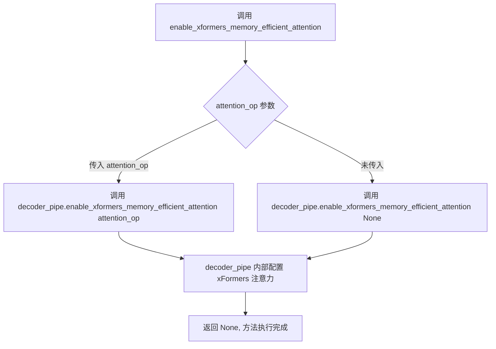

#### 带注释源码

```python
def enable_xformers_memory_efficient_attention(self, attention_op: Callable | None = None):
    """
    启用 xFormers 高效注意力机制。
    
    该方法是一个委托方法，将调用转发到内部的 decoder_pipe。
    xFormers 的高效注意力实现可以显著减少显存占用，特别适用于
    长序列或大模型的推理场景。
    
    参数:
        attention_op: 可选的注意力操作符。如果为 None，则使用
                     xFormers 的默认注意力实现。
    
    返回:
        无返回值。通过修改内部组件的注意力实现来生效。
    """
    # 委托给 decoder_pipe (KandinskyInpaintPipeline) 执行实际的 xFormers 注意力启用逻辑
    self.decoder_pipe.enable_xformers_memory_efficient_attention(attention_op)
```


### `KandinskyInpaintCombinedPipeline.enable_sequential_cpu_offload`

该方法用于将所有模型（unet、text_encoder、vae 等）的状态字典卸载到 CPU，显著减少显存占用。模型被移至 `torch.device('meta')`，仅在特定子模块的 `forward` 方法被调用时才加载到 GPU。虽然比 `enable_model_cpu_offload` 更节省显存，但性能会有所下降。

参数：

- `gpu_id`：`int | None`，GPU 编号，用于指定目标 GPU 设备
- `device`：`torch.device | str`，设备对象或字符串表示，指定具体的计算设备

返回值：`None`，无返回值

#### 流程图

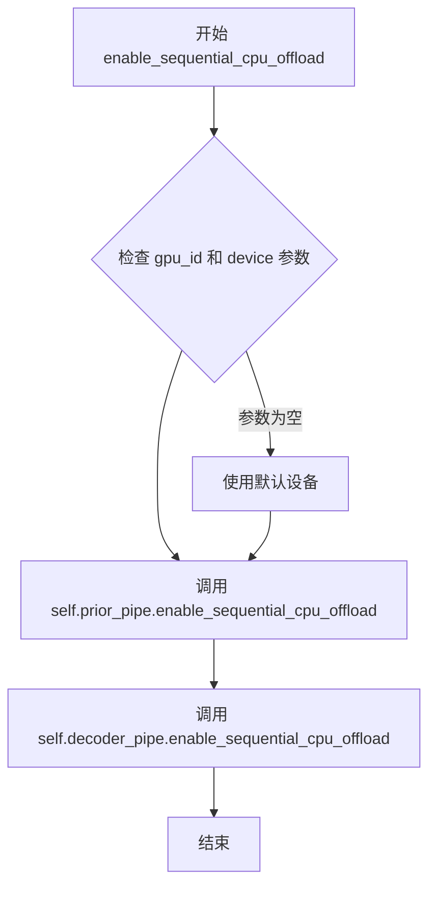

#### 带注释源码

```python
def enable_sequential_cpu_offload(self, gpu_id: int | None = None, device: torch.device | str = None):
    r"""
    Offloads all models to CPU using accelerate, significantly reducing memory usage. When called, unet,
    text_encoder, vae and safety checker have their state dicts saved to CPU and then are moved to a
    `torch.device('meta') and loaded to GPU only when their specific submodule has its `forward` method called.
    Note that offloading happens on a submodule basis. Memory savings are higher than with
    `enable_model_cpu_offload`, but performance is lower.
    """
    # 调用 prior_pipe（KandinskyPriorPipeline）的相同方法
    # 用于将 prior 相关的模型（prior_prior, prior_image_encoder, prior_text_encoder）卸载到 CPU
    self.prior_pipe.enable_sequential_cpu_offload(gpu_id=gpu_id, device=device)
    
    # 调用 decoder_pipe（KandinskyInpaintPipeline）的相同方法
    # 用于将解码器相关的模型（text_encoder, unet, movq）卸载到 CPU
    self.decoder_pipe.enable_sequential_cpu_offload(gpu_id=gpu_id, device=device)
```


### `KandinskyInpaintCombinedPipeline.progress_bar`

设置组合管道的进度条，并启用解码器管道的模型 CPU 卸载。该方法将进度条配置同时应用于先验管道和解码器管道，确保在图像生成过程中可以显示进度信息。

参数：

- `iterable`：`Any`（可选），用于包装进度条的可迭代对象，默认为 None
- `total`：`int | None`（可选），进度条的总步数，默认为 None

返回值：`None`，该方法不返回任何值

#### 流程图

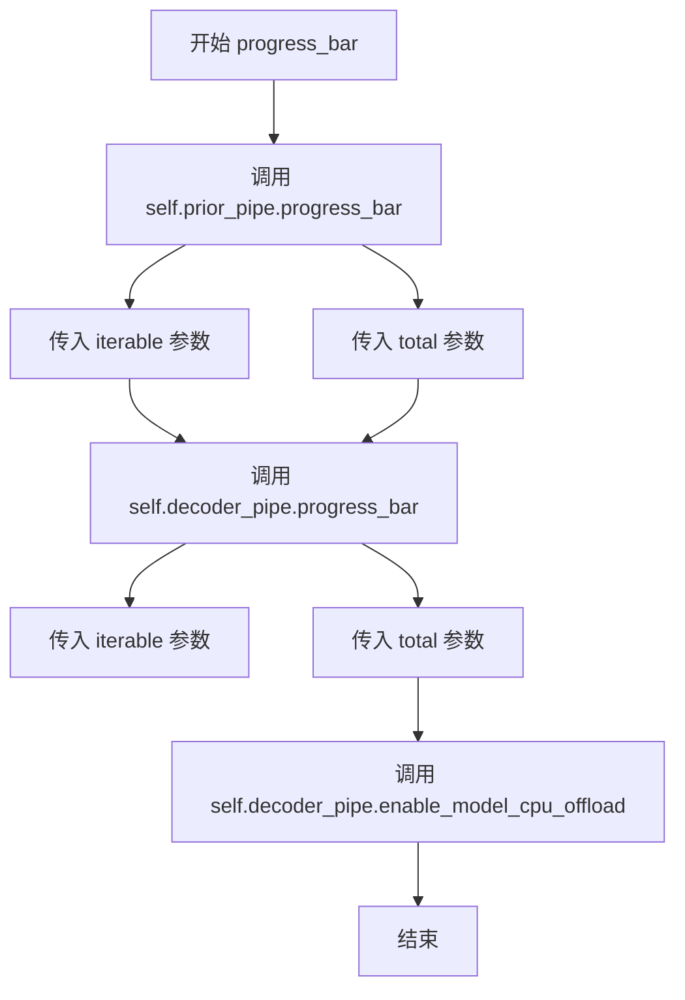

#### 带注释源码

```python
def progress_bar(self, iterable=None, total=None):
    """
    设置组合管道的进度条，并启用解码器模型的 CPU 卸载。
    
    该方法将进度条配置同时应用于先验管道（prior_pipe）和解码器管道（decoder_pipe），
    以便在两阶段图像生成过程中都能显示进度信息。同时，它还会在调用完成后
    启用解码器模型的 CPU 卸载以节省显存。
    
    参数:
        iterable: 可选的可迭代对象，用于包装进度条。如果提供，进度条将迭代该对象；
                 否则创建一个空进度条。
        total: 可选的整数，指定进度条的总步数。如果提供，进度条将显示完成百分比。
    
    返回:
        无返回值（None）
    """
    # 调用先验管道的 progress_bar 方法，配置先验生成阶段的进度条
    self.prior_pipe.progress_bar(iterable=iterable, total=total)
    
    # 调用解码器管道的 progress_bar 方法，配置图像解码阶段的进度条
    self.decoder_pipe.progress_bar(iterable=iterable, total=total)
    
    # 启用解码器模型的 CPU 卸载，以减少显存占用
    # 这是在两阶段生成完成后释放显存的关键步骤
    self.decoder_pipe.enable_model_cpu_offload()
```


### `KandinskyInpaintCombinedPipeline.set_progress_bar_config`

该方法用于配置联合管道中先验管道（prior_pipe）和解码器管道（decoder_pipe）的进度条显示行为，通过接收可变关键字参数并将配置传递给两个子管道，实现统一的进度条配置管理。

参数：

- `**kwargs`：`Any`，可变关键字参数，用于配置进度条的各种选项（如是否禁用、描述信息、总步数等），这些参数会被直接传递给先验管道和解码器管道的 `set_progress_bar_config` 方法

返回值：`None`，该方法无返回值，仅执行配置操作

#### 流程图

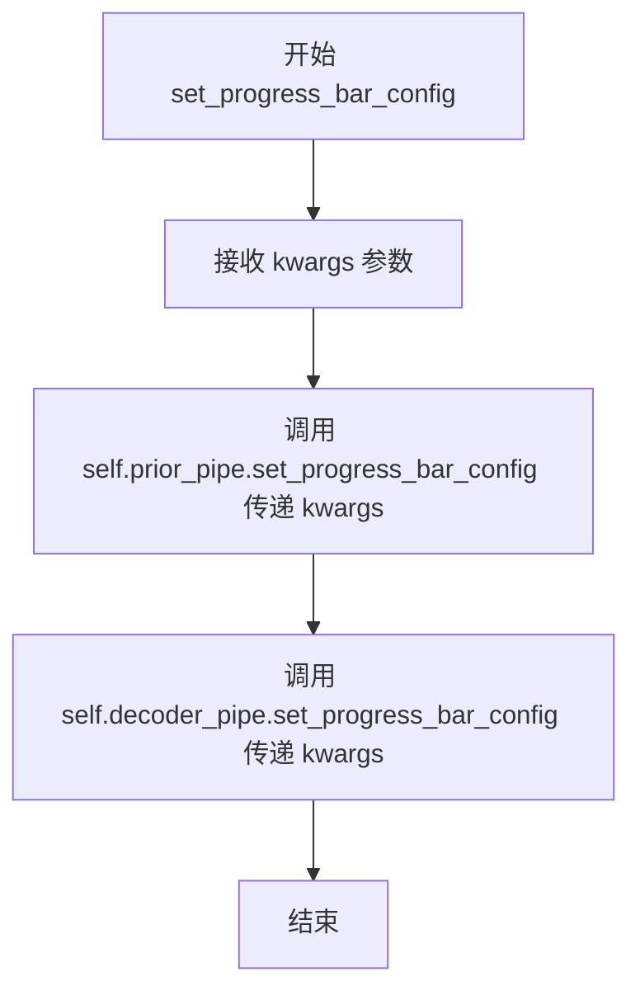

#### 带注释源码

```python
def set_progress_bar_config(self, **kwargs):
    """
    配置联合管道的进度条显示选项
    
    该方法将进度条配置参数同时传递给先验管道(prior_pipe)和解码器管道(decoder_pipe)，
    以确保整个生成流程中的进度条行为保持一致。
    
    参数通过 **kwargs 传递，支持的配置选项取决于底层调度器(scheduler)的进度条实现，
    常见的参数包括:
        - disable: 是否禁用进度条 (bool)
        - desc: 进度条描述文本 (str)
        - total: 总迭代次数 (int)
        - leave: 完成后是否保留进度条 (bool)
        - ncols: 进度条列数 (int)
        - 等其他 tqdm 可用的配置参数
    """
    # 将配置参数传递给先验管道，用于配置先验模型推理的进度条
    self.prior_pipe.set_progress_bar_config(**kwargs)
    
    # 将配置参数传递给解码器管道，用于配置解码器推理的进度条
    self.decoder_pipe.set_progress_bar_config(**kwargs)
```


### `KandinskyInpaintCombinedPipeline.__call__`

该方法是 Kandinsky 图像修复组合管道的核心调用函数，通过两阶段流程实现基于文本提示的图像修复：首先使用 PriorPipeline 将文本提示转换为图像嵌入，然后使用 InpaintPipeline 结合原始图像、掩码和图像嵌入生成修复后的图像。

参数：

- `prompt`：`str | list[str]`，用于指导图像生成的文本提示或提示列表
- `image`：`torch.Tensor | PIL.Image.Image | list[torch.Tensor] | list[PIL.Image.Image]`，作为修复起点的原始图像或图像批次
- `mask_image`：`torch.Tensor | PIL.Image.Image | list[torch.Tensor] | list[PIL.Image.Image]`，用于指示需要修复区域的掩码图像，白色像素将被重新绘制，黑色像素将被保留
- `negative_prompt`：`str | list[str] | None`，可选的负面提示，用于引导图像生成时不包含指定内容
- `num_inference_steps`：`int`，去噪步数，默认为 100，步数越多通常图像质量越高但推理速度越慢
- `guidance_scale`：`float`，分类器自由扩散引导（Classifier-Free Diffusion Guidance）比例，默认为 4.0，用于控制生成图像与文本提示的相关性
- `num_images_per_prompt`：`int`，每个提示生成的图像数量，默认为 1
- `height`：`int`，生成图像的高度（像素），默认为 512
- `width`：`int`，生成图像的宽度（像素），默认为 512
- `prior_guidance_scale`：`float`，Prior 阶段的引导比例，默认为 4.0
- `prior_num_inference_steps`：`int`，Prior 阶段的去噪步数，默认为 25
- `generator`：`torch.Generator | list[torch.Generator] | None`，可选的随机数生成器，用于确保生成的可确定性
- `latents`：`torch.Tensor | None`，预生成的噪声潜在向量，可用于通过不同提示微调相同生成
- `output_type`：`str | None`，输出格式，可选 "pil"（PIL.Image.Image）、"np"（np.array）或 "pt"（torch.Tensor），默认为 "pil"
- `callback`：`Callable[[int, int, torch.Tensor], None] | None`，可选的回调函数，每隔 callback_steps 步被调用
- `callback_steps`：`int`，回调函数被调用的频率，默认为 1
- `return_dict`：`bool`，是否返回 ImagePipelineOutput 而不是普通元组，默认为 True

返回值：`ImagePipelineOutput | tuple`，当 return_dict 为 True 时返回 ImagePipelineOutput 对象，否则返回元组

#### 流程图

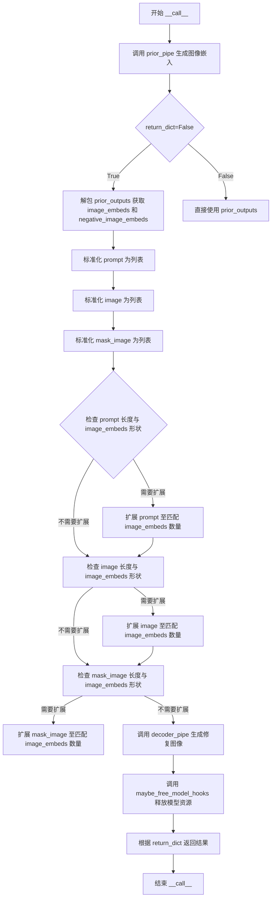

#### 带注释源码

```python
@torch.no_grad()
@replace_example_docstring(INPAINT_EXAMPLE_DOC_STRING)
def __call__(
    self,
    prompt: str | list[str],
    image: torch.Tensor | PIL.Image.Image | list[torch.Tensor] | list[PIL.Image.Image],
    mask_image: torch.Tensor | PIL.Image.Image | list[torch.Tensor] | list[PIL.Image.Image],
    negative_prompt: str | list[str] | None = None,
    num_inference_steps: int = 100,
    guidance_scale: float = 4.0,
    num_images_per_prompt: int = 1,
    height: int = 512,
    width: int = 512,
    prior_guidance_scale: float = 4.0,
    prior_num_inference_steps: int = 25,
    generator: torch.Generator | list[torch.Generator] | None = None,
    latents: torch.Tensor | None = None,
    output_type: str | None = "pil",
    callback: Callable[[int, int, torch.Tensor], None] | None = None,
    callback_steps: int = 1,
    return_dict: bool = True,
):
    """
    Function invoked when calling the pipeline for generation.

    Args:
        prompt (`str` or `list[str]`):
            The prompt or prompts to guide the image generation.
        image (`torch.Tensor`, `PIL.Image.Image`, `np.ndarray`, `list[torch.Tensor]`, `list[PIL.Image.Image]`, or `list[np.ndarray]`):
            `Image`, or tensor representing an image batch, that will be used as the starting point for the
            process. Can also accept image latents as `image`, if passing latents directly, it will not be encoded
            again.
        mask_image (`np.array`):
            Tensor representing an image batch, to mask `image`. White pixels in the mask will be repainted, while
            black pixels will be preserved. If `mask_image` is a PIL image, it will be converted to a single
            channel (luminance) before use. If it's a tensor, it should contain one color channel (L) instead of 3,
            so the expected shape would be `(B, H, W, 1)`.
        negative_prompt (`str` or `list[str]`, *optional*):
            The prompt or prompts not to guide the image generation. Ignored when not using guidance (i.e., ignored
            if `guidance_scale` is less than `1`).
        num_images_per_prompt (`int`, *optional*, defaults to 1):
            The number of images to generate per prompt.
        num_inference_steps (`int`, *optional*, defaults to 100):
            The number of denoising steps. More denoising steps usually lead to a higher quality image at the
            expense of slower inference.
        height (`int`, *optional*, defaults to 512):
            The height in pixels of the generated image.
        width (`int`, *optional*, defaults to 512):
            The width in pixels of the generated image.
        prior_guidance_scale (`float`, *optional*, defaults to 4.0):
            Guidance scale as defined in [Classifier-Free Diffusion
            Guidance](https://huggingface.co/papers/2207.12598). `guidance_scale` is defined as `w` of equation 2.
            of [Imagen Paper](https://huggingface.co/papers/2205.11487). Guidance scale is enabled by setting
            `guidance_scale > 1`. Higher guidance scale encourages to generate images that are closely linked to
            the text `prompt`, usually at the expense of lower image quality.
        prior_num_inference_steps (`int`, *optional*, defaults to 100):
            The number of denoising steps. More denoising steps usually lead to a higher quality image at the
            expense of slower inference.
        guidance_scale (`float`, *optional*, defaults to 4.0):
            Guidance scale as defined in [Classifier-Free Diffusion
            Guidance](https://huggingface.co/papers/2207.12598). `guidance_scale` is defined as `w` of equation 2.
            of [Imagen Paper](https://huggingface.co/papers/2205.11487). Guidance scale is enabled by setting
            `guidance_scale > 1`. Higher guidance scale encourages to generate images that are closely linked to
            the text `prompt`, usually at the expense of lower image quality.
        generator (`torch.Generator` or `list[torch.Generator]`, *optional*):
            One or a list of [torch generator(s)](https://pytorch.org/docs/stable/generated/torch.Generator.html)
            to make generation deterministic.
        latents (`torch.Tensor`, *optional*):
            Pre-generated noisy latents, sampled from a Gaussian distribution, to be used as inputs for image
            generation. Can be used to tweak the same generation with different prompts. If not provided, a latents
            tensor will be generated by sampling using the supplied random `generator`.
        output_type (`str`, *optional*, defaults to `"pil"`):
            The output format of the generate image. Choose between: `"pil"` (`PIL.Image.Image`), `"np"`
            (`np.array`) or `"pt"` (`torch.Tensor`).
        callback (`Callable`, *optional*):
            A function that calls every `callback_steps` steps during inference. The function is called with the
            following arguments: `callback(step: int, timestep: int, latents: torch.Tensor)`.
        callback_steps (`int`, *optional*, defaults to 1):
            The frequency at which the `callback` function is called. If not specified, the callback is called at
            every step.
        return_dict (`bool`, *optional*, defaults to `True`):
            Whether or not to return a [`~pipelines.ImagePipelineOutput`] instead of a plain tuple.

    Examples:

    Returns:
        [`~pipelines.ImagePipelineOutput`] or `tuple`
    """
    # 第一阶段：调用 prior_pipe 生成图像嵌入（image embeddings）
    # prior_pipe 将文本提示转换为图像嵌入向量，用于后续的图像生成
    prior_outputs = self.prior_pipe(
        prompt=prompt,
        negative_prompt=negative_prompt,
        num_images_per_prompt=num_images_per_prompt,
        num_inference_steps=prior_num_inference_steps,
        generator=generator,
        latents=latents,
        guidance_scale=prior_guidance_scale,
        output_type="pt",  # 强制输出为 PyTorch 张量
        return_dict=False,  # 使用元组返回以便解包
    )
    # 从 prior 输出中解包获取图像嵌入和负面图像嵌入
    image_embeds = prior_outputs[0]
    negative_image_embeds = prior_outputs[1]

    # 标准化输入格式：将单个 prompt 转换为列表
    prompt = [prompt] if not isinstance(prompt, (list, tuple)) else prompt
    # 标准化图像输入：将单个图像转换为列表（注意：此处存在潜在 bug，应检查 image 而非 prompt）
    image = [image] if isinstance(prompt, PIL.Image.Image) else image
    # 标准化掩码输入：将单个掩码转换为列表
    mask_image = [mask_image] if isinstance(mask_image, PIL.Image.Image) else mask_image

    # 处理 prompt 数量与图像嵌入数量不匹配的情况
    # 如果 prompt 数量较少但图像嵌入数量能被 prompt 数量整除，则扩展 prompt 列表
    if len(prompt) < image_embeds.shape[0] and image_embeds.shape[0] % len(prompt) == 0:
        prompt = (image_embeds.shape[0] // len(prompt)) * prompt

    # 处理图像数量与图像嵌入数量不匹配的情况
    if (
        isinstance(image, (list, tuple))
        and len(image) < image_embeds.shape[0]
        and image_embeds.shape[0] % len(image) == 0
    ):
        image = (image_embeds.shape[0] // len(image)) * image

    # 处理掩码数量与图像嵌入数量不匹配的情况
    if (
        isinstance(mask_image, (list, tuple))
        and len(mask_image) < image_embeds.shape[0]
        and image_embeds.shape[0] % len(mask_image) == 0
    ):
        mask_image = (image_embeds.shape[0] // len(mask_image)) * mask_image

    # 第二阶段：调用 decoder_pipe 生成修复后的图像
    # decoder_pipe 接收原始图像、掩码、图像嵌入等，生成最终修复图像
    outputs = self.decoder_pipe(
        prompt=prompt,
        image=image,
        mask_image=mask_image,
        image_embeds=image_embeds,
        negative_image_embeds=negative_image_embeds,
        width=width,
        height=height,
        num_inference_steps=num_inference_steps,
        generator=generator,
        guidance_scale=guidance_scale,
        output_type=output_type,
        callback=callback,
        callback_steps=callback_steps,
        return_dict=return_dict,
    )

    # 释放不再需要的模型钩子和资源
    self.maybe_free_model_hooks()

    # 返回生成结果
    return outputs
```

## 关键组件


### KandinskyCombinedPipeline

Kandinsky组合流水线是用于文本到图像生成的统一接口，整合了先验管道（生成图像嵌入）和解码器管道（从嵌入生成最终图像），通过级联方式实现text-to-image功能。

### KandinskyImg2ImgCombinedPipeline

图像到图像组合流水线，继承自DiffusionPipeline，通过先验管道生成图像嵌入，解码器管道接收原始图像和嵌入进行图像变换，支持图像风格迁移和内容修改。

### KandinskyInpaintCombinedPipeline

图像修复组合流水线，通过mask机制实现指定区域的图像重绘，先验管道生成图像嵌入，解码器管道根据mask区域进行条件生成。

### Prior管道 (KandinskyPriorPipeline)

先验管道负责将文本嵌入转换为图像嵌入，使用PriorTransformer模型结合CLIP图像和文本编码器，通过UnCLIPScheduler调度器生成用于条件扩散的图像embedding。

### 解码器管道 (KandinskyPipeline/KandinskyImg2ImgPipeline/KandinskyInpaintPipeline)

解码器管道接收图像嵌入作为条件，使用UNet2DConditionModel进行去噪处理，通过VQModel (MoVQ) 将潜在向量解码为最终图像，支持text-to-image、img2img和inpainting三种模式。

### 多语言CLIP文本编码器 (MultilingualCLIP)

支持多语言文本输入的CLIP模型变体，将文本提示转换为高维嵌入向量，用于条件图像生成。

### 图像先验编码器 (CLIPVisionModelWithProjection)

冻结的CLIP视觉编码器，将输入图像转换为图像嵌入向量，用于无分类器引导和图像条件生成。

### UNet2DConditionModel

条件U-Net架构，接收噪声潜在表示和条件嵌入，通过多次去噪迭代逐步恢复目标图像。

### VQModel (MoVQ)

向量量化解码器，将去噪后的潜在表示转换为最终RGB图像，提供高质量的图像重建能力。

### PriorTransformer

canonical unCLIP先验模型，从文本嵌入预测对应的图像嵌入，实现文本到图像空间的映射。

### 调度器 (DDIMScheduler/DDPMScheduler/UnCLIPScheduler)

扩散模型调度器，控制去噪过程中的噪声调度策略，DDIM用于确定性采样，DDPMS用于随机采样，UnCLIP专门用于先验管道。

### 内存优化机制

包括xformers高效注意力、顺序CPU卸载和模型CPU卸载功能，通过model_cpu_offload_seq定义卸载顺序，显著降低GPU显存占用。

### 回调系统

支持自定义回调函数在推理过程中监控进度，通过callback_steps控制调用频率，允许用户实现进度条和中间结果处理。

## 问题及建议


### 已知问题

-   **代码重复严重**：三个组合管道类（KandinskyCombinedPipeline、KandinskyImg2ImgCombinedPipeline、KandinskyInpaintCombinedPipeline）存在大量重复代码，包括相同的辅助方法（enable_xformers_memory_efficient_attention、enable_sequential_cpu_offload、progress_bar、set_progress_bar_config）和类似的初始化逻辑，应提取为基类或混入类。
-   **类型检查Bug**：在 KandinskyImg2ImgCombinedPipeline.__call__ 中，image 列表转换使用了错误的条件判断 `isinstance(prompt, PIL.Image.Image)` 而非 `isinstance(image, PIL.Image.Image)`，同样问题存在于 KandinskyInpaintCombinedPipeline。
-   **文档字符串错误**：__call__ 方法的参数文档中 guidance_scale、prior_guidance_scale 和 prior_num_inference_steps 的描述重复或位置错误。
-   **progress_bar副作用**：progress_bar 方法在调用时会额外执行 `self.decoder_pipe.enable_model_cpu_offload()`，这会导致每次调用进度条时都触发CPU卸载逻辑，可能造成意外行为。
-   **缺少输入验证**：对 negative_prompt、latents 等关键参数的合法性检查不足，可能导致运行时错误。

### 优化建议

-   **提取基类**：将三个组合管道类的公共逻辑提取到一个抽象基类中，减少约70%的代码重复。
-   **修复类型检查**：将 image 列表化时的条件改为 `isinstance(image, PIL.Image.Image)`。
-   **修正文档**：清理 __call__ 方法中的参数文档，确保每个参数的描述准确且不重复。
-   **解耦progress_bar**：移除 progress_bar 方法中的 `enable_model_cpu_offload()` 调用，或将其移至初始化阶段。
-   **增加参数验证**：在 __call__ 方法入口添加参数合法性检查，如 prompt 非空、num_inference_steps > 0、guidance_scale >= 0 等。
-   **统一模块导入**：考虑使用绝对导入或明确的相对导入替代当前的三点导入形式。

## 其它


### 设计目标与约束

本模块的设计目标是为Kandinsky模型提供统一的三种生成模式（文本到图像、图像到图像、图像修复）的组合管道，简化用户调用接口，统一资源管理和内存优化策略。核心约束包括：必须依赖DiffusionPipeline基类实现标准接口；prior管道和decoder管道必须同时加载；内存优化策略（xformers、CPU offload）需同时应用到两个子管道；输出格式需支持pil、np、pt三种格式。

### 错误处理与异常设计

管道对输入参数进行类型检查和基本验证，包括prompt类型（str或list）、图像类型支持torch.Tensor、PIL.Image.Image及list形式。对于参数不匹配情况（如prompt列表长度与生成的image_embeds数量不一致），管道通过复制扩展方式自动处理。当任一子管道（prior_pipe或decoder_pipe）抛出异常时，异常会向上传播，调用方需自行处理。callback函数执行过程中的异常会被捕获但不中断主流程。模型加载失败时由transformers库抛出原异常。

### 数据流与状态机

整体数据流分为两个主要阶段：第一阶段为先验生成（prior_pipe），接收文本prompt和negative_prompt，输出image_embeds和negative_image_embeds（float32张量）；第二阶段为解码生成（decoder_pipe），接收第一阶段的embeddings和原始prompt，输出最终图像。三种管道的差异体现在decoder_pipe调用的具体类（KandinskyPipeline、KandinskyImg2ImgPipeline、KandinskyInpaintPipeline）以及传递的额外参数（image、mask_image、strength）。管道内部无显式状态机，状态由底层模型和调度器管理。

### 外部依赖与接口契约

核心依赖包括：transformers库提供的CLIPTextModelWithProjection、CLIPVisionModelWithProjection、CLIPTokenizer、XLMRobertaTokenizer；diffusers库提供的PriorTransformer、UNet2DConditionModel、VQModel、DDIMScheduler、DDPMScheduler、UnCLIPScheduler；本地模块KandinskyPriorPipeline、KandinskyPipeline、KandinskyImg2ImgPipeline、KandinskyInpaintPipeline、MultilingualCLIP。输入契约要求prompt为字符串或字符串列表，image和mask_image支持PIL.Image或torch.Tensor，generator支持None或torch.Generator。输出契约规定返回ImagePipelineOutput或tuple格式，图像数量由num_images_per_prompt决定。

### 性能考虑与优化策略

管道实现了三种内存优化机制：enable_xformers_memory_efficient_attention使用xformers库加速注意力计算；enable_sequential_cpu_offload将模型分批加载到GPU以节省显存；model_cpu_offload_seq定义自动CPU offload顺序。prior管道默认排除在model_cpu_offload之外以保证性能。先验生成默认使用25步（prior_num_inference_steps），解码生成默认使用100步，用户可通过调整步数权衡质量和速度。num_images_per_prompt增加会线性增加内存占用。

### 安全性考虑

管道本身不包含内容过滤或安全检查功能，安全检查需由上层应用实现。模型权重来源于HuggingFace Hub，需确保使用可信来源的预训练模型。negative_prompt机制允许用户排除不需要的内容元素。生成的图像输出不包含元数据追溯信息。

### 配置管理与模型加载

管道通过register_modules方法注册所有子模块，支持save_pretrained和from_pretrained的序列化。模型加载时自动检测设备（cuda/cpu），可通过enable_model_cpu_offload()将未使用模型移至CPU。torch_dtype参数控制模型精度（float32/float16），建议GPU环境下使用float16以提升性能并降低显存占用。

### 版本兼容性与依赖要求

代码使用Python 3.8+类型注解（|语法），依赖torch、transformers、diffusers库。CLIPImageProcessor来自transformers库，需确保transformers版本>=4.20。PIL依赖Pillow库。xformers优化为可选依赖，不安装时enable_xformers调用无效但不报错。

### 测试策略建议

单元测试应覆盖：三种管道的基本调用（mock子管道）；参数类型验证；输出格式转换（pil/np/pt）；内存优化方法的调用链路。集成测试应覆盖：真实模型推理（需下载权重）；多prompt批量生成；callback函数触发验证；内存占用监控。

### 部署注意事项

生产环境部署需考虑：模型权重预热（首次推理较慢）；GPU显存峰值监控（尤其高分辨率输出）；多并发请求时的管道实例隔离；日志级别配置（info级别输出进度条）；异常捕获和重试机制。建议使用pipeline.enable_model_cpu_offload()进行内存优化。

    