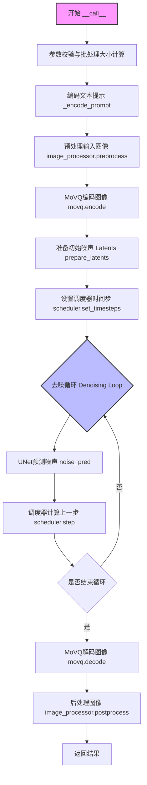
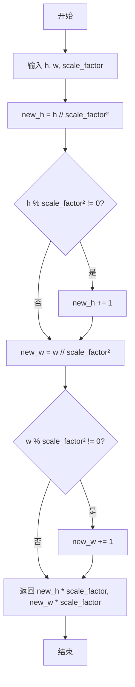
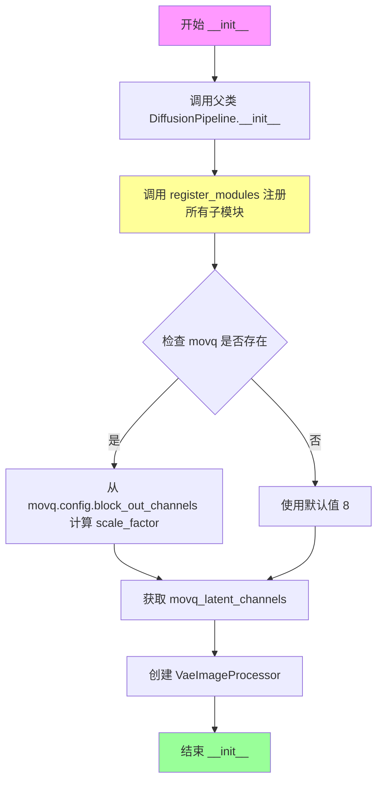
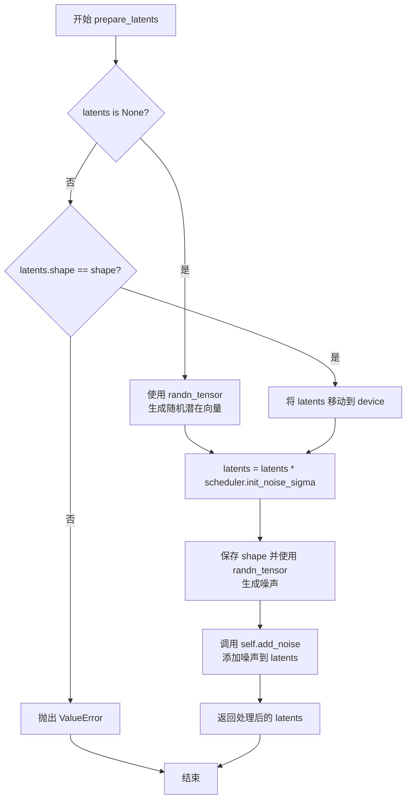
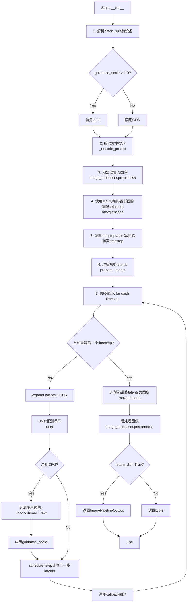

# `diffusers\src\diffusers\pipelines\kandinsky\pipeline_kandinsky_img2img.py` 详细设计文档

这是一个用于图像到图像生成的 Kandinsky 扩散管道（KandinskyImg2ImgPipeline），它集成了 MultilingualCLIP 文本编码器、MoVQ（VQModel）图像编解码器和条件 UNet（UNet2DConditionModel）。管道接收文本提示、原始图像和图像嵌入，在 DDIMScheduler 的控制下对图像的潜在表示进行去噪，最终通过解码潜在向量生成符合文本描述的目标图像。

## 整体流程



## 类结构

```
DiffusionPipeline (抽象基类)
└── KandinskyImg2ImgPipeline (图像到图像生成管道实现)
```

## 全局变量及字段


### `logger`
    
日志记录器，用于记录管道运行过程中的警告和信息

类型：`logging.Logger`
    


### `EXAMPLE_DOC_STRING`
    
示例代码文档字符串，包含KandinskyImg2ImgPipeline的使用示例

类型：`str`
    


### `XLA_AVAILABLE`
    
布尔标记，指示torch_xla是否可用，用于支持TPU加速

类型：`bool`
    


### `KandinskyImg2ImgPipeline.model_cpu_offload_seq`
    
模型卸载顺序字符串，定义CPU卸载模型组件的顺序

类型：`str`
    


### `KandinskyImg2ImgPipeline.text_encoder`
    
多语言CLIP文本编码器，用于将文本提示编码为向量表示

类型：`MultilingualCLIP`
    


### `KandinskyImg2ImgPipeline.tokenizer`
    
XLM-RoBERTa分词器，用于对文本提示进行分词和编码

类型：`XLMRobertaTokenizer`
    


### `KandinskyImg2ImgPipeline.unet`
    
条件U-Net去噪模型，用于在潜在空间中进行图像去噪

类型：`UNet2DConditionModel`
    


### `KandinskyImg2ImgPipeline.scheduler`
    
DDIM调度器，用于控制去噪过程中的噪声调度

类型：`DDIMScheduler`
    


### `KandinskyImg2ImgPipeline.movq`
    
MoVQ图像编解码模型，用于图像的编码和解码

类型：`VQModel`
    


### `KandinskyImg2ImgPipeline.movq_scale_factor`
    
MoVQ的潜在空间缩放因子，用于计算图像尺寸

类型：`int`
    


### `KandinskyImg2ImgPipeline.image_processor`
    
VAE图像处理器，用于图像的预处理和后处理

类型：`VaeImageProcessor`
    
    

## 全局函数及方法


### `get_new_h_w`

该函数是一个辅助函数，用于根据缩放因子计算调整后的图像高宽。它通过向上取整的方式确保原始尺寸能被缩放因子的平方整除，然后返回调整后的尺寸（乘以缩放因子），常用于计算VAE编码或解码后的潜在空间尺寸。

参数：

- `h`：`int`，原始图像的高度（像素）
- `w`：`int`，原始图像的宽度（像素）
- `scale_factor`：`int`，缩放因子，默认为8，用于VAE的潜在空间尺寸计算

返回值：`tuple[int, int]`，返回调整后的高宽 tuple(new_h * scale_factor, new_w * scale_factor)，确保尺寸适合VAE处理

#### 流程图



#### 带注释源码

```python
def get_new_h_w(h, w, scale_factor=8):
    """
    根据缩放因子计算调整后的图像高宽
    
    该函数用于确保图像尺寸能被缩放因子的平方整除，通过向上取整的方式
    处理无法整除的情况，然后返回调整后的尺寸（乘以缩放因子）。
    这在VAE编码/解码时确保潜在空间尺寸的正确计算。
    
    参数:
        h: int, 原始图像高度
        w: int, 原始图像宽度
        scale_factor: int, 缩放因子，默认为8，对应VAE的scale_factor
    
    返回:
        tuple[int, int]: 调整后的高宽 (new_h * scale_factor, new_w * scale_factor)
    """
    # 计算高度方向的调整尺寸：先除以scale_factor的平方
    new_h = h // scale_factor**2
    # 如果不能整除，向上取整
    if h % scale_factor**2 != 0:
        new_h += 1
    
    # 计算宽度方向的调整尺寸：先除以scale_factor的平方
    new_w = w // scale_factor**2
    # 如果不能整除，向上取整
    if w % scale_factor**2 != 0:
        new_w += 1
    
    # 返回调整后的尺寸（乘以缩放因子）
    return new_h * scale_factor, new_w * scale_factor
```


### `KandinskyImg2ImgPipeline.__init__`

该构造函数是 KandinskyImg2ImgPipeline 类的初始化方法，负责接收并注册文本编码器、MoVQ模型、分词器、UNet和调度器等核心组件，同时计算图像处理器的缩放因子，为后续图像生成流程做好准备。

参数：

- `text_encoder`：`MultilingualCLIP`，冻结的文本编码器，用于将文本提示转换为嵌入向量
- `movq`：`VQModel`，MoVQ图像编码器和解码器，负责图像的潜空间编码与解码
- `tokenizer`：`XLMRobertaTokenizer`，用于将文本提示分词为token序列
- `unet`：`UNet2DConditionModel`，条件U-Net架构，用于对图像嵌入进行去噪
- `scheduler`：`DDIMScheduler`，与unet配合使用生成图像潜变量的调度器

返回值：`None`，无返回值（构造函数）

#### 流程图



#### 带注释源码

```python
def __init__(
    self,
    text_encoder: MultilingualCLIP,      # 文本编码器：MultilingualCLIP模型
    movq: VQModel,                        # MoVQ模型：图像编解码器
    tokenizer: XLMRobertaTokenizer,       # 分词器：XLM-RoBERTa分词器
    unet: UNet2DConditionModel,            # UNet：条件去噪网络
    scheduler: DDIMScheduler,              # 调度器：DDIM调度器
):
    # 调用父类DiffusionPipeline的初始化方法
    # 父类负责设置基础pipeline配置和设备管理
    super().__init__()

    # 注册所有子模块，使pipeline能够追踪和管理这些组件
    # 注册后的模块可通过pipeline.module_name访问
    self.register_modules(
        text_encoder=text_encoder,
        tokenizer=tokenizer,
        unet=unet,
        scheduler=scheduler,
        movq=movq,
    )
    
    # 计算MoVQ的缩放因子，用于后续图像尺寸的调整
    # 基于MoVQ的block_out_channels计算：2^(len(channels)-1)
    # 例如channels=[128,256,512,512] -> 2^3 = 8
    self.movq_scale_factor = (
        2 ** (len(self.movq.config.block_out_channels) - 1) if getattr(self, "movq", None) else 8
    )
    
    # 获取MoVQ的潜在通道数，用于配置图像处理器
    movq_latent_channels = self.movq.config.latent_channels if getattr(self, "movq", None) else 4
    
    # 创建VAE图像处理器，负责图像的预处理和后处理
    # vae_scale_factor: 潜在空间与像素空间的缩放比例
    # vae_latent_channels: 潜在空间的通道数
    # resample: 重采样方法，使用双三次插值
    # reducing_gap: 减少间隙参数
    self.image_processor = VaeImageProcessor(
        vae_scale_factor=self.movq_scale_factor,
        vae_latent_channels=movq_latent_channels,
        resample="bicubic",
        reducing_gap=1,
    )
```


### `KandinskyImg2ImgPipeline.get_timesteps`

根据推理步数和强度（strength）计算图像到图像生成过程中实际使用的时间步。该方法根据强度参数确定从调度器时间步序列中提取的子集，以控制图像变换的程度。

参数：

- `num_inference_steps`：`int`，推理步数，即去噪过程的总迭代次数
- `strength`：`float`，强度参数，控制图像变换的程度，值介于0到1之间，值越大表示对原图的变换越强
- `device`：`torch.device`，计算设备（CPU或CUDA）

返回值：`Tuple[torch.Tensor, int]`，返回两个值：
- `timesteps`：`torch.Tensor`，调整后的时间步张量，用于去噪循环
- `num_inference_steps - t_start`：`int`，实际执行的推理步数

#### 流程图

```mermaid
flowchart TD
    A[开始 get_timesteps] --> B[计算 init_timestep = min(int(num_inference_steps * strength), num_inference_steps)]
    B --> C[计算 t_start = max(num_inference_steps - init_timestep, 0)]
    C --> D[从 scheduler.timesteps 切片获取 timesteps[t_start:]]
    D --> E[返回 timesteps 和 num_inference_steps - t_start]
```

#### 带注释源码

```python
def get_timesteps(self, num_inference_steps, strength, device):
    """
    根据推理步数和强度计算时间步
    
    Args:
        num_inference_steps: 推理步数
        strength: 强度参数，控制图像变换程度
        device: 计算设备
    """
    # 根据强度计算初始时间步数
    # 如果 strength=1.0, 则使用全部 num_inference_steps 步
    # 如果 strength=0.0, 则使用 0 步（完全保留原图）
    init_timestep = min(int(num_inference_steps * strength), num_inference_steps)

    # 计算起始索引：从时间步序列的末尾开始
    # 强度越大，t_start 越小，使用的时间步越多
    t_start = max(num_inference_steps - init_timestep, 0)
    
    # 从调度器的时间步序列中切片获取实际使用的时间步
    timesteps = self.scheduler.timesteps[t_start:]

    # 返回时间步和实际推理步数
    return timesteps, num_inference_steps - t_start
```


### `KandinskyImg2ImgPipeline.prepare_latents`

该方法负责为图像到图像生成流程准备初始潜在向量，包括随机初始化潜在向量（如果未提供）或验证已有潜在向量的形状，然后根据调度器的初始噪声sigma对潜在向量进行缩放，并使用指定的潜在时间步向潜在向量添加噪声。

参数：

- `self`：`KandinskyImg2ImgPipeline`，当前管道实例
- `latents`：`torch.Tensor | None`，可选的预计算潜在向量，如果为None则随机生成
- `latent_timestep`：`torch.Tensor`，用于添加噪声的时间步
- `shape`：`tuple`，期望的潜在向量形状，通常为 (batch_size, num_channels_latents, height, width)
- `dtype`：`torch.dtype`，潜在向量的数据类型
- `device`：`torch.device`，潜在向量所在的设备
- `generator`：`torch.Generator | None`，用于生成确定性随机数的生成器
- `scheduler`：`DDIMScheduler`，调度器实例，用于获取初始噪声sigma

返回值：`torch.Tensor`，处理并添加噪声后的潜在向量

#### 流程图



#### 带注释源码

```python
def prepare_latents(self, latents, latent_timestep, shape, dtype, device, generator, scheduler):
    """
    准备潜在向量，为图像生成流程准备初始状态
    
    参数:
        latents: 可选的预计算潜在向量，如果为None则随机生成
        latent_timestep: 用于添加噪声的时间步
        shape: 期望的潜在向量形状
        dtype: 潜在向量的数据类型
        device: 潜在向量所在的设备
        generator: 用于生成确定性随机数的生成器
        scheduler: 调度器实例，用于获取初始噪声sigma
    """
    # 如果未提供潜在向量，则使用随机张量初始化
    if latents is None:
        latents = randn_tensor(shape, generator=generator, device=device, dtype=dtype)
    else:
        # 验证提供的潜在向量形状是否匹配预期
        if latents.shape != shape:
            raise ValueError(f"Unexpected latents shape, got {latents.shape}, expected {shape}")
        # 将潜在向量移动到指定设备
        latents = latents.to(device)

    # 根据调度器的初始噪声sigma缩放潜在向量
    # 这控制了初始噪声的强度
    latents = latents * scheduler.init_noise_sigma

    # 保存形状信息用于生成噪声
    shape = latents.shape
    # 生成与潜在向量形状相同的噪声
    noise = randn_tensor(shape, generator=generator, device=device, dtype=dtype)

    # 使用指定的时间步将噪声添加到潜在向量
    # 这是扩散模型前向过程的关键步骤
    latents = self.add_noise(latents, noise, latent_timestep)
    return latents
```


### `KandinskyImg2ImgPipeline._encode_prompt`

该方法用于将文本提示词（包含正向和负向提示词）编码为文本嵌入向量，以便后续用于图像生成模型的条件控制。当启用无分类器引导（Classifier-Free Guidance）时，该方法会同时处理负向提示词并将其与正向提示词的嵌入进行拼接，以实现CFG机制。

参数：

- `prompt`：`str | list[str]`，需要编码的文本提示词，支持单个字符串或字符串列表
- `device`：`torch.device`，计算设备，用于将张量移动到指定设备
- `num_images_per_prompt`：`int`，每个提示词要生成的图像数量，用于重复嵌入向量
- `do_classifier_free_guidance`：`bool`，是否启用无分类器引导，当为True时会处理负向提示词
- `negative_prompt`：`str | list[str] | None`，可选的负向提示词，用于引导模型避免生成相关内容

返回值：`tuple[torch.Tensor, torch.Tensor, torch.Tensor]`，返回三个张量组成的元组：
- `prompt_embeds`：文本提示词的嵌入向量，形状为 (batch_size * num_images_per_prompt, seq_len, embed_dim)
- `text_encoder_hidden_states`：文本编码器的隐藏状态，形状为 (batch_size * num_images_per_prompt, seq_len, hidden_dim)
- `text_mask`：文本注意力掩码，用于标识有效token位置

#### 流程图

```mermaid
flowchart TD
    A[开始 _encode_prompt] --> B[计算 batch_size]
    B --> C{prompt 是列表?}
    C -->|是| D[batch_size = len(prompt)]
    C -->|否| E[batch_size = 1]
    
    D --> F[tokenizer 处理 prompt]
    E --> F
    
    F --> G[获取 text_inputs]
    G --> H[获取 untruncated_ids]
    H --> I{untruncated_ids 长度 >= text_input_ids 且不相等?}
    I -->|是| J[记录警告日志：提示词被截断]
    I -->|否| K[继续]
    J --> K
    
    K --> L[移动 text_input_ids 和 text_mask 到 device]
    L --> M[调用 text_encoder 获取嵌入]
    
    M --> N[repeat_interleave 扩展 prompt_embeds]
    N --> O[repeat_interleave 扩展 text_encoder_hidden_states]
    O --> P[repeat_interleave 扩展 text_mask]
    
    P --> Q{do_classifier_free_guidance = True?}
    Q -->|否| R[直接返回结果]
    
    Q -->|是| S{negative_prompt 为 None?}
    S -->|是| T[uncond_tokens = [''] * batch_size]
    S -->|否| U{type(prompt) != type(negative_prompt)?]
    U -->|是| V[抛出类型错误]
    U -->|否| W{negative_prompt 是 str?}
    W -->|是| X[uncond_tokens = [negative_prompt]]
    W -->|否| Y{batch_size != len(negative_prompt)?]
    Y -->|是| Z[抛出值错误]
    Y -->|否| AA[uncond_tokens = negative_prompt]
    
    T --> AB[tokenizer 处理 uncond_tokens]
    X --> AB
    AA --> AB
    
    AB --> AC[移动 uncond_tokens 到 device]
    AC --> AD[text_encoder 编码负向提示词]
    
    AD --> AE[repeat 扩展 negative_prompt_embeds]
    AE --> AF[view 重塑为 batch_size * num_images_per_prompt]
    AF --> AG[repeat_interleave 扩展 uncond_text_encoder_hidden_states]
    AG --> AH[view 重塑隐藏状态]
    AI --> AJ[repeat_interleave 扩展 uncond_text_mask]
    
    AJ --> AK[torch.cat 拼接 negative_prompt_embeds 和 prompt_embeds]
    AK --> AL[torch.cat 拼接隐藏状态]
    AL --> AM[torch.cat 拼接 text_mask]
    AM --> R
    
    R --> AN[返回 prompt_embeds, text_encoder_hidden_states, text_mask]
```

#### 带注释源码

```python
def _encode_prompt(
    self,
    prompt,                      # str | list[str]: 输入的文本提示词
    device,                      # torch.device: 计算设备
    num_images_per_prompt,       # int: 每个提示词生成的图像数量
    do_classifier_free_guidance, # bool: 是否启用无分类器引导
    negative_prompt=None,        # str | list[str] | None: 负向提示词
):
    # 1. 确定批量大小：如果prompt是列表则取其长度，否则为1
    batch_size = len(prompt) if isinstance(prompt, list) else 1
    
    # 2. 使用tokenizer对提示词进行编码
    # 返回包含input_ids和attention_mask的字典
    text_inputs = self.tokenizer(
        prompt,
        padding="max_length",      # 填充到最大长度
        max_length=77,              # 最大token长度（CLIP标准）
        truncation=True,            # 启用截断
        return_attention_mask=True, # 返回注意力掩码
        add_special_tokens=True,    # 添加特殊token（如[CLS], [SEP]）
        return_tensors="pt",        # 返回PyTorch张量
    )

    # 获取编码后的input_ids
    text_input_ids = text_inputs.input_ids
    
    # 3. 获取未截断的版本用于检测截断情况
    untruncated_ids = self.tokenizer(
        prompt, 
        padding="longest", 
        return_tensors="pt"
    ).input_ids

    # 4. 检测并警告提示词被截断的情况
    # 如果未截断的序列长度大于等于截断后的长度，且两者不相等
    if (untruncated_ids.shape[-1] >= text_input_ids.shape[-1] 
        and not torch.equal(text_input_ids, untruncated_ids)):
        # 解码被截断的部分用于日志记录
        removed_text = self.tokenizer.batch_decode(
            untruncated_ids[:, self.tokenizer.model_max_length - 1 : -1]
        )
        logger.warning(
            "The following part of your input was truncated because CLIP can only handle sequences up to"
            f" {self.tokenizer.model_max_length} tokens: {removed_text}"
        )

    # 5. 将编码后的token IDs和注意力掩码移动到指定设备
    text_input_ids = text_input_ids.to(device)
    text_mask = text_inputs.attention_mask.to(device)

    # 6. 使用文本编码器获取文本嵌入和隐藏状态
    # text_encoder是MultilingualCLIP模型
    prompt_embeds, text_encoder_hidden_states = self.text_encoder(
        input_ids=text_input_ids, 
        attention_mask=text_mask
    )

    # 7. 扩展嵌入维度以匹配num_images_per_prompt
    # repeat_interleave在序列维度上重复每个样本
    prompt_embeds = prompt_embeds.repeat_interleave(num_images_per_prompt, dim=0)
    text_encoder_hidden_states = text_encoder_hidden_states.repeat_interleave(
        num_images_per_prompt, 
        dim=0
    )
    text_mask = text_mask.repeat_interleave(num_images_per_prompt, dim=0)

    # 8. 如果启用无分类器引导（CFG），处理负向提示词
    if do_classifier_free_guidance:
        uncond_tokens: list[str]
        
        # 处理negative_prompt为None的情况，使用空字符串
        if negative_prompt is None:
            uncond_tokens = [""] * batch_size
        # 类型检查：negative_prompt和prompt类型必须一致
        elif type(prompt) is not type(negative_prompt):
            raise TypeError(
                f"`negative_prompt` should be the same type to `prompt`, but got {type(negative_prompt)} !="
                f" {type(prompt)}."
            )
        # 如果negative_prompt是字符串，转换为单元素列表
        elif isinstance(negative_prompt, str):
            uncond_tokens = [negative_prompt]
        # 批量大小检查
        elif batch_size != len(negative_prompt):
            raise ValueError(
                f"`negative_prompt`: {negative_prompt} has batch size {len(negative_prompt)}, but `prompt`:"
                f" {prompt} has batch size {batch_size}. Please make sure that passed `negative_prompt` matches"
                " the batch size of `prompt`."
            )
        else:
            uncond_tokens = negative_prompt

        # 9. 对负向提示词进行tokenize
        uncond_input = self.tokenizer(
            uncond_tokens,
            padding="max_length",
            max_length=77,
            truncation=True,
            return_attention_mask=True,
            add_special_tokens=True,
            return_tensors="pt",
        )
        
        # 移动到设备
        uncond_text_input_ids = uncond_input.input_ids.to(device)
        uncond_text_mask = uncond_input.attention_mask.to(device)

        # 10. 编码负向提示词
        negative_prompt_embeds, uncond_text_encoder_hidden_states = self.text_encoder(
            input_ids=uncond_text_input_ids, 
            attention_mask=uncond_text_mask
        )

        # 11. 复制负向嵌入以匹配num_images_per_prompt
        # 使用repeat而不是repeat_interleave，因为需要复制整个序列
        seq_len = negative_prompt_embeds.shape[1]
        negative_prompt_embeds = negative_prompt_embeds.repeat(1, num_images_per_prompt)
        negative_prompt_embeds = negative_prompt_embeds.view(
            batch_size * num_images_per_prompt, 
            seq_len
        )

        seq_len = uncond_text_encoder_hidden_states.shape[1]
        uncond_text_encoder_hidden_states = uncond_text_encoder_hidden_states.repeat(
            1, 
            num_images_per_prompt, 
            1
        )
        uncond_text_encoder_hidden_states = uncond_text_encoder_hidden_states.view(
            batch_size * num_images_per_prompt, 
            seq_len, 
            -1
        )
        
        # 复制注意力掩码
        uncond_text_mask = uncond_text_mask.repeat_interleave(num_images_per_prompt, dim=0)

        # 12. 拼接正向和负向嵌入以实现CFG
        # 在批次维度拼接：前部分是unconditional，后部分是conditional
        # 这样可以在一次前向传播中同时计算有条件和无条件的预测
        prompt_embeds = torch.cat([negative_prompt_embeds, prompt_embeds])
        text_encoder_hidden_states = torch.cat(
            [uncond_text_encoder_hidden_states, text_encoder_hidden_states]
        )
        text_mask = torch.cat([uncond_text_mask, text_mask])

    # 13. 返回编码后的嵌入向量、隐藏状态和注意力掩码
    return prompt_embeds, text_encoder_hidden_states, text_mask
```


### `KandinskyImg2ImgPipeline.add_noise`

该方法重写了调度器中的 `add_noise` 方法，用于根据自定义的线性 beta 调度向潜在向量添加噪声。它计算 alpha 累积乘积，并使用标准扩散前向过程公式 $x_t = \sqrt{\bar{\alpha}_t}x_0 + \sqrt{1-\bar{\alpha}_t}\epsilon$ 将噪声添加到原始样本中。

参数：

- `original_samples`：`torch.Tensor`，原始潜在向量或图像潜在表示
- `noise`：`torch.Tensor`，要添加的高斯噪声
- `timesteps`：`torch.IntTensor`，用于确定每个样本添加噪声程度的时间步

返回值：`torch.Tensor`，添加噪声后的潜在向量

#### 流程图

```mermaid
flowchart TD
    A[输入: original_samples, noise, timesteps] --> B[创建线性 beta 调度: 0.0001 到 0.02, 共1000步]
    B --> C[计算 alphas: 1.0 - betas]
    C --> D[计算 alphas_cumprod: 累积乘积]
    D --> E[将 alphas_cumprod 移动到原始样本设备和数据类型]
    E --> F[获取 sqrt_alpha_prod: √alphas_cumprod[timesteps]]
    F --> G[扩展 sqrt_alpha_prod 维度以匹配 original_samples]
    G --> H[获取 sqrt_one_minus_alpha_prod: √(1-alphas_cumprod[timesteps])]
    H --> I[扩展 sqrt_one_minus_alpha_prod 维度以匹配 original_samples]
    I --> J[计算 noisy_samples: √α·x₀ + √(1-α)·ε]
    J --> K[返回: noisy_samples]
```

#### 带注释源码

```python
def add_noise(
    self,
    original_samples: torch.Tensor,
    noise: torch.Tensor,
    timesteps: torch.IntTensor,
) -> torch.Tensor:
    """
    重写方法，根据 beta 调度向潜在向量添加噪声
    
    参数:
        original_samples: 原始潜在向量/图像
        noise: 高斯噪声
        timesteps: 时间步索引，用于确定噪声强度
        
    返回:
        添加噪声后的潜在向量
    """
    # 创建线性 beta 调度，从 0.0001 到 0.02，共 1000 步
    betas = torch.linspace(0.0001, 0.02, 1000, dtype=torch.float32)
    
    # 计算 alphas = 1 - betas
    alphas = 1.0 - betas
    
    # 计算累积乘积 alphas_cumprod = α₀·α₁·...·αₜ
    alphas_cumprod = torch.cumprod(alphas, dim=0)
    
    # 将 alphas_cumprod 转换到与原始样本相同的设备和数据类型
    alphas_cumprod = alphas_cumprod.to(device=original_samples.device, dtype=original_samples.dtype)
    
    # 将 timesteps 移动到原始样本所在设备
    timesteps = timesteps.to(original_samples.device)

    # 获取对应时间步的 √α_cumprod 并展平以支持广播
    sqrt_alpha_prod = alphas_cumprod[timesteps] ** 0.5
    sqrt_alpha_prod = sqrt_alpha_prod.flatten()
    
    # 扩展维度直到与 original_samples 维度匹配（支持多维潜在向量）
    while len(sqrt_alpha_prod.shape) < len(original_samples.shape):
        sqrt_alpha_prod = sqrt_one_minus_alpha_prod.unsqueeze(-1)

    # 获取对应时间步的 √(1-α_cumprod) 并展平
    sqrt_one_minus_alpha_prod = (1 - alphas_cumprod[timesteps]) ** 0.5
    sqrt_one_minus_alpha_prod = sqrt_one_minus_alpha_prod.flatten()
    
    # 扩展维度直到与 original_samples 维度匹配
    while len(sqrt_one_minus_alpha_prod.shape) < len(original_samples.shape):
        sqrt_one_minus_alpha_prod = sqrt_one_minus_alpha_prod.unsqueeze(-1)

    # 扩散前向过程公式: x_t = √α_t * x_0 + √(1-α_t) * ε
    noisy_samples = sqrt_alpha_prod * original_samples + sqrt_one_minus_alpha_prod * noise

    return noisy_samples
```


### `KandinskyImg2ImgPipeline.__call__`

该方法是Kandinsky图像到图像生成流水线的主入口，接收文本提示、初始图像和图像嵌入，通过去噪循环将噪声latents逐步恢复为与文本和图像条件对齐的最终图像，支持分类器自由引导（CFG）以提升生成质量。

参数：

- `prompt`：`str | list[str]`，引导图像生成的文本提示
- `image`：`torch.Tensor | PIL.Image.Image | list[torch.Tensor] | list[PIL.Image.Image]`，作为生成起点的初始图像
- `image_embeds`：`torch.Tensor`，用于条件图像生成的CLIP图像嵌入
- `negative_image_embeds`：`torch.Tensor`，用于条件图像生成的负向CLIP图像嵌入
- `negative_prompt`：`str | list[str] | None`，不引导图像生成的负向提示
- `height`：`int`，生成图像的高度（像素），默认512
- `width`：`int`，生成图像的宽度（像素），默认512
- `num_inference_steps`：`int`，去噪步数，默认100
- `strength`：`float`，概念上表示对参考图像的变换程度（0-1），默认0.3
- `guidance_scale`：`float`，分类器自由引导尺度，默认7.0
- `num_images_per_prompt`：`int`，每个提示生成的图像数量，默认1
- `generator`：`torch.Generator | list[torch.Generator] | None`，用于生成确定性结果的随机数生成器
- `output_type`：`str | None`，输出格式（"pil"、"np"或"pt"），默认"pil"
- `callback`：`Callable[[int, int, torch.Tensor], None] | None`，推理过程中每callback_steps步调用的回调函数
- `callback_steps`：`int`，回调函数调用频率，默认1
- `return_dict`：`bool`，是否返回ImagePipelineOutput，默认True

返回值：`ImagePipelineOutput | tuple`，生成的图像集合

#### 流程图



#### 带注释源码

```python
@torch.no_grad()
@replace_example_docstring(EXAMPLE_DOC_STRING)
def __call__(
    self,
    prompt: str | list[str],  # 文本提示，引导图像生成
    image: torch.Tensor | PIL.Image.Image | list[torch.Tensor] | list[PIL.Image.Image],  # 初始图像
    image_embeds: torch.Tensor,  # CLIP图像嵌入，条件生成
    negative_image_embeds: torch.Tensor,  # 负向图像嵌入
    negative_prompt: str | list[str] | None = None,  # 负向提示
    height: int = 512,  # 输出高度
    width: int = 512,  # 输出宽度
    num_inference_steps: int = 100,  # 去噪步数
    strength: float = 0.3,  # 噪声强度
    guidance_scale: float = 7.0,  # CFG引导尺度
    num_images_per_prompt: int = 1,  # 每个提示生成的图像数
    generator: torch.Generator | list[torch.Generator] | None = None,  # 随机数生成器
    output_type: str | None = "pil",  # 输出格式
    callback: Callable[[int, int, torch.Tensor], None] | None = None,  # 回调函数
    callback_steps: int = 1,  # 回调频率
    return_dict: bool = True,  # 返回格式
):
    # 1. 定义调用参数，确定batch_size
    if isinstance(prompt, str):
        batch_size = 1
    elif isinstance(prompt, list):
        batch_size = len(prompt)
    else:
        raise ValueError(f"`prompt` has to be of type `str` or `list` but is {type(prompt)}")

    # 获取执行设备
    device = self._execution_device

    # 考虑每个提示生成的图像数量
    batch_size = batch_size * num_images_per_prompt

    # 判断是否启用分类器自由引导（CFG）
    do_classifier_free_guidance = guidance_scale > 1.0

    # 2. 获取文本和图像嵌入
    # 编码文本提示为prompt_embeds和text_encoder_hidden_states
    prompt_embeds, text_encoder_hidden_states, _ = self._encode_prompt(
        prompt, device, num_images_per_prompt, do_classifier_free_guidance, negative_prompt
    )

    # 如果image_embeds或negative_image_embeds是列表，拼接为张量
    if isinstance(image_embeds, list):
        image_embeds = torch.cat(image_embeds, dim=0)
    if isinstance(negative_image_embeds, list):
        negative_image_embeds = torch.cat(negative_image_embeds, dim=0)

    # 如果启用CFG，重复image_embeds并与negative_image_embeds拼接
    if do_classifier_free_guidance:
        image_embeds = image_embeds.repeat_interleave(num_images_per_prompt, dim=0)
        negative_image_embeds = negative_image_embeds.repeat_interleave(num_images_per_prompt, dim=0)

        image_embeds = torch.cat([negative_image_embeds, image_embeds], dim=0).to(
            dtype=prompt_embeds.dtype, device=device
        )

    # 3. 预处理初始图像
    if not isinstance(image, list):
        image = [image]
    # 验证图像格式是否正确
    if not all(isinstance(i, (PIL.Image.Image, torch.Tensor)) for i in image):
        raise ValueError(
            f"Input is in incorrect format: {[type(i) for i in image]}. Currently, we only support  PIL image and pytorch tensor"
        )

    # 预处理所有图像并拼接
    image = torch.cat([self.image_processor.preprocess(i, width, height) for i in image], dim=0)
    image = image.to(dtype=prompt_embeds.dtype, device=device)

    # 使用MoVQ编码器将图像编码为latents
    latents = self.movq.encode(image)["latents"]
    latents = latents.repeat_interleave(num_images_per_prompt, dim=0)

    # 4. 设置timesteps
    self.scheduler.set_timesteps(num_inference_steps, device=device)

    # 根据strength获取timesteps
    timesteps_tensor, num_inference_steps = self.get_timesteps(num_inference_steps, strength, device)

    # 计算添加噪声的timestep（来自原始kandinsky仓库公式）
    latent_timestep = int(self.scheduler.config.num_train_timesteps * strength) - 2
    latent_timestep = torch.tensor([latent_timestep] * batch_size, dtype=timesteps_tensor.dtype, device=device)

    # 获取UNet输入通道数
    num_channels_latents = self.unet.config.in_channels

    # 计算新的高度和宽度（考虑MoVQ的scale_factor）
    height, width = get_new_h_w(height, width, self.movq_scale_factor)

    # 5. 创建初始latent
    latents = self.prepare_latents(
        latents,  # 编码后的图像latents
        latent_timestep,  # 噪声timestep
        (batch_size, num_channels_latents, height, width),  # 目标形状
        text_encoder_hidden_states.dtype,  # 数据类型
        device,  # 设备
        generator,  # 随机数生成器
        self.scheduler,  # 调度器
    )

    # 6. 去噪循环
    for i, t in enumerate(self.progress_bar(timesteps_tensor)):
        # 如果启用CFG，扩展latents（拼接unconditional和conditional）
        latent_model_input = torch.cat([latents] * 2) if do_classifier_free_guidance else latents

        # 准备额外条件参数
        added_cond_kwargs = {"text_embeds": prompt_embeds, "image_embeds": image_embeds}
        
        # UNet预测噪声
        noise_pred = self.unet(
            sample=latent_model_input,
            timestep=t,
            encoder_hidden_states=text_encoder_hidden_states,
            added_cond_kwargs=added_cond_kwargs,
            return_dict=False,
        )[0]

        # 如果启用CFG，分离噪声预测并应用引导
        if do_classifier_free_guidance:
            noise_pred, variance_pred = noise_pred.split(latents.shape[1], dim=1)
            noise_pred_uncond, noise_pred_text = noise_pred.chunk(2)
            _, variance_pred_text = variance_pred.chunk(2)
            # 应用guidance_scale
            noise_pred = noise_pred_uncond + guidance_scale * (noise_pred_text - noise_pred_uncond)
            noise_pred = torch.cat([noise_pred, variance_pred_text], dim=1)

        # 如果调度器不是learned类型，分离噪声预测
        if not (
            hasattr(self.scheduler.config, "variance_type")
            and self.scheduler.config.variance_type in ["learned", "learned_range"]
        ):
            noise_pred, _ = noise_pred.split(latents.shape[1], dim=1)

        # 使用调度器计算上一步的latents (x_t -> x_t-1)
        latents = self.scheduler.step(
            noise_pred,
            t,
            latents,
            generator=generator,
        ).prev_sample

        # 如果设置了回调函数，在适当的步数调用
        if callback is not None and i % callback_steps == 0:
            step_idx = i // getattr(self.scheduler, "order", 1)
            callback(step_idx, t, latents)

        # 如果使用XLA，加速执行
        if XLA_AVAILABLE:
            xm.mark_step()

    # 7. 后处理：解码latents为最终图像
    image = self.movq.decode(latents, force_not_quantize=True)["sample"]

    # 释放模型钩子
    self.maybe_free_model_hooks()

    # 验证输出类型
    if output_type not in ["pt", "np", "pil"]:
        raise ValueError(f"Only the output types `pt`, `pil` and `np` are supported not output_type={output_type}")

    # 后处理图像（转换格式）
    image = self.image_processor.postprocess(image, output_type)

    # 根据return_dict返回结果
    if not return_dict:
        return (image,)

    return ImagePipelineOutput(images=image)
```

## 关键组件


### 张量索引与惰性加载

管道使用多种张量索引操作，包括`repeat_interleave`用于批量生成图像，`torch.cat`用于合并无条件和有条件嵌入，以及`chunk`操作用于分类器自由引导。在惰性加载方面，模型通过`register_modules`延迟加载到指定设备，且支持CPU offload序列管理。

### 反量化支持

`movq.decode`方法接受`force_not_quantize=True`参数，强制不解量化潜空间表示，允许在需要时绕过量化直接解码图像。

### 量化策略

管道使用MoVQ（VQModel）作为图像编码器和解码器，通过`movq.encode`将图像转换为潜空间表示，再通过`movq.decode`从潜空间重建图像。量化因子由`movq.config.block_out_channels`动态计算。

### 调度器集成

使用DDIMScheduler进行去噪过程，通过`set_timesteps`配置推理步骤，使用`scheduler.step`方法计算前一时间步的样本。管道重写了`add_noise`方法以支持不同的beta调度。

### UNet去噪网络

UNet2DConditionModel接收潜空间表示、时间步、文本和图像条件嵌入，通过`added_cond_kwargs`传递额外条件，执行去噪预测。

### 文本编码与多语言支持

MultilingualCLIP文本编码器处理提示词，生成prompt_embeds和text_encoder_hidden_states。管道支持分类器自由引导（CFG），通过连接负面提示嵌入实现。

### 图像预处理与后处理

VaeImageProcessor负责图像的预处理（缩放到目标尺寸）和后处理（从潜空间转换回图像）。支持PIL图像和PyTorch张量两种输入格式。

### 分类器自由引导实现

通过`guidance_scale`参数控制引导强度，在推理时将负面和正面嵌入连接起来执行双向前向传递，计算最终的噪声预测。

### 回调与进度跟踪

支持通过`callback`函数在每个推理步骤后执行自定义操作，使用`progress_bar`显示去噪进度，并支持XLA设备加速。


## 问题及建议


### 已知问题

- **硬编码的噪声添加逻辑**: `add_noise` 方法中硬编码了 beta 计划（`torch.linspace(0.0001, 0.02, 1000)`），而非使用 scheduler 的配置，导致维护困难且容易与采样逻辑不同步
- **潜在的设备不匹配风险**: `add_noise` 方法中 `timesteps.to(original_samples.device)` 在 `alphas_cumprod` 转换为设备之前执行，可能导致潜在的设备类型不匹配问题
- **多次重复的 batch 处理逻辑**: `num_images_per_prompt` 的重复操作在多个地方重复实现（`_encode_prompt` 和主流程中），代码冗余
- **脆弱的配置访问**: `self.scheduler.config.num_train_timesteps` 和 `self.scheduler.config.variance_type` 直接访问配置，缺少默认值处理，scheduler 配置变化时容易出错
- **缺失的类型提示**: 部分变量如 `batch_size`、`t_start` 等缺乏显式类型注解，影响代码可读性和 IDE 支持
- **图像预处理验证不足**: 仅检查类型是否为 `PIL.Image.Image` 或 `torch.Tensor`，未验证张量维度是否符合预期
- **未使用的导入**: `Callable` 已导入但主要用于类型提示注释（实际未使用）

### 优化建议

- 将 `add_noise` 方法中的硬编码参数提取为可配置选项，或确保与 scheduler 使用相同的 alpha 序列计算逻辑
- 重构重复的 `num_images_per_prompt` 处理逻辑为独立辅助方法，减少代码冗余
- 为所有关键变量添加类型注解，提升代码可维护性
- 增加配置访问的默认值处理，例如使用 `getattr(self.scheduler.config, 'num_train_timesteps', 1000)` 避免 KeyError
- 在图像预处理阶段增加维度验证，确保输入图像尺寸合理
- 考虑将设备转换逻辑统一封装，减少分散的 `.to(device)` 调用
- 添加更详细的错误信息，包括具体的类型和预期值，提升调试体验

## 其它


### 设计目标与约束

本pipeline的设计目标是实现基于Kandinsky模型的图像到图像生成功能，能够根据文本提示和参考图像生成新的图像。约束条件包括：1) 必须与HuggingFace Diffusers框架兼容；2) 支持PyTorch和PyTorch XLA后端；3) 输出分辨率需为8的倍数（因VAE的scale_factor）；4) 图像处理管道需支持PIL Image和torch.Tensor两种输入格式。

### 错误处理与异常设计

主要异常处理场景包括：1) 输入类型检查（prompt必须为str或list，image必须为PIL.Image或torch.Tensor）；2) batch size匹配验证（negative_prompt与prompt的batch size必须一致）；3) latents形状验证（如果提供了latents，则其形状必须与预期形状匹配）；4) 输出类型验证（仅支持"pt"、"np"、"pil"三种输出格式）；5) tokenizer截断警告处理。异常通过ValueError或TypeError抛出，并附带详细的错误信息。

### 数据流与状态机

整体数据流分为以下阶段：1) 参数初始化与验证阶段；2) 文本与图像嵌入编码阶段（包括classifier-free guidance处理）；3) 初始图像预处理与latent编码阶段；4) 时间步计算与噪声调度阶段；5) 去噪循环阶段（核心推理过程）；6) 潜在空间解码与后处理阶段。状态机转换：Init → Encode → PrepareLatents → Denoise → Decode → PostProcess → Output。

### 外部依赖与接口契约

主要外部依赖包括：1) MultilingualCLIP文本编码器；2) XLMRobertaTokenizer分词器；3) UNet2DConditionModel条件去噪模型；4) VQModel (MoVQ) 图像编解码器；5) DDIMScheduler噪声调度器；6) VaeImageProcessor图像处理器。接口契约：所有模型组件通过register_modules注册；pipeline输出遵循ImagePipelineOutput格式；支持torch.no_grad()推理优化；支持模型CPU/GPU卸载（通过maybe_free_model_hooks）。

### 配置与参数设计

关键配置参数包括：1) model_cpu_offload_seq定义模型卸载顺序；2) movq_scale_factor根据MoVQ配置动态计算；3) vae_latent_channels定义潜在空间通道数；4) scheduler.init_noise_sigma用于初始噪声缩放；5) num_train_timesteps用于计算latent_timestep（固定为1000）。这些参数共同决定了pipeline的推理行为和输出质量。

### 并发与异步处理

代码支持PyTorch XLA加速，通过is_torch_xla_available()检测XLA可用性，并在去噪循环中调用xm.mark_step()进行异步执行。callback机制允许用户在每个推理步骤后执行自定义操作，实现进度报告或中间结果处理。num_images_per_prompt参数支持批量生成多个图像。

### 资源管理与优化

资源管理策略包括：1) model_cpu_offload_seq定义"text_encoder->unet->movq"卸载顺序以优化显存；2) 使用torch.no_grad()装饰器禁用梯度计算；3) XLA支持下的mark_step实现高效设备同步；4) maybe_free_model_hooks在推理完成后释放模型钩子。性能优化点：repeat_interleave用于批量扩展嵌入向量；预计算sqrt_alpha_prod和sqrt_one_minus_alpha_prod减少重复计算。

### 版本兼容性与依赖

依赖版本要求：transformers库提供XLMRobertaTokenizer；torch库提供基础张量运算；PIL库提供图像处理；diffusers库提供基础Pipeline类和图像处理工具。代码中通过try-except处理XLA可选依赖，确保在无XLA环境下也能正常运行。MoVQ配置通过config.block_out_channels动态获取，体现了一定的配置灵活性。


    