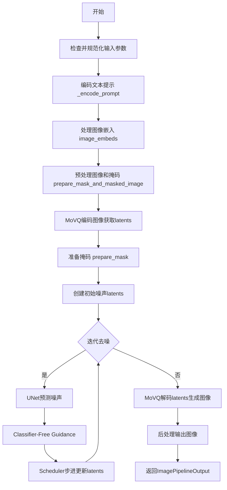
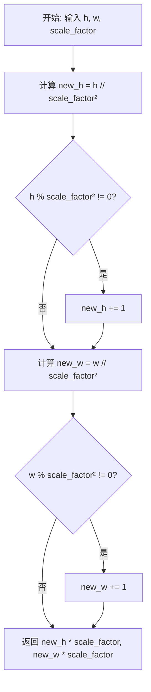
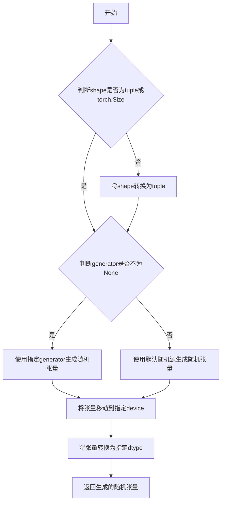
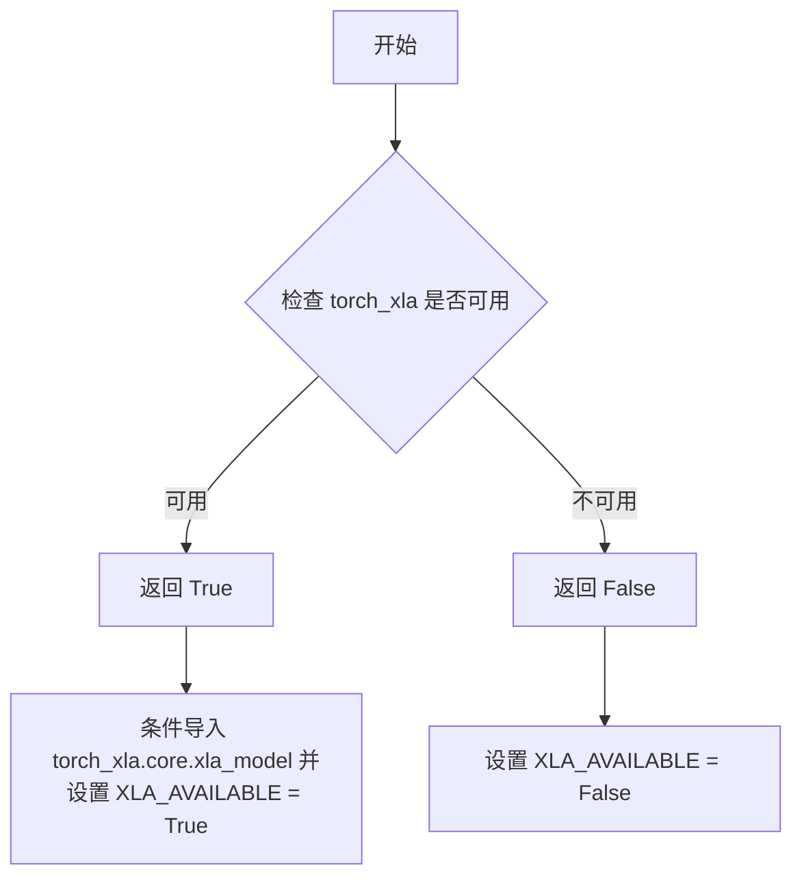
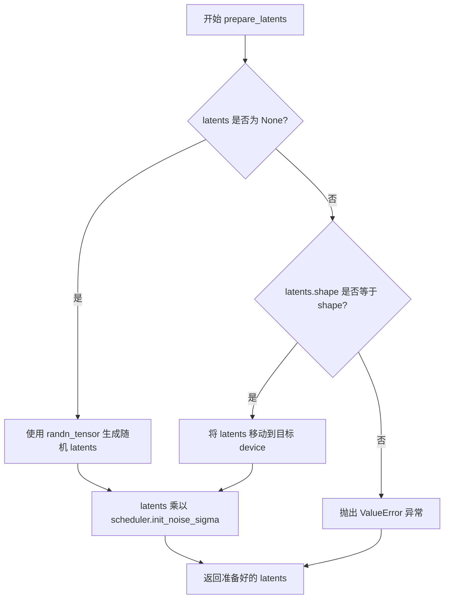
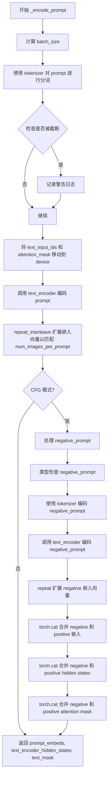

# `diffusers\src\diffusers\pipelines\kandinsky\pipeline_kandinsky_inpaint.py` 详细设计文档

Kandinsky 2.1图像修复流水线是一个基于扩散模型的文本引导图像修复pipeline，它结合MultilingualCLIP文本编码器、UNet2DConditionModel去噪网络和MoVQ图像编解码器，通过DDIMScheduler调度器在给定掩码区域内根据文本提示生成或修复图像。

## 整体流程



## 类结构

```
DiffusionPipeline (抽象基类)
└── KandinskyInpaintPipeline (图像修复流水线)
```

## 全局变量及字段


### `logger`
    
用于记录警告和信息日志的日志记录器

类型：`logging.Logger`
    


### `XLA_AVAILABLE`
    
指示Torch XLA是否可用的布尔标志

类型：`bool`
    


### `EXAMPLE_DOC_STRING`
    
包含KandinskyInpaintPipeline使用示例的文档字符串

类型：`str`
    


### `__version__`
    
diffusers库的版本号

类型：`str`
    


### `KandinskyInpaintPipeline.text_encoder`
    
用于将文本提示编码为嵌入向量的多语言CLIP文本编码器模型

类型：`MultilingualCLIP`
    


### `KandinskyInpaintPipeline.movq`
    
MoVQ图像编解码器，用于将图像编码到潜空间并从潜空间解码重建图像

类型：`VQModel`
    


### `KandinskyInpaintPipeline.tokenizer`
    
XLM-RoBERTa分词器，用于将文本提示 token 化

类型：`XLMRobertaTokenizer`
    


### `KandinskyInpaintPipeline.unet`
    
条件U-Net去噪模型，根据文本和图像嵌入对图像潜变量进行去噪处理

类型：`UNet2DConditionModel`
    


### `KandinskyInpaintPipeline.scheduler`
    
DDIM调度器，用于在去噪过程中计算噪声预测和采样下一步的潜变量

类型：`DDIMScheduler`
    


### `KandinskyInpaintPipeline.movq_scale_factor`
    
MoVQ模型的缩放因子，基于block_out_channels计算，用于确定潜变量的空间尺寸

类型：`int`
    


### `KandinskyInpaintPipeline._warn_has_been_called`
    
标志位，用于控制mask_image格式警告只显示一次

类型：`bool`
    


### `KandinskyInpaintPipeline.model_cpu_offload_seq`
    
定义模型组件CPU卸载顺序的字符串，指定text_encoder、unet、movq的卸载序列

类型：`str`
    
    

## 全局函数及方法


### `get_new_h_w`

该函数用于计算在给定缩放因子下，原始图像尺寸（高度和宽度）经过变换后的新尺寸。通常用于变分自编码器（VAE）或扩散模型中，根据缩放因子计算latent空间的尺寸，确保尺寸能够被缩放因子整除，同时向上取整以保留足够的信息。

参数：

- `h`：`int`，原始图像的高度（像素）
- `w`：`int`，原始图像的宽度（像素）
- `scale_factor`：`int`，缩放因子，默认为8，用于计算latent空间的缩放比例

返回值：`tuple[int, int]`，返回元组 (new_h, new_w)，分别为缩放后的新高度和新宽度

#### 流程图



#### 带注释源码

```python
def get_new_h_w(h, w, scale_factor=8):
    """
    计算缩放后的新高度和宽度
    
    该函数主要用于VAE或扩散模型中，根据缩放因子计算latent空间的尺寸。
    逻辑是先对尺寸进行下采样（除以scale_factor的平方），如果不能整除则向上取整，
    然后再乘以scale_factor还原到目标尺寸。
    
    Args:
        h (int): 原始图像的高度
        w (int): 原始图像的宽度
        scale_factor (int, optional): 缩放因子，默认为8
    
    Returns:
        tuple[int, int]: (new_h, new_w) 缩放后的新高度和宽度
    """
    # 计算新的高度：先将h除以scale_factor的平方（向下取整）
    new_h = h // scale_factor**2
    # 如果h不能被scale_factor的平方整除，则向上取整（加1）
    if h % scale_factor**2 != 0:
        new_h += 1
    
    # 计算新的宽度：先将w除以scale_factor的平方（向下取整）
    new_w = w // scale_factor**2
    # 如果w不能被scale_factor的平方整除，则向上取整（加1）
    if w % scale_factor**2 != 0:
        new_w += 1
    
    # 返回最终尺寸：乘以scale_factor还原到目标尺寸空间
    return new_h * scale_factor, new_w * scale_factor
```


### `prepare_mask`

该函数用于扩展掩码边界处理，遍历每个掩码的像素，当遇到值为0的像素（表示需要修复的区域）时，将其周围8个邻域像素全部置为0，从而在掩码中创建边界扩展效果。

参数：

- `masks`：`List[torch.Tensor]`，输入的掩码列表，每个掩码形状为 `batch x 1 x height x width` 或 `batch x height x width`

返回值：`torch.Tensor`，堆叠后的掩码张量，形状为 `batch x 1 x height x width`

#### 流程图

```mermaid
flowchart TD
    A[开始: prepare_mask] --> B[初始化空列表 prepared_masks]
    B --> C{遍历每个 mask}
    C -->|for mask in masks| D[深拷贝当前掩码到 old_mask]
    D --> E[初始化嵌套循环遍历像素]
    E --> F{检查当前像素值}
    F -->|old_mask[0][i][j] == 1| G[跳过当前像素]
    F -->|old_mask[0][i][j] != 1| H[将周围8邻域像素置为0]
    G --> I{检查是否还有未遍历像素}
    H --> I
    I -->|是| E
    I -->|否| J[将处理后的mask添加到列表]
    J --> K{检查是否还有未处理mask}
    K -->|是| C
    K -->|否| L[堆叠所有掩码并返回]
    L --> M[结束]
```

#### 带注释源码

```python
def prepare_mask(masks):
    """
    扩展掩码边界处理
    
    遍历每个掩码，对于值为0的像素（需要修复的区域），
    将其周围8邻域的像素也置为0，从而扩展掩码边界。
    
    参数:
        masks: 掩码列表，每个掩码为 torch.Tensor，形状为 (batch, 1, H, W) 或 (batch, H, W)
    
    返回:
        torch.Tensor: 堆叠后的掩码张量，形状为 (batch, 1, H, W)
    """
    # 初始化用于存储处理后掩码的列表
    prepared_masks = []
    
    # 遍历每个掩码
    for mask in masks:
        # 深拷贝原始掩码，用于判断当前像素的原始值
        old_mask = deepcopy(mask)
        
        # 遍历掩码的高度维度 (i)
        for i in range(mask.shape[1]):
            # 遍历掩码的宽度维度 (j)
            for j in range(mask.shape[2]):
                # 如果当前像素原始值为1（保留区域），则跳过，不处理其邻域
                if old_mask[0][i][j] == 1:
                    continue
                
                # 当前像素为0（需要修复的区域），将其周围8邻域像素置为0
                # 上方像素
                if i != 0:
                    mask[:, i - 1, j] = 0
                # 左侧像素
                if j != 0:
                    mask[:, i, j - 1] = 0
                # 左上方像素
                if i != 0 and j != 0:
                    mask[:, i - 1, j - 1] = 0
                # 下方像素
                if i != mask.shape[1] - 1:
                    mask[:, i + 1, j] = 0
                # 右侧像素
                if j != mask.shape[2] - 1:
                    mask[:, i, j + 1] = 0
                # 右下方像素
                if i != mask.shape[1] - 1 and j != mask.shape[2] - 1:
                    mask[:, i + 1, j + 1] = 0
        
        # 将处理后的掩码添加到列表中
        prepared_masks.append(mask)
    
    # 将所有掩码在第0维堆叠，返回形状为 (batch, 1, H, W) 的张量
    return torch.stack(prepared_masks, dim=0)
```


### `prepare_mask_and_masked_image`

该函数是 Kandinsky 图像修复管道的核心预处理函数，负责将不同格式（ PIL.Image、numpy array 或 torch.Tensor）的图像和掩码统一转换为标准的 4D PyTorch 张量（batch x channels x height x width），并对图像进行 [-1, 1] 范围的归一化，对掩码进行二值化处理，最后反转掩码以适配修复流程。

参数：

- `image`：`np.array | PIL.Image | torch.Tensor`，待修复的输入图像，可以是 PIL 图像、形状为 (height, width, 3) 的 numpy 数组、形状为 (channels, height, width) 的 3D 张量或 (batch, channels, height, width) 的 4D 张量
- `mask`：`np.array | PIL.Image | torch.Tensor`，用于标识修复区域的掩码，可以是 PIL 图像、形状为 (height, width) 的 numpy 数组、形状为 (1, height, width) 的 3D 张量或 (batch, 1, height, width) 的 4D 张量
- `height`：`int`，目标输出高度，默认为 512 像素
- `width`：`int`，目标输出宽度，默认为 512 像素

返回值：`tuple[torch.Tensor]`，返回 (mask, image) 元组，两者均为 4D float32 张量，形状为 (batch, channels, height, width)，掩码已反转（1 - mask）以便后续修复处理

#### 流程图

```mermaid
flowchart TD
    A[开始: prepare_mask_and_masked_image] --> B{image is None?}
    B -->|是| B1[抛出 ValueError: image 不能为空]
    B -->|否| C{mask is None?}
    C -->|是| C1[抛出 ValueError: mask 不能为空]
    C -->|否| D{image 是 torch.Tensor?}
    
    D -->|是| E{mask 是 torch.Tensor?}
    E -->|否| E1[抛出 TypeError: 类型不匹配]
    E -->|是| F[处理 Tensor 输入]
    F --> F1[单图添加 batch 维度]
    F1 --> F2[2D mask 添加通道和 batch 维度]
    F2 --> F3[验证维度: 4D, 空间尺寸匹配, batch 匹配]
    F3 --> F4[验证 image 范围: [-1, 1]]
    F4 --> F5[验证 mask 范围: [0, 1]]
    F5 --> F6[二值化 mask: <0.5 为 0, >=0.5 为 1]
    F6 --> F7[转换为 float32]
    
    D -->|否| G{mask 是 torch.Tensor?}
    G -->|是| G1[抛出 TypeError: 类型不匹配]
    G -->|否| H[处理 PIL/NumPy 输入]
    
    H --> H1[预处理图像]
    H1 --> H2{image 是 PIL.Image 或 np.array?}
    H2 -->|是| H3[转为 list]
    H3 --> H4[resize 到 width x height]
    H4 --> H5[转为 numpy RGB 数组]
    H5 --> H6[拼接 batch 维度]
    H2 -->|否| H7[直接拼接]
    H6 --> H8[转换为 (batch, 3, H, W) 并归一化到 [-1, 1]]
    H8 --> H9[预处理掩码]
    
    H9 --> H10{mask 是 PIL.Image 或 np.array?}
    H10 -->|是| H11[转为 list]
    H11 --> H12[resize 到 width x height]
    H12 --> H13[转为灰度 numpy 数组]
    H13 --> H14[归一化到 [0, 1]]
    H14 --> H15[拼接维度]
    H10 -->|否| H16[直接拼接]
    H15 --> H17[二值化 mask]
    H17 --> H18[转为 Tensor]
    
    F7 --> I[反转 mask: 1 - mask]
    H18 --> I
    I --> J[返回 (mask, image)]
```

#### 带注释源码

```python
def prepare_mask_and_masked_image(image, mask, height, width):
    r"""
    准备一对 (mask, image) 供 Kandinsky 修复管道使用。将输入转换为形状为 
    (batch, channels, height, width) 的 torch.Tensor，其中 channels=3 表示图像，
    channels=1 表示掩码。
    
    图像将被转换为 torch.float32 并归一化到 [-1, 1] 范围。掩码将被二值化 (mask > 0.5)
    并转换为 torch.float32。

    Args:
        image: 要修复的图像。可以是 PIL.Image，或 (height, width, 3) 的 numpy 数组，
               或 (channels, height, width) 的 torch.Tensor，
               或 (batch, channels, height, width) 的 torch.Tensor。
        mask: 要应用到图像的掩码，即要修复的区域。可以是 PIL.Image，或 (height, width) 
              的 numpy 数组，或 (1, height, width) 的 torch.Tensor，
              或 (batch, 1, height, width) 的 torch.Tensor。
        height: 生成图像的高度（像素），默认为 512。
        width: 生成图像的宽度（像素），默认为 512。

    Raises:
        ValueError: torch.Tensor 图像应在 [-1, 1] 范围内。
        ValueError: torch.Tensor 掩码应在 [0, 1] 范围内。
        ValueError: mask 和 image 应具有相同的空间维度。
        TypeError: mask 是 torch.Tensor 但 image 不是（反之亦然）。

    Returns:
        tuple[torch.Tensor]: (mask, image) 对，作为 4 维 torch.Tensor:
            (batch, channels, height, width)。
    """

    # 检查 image 输入是否定义
    if image is None:
        raise ValueError("`image` input cannot be undefined.")

    # 检查 mask 输入是否定义
    if mask is None:
        raise ValueError("`mask_image` input cannot be undefined.")

    # ==================== 处理 torch.Tensor 输入 ====================
    if isinstance(image, torch.Tensor):
        # 确保 mask 也是 torch.Tensor，类型必须一致
        if not isinstance(mask, torch.Tensor):
            raise TypeError(f"`image` is a torch.Tensor but `mask` (type: {type(mask)} is not")

        # 批量处理单个图像：如果图像是 3D (3, H, W)，添加 batch 维度变为 4D
        if image.ndim == 3:
            assert image.shape[0] == 3, "Image outside a batch should be of shape (3, H, W)"
            image = image.unsqueeze(0)  # (3, H, W) -> (1, 3, H, W)

        # 处理单个 2D 掩码：添加通道维和 batch 维 (H, W) -> (1, 1, H, W)
        if mask.ndim == 2:
            mask = mask.unsqueeze(0).unsqueeze(0)  # (H, W) -> (1, 1, H, W)

        # 处理 3D 掩码：(1, H, W) 或 (C, H, W)
        if mask.ndim == 3:
            # 单个带通道维的掩码 (1, H, W)，再添加 batch 维 -> (1, 1, H, W)
            if mask.shape[0] == 1:
                mask = mask.unsqueeze(0)
            # 多个掩码无通道维 (N, H, W)，添加通道维 -> (N, 1, H, W)
            else:
                mask = mask.unsqueeze(1)

        # 验证维度：image 和 mask 都必须是 4D
        assert image.ndim == 4 and mask.ndim == 4, "Image and Mask must have 4 dimensions"
        # 验证空间维度必须一致
        assert image.shape[-2:] == mask.shape[-2:], "Image and Mask must have the same spatial dimensions"
        # 验证 batch 大小一致
        assert image.shape[0] == mask.shape[0], "Image and Mask must have the same batch size"

        # 验证图像像素值在 [-1, 1] 范围内
        if image.min() < -1 or image.max() > 1:
            raise ValueError("Image should be in [-1, 1] range")

        # 验证掩码像素值在 [0, 1] 范围内
        if mask.min() < 0 or mask.max() > 1:
            raise ValueError("Mask should be in [0, 1] range")

        # 二值化掩码：小于 0.5 设为 0，大于等于 0.5 设为 1
        mask[mask < 0.5] = 0
        mask[mask >= 0.5] = 1

        # 将图像转换为 float32 类型
        image = image.to(dtype=torch.float32)
    
    # ==================== 处理混合类型输入（错误情况）===================
    elif isinstance(mask, torch.Tensor):
        # 如果 mask 是 Tensor 但 image 不是，抛出类型错误
        raise TypeError(f"`mask` is a torch.Tensor but `image` (type: {type(image)} is not")
    
    # ==================== 处理 PIL.Image 或 numpy array 输入 ====================
    else:
        # -------------------- 预处理图像 --------------------
        # 如果是单个 PIL 图像或数组，转为列表以便批量处理
        if isinstance(image, (PIL.Image.Image, np.ndarray)):
            image = [image]

        # 处理 PIL 图像列表
        if isinstance(image, list) and isinstance(image[0], PIL.Image.Image):
            # 调整所有图像大小到目标尺寸 (width, height)
            image = [i.resize((width, height), resample=Image.BICUBIC, reducing_gap=1) for i in image]
            # 转换为 RGB numpy 数组并添加 batch 维度
            image = [np.array(i.convert("RGB"))[None, :] for i in image]
            # 沿 batch 维度拼接
            image = np.concatenate(image, axis=0)
        # 处理 numpy 数组列表
        elif isinstance(image, list) and isinstance(image[0], np.ndarray):
            # 添加 batch 维度并拼接
            image = np.concatenate([i[None, :] for i in image], axis=0)

        # 转换维度顺序：从 (batch, H, W, C) 到 (batch, C, H, W)
        image = image.transpose(0, 3, 1, 2)
        # 转换为 float32 Tensor 并归一化到 [-1, 1]
        # 原始像素 [0, 255] -> [0, 1] -> [-1, 1]
        image = torch.from_numpy(image).to(dtype=torch.float32) / 127.5 - 1.0

        # -------------------- 预处理掩码 --------------------
        # 如果是单个 PIL 图像或数组，转为列表
        if isinstance(mask, (PIL.Image.Image, np.ndarray)):
            mask = [mask]

        # 处理 PIL 掩码列表
        if isinstance(mask, list) and isinstance(mask[0], PIL.Image.Image):
            # 调整大小到目标尺寸
            mask = [i.resize((width, height), resample=PIL.Image.LANCZOS) for i in mask]
            # 转换为灰度图并添加 batch 和通道维度
            mask = np.concatenate([np.array(m.convert("L"))[None, None, :] for m in mask], axis=0)
            # 归一化到 [0, 1]
            mask = mask.astype(np.float32) / 255.0
        # 处理 numpy 掩码列表
        elif isinstance(mask, list) and isinstance(mask[0], np.ndarray):
            # 添加 batch 和通道维度并拼接
            mask = np.concatenate([m[None, None, :] for m in mask], axis=0)

        # 二值化掩码
        mask[mask < 0.5] = 0
        mask[mask >= 0.5] = 1
        # 转换为 Tensor
        mask = torch.from_numpy(mask)

    # 反转掩码：1 表示保留原区域，0 表示需要修复的区域
    # 这与 Stable Diffusion 的语义一致
    mask = 1 - mask

    return mask, image
```


### `randn_tensor`

生成随机张量的工具函数，用于在扩散模型的潜在空间中生成符合正态分布（均值0，方差1）的噪声张量。该函数是扩散模型推理流程中的关键组成部分，负责创建初始噪声或根据指定参数生成随机张量。

参数：

- `shape`：`tuple` 或 `torch.Size`，张量的目标形状，定义了输出张量的维度
- `generator`：`torch.Generator` 或 `list[torch.Generator]` 或 `None`，可选的随机数生成器，用于控制随机性，确保结果可复现
- `device`：`torch.device`，生成张量所在的设备（如CPU或CUDA设备）
- `dtype`：`torch.dtype`，生成张量的数据类型（如float32、float16等）

返回值：`torch.Tensor`，符合正态分布的随机张量，形状由shape参数指定

#### 流程图



#### 带注释源码

```
def randn_tensor(
    shape: tuple | torch.Size,           # 张量形状，如(batch_size, channels, height, width)
    generator: torch.Generator | list[torch.Generator] | None = None,  # 可选的随机数生成器
    device: torch.device | str = "cpu",  # 目标设备
    dtype: torch.dtype = torch.float32,   # 数据类型
    layout: torch.layout = torch.strided  # 内存布局
) -> torch.Tensor:
    """
    生成符合标准正态分布（均值0，方差1）的随机张量。
    
    参数：
        shape: 张量的目标形状，定义了输出的维度
        generator: 可选的torch.Generator对象，用于生成确定性随机数。
                   如果提供相同generator和seed，可以复现结果。
        device: 生成张量应放置的设备（CPU/CUDA）
        dtype: 张量的数据类型
        layout: 张量的内存布局策略
    
    返回值：
        torch.Tensor: 形状为shape的随机张量，元素服从标准正态分布
    
    示例：
        >>> # 基本用法
        >>> tensor = randn_tensor((2, 3, 64, 64), device="cuda", dtype=torch.float16)
        >>> tensor.shape
        torch.Size([2, 3, 64, 64])
        
        >>> # 使用生成器确保可复现性
        >>> gen = torch.Generator(device="cpu")
        >>> gen.manual_seed(42)
        >>> tensor1 = randn_tensor((2, 2), generator=gen)
        >>> gen.manual_seed(42)
        >>> tensor2 = randn_tensor((2, 2), generator=gen)
        >>> assert torch.equal(tensor1, tensor2)  # 相同seed产生相同结果
    """
    # 核心实现：使用PyTorch的randn函数生成随机张量
    # torch.randn: 返回从标准正态分布中采样的随机数
    tensor = torch.randn(
        size=shape,              # 张量尺寸
        generator=generator,    # 随机数生成器（可选）
        device=device,          # 设备
        dtype=dtype,            # 数据类型
        layout=layout           # 内存布局
    )
    
    return tensor
```

---

**使用场景说明：**

在`KandinskyInpaintPipeline`中的`prepare_latents`方法里，randn_tensor被用于：

1. **初始化潜在向量**：当未提供预定义的latents时，使用randn_tensor生成随机噪声作为去噪过程的起点
2. **与调度器配合**：生成的随机张量会乘以scheduler的init_noise_sigma来调整噪声的初始幅度
3. **可复现性支持**：通过传入generator参数，可以实现确定性生成，便于调试和结果复现


### `is_torch_xla_available`

该函数用于检测当前环境中 PyTorch XLA（TPU 加速库）是否可用，以便在代码中条件性地导入和使用 XLA 相关的功能。

参数：

- 该函数无参数

返回值：`bool`，返回 `True` 表示 XLA 可用，返回 `False` 表示 XLA 不可用

#### 流程图



#### 带注释源码

```python
# 该函数在 diffusers 库的 utils 模块中定义
# 此处展示的是在当前文件中的使用方式

# 导入 is_torch_xla_available 函数
from ...utils import is_torch_xla_available, logging, replace_example_docstring

# 使用 is_torch_xla_available() 检查 XLA 是否可用
if is_torch_xla_available():
    # 如果 XLA 可用，导入 torch_xla 的 xla_model 模块
    import torch_xla.core.xla_model as xm
    # 设置全局标志，表示 XLA 可用
    XLA_AVAILABLE = True
else:
    # 如果 XLA 不可用，设置全局标志为 False
    XLA_AVAILABLE = False

# 后续在代码中使用 XLA_AVAILABLE 标志
# ...
if XLA_AVAILABLE:
    xm.mark_step()  # 在 TPU 上标记执行步骤
```


### `KandinskyInpaintPipeline.__init__`

该方法是 `KandinskyInpaintPipeline` 类的构造函数，用于初始化图像修复管道的所有核心组件，包括文本编码器、分词器、UNet 模型、MoVQ 模型和调度器，并注册这些模块以供后续推理使用。

参数：

- `text_encoder`：`MultilingualCLIP`，多语言 CLIP 文本编码器，用于将文本提示转换为嵌入向量
- `movq`：`VQModel`，MoVQ 图像编码器和解码器，负责在潜在空间和像素空间之间进行转换
- `tokenizer`：`XLMRobertaTokenizer`，XLM-RoBERTa 分词器，用于对文本提示进行 token 化处理
- `unet`：`UNet2DConditionModel`，条件 U-Net 架构，用于在去噪过程中预测噪声
- `scheduler`：`DDIMScheduler`，DDIM 调度器，用于控制去噪步骤和时间步

返回值：`None`，无返回值（构造函数）

#### 流程图

```mermaid
flowchart TD
    A[开始 __init__] --> B[调用 super().__init__]
    B --> C[register_modules 注册所有模块]
    C --> D[计算 movq_scale_factor]
    D --> E[初始化 _warn_has_been_called = False]
    E --> F[结束]
```

#### 带注释源码

```python
def __init__(
    self,
    text_encoder: MultilingualCLIP,  # 多语言CLIP文本编码器
    movq: VQModel,                    # MoVQ图像编解码器
    tokenizer: XLMRobertaTokenizer,   # XLM-RoBERTa分词器
    unet: UNet2DConditionModel,      # 条件UNet去噪模型
    scheduler: DDIMScheduler,         # DDIM调度器
):
    # 调用父类DiffusionPipeline的初始化方法
    super().__init__()

    # 注册所有模块，使它们可以通过pipeline的属性访问
    self.register_modules(
        text_encoder=text_encoder,
        movq=movq,
        tokenizer=tokenizer,
        unet=unet,
        scheduler=scheduler,
    )
    
    # 计算MoVQ的缩放因子，基于block_out_channels的数量
    # 用于在潜在空间中调整图像尺寸
    self.movq_scale_factor = 2 ** (len(self.movq.config.block_out_channels) - 1)
    
    # 初始化警告标志，用于跟踪是否已发出过版本兼容性警告
    self._warn_has_been_called = False
```


### `KandinskyInpaintPipeline.prepare_latents`

该方法用于为图像生成流程准备初始的潜在表示（latents）。如果未提供预定义的latents，则使用随机张量生成；否则使用提供的latents并进行形状验证和设备迁移，最后根据调度器的初始噪声sigma对latents进行缩放。

参数：

- `shape`：`tuple` 或 `torch.Size`，期望的latents张量形状，通常为 (batch_size, num_channels_latents, height, width)
- `dtype`：`torch.dtype`，生成latents时使用的数据类型
- `device`：`torch.device`，生成latents的目标设备
- `generator`：`torch.Generator` 或 `list[torch.Generator]` 或 `None`，用于确保生成可复现的随机数生成器
- `latents`：`torch.Tensor` 或 `None`，可选的预生成latents张量，如果为None则随机生成
- `scheduler`：调度器对象，用于获取初始噪声sigma值（scheduler.init_noise_sigma）

返回值：`torch.Tensor`，准备好的latents张量，已乘以调度器的初始噪声sigma

#### 流程图



#### 带注释源码

```python
def prepare_latents(self, shape, dtype, device, generator, latents, scheduler):
    """
    准备用于图像生成的latents张量。
    
    参数:
        shape: 期望的latents张量形状
        dtype: latents的数据类型
        device: 目标设备
        generator: 随机数生成器，用于确保可复现性
        latents: 可选的预生成latents，如果为None则随机生成
        scheduler: 调度器，用于获取初始噪声sigma
    """
    # 如果未提供latents，则使用随机张量生成
    if latents is None:
        latents = randn_tensor(shape, generator=generator, device=device, dtype=dtype)
    else:
        # 验证提供的latents形状是否匹配预期
        if latents.shape != shape:
            raise ValueError(f"Unexpected latents shape, got {latents.shape}, expected {shape}")
        # 将latents移动到目标设备
        latents = latents.to(device)

    # 根据调度器的初始噪声sigma缩放latents
    # 这确保了latents与去噪过程的噪声水平相匹配
    latents = latents * scheduler.init_noise_sigma
    return latents
```


### `KandinskyInpaintPipeline._encode_prompt`

该方法负责将文本提示（prompt）编码为文本嵌入向量（text embeddings），供后续的图像生成模块使用。它支持批量处理、每条提示生成多张图像以及分类器自由引导（Classifier-Free Guidance，CFG）机制。

参数：

- `self`：隐式参数，KandinskyInpaintPipeline 实例本身
- `prompt`：`str` 或 `list[str]`，要编码的文本提示，可以是单条字符串或字符串列表
- `device`：`torch.device`，将计算结果移动到的目标设备（如 CUDA 或 CPU）
- `num_images_per_prompt`：`int`，每个提示要生成的图像数量，用于嵌入向量的重复
- `do_classifier_free_guidance`：`bool`，是否启用分类器自由引导，为 True 时会同时计算无条件嵌入和条件嵌入
- `negative_prompt`：`str` 或 `list[str]` 或 `None`，可选的负面提示，用于引导生成过程中避免某些内容

返回值：`tuple[torch.Tensor, torch.Tensor, torch.Tensor]`，返回一个三元组，包含：

- `prompt_embeds`：`torch.Tensor`，文本条件嵌入向量，形状为 `(batch_size * num_images_per_prompt, seq_len, hidden_dim)` 或在 CFG 模式下为 `(2 * batch_size * num_images_per_prompt, seq_len, hidden_dim)`
- `text_encoder_hidden_states`：`torch.Tensor`，文本编码器的隐藏状态，用于后续 U-Net 条件生成，形状与 `prompt_embeds` 类似
- `text_mask`：`torch.Tensor`，文本注意力掩码，用于标识有效 token 位置

#### 流程图



#### 带注释源码

```python
def _encode_prompt(
    self,
    prompt,                          # str | list[str]: 输入的文本提示
    device,                          # torch.device: 计算设备
    num_images_per_prompt,           # int: 每个提示生成的图像数量
    do_classifier_free_guidance,     # bool: 是否启用分类器自由引导
    negative_prompt=None,            # str | list[str] | None: 负面提示
):
    # 1. 确定批次大小：如果是列表则取其长度，否则为 1
    batch_size = len(prompt) if isinstance(prompt, list) else 1
    
    # 2. 使用 tokenizer 对 prompt 进行分词
    # 填充到最大长度 77，启用截断，返回注意力掩码，添加特殊 token，返回 PyTorch 张量
    text_inputs = self.tokenizer(
        prompt,
        padding="max_length",
        max_length=77,
        truncation=True,
        return_attention_mask=True,
        add_special_tokens=True,
        return_tensors="pt",
    )
    
    # 3. 获取分词后的输入 ID 和未截断的版本用于比较
    text_input_ids = text_inputs.input_ids
    untruncated_ids = self.tokenizer(prompt, padding="longest", return_tensors="pt").input_ids
    
    # 4. 检查是否发生了截断，如果是则记录警告
    if untruncated_ids.shape[-1] >= text_input_ids.shape[-1] and not torch.equal(text_input_ids, untruncated_ids):
        removed_text = self.tokenizer.batch_decode(untruncated_ids[:, self.tokenizer.model_max_length - 1 : -1])
        logger.warning(
            "The following part of your input was truncated because CLIP can only handle sequences up to"
            f" {self.tokenizer.model_max_length} tokens: {removed_text}"
        )
    
    # 5. 将分词结果移动到指定设备
    text_input_ids = text_input_ids.to(device)
    text_mask = text_inputs.attention_mask.to(device)
    
    # 6. 使用文本编码器将 token IDs 转换为嵌入向量
    # 返回: prompt_embeds (文本嵌入) 和 text_encoder_hidden_states (隐藏状态)
    prompt_embeds, text_encoder_hidden_states = self.text_encoder(
        input_ids=text_input_ids, attention_mask=text_mask
    )
    
    # 7. 根据 num_images_per_prompt 重复嵌入向量
    # repeat_interleave 在批次维度上重复，以匹配每个提示生成多张图像的需求
    prompt_embeds = prompt_embeds.repeat_interleave(num_images_per_prompt, dim=0)
    text_encoder_hidden_states = text_encoder_hidden_states.repeat_interleave(num_images_per_prompt, dim=0)
    text_mask = text_mask.repeat_interleave(num_images_per_prompt, dim=0)
    
    # 8. 如果启用分类器自由引导 (CFG)
    if do_classifier_free_guidance:
        uncond_tokens: list[str]
        
        # 处理负面提示：None 时使用空字符串，字符串时包装为列表，列表时直接使用
        if negative_prompt is None:
            uncond_tokens = [""] * batch_size
        elif type(prompt) is not type(negative_prompt):
            raise TypeError(
                f"`negative_prompt` should be the same type to `prompt`, but got {type(negative_prompt)} !="
                f" {type(prompt)}."
            )
        elif isinstance(negative_prompt, str):
            uncond_tokens = [negative_prompt]
        elif batch_size != len(negative_prompt):
            raise ValueError(
                f"`negative_prompt`: {negative_prompt} has batch size {len(negative_prompt)}, but `prompt`:"
                f" {prompt} has batch size {batch_size}. Please make sure that passed `negative_prompt` matches"
                " the batch size of `prompt`."
            )
        else:
            uncond_tokens = negative_prompt
        
        # 9. 对负面提示进行与正面提示相同的处理流程
        uncond_input = self.tokenizer(
            uncond_tokens,
            padding="max_length",
            max_length=77,
            truncation=True,
            return_attention_mask=True,
            add_special_tokens=True,
            return_tensors="pt",
        )
        uncond_text_input_ids = uncond_input.input_ids.to(device)
        uncond_text_mask = uncond_input.attention_mask.to(device)
        
        # 10. 编码负面提示得到无条件嵌入
        negative_prompt_embeds, uncond_text_encoder_hidden_states = self.text_encoder(
            input_ids=uncond_text_input_ids, attention_mask=uncond_text_mask
        )
        
        # 11. 重复无条件嵌入以匹配 num_images_per_prompt
        # 使用 repeat 和 view 的组合以兼容 MPS 设备
        seq_len = negative_prompt_embeds.shape[1]
        negative_prompt_embeds = negative_prompt_embeds.repeat(1, num_images_per_prompt)
        negative_prompt_embeds = negative_prompt_embeds.view(batch_size * num_images_per_prompt, seq_len)
        
        seq_len = uncond_text_encoder_hidden_states.shape[1]
        uncond_text_encoder_hidden_states = uncond_text_encoder_hidden_states.repeat(1, num_images_per_prompt, 1)
        uncond_text_encoder_hidden_states = uncond_text_encoder_hidden_states.view(
            batch_size * num_images_per_prompt, seq_len, -1
        )
        uncond_text_mask = uncond_text_mask.repeat_interleave(num_images_per_prompt, dim=0)
        
        # 12. 拼接无条件嵌入和条件嵌入
        # 这是 CFG 的关键：在单次前向传播中同时计算条件和无条件预测
        prompt_embeds = torch.cat([negative_prompt_embeds, prompt_embeds])
        text_encoder_hidden_states = torch.cat([uncond_text_encoder_hidden_states, text_encoder_hidden_states])
        text_mask = torch.cat([uncond_text_mask, text_mask])
    
    # 13. 返回编码后的嵌入向量和注意力掩码
    return prompt_embeds, text_encoder_hidden_states, text_mask
```


### `KandinskyInpaintPipeline.__call__`

这是一个用于基于文本提示词和图像嵌入进行图像修复（inpainting）的核心方法。该管道通过接收原始图像、掩码图像和 CLIP 图像嵌入，在去噪循环中逐步生成修复后的图像，支持分类器自由引导（CFG）来提高生成质量，最终输出修复完成的图像。

参数：

- `prompt`：`str | list[str]`，指导图像生成的文本提示词
- `image`：`torch.Tensor | PIL.Image.Image`，用作修复起点的原始图像
- `mask_image`：`torch.Tensor | PIL.Image.Image | np.ndarray`，用于指定修复区域的掩码图像，白色像素区域将被重绘
- `image_embeds`：`torch.Tensor`，CLIP 图像嵌入，用于条件化图像生成
- `negative_image_embeds`：`torch.Tensor`，负向提示词的 CLIP 图像嵌入，用于 CFG
- `negative_prompt`：`str | list[str] | None`，可选的负向文本提示词
- `height`：`int`，生成图像的高度，默认为 512
- `width`：`int`，生成图像的宽度，默认为 512
- `num_inference_steps`：`int`，去噪迭代步骤数，默认为 100
- `guidance_scale`：`float`，分类器自由引导的引导系数，默认为 4.0
- `num_images_per_prompt`：`int`，每个提示词生成的图像数量，默认为 1
- `generator`：`torch.Generator | list[torch.Generator] | None`，可选的随机数生成器，用于确保可重复生成
- `latents`：`torch.Tensor | None`，可选的预生成噪声潜在向量
- `output_type`：`str | None`，输出格式，支持 "pil"、"np" 或 "pt"，默认为 "pil"
- `callback`：`Callable[[int, int, torch.Tensor], None] | None`，推理过程中的回调函数
- `callback_steps`：`int`，回调函数调用频率，默认为 1
- `return_dict`：`bool`，是否返回 `ImagePipelineOutput`，默认为 True

返回值：`ImagePipelineOutput` 或 `tuple`，包含生成的图像

#### 流程图

```mermaid
flowchart TD
    A[开始 __call__] --> B{检查 prompt 类型}
    B -->|str| C[batch_size = 1]
    B -->|list| D[batch_size = len(prompt)]
    C --> E[获取执行设备 device]
    D --> E
    E --> F[batch_size = batch_size * num_images_per_prompt]
    F --> G[do_classifier_free_guidance = guidance_scale > 1.0]
    G --> H[_encode_prompt 编码提示词]
    H --> I[处理 image_embeds 和 negative_image_embeds]
    I --> J[prepare_mask_and_masked_image 预处理图像和掩码]
    J --> K[movq.encode 编码图像到潜在空间]
    K --> L[F.interpolate 调整掩码大小]
    L --> M[prepare_mask 处理掩码]
    M --> N[创建 masked_image = image * mask_image]
    N --> O[重复掩码和 masked_image 以匹配 batch]
    O --> P[scheduler.set_timesteps 设置去噪时间步]
    P --> Q[prepare_latents 初始化潜在向量]
    Q --> R[进入去噪循环 for t in timesteps_tensor]
    R --> S[latent_model_input 拼接潜在向量]
    S --> T[unet 预测噪声]
    T --> U{CFG?}
    U -->|是| V[分离噪声预测应用 CFG]
    U -->|否| W[直接使用噪声预测]
    V --> X[scheduler.step 计算上一步]
    W --> X
    X --> Y[调用 callback 如果需要]
    Y --> Z{还有更多时间步?}
    Z -->|是| R
    Z -->|否| AA[movq.decode 解码潜在向量到图像]
    AA --> BB[后处理图像]
    BB --> CC{return_dict?}
    CC -->|是| DD[返回 ImagePipelineOutput]
    CC -->|否| EE[返回元组]
```

#### 带注释源码

```python
@torch.no_grad()
@replace_example_docstring(EXAMPLE_DOC_STRING)
def __call__(
    self,
    prompt: str | list[str],
    image: torch.Tensor | PIL.Image.Image,
    mask_image: torch.Tensor | PIL.Image.Image | np.ndarray,
    image_embeds: torch.Tensor,
    negative_image_embeds: torch.Tensor,
    negative_prompt: str | list[str] | None = None,
    height: int = 512,
    width: int = 512,
    num_inference_steps: int = 100,
    guidance_scale: float = 4.0,
    num_images_per_prompt: int = 1,
    generator: torch.Generator | list[torch.Generator] | None = None,
    latents: torch.Tensor | None = None,
    output_type: str | None = "pil",
    callback: Callable[[int, int, torch.Tensor], None] | None = None,
    callback_steps: int = 1,
    return_dict: bool = True,
):
    """
    Function invoked when calling the pipeline for generation.

    Args:
        prompt (`str` or `list[str]`):
            The prompt or prompts to guide the image generation.
        image (`torch.Tensor`, `PIL.Image.Image` or `np.ndarray`):
            `Image`, or tensor representing an image batch, that will be used as the starting point for the
            process.
        mask_image (`PIL.Image.Image`,`torch.Tensor` or `np.ndarray`):
            `Image`, or a tensor representing an image batch, to mask `image`. White pixels in the mask will be
            repainted, while black pixels will be preserved. You can pass a pytorch tensor as mask only if the
            image you passed is a pytorch tensor, and it should contain one color channel (L) instead of 3, so the
            expected shape would be either `(B, 1, H, W,)`, `(B, H, W)`, `(1, H, W)` or `(H, W)` If image is an PIL
            image or numpy array, mask should also be a either PIL image or numpy array. If it is a PIL image, it
            will be converted to a single channel (luminance) before use. If it is a nummpy array, the expected
            shape is `(H, W)`.
        image_embeds (`torch.Tensor` or `list[torch.Tensor]`):
            The clip image embeddings for text prompt, that will be used to condition the image generation.
        negative_image_embeds (`torch.Tensor` or `list[torch.Tensor]`):
            The clip image embeddings for negative text prompt, will be used to condition the image generation.
        negative_prompt (`str` or `list[str]`, *optional*):
            The prompt or prompts not to guide the image generation. Ignored when not using guidance (i.e., ignored
            if `guidance_scale` is less than `1`).
        height (`int`, *optional*, defaults to 512):
            The height in pixels of the generated image.
        width (`int`, *optional*, defaults to 512):
            The width in pixels of the generated image.
        num_inference_steps (`int`, *optional*, defaults to 100):
            The number of denoising steps. More denoising steps usually lead to a higher quality image at the
            expense of slower inference.
        guidance_scale (`float`, *optional*, defaults to 4.0):
            Guidance scale as defined in [Classifier-Free Diffusion
            Guidance](https://huggingface.co/papers/2207.12598). `guidance_scale` is defined as `w` of equation 2.
            of [Imagen Paper](https://huggingface.co/papers/2205.11487). Guidance scale is enabled by setting
            `guidance_scale > 1`. Higher guidance scale encourages to generate images that are closely linked to
            the text `prompt`, usually at the expense of lower image quality.
        num_images_per_prompt (`int`, *optional*, defaults to 1):
            The number of images to generate per prompt.
        generator (`torch.Generator` or `list[torch.Generator]`, *optional*):
            One or a list of [torch generator(s)](https://pytorch.org/docs/stable/generated/torch.Generator.html)
            to make generation deterministic.
        latents (`torch.Tensor`, *optional*):
            Pre-generated noisy latents, sampled from a Gaussian distribution, to be used as inputs for image
            generation. Can be used to tweak the same generation with different prompts. If not provided, a latents
            tensor will be generated by sampling using the supplied random `generator`.
        output_type (`str`, *optional*, defaults to `"pil"`):
            The output format of the generate image. Choose between `"pil"` (`PIL.Image.Image`), `"np"`
            (`np.array`) or `"pt"` (`torch.Tensor`).
        callback (`Callable`, *optional*):
            A function that calls every `callback_steps` steps during inference. The function is called with the
            following arguments: `callback(step: int, timestep: int, latents: torch.Tensor)`.
        callback_steps (`int`, *optional*, defaults to 1):
            The frequency at which the `callback` function is called. If not specified, the callback is called at
            every step.
        return_dict (`bool`, *optional*, defaults to `True`):
            Whether or not to return a [`~pipelines.ImagePipelineOutput`] instead of a plain tuple.

    Examples:

    Returns:
        [`~pipelines.ImagePipelineOutput`] or `tuple`
    """
    # 版本警告检查，提示 mask_image 格式变化
    if not self._warn_has_been_called and version.parse(version.parse(__version__).base_version) < version.parse(
        "0.23.0.dev0"
    ):
        logger.warning(
            "Please note that the expected format of `mask_image` has recently been changed. "
            "Before diffusers == 0.19.0, Kandinsky Inpainting pipelines repainted black pixels and preserved black pixels. "
            "As of diffusers==0.19.0 this behavior has been inverted. Now white pixels are repainted and black pixels are preserved. "
            "This way, Kandinsky's masking behavior is aligned with Stable Diffusion. "
            "THIS means that you HAVE to invert the input mask to have the same behavior as before as explained in https://github.com/huggingface/diffusers/pull/4207. "
            "This warning will be suppressed after the first inference call and will be removed in diffusers>0.23.0"
        )
        self._warn_has_been_called = True

    # 定义调用参数：确定批次大小
    if isinstance(prompt, str):
        batch_size = 1
    elif isinstance(prompt, list):
        batch_size = len(prompt)
    else:
        raise ValueError(f"`prompt` has to be of type `str` or `list` but is {type(prompt)}")

    device = self._execution_device  # 获取执行设备

    # 根据每提示词图像数量调整批次大小
    batch_size = batch_size * num_images_per_prompt
    do_classifier_free_guidance = guidance_scale > 1.0  # 是否使用分类器自由引导

    # 编码文本提示词，获取文本嵌入和隐藏状态
    prompt_embeds, text_encoder_hidden_states, _ = self._encode_prompt(
        prompt, device, num_images_per_prompt, do_classifier_free_guidance, negative_prompt
    )

    # 处理图像嵌入列表，拼接为单个张量
    if isinstance(image_embeds, list):
        image_embeds = torch.cat(image_embeds, dim=0)
    if isinstance(negative_image_embeds, list):
        negative_image_embeds = torch.cat(negative_image_embeds, dim=0)

    # 如果使用 CFG，重复图像嵌入并拼接负向嵌入
    if do_classifier_free_guidance:
        image_embeds = image_embeds.repeat_interleave(num_images_per_prompt, dim=0)
        negative_image_embeds = negative_image_embeds.repeat_interleave(num_images_per_prompt, dim=0)

        image_embeds = torch.cat([negative_image_embeds, image_embeds], dim=0).to(
            dtype=prompt_embeds.dtype, device=device
        )

    # 预处理图像和掩码：转换为张量并调整尺寸
    mask_image, image = prepare_mask_and_masked_image(image, mask_image, height, width)

    # 将图像编码到潜在空间
    image = image.to(dtype=prompt_embeds.dtype, device=device)
    image = self.movq.encode(image)["latents"]

    # 处理掩码张量
    mask_image = mask_image.to(dtype=prompt_embeds.dtype, device=device)

    # 获取图像形状并将掩码插值到相同大小
    image_shape = tuple(image.shape[-2:])
    mask_image = F.interpolate(
        mask_image,
        image_shape,
        mode="nearest",
    )
    # 准备掩码（处理边缘）
    mask_image = prepare_mask(mask_image)
    # 创建掩码图像：原图像乘以掩码
    masked_image = image * mask_image

    # 重复掩码和掩码图像以匹配批次大小
    mask_image = mask_image.repeat_interleave(num_images_per_prompt, dim=0)
    masked_image = masked_image.repeat_interleave(num_images_per_prompt, dim=0)
    # 如果使用 CFG，重复两次（一次无条件，一次有条件）
    if do_classifier_free_guidance:
        mask_image = mask_image.repeat(2, 1, 1, 1)
        masked_image = masked_image.repeat(2, 1, 1, 1)

    # 设置去噪调度器的时间步
    self.scheduler.set_timesteps(num_inference_steps, device=device)
    timesteps_tensor = self.scheduler.timesteps

    # 获取潜在向量的通道数
    num_channels_latents = self.movq.config.latent_channels

    # 计算潜在向量的高度和宽度（考虑缩放因子）
    sample_height, sample_width = get_new_h_w(height, width, self.movq_scale_factor)

    # 准备初始潜在向量
    latents = self.prepare_latents(
        (batch_size, num_channels_latents, sample_height, sample_width),
        text_encoder_hidden_states.dtype,
        device,
        generator,
        latents,
        self.scheduler,
    )

    # 验证掩码、掩码图像和潜在向量的通道数配置是否正确
    num_channels_mask = mask_image.shape[1]
    num_channels_masked_image = masked_image.shape[1]
    if num_channels_latents + num_channels_mask + num_channels_masked_image != self.unet.config.in_channels:
        raise ValueError(
            f"Incorrect configuration settings! The config of `pipeline.unet`: {self.unet.config} expects"
            f" {self.unet.config.in_channels} but received `num_channels_latents`: {num_channels_latents} +"
            f" `num_channels_mask`: {num_channels_mask} + `num_channels_masked_image`: {num_channels_masked_image}"
            f" = {num_channels_latents + num_channels_masked_image + num_channels_mask}. Please verify the config of"
            " `pipeline.unet` or your `mask_image` or `image` input."
        )

    # 去噪循环：逐步处理每个时间步
    for i, t in enumerate(self.progress_bar(timesteps_tensor)):
        # 如果使用 CFG，扩展潜在向量（复制为两份：无条件和有条件）
        latent_model_input = torch.cat([latents] * 2) if do_classifier_free_guidance else latents
        # 拼接潜在向量、掩码图像和掩码
        latent_model_input = torch.cat([latent_model_input, masked_image, mask_image], dim=1)

        # 准备额外条件参数（文本嵌入和图像嵌入）
        added_cond_kwargs = {"text_embeds": prompt_embeds, "image_embeds": image_embeds}
        # 使用 UNet 预测噪声
        noise_pred = self.unet(
            sample=latent_model_input,
            timestep=t,
            encoder_hidden_states=text_encoder_hidden_states,
            added_cond_kwargs=added_cond_kwargs,
            return_dict=False,
        )[0]

        # 如果使用 CFG，执行分类器自由引导
        if do_classifier_free_guidance:
            # 分离噪声预测和方差预测
            noise_pred, variance_pred = noise_pred.split(latents.shape[1], dim=1)
            # 分离无条件预测和有条件预测
            noise_pred_uncond, noise_pred_text = noise_pred.chunk(2)
            _, variance_pred_text = variance_pred.chunk(2)
            # 应用引导尺度
            noise_pred = noise_pred_uncond + guidance_scale * (noise_pred_text - noise_pred_uncond)
            # 拼接噪声预测和方差预测
            noise_pred = torch.cat([noise_pred, variance_pred_text], dim=1)

        # 如果调度器不使用学习的方差类型，分离噪声预测
        if not (
            hasattr(self.scheduler.config, "variance_type")
            and self.scheduler.config.variance_type in ["learned", "learned_range"]
        ):
            noise_pred, _ = noise_pred.split(latents.shape[1], dim=1)

        # 使用调度器计算上一步的潜在向量
        latents = self.scheduler.step(
            noise_pred,
            t,
            latents,
            generator=generator,
        ).prev_sample

        # 如果需要，调用回调函数
        if callback is not None and i % callback_steps == 0:
            step_idx = i // getattr(self.scheduler, "order", 1)
            callback(step_idx, t, latents)

        # 如果使用 XLA，加速标记步骤
        if XLA_AVAILABLE:
            xm.mark_step()

    # 后处理：解码潜在向量到图像
    image = self.movq.decode(latents, force_not_quantize=True)["sample"]

    # 释放模型钩子
    self.maybe_free_model_hooks()

    # 验证输出类型是否有效
    if output_type not in ["pt", "np", "pil"]:
        raise ValueError(f"Only the output types `pt`, `pil` and `np` are supported not output_type={output_type}")

    # 如果输出类型是 np 或 pil，进行归一化处理
    if output_type in ["np", "pil"]:
        image = image * 0.5 + 0.5  # 从 [-1, 1] 映射到 [0, 1]
        image = image.clamp(0, 1)   # 限制在 [0, 1] 范围
        image = image.cpu().permute(0, 2, 3, 1).float().numpy()  # 转换为 numpy

    # 如果输出类型是 pil，转换为 PIL 图像
    if output_type == "pil":
        image = self.numpy_to_pil(image)

    # 根据 return_dict 返回结果
    if not return_dict:
        return (image,)

    return ImagePipelineOutput(images=image)
```

## 关键组件


### 张量索引与惰性加载

在 `__call__` 方法中，通过 `prepare_mask_and_masked_image` 函数处理输入图像和掩码，使用 `torch.no_grad()` 装饰器实现惰性加载，避免在推理时计算梯度。图像和掩码在需要时才进行设备转换和数据类型转换，减少内存占用。

### 反量化支持

在管道输出的后处理阶段，使用 `self.movq.decode(latents, force_not_quantize=True)` 方法，强制不解量化以便正确解码潜在变量到图像空间。这确保了即使模型配置中启用了量化，输出也能正确生成。

### 量化策略

`KandinskyInpaintPipeline` 继承自 `DiffusionPipeline`，通过 `register_modules` 方法注册各组件，支持模型量化。`force_not_quantize=True` 参数显式控制反量化行为，允许在解码阶段绕过量化模块。

### 图像与掩码预处理

`prepare_mask_and_masked_image` 函数处理多种输入格式（PIL Image、numpy array、torch.Tensor），统一转换为 4D 张量并进行归一化。掩码通过 `1 - mask` 操作实现语义反转，与 Stable Diffusion 行为对齐。

### 潜在空间操作

`prepare_latents` 方法通过 `randn_tensor` 生成或使用传入的潜在变量，并乘以调度器的初始噪声 sigma 值。`get_new_h_w` 函数根据 MoVQ 的 scale_factor 计算潜在空间的分辨率。

### 文本嵌入编码

`_encode_prompt` 方法处理条件和无条件文本嵌入，支持 classifier-free guidance。通过 `repeat_interleave` 和 `repeat` 操作扩展批量大小，与图像生成数量对齐。

### DDIM 调度器集成

管道使用 `DDIMScheduler` 进行去噪步骤，通过 `set_timesteps` 和 `step` 方法控制推理过程。在每一步中计算噪声预测并更新潜在变量。

### 多模态条件注入

在 `__call__` 方法中，通过 `added_cond_kwargs` 字典将 `prompt_embeds` 和 `image_embeds` 传递给 UNet，实现文本和图像嵌入的联合条件引导。


## 问题及建议


### 已知问题

-   **性能问题 - `prepare_mask` 函数**：使用 Python 嵌套循环处理 mask，复杂度为 O(H*W)，对于大尺寸图像性能极差，应使用向量化操作或 PyTorch 内置函数替代
-   **临时解决方案遗留**：使用 `_warn_has_been_called` 标志处理版本兼容警告，代码中明确说明将在 `diffusers>0.23.0` 移除，这种临时逻辑应清理
- **调试断言未清理**：大量使用 `assert` 语句进行运行时检查（如 `assert image.shape[0] == 3`），这些在生产环境中会被忽略，应改为正式的 `raise ValueError`
- **不必要的深度拷贝**：`prepare_mask` 函数中使用 `deepcopy(mask)`，对于大型张量会造成显著内存开销
- **类型检查冗余**：多处使用 `isinstance` 检查后再进行类型转换，代码路径重复且可读性差
- **变量命名不一致**：如 `movq` 既是模块名又是参数名，容易造成混淆
- **重复代码模式**：`_encode_prompt` 中的 negative_prompt 处理逻辑与主 prompt 处理有重复，可提取为通用方法
- **硬编码值**：如 scale_factor=8、model_max_length=77、num_inference_steps=100 等应提取为配置参数或类属性
- **类型注解混用**：代码同时使用了 Python 3.10+ 的 `|` 联合类型注解和 `typing` 模块，可能导致兼容性问题

### 优化建议

-   **重构 `prepare_mask`**：使用 `torch.nn.functional.max_pool2d` 或卷积操作实现相同的 mask 扩展逻辑，显著提升性能
-   **移除版本兼容警告逻辑**：待 diffusers 版本升级后移除 `_warn_has_been_called` 相关代码
-   **规范化错误处理**：将所有 assert 替换为明确的 ValueError/TypeError 异常抛出
-   **优化张量操作**：避免不必要的 `repeat_interleave` 和 `repeat` 调用，考虑预先计算重复后的形状
-   **提取配置常量**：将硬编码值（如 `77`、`512`、`100`）提取为类属性或构造函数参数
-   **简化类型检查**：使用 `typing` 的 `TypeGuard` 或策略模式简化复杂的类型检查逻辑
-   **添加类型注解**：为全局函数和辅助函数添加完整的类型注解，提升代码可维护性
-   **考虑使用 `torch.compile`**：对于推理性能敏感场景，可考虑在适当位置添加 JIT 编译支持

## 其它


### 设计目标与约束

该管道旨在实现基于文本引导的图像修复（Inpainting）功能，使用Kandinsky 2.1模型架构。核心设计目标包括：支持多种输入格式（PIL Image、numpy array、torch.Tensor）以提高易用性；实现Classifier-Free Guidance以提升生成质量；支持潜在空间操作以优化性能和内存占用。约束条件包括：输入图像和掩码必须具有相同的空间维度；掩码值需在[0,1]范围，图像值需在[-1,1]范围；不支持动态批处理大小的自动调整。

### 错误处理与异常设计

代码实现了多层次的错误处理机制。**输入验证阶段**：在`prepare_mask_and_masked_image`函数中对图像和掩码进行类型检查和维度验证，包括检查torch.Tensor的数值范围、验证图像和掩码的空间维度一致性、检查批量大小一致性等。**配置验证阶段**：在`__call__`方法中验证unet的输入通道数与掩码、 masked image 和 latents 的通道数总和是否匹配。**类型检查**：对prompt和negative_prompt进行类型一致性检查，确保两者类型匹配。异常类型主要使用ValueError和TypeError，并附带详细的错误信息说明具体问题。

### 数据流与状态机

管道的数据流遵循以下顺序：**初始化阶段**：加载预训练模型（text_encoder、movq、unet、scheduler）并注册到管道中。**推理阶段**：1）解析并验证输入参数；2）对prompt进行编码生成文本嵌入；3）对图像和掩码进行预处理；4）使用movq编码图像到潜在空间；5）准备masked_image；6）初始化随机latents；7）执行去噪循环（迭代num_inference_steps）；8）使用movq解码latents生成最终图像；9）后处理并返回结果。整个过程是一个单向数据流，不涉及复杂的状态机，但scheduler内部维护了噪声调度状态。

### 外部依赖与接口契约

主要依赖包括：**transformers库**：提供XLMRobertaTokenizer和文本编码功能；**diffusers库**：提供UNet2DConditionModel、VQModel、DDIMScheduler、DiffusionPipeline基类；**torch/torch.nn.functional**：深度学习计算；**PIL/numpy**：图像处理；**packaging.version**：版本检查。接口契约方面：text_encoder需接受input_ids和attention_mask参数并返回embeddings；movq需提供encode/decode方法并返回包含'latents'或'sample'的字典；unet需接受sample、timestep、encoder_hidden_states等参数；scheduler需提供set_timesteps和step方法。

### 性能考虑与优化

代码包含多项性能优化：**模型卸载序列**：`model_cpu_offload_seq = "text_encoder->unet->movq"`定义了推荐的模型卸载顺序以节省GPU内存；**XLA支持**：通过`is_torch_xla_available()`检查并支持XLA加速；**内存效率**：使用`torch.no_grad()`装饰器禁用梯度计算；**批量处理**：支持`num_images_per_prompt`参数实现单次调用生成多张图像；**潜在空间操作**：所有去噪操作在潜在空间进行，避免在高分辨率图像像素空间操作。

### 并发与异步处理

当前实现主要面向同步执行，但提供了回调机制支持进度跟踪：`callback`参数允许用户注册回调函数，每隔`callback_steps`步被调用，传递当前步数、时间步和latents。XLA后端支持`xm.mark_step()`进行异步标记。对于异步使用场景，建议在外部使用asyncio或线程池调用管道，并通过回调机制实现进度更新。

### 版本兼容性

代码对版本有特定要求：**警告机制**：当diffusers版本低于0.23.0时，会发出关于mask_image格式变化的警告；**mask语义变化**：0.19.0版本前后mask的语义发生反转（黑/白像素处理互换），代码自动处理了向后兼容性；**配置检查**：scheduler的variance_type配置影响噪声预测的处理方式。版本检查使用`packaging.version`模块进行精确的版本比较。

### 配置与参数设计

管道暴露了丰富的可配置参数：**生成控制参数**：num_inference_steps（去噪步数）、guidance_scale（引导强度）、num_images_per_prompt（单提示生成数量）；**图像尺寸参数**：height、width控制输出尺寸；**随机性控制**：generator、latents允许确定性生成；**输出控制**：output_type支持'pil'/'np'/'pt'三种格式，return_dict控制返回值形式；**进度跟踪**：callback、callback_steps支持自定义回调。所有参数都配有类型标注和默认值设计。

    